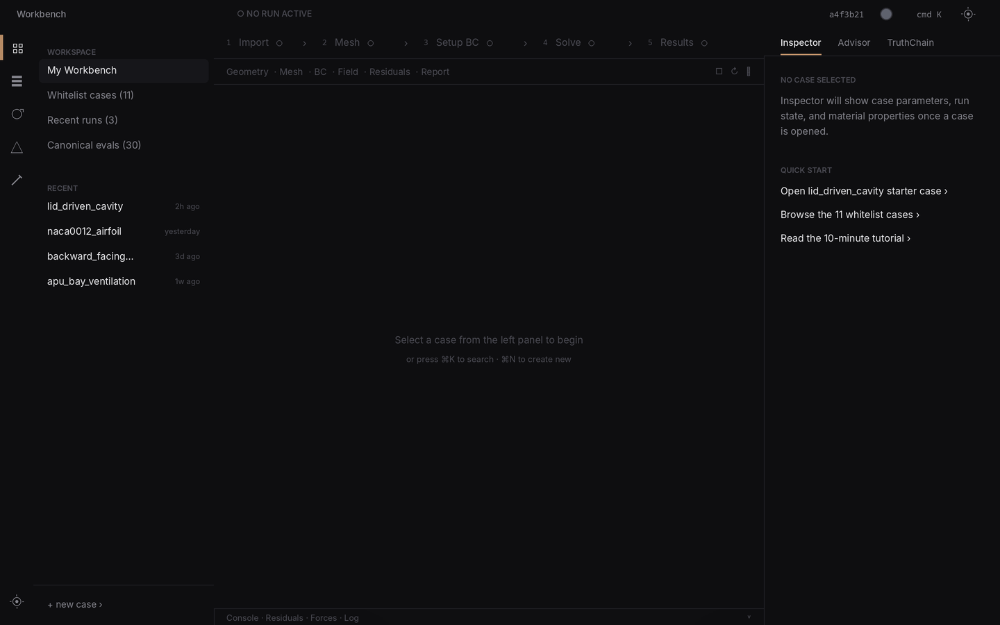
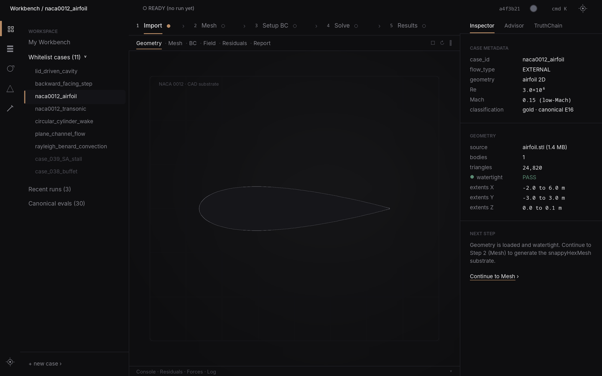
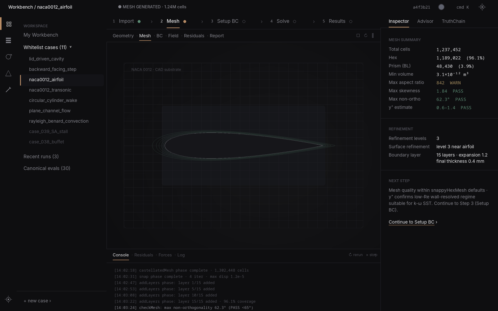
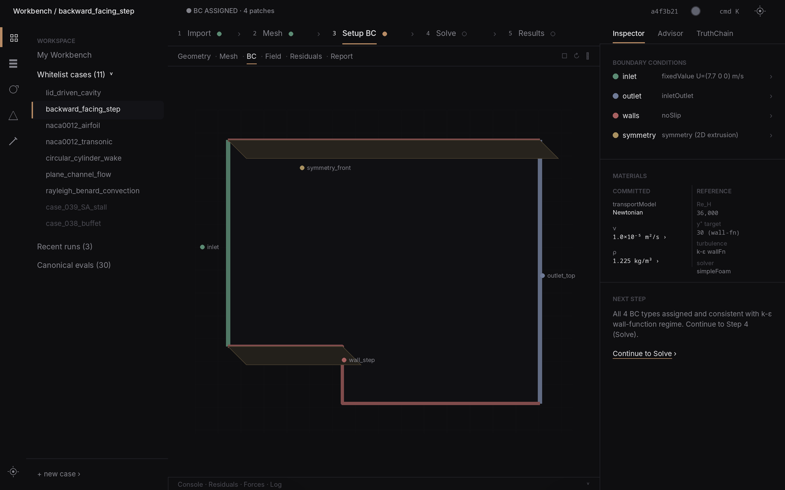
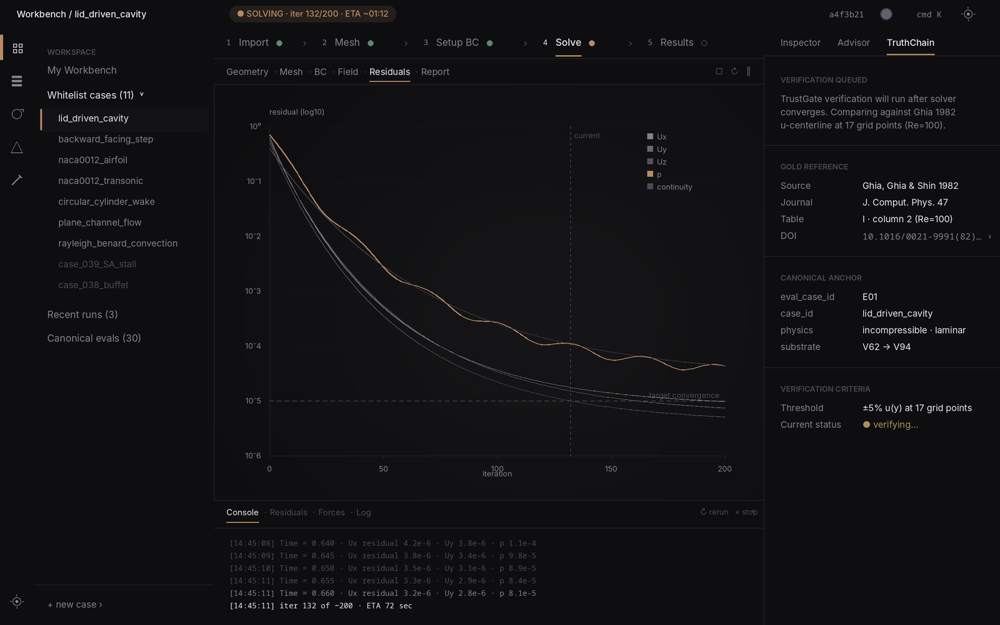
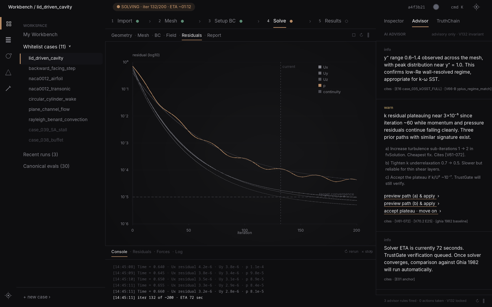
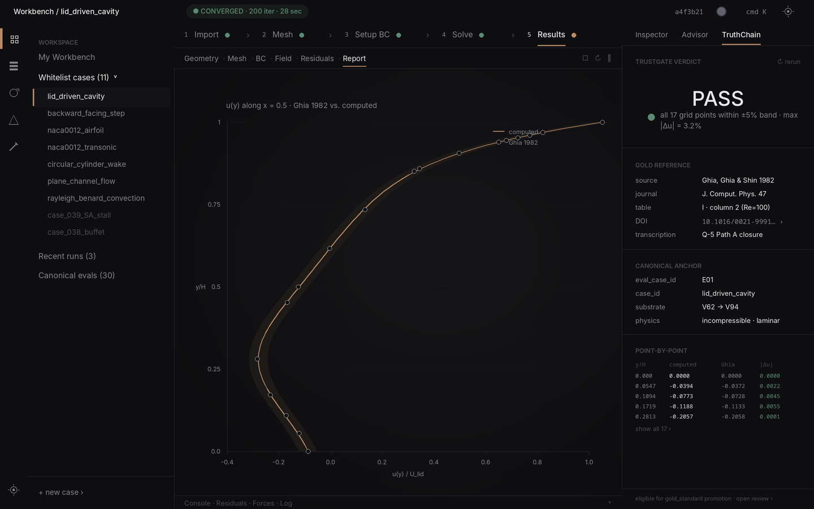
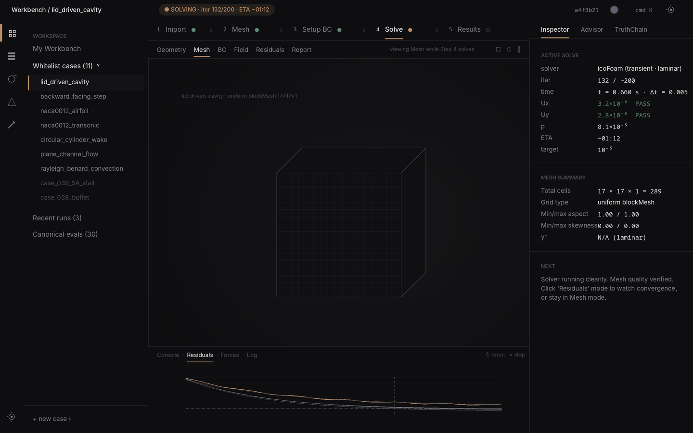

# Blueprints v3 · Visual Contract Index

> **Authored**: 2026-05-16 (post V70 close · pre V71)
> **Source**: GPT Image-2 renders from prompts in conversation transcript
> **Status**: ACCEPTED — these 8 images are the **visual SSOT** for V71+ workbench UI implementation
> **Predecessors**: `/Users/Zhuanz/Downloads/cfd_harness_workbench_ui_concept.svg` (v1, blueprint-v3 §4 four-region layout SVG)
> **Anti-fraud rule**: any V71+ UI implementation arc that touches workbench surface must reference one or more of these images by number in its DEC + commit message. PR/sub-DECs that drift from these images need a written justification in the DEC body.

## How to read this file

Each image is a frozen visual contract for one specific aspect of the workbench. The contract has 5 fields:

- **Image**: PNG path
- **Locks**: what visual/architectural claims this image makes binding
- **Don't drift on**: specific elements that must NOT change without DEC ratification
- **Implementation task home**: which V71+ arc/sub-DEC delivers the code to match this image
- **Acceptance test**: how a future PR is judged compliant with this image

## v3 architectural fundamentals (locked by image 01)

Per Image 01 these are the **load-bearing structural claims** of the workbench. Every V71+ UI surface must respect these:

1. **TopBar** · 40px tall · always visible · holds breadcrumb + run-state pill + git SHA + ⌘K + settings
2. **Activity Bar** · 48px wide · always visible left edge · 6 icons (Workbench / Catalog / Runs / Benchmarks / Tutorial / Settings)
3. **Left Panel** · ~260px wide · collapsible · default-expanded · context-dependent content per Activity selection
4. **Center workspace** · auto-fill · contains:
   - 5-Step Pipeline Strip (44px tall · always visible in workbench mode)
   - Viewport Mode Toolbar (36px tall · always visible in workbench mode)
   - Main canvas (3D viewport · chart · or data table depending on Step + viewport mode)
   - Bottom Panel toggle bar at bottom of center
5. **Right Panel** · ~340px wide · collapsible · default-expanded · 3 tabs `Inspector · Advisor · TruthChain`
6. **Bottom Panel** · 180px tall · collapsible · default-collapsed at Step 1-3 · default-expanded at Step 4+ · 4 tabs `Console · Residuals · Forces · Log`

Palette:
- Background `#0e0e10` · Surface elev1 `#16161a` · Border subtle `#232328`
- Text primary `#e8e8eb` · secondary `#82828a` · tertiary `#4a4a52`
- **Single accent**: sand-coral `#b78b65` — used in <2% of pixels for active step / active viewport mode / active tab / currently-running indicator
- CFD-domain semantic (low-saturation):
  - inlet/PASS `#5b8a73` · wall/FAIL `#a66060` · symmetry/warn `#a89060` · custom/info `#6f7a96`

Typography:
- Body Inter 14px · Secondary Inter 13px · Section label Inter 11px UPPERCASE + 0.08em letter-spacing
- Numbers JetBrains Mono · tabular-nums · right-aligned in columns
- Hero (case name in TopBar): Inter 15px / weight 500

---

## Image 01 · `01-empty-shell.png` · Default empty state

**Locks**: the **persistent 4-panel architecture**. Every workbench page renders this skeleton regardless of case state.

**Don't drift on**:
- Activity Bar 48px wide · 6 icons stacked with subtle gaps · Workbench icon active with sand-coral 4px left-border indicator
- Left Panel sections `WORKSPACE` (4 items) + `RECENT` (4 case rows · timestamp right-aligned in text-tertiary)
- TopBar layout: breadcrumb left · run-state pill center-left · SHA/user/⌘K/gear right
- 5-Step Pipeline Strip with chevron `›` separators · all pending state (`○ ○ ○ ○ ○`) when no case loaded
- Viewport Mode Toolbar with 6 modes separated by `·` dots
- Right Panel 3-tab strip · Inspector active by default with empty-state guidance message
- Bottom Panel toggle bar visible at bottom of center · 4 tab names visible in text-tertiary (collapsed)
- `+ new case ›` link at bottom of Left Panel

**Implementation task home**: **V71.A · Workbench Shell** — author `<WorkbenchShell>` React component with the 4-panel grid · CSS Grid template-columns `48px 260px 1fr 340px` · template-rows `40px 1fr` · panels collapsible via state hooks.

**Acceptance test**: open `/workbench` in dev server · viewport screenshot matches Image 01 with the empty-state copy. Pixel-diff against this image's downscaled fingerprint should hold ≥0.95 SSIM after V71.A lands.

---

## Image 02 · `02-import.png` · Step 1 Import · case loaded with Inspector metadata

**Locks**: the **per-case loaded state** — Left Panel expands `Whitelist cases` inline showing children, current case has sand-coral left-indicator, Inspector shows full case metadata + geometry stats + next-step guidance.

**Don't drift on**:
- Left Panel `Whitelist cases (11)` expanded with chevron `˅` · 11 child case names indented 16px · currently-selected case (e.g., `naca0012_airfoil`) has 2px sand-coral left-border
- 5-Step Pipeline Strip: Step 1 has sand-coral ◐ active dot + 2px sand-coral underline · steps 2-5 have empty ○ dots in text-secondary
- Viewport Mode Toolbar: "Geometry" active (sand-coral underline) · others text-secondary
- Main canvas: 3D geometry rendered in muted neutral gray (#16161a fill, #232328 wireframe) · NO BC color coding (Step 1, patches unassigned) · airfoil profile centered with dark space surrounding
- Inspector sections (in this order): `CASE METADATA` · `GEOMETRY` · `NEXT STEP`
- Each Inspector section: 11px UPPERCASE text-tertiary label · then key-value rows with key in text-secondary on left + value in text-primary (or JetBrains Mono for numbers) on right · 32px row height
- `watertight: PASS` rendered with dusty green `#5b8a73` ● 8px before "PASS"
- `Continue to Mesh ›` text link with sand-coral underline at bottom of Inspector

**Implementation task home**:
- **V71.B · CaseBrowser** — expandable tree under Workspace sections · cases keyed by `case_id` · sand-coral left-indicator for active case
- **V71.C · InspectorPanel base** — section-divided scrollable column · 11px UPPERCASE labels · key-value row primitive
- **V71.D · StepOneImport** — geometry viewport in neutral substrate render + Inspector data from `/api/cases/:id` metadata

**Acceptance test**:
- `e2e/v71-workbench-shell.spec.ts` opens `/workbench/case/naca0012_airfoil?step=1` and asserts:
  - data-testid `case-browser-item-naca0012_airfoil[data-active=true]` exists
  - data-testid `pipeline-step-1[data-state=active]` exists with sand-coral underline (computed style)
  - data-testid `inspector-section-case-metadata` and `inspector-section-geometry` are visible
  - data-testid `next-step-link[href*="step=2"]` exists

---

## Image 03 · `03-mesh.png` · Step 2 Mesh · viewport wireframe + Inspector quality table + bottom Console log

**Locks**: the **multi-panel concurrent workflow** — viewport (mesh wireframe) + Inspector (quality table) + Bottom Panel (Console streaming snappyHexMesh log) all visible simultaneously. This is the workbench's core value: three information sources at once.

**Don't drift on**:
- Step 2 has sand-coral ◐ active · Step 1 has dusty green `#5b8a73` ● (passes) · Step 3-5 empty ○
- Viewport Mode Toolbar: "Mesh" active
- Main canvas: airfoil mesh wireframe rendered in `#3a3a42` base with subtle refinement intensity differences (3 levels) · prism BL layers visible near surface
- Inspector sections: `MESH SUMMARY` · `REFINEMENT` · `NEXT STEP`
- Mesh quality table rows: numbers right-aligned monospace · pass/warn dots inline (dusty green ✓ for pass · dusty amber ⚠ for warn) · e.g., `Max aspect ratio  842 ⚠`
- **Bottom Panel EXPANDED** (180px tall) · `Console` tab active with sand-coral underline · monospace 11px JetBrains Mono log lines · most recent line text-primary · older lines fade to text-tertiary
- Right edge of bottom panel: `↻ rerun` · `× clear` · `˄ collapse` controls in text-tertiary

**Implementation task home**:
- **V71.E · BottomPanel** — collapsible panel below viewport · 4 tabs · default-expanded post-Step-4 · default-collapsed Step 1-3 except when user expands manually
- **V71.F · ConsoleTab** — virtualized log stream renderer · streaming append from `/api/runs/:id/console` SSE · time-decay fade older lines
- **V71.G · MeshQualityInspector** — quality table primitive with semantic pass/warn dot inline

**Acceptance test**:
- After mesh generation, e2e asserts: `bottom-panel[data-collapsed=false]` · `console-tab[data-active=true]` · streaming log lines present · `inspector-mesh-summary` shows ≥6 quality rows.

---

## Image 04 · `04-bc.png` · Step 3 Setup BC · color-coded patches + MaterialCard two-column

**Locks**: the **BC color-coding spec** + the **MaterialCard inline two-column layout** (committed left · reference right, derived values dimmer).

**Don't drift on**:
- Patch coloring in viewport using exact dusty palette:
  - INLET `#5b8a73` dusty green
  - OUTLET `#6f7a96` dusty steel blue
  - WALLS `#a66060` dusty red
  - SYMMETRY `#a89060` dusty amber
- Patches rendered at ~40% surface fill opacity · wireframe still visible underneath
- Small floating patch labels in Inter 11px text-secondary (e.g., `inlet`, `wall_step`, `symmetry_front`, `outlet_top`)
- Inspector `BOUNDARY CONDITIONS` section: 4 rows with leading ● dots matching viewport patch colors · row format `● name  BC-type-summary  ›`
- Inspector `MATERIALS` section: TWO columns side by side · 11px text-tertiary UPPERCASE headers `COMMITTED` (left) + `REFERENCE (derived)` (right) · 1px hairline vertical divider · derived column rendered in text-secondary (signals "not editable here")
- COMMITTED rows have `›` suffix (click to edit inline) · REFERENCE rows have NO suffix (read-only)

**Implementation task home**:
- **V71.H · BCViewportLayer** — viewport overlay that surface-tints patches by BC type with the locked dusty palette · tokenize colors in Tailwind config
- **V71.I · MaterialCard inline** — two-column layout · committed values editable inline via row-click · reference auto-recomputes from committed on change

**Acceptance test**:
- visual-baseline PNG diff against `04-bc.png` ≤ 0.01 pixel-diff ratio
- e2e: clicking a patch in viewport opens inline-edit row in Inspector BC list (NOT a side modal)

---

## Image 05 · `05-solve.png` · Step 4 Solve in flight · residuals chart + streaming console + TruthChain queued

**Locks**: the **active-solve aesthetic** — one large residuals chart, streaming console below, TruthChain tab showing verification queued state.

**Don't drift on**:
- TopBar run-state pill: sand-coral tint (~15% opacity fill) "● SOLVING · iter N/M · ETA ~mm:ss"
- Step 4 sand-coral ◐ active dot with subtle pulse indicator
- Viewport Mode Toolbar: "Residuals" active
- Main canvas: ONE large residuals chart filling canvas · 5 lines (Ux Uy Uz p continuity) · p curve in sand-coral (the actively-watched residual) · others text-secondary
  - Y-axis log10 from 10⁰ to 10⁻⁶ · gridlines #232328
  - X-axis iteration 0-200
  - Dashed horizontal at 10⁻⁵ labeled "target convergence" in text-tertiary
  - Dotted vertical at current iter labeled "current" in text-tertiary
  - Legend top-right of chart with 5 entries
- Bottom Panel EXPANDED · Console active · streaming solver log
- Right Panel **TruthChain** tab active (NOT Inspector) — verification queued state with sections:
  - `VERIFICATION QUEUED` (paragraph)
  - `GOLD REFERENCE` (Ghia/journal/table/DOI)
  - `CANONICAL ANCHOR` (eval_case_id/case_id/physics/substrate)
  - `VERIFICATION CRITERIA` (threshold · current status "verifying...")

**Implementation task home**:
- **V71.J · ResidualsChart** — log-scale multi-line chart · sand-coral accent for actively-watched curve · accept which-curve-is-watched as engineer setting
- **V71.K · TruthChainTab** — right-panel tab showing verification state · queued/in-progress/PASS/FAIL renderings
- **V71.L · SolveRunOrchestrator** — kicks off solver via `/api/runs/:id/start` · streams console to BottomPanel · updates residuals chart from streaming JSON

**Acceptance test**:
- e2e starts a solve, asserts residuals chart re-renders within 2s of iter update, console tab streams lines, TruthChain tab shows "verifying..." until convergence.

---

## Image 06 · `06-advisor.png` · Right-panel Advisor tab · 3 findings inline · V130/V132 invariant visualized

**Locks**: the **AI Advisor's actual UI layout** — peer tab in right panel (NOT modal, NOT slash-only, NOT auto-execute). This is the V130/V132 invariant rendered as UI.

**Don't drift on**:
- Right Panel "Advisor" tab active (sand-coral underline) · "Inspector" + "TruthChain" tabs text-secondary
- Advisor content header: 11px UPPERCASE text-tertiary `AI ADVISOR` on left · 11px text-tertiary `advisory only · V132 invariant` on right
- 1px hairline border below header
- Scrollable findings list · each finding as a card-like section · 24px padding inside · separated by 1px hairlines · 16px gap between cards
- Each finding has:
  - Tiny 11px tag at top-left: `info` (text-secondary) · `warn` (dusty amber `#a89060`) · `error` (dusty red `#a66060`)
  - Body paragraph in Inter 14px text-primary · paragraph form NOT bullet list
  - Citation footnote row in text-secondary 11px with format `cites · "[V-row · case · DOI]"` · subtle hairline underline on each citation (clickable)
  - For actionable findings: one or more quiet text links in text-primary with sand-coral underline · format `preview path X & apply ›` or `accept · move on ›`
  - **NEVER**: large button styles · "Auto-fix" · "Run for me" · "Apply all"
- Bottom of Advisor area: 1px top hairline · footer text-tertiary 11px `N advisor rules fired · 0 actions taken · all suggestions advisory · V132 locked`

**Implementation task home**:
- **V71.M · AdvisorTab** — right-panel tab · fetches `/api/cases/:id/ai-review` advisor findings · renders paragraph + citations + preview-apply links (NO action buttons by design)
- **V71.N · AdvisorFinding component** — props `severity` (info/warn/error) · `body` · `citations[]` · `actions[]` where each action is `{label, previewPath}` rendering as quiet text link
- **V71.O · AdvisorRegressionTest** — visual baseline + e2e that asserts ZERO buttons with class `auto-execute` exist in advisor surface (V132 contract test)

**Acceptance test**:
- `e2e/v71-advisor-v132-invariant.spec.ts` opens Advisor tab on a solving case · asserts:
  - `[data-advisor-finding]` count ≥ 1
  - Each finding has `[data-citation]` and at least one `[data-preview-apply-link]`
  - ZERO elements with `data-auto-execute=true` or `data-action-button=true` (must not exist)
  - Footer text matches regex `\d+ advisor rules fired · 0 actions taken · all suggestions advisory · V132 locked`

---

## Image 07 · `07-results.png` · Step 5 Results · u-centerline gold comparison + TrustGate PASS

**Locks**: the **verdict-presentation surface** — single comparison chart focus + TrustGate verdict prominent in TruthChain tab + point-by-point table.

**Don't drift on**:
- TopBar run-state pill: dusty green tint "● CONVERGED · N iter · M sec"
- 5-Step strip: all steps with dusty green ● except Step 5 with sand-coral ◐ active
- Viewport Mode Toolbar: "Report" active
- Main canvas: ONE comparison chart with:
  - Title `u(y) along x = 0.5 · Ghia 1982 vs. computed` (Inter 13px text-secondary)
  - Two overlaid curves: computed in sand-coral solid · reference as text-secondary open circles (8px diameter, 1.5px stroke)
  - ±5% band rendered as very-low-opacity sand-coral fill around computed curve
  - Legend top-right with 2 entries
- Right Panel TruthChain tab active:
  - `TRUSTGATE VERDICT` header
  - HUGE verdict word "PASS" in Inter 36px / weight 500 / text-primary · centered vertically · 60px padding
  - Below: dusty green `#5b8a73` ● 12px + 13px text-secondary `all 17 grid points within ±5% band · max |Δu| = 3.2%`
  - `GOLD REFERENCE` section (source/journal/table/DOI/transcription)
  - `CANONICAL ANCHOR` section (eval_case_id/case_id/substrate/physics regime)
  - `POINT-BY-POINT` section: compact 5-row table with columns `y/H · u computed · u Ghia · |Δu|` · all numbers JetBrains Mono right-aligned tabular-nums · `show all 17 ›` link in text-tertiary 11px
- Footer text-tertiary 11px: `verdict computed · case eligible for gold_standard promotion · [open promotion review ›]`

**Implementation task home**:
- **V71.P · ResultsCanvas** — gold-vs-computed comparison chart primitive · accepts `gold_points[]` + `computed_curve` + `tolerance_band` props
- **V71.Q · TrustGateVerdict component** — large verdict display (PASS/FAIL/INCONCLUSIVE) · semantic color dot · summary line · provenance sections · point-by-point comparison table
- **V71.R · GoldPromotionPath** — `[open promotion review ›]` link routes to a promotion workflow (separate sub-DEC)

**Acceptance test**:
- e2e on converged case asserts `[data-trustgate-verdict=PASS]` exists · `[data-pointwise-comparison]` has ≥5 visible rows · `[data-promotion-link]` href matches `/workbench/case/:id/promotion`
- Visual baseline diff ≤ 0.01

---

## Image 08 · `08-cross-step.png` · Cross-step inspection · solver running, viewport in Mesh mode, residuals in Bottom Panel

**Locks**: the **workbench's defining workflow capability** — engineer can switch viewport mode WITHOUT leaving the active step. This is what makes it a workbench (vs a wizard).

**Don't drift on**:
- Step 4 still sand-coral active (solver still running — pipeline state doesn't change)
- TopBar pill still "● SOLVING · iter N/M · ETA ~mm:ss"
- Viewport Mode Toolbar: "Mesh" now active (sand-coral underline) — engineer manually switched away from default "Residuals" mode
- Subtle text-tertiary 11px hint to right of toolbar: `viewing Mesh while Step 4 solves`
- Main canvas: clean mesh wireframe view of the current case (e.g., 17×17 blockMesh cube for lid_driven_cavity)
- Bottom Panel EXPANDED · **Residuals tab active** (not Console) — proving the engineer can park the residuals chart in bottom panel while viewport shows mesh
- Bottom Panel residuals content: compact version of the full chart from Image 05 · 5 lines still converging · current iter marker
- Right Panel **Inspector** tab active showing BOTH:
  - `ACTIVE SOLVE` section (solver/iter/time/residuals/ETA/target — current solve state)
  - `MESH SUMMARY` section (mesh quality — because viewport is in Mesh mode)
  - `NEXT` paragraph

**Implementation task home**:
- **V71.S · ViewportModeRouter** — viewport mode is INDEPENDENT of pipeline step · engineer can set any viewport mode at any step · default mode per step but override persists for that case session
- **V71.T · InspectorContextual** — Inspector content adapts to BOTH current step AND current viewport mode · for cross-step inspection, show both `ACTIVE SOLVE` (step context) + relevant-to-viewport-mode section (e.g., MESH SUMMARY when Mesh mode)
- **V71.U · BottomPanelTabState** — Bottom Panel remembers user's last-selected tab per case · when engineer switches viewport mode, Bottom Panel doesn't reset

**Acceptance test**:
- e2e starts solve, engineer clicks Mesh viewport mode while solving, asserts:
  - Step 4 still active (`[data-pipeline-active=4]`)
  - Viewport mode is mesh (`[data-viewport-mode=mesh]`)
  - Bottom Panel residuals tab is selected (`[data-bottom-tab=residuals]`)
  - Inspector shows BOTH `[data-inspector-section=active-solve]` AND `[data-inspector-section=mesh-summary]` simultaneously
  - Solver doesn't pause / interrupt

---

## V71+ implementation backlog summarized (derived from images)

This is the implementation task ledger derived from these 8 images. Future V71 charter should pick the order; this is the menu.

| Task ID | Title | Image anchor(s) | Estimated scope |
|---|---|---|---|
| V71.A | WorkbenchShell 4-panel grid | 01 | core scaffolding · ~1-2 days |
| V71.B | CaseBrowser tree | 01, 02 | ~half day |
| V71.C | InspectorPanel base | 02-08 | ~half day |
| V71.D | StepOneImport surface | 02 | ~half day |
| V71.E | BottomPanel collapsible | 01, 03, 05, 08 | ~half day |
| V71.F | ConsoleTab streaming | 03, 05 | ~half day (depends on SSE backend) |
| V71.G | MeshQualityInspector | 03 | ~half day |
| V71.H | BCViewportLayer color coding | 04 | ~half day (depends on viewport substrate) |
| V71.I | MaterialCard inline 2-column | 04 | ~half day |
| V71.J | ResidualsChart | 05, 08 | ~1 day (chart primitive new) |
| V71.K | TruthChainTab base | 05, 07 | ~half day |
| V71.L | SolveRunOrchestrator | 05 | ~1-2 days (SSE wire) |
| V71.M | AdvisorTab | 06 | ~half day |
| V71.N | AdvisorFinding component | 06 | ~half day |
| V71.O | AdvisorRegressionTest (V132 contract) | 06 | ~half day |
| V71.P | ResultsCanvas gold-vs-computed | 07 | ~half day |
| V71.Q | TrustGateVerdict component | 07 | ~half day |
| V71.R | GoldPromotionPath (deferred) | 07 | sub-DEC of its own |
| V71.S | ViewportModeRouter (decouple from step) | 08 | ~half day |
| V71.T | InspectorContextual (step + mode aware) | 08 | ~half day |
| V71.U | BottomPanelTabState persistence | 08 | ~half day |

**Total V71 scope**: ~10-15 working days (one full V71 arc executed as 5-8 sub-DECs).

## Reverse-stop rules anchored in this index

Per V70 charter §6 anti-fraud pattern, any V71+ implementation that does ANY of the following without explicit charter rationale is a reverse-stop trigger:

1. Adds a persistent panel beyond the 4 documented (Activity / Left / Center / Right) + optional Bottom
2. Removes any of the 6 viewport modes
3. Removes any of the 5 pipeline steps
4. Adds an `auto-execute` / `AI runs solver` / `Auto-fix` button in the Advisor surface (V132 invariant violation)
5. Uses an accent color other than sand-coral `#b78b65` (multiple competing accents)
6. Uses semantic colors at higher saturation than the dusty palette specified
7. Removes the "advisory only · V132 invariant locked" footer phrase from the Advisor tab

## Pixel-diff visual regression strategy

Each of the 8 images can be regenerated by Playwright as visual baselines once the V71 implementation lands. Recommended baseline names (extending the existing `__visual_baselines__/chromium/visual-baseline.spec.ts-snapshots/` sequence):

| Image | Future baseline name |
|---|---|
| 01 | `23-v3-empty-shell.png` |
| 02 | `24-v3-step1-import.png` |
| 03 | `25-v3-step2-mesh.png` |
| 04 | `26-v3-step3-bc.png` |
| 05 | `27-v3-step4-solve.png` |
| 06 | `28-v3-advisor-tab.png` |
| 07 | `29-v3-step5-results.png` |
| 08 | `30-v3-cross-step.png` |

Total baselines after V71: 22 → 30 PNG. This satisfies V72 visualization ≥30 PNG threshold (if V72 charter mandates further breadth).

## Acceptance of these blueprints

**Status**: ACCEPTED as visual SSOT for V71+ workbench UI. Any drift requires DEC.

— Blueprints v3 INDEX · 2026-05-16 · post-V70-close · pre-V71
