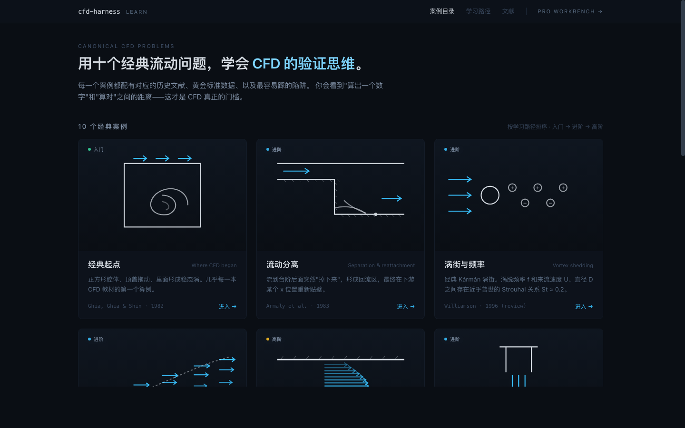
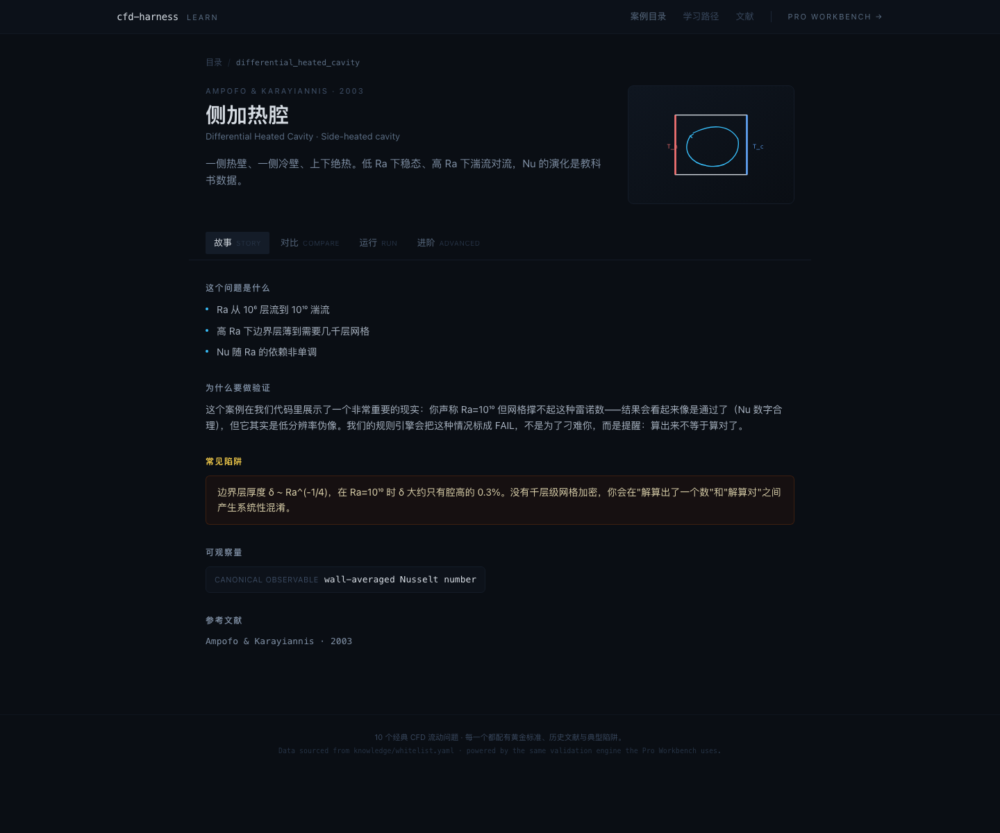
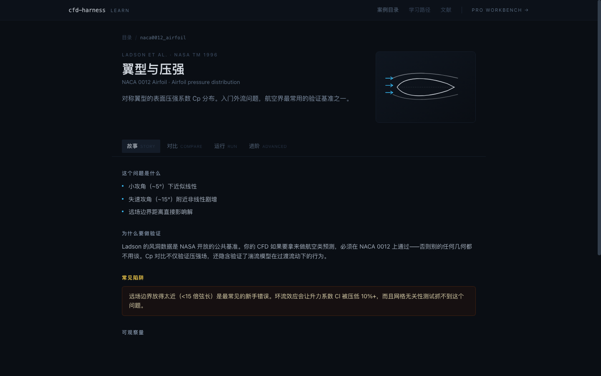
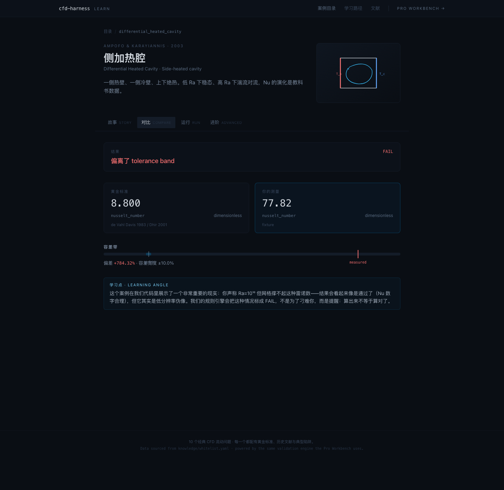
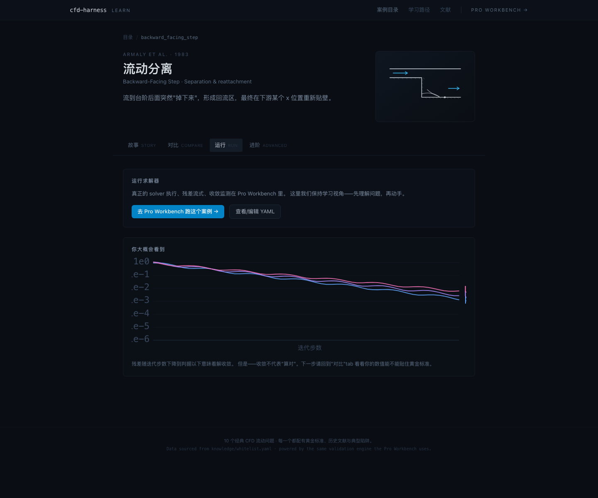
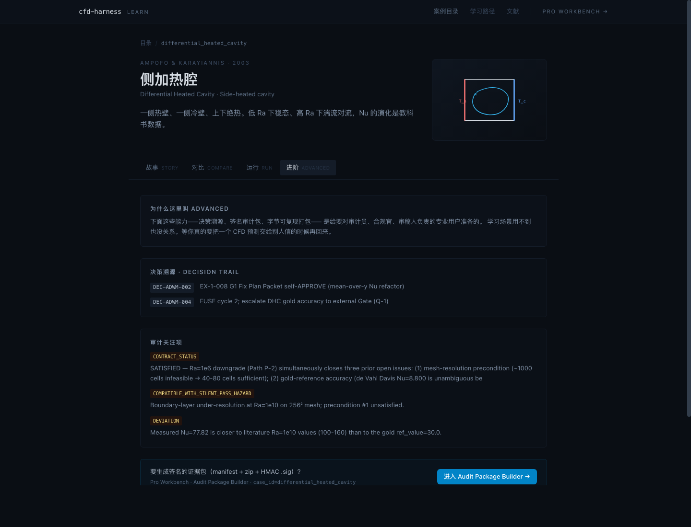

# Learn Demo — student-facing entry surface

Route tree: **`/learn`** (separate `LearnLayout` shell; never mixes with the Pro Workbench under `/`).

## Target audience
CFD students and self-learners. The product's evidence/audit features (signed bundles, decision trail, HMAC sidecars) are deliberately NOT on the front door — they live in the "Advanced" tab per case and behind the "Pro Workbench →" top-right link.

## Screens

### 1. Catalog home (`/learn`)
Ten canonical CFD problems as visual cards. Each card leads with a line-art SVG of the geometry (no photos, no icons, no marketing hero). Taglines are pedagogical ("经典起点" · "流动分离") not promotional.



### 2. Case detail — Story tab (default)
Physics bullets, rationale for validation, common pitfall callout, canonical observable as a mono chip.



NACA 0012 example showing airfoil illustration:



### 3. Case detail — Compare tab
Gold-vs-measured side-by-side, tolerance band with visible markers, deviation readout. Reframes PASS/FAIL as a learning moment — the "Learning angle" card below the band explains why this case produced what it did.



### 4. Case detail — Run tab
Explicitly punts real solver execution to the Pro Workbench — the student-facing view is a read-only preview of what residual streams look like and a link to the real runner. The inline residuals chart is SVG-only (no chart library).



### 5. Case detail — Advanced tab
Here live the features that used to be on the front page of the previous "regulated-industry" framing: decision trail, audit concerns, and a clear bridge to the Audit Package Builder. Marked as Advanced so the casual learner can skip it without confusion.



## Design language

- Dark surface palette (reuses existing `surface-*` / `contract-*` Tailwind tokens from `tailwind.config.ts`).
- Line-art SVG illustrations (`src/components/learn/CaseIllustration.tsx`), one per case_id. Strokes only, no fills except for hot-wall / cold-wall indicators on DHC.
- Mono font (JetBrains Mono) reserved for deterministic strings only: case_id, observable names, citations, deviation percentages.
- Softer typographic rhythm than Pro Workbench — looser spacing, larger line-height, no dense sidebar.
- Bilingual labeling: Chinese primary, English secondary (e.g., tab labels read "故事 STORY / 对比 COMPARE").

## Route wiring

```tsx
<Route path="/learn" element={<LearnLayout />}>
  <Route index element={<LearnHomePage />} />
  <Route path="cases/:caseId" element={<LearnCaseDetailPage />} />
</Route>
```

Tabs are URL-addressable via `?tab=story|compare|run|advanced` so screenshots and deep-links remain stable.

## Files added

| Path | Purpose |
|---|---|
| `src/data/learnCases.ts` | Narrative metadata per case (headline, teaser, physics bullets, why-it-matters, common pitfall). Ordering is pedagogical (intro → core → advanced). |
| `src/components/learn/CaseIllustration.tsx` | 10 inline SVG geometry illustrations, dispatched by `case_id`. |
| `src/components/learn/LearnLayout.tsx` | Student-facing shell (top-nav, softer than Pro Workbench sidebar). |
| `src/pages/learn/LearnHomePage.tsx` | Catalog grid (1 / 2 / 3-col responsive). |
| `src/pages/learn/LearnCaseDetailPage.tsx` | Case detail with 4 tabs + live `ValidationReport` fetch for Compare/Advanced. |

## What stayed unchanged

- `src/App.tsx` gained two routes; no existing route was removed.
- Pro Workbench (`/`, `/cases`, `/cases/:id/report`, `/cases/:id/edit`, `/runs`, `/decisions`, `/audit-package`) is byte-identical.
- `ui/backend/*` is untouched — the demo consumes the same `GET /api/cases/:id` + `GET /api/validation-report/:id` endpoints already in Phase 0.
- `knowledge/whitelist.yaml` + `knowledge/gold_standards/**` — NOT TOUCHED.
