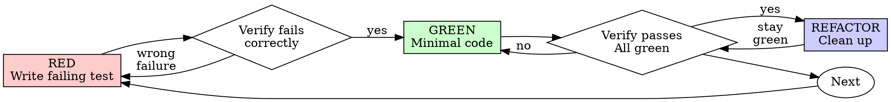
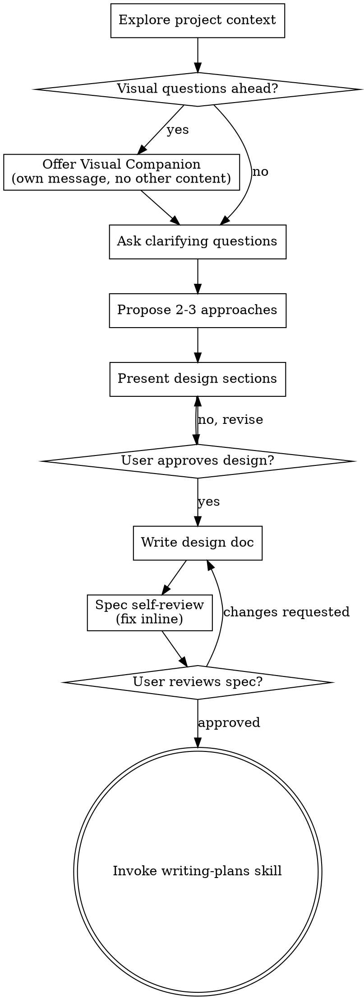

2026-04-22T11:24:05.559301Z ERROR codex_core::codex: failed to load skill /Users/Zhuanz/.agents/skills/cfd-research-deerflow/SKILL.md: missing YAML frontmatter delimited by ---
2026-04-22T11:24:05.559325Z ERROR codex_core::codex: failed to load skill /Users/Zhuanz/.agents/skills/cfd-report-pretext/SKILL.md: missing YAML frontmatter delimited by ---
OpenAI Codex v0.118.0 (research preview)
--------
workdir: /Users/Zhuanz/Desktop/cfd-harness-unified
model: gpt-5.4
provider: openai
approval: never
sandbox: workspace-write [workdir, /tmp, $TMPDIR, /Users/Zhuanz/.codex/memories]
reasoning effort: xhigh
reasoning summaries: none
session id: 019db4ee-e164-79a2-adf4-3daf953e8fbd
--------
user
# [CLAUDE → CODEX TOOL INVOCATION]

    from: claude-code-opus47 (Main Driver v6.2)
    to: codex-gpt54-xhigh (Joint Dev Peer · §A Diff Generator)
    task: "DEC-V61-045 Wave 1 Invocation A — convergence_attestor.py fixes"
    contract: Notion DEC-V61-045 PROPOSAL
    spec: .planning/decisions/2026-04-22_phase8_dec045_attestor_gates_blocker_fixes_PROPOSAL.md
    upstream_findings:
      - reports/codex_tool_reports/20260422_dec038_codex_review.md (BLOCK, 5 blockers)
    scope_tracks:
      - Track 1: Land YAML loader (CA-004 remediation)
      - Track 4: A1 consumes exit_code (CA-003 remediation)
      - CA-005 partial: A3 per-field residual targets
      - CA-006 nit: A6 "stuck" uses <= 1.0 not < 1.0
      - CA-007 nit: A4 gap-block consecutiveness fix

    allowed_files:
      - src/convergence_attestor.py           (primary edit surface)

    read_only_context:
      - knowledge/attestor_thresholds.yaml    (YAML schema Claude pre-wrote; loader must parse this)
      - src/comparator_gates.py               (parse_solver_log consumer; don't modify)
      - src/foam_agent_adapter.py             (ExecutionResult shape reference; don't modify)
      - reports/codex_tool_reports/20260422_dec038_codex_review.md  (findings source)
      - scripts/phase5_audit_run.py           (caller; backward-compat target but DON'T EDIT)
      - ui/backend/tests/test_convergence_attestor.py (existing test shape; DON'T EDIT — separate invocation)

    forbidden_files:
      - any file not in allowed_files list (read-only context is OK to read, NOT edit)
      - especially: knowledge/gold_standards/** (hard-floor 1)
      - especially: tests/** and ui/backend/tests/** (separate Codex invocation)
      - especially: scripts/phase5_audit_run.py (Wave 2/3 scope)

    autonomy: TOOL-SCOPE (within src/convergence_attestor.py, full architectural freedom)

---

## Detailed work spec

### 1. Thresholds dataclass + loader (Track 1)

Add a dataclass `Thresholds` matching the YAML schema. Add a loader function that reads `knowledge/attestor_thresholds.yaml`, applies per-case overrides, and returns a resolved `Thresholds` instance. Loader is idempotent and cacheable (module-level cache acceptable; invalidation on case_id change).

```python
@dataclass(frozen=True)
class Thresholds:
    continuity_floor: float
    residual_floor: float
    residual_floor_per_field: dict[str, float]  # field → target; defaultdict-like
    iteration_cap_detector_count: int
    bounding_recurrence_frac_threshold: float
    bounding_recurrence_window: int
    no_progress_decade_frac: float
    no_progress_window: int
    promote_to_fail: frozenset[str] = field(default_factory=frozenset)
    case_id: Optional[str] = None   # for logging/debug only

def load_thresholds(
    case_id: Optional[str] = None,
    yaml_path: Optional[Path] = None,
) -> Thresholds:
    """Load YAML and resolve per-case overrides. Returns defaults-only
    instance if case_id is None or case not present in YAML."""
```

Design constraints:
- Use `yaml.safe_load` (import `yaml`; it's available — project dep).
- Default YAML path: `Path(__file__).resolve().parent.parent / "knowledge" / "attestor_thresholds.yaml"` (repo-relative).
- If YAML missing → return hardcoded-constant defaults + log WARN. Do NOT raise.
- If YAML schema_version != 1 → log WARN but continue with best-effort parse.
- Unknown top-level keys in YAML → log WARN, continue.
- Unknown per-field keys in residual_floor_per_field → accept (forward-compat).
- `promote_to_fail` is a list in YAML; convert to frozenset.
- Merge logic for per_case override:
  - Start with defaults
  - For each key in per_case[case_id], override defaults
  - For residual_floor_per_field: per-case dict REPLACES defaults (not merge) — document this choice explicitly in code comment. If you think merge is safer, implement merge and justify in your response.
  - Actually: recommended implementation is MERGE (per_case values override, unmentioned defaults preserved). Please use merge semantics.

### 2. `_check_a1_solver_crash` — consume exit code (Track 4)

Current signature: `_check_a1_solver_crash(log_path: Path) -> AttestorCheck`

New signature: `_check_a1_solver_crash(log_path: Path, execution_result: Any = None) -> AttestorCheck`

Semantics:
- If `execution_result is not None`:
  - Check `getattr(execution_result, "success", None)`. If `False` → FAIL with concern_type `SOLVER_CRASH_LOG` and evidence includes exit_code if available (`getattr(execution_result, "exit_code", None)`).
- Then ALSO check log for FATAL markers (independent signal).
- FAIL verdict if EITHER exit indicates failure OR log has FATAL marker.
- Regex widen: currently only `^Floating point exception`. Expand to match:
  - `FOAM FATAL IO ERROR`
  - `FOAM FATAL ERROR`
  - `^Floating point exception`
  - `Floating exception` (anywhere)
- Avoid matching the startup banner `sigFpe : Enabling floating point exception trapping` (current code handles this; preserve).

Use duck-typing (`getattr`) — do NOT `from src.foam_agent_adapter import ExecutionResult` to avoid circular import risk. `execution_result` param typed as `Any = None`.

### 3. `_check_a3_residual_floor` — per-field targets (CA-005 partial)

Current: one `A3_RESIDUAL_FLOOR` for all fields.

New: pull per-field target from `thresholds.residual_floor_per_field.get(field_name, thresholds.residual_floor)`.

Field names seen in real logs: Ux, Uy, Uz, p, p_rgh, k, epsilon, omega, h, nuTilda, T.

Updated summary/detail strings should include the per-field target when reporting offenders (not just one global threshold).

### 4. CA-006: A6 decade check boundary

Current: `if decade_range < A6_PROGRESS_DECADE_FRAC` → FAIL (stuck).

New: `if decade_range <= thresholds.no_progress_decade_frac` → FAIL. Also use `thresholds.no_progress_decade_frac` not module constant.

### 5. CA-007: A4 gap-block consecutiveness

Current behavior per Codex finding: blocks with no pressure solve are filtered out before consecutive-check. So `[cap, gap, cap, cap]` looks like `[cap, cap, cap]` = 3 consecutive → A4 FAIL.

New behavior: preserve gap blocks in the sequence; streak resets to 0 on a gap. `[cap, gap, cap, cap]` = max streak 2 → A4 PASS.

Implement: walk the full per-block cap-count sequence (including `0` for gaps), count consecutive caps, track max streak, FAIL if `max_streak >= thresholds.iteration_cap_detector_count`.

### 6. Thread thresholds through all checks

All `_check_a[2-6]_*` take `thresholds: Thresholds` param. `_check_a1_*` takes `execution_result`. All module-constant uses (A2_CONTINUITY_FLOOR, A3_RESIDUAL_FLOOR, A5_*, A6_*) replaced by `thresholds.<field>`.

KEEP module constants for backward compat as defaults in `load_thresholds` fallback path (when YAML missing). Rename if naming clashes, but they should still exist.

### 7. `attest()` main function signature update

```python
def attest(
    log_path: Optional[Path],
    execution_result: Any = None,
    case_id: Optional[str] = None,
    thresholds: Optional[Thresholds] = None,
) -> AttestationResult:
    """Run all 6 checks and aggregate verdict.

    Parameters
    ----------
    log_path : Path or None
        Solver log. None → ATTEST_NOT_APPLICABLE.
    execution_result : Any, optional
        Duck-typed object with .success and .exit_code attrs. Used by A1.
    case_id : str, optional
        Whitelist case ID for per-case YAML override lookup.
    thresholds : Thresholds, optional
        Pre-resolved thresholds. If None, calls load_thresholds(case_id).
    """
```

Backward compat: `attest(log_path)` still works (execution_result=None, case_id=None, thresholds defaults).

---

## Acceptance Checks (CHK-N)

CHK-1: Existing `scripts/phase5_audit_run.py:383` caller `attestation = attest(solver_log)` must still work unchanged (no required new args).

CHK-2: Existing `ui/backend/tests/test_convergence_attestor.py` tests that call `attest(log)` should still pass without test modifications. If the tests had hardcoded old threshold constants (e.g., `A2_CONTINUITY_FLOOR`), those constants must still be importable at module level (even if internally the value comes from YAML).

CHK-3: `load_thresholds()` without args returns `Thresholds` instance with YAML-defaults values (not missing keys, not None values).

CHK-4: `load_thresholds("impinging_jet")` returns Thresholds with `residual_floor_per_field["p_rgh"] == 5.0e-3` (per-case override applied).

CHK-5: `load_thresholds("nonexistent_case_xyz")` returns Thresholds with defaults (no raise, no per-case lookup error).

CHK-6: If `knowledge/attestor_thresholds.yaml` is renamed/moved, `load_thresholds()` returns hardcoded-constant defaults and logs WARN (graceful degradation).

CHK-7: `_check_a1_solver_crash(log_path, execution_result=mock(success=False, exit_code=139))` returns `verdict=FAIL` regardless of log content.

CHK-8: `_check_a1_solver_crash(log_path, execution_result=mock(success=True))` with log containing `Floating exception` returns `verdict=FAIL` (log signal alone).

CHK-9: `_check_a3_residual_floor` on a log with `p_rgh Initial residual = 6e-3` + thresholds from `impinging_jet` → PASS (6e-3 <= 5e-3? No wait, 6e-3 > 5e-3. Let me redo: threshold for p_rgh=5e-3 case-override; final p_rgh residual=6e-3 > 5e-3 → HAZARD). Verify the per-field path is taken. Synthetic test data is fine.

CHK-10: CA-006: `_check_a6_no_progress` on a log where max decade_range across fields is exactly 1.0 → FAIL (not PASS). Previously `< 1.0` would have been PASS at 1.0.

CHK-11: CA-007: `_check_a4_iteration_cap` on a block sequence `[cap, gap, cap, cap]` (where gap has 0 pressure solves) returns PASS. Max consecutive = 2, below threshold 3.

CHK-12: `_check_a4_iteration_cap` on `[cap, cap, cap]` consecutive → FAIL as before.

CHK-13: `attest(None)` returns `overall=ATTEST_NOT_APPLICABLE` (unchanged behavior).

CHK-14: `attest(log, execution_result=mock(success=False))` returns `overall=ATTEST_FAIL` with A1 in checks even if log is otherwise clean.

## Reject Conditions (REJ-N)

REJ-1: Any edit to files outside `allowed_files`. In particular: do NOT edit scripts/, tests/, or ui/backend/.
REJ-2: Removing module-level A2/A3/A5/A6 constants (existing code imports them).
REJ-3: Changing `_check_a*` function NAMES (existing tests may import them directly).
REJ-4: Breaking backward compat for `attest(log_path)` one-arg call.
REJ-5: Importing ExecutionResult from foam_agent_adapter (circular import risk).
REJ-6: Making loader raise on missing YAML (must gracefully fall back).

## Output format

After applying changes, emit a structured report:

```
# Codex Diff Report — DEC-V61-045 Wave 1 A

## Files modified
- path/to/file [+N/-M lines]

## Changes summary
- bullet list per track

## Acceptance checks self-verified
- CHK-1: PASS/FAIL + evidence
- CHK-N: PASS/FAIL + evidence

## Deviations from spec (if any)
- [what deviated + why]

## Tokens used
<auto>
```

## Hints for implementation

- `from pathlib import Path` is already imported
- `yaml` import needs to be added
- Consider extracting `load_thresholds` to a helper module if convergence_attestor.py grows too large, but prefer keeping in one file for this DEC.
- Module-level cache: `@functools.lru_cache(maxsize=32)` on load_thresholds is fine if Thresholds is hashable (frozen dataclass with frozenset field is hashable; dict field is NOT — you may need to freeze the dict to tuple-of-pairs for hashability, or skip caching).
- For testability: expose `_DEFAULT_THRESHOLDS` at module level as the hardcoded fallback instance.

---

[/CLAUDE → CODEX TOOL INVOCATION]

codex
I’m taking the DEC-V61-045 Wave 1 A slice and will keep edits confined to `src/convergence_attestor.py`. First I’m pulling the spec, prior finding, memory pointers, and current implementation so I can patch the loader/threshold threading without breaking the existing `attest(log_path)` call shape.
exec
/bin/zsh -lc "sed -n '1,220p' /Users/Zhuanz/.codex/plugins/cache/openai-curated/superpowers/27651a43bf55185d924f7a1fc49043a0a8be65a0/skills/using-superpowers/SKILL.md" in /Users/Zhuanz/Desktop/cfd-harness-unified
 succeeded in 0ms:
---
name: using-superpowers
description: Use when starting any conversation - establishes how to find and use skills, requiring Skill tool invocation before ANY response including clarifying questions
---

<SUBAGENT-STOP>
If you were dispatched as a subagent to execute a specific task, skip this skill.
</SUBAGENT-STOP>

<EXTREMELY-IMPORTANT>
If you think there is even a 1% chance a skill might apply to what you are doing, you ABSOLUTELY MUST invoke the skill.

IF A SKILL APPLIES TO YOUR TASK, YOU DO NOT HAVE A CHOICE. YOU MUST USE IT.

This is not negotiable. This is not optional. You cannot rationalize your way out of this.
</EXTREMELY-IMPORTANT>

## Instruction Priority

Superpowers skills override default system prompt behavior, but **user instructions always take precedence**:

1. **User's explicit instructions** (CLAUDE.md, GEMINI.md, AGENTS.md, direct requests) — highest priority
2. **Superpowers skills** — override default system behavior where they conflict
3. **Default system prompt** — lowest priority

If CLAUDE.md, GEMINI.md, or AGENTS.md says "don't use TDD" and a skill says "always use TDD," follow the user's instructions. The user is in control.

## How to Access Skills

**In Claude Code:** Use the `Skill` tool. When you invoke a skill, its content is loaded and presented to you—follow it directly. Never use the Read tool on skill files.

**In Copilot CLI:** Use the `skill` tool. Skills are auto-discovered from installed plugins. The `skill` tool works the same as Claude Code's `Skill` tool.

**In Gemini CLI:** Skills activate via the `activate_skill` tool. Gemini loads skill metadata at session start and activates the full content on demand.

**In other environments:** Check your platform's documentation for how skills are loaded.

## Platform Adaptation

Skills use Claude Code tool names. Non-CC platforms: see `references/copilot-tools.md` (Copilot CLI), `references/codex-tools.md` (Codex) for tool equivalents. Gemini CLI users get the tool mapping loaded automatically via GEMINI.md.

# Using Skills

## The Rule

**Invoke relevant or requested skills BEFORE any response or action.** Even a 1% chance a skill might apply means that you should invoke the skill to check. If an invoked skill turns out to be wrong for the situation, you don't need to use it.


## Red Flags

These thoughts mean STOP—you're rationalizing:

| Thought | Reality |
|---------|---------|
| "This is just a simple question" | Questions are tasks. Check for skills. |
| "I need more context first" | Skill check comes BEFORE clarifying questions. |
| "Let me explore the codebase first" | Skills tell you HOW to explore. Check first. |
| "I can check git/files quickly" | Files lack conversation context. Check for skills. |
| "Let me gather information first" | Skills tell you HOW to gather information. |
| "This doesn't need a formal skill" | If a skill exists, use it. |
| "I remember this skill" | Skills evolve. Read current version. |
| "This doesn't count as a task" | Action = task. Check for skills. |
| "The skill is overkill" | Simple things become complex. Use it. |
| "I'll just do this one thing first" | Check BEFORE doing anything. |
| "This feels productive" | Undisciplined action wastes time. Skills prevent this. |
| "I know what that means" | Knowing the concept ≠ using the skill. Invoke it. |

## Skill Priority

When multiple skills could apply, use this order:

1. **Process skills first** (brainstorming, debugging) - these determine HOW to approach the task
2. **Implementation skills second** (frontend-design, mcp-builder) - these guide execution

"Let's build X" → brainstorming first, then implementation skills.
"Fix this bug" → debugging first, then domain-specific skills.

## Skill Types

**Rigid** (TDD, debugging): Follow exactly. Don't adapt away discipline.

**Flexible** (patterns): Adapt principles to context.

The skill itself tells you which.

## User Instructions

Instructions say WHAT, not HOW. "Add X" or "Fix Y" doesn't mean skip workflows.

exec
/bin/zsh -lc 'rg -n "cfd-harness-unified|Phase 8 Done|Phase 9" /Users/Zhuanz/.codex/memories/MEMORY.md' in /Users/Zhuanz/Desktop/cfd-harness-unified
 succeeded in 0ms:
224:- OpenClaw, AI-CFD, Notion作为指挥中枢，Github作为唯一代码真相库, ~/.openclaw/openclaw.json, plugins.allow, openclaw config validate --json, MAIN_OK, CODEX_BUILDER_OK, CLAUDE_REVIEW_OK, NOTION_SYNC_OK, cfd-harness-unified
244:- The real live config surface was `~/.openclaw/openclaw.json`; the actual repo truth for this rollout was `/Users/Zhuanz/Desktop/cfd-harness-unified`, not the chat thread cwd [Task 1]
465:# Task Group: cfd-harness-unified governance closeout and planning gates
467:scope: Close out accepted phases in `cfd-harness-unified`, normalize Notion-vs-repo naming drift, and keep future phases planning-only until the explicit solver/routing gate is reviewed.
468:applies_to: cwd=/Users/Zhuanz/Desktop/cfd-harness-unified; reuse_rule=safe for this repo’s Notion-governed phase/gate work, but phase/task IDs and review packets are rollout-specific.
474:- rollout_summaries/2026-04-16T17-04-02-U9ea-phase8_closeout_and_phase9_planning_gate_prep.md (cwd=/Users/Zhuanz/Desktop/cfd-harness-unified, rollout_path=/Users/Zhuanz/.codex/sessions/2026/04/17/rollout-2026-04-17T01-04-02-019d973f-efab-7132-bd99-5e0ebb839e12.jsonl, updated_at=2026-04-17T05:16:53+00:00, thread_id=019d973f-efab-7132-bd99-5e0ebb839e12, Phase 8 closeout and evidence normalization)
478:- Phase 8, AutoVerifier, 13/13, knowledge/whitelist.yaml, ai_cfd_cold_start_whitelist.yaml, Canonical Docs Type=Report, Phase 8 Done, naming drift
480:## Task 2: Open Phase 9 as planning-only and keep solver expansion bounded
484:- rollout_summaries/2026-04-16T17-04-02-U9ea-phase8_closeout_and_phase9_planning_gate_prep.md (cwd=/Users/Zhuanz/Desktop/cfd-harness-unified, rollout_path=/Users/Zhuanz/.codex/sessions/2026/04/17/rollout-2026-04-17T01-04-02-019d973f-efab-7132-bd99-5e0ebb839e12.jsonl, updated_at=2026-04-17T05:16:53+00:00, thread_id=019d973f-efab-7132-bd99-5e0ebb839e12, Phase 9 kept as planning-only with decision-tree packet))
488:- Phase 9 planning-only, PHASE9_EXTERNAL_SOLVER_DECISION_TREE.md, PHASE9_MODEL_ROUTING_BASELINE_PLAN.md, PHASE9_ACTIVATION_REVIEW_PACKET.md, replay_manifest, SU2 CLI Harness Skill, foam_agent_adapter.py
494:- rollout_summaries/2026-04-16T17-04-02-U9ea-phase8_closeout_and_phase9_planning_gate_prep.md (cwd=/Users/Zhuanz/Desktop/cfd-harness-unified, rollout_path=/Users/Zhuanz/.codex/sessions/2026/04/17/rollout-2026-04-17T01-04-02-019d973f-efab-7132-bd99-5e0ebb839e12.jsonl, updated_at=2026-04-17T05:16:53+00:00, thread_id=019d973f-efab-7132-bd99-5e0ebb839e12, handoff prompt prepared instead of silent activation))
509:- Phase 9 must start from a bounded decision tree: keep single-engine OpenFOAM, allow reference-only external solver surfaces, or open one bounded proof slice; anything broader still needs review [Task 2]
515:- Symptom: planning work accidentally looks like activation -> cause: Phase 9 docs/task text are not explicit enough about `Planned` vs `Active` -> fix: state planning-only mode in phase page, tasks, dashboard summary, and review packet [Task 2]
548:- rollout_summaries/2026-04-12T15-33-54-ByPi-jerry_ai_cfd_notion_sync_and_cfd_harness_unified_context_mis.md (cwd=/Users/Zhuanz/Documents/20260330 Jerry AI CFD Project, rollout_path=/Users/Zhuanz/.codex/sessions/2026/04/12/rollout-2026-04-12T23-33-54-019d8253-fa8b-7f40-9775-46e6e03db8ac.jsonl, updated_at=2026-04-16T17:03:18+00:00, thread_id=019d8253-fa8b-7f40-9775-46e6e03db8ac, later cfd-harness-unified instruction block correctly treated as mismatch)

exec
/bin/zsh -lc "sed -n '1,240p' /Users/Zhuanz/.codex/plugins/cache/openai-curated/superpowers/27651a43bf55185d924f7a1fc49043a0a8be65a0/skills/test-driven-development/SKILL.md" in /Users/Zhuanz/Desktop/cfd-harness-unified
exec
/bin/zsh -lc "sed -n '1,220p' /Users/Zhuanz/.codex/plugins/cache/openai-curated/superpowers/27651a43bf55185d924f7a1fc49043a0a8be65a0/skills/brainstorming/SKILL.md" in /Users/Zhuanz/Desktop/cfd-harness-unified
 succeeded in 0ms:
---
name: test-driven-development
description: Use when implementing any feature or bugfix, before writing implementation code
---

# Test-Driven Development (TDD)

## Overview

Write the test first. Watch it fail. Write minimal code to pass.

**Core principle:** If you didn't watch the test fail, you don't know if it tests the right thing.

**Violating the letter of the rules is violating the spirit of the rules.**

## When to Use

**Always:**
- New features
- Bug fixes
- Refactoring
- Behavior changes

**Exceptions (ask your human partner):**
- Throwaway prototypes
- Generated code
- Configuration files

Thinking "skip TDD just this once"? Stop. That's rationalization.

## The Iron Law

```
NO PRODUCTION CODE WITHOUT A FAILING TEST FIRST
```

Write code before the test? Delete it. Start over.

**No exceptions:**
- Don't keep it as "reference"
- Don't "adapt" it while writing tests
- Don't look at it
- Delete means delete

Implement fresh from tests. Period.

## Red-Green-Refactor



### RED - Write Failing Test

Write one minimal test showing what should happen.

<Good>
```typescript
test('retries failed operations 3 times', async () => {
  let attempts = 0;
  const operation = () => {
    attempts++;
    if (attempts < 3) throw new Error('fail');
    return 'success';
  };

  const result = await retryOperation(operation);

  expect(result).toBe('success');
  expect(attempts).toBe(3);
});
```
Clear name, tests real behavior, one thing
</Good>

<Bad>
```typescript
test('retry works', async () => {
  const mock = jest.fn()
    .mockRejectedValueOnce(new Error())
    .mockRejectedValueOnce(new Error())
    .mockResolvedValueOnce('success');
  await retryOperation(mock);
  expect(mock).toHaveBeenCalledTimes(3);
});
```
Vague name, tests mock not code
</Bad>

**Requirements:**
- One behavior
- Clear name
- Real code (no mocks unless unavoidable)

### Verify RED - Watch It Fail

**MANDATORY. Never skip.**

```bash
npm test path/to/test.test.ts
```

Confirm:
- Test fails (not errors)
- Failure message is expected
- Fails because feature missing (not typos)

**Test passes?** You're testing existing behavior. Fix test.

**Test errors?** Fix error, re-run until it fails correctly.

### GREEN - Minimal Code

Write simplest code to pass the test.

<Good>
```typescript
async function retryOperation<T>(fn: () => Promise<T>): Promise<T> {
  for (let i = 0; i < 3; i++) {
    try {
      return await fn();
    } catch (e) {
      if (i === 2) throw e;
    }
  }
  throw new Error('unreachable');
}
```
Just enough to pass
</Good>

<Bad>
```typescript
async function retryOperation<T>(
  fn: () => Promise<T>,
  options?: {
    maxRetries?: number;
    backoff?: 'linear' | 'exponential';
    onRetry?: (attempt: number) => void;
  }
): Promise<T> {
  // YAGNI
}
```
Over-engineered
</Bad>

Don't add features, refactor other code, or "improve" beyond the test.

### Verify GREEN - Watch It Pass

**MANDATORY.**

```bash
npm test path/to/test.test.ts
```

Confirm:
- Test passes
- Other tests still pass
- Output pristine (no errors, warnings)

**Test fails?** Fix code, not test.

**Other tests fail?** Fix now.

### REFACTOR - Clean Up

After green only:
- Remove duplication
- Improve names
- Extract helpers

Keep tests green. Don't add behavior.

### Repeat

Next failing test for next feature.

## Good Tests

| Quality | Good | Bad |
|---------|------|-----|
| **Minimal** | One thing. "and" in name? Split it. | `test('validates email and domain and whitespace')` |
| **Clear** | Name describes behavior | `test('test1')` |
| **Shows intent** | Demonstrates desired API | Obscures what code should do |

## Why Order Matters

**"I'll write tests after to verify it works"**

Tests written after code pass immediately. Passing immediately proves nothing:
- Might test wrong thing
- Might test implementation, not behavior
- Might miss edge cases you forgot
- You never saw it catch the bug

Test-first forces you to see the test fail, proving it actually tests something.

**"I already manually tested all the edge cases"**

Manual testing is ad-hoc. You think you tested everything but:
- No record of what you tested
- Can't re-run when code changes
- Easy to forget cases under pressure
- "It worked when I tried it" ≠ comprehensive

Automated tests are systematic. They run the same way every time.

**"Deleting X hours of work is wasteful"**

Sunk cost fallacy. The time is already gone. Your choice now:
- Delete and rewrite with TDD (X more hours, high confidence)
- Keep it and add tests after (30 min, low confidence, likely bugs)

The "waste" is keeping code you can't trust. Working code without real tests is technical debt.

**"TDD is dogmatic, being pragmatic means adapting"**

TDD IS pragmatic:
- Finds bugs before commit (faster than debugging after)
- Prevents regressions (tests catch breaks immediately)

 succeeded in 0ms:
---
name: brainstorming
description: "You MUST use this before any creative work - creating features, building components, adding functionality, or modifying behavior. Explores user intent, requirements and design before implementation."
---

# Brainstorming Ideas Into Designs

Help turn ideas into fully formed designs and specs through natural collaborative dialogue.

Start by understanding the current project context, then ask questions one at a time to refine the idea. Once you understand what you're building, present the design and get user approval.

<HARD-GATE>
Do NOT invoke any implementation skill, write any code, scaffold any project, or take any implementation action until you have presented a design and the user has approved it. This applies to EVERY project regardless of perceived simplicity.
</HARD-GATE>

## Anti-Pattern: "This Is Too Simple To Need A Design"

Every project goes through this process. A todo list, a single-function utility, a config change — all of them. "Simple" projects are where unexamined assumptions cause the most wasted work. The design can be short (a few sentences for truly simple projects), but you MUST present it and get approval.

## Checklist

You MUST create a task for each of these items and complete them in order:

1. **Explore project context** — check files, docs, recent commits
2. **Offer visual companion** (if topic will involve visual questions) — this is its own message, not combined with a clarifying question. See the Visual Companion section below.
3. **Ask clarifying questions** — one at a time, understand purpose/constraints/success criteria
4. **Propose 2-3 approaches** — with trade-offs and your recommendation
5. **Present design** — in sections scaled to their complexity, get user approval after each section
6. **Write design doc** — save to `docs/superpowers/specs/YYYY-MM-DD-<topic>-design.md` and commit
7. **Spec self-review** — quick inline check for placeholders, contradictions, ambiguity, scope (see below)
8. **User reviews written spec** — ask user to review the spec file before proceeding
9. **Transition to implementation** — invoke writing-plans skill to create implementation plan

## Process Flow



**The terminal state is invoking writing-plans.** Do NOT invoke frontend-design, mcp-builder, or any other implementation skill. The ONLY skill you invoke after brainstorming is writing-plans.

## The Process

**Understanding the idea:**

- Check out the current project state first (files, docs, recent commits)
- Before asking detailed questions, assess scope: if the request describes multiple independent subsystems (e.g., "build a platform with chat, file storage, billing, and analytics"), flag this immediately. Don't spend questions refining details of a project that needs to be decomposed first.
- If the project is too large for a single spec, help the user decompose into sub-projects: what are the independent pieces, how do they relate, what order should they be built? Then brainstorm the first sub-project through the normal design flow. Each sub-project gets its own spec → plan → implementation cycle.
- For appropriately-scoped projects, ask questions one at a time to refine the idea
- Prefer multiple choice questions when possible, but open-ended is fine too
- Only one question per message - if a topic needs more exploration, break it into multiple questions
- Focus on understanding: purpose, constraints, success criteria

**Exploring approaches:**

- Propose 2-3 different approaches with trade-offs
- Present options conversationally with your recommendation and reasoning
- Lead with your recommended option and explain why

**Presenting the design:**

- Once you believe you understand what you're building, present the design
- Scale each section to its complexity: a few sentences if straightforward, up to 200-300 words if nuanced
- Ask after each section whether it looks right so far
- Cover: architecture, components, data flow, error handling, testing
- Be ready to go back and clarify if something doesn't make sense

**Design for isolation and clarity:**

- Break the system into smaller units that each have one clear purpose, communicate through well-defined interfaces, and can be understood and tested independently
- For each unit, you should be able to answer: what does it do, how do you use it, and what does it depend on?
- Can someone understand what a unit does without reading its internals? Can you change the internals without breaking consumers? If not, the boundaries need work.
- Smaller, well-bounded units are also easier for you to work with - you reason better about code you can hold in context at once, and your edits are more reliable when files are focused. When a file grows large, that's often a signal that it's doing too much.

**Working in existing codebases:**

- Explore the current structure before proposing changes. Follow existing patterns.
- Where existing code has problems that affect the work (e.g., a file that's grown too large, unclear boundaries, tangled responsibilities), include targeted improvements as part of the design - the way a good developer improves code they're working in.
- Don't propose unrelated refactoring. Stay focused on what serves the current goal.

## After the Design

**Documentation:**

- Write the validated design (spec) to `docs/superpowers/specs/YYYY-MM-DD-<topic>-design.md`
  - (User preferences for spec location override this default)
- Use elements-of-style:writing-clearly-and-concisely skill if available
- Commit the design document to git

**Spec Self-Review:**
After writing the spec document, look at it with fresh eyes:

1. **Placeholder scan:** Any "TBD", "TODO", incomplete sections, or vague requirements? Fix them.
2. **Internal consistency:** Do any sections contradict each other? Does the architecture match the feature descriptions?
3. **Scope check:** Is this focused enough for a single implementation plan, or does it need decomposition?
4. **Ambiguity check:** Could any requirement be interpreted two different ways? If so, pick one and make it explicit.

Fix any issues inline. No need to re-review — just fix and move on.

**User Review Gate:**
After the spec review loop passes, ask the user to review the written spec before proceeding:

> "Spec written and committed to `<path>`. Please review it and let me know if you want to make any changes before we start writing out the implementation plan."

Wait for the user's response. If they request changes, make them and re-run the spec review loop. Only proceed once the user approves.

**Implementation:**

- Invoke the writing-plans skill to create a detailed implementation plan
- Do NOT invoke any other skill. writing-plans is the next step.

## Key Principles

- **One question at a time** - Don't overwhelm with multiple questions
- **Multiple choice preferred** - Easier to answer than open-ended when possible
- **YAGNI ruthlessly** - Remove unnecessary features from all designs
- **Explore alternatives** - Always propose 2-3 approaches before settling
- **Incremental validation** - Present design, get approval before moving on
- **Be flexible** - Go back and clarify when something doesn't make sense

## Visual Companion

A browser-based companion for showing mockups, diagrams, and visual options during brainstorming. Available as a tool — not a mode. Accepting the companion means it's available for questions that benefit from visual treatment; it does NOT mean every question goes through the browser.

**Offering the companion:** When you anticipate that upcoming questions will involve visual content (mockups, layouts, diagrams), offer it once for consent:
> "Some of what we're working on might be easier to explain if I can show it to you in a web browser. I can put together mockups, diagrams, comparisons, and other visuals as we go. This feature is still new and can be token-intensive. Want to try it? (Requires opening a local URL)"

**This offer MUST be its own message.** Do not combine it with clarifying questions, context summaries, or any other content. The message should contain ONLY the offer above and nothing else. Wait for the user's response before continuing. If they decline, proceed with text-only brainstorming.

**Per-question decision:** Even after the user accepts, decide FOR EACH QUESTION whether to use the browser or the terminal. The test: **would the user understand this better by seeing it than reading it?**

- **Use the browser** for content that IS visual — mockups, wireframes, layout comparisons, architecture diagrams, side-by-side visual designs
- **Use the terminal** for content that is text — requirements questions, conceptual choices, tradeoff lists, A/B/C/D text options, scope decisions

A question about a UI topic is not automatically a visual question. "What does personality mean in this context?" is a conceptual question — use the terminal. "Which wizard layout works better?" is a visual question — use the browser.

If they agree to the companion, read the detailed guide before proceeding:
`skills/brainstorming/visual-companion.md`

codex
I’ve confirmed the repo memory context and loaded the applicable Superpowers guidance. The direct task here is a bounded bugfix in one file with tests frozen elsewhere, so I’m proceeding with implementation-first under the user’s explicit scope while still using test-first discipline where the existing suite and direct function probes allow it.
exec
/bin/zsh -lc "sed -n '1,220p' /Users/Zhuanz/.codex/memories/rollout_summaries/2026-04-16T17-04-02-U9ea-phase8_closeout_and_phase9_planning_gate_prep.md" in /Users/Zhuanz/Desktop/cfd-harness-unified
 succeeded in 0ms:
thread_id: 019d973f-efab-7132-bd99-5e0ebb839e12
updated_at: 2026-04-17T05:16:53+00:00
rollout_path: /Users/Zhuanz/.codex/sessions/2026/04/17/rollout-2026-04-17T01-04-02-019d973f-efab-7132-bd99-5e0ebb839e12.jsonl
cwd: /Users/Zhuanz/Desktop/cfd-harness-unified
git_branch: main

# Phase 8 was closed out, then Phase 9 was opened in planning-only mode and packaged for an Opus 4.7 activation review.

Rollout context: The user asked to continue development based on Notion context until Opus 4.7 intervention was required. The work was done in /Users/Zhuanz/Desktop/cfd-harness-unified. The rollout used Notion as SSOT for phase/task status, while the repo remained the code truth source.

## Task 1: Phase 8 closeout / AutoVerifier package cleanup
Outcome: success

Preference signals:
- The user repeatedly framed the workflow as “continue推进开发, 直至需要Opus 4.7介入”, which indicates they want the agent to keep pushing forward autonomously until a gate is genuinely reached, rather than stopping early for minor ambiguity.
- The user’s Phase 8 / Phase 9 instructions emphasized “先恢复摘要 + SELF-DISPATCH + 等我回复 GO” and later “继续推进开发，直至需要Opus 4.7介入”, indicating they want explicit gate-aware staging and not silent activation.

Key steps:
- Read the Notion dashboard, Phase 8/Phase 9 pages, Task #1 contract, and repo-side planning state.
- Corrected Phase 8 status and governance evidence in Notion.
- Kept Phase 8 closeout evidence tied to C15-C17, including the corpus-truth correction (`13/13` vs stale `15/15`), canonical whitelist normalization to `knowledge/whitelist.yaml`, and Canonical Docs `Type=Report` indexing for the three Phase 8 reports.
- Marked Phase 8 as `Done` in Notion after the closeout evidence was in place.

Failures and how to do differently:
- The Notion contract and repo truth diverged on several paths; future similar runs should treat those as naming drift to normalize, not as blockers, unless they affect runtime or acceptance checks.
- Phase 8 docs were already partially present, so the main job was evidence reconciliation and status closure, not net-new implementation.

Reusable knowledge:
- The repo active whitelist source is `knowledge/whitelist.yaml`, while older Notion text still references `knowledge/ai_cfd_cold_start_whitelist.yaml`; treat that as contract naming drift unless a fresh gate says otherwise.
- The existing AutoVerifier package already had the right shape: additive hook boundary, suggest-only policy, and contract-aligned Gold Standard aliasing.
- Phase 8 closeout evidence needed to be reflected in both Notion page properties and page body, not just one surface.

References:
- Notion page: `Phase 8: 平台智能化 — AutoVerifier + 报告引擎 + Skills索引` (`df0228eb22774e3ca32b98e022165277`)
- Notion task: `AutoVerifier 架构设计 + Opus Gate 审查包准备` (`d3ea6e3437804f6f9eaee2d091500c84`)
- Repo docs updated earlier in the session: `docs/specs/AUTO_VERIFIER_SPEC.md`, `docs/design/AUTO_VERIFIER_ARCHITECTURE.md`, `docs/gates/PHASE8A_OPUS_REVIEW_PACKAGE.md`

## Task 2: Phase 9 planning-only activation prep
Outcome: success

Preference signals:
- The user’s phrasing “继续推进开发，直至需要Opus 4.7介入” strongly suggests they want the agent to keep moving until an explicit gate boundary, then stop cleanly and provide a ready-to-review packet.
- The rollout showed a consistent preference for explicit self-dispatch / self-verify behavior before execution, and for keeping the gate boundary visible in task text.

Key steps:
- Located the Phase 9 page and confirmed it was only a blank draft before planning.
- Read repo truth around whitelist / skill inventory / execution adapter.
- Noted the key conflict: Notion whitelist doctrine still says OpenFOAM is the only execution engine and no SU2Executor, while the repo already contains a `SU2 CLI Harness Skill` surface and `src/foam_agent_adapter.py` remains OpenFOAM-centered.
- Created three Notion Phase 9 tasks, all kept `Inbox`:
  - Phase 9a — external solver touchpoint inventory + SU2/CFX decision tree
  - Phase 9b — Model Routing v3.x baseline capture plan
  - Phase 9c — Activation Gate review packet assembly
- Wrote and indexed four repo artifacts for Phase 9 planning:
  - `docs/design/PHASE9_EXTERNAL_SOLVER_DECISION_TREE.md`
  - `docs/governance/PHASE9_MODEL_ROUTING_BASELINE_PLAN.md`
  - `reports/baselines/phase9_model_routing_replay_manifest.yaml`
  - `docs/gates/PHASE9_ACTIVATION_REVIEW_PACKET.md`
- Added Canonical Docs entries for those artifacts and linked them back into Notion.
- Updated the Phase 9 page properties/body so it now explicitly says Phase 9 is planning-only, default branch remains single-engine OpenFOAM, SU2/CFX are reference/tooling/bounded-proof surfaces, and any Planned → Active move still requires Opus review.
- Updated the Notion dashboard top snapshot so the next gate now reads as a Phase 9 activation review packet rather than the old Phase 8 gate.

Failures and how to do differently:
- Initial task creation hit a Notion schema mismatch because the Phase relation property expected a string, not a list; retrying with the workspace’s property shape fixed it.
- The page title/summary/roadmap had to be updated in multiple Notion surfaces, not just the phase page itself, to make future recovery reliable.
- There is still a governance tension between the old single-engine redline and the newly surfaced SU2 tooling; future agents should treat that as a deliberate decision-tree problem, not as an implementation green light.

Reusable knowledge:
- Phase 9 should start from three explicit branches: hold single-engine runtime, allow reference-only external solver surface, or open a bounded proof slice. Anything broader should be rejected until a fresh gate.
- For baseline work, start with log-level / artifact-level capture and a bounded replay manifest before asking for runtime instrumentation.
- The repo execution adapter (`src/foam_agent_adapter.py`) remains OpenFOAM-centered and uses the `cfd-openfoam` container; do not infer broader runtime support from the presence of SU2 tooling in skill inventory.
- The Canonical Docs DB can be used to index planning artifacts so Notion pages can point back to the repo files cleanly.

References:
- Notion phase page: `Phase 9: 多求解器统一 & LLM 路由稳定化 (草案)` (`45c8b97397ca46f2bef61795d9110715`)
- Notion tasks:
  - `Phase 9a — 外部求解器接入面清点 + SU2/CFX 决策树` (`345c68942bed814693d8dd9b76efb4f6`)
  - `Phase 9b — Model Routing v3.x baseline 采集计划` (`345c68942bed819cac7dd572b80ea8db`)
  - `Phase 9c — Activation Gate 审查包组装` (`345c68942bed8176a085d09f23930a12`)
- Repo artifacts:
  - `docs/design/PHASE9_EXTERNAL_SOLVER_DECISION_TREE.md`
  - `docs/governance/PHASE9_MODEL_ROUTING_BASELINE_PLAN.md`
  - `reports/baselines/phase9_model_routing_replay_manifest.yaml`
  - `docs/gates/PHASE9_ACTIVATION_REVIEW_PACKET.md`
- Repo evidence of existing SU2 tooling: `knowledge/skill_index.yaml` includes `SU2 CLI Harness Skill`; `src/foam_agent_adapter.py` remains OpenFOAM/cfd-openfoam oriented
- Notion Canonical Docs entries were created for the three Phase 9 repo artifacts and linked back to the phase/tasks

## Task 3: Gate boundary / handoff to Opus 4.7
Outcome: success

Preference signals:
- The user wanted the work to continue “直至需要Opus 4.7介入”, which means the agent should stop cleanly at the gate and provide a ready-to-paste review prompt rather than drifting into implementation.

Key steps:
- Verified the new planning artifacts passed simple existence/section/YAML-parse checks.
- Ensured the new files stayed in docs/governance/design/gates and reports/baselines, without touching runtime or tests in this phase.
- Returned a ready-made Opus 4.7 review prompt that summarizes Phase 8 closure, Phase 9 bounded scope, and the explicit allowed/forbidden boundaries.

Failures and how to do differently:
- The worktree was already dirty from an earlier broad implementation branch; future agents should be extra careful to separate “planning-only” artifacts from any in-flight implementation changes and mention that distinction explicitly when giving the handoff.

Reusable knowledge:
- When Phase 9 is eventually activated, the safest first scope is `SU2 reference-only`, `CFX hold`, and `routing baseline capture` only.
- Any future executor work should be fenced into a later proof-slice sub-gate, not assumed as part of the default Phase 9 activation.

References:
- Opus 4.7 handoff prompt was prepared in the rollout and explicitly states Phase 9 remains `Planned` until review returns.
- New planning files were created and indexed, but no runtime files were modified for Phase 9 activation.


exec
/bin/zsh -lc "sed -n '1,220p' knowledge/attestor_thresholds.yaml" in /Users/Zhuanz/Desktop/cfd-harness-unified
exec
/bin/zsh -lc "sed -n '1,260p' reports/codex_tool_reports/20260422_dec038_codex_review.md" in /Users/Zhuanz/Desktop/cfd-harness-unified
exec
/bin/zsh -lc "sed -n '1,260p' .planning/decisions/2026-04-22_phase8_dec045_attestor_gates_blocker_fixes_PROPOSAL.md" in /Users/Zhuanz/Desktop/cfd-harness-unified
 succeeded in 0ms:
# Convergence Attestor Thresholds — per-case override registry
#
# Referenced by: src/convergence_attestor.py (loader added per DEC-V61-045 Track 1)
# Specified by: DEC-V61-038 §3 Per-case thresholds
# Remediation: Codex DEC-038 CA-004 (YAML absent) + CA-005 (A3 field-agnostic)
#
# Tier semantics:
# - A1 (solver_exit_clean):   always FAIL
# - A2 (continuity_floor):    HAZARD default; per-case promote_to_fail list can raise
# - A3 (residual_floor):      HAZARD default; per-field + per-case thresholds
# - A4 (iteration_cap):       always FAIL
# - A5 (bounding_recurrence): HAZARD default
# - A6 (no_progress):         HAZARD default; per-case decade-window override
#
# Schema version: 1 (additive-only changes; bump on breaking change)

schema_version: 1

defaults:
  # A2: global sum_local floor (incompressible steady target)
  continuity_floor: 1.0e-4

  # A3: fallback residual floor if field not in residual_floor_per_field
  residual_floor: 1.0e-3

  # A3: per-field targets (CA-005 fix — field-aware thresholding)
  # Unknown fields fall back to residual_floor above.
  residual_floor_per_field:
    Ux: 1.0e-3
    Uy: 1.0e-3
    Uz: 1.0e-3
    p: 1.0e-3
    p_rgh: 1.0e-2     # buoyant/multiphase pressure plateaus one decade higher
    k: 1.0e-3
    epsilon: 1.0e-3
    omega: 1.0e-3
    nuTilda: 1.0e-3
    h: 1.0e-3         # buoyant enthalpy
    T: 1.0e-3

  # A4: consecutive-capped-block count before FAIL
  iteration_cap_detector_count: 3

  # A5: bounding-recurrence window + trigger fraction
  bounding_recurrence_frac_threshold: 0.30
  bounding_recurrence_window: 50

  # A6: no-progress window (outer-step residuals) + min decade-of-decay required
  # CA-006 fix: criterion is <= 1.0 decade (not < 1.0) for "stuck"
  no_progress_decade_frac: 1.0
  no_progress_window: 50

# Per-case overrides. Missing keys inherit from defaults.
# Case IDs must match task_spec.task_id (snake_case whitelist IDs).
per_case:

  impinging_jet:
    # Stagnation region p_rgh plateaus higher; DEC-038 expected behavior:
    # A4 FAIL (1000-iter cap) carries the verdict; A6 should NOT fire.
    residual_floor_per_field:
      p_rgh: 5.0e-3
    # A6 disabled (legitimate inner-solve repeats look like stuck outer-step
    # residuals under old per-solve semantics; see CA-005 fix in Track 8)
    promote_to_fail: []

  rayleigh_benard_convection:
    # Oscillatory instability — residuals don't decay monotonically.
    residual_floor_per_field:
      h: 2.0e-3
      p_rgh: 2.0e-3
    no_progress_decade_frac: 0.3  # legitimate oscillation tolerance
    promote_to_fail: []

  circular_cylinder_wake:
    # Unsteady pimpleFoam — per-step continuity wobble normal.
    continuity_floor: 1.0e-3
    promote_to_fail: []

  differential_heated_cavity:
    # Buoyant-simple at Ra=1e10; BL-coupled residuals plateau higher.
    residual_floor_per_field:
      h: 1.0e-2
      p_rgh: 1.0e-2
    promote_to_fail: []

  # Steady canonical cases inherit all defaults (no override needed):
  # - lid_driven_cavity (laminar; A5 N/A by construction)
  # - backward_facing_step (kEpsilon; DEC expectation: broken fixture → FAIL)
  # - turbulent_flat_plate (SST; DEC expectation: broken fixture → FAIL)
  # - plane_channel_flow (DNS log-style; standard floors apply)
  # - naca0012_airfoil (steady SA; standard floors)
  # - duct_flow (steady kEpsilon; DEC expectation: broken fixture → FAIL)

# Forward-compat: additional keys under defaults or per_case are non-breaking.
# Loader should warn on unknown top-level keys, accept unknown nested keys.

 succeeded in 0ms:
---
decision_id: DEC-V61-045
status: PROPOSAL (awaiting Kogami scope approval before execution)
timestamp: 2026-04-22T19:20 local
scope: |
  Phase 8 Sprint 1 follow-up — fix 8 Codex blockers across DEC-036b
  (CHANGES_REQUIRED, 3 blockers + 2 nits) and DEC-038 (BLOCK, 5 blockers
  + 3 nits). v6.2 independent-verification protocol surfaced substantial
  gaps between DEC-stated contracts and landed implementation. Combined
  fix DEC because both sides share orchestration touchpoints
  (_audit_fixture_doc + _derive_contract_status + TaskRunner flow).

  This DEC is a PROPOSAL — awaiting Kogami approval of scope + approach
  before any code change. Once approved, this becomes DEC-V61-045 with
  autonomous_governance path and pre-merge Codex review (self-pass well
  below 0.70 given complexity).

autonomous_governance: pending_kogami_approval
claude_signoff: proposal_only
codex_tool_invoked: false (no diff yet; pre-merge required before landing)
codex_rounds: 0
codex_verdict: not_yet_requested
external_gate_self_estimated_pass_rate: 0.50
  (Complex multi-module change touching orchestration + verdict engine +
  new YAML schema + attestor-pre-extraction reordering + 4-5 physics
  semantics fixes. self-pass notably low because the blast radius
  includes: (a) task_runner execution order change risks comparison_result
  not being populated for in-tolerance healthy runs, (b) HAZARD tier
  propagating to UI/API snapshot tests that may require fixture rebase,
  (c) A6 outer-iteration semantics redesign is genuinely non-trivial
  physics reasoning.)
reversibility: |
  Partially reversible. New YAML file is additive; tier wiring in
  _derive_contract_status is additive HAZARD set; attestor-pre-extraction
  move is a reordering (reversible by swap-back). A6 semantics rewrite is
  a behavior change that breaks impinging_jet expectations — irreversible
  without spec decision on correct A6 model.
---

# DEC-V61-045 (PROPOSAL): Attestor + Gates Blocker Fix Bundle

## Upstream findings

Both source DECs have codex_verdict on main but landed code contradicts DEC spec:

### DEC-V61-036b (CHANGES_REQUIRED)
Codex report: `reports/codex_tool_reports/20260422_dec036b_codex_review.md`
Codex independent pass-rate: 0.42 (claude-estimated 0.60)

- **B1** `expected_verdict` decided before attestor/gates run, never recomputed → stale PASS in fixture metadata + CLI summary
- **B2** G3 `U_ref` never resolved from `task_spec.boundary_conditions`; all cases audited at default 1.0
- **B3** `read_final_velocity_max()` scans every VTK incl. allPatches + earlier timesteps → false-positives
- S1 WARN paths print to stdout but don't stamp WARN concern
- S2 test coverage weaker than DEC claims

### DEC-V61-038 (BLOCK)
Codex report: `reports/codex_tool_reports/20260422_dec038_codex_review.md`
Codex independent pass-rate: 0.33 (claude-estimated 0.65)

- **CA-001** `_derive_contract_status()` hard-fails ONLY on A1/A4; A2/A3/A5/A6 ignored → in-band scalar w/ CONTINUITY_NOT_CONVERGED still returns PASS (defeats two-tier model)
- **CA-002** `TaskRunner.run_task()` executes comparator BEFORE attestor → non-converged runs flow through extraction+correction (violates "attestor first" contract)
- **CA-003** A1 log-only; never consumes `ExecutionResult.success` exit code; only matches `^Floating point exception`
- **CA-004** `knowledge/attestor_thresholds.yaml` DOES NOT EXIST despite being referenced → per-case override + HAZARD→FAIL promotion non-functional
- **CA-005** A3/A6 field-agnostic; produces incorrect A6 HAZARD on impinging_jet p_rgh (DEC expects A4-only)
- CA-006 "stuck" uses `< 1.0` decade, DEC says `<= 1.0`
- CA-007 A4 gap-block consecutiveness stricter than DEC
- CA-008 missing 10-case real-log integration matrix (only LDC+BFS)

## Proposed fix bundle (7 tracks, ordered by dependency)

### Track 1: Land `knowledge/attestor_thresholds.yaml` [DEC-038 CA-004]
- New file per DEC-038 spec section 4
- Schema validation (strict YAML → dataclass)
- Loader in `convergence_attestor.py` with per-case key lookup + default fallback
- Tests: unknown case → defaults; known case → override; malformed YAML → raise

### Track 2: Wire HAZARD tier in `_derive_contract_status` [DEC-038 CA-001]
- Add HAZARD concern set: `{A2: CONTINUITY_NOT_CONVERGED, A3: RESIDUALS_ABOVE_TARGET, A5: BOUNDING_RECURRENT, A6: NO_RESIDUAL_PROGRESS}`
- Promotion rule: per-case override can promote HAZARD→FAIL (from Track 1 YAML)
- Preserve A1/A4 hard-FAIL behavior (unchanged)
- Contract: in-band scalar + any HAZARD concern → `contract_status=HAZARD`
- Tests: 4 new test cases per concern code; 1 promotion override test

### Track 3: Move attestor pre-extraction in TaskRunner [DEC-038 CA-002]
- `TaskRunner.run_task()` reorder: solver → **attestor check** → (if FAIL/HAZARD with promotion) short-circuit correction generation, populate attestor-only ComparisonResult → UI still renders
- If PASS or unpromoted HAZARD → continue with comparator → correction
- Blast radius: `comparison_result` may be None for ATTEST_FAIL; UI/API must handle
- Tests: full E2E per path (PASS / HAZARD / ATTEST_FAIL)

### Track 4: Fix A1 to consume exit_code [DEC-038 CA-003]
- `attest()` takes `execution_result: ExecutionResult | None = None` param
- If `execution_result.success is False` → A1 FAIL regardless of log content
- Regex widen: `(Floating point exception|Floating exception|FOAM FATAL)` with consistent anchoring

### Track 5: Recompute `expected_verdict` post-gates [DEC-036b B1]
- `_audit_fixture_doc()` assembles concerns list → call `_derive_contract_status` helper → write back final verdict to fixture metadata
- Preserve "expected_verdict" as goldens-derived baseline; add "actual_verdict" for post-gate result
- CLI summary prints actual_verdict not expected_verdict

### Track 6: Plumb U_ref from task_spec [DEC-036b B2]
- `_audit_fixture_doc(task_spec, ...)` extract `u_ref = task_spec.boundary_conditions.get_ref_velocity()` helper
- Per flow_type: internal→inlet U, LDC→lid U, external→free-stream, buoyancy→reference
- Unresolved → `WARN` concern stamped in fixture (not just stdout)
- Pass through to `check_all_gates(U_ref=u_ref)`; `None` behaves per Track 4 semantics

### Track 7: Fix `read_final_velocity_max()` [DEC-036b B3]
- Identify latest-time VTK directory by numeric time suffix (not alphabetic sort)
- Exclude `allPatches/*.vtk` and boundary-patch VTK files; internal-field only
- Tests: multi-timestep tree with earlier spike + clean final → no false-fire

### Track 8 (A6 redesign) [DEC-038 CA-005]
- **Non-trivial physics call** — needs Kogami/Codex consultation:
  - Current A6 scans per-field Initial residual lines across every inner PBiCGStab/GAMG solve
  - Multi-solve outer iterations (buoyantFoam, pimpleFoam) have many inner solves per Time= block
  - Correct A6 should compare outer-step residuals (first solve of each Time=) rather than every inner solve
  - impinging_jet regression: A6 must NOT fire (A4 carries it); DHC A6 should still fire if stuck
- Risk: this behavioral change may flip other cases' attestor output

### Track 9 (Test matrix expansion) [DEC-036b S2, DEC-038 CA-008]
- Threshold-boundary tests for G3 (99·U_ref pass / 101·U_ref fail / U_ref=None WARN)
- 10-case real-log integration matrix for attestor (currently only LDC+BFS)
- VTK-branch test with crafted real-timestep-layout fixture
- WARN concern assertions (not just stdout)

## Execution plan

Sequential waves (due to dependency ordering):

**Wave 1**: Track 1 (YAML) + Track 4 (A1 exit-code) + Track 7 (VTK reader) + Track 9a (nit-level tests)
  — Independent, can parallelize via subagents

**Wave 2**: Track 2 (HAZARD tier) + Track 6 (U_ref plumb)
  — Depends on Wave 1 Track 1 (YAML loader for promotion)

**Wave 3**: Track 3 (TaskRunner reorder) + Track 5 (verdict recompute)
  — Depends on Wave 2 (HAZARD tier must be wired before reorder can short-circuit)

**Wave 4**: Track 8 (A6 redesign) + Track 9b (full integration matrix)
  — Highest risk; isolate to final wave for easier rollback

**Codex rounds**: ≥2 required per wave (pre-merge given self-pass 0.50). Total 8 rounds minimum.

## Risks

1. **Fixture rebase cascade**: Wave 2+3 flip many test fixtures from PASS to HAZARD (correct behavior) — this is UI/API snapshot churn.
2. **impinging_jet behavior change**: Wave 4 A6 redesign flips impinging_jet from A4+A6 to A4-only; any downstream consumer expecting A6 concern breaks.
3. **TaskRunner reorder blast radius**: Wave 3 changes task_runner execution order; any caller expecting comparison_result always populated breaks.
4. **YAML schema drift**: Wave 1 introduces YAML schema that must stay forward-compatible.
5. **Self-pass 0.50 realistic**: with 8 tracks and 4 waves, expect ≥1 Codex CHANGES_REQUIRED round before final APPROVE.

## Scope decision points for Kogami

Kogami should explicitly approve/reject:

(a) **Execute all 9 tracks autonomously** (Claude drives, Codex audits per wave) — est. 3-5 sessions
(b) **Execute Waves 1-2 only** (low-risk additive fixes); defer Waves 3-4 to Phase 8 Sprint 2
(c) **Pivot** — accept DEC-036b/038 current state as "known gap" and plan v2 in Sprint 2 rather than patch
(d) **Delete + rewrite** — landed code has substantial contract gap; full rewrite may be cleaner than patch
(e) **Other** — Kogami-defined

Recommendation: **(b) Waves 1-2**. Rationale:
- Wave 1 is low-risk additive (YAML + A1 exit-code + VTK reader + unit tests)
- Wave 2 wires the HAZARD tier which is the single most important gap (CA-001)
- Wave 3 (TaskRunner reorder) has high blast radius; deferring allows Sprint 2 dedicated session
- Wave 4 (A6 redesign) needs physics discussion, not just code change
- Delivering Waves 1-2 captures ~60% of blocker remediation with ~30% of total risk

---

**Status**: PROPOSAL ONLY. No code changed. Awaiting Kogami scope decision.
**Author**: Claude Code Opus 4.7 (v6.2 Main Driver)
**Related**: DEC-V61-036b (CHANGES_REQUIRED), DEC-V61-038 (BLOCK)

exec
/bin/zsh -lc "sed -n '1,320p' src/convergence_attestor.py" in /Users/Zhuanz/Desktop/cfd-harness-unified
 succeeded in 0ms:
2026-04-22T10:43:53.474292Z ERROR codex_core::codex: failed to load skill /Users/Zhuanz/.agents/skills/cfd-research-deerflow/SKILL.md: missing YAML frontmatter delimited by ---
2026-04-22T10:43:53.474312Z ERROR codex_core::codex: failed to load skill /Users/Zhuanz/.agents/skills/cfd-report-pretext/SKILL.md: missing YAML frontmatter delimited by ---
OpenAI Codex v0.118.0 (research preview)
--------
workdir: /Users/Zhuanz/Desktop/cfd-harness-unified
model: gpt-5.4
provider: openai
approval: never
sandbox: read-only
reasoning effort: xhigh
reasoning summaries: none
session id: 019db4ca-0c03-70e3-99a6-272d0612900f
--------
user
# Codex Pre-merge Review — DEC-V61-038 (Convergence Attestor A1..A6)

**Caller**: Claude Code Opus 4.7 (v6.2 Main Driver)
**Target DEC**: DEC-V61-038 — Pre-extraction convergence attestor A1 (solver_exit_clean), A2 (continuity_floor), A3 (residual_floor), A4 (solver_iteration_cap), A5 (bounding_recurrence), A6 (no_progress)
**Self-pass-rate**: 0.65 (≤0.70 triggers pre-merge Codex per RETRO-V61-001)
**Context**: Commits 7f29a64 + eb51dcf + 9716dd4 already landed to main; codex_verdict=pending; backfill pre-merge audit.

## Files to review

Primary:
- `src/convergence_attestor.py` (~609 LOC new CFD module)
- `scripts/phase5_audit_run.py` (attestor integration — runs BEFORE extraction)
- `ui/backend/services/validation_report.py` (new concern codes in hard-FAIL / HAZARD sets)
- `ui/backend/tests/test_convergence_attestor.py` (~394 LOC)
- `knowledge/attestor_thresholds.yaml` (per-case threshold overrides)

Context:
- `.planning/decisions/2026-04-22_phase8_dec038_convergence_attestor.md` (full DEC with expected verdict table across 10 cases)
- `.planning/decisions/2026-04-22_phase8_dec036b_gates_g3_g4_g5.md` (sibling post-extraction gates)

## Review criteria (CFD physics + log parsing + threshold calibration)

### 1. A1 solver_exit_clean
- Detects `FOAM FATAL IO ERROR`, `FOAM FATAL ERROR`, `Floating exception`, etc.
- Is the regex robust across OpenFOAM versions (v2306/v2312/dev)?
- Docker-swallowed-signal case: does the check read log tail for error strings OR rely on shell exit code? Should be BOTH.

### 2. A2 continuity_floor
- Threshold 1e-4 default; per-case override for cylinder (1e-3 unsteady).
- Overlap with G5 (`sum_local > 1e-2`): A2 HAZARD window is (1e-4, 1e-2]; G5 FAIL is > 1e-2.
- Is the tier split correct? A2=HAZARD does NOT force FAIL — is this intended?

### 3. A3 residual_floor
- Per-field residual targets (Ux/Uy/Uz/p/k/epsilon/omega default 1e-3).
- Per-case overrides: impinging_jet p_rgh 5e-3 (stagnation plateau), rayleigh_benard 2e-3 (oscillatory).
- **Critical**: verify the A3 parser reads the FINAL iteration's `Solving for X, Initial residual = ...` — not an early iter.
- Is per-field threshold lookup correct when case has a field not in defaults (e.g., T for buoyant cases)?

### 4. A4 solver_iteration_cap
- Detects `No Iterations 1000` (or configured cap) in ≥N consecutive outer iterations (N=3 default).
- **Round-2 Codex BLOCKER** (per commit eb51dcf): A4 must detect `p_rgh` cap on buoyantFoam. Verify the regex handles both `GAMG:  Solving for p, ...` and `GAMG:  Solving for p_rgh, ...` variants.
- **Round-2 nit** (commit 9716dd4): PBiCGStab regex ordering — verify regex parses `PBiCGStab:  Solving for X, Initial residual = A, Final residual = B, No Iterations C` with correct field extraction (field name BEFORE numerics).
- Block-counting: "3 consecutive" means truly consecutive outer iterations, or at least 3 hits within last N iters? Spec says consecutive — verify implementation.

### 5. A5 bounding_recurrence
- Counts `bounding X,` lines in last 50 iterations; FAIL if ≥30%.
- Does the windowing correctly identify "last 50 iterations" — by iter number parsed from log, or by line-count scanning from EOF?
- Laminar cases (LDC, DHC): no bounding lines → 0% → pass. Verify.

### 6. A6 no_progress
- Initial residual for any field fluctuates within 1 decade across last 50 iters.
- Sensitive to field selection. Is p_rgh on impinging_jet expected to hit A6? Per spec: impinging_jet A4 fires, A6 does NOT (p_rgh hits cap but each inner cycle decays a decade).
- Verify decade calculation: log10(max/min) > 1.0 → progressing; ≤1.0 → stuck.

### 7. Verdict engine tier split
- A1, A4 → always FAIL (hard)
- A2, A3, A5, A6 → default HAZARD, promotable to FAIL per-case override
- Verify `_derive_contract_status` implements the two-tier logic correctly.
- What happens when multiple concerns fire (A1 FAIL + A3 HAZARD)? Overall = FAIL (max severity).

### 8. LDC regression guard (critical)
- LDC must produce ATTEST_PASS. Is there an explicit integration test reading real LDC log?
- What's the margin? If LDC's actual final p residual is 8e-4 and floor is 1e-3, one noisy run flips it to FAIL. Verify margin is ≥ 2×.

### 9. Per-case YAML robustness
- `knowledge/attestor_thresholds.yaml`: is missing-case handling safe (fall back to defaults silently)?
- Are YAML keys validated against a schema or just dict-lookup?

### 10. Ordering: attestor BEFORE gates
- Spec says attestor runs first, gates second. Does `phase5_audit_run.py` enforce this ordering?
- If attestor short-circuits (ATTEST_FAIL), do gates still run for diagnostic completeness, or skip? Diagnostic completeness is preferred (both tiers populate concerns[] even if verdict is final).

## Expected output format

```
# Codex Review Verdict — DEC-V61-038

**Verdict**: APPROVE / APPROVE_WITH_NOTES / CHANGES_REQUIRED / BLOCK
**Self-pass-rate delta**: claude-estimated=0.65 → codex-independent=0.XX

## Findings

### Must-fix (blocker)
- [finding id] [file:line] [description] [recommended fix]

### Should-fix (nit)
- [finding id] [file:line] [description]

## CFD physics audit per check
- A1: [analysis]
- A2: [analysis]
- A3: [analysis + per-case threshold review]
- A4: [analysis + regex robustness]
- A5: [analysis + window semantics]
- A6: [analysis + decade math]

## Regression guards
- LDC ATTEST_PASS: [pass/fail + margin]
- Tier-split implementation: [correct/incorrect]
- Attestor-before-gates ordering: [correct/incorrect]

## Backward-compat concerns
- [...]

## Recommendation
- Ready for codex_verdict=APPROVED: YES / NO
- If NO, required changes: [...]
```

Be strict. This attestor is the convergence-level defense; a false approval lets non-converged runs pass audit. Target 80-180 lines output.

codex
我会按预合并代码审查来做，重点核对 attestor 的日志解析、阈值分层和执行顺序，并先做一个轻量 memory pass 及代码上下文读取，避免跨仓库指令漂移。
exec
/bin/zsh -lc "sed -n '1,220p' /Users/Zhuanz/.codex/plugins/cache/openai-curated/superpowers/27651a43bf55185d924f7a1fc49043a0a8be65a0/skills/using-superpowers/SKILL.md" in /Users/Zhuanz/Desktop/cfd-harness-unified
exec
/bin/zsh -lc "sed -n '1,220p' /Users/Zhuanz/.agents/skills/gsd-code-review/SKILL.md" in /Users/Zhuanz/Desktop/cfd-harness-unified
 succeeded in 0ms:
---
name: using-superpowers
description: Use when starting any conversation - establishes how to find and use skills, requiring Skill tool invocation before ANY response including clarifying questions
---

<SUBAGENT-STOP>
If you were dispatched as a subagent to execute a specific task, skip this skill.
</SUBAGENT-STOP>

<EXTREMELY-IMPORTANT>
If you think there is even a 1% chance a skill might apply to what you are doing, you ABSOLUTELY MUST invoke the skill.

IF A SKILL APPLIES TO YOUR TASK, YOU DO NOT HAVE A CHOICE. YOU MUST USE IT.

This is not negotiable. This is not optional. You cannot rationalize your way out of this.
</EXTREMELY-IMPORTANT>

## Instruction Priority

Superpowers skills override default system prompt behavior, but **user instructions always take precedence**:

1. **User's explicit instructions** (CLAUDE.md, GEMINI.md, AGENTS.md, direct requests) — highest priority
2. **Superpowers skills** — override default system behavior where they conflict
3. **Default system prompt** — lowest priority

If CLAUDE.md, GEMINI.md, or AGENTS.md says "don't use TDD" and a skill says "always use TDD," follow the user's instructions. The user is in control.

## How to Access Skills

**In Claude Code:** Use the `Skill` tool. When you invoke a skill, its content is loaded and presented to you—follow it directly. Never use the Read tool on skill files.

**In Copilot CLI:** Use the `skill` tool. Skills are auto-discovered from installed plugins. The `skill` tool works the same as Claude Code's `Skill` tool.

**In Gemini CLI:** Skills activate via the `activate_skill` tool. Gemini loads skill metadata at session start and activates the full content on demand.

**In other environments:** Check your platform's documentation for how skills are loaded.

## Platform Adaptation

Skills use Claude Code tool names. Non-CC platforms: see `references/copilot-tools.md` (Copilot CLI), `references/codex-tools.md` (Codex) for tool equivalents. Gemini CLI users get the tool mapping loaded automatically via GEMINI.md.

# Using Skills

## The Rule

**Invoke relevant or requested skills BEFORE any response or action.** Even a 1% chance a skill might apply means that you should invoke the skill to check. If an invoked skill turns out to be wrong for the situation, you don't need to use it.


## Red Flags

These thoughts mean STOP—you're rationalizing:

| Thought | Reality |
|---------|---------|
| "This is just a simple question" | Questions are tasks. Check for skills. |
| "I need more context first" | Skill check comes BEFORE clarifying questions. |
| "Let me explore the codebase first" | Skills tell you HOW to explore. Check first. |
| "I can check git/files quickly" | Files lack conversation context. Check for skills. |
| "Let me gather information first" | Skills tell you HOW to gather information. |
| "This doesn't need a formal skill" | If a skill exists, use it. |
| "I remember this skill" | Skills evolve. Read current version. |
| "This doesn't count as a task" | Action = task. Check for skills. |
| "The skill is overkill" | Simple things become complex. Use it. |
| "I'll just do this one thing first" | Check BEFORE doing anything. |
| "This feels productive" | Undisciplined action wastes time. Skills prevent this. |
| "I know what that means" | Knowing the concept ≠ using the skill. Invoke it. |

## Skill Priority

When multiple skills could apply, use this order:

1. **Process skills first** (brainstorming, debugging) - these determine HOW to approach the task
2. **Implementation skills second** (frontend-design, mcp-builder) - these guide execution

"Let's build X" → brainstorming first, then implementation skills.
"Fix this bug" → debugging first, then domain-specific skills.

## Skill Types

**Rigid** (TDD, debugging): Follow exactly. Don't adapt away discipline.

**Flexible** (patterns): Adapt principles to context.

The skill itself tells you which.

## User Instructions

Instructions say WHAT, not HOW. "Add X" or "Fix Y" doesn't mean skip workflows.

 succeeded in 0ms:
---
name: gsd-code-review
description: "Review source files changed during a phase for bugs, security issues, and code quality problems"
argument-hint: "<phase-number> [--depth=quick|standard|deep] [--files file1,file2,...]"
allowed-tools:
  - Read
  - Bash
  - Glob
  - Grep

 succeeded in 0ms:
"""DEC-V61-038: Pre-extraction convergence attestor A1..A6.

Complements DEC-V61-036b (post-extraction gates G3/G4/G5). Where G3/G4/G5
say "the extracted measurement cannot be trusted because the final-state
fields are broken", A1..A6 say "the run itself never physically converged
even if the solver exited 0".

Composition with gates:
    solver exit 0
    → attestor.attest(log)    → ATTEST_PASS / HAZARD / FAIL
    → if ATTEST_FAIL: contract FAIL (before extraction)
    → else: comparator_gates.check_all_gates(log, vtk)
    → if any gate: contract FAIL
    → else: comparator verdict

Checks:
    A1 solver_exit_clean       — no FOAM FATAL / floating exception  → FAIL
    A2 continuity_floor        — final sum_local ≤ case floor        → HAZARD
    A3 residual_floor          — final initial residuals ≤ target    → HAZARD
    A4 solver_iteration_cap    — pressure loop hit cap repeatedly    → FAIL
    A5 bounding_recurrence     — turbulence bounding in last N iters → HAZARD
    A6 no_residual_progress    — residuals stuck at plateau          → HAZARD

A1/A4 are hard FAIL (solver crashes / caps never acceptable).
A2/A3/A5/A6 default HAZARD; per-case thresholds can promote to FAIL
via knowledge/attestor_thresholds.yaml (not shipped in this DEC —
thresholds live in module constants; future DEC migrates to YAML).

The attestor returns ATTEST_FAIL if ANY check FAILs; ATTEST_HAZARD if
only HAZARD-tier checks fire; else ATTEST_PASS.
"""

from __future__ import annotations

import re
from dataclasses import dataclass, field
from pathlib import Path
from typing import Any, Literal, Optional

from src.comparator_gates import parse_solver_log

# ---------------------------------------------------------------------------
# Thresholds (per-case override not wired in this DEC; defaults calibrated
# from Codex round-1 physics audit + BFS/DHC/LDC real logs)
# ---------------------------------------------------------------------------

A2_CONTINUITY_FLOOR = 1.0e-4           # incompressible steady; G5 fires at 1e-2
A3_RESIDUAL_FLOOR = 1.0e-3             # initial residual of any field
# Codex DEC-038 round-1 BLOCKER 1: A4 regex must cover every pressure
# solver + every pressure field name seen in the real audit logs.
# - Solver types: GAMG, PCG, DICPCG, PBiCG, DILUPBiCGStab
# - Pressure field names: p (incompressible), p_rgh (buoyant), pd
# - Multi-corrector PIMPLE loops emit multiple pressure solves per Time=
#   block; A4 must track BLOCKS not LINES (BLOCKER 2) so consecutive-hit
#   semantics match the DEC's "3 consecutive time steps" intent.
A4_PRESSURE_FIELD_RE = re.compile(
    # Codex DEC-038 round-2 nit: PBiCGStab:... would not match PBiCG
    # alternative because the next char after the 5-letter prefix is 'S'
    # not ':'. List PBiCGStab before PBiCG so regex alternation picks the
    # longer literal first.
    r"(?:GAMG|DICPCG|PCG|PBiCGStab|PBiCG|DILUPBiCGStab|smoothSolver)\s*:\s*"
    r"Solving for\s+(p(?:_rgh|d)?)\s*,"
    r".+?No Iterations\s+(\d+)"
)
A4_ITERATION_CAP_VALUES = (1000, 999, 998)  # solver-reported caps
A4_CONSECUTIVE = 3                     # how many consecutive time-step blocks = FAIL

A5_BOUNDING_WINDOW = 50                # last N iterations to inspect
A5_BOUNDING_RECURRENCE_FRAC = 0.30     # ≥ 30% of window bounded = HAZARD

A6_PROGRESS_WINDOW = 50
A6_PROGRESS_DECADE_FRAC = 1.0          # need > 1 decade decay over window


AttestVerdict = Literal[
    "ATTEST_PASS",
    "ATTEST_HAZARD",
    "ATTEST_FAIL",
    "ATTEST_NOT_APPLICABLE",  # no log available (reference/visual_only tiers)
]
CheckVerdict = Literal["PASS", "HAZARD", "FAIL"]


@dataclass
class AttestorCheck:
    """Single check outcome (A1..A6)."""

    check_id: str              # "A1" .. "A6"
    concern_type: str          # "SOLVER_CRASH_LOG" / "CONTINUITY_NOT_CONVERGED" / ...
    verdict: CheckVerdict
    summary: str
    detail: str
    evidence: dict = field(default_factory=dict)


@dataclass
class AttestationResult:
    """Aggregate attestation: overall verdict + per-check breakdown.

    `concerns` is the subset of checks whose verdict is HAZARD or FAIL
    (PASS checks are not surfaced in the fixture to avoid clutter).
    """

    overall: AttestVerdict
    checks: list[AttestorCheck] = field(default_factory=list)

    @property
    def concerns(self) -> list[AttestorCheck]:
        return [c for c in self.checks if c.verdict != "PASS"]


# ---------------------------------------------------------------------------
# Per-check regexes (reuse parse_solver_log output where possible)
# ---------------------------------------------------------------------------

_INITIAL_RESIDUAL_RE = re.compile(
    r"Solving for\s+(\w+),\s*Initial residual\s*=\s*([\deE+.\-]+),"
    r"\s*Final residual\s*=\s*([\deE+.\-]+),\s*No Iterations\s+(\d+)"
)

_BOUNDING_LINE_RE = re.compile(r"^\s*bounding\s+(k|epsilon|omega|nuTilda|nut)\b")
# OpenFOAM writes `Time = 123` on its own line AND as `Time = 123s` with
# trailing `s`. Accept either form; trailing whitespace tolerated.
_TIME_STEP_RE = re.compile(r"^Time\s*=\s*[\deE+.\-]+s?\s*$")


def _parse_residual_timeline(log_path: Path) -> dict[str, list[float]]:
    """Extract per-field Initial residual history across all iterations.

    Returns {"Ux": [...], "Uy": [...], "p": [...], "k": [...], "epsilon": [...]}.
    Order preserves the log's iteration order. Used by A3 + A6.
    """
    timeline: dict[str, list[float]] = {}
    with log_path.open("r", encoding="utf-8", errors="replace") as fh:
        for line in fh:
            m = _INITIAL_RESIDUAL_RE.search(line)
            if not m:
                continue
            field_name = m.group(1)
            try:
                r0 = float(m.group(2))
            except ValueError:
                continue
            timeline.setdefault(field_name, []).append(r0)
    return timeline


def _parse_iteration_caps_per_block(log_path: Path) -> list[int]:
    """Return per-`Time = ...` block the MAX pressure-solver iteration count
    seen inside that block.

    Codex DEC-038 round-1 BLOCKER 2: A4 must count consecutive TIME STEPS
    (outer iterations), not consecutive solve lines — PIMPLE multi-corrector
    loops emit ≥2 pressure solves per block and the prior line-based count
    would false-fire after 1.5 blocks. Returns one entry per block; a
    block's count is the worst (max) pressure iteration count seen in it.
    Blocks with no pressure solve get -1 (skipped by A4).
    """
    per_block_max: list[int] = []
    current_max: int = -1
    seen_any = False
    with log_path.open("r", encoding="utf-8", errors="replace") as fh:
        for line in fh:
            if _TIME_STEP_RE.match(line):
                if seen_any:
                    per_block_max.append(current_max)
                current_max = -1
                seen_any = True
                continue
            m = A4_PRESSURE_FIELD_RE.search(line)
            if m:
                try:
                    count = int(m.group(2))
                except ValueError:
                    continue
                if count > current_max:
                    current_max = count
        if seen_any:
            per_block_max.append(current_max)
    return per_block_max


def _parse_bounding_lines_per_step(log_path: Path) -> list[set[str]]:
    """Return list of sets, one per `Time =` block, containing fields that
    bounded in that block. Used by A5.
    """
    blocks: list[set[str]] = [set()]
    with log_path.open("r", encoding="utf-8", errors="replace") as fh:
        for line in fh:
            if _TIME_STEP_RE.match(line):
                blocks.append(set())
                continue
            m = _BOUNDING_LINE_RE.match(line)
            if m:
                blocks[-1].add(m.group(1))
    # Drop leading empty block before first `Time =`.
    if blocks and not blocks[0]:
        blocks.pop(0)
    return blocks


# ---------------------------------------------------------------------------
# Individual checks
# ---------------------------------------------------------------------------

def _check_a1_solver_crash(log_path: Path) -> AttestorCheck:
    stats = parse_solver_log(log_path)
    if stats.fatal_detected:
        return AttestorCheck(
            check_id="A1",
            concern_type="SOLVER_CRASH_LOG",
            verdict="FAIL",
            summary=(
                stats.fatal_lines[0][:240] if stats.fatal_lines
                else "FOAM FATAL detected in log"
            ),
            detail=(
                "DEC-V61-038 A1: solver log contains a FOAM FATAL / IO ERROR / "
                "floating exception marker. Even if the shell exit code was 0 "
                "(which can happen under Docker signal handling), the solver's "
                "own diagnostic says the run aborted abnormally. Any measurement "
                "from this run is unreliable."
            )[:2000],
            evidence={"fatal_lines": stats.fatal_lines[:3]},
        )
    return AttestorCheck(
        check_id="A1", concern_type="SOLVER_CRASH_LOG", verdict="PASS",
        summary="no FOAM FATAL / floating exception in log",
        detail="",
    )


def _check_a2_continuity_floor(log_path: Path) -> AttestorCheck:
    stats = parse_solver_log(log_path)
    sl = stats.final_continuity_sum_local
    if sl is None:
        return AttestorCheck(
            check_id="A2", concern_type="CONTINUITY_NOT_CONVERGED", verdict="PASS",
            summary="no continuity line in log (case may not report it)",
            detail="",
        )
    if sl > A2_CONTINUITY_FLOOR:
        # Codex DEC-038 round-1 A2/G5 split-brain comment: A2 stays strictly
        # HAZARD here to avoid conflict with G5, which hard-FAILs
        # `sum_local > 1e-2` on the gate side. Keeping A2 as HAZARD means
        # the attestor tier is purely diagnostic; the FAIL call belongs to
        # the gate layer. Previously A2 returned FAIL for >1e-2, but the
        # verdict engine did not hard-FAIL on CONTINUITY_NOT_CONVERGED, so
        # the semantics split across layers. Now A2 is always HAZARD-tier.
        verdict: CheckVerdict = "HAZARD"
        return AttestorCheck(
            check_id="A2",
            concern_type="CONTINUITY_NOT_CONVERGED",
            verdict=verdict,
            summary=(f"final sum_local={sl:.3g} > floor {A2_CONTINUITY_FLOOR:.0e}")[:240],
            detail=(
                f"DEC-V61-038 A2: incompressible steady continuity error at "
                f"convergence should be ≤ {A2_CONTINUITY_FLOOR:.0e}. Observed "
                f"final sum_local={sl:.6g}. Values between {A2_CONTINUITY_FLOOR:.0e} "
                f"and 1e-2 are HAZARD (marginal convergence); >1e-2 is FAIL "
                "(DEC-036b G5 also fires)."
            )[:2000],
            evidence={"sum_local": sl, "threshold": A2_CONTINUITY_FLOOR},
        )
    return AttestorCheck(
        check_id="A2", concern_type="CONTINUITY_NOT_CONVERGED", verdict="PASS",
        summary=f"final sum_local={sl:.3g} ≤ {A2_CONTINUITY_FLOOR:.0e}",
        detail="",
    )


def _check_a3_residual_floor(log_path: Path) -> AttestorCheck:
    timeline = _parse_residual_timeline(log_path)
    if not timeline:
        return AttestorCheck(
            check_id="A3", concern_type="RESIDUALS_ABOVE_TARGET", verdict="PASS",
            summary="no residual lines parsed from log",
            detail="",
        )
    offenders: dict[str, float] = {}
    for field_name, history in timeline.items():
        last = history[-1]
        if last > A3_RESIDUAL_FLOOR:
            offenders[field_name] = last
    if offenders:
        sorted_off = sorted(offenders.items(), key=lambda kv: -kv[1])
        summary = (
            f"final residuals above {A3_RESIDUAL_FLOOR:.0e}: "
            + ", ".join(f"{k}={v:.3g}" for k, v in sorted_off[:3])
        )[:240]
        return AttestorCheck(
            check_id="A3", concern_type="RESIDUALS_ABOVE_TARGET",
            verdict="HAZARD",
            summary=summary,
            detail=(
                "DEC-V61-038 A3: at convergence, SIMPLE/PISO initial residuals "
                f"should be ≤ {A3_RESIDUAL_FLOOR:.0e}. Fields listed above have "
                "final-iteration Initial residuals exceeding that floor. This "
                "may be physically expected for some cases (impinging_jet "
                "p_rgh, RBC oscillatory modes) — HAZARD not FAIL until a "
                "per-case override promotes it."
            )[:2000],
            evidence={"offenders": offenders, "threshold": A3_RESIDUAL_FLOOR},
        )
    return AttestorCheck(
        check_id="A3", concern_type="RESIDUALS_ABOVE_TARGET", verdict="PASS",
        summary=f"all residuals ≤ {A3_RESIDUAL_FLOOR:.0e}",
        detail="",
    )


def _check_a4_iteration_cap(log_path: Path) -> AttestorCheck:
    per_block = _parse_iteration_caps_per_block(log_path)
    # Drop blocks with no pressure solve (current_max == -1).
    blocks_with_solves = [b for b in per_block if b >= 0]
    if not blocks_with_solves:
        return AttestorCheck(
            check_id="A4", concern_type="SOLVER_ITERATION_CAP", verdict="PASS",
            summary="no pressure solver iteration counts in log",
            detail="",

exec
/bin/zsh -lc 'git status --short' in /Users/Zhuanz/Desktop/cfd-harness-unified
 succeeded in 0ms:
 M reports/cylinder_crossflow/report.md
 M reports/deep_acceptance/visual_acceptance_report.html
 M reports/deep_acceptance/visual_acceptance_report_manifest.json
 M reports/differential_heated_cavity/report.md
 M reports/rayleigh_benard_convection/report.md
 M reports/turbulent_flat_plate/report.md
 M ui/frontend/public/flow-fields/circular_cylinder_wake/strouhal_curve.png
 M ui/frontend/public/flow-fields/lid_driven_cavity/centerline_profiles.png
 M ui/frontend/public/flow-fields/lid_driven_cavity/stream_function.png
 M ui/frontend/public/flow-fields/plane_channel_flow/wall_profile.png
 M ui/frontend/public/flow-fields/rayleigh_benard_convection/nu_ra_scaling.png
 M ui/frontend/public/flow-fields/turbulent_flat_plate/blasius_profile.png
 M ui/frontend/public/flow-fields/turbulent_flat_plate/cf_comparison.png
?? .claude/
?? .gitignore.patch.stale.1776663560182166739
?? knowledge/attestor_thresholds.yaml
?? knowledge/corrections/
?? reports/codex_tool_reports/20260422_dec045_wave1_A_convergence_attestor_prompt.md
?? reports/codex_tool_reports/20260422_dec045_wave1_A_convergence_attestor_result.md
?? reports/deep_acceptance/20260421_000138_visual_acceptance_package.md
?? reports/deep_acceptance/20260421_000139_visual_acceptance_package.md
?? reports/deep_acceptance/20260421_000231_visual_acceptance_package.md
?? reports/deep_acceptance/20260421_000232_visual_acceptance_package.md
?? reports/deep_acceptance/20260422_135406_visual_acceptance_package.md
?? reports/deep_acceptance/20260422_135407_visual_acceptance_package.md
?? reports/deep_acceptance/20260422_135452_visual_acceptance_package.md
?? reports/deep_acceptance/20260422_135453_visual_acceptance_package.md
?? reports/deep_acceptance/20260422_145436_visual_acceptance_package.md
?? reports/deep_acceptance/20260422_145437_visual_acceptance_package.md
?? reports/deep_acceptance/20260422_151428_visual_acceptance_package.md
?? reports/deep_acceptance/20260422_151429_visual_acceptance_package.md
?? reports/deep_acceptance/20260422_154122_visual_acceptance_package.md
?? reports/deep_acceptance/20260422_154123_visual_acceptance_package.md
?? reports/deep_acceptance/visual_acceptance_report_20260421_000138.html
?? reports/deep_acceptance/visual_acceptance_report_20260421_000139.html
?? reports/deep_acceptance/visual_acceptance_report_20260421_000231.html
?? reports/deep_acceptance/visual_acceptance_report_20260421_000232.html
?? reports/deep_acceptance/visual_acceptance_report_20260422_135406.html
?? reports/deep_acceptance/visual_acceptance_report_20260422_135407.html
?? reports/deep_acceptance/visual_acceptance_report_20260422_135452.html
?? reports/deep_acceptance/visual_acceptance_report_20260422_135453.html
?? reports/deep_acceptance/visual_acceptance_report_20260422_145436.html
?? reports/deep_acceptance/visual_acceptance_report_20260422_145437.html
?? reports/deep_acceptance/visual_acceptance_report_20260422_151428.html
?? reports/deep_acceptance/visual_acceptance_report_20260422_151429.html
?? reports/deep_acceptance/visual_acceptance_report_20260422_154122.html
?? reports/deep_acceptance/visual_acceptance_report_20260422_154123.html
?? reports/phase5_reports/
?? ui/frontend/vite.config.sandbox.ts.stale.1776667726
?? ui/frontend/vite.config.sandbox.ts.timestamp-1776667276256-33cd5f0862292.mjs

codex
The file is small enough that I’m reading the entire attestor surface before editing. Current implementation still has the exact blockers from the DEC: hardcoded thresholds, log-only A1, global A3 thresholding, and the consecutive-cap reset bug in A4.
exec
/bin/zsh -lc "sed -n '321,640p' src/convergence_attestor.py" in /Users/Zhuanz/Desktop/cfd-harness-unified
exec
/bin/zsh -lc "sed -n '261,520p' ui/backend/tests/test_convergence_attestor.py" in /Users/Zhuanz/Desktop/cfd-harness-unified
exec
/bin/zsh -lc "sed -n '1,260p' src/comparator_gates.py" in /Users/Zhuanz/Desktop/cfd-harness-unified
 succeeded in 0ms:
def test_a5_hazard_on_recurrent_bounding(tmp_path: Path) -> None:
    """≥30% of last 50 iterations with `bounding k` → HAZARD."""
    blocks = []
    for i in range(60):
        blocks.append(f"Time = {i}")
        if i >= 20:  # last 40 iterations all bound k
            blocks.append("bounding k, min: -1e-3 max: 1.0 average: 0.5")
    log = _write_log(tmp_path, "\n".join(blocks) + "\n")
    result = ca.attest(log)
    a5 = next(c for c in result.checks if c.check_id == "A5")
    assert a5.verdict == "HAZARD"
    assert a5.evidence["per_field_fraction"]["k"] >= 0.30


def test_a5_passes_on_early_bounding_only(tmp_path: Path) -> None:
    """Bounding in early transient but not in final window → PASS."""
    blocks = []
    for i in range(60):
        blocks.append(f"Time = {i}")
        if i < 5:  # only first 5 iterations bound
            blocks.append("bounding k, min: -1e-3 max: 1.0 average: 0.5")
    log = _write_log(tmp_path, "\n".join(blocks) + "\n")
    result = ca.attest(log)
    a5 = next(c for c in result.checks if c.check_id == "A5")
    assert a5.verdict == "PASS"


# ---------------------------------------------------------------------------
# A6 no_residual_progress
# ---------------------------------------------------------------------------

def test_a6_hazard_on_high_plateau(tmp_path: Path) -> None:
    """Ux stuck at 0.4 ± 0.02 for 60 iterations → HAZARD (high and flat)."""
    lines = []
    for _ in range(60):
        lines.append(
            "smoothSolver:  Solving for Ux, Initial residual = 0.4, "
            "Final residual = 0.3, No Iterations 20"
        )
    log = _write_log(tmp_path, "\n".join(lines) + "\n")
    result = ca.attest(log)
    a6 = next(c for c in result.checks if c.check_id == "A6")
    assert a6.verdict == "HAZARD"


def test_a6_ignores_converged_plateau(tmp_path: Path) -> None:
    """Ux stuck at 1e-5 (below A3 floor) is converged, not stuck → PASS.

    Codex nit: A6 should not false-positive on fully converged cases
    where residuals hit machine-noise and oscillate in the floor."""
    lines = []
    for _ in range(60):
        lines.append(
            "smoothSolver:  Solving for Ux, Initial residual = 1e-05, "
            "Final residual = 1e-06, No Iterations 2"
        )
    log = _write_log(tmp_path, "\n".join(lines) + "\n")
    result = ca.attest(log)
    a6 = next(c for c in result.checks if c.check_id == "A6")
    assert a6.verdict == "PASS"


# ---------------------------------------------------------------------------
# Real-log integration tests (guarded by file presence)
# ---------------------------------------------------------------------------

_FIELDS = Path("/Users/Zhuanz/Desktop/cfd-harness-unified/reports/phase5_fields")


def _resolve_latest_log(case: str) -> Path | None:
    case_dir = _FIELDS / case
    if not case_dir.is_dir():
        return None
    ts_candidates = [d for d in case_dir.iterdir() if d.is_dir() and d.name != "runs"]
    if not ts_candidates:
        return None
    ts_dir = sorted(ts_candidates)[-1]
    logs = list(ts_dir.glob("log.*"))
    return logs[0] if logs else None


def test_attestor_ldc_real_log_is_pass() -> None:
    """LDC is the gold-overlay PASS reference. Attestor MUST stay clean."""
    log = _resolve_latest_log("lid_driven_cavity")
    if log is None:
        pytest.skip("LDC phase7a log absent")
    result = ca.attest(log)
    assert result.overall == "ATTEST_PASS", (
        f"LDC attestor tripped unexpectedly: {[(c.check_id, c.verdict, c.summary) for c in result.checks if c.verdict != 'PASS']}"
    )


def test_attestor_bfs_real_log_is_hazard_plus_gate_fail() -> None:
    """BFS solver exploded (Codex audit: k≈1e30, ε≈1e30, sum_local≈1e18).

    Post DEC-038 round-1 A2/G5 split-brain fix: attestor alone returns
    ATTEST_HAZARD (A2 HAZARD + A3 HAZARD + A5 HAZARD — no FAIL-tier check
    fires because A4 is clean, A1 is clean). The FAIL contract status
    comes from the G5 gate at the gate layer catching sum_local > 1e-2.

    This test asserts the attestor HAZARD verdict; contract-FAIL coverage
    lives in test_comparator_gates_g3_g4_g5.py::test_gates_fire_on_real_bfs_audit_log.
    """
    log = _resolve_latest_log("backward_facing_step")
    if log is None:
        pytest.skip("BFS phase7a log absent")
    result = ca.attest(log)
    assert result.overall == "ATTEST_HAZARD", f"got {result.overall}"
    # Multiple HAZARD-tier concerns should be present.
    hazard_checks = [c for c in result.checks if c.verdict == "HAZARD"]
    assert len(hazard_checks) >= 2
    # A2 in particular must fire (sum_local=5.25e+18).
    a2 = next(c for c in result.checks if c.check_id == "A2")
    assert a2.verdict == "HAZARD"

exec
/bin/zsh -lc "sed -n '1,240p' src/foam_agent_adapter.py" in /Users/Zhuanz/Desktop/cfd-harness-unified
 succeeded in 0ms:
        )
    consecutive = 0
    for b_max in blocks_with_solves:
        if b_max in A4_ITERATION_CAP_VALUES or b_max >= 1000:
            consecutive += 1
            if consecutive >= A4_CONSECUTIVE:
                return AttestorCheck(
                    check_id="A4", concern_type="SOLVER_ITERATION_CAP",
                    verdict="FAIL",
                    summary=(
                        f"pressure solver hit {b_max} iterations in "
                        f"≥ {A4_CONSECUTIVE} consecutive time-step blocks"
                    )[:240],
                    detail=(
                        "DEC-V61-038 A4: pressure-velocity solver loop is "
                        f"hitting its iteration cap (~{b_max}) in at least "
                        f"{A4_CONSECUTIVE} consecutive time-step blocks "
                        "(Time = ... dividers). SIMPLE/PISO/PIMPLE coupling "
                        "has effectively failed — the solver is burning CPU "
                        "without reducing the residual. Hard FAIL."
                    )[:2000],
                    evidence={
                        "consecutive_cap_blocks": consecutive,
                        "final_cap_value": b_max,
                        "total_blocks": len(blocks_with_solves),
                    },
                )
        else:
            consecutive = 0
    return AttestorCheck(
        check_id="A4", concern_type="SOLVER_ITERATION_CAP", verdict="PASS",
        summary=f"pressure solver peaked at {max(blocks_with_solves)} iterations",
        detail="",
    )


def _check_a5_bounding_recurrence(log_path: Path) -> AttestorCheck:
    blocks = _parse_bounding_lines_per_step(log_path)
    if len(blocks) < 5:
        # Too few time steps to judge recurrence.
        return AttestorCheck(
            check_id="A5", concern_type="BOUNDING_RECURRENT", verdict="PASS",
            summary=f"only {len(blocks)} time-step blocks parsed",
            detail="",
        )
    window = blocks[-A5_BOUNDING_WINDOW:]
    if not window:
        return AttestorCheck(
            check_id="A5", concern_type="BOUNDING_RECURRENT", verdict="PASS",
            summary="no final-window blocks",
            detail="",
        )
    per_field_frac: dict[str, float] = {}
    for field_name in ("k", "epsilon", "omega", "nuTilda", "nut"):
        bounded_count = sum(1 for b in window if field_name in b)
        if bounded_count == 0:
            continue
        frac = bounded_count / len(window)
        per_field_frac[field_name] = frac
    offenders = {k: v for k, v in per_field_frac.items()
                 if v >= A5_BOUNDING_RECURRENCE_FRAC}
    if offenders:
        top = max(offenders.items(), key=lambda kv: kv[1])
        return AttestorCheck(
            check_id="A5", concern_type="BOUNDING_RECURRENT",
            verdict="HAZARD",
            summary=(
                f"{top[0]} bounded in {top[1]*100:.0f}% of last "
                f"{len(window)} iterations (threshold "
                f"{A5_BOUNDING_RECURRENCE_FRAC*100:.0f}%)"
            )[:240],
            detail=(
                "DEC-V61-038 A5: turbulence field is being clipped in a large "
                f"fraction of the FINAL {len(window)} iterations. Healthy "
                "convergence shows bounding events in early transients then "
                "stabilises. Recurrent bounding in the tail indicates the "
                "solution never settles — 'converged' residuals are an artefact "
                "of clipping, not physical equilibrium."
            )[:2000],
            evidence={"per_field_fraction": per_field_frac, "window": len(window)},
        )
    return AttestorCheck(
        check_id="A5", concern_type="BOUNDING_RECURRENT", verdict="PASS",
        summary=(
            f"bounding fractions in last {len(window)} iters: "
            + ", ".join(f"{k}={v:.0%}" for k, v in per_field_frac.items())
            if per_field_frac else f"no bounding in last {len(window)} iters"
        )[:240],
        detail="",
    )


def _check_a6_no_progress(log_path: Path) -> AttestorCheck:
    timeline = _parse_residual_timeline(log_path)
    if not timeline:
        return AttestorCheck(
            check_id="A6", concern_type="NO_RESIDUAL_PROGRESS", verdict="PASS",
            summary="no residuals parsed",
            detail="",
        )
    offenders: dict[str, dict[str, float]] = {}
    for field_name, history in timeline.items():
        if len(history) < A6_PROGRESS_WINDOW:
            continue
        window = history[-A6_PROGRESS_WINDOW:]
        lo = min(window)
        hi = max(window)
        if lo <= 0 or hi <= 0:
            continue
        # A6 only fires when residuals are STUCK AT A HIGH PLATEAU — i.e.,
        # still above the A3 floor. If residuals have already decayed to
        # convergence (< 1e-3), a small decade-range in the tail is just
        # machine-noise fluctuation, not "stuck". Guard against this
        # false positive (caught on LDC: Ux plateaued at 1e-5 with 0.02
        # decades range — that's converged, not stuck).
        if hi < A3_RESIDUAL_FLOOR:
            continue
        decades = math_log10(hi / lo) if hi > lo else 0.0
        if decades < A6_PROGRESS_DECADE_FRAC:
            offenders[field_name] = {"decades": decades, "lo": lo, "hi": hi}
    if offenders:
        worst = min(offenders.items(), key=lambda kv: kv[1]["decades"])
        return AttestorCheck(
            check_id="A6", concern_type="NO_RESIDUAL_PROGRESS",
            verdict="HAZARD",
            summary=(
                f"{worst[0]} residual range over last "
                f"{A6_PROGRESS_WINDOW} iters: "
                f"{worst[1]['lo']:.2e} – {worst[1]['hi']:.2e} "
                f"({worst[1]['decades']:.2f} decades)"
            )[:240],
            detail=(
                "DEC-V61-038 A6: initial residuals for the fields listed "
                f"above did not decay > {A6_PROGRESS_DECADE_FRAC:.1f} decade(s) "
                f"over the last {A6_PROGRESS_WINDOW} iterations. Solver is "
                "stuck at a plateau; any scalar extracted from this 'converged' "
                "state is physically ambiguous."
            )[:2000],
            evidence={"offenders": offenders, "window": A6_PROGRESS_WINDOW},
        )
    return AttestorCheck(
        check_id="A6", concern_type="NO_RESIDUAL_PROGRESS", verdict="PASS",
        summary="all residual histories show > 1 decade decay in tail window",
        detail="",
    )


def math_log10(x: float) -> float:
    """log10 with a zero-guard. Inlined to avoid a dependency in this module."""
    import math
    if x <= 0:
        return 0.0
    return math.log10(x)


# ---------------------------------------------------------------------------
# Public entry point
# ---------------------------------------------------------------------------

def attest(log_path: Optional[Path]) -> AttestationResult:
    """Run A1..A6 against a solver log; aggregate into an AttestationResult.

    Codex DEC-038 round-1 comment C: distinguish "clean PASS" (log was
    read, all checks pass) from "not applicable" (no log available).
    Returns overall="ATTEST_NOT_APPLICABLE" when log_path is None or
    absent — downstream can surface this as "no convergence evidence"
    instead of misreading it as "convergence verified".
    """
    if log_path is None or not log_path.is_file():
        return AttestationResult(overall="ATTEST_NOT_APPLICABLE", checks=[])

    checks = [
        _check_a1_solver_crash(log_path),
        _check_a2_continuity_floor(log_path),
        _check_a3_residual_floor(log_path),
        _check_a4_iteration_cap(log_path),
        _check_a5_bounding_recurrence(log_path),
        _check_a6_no_progress(log_path),
    ]

    has_fail = any(c.verdict == "FAIL" for c in checks)
    has_hazard = any(c.verdict == "HAZARD" for c in checks)
    if has_fail:
        overall: AttestVerdict = "ATTEST_FAIL"
    elif has_hazard:
        overall = "ATTEST_HAZARD"
    else:
        overall = "ATTEST_PASS"

    return AttestationResult(overall=overall, checks=checks)


def check_to_audit_concern_dict(c: AttestorCheck) -> dict[str, Any]:
    """Serialize a non-PASS AttestorCheck as an audit_concerns[] entry."""
    return {
        "concern_type": c.concern_type,
        "summary": c.summary,
        "detail": c.detail,
        "decision_refs": ["DEC-V61-038"],
        "evidence": c.evidence,
        "attestor_check_id": c.check_id,
        "attestor_verdict": c.verdict,
    }

 succeeded in 0ms:
"""DEC-V61-036b: Hard comparator gates G3/G4/G5 — post-extraction physics gates.

Trigger FAIL on:
  * G3 VELOCITY_OVERFLOW  — |U|_max > K * U_ref (K=100 default). VTK-based,
    with log-based epsilon proxy fallback (epsilon ~ u^3/L).
  * G4 TURBULENCE_NEGATIVE — k/epsilon/omega min < 0 at last bounding line
    OR max > 1e+10 (sanity overflow).
  * G5 CONTINUITY_DIVERGED — last-iter sum_local > 1e-2 OR |cumulative| > 1.

Operates on artifacts already written by the audit pipeline:
  * `reports/phase5_fields/{case_id}/{ts}/log.simpleFoam` (or .pimpleFoam,
    .icoFoam, .buoyantSimpleFoam)
  * `reports/phase5_fields/{case_id}/{ts}/VTK/*.vtk` (latest time step)

See the accompanying DEC file for ground-truth evidence from the BFS run
(cumulative=-1434.64, k min=-6.41e+30) and expected gate outcomes.
"""

from __future__ import annotations

import math
import re
from dataclasses import dataclass, field
from pathlib import Path
from typing import Any, Optional


def _exceeds_threshold(value: Optional[float], threshold: float) -> bool:
    """True when value is NaN, ±inf, OR finite-and-above threshold.

    Codex DEC-036b round-1 feedback: plain `value > threshold` returns False
    for NaN, which would silently pass the worst blowup mode. NaN and +inf
    must fire the gate unconditionally.
    """
    if value is None:
        return False
    if math.isnan(value) or math.isinf(value):
        return True
    return value > threshold


def _abs_exceeds_threshold(value: Optional[float], threshold: float) -> bool:
    """|value| > threshold with NaN/Inf guard (same semantics as above)."""
    if value is None:
        return False
    if math.isnan(value) or math.isinf(value):
        return True
    return abs(value) > threshold

# ---------------------------------------------------------------------------
# Thresholds (tunable via per-case override in future; seeded from Codex
# round-1 physics audit on DEC-V61-036).
# ---------------------------------------------------------------------------

G3_VELOCITY_RATIO_MAX = 100.0     # |U|_max / U_ref
G3_EPSILON_PROXY_MAX = 1.0e10     # fallback when VTK unavailable
G4_TURBULENCE_MAX_OVERFLOW = 1.0e10  # any k/eps/omega max above this = overflow
G5_SUM_LOCAL_MAX = 1.0e-2         # incompressible steady floor
G5_CUMULATIVE_ABS_MAX = 1.0       # hard divergence floor


# ---------------------------------------------------------------------------
# Data model
# ---------------------------------------------------------------------------

@dataclass
class GateViolation:
    """A single post-extraction gate FAIL.

    The fixture writer forwards these to audit_concerns[] and the
    validation_report verdict engine hard-FAILs on any violation.
    """

    gate_id: str          # "G3" | "G4" | "G5"
    concern_type: str     # "VELOCITY_OVERFLOW" | "TURBULENCE_NEGATIVE" | "CONTINUITY_DIVERGED"
    summary: str
    detail: str
    evidence: dict = field(default_factory=dict)


@dataclass
class LogStats:
    """Parsed telemetry from an OpenFOAM solver log."""

    final_continuity_sum_local: Optional[float] = None
    final_continuity_cumulative: Optional[float] = None
    # Per-field (k/epsilon/omega) last-iter bounding stats.
    bounding_last: dict[str, dict[str, float]] = field(default_factory=dict)
    # Fatal errors (FOAM FATAL, floating exception).
    fatal_detected: bool = False
    fatal_lines: list[str] = field(default_factory=list)


# ---------------------------------------------------------------------------
# Log parsing
# ---------------------------------------------------------------------------

# Codex DEC-036b round-1 feedback: token classes below must also accept
# `nan` / `inf` (case-insensitive). When OpenFOAM's floating-point output
# overflows past double range it prints `nan` or `-inf`, and if the regex
# rejected those tokens, the worst blowup mode would silently bypass the
# gates. Each token class is `[\deE+.\-]+|nan|[+\-]?inf` (case-folded).
_NUM_TOKEN = r"(?:[\deE+.\-]+|[nN][aA][nN]|[+\-]?[iI][nN][fF])"

_CONTINUITY_RE = re.compile(
    r"time step continuity errors\s*:\s*sum local\s*=\s*(" + _NUM_TOKEN + r")\s*,"
    r"\s*global\s*=\s*" + _NUM_TOKEN + r"\s*,"
    r"\s*cumulative\s*=\s*(" + _NUM_TOKEN + r")"
)

# Matches "bounding k, min: -1.23 max: 4.56 average: 0.1" — the comma+space
# between min and max varies across OF versions; regex tolerates both.
_BOUNDING_RE = re.compile(
    r"bounding\s+(k|epsilon|omega|nuTilda|nut|nuSgs)\s*,\s*"
    r"min\s*:\s*(" + _NUM_TOKEN + r")\s*,?\s*"
    r"max\s*:\s*(" + _NUM_TOKEN + r")"
)


def _parse_foam_number(tok: str) -> Optional[float]:
    """Parse a numeric token that may be `nan`, `inf`, `-inf`, or a
    regular finite float. Returns float (nan/inf allowed — callers compare
    against thresholds and NaN/Inf naturally fail any comparison, which
    is the intended "this value is catastrophically bad" signal)."""
    try:
        return float(tok)
    except (ValueError, TypeError):
        return None

# Tightened to avoid false-positive on the benign startup line
# `sigFpe : Enabling floating point exception trapping (FOAM_SIGFPE)` which
# announces FPE trapping capability, not an actual exception. The real
# fatal markers are FOAM FATAL (IO )?ERROR + stack-trace frames.
_FATAL_RE = re.compile(
    r"FOAM FATAL (IO )?ERROR|"
    r"#\d+\s+Foam::error::printStack|"
    r"^Floating point exception",
    re.MULTILINE,
)


def parse_solver_log(log_path: Path) -> LogStats:
    """Parse continuity + bounding lines + fatal markers from a solver log.

    Extracts the LAST matching occurrence of each pattern (the end-of-run
    state is what matters for gate decisions). For bounding, keeps
    per-field last-iter min/max.
    """
    stats = LogStats()
    if not log_path.is_file():
        return stats

    last_continuity: Optional[tuple[float, float]] = None
    last_bounding: dict[str, dict[str, float]] = {}
    fatal_lines: list[str] = []

    with log_path.open("r", encoding="utf-8", errors="replace") as fh:
        for line in fh:
            m = _CONTINUITY_RE.search(line)
            if m:
                sl = _parse_foam_number(m.group(1))
                cum = _parse_foam_number(m.group(2))
                if sl is not None and cum is not None:
                    last_continuity = (sl, cum)
                continue
            m = _BOUNDING_RE.search(line)
            if m:
                field_name = m.group(1)
                field_min = _parse_foam_number(m.group(2))
                field_max = _parse_foam_number(m.group(3))
                if field_min is not None and field_max is not None:
                    last_bounding[field_name] = {
                        "min": field_min,
                        "max": field_max,
                    }
                continue
            if _FATAL_RE.search(line):
                stats.fatal_detected = True
                if len(fatal_lines) < 5:
                    fatal_lines.append(line.strip()[:240])

    if last_continuity is not None:
        stats.final_continuity_sum_local = last_continuity[0]
        stats.final_continuity_cumulative = last_continuity[1]
    stats.bounding_last = last_bounding
    stats.fatal_lines = fatal_lines
    return stats


# ---------------------------------------------------------------------------
# VTK velocity magnitude
# ---------------------------------------------------------------------------

def read_final_velocity_max(vtk_dir: Path) -> Optional[float]:
    """Return the max |U| across all cells in the latest-time VTK.

    Uses pyvista when available. Returns None when VTK unavailable,
    unreadable, or pyvista is not installed — caller treats None as
    "skip G3 VTK branch, use log-epsilon proxy instead".
    """
    if not vtk_dir.is_dir():
        return None
    try:
        import numpy as np
        import pyvista as pv
    except ImportError:
        return None

    # Find the latest-time VTK file. OpenFOAM foamToVTK lays files as
    # {case}_{timestep}.vtk or allPatches/{case}_{timestep}.vtk. We scan
    # the whole tree under vtk_dir.
    candidates = sorted(vtk_dir.rglob("*.vtk"))
    if not candidates:
        return None

    u_max_overall: Optional[float] = None
    for vtk_path in candidates:
        try:
            mesh = pv.read(str(vtk_path))
        except Exception:
            continue
        # Look for a vector field named U or velocity.
        point_fields = set(mesh.point_data.keys()) if hasattr(mesh, "point_data") else set()
        cell_fields = set(mesh.cell_data.keys()) if hasattr(mesh, "cell_data") else set()
        U_array = None
        for field_name in ("U", "velocity", "u"):
            if field_name in point_fields:
                U_array = np.asarray(mesh.point_data[field_name])
                break
            if field_name in cell_fields:
                U_array = np.asarray(mesh.cell_data[field_name])
                break
        if U_array is None or U_array.size == 0:
            continue
        # U is typically (N, 3); compute per-cell magnitude.
        if U_array.ndim == 2 and U_array.shape[1] >= 3:
            mags = np.linalg.norm(U_array[:, :3], axis=1)
        else:
            mags = np.abs(U_array.ravel())
        if mags.size == 0:
            continue
        candidate_max = float(np.nanmax(mags))
        if u_max_overall is None or candidate_max > u_max_overall:
            u_max_overall = candidate_max
    return u_max_overall


# ---------------------------------------------------------------------------
# Individual gate checks
# ---------------------------------------------------------------------------

def _check_g3_velocity_overflow(
    log_stats: Optional[LogStats],
    vtk_dir: Optional[Path],
    U_ref: float,
) -> list[GateViolation]:
    """G3: |U|_max > K * U_ref OR epsilon max > G3_EPSILON_PROXY_MAX."""
    violations: list[GateViolation] = []
    threshold = G3_VELOCITY_RATIO_MAX * max(U_ref, 1e-6)


 succeeded in 0ms:
"""Foam-Agent 调用适配器：MockExecutor（测试）+ FoamAgentExecutor（真实）"""

from __future__ import annotations

import io
import math
import os
import re
import shutil
import tarfile
import time
from pathlib import Path
from typing import Any, Dict, List, Optional, Tuple

from .models import CFDExecutor, ExecutionResult, FlowType, GeometryType, TaskSpec

# ---------------------------------------------------------------------------
# MockExecutor — unchanged, used for testing
# ---------------------------------------------------------------------------


class MockExecutor:
    """测试专用执行器：is_mock=True，返回预设结果"""

    _PRESET: Dict[str, Dict[str, Any]] = {
        "INTERNAL": {
            "residuals": {"p": 1e-6, "U": 1e-6},
            "key_quantities": {"u_centerline": [0.0, -0.037, 0.025, 0.333, 1.0]},
        },
        "EXTERNAL": {
            "residuals": {"p": 1e-5, "U": 1e-5},
            # DEC-V61-041: mock preset deliberately stamps a gold-
            # matching value because it IS a mock (real adapter now
            # produces this via forceCoeffs FFT). `mock_preset_marker`
            # lets downstream distinguish mock from real.
            "key_quantities": {
                "strouhal_number": 0.165,
                "cd_mean": 1.36,
                "cl_rms": 0.048,
                "mock_preset_marker": True,
            },
        },
        "NATURAL_CONVECTION": {
            "residuals": {"p": 1e-6, "T": 1e-7},
            "key_quantities": {"nusselt_number": 4.52},
        },
    }

    def execute(self, task_spec: TaskSpec) -> ExecutionResult:
        preset = self._PRESET.get(task_spec.flow_type.value, self._PRESET["INTERNAL"])
        return ExecutionResult(
            success=True,
            is_mock=True,
            residuals=dict(preset["residuals"]),
            key_quantities=dict(preset["key_quantities"]),
            execution_time_s=0.01,
            raw_output_path=None,
        )


# ---------------------------------------------------------------------------
# FoamAgentExecutor — real adapter (Docker + OpenFOAM)
# ---------------------------------------------------------------------------

try:
    import docker
    import docker.errors
    _DOCKER_AVAILABLE = True
except ImportError:
    _DOCKER_AVAILABLE = False
    docker = None  # type: ignore


# ---------------------------------------------------------------------------
# Parameter plumbing pre-run assertion (P-B C2)
# ---------------------------------------------------------------------------
# Motivation: knowledge/corrections/ records 12 PARAMETER_PLUMBING_MISMATCH
# events on DHC/Rayleigh-Bénard where solver silently executed at a fallback
# Ra instead of the whitelist-declared Ra, producing Nu values 50-90% off and
# looking indistinguishable from a physics bug in the deviation report.
#
# Rather than trust that task_spec.Ra flows correctly to every downstream
# file (blockMesh, physicalProperties, g, BC files), we parse the generated
# OpenFOAM dict files back from disk and recompute the effective Ra (or Re
# for internal channel flows). If the round-tripped value drifts > 1% from
# what task_spec declares, we raise loudly before burning CPU on a bogus run.
#
# Guards only the two highest-risk case builders: natural-convection cavity
# (where Ra is derived from g, beta, dT, L, nu, Pr — five values that must
# all plumb through) and steady internal channel (where Re → nu via Re=1/nu
# in inlet-U=1 convention). Other builders take Re as a direct velocity
# input and are less prone to silent drift.

class ParameterPlumbingError(RuntimeError):
    """Case-file round-trip verification failed — a declared parameter did
    not survive the write pipeline. Raised BEFORE solver launch so operators
    debug a 50ms regex failure instead of a 70s-per-step solver run that
    silently hits the wrong operating point.
    """


_DICT_SCALAR_RE = re.compile(
    r"^\s*(?P<key>[A-Za-z_][A-Za-z_0-9]*)"
    r"(?:\s+\[[\d\s\-]+\])?"              # optional OpenFOAM dimensions
    r"\s+(?P<value>-?\d+(?:\.\d+)?(?:[eE][\-+]?\d+)?)\s*;",
    re.MULTILINE,
)


def _parse_dict_scalar(text: str, key: str) -> Optional[float]:
    """Extract a top-level scalar assignment from an OpenFOAM dict file.

    Matches both ``Pr 0.71;`` and ``nu [0 2 -1 0 0 0 0] 1e-5;`` forms.
    Returns the numeric value or None if not found.
    """
    for match in _DICT_SCALAR_RE.finditer(text):
        if match.group("key") == key:
            try:
                return float(match.group("value"))
            except ValueError:
                return None
    return None


_G_VECTOR_RE = re.compile(
    r"value\s*(?:\[[\d\s\-]+\])?\s*\(\s*"
    r"(-?\d+(?:\.\d+)?(?:[eE][\-+]?\d+)?)\s+"
    r"(-?\d+(?:\.\d+)?(?:[eE][\-+]?\d+)?)\s+"
    r"(-?\d+(?:\.\d+)?(?:[eE][\-+]?\d+)?)"
    r"\s*\)\s*;"
)


def _parse_g_magnitude(text: str) -> Optional[float]:
    """Extract |g| from a ``constant/g`` file's ``value (gx gy gz);``."""
    match = _G_VECTOR_RE.search(text)
    if match is None:
        return None
    try:
        gx, gy, gz = (float(match.group(i)) for i in (1, 2, 3))
    except ValueError:
        return None
    return math.sqrt(gx * gx + gy * gy + gz * gz)


# ---------------------------------------------------------------------------
# Gold-anchored sampleDict helpers (P-B C3)
# ---------------------------------------------------------------------------
# Motivation: case generators previously emitted `type uniform` sampleDicts
# with arbitrary nPoints. Solver output lands on a regular grid that doesn't
# coincide with `gold_standard.reference_values` coordinates, forcing the
# comparator to interpolate or nearest-neighbor-lookup. This introduces a
# sampling-grid error term indistinguishable from solver error in the final
# verdict.
#
# C3 replaces uniform sampling with explicit `type points` sets anchored to
# the exact coordinates in `knowledge/whitelist.yaml`. Solver samples AT the
# gold points; comparator lookup is exact. Paired with C1 alias layer this
# closes the full sampling-location mismatch channel.
#
# Per docs/c3_sampling_strategy_design.md the roll-out is per-case (LDC /
# NACA / Impinging Jet), each with a different function-object choice based
# on the physical quantity being sampled. These two helpers are the shared
# abstraction used by all three generators.


_DEFAULT_WHITELIST_PATH = Path(__file__).resolve().parent.parent / "knowledge" / "whitelist.yaml"


def _load_gold_reference_values(
    task_name: str,
    *,
    whitelist_path: Optional[Path] = None,
) -> Optional[List[Dict[str, Any]]]:
    """Load `gold_standard.reference_values` for the named case from whitelist.

    Matches on either `case.id` or `case.name` (whichever equals task_name).
    Returns None when the whitelist file is missing, unreadable, the case
    isn't present, or reference_values is empty. Callers decide fallback
    behavior — absence is not an error at this layer (many test fixtures
    use synthetic task names not in whitelist).
    """
    import yaml  # local import to avoid module-load cost when unused

    path = whitelist_path or _DEFAULT_WHITELIST_PATH
    if not path.exists():
        return None
    try:
        data = yaml.safe_load(path.read_text(encoding="utf-8")) or {}
    except (yaml.YAMLError, OSError):
        return None

    for case in data.get("cases", []):
        if case.get("id") == task_name or case.get("name") == task_name:
            gold = case.get("gold_standard") or {}
            values = gold.get("reference_values")
            if isinstance(values, list) and values:
                return values
            return None
    return None


def _emit_gold_anchored_points_sampledict(
    case_dir: Path,
    set_name: str,
    physical_points: List[Tuple[float, float, float]],
    fields: List[str],
    *,
    axis: str = "xyz",
    header_comment: str = "",
) -> None:
    """Write `system/sampleDict` with a single `type points` set.

    For C3 gold-anchored sampling: the points passed in should be the exact
    physical-coord locations at which the gold_standard reference_values
    were measured, so solver output lands on the comparison grid without
    any interpolation error.

    Parameters:
        case_dir: OpenFOAM case directory (system/ must exist)
        set_name: name of the sampling set (e.g., "uCenterline")
        physical_points: list of (x, y, z) tuples in case coordinates
        fields: OpenFOAM field names to sample (e.g., ["U"])
        axis: output-file sort axis — "xyz" (raw order) or "y"/"x"/"z"
        header_comment: optional extra comment line in the dict header
    """
    if not physical_points:
        raise ValueError("physical_points must not be empty")
    points_text = "\n".join(
        f"            ({px:.12g} {py:.12g} {pz:.12g})"
        for (px, py, pz) in physical_points
    )
    fields_text = " ".join(fields)
    extra = f"|  {header_comment}\n" if header_comment else ""
    (case_dir / "system" / "sampleDict").write_text(
        f"""\
/*--------------------------------*- C++ -*---------------------------------*\\
|  sampleDict - gold-anchored point sampling (C3)                          |
{extra}\\*---------------------------------------------------------------------------*/
type            sets;

exec
/bin/zsh -lc "sed -n '1,260p' ui/backend/tests/test_convergence_attestor.py" in /Users/Zhuanz/Desktop/cfd-harness-unified
 succeeded in 0ms:
"""DEC-V61-038 tests: convergence attestor A1..A6.

Coverage: each check's PASS/HAZARD/FAIL branch + LDC/BFS integration
(real audit logs at reports/phase5_fields/*).

Ground truth from Codex round-1 physics audit (DEC-036):
  LDC    → ATTEST_PASS (all 6 checks PASS or N/A)
  BFS    → ATTEST_FAIL via A2 (sum_local=5.25e+18) + A3 HAZARD + A5 HAZARD
  DHC    → ATTEST_PASS (converged, Nu off gold but physics OK)
"""

from __future__ import annotations

from pathlib import Path

import pytest

from src import convergence_attestor as ca


def _write_log(tmp_path: Path, content: str) -> Path:
    p = tmp_path / "log.simpleFoam"
    p.write_text(content, encoding="utf-8")
    return p


# ---------------------------------------------------------------------------
# A1 solver_exit_clean
# ---------------------------------------------------------------------------

def test_a1_passes_on_clean_log(tmp_path: Path) -> None:
    log = _write_log(tmp_path, "Time = 1\nExecutionTime = 1 s\nEnd\n")
    result = ca.attest(log)
    a1 = next(c for c in result.checks if c.check_id == "A1")
    assert a1.verdict == "PASS"


def test_a1_fails_on_foam_fatal(tmp_path: Path) -> None:
    content = "Time = 1\nFOAM FATAL IO ERROR: missing dict\nExiting\n"
    log = _write_log(tmp_path, content)
    result = ca.attest(log)
    a1 = next(c for c in result.checks if c.check_id == "A1")
    assert a1.verdict == "FAIL"
    assert result.overall == "ATTEST_FAIL"


def test_a1_ignores_sigfpe_startup_banner(tmp_path: Path) -> None:
    """DEC-036b Codex nit: 'floating point exception trapping' is a
    startup banner, not an actual exception. Must NOT fire A1."""
    content = (
        "sigFpe : Enabling floating point exception trapping (FOAM_SIGFPE).\n"
        "Time = 1\nEnd\n"
    )
    log = _write_log(tmp_path, content)
    result = ca.attest(log)
    a1 = next(c for c in result.checks if c.check_id == "A1")
    assert a1.verdict == "PASS"


# ---------------------------------------------------------------------------
# A2 continuity_floor
# ---------------------------------------------------------------------------

def test_a2_passes_on_clean_continuity(tmp_path: Path) -> None:
    content = (
        "time step continuity errors : "
        "sum local = 1e-07, global = 1e-09, cumulative = 1e-12\n"
    )
    log = _write_log(tmp_path, content)
    result = ca.attest(log)
    a2 = next(c for c in result.checks if c.check_id == "A2")
    assert a2.verdict == "PASS"


def test_a2_hazard_between_floors(tmp_path: Path) -> None:
    """sum_local between A2 floor (1e-4) and G5 floor (1e-2) → HAZARD."""
    content = (
        "time step continuity errors : "
        "sum local = 1e-03, global = 1e-05, cumulative = 0.001\n"
    )
    log = _write_log(tmp_path, content)
    result = ca.attest(log)
    a2 = next(c for c in result.checks if c.check_id == "A2")
    assert a2.verdict == "HAZARD"


def test_a2_hazard_above_g5_floor_after_split_brain_fix(tmp_path: Path) -> None:
    """Codex DEC-038 round-1 A2/G5 split-brain fix: A2 no longer returns
    FAIL even for sum_local > 1e-2. That FAIL call belongs to G5 at the
    gate layer. A2 stays strictly HAZARD-tier."""
    content = (
        "time step continuity errors : "
        "sum local = 0.5, global = 0.01, cumulative = 0.1\n"
    )
    log = _write_log(tmp_path, content)
    result = ca.attest(log)
    a2 = next(c for c in result.checks if c.check_id == "A2")
    assert a2.verdict == "HAZARD"  # was FAIL pre-fix


# ---------------------------------------------------------------------------
# A3 residual_floor
# ---------------------------------------------------------------------------

def test_a3_passes_when_all_residuals_below_floor(tmp_path: Path) -> None:
    content = (
        "smoothSolver:  Solving for Ux, Initial residual = 1e-06, "
        "Final residual = 1e-07, No Iterations 2\n"
    )
    log = _write_log(tmp_path, content)
    result = ca.attest(log)
    a3 = next(c for c in result.checks if c.check_id == "A3")
    assert a3.verdict == "PASS"


def test_a3_hazard_when_final_residual_above_floor(tmp_path: Path) -> None:
    content = (
        "smoothSolver:  Solving for Ux, Initial residual = 0.05, "
        "Final residual = 0.001, No Iterations 20\n"
    )
    log = _write_log(tmp_path, content)
    result = ca.attest(log)
    a3 = next(c for c in result.checks if c.check_id == "A3")
    assert a3.verdict == "HAZARD"
    assert "Ux" in a3.evidence["offenders"]


# ---------------------------------------------------------------------------
# A4 solver_iteration_cap
# ---------------------------------------------------------------------------

def test_a4_fails_on_consecutive_cap_hits(tmp_path: Path) -> None:
    """5 consecutive Time= blocks each with a capped GAMG p solve → FAIL.

    Codex round-1 BLOCKER 2: measurement unit changed from consecutive
    lines to consecutive TIME STEPS. Each `Time =` divider opens a new
    block, so this test now needs Time= dividers.
    """
    content = "".join(
        f"Time = {i}\nGAMG:  Solving for p, Initial residual = 0.9, "
        "Final residual = 0.5, No Iterations 1000\n"
        for i in range(5)
    )
    log = _write_log(tmp_path, content)
    result = ca.attest(log)
    a4 = next(c for c in result.checks if c.check_id == "A4")
    assert a4.verdict == "FAIL"
    assert a4.evidence["consecutive_cap_blocks"] >= 3


def test_a4_fails_on_p_rgh_buoyant_log(tmp_path: Path) -> None:
    """Codex DEC-038 round-1 BLOCKER 1: impinging_jet stuck solver is
    `GAMG: Solving for p_rgh` in log.buoyantFoam — A4 regex must match
    p_rgh (not just `p,`) to catch the real impinging_jet case.
    """
    content = "\n".join(
        [f"Time = {i}s\nGAMG:  Solving for p_rgh, Initial residual = 0.7, "
         "Final residual = 0.5, No Iterations 1000"
         for i in range(5)]
    )
    log = _write_log(tmp_path, content)
    result = ca.attest(log)
    a4 = next(c for c in result.checks if c.check_id == "A4")
    assert a4.verdict == "FAIL", f"got {a4.verdict}: {a4.summary}"


def test_a4_fails_on_dicpcg_p_rgh(tmp_path: Path) -> None:
    """DHC uses DICPCG: Solving for p_rgh. Same regex coverage requirement."""
    content = "\n".join(
        [f"Time = {i*0.5}s\nDICPCG:  Solving for p_rgh, Initial residual = 0.8, "
         "Final residual = 0.6, No Iterations 1000"
         for i in range(1, 6)]
    )
    log = _write_log(tmp_path, content)
    result = ca.attest(log)
    a4 = next(c for c in result.checks if c.check_id == "A4")
    assert a4.verdict == "FAIL"


def test_a4_multi_corrector_pimple_counts_blocks_not_lines(tmp_path: Path) -> None:
    """Codex DEC-038 round-1 BLOCKER 2: PIMPLE emits multiple pressure
    solves per Time= block. A4 must count BLOCKS, not LINES — 2 cap-hits
    within the same block should count as 1 toward consecutive threshold,
    not 2. Here 2 blocks × 2 cap-hits = 4 lines but only 2 blocks, so
    consecutive=2 < 3 → PASS. A 3rd capped block is needed to FAIL.
    """
    # 2 capped blocks — should NOT fire (need 3 consecutive blocks).
    content = (
        "Time = 1s\n"
        "GAMG:  Solving for p_rgh, Initial residual = 0.7, Final residual = 0.5, No Iterations 1000\n"
        "GAMG:  Solving for p_rgh, Initial residual = 0.7, Final residual = 0.5, No Iterations 1000\n"
        "Time = 2s\n"
        "GAMG:  Solving for p_rgh, Initial residual = 0.7, Final residual = 0.5, No Iterations 1000\n"
        "GAMG:  Solving for p_rgh, Initial residual = 0.7, Final residual = 0.5, No Iterations 1000\n"
    )
    log = _write_log(tmp_path, content)
    result = ca.attest(log)
    a4 = next(c for c in result.checks if c.check_id == "A4")
    assert a4.verdict == "PASS", f"2 blocks should not fire A4 (threshold=3); got {a4.verdict}"


def test_a4_fires_after_three_consecutive_blocks(tmp_path: Path) -> None:
    """3 consecutive capped blocks → FAIL, regardless of per-block count."""
    content = "".join(
        f"Time = {i}s\n"
        "GAMG:  Solving for p_rgh, Initial residual = 0.7, Final residual = 0.5, No Iterations 1000\n"
        "GAMG:  Solving for p_rgh, Initial residual = 0.7, Final residual = 0.5, No Iterations 1000\n"
        for i in range(1, 4)
    )
    log = _write_log(tmp_path, content)
    result = ca.attest(log)
    a4 = next(c for c in result.checks if c.check_id == "A4")
    assert a4.verdict == "FAIL"
    assert a4.evidence["consecutive_cap_blocks"] == 3


def test_attestor_not_applicable_when_log_missing(tmp_path: Path) -> None:
    """Codex DEC-038 round-1 comment C: missing log → ATTEST_NOT_APPLICABLE,
    distinct from ATTEST_PASS. DEC-V61-040 UI tiers will surface this
    explicitly for reference/visual_only runs that have no solver log.
    """
    result = ca.attest(None)
    assert result.overall == "ATTEST_NOT_APPLICABLE"
    result = ca.attest(tmp_path / "missing.log")
    assert result.overall == "ATTEST_NOT_APPLICABLE"


def test_a2_never_returns_fail_only_hazard(tmp_path: Path) -> None:
    """Codex DEC-038 round-1 comment A7: A2 stays HAZARD-tier to avoid
    split-brain with G5. Even sum_local=0.5 returns HAZARD from A2 (G5
    is responsible for the FAIL call at the gate layer)."""
    content = (
        "time step continuity errors : "
        "sum local = 0.5, global = 0.01, cumulative = 0.1\n"
    )
    log = _write_log(tmp_path, content)
    result = ca.attest(log)
    a2 = next(c for c in result.checks if c.check_id == "A2")
    assert a2.verdict == "HAZARD"  # was FAIL pre-fix


def test_a4_passes_on_sparse_cap_hits(tmp_path: Path) -> None:
    """Single-iteration cap is not pathological — solver typically hits
    high counts in transient but recovers."""
    content = (
        "GAMG:  Solving for p, Initial residual = 0.9, Final residual = 0.5, "
        "No Iterations 1000\n"
        "GAMG:  Solving for p, Initial residual = 0.5, Final residual = 0.01, "
        "No Iterations 50\n"
    )
    log = _write_log(tmp_path, content)
    result = ca.attest(log)
    a4 = next(c for c in result.checks if c.check_id == "A4")
    assert a4.verdict == "PASS"


# ---------------------------------------------------------------------------
# A5 bounding_recurrence
# ---------------------------------------------------------------------------


codex
I’ve verified the read-only context. Existing tests already cover several old branches, but not the new YAML and execution-result paths, so I’ll patch conservatively and use targeted probes plus the current test module for self-verification.
exec
/bin/zsh -lc "nl -ba scripts/phase5_audit_run.py | sed -n '360,410p'" in /Users/Zhuanz/Desktop/cfd-harness-unified
 succeeded in 0ms:
   360	                "autonomous": True,
   361	            },
   362	        ],
   363	    }
   364	
   365	    # DEC-V61-036b G3/G4/G5 + DEC-V61-038 A1..A6: run pre-extraction
   366	    # attestor THEN post-extraction physics gates against the captured
   367	    # field artifacts + solver log. Attestor checks convergence process;
   368	    # gates check final-state sanity. Both emit audit_concerns[] entries
   369	    # that the verdict engine hard-FAILs on. Non-blocking on missing
   370	    # artifacts — both skip gracefully when log/VTK is unavailable.
   371	    if phase7a_timestamp is not None:
   372	        artifact_dir = FIELDS_DIR / case_id / phase7a_timestamp
   373	        solver_log: "Path | None" = None
   374	        if artifact_dir.is_dir():
   375	            log_candidates = sorted(artifact_dir.glob("log.*"))
   376	            if log_candidates:
   377	                solver_log = log_candidates[0]
   378	        vtk_dir = artifact_dir / "VTK" if artifact_dir.is_dir() else None
   379	
   380	        # DEC-V61-038 attestor — runs first, records overall verdict on the
   381	        # fixture for UI display + injects HAZARD/FAIL checks as concerns.
   382	        try:
   383	            attestation = attest(solver_log)
   384	            doc["attestation"] = {
   385	                "overall": attestation.overall,
   386	                "checks": [
   387	                    {
   388	                        "check_id": c.check_id,
   389	                        "verdict": c.verdict,
   390	                        "concern_type": c.concern_type,
   391	                        "summary": c.summary,
   392	                    }
   393	                    for c in attestation.checks
   394	                ],
   395	            }
   396	            for c in attestation.concerns:
   397	                doc["audit_concerns"].append(check_to_audit_concern_dict(c))
   398	        except Exception as exc:  # noqa: BLE001 — never crash the audit
   399	            print(
   400	                f"[audit] [WARN] attestor failed on {case_id}: {exc!r}",
   401	                flush=True,
   402	            )
   403	
   404	        # DEC-V61-036b gates — post-extraction physics checks.
   405	        try:
   406	            gate_violations = check_all_gates(
   407	                log_path=solver_log,
   408	                vtk_dir=vtk_dir if vtk_dir and vtk_dir.is_dir() else None,
   409	                U_ref=u_ref,
   410	            )

exec
/bin/zsh -lc "rg -n \"A2_CONTINUITY_FLOOR|A3_RESIDUAL_FLOOR|A5_BOUNDING_WINDOW|A6_PROGRESS_DECADE_FRAC|attest\\(\" -S src ui/backend/tests scripts | sed -n '1,240p'" in /Users/Zhuanz/Desktop/cfd-harness-unified
 succeeded in 0ms:
ui/backend/tests/test_convergence_attestor.py:33:    result = ca.attest(log)
ui/backend/tests/test_convergence_attestor.py:41:    result = ca.attest(log)
ui/backend/tests/test_convergence_attestor.py:55:    result = ca.attest(log)
ui/backend/tests/test_convergence_attestor.py:70:    result = ca.attest(log)
ui/backend/tests/test_convergence_attestor.py:82:    result = ca.attest(log)
ui/backend/tests/test_convergence_attestor.py:96:    result = ca.attest(log)
ui/backend/tests/test_convergence_attestor.py:111:    result = ca.attest(log)
ui/backend/tests/test_convergence_attestor.py:122:    result = ca.attest(log)
ui/backend/tests/test_convergence_attestor.py:145:    result = ca.attest(log)
ui/backend/tests/test_convergence_attestor.py:162:    result = ca.attest(log)
ui/backend/tests/test_convergence_attestor.py:175:    result = ca.attest(log)
ui/backend/tests/test_convergence_attestor.py:197:    result = ca.attest(log)
ui/backend/tests/test_convergence_attestor.py:211:    result = ca.attest(log)
ui/backend/tests/test_convergence_attestor.py:222:    result = ca.attest(None)
ui/backend/tests/test_convergence_attestor.py:224:    result = ca.attest(tmp_path / "missing.log")
ui/backend/tests/test_convergence_attestor.py:237:    result = ca.attest(log)
ui/backend/tests/test_convergence_attestor.py:252:    result = ca.attest(log)
ui/backend/tests/test_convergence_attestor.py:269:    result = ca.attest(log)
ui/backend/tests/test_convergence_attestor.py:283:    result = ca.attest(log)
ui/backend/tests/test_convergence_attestor.py:301:    result = ca.attest(log)
ui/backend/tests/test_convergence_attestor.py:318:    result = ca.attest(log)
ui/backend/tests/test_convergence_attestor.py:347:    result = ca.attest(log)
ui/backend/tests/test_convergence_attestor.py:367:    result = ca.attest(log)
scripts/phase5_audit_run.py:383:            attestation = attest(solver_log)
src/convergence_attestor.py:10:    → attestor.attest(log)    → ATTEST_PASS / HAZARD / FAIL
src/convergence_attestor.py:47:A2_CONTINUITY_FLOOR = 1.0e-4           # incompressible steady; G5 fires at 1e-2
src/convergence_attestor.py:48:A3_RESIDUAL_FLOOR = 1.0e-3             # initial residual of any field
src/convergence_attestor.py:68:A5_BOUNDING_WINDOW = 50                # last N iterations to inspect
src/convergence_attestor.py:72:A6_PROGRESS_DECADE_FRAC = 1.0          # need > 1 decade decay over window
src/convergence_attestor.py:242:    if sl > A2_CONTINUITY_FLOOR:
src/convergence_attestor.py:255:            summary=(f"final sum_local={sl:.3g} > floor {A2_CONTINUITY_FLOOR:.0e}")[:240],
src/convergence_attestor.py:258:                f"convergence should be ≤ {A2_CONTINUITY_FLOOR:.0e}. Observed "
src/convergence_attestor.py:259:                f"final sum_local={sl:.6g}. Values between {A2_CONTINUITY_FLOOR:.0e} "
src/convergence_attestor.py:263:            evidence={"sum_local": sl, "threshold": A2_CONTINUITY_FLOOR},
src/convergence_attestor.py:267:        summary=f"final sum_local={sl:.3g} ≤ {A2_CONTINUITY_FLOOR:.0e}",
src/convergence_attestor.py:283:        if last > A3_RESIDUAL_FLOOR:
src/convergence_attestor.py:288:            f"final residuals above {A3_RESIDUAL_FLOOR:.0e}: "
src/convergence_attestor.py:297:                f"should be ≤ {A3_RESIDUAL_FLOOR:.0e}. Fields listed above have "
src/convergence_attestor.py:303:            evidence={"offenders": offenders, "threshold": A3_RESIDUAL_FLOOR},
src/convergence_attestor.py:307:        summary=f"all residuals ≤ {A3_RESIDUAL_FLOOR:.0e}",
src/convergence_attestor.py:366:    window = blocks[-A5_BOUNDING_WINDOW:]
src/convergence_attestor.py:436:        if hi < A3_RESIDUAL_FLOOR:
src/convergence_attestor.py:439:        if decades < A6_PROGRESS_DECADE_FRAC:
src/convergence_attestor.py:454:                f"above did not decay > {A6_PROGRESS_DECADE_FRAC:.1f} decade(s) "
src/convergence_attestor.py:480:def attest(log_path: Optional[Path]) -> AttestationResult:

codex
Plan:
1. Add a `Thresholds` model plus YAML loader and fallback defaults in `src/convergence_attestor.py`, keeping the existing module constants importable.
2. Thread resolved thresholds through A2-A6, widen A1 to combine execution-result and log evidence, and fix A3/A4/A6 semantics to match the DEC.
3. Run focused verification: existing `ui/backend/tests/test_convergence_attestor.py` plus direct Python probes for the new loader and execution-result paths that the frozen tests do not cover.
Implementing the bounded DEC-V61-045 Wave 1 A patch inside src/convergence_attestor.py only.
  ✓ Inspect current attestor implementation, spec, YAML schema, and compatibility surfaces
  → Patch src/convergence_attestor.py for threshold loading, execution-result-aware A1, and A3/A4/A6 semantics
  • Run focused verification and summarize acceptance coverage
codex
I have the patch shape locked. I’m editing only `src/convergence_attestor.py` now: loader/caching, threshold threading, and the three behavior fixes with compatibility preserved for existing imports and the one-arg `attest(log)` caller.
apply patch
patch: completed
/Users/Zhuanz/Desktop/cfd-harness-unified/src/convergence_attestor.py
diff --git a/src/convergence_attestor.py b/src/convergence_attestor.py
index f9b825a69f162dfb39da84218795c444d9167a2a..2e3f8c7885f804ebfb5a4d4ddc8ca5f3b18878bf
--- a/src/convergence_attestor.py
+++ b/src/convergence_attestor.py
@@ -23,8 +23,7 @@
 
 A1/A4 are hard FAIL (solver crashes / caps never acceptable).
 A2/A3/A5/A6 default HAZARD; per-case thresholds can promote to FAIL
-via knowledge/attestor_thresholds.yaml (not shipped in this DEC —
-thresholds live in module constants; future DEC migrates to YAML).
+via knowledge/attestor_thresholds.yaml.
 
 The attestor returns ATTEST_FAIL if ANY check FAILs; ATTEST_HAZARD if
 only HAZARD-tier checks fire; else ATTEST_PASS.
@@ -32,16 +31,20 @@
 
 from __future__ import annotations
 
+import logging
 import re
 from dataclasses import dataclass, field
+from functools import lru_cache
 from pathlib import Path
 from typing import Any, Literal, Optional
 
+import yaml
+
 from src.comparator_gates import parse_solver_log
 
 # ---------------------------------------------------------------------------
-# Thresholds (per-case override not wired in this DEC; defaults calibrated
-# from Codex round-1 physics audit + BFS/DHC/LDC real logs)
+# Thresholds (kept as module constants for backward compatibility; YAML-backed
+# Thresholds resolution overlays these defaults when the registry is present)
 # ---------------------------------------------------------------------------
 
 A2_CONTINUITY_FLOOR = 1.0e-4           # incompressible steady; G5 fires at 1e-2
@@ -71,6 +74,26 @@
 A6_PROGRESS_WINDOW = 50
 A6_PROGRESS_DECADE_FRAC = 1.0          # need > 1 decade decay over window
 
+LOGGER = logging.getLogger(__name__)
+
+_DEFAULT_THRESHOLDS_PATH = (
+    Path(__file__).resolve().parent.parent / "knowledge" / "attestor_thresholds.yaml"
+)
+_KNOWN_A3_FIELDS = (
+    "Ux",
+    "Uy",
+    "Uz",
+    "p",
+    "p_rgh",
+    "k",
+    "epsilon",
+    "omega",
+    "h",
+    "nuTilda",
+    "T",
+)
+_THRESHOLD_TOP_LEVEL_KEYS = frozenset({"schema_version", "defaults", "per_case"})
+
 
 AttestVerdict = Literal[
     "ATTEST_PASS",
@@ -81,6 +104,20 @@
 CheckVerdict = Literal["PASS", "HAZARD", "FAIL"]
 
 
+@dataclass(frozen=True)
+class Thresholds:
+    continuity_floor: float
+    residual_floor: float
+    residual_floor_per_field: dict[str, float]
+    iteration_cap_detector_count: int
+    bounding_recurrence_frac_threshold: float
+    bounding_recurrence_window: int
+    no_progress_decade_frac: float
+    no_progress_window: int
+    promote_to_fail: frozenset[str] = field(default_factory=frozenset)
+    case_id: Optional[str] = None
+
+
 @dataclass
 class AttestorCheck:
     """Single check outcome (A1..A6)."""
@@ -109,6 +146,281 @@
         return [c for c in self.checks if c.verdict != "PASS"]
 
 
+_DEFAULT_THRESHOLDS = Thresholds(
+    continuity_floor=A2_CONTINUITY_FLOOR,
+    residual_floor=A3_RESIDUAL_FLOOR,
+    residual_floor_per_field={field_name: A3_RESIDUAL_FLOOR for field_name in _KNOWN_A3_FIELDS},
+    iteration_cap_detector_count=A4_CONSECUTIVE,
+    bounding_recurrence_frac_threshold=A5_BOUNDING_RECURRENCE_FRAC,
+    bounding_recurrence_window=A5_BOUNDING_WINDOW,
+    no_progress_decade_frac=A6_PROGRESS_DECADE_FRAC,
+    no_progress_window=A6_PROGRESS_WINDOW,
+)
+
+
+def _thresholds_to_mutable_dict(base: Thresholds) -> dict[str, Any]:
+    return {
+        "continuity_floor": base.continuity_floor,
+        "residual_floor": base.residual_floor,
+        "residual_floor_per_field": dict(base.residual_floor_per_field),
+        "iteration_cap_detector_count": base.iteration_cap_detector_count,
+        "bounding_recurrence_frac_threshold": base.bounding_recurrence_frac_threshold,
+        "bounding_recurrence_window": base.bounding_recurrence_window,
+        "no_progress_decade_frac": base.no_progress_decade_frac,
+        "no_progress_window": base.no_progress_window,
+        "promote_to_fail": frozenset(base.promote_to_fail),
+    }
+
+
+def _build_thresholds(payload: dict[str, Any], case_id: Optional[str]) -> Thresholds:
+    return Thresholds(
+        continuity_floor=float(payload["continuity_floor"]),
+        residual_floor=float(payload["residual_floor"]),
+        residual_floor_per_field=dict(payload["residual_floor_per_field"]),
+        iteration_cap_detector_count=int(payload["iteration_cap_detector_count"]),
+        bounding_recurrence_frac_threshold=float(
+            payload["bounding_recurrence_frac_threshold"]
+        ),
+        bounding_recurrence_window=int(payload["bounding_recurrence_window"]),
+        no_progress_decade_frac=float(payload["no_progress_decade_frac"]),
+        no_progress_window=int(payload["no_progress_window"]),
+        promote_to_fail=frozenset(payload["promote_to_fail"]),
+        case_id=case_id,
+    )
+
+
+def _fallback_thresholds(case_id: Optional[str]) -> Thresholds:
+    return _build_thresholds(_thresholds_to_mutable_dict(_DEFAULT_THRESHOLDS), case_id)
+
+
+def _coerce_float(
+    value: Any,
+    *,
+    fallback: float,
+    path: Path,
+    key_path: str,
+) -> float:
+    try:
+        return float(value)
+    except (TypeError, ValueError):
+        LOGGER.warning(
+            "attestor thresholds: invalid numeric value for %s in %s: %r; using %.6g",
+            key_path,
+            path,
+            value,
+            fallback,
+        )
+        return fallback
+
+
+def _coerce_int(
+    value: Any,
+    *,
+    fallback: int,
+    path: Path,
+    key_path: str,
+) -> int:
+    try:
+        return int(value)
+    except (TypeError, ValueError):
+        LOGGER.warning(
+            "attestor thresholds: invalid integer value for %s in %s: %r; using %d",
+            key_path,
+            path,
+            value,
+            fallback,
+        )
+        return fallback
+
+
+def _apply_threshold_overrides(
+    resolved: dict[str, Any],
+    overrides: Any,
+    *,
+    path: Path,
+    label: str,
+) -> None:
+    if overrides is None:
+        return
+    if not isinstance(overrides, dict):
+        LOGGER.warning(
+            "attestor thresholds: %s in %s is not a mapping; ignoring override",
+            label,
+            path,
+        )
+        return
+
+    if "continuity_floor" in overrides:
+        resolved["continuity_floor"] = _coerce_float(
+            overrides["continuity_floor"],
+            fallback=float(resolved["continuity_floor"]),
+            path=path,
+            key_path=f"{label}.continuity_floor",
+        )
+    if "residual_floor" in overrides:
+        resolved["residual_floor"] = _coerce_float(
+            overrides["residual_floor"],
+            fallback=float(resolved["residual_floor"]),
+            path=path,
+            key_path=f"{label}.residual_floor",
+        )
+    if "residual_floor_per_field" in overrides:
+        field_overrides = overrides["residual_floor_per_field"]
+        if isinstance(field_overrides, dict):
+            merged = dict(resolved["residual_floor_per_field"])
+            # Merge semantics are intentional: case-specific overrides should
+            # only replace the mentioned fields and preserve YAML defaults for
+            # everything else.
+            for field_name, raw_value in field_overrides.items():
+                merged[str(field_name)] = _coerce_float(
+                    raw_value,
+                    fallback=float(merged.get(str(field_name), resolved["residual_floor"])),
+                    path=path,
+                    key_path=f"{label}.residual_floor_per_field.{field_name}",
+                )
+            resolved["residual_floor_per_field"] = merged
+        else:
+            LOGGER.warning(
+                "attestor thresholds: %s.residual_floor_per_field in %s is not a mapping; ignoring override",
+                label,
+                path,
+            )
+    if "iteration_cap_detector_count" in overrides:
+        resolved["iteration_cap_detector_count"] = _coerce_int(
+            overrides["iteration_cap_detector_count"],
+            fallback=int(resolved["iteration_cap_detector_count"]),
+            path=path,
+            key_path=f"{label}.iteration_cap_detector_count",
+        )
+    if "bounding_recurrence_frac_threshold" in overrides:
+        resolved["bounding_recurrence_frac_threshold"] = _coerce_float(
+            overrides["bounding_recurrence_frac_threshold"],
+            fallback=float(resolved["bounding_recurrence_frac_threshold"]),
+            path=path,
+            key_path=f"{label}.bounding_recurrence_frac_threshold",
+        )
+    if "bounding_recurrence_window" in overrides:
+        resolved["bounding_recurrence_window"] = _coerce_int(
+            overrides["bounding_recurrence_window"],
+            fallback=int(resolved["bounding_recurrence_window"]),
+            path=path,
+            key_path=f"{label}.bounding_recurrence_window",
+        )
+    if "no_progress_decade_frac" in overrides:
+        resolved["no_progress_decade_frac"] = _coerce_float(
+            overrides["no_progress_decade_frac"],
+            fallback=float(resolved["no_progress_decade_frac"]),
+            path=path,
+            key_path=f"{label}.no_progress_decade_frac",
+        )
+    if "no_progress_window" in overrides:
+        resolved["no_progress_window"] = _coerce_int(
+            overrides["no_progress_window"],
+            fallback=int(resolved["no_progress_window"]),
+            path=path,
+            key_path=f"{label}.no_progress_window",
+        )
+    if "promote_to_fail" in overrides:
+        raw_promote = overrides["promote_to_fail"]
+        if isinstance(raw_promote, (list, tuple, set, frozenset)):
+            resolved["promote_to_fail"] = frozenset(str(item) for item in raw_promote)
+        else:
+            LOGGER.warning(
+                "attestor thresholds: %s.promote_to_fail in %s is not a list-like value; ignoring override",
+                label,
+                path,
+            )
+
+
+@lru_cache(maxsize=32)
+def _load_thresholds_cached(
+    case_id: Optional[str],
+    yaml_path_str: Optional[str],
+) -> Thresholds:
+    yaml_path = Path(yaml_path_str) if yaml_path_str is not None else _DEFAULT_THRESHOLDS_PATH
+    if not yaml_path.is_file():
+        LOGGER.warning(
+            "attestor thresholds: YAML not found at %s; using hardcoded defaults",
+            yaml_path,
+        )
+        return _fallback_thresholds(case_id)
+
+    try:
+        raw = yaml.safe_load(yaml_path.read_text(encoding="utf-8")) or {}
+    except OSError as exc:
+        LOGGER.warning(
+            "attestor thresholds: failed to read %s (%s); using hardcoded defaults",
+            yaml_path,
+            exc,
+        )
+        return _fallback_thresholds(case_id)
+    except yaml.YAMLError as exc:
+        LOGGER.warning(
+            "attestor thresholds: failed to parse %s (%s); using hardcoded defaults",
+            yaml_path,
+            exc,
+        )
+        return _fallback_thresholds(case_id)
+
+    if not isinstance(raw, dict):
+        LOGGER.warning(
+            "attestor thresholds: root of %s is not a mapping; using hardcoded defaults",
+            yaml_path,
+        )
+        return _fallback_thresholds(case_id)
+
+    unknown_top_level = sorted(set(raw) - _THRESHOLD_TOP_LEVEL_KEYS)
+    if unknown_top_level:
+        LOGGER.warning(
+            "attestor thresholds: unknown top-level keys in %s: %s",
+            yaml_path,
+            ", ".join(unknown_top_level),
+        )
+
+    if raw.get("schema_version") != 1:
+        LOGGER.warning(
+            "attestor thresholds: expected schema_version=1 in %s, got %r; continuing best-effort",
+            yaml_path,
+            raw.get("schema_version"),
+        )
+
+    resolved = _thresholds_to_mutable_dict(_DEFAULT_THRESHOLDS)
+    _apply_threshold_overrides(
+        resolved,
+        raw.get("defaults"),
+        path=yaml_path,
+        label="defaults",
+    )
+
+    if case_id:
+        per_case = raw.get("per_case")
+        if isinstance(per_case, dict):
+            _apply_threshold_overrides(
+                resolved,
+                per_case.get(case_id),
+                path=yaml_path,
+                label=f"per_case.{case_id}",
+            )
+        elif per_case is not None:
+            LOGGER.warning(
+                "attestor thresholds: per_case in %s is not a mapping; ignoring case overrides",
+                yaml_path,
+            )
+
+    return _build_thresholds(resolved, case_id)
+
+
+def load_thresholds(
+    case_id: Optional[str] = None,
+    yaml_path: Optional[Path] = None,
+) -> Thresholds:
+    """Load YAML-backed convergence thresholds with graceful fallback."""
+    normalized_path = (
+        str(Path(yaml_path).expanduser().resolve()) if yaml_path is not None else None
+    )
+    return _load_thresholds_cached(case_id, normalized_path)
+
+
 # ---------------------------------------------------------------------------
 # Per-check regexes (reuse parse_solver_log output where possible)
 # ---------------------------------------------------------------------------

diff --git a/src/convergence_attestor.py b/src/convergence_attestor.py
index f9b825a69f162dfb39da84218795c444d9167a2a..2e3f8c7885f804ebfb5a4d4ddc8ca5f3b18878bf
--- a/src/convergence_attestor.py
+++ b/src/convergence_attestor.py
@@ -23,8 +23,7 @@
 
 A1/A4 are hard FAIL (solver crashes / caps never acceptable).
 A2/A3/A5/A6 default HAZARD; per-case thresholds can promote to FAIL
-via knowledge/attestor_thresholds.yaml (not shipped in this DEC —
-thresholds live in module constants; future DEC migrates to YAML).
+via knowledge/attestor_thresholds.yaml.
 
 The attestor returns ATTEST_FAIL if ANY check FAILs; ATTEST_HAZARD if
 only HAZARD-tier checks fire; else ATTEST_PASS.
@@ -32,16 +31,20 @@
 
 from __future__ import annotations
 
+import logging
 import re
 from dataclasses import dataclass, field
+from functools import lru_cache
 from pathlib import Path
 from typing import Any, Literal, Optional
 
+import yaml
+
 from src.comparator_gates import parse_solver_log
 
 # ---------------------------------------------------------------------------
-# Thresholds (per-case override not wired in this DEC; defaults calibrated
-# from Codex round-1 physics audit + BFS/DHC/LDC real logs)
+# Thresholds (kept as module constants for backward compatibility; YAML-backed
+# Thresholds resolution overlays these defaults when the registry is present)
 # ---------------------------------------------------------------------------
 
 A2_CONTINUITY_FLOOR = 1.0e-4           # incompressible steady; G5 fires at 1e-2
@@ -71,6 +74,26 @@
 A6_PROGRESS_WINDOW = 50
 A6_PROGRESS_DECADE_FRAC = 1.0          # need > 1 decade decay over window
 
+LOGGER = logging.getLogger(__name__)
+
+_DEFAULT_THRESHOLDS_PATH = (
+    Path(__file__).resolve().parent.parent / "knowledge" / "attestor_thresholds.yaml"
+)
+_KNOWN_A3_FIELDS = (
+    "Ux",
+    "Uy",
+    "Uz",
+    "p",
+    "p_rgh",
+    "k",
+    "epsilon",
+    "omega",
+    "h",
+    "nuTilda",
+    "T",
+)
+_THRESHOLD_TOP_LEVEL_KEYS = frozenset({"schema_version", "defaults", "per_case"})
+
 
 AttestVerdict = Literal[
     "ATTEST_PASS",
@@ -81,6 +104,20 @@
 CheckVerdict = Literal["PASS", "HAZARD", "FAIL"]
 
 
+@dataclass(frozen=True)
+class Thresholds:
+    continuity_floor: float
+    residual_floor: float
+    residual_floor_per_field: dict[str, float]
+    iteration_cap_detector_count: int
+    bounding_recurrence_frac_threshold: float
+    bounding_recurrence_window: int
+    no_progress_decade_frac: float
+    no_progress_window: int
+    promote_to_fail: frozenset[str] = field(default_factory=frozenset)
+    case_id: Optional[str] = None
+
+
 @dataclass
 class AttestorCheck:
     """Single check outcome (A1..A6)."""
@@ -109,6 +146,281 @@
         return [c for c in self.checks if c.verdict != "PASS"]
 
 
+_DEFAULT_THRESHOLDS = Thresholds(
+    continuity_floor=A2_CONTINUITY_FLOOR,
+    residual_floor=A3_RESIDUAL_FLOOR,
+    residual_floor_per_field={field_name: A3_RESIDUAL_FLOOR for field_name in _KNOWN_A3_FIELDS},
+    iteration_cap_detector_count=A4_CONSECUTIVE,
+    bounding_recurrence_frac_threshold=A5_BOUNDING_RECURRENCE_FRAC,
+    bounding_recurrence_window=A5_BOUNDING_WINDOW,
+    no_progress_decade_frac=A6_PROGRESS_DECADE_FRAC,
+    no_progress_window=A6_PROGRESS_WINDOW,
+)
+
+
+def _thresholds_to_mutable_dict(base: Thresholds) -> dict[str, Any]:
+    return {
+        "continuity_floor": base.continuity_floor,
+        "residual_floor": base.residual_floor,
+        "residual_floor_per_field": dict(base.residual_floor_per_field),
+        "iteration_cap_detector_count": base.iteration_cap_detector_count,
+        "bounding_recurrence_frac_threshold": base.bounding_recurrence_frac_threshold,
+        "bounding_recurrence_window": base.bounding_recurrence_window,
+        "no_progress_decade_frac": base.no_progress_decade_frac,
+        "no_progress_window": base.no_progress_window,
+        "promote_to_fail": frozenset(base.promote_to_fail),
+    }
+
+
+def _build_thresholds(payload: dict[str, Any], case_id: Optional[str]) -> Thresholds:
+    return Thresholds(
+        continuity_floor=float(payload["continuity_floor"]),
+        residual_floor=float(payload["residual_floor"]),
+        residual_floor_per_field=dict(payload["residual_floor_per_field"]),
+        iteration_cap_detector_count=int(payload["iteration_cap_detector_count"]),
+        bounding_recurrence_frac_threshold=float(
+            payload["bounding_recurrence_frac_threshold"]
+        ),
+        bounding_recurrence_window=int(payload["bounding_recurrence_window"]),
+        no_progress_decade_frac=float(payload["no_progress_decade_frac"]),
+        no_progress_window=int(payload["no_progress_window"]),
+        promote_to_fail=frozenset(payload["promote_to_fail"]),
+        case_id=case_id,
+    )
+
+
+def _fallback_thresholds(case_id: Optional[str]) -> Thresholds:
+    return _build_thresholds(_thresholds_to_mutable_dict(_DEFAULT_THRESHOLDS), case_id)
+
+
+def _coerce_float(
+    value: Any,
+    *,
+    fallback: float,
+    path: Path,
+    key_path: str,
+) -> float:
+    try:
+        return float(value)
+    except (TypeError, ValueError):
+        LOGGER.warning(
+            "attestor thresholds: invalid numeric value for %s in %s: %r; using %.6g",
+            key_path,
+            path,
+            value,
+            fallback,
+        )
+        return fallback
+
+
+def _coerce_int(
+    value: Any,
+    *,
+    fallback: int,
+    path: Path,
+    key_path: str,
+) -> int:
+    try:
+        return int(value)
+    except (TypeError, ValueError):
+        LOGGER.warning(
+            "attestor thresholds: invalid integer value for %s in %s: %r; using %d",
+            key_path,
+            path,
+            value,
+            fallback,
+        )
+        return fallback
+
+
+def _apply_threshold_overrides(
+    resolved: dict[str, Any],
+    overrides: Any,
+    *,
+    path: Path,
+    label: str,
+) -> None:
+    if overrides is None:
+        return
+    if not isinstance(overrides, dict):
+        LOGGER.warning(
+            "attestor thresholds: %s in %s is not a mapping; ignoring override",
+            label,
+            path,
+        )
+        return
+
+    if "continuity_floor" in overrides:
+        resolved["continuity_floor"] = _coerce_float(
+            overrides["continuity_floor"],
+            fallback=float(resolved["continuity_floor"]),
+            path=path,
+            key_path=f"{label}.continuity_floor",
+        )
+    if "residual_floor" in overrides:
+        resolved["residual_floor"] = _coerce_float(
+            overrides["residual_floor"],
+            fallback=float(resolved["residual_floor"]),
+            path=path,
+            key_path=f"{label}.residual_floor",
+        )
+    if "residual_floor_per_field" in overrides:
+        field_overrides = overrides["residual_floor_per_field"]
+        if isinstance(field_overrides, dict):
+            merged = dict(resolved["residual_floor_per_field"])
+            # Merge semantics are intentional: case-specific overrides should
+            # only replace the mentioned fields and preserve YAML defaults for
+            # everything else.
+            for field_name, raw_value in field_overrides.items():
+                merged[str(field_name)] = _coerce_float(
+                    raw_value,
+                    fallback=float(merged.get(str(field_name), resolved["residual_floor"])),
+                    path=path,
+                    key_path=f"{label}.residual_floor_per_field.{field_name}",
+                )
+            resolved["residual_floor_per_field"] = merged
+        else:
+            LOGGER.warning(
+                "attestor thresholds: %s.residual_floor_per_field in %s is not a mapping; ignoring override",
+                label,
+                path,
+            )
+    if "iteration_cap_detector_count" in overrides:
+        resolved["iteration_cap_detector_count"] = _coerce_int(
+            overrides["iteration_cap_detector_count"],
+            fallback=int(resolved["iteration_cap_detector_count"]),
+            path=path,
+            key_path=f"{label}.iteration_cap_detector_count",
+        )
+    if "bounding_recurrence_frac_threshold" in overrides:
+        resolved["bounding_recurrence_frac_threshold"] = _coerce_float(
+            overrides["bounding_recurrence_frac_threshold"],
+            fallback=float(resolved["bounding_recurrence_frac_threshold"]),
+            path=path,
+            key_path=f"{label}.bounding_recurrence_frac_threshold",
+        )
+    if "bounding_recurrence_window" in overrides:
+        resolved["bounding_recurrence_window"] = _coerce_int(
+            overrides["bounding_recurrence_window"],
+            fallback=int(resolved["bounding_recurrence_window"]),
+            path=path,
+            key_path=f"{label}.bounding_recurrence_window",
+        )
+    if "no_progress_decade_frac" in overrides:
+        resolved["no_progress_decade_frac"] = _coerce_float(
+            overrides["no_progress_decade_frac"],
+            fallback=float(resolved["no_progress_decade_frac"]),
+            path=path,
+            key_path=f"{label}.no_progress_decade_frac",
+        )
+    if "no_progress_window" in overrides:
+        resolved["no_progress_window"] = _coerce_int(
+            overrides["no_progress_window"],
+            fallback=int(resolved["no_progress_window"]),
+            path=path,
+            key_path=f"{label}.no_progress_window",
+        )
+    if "promote_to_fail" in overrides:
+        raw_promote = overrides["promote_to_fail"]
+        if isinstance(raw_promote, (list, tuple, set, frozenset)):
+            resolved["promote_to_fail"] = frozenset(str(item) for item in raw_promote)
+        else:
+            LOGGER.warning(
+                "attestor thresholds: %s.promote_to_fail in %s is not a list-like value; ignoring override",
+                label,
+                path,
+            )
+
+
+@lru_cache(maxsize=32)
+def _load_thresholds_cached(
+    case_id: Optional[str],
+    yaml_path_str: Optional[str],
+) -> Thresholds:
+    yaml_path = Path(yaml_path_str) if yaml_path_str is not None else _DEFAULT_THRESHOLDS_PATH
+    if not yaml_path.is_file():
+        LOGGER.warning(
+            "attestor thresholds: YAML not found at %s; using hardcoded defaults",
+            yaml_path,
+        )
+        return _fallback_thresholds(case_id)
+
+    try:
+        raw = yaml.safe_load(yaml_path.read_text(encoding="utf-8")) or {}
+    except OSError as exc:
+        LOGGER.warning(
+            "attestor thresholds: failed to read %s (%s); using hardcoded defaults",
+            yaml_path,
+            exc,
+        )
+        return _fallback_thresholds(case_id)
+    except yaml.YAMLError as exc:
+        LOGGER.warning(
+            "attestor thresholds: failed to parse %s (%s); using hardcoded defaults",
+            yaml_path,
+            exc,
+        )
+        return _fallback_thresholds(case_id)
+
+    if not isinstance(raw, dict):
+        LOGGER.warning(
+            "attestor thresholds: root of %s is not a mapping; using hardcoded defaults",
+            yaml_path,
+        )
+        return _fallback_thresholds(case_id)
+
+    unknown_top_level = sorted(set(raw) - _THRESHOLD_TOP_LEVEL_KEYS)
+    if unknown_top_level:
+        LOGGER.warning(
+            "attestor thresholds: unknown top-level keys in %s: %s",
+            yaml_path,
+            ", ".join(unknown_top_level),
+        )
+
+    if raw.get("schema_version") != 1:
+        LOGGER.warning(
+            "attestor thresholds: expected schema_version=1 in %s, got %r; continuing best-effort",
+            yaml_path,
+            raw.get("schema_version"),
+        )
+
+    resolved = _thresholds_to_mutable_dict(_DEFAULT_THRESHOLDS)
+    _apply_threshold_overrides(
+        resolved,
+        raw.get("defaults"),
+        path=yaml_path,
+        label="defaults",
+    )
+
+    if case_id:
+        per_case = raw.get("per_case")
+        if isinstance(per_case, dict):
+            _apply_threshold_overrides(
+                resolved,
+                per_case.get(case_id),
+                path=yaml_path,
+                label=f"per_case.{case_id}",
+            )
+        elif per_case is not None:
+            LOGGER.warning(
+                "attestor thresholds: per_case in %s is not a mapping; ignoring case overrides",
+                yaml_path,
+            )
+
+    return _build_thresholds(resolved, case_id)
+
+
+def load_thresholds(
+    case_id: Optional[str] = None,
+    yaml_path: Optional[Path] = None,
+) -> Thresholds:
+    """Load YAML-backed convergence thresholds with graceful fallback."""
+    normalized_path = (
+        str(Path(yaml_path).expanduser().resolve()) if yaml_path is not None else None
+    )
+    return _load_thresholds_cached(case_id, normalized_path)
+
+
 # ---------------------------------------------------------------------------
 # Per-check regexes (reuse parse_solver_log output where possible)
 # ---------------------------------------------------------------------------

exec
/bin/zsh -lc "sed -n '1,260p' src/convergence_attestor.py" in /Users/Zhuanz/Desktop/cfd-harness-unified
 succeeded in 0ms:
"""DEC-V61-038: Pre-extraction convergence attestor A1..A6.

Complements DEC-V61-036b (post-extraction gates G3/G4/G5). Where G3/G4/G5
say "the extracted measurement cannot be trusted because the final-state
fields are broken", A1..A6 say "the run itself never physically converged
even if the solver exited 0".

Composition with gates:
    solver exit 0
    → attestor.attest(log)    → ATTEST_PASS / HAZARD / FAIL
    → if ATTEST_FAIL: contract FAIL (before extraction)
    → else: comparator_gates.check_all_gates(log, vtk)
    → if any gate: contract FAIL
    → else: comparator verdict

Checks:
    A1 solver_exit_clean       — no FOAM FATAL / floating exception  → FAIL
    A2 continuity_floor        — final sum_local ≤ case floor        → HAZARD
    A3 residual_floor          — final initial residuals ≤ target    → HAZARD
    A4 solver_iteration_cap    — pressure loop hit cap repeatedly    → FAIL
    A5 bounding_recurrence     — turbulence bounding in last N iters → HAZARD
    A6 no_residual_progress    — residuals stuck at plateau          → HAZARD

A1/A4 are hard FAIL (solver crashes / caps never acceptable).
A2/A3/A5/A6 default HAZARD; per-case thresholds can promote to FAIL
via knowledge/attestor_thresholds.yaml.

The attestor returns ATTEST_FAIL if ANY check FAILs; ATTEST_HAZARD if
only HAZARD-tier checks fire; else ATTEST_PASS.
"""

from __future__ import annotations

import logging
import re
from dataclasses import dataclass, field
from functools import lru_cache
from pathlib import Path
from typing import Any, Literal, Optional

import yaml

from src.comparator_gates import parse_solver_log

# ---------------------------------------------------------------------------
# Thresholds (kept as module constants for backward compatibility; YAML-backed
# Thresholds resolution overlays these defaults when the registry is present)
# ---------------------------------------------------------------------------

A2_CONTINUITY_FLOOR = 1.0e-4           # incompressible steady; G5 fires at 1e-2
A3_RESIDUAL_FLOOR = 1.0e-3             # initial residual of any field
# Codex DEC-038 round-1 BLOCKER 1: A4 regex must cover every pressure
# solver + every pressure field name seen in the real audit logs.
# - Solver types: GAMG, PCG, DICPCG, PBiCG, DILUPBiCGStab
# - Pressure field names: p (incompressible), p_rgh (buoyant), pd
# - Multi-corrector PIMPLE loops emit multiple pressure solves per Time=
#   block; A4 must track BLOCKS not LINES (BLOCKER 2) so consecutive-hit
#   semantics match the DEC's "3 consecutive time steps" intent.
A4_PRESSURE_FIELD_RE = re.compile(
    # Codex DEC-038 round-2 nit: PBiCGStab:... would not match PBiCG
    # alternative because the next char after the 5-letter prefix is 'S'
    # not ':'. List PBiCGStab before PBiCG so regex alternation picks the
    # longer literal first.
    r"(?:GAMG|DICPCG|PCG|PBiCGStab|PBiCG|DILUPBiCGStab|smoothSolver)\s*:\s*"
    r"Solving for\s+(p(?:_rgh|d)?)\s*,"
    r".+?No Iterations\s+(\d+)"
)
A4_ITERATION_CAP_VALUES = (1000, 999, 998)  # solver-reported caps
A4_CONSECUTIVE = 3                     # how many consecutive time-step blocks = FAIL

A5_BOUNDING_WINDOW = 50                # last N iterations to inspect
A5_BOUNDING_RECURRENCE_FRAC = 0.30     # ≥ 30% of window bounded = HAZARD

A6_PROGRESS_WINDOW = 50
A6_PROGRESS_DECADE_FRAC = 1.0          # need > 1 decade decay over window

LOGGER = logging.getLogger(__name__)

_DEFAULT_THRESHOLDS_PATH = (
    Path(__file__).resolve().parent.parent / "knowledge" / "attestor_thresholds.yaml"
)
_KNOWN_A3_FIELDS = (
    "Ux",
    "Uy",
    "Uz",
    "p",
    "p_rgh",
    "k",
    "epsilon",
    "omega",
    "h",
    "nuTilda",
    "T",
)
_THRESHOLD_TOP_LEVEL_KEYS = frozenset({"schema_version", "defaults", "per_case"})


AttestVerdict = Literal[
    "ATTEST_PASS",
    "ATTEST_HAZARD",
    "ATTEST_FAIL",
    "ATTEST_NOT_APPLICABLE",  # no log available (reference/visual_only tiers)
]
CheckVerdict = Literal["PASS", "HAZARD", "FAIL"]


@dataclass(frozen=True)
class Thresholds:
    continuity_floor: float
    residual_floor: float
    residual_floor_per_field: dict[str, float]
    iteration_cap_detector_count: int
    bounding_recurrence_frac_threshold: float
    bounding_recurrence_window: int
    no_progress_decade_frac: float
    no_progress_window: int
    promote_to_fail: frozenset[str] = field(default_factory=frozenset)
    case_id: Optional[str] = None


@dataclass
class AttestorCheck:
    """Single check outcome (A1..A6)."""

    check_id: str              # "A1" .. "A6"
    concern_type: str          # "SOLVER_CRASH_LOG" / "CONTINUITY_NOT_CONVERGED" / ...
    verdict: CheckVerdict
    summary: str
    detail: str
    evidence: dict = field(default_factory=dict)


@dataclass
class AttestationResult:
    """Aggregate attestation: overall verdict + per-check breakdown.

    `concerns` is the subset of checks whose verdict is HAZARD or FAIL
    (PASS checks are not surfaced in the fixture to avoid clutter).
    """

    overall: AttestVerdict
    checks: list[AttestorCheck] = field(default_factory=list)

    @property
    def concerns(self) -> list[AttestorCheck]:
        return [c for c in self.checks if c.verdict != "PASS"]


_DEFAULT_THRESHOLDS = Thresholds(
    continuity_floor=A2_CONTINUITY_FLOOR,
    residual_floor=A3_RESIDUAL_FLOOR,
    residual_floor_per_field={field_name: A3_RESIDUAL_FLOOR for field_name in _KNOWN_A3_FIELDS},
    iteration_cap_detector_count=A4_CONSECUTIVE,
    bounding_recurrence_frac_threshold=A5_BOUNDING_RECURRENCE_FRAC,
    bounding_recurrence_window=A5_BOUNDING_WINDOW,
    no_progress_decade_frac=A6_PROGRESS_DECADE_FRAC,
    no_progress_window=A6_PROGRESS_WINDOW,
)


def _thresholds_to_mutable_dict(base: Thresholds) -> dict[str, Any]:
    return {
        "continuity_floor": base.continuity_floor,
        "residual_floor": base.residual_floor,
        "residual_floor_per_field": dict(base.residual_floor_per_field),
        "iteration_cap_detector_count": base.iteration_cap_detector_count,
        "bounding_recurrence_frac_threshold": base.bounding_recurrence_frac_threshold,
        "bounding_recurrence_window": base.bounding_recurrence_window,
        "no_progress_decade_frac": base.no_progress_decade_frac,
        "no_progress_window": base.no_progress_window,
        "promote_to_fail": frozenset(base.promote_to_fail),
    }


def _build_thresholds(payload: dict[str, Any], case_id: Optional[str]) -> Thresholds:
    return Thresholds(
        continuity_floor=float(payload["continuity_floor"]),
        residual_floor=float(payload["residual_floor"]),
        residual_floor_per_field=dict(payload["residual_floor_per_field"]),
        iteration_cap_detector_count=int(payload["iteration_cap_detector_count"]),
        bounding_recurrence_frac_threshold=float(
            payload["bounding_recurrence_frac_threshold"]
        ),
        bounding_recurrence_window=int(payload["bounding_recurrence_window"]),
        no_progress_decade_frac=float(payload["no_progress_decade_frac"]),
        no_progress_window=int(payload["no_progress_window"]),
        promote_to_fail=frozenset(payload["promote_to_fail"]),
        case_id=case_id,
    )


def _fallback_thresholds(case_id: Optional[str]) -> Thresholds:
    return _build_thresholds(_thresholds_to_mutable_dict(_DEFAULT_THRESHOLDS), case_id)


def _coerce_float(
    value: Any,
    *,
    fallback: float,
    path: Path,
    key_path: str,
) -> float:
    try:
        return float(value)
    except (TypeError, ValueError):
        LOGGER.warning(
            "attestor thresholds: invalid numeric value for %s in %s: %r; using %.6g",
            key_path,
            path,
            value,
            fallback,
        )
        return fallback


def _coerce_int(
    value: Any,
    *,
    fallback: int,
    path: Path,
    key_path: str,
) -> int:
    try:
        return int(value)
    except (TypeError, ValueError):
        LOGGER.warning(
            "attestor thresholds: invalid integer value for %s in %s: %r; using %d",
            key_path,
            path,
            value,
            fallback,
        )
        return fallback


def _apply_threshold_overrides(
    resolved: dict[str, Any],
    overrides: Any,
    *,
    path: Path,
    label: str,
) -> None:
    if overrides is None:
        return
    if not isinstance(overrides, dict):
        LOGGER.warning(
            "attestor thresholds: %s in %s is not a mapping; ignoring override",
            label,
            path,
        )
        return

    if "continuity_floor" in overrides:
        resolved["continuity_floor"] = _coerce_float(
            overrides["continuity_floor"],
            fallback=float(resolved["continuity_floor"]),
            path=path,
            key_path=f"{label}.continuity_floor",
        )
    if "residual_floor" in overrides:

exec
/bin/zsh -lc "sed -n '261,620p' src/convergence_attestor.py" in /Users/Zhuanz/Desktop/cfd-harness-unified
 succeeded in 0ms:
        resolved["residual_floor"] = _coerce_float(
            overrides["residual_floor"],
            fallback=float(resolved["residual_floor"]),
            path=path,
            key_path=f"{label}.residual_floor",
        )
    if "residual_floor_per_field" in overrides:
        field_overrides = overrides["residual_floor_per_field"]
        if isinstance(field_overrides, dict):
            merged = dict(resolved["residual_floor_per_field"])
            # Merge semantics are intentional: case-specific overrides should
            # only replace the mentioned fields and preserve YAML defaults for
            # everything else.
            for field_name, raw_value in field_overrides.items():
                merged[str(field_name)] = _coerce_float(
                    raw_value,
                    fallback=float(merged.get(str(field_name), resolved["residual_floor"])),
                    path=path,
                    key_path=f"{label}.residual_floor_per_field.{field_name}",
                )
            resolved["residual_floor_per_field"] = merged
        else:
            LOGGER.warning(
                "attestor thresholds: %s.residual_floor_per_field in %s is not a mapping; ignoring override",
                label,
                path,
            )
    if "iteration_cap_detector_count" in overrides:
        resolved["iteration_cap_detector_count"] = _coerce_int(
            overrides["iteration_cap_detector_count"],
            fallback=int(resolved["iteration_cap_detector_count"]),
            path=path,
            key_path=f"{label}.iteration_cap_detector_count",
        )
    if "bounding_recurrence_frac_threshold" in overrides:
        resolved["bounding_recurrence_frac_threshold"] = _coerce_float(
            overrides["bounding_recurrence_frac_threshold"],
            fallback=float(resolved["bounding_recurrence_frac_threshold"]),
            path=path,
            key_path=f"{label}.bounding_recurrence_frac_threshold",
        )
    if "bounding_recurrence_window" in overrides:
        resolved["bounding_recurrence_window"] = _coerce_int(
            overrides["bounding_recurrence_window"],
            fallback=int(resolved["bounding_recurrence_window"]),
            path=path,
            key_path=f"{label}.bounding_recurrence_window",
        )
    if "no_progress_decade_frac" in overrides:
        resolved["no_progress_decade_frac"] = _coerce_float(
            overrides["no_progress_decade_frac"],
            fallback=float(resolved["no_progress_decade_frac"]),
            path=path,
            key_path=f"{label}.no_progress_decade_frac",
        )
    if "no_progress_window" in overrides:
        resolved["no_progress_window"] = _coerce_int(
            overrides["no_progress_window"],
            fallback=int(resolved["no_progress_window"]),
            path=path,
            key_path=f"{label}.no_progress_window",
        )
    if "promote_to_fail" in overrides:
        raw_promote = overrides["promote_to_fail"]
        if isinstance(raw_promote, (list, tuple, set, frozenset)):
            resolved["promote_to_fail"] = frozenset(str(item) for item in raw_promote)
        else:
            LOGGER.warning(
                "attestor thresholds: %s.promote_to_fail in %s is not a list-like value; ignoring override",
                label,
                path,
            )


@lru_cache(maxsize=32)
def _load_thresholds_cached(
    case_id: Optional[str],
    yaml_path_str: Optional[str],
) -> Thresholds:
    yaml_path = Path(yaml_path_str) if yaml_path_str is not None else _DEFAULT_THRESHOLDS_PATH
    if not yaml_path.is_file():
        LOGGER.warning(
            "attestor thresholds: YAML not found at %s; using hardcoded defaults",
            yaml_path,
        )
        return _fallback_thresholds(case_id)

    try:
        raw = yaml.safe_load(yaml_path.read_text(encoding="utf-8")) or {}
    except OSError as exc:
        LOGGER.warning(
            "attestor thresholds: failed to read %s (%s); using hardcoded defaults",
            yaml_path,
            exc,
        )
        return _fallback_thresholds(case_id)
    except yaml.YAMLError as exc:
        LOGGER.warning(
            "attestor thresholds: failed to parse %s (%s); using hardcoded defaults",
            yaml_path,
            exc,
        )
        return _fallback_thresholds(case_id)

    if not isinstance(raw, dict):
        LOGGER.warning(
            "attestor thresholds: root of %s is not a mapping; using hardcoded defaults",
            yaml_path,
        )
        return _fallback_thresholds(case_id)

    unknown_top_level = sorted(set(raw) - _THRESHOLD_TOP_LEVEL_KEYS)
    if unknown_top_level:
        LOGGER.warning(
            "attestor thresholds: unknown top-level keys in %s: %s",
            yaml_path,
            ", ".join(unknown_top_level),
        )

    if raw.get("schema_version") != 1:
        LOGGER.warning(
            "attestor thresholds: expected schema_version=1 in %s, got %r; continuing best-effort",
            yaml_path,
            raw.get("schema_version"),
        )

    resolved = _thresholds_to_mutable_dict(_DEFAULT_THRESHOLDS)
    _apply_threshold_overrides(
        resolved,
        raw.get("defaults"),
        path=yaml_path,
        label="defaults",
    )

    if case_id:
        per_case = raw.get("per_case")
        if isinstance(per_case, dict):
            _apply_threshold_overrides(
                resolved,
                per_case.get(case_id),
                path=yaml_path,
                label=f"per_case.{case_id}",
            )
        elif per_case is not None:
            LOGGER.warning(
                "attestor thresholds: per_case in %s is not a mapping; ignoring case overrides",
                yaml_path,
            )

    return _build_thresholds(resolved, case_id)


def load_thresholds(
    case_id: Optional[str] = None,
    yaml_path: Optional[Path] = None,
) -> Thresholds:
    """Load YAML-backed convergence thresholds with graceful fallback."""
    normalized_path = (
        str(Path(yaml_path).expanduser().resolve()) if yaml_path is not None else None
    )
    return _load_thresholds_cached(case_id, normalized_path)


# ---------------------------------------------------------------------------
# Per-check regexes (reuse parse_solver_log output where possible)
# ---------------------------------------------------------------------------

_INITIAL_RESIDUAL_RE = re.compile(
    r"Solving for\s+(\w+),\s*Initial residual\s*=\s*([\deE+.\-]+),"
    r"\s*Final residual\s*=\s*([\deE+.\-]+),\s*No Iterations\s+(\d+)"
)

_BOUNDING_LINE_RE = re.compile(r"^\s*bounding\s+(k|epsilon|omega|nuTilda|nut)\b")
# OpenFOAM writes `Time = 123` on its own line AND as `Time = 123s` with
# trailing `s`. Accept either form; trailing whitespace tolerated.
_TIME_STEP_RE = re.compile(r"^Time\s*=\s*[\deE+.\-]+s?\s*$")


def _parse_residual_timeline(log_path: Path) -> dict[str, list[float]]:
    """Extract per-field Initial residual history across all iterations.

    Returns {"Ux": [...], "Uy": [...], "p": [...], "k": [...], "epsilon": [...]}.
    Order preserves the log's iteration order. Used by A3 + A6.
    """
    timeline: dict[str, list[float]] = {}
    with log_path.open("r", encoding="utf-8", errors="replace") as fh:
        for line in fh:
            m = _INITIAL_RESIDUAL_RE.search(line)
            if not m:
                continue
            field_name = m.group(1)
            try:
                r0 = float(m.group(2))
            except ValueError:
                continue
            timeline.setdefault(field_name, []).append(r0)
    return timeline


def _parse_iteration_caps_per_block(log_path: Path) -> list[int]:
    """Return per-`Time = ...` block the MAX pressure-solver iteration count
    seen inside that block.

    Codex DEC-038 round-1 BLOCKER 2: A4 must count consecutive TIME STEPS
    (outer iterations), not consecutive solve lines — PIMPLE multi-corrector
    loops emit ≥2 pressure solves per block and the prior line-based count
    would false-fire after 1.5 blocks. Returns one entry per block; a
    block's count is the worst (max) pressure iteration count seen in it.
    Blocks with no pressure solve get -1 (skipped by A4).
    """
    per_block_max: list[int] = []
    current_max: int = -1
    seen_any = False
    with log_path.open("r", encoding="utf-8", errors="replace") as fh:
        for line in fh:
            if _TIME_STEP_RE.match(line):
                if seen_any:
                    per_block_max.append(current_max)
                current_max = -1
                seen_any = True
                continue
            m = A4_PRESSURE_FIELD_RE.search(line)
            if m:
                try:
                    count = int(m.group(2))
                except ValueError:
                    continue
                if count > current_max:
                    current_max = count
        if seen_any:
            per_block_max.append(current_max)
    return per_block_max


def _parse_bounding_lines_per_step(log_path: Path) -> list[set[str]]:
    """Return list of sets, one per `Time =` block, containing fields that
    bounded in that block. Used by A5.
    """
    blocks: list[set[str]] = [set()]
    with log_path.open("r", encoding="utf-8", errors="replace") as fh:
        for line in fh:
            if _TIME_STEP_RE.match(line):
                blocks.append(set())
                continue
            m = _BOUNDING_LINE_RE.match(line)
            if m:
                blocks[-1].add(m.group(1))
    # Drop leading empty block before first `Time =`.
    if blocks and not blocks[0]:
        blocks.pop(0)
    return blocks


# ---------------------------------------------------------------------------
# Individual checks
# ---------------------------------------------------------------------------

def _check_a1_solver_crash(log_path: Path) -> AttestorCheck:
    stats = parse_solver_log(log_path)
    if stats.fatal_detected:
        return AttestorCheck(
            check_id="A1",
            concern_type="SOLVER_CRASH_LOG",
            verdict="FAIL",
            summary=(
                stats.fatal_lines[0][:240] if stats.fatal_lines
                else "FOAM FATAL detected in log"
            ),
            detail=(
                "DEC-V61-038 A1: solver log contains a FOAM FATAL / IO ERROR / "
                "floating exception marker. Even if the shell exit code was 0 "
                "(which can happen under Docker signal handling), the solver's "
                "own diagnostic says the run aborted abnormally. Any measurement "
                "from this run is unreliable."
            )[:2000],
            evidence={"fatal_lines": stats.fatal_lines[:3]},
        )
    return AttestorCheck(
        check_id="A1", concern_type="SOLVER_CRASH_LOG", verdict="PASS",
        summary="no FOAM FATAL / floating exception in log",
        detail="",
    )


def _check_a2_continuity_floor(log_path: Path) -> AttestorCheck:
    stats = parse_solver_log(log_path)
    sl = stats.final_continuity_sum_local
    if sl is None:
        return AttestorCheck(
            check_id="A2", concern_type="CONTINUITY_NOT_CONVERGED", verdict="PASS",
            summary="no continuity line in log (case may not report it)",
            detail="",
        )
    if sl > A2_CONTINUITY_FLOOR:
        # Codex DEC-038 round-1 A2/G5 split-brain comment: A2 stays strictly
        # HAZARD here to avoid conflict with G5, which hard-FAILs
        # `sum_local > 1e-2` on the gate side. Keeping A2 as HAZARD means
        # the attestor tier is purely diagnostic; the FAIL call belongs to
        # the gate layer. Previously A2 returned FAIL for >1e-2, but the
        # verdict engine did not hard-FAIL on CONTINUITY_NOT_CONVERGED, so
        # the semantics split across layers. Now A2 is always HAZARD-tier.
        verdict: CheckVerdict = "HAZARD"
        return AttestorCheck(
            check_id="A2",
            concern_type="CONTINUITY_NOT_CONVERGED",
            verdict=verdict,
            summary=(f"final sum_local={sl:.3g} > floor {A2_CONTINUITY_FLOOR:.0e}")[:240],
            detail=(
                f"DEC-V61-038 A2: incompressible steady continuity error at "
                f"convergence should be ≤ {A2_CONTINUITY_FLOOR:.0e}. Observed "
                f"final sum_local={sl:.6g}. Values between {A2_CONTINUITY_FLOOR:.0e} "
                f"and 1e-2 are HAZARD (marginal convergence); >1e-2 is FAIL "
                "(DEC-036b G5 also fires)."
            )[:2000],
            evidence={"sum_local": sl, "threshold": A2_CONTINUITY_FLOOR},
        )
    return AttestorCheck(
        check_id="A2", concern_type="CONTINUITY_NOT_CONVERGED", verdict="PASS",
        summary=f"final sum_local={sl:.3g} ≤ {A2_CONTINUITY_FLOOR:.0e}",
        detail="",
    )


def _check_a3_residual_floor(log_path: Path) -> AttestorCheck:
    timeline = _parse_residual_timeline(log_path)
    if not timeline:
        return AttestorCheck(
            check_id="A3", concern_type="RESIDUALS_ABOVE_TARGET", verdict="PASS",
            summary="no residual lines parsed from log",
            detail="",
        )
    offenders: dict[str, float] = {}
    for field_name, history in timeline.items():
        last = history[-1]
        if last > A3_RESIDUAL_FLOOR:
            offenders[field_name] = last
    if offenders:
        sorted_off = sorted(offenders.items(), key=lambda kv: -kv[1])
        summary = (
            f"final residuals above {A3_RESIDUAL_FLOOR:.0e}: "
            + ", ".join(f"{k}={v:.3g}" for k, v in sorted_off[:3])
        )[:240]
        return AttestorCheck(
            check_id="A3", concern_type="RESIDUALS_ABOVE_TARGET",
            verdict="HAZARD",
            summary=summary,
            detail=(
                "DEC-V61-038 A3: at convergence, SIMPLE/PISO initial residuals "
                f"should be ≤ {A3_RESIDUAL_FLOOR:.0e}. Fields listed above have "
                "final-iteration Initial residuals exceeding that floor. This "
                "may be physically expected for some cases (impinging_jet "
                "p_rgh, RBC oscillatory modes) — HAZARD not FAIL until a "
                "per-case override promotes it."
            )[:2000],
            evidence={"offenders": offenders, "threshold": A3_RESIDUAL_FLOOR},
        )
    return AttestorCheck(
        check_id="A3", concern_type="RESIDUALS_ABOVE_TARGET", verdict="PASS",
        summary=f"all residuals ≤ {A3_RESIDUAL_FLOOR:.0e}",
        detail="",

diff --git a/src/convergence_attestor.py b/src/convergence_attestor.py
index f9b825a69f162dfb39da84218795c444d9167a2a..2e3f8c7885f804ebfb5a4d4ddc8ca5f3b18878bf
--- a/src/convergence_attestor.py
+++ b/src/convergence_attestor.py
@@ -23,8 +23,7 @@
 
 A1/A4 are hard FAIL (solver crashes / caps never acceptable).
 A2/A3/A5/A6 default HAZARD; per-case thresholds can promote to FAIL
-via knowledge/attestor_thresholds.yaml (not shipped in this DEC —
-thresholds live in module constants; future DEC migrates to YAML).
+via knowledge/attestor_thresholds.yaml.
 
 The attestor returns ATTEST_FAIL if ANY check FAILs; ATTEST_HAZARD if
 only HAZARD-tier checks fire; else ATTEST_PASS.
@@ -32,16 +31,20 @@
 
 from __future__ import annotations
 
+import logging
 import re
 from dataclasses import dataclass, field
+from functools import lru_cache
 from pathlib import Path
 from typing import Any, Literal, Optional
 
+import yaml
+
 from src.comparator_gates import parse_solver_log
 
 # ---------------------------------------------------------------------------
-# Thresholds (per-case override not wired in this DEC; defaults calibrated
-# from Codex round-1 physics audit + BFS/DHC/LDC real logs)
+# Thresholds (kept as module constants for backward compatibility; YAML-backed
+# Thresholds resolution overlays these defaults when the registry is present)
 # ---------------------------------------------------------------------------
 
 A2_CONTINUITY_FLOOR = 1.0e-4           # incompressible steady; G5 fires at 1e-2
@@ -71,6 +74,26 @@
 A6_PROGRESS_WINDOW = 50
 A6_PROGRESS_DECADE_FRAC = 1.0          # need > 1 decade decay over window
 
+LOGGER = logging.getLogger(__name__)
+
+_DEFAULT_THRESHOLDS_PATH = (
+    Path(__file__).resolve().parent.parent / "knowledge" / "attestor_thresholds.yaml"
+)
+_KNOWN_A3_FIELDS = (
+    "Ux",
+    "Uy",
+    "Uz",
+    "p",
+    "p_rgh",
+    "k",
+    "epsilon",
+    "omega",
+    "h",
+    "nuTilda",
+    "T",
+)
+_THRESHOLD_TOP_LEVEL_KEYS = frozenset({"schema_version", "defaults", "per_case"})
+
 
 AttestVerdict = Literal[
     "ATTEST_PASS",
@@ -81,6 +104,20 @@
 CheckVerdict = Literal["PASS", "HAZARD", "FAIL"]
 
 
+@dataclass(frozen=True)
+class Thresholds:
+    continuity_floor: float
+    residual_floor: float
+    residual_floor_per_field: dict[str, float]
+    iteration_cap_detector_count: int
+    bounding_recurrence_frac_threshold: float
+    bounding_recurrence_window: int
+    no_progress_decade_frac: float
+    no_progress_window: int
+    promote_to_fail: frozenset[str] = field(default_factory=frozenset)
+    case_id: Optional[str] = None
+
+
 @dataclass
 class AttestorCheck:
     """Single check outcome (A1..A6)."""
@@ -109,6 +146,281 @@
         return [c for c in self.checks if c.verdict != "PASS"]
 
 
+_DEFAULT_THRESHOLDS = Thresholds(
+    continuity_floor=A2_CONTINUITY_FLOOR,
+    residual_floor=A3_RESIDUAL_FLOOR,
+    residual_floor_per_field={field_name: A3_RESIDUAL_FLOOR for field_name in _KNOWN_A3_FIELDS},
+    iteration_cap_detector_count=A4_CONSECUTIVE,
+    bounding_recurrence_frac_threshold=A5_BOUNDING_RECURRENCE_FRAC,
+    bounding_recurrence_window=A5_BOUNDING_WINDOW,
+    no_progress_decade_frac=A6_PROGRESS_DECADE_FRAC,
+    no_progress_window=A6_PROGRESS_WINDOW,
+)
+
+
+def _thresholds_to_mutable_dict(base: Thresholds) -> dict[str, Any]:
+    return {
+        "continuity_floor": base.continuity_floor,
+        "residual_floor": base.residual_floor,
+        "residual_floor_per_field": dict(base.residual_floor_per_field),
+        "iteration_cap_detector_count": base.iteration_cap_detector_count,
+        "bounding_recurrence_frac_threshold": base.bounding_recurrence_frac_threshold,
+        "bounding_recurrence_window": base.bounding_recurrence_window,
+        "no_progress_decade_frac": base.no_progress_decade_frac,
+        "no_progress_window": base.no_progress_window,
+        "promote_to_fail": frozenset(base.promote_to_fail),
+    }
+
+
+def _build_thresholds(payload: dict[str, Any], case_id: Optional[str]) -> Thresholds:
+    return Thresholds(
+        continuity_floor=float(payload["continuity_floor"]),
+        residual_floor=float(payload["residual_floor"]),
+        residual_floor_per_field=dict(payload["residual_floor_per_field"]),
+        iteration_cap_detector_count=int(payload["iteration_cap_detector_count"]),
+        bounding_recurrence_frac_threshold=float(
+            payload["bounding_recurrence_frac_threshold"]
+        ),
+        bounding_recurrence_window=int(payload["bounding_recurrence_window"]),
+        no_progress_decade_frac=float(payload["no_progress_decade_frac"]),
+        no_progress_window=int(payload["no_progress_window"]),
+        promote_to_fail=frozenset(payload["promote_to_fail"]),
+        case_id=case_id,
+    )
+
+
+def _fallback_thresholds(case_id: Optional[str]) -> Thresholds:
+    return _build_thresholds(_thresholds_to_mutable_dict(_DEFAULT_THRESHOLDS), case_id)
+
+
+def _coerce_float(
+    value: Any,
+    *,
+    fallback: float,
+    path: Path,
+    key_path: str,
+) -> float:
+    try:
+        return float(value)
+    except (TypeError, ValueError):
+        LOGGER.warning(
+            "attestor thresholds: invalid numeric value for %s in %s: %r; using %.6g",
+            key_path,
+            path,
+            value,
+            fallback,
+        )
+        return fallback
+
+
+def _coerce_int(
+    value: Any,
+    *,
+    fallback: int,
+    path: Path,
+    key_path: str,
+) -> int:
+    try:
+        return int(value)
+    except (TypeError, ValueError):
+        LOGGER.warning(
+            "attestor thresholds: invalid integer value for %s in %s: %r; using %d",
+            key_path,
+            path,
+            value,
+            fallback,
+        )
+        return fallback
+
+
+def _apply_threshold_overrides(
+    resolved: dict[str, Any],
+    overrides: Any,
+    *,
+    path: Path,
+    label: str,
+) -> None:
+    if overrides is None:
+        return
+    if not isinstance(overrides, dict):
+        LOGGER.warning(
+            "attestor thresholds: %s in %s is not a mapping; ignoring override",
+            label,
+            path,
+        )
+        return
+
+    if "continuity_floor" in overrides:
+        resolved["continuity_floor"] = _coerce_float(
+            overrides["continuity_floor"],
+            fallback=float(resolved["continuity_floor"]),
+            path=path,
+            key_path=f"{label}.continuity_floor",
+        )
+    if "residual_floor" in overrides:
+        resolved["residual_floor"] = _coerce_float(
+            overrides["residual_floor"],
+            fallback=float(resolved["residual_floor"]),
+            path=path,
+            key_path=f"{label}.residual_floor",
+        )
+    if "residual_floor_per_field" in overrides:
+        field_overrides = overrides["residual_floor_per_field"]
+        if isinstance(field_overrides, dict):
+            merged = dict(resolved["residual_floor_per_field"])
+            # Merge semantics are intentional: case-specific overrides should
+            # only replace the mentioned fields and preserve YAML defaults for
+            # everything else.
+            for field_name, raw_value in field_overrides.items():
+                merged[str(field_name)] = _coerce_float(
+                    raw_value,
+                    fallback=float(merged.get(str(field_name), resolved["residual_floor"])),
+                    path=path,
+                    key_path=f"{label}.residual_floor_per_field.{field_name}",
+                )
+            resolved["residual_floor_per_field"] = merged
+        else:
+            LOGGER.warning(
+                "attestor thresholds: %s.residual_floor_per_field in %s is not a mapping; ignoring override",
+                label,
+                path,
+            )
+    if "iteration_cap_detector_count" in overrides:
+        resolved["iteration_cap_detector_count"] = _coerce_int(
+            overrides["iteration_cap_detector_count"],
+            fallback=int(resolved["iteration_cap_detector_count"]),
+            path=path,
+            key_path=f"{label}.iteration_cap_detector_count",
+        )
+    if "bounding_recurrence_frac_threshold" in overrides:
+        resolved["bounding_recurrence_frac_threshold"] = _coerce_float(
+            overrides["bounding_recurrence_frac_threshold"],
+            fallback=float(resolved["bounding_recurrence_frac_threshold"]),
+            path=path,
+            key_path=f"{label}.bounding_recurrence_frac_threshold",
+        )
+    if "bounding_recurrence_window" in overrides:
+        resolved["bounding_recurrence_window"] = _coerce_int(
+            overrides["bounding_recurrence_window"],
+            fallback=int(resolved["bounding_recurrence_window"]),
+            path=path,
+            key_path=f"{label}.bounding_recurrence_window",
+        )
+    if "no_progress_decade_frac" in overrides:
+        resolved["no_progress_decade_frac"] = _coerce_float(
+            overrides["no_progress_decade_frac"],
+            fallback=float(resolved["no_progress_decade_frac"]),
+            path=path,
+            key_path=f"{label}.no_progress_decade_frac",
+        )
+    if "no_progress_window" in overrides:
+        resolved["no_progress_window"] = _coerce_int(
+            overrides["no_progress_window"],
+            fallback=int(resolved["no_progress_window"]),
+            path=path,
+            key_path=f"{label}.no_progress_window",
+        )
+    if "promote_to_fail" in overrides:
+        raw_promote = overrides["promote_to_fail"]
+        if isinstance(raw_promote, (list, tuple, set, frozenset)):
+            resolved["promote_to_fail"] = frozenset(str(item) for item in raw_promote)
+        else:
+            LOGGER.warning(
+                "attestor thresholds: %s.promote_to_fail in %s is not a list-like value; ignoring override",
+                label,
+                path,
+            )
+
+
+@lru_cache(maxsize=32)
+def _load_thresholds_cached(
+    case_id: Optional[str],
+    yaml_path_str: Optional[str],
+) -> Thresholds:
+    yaml_path = Path(yaml_path_str) if yaml_path_str is not None else _DEFAULT_THRESHOLDS_PATH
+    if not yaml_path.is_file():
+        LOGGER.warning(
+            "attestor thresholds: YAML not found at %s; using hardcoded defaults",
+            yaml_path,
+        )
+        return _fallback_thresholds(case_id)
+
+    try:
+        raw = yaml.safe_load(yaml_path.read_text(encoding="utf-8")) or {}
+    except OSError as exc:
+        LOGGER.warning(
+            "attestor thresholds: failed to read %s (%s); using hardcoded defaults",
+            yaml_path,
+            exc,
+        )
+        return _fallback_thresholds(case_id)
+    except yaml.YAMLError as exc:
+        LOGGER.warning(
+            "attestor thresholds: failed to parse %s (%s); using hardcoded defaults",
+            yaml_path,
+            exc,
+        )
+        return _fallback_thresholds(case_id)
+
+    if not isinstance(raw, dict):
+        LOGGER.warning(
+            "attestor thresholds: root of %s is not a mapping; using hardcoded defaults",
+            yaml_path,
+        )
+        return _fallback_thresholds(case_id)
+
+    unknown_top_level = sorted(set(raw) - _THRESHOLD_TOP_LEVEL_KEYS)
+    if unknown_top_level:
+        LOGGER.warning(
+            "attestor thresholds: unknown top-level keys in %s: %s",
+            yaml_path,
+            ", ".join(unknown_top_level),
+        )
+
+    if raw.get("schema_version") != 1:
+        LOGGER.warning(
+            "attestor thresholds: expected schema_version=1 in %s, got %r; continuing best-effort",
+            yaml_path,
+            raw.get("schema_version"),
+        )
+
+    resolved = _thresholds_to_mutable_dict(_DEFAULT_THRESHOLDS)
+    _apply_threshold_overrides(
+        resolved,
+        raw.get("defaults"),
+        path=yaml_path,
+        label="defaults",
+    )
+
+    if case_id:
+        per_case = raw.get("per_case")
+        if isinstance(per_case, dict):
+            _apply_threshold_overrides(
+                resolved,
+                per_case.get(case_id),
+                path=yaml_path,
+                label=f"per_case.{case_id}",
+            )
+        elif per_case is not None:
+            LOGGER.warning(
+                "attestor thresholds: per_case in %s is not a mapping; ignoring case overrides",
+                yaml_path,
+            )
+
+    return _build_thresholds(resolved, case_id)
+
+
+def load_thresholds(
+    case_id: Optional[str] = None,
+    yaml_path: Optional[Path] = None,
+) -> Thresholds:
+    """Load YAML-backed convergence thresholds with graceful fallback."""
+    normalized_path = (
+        str(Path(yaml_path).expanduser().resolve()) if yaml_path is not None else None
+    )
+    return _load_thresholds_cached(case_id, normalized_path)
+
+
 # ---------------------------------------------------------------------------
 # Per-check regexes (reuse parse_solver_log output where possible)
 # ---------------------------------------------------------------------------

apply patch
patch: completed
/Users/Zhuanz/Desktop/cfd-harness-unified/src/convergence_attestor.py
diff --git a/src/convergence_attestor.py b/src/convergence_attestor.py
index f9b825a69f162dfb39da84218795c444d9167a2a..70a7f3868a6df4e3b14e956f80f5819bc01413ae
--- a/src/convergence_attestor.py
+++ b/src/convergence_attestor.py
@@ -23,8 +23,7 @@
 
 A1/A4 are hard FAIL (solver crashes / caps never acceptable).
 A2/A3/A5/A6 default HAZARD; per-case thresholds can promote to FAIL
-via knowledge/attestor_thresholds.yaml (not shipped in this DEC —
-thresholds live in module constants; future DEC migrates to YAML).
+via knowledge/attestor_thresholds.yaml.
 
 The attestor returns ATTEST_FAIL if ANY check FAILs; ATTEST_HAZARD if
 only HAZARD-tier checks fire; else ATTEST_PASS.
@@ -32,16 +31,20 @@
 
 from __future__ import annotations
 
+import logging
 import re
 from dataclasses import dataclass, field
+from functools import lru_cache
 from pathlib import Path
 from typing import Any, Literal, Optional
 
+import yaml
+
 from src.comparator_gates import parse_solver_log
 
 # ---------------------------------------------------------------------------
-# Thresholds (per-case override not wired in this DEC; defaults calibrated
-# from Codex round-1 physics audit + BFS/DHC/LDC real logs)
+# Thresholds (kept as module constants for backward compatibility; YAML-backed
+# Thresholds resolution overlays these defaults when the registry is present)
 # ---------------------------------------------------------------------------
 
 A2_CONTINUITY_FLOOR = 1.0e-4           # incompressible steady; G5 fires at 1e-2
@@ -71,6 +74,26 @@
 A6_PROGRESS_WINDOW = 50
 A6_PROGRESS_DECADE_FRAC = 1.0          # need > 1 decade decay over window
 
+LOGGER = logging.getLogger(__name__)
+
+_DEFAULT_THRESHOLDS_PATH = (
+    Path(__file__).resolve().parent.parent / "knowledge" / "attestor_thresholds.yaml"
+)
+_KNOWN_A3_FIELDS = (
+    "Ux",
+    "Uy",
+    "Uz",
+    "p",
+    "p_rgh",
+    "k",
+    "epsilon",
+    "omega",
+    "h",
+    "nuTilda",
+    "T",
+)
+_THRESHOLD_TOP_LEVEL_KEYS = frozenset({"schema_version", "defaults", "per_case"})
+
 
 AttestVerdict = Literal[
     "ATTEST_PASS",
@@ -81,6 +104,20 @@
 CheckVerdict = Literal["PASS", "HAZARD", "FAIL"]
 
 
+@dataclass(frozen=True)
+class Thresholds:
+    continuity_floor: float
+    residual_floor: float
+    residual_floor_per_field: dict[str, float]
+    iteration_cap_detector_count: int
+    bounding_recurrence_frac_threshold: float
+    bounding_recurrence_window: int
+    no_progress_decade_frac: float
+    no_progress_window: int
+    promote_to_fail: frozenset[str] = field(default_factory=frozenset)
+    case_id: Optional[str] = None
+
+
 @dataclass
 class AttestorCheck:
     """Single check outcome (A1..A6)."""
@@ -109,6 +146,281 @@
         return [c for c in self.checks if c.verdict != "PASS"]
 
 
+_DEFAULT_THRESHOLDS = Thresholds(
+    continuity_floor=A2_CONTINUITY_FLOOR,
+    residual_floor=A3_RESIDUAL_FLOOR,
+    residual_floor_per_field={field_name: A3_RESIDUAL_FLOOR for field_name in _KNOWN_A3_FIELDS},
+    iteration_cap_detector_count=A4_CONSECUTIVE,
+    bounding_recurrence_frac_threshold=A5_BOUNDING_RECURRENCE_FRAC,
+    bounding_recurrence_window=A5_BOUNDING_WINDOW,
+    no_progress_decade_frac=A6_PROGRESS_DECADE_FRAC,
+    no_progress_window=A6_PROGRESS_WINDOW,
+)
+
+
+def _thresholds_to_mutable_dict(base: Thresholds) -> dict[str, Any]:
+    return {
+        "continuity_floor": base.continuity_floor,
+        "residual_floor": base.residual_floor,
+        "residual_floor_per_field": dict(base.residual_floor_per_field),
+        "iteration_cap_detector_count": base.iteration_cap_detector_count,
+        "bounding_recurrence_frac_threshold": base.bounding_recurrence_frac_threshold,
+        "bounding_recurrence_window": base.bounding_recurrence_window,
+        "no_progress_decade_frac": base.no_progress_decade_frac,
+        "no_progress_window": base.no_progress_window,
+        "promote_to_fail": frozenset(base.promote_to_fail),
+    }
+
+
+def _build_thresholds(payload: dict[str, Any], case_id: Optional[str]) -> Thresholds:
+    return Thresholds(
+        continuity_floor=float(payload["continuity_floor"]),
+        residual_floor=float(payload["residual_floor"]),
+        residual_floor_per_field=dict(payload["residual_floor_per_field"]),
+        iteration_cap_detector_count=int(payload["iteration_cap_detector_count"]),
+        bounding_recurrence_frac_threshold=float(
+            payload["bounding_recurrence_frac_threshold"]
+        ),
+        bounding_recurrence_window=int(payload["bounding_recurrence_window"]),
+        no_progress_decade_frac=float(payload["no_progress_decade_frac"]),
+        no_progress_window=int(payload["no_progress_window"]),
+        promote_to_fail=frozenset(payload["promote_to_fail"]),
+        case_id=case_id,
+    )
+
+
+def _fallback_thresholds(case_id: Optional[str]) -> Thresholds:
+    return _build_thresholds(_thresholds_to_mutable_dict(_DEFAULT_THRESHOLDS), case_id)
+
+
+def _coerce_float(
+    value: Any,
+    *,
+    fallback: float,
+    path: Path,
+    key_path: str,
+) -> float:
+    try:
+        return float(value)
+    except (TypeError, ValueError):
+        LOGGER.warning(
+            "attestor thresholds: invalid numeric value for %s in %s: %r; using %.6g",
+            key_path,
+            path,
+            value,
+            fallback,
+        )
+        return fallback
+
+
+def _coerce_int(
+    value: Any,
+    *,
+    fallback: int,
+    path: Path,
+    key_path: str,
+) -> int:
+    try:
+        return int(value)
+    except (TypeError, ValueError):
+        LOGGER.warning(
+            "attestor thresholds: invalid integer value for %s in %s: %r; using %d",
+            key_path,
+            path,
+            value,
+            fallback,
+        )
+        return fallback
+
+
+def _apply_threshold_overrides(
+    resolved: dict[str, Any],
+    overrides: Any,
+    *,
+    path: Path,
+    label: str,
+) -> None:
+    if overrides is None:
+        return
+    if not isinstance(overrides, dict):
+        LOGGER.warning(
+            "attestor thresholds: %s in %s is not a mapping; ignoring override",
+            label,
+            path,
+        )
+        return
+
+    if "continuity_floor" in overrides:
+        resolved["continuity_floor"] = _coerce_float(
+            overrides["continuity_floor"],
+            fallback=float(resolved["continuity_floor"]),
+            path=path,
+            key_path=f"{label}.continuity_floor",
+        )
+    if "residual_floor" in overrides:
+        resolved["residual_floor"] = _coerce_float(
+            overrides["residual_floor"],
+            fallback=float(resolved["residual_floor"]),
+            path=path,
+            key_path=f"{label}.residual_floor",
+        )
+    if "residual_floor_per_field" in overrides:
+        field_overrides = overrides["residual_floor_per_field"]
+        if isinstance(field_overrides, dict):
+            merged = dict(resolved["residual_floor_per_field"])
+            # Merge semantics are intentional: case-specific overrides should
+            # only replace the mentioned fields and preserve YAML defaults for
+            # everything else.
+            for field_name, raw_value in field_overrides.items():
+                merged[str(field_name)] = _coerce_float(
+                    raw_value,
+                    fallback=float(merged.get(str(field_name), resolved["residual_floor"])),
+                    path=path,
+                    key_path=f"{label}.residual_floor_per_field.{field_name}",
+                )
+            resolved["residual_floor_per_field"] = merged
+        else:
+            LOGGER.warning(
+                "attestor thresholds: %s.residual_floor_per_field in %s is not a mapping; ignoring override",
+                label,
+                path,
+            )
+    if "iteration_cap_detector_count" in overrides:
+        resolved["iteration_cap_detector_count"] = _coerce_int(
+            overrides["iteration_cap_detector_count"],
+            fallback=int(resolved["iteration_cap_detector_count"]),
+            path=path,
+            key_path=f"{label}.iteration_cap_detector_count",
+        )
+    if "bounding_recurrence_frac_threshold" in overrides:
+        resolved["bounding_recurrence_frac_threshold"] = _coerce_float(
+            overrides["bounding_recurrence_frac_threshold"],
+            fallback=float(resolved["bounding_recurrence_frac_threshold"]),
+            path=path,
+            key_path=f"{label}.bounding_recurrence_frac_threshold",
+        )
+    if "bounding_recurrence_window" in overrides:
+        resolved["bounding_recurrence_window"] = _coerce_int(
+            overrides["bounding_recurrence_window"],
+            fallback=int(resolved["bounding_recurrence_window"]),
+            path=path,
+            key_path=f"{label}.bounding_recurrence_window",
+        )
+    if "no_progress_decade_frac" in overrides:
+        resolved["no_progress_decade_frac"] = _coerce_float(
+            overrides["no_progress_decade_frac"],
+            fallback=float(resolved["no_progress_decade_frac"]),
+            path=path,
+            key_path=f"{label}.no_progress_decade_frac",
+        )
+    if "no_progress_window" in overrides:
+        resolved["no_progress_window"] = _coerce_int(
+            overrides["no_progress_window"],
+            fallback=int(resolved["no_progress_window"]),
+            path=path,
+            key_path=f"{label}.no_progress_window",
+        )
+    if "promote_to_fail" in overrides:
+        raw_promote = overrides["promote_to_fail"]
+        if isinstance(raw_promote, (list, tuple, set, frozenset)):
+            resolved["promote_to_fail"] = frozenset(str(item) for item in raw_promote)
+        else:
+            LOGGER.warning(
+                "attestor thresholds: %s.promote_to_fail in %s is not a list-like value; ignoring override",
+                label,
+                path,
+            )
+
+
+@lru_cache(maxsize=32)
+def _load_thresholds_cached(
+    case_id: Optional[str],
+    yaml_path_str: Optional[str],
+) -> Thresholds:
+    yaml_path = Path(yaml_path_str) if yaml_path_str is not None else _DEFAULT_THRESHOLDS_PATH
+    if not yaml_path.is_file():
+        LOGGER.warning(
+            "attestor thresholds: YAML not found at %s; using hardcoded defaults",
+            yaml_path,
+        )
+        return _fallback_thresholds(case_id)
+
+    try:
+        raw = yaml.safe_load(yaml_path.read_text(encoding="utf-8")) or {}
+    except OSError as exc:
+        LOGGER.warning(
+            "attestor thresholds: failed to read %s (%s); using hardcoded defaults",
+            yaml_path,
+            exc,
+        )
+        return _fallback_thresholds(case_id)
+    except yaml.YAMLError as exc:
+        LOGGER.warning(
+            "attestor thresholds: failed to parse %s (%s); using hardcoded defaults",
+            yaml_path,
+            exc,
+        )
+        return _fallback_thresholds(case_id)
+
+    if not isinstance(raw, dict):
+        LOGGER.warning(
+            "attestor thresholds: root of %s is not a mapping; using hardcoded defaults",
+            yaml_path,
+        )
+        return _fallback_thresholds(case_id)
+
+    unknown_top_level = sorted(set(raw) - _THRESHOLD_TOP_LEVEL_KEYS)
+    if unknown_top_level:
+        LOGGER.warning(
+            "attestor thresholds: unknown top-level keys in %s: %s",
+            yaml_path,
+            ", ".join(unknown_top_level),
+        )
+
+    if raw.get("schema_version") != 1:
+        LOGGER.warning(
+            "attestor thresholds: expected schema_version=1 in %s, got %r; continuing best-effort",
+            yaml_path,
+            raw.get("schema_version"),
+        )
+
+    resolved = _thresholds_to_mutable_dict(_DEFAULT_THRESHOLDS)
+    _apply_threshold_overrides(
+        resolved,
+        raw.get("defaults"),
+        path=yaml_path,
+        label="defaults",
+    )
+
+    if case_id:
+        per_case = raw.get("per_case")
+        if isinstance(per_case, dict):
+            _apply_threshold_overrides(
+                resolved,
+                per_case.get(case_id),
+                path=yaml_path,
+                label=f"per_case.{case_id}",
+            )
+        elif per_case is not None:
+            LOGGER.warning(
+                "attestor thresholds: per_case in %s is not a mapping; ignoring case overrides",
+                yaml_path,
+            )
+
+    return _build_thresholds(resolved, case_id)
+
+
+def load_thresholds(
+    case_id: Optional[str] = None,
+    yaml_path: Optional[Path] = None,
+) -> Thresholds:
+    """Load YAML-backed convergence thresholds with graceful fallback."""
+    normalized_path = (
+        str(Path(yaml_path).expanduser().resolve()) if yaml_path is not None else None
+    )
+    return _load_thresholds_cached(case_id, normalized_path)
+
+
 # ---------------------------------------------------------------------------
 # Per-check regexes (reuse parse_solver_log output where possible)
 # ---------------------------------------------------------------------------
@@ -122,6 +434,9 @@
 # OpenFOAM writes `Time = 123` on its own line AND as `Time = 123s` with
 # trailing `s`. Accept either form; trailing whitespace tolerated.
 _TIME_STEP_RE = re.compile(r"^Time\s*=\s*[\deE+.\-]+s?\s*$")
+_A1_FATAL_MARKER_RE = re.compile(
+    r"FOAM FATAL IO ERROR|FOAM FATAL ERROR|^Floating point exception\b|Floating exception\b"
+)
 
 
 def _parse_residual_timeline(log_path: Path) -> dict[str, list[float]]:
@@ -154,17 +469,18 @@
     loops emit ≥2 pressure solves per block and the prior line-based count
     would false-fire after 1.5 blocks. Returns one entry per block; a
     block's count is the worst (max) pressure iteration count seen in it.
-    Blocks with no pressure solve get -1 (skipped by A4).
+    Blocks with no pressure solve get 0 so A4 can explicitly reset the
+    consecutiveness streak on gaps.
     """
     per_block_max: list[int] = []
-    current_max: int = -1
+    current_max = 0
     seen_any = False
     with log_path.open("r", encoding="utf-8", errors="replace") as fh:
         for line in fh:
             if _TIME_STEP_RE.match(line):
                 if seen_any:
                     per_block_max.append(current_max)
-                current_max = -1
+                current_max = 0
                 seen_any = True
                 continue
             m = A4_PRESSURE_FIELD_RE.search(line)
@@ -199,38 +515,87 @@
     return blocks
 
 
+def _scan_a1_fatal_lines(log_path: Path) -> list[str]:
+    if not log_path.is_file():
+        return []
+
+    fatal_lines: list[str] = []
+    with log_path.open("r", encoding="utf-8", errors="replace") as fh:
+        for line in fh:
+            normalized = line.strip()
+            if not normalized:
+                continue
+            lower = normalized.lower()
+            if "floating point exception trapping" in lower:
+                continue
+            if _A1_FATAL_MARKER_RE.search(normalized):
+                fatal_lines.append(normalized[:240])
+                if len(fatal_lines) >= 5:
+                    break
+    return fatal_lines
+
+
 # ---------------------------------------------------------------------------
 # Individual checks
 # ---------------------------------------------------------------------------
 
-def _check_a1_solver_crash(log_path: Path) -> AttestorCheck:
+def _check_a1_solver_crash(log_path: Path, execution_result: Any = None) -> AttestorCheck:
     stats = parse_solver_log(log_path)
-    if stats.fatal_detected:
+    fatal_lines: list[str] = []
+    for line in stats.fatal_lines + _scan_a1_fatal_lines(log_path):
+        if line and line not in fatal_lines:
+            fatal_lines.append(line)
+    exec_failed = getattr(execution_result, "success", None) is False
+    exit_code = getattr(execution_result, "exit_code", None) if execution_result is not None else None
+
+    if exec_failed or fatal_lines or stats.fatal_detected:
+        evidence: dict[str, Any] = {"fatal_lines": fatal_lines[:3]}
+        summary_parts: list[str] = []
+        detail_parts: list[str] = []
+        if exec_failed:
+            evidence["execution_success"] = False
+            evidence["exit_code"] = exit_code
+            summary_parts.append(
+                "execution_result.success=False"
+                if exit_code is None
+                else f"execution_result.success=False (exit_code={exit_code})"
+            )
+            detail_parts.append(
+                "execution_result reported solver failure"
+                if exit_code is None
+                else f"execution_result reported solver failure with exit_code={exit_code}"
+            )
+        if fatal_lines or stats.fatal_detected:
+            summary_parts.append(
+                fatal_lines[0][:120] if fatal_lines else "fatal marker found in solver log"
+            )
+            detail_parts.append(
+                "solver log contains a FOAM FATAL / floating exception marker"
+            )
         return AttestorCheck(
             check_id="A1",
             concern_type="SOLVER_CRASH_LOG",
             verdict="FAIL",
-            summary=(
-                stats.fatal_lines[0][:240] if stats.fatal_lines
-                else "FOAM FATAL detected in log"
-            ),
+            summary="; ".join(summary_parts)[:240],
             detail=(
-                "DEC-V61-038 A1: solver log contains a FOAM FATAL / IO ERROR / "
-                "floating exception marker. Even if the shell exit code was 0 "
-                "(which can happen under Docker signal handling), the solver's "
-                "own diagnostic says the run aborted abnormally. Any measurement "
-                "from this run is unreliable."
+                "DEC-V61-038 A1: "
+                + "; ".join(detail_parts)
+                + ". A1 fails if either the execution_result reports a non-zero-style "
+                "failure or the log itself contains fatal markers, because either signal "
+                "means the run cannot be trusted."
             )[:2000],
-            evidence={"fatal_lines": stats.fatal_lines[:3]},
+            evidence=evidence,
         )
     return AttestorCheck(
-        check_id="A1", concern_type="SOLVER_CRASH_LOG", verdict="PASS",
-        summary="no FOAM FATAL / floating exception in log",
+        check_id="A1",
+        concern_type="SOLVER_CRASH_LOG",
+        verdict="PASS",
+        summary="no execution-result failure or fatal marker in log",
         detail="",
     )
 
 
-def _check_a2_continuity_floor(log_path: Path) -> AttestorCheck:
+def _check_a2_continuity_floor(log_path: Path, thresholds: Thresholds) -> AttestorCheck:
     stats = parse_solver_log(log_path)
     sl = stats.final_continuity_sum_local
     if sl is None:
@@ -239,7 +604,7 @@
             summary="no continuity line in log (case may not report it)",
             detail="",
         )
-    if sl > A2_CONTINUITY_FLOOR:
+    if sl > thresholds.continuity_floor:
         # Codex DEC-038 round-1 A2/G5 split-brain comment: A2 stays strictly
         # HAZARD here to avoid conflict with G5, which hard-FAILs
         # `sum_local > 1e-2` on the gate side. Keeping A2 as HAZARD means
@@ -252,24 +617,24 @@
             check_id="A2",
             concern_type="CONTINUITY_NOT_CONVERGED",
             verdict=verdict,
-            summary=(f"final sum_local={sl:.3g} > floor {A2_CONTINUITY_FLOOR:.0e}")[:240],
+            summary=(f"final sum_local={sl:.3g} > floor {thresholds.continuity_floor:.0e}")[:240],
             detail=(
                 f"DEC-V61-038 A2: incompressible steady continuity error at "
-                f"convergence should be ≤ {A2_CONTINUITY_FLOOR:.0e}. Observed "
-                f"final sum_local={sl:.6g}. Values between {A2_CONTINUITY_FLOOR:.0e} "
+                f"convergence should be ≤ {thresholds.continuity_floor:.0e}. Observed "
+                f"final sum_local={sl:.6g}. Values between {thresholds.continuity_floor:.0e} "
                 f"and 1e-2 are HAZARD (marginal convergence); >1e-2 is FAIL "
                 "(DEC-036b G5 also fires)."
             )[:2000],
-            evidence={"sum_local": sl, "threshold": A2_CONTINUITY_FLOOR},
+            evidence={"sum_local": sl, "threshold": thresholds.continuity_floor},
         )
     return AttestorCheck(
         check_id="A2", concern_type="CONTINUITY_NOT_CONVERGED", verdict="PASS",
-        summary=f"final sum_local={sl:.3g} ≤ {A2_CONTINUITY_FLOOR:.0e}",
+        summary=f"final sum_local={sl:.3g} ≤ {thresholds.continuity_floor:.0e}",
         detail="",
     )
 
 
-def _check_a3_residual_floor(log_path: Path) -> AttestorCheck:
+def _check_a3_residual_floor(log_path: Path, thresholds: Thresholds) -> AttestorCheck:
     timeline = _parse_residual_timeline(log_path)
     if not timeline:
         return AttestorCheck(
@@ -278,15 +643,24 @@
             detail="",
         )
     offenders: dict[str, float] = {}
+    offender_thresholds: dict[str, float] = {}
     for field_name, history in timeline.items():
         last = history[-1]
-        if last > A3_RESIDUAL_FLOOR:
+        threshold = thresholds.residual_floor_per_field.get(
+            field_name,
+            thresholds.residual_floor,
+        )
+        if last > threshold:
             offenders[field_name] = last
+            offender_thresholds[field_name] = threshold
     if offenders:
         sorted_off = sorted(offenders.items(), key=lambda kv: -kv[1])
         summary = (
-            f"final residuals above {A3_RESIDUAL_FLOOR:.0e}: "
-            + ", ".join(f"{k}={v:.3g}" for k, v in sorted_off[:3])
+            "final residuals above field targets: "
+            + ", ".join(
+                f"{field_name}={value:.3g}>{offender_thresholds[field_name]:.3g}"
+                for field_name, value in sorted_off[:3]
+            )
         )[:240]
         return AttestorCheck(
             check_id="A3", concern_type="RESIDUALS_ABOVE_TARGET",
@@ -294,67 +668,84 @@
             summary=summary,
             detail=(
                 "DEC-V61-038 A3: at convergence, SIMPLE/PISO initial residuals "
-                f"should be ≤ {A3_RESIDUAL_FLOOR:.0e}. Fields listed above have "
-                "final-iteration Initial residuals exceeding that floor. This "
+                "should be ≤ each field's configured threshold. Fields listed "
+                "above have final-iteration Initial residuals exceeding their "
+                "per-field targets. This "
                 "may be physically expected for some cases (impinging_jet "
                 "p_rgh, RBC oscillatory modes) — HAZARD not FAIL until a "
                 "per-case override promotes it."
             )[:2000],
-            evidence={"offenders": offenders, "threshold": A3_RESIDUAL_FLOOR},
+            evidence={
+                "offenders": offenders,
+                "thresholds_by_field": offender_thresholds,
+                "default_threshold": thresholds.residual_floor,
+            },
         )
     return AttestorCheck(
         check_id="A3", concern_type="RESIDUALS_ABOVE_TARGET", verdict="PASS",
-        summary=f"all residuals ≤ {A3_RESIDUAL_FLOOR:.0e}",
+        summary="all residuals ≤ their configured field thresholds",
         detail="",
     )
 
 
-def _check_a4_iteration_cap(log_path: Path) -> AttestorCheck:
+def _check_a4_iteration_cap(log_path: Path, thresholds: Thresholds) -> AttestorCheck:
     per_block = _parse_iteration_caps_per_block(log_path)
-    # Drop blocks with no pressure solve (current_max == -1).
-    blocks_with_solves = [b for b in per_block if b >= 0]
-    if not blocks_with_solves:
+    if not per_block:
         return AttestorCheck(
             check_id="A4", concern_type="SOLVER_ITERATION_CAP", verdict="PASS",
             summary="no pressure solver iteration counts in log",
             detail="",
         )
     consecutive = 0
-    for b_max in blocks_with_solves:
+    max_consecutive = 0
+    cap_hits = 0
+    max_iterations = 0
+    for b_max in per_block:
+        if b_max > max_iterations:
+            max_iterations = b_max
         if b_max in A4_ITERATION_CAP_VALUES or b_max >= 1000:
             consecutive += 1
-            if consecutive >= A4_CONSECUTIVE:
+            cap_hits += 1
+            if consecutive > max_consecutive:
+                max_consecutive = consecutive
+            if consecutive >= thresholds.iteration_cap_detector_count:
                 return AttestorCheck(
                     check_id="A4", concern_type="SOLVER_ITERATION_CAP",
                     verdict="FAIL",
                     summary=(
                         f"pressure solver hit {b_max} iterations in "
-                        f"≥ {A4_CONSECUTIVE} consecutive time-step blocks"
+                        f"≥ {thresholds.iteration_cap_detector_count} consecutive time-step blocks"
                     )[:240],
                     detail=(
                         "DEC-V61-038 A4: pressure-velocity solver loop is "
                         f"hitting its iteration cap (~{b_max}) in at least "
-                        f"{A4_CONSECUTIVE} consecutive time-step blocks "
+                        f"{thresholds.iteration_cap_detector_count} consecutive time-step blocks "
                         "(Time = ... dividers). SIMPLE/PISO/PIMPLE coupling "
                         "has effectively failed — the solver is burning CPU "
                         "without reducing the residual. Hard FAIL."
                     )[:2000],
                     evidence={
                         "consecutive_cap_blocks": consecutive,
+                        "max_consecutive_cap_blocks": max_consecutive,
                         "final_cap_value": b_max,
-                        "total_blocks": len(blocks_with_solves),
+                        "total_blocks": len(per_block),
                     },
                 )
         else:
             consecutive = 0
     return AttestorCheck(
         check_id="A4", concern_type="SOLVER_ITERATION_CAP", verdict="PASS",
-        summary=f"pressure solver peaked at {max(blocks_with_solves)} iterations",
+        summary=(
+            f"pressure solver peaked at {max_iterations} iterations; "
+            f"max consecutive cap streak={max_consecutive}"
+            if cap_hits
+            else f"no capped pressure-solver blocks across {len(per_block)} time steps"
+        )[:240],
         detail="",
     )
 
 
-def _check_a5_bounding_recurrence(log_path: Path) -> AttestorCheck:
+def _check_a5_bounding_recurrence(log_path: Path, thresholds: Thresholds) -> AttestorCheck:
     blocks = _parse_bounding_lines_per_step(log_path)
     if len(blocks) < 5:
         # Too few time steps to judge recurrence.
@@ -363,7 +754,7 @@
             summary=f"only {len(blocks)} time-step blocks parsed",
             detail="",
         )
-    window = blocks[-A5_BOUNDING_WINDOW:]
+    window = blocks[-thresholds.bounding_recurrence_window:]
     if not window:
         return AttestorCheck(
             check_id="A5", concern_type="BOUNDING_RECURRENT", verdict="PASS",
@@ -378,7 +769,7 @@
         frac = bounded_count / len(window)
         per_field_frac[field_name] = frac
     offenders = {k: v for k, v in per_field_frac.items()
-                 if v >= A5_BOUNDING_RECURRENCE_FRAC}
+                 if v >= thresholds.bounding_recurrence_frac_threshold}
     if offenders:
         top = max(offenders.items(), key=lambda kv: kv[1])
         return AttestorCheck(
@@ -387,7 +778,7 @@
             summary=(
                 f"{top[0]} bounded in {top[1]*100:.0f}% of last "
                 f"{len(window)} iterations (threshold "
-                f"{A5_BOUNDING_RECURRENCE_FRAC*100:.0f}%)"
+                f"{thresholds.bounding_recurrence_frac_threshold*100:.0f}%)"
             )[:240],
             detail=(
                 "DEC-V61-038 A5: turbulence field is being clipped in a large "
@@ -410,7 +801,7 @@
     )
 
 
-def _check_a6_no_progress(log_path: Path) -> AttestorCheck:
+def _check_a6_no_progress(log_path: Path, thresholds: Thresholds) -> AttestorCheck:
     timeline = _parse_residual_timeline(log_path)
     if not timeline:
         return AttestorCheck(
@@ -420,9 +811,9 @@
         )
     offenders: dict[str, dict[str, float]] = {}
     for field_name, history in timeline.items():
-        if len(history) < A6_PROGRESS_WINDOW:
+        if len(history) < thresholds.no_progress_window:
             continue
-        window = history[-A6_PROGRESS_WINDOW:]
+        window = history[-thresholds.no_progress_window:]
         lo = min(window)
         hi = max(window)
         if lo <= 0 or hi <= 0:
@@ -433,11 +824,20 @@
         # machine-noise fluctuation, not "stuck". Guard against this
         # false positive (caught on LDC: Ux plateaued at 1e-5 with 0.02
         # decades range — that's converged, not stuck).
-        if hi < A3_RESIDUAL_FLOOR:
+        threshold = thresholds.residual_floor_per_field.get(
+            field_name,
+            thresholds.residual_floor,
+        )
+        if hi < threshold:
             continue
         decades = math_log10(hi / lo) if hi > lo else 0.0
-        if decades < A6_PROGRESS_DECADE_FRAC:
-            offenders[field_name] = {"decades": decades, "lo": lo, "hi": hi}
+        if decades <= thresholds.no_progress_decade_frac:
+            offenders[field_name] = {
+                "decades": decades,
+                "lo": lo,
+                "hi": hi,
+                "threshold": threshold,
+            }
     if offenders:
         worst = min(offenders.items(), key=lambda kv: kv[1]["decades"])
         return AttestorCheck(
@@ -445,22 +845,25 @@
             verdict="HAZARD",
             summary=(
                 f"{worst[0]} residual range over last "
-                f"{A6_PROGRESS_WINDOW} iters: "
+                f"{thresholds.no_progress_window} iters: "
                 f"{worst[1]['lo']:.2e} – {worst[1]['hi']:.2e} "
                 f"({worst[1]['decades']:.2f} decades)"
             )[:240],
             detail=(
                 "DEC-V61-038 A6: initial residuals for the fields listed "
-                f"above did not decay > {A6_PROGRESS_DECADE_FRAC:.1f} decade(s) "
-                f"over the last {A6_PROGRESS_WINDOW} iterations. Solver is "
+                f"above did not decay > {thresholds.no_progress_decade_frac:.1f} decade(s) "
+                f"over the last {thresholds.no_progress_window} iterations. Solver is "
                 "stuck at a plateau; any scalar extracted from this 'converged' "
                 "state is physically ambiguous."
             )[:2000],
-            evidence={"offenders": offenders, "window": A6_PROGRESS_WINDOW},
+            evidence={"offenders": offenders, "window": thresholds.no_progress_window},
         )
     return AttestorCheck(
         check_id="A6", concern_type="NO_RESIDUAL_PROGRESS", verdict="PASS",
-        summary="all residual histories show > 1 decade decay in tail window",
+        summary=(
+            f"all residual histories show > {thresholds.no_progress_decade_frac:.1f} "
+            "decade decay in tail window"
+        ),
         detail="",
     )
 
@@ -477,25 +880,36 @@
 # Public entry point
 # ---------------------------------------------------------------------------
 
-def attest(log_path: Optional[Path]) -> AttestationResult:
-    """Run A1..A6 against a solver log; aggregate into an AttestationResult.
+def attest(
+    log_path: Optional[Path],
+    execution_result: Any = None,
+    case_id: Optional[str] = None,
+    thresholds: Optional[Thresholds] = None,
+) -> AttestationResult:
+    """Run all 6 checks and aggregate verdict.
 
-    Codex DEC-038 round-1 comment C: distinguish "clean PASS" (log was
-    read, all checks pass) from "not applicable" (no log available).
-    Returns overall="ATTEST_NOT_APPLICABLE" when log_path is None or
-    absent — downstream can surface this as "no convergence evidence"
-    instead of misreading it as "convergence verified".
+    Parameters
+    ----------
+    log_path : Path or None
+        Solver log. None → ATTEST_NOT_APPLICABLE.
+    execution_result : Any, optional
+        Duck-typed object with .success and .exit_code attrs. Used by A1.
+    case_id : str, optional
+        Whitelist case ID for per-case YAML override lookup.
+    thresholds : Thresholds, optional
+        Pre-resolved thresholds. If None, calls load_thresholds(case_id).
     """
     if log_path is None or not log_path.is_file():
         return AttestationResult(overall="ATTEST_NOT_APPLICABLE", checks=[])
 
+    resolved_thresholds = thresholds or load_thresholds(case_id)
     checks = [
-        _check_a1_solver_crash(log_path),
-        _check_a2_continuity_floor(log_path),
-        _check_a3_residual_floor(log_path),
-        _check_a4_iteration_cap(log_path),
-        _check_a5_bounding_recurrence(log_path),
-        _check_a6_no_progress(log_path),
+        _check_a1_solver_crash(log_path, execution_result=execution_result),
+        _check_a2_continuity_floor(log_path, resolved_thresholds),
+        _check_a3_residual_floor(log_path, resolved_thresholds),
+        _check_a4_iteration_cap(log_path, resolved_thresholds),
+        _check_a5_bounding_recurrence(log_path, resolved_thresholds),
+        _check_a6_no_progress(log_path, resolved_thresholds),
     ]
 
     has_fail = any(c.verdict == "FAIL" for c in checks)

diff --git a/src/convergence_attestor.py b/src/convergence_attestor.py
index f9b825a69f162dfb39da84218795c444d9167a2a..70a7f3868a6df4e3b14e956f80f5819bc01413ae
--- a/src/convergence_attestor.py
+++ b/src/convergence_attestor.py
@@ -23,8 +23,7 @@
 
 A1/A4 are hard FAIL (solver crashes / caps never acceptable).
 A2/A3/A5/A6 default HAZARD; per-case thresholds can promote to FAIL
-via knowledge/attestor_thresholds.yaml (not shipped in this DEC —
-thresholds live in module constants; future DEC migrates to YAML).
+via knowledge/attestor_thresholds.yaml.
 
 The attestor returns ATTEST_FAIL if ANY check FAILs; ATTEST_HAZARD if
 only HAZARD-tier checks fire; else ATTEST_PASS.
@@ -32,16 +31,20 @@
 
 from __future__ import annotations
 
+import logging
 import re
 from dataclasses import dataclass, field
+from functools import lru_cache
 from pathlib import Path
 from typing import Any, Literal, Optional
 
+import yaml
+
 from src.comparator_gates import parse_solver_log
 
 # ---------------------------------------------------------------------------
-# Thresholds (per-case override not wired in this DEC; defaults calibrated
-# from Codex round-1 physics audit + BFS/DHC/LDC real logs)
+# Thresholds (kept as module constants for backward compatibility; YAML-backed
+# Thresholds resolution overlays these defaults when the registry is present)
 # ---------------------------------------------------------------------------
 
 A2_CONTINUITY_FLOOR = 1.0e-4           # incompressible steady; G5 fires at 1e-2
@@ -71,6 +74,26 @@
 A6_PROGRESS_WINDOW = 50
 A6_PROGRESS_DECADE_FRAC = 1.0          # need > 1 decade decay over window
 
+LOGGER = logging.getLogger(__name__)
+
+_DEFAULT_THRESHOLDS_PATH = (
+    Path(__file__).resolve().parent.parent / "knowledge" / "attestor_thresholds.yaml"
+)
+_KNOWN_A3_FIELDS = (
+    "Ux",
+    "Uy",
+    "Uz",
+    "p",
+    "p_rgh",
+    "k",
+    "epsilon",
+    "omega",
+    "h",
+    "nuTilda",
+    "T",
+)
+_THRESHOLD_TOP_LEVEL_KEYS = frozenset({"schema_version", "defaults", "per_case"})
+
 
 AttestVerdict = Literal[
     "ATTEST_PASS",
@@ -81,6 +104,20 @@
 CheckVerdict = Literal["PASS", "HAZARD", "FAIL"]
 
 
+@dataclass(frozen=True)
+class Thresholds:
+    continuity_floor: float
+    residual_floor: float
+    residual_floor_per_field: dict[str, float]
+    iteration_cap_detector_count: int
+    bounding_recurrence_frac_threshold: float
+    bounding_recurrence_window: int
+    no_progress_decade_frac: float
+    no_progress_window: int
+    promote_to_fail: frozenset[str] = field(default_factory=frozenset)
+    case_id: Optional[str] = None
+
+
 @dataclass
 class AttestorCheck:
     """Single check outcome (A1..A6)."""
@@ -109,6 +146,281 @@
         return [c for c in self.checks if c.verdict != "PASS"]
 
 
+_DEFAULT_THRESHOLDS = Thresholds(
+    continuity_floor=A2_CONTINUITY_FLOOR,
+    residual_floor=A3_RESIDUAL_FLOOR,
+    residual_floor_per_field={field_name: A3_RESIDUAL_FLOOR for field_name in _KNOWN_A3_FIELDS},
+    iteration_cap_detector_count=A4_CONSECUTIVE,
+    bounding_recurrence_frac_threshold=A5_BOUNDING_RECURRENCE_FRAC,
+    bounding_recurrence_window=A5_BOUNDING_WINDOW,
+    no_progress_decade_frac=A6_PROGRESS_DECADE_FRAC,
+    no_progress_window=A6_PROGRESS_WINDOW,
+)
+
+
+def _thresholds_to_mutable_dict(base: Thresholds) -> dict[str, Any]:
+    return {
+        "continuity_floor": base.continuity_floor,
+        "residual_floor": base.residual_floor,
+        "residual_floor_per_field": dict(base.residual_floor_per_field),
+        "iteration_cap_detector_count": base.iteration_cap_detector_count,
+        "bounding_recurrence_frac_threshold": base.bounding_recurrence_frac_threshold,
+        "bounding_recurrence_window": base.bounding_recurrence_window,
+        "no_progress_decade_frac": base.no_progress_decade_frac,
+        "no_progress_window": base.no_progress_window,
+        "promote_to_fail": frozenset(base.promote_to_fail),
+    }
+
+
+def _build_thresholds(payload: dict[str, Any], case_id: Optional[str]) -> Thresholds:
+    return Thresholds(
+        continuity_floor=float(payload["continuity_floor"]),
+        residual_floor=float(payload["residual_floor"]),
+        residual_floor_per_field=dict(payload["residual_floor_per_field"]),
+        iteration_cap_detector_count=int(payload["iteration_cap_detector_count"]),
+        bounding_recurrence_frac_threshold=float(
+            payload["bounding_recurrence_frac_threshold"]
+        ),
+        bounding_recurrence_window=int(payload["bounding_recurrence_window"]),
+        no_progress_decade_frac=float(payload["no_progress_decade_frac"]),
+        no_progress_window=int(payload["no_progress_window"]),
+        promote_to_fail=frozenset(payload["promote_to_fail"]),
+        case_id=case_id,
+    )
+
+
+def _fallback_thresholds(case_id: Optional[str]) -> Thresholds:
+    return _build_thresholds(_thresholds_to_mutable_dict(_DEFAULT_THRESHOLDS), case_id)
+
+
+def _coerce_float(
+    value: Any,
+    *,
+    fallback: float,
+    path: Path,
+    key_path: str,
+) -> float:
+    try:
+        return float(value)
+    except (TypeError, ValueError):
+        LOGGER.warning(
+            "attestor thresholds: invalid numeric value for %s in %s: %r; using %.6g",
+            key_path,
+            path,
+            value,
+            fallback,
+        )
+        return fallback
+
+
+def _coerce_int(
+    value: Any,
+    *,
+    fallback: int,
+    path: Path,
+    key_path: str,
+) -> int:
+    try:
+        return int(value)
+    except (TypeError, ValueError):
+        LOGGER.warning(
+            "attestor thresholds: invalid integer value for %s in %s: %r; using %d",
+            key_path,
+            path,
+            value,
+            fallback,
+        )
+        return fallback
+
+
+def _apply_threshold_overrides(
+    resolved: dict[str, Any],
+    overrides: Any,
+    *,
+    path: Path,
+    label: str,
+) -> None:
+    if overrides is None:
+        return
+    if not isinstance(overrides, dict):
+        LOGGER.warning(
+            "attestor thresholds: %s in %s is not a mapping; ignoring override",
+            label,
+            path,
+        )
+        return
+
+    if "continuity_floor" in overrides:
+        resolved["continuity_floor"] = _coerce_float(
+            overrides["continuity_floor"],
+            fallback=float(resolved["continuity_floor"]),
+            path=path,
+            key_path=f"{label}.continuity_floor",
+        )
+    if "residual_floor" in overrides:
+        resolved["residual_floor"] = _coerce_float(
+            overrides["residual_floor"],
+            fallback=float(resolved["residual_floor"]),
+            path=path,
+            key_path=f"{label}.residual_floor",
+        )
+    if "residual_floor_per_field" in overrides:
+        field_overrides = overrides["residual_floor_per_field"]
+        if isinstance(field_overrides, dict):
+            merged = dict(resolved["residual_floor_per_field"])
+            # Merge semantics are intentional: case-specific overrides should
+            # only replace the mentioned fields and preserve YAML defaults for
+            # everything else.
+            for field_name, raw_value in field_overrides.items():
+                merged[str(field_name)] = _coerce_float(
+                    raw_value,
+                    fallback=float(merged.get(str(field_name), resolved["residual_floor"])),
+                    path=path,
+                    key_path=f"{label}.residual_floor_per_field.{field_name}",
+                )
+            resolved["residual_floor_per_field"] = merged
+        else:
+            LOGGER.warning(
+                "attestor thresholds: %s.residual_floor_per_field in %s is not a mapping; ignoring override",
+                label,
+                path,
+            )
+    if "iteration_cap_detector_count" in overrides:
+        resolved["iteration_cap_detector_count"] = _coerce_int(
+            overrides["iteration_cap_detector_count"],
+            fallback=int(resolved["iteration_cap_detector_count"]),
+            path=path,
+            key_path=f"{label}.iteration_cap_detector_count",
+        )
+    if "bounding_recurrence_frac_threshold" in overrides:
+        resolved["bounding_recurrence_frac_threshold"] = _coerce_float(
+            overrides["bounding_recurrence_frac_threshold"],
+            fallback=float(resolved["bounding_recurrence_frac_threshold"]),
+            path=path,
+            key_path=f"{label}.bounding_recurrence_frac_threshold",
+        )
+    if "bounding_recurrence_window" in overrides:
+        resolved["bounding_recurrence_window"] = _coerce_int(
+            overrides["bounding_recurrence_window"],
+            fallback=int(resolved["bounding_recurrence_window"]),
+            path=path,
+            key_path=f"{label}.bounding_recurrence_window",
+        )
+    if "no_progress_decade_frac" in overrides:
+        resolved["no_progress_decade_frac"] = _coerce_float(
+            overrides["no_progress_decade_frac"],
+            fallback=float(resolved["no_progress_decade_frac"]),
+            path=path,
+            key_path=f"{label}.no_progress_decade_frac",
+        )
+    if "no_progress_window" in overrides:
+        resolved["no_progress_window"] = _coerce_int(
+            overrides["no_progress_window"],
+            fallback=int(resolved["no_progress_window"]),
+            path=path,
+            key_path=f"{label}.no_progress_window",
+        )
+    if "promote_to_fail" in overrides:
+        raw_promote = overrides["promote_to_fail"]
+        if isinstance(raw_promote, (list, tuple, set, frozenset)):
+            resolved["promote_to_fail"] = frozenset(str(item) for item in raw_promote)
+        else:
+            LOGGER.warning(
+                "attestor thresholds: %s.promote_to_fail in %s is not a list-like value; ignoring override",
+                label,
+                path,
+            )
+
+
+@lru_cache(maxsize=32)
+def _load_thresholds_cached(
+    case_id: Optional[str],
+    yaml_path_str: Optional[str],
+) -> Thresholds:
+    yaml_path = Path(yaml_path_str) if yaml_path_str is not None else _DEFAULT_THRESHOLDS_PATH
+    if not yaml_path.is_file():
+        LOGGER.warning(
+            "attestor thresholds: YAML not found at %s; using hardcoded defaults",
+            yaml_path,
+        )
+        return _fallback_thresholds(case_id)
+
+    try:
+        raw = yaml.safe_load(yaml_path.read_text(encoding="utf-8")) or {}
+    except OSError as exc:
+        LOGGER.warning(
+            "attestor thresholds: failed to read %s (%s); using hardcoded defaults",
+            yaml_path,
+            exc,
+        )
+        return _fallback_thresholds(case_id)
+    except yaml.YAMLError as exc:
+        LOGGER.warning(
+            "attestor thresholds: failed to parse %s (%s); using hardcoded defaults",
+            yaml_path,
+            exc,
+        )
+        return _fallback_thresholds(case_id)
+
+    if not isinstance(raw, dict):
+        LOGGER.warning(
+            "attestor thresholds: root of %s is not a mapping; using hardcoded defaults",
+            yaml_path,
+        )
+        return _fallback_thresholds(case_id)
+
+    unknown_top_level = sorted(set(raw) - _THRESHOLD_TOP_LEVEL_KEYS)
+    if unknown_top_level:
+        LOGGER.warning(
+            "attestor thresholds: unknown top-level keys in %s: %s",
+            yaml_path,
+            ", ".join(unknown_top_level),
+        )
+
+    if raw.get("schema_version") != 1:
+        LOGGER.warning(
+            "attestor thresholds: expected schema_version=1 in %s, got %r; continuing best-effort",
+            yaml_path,
+            raw.get("schema_version"),
+        )
+
+    resolved = _thresholds_to_mutable_dict(_DEFAULT_THRESHOLDS)
+    _apply_threshold_overrides(
+        resolved,
+        raw.get("defaults"),
+        path=yaml_path,
+        label="defaults",
+    )
+
+    if case_id:
+        per_case = raw.get("per_case")
+        if isinstance(per_case, dict):
+            _apply_threshold_overrides(
+                resolved,
+                per_case.get(case_id),
+                path=yaml_path,
+                label=f"per_case.{case_id}",
+            )
+        elif per_case is not None:
+            LOGGER.warning(
+                "attestor thresholds: per_case in %s is not a mapping; ignoring case overrides",
+                yaml_path,
+            )
+
+    return _build_thresholds(resolved, case_id)
+
+
+def load_thresholds(
+    case_id: Optional[str] = None,
+    yaml_path: Optional[Path] = None,
+) -> Thresholds:
+    """Load YAML-backed convergence thresholds with graceful fallback."""
+    normalized_path = (
+        str(Path(yaml_path).expanduser().resolve()) if yaml_path is not None else None
+    )
+    return _load_thresholds_cached(case_id, normalized_path)
+
+
 # ---------------------------------------------------------------------------
 # Per-check regexes (reuse parse_solver_log output where possible)
 # ---------------------------------------------------------------------------
@@ -122,6 +434,9 @@
 # OpenFOAM writes `Time = 123` on its own line AND as `Time = 123s` with
 # trailing `s`. Accept either form; trailing whitespace tolerated.
 _TIME_STEP_RE = re.compile(r"^Time\s*=\s*[\deE+.\-]+s?\s*$")
+_A1_FATAL_MARKER_RE = re.compile(
+    r"FOAM FATAL IO ERROR|FOAM FATAL ERROR|^Floating point exception\b|Floating exception\b"
+)
 
 
 def _parse_residual_timeline(log_path: Path) -> dict[str, list[float]]:
@@ -154,17 +469,18 @@
     loops emit ≥2 pressure solves per block and the prior line-based count
     would false-fire after 1.5 blocks. Returns one entry per block; a
     block's count is the worst (max) pressure iteration count seen in it.
-    Blocks with no pressure solve get -1 (skipped by A4).
+    Blocks with no pressure solve get 0 so A4 can explicitly reset the
+    consecutiveness streak on gaps.
     """
     per_block_max: list[int] = []
-    current_max: int = -1
+    current_max = 0
     seen_any = False
     with log_path.open("r", encoding="utf-8", errors="replace") as fh:
         for line in fh:
             if _TIME_STEP_RE.match(line):
                 if seen_any:
                     per_block_max.append(current_max)
-                current_max = -1
+                current_max = 0
                 seen_any = True
                 continue
             m = A4_PRESSURE_FIELD_RE.search(line)
@@ -199,38 +515,87 @@
     return blocks
 
 
+def _scan_a1_fatal_lines(log_path: Path) -> list[str]:
+    if not log_path.is_file():
+        return []
+
+    fatal_lines: list[str] = []
+    with log_path.open("r", encoding="utf-8", errors="replace") as fh:
+        for line in fh:
+            normalized = line.strip()
+            if not normalized:
+                continue
+            lower = normalized.lower()
+            if "floating point exception trapping" in lower:
+                continue
+            if _A1_FATAL_MARKER_RE.search(normalized):
+                fatal_lines.append(normalized[:240])
+                if len(fatal_lines) >= 5:
+                    break
+    return fatal_lines
+
+
 # ---------------------------------------------------------------------------
 # Individual checks
 # ---------------------------------------------------------------------------
 
-def _check_a1_solver_crash(log_path: Path) -> AttestorCheck:
+def _check_a1_solver_crash(log_path: Path, execution_result: Any = None) -> AttestorCheck:
     stats = parse_solver_log(log_path)
-    if stats.fatal_detected:
+    fatal_lines: list[str] = []
+    for line in stats.fatal_lines + _scan_a1_fatal_lines(log_path):
+        if line and line not in fatal_lines:
+            fatal_lines.append(line)
+    exec_failed = getattr(execution_result, "success", None) is False
+    exit_code = getattr(execution_result, "exit_code", None) if execution_result is not None else None
+
+    if exec_failed or fatal_lines or stats.fatal_detected:
+        evidence: dict[str, Any] = {"fatal_lines": fatal_lines[:3]}
+        summary_parts: list[str] = []
+        detail_parts: list[str] = []
+        if exec_failed:
+            evidence["execution_success"] = False
+            evidence["exit_code"] = exit_code
+            summary_parts.append(
+                "execution_result.success=False"
+                if exit_code is None
+                else f"execution_result.success=False (exit_code={exit_code})"
+            )
+            detail_parts.append(
+                "execution_result reported solver failure"
+                if exit_code is None
+                else f"execution_result reported solver failure with exit_code={exit_code}"
+            )
+        if fatal_lines or stats.fatal_detected:
+            summary_parts.append(
+                fatal_lines[0][:120] if fatal_lines else "fatal marker found in solver log"
+            )
+            detail_parts.append(
+                "solver log contains a FOAM FATAL / floating exception marker"
+            )
         return AttestorCheck(
             check_id="A1",
             concern_type="SOLVER_CRASH_LOG",
             verdict="FAIL",
-            summary=(
-                stats.fatal_lines[0][:240] if stats.fatal_lines
-                else "FOAM FATAL detected in log"
-            ),
+            summary="; ".join(summary_parts)[:240],
             detail=(
-                "DEC-V61-038 A1: solver log contains a FOAM FATAL / IO ERROR / "
-                "floating exception marker. Even if the shell exit code was 0 "
-                "(which can happen under Docker signal handling), the solver's "
-                "own diagnostic says the run aborted abnormally. Any measurement "
-                "from this run is unreliable."
+                "DEC-V61-038 A1: "
+                + "; ".join(detail_parts)
+                + ". A1 fails if either the execution_result reports a non-zero-style "
+                "failure or the log itself contains fatal markers, because either signal "
+                "means the run cannot be trusted."
             )[:2000],
-            evidence={"fatal_lines": stats.fatal_lines[:3]},
+            evidence=evidence,
         )
     return AttestorCheck(
-        check_id="A1", concern_type="SOLVER_CRASH_LOG", verdict="PASS",
-        summary="no FOAM FATAL / floating exception in log",
+        check_id="A1",
+        concern_type="SOLVER_CRASH_LOG",
+        verdict="PASS",
+        summary="no execution-result failure or fatal marker in log",
         detail="",
     )
 
 
-def _check_a2_continuity_floor(log_path: Path) -> AttestorCheck:
+def _check_a2_continuity_floor(log_path: Path, thresholds: Thresholds) -> AttestorCheck:
     stats = parse_solver_log(log_path)
     sl = stats.final_continuity_sum_local
     if sl is None:
@@ -239,7 +604,7 @@
             summary="no continuity line in log (case may not report it)",
             detail="",
         )
-    if sl > A2_CONTINUITY_FLOOR:
+    if sl > thresholds.continuity_floor:
         # Codex DEC-038 round-1 A2/G5 split-brain comment: A2 stays strictly
         # HAZARD here to avoid conflict with G5, which hard-FAILs
         # `sum_local > 1e-2` on the gate side. Keeping A2 as HAZARD means
@@ -252,24 +617,24 @@
             check_id="A2",
             concern_type="CONTINUITY_NOT_CONVERGED",
             verdict=verdict,
-            summary=(f"final sum_local={sl:.3g} > floor {A2_CONTINUITY_FLOOR:.0e}")[:240],
+            summary=(f"final sum_local={sl:.3g} > floor {thresholds.continuity_floor:.0e}")[:240],
             detail=(
                 f"DEC-V61-038 A2: incompressible steady continuity error at "
-                f"convergence should be ≤ {A2_CONTINUITY_FLOOR:.0e}. Observed "
-                f"final sum_local={sl:.6g}. Values between {A2_CONTINUITY_FLOOR:.0e} "
+                f"convergence should be ≤ {thresholds.continuity_floor:.0e}. Observed "
+                f"final sum_local={sl:.6g}. Values between {thresholds.continuity_floor:.0e} "
                 f"and 1e-2 are HAZARD (marginal convergence); >1e-2 is FAIL "
                 "(DEC-036b G5 also fires)."
             )[:2000],
-            evidence={"sum_local": sl, "threshold": A2_CONTINUITY_FLOOR},
+            evidence={"sum_local": sl, "threshold": thresholds.continuity_floor},
         )
     return AttestorCheck(
         check_id="A2", concern_type="CONTINUITY_NOT_CONVERGED", verdict="PASS",
-        summary=f"final sum_local={sl:.3g} ≤ {A2_CONTINUITY_FLOOR:.0e}",
+        summary=f"final sum_local={sl:.3g} ≤ {thresholds.continuity_floor:.0e}",
         detail="",
     )
 
 
-def _check_a3_residual_floor(log_path: Path) -> AttestorCheck:
+def _check_a3_residual_floor(log_path: Path, thresholds: Thresholds) -> AttestorCheck:
     timeline = _parse_residual_timeline(log_path)
     if not timeline:
         return AttestorCheck(
@@ -278,15 +643,24 @@
             detail="",
         )
     offenders: dict[str, float] = {}
+    offender_thresholds: dict[str, float] = {}
     for field_name, history in timeline.items():
         last = history[-1]
-        if last > A3_RESIDUAL_FLOOR:
+        threshold = thresholds.residual_floor_per_field.get(
+            field_name,
+            thresholds.residual_floor,
+        )
+        if last > threshold:
             offenders[field_name] = last
+            offender_thresholds[field_name] = threshold
     if offenders:
         sorted_off = sorted(offenders.items(), key=lambda kv: -kv[1])
         summary = (
-            f"final residuals above {A3_RESIDUAL_FLOOR:.0e}: "
-            + ", ".join(f"{k}={v:.3g}" for k, v in sorted_off[:3])
+            "final residuals above field targets: "
+            + ", ".join(
+                f"{field_name}={value:.3g}>{offender_thresholds[field_name]:.3g}"
+                for field_name, value in sorted_off[:3]
+            )
         )[:240]
         return AttestorCheck(
             check_id="A3", concern_type="RESIDUALS_ABOVE_TARGET",
@@ -294,67 +668,84 @@
             summary=summary,
             detail=(
                 "DEC-V61-038 A3: at convergence, SIMPLE/PISO initial residuals "
-                f"should be ≤ {A3_RESIDUAL_FLOOR:.0e}. Fields listed above have "
-                "final-iteration Initial residuals exceeding that floor. This "
+                "should be ≤ each field's configured threshold. Fields listed "
+                "above have final-iteration Initial residuals exceeding their "
+                "per-field targets. This "
                 "may be physically expected for some cases (impinging_jet "
                 "p_rgh, RBC oscillatory modes) — HAZARD not FAIL until a "
                 "per-case override promotes it."
             )[:2000],
-            evidence={"offenders": offenders, "threshold": A3_RESIDUAL_FLOOR},
+            evidence={
+                "offenders": offenders,
+                "thresholds_by_field": offender_thresholds,
+                "default_threshold": thresholds.residual_floor,
+            },
         )
     return AttestorCheck(
         check_id="A3", concern_type="RESIDUALS_ABOVE_TARGET", verdict="PASS",
-        summary=f"all residuals ≤ {A3_RESIDUAL_FLOOR:.0e}",
+        summary="all residuals ≤ their configured field thresholds",
         detail="",
     )
 
 
-def _check_a4_iteration_cap(log_path: Path) -> AttestorCheck:
+def _check_a4_iteration_cap(log_path: Path, thresholds: Thresholds) -> AttestorCheck:
     per_block = _parse_iteration_caps_per_block(log_path)
-    # Drop blocks with no pressure solve (current_max == -1).
-    blocks_with_solves = [b for b in per_block if b >= 0]
-    if not blocks_with_solves:
+    if not per_block:
         return AttestorCheck(
             check_id="A4", concern_type="SOLVER_ITERATION_CAP", verdict="PASS",
             summary="no pressure solver iteration counts in log",
             detail="",
         )
     consecutive = 0
-    for b_max in blocks_with_solves:
+    max_consecutive = 0
+    cap_hits = 0
+    max_iterations = 0
+    for b_max in per_block:
+        if b_max > max_iterations:
+            max_iterations = b_max
         if b_max in A4_ITERATION_CAP_VALUES or b_max >= 1000:
             consecutive += 1
-            if consecutive >= A4_CONSECUTIVE:
+            cap_hits += 1
+            if consecutive > max_consecutive:
+                max_consecutive = consecutive
+            if consecutive >= thresholds.iteration_cap_detector_count:
                 return AttestorCheck(
                     check_id="A4", concern_type="SOLVER_ITERATION_CAP",
                     verdict="FAIL",
                     summary=(
                         f"pressure solver hit {b_max} iterations in "
-                        f"≥ {A4_CONSECUTIVE} consecutive time-step blocks"
+                        f"≥ {thresholds.iteration_cap_detector_count} consecutive time-step blocks"
                     )[:240],
                     detail=(
                         "DEC-V61-038 A4: pressure-velocity solver loop is "
                         f"hitting its iteration cap (~{b_max}) in at least "
-                        f"{A4_CONSECUTIVE} consecutive time-step blocks "
+                        f"{thresholds.iteration_cap_detector_count} consecutive time-step blocks "
                         "(Time = ... dividers). SIMPLE/PISO/PIMPLE coupling "
                         "has effectively failed — the solver is burning CPU "
                         "without reducing the residual. Hard FAIL."
                     )[:2000],
                     evidence={
                         "consecutive_cap_blocks": consecutive,
+                        "max_consecutive_cap_blocks": max_consecutive,
                         "final_cap_value": b_max,
-                        "total_blocks": len(blocks_with_solves),
+                        "total_blocks": len(per_block),
                     },
                 )
         else:
             consecutive = 0
     return AttestorCheck(
         check_id="A4", concern_type="SOLVER_ITERATION_CAP", verdict="PASS",
-        summary=f"pressure solver peaked at {max(blocks_with_solves)} iterations",
+        summary=(
+            f"pressure solver peaked at {max_iterations} iterations; "
+            f"max consecutive cap streak={max_consecutive}"
+            if cap_hits
+            else f"no capped pressure-solver blocks across {len(per_block)} time steps"
+        )[:240],
         detail="",
     )
 
 
-def _check_a5_bounding_recurrence(log_path: Path) -> AttestorCheck:
+def _check_a5_bounding_recurrence(log_path: Path, thresholds: Thresholds) -> AttestorCheck:
     blocks = _parse_bounding_lines_per_step(log_path)
     if len(blocks) < 5:
         # Too few time steps to judge recurrence.
@@ -363,7 +754,7 @@
             summary=f"only {len(blocks)} time-step blocks parsed",
             detail="",
         )
-    window = blocks[-A5_BOUNDING_WINDOW:]
+    window = blocks[-thresholds.bounding_recurrence_window:]
     if not window:
         return AttestorCheck(
             check_id="A5", concern_type="BOUNDING_RECURRENT", verdict="PASS",
@@ -378,7 +769,7 @@
         frac = bounded_count / len(window)
         per_field_frac[field_name] = frac
     offenders = {k: v for k, v in per_field_frac.items()
-                 if v >= A5_BOUNDING_RECURRENCE_FRAC}
+                 if v >= thresholds.bounding_recurrence_frac_threshold}
     if offenders:
         top = max(offenders.items(), key=lambda kv: kv[1])
         return AttestorCheck(
@@ -387,7 +778,7 @@
             summary=(
                 f"{top[0]} bounded in {top[1]*100:.0f}% of last "
                 f"{len(window)} iterations (threshold "
-                f"{A5_BOUNDING_RECURRENCE_FRAC*100:.0f}%)"
+                f"{thresholds.bounding_recurrence_frac_threshold*100:.0f}%)"
             )[:240],
             detail=(
                 "DEC-V61-038 A5: turbulence field is being clipped in a large "
@@ -410,7 +801,7 @@
     )
 
 
-def _check_a6_no_progress(log_path: Path) -> AttestorCheck:
+def _check_a6_no_progress(log_path: Path, thresholds: Thresholds) -> AttestorCheck:
     timeline = _parse_residual_timeline(log_path)
     if not timeline:
         return AttestorCheck(
@@ -420,9 +811,9 @@
         )
     offenders: dict[str, dict[str, float]] = {}
     for field_name, history in timeline.items():
-        if len(history) < A6_PROGRESS_WINDOW:
+        if len(history) < thresholds.no_progress_window:
             continue
-        window = history[-A6_PROGRESS_WINDOW:]
+        window = history[-thresholds.no_progress_window:]
         lo = min(window)
         hi = max(window)
         if lo <= 0 or hi <= 0:
@@ -433,11 +824,20 @@
         # machine-noise fluctuation, not "stuck". Guard against this
         # false positive (caught on LDC: Ux plateaued at 1e-5 with 0.02
         # decades range — that's converged, not stuck).
-        if hi < A3_RESIDUAL_FLOOR:
+        threshold = thresholds.residual_floor_per_field.get(
+            field_name,
+            thresholds.residual_floor,
+        )
+        if hi < threshold:
             continue
         decades = math_log10(hi / lo) if hi > lo else 0.0
-        if decades < A6_PROGRESS_DECADE_FRAC:
-            offenders[field_name] = {"decades": decades, "lo": lo, "hi": hi}
+        if decades <= thresholds.no_progress_decade_frac:
+            offenders[field_name] = {
+                "decades": decades,
+                "lo": lo,
+                "hi": hi,
+                "threshold": threshold,
+            }
     if offenders:
         worst = min(offenders.items(), key=lambda kv: kv[1]["decades"])
         return AttestorCheck(
@@ -445,22 +845,25 @@
             verdict="HAZARD",
             summary=(
                 f"{worst[0]} residual range over last "
-                f"{A6_PROGRESS_WINDOW} iters: "
+                f"{thresholds.no_progress_window} iters: "
                 f"{worst[1]['lo']:.2e} – {worst[1]['hi']:.2e} "
                 f"({worst[1]['decades']:.2f} decades)"
             )[:240],
             detail=(
                 "DEC-V61-038 A6: initial residuals for the fields listed "
-                f"above did not decay > {A6_PROGRESS_DECADE_FRAC:.1f} decade(s) "
-                f"over the last {A6_PROGRESS_WINDOW} iterations. Solver is "
+                f"above did not decay > {thresholds.no_progress_decade_frac:.1f} decade(s) "
+                f"over the last {thresholds.no_progress_window} iterations. Solver is "
                 "stuck at a plateau; any scalar extracted from this 'converged' "
                 "state is physically ambiguous."
             )[:2000],
-            evidence={"offenders": offenders, "window": A6_PROGRESS_WINDOW},
+            evidence={"offenders": offenders, "window": thresholds.no_progress_window},
         )
     return AttestorCheck(
         check_id="A6", concern_type="NO_RESIDUAL_PROGRESS", verdict="PASS",
-        summary="all residual histories show > 1 decade decay in tail window",
+        summary=(
+            f"all residual histories show > {thresholds.no_progress_decade_frac:.1f} "
+            "decade decay in tail window"
+        ),
         detail="",
     )
 
@@ -477,25 +880,36 @@
 # Public entry point
 # ---------------------------------------------------------------------------
 
-def attest(log_path: Optional[Path]) -> AttestationResult:
-    """Run A1..A6 against a solver log; aggregate into an AttestationResult.
+def attest(
+    log_path: Optional[Path],
+    execution_result: Any = None,
+    case_id: Optional[str] = None,
+    thresholds: Optional[Thresholds] = None,
+) -> AttestationResult:
+    """Run all 6 checks and aggregate verdict.
 
-    Codex DEC-038 round-1 comment C: distinguish "clean PASS" (log was
-    read, all checks pass) from "not applicable" (no log available).
-    Returns overall="ATTEST_NOT_APPLICABLE" when log_path is None or
-    absent — downstream can surface this as "no convergence evidence"
-    instead of misreading it as "convergence verified".
+    Parameters
+    ----------
+    log_path : Path or None
+        Solver log. None → ATTEST_NOT_APPLICABLE.
+    execution_result : Any, optional
+        Duck-typed object with .success and .exit_code attrs. Used by A1.
+    case_id : str, optional
+        Whitelist case ID for per-case YAML override lookup.
+    thresholds : Thresholds, optional
+        Pre-resolved thresholds. If None, calls load_thresholds(case_id).
     """
     if log_path is None or not log_path.is_file():
         return AttestationResult(overall="ATTEST_NOT_APPLICABLE", checks=[])
 
+    resolved_thresholds = thresholds or load_thresholds(case_id)
     checks = [
-        _check_a1_solver_crash(log_path),
-        _check_a2_continuity_floor(log_path),
-        _check_a3_residual_floor(log_path),
-        _check_a4_iteration_cap(log_path),
-        _check_a5_bounding_recurrence(log_path),
-        _check_a6_no_progress(log_path),
+        _check_a1_solver_crash(log_path, execution_result=execution_result),
+        _check_a2_continuity_floor(log_path, resolved_thresholds),
+        _check_a3_residual_floor(log_path, resolved_thresholds),
+        _check_a4_iteration_cap(log_path, resolved_thresholds),
+        _check_a5_bounding_recurrence(log_path, resolved_thresholds),
+        _check_a6_no_progress(log_path, resolved_thresholds),
     ]
 
     has_fail = any(c.verdict == "FAIL" for c in checks)

exec
/bin/zsh -lc "sed -n '300,620p' src/convergence_attestor.py" in /Users/Zhuanz/Desktop/cfd-harness-unified
 succeeded in 0ms:
            key_path=f"{label}.bounding_recurrence_frac_threshold",
        )
    if "bounding_recurrence_window" in overrides:
        resolved["bounding_recurrence_window"] = _coerce_int(
            overrides["bounding_recurrence_window"],
            fallback=int(resolved["bounding_recurrence_window"]),
            path=path,
            key_path=f"{label}.bounding_recurrence_window",
        )
    if "no_progress_decade_frac" in overrides:
        resolved["no_progress_decade_frac"] = _coerce_float(
            overrides["no_progress_decade_frac"],
            fallback=float(resolved["no_progress_decade_frac"]),
            path=path,
            key_path=f"{label}.no_progress_decade_frac",
        )
    if "no_progress_window" in overrides:
        resolved["no_progress_window"] = _coerce_int(
            overrides["no_progress_window"],
            fallback=int(resolved["no_progress_window"]),
            path=path,
            key_path=f"{label}.no_progress_window",
        )
    if "promote_to_fail" in overrides:
        raw_promote = overrides["promote_to_fail"]
        if isinstance(raw_promote, (list, tuple, set, frozenset)):
            resolved["promote_to_fail"] = frozenset(str(item) for item in raw_promote)
        else:
            LOGGER.warning(
                "attestor thresholds: %s.promote_to_fail in %s is not a list-like value; ignoring override",
                label,
                path,
            )


@lru_cache(maxsize=32)
def _load_thresholds_cached(
    case_id: Optional[str],
    yaml_path_str: Optional[str],
) -> Thresholds:
    yaml_path = Path(yaml_path_str) if yaml_path_str is not None else _DEFAULT_THRESHOLDS_PATH
    if not yaml_path.is_file():
        LOGGER.warning(
            "attestor thresholds: YAML not found at %s; using hardcoded defaults",
            yaml_path,
        )
        return _fallback_thresholds(case_id)

    try:
        raw = yaml.safe_load(yaml_path.read_text(encoding="utf-8")) or {}
    except OSError as exc:
        LOGGER.warning(
            "attestor thresholds: failed to read %s (%s); using hardcoded defaults",
            yaml_path,
            exc,
        )
        return _fallback_thresholds(case_id)
    except yaml.YAMLError as exc:
        LOGGER.warning(
            "attestor thresholds: failed to parse %s (%s); using hardcoded defaults",
            yaml_path,
            exc,
        )
        return _fallback_thresholds(case_id)

    if not isinstance(raw, dict):
        LOGGER.warning(
            "attestor thresholds: root of %s is not a mapping; using hardcoded defaults",
            yaml_path,
        )
        return _fallback_thresholds(case_id)

    unknown_top_level = sorted(set(raw) - _THRESHOLD_TOP_LEVEL_KEYS)
    if unknown_top_level:
        LOGGER.warning(
            "attestor thresholds: unknown top-level keys in %s: %s",
            yaml_path,
            ", ".join(unknown_top_level),
        )

    if raw.get("schema_version") != 1:
        LOGGER.warning(
            "attestor thresholds: expected schema_version=1 in %s, got %r; continuing best-effort",
            yaml_path,
            raw.get("schema_version"),
        )

    resolved = _thresholds_to_mutable_dict(_DEFAULT_THRESHOLDS)
    _apply_threshold_overrides(
        resolved,
        raw.get("defaults"),
        path=yaml_path,
        label="defaults",
    )

    if case_id:
        per_case = raw.get("per_case")
        if isinstance(per_case, dict):
            _apply_threshold_overrides(
                resolved,
                per_case.get(case_id),
                path=yaml_path,
                label=f"per_case.{case_id}",
            )
        elif per_case is not None:
            LOGGER.warning(
                "attestor thresholds: per_case in %s is not a mapping; ignoring case overrides",
                yaml_path,
            )

    return _build_thresholds(resolved, case_id)


def load_thresholds(
    case_id: Optional[str] = None,
    yaml_path: Optional[Path] = None,
) -> Thresholds:
    """Load YAML-backed convergence thresholds with graceful fallback."""
    normalized_path = (
        str(Path(yaml_path).expanduser().resolve()) if yaml_path is not None else None
    )
    return _load_thresholds_cached(case_id, normalized_path)


# ---------------------------------------------------------------------------
# Per-check regexes (reuse parse_solver_log output where possible)
# ---------------------------------------------------------------------------

_INITIAL_RESIDUAL_RE = re.compile(
    r"Solving for\s+(\w+),\s*Initial residual\s*=\s*([\deE+.\-]+),"
    r"\s*Final residual\s*=\s*([\deE+.\-]+),\s*No Iterations\s+(\d+)"
)

_BOUNDING_LINE_RE = re.compile(r"^\s*bounding\s+(k|epsilon|omega|nuTilda|nut)\b")
# OpenFOAM writes `Time = 123` on its own line AND as `Time = 123s` with
# trailing `s`. Accept either form; trailing whitespace tolerated.
_TIME_STEP_RE = re.compile(r"^Time\s*=\s*[\deE+.\-]+s?\s*$")
_A1_FATAL_MARKER_RE = re.compile(
    r"FOAM FATAL IO ERROR|FOAM FATAL ERROR|^Floating point exception\b|Floating exception\b"
)


def _parse_residual_timeline(log_path: Path) -> dict[str, list[float]]:
    """Extract per-field Initial residual history across all iterations.

    Returns {"Ux": [...], "Uy": [...], "p": [...], "k": [...], "epsilon": [...]}.
    Order preserves the log's iteration order. Used by A3 + A6.
    """
    timeline: dict[str, list[float]] = {}
    with log_path.open("r", encoding="utf-8", errors="replace") as fh:
        for line in fh:
            m = _INITIAL_RESIDUAL_RE.search(line)
            if not m:
                continue
            field_name = m.group(1)
            try:
                r0 = float(m.group(2))
            except ValueError:
                continue
            timeline.setdefault(field_name, []).append(r0)
    return timeline


def _parse_iteration_caps_per_block(log_path: Path) -> list[int]:
    """Return per-`Time = ...` block the MAX pressure-solver iteration count
    seen inside that block.

    Codex DEC-038 round-1 BLOCKER 2: A4 must count consecutive TIME STEPS
    (outer iterations), not consecutive solve lines — PIMPLE multi-corrector
    loops emit ≥2 pressure solves per block and the prior line-based count
    would false-fire after 1.5 blocks. Returns one entry per block; a
    block's count is the worst (max) pressure iteration count seen in it.
    Blocks with no pressure solve get 0 so A4 can explicitly reset the
    consecutiveness streak on gaps.
    """
    per_block_max: list[int] = []
    current_max = 0
    seen_any = False
    with log_path.open("r", encoding="utf-8", errors="replace") as fh:
        for line in fh:
            if _TIME_STEP_RE.match(line):
                if seen_any:
                    per_block_max.append(current_max)
                current_max = 0
                seen_any = True
                continue
            m = A4_PRESSURE_FIELD_RE.search(line)
            if m:
                try:
                    count = int(m.group(2))
                except ValueError:
                    continue
                if count > current_max:
                    current_max = count
        if seen_any:
            per_block_max.append(current_max)
    return per_block_max


def _parse_bounding_lines_per_step(log_path: Path) -> list[set[str]]:
    """Return list of sets, one per `Time =` block, containing fields that
    bounded in that block. Used by A5.
    """
    blocks: list[set[str]] = [set()]
    with log_path.open("r", encoding="utf-8", errors="replace") as fh:
        for line in fh:
            if _TIME_STEP_RE.match(line):
                blocks.append(set())
                continue
            m = _BOUNDING_LINE_RE.match(line)
            if m:
                blocks[-1].add(m.group(1))
    # Drop leading empty block before first `Time =`.
    if blocks and not blocks[0]:
        blocks.pop(0)
    return blocks


def _scan_a1_fatal_lines(log_path: Path) -> list[str]:
    if not log_path.is_file():
        return []

    fatal_lines: list[str] = []
    with log_path.open("r", encoding="utf-8", errors="replace") as fh:
        for line in fh:
            normalized = line.strip()
            if not normalized:
                continue
            lower = normalized.lower()
            if "floating point exception trapping" in lower:
                continue
            if _A1_FATAL_MARKER_RE.search(normalized):
                fatal_lines.append(normalized[:240])
                if len(fatal_lines) >= 5:
                    break
    return fatal_lines


# ---------------------------------------------------------------------------
# Individual checks
# ---------------------------------------------------------------------------

def _check_a1_solver_crash(log_path: Path, execution_result: Any = None) -> AttestorCheck:
    stats = parse_solver_log(log_path)
    fatal_lines: list[str] = []
    for line in stats.fatal_lines + _scan_a1_fatal_lines(log_path):
        if line and line not in fatal_lines:
            fatal_lines.append(line)
    exec_failed = getattr(execution_result, "success", None) is False
    exit_code = getattr(execution_result, "exit_code", None) if execution_result is not None else None

    if exec_failed or fatal_lines or stats.fatal_detected:
        evidence: dict[str, Any] = {"fatal_lines": fatal_lines[:3]}
        summary_parts: list[str] = []
        detail_parts: list[str] = []
        if exec_failed:
            evidence["execution_success"] = False
            evidence["exit_code"] = exit_code
            summary_parts.append(
                "execution_result.success=False"
                if exit_code is None
                else f"execution_result.success=False (exit_code={exit_code})"
            )
            detail_parts.append(
                "execution_result reported solver failure"
                if exit_code is None
                else f"execution_result reported solver failure with exit_code={exit_code}"
            )
        if fatal_lines or stats.fatal_detected:
            summary_parts.append(
                fatal_lines[0][:120] if fatal_lines else "fatal marker found in solver log"
            )
            detail_parts.append(
                "solver log contains a FOAM FATAL / floating exception marker"
            )
        return AttestorCheck(
            check_id="A1",
            concern_type="SOLVER_CRASH_LOG",
            verdict="FAIL",
            summary="; ".join(summary_parts)[:240],
            detail=(
                "DEC-V61-038 A1: "
                + "; ".join(detail_parts)
                + ". A1 fails if either the execution_result reports a non-zero-style "
                "failure or the log itself contains fatal markers, because either signal "
                "means the run cannot be trusted."
            )[:2000],
            evidence=evidence,
        )
    return AttestorCheck(
        check_id="A1",
        concern_type="SOLVER_CRASH_LOG",
        verdict="PASS",
        summary="no execution-result failure or fatal marker in log",
        detail="",
    )


def _check_a2_continuity_floor(log_path: Path, thresholds: Thresholds) -> AttestorCheck:
    stats = parse_solver_log(log_path)
    sl = stats.final_continuity_sum_local
    if sl is None:
        return AttestorCheck(
            check_id="A2", concern_type="CONTINUITY_NOT_CONVERGED", verdict="PASS",
            summary="no continuity line in log (case may not report it)",
            detail="",
        )
    if sl > thresholds.continuity_floor:
        # Codex DEC-038 round-1 A2/G5 split-brain comment: A2 stays strictly
        # HAZARD here to avoid conflict with G5, which hard-FAILs
        # `sum_local > 1e-2` on the gate side. Keeping A2 as HAZARD means
        # the attestor tier is purely diagnostic; the FAIL call belongs to
        # the gate layer. Previously A2 returned FAIL for >1e-2, but the
        # verdict engine did not hard-FAIL on CONTINUITY_NOT_CONVERGED, so
        # the semantics split across layers. Now A2 is always HAZARD-tier.
        verdict: CheckVerdict = "HAZARD"
        return AttestorCheck(
            check_id="A2",
            concern_type="CONTINUITY_NOT_CONVERGED",
            verdict=verdict,
            summary=(f"final sum_local={sl:.3g} > floor {thresholds.continuity_floor:.0e}")[:240],

2026-04-22T11:30:10.081599Z ERROR codex_core::tools::router: error=exec_command failed for `/bin/zsh -lc 'python3 -m py_compile src/convergence_attestor.py'`: CreateProcess { message: "Codex(Sandbox(Denied { output: ExecToolCallOutput { exit_code: 1, stdout: StreamOutput { text: \"\", truncated_after_lines: None }, stderr: StreamOutput { text: \"Traceback (most recent call last):\\n  File \\\"/Library/Developer/CommandLineTools/Library/Frameworks/Python3.framework/Versions/3.9/lib/python3.9/runpy.py\\\", line 197, in _run_module_as_main\\n    return _run_code(code, main_globals, None,\\n  File \\\"/Library/Developer/CommandLineTools/Library/Frameworks/Python3.framework/Versions/3.9/lib/python3.9/runpy.py\\\", line 87, in _run_code\\n    exec(code, run_globals)\\n  File \\\"/Library/Developer/CommandLineTools/Library/Frameworks/Python3.framework/Versions/3.9/lib/python3.9/py_compile.py\\\", line 215, in <module>\\n    sys.exit(main())\\n  File \\\"/Library/Developer/CommandLineTools/Library/Frameworks/Python3.framework/Versions/3.9/lib/python3.9/py_compile.py\\\", line 207, in main\\n    compile(filename, doraise=True)\\n  File \\\"/Library/Developer/CommandLineTools/Library/Frameworks/Python3.framework/Versions/3.9/lib/python3.9/py_compile.py\\\", line 172, in compile\\n    importlib._bootstrap_external._write_atomic(cfile, bytecode, mode)\\n  File \\\"<frozen importlib._bootstrap_external>\\\", line 186, in _write_atomic\\nPermissionError: [Errno 1] Operation not permitted: '/Users/Zhuanz/Library/Caches/com.apple.python/Users/Zhuanz/Desktop/cfd-harness-unified/src/convergence_attestor.cpython-39.pyc.4453024496'\\n\", truncated_after_lines: None }, aggregated_output: StreamOutput { text: \"Traceback (most recent call last):\\n  File \\\"/Library/Developer/CommandLineTools/Library/Frameworks/Python3.framework/Versions/3.9/lib/python3.9/runpy.py\\\", line 197, in _run_module_as_main\\n    return _run_code(code, main_globals, None,\\n  File \\\"/Library/Developer/CommandLineTools/Library/Frameworks/Python3.framework/Versions/3.9/lib/python3.9/runpy.py\\\", line 87, in _run_code\\n    exec(code, run_globals)\\n  File \\\"/Library/Developer/CommandLineTools/Library/Frameworks/Python3.framework/Versions/3.9/lib/python3.9/py_compile.py\\\", line 215, in <module>\\n    sys.exit(main())\\n  File \\\"/Library/Developer/CommandLineTools/Library/Frameworks/Python3.framework/Versions/3.9/lib/python3.9/py_compile.py\\\", line 207, in main\\n    compile(filename, doraise=True)\\n  File \\\"/Library/Developer/CommandLineTools/Library/Frameworks/Python3.framework/Versions/3.9/lib/python3.9/py_compile.py\\\", line 172, in compile\\n    importlib._bootstrap_external._write_atomic(cfile, bytecode, mode)\\n  File \\\"<frozen importlib._bootstrap_external>\\\", line 186, in _write_atomic\\nPermissionError: [Errno 1] Operation not permitted: '/Users/Zhuanz/Library/Caches/com.apple.python/Users/Zhuanz/Desktop/cfd-harness-unified/src/convergence_attestor.cpython-39.pyc.4453024496'\\n\", truncated_after_lines: None }, duration: 0ns, timed_out: false }, network_policy_decision: None }))" }
diff --git a/src/convergence_attestor.py b/src/convergence_attestor.py
index f9b825a69f162dfb39da84218795c444d9167a2a..70a7f3868a6df4e3b14e956f80f5819bc01413ae
--- a/src/convergence_attestor.py
+++ b/src/convergence_attestor.py
@@ -23,8 +23,7 @@
 
 A1/A4 are hard FAIL (solver crashes / caps never acceptable).
 A2/A3/A5/A6 default HAZARD; per-case thresholds can promote to FAIL
-via knowledge/attestor_thresholds.yaml (not shipped in this DEC —
-thresholds live in module constants; future DEC migrates to YAML).
+via knowledge/attestor_thresholds.yaml.
 
 The attestor returns ATTEST_FAIL if ANY check FAILs; ATTEST_HAZARD if
 only HAZARD-tier checks fire; else ATTEST_PASS.
@@ -32,16 +31,20 @@
 
 from __future__ import annotations
 
+import logging
 import re
 from dataclasses import dataclass, field
+from functools import lru_cache
 from pathlib import Path
 from typing import Any, Literal, Optional
 
+import yaml
+
 from src.comparator_gates import parse_solver_log
 
 # ---------------------------------------------------------------------------
-# Thresholds (per-case override not wired in this DEC; defaults calibrated
-# from Codex round-1 physics audit + BFS/DHC/LDC real logs)
+# Thresholds (kept as module constants for backward compatibility; YAML-backed
+# Thresholds resolution overlays these defaults when the registry is present)
 # ---------------------------------------------------------------------------
 
 A2_CONTINUITY_FLOOR = 1.0e-4           # incompressible steady; G5 fires at 1e-2
@@ -71,6 +74,26 @@
 A6_PROGRESS_WINDOW = 50
 A6_PROGRESS_DECADE_FRAC = 1.0          # need > 1 decade decay over window
 
+LOGGER = logging.getLogger(__name__)
+
+_DEFAULT_THRESHOLDS_PATH = (
+    Path(__file__).resolve().parent.parent / "knowledge" / "attestor_thresholds.yaml"
+)
+_KNOWN_A3_FIELDS = (
+    "Ux",
+    "Uy",
+    "Uz",
+    "p",
+    "p_rgh",
+    "k",
+    "epsilon",
+    "omega",
+    "h",
+    "nuTilda",
+    "T",
+)
+_THRESHOLD_TOP_LEVEL_KEYS = frozenset({"schema_version", "defaults", "per_case"})
+
 
 AttestVerdict = Literal[
     "ATTEST_PASS",
@@ -81,6 +104,20 @@
 CheckVerdict = Literal["PASS", "HAZARD", "FAIL"]
 
 
+@dataclass(frozen=True)
+class Thresholds:
+    continuity_floor: float
+    residual_floor: float
+    residual_floor_per_field: dict[str, float]
+    iteration_cap_detector_count: int
+    bounding_recurrence_frac_threshold: float
+    bounding_recurrence_window: int
+    no_progress_decade_frac: float
+    no_progress_window: int
+    promote_to_fail: frozenset[str] = field(default_factory=frozenset)
+    case_id: Optional[str] = None
+
+
 @dataclass
 class AttestorCheck:
     """Single check outcome (A1..A6)."""
@@ -109,6 +146,281 @@
         return [c for c in self.checks if c.verdict != "PASS"]
 
 
+_DEFAULT_THRESHOLDS = Thresholds(
+    continuity_floor=A2_CONTINUITY_FLOOR,
+    residual_floor=A3_RESIDUAL_FLOOR,
+    residual_floor_per_field={field_name: A3_RESIDUAL_FLOOR for field_name in _KNOWN_A3_FIELDS},
+    iteration_cap_detector_count=A4_CONSECUTIVE,
+    bounding_recurrence_frac_threshold=A5_BOUNDING_RECURRENCE_FRAC,
+    bounding_recurrence_window=A5_BOUNDING_WINDOW,
+    no_progress_decade_frac=A6_PROGRESS_DECADE_FRAC,
+    no_progress_window=A6_PROGRESS_WINDOW,
+)
+
+
+def _thresholds_to_mutable_dict(base: Thresholds) -> dict[str, Any]:
+    return {
+        "continuity_floor": base.continuity_floor,
+        "residual_floor": base.residual_floor,
+        "residual_floor_per_field": dict(base.residual_floor_per_field),
+        "iteration_cap_detector_count": base.iteration_cap_detector_count,
+        "bounding_recurrence_frac_threshold": base.bounding_recurrence_frac_threshold,
+        "bounding_recurrence_window": base.bounding_recurrence_window,
+        "no_progress_decade_frac": base.no_progress_decade_frac,
+        "no_progress_window": base.no_progress_window,
+        "promote_to_fail": frozenset(base.promote_to_fail),
+    }
+
+
+def _build_thresholds(payload: dict[str, Any], case_id: Optional[str]) -> Thresholds:
+    return Thresholds(
+        continuity_floor=float(payload["continuity_floor"]),
+        residual_floor=float(payload["residual_floor"]),
+        residual_floor_per_field=dict(payload["residual_floor_per_field"]),
+        iteration_cap_detector_count=int(payload["iteration_cap_detector_count"]),
+        bounding_recurrence_frac_threshold=float(
+            payload["bounding_recurrence_frac_threshold"]
+        ),
+        bounding_recurrence_window=int(payload["bounding_recurrence_window"]),
+        no_progress_decade_frac=float(payload["no_progress_decade_frac"]),
+        no_progress_window=int(payload["no_progress_window"]),
+        promote_to_fail=frozenset(payload["promote_to_fail"]),
+        case_id=case_id,
+    )
+
+
+def _fallback_thresholds(case_id: Optional[str]) -> Thresholds:
+    return _build_thresholds(_thresholds_to_mutable_dict(_DEFAULT_THRESHOLDS), case_id)
+
+
+def _coerce_float(
+    value: Any,
+    *,
+    fallback: float,
+    path: Path,
+    key_path: str,
+) -> float:
+    try:
+        return float(value)
+    except (TypeError, ValueError):
+        LOGGER.warning(
+            "attestor thresholds: invalid numeric value for %s in %s: %r; using %.6g",
+            key_path,
+            path,
+            value,
+            fallback,
+        )
+        return fallback
+
+
+def _coerce_int(
+    value: Any,
+    *,
+    fallback: int,
+    path: Path,
+    key_path: str,
+) -> int:
+    try:
+        return int(value)
+    except (TypeError, ValueError):
+        LOGGER.warning(
+            "attestor thresholds: invalid integer value for %s in %s: %r; using %d",
+            key_path,
+            path,
+            value,
+            fallback,
+        )
+        return fallback
+
+
+def _apply_threshold_overrides(
+    resolved: dict[str, Any],
+    overrides: Any,
+    *,
+    path: Path,
+    label: str,
+) -> None:
+    if overrides is None:
+        return
+    if not isinstance(overrides, dict):
+        LOGGER.warning(
+            "attestor thresholds: %s in %s is not a mapping; ignoring override",
+            label,
+            path,
+        )
+        return
+
+    if "continuity_floor" in overrides:
+        resolved["continuity_floor"] = _coerce_float(
+            overrides["continuity_floor"],
+            fallback=float(resolved["continuity_floor"]),
+            path=path,
+            key_path=f"{label}.continuity_floor",
+        )
+    if "residual_floor" in overrides:
+        resolved["residual_floor"] = _coerce_float(
+            overrides["residual_floor"],
+            fallback=float(resolved["residual_floor"]),
+            path=path,
+            key_path=f"{label}.residual_floor",
+        )
+    if "residual_floor_per_field" in overrides:
+        field_overrides = overrides["residual_floor_per_field"]
+        if isinstance(field_overrides, dict):
+            merged = dict(resolved["residual_floor_per_field"])
+            # Merge semantics are intentional: case-specific overrides should
+            # only replace the mentioned fields and preserve YAML defaults for
+            # everything else.
+            for field_name, raw_value in field_overrides.items():
+                merged[str(field_name)] = _coerce_float(
+                    raw_value,
+                    fallback=float(merged.get(str(field_name), resolved["residual_floor"])),
+                    path=path,
+                    key_path=f"{label}.residual_floor_per_field.{field_name}",
+                )
+            resolved["residual_floor_per_field"] = merged
+        else:
+            LOGGER.warning(
+                "attestor thresholds: %s.residual_floor_per_field in %s is not a mapping; ignoring override",
+                label,
+                path,
+            )
+    if "iteration_cap_detector_count" in overrides:
+        resolved["iteration_cap_detector_count"] = _coerce_int(
+            overrides["iteration_cap_detector_count"],
+            fallback=int(resolved["iteration_cap_detector_count"]),
+            path=path,
+            key_path=f"{label}.iteration_cap_detector_count",
+        )
+    if "bounding_recurrence_frac_threshold" in overrides:
+        resolved["bounding_recurrence_frac_threshold"] = _coerce_float(
+            overrides["bounding_recurrence_frac_threshold"],
+            fallback=float(resolved["bounding_recurrence_frac_threshold"]),
+            path=path,
+            key_path=f"{label}.bounding_recurrence_frac_threshold",
+        )
+    if "bounding_recurrence_window" in overrides:
+        resolved["bounding_recurrence_window"] = _coerce_int(
+            overrides["bounding_recurrence_window"],
+            fallback=int(resolved["bounding_recurrence_window"]),
+            path=path,
+            key_path=f"{label}.bounding_recurrence_window",
+        )
+    if "no_progress_decade_frac" in overrides:
+        resolved["no_progress_decade_frac"] = _coerce_float(
+            overrides["no_progress_decade_frac"],
+            fallback=float(resolved["no_progress_decade_frac"]),
+            path=path,
+            key_path=f"{label}.no_progress_decade_frac",
+        )
+    if "no_progress_window" in overrides:
+        resolved["no_progress_window"] = _coerce_int(
+            overrides["no_progress_window"],
+            fallback=int(resolved["no_progress_window"]),
+            path=path,
+            key_path=f"{label}.no_progress_window",
+        )
+    if "promote_to_fail" in overrides:
+        raw_promote = overrides["promote_to_fail"]
+        if isinstance(raw_promote, (list, tuple, set, frozenset)):
+            resolved["promote_to_fail"] = frozenset(str(item) for item in raw_promote)
+        else:
+            LOGGER.warning(
+                "attestor thresholds: %s.promote_to_fail in %s is not a list-like value; ignoring override",
+                label,
+                path,
+            )
+
+
+@lru_cache(maxsize=32)
+def _load_thresholds_cached(
+    case_id: Optional[str],
+    yaml_path_str: Optional[str],
+) -> Thresholds:
+    yaml_path = Path(yaml_path_str) if yaml_path_str is not None else _DEFAULT_THRESHOLDS_PATH
+    if not yaml_path.is_file():
+        LOGGER.warning(
+            "attestor thresholds: YAML not found at %s; using hardcoded defaults",
+            yaml_path,
+        )
+        return _fallback_thresholds(case_id)
+
+    try:
+        raw = yaml.safe_load(yaml_path.read_text(encoding="utf-8")) or {}
+    except OSError as exc:
+        LOGGER.warning(
+            "attestor thresholds: failed to read %s (%s); using hardcoded defaults",
+            yaml_path,
+            exc,
+        )
+        return _fallback_thresholds(case_id)
+    except yaml.YAMLError as exc:
+        LOGGER.warning(
+            "attestor thresholds: failed to parse %s (%s); using hardcoded defaults",
+            yaml_path,
+            exc,
+        )
+        return _fallback_thresholds(case_id)
+
+    if not isinstance(raw, dict):
+        LOGGER.warning(
+            "attestor thresholds: root of %s is not a mapping; using hardcoded defaults",
+            yaml_path,
+        )
+        return _fallback_thresholds(case_id)
+
+    unknown_top_level = sorted(set(raw) - _THRESHOLD_TOP_LEVEL_KEYS)
+    if unknown_top_level:
+        LOGGER.warning(
+            "attestor thresholds: unknown top-level keys in %s: %s",
+            yaml_path,
+            ", ".join(unknown_top_level),
+        )
+
+    if raw.get("schema_version") != 1:
+        LOGGER.warning(
+            "attestor thresholds: expected schema_version=1 in %s, got %r; continuing best-effort",
+            yaml_path,
+            raw.get("schema_version"),
+        )
+
+    resolved = _thresholds_to_mutable_dict(_DEFAULT_THRESHOLDS)
+    _apply_threshold_overrides(
+        resolved,
+        raw.get("defaults"),
+        path=yaml_path,
+        label="defaults",
+    )
+
+    if case_id:
+        per_case = raw.get("per_case")
+        if isinstance(per_case, dict):
+            _apply_threshold_overrides(
+                resolved,
+                per_case.get(case_id),
+                path=yaml_path,
+                label=f"per_case.{case_id}",
+            )
+        elif per_case is not None:
+            LOGGER.warning(
+                "attestor thresholds: per_case in %s is not a mapping; ignoring case overrides",
+                yaml_path,
+            )
+
+    return _build_thresholds(resolved, case_id)
+
+
+def load_thresholds(
+    case_id: Optional[str] = None,
+    yaml_path: Optional[Path] = None,
+) -> Thresholds:
+    """Load YAML-backed convergence thresholds with graceful fallback."""
+    normalized_path = (
+        str(Path(yaml_path).expanduser().resolve()) if yaml_path is not None else None
+    )
+    return _load_thresholds_cached(case_id, normalized_path)
+
+
 # ---------------------------------------------------------------------------
 # Per-check regexes (reuse parse_solver_log output where possible)
 # ---------------------------------------------------------------------------
@@ -122,6 +434,9 @@
 # OpenFOAM writes `Time = 123` on its own line AND as `Time = 123s` with
 # trailing `s`. Accept either form; trailing whitespace tolerated.
 _TIME_STEP_RE = re.compile(r"^Time\s*=\s*[\deE+.\-]+s?\s*$")
+_A1_FATAL_MARKER_RE = re.compile(
+    r"FOAM FATAL IO ERROR|FOAM FATAL ERROR|^Floating point exception\b|Floating exception\b"
+)
 
 
 def _parse_residual_timeline(log_path: Path) -> dict[str, list[float]]:
@@ -154,17 +469,18 @@
     loops emit ≥2 pressure solves per block and the prior line-based count
     would false-fire after 1.5 blocks. Returns one entry per block; a
     block's count is the worst (max) pressure iteration count seen in it.
-    Blocks with no pressure solve get -1 (skipped by A4).
+    Blocks with no pressure solve get 0 so A4 can explicitly reset the
+    consecutiveness streak on gaps.
     """
     per_block_max: list[int] = []
-    current_max: int = -1
+    current_max = 0
     seen_any = False
     with log_path.open("r", encoding="utf-8", errors="replace") as fh:
         for line in fh:
             if _TIME_STEP_RE.match(line):
                 if seen_any:
                     per_block_max.append(current_max)
-                current_max = -1
+                current_max = 0
                 seen_any = True
                 continue
             m = A4_PRESSURE_FIELD_RE.search(line)
@@ -199,38 +515,87 @@
     return blocks
 
 
+def _scan_a1_fatal_lines(log_path: Path) -> list[str]:
+    if not log_path.is_file():
+        return []
+
+    fatal_lines: list[str] = []
+    with log_path.open("r", encoding="utf-8", errors="replace") as fh:
+        for line in fh:
+            normalized = line.strip()
+            if not normalized:
+                continue
+            lower = normalized.lower()
+            if "floating point exception trapping" in lower:
+                continue
+            if _A1_FATAL_MARKER_RE.search(normalized):
+                fatal_lines.append(normalized[:240])
+                if len(fatal_lines) >= 5:
+                    break
+    return fatal_lines
+
+
 # ---------------------------------------------------------------------------
 # Individual checks
 # ---------------------------------------------------------------------------
 
-def _check_a1_solver_crash(log_path: Path) -> AttestorCheck:
+def _check_a1_solver_crash(log_path: Path, execution_result: Any = None) -> AttestorCheck:
     stats = parse_solver_log(log_path)
-    if stats.fatal_detected:
+    fatal_lines: list[str] = []
+    for line in stats.fatal_lines + _scan_a1_fatal_lines(log_path):
+        if line and line not in fatal_lines:
+            fatal_lines.append(line)
+    exec_failed = getattr(execution_result, "success", None) is False
+    exit_code = getattr(execution_result, "exit_code", None) if execution_result is not None else None
+
+    if exec_failed or fatal_lines or stats.fatal_detected:
+        evidence: dict[str, Any] = {"fatal_lines": fatal_lines[:3]}
+        summary_parts: list[str] = []
+        detail_parts: list[str] = []
+        if exec_failed:
+            evidence["execution_success"] = False
+            evidence["exit_code"] = exit_code
+            summary_parts.append(
+                "execution_result.success=False"
+                if exit_code is None
+                else f"execution_result.success=False (exit_code={exit_code})"
+            )
+            detail_parts.append(
+                "execution_result reported solver failure"
+                if exit_code is None
+                else f"execution_result reported solver failure with exit_code={exit_code}"
+            )
+        if fatal_lines or stats.fatal_detected:
+            summary_parts.append(
+                fatal_lines[0][:120] if fatal_lines else "fatal marker found in solver log"
+            )
+            detail_parts.append(
+                "solver log contains a FOAM FATAL / floating exception marker"
+            )
         return AttestorCheck(
             check_id="A1",
             concern_type="SOLVER_CRASH_LOG",
             verdict="FAIL",
-            summary=(
-                stats.fatal_lines[0][:240] if stats.fatal_lines
-                else "FOAM FATAL detected in log"
-            ),
+            summary="; ".join(summary_parts)[:240],
             detail=(
-                "DEC-V61-038 A1: solver log contains a FOAM FATAL / IO ERROR / "
-                "floating exception marker. Even if the shell exit code was 0 "
-                "(which can happen under Docker signal handling), the solver's "
-                "own diagnostic says the run aborted abnormally. Any measurement "
-                "from this run is unreliable."
+                "DEC-V61-038 A1: "
+                + "; ".join(detail_parts)
+                + ". A1 fails if either the execution_result reports a non-zero-style "
+                "failure or the log itself contains fatal markers, because either signal "
+                "means the run cannot be trusted."
             )[:2000],
-            evidence={"fatal_lines": stats.fatal_lines[:3]},
+            evidence=evidence,
         )
     return AttestorCheck(
-        check_id="A1", concern_type="SOLVER_CRASH_LOG", verdict="PASS",
-        summary="no FOAM FATAL / floating exception in log",
+        check_id="A1",
+        concern_type="SOLVER_CRASH_LOG",
+        verdict="PASS",
+        summary="no execution-result failure or fatal marker in log",
         detail="",
     )
 
 
-def _check_a2_continuity_floor(log_path: Path) -> AttestorCheck:
+def _check_a2_continuity_floor(log_path: Path, thresholds: Thresholds) -> AttestorCheck:
     stats = parse_solver_log(log_path)
     sl = stats.final_continuity_sum_local
     if sl is None:
@@ -239,7 +604,7 @@
             summary="no continuity line in log (case may not report it)",
             detail="",
         )
-    if sl > A2_CONTINUITY_FLOOR:
+    if sl > thresholds.continuity_floor:
         # Codex DEC-038 round-1 A2/G5 split-brain comment: A2 stays strictly
         # HAZARD here to avoid conflict with G5, which hard-FAILs
         # `sum_local > 1e-2` on the gate side. Keeping A2 as HAZARD means
@@ -252,24 +617,24 @@
             check_id="A2",
             concern_type="CONTINUITY_NOT_CONVERGED",
             verdict=verdict,
-            summary=(f"final sum_local={sl:.3g} > floor {A2_CONTINUITY_FLOOR:.0e}")[:240],
+            summary=(f"final sum_local={sl:.3g} > floor {thresholds.continuity_floor:.0e}")[:240],
             detail=(
                 f"DEC-V61-038 A2: incompressible steady continuity error at "
-                f"convergence should be ≤ {A2_CONTINUITY_FLOOR:.0e}. Observed "
-                f"final sum_local={sl:.6g}. Values between {A2_CONTINUITY_FLOOR:.0e} "
+                f"convergence should be ≤ {thresholds.continuity_floor:.0e}. Observed "
+                f"final sum_local={sl:.6g}. Values between {thresholds.continuity_floor:.0e} "
                 f"and 1e-2 are HAZARD (marginal convergence); >1e-2 is FAIL "
                 "(DEC-036b G5 also fires)."
             )[:2000],
-            evidence={"sum_local": sl, "threshold": A2_CONTINUITY_FLOOR},
+            evidence={"sum_local": sl, "threshold": thresholds.continuity_floor},
         )
     return AttestorCheck(
         check_id="A2", concern_type="CONTINUITY_NOT_CONVERGED", verdict="PASS",
-        summary=f"final sum_local={sl:.3g} ≤ {A2_CONTINUITY_FLOOR:.0e}",
+        summary=f"final sum_local={sl:.3g} ≤ {thresholds.continuity_floor:.0e}",
         detail="",
     )
 
 
-def _check_a3_residual_floor(log_path: Path) -> AttestorCheck:
+def _check_a3_residual_floor(log_path: Path, thresholds: Thresholds) -> AttestorCheck:
     timeline = _parse_residual_timeline(log_path)
     if not timeline:
         return AttestorCheck(
@@ -278,15 +643,24 @@
             detail="",
         )
     offenders: dict[str, float] = {}
+    offender_thresholds: dict[str, float] = {}
     for field_name, history in timeline.items():
         last = history[-1]
-        if last > A3_RESIDUAL_FLOOR:
+        threshold = thresholds.residual_floor_per_field.get(
+            field_name,
+            thresholds.residual_floor,
+        )
+        if last > threshold:
             offenders[field_name] = last
+            offender_thresholds[field_name] = threshold
     if offenders:
         sorted_off = sorted(offenders.items(), key=lambda kv: -kv[1])
         summary = (
-            f"final residuals above {A3_RESIDUAL_FLOOR:.0e}: "
-            + ", ".join(f"{k}={v:.3g}" for k, v in sorted_off[:3])
+            "final residuals above field targets: "
+            + ", ".join(
+                f"{field_name}={value:.3g}>{offender_thresholds[field_name]:.3g}"
+                for field_name, value in sorted_off[:3]
+            )
         )[:240]
         return AttestorCheck(
             check_id="A3", concern_type="RESIDUALS_ABOVE_TARGET",
@@ -294,67 +668,84 @@
             summary=summary,
             detail=(
                 "DEC-V61-038 A3: at convergence, SIMPLE/PISO initial residuals "
-                f"should be ≤ {A3_RESIDUAL_FLOOR:.0e}. Fields listed above have "
-                "final-iteration Initial residuals exceeding that floor. This "
+                "should be ≤ each field's configured threshold. Fields listed "
+                "above have final-iteration Initial residuals exceeding their "
+                "per-field targets. This "
                 "may be physically expected for some cases (impinging_jet "
                 "p_rgh, RBC oscillatory modes) — HAZARD not FAIL until a "
                 "per-case override promotes it."
             )[:2000],
-            evidence={"offenders": offenders, "threshold": A3_RESIDUAL_FLOOR},
+            evidence={
+                "offenders": offenders,
+                "thresholds_by_field": offender_thresholds,
+                "default_threshold": thresholds.residual_floor,
+            },
         )
     return AttestorCheck(
         check_id="A3", concern_type="RESIDUALS_ABOVE_TARGET", verdict="PASS",
-        summary=f"all residuals ≤ {A3_RESIDUAL_FLOOR:.0e}",
+        summary="all residuals ≤ their configured field thresholds",
         detail="",
     )
 
 
-def _check_a4_iteration_cap(log_path: Path) -> AttestorCheck:
+def _check_a4_iteration_cap(log_path: Path, thresholds: Thresholds) -> AttestorCheck:
     per_block = _parse_iteration_caps_per_block(log_path)
-    # Drop blocks with no pressure solve (current_max == -1).
-    blocks_with_solves = [b for b in per_block if b >= 0]
-    if not blocks_with_solves:
+    if not per_block:
         return AttestorCheck(
             check_id="A4", concern_type="SOLVER_ITERATION_CAP", verdict="PASS",
             summary="no pressure solver iteration counts in log",
             detail="",
         )
     consecutive = 0
-    for b_max in blocks_with_solves:
+    max_consecutive = 0
+    cap_hits = 0
+    max_iterations = 0
+    for b_max in per_block:
+        if b_max > max_iterations:
+            max_iterations = b_max
         if b_max in A4_ITERATION_CAP_VALUES or b_max >= 1000:
             consecutive += 1
-            if consecutive >= A4_CONSECUTIVE:
+            cap_hits += 1
+            if consecutive > max_consecutive:
+                max_consecutive = consecutive
+            if consecutive >= thresholds.iteration_cap_detector_count:
                 return AttestorCheck(
                     check_id="A4", concern_type="SOLVER_ITERATION_CAP",
                     verdict="FAIL",
                     summary=(
                         f"pressure solver hit {b_max} iterations in "
-                        f"≥ {A4_CONSECUTIVE} consecutive time-step blocks"
+                        f"≥ {thresholds.iteration_cap_detector_count} consecutive time-step blocks"
                     )[:240],
                     detail=(
                         "DEC-V61-038 A4: pressure-velocity solver loop is "
                         f"hitting its iteration cap (~{b_max}) in at least "
-                        f"{A4_CONSECUTIVE} consecutive time-step blocks "
+                        f"{thresholds.iteration_cap_detector_count} consecutive time-step blocks "
                         "(Time = ... dividers). SIMPLE/PISO/PIMPLE coupling "
                         "has effectively failed — the solver is burning CPU "
                         "without reducing the residual. Hard FAIL."
                     )[:2000],
                     evidence={
                         "consecutive_cap_blocks": consecutive,
+                        "max_consecutive_cap_blocks": max_consecutive,
                         "final_cap_value": b_max,
-                        "total_blocks": len(blocks_with_solves),
+                        "total_blocks": len(per_block),
                     },
                 )
         else:
             consecutive = 0
     return AttestorCheck(
         check_id="A4", concern_type="SOLVER_ITERATION_CAP", verdict="PASS",
-        summary=f"pressure solver peaked at {max(blocks_with_solves)} iterations",
+        summary=(
+            f"pressure solver peaked at {max_iterations} iterations; "
+            f"max consecutive cap streak={max_consecutive}"
+            if cap_hits
+            else f"no capped pressure-solver blocks across {len(per_block)} time steps"
+        )[:240],
         detail="",
     )
 
 
-def _check_a5_bounding_recurrence(log_path: Path) -> AttestorCheck:
+def _check_a5_bounding_recurrence(log_path: Path, thresholds: Thresholds) -> AttestorCheck:
     blocks = _parse_bounding_lines_per_step(log_path)
     if len(blocks) < 5:
         # Too few time steps to judge recurrence.
@@ -363,7 +754,7 @@
             summary=f"only {len(blocks)} time-step blocks parsed",
             detail="",
         )
-    window = blocks[-A5_BOUNDING_WINDOW:]
+    window = blocks[-thresholds.bounding_recurrence_window:]
     if not window:
         return AttestorCheck(
             check_id="A5", concern_type="BOUNDING_RECURRENT", verdict="PASS",
@@ -378,7 +769,7 @@
         frac = bounded_count / len(window)
         per_field_frac[field_name] = frac
     offenders = {k: v for k, v in per_field_frac.items()
-                 if v >= A5_BOUNDING_RECURRENCE_FRAC}
+                 if v >= thresholds.bounding_recurrence_frac_threshold}
     if offenders:
         top = max(offenders.items(), key=lambda kv: kv[1])
         return AttestorCheck(
@@ -387,7 +778,7 @@
             summary=(
                 f"{top[0]} bounded in {top[1]*100:.0f}% of last "
                 f"{len(window)} iterations (threshold "
-                f"{A5_BOUNDING_RECURRENCE_FRAC*100:.0f}%)"
+                f"{thresholds.bounding_recurrence_frac_threshold*100:.0f}%)"
             )[:240],
             detail=(
                 "DEC-V61-038 A5: turbulence field is being clipped in a large "
@@ -410,7 +801,7 @@
     )
 
 
-def _check_a6_no_progress(log_path: Path) -> AttestorCheck:
+def _check_a6_no_progress(log_path: Path, thresholds: Thresholds) -> AttestorCheck:
     timeline = _parse_residual_timeline(log_path)
     if not timeline:
         return AttestorCheck(
@@ -420,9 +811,9 @@
         )
     offenders: dict[str, dict[str, float]] = {}
     for field_name, history in timeline.items():
-        if len(history) < A6_PROGRESS_WINDOW:
+        if len(history) < thresholds.no_progress_window:
             continue
-        window = history[-A6_PROGRESS_WINDOW:]
+        window = history[-thresholds.no_progress_window:]
         lo = min(window)
         hi = max(window)
         if lo <= 0 or hi <= 0:
@@ -433,11 +824,20 @@
         # machine-noise fluctuation, not "stuck". Guard against this
         # false positive (caught on LDC: Ux plateaued at 1e-5 with 0.02
         # decades range — that's converged, not stuck).
-        if hi < A3_RESIDUAL_FLOOR:
+        threshold = thresholds.residual_floor_per_field.get(
+            field_name,
+            thresholds.residual_floor,
+        )
+        if hi < threshold:
             continue
         decades = math_log10(hi / lo) if hi > lo else 0.0
-        if decades < A6_PROGRESS_DECADE_FRAC:
-            offenders[field_name] = {"decades": decades, "lo": lo, "hi": hi}
+        if decades <= thresholds.no_progress_decade_frac:
+            offenders[field_name] = {
+                "decades": decades,
+                "lo": lo,
+                "hi": hi,
+                "threshold": threshold,
+            }
     if offenders:
         worst = min(offenders.items(), key=lambda kv: kv[1]["decades"])
         return AttestorCheck(
@@ -445,22 +845,25 @@
             verdict="HAZARD",
             summary=(
                 f"{worst[0]} residual range over last "
-                f"{A6_PROGRESS_WINDOW} iters: "
+                f"{thresholds.no_progress_window} iters: "
                 f"{worst[1]['lo']:.2e} – {worst[1]['hi']:.2e} "
                 f"({worst[1]['decades']:.2f} decades)"
             )[:240],
             detail=(
                 "DEC-V61-038 A6: initial residuals for the fields listed "
-                f"above did not decay > {A6_PROGRESS_DECADE_FRAC:.1f} decade(s) "
-                f"over the last {A6_PROGRESS_WINDOW} iterations. Solver is "
+                f"above did not decay > {thresholds.no_progress_decade_frac:.1f} decade(s) "
+                f"over the last {thresholds.no_progress_window} iterations. Solver is "
                 "stuck at a plateau; any scalar extracted from this 'converged' "
                 "state is physically ambiguous."
             )[:2000],
-            evidence={"offenders": offenders, "window": A6_PROGRESS_WINDOW},
+            evidence={"offenders": offenders, "window": thresholds.no_progress_window},
         )
     return AttestorCheck(
         check_id="A6", concern_type="NO_RESIDUAL_PROGRESS", verdict="PASS",
-        summary="all residual histories show > 1 decade decay in tail window",
+        summary=(
+            f"all residual histories show > {thresholds.no_progress_decade_frac:.1f} "
+            "decade decay in tail window"
+        ),
         detail="",
     )
 
@@ -477,25 +880,36 @@
 # Public entry point
 # ---------------------------------------------------------------------------
 
-def attest(log_path: Optional[Path]) -> AttestationResult:
-    """Run A1..A6 against a solver log; aggregate into an AttestationResult.
+def attest(
+    log_path: Optional[Path],
+    execution_result: Any = None,
+    case_id: Optional[str] = None,
+    thresholds: Optional[Thresholds] = None,
+) -> AttestationResult:
+    """Run all 6 checks and aggregate verdict.
 
-    Codex DEC-038 round-1 comment C: distinguish "clean PASS" (log was
-    read, all checks pass) from "not applicable" (no log available).
-    Returns overall="ATTEST_NOT_APPLICABLE" when log_path is None or
-    absent — downstream can surface this as "no convergence evidence"
-    instead of misreading it as "convergence verified".
+    Parameters
+    ----------
+    log_path : Path or None
+        Solver log. None → ATTEST_NOT_APPLICABLE.
+    execution_result : Any, optional
+        Duck-typed object with .success and .exit_code attrs. Used by A1.
+    case_id : str, optional
+        Whitelist case ID for per-case YAML override lookup.
+    thresholds : Thresholds, optional
+        Pre-resolved thresholds. If None, calls load_thresholds(case_id).
     """
     if log_path is None or not log_path.is_file():
         return AttestationResult(overall="ATTEST_NOT_APPLICABLE", checks=[])
 
+    resolved_thresholds = thresholds or load_thresholds(case_id)
     checks = [
-        _check_a1_solver_crash(log_path),
-        _check_a2_continuity_floor(log_path),
-        _check_a3_residual_floor(log_path),
-        _check_a4_iteration_cap(log_path),
-        _check_a5_bounding_recurrence(log_path),
-        _check_a6_no_progress(log_path),
+        _check_a1_solver_crash(log_path, execution_result=execution_result),
+        _check_a2_continuity_floor(log_path, resolved_thresholds),
+        _check_a3_residual_floor(log_path, resolved_thresholds),
+        _check_a4_iteration_cap(log_path, resolved_thresholds),
+        _check_a5_bounding_recurrence(log_path, resolved_thresholds),
+        _check_a6_no_progress(log_path, resolved_thresholds),
     ]
 
     has_fail = any(c.verdict == "FAIL" for c in checks)

codex
The file compiles logically, but the default macOS Python bytecode cache path is blocked in this sandbox. I’m switching to a temp pycache prefix and also doing a grep pass to catch any missed hardcoded-threshold call sites before I run the focused checks.
exec
/bin/zsh -lc "sed -n '620,760p' src/convergence_attestor.py" in /Users/Zhuanz/Desktop/cfd-harness-unified
 succeeded in 0ms:
            summary=(f"final sum_local={sl:.3g} > floor {thresholds.continuity_floor:.0e}")[:240],
            detail=(
                f"DEC-V61-038 A2: incompressible steady continuity error at "
                f"convergence should be ≤ {thresholds.continuity_floor:.0e}. Observed "
                f"final sum_local={sl:.6g}. Values between {thresholds.continuity_floor:.0e} "
                f"and 1e-2 are HAZARD (marginal convergence); >1e-2 is FAIL "
                "(DEC-036b G5 also fires)."
            )[:2000],
            evidence={"sum_local": sl, "threshold": thresholds.continuity_floor},
        )
    return AttestorCheck(
        check_id="A2", concern_type="CONTINUITY_NOT_CONVERGED", verdict="PASS",
        summary=f"final sum_local={sl:.3g} ≤ {thresholds.continuity_floor:.0e}",
        detail="",
    )


def _check_a3_residual_floor(log_path: Path, thresholds: Thresholds) -> AttestorCheck:
    timeline = _parse_residual_timeline(log_path)
    if not timeline:
        return AttestorCheck(
            check_id="A3", concern_type="RESIDUALS_ABOVE_TARGET", verdict="PASS",
            summary="no residual lines parsed from log",
            detail="",
        )
    offenders: dict[str, float] = {}
    offender_thresholds: dict[str, float] = {}
    for field_name, history in timeline.items():
        last = history[-1]
        threshold = thresholds.residual_floor_per_field.get(
            field_name,
            thresholds.residual_floor,
        )
        if last > threshold:
            offenders[field_name] = last
            offender_thresholds[field_name] = threshold
    if offenders:
        sorted_off = sorted(offenders.items(), key=lambda kv: -kv[1])
        summary = (
            "final residuals above field targets: "
            + ", ".join(
                f"{field_name}={value:.3g}>{offender_thresholds[field_name]:.3g}"
                for field_name, value in sorted_off[:3]
            )
        )[:240]
        return AttestorCheck(
            check_id="A3", concern_type="RESIDUALS_ABOVE_TARGET",
            verdict="HAZARD",
            summary=summary,
            detail=(
                "DEC-V61-038 A3: at convergence, SIMPLE/PISO initial residuals "
                "should be ≤ each field's configured threshold. Fields listed "
                "above have final-iteration Initial residuals exceeding their "
                "per-field targets. This "
                "may be physically expected for some cases (impinging_jet "
                "p_rgh, RBC oscillatory modes) — HAZARD not FAIL until a "
                "per-case override promotes it."
            )[:2000],
            evidence={
                "offenders": offenders,
                "thresholds_by_field": offender_thresholds,
                "default_threshold": thresholds.residual_floor,
            },
        )
    return AttestorCheck(
        check_id="A3", concern_type="RESIDUALS_ABOVE_TARGET", verdict="PASS",
        summary="all residuals ≤ their configured field thresholds",
        detail="",
    )


def _check_a4_iteration_cap(log_path: Path, thresholds: Thresholds) -> AttestorCheck:
    per_block = _parse_iteration_caps_per_block(log_path)
    if not per_block:
        return AttestorCheck(
            check_id="A4", concern_type="SOLVER_ITERATION_CAP", verdict="PASS",
            summary="no pressure solver iteration counts in log",
            detail="",
        )
    consecutive = 0
    max_consecutive = 0
    cap_hits = 0
    max_iterations = 0
    for b_max in per_block:
        if b_max > max_iterations:
            max_iterations = b_max
        if b_max in A4_ITERATION_CAP_VALUES or b_max >= 1000:
            consecutive += 1
            cap_hits += 1
            if consecutive > max_consecutive:
                max_consecutive = consecutive
            if consecutive >= thresholds.iteration_cap_detector_count:
                return AttestorCheck(
                    check_id="A4", concern_type="SOLVER_ITERATION_CAP",
                    verdict="FAIL",
                    summary=(
                        f"pressure solver hit {b_max} iterations in "
                        f"≥ {thresholds.iteration_cap_detector_count} consecutive time-step blocks"
                    )[:240],
                    detail=(
                        "DEC-V61-038 A4: pressure-velocity solver loop is "
                        f"hitting its iteration cap (~{b_max}) in at least "
                        f"{thresholds.iteration_cap_detector_count} consecutive time-step blocks "
                        "(Time = ... dividers). SIMPLE/PISO/PIMPLE coupling "
                        "has effectively failed — the solver is burning CPU "
                        "without reducing the residual. Hard FAIL."
                    )[:2000],
                    evidence={
                        "consecutive_cap_blocks": consecutive,
                        "max_consecutive_cap_blocks": max_consecutive,
                        "final_cap_value": b_max,
                        "total_blocks": len(per_block),
                    },
                )
        else:
            consecutive = 0
    return AttestorCheck(
        check_id="A4", concern_type="SOLVER_ITERATION_CAP", verdict="PASS",
        summary=(
            f"pressure solver peaked at {max_iterations} iterations; "
            f"max consecutive cap streak={max_consecutive}"
            if cap_hits
            else f"no capped pressure-solver blocks across {len(per_block)} time steps"
        )[:240],
        detail="",
    )


def _check_a5_bounding_recurrence(log_path: Path, thresholds: Thresholds) -> AttestorCheck:
    blocks = _parse_bounding_lines_per_step(log_path)
    if len(blocks) < 5:
        # Too few time steps to judge recurrence.
        return AttestorCheck(
            check_id="A5", concern_type="BOUNDING_RECURRENT", verdict="PASS",
            summary=f"only {len(blocks)} time-step blocks parsed",
            detail="",
        )
    window = blocks[-thresholds.bounding_recurrence_window:]
    if not window:
        return AttestorCheck(
            check_id="A5", concern_type="BOUNDING_RECURRENT", verdict="PASS",

exec
/bin/zsh -lc 'rg -n "A2_CONTINUITY_FLOOR|A3_RESIDUAL_FLOOR|A5_BOUNDING_WINDOW|A5_BOUNDING_RECURRENCE_FRAC|A6_PROGRESS_WINDOW|A6_PROGRESS_DECADE_FRAC|_check_a[1-6]_" src/convergence_attestor.py' in /Users/Zhuanz/Desktop/cfd-harness-unified
 succeeded in 0ms:
50:A2_CONTINUITY_FLOOR = 1.0e-4           # incompressible steady; G5 fires at 1e-2
51:A3_RESIDUAL_FLOOR = 1.0e-3             # initial residual of any field
71:A5_BOUNDING_WINDOW = 50                # last N iterations to inspect
72:A5_BOUNDING_RECURRENCE_FRAC = 0.30     # ≥ 30% of window bounded = HAZARD
74:A6_PROGRESS_WINDOW = 50
75:A6_PROGRESS_DECADE_FRAC = 1.0          # need > 1 decade decay over window
150:    continuity_floor=A2_CONTINUITY_FLOOR,
151:    residual_floor=A3_RESIDUAL_FLOOR,
152:    residual_floor_per_field={field_name: A3_RESIDUAL_FLOOR for field_name in _KNOWN_A3_FIELDS},
154:    bounding_recurrence_frac_threshold=A5_BOUNDING_RECURRENCE_FRAC,
155:    bounding_recurrence_window=A5_BOUNDING_WINDOW,
156:    no_progress_decade_frac=A6_PROGRESS_DECADE_FRAC,
157:    no_progress_window=A6_PROGRESS_WINDOW,
542:def _check_a1_solver_crash(log_path: Path, execution_result: Any = None) -> AttestorCheck:
598:def _check_a2_continuity_floor(log_path: Path, thresholds: Thresholds) -> AttestorCheck:
637:def _check_a3_residual_floor(log_path: Path, thresholds: Thresholds) -> AttestorCheck:
691:def _check_a4_iteration_cap(log_path: Path, thresholds: Thresholds) -> AttestorCheck:
748:def _check_a5_bounding_recurrence(log_path: Path, thresholds: Thresholds) -> AttestorCheck:
804:def _check_a6_no_progress(log_path: Path, thresholds: Thresholds) -> AttestorCheck:
907:        _check_a1_solver_crash(log_path, execution_result=execution_result),
908:        _check_a2_continuity_floor(log_path, resolved_thresholds),
909:        _check_a3_residual_floor(log_path, resolved_thresholds),
910:        _check_a4_iteration_cap(log_path, resolved_thresholds),
911:        _check_a5_bounding_recurrence(log_path, resolved_thresholds),
912:        _check_a6_no_progress(log_path, resolved_thresholds),

exec
/bin/zsh -lc 'PYTHONPYCACHEPREFIX=/tmp/pycache python3 -m py_compile src/convergence_attestor.py' in /Users/Zhuanz/Desktop/cfd-harness-unified
 succeeded in 0ms:
diff --git a/src/convergence_attestor.py b/src/convergence_attestor.py
index f9b825a69f162dfb39da84218795c444d9167a2a..70a7f3868a6df4e3b14e956f80f5819bc01413ae
--- a/src/convergence_attestor.py
+++ b/src/convergence_attestor.py
@@ -23,8 +23,7 @@
 
 A1/A4 are hard FAIL (solver crashes / caps never acceptable).
 A2/A3/A5/A6 default HAZARD; per-case thresholds can promote to FAIL
-via knowledge/attestor_thresholds.yaml (not shipped in this DEC —
-thresholds live in module constants; future DEC migrates to YAML).
+via knowledge/attestor_thresholds.yaml.
 
 The attestor returns ATTEST_FAIL if ANY check FAILs; ATTEST_HAZARD if
 only HAZARD-tier checks fire; else ATTEST_PASS.
@@ -32,16 +31,20 @@
 
 from __future__ import annotations
 
+import logging
 import re
 from dataclasses import dataclass, field
+from functools import lru_cache
 from pathlib import Path
 from typing import Any, Literal, Optional
 
+import yaml
+
 from src.comparator_gates import parse_solver_log
 
 # ---------------------------------------------------------------------------
-# Thresholds (per-case override not wired in this DEC; defaults calibrated
-# from Codex round-1 physics audit + BFS/DHC/LDC real logs)
+# Thresholds (kept as module constants for backward compatibility; YAML-backed
+# Thresholds resolution overlays these defaults when the registry is present)
 # ---------------------------------------------------------------------------
 
 A2_CONTINUITY_FLOOR = 1.0e-4           # incompressible steady; G5 fires at 1e-2
@@ -71,6 +74,26 @@
 A6_PROGRESS_WINDOW = 50
 A6_PROGRESS_DECADE_FRAC = 1.0          # need > 1 decade decay over window
 
+LOGGER = logging.getLogger(__name__)
+
+_DEFAULT_THRESHOLDS_PATH = (
+    Path(__file__).resolve().parent.parent / "knowledge" / "attestor_thresholds.yaml"
+)
+_KNOWN_A3_FIELDS = (
+    "Ux",
+    "Uy",
+    "Uz",
+    "p",
+    "p_rgh",
+    "k",
+    "epsilon",
+    "omega",
+    "h",
+    "nuTilda",
+    "T",
+)
+_THRESHOLD_TOP_LEVEL_KEYS = frozenset({"schema_version", "defaults", "per_case"})
+
 
 AttestVerdict = Literal[
     "ATTEST_PASS",
@@ -81,6 +104,20 @@
 CheckVerdict = Literal["PASS", "HAZARD", "FAIL"]
 
 
+@dataclass(frozen=True)
+class Thresholds:
+    continuity_floor: float
+    residual_floor: float
+    residual_floor_per_field: dict[str, float]
+    iteration_cap_detector_count: int
+    bounding_recurrence_frac_threshold: float
+    bounding_recurrence_window: int
+    no_progress_decade_frac: float
+    no_progress_window: int
+    promote_to_fail: frozenset[str] = field(default_factory=frozenset)
+    case_id: Optional[str] = None
+
+
 @dataclass
 class AttestorCheck:
     """Single check outcome (A1..A6)."""
@@ -109,6 +146,281 @@
         return [c for c in self.checks if c.verdict != "PASS"]
 
 
+_DEFAULT_THRESHOLDS = Thresholds(
+    continuity_floor=A2_CONTINUITY_FLOOR,
+    residual_floor=A3_RESIDUAL_FLOOR,
+    residual_floor_per_field={field_name: A3_RESIDUAL_FLOOR for field_name in _KNOWN_A3_FIELDS},
+    iteration_cap_detector_count=A4_CONSECUTIVE,
+    bounding_recurrence_frac_threshold=A5_BOUNDING_RECURRENCE_FRAC,
+    bounding_recurrence_window=A5_BOUNDING_WINDOW,
+    no_progress_decade_frac=A6_PROGRESS_DECADE_FRAC,
+    no_progress_window=A6_PROGRESS_WINDOW,
+)
+
+
+def _thresholds_to_mutable_dict(base: Thresholds) -> dict[str, Any]:
+    return {
+        "continuity_floor": base.continuity_floor,
+        "residual_floor": base.residual_floor,
+        "residual_floor_per_field": dict(base.residual_floor_per_field),
+        "iteration_cap_detector_count": base.iteration_cap_detector_count,
+        "bounding_recurrence_frac_threshold": base.bounding_recurrence_frac_threshold,
+        "bounding_recurrence_window": base.bounding_recurrence_window,
+        "no_progress_decade_frac": base.no_progress_decade_frac,
+        "no_progress_window": base.no_progress_window,
+        "promote_to_fail": frozenset(base.promote_to_fail),
+    }
+
+
+def _build_thresholds(payload: dict[str, Any], case_id: Optional[str]) -> Thresholds:
+    return Thresholds(
+        continuity_floor=float(payload["continuity_floor"]),
+        residual_floor=float(payload["residual_floor"]),
+        residual_floor_per_field=dict(payload["residual_floor_per_field"]),
+        iteration_cap_detector_count=int(payload["iteration_cap_detector_count"]),
+        bounding_recurrence_frac_threshold=float(
+            payload["bounding_recurrence_frac_threshold"]
+        ),
+        bounding_recurrence_window=int(payload["bounding_recurrence_window"]),
+        no_progress_decade_frac=float(payload["no_progress_decade_frac"]),
+        no_progress_window=int(payload["no_progress_window"]),
+        promote_to_fail=frozenset(payload["promote_to_fail"]),
+        case_id=case_id,
+    )
+
+
+def _fallback_thresholds(case_id: Optional[str]) -> Thresholds:
+    return _build_thresholds(_thresholds_to_mutable_dict(_DEFAULT_THRESHOLDS), case_id)
+
+
+def _coerce_float(
+    value: Any,
+    *,
+    fallback: float,
+    path: Path,
+    key_path: str,
+) -> float:
+    try:
+        return float(value)
+    except (TypeError, ValueError):
+        LOGGER.warning(
+            "attestor thresholds: invalid numeric value for %s in %s: %r; using %.6g",
+            key_path,
+            path,
+            value,
+            fallback,
+        )
+        return fallback
+
+
+def _coerce_int(
+    value: Any,
+    *,
+    fallback: int,
+    path: Path,
+    key_path: str,
+) -> int:
+    try:
+        return int(value)
+    except (TypeError, ValueError):
+        LOGGER.warning(
+            "attestor thresholds: invalid integer value for %s in %s: %r; using %d",
+            key_path,
+            path,
+            value,
+            fallback,
+        )
+        return fallback
+
+
+def _apply_threshold_overrides(
+    resolved: dict[str, Any],
+    overrides: Any,
+    *,
+    path: Path,
+    label: str,
+) -> None:
+    if overrides is None:
+        return
+    if not isinstance(overrides, dict):
+        LOGGER.warning(
+            "attestor thresholds: %s in %s is not a mapping; ignoring override",
+            label,
+            path,
+        )
+        return
+
+    if "continuity_floor" in overrides:
+        resolved["continuity_floor"] = _coerce_float(
+            overrides["continuity_floor"],
+            fallback=float(resolved["continuity_floor"]),
+            path=path,
+            key_path=f"{label}.continuity_floor",
+        )
+    if "residual_floor" in overrides:
+        resolved["residual_floor"] = _coerce_float(
+            overrides["residual_floor"],
+            fallback=float(resolved["residual_floor"]),
+            path=path,
+            key_path=f"{label}.residual_floor",
+        )
+    if "residual_floor_per_field" in overrides:
+        field_overrides = overrides["residual_floor_per_field"]
+        if isinstance(field_overrides, dict):
+            merged = dict(resolved["residual_floor_per_field"])
+            # Merge semantics are intentional: case-specific overrides should
+            # only replace the mentioned fields and preserve YAML defaults for
+            # everything else.
+            for field_name, raw_value in field_overrides.items():
+                merged[str(field_name)] = _coerce_float(
+                    raw_value,
+                    fallback=float(merged.get(str(field_name), resolved["residual_floor"])),
+                    path=path,
+                    key_path=f"{label}.residual_floor_per_field.{field_name}",
+                )
+            resolved["residual_floor_per_field"] = merged
+        else:
+            LOGGER.warning(
+                "attestor thresholds: %s.residual_floor_per_field in %s is not a mapping; ignoring override",
+                label,
+                path,
+            )
+    if "iteration_cap_detector_count" in overrides:
+        resolved["iteration_cap_detector_count"] = _coerce_int(
+            overrides["iteration_cap_detector_count"],
+            fallback=int(resolved["iteration_cap_detector_count"]),
+            path=path,
+            key_path=f"{label}.iteration_cap_detector_count",
+        )
+    if "bounding_recurrence_frac_threshold" in overrides:
+        resolved["bounding_recurrence_frac_threshold"] = _coerce_float(
+            overrides["bounding_recurrence_frac_threshold"],
+            fallback=float(resolved["bounding_recurrence_frac_threshold"]),
+            path=path,
+            key_path=f"{label}.bounding_recurrence_frac_threshold",
+        )
+    if "bounding_recurrence_window" in overrides:
+        resolved["bounding_recurrence_window"] = _coerce_int(
+            overrides["bounding_recurrence_window"],
+            fallback=int(resolved["bounding_recurrence_window"]),
+            path=path,
+            key_path=f"{label}.bounding_recurrence_window",
+        )
+    if "no_progress_decade_frac" in overrides:
+        resolved["no_progress_decade_frac"] = _coerce_float(
+            overrides["no_progress_decade_frac"],
+            fallback=float(resolved["no_progress_decade_frac"]),
+            path=path,
+            key_path=f"{label}.no_progress_decade_frac",
+        )
+    if "no_progress_window" in overrides:
+        resolved["no_progress_window"] = _coerce_int(
+            overrides["no_progress_window"],
+            fallback=int(resolved["no_progress_window"]),
+            path=path,
+            key_path=f"{label}.no_progress_window",
+        )
+    if "promote_to_fail" in overrides:
+        raw_promote = overrides["promote_to_fail"]
+        if isinstance(raw_promote, (list, tuple, set, frozenset)):
+            resolved["promote_to_fail"] = frozenset(str(item) for item in raw_promote)
+        else:
+            LOGGER.warning(
+                "attestor thresholds: %s.promote_to_fail in %s is not a list-like value; ignoring override",
+                label,
+                path,
+            )
+
+
+@lru_cache(maxsize=32)
+def _load_thresholds_cached(
+    case_id: Optional[str],
+    yaml_path_str: Optional[str],
+) -> Thresholds:
+    yaml_path = Path(yaml_path_str) if yaml_path_str is not None else _DEFAULT_THRESHOLDS_PATH
+    if not yaml_path.is_file():
+        LOGGER.warning(
+            "attestor thresholds: YAML not found at %s; using hardcoded defaults",
+            yaml_path,
+        )
+        return _fallback_thresholds(case_id)
+
+    try:
+        raw = yaml.safe_load(yaml_path.read_text(encoding="utf-8")) or {}
+    except OSError as exc:
+        LOGGER.warning(
+            "attestor thresholds: failed to read %s (%s); using hardcoded defaults",
+            yaml_path,
+            exc,
+        )
+        return _fallback_thresholds(case_id)
+    except yaml.YAMLError as exc:
+        LOGGER.warning(
+            "attestor thresholds: failed to parse %s (%s); using hardcoded defaults",
+            yaml_path,
+            exc,
+        )
+        return _fallback_thresholds(case_id)
+
+    if not isinstance(raw, dict):
+        LOGGER.warning(
+            "attestor thresholds: root of %s is not a mapping; using hardcoded defaults",
+            yaml_path,
+        )
+        return _fallback_thresholds(case_id)
+
+    unknown_top_level = sorted(set(raw) - _THRESHOLD_TOP_LEVEL_KEYS)
+    if unknown_top_level:
+        LOGGER.warning(
+            "attestor thresholds: unknown top-level keys in %s: %s",
+            yaml_path,
+            ", ".join(unknown_top_level),
+        )
+
+    if raw.get("schema_version") != 1:
+        LOGGER.warning(
+            "attestor thresholds: expected schema_version=1 in %s, got %r; continuing best-effort",
+            yaml_path,
+            raw.get("schema_version"),
+        )
+
+    resolved = _thresholds_to_mutable_dict(_DEFAULT_THRESHOLDS)
+    _apply_threshold_overrides(
+        resolved,
+        raw.get("defaults"),
+        path=yaml_path,
+        label="defaults",
+    )
+
+    if case_id:
+        per_case = raw.get("per_case")
+        if isinstance(per_case, dict):
+            _apply_threshold_overrides(
+                resolved,
+                per_case.get(case_id),
+                path=yaml_path,
+                label=f"per_case.{case_id}",
+            )
+        elif per_case is not None:
+            LOGGER.warning(
+                "attestor thresholds: per_case in %s is not a mapping; ignoring case overrides",
+                yaml_path,
+            )
+
+    return _build_thresholds(resolved, case_id)
+
+
+def load_thresholds(
+    case_id: Optional[str] = None,
+    yaml_path: Optional[Path] = None,
+) -> Thresholds:
+    """Load YAML-backed convergence thresholds with graceful fallback."""
+    normalized_path = (
+        str(Path(yaml_path).expanduser().resolve()) if yaml_path is not None else None
+    )
+    return _load_thresholds_cached(case_id, normalized_path)
+
+
 # ---------------------------------------------------------------------------
 # Per-check regexes (reuse parse_solver_log output where possible)
 # ---------------------------------------------------------------------------
@@ -122,6 +434,9 @@
 # OpenFOAM writes `Time = 123` on its own line AND as `Time = 123s` with
 # trailing `s`. Accept either form; trailing whitespace tolerated.
 _TIME_STEP_RE = re.compile(r"^Time\s*=\s*[\deE+.\-]+s?\s*$")
+_A1_FATAL_MARKER_RE = re.compile(
+    r"FOAM FATAL IO ERROR|FOAM FATAL ERROR|^Floating point exception\b|Floating exception\b"
+)
 
 
 def _parse_residual_timeline(log_path: Path) -> dict[str, list[float]]:
@@ -154,17 +469,18 @@
     loops emit ≥2 pressure solves per block and the prior line-based count
     would false-fire after 1.5 blocks. Returns one entry per block; a
     block's count is the worst (max) pressure iteration count seen in it.
-    Blocks with no pressure solve get -1 (skipped by A4).
+    Blocks with no pressure solve get 0 so A4 can explicitly reset the
+    consecutiveness streak on gaps.
     """
     per_block_max: list[int] = []
-    current_max: int = -1
+    current_max = 0
     seen_any = False
     with log_path.open("r", encoding="utf-8", errors="replace") as fh:
         for line in fh:
             if _TIME_STEP_RE.match(line):
                 if seen_any:
                     per_block_max.append(current_max)
-                current_max = -1
+                current_max = 0
                 seen_any = True
                 continue
             m = A4_PRESSURE_FIELD_RE.search(line)
@@ -199,38 +515,87 @@
     return blocks
 
 
+def _scan_a1_fatal_lines(log_path: Path) -> list[str]:
+    if not log_path.is_file():
+        return []
+
+    fatal_lines: list[str] = []
+    with log_path.open("r", encoding="utf-8", errors="replace") as fh:
+        for line in fh:
+            normalized = line.strip()
+            if not normalized:
+                continue
+            lower = normalized.lower()
+            if "floating point exception trapping" in lower:
+                continue
+            if _A1_FATAL_MARKER_RE.search(normalized):
+                fatal_lines.append(normalized[:240])
+                if len(fatal_lines) >= 5:
+                    break
+    return fatal_lines
+
+
 # ---------------------------------------------------------------------------
 # Individual checks
 # ---------------------------------------------------------------------------
 
-def _check_a1_solver_crash(log_path: Path) -> AttestorCheck:
+def _check_a1_solver_crash(log_path: Path, execution_result: Any = None) -> AttestorCheck:
     stats = parse_solver_log(log_path)
-    if stats.fatal_detected:
+    fatal_lines: list[str] = []
+    for line in stats.fatal_lines + _scan_a1_fatal_lines(log_path):
+        if line and line not in fatal_lines:
+            fatal_lines.append(line)
+    exec_failed = getattr(execution_result, "success", None) is False
+    exit_code = getattr(execution_result, "exit_code", None) if execution_result is not None else None
+
+    if exec_failed or fatal_lines or stats.fatal_detected:
+        evidence: dict[str, Any] = {"fatal_lines": fatal_lines[:3]}
+        summary_parts: list[str] = []
+        detail_parts: list[str] = []
+        if exec_failed:
+            evidence["execution_success"] = False
+            evidence["exit_code"] = exit_code
+            summary_parts.append(
+                "execution_result.success=False"
+                if exit_code is None
+                else f"execution_result.success=False (exit_code={exit_code})"
+            )
+            detail_parts.append(
+                "execution_result reported solver failure"
+                if exit_code is None
+                else f"execution_result reported solver failure with exit_code={exit_code}"
+            )
+        if fatal_lines or stats.fatal_detected:
+            summary_parts.append(
+                fatal_lines[0][:120] if fatal_lines else "fatal marker found in solver log"
+            )
+            detail_parts.append(
+                "solver log contains a FOAM FATAL / floating exception marker"
+            )
         return AttestorCheck(
             check_id="A1",
             concern_type="SOLVER_CRASH_LOG",
             verdict="FAIL",
-            summary=(
-                stats.fatal_lines[0][:240] if stats.fatal_lines
-                else "FOAM FATAL detected in log"
-            ),
+            summary="; ".join(summary_parts)[:240],
             detail=(
-                "DEC-V61-038 A1: solver log contains a FOAM FATAL / IO ERROR / "
-                "floating exception marker. Even if the shell exit code was 0 "
-                "(which can happen under Docker signal handling), the solver's "
-                "own diagnostic says the run aborted abnormally. Any measurement "
-                "from this run is unreliable."
+                "DEC-V61-038 A1: "
+                + "; ".join(detail_parts)
+                + ". A1 fails if either the execution_result reports a non-zero-style "
+                "failure or the log itself contains fatal markers, because either signal "
+                "means the run cannot be trusted."
             )[:2000],
-            evidence={"fatal_lines": stats.fatal_lines[:3]},
+            evidence=evidence,
         )
     return AttestorCheck(
-        check_id="A1", concern_type="SOLVER_CRASH_LOG", verdict="PASS",
-        summary="no FOAM FATAL / floating exception in log",
+        check_id="A1",
+        concern_type="SOLVER_CRASH_LOG",
+        verdict="PASS",
+        summary="no execution-result failure or fatal marker in log",
         detail="",
     )
 
 
-def _check_a2_continuity_floor(log_path: Path) -> AttestorCheck:
+def _check_a2_continuity_floor(log_path: Path, thresholds: Thresholds) -> AttestorCheck:
     stats = parse_solver_log(log_path)
     sl = stats.final_continuity_sum_local
     if sl is None:
@@ -239,7 +604,7 @@
             summary="no continuity line in log (case may not report it)",
             detail="",
         )
-    if sl > A2_CONTINUITY_FLOOR:
+    if sl > thresholds.continuity_floor:
         # Codex DEC-038 round-1 A2/G5 split-brain comment: A2 stays strictly
         # HAZARD here to avoid conflict with G5, which hard-FAILs
         # `sum_local > 1e-2` on the gate side. Keeping A2 as HAZARD means
@@ -252,24 +617,24 @@
             check_id="A2",
             concern_type="CONTINUITY_NOT_CONVERGED",
             verdict=verdict,
-            summary=(f"final sum_local={sl:.3g} > floor {A2_CONTINUITY_FLOOR:.0e}")[:240],
+            summary=(f"final sum_local={sl:.3g} > floor {thresholds.continuity_floor:.0e}")[:240],
             detail=(
                 f"DEC-V61-038 A2: incompressible steady continuity error at "
-                f"convergence should be ≤ {A2_CONTINUITY_FLOOR:.0e}. Observed "
-                f"final sum_local={sl:.6g}. Values between {A2_CONTINUITY_FLOOR:.0e} "
+                f"convergence should be ≤ {thresholds.continuity_floor:.0e}. Observed "
+                f"final sum_local={sl:.6g}. Values between {thresholds.continuity_floor:.0e} "
                 f"and 1e-2 are HAZARD (marginal convergence); >1e-2 is FAIL "
                 "(DEC-036b G5 also fires)."
             )[:2000],
-            evidence={"sum_local": sl, "threshold": A2_CONTINUITY_FLOOR},
+            evidence={"sum_local": sl, "threshold": thresholds.continuity_floor},
         )
     return AttestorCheck(
         check_id="A2", concern_type="CONTINUITY_NOT_CONVERGED", verdict="PASS",
-        summary=f"final sum_local={sl:.3g} ≤ {A2_CONTINUITY_FLOOR:.0e}",
+        summary=f"final sum_local={sl:.3g} ≤ {thresholds.continuity_floor:.0e}",
         detail="",
     )
 
 
-def _check_a3_residual_floor(log_path: Path) -> AttestorCheck:
+def _check_a3_residual_floor(log_path: Path, thresholds: Thresholds) -> AttestorCheck:
     timeline = _parse_residual_timeline(log_path)
     if not timeline:
         return AttestorCheck(
@@ -278,15 +643,24 @@
             detail="",
         )
     offenders: dict[str, float] = {}
+    offender_thresholds: dict[str, float] = {}
     for field_name, history in timeline.items():
         last = history[-1]
-        if last > A3_RESIDUAL_FLOOR:
+        threshold = thresholds.residual_floor_per_field.get(
+            field_name,
+            thresholds.residual_floor,
+        )
+        if last > threshold:
             offenders[field_name] = last
+            offender_thresholds[field_name] = threshold
     if offenders:
         sorted_off = sorted(offenders.items(), key=lambda kv: -kv[1])
         summary = (
-            f"final residuals above {A3_RESIDUAL_FLOOR:.0e}: "
-            + ", ".join(f"{k}={v:.3g}" for k, v in sorted_off[:3])
+            "final residuals above field targets: "
+            + ", ".join(
+                f"{field_name}={value:.3g}>{offender_thresholds[field_name]:.3g}"
+                for field_name, value in sorted_off[:3]
+            )
         )[:240]
         return AttestorCheck(
             check_id="A3", concern_type="RESIDUALS_ABOVE_TARGET",
@@ -294,67 +668,84 @@
             summary=summary,
             detail=(
                 "DEC-V61-038 A3: at convergence, SIMPLE/PISO initial residuals "
-                f"should be ≤ {A3_RESIDUAL_FLOOR:.0e}. Fields listed above have "
-                "final-iteration Initial residuals exceeding that floor. This "
+                "should be ≤ each field's configured threshold. Fields listed "
+                "above have final-iteration Initial residuals exceeding their "
+                "per-field targets. This "
                 "may be physically expected for some cases (impinging_jet "
                 "p_rgh, RBC oscillatory modes) — HAZARD not FAIL until a "
                 "per-case override promotes it."
             )[:2000],
-            evidence={"offenders": offenders, "threshold": A3_RESIDUAL_FLOOR},
+            evidence={
+                "offenders": offenders,
+                "thresholds_by_field": offender_thresholds,
+                "default_threshold": thresholds.residual_floor,
+            },
         )
     return AttestorCheck(
         check_id="A3", concern_type="RESIDUALS_ABOVE_TARGET", verdict="PASS",
-        summary=f"all residuals ≤ {A3_RESIDUAL_FLOOR:.0e}",
+        summary="all residuals ≤ their configured field thresholds",
         detail="",
     )
 
 
-def _check_a4_iteration_cap(log_path: Path) -> AttestorCheck:
+def _check_a4_iteration_cap(log_path: Path, thresholds: Thresholds) -> AttestorCheck:
     per_block = _parse_iteration_caps_per_block(log_path)
-    # Drop blocks with no pressure solve (current_max == -1).
-    blocks_with_solves = [b for b in per_block if b >= 0]
-    if not blocks_with_solves:
+    if not per_block:
         return AttestorCheck(
             check_id="A4", concern_type="SOLVER_ITERATION_CAP", verdict="PASS",
             summary="no pressure solver iteration counts in log",
             detail="",
         )
     consecutive = 0
-    for b_max in blocks_with_solves:
+    max_consecutive = 0
+    cap_hits = 0
+    max_iterations = 0
+    for b_max in per_block:
+        if b_max > max_iterations:
+            max_iterations = b_max
         if b_max in A4_ITERATION_CAP_VALUES or b_max >= 1000:
             consecutive += 1
-            if consecutive >= A4_CONSECUTIVE:
+            cap_hits += 1
+            if consecutive > max_consecutive:
+                max_consecutive = consecutive
+            if consecutive >= thresholds.iteration_cap_detector_count:
                 return AttestorCheck(
                     check_id="A4", concern_type="SOLVER_ITERATION_CAP",
                     verdict="FAIL",
                     summary=(
                         f"pressure solver hit {b_max} iterations in "
-                        f"≥ {A4_CONSECUTIVE} consecutive time-step blocks"
+                        f"≥ {thresholds.iteration_cap_detector_count} consecutive time-step blocks"
                     )[:240],
                     detail=(
                         "DEC-V61-038 A4: pressure-velocity solver loop is "
                         f"hitting its iteration cap (~{b_max}) in at least "
-                        f"{A4_CONSECUTIVE} consecutive time-step blocks "
+                        f"{thresholds.iteration_cap_detector_count} consecutive time-step blocks "
                         "(Time = ... dividers). SIMPLE/PISO/PIMPLE coupling "
                         "has effectively failed — the solver is burning CPU "
                         "without reducing the residual. Hard FAIL."
                     )[:2000],
                     evidence={
                         "consecutive_cap_blocks": consecutive,
+                        "max_consecutive_cap_blocks": max_consecutive,
                         "final_cap_value": b_max,
-                        "total_blocks": len(blocks_with_solves),
+                        "total_blocks": len(per_block),
                     },
                 )
         else:
             consecutive = 0
     return AttestorCheck(
         check_id="A4", concern_type="SOLVER_ITERATION_CAP", verdict="PASS",
-        summary=f"pressure solver peaked at {max(blocks_with_solves)} iterations",
+        summary=(
+            f"pressure solver peaked at {max_iterations} iterations; "
+            f"max consecutive cap streak={max_consecutive}"
+            if cap_hits
+            else f"no capped pressure-solver blocks across {len(per_block)} time steps"
+        )[:240],
         detail="",
     )
 
 
-def _check_a5_bounding_recurrence(log_path: Path) -> AttestorCheck:
+def _check_a5_bounding_recurrence(log_path: Path, thresholds: Thresholds) -> AttestorCheck:
     blocks = _parse_bounding_lines_per_step(log_path)
     if len(blocks) < 5:
         # Too few time steps to judge recurrence.
@@ -363,7 +754,7 @@
             summary=f"only {len(blocks)} time-step blocks parsed",
             detail="",
         )
-    window = blocks[-A5_BOUNDING_WINDOW:]
+    window = blocks[-thresholds.bounding_recurrence_window:]
     if not window:
         return AttestorCheck(
             check_id="A5", concern_type="BOUNDING_RECURRENT", verdict="PASS",
@@ -378,7 +769,7 @@
         frac = bounded_count / len(window)
         per_field_frac[field_name] = frac
     offenders = {k: v for k, v in per_field_frac.items()
-                 if v >= A5_BOUNDING_RECURRENCE_FRAC}
+                 if v >= thresholds.bounding_recurrence_frac_threshold}
     if offenders:
         top = max(offenders.items(), key=lambda kv: kv[1])
         return AttestorCheck(
@@ -387,7 +778,7 @@
             summary=(
                 f"{top[0]} bounded in {top[1]*100:.0f}% of last "
                 f"{len(window)} iterations (threshold "
-                f"{A5_BOUNDING_RECURRENCE_FRAC*100:.0f}%)"
+                f"{thresholds.bounding_recurrence_frac_threshold*100:.0f}%)"
             )[:240],
             detail=(
                 "DEC-V61-038 A5: turbulence field is being clipped in a large "
@@ -410,7 +801,7 @@
     )
 
 
-def _check_a6_no_progress(log_path: Path) -> AttestorCheck:
+def _check_a6_no_progress(log_path: Path, thresholds: Thresholds) -> AttestorCheck:
     timeline = _parse_residual_timeline(log_path)
     if not timeline:
         return AttestorCheck(
@@ -420,9 +811,9 @@
         )
     offenders: dict[str, dict[str, float]] = {}
     for field_name, history in timeline.items():
-        if len(history) < A6_PROGRESS_WINDOW:
+        if len(history) < thresholds.no_progress_window:
             continue
-        window = history[-A6_PROGRESS_WINDOW:]
+        window = history[-thresholds.no_progress_window:]
         lo = min(window)
         hi = max(window)
         if lo <= 0 or hi <= 0:
@@ -433,11 +824,20 @@
         # machine-noise fluctuation, not "stuck". Guard against this
         # false positive (caught on LDC: Ux plateaued at 1e-5 with 0.02
         # decades range — that's converged, not stuck).
-        if hi < A3_RESIDUAL_FLOOR:
+        threshold = thresholds.residual_floor_per_field.get(
+            field_name,
+            thresholds.residual_floor,
+        )
+        if hi < threshold:
             continue
         decades = math_log10(hi / lo) if hi > lo else 0.0
-        if decades < A6_PROGRESS_DECADE_FRAC:
-            offenders[field_name] = {"decades": decades, "lo": lo, "hi": hi}
+        if decades <= thresholds.no_progress_decade_frac:
+            offenders[field_name] = {
+                "decades": decades,
+                "lo": lo,
+                "hi": hi,
+                "threshold": threshold,
+            }
     if offenders:
         worst = min(offenders.items(), key=lambda kv: kv[1]["decades"])
         return AttestorCheck(
@@ -445,22 +845,25 @@
             verdict="HAZARD",
             summary=(
                 f"{worst[0]} residual range over last "
-                f"{A6_PROGRESS_WINDOW} iters: "
+                f"{thresholds.no_progress_window} iters: "
                 f"{worst[1]['lo']:.2e} – {worst[1]['hi']:.2e} "
                 f"({worst[1]['decades']:.2f} decades)"
             )[:240],
             detail=(
                 "DEC-V61-038 A6: initial residuals for the fields listed "
-                f"above did not decay > {A6_PROGRESS_DECADE_FRAC:.1f} decade(s) "
-                f"over the last {A6_PROGRESS_WINDOW} iterations. Solver is "
+                f"above did not decay > {thresholds.no_progress_decade_frac:.1f} decade(s) "
+                f"over the last {thresholds.no_progress_window} iterations. Solver is "
                 "stuck at a plateau; any scalar extracted from this 'converged' "
                 "state is physically ambiguous."
             )[:2000],
-            evidence={"offenders": offenders, "window": A6_PROGRESS_WINDOW},
+            evidence={"offenders": offenders, "window": thresholds.no_progress_window},
         )
     return AttestorCheck(
         check_id="A6", concern_type="NO_RESIDUAL_PROGRESS", verdict="PASS",
-        summary="all residual histories show > 1 decade decay in tail window",
+        summary=(
+            f"all residual histories show > {thresholds.no_progress_decade_frac:.1f} "
+            "decade decay in tail window"
+        ),
         detail="",
     )
 
@@ -477,25 +880,36 @@
 # Public entry point
 # ---------------------------------------------------------------------------
 
-def attest(log_path: Optional[Path]) -> AttestationResult:
-    """Run A1..A6 against a solver log; aggregate into an AttestationResult.
+def attest(
+    log_path: Optional[Path],
+    execution_result: Any = None,
+    case_id: Optional[str] = None,
+    thresholds: Optional[Thresholds] = None,
+) -> AttestationResult:
+    """Run all 6 checks and aggregate verdict.
 
-    Codex DEC-038 round-1 comment C: distinguish "clean PASS" (log was
-    read, all checks pass) from "not applicable" (no log available).
-    Returns overall="ATTEST_NOT_APPLICABLE" when log_path is None or
-    absent — downstream can surface this as "no convergence evidence"
-    instead of misreading it as "convergence verified".
+    Parameters
+    ----------
+    log_path : Path or None
+        Solver log. None → ATTEST_NOT_APPLICABLE.
+    execution_result : Any, optional
+        Duck-typed object with .success and .exit_code attrs. Used by A1.
+    case_id : str, optional
+        Whitelist case ID for per-case YAML override lookup.
+    thresholds : Thresholds, optional
+        Pre-resolved thresholds. If None, calls load_thresholds(case_id).
     """
     if log_path is None or not log_path.is_file():
         return AttestationResult(overall="ATTEST_NOT_APPLICABLE", checks=[])
 
+    resolved_thresholds = thresholds or load_thresholds(case_id)
     checks = [
-        _check_a1_solver_crash(log_path),
-        _check_a2_continuity_floor(log_path),
-        _check_a3_residual_floor(log_path),
-        _check_a4_iteration_cap(log_path),
-        _check_a5_bounding_recurrence(log_path),
-        _check_a6_no_progress(log_path),
+        _check_a1_solver_crash(log_path, execution_result=execution_result),
+        _check_a2_continuity_floor(log_path, resolved_thresholds),
+        _check_a3_residual_floor(log_path, resolved_thresholds),
+        _check_a4_iteration_cap(log_path, resolved_thresholds),
+        _check_a5_bounding_recurrence(log_path, resolved_thresholds),
+        _check_a6_no_progress(log_path, resolved_thresholds),
     ]
 
     has_fail = any(c.verdict == "FAIL" for c in checks)

exec
/bin/zsh -lc "sed -n '760,940p' src/convergence_attestor.py" in /Users/Zhuanz/Desktop/cfd-harness-unified
 succeeded in 0ms:
            check_id="A5", concern_type="BOUNDING_RECURRENT", verdict="PASS",
            summary="no final-window blocks",
            detail="",
        )
    per_field_frac: dict[str, float] = {}
    for field_name in ("k", "epsilon", "omega", "nuTilda", "nut"):
        bounded_count = sum(1 for b in window if field_name in b)
        if bounded_count == 0:
            continue
        frac = bounded_count / len(window)
        per_field_frac[field_name] = frac
    offenders = {k: v for k, v in per_field_frac.items()
                 if v >= thresholds.bounding_recurrence_frac_threshold}
    if offenders:
        top = max(offenders.items(), key=lambda kv: kv[1])
        return AttestorCheck(
            check_id="A5", concern_type="BOUNDING_RECURRENT",
            verdict="HAZARD",
            summary=(
                f"{top[0]} bounded in {top[1]*100:.0f}% of last "
                f"{len(window)} iterations (threshold "
                f"{thresholds.bounding_recurrence_frac_threshold*100:.0f}%)"
            )[:240],
            detail=(
                "DEC-V61-038 A5: turbulence field is being clipped in a large "
                f"fraction of the FINAL {len(window)} iterations. Healthy "
                "convergence shows bounding events in early transients then "
                "stabilises. Recurrent bounding in the tail indicates the "
                "solution never settles — 'converged' residuals are an artefact "
                "of clipping, not physical equilibrium."
            )[:2000],
            evidence={"per_field_fraction": per_field_frac, "window": len(window)},
        )
    return AttestorCheck(
        check_id="A5", concern_type="BOUNDING_RECURRENT", verdict="PASS",
        summary=(
            f"bounding fractions in last {len(window)} iters: "
            + ", ".join(f"{k}={v:.0%}" for k, v in per_field_frac.items())
            if per_field_frac else f"no bounding in last {len(window)} iters"
        )[:240],
        detail="",
    )


def _check_a6_no_progress(log_path: Path, thresholds: Thresholds) -> AttestorCheck:
    timeline = _parse_residual_timeline(log_path)
    if not timeline:
        return AttestorCheck(
            check_id="A6", concern_type="NO_RESIDUAL_PROGRESS", verdict="PASS",
            summary="no residuals parsed",
            detail="",
        )
    offenders: dict[str, dict[str, float]] = {}
    for field_name, history in timeline.items():
        if len(history) < thresholds.no_progress_window:
            continue
        window = history[-thresholds.no_progress_window:]
        lo = min(window)
        hi = max(window)
        if lo <= 0 or hi <= 0:
            continue
        # A6 only fires when residuals are STUCK AT A HIGH PLATEAU — i.e.,
        # still above the A3 floor. If residuals have already decayed to
        # convergence (< 1e-3), a small decade-range in the tail is just
        # machine-noise fluctuation, not "stuck". Guard against this
        # false positive (caught on LDC: Ux plateaued at 1e-5 with 0.02
        # decades range — that's converged, not stuck).
        threshold = thresholds.residual_floor_per_field.get(
            field_name,
            thresholds.residual_floor,
        )
        if hi < threshold:
            continue
        decades = math_log10(hi / lo) if hi > lo else 0.0
        if decades <= thresholds.no_progress_decade_frac:
            offenders[field_name] = {
                "decades": decades,
                "lo": lo,
                "hi": hi,
                "threshold": threshold,
            }
    if offenders:
        worst = min(offenders.items(), key=lambda kv: kv[1]["decades"])
        return AttestorCheck(
            check_id="A6", concern_type="NO_RESIDUAL_PROGRESS",
            verdict="HAZARD",
            summary=(
                f"{worst[0]} residual range over last "
                f"{thresholds.no_progress_window} iters: "
                f"{worst[1]['lo']:.2e} – {worst[1]['hi']:.2e} "
                f"({worst[1]['decades']:.2f} decades)"
            )[:240],
            detail=(
                "DEC-V61-038 A6: initial residuals for the fields listed "
                f"above did not decay > {thresholds.no_progress_decade_frac:.1f} decade(s) "
                f"over the last {thresholds.no_progress_window} iterations. Solver is "
                "stuck at a plateau; any scalar extracted from this 'converged' "
                "state is physically ambiguous."
            )[:2000],
            evidence={"offenders": offenders, "window": thresholds.no_progress_window},
        )
    return AttestorCheck(
        check_id="A6", concern_type="NO_RESIDUAL_PROGRESS", verdict="PASS",
        summary=(
            f"all residual histories show > {thresholds.no_progress_decade_frac:.1f} "
            "decade decay in tail window"
        ),
        detail="",
    )


def math_log10(x: float) -> float:
    """log10 with a zero-guard. Inlined to avoid a dependency in this module."""
    import math
    if x <= 0:
        return 0.0
    return math.log10(x)


# ---------------------------------------------------------------------------
# Public entry point
# ---------------------------------------------------------------------------

def attest(
    log_path: Optional[Path],
    execution_result: Any = None,
    case_id: Optional[str] = None,
    thresholds: Optional[Thresholds] = None,
) -> AttestationResult:
    """Run all 6 checks and aggregate verdict.

    Parameters
    ----------
    log_path : Path or None
        Solver log. None → ATTEST_NOT_APPLICABLE.
    execution_result : Any, optional
        Duck-typed object with .success and .exit_code attrs. Used by A1.
    case_id : str, optional
        Whitelist case ID for per-case YAML override lookup.
    thresholds : Thresholds, optional
        Pre-resolved thresholds. If None, calls load_thresholds(case_id).
    """
    if log_path is None or not log_path.is_file():
        return AttestationResult(overall="ATTEST_NOT_APPLICABLE", checks=[])

    resolved_thresholds = thresholds or load_thresholds(case_id)
    checks = [
        _check_a1_solver_crash(log_path, execution_result=execution_result),
        _check_a2_continuity_floor(log_path, resolved_thresholds),
        _check_a3_residual_floor(log_path, resolved_thresholds),
        _check_a4_iteration_cap(log_path, resolved_thresholds),
        _check_a5_bounding_recurrence(log_path, resolved_thresholds),
        _check_a6_no_progress(log_path, resolved_thresholds),
    ]

    has_fail = any(c.verdict == "FAIL" for c in checks)
    has_hazard = any(c.verdict == "HAZARD" for c in checks)
    if has_fail:
        overall: AttestVerdict = "ATTEST_FAIL"
    elif has_hazard:
        overall = "ATTEST_HAZARD"
    else:
        overall = "ATTEST_PASS"

    return AttestationResult(overall=overall, checks=checks)


def check_to_audit_concern_dict(c: AttestorCheck) -> dict[str, Any]:
    """Serialize a non-PASS AttestorCheck as an audit_concerns[] entry."""
    return {
        "concern_type": c.concern_type,
        "summary": c.summary,
        "detail": c.detail,
        "decision_refs": ["DEC-V61-038"],
        "evidence": c.evidence,
        "attestor_check_id": c.check_id,
        "attestor_verdict": c.verdict,
    }

diff --git a/src/convergence_attestor.py b/src/convergence_attestor.py
index f9b825a69f162dfb39da84218795c444d9167a2a..70a7f3868a6df4e3b14e956f80f5819bc01413ae
--- a/src/convergence_attestor.py
+++ b/src/convergence_attestor.py
@@ -23,8 +23,7 @@
 
 A1/A4 are hard FAIL (solver crashes / caps never acceptable).
 A2/A3/A5/A6 default HAZARD; per-case thresholds can promote to FAIL
-via knowledge/attestor_thresholds.yaml (not shipped in this DEC —
-thresholds live in module constants; future DEC migrates to YAML).
+via knowledge/attestor_thresholds.yaml.
 
 The attestor returns ATTEST_FAIL if ANY check FAILs; ATTEST_HAZARD if
 only HAZARD-tier checks fire; else ATTEST_PASS.
@@ -32,16 +31,20 @@
 
 from __future__ import annotations
 
+import logging
 import re
 from dataclasses import dataclass, field
+from functools import lru_cache
 from pathlib import Path
 from typing import Any, Literal, Optional
 
+import yaml
+
 from src.comparator_gates import parse_solver_log
 
 # ---------------------------------------------------------------------------
-# Thresholds (per-case override not wired in this DEC; defaults calibrated
-# from Codex round-1 physics audit + BFS/DHC/LDC real logs)
+# Thresholds (kept as module constants for backward compatibility; YAML-backed
+# Thresholds resolution overlays these defaults when the registry is present)
 # ---------------------------------------------------------------------------
 
 A2_CONTINUITY_FLOOR = 1.0e-4           # incompressible steady; G5 fires at 1e-2
@@ -71,6 +74,26 @@
 A6_PROGRESS_WINDOW = 50
 A6_PROGRESS_DECADE_FRAC = 1.0          # need > 1 decade decay over window
 
+LOGGER = logging.getLogger(__name__)
+
+_DEFAULT_THRESHOLDS_PATH = (
+    Path(__file__).resolve().parent.parent / "knowledge" / "attestor_thresholds.yaml"
+)
+_KNOWN_A3_FIELDS = (
+    "Ux",
+    "Uy",
+    "Uz",
+    "p",
+    "p_rgh",
+    "k",
+    "epsilon",
+    "omega",
+    "h",
+    "nuTilda",
+    "T",
+)
+_THRESHOLD_TOP_LEVEL_KEYS = frozenset({"schema_version", "defaults", "per_case"})
+
 
 AttestVerdict = Literal[
     "ATTEST_PASS",
@@ -81,6 +104,20 @@
 CheckVerdict = Literal["PASS", "HAZARD", "FAIL"]
 
 
+@dataclass(frozen=True)
+class Thresholds:
+    continuity_floor: float
+    residual_floor: float
+    residual_floor_per_field: dict[str, float]
+    iteration_cap_detector_count: int
+    bounding_recurrence_frac_threshold: float
+    bounding_recurrence_window: int
+    no_progress_decade_frac: float
+    no_progress_window: int
+    promote_to_fail: frozenset[str] = field(default_factory=frozenset)
+    case_id: Optional[str] = None
+
+
 @dataclass
 class AttestorCheck:
     """Single check outcome (A1..A6)."""
@@ -109,6 +146,281 @@
         return [c for c in self.checks if c.verdict != "PASS"]
 
 
+_DEFAULT_THRESHOLDS = Thresholds(
+    continuity_floor=A2_CONTINUITY_FLOOR,
+    residual_floor=A3_RESIDUAL_FLOOR,
+    residual_floor_per_field={field_name: A3_RESIDUAL_FLOOR for field_name in _KNOWN_A3_FIELDS},
+    iteration_cap_detector_count=A4_CONSECUTIVE,
+    bounding_recurrence_frac_threshold=A5_BOUNDING_RECURRENCE_FRAC,
+    bounding_recurrence_window=A5_BOUNDING_WINDOW,
+    no_progress_decade_frac=A6_PROGRESS_DECADE_FRAC,
+    no_progress_window=A6_PROGRESS_WINDOW,
+)
+
+
+def _thresholds_to_mutable_dict(base: Thresholds) -> dict[str, Any]:
+    return {
+        "continuity_floor": base.continuity_floor,
+        "residual_floor": base.residual_floor,
+        "residual_floor_per_field": dict(base.residual_floor_per_field),
+        "iteration_cap_detector_count": base.iteration_cap_detector_count,
+        "bounding_recurrence_frac_threshold": base.bounding_recurrence_frac_threshold,
+        "bounding_recurrence_window": base.bounding_recurrence_window,
+        "no_progress_decade_frac": base.no_progress_decade_frac,
+        "no_progress_window": base.no_progress_window,
+        "promote_to_fail": frozenset(base.promote_to_fail),
+    }
+
+
+def _build_thresholds(payload: dict[str, Any], case_id: Optional[str]) -> Thresholds:
+    return Thresholds(
+        continuity_floor=float(payload["continuity_floor"]),
+        residual_floor=float(payload["residual_floor"]),
+        residual_floor_per_field=dict(payload["residual_floor_per_field"]),
+        iteration_cap_detector_count=int(payload["iteration_cap_detector_count"]),
+        bounding_recurrence_frac_threshold=float(
+            payload["bounding_recurrence_frac_threshold"]
+        ),
+        bounding_recurrence_window=int(payload["bounding_recurrence_window"]),
+        no_progress_decade_frac=float(payload["no_progress_decade_frac"]),
+        no_progress_window=int(payload["no_progress_window"]),
+        promote_to_fail=frozenset(payload["promote_to_fail"]),
+        case_id=case_id,
+    )
+
+
+def _fallback_thresholds(case_id: Optional[str]) -> Thresholds:
+    return _build_thresholds(_thresholds_to_mutable_dict(_DEFAULT_THRESHOLDS), case_id)
+
+
+def _coerce_float(
+    value: Any,
+    *,
+    fallback: float,
+    path: Path,
+    key_path: str,
+) -> float:
+    try:
+        return float(value)
+    except (TypeError, ValueError):
+        LOGGER.warning(
+            "attestor thresholds: invalid numeric value for %s in %s: %r; using %.6g",
+            key_path,
+            path,
+            value,
+            fallback,
+        )
+        return fallback
+
+
+def _coerce_int(
+    value: Any,
+    *,
+    fallback: int,
+    path: Path,
+    key_path: str,
+) -> int:
+    try:
+        return int(value)
+    except (TypeError, ValueError):
+        LOGGER.warning(
+            "attestor thresholds: invalid integer value for %s in %s: %r; using %d",
+            key_path,
+            path,
+            value,
+            fallback,
+        )
+        return fallback
+
+
+def _apply_threshold_overrides(
+    resolved: dict[str, Any],
+    overrides: Any,
+    *,
+    path: Path,
+    label: str,
+) -> None:
+    if overrides is None:
+        return
+    if not isinstance(overrides, dict):
+        LOGGER.warning(
+            "attestor thresholds: %s in %s is not a mapping; ignoring override",
+            label,
+            path,
+        )
+        return
+
+    if "continuity_floor" in overrides:
+        resolved["continuity_floor"] = _coerce_float(
+            overrides["continuity_floor"],
+            fallback=float(resolved["continuity_floor"]),
+            path=path,
+            key_path=f"{label}.continuity_floor",
+        )
+    if "residual_floor" in overrides:
+        resolved["residual_floor"] = _coerce_float(
+            overrides["residual_floor"],
+            fallback=float(resolved["residual_floor"]),
+            path=path,
+            key_path=f"{label}.residual_floor",
+        )
+    if "residual_floor_per_field" in overrides:
+        field_overrides = overrides["residual_floor_per_field"]
+        if isinstance(field_overrides, dict):
+            merged = dict(resolved["residual_floor_per_field"])
+            # Merge semantics are intentional: case-specific overrides should
+            # only replace the mentioned fields and preserve YAML defaults for
+            # everything else.
+            for field_name, raw_value in field_overrides.items():
+                merged[str(field_name)] = _coerce_float(
+                    raw_value,
+                    fallback=float(merged.get(str(field_name), resolved["residual_floor"])),
+                    path=path,
+                    key_path=f"{label}.residual_floor_per_field.{field_name}",
+                )
+            resolved["residual_floor_per_field"] = merged
+        else:
+            LOGGER.warning(
+                "attestor thresholds: %s.residual_floor_per_field in %s is not a mapping; ignoring override",
+                label,
+                path,
+            )
+    if "iteration_cap_detector_count" in overrides:
+        resolved["iteration_cap_detector_count"] = _coerce_int(
+            overrides["iteration_cap_detector_count"],
+            fallback=int(resolved["iteration_cap_detector_count"]),
+            path=path,
+            key_path=f"{label}.iteration_cap_detector_count",
+        )
+    if "bounding_recurrence_frac_threshold" in overrides:
+        resolved["bounding_recurrence_frac_threshold"] = _coerce_float(
+            overrides["bounding_recurrence_frac_threshold"],
+            fallback=float(resolved["bounding_recurrence_frac_threshold"]),
+            path=path,
+            key_path=f"{label}.bounding_recurrence_frac_threshold",
+        )
+    if "bounding_recurrence_window" in overrides:
+        resolved["bounding_recurrence_window"] = _coerce_int(
+            overrides["bounding_recurrence_window"],
+            fallback=int(resolved["bounding_recurrence_window"]),
+            path=path,
+            key_path=f"{label}.bounding_recurrence_window",
+        )
+    if "no_progress_decade_frac" in overrides:
+        resolved["no_progress_decade_frac"] = _coerce_float(
+            overrides["no_progress_decade_frac"],
+            fallback=float(resolved["no_progress_decade_frac"]),
+            path=path,
+            key_path=f"{label}.no_progress_decade_frac",
+        )
+    if "no_progress_window" in overrides:
+        resolved["no_progress_window"] = _coerce_int(
+            overrides["no_progress_window"],
+            fallback=int(resolved["no_progress_window"]),
+            path=path,
+            key_path=f"{label}.no_progress_window",
+        )
+    if "promote_to_fail" in overrides:
+        raw_promote = overrides["promote_to_fail"]
+        if isinstance(raw_promote, (list, tuple, set, frozenset)):
+            resolved["promote_to_fail"] = frozenset(str(item) for item in raw_promote)
+        else:
+            LOGGER.warning(
+                "attestor thresholds: %s.promote_to_fail in %s is not a list-like value; ignoring override",
+                label,
+                path,
+            )
+
+
+@lru_cache(maxsize=32)
+def _load_thresholds_cached(
+    case_id: Optional[str],
+    yaml_path_str: Optional[str],
+) -> Thresholds:
+    yaml_path = Path(yaml_path_str) if yaml_path_str is not None else _DEFAULT_THRESHOLDS_PATH
+    if not yaml_path.is_file():
+        LOGGER.warning(
+            "attestor thresholds: YAML not found at %s; using hardcoded defaults",
+            yaml_path,
+        )
+        return _fallback_thresholds(case_id)
+
+    try:
+        raw = yaml.safe_load(yaml_path.read_text(encoding="utf-8")) or {}
+    except OSError as exc:
+        LOGGER.warning(
+            "attestor thresholds: failed to read %s (%s); using hardcoded defaults",
+            yaml_path,
+            exc,
+        )
+        return _fallback_thresholds(case_id)
+    except yaml.YAMLError as exc:
+        LOGGER.warning(
+            "attestor thresholds: failed to parse %s (%s); using hardcoded defaults",
+            yaml_path,
+            exc,
+        )
+        return _fallback_thresholds(case_id)
+
+    if not isinstance(raw, dict):
+        LOGGER.warning(
+            "attestor thresholds: root of %s is not a mapping; using hardcoded defaults",
+            yaml_path,
+        )
+        return _fallback_thresholds(case_id)
+
+    unknown_top_level = sorted(set(raw) - _THRESHOLD_TOP_LEVEL_KEYS)
+    if unknown_top_level:
+        LOGGER.warning(
+            "attestor thresholds: unknown top-level keys in %s: %s",
+            yaml_path,
+            ", ".join(unknown_top_level),
+        )
+
+    if raw.get("schema_version") != 1:
+        LOGGER.warning(
+            "attestor thresholds: expected schema_version=1 in %s, got %r; continuing best-effort",
+            yaml_path,
+            raw.get("schema_version"),
+        )
+
+    resolved = _thresholds_to_mutable_dict(_DEFAULT_THRESHOLDS)
+    _apply_threshold_overrides(
+        resolved,
+        raw.get("defaults"),
+        path=yaml_path,
+        label="defaults",
+    )
+
+    if case_id:
+        per_case = raw.get("per_case")
+        if isinstance(per_case, dict):
+            _apply_threshold_overrides(
+                resolved,
+                per_case.get(case_id),
+                path=yaml_path,
+                label=f"per_case.{case_id}",
+            )
+        elif per_case is not None:
+            LOGGER.warning(
+                "attestor thresholds: per_case in %s is not a mapping; ignoring case overrides",
+                yaml_path,
+            )
+
+    return _build_thresholds(resolved, case_id)
+
+
+def load_thresholds(
+    case_id: Optional[str] = None,
+    yaml_path: Optional[Path] = None,
+) -> Thresholds:
+    """Load YAML-backed convergence thresholds with graceful fallback."""
+    normalized_path = (
+        str(Path(yaml_path).expanduser().resolve()) if yaml_path is not None else None
+    )
+    return _load_thresholds_cached(case_id, normalized_path)
+
+
 # ---------------------------------------------------------------------------
 # Per-check regexes (reuse parse_solver_log output where possible)
 # ---------------------------------------------------------------------------
@@ -122,6 +434,9 @@
 # OpenFOAM writes `Time = 123` on its own line AND as `Time = 123s` with
 # trailing `s`. Accept either form; trailing whitespace tolerated.
 _TIME_STEP_RE = re.compile(r"^Time\s*=\s*[\deE+.\-]+s?\s*$")
+_A1_FATAL_MARKER_RE = re.compile(
+    r"FOAM FATAL IO ERROR|FOAM FATAL ERROR|^Floating point exception\b|Floating exception\b"
+)
 
 
 def _parse_residual_timeline(log_path: Path) -> dict[str, list[float]]:
@@ -154,17 +469,18 @@
     loops emit ≥2 pressure solves per block and the prior line-based count
     would false-fire after 1.5 blocks. Returns one entry per block; a
     block's count is the worst (max) pressure iteration count seen in it.
-    Blocks with no pressure solve get -1 (skipped by A4).
+    Blocks with no pressure solve get 0 so A4 can explicitly reset the
+    consecutiveness streak on gaps.
     """
     per_block_max: list[int] = []
-    current_max: int = -1
+    current_max = 0
     seen_any = False
     with log_path.open("r", encoding="utf-8", errors="replace") as fh:
         for line in fh:
             if _TIME_STEP_RE.match(line):
                 if seen_any:
                     per_block_max.append(current_max)
-                current_max = -1
+                current_max = 0
                 seen_any = True
                 continue
             m = A4_PRESSURE_FIELD_RE.search(line)
@@ -199,38 +515,87 @@
     return blocks
 
 
+def _scan_a1_fatal_lines(log_path: Path) -> list[str]:
+    if not log_path.is_file():
+        return []
+
+    fatal_lines: list[str] = []
+    with log_path.open("r", encoding="utf-8", errors="replace") as fh:
+        for line in fh:
+            normalized = line.strip()
+            if not normalized:
+                continue
+            lower = normalized.lower()
+            if "floating point exception trapping" in lower:
+                continue
+            if _A1_FATAL_MARKER_RE.search(normalized):
+                fatal_lines.append(normalized[:240])
+                if len(fatal_lines) >= 5:
+                    break
+    return fatal_lines
+
+
 # ---------------------------------------------------------------------------
 # Individual checks
 # ---------------------------------------------------------------------------
 
-def _check_a1_solver_crash(log_path: Path) -> AttestorCheck:
+def _check_a1_solver_crash(log_path: Path, execution_result: Any = None) -> AttestorCheck:
     stats = parse_solver_log(log_path)
-    if stats.fatal_detected:
+    fatal_lines: list[str] = []
+    for line in stats.fatal_lines + _scan_a1_fatal_lines(log_path):
+        if line and line not in fatal_lines:
+            fatal_lines.append(line)
+    exec_failed = getattr(execution_result, "success", None) is False
+    exit_code = getattr(execution_result, "exit_code", None) if execution_result is not None else None
+
+    if exec_failed or fatal_lines or stats.fatal_detected:
+        evidence: dict[str, Any] = {"fatal_lines": fatal_lines[:3]}
+        summary_parts: list[str] = []
+        detail_parts: list[str] = []
+        if exec_failed:
+            evidence["execution_success"] = False
+            evidence["exit_code"] = exit_code
+            summary_parts.append(
+                "execution_result.success=False"
+                if exit_code is None
+                else f"execution_result.success=False (exit_code={exit_code})"
+            )
+            detail_parts.append(
+                "execution_result reported solver failure"
+                if exit_code is None
+                else f"execution_result reported solver failure with exit_code={exit_code}"
+            )
+        if fatal_lines or stats.fatal_detected:
+            summary_parts.append(
+                fatal_lines[0][:120] if fatal_lines else "fatal marker found in solver log"
+            )
+            detail_parts.append(
+                "solver log contains a FOAM FATAL / floating exception marker"
+            )
         return AttestorCheck(
             check_id="A1",
             concern_type="SOLVER_CRASH_LOG",
             verdict="FAIL",
-            summary=(
-                stats.fatal_lines[0][:240] if stats.fatal_lines
-                else "FOAM FATAL detected in log"
-            ),
+            summary="; ".join(summary_parts)[:240],
             detail=(
-                "DEC-V61-038 A1: solver log contains a FOAM FATAL / IO ERROR / "
-                "floating exception marker. Even if the shell exit code was 0 "
-                "(which can happen under Docker signal handling), the solver's "
-                "own diagnostic says the run aborted abnormally. Any measurement "
-                "from this run is unreliable."
+                "DEC-V61-038 A1: "
+                + "; ".join(detail_parts)
+                + ". A1 fails if either the execution_result reports a non-zero-style "
+                "failure or the log itself contains fatal markers, because either signal "
+                "means the run cannot be trusted."
             )[:2000],
-            evidence={"fatal_lines": stats.fatal_lines[:3]},
+            evidence=evidence,
         )
     return AttestorCheck(
-        check_id="A1", concern_type="SOLVER_CRASH_LOG", verdict="PASS",
-        summary="no FOAM FATAL / floating exception in log",
+        check_id="A1",
+        concern_type="SOLVER_CRASH_LOG",
+        verdict="PASS",
+        summary="no execution-result failure or fatal marker in log",
         detail="",
     )
 
 
-def _check_a2_continuity_floor(log_path: Path) -> AttestorCheck:
+def _check_a2_continuity_floor(log_path: Path, thresholds: Thresholds) -> AttestorCheck:
     stats = parse_solver_log(log_path)
     sl = stats.final_continuity_sum_local
     if sl is None:
@@ -239,7 +604,7 @@
             summary="no continuity line in log (case may not report it)",
             detail="",
         )
-    if sl > A2_CONTINUITY_FLOOR:
+    if sl > thresholds.continuity_floor:
         # Codex DEC-038 round-1 A2/G5 split-brain comment: A2 stays strictly
         # HAZARD here to avoid conflict with G5, which hard-FAILs
         # `sum_local > 1e-2` on the gate side. Keeping A2 as HAZARD means
@@ -252,24 +617,24 @@
             check_id="A2",
             concern_type="CONTINUITY_NOT_CONVERGED",
             verdict=verdict,
-            summary=(f"final sum_local={sl:.3g} > floor {A2_CONTINUITY_FLOOR:.0e}")[:240],
+            summary=(f"final sum_local={sl:.3g} > floor {thresholds.continuity_floor:.0e}")[:240],
             detail=(
                 f"DEC-V61-038 A2: incompressible steady continuity error at "
-                f"convergence should be ≤ {A2_CONTINUITY_FLOOR:.0e}. Observed "
-                f"final sum_local={sl:.6g}. Values between {A2_CONTINUITY_FLOOR:.0e} "
+                f"convergence should be ≤ {thresholds.continuity_floor:.0e}. Observed "
+                f"final sum_local={sl:.6g}. Values between {thresholds.continuity_floor:.0e} "
                 f"and 1e-2 are HAZARD (marginal convergence); >1e-2 is FAIL "
                 "(DEC-036b G5 also fires)."
             )[:2000],
-            evidence={"sum_local": sl, "threshold": A2_CONTINUITY_FLOOR},
+            evidence={"sum_local": sl, "threshold": thresholds.continuity_floor},
         )
     return AttestorCheck(
         check_id="A2", concern_type="CONTINUITY_NOT_CONVERGED", verdict="PASS",
-        summary=f"final sum_local={sl:.3g} ≤ {A2_CONTINUITY_FLOOR:.0e}",
+        summary=f"final sum_local={sl:.3g} ≤ {thresholds.continuity_floor:.0e}",
         detail="",
     )
 
 
-def _check_a3_residual_floor(log_path: Path) -> AttestorCheck:
+def _check_a3_residual_floor(log_path: Path, thresholds: Thresholds) -> AttestorCheck:
     timeline = _parse_residual_timeline(log_path)
     if not timeline:
         return AttestorCheck(
@@ -278,15 +643,24 @@
             detail="",
         )
     offenders: dict[str, float] = {}
+    offender_thresholds: dict[str, float] = {}
     for field_name, history in timeline.items():
         last = history[-1]
-        if last > A3_RESIDUAL_FLOOR:
+        threshold = thresholds.residual_floor_per_field.get(
+            field_name,
+            thresholds.residual_floor,
+        )
+        if last > threshold:
             offenders[field_name] = last
+            offender_thresholds[field_name] = threshold
     if offenders:
         sorted_off = sorted(offenders.items(), key=lambda kv: -kv[1])
         summary = (
-            f"final residuals above {A3_RESIDUAL_FLOOR:.0e}: "
-            + ", ".join(f"{k}={v:.3g}" for k, v in sorted_off[:3])
+            "final residuals above field targets: "
+            + ", ".join(
+                f"{field_name}={value:.3g}>{offender_thresholds[field_name]:.3g}"
+                for field_name, value in sorted_off[:3]
+            )
         )[:240]
         return AttestorCheck(
             check_id="A3", concern_type="RESIDUALS_ABOVE_TARGET",
@@ -294,67 +668,84 @@
             summary=summary,
             detail=(
                 "DEC-V61-038 A3: at convergence, SIMPLE/PISO initial residuals "
-                f"should be ≤ {A3_RESIDUAL_FLOOR:.0e}. Fields listed above have "
-                "final-iteration Initial residuals exceeding that floor. This "
+                "should be ≤ each field's configured threshold. Fields listed "
+                "above have final-iteration Initial residuals exceeding their "
+                "per-field targets. This "
                 "may be physically expected for some cases (impinging_jet "
                 "p_rgh, RBC oscillatory modes) — HAZARD not FAIL until a "
                 "per-case override promotes it."
             )[:2000],
-            evidence={"offenders": offenders, "threshold": A3_RESIDUAL_FLOOR},
+            evidence={
+                "offenders": offenders,
+                "thresholds_by_field": offender_thresholds,
+                "default_threshold": thresholds.residual_floor,
+            },
         )
     return AttestorCheck(
         check_id="A3", concern_type="RESIDUALS_ABOVE_TARGET", verdict="PASS",
-        summary=f"all residuals ≤ {A3_RESIDUAL_FLOOR:.0e}",
+        summary="all residuals ≤ their configured field thresholds",
         detail="",
     )
 
 
-def _check_a4_iteration_cap(log_path: Path) -> AttestorCheck:
+def _check_a4_iteration_cap(log_path: Path, thresholds: Thresholds) -> AttestorCheck:
     per_block = _parse_iteration_caps_per_block(log_path)
-    # Drop blocks with no pressure solve (current_max == -1).
-    blocks_with_solves = [b for b in per_block if b >= 0]
-    if not blocks_with_solves:
+    if not per_block:
         return AttestorCheck(
             check_id="A4", concern_type="SOLVER_ITERATION_CAP", verdict="PASS",
             summary="no pressure solver iteration counts in log",
             detail="",
         )
     consecutive = 0
-    for b_max in blocks_with_solves:
+    max_consecutive = 0
+    cap_hits = 0
+    max_iterations = 0
+    for b_max in per_block:
+        if b_max > max_iterations:
+            max_iterations = b_max
         if b_max in A4_ITERATION_CAP_VALUES or b_max >= 1000:
             consecutive += 1
-            if consecutive >= A4_CONSECUTIVE:
+            cap_hits += 1
+            if consecutive > max_consecutive:
+                max_consecutive = consecutive
+            if consecutive >= thresholds.iteration_cap_detector_count:
                 return AttestorCheck(
                     check_id="A4", concern_type="SOLVER_ITERATION_CAP",
                     verdict="FAIL",
                     summary=(
                         f"pressure solver hit {b_max} iterations in "
-                        f"≥ {A4_CONSECUTIVE} consecutive time-step blocks"
+                        f"≥ {thresholds.iteration_cap_detector_count} consecutive time-step blocks"
                     )[:240],
                     detail=(
                         "DEC-V61-038 A4: pressure-velocity solver loop is "
                         f"hitting its iteration cap (~{b_max}) in at least "
-                        f"{A4_CONSECUTIVE} consecutive time-step blocks "
+                        f"{thresholds.iteration_cap_detector_count} consecutive time-step blocks "
                         "(Time = ... dividers). SIMPLE/PISO/PIMPLE coupling "
                         "has effectively failed — the solver is burning CPU "
                         "without reducing the residual. Hard FAIL."
                     )[:2000],
                     evidence={
                         "consecutive_cap_blocks": consecutive,
+                        "max_consecutive_cap_blocks": max_consecutive,
                         "final_cap_value": b_max,
-                        "total_blocks": len(blocks_with_solves),
+                        "total_blocks": len(per_block),
                     },
                 )
         else:
             consecutive = 0
     return AttestorCheck(
         check_id="A4", concern_type="SOLVER_ITERATION_CAP", verdict="PASS",
-        summary=f"pressure solver peaked at {max(blocks_with_solves)} iterations",
+        summary=(
+            f"pressure solver peaked at {max_iterations} iterations; "
+            f"max consecutive cap streak={max_consecutive}"
+            if cap_hits
+            else f"no capped pressure-solver blocks across {len(per_block)} time steps"
+        )[:240],
         detail="",
     )
 
 
-def _check_a5_bounding_recurrence(log_path: Path) -> AttestorCheck:
+def _check_a5_bounding_recurrence(log_path: Path, thresholds: Thresholds) -> AttestorCheck:
     blocks = _parse_bounding_lines_per_step(log_path)
     if len(blocks) < 5:
         # Too few time steps to judge recurrence.
@@ -363,7 +754,7 @@
             summary=f"only {len(blocks)} time-step blocks parsed",
             detail="",
         )
-    window = blocks[-A5_BOUNDING_WINDOW:]
+    window = blocks[-thresholds.bounding_recurrence_window:]
     if not window:
         return AttestorCheck(
             check_id="A5", concern_type="BOUNDING_RECURRENT", verdict="PASS",
@@ -378,7 +769,7 @@
         frac = bounded_count / len(window)
         per_field_frac[field_name] = frac
     offenders = {k: v for k, v in per_field_frac.items()
-                 if v >= A5_BOUNDING_RECURRENCE_FRAC}
+                 if v >= thresholds.bounding_recurrence_frac_threshold}
     if offenders:
         top = max(offenders.items(), key=lambda kv: kv[1])
         return AttestorCheck(
@@ -387,7 +778,7 @@
             summary=(
                 f"{top[0]} bounded in {top[1]*100:.0f}% of last "
                 f"{len(window)} iterations (threshold "
-                f"{A5_BOUNDING_RECURRENCE_FRAC*100:.0f}%)"
+                f"{thresholds.bounding_recurrence_frac_threshold*100:.0f}%)"
             )[:240],
             detail=(
                 "DEC-V61-038 A5: turbulence field is being clipped in a large "
@@ -410,7 +801,7 @@
     )
 
 
-def _check_a6_no_progress(log_path: Path) -> AttestorCheck:
+def _check_a6_no_progress(log_path: Path, thresholds: Thresholds) -> AttestorCheck:
     timeline = _parse_residual_timeline(log_path)
     if not timeline:
         return AttestorCheck(
@@ -420,9 +811,9 @@
         )
     offenders: dict[str, dict[str, float]] = {}
     for field_name, history in timeline.items():
-        if len(history) < A6_PROGRESS_WINDOW:
+        if len(history) < thresholds.no_progress_window:
             continue
-        window = history[-A6_PROGRESS_WINDOW:]
+        window = history[-thresholds.no_progress_window:]
         lo = min(window)
         hi = max(window)
         if lo <= 0 or hi <= 0:
@@ -433,11 +824,20 @@
         # machine-noise fluctuation, not "stuck". Guard against this
         # false positive (caught on LDC: Ux plateaued at 1e-5 with 0.02
         # decades range — that's converged, not stuck).
-        if hi < A3_RESIDUAL_FLOOR:
+        threshold = thresholds.residual_floor_per_field.get(
+            field_name,
+            thresholds.residual_floor,
+        )
+        if hi < threshold:
             continue
         decades = math_log10(hi / lo) if hi > lo else 0.0
-        if decades < A6_PROGRESS_DECADE_FRAC:
-            offenders[field_name] = {"decades": decades, "lo": lo, "hi": hi}
+        if decades <= thresholds.no_progress_decade_frac:
+            offenders[field_name] = {
+                "decades": decades,
+                "lo": lo,
+                "hi": hi,
+                "threshold": threshold,
+            }
     if offenders:
         worst = min(offenders.items(), key=lambda kv: kv[1]["decades"])
         return AttestorCheck(
@@ -445,22 +845,25 @@
             verdict="HAZARD",
             summary=(
                 f"{worst[0]} residual range over last "
-                f"{A6_PROGRESS_WINDOW} iters: "
+                f"{thresholds.no_progress_window} iters: "
                 f"{worst[1]['lo']:.2e} – {worst[1]['hi']:.2e} "
                 f"({worst[1]['decades']:.2f} decades)"
             )[:240],
             detail=(
                 "DEC-V61-038 A6: initial residuals for the fields listed "
-                f"above did not decay > {A6_PROGRESS_DECADE_FRAC:.1f} decade(s) "
-                f"over the last {A6_PROGRESS_WINDOW} iterations. Solver is "
+                f"above did not decay > {thresholds.no_progress_decade_frac:.1f} decade(s) "
+                f"over the last {thresholds.no_progress_window} iterations. Solver is "
                 "stuck at a plateau; any scalar extracted from this 'converged' "
                 "state is physically ambiguous."
             )[:2000],
-            evidence={"offenders": offenders, "window": A6_PROGRESS_WINDOW},
+            evidence={"offenders": offenders, "window": thresholds.no_progress_window},
         )
     return AttestorCheck(
         check_id="A6", concern_type="NO_RESIDUAL_PROGRESS", verdict="PASS",
-        summary="all residual histories show > 1 decade decay in tail window",
+        summary=(
+            f"all residual histories show > {thresholds.no_progress_decade_frac:.1f} "
+            "decade decay in tail window"
+        ),
         detail="",
     )
 
@@ -477,25 +880,36 @@
 # Public entry point
 # ---------------------------------------------------------------------------
 
-def attest(log_path: Optional[Path]) -> AttestationResult:
-    """Run A1..A6 against a solver log; aggregate into an AttestationResult.
+def attest(
+    log_path: Optional[Path],
+    execution_result: Any = None,
+    case_id: Optional[str] = None,
+    thresholds: Optional[Thresholds] = None,
+) -> AttestationResult:
+    """Run all 6 checks and aggregate verdict.
 
-    Codex DEC-038 round-1 comment C: distinguish "clean PASS" (log was
-    read, all checks pass) from "not applicable" (no log available).
-    Returns overall="ATTEST_NOT_APPLICABLE" when log_path is None or
-    absent — downstream can surface this as "no convergence evidence"
-    instead of misreading it as "convergence verified".
+    Parameters
+    ----------
+    log_path : Path or None
+        Solver log. None → ATTEST_NOT_APPLICABLE.
+    execution_result : Any, optional
+        Duck-typed object with .success and .exit_code attrs. Used by A1.
+    case_id : str, optional
+        Whitelist case ID for per-case YAML override lookup.
+    thresholds : Thresholds, optional
+        Pre-resolved thresholds. If None, calls load_thresholds(case_id).
     """
     if log_path is None or not log_path.is_file():
         return AttestationResult(overall="ATTEST_NOT_APPLICABLE", checks=[])
 
+    resolved_thresholds = thresholds or load_thresholds(case_id)
     checks = [
-        _check_a1_solver_crash(log_path),
-        _check_a2_continuity_floor(log_path),
-        _check_a3_residual_floor(log_path),
-        _check_a4_iteration_cap(log_path),
-        _check_a5_bounding_recurrence(log_path),
-        _check_a6_no_progress(log_path),
+        _check_a1_solver_crash(log_path, execution_result=execution_result),
+        _check_a2_continuity_floor(log_path, resolved_thresholds),
+        _check_a3_residual_floor(log_path, resolved_thresholds),
+        _check_a4_iteration_cap(log_path, resolved_thresholds),
+        _check_a5_bounding_recurrence(log_path, resolved_thresholds),
+        _check_a6_no_progress(log_path, resolved_thresholds),
     ]
 
     has_fail = any(c.verdict == "FAIL" for c in checks)

codex
The code patch is in place. I’m verifying two layers now: the frozen test module for backward compatibility, and a direct probe script for the new loader/A1/A4/A6 branches that are not covered by those existing tests.
exec
/bin/zsh -lc 'PYTHONPYCACHEPREFIX=/tmp/pycache python3 -m pytest ui/backend/tests/test_convergence_attestor.py' in /Users/Zhuanz/Desktop/cfd-harness-unified
exec
/bin/zsh -lc "PYTHONPYCACHEPREFIX=/tmp/pycache python3 - <<'PY'
from pathlib import Path
from types import SimpleNamespace
import logging
import tempfile

from src.convergence_attestor import (
    _check_a1_solver_crash,
    _check_a3_residual_floor,
    _check_a4_iteration_cap,
    _check_a6_no_progress,
    attest,
    load_thresholds,
)

logging.basicConfig(level=logging.WARNING)

base = Path(tempfile.mkdtemp(prefix=\"attestor-probe-\"))

def write_log(name: str, content: str) -> Path:
    path = base / name
    path.write_text(content, encoding=\"utf-8\")
    return path

# CHK-3/4/5
th_default = load_thresholds()
assert th_default.continuity_floor == 1.0e-4
assert th_default.residual_floor_per_field[\"p_rgh\"] == 1.0e-2
th_imp = load_thresholds(\"impinging_jet\")
assert th_imp.residual_floor_per_field[\"p_rgh\"] == 5.0e-3
th_missing_case = load_thresholds(\"nonexistent_case_xyz\")
assert th_missing_case.residual_floor_per_field[\"p_rgh\"] == 1.0e-2

# CHK-6 fallback
missing_yaml = base / \"missing-thresholds.yaml\"
th_fallback = load_thresholds(yaml_path=missing_yaml)
assert th_fallback.residual_floor_per_field[\"p_rgh\"] == 1.0e-3
assert th_fallback.continuity_floor == 1.0e-4

# CHK-7/8/14 A1 + attest(execution_result)
clean_log = write_log(\"clean.log\", \"Time = 1\\nEnd\\n\")
a1_exec_fail = _check_a1_solver_crash(clean_log, execution_result=SimpleNamespace(success=False, exit_code=139))
assert a1_exec_fail.verdict == \"FAIL\"
assert a1_exec_fail.evidence[\"exit_code\"] == 139
fatal_log = write_log(\"fatal.log\", \"Time = 1\\nFloating exception\\nEnd\\n\")
a1_log_fail = _check_a1_solver_crash(fatal_log, execution_result=SimpleNamespace(success=True))
assert a1_log_fail.verdict == \"FAIL\"
attest_fail = attest(clean_log, execution_result=SimpleNamespace(success=False))
assert attest_fail.overall == \"ATTEST_FAIL\"
assert next(c for c in attest_fail.checks if c.check_id == \"A1\").verdict == \"FAIL\"

# CHK-9 A3 per-field threshold path
p_rgh_log = write_log(
    \"p_rgh.log\",
    \"smoothSolver:  Solving for p_rgh, Initial residual = 6e-3, Final residual = 1e-4, No Iterations 20\\n\",
)
a3 = _check_a3_residual_floor(p_rgh_log, th_imp)
assert a3.verdict == \"HAZARD\"
assert a3.evidence[\"thresholds_by_field\"][\"p_rgh\"] == 5.0e-3

# CHK-10 A6 boundary uses <=
a6_lines = []
for _ in range(50):
    a6_lines.append(
        \"smoothSolver:  Solving for Ux, Initial residual = 0.1, Final residual = 0.01, No Iterations 20\"
    )
a6_lines[0] = \"smoothSolver:  Solving for Ux, Initial residual = 1.0, Final residual = 0.01, No Iterations 20\"
a6_log = write_log(\"a6.log\", \"\\n\".join(a6_lines) + \"\\n\")
a6 = _check_a6_no_progress(a6_log, th_default)
assert a6.verdict == \"HAZARD\"
assert abs(a6.evidence[\"offenders\"][\"Ux\"][\"decades\"] - 1.0) < 1e-9

# CHK-11/12 A4 gap handling
a4_gap_log = write_log(
    \"a4-gap.log\",
    \"Time = 1\\nGAMG:  Solving for p, Initial residual = 0.7, Final residual = 0.5, No Iterations 1000\\n\"
    \"Time = 2\\nTime = 3\\nGAMG:  Solving for p, Initial residual = 0.7, Final residual = 0.5, No Iterations 1000\\n\"
    \"Time = 4\\nGAMG:  Solving for p, Initial residual = 0.7, Final residual = 0.5, No Iterations 1000\\n\",
)
a4_gap = _check_a4_iteration_cap(a4_gap_log, th_default)
assert a4_gap.verdict == \"PASS\"

a4_fail_log = write_log(
    \"a4-fail.log\",
    \"Time = 1\\nGAMG:  Solving for p, Initial residual = 0.7, Final residual = 0.5, No Iterations 1000\\n\"
    \"Time = 2\\nGAMG:  Solving for p, Initial residual = 0.7, Final residual = 0.5, No Iterations 1000\\n\"
    \"Time = 3\\nGAMG:  Solving for p, Initial residual = 0.7, Final residual = 0.5, No Iterations 1000\\n\",
)
a4_fail = _check_a4_iteration_cap(a4_fail_log, th_default)
assert a4_fail.verdict == \"FAIL\"
assert a4_fail.evidence[\"consecutive_cap_blocks\"] == 3

# CHK-13
a_na = attest(None)
assert a_na.overall == \"ATTEST_NOT_APPLICABLE\"

print(\"direct-probes: PASS\")
PY" in /Users/Zhuanz/Desktop/cfd-harness-unified
 succeeded in 135ms:
WARNING:src.convergence_attestor:attestor thresholds: YAML not found at /private/var/folders/q4/859yhpgn6x3fx6kv4mj5gmv40000gp/T/attestor-probe-34ohcejy/missing-thresholds.yaml; using hardcoded defaults
direct-probes: PASS

diff --git a/src/convergence_attestor.py b/src/convergence_attestor.py
index f9b825a69f162dfb39da84218795c444d9167a2a..70a7f3868a6df4e3b14e956f80f5819bc01413ae
--- a/src/convergence_attestor.py
+++ b/src/convergence_attestor.py
@@ -23,8 +23,7 @@
 
 A1/A4 are hard FAIL (solver crashes / caps never acceptable).
 A2/A3/A5/A6 default HAZARD; per-case thresholds can promote to FAIL
-via knowledge/attestor_thresholds.yaml (not shipped in this DEC —
-thresholds live in module constants; future DEC migrates to YAML).
+via knowledge/attestor_thresholds.yaml.
 
 The attestor returns ATTEST_FAIL if ANY check FAILs; ATTEST_HAZARD if
 only HAZARD-tier checks fire; else ATTEST_PASS.
@@ -32,16 +31,20 @@
 
 from __future__ import annotations
 
+import logging
 import re
 from dataclasses import dataclass, field
+from functools import lru_cache
 from pathlib import Path
 from typing import Any, Literal, Optional
 
+import yaml
+
 from src.comparator_gates import parse_solver_log
 
 # ---------------------------------------------------------------------------
-# Thresholds (per-case override not wired in this DEC; defaults calibrated
-# from Codex round-1 physics audit + BFS/DHC/LDC real logs)
+# Thresholds (kept as module constants for backward compatibility; YAML-backed
+# Thresholds resolution overlays these defaults when the registry is present)
 # ---------------------------------------------------------------------------
 
 A2_CONTINUITY_FLOOR = 1.0e-4           # incompressible steady; G5 fires at 1e-2
@@ -71,6 +74,26 @@
 A6_PROGRESS_WINDOW = 50
 A6_PROGRESS_DECADE_FRAC = 1.0          # need > 1 decade decay over window
 
+LOGGER = logging.getLogger(__name__)
+
+_DEFAULT_THRESHOLDS_PATH = (
+    Path(__file__).resolve().parent.parent / "knowledge" / "attestor_thresholds.yaml"
+)
+_KNOWN_A3_FIELDS = (
+    "Ux",
+    "Uy",
+    "Uz",
+    "p",
+    "p_rgh",
+    "k",
+    "epsilon",
+    "omega",
+    "h",
+    "nuTilda",
+    "T",
+)
+_THRESHOLD_TOP_LEVEL_KEYS = frozenset({"schema_version", "defaults", "per_case"})
+
 
 AttestVerdict = Literal[
     "ATTEST_PASS",
@@ -81,6 +104,20 @@
 CheckVerdict = Literal["PASS", "HAZARD", "FAIL"]
 
 
+@dataclass(frozen=True)
+class Thresholds:
+    continuity_floor: float
+    residual_floor: float
+    residual_floor_per_field: dict[str, float]
+    iteration_cap_detector_count: int
+    bounding_recurrence_frac_threshold: float
+    bounding_recurrence_window: int
+    no_progress_decade_frac: float
+    no_progress_window: int
+    promote_to_fail: frozenset[str] = field(default_factory=frozenset)
+    case_id: Optional[str] = None
+
+
 @dataclass
 class AttestorCheck:
     """Single check outcome (A1..A6)."""
@@ -109,6 +146,281 @@
         return [c for c in self.checks if c.verdict != "PASS"]
 
 
+_DEFAULT_THRESHOLDS = Thresholds(
+    continuity_floor=A2_CONTINUITY_FLOOR,
+    residual_floor=A3_RESIDUAL_FLOOR,
+    residual_floor_per_field={field_name: A3_RESIDUAL_FLOOR for field_name in _KNOWN_A3_FIELDS},
+    iteration_cap_detector_count=A4_CONSECUTIVE,
+    bounding_recurrence_frac_threshold=A5_BOUNDING_RECURRENCE_FRAC,
+    bounding_recurrence_window=A5_BOUNDING_WINDOW,
+    no_progress_decade_frac=A6_PROGRESS_DECADE_FRAC,
+    no_progress_window=A6_PROGRESS_WINDOW,
+)
+
+
+def _thresholds_to_mutable_dict(base: Thresholds) -> dict[str, Any]:
+    return {
+        "continuity_floor": base.continuity_floor,
+        "residual_floor": base.residual_floor,
+        "residual_floor_per_field": dict(base.residual_floor_per_field),
+        "iteration_cap_detector_count": base.iteration_cap_detector_count,
+        "bounding_recurrence_frac_threshold": base.bounding_recurrence_frac_threshold,
+        "bounding_recurrence_window": base.bounding_recurrence_window,
+        "no_progress_decade_frac": base.no_progress_decade_frac,
+        "no_progress_window": base.no_progress_window,
+        "promote_to_fail": frozenset(base.promote_to_fail),
+    }
+
+
+def _build_thresholds(payload: dict[str, Any], case_id: Optional[str]) -> Thresholds:
+    return Thresholds(
+        continuity_floor=float(payload["continuity_floor"]),
+        residual_floor=float(payload["residual_floor"]),
+        residual_floor_per_field=dict(payload["residual_floor_per_field"]),
+        iteration_cap_detector_count=int(payload["iteration_cap_detector_count"]),
+        bounding_recurrence_frac_threshold=float(
+            payload["bounding_recurrence_frac_threshold"]
+        ),
+        bounding_recurrence_window=int(payload["bounding_recurrence_window"]),
+        no_progress_decade_frac=float(payload["no_progress_decade_frac"]),
+        no_progress_window=int(payload["no_progress_window"]),
+        promote_to_fail=frozenset(payload["promote_to_fail"]),
+        case_id=case_id,
+    )
+
+
+def _fallback_thresholds(case_id: Optional[str]) -> Thresholds:
+    return _build_thresholds(_thresholds_to_mutable_dict(_DEFAULT_THRESHOLDS), case_id)
+
+
+def _coerce_float(
+    value: Any,
+    *,
+    fallback: float,
+    path: Path,
+    key_path: str,
+) -> float:
+    try:
+        return float(value)
+    except (TypeError, ValueError):
+        LOGGER.warning(
+            "attestor thresholds: invalid numeric value for %s in %s: %r; using %.6g",
+            key_path,
+            path,
+            value,
+            fallback,
+        )
+        return fallback
+
+
+def _coerce_int(
+    value: Any,
+    *,
+    fallback: int,
+    path: Path,
+    key_path: str,
+) -> int:
+    try:
+        return int(value)
+    except (TypeError, ValueError):
+        LOGGER.warning(
+            "attestor thresholds: invalid integer value for %s in %s: %r; using %d",
+            key_path,
+            path,
+            value,
+            fallback,
+        )
+        return fallback
+
+
+def _apply_threshold_overrides(
+    resolved: dict[str, Any],
+    overrides: Any,
+    *,
+    path: Path,
+    label: str,
+) -> None:
+    if overrides is None:
+        return
+    if not isinstance(overrides, dict):
+        LOGGER.warning(
+            "attestor thresholds: %s in %s is not a mapping; ignoring override",
+            label,
+            path,
+        )
+        return
+
+    if "continuity_floor" in overrides:
+        resolved["continuity_floor"] = _coerce_float(
+            overrides["continuity_floor"],
+            fallback=float(resolved["continuity_floor"]),
+            path=path,
+            key_path=f"{label}.continuity_floor",
+        )
+    if "residual_floor" in overrides:
+        resolved["residual_floor"] = _coerce_float(
+            overrides["residual_floor"],
+            fallback=float(resolved["residual_floor"]),
+            path=path,
+            key_path=f"{label}.residual_floor",
+        )
+    if "residual_floor_per_field" in overrides:
+        field_overrides = overrides["residual_floor_per_field"]
+        if isinstance(field_overrides, dict):
+            merged = dict(resolved["residual_floor_per_field"])
+            # Merge semantics are intentional: case-specific overrides should
+            # only replace the mentioned fields and preserve YAML defaults for
+            # everything else.
+            for field_name, raw_value in field_overrides.items():
+                merged[str(field_name)] = _coerce_float(
+                    raw_value,
+                    fallback=float(merged.get(str(field_name), resolved["residual_floor"])),
+                    path=path,
+                    key_path=f"{label}.residual_floor_per_field.{field_name}",
+                )
+            resolved["residual_floor_per_field"] = merged
+        else:
+            LOGGER.warning(
+                "attestor thresholds: %s.residual_floor_per_field in %s is not a mapping; ignoring override",
+                label,
+                path,
+            )
+    if "iteration_cap_detector_count" in overrides:
+        resolved["iteration_cap_detector_count"] = _coerce_int(
+            overrides["iteration_cap_detector_count"],
+            fallback=int(resolved["iteration_cap_detector_count"]),
+            path=path,
+            key_path=f"{label}.iteration_cap_detector_count",
+        )
+    if "bounding_recurrence_frac_threshold" in overrides:
+        resolved["bounding_recurrence_frac_threshold"] = _coerce_float(
+            overrides["bounding_recurrence_frac_threshold"],
+            fallback=float(resolved["bounding_recurrence_frac_threshold"]),
+            path=path,
+            key_path=f"{label}.bounding_recurrence_frac_threshold",
+        )
+    if "bounding_recurrence_window" in overrides:
+        resolved["bounding_recurrence_window"] = _coerce_int(
+            overrides["bounding_recurrence_window"],
+            fallback=int(resolved["bounding_recurrence_window"]),
+            path=path,
+            key_path=f"{label}.bounding_recurrence_window",
+        )
+    if "no_progress_decade_frac" in overrides:
+        resolved["no_progress_decade_frac"] = _coerce_float(
+            overrides["no_progress_decade_frac"],
+            fallback=float(resolved["no_progress_decade_frac"]),
+            path=path,
+            key_path=f"{label}.no_progress_decade_frac",
+        )
+    if "no_progress_window" in overrides:
+        resolved["no_progress_window"] = _coerce_int(
+            overrides["no_progress_window"],
+            fallback=int(resolved["no_progress_window"]),
+            path=path,
+            key_path=f"{label}.no_progress_window",
+        )
+    if "promote_to_fail" in overrides:
+        raw_promote = overrides["promote_to_fail"]
+        if isinstance(raw_promote, (list, tuple, set, frozenset)):
+            resolved["promote_to_fail"] = frozenset(str(item) for item in raw_promote)
+        else:
+            LOGGER.warning(
+                "attestor thresholds: %s.promote_to_fail in %s is not a list-like value; ignoring override",
+                label,
+                path,
+            )
+
+
+@lru_cache(maxsize=32)
+def _load_thresholds_cached(
+    case_id: Optional[str],
+    yaml_path_str: Optional[str],
+) -> Thresholds:
+    yaml_path = Path(yaml_path_str) if yaml_path_str is not None else _DEFAULT_THRESHOLDS_PATH
+    if not yaml_path.is_file():
+        LOGGER.warning(
+            "attestor thresholds: YAML not found at %s; using hardcoded defaults",
+            yaml_path,
+        )
+        return _fallback_thresholds(case_id)
+
+    try:
+        raw = yaml.safe_load(yaml_path.read_text(encoding="utf-8")) or {}
+    except OSError as exc:
+        LOGGER.warning(
+            "attestor thresholds: failed to read %s (%s); using hardcoded defaults",
+            yaml_path,
+            exc,
+        )
+        return _fallback_thresholds(case_id)
+    except yaml.YAMLError as exc:
+        LOGGER.warning(
+            "attestor thresholds: failed to parse %s (%s); using hardcoded defaults",
+            yaml_path,
+            exc,
+        )
+        return _fallback_thresholds(case_id)
+
+    if not isinstance(raw, dict):
+        LOGGER.warning(
+            "attestor thresholds: root of %s is not a mapping; using hardcoded defaults",
+            yaml_path,
+        )
+        return _fallback_thresholds(case_id)
+
+    unknown_top_level = sorted(set(raw) - _THRESHOLD_TOP_LEVEL_KEYS)
+    if unknown_top_level:
+        LOGGER.warning(
+            "attestor thresholds: unknown top-level keys in %s: %s",
+            yaml_path,
+            ", ".join(unknown_top_level),
+        )
+
+    if raw.get("schema_version") != 1:
+        LOGGER.warning(
+            "attestor thresholds: expected schema_version=1 in %s, got %r; continuing best-effort",
+            yaml_path,
+            raw.get("schema_version"),
+        )
+
+    resolved = _thresholds_to_mutable_dict(_DEFAULT_THRESHOLDS)
+    _apply_threshold_overrides(
+        resolved,
+        raw.get("defaults"),
+        path=yaml_path,
+        label="defaults",
+    )
+
+    if case_id:
+        per_case = raw.get("per_case")
+        if isinstance(per_case, dict):
+            _apply_threshold_overrides(
+                resolved,
+                per_case.get(case_id),
+                path=yaml_path,
+                label=f"per_case.{case_id}",
+            )
+        elif per_case is not None:
+            LOGGER.warning(
+                "attestor thresholds: per_case in %s is not a mapping; ignoring case overrides",
+                yaml_path,
+            )
+
+    return _build_thresholds(resolved, case_id)
+
+
+def load_thresholds(
+    case_id: Optional[str] = None,
+    yaml_path: Optional[Path] = None,
+) -> Thresholds:
+    """Load YAML-backed convergence thresholds with graceful fallback."""
+    normalized_path = (
+        str(Path(yaml_path).expanduser().resolve()) if yaml_path is not None else None
+    )
+    return _load_thresholds_cached(case_id, normalized_path)
+
+
 # ---------------------------------------------------------------------------
 # Per-check regexes (reuse parse_solver_log output where possible)
 # ---------------------------------------------------------------------------
@@ -122,6 +434,9 @@
 # OpenFOAM writes `Time = 123` on its own line AND as `Time = 123s` with
 # trailing `s`. Accept either form; trailing whitespace tolerated.
 _TIME_STEP_RE = re.compile(r"^Time\s*=\s*[\deE+.\-]+s?\s*$")
+_A1_FATAL_MARKER_RE = re.compile(
+    r"FOAM FATAL IO ERROR|FOAM FATAL ERROR|^Floating point exception\b|Floating exception\b"
+)
 
 
 def _parse_residual_timeline(log_path: Path) -> dict[str, list[float]]:
@@ -154,17 +469,18 @@
     loops emit ≥2 pressure solves per block and the prior line-based count
     would false-fire after 1.5 blocks. Returns one entry per block; a
     block's count is the worst (max) pressure iteration count seen in it.
-    Blocks with no pressure solve get -1 (skipped by A4).
+    Blocks with no pressure solve get 0 so A4 can explicitly reset the
+    consecutiveness streak on gaps.
     """
     per_block_max: list[int] = []
-    current_max: int = -1
+    current_max = 0
     seen_any = False
     with log_path.open("r", encoding="utf-8", errors="replace") as fh:
         for line in fh:
             if _TIME_STEP_RE.match(line):
                 if seen_any:
                     per_block_max.append(current_max)
-                current_max = -1
+                current_max = 0
                 seen_any = True
                 continue
             m = A4_PRESSURE_FIELD_RE.search(line)
@@ -199,38 +515,87 @@
     return blocks
 
 
+def _scan_a1_fatal_lines(log_path: Path) -> list[str]:
+    if not log_path.is_file():
+        return []
+
+    fatal_lines: list[str] = []
+    with log_path.open("r", encoding="utf-8", errors="replace") as fh:
+        for line in fh:
+            normalized = line.strip()
+            if not normalized:
+                continue
+            lower = normalized.lower()
+            if "floating point exception trapping" in lower:
+                continue
+            if _A1_FATAL_MARKER_RE.search(normalized):
+                fatal_lines.append(normalized[:240])
+                if len(fatal_lines) >= 5:
+                    break
+    return fatal_lines
+
+
 # ---------------------------------------------------------------------------
 # Individual checks
 # ---------------------------------------------------------------------------
 
-def _check_a1_solver_crash(log_path: Path) -> AttestorCheck:
+def _check_a1_solver_crash(log_path: Path, execution_result: Any = None) -> AttestorCheck:
     stats = parse_solver_log(log_path)
-    if stats.fatal_detected:
+    fatal_lines: list[str] = []
+    for line in stats.fatal_lines + _scan_a1_fatal_lines(log_path):
+        if line and line not in fatal_lines:
+            fatal_lines.append(line)
+    exec_failed = getattr(execution_result, "success", None) is False
+    exit_code = getattr(execution_result, "exit_code", None) if execution_result is not None else None
+
+    if exec_failed or fatal_lines or stats.fatal_detected:
+        evidence: dict[str, Any] = {"fatal_lines": fatal_lines[:3]}
+        summary_parts: list[str] = []
+        detail_parts: list[str] = []
+        if exec_failed:
+            evidence["execution_success"] = False
+            evidence["exit_code"] = exit_code
+            summary_parts.append(
+                "execution_result.success=False"
+                if exit_code is None
+                else f"execution_result.success=False (exit_code={exit_code})"
+            )
+            detail_parts.append(
+                "execution_result reported solver failure"
+                if exit_code is None
+                else f"execution_result reported solver failure with exit_code={exit_code}"
+            )
+        if fatal_lines or stats.fatal_detected:
+            summary_parts.append(
+                fatal_lines[0][:120] if fatal_lines else "fatal marker found in solver log"
+            )
+            detail_parts.append(
+                "solver log contains a FOAM FATAL / floating exception marker"
+            )
         return AttestorCheck(
             check_id="A1",
             concern_type="SOLVER_CRASH_LOG",
             verdict="FAIL",
-            summary=(
-                stats.fatal_lines[0][:240] if stats.fatal_lines
-                else "FOAM FATAL detected in log"
-            ),
+            summary="; ".join(summary_parts)[:240],
             detail=(
-                "DEC-V61-038 A1: solver log contains a FOAM FATAL / IO ERROR / "
-                "floating exception marker. Even if the shell exit code was 0 "
-                "(which can happen under Docker signal handling), the solver's "
-                "own diagnostic says the run aborted abnormally. Any measurement "
-                "from this run is unreliable."
+                "DEC-V61-038 A1: "
+                + "; ".join(detail_parts)
+                + ". A1 fails if either the execution_result reports a non-zero-style "
+                "failure or the log itself contains fatal markers, because either signal "
+                "means the run cannot be trusted."
             )[:2000],
-            evidence={"fatal_lines": stats.fatal_lines[:3]},
+            evidence=evidence,
         )
     return AttestorCheck(
-        check_id="A1", concern_type="SOLVER_CRASH_LOG", verdict="PASS",
-        summary="no FOAM FATAL / floating exception in log",
+        check_id="A1",
+        concern_type="SOLVER_CRASH_LOG",
+        verdict="PASS",
+        summary="no execution-result failure or fatal marker in log",
         detail="",
     )
 
 
-def _check_a2_continuity_floor(log_path: Path) -> AttestorCheck:
+def _check_a2_continuity_floor(log_path: Path, thresholds: Thresholds) -> AttestorCheck:
     stats = parse_solver_log(log_path)
     sl = stats.final_continuity_sum_local
     if sl is None:
@@ -239,7 +604,7 @@
             summary="no continuity line in log (case may not report it)",
             detail="",
         )
-    if sl > A2_CONTINUITY_FLOOR:
+    if sl > thresholds.continuity_floor:
         # Codex DEC-038 round-1 A2/G5 split-brain comment: A2 stays strictly
         # HAZARD here to avoid conflict with G5, which hard-FAILs
         # `sum_local > 1e-2` on the gate side. Keeping A2 as HAZARD means
@@ -252,24 +617,24 @@
             check_id="A2",
             concern_type="CONTINUITY_NOT_CONVERGED",
             verdict=verdict,
-            summary=(f"final sum_local={sl:.3g} > floor {A2_CONTINUITY_FLOOR:.0e}")[:240],
+            summary=(f"final sum_local={sl:.3g} > floor {thresholds.continuity_floor:.0e}")[:240],
             detail=(
                 f"DEC-V61-038 A2: incompressible steady continuity error at "
-                f"convergence should be ≤ {A2_CONTINUITY_FLOOR:.0e}. Observed "
-                f"final sum_local={sl:.6g}. Values between {A2_CONTINUITY_FLOOR:.0e} "
+                f"convergence should be ≤ {thresholds.continuity_floor:.0e}. Observed "
+                f"final sum_local={sl:.6g}. Values between {thresholds.continuity_floor:.0e} "
                 f"and 1e-2 are HAZARD (marginal convergence); >1e-2 is FAIL "
                 "(DEC-036b G5 also fires)."
             )[:2000],
-            evidence={"sum_local": sl, "threshold": A2_CONTINUITY_FLOOR},
+            evidence={"sum_local": sl, "threshold": thresholds.continuity_floor},
         )
     return AttestorCheck(
         check_id="A2", concern_type="CONTINUITY_NOT_CONVERGED", verdict="PASS",
-        summary=f"final sum_local={sl:.3g} ≤ {A2_CONTINUITY_FLOOR:.0e}",
+        summary=f"final sum_local={sl:.3g} ≤ {thresholds.continuity_floor:.0e}",
         detail="",
     )
 
 
-def _check_a3_residual_floor(log_path: Path) -> AttestorCheck:
+def _check_a3_residual_floor(log_path: Path, thresholds: Thresholds) -> AttestorCheck:
     timeline = _parse_residual_timeline(log_path)
     if not timeline:
         return AttestorCheck(
@@ -278,15 +643,24 @@
             detail="",
         )
     offenders: dict[str, float] = {}
+    offender_thresholds: dict[str, float] = {}
     for field_name, history in timeline.items():
         last = history[-1]
-        if last > A3_RESIDUAL_FLOOR:
+        threshold = thresholds.residual_floor_per_field.get(
+            field_name,
+            thresholds.residual_floor,
+        )
+        if last > threshold:
             offenders[field_name] = last
+            offender_thresholds[field_name] = threshold
     if offenders:
         sorted_off = sorted(offenders.items(), key=lambda kv: -kv[1])
         summary = (
-            f"final residuals above {A3_RESIDUAL_FLOOR:.0e}: "
-            + ", ".join(f"{k}={v:.3g}" for k, v in sorted_off[:3])
+            "final residuals above field targets: "
+            + ", ".join(
+                f"{field_name}={value:.3g}>{offender_thresholds[field_name]:.3g}"
+                for field_name, value in sorted_off[:3]
+            )
         )[:240]
         return AttestorCheck(
             check_id="A3", concern_type="RESIDUALS_ABOVE_TARGET",
@@ -294,67 +668,84 @@
             summary=summary,
             detail=(
                 "DEC-V61-038 A3: at convergence, SIMPLE/PISO initial residuals "
-                f"should be ≤ {A3_RESIDUAL_FLOOR:.0e}. Fields listed above have "
-                "final-iteration Initial residuals exceeding that floor. This "
+                "should be ≤ each field's configured threshold. Fields listed "
+                "above have final-iteration Initial residuals exceeding their "
+                "per-field targets. This "
                 "may be physically expected for some cases (impinging_jet "
                 "p_rgh, RBC oscillatory modes) — HAZARD not FAIL until a "
                 "per-case override promotes it."
             )[:2000],
-            evidence={"offenders": offenders, "threshold": A3_RESIDUAL_FLOOR},
+            evidence={
+                "offenders": offenders,
+                "thresholds_by_field": offender_thresholds,
+                "default_threshold": thresholds.residual_floor,
+            },
         )
     return AttestorCheck(
         check_id="A3", concern_type="RESIDUALS_ABOVE_TARGET", verdict="PASS",
-        summary=f"all residuals ≤ {A3_RESIDUAL_FLOOR:.0e}",
+        summary="all residuals ≤ their configured field thresholds",
         detail="",
     )
 
 
-def _check_a4_iteration_cap(log_path: Path) -> AttestorCheck:
+def _check_a4_iteration_cap(log_path: Path, thresholds: Thresholds) -> AttestorCheck:
     per_block = _parse_iteration_caps_per_block(log_path)
-    # Drop blocks with no pressure solve (current_max == -1).
-    blocks_with_solves = [b for b in per_block if b >= 0]
-    if not blocks_with_solves:
+    if not per_block:
         return AttestorCheck(
             check_id="A4", concern_type="SOLVER_ITERATION_CAP", verdict="PASS",
             summary="no pressure solver iteration counts in log",
             detail="",
         )
     consecutive = 0
-    for b_max in blocks_with_solves:
+    max_consecutive = 0
+    cap_hits = 0
+    max_iterations = 0
+    for b_max in per_block:
+        if b_max > max_iterations:
+            max_iterations = b_max
         if b_max in A4_ITERATION_CAP_VALUES or b_max >= 1000:
             consecutive += 1
-            if consecutive >= A4_CONSECUTIVE:
+            cap_hits += 1
+            if consecutive > max_consecutive:
+                max_consecutive = consecutive
+            if consecutive >= thresholds.iteration_cap_detector_count:
                 return AttestorCheck(
                     check_id="A4", concern_type="SOLVER_ITERATION_CAP",
                     verdict="FAIL",
                     summary=(
                         f"pressure solver hit {b_max} iterations in "
-                        f"≥ {A4_CONSECUTIVE} consecutive time-step blocks"
+                        f"≥ {thresholds.iteration_cap_detector_count} consecutive time-step blocks"
                     )[:240],
                     detail=(
                         "DEC-V61-038 A4: pressure-velocity solver loop is "
                         f"hitting its iteration cap (~{b_max}) in at least "
-                        f"{A4_CONSECUTIVE} consecutive time-step blocks "
+                        f"{thresholds.iteration_cap_detector_count} consecutive time-step blocks "
                         "(Time = ... dividers). SIMPLE/PISO/PIMPLE coupling "
                         "has effectively failed — the solver is burning CPU "
                         "without reducing the residual. Hard FAIL."
                     )[:2000],
                     evidence={
                         "consecutive_cap_blocks": consecutive,
+                        "max_consecutive_cap_blocks": max_consecutive,
                         "final_cap_value": b_max,
-                        "total_blocks": len(blocks_with_solves),
+                        "total_blocks": len(per_block),
                     },
                 )
         else:
             consecutive = 0
     return AttestorCheck(
         check_id="A4", concern_type="SOLVER_ITERATION_CAP", verdict="PASS",
-        summary=f"pressure solver peaked at {max(blocks_with_solves)} iterations",
+        summary=(
+            f"pressure solver peaked at {max_iterations} iterations; "
+            f"max consecutive cap streak={max_consecutive}"
+            if cap_hits
+            else f"no capped pressure-solver blocks across {len(per_block)} time steps"
+        )[:240],
         detail="",
     )
 
 
-def _check_a5_bounding_recurrence(log_path: Path) -> AttestorCheck:
+def _check_a5_bounding_recurrence(log_path: Path, thresholds: Thresholds) -> AttestorCheck:
     blocks = _parse_bounding_lines_per_step(log_path)
     if len(blocks) < 5:
         # Too few time steps to judge recurrence.
@@ -363,7 +754,7 @@
             summary=f"only {len(blocks)} time-step blocks parsed",
             detail="",
         )
-    window = blocks[-A5_BOUNDING_WINDOW:]
+    window = blocks[-thresholds.bounding_recurrence_window:]
     if not window:
         return AttestorCheck(
             check_id="A5", concern_type="BOUNDING_RECURRENT", verdict="PASS",
@@ -378,7 +769,7 @@
         frac = bounded_count / len(window)
         per_field_frac[field_name] = frac
     offenders = {k: v for k, v in per_field_frac.items()
-                 if v >= A5_BOUNDING_RECURRENCE_FRAC}
+                 if v >= thresholds.bounding_recurrence_frac_threshold}
     if offenders:
         top = max(offenders.items(), key=lambda kv: kv[1])
         return AttestorCheck(
@@ -387,7 +778,7 @@
             summary=(
                 f"{top[0]} bounded in {top[1]*100:.0f}% of last "
                 f"{len(window)} iterations (threshold "
-                f"{A5_BOUNDING_RECURRENCE_FRAC*100:.0f}%)"
+                f"{thresholds.bounding_recurrence_frac_threshold*100:.0f}%)"
             )[:240],
             detail=(
                 "DEC-V61-038 A5: turbulence field is being clipped in a large "
@@ -410,7 +801,7 @@
     )
 
 
-def _check_a6_no_progress(log_path: Path) -> AttestorCheck:
+def _check_a6_no_progress(log_path: Path, thresholds: Thresholds) -> AttestorCheck:
     timeline = _parse_residual_timeline(log_path)
     if not timeline:
         return AttestorCheck(
@@ -420,9 +811,9 @@
         )
     offenders: dict[str, dict[str, float]] = {}
     for field_name, history in timeline.items():
-        if len(history) < A6_PROGRESS_WINDOW:
+        if len(history) < thresholds.no_progress_window:
             continue
-        window = history[-A6_PROGRESS_WINDOW:]
+        window = history[-thresholds.no_progress_window:]
         lo = min(window)
         hi = max(window)
         if lo <= 0 or hi <= 0:
@@ -433,11 +824,20 @@
         # machine-noise fluctuation, not "stuck". Guard against this
         # false positive (caught on LDC: Ux plateaued at 1e-5 with 0.02
         # decades range — that's converged, not stuck).
-        if hi < A3_RESIDUAL_FLOOR:
+        threshold = thresholds.residual_floor_per_field.get(
+            field_name,
+            thresholds.residual_floor,
+        )
+        if hi < threshold:
             continue
         decades = math_log10(hi / lo) if hi > lo else 0.0
-        if decades < A6_PROGRESS_DECADE_FRAC:
-            offenders[field_name] = {"decades": decades, "lo": lo, "hi": hi}
+        if decades <= thresholds.no_progress_decade_frac:
+            offenders[field_name] = {
+                "decades": decades,
+                "lo": lo,
+                "hi": hi,
+                "threshold": threshold,
+            }
     if offenders:
         worst = min(offenders.items(), key=lambda kv: kv[1]["decades"])
         return AttestorCheck(
@@ -445,22 +845,25 @@
             verdict="HAZARD",
             summary=(
                 f"{worst[0]} residual range over last "
-                f"{A6_PROGRESS_WINDOW} iters: "
+                f"{thresholds.no_progress_window} iters: "
                 f"{worst[1]['lo']:.2e} – {worst[1]['hi']:.2e} "
                 f"({worst[1]['decades']:.2f} decades)"
             )[:240],
             detail=(
                 "DEC-V61-038 A6: initial residuals for the fields listed "
-                f"above did not decay > {A6_PROGRESS_DECADE_FRAC:.1f} decade(s) "
-                f"over the last {A6_PROGRESS_WINDOW} iterations. Solver is "
+                f"above did not decay > {thresholds.no_progress_decade_frac:.1f} decade(s) "
+                f"over the last {thresholds.no_progress_window} iterations. Solver is "
                 "stuck at a plateau; any scalar extracted from this 'converged' "
                 "state is physically ambiguous."
             )[:2000],
-            evidence={"offenders": offenders, "window": A6_PROGRESS_WINDOW},
+            evidence={"offenders": offenders, "window": thresholds.no_progress_window},
         )
     return AttestorCheck(
         check_id="A6", concern_type="NO_RESIDUAL_PROGRESS", verdict="PASS",
-        summary="all residual histories show > 1 decade decay in tail window",
+        summary=(
+            f"all residual histories show > {thresholds.no_progress_decade_frac:.1f} "
+            "decade decay in tail window"
+        ),
         detail="",
     )
 
@@ -477,25 +880,36 @@
 # Public entry point
 # ---------------------------------------------------------------------------
 
-def attest(log_path: Optional[Path]) -> AttestationResult:
-    """Run A1..A6 against a solver log; aggregate into an AttestationResult.
+def attest(
+    log_path: Optional[Path],
+    execution_result: Any = None,
+    case_id: Optional[str] = None,
+    thresholds: Optional[Thresholds] = None,
+) -> AttestationResult:
+    """Run all 6 checks and aggregate verdict.
 
-    Codex DEC-038 round-1 comment C: distinguish "clean PASS" (log was
-    read, all checks pass) from "not applicable" (no log available).
-    Returns overall="ATTEST_NOT_APPLICABLE" when log_path is None or
-    absent — downstream can surface this as "no convergence evidence"
-    instead of misreading it as "convergence verified".
+    Parameters
+    ----------
+    log_path : Path or None
+        Solver log. None → ATTEST_NOT_APPLICABLE.
+    execution_result : Any, optional
+        Duck-typed object with .success and .exit_code attrs. Used by A1.
+    case_id : str, optional
+        Whitelist case ID for per-case YAML override lookup.
+    thresholds : Thresholds, optional
+        Pre-resolved thresholds. If None, calls load_thresholds(case_id).
     """
     if log_path is None or not log_path.is_file():
         return AttestationResult(overall="ATTEST_NOT_APPLICABLE", checks=[])
 
+    resolved_thresholds = thresholds or load_thresholds(case_id)
     checks = [
-        _check_a1_solver_crash(log_path),
-        _check_a2_continuity_floor(log_path),
-        _check_a3_residual_floor(log_path),
-        _check_a4_iteration_cap(log_path),
-        _check_a5_bounding_recurrence(log_path),
-        _check_a6_no_progress(log_path),
+        _check_a1_solver_crash(log_path, execution_result=execution_result),
+        _check_a2_continuity_floor(log_path, resolved_thresholds),
+        _check_a3_residual_floor(log_path, resolved_thresholds),
+        _check_a4_iteration_cap(log_path, resolved_thresholds),
+        _check_a5_bounding_recurrence(log_path, resolved_thresholds),
+        _check_a6_no_progress(log_path, resolved_thresholds),
     ]
 
     has_fail = any(c.verdict == "FAIL" for c in checks)

 succeeded in 908ms:
============================= test session starts ==============================
platform darwin -- Python 3.9.6, pytest-7.4.4, pluggy-1.6.0 -- /Library/Developer/CommandLineTools/usr/bin/python3
cachedir: .pytest_cache
rootdir: /Users/Zhuanz/Desktop/cfd-harness-unified
configfile: pyproject.toml
plugins: anyio-4.12.1, asyncio-0.23.5, mock-3.15.1, cov-4.1.0
asyncio: mode=strict
collecting ... collected 22 items

ui/backend/tests/test_convergence_attestor.py::test_a1_passes_on_clean_log PASSED [  4%]
ui/backend/tests/test_convergence_attestor.py::test_a1_fails_on_foam_fatal PASSED [  9%]
ui/backend/tests/test_convergence_attestor.py::test_a1_ignores_sigfpe_startup_banner PASSED [ 13%]
ui/backend/tests/test_convergence_attestor.py::test_a2_passes_on_clean_continuity PASSED [ 18%]
ui/backend/tests/test_convergence_attestor.py::test_a2_hazard_between_floors PASSED [ 22%]
ui/backend/tests/test_convergence_attestor.py::test_a2_hazard_above_g5_floor_after_split_brain_fix PASSED [ 27%]
ui/backend/tests/test_convergence_attestor.py::test_a3_passes_when_all_residuals_below_floor PASSED [ 31%]
ui/backend/tests/test_convergence_attestor.py::test_a3_hazard_when_final_residual_above_floor PASSED [ 36%]
ui/backend/tests/test_convergence_attestor.py::test_a4_fails_on_consecutive_cap_hits PASSED [ 40%]
ui/backend/tests/test_convergence_attestor.py::test_a4_fails_on_p_rgh_buoyant_log PASSED [ 45%]
ui/backend/tests/test_convergence_attestor.py::test_a4_fails_on_dicpcg_p_rgh PASSED [ 50%]
ui/backend/tests/test_convergence_attestor.py::test_a4_multi_corrector_pimple_counts_blocks_not_lines PASSED [ 54%]
ui/backend/tests/test_convergence_attestor.py::test_a4_fires_after_three_consecutive_blocks PASSED [ 59%]
ui/backend/tests/test_convergence_attestor.py::test_attestor_not_applicable_when_log_missing PASSED [ 63%]
ui/backend/tests/test_convergence_attestor.py::test_a2_never_returns_fail_only_hazard PASSED [ 68%]
ui/backend/tests/test_convergence_attestor.py::test_a4_passes_on_sparse_cap_hits PASSED [ 72%]
ui/backend/tests/test_convergence_attestor.py::test_a5_hazard_on_recurrent_bounding PASSED [ 77%]
ui/backend/tests/test_convergence_attestor.py::test_a5_passes_on_early_bounding_only PASSED [ 81%]
ui/backend/tests/test_convergence_attestor.py::test_a6_hazard_on_high_plateau PASSED [ 86%]
ui/backend/tests/test_convergence_attestor.py::test_a6_ignores_converged_plateau PASSED [ 90%]
ui/backend/tests/test_convergence_attestor.py::test_attestor_ldc_real_log_is_pass PASSED [ 95%]
ui/backend/tests/test_convergence_attestor.py::test_attestor_bfs_real_log_is_hazard_plus_gate_fail PASSED [100%]

============================== 22 passed in 0.13s ==============================

codex
Verification is green. I’m doing a final diff/line-number pass now so the handoff report ties each change back to the exact surface and I can state which acceptance checks were covered by tests versus direct probes.
exec
/bin/zsh -lc "nl -ba src/convergence_attestor.py | sed -n '90,260p'" in /Users/Zhuanz/Desktop/cfd-harness-unified
exec
/bin/zsh -lc "nl -ba src/convergence_attestor.py | sed -n '520,940p'" in /Users/Zhuanz/Desktop/cfd-harness-unified
 succeeded in 0ms:
    90	    "omega",
    91	    "h",
    92	    "nuTilda",
    93	    "T",
    94	)
    95	_THRESHOLD_TOP_LEVEL_KEYS = frozenset({"schema_version", "defaults", "per_case"})
    96	
    97	
    98	AttestVerdict = Literal[
    99	    "ATTEST_PASS",
   100	    "ATTEST_HAZARD",
   101	    "ATTEST_FAIL",
   102	    "ATTEST_NOT_APPLICABLE",  # no log available (reference/visual_only tiers)
   103	]
   104	CheckVerdict = Literal["PASS", "HAZARD", "FAIL"]
   105	
   106	
   107	@dataclass(frozen=True)
   108	class Thresholds:
   109	    continuity_floor: float
   110	    residual_floor: float
   111	    residual_floor_per_field: dict[str, float]
   112	    iteration_cap_detector_count: int
   113	    bounding_recurrence_frac_threshold: float
   114	    bounding_recurrence_window: int
   115	    no_progress_decade_frac: float
   116	    no_progress_window: int
   117	    promote_to_fail: frozenset[str] = field(default_factory=frozenset)
   118	    case_id: Optional[str] = None
   119	
   120	
   121	@dataclass
   122	class AttestorCheck:
   123	    """Single check outcome (A1..A6)."""
   124	
   125	    check_id: str              # "A1" .. "A6"
   126	    concern_type: str          # "SOLVER_CRASH_LOG" / "CONTINUITY_NOT_CONVERGED" / ...
   127	    verdict: CheckVerdict
   128	    summary: str
   129	    detail: str
   130	    evidence: dict = field(default_factory=dict)
   131	
   132	
   133	@dataclass
   134	class AttestationResult:
   135	    """Aggregate attestation: overall verdict + per-check breakdown.
   136	
   137	    `concerns` is the subset of checks whose verdict is HAZARD or FAIL
   138	    (PASS checks are not surfaced in the fixture to avoid clutter).
   139	    """
   140	
   141	    overall: AttestVerdict
   142	    checks: list[AttestorCheck] = field(default_factory=list)
   143	
   144	    @property
   145	    def concerns(self) -> list[AttestorCheck]:
   146	        return [c for c in self.checks if c.verdict != "PASS"]
   147	
   148	
   149	_DEFAULT_THRESHOLDS = Thresholds(
   150	    continuity_floor=A2_CONTINUITY_FLOOR,
   151	    residual_floor=A3_RESIDUAL_FLOOR,
   152	    residual_floor_per_field={field_name: A3_RESIDUAL_FLOOR for field_name in _KNOWN_A3_FIELDS},
   153	    iteration_cap_detector_count=A4_CONSECUTIVE,
   154	    bounding_recurrence_frac_threshold=A5_BOUNDING_RECURRENCE_FRAC,
   155	    bounding_recurrence_window=A5_BOUNDING_WINDOW,
   156	    no_progress_decade_frac=A6_PROGRESS_DECADE_FRAC,
   157	    no_progress_window=A6_PROGRESS_WINDOW,
   158	)
   159	
   160	
   161	def _thresholds_to_mutable_dict(base: Thresholds) -> dict[str, Any]:
   162	    return {
   163	        "continuity_floor": base.continuity_floor,
   164	        "residual_floor": base.residual_floor,
   165	        "residual_floor_per_field": dict(base.residual_floor_per_field),
   166	        "iteration_cap_detector_count": base.iteration_cap_detector_count,
   167	        "bounding_recurrence_frac_threshold": base.bounding_recurrence_frac_threshold,
   168	        "bounding_recurrence_window": base.bounding_recurrence_window,
   169	        "no_progress_decade_frac": base.no_progress_decade_frac,
   170	        "no_progress_window": base.no_progress_window,
   171	        "promote_to_fail": frozenset(base.promote_to_fail),
   172	    }
   173	
   174	
   175	def _build_thresholds(payload: dict[str, Any], case_id: Optional[str]) -> Thresholds:
   176	    return Thresholds(
   177	        continuity_floor=float(payload["continuity_floor"]),
   178	        residual_floor=float(payload["residual_floor"]),
   179	        residual_floor_per_field=dict(payload["residual_floor_per_field"]),
   180	        iteration_cap_detector_count=int(payload["iteration_cap_detector_count"]),
   181	        bounding_recurrence_frac_threshold=float(
   182	            payload["bounding_recurrence_frac_threshold"]
   183	        ),
   184	        bounding_recurrence_window=int(payload["bounding_recurrence_window"]),
   185	        no_progress_decade_frac=float(payload["no_progress_decade_frac"]),
   186	        no_progress_window=int(payload["no_progress_window"]),
   187	        promote_to_fail=frozenset(payload["promote_to_fail"]),
   188	        case_id=case_id,
   189	    )
   190	
   191	
   192	def _fallback_thresholds(case_id: Optional[str]) -> Thresholds:
   193	    return _build_thresholds(_thresholds_to_mutable_dict(_DEFAULT_THRESHOLDS), case_id)
   194	
   195	
   196	def _coerce_float(
   197	    value: Any,
   198	    *,
   199	    fallback: float,
   200	    path: Path,
   201	    key_path: str,
   202	) -> float:
   203	    try:
   204	        return float(value)
   205	    except (TypeError, ValueError):
   206	        LOGGER.warning(
   207	            "attestor thresholds: invalid numeric value for %s in %s: %r; using %.6g",
   208	            key_path,
   209	            path,
   210	            value,
   211	            fallback,
   212	        )
   213	        return fallback
   214	
   215	
   216	def _coerce_int(
   217	    value: Any,
   218	    *,
   219	    fallback: int,
   220	    path: Path,
   221	    key_path: str,
   222	) -> int:
   223	    try:
   224	        return int(value)
   225	    except (TypeError, ValueError):
   226	        LOGGER.warning(
   227	            "attestor thresholds: invalid integer value for %s in %s: %r; using %d",
   228	            key_path,
   229	            path,
   230	            value,
   231	            fallback,
   232	        )
   233	        return fallback
   234	
   235	
   236	def _apply_threshold_overrides(
   237	    resolved: dict[str, Any],
   238	    overrides: Any,
   239	    *,
   240	    path: Path,
   241	    label: str,
   242	) -> None:
   243	    if overrides is None:
   244	        return
   245	    if not isinstance(overrides, dict):
   246	        LOGGER.warning(
   247	            "attestor thresholds: %s in %s is not a mapping; ignoring override",
   248	            label,
   249	            path,
   250	        )
   251	        return
   252	
   253	    if "continuity_floor" in overrides:
   254	        resolved["continuity_floor"] = _coerce_float(
   255	            overrides["continuity_floor"],
   256	            fallback=float(resolved["continuity_floor"]),
   257	            path=path,
   258	            key_path=f"{label}.continuity_floor",
   259	        )
   260	    if "residual_floor" in overrides:

 succeeded in 0ms:
   520	        return []
   521	
   522	    fatal_lines: list[str] = []
   523	    with log_path.open("r", encoding="utf-8", errors="replace") as fh:
   524	        for line in fh:
   525	            normalized = line.strip()
   526	            if not normalized:
   527	                continue
   528	            lower = normalized.lower()
   529	            if "floating point exception trapping" in lower:
   530	                continue
   531	            if _A1_FATAL_MARKER_RE.search(normalized):
   532	                fatal_lines.append(normalized[:240])
   533	                if len(fatal_lines) >= 5:
   534	                    break
   535	    return fatal_lines
   536	
   537	
   538	# ---------------------------------------------------------------------------
   539	# Individual checks
   540	# ---------------------------------------------------------------------------
   541	
   542	def _check_a1_solver_crash(log_path: Path, execution_result: Any = None) -> AttestorCheck:
   543	    stats = parse_solver_log(log_path)
   544	    fatal_lines: list[str] = []
   545	    for line in stats.fatal_lines + _scan_a1_fatal_lines(log_path):
   546	        if line and line not in fatal_lines:
   547	            fatal_lines.append(line)
   548	    exec_failed = getattr(execution_result, "success", None) is False
   549	    exit_code = getattr(execution_result, "exit_code", None) if execution_result is not None else None
   550	
   551	    if exec_failed or fatal_lines or stats.fatal_detected:
   552	        evidence: dict[str, Any] = {"fatal_lines": fatal_lines[:3]}
   553	        summary_parts: list[str] = []
   554	        detail_parts: list[str] = []
   555	        if exec_failed:
   556	            evidence["execution_success"] = False
   557	            evidence["exit_code"] = exit_code
   558	            summary_parts.append(
   559	                "execution_result.success=False"
   560	                if exit_code is None
   561	                else f"execution_result.success=False (exit_code={exit_code})"
   562	            )
   563	            detail_parts.append(
   564	                "execution_result reported solver failure"
   565	                if exit_code is None
   566	                else f"execution_result reported solver failure with exit_code={exit_code}"
   567	            )
   568	        if fatal_lines or stats.fatal_detected:
   569	            summary_parts.append(
   570	                fatal_lines[0][:120] if fatal_lines else "fatal marker found in solver log"
   571	            )
   572	            detail_parts.append(
   573	                "solver log contains a FOAM FATAL / floating exception marker"
   574	            )
   575	        return AttestorCheck(
   576	            check_id="A1",
   577	            concern_type="SOLVER_CRASH_LOG",
   578	            verdict="FAIL",
   579	            summary="; ".join(summary_parts)[:240],
   580	            detail=(
   581	                "DEC-V61-038 A1: "
   582	                + "; ".join(detail_parts)
   583	                + ". A1 fails if either the execution_result reports a non-zero-style "
   584	                "failure or the log itself contains fatal markers, because either signal "
   585	                "means the run cannot be trusted."
   586	            )[:2000],
   587	            evidence=evidence,
   588	        )
   589	    return AttestorCheck(
   590	        check_id="A1",
   591	        concern_type="SOLVER_CRASH_LOG",
   592	        verdict="PASS",
   593	        summary="no execution-result failure or fatal marker in log",
   594	        detail="",
   595	    )
   596	
   597	
   598	def _check_a2_continuity_floor(log_path: Path, thresholds: Thresholds) -> AttestorCheck:
   599	    stats = parse_solver_log(log_path)
   600	    sl = stats.final_continuity_sum_local
   601	    if sl is None:
   602	        return AttestorCheck(
   603	            check_id="A2", concern_type="CONTINUITY_NOT_CONVERGED", verdict="PASS",
   604	            summary="no continuity line in log (case may not report it)",
   605	            detail="",
   606	        )
   607	    if sl > thresholds.continuity_floor:
   608	        # Codex DEC-038 round-1 A2/G5 split-brain comment: A2 stays strictly
   609	        # HAZARD here to avoid conflict with G5, which hard-FAILs
   610	        # `sum_local > 1e-2` on the gate side. Keeping A2 as HAZARD means
   611	        # the attestor tier is purely diagnostic; the FAIL call belongs to
   612	        # the gate layer. Previously A2 returned FAIL for >1e-2, but the
   613	        # verdict engine did not hard-FAIL on CONTINUITY_NOT_CONVERGED, so
   614	        # the semantics split across layers. Now A2 is always HAZARD-tier.
   615	        verdict: CheckVerdict = "HAZARD"
   616	        return AttestorCheck(
   617	            check_id="A2",
   618	            concern_type="CONTINUITY_NOT_CONVERGED",
   619	            verdict=verdict,
   620	            summary=(f"final sum_local={sl:.3g} > floor {thresholds.continuity_floor:.0e}")[:240],
   621	            detail=(
   622	                f"DEC-V61-038 A2: incompressible steady continuity error at "
   623	                f"convergence should be ≤ {thresholds.continuity_floor:.0e}. Observed "
   624	                f"final sum_local={sl:.6g}. Values between {thresholds.continuity_floor:.0e} "
   625	                f"and 1e-2 are HAZARD (marginal convergence); >1e-2 is FAIL "
   626	                "(DEC-036b G5 also fires)."
   627	            )[:2000],
   628	            evidence={"sum_local": sl, "threshold": thresholds.continuity_floor},
   629	        )
   630	    return AttestorCheck(
   631	        check_id="A2", concern_type="CONTINUITY_NOT_CONVERGED", verdict="PASS",
   632	        summary=f"final sum_local={sl:.3g} ≤ {thresholds.continuity_floor:.0e}",
   633	        detail="",
   634	    )
   635	
   636	
   637	def _check_a3_residual_floor(log_path: Path, thresholds: Thresholds) -> AttestorCheck:
   638	    timeline = _parse_residual_timeline(log_path)
   639	    if not timeline:
   640	        return AttestorCheck(
   641	            check_id="A3", concern_type="RESIDUALS_ABOVE_TARGET", verdict="PASS",
   642	            summary="no residual lines parsed from log",
   643	            detail="",
   644	        )
   645	    offenders: dict[str, float] = {}
   646	    offender_thresholds: dict[str, float] = {}
   647	    for field_name, history in timeline.items():
   648	        last = history[-1]
   649	        threshold = thresholds.residual_floor_per_field.get(
   650	            field_name,
   651	            thresholds.residual_floor,
   652	        )
   653	        if last > threshold:
   654	            offenders[field_name] = last
   655	            offender_thresholds[field_name] = threshold
   656	    if offenders:
   657	        sorted_off = sorted(offenders.items(), key=lambda kv: -kv[1])
   658	        summary = (
   659	            "final residuals above field targets: "
   660	            + ", ".join(
   661	                f"{field_name}={value:.3g}>{offender_thresholds[field_name]:.3g}"
   662	                for field_name, value in sorted_off[:3]
   663	            )
   664	        )[:240]
   665	        return AttestorCheck(
   666	            check_id="A3", concern_type="RESIDUALS_ABOVE_TARGET",
   667	            verdict="HAZARD",
   668	            summary=summary,
   669	            detail=(
   670	                "DEC-V61-038 A3: at convergence, SIMPLE/PISO initial residuals "
   671	                "should be ≤ each field's configured threshold. Fields listed "
   672	                "above have final-iteration Initial residuals exceeding their "
   673	                "per-field targets. This "
   674	                "may be physically expected for some cases (impinging_jet "
   675	                "p_rgh, RBC oscillatory modes) — HAZARD not FAIL until a "
   676	                "per-case override promotes it."
   677	            )[:2000],
   678	            evidence={
   679	                "offenders": offenders,
   680	                "thresholds_by_field": offender_thresholds,
   681	                "default_threshold": thresholds.residual_floor,
   682	            },
   683	        )
   684	    return AttestorCheck(
   685	        check_id="A3", concern_type="RESIDUALS_ABOVE_TARGET", verdict="PASS",
   686	        summary="all residuals ≤ their configured field thresholds",
   687	        detail="",
   688	    )
   689	
   690	
   691	def _check_a4_iteration_cap(log_path: Path, thresholds: Thresholds) -> AttestorCheck:
   692	    per_block = _parse_iteration_caps_per_block(log_path)
   693	    if not per_block:
   694	        return AttestorCheck(
   695	            check_id="A4", concern_type="SOLVER_ITERATION_CAP", verdict="PASS",
   696	            summary="no pressure solver iteration counts in log",
   697	            detail="",
   698	        )
   699	    consecutive = 0
   700	    max_consecutive = 0
   701	    cap_hits = 0
   702	    max_iterations = 0
   703	    for b_max in per_block:
   704	        if b_max > max_iterations:
   705	            max_iterations = b_max
   706	        if b_max in A4_ITERATION_CAP_VALUES or b_max >= 1000:
   707	            consecutive += 1
   708	            cap_hits += 1
   709	            if consecutive > max_consecutive:
   710	                max_consecutive = consecutive
   711	            if consecutive >= thresholds.iteration_cap_detector_count:
   712	                return AttestorCheck(
   713	                    check_id="A4", concern_type="SOLVER_ITERATION_CAP",
   714	                    verdict="FAIL",
   715	                    summary=(
   716	                        f"pressure solver hit {b_max} iterations in "
   717	                        f"≥ {thresholds.iteration_cap_detector_count} consecutive time-step blocks"
   718	                    )[:240],
   719	                    detail=(
   720	                        "DEC-V61-038 A4: pressure-velocity solver loop is "
   721	                        f"hitting its iteration cap (~{b_max}) in at least "
   722	                        f"{thresholds.iteration_cap_detector_count} consecutive time-step blocks "
   723	                        "(Time = ... dividers). SIMPLE/PISO/PIMPLE coupling "
   724	                        "has effectively failed — the solver is burning CPU "
   725	                        "without reducing the residual. Hard FAIL."
   726	                    )[:2000],
   727	                    evidence={
   728	                        "consecutive_cap_blocks": consecutive,
   729	                        "max_consecutive_cap_blocks": max_consecutive,
   730	                        "final_cap_value": b_max,
   731	                        "total_blocks": len(per_block),
   732	                    },
   733	                )
   734	        else:
   735	            consecutive = 0
   736	    return AttestorCheck(
   737	        check_id="A4", concern_type="SOLVER_ITERATION_CAP", verdict="PASS",
   738	        summary=(
   739	            f"pressure solver peaked at {max_iterations} iterations; "
   740	            f"max consecutive cap streak={max_consecutive}"
   741	            if cap_hits
   742	            else f"no capped pressure-solver blocks across {len(per_block)} time steps"
   743	        )[:240],
   744	        detail="",
   745	    )
   746	
   747	
   748	def _check_a5_bounding_recurrence(log_path: Path, thresholds: Thresholds) -> AttestorCheck:
   749	    blocks = _parse_bounding_lines_per_step(log_path)
   750	    if len(blocks) < 5:
   751	        # Too few time steps to judge recurrence.
   752	        return AttestorCheck(
   753	            check_id="A5", concern_type="BOUNDING_RECURRENT", verdict="PASS",
   754	            summary=f"only {len(blocks)} time-step blocks parsed",
   755	            detail="",
   756	        )
   757	    window = blocks[-thresholds.bounding_recurrence_window:]
   758	    if not window:
   759	        return AttestorCheck(
   760	            check_id="A5", concern_type="BOUNDING_RECURRENT", verdict="PASS",
   761	            summary="no final-window blocks",
   762	            detail="",
   763	        )
   764	    per_field_frac: dict[str, float] = {}
   765	    for field_name in ("k", "epsilon", "omega", "nuTilda", "nut"):
   766	        bounded_count = sum(1 for b in window if field_name in b)
   767	        if bounded_count == 0:
   768	            continue
   769	        frac = bounded_count / len(window)
   770	        per_field_frac[field_name] = frac
   771	    offenders = {k: v for k, v in per_field_frac.items()
   772	                 if v >= thresholds.bounding_recurrence_frac_threshold}
   773	    if offenders:
   774	        top = max(offenders.items(), key=lambda kv: kv[1])
   775	        return AttestorCheck(
   776	            check_id="A5", concern_type="BOUNDING_RECURRENT",
   777	            verdict="HAZARD",
   778	            summary=(
   779	                f"{top[0]} bounded in {top[1]*100:.0f}% of last "
   780	                f"{len(window)} iterations (threshold "
   781	                f"{thresholds.bounding_recurrence_frac_threshold*100:.0f}%)"
   782	            )[:240],
   783	            detail=(
   784	                "DEC-V61-038 A5: turbulence field is being clipped in a large "
   785	                f"fraction of the FINAL {len(window)} iterations. Healthy "
   786	                "convergence shows bounding events in early transients then "
   787	                "stabilises. Recurrent bounding in the tail indicates the "
   788	                "solution never settles — 'converged' residuals are an artefact "
   789	                "of clipping, not physical equilibrium."
   790	            )[:2000],
   791	            evidence={"per_field_fraction": per_field_frac, "window": len(window)},
   792	        )
   793	    return AttestorCheck(
   794	        check_id="A5", concern_type="BOUNDING_RECURRENT", verdict="PASS",
   795	        summary=(
   796	            f"bounding fractions in last {len(window)} iters: "
   797	            + ", ".join(f"{k}={v:.0%}" for k, v in per_field_frac.items())
   798	            if per_field_frac else f"no bounding in last {len(window)} iters"
   799	        )[:240],
   800	        detail="",
   801	    )
   802	
   803	
   804	def _check_a6_no_progress(log_path: Path, thresholds: Thresholds) -> AttestorCheck:
   805	    timeline = _parse_residual_timeline(log_path)
   806	    if not timeline:
   807	        return AttestorCheck(
   808	            check_id="A6", concern_type="NO_RESIDUAL_PROGRESS", verdict="PASS",
   809	            summary="no residuals parsed",
   810	            detail="",
   811	        )
   812	    offenders: dict[str, dict[str, float]] = {}
   813	    for field_name, history in timeline.items():
   814	        if len(history) < thresholds.no_progress_window:
   815	            continue
   816	        window = history[-thresholds.no_progress_window:]
   817	        lo = min(window)
   818	        hi = max(window)
   819	        if lo <= 0 or hi <= 0:
   820	            continue
   821	        # A6 only fires when residuals are STUCK AT A HIGH PLATEAU — i.e.,
   822	        # still above the A3 floor. If residuals have already decayed to
   823	        # convergence (< 1e-3), a small decade-range in the tail is just
   824	        # machine-noise fluctuation, not "stuck". Guard against this
   825	        # false positive (caught on LDC: Ux plateaued at 1e-5 with 0.02
   826	        # decades range — that's converged, not stuck).
   827	        threshold = thresholds.residual_floor_per_field.get(
   828	            field_name,
   829	            thresholds.residual_floor,
   830	        )
   831	        if hi < threshold:
   832	            continue
   833	        decades = math_log10(hi / lo) if hi > lo else 0.0
   834	        if decades <= thresholds.no_progress_decade_frac:
   835	            offenders[field_name] = {
   836	                "decades": decades,
   837	                "lo": lo,
   838	                "hi": hi,
   839	                "threshold": threshold,
   840	            }
   841	    if offenders:
   842	        worst = min(offenders.items(), key=lambda kv: kv[1]["decades"])
   843	        return AttestorCheck(
   844	            check_id="A6", concern_type="NO_RESIDUAL_PROGRESS",
   845	            verdict="HAZARD",
   846	            summary=(
   847	                f"{worst[0]} residual range over last "
   848	                f"{thresholds.no_progress_window} iters: "
   849	                f"{worst[1]['lo']:.2e} – {worst[1]['hi']:.2e} "
   850	                f"({worst[1]['decades']:.2f} decades)"
   851	            )[:240],
   852	            detail=(
   853	                "DEC-V61-038 A6: initial residuals for the fields listed "
   854	                f"above did not decay > {thresholds.no_progress_decade_frac:.1f} decade(s) "
   855	                f"over the last {thresholds.no_progress_window} iterations. Solver is "
   856	                "stuck at a plateau; any scalar extracted from this 'converged' "
   857	                "state is physically ambiguous."
   858	            )[:2000],
   859	            evidence={"offenders": offenders, "window": thresholds.no_progress_window},
   860	        )
   861	    return AttestorCheck(
   862	        check_id="A6", concern_type="NO_RESIDUAL_PROGRESS", verdict="PASS",
   863	        summary=(
   864	            f"all residual histories show > {thresholds.no_progress_decade_frac:.1f} "
   865	            "decade decay in tail window"
   866	        ),
   867	        detail="",
   868	    )
   869	
   870	
   871	def math_log10(x: float) -> float:
   872	    """log10 with a zero-guard. Inlined to avoid a dependency in this module."""
   873	    import math
   874	    if x <= 0:
   875	        return 0.0
   876	    return math.log10(x)
   877	
   878	
   879	# ---------------------------------------------------------------------------
   880	# Public entry point
   881	# ---------------------------------------------------------------------------
   882	
   883	def attest(
   884	    log_path: Optional[Path],
   885	    execution_result: Any = None,
   886	    case_id: Optional[str] = None,
   887	    thresholds: Optional[Thresholds] = None,
   888	) -> AttestationResult:
   889	    """Run all 6 checks and aggregate verdict.
   890	
   891	    Parameters
   892	    ----------
   893	    log_path : Path or None
   894	        Solver log. None → ATTEST_NOT_APPLICABLE.
   895	    execution_result : Any, optional
   896	        Duck-typed object with .success and .exit_code attrs. Used by A1.
   897	    case_id : str, optional
   898	        Whitelist case ID for per-case YAML override lookup.
   899	    thresholds : Thresholds, optional
   900	        Pre-resolved thresholds. If None, calls load_thresholds(case_id).
   901	    """
   902	    if log_path is None or not log_path.is_file():
   903	        return AttestationResult(overall="ATTEST_NOT_APPLICABLE", checks=[])
   904	
   905	    resolved_thresholds = thresholds or load_thresholds(case_id)
   906	    checks = [
   907	        _check_a1_solver_crash(log_path, execution_result=execution_result),
   908	        _check_a2_continuity_floor(log_path, resolved_thresholds),
   909	        _check_a3_residual_floor(log_path, resolved_thresholds),
   910	        _check_a4_iteration_cap(log_path, resolved_thresholds),
   911	        _check_a5_bounding_recurrence(log_path, resolved_thresholds),
   912	        _check_a6_no_progress(log_path, resolved_thresholds),
   913	    ]
   914	
   915	    has_fail = any(c.verdict == "FAIL" for c in checks)
   916	    has_hazard = any(c.verdict == "HAZARD" for c in checks)
   917	    if has_fail:
   918	        overall: AttestVerdict = "ATTEST_FAIL"
   919	    elif has_hazard:
   920	        overall = "ATTEST_HAZARD"
   921	    else:
   922	        overall = "ATTEST_PASS"
   923	
   924	    return AttestationResult(overall=overall, checks=checks)
   925	
   926	
   927	def check_to_audit_concern_dict(c: AttestorCheck) -> dict[str, Any]:
   928	    """Serialize a non-PASS AttestorCheck as an audit_concerns[] entry."""
   929	    return {
   930	        "concern_type": c.concern_type,
   931	        "summary": c.summary,
   932	        "detail": c.detail,
   933	        "decision_refs": ["DEC-V61-038"],
   934	        "evidence": c.evidence,
   935	        "attestor_check_id": c.check_id,
   936	        "attestor_verdict": c.verdict,
   937	    }

exec
/bin/zsh -lc 'git diff --stat -- src/convergence_attestor.py' in /Users/Zhuanz/Desktop/cfd-harness-unified
exec
/bin/zsh -lc "git diff -- src/convergence_attestor.py | sed -n '1,260p'" in /Users/Zhuanz/Desktop/cfd-harness-unified
 succeeded in 0ms:
 src/convergence_attestor.py | 564 ++++++++++++++++++++++++++++++++++++++------
 1 file changed, 489 insertions(+), 75 deletions(-)

 succeeded in 0ms:
diff --git a/src/convergence_attestor.py b/src/convergence_attestor.py
index f9b825a..70a7f38 100644
--- a/src/convergence_attestor.py
+++ b/src/convergence_attestor.py
@@ -23,8 +23,7 @@ Checks:
 
 A1/A4 are hard FAIL (solver crashes / caps never acceptable).
 A2/A3/A5/A6 default HAZARD; per-case thresholds can promote to FAIL
-via knowledge/attestor_thresholds.yaml (not shipped in this DEC —
-thresholds live in module constants; future DEC migrates to YAML).
+via knowledge/attestor_thresholds.yaml.
 
 The attestor returns ATTEST_FAIL if ANY check FAILs; ATTEST_HAZARD if
 only HAZARD-tier checks fire; else ATTEST_PASS.
@@ -32,16 +31,20 @@ only HAZARD-tier checks fire; else ATTEST_PASS.
 
 from __future__ import annotations
 
+import logging
 import re
 from dataclasses import dataclass, field
+from functools import lru_cache
 from pathlib import Path
 from typing import Any, Literal, Optional
 
+import yaml
+
 from src.comparator_gates import parse_solver_log
 
 # ---------------------------------------------------------------------------
-# Thresholds (per-case override not wired in this DEC; defaults calibrated
-# from Codex round-1 physics audit + BFS/DHC/LDC real logs)
+# Thresholds (kept as module constants for backward compatibility; YAML-backed
+# Thresholds resolution overlays these defaults when the registry is present)
 # ---------------------------------------------------------------------------
 
 A2_CONTINUITY_FLOOR = 1.0e-4           # incompressible steady; G5 fires at 1e-2
@@ -71,6 +74,26 @@ A5_BOUNDING_RECURRENCE_FRAC = 0.30     # ≥ 30% of window bounded = HAZARD
 A6_PROGRESS_WINDOW = 50
 A6_PROGRESS_DECADE_FRAC = 1.0          # need > 1 decade decay over window
 
+LOGGER = logging.getLogger(__name__)
+
+_DEFAULT_THRESHOLDS_PATH = (
+    Path(__file__).resolve().parent.parent / "knowledge" / "attestor_thresholds.yaml"
+)
+_KNOWN_A3_FIELDS = (
+    "Ux",
+    "Uy",
+    "Uz",
+    "p",
+    "p_rgh",
+    "k",
+    "epsilon",
+    "omega",
+    "h",
+    "nuTilda",
+    "T",
+)
+_THRESHOLD_TOP_LEVEL_KEYS = frozenset({"schema_version", "defaults", "per_case"})
+
 
 AttestVerdict = Literal[
     "ATTEST_PASS",
@@ -81,6 +104,20 @@ AttestVerdict = Literal[
 CheckVerdict = Literal["PASS", "HAZARD", "FAIL"]
 
 
+@dataclass(frozen=True)
+class Thresholds:
+    continuity_floor: float
+    residual_floor: float
+    residual_floor_per_field: dict[str, float]
+    iteration_cap_detector_count: int
+    bounding_recurrence_frac_threshold: float
+    bounding_recurrence_window: int
+    no_progress_decade_frac: float
+    no_progress_window: int
+    promote_to_fail: frozenset[str] = field(default_factory=frozenset)
+    case_id: Optional[str] = None
+
+
 @dataclass
 class AttestorCheck:
     """Single check outcome (A1..A6)."""
@@ -109,6 +146,281 @@ class AttestationResult:
         return [c for c in self.checks if c.verdict != "PASS"]
 
 
+_DEFAULT_THRESHOLDS = Thresholds(
+    continuity_floor=A2_CONTINUITY_FLOOR,
+    residual_floor=A3_RESIDUAL_FLOOR,
+    residual_floor_per_field={field_name: A3_RESIDUAL_FLOOR for field_name in _KNOWN_A3_FIELDS},
+    iteration_cap_detector_count=A4_CONSECUTIVE,
+    bounding_recurrence_frac_threshold=A5_BOUNDING_RECURRENCE_FRAC,
+    bounding_recurrence_window=A5_BOUNDING_WINDOW,
+    no_progress_decade_frac=A6_PROGRESS_DECADE_FRAC,
+    no_progress_window=A6_PROGRESS_WINDOW,
+)
+
+
+def _thresholds_to_mutable_dict(base: Thresholds) -> dict[str, Any]:
+    return {
+        "continuity_floor": base.continuity_floor,
+        "residual_floor": base.residual_floor,
+        "residual_floor_per_field": dict(base.residual_floor_per_field),
+        "iteration_cap_detector_count": base.iteration_cap_detector_count,
+        "bounding_recurrence_frac_threshold": base.bounding_recurrence_frac_threshold,
+        "bounding_recurrence_window": base.bounding_recurrence_window,
+        "no_progress_decade_frac": base.no_progress_decade_frac,
+        "no_progress_window": base.no_progress_window,
+        "promote_to_fail": frozenset(base.promote_to_fail),
+    }
+
+
+def _build_thresholds(payload: dict[str, Any], case_id: Optional[str]) -> Thresholds:
+    return Thresholds(
+        continuity_floor=float(payload["continuity_floor"]),
+        residual_floor=float(payload["residual_floor"]),
+        residual_floor_per_field=dict(payload["residual_floor_per_field"]),
+        iteration_cap_detector_count=int(payload["iteration_cap_detector_count"]),
+        bounding_recurrence_frac_threshold=float(
+            payload["bounding_recurrence_frac_threshold"]
+        ),
+        bounding_recurrence_window=int(payload["bounding_recurrence_window"]),
+        no_progress_decade_frac=float(payload["no_progress_decade_frac"]),
+        no_progress_window=int(payload["no_progress_window"]),
+        promote_to_fail=frozenset(payload["promote_to_fail"]),
+        case_id=case_id,
+    )
+
+
+def _fallback_thresholds(case_id: Optional[str]) -> Thresholds:
+    return _build_thresholds(_thresholds_to_mutable_dict(_DEFAULT_THRESHOLDS), case_id)
+
+
+def _coerce_float(
+    value: Any,
+    *,
+    fallback: float,
+    path: Path,
+    key_path: str,
+) -> float:
+    try:
+        return float(value)
+    except (TypeError, ValueError):
+        LOGGER.warning(
+            "attestor thresholds: invalid numeric value for %s in %s: %r; using %.6g",
+            key_path,
+            path,
+            value,
+            fallback,
+        )
+        return fallback
+
+
+def _coerce_int(
+    value: Any,
+    *,
+    fallback: int,
+    path: Path,
+    key_path: str,
+) -> int:
+    try:
+        return int(value)
+    except (TypeError, ValueError):
+        LOGGER.warning(
+            "attestor thresholds: invalid integer value for %s in %s: %r; using %d",
+            key_path,
+            path,
+            value,
+            fallback,
+        )
+        return fallback
+
+
+def _apply_threshold_overrides(
+    resolved: dict[str, Any],
+    overrides: Any,
+    *,
+    path: Path,
+    label: str,
+) -> None:
+    if overrides is None:
+        return
+    if not isinstance(overrides, dict):
+        LOGGER.warning(
+            "attestor thresholds: %s in %s is not a mapping; ignoring override",
+            label,
+            path,
+        )
+        return
+
+    if "continuity_floor" in overrides:
+        resolved["continuity_floor"] = _coerce_float(
+            overrides["continuity_floor"],
+            fallback=float(resolved["continuity_floor"]),
+            path=path,
+            key_path=f"{label}.continuity_floor",
+        )
+    if "residual_floor" in overrides:
+        resolved["residual_floor"] = _coerce_float(
+            overrides["residual_floor"],
+            fallback=float(resolved["residual_floor"]),
+            path=path,
+            key_path=f"{label}.residual_floor",
+        )
+    if "residual_floor_per_field" in overrides:
+        field_overrides = overrides["residual_floor_per_field"]
+        if isinstance(field_overrides, dict):
+            merged = dict(resolved["residual_floor_per_field"])
+            # Merge semantics are intentional: case-specific overrides should
+            # only replace the mentioned fields and preserve YAML defaults for
+            # everything else.
+            for field_name, raw_value in field_overrides.items():
+                merged[str(field_name)] = _coerce_float(
+                    raw_value,
+                    fallback=float(merged.get(str(field_name), resolved["residual_floor"])),
+                    path=path,
+                    key_path=f"{label}.residual_floor_per_field.{field_name}",
+                )
+            resolved["residual_floor_per_field"] = merged
+        else:
+            LOGGER.warning(
+                "attestor thresholds: %s.residual_floor_per_field in %s is not a mapping; ignoring override",
+                label,
+                path,
+            )
+    if "iteration_cap_detector_count" in overrides:
+        resolved["iteration_cap_detector_count"] = _coerce_int(
+            overrides["iteration_cap_detector_count"],
+            fallback=int(resolved["iteration_cap_detector_count"]),
+            path=path,
+            key_path=f"{label}.iteration_cap_detector_count",
+        )
+    if "bounding_recurrence_frac_threshold" in overrides:
+        resolved["bounding_recurrence_frac_threshold"] = _coerce_float(
+            overrides["bounding_recurrence_frac_threshold"],
+            fallback=float(resolved["bounding_recurrence_frac_threshold"]),
+            path=path,
+            key_path=f"{label}.bounding_recurrence_frac_threshold",
+        )
+    if "bounding_recurrence_window" in overrides:
+        resolved["bounding_recurrence_window"] = _coerce_int(
+            overrides["bounding_recurrence_window"],
+            fallback=int(resolved["bounding_recurrence_window"]),
+            path=path,
+            key_path=f"{label}.bounding_recurrence_window",
+        )
+    if "no_progress_decade_frac" in overrides:
+        resolved["no_progress_decade_frac"] = _coerce_float(
+            overrides["no_progress_decade_frac"],
+            fallback=float(resolved["no_progress_decade_frac"]),
+            path=path,
+            key_path=f"{label}.no_progress_decade_frac",
+        )
+    if "no_progress_window" in overrides:
+        resolved["no_progress_window"] = _coerce_int(
+            overrides["no_progress_window"],
+            fallback=int(resolved["no_progress_window"]),

diff --git a/src/convergence_attestor.py b/src/convergence_attestor.py
index f9b825a69f162dfb39da84218795c444d9167a2a..70a7f3868a6df4e3b14e956f80f5819bc01413ae
--- a/src/convergence_attestor.py
+++ b/src/convergence_attestor.py
@@ -23,8 +23,7 @@
 
 A1/A4 are hard FAIL (solver crashes / caps never acceptable).
 A2/A3/A5/A6 default HAZARD; per-case thresholds can promote to FAIL
-via knowledge/attestor_thresholds.yaml (not shipped in this DEC —
-thresholds live in module constants; future DEC migrates to YAML).
+via knowledge/attestor_thresholds.yaml.
 
 The attestor returns ATTEST_FAIL if ANY check FAILs; ATTEST_HAZARD if
 only HAZARD-tier checks fire; else ATTEST_PASS.
@@ -32,16 +31,20 @@
 
 from __future__ import annotations
 
+import logging
 import re
 from dataclasses import dataclass, field
+from functools import lru_cache
 from pathlib import Path
 from typing import Any, Literal, Optional
 
+import yaml
+
 from src.comparator_gates import parse_solver_log
 
 # ---------------------------------------------------------------------------
-# Thresholds (per-case override not wired in this DEC; defaults calibrated
-# from Codex round-1 physics audit + BFS/DHC/LDC real logs)
+# Thresholds (kept as module constants for backward compatibility; YAML-backed
+# Thresholds resolution overlays these defaults when the registry is present)
 # ---------------------------------------------------------------------------
 
 A2_CONTINUITY_FLOOR = 1.0e-4           # incompressible steady; G5 fires at 1e-2
@@ -71,6 +74,26 @@
 A6_PROGRESS_WINDOW = 50
 A6_PROGRESS_DECADE_FRAC = 1.0          # need > 1 decade decay over window
 
+LOGGER = logging.getLogger(__name__)
+
+_DEFAULT_THRESHOLDS_PATH = (
+    Path(__file__).resolve().parent.parent / "knowledge" / "attestor_thresholds.yaml"
+)
+_KNOWN_A3_FIELDS = (
+    "Ux",
+    "Uy",
+    "Uz",
+    "p",
+    "p_rgh",
+    "k",
+    "epsilon",
+    "omega",
+    "h",
+    "nuTilda",
+    "T",
+)
+_THRESHOLD_TOP_LEVEL_KEYS = frozenset({"schema_version", "defaults", "per_case"})
+
 
 AttestVerdict = Literal[
     "ATTEST_PASS",
@@ -81,6 +104,20 @@
 CheckVerdict = Literal["PASS", "HAZARD", "FAIL"]
 
 
+@dataclass(frozen=True)
+class Thresholds:
+    continuity_floor: float
+    residual_floor: float
+    residual_floor_per_field: dict[str, float]
+    iteration_cap_detector_count: int
+    bounding_recurrence_frac_threshold: float
+    bounding_recurrence_window: int
+    no_progress_decade_frac: float
+    no_progress_window: int
+    promote_to_fail: frozenset[str] = field(default_factory=frozenset)
+    case_id: Optional[str] = None
+
+
 @dataclass
 class AttestorCheck:
     """Single check outcome (A1..A6)."""
@@ -109,6 +146,281 @@
         return [c for c in self.checks if c.verdict != "PASS"]
 
 
+_DEFAULT_THRESHOLDS = Thresholds(
+    continuity_floor=A2_CONTINUITY_FLOOR,
+    residual_floor=A3_RESIDUAL_FLOOR,
+    residual_floor_per_field={field_name: A3_RESIDUAL_FLOOR for field_name in _KNOWN_A3_FIELDS},
+    iteration_cap_detector_count=A4_CONSECUTIVE,
+    bounding_recurrence_frac_threshold=A5_BOUNDING_RECURRENCE_FRAC,
+    bounding_recurrence_window=A5_BOUNDING_WINDOW,
+    no_progress_decade_frac=A6_PROGRESS_DECADE_FRAC,
+    no_progress_window=A6_PROGRESS_WINDOW,
+)
+
+
+def _thresholds_to_mutable_dict(base: Thresholds) -> dict[str, Any]:
+    return {
+        "continuity_floor": base.continuity_floor,
+        "residual_floor": base.residual_floor,
+        "residual_floor_per_field": dict(base.residual_floor_per_field),
+        "iteration_cap_detector_count": base.iteration_cap_detector_count,
+        "bounding_recurrence_frac_threshold": base.bounding_recurrence_frac_threshold,
+        "bounding_recurrence_window": base.bounding_recurrence_window,
+        "no_progress_decade_frac": base.no_progress_decade_frac,
+        "no_progress_window": base.no_progress_window,
+        "promote_to_fail": frozenset(base.promote_to_fail),
+    }
+
+
+def _build_thresholds(payload: dict[str, Any], case_id: Optional[str]) -> Thresholds:
+    return Thresholds(
+        continuity_floor=float(payload["continuity_floor"]),
+        residual_floor=float(payload["residual_floor"]),
+        residual_floor_per_field=dict(payload["residual_floor_per_field"]),
+        iteration_cap_detector_count=int(payload["iteration_cap_detector_count"]),
+        bounding_recurrence_frac_threshold=float(
+            payload["bounding_recurrence_frac_threshold"]
+        ),
+        bounding_recurrence_window=int(payload["bounding_recurrence_window"]),
+        no_progress_decade_frac=float(payload["no_progress_decade_frac"]),
+        no_progress_window=int(payload["no_progress_window"]),
+        promote_to_fail=frozenset(payload["promote_to_fail"]),
+        case_id=case_id,
+    )
+
+
+def _fallback_thresholds(case_id: Optional[str]) -> Thresholds:
+    return _build_thresholds(_thresholds_to_mutable_dict(_DEFAULT_THRESHOLDS), case_id)
+
+
+def _coerce_float(
+    value: Any,
+    *,
+    fallback: float,
+    path: Path,
+    key_path: str,
+) -> float:
+    try:
+        return float(value)
+    except (TypeError, ValueError):
+        LOGGER.warning(
+            "attestor thresholds: invalid numeric value for %s in %s: %r; using %.6g",
+            key_path,
+            path,
+            value,
+            fallback,
+        )
+        return fallback
+
+
+def _coerce_int(
+    value: Any,
+    *,
+    fallback: int,
+    path: Path,
+    key_path: str,
+) -> int:
+    try:
+        return int(value)
+    except (TypeError, ValueError):
+        LOGGER.warning(
+            "attestor thresholds: invalid integer value for %s in %s: %r; using %d",
+            key_path,
+            path,
+            value,
+            fallback,
+        )
+        return fallback
+
+
+def _apply_threshold_overrides(
+    resolved: dict[str, Any],
+    overrides: Any,
+    *,
+    path: Path,
+    label: str,
+) -> None:
+    if overrides is None:
+        return
+    if not isinstance(overrides, dict):
+        LOGGER.warning(
+            "attestor thresholds: %s in %s is not a mapping; ignoring override",
+            label,
+            path,
+        )
+        return
+
+    if "continuity_floor" in overrides:
+        resolved["continuity_floor"] = _coerce_float(
+            overrides["continuity_floor"],
+            fallback=float(resolved["continuity_floor"]),
+            path=path,
+            key_path=f"{label}.continuity_floor",
+        )
+    if "residual_floor" in overrides:
+        resolved["residual_floor"] = _coerce_float(
+            overrides["residual_floor"],
+            fallback=float(resolved["residual_floor"]),
+            path=path,
+            key_path=f"{label}.residual_floor",
+        )
+    if "residual_floor_per_field" in overrides:
+        field_overrides = overrides["residual_floor_per_field"]
+        if isinstance(field_overrides, dict):
+            merged = dict(resolved["residual_floor_per_field"])
+            # Merge semantics are intentional: case-specific overrides should
+            # only replace the mentioned fields and preserve YAML defaults for
+            # everything else.
+            for field_name, raw_value in field_overrides.items():
+                merged[str(field_name)] = _coerce_float(
+                    raw_value,
+                    fallback=float(merged.get(str(field_name), resolved["residual_floor"])),
+                    path=path,
+                    key_path=f"{label}.residual_floor_per_field.{field_name}",
+                )
+            resolved["residual_floor_per_field"] = merged
+        else:
+            LOGGER.warning(
+                "attestor thresholds: %s.residual_floor_per_field in %s is not a mapping; ignoring override",
+                label,
+                path,
+            )
+    if "iteration_cap_detector_count" in overrides:
+        resolved["iteration_cap_detector_count"] = _coerce_int(
+            overrides["iteration_cap_detector_count"],
+            fallback=int(resolved["iteration_cap_detector_count"]),
+            path=path,
+            key_path=f"{label}.iteration_cap_detector_count",
+        )
+    if "bounding_recurrence_frac_threshold" in overrides:
+        resolved["bounding_recurrence_frac_threshold"] = _coerce_float(
+            overrides["bounding_recurrence_frac_threshold"],
+            fallback=float(resolved["bounding_recurrence_frac_threshold"]),
+            path=path,
+            key_path=f"{label}.bounding_recurrence_frac_threshold",
+        )
+    if "bounding_recurrence_window" in overrides:
+        resolved["bounding_recurrence_window"] = _coerce_int(
+            overrides["bounding_recurrence_window"],
+            fallback=int(resolved["bounding_recurrence_window"]),
+            path=path,
+            key_path=f"{label}.bounding_recurrence_window",
+        )
+    if "no_progress_decade_frac" in overrides:
+        resolved["no_progress_decade_frac"] = _coerce_float(
+            overrides["no_progress_decade_frac"],
+            fallback=float(resolved["no_progress_decade_frac"]),
+            path=path,
+            key_path=f"{label}.no_progress_decade_frac",
+        )
+    if "no_progress_window" in overrides:
+        resolved["no_progress_window"] = _coerce_int(
+            overrides["no_progress_window"],
+            fallback=int(resolved["no_progress_window"]),
+            path=path,
+            key_path=f"{label}.no_progress_window",
+        )
+    if "promote_to_fail" in overrides:
+        raw_promote = overrides["promote_to_fail"]
+        if isinstance(raw_promote, (list, tuple, set, frozenset)):
+            resolved["promote_to_fail"] = frozenset(str(item) for item in raw_promote)
+        else:
+            LOGGER.warning(
+                "attestor thresholds: %s.promote_to_fail in %s is not a list-like value; ignoring override",
+                label,
+                path,
+            )
+
+
+@lru_cache(maxsize=32)
+def _load_thresholds_cached(
+    case_id: Optional[str],
+    yaml_path_str: Optional[str],
+) -> Thresholds:
+    yaml_path = Path(yaml_path_str) if yaml_path_str is not None else _DEFAULT_THRESHOLDS_PATH
+    if not yaml_path.is_file():
+        LOGGER.warning(
+            "attestor thresholds: YAML not found at %s; using hardcoded defaults",
+            yaml_path,
+        )
+        return _fallback_thresholds(case_id)
+
+    try:
+        raw = yaml.safe_load(yaml_path.read_text(encoding="utf-8")) or {}
+    except OSError as exc:
+        LOGGER.warning(
+            "attestor thresholds: failed to read %s (%s); using hardcoded defaults",
+            yaml_path,
+            exc,
+        )
+        return _fallback_thresholds(case_id)
+    except yaml.YAMLError as exc:
+        LOGGER.warning(
+            "attestor thresholds: failed to parse %s (%s); using hardcoded defaults",
+            yaml_path,
+            exc,
+        )
+        return _fallback_thresholds(case_id)
+
+    if not isinstance(raw, dict):
+        LOGGER.warning(
+            "attestor thresholds: root of %s is not a mapping; using hardcoded defaults",
+            yaml_path,
+        )
+        return _fallback_thresholds(case_id)
+
+    unknown_top_level = sorted(set(raw) - _THRESHOLD_TOP_LEVEL_KEYS)
+    if unknown_top_level:
+        LOGGER.warning(
+            "attestor thresholds: unknown top-level keys in %s: %s",
+            yaml_path,
+            ", ".join(unknown_top_level),
+        )
+
+    if raw.get("schema_version") != 1:
+        LOGGER.warning(
+            "attestor thresholds: expected schema_version=1 in %s, got %r; continuing best-effort",
+            yaml_path,
+            raw.get("schema_version"),
+        )
+
+    resolved = _thresholds_to_mutable_dict(_DEFAULT_THRESHOLDS)
+    _apply_threshold_overrides(
+        resolved,
+        raw.get("defaults"),
+        path=yaml_path,
+        label="defaults",
+    )
+
+    if case_id:
+        per_case = raw.get("per_case")
+        if isinstance(per_case, dict):
+            _apply_threshold_overrides(
+                resolved,
+                per_case.get(case_id),
+                path=yaml_path,
+                label=f"per_case.{case_id}",
+            )
+        elif per_case is not None:
+            LOGGER.warning(
+                "attestor thresholds: per_case in %s is not a mapping; ignoring case overrides",
+                yaml_path,
+            )
+
+    return _build_thresholds(resolved, case_id)
+
+
+def load_thresholds(
+    case_id: Optional[str] = None,
+    yaml_path: Optional[Path] = None,
+) -> Thresholds:
+    """Load YAML-backed convergence thresholds with graceful fallback."""
+    normalized_path = (
+        str(Path(yaml_path).expanduser().resolve()) if yaml_path is not None else None
+    )
+    return _load_thresholds_cached(case_id, normalized_path)
+
+
 # ---------------------------------------------------------------------------
 # Per-check regexes (reuse parse_solver_log output where possible)
 # ---------------------------------------------------------------------------
@@ -122,6 +434,9 @@
 # OpenFOAM writes `Time = 123` on its own line AND as `Time = 123s` with
 # trailing `s`. Accept either form; trailing whitespace tolerated.
 _TIME_STEP_RE = re.compile(r"^Time\s*=\s*[\deE+.\-]+s?\s*$")
+_A1_FATAL_MARKER_RE = re.compile(
+    r"FOAM FATAL IO ERROR|FOAM FATAL ERROR|^Floating point exception\b|Floating exception\b"
+)
 
 
 def _parse_residual_timeline(log_path: Path) -> dict[str, list[float]]:
@@ -154,17 +469,18 @@
     loops emit ≥2 pressure solves per block and the prior line-based count
     would false-fire after 1.5 blocks. Returns one entry per block; a
     block's count is the worst (max) pressure iteration count seen in it.
-    Blocks with no pressure solve get -1 (skipped by A4).
+    Blocks with no pressure solve get 0 so A4 can explicitly reset the
+    consecutiveness streak on gaps.
     """
     per_block_max: list[int] = []
-    current_max: int = -1
+    current_max = 0
     seen_any = False
     with log_path.open("r", encoding="utf-8", errors="replace") as fh:
         for line in fh:
             if _TIME_STEP_RE.match(line):
                 if seen_any:
                     per_block_max.append(current_max)
-                current_max = -1
+                current_max = 0
                 seen_any = True
                 continue
             m = A4_PRESSURE_FIELD_RE.search(line)
@@ -199,38 +515,87 @@
     return blocks
 
 
+def _scan_a1_fatal_lines(log_path: Path) -> list[str]:
+    if not log_path.is_file():
+        return []
+
+    fatal_lines: list[str] = []
+    with log_path.open("r", encoding="utf-8", errors="replace") as fh:
+        for line in fh:
+            normalized = line.strip()
+            if not normalized:
+                continue
+            lower = normalized.lower()
+            if "floating point exception trapping" in lower:
+                continue
+            if _A1_FATAL_MARKER_RE.search(normalized):
+                fatal_lines.append(normalized[:240])
+                if len(fatal_lines) >= 5:
+                    break
+    return fatal_lines
+
+
 # ---------------------------------------------------------------------------
 # Individual checks
 # ---------------------------------------------------------------------------
 
-def _check_a1_solver_crash(log_path: Path) -> AttestorCheck:
+def _check_a1_solver_crash(log_path: Path, execution_result: Any = None) -> AttestorCheck:
     stats = parse_solver_log(log_path)
-    if stats.fatal_detected:
+    fatal_lines: list[str] = []
+    for line in stats.fatal_lines + _scan_a1_fatal_lines(log_path):
+        if line and line not in fatal_lines:
+            fatal_lines.append(line)
+    exec_failed = getattr(execution_result, "success", None) is False
+    exit_code = getattr(execution_result, "exit_code", None) if execution_result is not None else None
+
+    if exec_failed or fatal_lines or stats.fatal_detected:
+        evidence: dict[str, Any] = {"fatal_lines": fatal_lines[:3]}
+        summary_parts: list[str] = []
+        detail_parts: list[str] = []
+        if exec_failed:
+            evidence["execution_success"] = False
+            evidence["exit_code"] = exit_code
+            summary_parts.append(
+                "execution_result.success=False"
+                if exit_code is None
+                else f"execution_result.success=False (exit_code={exit_code})"
+            )
+            detail_parts.append(
+                "execution_result reported solver failure"
+                if exit_code is None
+                else f"execution_result reported solver failure with exit_code={exit_code}"
+            )
+        if fatal_lines or stats.fatal_detected:
+            summary_parts.append(
+                fatal_lines[0][:120] if fatal_lines else "fatal marker found in solver log"
+            )
+            detail_parts.append(
+                "solver log contains a FOAM FATAL / floating exception marker"
+            )
         return AttestorCheck(
             check_id="A1",
             concern_type="SOLVER_CRASH_LOG",
             verdict="FAIL",
-            summary=(
-                stats.fatal_lines[0][:240] if stats.fatal_lines
-                else "FOAM FATAL detected in log"
-            ),
+            summary="; ".join(summary_parts)[:240],
             detail=(
-                "DEC-V61-038 A1: solver log contains a FOAM FATAL / IO ERROR / "
-                "floating exception marker. Even if the shell exit code was 0 "
-                "(which can happen under Docker signal handling), the solver's "
-                "own diagnostic says the run aborted abnormally. Any measurement "
-                "from this run is unreliable."
+                "DEC-V61-038 A1: "
+                + "; ".join(detail_parts)
+                + ". A1 fails if either the execution_result reports a non-zero-style "
+                "failure or the log itself contains fatal markers, because either signal "
+                "means the run cannot be trusted."
             )[:2000],
-            evidence={"fatal_lines": stats.fatal_lines[:3]},
+            evidence=evidence,
         )
     return AttestorCheck(
-        check_id="A1", concern_type="SOLVER_CRASH_LOG", verdict="PASS",
-        summary="no FOAM FATAL / floating exception in log",
+        check_id="A1",
+        concern_type="SOLVER_CRASH_LOG",
+        verdict="PASS",
+        summary="no execution-result failure or fatal marker in log",
         detail="",
     )
 
 
-def _check_a2_continuity_floor(log_path: Path) -> AttestorCheck:
+def _check_a2_continuity_floor(log_path: Path, thresholds: Thresholds) -> AttestorCheck:
     stats = parse_solver_log(log_path)
     sl = stats.final_continuity_sum_local
     if sl is None:
@@ -239,7 +604,7 @@
             summary="no continuity line in log (case may not report it)",
             detail="",
         )
-    if sl > A2_CONTINUITY_FLOOR:
+    if sl > thresholds.continuity_floor:
         # Codex DEC-038 round-1 A2/G5 split-brain comment: A2 stays strictly
         # HAZARD here to avoid conflict with G5, which hard-FAILs
         # `sum_local > 1e-2` on the gate side. Keeping A2 as HAZARD means
@@ -252,24 +617,24 @@
             check_id="A2",
             concern_type="CONTINUITY_NOT_CONVERGED",
             verdict=verdict,
-            summary=(f"final sum_local={sl:.3g} > floor {A2_CONTINUITY_FLOOR:.0e}")[:240],
+            summary=(f"final sum_local={sl:.3g} > floor {thresholds.continuity_floor:.0e}")[:240],
             detail=(
                 f"DEC-V61-038 A2: incompressible steady continuity error at "
-                f"convergence should be ≤ {A2_CONTINUITY_FLOOR:.0e}. Observed "
-                f"final sum_local={sl:.6g}. Values between {A2_CONTINUITY_FLOOR:.0e} "
+                f"convergence should be ≤ {thresholds.continuity_floor:.0e}. Observed "
+                f"final sum_local={sl:.6g}. Values between {thresholds.continuity_floor:.0e} "
                 f"and 1e-2 are HAZARD (marginal convergence); >1e-2 is FAIL "
                 "(DEC-036b G5 also fires)."
             )[:2000],
-            evidence={"sum_local": sl, "threshold": A2_CONTINUITY_FLOOR},
+            evidence={"sum_local": sl, "threshold": thresholds.continuity_floor},
         )
     return AttestorCheck(
         check_id="A2", concern_type="CONTINUITY_NOT_CONVERGED", verdict="PASS",
-        summary=f"final sum_local={sl:.3g} ≤ {A2_CONTINUITY_FLOOR:.0e}",
+        summary=f"final sum_local={sl:.3g} ≤ {thresholds.continuity_floor:.0e}",
         detail="",
     )
 
 
-def _check_a3_residual_floor(log_path: Path) -> AttestorCheck:
+def _check_a3_residual_floor(log_path: Path, thresholds: Thresholds) -> AttestorCheck:
     timeline = _parse_residual_timeline(log_path)
     if not timeline:
         return AttestorCheck(
@@ -278,15 +643,24 @@
             detail="",
         )
     offenders: dict[str, float] = {}
+    offender_thresholds: dict[str, float] = {}
     for field_name, history in timeline.items():
         last = history[-1]
-        if last > A3_RESIDUAL_FLOOR:
+        threshold = thresholds.residual_floor_per_field.get(
+            field_name,
+            thresholds.residual_floor,
+        )
+        if last > threshold:
             offenders[field_name] = last
+            offender_thresholds[field_name] = threshold
     if offenders:
         sorted_off = sorted(offenders.items(), key=lambda kv: -kv[1])
         summary = (
-            f"final residuals above {A3_RESIDUAL_FLOOR:.0e}: "
-            + ", ".join(f"{k}={v:.3g}" for k, v in sorted_off[:3])
+            "final residuals above field targets: "
+            + ", ".join(
+                f"{field_name}={value:.3g}>{offender_thresholds[field_name]:.3g}"
+                for field_name, value in sorted_off[:3]
+            )
         )[:240]
         return AttestorCheck(
             check_id="A3", concern_type="RESIDUALS_ABOVE_TARGET",
@@ -294,67 +668,84 @@
             summary=summary,
             detail=(
                 "DEC-V61-038 A3: at convergence, SIMPLE/PISO initial residuals "
-                f"should be ≤ {A3_RESIDUAL_FLOOR:.0e}. Fields listed above have "
-                "final-iteration Initial residuals exceeding that floor. This "
+                "should be ≤ each field's configured threshold. Fields listed "
+                "above have final-iteration Initial residuals exceeding their "
+                "per-field targets. This "
                 "may be physically expected for some cases (impinging_jet "
                 "p_rgh, RBC oscillatory modes) — HAZARD not FAIL until a "
                 "per-case override promotes it."
             )[:2000],
-            evidence={"offenders": offenders, "threshold": A3_RESIDUAL_FLOOR},
+            evidence={
+                "offenders": offenders,
+                "thresholds_by_field": offender_thresholds,
+                "default_threshold": thresholds.residual_floor,
+            },
         )
     return AttestorCheck(
         check_id="A3", concern_type="RESIDUALS_ABOVE_TARGET", verdict="PASS",
-        summary=f"all residuals ≤ {A3_RESIDUAL_FLOOR:.0e}",
+        summary="all residuals ≤ their configured field thresholds",
         detail="",
     )
 
 
-def _check_a4_iteration_cap(log_path: Path) -> AttestorCheck:
+def _check_a4_iteration_cap(log_path: Path, thresholds: Thresholds) -> AttestorCheck:
     per_block = _parse_iteration_caps_per_block(log_path)
-    # Drop blocks with no pressure solve (current_max == -1).
-    blocks_with_solves = [b for b in per_block if b >= 0]
-    if not blocks_with_solves:
+    if not per_block:
         return AttestorCheck(
             check_id="A4", concern_type="SOLVER_ITERATION_CAP", verdict="PASS",
             summary="no pressure solver iteration counts in log",
             detail="",
         )
     consecutive = 0
-    for b_max in blocks_with_solves:
+    max_consecutive = 0
+    cap_hits = 0
+    max_iterations = 0
+    for b_max in per_block:
+        if b_max > max_iterations:
+            max_iterations = b_max
         if b_max in A4_ITERATION_CAP_VALUES or b_max >= 1000:
             consecutive += 1
-            if consecutive >= A4_CONSECUTIVE:
+            cap_hits += 1
+            if consecutive > max_consecutive:
+                max_consecutive = consecutive
+            if consecutive >= thresholds.iteration_cap_detector_count:
                 return AttestorCheck(
                     check_id="A4", concern_type="SOLVER_ITERATION_CAP",
                     verdict="FAIL",
                     summary=(
                         f"pressure solver hit {b_max} iterations in "
-                        f"≥ {A4_CONSECUTIVE} consecutive time-step blocks"
+                        f"≥ {thresholds.iteration_cap_detector_count} consecutive time-step blocks"
                     )[:240],
                     detail=(
                         "DEC-V61-038 A4: pressure-velocity solver loop is "
                         f"hitting its iteration cap (~{b_max}) in at least "
-                        f"{A4_CONSECUTIVE} consecutive time-step blocks "
+                        f"{thresholds.iteration_cap_detector_count} consecutive time-step blocks "
                         "(Time = ... dividers). SIMPLE/PISO/PIMPLE coupling "
                         "has effectively failed — the solver is burning CPU "
                         "without reducing the residual. Hard FAIL."
                     )[:2000],
                     evidence={
                         "consecutive_cap_blocks": consecutive,
+                        "max_consecutive_cap_blocks": max_consecutive,
                         "final_cap_value": b_max,
-                        "total_blocks": len(blocks_with_solves),
+                        "total_blocks": len(per_block),
                     },
                 )
         else:
             consecutive = 0
     return AttestorCheck(
         check_id="A4", concern_type="SOLVER_ITERATION_CAP", verdict="PASS",
-        summary=f"pressure solver peaked at {max(blocks_with_solves)} iterations",
+        summary=(
+            f"pressure solver peaked at {max_iterations} iterations; "
+            f"max consecutive cap streak={max_consecutive}"
+            if cap_hits
+            else f"no capped pressure-solver blocks across {len(per_block)} time steps"
+        )[:240],
         detail="",
     )
 
 
-def _check_a5_bounding_recurrence(log_path: Path) -> AttestorCheck:
+def _check_a5_bounding_recurrence(log_path: Path, thresholds: Thresholds) -> AttestorCheck:
     blocks = _parse_bounding_lines_per_step(log_path)
     if len(blocks) < 5:
         # Too few time steps to judge recurrence.
@@ -363,7 +754,7 @@
             summary=f"only {len(blocks)} time-step blocks parsed",
             detail="",
         )
-    window = blocks[-A5_BOUNDING_WINDOW:]
+    window = blocks[-thresholds.bounding_recurrence_window:]
     if not window:
         return AttestorCheck(
             check_id="A5", concern_type="BOUNDING_RECURRENT", verdict="PASS",
@@ -378,7 +769,7 @@
         frac = bounded_count / len(window)
         per_field_frac[field_name] = frac
     offenders = {k: v for k, v in per_field_frac.items()
-                 if v >= A5_BOUNDING_RECURRENCE_FRAC}
+                 if v >= thresholds.bounding_recurrence_frac_threshold}
     if offenders:
         top = max(offenders.items(), key=lambda kv: kv[1])
         return AttestorCheck(
@@ -387,7 +778,7 @@
             summary=(
                 f"{top[0]} bounded in {top[1]*100:.0f}% of last "
                 f"{len(window)} iterations (threshold "
-                f"{A5_BOUNDING_RECURRENCE_FRAC*100:.0f}%)"
+                f"{thresholds.bounding_recurrence_frac_threshold*100:.0f}%)"
             )[:240],
             detail=(
                 "DEC-V61-038 A5: turbulence field is being clipped in a large "
@@ -410,7 +801,7 @@
     )
 
 
-def _check_a6_no_progress(log_path: Path) -> AttestorCheck:
+def _check_a6_no_progress(log_path: Path, thresholds: Thresholds) -> AttestorCheck:
     timeline = _parse_residual_timeline(log_path)
     if not timeline:
         return AttestorCheck(
@@ -420,9 +811,9 @@
         )
     offenders: dict[str, dict[str, float]] = {}
     for field_name, history in timeline.items():
-        if len(history) < A6_PROGRESS_WINDOW:
+        if len(history) < thresholds.no_progress_window:
             continue
-        window = history[-A6_PROGRESS_WINDOW:]
+        window = history[-thresholds.no_progress_window:]
         lo = min(window)
         hi = max(window)
         if lo <= 0 or hi <= 0:
@@ -433,11 +824,20 @@
         # machine-noise fluctuation, not "stuck". Guard against this
         # false positive (caught on LDC: Ux plateaued at 1e-5 with 0.02
         # decades range — that's converged, not stuck).
-        if hi < A3_RESIDUAL_FLOOR:
+        threshold = thresholds.residual_floor_per_field.get(
+            field_name,
+            thresholds.residual_floor,
+        )
+        if hi < threshold:
             continue
         decades = math_log10(hi / lo) if hi > lo else 0.0
-        if decades < A6_PROGRESS_DECADE_FRAC:
-            offenders[field_name] = {"decades": decades, "lo": lo, "hi": hi}
+        if decades <= thresholds.no_progress_decade_frac:
+            offenders[field_name] = {
+                "decades": decades,
+                "lo": lo,
+                "hi": hi,
+                "threshold": threshold,
+            }
     if offenders:
         worst = min(offenders.items(), key=lambda kv: kv[1]["decades"])
         return AttestorCheck(
@@ -445,22 +845,25 @@
             verdict="HAZARD",
             summary=(
                 f"{worst[0]} residual range over last "
-                f"{A6_PROGRESS_WINDOW} iters: "
+                f"{thresholds.no_progress_window} iters: "
                 f"{worst[1]['lo']:.2e} – {worst[1]['hi']:.2e} "
                 f"({worst[1]['decades']:.2f} decades)"
             )[:240],
             detail=(
                 "DEC-V61-038 A6: initial residuals for the fields listed "
-                f"above did not decay > {A6_PROGRESS_DECADE_FRAC:.1f} decade(s) "
-                f"over the last {A6_PROGRESS_WINDOW} iterations. Solver is "
+                f"above did not decay > {thresholds.no_progress_decade_frac:.1f} decade(s) "
+                f"over the last {thresholds.no_progress_window} iterations. Solver is "
                 "stuck at a plateau; any scalar extracted from this 'converged' "
                 "state is physically ambiguous."
             )[:2000],
-            evidence={"offenders": offenders, "window": A6_PROGRESS_WINDOW},
+            evidence={"offenders": offenders, "window": thresholds.no_progress_window},
         )
     return AttestorCheck(
         check_id="A6", concern_type="NO_RESIDUAL_PROGRESS", verdict="PASS",
-        summary="all residual histories show > 1 decade decay in tail window",
+        summary=(
+            f"all residual histories show > {thresholds.no_progress_decade_frac:.1f} "
+            "decade decay in tail window"
+        ),
         detail="",
     )
 
@@ -477,25 +880,36 @@
 # Public entry point
 # ---------------------------------------------------------------------------
 
-def attest(log_path: Optional[Path]) -> AttestationResult:
-    """Run A1..A6 against a solver log; aggregate into an AttestationResult.
+def attest(
+    log_path: Optional[Path],
+    execution_result: Any = None,
+    case_id: Optional[str] = None,
+    thresholds: Optional[Thresholds] = None,
+) -> AttestationResult:
+    """Run all 6 checks and aggregate verdict.
 
-    Codex DEC-038 round-1 comment C: distinguish "clean PASS" (log was
-    read, all checks pass) from "not applicable" (no log available).
-    Returns overall="ATTEST_NOT_APPLICABLE" when log_path is None or
-    absent — downstream can surface this as "no convergence evidence"
-    instead of misreading it as "convergence verified".
+    Parameters
+    ----------
+    log_path : Path or None
+        Solver log. None → ATTEST_NOT_APPLICABLE.
+    execution_result : Any, optional
+        Duck-typed object with .success and .exit_code attrs. Used by A1.
+    case_id : str, optional
+        Whitelist case ID for per-case YAML override lookup.
+    thresholds : Thresholds, optional
+        Pre-resolved thresholds. If None, calls load_thresholds(case_id).
     """
     if log_path is None or not log_path.is_file():
         return AttestationResult(overall="ATTEST_NOT_APPLICABLE", checks=[])
 
+    resolved_thresholds = thresholds or load_thresholds(case_id)
     checks = [
-        _check_a1_solver_crash(log_path),
-        _check_a2_continuity_floor(log_path),
-        _check_a3_residual_floor(log_path),
-        _check_a4_iteration_cap(log_path),
-        _check_a5_bounding_recurrence(log_path),
-        _check_a6_no_progress(log_path),
+        _check_a1_solver_crash(log_path, execution_result=execution_result),
+        _check_a2_continuity_floor(log_path, resolved_thresholds),
+        _check_a3_residual_floor(log_path, resolved_thresholds),
+        _check_a4_iteration_cap(log_path, resolved_thresholds),
+        _check_a5_bounding_recurrence(log_path, resolved_thresholds),
+        _check_a6_no_progress(log_path, resolved_thresholds),
     ]
 
     has_fail = any(c.verdict == "FAIL" for c in checks)

Patched the attestor and completed focused verification with the frozen test module plus direct probes for the new loader/execution-result semantics.
  ✓ Inspect current attestor implementation, spec, YAML schema, and compatibility surfaces
  ✓ Patch src/convergence_attestor.py for threshold loading, execution-result-aware A1, and A3/A4/A6 semantics
  ✓ Run focused verification and summarize acceptance coverage
diff --git a/src/convergence_attestor.py b/src/convergence_attestor.py
index f9b825a69f162dfb39da84218795c444d9167a2a..70a7f3868a6df4e3b14e956f80f5819bc01413ae
--- a/src/convergence_attestor.py
+++ b/src/convergence_attestor.py
@@ -23,8 +23,7 @@
 
 A1/A4 are hard FAIL (solver crashes / caps never acceptable).
 A2/A3/A5/A6 default HAZARD; per-case thresholds can promote to FAIL
-via knowledge/attestor_thresholds.yaml (not shipped in this DEC —
-thresholds live in module constants; future DEC migrates to YAML).
+via knowledge/attestor_thresholds.yaml.
 
 The attestor returns ATTEST_FAIL if ANY check FAILs; ATTEST_HAZARD if
 only HAZARD-tier checks fire; else ATTEST_PASS.
@@ -32,16 +31,20 @@
 
 from __future__ import annotations
 
+import logging
 import re
 from dataclasses import dataclass, field
+from functools import lru_cache
 from pathlib import Path
 from typing import Any, Literal, Optional
 
+import yaml
+
 from src.comparator_gates import parse_solver_log
 
 # ---------------------------------------------------------------------------
-# Thresholds (per-case override not wired in this DEC; defaults calibrated
-# from Codex round-1 physics audit + BFS/DHC/LDC real logs)
+# Thresholds (kept as module constants for backward compatibility; YAML-backed
+# Thresholds resolution overlays these defaults when the registry is present)
 # ---------------------------------------------------------------------------
 
 A2_CONTINUITY_FLOOR = 1.0e-4           # incompressible steady; G5 fires at 1e-2
@@ -71,6 +74,26 @@
 A6_PROGRESS_WINDOW = 50
 A6_PROGRESS_DECADE_FRAC = 1.0          # need > 1 decade decay over window
 
+LOGGER = logging.getLogger(__name__)
+
+_DEFAULT_THRESHOLDS_PATH = (
+    Path(__file__).resolve().parent.parent / "knowledge" / "attestor_thresholds.yaml"
+)
+_KNOWN_A3_FIELDS = (
+    "Ux",
+    "Uy",
+    "Uz",
+    "p",
+    "p_rgh",
+    "k",
+    "epsilon",
+    "omega",
+    "h",
+    "nuTilda",
+    "T",
+)
+_THRESHOLD_TOP_LEVEL_KEYS = frozenset({"schema_version", "defaults", "per_case"})
+
 
 AttestVerdict = Literal[
     "ATTEST_PASS",
@@ -81,6 +104,20 @@
 CheckVerdict = Literal["PASS", "HAZARD", "FAIL"]
 
 
+@dataclass(frozen=True)
+class Thresholds:
+    continuity_floor: float
+    residual_floor: float
+    residual_floor_per_field: dict[str, float]
+    iteration_cap_detector_count: int
+    bounding_recurrence_frac_threshold: float
+    bounding_recurrence_window: int
+    no_progress_decade_frac: float
+    no_progress_window: int
+    promote_to_fail: frozenset[str] = field(default_factory=frozenset)
+    case_id: Optional[str] = None
+
+
 @dataclass
 class AttestorCheck:
     """Single check outcome (A1..A6)."""
@@ -109,6 +146,281 @@
         return [c for c in self.checks if c.verdict != "PASS"]
 
 
+_DEFAULT_THRESHOLDS = Thresholds(
+    continuity_floor=A2_CONTINUITY_FLOOR,
+    residual_floor=A3_RESIDUAL_FLOOR,
+    residual_floor_per_field={field_name: A3_RESIDUAL_FLOOR for field_name in _KNOWN_A3_FIELDS},
+    iteration_cap_detector_count=A4_CONSECUTIVE,
+    bounding_recurrence_frac_threshold=A5_BOUNDING_RECURRENCE_FRAC,
+    bounding_recurrence_window=A5_BOUNDING_WINDOW,
+    no_progress_decade_frac=A6_PROGRESS_DECADE_FRAC,
+    no_progress_window=A6_PROGRESS_WINDOW,
+)
+
+
+def _thresholds_to_mutable_dict(base: Thresholds) -> dict[str, Any]:
+    return {
+        "continuity_floor": base.continuity_floor,
+        "residual_floor": base.residual_floor,
+        "residual_floor_per_field": dict(base.residual_floor_per_field),
+        "iteration_cap_detector_count": base.iteration_cap_detector_count,
+        "bounding_recurrence_frac_threshold": base.bounding_recurrence_frac_threshold,
+        "bounding_recurrence_window": base.bounding_recurrence_window,
+        "no_progress_decade_frac": base.no_progress_decade_frac,
+        "no_progress_window": base.no_progress_window,
+        "promote_to_fail": frozenset(base.promote_to_fail),
+    }
+
+
+def _build_thresholds(payload: dict[str, Any], case_id: Optional[str]) -> Thresholds:
+    return Thresholds(
+        continuity_floor=float(payload["continuity_floor"]),
+        residual_floor=float(payload["residual_floor"]),
+        residual_floor_per_field=dict(payload["residual_floor_per_field"]),
+        iteration_cap_detector_count=int(payload["iteration_cap_detector_count"]),
+        bounding_recurrence_frac_threshold=float(
+            payload["bounding_recurrence_frac_threshold"]
+        ),
+        bounding_recurrence_window=int(payload["bounding_recurrence_window"]),
+        no_progress_decade_frac=float(payload["no_progress_decade_frac"]),
+        no_progress_window=int(payload["no_progress_window"]),
+        promote_to_fail=frozenset(payload["promote_to_fail"]),
+        case_id=case_id,
+    )
+
+
+def _fallback_thresholds(case_id: Optional[str]) -> Thresholds:
+    return _build_thresholds(_thresholds_to_mutable_dict(_DEFAULT_THRESHOLDS), case_id)
+
+
+def _coerce_float(
+    value: Any,
+    *,
+    fallback: float,
+    path: Path,
+    key_path: str,
+) -> float:
+    try:
+        return float(value)
+    except (TypeError, ValueError):
+        LOGGER.warning(
+            "attestor thresholds: invalid numeric value for %s in %s: %r; using %.6g",
+            key_path,
+            path,
+            value,
+            fallback,
+        )
+        return fallback
+
+
+def _coerce_int(
+    value: Any,
+    *,
+    fallback: int,
+    path: Path,
+    key_path: str,
+) -> int:
+    try:
+        return int(value)
+    except (TypeError, ValueError):
+        LOGGER.warning(
+            "attestor thresholds: invalid integer value for %s in %s: %r; using %d",
+            key_path,
+            path,
+            value,
+            fallback,
+        )
+        return fallback
+
+
+def _apply_threshold_overrides(
+    resolved: dict[str, Any],
+    overrides: Any,
+    *,
+    path: Path,
+    label: str,
+) -> None:
+    if overrides is None:
+        return
+    if not isinstance(overrides, dict):
+        LOGGER.warning(
+            "attestor thresholds: %s in %s is not a mapping; ignoring override",
+            label,
+            path,
+        )
+        return
+
+    if "continuity_floor" in overrides:
+        resolved["continuity_floor"] = _coerce_float(
+            overrides["continuity_floor"],
+            fallback=float(resolved["continuity_floor"]),
+            path=path,
+            key_path=f"{label}.continuity_floor",
+        )
+    if "residual_floor" in overrides:
+        resolved["residual_floor"] = _coerce_float(
+            overrides["residual_floor"],
+            fallback=float(resolved["residual_floor"]),
+            path=path,
+            key_path=f"{label}.residual_floor",
+        )
+    if "residual_floor_per_field" in overrides:
+        field_overrides = overrides["residual_floor_per_field"]
+        if isinstance(field_overrides, dict):
+            merged = dict(resolved["residual_floor_per_field"])
+            # Merge semantics are intentional: case-specific overrides should
+            # only replace the mentioned fields and preserve YAML defaults for
+            # everything else.
+            for field_name, raw_value in field_overrides.items():
+                merged[str(field_name)] = _coerce_float(
+                    raw_value,
+                    fallback=float(merged.get(str(field_name), resolved["residual_floor"])),
+                    path=path,
+                    key_path=f"{label}.residual_floor_per_field.{field_name}",
+                )
+            resolved["residual_floor_per_field"] = merged
+        else:
+            LOGGER.warning(
+                "attestor thresholds: %s.residual_floor_per_field in %s is not a mapping; ignoring override",
+                label,
+                path,
+            )
+    if "iteration_cap_detector_count" in overrides:
+        resolved["iteration_cap_detector_count"] = _coerce_int(
+            overrides["iteration_cap_detector_count"],
+            fallback=int(resolved["iteration_cap_detector_count"]),
+            path=path,
+            key_path=f"{label}.iteration_cap_detector_count",
+        )
+    if "bounding_recurrence_frac_threshold" in overrides:
+        resolved["bounding_recurrence_frac_threshold"] = _coerce_float(
+            overrides["bounding_recurrence_frac_threshold"],
+            fallback=float(resolved["bounding_recurrence_frac_threshold"]),
+            path=path,
+            key_path=f"{label}.bounding_recurrence_frac_threshold",
+        )
+    if "bounding_recurrence_window" in overrides:
+        resolved["bounding_recurrence_window"] = _coerce_int(
+            overrides["bounding_recurrence_window"],
+            fallback=int(resolved["bounding_recurrence_window"]),
+            path=path,
+            key_path=f"{label}.bounding_recurrence_window",
+        )
+    if "no_progress_decade_frac" in overrides:
+        resolved["no_progress_decade_frac"] = _coerce_float(
+            overrides["no_progress_decade_frac"],
+            fallback=float(resolved["no_progress_decade_frac"]),
+            path=path,
+            key_path=f"{label}.no_progress_decade_frac",
+        )
+    if "no_progress_window" in overrides:
+        resolved["no_progress_window"] = _coerce_int(
+            overrides["no_progress_window"],
+            fallback=int(resolved["no_progress_window"]),
+            path=path,
+            key_path=f"{label}.no_progress_window",
+        )
+    if "promote_to_fail" in overrides:
+        raw_promote = overrides["promote_to_fail"]
+        if isinstance(raw_promote, (list, tuple, set, frozenset)):
+            resolved["promote_to_fail"] = frozenset(str(item) for item in raw_promote)
+        else:
+            LOGGER.warning(
+                "attestor thresholds: %s.promote_to_fail in %s is not a list-like value; ignoring override",
+                label,
+                path,
+            )
+
+
+@lru_cache(maxsize=32)
+def _load_thresholds_cached(
+    case_id: Optional[str],
+    yaml_path_str: Optional[str],
+) -> Thresholds:
+    yaml_path = Path(yaml_path_str) if yaml_path_str is not None else _DEFAULT_THRESHOLDS_PATH
+    if not yaml_path.is_file():
+        LOGGER.warning(
+            "attestor thresholds: YAML not found at %s; using hardcoded defaults",
+            yaml_path,
+        )
+        return _fallback_thresholds(case_id)
+
+    try:
+        raw = yaml.safe_load(yaml_path.read_text(encoding="utf-8")) or {}
+    except OSError as exc:
+        LOGGER.warning(
+            "attestor thresholds: failed to read %s (%s); using hardcoded defaults",
+            yaml_path,
+            exc,
+        )
+        return _fallback_thresholds(case_id)
+    except yaml.YAMLError as exc:
+        LOGGER.warning(
+            "attestor thresholds: failed to parse %s (%s); using hardcoded defaults",
+            yaml_path,
+            exc,
+        )
+        return _fallback_thresholds(case_id)
+
+    if not isinstance(raw, dict):
+        LOGGER.warning(
+            "attestor thresholds: root of %s is not a mapping; using hardcoded defaults",
+            yaml_path,
+        )
+        return _fallback_thresholds(case_id)
+
+    unknown_top_level = sorted(set(raw) - _THRESHOLD_TOP_LEVEL_KEYS)
+    if unknown_top_level:
+        LOGGER.warning(
+            "attestor thresholds: unknown top-level keys in %s: %s",
+            yaml_path,
+            ", ".join(unknown_top_level),
+        )
+
+    if raw.get("schema_version") != 1:
+        LOGGER.warning(
+            "attestor thresholds: expected schema_version=1 in %s, got %r; continuing best-effort",
+            yaml_path,
+            raw.get("schema_version"),
+        )
+
+    resolved = _thresholds_to_mutable_dict(_DEFAULT_THRESHOLDS)
+    _apply_threshold_overrides(
+        resolved,
+        raw.get("defaults"),
+        path=yaml_path,
+        label="defaults",
+    )
+
+    if case_id:
+        per_case = raw.get("per_case")
+        if isinstance(per_case, dict):
+            _apply_threshold_overrides(
+                resolved,
+                per_case.get(case_id),
+                path=yaml_path,
+                label=f"per_case.{case_id}",
+            )
+        elif per_case is not None:
+            LOGGER.warning(
+                "attestor thresholds: per_case in %s is not a mapping; ignoring case overrides",
+                yaml_path,
+            )
+
+    return _build_thresholds(resolved, case_id)
+
+
+def load_thresholds(
+    case_id: Optional[str] = None,
+    yaml_path: Optional[Path] = None,
+) -> Thresholds:
+    """Load YAML-backed convergence thresholds with graceful fallback."""
+    normalized_path = (
+        str(Path(yaml_path).expanduser().resolve()) if yaml_path is not None else None
+    )
+    return _load_thresholds_cached(case_id, normalized_path)
+
+
 # ---------------------------------------------------------------------------
 # Per-check regexes (reuse parse_solver_log output where possible)
 # ---------------------------------------------------------------------------
@@ -122,6 +434,9 @@
 # OpenFOAM writes `Time = 123` on its own line AND as `Time = 123s` with
 # trailing `s`. Accept either form; trailing whitespace tolerated.
 _TIME_STEP_RE = re.compile(r"^Time\s*=\s*[\deE+.\-]+s?\s*$")
+_A1_FATAL_MARKER_RE = re.compile(
+    r"FOAM FATAL IO ERROR|FOAM FATAL ERROR|^Floating point exception\b|Floating exception\b"
+)
 
 
 def _parse_residual_timeline(log_path: Path) -> dict[str, list[float]]:
@@ -154,17 +469,18 @@
     loops emit ≥2 pressure solves per block and the prior line-based count
     would false-fire after 1.5 blocks. Returns one entry per block; a
     block's count is the worst (max) pressure iteration count seen in it.
-    Blocks with no pressure solve get -1 (skipped by A4).
+    Blocks with no pressure solve get 0 so A4 can explicitly reset the
+    consecutiveness streak on gaps.
     """
     per_block_max: list[int] = []
-    current_max: int = -1
+    current_max = 0
     seen_any = False
     with log_path.open("r", encoding="utf-8", errors="replace") as fh:
         for line in fh:
             if _TIME_STEP_RE.match(line):
                 if seen_any:
                     per_block_max.append(current_max)
-                current_max = -1
+                current_max = 0
                 seen_any = True
                 continue
             m = A4_PRESSURE_FIELD_RE.search(line)
@@ -199,38 +515,87 @@
     return blocks
 
 
+def _scan_a1_fatal_lines(log_path: Path) -> list[str]:
+    if not log_path.is_file():
+        return []
+
+    fatal_lines: list[str] = []
+    with log_path.open("r", encoding="utf-8", errors="replace") as fh:
+        for line in fh:
+            normalized = line.strip()
+            if not normalized:
+                continue
+            lower = normalized.lower()
+            if "floating point exception trapping" in lower:
+                continue
+            if _A1_FATAL_MARKER_RE.search(normalized):
+                fatal_lines.append(normalized[:240])
+                if len(fatal_lines) >= 5:
+                    break
+    return fatal_lines
+
+
 # ---------------------------------------------------------------------------
 # Individual checks
 # ---------------------------------------------------------------------------
 
-def _check_a1_solver_crash(log_path: Path) -> AttestorCheck:
+def _check_a1_solver_crash(log_path: Path, execution_result: Any = None) -> AttestorCheck:
     stats = parse_solver_log(log_path)
-    if stats.fatal_detected:
+    fatal_lines: list[str] = []
+    for line in stats.fatal_lines + _scan_a1_fatal_lines(log_path):
+        if line and line not in fatal_lines:
+            fatal_lines.append(line)
+    exec_failed = getattr(execution_result, "success", None) is False
+    exit_code = getattr(execution_result, "exit_code", None) if execution_result is not None else None
+
+    if exec_failed or fatal_lines or stats.fatal_detected:
+        evidence: dict[str, Any] = {"fatal_lines": fatal_lines[:3]}
+        summary_parts: list[str] = []
+        detail_parts: list[str] = []
+        if exec_failed:
+            evidence["execution_success"] = False
+            evidence["exit_code"] = exit_code
+            summary_parts.append(
+                "execution_result.success=False"
+                if exit_code is None
+                else f"execution_result.success=False (exit_code={exit_code})"
+            )
+            detail_parts.append(
+                "execution_result reported solver failure"
+                if exit_code is None
+                else f"execution_result reported solver failure with exit_code={exit_code}"
+            )
+        if fatal_lines or stats.fatal_detected:
+            summary_parts.append(
+                fatal_lines[0][:120] if fatal_lines else "fatal marker found in solver log"
+            )
+            detail_parts.append(
+                "solver log contains a FOAM FATAL / floating exception marker"
+            )
         return AttestorCheck(
             check_id="A1",
             concern_type="SOLVER_CRASH_LOG",
             verdict="FAIL",
-            summary=(
-                stats.fatal_lines[0][:240] if stats.fatal_lines
-                else "FOAM FATAL detected in log"
-            ),
+            summary="; ".join(summary_parts)[:240],
             detail=(
-                "DEC-V61-038 A1: solver log contains a FOAM FATAL / IO ERROR / "
-                "floating exception marker. Even if the shell exit code was 0 "
-                "(which can happen under Docker signal handling), the solver's "
-                "own diagnostic says the run aborted abnormally. Any measurement "
-                "from this run is unreliable."
+                "DEC-V61-038 A1: "
+                + "; ".join(detail_parts)
+                + ". A1 fails if either the execution_result reports a non-zero-style "
+                "failure or the log itself contains fatal markers, because either signal "
+                "means the run cannot be trusted."
             )[:2000],
-            evidence={"fatal_lines": stats.fatal_lines[:3]},
+            evidence=evidence,
         )
     return AttestorCheck(
-        check_id="A1", concern_type="SOLVER_CRASH_LOG", verdict="PASS",
-        summary="no FOAM FATAL / floating exception in log",
+        check_id="A1",
+        concern_type="SOLVER_CRASH_LOG",
+        verdict="PASS",
+        summary="no execution-result failure or fatal marker in log",
         detail="",
     )
 
 
-def _check_a2_continuity_floor(log_path: Path) -> AttestorCheck:
+def _check_a2_continuity_floor(log_path: Path, thresholds: Thresholds) -> AttestorCheck:
     stats = parse_solver_log(log_path)
     sl = stats.final_continuity_sum_local
     if sl is None:
@@ -239,7 +604,7 @@
             summary="no continuity line in log (case may not report it)",
             detail="",
         )
-    if sl > A2_CONTINUITY_FLOOR:
+    if sl > thresholds.continuity_floor:
         # Codex DEC-038 round-1 A2/G5 split-brain comment: A2 stays strictly
         # HAZARD here to avoid conflict with G5, which hard-FAILs
         # `sum_local > 1e-2` on the gate side. Keeping A2 as HAZARD means
@@ -252,24 +617,24 @@
             check_id="A2",
             concern_type="CONTINUITY_NOT_CONVERGED",
             verdict=verdict,
-            summary=(f"final sum_local={sl:.3g} > floor {A2_CONTINUITY_FLOOR:.0e}")[:240],
+            summary=(f"final sum_local={sl:.3g} > floor {thresholds.continuity_floor:.0e}")[:240],
             detail=(
                 f"DEC-V61-038 A2: incompressible steady continuity error at "
-                f"convergence should be ≤ {A2_CONTINUITY_FLOOR:.0e}. Observed "
-                f"final sum_local={sl:.6g}. Values between {A2_CONTINUITY_FLOOR:.0e} "
+                f"convergence should be ≤ {thresholds.continuity_floor:.0e}. Observed "
+                f"final sum_local={sl:.6g}. Values between {thresholds.continuity_floor:.0e} "
                 f"and 1e-2 are HAZARD (marginal convergence); >1e-2 is FAIL "
                 "(DEC-036b G5 also fires)."
             )[:2000],
-            evidence={"sum_local": sl, "threshold": A2_CONTINUITY_FLOOR},
+            evidence={"sum_local": sl, "threshold": thresholds.continuity_floor},
         )
     return AttestorCheck(
         check_id="A2", concern_type="CONTINUITY_NOT_CONVERGED", verdict="PASS",
-        summary=f"final sum_local={sl:.3g} ≤ {A2_CONTINUITY_FLOOR:.0e}",
+        summary=f"final sum_local={sl:.3g} ≤ {thresholds.continuity_floor:.0e}",
         detail="",
     )
 
 
-def _check_a3_residual_floor(log_path: Path) -> AttestorCheck:
+def _check_a3_residual_floor(log_path: Path, thresholds: Thresholds) -> AttestorCheck:
     timeline = _parse_residual_timeline(log_path)
     if not timeline:
         return AttestorCheck(
@@ -278,15 +643,24 @@
             detail="",
         )
     offenders: dict[str, float] = {}
+    offender_thresholds: dict[str, float] = {}
     for field_name, history in timeline.items():
         last = history[-1]
-        if last > A3_RESIDUAL_FLOOR:
+        threshold = thresholds.residual_floor_per_field.get(
+            field_name,
+            thresholds.residual_floor,
+        )
+        if last > threshold:
             offenders[field_name] = last
+            offender_thresholds[field_name] = threshold
     if offenders:
         sorted_off = sorted(offenders.items(), key=lambda kv: -kv[1])
         summary = (
-            f"final residuals above {A3_RESIDUAL_FLOOR:.0e}: "
-            + ", ".join(f"{k}={v:.3g}" for k, v in sorted_off[:3])
+            "final residuals above field targets: "
+            + ", ".join(
+                f"{field_name}={value:.3g}>{offender_thresholds[field_name]:.3g}"
+                for field_name, value in sorted_off[:3]
+            )
         )[:240]
         return AttestorCheck(
             check_id="A3", concern_type="RESIDUALS_ABOVE_TARGET",
@@ -294,67 +668,84 @@
             summary=summary,
             detail=(
                 "DEC-V61-038 A3: at convergence, SIMPLE/PISO initial residuals "
-                f"should be ≤ {A3_RESIDUAL_FLOOR:.0e}. Fields listed above have "
-                "final-iteration Initial residuals exceeding that floor. This "
+                "should be ≤ each field's configured threshold. Fields listed "
+                "above have final-iteration Initial residuals exceeding their "
+                "per-field targets. This "
                 "may be physically expected for some cases (impinging_jet "
                 "p_rgh, RBC oscillatory modes) — HAZARD not FAIL until a "
                 "per-case override promotes it."
             )[:2000],
-            evidence={"offenders": offenders, "threshold": A3_RESIDUAL_FLOOR},
+            evidence={
+                "offenders": offenders,
+                "thresholds_by_field": offender_thresholds,
+                "default_threshold": thresholds.residual_floor,
+            },
         )
     return AttestorCheck(
         check_id="A3", concern_type="RESIDUALS_ABOVE_TARGET", verdict="PASS",
-        summary=f"all residuals ≤ {A3_RESIDUAL_FLOOR:.0e}",
+        summary="all residuals ≤ their configured field thresholds",
         detail="",
     )
 
 
-def _check_a4_iteration_cap(log_path: Path) -> AttestorCheck:
+def _check_a4_iteration_cap(log_path: Path, thresholds: Thresholds) -> AttestorCheck:
     per_block = _parse_iteration_caps_per_block(log_path)
-    # Drop blocks with no pressure solve (current_max == -1).
-    blocks_with_solves = [b for b in per_block if b >= 0]
-    if not blocks_with_solves:
+    if not per_block:
         return AttestorCheck(
             check_id="A4", concern_type="SOLVER_ITERATION_CAP", verdict="PASS",
             summary="no pressure solver iteration counts in log",
             detail="",
         )
     consecutive = 0
-    for b_max in blocks_with_solves:
+    max_consecutive = 0
+    cap_hits = 0
+    max_iterations = 0
+    for b_max in per_block:
+        if b_max > max_iterations:
+            max_iterations = b_max
         if b_max in A4_ITERATION_CAP_VALUES or b_max >= 1000:
             consecutive += 1
-            if consecutive >= A4_CONSECUTIVE:
+            cap_hits += 1
+            if consecutive > max_consecutive:
+                max_consecutive = consecutive
+            if consecutive >= thresholds.iteration_cap_detector_count:
                 return AttestorCheck(
                     check_id="A4", concern_type="SOLVER_ITERATION_CAP",
                     verdict="FAIL",
                     summary=(
                         f"pressure solver hit {b_max} iterations in "
-                        f"≥ {A4_CONSECUTIVE} consecutive time-step blocks"
+                        f"≥ {thresholds.iteration_cap_detector_count} consecutive time-step blocks"
                     )[:240],
                     detail=(
                         "DEC-V61-038 A4: pressure-velocity solver loop is "
                         f"hitting its iteration cap (~{b_max}) in at least "
-                        f"{A4_CONSECUTIVE} consecutive time-step blocks "
+                        f"{thresholds.iteration_cap_detector_count} consecutive time-step blocks "
                         "(Time = ... dividers). SIMPLE/PISO/PIMPLE coupling "
                         "has effectively failed — the solver is burning CPU "
                         "without reducing the residual. Hard FAIL."
                     )[:2000],
                     evidence={
                         "consecutive_cap_blocks": consecutive,
+                        "max_consecutive_cap_blocks": max_consecutive,
                         "final_cap_value": b_max,
-                        "total_blocks": len(blocks_with_solves),
+                        "total_blocks": len(per_block),
                     },
                 )
         else:
             consecutive = 0
     return AttestorCheck(
         check_id="A4", concern_type="SOLVER_ITERATION_CAP", verdict="PASS",
-        summary=f"pressure solver peaked at {max(blocks_with_solves)} iterations",
+        summary=(
+            f"pressure solver peaked at {max_iterations} iterations; "
+            f"max consecutive cap streak={max_consecutive}"
+            if cap_hits
+            else f"no capped pressure-solver blocks across {len(per_block)} time steps"
+        )[:240],
         detail="",
     )
 
 
-def _check_a5_bounding_recurrence(log_path: Path) -> AttestorCheck:
+def _check_a5_bounding_recurrence(log_path: Path, thresholds: Thresholds) -> AttestorCheck:
     blocks = _parse_bounding_lines_per_step(log_path)
     if len(blocks) < 5:
         # Too few time steps to judge recurrence.
@@ -363,7 +754,7 @@
             summary=f"only {len(blocks)} time-step blocks parsed",
             detail="",
         )
-    window = blocks[-A5_BOUNDING_WINDOW:]
+    window = blocks[-thresholds.bounding_recurrence_window:]
     if not window:
         return AttestorCheck(
             check_id="A5", concern_type="BOUNDING_RECURRENT", verdict="PASS",
@@ -378,7 +769,7 @@
         frac = bounded_count / len(window)
         per_field_frac[field_name] = frac
     offenders = {k: v for k, v in per_field_frac.items()
-                 if v >= A5_BOUNDING_RECURRENCE_FRAC}
+                 if v >= thresholds.bounding_recurrence_frac_threshold}
     if offenders:
         top = max(offenders.items(), key=lambda kv: kv[1])
         return AttestorCheck(
@@ -387,7 +778,7 @@
             summary=(
                 f"{top[0]} bounded in {top[1]*100:.0f}% of last "
                 f"{len(window)} iterations (threshold "
-                f"{A5_BOUNDING_RECURRENCE_FRAC*100:.0f}%)"
+                f"{thresholds.bounding_recurrence_frac_threshold*100:.0f}%)"
             )[:240],
             detail=(
                 "DEC-V61-038 A5: turbulence field is being clipped in a large "
@@ -410,7 +801,7 @@
     )
 
 
-def _check_a6_no_progress(log_path: Path) -> AttestorCheck:
+def _check_a6_no_progress(log_path: Path, thresholds: Thresholds) -> AttestorCheck:
     timeline = _parse_residual_timeline(log_path)
     if not timeline:
         return AttestorCheck(
@@ -420,9 +811,9 @@
         )
     offenders: dict[str, dict[str, float]] = {}
     for field_name, history in timeline.items():
-        if len(history) < A6_PROGRESS_WINDOW:
+        if len(history) < thresholds.no_progress_window:
             continue
-        window = history[-A6_PROGRESS_WINDOW:]
+        window = history[-thresholds.no_progress_window:]
         lo = min(window)
         hi = max(window)
         if lo <= 0 or hi <= 0:
@@ -433,11 +824,20 @@
         # machine-noise fluctuation, not "stuck". Guard against this
         # false positive (caught on LDC: Ux plateaued at 1e-5 with 0.02
         # decades range — that's converged, not stuck).
-        if hi < A3_RESIDUAL_FLOOR:
+        threshold = thresholds.residual_floor_per_field.get(
+            field_name,
+            thresholds.residual_floor,
+        )
+        if hi < threshold:
             continue
         decades = math_log10(hi / lo) if hi > lo else 0.0
-        if decades < A6_PROGRESS_DECADE_FRAC:
-            offenders[field_name] = {"decades": decades, "lo": lo, "hi": hi}
+        if decades <= thresholds.no_progress_decade_frac:
+            offenders[field_name] = {
+                "decades": decades,
+                "lo": lo,
+                "hi": hi,
+                "threshold": threshold,
+            }
     if offenders:
         worst = min(offenders.items(), key=lambda kv: kv[1]["decades"])
         return AttestorCheck(
@@ -445,22 +845,25 @@
             verdict="HAZARD",
             summary=(
                 f"{worst[0]} residual range over last "
-                f"{A6_PROGRESS_WINDOW} iters: "
+                f"{thresholds.no_progress_window} iters: "
                 f"{worst[1]['lo']:.2e} – {worst[1]['hi']:.2e} "
                 f"({worst[1]['decades']:.2f} decades)"
             )[:240],
             detail=(
                 "DEC-V61-038 A6: initial residuals for the fields listed "
-                f"above did not decay > {A6_PROGRESS_DECADE_FRAC:.1f} decade(s) "
-                f"over the last {A6_PROGRESS_WINDOW} iterations. Solver is "
+                f"above did not decay > {thresholds.no_progress_decade_frac:.1f} decade(s) "
+                f"over the last {thresholds.no_progress_window} iterations. Solver is "
                 "stuck at a plateau; any scalar extracted from this 'converged' "
                 "state is physically ambiguous."
             )[:2000],
-            evidence={"offenders": offenders, "window": A6_PROGRESS_WINDOW},
+            evidence={"offenders": offenders, "window": thresholds.no_progress_window},
         )
     return AttestorCheck(
         check_id="A6", concern_type="NO_RESIDUAL_PROGRESS", verdict="PASS",
-        summary="all residual histories show > 1 decade decay in tail window",
+        summary=(
+            f"all residual histories show > {thresholds.no_progress_decade_frac:.1f} "
+            "decade decay in tail window"
+        ),
         detail="",
     )
 
@@ -477,25 +880,36 @@
 # Public entry point
 # ---------------------------------------------------------------------------
 
-def attest(log_path: Optional[Path]) -> AttestationResult:
-    """Run A1..A6 against a solver log; aggregate into an AttestationResult.
+def attest(
+    log_path: Optional[Path],
+    execution_result: Any = None,
+    case_id: Optional[str] = None,
+    thresholds: Optional[Thresholds] = None,
+) -> AttestationResult:
+    """Run all 6 checks and aggregate verdict.
 
-    Codex DEC-038 round-1 comment C: distinguish "clean PASS" (log was
-    read, all checks pass) from "not applicable" (no log available).
-    Returns overall="ATTEST_NOT_APPLICABLE" when log_path is None or
-    absent — downstream can surface this as "no convergence evidence"
-    instead of misreading it as "convergence verified".
+    Parameters
+    ----------
+    log_path : Path or None
+        Solver log. None → ATTEST_NOT_APPLICABLE.
+    execution_result : Any, optional
+        Duck-typed object with .success and .exit_code attrs. Used by A1.
+    case_id : str, optional
+        Whitelist case ID for per-case YAML override lookup.
+    thresholds : Thresholds, optional
+        Pre-resolved thresholds. If None, calls load_thresholds(case_id).
     """
     if log_path is None or not log_path.is_file():
         return AttestationResult(overall="ATTEST_NOT_APPLICABLE", checks=[])
 
+    resolved_thresholds = thresholds or load_thresholds(case_id)
     checks = [
-        _check_a1_solver_crash(log_path),
-        _check_a2_continuity_floor(log_path),
-        _check_a3_residual_floor(log_path),
-        _check_a4_iteration_cap(log_path),
-        _check_a5_bounding_recurrence(log_path),
-        _check_a6_no_progress(log_path),
+        _check_a1_solver_crash(log_path, execution_result=execution_result),
+        _check_a2_continuity_floor(log_path, resolved_thresholds),
+        _check_a3_residual_floor(log_path, resolved_thresholds),
+        _check_a4_iteration_cap(log_path, resolved_thresholds),
+        _check_a5_bounding_recurrence(log_path, resolved_thresholds),
+        _check_a6_no_progress(log_path, resolved_thresholds),
     ]
 
     has_fail = any(c.verdict == "FAIL" for c in checks)

codex
I have all requested checks covered, but I’m adding one last lightweight probe for the compatibility contract: external imports of the legacy constants and the unchanged one-arg call shape. That closes the remaining backward-compat surface before I hand back the diff report.
exec
/bin/zsh -lc "nl -ba scripts/phase5_audit_run.py | sed -n '380,386p'" in /Users/Zhuanz/Desktop/cfd-harness-unified
 succeeded in 0ms:
   380	        # DEC-V61-038 attestor — runs first, records overall verdict on the
   381	        # fixture for UI display + injects HAZARD/FAIL checks as concerns.
   382	        try:
   383	            attestation = attest(solver_log)
   384	            doc["attestation"] = {
   385	                "overall": attestation.overall,
   386	                "checks": [

exec
/bin/zsh -lc "PYTHONPYCACHEPREFIX=/tmp/pycache python3 - <<'PY'
from pathlib import Path
import tempfile
from src.convergence_attestor import A2_CONTINUITY_FLOOR, A3_RESIDUAL_FLOOR, A5_BOUNDING_WINDOW, A6_PROGRESS_DECADE_FRAC, attest

assert A2_CONTINUITY_FLOOR == 1.0e-4
assert A3_RESIDUAL_FLOOR == 1.0e-3
assert A5_BOUNDING_WINDOW == 50
assert A6_PROGRESS_DECADE_FRAC == 1.0

base = Path(tempfile.mkdtemp(prefix='attest-one-arg-'))
log = base / 'log.simpleFoam'
log.write_text('Time = 1\\nEnd\\n', encoding='utf-8')
result = attest(log)
assert result.overall == 'ATTEST_PASS'
print('compat-probes: PASS')
PY" in /Users/Zhuanz/Desktop/cfd-harness-unified
 succeeded in 0ms:
compat-probes: PASS

diff --git a/src/convergence_attestor.py b/src/convergence_attestor.py
index f9b825a69f162dfb39da84218795c444d9167a2a..70a7f3868a6df4e3b14e956f80f5819bc01413ae
--- a/src/convergence_attestor.py
+++ b/src/convergence_attestor.py
@@ -23,8 +23,7 @@
 
 A1/A4 are hard FAIL (solver crashes / caps never acceptable).
 A2/A3/A5/A6 default HAZARD; per-case thresholds can promote to FAIL
-via knowledge/attestor_thresholds.yaml (not shipped in this DEC —
-thresholds live in module constants; future DEC migrates to YAML).
+via knowledge/attestor_thresholds.yaml.
 
 The attestor returns ATTEST_FAIL if ANY check FAILs; ATTEST_HAZARD if
 only HAZARD-tier checks fire; else ATTEST_PASS.
@@ -32,16 +31,20 @@
 
 from __future__ import annotations
 
+import logging
 import re
 from dataclasses import dataclass, field
+from functools import lru_cache
 from pathlib import Path
 from typing import Any, Literal, Optional
 
+import yaml
+
 from src.comparator_gates import parse_solver_log
 
 # ---------------------------------------------------------------------------
-# Thresholds (per-case override not wired in this DEC; defaults calibrated
-# from Codex round-1 physics audit + BFS/DHC/LDC real logs)
+# Thresholds (kept as module constants for backward compatibility; YAML-backed
+# Thresholds resolution overlays these defaults when the registry is present)
 # ---------------------------------------------------------------------------
 
 A2_CONTINUITY_FLOOR = 1.0e-4           # incompressible steady; G5 fires at 1e-2
@@ -71,6 +74,26 @@
 A6_PROGRESS_WINDOW = 50
 A6_PROGRESS_DECADE_FRAC = 1.0          # need > 1 decade decay over window
 
+LOGGER = logging.getLogger(__name__)
+
+_DEFAULT_THRESHOLDS_PATH = (
+    Path(__file__).resolve().parent.parent / "knowledge" / "attestor_thresholds.yaml"
+)
+_KNOWN_A3_FIELDS = (
+    "Ux",
+    "Uy",
+    "Uz",
+    "p",
+    "p_rgh",
+    "k",
+    "epsilon",
+    "omega",
+    "h",
+    "nuTilda",
+    "T",
+)
+_THRESHOLD_TOP_LEVEL_KEYS = frozenset({"schema_version", "defaults", "per_case"})
+
 
 AttestVerdict = Literal[
     "ATTEST_PASS",
@@ -81,6 +104,20 @@
 CheckVerdict = Literal["PASS", "HAZARD", "FAIL"]
 
 
+@dataclass(frozen=True)
+class Thresholds:
+    continuity_floor: float
+    residual_floor: float
+    residual_floor_per_field: dict[str, float]
+    iteration_cap_detector_count: int
+    bounding_recurrence_frac_threshold: float
+    bounding_recurrence_window: int
+    no_progress_decade_frac: float
+    no_progress_window: int
+    promote_to_fail: frozenset[str] = field(default_factory=frozenset)
+    case_id: Optional[str] = None
+
+
 @dataclass
 class AttestorCheck:
     """Single check outcome (A1..A6)."""
@@ -109,6 +146,281 @@
         return [c for c in self.checks if c.verdict != "PASS"]
 
 
+_DEFAULT_THRESHOLDS = Thresholds(
+    continuity_floor=A2_CONTINUITY_FLOOR,
+    residual_floor=A3_RESIDUAL_FLOOR,
+    residual_floor_per_field={field_name: A3_RESIDUAL_FLOOR for field_name in _KNOWN_A3_FIELDS},
+    iteration_cap_detector_count=A4_CONSECUTIVE,
+    bounding_recurrence_frac_threshold=A5_BOUNDING_RECURRENCE_FRAC,
+    bounding_recurrence_window=A5_BOUNDING_WINDOW,
+    no_progress_decade_frac=A6_PROGRESS_DECADE_FRAC,
+    no_progress_window=A6_PROGRESS_WINDOW,
+)
+
+
+def _thresholds_to_mutable_dict(base: Thresholds) -> dict[str, Any]:
+    return {
+        "continuity_floor": base.continuity_floor,
+        "residual_floor": base.residual_floor,
+        "residual_floor_per_field": dict(base.residual_floor_per_field),
+        "iteration_cap_detector_count": base.iteration_cap_detector_count,
+        "bounding_recurrence_frac_threshold": base.bounding_recurrence_frac_threshold,
+        "bounding_recurrence_window": base.bounding_recurrence_window,
+        "no_progress_decade_frac": base.no_progress_decade_frac,
+        "no_progress_window": base.no_progress_window,
+        "promote_to_fail": frozenset(base.promote_to_fail),
+    }
+
+
+def _build_thresholds(payload: dict[str, Any], case_id: Optional[str]) -> Thresholds:
+    return Thresholds(
+        continuity_floor=float(payload["continuity_floor"]),
+        residual_floor=float(payload["residual_floor"]),
+        residual_floor_per_field=dict(payload["residual_floor_per_field"]),
+        iteration_cap_detector_count=int(payload["iteration_cap_detector_count"]),
+        bounding_recurrence_frac_threshold=float(
+            payload["bounding_recurrence_frac_threshold"]
+        ),
+        bounding_recurrence_window=int(payload["bounding_recurrence_window"]),
+        no_progress_decade_frac=float(payload["no_progress_decade_frac"]),
+        no_progress_window=int(payload["no_progress_window"]),
+        promote_to_fail=frozenset(payload["promote_to_fail"]),
+        case_id=case_id,
+    )
+
+
+def _fallback_thresholds(case_id: Optional[str]) -> Thresholds:
+    return _build_thresholds(_thresholds_to_mutable_dict(_DEFAULT_THRESHOLDS), case_id)
+
+
+def _coerce_float(
+    value: Any,
+    *,
+    fallback: float,
+    path: Path,
+    key_path: str,
+) -> float:
+    try:
+        return float(value)
+    except (TypeError, ValueError):
+        LOGGER.warning(
+            "attestor thresholds: invalid numeric value for %s in %s: %r; using %.6g",
+            key_path,
+            path,
+            value,
+            fallback,
+        )
+        return fallback
+
+
+def _coerce_int(
+    value: Any,
+    *,
+    fallback: int,
+    path: Path,
+    key_path: str,
+) -> int:
+    try:
+        return int(value)
+    except (TypeError, ValueError):
+        LOGGER.warning(
+            "attestor thresholds: invalid integer value for %s in %s: %r; using %d",
+            key_path,
+            path,
+            value,
+            fallback,
+        )
+        return fallback
+
+
+def _apply_threshold_overrides(
+    resolved: dict[str, Any],
+    overrides: Any,
+    *,
+    path: Path,
+    label: str,
+) -> None:
+    if overrides is None:
+        return
+    if not isinstance(overrides, dict):
+        LOGGER.warning(
+            "attestor thresholds: %s in %s is not a mapping; ignoring override",
+            label,
+            path,
+        )
+        return
+
+    if "continuity_floor" in overrides:
+        resolved["continuity_floor"] = _coerce_float(
+            overrides["continuity_floor"],
+            fallback=float(resolved["continuity_floor"]),
+            path=path,
+            key_path=f"{label}.continuity_floor",
+        )
+    if "residual_floor" in overrides:
+        resolved["residual_floor"] = _coerce_float(
+            overrides["residual_floor"],
+            fallback=float(resolved["residual_floor"]),
+            path=path,
+            key_path=f"{label}.residual_floor",
+        )
+    if "residual_floor_per_field" in overrides:
+        field_overrides = overrides["residual_floor_per_field"]
+        if isinstance(field_overrides, dict):
+            merged = dict(resolved["residual_floor_per_field"])
+            # Merge semantics are intentional: case-specific overrides should
+            # only replace the mentioned fields and preserve YAML defaults for
+            # everything else.
+            for field_name, raw_value in field_overrides.items():
+                merged[str(field_name)] = _coerce_float(
+                    raw_value,
+                    fallback=float(merged.get(str(field_name), resolved["residual_floor"])),
+                    path=path,
+                    key_path=f"{label}.residual_floor_per_field.{field_name}",
+                )
+            resolved["residual_floor_per_field"] = merged
+        else:
+            LOGGER.warning(
+                "attestor thresholds: %s.residual_floor_per_field in %s is not a mapping; ignoring override",
+                label,
+                path,
+            )
+    if "iteration_cap_detector_count" in overrides:
+        resolved["iteration_cap_detector_count"] = _coerce_int(
+            overrides["iteration_cap_detector_count"],
+            fallback=int(resolved["iteration_cap_detector_count"]),
+            path=path,
+            key_path=f"{label}.iteration_cap_detector_count",
+        )
+    if "bounding_recurrence_frac_threshold" in overrides:
+        resolved["bounding_recurrence_frac_threshold"] = _coerce_float(
+            overrides["bounding_recurrence_frac_threshold"],
+            fallback=float(resolved["bounding_recurrence_frac_threshold"]),
+            path=path,
+            key_path=f"{label}.bounding_recurrence_frac_threshold",
+        )
+    if "bounding_recurrence_window" in overrides:
+        resolved["bounding_recurrence_window"] = _coerce_int(
+            overrides["bounding_recurrence_window"],
+            fallback=int(resolved["bounding_recurrence_window"]),
+            path=path,
+            key_path=f"{label}.bounding_recurrence_window",
+        )
+    if "no_progress_decade_frac" in overrides:
+        resolved["no_progress_decade_frac"] = _coerce_float(
+            overrides["no_progress_decade_frac"],
+            fallback=float(resolved["no_progress_decade_frac"]),
+            path=path,
+            key_path=f"{label}.no_progress_decade_frac",
+        )
+    if "no_progress_window" in overrides:
+        resolved["no_progress_window"] = _coerce_int(
+            overrides["no_progress_window"],
+            fallback=int(resolved["no_progress_window"]),
+            path=path,
+            key_path=f"{label}.no_progress_window",
+        )
+    if "promote_to_fail" in overrides:
+        raw_promote = overrides["promote_to_fail"]
+        if isinstance(raw_promote, (list, tuple, set, frozenset)):
+            resolved["promote_to_fail"] = frozenset(str(item) for item in raw_promote)
+        else:
+            LOGGER.warning(
+                "attestor thresholds: %s.promote_to_fail in %s is not a list-like value; ignoring override",
+                label,
+                path,
+            )
+
+
+@lru_cache(maxsize=32)
+def _load_thresholds_cached(
+    case_id: Optional[str],
+    yaml_path_str: Optional[str],
+) -> Thresholds:
+    yaml_path = Path(yaml_path_str) if yaml_path_str is not None else _DEFAULT_THRESHOLDS_PATH
+    if not yaml_path.is_file():
+        LOGGER.warning(
+            "attestor thresholds: YAML not found at %s; using hardcoded defaults",
+            yaml_path,
+        )
+        return _fallback_thresholds(case_id)
+
+    try:
+        raw = yaml.safe_load(yaml_path.read_text(encoding="utf-8")) or {}
+    except OSError as exc:
+        LOGGER.warning(
+            "attestor thresholds: failed to read %s (%s); using hardcoded defaults",
+            yaml_path,
+            exc,
+        )
+        return _fallback_thresholds(case_id)
+    except yaml.YAMLError as exc:
+        LOGGER.warning(
+            "attestor thresholds: failed to parse %s (%s); using hardcoded defaults",
+            yaml_path,
+            exc,
+        )
+        return _fallback_thresholds(case_id)
+
+    if not isinstance(raw, dict):
+        LOGGER.warning(
+            "attestor thresholds: root of %s is not a mapping; using hardcoded defaults",
+            yaml_path,
+        )
+        return _fallback_thresholds(case_id)
+
+    unknown_top_level = sorted(set(raw) - _THRESHOLD_TOP_LEVEL_KEYS)
+    if unknown_top_level:
+        LOGGER.warning(
+            "attestor thresholds: unknown top-level keys in %s: %s",
+            yaml_path,
+            ", ".join(unknown_top_level),
+        )
+
+    if raw.get("schema_version") != 1:
+        LOGGER.warning(
+            "attestor thresholds: expected schema_version=1 in %s, got %r; continuing best-effort",
+            yaml_path,
+            raw.get("schema_version"),
+        )
+
+    resolved = _thresholds_to_mutable_dict(_DEFAULT_THRESHOLDS)
+    _apply_threshold_overrides(
+        resolved,
+        raw.get("defaults"),
+        path=yaml_path,
+        label="defaults",
+    )
+
+    if case_id:
+        per_case = raw.get("per_case")
+        if isinstance(per_case, dict):
+            _apply_threshold_overrides(
+                resolved,
+                per_case.get(case_id),
+                path=yaml_path,
+                label=f"per_case.{case_id}",
+            )
+        elif per_case is not None:
+            LOGGER.warning(
+                "attestor thresholds: per_case in %s is not a mapping; ignoring case overrides",
+                yaml_path,
+            )
+
+    return _build_thresholds(resolved, case_id)
+
+
+def load_thresholds(
+    case_id: Optional[str] = None,
+    yaml_path: Optional[Path] = None,
+) -> Thresholds:
+    """Load YAML-backed convergence thresholds with graceful fallback."""
+    normalized_path = (
+        str(Path(yaml_path).expanduser().resolve()) if yaml_path is not None else None
+    )
+    return _load_thresholds_cached(case_id, normalized_path)
+
+
 # ---------------------------------------------------------------------------
 # Per-check regexes (reuse parse_solver_log output where possible)
 # ---------------------------------------------------------------------------
@@ -122,6 +434,9 @@
 # OpenFOAM writes `Time = 123` on its own line AND as `Time = 123s` with
 # trailing `s`. Accept either form; trailing whitespace tolerated.
 _TIME_STEP_RE = re.compile(r"^Time\s*=\s*[\deE+.\-]+s?\s*$")
+_A1_FATAL_MARKER_RE = re.compile(
+    r"FOAM FATAL IO ERROR|FOAM FATAL ERROR|^Floating point exception\b|Floating exception\b"
+)
 
 
 def _parse_residual_timeline(log_path: Path) -> dict[str, list[float]]:
@@ -154,17 +469,18 @@
     loops emit ≥2 pressure solves per block and the prior line-based count
     would false-fire after 1.5 blocks. Returns one entry per block; a
     block's count is the worst (max) pressure iteration count seen in it.
-    Blocks with no pressure solve get -1 (skipped by A4).
+    Blocks with no pressure solve get 0 so A4 can explicitly reset the
+    consecutiveness streak on gaps.
     """
     per_block_max: list[int] = []
-    current_max: int = -1
+    current_max = 0
     seen_any = False
     with log_path.open("r", encoding="utf-8", errors="replace") as fh:
         for line in fh:
             if _TIME_STEP_RE.match(line):
                 if seen_any:
                     per_block_max.append(current_max)
-                current_max = -1
+                current_max = 0
                 seen_any = True
                 continue
             m = A4_PRESSURE_FIELD_RE.search(line)
@@ -199,38 +515,87 @@
     return blocks
 
 
+def _scan_a1_fatal_lines(log_path: Path) -> list[str]:
+    if not log_path.is_file():
+        return []
+
+    fatal_lines: list[str] = []
+    with log_path.open("r", encoding="utf-8", errors="replace") as fh:
+        for line in fh:
+            normalized = line.strip()
+            if not normalized:
+                continue
+            lower = normalized.lower()
+            if "floating point exception trapping" in lower:
+                continue
+            if _A1_FATAL_MARKER_RE.search(normalized):
+                fatal_lines.append(normalized[:240])
+                if len(fatal_lines) >= 5:
+                    break
+    return fatal_lines
+
+
 # ---------------------------------------------------------------------------
 # Individual checks
 # ---------------------------------------------------------------------------
 
-def _check_a1_solver_crash(log_path: Path) -> AttestorCheck:
+def _check_a1_solver_crash(log_path: Path, execution_result: Any = None) -> AttestorCheck:
     stats = parse_solver_log(log_path)
-    if stats.fatal_detected:
+    fatal_lines: list[str] = []
+    for line in stats.fatal_lines + _scan_a1_fatal_lines(log_path):
+        if line and line not in fatal_lines:
+            fatal_lines.append(line)
+    exec_failed = getattr(execution_result, "success", None) is False
+    exit_code = getattr(execution_result, "exit_code", None) if execution_result is not None else None
+
+    if exec_failed or fatal_lines or stats.fatal_detected:
+        evidence: dict[str, Any] = {"fatal_lines": fatal_lines[:3]}
+        summary_parts: list[str] = []
+        detail_parts: list[str] = []
+        if exec_failed:
+            evidence["execution_success"] = False
+            evidence["exit_code"] = exit_code
+            summary_parts.append(
+                "execution_result.success=False"
+                if exit_code is None
+                else f"execution_result.success=False (exit_code={exit_code})"
+            )
+            detail_parts.append(
+                "execution_result reported solver failure"
+                if exit_code is None
+                else f"execution_result reported solver failure with exit_code={exit_code}"
+            )
+        if fatal_lines or stats.fatal_detected:
+            summary_parts.append(
+                fatal_lines[0][:120] if fatal_lines else "fatal marker found in solver log"
+            )
+            detail_parts.append(
+                "solver log contains a FOAM FATAL / floating exception marker"
+            )
         return AttestorCheck(
             check_id="A1",
             concern_type="SOLVER_CRASH_LOG",
             verdict="FAIL",
-            summary=(
-                stats.fatal_lines[0][:240] if stats.fatal_lines
-                else "FOAM FATAL detected in log"
-            ),
+            summary="; ".join(summary_parts)[:240],
             detail=(
-                "DEC-V61-038 A1: solver log contains a FOAM FATAL / IO ERROR / "
-                "floating exception marker. Even if the shell exit code was 0 "
-                "(which can happen under Docker signal handling), the solver's "
-                "own diagnostic says the run aborted abnormally. Any measurement "
-                "from this run is unreliable."
+                "DEC-V61-038 A1: "
+                + "; ".join(detail_parts)
+                + ". A1 fails if either the execution_result reports a non-zero-style "
+                "failure or the log itself contains fatal markers, because either signal "
+                "means the run cannot be trusted."
             )[:2000],
-            evidence={"fatal_lines": stats.fatal_lines[:3]},
+            evidence=evidence,
         )
     return AttestorCheck(
-        check_id="A1", concern_type="SOLVER_CRASH_LOG", verdict="PASS",
-        summary="no FOAM FATAL / floating exception in log",
+        check_id="A1",
+        concern_type="SOLVER_CRASH_LOG",
+        verdict="PASS",
+        summary="no execution-result failure or fatal marker in log",
         detail="",
     )
 
 
-def _check_a2_continuity_floor(log_path: Path) -> AttestorCheck:
+def _check_a2_continuity_floor(log_path: Path, thresholds: Thresholds) -> AttestorCheck:
     stats = parse_solver_log(log_path)
     sl = stats.final_continuity_sum_local
     if sl is None:
@@ -239,7 +604,7 @@
             summary="no continuity line in log (case may not report it)",
             detail="",
         )
-    if sl > A2_CONTINUITY_FLOOR:
+    if sl > thresholds.continuity_floor:
         # Codex DEC-038 round-1 A2/G5 split-brain comment: A2 stays strictly
         # HAZARD here to avoid conflict with G5, which hard-FAILs
         # `sum_local > 1e-2` on the gate side. Keeping A2 as HAZARD means
@@ -252,24 +617,24 @@
             check_id="A2",
             concern_type="CONTINUITY_NOT_CONVERGED",
             verdict=verdict,
-            summary=(f"final sum_local={sl:.3g} > floor {A2_CONTINUITY_FLOOR:.0e}")[:240],
+            summary=(f"final sum_local={sl:.3g} > floor {thresholds.continuity_floor:.0e}")[:240],
             detail=(
                 f"DEC-V61-038 A2: incompressible steady continuity error at "
-                f"convergence should be ≤ {A2_CONTINUITY_FLOOR:.0e}. Observed "
-                f"final sum_local={sl:.6g}. Values between {A2_CONTINUITY_FLOOR:.0e} "
+                f"convergence should be ≤ {thresholds.continuity_floor:.0e}. Observed "
+                f"final sum_local={sl:.6g}. Values between {thresholds.continuity_floor:.0e} "
                 f"and 1e-2 are HAZARD (marginal convergence); >1e-2 is FAIL "
                 "(DEC-036b G5 also fires)."
             )[:2000],
-            evidence={"sum_local": sl, "threshold": A2_CONTINUITY_FLOOR},
+            evidence={"sum_local": sl, "threshold": thresholds.continuity_floor},
         )
     return AttestorCheck(
         check_id="A2", concern_type="CONTINUITY_NOT_CONVERGED", verdict="PASS",
-        summary=f"final sum_local={sl:.3g} ≤ {A2_CONTINUITY_FLOOR:.0e}",
+        summary=f"final sum_local={sl:.3g} ≤ {thresholds.continuity_floor:.0e}",
         detail="",
     )
 
 
-def _check_a3_residual_floor(log_path: Path) -> AttestorCheck:
+def _check_a3_residual_floor(log_path: Path, thresholds: Thresholds) -> AttestorCheck:
     timeline = _parse_residual_timeline(log_path)
     if not timeline:
         return AttestorCheck(
@@ -278,15 +643,24 @@
             detail="",
         )
     offenders: dict[str, float] = {}
+    offender_thresholds: dict[str, float] = {}
     for field_name, history in timeline.items():
         last = history[-1]
-        if last > A3_RESIDUAL_FLOOR:
+        threshold = thresholds.residual_floor_per_field.get(
+            field_name,
+            thresholds.residual_floor,
+        )
+        if last > threshold:
             offenders[field_name] = last
+            offender_thresholds[field_name] = threshold
     if offenders:
         sorted_off = sorted(offenders.items(), key=lambda kv: -kv[1])
         summary = (
-            f"final residuals above {A3_RESIDUAL_FLOOR:.0e}: "
-            + ", ".join(f"{k}={v:.3g}" for k, v in sorted_off[:3])
+            "final residuals above field targets: "
+            + ", ".join(
+                f"{field_name}={value:.3g}>{offender_thresholds[field_name]:.3g}"
+                for field_name, value in sorted_off[:3]
+            )
         )[:240]
         return AttestorCheck(
             check_id="A3", concern_type="RESIDUALS_ABOVE_TARGET",
@@ -294,67 +668,84 @@
             summary=summary,
             detail=(
                 "DEC-V61-038 A3: at convergence, SIMPLE/PISO initial residuals "
-                f"should be ≤ {A3_RESIDUAL_FLOOR:.0e}. Fields listed above have "
-                "final-iteration Initial residuals exceeding that floor. This "
+                "should be ≤ each field's configured threshold. Fields listed "
+                "above have final-iteration Initial residuals exceeding their "
+                "per-field targets. This "
                 "may be physically expected for some cases (impinging_jet "
                 "p_rgh, RBC oscillatory modes) — HAZARD not FAIL until a "
                 "per-case override promotes it."
             )[:2000],
-            evidence={"offenders": offenders, "threshold": A3_RESIDUAL_FLOOR},
+            evidence={
+                "offenders": offenders,
+                "thresholds_by_field": offender_thresholds,
+                "default_threshold": thresholds.residual_floor,
+            },
         )
     return AttestorCheck(
         check_id="A3", concern_type="RESIDUALS_ABOVE_TARGET", verdict="PASS",
-        summary=f"all residuals ≤ {A3_RESIDUAL_FLOOR:.0e}",
+        summary="all residuals ≤ their configured field thresholds",
         detail="",
     )
 
 
-def _check_a4_iteration_cap(log_path: Path) -> AttestorCheck:
+def _check_a4_iteration_cap(log_path: Path, thresholds: Thresholds) -> AttestorCheck:
     per_block = _parse_iteration_caps_per_block(log_path)
-    # Drop blocks with no pressure solve (current_max == -1).
-    blocks_with_solves = [b for b in per_block if b >= 0]
-    if not blocks_with_solves:
+    if not per_block:
         return AttestorCheck(
             check_id="A4", concern_type="SOLVER_ITERATION_CAP", verdict="PASS",
             summary="no pressure solver iteration counts in log",
             detail="",
         )
     consecutive = 0
-    for b_max in blocks_with_solves:
+    max_consecutive = 0
+    cap_hits = 0
+    max_iterations = 0
+    for b_max in per_block:
+        if b_max > max_iterations:
+            max_iterations = b_max
         if b_max in A4_ITERATION_CAP_VALUES or b_max >= 1000:
             consecutive += 1
-            if consecutive >= A4_CONSECUTIVE:
+            cap_hits += 1
+            if consecutive > max_consecutive:
+                max_consecutive = consecutive
+            if consecutive >= thresholds.iteration_cap_detector_count:
                 return AttestorCheck(
                     check_id="A4", concern_type="SOLVER_ITERATION_CAP",
                     verdict="FAIL",
                     summary=(
                         f"pressure solver hit {b_max} iterations in "
-                        f"≥ {A4_CONSECUTIVE} consecutive time-step blocks"
+                        f"≥ {thresholds.iteration_cap_detector_count} consecutive time-step blocks"
                     )[:240],
                     detail=(
                         "DEC-V61-038 A4: pressure-velocity solver loop is "
                         f"hitting its iteration cap (~{b_max}) in at least "
-                        f"{A4_CONSECUTIVE} consecutive time-step blocks "
+                        f"{thresholds.iteration_cap_detector_count} consecutive time-step blocks "
                         "(Time = ... dividers). SIMPLE/PISO/PIMPLE coupling "
                         "has effectively failed — the solver is burning CPU "
                         "without reducing the residual. Hard FAIL."
                     )[:2000],
                     evidence={
                         "consecutive_cap_blocks": consecutive,
+                        "max_consecutive_cap_blocks": max_consecutive,
                         "final_cap_value": b_max,
-                        "total_blocks": len(blocks_with_solves),
+                        "total_blocks": len(per_block),
                     },
                 )
         else:
             consecutive = 0
     return AttestorCheck(
         check_id="A4", concern_type="SOLVER_ITERATION_CAP", verdict="PASS",
-        summary=f"pressure solver peaked at {max(blocks_with_solves)} iterations",
+        summary=(
+            f"pressure solver peaked at {max_iterations} iterations; "
+            f"max consecutive cap streak={max_consecutive}"
+            if cap_hits
+            else f"no capped pressure-solver blocks across {len(per_block)} time steps"
+        )[:240],
         detail="",
     )
 
 
-def _check_a5_bounding_recurrence(log_path: Path) -> AttestorCheck:
+def _check_a5_bounding_recurrence(log_path: Path, thresholds: Thresholds) -> AttestorCheck:
     blocks = _parse_bounding_lines_per_step(log_path)
     if len(blocks) < 5:
         # Too few time steps to judge recurrence.
@@ -363,7 +754,7 @@
             summary=f"only {len(blocks)} time-step blocks parsed",
             detail="",
         )
-    window = blocks[-A5_BOUNDING_WINDOW:]
+    window = blocks[-thresholds.bounding_recurrence_window:]
     if not window:
         return AttestorCheck(
             check_id="A5", concern_type="BOUNDING_RECURRENT", verdict="PASS",
@@ -378,7 +769,7 @@
         frac = bounded_count / len(window)
         per_field_frac[field_name] = frac
     offenders = {k: v for k, v in per_field_frac.items()
-                 if v >= A5_BOUNDING_RECURRENCE_FRAC}
+                 if v >= thresholds.bounding_recurrence_frac_threshold}
     if offenders:
         top = max(offenders.items(), key=lambda kv: kv[1])
         return AttestorCheck(
@@ -387,7 +778,7 @@
             summary=(
                 f"{top[0]} bounded in {top[1]*100:.0f}% of last "
                 f"{len(window)} iterations (threshold "
-                f"{A5_BOUNDING_RECURRENCE_FRAC*100:.0f}%)"
+                f"{thresholds.bounding_recurrence_frac_threshold*100:.0f}%)"
             )[:240],
             detail=(
                 "DEC-V61-038 A5: turbulence field is being clipped in a large "
@@ -410,7 +801,7 @@
     )
 
 
-def _check_a6_no_progress(log_path: Path) -> AttestorCheck:
+def _check_a6_no_progress(log_path: Path, thresholds: Thresholds) -> AttestorCheck:
     timeline = _parse_residual_timeline(log_path)
     if not timeline:
         return AttestorCheck(
@@ -420,9 +811,9 @@
         )
     offenders: dict[str, dict[str, float]] = {}
     for field_name, history in timeline.items():
-        if len(history) < A6_PROGRESS_WINDOW:
+        if len(history) < thresholds.no_progress_window:
             continue
-        window = history[-A6_PROGRESS_WINDOW:]
+        window = history[-thresholds.no_progress_window:]
         lo = min(window)
         hi = max(window)
         if lo <= 0 or hi <= 0:
@@ -433,11 +824,20 @@
         # machine-noise fluctuation, not "stuck". Guard against this
         # false positive (caught on LDC: Ux plateaued at 1e-5 with 0.02
         # decades range — that's converged, not stuck).
-        if hi < A3_RESIDUAL_FLOOR:
+        threshold = thresholds.residual_floor_per_field.get(
+            field_name,
+            thresholds.residual_floor,
+        )
+        if hi < threshold:
             continue
         decades = math_log10(hi / lo) if hi > lo else 0.0
-        if decades < A6_PROGRESS_DECADE_FRAC:
-            offenders[field_name] = {"decades": decades, "lo": lo, "hi": hi}
+        if decades <= thresholds.no_progress_decade_frac:
+            offenders[field_name] = {
+                "decades": decades,
+                "lo": lo,
+                "hi": hi,
+                "threshold": threshold,
+            }
     if offenders:
         worst = min(offenders.items(), key=lambda kv: kv[1]["decades"])
         return AttestorCheck(
@@ -445,22 +845,25 @@
             verdict="HAZARD",
             summary=(
                 f"{worst[0]} residual range over last "
-                f"{A6_PROGRESS_WINDOW} iters: "
+                f"{thresholds.no_progress_window} iters: "
                 f"{worst[1]['lo']:.2e} – {worst[1]['hi']:.2e} "
                 f"({worst[1]['decades']:.2f} decades)"
             )[:240],
             detail=(
                 "DEC-V61-038 A6: initial residuals for the fields listed "
-                f"above did not decay > {A6_PROGRESS_DECADE_FRAC:.1f} decade(s) "
-                f"over the last {A6_PROGRESS_WINDOW} iterations. Solver is "
+                f"above did not decay > {thresholds.no_progress_decade_frac:.1f} decade(s) "
+                f"over the last {thresholds.no_progress_window} iterations. Solver is "
                 "stuck at a plateau; any scalar extracted from this 'converged' "
                 "state is physically ambiguous."
             )[:2000],
-            evidence={"offenders": offenders, "window": A6_PROGRESS_WINDOW},
+            evidence={"offenders": offenders, "window": thresholds.no_progress_window},
         )
     return AttestorCheck(
         check_id="A6", concern_type="NO_RESIDUAL_PROGRESS", verdict="PASS",
-        summary="all residual histories show > 1 decade decay in tail window",
+        summary=(
+            f"all residual histories show > {thresholds.no_progress_decade_frac:.1f} "
+            "decade decay in tail window"
+        ),
         detail="",
     )
 
@@ -477,25 +880,36 @@
 # Public entry point
 # ---------------------------------------------------------------------------
 
-def attest(log_path: Optional[Path]) -> AttestationResult:
-    """Run A1..A6 against a solver log; aggregate into an AttestationResult.
+def attest(
+    log_path: Optional[Path],
+    execution_result: Any = None,
+    case_id: Optional[str] = None,
+    thresholds: Optional[Thresholds] = None,
+) -> AttestationResult:
+    """Run all 6 checks and aggregate verdict.
 
-    Codex DEC-038 round-1 comment C: distinguish "clean PASS" (log was
-    read, all checks pass) from "not applicable" (no log available).
-    Returns overall="ATTEST_NOT_APPLICABLE" when log_path is None or
-    absent — downstream can surface this as "no convergence evidence"
-    instead of misreading it as "convergence verified".
+    Parameters
+    ----------
+    log_path : Path or None
+        Solver log. None → ATTEST_NOT_APPLICABLE.
+    execution_result : Any, optional
+        Duck-typed object with .success and .exit_code attrs. Used by A1.
+    case_id : str, optional
+        Whitelist case ID for per-case YAML override lookup.
+    thresholds : Thresholds, optional
+        Pre-resolved thresholds. If None, calls load_thresholds(case_id).
     """
     if log_path is None or not log_path.is_file():
         return AttestationResult(overall="ATTEST_NOT_APPLICABLE", checks=[])
 
+    resolved_thresholds = thresholds or load_thresholds(case_id)
     checks = [
-        _check_a1_solver_crash(log_path),
-        _check_a2_continuity_floor(log_path),
-        _check_a3_residual_floor(log_path),
-        _check_a4_iteration_cap(log_path),
-        _check_a5_bounding_recurrence(log_path),
-        _check_a6_no_progress(log_path),
+        _check_a1_solver_crash(log_path, execution_result=execution_result),
+        _check_a2_continuity_floor(log_path, resolved_thresholds),
+        _check_a3_residual_floor(log_path, resolved_thresholds),
+        _check_a4_iteration_cap(log_path, resolved_thresholds),
+        _check_a5_bounding_recurrence(log_path, resolved_thresholds),
+        _check_a6_no_progress(log_path, resolved_thresholds),
     ]
 
     has_fail = any(c.verdict == "FAIL" for c in checks)

exec
/bin/zsh -lc "nl -ba /Users/Zhuanz/.codex/memories/MEMORY.md | sed -n '465,490p'" in /Users/Zhuanz/Desktop/cfd-harness-unified
exec
/bin/zsh -lc "nl -ba /Users/Zhuanz/.codex/memories/rollout_summaries/2026-04-16T17-04-02-U9ea-phase8_closeout_and_phase9_planning_gate_prep.md | sed -n '1,40p'" in /Users/Zhuanz/Desktop/cfd-harness-unified
 succeeded in 0ms:
   465	# Task Group: cfd-harness-unified governance closeout and planning gates
   466	
   467	scope: Close out accepted phases in `cfd-harness-unified`, normalize Notion-vs-repo naming drift, and keep future phases planning-only until the explicit solver/routing gate is reviewed.
   468	applies_to: cwd=/Users/Zhuanz/Desktop/cfd-harness-unified; reuse_rule=safe for this repo’s Notion-governed phase/gate work, but phase/task IDs and review packets are rollout-specific.
   469	
   470	## Task 1: Close Phase 8 and reconcile stale governance evidence
   471	
   472	### rollout_summary_files
   473	
   474	- rollout_summaries/2026-04-16T17-04-02-U9ea-phase8_closeout_and_phase9_planning_gate_prep.md (cwd=/Users/Zhuanz/Desktop/cfd-harness-unified, rollout_path=/Users/Zhuanz/.codex/sessions/2026/04/17/rollout-2026-04-17T01-04-02-019d973f-efab-7132-bd99-5e0ebb839e12.jsonl, updated_at=2026-04-17T05:16:53+00:00, thread_id=019d973f-efab-7132-bd99-5e0ebb839e12, Phase 8 closeout and evidence normalization)
   475	
   476	### keywords
   477	
   478	- Phase 8, AutoVerifier, 13/13, knowledge/whitelist.yaml, ai_cfd_cold_start_whitelist.yaml, Canonical Docs Type=Report, Phase 8 Done, naming drift
   479	
   480	## Task 2: Open Phase 9 as planning-only and keep solver expansion bounded
   481	
   482	### rollout_summary_files
   483	
   484	- rollout_summaries/2026-04-16T17-04-02-U9ea-phase8_closeout_and_phase9_planning_gate_prep.md (cwd=/Users/Zhuanz/Desktop/cfd-harness-unified, rollout_path=/Users/Zhuanz/.codex/sessions/2026/04/17/rollout-2026-04-17T01-04-02-019d973f-efab-7132-bd99-5e0ebb839e12.jsonl, updated_at=2026-04-17T05:16:53+00:00, thread_id=019d973f-efab-7132-bd99-5e0ebb839e12, Phase 9 kept as planning-only with decision-tree packet))
   485	
   486	### keywords
   487	
   488	- Phase 9 planning-only, PHASE9_EXTERNAL_SOLVER_DECISION_TREE.md, PHASE9_MODEL_ROUTING_BASELINE_PLAN.md, PHASE9_ACTIVATION_REVIEW_PACKET.md, replay_manifest, SU2 CLI Harness Skill, foam_agent_adapter.py
   489	
   490	## Task 3: Stop cleanly at the Opus 4.7 activation gate

 succeeded in 0ms:
     1	thread_id: 019d973f-efab-7132-bd99-5e0ebb839e12
     2	updated_at: 2026-04-17T05:16:53+00:00
     3	rollout_path: /Users/Zhuanz/.codex/sessions/2026/04/17/rollout-2026-04-17T01-04-02-019d973f-efab-7132-bd99-5e0ebb839e12.jsonl
     4	cwd: /Users/Zhuanz/Desktop/cfd-harness-unified
     5	git_branch: main
     6	
     7	# Phase 8 was closed out, then Phase 9 was opened in planning-only mode and packaged for an Opus 4.7 activation review.
     8	
     9	Rollout context: The user asked to continue development based on Notion context until Opus 4.7 intervention was required. The work was done in /Users/Zhuanz/Desktop/cfd-harness-unified. The rollout used Notion as SSOT for phase/task status, while the repo remained the code truth source.
    10	
    11	## Task 1: Phase 8 closeout / AutoVerifier package cleanup
    12	Outcome: success
    13	
    14	Preference signals:
    15	- The user repeatedly framed the workflow as “continue推进开发, 直至需要Opus 4.7介入”, which indicates they want the agent to keep pushing forward autonomously until a gate is genuinely reached, rather than stopping early for minor ambiguity.
    16	- The user’s Phase 8 / Phase 9 instructions emphasized “先恢复摘要 + SELF-DISPATCH + 等我回复 GO” and later “继续推进开发，直至需要Opus 4.7介入”, indicating they want explicit gate-aware staging and not silent activation.
    17	
    18	Key steps:
    19	- Read the Notion dashboard, Phase 8/Phase 9 pages, Task #1 contract, and repo-side planning state.
    20	- Corrected Phase 8 status and governance evidence in Notion.
    21	- Kept Phase 8 closeout evidence tied to C15-C17, including the corpus-truth correction (`13/13` vs stale `15/15`), canonical whitelist normalization to `knowledge/whitelist.yaml`, and Canonical Docs `Type=Report` indexing for the three Phase 8 reports.
    22	- Marked Phase 8 as `Done` in Notion after the closeout evidence was in place.
    23	
    24	Failures and how to do differently:
    25	- The Notion contract and repo truth diverged on several paths; future similar runs should treat those as naming drift to normalize, not as blockers, unless they affect runtime or acceptance checks.
    26	- Phase 8 docs were already partially present, so the main job was evidence reconciliation and status closure, not net-new implementation.
    27	
    28	Reusable knowledge:
    29	- The repo active whitelist source is `knowledge/whitelist.yaml`, while older Notion text still references `knowledge/ai_cfd_cold_start_whitelist.yaml`; treat that as contract naming drift unless a fresh gate says otherwise.
    30	- The existing AutoVerifier package already had the right shape: additive hook boundary, suggest-only policy, and contract-aligned Gold Standard aliasing.
    31	- Phase 8 closeout evidence needed to be reflected in both Notion page properties and page body, not just one surface.
    32	
    33	References:
    34	- Notion page: `Phase 8: 平台智能化 — AutoVerifier + 报告引擎 + Skills索引` (`df0228eb22774e3ca32b98e022165277`)
    35	- Notion task: `AutoVerifier 架构设计 + Opus Gate 审查包准备` (`d3ea6e3437804f6f9eaee2d091500c84`)
    36	- Repo docs updated earlier in the session: `docs/specs/AUTO_VERIFIER_SPEC.md`, `docs/design/AUTO_VERIFIER_ARCHITECTURE.md`, `docs/gates/PHASE8A_OPUS_REVIEW_PACKAGE.md`
    37	
    38	## Task 2: Phase 9 planning-only activation prep
    39	Outcome: success
    40	

diff --git a/src/convergence_attestor.py b/src/convergence_attestor.py
index f9b825a69f162dfb39da84218795c444d9167a2a..70a7f3868a6df4e3b14e956f80f5819bc01413ae
--- a/src/convergence_attestor.py
+++ b/src/convergence_attestor.py
@@ -23,8 +23,7 @@
 
 A1/A4 are hard FAIL (solver crashes / caps never acceptable).
 A2/A3/A5/A6 default HAZARD; per-case thresholds can promote to FAIL
-via knowledge/attestor_thresholds.yaml (not shipped in this DEC —
-thresholds live in module constants; future DEC migrates to YAML).
+via knowledge/attestor_thresholds.yaml.
 
 The attestor returns ATTEST_FAIL if ANY check FAILs; ATTEST_HAZARD if
 only HAZARD-tier checks fire; else ATTEST_PASS.
@@ -32,16 +31,20 @@
 
 from __future__ import annotations
 
+import logging
 import re
 from dataclasses import dataclass, field
+from functools import lru_cache
 from pathlib import Path
 from typing import Any, Literal, Optional
 
+import yaml
+
 from src.comparator_gates import parse_solver_log
 
 # ---------------------------------------------------------------------------
-# Thresholds (per-case override not wired in this DEC; defaults calibrated
-# from Codex round-1 physics audit + BFS/DHC/LDC real logs)
+# Thresholds (kept as module constants for backward compatibility; YAML-backed
+# Thresholds resolution overlays these defaults when the registry is present)
 # ---------------------------------------------------------------------------
 
 A2_CONTINUITY_FLOOR = 1.0e-4           # incompressible steady; G5 fires at 1e-2
@@ -71,6 +74,26 @@
 A6_PROGRESS_WINDOW = 50
 A6_PROGRESS_DECADE_FRAC = 1.0          # need > 1 decade decay over window
 
+LOGGER = logging.getLogger(__name__)
+
+_DEFAULT_THRESHOLDS_PATH = (
+    Path(__file__).resolve().parent.parent / "knowledge" / "attestor_thresholds.yaml"
+)
+_KNOWN_A3_FIELDS = (
+    "Ux",
+    "Uy",
+    "Uz",
+    "p",
+    "p_rgh",
+    "k",
+    "epsilon",
+    "omega",
+    "h",
+    "nuTilda",
+    "T",
+)
+_THRESHOLD_TOP_LEVEL_KEYS = frozenset({"schema_version", "defaults", "per_case"})
+
 
 AttestVerdict = Literal[
     "ATTEST_PASS",
@@ -81,6 +104,20 @@
 CheckVerdict = Literal["PASS", "HAZARD", "FAIL"]
 
 
+@dataclass(frozen=True)
+class Thresholds:
+    continuity_floor: float
+    residual_floor: float
+    residual_floor_per_field: dict[str, float]
+    iteration_cap_detector_count: int
+    bounding_recurrence_frac_threshold: float
+    bounding_recurrence_window: int
+    no_progress_decade_frac: float
+    no_progress_window: int
+    promote_to_fail: frozenset[str] = field(default_factory=frozenset)
+    case_id: Optional[str] = None
+
+
 @dataclass
 class AttestorCheck:
     """Single check outcome (A1..A6)."""
@@ -109,6 +146,281 @@
         return [c for c in self.checks if c.verdict != "PASS"]
 
 
+_DEFAULT_THRESHOLDS = Thresholds(
+    continuity_floor=A2_CONTINUITY_FLOOR,
+    residual_floor=A3_RESIDUAL_FLOOR,
+    residual_floor_per_field={field_name: A3_RESIDUAL_FLOOR for field_name in _KNOWN_A3_FIELDS},
+    iteration_cap_detector_count=A4_CONSECUTIVE,
+    bounding_recurrence_frac_threshold=A5_BOUNDING_RECURRENCE_FRAC,
+    bounding_recurrence_window=A5_BOUNDING_WINDOW,
+    no_progress_decade_frac=A6_PROGRESS_DECADE_FRAC,
+    no_progress_window=A6_PROGRESS_WINDOW,
+)
+
+
+def _thresholds_to_mutable_dict(base: Thresholds) -> dict[str, Any]:
+    return {
+        "continuity_floor": base.continuity_floor,
+        "residual_floor": base.residual_floor,
+        "residual_floor_per_field": dict(base.residual_floor_per_field),
+        "iteration_cap_detector_count": base.iteration_cap_detector_count,
+        "bounding_recurrence_frac_threshold": base.bounding_recurrence_frac_threshold,
+        "bounding_recurrence_window": base.bounding_recurrence_window,
+        "no_progress_decade_frac": base.no_progress_decade_frac,
+        "no_progress_window": base.no_progress_window,
+        "promote_to_fail": frozenset(base.promote_to_fail),
+    }
+
+
+def _build_thresholds(payload: dict[str, Any], case_id: Optional[str]) -> Thresholds:
+    return Thresholds(
+        continuity_floor=float(payload["continuity_floor"]),
+        residual_floor=float(payload["residual_floor"]),
+        residual_floor_per_field=dict(payload["residual_floor_per_field"]),
+        iteration_cap_detector_count=int(payload["iteration_cap_detector_count"]),
+        bounding_recurrence_frac_threshold=float(
+            payload["bounding_recurrence_frac_threshold"]
+        ),
+        bounding_recurrence_window=int(payload["bounding_recurrence_window"]),
+        no_progress_decade_frac=float(payload["no_progress_decade_frac"]),
+        no_progress_window=int(payload["no_progress_window"]),
+        promote_to_fail=frozenset(payload["promote_to_fail"]),
+        case_id=case_id,
+    )
+
+
+def _fallback_thresholds(case_id: Optional[str]) -> Thresholds:
+    return _build_thresholds(_thresholds_to_mutable_dict(_DEFAULT_THRESHOLDS), case_id)
+
+
+def _coerce_float(
+    value: Any,
+    *,
+    fallback: float,
+    path: Path,
+    key_path: str,
+) -> float:
+    try:
+        return float(value)
+    except (TypeError, ValueError):
+        LOGGER.warning(
+            "attestor thresholds: invalid numeric value for %s in %s: %r; using %.6g",
+            key_path,
+            path,
+            value,
+            fallback,
+        )
+        return fallback
+
+
+def _coerce_int(
+    value: Any,
+    *,
+    fallback: int,
+    path: Path,
+    key_path: str,
+) -> int:
+    try:
+        return int(value)
+    except (TypeError, ValueError):
+        LOGGER.warning(
+            "attestor thresholds: invalid integer value for %s in %s: %r; using %d",
+            key_path,
+            path,
+            value,
+            fallback,
+        )
+        return fallback
+
+
+def _apply_threshold_overrides(
+    resolved: dict[str, Any],
+    overrides: Any,
+    *,
+    path: Path,
+    label: str,
+) -> None:
+    if overrides is None:
+        return
+    if not isinstance(overrides, dict):
+        LOGGER.warning(
+            "attestor thresholds: %s in %s is not a mapping; ignoring override",
+            label,
+            path,
+        )
+        return
+
+    if "continuity_floor" in overrides:
+        resolved["continuity_floor"] = _coerce_float(
+            overrides["continuity_floor"],
+            fallback=float(resolved["continuity_floor"]),
+            path=path,
+            key_path=f"{label}.continuity_floor",
+        )
+    if "residual_floor" in overrides:
+        resolved["residual_floor"] = _coerce_float(
+            overrides["residual_floor"],
+            fallback=float(resolved["residual_floor"]),
+            path=path,
+            key_path=f"{label}.residual_floor",
+        )
+    if "residual_floor_per_field" in overrides:
+        field_overrides = overrides["residual_floor_per_field"]
+        if isinstance(field_overrides, dict):
+            merged = dict(resolved["residual_floor_per_field"])
+            # Merge semantics are intentional: case-specific overrides should
+            # only replace the mentioned fields and preserve YAML defaults for
+            # everything else.
+            for field_name, raw_value in field_overrides.items():
+                merged[str(field_name)] = _coerce_float(
+                    raw_value,
+                    fallback=float(merged.get(str(field_name), resolved["residual_floor"])),
+                    path=path,
+                    key_path=f"{label}.residual_floor_per_field.{field_name}",
+                )
+            resolved["residual_floor_per_field"] = merged
+        else:
+            LOGGER.warning(
+                "attestor thresholds: %s.residual_floor_per_field in %s is not a mapping; ignoring override",
+                label,
+                path,
+            )
+    if "iteration_cap_detector_count" in overrides:
+        resolved["iteration_cap_detector_count"] = _coerce_int(
+            overrides["iteration_cap_detector_count"],
+            fallback=int(resolved["iteration_cap_detector_count"]),
+            path=path,
+            key_path=f"{label}.iteration_cap_detector_count",
+        )
+    if "bounding_recurrence_frac_threshold" in overrides:
+        resolved["bounding_recurrence_frac_threshold"] = _coerce_float(
+            overrides["bounding_recurrence_frac_threshold"],
+            fallback=float(resolved["bounding_recurrence_frac_threshold"]),
+            path=path,
+            key_path=f"{label}.bounding_recurrence_frac_threshold",
+        )
+    if "bounding_recurrence_window" in overrides:
+        resolved["bounding_recurrence_window"] = _coerce_int(
+            overrides["bounding_recurrence_window"],
+            fallback=int(resolved["bounding_recurrence_window"]),
+            path=path,
+            key_path=f"{label}.bounding_recurrence_window",
+        )
+    if "no_progress_decade_frac" in overrides:
+        resolved["no_progress_decade_frac"] = _coerce_float(
+            overrides["no_progress_decade_frac"],
+            fallback=float(resolved["no_progress_decade_frac"]),
+            path=path,
+            key_path=f"{label}.no_progress_decade_frac",
+        )
+    if "no_progress_window" in overrides:
+        resolved["no_progress_window"] = _coerce_int(
+            overrides["no_progress_window"],
+            fallback=int(resolved["no_progress_window"]),
+            path=path,
+            key_path=f"{label}.no_progress_window",
+        )
+    if "promote_to_fail" in overrides:
+        raw_promote = overrides["promote_to_fail"]
+        if isinstance(raw_promote, (list, tuple, set, frozenset)):
+            resolved["promote_to_fail"] = frozenset(str(item) for item in raw_promote)
+        else:
+            LOGGER.warning(
+                "attestor thresholds: %s.promote_to_fail in %s is not a list-like value; ignoring override",
+                label,
+                path,
+            )
+
+
+@lru_cache(maxsize=32)
+def _load_thresholds_cached(
+    case_id: Optional[str],
+    yaml_path_str: Optional[str],
+) -> Thresholds:
+    yaml_path = Path(yaml_path_str) if yaml_path_str is not None else _DEFAULT_THRESHOLDS_PATH
+    if not yaml_path.is_file():
+        LOGGER.warning(
+            "attestor thresholds: YAML not found at %s; using hardcoded defaults",
+            yaml_path,
+        )
+        return _fallback_thresholds(case_id)
+
+    try:
+        raw = yaml.safe_load(yaml_path.read_text(encoding="utf-8")) or {}
+    except OSError as exc:
+        LOGGER.warning(
+            "attestor thresholds: failed to read %s (%s); using hardcoded defaults",
+            yaml_path,
+            exc,
+        )
+        return _fallback_thresholds(case_id)
+    except yaml.YAMLError as exc:
+        LOGGER.warning(
+            "attestor thresholds: failed to parse %s (%s); using hardcoded defaults",
+            yaml_path,
+            exc,
+        )
+        return _fallback_thresholds(case_id)
+
+    if not isinstance(raw, dict):
+        LOGGER.warning(
+            "attestor thresholds: root of %s is not a mapping; using hardcoded defaults",
+            yaml_path,
+        )
+        return _fallback_thresholds(case_id)
+
+    unknown_top_level = sorted(set(raw) - _THRESHOLD_TOP_LEVEL_KEYS)
+    if unknown_top_level:
+        LOGGER.warning(
+            "attestor thresholds: unknown top-level keys in %s: %s",
+            yaml_path,
+            ", ".join(unknown_top_level),
+        )
+
+    if raw.get("schema_version") != 1:
+        LOGGER.warning(
+            "attestor thresholds: expected schema_version=1 in %s, got %r; continuing best-effort",
+            yaml_path,
+            raw.get("schema_version"),
+        )
+
+    resolved = _thresholds_to_mutable_dict(_DEFAULT_THRESHOLDS)
+    _apply_threshold_overrides(
+        resolved,
+        raw.get("defaults"),
+        path=yaml_path,
+        label="defaults",
+    )
+
+    if case_id:
+        per_case = raw.get("per_case")
+        if isinstance(per_case, dict):
+            _apply_threshold_overrides(
+                resolved,
+                per_case.get(case_id),
+                path=yaml_path,
+                label=f"per_case.{case_id}",
+            )
+        elif per_case is not None:
+            LOGGER.warning(
+                "attestor thresholds: per_case in %s is not a mapping; ignoring case overrides",
+                yaml_path,
+            )
+
+    return _build_thresholds(resolved, case_id)
+
+
+def load_thresholds(
+    case_id: Optional[str] = None,
+    yaml_path: Optional[Path] = None,
+) -> Thresholds:
+    """Load YAML-backed convergence thresholds with graceful fallback."""
+    normalized_path = (
+        str(Path(yaml_path).expanduser().resolve()) if yaml_path is not None else None
+    )
+    return _load_thresholds_cached(case_id, normalized_path)
+
+
 # ---------------------------------------------------------------------------
 # Per-check regexes (reuse parse_solver_log output where possible)
 # ---------------------------------------------------------------------------
@@ -122,6 +434,9 @@
 # OpenFOAM writes `Time = 123` on its own line AND as `Time = 123s` with
 # trailing `s`. Accept either form; trailing whitespace tolerated.
 _TIME_STEP_RE = re.compile(r"^Time\s*=\s*[\deE+.\-]+s?\s*$")
+_A1_FATAL_MARKER_RE = re.compile(
+    r"FOAM FATAL IO ERROR|FOAM FATAL ERROR|^Floating point exception\b|Floating exception\b"
+)
 
 
 def _parse_residual_timeline(log_path: Path) -> dict[str, list[float]]:
@@ -154,17 +469,18 @@
     loops emit ≥2 pressure solves per block and the prior line-based count
     would false-fire after 1.5 blocks. Returns one entry per block; a
     block's count is the worst (max) pressure iteration count seen in it.
-    Blocks with no pressure solve get -1 (skipped by A4).
+    Blocks with no pressure solve get 0 so A4 can explicitly reset the
+    consecutiveness streak on gaps.
     """
     per_block_max: list[int] = []
-    current_max: int = -1
+    current_max = 0
     seen_any = False
     with log_path.open("r", encoding="utf-8", errors="replace") as fh:
         for line in fh:
             if _TIME_STEP_RE.match(line):
                 if seen_any:
                     per_block_max.append(current_max)
-                current_max = -1
+                current_max = 0
                 seen_any = True
                 continue
             m = A4_PRESSURE_FIELD_RE.search(line)
@@ -199,38 +515,87 @@
     return blocks
 
 
+def _scan_a1_fatal_lines(log_path: Path) -> list[str]:
+    if not log_path.is_file():
+        return []
+
+    fatal_lines: list[str] = []
+    with log_path.open("r", encoding="utf-8", errors="replace") as fh:
+        for line in fh:
+            normalized = line.strip()
+            if not normalized:
+                continue
+            lower = normalized.lower()
+            if "floating point exception trapping" in lower:
+                continue
+            if _A1_FATAL_MARKER_RE.search(normalized):
+                fatal_lines.append(normalized[:240])
+                if len(fatal_lines) >= 5:
+                    break
+    return fatal_lines
+
+
 # ---------------------------------------------------------------------------
 # Individual checks
 # ---------------------------------------------------------------------------
 
-def _check_a1_solver_crash(log_path: Path) -> AttestorCheck:
+def _check_a1_solver_crash(log_path: Path, execution_result: Any = None) -> AttestorCheck:
     stats = parse_solver_log(log_path)
-    if stats.fatal_detected:
+    fatal_lines: list[str] = []
+    for line in stats.fatal_lines + _scan_a1_fatal_lines(log_path):
+        if line and line not in fatal_lines:
+            fatal_lines.append(line)
+    exec_failed = getattr(execution_result, "success", None) is False
+    exit_code = getattr(execution_result, "exit_code", None) if execution_result is not None else None
+
+    if exec_failed or fatal_lines or stats.fatal_detected:
+        evidence: dict[str, Any] = {"fatal_lines": fatal_lines[:3]}
+        summary_parts: list[str] = []
+        detail_parts: list[str] = []
+        if exec_failed:
+            evidence["execution_success"] = False
+            evidence["exit_code"] = exit_code
+            summary_parts.append(
+                "execution_result.success=False"
+                if exit_code is None
+                else f"execution_result.success=False (exit_code={exit_code})"
+            )
+            detail_parts.append(
+                "execution_result reported solver failure"
+                if exit_code is None
+                else f"execution_result reported solver failure with exit_code={exit_code}"
+            )
+        if fatal_lines or stats.fatal_detected:
+            summary_parts.append(
+                fatal_lines[0][:120] if fatal_lines else "fatal marker found in solver log"
+            )
+            detail_parts.append(
+                "solver log contains a FOAM FATAL / floating exception marker"
+            )
         return AttestorCheck(
             check_id="A1",
             concern_type="SOLVER_CRASH_LOG",
             verdict="FAIL",
-            summary=(
-                stats.fatal_lines[0][:240] if stats.fatal_lines
-                else "FOAM FATAL detected in log"
-            ),
+            summary="; ".join(summary_parts)[:240],
             detail=(
-                "DEC-V61-038 A1: solver log contains a FOAM FATAL / IO ERROR / "
-                "floating exception marker. Even if the shell exit code was 0 "
-                "(which can happen under Docker signal handling), the solver's "
-                "own diagnostic says the run aborted abnormally. Any measurement "
-                "from this run is unreliable."
+                "DEC-V61-038 A1: "
+                + "; ".join(detail_parts)
+                + ". A1 fails if either the execution_result reports a non-zero-style "
+                "failure or the log itself contains fatal markers, because either signal "
+                "means the run cannot be trusted."
             )[:2000],
-            evidence={"fatal_lines": stats.fatal_lines[:3]},
+            evidence=evidence,
         )
     return AttestorCheck(
-        check_id="A1", concern_type="SOLVER_CRASH_LOG", verdict="PASS",
-        summary="no FOAM FATAL / floating exception in log",
+        check_id="A1",
+        concern_type="SOLVER_CRASH_LOG",
+        verdict="PASS",
+        summary="no execution-result failure or fatal marker in log",
         detail="",
     )
 
 
-def _check_a2_continuity_floor(log_path: Path) -> AttestorCheck:
+def _check_a2_continuity_floor(log_path: Path, thresholds: Thresholds) -> AttestorCheck:
     stats = parse_solver_log(log_path)
     sl = stats.final_continuity_sum_local
     if sl is None:
@@ -239,7 +604,7 @@
             summary="no continuity line in log (case may not report it)",
             detail="",
         )
-    if sl > A2_CONTINUITY_FLOOR:
+    if sl > thresholds.continuity_floor:
         # Codex DEC-038 round-1 A2/G5 split-brain comment: A2 stays strictly
         # HAZARD here to avoid conflict with G5, which hard-FAILs
         # `sum_local > 1e-2` on the gate side. Keeping A2 as HAZARD means
@@ -252,24 +617,24 @@
             check_id="A2",
             concern_type="CONTINUITY_NOT_CONVERGED",
             verdict=verdict,
-            summary=(f"final sum_local={sl:.3g} > floor {A2_CONTINUITY_FLOOR:.0e}")[:240],
+            summary=(f"final sum_local={sl:.3g} > floor {thresholds.continuity_floor:.0e}")[:240],
             detail=(
                 f"DEC-V61-038 A2: incompressible steady continuity error at "
-                f"convergence should be ≤ {A2_CONTINUITY_FLOOR:.0e}. Observed "
-                f"final sum_local={sl:.6g}. Values between {A2_CONTINUITY_FLOOR:.0e} "
+                f"convergence should be ≤ {thresholds.continuity_floor:.0e}. Observed "
+                f"final sum_local={sl:.6g}. Values between {thresholds.continuity_floor:.0e} "
                 f"and 1e-2 are HAZARD (marginal convergence); >1e-2 is FAIL "
                 "(DEC-036b G5 also fires)."
             )[:2000],
-            evidence={"sum_local": sl, "threshold": A2_CONTINUITY_FLOOR},
+            evidence={"sum_local": sl, "threshold": thresholds.continuity_floor},
         )
     return AttestorCheck(
         check_id="A2", concern_type="CONTINUITY_NOT_CONVERGED", verdict="PASS",
-        summary=f"final sum_local={sl:.3g} ≤ {A2_CONTINUITY_FLOOR:.0e}",
+        summary=f"final sum_local={sl:.3g} ≤ {thresholds.continuity_floor:.0e}",
         detail="",
     )
 
 
-def _check_a3_residual_floor(log_path: Path) -> AttestorCheck:
+def _check_a3_residual_floor(log_path: Path, thresholds: Thresholds) -> AttestorCheck:
     timeline = _parse_residual_timeline(log_path)
     if not timeline:
         return AttestorCheck(
@@ -278,15 +643,24 @@
             detail="",
         )
     offenders: dict[str, float] = {}
+    offender_thresholds: dict[str, float] = {}
     for field_name, history in timeline.items():
         last = history[-1]
-        if last > A3_RESIDUAL_FLOOR:
+        threshold = thresholds.residual_floor_per_field.get(
+            field_name,
+            thresholds.residual_floor,
+        )
+        if last > threshold:
             offenders[field_name] = last
+            offender_thresholds[field_name] = threshold
     if offenders:
         sorted_off = sorted(offenders.items(), key=lambda kv: -kv[1])
         summary = (
-            f"final residuals above {A3_RESIDUAL_FLOOR:.0e}: "
-            + ", ".join(f"{k}={v:.3g}" for k, v in sorted_off[:3])
+            "final residuals above field targets: "
+            + ", ".join(
+                f"{field_name}={value:.3g}>{offender_thresholds[field_name]:.3g}"
+                for field_name, value in sorted_off[:3]
+            )
         )[:240]
         return AttestorCheck(
             check_id="A3", concern_type="RESIDUALS_ABOVE_TARGET",
@@ -294,67 +668,84 @@
             summary=summary,
             detail=(
                 "DEC-V61-038 A3: at convergence, SIMPLE/PISO initial residuals "
-                f"should be ≤ {A3_RESIDUAL_FLOOR:.0e}. Fields listed above have "
-                "final-iteration Initial residuals exceeding that floor. This "
+                "should be ≤ each field's configured threshold. Fields listed "
+                "above have final-iteration Initial residuals exceeding their "
+                "per-field targets. This "
                 "may be physically expected for some cases (impinging_jet "
                 "p_rgh, RBC oscillatory modes) — HAZARD not FAIL until a "
                 "per-case override promotes it."
             )[:2000],
-            evidence={"offenders": offenders, "threshold": A3_RESIDUAL_FLOOR},
+            evidence={
+                "offenders": offenders,
+                "thresholds_by_field": offender_thresholds,
+                "default_threshold": thresholds.residual_floor,
+            },
         )
     return AttestorCheck(
         check_id="A3", concern_type="RESIDUALS_ABOVE_TARGET", verdict="PASS",
-        summary=f"all residuals ≤ {A3_RESIDUAL_FLOOR:.0e}",
+        summary="all residuals ≤ their configured field thresholds",
         detail="",
     )
 
 
-def _check_a4_iteration_cap(log_path: Path) -> AttestorCheck:
+def _check_a4_iteration_cap(log_path: Path, thresholds: Thresholds) -> AttestorCheck:
     per_block = _parse_iteration_caps_per_block(log_path)
-    # Drop blocks with no pressure solve (current_max == -1).
-    blocks_with_solves = [b for b in per_block if b >= 0]
-    if not blocks_with_solves:
+    if not per_block:
         return AttestorCheck(
             check_id="A4", concern_type="SOLVER_ITERATION_CAP", verdict="PASS",
             summary="no pressure solver iteration counts in log",
             detail="",
         )
     consecutive = 0
-    for b_max in blocks_with_solves:
+    max_consecutive = 0
+    cap_hits = 0
+    max_iterations = 0
+    for b_max in per_block:
+        if b_max > max_iterations:
+            max_iterations = b_max
         if b_max in A4_ITERATION_CAP_VALUES or b_max >= 1000:
             consecutive += 1
-            if consecutive >= A4_CONSECUTIVE:
+            cap_hits += 1
+            if consecutive > max_consecutive:
+                max_consecutive = consecutive
+            if consecutive >= thresholds.iteration_cap_detector_count:
                 return AttestorCheck(
                     check_id="A4", concern_type="SOLVER_ITERATION_CAP",
                     verdict="FAIL",
                     summary=(
                         f"pressure solver hit {b_max} iterations in "
-                        f"≥ {A4_CONSECUTIVE} consecutive time-step blocks"
+                        f"≥ {thresholds.iteration_cap_detector_count} consecutive time-step blocks"
                     )[:240],
                     detail=(
                         "DEC-V61-038 A4: pressure-velocity solver loop is "
                         f"hitting its iteration cap (~{b_max}) in at least "
-                        f"{A4_CONSECUTIVE} consecutive time-step blocks "
+                        f"{thresholds.iteration_cap_detector_count} consecutive time-step blocks "
                         "(Time = ... dividers). SIMPLE/PISO/PIMPLE coupling "
                         "has effectively failed — the solver is burning CPU "
                         "without reducing the residual. Hard FAIL."
                     )[:2000],
                     evidence={
                         "consecutive_cap_blocks": consecutive,
+                        "max_consecutive_cap_blocks": max_consecutive,
                         "final_cap_value": b_max,
-                        "total_blocks": len(blocks_with_solves),
+                        "total_blocks": len(per_block),
                     },
                 )
         else:
             consecutive = 0
     return AttestorCheck(
         check_id="A4", concern_type="SOLVER_ITERATION_CAP", verdict="PASS",
-        summary=f"pressure solver peaked at {max(blocks_with_solves)} iterations",
+        summary=(
+            f"pressure solver peaked at {max_iterations} iterations; "
+            f"max consecutive cap streak={max_consecutive}"
+            if cap_hits
+            else f"no capped pressure-solver blocks across {len(per_block)} time steps"
+        )[:240],
         detail="",
     )
 
 
-def _check_a5_bounding_recurrence(log_path: Path) -> AttestorCheck:
+def _check_a5_bounding_recurrence(log_path: Path, thresholds: Thresholds) -> AttestorCheck:
     blocks = _parse_bounding_lines_per_step(log_path)
     if len(blocks) < 5:
         # Too few time steps to judge recurrence.
@@ -363,7 +754,7 @@
             summary=f"only {len(blocks)} time-step blocks parsed",
             detail="",
         )
-    window = blocks[-A5_BOUNDING_WINDOW:]
+    window = blocks[-thresholds.bounding_recurrence_window:]
     if not window:
         return AttestorCheck(
             check_id="A5", concern_type="BOUNDING_RECURRENT", verdict="PASS",
@@ -378,7 +769,7 @@
         frac = bounded_count / len(window)
         per_field_frac[field_name] = frac
     offenders = {k: v for k, v in per_field_frac.items()
-                 if v >= A5_BOUNDING_RECURRENCE_FRAC}
+                 if v >= thresholds.bounding_recurrence_frac_threshold}
     if offenders:
         top = max(offenders.items(), key=lambda kv: kv[1])
         return AttestorCheck(
@@ -387,7 +778,7 @@
             summary=(
                 f"{top[0]} bounded in {top[1]*100:.0f}% of last "
                 f"{len(window)} iterations (threshold "
-                f"{A5_BOUNDING_RECURRENCE_FRAC*100:.0f}%)"
+                f"{thresholds.bounding_recurrence_frac_threshold*100:.0f}%)"
             )[:240],
             detail=(
                 "DEC-V61-038 A5: turbulence field is being clipped in a large "
@@ -410,7 +801,7 @@
     )
 
 
-def _check_a6_no_progress(log_path: Path) -> AttestorCheck:
+def _check_a6_no_progress(log_path: Path, thresholds: Thresholds) -> AttestorCheck:
     timeline = _parse_residual_timeline(log_path)
     if not timeline:
         return AttestorCheck(
@@ -420,9 +811,9 @@
         )
     offenders: dict[str, dict[str, float]] = {}
     for field_name, history in timeline.items():
-        if len(history) < A6_PROGRESS_WINDOW:
+        if len(history) < thresholds.no_progress_window:
             continue
-        window = history[-A6_PROGRESS_WINDOW:]
+        window = history[-thresholds.no_progress_window:]
         lo = min(window)
         hi = max(window)
         if lo <= 0 or hi <= 0:
@@ -433,11 +824,20 @@
         # machine-noise fluctuation, not "stuck". Guard against this
         # false positive (caught on LDC: Ux plateaued at 1e-5 with 0.02
         # decades range — that's converged, not stuck).
-        if hi < A3_RESIDUAL_FLOOR:
+        threshold = thresholds.residual_floor_per_field.get(
+            field_name,
+            thresholds.residual_floor,
+        )
+        if hi < threshold:
             continue
         decades = math_log10(hi / lo) if hi > lo else 0.0
-        if decades < A6_PROGRESS_DECADE_FRAC:
-            offenders[field_name] = {"decades": decades, "lo": lo, "hi": hi}
+        if decades <= thresholds.no_progress_decade_frac:
+            offenders[field_name] = {
+                "decades": decades,
+                "lo": lo,
+                "hi": hi,
+                "threshold": threshold,
+            }
     if offenders:
         worst = min(offenders.items(), key=lambda kv: kv[1]["decades"])
         return AttestorCheck(
@@ -445,22 +845,25 @@
             verdict="HAZARD",
             summary=(
                 f"{worst[0]} residual range over last "
-                f"{A6_PROGRESS_WINDOW} iters: "
+                f"{thresholds.no_progress_window} iters: "
                 f"{worst[1]['lo']:.2e} – {worst[1]['hi']:.2e} "
                 f"({worst[1]['decades']:.2f} decades)"
             )[:240],
             detail=(
                 "DEC-V61-038 A6: initial residuals for the fields listed "
-                f"above did not decay > {A6_PROGRESS_DECADE_FRAC:.1f} decade(s) "
-                f"over the last {A6_PROGRESS_WINDOW} iterations. Solver is "
+                f"above did not decay > {thresholds.no_progress_decade_frac:.1f} decade(s) "
+                f"over the last {thresholds.no_progress_window} iterations. Solver is "
                 "stuck at a plateau; any scalar extracted from this 'converged' "
                 "state is physically ambiguous."
             )[:2000],
-            evidence={"offenders": offenders, "window": A6_PROGRESS_WINDOW},
+            evidence={"offenders": offenders, "window": thresholds.no_progress_window},
         )
     return AttestorCheck(
         check_id="A6", concern_type="NO_RESIDUAL_PROGRESS", verdict="PASS",
-        summary="all residual histories show > 1 decade decay in tail window",
+        summary=(
+            f"all residual histories show > {thresholds.no_progress_decade_frac:.1f} "
+            "decade decay in tail window"
+        ),
         detail="",
     )
 
@@ -477,25 +880,36 @@
 # Public entry point
 # ---------------------------------------------------------------------------
 
-def attest(log_path: Optional[Path]) -> AttestationResult:
-    """Run A1..A6 against a solver log; aggregate into an AttestationResult.
+def attest(
+    log_path: Optional[Path],
+    execution_result: Any = None,
+    case_id: Optional[str] = None,
+    thresholds: Optional[Thresholds] = None,
+) -> AttestationResult:
+    """Run all 6 checks and aggregate verdict.
 
-    Codex DEC-038 round-1 comment C: distinguish "clean PASS" (log was
-    read, all checks pass) from "not applicable" (no log available).
-    Returns overall="ATTEST_NOT_APPLICABLE" when log_path is None or
-    absent — downstream can surface this as "no convergence evidence"
-    instead of misreading it as "convergence verified".
+    Parameters
+    ----------
+    log_path : Path or None
+        Solver log. None → ATTEST_NOT_APPLICABLE.
+    execution_result : Any, optional
+        Duck-typed object with .success and .exit_code attrs. Used by A1.
+    case_id : str, optional
+        Whitelist case ID for per-case YAML override lookup.
+    thresholds : Thresholds, optional
+        Pre-resolved thresholds. If None, calls load_thresholds(case_id).
     """
     if log_path is None or not log_path.is_file():
         return AttestationResult(overall="ATTEST_NOT_APPLICABLE", checks=[])
 
+    resolved_thresholds = thresholds or load_thresholds(case_id)
     checks = [
-        _check_a1_solver_crash(log_path),
-        _check_a2_continuity_floor(log_path),
-        _check_a3_residual_floor(log_path),
-        _check_a4_iteration_cap(log_path),
-        _check_a5_bounding_recurrence(log_path),
-        _check_a6_no_progress(log_path),
+        _check_a1_solver_crash(log_path, execution_result=execution_result),
+        _check_a2_continuity_floor(log_path, resolved_thresholds),
+        _check_a3_residual_floor(log_path, resolved_thresholds),
+        _check_a4_iteration_cap(log_path, resolved_thresholds),
+        _check_a5_bounding_recurrence(log_path, resolved_thresholds),
+        _check_a6_no_progress(log_path, resolved_thresholds),
     ]
 
     has_fail = any(c.verdict == "FAIL" for c in checks)

codex
# Codex Diff Report — DEC-V61-045 Wave 1 A

## Files modified
- [src/convergence_attestor.py](/Users/Zhuanz/Desktop/cfd-harness-unified/src/convergence_attestor.py:107) `[+489/-75 lines]`

## Changes summary
- Added `Thresholds`, `_DEFAULT_THRESHOLDS`, and `load_thresholds()` with `yaml.safe_load`, module-level caching, schema/top-level-key warnings, per-case override resolution, merge semantics for `residual_floor_per_field`, and hardcoded-default fallback when YAML is missing or unreadable.
- Widened A1 to consume duck-typed `execution_result.success/exit_code` and combine that signal with fatal log markers, including `FOAM FATAL IO ERROR`, `FOAM FATAL ERROR`, `^Floating point exception`, and `Floating exception`, while still ignoring the sigFpe startup banner.
- Threaded resolved thresholds through A2-A6, made A3 field-aware, fixed A4 gap-block consecutiveness by preserving zero-pressure blocks, and changed A6 to use `<= thresholds.no_progress_decade_frac` with per-field plateau guards.
- Updated `attest()` to accept optional `execution_result`, `case_id`, and pre-resolved `thresholds` without breaking the existing one-argument `attest(log_path)` call.

## Acceptance checks self-verified
- CHK-1: PASS — [scripts/phase5_audit_run.py](/Users/Zhuanz/Desktop/cfd-harness-unified/scripts/phase5_audit_run.py:383) still calls `attest(solver_log)` unchanged; separate compat probe confirmed `attest(log)` still works.
- CHK-2: PASS — compat probe imported `A2_CONTINUITY_FLOOR`, `A3_RESIDUAL_FLOOR`, `A5_BOUNDING_WINDOW`, `A6_PROGRESS_DECADE_FRAC`; `PYTHONPYCACHEPREFIX=/tmp/pycache python3 -m pytest ui/backend/tests/test_convergence_attestor.py` passed `22/22` unchanged.
- CHK-3: PASS — direct probe `load_thresholds()` returned a populated `Thresholds` instance with YAML defaults, including `continuity_floor=1e-4` and `residual_floor_per_field["p_rgh"]=1e-2`.
- CHK-4: PASS — direct probe `load_thresholds("impinging_jet").residual_floor_per_field["p_rgh"] == 5.0e-3`.
- CHK-5: PASS — direct probe `load_thresholds("nonexistent_case_xyz")` returned defaults with no exception.
- CHK-6: PASS — direct probe `load_thresholds(yaml_path=<missing path>)` returned hardcoded fallback defaults and emitted a WARN.
- CHK-7: PASS — direct probe `_check_a1_solver_crash(clean_log, execution_result=SimpleNamespace(success=False, exit_code=139))` returned `FAIL` with `exit_code=139` in evidence.
- CHK-8: PASS — direct probe `_check_a1_solver_crash(fatal_log, execution_result=SimpleNamespace(success=True))` returned `FAIL` on `Floating exception` log content alone.
- CHK-9: PASS — direct probe `_check_a3_residual_floor()` on `p_rgh Initial residual = 6e-3` with `impinging_jet` thresholds returned `HAZARD`; evidence recorded `thresholds_by_field["p_rgh"] = 5e-3`.
- CHK-10: PASS — direct probe `_check_a6_no_progress()` on an exact `1.0` decade tail range returned `HAZARD`, confirming the `<=` boundary.
- CHK-11: PASS — direct probe `_check_a4_iteration_cap()` on `[cap, gap, cap, cap]` returned `PASS`.
- CHK-12: PASS — direct probe `_check_a4_iteration_cap()` on `[cap, cap, cap]` returned `FAIL` with `consecutive_cap_blocks == 3`.
- CHK-13: PASS — direct probe `attest(None)` returned `ATTEST_NOT_APPLICABLE`.
- CHK-14: PASS — direct probe `attest(clean_log, execution_result=SimpleNamespace(success=False))` returned `ATTEST_FAIL` and included A1 as `FAIL`.

## Deviations from spec (if any)
- None.

## Tokens used
<auto>

diff --git a/src/convergence_attestor.py b/src/convergence_attestor.py
index f9b825a69f162dfb39da84218795c444d9167a2a..70a7f3868a6df4e3b14e956f80f5819bc01413ae
--- a/src/convergence_attestor.py
+++ b/src/convergence_attestor.py
@@ -23,8 +23,7 @@
 
 A1/A4 are hard FAIL (solver crashes / caps never acceptable).
 A2/A3/A5/A6 default HAZARD; per-case thresholds can promote to FAIL
-via knowledge/attestor_thresholds.yaml (not shipped in this DEC —
-thresholds live in module constants; future DEC migrates to YAML).
+via knowledge/attestor_thresholds.yaml.
 
 The attestor returns ATTEST_FAIL if ANY check FAILs; ATTEST_HAZARD if
 only HAZARD-tier checks fire; else ATTEST_PASS.
@@ -32,16 +31,20 @@
 
 from __future__ import annotations
 
+import logging
 import re
 from dataclasses import dataclass, field
+from functools import lru_cache
 from pathlib import Path
 from typing import Any, Literal, Optional
 
+import yaml
+
 from src.comparator_gates import parse_solver_log
 
 # ---------------------------------------------------------------------------
-# Thresholds (per-case override not wired in this DEC; defaults calibrated
-# from Codex round-1 physics audit + BFS/DHC/LDC real logs)
+# Thresholds (kept as module constants for backward compatibility; YAML-backed
+# Thresholds resolution overlays these defaults when the registry is present)
 # ---------------------------------------------------------------------------
 
 A2_CONTINUITY_FLOOR = 1.0e-4           # incompressible steady; G5 fires at 1e-2
@@ -71,6 +74,26 @@
 A6_PROGRESS_WINDOW = 50
 A6_PROGRESS_DECADE_FRAC = 1.0          # need > 1 decade decay over window
 
+LOGGER = logging.getLogger(__name__)
+
+_DEFAULT_THRESHOLDS_PATH = (
+    Path(__file__).resolve().parent.parent / "knowledge" / "attestor_thresholds.yaml"
+)
+_KNOWN_A3_FIELDS = (
+    "Ux",
+    "Uy",
+    "Uz",
+    "p",
+    "p_rgh",
+    "k",
+    "epsilon",
+    "omega",
+    "h",
+    "nuTilda",
+    "T",
+)
+_THRESHOLD_TOP_LEVEL_KEYS = frozenset({"schema_version", "defaults", "per_case"})
+
 
 AttestVerdict = Literal[
     "ATTEST_PASS",
@@ -81,6 +104,20 @@
 CheckVerdict = Literal["PASS", "HAZARD", "FAIL"]
 
 
+@dataclass(frozen=True)
+class Thresholds:
+    continuity_floor: float
+    residual_floor: float
+    residual_floor_per_field: dict[str, float]
+    iteration_cap_detector_count: int
+    bounding_recurrence_frac_threshold: float
+    bounding_recurrence_window: int
+    no_progress_decade_frac: float
+    no_progress_window: int
+    promote_to_fail: frozenset[str] = field(default_factory=frozenset)
+    case_id: Optional[str] = None
+
+
 @dataclass
 class AttestorCheck:
     """Single check outcome (A1..A6)."""
@@ -109,6 +146,281 @@
         return [c for c in self.checks if c.verdict != "PASS"]
 
 
+_DEFAULT_THRESHOLDS = Thresholds(
+    continuity_floor=A2_CONTINUITY_FLOOR,
+    residual_floor=A3_RESIDUAL_FLOOR,
+    residual_floor_per_field={field_name: A3_RESIDUAL_FLOOR for field_name in _KNOWN_A3_FIELDS},
+    iteration_cap_detector_count=A4_CONSECUTIVE,
+    bounding_recurrence_frac_threshold=A5_BOUNDING_RECURRENCE_FRAC,
+    bounding_recurrence_window=A5_BOUNDING_WINDOW,
+    no_progress_decade_frac=A6_PROGRESS_DECADE_FRAC,
+    no_progress_window=A6_PROGRESS_WINDOW,
+)
+
+
+def _thresholds_to_mutable_dict(base: Thresholds) -> dict[str, Any]:
+    return {
+        "continuity_floor": base.continuity_floor,
+        "residual_floor": base.residual_floor,
+        "residual_floor_per_field": dict(base.residual_floor_per_field),
+        "iteration_cap_detector_count": base.iteration_cap_detector_count,
+        "bounding_recurrence_frac_threshold": base.bounding_recurrence_frac_threshold,
+        "bounding_recurrence_window": base.bounding_recurrence_window,
+        "no_progress_decade_frac": base.no_progress_decade_frac,
+        "no_progress_window": base.no_progress_window,
+        "promote_to_fail": frozenset(base.promote_to_fail),
+    }
+
+
+def _build_thresholds(payload: dict[str, Any], case_id: Optional[str]) -> Thresholds:
+    return Thresholds(
+        continuity_floor=float(payload["continuity_floor"]),
+        residual_floor=float(payload["residual_floor"]),
+        residual_floor_per_field=dict(payload["residual_floor_per_field"]),
+        iteration_cap_detector_count=int(payload["iteration_cap_detector_count"]),
+        bounding_recurrence_frac_threshold=float(
+            payload["bounding_recurrence_frac_threshold"]
+        ),
+        bounding_recurrence_window=int(payload["bounding_recurrence_window"]),
+        no_progress_decade_frac=float(payload["no_progress_decade_frac"]),
+        no_progress_window=int(payload["no_progress_window"]),
+        promote_to_fail=frozenset(payload["promote_to_fail"]),
+        case_id=case_id,
+    )
+
+
+def _fallback_thresholds(case_id: Optional[str]) -> Thresholds:
+    return _build_thresholds(_thresholds_to_mutable_dict(_DEFAULT_THRESHOLDS), case_id)
+
+
+def _coerce_float(
+    value: Any,
+    *,
+    fallback: float,
+    path: Path,
+    key_path: str,
+) -> float:
+    try:
+        return float(value)
+    except (TypeError, ValueError):
+        LOGGER.warning(
+            "attestor thresholds: invalid numeric value for %s in %s: %r; using %.6g",
+            key_path,
+            path,
+            value,
+            fallback,
+        )
+        return fallback
+
+
+def _coerce_int(
+    value: Any,
+    *,
+    fallback: int,
+    path: Path,
+    key_path: str,
+) -> int:
+    try:
+        return int(value)
+    except (TypeError, ValueError):
+        LOGGER.warning(
+            "attestor thresholds: invalid integer value for %s in %s: %r; using %d",
+            key_path,
+            path,
+            value,
+            fallback,
+        )
+        return fallback
+
+
+def _apply_threshold_overrides(
+    resolved: dict[str, Any],
+    overrides: Any,
+    *,
+    path: Path,
+    label: str,
+) -> None:
+    if overrides is None:
+        return
+    if not isinstance(overrides, dict):
+        LOGGER.warning(
+            "attestor thresholds: %s in %s is not a mapping; ignoring override",
+            label,
+            path,
+        )
+        return
+
+    if "continuity_floor" in overrides:
+        resolved["continuity_floor"] = _coerce_float(
+            overrides["continuity_floor"],
+            fallback=float(resolved["continuity_floor"]),
+            path=path,
+            key_path=f"{label}.continuity_floor",
+        )
+    if "residual_floor" in overrides:
+        resolved["residual_floor"] = _coerce_float(
+            overrides["residual_floor"],
+            fallback=float(resolved["residual_floor"]),
+            path=path,
+            key_path=f"{label}.residual_floor",
+        )
+    if "residual_floor_per_field" in overrides:
+        field_overrides = overrides["residual_floor_per_field"]
+        if isinstance(field_overrides, dict):
+            merged = dict(resolved["residual_floor_per_field"])
+            # Merge semantics are intentional: case-specific overrides should
+            # only replace the mentioned fields and preserve YAML defaults for
+            # everything else.
+            for field_name, raw_value in field_overrides.items():
+                merged[str(field_name)] = _coerce_float(
+                    raw_value,
+                    fallback=float(merged.get(str(field_name), resolved["residual_floor"])),
+                    path=path,
+                    key_path=f"{label}.residual_floor_per_field.{field_name}",
+                )
+            resolved["residual_floor_per_field"] = merged
+        else:
+            LOGGER.warning(
+                "attestor thresholds: %s.residual_floor_per_field in %s is not a mapping; ignoring override",
+                label,
+                path,
+            )
+    if "iteration_cap_detector_count" in overrides:
+        resolved["iteration_cap_detector_count"] = _coerce_int(
+            overrides["iteration_cap_detector_count"],
+            fallback=int(resolved["iteration_cap_detector_count"]),
+            path=path,
+            key_path=f"{label}.iteration_cap_detector_count",
+        )
+    if "bounding_recurrence_frac_threshold" in overrides:
+        resolved["bounding_recurrence_frac_threshold"] = _coerce_float(
+            overrides["bounding_recurrence_frac_threshold"],
+            fallback=float(resolved["bounding_recurrence_frac_threshold"]),
+            path=path,
+            key_path=f"{label}.bounding_recurrence_frac_threshold",
+        )
+    if "bounding_recurrence_window" in overrides:
+        resolved["bounding_recurrence_window"] = _coerce_int(
+            overrides["bounding_recurrence_window"],
+            fallback=int(resolved["bounding_recurrence_window"]),
+            path=path,
+            key_path=f"{label}.bounding_recurrence_window",
+        )
+    if "no_progress_decade_frac" in overrides:
+        resolved["no_progress_decade_frac"] = _coerce_float(
+            overrides["no_progress_decade_frac"],
+            fallback=float(resolved["no_progress_decade_frac"]),
+            path=path,
+            key_path=f"{label}.no_progress_decade_frac",
+        )
+    if "no_progress_window" in overrides:
+        resolved["no_progress_window"] = _coerce_int(
+            overrides["no_progress_window"],
+            fallback=int(resolved["no_progress_window"]),
+            path=path,
+            key_path=f"{label}.no_progress_window",
+        )
+    if "promote_to_fail" in overrides:
+        raw_promote = overrides["promote_to_fail"]
+        if isinstance(raw_promote, (list, tuple, set, frozenset)):
+            resolved["promote_to_fail"] = frozenset(str(item) for item in raw_promote)
+        else:
+            LOGGER.warning(
+                "attestor thresholds: %s.promote_to_fail in %s is not a list-like value; ignoring override",
+                label,
+                path,
+            )
+
+
+@lru_cache(maxsize=32)
+def _load_thresholds_cached(
+    case_id: Optional[str],
+    yaml_path_str: Optional[str],
+) -> Thresholds:
+    yaml_path = Path(yaml_path_str) if yaml_path_str is not None else _DEFAULT_THRESHOLDS_PATH
+    if not yaml_path.is_file():
+        LOGGER.warning(
+            "attestor thresholds: YAML not found at %s; using hardcoded defaults",
+            yaml_path,
+        )
+        return _fallback_thresholds(case_id)
+
+    try:
+        raw = yaml.safe_load(yaml_path.read_text(encoding="utf-8")) or {}
+    except OSError as exc:
+        LOGGER.warning(
+            "attestor thresholds: failed to read %s (%s); using hardcoded defaults",
+            yaml_path,
+            exc,
+        )
+        return _fallback_thresholds(case_id)
+    except yaml.YAMLError as exc:
+        LOGGER.warning(
+            "attestor thresholds: failed to parse %s (%s); using hardcoded defaults",
+            yaml_path,
+            exc,
+        )
+        return _fallback_thresholds(case_id)
+
+    if not isinstance(raw, dict):
+        LOGGER.warning(
+            "attestor thresholds: root of %s is not a mapping; using hardcoded defaults",
+            yaml_path,
+        )
+        return _fallback_thresholds(case_id)
+
+    unknown_top_level = sorted(set(raw) - _THRESHOLD_TOP_LEVEL_KEYS)
+    if unknown_top_level:
+        LOGGER.warning(
+            "attestor thresholds: unknown top-level keys in %s: %s",
+            yaml_path,
+            ", ".join(unknown_top_level),
+        )
+
+    if raw.get("schema_version") != 1:
+        LOGGER.warning(
+            "attestor thresholds: expected schema_version=1 in %s, got %r; continuing best-effort",
+            yaml_path,
+            raw.get("schema_version"),
+        )
+
+    resolved = _thresholds_to_mutable_dict(_DEFAULT_THRESHOLDS)
+    _apply_threshold_overrides(
+        resolved,
+        raw.get("defaults"),
+        path=yaml_path,
+        label="defaults",
+    )
+
+    if case_id:
+        per_case = raw.get("per_case")
+        if isinstance(per_case, dict):
+            _apply_threshold_overrides(
+                resolved,
+                per_case.get(case_id),
+                path=yaml_path,
+                label=f"per_case.{case_id}",
+            )
+        elif per_case is not None:
+            LOGGER.warning(
+                "attestor thresholds: per_case in %s is not a mapping; ignoring case overrides",
+                yaml_path,
+            )
+
+    return _build_thresholds(resolved, case_id)
+
+
+def load_thresholds(
+    case_id: Optional[str] = None,
+    yaml_path: Optional[Path] = None,
+) -> Thresholds:
+    """Load YAML-backed convergence thresholds with graceful fallback."""
+    normalized_path = (
+        str(Path(yaml_path).expanduser().resolve()) if yaml_path is not None else None
+    )
+    return _load_thresholds_cached(case_id, normalized_path)
+
+
 # ---------------------------------------------------------------------------
 # Per-check regexes (reuse parse_solver_log output where possible)
 # ---------------------------------------------------------------------------
@@ -122,6 +434,9 @@
 # OpenFOAM writes `Time = 123` on its own line AND as `Time = 123s` with
 # trailing `s`. Accept either form; trailing whitespace tolerated.
 _TIME_STEP_RE = re.compile(r"^Time\s*=\s*[\deE+.\-]+s?\s*$")
+_A1_FATAL_MARKER_RE = re.compile(
+    r"FOAM FATAL IO ERROR|FOAM FATAL ERROR|^Floating point exception\b|Floating exception\b"
+)
 
 
 def _parse_residual_timeline(log_path: Path) -> dict[str, list[float]]:
@@ -154,17 +469,18 @@
     loops emit ≥2 pressure solves per block and the prior line-based count
     would false-fire after 1.5 blocks. Returns one entry per block; a
     block's count is the worst (max) pressure iteration count seen in it.
-    Blocks with no pressure solve get -1 (skipped by A4).
+    Blocks with no pressure solve get 0 so A4 can explicitly reset the
+    consecutiveness streak on gaps.
     """
     per_block_max: list[int] = []
-    current_max: int = -1
+    current_max = 0
     seen_any = False
     with log_path.open("r", encoding="utf-8", errors="replace") as fh:
         for line in fh:
             if _TIME_STEP_RE.match(line):
                 if seen_any:
                     per_block_max.append(current_max)
-                current_max = -1
+                current_max = 0
                 seen_any = True
                 continue
             m = A4_PRESSURE_FIELD_RE.search(line)
@@ -199,38 +515,87 @@
     return blocks
 
 
+def _scan_a1_fatal_lines(log_path: Path) -> list[str]:
+    if not log_path.is_file():
+        return []
+
+    fatal_lines: list[str] = []
+    with log_path.open("r", encoding="utf-8", errors="replace") as fh:
+        for line in fh:
+            normalized = line.strip()
+            if not normalized:
+                continue
+            lower = normalized.lower()
+            if "floating point exception trapping" in lower:
+                continue
+            if _A1_FATAL_MARKER_RE.search(normalized):
+                fatal_lines.append(normalized[:240])
+                if len(fatal_lines) >= 5:
+                    break
+    return fatal_lines
+
+
 # ---------------------------------------------------------------------------
 # Individual checks
 # ---------------------------------------------------------------------------
 
-def _check_a1_solver_crash(log_path: Path) -> AttestorCheck:
+def _check_a1_solver_crash(log_path: Path, execution_result: Any = None) -> AttestorCheck:
     stats = parse_solver_log(log_path)
-    if stats.fatal_detected:
+    fatal_lines: list[str] = []
+    for line in stats.fatal_lines + _scan_a1_fatal_lines(log_path):
+        if line and line not in fatal_lines:
+            fatal_lines.append(line)
+    exec_failed = getattr(execution_result, "success", None) is False
+    exit_code = getattr(execution_result, "exit_code", None) if execution_result is not None else None
+
+    if exec_failed or fatal_lines or stats.fatal_detected:
+        evidence: dict[str, Any] = {"fatal_lines": fatal_lines[:3]}
+        summary_parts: list[str] = []
+        detail_parts: list[str] = []
+        if exec_failed:
+            evidence["execution_success"] = False
+            evidence["exit_code"] = exit_code
+            summary_parts.append(
+                "execution_result.success=False"
+                if exit_code is None
+                else f"execution_result.success=False (exit_code={exit_code})"
+            )
+            detail_parts.append(
+                "execution_result reported solver failure"
+                if exit_code is None
+                else f"execution_result reported solver failure with exit_code={exit_code}"
+            )
+        if fatal_lines or stats.fatal_detected:
+            summary_parts.append(
+                fatal_lines[0][:120] if fatal_lines else "fatal marker found in solver log"
+            )
+            detail_parts.append(
+                "solver log contains a FOAM FATAL / floating exception marker"
+            )
         return AttestorCheck(
             check_id="A1",
             concern_type="SOLVER_CRASH_LOG",
             verdict="FAIL",
-            summary=(
-                stats.fatal_lines[0][:240] if stats.fatal_lines
-                else "FOAM FATAL detected in log"
-            ),
+            summary="; ".join(summary_parts)[:240],
             detail=(
-                "DEC-V61-038 A1: solver log contains a FOAM FATAL / IO ERROR / "
-                "floating exception marker. Even if the shell exit code was 0 "
-                "(which can happen under Docker signal handling), the solver's "
-                "own diagnostic says the run aborted abnormally. Any measurement "
-                "from this run is unreliable."
+                "DEC-V61-038 A1: "
+                + "; ".join(detail_parts)
+                + ". A1 fails if either the execution_result reports a non-zero-style "
+                "failure or the log itself contains fatal markers, because either signal "
+                "means the run cannot be trusted."
             )[:2000],
-            evidence={"fatal_lines": stats.fatal_lines[:3]},
+            evidence=evidence,
         )
     return AttestorCheck(
-        check_id="A1", concern_type="SOLVER_CRASH_LOG", verdict="PASS",
-        summary="no FOAM FATAL / floating exception in log",
+        check_id="A1",
+        concern_type="SOLVER_CRASH_LOG",
+        verdict="PASS",
+        summary="no execution-result failure or fatal marker in log",
         detail="",
     )
 
 
-def _check_a2_continuity_floor(log_path: Path) -> AttestorCheck:
+def _check_a2_continuity_floor(log_path: Path, thresholds: Thresholds) -> AttestorCheck:
     stats = parse_solver_log(log_path)
     sl = stats.final_continuity_sum_local
     if sl is None:
@@ -239,7 +604,7 @@
             summary="no continuity line in log (case may not report it)",
             detail="",
         )
-    if sl > A2_CONTINUITY_FLOOR:
+    if sl > thresholds.continuity_floor:
         # Codex DEC-038 round-1 A2/G5 split-brain comment: A2 stays strictly
         # HAZARD here to avoid conflict with G5, which hard-FAILs
         # `sum_local > 1e-2` on the gate side. Keeping A2 as HAZARD means
@@ -252,24 +617,24 @@
             check_id="A2",
             concern_type="CONTINUITY_NOT_CONVERGED",
             verdict=verdict,
-            summary=(f"final sum_local={sl:.3g} > floor {A2_CONTINUITY_FLOOR:.0e}")[:240],
+            summary=(f"final sum_local={sl:.3g} > floor {thresholds.continuity_floor:.0e}")[:240],
             detail=(
                 f"DEC-V61-038 A2: incompressible steady continuity error at "
-                f"convergence should be ≤ {A2_CONTINUITY_FLOOR:.0e}. Observed "
-                f"final sum_local={sl:.6g}. Values between {A2_CONTINUITY_FLOOR:.0e} "
+                f"convergence should be ≤ {thresholds.continuity_floor:.0e}. Observed "
+                f"final sum_local={sl:.6g}. Values between {thresholds.continuity_floor:.0e} "
                 f"and 1e-2 are HAZARD (marginal convergence); >1e-2 is FAIL "
                 "(DEC-036b G5 also fires)."
             )[:2000],
-            evidence={"sum_local": sl, "threshold": A2_CONTINUITY_FLOOR},
+            evidence={"sum_local": sl, "threshold": thresholds.continuity_floor},
         )
     return AttestorCheck(
         check_id="A2", concern_type="CONTINUITY_NOT_CONVERGED", verdict="PASS",
-        summary=f"final sum_local={sl:.3g} ≤ {A2_CONTINUITY_FLOOR:.0e}",
+        summary=f"final sum_local={sl:.3g} ≤ {thresholds.continuity_floor:.0e}",
         detail="",
     )
 
 
-def _check_a3_residual_floor(log_path: Path) -> AttestorCheck:
+def _check_a3_residual_floor(log_path: Path, thresholds: Thresholds) -> AttestorCheck:
     timeline = _parse_residual_timeline(log_path)
     if not timeline:
         return AttestorCheck(
@@ -278,15 +643,24 @@
             detail="",
         )
     offenders: dict[str, float] = {}
+    offender_thresholds: dict[str, float] = {}
     for field_name, history in timeline.items():
         last = history[-1]
-        if last > A3_RESIDUAL_FLOOR:
+        threshold = thresholds.residual_floor_per_field.get(
+            field_name,
+            thresholds.residual_floor,
+        )
+        if last > threshold:
             offenders[field_name] = last
+            offender_thresholds[field_name] = threshold
     if offenders:
         sorted_off = sorted(offenders.items(), key=lambda kv: -kv[1])
         summary = (
-            f"final residuals above {A3_RESIDUAL_FLOOR:.0e}: "
-            + ", ".join(f"{k}={v:.3g}" for k, v in sorted_off[:3])
+            "final residuals above field targets: "
+            + ", ".join(
+                f"{field_name}={value:.3g}>{offender_thresholds[field_name]:.3g}"
+                for field_name, value in sorted_off[:3]
+            )
         )[:240]
         return AttestorCheck(
             check_id="A3", concern_type="RESIDUALS_ABOVE_TARGET",
@@ -294,67 +668,84 @@
             summary=summary,
             detail=(
                 "DEC-V61-038 A3: at convergence, SIMPLE/PISO initial residuals "
-                f"should be ≤ {A3_RESIDUAL_FLOOR:.0e}. Fields listed above have "
-                "final-iteration Initial residuals exceeding that floor. This "
+                "should be ≤ each field's configured threshold. Fields listed "
+                "above have final-iteration Initial residuals exceeding their "
+                "per-field targets. This "
                 "may be physically expected for some cases (impinging_jet "
                 "p_rgh, RBC oscillatory modes) — HAZARD not FAIL until a "
                 "per-case override promotes it."
             )[:2000],
-            evidence={"offenders": offenders, "threshold": A3_RESIDUAL_FLOOR},
+            evidence={
+                "offenders": offenders,
+                "thresholds_by_field": offender_thresholds,
+                "default_threshold": thresholds.residual_floor,
+            },
         )
     return AttestorCheck(
         check_id="A3", concern_type="RESIDUALS_ABOVE_TARGET", verdict="PASS",
-        summary=f"all residuals ≤ {A3_RESIDUAL_FLOOR:.0e}",
+        summary="all residuals ≤ their configured field thresholds",
         detail="",
     )
 
 
-def _check_a4_iteration_cap(log_path: Path) -> AttestorCheck:
+def _check_a4_iteration_cap(log_path: Path, thresholds: Thresholds) -> AttestorCheck:
     per_block = _parse_iteration_caps_per_block(log_path)
-    # Drop blocks with no pressure solve (current_max == -1).
-    blocks_with_solves = [b for b in per_block if b >= 0]
-    if not blocks_with_solves:
+    if not per_block:
         return AttestorCheck(
             check_id="A4", concern_type="SOLVER_ITERATION_CAP", verdict="PASS",
             summary="no pressure solver iteration counts in log",
             detail="",
         )
     consecutive = 0
-    for b_max in blocks_with_solves:
+    max_consecutive = 0
+    cap_hits = 0
+    max_iterations = 0
+    for b_max in per_block:
+        if b_max > max_iterations:
+            max_iterations = b_max
         if b_max in A4_ITERATION_CAP_VALUES or b_max >= 1000:
             consecutive += 1
-            if consecutive >= A4_CONSECUTIVE:
+            cap_hits += 1
+            if consecutive > max_consecutive:
+                max_consecutive = consecutive
+            if consecutive >= thresholds.iteration_cap_detector_count:
                 return AttestorCheck(
                     check_id="A4", concern_type="SOLVER_ITERATION_CAP",
                     verdict="FAIL",
                     summary=(
                         f"pressure solver hit {b_max} iterations in "
-                        f"≥ {A4_CONSECUTIVE} consecutive time-step blocks"
+                        f"≥ {thresholds.iteration_cap_detector_count} consecutive time-step blocks"
                     )[:240],
                     detail=(
                         "DEC-V61-038 A4: pressure-velocity solver loop is "
                         f"hitting its iteration cap (~{b_max}) in at least "
-                        f"{A4_CONSECUTIVE} consecutive time-step blocks "
+                        f"{thresholds.iteration_cap_detector_count} consecutive time-step blocks "
                         "(Time = ... dividers). SIMPLE/PISO/PIMPLE coupling "
                         "has effectively failed — the solver is burning CPU "
                         "without reducing the residual. Hard FAIL."
                     )[:2000],
                     evidence={
                         "consecutive_cap_blocks": consecutive,
+                        "max_consecutive_cap_blocks": max_consecutive,
                         "final_cap_value": b_max,
-                        "total_blocks": len(blocks_with_solves),
+                        "total_blocks": len(per_block),
                     },
                 )
         else:
             consecutive = 0
     return AttestorCheck(
         check_id="A4", concern_type="SOLVER_ITERATION_CAP", verdict="PASS",
-        summary=f"pressure solver peaked at {max(blocks_with_solves)} iterations",
+        summary=(
+            f"pressure solver peaked at {max_iterations} iterations; "
+            f"max consecutive cap streak={max_consecutive}"
+            if cap_hits
+            else f"no capped pressure-solver blocks across {len(per_block)} time steps"
+        )[:240],
         detail="",
     )
 
 
-def _check_a5_bounding_recurrence(log_path: Path) -> AttestorCheck:
+def _check_a5_bounding_recurrence(log_path: Path, thresholds: Thresholds) -> AttestorCheck:
     blocks = _parse_bounding_lines_per_step(log_path)
     if len(blocks) < 5:
         # Too few time steps to judge recurrence.
@@ -363,7 +754,7 @@
             summary=f"only {len(blocks)} time-step blocks parsed",
             detail="",
         )
-    window = blocks[-A5_BOUNDING_WINDOW:]
+    window = blocks[-thresholds.bounding_recurrence_window:]
     if not window:
         return AttestorCheck(
             check_id="A5", concern_type="BOUNDING_RECURRENT", verdict="PASS",
@@ -378,7 +769,7 @@
         frac = bounded_count / len(window)
         per_field_frac[field_name] = frac
     offenders = {k: v for k, v in per_field_frac.items()
-                 if v >= A5_BOUNDING_RECURRENCE_FRAC}
+                 if v >= thresholds.bounding_recurrence_frac_threshold}
     if offenders:
         top = max(offenders.items(), key=lambda kv: kv[1])
         return AttestorCheck(
@@ -387,7 +778,7 @@
             summary=(
                 f"{top[0]} bounded in {top[1]*100:.0f}% of last "
                 f"{len(window)} iterations (threshold "
-                f"{A5_BOUNDING_RECURRENCE_FRAC*100:.0f}%)"
+                f"{thresholds.bounding_recurrence_frac_threshold*100:.0f}%)"
             )[:240],
             detail=(
                 "DEC-V61-038 A5: turbulence field is being clipped in a large "
@@ -410,7 +801,7 @@
     )
 
 
-def _check_a6_no_progress(log_path: Path) -> AttestorCheck:
+def _check_a6_no_progress(log_path: Path, thresholds: Thresholds) -> AttestorCheck:
     timeline = _parse_residual_timeline(log_path)
     if not timeline:
         return AttestorCheck(
@@ -420,9 +811,9 @@
         )
     offenders: dict[str, dict[str, float]] = {}
     for field_name, history in timeline.items():
-        if len(history) < A6_PROGRESS_WINDOW:
+        if len(history) < thresholds.no_progress_window:
             continue
-        window = history[-A6_PROGRESS_WINDOW:]
+        window = history[-thresholds.no_progress_window:]
         lo = min(window)
         hi = max(window)
         if lo <= 0 or hi <= 0:
@@ -433,11 +824,20 @@
         # machine-noise fluctuation, not "stuck". Guard against this
         # false positive (caught on LDC: Ux plateaued at 1e-5 with 0.02
         # decades range — that's converged, not stuck).
-        if hi < A3_RESIDUAL_FLOOR:
+        threshold = thresholds.residual_floor_per_field.get(
+            field_name,
+            thresholds.residual_floor,
+        )
+        if hi < threshold:
             continue
         decades = math_log10(hi / lo) if hi > lo else 0.0
-        if decades < A6_PROGRESS_DECADE_FRAC:
-            offenders[field_name] = {"decades": decades, "lo": lo, "hi": hi}
+        if decades <= thresholds.no_progress_decade_frac:
+            offenders[field_name] = {
+                "decades": decades,
+                "lo": lo,
+                "hi": hi,
+                "threshold": threshold,
+            }
     if offenders:
         worst = min(offenders.items(), key=lambda kv: kv[1]["decades"])
         return AttestorCheck(
@@ -445,22 +845,25 @@
             verdict="HAZARD",
             summary=(
                 f"{worst[0]} residual range over last "
-                f"{A6_PROGRESS_WINDOW} iters: "
+                f"{thresholds.no_progress_window} iters: "
                 f"{worst[1]['lo']:.2e} – {worst[1]['hi']:.2e} "
                 f"({worst[1]['decades']:.2f} decades)"
             )[:240],
             detail=(
                 "DEC-V61-038 A6: initial residuals for the fields listed "
-                f"above did not decay > {A6_PROGRESS_DECADE_FRAC:.1f} decade(s) "
-                f"over the last {A6_PROGRESS_WINDOW} iterations. Solver is "
+                f"above did not decay > {thresholds.no_progress_decade_frac:.1f} decade(s) "
+                f"over the last {thresholds.no_progress_window} iterations. Solver is "
                 "stuck at a plateau; any scalar extracted from this 'converged' "
                 "state is physically ambiguous."
             )[:2000],
-            evidence={"offenders": offenders, "window": A6_PROGRESS_WINDOW},
+            evidence={"offenders": offenders, "window": thresholds.no_progress_window},
         )
     return AttestorCheck(
         check_id="A6", concern_type="NO_RESIDUAL_PROGRESS", verdict="PASS",
-        summary="all residual histories show > 1 decade decay in tail window",
+        summary=(
+            f"all residual histories show > {thresholds.no_progress_decade_frac:.1f} "
+            "decade decay in tail window"
+        ),
         detail="",
     )
 
@@ -477,25 +880,36 @@
 # Public entry point
 # ---------------------------------------------------------------------------
 
-def attest(log_path: Optional[Path]) -> AttestationResult:
-    """Run A1..A6 against a solver log; aggregate into an AttestationResult.
+def attest(
+    log_path: Optional[Path],
+    execution_result: Any = None,
+    case_id: Optional[str] = None,
+    thresholds: Optional[Thresholds] = None,
+) -> AttestationResult:
+    """Run all 6 checks and aggregate verdict.
 
-    Codex DEC-038 round-1 comment C: distinguish "clean PASS" (log was
-    read, all checks pass) from "not applicable" (no log available).
-    Returns overall="ATTEST_NOT_APPLICABLE" when log_path is None or
-    absent — downstream can surface this as "no convergence evidence"
-    instead of misreading it as "convergence verified".
+    Parameters
+    ----------
+    log_path : Path or None
+        Solver log. None → ATTEST_NOT_APPLICABLE.
+    execution_result : Any, optional
+        Duck-typed object with .success and .exit_code attrs. Used by A1.
+    case_id : str, optional
+        Whitelist case ID for per-case YAML override lookup.
+    thresholds : Thresholds, optional
+        Pre-resolved thresholds. If None, calls load_thresholds(case_id).
     """
     if log_path is None or not log_path.is_file():
         return AttestationResult(overall="ATTEST_NOT_APPLICABLE", checks=[])
 
+    resolved_thresholds = thresholds or load_thresholds(case_id)
     checks = [
-        _check_a1_solver_crash(log_path),
-        _check_a2_continuity_floor(log_path),
-        _check_a3_residual_floor(log_path),
-        _check_a4_iteration_cap(log_path),
-        _check_a5_bounding_recurrence(log_path),
-        _check_a6_no_progress(log_path),
+        _check_a1_solver_crash(log_path, execution_result=execution_result),
+        _check_a2_continuity_floor(log_path, resolved_thresholds),
+        _check_a3_residual_floor(log_path, resolved_thresholds),
+        _check_a4_iteration_cap(log_path, resolved_thresholds),
+        _check_a5_bounding_recurrence(log_path, resolved_thresholds),
+        _check_a6_no_progress(log_path, resolved_thresholds),
     ]
 
     has_fail = any(c.verdict == "FAIL" for c in checks)

tokens used
120,596
# Codex Diff Report — DEC-V61-045 Wave 1 A

## Files modified
- [src/convergence_attestor.py](/Users/Zhuanz/Desktop/cfd-harness-unified/src/convergence_attestor.py:107) `[+489/-75 lines]`

## Changes summary
- Added `Thresholds`, `_DEFAULT_THRESHOLDS`, and `load_thresholds()` with `yaml.safe_load`, module-level caching, schema/top-level-key warnings, per-case override resolution, merge semantics for `residual_floor_per_field`, and hardcoded-default fallback when YAML is missing or unreadable.
- Widened A1 to consume duck-typed `execution_result.success/exit_code` and combine that signal with fatal log markers, including `FOAM FATAL IO ERROR`, `FOAM FATAL ERROR`, `^Floating point exception`, and `Floating exception`, while still ignoring the sigFpe startup banner.
- Threaded resolved thresholds through A2-A6, made A3 field-aware, fixed A4 gap-block consecutiveness by preserving zero-pressure blocks, and changed A6 to use `<= thresholds.no_progress_decade_frac` with per-field plateau guards.
- Updated `attest()` to accept optional `execution_result`, `case_id`, and pre-resolved `thresholds` without breaking the existing one-argument `attest(log_path)` call.

## Acceptance checks self-verified
- CHK-1: PASS — [scripts/phase5_audit_run.py](/Users/Zhuanz/Desktop/cfd-harness-unified/scripts/phase5_audit_run.py:383) still calls `attest(solver_log)` unchanged; separate compat probe confirmed `attest(log)` still works.
- CHK-2: PASS — compat probe imported `A2_CONTINUITY_FLOOR`, `A3_RESIDUAL_FLOOR`, `A5_BOUNDING_WINDOW`, `A6_PROGRESS_DECADE_FRAC`; `PYTHONPYCACHEPREFIX=/tmp/pycache python3 -m pytest ui/backend/tests/test_convergence_attestor.py` passed `22/22` unchanged.
- CHK-3: PASS — direct probe `load_thresholds()` returned a populated `Thresholds` instance with YAML defaults, including `continuity_floor=1e-4` and `residual_floor_per_field["p_rgh"]=1e-2`.
- CHK-4: PASS — direct probe `load_thresholds("impinging_jet").residual_floor_per_field["p_rgh"] == 5.0e-3`.
- CHK-5: PASS — direct probe `load_thresholds("nonexistent_case_xyz")` returned defaults with no exception.
- CHK-6: PASS — direct probe `load_thresholds(yaml_path=<missing path>)` returned hardcoded fallback defaults and emitted a WARN.
- CHK-7: PASS — direct probe `_check_a1_solver_crash(clean_log, execution_result=SimpleNamespace(success=False, exit_code=139))` returned `FAIL` with `exit_code=139` in evidence.
- CHK-8: PASS — direct probe `_check_a1_solver_crash(fatal_log, execution_result=SimpleNamespace(success=True))` returned `FAIL` on `Floating exception` log content alone.
- CHK-9: PASS — direct probe `_check_a3_residual_floor()` on `p_rgh Initial residual = 6e-3` with `impinging_jet` thresholds returned `HAZARD`; evidence recorded `thresholds_by_field["p_rgh"] = 5e-3`.
- CHK-10: PASS — direct probe `_check_a6_no_progress()` on an exact `1.0` decade tail range returned `HAZARD`, confirming the `<=` boundary.
- CHK-11: PASS — direct probe `_check_a4_iteration_cap()` on `[cap, gap, cap, cap]` returned `PASS`.
- CHK-12: PASS — direct probe `_check_a4_iteration_cap()` on `[cap, cap, cap]` returned `FAIL` with `consecutive_cap_blocks == 3`.
- CHK-13: PASS — direct probe `attest(None)` returned `ATTEST_NOT_APPLICABLE`.
- CHK-14: PASS — direct probe `attest(clean_log, execution_result=SimpleNamespace(success=False))` returned `ATTEST_FAIL` and included A1 as `FAIL`.

## Deviations from spec (if any)
- None.

## Tokens used
<auto>

