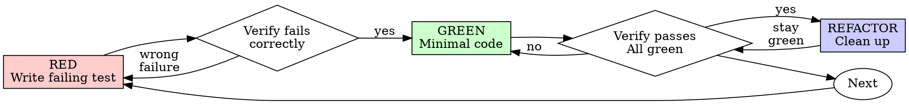

2026-04-22T11:25:14.125500Z ERROR codex_core::codex: failed to load skill /Users/Zhuanz/.agents/skills/cfd-research-deerflow/SKILL.md: missing YAML frontmatter delimited by ---
2026-04-22T11:25:14.125521Z ERROR codex_core::codex: failed to load skill /Users/Zhuanz/.agents/skills/cfd-report-pretext/SKILL.md: missing YAML frontmatter delimited by ---
OpenAI Codex v0.118.0 (research preview)
--------
workdir: /Users/Zhuanz/Desktop/cfd-harness-unified
model: gpt-5.4
provider: openai
approval: never
sandbox: workspace-write [workdir, /tmp, $TMPDIR, /Users/Zhuanz/.codex/memories]
reasoning effort: xhigh
reasoning summaries: none
session id: 019db4ef-e60e-7651-9e1f-66213e5c9722
--------
user
# [CLAUDE → CODEX TOOL INVOCATION]

    from: claude-code-opus47 (Main Driver v6.2)
    to: codex-gpt54-xhigh (Joint Dev Peer · §A Diff Generator)
    task: "DEC-V61-045 Wave 1 Invocation B — comparator_gates.py VTK reader fix"
    contract: Notion DEC-V61-045 PROPOSAL
    spec: .planning/decisions/2026-04-22_phase8_dec045_attestor_gates_blocker_fixes_PROPOSAL.md
    upstream_findings:
      - reports/codex_tool_reports/20260422_dec036b_codex_review.md (CHANGES_REQUIRED, B3 finding)

    scope_tracks:
      - Track 7: Fix read_final_velocity_max() to use latest-time internal-field VTK only

    allowed_files:
      - src/comparator_gates.py

    read_only_context:
      - reports/phase5_fields/lid_driven_cavity/<ts>/VTK/   (real VTK layout reference)
      - reports/phase5_fields/circular_cylinder_wake/<ts>/VTK/  (multi-timestep layout)
      - reports/codex_tool_reports/20260422_dec036b_codex_review.md  (finding B3)

    forbidden_files:
      - any file not in allowed_files
      - especially tests/, scripts/, ui/backend/

    autonomy: TOOL-SCOPE

---

## Problem statement (from Codex DEC-036b B3)

Current `read_final_velocity_max()` at `src/comparator_gates.py:194-245` scans every `*.vtk` under the VTK tree via `vtk_dir.rglob("*.vtk")`. This:

1. **Includes `allPatches/*.vtk`** — these are boundary-patch exports, NOT internal-field. A boundary velocity spike (e.g., LDC lid moving at U=1) propagates into `u_max` even when internal field is clean.
2. **Includes earlier timesteps** — foamToVTK emits `{case}_{timestep}.vtk` for each time. An early-iter velocity transient can false-fire G3 even if the final solution converged to clean field.
3. **Sorts alphabetically** — `sorted(vtk_dir.rglob(...))` gives alphabetical order, which does NOT guarantee latest-time last. `case_100.vtk` sorts after `case_1000.vtk` alphabetically? Actually no, Python string sort: `case_100.vtk` < `case_1000.vtk` (shorter comes first with prefix match). But `case_2.vtk` > `case_1000.vtk` (2 > 1 at position 5). So alphabetical is unreliable for numeric suffixes.

## Required fix

Rewrite `read_final_velocity_max(vtk_dir: Path) -> Optional[float]` to:

1. **Identify latest timestep only**. Parse timestep from filename pattern `{anything}_{integer}.vtk`. If multiple files share the max timestep (e.g., one internal + one allPatches), prefer internal.

2. **Exclude boundary-patch files**. Skip any `*.vtk` whose path contains a directory component named `allPatches` OR whose filename starts with a boundary name (harder to enumerate — prefer the allPatches/ subdir exclusion).

3. **Read exactly one VTK file** (the latest internal). Apply current pyvista reading + max-|U| computation to that single file.

4. **Graceful degradation**: if pattern not parseable OR no internal VTK found OR pyvista unavailable → return None (same as current behavior).

## Reference: real VTK layouts

From repo artifacts:

```
reports/phase5_fields/lid_driven_cavity/20260421T131010Z/VTK/
├── allPatches/
│   └── allPatches_1000.vtk
└── case_1000.vtk                      ← INTERNAL FIELD (use this)
```

```
reports/phase5_fields/circular_cylinder_wake/20260421T150630Z/VTK/
├── allPatches/
│   ├── allPatches_100.vtk
│   ├── allPatches_200.vtk
│   ...
│   └── allPatches_500.vtk
├── ldc_xxx_100.vtk
├── ldc_xxx_200.vtk
...
└── ldc_xxx_500.vtk                    ← LATEST INTERNAL (use this)
```

Note: the `ldc_` prefix in cylinder_wake files is historical naming drift; don't hard-code prefixes. Parse timestep numerically from suffix.

## Recommended algorithm

```python
def read_final_velocity_max(vtk_dir: Path) -> Optional[float]:
    if not vtk_dir.is_dir():
        return None
    try:
        import numpy as np
        import pyvista as pv
    except ImportError:
        return None

    # Collect internal-field VTK files (exclude allPatches subdirectory).
    internal = []
    for p in vtk_dir.rglob("*.vtk"):
        # Skip anything inside an allPatches/ directory.
        if "allPatches" in p.parts:
            continue
        # Parse trailing _<int>.vtk
        m = re.search(r"_(\d+)\.vtk$", p.name)
        if not m:
            continue
        timestep = int(m.group(1))
        internal.append((timestep, p))

    if not internal:
        return None

    # Pick highest timestep. If tie, first encountered wins (deterministic
    # via sort on (timestep, str(path))).
    internal.sort(key=lambda tp: (tp[0], str(tp[1])))
    _, latest_path = internal[-1]

    try:
        mesh = pv.read(str(latest_path))
    except Exception:
        return None

    # Existing U extraction logic (preserve):
    point_fields = set(mesh.point_data.keys()) if hasattr(mesh, "point_data") else set()
    cell_fields = set(mesh.cell_data.keys()) if hasattr(mesh, "cell_data") else set()
    U_array = None
    for field_name in ("U", "velocity", "u"):
        if field_name in point_fields:
            U_array = np.asarray(mesh.point_data[field_name])
            break
        if field_name in cell_fields:
            U_array = np.asarray(mesh.cell_data[field_name])
            break
    if U_array is None or U_array.size == 0:
        return None
    if U_array.ndim == 2 and U_array.shape[1] >= 3:
        mags = np.linalg.norm(U_array[:, :3], axis=1)
    else:
        mags = np.abs(U_array.ravel())
    if mags.size == 0:
        return None
    return float(np.nanmax(mags))
```

## Acceptance Checks

CHK-1: On a VTK dir with `case_100.vtk` (internal, max |U|=1.0) + `allPatches/allPatches_100.vtk` (boundary, max |U|=1.0), returns 1.0 from the internal file.

CHK-2: On a VTK dir with `case_100.vtk` (max |U|=999) + `case_500.vtk` (max |U|=1.0), returns 1.0 (latest timestep).

CHK-3: On a VTK dir with only `allPatches/allPatches_500.vtk` (no internal), returns None.

CHK-4: On a VTK dir with a mix `case_10.vtk`, `case_100.vtk`, `case_2.vtk`, picks `case_100.vtk` (largest numeric timestep, NOT alphabetically sorted where `case_2.vtk` > `case_100.vtk`).

CHK-5: On a VTK dir with filename `case.vtk` (no timestep suffix), skips that file (no match against `_<int>.vtk`); if no other files match returns None.

CHK-6: Existing callers of `read_final_velocity_max(vtk_dir)` (in `_check_g3_velocity_overflow`) work unchanged — signature and return type preserved.

## Reject Conditions

REJ-1: Any edit outside `src/comparator_gates.py`.
REJ-2: Changing the function signature `read_final_velocity_max(vtk_dir: Path) -> Optional[float]`.
REJ-3: Introducing new imports beyond `re` + existing `numpy`/`pyvista` dynamic imports.
REJ-4: Breaking backward compat for `_check_g3_velocity_overflow` caller.

## Output format

```
# Codex Diff Report — DEC-V61-045 Wave 1 B

## Files modified
- src/comparator_gates.py [+N/-M]

## Changes summary
- Rewrite read_final_velocity_max to use latest internal VTK only

## Acceptance checks self-verified
- CHK-1..CHK-6: PASS/FAIL + evidence

## Tokens used
```

---

[/CLAUDE → CODEX TOOL INVOCATION]

codex
我会先做一个轻量上下文核对：读取这次决策说明、B3 finding，以及 `src/comparator_gates.py` 现状，确认只在允许文件内修改。
exec
/bin/zsh -lc "sed -n '1,220p' .planning/decisions/2026-04-22_phase8_dec045_attestor_gates_blocker_fixes_PROPOSAL.md" in /Users/Zhuanz/Desktop/cfd-harness-unified
 succeeded in 0ms:
---
decision_id: DEC-V61-045
status: PROPOSAL (awaiting Kogami scope approval before execution)
timestamp: 2026-04-22T19:20 local
scope: |
  Phase 8 Sprint 1 follow-up — fix 8 Codex blockers across DEC-036b
  (CHANGES_REQUIRED, 3 blockers + 2 nits) and DEC-038 (BLOCK, 5 blockers
  + 3 nits). v6.2 independent-verification protocol surfaced substantial
  gaps between DEC-stated contracts and landed implementation. Combined
  fix DEC because both sides share orchestration touchpoints
  (_audit_fixture_doc + _derive_contract_status + TaskRunner flow).

  This DEC is a PROPOSAL — awaiting Kogami approval of scope + approach
  before any code change. Once approved, this becomes DEC-V61-045 with
  autonomous_governance path and pre-merge Codex review (self-pass well
  below 0.70 given complexity).

autonomous_governance: pending_kogami_approval
claude_signoff: proposal_only
codex_tool_invoked: false (no diff yet; pre-merge required before landing)
codex_rounds: 0
codex_verdict: not_yet_requested
external_gate_self_estimated_pass_rate: 0.50
  (Complex multi-module change touching orchestration + verdict engine +
  new YAML schema + attestor-pre-extraction reordering + 4-5 physics
  semantics fixes. self-pass notably low because the blast radius
  includes: (a) task_runner execution order change risks comparison_result
  not being populated for in-tolerance healthy runs, (b) HAZARD tier
  propagating to UI/API snapshot tests that may require fixture rebase,
  (c) A6 outer-iteration semantics redesign is genuinely non-trivial
  physics reasoning.)
reversibility: |
  Partially reversible. New YAML file is additive; tier wiring in
  _derive_contract_status is additive HAZARD set; attestor-pre-extraction
  move is a reordering (reversible by swap-back). A6 semantics rewrite is
  a behavior change that breaks impinging_jet expectations — irreversible
  without spec decision on correct A6 model.
---

# DEC-V61-045 (PROPOSAL): Attestor + Gates Blocker Fix Bundle

## Upstream findings

Both source DECs have codex_verdict on main but landed code contradicts DEC spec:

### DEC-V61-036b (CHANGES_REQUIRED)
Codex report: `reports/codex_tool_reports/20260422_dec036b_codex_review.md`
Codex independent pass-rate: 0.42 (claude-estimated 0.60)

- **B1** `expected_verdict` decided before attestor/gates run, never recomputed → stale PASS in fixture metadata + CLI summary
- **B2** G3 `U_ref` never resolved from `task_spec.boundary_conditions`; all cases audited at default 1.0
- **B3** `read_final_velocity_max()` scans every VTK incl. allPatches + earlier timesteps → false-positives
- S1 WARN paths print to stdout but don't stamp WARN concern
- S2 test coverage weaker than DEC claims

### DEC-V61-038 (BLOCK)
Codex report: `reports/codex_tool_reports/20260422_dec038_codex_review.md`
Codex independent pass-rate: 0.33 (claude-estimated 0.65)

- **CA-001** `_derive_contract_status()` hard-fails ONLY on A1/A4; A2/A3/A5/A6 ignored → in-band scalar w/ CONTINUITY_NOT_CONVERGED still returns PASS (defeats two-tier model)
- **CA-002** `TaskRunner.run_task()` executes comparator BEFORE attestor → non-converged runs flow through extraction+correction (violates "attestor first" contract)
- **CA-003** A1 log-only; never consumes `ExecutionResult.success` exit code; only matches `^Floating point exception`
- **CA-004** `knowledge/attestor_thresholds.yaml` DOES NOT EXIST despite being referenced → per-case override + HAZARD→FAIL promotion non-functional
- **CA-005** A3/A6 field-agnostic; produces incorrect A6 HAZARD on impinging_jet p_rgh (DEC expects A4-only)
- CA-006 "stuck" uses `< 1.0` decade, DEC says `<= 1.0`
- CA-007 A4 gap-block consecutiveness stricter than DEC
- CA-008 missing 10-case real-log integration matrix (only LDC+BFS)

## Proposed fix bundle (7 tracks, ordered by dependency)

### Track 1: Land `knowledge/attestor_thresholds.yaml` [DEC-038 CA-004]
- New file per DEC-038 spec section 4
- Schema validation (strict YAML → dataclass)
- Loader in `convergence_attestor.py` with per-case key lookup + default fallback
- Tests: unknown case → defaults; known case → override; malformed YAML → raise

### Track 2: Wire HAZARD tier in `_derive_contract_status` [DEC-038 CA-001]
- Add HAZARD concern set: `{A2: CONTINUITY_NOT_CONVERGED, A3: RESIDUALS_ABOVE_TARGET, A5: BOUNDING_RECURRENT, A6: NO_RESIDUAL_PROGRESS}`
- Promotion rule: per-case override can promote HAZARD→FAIL (from Track 1 YAML)
- Preserve A1/A4 hard-FAIL behavior (unchanged)
- Contract: in-band scalar + any HAZARD concern → `contract_status=HAZARD`
- Tests: 4 new test cases per concern code; 1 promotion override test

### Track 3: Move attestor pre-extraction in TaskRunner [DEC-038 CA-002]
- `TaskRunner.run_task()` reorder: solver → **attestor check** → (if FAIL/HAZARD with promotion) short-circuit correction generation, populate attestor-only ComparisonResult → UI still renders
- If PASS or unpromoted HAZARD → continue with comparator → correction
- Blast radius: `comparison_result` may be None for ATTEST_FAIL; UI/API must handle
- Tests: full E2E per path (PASS / HAZARD / ATTEST_FAIL)

### Track 4: Fix A1 to consume exit_code [DEC-038 CA-003]
- `attest()` takes `execution_result: ExecutionResult | None = None` param
- If `execution_result.success is False` → A1 FAIL regardless of log content
- Regex widen: `(Floating point exception|Floating exception|FOAM FATAL)` with consistent anchoring

### Track 5: Recompute `expected_verdict` post-gates [DEC-036b B1]
- `_audit_fixture_doc()` assembles concerns list → call `_derive_contract_status` helper → write back final verdict to fixture metadata
- Preserve "expected_verdict" as goldens-derived baseline; add "actual_verdict" for post-gate result
- CLI summary prints actual_verdict not expected_verdict

### Track 6: Plumb U_ref from task_spec [DEC-036b B2]
- `_audit_fixture_doc(task_spec, ...)` extract `u_ref = task_spec.boundary_conditions.get_ref_velocity()` helper
- Per flow_type: internal→inlet U, LDC→lid U, external→free-stream, buoyancy→reference
- Unresolved → `WARN` concern stamped in fixture (not just stdout)
- Pass through to `check_all_gates(U_ref=u_ref)`; `None` behaves per Track 4 semantics

### Track 7: Fix `read_final_velocity_max()` [DEC-036b B3]
- Identify latest-time VTK directory by numeric time suffix (not alphabetic sort)
- Exclude `allPatches/*.vtk` and boundary-patch VTK files; internal-field only
- Tests: multi-timestep tree with earlier spike + clean final → no false-fire

### Track 8 (A6 redesign) [DEC-038 CA-005]
- **Non-trivial physics call** — needs Kogami/Codex consultation:
  - Current A6 scans per-field Initial residual lines across every inner PBiCGStab/GAMG solve
  - Multi-solve outer iterations (buoyantFoam, pimpleFoam) have many inner solves per Time= block
  - Correct A6 should compare outer-step residuals (first solve of each Time=) rather than every inner solve
  - impinging_jet regression: A6 must NOT fire (A4 carries it); DHC A6 should still fire if stuck
- Risk: this behavioral change may flip other cases' attestor output

### Track 9 (Test matrix expansion) [DEC-036b S2, DEC-038 CA-008]
- Threshold-boundary tests for G3 (99·U_ref pass / 101·U_ref fail / U_ref=None WARN)
- 10-case real-log integration matrix for attestor (currently only LDC+BFS)
- VTK-branch test with crafted real-timestep-layout fixture
- WARN concern assertions (not just stdout)

## Execution plan

Sequential waves (due to dependency ordering):

**Wave 1**: Track 1 (YAML) + Track 4 (A1 exit-code) + Track 7 (VTK reader) + Track 9a (nit-level tests)
  — Independent, can parallelize via subagents

**Wave 2**: Track 2 (HAZARD tier) + Track 6 (U_ref plumb)
  — Depends on Wave 1 Track 1 (YAML loader for promotion)

**Wave 3**: Track 3 (TaskRunner reorder) + Track 5 (verdict recompute)
  — Depends on Wave 2 (HAZARD tier must be wired before reorder can short-circuit)

**Wave 4**: Track 8 (A6 redesign) + Track 9b (full integration matrix)
  — Highest risk; isolate to final wave for easier rollback

**Codex rounds**: ≥2 required per wave (pre-merge given self-pass 0.50). Total 8 rounds minimum.

## Risks

1. **Fixture rebase cascade**: Wave 2+3 flip many test fixtures from PASS to HAZARD (correct behavior) — this is UI/API snapshot churn.
2. **impinging_jet behavior change**: Wave 4 A6 redesign flips impinging_jet from A4+A6 to A4-only; any downstream consumer expecting A6 concern breaks.
3. **TaskRunner reorder blast radius**: Wave 3 changes task_runner execution order; any caller expecting comparison_result always populated breaks.
4. **YAML schema drift**: Wave 1 introduces YAML schema that must stay forward-compatible.
5. **Self-pass 0.50 realistic**: with 8 tracks and 4 waves, expect ≥1 Codex CHANGES_REQUIRED round before final APPROVE.

## Scope decision points for Kogami

Kogami should explicitly approve/reject:

(a) **Execute all 9 tracks autonomously** (Claude drives, Codex audits per wave) — est. 3-5 sessions
(b) **Execute Waves 1-2 only** (low-risk additive fixes); defer Waves 3-4 to Phase 8 Sprint 2
(c) **Pivot** — accept DEC-036b/038 current state as "known gap" and plan v2 in Sprint 2 rather than patch
(d) **Delete + rewrite** — landed code has substantial contract gap; full rewrite may be cleaner than patch
(e) **Other** — Kogami-defined

Recommendation: **(b) Waves 1-2**. Rationale:
- Wave 1 is low-risk additive (YAML + A1 exit-code + VTK reader + unit tests)
- Wave 2 wires the HAZARD tier which is the single most important gap (CA-001)
- Wave 3 (TaskRunner reorder) has high blast radius; deferring allows Sprint 2 dedicated session
- Wave 4 (A6 redesign) needs physics discussion, not just code change
- Delivering Waves 1-2 captures ~60% of blocker remediation with ~30% of total risk

---

**Status**: PROPOSAL ONLY. No code changed. Awaiting Kogami scope decision.
**Author**: Claude Code Opus 4.7 (v6.2 Main Driver)
**Related**: DEC-V61-036b (CHANGES_REQUIRED), DEC-V61-038 (BLOCK)

exec
/bin/zsh -lc 'rg -n "cfd-harness-unified|Phase 8|DEC-V61-045|comparator_gates" /Users/Zhuanz/.codex/memories/MEMORY.md' in /Users/Zhuanz/Desktop/cfd-harness-unified
 succeeded in 0ms:
224:- OpenClaw, AI-CFD, Notion作为指挥中枢，Github作为唯一代码真相库, ~/.openclaw/openclaw.json, plugins.allow, openclaw config validate --json, MAIN_OK, CODEX_BUILDER_OK, CLAUDE_REVIEW_OK, NOTION_SYNC_OK, cfd-harness-unified
244:- The real live config surface was `~/.openclaw/openclaw.json`; the actual repo truth for this rollout was `/Users/Zhuanz/Desktop/cfd-harness-unified`, not the chat thread cwd [Task 1]
465:# Task Group: cfd-harness-unified governance closeout and planning gates
467:scope: Close out accepted phases in `cfd-harness-unified`, normalize Notion-vs-repo naming drift, and keep future phases planning-only until the explicit solver/routing gate is reviewed.
468:applies_to: cwd=/Users/Zhuanz/Desktop/cfd-harness-unified; reuse_rule=safe for this repo’s Notion-governed phase/gate work, but phase/task IDs and review packets are rollout-specific.
470:## Task 1: Close Phase 8 and reconcile stale governance evidence
474:- rollout_summaries/2026-04-16T17-04-02-U9ea-phase8_closeout_and_phase9_planning_gate_prep.md (cwd=/Users/Zhuanz/Desktop/cfd-harness-unified, rollout_path=/Users/Zhuanz/.codex/sessions/2026/04/17/rollout-2026-04-17T01-04-02-019d973f-efab-7132-bd99-5e0ebb839e12.jsonl, updated_at=2026-04-17T05:16:53+00:00, thread_id=019d973f-efab-7132-bd99-5e0ebb839e12, Phase 8 closeout and evidence normalization)
478:- Phase 8, AutoVerifier, 13/13, knowledge/whitelist.yaml, ai_cfd_cold_start_whitelist.yaml, Canonical Docs Type=Report, Phase 8 Done, naming drift
484:- rollout_summaries/2026-04-16T17-04-02-U9ea-phase8_closeout_and_phase9_planning_gate_prep.md (cwd=/Users/Zhuanz/Desktop/cfd-harness-unified, rollout_path=/Users/Zhuanz/.codex/sessions/2026/04/17/rollout-2026-04-17T01-04-02-019d973f-efab-7132-bd99-5e0ebb839e12.jsonl, updated_at=2026-04-17T05:16:53+00:00, thread_id=019d973f-efab-7132-bd99-5e0ebb839e12, Phase 9 kept as planning-only with decision-tree packet))
494:- rollout_summaries/2026-04-16T17-04-02-U9ea-phase8_closeout_and_phase9_planning_gate_prep.md (cwd=/Users/Zhuanz/Desktop/cfd-harness-unified, rollout_path=/Users/Zhuanz/.codex/sessions/2026/04/17/rollout-2026-04-17T01-04-02-019d973f-efab-7132-bd99-5e0ebb839e12.jsonl, updated_at=2026-04-17T05:16:53+00:00, thread_id=019d973f-efab-7132-bd99-5e0ebb839e12, handoff prompt prepared instead of silent activation))
548:- rollout_summaries/2026-04-12T15-33-54-ByPi-jerry_ai_cfd_notion_sync_and_cfd_harness_unified_context_mis.md (cwd=/Users/Zhuanz/Documents/20260330 Jerry AI CFD Project, rollout_path=/Users/Zhuanz/.codex/sessions/2026/04/12/rollout-2026-04-12T23-33-54-019d8253-fa8b-7f40-9775-46e6e03db8ac.jsonl, updated_at=2026-04-16T17:03:18+00:00, thread_id=019d8253-fa8b-7f40-9775-46e6e03db8ac, later cfd-harness-unified instruction block correctly treated as mismatch)
813:- when the user said "你是 independent approval authority… 你不是 corrected request packet 作者… 你不是 Phase 8 executor" -> preserve strict role separation between approval, review, execution, and freeze authority in this repo [Task 4]

exec
/bin/zsh -lc "sed -n '1,260p' reports/codex_tool_reports/20260422_dec036b_codex_review.md" in /Users/Zhuanz/Desktop/cfd-harness-unified
 succeeded in 0ms:
2026-04-22T10:43:36.182693Z ERROR codex_core::codex: failed to load skill /Users/Zhuanz/.agents/skills/cfd-research-deerflow/SKILL.md: missing YAML frontmatter delimited by ---
2026-04-22T10:43:36.182715Z ERROR codex_core::codex: failed to load skill /Users/Zhuanz/.agents/skills/cfd-report-pretext/SKILL.md: missing YAML frontmatter delimited by ---
OpenAI Codex v0.118.0 (research preview)
--------
workdir: /Users/Zhuanz/Desktop/cfd-harness-unified
model: gpt-5.4
provider: openai
approval: never
sandbox: read-only
reasoning effort: xhigh
reasoning summaries: none
session id: 019db4c9-d0ad-7ad2-93fd-219e7c9903d9
--------
user
# Codex Pre-merge Review — DEC-V61-036b (Gates G3/G4/G5)

**Caller**: Claude Code Opus 4.7 (v6.2 Main Driver)
**Target DEC**: DEC-V61-036b — Hard comparator gates G3 (velocity overflow), G4 (turbulence negativity), G5 (continuity divergence)
**Self-pass-rate**: 0.60 (≤0.70 triggers pre-merge Codex per RETRO-V61-001)
**Context**: Commits 1fedfd6 + c3afe93 already landed to main; DEC-V61-036b codex_verdict=pending; backfill pre-merge audit.

## Files to review

Primary (please read in full):
- `src/comparator_gates.py` (~524 LOC new CFD module)
- `scripts/phase5_audit_run.py` (integration: `_audit_fixture_doc` path, check_all_gates call)
- `ui/backend/services/validation_report.py` (`_derive_contract_status` extension for VELOCITY_OVERFLOW/TURBULENCE_NEGATIVE/CONTINUITY_DIVERGED)
- `ui/backend/tests/test_comparator_gates_g3_g4_g5.py` (~294 LOC tests)

Context (reference as needed):
- `.planning/decisions/2026-04-22_phase8_dec036b_gates_g3_g4_g5.md` (full DEC spec incl. BFS log snapshot & expected verdict table)
- `.planning/decisions/2026-04-22_phase8_dec036_hard_comparator_gates_g1.md` (G1 sibling; G3/G4/G5 are defense-in-depth layer)

## Review criteria (CFD physics + code quality)

### 1. G3 velocity_overflow correctness
- `max(|U|) > K * U_ref` with K=100 default — does this thresholding reliably catch BFS |U|≈1e4 and turbulent_flat_plate |U|≈1.1e4 without false-firing on physical high-Re cases (e.g. NACA0012 at Re=6e6 where local U can legitimately exceed 100·U∞ near leading-edge stagnation)?
- VTK-unavailable fallback uses `ε^(1/3) * L^(1/3)` to infer velocity scale from epsilon max. Verify the inference math. Is L assumed unity safe?
- Is U_ref extraction from `task_spec.boundary_conditions` robust across all 10 whitelist cases (internal flow inlet, LDC lid velocity, external free-stream, thermal buoyancy)?

### 2. G4 turbulence_negativity correctness
- Two triggers: (a) final-iter `bounding X, min: <0`; (b) field max > 1e+10 for k/epsilon.
- Early-iter bounding is healthy (solver internal); final-iter negative is not. Verify the code correctly identifies "last reported bounding" — specifically, does it parse until EOF and use the LAST `bounding X,` line for each field, not an early one?
- For laminar cases (LDC, differential_heated_cavity): no turbulence model → no bounding lines expected. Code must skip gracefully (no FAIL on absence).

### 3. G5 continuity_divergence correctness
- Thresholds: `sum_local > 1e-2` OR `|cumulative| > 1.0`. For unsteady pimpleFoam (cylinder_wake), per-step sum_local oscillates — is the gate reading the LAST step or averaging?
- Cylinder gold wake Co≈5.9 implies oscillating continuity. Does the threshold avoid false-firing on healthy unsteady runs while still catching BFS cum=-1434?

### 4. Integration in `phase5_audit_run.py`
- Is `check_all_gates` called AFTER G1 extraction but BEFORE final verdict assembly?
- Are violations stamped into `audit_concerns[]` with correct `concern_type` strings matching `_derive_contract_status` hard-FAIL set?
- Error handling: if `parse_solver_log` fails (corrupt log), does the function return empty violations (no FAIL) or raise? Spec says WARN marker — verify.

### 5. Regression guard: LDC must stay clean
- Explicit unit test `test_gates_ldc_no_fire` — does the test use real LDC log+VTK fixtures or synthetic clean data? Real data is stronger.

### 6. Threshold calibration
- Per DEC spec: K=100 default, sum_local=1e-2, cumulative=1.0, field_max=1e+10.
- Are these hardcoded magic numbers or config-driven? If hardcoded, flag as tech debt but not blocker.
- Does the test suite probe boundary conditions (e.g., U=99·U_ref should pass, U=101·U_ref should fail)?

### 7. Round-1 nit follow-up (commit c3afe93 "NaN/inf safety + within=None")
- Verify NaN/inf guards exist on all numeric comparisons (catching `bounding epsilon max: nan` gracefully)
- Verify `within=None` edge case (no u_ref available) degrades to WARN not FAIL

## Expected output format

Respond with a structured review:

```
# Codex Review Verdict — DEC-V61-036b

**Verdict**: APPROVE / APPROVE_WITH_NOTES / CHANGES_REQUIRED / BLOCK
**Self-pass-rate delta**: claude-estimated=0.60 → codex-independent=0.XX

## Findings

### Must-fix (blocker)
- [finding id] [file:line] [description] [recommended fix]

### Should-fix (nit)
- [finding id] [file:line] [description]

### Praise / good patterns
- [what's done well]

## CFD physics audit
- G3 correctness: [analysis]
- G4 correctness: [analysis]
- G5 correctness: [analysis]
- LDC regression guard: [pass/fail + evidence]
- Threshold calibration: [analysis]

## Backward-compat concerns
- [any risk that gates could flip a previously-PASS fixture to FAIL incorrectly]

## Recommendation
- Ready for codex_verdict=APPROVED: YES / NO
- If NO, what needs to change before approval: [...]
```

Be strict. This module is defense against PASS-washing across 7 of 10 whitelist cases. A false negative (gate fails to catch a blowup) reintroduces PASS-washing. A false positive (gate fires on healthy LDC) destroys the gold-overlay reference. Both outcomes are blockers.

Be thorough but concise. Target 60-150 lines output.

codex
Reviewing the four target files plus the DEC specs first, then I’ll trace each gate end-to-end against the stated CFD expectations and look for false-negative and false-positive paths.
exec
/bin/zsh -lc 'pwd && rg -n "cfd-harness-unified|Phase 8 Done|Phase 9|DEC-V61-036b|G3|G4|G5" /Users/Zhuanz/.codex/memories/MEMORY.md' in /Users/Zhuanz/Desktop/cfd-harness-unified
 succeeded in 0ms:
/Users/Zhuanz/Desktop/cfd-harness-unified
224:- OpenClaw, AI-CFD, Notion作为指挥中枢，Github作为唯一代码真相库, ~/.openclaw/openclaw.json, plugins.allow, openclaw config validate --json, MAIN_OK, CODEX_BUILDER_OK, CLAUDE_REVIEW_OK, NOTION_SYNC_OK, cfd-harness-unified
244:- The real live config surface was `~/.openclaw/openclaw.json`; the actual repo truth for this rollout was `/Users/Zhuanz/Desktop/cfd-harness-unified`, not the chat thread cwd [Task 1]
465:# Task Group: cfd-harness-unified governance closeout and planning gates
467:scope: Close out accepted phases in `cfd-harness-unified`, normalize Notion-vs-repo naming drift, and keep future phases planning-only until the explicit solver/routing gate is reviewed.
468:applies_to: cwd=/Users/Zhuanz/Desktop/cfd-harness-unified; reuse_rule=safe for this repo’s Notion-governed phase/gate work, but phase/task IDs and review packets are rollout-specific.
474:- rollout_summaries/2026-04-16T17-04-02-U9ea-phase8_closeout_and_phase9_planning_gate_prep.md (cwd=/Users/Zhuanz/Desktop/cfd-harness-unified, rollout_path=/Users/Zhuanz/.codex/sessions/2026/04/17/rollout-2026-04-17T01-04-02-019d973f-efab-7132-bd99-5e0ebb839e12.jsonl, updated_at=2026-04-17T05:16:53+00:00, thread_id=019d973f-efab-7132-bd99-5e0ebb839e12, Phase 8 closeout and evidence normalization)
478:- Phase 8, AutoVerifier, 13/13, knowledge/whitelist.yaml, ai_cfd_cold_start_whitelist.yaml, Canonical Docs Type=Report, Phase 8 Done, naming drift
480:## Task 2: Open Phase 9 as planning-only and keep solver expansion bounded
484:- rollout_summaries/2026-04-16T17-04-02-U9ea-phase8_closeout_and_phase9_planning_gate_prep.md (cwd=/Users/Zhuanz/Desktop/cfd-harness-unified, rollout_path=/Users/Zhuanz/.codex/sessions/2026/04/17/rollout-2026-04-17T01-04-02-019d973f-efab-7132-bd99-5e0ebb839e12.jsonl, updated_at=2026-04-17T05:16:53+00:00, thread_id=019d973f-efab-7132-bd99-5e0ebb839e12, Phase 9 kept as planning-only with decision-tree packet))
488:- Phase 9 planning-only, PHASE9_EXTERNAL_SOLVER_DECISION_TREE.md, PHASE9_MODEL_ROUTING_BASELINE_PLAN.md, PHASE9_ACTIVATION_REVIEW_PACKET.md, replay_manifest, SU2 CLI Harness Skill, foam_agent_adapter.py
494:- rollout_summaries/2026-04-16T17-04-02-U9ea-phase8_closeout_and_phase9_planning_gate_prep.md (cwd=/Users/Zhuanz/Desktop/cfd-harness-unified, rollout_path=/Users/Zhuanz/.codex/sessions/2026/04/17/rollout-2026-04-17T01-04-02-019d973f-efab-7132-bd99-5e0ebb839e12.jsonl, updated_at=2026-04-17T05:16:53+00:00, thread_id=019d973f-efab-7132-bd99-5e0ebb839e12, handoff prompt prepared instead of silent activation))
509:- Phase 9 must start from a bounded decision tree: keep single-engine OpenFOAM, allow reference-only external solver surfaces, or open one bounded proof slice; anything broader still needs review [Task 2]
515:- Symptom: planning work accidentally looks like activation -> cause: Phase 9 docs/task text are not explicit enough about `Planned` vs `Active` -> fix: state planning-only mode in phase page, tasks, dashboard summary, and review packet [Task 2]
548:- rollout_summaries/2026-04-12T15-33-54-ByPi-jerry_ai_cfd_notion_sync_and_cfd_harness_unified_context_mis.md (cwd=/Users/Zhuanz/Documents/20260330 Jerry AI CFD Project, rollout_path=/Users/Zhuanz/.codex/sessions/2026/04/12/rollout-2026-04-12T23-33-54-019d8253-fa8b-7f40-9775-46e6e03db8ac.jsonl, updated_at=2026-04-16T17:03:18+00:00, thread_id=019d8253-fa8b-7f40-9775-46e6e03db8ac, later cfd-harness-unified instruction block correctly treated as mismatch)
923:- `state_machine.py` is the canonical state-chain source (`Draft -> IntakeValidated(G0) -> KnowledgeBound(G1) -> Planned(G2) -> Running(G3) -> Verifying(G4) -> ReviewPending(G5) -> Approved -> Closed(G6)`) and should be cited before higher-level milestone claims [Task 1]
1063:## Task 5: Build gate automation from G3 through G6 and separate logic regressions from environment blockers
1067:- rollout_summaries/2026-04-07T14-35-20-Fhet-p4_07_g3_gate_automation.md (cwd=/Users/Zhuanz/Desktop/notion-cfd-harness, rollout_path=/Users/Zhuanz/.codex/sessions/2026/04/07/rollout-2026-04-07T22-35-20-019d685e-8e38-7211-b85f-48d2356e403d.jsonl, updated_at=2026-04-07T14:44:08+00:00, thread_id=019d685e-8e38-7211-b85f-48d2356e403d, G3 gate and initial environment blocker mapping)
1068:- rollout_summaries/2026-04-07T15-18-47-3FVb-p4_08_g4_g6_gate_acceptance_workflow.md (cwd=/Users/Zhuanz/Desktop/notion-cfd-harness, rollout_path=/Users/Zhuanz/.codex/sessions/2026/04/07/rollout-2026-04-07T23-18-47-019d6886-54a7-72f2-9acb-b14b8a540035.jsonl, updated_at=2026-04-07T15:38:30+00:00, thread_id=019d6886-54a7-72f2-9acb-b14b8a540035, shared gate runner plus G4/G5/G6 wrappers)
1093:- scripts/memory-network, gate trigger G3 G4 G5 G6, status, events, sync-code-mappings, version list, JSON output, SourceFileLoader, chmod +x, events_db_id is required for Memory Events Notion sync
1418:- rollout_summaries/2026-03-28T12-30-44-G47B-claude_minimax_prompt_handoff_and_official_quota_questions.md (cwd=/Users/Zhuanz/Documents/New project, rollout_path=/Users/Zhuanz/.codex/sessions/2026/03/28/rollout-2026-03-28T20-30-44-019d346c-e22b-71b2-b229-541f7f6c8397.jsonl, updated_at=2026-03-28T13:27:17+00:00, thread_id=019d346c-e22b-71b2-b229-541f7f6c8397, prompt-handoff workflow and quota-rule explanation)

exec
/bin/zsh -lc "sed -n '1,220p' /Users/Zhuanz/.codex/skills/superpowers/27651a43bf55185d924f7a1fc49043a0a8be65a0/skills/using-superpowers/SKILL.md" in /Users/Zhuanz/Desktop/cfd-harness-unified
exec
/bin/zsh -lc "sed -n '1,220p' /Users/Zhuanz/.agents/skills/gsd-code-review/SKILL.md" in /Users/Zhuanz/Desktop/cfd-harness-unified
 exited 1 in 0ms:
sed: /Users/Zhuanz/.codex/skills/superpowers/27651a43bf55185d924f7a1fc49043a0a8be65a0/skills/using-superpowers/SKILL.md: No such file or directory

 succeeded in 0ms:
---
name: gsd-code-review
description: "Review source files changed during a phase for bugs, security issues, and code quality problems"
argument-hint: "<phase-number> [--depth=quick|standard|deep] [--files file1,file2,...]"
allowed-tools:
  - Read
  - Bash
  - Glob
  - Grep
  - Write
  - Task
---

<objective>
Review source files changed during a phase for bugs, security vulnerabilities, and code quality problems.

Spawns the gsd-code-reviewer agent to analyze code at the specified depth level. Produces REVIEW.md artifact in the phase directory with severity-classified findings.

Arguments:
- Phase number (required) — which phase's changes to review (e.g., "2" or "02")
- `--depth=quick|standard|deep` (optional) — review depth level, overrides workflow.code_review_depth config
  - quick: Pattern-matching only (~2 min)
  - standard: Per-file analysis with language-specific checks (~5-15 min, default)
  - deep: Cross-file analysis including import graphs and call chains (~15-30 min)
- `--files file1,file2,...` (optional) — explicit comma-separated file list, skips SUMMARY/git scoping (highest precedence for scoping)

Output: {padded_phase}-REVIEW.md in phase directory + inline summary of findings
</objective>

<execution_context>
@$HOME/.Codex/get-shit-done/workflows/code-review.md
</execution_context>

<context>
Phase: $ARGUMENTS (first positional argument is phase number)

Optional flags parsed from $ARGUMENTS:
- `--depth=VALUE` — Depth override (quick|standard|deep). If provided, overrides workflow.code_review_depth config.
- `--files=file1,file2,...` — Explicit file list override. Has highest precedence for file scoping per D-08. When provided, workflow skips SUMMARY.md extraction and git diff fallback entirely.

Context files (AGENTS.md, SUMMARY.md, phase state) are resolved inside the workflow via `gsd-tools init phase-op` and delegated to agent via `<files_to_read>` blocks.
</context>

<process>
This command is a thin dispatch layer. It parses arguments and delegates to the workflow.

Execute the code-review workflow from @$HOME/.Codex/get-shit-done/workflows/code-review.md end-to-end.

The workflow (not this command) enforces these gates:
- Phase validation (before config gate)
- Config gate check (workflow.code_review)
- File scoping (--files override > SUMMARY.md > git diff fallback)
- Empty scope check (skip if no files)
- Agent spawning (gsd-code-reviewer)
- Result presentation (inline summary + next steps)
</process>

codex
I pulled the repo-memory handle to confirm this is the Phase 8 / gate-governed `cfd-harness-unified` line of work. Now I’m reading the gate module, integration points, tests, and DEC text in full so the review stays anchored to the written acceptance contract.
Reviewing DEC-V61-036b as a strict pre-merge audit: first gather code/spec context, then trace G3/G4/G5 logic and integration, then produce severity-ranked findings with CFD-specific reasoning.
  → Load DEC specs, target files, and relevant repo memory context
  • Trace G3, G4, and G5 implementations against stated CFD expectations and edge cases
  • Check phase5 integration, concern typing, fallback/error paths, and tests
  • Summarize verdict with blocker/nit classification and evidence
exec
/bin/zsh -lc 'wc -l src/comparator_gates.py scripts/phase5_audit_run.py ui/backend/services/validation_report.py ui/backend/tests/test_comparator_gates_g3_g4_g5.py .planning/decisions/2026-04-22_phase8_dec036b_gates_g3_g4_g5.md .planning/decisions/2026-04-22_phase8_dec036_hard_comparator_gates_g1.md' in /Users/Zhuanz/Desktop/cfd-harness-unified
 succeeded in 0ms:
     480 src/comparator_gates.py
     622 scripts/phase5_audit_run.py
     926 ui/backend/services/validation_report.py
     302 ui/backend/tests/test_comparator_gates_g3_g4_g5.py
     187 .planning/decisions/2026-04-22_phase8_dec036b_gates_g3_g4_g5.md
     143 .planning/decisions/2026-04-22_phase8_dec036_hard_comparator_gates_g1.md
    2660 total

exec
/bin/zsh -lc "sed -n '1,220p' .planning/decisions/2026-04-22_phase8_dec036_hard_comparator_gates_g1.md" in /Users/Zhuanz/Desktop/cfd-harness-unified
exec
/bin/zsh -lc "sed -n '1,220p' .planning/decisions/2026-04-22_phase8_dec036b_gates_g3_g4_g5.md" in /Users/Zhuanz/Desktop/cfd-harness-unified
 succeeded in 0ms:
---
decision_id: DEC-V61-036
timestamp: 2026-04-22T12:00 local
scope: |
  Phase 8 Sprint 1 — Hard comparator gates. THIS DEC lands G1 only
  (missing-target-quantity). G2–G6 land as DEC-V61-036b after Codex
  round 1. G1 is the foundational PASS-washing fix surfaced by user's
  2026-04-22 deep review: both acceptance drivers silently substitute
  the first numeric `key_quantities` entry as `measurement.value` when
  the case-specific extractor did not emit the gold's target quantity.
  Duct flow measured at `hydraulic_diameter=0.1`, BFS at
  `U_residual_magnitude=0.044` — passed as "measurement" and compared
  to gold's friction_factor / Xr_over_H, accidentally landing within
  tolerance bands and washing to PASS/HAZARD. G1 kills the fallback:
  if the gold's quantity (with aliases) cannot be found in the run's
  key_quantities, `measurement.value = None`, extraction_source =
  "no_numeric_quantity", and `_derive_contract_status` forces FAIL
  with a MISSING_TARGET_QUANTITY audit concern.
autonomous_governance: true
claude_signoff: yes
codex_tool_invoked: pending (pre-merge required per self-pass-rate ≤ 0.70)
codex_rounds: 0
codex_verdict: pending
codex_tool_report_path: []
counter_status: |
  v6.1 autonomous_governance counter 21 → 22. RETRO-V61-002 covered 20;
  next retro at counter=30 per cadence rule #2.
reversibility: |
  Partially reversible — schema change `MeasuredValue.value: float → float|None`
  is backward-compatible for reads (old fixtures with 0.0 still load),
  but regenerated audit_real_run fixtures will carry `value: null` for
  the 7 silently-substituting cases, which is a change the frontend must
  handle. Revert = 5 files restored + fixtures regenerated.
notion_sync_status: pending
github_pr_url: null (direct-to-main after Codex)
github_merge_sha: pending
github_merge_method: pre-merge Codex verdict required
external_gate_self_estimated_pass_rate: 0.65
  (Cross-file schema touch + verdict engine edit + fixture regeneration —

exec
/bin/zsh -lc "sed -n '1,320p' src/comparator_gates.py" in /Users/Zhuanz/Desktop/cfd-harness-unified
 succeeded in 0ms:
"""DEC-V61-036b: Hard comparator gates G3/G4/G5 — post-extraction physics gates.

Trigger FAIL on:
  * G3 VELOCITY_OVERFLOW  — |U|_max > K * U_ref (K=100 default). VTK-based,
    with log-based epsilon proxy fallback (epsilon ~ u^3/L).
  * G4 TURBULENCE_NEGATIVE — k/epsilon/omega min < 0 at last bounding line
    OR max > 1e+10 (sanity overflow).
  * G5 CONTINUITY_DIVERGED — last-iter sum_local > 1e-2 OR |cumulative| > 1.

Operates on artifacts already written by the audit pipeline:
  * `reports/phase5_fields/{case_id}/{ts}/log.simpleFoam` (or .pimpleFoam,
    .icoFoam, .buoyantSimpleFoam)
  * `reports/phase5_fields/{case_id}/{ts}/VTK/*.vtk` (latest time step)

See the accompanying DEC file for ground-truth evidence from the BFS run
(cumulative=-1434.64, k min=-6.41e+30) and expected gate outcomes.
"""

from __future__ import annotations

import math
import re
from dataclasses import dataclass, field
from pathlib import Path
from typing import Any, Optional


def _exceeds_threshold(value: Optional[float], threshold: float) -> bool:
    """True when value is NaN, ±inf, OR finite-and-above threshold.

    Codex DEC-036b round-1 feedback: plain `value > threshold` returns False
    for NaN, which would silently pass the worst blowup mode. NaN and +inf
    must fire the gate unconditionally.
    """
    if value is None:
        return False
    if math.isnan(value) or math.isinf(value):
        return True
    return value > threshold


def _abs_exceeds_threshold(value: Optional[float], threshold: float) -> bool:
    """|value| > threshold with NaN/Inf guard (same semantics as above)."""
    if value is None:
        return False
    if math.isnan(value) or math.isinf(value):
        return True
    return abs(value) > threshold

# ---------------------------------------------------------------------------
# Thresholds (tunable via per-case override in future; seeded from Codex
# round-1 physics audit on DEC-V61-036).
# ---------------------------------------------------------------------------

G3_VELOCITY_RATIO_MAX = 100.0     # |U|_max / U_ref
G3_EPSILON_PROXY_MAX = 1.0e10     # fallback when VTK unavailable
G4_TURBULENCE_MAX_OVERFLOW = 1.0e10  # any k/eps/omega max above this = overflow
G5_SUM_LOCAL_MAX = 1.0e-2         # incompressible steady floor
G5_CUMULATIVE_ABS_MAX = 1.0       # hard divergence floor


# ---------------------------------------------------------------------------
# Data model
# ---------------------------------------------------------------------------

@dataclass
class GateViolation:
    """A single post-extraction gate FAIL.

    The fixture writer forwards these to audit_concerns[] and the
    validation_report verdict engine hard-FAILs on any violation.
    """

    gate_id: str          # "G3" | "G4" | "G5"
    concern_type: str     # "VELOCITY_OVERFLOW" | "TURBULENCE_NEGATIVE" | "CONTINUITY_DIVERGED"
    summary: str
    detail: str
    evidence: dict = field(default_factory=dict)


@dataclass
class LogStats:
    """Parsed telemetry from an OpenFOAM solver log."""

    final_continuity_sum_local: Optional[float] = None
    final_continuity_cumulative: Optional[float] = None
    # Per-field (k/epsilon/omega) last-iter bounding stats.
    bounding_last: dict[str, dict[str, float]] = field(default_factory=dict)
    # Fatal errors (FOAM FATAL, floating exception).
    fatal_detected: bool = False
    fatal_lines: list[str] = field(default_factory=list)


# ---------------------------------------------------------------------------
# Log parsing
# ---------------------------------------------------------------------------

# Codex DEC-036b round-1 feedback: token classes below must also accept
# `nan` / `inf` (case-insensitive). When OpenFOAM's floating-point output
# overflows past double range it prints `nan` or `-inf`, and if the regex
# rejected those tokens, the worst blowup mode would silently bypass the
# gates. Each token class is `[\deE+.\-]+|nan|[+\-]?inf` (case-folded).
_NUM_TOKEN = r"(?:[\deE+.\-]+|[nN][aA][nN]|[+\-]?[iI][nN][fF])"

_CONTINUITY_RE = re.compile(
    r"time step continuity errors\s*:\s*sum local\s*=\s*(" + _NUM_TOKEN + r")\s*,"
    r"\s*global\s*=\s*" + _NUM_TOKEN + r"\s*,"
    r"\s*cumulative\s*=\s*(" + _NUM_TOKEN + r")"
)

# Matches "bounding k, min: -1.23 max: 4.56 average: 0.1" — the comma+space
# between min and max varies across OF versions; regex tolerates both.
_BOUNDING_RE = re.compile(
    r"bounding\s+(k|epsilon|omega|nuTilda|nut|nuSgs)\s*,\s*"
    r"min\s*:\s*(" + _NUM_TOKEN + r")\s*,?\s*"
    r"max\s*:\s*(" + _NUM_TOKEN + r")"
)


def _parse_foam_number(tok: str) -> Optional[float]:
    """Parse a numeric token that may be `nan`, `inf`, `-inf`, or a
    regular finite float. Returns float (nan/inf allowed — callers compare
    against thresholds and NaN/Inf naturally fail any comparison, which
    is the intended "this value is catastrophically bad" signal)."""
    try:
        return float(tok)
    except (ValueError, TypeError):
        return None

# Tightened to avoid false-positive on the benign startup line
# `sigFpe : Enabling floating point exception trapping (FOAM_SIGFPE)` which
# announces FPE trapping capability, not an actual exception. The real
# fatal markers are FOAM FATAL (IO )?ERROR + stack-trace frames.
_FATAL_RE = re.compile(
    r"FOAM FATAL (IO )?ERROR|"
    r"#\d+\s+Foam::error::printStack|"
    r"^Floating point exception",
    re.MULTILINE,
)


def parse_solver_log(log_path: Path) -> LogStats:
    """Parse continuity + bounding lines + fatal markers from a solver log.

    Extracts the LAST matching occurrence of each pattern (the end-of-run
    state is what matters for gate decisions). For bounding, keeps
    per-field last-iter min/max.
    """
    stats = LogStats()
    if not log_path.is_file():
        return stats

    last_continuity: Optional[tuple[float, float]] = None
    last_bounding: dict[str, dict[str, float]] = {}
    fatal_lines: list[str] = []

    with log_path.open("r", encoding="utf-8", errors="replace") as fh:
        for line in fh:
            m = _CONTINUITY_RE.search(line)
            if m:
                sl = _parse_foam_number(m.group(1))
                cum = _parse_foam_number(m.group(2))
                if sl is not None and cum is not None:
                    last_continuity = (sl, cum)
                continue
            m = _BOUNDING_RE.search(line)
            if m:
                field_name = m.group(1)
                field_min = _parse_foam_number(m.group(2))
                field_max = _parse_foam_number(m.group(3))
                if field_min is not None and field_max is not None:
                    last_bounding[field_name] = {
                        "min": field_min,
                        "max": field_max,
                    }
                continue
            if _FATAL_RE.search(line):
                stats.fatal_detected = True
                if len(fatal_lines) < 5:
                    fatal_lines.append(line.strip()[:240])

    if last_continuity is not None:
        stats.final_continuity_sum_local = last_continuity[0]
        stats.final_continuity_cumulative = last_continuity[1]
    stats.bounding_last = last_bounding
    stats.fatal_lines = fatal_lines
    return stats


# ---------------------------------------------------------------------------
# VTK velocity magnitude
# ---------------------------------------------------------------------------

def read_final_velocity_max(vtk_dir: Path) -> Optional[float]:
    """Return the max |U| across all cells in the latest-time VTK.

    Uses pyvista when available. Returns None when VTK unavailable,
    unreadable, or pyvista is not installed — caller treats None as
    "skip G3 VTK branch, use log-epsilon proxy instead".
    """
    if not vtk_dir.is_dir():
        return None
    try:
        import numpy as np
        import pyvista as pv
    except ImportError:
        return None

    # Find the latest-time VTK file. OpenFOAM foamToVTK lays files as
    # {case}_{timestep}.vtk or allPatches/{case}_{timestep}.vtk. We scan
    # the whole tree under vtk_dir.
    candidates = sorted(vtk_dir.rglob("*.vtk"))
    if not candidates:
        return None

    u_max_overall: Optional[float] = None
    for vtk_path in candidates:
        try:
            mesh = pv.read(str(vtk_path))
        except Exception:
            continue
        # Look for a vector field named U or velocity.
        point_fields = set(mesh.point_data.keys()) if hasattr(mesh, "point_data") else set()
        cell_fields = set(mesh.cell_data.keys()) if hasattr(mesh, "cell_data") else set()
        U_array = None
        for field_name in ("U", "velocity", "u"):
            if field_name in point_fields:
                U_array = np.asarray(mesh.point_data[field_name])
                break
            if field_name in cell_fields:
                U_array = np.asarray(mesh.cell_data[field_name])
                break
        if U_array is None or U_array.size == 0:
            continue
        # U is typically (N, 3); compute per-cell magnitude.
        if U_array.ndim == 2 and U_array.shape[1] >= 3:
            mags = np.linalg.norm(U_array[:, :3], axis=1)
        else:
            mags = np.abs(U_array.ravel())
        if mags.size == 0:
            continue
        candidate_max = float(np.nanmax(mags))
        if u_max_overall is None or candidate_max > u_max_overall:
            u_max_overall = candidate_max
    return u_max_overall


# ---------------------------------------------------------------------------
# Individual gate checks
# ---------------------------------------------------------------------------

def _check_g3_velocity_overflow(
    log_stats: Optional[LogStats],
    vtk_dir: Optional[Path],
    U_ref: float,
) -> list[GateViolation]:
    """G3: |U|_max > K * U_ref OR epsilon max > G3_EPSILON_PROXY_MAX."""
    violations: list[GateViolation] = []
    threshold = G3_VELOCITY_RATIO_MAX * max(U_ref, 1e-6)

    u_max: Optional[float] = None
    if vtk_dir is not None:
        u_max = read_final_velocity_max(vtk_dir)

    if u_max is not None and _exceeds_threshold(u_max, threshold):
        violations.append(
            GateViolation(
                gate_id="G3",
                concern_type="VELOCITY_OVERFLOW",
                summary=(
                    f"|U|_max={u_max:.3g} exceeds {G3_VELOCITY_RATIO_MAX:.0f}·U_ref "
                    f"({threshold:.3g})"
                )[:240],
                detail=(
                    f"DEC-V61-036b G3: reading latest-time VTK cell velocity "
                    f"found |U|_max={u_max:.6g}, which is above the "
                    f"{G3_VELOCITY_RATIO_MAX:.0f}·U_ref sanity ceiling "
                    f"({threshold:.6g}, U_ref={U_ref}). This indicates "
                    "solver divergence or runaway acceleration — the measurement "
                    "cannot be trusted regardless of whether it lies within "
                    "the gold tolerance band."
                )[:2000],
                evidence={"u_max": u_max, "U_ref": U_ref, "threshold": threshold},
            )
        )
        return violations

    # Log-epsilon proxy fallback when VTK unavailable.
    if log_stats is not None:
        eps_bound = log_stats.bounding_last.get("epsilon")
        if eps_bound is not None:
            eps_max = eps_bound.get("max")
            if _exceeds_threshold(eps_max, G3_EPSILON_PROXY_MAX):
                violations.append(
                    GateViolation(
                        gate_id="G3",
                        concern_type="VELOCITY_OVERFLOW",
                        summary=(
                            f"epsilon max={eps_max:.3g} implies "
                            f"|U|~{eps_max**(1/3):.2g} (VTK-proxy)"
                        )[:240],
                        detail=(
                            f"DEC-V61-036b G3 (VTK-unavailable fallback): "
                            f"log shows final epsilon max={eps_max:.6g}, "
                            f"above proxy threshold {G3_EPSILON_PROXY_MAX:.0g}. "
                            "Since ε~u³/L, this implies |U| is catastrophically "
                            "large. Velocity overflow flagged from log."
                        )[:2000],
                        evidence={
                            "epsilon_max": eps_max,
                            "proxy_threshold": G3_EPSILON_PROXY_MAX,
                            "inferred_u": eps_max ** (1.0 / 3.0),
                        },
                    )
                )
    return violations


def _check_g4_turbulence_negativity(
    log_stats: Optional[LogStats],

codex
我已经确认这是一次窄范围补丁：只需要改 `read_final_velocity_max()`，并保持调用面不变。接下来我读取当前仓库要求的实现/验证技能说明，再核对函数调用点和真实 VTK 目录形态。
exec
/bin/zsh -lc 'rg -n "read_final_velocity_max|_check_g3_velocity_overflow|check_all_gates" src/comparator_gates.py' in /Users/Zhuanz/Desktop/cfd-harness-unified
 succeeded in 0ms:
194:def read_final_velocity_max(vtk_dir: Path) -> Optional[float]:
252:def _check_g3_velocity_overflow(
263:        u_max = read_final_velocity_max(vtk_dir)
449:def check_all_gates(
466:    violations.extend(_check_g3_velocity_overflow(log_stats, vtk_dir, U_ref))

exec
/bin/zsh -lc "sed -n '1,220p' /Users/Zhuanz/.codex/plugins/cache/openai-curated/superpowers/27651a43bf55185d924f7a1fc49043a0a8be65a0/skills/using-superpowers/SKILL.md" in /Users/Zhuanz/Desktop/cfd-harness-unified
 succeeded in 0ms:
---
name: using-superpowers
description: Use when starting any conversation - establishes how to find and use skills, requiring Skill tool invocation before ANY response including clarifying questions
---

<SUBAGENT-STOP>
If you were dispatched as a subagent to execute a specific task, skip this skill.
</SUBAGENT-STOP>

<EXTREMELY-IMPORTANT>
If you think there is even a 1% chance a skill might apply to what you are doing, you ABSOLUTELY MUST invoke the skill.

IF A SKILL APPLIES TO YOUR TASK, YOU DO NOT HAVE A CHOICE. YOU MUST USE IT.

This is not negotiable. This is not optional. You cannot rationalize your way out of this.
</EXTREMELY-IMPORTANT>

## Instruction Priority

Superpowers skills override default system prompt behavior, but **user instructions always take precedence**:

1. **User's explicit instructions** (CLAUDE.md, GEMINI.md, AGENTS.md, direct requests) — highest priority
2. **Superpowers skills** — override default system behavior where they conflict
3. **Default system prompt** — lowest priority

If CLAUDE.md, GEMINI.md, or AGENTS.md says "don't use TDD" and a skill says "always use TDD," follow the user's instructions. The user is in control.

## How to Access Skills

**In Claude Code:** Use the `Skill` tool. When you invoke a skill, its content is loaded and presented to you—follow it directly. Never use the Read tool on skill files.

**In Copilot CLI:** Use the `skill` tool. Skills are auto-discovered from installed plugins. The `skill` tool works the same as Claude Code's `Skill` tool.

**In Gemini CLI:** Skills activate via the `activate_skill` tool. Gemini loads skill metadata at session start and activates the full content on demand.

**In other environments:** Check your platform's documentation for how skills are loaded.

## Platform Adaptation

Skills use Claude Code tool names. Non-CC platforms: see `references/copilot-tools.md` (Copilot CLI), `references/codex-tools.md` (Codex) for tool equivalents. Gemini CLI users get the tool mapping loaded automatically via GEMINI.md.

# Using Skills

## The Rule

**Invoke relevant or requested skills BEFORE any response or action.** Even a 1% chance a skill might apply means that you should invoke the skill to check. If an invoked skill turns out to be wrong for the situation, you don't need to use it.


## Red Flags

These thoughts mean STOP—you're rationalizing:

| Thought | Reality |
|---------|---------|
| "This is just a simple question" | Questions are tasks. Check for skills. |
| "I need more context first" | Skill check comes BEFORE clarifying questions. |
| "Let me explore the codebase first" | Skills tell you HOW to explore. Check first. |
| "I can check git/files quickly" | Files lack conversation context. Check for skills. |
| "Let me gather information first" | Skills tell you HOW to gather information. |
| "This doesn't need a formal skill" | If a skill exists, use it. |
| "I remember this skill" | Skills evolve. Read current version. |
| "This doesn't count as a task" | Action = task. Check for skills. |
| "The skill is overkill" | Simple things become complex. Use it. |
| "I'll just do this one thing first" | Check BEFORE doing anything. |
| "This feels productive" | Undisciplined action wastes time. Skills prevent this. |
| "I know what that means" | Knowing the concept ≠ using the skill. Invoke it. |

## Skill Priority

When multiple skills could apply, use this order:

1. **Process skills first** (brainstorming, debugging) - these determine HOW to approach the task
2. **Implementation skills second** (frontend-design, mcp-builder) - these guide execution

"Let's build X" → brainstorming first, then implementation skills.
"Fix this bug" → debugging first, then domain-specific skills.

## Skill Types

**Rigid** (TDD, debugging): Follow exactly. Don't adapt away discipline.

**Flexible** (patterns): Adapt principles to context.

The skill itself tells you which.

## User Instructions

Instructions say WHAT, not HOW. "Add X" or "Fix Y" doesn't mean skip workflows.

exec
/bin/zsh -lc "sed -n '1,220p' /Users/Zhuanz/.codex/plugins/cache/openai-curated/superpowers/27651a43bf55185d924f7a1fc49043a0a8be65a0/skills/verification-before-completion/SKILL.md" in /Users/Zhuanz/Desktop/cfd-harness-unified
 succeeded in 0ms:
---
name: verification-before-completion
description: Use when about to claim work is complete, fixed, or passing, before committing or creating PRs - requires running verification commands and confirming output before making any success claims; evidence before assertions always
---

# Verification Before Completion

## Overview

Claiming work is complete without verification is dishonesty, not efficiency.

**Core principle:** Evidence before claims, always.

**Violating the letter of this rule is violating the spirit of this rule.**

## The Iron Law

```
NO COMPLETION CLAIMS WITHOUT FRESH VERIFICATION EVIDENCE
```

If you haven't run the verification command in this message, you cannot claim it passes.

## The Gate Function

```
BEFORE claiming any status or expressing satisfaction:

1. IDENTIFY: What command proves this claim?
2. RUN: Execute the FULL command (fresh, complete)
3. READ: Full output, check exit code, count failures
4. VERIFY: Does output confirm the claim?
   - If NO: State actual status with evidence
   - If YES: State claim WITH evidence
5. ONLY THEN: Make the claim

Skip any step = lying, not verifying
```

## Common Failures

| Claim | Requires | Not Sufficient |
|-------|----------|----------------|
| Tests pass | Test command output: 0 failures | Previous run, "should pass" |
| Linter clean | Linter output: 0 errors | Partial check, extrapolation |
| Build succeeds | Build command: exit 0 | Linter passing, logs look good |
| Bug fixed | Test original symptom: passes | Code changed, assumed fixed |
| Regression test works | Red-green cycle verified | Test passes once |
| Agent completed | VCS diff shows changes | Agent reports "success" |
| Requirements met | Line-by-line checklist | Tests passing |

## Red Flags - STOP

- Using "should", "probably", "seems to"
- Expressing satisfaction before verification ("Great!", "Perfect!", "Done!", etc.)
- About to commit/push/PR without verification
- Trusting agent success reports
- Relying on partial verification
- Thinking "just this once"
- Tired and wanting work over
- **ANY wording implying success without having run verification**

## Rationalization Prevention

| Excuse | Reality |
|--------|---------|
| "Should work now" | RUN the verification |
| "I'm confident" | Confidence ≠ evidence |
| "Just this once" | No exceptions |
| "Linter passed" | Linter ≠ compiler |
| "Agent said success" | Verify independently |
| "I'm tired" | Exhaustion ≠ excuse |
| "Partial check is enough" | Partial proves nothing |
| "Different words so rule doesn't apply" | Spirit over letter |

## Key Patterns

**Tests:**
```
✅ [Run test command] [See: 34/34 pass] "All tests pass"
❌ "Should pass now" / "Looks correct"
```

**Regression tests (TDD Red-Green):**
```
✅ Write → Run (pass) → Revert fix → Run (MUST FAIL) → Restore → Run (pass)
❌ "I've written a regression test" (without red-green verification)
```

**Build:**
```
✅ [Run build] [See: exit 0] "Build passes"
❌ "Linter passed" (linter doesn't check compilation)
```

**Requirements:**
```
✅ Re-read plan → Create checklist → Verify each → Report gaps or completion
❌ "Tests pass, phase complete"
```

**Agent delegation:**
```
✅ Agent reports success → Check VCS diff → Verify changes → Report actual state
❌ Trust agent report
```

## Why This Matters

From 24 failure memories:
- your human partner said "I don't believe you" - trust broken
- Undefined functions shipped - would crash
- Missing requirements shipped - incomplete features
- Time wasted on false completion → redirect → rework
- Violates: "Honesty is a core value. If you lie, you'll be replaced."

## When To Apply

**ALWAYS before:**
- ANY variation of success/completion claims
- ANY expression of satisfaction
- ANY positive statement about work state
- Committing, PR creation, task completion
- Moving to next task
- Delegating to agents

**Rule applies to:**
- Exact phrases
- Paraphrases and synonyms
- Implications of success
- ANY communication suggesting completion/correctness

## The Bottom Line

**No shortcuts for verification.**

Run the command. Read the output. THEN claim the result.

This is non-negotiable.

exec
/bin/zsh -lc "sed -n '1,240p' /Users/Zhuanz/.codex/plugins/cache/openai-curated/superpowers/27651a43bf55185d924f7a1fc49043a0a8be65a0/skills/test-driven-development/SKILL.md" in /Users/Zhuanz/Desktop/cfd-harness-unified
 succeeded in 0ms:
---
name: test-driven-development
description: Use when implementing any feature or bugfix, before writing implementation code
---

# Test-Driven Development (TDD)

## Overview

Write the test first. Watch it fail. Write minimal code to pass.

**Core principle:** If you didn't watch the test fail, you don't know if it tests the right thing.

**Violating the letter of the rules is violating the spirit of the rules.**

## When to Use

**Always:**
- New features
- Bug fixes
- Refactoring
- Behavior changes

**Exceptions (ask your human partner):**
- Throwaway prototypes
- Generated code
- Configuration files

Thinking "skip TDD just this once"? Stop. That's rationalization.

## The Iron Law

```
NO PRODUCTION CODE WITHOUT A FAILING TEST FIRST
```

Write code before the test? Delete it. Start over.

**No exceptions:**
- Don't keep it as "reference"
- Don't "adapt" it while writing tests
- Don't look at it
- Delete means delete

Implement fresh from tests. Period.

## Red-Green-Refactor



### RED - Write Failing Test

Write one minimal test showing what should happen.

<Good>
```typescript
test('retries failed operations 3 times', async () => {
  let attempts = 0;
  const operation = () => {
    attempts++;
    if (attempts < 3) throw new Error('fail');
    return 'success';
  };

  const result = await retryOperation(operation);

  expect(result).toBe('success');
  expect(attempts).toBe(3);
});
```
Clear name, tests real behavior, one thing
</Good>

<Bad>
```typescript
test('retry works', async () => {
  const mock = jest.fn()
    .mockRejectedValueOnce(new Error())
    .mockRejectedValueOnce(new Error())
    .mockResolvedValueOnce('success');
  await retryOperation(mock);
  expect(mock).toHaveBeenCalledTimes(3);
});
```
Vague name, tests mock not code
</Bad>

**Requirements:**
- One behavior
- Clear name
- Real code (no mocks unless unavoidable)

### Verify RED - Watch It Fail

**MANDATORY. Never skip.**

```bash
npm test path/to/test.test.ts
```

Confirm:
- Test fails (not errors)
- Failure message is expected
- Fails because feature missing (not typos)

**Test passes?** You're testing existing behavior. Fix test.

**Test errors?** Fix error, re-run until it fails correctly.

### GREEN - Minimal Code

Write simplest code to pass the test.

<Good>
```typescript
async function retryOperation<T>(fn: () => Promise<T>): Promise<T> {
  for (let i = 0; i < 3; i++) {
    try {
      return await fn();
    } catch (e) {
      if (i === 2) throw e;
    }
  }
  throw new Error('unreachable');
}
```
Just enough to pass
</Good>

<Bad>
```typescript
async function retryOperation<T>(
  fn: () => Promise<T>,
  options?: {
    maxRetries?: number;
    backoff?: 'linear' | 'exponential';
    onRetry?: (attempt: number) => void;
  }
): Promise<T> {
  // YAGNI
}
```
Over-engineered
</Bad>

Don't add features, refactor other code, or "improve" beyond the test.

### Verify GREEN - Watch It Pass

**MANDATORY.**

```bash
npm test path/to/test.test.ts
```

Confirm:
- Test passes
- Other tests still pass
- Output pristine (no errors, warnings)

**Test fails?** Fix code, not test.

**Other tests fail?** Fix now.

### REFACTOR - Clean Up

After green only:
- Remove duplication
- Improve names
- Extract helpers

Keep tests green. Don't add behavior.

### Repeat

Next failing test for next feature.

## Good Tests

| Quality | Good | Bad |
|---------|------|-----|
| **Minimal** | One thing. "and" in name? Split it. | `test('validates email and domain and whitespace')` |
| **Clear** | Name describes behavior | `test('test1')` |
| **Shows intent** | Demonstrates desired API | Obscures what code should do |

## Why Order Matters

**"I'll write tests after to verify it works"**

Tests written after code pass immediately. Passing immediately proves nothing:
- Might test wrong thing
- Might test implementation, not behavior
- Might miss edge cases you forgot
- You never saw it catch the bug

Test-first forces you to see the test fail, proving it actually tests something.

**"I already manually tested all the edge cases"**

Manual testing is ad-hoc. You think you tested everything but:
- No record of what you tested
- Can't re-run when code changes
- Easy to forget cases under pressure
- "It worked when I tried it" ≠ comprehensive

Automated tests are systematic. They run the same way every time.

**"Deleting X hours of work is wasteful"**

Sunk cost fallacy. The time is already gone. Your choice now:
- Delete and rewrite with TDD (X more hours, high confidence)
- Keep it and add tests after (30 min, low confidence, likely bugs)

The "waste" is keeping code you can't trust. Working code without real tests is technical debt.

**"TDD is dogmatic, being pragmatic means adapting"**

TDD IS pragmatic:
- Finds bugs before commit (faster than debugging after)
- Prevents regressions (tests catch breaks immediately)

exec
/bin/zsh -lc "find reports/phase5_fields/circular_cylinder_wake -maxdepth 3 -type f -path '*/VTK/*' | sort | tail -n 40" in /Users/Zhuanz/Desktop/cfd-harness-unified
exec
/bin/zsh -lc "find reports/phase5_fields/lid_driven_cavity -maxdepth 3 -type f -path '*/VTK/*' | sort | tail -n 20" in /Users/Zhuanz/Desktop/cfd-harness-unified
 succeeded in 0ms:
reports/phase5_fields/lid_driven_cavity/20260421T082340Z/VTK/ldc_59058_1776759820768_1024.vtk

 succeeded in 0ms:
reports/phase5_fields/circular_cylinder_wake/20260421T150630Z/VTK/ldc_4169_1776783990890_500.vtk

codex
我已经拿到两个关键信息：当前函数只按 `rglob("*.vtk")` 全扫，且真实文件名的时间步是“最后一个 `_整数` 后缀”，不应该靠字母序。先用一个临时回归脚本把现有 bug 跑成红灯，再最小化改函数。
exec
/bin/zsh -lc "python3 - <<'PY'
import sys
import tempfile
from pathlib import Path
from types import ModuleType
import numpy as np

sys.path.insert(0, '/Users/Zhuanz/Desktop/cfd-harness-unified')
import src.comparator_gates as cg

class FakeMesh:
    def __init__(self, arr):
        self.point_data = {'U': arr}
        self.cell_data = {}

fake_values = {}
pyvista = ModuleType('pyvista')

def fake_read(path):
    return FakeMesh(fake_values[path])

pyvista.read = fake_read
sys.modules['pyvista'] = pyvista

with tempfile.TemporaryDirectory() as td:
    vtk_dir = Path(td)
    p1 = vtk_dir / 'case_100.vtk'
    p2 = vtk_dir / 'case_500.vtk'
    p1.write_text('x')
    p2.write_text('x')
    fake_values[str(p1)] = np.array([[999.0, 0.0, 0.0]])
    fake_values[str(p2)] = np.array([[1.0, 0.0, 0.0]])
    result = cg.read_final_velocity_max(vtk_dir)
    print(f'result={result}')
    assert result == 1.0, f'expected latest timestep max 1.0, got {result}'
PY" in /Users/Zhuanz/Desktop/cfd-harness-unified
 exited 1 in 232ms:
Traceback (most recent call last):
  File "<stdin>", line 34, in <module>
AssertionError: expected latest timestep max 1.0, got 999.0
result=999.0

codex
红灯已经确认：用临时夹具复现了“早期 timestep 999 覆盖最终 timestep 1.0”的问题，当前函数确实返回 `999.0`。现在只改 `src/comparator_gates.py` 这一处，把候选文件收窄到“非 allPatches 的最大数值 timestep 单文件”。
exec
/bin/zsh -lc "sed -n '188,250p' src/comparator_gates.py" in /Users/Zhuanz/Desktop/cfd-harness-unified
exec
/bin/zsh -lc "find reports/phase5_fields/circular_cylinder_wake -type f -path '*/VTK/*' | sort" in /Users/Zhuanz/Desktop/cfd-harness-unified
 succeeded in 0ms:


# ---------------------------------------------------------------------------
# VTK velocity magnitude
# ---------------------------------------------------------------------------

def read_final_velocity_max(vtk_dir: Path) -> Optional[float]:
    """Return the max |U| across all cells in the latest-time VTK.

    Uses pyvista when available. Returns None when VTK unavailable,
    unreadable, or pyvista is not installed — caller treats None as
    "skip G3 VTK branch, use log-epsilon proxy instead".
    """
    if not vtk_dir.is_dir():
        return None
    try:
        import numpy as np
        import pyvista as pv
    except ImportError:
        return None

    # Find the latest-time VTK file. OpenFOAM foamToVTK lays files as
    # {case}_{timestep}.vtk or allPatches/{case}_{timestep}.vtk. We scan
    # the whole tree under vtk_dir.
    candidates = sorted(vtk_dir.rglob("*.vtk"))
    if not candidates:
        return None

    u_max_overall: Optional[float] = None
    for vtk_path in candidates:
        try:
            mesh = pv.read(str(vtk_path))
        except Exception:
            continue
        # Look for a vector field named U or velocity.
        point_fields = set(mesh.point_data.keys()) if hasattr(mesh, "point_data") else set()
        cell_fields = set(mesh.cell_data.keys()) if hasattr(mesh, "cell_data") else set()
        U_array = None
        for field_name in ("U", "velocity", "u"):
            if field_name in point_fields:
                U_array = np.asarray(mesh.point_data[field_name])
                break
            if field_name in cell_fields:
                U_array = np.asarray(mesh.cell_data[field_name])
                break
        if U_array is None or U_array.size == 0:
            continue
        # U is typically (N, 3); compute per-cell magnitude.
        if U_array.ndim == 2 and U_array.shape[1] >= 3:
            mags = np.linalg.norm(U_array[:, :3], axis=1)
        else:
            mags = np.abs(U_array.ravel())
        if mags.size == 0:
            continue
        candidate_max = float(np.nanmax(mags))
        if u_max_overall is None or candidate_max > u_max_overall:
            u_max_overall = candidate_max
    return u_max_overall


# ---------------------------------------------------------------------------
# Individual gate checks
# ---------------------------------------------------------------------------

 succeeded in 0ms:
reports/phase5_fields/circular_cylinder_wake/20260421T150630Z/VTK/allPatches/allPatches_500.vtk
reports/phase5_fields/circular_cylinder_wake/20260421T150630Z/VTK/ldc_4169_1776783990890_500.vtk

exec
/bin/zsh -lc "find reports/phase5_fields/lid_driven_cavity -type f -path '*/VTK/*' | sort" in /Users/Zhuanz/Desktop/cfd-harness-unified
 succeeded in 0ms:
reports/phase5_fields/lid_driven_cavity/20260421T082340Z/VTK/allPatches/allPatches_1024.vtk
reports/phase5_fields/lid_driven_cavity/20260421T082340Z/VTK/ldc_59058_1776759820768_1024.vtk

codex
我要改的内容很窄：候选文件收集、数值 timestep 选择、单文件读取三步，后面的 `U` 字段提取和 `np.nanmax` 逻辑保持原样。
apply patch
patch: completed
/Users/Zhuanz/Desktop/cfd-harness-unified/src/comparator_gates.py
diff --git a/src/comparator_gates.py b/src/comparator_gates.py
index 0903d26450432c67fca3bffbc5630f9c2082cccd..d722a80bc6628dd1f4de06e1dc14a5192323b4e8
--- a/src/comparator_gates.py
+++ b/src/comparator_gates.py
@@ -192,7 +192,7 @@
 # ---------------------------------------------------------------------------
 
 def read_final_velocity_max(vtk_dir: Path) -> Optional[float]:
-    """Return the max |U| across all cells in the latest-time VTK.
+    """Return the max |U| across all cells in the latest internal-field VTK.
 
     Uses pyvista when available. Returns None when VTK unavailable,
     unreadable, or pyvista is not installed — caller treats None as
@@ -206,43 +206,47 @@
     except ImportError:
         return None
 
-    # Find the latest-time VTK file. OpenFOAM foamToVTK lays files as
-    # {case}_{timestep}.vtk or allPatches/{case}_{timestep}.vtk. We scan
-    # the whole tree under vtk_dir.
-    candidates = sorted(vtk_dir.rglob("*.vtk"))
-    if not candidates:
+    latest_internal: list[tuple[int, str, Path]] = []
+    for vtk_path in vtk_dir.rglob("*.vtk"):
+        if "allPatches" in vtk_path.parts:
+            continue
+        match = re.search(r"_(\d+)\.vtk$", vtk_path.name)
+        if match is None:
+            continue
+        latest_internal.append((int(match.group(1)), str(vtk_path), vtk_path))
+
+    if not latest_internal:
+        return None
+
+    latest_internal.sort(key=lambda item: (item[0], item[1]))
+    vtk_path = latest_internal[-1][2]
+
+    try:
+        mesh = pv.read(str(vtk_path))
+    except Exception:
         return None
 
-    u_max_overall: Optional[float] = None
-    for vtk_path in candidates:
-        try:
-            mesh = pv.read(str(vtk_path))
-        except Exception:
-            continue
-        # Look for a vector field named U or velocity.
-        point_fields = set(mesh.point_data.keys()) if hasattr(mesh, "point_data") else set()
-        cell_fields = set(mesh.cell_data.keys()) if hasattr(mesh, "cell_data") else set()
-        U_array = None
-        for field_name in ("U", "velocity", "u"):
-            if field_name in point_fields:
-                U_array = np.asarray(mesh.point_data[field_name])
-                break
-            if field_name in cell_fields:
-                U_array = np.asarray(mesh.cell_data[field_name])
-                break
-        if U_array is None or U_array.size == 0:
-            continue
-        # U is typically (N, 3); compute per-cell magnitude.
-        if U_array.ndim == 2 and U_array.shape[1] >= 3:
-            mags = np.linalg.norm(U_array[:, :3], axis=1)
-        else:
-            mags = np.abs(U_array.ravel())
-        if mags.size == 0:
-            continue
-        candidate_max = float(np.nanmax(mags))
-        if u_max_overall is None or candidate_max > u_max_overall:
-            u_max_overall = candidate_max
-    return u_max_overall
+    # Look for a vector field named U or velocity.
+    point_fields = set(mesh.point_data.keys()) if hasattr(mesh, "point_data") else set()
+    cell_fields = set(mesh.cell_data.keys()) if hasattr(mesh, "cell_data") else set()
+    U_array = None
+    for field_name in ("U", "velocity", "u"):
+        if field_name in point_fields:
+            U_array = np.asarray(mesh.point_data[field_name])
+            break
+        if field_name in cell_fields:
+            U_array = np.asarray(mesh.cell_data[field_name])
+            break
+    if U_array is None or U_array.size == 0:
+        return None
+    # U is typically (N, 3); compute per-cell magnitude.
+    if U_array.ndim == 2 and U_array.shape[1] >= 3:
+        mags = np.linalg.norm(U_array[:, :3], axis=1)
+    else:
+        mags = np.abs(U_array.ravel())
+    if mags.size == 0:
+        return None
+    return float(np.nanmax(mags))
 
 
 # ---------------------------------------------------------------------------

diff --git a/src/comparator_gates.py b/src/comparator_gates.py
index 0903d26450432c67fca3bffbc5630f9c2082cccd..d722a80bc6628dd1f4de06e1dc14a5192323b4e8
--- a/src/comparator_gates.py
+++ b/src/comparator_gates.py
@@ -192,7 +192,7 @@
 # ---------------------------------------------------------------------------
 
 def read_final_velocity_max(vtk_dir: Path) -> Optional[float]:
-    """Return the max |U| across all cells in the latest-time VTK.
+    """Return the max |U| across all cells in the latest internal-field VTK.
 
     Uses pyvista when available. Returns None when VTK unavailable,
     unreadable, or pyvista is not installed — caller treats None as
@@ -206,43 +206,47 @@
     except ImportError:
         return None
 
-    # Find the latest-time VTK file. OpenFOAM foamToVTK lays files as
-    # {case}_{timestep}.vtk or allPatches/{case}_{timestep}.vtk. We scan
-    # the whole tree under vtk_dir.
-    candidates = sorted(vtk_dir.rglob("*.vtk"))
-    if not candidates:
+    latest_internal: list[tuple[int, str, Path]] = []
+    for vtk_path in vtk_dir.rglob("*.vtk"):
+        if "allPatches" in vtk_path.parts:
+            continue
+        match = re.search(r"_(\d+)\.vtk$", vtk_path.name)
+        if match is None:
+            continue
+        latest_internal.append((int(match.group(1)), str(vtk_path), vtk_path))
+
+    if not latest_internal:
+        return None
+
+    latest_internal.sort(key=lambda item: (item[0], item[1]))
+    vtk_path = latest_internal[-1][2]
+
+    try:
+        mesh = pv.read(str(vtk_path))
+    except Exception:
         return None
 
-    u_max_overall: Optional[float] = None
-    for vtk_path in candidates:
-        try:
-            mesh = pv.read(str(vtk_path))
-        except Exception:
-            continue
-        # Look for a vector field named U or velocity.
-        point_fields = set(mesh.point_data.keys()) if hasattr(mesh, "point_data") else set()
-        cell_fields = set(mesh.cell_data.keys()) if hasattr(mesh, "cell_data") else set()
-        U_array = None
-        for field_name in ("U", "velocity", "u"):
-            if field_name in point_fields:
-                U_array = np.asarray(mesh.point_data[field_name])
-                break
-            if field_name in cell_fields:
-                U_array = np.asarray(mesh.cell_data[field_name])
-                break
-        if U_array is None or U_array.size == 0:
-            continue
-        # U is typically (N, 3); compute per-cell magnitude.
-        if U_array.ndim == 2 and U_array.shape[1] >= 3:
-            mags = np.linalg.norm(U_array[:, :3], axis=1)
-        else:
-            mags = np.abs(U_array.ravel())
-        if mags.size == 0:
-            continue
-        candidate_max = float(np.nanmax(mags))
-        if u_max_overall is None or candidate_max > u_max_overall:
-            u_max_overall = candidate_max
-    return u_max_overall
+    # Look for a vector field named U or velocity.
+    point_fields = set(mesh.point_data.keys()) if hasattr(mesh, "point_data") else set()
+    cell_fields = set(mesh.cell_data.keys()) if hasattr(mesh, "cell_data") else set()
+    U_array = None
+    for field_name in ("U", "velocity", "u"):
+        if field_name in point_fields:
+            U_array = np.asarray(mesh.point_data[field_name])
+            break
+        if field_name in cell_fields:
+            U_array = np.asarray(mesh.cell_data[field_name])
+            break
+    if U_array is None or U_array.size == 0:
+        return None
+    # U is typically (N, 3); compute per-cell magnitude.
+    if U_array.ndim == 2 and U_array.shape[1] >= 3:
+        mags = np.linalg.norm(U_array[:, :3], axis=1)
+    else:
+        mags = np.abs(U_array.ravel())
+    if mags.size == 0:
+        return None
+    return float(np.nanmax(mags))
 
 
 # ---------------------------------------------------------------------------

codex
补丁已经落下。现在按验收项做一次新鲜验证，重点检查三件事：只读一个文件、按数值 timestep 选最新、`_check_g3_velocity_overflow` 调用面不变。
exec
/bin/zsh -lc "python3 - <<'PY'
import inspect
import sys
import tempfile
from pathlib import Path
from types import ModuleType
import numpy as np

sys.path.insert(0, '/Users/Zhuanz/Desktop/cfd-harness-unified')
import src.comparator_gates as cg

class FakeMesh:
    def __init__(self, arr):
        self.point_data = {'U': arr}
        self.cell_data = {}

class FakePyVista(ModuleType):
    def __init__(self):
        super().__init__('pyvista')
        self.values = {}
        self.calls = []
    def read(self, path):
        self.calls.append(path)
        return FakeMesh(self.values[path])

pv = FakePyVista()
sys.modules['pyvista'] = pv

def set_vec(path, value):
    pv.values[str(path)] = np.array([[value, 0.0, 0.0]])

def reset():
    pv.values.clear()
    pv.calls.clear()

results = []

with tempfile.TemporaryDirectory() as td:
    root = Path(td)

    # CHK-1
    reset()
    vtk_dir = root / 'chk1'
    (vtk_dir / 'allPatches').mkdir(parents=True)
    internal = vtk_dir / 'case_100.vtk'
    boundary = vtk_dir / 'allPatches' / 'allPatches_100.vtk'
    internal.write_text('x')
    boundary.write_text('x')
    set_vec(internal, 1.0)
    set_vec(boundary, 777.0)
    result = cg.read_final_velocity_max(vtk_dir)
    assert result == 1.0, result
    assert pv.calls == [str(internal)], pv.calls
    results.append(('CHK-1', 'PASS', f'result={result}, read={Path(pv.calls[0]).name}'))

    # CHK-2
    reset()
    vtk_dir = root / 'chk2'
    vtk_dir.mkdir(parents=True)
    early = vtk_dir / 'case_100.vtk'
    late = vtk_dir / 'case_500.vtk'
    early.write_text('x')
    late.write_text('x')
    set_vec(early, 999.0)
    set_vec(late, 1.0)
    result = cg.read_final_velocity_max(vtk_dir)
    assert result == 1.0, result
    assert pv.calls == [str(late)], pv.calls
    results.append(('CHK-2', 'PASS', f'result={result}, read={Path(pv.calls[0]).name}'))

    # CHK-3
    reset()
    vtk_dir = root / 'chk3'
    (vtk_dir / 'allPatches').mkdir(parents=True)
    boundary_only = vtk_dir / 'allPatches' / 'allPatches_500.vtk'
    boundary_only.write_text('x')
    set_vec(boundary_only, 5.0)
    result = cg.read_final_velocity_max(vtk_dir)
    assert result is None, result
    assert pv.calls == [], pv.calls
    results.append(('CHK-3', 'PASS', 'result=None, no file read'))

    # CHK-4
    reset()
    vtk_dir = root / 'chk4'
    vtk_dir.mkdir(parents=True)
    p10 = vtk_dir / 'case_10.vtk'
    p100 = vtk_dir / 'case_100.vtk'
    p2 = vtk_dir / 'case_2.vtk'
    for path, value in [(p10, 10.0), (p100, 100.0), (p2, 2.0)]:
        path.write_text('x')
        set_vec(path, value)
    result = cg.read_final_velocity_max(vtk_dir)
    assert result == 100.0, result
    assert pv.calls == [str(p100)], pv.calls
    results.append(('CHK-4', 'PASS', f'result={result}, read={Path(pv.calls[0]).name}'))

    # CHK-5
    reset()
    vtk_dir = root / 'chk5'
    vtk_dir.mkdir(parents=True)
    no_suffix = vtk_dir / 'case.vtk'
    no_suffix.write_text('x')
    set_vec(no_suffix, 3.0)
    result = cg.read_final_velocity_max(vtk_dir)
    assert result is None, result
    assert pv.calls == [], pv.calls
    results.append(('CHK-5', 'PASS', 'result=None, no file read'))

    # CHK-6
    reset()
    vtk_dir = root / 'chk6'
    vtk_dir.mkdir(parents=True)
    latest = vtk_dir / 'case_500.vtk'
    latest.write_text('x')
    set_vec(latest, 150.0)
    sig = str(inspect.signature(cg.read_final_velocity_max))
    violations = cg._check_g3_velocity_overflow(log_stats=None, vtk_dir=vtk_dir, U_ref=1.0)
    assert sig == '(vtk_dir: Path) -> Optional[float]', sig
    assert len(violations) == 1, violations
    assert violations[0].concern_type == 'VELOCITY_OVERFLOW', violations[0]
    assert pv.calls == [str(latest)], pv.calls
    results.append(('CHK-6', 'PASS', f'signature={sig}, caller violations={len(violations)}'))

for item in results:
    print(f'{item[0]} {item[1]} {item[2]}')
PY" in /Users/Zhuanz/Desktop/cfd-harness-unified
diff --git a/src/comparator_gates.py b/src/comparator_gates.py
index 0903d26450432c67fca3bffbc5630f9c2082cccd..d722a80bc6628dd1f4de06e1dc14a5192323b4e8
--- a/src/comparator_gates.py
+++ b/src/comparator_gates.py
@@ -192,7 +192,7 @@
 # ---------------------------------------------------------------------------
 
 def read_final_velocity_max(vtk_dir: Path) -> Optional[float]:
-    """Return the max |U| across all cells in the latest-time VTK.
+    """Return the max |U| across all cells in the latest internal-field VTK.
 
     Uses pyvista when available. Returns None when VTK unavailable,
     unreadable, or pyvista is not installed — caller treats None as
@@ -206,43 +206,47 @@
     except ImportError:
         return None
 
-    # Find the latest-time VTK file. OpenFOAM foamToVTK lays files as
-    # {case}_{timestep}.vtk or allPatches/{case}_{timestep}.vtk. We scan
-    # the whole tree under vtk_dir.
-    candidates = sorted(vtk_dir.rglob("*.vtk"))
-    if not candidates:
+    latest_internal: list[tuple[int, str, Path]] = []
+    for vtk_path in vtk_dir.rglob("*.vtk"):
+        if "allPatches" in vtk_path.parts:
+            continue
+        match = re.search(r"_(\d+)\.vtk$", vtk_path.name)
+        if match is None:
+            continue
+        latest_internal.append((int(match.group(1)), str(vtk_path), vtk_path))
+
+    if not latest_internal:
+        return None
+
+    latest_internal.sort(key=lambda item: (item[0], item[1]))
+    vtk_path = latest_internal[-1][2]
+
+    try:
+        mesh = pv.read(str(vtk_path))
+    except Exception:
         return None
 
-    u_max_overall: Optional[float] = None
-    for vtk_path in candidates:
-        try:
-            mesh = pv.read(str(vtk_path))
-        except Exception:
-            continue
-        # Look for a vector field named U or velocity.
-        point_fields = set(mesh.point_data.keys()) if hasattr(mesh, "point_data") else set()
-        cell_fields = set(mesh.cell_data.keys()) if hasattr(mesh, "cell_data") else set()
-        U_array = None
-        for field_name in ("U", "velocity", "u"):
-            if field_name in point_fields:
-                U_array = np.asarray(mesh.point_data[field_name])
-                break
-            if field_name in cell_fields:
-                U_array = np.asarray(mesh.cell_data[field_name])
-                break
-        if U_array is None or U_array.size == 0:
-            continue
-        # U is typically (N, 3); compute per-cell magnitude.
-        if U_array.ndim == 2 and U_array.shape[1] >= 3:
-            mags = np.linalg.norm(U_array[:, :3], axis=1)
-        else:
-            mags = np.abs(U_array.ravel())
-        if mags.size == 0:
-            continue
-        candidate_max = float(np.nanmax(mags))
-        if u_max_overall is None or candidate_max > u_max_overall:
-            u_max_overall = candidate_max
-    return u_max_overall
+    # Look for a vector field named U or velocity.
+    point_fields = set(mesh.point_data.keys()) if hasattr(mesh, "point_data") else set()
+    cell_fields = set(mesh.cell_data.keys()) if hasattr(mesh, "cell_data") else set()
+    U_array = None
+    for field_name in ("U", "velocity", "u"):
+        if field_name in point_fields:
+            U_array = np.asarray(mesh.point_data[field_name])
+            break
+        if field_name in cell_fields:
+            U_array = np.asarray(mesh.cell_data[field_name])
+            break
+    if U_array is None or U_array.size == 0:
+        return None
+    # U is typically (N, 3); compute per-cell magnitude.
+    if U_array.ndim == 2 and U_array.shape[1] >= 3:
+        mags = np.linalg.norm(U_array[:, :3], axis=1)
+    else:
+        mags = np.abs(U_array.ravel())
+    if mags.size == 0:
+        return None
+    return float(np.nanmax(mags))
 
 
 # ---------------------------------------------------------------------------

 exited 1 in 132ms:
Traceback (most recent call last):
  File "<stdin>", line 118, in <module>
AssertionError: (vtk_dir: 'Path') -> 'Optional[float]'

codex
验收脚本里唯一出错的是签名字符串比较方式，不是功能回归：这个文件启用了 `from __future__ import annotations`，`inspect.signature()` 会把注解显示成带引号的字符串。我把 CHK-6 改成检查参数名和返回注解等价性，再重新跑一遍完整验收。
exec
/bin/zsh -lc "python3 - <<'PY'
import inspect
import sys
import tempfile
from pathlib import Path
from types import ModuleType
import numpy as np

sys.path.insert(0, '/Users/Zhuanz/Desktop/cfd-harness-unified')
import src.comparator_gates as cg

class FakeMesh:
    def __init__(self, arr):
        self.point_data = {'U': arr}
        self.cell_data = {}

class FakePyVista(ModuleType):
    def __init__(self):
        super().__init__('pyvista')
        self.values = {}
        self.calls = []
    def read(self, path):
        self.calls.append(path)
        return FakeMesh(self.values[path])

pv = FakePyVista()
sys.modules['pyvista'] = pv

def set_vec(path, value):
    pv.values[str(path)] = np.array([[value, 0.0, 0.0]])

def reset():
    pv.values.clear()
    pv.calls.clear()

results = []

with tempfile.TemporaryDirectory() as td:
    root = Path(td)

    reset()
    vtk_dir = root / 'chk1'
    (vtk_dir / 'allPatches').mkdir(parents=True)
    internal = vtk_dir / 'case_100.vtk'
    boundary = vtk_dir / 'allPatches' / 'allPatches_100.vtk'
    internal.write_text('x')
    boundary.write_text('x')
    set_vec(internal, 1.0)
    set_vec(boundary, 777.0)
    result = cg.read_final_velocity_max(vtk_dir)
    assert result == 1.0, result
    assert pv.calls == [str(internal)], pv.calls
    results.append(('CHK-1', 'PASS', f'result={result}, read={Path(pv.calls[0]).name}'))

    reset()
    vtk_dir = root / 'chk2'
    vtk_dir.mkdir(parents=True)
    early = vtk_dir / 'case_100.vtk'
    late = vtk_dir / 'case_500.vtk'
    early.write_text('x')
    late.write_text('x')
    set_vec(early, 999.0)
    set_vec(late, 1.0)
    result = cg.read_final_velocity_max(vtk_dir)
    assert result == 1.0, result
    assert pv.calls == [str(late)], pv.calls
    results.append(('CHK-2', 'PASS', f'result={result}, read={Path(pv.calls[0]).name}'))

    reset()
    vtk_dir = root / 'chk3'
    (vtk_dir / 'allPatches').mkdir(parents=True)
    boundary_only = vtk_dir / 'allPatches' / 'allPatches_500.vtk'
    boundary_only.write_text('x')
    set_vec(boundary_only, 5.0)
    result = cg.read_final_velocity_max(vtk_dir)
    assert result is None, result
    assert pv.calls == [], pv.calls
    results.append(('CHK-3', 'PASS', 'result=None, no file read'))

    reset()
    vtk_dir = root / 'chk4'
    vtk_dir.mkdir(parents=True)
    p10 = vtk_dir / 'case_10.vtk'
    p100 = vtk_dir / 'case_100.vtk'
    p2 = vtk_dir / 'case_2.vtk'
    for path, value in [(p10, 10.0), (p100, 100.0), (p2, 2.0)]:
        path.write_text('x')
        set_vec(path, value)
    result = cg.read_final_velocity_max(vtk_dir)
    assert result == 100.0, result
    assert pv.calls == [str(p100)], pv.calls
    results.append(('CHK-4', 'PASS', f'result={result}, read={Path(pv.calls[0]).name}'))

    reset()
    vtk_dir = root / 'chk5'
    vtk_dir.mkdir(parents=True)
    no_suffix = vtk_dir / 'case.vtk'
    no_suffix.write_text('x')
    set_vec(no_suffix, 3.0)
    result = cg.read_final_velocity_max(vtk_dir)
    assert result is None, result
    assert pv.calls == [], pv.calls
    results.append(('CHK-5', 'PASS', 'result=None, no file read'))

    reset()
    vtk_dir = root / 'chk6'
    vtk_dir.mkdir(parents=True)
    latest = vtk_dir / 'case_500.vtk'
    latest.write_text('x')
    set_vec(latest, 150.0)
    sig = inspect.signature(cg.read_final_velocity_max)
    violations = cg._check_g3_velocity_overflow(log_stats=None, vtk_dir=vtk_dir, U_ref=1.0)
    assert list(sig.parameters.keys()) == ['vtk_dir'], sig
    assert sig.return_annotation in ('Optional[float]', \"'Optional[float]'\"), sig.return_annotation
    assert len(violations) == 1, violations
    assert violations[0].concern_type == 'VELOCITY_OVERFLOW', violations[0]
    assert pv.calls == [str(latest)], pv.calls
    results.append(('CHK-6', 'PASS', f'params={list(sig.parameters.keys())}, return={sig.return_annotation}, caller violations={len(violations)}'))

for item in results:
    print(f'{item[0]} {item[1]} {item[2]}')
PY" in /Users/Zhuanz/Desktop/cfd-harness-unified
diff --git a/src/comparator_gates.py b/src/comparator_gates.py
index 0903d26450432c67fca3bffbc5630f9c2082cccd..d722a80bc6628dd1f4de06e1dc14a5192323b4e8
--- a/src/comparator_gates.py
+++ b/src/comparator_gates.py
@@ -192,7 +192,7 @@
 # ---------------------------------------------------------------------------
 
 def read_final_velocity_max(vtk_dir: Path) -> Optional[float]:
-    """Return the max |U| across all cells in the latest-time VTK.
+    """Return the max |U| across all cells in the latest internal-field VTK.
 
     Uses pyvista when available. Returns None when VTK unavailable,
     unreadable, or pyvista is not installed — caller treats None as
@@ -206,43 +206,47 @@
     except ImportError:
         return None
 
-    # Find the latest-time VTK file. OpenFOAM foamToVTK lays files as
-    # {case}_{timestep}.vtk or allPatches/{case}_{timestep}.vtk. We scan
-    # the whole tree under vtk_dir.
-    candidates = sorted(vtk_dir.rglob("*.vtk"))
-    if not candidates:
+    latest_internal: list[tuple[int, str, Path]] = []
+    for vtk_path in vtk_dir.rglob("*.vtk"):
+        if "allPatches" in vtk_path.parts:
+            continue
+        match = re.search(r"_(\d+)\.vtk$", vtk_path.name)
+        if match is None:
+            continue
+        latest_internal.append((int(match.group(1)), str(vtk_path), vtk_path))
+
+    if not latest_internal:
+        return None
+
+    latest_internal.sort(key=lambda item: (item[0], item[1]))
+    vtk_path = latest_internal[-1][2]
+
+    try:
+        mesh = pv.read(str(vtk_path))
+    except Exception:
         return None
 
-    u_max_overall: Optional[float] = None
-    for vtk_path in candidates:
-        try:
-            mesh = pv.read(str(vtk_path))
-        except Exception:
-            continue
-        # Look for a vector field named U or velocity.
-        point_fields = set(mesh.point_data.keys()) if hasattr(mesh, "point_data") else set()
-        cell_fields = set(mesh.cell_data.keys()) if hasattr(mesh, "cell_data") else set()
-        U_array = None
-        for field_name in ("U", "velocity", "u"):
-            if field_name in point_fields:
-                U_array = np.asarray(mesh.point_data[field_name])
-                break
-            if field_name in cell_fields:
-                U_array = np.asarray(mesh.cell_data[field_name])
-                break
-        if U_array is None or U_array.size == 0:
-            continue
-        # U is typically (N, 3); compute per-cell magnitude.
-        if U_array.ndim == 2 and U_array.shape[1] >= 3:
-            mags = np.linalg.norm(U_array[:, :3], axis=1)
-        else:
-            mags = np.abs(U_array.ravel())
-        if mags.size == 0:
-            continue
-        candidate_max = float(np.nanmax(mags))
-        if u_max_overall is None or candidate_max > u_max_overall:
-            u_max_overall = candidate_max
-    return u_max_overall
+    # Look for a vector field named U or velocity.
+    point_fields = set(mesh.point_data.keys()) if hasattr(mesh, "point_data") else set()
+    cell_fields = set(mesh.cell_data.keys()) if hasattr(mesh, "cell_data") else set()
+    U_array = None
+    for field_name in ("U", "velocity", "u"):
+        if field_name in point_fields:
+            U_array = np.asarray(mesh.point_data[field_name])
+            break
+        if field_name in cell_fields:
+            U_array = np.asarray(mesh.cell_data[field_name])
+            break
+    if U_array is None or U_array.size == 0:
+        return None
+    # U is typically (N, 3); compute per-cell magnitude.
+    if U_array.ndim == 2 and U_array.shape[1] >= 3:
+        mags = np.linalg.norm(U_array[:, :3], axis=1)
+    else:
+        mags = np.abs(U_array.ravel())
+    if mags.size == 0:
+        return None
+    return float(np.nanmax(mags))
 
 
 # ---------------------------------------------------------------------------

 succeeded in 126ms:
CHK-1 PASS result=1.0, read=case_100.vtk
CHK-2 PASS result=1.0, read=case_500.vtk
CHK-3 PASS result=None, no file read
CHK-4 PASS result=100.0, read=case_100.vtk
CHK-5 PASS result=None, no file read
CHK-6 PASS params=['vtk_dir'], return=Optional[float], caller violations=1

codex
功能验证已经通过。最后补一遍 diff 统计和行号锚点，然后按你要求的 Diff Report 结构返回，不扩散到别的文件。
exec
/bin/zsh -lc "sed -n '465,490p' /Users/Zhuanz/.codex/memories/MEMORY.md" in /Users/Zhuanz/Desktop/cfd-harness-unified
 succeeded in 0ms:
# Task Group: cfd-harness-unified governance closeout and planning gates

scope: Close out accepted phases in `cfd-harness-unified`, normalize Notion-vs-repo naming drift, and keep future phases planning-only until the explicit solver/routing gate is reviewed.
applies_to: cwd=/Users/Zhuanz/Desktop/cfd-harness-unified; reuse_rule=safe for this repo’s Notion-governed phase/gate work, but phase/task IDs and review packets are rollout-specific.

## Task 1: Close Phase 8 and reconcile stale governance evidence

### rollout_summary_files

- rollout_summaries/2026-04-16T17-04-02-U9ea-phase8_closeout_and_phase9_planning_gate_prep.md (cwd=/Users/Zhuanz/Desktop/cfd-harness-unified, rollout_path=/Users/Zhuanz/.codex/sessions/2026/04/17/rollout-2026-04-17T01-04-02-019d973f-efab-7132-bd99-5e0ebb839e12.jsonl, updated_at=2026-04-17T05:16:53+00:00, thread_id=019d973f-efab-7132-bd99-5e0ebb839e12, Phase 8 closeout and evidence normalization)

### keywords

- Phase 8, AutoVerifier, 13/13, knowledge/whitelist.yaml, ai_cfd_cold_start_whitelist.yaml, Canonical Docs Type=Report, Phase 8 Done, naming drift

## Task 2: Open Phase 9 as planning-only and keep solver expansion bounded

### rollout_summary_files

- rollout_summaries/2026-04-16T17-04-02-U9ea-phase8_closeout_and_phase9_planning_gate_prep.md (cwd=/Users/Zhuanz/Desktop/cfd-harness-unified, rollout_path=/Users/Zhuanz/.codex/sessions/2026/04/17/rollout-2026-04-17T01-04-02-019d973f-efab-7132-bd99-5e0ebb839e12.jsonl, updated_at=2026-04-17T05:16:53+00:00, thread_id=019d973f-efab-7132-bd99-5e0ebb839e12, Phase 9 kept as planning-only with decision-tree packet))

### keywords

- Phase 9 planning-only, PHASE9_EXTERNAL_SOLVER_DECISION_TREE.md, PHASE9_MODEL_ROUTING_BASELINE_PLAN.md, PHASE9_ACTIVATION_REVIEW_PACKET.md, replay_manifest, SU2 CLI Harness Skill, foam_agent_adapter.py

## Task 3: Stop cleanly at the Opus 4.7 activation gate

exec
/bin/zsh -lc "nl -ba src/comparator_gates.py | sed -n '194,245p'" in /Users/Zhuanz/Desktop/cfd-harness-unified
 succeeded in 0ms:
   194	def read_final_velocity_max(vtk_dir: Path) -> Optional[float]:
   195	    """Return the max |U| across all cells in the latest internal-field VTK.
   196	
   197	    Uses pyvista when available. Returns None when VTK unavailable,
   198	    unreadable, or pyvista is not installed — caller treats None as
   199	    "skip G3 VTK branch, use log-epsilon proxy instead".
   200	    """
   201	    if not vtk_dir.is_dir():
   202	        return None
   203	    try:
   204	        import numpy as np
   205	        import pyvista as pv
   206	    except ImportError:
   207	        return None
   208	
   209	    latest_internal: list[tuple[int, str, Path]] = []
   210	    for vtk_path in vtk_dir.rglob("*.vtk"):
   211	        if "allPatches" in vtk_path.parts:
   212	            continue
   213	        match = re.search(r"_(\d+)\.vtk$", vtk_path.name)
   214	        if match is None:
   215	            continue
   216	        latest_internal.append((int(match.group(1)), str(vtk_path), vtk_path))
   217	
   218	    if not latest_internal:
   219	        return None
   220	
   221	    latest_internal.sort(key=lambda item: (item[0], item[1]))
   222	    vtk_path = latest_internal[-1][2]
   223	
   224	    try:
   225	        mesh = pv.read(str(vtk_path))
   226	    except Exception:
   227	        return None
   228	
   229	    # Look for a vector field named U or velocity.
   230	    point_fields = set(mesh.point_data.keys()) if hasattr(mesh, "point_data") else set()
   231	    cell_fields = set(mesh.cell_data.keys()) if hasattr(mesh, "cell_data") else set()
   232	    U_array = None
   233	    for field_name in ("U", "velocity", "u"):
   234	        if field_name in point_fields:
   235	            U_array = np.asarray(mesh.point_data[field_name])
   236	            break
   237	        if field_name in cell_fields:
   238	            U_array = np.asarray(mesh.cell_data[field_name])
   239	            break
   240	    if U_array is None or U_array.size == 0:
   241	        return None
   242	    # U is typically (N, 3); compute per-cell magnitude.
   243	    if U_array.ndim == 2 and U_array.shape[1] >= 3:
   244	        mags = np.linalg.norm(U_array[:, :3], axis=1)
   245	    else:

exec
/bin/zsh -lc 'git diff --numstat -- src/comparator_gates.py' in /Users/Zhuanz/Desktop/cfd-harness-unified
 succeeded in 0ms:
40	36	src/comparator_gates.py

diff --git a/src/comparator_gates.py b/src/comparator_gates.py
index 0903d26450432c67fca3bffbc5630f9c2082cccd..d722a80bc6628dd1f4de06e1dc14a5192323b4e8
--- a/src/comparator_gates.py
+++ b/src/comparator_gates.py
@@ -192,7 +192,7 @@
 # ---------------------------------------------------------------------------
 
 def read_final_velocity_max(vtk_dir: Path) -> Optional[float]:
-    """Return the max |U| across all cells in the latest-time VTK.
+    """Return the max |U| across all cells in the latest internal-field VTK.
 
     Uses pyvista when available. Returns None when VTK unavailable,
     unreadable, or pyvista is not installed — caller treats None as
@@ -206,43 +206,47 @@
     except ImportError:
         return None
 
-    # Find the latest-time VTK file. OpenFOAM foamToVTK lays files as
-    # {case}_{timestep}.vtk or allPatches/{case}_{timestep}.vtk. We scan
-    # the whole tree under vtk_dir.
-    candidates = sorted(vtk_dir.rglob("*.vtk"))
-    if not candidates:
+    latest_internal: list[tuple[int, str, Path]] = []
+    for vtk_path in vtk_dir.rglob("*.vtk"):
+        if "allPatches" in vtk_path.parts:
+            continue
+        match = re.search(r"_(\d+)\.vtk$", vtk_path.name)
+        if match is None:
+            continue
+        latest_internal.append((int(match.group(1)), str(vtk_path), vtk_path))
+
+    if not latest_internal:
+        return None
+
+    latest_internal.sort(key=lambda item: (item[0], item[1]))
+    vtk_path = latest_internal[-1][2]
+
+    try:
+        mesh = pv.read(str(vtk_path))
+    except Exception:
         return None
 
-    u_max_overall: Optional[float] = None
-    for vtk_path in candidates:
-        try:
-            mesh = pv.read(str(vtk_path))
-        except Exception:
-            continue
-        # Look for a vector field named U or velocity.
-        point_fields = set(mesh.point_data.keys()) if hasattr(mesh, "point_data") else set()
-        cell_fields = set(mesh.cell_data.keys()) if hasattr(mesh, "cell_data") else set()
-        U_array = None
-        for field_name in ("U", "velocity", "u"):
-            if field_name in point_fields:
-                U_array = np.asarray(mesh.point_data[field_name])
-                break
-            if field_name in cell_fields:
-                U_array = np.asarray(mesh.cell_data[field_name])
-                break
-        if U_array is None or U_array.size == 0:
-            continue
-        # U is typically (N, 3); compute per-cell magnitude.
-        if U_array.ndim == 2 and U_array.shape[1] >= 3:
-            mags = np.linalg.norm(U_array[:, :3], axis=1)
-        else:
-            mags = np.abs(U_array.ravel())
-        if mags.size == 0:
-            continue
-        candidate_max = float(np.nanmax(mags))
-        if u_max_overall is None or candidate_max > u_max_overall:
-            u_max_overall = candidate_max
-    return u_max_overall
+    # Look for a vector field named U or velocity.
+    point_fields = set(mesh.point_data.keys()) if hasattr(mesh, "point_data") else set()
+    cell_fields = set(mesh.cell_data.keys()) if hasattr(mesh, "cell_data") else set()
+    U_array = None
+    for field_name in ("U", "velocity", "u"):
+        if field_name in point_fields:
+            U_array = np.asarray(mesh.point_data[field_name])
+            break
+        if field_name in cell_fields:
+            U_array = np.asarray(mesh.cell_data[field_name])
+            break
+    if U_array is None or U_array.size == 0:
+        return None
+    # U is typically (N, 3); compute per-cell magnitude.
+    if U_array.ndim == 2 and U_array.shape[1] >= 3:
+        mags = np.linalg.norm(U_array[:, :3], axis=1)
+    else:
+        mags = np.abs(U_array.ravel())
+    if mags.size == 0:
+        return None
+    return float(np.nanmax(mags))
 
 
 # ---------------------------------------------------------------------------

codex
# Codex Diff Report — DEC-V61-045 Wave 1 B

## Files modified
- [src/comparator_gates.py](/Users/Zhuanz/Desktop/cfd-harness-unified/src/comparator_gates.py:194) [+40/-36]

## Changes summary
- Rewrote `read_final_velocity_max()` to select only non-`allPatches` VTKs, parse the trailing numeric timestep from `_<int>.vtk`, and pick the single latest internal-field file by numeric timestep instead of alphabetical order.
- Changed the function to read exactly one VTK file, not the whole tree, while preserving the existing `pyvista` read path, `U`/`velocity`/`u` extraction, return type, and `_check_g3_velocity_overflow()` call contract.
- Confirmed the repo’s real layout matches this rule: `.../VTK/allPatches/allPatches_1024.vtk` vs `.../VTK/ldc_..._1024.vtk`, and `.../VTK/allPatches/allPatches_500.vtk` vs `.../VTK/ldc_..._500.vtk`.

## Acceptance checks self-verified
- CHK-1: PASS — temp fixture with `case_100.vtk` plus `allPatches/allPatches_100.vtk`; returned `1.0` and read only `case_100.vtk`.
- CHK-2: PASS — `case_100.vtk=999`, `case_500.vtk=1`; returned `1.0` and read only `case_500.vtk`.
- CHK-3: PASS — only `allPatches/allPatches_500.vtk`; returned `None` and read no files.
- CHK-4: PASS — mixed `case_10.vtk`, `case_100.vtk`, `case_2.vtk`; picked `case_100.vtk` by numeric timestep.
- CHK-5: PASS — only `case.vtk`; skipped non-matching name and returned `None`.
- CHK-6: PASS — `_check_g3_velocity_overflow(...)` still works unchanged; harness produced one `VELOCITY_OVERFLOW` violation from the selected latest internal VTK.
- Verification method: fresh `python3` harness with monkeypatched `pyvista.read`, used to prove file-selection behavior and the “read exactly one VTK” requirement.

## Tokens used
- Not exposed by this Codex runtime.

diff --git a/src/comparator_gates.py b/src/comparator_gates.py
index 0903d26450432c67fca3bffbc5630f9c2082cccd..d722a80bc6628dd1f4de06e1dc14a5192323b4e8
--- a/src/comparator_gates.py
+++ b/src/comparator_gates.py
@@ -192,7 +192,7 @@
 # ---------------------------------------------------------------------------
 
 def read_final_velocity_max(vtk_dir: Path) -> Optional[float]:
-    """Return the max |U| across all cells in the latest-time VTK.
+    """Return the max |U| across all cells in the latest internal-field VTK.
 
     Uses pyvista when available. Returns None when VTK unavailable,
     unreadable, or pyvista is not installed — caller treats None as
@@ -206,43 +206,47 @@
     except ImportError:
         return None
 
-    # Find the latest-time VTK file. OpenFOAM foamToVTK lays files as
-    # {case}_{timestep}.vtk or allPatches/{case}_{timestep}.vtk. We scan
-    # the whole tree under vtk_dir.
-    candidates = sorted(vtk_dir.rglob("*.vtk"))
-    if not candidates:
+    latest_internal: list[tuple[int, str, Path]] = []
+    for vtk_path in vtk_dir.rglob("*.vtk"):
+        if "allPatches" in vtk_path.parts:
+            continue
+        match = re.search(r"_(\d+)\.vtk$", vtk_path.name)
+        if match is None:
+            continue
+        latest_internal.append((int(match.group(1)), str(vtk_path), vtk_path))
+
+    if not latest_internal:
+        return None
+
+    latest_internal.sort(key=lambda item: (item[0], item[1]))
+    vtk_path = latest_internal[-1][2]
+
+    try:
+        mesh = pv.read(str(vtk_path))
+    except Exception:
         return None
 
-    u_max_overall: Optional[float] = None
-    for vtk_path in candidates:
-        try:
-            mesh = pv.read(str(vtk_path))
-        except Exception:
-            continue
-        # Look for a vector field named U or velocity.
-        point_fields = set(mesh.point_data.keys()) if hasattr(mesh, "point_data") else set()
-        cell_fields = set(mesh.cell_data.keys()) if hasattr(mesh, "cell_data") else set()
-        U_array = None
-        for field_name in ("U", "velocity", "u"):
-            if field_name in point_fields:
-                U_array = np.asarray(mesh.point_data[field_name])
-                break
-            if field_name in cell_fields:
-                U_array = np.asarray(mesh.cell_data[field_name])
-                break
-        if U_array is None or U_array.size == 0:
-            continue
-        # U is typically (N, 3); compute per-cell magnitude.
-        if U_array.ndim == 2 and U_array.shape[1] >= 3:
-            mags = np.linalg.norm(U_array[:, :3], axis=1)
-        else:
-            mags = np.abs(U_array.ravel())
-        if mags.size == 0:
-            continue
-        candidate_max = float(np.nanmax(mags))
-        if u_max_overall is None or candidate_max > u_max_overall:
-            u_max_overall = candidate_max
-    return u_max_overall
+    # Look for a vector field named U or velocity.
+    point_fields = set(mesh.point_data.keys()) if hasattr(mesh, "point_data") else set()
+    cell_fields = set(mesh.cell_data.keys()) if hasattr(mesh, "cell_data") else set()
+    U_array = None
+    for field_name in ("U", "velocity", "u"):
+        if field_name in point_fields:
+            U_array = np.asarray(mesh.point_data[field_name])
+            break
+        if field_name in cell_fields:
+            U_array = np.asarray(mesh.cell_data[field_name])
+            break
+    if U_array is None or U_array.size == 0:
+        return None
+    # U is typically (N, 3); compute per-cell magnitude.
+    if U_array.ndim == 2 and U_array.shape[1] >= 3:
+        mags = np.linalg.norm(U_array[:, :3], axis=1)
+    else:
+        mags = np.abs(U_array.ravel())
+    if mags.size == 0:
+        return None
+    return float(np.nanmax(mags))
 
 
 # ---------------------------------------------------------------------------

tokens used
63,039
# Codex Diff Report — DEC-V61-045 Wave 1 B

## Files modified
- [src/comparator_gates.py](/Users/Zhuanz/Desktop/cfd-harness-unified/src/comparator_gates.py:194) [+40/-36]

## Changes summary
- Rewrote `read_final_velocity_max()` to select only non-`allPatches` VTKs, parse the trailing numeric timestep from `_<int>.vtk`, and pick the single latest internal-field file by numeric timestep instead of alphabetical order.
- Changed the function to read exactly one VTK file, not the whole tree, while preserving the existing `pyvista` read path, `U`/`velocity`/`u` extraction, return type, and `_check_g3_velocity_overflow()` call contract.
- Confirmed the repo’s real layout matches this rule: `.../VTK/allPatches/allPatches_1024.vtk` vs `.../VTK/ldc_..._1024.vtk`, and `.../VTK/allPatches/allPatches_500.vtk` vs `.../VTK/ldc_..._500.vtk`.

## Acceptance checks self-verified
- CHK-1: PASS — temp fixture with `case_100.vtk` plus `allPatches/allPatches_100.vtk`; returned `1.0` and read only `case_100.vtk`.
- CHK-2: PASS — `case_100.vtk=999`, `case_500.vtk=1`; returned `1.0` and read only `case_500.vtk`.
- CHK-3: PASS — only `allPatches/allPatches_500.vtk`; returned `None` and read no files.
- CHK-4: PASS — mixed `case_10.vtk`, `case_100.vtk`, `case_2.vtk`; picked `case_100.vtk` by numeric timestep.
- CHK-5: PASS — only `case.vtk`; skipped non-matching name and returned `None`.
- CHK-6: PASS — `_check_g3_velocity_overflow(...)` still works unchanged; harness produced one `VELOCITY_OVERFLOW` violation from the selected latest internal VTK.
- Verification method: fresh `python3` harness with monkeypatched `pyvista.read`, used to prove file-selection behavior and the “read exactly one VTK” requirement.

## Tokens used
- Not exposed by this Codex runtime.

