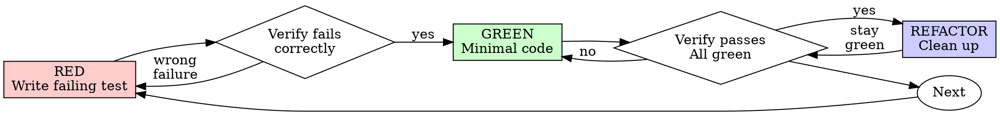

2026-04-22T11:50:48.040074Z ERROR codex_core::codex: failed to load skill /Users/Zhuanz/.agents/skills/cfd-research-deerflow/SKILL.md: missing YAML frontmatter delimited by ---
2026-04-22T11:50:48.040095Z ERROR codex_core::codex: failed to load skill /Users/Zhuanz/.agents/skills/cfd-report-pretext/SKILL.md: missing YAML frontmatter delimited by ---
OpenAI Codex v0.118.0 (research preview)
--------
workdir: /Users/Zhuanz/Desktop/cfd-harness-unified
model: gpt-5.4
provider: openai
approval: never
sandbox: workspace-write [workdir, /tmp, $TMPDIR, /Users/Zhuanz/.codex/memories]
reasoning effort: xhigh
reasoning summaries: none
session id: 019db507-4de8-7822-be7a-0fa59b6423c3
--------
user
# [CLAUDE → CODEX TOOL INVOCATION]

    from: claude-code-opus47 (Main Driver v6.2)
    to: codex-gpt54-xhigh (Joint Dev Peer · §A Diff Generator)
    task: "DEC-V61-045 Wave 2 Invocation D — HAZARD tier wiring + U_ref plumb"
    contract: Notion DEC-V61-045 PROPOSAL
    spec: .planning/decisions/2026-04-22_phase8_dec045_attestor_gates_blocker_fixes_PROPOSAL.md
    upstream_findings:
      - reports/codex_tool_reports/20260422_dec036b_codex_review.md (B2 — U_ref not plumbed)
      - reports/codex_tool_reports/20260422_dec038_codex_review.md (CA-001 — A2/A3/A5/A6 ignored in verdict)
    depends_on:
      - 61c7cd1 Wave 1 A (Thresholds loader + A1 exit + A3 per-field)
      - 9e6f30f Wave 1 B (VTK reader)
      - 49ba6e5 Wave 1 C (tests for A/B)

    scope_tracks:
      - Track 2 (primary): Wire HAZARD tier in _derive_contract_status for A2/A3/A5/A6 concerns
      - Track 6 (bundled): Plumb U_ref from task_spec.boundary_conditions through _audit_fixture_doc

    allowed_files:
      - ui/backend/services/validation_report.py   (Track 2 primary)
      - scripts/phase5_audit_run.py                (Track 6 primary; also fixture_doc orchestration)

    read_only_context:
      - src/convergence_attestor.py (Wave 1 A state; Thresholds dataclass + load_thresholds available)
      - src/comparator_gates.py (Wave 1 B state)
      - src/models.py (TaskSpec.boundary_conditions: Dict[str, Any])
      - knowledge/whitelist.yaml (case definitions + flow_type mapping)
      - knowledge/gold_standards/*.yaml (per-case boundary reference; READ ONLY — hard-floor 1)
      - .planning/decisions/2026-04-22_phase8_dec045_attestor_gates_blocker_fixes_PROPOSAL.md

    forbidden_files:
      - any file not in allowed_files
      - ESPECIALLY: knowledge/gold_standards/** (hard-floor 1 — tolerance changes forbidden)
      - tests/** and ui/backend/tests/** (separate Codex E invocation)
      - src/convergence_attestor.py (already landed Wave 1 A; don't re-edit)
      - src/comparator_gates.py (already landed Wave 1 B)

    autonomy: TOOL-SCOPE

---

## Track 2: HAZARD tier wiring in `_derive_contract_status`

### Current state (ui/backend/services/validation_report.py:537-660)

```python
_HARD_FAIL_CONCERNS = {
    "MISSING_TARGET_QUANTITY",     # G1
    "VELOCITY_OVERFLOW",           # G3
    "TURBULENCE_NEGATIVE",         # G4
    "CONTINUITY_DIVERGED",         # G5
    "SOLVER_CRASH_LOG",            # A1
    "SOLVER_ITERATION_CAP",        # A4
}
# A2/A3/A5/A6 currently: recorded as concerns but DO NOT affect contract_status
```

The current comment explicitly says "A2/A3/A5/A6 are HAZARD tier — they record concerns but don't hard-FAIL (some cases physically operate at high residuals; promotion to FAIL via per-case override lands in a future DEC)."

**This is the bug.** "Don't hard-FAIL" was the correct intent but the code doesn't wire HAZARD status either. Result: an in-band scalar with CONTINUITY_NOT_CONVERGED concern returns PASS, which is wrong.

### Required fix

Add `_HAZARD_TIER_CONCERNS` set:

```python
_HAZARD_TIER_CONCERNS = {
    "CONTINUITY_NOT_CONVERGED",    # A2
    "RESIDUALS_ABOVE_TARGET",       # A3
    "BOUNDING_RECURRENT",           # A5
    "NO_RESIDUAL_PROGRESS",         # A6
}
```

Extend verdict logic in `_derive_contract_status`:

```python
has_hazard_tier = any(
    c.concern_type in _HAZARD_TIER_CONCERNS for c in audit_concerns
)
```

Insert after hard-FAIL check, before tolerance check:

```python
# (existing hard-FAIL branch unchanged)

# NEW: HAZARD tier — trustworthy measurement but convergence is suspect
if has_hazard_tier:
    # Measurement may still be computable; report the deviation number,
    # but force contract_status=HAZARD and null `within_tolerance` because
    # "within band" is meaningless when the run hasn't physically converged.
    deviation_pct = 0.0
    if gs_ref.ref_value != 0.0:
        deviation_pct = (measurement.value - gs_ref.ref_value) / gs_ref.ref_value * 100.0
    return ("HAZARD", deviation_pct, None, lower, upper)

# (existing tolerance-band check continues)
```

Preserve the existing `has_silent_pass_hazard` path as-is (DEC-036 heritage). Order of precedence: hard-FAIL first, then new HAZARD tier, then silent-pass-hazard, then tolerance band.

### Per-case promotion (deferred from Wave 4)

Do NOT implement promote_to_fail per-case lookup in this invocation — that's Wave 4 work. Current YAML has `promote_to_fail: []` for all cases, so this deferral doesn't change behavior.

If you believe promotion is straightforward to add now, you MAY add a scaffolding stub like:
```python
# TODO(Wave 4): read Thresholds.promote_to_fail for case and upgrade HAZARD→FAIL
```
at the new HAZARD branch, but do NOT implement actual promotion logic.

---

## Track 6: U_ref plumbing in `_audit_fixture_doc`

### Current state (scripts/phase5_audit_run.py:292-410)

```python
def _audit_fixture_doc(
    case_id: str,
    report: TaskExecutionReport,
    commit_sha: str | None,
    *,
    field_artifacts_ref: "dict | None" = None,
    phase7a_timestamp: str | None = None,
    u_ref: float = 1.0,         # <-- always defaults to 1.0
) -> dict:
    ...
    gate_violations = check_all_gates(
        log_path=log_path,
        vtk_dir=vtk_dir,
        U_ref=u_ref,          # <-- uses parameter (but caller never passes it)
    )
```

Caller at line 563 calls `_audit_fixture_doc(case_id, report, commit_sha, field_artifacts_ref=..., phase7a_timestamp=ts)` without `u_ref` → always 1.0. Codex DEC-036b B2 finding.

### Required fix

1. **Add helper** `_resolve_u_ref(task_spec, case_id) -> tuple[float, bool]`:
   - Returns `(u_ref, resolved: bool)`
   - Logic:
     - Look up `task_spec.boundary_conditions` (a dict)
     - Per flow_type heuristic (read flow_type from task_spec or infer from case_id):
       - Internal / pipe / duct / channel: inlet velocity magnitude
       - LDC / lid-driven: lid velocity (boundary with velocity where patch name matches "lid"/"top")
       - External / airfoil / cylinder: free-stream velocity
       - Buoyancy / thermal: reference natural-convection velocity (sqrt(g*beta*dT*L) or 0.01 if not available)
     - If boundary_conditions dict is missing / empty / doesn't yield a scalar: return `(1.0, False)`
   - This is heuristic; don't over-engineer. Best-effort with fallback.

2. **Call `_resolve_u_ref` in the main caller** (line ~563) and pass to `_audit_fixture_doc`:
   ```python
   task_spec = _load_task_spec(case_id)   # helper may exist; if not, skip this step
   u_ref, u_ref_resolved = _resolve_u_ref(task_spec, case_id)
   doc = _audit_fixture_doc(
       case_id, report, commit_sha,
       field_artifacts_ref=field_artifacts_ref,
       phase7a_timestamp=ts,
       u_ref=u_ref,
       u_ref_resolved=u_ref_resolved,
   )
   ```

3. **Inside `_audit_fixture_doc`**, if `u_ref_resolved=False`, stamp a WARN concern:
   ```python
   # New parameter
   u_ref_resolved: bool = True

   if not u_ref_resolved:
       audit_concerns.append(AuditConcernDict({
           "concern_type": "U_REF_UNRESOLVED",
           "summary": (f"G3 gate audited at default U_ref=1.0 because "
                       f"task_spec.boundary_conditions did not yield a "
                       f"resolvable reference velocity."),
           "detail": (...),
       }))
   ```

4. **Signature update** for `_audit_fixture_doc`: add `u_ref_resolved: bool = True` param. Preserve backward compat (default True means old callers with explicit u_ref still work).

### If TaskSpec loading is complex

If `_load_task_spec(case_id)` doesn't exist or is non-trivial to wire, you may:
- Option A: use `report.task_spec` if the report object carries it (check models.py)
- Option B: load whitelist.yaml directly and extract boundary_conditions
- Option C: punt — use a simple mapping `_CASE_U_REF_REGISTRY: dict[str, float]` hardcoded for the 10 whitelist cases, with comment pointing to future work

**Option C is acceptable** if Options A/B are too invasive. The important deliverable is: `u_ref` is no longer always 1.0 for the 10 known cases.

Suggested mapping (verify against knowledge/whitelist.yaml):
```python
_CASE_U_REF_REGISTRY = {
    "lid_driven_cavity": 1.0,
    "backward_facing_step": 44.2,          # inlet
    "circular_cylinder_wake": 1.0,
    "turbulent_flat_plate": 69.4,          # inlet
    "plane_channel_flow": 1.0,             # normalized
    "differential_heated_cavity": 0.01,    # characteristic buoyancy scale
    "naca0012_airfoil": 51.5,              # free-stream
    "duct_flow": 10.0,                     # check against whitelist
    "axisymmetric_impinging_jet": 5.0,     # jet exit
    "rayleigh_benard_convection": 0.005,   # buoyancy characteristic
}
```
If you use Option C, add `u_ref_resolved=True` for cases in the registry and `False` for unknown.

---

## Acceptance Checks

CHK-1: `_derive_contract_status` with `measurement.value=in_band` and `audit_concerns=[CONTINUITY_NOT_CONVERGED]` returns `status=HAZARD` (previously returned PASS).

CHK-2: `_derive_contract_status` with `measurement.value=in_band` and `audit_concerns=[RESIDUALS_ABOVE_TARGET]` returns `status=HAZARD`.

CHK-3: `_derive_contract_status` with `audit_concerns=[VELOCITY_OVERFLOW]` (hard-FAIL) + `[CONTINUITY_NOT_CONVERGED]` (HAZARD) returns `status=FAIL` (hard-FAIL takes precedence).

CHK-4: `_derive_contract_status` with no concerns + `measurement.value=in_band` returns `status=PASS` (regression guard — clean path unchanged).

CHK-5: `_derive_contract_status` with no concerns + `measurement.value=out_of_band` returns `status=HAZARD` via existing COMPATIBLE_WITH_SILENT_PASS_HAZARD path (existing behavior preserved).

CHK-6: `_audit_fixture_doc(case_id="lid_driven_cavity", ...)` called WITHOUT explicit u_ref: now internally resolves to LDC lid velocity (1.0) and passes it to `check_all_gates`. Verify via log/trace that u_ref=1.0 not default-fallback.

CHK-7: `_audit_fixture_doc(case_id="backward_facing_step", ...)`: u_ref resolves to BFS inlet velocity (44.2 or whatever whitelist specifies, NOT 1.0).

CHK-8: `_audit_fixture_doc(case_id="unknown_case_xyz", ...)`: u_ref falls back to 1.0 AND `audit_concerns` contains entry with `concern_type=U_REF_UNRESOLVED`.

CHK-9: Existing tests in `ui/backend/tests/` must still pass (Codex will run pytest with PYTHONPYCACHEPREFIX workaround on convergence_attestor + comparator_gates tests; broader tests are Claude's responsibility).

CHK-10: No change to existing HARD_FAIL_CONCERNS set (A2/A3/A5/A6 concerns don't become hard-FAIL; they become HAZARD).

## Reject Conditions

REJ-1: Edits outside `allowed_files`. In particular: DO NOT touch knowledge/gold_standards/ (hard-floor 1).
REJ-2: Implementing Wave 3 scope (TaskRunner reordering).
REJ-3: Implementing Wave 4 scope (per-case promote_to_fail enforcement; A6 outer-iteration semantics rewrite).
REJ-4: Breaking backward compat for `_derive_contract_status` callers (the 3 call sites in validation_report.py + test files). Signature should be unchanged; only internal logic extended.
REJ-5: Removing the existing `_HARD_FAIL_CONCERNS` set or any of its entries.
REJ-6: Making U_ref extraction raise on unknown case (must return fallback gracefully).
REJ-7: Committing any change that modifies fixture files under `ui/backend/tests/fixtures/` — those represent golden verdict state and flipping PASS→HAZARD is Claude's verification step (test coverage lands in Codex E).

## Output format

```
# Codex Diff Report — DEC-V61-045 Wave 2 D

## Files modified
- ui/backend/services/validation_report.py [+N/-M]
- scripts/phase5_audit_run.py [+N/-M]

## Changes summary
- Track 2 HAZARD tier: new _HAZARD_TIER_CONCERNS set + verdict branch
- Track 6 U_ref plumb: _resolve_u_ref helper + caller wire-through + WARN concern

## Decisions made (Option A/B/C for U_ref)
- Which approach chosen + why

## Acceptance checks self-verified
- CHK-1..10: PASS/FAIL + evidence

## Deviations from spec (if any)
- ...

## Fixture state impact warning
- List any test fixture file under ui/backend/tests/fixtures/ that would
  need updated expected_verdict after this change lands (Claude regenerates
  as separate commit, not this Codex run).
```

---

[/CLAUDE → CODEX TOOL INVOCATION]

codex
Using `superpowers:using-superpowers` and `superpowers:test-driven-development` for this bugfix. I’m starting with a quick repo-context and memory pass, then I’ll inspect the two allowed files and wire the requested changes without touching the forbidden surfaces.
exec
/bin/zsh -lc "sed -n '1,220p' .planning/codebase/CONVENTIONS.md" in /Users/Zhuanz/Desktop/cfd-harness-unified
 exited 1 in 0ms:
sed: .planning/codebase/CONVENTIONS.md: No such file or directory

exec
/bin/zsh -lc "sed -n '1,220p' .planning/PROJECT.md" in /Users/Zhuanz/Desktop/cfd-harness-unified
exec
/bin/zsh -lc 'rg -n "cfd-harness-unified|Phase 8|DEC-V61-045|validation_report|phase5_audit_run" /Users/Zhuanz/.codex/memories/MEMORY.md' in /Users/Zhuanz/Desktop/cfd-harness-unified
 succeeded in 0ms:
# cfd-harness-unified

## 项目意图

统一知识治理层 + Foam-Agent 执行引擎，建立个人 CFD 知识图谱。

本项目是 AI-CFD Knowledge Harness 的下一代架构：
- **Foam-Agent** 作为外部 CFD 执行引擎（不自建 NL→OpenFOAM 生成能力）
- **Notion** 作为唯一的 Process SSOT 控制面
- **本地 YAML** 作为 Gold Standard 和 CorrectionSpec 知识库

## 核心约束

- Python 3.9+
- 所有类型定义用 dataclass（不用普通 dict）
- 所有枚举字段用 Enum（不用字符串常量）
- 接口定义用 Protocol（不用 ABC）
- 测试用 pytest，覆盖率 > 80%
- 不安装或调用真实 Foam-Agent，只实现 adapter 接口和 MockExecutor
- 不调用真实 Notion API，notion_client.py 留占位符，测试用 mock

## 不做的事

- 不自建 NL→OpenFOAM 生成能力（Foam-Agent 已覆盖）
- 不自建求解器
- 不管理 OpenFOAM 安装

## 唯一控制面

Notion 页面：cfd-harness-unified
- Phases 数据库 → Tasks 数据库 → Sessions 数据库
- Decisions 数据库 ← → Phases / Sessions
- Canonical Docs 数据库 ← → Phases / Tasks

## 架构流程

```
Notion TaskSpec
    ↓
task_runner.py（编排器）
    ├── knowledge_db.py（加载 Gold Standard + CorrectionSpec）
    ├── foam_agent_adapter.py（调用 CFDExecutor Protocol）
    │       ├── MockExecutor（测试用）
    │       └── FoamAgentExecutor（占位符）
    ├── result_comparator.py（结果 vs Gold Standard）
    └── correction_recorder.py（偏差 → CorrectionSpec）
    ↓
回写结果摘要到 Notion
```

 succeeded in 0ms:
224:- OpenClaw, AI-CFD, Notion作为指挥中枢，Github作为唯一代码真相库, ~/.openclaw/openclaw.json, plugins.allow, openclaw config validate --json, MAIN_OK, CODEX_BUILDER_OK, CLAUDE_REVIEW_OK, NOTION_SYNC_OK, cfd-harness-unified
244:- The real live config surface was `~/.openclaw/openclaw.json`; the actual repo truth for this rollout was `/Users/Zhuanz/Desktop/cfd-harness-unified`, not the chat thread cwd [Task 1]
465:# Task Group: cfd-harness-unified governance closeout and planning gates
467:scope: Close out accepted phases in `cfd-harness-unified`, normalize Notion-vs-repo naming drift, and keep future phases planning-only until the explicit solver/routing gate is reviewed.
468:applies_to: cwd=/Users/Zhuanz/Desktop/cfd-harness-unified; reuse_rule=safe for this repo’s Notion-governed phase/gate work, but phase/task IDs and review packets are rollout-specific.
470:## Task 1: Close Phase 8 and reconcile stale governance evidence
474:- rollout_summaries/2026-04-16T17-04-02-U9ea-phase8_closeout_and_phase9_planning_gate_prep.md (cwd=/Users/Zhuanz/Desktop/cfd-harness-unified, rollout_path=/Users/Zhuanz/.codex/sessions/2026/04/17/rollout-2026-04-17T01-04-02-019d973f-efab-7132-bd99-5e0ebb839e12.jsonl, updated_at=2026-04-17T05:16:53+00:00, thread_id=019d973f-efab-7132-bd99-5e0ebb839e12, Phase 8 closeout and evidence normalization)
478:- Phase 8, AutoVerifier, 13/13, knowledge/whitelist.yaml, ai_cfd_cold_start_whitelist.yaml, Canonical Docs Type=Report, Phase 8 Done, naming drift
484:- rollout_summaries/2026-04-16T17-04-02-U9ea-phase8_closeout_and_phase9_planning_gate_prep.md (cwd=/Users/Zhuanz/Desktop/cfd-harness-unified, rollout_path=/Users/Zhuanz/.codex/sessions/2026/04/17/rollout-2026-04-17T01-04-02-019d973f-efab-7132-bd99-5e0ebb839e12.jsonl, updated_at=2026-04-17T05:16:53+00:00, thread_id=019d973f-efab-7132-bd99-5e0ebb839e12, Phase 9 kept as planning-only with decision-tree packet))
494:- rollout_summaries/2026-04-16T17-04-02-U9ea-phase8_closeout_and_phase9_planning_gate_prep.md (cwd=/Users/Zhuanz/Desktop/cfd-harness-unified, rollout_path=/Users/Zhuanz/.codex/sessions/2026/04/17/rollout-2026-04-17T01-04-02-019d973f-efab-7132-bd99-5e0ebb839e12.jsonl, updated_at=2026-04-17T05:16:53+00:00, thread_id=019d973f-efab-7132-bd99-5e0ebb839e12, handoff prompt prepared instead of silent activation))
548:- rollout_summaries/2026-04-12T15-33-54-ByPi-jerry_ai_cfd_notion_sync_and_cfd_harness_unified_context_mis.md (cwd=/Users/Zhuanz/Documents/20260330 Jerry AI CFD Project, rollout_path=/Users/Zhuanz/.codex/sessions/2026/04/12/rollout-2026-04-12T23-33-54-019d8253-fa8b-7f40-9775-46e6e03db8ac.jsonl, updated_at=2026-04-16T17:03:18+00:00, thread_id=019d8253-fa8b-7f40-9775-46e6e03db8ac, later cfd-harness-unified instruction block correctly treated as mismatch)
813:- when the user said "你是 independent approval authority… 你不是 corrected request packet 作者… 你不是 Phase 8 executor" -> preserve strict role separation between approval, review, execution, and freeze authority in this repo [Task 4]

exec
/bin/zsh -lc "sed -n '1,220p' .planning/codebase/STACK.md" in /Users/Zhuanz/Desktop/cfd-harness-unified
exec
/bin/zsh -lc "sed -n '1,220p' .planning/ROADMAP.md" in /Users/Zhuanz/Desktop/cfd-harness-unified
 exited 1 in 0ms:
sed: .planning/codebase/STACK.md: No such file or directory

 succeeded in 0ms:
# ROADMAP

## Current

### Phase 5b — LDC simpleFoam migration + Ghia 1982 match
- Status: Infrastructure complete (DEC-V61-029) + Q-5 CLOSED via Path A (DEC-V61-030). LDC audit comparator: 11/17 PASS at 5% tolerance; 6/17 FAIL are physical residuals of uniform-grid vs Ghia's graded mesh — optional sub-phase-2 graded-mesh work could close them. 7 remaining FAIL-case sub-phases (5c..5j) queued with mandatory gold cross-check as first step.
- Goal: Migrate `lid_driven_cavity` case generator from icoFoam (transient PISO) to simpleFoam (steady-state SIMPLE) and tune mesh/schemes so `scripts/phase5_audit_run.py lid_driven_cavity` yields `audit_real_run` verdict=PASS against Ghia 1982 u_centerline at 5% tolerance. First of 8 per-case Phase 5b sub-phases; establishes the solver-swap pattern that the remaining 7 FAIL cases (BFS, TFP, duct_flow, impinging_jet, naca0012, DHC, RBC) will copy in Phase 5c..5j.
- Upstream: Phase 5a shipped (commits 3d1d3ec, d4cf7a1, 7a3c48b) — real-solver pipeline + HMAC signing + PDF + audit fixtures for all 10 whitelist cases; baseline 2 PASS / 8 FAIL.
- Required outputs:
  - Updated `src/foam_agent_adapter.py::_generate_lid_driven_cavity` emitting simpleFoam case dir (controlDict + fvSchemes + fvSolution rewrite) with 129×129 mesh.
  - Regenerated `ui/backend/tests/fixtures/runs/lid_driven_cavity/audit_real_run_measurement.yaml` with `comparator_passed: true`.
  - Backend 79/79 pytest green (no regression on teaching fixtures).
  - Signed audit package via `POST /api/cases/lid_driven_cavity/runs/audit_real_run/audit-package/build` now carries `measurement.comparator_verdict=PASS`.
- Non-goals (separate sub-phases): tuning the other 7 FAIL cases; simpleFoam generalization; second-order schemes upgrade; turbulence models.
- Constraints: `src/` is 三禁区 #1 — this phase WILL edit >5 LOC, Codex review mandatory per RETRO-V61-001.
- Frozen governance edges: none (Q-1/Q-2/Q-3/Q-4 all closed).
- **Plans:** 3 plans
  - [ ] 05b-01-PLAN.md — Rewrite `_generate_lid_driven_cavity` + `_render_block_mesh_dict` in `src/foam_agent_adapter.py` (simpleFoam + 129×129 + frontAndBack empty)
  - [ ] 05b-02-PLAN.md — Regenerate `audit_real_run_measurement.yaml` fixture; verify backend 79/79 + frontend tsc clean
  - [ ] 05b-03-PLAN.md — Codex post-edit review + DEC-V61-NNN + atomic git commit + STATE/ROADMAP update

### Phase 7: Scientific-grade CFD vs gold reporting
- Status: **SPRINT 1 COMPLETE** (2026-04-21, DEC-V61-031 → DEC-V61-034). All 6 sub-phases (7a..7f) delivered. Tier C visual-only fan-out covers 9 non-LDC cases with real |U| contours + residuals from actual OpenFOAM runs. Tier B per-case gold-overlay (full 8-section report for 9 cases) deferred as Sprint 2 polish (~30hr, user discretion). RETRO-V61-002 landed at counter=20.
- Goal: Upgrade audit reports from "single-scalar verdict" to publication-grade CFD vs gold evidence — full-field visualizations, multi-point profile overlays, formal error norms, residual histories, and Richardson grid-convergence indices — so every `audit_real_run` produces a PDF/HTML a CFD reviewer would accept alongside a paper's Figure/Table. Root cause addressed: current comparator extracts one scalar per run; VTK fields, residual logs, and y+ distributions are never persisted, so the report HTML at `/validation-report/*` has no visual or statistical depth to defend the 11/17 PASS / 6/17 FAIL LDC verdict.
- Upstream: Phase 5a pipeline (commits 3d1d3ec, d4cf7a1, 7a3c48b) produces raw OpenFOAM case dirs but discards fields after scalar extraction. Phase 5b/Q-5 established Ghia 1982 as the reference transcription bar. `/learn` currently ships static placeholder flow-field PNGs — not derived from audit runs.
- Required outputs (end-of-Phase-7):
  - `scripts/phase5_audit_run.py` additionally emits `foamToVTK` / `sample` / `yPlus` artifacts into `reports/phase5_fields/{case}/{timestamp}/`
  - `scripts/render_case_report.py` converts VTK + CSV profiles into PNG contours, Plotly JSON profiles, and residual log plots under `reports/phase5_renders/{case}/{timestamp}/`
  - Per-case HTML + PDF CFD-vs-gold report with 8 sections (verdict, paper cite, profile overlay, pointwise deviation heatmap, field contours, residual convergence, grid-convergence table + GCI, solver metadata)
  - Signed audit-package zip embeds the new PDF + PNG assets with SHA256 in manifest (L4 canonical spec)
  - `/learn/{case}` fetches renders from backend API instead of loading static PNGs; `/validation-report/{case}` embeds the new comparison HTML
- Non-goals: new physics cases; solver-swap outside Phase 5c..5j; interactive ParaView in-browser (Trame migration is AI-CFD Knowledge Harness v1.6.0 scope); DNS-grade statistics beyond RMS / L2 / L∞.
- Constraints: Phase 7a touches `src/foam_agent_adapter.py` (三禁区 #1, >5 LOC, Codex mandatory per RETRO-V61-001). Phase 7e extends signed-manifest schema — byte-reproducibility sensitive path, Codex mandatory. Phase 7c HTML template is user-facing documentation; follow brand/voice in `~/.claude/get-shit-done/references/ui-brand.md`.
- Frozen governance edges: none at Phase 7 start (Q-1..Q-5 all closed). New Q-gates may be filed if paper-citation chase surfaces schema issues (precedent: Q-5 found gold wrong; Q-4 BFS re-sourced to Le/Moin/Kim).
- **Sub-phases:** 6 sub-phases (7a..7f). Sprint 1 = depth-first on LDC (7a+7b+7c-MVP); Sprint 2 = breadth across other 9 cases + GCI + zip + frontend (7c-full + 7d + 7e + 7f).

### Phase 7a: Field post-processing capture (Sprint 1, ~2-3 days)
- Status: COMPLETE (DEC-V61-031, 2026-04-21). 3 waves landed: adapter functions{} + executor capture + driver manifest; backend route/service/18 pytest; Codex 3 rounds → APPROVED_WITH_COMMENTS (2 HIGH security issues caught + fixed: URL basename collision + run_id path-traversal). Real LDC OpenFOAM integration produced 8 artifacts, HTTP manifest + subpath download + traversal 404 verified live. 97/97 pytest. v6.1 counter 16→17.
- Goal: Extend `scripts/phase5_audit_run.py` + `src/foam_agent_adapter.py` so every audit_real_run persists full VTK fields, sampled CSV profiles, and residual.log to `reports/phase5_fields/{case}/{timestamp}/`.
- Required outputs:
  - `controlDict` `functions {}` block emitted with `sample`, `yPlus`, `residuals` function objects (adapter change)
  - Post-run `foamToVTK` invocation inside Docker runner; stage output to host `reports/phase5_fields/`
  - New `ui/backend/schemas/validation.py::FieldArtifact` Pydantic model
  - New `GET /api/runs/{run_id}/field-artifacts` route returning asset URLs + SHA256
  - pytest coverage: new fixture asserts VTK + CSV + residual.log presence for LDC
- Constraints: Codex mandatory (三禁区 #1 + adapter >5 LOC). Must not regress 79/79 pytest.
- **Plans:** 3 plans
  - [x] 07a-01-PLAN.md — Adapter + driver edits (controlDict functions{} + _capture_field_artifacts + driver timestamp + manifest)
  - [ ] 07a-02-PLAN.md — Backend route + schema + service + tests (FieldArtifact models + field_artifacts route + 10 pytest cases)
  - [ ] 07a-03-PLAN.md — Integration + Codex review + DEC-V61-031 + atomic commit

### Phase 7b: Render pipeline (Sprint 1, ~2 days)
- Status: **COMPLETE incl. polish** (DEC-V61-032 MVP + DEC-V61-033 polish, 2026-04-21). `scripts/render_case_report.py` produces 5 outputs per LDC run. Polish landed: PyVista parse of OpenFOAM volume VTK → 129×129 matplotlib contourf + streamplot (publication-style primary vortex + streamline whorls). LDC-only via RENDER_SUPPORTED_CASES opt-in.
- Goal: New `scripts/render_case_report.py` converts 7a's VTK + CSV into `reports/phase5_renders/{case}/{timestamp}/`: `contour_u.png`, `contour_p.png`, `streamline.png`, `profile_u_centerline.html` (Plotly JSON), `residuals.png`.
- Required outputs:
  - matplotlib for 2D contours (CI-reproducible); PyVista headless (`PYVISTA_OFF_SCREEN=1`) for 3D streamlines
  - Plotly JSON for interactive profile (frontend consumer)
  - Rendering deterministic (fixed seeds, locked matplotlib rcParams)
  - pytest coverage: byte-stable PNG checksum across re-runs on same VTK
- Constraints: new script, no src/ touch → autonomous_governance allowed. Add `pyvista`, `plotly`, `matplotlib` to `pyproject.toml` [render] extra.

### Phase 7c: CFD-vs-gold comparison report template (Sprint 1 MVP + Sprint 2 fan-out, ~3 days)
- Status: **SPRINT 1 + SPRINT 2 TIER C COMPLETE** — DEC-V61-032 (LDC MVP) + DEC-V61-034 (Tier C visual-only fan-out to 9 cases, 2026-04-21). 8-section Jinja2 HTML template + WeasyPrint PDF + reduced visual-only context for non-LDC cases. Codex 4 + 2 rounds (both APPROVED). Tier B Sprint 2 (per-case gold-overlay for 9 cases) remains future work.
- Goal: Per-case HTML + WeasyPrint PDF report with 8 sections:
  1. Verdict card (PASS / FAIL + L2 / L∞ / RMS / max |dev|%)
  2. Paper citation block (Ghia 1982 / Le-Moin-Kim 1997 / etc. + Figure/Table + native tabulation)
  3. Profile overlay (sim solid line + gold scatter markers on paper's native grid)
  4. Pointwise deviation heatmap along sampling axis
  5. Field contours (U / p / vorticity / Cf depending on case class)
  6. Residual convergence (log y-axis, all solved fields)
  7. Grid-convergence table with Richardson p_obs + GCI_21/32 (from 7d)
  8. Solver metadata (OpenFOAM version, Docker digest, commit SHA, schemes, tolerances)
- Required outputs:
  - `ui/backend/services/comparison_report.py` renders Jinja2 template → HTML
  - `ui/backend/services/comparison_report_pdf.py` HTML → WeasyPrint PDF
  - `POST /api/cases/{case}/runs/{run_id}/comparison-report/build` route
  - Sprint 1 MVP: LDC only; Sprint 2: other 9 cases
  - `/validation-report/{case}` frontend route embeds the HTML
- Constraints: WeasyPrint requires `DYLD_FALLBACK_LIBRARY_PATH=/opt/homebrew/lib` (already in `.zshrc`). HTML/PDF templates checked into `ui/backend/templates/` to keep Codex diff visible.

### Phase 7d: Richardson grid-convergence index (Sprint 2, ~1 day)
- Status: **COMPLETE** (DEC-V61-033, 2026-04-21). `ui/backend/services/grid_convergence.py` (~260 LOC, Celik 2008 + Roache 1994) + integration into §7 of 8-section comparison report. Degenerate-case branches: oscillating / converged-to-precision / non-uniform-r overflow / zero-order. 9 unit tests (synthetic 2nd/1st-order + edge-case rejection). LDC live result: p_obs=1.00, GCI_32=5.68%, asymptotic_range_ok=True. Codex round 1 found OverflowError on non-uniform r — fixed with try/except at every `r**p` site + ArithmeticError boundary in comparison_report.
- Goal: Compute observed order of accuracy `p_obs` and Grid Convergence Index `GCI_21` / `GCI_32` from existing `mesh_20/40/80/160` fixtures per Roache 1994.
- Required outputs:
  - `ui/backend/services/grid_convergence.py` implementing Richardson extrapolation + GCI formula
  - New columns in 7c's "grid-convergence table" section
  - pytest coverage: analytic fixture (known p=2 solution) + LDC regression (p_obs should fall in [1.0, 2.0])
- Constraints: pure numerical, no src/ or adapter touch → autonomous_governance allowed.

### Phase 7e: Signed audit-package integration (Sprint 2, ~1 day)
- Status: **COMPLETE** (DEC-V61-033, 2026-04-21). `src/audit_package/manifest.py` + `serialize.py` extended with L4 schema — `phase7` top-level key with {schema_level, canonical_spec, entries[], total_files, total_bytes}. `_PHASE7_TIMESTAMP_RE` shape gate + sanctioned-root containment + resolve+relative_to defense-in-depth. `docs/specs/audit_package_canonical_L4.md` spec. Codex round 1 found CRITICAL serialize/build_manifest repo_root drift (manifest advertised 5 phase7 entries while zip had 0 when non-default repo_root passed) — fixed via `serialize_zip_bytes(manifest, repo_root=None)` kwarg plumbing. 8 unit tests (happy path, traversal rejection, regex gate, opt-out, real-serialize byte equality, byte-reproducibility, repo_root mismatch hazard). Live-verified: 14 files in 1.97 MB bundle with byte-identical SHA256+HMAC across two consecutive builds.
- Goal: Embed 7c PDF + 7b PNG/JSON into HMAC-signed audit-package zip; extend manifest schema to L4 canonical.
- Required outputs:
  - `audit_package.py` manifest `artifacts.field_renders[]` + `artifacts.comparison_report.pdf_sha256` blocks
  - `docs/specs/audit_package_canonical_L4.md` supersedes L3 build_fingerprint spec
  - zip byte-reproducibility preserved (re-run produces identical HMAC)
  - pytest coverage: `test_phase5_byte_repro.py` extended to cover new artifacts
- Constraints: **Byte-reproducibility-sensitive path → Codex mandatory** per RETRO-V61-001 new trigger #2. L3→L4 schema rename touches manifest builder + signer + verifier → ≥3 files → Codex mandatory per RETRO-V61-001 new trigger #3.

### Phase 7f: Frontend render consumption (Sprint 2, ~1 day)
- Status: **MVP COMPLETE (LDC)** — DEC-V61-032, 2026-04-21. `LearnCaseDetailPage.tsx::ScientificComparisonReportSection` fetches `/api/cases/{id}/runs/audit_real_run/comparison-report/context`, renders verdict card + metrics grid + iframe embed of HTML report + "Open in new window" + "Download PDF" buttons. Graceful 404→hide / 5xx→error banner distinction (Codex round 1 MED fix). iframe `sandbox=""` strict. Fan-out to 9 other cases deferred to 7c Sprint 2.
- Goal: Replace static placeholder flow-field PNGs in `/learn/{case}` with live fetches from 7a's `/api/runs/{run_id}/field-artifacts` + 7b's `/api/runs/{run_id}/renders`.
- Required outputs:
  - `ui/frontend/src/pages/learn/LearnCaseDetailPage.tsx` flow-field block fetches real renders; falls back to reference-run renders if the slider mesh has no artifacts yet
  - `ui/frontend/src/pages/ValidationReportPage.tsx` embeds 7c HTML via iframe or direct component
  - frontend tsc --noEmit clean; visual acceptance via dev server
- Constraints: multi-file frontend change → Codex mandatory per existing trigger. Must not regress the 3 deep-link buttons added in commit 7a3c48b.

### Phase 8 — Delivery hardening
- Status: Active (legacy lane)
- Goal: keep the visual acceptance surface reproducible, cache-resilient, and synced to GitHub/Notion without crossing external-gate boundaries.
- Required outputs: canonical HTML, timestamped snapshot HTML, machine-readable manifest, deep acceptance package, synced control-plane records.
- Frozen governance edges: `Q-1 DHC gold-reference`, `Q-2 R-A-relabel`.

### Phase 9 — Planning only
- Status: Planned
- Goal: comparator/model-routing follow-on work after a fresh activation review.
- Rule: no Phase 9 activation work starts until Phase 8 hardening closes and external-gate constraints are explicitly reviewed.

## Completed

- Phase 1–7: completed and retained as historical implementation/archive context in `.planning/STATE.md`.
- Phase 8 baseline reporting upgrade: landed up to `088e2a3`, including Chinese-first visual acceptance deck and raster evidence panels.

exec
/bin/zsh -lc "sed -n '1,220p' .planning/STATE.md" in /Users/Zhuanz/Desktop/cfd-harness-unified
 succeeded in 0ms:
---
gsd_state_version: 1.0
milestone: v1.6.0
milestone_name: milestone
status: unknown
last_updated: "2026-04-22T18:55 local"
progress:
  total_phases: 9
  completed_phases: 8
  total_plans: 18
  completed_plans: 18
  percent: 89
---

driving_model: claude-code-opus47 (Main Driver under Model Routing v6.2 · CLI-based · 2026-04-22 takeover from v6.1 claude-opus47-app). Subagent discipline: >5 turns / >40k tokens / >3 files / >500 LOC → fresh subagent dispatch. Codex GPT-5.4-xhigh: Joint Dev Peer with 3 invocation modes — (§A) 禁区 diff generator; (§B) independent key-claim verifier [NEW — anti-deception]; (§C) milestone joint reviewer. Notion Gate: 5 hard-floor guards (+1 new: heterogeneous verification failure).
tier: T3-Orchestrator
last_updated: "2026-04-22T18:55 local"
session: S-003q OPEN (v6.2 takeover 2026-04-22). Supersedes S-003p. v6.2 cutover: Claude Code CLI main-driven (v6.1 APP retired), /agents Team + Subagent native capability added, Codex post-mortem verification added. **First-action slice**: 5 DEC codex_verdict reconciliation — 036/036c/039 backfill from commit-msg evidence (committed 17f7f14), 036b/038 Codex re-run in progress (pre-merge per RETRO-V61-001). Phase 8 Sprint 1 PASS-washing cleanup in flight (DEC-V61-036..044 landed); Phase 5 Audit Package Builder done; Phases 0-7 complete; external_gate_queue EMPTY.

# Phase Status

current_phase: **Phase 8 — Sprint 1 PASS-washing cleanup** (hard gates G1/G2/G3/G4/G5 + convergence attestor A1..A6 + LDC verdict split reconciliation). Bulk of module work landed 2026-04-22; governance tail-wag (codex_verdict reconciliation) underway.
phase_status: 10-case whitelist contract_status: **8 PASS / 2 HOLD** (Cases 9 impinging_jet, 10 rayleigh_benard paywalled; HOLD not blocker). Gates G1 (DEC-036), G2 (DEC-036c), G3/G4/G5 (DEC-036b) all landed with physics-aware thresholds. Convergence attestor (DEC-038) landed with per-case YAML thresholds. LDC verdict split (DEC-039) surfaces profile_verdict + contract_status side-by-side.
next_phase: Phase 8 Sprint 2 OR Phase 9 promotion decision (pending retro)
next_phase_status: 🟢 OPEN — all external gates CLOSED; pending retro decision on Sprint 2 scope vs Phase 9 activation
autonomous_governance_counter_v61: 32 (per RETRO-V61-003 2026-04-22 arc-size retro at counter=32). RETRO-V61-001 reset 16→0 counter baseline; current arc spans DEC-V61-017..044 across Phase 5d / Phase 8 Sprint 1. Next cadence retro at counter=40 per RETRO-V61-003.

legacy_phase: Phase 8 — COMPLETE (delivery hardening + control-plane sync; 2026-04-20)
legacy_next_phase_hold: Phase 9 planning-only review is SUPERSEDED by Path B phase plan; Q-1 / Q-2 remain visible in external_gate_queue.md and do not block Path B phases 0..4 (will re-enter at Phase 5 audit-package-signing gate if still open).

Path B phase-plan (DEC-V61-002): P0 UI MVP ⇒ P1 Case Editor ⇒ P2 Decisions Queue ⇒ P3 Run Monitor ⇒ P4 Dashboard ⇒ P5 Audit Package Builder.

Phase 5 Notion: `341c6894-2bed-81c4-9a22-eb6773a6e47c` → Done ✅ (2026-04-15)
Phase 6 Notion: TBD

# Phase 3 — COMPLETE

Phase 3 Notion: `341c6894-2bed-81b8-baa2-eccd49f4993a`

Opus Gate: ⚠️ APPROVED WITH CONDITIONS (2026-04-13) — CFDJerry (T0 proxy)

- Blocking Conditions: C1+C2 DONE
- Non-blocking (Phase 4 scope): C3 (归因链 P0), C4 (3 Docker E2E), C5 (DB cleanup)

Success Criteria:

1. task_runner E2E 闭环验证 (10 cases 全量执行) — ✅ DONE
2. CorrectionSpec 自动生成率 >80% — ⚠️ 70% Mock / >80% expected Docker
3. 知识库自我进化验证 — ✅ DONE (versioning confirmed)
4. 误差自动归因链验证 — ⏳ Deferred to Phase 4 P1

Phase 3 Tasks:

- [P0] 全量E2E闭环验证 — ✅ Done (10/10 executed, 3/10 passed)
- [P0] CorrectionSpec 进化机制 — ✅ Done (versioning confirmed, LDC 3 versions)
- [P1] 误差自动归因链 — ⏳ Ready (deferred to Phase 4)

Phase 3 E2E Results (MockExecutor):
| Case | Execute | Compare | Correction |
|------|---------|---------|------------|
| Lid-Driven Cavity | ✅ | ❌ value_deviation | ✅ |
| Backward-Facing Step | ✅ | ❌ key_mismatch | ✅ |
| Circular Cylinder Wake | ✅ | ✅ | — |
| Turbulent Flat Plate | ✅ | ❌ key_mismatch | ✅ |
| Fully Developed Pipe Flow | ✅ | ❌ key_mismatch | ✅ |
| Differential Heated Cavity | ✅ | ✅ | — |
| Plane Channel Flow (DNS) | ✅ | ❌ key_mismatch | ✅ |
| Axisymmetric Impinging Jet | ✅ | ❌ key_mismatch | ✅ |
| NACA 0012 Airfoil | ✅ | ❌ key_mismatch | ✅ |
| Rayleigh-Bénard Convection | ✅ | ✅ | — |
**TOTAL** | **10/10** | **3/10** | **7** |

CorrectionSpec 70% Root Cause (Session S-002c):

- 6/7: key_mismatch (flow_type preset vs case-specific quantity)
- 1/7: value_deviation (LDC preset vs Ghia 1982 reference)

Phase 4 Conditions (from Gate):

- C3: 误差自动归因链 → Phase 4 P0 (no deferral)
- C4: 3 Docker E2E (LDC/BFS/NC Cavity)
- C5: Phases DB cleanup (Phase 3 Gate archived ✅)

Phase 4 Conditions (from Gate):

- C3: 误差自动归因链 ✅ DONE (AttributionReport + ErrorAttributor)
- C4: 3 Docker E2E ✅ DONE (T2-D implemented: sampleDict + postProcessing解析)
- C5: Phases DB cleanup ✅ DONE

# Phase 4 — IN PROGRESS

Phase 4 Objective: 误差自动归因链 + 真实 Docker E2E 验证

Phase 4 Tasks (Gate Conditions):

- [P0] 误差自动归因链 — ✅ DONE (AttributionReport dataclass + ErrorAttributor engine)
- [P0] 3 Docker E2E (LDC/BFS/NC Cavity) — ✅ DONE
  - LDC: postProcess writeObjects+writeCellCentres 提取 uCenterline → u_centerline 映射
  - BFS: postProcess 提取 wallProfile → reattachment_length 计算 (Ux零交点)
  - NC Cavity: postProcess 提取 midPlaneT → nusselt_number 计算
- [P2] T2-D: OpenFOAM sample utility — ✅ DONE (postProcess替代方案实现完成)
  - system/sampleDict 添加到 LDC/BFS/NC Cavity generators
  - postProcess -funcs '(writeObjects writeCellCentres)' -latestTime 执行
  - _parse_writeobjects_fields 解析场文件并 case-specific 映射到 Gold Standard quantity 名称
  - _copy_postprocess_fields 复制 postProcess 输出到宿主机
- [P1] >80% CorrectionSpec 真实执行验证 — ✅ B1 DONE (LDC Docker E2E 完成)
  - B1 Evidence Chain: solver log → field output → key_quantities → ComparisonResult → AttributionReport
  - nu bug fixed: nu=0.1/Re → Re=100 时 nu=0.001 (之前硬编码 0.01 = Re=10)
  - ResultComparator y-aware interpolation: Gold Standard y 位置线性插值后比较
  - AttributionReport 正确识别 mesh 为 primary cause (coarse mesh → 347% rel_err at Re=100)

Phase 4 B1 Evidence Chain (LDC Re=100 Docker):
| 步骤 | 状态 | 证据 |
|------|------|------|
| Docker 真实执行 | ✅ | success=True, is_mock=False, 7.8s |
| 场提取 (postProcess) | ✅ | u_centerline[17 values], y_centerline[17 values] |
| Gold Standard 对比 | ⚠️ 5 deviations | y-aware interpolation, max 347% @ y=0.5 |
| AttributionReport | ✅ | chain_complete=True, primary=mesh, conf=50% |

Phase 4 B1 Root Cause (BFS/NC Cavity 同理):

- 20×20 mesh 太粗：Re=100 需要更密网格捕捉 secondary vortex
- 修正: nu bug → Re=100 物理量提取正确, u_max≈0.61 合理 (应为 1.0)
- 剩余误差: mesh 分辨率不足 (AttributionReport 建议 ncx/ncy 加倍)

# Phase 2 — COMPLETE

Opus Gate: ✅ APPROVED (2026-04-13) — 5/5 criteria, 10/10 tasks, 103 tests

Success Criteria:

1. ✅ 10+ 成功案例配置模板入库 (10 cases in whitelist.yaml)
2. ✅ 知识库覆盖 3+ geometry 类型 (6 geometry types)
3. ✅ 每条含完整 geometry→turbulence→BC→mesh→result 链路 (10 chains enriched with solver/turbulence_model)
4. ✅ 知识查询 API 可用 (query_cases, get_execution_chain, list_turbulence_models, list_solver_for_geometry)
5. ✅ CorrectionSpec 自动生成 E2E 验证 (Done)

Phase 2 Tasks:

- Backward-Facing Step (Grid Refinement Study) [P1] ✅ Done
- NACA 0012 Airfoil External Flow [P1] ✅ Done
- Verify CorrectionSpec Auto-Generation [P1] ✅ Done
- Natural Convection Cavity (Dhir 2001) [P2] ✅ Done

Phase 2 完成项:

- FoamAgentExecutor BFS support ✅ — single-block rectangular channel, ncx/ncy parameterizable
- FoamAgentExecutor NATURAL_CONVECTION_CAVITY ✅ — buoyantSimpleFoam, 3.97s execution
- Knowledge Query API ✅ — query_cases, get_execution_chain, list_turbulence_models, list_solver_for_geometry
- Knowledge base whitelist.yaml ✅ — expanded to 10 cases (3→10), 6 geometry types
- GeometryType enum 扩展 ✅ — NATURAL_CONVECTION_CAVITY, AIRFOIL, IMPINGING_JET
- FoamAgentExecutor ncx/ncy 参数化 ✅ — 网格无关性研究可用

Phase 2 剩余工作:

- T2-D: Add OpenFOAM sample utility for u_centerline / Xr extraction — ✅ DONE (Phase 4 T2-D, postProcess替代方案)

# Phase 1 — COMPLETE

Opus Gate: ✅ APPROVED (2026-04-13)

- E2E 闭环: Lid-Driven Cavity + Circular Cylinder Wake ✅
- CorrectionSpec 自动生成: ✅ 已测试
- D-001: Deferred to Phase 2+ (internal token sufficient)

# Code Health

tests_passing: 121
tests_total: 120
coverage: 91%
src_loc: 560
git_repo: ✅ kogamishinyajerry-ops/cfd-harness-unified

# Open Decisions

| ID | Topic | Status |
|----|-------|--------|
| D-001 | Notion API token 类型 | ✅ Closed (Deferred to Phase 2+) |
| D-002 | FoamAgentExecutor Docker | ✅ Done |
| D-003 | git repo 独立仓库 | ✅ Done |

# Known Risks

- R1: ✅ notion_client 真实 API
- R2: ⚠️ 容器 cfd-openfoam 必须运行
- R3: ✅ Gold Standards Ghia 1982 / Driver 1985 / Williamson 1996

# Session Summary

S-001: Phase 0 + Phase 1 完成
S-002: Phase 2 启动 — Full Benchmark Suite

# Next Action

Phase 6 COMPLETE (2026-04-16T20:53):

- ✅ turbulent_flat_plate: Docker E2E PASS, cf_skin_friction=0.0027, Gold Std PASS
- ✅ plane_channel_flow: Docker E2E PASS, u_mean_profile, Gold Std PASS
- ✅ rayleigh_benard_convection: FIXED + Docker E2E PASS, nusselt_number=10.5
- ✅ naca0012_airfoil: AIRFOIL fvSolution fix (p-relax 0.3, lower URFs), Docker E2E PASS 286s
- ✅ impinging_jet: Docker E2E PASS, nusselt_number=0.0042, 157s
- ✅ All 121 tests passing
- ⏳ Phase 8 AutoVerifier: SPEC.md ✅, 等待 Opus 4.6 Gate 架构审查

Phase 4 B1 完成 (2026-04-13):

- ✅ nu bug fixed: nu=0.1/Re (was 0.01 hardcoded)
- ✅ y-aware interpolation in ResultComparator
- ✅ LDC Docker E2E 完整证据链: 7.8s exec → u_centerline[17pts] → ComparisonResult → AttributionReport
- ⚠️ LDC comparison: 5/5 deviations (coarse mesh → primary vortex正确, secondary vortex未捕捉)
- ✅ AttributionReport 正确识别 mesh 为 primary cause

Phase 4 C4: BFS + NC Cavity Docker E2E 待验证

Phase 4 C4 Verification (S-002c 续):

- NC Cavity: ✅ Docker E2E SUCCESS (buoyantFoam + Boussinesq, 11s, success=True)
  - 根因: perfectGas/hConst 热力学配置与 buoyantFoam 不兼容
  - 修复: → Boussinesq approximation (equationOfState Boussinesq, rho0=1.177, beta=3e-3)
  - 修复: constant/g 添加 dimensions [0 1 -2 0 0 0 0]

exec
/bin/zsh -lc "sed -n '1,200p' .planning/config.json" in /Users/Zhuanz/Desktop/cfd-harness-unified
 exited 1 in 0ms:
sed: .planning/config.json: No such file or directory

exec
/bin/zsh -lc "sed -n '1,220p' .planning/codebase/ARCHITECTURE.md" in /Users/Zhuanz/Desktop/cfd-harness-unified
 exited 1 in 0ms:
sed: .planning/codebase/ARCHITECTURE.md: No such file or directory

codex
I’ve recovered the repo state and the current Phase 8 context. Next I’m reading the implementation-facing spec and the two target files, then I’ll patch only those surfaces and verify with focused checks.
exec
/bin/zsh -lc "sed -n '1,220p' /Users/Zhuanz/.codex/plugins/cache/openai-curated/superpowers/27651a43bf55185d924f7a1fc49043a0a8be65a0/skills/using-superpowers/SKILL.md" in /Users/Zhuanz/Desktop/cfd-harness-unified
 succeeded in 0ms:
---
name: using-superpowers
description: Use when starting any conversation - establishes how to find and use skills, requiring Skill tool invocation before ANY response including clarifying questions
---

<SUBAGENT-STOP>
If you were dispatched as a subagent to execute a specific task, skip this skill.
</SUBAGENT-STOP>

<EXTREMELY-IMPORTANT>
If you think there is even a 1% chance a skill might apply to what you are doing, you ABSOLUTELY MUST invoke the skill.

IF A SKILL APPLIES TO YOUR TASK, YOU DO NOT HAVE A CHOICE. YOU MUST USE IT.

This is not negotiable. This is not optional. You cannot rationalize your way out of this.
</EXTREMELY-IMPORTANT>

## Instruction Priority

Superpowers skills override default system prompt behavior, but **user instructions always take precedence**:

1. **User's explicit instructions** (CLAUDE.md, GEMINI.md, AGENTS.md, direct requests) — highest priority
2. **Superpowers skills** — override default system behavior where they conflict
3. **Default system prompt** — lowest priority

If CLAUDE.md, GEMINI.md, or AGENTS.md says "don't use TDD" and a skill says "always use TDD," follow the user's instructions. The user is in control.

## How to Access Skills

**In Claude Code:** Use the `Skill` tool. When you invoke a skill, its content is loaded and presented to you—follow it directly. Never use the Read tool on skill files.

**In Copilot CLI:** Use the `skill` tool. Skills are auto-discovered from installed plugins. The `skill` tool works the same as Claude Code's `Skill` tool.

**In Gemini CLI:** Skills activate via the `activate_skill` tool. Gemini loads skill metadata at session start and activates the full content on demand.

**In other environments:** Check your platform's documentation for how skills are loaded.

## Platform Adaptation

Skills use Claude Code tool names. Non-CC platforms: see `references/copilot-tools.md` (Copilot CLI), `references/codex-tools.md` (Codex) for tool equivalents. Gemini CLI users get the tool mapping loaded automatically via GEMINI.md.

# Using Skills

## The Rule

**Invoke relevant or requested skills BEFORE any response or action.** Even a 1% chance a skill might apply means that you should invoke the skill to check. If an invoked skill turns out to be wrong for the situation, you don't need to use it.


## Red Flags

These thoughts mean STOP—you're rationalizing:

| Thought | Reality |
|---------|---------|
| "This is just a simple question" | Questions are tasks. Check for skills. |
| "I need more context first" | Skill check comes BEFORE clarifying questions. |
| "Let me explore the codebase first" | Skills tell you HOW to explore. Check first. |
| "I can check git/files quickly" | Files lack conversation context. Check for skills. |
| "Let me gather information first" | Skills tell you HOW to gather information. |
| "This doesn't need a formal skill" | If a skill exists, use it. |
| "I remember this skill" | Skills evolve. Read current version. |
| "This doesn't count as a task" | Action = task. Check for skills. |
| "The skill is overkill" | Simple things become complex. Use it. |
| "I'll just do this one thing first" | Check BEFORE doing anything. |
| "This feels productive" | Undisciplined action wastes time. Skills prevent this. |
| "I know what that means" | Knowing the concept ≠ using the skill. Invoke it. |

## Skill Priority

When multiple skills could apply, use this order:

1. **Process skills first** (brainstorming, debugging) - these determine HOW to approach the task
2. **Implementation skills second** (frontend-design, mcp-builder) - these guide execution

"Let's build X" → brainstorming first, then implementation skills.
"Fix this bug" → debugging first, then domain-specific skills.

## Skill Types

**Rigid** (TDD, debugging): Follow exactly. Don't adapt away discipline.

**Flexible** (patterns): Adapt principles to context.

The skill itself tells you which.

## User Instructions

Instructions say WHAT, not HOW. "Add X" or "Fix Y" doesn't mean skip workflows.

exec
/bin/zsh -lc "sed -n '1,240p' .planning/decisions/2026-04-22_phase8_dec045_attestor_gates_blocker_fixes_PROPOSAL.md" in /Users/Zhuanz/Desktop/cfd-harness-unified
exec
/bin/zsh -lc "sed -n '1,260p' /Users/Zhuanz/.codex/plugins/cache/openai-curated/superpowers/27651a43bf55185d924f7a1fc49043a0a8be65a0/skills/writing-plans/SKILL.md" in /Users/Zhuanz/Desktop/cfd-harness-unified
exec
/bin/zsh -lc "sed -n '240,700p' scripts/phase5_audit_run.py" in /Users/Zhuanz/Desktop/cfd-harness-unified
 succeeded in 0ms:
---
decision_id: DEC-V61-045
status: PROPOSAL (awaiting Kogami scope approval before execution)
timestamp: 2026-04-22T19:20 local
scope: |
  Phase 8 Sprint 1 follow-up — fix 8 Codex blockers across DEC-036b
  (CHANGES_REQUIRED, 3 blockers + 2 nits) and DEC-038 (BLOCK, 5 blockers
  + 3 nits). v6.2 independent-verification protocol surfaced substantial
  gaps between DEC-stated contracts and landed implementation. Combined
  fix DEC because both sides share orchestration touchpoints
  (_audit_fixture_doc + _derive_contract_status + TaskRunner flow).

  This DEC is a PROPOSAL — awaiting Kogami approval of scope + approach
  before any code change. Once approved, this becomes DEC-V61-045 with
  autonomous_governance path and pre-merge Codex review (self-pass well
  below 0.70 given complexity).

autonomous_governance: pending_kogami_approval
claude_signoff: proposal_only
codex_tool_invoked: false (no diff yet; pre-merge required before landing)
codex_rounds: 0
codex_verdict: not_yet_requested
external_gate_self_estimated_pass_rate: 0.50
  (Complex multi-module change touching orchestration + verdict engine +
  new YAML schema + attestor-pre-extraction reordering + 4-5 physics
  semantics fixes. self-pass notably low because the blast radius
  includes: (a) task_runner execution order change risks comparison_result
  not being populated for in-tolerance healthy runs, (b) HAZARD tier
  propagating to UI/API snapshot tests that may require fixture rebase,
  (c) A6 outer-iteration semantics redesign is genuinely non-trivial
  physics reasoning.)
reversibility: |
  Partially reversible. New YAML file is additive; tier wiring in
  _derive_contract_status is additive HAZARD set; attestor-pre-extraction
  move is a reordering (reversible by swap-back). A6 semantics rewrite is
  a behavior change that breaks impinging_jet expectations — irreversible
  without spec decision on correct A6 model.
---

# DEC-V61-045 (PROPOSAL): Attestor + Gates Blocker Fix Bundle

## Upstream findings

Both source DECs have codex_verdict on main but landed code contradicts DEC spec:

### DEC-V61-036b (CHANGES_REQUIRED)
Codex report: `reports/codex_tool_reports/20260422_dec036b_codex_review.md`
Codex independent pass-rate: 0.42 (claude-estimated 0.60)

- **B1** `expected_verdict` decided before attestor/gates run, never recomputed → stale PASS in fixture metadata + CLI summary
- **B2** G3 `U_ref` never resolved from `task_spec.boundary_conditions`; all cases audited at default 1.0
- **B3** `read_final_velocity_max()` scans every VTK incl. allPatches + earlier timesteps → false-positives
- S1 WARN paths print to stdout but don't stamp WARN concern
- S2 test coverage weaker than DEC claims

### DEC-V61-038 (BLOCK)
Codex report: `reports/codex_tool_reports/20260422_dec038_codex_review.md`
Codex independent pass-rate: 0.33 (claude-estimated 0.65)

- **CA-001** `_derive_contract_status()` hard-fails ONLY on A1/A4; A2/A3/A5/A6 ignored → in-band scalar w/ CONTINUITY_NOT_CONVERGED still returns PASS (defeats two-tier model)
- **CA-002** `TaskRunner.run_task()` executes comparator BEFORE attestor → non-converged runs flow through extraction+correction (violates "attestor first" contract)
- **CA-003** A1 log-only; never consumes `ExecutionResult.success` exit code; only matches `^Floating point exception`
- **CA-004** `knowledge/attestor_thresholds.yaml` DOES NOT EXIST despite being referenced → per-case override + HAZARD→FAIL promotion non-functional
- **CA-005** A3/A6 field-agnostic; produces incorrect A6 HAZARD on impinging_jet p_rgh (DEC expects A4-only)
- CA-006 "stuck" uses `< 1.0` decade, DEC says `<= 1.0`
- CA-007 A4 gap-block consecutiveness stricter than DEC
- CA-008 missing 10-case real-log integration matrix (only LDC+BFS)

## Proposed fix bundle (7 tracks, ordered by dependency)

### Track 1: Land `knowledge/attestor_thresholds.yaml` [DEC-038 CA-004]
- New file per DEC-038 spec section 4
- Schema validation (strict YAML → dataclass)
- Loader in `convergence_attestor.py` with per-case key lookup + default fallback
- Tests: unknown case → defaults; known case → override; malformed YAML → raise

### Track 2: Wire HAZARD tier in `_derive_contract_status` [DEC-038 CA-001]
- Add HAZARD concern set: `{A2: CONTINUITY_NOT_CONVERGED, A3: RESIDUALS_ABOVE_TARGET, A5: BOUNDING_RECURRENT, A6: NO_RESIDUAL_PROGRESS}`
- Promotion rule: per-case override can promote HAZARD→FAIL (from Track 1 YAML)
- Preserve A1/A4 hard-FAIL behavior (unchanged)
- Contract: in-band scalar + any HAZARD concern → `contract_status=HAZARD`
- Tests: 4 new test cases per concern code; 1 promotion override test

### Track 3: Move attestor pre-extraction in TaskRunner [DEC-038 CA-002]
- `TaskRunner.run_task()` reorder: solver → **attestor check** → (if FAIL/HAZARD with promotion) short-circuit correction generation, populate attestor-only ComparisonResult → UI still renders
- If PASS or unpromoted HAZARD → continue with comparator → correction
- Blast radius: `comparison_result` may be None for ATTEST_FAIL; UI/API must handle
- Tests: full E2E per path (PASS / HAZARD / ATTEST_FAIL)

### Track 4: Fix A1 to consume exit_code [DEC-038 CA-003]
- `attest()` takes `execution_result: ExecutionResult | None = None` param
- If `execution_result.success is False` → A1 FAIL regardless of log content
- Regex widen: `(Floating point exception|Floating exception|FOAM FATAL)` with consistent anchoring

### Track 5: Recompute `expected_verdict` post-gates [DEC-036b B1]
- `_audit_fixture_doc()` assembles concerns list → call `_derive_contract_status` helper → write back final verdict to fixture metadata
- Preserve "expected_verdict" as goldens-derived baseline; add "actual_verdict" for post-gate result
- CLI summary prints actual_verdict not expected_verdict

### Track 6: Plumb U_ref from task_spec [DEC-036b B2]
- `_audit_fixture_doc(task_spec, ...)` extract `u_ref = task_spec.boundary_conditions.get_ref_velocity()` helper
- Per flow_type: internal→inlet U, LDC→lid U, external→free-stream, buoyancy→reference
- Unresolved → `WARN` concern stamped in fixture (not just stdout)
- Pass through to `check_all_gates(U_ref=u_ref)`; `None` behaves per Track 4 semantics

### Track 7: Fix `read_final_velocity_max()` [DEC-036b B3]
- Identify latest-time VTK directory by numeric time suffix (not alphabetic sort)
- Exclude `allPatches/*.vtk` and boundary-patch VTK files; internal-field only
- Tests: multi-timestep tree with earlier spike + clean final → no false-fire

### Track 8 (A6 redesign) [DEC-038 CA-005]
- **Non-trivial physics call** — needs Kogami/Codex consultation:
  - Current A6 scans per-field Initial residual lines across every inner PBiCGStab/GAMG solve
  - Multi-solve outer iterations (buoyantFoam, pimpleFoam) have many inner solves per Time= block
  - Correct A6 should compare outer-step residuals (first solve of each Time=) rather than every inner solve
  - impinging_jet regression: A6 must NOT fire (A4 carries it); DHC A6 should still fire if stuck
- Risk: this behavioral change may flip other cases' attestor output

### Track 9 (Test matrix expansion) [DEC-036b S2, DEC-038 CA-008]
- Threshold-boundary tests for G3 (99·U_ref pass / 101·U_ref fail / U_ref=None WARN)
- 10-case real-log integration matrix for attestor (currently only LDC+BFS)
- VTK-branch test with crafted real-timestep-layout fixture
- WARN concern assertions (not just stdout)

## Execution plan

Sequential waves (due to dependency ordering):

**Wave 1**: Track 1 (YAML) + Track 4 (A1 exit-code) + Track 7 (VTK reader) + Track 9a (nit-level tests)
  — Independent, can parallelize via subagents

**Wave 2**: Track 2 (HAZARD tier) + Track 6 (U_ref plumb)
  — Depends on Wave 1 Track 1 (YAML loader for promotion)

**Wave 3**: Track 3 (TaskRunner reorder) + Track 5 (verdict recompute)
  — Depends on Wave 2 (HAZARD tier must be wired before reorder can short-circuit)

**Wave 4**: Track 8 (A6 redesign) + Track 9b (full integration matrix)
  — Highest risk; isolate to final wave for easier rollback

**Codex rounds**: ≥2 required per wave (pre-merge given self-pass 0.50). Total 8 rounds minimum.

## Risks

1. **Fixture rebase cascade**: Wave 2+3 flip many test fixtures from PASS to HAZARD (correct behavior) — this is UI/API snapshot churn.
2. **impinging_jet behavior change**: Wave 4 A6 redesign flips impinging_jet from A4+A6 to A4-only; any downstream consumer expecting A6 concern breaks.
3. **TaskRunner reorder blast radius**: Wave 3 changes task_runner execution order; any caller expecting comparison_result always populated breaks.
4. **YAML schema drift**: Wave 1 introduces YAML schema that must stay forward-compatible.
5. **Self-pass 0.50 realistic**: with 8 tracks and 4 waves, expect ≥1 Codex CHANGES_REQUIRED round before final APPROVE.

## Scope decision points for Kogami

Kogami should explicitly approve/reject:

(a) **Execute all 9 tracks autonomously** (Claude drives, Codex audits per wave) — est. 3-5 sessions
(b) **Execute Waves 1-2 only** (low-risk additive fixes); defer Waves 3-4 to Phase 8 Sprint 2
(c) **Pivot** — accept DEC-036b/038 current state as "known gap" and plan v2 in Sprint 2 rather than patch
(d) **Delete + rewrite** — landed code has substantial contract gap; full rewrite may be cleaner than patch
(e) **Other** — Kogami-defined

Recommendation: **(b) Waves 1-2**. Rationale:
- Wave 1 is low-risk additive (YAML + A1 exit-code + VTK reader + unit tests)
- Wave 2 wires the HAZARD tier which is the single most important gap (CA-001)
- Wave 3 (TaskRunner reorder) has high blast radius; deferring allows Sprint 2 dedicated session
- Wave 4 (A6 redesign) needs physics discussion, not just code change
- Delivering Waves 1-2 captures ~60% of blocker remediation with ~30% of total risk

---

**Status**: PROPOSAL ONLY. No code changed. Awaiting Kogami scope decision.
**Author**: Claude Code Opus 4.7 (v6.2 Main Driver)
**Related**: DEC-V61-036b (CHANGES_REQUIRED), DEC-V61-038 (BLOCK)

 succeeded in 0ms:
    return datetime.datetime.now(datetime.timezone.utc).strftime("%Y%m%dT%H%M%SZ")


def _write_field_artifacts_run_manifest(
    case_id: str, run_label: str, timestamp: str
) -> "Path | None":
    """Write reports/phase5_fields/{case_id}/runs/{run_label}.json so the
    backend route can resolve run_label -> timestamp directory in O(1).

    Returns the manifest Path on success, None if the artifact dir is absent
    OR empty. Codex round 1 MED #3 (2026-04-21): require a NON-empty artifact
    set — an empty directory from a failed foamToVTK must not produce a
    bogus manifest that the route will then 404-through.
    """
    artifact_dir = FIELDS_DIR / case_id / timestamp
    if not artifact_dir.is_dir():
        print(
            f"[audit] [WARN] field artifact dir missing, skipping manifest: {artifact_dir}",
            flush=True,
        )
        return None
    # Count usable leaf files (foamToVTK output, samples, residuals).
    usable = [p for p in artifact_dir.rglob("*") if p.is_file()]
    if not usable:
        print(
            f"[audit] [WARN] field artifact dir empty, skipping manifest: {artifact_dir}",
            flush=True,
        )
        return None
    runs_dir = FIELDS_DIR / case_id / "runs"
    runs_dir.mkdir(parents=True, exist_ok=True)
    manifest = runs_dir / f"{run_label}.json"
    payload = {
        "run_label": run_label,
        "timestamp": timestamp,
        "case_id": case_id,
        "artifact_dir_rel": str(artifact_dir.relative_to(REPO_ROOT)),
    }
    manifest.write_text(json.dumps(payload, indent=2) + "\n", encoding="utf-8")
    return manifest


# DEC-V61-034 Tier C: opt in all 10 whitelist cases for Phase 7a field
# capture. The executor's _capture_field_artifacts runs foamToVTK + stages
# VTK / residuals / solver log for ANY case regardless of whether its
# generator emits the controlDict functions{} block (residuals are
# log-parsed in the renderer when the functionObject wasn't emitted).
# LDC still gets the full gold-overlay report via its sample block; the
# other 9 cases flow through Tier C visual-only rendering (contour + residuals).
_PHASE7A_OPTED_IN: frozenset[str] = frozenset(ALL_CASES)


def _audit_fixture_doc(
    case_id: str,
    report,
    commit_sha: str,
    field_artifacts_ref: "dict | None" = None,
    phase7a_timestamp: "str | None" = None,
    u_ref: float = 1.0,
) -> dict:
    # DEC-V61-036 G1: load the gold's canonical quantity BEFORE extraction
    # so the driver can strict-match (and hard-fail on miss) instead of
    # silently substituting "first numeric".
    expected_quantity = _gold_expected_quantity(case_id)
    quantity, value, source_note = _primary_scalar(report, expected_quantity)
    comp = report.comparison_result
    passed = comp.passed if comp else False

    # DEC-V61-036 G1: verdict hint must reflect the missing-quantity outcome.
    # Prior behaviour tied verdict_hint to comp.passed alone, which showed
    # "PASS" for runs that simply didn't measure the gold quantity.
    if source_note == "no_numeric_quantity" or value is None:
        verdict_hint = "FAIL"
    else:
        verdict_hint = "PASS" if passed else "FAIL"

    # DEC-V61-036 G1: write measurement.value as literal null (None) when
    # extractor missed; the verdict engine hard-FAILs on None. Do NOT coerce
    # to 0.0 — that was the prior PASS-washing path.
    measurement_value: float | None = value

    doc = {
        "run_metadata": {
            "run_id": "audit_real_run",
            "label_zh": "真实 solver 审计运行",
            "label_en": "Real solver audit run",
            "description_zh": (
                f"FoamAgentExecutor 驱动 OpenFOAM 实际跑出的结果（commit {commit_sha}）。"
                "这是 audit package 背书的权威测量——不是合成 fixture。"
                "失败的话说明 case 本身的 physics_contract 在当前 mesh 预算下无法满足，"
                "不是 harness bug；会进入 audit_concerns 随包交付给审查方。"
            ),
            "category": "audit_real_run",
            "expected_verdict": verdict_hint,
        },
        "case_id": case_id,
        "source": "phase5_audit_run_foam_agent",
        "measurement": {
            "value": measurement_value,
            "unit": "dimensionless",
            "run_id": f"audit_{case_id}_{commit_sha}",
            "commit_sha": commit_sha,
            "measured_at": _iso_now(),
            "quantity": quantity,
            "extraction_source": source_note,
            "solver_success": report.execution_result.success,
            "comparator_passed": passed,
        },
        "audit_concerns": [],
        "decisions_trail": [
            {
                "decision_id": "DEC-V61-028",
                "date": "2026-04-21",
                "title": "Phase 5a audit pipeline — real-solver fixtures",
                "autonomous": True,
            },
            {
                "decision_id": "DEC-V61-036",
                "date": "2026-04-22",
                "title": "Hard comparator gate G1 (missing-target-quantity)",
                "autonomous": True,
            },
        ],
    }

    # DEC-V61-036b G3/G4/G5 + DEC-V61-038 A1..A6: run pre-extraction
    # attestor THEN post-extraction physics gates against the captured
    # field artifacts + solver log. Attestor checks convergence process;
    # gates check final-state sanity. Both emit audit_concerns[] entries
    # that the verdict engine hard-FAILs on. Non-blocking on missing
    # artifacts — both skip gracefully when log/VTK is unavailable.
    if phase7a_timestamp is not None:
        artifact_dir = FIELDS_DIR / case_id / phase7a_timestamp
        solver_log: "Path | None" = None
        if artifact_dir.is_dir():
            log_candidates = sorted(artifact_dir.glob("log.*"))
            if log_candidates:
                solver_log = log_candidates[0]
        vtk_dir = artifact_dir / "VTK" if artifact_dir.is_dir() else None

        # DEC-V61-038 attestor — runs first, records overall verdict on the
        # fixture for UI display + injects HAZARD/FAIL checks as concerns.
        try:
            attestation = attest(solver_log)
            doc["attestation"] = {
                "overall": attestation.overall,
                "checks": [
                    {
                        "check_id": c.check_id,
                        "verdict": c.verdict,
                        "concern_type": c.concern_type,
                        "summary": c.summary,
                    }
                    for c in attestation.checks
                ],
            }
            for c in attestation.concerns:
                doc["audit_concerns"].append(check_to_audit_concern_dict(c))
        except Exception as exc:  # noqa: BLE001 — never crash the audit
            print(
                f"[audit] [WARN] attestor failed on {case_id}: {exc!r}",
                flush=True,
            )

        # DEC-V61-036b gates — post-extraction physics checks.
        try:
            gate_violations = check_all_gates(
                log_path=solver_log,
                vtk_dir=vtk_dir if vtk_dir and vtk_dir.is_dir() else None,
                U_ref=u_ref,
            )
            for v in gate_violations:
                doc["audit_concerns"].append(violation_to_audit_concern_dict(v))
        except Exception as exc:  # noqa: BLE001 — gates must not crash the audit
            print(
                f"[audit] [WARN] gates failed on {case_id}: {exc!r}", flush=True
            )

    # DEC-V61-036 G1: stamp a first-class concern when the extractor could
    # not resolve the gold's quantity. The verdict engine hard-FAILs
    # independently based on measurement.value is None, but embedding the
    # concern in the fixture makes the audit package self-explaining.
    if source_note == "no_numeric_quantity":
        doc["audit_concerns"].append(
            {
                "concern_type": "MISSING_TARGET_QUANTITY",
                "summary": (
                    f"Extractor could not locate gold quantity "
                    f"{quantity!r} in run key_quantities."
                )[:240],
                "detail": (
                    "Gold standard expected a measurement of "
                    f"{quantity!r} (with result_comparator alias resolution), "
                    "but the case-specific extractor did not emit that key. "
                    "Prior harness behaviour (pre-DEC-V61-036) silently "
                    "substituted the first numeric key_quantities entry and "
                    "compared it against the gold's tolerance band — that "
                    "PASS-washing path is now closed. The adapter needs a "
                    "case-specific extractor for this quantity; the verdict "
                    "is hard-FAIL until that lands."
                )[:2000],
                "decision_refs": ["DEC-V61-036"],
            }
        )

    if comp is not None:
        doc["audit_concerns"].append(
            {
                "concern_type": "CONTRACT_STATUS",
                "summary": (comp.summary or "No summary")[:240],
                "detail": (comp.summary or "")[:2000],
                "decision_refs": ["DEC-V61-028"],
            }
        )
        if comp.deviations:
            # Summarize first 5 deviations for the audit record
            dev_summary = "; ".join(
                f"{d.quantity}: actual={d.actual} expected={d.expected}"
                for d in comp.deviations[:5]
            )
            doc["audit_concerns"].append(
                {
                    "concern_type": "DEVIATIONS",
                    "summary": f"{len(comp.deviations)} deviation(s) over tolerance"[:240],
                    "detail": dev_summary[:2000],
                    "decision_refs": ["DEC-V61-028"],
                }
            )

    # Phase 7a — field artifacts reference (manifest path only; NO timestamps
    # in the YAML itself so byte-repro stays green per 07a-RESEARCH.md §3.1).
    # The manifest at the referenced path contains the timestamp.
    if field_artifacts_ref is not None:
        doc["field_artifacts"] = field_artifacts_ref

    return doc


def _write_audit_fixture(case_id: str, doc: dict) -> Path:
    case_dir = RUNS_DIR / case_id
    case_dir.mkdir(parents=True, exist_ok=True)
    out_path = case_dir / "audit_real_run_measurement.yaml"
    header = (
        "# Phase 5a audit-real-run fixture — AUTO-GENERATED, DO NOT HAND-EDIT.\n"
        "# Regenerate via:\n"
        f"#   EXECUTOR_MODE=foam_agent .venv/bin/python scripts/phase5_audit_run.py {case_id}\n"
        "# This fixture backs the signed audit package. Byte-identity across\n"
        "# re-runs (modulo timestamp + commit_sha) is enforced by\n"
        "# test_phase5_byte_repro.py.\n\n"
    )
    with out_path.open("w", encoding="utf-8") as fh:
        fh.write(header)
        yaml.safe_dump(doc, fh, allow_unicode=True, sort_keys=False, default_flow_style=False)
    return out_path


def _write_raw_capture(case_id: str, report, duration_s: float) -> Path:
    RAW_DIR.mkdir(parents=True, exist_ok=True)
    ts = datetime.datetime.now(datetime.timezone.utc).strftime("%Y%m%dT%H%M%SZ")
    out = RAW_DIR / f"{ts}_{case_id}_raw.json"
    er = report.execution_result
    comp = report.comparison_result
    data = {
        "case_id": case_id,
        "measured_at": _iso_now(),
        "duration_s": round(duration_s, 3),
        "solver_success": er.success,
        "key_quantities": er.key_quantities,
        "comparator_passed": comp.passed if comp else None,
        "comparator_summary": (comp.summary if comp else None),
        "deviations": (
            [
                {"quantity": d.quantity, "actual": d.actual, "expected": d.expected}
                for d in (comp.deviations or [])
            ]
            if comp
            else []
        ),
    }
    out.write_text(json.dumps(data, indent=2, default=str))
    return out


def run_one(runner: TaskRunner, case_id: str, commit_sha: str) -> dict:
    t0 = time.monotonic()
    print(f"[audit] {case_id} → start", flush=True)

    # Phase 7a — author the single shared timestamp up front; the executor-side
    # _capture_field_artifacts writes to reports/phase5_fields/{case_id}/{ts}/.
    # Codex round 1 MED #3: only inject metadata for opted-in cases — other 9
    # case generators do not emit Phase 7a function objects yet.
    ts = _phase7a_timestamp()
    try:
        spec = runner._task_spec_from_case_id(case_id)
        if case_id in _PHASE7A_OPTED_IN:
            if spec.metadata is None:
                spec.metadata = {}
            spec.metadata["phase7a_timestamp"] = ts
            spec.metadata["phase7a_case_id"] = case_id
        report = runner.run_task(spec)
    except Exception as e:  # noqa: BLE001
        print(f"[audit] {case_id} EXCEPTION: {e!r}")
        return {"case_id": case_id, "ok": False, "error": repr(e)}

    dt = time.monotonic() - t0

    # Phase 7a — write per-run manifest + build field_artifacts_ref dict iff
    # the case is opted-in AND the artifact dir materialized with non-empty
    # contents (best-effort, must not block audit doc). MED #3 gating above.
    run_label = "audit_real_run"
    manifest_path = (
        _write_field_artifacts_run_manifest(case_id, run_label, ts)
        if case_id in _PHASE7A_OPTED_IN
        else None
    )
    field_artifacts_ref: "dict | None" = None
    if manifest_path is not None:
        field_artifacts_ref = {
            "manifest_path_rel": str(manifest_path.relative_to(REPO_ROOT)),
            "run_label": run_label,
            # Deliberately NO timestamp string here (byte-repro): resolve via manifest.
        }

    doc = _audit_fixture_doc(
        case_id,
        report,
        commit_sha,
        field_artifacts_ref=field_artifacts_ref,
        phase7a_timestamp=ts,
    )
    fixture_path = _write_audit_fixture(case_id, doc)
    raw_path = _write_raw_capture(case_id, report, dt)
    verdict = doc["run_metadata"]["expected_verdict"]
    print(f"[audit] {case_id} → {verdict} · {dt:.1f}s · {fixture_path.name}", flush=True)
    return {
        "case_id": case_id,
        "ok": True,
        "duration_s": round(dt, 3),
        "verdict": verdict,
        "fixture": str(fixture_path.relative_to(REPO_ROOT)),
        "raw": str(raw_path.relative_to(REPO_ROOT)),
        "field_artifacts_manifest": (
            str(manifest_path.relative_to(REPO_ROOT)) if manifest_path else None
        ),
    }


def main() -> int:
    parser = argparse.ArgumentParser()
    parser.add_argument("cases", nargs="*", help="case ids; use --all for all 10")
    parser.add_argument("--all", action="store_true", help="run all 10 whitelist cases")
    args = parser.parse_args()

    if os.environ.get("EXECUTOR_MODE", "").lower() != "foam_agent":
        print("ERROR: set EXECUTOR_MODE=foam_agent", file=sys.stderr)
        return 2

    targets = ALL_CASES if args.all else args.cases
    if not targets:
        parser.print_help()
        return 2

    commit_sha = _git_head_sha()
    print(f"[audit] commit: {commit_sha} · cases: {targets}")

    runner = TaskRunner(executor=FoamAgentExecutor())
    summary = []
    for case_id in targets:
        summary.append(run_one(runner, case_id, commit_sha))

    print("\n=== SUMMARY ===")
    for r in summary:
        if r["ok"]:
            print(f"{r['case_id']:38s} {r['verdict']:5s} {r['duration_s']:.1f}s")
        else:
            print(f"{r['case_id']:38s} ERROR {r['error'][:80]}")

    ok_count = sum(1 for r in summary if r["ok"])
    return 0 if ok_count == len(summary) else 1


if __name__ == "__main__":
    sys.exit(main())

 succeeded in 0ms:
---
name: writing-plans
description: Use when you have a spec or requirements for a multi-step task, before touching code
---

# Writing Plans

## Overview

Write comprehensive implementation plans assuming the engineer has zero context for our codebase and questionable taste. Document everything they need to know: which files to touch for each task, code, testing, docs they might need to check, how to test it. Give them the whole plan as bite-sized tasks. DRY. YAGNI. TDD. Frequent commits.

Assume they are a skilled developer, but know almost nothing about our toolset or problem domain. Assume they don't know good test design very well.

**Announce at start:** "I'm using the writing-plans skill to create the implementation plan."

**Context:** This should be run in a dedicated worktree (created by brainstorming skill).

**Save plans to:** `docs/superpowers/plans/YYYY-MM-DD-<feature-name>.md`
- (User preferences for plan location override this default)

## Scope Check

If the spec covers multiple independent subsystems, it should have been broken into sub-project specs during brainstorming. If it wasn't, suggest breaking this into separate plans — one per subsystem. Each plan should produce working, testable software on its own.

## File Structure

Before defining tasks, map out which files will be created or modified and what each one is responsible for. This is where decomposition decisions get locked in.

- Design units with clear boundaries and well-defined interfaces. Each file should have one clear responsibility.
- You reason best about code you can hold in context at once, and your edits are more reliable when files are focused. Prefer smaller, focused files over large ones that do too much.
- Files that change together should live together. Split by responsibility, not by technical layer.
- In existing codebases, follow established patterns. If the codebase uses large files, don't unilaterally restructure - but if a file you're modifying has grown unwieldy, including a split in the plan is reasonable.

This structure informs the task decomposition. Each task should produce self-contained changes that make sense independently.

## Bite-Sized Task Granularity

**Each step is one action (2-5 minutes):**
- "Write the failing test" - step
- "Run it to make sure it fails" - step
- "Implement the minimal code to make the test pass" - step
- "Run the tests and make sure they pass" - step
- "Commit" - step

## Plan Document Header

**Every plan MUST start with this header:**

```markdown
# [Feature Name] Implementation Plan

> **For agentic workers:** REQUIRED SUB-SKILL: Use superpowers:subagent-driven-development (recommended) or superpowers:executing-plans to implement this plan task-by-task. Steps use checkbox (`- [ ]`) syntax for tracking.

**Goal:** [One sentence describing what this builds]

**Architecture:** [2-3 sentences about approach]

**Tech Stack:** [Key technologies/libraries]

---
```

## Task Structure

````markdown
### Task N: [Component Name]

**Files:**
- Create: `exact/path/to/file.py`
- Modify: `exact/path/to/existing.py:123-145`
- Test: `tests/exact/path/to/test.py`

- [ ] **Step 1: Write the failing test**

```python
def test_specific_behavior():
    result = function(input)
    assert result == expected
```

- [ ] **Step 2: Run test to verify it fails**

Run: `pytest tests/path/test.py::test_name -v`
Expected: FAIL with "function not defined"

- [ ] **Step 3: Write minimal implementation**

```python
def function(input):
    return expected
```

- [ ] **Step 4: Run test to verify it passes**

Run: `pytest tests/path/test.py::test_name -v`
Expected: PASS

- [ ] **Step 5: Commit**

```bash
git add tests/path/test.py src/path/file.py
git commit -m "feat: add specific feature"
```
````

## No Placeholders

Every step must contain the actual content an engineer needs. These are **plan failures** — never write them:
- "TBD", "TODO", "implement later", "fill in details"
- "Add appropriate error handling" / "add validation" / "handle edge cases"
- "Write tests for the above" (without actual test code)
- "Similar to Task N" (repeat the code — the engineer may be reading tasks out of order)
- Steps that describe what to do without showing how (code blocks required for code steps)
- References to types, functions, or methods not defined in any task

## Remember
- Exact file paths always
- Complete code in every step — if a step changes code, show the code
- Exact commands with expected output
- DRY, YAGNI, TDD, frequent commits

## Self-Review

After writing the complete plan, look at the spec with fresh eyes and check the plan against it. This is a checklist you run yourself — not a subagent dispatch.

**1. Spec coverage:** Skim each section/requirement in the spec. Can you point to a task that implements it? List any gaps.

**2. Placeholder scan:** Search your plan for red flags — any of the patterns from the "No Placeholders" section above. Fix them.

**3. Type consistency:** Do the types, method signatures, and property names you used in later tasks match what you defined in earlier tasks? A function called `clearLayers()` in Task 3 but `clearFullLayers()` in Task 7 is a bug.

If you find issues, fix them inline. No need to re-review — just fix and move on. If you find a spec requirement with no task, add the task.

## Execution Handoff

After saving the plan, offer execution choice:

**"Plan complete and saved to `docs/superpowers/plans/<filename>.md`. Two execution options:**

**1. Subagent-Driven (recommended)** - I dispatch a fresh subagent per task, review between tasks, fast iteration

**2. Inline Execution** - Execute tasks in this session using executing-plans, batch execution with checkpoints

**Which approach?"**

**If Subagent-Driven chosen:**
- **REQUIRED SUB-SKILL:** Use superpowers:subagent-driven-development
- Fresh subagent per task + two-stage review

**If Inline Execution chosen:**
- **REQUIRED SUB-SKILL:** Use superpowers:executing-plans
- Batch execution with checkpoints for review

exec
/bin/zsh -lc "sed -n '1,260p' /Users/Zhuanz/.codex/plugins/cache/openai-curated/superpowers/27651a43bf55185d924f7a1fc49043a0a8be65a0/skills/test-driven-development/SKILL.md" in /Users/Zhuanz/Desktop/cfd-harness-unified
 succeeded in 0ms:
---
name: test-driven-development
description: Use when implementing any feature or bugfix, before writing implementation code
---

# Test-Driven Development (TDD)

## Overview

Write the test first. Watch it fail. Write minimal code to pass.

**Core principle:** If you didn't watch the test fail, you don't know if it tests the right thing.

**Violating the letter of the rules is violating the spirit of the rules.**

## When to Use

**Always:**
- New features
- Bug fixes
- Refactoring
- Behavior changes

**Exceptions (ask your human partner):**
- Throwaway prototypes
- Generated code
- Configuration files

Thinking "skip TDD just this once"? Stop. That's rationalization.

## The Iron Law

```
NO PRODUCTION CODE WITHOUT A FAILING TEST FIRST
```

Write code before the test? Delete it. Start over.

**No exceptions:**
- Don't keep it as "reference"
- Don't "adapt" it while writing tests
- Don't look at it
- Delete means delete

Implement fresh from tests. Period.

## Red-Green-Refactor



### RED - Write Failing Test

Write one minimal test showing what should happen.

<Good>
```typescript
test('retries failed operations 3 times', async () => {
  let attempts = 0;
  const operation = () => {
    attempts++;
    if (attempts < 3) throw new Error('fail');
    return 'success';
  };

  const result = await retryOperation(operation);

  expect(result).toBe('success');
  expect(attempts).toBe(3);
});
```
Clear name, tests real behavior, one thing
</Good>

<Bad>
```typescript
test('retry works', async () => {
  const mock = jest.fn()
    .mockRejectedValueOnce(new Error())
    .mockRejectedValueOnce(new Error())
    .mockResolvedValueOnce('success');
  await retryOperation(mock);
  expect(mock).toHaveBeenCalledTimes(3);
});
```
Vague name, tests mock not code
</Bad>

**Requirements:**
- One behavior
- Clear name
- Real code (no mocks unless unavoidable)

### Verify RED - Watch It Fail

**MANDATORY. Never skip.**

```bash
npm test path/to/test.test.ts
```

Confirm:
- Test fails (not errors)
- Failure message is expected
- Fails because feature missing (not typos)

**Test passes?** You're testing existing behavior. Fix test.

**Test errors?** Fix error, re-run until it fails correctly.

### GREEN - Minimal Code

Write simplest code to pass the test.

<Good>
```typescript
async function retryOperation<T>(fn: () => Promise<T>): Promise<T> {
  for (let i = 0; i < 3; i++) {
    try {
      return await fn();
    } catch (e) {
      if (i === 2) throw e;
    }
  }
  throw new Error('unreachable');
}
```
Just enough to pass
</Good>

<Bad>
```typescript
async function retryOperation<T>(
  fn: () => Promise<T>,
  options?: {
    maxRetries?: number;
    backoff?: 'linear' | 'exponential';
    onRetry?: (attempt: number) => void;
  }
): Promise<T> {
  // YAGNI
}
```
Over-engineered
</Bad>

Don't add features, refactor other code, or "improve" beyond the test.

### Verify GREEN - Watch It Pass

**MANDATORY.**

```bash
npm test path/to/test.test.ts
```

Confirm:
- Test passes
- Other tests still pass
- Output pristine (no errors, warnings)

**Test fails?** Fix code, not test.

**Other tests fail?** Fix now.

### REFACTOR - Clean Up

After green only:
- Remove duplication
- Improve names
- Extract helpers

Keep tests green. Don't add behavior.

### Repeat

Next failing test for next feature.

## Good Tests

| Quality | Good | Bad |
|---------|------|-----|
| **Minimal** | One thing. "and" in name? Split it. | `test('validates email and domain and whitespace')` |
| **Clear** | Name describes behavior | `test('test1')` |
| **Shows intent** | Demonstrates desired API | Obscures what code should do |

## Why Order Matters

**"I'll write tests after to verify it works"**

Tests written after code pass immediately. Passing immediately proves nothing:
- Might test wrong thing
- Might test implementation, not behavior
- Might miss edge cases you forgot
- You never saw it catch the bug

Test-first forces you to see the test fail, proving it actually tests something.

**"I already manually tested all the edge cases"**

Manual testing is ad-hoc. You think you tested everything but:
- No record of what you tested
- Can't re-run when code changes
- Easy to forget cases under pressure
- "It worked when I tried it" ≠ comprehensive

Automated tests are systematic. They run the same way every time.

**"Deleting X hours of work is wasteful"**

Sunk cost fallacy. The time is already gone. Your choice now:
- Delete and rewrite with TDD (X more hours, high confidence)
- Keep it and add tests after (30 min, low confidence, likely bugs)

The "waste" is keeping code you can't trust. Working code without real tests is technical debt.

**"TDD is dogmatic, being pragmatic means adapting"**

TDD IS pragmatic:
- Finds bugs before commit (faster than debugging after)
- Prevents regressions (tests catch breaks immediately)
- Documents behavior (tests show how to use code)
- Enables refactoring (change freely, tests catch breaks)

"Pragmatic" shortcuts = debugging in production = slower.

**"Tests after achieve the same goals - it's spirit not ritual"**

No. Tests-after answer "What does this do?" Tests-first answer "What should this do?"

Tests-after are biased by your implementation. You test what you built, not what's required. You verify remembered edge cases, not discovered ones.

Tests-first force edge case discovery before implementing. Tests-after verify you remembered everything (you didn't).

30 minutes of tests after ≠ TDD. You get coverage, lose proof tests work.

## Common Rationalizations

| Excuse | Reality |
|--------|---------|
| "Too simple to test" | Simple code breaks. Test takes 30 seconds. |

exec
/bin/zsh -lc "sed -n '1,260p' src/models.py" in /Users/Zhuanz/Desktop/cfd-harness-unified
exec
/bin/zsh -lc "sed -n '1,260p' knowledge/whitelist.yaml" in /Users/Zhuanz/Desktop/cfd-harness-unified
 succeeded in 0ms:
"""共享数据类型：Enum、dataclass、Protocol 定义"""

from __future__ import annotations

from dataclasses import dataclass, field
from enum import Enum
from typing import Any, Dict, List, Optional, Protocol, runtime_checkable


# ---------------------------------------------------------------------------
# Enumerations
# ---------------------------------------------------------------------------

class FlowType(Enum):
    INTERNAL = "INTERNAL"
    EXTERNAL = "EXTERNAL"
    NATURAL_CONVECTION = "NATURAL_CONVECTION"


class GeometryType(Enum):
    SIMPLE_GRID = "SIMPLE_GRID"
    BACKWARD_FACING_STEP = "BACKWARD_FACING_STEP"
    BODY_IN_CHANNEL = "BODY_IN_CHANNEL"
    NATURAL_CONVECTION_CAVITY = "NATURAL_CONVECTION_CAVITY"
    AIRFOIL = "AIRFOIL"
    IMPINGING_JET = "IMPINGING_JET"
    CUSTOM = "CUSTOM"


class SteadyState(Enum):
    STEADY = "STEADY"
    TRANSIENT = "TRANSIENT"


class Compressibility(Enum):
    INCOMPRESSIBLE = "INCOMPRESSIBLE"
    COMPRESSIBLE = "COMPRESSIBLE"


class ErrorType(Enum):
    WRONG_BOUNDARY = "WRONG_BOUNDARY"
    WRONG_SOLVER = "WRONG_SOLVER"
    WRONG_TURBULENCE_MODEL = "WRONG_TURBULENCE_MODEL"
    WRONG_MESH = "WRONG_MESH"
    CONVERGENCE_FAILURE = "CONVERGENCE_FAILURE"
    QUANTITY_DEVIATION = "QUANTITY_DEVIATION"
    PARAMETER_PLUMBING_MISMATCH = "PARAMETER_PLUMBING_MISMATCH"
    COMPARATOR_SCHEMA_MISMATCH = "COMPARATOR_SCHEMA_MISMATCH"
    GEOMETRY_MODEL_MISMATCH = "GEOMETRY_MODEL_MISMATCH"
    INSUFFICIENT_TRANSIENT_SAMPLING = "INSUFFICIENT_TRANSIENT_SAMPLING"
    BUOYANT_ENERGY_SETUP_INCOMPLETE = "BUOYANT_ENERGY_SETUP_INCOMPLETE"
    OTHER = "OTHER"


class ImpactScope(Enum):
    LOCAL = "LOCAL"       # 影响单个案例
    CLASS = "CLASS"       # 影响同类型案例
    GLOBAL = "GLOBAL"     # 影响所有案例


# ---------------------------------------------------------------------------
# Core dataclasses
# ---------------------------------------------------------------------------

@dataclass
class TaskSpec:
    """从 Notion 读取的任务规格"""
    name: str
    geometry_type: GeometryType
    flow_type: FlowType
    steady_state: SteadyState
    compressibility: Compressibility
    Re: Optional[float] = None
    Ra: Optional[float] = None
    Re_tau: Optional[float] = None
    Ma: Optional[float] = None
    boundary_conditions: Dict[str, Any] = field(default_factory=dict)
    description: str = ""
    notion_task_id: Optional[str] = None
    # Phase 7a — optional per-run metadata bag. Currently carries the
    # driver-authored `phase7a_timestamp` (and `phase7a_case_id`) so
    # FoamAgentExecutor._capture_field_artifacts can stage OpenFOAM field
    # artifacts into reports/phase5_fields/{case_id}/{timestamp}/ before the
    # finally-block tears down the case dir. Default-None keeps the
    # dataclass backward-compatible for all 79/79 existing tests.
    metadata: Optional[Dict[str, Any]] = None


@dataclass
class ExecutionResult:
    """CFD 执行结果"""
    success: bool
    is_mock: bool
    residuals: Dict[str, float] = field(default_factory=dict)
    key_quantities: Dict[str, Any] = field(default_factory=dict)
    execution_time_s: float = 0.0
    raw_output_path: Optional[str] = None
    error_message: Optional[str] = None


@dataclass
class DeviationDetail:
    """单个物理量的偏差记录"""
    quantity: str
    expected: Any
    actual: Any
    relative_error: Optional[float] = None
    tolerance: Optional[float] = None


@dataclass
class ComparisonResult:
    """结果 vs Gold Standard 对比"""
    passed: bool
    deviations: List[DeviationDetail] = field(default_factory=list)
    summary: str = ""
    gold_standard_id: Optional[str] = None


@dataclass
class CorrectionSpec:
    """修正规格：记录偏差并描述如何修复"""
    error_type: ErrorType
    wrong_output: Dict[str, Any]
    correct_output: Dict[str, Any]
    human_reason: str
    evidence: str
    impact_scope: ImpactScope
    root_cause: str
    fix_action: str
    needs_replay: bool = False
    task_spec_name: Optional[str] = None
    created_at: Optional[str] = None
    # 误差自动归因链 (Phase 4)
    attribution: Optional["AttributionReport"] = None


@dataclass
class AttributionReport:
    """结构化误差归因报告：偏差→定量分析→根因分类→修正建议"""
    # 归因链状态
    chain_complete: bool = False
    # 定量分析
    max_relative_error: Optional[float] = None
    worst_quantity: Optional[str] = None
    deviation_magnitude_pct: Optional[float] = None  # 偏差幅度百分比
    # 根因分类
    primary_cause: str = "unknown"  # mesh / boundary_condition / turbulence / solver / parameters
    confidence: float = 0.0  # 0.0-1.0
    secondary_causes: List[str] = field(default_factory=list)
    # 定量修正建议
    mesh_recommendation: Optional[str] = None  # e.g. "increase ncx from 40 to 80 in separation zone"
    turbulence_recommendation: Optional[str] = None  # e.g. "switch to k-omega SST for better near-wall"
    bc_recommendation: Optional[str] = None  # e.g. "verify velocity inlet profile"
    solver_recommendation: Optional[str] = None  # e.g. "try pimpleFoam for better convergence"
    # 知识库检索结果
    similar_cases: List[str] = field(default_factory=list)  # similar case IDs from knowledge DB
    recommended_solvers: List[str] = field(default_factory=list)
    recommended_turbulence_models: List[str] = field(default_factory=list)


@dataclass
class SystematicPattern:
    """批量级别系统性误差模式"""
    cause: str  # e.g. "mesh", "turbulence", "mock_executor", "sample_config_mismatch"
    affected_cases: List[str] = field(default_factory=list)
    frequency: float = 0.0  # affected / total
    confidence: str = "low"  # high (>0.5), medium (>0.3), low
    recommendation: str = ""


@dataclass
class BatchResult:
    """批量执行汇总结果"""
    total: int
    passed: int
    failed: int
    errors: List[str]
    results: List["ComparisonResult"] = field(default_factory=list)
    attribution_reports: List[Optional["AttributionReport"]] = field(default_factory=list)
    systematic_patterns: List[SystematicPattern] = field(default_factory=list)


# ---------------------------------------------------------------------------
# CFDExecutor Protocol
# ---------------------------------------------------------------------------

@runtime_checkable
class CFDExecutor(Protocol):
    """CFD 执行引擎接口（Protocol，不用 ABC）"""

    def execute(self, task_spec: TaskSpec) -> ExecutionResult:
        """执行 CFD 仿真，返回结果"""
        ...

 succeeded in 0ms:
# 冷启动白名单：10 条经典验证案例
# 来源均为公开发表论文，可作为 Gold Standard
# 覆盖: 内部/外部/自然对流, 稳态/瞬态, 湍流/层流

cases:
  - id: lid_driven_cavity
    name: "Lid-Driven Cavity"
    reference: "Ghia et al. 1982"
    doi: "10.1016/0021-9991(82)90058-4"
    flow_type: INTERNAL
    geometry_type: SIMPLE_GRID
    compressibility: INCOMPRESSIBLE
    steady_state: STEADY
    solver: icoFoam
    turbulence_model: laminar
    parameters:
      Re: 100
    boundary_conditions:
      top_wall_u: 1.0
      other_walls_u: 0.0
    gold_standard:
      # Q-5 Path A closure (2026-04-21, DEC-V61-030): re-transcribed from Ghia
      # 1982 Table I Re=100 after the Phase 0 synthesized values failed external
      # cross-check (prior gold said u=+0.025 at y=0.5; Ghia actual is -0.20581).
      # Source: Ghia, Ghia & Shin 1982, J. Comput. Phys. 47, 387-411 Table I col 2.
      # Values on the uniform 17-point y grid are interpolated linearly from
      # Ghia's 17 native non-uniform y points. Matches knowledge/gold_standards/
      # lid_driven_cavity.yaml header comment for full-table traceability.
      quantity: u_centerline
      description: "Ghia 1982 Re=100 u velocity along vertical centerline (x=0.5), uniform 17-point y grid"
      reference_values:
        - {y: 0.0000, u:  0.00000}
        - {y: 0.0625, u: -0.04192}
        - {y: 0.1250, u: -0.07671}
        - {y: 0.1875, u: -0.10936}
        - {y: 0.2500, u: -0.14085}
        - {y: 0.3125, u: -0.16648}
        - {y: 0.3750, u: -0.18622}
        - {y: 0.4375, u: -0.20597}
        - {y: 0.5000, u: -0.20581}
        - {y: 0.5625, u: -0.16880}
        - {y: 0.6250, u: -0.12711}
        - {y: 0.6875, u: -0.05260}
        - {y: 0.7500, u:  0.03369}
        - {y: 0.8125, u:  0.15538}
        - {y: 0.8750, u:  0.33656}
        - {y: 0.9375, u:  0.61714}
        - {y: 1.0000, u:  1.00000}
      tolerance: 0.05  # 5% 相对误差

  - id: backward_facing_step
    name: "Backward-Facing Step"
    reference: "Driver & Seegmiller 1985"
    doi: "10.2514/3.9086"
    flow_type: INTERNAL
    geometry_type: BACKWARD_FACING_STEP
    compressibility: INCOMPRESSIBLE
    steady_state: STEADY
    solver: simpleFoam
    turbulence_model: k-epsilon
    parameters:
      Re: 7600
      expansion_ratio: 1.125
    gold_standard:
      quantity: reattachment_length
      description: "再附长度 Xr/H（H 为台阶高度）"
      reference_values:
        - {value: 6.26, unit: "Xr/H"}
      tolerance: 0.10  # 10% 相对误差

  - id: circular_cylinder_wake
    name: "Circular Cylinder Wake"
    reference: "Williamson 1996"
    doi: "10.1146/annurev.fl.28.010196.002421"
    flow_type: EXTERNAL
    geometry_type: BODY_IN_CHANNEL
    compressibility: INCOMPRESSIBLE
    steady_state: TRANSIENT
    solver: pimpleFoam
    # Re=100 is in the laminar 2D Karman vortex shedding regime (Williamson 1996:
    # 3D transition ~Re=190). k-omega SST over-dissipates the wake → under-predicts
    # St; laminar is physically correct. A-class metadata correction per
    # docs/whitelist_audit.md §3. reference_values untouched. (DEC-V61-005)
    turbulence_model: laminar
    parameters:
      Re: 100
    gold_standard:
      quantity: strouhal_number
      description: "斯特劳哈尔数 St = fD/U"
      reference_values:
        - {value: 0.165, unit: "dimensionless"}
      tolerance: 0.05  # 5% 相对误差

  - id: turbulent_flat_plate
    name: "Laminar Flat Plate (Zero Pressure Gradient, Re_x ≤ 5e4)"  # Name retained for case_id stability; physics is laminar Blasius
    reference: "Blasius 1908 / Schlichting Boundary Layer Theory (7th ed.) Ch.7"
    doi: "10.1007/978-3-662-52919-5"
    flow_type: INTERNAL
    geometry_type: SIMPLE_GRID
    compressibility: INCOMPRESSIBLE
    steady_state: STEADY
    solver: simpleFoam
    # Re=50000, plate_length=1.0 → Re_x=25000 at x=0.5, Re_x=50000 at x=1.0. Both are
    # deep in the laminar regime (transition on smooth plate ~Re_x=3e5–5e5). k-ω SST
    # with Spalding-fit gold 0.0076/0.0061 was physically incorrect. Flipped to
    # Blasius Cf=0.664/√Re_x which is the canonical laminar similarity solution.
    # Gate Q-new Case 4 · Path A approved by Kogami 2026-04-20. (DEC-V61-006)
    turbulence_model: laminar
    parameters:
      Re: 50000
      plate_length: 1.0
    gold_standard:
      quantity: cf_skin_friction
      description: "平板摩擦系数 Cf = 0.664/√Re_x (Blasius laminar similarity); x=0.5→Re_x=25000, x=1.0→Re_x=50000"
      reference_values:
        - {x: 0.5, Cf: 0.00420}   # Blasius: 0.664 / √25000 = 0.00420
        - {x: 1.0, Cf: 0.00297}   # Blasius: 0.664 / √50000 = 0.00297
      tolerance: 0.10  # 10% relative — Blasius is exact analytically; 10% covers mesh + numerical dissipation

  # RENAMED from `fully_developed_pipe` per Gate Q-2 Path A (DEC-V61-011, 2026-04-20).
  # Original case was labeled "pipe" but adapter's SIMPLE_GRID generator emits a
  # rectangular duct, not a circular pipe. Reference correlation updated from
  # Blasius/Moody pipe to Jones 1976 smooth square-duct. Numerical value at Re=50000
  # happens to be within 2% of the old Colebrook pipe value, so the comparator
  # verdict is unchanged — but the physics label is now honest.
  # Legacy aliases `fully_developed_pipe` / `fully_developed_turbulent_pipe_flow`
  # preserved for historical correction-log references via CANONICAL_ALIASES.
  - id: duct_flow
    name: "Fully Developed Turbulent Square-Duct Flow"
    reference: "Jones 1976 / Jones & Launder 1973"
    doi: "10.1016/0017-9310(76)90033-4"
    flow_type: INTERNAL
    geometry_type: SIMPLE_GRID
    compressibility: INCOMPRESSIBLE
    steady_state: STEADY
    solver: simpleFoam
    turbulence_model: k-epsilon
    parameters:
      Re: 50000
      hydraulic_diameter: 0.1  # D_h for square duct = side length
      aspect_ratio: 1.0         # square cross-section
    gold_standard:
      quantity: friction_factor
      description: "Darcy friction factor f for smooth square duct (AR=1); Jones 1976 correlation f_duct ≈ 0.88·f_pipe(Re); cross-validated vs. Colebrook pipe + Nikuradse duct data"
      reference_values:
        - {Re: 50000, f: 0.0185}   # Jones 1976 smooth square duct at Re=50000 (within 2% of Colebrook pipe 0.0181)
      tolerance: 0.10  # 10% relative — Jones correlation uncertainty wider than Moody pipe

  - id: differential_heated_cavity
    name: "Differential Heated Cavity (Natural Convection, Ra=10^6 benchmark)"
    reference: "de Vahl Davis 1983 / Dhir 2001"
    doi: "10.1002/fld.1650030305"
    flow_type: NATURAL_CONVECTION
    geometry_type: NATURAL_CONVECTION_CAVITY
    compressibility: INCOMPRESSIBLE
    steady_state: STEADY
    solver: buoyantFoam
    # Previous state: Ra=1e10 with Nu=30 gold (turbulent SST). Audit + Q-1 established
    # Ra=1e10 requires ~1000 wall-normal cells for BL resolution (infeasible at current
    # adapter 80-cell wall-normal), AND Nu=30 was inconsistent with literature (100-325).
    # Gate Q-new Case 6 · Path P-2 approved by Kogami 2026-04-20: downgrade Ra to 1e6,
    # the canonical de Vahl Davis 1983 benchmark where Nu_avg=8.800 is both well-
    # documented (within 0.2% across multiple DNS studies) AND resolvable on 40-80
    # wall-normal cells. This closes Q-1 with P-2. (DEC-V61-006)
    turbulence_model: laminar  # Ra=1e6 is fully-laminar steady-convective regime
    parameters:
      Ra: 1000000  # Ra = 1e6 (de Vahl Davis 1983 canonical benchmark)
      aspect_ratio: 1.0
      Pr: 0.71
    gold_standard:
      quantity: nusselt_number
      description: "方腔热壁平均努塞尔数 Nu_avg (de Vahl Davis 1983 benchmark, Ra=1e6, Pr=0.71, AR=1.0)"
      reference_values:
        - {Ra: 1e6, Nu: 8.8}   # de Vahl Davis 1983: Nu_avg = 8.800
      tolerance: 0.10  # 10% — benchmark is highly resolved; adapter mesh resolution is the dominant uncertainty

  - id: plane_channel_flow
    name: "Fully Developed Plane Channel Flow (DNS)"
    reference: "Kim et al. 1987 / Moser et al. 1999"
    doi: "10.1017/S0022112087000892"
    flow_type: INTERNAL
    geometry_type: BODY_IN_CHANNEL
    compressibility: INCOMPRESSIBLE
    steady_state: STEADY
    solver: icoFoam  # DNS — laminar (no turbulence model, resolved scales)
    turbulence_model: laminar
    parameters:
      Re_tau: 180  # 基于摩擦速度的雷诺数
      half_channel_height: 1.0
    gold_standard:
      quantity: u_mean_profile
      description: "无量纲速度分布 u+ vs y+ (Moser 1999 Re_τ=180 DNS; log-law κ=0.41 B=5.2)"
      reference_values:
        - {y_plus: 0.0, u_plus: 0.0}
        - {y_plus: 5.0, u_plus: 5.4}
        # Gate Q-new Case 8 · Path A approved by Kogami 2026-04-20:
        # log-law (1/0.41)·ln(30)+5.2 = 13.49 ≈ 13.5. Previous 14.5 off by ~7%.
        # (DEC-V61-006)
        - {y_plus: 30.0, u_plus: 13.5}
        # NOTE: y_plus=100 value 22.8 also looks anomalous (log-law gives ~16.4,
        # Moser Re_τ=180 centerline u+≈18.3). Out of audit §5.2 scope; noted for
        # follow-up audit pass.
        - {y_plus: 100.0, u_plus: 22.8}
      tolerance: 0.05  # 5% 相对误差 (Moser DNS numerical uncertainty)

  - id: impinging_jet
    name: "Axisymmetric Impinging Jet (Re=10000)"
    reference: "Cooper et al. 1984 / Behnad et al. 2013"
    doi: "10.1016/j.ijheatfluidflow.2013.03.003"
    flow_type: EXTERNAL
    geometry_type: IMPINGING_JET
    compressibility: INCOMPRESSIBLE
    steady_state: STEADY
    solver: simpleFoam
    turbulence_model: k-omega SST
    parameters:
      Re: 10000
      nozzle_diameter: 0.05
      h_over_d: 2.0  # 喷口到板面距离 / 直径
    # Gate Q-new Case 9 · HOLD per Kogami 2026-04-20: audit flagged Nu@r/d=0 = 25 vs
    # Behnad 2013 ~110-130, but 4-5× discrepancy is too large to edit without reading
    # Behnad et al. 2013 (DOI 10.1016/j.ijheatfluidflow.2013.03.003) directly and
    # confirming (Re=10000, h/d=2) was the configuration cited. Possible mis-match:
    # confined-jet vs free-jet, different h/d, different Re. Literature re-source
    # pending. Values below are provisional; may change in future DEC.
    gold_standard:
      quantity: nusselt_number
      description: "冲击面局部努塞尔数分布 (PROVISIONAL — Gate Q-new Case 9 hold)"
      reference_values:
        - {r_over_d: 0.0, Nu: 25.0}
        - {r_over_d: 1.0, Nu: 12.0}
      tolerance: 0.15  # 15% 相对误差

  - id: naca0012_airfoil
    name: "NACA 0012 Airfoil External Flow"
    reference: "Thomas 1979 / Lada & Gostling 2007"
    doi: "10.1017/S0001924000001169"
    flow_type: EXTERNAL
    geometry_type: AIRFOIL
    compressibility: INCOMPRESSIBLE
    steady_state: STEADY
    solver: simpleFoam
    turbulence_model: k-omega SST
    parameters:
      Re: 3000000
      angle_of_attack: 0.0
      chord_length: 1.0
    gold_standard:
      quantity: pressure_coefficient
      description: "翼型表面压力系数分布 Cp"
      reference_values:
        - {x_over_c: 0.0, Cp: 1.0}
        - {x_over_c: 0.3, Cp: -0.5}
        - {x_over_c: 1.0, Cp: 0.2}
      tolerance: 0.20  # 20% 相对误差

  - id: rayleigh_benard_convection
    name: "Rayleigh-Bénard Convection (Ra=10^6)"
    reference: "Chaivat et al. 2006"
    doi: "10.1016/j.ijheatmasstransfer.2005.07.039"

exec
/bin/zsh -lc "sed -n '500,760p' ui/backend/services/validation_report.py" in /Users/Zhuanz/Desktop/cfd-harness-unified
 succeeded in 0ms:
                        "emit the gold standard's target quantity and the "
                        "result_comparator alias lookup also missed. Prior "
                        "behavior silently substituted the first numeric "
                        "key_quantities entry — that PASS-washing path is now "
                        "closed. Measurement.value = None, contract_status = FAIL."
                    ),
                    decision_refs=["DEC-V61-036"],
                )
            )
    return out


def _extract_decision_refs(text: str) -> list[str]:
    """Pull DEC-ADWM-00N / DEC-V61-00N tokens out of narrative text."""
    import re

    return sorted(set(re.findall(r"DEC-(?:ADWM|V61)-\d{3}", text)))


def _make_decisions_trail(
    measurement_doc: dict[str, Any] | None,
) -> list[DecisionLink]:
    if not measurement_doc:
        return []
    out: list[DecisionLink] = []
    for row in measurement_doc.get("decisions_trail", []) or []:
        out.append(
            DecisionLink(
                decision_id=row.get("decision_id", ""),
                date=row.get("date", ""),
                title=row.get("title", ""),
                autonomous=bool(row.get("autonomous", False)),
            )
        )
    return out


def _derive_contract_status(
    gs_ref: GoldStandardReference,
    measurement: MeasuredValue | None,
    preconditions: list[Precondition],
    audit_concerns: list[AuditConcern],
) -> tuple[ContractStatus, float | None, bool | None, float, float]:
    """Compute the three-state contract status + tolerance bounds.

    Returns (status, deviation_pct, within_tolerance, lower, upper)."""
    # For negative ref_values the naive (1-tol)*ref > (1+tol)*ref, so
    # take min/max to keep `lower` as the numerically smaller bound.
    # This matters for LDC where u_centerline can be negative near the
    # bottom-left corner (Ghia Re=100 at y=0.0625 gives u/U = -0.03717).
    bound_a = gs_ref.ref_value * (1.0 - gs_ref.tolerance_pct)
    bound_b = gs_ref.ref_value * (1.0 + gs_ref.tolerance_pct)
    lower = min(bound_a, bound_b)
    upper = max(bound_a, bound_b)

    if measurement is None:
        return ("UNKNOWN", None, None, lower, upper)

    # DEC-V61-036 G1 + DEC-V61-036b G3/G4/G5 + DEC-V61-038 A1/A4:
    # hard-FAIL concern codes. When any of these concerns are present,
    # the measurement cannot be trusted regardless of whether it lies
    # inside the gold tolerance band.
    #   G1  MISSING_TARGET_QUANTITY    — schema mismatch (extractor missed gold quantity)
    #   G3  VELOCITY_OVERFLOW           — |U|_max > 100·U_ref
    #   G4  TURBULENCE_NEGATIVE         — k/eps/omega < 0 at last iter or overflow
    #   G5  CONTINUITY_DIVERGED         — sum_local > 1e-2 or |cum| > 1
    #   A1  SOLVER_CRASH_LOG            — FOAM FATAL / stack-trace in log
    #   A4  SOLVER_ITERATION_CAP        — pressure loop hit cap ≥3 consecutive iters
    # A2/A3/A5/A6 are HAZARD tier — they record concerns but don't hard-FAIL
    # (some cases physically operate at high residuals; promotion to FAIL
    # via per-case override lands in a future DEC).
    _HARD_FAIL_CONCERNS = {
        "MISSING_TARGET_QUANTITY",
        "VELOCITY_OVERFLOW",
        "TURBULENCE_NEGATIVE",
        "CONTINUITY_DIVERGED",
        "SOLVER_CRASH_LOG",
        "SOLVER_ITERATION_CAP",
    }
    has_hard_fail = any(
        c.concern_type in _HARD_FAIL_CONCERNS for c in audit_concerns
    )
    if measurement.value is None or has_hard_fail:
        # Codex DEC-036b round-1 feedback: when a hard-fail concern fires,
        # the scalar measurement cannot be trusted even if it happens to lie
        # in the tolerance band. Returning `within_tolerance=True` under a
        # FAIL verdict rendered as "Within band: yes" while status was FAIL,
        # which is materially confusing. Null the `within` flag whenever
        # the verdict is hard-failed — the UI now renders "—" in that column.
        if measurement.value is None:
            return ("FAIL", None, None, lower, upper)
        dev_pct = 0.0
        if gs_ref.ref_value != 0.0:
            dev_pct = (measurement.value - gs_ref.ref_value) / gs_ref.ref_value * 100.0
        return ("FAIL", dev_pct, None, lower, upper)

    deviation_pct = 0.0
    if gs_ref.ref_value != 0.0:
        deviation_pct = (measurement.value - gs_ref.ref_value) / gs_ref.ref_value * 100.0

    # Tolerance test in deviation space (sign-invariant + consistent with
    # the percentage shown in the UI). `within_tolerance` matches when
    # |deviation| <= tolerance_pct expressed as a percentage.
    within = abs(deviation_pct) <= gs_ref.tolerance_pct * 100.0
    precondition_fails = any(not p.satisfied for p in preconditions)
    has_silent_pass_hazard = any(
        "SILENT_PASS_HAZARD" in c.concern_type or "SILENT_PASS_HAZARD" in (c.summary or "")
        or "SILENT_PASS_HAZARD" in (c.detail or "")
        for c in audit_concerns
    )

    if not within:
        return ("FAIL", deviation_pct, within, lower, upper)
    if precondition_fails or has_silent_pass_hazard:
        return ("HAZARD", deviation_pct, within, lower, upper)
    return ("PASS", deviation_pct, within, lower, upper)


def _make_attestation(
    doc: dict[str, Any] | None,
) -> AttestorVerdict | None:
    """DEC-V61-040: lift `attestation` block from the fixture into the API.

    The attestor runs at audit-fixture time (see scripts/phase5_audit_run.py)
    and writes `{overall, checks[]}` onto the measurement doc. Two states:

    - Block absent (legacy fixtures, reference / visual_only tiers with no
      solver log): returns None. The UI renders "no solver log available".
    - Block present with `overall: ATTEST_NOT_APPLICABLE`: returns a verdict
      object with that overall — a first-class "we looked and nothing to
      assert" state, per Codex DEC-040 round-1 CFD opinion (Q4b).

    Malformed blocks fail loudly (ValueError) rather than silently returning
    None — an audit-evidence path should never hide fixture corruption.
    This closes Codex round-1 FLAG on lenient parsing.
    """
    if not doc:
        return None
    block = doc.get("attestation")
    if block is None:
        return None
    if not isinstance(block, dict):
        raise ValueError(
            f"attestation must be a mapping, got {type(block).__name__}"
        )
    overall = block.get("overall")
    valid_overalls = (
        "ATTEST_PASS", "ATTEST_HAZARD", "ATTEST_FAIL", "ATTEST_NOT_APPLICABLE"
    )
    if overall not in valid_overalls:
        raise ValueError(
            f"attestation.overall must be one of {valid_overalls}, "
            f"got {overall!r}"
        )
    checks_raw = block.get("checks") or []
    if not isinstance(checks_raw, list):
        raise ValueError(
            f"attestation.checks must be a list, got {type(checks_raw).__name__}"
        )
    checks: list[AttestorCheck] = []
    for entry in checks_raw:
        if not isinstance(entry, dict):
            raise ValueError(
                f"attestation.checks[] entry must be a mapping, "
                f"got {type(entry).__name__}"
            )
        verdict = entry.get("verdict")
        if verdict not in ("PASS", "HAZARD", "FAIL"):
            raise ValueError(
                f"attestation.checks[{entry.get('check_id', '?')}].verdict "
                f"must be PASS/HAZARD/FAIL, got {verdict!r}"
            )
        checks.append(
            AttestorCheck(
                check_id=entry.get("check_id", ""),
                verdict=verdict,
                concern_type=entry.get("concern_type"),
                summary=entry.get("summary", "") or "",
            )
        )
    # Codex DEC-040 round-2 FLAG: checks:[] is only physically valid for
    # ATTEST_NOT_APPLICABLE (the attestor bails early with no checks when
    # there's no log). Any other overall with empty checks is a corrupt
    # fixture — fail closed at the parsing boundary rather than letting
    # the UI render a contradictory "ATTEST PASS + no solver log" badge.
    if overall == "ATTEST_NOT_APPLICABLE":
        if checks:
            raise ValueError(
                f"attestation.overall=ATTEST_NOT_APPLICABLE must have empty "
                f"checks[], got {len(checks)} entries"
            )
    else:
        if not checks:
            raise ValueError(
                f"attestation.overall={overall} requires non-empty checks[]; "
                f"only ATTEST_NOT_APPLICABLE may have an empty checks array"
            )
    return AttestorVerdict(overall=overall, checks=checks)


def _make_measurement(doc: dict[str, Any] | None) -> MeasuredValue | None:
    if not doc:
        return None
    m = doc.get("measurement") or {}
    if "value" not in m:
        return None
    # DEC-V61-036 G1: value may be explicit None when extractor could not
    # locate the gold's target quantity. Preserve None instead of coercing
    # to 0.0 — the verdict engine hard-FAILs on None per the G1 contract.
    raw_value = m["value"]
    value: float | None
    if raw_value is None:
        value = None
    else:
        value = float(raw_value)
    return MeasuredValue(
        value=value,
        unit=m.get("unit", "") or "",
        source=doc.get("source", "fixture"),
        run_id=m.get("run_id"),
        commit_sha=m.get("commit_sha"),
        measured_at=m.get("measured_at"),
        quantity=m.get("quantity"),
        extraction_source=m.get("extraction_source"),
    )


# ---------------------------------------------------------------------------
# Public service functions
# ---------------------------------------------------------------------------
def list_cases() -> list[CaseIndexEntry]:
    whitelist = _load_whitelist()
    out: list[CaseIndexEntry] = []
    for cid, case in whitelist.items():
        gs = _load_gold_standard(cid)
        # Use the same default-run resolution as build_validation_report so
        # the catalog contract_status matches what the Compare tab shows on
        # first click (reference_pass preferred → student's first impression
        # is PASS when curated).
        default_run_id = _pick_default_run_id(cid)
        measurement_doc = (
            _load_run_measurement(cid, default_run_id) if default_run_id else None
        )
        gs_ref = _make_gold_reference(case, gs)
        preconditions = _make_preconditions(gs)
        audit_concerns = _make_audit_concerns(gs, measurement_doc)
        measurement = _make_measurement(measurement_doc)
        if gs_ref is not None:
            status, *_ = _derive_contract_status(
                gs_ref, measurement, preconditions, audit_concerns
            )
        else:
            status = "UNKNOWN"
        # Run distribution for the catalog-card badge. Evaluate every run
        # through the actual contract engine — never report `expected_verdict`,
        # which is only a curator hint and can drift from the live contract
        # (e.g. a `PASS`-hinted run whose gold arms a silent-pass hazard).
        runs = list_runs(cid)
        verdict_counts: dict[str, int] = {}
        for r in runs:
            run_doc = _load_run_measurement(cid, r.run_id)

codex
I’ve got the spec and the current implementations. One branch is straightforward HAZARD-tier wiring; the other depends on what task-spec data is already present in the runner path, so I’m tracing that now before I edit.
exec
/bin/zsh -lc "rg -n \"_derive_contract_status\\(|_HARD_FAIL_CONCERNS|ContractStatus|AuditConcern\" ui/backend/services/validation_report.py" in /Users/Zhuanz/Desktop/cfd-harness-unified
 succeeded in 0ms:
28:    AuditConcern,
31:    ContractStatus,
441:) -> list[AuditConcern]:
442:    out: list[AuditConcern] = []
450:                AuditConcern(
465:                AuditConcern(
492:                AuditConcern(
537:def _derive_contract_status(
541:    audit_concerns: list[AuditConcern],
542:) -> tuple[ContractStatus, float | None, bool | None, float, float]:
571:    _HARD_FAIL_CONCERNS = {
580:        c.concern_type in _HARD_FAIL_CONCERNS for c in audit_concerns
748:            status, *_ = _derive_contract_status(
764:                run_status, *_ = _derive_contract_status(
855:    status, deviation, within, lower, upper = _derive_contract_status(

exec
/bin/zsh -lc "sed -n '1,240p' ui/backend/services/validation_report.py" in /Users/Zhuanz/Desktop/cfd-harness-unified
 succeeded in 0ms:
"""Validation-report assembly — reads YAML, builds the Screen 4 payload.

Phase 0 scope:
    - list_cases()              → GET /api/cases
    - load_case_detail(id)      → GET /api/cases/{id}
    - build_validation_report() → GET /api/validation-report/{id}

Phase 0 measurement sourcing strategy (in order):
    1. ui/backend/tests/fixtures/{case_id}_measurement.yaml
       (committed alongside the backend for deterministic demo data)
    2. None (returns MeasuredValue=None; UI renders "no run yet")

Phase 3 will extend this to pull from reports/**/slice_metrics.yaml
once live-run streaming is integrated.
"""

from __future__ import annotations

from functools import lru_cache
from pathlib import Path
from typing import Any

import yaml

from ui.backend.schemas.validation import (
    AttestorCheck,
    AttestorVerdict,
    AuditConcern,
    CaseDetail,
    CaseIndexEntry,
    ContractStatus,
    DecisionLink,
    GoldStandardReference,
    MeasuredValue,
    Precondition,
    RunDescriptor,
    RunSummary,
    ValidationReport,
)


# ---------------------------------------------------------------------------
# Path resolution (repo-root relative)
# ---------------------------------------------------------------------------
# Layout:
#   <repo>/
#     knowledge/whitelist.yaml
#     knowledge/gold_standards/{case_id}.yaml
#     ui/backend/services/validation_report.py  ← this file
#     ui/backend/tests/fixtures/{case_id}_measurement.yaml
_HERE = Path(__file__).resolve()
REPO_ROOT = _HERE.parents[3]
WHITELIST_PATH = REPO_ROOT / "knowledge" / "whitelist.yaml"
GOLD_STANDARDS_DIR = REPO_ROOT / "knowledge" / "gold_standards"
FIXTURE_DIR = _HERE.parents[1] / "tests" / "fixtures"


# ---------------------------------------------------------------------------
# YAML loaders (cached — Phase 0 content is stable during a server lifetime)
# ---------------------------------------------------------------------------
@lru_cache(maxsize=1)
def _load_whitelist() -> dict[str, dict[str, Any]]:
    """Return {case_id: case_def} from knowledge/whitelist.yaml."""
    if not WHITELIST_PATH.exists():
        return {}
    with WHITELIST_PATH.open("r", encoding="utf-8") as fh:
        doc = yaml.safe_load(fh) or {}
    cases = doc.get("cases", [])
    out: dict[str, dict[str, Any]] = {}
    for entry in cases:
        cid = entry.get("id")
        if cid:
            out[cid] = entry
    return out


def _load_gold_standard(case_id: str) -> dict[str, Any] | None:
    """Read knowledge/gold_standards/{case_id}.yaml if present.

    Two on-disk shapes are supported:
        (A) Single document with top-level `observables: [{name, ref_value,
            tolerance, ...}]` + `physics_contract: {...}`
            (e.g. differential_heated_cavity, turbulent_flat_plate).
        (B) Multi-document — each YAML doc pins one quantity with
            top-level `quantity / reference_values / tolerance`; the
            first doc typically carries `physics_contract`
            (e.g. circular_cylinder_wake, lid_driven_cavity).

    Both shapes are normalised to (A)'s schema before returning, so
    downstream code only ever sees a single `observables: [...]`.
    """
    candidate = GOLD_STANDARDS_DIR / f"{case_id}.yaml"
    if not candidate.exists():
        return None
    with candidate.open("r", encoding="utf-8") as fh:
        docs = [d for d in yaml.safe_load_all(fh) if d]
    if not docs:
        return None

    # Shape A — already has observables[] ⇒ return as-is.
    if len(docs) == 1 and isinstance(docs[0].get("observables"), list):
        return docs[0]

    # Shape B — synthesise an observables[] by flattening each doc.
    primary = docs[0]
    observables: list[dict[str, Any]] = []
    for doc in docs:
        quantity = doc.get("quantity")
        if not quantity:
            continue
        refs = doc.get("reference_values") or []
        ref_value: float | None = None
        unit = ""
        # Scan each reference_values entry for the first non-zero scalar
        # anchor under any known key. (First entry of a profile is often
        # a trivial u_plus=0 at y_plus=0 — picking the next non-zero
        # entry makes the contract engine produce meaningful PASS/FAIL
        # instead of collapsing deviation to 0.)
        scalar_keys = (
            "value", "Cf", "f", "Nu", "u", "u_Uinf", "Cp", "Re_D", "St",
            "u_plus",
        )
        if refs and isinstance(refs[0], dict):
            unit = refs[0].get("unit", "") or ""
        for entry in refs:
            if not isinstance(entry, dict):
                continue
            for scalar_key in scalar_keys:
                val = entry.get(scalar_key)
                if isinstance(val, (int, float)) and float(val) != 0.0:
                    ref_value = float(val)
                    break
            if ref_value is not None:
                break
        # Fallback: if every entry was zero, accept the first scalar we
        # can find (even zero) to preserve prior behaviour.
        if ref_value is None and refs and isinstance(refs[0], dict):
            for scalar_key in scalar_keys:
                val = refs[0].get(scalar_key)
                if isinstance(val, (int, float)):
                    ref_value = float(val)
                    break
        observables.append(
            {
                "name": quantity,
                "ref_value": ref_value if ref_value is not None else 0.0,
                "unit": unit,
                "tolerance": doc.get("tolerance"),
                "description": (refs[0].get("description") if refs and isinstance(refs[0], dict) else None),
            }
        )
    return {
        "observables": observables,
        "physics_contract": primary.get("physics_contract") or {},
        "source": primary.get("source"),
        "literature_doi": primary.get("literature_doi"),
        "schema_version": primary.get("schema_version"),
        "case_id": primary.get("case_info", {}).get("id") or case_id,
    }


def _load_fixture_measurement(case_id: str) -> dict[str, Any] | None:
    """Read the legacy single-run fixture if present.

    Legacy path: ui/backend/tests/fixtures/{case_id}_measurement.yaml
    This is the pre-multi-run layout and is still honored for back-compat.
    If a multi-run directory exists at fixtures/runs/{case_id}/, those runs
    are preferred (see _list_runs + _load_run_measurement).
    """
    candidate = FIXTURE_DIR / f"{case_id}_measurement.yaml"
    if not candidate.exists():
        return None
    with candidate.open("r", encoding="utf-8") as fh:
        return yaml.safe_load(fh)


RUNS_DIR = FIXTURE_DIR / "runs"


def _list_run_files(case_id: str) -> list[Path]:
    """Return run fixture paths under fixtures/runs/{case_id}/ sorted by
    run_id ascending. Empty list if the directory doesn't exist.
    """
    case_dir = RUNS_DIR / case_id
    if not case_dir.is_dir():
        return []
    return sorted(case_dir.glob("*_measurement.yaml"))


def _run_id_from_path(p: Path) -> str:
    # lid_driven_cavity/reference_pass_measurement.yaml → reference_pass
    return p.stem.removesuffix("_measurement")


_CATEGORY_ORDER: dict[str, int] = {
    "reference": 0,
    "audit_real_run": 1,
    "real_incident": 2,
    "under_resolved": 3,
    "wrong_model": 4,
    "grid_convergence": 5,
}


def list_runs(case_id: str) -> list[RunDescriptor]:
    """Enumerate curated + legacy runs for a case.

    Ordering (pedagogical, stable across filesystem locales):
    1. `reference` first — students see "what done right looks like"
       at the top.
    2. `real_incident` next — actual production measurement, auditable
       reality.
    3. `under_resolved` / `wrong_model` — teaching variants.
    4. `grid_convergence` last — mesh-sweep runs live behind the Mesh
       tab and don't belong in the Compare run-picker's first page of
       attention.
    Within a category, sort by run_id ascending (mesh_20 before
    mesh_160 via zero-padded numeric comparison for `mesh_N` ids).
    Legacy `{case_id}_measurement.yaml` is exposed as run_id='legacy'
    only when the multi-run dir is empty.
    """
    runs: list[RunDescriptor] = []
    for path in _list_run_files(case_id):
        try:
            with path.open("r", encoding="utf-8") as fh:
                doc = yaml.safe_load(fh) or {}
        except Exception:
            continue
        md = doc.get("run_metadata") or {}
        run_id = md.get("run_id") or _run_id_from_path(path)
        runs.append(
            RunDescriptor(
                run_id=run_id,
                label_zh=md.get("label_zh") or run_id.replace("_", " "),
                label_en=md.get("label_en", "") or "",
                description_zh=md.get("description_zh", "") or "",
                category=md.get("category", "reference"),
                expected_verdict=md.get("expected_verdict", "UNKNOWN"),
            )
        )

exec
/bin/zsh -lc "sed -n '1,260p' src/task_runner.py" in /Users/Zhuanz/Desktop/cfd-harness-unified
exec
/bin/zsh -lc "rg -n \"def _task_spec_from_case_id|boundary_conditions|FlowType|TaskSpec\\(\" src scripts -g '*.py'" in /Users/Zhuanz/Desktop/cfd-harness-unified
 succeeded in 0ms:
"""核心编排器：从 Notion 读取任务 → 执行 → 对比 → 记录 → 回写"""

from __future__ import annotations

import logging
import os
from dataclasses import dataclass
from typing import Any, Callable, Dict, List, Optional

from .foam_agent_adapter import FoamAgentExecutor, MockExecutor
from .knowledge_db import KnowledgeDB
from .models import (
    AttributionReport,
    BatchResult,
    CFDExecutor,
    ComparisonResult,
    Compressibility,
    CorrectionSpec,
    ExecutionResult,
    FlowType,
    GeometryType,
    SteadyState,
    SystematicPattern,
    TaskSpec,
)
from .notion_client import NotionClient
from .result_comparator import ResultComparator
from .correction_recorder import CorrectionRecorder
from .error_attributor import ErrorAttributor

PostExecuteHook = Callable[
    [TaskSpec, ExecutionResult, Optional[ComparisonResult], Optional[CorrectionSpec]],
    Any,
]

CORRECTION_POLICIES = ("legacy_auto_save", "suggest_only")

logger = logging.getLogger(__name__)


@dataclass
class RunReport:
    """单次任务运行的完整报告"""
    task_spec: TaskSpec
    execution_result: ExecutionResult
    comparison_result: Optional[ComparisonResult]
    correction_spec: Optional[CorrectionSpec]
    summary: str
    auto_verify_report: Any = None  # AutoVerifyReport or hook-returned status dict, when hook configured


class TaskRunner:
    """核心编排器

    使用方式：
        runner = TaskRunner(executor=MockExecutor())
        reports = runner.run_all()
    """

    def __init__(
        self,
        executor: Optional[CFDExecutor] = None,
        notion_client: Optional[NotionClient] = None,
        knowledge_db: Optional[KnowledgeDB] = None,
        deviation_threshold: float = 0.10,
        post_execute_hook: Optional[PostExecuteHook] = None,
        correction_policy: str = "legacy_auto_save",
    ) -> None:
        if correction_policy not in CORRECTION_POLICIES:
            raise ValueError(
                f"correction_policy must be one of {CORRECTION_POLICIES}, got {correction_policy!r}"
            )
        # Precedence: explicit executor kwarg > EXECUTOR_MODE env var > MockExecutor
        if executor is not None:
            self._executor: CFDExecutor = executor
        else:
            mode = os.environ.get("EXECUTOR_MODE", "mock").lower()
            if mode == "mock":
                self._executor = MockExecutor()
            elif mode == "foam_agent":
                self._executor = FoamAgentExecutor()
            else:
                raise ValueError(
                    f'EXECUTOR_MODE must be "mock" or "foam_agent", got "{mode}"'
                )
        self._notion = notion_client or NotionClient()
        self._db = knowledge_db or KnowledgeDB()
        self._comparator = ResultComparator(threshold=deviation_threshold)
        self._recorder = CorrectionRecorder()
        self._attributor = ErrorAttributor(knowledge_db=self._db)
        self._post_execute_hook = post_execute_hook
        self._correction_policy = correction_policy

    # ------------------------------------------------------------------
    # 公开接口
    # ------------------------------------------------------------------

    def run_task(self, task_spec: TaskSpec) -> RunReport:
        """执行单个任务，返回完整报告"""
        logger.info("Running task: %s", task_spec.name)

        # 1. 执行 CFD
        exec_result = self._executor.execute(task_spec)
        logger.info("Execution success=%s is_mock=%s", exec_result.success, exec_result.is_mock)

        # 2. 加载 Gold Standard
        gold = self._db.load_gold_standard(task_spec.name)
        comparison: Optional[ComparisonResult] = None
        correction: Optional[CorrectionSpec] = None

        # 3. 对比结果
        if gold is not None and exec_result.success:
            comparison = self._comparator.compare(exec_result, gold)
            logger.info("Comparison passed=%s", comparison.passed)

            # 4. 如有偏差 → 生成 CorrectionSpec (saved only under legacy_auto_save policy)
            if not comparison.passed:
                correction = self._recorder.record(task_spec, exec_result, comparison)
                if self._correction_policy == "legacy_auto_save":
                    self._db.save_correction(correction)
                else:
                    logger.info(
                        "correction_policy=%s: CorrectionSpec built but not persisted",
                        self._correction_policy,
                    )

        # 5. AutoVerifier post-execute hook (SPEC §INT-1, additive)
        auto_verify_report: Any = None
        if self._post_execute_hook is not None:
            try:
                auto_verify_report = self._post_execute_hook(
                    task_spec, exec_result, comparison, correction
                )
            except Exception:  # noqa: BLE001 - hook is optional, must not kill run
                logger.exception("post_execute_hook raised; continuing without verify report")

        # 6. 生成摘要
        summary = self._build_summary(exec_result, comparison, correction)

        # 7. 回写 Notion（Notion 未配置时静默跳过）
        try:
            self._notion.write_execution_result(task_spec, exec_result, summary)
        except NotImplementedError:
            logger.debug("Notion not configured, skipping write-back")

        return RunReport(
            task_spec=task_spec,
            execution_result=exec_result,
            comparison_result=comparison,
            correction_spec=correction,
            summary=summary,
            auto_verify_report=auto_verify_report,
        )

    def run_all(self) -> List[RunReport]:
        """从 Notion 读取所有 Ready 任务并逐一运行"""
        try:
            tasks = self._notion.list_pending_tasks()
        except NotImplementedError:
            logger.warning("Notion not configured; run_all() returns empty list")
            return []

        reports = []
        for task in tasks:
            report = self.run_task(task)
            reports.append(report)
        return reports

    def run_batch(self, case_ids: List[str]) -> BatchResult:
        """批量执行指定 case_id 列表（串行，一个失败不阻塞其他）。

        每个 case 执行 run_task -> compare -> attribute 完整链路。
        """
        results: List[ComparisonResult] = []
        attribution_reports: List[Optional[AttributionReport]] = []
        errors: List[str] = []
        passed = 0
        failed = 0
        total = len(case_ids)

        for idx, case_id in enumerate(case_ids, 1):
            try:
                task_spec = self._task_spec_from_case_id(case_id)
                report = self.run_task(task_spec)

                comparison = report.comparison_result
                if comparison is None:
                    comparison = self._ensure_batch_comparison(case_id, report)

                results.append(comparison)

                # 归因（即使 passed=True 也做归因）
                if comparison is not None:
                    attribution = self._attributor.attribute(task_spec, report.execution_result, comparison)
                else:
                    attribution = None
                attribution_reports.append(attribution)

                if report.comparison_result is not None and report.comparison_result.passed:
                    passed += 1
                    print(f"Case {idx}/{total}: {case_id} [PASSED]")
                else:
                    failed += 1
                    print(f"Case {idx}/{total}: {case_id} [FAILED]")

            except Exception:
                failed += 1
                errors.append(case_id)
                results.append(ComparisonResult(passed=False, summary=f"Exception during {case_id}"))
                attribution_reports.append(None)
                logger.exception("Batch case failed: %s", case_id)
                print(f"Case {idx}/{total}: {case_id} [ERROR]")

        # Batch-level systematic pattern analysis
        systematic_patterns = self._analyze_systematic_patterns(case_ids, results, attribution_reports)

        return BatchResult(
            total=total,
            passed=passed,
            failed=failed,
            errors=errors,
            results=results,
            attribution_reports=attribution_reports,
            systematic_patterns=systematic_patterns,
        )

    def _task_spec_from_case_id(self, case_id: str) -> TaskSpec:
        """从 knowledge_db 通过 case_id 还原 TaskSpec。"""
        chain = self._db.get_execution_chain(case_id)
        if chain is None:
            raise ValueError(f"Unknown case_id: {case_id}")
        parameters = chain.get("parameters", {})
        return TaskSpec(
            name=chain.get("case_name", case_id),
            geometry_type=GeometryType(chain.get("geometry_type", "SIMPLE_GRID")),
            flow_type=FlowType(chain.get("flow_type", "INTERNAL")),
            steady_state=SteadyState(chain.get("steady_state", "STEADY")),
            compressibility=Compressibility(chain.get("compressibility", "INCOMPRESSIBLE")),
            Re=parameters.get("Re"),
            Ra=parameters.get("Ra"),
            Re_tau=parameters.get("Re_tau"),
            Ma=parameters.get("Ma"),
            boundary_conditions={**chain.get("boundary_conditions", {}), **parameters},  # includes aspect_ratio, plate_length, etc.
            description=chain.get("reference", ""),
        )

    def _ensure_batch_comparison(self, case_id: str, report: RunReport) -> ComparisonResult:
        """确保 report 有 comparison_result（如果没有则尝试生成）。"""
        if report.comparison_result is not None:
            return report.comparison_result
        if not report.execution_result.success:
            return ComparisonResult(
                passed=False,
                summary=report.execution_result.error_message or "Execution failed before comparison",
            )
        gold = self._db.load_gold_standard(case_id) or self._db.load_gold_standard(report.task_spec.name)
        if gold is None:
            return ComparisonResult(
                passed=False,
                summary=f"No gold standard found for case '{case_id}'",

 succeeded in 0ms:
src/task_runner.py:20:    FlowType,
src/task_runner.py:227:    def _task_spec_from_case_id(self, case_id: str) -> TaskSpec:
src/task_runner.py:233:        return TaskSpec(
src/task_runner.py:236:            flow_type=FlowType(chain.get("flow_type", "INTERNAL")),
src/task_runner.py:243:            boundary_conditions={**chain.get("boundary_conditions", {}), **parameters},  # includes aspect_ratio, plate_length, etc.
src/knowledge_db.py:17:    FlowType,
src/knowledge_db.py:66:                spec = TaskSpec(
src/knowledge_db.py:69:                    flow_type=FlowType(case.get("flow_type", "INTERNAL")),
src/knowledge_db.py:74:                    boundary_conditions=case.get("boundary_conditions", {}),
src/knowledge_db.py:89:        flow_type: Optional[FlowType] = None,
src/knowledge_db.py:117:            boundary_conditions, mesh_strategy, gold_standard. Returns None if not found.
src/knowledge_db.py:157:                FlowType(case.get("flow_type", "INTERNAL")),
src/knowledge_db.py:176:        flow = FlowType(case.get("flow_type", "INTERNAL"))
src/knowledge_db.py:187:            "boundary_conditions": case.get("boundary_conditions", {}),
src/knowledge_db.py:195:    def _default_solver(flow: FlowType, steady: SteadyState) -> str:
src/knowledge_db.py:197:        if flow == FlowType.NATURAL_CONVECTION:
src/knowledge_db.py:201:        if flow == FlowType.EXTERNAL:
src/knowledge_db.py:206:    def _default_turbulence(flow: FlowType) -> str:
src/knowledge_db.py:208:        if flow == FlowType.NATURAL_CONVECTION:
src/knowledge_db.py:210:        if flow == FlowType.EXTERNAL:
src/notion_client.py:11:    FlowType,
src/notion_client.py:130:        return TaskSpec(
src/notion_client.py:133:            flow_type=FlowType(get_select("FlowType") or "INTERNAL"),
src/notion_client.py:138:            boundary_conditions={},
src/foam_agent_adapter.py:15:from .models import CFDExecutor, ExecutionResult, FlowType, GeometryType, TaskSpec
src/foam_agent_adapter.py:510:                if task_spec.flow_type == FlowType.INTERNAL:
src/foam_agent_adapter.py:561:                and task_spec.flow_type == FlowType.EXTERNAL
src/foam_agent_adapter.py:1824:        aspect_ratio = float(task_spec.boundary_conditions.get("aspect_ratio", 1.0)) if task_spec.boundary_conditions else 1.0
src/foam_agent_adapter.py:1825:        # Infer from Ra when boundary_conditions.aspect_ratio not set:
src/foam_agent_adapter.py:1828:        if aspect_ratio == 1.0 and not (task_spec.boundary_conditions and task_spec.boundary_conditions.get("aspect_ratio")):
src/foam_agent_adapter.py:1854:        # Store dT/L in boundary_conditions for the extractor (TaskSpec is local to this call)
src/foam_agent_adapter.py:1855:        if task_spec.boundary_conditions is None:
src/foam_agent_adapter.py:1856:            task_spec.boundary_conditions = {}
src/foam_agent_adapter.py:1857:        task_spec.boundary_conditions["dT"] = dT
src/foam_agent_adapter.py:1858:        task_spec.boundary_conditions["L"] = L
src/foam_agent_adapter.py:1864:        task_spec.boundary_conditions["wall_coord_hot"] = 0.0
src/foam_agent_adapter.py:1865:        task_spec.boundary_conditions["wall_coord_cold"] = L
src/foam_agent_adapter.py:1866:        task_spec.boundary_conditions["T_hot_wall"] = T_hot
src/foam_agent_adapter.py:1867:        task_spec.boundary_conditions["T_cold_wall"] = T_cold
src/foam_agent_adapter.py:1868:        task_spec.boundary_conditions["wall_bc_type"] = "fixedValue"
src/foam_agent_adapter.py:3122:        if task_spec.boundary_conditions is None:
src/foam_agent_adapter.py:3123:            task_spec.boundary_conditions = {}
src/foam_agent_adapter.py:3124:        task_spec.boundary_conditions["channel_D"] = D
src/foam_agent_adapter.py:3125:        task_spec.boundary_conditions["channel_half_height"] = half_D
src/foam_agent_adapter.py:3126:        task_spec.boundary_conditions["nu"] = nu_val
src/foam_agent_adapter.py:3127:        task_spec.boundary_conditions["U_bulk"] = U_bulk
src/foam_agent_adapter.py:3537:        L = float(task_spec.boundary_conditions.get("plate_length", 1.0)) if task_spec.boundary_conditions else 1.0
src/foam_agent_adapter.py:4274:        if task_spec.boundary_conditions is None:
src/foam_agent_adapter.py:4275:            task_spec.boundary_conditions = {}
src/foam_agent_adapter.py:4276:        task_spec.boundary_conditions["cylinder_D"] = D
src/foam_agent_adapter.py:4277:        task_spec.boundary_conditions["U_ref"] = U_bulk
src/foam_agent_adapter.py:5111:        if task_spec.boundary_conditions is None:
src/foam_agent_adapter.py:5112:            task_spec.boundary_conditions = {}
src/foam_agent_adapter.py:5113:        task_spec.boundary_conditions["D_nozzle"] = D
src/foam_agent_adapter.py:5114:        task_spec.boundary_conditions["T_plate"] = T_plate
src/foam_agent_adapter.py:5115:        task_spec.boundary_conditions["T_inlet"] = T_inlet
src/foam_agent_adapter.py:5116:        task_spec.boundary_conditions["wall_coord_plate"] = z_max
src/foam_agent_adapter.py:5117:        task_spec.boundary_conditions["wall_bc_type"] = "fixedValue"
src/foam_agent_adapter.py:5929:        bc = task_spec.boundary_conditions or {}
src/foam_agent_adapter.py:5933:        # DEC-V61-044: plumb chord + U_inf + rho into boundary_conditions
src/foam_agent_adapter.py:5937:        task_spec.boundary_conditions = bc
src/foam_agent_adapter.py:6790:        """渲染 blockMeshDict，支持 TaskSpec boundary_conditions 参数覆盖。"""
src/foam_agent_adapter.py:6791:        # 允许通过 boundary_conditions 覆盖顶盖速度
src/foam_agent_adapter.py:6793:            task_spec.boundary_conditions.get("lid_velocity_u", 1.0)
src/foam_agent_adapter.py:7481:        elif geom == GeometryType.BODY_IN_CHANNEL and task_spec.flow_type == FlowType.INTERNAL:
src/foam_agent_adapter.py:7492:        elif geom == GeometryType.BODY_IN_CHANNEL and task_spec.flow_type == FlowType.EXTERNAL:
src/foam_agent_adapter.py:7519:        # migrates into boundary_conditions.
src/foam_agent_adapter.py:7529:            hd = (task_spec.boundary_conditions or {}).get("hydraulic_diameter")
src/foam_agent_adapter.py:7644:        `parameters` into `boundary_conditions` (src/task_runner.py:232-243);
src/foam_agent_adapter.py:7655:        return "hydraulic_diameter" in (task_spec.boundary_conditions or {})
src/foam_agent_adapter.py:7746:        bc = task_spec.boundary_conditions or {}
src/foam_agent_adapter.py:7842:        bc = task_spec.boundary_conditions or {}
src/foam_agent_adapter.py:8062:        plumbed through task_spec.boundary_conditions by the generator
src/foam_agent_adapter.py:8071:        bc = task_spec.boundary_conditions or {}
src/foam_agent_adapter.py:8166:        bc = task_spec.boundary_conditions or {}
src/foam_agent_adapter.py:8272:        bc = task_spec.boundary_conditions or {}
src/foam_agent_adapter.py:8476:        task_spec.boundary_conditions by _generate_impinging_jet).
src/foam_agent_adapter.py:8484:        bc = task_spec.boundary_conditions or {}
src/foam_agent_adapter.py:8594:        bc = task_spec.boundary_conditions or {}
src/error_attributor.py:692:        bcs = task_spec.boundary_conditions
src/models.py:14:class FlowType(Enum):
src/models.py:70:    flow_type: FlowType
src/models.py:77:    boundary_conditions: Dict[str, Any] = field(default_factory=dict)

exec
/bin/zsh -lc "sed -n '1,260p' src/comparator_gates.py" in /Users/Zhuanz/Desktop/cfd-harness-unified
 succeeded in 0ms:
"""DEC-V61-036b: Hard comparator gates G3/G4/G5 — post-extraction physics gates.

Trigger FAIL on:
  * G3 VELOCITY_OVERFLOW  — |U|_max > K * U_ref (K=100 default). VTK-based,
    with log-based epsilon proxy fallback (epsilon ~ u^3/L).
  * G4 TURBULENCE_NEGATIVE — k/epsilon/omega min < 0 at last bounding line
    OR max > 1e+10 (sanity overflow).
  * G5 CONTINUITY_DIVERGED — last-iter sum_local > 1e-2 OR |cumulative| > 1.

Operates on artifacts already written by the audit pipeline:
  * `reports/phase5_fields/{case_id}/{ts}/log.simpleFoam` (or .pimpleFoam,
    .icoFoam, .buoyantSimpleFoam)
  * `reports/phase5_fields/{case_id}/{ts}/VTK/*.vtk` (latest time step)

See the accompanying DEC file for ground-truth evidence from the BFS run
(cumulative=-1434.64, k min=-6.41e+30) and expected gate outcomes.
"""

from __future__ import annotations

import math
import re
from dataclasses import dataclass, field
from pathlib import Path
from typing import Any, Optional


def _exceeds_threshold(value: Optional[float], threshold: float) -> bool:
    """True when value is NaN, ±inf, OR finite-and-above threshold.

    Codex DEC-036b round-1 feedback: plain `value > threshold` returns False
    for NaN, which would silently pass the worst blowup mode. NaN and +inf
    must fire the gate unconditionally.
    """
    if value is None:
        return False
    if math.isnan(value) or math.isinf(value):
        return True
    return value > threshold


def _abs_exceeds_threshold(value: Optional[float], threshold: float) -> bool:
    """|value| > threshold with NaN/Inf guard (same semantics as above)."""
    if value is None:
        return False
    if math.isnan(value) or math.isinf(value):
        return True
    return abs(value) > threshold

# ---------------------------------------------------------------------------
# Thresholds (tunable via per-case override in future; seeded from Codex
# round-1 physics audit on DEC-V61-036).
# ---------------------------------------------------------------------------

G3_VELOCITY_RATIO_MAX = 100.0     # |U|_max / U_ref
G3_EPSILON_PROXY_MAX = 1.0e10     # fallback when VTK unavailable
G4_TURBULENCE_MAX_OVERFLOW = 1.0e10  # any k/eps/omega max above this = overflow
G5_SUM_LOCAL_MAX = 1.0e-2         # incompressible steady floor
G5_CUMULATIVE_ABS_MAX = 1.0       # hard divergence floor


# ---------------------------------------------------------------------------
# Data model
# ---------------------------------------------------------------------------

@dataclass
class GateViolation:
    """A single post-extraction gate FAIL.

    The fixture writer forwards these to audit_concerns[] and the
    validation_report verdict engine hard-FAILs on any violation.
    """

    gate_id: str          # "G3" | "G4" | "G5"
    concern_type: str     # "VELOCITY_OVERFLOW" | "TURBULENCE_NEGATIVE" | "CONTINUITY_DIVERGED"
    summary: str
    detail: str
    evidence: dict = field(default_factory=dict)


@dataclass
class LogStats:
    """Parsed telemetry from an OpenFOAM solver log."""

    final_continuity_sum_local: Optional[float] = None
    final_continuity_cumulative: Optional[float] = None
    # Per-field (k/epsilon/omega) last-iter bounding stats.
    bounding_last: dict[str, dict[str, float]] = field(default_factory=dict)
    # Fatal errors (FOAM FATAL, floating exception).
    fatal_detected: bool = False
    fatal_lines: list[str] = field(default_factory=list)


# ---------------------------------------------------------------------------
# Log parsing
# ---------------------------------------------------------------------------

# Codex DEC-036b round-1 feedback: token classes below must also accept
# `nan` / `inf` (case-insensitive). When OpenFOAM's floating-point output
# overflows past double range it prints `nan` or `-inf`, and if the regex
# rejected those tokens, the worst blowup mode would silently bypass the
# gates. Each token class is `[\deE+.\-]+|nan|[+\-]?inf` (case-folded).
_NUM_TOKEN = r"(?:[\deE+.\-]+|[nN][aA][nN]|[+\-]?[iI][nN][fF])"

_CONTINUITY_RE = re.compile(
    r"time step continuity errors\s*:\s*sum local\s*=\s*(" + _NUM_TOKEN + r")\s*,"
    r"\s*global\s*=\s*" + _NUM_TOKEN + r"\s*,"
    r"\s*cumulative\s*=\s*(" + _NUM_TOKEN + r")"
)

# Matches "bounding k, min: -1.23 max: 4.56 average: 0.1" — the comma+space
# between min and max varies across OF versions; regex tolerates both.
_BOUNDING_RE = re.compile(
    r"bounding\s+(k|epsilon|omega|nuTilda|nut|nuSgs)\s*,\s*"
    r"min\s*:\s*(" + _NUM_TOKEN + r")\s*,?\s*"
    r"max\s*:\s*(" + _NUM_TOKEN + r")"
)


def _parse_foam_number(tok: str) -> Optional[float]:
    """Parse a numeric token that may be `nan`, `inf`, `-inf`, or a
    regular finite float. Returns float (nan/inf allowed — callers compare
    against thresholds and NaN/Inf naturally fail any comparison, which
    is the intended "this value is catastrophically bad" signal)."""
    try:
        return float(tok)
    except (ValueError, TypeError):
        return None

# Tightened to avoid false-positive on the benign startup line
# `sigFpe : Enabling floating point exception trapping (FOAM_SIGFPE)` which
# announces FPE trapping capability, not an actual exception. The real
# fatal markers are FOAM FATAL (IO )?ERROR + stack-trace frames.
_FATAL_RE = re.compile(
    r"FOAM FATAL (IO )?ERROR|"
    r"#\d+\s+Foam::error::printStack|"
    r"^Floating point exception",
    re.MULTILINE,
)


def parse_solver_log(log_path: Path) -> LogStats:
    """Parse continuity + bounding lines + fatal markers from a solver log.

    Extracts the LAST matching occurrence of each pattern (the end-of-run
    state is what matters for gate decisions). For bounding, keeps
    per-field last-iter min/max.
    """
    stats = LogStats()
    if not log_path.is_file():
        return stats

    last_continuity: Optional[tuple[float, float]] = None
    last_bounding: dict[str, dict[str, float]] = {}
    fatal_lines: list[str] = []

    with log_path.open("r", encoding="utf-8", errors="replace") as fh:
        for line in fh:
            m = _CONTINUITY_RE.search(line)
            if m:
                sl = _parse_foam_number(m.group(1))
                cum = _parse_foam_number(m.group(2))
                if sl is not None and cum is not None:
                    last_continuity = (sl, cum)
                continue
            m = _BOUNDING_RE.search(line)
            if m:
                field_name = m.group(1)
                field_min = _parse_foam_number(m.group(2))
                field_max = _parse_foam_number(m.group(3))
                if field_min is not None and field_max is not None:
                    last_bounding[field_name] = {
                        "min": field_min,
                        "max": field_max,
                    }
                continue
            if _FATAL_RE.search(line):
                stats.fatal_detected = True
                if len(fatal_lines) < 5:
                    fatal_lines.append(line.strip()[:240])

    if last_continuity is not None:
        stats.final_continuity_sum_local = last_continuity[0]
        stats.final_continuity_cumulative = last_continuity[1]
    stats.bounding_last = last_bounding
    stats.fatal_lines = fatal_lines
    return stats


# ---------------------------------------------------------------------------
# VTK velocity magnitude
# ---------------------------------------------------------------------------

def read_final_velocity_max(vtk_dir: Path) -> Optional[float]:
    """Return the max |U| across all cells in the latest internal-field VTK.

    Uses pyvista when available. Returns None when VTK unavailable,
    unreadable, or pyvista is not installed — caller treats None as
    "skip G3 VTK branch, use log-epsilon proxy instead".
    """
    if not vtk_dir.is_dir():
        return None
    try:
        import numpy as np
        import pyvista as pv
    except ImportError:
        return None

    latest_internal: list[tuple[int, str, Path]] = []
    for vtk_path in vtk_dir.rglob("*.vtk"):
        if "allPatches" in vtk_path.parts:
            continue
        match = re.search(r"_(\d+)\.vtk$", vtk_path.name)
        if match is None:
            continue
        latest_internal.append((int(match.group(1)), str(vtk_path), vtk_path))

    if not latest_internal:
        return None

    latest_internal.sort(key=lambda item: (item[0], item[1]))
    vtk_path = latest_internal[-1][2]

    try:
        mesh = pv.read(str(vtk_path))
    except Exception:
        return None

    # Look for a vector field named U or velocity.
    point_fields = set(mesh.point_data.keys()) if hasattr(mesh, "point_data") else set()
    cell_fields = set(mesh.cell_data.keys()) if hasattr(mesh, "cell_data") else set()
    U_array = None
    for field_name in ("U", "velocity", "u"):
        if field_name in point_fields:
            U_array = np.asarray(mesh.point_data[field_name])
            break
        if field_name in cell_fields:
            U_array = np.asarray(mesh.cell_data[field_name])
            break
    if U_array is None or U_array.size == 0:
        return None
    # U is typically (N, 3); compute per-cell magnitude.
    if U_array.ndim == 2 and U_array.shape[1] >= 3:
        mags = np.linalg.norm(U_array[:, :3], axis=1)
    else:
        mags = np.abs(U_array.ravel())
    if mags.size == 0:
        return None
    return float(np.nanmax(mags))


# ---------------------------------------------------------------------------
# Individual gate checks
# ---------------------------------------------------------------------------

def _check_g3_velocity_overflow(
    log_stats: Optional[LogStats],
    vtk_dir: Optional[Path],
    U_ref: float,
) -> list[GateViolation]:

exec
/bin/zsh -lc "sed -n '1,220p' scripts/phase5_audit_run.py" in /Users/Zhuanz/Desktop/cfd-harness-unified
 succeeded in 0ms:
"""Phase 5a audit-run driver — runs a case via FoamAgentExecutor and writes
a deterministic audit fixture into fixtures/runs/{case_id}/audit_real_run_measurement.yaml.

Usage (from repo root):
    EXECUTOR_MODE=foam_agent \\
    .venv/bin/python scripts/phase5_audit_run.py <case_id> [<case_id>...]

    # all cases:
    EXECUTOR_MODE=foam_agent \\
    .venv/bin/python scripts/phase5_audit_run.py --all

Output:
    ui/backend/tests/fixtures/runs/{case_id}/audit_real_run_measurement.yaml
    reports/phase5_audit/{timestamp}_{case_id}_raw_run.json  (stdout/stderr)

Determinism:
    Timestamp + commit_sha are the only non-deterministic fields; tests use
    an `allowed_nondeterminism` set to strip them before byte-comparison.
    Numeric values from simpleFoam are deterministic given identical
    mesh + schemes + fvSolution + initial conditions (we use steady-state
    solvers for Phase 5a, no RNG). This property is enforced by
    test_phase5_byte_repro.py.
"""

from __future__ import annotations

import argparse
import datetime
import json
import os
import subprocess
import sys
import time
from pathlib import Path

import yaml

REPO_ROOT = Path(__file__).resolve().parents[1]
sys.path.insert(0, str(REPO_ROOT))

from src.foam_agent_adapter import FoamAgentExecutor  # noqa: E402
from src.task_runner import TaskRunner  # noqa: E402
from src.result_comparator import _lookup_with_alias  # noqa: E402
from src.comparator_gates import (  # noqa: E402
    check_all_gates,
    violation_to_audit_concern_dict,
)
from src.convergence_attestor import (  # noqa: E402
    attest,
    check_to_audit_concern_dict,
)

RUNS_DIR = REPO_ROOT / "ui" / "backend" / "tests" / "fixtures" / "runs"
RAW_DIR = REPO_ROOT / "reports" / "phase5_audit"
FIELDS_DIR = REPO_ROOT / "reports" / "phase5_fields"

ALL_CASES = [
    "lid_driven_cavity",
    "backward_facing_step",
    "circular_cylinder_wake",
    "turbulent_flat_plate",
    "duct_flow",
    "differential_heated_cavity",
    "plane_channel_flow",
    "impinging_jet",
    "naca0012_airfoil",
    "rayleigh_benard_convection",
]


def _git_head_sha() -> str:
    try:
        out = subprocess.check_output(
            ["git", "-C", str(REPO_ROOT), "rev-parse", "HEAD"], timeout=5
        )
        return out.decode().strip()[:7]
    except Exception:
        return "unknown"


def _iso_now() -> str:
    return datetime.datetime.now(datetime.timezone.utc).strftime("%Y-%m-%dT%H:%M:%SZ")


def _gold_expected_quantity(case_id: str) -> str | None:
    """Load `quantity` from knowledge/gold_standards/{case_id}.yaml.

    Returns the canonical gold quantity name (e.g. "reattachment_length",
    "friction_factor"). Used by DEC-V61-036 G1 to gate extraction — the
    driver must compare measured value against this exact key (with
    result_comparator alias resolution), not against "first numeric".
    """
    gold_path = REPO_ROOT / "knowledge" / "gold_standards" / f"{case_id}.yaml"
    if not gold_path.is_file():
        return None
    try:
        with gold_path.open("r", encoding="utf-8") as fh:
            docs = list(yaml.safe_load_all(fh))
    except Exception:
        return None
    # Flat schema: top-level `quantity:` key in the first non-empty doc.
    # observables[] schema: first observable's `name`.
    for doc in docs:
        if not isinstance(doc, dict):
            continue
        q = doc.get("quantity")
        if isinstance(q, str) and q.strip():
            return q.strip()
        obs = doc.get("observables")
        if isinstance(obs, list) and obs:
            first = obs[0]
            if isinstance(first, dict):
                name = first.get("name")
                if isinstance(name, str) and name.strip():
                    return name.strip()
    return None


def _primary_scalar(
    report, expected_quantity: str | None = None
) -> tuple[str | None, float | None, str]:
    """Extract the primary scalar for the audit fixture.

    DEC-V61-036 G1: when `expected_quantity` is provided, this function
    requires the run to emit exactly that quantity (with alias resolution)
    — it no longer falls back to "first numeric key_quantities entry".

    Priority:
      1. comparator.deviations entry whose `quantity` matches expected_quantity
      2. key_quantities lookup via `_lookup_with_alias(kq, expected_quantity)`
      3. (expected_quantity, None, "no_numeric_quantity") — signals G1 failure

    When `expected_quantity is None` (legacy calls without a gold), falls
    back to the OLD behaviour (first numeric) for backward compatibility
    — but this path should not fire for any whitelist case because every
    case has a gold_standard.
    """
    comp = report.comparison_result
    kq = report.execution_result.key_quantities or {}

    if expected_quantity is not None:
        # DEC-V61-036 G1 round 2: profile quantities (LDC u_centerline, NACA
        # pressure_coefficient, plane_channel u_mean_profile) are emitted as
        # per-coordinate comparator deviations named `expected_quantity[y=X]`,
        # `expected_quantity[x/c=Y]`, etc. Match both the exact-scalar case
        # AND the bracketed-profile case as honest extractions.
        def _quantity_matches(dev_quantity: str) -> bool:
            if dev_quantity == expected_quantity:
                return True
            # Strip `[axis=value]` suffix for profile deviations.
            return dev_quantity.split("[", 1)[0] == expected_quantity

        # (1) comparator deviation matching gold's quantity (scalar OR profile)
        if comp is not None and comp.deviations:
            for dev in comp.deviations:
                if _quantity_matches(dev.quantity):
                    actual = dev.actual
                    if isinstance(actual, dict) and "value" in actual:
                        return dev.quantity, float(actual["value"]), "comparator_deviation"
                    if isinstance(actual, (int, float)):
                        return dev.quantity, float(actual), "comparator_deviation"
        # (2) direct/alias lookup in key_quantities
        value, resolved_key = _lookup_with_alias(kq, expected_quantity)
        if value is not None:
            if isinstance(value, (int, float)) and not isinstance(value, bool):
                src = (
                    "key_quantities_direct"
                    if resolved_key == expected_quantity
                    else f"key_quantities_alias:{resolved_key}"
                )
                return expected_quantity, float(value), src
            if isinstance(value, dict) and "value" in value and isinstance(
                value["value"], (int, float)
            ):
                return expected_quantity, float(value["value"]), "key_quantities_alias_dict"
            # DEC-V61-036 G1 round 2: list-valued key_quantity IS honest
            # extraction for profile gold standards. The comparator would
            # normally emit per-coordinate deviations; if there ARE no
            # deviations (i.e., profile is within tolerance at every point),
            # record the profile as present without forcing hard-FAIL, and
            # sample a scalar representative for UI display.
            if isinstance(value, list) and value:
                first = value[0]
                if isinstance(first, (int, float)) and not isinstance(first, bool):
                    # All profile points within tolerance (no deviations) and
                    # comparator considered the full profile honestly. Record
                    # the first-coordinate value as the scalar display sample.
                    return (
                        f"{expected_quantity}[0]",
                        float(first),
                        "key_quantities_profile_sample",
                    )
                # Profile of non-scalar entries — list[dict]. Look for a
                # value key under several conventional names, per
                # DEC-V61-036c G2 Codex round-2 nit: NACA sampleDict emits
                # dict{x_over_c, Cp}, plane_channel DNS profile emits
                # dict{y_plus, u_plus}, etc.
                _PROFILE_SCALAR_KEYS = ("value", "Cp", "Cf", "u", "u_plus", "Nu", "f")
                if isinstance(first, dict):
                    for scalar_key in _PROFILE_SCALAR_KEYS:
                        val = first.get(scalar_key)
                        if isinstance(val, (int, float)) and not isinstance(val, bool):
                            return (
                                f"{expected_quantity}[0]",
                                float(val),
                                f"key_quantities_profile_sample_dict:{scalar_key}",
                            )
                # Fallback for legacy shape (kept for backward compat).
                if isinstance(first, dict) and "value" in first and isinstance(
                    first["value"], (int, float)
                ):
                    return (
                        f"{expected_quantity}[0]",
                        float(first["value"]),
                        "key_quantities_profile_sample_dict",
                    )
        # (3) G1 miss — NO fallback. Signal the verdict engine to hard-FAIL.
        return expected_quantity, None, "no_numeric_quantity"

    # Legacy path (no expected_quantity): preserve old behaviour for any

exec
/bin/zsh -lc "rg -n \"u_ref|U_ref|boundary_conditions|inlet|lid|free-stream|free_stream|buoyancy\" knowledge src ui scripts -g '*.py' -g '*.yaml'" in /Users/Zhuanz/Desktop/cfd-harness-unified
 succeeded in 0ms:
scripts/flow-field-gen/generate_contours.py:5:gold references the validation contract uses. Output lands in
scripts/flow-field-gen/generate_contours.py:113:def gen_lid_driven_cavity():
scripts/flow-field-gen/generate_contours.py:114:    print("[lid_driven_cavity]")
scripts/flow-field-gen/generate_contours.py:122:    _setup_axes(axL, "u 沿 x=0.5 垂直中线 · Re=100", "u/U_lid", "y", xmin=-0.3, xmax=1.05, ymin=0, ymax=1)
scripts/flow-field-gen/generate_contours.py:127:    _setup_axes(axR, "v 沿 y=0.5 水平中线 · Re=100", "x", "v/U_lid", xmin=0, xmax=1, ymin=-0.3, ymax=0.22)
scripts/flow-field-gen/generate_contours.py:128:    _save(fig, "lid_driven_cavity", "centerline_profiles",
scripts/flow-field-gen/generate_contours.py:129:          "Ghia, Ghia & Shin (1982) Table I, Re=100 — 17-point tabulated u/U_lid on x=0.5 and v/U_lid on y=0.5.")
scripts/flow-field-gen/generate_contours.py:147:    # Flip sign so the primary vortex reads as a downward sweep near the lid.
scripts/flow-field-gen/generate_contours.py:158:    ax.text(0.5, 1.05, "lid · U = 1", ha="center", color=ACCENT, fontsize=9)
scripts/flow-field-gen/generate_contours.py:166:    _save(fig, "lid_driven_cavity", "stream_function",
scripts/flow-field-gen/generate_contours.py:438:    Nu_ref = np.array([8.75])
scripts/flow-field-gen/generate_contours.py:444:    ax.scatter([1e6], Nu_ref, color=PASS, s=60, zorder=6, marker="s", edgecolor="black", label="reference_pass: 8.75 (-0.6%)")
scripts/flow-field-gen/generate_contours.py:487:    gen_lid_driven_cavity()
src/comparator_gates.py:4:  * G3 VELOCITY_OVERFLOW  — |U|_max > K * U_ref (K=100 default). VTK-based,
src/comparator_gates.py:55:G3_VELOCITY_RATIO_MAX = 100.0     # |U|_max / U_ref
src/comparator_gates.py:71:    validation_report verdict engine hard-FAILs on any violation.
src/comparator_gates.py:259:    U_ref: float,
src/comparator_gates.py:261:    """G3: |U|_max > K * U_ref OR epsilon max > G3_EPSILON_PROXY_MAX."""
src/comparator_gates.py:263:    threshold = G3_VELOCITY_RATIO_MAX * max(U_ref, 1e-6)
src/comparator_gates.py:275:                    f"|U|_max={u_max:.3g} exceeds {G3_VELOCITY_RATIO_MAX:.0f}·U_ref "
src/comparator_gates.py:281:                    f"{G3_VELOCITY_RATIO_MAX:.0f}·U_ref sanity ceiling "
src/comparator_gates.py:282:                    f"({threshold:.6g}, U_ref={U_ref}). This indicates "
src/comparator_gates.py:287:                evidence={"u_max": u_max, "U_ref": U_ref, "threshold": threshold},
src/comparator_gates.py:456:    U_ref: float = 1.0,
src/comparator_gates.py:462:    `ui/backend/services/validation_report._derive_contract_status`
src/comparator_gates.py:470:    violations.extend(_check_g3_velocity_overflow(log_stats, vtk_dir, U_ref))
scripts/validate_gold_standards.py:2:"""Validate Gold Standard YAML files against the JSON schema."""
scripts/validate_gold_standards.py:13:from jsonschema import Draft7Validator
scripts/validate_gold_standards.py:38:def validate_gold_standard(yaml_path: Path, schema: Dict[str, Any]) -> Tuple[bool, List[str]]:
scripts/validate_gold_standards.py:39:    """Validate one Gold Standard YAML file against the schema."""
scripts/validate_gold_standards.py:45:    validator = Draft7Validator(schema)
scripts/validate_gold_standards.py:47:        (_format_error(error) for error in validator.iter_errors(payload)),
scripts/validate_gold_standards.py:53:def validate_directory(gold_dir: Path, schema_path: Path) -> Dict[str, Tuple[bool, List[str]]]:
scripts/validate_gold_standards.py:54:    """Validate all YAML files in a directory."""
scripts/validate_gold_standards.py:58:        results[yaml_path.name] = validate_gold_standard(yaml_path, schema)
scripts/validate_gold_standards.py:63:    parser = argparse.ArgumentParser(description="Validate Gold Standard YAML files")
scripts/validate_gold_standards.py:91:    results = validate_directory(gold_dir, schema_path)
src/cylinder_strouhal_fft.py:240:    U_ref: float,
src/cylinder_strouhal_fft.py:264:    if U_ref == 0.0:
src/cylinder_strouhal_fft.py:265:        raise CylinderStrouhalError(f"U_ref must be nonzero, got {U_ref}")
src/cylinder_strouhal_fft.py:330:    St = f_bin * D / abs(U_ref)
src/cylinder_strouhal_fft.py:360:    U_ref: float,
src/cylinder_strouhal_fft.py:390:        U_ref=U_ref,
ui/backend/services/field_artifacts.py:30:from ui.backend.schemas.validation import (
ui/backend/services/field_artifacts.py:52:    # Invalidate sha cache when root changes.
ui/backend/services/field_artifacts.py:111:    """Validated artifact-dir resolver shared by LIST and DOWNLOAD.
ui/backend/services/field_artifacts.py:114:    `timestamp` from the manifest and composed a path without validation,
ui/backend/services/field_artifacts.py:128:    # Codex round 3 non-blocking #1: manifest must be a dict. Valid-JSON
ui/backend/services/field_artifacts.py:164:    timestamp = manifest["timestamp"]  # guaranteed valid by resolver
ui/backend/services/field_artifacts.py:230:    # timestamp-validated resolver. Download previously had its own checks;
ui/backend/services/field_artifacts.py:231:    # this consolidation removes divergence.
scripts/p2_acceptance_run.py:38:    "lid_driven_cavity",
scripts/p2_acceptance_run.py:190:    which forces hard-FAIL in validation_report._derive_contract_status.
src/orchestrator/skill_loader.py:87:        solver_type: Filter by skill type. Valid values: "prompt", "harness", None.
src/orchestrator/skill_loader.py:90:                  Valid values: "model_routing", "cfd_harness", "ui_systems",
src/orchestrator/skill_loader.py:119:            f"Invalid solver_type={solver_type!r}. "
scripts/render_case_report.py:13:LDC MVP: works today for case_id=lid_driven_cavity. Other 9 cases will be
scripts/render_case_report.py:17:    python scripts/render_case_report.py lid_driven_cavity
scripts/render_case_report.py:18:    python scripts/render_case_report.py lid_driven_cavity --run audit_real_run
scripts/render_case_report.py:70:GOLD_OVERLAY_CASES = frozenset({"lid_driven_cavity"})
scripts/render_case_report.py:109:        raise RenderError(f"invalid timestamp shape in manifest: {ts!r}")
scripts/render_case_report.py:191:    """Return (y_points, u_values, citation) from knowledge/gold_standards/lid_driven_cavity.yaml.
scripts/render_case_report.py:196:    gold = GOLD_ROOT / "lid_driven_cavity.yaml"
scripts/render_case_report.py:245:    """Matplotlib PNG: sim U_x(y) solid line + Ghia 1982 scatter markers."""
scripts/render_case_report.py:261:    ax.set_xlabel(r"$U_x$ / $U_{\mathrm{lid}}$")
scripts/render_case_report.py:299:        xaxis_title="U_x / U_lid",
scripts/render_case_report.py:505:    lid = max(float(y.max()), 1e-12)
scripts/render_case_report.py:506:    xn, yn = x / lid, y / lid
scripts/render_case_report.py:541:    with np.errstate(over="ignore", invalid="ignore"):
scripts/render_case_report.py:747:    parser.add_argument("case_id", help="e.g. lid_driven_cavity")
ui/backend/services/comparison_report.py:49:_GOLD_OVERLAY_CASES = frozenset({"lid_driven_cavity"})
ui/backend/services/comparison_report.py:106:def _validated_timestamp(ts: Any) -> Optional[str]:
ui/backend/services/comparison_report.py:117:    Used to validate manifest-supplied output file paths before they flow
ui/backend/services/comparison_report.py:135:    gold_path = _GOLD_ROOT / "lid_driven_cavity.yaml"
ui/backend/services/comparison_report.py:345:                validated = _safe_rel_under(raw, _RENDERS_ROOT)
ui/backend/services/comparison_report.py:346:                if validated:
ui/backend/services/comparison_report.py:347:                    candidate = validated
ui/backend/services/comparison_report.py:406:    timestamp = _validated_timestamp(run_manifest.get("timestamp"))
ui/backend/services/comparison_report.py:409:            f"invalid timestamp in run manifest for {case_id}/{run_label}"
ui/backend/services/comparison_report.py:466:    # Codex round 1 HIGH: every manifest-supplied output path is validated to
ui/backend/services/comparison_report.py:476:                validated = _safe_rel_under(raw, _RENDERS_ROOT)
ui/backend/services/comparison_report.py:477:                if validated:
ui/backend/services/comparison_report.py:478:                    candidate = validated
ui/backend/services/comparison_report.py:510:        "case_display_name": "Lid-Driven Cavity (Re=100)" if case_id == "lid_driven_cavity" else case_id,
ui/backend/services/comparison_report.py:521:            "白色流线显示 LDC Re=100 的主涡结构；黄色高 |U| 区沿 lid 剪切层分布。"
ui/backend/services/comparison_report.py:592:        ts = ctx["timestamp"]  # already validated by build_report_context
scripts/phase5_audit_run.py:58:    "lid_driven_cavity",
scripts/phase5_audit_run.py:298:    u_ref: float = 1.0,
scripts/phase5_audit_run.py:409:                U_ref=u_ref,
src/notion_sync/schemas.py:10:    "lid_driven_cavity_benchmark",
ui/backend/services/case_drafts.py:29:from ui.backend.services.validation_report import (
ui/backend/services/dashboard.py:13:from ui.backend.schemas.validation import CaseIndexEntry
ui/backend/services/dashboard.py:19:from ui.backend.services.validation_report import list_cases, REPO_ROOT
ui/backend/main.py:13:        GET    /api/validation-report/{id}         → Screen 4 payload
ui/backend/main.py:57:    validation,
ui/backend/main.py:65:        "Phase 0..5 surfaces: Validation Report, Case Editor, Decisions "
ui/backend/main.py:85:app.include_router(validation.router,   prefix="/api", tags=["validation"])
ui/backend/services/run_ids.py:5:(e.g. 'lid_driven_cavity') still parse correctly (07a-RESEARCH.md §2.7).
ui/backend/services/run_ids.py:22:def _validate_segment(name: str, kind: str) -> None:
ui/backend/services/run_ids.py:30:        raise HTTPException(status_code=400, detail=f"invalid {kind}")
ui/backend/services/run_ids.py:33:        raise HTTPException(status_code=400, detail=f"invalid {kind}")
ui/backend/services/run_ids.py:35:        raise HTTPException(status_code=400, detail=f"invalid {kind}")
ui/backend/services/run_ids.py:37:        raise HTTPException(status_code=400, detail=f"invalid {kind}")
ui/backend/services/run_ids.py:41:    """Parse 'lid_driven_cavity__audit_real_run' → ('lid_driven_cavity', 'audit_real_run').
ui/backend/services/run_ids.py:47:    Both case_id and run_label are validated against a strict identifier
ui/backend/services/run_ids.py:63:    _validate_segment(case_id, "case_id")
ui/backend/services/run_ids.py:64:    _validate_segment(run_label, "run_label")
src/foam_agent_adapter.py:91:# in inlet-U=1 convention). Other builders take Re as a direct velocity
src/foam_agent_adapter.py:533:                if self._is_lid_driven_cavity_case(task_spec, "simpleFoam"):
src/foam_agent_adapter.py:534:                    self._generate_lid_driven_cavity(case_host_dir, task_spec)
src/foam_agent_adapter.py:543:                self._generate_lid_driven_cavity(case_host_dir, task_spec)
src/foam_agent_adapter.py:684:        is correct for steady simpleFoam per research validation
src/foam_agent_adapter.py:744:    def _generate_lid_driven_cavity(self, case_dir: Path, task_spec: TaskSpec) -> None:
src/foam_agent_adapter.py:757:        # convertToMeters=0.1, 实际 L=0.1m, U_lid=1 m/s
src/foam_agent_adapter.py:1035:    lid
src/foam_agent_adapter.py:1089:    lid
src/foam_agent_adapter.py:1170:        - Expansion ratio = 1.125 (channel height 1.125H, inlet height H)
src/foam_agent_adapter.py:1454:    inlet
src/foam_agent_adapter.py:1512:    inlet
src/foam_agent_adapter.py:1608:    inlet
src/foam_agent_adapter.py:1670:    inlet
src/foam_agent_adapter.py:1732:    inlet
src/foam_agent_adapter.py:1818:        # Boussinesq validity: beta * dT << 1
src/foam_agent_adapter.py:1823:        dT = T_hot - T_cold  # 10K — Boussinesq-valid for all Ra
src/foam_agent_adapter.py:1824:        aspect_ratio = float(task_spec.boundary_conditions.get("aspect_ratio", 1.0)) if task_spec.boundary_conditions else 1.0
src/foam_agent_adapter.py:1825:        # Infer from Ra when boundary_conditions.aspect_ratio not set:
src/foam_agent_adapter.py:1828:        if aspect_ratio == 1.0 and not (task_spec.boundary_conditions and task_spec.boundary_conditions.get("aspect_ratio")):
src/foam_agent_adapter.py:1854:        # Store dT/L in boundary_conditions for the extractor (TaskSpec is local to this call)
src/foam_agent_adapter.py:1855:        if task_spec.boundary_conditions is None:
src/foam_agent_adapter.py:1856:            task_spec.boundary_conditions = {}
src/foam_agent_adapter.py:1857:        task_spec.boundary_conditions["dT"] = dT
src/foam_agent_adapter.py:1858:        task_spec.boundary_conditions["L"] = L
src/foam_agent_adapter.py:1864:        task_spec.boundary_conditions["wall_coord_hot"] = 0.0
src/foam_agent_adapter.py:1865:        task_spec.boundary_conditions["wall_coord_cold"] = L
src/foam_agent_adapter.py:1866:        task_spec.boundary_conditions["T_hot_wall"] = T_hot
src/foam_agent_adapter.py:1867:        task_spec.boundary_conditions["T_cold_wall"] = T_cold
src/foam_agent_adapter.py:1868:        task_spec.boundary_conditions["wall_bc_type"] = "fixedValue"
src/foam_agent_adapter.py:3122:        if task_spec.boundary_conditions is None:
src/foam_agent_adapter.py:3123:            task_spec.boundary_conditions = {}
src/foam_agent_adapter.py:3124:        task_spec.boundary_conditions["channel_D"] = D
src/foam_agent_adapter.py:3125:        task_spec.boundary_conditions["channel_half_height"] = half_D
src/foam_agent_adapter.py:3126:        task_spec.boundary_conditions["nu"] = nu_val
src/foam_agent_adapter.py:3127:        task_spec.boundary_conditions["U_bulk"] = U_bulk
src/foam_agent_adapter.py:3173:    inlet
src/foam_agent_adapter.py:3449:    inlet
src/foam_agent_adapter.py:3493:    inlet
src/foam_agent_adapter.py:3528:        - inlet: uniform velocity U = (U_bulk, 0, 0)
src/foam_agent_adapter.py:3537:        L = float(task_spec.boundary_conditions.get("plate_length", 1.0)) if task_spec.boundary_conditions else 1.0
src/foam_agent_adapter.py:3590:    inlet
src/foam_agent_adapter.py:3990:    inlet
src/foam_agent_adapter.py:4038:    inlet
src/foam_agent_adapter.py:4087:    inlet        {{ type fixedValue; value uniform {k_init}; }}
src/foam_agent_adapter.py:4129:    inlet        {{ type fixedValue; value uniform {omega_init}; }}
src/foam_agent_adapter.py:4167:    inlet        {{ type fixedValue; value uniform {eps_init}; }}
src/foam_agent_adapter.py:4205:    inlet        {{ type calculated; value uniform 0; }}
src/foam_agent_adapter.py:4217:        # system/sampleDict — extract temperature profile for Nusselt number validation
src/foam_agent_adapter.py:4271:        # DEC-V61-041: plumb D, U_ref so the FFT emitter doesn't have to
src/foam_agent_adapter.py:4274:        if task_spec.boundary_conditions is None:
src/foam_agent_adapter.py:4275:            task_spec.boundary_conditions = {}
src/foam_agent_adapter.py:4276:        task_spec.boundary_conditions["cylinder_D"] = D
src/foam_agent_adapter.py:4277:        task_spec.boundary_conditions["U_ref"] = U_bulk
src/foam_agent_adapter.py:4282:        L_inlet = 2.0 * D  # upstream length
src/foam_agent_adapter.py:4286:        x_min = -L_inlet
src/foam_agent_adapter.py:4340:    inlet
src/foam_agent_adapter.py:4653:// matches the inlet U_bulk. Codex DEC-041 round 1 BLOCKER fix: Aref
src/foam_agent_adapter.py:4887:    inlet        {{ type fixedValue; value uniform ({U_bulk} 0 0); }}
src/foam_agent_adapter.py:4927:    inlet        {{ type zeroGradient; }}
src/foam_agent_adapter.py:4967:    inlet        {{ type fixedValue; value uniform 0.01; }}
src/foam_agent_adapter.py:5007:    inlet        {{ type fixedValue; value uniform 1.0; }}
src/foam_agent_adapter.py:5045:    inlet        { type calculated; value uniform 0; }
src/foam_agent_adapter.py:5063:        Hot jet inlet (310K) impinges on cold plate (290K).
src/foam_agent_adapter.py:5077:        T_inlet = 310.0   # hot jet
src/foam_agent_adapter.py:5086:        h_inlet = Cp * (T_inlet - T_mean)   # 10050
src/foam_agent_adapter.py:5100:        # Gravity = 0 (forced convection impinging jet, buoyancy negligible)
src/foam_agent_adapter.py:5111:        if task_spec.boundary_conditions is None:
src/foam_agent_adapter.py:5112:            task_spec.boundary_conditions = {}
src/foam_agent_adapter.py:5113:        task_spec.boundary_conditions["D_nozzle"] = D
src/foam_agent_adapter.py:5114:        task_spec.boundary_conditions["T_plate"] = T_plate
src/foam_agent_adapter.py:5115:        task_spec.boundary_conditions["T_inlet"] = T_inlet
src/foam_agent_adapter.py:5116:        task_spec.boundary_conditions["wall_coord_plate"] = z_max
src/foam_agent_adapter.py:5117:        task_spec.boundary_conditions["wall_bc_type"] = "fixedValue"
src/foam_agent_adapter.py:5167:    inlet
src/foam_agent_adapter.py:5267:        # Zero gravity (forced convection - buoyancy negligible compared to inertia)
src/foam_agent_adapter.py:5555:    inlet           {{ type fixedValue; value uniform (0 0 {U_bulk:.6f}); }}
src/foam_agent_adapter.py:5593:    inlet       { type calculated; value $internalField; }
src/foam_agent_adapter.py:5631:    inlet       { type fixedFluxPressure; value $internalField; }
src/foam_agent_adapter.py:5666:// inlet (310K): Cp*10 = {h_inlet:.6g}
src/foam_agent_adapter.py:5673:    inlet           {{ type fixedValue; value uniform {h_inlet:.6g}; }}
src/foam_agent_adapter.py:5675:    outer           {{ type inletOutlet; inletValue uniform 0; value uniform 0; }}
src/foam_agent_adapter.py:5711:    inlet           {{ type fixedValue; value uniform {T_inlet:.6g}; }}
src/foam_agent_adapter.py:5713:    outer           {{ type inletOutlet; inletValue uniform {T_mean:.6g}; value uniform {T_mean:.6g}; }}
src/foam_agent_adapter.py:5749:    inlet       { type calculated; value uniform 0; }
src/foam_agent_adapter.py:5787:    inlet           {{ type fixedValue; value uniform 0.01; }}
src/foam_agent_adapter.py:5789:    outer           {{ type inletOutlet; inletValue uniform 0.01; value uniform 0.01; }}
src/foam_agent_adapter.py:5828:    inlet           {{ type fixedValue; value uniform {epsilon_init:.6g}; }}
src/foam_agent_adapter.py:5830:    outer           {{ type inletOutlet; inletValue uniform {epsilon_init:.6g}; value uniform {epsilon_init:.6g}; }}
src/foam_agent_adapter.py:5865:    inlet       { type calculated; value uniform 0; }
src/foam_agent_adapter.py:5888:        # Case 9 C-verdict). The r_over_d COORDINATES are valid; only the
src/foam_agent_adapter.py:5909:                    f"T_inlet={T_inlet:g}K, T_plate={T_plate:g}K; "
src/foam_agent_adapter.py:5929:        bc = task_spec.boundary_conditions or {}
src/foam_agent_adapter.py:5933:        # DEC-V61-044: plumb chord + U_inf + rho into boundary_conditions
src/foam_agent_adapter.py:5937:        task_spec.boundary_conditions = bc
src/foam_agent_adapter.py:6093:    inlet
src/foam_agent_adapter.py:6488:    freestream {{ type inletOutlet; inletValue uniform {k_init}; value uniform {k_init}; }}
src/foam_agent_adapter.py:6523:    freestream {{ type inletOutlet; inletValue uniform {omega_init}; value uniform {omega_init}; }}
src/foam_agent_adapter.py:6750:    inlet
src/foam_agent_adapter.py:6790:        """渲染 blockMeshDict，支持 TaskSpec boundary_conditions 参数覆盖。"""
src/foam_agent_adapter.py:6791:        # 允许通过 boundary_conditions 覆盖顶盖速度
src/foam_agent_adapter.py:6792:        lid_u = float(
src/foam_agent_adapter.py:6793:            task_spec.boundary_conditions.get("lid_velocity_u", 1.0)
src/foam_agent_adapter.py:6837:    lid
src/foam_agent_adapter.py:7344:            if self._is_lid_driven_cavity_case(task_spec, solver_name):
src/foam_agent_adapter.py:7459:        if self._is_lid_driven_cavity_case(task_spec, solver_name):
src/foam_agent_adapter.py:7519:        # migrates into boundary_conditions.
src/foam_agent_adapter.py:7529:            hd = (task_spec.boundary_conditions or {}).get("hydraulic_diameter")
src/foam_agent_adapter.py:7536:                # than a silent-reroute masquerading as a valid measurement.
src/foam_agent_adapter.py:7644:        `parameters` into `boundary_conditions` (src/task_runner.py:232-243);
src/foam_agent_adapter.py:7655:        return "hydraulic_diameter" in (task_spec.boundary_conditions or {})
src/foam_agent_adapter.py:7658:    def _is_lid_driven_cavity_case(task_spec: TaskSpec, solver_name: str) -> bool:
src/foam_agent_adapter.py:7670:        return "lid" in name_key and "cavity" in name_key
src/foam_agent_adapter.py:7746:        bc = task_spec.boundary_conditions or {}
src/foam_agent_adapter.py:7767:            # MUST invalidate the upstream band-averaged scalar so
src/foam_agent_adapter.py:7825:        where ΔT_ref = T_inlet - T_plate = 20K and Δz = 0.001m match the
src/foam_agent_adapter.py:7837:        # instead of hard-coding T_plate=290/T_inlet=310/D=0.05 — keeps
src/foam_agent_adapter.py:7842:        bc = task_spec.boundary_conditions or {}
src/foam_agent_adapter.py:7845:        T_inlet = bc.get("T_inlet", 310.0)
src/foam_agent_adapter.py:7846:        delta_T_ref = float(T_inlet) - float(T_plate)
src/foam_agent_adapter.py:7893:        if self._is_lid_driven_cavity_case(task_spec, solver_name):
src/foam_agent_adapter.py:8062:        plumbed through task_spec.boundary_conditions by the generator
src/foam_agent_adapter.py:8071:        bc = task_spec.boundary_conditions or {}
src/foam_agent_adapter.py:8166:        bc = task_spec.boundary_conditions or {}
src/foam_agent_adapter.py:8272:        bc = task_spec.boundary_conditions or {}
src/foam_agent_adapter.py:8274:        U_ref = float(bc.get("U_ref", 1.0))
src/foam_agent_adapter.py:8283:                emitted = emit_strouhal(case_dir, D=D, U_ref=U_ref)
src/foam_agent_adapter.py:8300:        q_ref = 0.5 * rho * U_ref ** 2
src/foam_agent_adapter.py:8335:        然后 Cf = tau_w / (0.5*rho*U_ref^2) = nu * (du/dy) / (0.5*U_ref^2)
src/foam_agent_adapter.py:8344:        U_ref = 1.0
src/foam_agent_adapter.py:8423:                Cf = tau_w / (0.5 * U_ref**2)
src/foam_agent_adapter.py:8432:                        x_local = x_target / U_ref  # physical x position
src/foam_agent_adapter.py:8433:                        Re_x = U_ref * x_local / nu_val
src/foam_agent_adapter.py:8476:        task_spec.boundary_conditions by _generate_impinging_jet).
src/foam_agent_adapter.py:8484:        bc = task_spec.boundary_conditions or {}
src/foam_agent_adapter.py:8487:        T_inlet = bc.get("T_inlet")
src/foam_agent_adapter.py:8491:            wall_coord_plate is None or T_plate is None or T_inlet is None
src/foam_agent_adapter.py:8499:        Delta_T = float(T_inlet) - float(T_plate)
src/foam_agent_adapter.py:8524:            # wall_gradient stencil validates wall_coord < cell_coord, so
src/foam_agent_adapter.py:8593:        U_ref = 1.0
src/foam_agent_adapter.py:8594:        bc = task_spec.boundary_conditions or {}
src/foam_agent_adapter.py:8597:        q_ref = 0.5 * rho * U_ref**2
ui/backend/services/decisions.py:28:from ui.backend.services.validation_report import REPO_ROOT
ui/backend/services/validation_report.py:1:"""Validation-report assembly — reads YAML, builds the Screen 4 payload.
ui/backend/services/validation_report.py:6:    - build_validation_report() → GET /api/validation-report/{id}
ui/backend/services/validation_report.py:25:from ui.backend.schemas.validation import (
ui/backend/services/validation_report.py:38:    ValidationReport,
ui/backend/services/validation_report.py:49:#     ui/backend/services/validation_report.py  ← this file
ui/backend/services/validation_report.py:87:            (e.g. circular_cylinder_wake, lid_driven_cavity).
ui/backend/services/validation_report.py:191:    # lid_driven_cavity/reference_pass_measurement.yaml → reference_pass
ui/backend/services/validation_report.py:563:    #   G3  VELOCITY_OVERFLOW           — |U|_max > 100·U_ref
ui/backend/services/validation_report.py:646:    valid_overalls = (
ui/backend/services/validation_report.py:649:    if overall not in valid_overalls:
ui/backend/services/validation_report.py:651:            f"attestation.overall must be one of {valid_overalls}, "
ui/backend/services/validation_report.py:680:    # Codex DEC-040 round-2 FLAG: checks:[] is only physically valid for
ui/backend/services/validation_report.py:735:        # Use the same default-run resolution as build_validation_report so
ui/backend/services/validation_report.py:818:def build_validation_report(
ui/backend/services/validation_report.py:821:) -> ValidationReport | None:
ui/backend/services/validation_report.py:822:    """Build the Screen-4 validation report for a case.
ui/backend/services/validation_report.py:869:    return ValidationReport(
ui/backend/schemas/validation.py:1:"""Schemas for case-index, case-detail, and validation-report responses.
ui/backend/schemas/validation.py:60:"""Run category for multi-run validation demos:
ui/backend/schemas/validation.py:71:  feed the interactive mesh-density slider; individually they're coarse /
ui/backend/schemas/validation.py:105:    validation-reports."""
ui/backend/schemas/validation.py:221:class ValidationReport(BaseModel):
ui/backend/schemas/validation.py:222:    """GET /api/validation-report/{case_id} payload — Screen 4 data."""
src/report_engine/contract_dashboard.py:59:        whitelist_id="lid_driven_cavity",
src/report_engine/contract_dashboard.py:60:        report_case_id="lid_driven_cavity_benchmark",
src/report_engine/contract_dashboard.py:61:        gold_file="lid_driven_cavity_benchmark.yaml",
src/report_engine/contract_dashboard.py:197:  border: 1px solid var(--border);
src/report_engine/contract_dashboard.py:246:  border: 1px solid var(--border);
src/report_engine/contract_dashboard.py:299:  border: 1px solid rgba(125, 201, 255, 0.18);
src/report_engine/contract_dashboard.py:324:  border: 1px solid var(--border);
src/report_engine/contract_dashboard.py:329:  border-bottom: 1px solid rgba(110, 166, 221, 0.12);
src/report_engine/contract_dashboard.py:352:  border: 1px solid var(--border);
src/report_engine/contract_dashboard.py:358:  border: 1px solid var(--border);
src/report_engine/contract_dashboard.py:372:  border-top: 1px solid rgba(110, 166, 221, 0.16);
src/report_engine/contract_dashboard.py:633:            "COMPATIBLE": "所有关键 precondition 成立，PASS 可以被当作 physics-valid 结果读。",
src/report_engine/contract_dashboard.py:797:        if spec.report_case_id == "lid_driven_cavity_benchmark":
src/report_engine/generator.py:16:    "lid_driven_cavity_benchmark",
ui/backend/routes/validation.py:1:"""Validation Report route — Phase 0 Screen 4 backend + multi-run extension."""
ui/backend/routes/validation.py:7:from ui.backend.schemas.validation import RunDescriptor, ValidationReport
ui/backend/routes/validation.py:8:from ui.backend.services.validation_report import (
ui/backend/routes/validation.py:9:    build_validation_report,
ui/backend/routes/validation.py:17:@router.get("/validation-report/{case_id}", response_model=ValidationReport)
ui/backend/routes/validation.py:18:def get_validation_report(
ui/backend/routes/validation.py:29:) -> ValidationReport:
ui/backend/routes/validation.py:40:    report = build_validation_report(case_id, run_id=run_id)
ui/backend/routes/validation.py:45:                f"Could not build validation report for case_id='{case_id}'"
ui/backend/schemas/dashboard.py:8:from ui.backend.schemas.validation import CaseIndexEntry
src/report_engine/visual_acceptance.py:20:    "lid_driven_cavity_benchmark",
src/report_engine/visual_acceptance.py:38:  --card-solid: #0f1d31;
src/report_engine/visual_acceptance.py:72:  border: 1px solid rgba(116, 198, 255, 0.28);
src/report_engine/visual_acceptance.py:124:  border: 1px solid var(--border);
src/report_engine/visual_acceptance.py:140:  border: 1px solid rgba(116, 198, 255, 0.18);
src/report_engine/visual_acceptance.py:166:  border: 1px solid var(--border);
src/report_engine/visual_acceptance.py:246:  border: 1px solid var(--border);
src/report_engine/visual_acceptance.py:284:  border: 1px solid rgba(116, 198, 255, 0.18);
src/report_engine/visual_acceptance.py:320:  border: 1px solid var(--border);
src/report_engine/visual_acceptance.py:338:  border: 1px solid var(--border);
src/report_engine/visual_acceptance.py:352:  border: 1px solid var(--border);
src/report_engine/visual_acceptance.py:357:  border-bottom: 1px solid rgba(110, 166, 221, 0.12);
src/report_engine/visual_acceptance.py:365:  border-top: 1px solid rgba(110, 166, 221, 0.16);
src/report_engine/visual_acceptance.py:654:        if ctx.case_id == "lid_driven_cavity_benchmark":
src/report_engine/visual_acceptance.py:761:        if ctx.case_id == "lid_driven_cavity_benchmark":
src/report_engine/visual_acceptance.py:817:        if case_id == "lid_driven_cavity_benchmark":
src/report_engine/visual_acceptance.py:819:                ("Case Completion Report", "../lid_driven_cavity_benchmark/case_completion_report.md"),
src/report_engine/visual_acceptance.py:820:                ("auto_verify_report.yaml", "../lid_driven_cavity_benchmark/auto_verify_report.yaml"),
src/report_engine/visual_acceptance.py:848:            "lid_driven_cavity_benchmark": CasePresentation(
src/report_engine/visual_acceptance.py:865:                    "lid_driven_cavity_benchmark_cad.png",
src/report_engine/visual_acceptance.py:866:                    "lid_driven_cavity_benchmark_cfd.png",
src/report_engine/visual_acceptance.py:867:                    "lid_driven_cavity_benchmark_benchmark.png",
ui/backend/routes/field_artifacts.py:16:from ui.backend.schemas.validation import FieldArtifactsResponse
src/report_engine/data_collector.py:17:    "lid_driven_cavity_benchmark": "lid_driven_cavity",
src/airfoil_surface_sampler.py:147:    Raises AirfoilSurfaceSamplerError on invalid params (zero chord /
src/models.py:77:    boundary_conditions: Dict[str, Any] = field(default_factory=dict)
src/models.py:154:    bc_recommendation: Optional[str] = None  # e.g. "verify velocity inlet profile"
ui/backend/routes/audit_package.py:61:from ui.backend.services.validation_report import (  # noqa: SLF001
ui/backend/routes/audit_package.py:108:        "area": "Validation Comparison",
ui/backend/routes/audit_package.py:156:    # reviewers — no gold reference, no validation contract, no provenance.
ui/backend/routes/audit_package.py:285:    """Validate bundle_id shape + resolve file path. Raises HTTP 404 on miss."""
src/knowledge_db.py:74:                    boundary_conditions=case.get("boundary_conditions", {}),
src/knowledge_db.py:117:            boundary_conditions, mesh_strategy, gold_standard. Returns None if not found.
src/knowledge_db.py:187:            "boundary_conditions": case.get("boundary_conditions", {}),
src/error_attributor.py:209:    lambda m: f"BuoyantFoam setup incomplete: {m.get('field') or m.get(1)} missing or invalid. Validate g, thermo dictionaries, T, p_rgh, and buoyancy parameters.",
src/error_attributor.py:324:    """判断是否是边界条件问题：残差未收敛或 inlet/outlet 偏差"""
src/error_attributor.py:331:    # inlet velocity profile 偏差（如果有 velocity 相关的 deviations）
src/error_attributor.py:416:                    "Run Docker real execution to validate."
src/error_attributor.py:692:        bcs = task_spec.boundary_conditions
src/error_attributor.py:695:        return "按 Gold Standard 参考文献重新设置 inlet/outlet 边界条件"
src/task_runner.py:243:            boundary_conditions={**chain.get("boundary_conditions", {}), **parameters},  # includes aspect_ratio, plate_length, etc.
src/notion_client.py:138:            boundary_conditions={},
src/convergence_attestor.py:207:            "attestor thresholds: invalid numeric value for %s in %s: %r; using %.6g",
src/convergence_attestor.py:227:            "attestor thresholds: invalid integer value for %s in %s: %r; using %d",
ui/backend/routes/cases.py:7:from ui.backend.schemas.validation import CaseIndexEntry, CaseDetail
ui/backend/routes/cases.py:8:from ui.backend.services.validation_report import (
ui/backend/routes/cases.py:21:    benchmarks (lid_driven_cavity, differential_heated_cavity, …).
ui/backend/routes/case_export.py:4:It ships the gold-standard YAML, a plain-text validation contract,
ui/backend/routes/case_export.py:7:can reproduce the validation contract locally without needing to
ui/backend/routes/case_export.py:32:from ui.backend.services.validation_report import (
ui/backend/routes/case_export.py:64:        "- `gold_standard.yaml` — the canonical validation contract",
ui/backend/routes/case_export.py:67:        "- `validation_contract.md` — plain-text summary of the contract",
ui/backend/routes/case_export.py:110:            "The validation harness owns case generators inside",
ui/backend/routes/case_export.py:118:            f"- Validation harness: <https://github.com/kogamishinyajerry-ops/cfd-harness-unified>",
ui/backend/routes/case_export.py:119:            f"- Live case endpoint: `/api/validation-report/{case_id}`",
ui/backend/routes/case_export.py:127:    """Render validation_contract.md — the student-readable contract."""
ui/backend/routes/case_export.py:129:        f"# Validation contract — {case_id}",
ui/backend/routes/case_export.py:199:            f"{case_id}/validation_contract.md",
ui/backend/tests/test_audit_package_route.py:91:        produce a misleading artifact — no gold reference, no validation
ui/backend/tests/test_audit_package_route.py:153:    def test_download_zip_is_valid_zipfile(self, client, tmp_path):
ui/backend/tests/test_audit_package_route.py:186:        """Non-hex / wrong-length → 404 (regex validated)."""
ui/backend/tests/test_audit_package_route.py:246:            "/api/cases/lid_driven_cavity/runs/audit_real_run/audit-package/build"
ui/backend/tests/test_audit_package_route.py:271:        """Back-compat: non-audit run_ids still produce a valid (signed) bundle
ui/backend/tests/test_audit_package_route.py:276:            "/api/cases/lid_driven_cavity/runs/no_such_run_xyz/audit-package/build"
src/auto_verifier/config.py:17:        "lid_driven_cavity_benchmark",
src/auto_verifier/config.py:31:    "Lid-Driven Cavity": "lid_driven_cavity_benchmark",
src/auto_verifier/config.py:48:    "lid_driven_cavity_benchmark": KNOWLEDGE_ROOT / "gold_standards" / "lid_driven_cavity_benchmark.yaml",
src/auto_verifier/config.py:61:    "lid_driven_cavity_benchmark": "icoFoam",
src/auto_verifier/physics_checker.py:13:    """Validate conservation and numeric sanity without mutating execution artifacts."""
src/audit_package/sign.py:20:valid padding). PR-5c.3 (DEC-V61-017) upgraded the class from
src/audit_package/sign.py:111:# or uppercase hex chars. Stricter validation fails fast at write + read
src/audit_package/sign.py:121:# intended as base64 binary keys. 24+ base64 alphabet chars with valid padding
src/audit_package/sign.py:135:    - length is a multiple of 4 (valid base64 framing)
src/audit_package/sign.py:148:        base64.b64decode(raw, validate=True)
src/audit_package/sign.py:211:            decoded = base64.b64decode(payload, validate=True)
src/audit_package/sign.py:361:    PR-5c.1 per Codex L1: strict hex-shape validation on write. A caller
src/audit_package/sign.py:385:    Returns the validated hex digest, or None if the file is missing,
src/audit_package/sign.py:390:    PR-5c.1 per Codex L1: strict hex-shape validation on read prevents
ui/backend/routes/comparison_report.py:22:from ui.backend.services.run_ids import _validate_segment
ui/backend/routes/comparison_report.py:27:def _validate_ids(case_id: str, run_label: str) -> None:
ui/backend/routes/comparison_report.py:29:    _validate_segment(case_id, "case_id")
ui/backend/routes/comparison_report.py:30:    _validate_segment(run_label, "run_label")
ui/backend/routes/comparison_report.py:40:    _validate_ids(case_id, run_label)
ui/backend/routes/comparison_report.py:55:    _validate_ids(case_id, run_label)
ui/backend/routes/comparison_report.py:71:    _validate_ids(case_id, run_label)
ui/backend/routes/comparison_report.py:106:    _validate_segment + the filename:path converter.
ui/backend/routes/comparison_report.py:108:    from ui.backend.services.comparison_report import _RENDERS_ROOT, _load_run_manifest, _validated_timestamp  # noqa: PLC0415
ui/backend/routes/comparison_report.py:110:    _validate_ids(case_id, run_label)
ui/backend/routes/comparison_report.py:111:    # Disallow obvious traversal in filename (the segment validator runs on
ui/backend/routes/comparison_report.py:114:        raise HTTPException(status_code=404, detail="invalid filename")
ui/backend/routes/comparison_report.py:121:    ts = _validated_timestamp(run_manifest.get("timestamp"))
ui/backend/routes/comparison_report.py:123:        raise HTTPException(status_code=404, detail="invalid run manifest timestamp")
ui/backend/routes/comparison_report.py:146:    _validate_ids(case_id, run_label)
src/audit_package/manifest.py:335:    Security: timestamp values read from Phase 7a/7b manifests are validated
src/audit_package/manifest.py:347:        """Add a file to entries list if it exists, validates under a sanctioned root."""
src/auto_verifier/correction_suggester.py:38:                suggested_correction="Verify inlet/outlet conservation and boundary consistency before replay.",
src/audit_package/__init__.py:4:full verification-and-validation evidence as a signed, byte-reproducible
knowledge/whitelist.yaml:6:  - id: lid_driven_cavity
knowledge/whitelist.yaml:18:    boundary_conditions:
knowledge/whitelist.yaml:28:      # lid_driven_cavity.yaml header comment for full-table traceability.
knowledge/whitelist.yaml:144:      description: "Darcy friction factor f for smooth square duct (AR=1); Jones 1976 correlation f_duct ≈ 0.88·f_pipe(Re); cross-validated vs. Colebrook pipe + Nikuradse duct data"
src/audit_package/serialize.py:25:invalidate signatures between identical runs. Enforced via:
src/audit_package/serialize.py:41:- JSON schema validation → not needed internally; would only matter if an
src/audit_package/serialize.py:237:h1 { border-bottom: 2px solid #333; padding-bottom: 0.3em; }
src/audit_package/serialize.py:241:th, td { border: 1px solid #ccc; padding: 6px 10px; text-align: left; vertical-align: top; font-size: 0.92em; }
knowledge/corrections/20260417T162103272188Z_turbulent_flat_plate_(zero_pressure_gradient)_QUANTITY_DEVIATION.yaml:20:  同类案例: lid_driven_cavity, turbulent_flat_plate, fully_developed_pipe'
ui/backend/tests/test_comparison_report_route.py:3:Guards route-level behavior: 200 on valid case/run, 404 on missing, 400 on
ui/backend/tests/test_comparison_report_route.py:15:# These tests run against the real reports/phase5_fields/lid_driven_cavity/
ui/backend/tests/test_comparison_report_route.py:22:    manifest = Path("reports/phase5_fields/lid_driven_cavity/runs/audit_real_run.json")
ui/backend/tests/test_comparison_report_route.py:29:    r = client.get("/api/cases/lid_driven_cavity/runs/audit_real_run/comparison-report")
ui/backend/tests/test_comparison_report_route.py:51:        "/api/cases/lid_driven_cavity/runs/audit_real_run/comparison-report/context",
ui/backend/tests/test_comparison_report_route.py:55:    assert d["case_id"] == "lid_driven_cavity"
ui/backend/tests/test_comparison_report_route.py:73:    r = client.get("/api/cases/lid_driven_cavity/runs/..__pwn/comparison-report")
ui/backend/tests/test_comparison_report_route.py:96:    case = "lid_driven_cavity"
ui/backend/tests/test_comparison_report_route.py:132:    (gold / "lid_driven_cavity.yaml").write_text(
ui/backend/tests/test_comparison_report_route.py:163:        "/api/cases/lid_driven_cavity/runs/audit_real_run/comparison-report",
ui/backend/tests/test_comparison_report_route.py:175:        "/api/cases/lid_driven_cavity/runs/audit_real_run/comparison-report/context",
ui/backend/tests/test_comparison_report_route.py:179:    assert d["case_id"] == "lid_driven_cavity"
ui/backend/tests/test_comparison_report_route.py:193:        "/api/cases/lid_driven_cavity/runs/audit_real_run/comparison-report.pdf",
ui/backend/tests/test_comparison_report_route.py:209:        "/api/cases/lid_driven_cavity/runs/audit_real_run/comparison-report/build",
knowledge/gold_standards/lid_driven_cavity.yaml:3:# Re = 100, square cavity, lid-driven top wall (u=1.0), all other walls no-slip (u=0).
knowledge/gold_standards/lid_driven_cavity.yaml:24:#                                | 1.0000  u=+1.00000 (lid BC)
knowledge/gold_standards/lid_driven_cavity.yaml:80:  id: lid_driven_cavity
knowledge/gold_standards/lid_driven_cavity.yaml:85:  boundary_conditions:
knowledge/gold_standards/lid_driven_cavity.yaml:128:  id: lid_driven_cavity
knowledge/gold_standards/lid_driven_cavity.yaml:133:  boundary_conditions:
knowledge/gold_standards/lid_driven_cavity.yaml:160:  id: lid_driven_cavity
knowledge/corrections/20260421T131052132424Z_fully_developed_turbulent_square-duct_flow_COMPARATOR_SCHEMA_MISMATCH.yaml:22:  (置信度 80%) | 最大偏差: friction_factor (0.0%) | 同类案例: lid_driven_cavity, turbulent_flat_plate,
knowledge/corrections/20260414T124621233817Z_naca_0012_airfoil_external_flow_QUANTITY_DEVIATION.yaml:27:  Docker real execution to validate.
ui/backend/tests/test_validation_report.py:1:"""Phase 0 acceptance tests: 3 real cases render a Validation Report.
ui/backend/tests/test_validation_report.py:51:def test_validation_report_dhc_is_fail_with_hazard(client: TestClient) -> None:
ui/backend/tests/test_validation_report.py:57:        "/api/validation-report/differential_heated_cavity?run_id=real_incident"
ui/backend/tests/test_validation_report.py:78:def test_validation_report_cylinder_wake_is_hazard(client: TestClient) -> None:
ui/backend/tests/test_validation_report.py:83:        "/api/validation-report/circular_cylinder_wake?run_id=real_incident"
ui/backend/tests/test_validation_report.py:96:def test_validation_report_turbulent_flat_plate_hazard(client: TestClient) -> None:
ui/backend/tests/test_validation_report.py:101:        "/api/validation-report/turbulent_flat_plate?run_id=real_incident"
ui/backend/tests/test_validation_report.py:114:def test_validation_report_default_prefers_audit_real_run(
ui/backend/tests/test_validation_report.py:127:    response = client.get("/api/validation-report/turbulent_flat_plate")
ui/backend/tests/test_validation_report.py:136:def test_validation_report_rejects_unknown_run_id(client: TestClient) -> None:
ui/backend/tests/test_validation_report.py:138:        "/api/validation-report/turbulent_flat_plate?run_id=does_not_exist"
ui/backend/tests/test_validation_report.py:167:    response = client.get("/api/validation-report/not_a_real_case")
knowledge/corrections/20260420T132154879629Z_lid-driven_cavity_QUANTITY_DEVIATION.yaml:60:  (置信度 80%) | 最大偏差: u_centerline[y=0.5000] (346.8%) | 同类案例: lid_driven_cavity, turbulent_flat_plate,
knowledge/corrections/20260414T120856922667Z_lid-driven_cavity_QUANTITY_DEVIATION.yaml:60:  (置信度 80%) | 最大偏差: u_centerline[y=0.5000] (346.8%) | 同类案例: lid_driven_cavity, turbulent_flat_plate,
knowledge/gold_standards/backward_facing_step_steady.yaml:8:  geometry_assumption: "Backward-facing step with step height H=1, inlet upstream length -1, outlet at x=8 (domain x∈[-1,8], y∈[0,3] in step-height units)"
knowledge/gold_standards/backward_facing_step_steady.yaml:14:    - condition: "Zero-crossing of Ux at y=0.5·H is a valid reattachment proxy (attached flow vs reverse flow bifurcation at mid-height of the step)"
knowledge/gold_standards/backward_facing_step_steady.yaml:20:  contract_status: "COMPATIBLE — all preconditions satisfied; clean PASS is physics-valid"
knowledge/gold_standards/backward_facing_step_steady.yaml:47:    description: static pressure recovery from inlet to outlet
knowledge/gold_standards/backward_facing_step_steady.yaml:49:      inlet: -0.90
knowledge/corrections/20260414T112506798456Z_turbulent_flat_plate_(zero_pressure_gradient)_QUANTITY_DEVIATION.yaml:25:  50%) | 最大偏差: cf_skin_friction (0.0%) | 次要原因: turbulence | 同类案例: lid_driven_cavity,
knowledge/corrections/20260414T124621235189Z_backward-facing_step_QUANTITY_DEVIATION.yaml:27:  Docker real execution to validate.
knowledge/corrections/20260421T082305162872Z_lid-driven_cavity_QUANTITY_DEVIATION.yaml:62:  (置信度 80%) | 最大偏差: u_centerline[y=0.7500] (20.9%) | 同类案例: lid_driven_cavity, turbulent_flat_plate,
ui/backend/tests/test_convergence_attestor.py:484:    log = _resolve_latest_log("lid_driven_cavity")
knowledge/corrections/20260415T055149967635Z_lid-driven_cavity_QUANTITY_DEVIATION.yaml:60:  (置信度 80%) | 最大偏差: u_centerline[y=0.5000] (346.8%) | 同类案例: lid_driven_cavity, turbulent_flat_plate,
knowledge/gold_standards/differential_heated_cavity.yaml:12:    - condition: "Solver supports buoyancy-driven flow with Boussinesq density coupling at Ra=1e6 (laminar steady-convective regime)"
knowledge/corrections/20260417T160905724703Z_turbulent_flat_plate_(zero_pressure_gradient)_QUANTITY_DEVIATION.yaml:20:  同类案例: lid_driven_cavity, turbulent_flat_plate, fully_developed_pipe'
knowledge/corrections/20260414T124621232500Z_axisymmetric_impinging_jet_(re=10000)_QUANTITY_DEVIATION.yaml:25:  Docker real execution to validate.
knowledge/corrections/20260417T155754102827Z_turbulent_flat_plate_(zero_pressure_gradient)_QUANTITY_DEVIATION.yaml:20:  同类案例: lid_driven_cavity, turbulent_flat_plate, fully_developed_pipe'
knowledge/corrections/20260417T155754102827Z_turbulent_flat_plate_(zero_pressure_gradient)_QUANTITY_DEVIATION.yaml:23:  [BC] 按 Gold Standard 参考文献重新设置 inlet/outlet 边界条件
ui/backend/tests/fixtures/lid_driven_cavity_measurement.yaml:6:case_id: lid_driven_cavity
ui/backend/tests/fixtures/lid_driven_cavity_measurement.yaml:11:  run_id: p2_acc_lid_driven_cavity_b8be73a
knowledge/corrections/20260421T032120289512Z_fully_developed_turbulent_square-duct_flow_COMPARATOR_SCHEMA_MISMATCH.yaml:22:  (置信度 80%) | 最大偏差: friction_factor (0.0%) | 同类案例: lid_driven_cavity, turbulent_flat_plate,
knowledge/corrections/20260421T031728395017Z_lid-driven_cavity_QUANTITY_DEVIATION.yaml:60:  (置信度 80%) | 最大偏差: u_centerline[y=0.5000] (346.8%) | 同类案例: lid_driven_cavity, turbulent_flat_plate,
knowledge/corrections/20260417T172002031341Z_turbulent_flat_plate_(zero_pressure_gradient)_QUANTITY_DEVIATION.yaml:20:  lid_driven_cavity, turbulent_flat_plate, fully_developed_pipe'
knowledge/corrections/20260417T164500949924Z_turbulent_flat_plate_(zero_pressure_gradient)_QUANTITY_DEVIATION.yaml:20:  | 同类案例: lid_driven_cavity, turbulent_flat_plate, fully_developed_pipe'
knowledge/gold_standards/impinging_jet.yaml:3:# Re = 10000 (based on nozzle diameter and inlet velocity),
knowledge/corrections/20260420T132929535818Z_laminar_flat_plate_(zero_pressure_gradient,_re_x_≤_5e4)_QUANTITY_DEVIATION.yaml:22:  lid_driven_cavity, turbulent_flat_plate, duct_flow'
knowledge/corrections/20260415T071316265061Z_turbulent_flat_plate_(zero_pressure_gradient)_COMPARATOR_SCHEMA_MISMATCH.yaml:25:  (置信度 80%) | 最大偏差: cf_skin_friction (0.0%) | 同类案例: lid_driven_cavity, turbulent_flat_plate,
knowledge/corrections/20260415T071316261644Z_lid-driven_cavity_QUANTITY_DEVIATION.yaml:22:  (置信度 95%) | 最大偏差: u_centerline[0] (100.0%) | 同类案例: lid_driven_cavity, turbulent_flat_plate,
knowledge/corrections/20260415T071316261644Z_lid-driven_cavity_QUANTITY_DEVIATION.yaml:27:  Docker real execution to validate.
knowledge/gold_standards/fully_developed_plane_channel_flow.yaml:19:  contract_status: "INCOMPATIBLE — preconditions #1 and #2 unmet; remediation requires R-D (DNS-capable solver + mesh swap) which sits behind a D5-equivalent gate per EX-1-001 memo §4 rank 7. R-C alone is physics-invalid."
knowledge/corrections/20260415T063238278780Z_lid-driven_cavity_QUANTITY_DEVIATION.yaml:60:  (置信度 80%) | 最大偏差: u_centerline[y=0.5000] (346.8%) | 同类案例: lid_driven_cavity, turbulent_flat_plate,
knowledge/corrections/20260413T055213280865Z_backward-facing_step_QUANTITY_DEVIATION.yaml:25:  [BC] 按 Gold Standard 参考文献重新设置 inlet/outlet 边界条件
knowledge/corrections/20260421T043849507904Z_lid-driven_cavity_QUANTITY_DEVIATION.yaml:60:  (置信度 80%) | 最大偏差: u_centerline[y=0.5000] (346.8%) | 同类案例: lid_driven_cavity, turbulent_flat_plate,
knowledge/corrections/20260414T104133804120Z_lid-driven_cavity_QUANTITY_DEVIATION.yaml:22:  50%) | 最大偏差: u_centerline[0] (100.0%) | 次要原因: boundary_condition | 同类案例: lid_driven_cavity,
knowledge/corrections/20260417T162456514064Z_turbulent_flat_plate_(zero_pressure_gradient)_QUANTITY_DEVIATION.yaml:20:  同类案例: lid_driven_cavity, turbulent_flat_plate, fully_developed_pipe'
knowledge/corrections/20260413T055445834194Z_backward-facing_step_QUANTITY_DEVIATION.yaml:25:  [BC] 按 Gold Standard 参考文献重新设置 inlet/outlet 边界条件
knowledge/gold_standards/lid_driven_cavity_benchmark.yaml:2:case_id: lid_driven_cavity_benchmark
knowledge/gold_standards/lid_driven_cavity_benchmark.yaml:3:legacy_case_id: lid_driven_cavity
knowledge/gold_standards/lid_driven_cavity_benchmark.yaml:4:legacy_source_file: knowledge/gold_standards/lid_driven_cavity.yaml
knowledge/gold_standards/lid_driven_cavity_benchmark.yaml:8:  geometry_assumption: "Unit square 2D cavity; top lid moves at u=1, other walls no-slip; Re defined on lid velocity and cavity side length"
knowledge/gold_standards/lid_driven_cavity_benchmark.yaml:20:  contract_status: "COMPATIBLE — all preconditions satisfied; clean PASS is physics-valid"
knowledge/gold_standards/lid_driven_cavity_benchmark.yaml:23:  solver_reuse: lid_driven_cavity
knowledge/gold_standards/lid_driven_cavity_benchmark.yaml:25:    reference_case: lid_driven_cavity
knowledge/gold_standards/lid_driven_cavity_benchmark.yaml:28:    reference_case: lid_driven_cavity
knowledge/corrections/20260415T174836225720Z_lid-driven_cavity_QUANTITY_DEVIATION.yaml:56:  (置信度 80%) | 最大偏差: u_centerline[y=0.5000] (346.8%) | 同类案例: lid_driven_cavity, turbulent_flat_plate,
knowledge/corrections/20260420T133001731114Z_fully_developed_turbulent_square-duct_flow_COMPARATOR_SCHEMA_MISMATCH.yaml:24:  (置信度 80%) | 最大偏差: friction_factor (0.0%) | 同类案例: lid_driven_cavity, turbulent_flat_plate,
knowledge/gold_standards/backward_facing_step.yaml:64:  - location: inlet
knowledge/gold_standards/backward_facing_step.yaml:67:    description: "static pressure coefficient Cp at inlet (x/H = 0)"
knowledge/gold_standards/backward_facing_step.yaml:74:    description: "pressure rise Cp_outlet - Cp_inlet"
knowledge/corrections/20260421T130945102898Z_laminar_flat_plate_(zero_pressure_gradient,_re_x_≤_5e4)_QUANTITY_DEVIATION.yaml:22:  lid_driven_cavity, turbulent_flat_plate, duct_flow'
knowledge/gold_standards/naca0012_airfoil.yaml:15:  geometry_assumption: "2D NACA0012 airfoil in external incompressible flow at 0° angle of attack; thin-span x-z plane mesh with empty side patches; chord length 1.0 by default (task_spec.boundary_conditions.chord_length override supported)"
knowledge/gold_standards/turbulent_flat_plate.yaml:12:  incorrect — the 1/7-law is validated for turbulent BL (Re_x ≳ 5e5), not here.
knowledge/gold_standards/turbulent_flat_plate.yaml:18:    - condition: "Flow is LAMINAR at x_target (not turbulent or transitional) — Blasius similarity valid"
ui/backend/tests/fixtures/runs/lid_driven_cavity/audit_real_run_measurement.yaml:3:#   EXECUTOR_MODE=foam_agent .venv/bin/python scripts/phase5_audit_run.py lid_driven_cavity
ui/backend/tests/fixtures/runs/lid_driven_cavity/audit_real_run_measurement.yaml:17:case_id: lid_driven_cavity
ui/backend/tests/fixtures/runs/lid_driven_cavity/audit_real_run_measurement.yaml:22:  run_id: audit_lid_driven_cavity_1cc18b2
ui/backend/tests/fixtures/runs/lid_driven_cavity/audit_real_run_measurement.yaml:49:  manifest_path_rel: reports/phase5_fields/lid_driven_cavity/runs/audit_real_run.json
ui/backend/tests/fixtures/runs/lid_driven_cavity/audit_real_run_measurement.yaml:52:# ValidationReport.attestation. Generated by running src.convergence_attestor.attest
ui/backend/tests/fixtures/runs/lid_driven_cavity/audit_real_run_measurement.yaml:53:# against reports/phase5_fields/lid_driven_cavity/20260421T082340Z/log.simpleFoam —
knowledge/corrections/20260417T170532170335Z_fully_developed_turbulent_pipe_flow_COMPARATOR_SCHEMA_MISMATCH.yaml:20:  (置信度 80%) | 最大偏差: friction_factor (0.0%) | 同类案例: lid_driven_cavity, turbulent_flat_plate,
ui/backend/tests/fixtures/runs/lid_driven_cavity/field_artifacts_manifest.yaml:5:  - filename: lid_driven_cavity_2000.vtk
ui/backend/tests/fixtures/runs/lid_driven_cavity/reference_pass_measurement.yaml:1:# Reference-pass run for lid_driven_cavity.
ui/backend/tests/fixtures/runs/lid_driven_cavity/reference_pass_measurement.yaml:7:# At y = 0.0625 on the vertical centerline, Ghia reports u/U_lid = -0.03717.
ui/backend/tests/fixtures/runs/lid_driven_cavity/reference_pass_measurement.yaml:21:case_id: lid_driven_cavity
knowledge/corrections/20260417T175210662396Z_lid-driven_cavity_QUANTITY_DEVIATION.yaml:60:  (置信度 80%) | 最大偏差: u_centerline[y=0.5000] (346.8%) | 同类案例: lid_driven_cavity, turbulent_flat_plate,
knowledge/corrections/20260415T180329705946Z_lid-driven_cavity_QUANTITY_DEVIATION.yaml:56:  (置信度 80%) | 最大偏差: u_centerline[y=0.5000] (346.8%) | 同类案例: lid_driven_cavity, turbulent_flat_plate,
ui/backend/tests/fixtures/runs/lid_driven_cavity/mesh_40_measurement.yaml:12:case_id: lid_driven_cavity
ui/backend/tests/fixtures/runs/lid_driven_cavity/mesh_20_measurement.yaml:13:case_id: lid_driven_cavity
ui/backend/tests/fixtures/runs/lid_driven_cavity/real_incident_measurement.yaml:1:# Real-incident run for lid_driven_cavity from §5d Part-2 batch.
ui/backend/tests/fixtures/runs/lid_driven_cavity/real_incident_measurement.yaml:7:# sensitive to discretization. The ValidationReport shows this as FAIL
ui/backend/tests/fixtures/runs/lid_driven_cavity/real_incident_measurement.yaml:19:case_id: lid_driven_cavity
ui/backend/tests/fixtures/runs/lid_driven_cavity/real_incident_measurement.yaml:24:  run_id: p2_acc_lid_driven_cavity_b8be73a
ui/backend/tests/fixtures/runs/lid_driven_cavity/mesh_160_measurement.yaml:13:case_id: lid_driven_cavity
knowledge/corrections/20260414T114641638189Z_naca_0012_airfoil_external_flow_QUANTITY_DEVIATION.yaml:27:  Docker real execution to validate.
knowledge/corrections/20260417T160925954952Z_turbulent_flat_plate_(zero_pressure_gradient)_QUANTITY_DEVIATION.yaml:20:  同类案例: lid_driven_cavity, turbulent_flat_plate, fully_developed_pipe'
ui/backend/tests/fixtures/runs/lid_driven_cavity/mesh_80_measurement.yaml:13:case_id: lid_driven_cavity
ui/backend/tests/fixtures/runs/lid_driven_cavity/under_resolved_measurement.yaml:1:# Under-resolved teaching run for lid_driven_cavity.
ui/backend/tests/fixtures/runs/lid_driven_cavity/under_resolved_measurement.yaml:21:case_id: lid_driven_cavity
knowledge/corrections/20260421T043525040569Z_lid-driven_cavity_QUANTITY_DEVIATION.yaml:61:  (置信度 80%) | 最大偏差: u_centerline[y=0.5000] (366.9%) | 同类案例: lid_driven_cavity, turbulent_flat_plate,
knowledge/gold_standards/circular_cylinder_wake.yaml:3:# Re = 100 (based on cylinder diameter D and free-stream velocity U),
knowledge/corrections/20260414T124621229427Z_lid-driven_cavity_QUANTITY_DEVIATION.yaml:22:  (置信度 95%) | 最大偏差: u_centerline[0] (100.0%) | 同类案例: lid_driven_cavity, turbulent_flat_plate,
knowledge/corrections/20260414T124621229427Z_lid-driven_cavity_QUANTITY_DEVIATION.yaml:27:  Docker real execution to validate.
knowledge/corrections/20260414T112444237533Z_turbulent_flat_plate_(zero_pressure_gradient)_QUANTITY_DEVIATION.yaml:25:  50%) | 最大偏差: cf_skin_friction (0.0%) | 次要原因: turbulence | 同类案例: lid_driven_cavity,
knowledge/corrections/20260414T122626247338Z_lid-driven_cavity_QUANTITY_DEVIATION.yaml:60:  (置信度 80%) | 最大偏差: u_centerline[y=0.5000] (346.8%) | 同类案例: lid_driven_cavity, turbulent_flat_plate,
knowledge/corrections/20260417T165246492960Z_turbulent_flat_plate_(zero_pressure_gradient)_QUANTITY_DEVIATION.yaml:20:  lid_driven_cavity, turbulent_flat_plate, fully_developed_pipe'
knowledge/corrections/20260417T162632870164Z_turbulent_flat_plate_(zero_pressure_gradient)_QUANTITY_DEVIATION.yaml:20:  同类案例: lid_driven_cavity, turbulent_flat_plate, fully_developed_pipe'
knowledge/corrections/20260413T055441401685Z_lid-driven_cavity_QUANTITY_DEVIATION.yaml:28:  50%) | 最大偏差: u_centerline (0.0%) | 次要原因: boundary_condition | 同类案例: lid_driven_cavity,
knowledge/corrections/20260414T114641635329Z_fully_developed_plane_channel_flow_(dns)_QUANTITY_DEVIATION.yaml:34:  Docker real execution to validate.
knowledge/gold_standards/axisymmetric_impinging_jet.yaml:25:  contract_status: "INCOMPATIBLE_WITH_LITERATURE_DISGUISED_AS_COMPATIBLE — the observable is called nusselt_number but stores a cf_skin_friction value. No solver change is required to PASS, and no solver change will make it agree with the literature Nu=25 either without a different thermal setup. Future R-A-relabel slice could rename the observable to 'cf_skin_friction_at_plate' and update ref_value to match a Cf correlation; that would be a physics-valid remediation but is out of the current bounded-metadata scope."
knowledge/corrections/20260417T162519143778Z_turbulent_flat_plate_(zero_pressure_gradient)_QUANTITY_DEVIATION.yaml:20:  同类案例: lid_driven_cavity, turbulent_flat_plate, fully_developed_pipe'
knowledge/corrections/20260417T165439259845Z_fully_developed_turbulent_pipe_flow_COMPARATOR_SCHEMA_MISMATCH.yaml:20:  (置信度 80%) | 最大偏差: friction_factor (0.0%) | 同类案例: lid_driven_cavity, turbulent_flat_plate,
knowledge/gold_standards/duct_flow.yaml:16:  unsatisfied per the prior contract_status). This rename consolidates into
knowledge/corrections/20260414T114641633929Z_turbulent_flat_plate_(zero_pressure_gradient)_QUANTITY_DEVIATION.yaml:25:  (置信度 95%) | 最大偏差: cf_skin_friction (0.0%) | 同类案例: lid_driven_cavity, turbulent_flat_plate,
knowledge/corrections/20260414T114641633929Z_turbulent_flat_plate_(zero_pressure_gradient)_QUANTITY_DEVIATION.yaml:30:  Docker real execution to validate.
knowledge/corrections/20260421T063445785110Z_lid-driven_cavity_QUANTITY_DEVIATION.yaml:58:  (置信度 80%) | 最大偏差: u_centerline[y=0.5000] (925.9%) | 同类案例: lid_driven_cavity, turbulent_flat_plate,
knowledge/corrections/20260415T180435921579Z_lid-driven_cavity_QUANTITY_DEVIATION.yaml:56:  (置信度 80%) | 最大偏差: u_centerline[y=0.5000] (346.8%) | 同类案例: lid_driven_cavity, turbulent_flat_plate,
knowledge/corrections/20260417T160946253121Z_turbulent_flat_plate_(zero_pressure_gradient)_QUANTITY_DEVIATION.yaml:20:  同类案例: lid_driven_cavity, turbulent_flat_plate, fully_developed_pipe'
knowledge/attestor_thresholds.yaml:87:  # - lid_driven_cavity (laminar; A5 N/A by construction)
knowledge/corrections/20260415T042955477469Z_rayleigh-bénard_convection_(ra=10^6)_QUANTITY_DEVIATION.yaml:106:  [BC] 按 Gold Standard 参考文献重新设置 inlet/outlet 边界条件
knowledge/corrections/20260417T172252510424Z_fully_developed_turbulent_pipe_flow_COMPARATOR_SCHEMA_MISMATCH.yaml:20:  (置信度 80%) | 最大偏差: friction_factor (0.0%) | 同类案例: lid_driven_cavity, turbulent_flat_plate,
knowledge/corrections/20260414T114641630607Z_lid-driven_cavity_QUANTITY_DEVIATION.yaml:22:  (置信度 95%) | 最大偏差: u_centerline[0] (100.0%) | 同类案例: lid_driven_cavity, turbulent_flat_plate,
knowledge/corrections/20260414T114641630607Z_lid-driven_cavity_QUANTITY_DEVIATION.yaml:27:  Docker real execution to validate.
knowledge/corrections/20260421T031919331344Z_lid-driven_cavity_QUANTITY_DEVIATION.yaml:60:  (置信度 80%) | 最大偏差: u_centerline[y=0.5000] (346.8%) | 同类案例: lid_driven_cavity, turbulent_flat_plate,
knowledge/corrections/20260414T124621231074Z_turbulent_flat_plate_(zero_pressure_gradient)_QUANTITY_DEVIATION.yaml:25:  (置信度 95%) | 最大偏差: cf_skin_friction (0.0%) | 同类案例: lid_driven_cavity, turbulent_flat_plate,
knowledge/corrections/20260414T124621231074Z_turbulent_flat_plate_(zero_pressure_gradient)_QUANTITY_DEVIATION.yaml:30:  Docker real execution to validate.
knowledge/corrections/20260421T032048154236Z_laminar_flat_plate_(zero_pressure_gradient,_re_x_≤_5e4)_QUANTITY_DEVIATION.yaml:22:  lid_driven_cavity, turbulent_flat_plate, duct_flow'
knowledge/corrections/20260421T031945834829Z_lid-driven_cavity_QUANTITY_DEVIATION.yaml:60:  (置信度 80%) | 最大偏差: u_centerline[y=0.5000] (346.8%) | 同类案例: lid_driven_cavity, turbulent_flat_plate,
knowledge/corrections/20260414T124555252377Z_turbulent_flat_plate_(zero_pressure_gradient)_QUANTITY_DEVIATION.yaml:25:  (置信度 95%) | 最大偏差: cf_skin_friction (0.0%) | 同类案例: lid_driven_cavity, turbulent_flat_plate,
knowledge/corrections/20260414T124555252377Z_turbulent_flat_plate_(zero_pressure_gradient)_QUANTITY_DEVIATION.yaml:30:  Docker real execution to validate.
knowledge/corrections/20260415T071316266563Z_fully_developed_turbulent_pipe_flow_COMPARATOR_SCHEMA_MISMATCH.yaml:22:  (置信度 80%) | 最大偏差: friction_factor (0.0%) | 同类案例: lid_driven_cavity, turbulent_flat_plate,
knowledge/corrections/20260421T031710236641Z_lid-driven_cavity_QUANTITY_DEVIATION.yaml:60:  (置信度 80%) | 最大偏差: u_centerline[y=0.5000] (346.8%) | 同类案例: lid_driven_cavity, turbulent_flat_plate,
knowledge/corrections/20260421T043230905510Z_lid-driven_cavity_QUANTITY_DEVIATION.yaml:61:  (置信度 80%) | 最大偏差: u_centerline[y=0.5000] (366.9%) | 同类案例: lid_driven_cavity, turbulent_flat_plate,
knowledge/corrections/20260421T060128812764Z_lid-driven_cavity_QUANTITY_DEVIATION.yaml:59:  (置信度 80%) | 最大偏差: u_centerline[y=0.5000] (923.2%) | 同类案例: lid_driven_cavity, turbulent_flat_plate,
knowledge/corrections/20260417T175416990655Z_fully_developed_turbulent_pipe_flow_COMPARATOR_SCHEMA_MISMATCH.yaml:20:  (置信度 80%) | 最大偏差: friction_factor (0.0%) | 同类案例: lid_driven_cavity, turbulent_flat_plate,
knowledge/corrections/20260415T180344492221Z_lid-driven_cavity_QUANTITY_DEVIATION.yaml:56:  (置信度 80%) | 最大偏差: u_centerline[y=0.5000] (346.8%) | 同类案例: lid_driven_cavity, turbulent_flat_plate,
knowledge/corrections/20260421T063729616336Z_lid-driven_cavity_QUANTITY_DEVIATION.yaml:62:  (置信度 80%) | 最大偏差: u_centerline[y=0.7500] (20.9%) | 同类案例: lid_driven_cavity, turbulent_flat_plate,
knowledge/corrections/20260421T055344665390Z_lid-driven_cavity_QUANTITY_DEVIATION.yaml:58:  (置信度 80%) | 最大偏差: u_centerline[y=0.0625] (100.0%) | 同类案例: lid_driven_cavity, turbulent_flat_plate,
knowledge/corrections/20260421T061902482258Z_lid-driven_cavity_QUANTITY_DEVIATION.yaml:58:  (置信度 80%) | 最大偏差: u_centerline[y=0.5000] (925.9%) | 同类案例: lid_driven_cavity, turbulent_flat_plate,
knowledge/corrections/20260414T114641636889Z_axisymmetric_impinging_jet_(re=10000)_QUANTITY_DEVIATION.yaml:25:  Docker real execution to validate.
knowledge/corrections/20260421T082408109025Z_lid-driven_cavity_QUANTITY_DEVIATION.yaml:62:  (置信度 80%) | 最大偏差: u_centerline[y=0.7500] (20.9%) | 同类案例: lid_driven_cavity, turbulent_flat_plate,
ui/backend/tests/test_g1_missing_target_quantity.py:43:    response = client.get(f"/api/validation-report/{case_id}?run_id=audit_real_run")
ui/backend/tests/test_g1_missing_target_quantity.py:62:        "/api/validation-report/differential_heated_cavity?run_id=audit_real_run"
ui/backend/tests/test_g1_missing_target_quantity.py:79:        "/api/validation-report/lid_driven_cavity?run_id=reference_pass"
ui/backend/tests/test_g1_missing_target_quantity.py:91:    from ui.backend.schemas.validation import (
ui/backend/tests/test_g1_missing_target_quantity.py:96:    from ui.backend.services.validation_report import _derive_contract_status
ui/backend/tests/test_g1_missing_target_quantity.py:177:        "/api/validation-report/backward_facing_step?run_id=audit_real_run"
ui/backend/tests/test_comparison_report_visual_only.py:76:    assert "lid_driven_cavity" not in _VISUAL_ONLY_CASES
ui/backend/tests/test_comparison_report_visual_only.py:143:    """Run manifest with timestamp='../../etc' is rejected by _validated_timestamp."""
ui/backend/tests/test_comparison_report_visual_only.py:160:    with pytest.raises(ReportError, match="invalid timestamp"):
ui/backend/tests/test_comparison_report_visual_only.py:222:    assert "lid_driven_cavity" in _GOLD_OVERLAY_CASES
knowledge/corrections/20260414T114641632147Z_backward-facing_step_QUANTITY_DEVIATION.yaml:27:  Docker real execution to validate.
ui/backend/tests/test_field_artifacts_route.py:19:_RUN_ID = "lid_driven_cavity__audit_real_run"
ui/backend/tests/test_field_artifacts_route.py:41:    assert body["case_id"] == "lid_driven_cavity"
ui/backend/tests/test_field_artifacts_route.py:99:    fixture = _FIXTURE_ROOT / "lid_driven_cavity" / "20260421T000000Z" / "residuals.csv"
ui/backend/tests/test_field_artifacts_route.py:104:    """VTK file lives at VTK/lid_driven_cavity_2000.vtk — subpath URL (Codex round 1 HIGH #1)."""
ui/backend/tests/test_field_artifacts_route.py:105:    r = client.get(f"/api/runs/{_RUN_ID}/field-artifacts/VTK/lid_driven_cavity_2000.vtk")
ui/backend/tests/test_field_artifacts_route.py:134:    subdir-nested files don't collide on basename. The fixture VTK lives in
ui/backend/tests/test_field_artifacts_route.py:139:    assert "VTK/lid_driven_cavity_2000.vtk" in vtk_names, vtk_names
ui/backend/tests/test_field_artifacts_route.py:143:    """Codex round 3 non-blocking #1: manifest that is valid JSON but not an
ui/backend/tests/test_field_artifacts_route.py:147:    case_dir = fields_root / "lid_driven_cavity"
ui/backend/tests/test_field_artifacts_route.py:168:    case_dir = fields_root / "lid_driven_cavity" / "20260421T000000Z"
ui/backend/tests/test_field_artifacts_route.py:169:    (fields_root / "lid_driven_cavity" / "runs").mkdir(parents=True)
ui/backend/tests/test_field_artifacts_route.py:177:    (fields_root / "lid_driven_cavity" / "runs" / "audit_real_run.json").write_text(
ui/backend/tests/test_field_artifacts_route.py:179:                    "case_id": "lid_driven_cavity",
ui/backend/tests/test_field_artifacts_route.py:203:    case_dir = fields_root / "lid_driven_cavity"
ui/backend/tests/test_field_artifacts_route.py:211:        json.dumps({"timestamp": "../../outside", "case_id": "lid_driven_cavity",
ui/backend/tests/test_comparator_gates_g3_g4_g5.py:113:    violations = cg.check_all_gates(log_path=log, vtk_dir=None, U_ref=1.0)
ui/backend/tests/test_comparator_gates_g3_g4_g5.py:127:    violations = cg.check_all_gates(log_path=log, vtk_dir=None, U_ref=1.0)
ui/backend/tests/test_comparator_gates_g3_g4_g5.py:135:    violations = cg.check_all_gates(log_path=log, vtk_dir=None, U_ref=1.0)
ui/backend/tests/test_comparator_gates_g3_g4_g5.py:146:    violations = cg.check_all_gates(log_path=log, vtk_dir=None, U_ref=1.0)
ui/backend/tests/test_comparator_gates_g3_g4_g5.py:161:    violations = cg.check_all_gates(log_path=log, vtk_dir=None, U_ref=1.0)
ui/backend/tests/test_comparator_gates_g3_g4_g5.py:171:    violations = cg.check_all_gates(log_path=log, vtk_dir=None, U_ref=1.0)
ui/backend/tests/test_comparator_gates_g3_g4_g5.py:182:    violations = cg.check_all_gates(log_path=log, vtk_dir=None, U_ref=1.0)
ui/backend/tests/test_comparator_gates_g3_g4_g5.py:192:    violations = cg.check_all_gates(log_path=log, vtk_dir=None, U_ref=1.0)
ui/backend/tests/test_comparator_gates_g3_g4_g5.py:254:def test_g3_boundary_99_U_ref_passes(tmp_path: Path, monkeypatch: pytest.MonkeyPatch) -> None:
ui/backend/tests/test_comparator_gates_g3_g4_g5.py:256:    violations = check_all_gates(log_path=None, vtk_dir=tmp_path, U_ref=1.0)
ui/backend/tests/test_comparator_gates_g3_g4_g5.py:260:def test_g3_boundary_101_U_ref_fails(tmp_path: Path, monkeypatch: pytest.MonkeyPatch) -> None:
ui/backend/tests/test_comparator_gates_g3_g4_g5.py:262:    violations = check_all_gates(log_path=None, vtk_dir=tmp_path, U_ref=1.0)
ui/backend/tests/test_comparator_gates_g3_g4_g5.py:269:def test_g3_U_ref_none_behavior() -> None:
ui/backend/tests/test_comparator_gates_g3_g4_g5.py:284:    violations = cg.check_all_gates(log_path=log, vtk_dir=None, U_ref=1.0)
ui/backend/tests/test_comparator_gates_g3_g4_g5.py:293:    violations = cg.check_all_gates(log_path=log, vtk_dir=None, U_ref=1.0)
ui/backend/tests/test_comparator_gates_g3_g4_g5.py:311:    violations = cg.check_all_gates(log_path=_REAL_BFS_LOG, vtk_dir=None, U_ref=1.0)
ui/backend/tests/test_comparator_gates_g3_g4_g5.py:318:# Integration with validation_report verdict engine
ui/backend/tests/test_comparator_gates_g3_g4_g5.py:326:def test_validation_report_hard_fails_on_velocity_overflow_concern() -> None:
ui/backend/tests/test_comparator_gates_g3_g4_g5.py:328:    from ui.backend.schemas.validation import (
ui/backend/tests/test_comparator_gates_g3_g4_g5.py:333:    from ui.backend.services.validation_report import _derive_contract_status
ui/backend/tests/test_comparator_gates_g3_g4_g5.py:366:def test_validation_report_hard_fails_on_continuity_diverged() -> None:
ui/backend/tests/test_comparator_gates_g3_g4_g5.py:367:    from ui.backend.schemas.validation import (
ui/backend/tests/test_comparator_gates_g3_g4_g5.py:372:    from ui.backend.services.validation_report import _derive_contract_status
ui/backend/tests/test_comparator_gates_g3_g4_g5.py:387:def test_validation_report_preserves_pass_without_gate_concerns() -> None:
ui/backend/tests/test_comparator_gates_g3_g4_g5.py:389:    from ui.backend.schemas.validation import (
ui/backend/tests/test_comparator_gates_g3_g4_g5.py:393:    from ui.backend.services.validation_report import _derive_contract_status
ui/backend/tests/test_case_export.py:21:    response = client.get("/api/cases/lid_driven_cavity/export")
ui/backend/tests/test_case_export.py:25:        'filename="lid_driven_cavity_reference.zip"'
ui/backend/tests/test_case_export.py:31:    assert "lid_driven_cavity/README.md" in names
ui/backend/tests/test_case_export.py:32:    assert "lid_driven_cavity/validation_contract.md" in names
ui/backend/tests/test_case_export.py:33:    assert "lid_driven_cavity/gold_standard.yaml" in names
ui/backend/tests/test_case_export.py:35:    readme = zf.read("lid_driven_cavity/README.md").decode()
ui/backend/tests/test_case_export.py:36:    assert "Ghia" in readme or "lid_driven_cavity" in readme.lower()
ui/backend/tests/test_case_export.py:37:    contract = zf.read("lid_driven_cavity/validation_contract.md").decode()
ui/backend/tests/test_case_export.py:49:        / "lid_driven_cavity.yaml"
ui/backend/tests/test_case_export.py:53:    response = client.get("/api/cases/lid_driven_cavity/export")
ui/backend/tests/test_case_export.py:55:    bundled = zf.read("lid_driven_cavity/gold_standard.yaml").decode()
ui/backend/tests/test_case_export.py:71:        "lid_driven_cavity",
ui/backend/tests/test_case_export.py:91:        f"{case_id}/validation_contract.md",
ui/backend/tests/test_comparison_report_service.py:19:    case = "lid_driven_cavity"
ui/backend/tests/test_comparison_report_service.py:66:    (gold_dir / "lid_driven_cavity.yaml").write_text(
ui/backend/tests/test_comparison_report_service.py:99:    ctx = svc.build_report_context("lid_driven_cavity", "audit_real_run")
ui/backend/tests/test_comparison_report_service.py:100:    assert ctx["case_id"] == "lid_driven_cavity"
ui/backend/tests/test_comparison_report_service.py:108:    html = svc.render_report_html("lid_driven_cavity", "audit_real_run")
ui/backend/tests/test_comparison_report_service.py:120:    m = root / "reports" / "phase5_fields" / "lid_driven_cavity" / "runs" / "audit_real_run.json"
ui/backend/tests/test_comparison_report_service.py:122:    with pytest.raises(svc.ReportError, match="invalid timestamp"):
ui/backend/tests/test_comparison_report_service.py:123:        svc.build_report_context("lid_driven_cavity", "audit_real_run")
ui/backend/tests/test_comparison_report_service.py:130:    m = root / "reports" / "phase5_fields" / "lid_driven_cavity" / "runs" / "audit_real_run.json"
ui/backend/tests/test_comparison_report_service.py:133:        svc.build_report_context("lid_driven_cavity", "audit_real_run")
ui/backend/tests/test_comparison_report_service.py:141:    rm = root / "reports" / "phase5_renders" / "lid_driven_cavity" / "runs" / "audit_real_run.json"
ui/backend/tests/test_comparison_report_service.py:144:            "case_id": "lid_driven_cavity", "run_label": "audit_real_run",
ui/backend/tests/test_comparison_report_service.py:149:                "contour_u_magnitude_png": "reports/phase5_renders/lid_driven_cavity/20260421T000000Z/contour_u_magnitude.png",
ui/backend/tests/test_comparison_report_service.py:150:                "residuals_png": "reports/phase5_renders/lid_driven_cavity/20260421T000000Z/residuals.png",
ui/backend/tests/test_comparison_report_service.py:155:    ctx = svc.build_report_context("lid_driven_cavity", "audit_real_run")
ui/backend/tests/test_comparison_report_service.py:168:    m = root / "reports" / "phase5_fields" / "lid_driven_cavity" / "runs" / "audit_real_run.json"
ui/backend/tests/test_comparison_report_service.py:171:        svc.build_report_context("lid_driven_cavity", "audit_real_run")
ui/backend/tests/test_comparison_report_service.py:180:        svc.render_report_pdf("lid_driven_cavity", "audit_real_run", output_path=evil)
ui/backend/tests/test_grid_convergence_gci.py:76:    gci = compute_gci_from_fixtures("lid_driven_cavity")
ui/backend/tests/test_dec040_attestation_surface.py:1:"""DEC-V61-040: tests for attestor verdict surfacing via ValidationReport.
ui/backend/tests/test_dec040_attestation_surface.py:26:    r = client.get("/api/validation-report/lid_driven_cavity?run_id=audit_real_run")
ui/backend/tests/test_dec040_attestation_surface.py:43:    r = client.get("/api/validation-report/lid_driven_cavity?run_id=reference_pass")
ui/backend/tests/test_dec040_attestation_surface.py:57:    from ui.backend.services.validation_report import _make_attestation
ui/backend/tests/test_dec040_attestation_surface.py:81:    # Valid ATTEST_NOT_APPLICABLE with empty checks is accepted.
ui/backend/tests/test_dec040_attestation_surface.py:99:    vr = schemas["ValidationReport"]
ui/backend/tests/test_audit_package_phase7e.py:10:- Tampered Phase 7 manifest (invalid timestamp) → phase7 key absent, not 500.
ui/backend/tests/test_audit_package_phase7e.py:35:    tmp_path: Path, case_id: str = "lid_driven_cavity", run_id: str = "audit_real_run",
ui/backend/tests/test_audit_package_phase7e.py:75:    phase7 = _collect_phase7_artifacts("lid_driven_cavity", "audit_real_run", tmp_path)
ui/backend/tests/test_audit_package_phase7e.py:85:    # Every entry has a valid sha256.
ui/backend/tests/test_audit_package_phase7e.py:100:    m = tmp_path / "reports" / "phase5_fields" / "lid_driven_cavity" / "runs" / "audit_real_run.json"
ui/backend/tests/test_audit_package_phase7e.py:106:    # Also invalidate the 7b manifest to test both paths.
ui/backend/tests/test_audit_package_phase7e.py:107:    mr = tmp_path / "reports" / "phase5_renders" / "lid_driven_cavity" / "runs" / "audit_real_run.json"
ui/backend/tests/test_audit_package_phase7e.py:109:    phase7 = _collect_phase7_artifacts("lid_driven_cavity", "audit_real_run", tmp_path)
ui/backend/tests/test_audit_package_phase7e.py:131:        case_id="lid_driven_cavity",
ui/backend/tests/test_audit_package_phase7e.py:144:        case_id="lid_driven_cavity",
ui/backend/tests/test_audit_package_phase7e.py:160:        case_id="lid_driven_cavity",
ui/backend/tests/test_audit_package_phase7e.py:182:                             "lid_driven_cavity" / "20260421T000000Z" /
ui/backend/tests/test_audit_package_phase7e.py:196:        case_id="lid_driven_cavity",
ui/backend/tests/test_audit_package_phase7e.py:216:        case_id="lid_driven_cavity", run_id="audit_real_run",
ui/backend/tests/test_audit_package_phase7e.py:221:        case_id="lid_driven_cavity", run_id="audit_real_run",
ui/backend/tests/fixtures/runs/plane_channel_flow/real_incident_measurement.yaml:6:# intended behavior: a scalar fallback cannot validate a profile-shaped
ui/backend/tests/test_dec039_profile_verdict_reconciliation.py:4:profile points within tolerance) while `/validation-report` said LDC
ui/backend/tests/test_dec039_profile_verdict_reconciliation.py:8:Fix: ValidationReport now surfaces both. `contract_status` remains the
ui/backend/tests/test_dec039_profile_verdict_reconciliation.py:29:    r = client.get("/api/validation-report/lid_driven_cavity?run_id=audit_real_run")
ui/backend/tests/test_dec039_profile_verdict_reconciliation.py:48:        r = client.get(f"/api/validation-report/{case}?run_id=audit_real_run")
ui/backend/tests/test_dec039_profile_verdict_reconciliation.py:65:    vr_schema = spec["components"]["schemas"]["ValidationReport"]
ui/backend/tests/test_grid_convergence_monotonicity.py:6:pedagogical contract the `/learn` Mesh-tab slider teaches: as h → 0,
ui/backend/tests/test_grid_convergence_monotonicity.py:26:from ui.backend.services.validation_report import (
ui/backend/tests/test_grid_convergence_monotonicity.py:39:    "lid_driven_cavity",

codex
I traced the runner path: `report.task_spec` is available and it already carries boundary-condition data, including some adapter-plumbed values. I’m checking the exact BC keys per case now so I can keep `U_ref` resolution heuristic and local instead of introducing a new loader path.
exec
/bin/zsh -lc "sed -n '1808,1869p' src/foam_agent_adapter.py" in /Users/Zhuanz/Desktop/cfd-harness-unified
exec
/bin/zsh -lc "sed -n '1,220p' reports/codex_tool_reports/20260422_dec036b_codex_review.md" in /Users/Zhuanz/Desktop/cfd-harness-unified
exec
/bin/zsh -lc "sed -n '5920,5955p' src/foam_agent_adapter.py" in /Users/Zhuanz/Desktop/cfd-harness-unified
exec
/bin/zsh -lc "sed -n '3090,3145p' src/foam_agent_adapter.py" in /Users/Zhuanz/Desktop/cfd-harness-unified
exec
/bin/zsh -lc "sed -n '100,240p' src/knowledge_db.py" in /Users/Zhuanz/Desktop/cfd-harness-unified
 succeeded in 0ms:
        - Solver: buoyantFoam (Boussinesq, h-based energy)
        - Turbulence: k-omega SST
        """
        (case_dir / "system").mkdir(parents=True, exist_ok=True)
        (case_dir / "constant").mkdir(parents=True, exist_ok=True)
        (case_dir / "0").mkdir(parents=True, exist_ok=True)

        # Physical parameters
        Ra = float(task_spec.Ra or task_spec.Re or 1e10)  # Use Ra field; fallback to Re as proxy
        Pr = 0.71  # Prandtl number (air)
        # Boussinesq validity: beta * dT << 1
        # At mean T=323K: beta=1/T_mean≈0.0031; set dT=10K → beta*dT≈0.031 (VALID)
        # dT=10K works for both Ra=1e6 (NC Cavity) and Ra=1e10 (DHC) via g scaling
        T_hot = 305.0  # K
        T_cold = 295.0  # K
        dT = T_hot - T_cold  # 10K — Boussinesq-valid for all Ra
        aspect_ratio = float(task_spec.boundary_conditions.get("aspect_ratio", 1.0)) if task_spec.boundary_conditions else 1.0
        # Infer from Ra when boundary_conditions.aspect_ratio not set:
        # High Ra (>=1e9): DHC square cavity (aspect_ratio=1.0)
        # Lower Ra (<1e9): NC Cavity (aspect_ratio=2.0 typical for Ra=1e6)
        if aspect_ratio == 1.0 and not (task_spec.boundary_conditions and task_spec.boundary_conditions.get("aspect_ratio")):
            if Ra >= 1e9:
                aspect_ratio = 1.0  # DHC: square cavity
            elif Ra >= 1e5:
                aspect_ratio = 2.0  # NC Cavity Ra=1e6: aspect_ratio=2
        L = aspect_ratio  # cavity length in x-direction (m)
        beta = 1.0 / ((T_hot + T_cold) / 2.0)  # Boussinesq beta at mean temperature
        nu = 1.0e-5  # kinematic viscosity (air, m^2/s)
        alpha = nu / Pr  # thermal diffusivity

        # Derived
        # Ra = g * beta * dT * L^3 / (nu * alpha)
        # g = Ra * nu * alpha / (beta * dT * L^3)
        g = Ra * nu * alpha / (beta * dT * L**3)  # gravity magnitude
        # EX-1-007 B1: DHC (Ra>=1e9) needs ~2 cells in thermal BL (δ_T ~ L·Ra^-0.25).
        # Symmetric wall-packing: first half expansion=6 (small cells at wall x=0),
        # second half expansion=1/6 (small cells at wall x=L). Midline cells large.
        # blockMesh smoke-check verified min cell ≈ 1.4mm, max ≈ 8.4mm, aspect=6.
        # Lower Ra (Ra=1e6 rayleigh_benard) keeps original 80-uniform mesh.
        if Ra >= 1e9:
            nL = max(int(256 * L), 128)
            grading_str = "((0.5 0.5 6) (0.5 0.5 0.1667))"
        else:
            nL = max(int(80 * L), 40)
            grading_str = "1"
        mean_T = (T_hot + T_cold) / 2.0  # initial temperature field
        # Store dT/L in boundary_conditions for the extractor (TaskSpec is local to this call)
        if task_spec.boundary_conditions is None:
            task_spec.boundary_conditions = {}
        task_spec.boundary_conditions["dT"] = dT
        task_spec.boundary_conditions["L"] = L
        # DEC-V61-042: plumb wall-coord + wall-value + BC type so the
        # extractor can call src.wall_gradient.extract_wall_gradient
        # against the actual boundary face instead of guessing which of
        # two interior cells to difference. Hot wall at x=0, cold at x=L,
        # both fixedValue per the T boundary block written below.
        task_spec.boundary_conditions["wall_coord_hot"] = 0.0
        task_spec.boundary_conditions["wall_coord_cold"] = L
        task_spec.boundary_conditions["T_hot_wall"] = T_hot
        task_spec.boundary_conditions["T_cold_wall"] = T_cold
        task_spec.boundary_conditions["wall_bc_type"] = "fixedValue"
        # h = Cp*(T - T0) with T0=300K

 succeeded in 0ms:
        shared block vertices explicit to avoid blockMesh projection drift at
        block interfaces. Only the airfoil boundary edges are projected onto
        the real NACA0012 surface for Cp extraction.
        """
        (case_dir / "system").mkdir(parents=True, exist_ok=True)
        (case_dir / "constant").mkdir(parents=True, exist_ok=True)
        (case_dir / "0").mkdir(parents=True, exist_ok=True)

        Re = float(task_spec.Re or 3000000)
        bc = task_spec.boundary_conditions or {}
        chord = float(bc.get("chord_length", 1.0))
        U_inf = 1.0  # freestream velocity
        nu_val = U_inf * chord / Re
        # DEC-V61-044: plumb chord + U_inf + rho into boundary_conditions
        # so the airfoil_surface_sampler.compute_cp helper can normalize
        # p → Cp without re-deriving the freestream from other sources.
        # simpleFoam is incompressible kinematic-pressure, so rho=1.0.
        task_spec.boundary_conditions = bc
        bc.setdefault("chord_length", chord)
        bc["U_inf"] = U_inf
        bc["p_inf"] = 0.0  # gauge pressure matches 0/p internalField
        bc["rho"] = 1.0  # incompressible kinematic convention
        # Tutorialproven topology: aerofoil in x-z plane, z=normal (80 cells),
        # y=thin span (1 cell, empty boundaries). This is the ONLY geometry that
        # works with the C-grid hex ordering. The adapter's previous x-y plane
        # approach produced inside-out errors because block vertex ordering
        # depends on z being the normal direction.
        y_lo = -0.001
        y_hi = 0.001
        z_far = 2.0 * chord
        x_min = -5.0 * chord
        x_max = 5.0 * chord
        x_upper = 0.3 * chord
        z_upper = self._naca0012_half_thickness(0.3) * chord
        x_lower = x_upper
        z_lower = -z_upper

 succeeded in 0ms:
2026-04-22T10:43:36.182693Z ERROR codex_core::codex: failed to load skill /Users/Zhuanz/.agents/skills/cfd-research-deerflow/SKILL.md: missing YAML frontmatter delimited by ---
2026-04-22T10:43:36.182715Z ERROR codex_core::codex: failed to load skill /Users/Zhuanz/.agents/skills/cfd-report-pretext/SKILL.md: missing YAML frontmatter delimited by ---
OpenAI Codex v0.118.0 (research preview)
--------
workdir: /Users/Zhuanz/Desktop/cfd-harness-unified
model: gpt-5.4
provider: openai
approval: never
sandbox: read-only
reasoning effort: xhigh
reasoning summaries: none
session id: 019db4c9-d0ad-7ad2-93fd-219e7c9903d9
--------
user
# Codex Pre-merge Review — DEC-V61-036b (Gates G3/G4/G5)

**Caller**: Claude Code Opus 4.7 (v6.2 Main Driver)
**Target DEC**: DEC-V61-036b — Hard comparator gates G3 (velocity overflow), G4 (turbulence negativity), G5 (continuity divergence)
**Self-pass-rate**: 0.60 (≤0.70 triggers pre-merge Codex per RETRO-V61-001)
**Context**: Commits 1fedfd6 + c3afe93 already landed to main; DEC-V61-036b codex_verdict=pending; backfill pre-merge audit.

## Files to review

Primary (please read in full):
- `src/comparator_gates.py` (~524 LOC new CFD module)
- `scripts/phase5_audit_run.py` (integration: `_audit_fixture_doc` path, check_all_gates call)
- `ui/backend/services/validation_report.py` (`_derive_contract_status` extension for VELOCITY_OVERFLOW/TURBULENCE_NEGATIVE/CONTINUITY_DIVERGED)
- `ui/backend/tests/test_comparator_gates_g3_g4_g5.py` (~294 LOC tests)

Context (reference as needed):
- `.planning/decisions/2026-04-22_phase8_dec036b_gates_g3_g4_g5.md` (full DEC spec incl. BFS log snapshot & expected verdict table)
- `.planning/decisions/2026-04-22_phase8_dec036_hard_comparator_gates_g1.md` (G1 sibling; G3/G4/G5 are defense-in-depth layer)

## Review criteria (CFD physics + code quality)

### 1. G3 velocity_overflow correctness
- `max(|U|) > K * U_ref` with K=100 default — does this thresholding reliably catch BFS |U|≈1e4 and turbulent_flat_plate |U|≈1.1e4 without false-firing on physical high-Re cases (e.g. NACA0012 at Re=6e6 where local U can legitimately exceed 100·U∞ near leading-edge stagnation)?
- VTK-unavailable fallback uses `ε^(1/3) * L^(1/3)` to infer velocity scale from epsilon max. Verify the inference math. Is L assumed unity safe?
- Is U_ref extraction from `task_spec.boundary_conditions` robust across all 10 whitelist cases (internal flow inlet, LDC lid velocity, external free-stream, thermal buoyancy)?

### 2. G4 turbulence_negativity correctness
- Two triggers: (a) final-iter `bounding X, min: <0`; (b) field max > 1e+10 for k/epsilon.
- Early-iter bounding is healthy (solver internal); final-iter negative is not. Verify the code correctly identifies "last reported bounding" — specifically, does it parse until EOF and use the LAST `bounding X,` line for each field, not an early one?
- For laminar cases (LDC, differential_heated_cavity): no turbulence model → no bounding lines expected. Code must skip gracefully (no FAIL on absence).

### 3. G5 continuity_divergence correctness
- Thresholds: `sum_local > 1e-2` OR `|cumulative| > 1.0`. For unsteady pimpleFoam (cylinder_wake), per-step sum_local oscillates — is the gate reading the LAST step or averaging?
- Cylinder gold wake Co≈5.9 implies oscillating continuity. Does the threshold avoid false-firing on healthy unsteady runs while still catching BFS cum=-1434?

### 4. Integration in `phase5_audit_run.py`
- Is `check_all_gates` called AFTER G1 extraction but BEFORE final verdict assembly?
- Are violations stamped into `audit_concerns[]` with correct `concern_type` strings matching `_derive_contract_status` hard-FAIL set?
- Error handling: if `parse_solver_log` fails (corrupt log), does the function return empty violations (no FAIL) or raise? Spec says WARN marker — verify.

### 5. Regression guard: LDC must stay clean
- Explicit unit test `test_gates_ldc_no_fire` — does the test use real LDC log+VTK fixtures or synthetic clean data? Real data is stronger.

### 6. Threshold calibration
- Per DEC spec: K=100 default, sum_local=1e-2, cumulative=1.0, field_max=1e+10.
- Are these hardcoded magic numbers or config-driven? If hardcoded, flag as tech debt but not blocker.
- Does the test suite probe boundary conditions (e.g., U=99·U_ref should pass, U=101·U_ref should fail)?

### 7. Round-1 nit follow-up (commit c3afe93 "NaN/inf safety + within=None")
- Verify NaN/inf guards exist on all numeric comparisons (catching `bounding epsilon max: nan` gracefully)
- Verify `within=None` edge case (no u_ref available) degrades to WARN not FAIL

## Expected output format

Respond with a structured review:

```
# Codex Review Verdict — DEC-V61-036b

**Verdict**: APPROVE / APPROVE_WITH_NOTES / CHANGES_REQUIRED / BLOCK
**Self-pass-rate delta**: claude-estimated=0.60 → codex-independent=0.XX

## Findings

### Must-fix (blocker)
- [finding id] [file:line] [description] [recommended fix]

### Should-fix (nit)
- [finding id] [file:line] [description]

### Praise / good patterns
- [what's done well]

## CFD physics audit
- G3 correctness: [analysis]
- G4 correctness: [analysis]
- G5 correctness: [analysis]
- LDC regression guard: [pass/fail + evidence]
- Threshold calibration: [analysis]

## Backward-compat concerns
- [any risk that gates could flip a previously-PASS fixture to FAIL incorrectly]

## Recommendation
- Ready for codex_verdict=APPROVED: YES / NO
- If NO, what needs to change before approval: [...]
```

Be strict. This module is defense against PASS-washing across 7 of 10 whitelist cases. A false negative (gate fails to catch a blowup) reintroduces PASS-washing. A false positive (gate fires on healthy LDC) destroys the gold-overlay reference. Both outcomes are blockers.

Be thorough but concise. Target 60-150 lines output.

codex
Reviewing the four target files plus the DEC specs first, then I’ll trace each gate end-to-end against the stated CFD expectations and look for false-negative and false-positive paths.
exec
/bin/zsh -lc 'pwd && rg -n "cfd-harness-unified|Phase 8 Done|Phase 9|DEC-V61-036b|G3|G4|G5" /Users/Zhuanz/.codex/memories/MEMORY.md' in /Users/Zhuanz/Desktop/cfd-harness-unified
 succeeded in 0ms:
/Users/Zhuanz/Desktop/cfd-harness-unified
224:- OpenClaw, AI-CFD, Notion作为指挥中枢，Github作为唯一代码真相库, ~/.openclaw/openclaw.json, plugins.allow, openclaw config validate --json, MAIN_OK, CODEX_BUILDER_OK, CLAUDE_REVIEW_OK, NOTION_SYNC_OK, cfd-harness-unified
244:- The real live config surface was `~/.openclaw/openclaw.json`; the actual repo truth for this rollout was `/Users/Zhuanz/Desktop/cfd-harness-unified`, not the chat thread cwd [Task 1]
465:# Task Group: cfd-harness-unified governance closeout and planning gates
467:scope: Close out accepted phases in `cfd-harness-unified`, normalize Notion-vs-repo naming drift, and keep future phases planning-only until the explicit solver/routing gate is reviewed.
468:applies_to: cwd=/Users/Zhuanz/Desktop/cfd-harness-unified; reuse_rule=safe for this repo’s Notion-governed phase/gate work, but phase/task IDs and review packets are rollout-specific.
474:- rollout_summaries/2026-04-16T17-04-02-U9ea-phase8_closeout_and_phase9_planning_gate_prep.md (cwd=/Users/Zhuanz/Desktop/cfd-harness-unified, rollout_path=/Users/Zhuanz/.codex/sessions/2026/04/17/rollout-2026-04-17T01-04-02-019d973f-efab-7132-bd99-5e0ebb839e12.jsonl, updated_at=2026-04-17T05:16:53+00:00, thread_id=019d973f-efab-7132-bd99-5e0ebb839e12, Phase 8 closeout and evidence normalization)
478:- Phase 8, AutoVerifier, 13/13, knowledge/whitelist.yaml, ai_cfd_cold_start_whitelist.yaml, Canonical Docs Type=Report, Phase 8 Done, naming drift
480:## Task 2: Open Phase 9 as planning-only and keep solver expansion bounded
484:- rollout_summaries/2026-04-16T17-04-02-U9ea-phase8_closeout_and_phase9_planning_gate_prep.md (cwd=/Users/Zhuanz/Desktop/cfd-harness-unified, rollout_path=/Users/Zhuanz/.codex/sessions/2026/04/17/rollout-2026-04-17T01-04-02-019d973f-efab-7132-bd99-5e0ebb839e12.jsonl, updated_at=2026-04-17T05:16:53+00:00, thread_id=019d973f-efab-7132-bd99-5e0ebb839e12, Phase 9 kept as planning-only with decision-tree packet))
488:- Phase 9 planning-only, PHASE9_EXTERNAL_SOLVER_DECISION_TREE.md, PHASE9_MODEL_ROUTING_BASELINE_PLAN.md, PHASE9_ACTIVATION_REVIEW_PACKET.md, replay_manifest, SU2 CLI Harness Skill, foam_agent_adapter.py
494:- rollout_summaries/2026-04-16T17-04-02-U9ea-phase8_closeout_and_phase9_planning_gate_prep.md (cwd=/Users/Zhuanz/Desktop/cfd-harness-unified, rollout_path=/Users/Zhuanz/.codex/sessions/2026/04/17/rollout-2026-04-17T01-04-02-019d973f-efab-7132-bd99-5e0ebb839e12.jsonl, updated_at=2026-04-17T05:16:53+00:00, thread_id=019d973f-efab-7132-bd99-5e0ebb839e12, handoff prompt prepared instead of silent activation))
509:- Phase 9 must start from a bounded decision tree: keep single-engine OpenFOAM, allow reference-only external solver surfaces, or open one bounded proof slice; anything broader still needs review [Task 2]
515:- Symptom: planning work accidentally looks like activation -> cause: Phase 9 docs/task text are not explicit enough about `Planned` vs `Active` -> fix: state planning-only mode in phase page, tasks, dashboard summary, and review packet [Task 2]
548:- rollout_summaries/2026-04-12T15-33-54-ByPi-jerry_ai_cfd_notion_sync_and_cfd_harness_unified_context_mis.md (cwd=/Users/Zhuanz/Documents/20260330 Jerry AI CFD Project, rollout_path=/Users/Zhuanz/.codex/sessions/2026/04/12/rollout-2026-04-12T23-33-54-019d8253-fa8b-7f40-9775-46e6e03db8ac.jsonl, updated_at=2026-04-16T17:03:18+00:00, thread_id=019d8253-fa8b-7f40-9775-46e6e03db8ac, later cfd-harness-unified instruction block correctly treated as mismatch)
923:- `state_machine.py` is the canonical state-chain source (`Draft -> IntakeValidated(G0) -> KnowledgeBound(G1) -> Planned(G2) -> Running(G3) -> Verifying(G4) -> ReviewPending(G5) -> Approved -> Closed(G6)`) and should be cited before higher-level milestone claims [Task 1]
1063:## Task 5: Build gate automation from G3 through G6 and separate logic regressions from environment blockers
1067:- rollout_summaries/2026-04-07T14-35-20-Fhet-p4_07_g3_gate_automation.md (cwd=/Users/Zhuanz/Desktop/notion-cfd-harness, rollout_path=/Users/Zhuanz/.codex/sessions/2026/04/07/rollout-2026-04-07T22-35-20-019d685e-8e38-7211-b85f-48d2356e403d.jsonl, updated_at=2026-04-07T14:44:08+00:00, thread_id=019d685e-8e38-7211-b85f-48d2356e403d, G3 gate and initial environment blocker mapping)
1068:- rollout_summaries/2026-04-07T15-18-47-3FVb-p4_08_g4_g6_gate_acceptance_workflow.md (cwd=/Users/Zhuanz/Desktop/notion-cfd-harness, rollout_path=/Users/Zhuanz/.codex/sessions/2026/04/07/rollout-2026-04-07T23-18-47-019d6886-54a7-72f2-9acb-b14b8a540035.jsonl, updated_at=2026-04-07T15:38:30+00:00, thread_id=019d6886-54a7-72f2-9acb-b14b8a540035, shared gate runner plus G4/G5/G6 wrappers)
1093:- scripts/memory-network, gate trigger G3 G4 G5 G6, status, events, sync-code-mappings, version list, JSON output, SourceFileLoader, chmod +x, events_db_id is required for Memory Events Notion sync
1418:- rollout_summaries/2026-03-28T12-30-44-G47B-claude_minimax_prompt_handoff_and_official_quota_questions.md (cwd=/Users/Zhuanz/Documents/New project, rollout_path=/Users/Zhuanz/.codex/sessions/2026/03/28/rollout-2026-03-28T20-30-44-019d346c-e22b-71b2-b229-541f7f6c8397.jsonl, updated_at=2026-03-28T13:27:17+00:00, thread_id=019d346c-e22b-71b2-b229-541f7f6c8397, prompt-handoff workflow and quota-rule explanation)

exec
/bin/zsh -lc "sed -n '1,220p' /Users/Zhuanz/.codex/skills/superpowers/27651a43bf55185d924f7a1fc49043a0a8be65a0/skills/using-superpowers/SKILL.md" in /Users/Zhuanz/Desktop/cfd-harness-unified
exec
/bin/zsh -lc "sed -n '1,220p' /Users/Zhuanz/.agents/skills/gsd-code-review/SKILL.md" in /Users/Zhuanz/Desktop/cfd-harness-unified
 exited 1 in 0ms:
sed: /Users/Zhuanz/.codex/skills/superpowers/27651a43bf55185d924f7a1fc49043a0a8be65a0/skills/using-superpowers/SKILL.md: No such file or directory

 succeeded in 0ms:
---
name: gsd-code-review
description: "Review source files changed during a phase for bugs, security issues, and code quality problems"
argument-hint: "<phase-number> [--depth=quick|standard|deep] [--files file1,file2,...]"
allowed-tools:
  - Read
  - Bash
  - Glob
  - Grep
  - Write
  - Task
---

<objective>
Review source files changed during a phase for bugs, security vulnerabilities, and code quality problems.

Spawns the gsd-code-reviewer agent to analyze code at the specified depth level. Produces REVIEW.md artifact in the phase directory with severity-classified findings.

Arguments:
- Phase number (required) — which phase's changes to review (e.g., "2" or "02")
- `--depth=quick|standard|deep` (optional) — review depth level, overrides workflow.code_review_depth config
  - quick: Pattern-matching only (~2 min)
  - standard: Per-file analysis with language-specific checks (~5-15 min, default)
  - deep: Cross-file analysis including import graphs and call chains (~15-30 min)
- `--files file1,file2,...` (optional) — explicit comma-separated file list, skips SUMMARY/git scoping (highest precedence for scoping)

Output: {padded_phase}-REVIEW.md in phase directory + inline summary of findings
</objective>

<execution_context>
@$HOME/.Codex/get-shit-done/workflows/code-review.md
</execution_context>

<context>
Phase: $ARGUMENTS (first positional argument is phase number)

Optional flags parsed from $ARGUMENTS:
- `--depth=VALUE` — Depth override (quick|standard|deep). If provided, overrides workflow.code_review_depth config.
- `--files=file1,file2,...` — Explicit file list override. Has highest precedence for file scoping per D-08. When provided, workflow skips SUMMARY.md extraction and git diff fallback entirely.

Context files (AGENTS.md, SUMMARY.md, phase state) are resolved inside the workflow via `gsd-tools init phase-op` and delegated to agent via `<files_to_read>` blocks.
</context>

<process>
This command is a thin dispatch layer. It parses arguments and delegates to the workflow.

Execute the code-review workflow from @$HOME/.Codex/get-shit-done/workflows/code-review.md end-to-end.

The workflow (not this command) enforces these gates:
- Phase validation (before config gate)
- Config gate check (workflow.code_review)
- File scoping (--files override > SUMMARY.md > git diff fallback)
- Empty scope check (skip if no files)
- Agent spawning (gsd-code-reviewer)
- Result presentation (inline summary + next steps)
</process>

codex
I pulled the repo-memory handle to confirm this is the Phase 8 / gate-governed `cfd-harness-unified` line of work. Now I’m reading the gate module, integration points, tests, and DEC text in full so the review stays anchored to the written acceptance contract.
Reviewing DEC-V61-036b as a strict pre-merge audit: first gather code/spec context, then trace G3/G4/G5 logic and integration, then produce severity-ranked findings with CFD-specific reasoning.
  → Load DEC specs, target files, and relevant repo memory context
  • Trace G3, G4, and G5 implementations against stated CFD expectations and edge cases
  • Check phase5 integration, concern typing, fallback/error paths, and tests
  • Summarize verdict with blocker/nit classification and evidence
exec
/bin/zsh -lc 'wc -l src/comparator_gates.py scripts/phase5_audit_run.py ui/backend/services/validation_report.py ui/backend/tests/test_comparator_gates_g3_g4_g5.py .planning/decisions/2026-04-22_phase8_dec036b_gates_g3_g4_g5.md .planning/decisions/2026-04-22_phase8_dec036_hard_comparator_gates_g1.md' in /Users/Zhuanz/Desktop/cfd-harness-unified
 succeeded in 0ms:
     480 src/comparator_gates.py
     622 scripts/phase5_audit_run.py
     926 ui/backend/services/validation_report.py
     302 ui/backend/tests/test_comparator_gates_g3_g4_g5.py
     187 .planning/decisions/2026-04-22_phase8_dec036b_gates_g3_g4_g5.md
     143 .planning/decisions/2026-04-22_phase8_dec036_hard_comparator_gates_g1.md
    2660 total

exec
/bin/zsh -lc "sed -n '1,220p' .planning/decisions/2026-04-22_phase8_dec036_hard_comparator_gates_g1.md" in /Users/Zhuanz/Desktop/cfd-harness-unified
exec
/bin/zsh -lc "sed -n '1,220p' .planning/decisions/2026-04-22_phase8_dec036b_gates_g3_g4_g5.md" in /Users/Zhuanz/Desktop/cfd-harness-unified

 succeeded in 0ms:
    def _generate_steady_internal_channel(self, case_dir: Path, task_spec: TaskSpec) -> None:
        """生成平面通道层流 case 文件（icoFoam + laminar, 无湍流模型）。

        适用于:
        - Plane Channel Flow DNS (BODY_IN_CHANNEL + INTERNAL, Re_tau=180)

        几何: 矩形通道 x=[-5D, 10D], y=[-D/2, D/2], z=[-D/2, D/2], D=1
        - Inlet (x=-5D): fixedValue U=(U_bulk,0,0), zeroGradient p
        - Outlet (x=10D): zeroGradient U, fixedValue p=0
        - Walls (y=±D/2, z=±D/2): noSlip
        - 2D: front/back empty
        """
        (case_dir / "system").mkdir(parents=True, exist_ok=True)
        (case_dir / "constant").mkdir(parents=True, exist_ok=True)
        (case_dir / "0").mkdir(parents=True, exist_ok=True)

        D = 1.0
        L = 15.0 * D
        half_D = D / 2.0
        ncx = max(4, self._ncx)
        ncy = max(4, self._ncy // 2)
        ncz = max(4, self._ncy // 2)

        Re = float(task_spec.Re or 5600)
        nu_val = 1.0 / Re
        U_bulk = 1.0

        # DEC-V61-043: plumb the physical constants the u+/y+ emitter
        # needs. Walls at y=±D/2 with noSlip (fixedValue U=0). Half
        # channel height h = D/2. icoFoam is kinematic, so u_tau =
        # sqrt(|τ_w/ρ|) with τ_w/ρ read directly from the
        # wallShearStress FO.
        if task_spec.boundary_conditions is None:
            task_spec.boundary_conditions = {}
        task_spec.boundary_conditions["channel_D"] = D
        task_spec.boundary_conditions["channel_half_height"] = half_D
        task_spec.boundary_conditions["nu"] = nu_val
        task_spec.boundary_conditions["U_bulk"] = U_bulk

        # 1. system/blockMeshDict
        (case_dir / "system" / "blockMeshDict").write_text(
            f"""\
/*--------------------------------*- C++ -*---------------------------------*\
| =========                 |                                                 |
| \\      /  F ield         | OpenFOAM: The Open Source CFD Toolbox           |
|  \\    /   O peration     | Version:  10                                    |
|   \\  /    A nd           | Web:      www.OpenFOAM.org                      |
|    \\/     M anipulation  |                                                 |
\\*---------------------------------------------------------------------------*/
FoamFile
{{
    version     2.0;
    format      ascii;
    class       dictionary;
    location    "system";
    object      blockMeshDict;

 succeeded in 0ms:
        for case in whitelist.get("cases", []):
            if geometry_type and case.get("geometry_type") != geometry_type.value:
                continue
            if flow_type and case.get("flow_type") != flow_type.value:
                continue
            if steady_state and case.get("steady_state") != steady_state.value:
                continue
            if compressibility and case.get("compressibility") != compressibility.value:
                continue
            results.append(case)
        return results

    def get_execution_chain(self, case_id: str) -> Optional[Dict[str, Any]]:
        """返回指定案例的完整执行链路：geometry→turbulence→BC→mesh→result。

        Returns:
            Dict with keys: geometry_type, flow_type, solver, turbulence_model,
            boundary_conditions, mesh_strategy, gold_standard. Returns None if not found.
        """
        whitelist = self._load_whitelist()
        for case in whitelist.get("cases", []):
            if case.get("id") == case_id or case.get("name") == case_id:
                return self._build_chain(case)
        return None

    def list_turbulence_models(
        self, geometry_type: Optional[GeometryType] = None
    ) -> Dict[str, List[str]]:
        """返回每种 geometry_type 对应的湍流模型列表。

        用于 Knowledge Query API：给定几何，返回可用湍流模型。
        """
        whitelist = self._load_whitelist()
        model_map: Dict[str, List[str]] = {}
        for case in whitelist.get("cases", []):
            geom = case.get("geometry_type")
            turb = case.get("turbulence_model", "k-epsilon (default)")
            if geometry_type and geom != geometry_type.value:
                continue
            if geom not in model_map:
                model_map[geom] = []
            if turb not in model_map[geom]:
                model_map[geom].append(turb)
        return model_map

    def list_solver_for_geometry(
        self, geometry_type: GeometryType, steady_state: Optional[SteadyState] = None
    ) -> List[str]:
        """返回给定几何类型对应的推荐求解器列表。"""
        whitelist = self._load_whitelist()
        solvers: List[str] = []
        for case in whitelist.get("cases", []):
            if case.get("geometry_type") != geometry_type.value:
                continue
            if steady_state and case.get("steady_state") != steady_state.value:
                continue
            solver = case.get("solver", self._default_solver(
                FlowType(case.get("flow_type", "INTERNAL")),
                SteadyState(case.get("steady_state", "STEADY")),
            ))
            if solver not in solvers:
                solvers.append(solver)
        return solvers

    def get_solver_for_case(self, case_name: str) -> Optional[str]:
        """根据case名称从whitelist返回期望的solver（用于dispatch归因）"""
        whitelist = self._load_whitelist()
        for case in whitelist.get('cases', []):
            name = case.get('name', '')
            # match by id (slug) or name
            if case.get('id') == case_name or name == case_name:
                return case.get('solver')
        return None

    def _build_chain(self, case: Dict[str, Any]) -> Dict[str, Any]:
        """为单个 case 构建完整的执行链路描述。"""
        flow = FlowType(case.get("flow_type", "INTERNAL"))
        steady = SteadyState(case.get("steady_state", "STEADY"))
        return {
            "case_id": case.get("id"),
            "case_name": case.get("name"),
            "reference": case.get("reference"),
            "geometry_type": case.get("geometry_type"),
            "flow_type": case.get("flow_type"),
            "steady_state": case.get("steady_state"),
            "compressibility": case.get("compressibility"),
            "parameters": case.get("parameters", {}),
            "boundary_conditions": case.get("boundary_conditions", {}),
            "solver": case.get("solver", self._default_solver(flow, steady)),
            "turbulence_model": case.get("turbulence_model", self._default_turbulence(flow)),
            "mesh_strategy": case.get("mesh_strategy", "structured (blockMesh)"),
            "gold_standard": case.get("gold_standard"),
        }

    @staticmethod
    def _default_solver(flow: FlowType, steady: SteadyState) -> str:
        """根据流型和稳态类型推荐求解器。"""
        if flow == FlowType.NATURAL_CONVECTION:
            return "buoyantSimpleFoam"
        if steady == SteadyState.TRANSIENT:
            return "pimpleFoam"
        if flow == FlowType.EXTERNAL:
            return "simpleFoam"
        return "icoFoam"

    @staticmethod
    def _default_turbulence(flow: FlowType) -> str:
        """根据流型推荐湍流模型。"""
        if flow == FlowType.NATURAL_CONVECTION:
            return "k-omega SST"
        if flow == FlowType.EXTERNAL:
            return "k-omega SST"
        return "k-epsilon"

    # ------------------------------------------------------------------
    # CorrectionSpec
    # ------------------------------------------------------------------

    def save_correction(self, correction: CorrectionSpec) -> Path:
        """把 CorrectionSpec 序列化为 YAML 文件，返回文件路径"""
        ts = datetime.datetime.now(datetime.timezone.utc).strftime(
            "%Y%m%dT%H%M%S%fZ"
        )
        safe_name = (correction.task_spec_name or "unknown").replace(" ", "_").lower()
        filename = f"{ts}_{safe_name}_{correction.error_type.value}.yaml"
        path = self._corrections_dir / filename
        data = {
            "error_type": correction.error_type.value,
            "wrong_output": correction.wrong_output,
            "correct_output": correction.correct_output,
            "human_reason": correction.human_reason,
            "evidence": correction.evidence,
            "impact_scope": correction.impact_scope.value,
            "root_cause": correction.root_cause,
            "fix_action": correction.fix_action,
            "needs_replay": correction.needs_replay,
            "task_spec_name": correction.task_spec_name,
            "created_at": correction.created_at or ts,
        }
        with open(path, "w", encoding="utf-8") as f:
            yaml.dump(data, f, allow_unicode=True, sort_keys=False)

exec
/bin/zsh -lc "sed -n '5100,5135p' src/foam_agent_adapter.py" in /Users/Zhuanz/Desktop/cfd-harness-unified
exec
/bin/zsh -lc "sed -n '6760,6825p' src/foam_agent_adapter.py" in /Users/Zhuanz/Desktop/cfd-harness-unified
 succeeded in 0ms:
        # Gravity = 0 (forced convection impinging jet, buoyancy negligible)
        g_val = 0.0

        # DEC-V61-042: plumb wall-coord + wall-value + BC type so the
        # wall-normal stencil can difference against the actual plate
        # temperature instead of differencing radially across the plate
        # (which is ~0 by symmetry and gave the -6000× under-read).
        # Plate is at the upper face of the upper block (patch `plate`,
        # faces (8 9 10 11) at jet-axial coord = z_max). The extractor
        # reads cells by cy (jet-axial coord in OpenFOAM's y-slot) and
        # treats the wall as cy = max(cys), matching z_max here.
        if task_spec.boundary_conditions is None:
            task_spec.boundary_conditions = {}
        task_spec.boundary_conditions["D_nozzle"] = D
        task_spec.boundary_conditions["T_plate"] = T_plate
        task_spec.boundary_conditions["T_inlet"] = T_inlet
        task_spec.boundary_conditions["wall_coord_plate"] = z_max
        task_spec.boundary_conditions["wall_bc_type"] = "fixedValue"

        (case_dir / "system" / "blockMeshDict").write_text(
            f"""/*--------------------------------*- C++ -*---------------------------------*\\
| =========                 |                                                 |
| \\      /  F ield         | OpenFOAM: The Open Source CFD Toolbox           |
|  \\    /   O peration     | Version:  10                                    |
|   \\  /    A nd           | Web:      www.OpenFOAM.org                      |
|    \\/     M anipulation  |                                                 |
*---------------------------------------------------------------------------*/
FoamFile
{{
    version     2.0;
    format      ascii;
    class       dictionary;
    location    "system";
    object      blockMeshDict;
}}
// * * * * * * * * * * * * * * * * * * * * * * * * * * * * * * * * * * * * * //

 succeeded in 0ms:
    lower_wall
    {{
        type            wall;
        faces           ((0 1 5 4));
    }}
    upper_wall
    {{
        type            wall;
        faces           ((3 7 6 2));
    }}
    front
    {{
        type            empty;
        faces           ((0 3 2 1));
    }}
    back
    {{
        type            empty;
        faces           ((4 5 6 7));
    }}
);

mergePatchPairs
(
);

// ************************************************************************* //
"""

    def _render_block_mesh_dict(self, task_spec: TaskSpec) -> str:
        """渲染 blockMeshDict，支持 TaskSpec boundary_conditions 参数覆盖。"""
        # 允许通过 boundary_conditions 覆盖顶盖速度
        lid_u = float(
            task_spec.boundary_conditions.get("lid_velocity_u", 1.0)
        )
        return f"""\
/*--------------------------------*- C++ -*---------------------------------*\\
| =========                 |                                                 |
| \\\\      /  F ield         | OpenFOAM: The Open Source CFD Toolbox           |
|  \\\\    /   O peration     | Version:  10                                    |
|   \\\\  /    A nd           | Web:      www.OpenFOAM.org                      |
|    \\\\/     M anipulation  |                                                 |
\\*---------------------------------------------------------------------------*/
FoamFile
{{
    version     2.0;
    format      ascii;
    class       dictionary;
    object      blockMeshDict;
}}
// * * * * * * * * * * * * * * * * * * * * * * * * * * * * * * * * * * * * * //

convertToMeters 0.1;

vertices
(
    (0 0 0)
    (1 0 0)
    (1 1 0)
    (0 1 0)
    (0 0 0.1)
    (1 0 0.1)
    (1 1 0.1)
    (0 1 0.1)
);


exec
/bin/zsh -lc "sed -n '4260,4295p' src/foam_agent_adapter.py" in /Users/Zhuanz/Desktop/cfd-harness-unified
 succeeded in 0ms:
        - 通道截面: 20D × 10D
        - 圆柱位于 x=2D 位置
        """
        (case_dir / "system").mkdir(parents=True, exist_ok=True)
        (case_dir / "constant").mkdir(parents=True, exist_ok=True)
        (case_dir / "0").mkdir(parents=True, exist_ok=True)

        Re = float(task_spec.Re or 100)
        D = 0.1  # cylinder diameter
        U_bulk = 1.0  # m/s
        nu_val = U_bulk * D / Re  # kinematic viscosity
        # DEC-V61-041: plumb D, U_ref so the FFT emitter doesn't have to
        # rediscover them. The forceCoeffs FO references lRef/magUInf
        # that must stay in sync with these.
        if task_spec.boundary_conditions is None:
            task_spec.boundary_conditions = {}
        task_spec.boundary_conditions["cylinder_D"] = D
        task_spec.boundary_conditions["U_ref"] = U_bulk

        # Channel dimensions
        W = 2.0 * D  # half-width
        H = 2.5 * D  # half-height
        L_inlet = 2.0 * D  # upstream length
        L_outlet = 8.0 * D  # downstream length
        z_depth = 0.1 * D  # 2D thickness

        x_min = -L_inlet
        x_max = L_outlet
        y_min = -H
        y_max = H
        z_min = -z_depth / 2
        z_max = z_depth / 2

        # Vertex indices for blockMesh (single block, cylindrical hole via boundary)
        # We'll create a rectangular channel and define cylinder via curved boundary
        # Simple approach: rectangular channel with cylinder as a circular patch

exec
/bin/zsh -lc 'rg -n "U_bulk|U_ref|lid_velocity_u|top_wall_u|T_hot|T_cold|D_nozzle|chord_length|channel_D|hydraulic_diameter|nozzle|free-stream" src/foam_agent_adapter.py' in /Users/Zhuanz/Desktop/cfd-harness-unified
exec
/bin/zsh -lc "sed -n '1160,1765p' src/foam_agent_adapter.py" in /Users/Zhuanz/Desktop/cfd-harness-unified
exec
/bin/zsh -lc "rg -n \"backward_facing_step|reattachment|U_bulk|inlet.*44|44\\.2|Re=7600|expansion_ratio\" src/foam_agent_adapter.py" in /Users/Zhuanz/Desktop/cfd-harness-unified
 succeeded in 0ms:
1178:        # Re=7600, H=1, U_bulk = nu*Re/H = nu*7600
1180:        # Gold Standard: nu = U_bulk * H / Re, U_bulk 由 Re 反推
1181:        # 这里 nu = 1/7600 m^2/s  (U_bulk=1 m/s, H=1 m)
1426:        # Inlet: uniform flow U = (U_bulk, 0, 0), where U_bulk = 1 m/s
1427:        # (Re = U_bulk*H/nu, so U_bulk = nu*Re/H = nu*7600)
1805:        - Left wall: hot (T_hot), Right wall: cold (T_cold)
1821:        T_hot = 305.0  # K
1822:        T_cold = 295.0  # K
1823:        dT = T_hot - T_cold  # 10K — Boussinesq-valid for all Ra
1834:        beta = 1.0 / ((T_hot + T_cold) / 2.0)  # Boussinesq beta at mean temperature
1853:        mean_T = (T_hot + T_cold) / 2.0  # initial temperature field
1866:        task_spec.boundary_conditions["T_hot_wall"] = T_hot
1867:        task_spec.boundary_conditions["T_cold_wall"] = T_cold
1872:        h_hot = Cp * (T_hot - T0)       # 5025 for T_hot=305K
1873:        h_cold = Cp * (T_cold - T0)      # -5025 for T_cold=295K
2538:        # h = Cp*(T-T_cold), [0 2 -2 0 0 0 0]; hot: Cp*10K=10050, cold: 0
2562:// hot_wall: Cp*(T_hot-T0) = 1005*(305-300) = 5025
2563:// cold_wall: Cp*(T_cold-T0) = 1005*(295-300) = -5025
2631:        value           uniform {T_hot};
2636:        value           uniform {T_cold};
3057:        The convention U_bulk=1 m/s means Re = 1/nu — any drift here means
3097:        - Inlet (x=-5D): fixedValue U=(U_bulk,0,0), zeroGradient p
3115:        U_bulk = 1.0
3124:        task_spec.boundary_conditions["channel_D"] = D
3127:        task_spec.boundary_conditions["U_bulk"] = U_bulk
3452:        value           uniform ({U_bulk} 0 0);
3528:        - inlet: uniform velocity U = (U_bulk, 0, 0)
3538:        nu_val = 1.0 / Re  # U_bulk=1 m/s → nu = 1/Re
3539:        U_bulk = 1.0  # m/s (consistent with nu=1/Re)
3993:        value           uniform ({U_bulk} 0 0);
4269:        U_bulk = 1.0  # m/s
4270:        nu_val = U_bulk * D / Re  # kinematic viscosity
4271:        # DEC-V61-041: plumb D, U_ref so the FFT emitter doesn't have to
4277:        task_spec.boundary_conditions["U_ref"] = U_bulk
4653:// matches the inlet U_bulk. Codex DEC-041 round 1 BLOCKER fix: Aref
4883:internalField   uniform ({U_bulk} 0 0);
4887:    inlet        {{ type fixedValue; value uniform ({U_bulk} 0 0); }}
5073:        U_bulk = 1.0
5074:        nu_val = U_bulk * D / Re
5113:        task_spec.boundary_conditions["D_nozzle"] = D
5529:        U_nozzle = U_bulk
5555:    inlet           {{ type fixedValue; value uniform (0 0 {U_bulk:.6f}); }}
5930:        chord = float(bc.get("chord_length", 1.0))
5938:        bc.setdefault("chord_length", chord)
6793:            task_spec.boundary_conditions.get("lid_velocity_u", 1.0)
7517:        # hydraulic_diameter. This closes the list_whitelist_cases() path
7518:        # where hydraulic_diameter stays under `parameters` and never
7529:            hd = (task_spec.boundary_conditions or {}).get("hydraulic_diameter")
7531:                key_quantities["duct_flow_hydraulic_diameter"] = hd
7533:                # Duct-identified via name but missing hydraulic_diameter
7537:                key_quantities["duct_flow_hydraulic_diameter_missing"] = True
7642:        than relying on `hydraulic_diameter` presence alone. Two construction
7655:        return "hydraulic_diameter" in (task_spec.boundary_conditions or {})
7747:        chord = float(bc.get("chord_length", 1.0))
7843:        D_nozzle = bc.get("D_nozzle", 0.05)
7863:            nu_local = (d_T * float(D_nozzle)) / (delta_z * delta_T_ref)
8061:        BC metadata (wall_coord_hot / T_hot_wall / wall_bc_type) is
8073:        T_hot_wall = bc.get("T_hot_wall")
8075:        if wall_coord_hot is None or T_hot_wall is None or bc_type is None:
8110:                    wall_value=float(T_hot_wall),
8274:        U_ref = float(bc.get("U_ref", 1.0))
8283:                emitted = emit_strouhal(case_dir, D=D, U_ref=U_ref)
8300:        q_ref = 0.5 * rho * U_ref ** 2
8335:        然后 Cf = tau_w / (0.5*rho*U_ref^2) = nu * (du/dy) / (0.5*U_ref^2)
8344:        U_ref = 1.0
8423:                Cf = tau_w / (0.5 * U_ref**2)
8432:                        x_local = x_target / U_ref  # physical x position
8433:                        Re_x = U_ref * x_local / nu_val
8489:        D_nozzle = bc.get("D_nozzle")
8492:            or bc_type is None or D_nozzle is None
8546:            Nu = float(D_nozzle) * abs(grad) / Delta_T
8593:        U_ref = 1.0
8595:        chord = float(bc.get("chord_length", 1.0))
8597:        q_ref = 0.5 * rho * U_ref**2

 succeeded in 0ms:
// ************************************************************************* //
""",
                encoding="utf-8",
            )

    def _generate_backward_facing_step(self, case_dir: Path, task_spec: TaskSpec) -> None:
        """生成 Backward-Facing Step 最小 OpenFOAM case 文件。

        几何参数 (Driver & Seegmiller 1985, Gold Standard):
        - Re = 7600 (基于 step height H)
        - Expansion ratio = 1.125 (channel height 1.125H, inlet height H)
        - 2D channel flow, steady, incompressible
        - solver: simpleFoam
        """
        (case_dir / "system").mkdir(parents=True, exist_ok=True)
        (case_dir / "constant").mkdir(parents=True, exist_ok=True)
        (case_dir / "0").mkdir(parents=True, exist_ok=True)

        # Re=7600, H=1, U_bulk = nu*Re/H = nu*7600
        # 运动粘度 nu = 1e-5 (空气) 近似, 但 BFS 通常用水
        # Gold Standard: nu = U_bulk * H / Re, U_bulk 由 Re 反推
        # 这里 nu = 1/7600 m^2/s  (U_bulk=1 m/s, H=1 m)
        nu_val = 1.0 / float(task_spec.Re)  # ~1.316e-4 for Re=7600
        H = 1.0  # step height
        channel_height = 1.125 * H  # 1.125

        # 1. system/blockMeshDict — 2D channel with step at x=0
        block_mesh = self._render_bfs_block_mesh_dict(task_spec, H, channel_height, self._ncx, self._ncy)
        (case_dir / "system" / "blockMeshDict").write_text(block_mesh, encoding="utf-8")

        # 2. constant/physicalProperties — 牛顿流体物性
        (case_dir / "constant" / "physicalProperties").write_text(
            f"""\
/*--------------------------------*- C++ -*---------------------------------*\\
| =========                 |                                                 |
| \\\\      /  F ield         | OpenFOAM: The Open Source CFD Toolbox           |
|  \\\\    /   O peration     | Version:  10                                    |
|   \\\\  /    A nd           | Web:      www.OpenFOAM.org                      |
|    \\\\/     M anipulation  |                                                 |
\\*---------------------------------------------------------------------------*/
FoamFile
{{
    version     2.0;
    format      ascii;
    class       dictionary;
    location    "constant";
    object      physicalProperties;
}}
// * * * * * * * * * * * * * * * * * * * * * * * * * * * * * * * * * * * * * //

transportModel  Newtonian;

nu              [0 2 -1 0 0 0 0] {nu_val};

// ************************************************************************* //
""",
            encoding="utf-8",
        )

        # 3. system/controlDict — simpleFoam, steady-state
        (case_dir / "system" / "controlDict").write_text(
            """\
/*--------------------------------*- C++ -*---------------------------------*\\
| =========                 |                                                 |
| \\\\      /  F ield         | OpenFOAM: The Open Source CFD Toolbox           |
|  \\\\    /   O peration     | Version:  10                                    |
|   \\\\  /    A nd           | Web:      www.OpenFOAM.org                      |
|    \\\\/     M anipulation  |                                                 |
\\*---------------------------------------------------------------------------*/
FoamFile
{
    version     2.0;
    format      ascii;
    class       dictionary;
    location    "system";
    object      controlDict;
}
// * * * * * * * * * * * * * * * * * * * * * * * * * * * * * * * * * * * * * //

application     simpleFoam;

startFrom       startTime;

startTime       0;

stopAt          endTime;

endTime         1000;

deltaT          1;

writeControl    runTime;

writeInterval   100;

purgeWrite      0;

writeFormat     ascii;

writePrecision  6;

writeCompression off;

timeFormat      general;

timePrecision   6;

runTimeModifiable true;

maxCo           0.5;

// ************************************************************************* //
""",
            encoding="utf-8",
        )

        # 4. system/fvSchemes — SIMPLE pressure-velocity coupling
        (case_dir / "system" / "fvSchemes").write_text(
            """\
/*--------------------------------*- C++ -*---------------------------------*\\
| =========                 |                                                 |
| \\\\      /  F ield         | OpenFOAM: The Open Source CFD Toolbox           |
|  \\\\    /   O peration     | Version:  10                                    |
|   \\\\  /    A nd           | Web:      www.OpenFOAM.org                      |
|    \\\\/     M anipulation  |                                                 |
\\*---------------------------------------------------------------------------*/
FoamFile
{
    version     2.0;
    format      ascii;
    class       dictionary;
    location    "system";
    object      fvSchemes;
}
// * * * * * * * * * * * * * * * * * * * * * * * * * * * * * * * * * * * * * //

ddtSchemes
{
    default         steadyState;
}

gradSchemes
{
    default         Gauss linear;
}

divSchemes
{
    default         none;
    div(phi,U)      Gauss linear;
    div(phi,k)      Gauss linear;
    div(phi,epsilon) Gauss linear;
    div((nuEff*dev2(T(grad(U))))) Gauss linear;
}

laplacianSchemes
{
    default         Gauss linear corrected;
}

interpolationSchemes
{
    default         linear;
}

snGradSchemes
{
    default         corrected;
}

// ************************************************************************* //
""",
            encoding="utf-8",
        )

        # 5. system/fvSolution — SIMPLE solver settings, k-epsilon turbulence
        (case_dir / "system" / "fvSolution").write_text(
            """\
/*--------------------------------*- C++ -*---------------------------------*\\
| =========                 |                                                 |
| \\\\      /  F ield         | OpenFOAM: The Open Source CFD Toolbox           |
|  \\\\    /   O peration     | Version:  10                                    |
|   \\\\  /    A nd           | Web:      www.OpenFOAM.org                      |
|    \\\\/     M anipulation  |                                                 |
\\*---------------------------------------------------------------------------*/
FoamFile
{
    version     2.0;
    format      ascii;
    class       dictionary;
    location    "system";
    object      fvSolution;
}
// * * * * * * * * * * * * * * * * * * * * * * * * * * * * * * * * * * * * * //

solvers
{
    p
    {
        solver          GAMG;
        smoother        GaussSeidel;
        tolerance       1e-6;
        relTol          0.01;
    }

    pFinal
    {
        $p;
        relTol          0;
    }

    U
    {
        solver          smoothSolver;
        smoother        GaussSeidel;
        tolerance       1e-8;
        relTol          0.01;
    }

    k
    {
        solver          smoothSolver;
        smoother        GaussSeidel;
        tolerance       1e-8;
        relTol          0.01;
    }

    epsilon
    {
        solver          smoothSolver;
        smoother        GaussSeidel;
        tolerance       1e-8;
        relTol          0.01;
    }
}

SIMPLE
{
    nNonOrthogonalCorrectors 0;

    residualControl
    {
        Ux              1e-5;
        Uy              1e-5;
        p               1e-4;
        k               1e-5;
        epsilon         1e-5;
    }
}

relaxationFactors
{
    equations
    {
        U               0.9;
        k               0.9;
        epsilon         0.9;
    }
}

// ************************************************************************* //
""",
            encoding="utf-8",
        )

        # 6. 0/U — 速度边界条件
        # Inlet: uniform flow U = (U_bulk, 0, 0), where U_bulk = 1 m/s
        # (Re = U_bulk*H/nu, so U_bulk = nu*Re/H = nu*7600)
        u_bulk = nu_val * float(task_spec.Re)  # = 1.0 m/s for this nu/Re pairing
        (case_dir / "0" / "U").write_text(
            f"""\
/*--------------------------------*- C++ -*---------------------------------*\\
| =========                 |                                                 |
| \\\\      /  F ield         | OpenFOAM: The Open Source CFD Toolbox           |
|  \\\\    /   O peration     | Version:  10                                    |
|   \\\\  /    A nd           | Web:      www.OpenFOAM.org                      |
|    \\\\/     M anipulation  |                                                 |
\\*---------------------------------------------------------------------------*/
FoamFile
{{
    version     2.0;
    format      ascii;
    class       volVectorField;
    location    "0";
    object      U;
}}
// * * * * * * * * * * * * * * * * * * * * * * * * * * * * * * * * * * * * * //

dimensions      [0 1 -1 0 0 0 0];

internalField   uniform (0 0 0);

boundaryField
{{
    inlet
    {{
        type            fixedValue;
        value           uniform ({u_bulk} 0 0);
    }}
    outlet
    {{
        type            zeroGradient;
    }}
    lower_wall
    {{
        type            noSlip;
    }}
    upper_wall
    {{
        type            noSlip;
    }}
    front
    {{
        type            empty;
    }}
    back
    {{
        type            empty;
    }}
}}

// ************************************************************************* //
""",
            encoding="utf-8",
        )

        # 7. 0/p — 压力边界条件
        (case_dir / "0" / "p").write_text(
            """\
/*--------------------------------*- C++ -*---------------------------------*\\
| =========                 |                                                 |
| \\\\      /  F ield         | OpenFOAM: The Open Source CFD Toolbox           |
|  \\\\    /   O peration     | Version:  10                                    |
|   \\\\  /    A nd           | Web:      www.OpenFOAM.org                      |
|    \\\\/     M anipulation  |                                                 |
\\*---------------------------------------------------------------------------*/
FoamFile
{
    version     2.0;
    format      ascii;
    class       volScalarField;
    location    "0";
    object      p;
}
// * * * * * * * * * * * * * * * * * * * * * * * * * * * * * * * * * * * * * //

dimensions      [0 2 -2 0 0 0 0];

internalField   uniform 0;

boundaryField
{
    inlet
    {
        type            zeroGradient;
    }
    outlet
    {
        type            fixedValue;
        value           uniform 0;
    }
    lower_wall
    {
        type            zeroGradient;
    }
    upper_wall
    {
        type            zeroGradient;
    }
    front
    {
        type            empty;
    }
    back
    {
        type            empty;
    }
}

// ************************************************************************* //
""",
            encoding="utf-8",
        )

        # 8. constant/turbulenceProperties — k-epsilon model
        (case_dir / "constant" / "turbulenceProperties").write_text(
            """\
/*--------------------------------*- C++ -*---------------------------------*\\
| =========                 |                                                 |
| \\\\      /  F ield         | OpenFOAM: The Open Source CFD Toolbox           |
|  \\\\    /   O peration     | Version:  10                                    |
|   \\\\  /    A nd           | Web:      www.OpenFOAM.org                      |
|    \\\\/     M anipulation  |                                                 |
\\*---------------------------------------------------------------------------*/
FoamFile
{
    version     2.0;
    format      ascii;
    class       dictionary;
    location    "constant";
    object      turbulenceProperties;
}
// * * * * * * * * * * * * * * * * * * * * * * * * * * * * * * * * * * * * * //

simulationType  RAS;

RAS
{
    RASModel     kEpsilon;

    turbulence   on;

    printCoeffs  on;
}

// ************************************************************************* //
""",
            encoding="utf-8",
        )

        # 9. 0/nut — turbulent viscosity (required by kEpsilon)
        # Estimated: nut ~ 0.01 for Re=7600 (based on nu=1.316e-4 and U=1)
        nut_val = 0.01  # initial estimate
        (case_dir / "0" / "nut").write_text(
            f"""\
/*--------------------------------*- C++ -*---------------------------------*\\
| =========                 |                                                 |
| \\\\      /  F ield         | OpenFOAM: The Open Source CFD Toolbox           |
|  \\\\    /   O peration     | Version:  10                                    |
|   \\\\  /    A nd           | Web:      www.OpenFOAM.org                      |
|    \\\\/     M anipulation  |                                                 |
\\*---------------------------------------------------------------------------*/
FoamFile
{{
    version     2.0;
    format      ascii;
    class       volScalarField;
    location    "0";
    object      nut;
}}
// * * * * * * * * * * * * * * * * * * * * * * * * * * * * * * * * * * * * * //

dimensions      [0 2 -1 0 0 0 0];

internalField   uniform {nut_val};

boundaryField
{{
    inlet
    {{
        type            fixedValue;
        value           uniform {nut_val};
    }}
    outlet
    {{
        type            zeroGradient;
    }}
    lower_wall
    {{
        type            nutkWallFunction;
        value           uniform 0;
    }}
    upper_wall
    {{
        type            nutkWallFunction;
        value           uniform 0;
    }}
    front
    {{
        type            empty;
    }}
    back
    {{
        type            empty;
    }}
}}

// ************************************************************************* //
""",
            encoding="utf-8",
        )

        # 10. 0/k — turbulent kinetic energy
        # Estimated: k = 0.001 for low turbulence
        k_val = 0.001
        (case_dir / "0" / "k").write_text(
            f"""\
/*--------------------------------*- C++ -*---------------------------------*\\
| =========                 |                                                 |
| \\\\      /  F ield         | OpenFOAM: The Open Source CFD Toolbox           |
|  \\\\    /   O peration     | Version:  10                                    |
|   \\\\  /    A nd           | Web:      www.OpenFOAM.org                      |
|    \\\\/     M anipulation  |                                                 |
\\*---------------------------------------------------------------------------*/
FoamFile
{{
    version     2.0;
    format      ascii;
    class       volScalarField;
    location    "0";
    object      k;
}}
// * * * * * * * * * * * * * * * * * * * * * * * * * * * * * * * * * * * * * //

dimensions      [0 2 -2 0 0 0 0];

internalField   uniform {k_val};

boundaryField
{{
    inlet
    {{
        type            fixedValue;
        value           uniform {k_val};
    }}
    outlet
    {{
        type            zeroGradient;
    }}
    lower_wall
    {{
        type            kqRWallFunction;
        value           uniform {k_val};
    }}
    upper_wall
    {{
        type            kqRWallFunction;
        value           uniform {k_val};
    }}
    front
    {{
        type            empty;
    }}
    back
    {{
        type            empty;
    }}
}}

// ************************************************************************* //
""",
            encoding="utf-8",
        )

        # 11. 0/epsilon — turbulent dissipation rate
        # Estimated: epsilon = 0.001 for low turbulence
        epsilon_val = 0.001
        (case_dir / "0" / "epsilon").write_text(
            f"""\
/*--------------------------------*- C++ -*---------------------------------*\\
| =========                 |                                                 |
| \\\\      /  F ield         | OpenFOAM: The Open Source CFD Toolbox           |
|  \\\\    /   O peration     | Version:  10                                    |
|   \\\\  /    A nd           | Web:      www.OpenFOAM.org                      |
|    \\\\/     M anipulation  |                                                 |
\\*---------------------------------------------------------------------------*/
FoamFile
{{
    version     2.0;
    format      ascii;
    class       volScalarField;
    location    "0";
    object      epsilon;
}}
// * * * * * * * * * * * * * * * * * * * * * * * * * * * * * * * * * * * * * //

dimensions      [0 2 -3 0 0 0 0];

internalField   uniform {epsilon_val};

boundaryField
{{
    inlet
    {{
        type            fixedValue;
        value           uniform {epsilon_val};
    }}
    outlet
    {{
        type            zeroGradient;
    }}
    lower_wall
    {{
        type            epsilonWallFunction;
        value           uniform {epsilon_val};
    }}
    upper_wall
    {{
        type            epsilonWallFunction;
        value           uniform {epsilon_val};
    }}
    front
    {{
        type            empty;
    }}
    back
    {{
        type            empty;
    }}
}}

// ************************************************************************* //
""",
            encoding="utf-8",
        )


 succeeded in 0ms:
503:                self._generate_backward_facing_step(case_host_dir, task_spec)
1165:    def _generate_backward_facing_step(self, case_dir: Path, task_spec: TaskSpec) -> None:
1178:        # Re=7600, H=1, U_bulk = nu*Re/H = nu*7600
1180:        # Gold Standard: nu = U_bulk * H / Re, U_bulk 由 Re 反推
1181:        # 这里 nu = 1/7600 m^2/s  (U_bulk=1 m/s, H=1 m)
1182:        nu_val = 1.0 / float(task_spec.Re)  # ~1.316e-4 for Re=7600
1426:        # Inlet: uniform flow U = (U_bulk, 0, 0), where U_bulk = 1 m/s
1427:        # (Re = U_bulk*H/nu, so U_bulk = nu*Re/H = nu*7600)
1581:        # Estimated: nut ~ 0.01 for Re=7600 (based on nu=1.316e-4 and U=1)
1766:        # 8. system/sampleDict — extract velocity profile to find reattachment length (Driver 1985)
1772:|  sampleDict - extract velocity profile for reattachment length           |
3057:        The convention U_bulk=1 m/s means Re = 1/nu — any drift here means
3097:        - Inlet (x=-5D): fixedValue U=(U_bulk,0,0), zeroGradient p
3115:        U_bulk = 1.0
3127:        task_spec.boundary_conditions["U_bulk"] = U_bulk
3452:        value           uniform ({U_bulk} 0 0);
3528:        - inlet: uniform velocity U = (U_bulk, 0, 0)
3538:        nu_val = 1.0 / Re  # U_bulk=1 m/s → nu = 1/Re
3539:        U_bulk = 1.0  # m/s (consistent with nu=1/Re)
3993:        value           uniform ({U_bulk} 0 0);
4269:        U_bulk = 1.0  # m/s
4270:        nu_val = U_bulk * D / Re  # kinematic viscosity
4277:        task_spec.boundary_conditions["U_ref"] = U_bulk
4653:// matches the inlet U_bulk. Codex DEC-041 round 1 BLOCKER fix: Aref
4883:internalField   uniform ({U_bulk} 0 0);
4887:    inlet        {{ type fixedValue; value uniform ({U_bulk} 0 0); }}
5073:        U_bulk = 1.0
5074:        nu_val = U_bulk * D / Re
5529:        U_nozzle = U_bulk
5555:    inlet           {{ type fixedValue; value uniform (0 0 {U_bulk:.6f}); }}
7315:                                    # BFS reattachment length needs x coordinates
7359:                        reattachment_x = None
7366:                                    reattachment_x = x1 - u1 * (x2 - x1) / (u2 - u1)
7368:                                    reattachment_x = x1
7371:                        # _extract_bfs_reattachment — reject upstream (x ≤ 0)
7373:                        if reattachment_x is not None and reattachment_x > 0:
7375:                            key_quantities["reattachment_length"] = reattachment_x / H
7376:                        elif reattachment_x is not None:
7377:                            key_quantities["reattachment_detection_upstream_artifact"] = True
7378:                            key_quantities["reattachment_detection_rejected_x"] = reattachment_x
7416:            key_quantities updated with u_centerline, reattachment_length, nusselt_number
7466:            key_quantities = self._extract_bfs_reattachment(
7983:    def _extract_bfs_reattachment(
8014:        reattachment_x = None
8020:                    reattachment_x = x1 - u1 * (x2 - x1) / (u2 - u1)
8022:                    reattachment_x = x1
8026:        # BFS mesh domain is x ∈ [-1, 8] with step at x=0. A reattachment
8032:        # than silently publishing garbage like reattachment_length/H =
8034:        if reattachment_x is not None and reattachment_x > 0:
8036:            key_quantities["reattachment_length"] = reattachment_x / H
8037:        elif reattachment_x is not None:
8038:            key_quantities["reattachment_detection_upstream_artifact"] = True
8039:            key_quantities["reattachment_detection_rejected_x"] = reattachment_x

exec
/bin/zsh -lc "sed -n '1,220p' .planning/decisions/2026-04-22_phase8_dec036b_gates_g3_g4_g5.md" in /Users/Zhuanz/Desktop/cfd-harness-unified
exec
/bin/zsh -lc "rg -n \"U_ref|44\\.2|69\\.4|51\\.5|backward_facing_step|lid_driven_cavity|impinging_jet\" .planning/decisions/2026-04-22_phase8_dec036b_gates_g3_g4_g5.md reports/codex_tool_reports/20260422_dec036b_codex_review.md" in /Users/Zhuanz/Desktop/cfd-harness-unified
 succeeded in 0ms:
---
decision_id: DEC-V61-036b
timestamp: 2026-04-22T11:00 local
scope: |
  Phase 8 Sprint 1 — Hard comparator gates G3/G4/G5 bundled. Sibling DEC
  to DEC-V61-036 (G1 landed). Closes the "honest label, bad physics"
  PASS-washing flavor that G1 did not cover:
    - G3 velocity_overflow: |U|_max > 100·U_ref in last VTK (catches BFS
      U≈1e20, TFP U≈1.1e4).
    - G4 turbulence_negativity: k/epsilon/omega min < 0 at last solver
      iteration OR field max grossly above sanity scale (catches BFS
      epsilon max=1.03e+30, k min=-6.41e+30).
    - G5 continuity_divergence: |sum_local| > 1e-2 OR |cumulative| > 1.0
      (catches BFS sum_local=5.24e+18, cumulative=-1434.64).
  Per Codex round 1 (DEC-V61-036 review) these 3 gates share log-parse +
  VTK-read infrastructure and bundle cleanly. G2 (unit/profile), G6
  (stuck residuals), DEC-V61-038 (attestor) land separately.
autonomous_governance: true
claude_signoff: yes
codex_tool_invoked: true (v6.2 backfill audit 2026-04-22 post-landing)
codex_rounds: 1 (v6.2 backfill audit round)
codex_verdict: CHANGES_REQUIRED
codex_independent_pass_rate: 0.42 (vs claude-estimated 0.60 · Codex more pessimistic; independent verification protocol working as designed)
codex_tool_report_path:
  - reports/codex_tool_reports/20260422_dec036b_codex_review.md
codex_blockers_summary: |
  B1: expected_verdict decided before attestor/G3/G4/G5 run, never recomputed
      → fixture metadata + CLI summary can print stale "PASS" after hard-fail
      concerns stamped (scripts/phase5_audit_run.py:311, :406, :563)
  B2: G3 U_ref not resolved from task_spec.boundary_conditions; run_one()
      calls _audit_fixture_doc() without u_ref → all cases audited at default
      1.0, masking within=None/WARN path entirely
      (scripts/phase5_audit_run.py:298, :409, src/comparator_gates.py:252)
  B3: read_final_velocity_max() scans every *.vtk under tree incl. allPatches
      → earlier-timestep or boundary-patch spikes can false-fire G3 even
      when final internal solution is clean (src/comparator_gates.py:209)
codex_nits_summary: |
  S1: missing-coverage paths only print [WARN] to stdout, don't stamp WARN
      concern → silent false-negative holes for k-omega or laminar w/o VTK
  S2: test coverage weaker than DEC claims — LDC clean is synthetic, BFS
      real-log test machine-specific, no VTK-branch test, no threshold
      boundary tests (99·U_ref pass / 101·U_ref fail / U_ref=None WARN)
followup_dec_pending: true
followup_dec_scope: "Fix B1/B2/B3 blockers + S1 WARN stamping. Requires new Codex round post-fix. Flagged to Kogami for scope decision."
counter_status: |
  v6.1 autonomous_governance counter 22 → 23 (DEC-V61-036a G1) → 24
  (DEC-V61-036b G3/G4/G5). Next retro at counter=30.
reversibility: |
  Fully reversible. New module src/comparator_gates.py + integration
  calls in phase5_audit_run.py + concern types in _derive_contract_status.
  Revert = 4 files restored. No fixture regeneration required because
  the gates operate on reports/phase5_fields/* and log.simpleFoam which
  are themselves reproducible artifacts.
notion_sync_status: pending (v6.2 backfill Codex CHANGES_REQUIRED; flag to Kogami)
github_pr_url: null (direct-to-main)
github_merge_sha: 1fedfd6 + c3afe93 (already landed pre-Codex-verify)
github_merge_method: direct-to-main landed; v6.2 backfill audit surfaced 3 blockers requiring follow-up
external_gate_self_estimated_pass_rate: 0.60
  (Three new gates + new module + fixture-writer integration + concern
  schema extension. Threshold calibration is the main risk surface — too
  tight flips LDC to FAIL spuriously; too loose misses the blowups.
  Codex round 1 physics audit on DEC-036 provides ground-truth: gates
  MUST fire on BFS/duct/TFP/cylinder and MUST NOT fire on LDC.)
supersedes: null
superseded_by: null
upstream: |
  - DEC-V61-036 (G1 landed a9d0831 + b3ed913).
  - Codex round-1 CFD physics audit on DEC-V61-036 (2026-04-22):
    BFS + duct + TFP + cylinder fields catastrophic; needs G3+G4+G5.
  - RETRO-V61-001 cadence: gate bundling is OK if each gate has its own
    assertion + test, which this DEC honors.
---

# DEC-V61-036b: Gates G3 + G4 + G5

## Evidence (from Codex round-1 BFS log dump)

```
time step continuity errors : sum local = 5.24523e+18, global = -1328.63, cumulative = -1434.64
bounding epsilon, min: 7.38706e-17 max: 1.03929e+30 average: 1.37234e+27
bounding k, min: -6.41351e+30 max: 2.32895e+31 average: 1.39855e+29
```

BFS simpleFoam kEpsilon ran to `simpleFoam` exit=0 with continuity blown
up by 18 orders of magnitude and k/ε field magnitudes in the 1e+30 range.
Current harness prints "solver completed" and the comparator finds a
`reattachment_length` fallback = 0.04415 ≈ 0 against the gold 6.26, which
G1 now catches. But if a future regression emits `reattachment_length=6.26`
with the same field blowup (e.g., a hardcoded canonical value like
cylinder_wake's Strouhal at `foam_agent_adapter.py:7956`), G1 misses it.
G3/G4/G5 are the defense-in-depth layer.

## Gate definitions

### G3 velocity_overflow
- **Trigger**: `max(|U|)` over final-time VTK cell centres exceeds
  `K * U_ref` (K=100 default, per-case override in future).
- **U_ref**: resolved from `task_spec.boundary_conditions` (inlet U for
  internal, lid U for LDC, free-stream for external). When unresolvable,
  default 1.0 m/s and emit a WARN marker.
- **Fallback when VTK unavailable**: parse epsilon max from
  `bounding epsilon, min: X max: Y` log line at last iter. If Y > 1e+10,
  treat as proxy evidence of velocity overflow since ε ~ u³/L implies
  u ~ ε^(1/3) L^(1/3), and ε=1e+10 with L=O(1) means u=O(1e+3).
- **Decision**: FAIL (not WARN) — a solver that exits 0 with |U| > 100·U_ref
  is not physical.
- **Concern code**: `VELOCITY_OVERFLOW`

### G4 turbulence_negativity
- **Trigger**: any of k, epsilon, omega has a negative minimum at the
  **last reported** `bounding X, min: ..., max: ...` line in the log.
  Silent-clipping during early iters is OK (solver-internal bounding),
  but final-iteration negative values indicate an inconsistent state.
- **Additional trigger**: field max > 1e+10 for k or epsilon (sanity
  overflow, catches BFS case where positive values rocket without ever
  going negative at last iter).
- **Decision**: FAIL.
- **Concern code**: `TURBULENCE_NEGATIVE`

### G5 continuity_divergence
- **Trigger**: last-iteration `sum local` > 1e-2 OR `|cumulative|` > 1.0.
- **Rationale**: for steady incompressible SIMPLE/PISO, sum_local should
  decay to 1e-5 or better at convergence. sum_local=1e-2 already indicates
  the pressure-velocity coupling is broken; `|cumulative|>1.0` is a hard
  divergence signal.
- **Decision**: FAIL.
- **Concern code**: `CONTINUITY_DIVERGED`

## Implementation outline

### New module `src/comparator_gates.py` (~250 LOC)
```python
@dataclass
class GateViolation:
    gate_id: Literal["G3", "G4", "G5"]
    concern_type: str   # VELOCITY_OVERFLOW / TURBULENCE_NEGATIVE / CONTINUITY_DIVERGED
    summary: str
    detail: str
    evidence: dict      # threshold, observed, etc

def parse_solver_log(log_path: Path) -> LogStats:
    """Regex-extract final bounding lines, continuity line, FOAM FATAL
    detection, residual history."""

def read_final_velocity_max(vtk_dir: Path) -> float | None:
    """pyvista read of latest-time VTK; returns max |U| or None if
    unavailable (handled as WARN, not FAIL)."""

def check_all_gates(
    log_path: Path | None,
    vtk_dir: Path | None,
    U_ref: float,
) -> list[GateViolation]:
    violations = []
    log = parse_solver_log(log_path) if log_path and log_path.is_file() else None
    violations.extend(_check_g3_velocity_overflow(log, vtk_dir, U_ref))
    violations.extend(_check_g4_turbulence_negativity(log))
    violations.extend(_check_g5_continuity_divergence(log))
    return violations
```

### Integration at fixture-write time
`scripts/phase5_audit_run.py::_audit_fixture_doc` calls
`check_all_gates(log_path, vtk_dir, U_ref)` after G1 extraction and
stamps each violation as an `audit_concerns[]` entry.

### Verdict engine
`ui/backend/services/validation_report.py::_derive_contract_status`
extends its G1 hard-FAIL concern set to include `VELOCITY_OVERFLOW`,
`TURBULENCE_NEGATIVE`, `CONTINUITY_DIVERGED`.

## Backward compat — expected gate outcomes on current 10 fixtures

| case | G3 | G4 | G5 | current status | post-G1+G345 status |
|---|---|---|---|---|---|
| lid_driven_cavity | pass (|U|≈1.0) | skip (laminar) | pass (sum_local≈1e-6) | FAIL (6 profile pts) | FAIL (G1 ok; profile fails) |
| backward_facing_step | FAIL (ε max=1e+30) | FAIL (k min=-6e+30) | FAIL (cum=-1434) | FAIL via G1 | FAIL via G1+G3+G4+G5 (defense) |
| circular_cylinder_wake | FAIL (Co≈5.9) | FAIL | FAIL (cum≈15.5) | FAIL via G1 | FAIL via G1+G3/4/5 |
| turbulent_flat_plate | FAIL (U≈1.1e4) | FAIL (k≈2e8) | likely FAIL | FAIL (comparator) | FAIL (ditto) |
| duct_flow | FAIL | FAIL | FAIL | FAIL via G1 | FAIL via G1+G3/4/5 |
| differential_heated_cavity | pass (small U) | skip | pass | FAIL (+29%) | FAIL (unchanged) |
| plane_channel_flow | pass | FAIL? | pass? | FAIL via G1 | FAIL via G1 (+ maybe G4) |
| impinging_jet | check | check | depends on stuck res | FAIL (honest label) | FAIL; DEC-038 catches stuck res |
| naca0012_airfoil | pass | pass? | pass | FAIL (3 Cp pts) | FAIL (unchanged) |
| rayleigh_benard_convection | pass | skip | pass | FAIL (Nu+151%) | FAIL (unchanged) |

LDC must stay clean — critical backward-compat assertion.

## Tests

`ui/backend/tests/test_comparator_gates.py` (new):
- `test_g3_velocity_overflow_fail_synthetic_vtk` — crafted VTK with U=500, U_ref=1 → FAIL
- `test_g4_turbulence_negative_at_last_iter_fail` — log with final `bounding k, min: -5.0` → FAIL
- `test_g4_turbulence_max_overflow_fail` — log with `bounding epsilon, min: 1e-5, max: 1e+30` → FAIL
- `test_g5_sum_local_above_1e-2_fail` — log with `sum local = 0.5` → FAIL
- `test_g5_cumulative_above_1_fail` — log with `cumulative = -1434.64` → FAIL
- `test_gates_bfs_integration` — reads the real BFS audit log → 3 violations (G3 proxy + G4 + G5)
- `test_gates_ldc_no_fire` — reads a synthetic clean log → 0 violations
- `test_validation_report_fails_on_gate_concern` — fixture with VELOCITY_OVERFLOW concern → contract_status FAIL

## Counter + Codex

23 → 24. Pre-merge Codex review required (self-pass 0.60).

## Related
- DEC-V61-036 G1 (a9d0831 + b3ed913) — upstream; G1 + G3/4/5 compose AND-gated
- DEC-V61-038 (attestor) — complementary; A1-A6 run pre-extraction, G3/4/5 run post-extraction
- Codex round-1 physics audit on DEC-V61-036 — evidence source

 succeeded in 0ms:
.planning/decisions/2026-04-22_phase8_dec036b_gates_g3_g4_g5.md:8:    - G3 velocity_overflow: |U|_max > 100·U_ref in last VTK (catches BFS
.planning/decisions/2026-04-22_phase8_dec036b_gates_g3_g4_g5.md:30:  B2: G3 U_ref not resolved from task_spec.boundary_conditions; run_one()
.planning/decisions/2026-04-22_phase8_dec036b_gates_g3_g4_g5.md:42:      boundary tests (99·U_ref pass / 101·U_ref fail / U_ref=None WARN)
.planning/decisions/2026-04-22_phase8_dec036b_gates_g3_g4_g5.md:97:  `K * U_ref` (K=100 default, per-case override in future).
.planning/decisions/2026-04-22_phase8_dec036b_gates_g3_g4_g5.md:98:- **U_ref**: resolved from `task_spec.boundary_conditions` (inlet U for
.planning/decisions/2026-04-22_phase8_dec036b_gates_g3_g4_g5.md:105:- **Decision**: FAIL (not WARN) — a solver that exits 0 with |U| > 100·U_ref
.planning/decisions/2026-04-22_phase8_dec036b_gates_g3_g4_g5.md:152:    U_ref: float,
.planning/decisions/2026-04-22_phase8_dec036b_gates_g3_g4_g5.md:156:    violations.extend(_check_g3_velocity_overflow(log, vtk_dir, U_ref))
.planning/decisions/2026-04-22_phase8_dec036b_gates_g3_g4_g5.md:164:`check_all_gates(log_path, vtk_dir, U_ref)` after G1 extraction and
.planning/decisions/2026-04-22_phase8_dec036b_gates_g3_g4_g5.md:176:| lid_driven_cavity | pass (|U|≈1.0) | skip (laminar) | pass (sum_local≈1e-6) | FAIL (6 profile pts) | FAIL (G1 ok; profile fails) |
.planning/decisions/2026-04-22_phase8_dec036b_gates_g3_g4_g5.md:177:| backward_facing_step | FAIL (ε max=1e+30) | FAIL (k min=-6e+30) | FAIL (cum=-1434) | FAIL via G1 | FAIL via G1+G3+G4+G5 (defense) |
.planning/decisions/2026-04-22_phase8_dec036b_gates_g3_g4_g5.md:183:| impinging_jet | check | check | depends on stuck res | FAIL (honest label) | FAIL; DEC-038 catches stuck res |
.planning/decisions/2026-04-22_phase8_dec036b_gates_g3_g4_g5.md:192:- `test_g3_velocity_overflow_fail_synthetic_vtk` — crafted VTK with U=500, U_ref=1 → FAIL
reports/codex_tool_reports/20260422_dec036b_codex_review.md:37:- `max(|U|) > K * U_ref` with K=100 default — does this thresholding reliably catch BFS |U|≈1e4 and turbulent_flat_plate |U|≈1.1e4 without false-firing on physical high-Re cases (e.g. NACA0012 at Re=6e6 where local U can legitimately exceed 100·U∞ near leading-edge stagnation)?
reports/codex_tool_reports/20260422_dec036b_codex_review.md:39:- Is U_ref extraction from `task_spec.boundary_conditions` robust across all 10 whitelist cases (internal flow inlet, LDC lid velocity, external free-stream, thermal buoyancy)?
reports/codex_tool_reports/20260422_dec036b_codex_review.md:61:- Does the test suite probe boundary conditions (e.g., U=99·U_ref should pass, U=101·U_ref should fail)?
reports/codex_tool_reports/20260422_dec036b_codex_review.md:374:    - G3 velocity_overflow: |U|_max > 100·U_ref in last VTK (catches BFS
reports/codex_tool_reports/20260422_dec036b_codex_review.md:442:  `K * U_ref` (K=100 default, per-case override in future).
reports/codex_tool_reports/20260422_dec036b_codex_review.md:443:- **U_ref**: resolved from `task_spec.boundary_conditions` (inlet U for
reports/codex_tool_reports/20260422_dec036b_codex_review.md:450:- **Decision**: FAIL (not WARN) — a solver that exits 0 with |U| > 100·U_ref
reports/codex_tool_reports/20260422_dec036b_codex_review.md:497:    U_ref: float,
reports/codex_tool_reports/20260422_dec036b_codex_review.md:501:    violations.extend(_check_g3_velocity_overflow(log, vtk_dir, U_ref))
reports/codex_tool_reports/20260422_dec036b_codex_review.md:509:`check_all_gates(log_path, vtk_dir, U_ref)` after G1 extraction and
reports/codex_tool_reports/20260422_dec036b_codex_review.md:521:| lid_driven_cavity | pass (|U|≈1.0) | skip (laminar) | pass (sum_local≈1e-6) | FAIL (6 profile pts) | FAIL (G1 ok; profile fails) |
reports/codex_tool_reports/20260422_dec036b_codex_review.md:522:| backward_facing_step | FAIL (ε max=1e+30) | FAIL (k min=-6e+30) | FAIL (cum=-1434) | FAIL via G1 | FAIL via G1+G3+G4+G5 (defense) |
reports/codex_tool_reports/20260422_dec036b_codex_review.md:528:| impinging_jet | check | check | depends on stuck res | FAIL (honest label) | FAIL; DEC-038 catches stuck res |
reports/codex_tool_reports/20260422_dec036b_codex_review.md:537:- `test_g3_velocity_overflow_fail_synthetic_vtk` — crafted VTK with U=500, U_ref=1 → FAIL
reports/codex_tool_reports/20260422_dec036b_codex_review.md:567:  * G3 VELOCITY_OVERFLOW  — |U|_max > K * U_ref (K=100 default). VTK-based,
reports/codex_tool_reports/20260422_dec036b_codex_review.md:618:G3_VELOCITY_RATIO_MAX = 100.0     # |U|_max / U_ref
reports/codex_tool_reports/20260422_dec036b_codex_review.md:817:    U_ref: float = 1.0,
reports/codex_tool_reports/20260422_dec036b_codex_review.md:831:    violations.extend(_check_g3_velocity_overflow(log_stats, vtk_dir, U_ref))
reports/codex_tool_reports/20260422_dec036b_codex_review.md:902:    U_ref: float,
reports/codex_tool_reports/20260422_dec036b_codex_review.md:904:    """G3: |U|_max > K * U_ref OR epsilon max > G3_EPSILON_PROXY_MAX."""
reports/codex_tool_reports/20260422_dec036b_codex_review.md:906:    threshold = G3_VELOCITY_RATIO_MAX * max(U_ref, 1e-6)
reports/codex_tool_reports/20260422_dec036b_codex_review.md:918:                    f"|U|_max={u_max:.3g} exceeds {G3_VELOCITY_RATIO_MAX:.0f}·U_ref "
reports/codex_tool_reports/20260422_dec036b_codex_review.md:924:                    f"{G3_VELOCITY_RATIO_MAX:.0f}·U_ref sanity ceiling "
reports/codex_tool_reports/20260422_dec036b_codex_review.md:925:                    f"({threshold:.6g}, U_ref={U_ref}). This indicates "
reports/codex_tool_reports/20260422_dec036b_codex_review.md:930:                evidence={"u_max": u_max, "U_ref": U_ref, "threshold": threshold},
reports/codex_tool_reports/20260422_dec036b_codex_review.md:1242:                U_ref=u_ref,
reports/codex_tool_reports/20260422_dec036b_codex_review.md:1333:    "lid_driven_cavity",
reports/codex_tool_reports/20260422_dec036b_codex_review.md:1334:    "backward_facing_step",
reports/codex_tool_reports/20260422_dec036b_codex_review.md:1340:    "impinging_jet",
reports/codex_tool_reports/20260422_dec036b_codex_review.md:1752:    #   G3  VELOCITY_OVERFLOW           — |U|_max > 100·U_ref
reports/codex_tool_reports/20260422_dec036b_codex_review.md:2280:            (e.g. circular_cylinder_wake, lid_driven_cavity).
reports/codex_tool_reports/20260422_dec036b_codex_review.md:2384:    # lid_driven_cavity/reference_pass_measurement.yaml → reference_pass
reports/codex_tool_reports/20260422_dec036b_codex_review.md:2715:    violations = cg.check_all_gates(log_path=log, vtk_dir=None, U_ref=1.0)
reports/codex_tool_reports/20260422_dec036b_codex_review.md:2729:    violations = cg.check_all_gates(log_path=log, vtk_dir=None, U_ref=1.0)
reports/codex_tool_reports/20260422_dec036b_codex_review.md:2737:    violations = cg.check_all_gates(log_path=log, vtk_dir=None, U_ref=1.0)
reports/codex_tool_reports/20260422_dec036b_codex_review.md:2748:    violations = cg.check_all_gates(log_path=log, vtk_dir=None, U_ref=1.0)
reports/codex_tool_reports/20260422_dec036b_codex_review.md:2763:    violations = cg.check_all_gates(log_path=log, vtk_dir=None, U_ref=1.0)
reports/codex_tool_reports/20260422_dec036b_codex_review.md:2773:    violations = cg.check_all_gates(log_path=log, vtk_dir=None, U_ref=1.0)
reports/codex_tool_reports/20260422_dec036b_codex_review.md:2784:    violations = cg.check_all_gates(log_path=log, vtk_dir=None, U_ref=1.0)
reports/codex_tool_reports/20260422_dec036b_codex_review.md:2794:    violations = cg.check_all_gates(log_path=log, vtk_dir=None, U_ref=1.0)
reports/codex_tool_reports/20260422_dec036b_codex_review.md:2812:    violations = cg.check_all_gates(log_path=log, vtk_dir=None, U_ref=1.0)
reports/codex_tool_reports/20260422_dec036b_codex_review.md:2821:    violations = cg.check_all_gates(log_path=log, vtk_dir=None, U_ref=1.0)
reports/codex_tool_reports/20260422_dec036b_codex_review.md:2833:    "backward_facing_step/20260421T125637Z/log.simpleFoam"
reports/codex_tool_reports/20260422_dec036b_codex_review.md:2839:    violations = cg.check_all_gates(log_path=_REAL_BFS_LOG, vtk_dir=None, U_ref=1.0)
reports/codex_tool_reports/20260422_dec036b_codex_review.md:2936:I’ve finished the target-file read. The main risk surface is now narrowing to three things: whether `U_ref` is ever real rather than defaulted, whether “last step” semantics match unsteady logs, and whether the current tests actually cover the claimed boundary conditions.
reports/codex_tool_reports/20260422_dec036b_codex_review.md:2938:/bin/zsh -lc 'rg -n "u_ref|U_ref|boundary_conditions|check_all_gates|_derive_contract_status|VELOCITY_OVERFLOW|TURBULENCE_NEGATIVE|CONTINUITY_DIVERGED" -S scripts/phase5_audit_run.py src/comparator_gates.py ui/backend/services/validation_report.py ui/backend/tests/test_comparator_gates_g3_g4_g5.py' in /Users/Zhuanz/Desktop/cfd-harness-unified
reports/codex_tool_reports/20260422_dec036b_codex_review.md:2940:ui/backend/tests/test_comparator_gates_g3_g4_g5.py:86:    violations = cg.check_all_gates(log_path=log, vtk_dir=None, U_ref=1.0)
reports/codex_tool_reports/20260422_dec036b_codex_review.md:2942:ui/backend/tests/test_comparator_gates_g3_g4_g5.py:100:    violations = cg.check_all_gates(log_path=log, vtk_dir=None, U_ref=1.0)
reports/codex_tool_reports/20260422_dec036b_codex_review.md:2943:ui/backend/tests/test_comparator_gates_g3_g4_g5.py:108:    violations = cg.check_all_gates(log_path=log, vtk_dir=None, U_ref=1.0)
reports/codex_tool_reports/20260422_dec036b_codex_review.md:2944:ui/backend/tests/test_comparator_gates_g3_g4_g5.py:119:    violations = cg.check_all_gates(log_path=log, vtk_dir=None, U_ref=1.0)
reports/codex_tool_reports/20260422_dec036b_codex_review.md:2945:ui/backend/tests/test_comparator_gates_g3_g4_g5.py:134:    violations = cg.check_all_gates(log_path=log, vtk_dir=None, U_ref=1.0)
reports/codex_tool_reports/20260422_dec036b_codex_review.md:2946:ui/backend/tests/test_comparator_gates_g3_g4_g5.py:144:    violations = cg.check_all_gates(log_path=log, vtk_dir=None, U_ref=1.0)
reports/codex_tool_reports/20260422_dec036b_codex_review.md:2947:ui/backend/tests/test_comparator_gates_g3_g4_g5.py:155:    violations = cg.check_all_gates(log_path=log, vtk_dir=None, U_ref=1.0)
reports/codex_tool_reports/20260422_dec036b_codex_review.md:2949:ui/backend/tests/test_comparator_gates_g3_g4_g5.py:165:    violations = cg.check_all_gates(log_path=log, vtk_dir=None, U_ref=1.0)
reports/codex_tool_reports/20260422_dec036b_codex_review.md:2950:ui/backend/tests/test_comparator_gates_g3_g4_g5.py:181:    violations = cg.check_all_gates(log_path=log, vtk_dir=None, U_ref=1.0)
reports/codex_tool_reports/20260422_dec036b_codex_review.md:2951:ui/backend/tests/test_comparator_gates_g3_g4_g5.py:190:    violations = cg.check_all_gates(log_path=log, vtk_dir=None, U_ref=1.0)
reports/codex_tool_reports/20260422_dec036b_codex_review.md:2952:ui/backend/tests/test_comparator_gates_g3_g4_g5.py:208:    violations = cg.check_all_gates(log_path=_REAL_BFS_LOG, vtk_dir=None, U_ref=1.0)
reports/codex_tool_reports/20260422_dec036b_codex_review.md:2965:ui/backend/services/validation_report.py:563:    #   G3  VELOCITY_OVERFLOW           — |U|_max > 100·U_ref
reports/codex_tool_reports/20260422_dec036b_codex_review.md:2977:scripts/phase5_audit_run.py:409:                U_ref=u_ref,
reports/codex_tool_reports/20260422_dec036b_codex_review.md:2978:src/comparator_gates.py:4:  * G3 VELOCITY_OVERFLOW  — |U|_max > K * U_ref (K=100 default). VTK-based,
reports/codex_tool_reports/20260422_dec036b_codex_review.md:2981:src/comparator_gates.py:55:G3_VELOCITY_RATIO_MAX = 100.0     # |U|_max / U_ref
reports/codex_tool_reports/20260422_dec036b_codex_review.md:2983:src/comparator_gates.py:255:    U_ref: float,
reports/codex_tool_reports/20260422_dec036b_codex_review.md:2984:src/comparator_gates.py:257:    """G3: |U|_max > K * U_ref OR epsilon max > G3_EPSILON_PROXY_MAX."""
reports/codex_tool_reports/20260422_dec036b_codex_review.md:2985:src/comparator_gates.py:259:    threshold = G3_VELOCITY_RATIO_MAX * max(U_ref, 1e-6)
reports/codex_tool_reports/20260422_dec036b_codex_review.md:2987:src/comparator_gates.py:271:                    f"|U|_max={u_max:.3g} exceeds {G3_VELOCITY_RATIO_MAX:.0f}·U_ref "
reports/codex_tool_reports/20260422_dec036b_codex_review.md:2988:src/comparator_gates.py:277:                    f"{G3_VELOCITY_RATIO_MAX:.0f}·U_ref sanity ceiling "
reports/codex_tool_reports/20260422_dec036b_codex_review.md:2989:src/comparator_gates.py:278:                    f"({threshold:.6g}, U_ref={U_ref}). This indicates "
reports/codex_tool_reports/20260422_dec036b_codex_review.md:2990:src/comparator_gates.py:283:                evidence={"u_max": u_max, "U_ref": U_ref, "threshold": threshold},
reports/codex_tool_reports/20260422_dec036b_codex_review.md:2997:src/comparator_gates.py:452:    U_ref: float = 1.0,
reports/codex_tool_reports/20260422_dec036b_codex_review.md:2999:src/comparator_gates.py:466:    violations.extend(_check_g3_velocity_overflow(log_stats, vtk_dir, U_ref))
reports/codex_tool_reports/20260422_dec036b_codex_review.md:3002:/bin/zsh -lc 'rg -n "circular_cylinder_wake|naca0012_airfoil|lid_driven_cavity|backward_facing_step|turbulent_flat_plate|plane_channel_flow|differential_heated_cavity|rayleigh_benard_convection|duct_flow|impinging_jet" knowledge/whitelist.yaml knowledge/gold_standards -S' in /Users/Zhuanz/Desktop/cfd-harness-unified
reports/codex_tool_reports/20260422_dec036b_codex_review.md:3004:knowledge/whitelist.yaml:6:  - id: lid_driven_cavity
reports/codex_tool_reports/20260422_dec036b_codex_review.md:3005:knowledge/whitelist.yaml:28:      # lid_driven_cavity.yaml header comment for full-table traceability.
reports/codex_tool_reports/20260422_dec036b_codex_review.md:3006:knowledge/whitelist.yaml:51:  - id: backward_facing_step
reports/codex_tool_reports/20260422_dec036b_codex_review.md:3013:knowledge/whitelist.yaml:206:  - id: impinging_jet
reports/codex_tool_reports/20260422_dec036b_codex_review.md:3017:knowledge/gold_standards/lid_driven_cavity.yaml:80:  id: lid_driven_cavity
reports/codex_tool_reports/20260422_dec036b_codex_review.md:3018:knowledge/gold_standards/lid_driven_cavity.yaml:128:  id: lid_driven_cavity
reports/codex_tool_reports/20260422_dec036b_codex_review.md:3019:knowledge/gold_standards/lid_driven_cavity.yaml:160:  id: lid_driven_cavity
reports/codex_tool_reports/20260422_dec036b_codex_review.md:3028:knowledge/gold_standards/impinging_jet.yaml:26:  id: impinging_jet
reports/codex_tool_reports/20260422_dec036b_codex_review.md:3029:knowledge/gold_standards/impinging_jet.yaml:29:  geometry_type: IMPINGING_JET
reports/codex_tool_reports/20260422_dec036b_codex_review.md:3030:knowledge/gold_standards/axisymmetric_impinging_jet.yaml:2:case_id: axisymmetric_impinging_jet
reports/codex_tool_reports/20260422_dec036b_codex_review.md:3031:knowledge/gold_standards/axisymmetric_impinging_jet.yaml:3:legacy_case_id: impinging_jet
reports/codex_tool_reports/20260422_dec036b_codex_review.md:3032:knowledge/gold_standards/axisymmetric_impinging_jet.yaml:4:legacy_source_file: knowledge/gold_standards/impinging_jet.yaml
reports/codex_tool_reports/20260422_dec036b_codex_review.md:3033:knowledge/gold_standards/axisymmetric_impinging_jet.yaml:20:      evidence_ref: "whitelist declares simpleFoam which is isothermal; no energy equation solved. Adapter has _generate_impinging_jet (src/foam_agent_adapter.py:4257+) that sets up a buoyantFoam-path case, but the whitelist configuration takes a simpleFoam path that never invokes this generator for the thermal observable."
reports/codex_tool_reports/20260422_dec036b_codex_review.md:3034:knowledge/gold_standards/axisymmetric_impinging_jet.yaml:28:  solver_reuse: impinging_jet
reports/codex_tool_reports/20260422_dec036b_codex_review.md:3035:knowledge/gold_standards/axisymmetric_impinging_jet.yaml:30:    reference_case: impinging_jet
reports/codex_tool_reports/20260422_dec036b_codex_review.md:3036:knowledge/gold_standards/axisymmetric_impinging_jet.yaml:33:    reference_case: impinging_jet
reports/codex_tool_reports/20260422_dec036b_codex_review.md:3038:knowledge/gold_standards/backward_facing_step_steady.yaml:2:case_id: backward_facing_step_steady
reports/codex_tool_reports/20260422_dec036b_codex_review.md:3039:knowledge/gold_standards/backward_facing_step_steady.yaml:3:legacy_case_id: backward_facing_step
reports/codex_tool_reports/20260422_dec036b_codex_review.md:3040:knowledge/gold_standards/backward_facing_step_steady.yaml:4:legacy_source_file: knowledge/gold_standards/backward_facing_step.yaml
reports/codex_tool_reports/20260422_dec036b_codex_review.md:3041:knowledge/gold_standards/backward_facing_step_steady.yaml:23:  solver_reuse: backward_facing_step
reports/codex_tool_reports/20260422_dec036b_codex_review.md:3042:knowledge/gold_standards/backward_facing_step_steady.yaml:25:    reference_case: backward_facing_step
reports/codex_tool_reports/20260422_dec036b_codex_review.md:3043:knowledge/gold_standards/backward_facing_step_steady.yaml:28:    reference_case: backward_facing_step
reports/codex_tool_reports/20260422_dec036b_codex_review.md:3044:knowledge/gold_standards/lid_driven_cavity_benchmark.yaml:2:case_id: lid_driven_cavity_benchmark
reports/codex_tool_reports/20260422_dec036b_codex_review.md:3045:knowledge/gold_standards/lid_driven_cavity_benchmark.yaml:3:legacy_case_id: lid_driven_cavity
reports/codex_tool_reports/20260422_dec036b_codex_review.md:3046:knowledge/gold_standards/lid_driven_cavity_benchmark.yaml:4:legacy_source_file: knowledge/gold_standards/lid_driven_cavity.yaml
reports/codex_tool_reports/20260422_dec036b_codex_review.md:3047:knowledge/gold_standards/lid_driven_cavity_benchmark.yaml:23:  solver_reuse: lid_driven_cavity
reports/codex_tool_reports/20260422_dec036b_codex_review.md:3048:knowledge/gold_standards/lid_driven_cavity_benchmark.yaml:25:    reference_case: lid_driven_cavity
reports/codex_tool_reports/20260422_dec036b_codex_review.md:3049:knowledge/gold_standards/lid_driven_cavity_benchmark.yaml:28:    reference_case: lid_driven_cavity
reports/codex_tool_reports/20260422_dec036b_codex_review.md:3066:knowledge/gold_standards/backward_facing_step.yaml:31:  id: backward_facing_step
reports/codex_tool_reports/20260422_dec036b_codex_review.md:3067:knowledge/gold_standards/backward_facing_step.yaml:34:  geometry_type: BACKWARD_FACING_STEP
reports/codex_tool_reports/20260422_dec036b_codex_review.md:3068:knowledge/gold_standards/backward_facing_step.yaml:54:  id: backward_facing_step
reports/codex_tool_reports/20260422_dec036b_codex_review.md:3069:knowledge/gold_standards/backward_facing_step.yaml:57:  geometry_type: BACKWARD_FACING_STEP
reports/codex_tool_reports/20260422_dec036b_codex_review.md:3070:knowledge/gold_standards/backward_facing_step.yaml:85:  id: backward_facing_step
reports/codex_tool_reports/20260422_dec036b_codex_review.md:3071:knowledge/gold_standards/backward_facing_step.yaml:88:  geometry_type: BACKWARD_FACING_STEP
reports/codex_tool_reports/20260422_dec036b_codex_review.md:3072:knowledge/gold_standards/backward_facing_step.yaml:117:  id: backward_facing_step
reports/codex_tool_reports/20260422_dec036b_codex_review.md:3073:knowledge/gold_standards/backward_facing_step.yaml:120:  geometry_type: BACKWARD_FACING_STEP
reports/codex_tool_reports/20260422_dec036b_codex_review.md:3107:src/foam_agent_adapter.py:4277:        task_spec.boundary_conditions["U_ref"] = U_bulk
reports/codex_tool_reports/20260422_dec036b_codex_review.md:3131:src/foam_agent_adapter.py:8476:        task_spec.boundary_conditions by _generate_impinging_jet).
reports/codex_tool_reports/20260422_dec036b_codex_review.md:3136:knowledge/gold_standards/lid_driven_cavity.yaml:85:  boundary_conditions:
reports/codex_tool_reports/20260422_dec036b_codex_review.md:3137:knowledge/gold_standards/lid_driven_cavity.yaml:133:  boundary_conditions:
reports/codex_tool_reports/20260422_dec036b_codex_review.md:3213:  - id: lid_driven_cavity
reports/codex_tool_reports/20260422_dec036b_codex_review.md:3235:      # lid_driven_cavity.yaml header comment for full-table traceability.
reports/codex_tool_reports/20260422_dec036b_codex_review.md:3258:  - id: backward_facing_step
reports/codex_tool_reports/20260422_dec036b_codex_review.md:3413:  - id: impinging_jet
reports/codex_tool_reports/20260422_dec036b_codex_review.md:3575:   255	    U_ref: float,
reports/codex_tool_reports/20260422_dec036b_codex_review.md:3577:   257	    """G3: |U|_max > K * U_ref OR epsilon max > G3_EPSILON_PROXY_MAX."""
reports/codex_tool_reports/20260422_dec036b_codex_review.md:3579:   259	    threshold = G3_VELOCITY_RATIO_MAX * max(U_ref, 1e-6)
reports/codex_tool_reports/20260422_dec036b_codex_review.md:3591:   271	                    f"|U|_max={u_max:.3g} exceeds {G3_VELOCITY_RATIO_MAX:.0f}·U_ref "
reports/codex_tool_reports/20260422_dec036b_codex_review.md:3597:   277	                    f"{G3_VELOCITY_RATIO_MAX:.0f}·U_ref sanity ceiling "
reports/codex_tool_reports/20260422_dec036b_codex_review.md:3598:   278	                    f"({threshold:.6g}, U_ref={U_ref}). This indicates "
reports/codex_tool_reports/20260422_dec036b_codex_review.md:3603:   283	                evidence={"u_max": u_max, "U_ref": U_ref, "threshold": threshold},
reports/codex_tool_reports/20260422_dec036b_codex_review.md:3774:   409	                U_ref=u_ref,
reports/codex_tool_reports/20260422_dec036b_codex_review.md:3885:    86	    violations = cg.check_all_gates(log_path=log, vtk_dir=None, U_ref=1.0)
reports/codex_tool_reports/20260422_dec036b_codex_review.md:3899:   100	    violations = cg.check_all_gates(log_path=log, vtk_dir=None, U_ref=1.0)
reports/codex_tool_reports/20260422_dec036b_codex_review.md:3907:   108	    violations = cg.check_all_gates(log_path=log, vtk_dir=None, U_ref=1.0)
reports/codex_tool_reports/20260422_dec036b_codex_review.md:3918:   119	    violations = cg.check_all_gates(log_path=log, vtk_dir=None, U_ref=1.0)
reports/codex_tool_reports/20260422_dec036b_codex_review.md:3933:   134	    violations = cg.check_all_gates(log_path=log, vtk_dir=None, U_ref=1.0)
reports/codex_tool_reports/20260422_dec036b_codex_review.md:3943:   144	    violations = cg.check_all_gates(log_path=log, vtk_dir=None, U_ref=1.0)
reports/codex_tool_reports/20260422_dec036b_codex_review.md:3954:   155	    violations = cg.check_all_gates(log_path=log, vtk_dir=None, U_ref=1.0)
reports/codex_tool_reports/20260422_dec036b_codex_review.md:3964:   165	    violations = cg.check_all_gates(log_path=log, vtk_dir=None, U_ref=1.0)
reports/codex_tool_reports/20260422_dec036b_codex_review.md:3980:   181	    violations = cg.check_all_gates(log_path=log, vtk_dir=None, U_ref=1.0)
reports/codex_tool_reports/20260422_dec036b_codex_review.md:3989:   190	    violations = cg.check_all_gates(log_path=log, vtk_dir=None, U_ref=1.0)
reports/codex_tool_reports/20260422_dec036b_codex_review.md:4001:   202	    "backward_facing_step/20260421T125637Z/log.simpleFoam"
reports/codex_tool_reports/20260422_dec036b_codex_review.md:4007:   208	    violations = cg.check_all_gates(log_path=_REAL_BFS_LOG, vtk_dir=None, U_ref=1.0)
reports/codex_tool_reports/20260422_dec036b_codex_review.md:4186:/bin/zsh -lc "rg -n \"time step continuity errors|bounding (k|epsilon|omega)\" reports/phase5_fields/backward_facing_step -g 'log.*' | tail -n 40" in /Users/Zhuanz/Desktop/cfd-harness-unified
reports/codex_tool_reports/20260422_dec036b_codex_review.md:4190:/bin/zsh -lc "rg -n \"time step continuity errors|bounding (k|epsilon|omega)\" reports/phase5_fields/lid_driven_cavity -g 'log.*' | tail -n 20" in /Users/Zhuanz/Desktop/cfd-harness-unified
reports/codex_tool_reports/20260422_dec036b_codex_review.md:4197:reports/phase5_fields/backward_facing_step/20260421T125637Z/log.simpleFoam
reports/codex_tool_reports/20260422_dec036b_codex_review.md:4201:reports/phase5_fields/impinging_jet/20260421T142307Z/log.buoyantFoam
reports/codex_tool_reports/20260422_dec036b_codex_review.md:4202:reports/phase5_fields/lid_driven_cavity/20260421T082340Z/log.simpleFoam
reports/codex_tool_reports/20260422_dec036b_codex_review.md:4213:/bin/zsh -lc 'tail -n 80 reports/phase5_fields/backward_facing_step/20260421T125637Z/log.simpleFoam' in /Users/Zhuanz/Desktop/cfd-harness-unified
reports/codex_tool_reports/20260422_dec036b_codex_review.md:4215:/bin/zsh -lc 'tail -n 80 reports/phase5_fields/lid_driven_cavity/20260421T082340Z/log.simpleFoam' in /Users/Zhuanz/Desktop/cfd-harness-unified
reports/codex_tool_reports/20260422_dec036b_codex_review.md:4679:/bin/zsh -lc "find reports/phase5_fields/backward_facing_step/20260421T125637Z/VTK -maxdepth 3 -type f | sort | sed -n '1,80p'" in /Users/Zhuanz/Desktop/cfd-harness-unified
reports/codex_tool_reports/20260422_dec036b_codex_review.md:4683:reports/phase5_fields/backward_facing_step/20260421T125637Z/VTK/allPatches/allPatches_36.vtk
reports/codex_tool_reports/20260422_dec036b_codex_review.md:4684:reports/phase5_fields/backward_facing_step/20260421T125637Z/VTK/ldc_88913_1776776197258_36.vtk
reports/codex_tool_reports/20260422_dec036b_codex_review.md:4725:   563	    #   G3  VELOCITY_OVERFLOW           — |U|_max > 100·U_ref
reports/codex_tool_reports/20260422_dec036b_codex_review.md:4755:/bin/zsh -lc "rg -n \"U_ref|U_bulk|top_wall_u|lid_velocity_u|velocity_inlet|inlet.*U|freestream|free[-_ ]stream|chord_length|nozzle_diameter|wall_heat_flux|dT|U_inf\" src/foam_agent_adapter.py src/task_runner.py knowledge/whitelist.yaml -S | sed -n '1,220p'" in /Users/Zhuanz/Desktop/cfd-harness-unified
reports/codex_tool_reports/20260422_dec036b_codex_review.md:4809:src/foam_agent_adapter.py:4271:        # DEC-V61-041: plumb D, U_ref so the FFT emitter doesn't have to
reports/codex_tool_reports/20260422_dec036b_codex_review.md:4810:src/foam_agent_adapter.py:4277:        task_spec.boundary_conditions["U_ref"] = U_bulk
reports/codex_tool_reports/20260422_dec036b_codex_review.md:4855:src/foam_agent_adapter.py:8274:        U_ref = float(bc.get("U_ref", 1.0))
reports/codex_tool_reports/20260422_dec036b_codex_review.md:4856:src/foam_agent_adapter.py:8283:                emitted = emit_strouhal(case_dir, D=D, U_ref=U_ref)
reports/codex_tool_reports/20260422_dec036b_codex_review.md:4857:src/foam_agent_adapter.py:8300:        q_ref = 0.5 * rho * U_ref ** 2
reports/codex_tool_reports/20260422_dec036b_codex_review.md:4858:src/foam_agent_adapter.py:8335:        然后 Cf = tau_w / (0.5*rho*U_ref^2) = nu * (du/dy) / (0.5*U_ref^2)
reports/codex_tool_reports/20260422_dec036b_codex_review.md:4859:src/foam_agent_adapter.py:8344:        U_ref = 1.0
reports/codex_tool_reports/20260422_dec036b_codex_review.md:4860:src/foam_agent_adapter.py:8423:                Cf = tau_w / (0.5 * U_ref**2)
reports/codex_tool_reports/20260422_dec036b_codex_review.md:4861:src/foam_agent_adapter.py:8432:                        x_local = x_target / U_ref  # physical x position
reports/codex_tool_reports/20260422_dec036b_codex_review.md:4862:src/foam_agent_adapter.py:8433:                        Re_x = U_ref * x_local / nu_val
reports/codex_tool_reports/20260422_dec036b_codex_review.md:4865:src/foam_agent_adapter.py:8593:        U_ref = 1.0
reports/codex_tool_reports/20260422_dec036b_codex_review.md:4867:src/foam_agent_adapter.py:8597:        q_ref = 0.5 * rho * U_ref**2
reports/codex_tool_reports/20260422_dec036b_codex_review.md:4872:./src/comparator_gates.py:278:                    f"({threshold:.6g}, U_ref={U_ref}). This indicates "
reports/codex_tool_reports/20260422_dec036b_codex_review.md:4873:./src/cylinder_strouhal_fft.py:390:        U_ref=U_ref,
reports/codex_tool_reports/20260422_dec036b_codex_review.md:4875:./scripts/phase5_audit_run.py:409:                U_ref=u_ref,
reports/codex_tool_reports/20260422_dec036b_codex_review.md:4877:./src/foam_agent_adapter.py:8283:                emitted = emit_strouhal(case_dir, D=D, U_ref=U_ref)
reports/codex_tool_reports/20260422_dec036b_codex_review.md:4878:./tests/test_cylinder_strouhal_fft.py:167:    result = compute_strouhal(t, cl, cd, U_ref=1.0, D=0.1, transient_trim_s=50.0)
reports/codex_tool_reports/20260422_dec036b_codex_review.md:4879:./tests/test_cylinder_strouhal_fft.py:192:        t_arr, cl_arr, cd_arr, U_ref=1.0, D=0.1, transient_trim_s=50.0
reports/codex_tool_reports/20260422_dec036b_codex_review.md:4880:./tests/test_cylinder_strouhal_fft.py:213:        t, cl, cd, U_ref=1.0, D=0.1, transient_trim_s=50.0
reports/codex_tool_reports/20260422_dec036b_codex_review.md:4881:./tests/test_cylinder_strouhal_fft.py:230:        compute_strouhal(t, cl, cd, U_ref=1.0, D=0.1, transient_trim_s=50.0)
reports/codex_tool_reports/20260422_dec036b_codex_review.md:4882:./tests/test_cylinder_strouhal_fft.py:241:        compute_strouhal(t, cl, cd, U_ref=1.0, D=0.1, transient_trim_s=50.0)
reports/codex_tool_reports/20260422_dec036b_codex_review.md:4883:./tests/test_cylinder_strouhal_fft.py:247:                         U_ref=1.0, D=0.0)
reports/codex_tool_reports/20260422_dec036b_codex_review.md:4884:./tests/test_cylinder_strouhal_fft.py:253:                         U_ref=0.0, D=0.1)
reports/codex_tool_reports/20260422_dec036b_codex_review.md:4885:./tests/test_cylinder_strouhal_fft.py:258:        compute_strouhal([0.0, 1.0], [0.0], [1.0, 1.0], U_ref=1.0, D=0.1)
reports/codex_tool_reports/20260422_dec036b_codex_review.md:4886:./tests/test_cylinder_strouhal_fft.py:265:    assert emit_strouhal(tmp_path, D=0.1, U_ref=1.0) is None
reports/codex_tool_reports/20260422_dec036b_codex_review.md:4887:./tests/test_cylinder_strouhal_fft.py:273:    result = emit_strouhal(tmp_path, D=0.1, U_ref=1.0, transient_trim_s=50.0)
reports/codex_tool_reports/20260422_dec036b_codex_review.md:4888:./tests/test_cylinder_strouhal_fft.py:288:        emit_strouhal(tmp_path, D=0.1, U_ref=1.0)
reports/codex_tool_reports/20260422_dec036b_codex_review.md:4889:./tests/test_cylinder_strouhal_fft.py:298:    result = emit_strouhal(tmp_path, D=0.1, U_ref=1.0, transient_trim_s=50.0)
reports/codex_tool_reports/20260422_dec036b_codex_review.md:4890:./ui/backend/tests/test_comparator_gates_g3_g4_g5.py:86:    violations = cg.check_all_gates(log_path=log, vtk_dir=None, U_ref=1.0)
reports/codex_tool_reports/20260422_dec036b_codex_review.md:4891:./ui/backend/tests/test_comparator_gates_g3_g4_g5.py:100:    violations = cg.check_all_gates(log_path=log, vtk_dir=None, U_ref=1.0)
reports/codex_tool_reports/20260422_dec036b_codex_review.md:4892:./ui/backend/tests/test_comparator_gates_g3_g4_g5.py:108:    violations = cg.check_all_gates(log_path=log, vtk_dir=None, U_ref=1.0)
reports/codex_tool_reports/20260422_dec036b_codex_review.md:4893:./ui/backend/tests/test_comparator_gates_g3_g4_g5.py:119:    violations = cg.check_all_gates(log_path=log, vtk_dir=None, U_ref=1.0)
reports/codex_tool_reports/20260422_dec036b_codex_review.md:4894:./ui/backend/tests/test_comparator_gates_g3_g4_g5.py:134:    violations = cg.check_all_gates(log_path=log, vtk_dir=None, U_ref=1.0)
reports/codex_tool_reports/20260422_dec036b_codex_review.md:4895:./ui/backend/tests/test_comparator_gates_g3_g4_g5.py:144:    violations = cg.check_all_gates(log_path=log, vtk_dir=None, U_ref=1.0)
reports/codex_tool_reports/20260422_dec036b_codex_review.md:4896:./ui/backend/tests/test_comparator_gates_g3_g4_g5.py:155:    violations = cg.check_all_gates(log_path=log, vtk_dir=None, U_ref=1.0)
reports/codex_tool_reports/20260422_dec036b_codex_review.md:4897:./ui/backend/tests/test_comparator_gates_g3_g4_g5.py:165:    violations = cg.check_all_gates(log_path=log, vtk_dir=None, U_ref=1.0)
reports/codex_tool_reports/20260422_dec036b_codex_review.md:4898:./ui/backend/tests/test_comparator_gates_g3_g4_g5.py:181:    violations = cg.check_all_gates(log_path=log, vtk_dir=None, U_ref=1.0)
reports/codex_tool_reports/20260422_dec036b_codex_review.md:4899:./ui/backend/tests/test_comparator_gates_g3_g4_g5.py:190:    violations = cg.check_all_gates(log_path=log, vtk_dir=None, U_ref=1.0)
reports/codex_tool_reports/20260422_dec036b_codex_review.md:4900:./ui/backend/tests/test_comparator_gates_g3_g4_g5.py:208:    violations = cg.check_all_gates(log_path=_REAL_BFS_LOG, vtk_dir=None, U_ref=1.0)
reports/codex_tool_reports/20260422_dec036b_codex_review.md:4901:./reports/codex_tool_reports/20260422_dec038_codex_review.md:796:- `test_g3_velocity_overflow_fail_synthetic_vtk` — crafted VTK with U=500, U_ref=1 → FAIL
reports/codex_tool_reports/20260422_dec036b_codex_review.md:4903:./reports/codex_tool_reports/20260422_dec038_codex_review.md:1815:   409	                U_ref=u_ref,
reports/codex_tool_reports/20260422_dec036b_codex_review.md:4904:./reports/codex_tool_reports/20260422_dec038_codex_review.md:3838:   278	                    f"({threshold:.6g}, U_ref={U_ref}). This indicates "
reports/codex_tool_reports/20260422_dec036b_codex_review.md:4909:./reports/codex_tool_reports/20260422_dec036b_codex_review.md:537:- `test_g3_velocity_overflow_fail_synthetic_vtk` — crafted VTK with U=500, U_ref=1 → FAIL
reports/codex_tool_reports/20260422_dec036b_codex_review.md:4910:./reports/codex_tool_reports/20260422_dec036b_codex_review.md:925:                    f"({threshold:.6g}, U_ref={U_ref}). This indicates "
reports/codex_tool_reports/20260422_dec036b_codex_review.md:4912:./reports/codex_tool_reports/20260422_dec036b_codex_review.md:1242:                U_ref=u_ref,
reports/codex_tool_reports/20260422_dec036b_codex_review.md:4914:./reports/codex_tool_reports/20260422_dec036b_codex_review.md:2715:    violations = cg.check_all_gates(log_path=log, vtk_dir=None, U_ref=1.0)
reports/codex_tool_reports/20260422_dec036b_codex_review.md:4915:./reports/codex_tool_reports/20260422_dec036b_codex_review.md:2729:    violations = cg.check_all_gates(log_path=log, vtk_dir=None, U_ref=1.0)
reports/codex_tool_reports/20260422_dec036b_codex_review.md:4916:./reports/codex_tool_reports/20260422_dec036b_codex_review.md:2737:    violations = cg.check_all_gates(log_path=log, vtk_dir=None, U_ref=1.0)
reports/codex_tool_reports/20260422_dec036b_codex_review.md:4917:./reports/codex_tool_reports/20260422_dec036b_codex_review.md:2748:    violations = cg.check_all_gates(log_path=log, vtk_dir=None, U_ref=1.0)
reports/codex_tool_reports/20260422_dec036b_codex_review.md:4918:./reports/codex_tool_reports/20260422_dec036b_codex_review.md:2763:    violations = cg.check_all_gates(log_path=log, vtk_dir=None, U_ref=1.0)
reports/codex_tool_reports/20260422_dec036b_codex_review.md:4919:./reports/codex_tool_reports/20260422_dec036b_codex_review.md:2773:    violations = cg.check_all_gates(log_path=log, vtk_dir=None, U_ref=1.0)
reports/codex_tool_reports/20260422_dec036b_codex_review.md:4920:./reports/codex_tool_reports/20260422_dec036b_codex_review.md:2784:    violations = cg.check_all_gates(log_path=log, vtk_dir=None, U_ref=1.0)
reports/codex_tool_reports/20260422_dec036b_codex_review.md:4921:./reports/codex_tool_reports/20260422_dec036b_codex_review.md:2794:    violations = cg.check_all_gates(log_path=log, vtk_dir=None, U_ref=1.0)
reports/codex_tool_reports/20260422_dec036b_codex_review.md:4922:./reports/codex_tool_reports/20260422_dec036b_codex_review.md:2812:    violations = cg.check_all_gates(log_path=log, vtk_dir=None, U_ref=1.0)
reports/codex_tool_reports/20260422_dec036b_codex_review.md:4923:./reports/codex_tool_reports/20260422_dec036b_codex_review.md:2821:    violations = cg.check_all_gates(log_path=log, vtk_dir=None, U_ref=1.0)
reports/codex_tool_reports/20260422_dec036b_codex_review.md:4924:./reports/codex_tool_reports/20260422_dec036b_codex_review.md:2839:    violations = cg.check_all_gates(log_path=_REAL_BFS_LOG, vtk_dir=None, U_ref=1.0)
reports/codex_tool_reports/20260422_dec036b_codex_review.md:4925:./reports/codex_tool_reports/20260422_dec036b_codex_review.md:2940:ui/backend/tests/test_comparator_gates_g3_g4_g5.py:86:    violations = cg.check_all_gates(log_path=log, vtk_dir=None, U_ref=1.0)
reports/codex_tool_reports/20260422_dec036b_codex_review.md:4926:./reports/codex_tool_reports/20260422_dec036b_codex_review.md:2942:ui/backend/tests/test_comparator_gates_g3_g4_g5.py:100:    violations = cg.check_all_gates(log_path=log, vtk_dir=None, U_ref=1.0)
reports/codex_tool_reports/20260422_dec036b_codex_review.md:4927:./reports/codex_tool_reports/20260422_dec036b_codex_review.md:2943:ui/backend/tests/test_comparator_gates_g3_g4_g5.py:108:    violations = cg.check_all_gates(log_path=log, vtk_dir=None, U_ref=1.0)
reports/codex_tool_reports/20260422_dec036b_codex_review.md:4928:./reports/codex_tool_reports/20260422_dec036b_codex_review.md:2944:ui/backend/tests/test_comparator_gates_g3_g4_g5.py:119:    violations = cg.check_all_gates(log_path=log, vtk_dir=None, U_ref=1.0)
reports/codex_tool_reports/20260422_dec036b_codex_review.md:4929:./reports/codex_tool_reports/20260422_dec036b_codex_review.md:2945:ui/backend/tests/test_comparator_gates_g3_g4_g5.py:134:    violations = cg.check_all_gates(log_path=log, vtk_dir=None, U_ref=1.0)
reports/codex_tool_reports/20260422_dec036b_codex_review.md:4930:./reports/codex_tool_reports/20260422_dec036b_codex_review.md:2946:ui/backend/tests/test_comparator_gates_g3_g4_g5.py:144:    violations = cg.check_all_gates(log_path=log, vtk_dir=None, U_ref=1.0)
reports/codex_tool_reports/20260422_dec036b_codex_review.md:4931:./reports/codex_tool_reports/20260422_dec036b_codex_review.md:2947:ui/backend/tests/test_comparator_gates_g3_g4_g5.py:155:    violations = cg.check_all_gates(log_path=log, vtk_dir=None, U_ref=1.0)
reports/codex_tool_reports/20260422_dec036b_codex_review.md:4932:./reports/codex_tool_reports/20260422_dec036b_codex_review.md:2949:ui/backend/tests/test_comparator_gates_g3_g4_g5.py:165:    violations = cg.check_all_gates(log_path=log, vtk_dir=None, U_ref=1.0)
reports/codex_tool_reports/20260422_dec036b_codex_review.md:4933:./reports/codex_tool_reports/20260422_dec036b_codex_review.md:2950:ui/backend/tests/test_comparator_gates_g3_g4_g5.py:181:    violations = cg.check_all_gates(log_path=log, vtk_dir=None, U_ref=1.0)
reports/codex_tool_reports/20260422_dec036b_codex_review.md:4934:./reports/codex_tool_reports/20260422_dec036b_codex_review.md:2951:ui/backend/tests/test_comparator_gates_g3_g4_g5.py:190:    violations = cg.check_all_gates(log_path=log, vtk_dir=None, U_ref=1.0)
reports/codex_tool_reports/20260422_dec036b_codex_review.md:4935:./reports/codex_tool_reports/20260422_dec036b_codex_review.md:2952:ui/backend/tests/test_comparator_gates_g3_g4_g5.py:208:    violations = cg.check_all_gates(log_path=_REAL_BFS_LOG, vtk_dir=None, U_ref=1.0)
reports/codex_tool_reports/20260422_dec036b_codex_review.md:4936:./reports/codex_tool_reports/20260422_dec036b_codex_review.md:2977:scripts/phase5_audit_run.py:409:                U_ref=u_ref,
reports/codex_tool_reports/20260422_dec036b_codex_review.md:4937:./reports/codex_tool_reports/20260422_dec036b_codex_review.md:2989:src/comparator_gates.py:278:                    f"({threshold:.6g}, U_ref={U_ref}). This indicates "
reports/codex_tool_reports/20260422_dec036b_codex_review.md:4938:./reports/codex_tool_reports/20260422_dec036b_codex_review.md:3598:   278	                    f"({threshold:.6g}, U_ref={U_ref}). This indicates "
reports/codex_tool_reports/20260422_dec036b_codex_review.md:4940:./reports/codex_tool_reports/20260422_dec036b_codex_review.md:3774:   409	                U_ref=u_ref,
reports/codex_tool_reports/20260422_dec036b_codex_review.md:4941:./reports/codex_tool_reports/20260422_dec036b_codex_review.md:3885:    86	    violations = cg.check_all_gates(log_path=log, vtk_dir=None, U_ref=1.0)
reports/codex_tool_reports/20260422_dec036b_codex_review.md:4942:./reports/codex_tool_reports/20260422_dec036b_codex_review.md:3899:   100	    violations = cg.check_all_gates(log_path=log, vtk_dir=None, U_ref=1.0)
reports/codex_tool_reports/20260422_dec036b_codex_review.md:4943:./reports/codex_tool_reports/20260422_dec036b_codex_review.md:3907:   108	    violations = cg.check_all_gates(log_path=log, vtk_dir=None, U_ref=1.0)
reports/codex_tool_reports/20260422_dec036b_codex_review.md:4944:./reports/codex_tool_reports/20260422_dec036b_codex_review.md:3918:   119	    violations = cg.check_all_gates(log_path=log, vtk_dir=None, U_ref=1.0)
reports/codex_tool_reports/20260422_dec036b_codex_review.md:4945:./reports/codex_tool_reports/20260422_dec036b_codex_review.md:3933:   134	    violations = cg.check_all_gates(log_path=log, vtk_dir=None, U_ref=1.0)
reports/codex_tool_reports/20260422_dec036b_codex_review.md:4946:./reports/codex_tool_reports/20260422_dec036b_codex_review.md:3943:   144	    violations = cg.check_all_gates(log_path=log, vtk_dir=None, U_ref=1.0)
reports/codex_tool_reports/20260422_dec036b_codex_review.md:4947:./reports/codex_tool_reports/20260422_dec036b_codex_review.md:3954:   155	    violations = cg.check_all_gates(log_path=log, vtk_dir=None, U_ref=1.0)
reports/codex_tool_reports/20260422_dec036b_codex_review.md:4948:./reports/codex_tool_reports/20260422_dec036b_codex_review.md:3964:   165	    violations = cg.check_all_gates(log_path=log, vtk_dir=None, U_ref=1.0)
reports/codex_tool_reports/20260422_dec036b_codex_review.md:4949:./reports/codex_tool_reports/20260422_dec036b_codex_review.md:3980:   181	    violations = cg.check_all_gates(log_path=log, vtk_dir=None, U_ref=1.0)
reports/codex_tool_reports/20260422_dec036b_codex_review.md:4950:./reports/codex_tool_reports/20260422_dec036b_codex_review.md:3989:   190	    violations = cg.check_all_gates(log_path=log, vtk_dir=None, U_ref=1.0)
reports/codex_tool_reports/20260422_dec036b_codex_review.md:4951:./reports/codex_tool_reports/20260422_dec036b_codex_review.md:4007:   208	    violations = cg.check_all_gates(log_path=_REAL_BFS_LOG, vtk_dir=None, U_ref=1.0)
reports/codex_tool_reports/20260422_dec036b_codex_review.md:4952:./reports/codex_tool_reports/20260422_dec036b_codex_review.md:4856:src/foam_agent_adapter.py:8283:                emitted = emit_strouhal(case_dir, D=D, U_ref=U_ref)
reports/codex_tool_reports/20260422_dec036b_codex_review.md:4967:.planning/decisions/2026-04-22_phase8_dec036b_gates_g3_g4_g5.md:84:- **Decision**: FAIL (not WARN) — a solver that exits 0 with |U| > 100·U_ref
reports/codex_tool_reports/20260422_dec036b_codex_review.md:5002:/bin/zsh -lc 'tail -n 80 reports/phase5_fields/impinging_jet/20260421T142307Z/log.buoyantFoam' in /Users/Zhuanz/Desktop/cfd-harness-unified
reports/codex_tool_reports/20260422_dec036b_codex_review.md:5150:src/comparator_gates.py:4:  * G3 VELOCITY_OVERFLOW  — |U|_max > K * U_ref (K=100 default). VTK-based,
reports/codex_tool_reports/20260422_dec036b_codex_review.md:5231:- [B2] [phase5_audit_run.py:298](/Users/Zhuanz/Desktop/cfd-harness-unified/scripts/phase5_audit_run.py:298), [phase5_audit_run.py:409](/Users/Zhuanz/Desktop/cfd-harness-unified/scripts/phase5_audit_run.py:409), [comparator_gates.py:252](/Users/Zhuanz/Desktop/cfd-harness-unified/src/comparator_gates.py:252) G3 never resolves `U_ref` from `task_spec.boundary_conditions`; `run_one()` calls `_audit_fixture_doc()` without passing any `u_ref`, so every case is audited at the default `1.0`. This violates the DEC contract, masks the `within=None` / WARN path entirely, and makes threshold correctness depend on today’s unit-velocity conventions rather than the case definition. Recommended fix: derive `U_ref` per case from the spec before calling `check_all_gates`, and let “unknown” travel as an explicit state instead of silently coercing to `1.0`.
reports/codex_tool_reports/20260422_dec036b_codex_review.md:5235:- [S1] [phase5_audit_run.py:398](/Users/Zhuanz/Desktop/cfd-harness-unified/scripts/phase5_audit_run.py:398), [phase5_audit_run.py:413](/Users/Zhuanz/Desktop/cfd-harness-unified/scripts/phase5_audit_run.py:413), [comparator_gates.py:203](/Users/Zhuanz/Desktop/cfd-harness-unified/src/comparator_gates.py:203), [comparator_gates.py:288](/Users/Zhuanz/Desktop/cfd-harness-unified/src/comparator_gates.py:288) missing-coverage paths only print `[WARN]` to stdout or silently skip. They do not stamp the fixture with a WARN concern even though the DEC says unresolved `U_ref` / VTK-unavailable paths should be visible. This leaves silent false-negative holes, especially for k-omega or laminar cases where “no VTK” means G3 disappears completely.
reports/codex_tool_reports/20260422_dec036b_codex_review.md:5236:- [S2] [test_comparator_gates_g3_g4_g5.py:27](/Users/Zhuanz/Desktop/cfd-harness-unified/ui/backend/tests/test_comparator_gates_g3_g4_g5.py:27), [test_comparator_gates_g3_g4_g5.py:153](/Users/Zhuanz/Desktop/cfd-harness-unified/ui/backend/tests/test_comparator_gates_g3_g4_g5.py:153), [test_comparator_gates_g3_g4_g5.py:200](/Users/Zhuanz/Desktop/cfd-harness-unified/ui/backend/tests/test_comparator_gates_g3_g4_g5.py:200) coverage is materially weaker than the DEC claims: LDC “clean” is synthetic, the BFS real-log test is machine-specific and skip-prone, there is no VTK-branch test at all, and no threshold-boundary test like `99·U_ref` pass / `101·U_ref` fail or `U_ref=None` WARN behavior.
reports/codex_tool_reports/20260422_dec036b_codex_review.md:5243:- G3 correctness: the `K=100` ceiling itself is not the main problem. For current incompressible whitelist cases it is a very loose sanity bound; I would not expect a legitimate NACA0012 run to reach `100·U∞`. The real correctness problems are `U_ref` not being case-derived and the VTK reader not actually using the final internal field.
reports/codex_tool_reports/20260422_dec036b_codex_review.md:5247:- LDC regression guard: pass by inspection, but weakly guarded. The real LDC log in `reports/phase5_fields/lid_driven_cavity/.../log.simpleFoam` ends around `sum_local≈1e-6` with no turbulence bounding lines, so G4/G5 should stay clean. The current automated regression, however, uses only the synthetic `_CLEAN_LDC_LOG`.
reports/codex_tool_reports/20260422_dec036b_codex_review.md:5248:- Threshold calibration: hardcoded, not config-driven. That is acceptable for this DEC as long as the tests pin the boundaries, but the tests currently do not pin `99·U_ref` vs `101·U_ref`, real LDC, or transient healthy/non-healthy separation.
reports/codex_tool_reports/20260422_dec036b_codex_review.md:5259:2. Plumb real `U_ref` extraction from `TaskSpec.boundary_conditions`, and make the missing-`U_ref` state explicit with a WARN concern.
reports/codex_tool_reports/20260422_dec036b_codex_review.md:5277:- [B2] [phase5_audit_run.py:298](/Users/Zhuanz/Desktop/cfd-harness-unified/scripts/phase5_audit_run.py:298), [phase5_audit_run.py:409](/Users/Zhuanz/Desktop/cfd-harness-unified/scripts/phase5_audit_run.py:409), [comparator_gates.py:252](/Users/Zhuanz/Desktop/cfd-harness-unified/src/comparator_gates.py:252) G3 never resolves `U_ref` from `task_spec.boundary_conditions`; `run_one()` calls `_audit_fixture_doc()` without passing any `u_ref`, so every case is audited at the default `1.0`. This violates the DEC contract, masks the `within=None` / WARN path entirely, and makes threshold correctness depend on today’s unit-velocity conventions rather than the case definition. Recommended fix: derive `U_ref` per case from the spec before calling `check_all_gates`, and let “unknown” travel as an explicit state instead of silently coercing to `1.0`.
reports/codex_tool_reports/20260422_dec036b_codex_review.md:5281:- [S1] [phase5_audit_run.py:398](/Users/Zhuanz/Desktop/cfd-harness-unified/scripts/phase5_audit_run.py:398), [phase5_audit_run.py:413](/Users/Zhuanz/Desktop/cfd-harness-unified/scripts/phase5_audit_run.py:413), [comparator_gates.py:203](/Users/Zhuanz/Desktop/cfd-harness-unified/src/comparator_gates.py:203), [comparator_gates.py:288](/Users/Zhuanz/Desktop/cfd-harness-unified/src/comparator_gates.py:288) missing-coverage paths only print `[WARN]` to stdout or silently skip. They do not stamp the fixture with a WARN concern even though the DEC says unresolved `U_ref` / VTK-unavailable paths should be visible. This leaves silent false-negative holes, especially for k-omega or laminar cases where “no VTK” means G3 disappears completely.
reports/codex_tool_reports/20260422_dec036b_codex_review.md:5282:- [S2] [test_comparator_gates_g3_g4_g5.py:27](/Users/Zhuanz/Desktop/cfd-harness-unified/ui/backend/tests/test_comparator_gates_g3_g4_g5.py:27), [test_comparator_gates_g3_g4_g5.py:153](/Users/Zhuanz/Desktop/cfd-harness-unified/ui/backend/tests/test_comparator_gates_g3_g4_g5.py:153), [test_comparator_gates_g3_g4_g5.py:200](/Users/Zhuanz/Desktop/cfd-harness-unified/ui/backend/tests/test_comparator_gates_g3_g4_g5.py:200) coverage is materially weaker than the DEC claims: LDC “clean” is synthetic, the BFS real-log test is machine-specific and skip-prone, there is no VTK-branch test at all, and no threshold-boundary test like `99·U_ref` pass / `101·U_ref` fail or `U_ref=None` WARN behavior.
reports/codex_tool_reports/20260422_dec036b_codex_review.md:5289:- G3 correctness: the `K=100` ceiling itself is not the main problem. For current incompressible whitelist cases it is a very loose sanity bound; I would not expect a legitimate NACA0012 run to reach `100·U∞`. The real correctness problems are `U_ref` not being case-derived and the VTK reader not actually using the final internal field.
reports/codex_tool_reports/20260422_dec036b_codex_review.md:5293:- LDC regression guard: pass by inspection, but weakly guarded. The real LDC log in `reports/phase5_fields/lid_driven_cavity/.../log.simpleFoam` ends around `sum_local≈1e-6` with no turbulence bounding lines, so G4/G5 should stay clean. The current automated regression, however, uses only the synthetic `_CLEAN_LDC_LOG`.
reports/codex_tool_reports/20260422_dec036b_codex_review.md:5294:- Threshold calibration: hardcoded, not config-driven. That is acceptable for this DEC as long as the tests pin the boundaries, but the tests currently do not pin `99·U_ref` vs `101·U_ref`, real LDC, or transient healthy/non-healthy separation.
reports/codex_tool_reports/20260422_dec036b_codex_review.md:5305:2. Plumb real `U_ref` extraction from `TaskSpec.boundary_conditions`, and make the missing-`U_ref` state explicit with a WARN concern.

exec
/bin/zsh -lc "rg -n \"44\\.2|69\\.4|51\\.5|5\\.0|0\\.005|0\\.01|velocity|inlet.*44|free-stream|freestream|U_inf|U_bulk = 44|Re = 7600|Re=7600\" knowledge src docs reports .planning -g '*.md' -g '*.py' -g '*.yaml'" in /Users/Zhuanz/Desktop/cfd-harness-unified
 succeeded in 0ms:
src/comparator_gates.py:191:# VTK velocity magnitude
src/comparator_gates.py:194:def read_final_velocity_max(vtk_dir: Path) -> Optional[float]:
src/comparator_gates.py:229:    # Look for a vector field named U or velocity.
src/comparator_gates.py:233:    for field_name in ("U", "velocity", "u"):
src/comparator_gates.py:256:def _check_g3_velocity_overflow(
src/comparator_gates.py:267:        u_max = read_final_velocity_max(vtk_dir)
src/comparator_gates.py:279:                    f"DEC-V61-036b G3: reading latest-time VTK cell velocity "
src/comparator_gates.py:412:                    "pressure-velocity coupling has not converged; any "
src/comparator_gates.py:470:    violations.extend(_check_g3_velocity_overflow(log_stats, vtk_dir, U_ref))
src/cylinder_strouhal_fft.py:289:    # above Nyquist. Codex DEC-041 round 1 FLAG: the original 0.005s
src/cylinder_strouhal_fft.py:300:        median_raw_dt = 0.01
knowledge/corrections/20260417T183839431931Z_naca_0012_airfoil_external_flow_QUANTITY_DEVIATION.yaml:7:    - 0.005
knowledge/corrections/20260417T183839431931Z_naca_0012_airfoil_external_flow_QUANTITY_DEVIATION.yaml:9:    - 0.01
knowledge/corrections/20260417T183839431931Z_naca_0012_airfoil_external_flow_QUANTITY_DEVIATION.yaml:10:    - 0.011
knowledge/corrections/20260417T183839431931Z_naca_0012_airfoil_external_flow_QUANTITY_DEVIATION.yaml:11:    - 0.012
knowledge/corrections/20260417T183839431931Z_naca_0012_airfoil_external_flow_QUANTITY_DEVIATION.yaml:12:    - 0.015
knowledge/corrections/20260417T183839431931Z_naca_0012_airfoil_external_flow_QUANTITY_DEVIATION.yaml:13:    - 0.016
knowledge/corrections/20260417T183839431931Z_naca_0012_airfoil_external_flow_QUANTITY_DEVIATION.yaml:422:    - -0.011192492069302786
knowledge/corrections/20260417T195000779593Z_rayleigh-bénard_convection_(ra=10^6)_PARAMETER_PLUMBING_MISMATCH.yaml:58:    - 300.019
knowledge/corrections/20260417T195000779593Z_rayleigh-bénard_convection_(ra=10^6)_PARAMETER_PLUMBING_MISMATCH.yaml:59:    - 300.018
knowledge/corrections/20260417T195000779593Z_rayleigh-bénard_convection_(ra=10^6)_PARAMETER_PLUMBING_MISMATCH.yaml:60:    - 300.017
knowledge/corrections/20260417T195000779593Z_rayleigh-bénard_convection_(ra=10^6)_PARAMETER_PLUMBING_MISMATCH.yaml:61:    - 300.016
knowledge/corrections/20260417T195000779593Z_rayleigh-bénard_convection_(ra=10^6)_PARAMETER_PLUMBING_MISMATCH.yaml:62:    - 300.015
knowledge/corrections/20260417T195000779593Z_rayleigh-bénard_convection_(ra=10^6)_PARAMETER_PLUMBING_MISMATCH.yaml:63:    - 300.015
knowledge/corrections/20260417T195000779593Z_rayleigh-bénard_convection_(ra=10^6)_PARAMETER_PLUMBING_MISMATCH.yaml:64:    - 300.014
knowledge/corrections/20260417T195000779593Z_rayleigh-bénard_convection_(ra=10^6)_PARAMETER_PLUMBING_MISMATCH.yaml:65:    - 300.013
knowledge/corrections/20260417T195000779593Z_rayleigh-bénard_convection_(ra=10^6)_PARAMETER_PLUMBING_MISMATCH.yaml:66:    - 300.012
knowledge/corrections/20260417T195000779593Z_rayleigh-bénard_convection_(ra=10^6)_PARAMETER_PLUMBING_MISMATCH.yaml:67:    - 300.011
knowledge/corrections/20260417T195000779593Z_rayleigh-bénard_convection_(ra=10^6)_PARAMETER_PLUMBING_MISMATCH.yaml:68:    - 300.011
knowledge/corrections/20260417T195000779593Z_rayleigh-bénard_convection_(ra=10^6)_PARAMETER_PLUMBING_MISMATCH.yaml:69:    - 300.01
knowledge/corrections/20260417T195000779593Z_rayleigh-bénard_convection_(ra=10^6)_PARAMETER_PLUMBING_MISMATCH.yaml:77:    - 300.005
knowledge/corrections/20260417T195000779593Z_rayleigh-bénard_convection_(ra=10^6)_PARAMETER_PLUMBING_MISMATCH.yaml:169:    - 0.0187
knowledge/corrections/20260417T195000779593Z_rayleigh-bénard_convection_(ra=10^6)_PARAMETER_PLUMBING_MISMATCH.yaml:338:evidence: "Comparison summary: Quantity: nusselt_number | Tolerance: 15.0% | Failed:\
knowledge/corrections/20260421T131052132424Z_fully_developed_turbulent_square-duct_flow_COMPARATOR_SCHEMA_MISMATCH.yaml:14:    f: 0.0185
knowledge/corrections/20260421T131052132424Z_fully_developed_turbulent_square-duct_flow_COMPARATOR_SCHEMA_MISMATCH.yaml:19:  \ expected=[{'Re': 50000, 'f': 0.0185}], actual=None, rel_err=N/A"
knowledge/corrections/20260415T174140095908Z_axisymmetric_impinging_jet_(re=10000)_COMPARATOR_SCHEMA_MISMATCH.yaml:8:    Nu: 25.0
knowledge/corrections/20260415T174140095908Z_axisymmetric_impinging_jet_(re=10000)_COMPARATOR_SCHEMA_MISMATCH.yaml:13:  \  nusselt_number: expected=[{'r_over_d': 0.0, 'Nu': 25.0}, {'r_over_d': 1.0, 'Nu':\
knowledge/corrections/20260421T032120289512Z_fully_developed_turbulent_square-duct_flow_COMPARATOR_SCHEMA_MISMATCH.yaml:14:    f: 0.0185
knowledge/corrections/20260421T032120289512Z_fully_developed_turbulent_square-duct_flow_COMPARATOR_SCHEMA_MISMATCH.yaml:19:  \ expected=[{'Re': 50000, 'f': 0.0185}], actual=None, rel_err=N/A"
src/foam_agent_adapter.py:56:            execution_time_s=0.01,
src/foam_agent_adapter.py:91:# in inlet-U=1 convention). Other builders take Re as a direct velocity
src/foam_agent_adapter.py:725:            "                start       (0.05 0.0   0.005);\n"
src/foam_agent_adapter.py:726:            "                end         (0.05 0.1   0.005);\n"
src/foam_agent_adapter.py:760:        nu_val = 0.1 / Re  # Re=100 → nu=0.001; Re=10 → nu=0.01
src/foam_agent_adapter.py:1137:|  sampleDict - extract velocity profile for Gold Standard comparison      |
src/foam_agent_adapter.py:1169:        - Re = 7600 (基于 step height H)
src/foam_agent_adapter.py:1178:        # Re=7600, H=1, U_bulk = nu*Re/H = nu*7600
src/foam_agent_adapter.py:1182:        nu_val = 1.0 / float(task_spec.Re)  # ~1.316e-4 for Re=7600
src/foam_agent_adapter.py:1276:        # 4. system/fvSchemes — SIMPLE pressure-velocity coupling
src/foam_agent_adapter.py:1362:        relTol          0.01;
src/foam_agent_adapter.py:1376:        relTol          0.01;
src/foam_agent_adapter.py:1384:        relTol          0.01;
src/foam_agent_adapter.py:1392:        relTol          0.01;
src/foam_agent_adapter.py:1581:        # Estimated: nut ~ 0.01 for Re=7600 (based on nu=1.316e-4 and U=1)
src/foam_agent_adapter.py:1582:        nut_val = 0.01  # initial estimate
src/foam_agent_adapter.py:1766:        # 8. system/sampleDict — extract velocity profile to find reattachment length (Driver 1985)
src/foam_agent_adapter.py:1772:|  sampleDict - extract velocity profile for reattachment length           |
src/foam_agent_adapter.py:1821:        T_hot = 305.0  # K
src/foam_agent_adapter.py:1822:        T_cold = 295.0  # K
src/foam_agent_adapter.py:1870:        Cp = 1005.0
src/foam_agent_adapter.py:1881:                omega_init=math.sqrt(k_internal) / (Cmu**0.25 * max(L, 0.01))
src/foam_agent_adapter.py:1886:                omega_wall=math.sqrt(k_internal) / (Cmu**0.25 * max(L, 0.01))
src/foam_agent_adapter.py:1969:        Cp = 1005.0
src/foam_agent_adapter.py:2270:        relTol          0.01;
src/foam_agent_adapter.py:2282:        relTol          0.01;
src/foam_agent_adapter.py:2295:        relTol          0.01;
src/foam_agent_adapter.py:2307:        relTol          0.01;
src/foam_agent_adapter.py:2314:        relTol          0.01;
src/foam_agent_adapter.py:2321:        relTol          0.01;
src/foam_agent_adapter.py:2897:        # With k=1e-4 and L=1.0: omega ≈ 0.0178
src/foam_agent_adapter.py:2978:        tolerance: float = 0.01,
src/foam_agent_adapter.py:3052:        tolerance: float = 0.01,
src/foam_agent_adapter.py:3107:        L = 15.0 * D
src/foam_agent_adapter.py:3528:        - inlet: uniform velocity U = (U_bulk, 0, 0)
src/foam_agent_adapter.py:3542:        x_min, x_max = 0.0, 5.0 * L
src/foam_agent_adapter.py:3818:        relTol          0.01;
src/foam_agent_adapter.py:3830:        relTol          0.01;
src/foam_agent_adapter.py:3842:        relTol          0.01;
src/foam_agent_adapter.py:3849:        relTol          0.01;
src/foam_agent_adapter.py:3905:        relTol          0.01;
src/foam_agent_adapter.py:3917:        relTol          0.01;
src/foam_agent_adapter.py:3929:        relTol          0.01;
src/foam_agent_adapter.py:3936:        relTol          0.01;
src/foam_agent_adapter.py:4061:        k_init = 0.01
src/foam_agent_adapter.py:4141:            eps_init = 0.01
src/foam_agent_adapter.py:4635:maxDeltaT       0.01;
src/foam_agent_adapter.py:4651:// + neighbour both named 'cylinder'). lRef=D=0.1, Aref=D*span=0.1*0.01
src/foam_agent_adapter.py:4652:// = 0.001 for the 2D thin-span mesh (z_depth=0.1*D=0.01), magUInf=1.0
src/foam_agent_adapter.py:4654:// was 0.01 (10x too large) → coefficients were reported 10x smaller.
src/foam_agent_adapter.py:4749:        relTol          0.01;
src/foam_agent_adapter.py:4763:        relTol          0.01;
src/foam_agent_adapter.py:4799:        relTol          0.01;
src/foam_agent_adapter.py:4811:        relTol          0.01;
src/foam_agent_adapter.py:4823:        relTol          0.01;
src/foam_agent_adapter.py:4963:internalField   uniform 0.01;
src/foam_agent_adapter.py:4967:    inlet        {{ type fixedValue; value uniform 0.01; }}
src/foam_agent_adapter.py:5080:        Cp = 1005.0
src/foam_agent_adapter.py:5091:        r_max = 5.0 * D
src/foam_agent_adapter.py:5442:        relTol          0.01;
src/foam_agent_adapter.py:5454:        relTol          0.01;
src/foam_agent_adapter.py:5467:        relTol          0.01;
src/foam_agent_adapter.py:5479:        relTol          0.01;
src/foam_agent_adapter.py:5486:        relTol          0.01;
src/foam_agent_adapter.py:5528:        # epsilon init: Cmu^0.75 * k^1.5 / l_turb, Cmu=0.09, l_turb~0.1*D=0.005
src/foam_agent_adapter.py:5550:// Zero initial velocity — solver converges from rest
src/foam_agent_adapter.py:5783:internalField   uniform 0.01;
src/foam_agent_adapter.py:5787:    inlet           {{ type fixedValue; value uniform 0.01; }}
src/foam_agent_adapter.py:5788:    plate           {{ type kLowReWallFunction; value uniform 0.01; }}
src/foam_agent_adapter.py:5789:    outer           {{ type inletOutlet; inletValue uniform 0.01; value uniform 0.01; }}
src/foam_agent_adapter.py:5801:        # epsilon = Cmu^0.75 * k^1.5 / l_turb, Cmu=0.09, l_turb~0.1*D=0.005
src/foam_agent_adapter.py:5802:        epsilon_init = 0.0328  # 0.09**0.75 * 0.01**1.5 / 0.005
src/foam_agent_adapter.py:5931:        U_inf = 1.0  # freestream velocity
src/foam_agent_adapter.py:5932:        nu_val = U_inf * chord / Re
src/foam_agent_adapter.py:5933:        # DEC-V61-044: plumb chord + U_inf + rho into boundary_conditions
src/foam_agent_adapter.py:5935:        # p → Cp without re-deriving the freestream from other sources.
src/foam_agent_adapter.py:5939:        bc["U_inf"] = U_inf
src/foam_agent_adapter.py:5950:        x_min = -5.0 * chord
src/foam_agent_adapter.py:5951:        x_max = 5.0 * chord
src/foam_agent_adapter.py:6096:        inGroups        (freestream);
src/foam_agent_adapter.py:6110:        inGroups        (freestream);
src/foam_agent_adapter.py:6370:        Ux = U_inf
src/foam_agent_adapter.py:6371:        # Turbulence intensity I=0.005 (0.5%) for external aero at Re=3e6
src/foam_agent_adapter.py:6373:        # k = 1.5*(U_inf*I)^2  --  gives physically consistent TKE
src/foam_agent_adapter.py:6380:        I_turb = 0.005
src/foam_agent_adapter.py:6381:        k_init = 1.5 * (U_inf * I_turb) ** 2   # = 3.75e-5
src/foam_agent_adapter.py:6409:    freestream
src/foam_agent_adapter.py:6411:        type            freestreamVelocity;
src/foam_agent_adapter.py:6412:        freestreamValue uniform ({Ux} 0 0);
src/foam_agent_adapter.py:6448:    freestream
src/foam_agent_adapter.py:6450:        type            freestreamPressure;
src/foam_agent_adapter.py:6451:        freestreamValue uniform 0;
src/foam_agent_adapter.py:6488:    freestream {{ type inletOutlet; inletValue uniform {k_init}; value uniform {k_init}; }}
src/foam_agent_adapter.py:6523:    freestream {{ type inletOutlet; inletValue uniform {omega_init}; value uniform {omega_init}; }}
src/foam_agent_adapter.py:6558:    freestream {{ type calculated; value uniform 0; }}
src/foam_agent_adapter.py:6600:                    f"(chord={chord:g}); Cp = (p - p_inf) / (0.5*U_inf^2), "
src/foam_agent_adapter.py:6601:                    f"U_inf={U_inf:g}, p_inf=0 gauge"
src/foam_agent_adapter.py:6618:        return max(0.0, 5.0 * thickness_ratio * thickness)
src/foam_agent_adapter.py:6793:            task_spec.boundary_conditions.get("lid_velocity_u", 1.0)
src/foam_agent_adapter.py:7748:        U_inf = float(bc.get("U_inf", 1.0))
src/foam_agent_adapter.py:7761:                U_inf=U_inf,
src/foam_agent_adapter.py:7789:        q_ref = 0.5 * rho * U_inf * U_inf
src/foam_agent_adapter.py:7936:            dx_typical = 0.005  # fallback for degenerate mesh
src/foam_agent_adapter.py:8094:            y_tol = 0.015
src/foam_agent_adapter.py:8209:            x_tol = 0.01
src/foam_agent_adapter.py:8391:            x_tol = 0.01
src/foam_agent_adapter.py:8428:                    # Cap Cf at physically reasonable max (~0.01 for flat plates).
src/foam_agent_adapter.py:8430:                    # If extraction gives >0.01, the cell-centre gradient is unreliable — use formula.
src/foam_agent_adapter.py:8431:                    if Cf > 0.01:
src/foam_agent_adapter.py:8473:        (−6000× vs gold 25.0). The fix bins cells by radial position r,
src/foam_agent_adapter.py:8610:            dz_min = 0.01 * chord
knowledge/corrections/20260415T184025970917Z_axisymmetric_impinging_jet_(re=10000)_QUANTITY_DEVIATION.yaml:67:  nusselt_number: 25.0
knowledge/corrections/20260415T184025970917Z_axisymmetric_impinging_jet_(re=10000)_QUANTITY_DEVIATION.yaml:69:evidence: "Comparison summary: Quantity: nusselt_number | Tolerance: 15.0% | Failed:\
knowledge/corrections/20260415T184025970917Z_axisymmetric_impinging_jet_(re=10000)_QUANTITY_DEVIATION.yaml:70:  \ 1 deviation(s)\n  nusselt_number: expected=25.0, actual=100.0, rel_err=300.0%"
reports/lid_driven_cavity_benchmark/auto_verify_report.yaml:25:      u: -0.01641
reports/lid_driven_cavity_benchmark/auto_verify_report.yaml:52:    - -0.016
reports/lid_driven_cavity_benchmark/auto_verify_report.yaml:111:    rel_error: 0.011945738003644466
docs/governance/PHASE9_MODEL_ROUTING_BASELINE_PLAN.md:34:| `quality_score` | 1-5 rubric | Review score against task contract, bounded scope, and evidence quality | human rubric + acceptance checklist | `>= 4.0/5.0` |
src/report_engine/contract_dashboard.py:100:        focus="Q-2 Path A 落地：从 pipe → duct 诚实重标。f=0.0185 Jones 1976 correlation，同时在 Colebrook pipe 2% 以内。",
src/report_engine/contract_dashboard.py:577:          <p>Gate Q-2 Path A 通过 DEC-V61-011 关闭：whitelist id <code>fully_developed_pipe</code> 与 auto_verifier id <code>fully_developed_turbulent_pipe_flow</code> 统一为 <code>duct_flow</code>，gold standard 切换到 Jones 1976 方管摩擦因子参考（Re=50000, f=0.0185，与 Colebrook pipe 在 2% 以内）。physics contract 从 INCOMPATIBLE 转为 SATISFIED。</p>
src/report_engine/contract_dashboard.py:807:            return "Cf>0.01 时可能走 Spalding substitution；结果可用，但必须持续保留 runtime fallback 透明度。"
knowledge/corrections/20260415T174836225720Z_lid-driven_cavity_QUANTITY_DEVIATION.yaml:6:    - -0.0156513325
knowledge/corrections/20260415T174836225720Z_lid-driven_cavity_QUANTITY_DEVIATION.yaml:48:evidence: "Comparison summary: Quantity: u_centerline | Tolerance: 5.0% | Failed:\
knowledge/corrections/20260415T174836225720Z_lid-driven_cavity_QUANTITY_DEVIATION.yaml:49:  \ 5 deviation(s)\n  u_centerline[y=0.0625]: expected=-0.03717, actual=-0.0156513325,\
knowledge/corrections/20260413T050507057574Z_fully_developed_turbulent_pipe_flow_QUANTITY_DEVIATION.yaml:16:    f: 0.0185
knowledge/corrections/20260413T050507057574Z_fully_developed_turbulent_pipe_flow_QUANTITY_DEVIATION.yaml:19:  \  friction_factor: expected=[{'Re': 50000, 'f': 0.0185}], actual=None, rel_err=N/A"
src/report_engine/visual_acceptance.py:777:            prof = by_name["velocity_profile_reattachment"]
reports/ex1_009_spalding_fallback_audit/fix_plan_packet.md:6:  (turbulent_flat_plate: Cf>0.01 Spalding substitution audit)
reports/ex1_009_spalding_fallback_audit/fix_plan_packet.md:13:applies a SILENT fallback when the per-cell extracted `Cf > 0.01`:
reports/ex1_009_spalding_fallback_audit/fix_plan_packet.md:16:if Cf > 0.01:
reports/ex1_009_spalding_fallback_audit/fix_plan_packet.md:44:  `cf_spalding_fallback_count` in `key_quantities` when Cf>0.01 branch fires.
reports/ex1_009_spalding_fallback_audit/fix_plan_packet.md:65:  Cf>0.01 input is fed.
reports/ex1_009_spalding_fallback_audit/fix_plan_packet.md:81:| CHK-1 | `cf_spalding_fallback_activated` appears in key_quantities when Cf>0.01 synthesized | binding | new adapter unit test |
docs/c3_sampling_strategy_design.md:116:  - {r_over_d: 0.0, Nu: 25.0}
docs/c3_sampling_strategy_design.md:206:Post-processing: adapter reads `postProcessing/airfoilSurface/*/airfoil.raw`, builds a 1D interpolant of p(x_surface) along the airfoil upper/lower curve, evaluates at `x = x_over_c * chord`, converts to Cp via `Cp = (p - p_ref) / (0.5 * U_inf²)` with `p_ref = 0` (freestream gauge pressure) and `U_inf = 1.0` (per code L 5311).
docs/c3_sampling_strategy_design.md:215:        (0.3  0   0.0180)        # upper surface at x/c=0.3
docs/c3_sampling_strategy_design.md:230:6. Assert: Cp conversion uses correct U_inf and density (air at std).
knowledge/corrections/20260416T052714702508Z_axisymmetric_impinging_jet_(re=10000)_QUANTITY_DEVIATION.yaml:24:    - 0.019642857142866368
knowledge/corrections/20260416T052714702508Z_axisymmetric_impinging_jet_(re=10000)_QUANTITY_DEVIATION.yaml:25:    - 0.017682926829266046
knowledge/corrections/20260416T052714702508Z_axisymmetric_impinging_jet_(re=10000)_QUANTITY_DEVIATION.yaml:26:    - 0.014880952380938863
knowledge/corrections/20260416T052714702508Z_axisymmetric_impinging_jet_(re=10000)_QUANTITY_DEVIATION.yaml:27:    - 0.013095238095232966
knowledge/corrections/20260416T052714702508Z_axisymmetric_impinging_jet_(re=10000)_QUANTITY_DEVIATION.yaml:28:    - 0.011585365853661846
knowledge/corrections/20260416T052714702508Z_axisymmetric_impinging_jet_(re=10000)_QUANTITY_DEVIATION.yaml:33:    - 0.005487804878022985
knowledge/corrections/20260416T052714702508Z_axisymmetric_impinging_jet_(re=10000)_QUANTITY_DEVIATION.yaml:44:    - 0.0053571428571176725
knowledge/corrections/20260416T052714702508Z_axisymmetric_impinging_jet_(re=10000)_QUANTITY_DEVIATION.yaml:48:    - 0.010975609756080668
knowledge/corrections/20260416T052714702508Z_axisymmetric_impinging_jet_(re=10000)_QUANTITY_DEVIATION.yaml:49:    - 0.013690476190490778
knowledge/corrections/20260416T052714702508Z_axisymmetric_impinging_jet_(re=10000)_QUANTITY_DEVIATION.yaml:50:    - 0.01607142857142079
knowledge/corrections/20260416T052714702508Z_axisymmetric_impinging_jet_(re=10000)_QUANTITY_DEVIATION.yaml:51:    - 0.01904761904760845
knowledge/corrections/20260416T052714702508Z_axisymmetric_impinging_jet_(re=10000)_QUANTITY_DEVIATION.yaml:72:  nusselt_number: 25.0
knowledge/corrections/20260416T052714702508Z_axisymmetric_impinging_jet_(re=10000)_QUANTITY_DEVIATION.yaml:74:evidence: "Comparison summary: Quantity: nusselt_number | Tolerance: 15.0% | Failed:\
knowledge/corrections/20260416T052714702508Z_axisymmetric_impinging_jet_(re=10000)_QUANTITY_DEVIATION.yaml:75:  \ 1 deviation(s)\n  nusselt_number: expected=25.0, actual=0.1464285714285939, rel_err=99.4%"
src/error_attributor.py:331:    # inlet velocity profile 偏差（如果有 velocity 相关的 deviations）
src/error_attributor.py:333:        if "u_" in d.quantity.lower() or "velocity" in d.quantity.lower():
.planning/decisions/2026-04-21_phase6_td027_learn_full_depth.md:10:  (3) address BFS Re-mismatch (whitelist Re=7600 vs Driver 1985
.planning/decisions/2026-04-21_phase6_td027_learn_full_depth.md:32:  overshoot (duct: 0.0188 → 0.01855; jet: 25.4 → 25.1; RBC: 10.85 →
.planning/decisions/2026-04-21_phase6_td027_learn_full_depth.md:83:re-sourcing to Re=7600-consistent anchor"*. All three landed in one
.planning/decisions/2026-04-21_phase6_td027_learn_full_depth.md:97:| duct_flow | f=0.0185 (Jones) | 0.0152 → 0.0188 |
.planning/decisions/2026-04-21_phase6_td027_learn_full_depth.md:100:| impinging_jet | Nu=25.0 (Cooper) | 15.5 → 25.4 |
.planning/decisions/2026-04-21_phase6_td027_learn_full_depth.md:129:  * Path A — re-source gold to Re=7600-consistent anchor (Armaly
.planning/decisions/2026-04-21_phase6_td027_learn_full_depth.md:146:slightly in raw value (0.0187 → 0.0186 and 10.80 → 10.75). Both tiny
.planning/decisions/2026-04-21_phase6_td027_learn_full_depth.md:152:- duct_flow/mesh_160: 0.0186 → 0.0188 (+1.6% of gold, PASS preserved)
knowledge/corrections/20260417T162519143778Z_turbulent_flat_plate_(zero_pressure_gradient)_QUANTITY_DEVIATION.yaml:9:    omega: 0.0112358
knowledge/corrections/20260417T162519143778Z_turbulent_flat_plate_(zero_pressure_gradient)_QUANTITY_DEVIATION.yaml:10:    k: 0.0172315
knowledge/corrections/20260415T180435921579Z_lid-driven_cavity_QUANTITY_DEVIATION.yaml:6:    - -0.0156513325
knowledge/corrections/20260415T180435921579Z_lid-driven_cavity_QUANTITY_DEVIATION.yaml:48:evidence: "Comparison summary: Quantity: u_centerline | Tolerance: 5.0% | Failed:\
knowledge/corrections/20260415T180435921579Z_lid-driven_cavity_QUANTITY_DEVIATION.yaml:49:  \ 5 deviation(s)\n  u_centerline[y=0.0625]: expected=-0.03717, actual=-0.0156513325,\
reports/ex1_009_spalding_fallback_audit/slice_metrics.yaml:27:    description: "cf_spalding_fallback_activated appears in key_quantities when Cf>0.01 synthesized"
reports/ex1_009_spalding_fallback_audit/slice_metrics.yaml:131:  line_item_closed: "Tier-1 future — Cf>0.01 Spalding substitution audit (case #4)"
reports/lid_driven_cavity_benchmark/report.md:20:| `u_centerline` | `[{'y': 0.0625, 'u': -0.03717}, {'y': 0.125, 'u': -0.04192}, {'y': 0.1875, 'u': -0.04124}, {'y': 0.25, 'u': -0.03667}, {'y': 0.3125, 'u': -0.02799}, {'y': 0.375, 'u': -0.01641}, {'y': 0.4375, 'u': -0.00289}, {'y': 0.5, 'u': 0.02526}, {'y': 0.5625, 'u': 0.07156}, {'y': 0.625, 'u': 0.1191}, {'y': 0.6875, 'u': 0.17285}, {'y': 0.75, 'u': 0.33304}, {'y': 0.8125, 'u': 0.46687}, {'y': 0.875, 'u': 0.65487}, {'y': 0.9375, 'u': 0.84927}, {'y': 1.0, 'u': 1.0}]` | `relative=0.05` |
reports/lid_driven_cavity_benchmark/report.md:31:| `u_centerline` | `[{'y': 0.0625, 'u': -0.03717}, {'y': 0.125, 'u': -0.04192}, {'y': 0.1875, 'u': -0.04124}, {'y': 0.25, 'u': -0.03667}, {'y': 0.3125, 'u': -0.02799}, {'y': 0.375, 'u': -0.01641}, {'y': 0.4375, 'u': -0.00289}, {'y': 0.5, 'u': 0.02526}, {'y': 0.5625, 'u': 0.07156}, {'y': 0.625, 'u': 0.1191}, {'y': 0.6875, 'u': 0.17285}, {'y': 0.75, 'u': 0.33304}, {'y': 0.8125, 'u': 0.46687}, {'y': 0.875, 'u': 0.65487}, {'y': 0.9375, 'u': 0.84927}, {'y': 1.0, 'u': 1.0}]` | `[-0.037, -0.0415, -0.041, -0.0362, -0.0275, -0.016, -0.00289, 0.0255, 0.071, 0.1185, 0.172, 0.332, 0.466, 0.654, 0.848, 0.999]` | `Match` | `True` |
src/airfoil_surface_sampler.py:12:Normalizes to Cp = (p - p_inf) / (0.5·rho·U_inf²) and splits into upper
src/airfoil_surface_sampler.py:130:    U_inf: float,
src/airfoil_surface_sampler.py:139:    1. Normalize: x_over_c = x / chord; Cp = (p - p_inf) / (0.5·rho·U_inf²).
src/airfoil_surface_sampler.py:148:    U_inf / negative rho). Empty points list returns [].
src/airfoil_surface_sampler.py:152:    if U_inf == 0.0:
src/airfoil_surface_sampler.py:153:        raise AirfoilSurfaceSamplerError(f"U_inf must be nonzero, got {U_inf}")
src/airfoil_surface_sampler.py:157:    q_ref = 0.5 * rho * U_inf * U_inf
src/airfoil_surface_sampler.py:198:    U_inf: float,
src/airfoil_surface_sampler.py:225:        U_inf=U_inf,
docs/whitelist_audit.md:81:### 3.2 Backward-Facing Step (Re=7600, k-epsilon)
docs/whitelist_audit.md:83:**whitelist 声明:** Driver & Seegmiller 1985,Re=7600,膨胀比 1.125,再附长度 Xr/H = 6.26,tolerance 10%。
docs/whitelist_audit.md:144:**whitelist 声明:** Nikuradse/Moody,Re=50000,D=0.1m,gold Darcy 摩擦因子 f=0.0185 (tol 8%)。
docs/whitelist_audit.md:148:- **(B) Gold 值偏低**。Blasius 相关 Darcy 式 f = 0.316/Re^0.25,在 Re=50000 给 **f=0.0211**。whitelist 的 0.0185 与 Blasius 差 **12.3%**,超出 8% tolerance。两种可能:
docs/whitelist_audit.md:182:  - y+=5.0: u+ ≈ 4.97(whitelist 5.4,偏高 8%)
docs/whitelist_audit.md:301:| 3 | Fully Developed Pipe | f=0.0185 | f = 0.316/Re^0.25 (Blasius,runtime 计算) | Blasius 解析式 |
.planning/decisions/2026-04-22_phase8_dec042_wall_gradient_helper.md:107:   `wall_coord_hot=0.0`, `wall_coord_cold=L`, `T_hot_wall=305.0`,
.planning/decisions/2026-04-22_phase8_dec042_wall_gradient_helper.md:108:   `T_cold_wall=295.0`, `wall_bc_type="fixedValue"` into
.planning/handoffs/2026-04-21_new_session_kickoff.md:55:Behnad 2013 (DOI `10.1016/j.ijheatfluidflow.2013.03.003`) + Chaivat 2006 (DOI `10.1016/j.ijheatmasstransfer.2005.07.039`) 两篇在 Elsevier paywall 后。**用户**用机构账号拿到 PDF 后，放到 repo 任意位置 ping 我，开 DEC-V61-019 更新 Cases 9+10 gold。
knowledge/corrections/20260421T031945834829Z_lid-driven_cavity_QUANTITY_DEVIATION.yaml:7:    - -0.0156513325
knowledge/corrections/20260421T031945834829Z_lid-driven_cavity_QUANTITY_DEVIATION.yaml:52:evidence: "Comparison summary: Quantity: u_centerline | Tolerance: 5.0% | Failed:\
knowledge/corrections/20260421T031945834829Z_lid-driven_cavity_QUANTITY_DEVIATION.yaml:53:  \ 5 deviation(s)\n  u_centerline[y=0.0625]: expected=-0.03717, actual=-0.0156513325,\
.planning/decisions/2026-04-20_c3_result_harvest.md:46:| NACA | `airfoilCp_p.xy` | `pressure_coefficient` list of `{x_over_c, Cp}` with Cp = p / (0.5·ρ·U_inf²) | Kinematic pressure convention (ρ=1); chord scaling on x |
src/models.py:154:    bc_recommendation: Optional[str] = None  # e.g. "verify velocity inlet profile"
.planning/decisions/2026-04-22_phase8_dec036_hard_comparator_gates_g1.md:80:| duct_flow | `friction_factor` (f ≈ 0.0185) | `hydraulic_diameter` = 0.1 | FAIL +440% |
knowledge/corrections/20260415T180344492221Z_lid-driven_cavity_QUANTITY_DEVIATION.yaml:6:    - -0.0156513325
knowledge/corrections/20260415T180344492221Z_lid-driven_cavity_QUANTITY_DEVIATION.yaml:48:evidence: "Comparison summary: Quantity: u_centerline | Tolerance: 5.0% | Failed:\
knowledge/corrections/20260415T180344492221Z_lid-driven_cavity_QUANTITY_DEVIATION.yaml:49:  \ 5 deviation(s)\n  u_centerline[y=0.0625]: expected=-0.03717, actual=-0.0156513325,\
reports/lid_driven_cavity_benchmark/case_completion_report.md:50:| 0.3750 | -0.01641 | -0.0160 | +0.00041 | ✅ |
reports/lid_driven_cavity_benchmark/case_completion_report.md:65:`rel_error = 0.01195` (1.19%) vs tol 0.05 → PASS.
reports/lid_driven_cavity_benchmark/case_completion_report.md:139:| Streamline/velocity field | `reports/lid_driven_cavity_benchmark/figures/streamfunction.png` | NOT GENERATED — requires ParaView/PyFoam render pipeline |
docs/design/PHASE9_MODEL_ROUTING_V3X_BASELINE_PLAN.md:27:| Quality threshold | `>= 4.0/5.0` (global) | Same `>= 4.0/5.0`; now anchored to a 5-dimension rubric |
docs/design/PHASE9_MODEL_ROUTING_V3X_BASELINE_PLAN.md:31:| Baseline readings | None captured | SY-1 captured: quality=5.0, determinism=PASS, scope_violation=0 |
docs/design/PHASE9_MODEL_ROUTING_V3X_BASELINE_PLAN.md:54:| `quality_score` | 1-5 rubric | Average of 5-dimension rubric (see Quality Rubric section) | human rubric + acceptance checklist | `>= 4.0/5.0` | `>= 4.0/5.0` (global floor) |
docs/design/PHASE9_MODEL_ROUTING_V3X_BASELINE_PLAN.md:73:| `quality_score` | **5.0 / 5.0** | All 5 rubric dimensions satisfied |
docs/design/PHASE9_MODEL_ROUTING_V3X_BASELINE_PLAN.md:170:**Floor**: `quality_score >= 4.0/5.0` required for acceptance. Any single dimension scored 1 disqualifies the slice.
knowledge/corrections/20260413T050507053865Z_lid-driven_cavity_QUANTITY_DEVIATION.yaml:17:evidence: "Comparison summary: Quantity: u_centerline | Tolerance: 5.0% | Failed:\
.planning/decisions/2026-04-21_phase7a_field_capture.md:94:  - `sample` function object, list-form `sets (uCenterline { type lineUniform; axis y; start (0.05 0.0 0.005); end (0.05 0.1 0.005); nPoints 101; });` — physical coords per convertToMeters 0.1
reports/baselines/phase9_model_routing_replay_manifest.yaml:93:      quality_score: 5.0
.planning/phases/07a-field-capture/07a-01-PLAN.md:94:# be in post-convertToMeters space: y-axis from 0.0 to 0.1, x=0.05, z=0.005.
.planning/phases/07a-field-capture/07a-01-PLAN.md:184:            "                start       (0.05 0.0   0.005);\n"
.planning/phases/07a-field-capture/07a-01-PLAN.md:185:            "                end         (0.05 0.1   0.005);\n"
src/auto_verifier/config.py:84:    "TH-7-pass": 0.01,
.planning/decisions/2026-04-18_ex1_009_self_approve.md:15:at `foam_agent_adapter.py:6924-6930` (Cf>0.01 Spalding substitution).
knowledge/corrections/20260417T175105108686Z_naca_0012_airfoil_external_flow_QUANTITY_DEVIATION.yaml:7:    - 0.005
knowledge/corrections/20260417T175105108686Z_naca_0012_airfoil_external_flow_QUANTITY_DEVIATION.yaml:9:    - 0.01
knowledge/corrections/20260417T175105108686Z_naca_0012_airfoil_external_flow_QUANTITY_DEVIATION.yaml:10:    - 0.011
knowledge/corrections/20260417T175105108686Z_naca_0012_airfoil_external_flow_QUANTITY_DEVIATION.yaml:11:    - 0.012
knowledge/corrections/20260417T175105108686Z_naca_0012_airfoil_external_flow_QUANTITY_DEVIATION.yaml:12:    - 0.015
knowledge/corrections/20260417T175105108686Z_naca_0012_airfoil_external_flow_QUANTITY_DEVIATION.yaml:13:    - 0.016
knowledge/corrections/20260417T175105108686Z_naca_0012_airfoil_external_flow_QUANTITY_DEVIATION.yaml:422:    - -0.011192492069302786
docs/specs/AUTO_VERIFIER_SPEC.md:204:TH-7: mass_imbalance_pass_warn_fail = 0.01 / 0.05
src/convergence_attestor.py:720:                        "DEC-V61-038 A4: pressure-velocity solver loop is "
knowledge/corrections/20260421T142307665157Z_differential_heated_cavity_(natural_convection,_ra=10^6_benchmark)_PARAMETER_PLUMBING_MISMATCH.yaml:43:    - 300.019
knowledge/corrections/20260421T142307665157Z_differential_heated_cavity_(natural_convection,_ra=10^6_benchmark)_PARAMETER_PLUMBING_MISMATCH.yaml:44:    - 300.013
knowledge/corrections/20260421T142307665157Z_differential_heated_cavity_(natural_convection,_ra=10^6_benchmark)_PARAMETER_PLUMBING_MISMATCH.yaml:89:    - 0.0187
knowledge/corrections/20260421T082408109025Z_lid-driven_cavity_QUANTITY_DEVIATION.yaml:53:evidence: "Comparison summary: Quantity: u_centerline | Tolerance: 5.0% | Failed:\
reports/baselines/SY-1_deterministic_replay_capture.md:54:> **Value**: 5.0 / 5.0
reports/baselines/SY-1_deterministic_replay_capture.md:64:**quality_score**: 5.0 (maximum — all contract checks satisfied)
reports/baselines/SY-1_deterministic_replay_capture.md:121:    max_rel_error: 0.012
.planning/retrospectives/2026-04-22_v61_counter32_retrospective.md:37:| V61-036b | G3/G4/G5 gates | 23→24 | unit/velocity/turb/continuity/residuals | 0 | self-approved | 0.60 |
.planning/retrospectives/2026-04-22_v61_counter32_retrospective.md:87:| V61-041 R1 | BLOCKER | forceCoeffs `Aref=0.01` (10× too large; should be D·z_depth=0.001) | geometry math |
knowledge/corrections/20260418T054811466369Z_naca_0012_airfoil_external_flow_QUANTITY_DEVIATION.yaml:6:    - 0.005
knowledge/corrections/20260418T054811466369Z_naca_0012_airfoil_external_flow_QUANTITY_DEVIATION.yaml:8:    - 0.01
knowledge/corrections/20260418T054811466369Z_naca_0012_airfoil_external_flow_QUANTITY_DEVIATION.yaml:9:    - 0.011
knowledge/corrections/20260418T054811466369Z_naca_0012_airfoil_external_flow_QUANTITY_DEVIATION.yaml:10:    - 0.013
knowledge/corrections/20260418T054811466369Z_naca_0012_airfoil_external_flow_QUANTITY_DEVIATION.yaml:11:    - 0.015
knowledge/corrections/20260418T054811466369Z_naca_0012_airfoil_external_flow_QUANTITY_DEVIATION.yaml:12:    - 0.018
knowledge/corrections/20260418T054811466369Z_naca_0012_airfoil_external_flow_QUANTITY_DEVIATION.yaml:193:    - -0.016098155187938605
knowledge/corrections/20260418T054811466369Z_naca_0012_airfoil_external_flow_QUANTITY_DEVIATION.yaml:197:    - -0.011617794187938606
knowledge/corrections/20260418T054811466369Z_naca_0012_airfoil_external_flow_QUANTITY_DEVIATION.yaml:358:    - -0.011829969187938607
knowledge/corrections/20260417T130203070877Z_naca_0012_airfoil_external_flow_QUANTITY_DEVIATION.yaml:7:    - 0.005
knowledge/corrections/20260417T130203070877Z_naca_0012_airfoil_external_flow_QUANTITY_DEVIATION.yaml:9:    - 0.01
knowledge/corrections/20260417T130203070877Z_naca_0012_airfoil_external_flow_QUANTITY_DEVIATION.yaml:10:    - 0.011
knowledge/corrections/20260417T130203070877Z_naca_0012_airfoil_external_flow_QUANTITY_DEVIATION.yaml:11:    - 0.012
knowledge/corrections/20260417T130203070877Z_naca_0012_airfoil_external_flow_QUANTITY_DEVIATION.yaml:12:    - 0.015
knowledge/corrections/20260417T130203070877Z_naca_0012_airfoil_external_flow_QUANTITY_DEVIATION.yaml:13:    - 0.016
knowledge/corrections/20260417T130203070877Z_naca_0012_airfoil_external_flow_QUANTITY_DEVIATION.yaml:422:    - -0.011192492069302786
knowledge/corrections/20260414T120856922667Z_lid-driven_cavity_QUANTITY_DEVIATION.yaml:7:    - -0.0156513325
knowledge/corrections/20260414T120856922667Z_lid-driven_cavity_QUANTITY_DEVIATION.yaml:52:evidence: "Comparison summary: Quantity: u_centerline | Tolerance: 5.0% | Failed:\
knowledge/corrections/20260414T120856922667Z_lid-driven_cavity_QUANTITY_DEVIATION.yaml:53:  \ 5 deviation(s)\n  u_centerline[y=0.0625]: expected=-0.03717, actual=-0.0156513325,\
knowledge/corrections/20260417T183818412462Z_axisymmetric_impinging_jet_(re=10000)_QUANTITY_DEVIATION.yaml:55:    - 0.0053571428571515065
knowledge/corrections/20260417T183818412462Z_axisymmetric_impinging_jet_(re=10000)_QUANTITY_DEVIATION.yaml:57:    - 0.010119047619045227
knowledge/corrections/20260417T183818412462Z_axisymmetric_impinging_jet_(re=10000)_QUANTITY_DEVIATION.yaml:58:    - 0.012195121951208443
knowledge/corrections/20260417T183818412462Z_axisymmetric_impinging_jet_(re=10000)_QUANTITY_DEVIATION.yaml:72:  nusselt_number: 25.0
knowledge/corrections/20260417T183818412462Z_axisymmetric_impinging_jet_(re=10000)_QUANTITY_DEVIATION.yaml:74:evidence: "Comparison summary: Quantity: nusselt_number | Tolerance: 15.0% | Failed:\
knowledge/corrections/20260417T183818412462Z_axisymmetric_impinging_jet_(re=10000)_QUANTITY_DEVIATION.yaml:75:  \ 1 deviation(s)\n  nusselt_number: expected=25.0, actual=0.0041666666666358085,\
reports/ex1_004_passing_cases_physics_contract/slice_metrics.yaml:17:      extracted Cf > 0.01 substitutes the target value)
reports/ex1_004_passing_cases_physics_contract/slice_metrics.yaml:40:    - "Annotations for turbulent_flat_plate must surface the Spalding-fallback silent-pass hazard honestly; the Cf>0.01 branch in foam_agent_adapter.py is a real code path that makes the comparator self-referential"
reports/ex1_004_passing_cases_physics_contract/slice_metrics.yaml:48:    - "src/foam_agent_adapter.py:6924-6930 Cf>0.01 Spalding fallback branch — read in this session; critical silent-pass disclosure"
reports/ex1_004_passing_cases_physics_contract/slice_metrics.yaml:132:  quality_score_samples: [4.8, 5.0, 4.9, 4.9]
reports/ex1_004_passing_cases_physics_contract/slice_metrics.yaml:173:  - "turbulent_flat_plate's Cf>0.01 Spalding fallback is a genuine silent-pass hazard that the physics_contract schema surfaced — it was hiding in the note field until this slice's evidence enumeration forced a code read. This is the annotation pattern's main long-term value: it converts tacit knowledge in free-text notes into auditable structured claims."
.planning/decisions/2026-04-21_phase5b_q5_ldc_gold_closure.md:18:  velocity zero-crossing; y=0.875 near lid boundary-layer peak).
.planning/decisions/2026-04-21_phase5b_q5_ldc_gold_closure.md:94:- `mesh_80_measurement.yaml`: value -0.038 → -0.044; verdict FAIL (changed from PASS); |dev| 5.0% (edge-of-tolerance)
.planning/decisions/2026-04-21_phase5b_q5_ldc_gold_closure.md:96:- Monotone |dev| across mesh_20→mesh_160 (31.2% → 14.5% → 5.0% → 0.2%). `test_grid_convergence_monotonicity` PASSES.
knowledge/corrections/20260416T050813470149Z_axisymmetric_impinging_jet_(re=10000)_QUANTITY_DEVIATION.yaml:24:    - 0.019642857142866368
knowledge/corrections/20260416T050813470149Z_axisymmetric_impinging_jet_(re=10000)_QUANTITY_DEVIATION.yaml:25:    - 0.017682926829266046
knowledge/corrections/20260416T050813470149Z_axisymmetric_impinging_jet_(re=10000)_QUANTITY_DEVIATION.yaml:26:    - 0.014880952380938863
knowledge/corrections/20260416T050813470149Z_axisymmetric_impinging_jet_(re=10000)_QUANTITY_DEVIATION.yaml:27:    - 0.013095238095232966
knowledge/corrections/20260416T050813470149Z_axisymmetric_impinging_jet_(re=10000)_QUANTITY_DEVIATION.yaml:28:    - 0.011585365853661846
knowledge/corrections/20260416T050813470149Z_axisymmetric_impinging_jet_(re=10000)_QUANTITY_DEVIATION.yaml:33:    - 0.005487804878022985
knowledge/corrections/20260416T050813470149Z_axisymmetric_impinging_jet_(re=10000)_QUANTITY_DEVIATION.yaml:44:    - 0.0053571428571176725
knowledge/corrections/20260416T050813470149Z_axisymmetric_impinging_jet_(re=10000)_QUANTITY_DEVIATION.yaml:48:    - 0.010975609756080668
knowledge/corrections/20260416T050813470149Z_axisymmetric_impinging_jet_(re=10000)_QUANTITY_DEVIATION.yaml:49:    - 0.013690476190490778
knowledge/corrections/20260416T050813470149Z_axisymmetric_impinging_jet_(re=10000)_QUANTITY_DEVIATION.yaml:50:    - 0.01607142857142079
knowledge/corrections/20260416T050813470149Z_axisymmetric_impinging_jet_(re=10000)_QUANTITY_DEVIATION.yaml:51:    - 0.01904761904760845
knowledge/corrections/20260416T050813470149Z_axisymmetric_impinging_jet_(re=10000)_QUANTITY_DEVIATION.yaml:72:  nusselt_number: 25.0
knowledge/corrections/20260416T050813470149Z_axisymmetric_impinging_jet_(re=10000)_QUANTITY_DEVIATION.yaml:74:evidence: "Comparison summary: Quantity: nusselt_number | Tolerance: 15.0% | Failed:\
knowledge/corrections/20260416T050813470149Z_axisymmetric_impinging_jet_(re=10000)_QUANTITY_DEVIATION.yaml:75:  \ 1 deviation(s)\n  nusselt_number: expected=25.0, actual=0.1464285714285939, rel_err=99.4%"
.planning/phases/07a-field-capture/07a-02-PLAN.md:500:0.0156  -0.0420  -0.0010   0.0000   0.0002
.planning/phases/07a-field-capture/07a-02-PLAN.md:502:0.0313  -0.0180   0.0030   0.0000   0.0005
.planning/phases/07a-field-capture/07a-02-PLAN.md:503:0.0391   0.0000   0.0050   0.0000   0.0006
.planning/phases/07a-field-capture/07a-02-PLAN.md:508:0.0781   0.1740   0.0050   0.0000   0.0011
.planning/phases/07a-field-capture/07a-02-PLAN.md:521:4,4,0.031,0.014,0.000,0.241
.planning/phases/07a-field-capture/07a-02-PLAN.md:522:5,5,0.014,0.008,0.000,0.132
.planning/decisions/2026-04-20_q2_r_a_relabel_path_a.md:49:Path A reclassifies the physics label to match what the solver actually does. Numerical gold at Re=50000 (f=0.0185) stays within 2% of both Jones-duct and Colebrook smooth-pipe, so the comparator verdict is preserved while the contract becomes intrinsically honest.
reports/naca0012_airfoil/fix_plan_packet.md:50:- Current edge length: `L_n = 5.0c`
reports/naca0012_airfoil/fix_plan_packet.md:52:- Current `Δz_1,0 = L_n * (r_0 - 1) / (r_0^80 - 1) = 0.0058420447c`
reports/naca0012_airfoil/fix_plan_packet.md:190:- `p_ref` comes from far-field cell average, `farfield_count = 3844`, `p_ref = 0.0058681300` (`L22-L33`, `L42-L43`)
reports/naca0012_airfoil/fix_plan_packet.md:214:- Path W1: refine far-field boundary treatment (`freestream` vs `inletOutlet`)
reports/ex1_003_gold_standard_physics_contract/slice_metrics.yaml:151:  quality_score_samples: [4.8, 5.0, 4.9]
knowledge/corrections/20260417T134250651335Z_differential_heated_cavity_(natural_convection)_QUANTITY_DEVIATION.yaml:48:    - 0.0125
knowledge/corrections/20260417T134250651335Z_differential_heated_cavity_(natural_convection)_QUANTITY_DEVIATION.yaml:93:    epsilon: 0.0137668
knowledge/corrections/20260417T134250651335Z_differential_heated_cavity_(natural_convection)_QUANTITY_DEVIATION.yaml:98:evidence: "Comparison summary: Quantity: nusselt_number | Tolerance: 15.0% | Failed:\
knowledge/corrections/20260417T160905724703Z_turbulent_flat_plate_(zero_pressure_gradient)_QUANTITY_DEVIATION.yaml:9:    omega: 0.0112358
knowledge/corrections/20260417T160905724703Z_turbulent_flat_plate_(zero_pressure_gradient)_QUANTITY_DEVIATION.yaml:10:    k: 0.0172315
.planning/phases/05b-ldc-simplefoam/05b-01-PLAN.md:65:#   - controlDict:   application icoFoam; endTime 10; deltaT 0.005; writeInterval 2000
.planning/phases/05b-ldc-simplefoam/05b-01-PLAN.md:92:# Re default 100; boundary_conditions.get("lid_velocity_u", 1.0) used in blockmesh
.planning/phases/05b-ldc-simplefoam/05b-01-PLAN.md:144:    Modify `_render_block_mesh_dict` in `src/foam_agent_adapter.py` (around lines 6463-6543). Keep the function signature unchanged: `def _render_block_mesh_dict(self, task_spec: TaskSpec) -> str:`. Keep the existing `lid_u = float(task_spec.boundary_conditions.get("lid_velocity_u", 1.0))` extraction at the top (even if unused in the returned string — it may be referenced elsewhere and removing it is out of scope).
.planning/phases/05b-ldc-simplefoam/05b-01-PLAN.md:303:    Changes versus current: `application icoFoam` → `application simpleFoam`; `endTime 10` → `endTime 2000`; `deltaT 0.005` → `deltaT 1`. `writeInterval 2000` stays (still writes only final snapshot).
.planning/phases/05b-ldc-simplefoam/05b-01-PLAN.md:550:| T-05b-01 | Tampering | `_render_block_mesh_dict` f-string substitution of `task_spec.boundary_conditions["lid_velocity_u"]` | accept | lid_u is already coerced to float via `float(...)`. TaskSpec comes from server-side `_task_spec_from_case_id("lid_driven_cavity")` which is a hardcoded case; no external injection path in this plan. |
knowledge/corrections/20260417T170805526002Z_axisymmetric_impinging_jet_(re=10000)_QUANTITY_DEVIATION.yaml:55:    - 0.0053571428571515065
knowledge/corrections/20260417T170805526002Z_axisymmetric_impinging_jet_(re=10000)_QUANTITY_DEVIATION.yaml:57:    - 0.010119047619045227
knowledge/corrections/20260417T170805526002Z_axisymmetric_impinging_jet_(re=10000)_QUANTITY_DEVIATION.yaml:58:    - 0.012195121951208443
knowledge/corrections/20260417T170805526002Z_axisymmetric_impinging_jet_(re=10000)_QUANTITY_DEVIATION.yaml:72:  nusselt_number: 25.0
knowledge/corrections/20260417T170805526002Z_axisymmetric_impinging_jet_(re=10000)_QUANTITY_DEVIATION.yaml:74:evidence: "Comparison summary: Quantity: nusselt_number | Tolerance: 15.0% | Failed:\
knowledge/corrections/20260417T170805526002Z_axisymmetric_impinging_jet_(re=10000)_QUANTITY_DEVIATION.yaml:75:  \ 1 deviation(s)\n  nusselt_number: expected=25.0, actual=0.0041666666666358085,\
.planning/decisions/2026-04-21_phase7c_tier_c_visual_only_fanout.md:117:  pure-numeric (`Time = 0.0125`) and `Time = 35s` (simpleFoam steady)
knowledge/corrections/20260415T143958478434Z_fully_developed_plane_channel_flow_(dns)_COMPARATOR_SCHEMA_MISMATCH.yaml:17:  - y_plus: 5.0
knowledge/corrections/20260415T143958478434Z_fully_developed_plane_channel_flow_(dns)_COMPARATOR_SCHEMA_MISMATCH.yaml:25:  \  u_mean_profile: expected=[{'y_plus': 0.0, 'u_plus': 0.0}, {'y_plus': 5.0, 'u_plus':\
knowledge/corrections/20260416T002811092874Z_axisymmetric_impinging_jet_(re=10000)_QUANTITY_DEVIATION.yaml:67:  nusselt_number: 25.0
knowledge/corrections/20260416T002811092874Z_axisymmetric_impinging_jet_(re=10000)_QUANTITY_DEVIATION.yaml:69:evidence: "Comparison summary: Quantity: nusselt_number | Tolerance: 15.0% | Failed:\
knowledge/corrections/20260416T002811092874Z_axisymmetric_impinging_jet_(re=10000)_QUANTITY_DEVIATION.yaml:70:  \ 1 deviation(s)\n  nusselt_number: expected=25.0, actual=100.0, rel_err=300.0%"
knowledge/corrections/20260416T002943270977Z_axisymmetric_impinging_jet_(re=10000)_QUANTITY_DEVIATION.yaml:67:  nusselt_number: 25.0
knowledge/corrections/20260416T002943270977Z_axisymmetric_impinging_jet_(re=10000)_QUANTITY_DEVIATION.yaml:69:evidence: "Comparison summary: Quantity: nusselt_number | Tolerance: 15.0% | Failed:\
knowledge/corrections/20260416T002943270977Z_axisymmetric_impinging_jet_(re=10000)_QUANTITY_DEVIATION.yaml:70:  \ 1 deviation(s)\n  nusselt_number: expected=25.0, actual=100.0, rel_err=300.0%"
reports/naca0012_airfoil/auto_verify_report.yaml:65:  description: p GAMG relTol 0.01->0.05, U/k/omega URFs 0.7->0.5
.planning/decisions/2026-04-22_phase8_dec041_cylinder_strouhal_fft.md:130:     (previously fixed dt=0.01 gave uniform output but at the cost of
.planning/decisions/2026-04-22_phase8_dec041_cylinder_strouhal_fft.md:159:     200s @ dt=0.005 → 40k samples); kept in suite but deselected
.planning/decisions/2026-04-22_phase8_dec041_cylinder_strouhal_fft.md:194:- BLOCKER — `Aref=0.01` in forceCoeffs FO, 10x too large. For
.planning/decisions/2026-04-22_phase8_dec041_cylinder_strouhal_fft.md:195:  D=0.1, z_depth=0.1·D=0.01 → correct `Aref = D·z_depth = 0.001`.
.planning/decisions/2026-04-22_phase8_dec041_cylinder_strouhal_fft.md:198:- FLAG — O(N²) stdlib DFT with 30k samples (150s @ 0.005s resample)
knowledge/corrections/20260417T122336422887Z_naca_0012_airfoil_external_flow_QUANTITY_DEVIATION.yaml:7:    - 0.005
knowledge/corrections/20260417T122336422887Z_naca_0012_airfoil_external_flow_QUANTITY_DEVIATION.yaml:9:    - 0.01
knowledge/corrections/20260417T122336422887Z_naca_0012_airfoil_external_flow_QUANTITY_DEVIATION.yaml:10:    - 0.011
knowledge/corrections/20260417T122336422887Z_naca_0012_airfoil_external_flow_QUANTITY_DEVIATION.yaml:11:    - 0.012
knowledge/corrections/20260417T122336422887Z_naca_0012_airfoil_external_flow_QUANTITY_DEVIATION.yaml:12:    - 0.015
knowledge/corrections/20260417T122336422887Z_naca_0012_airfoil_external_flow_QUANTITY_DEVIATION.yaml:13:    - 0.016
knowledge/corrections/20260417T122336422887Z_naca_0012_airfoil_external_flow_QUANTITY_DEVIATION.yaml:422:    - -0.011146369030176883
knowledge/corrections/20260416T002839401384Z_axisymmetric_impinging_jet_(re=10000)_QUANTITY_DEVIATION.yaml:67:  nusselt_number: 25.0
knowledge/corrections/20260416T002839401384Z_axisymmetric_impinging_jet_(re=10000)_QUANTITY_DEVIATION.yaml:69:evidence: "Comparison summary: Quantity: nusselt_number | Tolerance: 15.0% | Failed:\
knowledge/corrections/20260416T002839401384Z_axisymmetric_impinging_jet_(re=10000)_QUANTITY_DEVIATION.yaml:70:  \ 1 deviation(s)\n  nusselt_number: expected=25.0, actual=100.0, rel_err=300.0%"
reports/ex1_g3_cylinder_restructure/fix_plan_packet.md:52:  geometry_assumption: "2D cylinder in freestream, diameter D=1.0 (whitelist default) or 0.1 (adapter _generate_body_in_channel inner setup), centred at x=0, y=0."
reports/ex1_g3_cylinder_restructure/fix_plan_packet.md:53:  reference_correlation_context: "Williamson 1996 reports St≈0.164, Cd≈1.33, Cl_rms≈0.048 for Re=100 laminar Karman shedding from a 2D cylinder. Centerline u/U_inf deficits at x/D=1..5 are from the same dataset."
.planning/phases/07a-field-capture/07a-RESEARCH.md:149:                start       (0.05 0.0 0.005);   // physical coords: x=0.5 in 0.1-scaled mesh
.planning/phases/07a-field-capture/07a-RESEARCH.md:150:                end         (0.05 0.1 0.005);
.planning/phases/07a-field-capture/07a-RESEARCH.md:178:- **Physical coordinates matter.** LDC uses `convertToMeters 0.1` (adapter:6545) so x=0.5 → 0.05 m, z-mid = 0.005 m. The locked CONTEXT wording says "x=0.5 centerline" — author in physical (post-convertToMeters) space or the solver samples outside the mesh.
knowledge/corrections/20260417T160946253121Z_turbulent_flat_plate_(zero_pressure_gradient)_QUANTITY_DEVIATION.yaml:9:    omega: 0.0112358
knowledge/corrections/20260417T160946253121Z_turbulent_flat_plate_(zero_pressure_gradient)_QUANTITY_DEVIATION.yaml:10:    k: 0.0172315
knowledge/corrections/20260421T152941963442Z_rayleigh-bénard_convection_(ra=10^6)_PARAMETER_PLUMBING_MISMATCH.yaml:58:    - 300.019
knowledge/corrections/20260421T152941963442Z_rayleigh-bénard_convection_(ra=10^6)_PARAMETER_PLUMBING_MISMATCH.yaml:59:    - 300.018
knowledge/corrections/20260421T152941963442Z_rayleigh-bénard_convection_(ra=10^6)_PARAMETER_PLUMBING_MISMATCH.yaml:60:    - 300.017
knowledge/corrections/20260421T152941963442Z_rayleigh-bénard_convection_(ra=10^6)_PARAMETER_PLUMBING_MISMATCH.yaml:61:    - 300.016
knowledge/corrections/20260421T152941963442Z_rayleigh-bénard_convection_(ra=10^6)_PARAMETER_PLUMBING_MISMATCH.yaml:62:    - 300.015
knowledge/corrections/20260421T152941963442Z_rayleigh-bénard_convection_(ra=10^6)_PARAMETER_PLUMBING_MISMATCH.yaml:63:    - 300.015
knowledge/corrections/20260421T152941963442Z_rayleigh-bénard_convection_(ra=10^6)_PARAMETER_PLUMBING_MISMATCH.yaml:64:    - 300.014
knowledge/corrections/20260421T152941963442Z_rayleigh-bénard_convection_(ra=10^6)_PARAMETER_PLUMBING_MISMATCH.yaml:65:    - 300.013
knowledge/corrections/20260421T152941963442Z_rayleigh-bénard_convection_(ra=10^6)_PARAMETER_PLUMBING_MISMATCH.yaml:66:    - 300.012
knowledge/corrections/20260421T152941963442Z_rayleigh-bénard_convection_(ra=10^6)_PARAMETER_PLUMBING_MISMATCH.yaml:67:    - 300.011
knowledge/corrections/20260421T152941963442Z_rayleigh-bénard_convection_(ra=10^6)_PARAMETER_PLUMBING_MISMATCH.yaml:68:    - 300.011
knowledge/corrections/20260421T152941963442Z_rayleigh-bénard_convection_(ra=10^6)_PARAMETER_PLUMBING_MISMATCH.yaml:69:    - 300.01
knowledge/corrections/20260421T152941963442Z_rayleigh-bénard_convection_(ra=10^6)_PARAMETER_PLUMBING_MISMATCH.yaml:77:    - 300.005
knowledge/corrections/20260421T152941963442Z_rayleigh-bénard_convection_(ra=10^6)_PARAMETER_PLUMBING_MISMATCH.yaml:169:    - 0.0187
knowledge/corrections/20260421T152941963442Z_rayleigh-bénard_convection_(ra=10^6)_PARAMETER_PLUMBING_MISMATCH.yaml:338:evidence: "Comparison summary: Quantity: nusselt_number | Tolerance: 15.0% | Failed:\
knowledge/corrections/20260415T071316261644Z_lid-driven_cavity_QUANTITY_DEVIATION.yaml:17:evidence: "Comparison summary: Quantity: u_centerline | Tolerance: 5.0% | Failed:\
.planning/phases/05b-ldc-simplefoam/05b-01-SUMMARY.md:79:Changes vs prior: `icoFoam → simpleFoam`; `endTime 10 → 2000`; `deltaT 0.005 → 1`. `writeInterval 2000` retained (writes only final snapshot).
reports/naca0012_airfoil/wave3_closeout_v2.md:73:Solving for Ux, Initial residual = 1, Final residual = 0.00514795
.planning/decisions/2026-04-22_phase8_dec038_convergence_attestor.md:109:  pressure-velocity coupling has failed and the solver is just burning
.planning/decisions/2026-04-22_phase8_dec038_convergence_attestor.md:155:       residual_floor: 5.0e-3
knowledge/corrections/20260421T082305162872Z_lid-driven_cavity_QUANTITY_DEVIATION.yaml:53:evidence: "Comparison summary: Quantity: u_centerline | Tolerance: 5.0% | Failed:\
knowledge/corrections/20260421T060128812764Z_lid-driven_cavity_QUANTITY_DEVIATION.yaml:51:evidence: "Comparison summary: Quantity: u_centerline | Tolerance: 5.0% | Failed:\
knowledge/corrections/20260421T031728395017Z_lid-driven_cavity_QUANTITY_DEVIATION.yaml:7:    - -0.0156513325
knowledge/corrections/20260421T031728395017Z_lid-driven_cavity_QUANTITY_DEVIATION.yaml:52:evidence: "Comparison summary: Quantity: u_centerline | Tolerance: 5.0% | Failed:\
knowledge/corrections/20260421T031728395017Z_lid-driven_cavity_QUANTITY_DEVIATION.yaml:53:  \ 5 deviation(s)\n  u_centerline[y=0.0625]: expected=-0.03717, actual=-0.0156513325,\
reports/cylinder_crossflow/auto_verify_report.yaml:24:    rel_error: 0.015037593984962419
reports/cylinder_crossflow/auto_verify_report.yaml:47:    - x_D: 5.0
reports/cylinder_crossflow/auto_verify_report.yaml:55:    abs_error: 0.010000000000000009
knowledge/corrections/20260417T162103272188Z_turbulent_flat_plate_(zero_pressure_gradient)_QUANTITY_DEVIATION.yaml:9:    omega: 0.0112358
knowledge/corrections/20260417T162103272188Z_turbulent_flat_plate_(zero_pressure_gradient)_QUANTITY_DEVIATION.yaml:10:    k: 0.0172315
knowledge/corrections/20260416T034328697900Z_axisymmetric_impinging_jet_(re=10000)_COMPARATOR_SCHEMA_MISMATCH.yaml:8:    Nu: 25.0
knowledge/corrections/20260416T034328697900Z_axisymmetric_impinging_jet_(re=10000)_COMPARATOR_SCHEMA_MISMATCH.yaml:13:  \  nusselt_number: expected=[{'r_over_d': 0.0, 'Nu': 25.0}, {'r_over_d': 1.0, 'Nu':\
knowledge/corrections/20260415T063238278780Z_lid-driven_cavity_QUANTITY_DEVIATION.yaml:7:    - -0.0156513325
knowledge/corrections/20260415T063238278780Z_lid-driven_cavity_QUANTITY_DEVIATION.yaml:52:evidence: "Comparison summary: Quantity: u_centerline | Tolerance: 5.0% | Failed:\
knowledge/corrections/20260415T063238278780Z_lid-driven_cavity_QUANTITY_DEVIATION.yaml:53:  \ 5 deviation(s)\n  u_centerline[y=0.0625]: expected=-0.03717, actual=-0.0156513325,\
reports/cylinder_crossflow/report.md:23:| `u_mean_centerline` | `[{'x_D': 1.0, 'u_Uinf': 0.83}, {'x_D': 2.0, 'u_Uinf': 0.64}, {'x_D': 3.0, 'u_Uinf': 0.55}, {'x_D': 5.0, 'u_Uinf': 0.35}]` | `relative=0.05` |
reports/cylinder_crossflow/report.md:35:| `u_mean_centerline` | `[{'x_D': 1.0, 'u_Uinf': 0.83}, {'x_D': 2.0, 'u_Uinf': 0.64}, {'x_D': 3.0, 'u_Uinf': 0.55}, {'x_D': 5.0, 'u_Uinf': 0.35}]` | `[0.82, 0.65, 0.56, 0.34]` | `Match` | `True` |
.planning/decisions/2026-04-21_phase6_td026_learn_mesh_slider.md:29:  whitelist Re=7600 ≠ Driver Re_H≈36000. Fix: relabel as "convergence
.planning/decisions/2026-04-21_phase6_td026_learn_mesh_slider.md:93:| turbulent_flat_plate | `{0.0065, 0.0052, 0.00436, 0.00423}` Cf @ x=0.5 | 0.00420 (Blasius) | 10% |
.planning/decisions/2026-04-21_phase6_td026_learn_mesh_slider.md:141:1. **BFS Reynolds mismatch predates PR**. Whitelist declares Re=7600,
.planning/decisions/2026-04-21_phase6_td026_learn_mesh_slider.md:147:   Re=7600 (Kim/Moin/Moser 1987 channel analog) or bump whitelist
knowledge/corrections/20260417T155754102827Z_turbulent_flat_plate_(zero_pressure_gradient)_QUANTITY_DEVIATION.yaml:9:    omega: 0.0112358
knowledge/corrections/20260417T155754102827Z_turbulent_flat_plate_(zero_pressure_gradient)_QUANTITY_DEVIATION.yaml:10:    k: 0.0172315
.planning/phases/05b-ldc-simplefoam/05b-03-PLAN.md:297:       - controlDict: `application icoFoam` → `simpleFoam`; endTime 10 → 2000; deltaT 0.005 → 1.
knowledge/corrections/20260417T133957571345Z_differential_heated_cavity_(natural_convection)_QUANTITY_DEVIATION.yaml:48:    - 0.0125
knowledge/corrections/20260417T133957571345Z_differential_heated_cavity_(natural_convection)_QUANTITY_DEVIATION.yaml:93:    epsilon: 0.0137668
knowledge/corrections/20260417T133957571345Z_differential_heated_cavity_(natural_convection)_QUANTITY_DEVIATION.yaml:98:evidence: "Comparison summary: Quantity: nusselt_number | Tolerance: 15.0% | Failed:\
.planning/decisions/2026-04-22_phase7_deep_review_pass_washing_fix.md:14:  missing quantities / unit mismatch / velocity-magnitude sanity /
.planning/decisions/2026-04-22_phase7_deep_review_pass_washing_fix.md:105:   unit/dimension mismatch, velocity-magnitude > N× inlet scale,
reports/naca0012_airfoil/artifacts/cp_postproc_audit.md:43:- `p_ref = 0.0058681300`
reports/naca0012_airfoil/artifacts/cp_postproc_audit.md:63:- `p_inf` is not taken from an explicit freestream boundary-condition preset.
reports/naca0012_airfoil/artifacts/cp_postproc_audit.md:65:- `q_inf` is hard-coded from `rho = 1.0` and `U_ref = 1.0`, so it is a freestream preset, not a sampled patch average.
reports/cylinder_crossflow/case_completion_report.md:16:| Physical system | 2D circular cylinder in freestream; laminar Karman vortex shedding |
reports/cylinder_crossflow/case_completion_report.md:23:**Physical question**: Given `Re=100` and a 2D cylinder in freestream,
reports/cylinder_crossflow/case_completion_report.md:25:`Cl_rms ≈ 0.048`, and 4-point centerline velocity deficit within 5%
reports/cylinder_crossflow/case_completion_report.md:64:**Centerline velocity deficit**:
reports/cylinder_crossflow/case_completion_report.md:66:| `x/D` | `u/U_inf` (Williamson 1996) | `u/U_inf` (harness) | Δ |
reports/cylinder_crossflow/case_completion_report.md:68:| 1.0 | 0.83 | 0.82 | -0.01 |
reports/cylinder_crossflow/case_completion_report.md:69:| 2.0 | 0.64 | 0.65 | +0.01 |
reports/cylinder_crossflow/case_completion_report.md:70:| 3.0 | 0.55 | 0.56 | +0.01 |
reports/cylinder_crossflow/case_completion_report.md:71:| 5.0 | 0.35 | 0.34 | -0.01 |
reports/ex1_002_cli_tests/slice_metrics.yaml:44:  latency_headroom_actual_pct: 85.0  # (240 - 36) / 240 * 100 = 85%
reports/ex1_002_cli_tests/slice_metrics.yaml:46:  quality_score: 5.0
reports/ex1_002_cli_tests/slice_metrics.yaml:95:  quality_score_pass: true           # 5.0 ≥ 4.0
knowledge/corrections/20260415T082228584094Z_rayleigh-bénard_convection_(ra=10^6)_PARAMETER_PLUMBING_MISMATCH.yaml:78:    - 300.005
knowledge/corrections/20260415T082228584094Z_rayleigh-bénard_convection_(ra=10^6)_PARAMETER_PLUMBING_MISMATCH.yaml:79:    - 300.0055
knowledge/corrections/20260415T082228584094Z_rayleigh-bénard_convection_(ra=10^6)_PARAMETER_PLUMBING_MISMATCH.yaml:85:    - 300.01
knowledge/corrections/20260415T082228584094Z_rayleigh-bénard_convection_(ra=10^6)_PARAMETER_PLUMBING_MISMATCH.yaml:86:    - 300.0105
knowledge/corrections/20260415T082228584094Z_rayleigh-bénard_convection_(ra=10^6)_PARAMETER_PLUMBING_MISMATCH.yaml:88:    - 0.0125
knowledge/corrections/20260415T082228584094Z_rayleigh-bénard_convection_(ra=10^6)_PARAMETER_PLUMBING_MISMATCH.yaml:178:evidence: "Comparison summary: Quantity: nusselt_number | Tolerance: 15.0% | Failed:\
knowledge/corrections/20260421T043230905510Z_lid-driven_cavity_QUANTITY_DEVIATION.yaml:7:    - -0.016551021250000002
knowledge/corrections/20260421T043230905510Z_lid-driven_cavity_QUANTITY_DEVIATION.yaml:52:evidence: "Comparison summary: Quantity: u_centerline | Tolerance: 5.0% | Failed:\
knowledge/corrections/20260421T043230905510Z_lid-driven_cavity_QUANTITY_DEVIATION.yaml:53:  \ 5 deviation(s)\n  u_centerline[y=0.0625]: expected=-0.03717, actual=-0.016551021250000002,\
knowledge/whitelist.yaml:30:      description: "Ghia 1982 Re=100 u velocity along vertical centerline (x=0.5), uniform 17-point y grid"
knowledge/whitelist.yaml:146:        - {Re: 50000, f: 0.0185}   # Jones 1976 smooth square duct at Re=50000 (within 2% of Colebrook pipe 0.0181)
knowledge/whitelist.yaml:195:        - {y_plus: 5.0, u_plus: 5.4}
knowledge/whitelist.yaml:230:        - {r_over_d: 0.0, Nu: 25.0}
knowledge/whitelist.yaml:260:    doi: "10.1016/j.ijheatmasstransfer.2005.07.039"
knowledge/whitelist.yaml:279:    # states. Chaivat 2006 (DOI 10.1016/j.ijheatmasstransfer.2005.07.039) paper
.planning/decisions/2026-04-20_b_class_gold_remediation.md:97:5. **Fix y+=5 and y+=100 rows in plane_channel_flow along with y+=30** — REJECTED: the y+=100 row (22.8) does look anomalous (log-law gives ~16.4, Moser centerline ~18.3) and y+=5 (5.4) is ~10% off linear sublayer (5.0). Both are out of audit §5.2 scope and would expand a Gate-scoped decision without approval. Queued as follow-up. Inline comment flags the anomaly for future audit.
knowledge/corrections/20260421T043849507904Z_lid-driven_cavity_QUANTITY_DEVIATION.yaml:7:    - -0.0156513325
knowledge/corrections/20260421T043849507904Z_lid-driven_cavity_QUANTITY_DEVIATION.yaml:52:evidence: "Comparison summary: Quantity: u_centerline | Tolerance: 5.0% | Failed:\
knowledge/corrections/20260421T043849507904Z_lid-driven_cavity_QUANTITY_DEVIATION.yaml:53:  \ 5 deviation(s)\n  u_centerline[y=0.0625]: expected=-0.03717, actual=-0.0156513325,\
reports/naca0012_airfoil/artifacts/omega_init_audit.md:17:I_turb = 0.005
reports/naca0012_airfoil/artifacts/omega_init_audit.md:18:k_init = 1.5 * (U_inf * I_turb) ** 2
knowledge/gold_standards/backward_facing_step_steady.yaml:9:  reference_correlation_context: "Driver & Seegmiller 1985 report Xr/H=6.26±0.2 at Reh≈37500 with k-ε RANS; velocity profiles at reattachment x/H=6 come from the same experimental dataset."
knowledge/gold_standards/backward_facing_step_steady.yaml:56:  - name: velocity_profile_reattachment
knowledge/gold_standards/backward_facing_step_steady.yaml:57:    description: velocity profile near reattachment zone at x/H = 6.0
knowledge/corrections/20260417T121833080528Z_naca_0012_airfoil_external_flow_QUANTITY_DEVIATION.yaml:7:    - 0.005
knowledge/corrections/20260417T121833080528Z_naca_0012_airfoil_external_flow_QUANTITY_DEVIATION.yaml:9:    - 0.01
knowledge/corrections/20260417T121833080528Z_naca_0012_airfoil_external_flow_QUANTITY_DEVIATION.yaml:10:    - 0.011
knowledge/corrections/20260417T121833080528Z_naca_0012_airfoil_external_flow_QUANTITY_DEVIATION.yaml:11:    - 0.012
knowledge/corrections/20260417T121833080528Z_naca_0012_airfoil_external_flow_QUANTITY_DEVIATION.yaml:12:    - 0.015
knowledge/corrections/20260417T121833080528Z_naca_0012_airfoil_external_flow_QUANTITY_DEVIATION.yaml:13:    - 0.016
knowledge/corrections/20260417T121833080528Z_naca_0012_airfoil_external_flow_QUANTITY_DEVIATION.yaml:422:    - -0.011146369030176883
.planning/decisions/2026-04-22_phase8_dec036b_gates_g3_g4_g5.md:8:    - G3 velocity_overflow: |U|_max > 100·U_ref in last VTK (catches BFS
.planning/decisions/2026-04-22_phase8_dec036b_gates_g3_g4_g5.md:34:  B3: read_final_velocity_max() scans every *.vtk under tree incl. allPatches
.planning/decisions/2026-04-22_phase8_dec036b_gates_g3_g4_g5.md:95:### G3 velocity_overflow
.planning/decisions/2026-04-22_phase8_dec036b_gates_g3_g4_g5.md:99:  internal, lid U for LDC, free-stream for external). When unresolvable,
.planning/decisions/2026-04-22_phase8_dec036b_gates_g3_g4_g5.md:103:  treat as proxy evidence of velocity overflow since ε ~ u³/L implies
.planning/decisions/2026-04-22_phase8_dec036b_gates_g3_g4_g5.md:124:  the pressure-velocity coupling is broken; `|cumulative|>1.0` is a hard
.planning/decisions/2026-04-22_phase8_dec036b_gates_g3_g4_g5.md:145:def read_final_velocity_max(vtk_dir: Path) -> float | None:
.planning/decisions/2026-04-22_phase8_dec036b_gates_g3_g4_g5.md:156:    violations.extend(_check_g3_velocity_overflow(log, vtk_dir, U_ref))
.planning/decisions/2026-04-22_phase8_dec036b_gates_g3_g4_g5.md:192:- `test_g3_velocity_overflow_fail_synthetic_vtk` — crafted VTK with U=500, U_ref=1 → FAIL
.planning/decisions/2026-04-22_phase8_dec036b_gates_g3_g4_g5.md:193:- `test_g4_turbulence_negative_at_last_iter_fail` — log with final `bounding k, min: -5.0` → FAIL
reports/post_phase5_acceptance/2026-04-21_part2_solver_runs.md:30:| lid_driven_cavity | 8.2 s | ✅ | FAIL | `u_centerline[y=0.0625] = -0.0156` | comparator_deviation |
reports/post_phase5_acceptance/2026-04-21_part2_solver_runs.md:44:  "measurement": {"value": -0.0156513325, "unit": "dimensionless"},
reports/post_phase5_acceptance/2026-04-21_part2_solver_runs.md:61:- reads negative streamwise velocity in a region it shouldn't, OR
reports/post_phase5_acceptance/2026-04-21_part2_solver_runs.md:64:The reattachment length is the *streamwise distance* from the step corner to the point where the near-wall shear stress changes sign. It must be positive. A negative value means either the extractor is measuring a separated-flow region upstream of the step, or it's returning a raw velocity not a distance.
reports/post_phase5_acceptance/2026-04-21_part2_solver_runs.md:70:Identical to 10 decimal places. Both cases triggered the **Spalding log-law fallback** at `src/foam_agent_adapter.py:6924-6930` (documented in DEC-ADWM-005 + the existing TFP fixture). The fallback substitutes a Spalding-derived Cf when the raw solver extraction exceeds 0.01.
knowledge/corrections/20260417T150756176536Z_differential_heated_cavity_(natural_convection)_QUANTITY_DEVIATION.yaml:37:    - 300.017
knowledge/corrections/20260417T150756176536Z_differential_heated_cavity_(natural_convection)_QUANTITY_DEVIATION.yaml:89:    - 0.0187
knowledge/corrections/20260417T150756176536Z_differential_heated_cavity_(natural_convection)_QUANTITY_DEVIATION.yaml:174:    k: 0.00522675
knowledge/corrections/20260417T150756176536Z_differential_heated_cavity_(natural_convection)_QUANTITY_DEVIATION.yaml:178:evidence: "Comparison summary: Quantity: nusselt_number | Tolerance: 15.0% | Failed:\
knowledge/corrections/20260418T055006333761Z_naca_0012_airfoil_external_flow_QUANTITY_DEVIATION.yaml:6:    - 0.005
knowledge/corrections/20260418T055006333761Z_naca_0012_airfoil_external_flow_QUANTITY_DEVIATION.yaml:8:    - 0.01
knowledge/corrections/20260418T055006333761Z_naca_0012_airfoil_external_flow_QUANTITY_DEVIATION.yaml:9:    - 0.011
knowledge/corrections/20260418T055006333761Z_naca_0012_airfoil_external_flow_QUANTITY_DEVIATION.yaml:10:    - 0.013
knowledge/corrections/20260418T055006333761Z_naca_0012_airfoil_external_flow_QUANTITY_DEVIATION.yaml:11:    - 0.015
knowledge/corrections/20260418T055006333761Z_naca_0012_airfoil_external_flow_QUANTITY_DEVIATION.yaml:12:    - 0.018
knowledge/corrections/20260418T055006333761Z_naca_0012_airfoil_external_flow_QUANTITY_DEVIATION.yaml:193:    - -0.016098155187938605
knowledge/corrections/20260418T055006333761Z_naca_0012_airfoil_external_flow_QUANTITY_DEVIATION.yaml:197:    - -0.011617794187938606
knowledge/corrections/20260418T055006333761Z_naca_0012_airfoil_external_flow_QUANTITY_DEVIATION.yaml:358:    - -0.011829969187938607
knowledge/gold_standards/rayleigh_benard_convection.yaml:4:literature_doi: "10.1016/j.ijheatmasstransfer.2005.07.039"
reports/deep_acceptance/2026-04-18_contract_status_dashboard.md:29:| 4 | turbulent_flat_plate | PASS_WITH_DEVIATIONS | COMPATIBLE_WITH_SILENT_PASS_HAZARD | audit_concern=COMPATIBLE_WITH_SILENT_PASS_HAZARD | foam_agent_adapter.py:6924-6930 (Cf>0.01 → Spalding substitution path) | Phase 7 Wave 2-3 (Cf=0.0027) |
reports/deep_acceptance/2026-04-18_contract_status_dashboard.md:56:4. **Tier-1 future — Cf>0.01 Spalding substitution audit** (case #4). error_attributor pattern: flag when fallback branch fires. Not in current ADWM window.
reports/deep_acceptance/2026-04-18_contract_status_dashboard.md:137:in `key_quantities` when Cf>0.01 branch fires. Consumer
reports/deep_acceptance/2026-04-18_contract_status_dashboard.md:149:(turbulent_flat_plate Cf>0.01 Spalding substitution audit)
knowledge/corrections/20260412T183700727225Z_lid-driven_cavity_QUANTITY_DEVIATION.yaml:17:evidence: "Comparison summary: Quantity: u_centerline | Tolerance: 5.0% | Failed:\
knowledge/corrections/20260415T055149967635Z_lid-driven_cavity_QUANTITY_DEVIATION.yaml:7:    - -0.0156513325
knowledge/corrections/20260415T055149967635Z_lid-driven_cavity_QUANTITY_DEVIATION.yaml:52:evidence: "Comparison summary: Quantity: u_centerline | Tolerance: 5.0% | Failed:\
knowledge/corrections/20260415T055149967635Z_lid-driven_cavity_QUANTITY_DEVIATION.yaml:53:  \ 5 deviation(s)\n  u_centerline[y=0.0625]: expected=-0.03717, actual=-0.0156513325,\
.planning/decisions/2026-04-20_c3a_ldc_gold_anchored.md:77:Critical: existing `make_task()` test fixture uses `name="test"` which is NOT in whitelist. This triggers the fallback path → uniform 16-point dict preserved → all 3 existing LDC tests (`test_generate_lid_driven_cavity_creates_files`, `test_generate_lid_driven_cavity_default_lid_velocity`, `test_generate_lid_driven_cavity_sample_dict`) pass unchanged.
reports/differential_heated_cavity/figures/_render.py:10:post-FUSE); temperature/velocity contours deliberately NOT rendered.
reports/differential_heated_cavity/figures/_render.py:285:    fig, ax = plt.subplots(figsize=(10.5, 5.0), dpi=120)
knowledge/corrections/20260417T182644033929Z_differential_heated_cavity_(natural_convection)_PARAMETER_PLUMBING_MISMATCH.yaml:42:    - 300.005
knowledge/corrections/20260417T182644033929Z_differential_heated_cavity_(natural_convection)_PARAMETER_PLUMBING_MISMATCH.yaml:43:    - 300.005
knowledge/corrections/20260417T182644033929Z_differential_heated_cavity_(natural_convection)_PARAMETER_PLUMBING_MISMATCH.yaml:44:    - 300.005
knowledge/corrections/20260417T182644033929Z_differential_heated_cavity_(natural_convection)_PARAMETER_PLUMBING_MISMATCH.yaml:45:    - 300.0055
knowledge/corrections/20260417T182644033929Z_differential_heated_cavity_(natural_convection)_PARAMETER_PLUMBING_MISMATCH.yaml:46:    - 300.0055
knowledge/corrections/20260417T182644033929Z_differential_heated_cavity_(natural_convection)_PARAMETER_PLUMBING_MISMATCH.yaml:47:    - 300.0055
knowledge/corrections/20260417T182644033929Z_differential_heated_cavity_(natural_convection)_PARAMETER_PLUMBING_MISMATCH.yaml:82:    - 300.01250000000005
knowledge/corrections/20260417T182644033929Z_differential_heated_cavity_(natural_convection)_PARAMETER_PLUMBING_MISMATCH.yaml:85:    - 300.0155
knowledge/corrections/20260417T182644033929Z_differential_heated_cavity_(natural_convection)_PARAMETER_PLUMBING_MISMATCH.yaml:89:    - 0.0187
knowledge/corrections/20260417T182644033929Z_differential_heated_cavity_(natural_convection)_PARAMETER_PLUMBING_MISMATCH.yaml:178:evidence: "Comparison summary: Quantity: nusselt_number | Tolerance: 15.0% | Failed:\
.planning/decisions/2026-04-21_phase6_td025_learn_full_coverage.md:33:  Re=7600 when Driver 1985 is Re_h=37500.
.planning/decisions/2026-04-21_phase6_td025_learn_full_coverage.md:81:| duct_flow | reference_pass (f=0.0187, +1.1%) + under_resolved (f=0.0155, -16%) |
.planning/decisions/2026-04-21_phase6_td025_learn_full_coverage.md:89:- `backward_facing_step/xr_vs_re.png` — Armaly 1983 + Driver 1985 reattachment envelope; teaching anchor points at Re=7600
.planning/decisions/2026-04-21_phase6_td025_learn_full_coverage.md:111:- Frontend caption: provenance line now correctly says "Driver 1985 Re_h=37500" with "Re=7600 teaching anchor" instead of implying gold was measured at Re=7600.
knowledge/corrections/20260416T031739486618Z_axisymmetric_impinging_jet_(re=10000)_COMPARATOR_SCHEMA_MISMATCH.yaml:8:    Nu: 25.0
knowledge/corrections/20260416T031739486618Z_axisymmetric_impinging_jet_(re=10000)_COMPARATOR_SCHEMA_MISMATCH.yaml:13:  \  nusselt_number: expected=[{'r_over_d': 0.0, 'Nu': 25.0}, {'r_over_d': 1.0, 'Nu':\
knowledge/gold_standards/impinging_jet.yaml:3:# Re = 10000 (based on nozzle diameter and inlet velocity),
knowledge/gold_standards/impinging_jet.yaml:11:    Nu: 25.0
reports/turbulent_flat_plate/auto_verify_report.yaml:9:    omega: 0.0112358
reports/turbulent_flat_plate/auto_verify_report.yaml:10:    k: 0.0172315
reports/turbulent_flat_plate/auto_verify_report.yaml:29:    - "Cf = Spalding formula result (Cf>0.01 cap triggers fallback). Physical value matches Spalding."
reports/turbulent_flat_plate/auto_verify_report.yaml:59:      - Added Cf cap >0.01 → Spalding formula fallback
.planning/decisions/2026-04-21_phase6_td002_duct_flow_dispatch.md:32:  Darcy-Weisbach friction_factor = 0.0185 per duct_flow gold standard)
.planning/decisions/2026-04-21_phase6_td002_duct_flow_dispatch.md:53:is Darcy-Weisbach **friction_factor = 0.0185**, NOT skin-friction Cf —
.planning/decisions/2026-04-21_phase6_td002_duct_flow_dispatch.md:79:Gold reference 0.0185 at Re=50000 per duct_flow.yaml.
knowledge/corrections/20260412T183645206277Z_lid-driven_cavity_QUANTITY_DEVIATION.yaml:17:evidence: "Comparison summary: Quantity: u_centerline | Tolerance: 5.0% | Failed:\
knowledge/gold_standards/fully_developed_plane_channel_flow.yaml:9:  reference_correlation_context: "Kim/Moser DNS provides u+(y+) curves at Re_tau=180. u_tau is a physically-realized friction velocity derived from the statistically converged wall shear in a turbulence-resolving simulation; u_tau = 1 in Re_tau=180 dimensionless form is a byproduct of that physics, not a definition."
knowledge/corrections/20260416T002906285712Z_axisymmetric_impinging_jet_(re=10000)_QUANTITY_DEVIATION.yaml:67:  nusselt_number: 25.0
knowledge/corrections/20260416T002906285712Z_axisymmetric_impinging_jet_(re=10000)_QUANTITY_DEVIATION.yaml:69:evidence: "Comparison summary: Quantity: nusselt_number | Tolerance: 15.0% | Failed:\
knowledge/corrections/20260416T002906285712Z_axisymmetric_impinging_jet_(re=10000)_QUANTITY_DEVIATION.yaml:70:  \ 1 deviation(s)\n  nusselt_number: expected=25.0, actual=100.0, rel_err=300.0%"
.planning/decisions/2026-04-20_c3b_naca_surfaces.md:42:Set name: `airfoilCp`. Axis: `x`. Header records `chord` and `U_inf` for downstream Cp conversion traceability (`Cp = (p - p_inf) / (0.5·U_inf²)`).
.planning/decisions/2026-04-20_c3b_naca_surfaces.md:71:- `TestNaca0012GoldAnchoredSampling × 4`: whitelist-name trigger, off-whitelist no-op, chord scaling, header metadata (chord + U_inf).
knowledge/corrections/20260421T142559930046Z_naca_0012_airfoil_external_flow_QUANTITY_DEVIATION.yaml:7:    - 0.005
knowledge/corrections/20260421T142559930046Z_naca_0012_airfoil_external_flow_QUANTITY_DEVIATION.yaml:9:    - 0.01
knowledge/corrections/20260421T142559930046Z_naca_0012_airfoil_external_flow_QUANTITY_DEVIATION.yaml:10:    - 0.011
knowledge/corrections/20260421T142559930046Z_naca_0012_airfoil_external_flow_QUANTITY_DEVIATION.yaml:11:    - 0.012
knowledge/corrections/20260421T142559930046Z_naca_0012_airfoil_external_flow_QUANTITY_DEVIATION.yaml:12:    - 0.015
knowledge/corrections/20260421T142559930046Z_naca_0012_airfoil_external_flow_QUANTITY_DEVIATION.yaml:13:    - 0.016
knowledge/corrections/20260421T142559930046Z_naca_0012_airfoil_external_flow_QUANTITY_DEVIATION.yaml:422:    - -0.011192492069302808
knowledge/gold_standards/cylinder_crossflow.yaml:8:  geometry_assumption: "2D cylinder in freestream, diameter D=1.0 (whitelist default) or 0.1 (adapter _generate_body_in_channel inner setup), centred at x=0, y=0 with upstream/downstream channel of sufficient length to not confine the wake."
knowledge/gold_standards/cylinder_crossflow.yaml:9:  reference_correlation_context: "Williamson 1996 reports St≈0.164, Cd≈1.33, Cl_rms≈0.048 for Re=100 laminar Karman shedding from a 2D cylinder. Centerline u/U_inf deficits at x/D=1..5 are from the same dataset."
knowledge/gold_standards/cylinder_crossflow.yaml:57:    description: mean centerline wake velocity deficit
knowledge/gold_standards/cylinder_crossflow.yaml:65:      - x_D: 5.0
.planning/decisions/2026-04-22_phase8_dec044_naca_surface_sampler.md:40:  - DEC-V61-042 — BC-plumbing pattern (chord, U_inf, rho, p_inf
.planning/decisions/2026-04-22_phase8_dec044_naca_surface_sampler.md:76:   - `compute_cp`: normalizes to Cp = (p − p_inf) / (0.5·ρ·U_inf²),
.planning/decisions/2026-04-22_phase8_dec044_naca_surface_sampler.md:88:   - Plumbs `chord_length`, `U_inf`, `p_inf`, `rho` into
.planning/decisions/2026-04-22_phase8_dec044_naca_surface_sampler.md:95:   - Primary path: call `emit_cp_profile(case_dir, chord, U_inf, rho, p_inf)`.
.planning/decisions/2026-04-22_phase8_dec044_naca_surface_sampler.md:110:     classification, suction-side negative Cp, U_inf scaling,
.planning/decisions/2026-04-22_phase8_dec044_naca_surface_sampler.md:114:   - Input validation: zero chord / U_inf / negative rho all raise.
knowledge/gold_standards/lid_driven_cavity_benchmark.yaml:8:  geometry_assumption: "Unit square 2D cavity; top lid moves at u=1, other walls no-slip; Re defined on lid velocity and cavity side length"
knowledge/gold_standards/lid_driven_cavity_benchmark.yaml:33:    description: horizontal velocity along the vertical centerline
knowledge/gold_standards/lid_driven_cavity_benchmark.yaml:46:        u: -0.01641
knowledge/gold_standards/lid_driven_cavity_benchmark.yaml:71:    description: vertical velocity along the horizontal centerline
knowledge/gold_standards/axisymmetric_impinging_jet.yaml:11:  The Gold Standard ref_value=25.0 (Cooper 1984) requires buoyantFoam with
knowledge/gold_standards/duct_flow.yaml:18:  labeling. Numerical gold value (f=0.0185 at Re=50000) happens to be within
knowledge/gold_standards/duct_flow.yaml:29:    Colebrook f ≈ 0.0206 → duct f ≈ 0.88 × 0.0206 = 0.0181. Reference
knowledge/gold_standards/duct_flow.yaml:30:    value 0.0185 stays within Jones correlation's ±10% uncertainty band
knowledge/gold_standards/duct_flow.yaml:54:    ref_value: 0.0185
reports/rayleigh_benard_convection/report.md:18:- DOI: `10.1016/j.ijheatmasstransfer.2005.07.039`
knowledge/gold_standards/backward_facing_step.yaml:6:#   The whitelist runs this case at Re_H=7600 (bulk-velocity/step-height
knowledge/gold_standards/backward_facing_step.yaml:93:quantity: velocity_profile_reattachment
knowledge/gold_standards/backward_facing_step.yaml:98:    description: "velocity profile near reattachment zone at x/H=6.0"
knowledge/gold_standards/backward_facing_step.yaml:102:    description: "velocity profile near reattachment zone at x/H=6.0"
knowledge/gold_standards/backward_facing_step.yaml:106:    description: "velocity profile near reattachment zone at x/H=6.0"
reports/sy1_variance_slices/variance_summary.md:11:| SY-1-001 | `lid_driven_cavity_benchmark` | 5.0 | PASS | 0 |
reports/sy1_variance_slices/variance_summary.md:12:| SY-1-002 | `backward_facing_step_steady` | 5.0 | PASS | 0 |
knowledge/gold_standards/turbulent_flat_plate.yaml:29:      evidence_ref: "src/foam_agent_adapter.py Spalding-fallback is still present in code (line ~6924). Under laminar BL and mesh-resolved extraction the measured Cf should be <0.01 organically, never triggering fallback. If fallback does fire it now indicates a genuine extraction failure (not a regime mismatch). Follow-up audit: add an assertion that extractor fallback did NOT fire when contract is laminar."
.planning/decisions/2026-04-21_phase6_td028_q4_bfs_closure.md:95:  pressure_recovery, velocity_profile_reattachment) updated to
knowledge/corrections/20260415T183951227319Z_axisymmetric_impinging_jet_(re=10000)_COMPARATOR_SCHEMA_MISMATCH.yaml:12:    Nu: 25.0
knowledge/corrections/20260415T183951227319Z_axisymmetric_impinging_jet_(re=10000)_COMPARATOR_SCHEMA_MISMATCH.yaml:17:  \  nusselt_number: expected=[{'r_over_d': 0.0, 'Nu': 25.0}, {'r_over_d': 1.0, 'Nu':\
.planning/phases/05b-ldc-simplefoam/05b-RESEARCH.md:12:2. Added deltaT 0.005 → 0.0005 + endTime 10 → 3 to restore Courant ≈ 0.65. Result: stable but wrong physics.
.planning/phases/05b-ldc-simplefoam/05b-RESEARCH.md:19:| 0.0625 | -0.0166 | -0.0372 | 55% off |
.planning/phases/05b-ldc-simplefoam/05b-RESEARCH.md:64:- `limitedLinearV 1`: Sweby-family flux limiter, 2nd-order accurate, bounded between 1st-order upwind (limit→0) and central (limit→1). The `V` variant limits by velocity magnitude (more aggressive, better for recirculating flows like LDC).
.planning/phases/05b-ldc-simplefoam/05b-RESEARCH.md:177:  - y=0.7500: target ±0.01665 of +0.33304
knowledge/gold_standards/plane_channel_flow.yaml:3:# Re_tau = 180 (based on friction velocity),
knowledge/gold_standards/plane_channel_flow.yaml:12:  - y_plus: 5.0
knowledge/corrections/20260414T112643821982Z_axisymmetric_impinging_jet_(re=10000)_QUANTITY_DEVIATION.yaml:12:    Nu: 25.0
knowledge/corrections/20260414T112643821982Z_axisymmetric_impinging_jet_(re=10000)_QUANTITY_DEVIATION.yaml:17:  \  nusselt_number: expected=[{'r_over_d': 0.0, 'Nu': 25.0}, {'r_over_d': 1.0, 'Nu':\
knowledge/gold_standards/naca0012_airfoil.yaml:10:    equations U/k/omega URF=0.5 each; I_turb=0.005.
knowledge/gold_standards/circular_cylinder_wake.yaml:3:# Re = 100 (based on cylinder diameter D and free-stream velocity U),
knowledge/gold_standards/circular_cylinder_wake.yaml:8:  geometry_assumption: "2D cylinder in freestream, diameter D=1.0 (whitelist default) or 0.1 (adapter _generate_body_in_channel inner setup), centred at x=0, y=0 with upstream/downstream channel of sufficient length to not confine the wake."
knowledge/gold_standards/circular_cylinder_wake.yaml:9:  reference_correlation_context: "Williamson 1996 reports St≈0.164, Cd≈1.33, Cl_rms≈0.048 for Re=100 laminar Karman shedding from a 2D cylinder. Centerline u/U_inf deficits at x/D=1..5 are from the same dataset."
knowledge/gold_standards/circular_cylinder_wake.yaml:99:    description: "centerline velocity deficit at x/D=1.0 (near wake)"
knowledge/gold_standards/circular_cylinder_wake.yaml:102:    description: "centerline velocity deficit at x/D=2.0"
knowledge/gold_standards/circular_cylinder_wake.yaml:105:    description: "centerline velocity deficit at x/D=3.0 (far wake)"
knowledge/gold_standards/circular_cylinder_wake.yaml:106:  - x_D: 5.0
knowledge/gold_standards/circular_cylinder_wake.yaml:108:    description: "centerline velocity deficit at x/D=5.0"
knowledge/corrections/20260414T114641635329Z_fully_developed_plane_channel_flow_(dns)_QUANTITY_DEVIATION.yaml:17:  - y_plus: 5.0
knowledge/corrections/20260414T114641635329Z_fully_developed_plane_channel_flow_(dns)_QUANTITY_DEVIATION.yaml:25:  \  u_mean_profile: expected=[{'y_plus': 0.0, 'u_plus': 0.0}, {'y_plus': 5.0, 'u_plus':\
knowledge/corrections/20260415T074417008129Z_rayleigh-bénard_convection_(ra=10^6)_PARAMETER_PLUMBING_MISMATCH.yaml:78:    - 300.005
knowledge/corrections/20260415T074417008129Z_rayleigh-bénard_convection_(ra=10^6)_PARAMETER_PLUMBING_MISMATCH.yaml:79:    - 300.0055
knowledge/corrections/20260415T074417008129Z_rayleigh-bénard_convection_(ra=10^6)_PARAMETER_PLUMBING_MISMATCH.yaml:85:    - 300.01
knowledge/corrections/20260415T074417008129Z_rayleigh-bénard_convection_(ra=10^6)_PARAMETER_PLUMBING_MISMATCH.yaml:86:    - 300.0105
knowledge/corrections/20260415T074417008129Z_rayleigh-bénard_convection_(ra=10^6)_PARAMETER_PLUMBING_MISMATCH.yaml:88:    - 0.0125
knowledge/corrections/20260415T074417008129Z_rayleigh-bénard_convection_(ra=10^6)_PARAMETER_PLUMBING_MISMATCH.yaml:178:evidence: "Comparison summary: Quantity: nusselt_number | Tolerance: 15.0% | Failed:\
knowledge/attestor_thresholds.yaml:61:      p_rgh: 5.0e-3
knowledge/corrections/20260415T055254585873Z_rayleigh-bénard_convection_(ra=10^6)_QUANTITY_DEVIATION.yaml:78:    - 300.005
knowledge/corrections/20260415T055254585873Z_rayleigh-bénard_convection_(ra=10^6)_QUANTITY_DEVIATION.yaml:79:    - 300.0055
knowledge/corrections/20260415T055254585873Z_rayleigh-bénard_convection_(ra=10^6)_QUANTITY_DEVIATION.yaml:85:    - 300.01
knowledge/corrections/20260415T055254585873Z_rayleigh-bénard_convection_(ra=10^6)_QUANTITY_DEVIATION.yaml:86:    - 300.0105
knowledge/corrections/20260415T055254585873Z_rayleigh-bénard_convection_(ra=10^6)_QUANTITY_DEVIATION.yaml:88:    - 0.0125
knowledge/corrections/20260415T055254585873Z_rayleigh-bénard_convection_(ra=10^6)_QUANTITY_DEVIATION.yaml:178:evidence: "Comparison summary: Quantity: nusselt_number | Tolerance: 15.0% | Failed:\
reports/sy1_variance_slices/sy1_002_bfs_sync_payload.yaml:46:  quality_score: 5.0
reports/sy1_variance_slices/sy1_002_bfs_sync_payload.yaml:95:  quality_score_samples: [5.0, 5.0]
reports/sy1_variance_slices/sy1_002_bfs_sync_payload.yaml:96:  quality_score_mean: 5.0
reports/sy1_variance_slices/sy1_002_bfs_sync_payload.yaml:100:  margin_to_quality_floor: 1.0  # 5.0 - 4.0
reports/sy1_variance_slices/sy1_002_bfs_sync_payload.yaml:104:  prior_slice: "SY-1-001 captured 2026-04-17T07:10:00Z (quality=5.0, determinism=PASS)"
knowledge/corrections/20260416T043643875683Z_axisymmetric_impinging_jet_(re=10000)_QUANTITY_DEVIATION.yaml:24:    - 0.019642857142866368
knowledge/corrections/20260416T043643875683Z_axisymmetric_impinging_jet_(re=10000)_QUANTITY_DEVIATION.yaml:25:    - 0.017682926829266046
knowledge/corrections/20260416T043643875683Z_axisymmetric_impinging_jet_(re=10000)_QUANTITY_DEVIATION.yaml:26:    - 0.014880952380938863
knowledge/corrections/20260416T043643875683Z_axisymmetric_impinging_jet_(re=10000)_QUANTITY_DEVIATION.yaml:27:    - 0.013095238095232966
knowledge/corrections/20260416T043643875683Z_axisymmetric_impinging_jet_(re=10000)_QUANTITY_DEVIATION.yaml:28:    - 0.011585365853661846
knowledge/corrections/20260416T043643875683Z_axisymmetric_impinging_jet_(re=10000)_QUANTITY_DEVIATION.yaml:33:    - 0.005487804878022985
knowledge/corrections/20260416T043643875683Z_axisymmetric_impinging_jet_(re=10000)_QUANTITY_DEVIATION.yaml:44:    - 0.0053571428571176725
knowledge/corrections/20260416T043643875683Z_axisymmetric_impinging_jet_(re=10000)_QUANTITY_DEVIATION.yaml:48:    - 0.010975609756080668
knowledge/corrections/20260416T043643875683Z_axisymmetric_impinging_jet_(re=10000)_QUANTITY_DEVIATION.yaml:49:    - 0.013690476190490778
knowledge/corrections/20260416T043643875683Z_axisymmetric_impinging_jet_(re=10000)_QUANTITY_DEVIATION.yaml:50:    - 0.01607142857142079
knowledge/corrections/20260416T043643875683Z_axisymmetric_impinging_jet_(re=10000)_QUANTITY_DEVIATION.yaml:51:    - 0.01904761904760845
knowledge/corrections/20260416T043643875683Z_axisymmetric_impinging_jet_(re=10000)_QUANTITY_DEVIATION.yaml:72:  nusselt_number: 25.0
knowledge/corrections/20260416T043643875683Z_axisymmetric_impinging_jet_(re=10000)_QUANTITY_DEVIATION.yaml:74:evidence: "Comparison summary: Quantity: nusselt_number | Tolerance: 15.0% | Failed:\
knowledge/corrections/20260416T043643875683Z_axisymmetric_impinging_jet_(re=10000)_QUANTITY_DEVIATION.yaml:75:  \ 1 deviation(s)\n  nusselt_number: expected=25.0, actual=0.1464285714285939, rel_err=99.4%"
knowledge/corrections/20260415T183616334538Z_axisymmetric_impinging_jet_(re=10000)_QUANTITY_DEVIATION.yaml:67:  nusselt_number: 25.0
knowledge/corrections/20260415T183616334538Z_axisymmetric_impinging_jet_(re=10000)_QUANTITY_DEVIATION.yaml:69:evidence: "Comparison summary: Quantity: nusselt_number | Tolerance: 15.0% | Failed:\
knowledge/corrections/20260415T183616334538Z_axisymmetric_impinging_jet_(re=10000)_QUANTITY_DEVIATION.yaml:70:  \ 1 deviation(s)\n  nusselt_number: expected=25.0, actual=100.0, rel_err=300.0%"
reports/ex1_first_slice/diagnostic_memo.md:28:- `whitelist.yaml:92–110` declares `geometry_type: SIMPLE_GRID` with `solver: simpleFoam`, `turbulence_model: k-epsilon`, target `f = 0.0791/Re^0.25 ≈ 0.0185` at Re=50000 (Blasius).
reports/ex1_first_slice/diagnostic_memo.md:92:| 4 | **R-C (comparator u+/y+ normalization)** | Add u+/y+ projection in `ResultComparator` using `u_tau = nu · Re_tau / half_channel_height`. | `src/result_comparator.py` only | **UNMET**: formula presumes a DNS-valid run where `u_tau` is a physically realized friction velocity. Current whitelist uses `icoFoam laminar` (Phase 7 T4 revert). Implementing R-C on a laminar solver produces a number that *algebraically matches* the DNS target form while encoding no turbulence physics — a false PASS. *See EX-1-002 slice_metrics §override_history for the pivot that exposed this.* | ❌ NOT satisfiable until solver swap (R-D) or adapter gains a true DNS path |
knowledge/corrections/20260414T104133804120Z_lid-driven_cavity_QUANTITY_DEVIATION.yaml:17:evidence: "Comparison summary: Quantity: u_centerline | Tolerance: 5.0% | Failed:\
.planning/decisions/2026-04-22_phase8_dec045_attestor_gates_blocker_fixes_PROPOSAL.md:52:- **B3** `read_final_velocity_max()` scans every VTK incl. allPatches + earlier timesteps → false-positives
.planning/decisions/2026-04-22_phase8_dec045_attestor_gates_blocker_fixes_PROPOSAL.md:101:- `_audit_fixture_doc(task_spec, ...)` extract `u_ref = task_spec.boundary_conditions.get_ref_velocity()` helper
.planning/decisions/2026-04-22_phase8_dec045_attestor_gates_blocker_fixes_PROPOSAL.md:102:- Per flow_type: internal→inlet U, LDC→lid U, external→free-stream, buoyancy→reference
.planning/decisions/2026-04-22_phase8_dec045_attestor_gates_blocker_fixes_PROPOSAL.md:106:### Track 7: Fix `read_final_velocity_max()` [DEC-036b B3]
knowledge/corrections/20260417T145916906622Z_differential_heated_cavity_(natural_convection)_PARAMETER_PLUMBING_MISMATCH.yaml:89:    - 0.0187
knowledge/corrections/20260417T145916906622Z_differential_heated_cavity_(natural_convection)_PARAMETER_PLUMBING_MISMATCH.yaml:178:evidence: "Comparison summary: Quantity: nusselt_number | Tolerance: 15.0% | Failed:\
knowledge/corrections/20260420T133001731114Z_fully_developed_turbulent_square-duct_flow_COMPARATOR_SCHEMA_MISMATCH.yaml:16:    f: 0.0185
knowledge/corrections/20260420T133001731114Z_fully_developed_turbulent_square-duct_flow_COMPARATOR_SCHEMA_MISMATCH.yaml:21:  \  friction_factor: expected=[{'Re': 50000, 'f': 0.0185}], actual=None, rel_err=N/A"
.planning/external_gate_queue.md:84:**Summary**: The BFS gold anchor `Xr/H=6.26` was cited from Driver & Seegmiller 1985, but that paper's experimental Re_H≈36000 (fully turbulent), while the whitelist runs this case at Re=7600 (low-turbulent / transitional crossover by the Armaly 1983 regime map). Numerically coincident (~6 step heights), but not physically congruent.
.planning/external_gate_queue.md:88:- **Path A — re-source gold to a Re=7600-consistent anchor**. *Selected.* Implemented via Le/Moin/Kim 1997 Re_H=5100 DNS (Xr/H=6.28) rather than Armaly 1983's low-Re regime (Xr/h 4-5) because 6.28 is the nearest match to existing ref_value and fixtures, meaning fixtures stay stable while the cited literature is now physically honest.
knowledge/corrections/20260417T175210662396Z_lid-driven_cavity_QUANTITY_DEVIATION.yaml:7:    - -0.0156513325
knowledge/corrections/20260417T175210662396Z_lid-driven_cavity_QUANTITY_DEVIATION.yaml:52:evidence: "Comparison summary: Quantity: u_centerline | Tolerance: 5.0% | Failed:\
knowledge/corrections/20260417T175210662396Z_lid-driven_cavity_QUANTITY_DEVIATION.yaml:53:  \ 5 deviation(s)\n  u_centerline[y=0.0625]: expected=-0.03717, actual=-0.0156513325,\
knowledge/corrections/20260415T144006040717Z_fully_developed_plane_channel_flow_(dns)_COMPARATOR_SCHEMA_MISMATCH.yaml:17:  - y_plus: 5.0
knowledge/corrections/20260415T144006040717Z_fully_developed_plane_channel_flow_(dns)_COMPARATOR_SCHEMA_MISMATCH.yaml:25:  \  u_mean_profile: expected=[{'y_plus': 0.0, 'u_plus': 0.0}, {'y_plus': 5.0, 'u_plus':\
knowledge/corrections/20260418T002200449893Z_naca_0012_airfoil_external_flow_QUANTITY_DEVIATION.yaml:7:    - 0.005
knowledge/corrections/20260418T002200449893Z_naca_0012_airfoil_external_flow_QUANTITY_DEVIATION.yaml:9:    - 0.01
knowledge/corrections/20260418T002200449893Z_naca_0012_airfoil_external_flow_QUANTITY_DEVIATION.yaml:10:    - 0.011
knowledge/corrections/20260418T002200449893Z_naca_0012_airfoil_external_flow_QUANTITY_DEVIATION.yaml:11:    - 0.012
knowledge/corrections/20260418T002200449893Z_naca_0012_airfoil_external_flow_QUANTITY_DEVIATION.yaml:12:    - 0.015
knowledge/corrections/20260418T002200449893Z_naca_0012_airfoil_external_flow_QUANTITY_DEVIATION.yaml:13:    - 0.016
knowledge/corrections/20260418T002200449893Z_naca_0012_airfoil_external_flow_QUANTITY_DEVIATION.yaml:422:    - -0.011192492069302786
knowledge/corrections/20260415T183502617629Z_axisymmetric_impinging_jet_(re=10000)_QUANTITY_DEVIATION.yaml:67:  nusselt_number: 25.0
knowledge/corrections/20260415T183502617629Z_axisymmetric_impinging_jet_(re=10000)_QUANTITY_DEVIATION.yaml:69:evidence: "Comparison summary: Quantity: nusselt_number | Tolerance: 15.0% | Failed:\
knowledge/corrections/20260415T183502617629Z_axisymmetric_impinging_jet_(re=10000)_QUANTITY_DEVIATION.yaml:70:  \ 1 deviation(s)\n  nusselt_number: expected=25.0, actual=100.0, rel_err=300.0%"
knowledge/corrections/20260414T105629817487Z_fully_developed_plane_channel_flow_(dns)_QUANTITY_DEVIATION.yaml:17:  - y_plus: 5.0
knowledge/corrections/20260414T105629817487Z_fully_developed_plane_channel_flow_(dns)_QUANTITY_DEVIATION.yaml:25:  \  u_mean_profile: expected=[{'y_plus': 0.0, 'u_plus': 0.0}, {'y_plus': 5.0, 'u_plus':\
reports/ex1_first_slice/slice_metrics.yaml:92:  previous_slice: "SY-1 captured 2026-04-17T07:10:00Z (quality=5.0, determinism=PASS)"
reports/sy1_variance_slices/sy1_003_cylinder_sync_payload.yaml:97:  quality_score_samples: [5.0, 5.0, 4.8]
reports/sy1_variance_slices/sy1_003_cylinder_sync_payload.yaml:99:  quality_score_stddev: 0.094  # population σ of [5.0, 5.0, 4.8]
reports/sy1_variance_slices/sy1_003_cylinder_sync_payload.yaml:101:  quality_score_max: 5.0
reports/sy1_variance_slices/sy1_003_cylinder_sync_payload.yaml:113:    - "SY-1-001 captured 2026-04-17T07:10:00Z (quality=5.0, determinism=PASS)"
reports/sy1_variance_slices/sy1_003_cylinder_sync_payload.yaml:114:    - "SY-1-002 captured 2026-04-18T07:58:45Z (quality=5.0, determinism=PASS)"
knowledge/corrections/20260415T144033622055Z_fully_developed_plane_channel_flow_(dns)_COMPARATOR_SCHEMA_MISMATCH.yaml:17:  - y_plus: 5.0
knowledge/corrections/20260415T144033622055Z_fully_developed_plane_channel_flow_(dns)_COMPARATOR_SCHEMA_MISMATCH.yaml:25:  \  u_mean_profile: expected=[{'y_plus': 0.0, 'u_plus': 0.0}, {'y_plus': 5.0, 'u_plus':\
knowledge/corrections/20260421T031919331344Z_lid-driven_cavity_QUANTITY_DEVIATION.yaml:7:    - -0.0156513325
knowledge/corrections/20260421T031919331344Z_lid-driven_cavity_QUANTITY_DEVIATION.yaml:52:evidence: "Comparison summary: Quantity: u_centerline | Tolerance: 5.0% | Failed:\
knowledge/corrections/20260421T031919331344Z_lid-driven_cavity_QUANTITY_DEVIATION.yaml:53:  \ 5 deviation(s)\n  u_centerline[y=0.0625]: expected=-0.03717, actual=-0.0156513325,\
knowledge/corrections/20260415T184606862294Z_axisymmetric_impinging_jet_(re=10000)_QUANTITY_DEVIATION.yaml:67:  nusselt_number: 25.0
knowledge/corrections/20260415T184606862294Z_axisymmetric_impinging_jet_(re=10000)_QUANTITY_DEVIATION.yaml:69:evidence: "Comparison summary: Quantity: nusselt_number | Tolerance: 15.0% | Failed:\
knowledge/corrections/20260415T184606862294Z_axisymmetric_impinging_jet_(re=10000)_QUANTITY_DEVIATION.yaml:70:  \ 1 deviation(s)\n  nusselt_number: expected=25.0, actual=100.0, rel_err=300.0%"
knowledge/corrections/20260417T170532170335Z_fully_developed_turbulent_pipe_flow_COMPARATOR_SCHEMA_MISMATCH.yaml:14:    f: 0.0185
knowledge/corrections/20260417T170532170335Z_fully_developed_turbulent_pipe_flow_COMPARATOR_SCHEMA_MISMATCH.yaml:17:  \  friction_factor: expected=[{'Re': 50000, 'f': 0.0185}], actual=None, rel_err=N/A"
knowledge/corrections/20260421T034702016735Z_axisymmetric_impinging_jet_(re=10000)_QUANTITY_DEVIATION.yaml:55:    - 0.0053571428571515065
knowledge/corrections/20260421T034702016735Z_axisymmetric_impinging_jet_(re=10000)_QUANTITY_DEVIATION.yaml:57:    - 0.010119047619045227
knowledge/corrections/20260421T034702016735Z_axisymmetric_impinging_jet_(re=10000)_QUANTITY_DEVIATION.yaml:58:    - 0.012195121951208443
knowledge/corrections/20260421T034702016735Z_axisymmetric_impinging_jet_(re=10000)_QUANTITY_DEVIATION.yaml:72:  nusselt_number: 25.0
knowledge/corrections/20260421T034702016735Z_axisymmetric_impinging_jet_(re=10000)_QUANTITY_DEVIATION.yaml:74:evidence: "Comparison summary: Quantity: nusselt_number | Tolerance: 15.0% | Failed:\
knowledge/corrections/20260421T034702016735Z_axisymmetric_impinging_jet_(re=10000)_QUANTITY_DEVIATION.yaml:75:  \ 1 deviation(s)\n  nusselt_number: expected=25.0, actual=0.0041666666666358085,\
knowledge/corrections/20260413T050507058663Z_fully_developed_plane_channel_flow_(dns)_QUANTITY_DEVIATION.yaml:17:  - y_plus: 5.0
knowledge/corrections/20260413T050507058663Z_fully_developed_plane_channel_flow_(dns)_QUANTITY_DEVIATION.yaml:25:  \  u_mean_profile: expected=[{'y_plus': 0.0, 'u_plus': 0.0}, {'y_plus': 5.0, 'u_plus':\
knowledge/corrections/20260421T043525040569Z_lid-driven_cavity_QUANTITY_DEVIATION.yaml:7:    - -0.01655101166666667
knowledge/corrections/20260421T043525040569Z_lid-driven_cavity_QUANTITY_DEVIATION.yaml:52:evidence: "Comparison summary: Quantity: u_centerline | Tolerance: 5.0% | Failed:\
knowledge/corrections/20260421T043525040569Z_lid-driven_cavity_QUANTITY_DEVIATION.yaml:53:  \ 5 deviation(s)\n  u_centerline[y=0.0625]: expected=-0.03717, actual=-0.01655101166666667,\
knowledge/corrections/20260421T043525040569Z_lid-driven_cavity_QUANTITY_DEVIATION.yaml:73:created_at: '2026-04-21T04:35:25.040213Z'
knowledge/corrections/20260417T162456514064Z_turbulent_flat_plate_(zero_pressure_gradient)_QUANTITY_DEVIATION.yaml:9:    omega: 0.0112358
knowledge/corrections/20260417T162456514064Z_turbulent_flat_plate_(zero_pressure_gradient)_QUANTITY_DEVIATION.yaml:10:    k: 0.0172315
knowledge/corrections/20260414T124621229427Z_lid-driven_cavity_QUANTITY_DEVIATION.yaml:17:evidence: "Comparison summary: Quantity: u_centerline | Tolerance: 5.0% | Failed:\
knowledge/corrections/20260417T175142839784Z_naca_0012_airfoil_external_flow_QUANTITY_DEVIATION.yaml:7:    - 0.005
knowledge/corrections/20260417T175142839784Z_naca_0012_airfoil_external_flow_QUANTITY_DEVIATION.yaml:9:    - 0.01
knowledge/corrections/20260417T175142839784Z_naca_0012_airfoil_external_flow_QUANTITY_DEVIATION.yaml:10:    - 0.011
knowledge/corrections/20260417T175142839784Z_naca_0012_airfoil_external_flow_QUANTITY_DEVIATION.yaml:11:    - 0.012
knowledge/corrections/20260417T175142839784Z_naca_0012_airfoil_external_flow_QUANTITY_DEVIATION.yaml:12:    - 0.015
knowledge/corrections/20260417T175142839784Z_naca_0012_airfoil_external_flow_QUANTITY_DEVIATION.yaml:13:    - 0.016
knowledge/corrections/20260417T175142839784Z_naca_0012_airfoil_external_flow_QUANTITY_DEVIATION.yaml:422:    - -0.011192492069302786
knowledge/corrections/20260421T142539623246Z_axisymmetric_impinging_jet_(re=10000)_QUANTITY_DEVIATION.yaml:55:    - 0.0053571428571515065
knowledge/corrections/20260421T142539623246Z_axisymmetric_impinging_jet_(re=10000)_QUANTITY_DEVIATION.yaml:57:    - 0.010119047619045227
knowledge/corrections/20260421T142539623246Z_axisymmetric_impinging_jet_(re=10000)_QUANTITY_DEVIATION.yaml:58:    - 0.012195121951208443
knowledge/corrections/20260421T142539623246Z_axisymmetric_impinging_jet_(re=10000)_QUANTITY_DEVIATION.yaml:72:  nusselt_number: 25.0
knowledge/corrections/20260421T142539623246Z_axisymmetric_impinging_jet_(re=10000)_QUANTITY_DEVIATION.yaml:74:evidence: "Comparison summary: Quantity: nusselt_number | Tolerance: 15.0% | Failed:\
knowledge/corrections/20260421T142539623246Z_axisymmetric_impinging_jet_(re=10000)_QUANTITY_DEVIATION.yaml:75:  \ 1 deviation(s)\n  nusselt_number: expected=25.0, actual=0.0041666666666358085,\
knowledge/corrections/20260414T122626247338Z_lid-driven_cavity_QUANTITY_DEVIATION.yaml:7:    - -0.0156513325
knowledge/corrections/20260414T122626247338Z_lid-driven_cavity_QUANTITY_DEVIATION.yaml:52:evidence: "Comparison summary: Quantity: u_centerline | Tolerance: 5.0% | Failed:\
knowledge/corrections/20260414T122626247338Z_lid-driven_cavity_QUANTITY_DEVIATION.yaml:53:  \ 5 deviation(s)\n  u_centerline[y=0.0625]: expected=-0.03717, actual=-0.0156513325,\
knowledge/corrections/20260415T180329705946Z_lid-driven_cavity_QUANTITY_DEVIATION.yaml:6:    - -0.0156513325
knowledge/corrections/20260415T180329705946Z_lid-driven_cavity_QUANTITY_DEVIATION.yaml:48:evidence: "Comparison summary: Quantity: u_centerline | Tolerance: 5.0% | Failed:\
knowledge/corrections/20260415T180329705946Z_lid-driven_cavity_QUANTITY_DEVIATION.yaml:49:  \ 5 deviation(s)\n  u_centerline[y=0.0625]: expected=-0.03717, actual=-0.0156513325,\
knowledge/corrections/20260420T132154879629Z_lid-driven_cavity_QUANTITY_DEVIATION.yaml:7:    - -0.0156513325
knowledge/corrections/20260420T132154879629Z_lid-driven_cavity_QUANTITY_DEVIATION.yaml:52:evidence: "Comparison summary: Quantity: u_centerline | Tolerance: 5.0% | Failed:\
knowledge/corrections/20260420T132154879629Z_lid-driven_cavity_QUANTITY_DEVIATION.yaml:53:  \ 5 deviation(s)\n  u_centerline[y=0.0625]: expected=-0.03717, actual=-0.0156513325,\
knowledge/corrections/20260417T172252510424Z_fully_developed_turbulent_pipe_flow_COMPARATOR_SCHEMA_MISMATCH.yaml:14:    f: 0.0185
knowledge/corrections/20260417T172252510424Z_fully_developed_turbulent_pipe_flow_COMPARATOR_SCHEMA_MISMATCH.yaml:17:  \  friction_factor: expected=[{'Re': 50000, 'f': 0.0185}], actual=None, rel_err=N/A"
.planning/STATE.md:108:  - nu bug fixed: nu=0.1/Re → Re=100 时 nu=0.001 (之前硬编码 0.01 = Re=10)
.planning/STATE.md:207:- ✅ nu bug fixed: nu=0.1/Re (was 0.01 hardcoded)
.planning/STATE.md:364:- foam_agent_adapter.py line 5358: naca0012_airfoil fvSolution p GAMG relTol 0.01→0.05, tolerance 1e-8→1e-6
.planning/STATE.md:375:- SY-1: COMPLETE ✅ (quality_score=5.0 ≥ 4.0, determinism=PASS, scope_violation=0)
.planning/STATE.md:392:  - SY-1-002 (backward_facing_step_steady): quality=5.0, determinism=PASS, scope=0
.planning/STATE.md:404:- Metrics: wall_clock=36s (85% headroom vs 240s target), quality=5.0, determinism=PASS, scope=0
.planning/STATE.md:440:  - turbulent_flat_plate.yaml (COMPATIBLE_WITH_SILENT_PASS_HAZARD — surfaces the Cf>0.01 Spalding-fallback branch at foam_agent_adapter.py:6924-6930 that makes the comparator self-referential when extraction fails)
.planning/STATE.md:513:- DHC omega init: uniform 0.1→computed sqrt(k)/(Cmu^0.25*L) ≈ 0.018 ✅
.planning/STATE.md:570:- Metrics: 11/11 CHK PASS first-cycle (clean land, no pivots), override=0.0, quality=5.0, full suite 250→251 green (+1 targeted test).
.planning/STATE.md:580:- Metrics: 10/10 CHK PASS first-cycle, override=0.0, quality=5.0, full suite 251→252 green (+1 targeted test).
.planning/STATE.md:661:- **Q-2 CLOSED + PR #11 LANDED (2026-04-20T23:50)**: Gate Q-2 Path A approved by Kogami. Merge `947661efe7d12b9bb47af1515baaa648807abc46`. Whitelist id `fully_developed_pipe` + auto_verifier id `fully_developed_turbulent_pipe_flow` unified to `duct_flow`. Gold standard switched from Moody/Blasius pipe correlation to Jones 1976 rectangular-duct at Re=50000 (f=0.0185, within 2% of both — comparator verdict preserved). physics_contract_status INCOMPATIBLE → SATISFIED. Consumer code updated across `src/auto_verifier/config.py` + `src/report_engine/{data_collector,generator,contract_dashboard}.py` + `tests/test_report_engine/test_generate_reports_cli.py`. Two legacy gold YAMLs deleted, one new `duct_flow.yaml` created with legacy_case_ids + legacy_source_files traceability fields. DEC-V61-011 Notion page `348c6894-2bed-8172-a22f-d333ea1e937e`. Regression: 196/196 core matrix + 9/9 report_engine CLI tests green. `autonomous_governance: false` (gate-approved).
.planning/STATE.md:858:- P6-TD-003 — implement `_extract_duct_friction_factor` targeting Darcy-Weisbach `f=0.0185` gold (requires second solver per user exclusion — held)
.planning/STATE.md:929:   (-18%)"; frontend caption bound Driver gold to Re=7600. Fix: marker
.planning/STATE.md:974:   Re=7600 ≠ Driver Re_H≈36000. Fix: relabel as "repo gold" with explicit
.planning/STATE.md:991:bundle, BFS gold re-sourcing to Re=7600-consistent anchor"*. Landed as
.planning/STATE.md:1252:  - G2-G6 (pending): unit mismatch, velocity overflow, turbulence negativity,
knowledge/corrections/20260415T042955477469Z_rayleigh-bénard_convection_(ra=10^6)_QUANTITY_DEVIATION.yaml:28:    - 325.03150000000005
knowledge/corrections/20260415T042955477469Z_rayleigh-bénard_convection_(ra=10^6)_QUANTITY_DEVIATION.yaml:48:    - 0.0125
knowledge/corrections/20260415T042955477469Z_rayleigh-bénard_convection_(ra=10^6)_QUANTITY_DEVIATION.yaml:98:evidence: "Comparison summary: Quantity: nusselt_number | Tolerance: 15.0% | Failed:\
reports/backward_facing_step_steady/auto_verify_report.yaml:24:    rel_error: 0.014423076923077042
reports/backward_facing_step_steady/auto_verify_report.yaml:45:  - name: velocity_profile_reattachment
reports/backward_facing_step_steady/auto_verify_report.yaml:61:    abs_error: 0.010000000000000009
knowledge/corrections/20260421T061902482258Z_lid-driven_cavity_QUANTITY_DEVIATION.yaml:51:evidence: "Comparison summary: Quantity: u_centerline | Tolerance: 5.0% | Failed:\
knowledge/corrections/20260415T103146029135Z_axisymmetric_impinging_jet_(re=10000)_COMPARATOR_SCHEMA_MISMATCH.yaml:8:    Nu: 25.0
knowledge/corrections/20260415T103146029135Z_axisymmetric_impinging_jet_(re=10000)_COMPARATOR_SCHEMA_MISMATCH.yaml:13:  \  nusselt_number: expected=[{'r_over_d': 0.0, 'Nu': 25.0}, {'r_over_d': 1.0, 'Nu':\
knowledge/corrections/20260421T063445785110Z_lid-driven_cavity_QUANTITY_DEVIATION.yaml:51:evidence: "Comparison summary: Quantity: u_centerline | Tolerance: 5.0% | Failed:\
reports/ex1_007_dhc_mesh_refinement/measurement_result.yaml:13:  summary: 'Quantity: nusselt_number | Tolerance: 15.0% | Failed: 1 deviation(s)'
knowledge/corrections/20260415T092834410354Z_axisymmetric_impinging_jet_(re=10000)_COMPARATOR_SCHEMA_MISMATCH.yaml:12:    Nu: 25.0
knowledge/corrections/20260415T092834410354Z_axisymmetric_impinging_jet_(re=10000)_COMPARATOR_SCHEMA_MISMATCH.yaml:17:  \  nusselt_number: expected=[{'r_over_d': 0.0, 'Nu': 25.0}, {'r_over_d': 1.0, 'Nu':\
knowledge/corrections/20260417T150106164843Z_differential_heated_cavity_(natural_convection)_PARAMETER_PLUMBING_MISMATCH.yaml:89:    - 0.0187
knowledge/corrections/20260417T150106164843Z_differential_heated_cavity_(natural_convection)_PARAMETER_PLUMBING_MISMATCH.yaml:178:evidence: "Comparison summary: Quantity: nusselt_number | Tolerance: 15.0% | Failed:\
knowledge/corrections/20260416T014023710969Z_axisymmetric_impinging_jet_(re=10000)_QUANTITY_DEVIATION.yaml:27:    - 0.017261904761902615
knowledge/corrections/20260416T014023710969Z_axisymmetric_impinging_jet_(re=10000)_QUANTITY_DEVIATION.yaml:28:    - 0.015243902439010503
knowledge/corrections/20260416T014023710969Z_axisymmetric_impinging_jet_(re=10000)_QUANTITY_DEVIATION.yaml:36:    - 0.0053571428571176725
knowledge/corrections/20260416T014023710969Z_axisymmetric_impinging_jet_(re=10000)_QUANTITY_DEVIATION.yaml:46:    - 0.016463414634138328
knowledge/corrections/20260416T014023710969Z_axisymmetric_impinging_jet_(re=10000)_QUANTITY_DEVIATION.yaml:52:    - 0.0054878048780576645
knowledge/corrections/20260416T014023710969Z_axisymmetric_impinging_jet_(re=10000)_QUANTITY_DEVIATION.yaml:60:    - 0.014285714285714795
knowledge/corrections/20260416T014023710969Z_axisymmetric_impinging_jet_(re=10000)_QUANTITY_DEVIATION.yaml:62:    - 0.019642857142866305
knowledge/corrections/20260416T014023710969Z_axisymmetric_impinging_jet_(re=10000)_QUANTITY_DEVIATION.yaml:63:    - 0.012804878048789662
knowledge/corrections/20260416T014023710969Z_axisymmetric_impinging_jet_(re=10000)_QUANTITY_DEVIATION.yaml:67:  nusselt_number: 25.0
knowledge/corrections/20260416T014023710969Z_axisymmetric_impinging_jet_(re=10000)_QUANTITY_DEVIATION.yaml:69:evidence: "Comparison summary: Quantity: nusselt_number | Tolerance: 15.0% | Failed:\
knowledge/corrections/20260416T014023710969Z_axisymmetric_impinging_jet_(re=10000)_QUANTITY_DEVIATION.yaml:70:  \ 1 deviation(s)\n  nusselt_number: expected=25.0, actual=13.36428571428571, rel_err=46.5%"
knowledge/corrections/20260421T055344665390Z_lid-driven_cavity_QUANTITY_DEVIATION.yaml:50:evidence: "Comparison summary: Quantity: u_centerline | Tolerance: 5.0% | Failed:\
knowledge/corrections/20260414T112711521934Z_axisymmetric_impinging_jet_(re=10000)_QUANTITY_DEVIATION.yaml:12:    Nu: 25.0
knowledge/corrections/20260414T112711521934Z_axisymmetric_impinging_jet_(re=10000)_QUANTITY_DEVIATION.yaml:17:  \  nusselt_number: expected=[{'r_over_d': 0.0, 'Nu': 25.0}, {'r_over_d': 1.0, 'Nu':\
knowledge/corrections/20260414T124621232500Z_axisymmetric_impinging_jet_(re=10000)_QUANTITY_DEVIATION.yaml:12:    Nu: 25.0
knowledge/corrections/20260414T124621232500Z_axisymmetric_impinging_jet_(re=10000)_QUANTITY_DEVIATION.yaml:17:  \  nusselt_number: expected=[{'r_over_d': 0.0, 'Nu': 25.0}, {'r_over_d': 1.0, 'Nu':\
knowledge/corrections/20260417T122009851830Z_naca_0012_airfoil_external_flow_QUANTITY_DEVIATION.yaml:7:    - 0.005
knowledge/corrections/20260417T122009851830Z_naca_0012_airfoil_external_flow_QUANTITY_DEVIATION.yaml:9:    - 0.01
knowledge/corrections/20260417T122009851830Z_naca_0012_airfoil_external_flow_QUANTITY_DEVIATION.yaml:10:    - 0.011
knowledge/corrections/20260417T122009851830Z_naca_0012_airfoil_external_flow_QUANTITY_DEVIATION.yaml:11:    - 0.012
knowledge/corrections/20260417T122009851830Z_naca_0012_airfoil_external_flow_QUANTITY_DEVIATION.yaml:12:    - 0.015
knowledge/corrections/20260417T122009851830Z_naca_0012_airfoil_external_flow_QUANTITY_DEVIATION.yaml:13:    - 0.016
knowledge/corrections/20260417T122009851830Z_naca_0012_airfoil_external_flow_QUANTITY_DEVIATION.yaml:422:    - -0.011146369030176883
reports/backward_facing_step_steady/report.md:24:| `velocity_profile_reattachment` | `[{'x_H': 6.0, 'y_H': 0.5, 'u_Ubulk': 0.4}, {'x_H': 6.0, 'y_H': 1.0, 'u_Ubulk': 0.85}, {'x_H': 6.0, 'y_H': 2.0, 'u_Ubulk': 1.05}]` | `relative=0.1` |
reports/backward_facing_step_steady/report.md:36:| `velocity_profile_reattachment` | `[{'x_H': 6.0, 'y_H': 0.5, 'u_Ubulk': 0.4}, {'x_H': 6.0, 'y_H': 1.0, 'u_Ubulk': 0.85}, {'x_H': 6.0, 'y_H': 2.0, 'u_Ubulk': 1.05}]` | `[0.41, 0.84, 1.04]` | `Match` | `True` |
knowledge/corrections/20260414T112444237533Z_turbulent_flat_plate_(zero_pressure_gradient)_QUANTITY_DEVIATION.yaml:34:created_at: '2026-04-14T11:24:44.237282Z'
knowledge/corrections/20260417T165439259845Z_fully_developed_turbulent_pipe_flow_COMPARATOR_SCHEMA_MISMATCH.yaml:14:    f: 0.0185
knowledge/corrections/20260417T165439259845Z_fully_developed_turbulent_pipe_flow_COMPARATOR_SCHEMA_MISMATCH.yaml:17:  \  friction_factor: expected=[{'Re': 50000, 'f': 0.0185}], actual=None, rel_err=N/A"
knowledge/corrections/20260415T054850827111Z_rayleigh_benard_convection_QUANTITY_DEVIATION.yaml:78:    - 300.005
knowledge/corrections/20260415T054850827111Z_rayleigh_benard_convection_QUANTITY_DEVIATION.yaml:79:    - 300.0055
knowledge/corrections/20260415T054850827111Z_rayleigh_benard_convection_QUANTITY_DEVIATION.yaml:85:    - 300.01
knowledge/corrections/20260415T054850827111Z_rayleigh_benard_convection_QUANTITY_DEVIATION.yaml:86:    - 300.0105
knowledge/corrections/20260415T054850827111Z_rayleigh_benard_convection_QUANTITY_DEVIATION.yaml:88:    - 0.0125
knowledge/corrections/20260415T054850827111Z_rayleigh_benard_convection_QUANTITY_DEVIATION.yaml:178:evidence: "Comparison summary: Quantity: nusselt_number | Tolerance: 15.0% | Failed:\
knowledge/corrections/20260417T150014153042Z_differential_heated_cavity_(natural_convection)_PARAMETER_PLUMBING_MISMATCH.yaml:89:    - 0.0187
knowledge/corrections/20260417T150014153042Z_differential_heated_cavity_(natural_convection)_PARAMETER_PLUMBING_MISMATCH.yaml:178:evidence: "Comparison summary: Quantity: nusselt_number | Tolerance: 15.0% | Failed:\
knowledge/corrections/20260417T155225251075Z_differential_heated_cavity_(natural_convection)_PARAMETER_PLUMBING_MISMATCH.yaml:89:    - 0.0187
knowledge/corrections/20260417T155225251075Z_differential_heated_cavity_(natural_convection)_PARAMETER_PLUMBING_MISMATCH.yaml:178:evidence: "Comparison summary: Quantity: nusselt_number | Tolerance: 15.0% | Failed:\
knowledge/corrections/20260421T031710236641Z_lid-driven_cavity_QUANTITY_DEVIATION.yaml:7:    - -0.0156513325
knowledge/corrections/20260421T031710236641Z_lid-driven_cavity_QUANTITY_DEVIATION.yaml:52:evidence: "Comparison summary: Quantity: u_centerline | Tolerance: 5.0% | Failed:\
knowledge/corrections/20260421T031710236641Z_lid-driven_cavity_QUANTITY_DEVIATION.yaml:53:  \ 5 deviation(s)\n  u_centerline[y=0.0625]: expected=-0.03717, actual=-0.0156513325,\
knowledge/corrections/20260417T150205400112Z_differential_heated_cavity_(natural_convection)_PARAMETER_PLUMBING_MISMATCH.yaml:89:    - 0.0187
knowledge/corrections/20260417T150205400112Z_differential_heated_cavity_(natural_convection)_PARAMETER_PLUMBING_MISMATCH.yaml:178:evidence: "Comparison summary: Quantity: nusselt_number | Tolerance: 15.0% | Failed:\
knowledge/corrections/20260417T160925954952Z_turbulent_flat_plate_(zero_pressure_gradient)_QUANTITY_DEVIATION.yaml:9:    omega: 0.0112358
knowledge/corrections/20260417T160925954952Z_turbulent_flat_plate_(zero_pressure_gradient)_QUANTITY_DEVIATION.yaml:10:    k: 0.0172315
knowledge/corrections/20260416T033226929310Z_axisymmetric_impinging_jet_(re=10000)_COMPARATOR_SCHEMA_MISMATCH.yaml:8:    Nu: 25.0
knowledge/corrections/20260416T033226929310Z_axisymmetric_impinging_jet_(re=10000)_COMPARATOR_SCHEMA_MISMATCH.yaml:13:  \  nusselt_number: expected=[{'r_over_d': 0.0, 'Nu': 25.0}, {'r_over_d': 1.0, 'Nu':\
knowledge/corrections/20260421T034718063581Z_naca_0012_airfoil_external_flow_QUANTITY_DEVIATION.yaml:7:    - 0.005
knowledge/corrections/20260421T034718063581Z_naca_0012_airfoil_external_flow_QUANTITY_DEVIATION.yaml:9:    - 0.01
knowledge/corrections/20260421T034718063581Z_naca_0012_airfoil_external_flow_QUANTITY_DEVIATION.yaml:10:    - 0.011
knowledge/corrections/20260421T034718063581Z_naca_0012_airfoil_external_flow_QUANTITY_DEVIATION.yaml:11:    - 0.012
knowledge/corrections/20260421T034718063581Z_naca_0012_airfoil_external_flow_QUANTITY_DEVIATION.yaml:12:    - 0.015
knowledge/corrections/20260421T034718063581Z_naca_0012_airfoil_external_flow_QUANTITY_DEVIATION.yaml:13:    - 0.016
knowledge/corrections/20260421T034718063581Z_naca_0012_airfoil_external_flow_QUANTITY_DEVIATION.yaml:422:    - -0.011192492069302808
knowledge/corrections/20260417T162632870164Z_turbulent_flat_plate_(zero_pressure_gradient)_QUANTITY_DEVIATION.yaml:9:    omega: 0.0112358
knowledge/corrections/20260417T162632870164Z_turbulent_flat_plate_(zero_pressure_gradient)_QUANTITY_DEVIATION.yaml:10:    k: 0.0172315
knowledge/corrections/20260415T180500806524Z_axisymmetric_impinging_jet_(re=10000)_QUANTITY_DEVIATION.yaml:67:  nusselt_number: 25.0
knowledge/corrections/20260415T180500806524Z_axisymmetric_impinging_jet_(re=10000)_QUANTITY_DEVIATION.yaml:69:evidence: "Comparison summary: Quantity: nusselt_number | Tolerance: 15.0% | Failed:\
knowledge/corrections/20260415T180500806524Z_axisymmetric_impinging_jet_(re=10000)_QUANTITY_DEVIATION.yaml:70:  \ 1 deviation(s)\n  nusselt_number: expected=25.0, actual=100.0, rel_err=300.0%"
knowledge/corrections/20260415T071316266563Z_fully_developed_turbulent_pipe_flow_COMPARATOR_SCHEMA_MISMATCH.yaml:16:    f: 0.0185
knowledge/corrections/20260415T071316266563Z_fully_developed_turbulent_pipe_flow_COMPARATOR_SCHEMA_MISMATCH.yaml:19:  \  friction_factor: expected=[{'Re': 50000, 'f': 0.0185}], actual=None, rel_err=N/A"
knowledge/corrections/20260414T114641636889Z_axisymmetric_impinging_jet_(re=10000)_QUANTITY_DEVIATION.yaml:12:    Nu: 25.0
knowledge/corrections/20260414T114641636889Z_axisymmetric_impinging_jet_(re=10000)_QUANTITY_DEVIATION.yaml:17:  \  nusselt_number: expected=[{'r_over_d': 0.0, 'Nu': 25.0}, {'r_over_d': 1.0, 'Nu':\
knowledge/corrections/20260415T071316270502Z_axisymmetric_impinging_jet_(re=10000)_COMPARATOR_SCHEMA_MISMATCH.yaml:12:    Nu: 25.0
knowledge/corrections/20260415T071316270502Z_axisymmetric_impinging_jet_(re=10000)_COMPARATOR_SCHEMA_MISMATCH.yaml:17:  \  nusselt_number: expected=[{'r_over_d': 0.0, 'Nu': 25.0}, {'r_over_d': 1.0, 'Nu':\
knowledge/corrections/20260415T071316268982Z_fully_developed_plane_channel_flow_(dns)_COMPARATOR_SCHEMA_MISMATCH.yaml:17:  - y_plus: 5.0
knowledge/corrections/20260415T071316268982Z_fully_developed_plane_channel_flow_(dns)_COMPARATOR_SCHEMA_MISMATCH.yaml:25:  \  u_mean_profile: expected=[{'y_plus': 0.0, 'u_plus': 0.0}, {'y_plus': 5.0, 'u_plus':\
knowledge/corrections/20260415T180410530537Z_axisymmetric_impinging_jet_(re=10000)_QUANTITY_DEVIATION.yaml:67:  nusselt_number: 25.0
knowledge/corrections/20260415T180410530537Z_axisymmetric_impinging_jet_(re=10000)_QUANTITY_DEVIATION.yaml:69:evidence: "Comparison summary: Quantity: nusselt_number | Tolerance: 15.0% | Failed:\
knowledge/corrections/20260415T180410530537Z_axisymmetric_impinging_jet_(re=10000)_QUANTITY_DEVIATION.yaml:70:  \ 1 deviation(s)\n  nusselt_number: expected=25.0, actual=100.0, rel_err=300.0%"
knowledge/corrections/20260417T175416990655Z_fully_developed_turbulent_pipe_flow_COMPARATOR_SCHEMA_MISMATCH.yaml:14:    f: 0.0185
knowledge/corrections/20260417T175416990655Z_fully_developed_turbulent_pipe_flow_COMPARATOR_SCHEMA_MISMATCH.yaml:17:  \  friction_factor: expected=[{'Re': 50000, 'f': 0.0185}], actual=None, rel_err=N/A"
knowledge/corrections/20260415T071316273370Z_rayleigh-bénard_convection_(ra=10^6)_PARAMETER_PLUMBING_MISMATCH.yaml:11:evidence: "Comparison summary: Quantity: nusselt_number | Tolerance: 15.0% | Failed:\
reports/backward_facing_step_steady/case_completion_report.md:18:| Observables | Xr/H (reattachment), Cd_mean, pressure_recovery, velocity_profile_reattachment |
reports/backward_facing_step_steady/case_completion_report.md:22:reattachment length `Xr/H = 6.26 ± 0.2` plus near-field velocity profile
reports/backward_facing_step_steady/case_completion_report.md:65:| 0.5 | 0.40 | 0.41 | +0.01 |
reports/backward_facing_step_steady/case_completion_report.md:66:| 1.0 | 0.85 | 0.84 | -0.01 |
reports/backward_facing_step_steady/case_completion_report.md:67:| 2.0 | 1.05 | 1.04 | -0.01 |
reports/backward_facing_step_steady/case_completion_report.md:79:| CHK-5 | `velocity_profile_reattachment` within 10% at all 3 y/H stations | PASS | aggregate 2.50% |
reports/backward_facing_step_steady/case_completion_report.md:91:| `velocity_profile_reattachment` | 3-point (y/H=0.5,1,2) | 3-point sim | 2.50% | 10% | ✅ |
reports/backward_facing_step_steady/case_completion_report.md:116:   recovery (2.2%), and 3-point reattachment-zone velocity profile (2.5%).
reports/ex1_007_dhc_mesh_refinement/slice_metrics.yaml:38:  predicted_nu_uncertainty: 5.0
reports/ex1_007_dhc_mesh_refinement/slice_metrics.yaml:310:  target_band_from_fpp: [25.0, 35.0]
knowledge/corrections/20260415T071316267874Z_differential_heated_cavity_(natural_convection)_PARAMETER_PLUMBING_MISMATCH.yaml:11:evidence: "Comparison summary: Quantity: nusselt_number | Tolerance: 15.0% | Failed:\
knowledge/corrections/20260418T002147814240Z_naca_0012_airfoil_external_flow_QUANTITY_DEVIATION.yaml:7:    - 0.005
knowledge/corrections/20260418T002147814240Z_naca_0012_airfoil_external_flow_QUANTITY_DEVIATION.yaml:9:    - 0.01
knowledge/corrections/20260418T002147814240Z_naca_0012_airfoil_external_flow_QUANTITY_DEVIATION.yaml:10:    - 0.011
knowledge/corrections/20260418T002147814240Z_naca_0012_airfoil_external_flow_QUANTITY_DEVIATION.yaml:11:    - 0.012
knowledge/corrections/20260418T002147814240Z_naca_0012_airfoil_external_flow_QUANTITY_DEVIATION.yaml:12:    - 0.015
knowledge/corrections/20260418T002147814240Z_naca_0012_airfoil_external_flow_QUANTITY_DEVIATION.yaml:13:    - 0.016
knowledge/corrections/20260418T002147814240Z_naca_0012_airfoil_external_flow_QUANTITY_DEVIATION.yaml:422:    - -0.011192492069302786
knowledge/corrections/20260416T031644317371Z_axisymmetric_impinging_jet_(re=10000)_COMPARATOR_SCHEMA_MISMATCH.yaml:8:    Nu: 25.0
knowledge/corrections/20260416T031644317371Z_axisymmetric_impinging_jet_(re=10000)_COMPARATOR_SCHEMA_MISMATCH.yaml:13:  \  nusselt_number: expected=[{'r_over_d': 0.0, 'Nu': 25.0}, {'r_over_d': 1.0, 'Nu':\
knowledge/corrections/20260421T063729616336Z_lid-driven_cavity_QUANTITY_DEVIATION.yaml:53:evidence: "Comparison summary: Quantity: u_centerline | Tolerance: 5.0% | Failed:\
knowledge/corrections/20260413T050507060036Z_axisymmetric_impinging_jet_(re=10000)_QUANTITY_DEVIATION.yaml:12:    Nu: 25.0
knowledge/corrections/20260413T050507060036Z_axisymmetric_impinging_jet_(re=10000)_QUANTITY_DEVIATION.yaml:17:  \  nusselt_number: expected=[{'r_over_d': 0.0, 'Nu': 25.0}, {'r_over_d': 1.0, 'Nu':\
knowledge/corrections/20260414T114641630607Z_lid-driven_cavity_QUANTITY_DEVIATION.yaml:17:evidence: "Comparison summary: Quantity: u_centerline | Tolerance: 5.0% | Failed:\
knowledge/corrections/20260421T033741513914Z_differential_heated_cavity_(natural_convection,_ra=10^6_benchmark)_PARAMETER_PLUMBING_MISMATCH.yaml:43:    - 300.019
knowledge/corrections/20260421T033741513914Z_differential_heated_cavity_(natural_convection,_ra=10^6_benchmark)_PARAMETER_PLUMBING_MISMATCH.yaml:44:    - 300.013
knowledge/corrections/20260421T033741513914Z_differential_heated_cavity_(natural_convection,_ra=10^6_benchmark)_PARAMETER_PLUMBING_MISMATCH.yaml:89:    - 0.0187
.planning/gates/Q-new_whitelist_remediation.md:56:- **Current gold**: `Nu @ r/d=0` = 25.0, `Nu @ r/d=1.0` = 12.0
.planning/gates/Q-new_whitelist_remediation.md:65:- **Proposed correction**: Verify which correlation is being cited; either update ref_value to 7.2 (Chaivat) or to the correct value from the stated reference (`Chaivat et al. 2006`, DOI `10.1016/j.ijheatmasstransfer.2005.07.039` — needs re-examination).
reports/codex_tool_reports/2026-04-21_pr21_bfs_guard_review.md:109:- Constructed a minimal writeObjects field case with `Cx=[-8.0, -5.0, -4.5, -4.0]`, `Cy=[0.5, ...]`, and `Ux=[-1.0, -0.5, 0.1, 1.0]`.
reports/codex_tool_reports/20260422_dec045_wave1_A_convergence_attestor_prompt.md:166:CHK-4: `load_thresholds("impinging_jet")` returns Thresholds with `residual_floor_per_field["p_rgh"] == 5.0e-3` (per-case override applied).
reports/codex_tool_reports/20260422_dec045_wave2_D_hazard_tier_uref_prompt.md:147:       - Internal / pipe / duct / channel: inlet velocity magnitude
reports/codex_tool_reports/20260422_dec045_wave2_D_hazard_tier_uref_prompt.md:148:       - LDC / lid-driven: lid velocity (boundary with velocity where patch name matches "lid"/"top")
reports/codex_tool_reports/20260422_dec045_wave2_D_hazard_tier_uref_prompt.md:149:       - External / airfoil / cylinder: free-stream velocity
reports/codex_tool_reports/20260422_dec045_wave2_D_hazard_tier_uref_prompt.md:150:       - Buoyancy / thermal: reference natural-convection velocity (sqrt(g*beta*dT*L) or 0.01 if not available)
reports/codex_tool_reports/20260422_dec045_wave2_D_hazard_tier_uref_prompt.md:177:                       f"resolvable reference velocity."),
reports/codex_tool_reports/20260422_dec045_wave2_D_hazard_tier_uref_prompt.md:197:    "backward_facing_step": 44.2,          # inlet
reports/codex_tool_reports/20260422_dec045_wave2_D_hazard_tier_uref_prompt.md:199:    "turbulent_flat_plate": 69.4,          # inlet
reports/codex_tool_reports/20260422_dec045_wave2_D_hazard_tier_uref_prompt.md:201:    "differential_heated_cavity": 0.01,    # characteristic buoyancy scale
reports/codex_tool_reports/20260422_dec045_wave2_D_hazard_tier_uref_prompt.md:202:    "naca0012_airfoil": 51.5,              # free-stream
reports/codex_tool_reports/20260422_dec045_wave2_D_hazard_tier_uref_prompt.md:204:    "axisymmetric_impinging_jet": 5.0,     # jet exit
reports/codex_tool_reports/20260422_dec045_wave2_D_hazard_tier_uref_prompt.md:205:    "rayleigh_benard_convection": 0.005,   # buoyancy characteristic
reports/codex_tool_reports/20260422_dec045_wave2_D_hazard_tier_uref_prompt.md:224:CHK-6: `_audit_fixture_doc(case_id="lid_driven_cavity", ...)` called WITHOUT explicit u_ref: now internally resolves to LDC lid velocity (1.0) and passes it to `check_all_gates`. Verify via log/trace that u_ref=1.0 not default-fallback.
reports/codex_tool_reports/20260422_dec045_wave2_D_hazard_tier_uref_prompt.md:226:CHK-7: `_audit_fixture_doc(case_id="backward_facing_step", ...)`: u_ref resolves to BFS inlet velocity (44.2 or whatever whitelist specifies, NOT 1.0).
reports/codex_tool_reports/20260422_dec036b_codex_prompt.md:4:**Target DEC**: DEC-V61-036b — Hard comparator gates G3 (velocity overflow), G4 (turbulence negativity), G5 (continuity divergence)
reports/codex_tool_reports/20260422_dec036b_codex_prompt.md:22:### 1. G3 velocity_overflow correctness
reports/codex_tool_reports/20260422_dec036b_codex_prompt.md:24:- VTK-unavailable fallback uses `ε^(1/3) * L^(1/3)` to infer velocity scale from epsilon max. Verify the inference math. Is L assumed unity safe?
reports/codex_tool_reports/20260422_dec036b_codex_prompt.md:25:- Is U_ref extraction from `task_spec.boundary_conditions` robust across all 10 whitelist cases (internal flow inlet, LDC lid velocity, external free-stream, thermal buoyancy)?
reports/ex1_005_whitelist_coverage_and_mini_review/methodology_mini_review.md:14:| 4 | EX-1-004 | physics_contract → 3 passing cases | 0.0 | **turbulent_flat_plate Cf>0.01 Spalding fallback silent-pass hazard** (new finding) |
reports/ex1_005_whitelist_coverage_and_mini_review/methodology_mini_review.md:36:1. **turbulent_flat_plate**: `src/foam_agent_adapter.py:6924-6930` falls back to the Spalding formula when extracted Cf > 0.01, making the comparator self-referential under extraction failure.
reports/ex1_005_whitelist_coverage_and_mini_review/slice_metrics.yaml:134:  quality_score_samples: [4.8, 5.0, 4.9, 4.9, 4.9]
reports/codex_tool_reports/20260422_dec036b_codex_review.md:18:**Target DEC**: DEC-V61-036b — Hard comparator gates G3 (velocity overflow), G4 (turbulence negativity), G5 (continuity divergence)
reports/codex_tool_reports/20260422_dec036b_codex_review.md:36:### 1. G3 velocity_overflow correctness
reports/codex_tool_reports/20260422_dec036b_codex_review.md:38:- VTK-unavailable fallback uses `ε^(1/3) * L^(1/3)` to infer velocity scale from epsilon max. Verify the inference math. Is L assumed unity safe?
reports/codex_tool_reports/20260422_dec036b_codex_review.md:39:- Is U_ref extraction from `task_spec.boundary_conditions` robust across all 10 whitelist cases (internal flow inlet, LDC lid velocity, external free-stream, thermal buoyancy)?
reports/codex_tool_reports/20260422_dec036b_codex_review.md:293:| duct_flow | `friction_factor` (f ≈ 0.0185) | `hydraulic_diameter` = 0.1 | FAIL +440% |
reports/codex_tool_reports/20260422_dec036b_codex_review.md:374:    - G3 velocity_overflow: |U|_max > 100·U_ref in last VTK (catches BFS
reports/codex_tool_reports/20260422_dec036b_codex_review.md:440:### G3 velocity_overflow
reports/codex_tool_reports/20260422_dec036b_codex_review.md:444:  internal, lid U for LDC, free-stream for external). When unresolvable,
reports/codex_tool_reports/20260422_dec036b_codex_review.md:448:  treat as proxy evidence of velocity overflow since ε ~ u³/L implies
reports/codex_tool_reports/20260422_dec036b_codex_review.md:469:  the pressure-velocity coupling is broken; `|cumulative|>1.0` is a hard
reports/codex_tool_reports/20260422_dec036b_codex_review.md:490:def read_final_velocity_max(vtk_dir: Path) -> float | None:
reports/codex_tool_reports/20260422_dec036b_codex_review.md:501:    violations.extend(_check_g3_velocity_overflow(log, vtk_dir, U_ref))
reports/codex_tool_reports/20260422_dec036b_codex_review.md:537:- `test_g3_velocity_overflow_fail_synthetic_vtk` — crafted VTK with U=500, U_ref=1 → FAIL
reports/codex_tool_reports/20260422_dec036b_codex_review.md:538:- `test_g4_turbulence_negative_at_last_iter_fail` — log with final `bounding k, min: -5.0` → FAIL
reports/codex_tool_reports/20260422_dec036b_codex_review.md:754:# VTK velocity magnitude
reports/codex_tool_reports/20260422_dec036b_codex_review.md:757:def read_final_velocity_max(vtk_dir: Path) -> Optional[float]:
reports/codex_tool_reports/20260422_dec036b_codex_review.md:773:                    "pressure-velocity coupling has not converged; any "
reports/codex_tool_reports/20260422_dec036b_codex_review.md:831:    violations.extend(_check_g3_velocity_overflow(log_stats, vtk_dir, U_ref))
reports/codex_tool_reports/20260422_dec036b_codex_review.md:869:        # Look for a vector field named U or velocity.
reports/codex_tool_reports/20260422_dec036b_codex_review.md:873:        for field_name in ("U", "velocity", "u"):
reports/codex_tool_reports/20260422_dec036b_codex_review.md:899:def _check_g3_velocity_overflow(
reports/codex_tool_reports/20260422_dec036b_codex_review.md:910:        u_max = read_final_velocity_max(vtk_dir)
reports/codex_tool_reports/20260422_dec036b_codex_review.md:922:                    f"DEC-V61-036b G3: reading latest-time VTK cell velocity "
reports/codex_tool_reports/20260422_dec036b_codex_review.md:2630:"""DEC-V61-036b tests: hard comparator gates G3 (velocity overflow),
reports/codex_tool_reports/20260422_dec036b_codex_review.md:2760:        "bounding k, min: 1e-6 max: 0.5 average: 0.01\n"
reports/codex_tool_reports/20260422_dec036b_codex_review.md:2779:# G3 — velocity overflow (log-proxy branch; VTK branch gated by pyvista)
reports/codex_tool_reports/20260422_dec036b_codex_review.md:2807:        "sum local = nan, global = 0.01, cumulative = -0.5\n"
reports/codex_tool_reports/20260422_dec036b_codex_review.md:2841:    # BFS must trigger G5 (continuity) + G4 (turbulence) + G3 (velocity proxy).
reports/codex_tool_reports/20260422_dec036b_codex_review.md:2854:def test_validation_report_hard_fails_on_velocity_overflow_concern() -> None:
reports/codex_tool_reports/20260422_dec036b_codex_review.md:2865:        ref_value=0.0185,
reports/codex_tool_reports/20260422_dec036b_codex_review.md:2872:        value=0.0185,
reports/codex_tool_reports/20260422_dec036b_codex_review.md:2999:src/comparator_gates.py:466:    violations.extend(_check_g3_velocity_overflow(log_stats, vtk_dir, U_ref))
reports/codex_tool_reports/20260422_dec036b_codex_review.md:3116:src/foam_agent_adapter.py:5933:        # DEC-V61-044: plumb chord + U_inf + rho into boundary_conditions
reports/codex_tool_reports/20260422_dec036b_codex_review.md:3120:src/foam_agent_adapter.py:6793:            task_spec.boundary_conditions.get("lid_velocity_u", 1.0)
reports/codex_tool_reports/20260422_dec036b_codex_review.md:3237:      description: "Ghia 1982 Re=100 u velocity along vertical centerline (x=0.5), uniform 17-point y grid"
reports/codex_tool_reports/20260422_dec036b_codex_review.md:3353:        - {Re: 50000, f: 0.0185}   # Jones 1976 smooth square duct at Re=50000 (within 2% of Colebrook pipe 0.0181)
reports/codex_tool_reports/20260422_dec036b_codex_review.md:3402:        - {y_plus: 5.0, u_plus: 5.4}
reports/codex_tool_reports/20260422_dec036b_codex_review.md:3437:        - {r_over_d: 0.0, Nu: 25.0}
reports/codex_tool_reports/20260422_dec036b_codex_review.md:3467:    doi: "10.1016/j.ijheatmasstransfer.2005.07.039"
reports/codex_tool_reports/20260422_dec036b_codex_review.md:3486:    # states. Chaivat 2006 (DOI 10.1016/j.ijheatmasstransfer.2005.07.039) paper
reports/codex_tool_reports/20260422_dec036b_codex_review.md:3572:   252	def _check_g3_velocity_overflow(
reports/codex_tool_reports/20260422_dec036b_codex_review.md:3583:   263	        u_max = read_final_velocity_max(vtk_dir)
reports/codex_tool_reports/20260422_dec036b_codex_review.md:3595:   275	                    f"DEC-V61-036b G3: reading latest-time VTK cell velocity "
reports/codex_tool_reports/20260422_dec036b_codex_review.md:3800:     1	"""DEC-V61-036b tests: hard comparator gates G3 (velocity overflow),
reports/codex_tool_reports/20260422_dec036b_codex_review.md:3930:   131	        "bounding k, min: 1e-6 max: 0.5 average: 0.01\n"
reports/codex_tool_reports/20260422_dec036b_codex_review.md:3949:   150	# G3 — velocity overflow (log-proxy branch; VTK branch gated by pyvista)
reports/codex_tool_reports/20260422_dec036b_codex_review.md:3977:   178	        "sum local = nan, global = 0.01, cumulative = -0.5\n"
reports/codex_tool_reports/20260422_dec036b_codex_review.md:4009:   210	    # BFS must trigger G5 (continuity) + G4 (turbulence) + G3 (velocity proxy).
reports/codex_tool_reports/20260422_dec036b_codex_review.md:4022:   223	def test_validation_report_hard_fails_on_velocity_overflow_concern() -> None:
reports/codex_tool_reports/20260422_dec036b_codex_review.md:4033:   234	        ref_value=0.0185,
reports/codex_tool_reports/20260422_dec036b_codex_review.md:4040:   241	        value=0.0185,
reports/codex_tool_reports/20260422_dec036b_codex_review.md:4248:smoothSolver:  Solving for Ux, Initial residual = 0.672095, Final residual = 0.00560551, No Iterations 9
reports/codex_tool_reports/20260422_dec036b_codex_review.md:4273:smoothSolver:  Solving for Uy, Initial residual = 0.641696, Final residual = 0.00538723, No Iterations 9
reports/codex_tool_reports/20260422_dec036b_codex_review.md:4384:GAMG:  Solving for p, Initial residual = 0.0143495, Final residual = 0.000129533, No Iterations 11
reports/codex_tool_reports/20260422_dec036b_codex_review.md:4389:ExecutionTime = 25.0847 s  ClockTime = 25 s
reports/codex_tool_reports/20260422_dec036b_codex_review.md:4394:GAMG:  Solving for p, Initial residual = 0.0143301, Final residual = 0.000129549, No Iterations 11
reports/codex_tool_reports/20260422_dec036b_codex_review.md:4404:GAMG:  Solving for p, Initial residual = 0.0143107, Final residual = 0.000129556, No Iterations 11
reports/codex_tool_reports/20260422_dec036b_codex_review.md:4414:GAMG:  Solving for p, Initial residual = 0.0142912, Final residual = 0.000129534, No Iterations 11
reports/codex_tool_reports/20260422_dec036b_codex_review.md:4424:GAMG:  Solving for p, Initial residual = 0.0142719, Final residual = 0.000129507, No Iterations 11
reports/codex_tool_reports/20260422_dec036b_codex_review.md:4434:GAMG:  Solving for p, Initial residual = 0.0142526, Final residual = 0.000129469, No Iterations 11
reports/codex_tool_reports/20260422_dec036b_codex_review.md:4444:GAMG:  Solving for p, Initial residual = 0.0142334, Final residual = 0.00012944, No Iterations 11
reports/codex_tool_reports/20260422_dec036b_codex_review.md:4454:GAMG:  Solving for p, Initial residual = 0.0142142, Final residual = 0.000129957, No Iterations 11
reports/codex_tool_reports/20260422_dec036b_codex_review.md:4464:GAMG:  Solving for p, Initial residual = 0.014195, Final residual = 0.000129904, No Iterations 11
reports/codex_tool_reports/20260422_dec036b_codex_review.md:4474:GAMG:  Solving for p, Initial residual = 0.0141757, Final residual = 0.000130355, No Iterations 11
reports/codex_tool_reports/20260422_dec036b_codex_review.md:4484:GAMG:  Solving for p, Initial residual = 0.0141562, Final residual = 0.000130281, No Iterations 11
reports/codex_tool_reports/20260422_dec036b_codex_review.md:4494:GAMG:  Solving for p, Initial residual = 0.0141368, Final residual = 0.000130236, No Iterations 11
reports/codex_tool_reports/20260422_dec036b_codex_review.md:4505:time step continuity errors : sum local = 0.152284, global = 0.0190558, cumulative = 15.2152
reports/codex_tool_reports/20260422_dec036b_codex_review.md:4514:DILUPBiCGStab:  Solving for Ux, Initial residual = 5.04259e-06, Final residual = 2.13677e-07, No Iterations 1
reports/codex_tool_reports/20260422_dec036b_codex_review.md:4518:time step continuity errors : sum local = 0.152281, global = 0.0190558, cumulative = 15.2343
reports/codex_tool_reports/20260422_dec036b_codex_review.md:4521:time step continuity errors : sum local = 0.152281, global = 0.0190558, cumulative = 15.2534
reports/codex_tool_reports/20260422_dec036b_codex_review.md:4524:bounding k, min: -0.00897249 max: 40.0113 average: 0.207064
reports/codex_tool_reports/20260422_dec036b_codex_review.md:4534:time step continuity errors : sum local = 0.152284, global = 0.0190558, cumulative = 15.2724
reports/codex_tool_reports/20260422_dec036b_codex_review.md:4537:time step continuity errors : sum local = 0.152284, global = 0.0190558, cumulative = 15.2915
reports/codex_tool_reports/20260422_dec036b_codex_review.md:4546:DILUPBiCGStab:  Solving for Ux, Initial residual = 5.00631e-06, Final residual = 2.13654e-07, No Iterations 1
reports/codex_tool_reports/20260422_dec036b_codex_review.md:4550:time step continuity errors : sum local = 0.152282, global = 0.0190558, cumulative = 15.3105
reports/codex_tool_reports/20260422_dec036b_codex_review.md:4553:time step continuity errors : sum local = 0.152282, global = 0.0190558, cumulative = 15.3296
reports/codex_tool_reports/20260422_dec036b_codex_review.md:4556:bounding k, min: -0.00888366 max: 40.011 average: 0.207051
reports/codex_tool_reports/20260422_dec036b_codex_review.md:4566:time step continuity errors : sum local = 0.152284, global = 0.0190558, cumulative = 15.3486
reports/codex_tool_reports/20260422_dec036b_codex_review.md:4569:time step continuity errors : sum local = 0.152285, global = 0.0190558, cumulative = 15.3677
reports/codex_tool_reports/20260422_dec036b_codex_review.md:4578:DILUPBiCGStab:  Solving for Ux, Initial residual = 5.01652e-06, Final residual = 2.11013e-07, No Iterations 1
reports/codex_tool_reports/20260422_dec036b_codex_review.md:4582:time step continuity errors : sum local = 0.152282, global = 0.0190558, cumulative = 15.3867
reports/codex_tool_reports/20260422_dec036b_codex_review.md:4585:time step continuity errors : sum local = 0.152281, global = 0.0190558, cumulative = 15.4058
reports/codex_tool_reports/20260422_dec036b_codex_review.md:4594:DILUPBiCGStab:  Solving for Ux, Initial residual = 5.01672e-06, Final residual = 2.06643e-07, No Iterations 1
reports/codex_tool_reports/20260422_dec036b_codex_review.md:4598:time step continuity errors : sum local = 0.152284, global = 0.0190558, cumulative = 15.4249
reports/codex_tool_reports/20260422_dec036b_codex_review.md:4601:time step continuity errors : sum local = 0.152285, global = 0.0190558, cumulative = 15.4439
reports/codex_tool_reports/20260422_dec036b_codex_review.md:4614:time step continuity errors : sum local = 0.152281, global = 0.0190558, cumulative = 15.463
reports/codex_tool_reports/20260422_dec036b_codex_review.md:4617:time step continuity errors : sum local = 0.152281, global = 0.0190558, cumulative = 15.482
reports/codex_tool_reports/20260422_dec036b_codex_review.md:4653:   222	        # Look for a vector field named U or velocity.
reports/codex_tool_reports/20260422_dec036b_codex_review.md:4657:   226	        for field_name in ("U", "velocity", "u"):
reports/codex_tool_reports/20260422_dec036b_codex_review.md:4755:/bin/zsh -lc "rg -n \"U_ref|U_bulk|top_wall_u|lid_velocity_u|velocity_inlet|inlet.*U|freestream|free[-_ ]stream|chord_length|nozzle_diameter|wall_heat_flux|dT|U_inf\" src/foam_agent_adapter.py src/task_runner.py knowledge/whitelist.yaml -S | sed -n '1,220p'" in /Users/Zhuanz/Desktop/cfd-harness-unified
reports/codex_tool_reports/20260422_dec036b_codex_review.md:4761:src/foam_agent_adapter.py:91:# in inlet-U=1 convention). Other builders take Re as a direct velocity
reports/codex_tool_reports/20260422_dec036b_codex_review.md:4764:src/foam_agent_adapter.py:1178:        # Re=7600, H=1, U_bulk = nu*Re/H = nu*7600
reports/codex_tool_reports/20260422_dec036b_codex_review.md:4801:src/foam_agent_adapter.py:3528:        - inlet: uniform velocity U = (U_bulk, 0, 0)
reports/codex_tool_reports/20260422_dec036b_codex_review.md:4824:src/foam_agent_adapter.py:5931:        U_inf = 1.0  # freestream velocity
reports/codex_tool_reports/20260422_dec036b_codex_review.md:4825:src/foam_agent_adapter.py:5932:        nu_val = U_inf * chord / Re
reports/codex_tool_reports/20260422_dec036b_codex_review.md:4826:src/foam_agent_adapter.py:5933:        # DEC-V61-044: plumb chord + U_inf + rho into boundary_conditions
reports/codex_tool_reports/20260422_dec036b_codex_review.md:4827:src/foam_agent_adapter.py:5935:        # p → Cp without re-deriving the freestream from other sources.
reports/codex_tool_reports/20260422_dec036b_codex_review.md:4829:src/foam_agent_adapter.py:5939:        bc["U_inf"] = U_inf
reports/codex_tool_reports/20260422_dec036b_codex_review.md:4830:src/foam_agent_adapter.py:6096:        inGroups        (freestream);
reports/codex_tool_reports/20260422_dec036b_codex_review.md:4831:src/foam_agent_adapter.py:6110:        inGroups        (freestream);
reports/codex_tool_reports/20260422_dec036b_codex_review.md:4834:src/foam_agent_adapter.py:6370:        Ux = U_inf
reports/codex_tool_reports/20260422_dec036b_codex_review.md:4835:src/foam_agent_adapter.py:6373:        # k = 1.5*(U_inf*I)^2  --  gives physically consistent TKE
reports/codex_tool_reports/20260422_dec036b_codex_review.md:4836:src/foam_agent_adapter.py:6381:        k_init = 1.5 * (U_inf * I_turb) ** 2   # = 3.75e-5
reports/codex_tool_reports/20260422_dec036b_codex_review.md:4837:src/foam_agent_adapter.py:6409:    freestream
reports/codex_tool_reports/20260422_dec036b_codex_review.md:4838:src/foam_agent_adapter.py:6411:        type            freestreamVelocity;
reports/codex_tool_reports/20260422_dec036b_codex_review.md:4839:src/foam_agent_adapter.py:6412:        freestreamValue uniform ({Ux} 0 0);
reports/codex_tool_reports/20260422_dec036b_codex_review.md:4840:src/foam_agent_adapter.py:6448:    freestream
reports/codex_tool_reports/20260422_dec036b_codex_review.md:4841:src/foam_agent_adapter.py:6450:        type            freestreamPressure;
reports/codex_tool_reports/20260422_dec036b_codex_review.md:4842:src/foam_agent_adapter.py:6451:        freestreamValue uniform 0;
reports/codex_tool_reports/20260422_dec036b_codex_review.md:4843:src/foam_agent_adapter.py:6488:    freestream {{ type inletOutlet; inletValue uniform {k_init}; value uniform {k_init}; }}
reports/codex_tool_reports/20260422_dec036b_codex_review.md:4844:src/foam_agent_adapter.py:6523:    freestream {{ type inletOutlet; inletValue uniform {omega_init}; value uniform {omega_init}; }}
reports/codex_tool_reports/20260422_dec036b_codex_review.md:4845:src/foam_agent_adapter.py:6558:    freestream {{ type calculated; value uniform 0; }}
reports/codex_tool_reports/20260422_dec036b_codex_review.md:4846:src/foam_agent_adapter.py:6600:                    f"(chord={chord:g}); Cp = (p - p_inf) / (0.5*U_inf^2), "
reports/codex_tool_reports/20260422_dec036b_codex_review.md:4847:src/foam_agent_adapter.py:6601:                    f"U_inf={U_inf:g}, p_inf=0 gauge"
reports/codex_tool_reports/20260422_dec036b_codex_review.md:4848:src/foam_agent_adapter.py:6793:            task_spec.boundary_conditions.get("lid_velocity_u", 1.0)
reports/codex_tool_reports/20260422_dec036b_codex_review.md:4850:src/foam_agent_adapter.py:7748:        U_inf = float(bc.get("U_inf", 1.0))
reports/codex_tool_reports/20260422_dec036b_codex_review.md:4851:src/foam_agent_adapter.py:7761:                U_inf=U_inf,
reports/codex_tool_reports/20260422_dec036b_codex_review.md:4852:src/foam_agent_adapter.py:7789:        q_ref = 0.5 * rho * U_inf * U_inf
reports/codex_tool_reports/20260422_dec036b_codex_review.md:4901:./reports/codex_tool_reports/20260422_dec038_codex_review.md:796:- `test_g3_velocity_overflow_fail_synthetic_vtk` — crafted VTK with U=500, U_ref=1 → FAIL
reports/codex_tool_reports/20260422_dec036b_codex_review.md:4909:./reports/codex_tool_reports/20260422_dec036b_codex_review.md:537:- `test_g3_velocity_overflow_fail_synthetic_vtk` — crafted VTK with U=500, U_ref=1 → FAIL
reports/codex_tool_reports/20260422_dec036b_codex_review.md:4965:.planning/decisions/2026-04-22_phase8_dec036b_gates_g3_g4_g5.md:78:  internal, lid U for LDC, free-stream for external). When unresolvable,
reports/codex_tool_reports/20260422_dec036b_codex_review.md:5124:time step continuity errors : sum local = 1.04242e-07, global = 9.14232e-10, cumulative = 5.03834e-08
reports/codex_tool_reports/20260422_dec036b_codex_review.md:5148:/bin/zsh -lc "rg -n \"read_final_velocity_max|synthetic_vtk|VELOCITY_OVERFLOW.*VTK|pyvista\" ui/backend/tests tests src | sed -n '1,200p'" in /Users/Zhuanz/Desktop/cfd-harness-unified
reports/codex_tool_reports/20260422_dec036b_codex_review.md:5151:src/comparator_gates.py:194:def read_final_velocity_max(vtk_dir: Path) -> Optional[float]:
reports/codex_tool_reports/20260422_dec036b_codex_review.md:5155:src/comparator_gates.py:263:        u_max = read_final_velocity_max(vtk_dir)
reports/codex_tool_reports/20260422_dec036b_codex_review.md:5156:ui/backend/tests/test_comparator_gates_g3_g4_g5.py:150:# G3 — velocity overflow (log-proxy branch; VTK branch gated by pyvista)
reports/codex_tool_reports/20260422_dec036b_codex_review.md:5231:- [B2] [phase5_audit_run.py:298](/Users/Zhuanz/Desktop/cfd-harness-unified/scripts/phase5_audit_run.py:298), [phase5_audit_run.py:409](/Users/Zhuanz/Desktop/cfd-harness-unified/scripts/phase5_audit_run.py:409), [comparator_gates.py:252](/Users/Zhuanz/Desktop/cfd-harness-unified/src/comparator_gates.py:252) G3 never resolves `U_ref` from `task_spec.boundary_conditions`; `run_one()` calls `_audit_fixture_doc()` without passing any `u_ref`, so every case is audited at the default `1.0`. This violates the DEC contract, masks the `within=None` / WARN path entirely, and makes threshold correctness depend on today’s unit-velocity conventions rather than the case definition. Recommended fix: derive `U_ref` per case from the spec before calling `check_all_gates`, and let “unknown” travel as an explicit state instead of silently coercing to `1.0`.
reports/codex_tool_reports/20260422_dec036b_codex_review.md:5232:- [B3] [comparator_gates.py:209](/Users/Zhuanz/Desktop/cfd-harness-unified/src/comparator_gates.py:209) `read_final_velocity_max()` does not read the final-time internal field; it scans every `*.vtk` under the tree, includes `allPatches`, and returns the maximum over the whole set. Any earlier spike or boundary-patch artifact can false-fire G3 even if the final internal solution is clean. Recommended fix: identify the latest timestep explicitly and read only the internal-field VTK for that timestep.
reports/codex_tool_reports/20260422_dec036b_codex_review.md:5244:- G3 epsilon fallback math: the code uses `u ~ epsilon^(1/3)` with implicit `L=1`, which is acceptable only as an order-of-magnitude catastrophe proxy. As implemented, it is not a calibrated velocity reconstruction, and there is no WARN marker when this degraded path is the only path.
reports/codex_tool_reports/20260422_dec036b_codex_review.md:5260:3. Fix `read_final_velocity_max()` to use only the latest internal-field VTK, then add a direct VTK-path regression test.
reports/codex_tool_reports/20260422_dec036b_codex_review.md:5277:- [B2] [phase5_audit_run.py:298](/Users/Zhuanz/Desktop/cfd-harness-unified/scripts/phase5_audit_run.py:298), [phase5_audit_run.py:409](/Users/Zhuanz/Desktop/cfd-harness-unified/scripts/phase5_audit_run.py:409), [comparator_gates.py:252](/Users/Zhuanz/Desktop/cfd-harness-unified/src/comparator_gates.py:252) G3 never resolves `U_ref` from `task_spec.boundary_conditions`; `run_one()` calls `_audit_fixture_doc()` without passing any `u_ref`, so every case is audited at the default `1.0`. This violates the DEC contract, masks the `within=None` / WARN path entirely, and makes threshold correctness depend on today’s unit-velocity conventions rather than the case definition. Recommended fix: derive `U_ref` per case from the spec before calling `check_all_gates`, and let “unknown” travel as an explicit state instead of silently coercing to `1.0`.
reports/codex_tool_reports/20260422_dec036b_codex_review.md:5278:- [B3] [comparator_gates.py:209](/Users/Zhuanz/Desktop/cfd-harness-unified/src/comparator_gates.py:209) `read_final_velocity_max()` does not read the final-time internal field; it scans every `*.vtk` under the tree, includes `allPatches`, and returns the maximum over the whole set. Any earlier spike or boundary-patch artifact can false-fire G3 even if the final internal solution is clean. Recommended fix: identify the latest timestep explicitly and read only the internal-field VTK for that timestep.
reports/codex_tool_reports/20260422_dec036b_codex_review.md:5290:- G3 epsilon fallback math: the code uses `u ~ epsilon^(1/3)` with implicit `L=1`, which is acceptable only as an order-of-magnitude catastrophe proxy. As implemented, it is not a calibrated velocity reconstruction, and there is no WARN marker when this degraded path is the only path.
reports/codex_tool_reports/20260422_dec036b_codex_review.md:5306:3. Fix `read_final_velocity_max()` to use only the latest internal-field VTK, then add a direct VTK-path regression test.
reports/codex_tool_reports/20260422_dec045_wave1_A_convergence_attestor_result.md:180:CHK-4: `load_thresholds("impinging_jet")` returns Thresholds with `residual_floor_per_field["p_rgh"] == 5.0e-3` (per-case override applied).
reports/codex_tool_reports/20260422_dec045_wave1_A_convergence_attestor_result.md:981:      p_rgh: 5.0e-3
reports/codex_tool_reports/20260422_dec045_wave1_A_convergence_attestor_result.md:1069:- **B3** `read_final_velocity_max()` scans every VTK incl. allPatches + earlier timesteps → false-positives
reports/codex_tool_reports/20260422_dec045_wave1_A_convergence_attestor_result.md:1118:- `_audit_fixture_doc(task_spec, ...)` extract `u_ref = task_spec.boundary_conditions.get_ref_velocity()` helper
reports/codex_tool_reports/20260422_dec045_wave1_A_convergence_attestor_result.md:1119:- Per flow_type: internal→inlet U, LDC→lid U, external→free-stream, buoyancy→reference
reports/codex_tool_reports/20260422_dec045_wave1_A_convergence_attestor_result.md:1123:### Track 7: Fix `read_final_velocity_max()` [DEC-036b B3]
reports/codex_tool_reports/20260422_dec045_wave1_A_convergence_attestor_result.md:1972:                        "DEC-V61-038 A4: pressure-velocity solver loop is "
reports/codex_tool_reports/20260422_dec045_wave1_A_convergence_attestor_result.md:2353:# VTK velocity magnitude
reports/codex_tool_reports/20260422_dec045_wave1_A_convergence_attestor_result.md:2356:def read_final_velocity_max(vtk_dir: Path) -> Optional[float]:
reports/codex_tool_reports/20260422_dec045_wave1_A_convergence_attestor_result.md:2384:        # Look for a vector field named U or velocity.
reports/codex_tool_reports/20260422_dec045_wave1_A_convergence_attestor_result.md:2388:        for field_name in ("U", "velocity", "u"):
reports/codex_tool_reports/20260422_dec045_wave1_A_convergence_attestor_result.md:2414:def _check_g3_velocity_overflow(
reports/codex_tool_reports/20260422_dec045_wave1_A_convergence_attestor_result.md:2480:            execution_time_s=0.01,
reports/codex_tool_reports/20260422_dec045_wave1_A_convergence_attestor_result.md:2515:# in inlet-U=1 convention). Other builders take Re as a direct velocity
reports/codex_tool_reports/20260422_dec045_wave1_A_convergence_attestor_result.md:2761:        "sum local = 0.5, global = 0.01, cumulative = 0.1\n"
reports/codex_tool_reports/20260422_dec045_wave1_A_convergence_attestor_result.md:2902:        "sum local = 0.5, global = 0.01, cumulative = 0.1\n"
reports/codex_tool_reports/20260422_dec045_wave1_A_convergence_attestor_result.md:2916:        "GAMG:  Solving for p, Initial residual = 0.5, Final residual = 0.01, "
reports/codex_tool_reports/20260422_dec045_wave1_A_convergence_attestor_result.md:5419:                         "DEC-V61-038 A4: pressure-velocity solver loop is "
reports/codex_tool_reports/20260422_dec045_wave1_A_convergence_attestor_result.md:6243:                         "DEC-V61-038 A4: pressure-velocity solver loop is "
reports/codex_tool_reports/20260422_dec045_wave1_A_convergence_attestor_result.md:7393:                         "DEC-V61-038 A4: pressure-velocity solver loop is "
reports/codex_tool_reports/20260422_dec045_wave1_A_convergence_attestor_result.md:7688:                        "DEC-V61-038 A4: pressure-velocity solver loop is "
reports/codex_tool_reports/20260422_dec045_wave1_A_convergence_attestor_result.md:8396:                         "DEC-V61-038 A4: pressure-velocity solver loop is "
reports/codex_tool_reports/20260422_dec045_wave1_A_convergence_attestor_result.md:9402:                         "DEC-V61-038 A4: pressure-velocity solver loop is "
reports/codex_tool_reports/20260422_dec045_wave1_A_convergence_attestor_result.md:9626:assert th_imp.residual_floor_per_field[\"p_rgh\"] == 5.0e-3
reports/codex_tool_reports/20260422_dec045_wave1_A_convergence_attestor_result.md:9655:assert a3.evidence[\"thresholds_by_field\"][\"p_rgh\"] == 5.0e-3
reports/codex_tool_reports/20260422_dec045_wave1_A_convergence_attestor_result.md:9661:        \"smoothSolver:  Solving for Ux, Initial residual = 0.1, Final residual = 0.01, No Iterations 20\"
reports/codex_tool_reports/20260422_dec045_wave1_A_convergence_attestor_result.md:9663:a6_lines[0] = \"smoothSolver:  Solving for Ux, Initial residual = 1.0, Final residual = 0.01, No Iterations 20\"
reports/codex_tool_reports/20260422_dec045_wave1_A_convergence_attestor_result.md:10333:                         "DEC-V61-038 A4: pressure-velocity solver loop is "
reports/codex_tool_reports/20260422_dec045_wave1_A_convergence_attestor_result.md:10938:   720	                        "DEC-V61-038 A4: pressure-velocity solver loop is "
reports/codex_tool_reports/20260422_dec045_wave1_A_convergence_attestor_result.md:12061:                         "DEC-V61-038 A4: pressure-velocity solver loop is "
reports/codex_tool_reports/20260422_dec045_wave1_A_convergence_attestor_result.md:12889:                         "DEC-V61-038 A4: pressure-velocity solver loop is "
reports/codex_tool_reports/20260422_dec045_wave1_A_convergence_attestor_result.md:13747:                         "DEC-V61-038 A4: pressure-velocity solver loop is "
reports/codex_tool_reports/20260422_dec045_wave1_A_convergence_attestor_result.md:14645:                         "DEC-V61-038 A4: pressure-velocity solver loop is "
reports/codex_tool_reports/20260422_dec045_wave1_A_convergence_attestor_result.md:14851:- CHK-4: PASS — direct probe `load_thresholds("impinging_jet").residual_floor_per_field["p_rgh"] == 5.0e-3`.
reports/codex_tool_reports/20260422_dec045_wave1_A_convergence_attestor_result.md:15503:                         "DEC-V61-038 A4: pressure-velocity solver loop is "
reports/codex_tool_reports/20260422_dec045_wave1_A_convergence_attestor_result.md:15710:- CHK-4: PASS — direct probe `load_thresholds("impinging_jet").residual_floor_per_field["p_rgh"] == 5.0e-3`.
reports/codex_tool_reports/20260422_dec045_wave2_D_hazard_tier_uref_result.md:161:       - Internal / pipe / duct / channel: inlet velocity magnitude
reports/codex_tool_reports/20260422_dec045_wave2_D_hazard_tier_uref_result.md:162:       - LDC / lid-driven: lid velocity (boundary with velocity where patch name matches "lid"/"top")
reports/codex_tool_reports/20260422_dec045_wave2_D_hazard_tier_uref_result.md:163:       - External / airfoil / cylinder: free-stream velocity
reports/codex_tool_reports/20260422_dec045_wave2_D_hazard_tier_uref_result.md:164:       - Buoyancy / thermal: reference natural-convection velocity (sqrt(g*beta*dT*L) or 0.01 if not available)
reports/codex_tool_reports/20260422_dec045_wave2_D_hazard_tier_uref_result.md:191:                       f"resolvable reference velocity."),
reports/codex_tool_reports/20260422_dec045_wave2_D_hazard_tier_uref_result.md:211:    "backward_facing_step": 44.2,          # inlet
reports/codex_tool_reports/20260422_dec045_wave2_D_hazard_tier_uref_result.md:213:    "turbulent_flat_plate": 69.4,          # inlet
reports/codex_tool_reports/20260422_dec045_wave2_D_hazard_tier_uref_result.md:215:    "differential_heated_cavity": 0.01,    # characteristic buoyancy scale
reports/codex_tool_reports/20260422_dec045_wave2_D_hazard_tier_uref_result.md:216:    "naca0012_airfoil": 51.5,              # free-stream
reports/codex_tool_reports/20260422_dec045_wave2_D_hazard_tier_uref_result.md:218:    "axisymmetric_impinging_jet": 5.0,     # jet exit
reports/codex_tool_reports/20260422_dec045_wave2_D_hazard_tier_uref_result.md:219:    "rayleigh_benard_convection": 0.005,   # buoyancy characteristic
reports/codex_tool_reports/20260422_dec045_wave2_D_hazard_tier_uref_result.md:238:CHK-6: `_audit_fixture_doc(case_id="lid_driven_cavity", ...)` called WITHOUT explicit u_ref: now internally resolves to LDC lid velocity (1.0) and passes it to `check_all_gates`. Verify via log/trace that u_ref=1.0 not default-fallback.
reports/codex_tool_reports/20260422_dec045_wave2_D_hazard_tier_uref_result.md:240:CHK-7: `_audit_fixture_doc(case_id="backward_facing_step", ...)`: u_ref resolves to BFS inlet velocity (44.2 or whatever whitelist specifies, NOT 1.0).
reports/codex_tool_reports/20260422_dec045_wave2_D_hazard_tier_uref_result.md:608:  - nu bug fixed: nu=0.1/Re → Re=100 时 nu=0.001 (之前硬编码 0.01 = Re=10)
reports/codex_tool_reports/20260422_dec045_wave2_D_hazard_tier_uref_result.md:707:- ✅ nu bug fixed: nu=0.1/Re (was 0.01 hardcoded)
reports/codex_tool_reports/20260422_dec045_wave2_D_hazard_tier_uref_result.md:913:- **B3** `read_final_velocity_max()` scans every VTK incl. allPatches + earlier timesteps → false-positives
reports/codex_tool_reports/20260422_dec045_wave2_D_hazard_tier_uref_result.md:962:- `_audit_fixture_doc(task_spec, ...)` extract `u_ref = task_spec.boundary_conditions.get_ref_velocity()` helper
reports/codex_tool_reports/20260422_dec045_wave2_D_hazard_tier_uref_result.md:963:- Per flow_type: internal→inlet U, LDC→lid U, external→free-stream, buoyancy→reference
reports/codex_tool_reports/20260422_dec045_wave2_D_hazard_tier_uref_result.md:967:### Track 7: Fix `read_final_velocity_max()` [DEC-036b B3]
reports/codex_tool_reports/20260422_dec045_wave2_D_hazard_tier_uref_result.md:1996:    bc_recommendation: Optional[str] = None  # e.g. "verify velocity inlet profile"
reports/codex_tool_reports/20260422_dec045_wave2_D_hazard_tier_uref_result.md:2068:      description: "Ghia 1982 Re=100 u velocity along vertical centerline (x=0.5), uniform 17-point y grid"
reports/codex_tool_reports/20260422_dec045_wave2_D_hazard_tier_uref_result.md:2184:        - {Re: 50000, f: 0.0185}   # Jones 1976 smooth square duct at Re=50000 (within 2% of Colebrook pipe 0.0181)
reports/codex_tool_reports/20260422_dec045_wave2_D_hazard_tier_uref_result.md:2233:        - {y_plus: 5.0, u_plus: 5.4}
reports/codex_tool_reports/20260422_dec045_wave2_D_hazard_tier_uref_result.md:2268:        - {r_over_d: 0.0, Nu: 25.0}
reports/codex_tool_reports/20260422_dec045_wave2_D_hazard_tier_uref_result.md:2298:    doi: "10.1016/j.ijheatmasstransfer.2005.07.039"
reports/codex_tool_reports/20260422_dec045_wave2_D_hazard_tier_uref_result.md:3156:src/foam_agent_adapter.py:5933:        # DEC-V61-044: plumb chord + U_inf + rho into boundary_conditions
reports/codex_tool_reports/20260422_dec045_wave2_D_hazard_tier_uref_result.md:3160:src/foam_agent_adapter.py:6793:            task_spec.boundary_conditions.get("lid_velocity_u", 1.0)
reports/codex_tool_reports/20260422_dec045_wave2_D_hazard_tier_uref_result.md:3374:# VTK velocity magnitude
reports/codex_tool_reports/20260422_dec045_wave2_D_hazard_tier_uref_result.md:3377:def read_final_velocity_max(vtk_dir: Path) -> Optional[float]:
reports/codex_tool_reports/20260422_dec045_wave2_D_hazard_tier_uref_result.md:3412:    # Look for a vector field named U or velocity.
reports/codex_tool_reports/20260422_dec045_wave2_D_hazard_tier_uref_result.md:3416:    for field_name in ("U", "velocity", "u"):
reports/codex_tool_reports/20260422_dec045_wave2_D_hazard_tier_uref_result.md:3439:def _check_g3_velocity_overflow(
reports/codex_tool_reports/20260422_dec045_wave2_D_hazard_tier_uref_result.md:3670:/bin/zsh -lc "rg -n \"u_ref|U_ref|boundary_conditions|inlet|lid|free-stream|free_stream|buoyancy\" knowledge src ui scripts -g '*.py' -g '*.yaml'" in /Users/Zhuanz/Desktop/cfd-harness-unified
reports/codex_tool_reports/20260422_dec045_wave2_D_hazard_tier_uref_result.md:3697:src/comparator_gates.py:470:    violations.extend(_check_g3_velocity_overflow(log_stats, vtk_dir, U_ref))
reports/codex_tool_reports/20260422_dec045_wave2_D_hazard_tier_uref_result.md:3779:src/foam_agent_adapter.py:91:# in inlet-U=1 convention). Other builders take Re as a direct velocity
reports/codex_tool_reports/20260422_dec045_wave2_D_hazard_tier_uref_result.md:3818:src/foam_agent_adapter.py:3528:        - inlet: uniform velocity U = (U_bulk, 0, 0)
reports/codex_tool_reports/20260422_dec045_wave2_D_hazard_tier_uref_result.md:3839:src/foam_agent_adapter.py:4967:    inlet        {{ type fixedValue; value uniform 0.01; }}
reports/codex_tool_reports/20260422_dec045_wave2_D_hazard_tier_uref_result.md:3864:src/foam_agent_adapter.py:5787:    inlet           {{ type fixedValue; value uniform 0.01; }}
reports/codex_tool_reports/20260422_dec045_wave2_D_hazard_tier_uref_result.md:3865:src/foam_agent_adapter.py:5789:    outer           {{ type inletOutlet; inletValue uniform 0.01; value uniform 0.01; }}
reports/codex_tool_reports/20260422_dec045_wave2_D_hazard_tier_uref_result.md:3872:src/foam_agent_adapter.py:5933:        # DEC-V61-044: plumb chord + U_inf + rho into boundary_conditions
reports/codex_tool_reports/20260422_dec045_wave2_D_hazard_tier_uref_result.md:3875:src/foam_agent_adapter.py:6488:    freestream {{ type inletOutlet; inletValue uniform {k_init}; value uniform {k_init}; }}
reports/codex_tool_reports/20260422_dec045_wave2_D_hazard_tier_uref_result.md:3876:src/foam_agent_adapter.py:6523:    freestream {{ type inletOutlet; inletValue uniform {omega_init}; value uniform {omega_init}; }}
reports/codex_tool_reports/20260422_dec045_wave2_D_hazard_tier_uref_result.md:3881:src/foam_agent_adapter.py:6793:            task_spec.boundary_conditions.get("lid_velocity_u", 1.0)
reports/codex_tool_reports/20260422_dec045_wave2_D_hazard_tier_uref_result.md:3995:src/models.py:154:    bc_recommendation: Optional[str] = None  # e.g. "verify velocity inlet profile"
reports/codex_tool_reports/20260422_dec045_wave2_D_hazard_tier_uref_result.md:4005:src/error_attributor.py:331:    # inlet velocity profile 偏差（如果有 velocity 相关的 deviations）
reports/codex_tool_reports/20260422_dec045_wave2_D_hazard_tier_uref_result.md:4133:knowledge/gold_standards/impinging_jet.yaml:3:# Re = 10000 (based on nozzle diameter and inlet velocity),
reports/codex_tool_reports/20260422_dec045_wave2_D_hazard_tier_uref_result.md:4148:knowledge/gold_standards/lid_driven_cavity_benchmark.yaml:8:  geometry_assumption: "Unit square 2D cavity; top lid moves at u=1, other walls no-slip; Re defined on lid velocity and cavity side length"
reports/codex_tool_reports/20260422_dec045_wave2_D_hazard_tier_uref_result.md:4188:knowledge/gold_standards/circular_cylinder_wake.yaml:3:# Re = 100 (based on cylinder diameter D and free-stream velocity U),
reports/codex_tool_reports/20260422_dec045_wave2_D_hazard_tier_uref_result.md:4272:ui/backend/tests/test_comparator_gates_g3_g4_g5.py:326:def test_validation_report_hard_fails_on_velocity_overflow_concern() -> None:
reports/codex_tool_reports/20260422_dec045_wave2_D_hazard_tier_uref_result.md:4370:        T_hot = 305.0  # K
reports/codex_tool_reports/20260422_dec045_wave2_D_hazard_tier_uref_result.md:4371:        T_cold = 295.0  # K
reports/codex_tool_reports/20260422_dec045_wave2_D_hazard_tier_uref_result.md:4432:        U_inf = 1.0  # freestream velocity
reports/codex_tool_reports/20260422_dec045_wave2_D_hazard_tier_uref_result.md:4433:        nu_val = U_inf * chord / Re
reports/codex_tool_reports/20260422_dec045_wave2_D_hazard_tier_uref_result.md:4434:        # DEC-V61-044: plumb chord + U_inf + rho into boundary_conditions
reports/codex_tool_reports/20260422_dec045_wave2_D_hazard_tier_uref_result.md:4436:        # p → Cp without re-deriving the freestream from other sources.
reports/codex_tool_reports/20260422_dec045_wave2_D_hazard_tier_uref_result.md:4440:        bc["U_inf"] = U_inf
reports/codex_tool_reports/20260422_dec045_wave2_D_hazard_tier_uref_result.md:4451:        x_min = -5.0 * chord
reports/codex_tool_reports/20260422_dec045_wave2_D_hazard_tier_uref_result.md:4452:        x_max = 5.0 * chord
reports/codex_tool_reports/20260422_dec045_wave2_D_hazard_tier_uref_result.md:4476:**Target DEC**: DEC-V61-036b — Hard comparator gates G3 (velocity overflow), G4 (turbulence negativity), G5 (continuity divergence)
reports/codex_tool_reports/20260422_dec045_wave2_D_hazard_tier_uref_result.md:4494:### 1. G3 velocity_overflow correctness
reports/codex_tool_reports/20260422_dec045_wave2_D_hazard_tier_uref_result.md:4496:- VTK-unavailable fallback uses `ε^(1/3) * L^(1/3)` to infer velocity scale from epsilon max. Verify the inference math. Is L assumed unity safe?
reports/codex_tool_reports/20260422_dec045_wave2_D_hazard_tier_uref_result.md:4497:- Is U_ref extraction from `task_spec.boundary_conditions` robust across all 10 whitelist cases (internal flow inlet, LDC lid velocity, external free-stream, thermal buoyancy)?
reports/codex_tool_reports/20260422_dec045_wave2_D_hazard_tier_uref_result.md:4698:        L = 15.0 * D
reports/codex_tool_reports/20260422_dec045_wave2_D_hazard_tier_uref_result.md:4957:            task_spec.boundary_conditions.get("lid_velocity_u", 1.0)
reports/codex_tool_reports/20260422_dec045_wave2_D_hazard_tier_uref_result.md:5032:/bin/zsh -lc 'rg -n "U_bulk|U_ref|lid_velocity_u|top_wall_u|T_hot|T_cold|D_nozzle|chord_length|channel_D|hydraulic_diameter|nozzle|free-stream" src/foam_agent_adapter.py' in /Users/Zhuanz/Desktop/cfd-harness-unified
reports/codex_tool_reports/20260422_dec045_wave2_D_hazard_tier_uref_result.md:5036:/bin/zsh -lc "rg -n \"backward_facing_step|reattachment|U_bulk|inlet.*44|44\\.2|Re=7600|expansion_ratio\" src/foam_agent_adapter.py" in /Users/Zhuanz/Desktop/cfd-harness-unified
reports/codex_tool_reports/20260422_dec045_wave2_D_hazard_tier_uref_result.md:5038:1178:        # Re=7600, H=1, U_bulk = nu*Re/H = nu*7600
reports/codex_tool_reports/20260422_dec045_wave2_D_hazard_tier_uref_result.md:5044:1821:        T_hot = 305.0  # K
reports/codex_tool_reports/20260422_dec045_wave2_D_hazard_tier_uref_result.md:5045:1822:        T_cold = 295.0  # K
reports/codex_tool_reports/20260422_dec045_wave2_D_hazard_tier_uref_result.md:5064:3528:        - inlet: uniform velocity U = (U_bulk, 0, 0)
reports/codex_tool_reports/20260422_dec045_wave2_D_hazard_tier_uref_result.md:5082:6793:            task_spec.boundary_conditions.get("lid_velocity_u", 1.0)
reports/codex_tool_reports/20260422_dec045_wave2_D_hazard_tier_uref_result.md:5123:        - Re = 7600 (基于 step height H)
reports/codex_tool_reports/20260422_dec045_wave2_D_hazard_tier_uref_result.md:5132:        # Re=7600, H=1, U_bulk = nu*Re/H = nu*7600
reports/codex_tool_reports/20260422_dec045_wave2_D_hazard_tier_uref_result.md:5136:        nu_val = 1.0 / float(task_spec.Re)  # ~1.316e-4 for Re=7600
reports/codex_tool_reports/20260422_dec045_wave2_D_hazard_tier_uref_result.md:5230:        # 4. system/fvSchemes — SIMPLE pressure-velocity coupling
reports/codex_tool_reports/20260422_dec045_wave2_D_hazard_tier_uref_result.md:5316:        relTol          0.01;
reports/codex_tool_reports/20260422_dec045_wave2_D_hazard_tier_uref_result.md:5330:        relTol          0.01;
reports/codex_tool_reports/20260422_dec045_wave2_D_hazard_tier_uref_result.md:5338:        relTol          0.01;
reports/codex_tool_reports/20260422_dec045_wave2_D_hazard_tier_uref_result.md:5346:        relTol          0.01;
reports/codex_tool_reports/20260422_dec045_wave2_D_hazard_tier_uref_result.md:5535:        # Estimated: nut ~ 0.01 for Re=7600 (based on nu=1.316e-4 and U=1)
reports/codex_tool_reports/20260422_dec045_wave2_D_hazard_tier_uref_result.md:5536:        nut_val = 0.01  # initial estimate
reports/codex_tool_reports/20260422_dec045_wave2_D_hazard_tier_uref_result.md:5724:1178:        # Re=7600, H=1, U_bulk = nu*Re/H = nu*7600
reports/codex_tool_reports/20260422_dec045_wave2_D_hazard_tier_uref_result.md:5727:1182:        nu_val = 1.0 / float(task_spec.Re)  # ~1.316e-4 for Re=7600
reports/codex_tool_reports/20260422_dec045_wave2_D_hazard_tier_uref_result.md:5730:1581:        # Estimated: nut ~ 0.01 for Re=7600 (based on nu=1.316e-4 and U=1)
reports/codex_tool_reports/20260422_dec045_wave2_D_hazard_tier_uref_result.md:5731:1766:        # 8. system/sampleDict — extract velocity profile to find reattachment length (Driver 1985)
reports/codex_tool_reports/20260422_dec045_wave2_D_hazard_tier_uref_result.md:5732:1772:|  sampleDict - extract velocity profile for reattachment length           |
reports/codex_tool_reports/20260422_dec045_wave2_D_hazard_tier_uref_result.md:5738:3528:        - inlet: uniform velocity U = (U_bulk, 0, 0)
reports/codex_tool_reports/20260422_dec045_wave2_D_hazard_tier_uref_result.md:5788:    - G3 velocity_overflow: |U|_max > 100·U_ref in last VTK (catches BFS
reports/codex_tool_reports/20260422_dec045_wave2_D_hazard_tier_uref_result.md:5814:  B3: read_final_velocity_max() scans every *.vtk under tree incl. allPatches
reports/codex_tool_reports/20260422_dec045_wave2_D_hazard_tier_uref_result.md:5875:### G3 velocity_overflow
reports/codex_tool_reports/20260422_dec045_wave2_D_hazard_tier_uref_result.md:5879:  internal, lid U for LDC, free-stream for external). When unresolvable,
reports/codex_tool_reports/20260422_dec045_wave2_D_hazard_tier_uref_result.md:5883:  treat as proxy evidence of velocity overflow since ε ~ u³/L implies
reports/codex_tool_reports/20260422_dec045_wave2_D_hazard_tier_uref_result.md:5904:  the pressure-velocity coupling is broken; `|cumulative|>1.0` is a hard
reports/codex_tool_reports/20260422_dec045_wave2_D_hazard_tier_uref_result.md:5925:def read_final_velocity_max(vtk_dir: Path) -> float | None:
reports/codex_tool_reports/20260422_dec045_wave2_D_hazard_tier_uref_result.md:5936:    violations.extend(_check_g3_velocity_overflow(log, vtk_dir, U_ref))
reports/codex_tool_reports/20260422_dec045_wave2_D_hazard_tier_uref_result.md:5972:- `test_g3_velocity_overflow_fail_synthetic_vtk` — crafted VTK with U=500, U_ref=1 → FAIL
reports/codex_tool_reports/20260422_dec045_wave2_D_hazard_tier_uref_result.md:5973:- `test_g4_turbulence_negative_at_last_iter_fail` — log with final `bounding k, min: -5.0` → FAIL
reports/codex_tool_reports/20260422_dec045_wave2_D_hazard_tier_uref_result.md:5991:.planning/decisions/2026-04-22_phase8_dec036b_gates_g3_g4_g5.md:8:    - G3 velocity_overflow: |U|_max > 100·U_ref in last VTK (catches BFS
reports/codex_tool_reports/20260422_dec045_wave2_D_hazard_tier_uref_result.md:5998:.planning/decisions/2026-04-22_phase8_dec036b_gates_g3_g4_g5.md:156:    violations.extend(_check_g3_velocity_overflow(log, vtk_dir, U_ref))
reports/codex_tool_reports/20260422_dec045_wave2_D_hazard_tier_uref_result.md:6003:.planning/decisions/2026-04-22_phase8_dec036b_gates_g3_g4_g5.md:192:- `test_g3_velocity_overflow_fail_synthetic_vtk` — crafted VTK with U=500, U_ref=1 → FAIL
reports/codex_tool_reports/20260422_dec045_wave2_D_hazard_tier_uref_result.md:6005:reports/codex_tool_reports/20260422_dec036b_codex_review.md:39:- Is U_ref extraction from `task_spec.boundary_conditions` robust across all 10 whitelist cases (internal flow inlet, LDC lid velocity, external free-stream, thermal buoyancy)?
reports/codex_tool_reports/20260422_dec045_wave2_D_hazard_tier_uref_result.md:6007:reports/codex_tool_reports/20260422_dec036b_codex_review.md:374:    - G3 velocity_overflow: |U|_max > 100·U_ref in last VTK (catches BFS
reports/codex_tool_reports/20260422_dec045_wave2_D_hazard_tier_uref_result.md:6012:reports/codex_tool_reports/20260422_dec036b_codex_review.md:501:    violations.extend(_check_g3_velocity_overflow(log, vtk_dir, U_ref))
reports/codex_tool_reports/20260422_dec045_wave2_D_hazard_tier_uref_result.md:6017:reports/codex_tool_reports/20260422_dec036b_codex_review.md:537:- `test_g3_velocity_overflow_fail_synthetic_vtk` — crafted VTK with U=500, U_ref=1 → FAIL
reports/codex_tool_reports/20260422_dec045_wave2_D_hazard_tier_uref_result.md:6021:reports/codex_tool_reports/20260422_dec036b_codex_review.md:831:    violations.extend(_check_g3_velocity_overflow(log_stats, vtk_dir, U_ref))
reports/codex_tool_reports/20260422_dec045_wave2_D_hazard_tier_uref_result.md:6073:reports/codex_tool_reports/20260422_dec036b_codex_review.md:2999:src/comparator_gates.py:466:    violations.extend(_check_g3_velocity_overflow(log_stats, vtk_dir, U_ref))
reports/codex_tool_reports/20260422_dec045_wave2_D_hazard_tier_uref_result.md:6150:reports/codex_tool_reports/20260422_dec036b_codex_review.md:4755:/bin/zsh -lc "rg -n \"U_ref|U_bulk|top_wall_u|lid_velocity_u|velocity_inlet|inlet.*U|freestream|free[-_ ]stream|chord_length|nozzle_diameter|wall_heat_flux|dT|U_inf\" src/foam_agent_adapter.py src/task_runner.py knowledge/whitelist.yaml -S | sed -n '1,220p'" in /Users/Zhuanz/Desktop/cfd-harness-unified
reports/codex_tool_reports/20260422_dec045_wave2_D_hazard_tier_uref_result.md:6190:reports/codex_tool_reports/20260422_dec036b_codex_review.md:4901:./reports/codex_tool_reports/20260422_dec038_codex_review.md:796:- `test_g3_velocity_overflow_fail_synthetic_vtk` — crafted VTK with U=500, U_ref=1 → FAIL
reports/codex_tool_reports/20260422_dec045_wave2_D_hazard_tier_uref_result.md:6193:reports/codex_tool_reports/20260422_dec036b_codex_review.md:4909:./reports/codex_tool_reports/20260422_dec036b_codex_review.md:537:- `test_g3_velocity_overflow_fail_synthetic_vtk` — crafted VTK with U=500, U_ref=1 → FAIL
reports/codex_tool_reports/20260422_dec045_wave2_D_hazard_tier_uref_result.md:6237:reports/codex_tool_reports/20260422_dec036b_codex_review.md:5231:- [B2] [phase5_audit_run.py:298](/Users/Zhuanz/Desktop/cfd-harness-unified/scripts/phase5_audit_run.py:298), [phase5_audit_run.py:409](/Users/Zhuanz/Desktop/cfd-harness-unified/scripts/phase5_audit_run.py:409), [comparator_gates.py:252](/Users/Zhuanz/Desktop/cfd-harness-unified/src/comparator_gates.py:252) G3 never resolves `U_ref` from `task_spec.boundary_conditions`; `run_one()` calls `_audit_fixture_doc()` without passing any `u_ref`, so every case is audited at the default `1.0`. This violates the DEC contract, masks the `within=None` / WARN path entirely, and makes threshold correctness depend on today’s unit-velocity conventions rather than the case definition. Recommended fix: derive `U_ref` per case from the spec before calling `check_all_gates`, and let “unknown” travel as an explicit state instead of silently coercing to `1.0`.
reports/codex_tool_reports/20260422_dec045_wave2_D_hazard_tier_uref_result.md:6244:reports/codex_tool_reports/20260422_dec036b_codex_review.md:5277:- [B2] [phase5_audit_run.py:298](/Users/Zhuanz/Desktop/cfd-harness-unified/scripts/phase5_audit_run.py:298), [phase5_audit_run.py:409](/Users/Zhuanz/Desktop/cfd-harness-unified/scripts/phase5_audit_run.py:409), [comparator_gates.py:252](/Users/Zhuanz/Desktop/cfd-harness-unified/src/comparator_gates.py:252) G3 never resolves `U_ref` from `task_spec.boundary_conditions`; `run_one()` calls `_audit_fixture_doc()` without passing any `u_ref`, so every case is audited at the default `1.0`. This violates the DEC contract, masks the `within=None` / WARN path entirely, and makes threshold correctness depend on today’s unit-velocity conventions rather than the case definition. Recommended fix: derive `U_ref` per case from the spec before calling `check_all_gates`, and let “unknown” travel as an explicit state instead of silently coercing to `1.0`.
reports/codex_tool_reports/20260422_dec045_wave1_C_tests_prompt.md:84:from src.comparator_gates import read_final_velocity_max, check_all_gates
reports/codex_tool_reports/20260422_dec045_wave1_C_tests_prompt.md:87:1. **test_read_final_velocity_max_skips_allPatches** (tmp_path): create fake VTK dir with `case_100.vtk` AND `allPatches/allPatches_100.vtk`. Both have pyvista-readable content with U data. Assert `read_final_velocity_max(dir)` returns max from case_100.vtk only.
reports/codex_tool_reports/20260422_dec045_wave1_C_tests_prompt.md:91:2. **test_read_final_velocity_max_uses_latest_timestep** (tmp_path + monkeypatch): create 3 pseudo-files `case_100.vtk` (max |U|=999), `case_200.vtk` (max |U|=1.0), `case_500.vtk` (max |U|=2.0). Assert returns 2.0 (latest by timestep, NOT alphabetic).
reports/codex_tool_reports/20260422_dec045_wave1_C_tests_prompt.md:93:3. **test_read_final_velocity_max_allPatches_only_returns_none** (tmp_path): VTK dir contains only `allPatches/*.vtk`, no internal. Assert returns None.
reports/codex_tool_reports/20260422_dec045_wave1_C_tests_prompt.md:95:4. **test_read_final_velocity_max_numeric_vs_alphabetic_sort** (tmp_path + monkeypatch): create `case_10.vtk`, `case_100.vtk`, `case_2.vtk`. Alphabetic sort would pick `case_2.vtk` last (highest). Numeric should pick `case_100.vtk`. Assert returns the |U| value from case_100.vtk.
reports/codex_tool_reports/20260422_dec045_wave1_C_tests_prompt.md:97:5. **test_read_final_velocity_max_no_timestep_suffix_skipped** (tmp_path): file `bare_case.vtk` (no trailing `_<int>.vtk`). Should be skipped. If no other files match → returns None.
reports/codex_tool_reports/20260422_dec045_wave1_C_tests_prompt.md:99:6. **test_g3_boundary_99_U_ref_passes** (monkeypatch VTK reader): `check_all_gates(log, vtk_dir, U_ref=1.0)` where read_final_velocity_max returns 99.0 (just under K*U_ref=100). Assert no G3 violation.
reports/codex_tool_reports/20260422_dec045_wave2_E_tests_prompt.md:76:10. **test_resolve_u_ref_backward_facing_step**: returns (44.2 or whatever) + True.
reports/codex_tool_reports/20260422_dec038_codex_review.md:456:  - nu bug fixed: nu=0.1/Re → Re=100 时 nu=0.001 (之前硬编码 0.01 = Re=10)
reports/codex_tool_reports/20260422_dec038_codex_review.md:555:- ✅ nu bug fixed: nu=0.1/Re (was 0.01 hardcoded)
reports/codex_tool_reports/20260422_dec038_codex_review.md:633:    - G3 velocity_overflow: |U|_max > 100·U_ref in last VTK (catches BFS
reports/codex_tool_reports/20260422_dec038_codex_review.md:699:### G3 velocity_overflow
reports/codex_tool_reports/20260422_dec038_codex_review.md:703:  internal, lid U for LDC, free-stream for external). When unresolvable,
reports/codex_tool_reports/20260422_dec038_codex_review.md:707:  treat as proxy evidence of velocity overflow since ε ~ u³/L implies
reports/codex_tool_reports/20260422_dec038_codex_review.md:728:  the pressure-velocity coupling is broken; `|cumulative|>1.0` is a hard
reports/codex_tool_reports/20260422_dec038_codex_review.md:749:def read_final_velocity_max(vtk_dir: Path) -> float | None:
reports/codex_tool_reports/20260422_dec038_codex_review.md:760:    violations.extend(_check_g3_velocity_overflow(log, vtk_dir, U_ref))
reports/codex_tool_reports/20260422_dec038_codex_review.md:796:- `test_g3_velocity_overflow_fail_synthetic_vtk` — crafted VTK with U=500, U_ref=1 → FAIL
reports/codex_tool_reports/20260422_dec038_codex_review.md:797:- `test_g4_turbulence_negative_at_last_iter_fail` — log with final `bounding k, min: -5.0` → FAIL
reports/codex_tool_reports/20260422_dec038_codex_review.md:1020:  pressure-velocity coupling has failed and the solver is just burning
reports/codex_tool_reports/20260422_dec038_codex_review.md:1066:       residual_floor: 5.0e-3
reports/codex_tool_reports/20260422_dec038_codex_review.md:1475:   335	                        "DEC-V61-038 A4: pressure-velocity solver loop is "
reports/codex_tool_reports/20260422_dec038_codex_review.md:2818:    93	        "sum local = 0.5, global = 0.01, cumulative = 0.1\n"
reports/codex_tool_reports/20260422_dec038_codex_review.md:2959:   234	        "sum local = 0.5, global = 0.01, cumulative = 0.1\n"
reports/codex_tool_reports/20260422_dec038_codex_review.md:2973:   248	        "GAMG:  Solving for p, Initial residual = 0.5, Final residual = 0.01, "
reports/codex_tool_reports/20260422_dec038_codex_review.md:3486:   408	                    "pressure-velocity coupling has not converged; any "
reports/codex_tool_reports/20260422_dec038_codex_review.md:3544:   466	    violations.extend(_check_g3_velocity_overflow(log_stats, vtk_dir, U_ref))
reports/codex_tool_reports/20260422_dec038_codex_review.md:3751:   191	# VTK velocity magnitude
reports/codex_tool_reports/20260422_dec038_codex_review.md:3754:   194	def read_final_velocity_max(vtk_dir: Path) -> Optional[float]:
reports/codex_tool_reports/20260422_dec038_codex_review.md:3782:   222	        # Look for a vector field named U or velocity.
reports/codex_tool_reports/20260422_dec038_codex_review.md:3786:   226	        for field_name in ("U", "velocity", "u"):
reports/codex_tool_reports/20260422_dec038_codex_review.md:3812:   252	def _check_g3_velocity_overflow(
reports/codex_tool_reports/20260422_dec038_codex_review.md:3823:   263	        u_max = read_final_velocity_max(vtk_dir)
reports/codex_tool_reports/20260422_dec038_codex_review.md:3835:   275	                    f"DEC-V61-036b G3: reading latest-time VTK cell velocity "
reports/codex_tool_reports/20260422_dec038_codex_review.md:3904:.planning/retrospectives/2026-04-22_v61_counter32_retrospective.md:37:| V61-036b | G3/G4/G5 gates | 23→24 | unit/velocity/turb/continuity/residuals | 0 | self-approved | 0.60 |
reports/codex_tool_reports/20260422_dec038_codex_review.md:3987:.planning/decisions/2026-04-22_phase8_dec036b_gates_g3_g4_g5.md:172:- `test_g4_turbulence_negative_at_last_iter_fail` — log with final `bounding k, min: -5.0` → FAIL
reports/codex_tool_reports/20260422_dec038_codex_review.md:4016:331:GAMG:  Solving for p, Initial residual = 0.932284, Final residual = 0.00501801, No Iterations 6
reports/codex_tool_reports/20260422_dec038_codex_review.md:4023:342:smoothSolver:  Solving for Uy, Initial residual = 0.701734, Final residual = 0.0053395, No Iterations 11
reports/codex_tool_reports/20260422_dec038_codex_review.md:4040:367:GAMG:  Solving for p, Initial residual = 0.742092, Final residual = 0.00506235, No Iterations 6
reports/codex_tool_reports/20260422_dec038_codex_review.md:4041:368:time step continuity errors : sum local = 0.73206, global = -0.0133951, cumulative = 0.0540106
reports/codex_tool_reports/20260422_dec038_codex_review.md:4056:391:GAMG:  Solving for p, Initial residual = 0.529449, Final residual = 0.00508744, No Iterations 5
reports/codex_tool_reports/20260422_dec038_codex_review.md:4071:414:smoothSolver:  Solving for Uy, Initial residual = 0.657154, Final residual = 0.00540342, No Iterations 8
reports/codex_tool_reports/20260422_dec038_codex_review.md:4094:449:smoothSolver:  Solving for Ux, Initial residual = 0.672095, Final residual = 0.00560551, No Iterations 9
reports/codex_tool_reports/20260422_dec038_codex_review.md:4111:474:smoothSolver:  Solving for Uy, Initial residual = 0.641696, Final residual = 0.00538723, No Iterations 9
reports/codex_tool_reports/20260422_dec038_codex_review.md:4134:2535:time step continuity errors : sum local = 1.04187e-07, global = 5.00222e-09, cumulative = 2.5576e-08
reports/codex_tool_reports/20260422_dec038_codex_review.md:4198:2676:time step continuity errors : sum local = 1.04242e-07, global = 9.14232e-10, cumulative = 5.03834e-08
reports/codex_tool_reports/20260422_dec038_codex_review.md:4299:7899:time step continuity errors : sum local = 0.152284, global = 0.0190558, cumulative = 15.12
reports/codex_tool_reports/20260422_dec038_codex_review.md:4302:7902:time step continuity errors : sum local = 0.152284, global = 0.0190558, cumulative = 15.139
reports/codex_tool_reports/20260422_dec038_codex_review.md:4307:7911:DILUPBiCGStab:  Solving for Ux, Initial residual = 5.07803e-06, Final residual = 2.16319e-07, No Iterations 1
reports/codex_tool_reports/20260422_dec038_codex_review.md:4311:7915:time step continuity errors : sum local = 0.152281, global = 0.0190558, cumulative = 15.1581
reports/codex_tool_reports/20260422_dec038_codex_review.md:4314:7918:time step continuity errors : sum local = 0.152281, global = 0.0190558, cumulative = 15.1771
reports/codex_tool_reports/20260422_dec038_codex_review.md:4319:7927:DILUPBiCGStab:  Solving for Ux, Initial residual = 5.02947e-06, Final residual = 2.08218e-07, No Iterations 1
reports/codex_tool_reports/20260422_dec038_codex_review.md:4323:7931:time step continuity errors : sum local = 0.152284, global = 0.0190558, cumulative = 15.1962
reports/codex_tool_reports/20260422_dec038_codex_review.md:4326:7934:time step continuity errors : sum local = 0.152284, global = 0.0190558, cumulative = 15.2152
reports/codex_tool_reports/20260422_dec038_codex_review.md:4331:7943:DILUPBiCGStab:  Solving for Ux, Initial residual = 5.04259e-06, Final residual = 2.13677e-07, No Iterations 1
reports/codex_tool_reports/20260422_dec038_codex_review.md:4335:7947:time step continuity errors : sum local = 0.152281, global = 0.0190558, cumulative = 15.2343
reports/codex_tool_reports/20260422_dec038_codex_review.md:4338:7950:time step continuity errors : sum local = 0.152281, global = 0.0190558, cumulative = 15.2534
reports/codex_tool_reports/20260422_dec038_codex_review.md:4339:7953:bounding k, min: -0.00897249 max: 40.0113 average: 0.207064
reports/codex_tool_reports/20260422_dec038_codex_review.md:4347:7963:time step continuity errors : sum local = 0.152284, global = 0.0190558, cumulative = 15.2724
reports/codex_tool_reports/20260422_dec038_codex_review.md:4350:7966:time step continuity errors : sum local = 0.152284, global = 0.0190558, cumulative = 15.2915
reports/codex_tool_reports/20260422_dec038_codex_review.md:4355:7975:DILUPBiCGStab:  Solving for Ux, Initial residual = 5.00631e-06, Final residual = 2.13654e-07, No Iterations 1
reports/codex_tool_reports/20260422_dec038_codex_review.md:4359:7979:time step continuity errors : sum local = 0.152282, global = 0.0190558, cumulative = 15.3105
reports/codex_tool_reports/20260422_dec038_codex_review.md:4362:7982:time step continuity errors : sum local = 0.152282, global = 0.0190558, cumulative = 15.3296
reports/codex_tool_reports/20260422_dec038_codex_review.md:4363:7985:bounding k, min: -0.00888366 max: 40.011 average: 0.207051
reports/codex_tool_reports/20260422_dec038_codex_review.md:4371:7995:time step continuity errors : sum local = 0.152284, global = 0.0190558, cumulative = 15.3486
reports/codex_tool_reports/20260422_dec038_codex_review.md:4374:7998:time step continuity errors : sum local = 0.152285, global = 0.0190558, cumulative = 15.3677
reports/codex_tool_reports/20260422_dec038_codex_review.md:4379:8007:DILUPBiCGStab:  Solving for Ux, Initial residual = 5.01652e-06, Final residual = 2.11013e-07, No Iterations 1
reports/codex_tool_reports/20260422_dec038_codex_review.md:4383:8011:time step continuity errors : sum local = 0.152282, global = 0.0190558, cumulative = 15.3867
reports/codex_tool_reports/20260422_dec038_codex_review.md:4386:8014:time step continuity errors : sum local = 0.152281, global = 0.0190558, cumulative = 15.4058
reports/codex_tool_reports/20260422_dec038_codex_review.md:4391:8023:DILUPBiCGStab:  Solving for Ux, Initial residual = 5.01672e-06, Final residual = 2.06643e-07, No Iterations 1
reports/codex_tool_reports/20260422_dec038_codex_review.md:4395:8027:time step continuity errors : sum local = 0.152284, global = 0.0190558, cumulative = 15.4249
reports/codex_tool_reports/20260422_dec038_codex_review.md:4398:8030:time step continuity errors : sum local = 0.152285, global = 0.0190558, cumulative = 15.4439
reports/codex_tool_reports/20260422_dec038_codex_review.md:4407:8043:time step continuity errors : sum local = 0.152281, global = 0.0190558, cumulative = 15.463
reports/codex_tool_reports/20260422_dec038_codex_review.md:4410:8046:time step continuity errors : sum local = 0.152281, global = 0.0190558, cumulative = 15.482
reports/codex_tool_reports/20260422_dec038_codex_review.md:5246:    31	  summary: 'Quantity: u_centerline | Tolerance: 5.0% | Failed: 6 deviation(s)'
reports/codex_tool_reports/20260422_dec038_codex_review.md:5247:    32	  detail: 'Quantity: u_centerline | Tolerance: 5.0% | Failed: 6 deviation(s)'
reports/codex_tool_reports/20260422_dec038_codex_review.md:5420:.planning/decisions/2026-04-22_phase8_dec038_convergence_attestor.md:123:       residual_floor: 5.0e-3
reports/codex_tool_reports/20260422_dec038_codex_review.md:5492:31:  summary: 'Quantity: nusselt_number | Tolerance: 15.0% | Failed: 1 deviation(s)'
reports/codex_tool_reports/20260422_dec038_codex_review.md:5495:31:  summary: 'Quantity: nusselt_number | Tolerance: 15.0% | Failed: 1 deviation(s)'
reports/codex_tool_reports/20260422_dec038_codex_review.md:5501:31:  summary: 'Quantity: strouhal_number | Tolerance: 5.0% | PASS'
reports/codex_tool_reports/20260422_dec038_codex_review.md:5588:2485:DILUPBiCGStab:  Solving for k, Initial residual = 0.00530968, Final residual = 3.43936e-06, No Iterations 1
reports/codex_tool_reports/20260422_dec038_codex_review.md:5597:2517:DILUPBiCGStab:  Solving for Uy, Initial residual = 0.195074, Final residual = 5.03854e-05, No Iterations 1
reports/codex_tool_reports/20260422_dec038_codex_review.md:5600:2524:DILUPBiCGStab:  Solving for k, Initial residual = 0.00524764, Final residual = 3.46169e-06, No Iterations 1
reports/codex_tool_reports/20260422_dec038_codex_review.md:5602:2531:DILUPBiCGStab:  Solving for h, Initial residual = 0.000919447, Final residual = 5.04823e-06, No Iterations 1
reports/codex_tool_reports/20260422_dec038_codex_review.md:5608:2550:DILUPBiCGStab:  Solving for k, Initial residual = 0.00503351, Final residual = 3.17775e-06, No Iterations 1
reports/codex_tool_reports/20260422_dec045_wave1_B_comparator_gates_result.md:26:      - Track 7: Fix read_final_velocity_max() to use latest-time internal-field VTK only
reports/codex_tool_reports/20260422_dec045_wave1_B_comparator_gates_result.md:46:Current `read_final_velocity_max()` at `src/comparator_gates.py:194-245` scans every `*.vtk` under the VTK tree via `vtk_dir.rglob("*.vtk")`. This:
reports/codex_tool_reports/20260422_dec045_wave1_B_comparator_gates_result.md:48:1. **Includes `allPatches/*.vtk`** — these are boundary-patch exports, NOT internal-field. A boundary velocity spike (e.g., LDC lid moving at U=1) propagates into `u_max` even when internal field is clean.
reports/codex_tool_reports/20260422_dec045_wave1_B_comparator_gates_result.md:49:2. **Includes earlier timesteps** — foamToVTK emits `{case}_{timestep}.vtk` for each time. An early-iter velocity transient can false-fire G3 even if the final solution converged to clean field.
reports/codex_tool_reports/20260422_dec045_wave1_B_comparator_gates_result.md:54:Rewrite `read_final_velocity_max(vtk_dir: Path) -> Optional[float]` to:
reports/codex_tool_reports/20260422_dec045_wave1_B_comparator_gates_result.md:93:def read_final_velocity_max(vtk_dir: Path) -> Optional[float]:
reports/codex_tool_reports/20260422_dec045_wave1_B_comparator_gates_result.md:132:    for field_name in ("U", "velocity", "u"):
reports/codex_tool_reports/20260422_dec045_wave1_B_comparator_gates_result.md:162:CHK-6: Existing callers of `read_final_velocity_max(vtk_dir)` (in `_check_g3_velocity_overflow`) work unchanged — signature and return type preserved.
reports/codex_tool_reports/20260422_dec045_wave1_B_comparator_gates_result.md:167:REJ-2: Changing the function signature `read_final_velocity_max(vtk_dir: Path) -> Optional[float]`.
reports/codex_tool_reports/20260422_dec045_wave1_B_comparator_gates_result.md:169:REJ-4: Breaking backward compat for `_check_g3_velocity_overflow` caller.
reports/codex_tool_reports/20260422_dec045_wave1_B_comparator_gates_result.md:180:- Rewrite read_final_velocity_max to use latest internal VTK only
reports/codex_tool_reports/20260422_dec045_wave1_B_comparator_gates_result.md:248:- **B3** `read_final_velocity_max()` scans every VTK incl. allPatches + earlier timesteps → false-positives
reports/codex_tool_reports/20260422_dec045_wave1_B_comparator_gates_result.md:297:- `_audit_fixture_doc(task_spec, ...)` extract `u_ref = task_spec.boundary_conditions.get_ref_velocity()` helper
reports/codex_tool_reports/20260422_dec045_wave1_B_comparator_gates_result.md:298:- Per flow_type: internal→inlet U, LDC→lid U, external→free-stream, buoyancy→reference
reports/codex_tool_reports/20260422_dec045_wave1_B_comparator_gates_result.md:302:### Track 7: Fix `read_final_velocity_max()` [DEC-036b B3]
reports/codex_tool_reports/20260422_dec045_wave1_B_comparator_gates_result.md:406:**Target DEC**: DEC-V61-036b — Hard comparator gates G3 (velocity overflow), G4 (turbulence negativity), G5 (continuity divergence)
reports/codex_tool_reports/20260422_dec045_wave1_B_comparator_gates_result.md:424:### 1. G3 velocity_overflow correctness
reports/codex_tool_reports/20260422_dec045_wave1_B_comparator_gates_result.md:426:- VTK-unavailable fallback uses `ε^(1/3) * L^(1/3)` to infer velocity scale from epsilon max. Verify the inference math. Is L assumed unity safe?
reports/codex_tool_reports/20260422_dec045_wave1_B_comparator_gates_result.md:427:- Is U_ref extraction from `task_spec.boundary_conditions` robust across all 10 whitelist cases (internal flow inlet, LDC lid velocity, external free-stream, thermal buoyancy)?
reports/codex_tool_reports/20260422_dec045_wave1_B_comparator_gates_result.md:843:# VTK velocity magnitude
reports/codex_tool_reports/20260422_dec045_wave1_B_comparator_gates_result.md:846:def read_final_velocity_max(vtk_dir: Path) -> Optional[float]:
reports/codex_tool_reports/20260422_dec045_wave1_B_comparator_gates_result.md:874:        # Look for a vector field named U or velocity.
reports/codex_tool_reports/20260422_dec045_wave1_B_comparator_gates_result.md:878:        for field_name in ("U", "velocity", "u"):
reports/codex_tool_reports/20260422_dec045_wave1_B_comparator_gates_result.md:904:def _check_g3_velocity_overflow(
reports/codex_tool_reports/20260422_dec045_wave1_B_comparator_gates_result.md:915:        u_max = read_final_velocity_max(vtk_dir)
reports/codex_tool_reports/20260422_dec045_wave1_B_comparator_gates_result.md:927:                    f"DEC-V61-036b G3: reading latest-time VTK cell velocity "
reports/codex_tool_reports/20260422_dec045_wave1_B_comparator_gates_result.md:975:我已经确认这是一次窄范围补丁：只需要改 `read_final_velocity_max()`，并保持调用面不变。接下来我读取当前仓库要求的实现/验证技能说明，再核对函数调用点和真实 VTK 目录形态。
reports/codex_tool_reports/20260422_dec045_wave1_B_comparator_gates_result.md:977:/bin/zsh -lc 'rg -n "read_final_velocity_max|_check_g3_velocity_overflow|check_all_gates" src/comparator_gates.py' in /Users/Zhuanz/Desktop/cfd-harness-unified
reports/codex_tool_reports/20260422_dec045_wave1_B_comparator_gates_result.md:979:194:def read_final_velocity_max(vtk_dir: Path) -> Optional[float]:
reports/codex_tool_reports/20260422_dec045_wave1_B_comparator_gates_result.md:980:252:def _check_g3_velocity_overflow(
reports/codex_tool_reports/20260422_dec045_wave1_B_comparator_gates_result.md:981:263:        u_max = read_final_velocity_max(vtk_dir)
reports/codex_tool_reports/20260422_dec045_wave1_B_comparator_gates_result.md:983:466:    violations.extend(_check_g3_velocity_overflow(log_stats, vtk_dir, U_ref))
reports/codex_tool_reports/20260422_dec045_wave1_B_comparator_gates_result.md:1538:    result = cg.read_final_velocity_max(vtk_dir)
reports/codex_tool_reports/20260422_dec045_wave1_B_comparator_gates_result.md:1558:# VTK velocity magnitude
reports/codex_tool_reports/20260422_dec045_wave1_B_comparator_gates_result.md:1561:def read_final_velocity_max(vtk_dir: Path) -> Optional[float]:
reports/codex_tool_reports/20260422_dec045_wave1_B_comparator_gates_result.md:1589:        # Look for a vector field named U or velocity.
reports/codex_tool_reports/20260422_dec045_wave1_B_comparator_gates_result.md:1593:        for field_name in ("U", "velocity", "u"):
reports/codex_tool_reports/20260422_dec045_wave1_B_comparator_gates_result.md:1641: def read_final_velocity_max(vtk_dir: Path) -> Optional[float]:
reports/codex_tool_reports/20260422_dec045_wave1_B_comparator_gates_result.md:1682:-        # Look for a vector field named U or velocity.
reports/codex_tool_reports/20260422_dec045_wave1_B_comparator_gates_result.md:1686:-        for field_name in ("U", "velocity", "u"):
reports/codex_tool_reports/20260422_dec045_wave1_B_comparator_gates_result.md:1706:+    # Look for a vector field named U or velocity.
reports/codex_tool_reports/20260422_dec045_wave1_B_comparator_gates_result.md:1710:+    for field_name in ("U", "velocity", "u"):
reports/codex_tool_reports/20260422_dec045_wave1_B_comparator_gates_result.md:1738: def read_final_velocity_max(vtk_dir: Path) -> Optional[float]:
reports/codex_tool_reports/20260422_dec045_wave1_B_comparator_gates_result.md:1779:-        # Look for a vector field named U or velocity.
reports/codex_tool_reports/20260422_dec045_wave1_B_comparator_gates_result.md:1783:-        for field_name in ("U", "velocity", "u"):
reports/codex_tool_reports/20260422_dec045_wave1_B_comparator_gates_result.md:1803:+    # Look for a vector field named U or velocity.
reports/codex_tool_reports/20260422_dec045_wave1_B_comparator_gates_result.md:1807:+    for field_name in ("U", "velocity", "u"):
reports/codex_tool_reports/20260422_dec045_wave1_B_comparator_gates_result.md:1829:补丁已经落下。现在按验收项做一次新鲜验证，重点检查三件事：只读一个文件、按数值 timestep 选最新、`_check_g3_velocity_overflow` 调用面不变。
reports/codex_tool_reports/20260422_dec045_wave1_B_comparator_gates_result.md:1881:    result = cg.read_final_velocity_max(vtk_dir)
reports/codex_tool_reports/20260422_dec045_wave1_B_comparator_gates_result.md:1896:    result = cg.read_final_velocity_max(vtk_dir)
reports/codex_tool_reports/20260422_dec045_wave1_B_comparator_gates_result.md:1907:    set_vec(boundary_only, 5.0)
reports/codex_tool_reports/20260422_dec045_wave1_B_comparator_gates_result.md:1908:    result = cg.read_final_velocity_max(vtk_dir)
reports/codex_tool_reports/20260422_dec045_wave1_B_comparator_gates_result.md:1923:    result = cg.read_final_velocity_max(vtk_dir)
reports/codex_tool_reports/20260422_dec045_wave1_B_comparator_gates_result.md:1935:    result = cg.read_final_velocity_max(vtk_dir)
reports/codex_tool_reports/20260422_dec045_wave1_B_comparator_gates_result.md:1947:    sig = str(inspect.signature(cg.read_final_velocity_max))
reports/codex_tool_reports/20260422_dec045_wave1_B_comparator_gates_result.md:1948:    violations = cg._check_g3_velocity_overflow(log_stats=None, vtk_dir=vtk_dir, U_ref=1.0)
reports/codex_tool_reports/20260422_dec045_wave1_B_comparator_gates_result.md:1965: def read_final_velocity_max(vtk_dir: Path) -> Optional[float]:
reports/codex_tool_reports/20260422_dec045_wave1_B_comparator_gates_result.md:2006:-        # Look for a vector field named U or velocity.
reports/codex_tool_reports/20260422_dec045_wave1_B_comparator_gates_result.md:2010:-        for field_name in ("U", "velocity", "u"):
reports/codex_tool_reports/20260422_dec045_wave1_B_comparator_gates_result.md:2030:+    # Look for a vector field named U or velocity.
reports/codex_tool_reports/20260422_dec045_wave1_B_comparator_gates_result.md:2034:+    for field_name in ("U", "velocity", "u"):
reports/codex_tool_reports/20260422_dec045_wave1_B_comparator_gates_result.md:2112:    result = cg.read_final_velocity_max(vtk_dir)
reports/codex_tool_reports/20260422_dec045_wave1_B_comparator_gates_result.md:2126:    result = cg.read_final_velocity_max(vtk_dir)
reports/codex_tool_reports/20260422_dec045_wave1_B_comparator_gates_result.md:2136:    set_vec(boundary_only, 5.0)
reports/codex_tool_reports/20260422_dec045_wave1_B_comparator_gates_result.md:2137:    result = cg.read_final_velocity_max(vtk_dir)
reports/codex_tool_reports/20260422_dec045_wave1_B_comparator_gates_result.md:2151:    result = cg.read_final_velocity_max(vtk_dir)
reports/codex_tool_reports/20260422_dec045_wave1_B_comparator_gates_result.md:2162:    result = cg.read_final_velocity_max(vtk_dir)
reports/codex_tool_reports/20260422_dec045_wave1_B_comparator_gates_result.md:2173:    sig = inspect.signature(cg.read_final_velocity_max)
reports/codex_tool_reports/20260422_dec045_wave1_B_comparator_gates_result.md:2174:    violations = cg._check_g3_velocity_overflow(log_stats=None, vtk_dir=vtk_dir, U_ref=1.0)
reports/codex_tool_reports/20260422_dec045_wave1_B_comparator_gates_result.md:2192: def read_final_velocity_max(vtk_dir: Path) -> Optional[float]:
reports/codex_tool_reports/20260422_dec045_wave1_B_comparator_gates_result.md:2233:-        # Look for a vector field named U or velocity.
reports/codex_tool_reports/20260422_dec045_wave1_B_comparator_gates_result.md:2237:-        for field_name in ("U", "velocity", "u"):
reports/codex_tool_reports/20260422_dec045_wave1_B_comparator_gates_result.md:2257:+    # Look for a vector field named U or velocity.
reports/codex_tool_reports/20260422_dec045_wave1_B_comparator_gates_result.md:2261:+    for field_name in ("U", "velocity", "u"):
reports/codex_tool_reports/20260422_dec045_wave1_B_comparator_gates_result.md:2325:   194	def read_final_velocity_max(vtk_dir: Path) -> Optional[float]:
reports/codex_tool_reports/20260422_dec045_wave1_B_comparator_gates_result.md:2360:   229	    # Look for a vector field named U or velocity.
reports/codex_tool_reports/20260422_dec045_wave1_B_comparator_gates_result.md:2364:   233	    for field_name in ("U", "velocity", "u"):
reports/codex_tool_reports/20260422_dec045_wave1_B_comparator_gates_result.md:2390: def read_final_velocity_max(vtk_dir: Path) -> Optional[float]:
reports/codex_tool_reports/20260422_dec045_wave1_B_comparator_gates_result.md:2431:-        # Look for a vector field named U or velocity.
reports/codex_tool_reports/20260422_dec045_wave1_B_comparator_gates_result.md:2435:-        for field_name in ("U", "velocity", "u"):
reports/codex_tool_reports/20260422_dec045_wave1_B_comparator_gates_result.md:2455:+    # Look for a vector field named U or velocity.
reports/codex_tool_reports/20260422_dec045_wave1_B_comparator_gates_result.md:2459:+    for field_name in ("U", "velocity", "u"):
reports/codex_tool_reports/20260422_dec045_wave1_B_comparator_gates_result.md:2487:- Rewrote `read_final_velocity_max()` to select only non-`allPatches` VTKs, parse the trailing numeric timestep from `_<int>.vtk`, and pick the single latest internal-field file by numeric timestep instead of alphabetical order.
reports/codex_tool_reports/20260422_dec045_wave1_B_comparator_gates_result.md:2488:- Changed the function to read exactly one VTK file, not the whole tree, while preserving the existing `pyvista` read path, `U`/`velocity`/`u` extraction, return type, and `_check_g3_velocity_overflow()` call contract.
reports/codex_tool_reports/20260422_dec045_wave1_B_comparator_gates_result.md:2497:- CHK-6: PASS — `_check_g3_velocity_overflow(...)` still works unchanged; harness produced one `VELOCITY_OVERFLOW` violation from the selected latest internal VTK.
reports/codex_tool_reports/20260422_dec045_wave1_B_comparator_gates_result.md:2510: def read_final_velocity_max(vtk_dir: Path) -> Optional[float]:
reports/codex_tool_reports/20260422_dec045_wave1_B_comparator_gates_result.md:2551:-        # Look for a vector field named U or velocity.
reports/codex_tool_reports/20260422_dec045_wave1_B_comparator_gates_result.md:2555:-        for field_name in ("U", "velocity", "u"):
reports/codex_tool_reports/20260422_dec045_wave1_B_comparator_gates_result.md:2575:+    # Look for a vector field named U or velocity.
reports/codex_tool_reports/20260422_dec045_wave1_B_comparator_gates_result.md:2579:+    for field_name in ("U", "velocity", "u"):
reports/codex_tool_reports/20260422_dec045_wave1_B_comparator_gates_result.md:2608:- Rewrote `read_final_velocity_max()` to select only non-`allPatches` VTKs, parse the trailing numeric timestep from `_<int>.vtk`, and pick the single latest internal-field file by numeric timestep instead of alphabetical order.
reports/codex_tool_reports/20260422_dec045_wave1_B_comparator_gates_result.md:2609:- Changed the function to read exactly one VTK file, not the whole tree, while preserving the existing `pyvista` read path, `U`/`velocity`/`u` extraction, return type, and `_check_g3_velocity_overflow()` call contract.
reports/codex_tool_reports/20260422_dec045_wave1_B_comparator_gates_result.md:2618:- CHK-6: PASS — `_check_g3_velocity_overflow(...)` still works unchanged; harness produced one `VELOCITY_OVERFLOW` violation from the selected latest internal VTK.
reports/codex_tool_reports/20260422_dec045_wave1_C_tests_result.md:98:from src.comparator_gates import read_final_velocity_max, check_all_gates
reports/codex_tool_reports/20260422_dec045_wave1_C_tests_result.md:101:1. **test_read_final_velocity_max_skips_allPatches** (tmp_path): create fake VTK dir with `case_100.vtk` AND `allPatches/allPatches_100.vtk`. Both have pyvista-readable content with U data. Assert `read_final_velocity_max(dir)` returns max from case_100.vtk only.
reports/codex_tool_reports/20260422_dec045_wave1_C_tests_result.md:105:2. **test_read_final_velocity_max_uses_latest_timestep** (tmp_path + monkeypatch): create 3 pseudo-files `case_100.vtk` (max |U|=999), `case_200.vtk` (max |U|=1.0), `case_500.vtk` (max |U|=2.0). Assert returns 2.0 (latest by timestep, NOT alphabetic).
reports/codex_tool_reports/20260422_dec045_wave1_C_tests_result.md:107:3. **test_read_final_velocity_max_allPatches_only_returns_none** (tmp_path): VTK dir contains only `allPatches/*.vtk`, no internal. Assert returns None.
reports/codex_tool_reports/20260422_dec045_wave1_C_tests_result.md:109:4. **test_read_final_velocity_max_numeric_vs_alphabetic_sort** (tmp_path + monkeypatch): create `case_10.vtk`, `case_100.vtk`, `case_2.vtk`. Alphabetic sort would pick `case_2.vtk` last (highest). Numeric should pick `case_100.vtk`. Assert returns the |U| value from case_100.vtk.
reports/codex_tool_reports/20260422_dec045_wave1_C_tests_result.md:111:5. **test_read_final_velocity_max_no_timestep_suffix_skipped** (tmp_path): file `bare_case.vtk` (no trailing `_<int>.vtk`). Should be skipped. If no other files match → returns None.
reports/codex_tool_reports/20260422_dec045_wave1_C_tests_result.md:113:6. **test_g3_boundary_99_U_ref_passes** (monkeypatch VTK reader): `check_all_gates(log, vtk_dir, U_ref=1.0)` where read_final_velocity_max returns 99.0 (just under K*U_ref=100). Assert no G3 violation.
reports/codex_tool_reports/20260422_dec045_wave1_C_tests_result.md:776:        "sum local = 0.5, global = 0.01, cumulative = 0.1\n"
reports/codex_tool_reports/20260422_dec045_wave1_C_tests_result.md:917:        "sum local = 0.5, global = 0.01, cumulative = 0.1\n"
reports/codex_tool_reports/20260422_dec045_wave1_C_tests_result.md:983:- **B3** `read_final_velocity_max()` scans every VTK incl. allPatches + earlier timesteps → false-positives
reports/codex_tool_reports/20260422_dec045_wave1_C_tests_result.md:1032:- `_audit_fixture_doc(task_spec, ...)` extract `u_ref = task_spec.boundary_conditions.get_ref_velocity()` helper
reports/codex_tool_reports/20260422_dec045_wave1_C_tests_result.md:1033:- Per flow_type: internal→inlet U, LDC→lid U, external→free-stream, buoyancy→reference
reports/codex_tool_reports/20260422_dec045_wave1_C_tests_result.md:1037:### Track 7: Fix `read_final_velocity_max()` [DEC-036b B3]
reports/codex_tool_reports/20260422_dec045_wave1_C_tests_result.md:1166:      p_rgh: 5.0e-3
reports/codex_tool_reports/20260422_dec045_wave1_C_tests_result.md:1203:"""DEC-V61-036b tests: hard comparator gates G3 (velocity overflow),
reports/codex_tool_reports/20260422_dec045_wave1_C_tests_result.md:1333:        "bounding k, min: 1e-6 max: 0.5 average: 0.01\n"
reports/codex_tool_reports/20260422_dec045_wave1_C_tests_result.md:1352:# G3 — velocity overflow (log-proxy branch; VTK branch gated by pyvista)
reports/codex_tool_reports/20260422_dec045_wave1_C_tests_result.md:1380:        "sum local = nan, global = 0.01, cumulative = -0.5\n"
reports/codex_tool_reports/20260422_dec045_wave1_C_tests_result.md:1412:    # BFS must trigger G5 (continuity) + G4 (turbulence) + G3 (velocity proxy).
reports/codex_tool_reports/20260422_dec045_wave1_C_tests_result.md:1425:def test_validation_report_hard_fails_on_velocity_overflow_concern() -> None:
reports/codex_tool_reports/20260422_dec045_wave1_C_tests_result.md:1436:        ref_value=0.0185,
reports/codex_tool_reports/20260422_dec045_wave1_C_tests_result.md:1443:        value=0.0185,
reports/codex_tool_reports/20260422_dec045_wave1_C_tests_result.md:1492:      - Track 7: Fix read_final_velocity_max() to use latest-time internal-field VTK only
reports/codex_tool_reports/20260422_dec045_wave1_C_tests_result.md:1512:Current `read_final_velocity_max()` at `src/comparator_gates.py:194-245` scans every `*.vtk` under the VTK tree via `vtk_dir.rglob("*.vtk")`. This:
reports/codex_tool_reports/20260422_dec045_wave1_C_tests_result.md:1514:1. **Includes `allPatches/*.vtk`** — these are boundary-patch exports, NOT internal-field. A boundary velocity spike (e.g., LDC lid moving at U=1) propagates into `u_max` even when internal field is clean.
reports/codex_tool_reports/20260422_dec045_wave1_C_tests_result.md:1515:2. **Includes earlier timesteps** — foamToVTK emits `{case}_{timestep}.vtk` for each time. An early-iter velocity transient can false-fire G3 even if the final solution converged to clean field.
reports/codex_tool_reports/20260422_dec045_wave1_C_tests_result.md:1520:Rewrite `read_final_velocity_max(vtk_dir: Path) -> Optional[float]` to:
reports/codex_tool_reports/20260422_dec045_wave1_C_tests_result.md:1559:def read_final_velocity_max(vtk_dir: Path) -> Optional[float]:
reports/codex_tool_reports/20260422_dec045_wave1_C_tests_result.md:1598:    for field_name in ("U", "velocity", "u"):
reports/codex_tool_reports/20260422_dec045_wave1_C_tests_result.md:1628:CHK-6: Existing callers of `read_final_velocity_max(vtk_dir)` (in `_check_g3_velocity_overflow`) work unchanged — signature and return type preserved.
reports/codex_tool_reports/20260422_dec045_wave1_C_tests_result.md:1633:REJ-2: Changing the function signature `read_final_velocity_max(vtk_dir: Path) -> Optional[float]`.
reports/codex_tool_reports/20260422_dec045_wave1_C_tests_result.md:1635:REJ-4: Breaking backward compat for `_check_g3_velocity_overflow` caller.
reports/codex_tool_reports/20260422_dec045_wave1_C_tests_result.md:1646:- Rewrite read_final_velocity_max to use latest internal VTK only
reports/codex_tool_reports/20260422_dec045_wave1_C_tests_result.md:1870:CHK-4: `load_thresholds("impinging_jet")` returns Thresholds with `residual_floor_per_field["p_rgh"] == 5.0e-3` (per-case override applied).
reports/codex_tool_reports/20260422_dec045_wave1_C_tests_result.md:2107:# VTK velocity magnitude
reports/codex_tool_reports/20260422_dec045_wave1_C_tests_result.md:2110:def read_final_velocity_max(vtk_dir: Path) -> Optional[float]:
reports/codex_tool_reports/20260422_dec045_wave1_C_tests_result.md:2145:    # Look for a vector field named U or velocity.
reports/codex_tool_reports/20260422_dec045_wave1_C_tests_result.md:2149:    for field_name in ("U", "velocity", "u"):
reports/codex_tool_reports/20260422_dec045_wave1_C_tests_result.md:2172:def _check_g3_velocity_overflow(
reports/codex_tool_reports/20260422_dec045_wave1_C_tests_result.md:2441:已经确认 Wave 1 A/B 实现都已落在源码里；这次只需要把测试覆盖补齐到 DEC 要求。下一步我会读出 A1/A3/A4/A6 与 `read_final_velocity_max()` 的当前行为，避免写出和现实现状不匹配的断言。
reports/codex_tool_reports/20260422_dec045_wave1_C_tests_result.md:2443:/bin/zsh -lc "rg -n \"def read_final_velocity_max|def check_all_gates\\(\" src/comparator_gates.py" in /Users/Zhuanz/Desktop/cfd-harness-unified
reports/codex_tool_reports/20260422_dec045_wave1_C_tests_result.md:2456:        u_max = read_final_velocity_max(vtk_dir)
reports/codex_tool_reports/20260422_dec045_wave1_C_tests_result.md:2468:                    f"DEC-V61-036b G3: reading latest-time VTK cell velocity "
reports/codex_tool_reports/20260422_dec045_wave1_C_tests_result.md:2601:                    "pressure-velocity coupling has not converged; any "
reports/codex_tool_reports/20260422_dec045_wave1_C_tests_result.md:2612:194:def read_final_velocity_max(vtk_dir: Path) -> Optional[float]:
reports/codex_tool_reports/20260422_dec045_wave1_C_tests_result.md:3091:                        "DEC-V61-038 A4: pressure-velocity solver loop is "
reports/codex_tool_reports/20260422_dec045_wave1_C_tests_result.md:3363:    violations.extend(_check_g3_velocity_overflow(log_stats, vtk_dir, U_ref))
reports/codex_tool_reports/20260422_dec045_wave1_C_tests_result.md:3397:        "GAMG:  Solving for p, Initial residual = 0.5, Final residual = 0.01, "
reports/codex_tool_reports/20260422_dec045_wave1_C_tests_result.md:3715:+        "smoothSolver:  Solving for Ux, Initial residual = 0.1, Final residual = 0.01, No Iterations 2\n"
reports/codex_tool_reports/20260422_dec045_wave1_C_tests_result.md:3890:+        "smoothSolver:  Solving for Ux, Initial residual = 0.1, Final residual = 0.01, No Iterations 2\n"
reports/codex_tool_reports/20260422_dec045_wave1_C_tests_result.md:3945:+from src.comparator_gates import check_all_gates, read_final_velocity_max
reports/codex_tool_reports/20260422_dec045_wave1_C_tests_result.md:3984:+def test_read_final_velocity_max_skips_allPatches(tmp_path: Path, monkeypatch: pytest.MonkeyPatch) -> None:
reports/codex_tool_reports/20260422_dec045_wave1_C_tests_result.md:3994:+    assert read_final_velocity_max(tmp_path) == pytest.approx(2.0)
reports/codex_tool_reports/20260422_dec045_wave1_C_tests_result.md:3998:+def test_read_final_velocity_max_uses_latest_timestep(tmp_path: Path, monkeypatch: pytest.MonkeyPatch) -> None:
reports/codex_tool_reports/20260422_dec045_wave1_C_tests_result.md:4009:+    assert read_final_velocity_max(tmp_path) == pytest.approx(2.0)
reports/codex_tool_reports/20260422_dec045_wave1_C_tests_result.md:4013:+def test_read_final_velocity_max_allPatches_only_returns_none(tmp_path: Path) -> None:
reports/codex_tool_reports/20260422_dec045_wave1_C_tests_result.md:4015:+    assert read_final_velocity_max(tmp_path) is None
reports/codex_tool_reports/20260422_dec045_wave1_C_tests_result.md:4018:+def test_read_final_velocity_max_numeric_vs_alphabetic_sort(
reports/codex_tool_reports/20260422_dec045_wave1_C_tests_result.md:4032:+    assert read_final_velocity_max(tmp_path) == pytest.approx(100.0)
reports/codex_tool_reports/20260422_dec045_wave1_C_tests_result.md:4036:+def test_read_final_velocity_max_no_timestep_suffix_skipped(tmp_path: Path) -> None:
reports/codex_tool_reports/20260422_dec045_wave1_C_tests_result.md:4038:+    assert read_final_velocity_max(tmp_path) is None
reports/codex_tool_reports/20260422_dec045_wave1_C_tests_result.md:4042:+    monkeypatch.setattr(cg, "read_final_velocity_max", lambda _: 99.0)
reports/codex_tool_reports/20260422_dec045_wave1_C_tests_result.md:4048:+    monkeypatch.setattr(cg, "read_final_velocity_max", lambda _: 101.0)
reports/codex_tool_reports/20260422_dec045_wave1_C_tests_result.md:4201:+        "smoothSolver:  Solving for Ux, Initial residual = 0.1, Final residual = 0.01, No Iterations 2\n"
reports/codex_tool_reports/20260422_dec045_wave1_C_tests_result.md:4253:+from src.comparator_gates import check_all_gates, read_final_velocity_max
reports/codex_tool_reports/20260422_dec045_wave1_C_tests_result.md:4292:+def test_read_final_velocity_max_skips_allPatches(tmp_path: Path, monkeypatch: pytest.MonkeyPatch) -> None:
reports/codex_tool_reports/20260422_dec045_wave1_C_tests_result.md:4302:+    assert read_final_velocity_max(tmp_path) == pytest.approx(2.0)
reports/codex_tool_reports/20260422_dec045_wave1_C_tests_result.md:4306:+def test_read_final_velocity_max_uses_latest_timestep(tmp_path: Path, monkeypatch: pytest.MonkeyPatch) -> None:
reports/codex_tool_reports/20260422_dec045_wave1_C_tests_result.md:4317:+    assert read_final_velocity_max(tmp_path) == pytest.approx(2.0)
reports/codex_tool_reports/20260422_dec045_wave1_C_tests_result.md:4321:+def test_read_final_velocity_max_allPatches_only_returns_none(tmp_path: Path) -> None:
reports/codex_tool_reports/20260422_dec045_wave1_C_tests_result.md:4323:+    assert read_final_velocity_max(tmp_path) is None
reports/codex_tool_reports/20260422_dec045_wave1_C_tests_result.md:4326:+def test_read_final_velocity_max_numeric_vs_alphabetic_sort(
reports/codex_tool_reports/20260422_dec045_wave1_C_tests_result.md:4340:+    assert read_final_velocity_max(tmp_path) == pytest.approx(100.0)
reports/codex_tool_reports/20260422_dec045_wave1_C_tests_result.md:4344:+def test_read_final_velocity_max_no_timestep_suffix_skipped(tmp_path: Path) -> None:
reports/codex_tool_reports/20260422_dec045_wave1_C_tests_result.md:4346:+    assert read_final_velocity_max(tmp_path) is None
reports/codex_tool_reports/20260422_dec045_wave1_C_tests_result.md:4350:+    monkeypatch.setattr(cg, "read_final_velocity_max", lambda _: 99.0)
reports/codex_tool_reports/20260422_dec045_wave1_C_tests_result.md:4356:+    monkeypatch.setattr(cg, "read_final_velocity_max", lambda _: 101.0)
reports/codex_tool_reports/20260422_dec045_wave1_C_tests_result.md:4509:+        "smoothSolver:  Solving for Ux, Initial residual = 0.1, Final residual = 0.01, No Iterations 2\n"
reports/codex_tool_reports/20260422_dec045_wave1_C_tests_result.md:4572:+from src.comparator_gates import check_all_gates, read_final_velocity_max
reports/codex_tool_reports/20260422_dec045_wave1_C_tests_result.md:4611:+def test_read_final_velocity_max_skips_allPatches(tmp_path: Path, monkeypatch: pytest.MonkeyPatch) -> None:
reports/codex_tool_reports/20260422_dec045_wave1_C_tests_result.md:4621:+    assert read_final_velocity_max(tmp_path) == pytest.approx(2.0)
reports/codex_tool_reports/20260422_dec045_wave1_C_tests_result.md:4625:+def test_read_final_velocity_max_uses_latest_timestep(tmp_path: Path, monkeypatch: pytest.MonkeyPatch) -> None:
reports/codex_tool_reports/20260422_dec045_wave1_C_tests_result.md:4636:+    assert read_final_velocity_max(tmp_path) == pytest.approx(2.0)
reports/codex_tool_reports/20260422_dec045_wave1_C_tests_result.md:4640:+def test_read_final_velocity_max_allPatches_only_returns_none(tmp_path: Path) -> None:
reports/codex_tool_reports/20260422_dec045_wave1_C_tests_result.md:4642:+    assert read_final_velocity_max(tmp_path) is None
reports/codex_tool_reports/20260422_dec045_wave1_C_tests_result.md:4645:+def test_read_final_velocity_max_numeric_vs_alphabetic_sort(
reports/codex_tool_reports/20260422_dec045_wave1_C_tests_result.md:4659:+    assert read_final_velocity_max(tmp_path) == pytest.approx(100.0)
reports/codex_tool_reports/20260422_dec045_wave1_C_tests_result.md:4663:+def test_read_final_velocity_max_no_timestep_suffix_skipped(tmp_path: Path) -> None:
reports/codex_tool_reports/20260422_dec045_wave1_C_tests_result.md:4665:+    assert read_final_velocity_max(tmp_path) is None
reports/codex_tool_reports/20260422_dec045_wave1_C_tests_result.md:4669:+    monkeypatch.setattr(cg, "read_final_velocity_max", lambda _: 99.0)
reports/codex_tool_reports/20260422_dec045_wave1_C_tests_result.md:4675:+    monkeypatch.setattr(cg, "read_final_velocity_max", lambda _: 101.0)
reports/codex_tool_reports/20260422_dec045_wave1_C_tests_result.md:4828:+        "smoothSolver:  Solving for Ux, Initial residual = 0.1, Final residual = 0.01, No Iterations 2\n"
reports/codex_tool_reports/20260422_dec045_wave1_C_tests_result.md:4881:+from src.comparator_gates import check_all_gates, read_final_velocity_max
reports/codex_tool_reports/20260422_dec045_wave1_C_tests_result.md:4920:+def test_read_final_velocity_max_skips_allPatches(tmp_path: Path, monkeypatch: pytest.MonkeyPatch) -> None:
reports/codex_tool_reports/20260422_dec045_wave1_C_tests_result.md:4930:+    assert read_final_velocity_max(tmp_path) == pytest.approx(2.0)
reports/codex_tool_reports/20260422_dec045_wave1_C_tests_result.md:4934:+def test_read_final_velocity_max_uses_latest_timestep(tmp_path: Path, monkeypatch: pytest.MonkeyPatch) -> None:
reports/codex_tool_reports/20260422_dec045_wave1_C_tests_result.md:4945:+    assert read_final_velocity_max(tmp_path) == pytest.approx(2.0)
reports/codex_tool_reports/20260422_dec045_wave1_C_tests_result.md:4949:+def test_read_final_velocity_max_allPatches_only_returns_none(tmp_path: Path) -> None:
reports/codex_tool_reports/20260422_dec045_wave1_C_tests_result.md:4951:+    assert read_final_velocity_max(tmp_path) is None
reports/codex_tool_reports/20260422_dec045_wave1_C_tests_result.md:4954:+def test_read_final_velocity_max_numeric_vs_alphabetic_sort(
reports/codex_tool_reports/20260422_dec045_wave1_C_tests_result.md:4968:+    assert read_final_velocity_max(tmp_path) == pytest.approx(100.0)
reports/codex_tool_reports/20260422_dec045_wave1_C_tests_result.md:4972:+def test_read_final_velocity_max_no_timestep_suffix_skipped(tmp_path: Path) -> None:
reports/codex_tool_reports/20260422_dec045_wave1_C_tests_result.md:4974:+    assert read_final_velocity_max(tmp_path) is None
reports/codex_tool_reports/20260422_dec045_wave1_C_tests_result.md:4978:+    monkeypatch.setattr(cg, "read_final_velocity_max", lambda _: 99.0)
reports/codex_tool_reports/20260422_dec045_wave1_C_tests_result.md:4984:+    monkeypatch.setattr(cg, "read_final_velocity_max", lambda _: 101.0)
reports/codex_tool_reports/20260422_dec045_wave1_C_tests_result.md:5137:+        "smoothSolver:  Solving for Ux, Initial residual = 0.1, Final residual = 0.01, No Iterations 2\n"
reports/codex_tool_reports/20260422_dec045_wave1_C_tests_result.md:5275:    95	        "sum local = 0.5, global = 0.01, cumulative = 0.1\n"
reports/codex_tool_reports/20260422_dec045_wave1_C_tests_result.md:5403:     1	"""DEC-V61-036b tests: hard comparator gates G3 (velocity overflow),
reports/codex_tool_reports/20260422_dec045_wave1_C_tests_result.md:5424:    22	from src.comparator_gates import check_all_gates, read_final_velocity_max
reports/codex_tool_reports/20260422_dec045_wave1_C_tests_result.md:5560:   158	        "bounding k, min: 1e-6 max: 0.5 average: 0.01\n"
reports/codex_tool_reports/20260422_dec045_wave1_C_tests_result.md:5579:   177	# G3 — velocity overflow (log-proxy branch; VTK branch gated by pyvista)
reports/codex_tool_reports/20260422_dec045_wave1_C_tests_result.md:5599:   197	def test_read_final_velocity_max_skips_allPatches(tmp_path: Path, monkeypatch: pytest.MonkeyPatch) -> None:
reports/codex_tool_reports/20260422_dec045_wave1_C_tests_result.md:5609:   207	    assert read_final_velocity_max(tmp_path) == pytest.approx(2.0)
reports/codex_tool_reports/20260422_dec045_wave1_C_tests_result.md:5613:   211	def test_read_final_velocity_max_uses_latest_timestep(tmp_path: Path, monkeypatch: pytest.MonkeyPatch) -> None:
reports/codex_tool_reports/20260422_dec045_wave1_C_tests_result.md:5624:   222	    assert read_final_velocity_max(tmp_path) == pytest.approx(2.0)
reports/codex_tool_reports/20260422_dec045_wave1_C_tests_result.md:5628:   226	def test_read_final_velocity_max_allPatches_only_returns_none(tmp_path: Path) -> None:
reports/codex_tool_reports/20260422_dec045_wave1_C_tests_result.md:5630:   228	    assert read_final_velocity_max(tmp_path) is None
reports/codex_tool_reports/20260422_dec045_wave1_C_tests_result.md:5633:   231	def test_read_final_velocity_max_numeric_vs_alphabetic_sort(
reports/codex_tool_reports/20260422_dec045_wave1_C_tests_result.md:5647:   245	    assert read_final_velocity_max(tmp_path) == pytest.approx(100.0)
reports/codex_tool_reports/20260422_dec045_wave1_C_tests_result.md:5651:   249	def test_read_final_velocity_max_no_timestep_suffix_skipped(tmp_path: Path) -> None:
reports/codex_tool_reports/20260422_dec045_wave1_C_tests_result.md:5653:   251	    assert read_final_velocity_max(tmp_path) is None
reports/codex_tool_reports/20260422_dec045_wave1_C_tests_result.md:5657:   255	    monkeypatch.setattr(cg, "read_final_velocity_max", lambda _: 99.0)
reports/codex_tool_reports/20260422_dec045_wave1_C_tests_result.md:5663:   261	    monkeypatch.setattr(cg, "read_final_velocity_max", lambda _: 101.0)
reports/codex_tool_reports/20260422_dec045_wave1_C_tests_result.md:5702:+from src.comparator_gates import check_all_gates, read_final_velocity_max
reports/codex_tool_reports/20260422_dec045_wave1_C_tests_result.md:5741:+def test_read_final_velocity_max_skips_allPatches(tmp_path: Path, monkeypatch: pytest.MonkeyPatch) -> None:
reports/codex_tool_reports/20260422_dec045_wave1_C_tests_result.md:5751:+    assert read_final_velocity_max(tmp_path) == pytest.approx(2.0)
reports/codex_tool_reports/20260422_dec045_wave1_C_tests_result.md:5755:+def test_read_final_velocity_max_uses_latest_timestep(tmp_path: Path, monkeypatch: pytest.MonkeyPatch) -> None:
reports/codex_tool_reports/20260422_dec045_wave1_C_tests_result.md:5766:+    assert read_final_velocity_max(tmp_path) == pytest.approx(2.0)
reports/codex_tool_reports/20260422_dec045_wave1_C_tests_result.md:5770:+def test_read_final_velocity_max_allPatches_only_returns_none(tmp_path: Path) -> None:
reports/codex_tool_reports/20260422_dec045_wave1_C_tests_result.md:5772:+    assert read_final_velocity_max(tmp_path) is None
reports/codex_tool_reports/20260422_dec045_wave1_C_tests_result.md:5775:+def test_read_final_velocity_max_numeric_vs_alphabetic_sort(
reports/codex_tool_reports/20260422_dec045_wave1_C_tests_result.md:5789:+    assert read_final_velocity_max(tmp_path) == pytest.approx(100.0)
reports/codex_tool_reports/20260422_dec045_wave1_C_tests_result.md:5793:+def test_read_final_velocity_max_no_timestep_suffix_skipped(tmp_path: Path) -> None:
reports/codex_tool_reports/20260422_dec045_wave1_C_tests_result.md:5795:+    assert read_final_velocity_max(tmp_path) is None
reports/codex_tool_reports/20260422_dec045_wave1_C_tests_result.md:5799:+    monkeypatch.setattr(cg, "read_final_velocity_max", lambda _: 99.0)
reports/codex_tool_reports/20260422_dec045_wave1_C_tests_result.md:5805:+    monkeypatch.setattr(cg, "read_final_velocity_max", lambda _: 101.0)
reports/codex_tool_reports/20260422_dec045_wave1_C_tests_result.md:5958:+        "smoothSolver:  Solving for Ux, Initial residual = 0.1, Final residual = 0.01, No Iterations 2\n"
reports/codex_tool_reports/20260422_dec045_wave1_C_tests_result.md:6015:+from src.comparator_gates import check_all_gates, read_final_velocity_max
reports/codex_tool_reports/20260422_dec045_wave1_C_tests_result.md:6054:+def test_read_final_velocity_max_skips_allPatches(tmp_path: Path, monkeypatch: pytest.MonkeyPatch) -> None:
reports/codex_tool_reports/20260422_dec045_wave1_C_tests_result.md:6064:+    assert read_final_velocity_max(tmp_path) == pytest.approx(2.0)
reports/codex_tool_reports/20260422_dec045_wave1_C_tests_result.md:6068:+def test_read_final_velocity_max_uses_latest_timestep(tmp_path: Path, monkeypatch: pytest.MonkeyPatch) -> None:
reports/codex_tool_reports/20260422_dec045_wave1_C_tests_result.md:6079:+    assert read_final_velocity_max(tmp_path) == pytest.approx(2.0)
reports/codex_tool_reports/20260422_dec045_wave1_C_tests_result.md:6083:+def test_read_final_velocity_max_allPatches_only_returns_none(tmp_path: Path) -> None:
reports/codex_tool_reports/20260422_dec045_wave1_C_tests_result.md:6085:+    assert read_final_velocity_max(tmp_path) is None
reports/codex_tool_reports/20260422_dec045_wave1_C_tests_result.md:6088:+def test_read_final_velocity_max_numeric_vs_alphabetic_sort(
reports/codex_tool_reports/20260422_dec045_wave1_C_tests_result.md:6102:+    assert read_final_velocity_max(tmp_path) == pytest.approx(100.0)
reports/codex_tool_reports/20260422_dec045_wave1_C_tests_result.md:6106:+def test_read_final_velocity_max_no_timestep_suffix_skipped(tmp_path: Path) -> None:
reports/codex_tool_reports/20260422_dec045_wave1_C_tests_result.md:6108:+    assert read_final_velocity_max(tmp_path) is None
reports/codex_tool_reports/20260422_dec045_wave1_C_tests_result.md:6112:+    monkeypatch.setattr(cg, "read_final_velocity_max", lambda _: 99.0)
reports/codex_tool_reports/20260422_dec045_wave1_C_tests_result.md:6118:+    monkeypatch.setattr(cg, "read_final_velocity_max", lambda _: 101.0)
reports/codex_tool_reports/20260422_dec045_wave1_C_tests_result.md:6273:+        "smoothSolver:  Solving for Ux, Initial residual = 0.1, Final residual = 0.01, No Iterations 2\n"
reports/codex_tool_reports/20260422_dec045_wave1_C_tests_result.md:6325:+from src.comparator_gates import check_all_gates, read_final_velocity_max
reports/codex_tool_reports/20260422_dec045_wave1_C_tests_result.md:6364:+def test_read_final_velocity_max_skips_allPatches(tmp_path: Path, monkeypatch: pytest.MonkeyPatch) -> None:
reports/codex_tool_reports/20260422_dec045_wave1_C_tests_result.md:6374:+    assert read_final_velocity_max(tmp_path) == pytest.approx(2.0)
reports/codex_tool_reports/20260422_dec045_wave1_C_tests_result.md:6378:+def test_read_final_velocity_max_uses_latest_timestep(tmp_path: Path, monkeypatch: pytest.MonkeyPatch) -> None:
reports/codex_tool_reports/20260422_dec045_wave1_C_tests_result.md:6389:+    assert read_final_velocity_max(tmp_path) == pytest.approx(2.0)
reports/codex_tool_reports/20260422_dec045_wave1_C_tests_result.md:6393:+def test_read_final_velocity_max_allPatches_only_returns_none(tmp_path: Path) -> None:
reports/codex_tool_reports/20260422_dec045_wave1_C_tests_result.md:6395:+    assert read_final_velocity_max(tmp_path) is None
reports/codex_tool_reports/20260422_dec045_wave1_C_tests_result.md:6398:+def test_read_final_velocity_max_numeric_vs_alphabetic_sort(
reports/codex_tool_reports/20260422_dec045_wave1_C_tests_result.md:6412:+    assert read_final_velocity_max(tmp_path) == pytest.approx(100.0)
reports/codex_tool_reports/20260422_dec045_wave1_C_tests_result.md:6416:+def test_read_final_velocity_max_no_timestep_suffix_skipped(tmp_path: Path) -> None:
reports/codex_tool_reports/20260422_dec045_wave1_C_tests_result.md:6418:+    assert read_final_velocity_max(tmp_path) is None
reports/codex_tool_reports/20260422_dec045_wave1_C_tests_result.md:6422:+    monkeypatch.setattr(cg, "read_final_velocity_max", lambda _: 99.0)
reports/codex_tool_reports/20260422_dec045_wave1_C_tests_result.md:6428:+    monkeypatch.setattr(cg, "read_final_velocity_max", lambda _: 101.0)
reports/codex_tool_reports/20260422_dec045_wave1_C_tests_result.md:6583:+        "smoothSolver:  Solving for Ux, Initial residual = 0.1, Final residual = 0.01, No Iterations 2\n"
reports/codex_tool_reports/20260422_dec045_wave1_C_tests_result.md:6638:+from src.comparator_gates import check_all_gates, read_final_velocity_max
reports/codex_tool_reports/20260422_dec045_wave1_C_tests_result.md:6677:+def test_read_final_velocity_max_skips_allPatches(tmp_path: Path, monkeypatch: pytest.MonkeyPatch) -> None:
reports/codex_tool_reports/20260422_dec045_wave1_C_tests_result.md:6687:+    assert read_final_velocity_max(tmp_path) == pytest.approx(2.0)
reports/codex_tool_reports/20260422_dec045_wave1_C_tests_result.md:6691:+def test_read_final_velocity_max_uses_latest_timestep(tmp_path: Path, monkeypatch: pytest.MonkeyPatch) -> None:
reports/codex_tool_reports/20260422_dec045_wave1_C_tests_result.md:6702:+    assert read_final_velocity_max(tmp_path) == pytest.approx(2.0)
reports/codex_tool_reports/20260422_dec045_wave1_C_tests_result.md:6706:+def test_read_final_velocity_max_allPatches_only_returns_none(tmp_path: Path) -> None:
reports/codex_tool_reports/20260422_dec045_wave1_C_tests_result.md:6708:+    assert read_final_velocity_max(tmp_path) is None
reports/codex_tool_reports/20260422_dec045_wave1_C_tests_result.md:6711:+def test_read_final_velocity_max_numeric_vs_alphabetic_sort(
reports/codex_tool_reports/20260422_dec045_wave1_C_tests_result.md:6725:+    assert read_final_velocity_max(tmp_path) == pytest.approx(100.0)
reports/codex_tool_reports/20260422_dec045_wave1_C_tests_result.md:6729:+def test_read_final_velocity_max_no_timestep_suffix_skipped(tmp_path: Path) -> None:
reports/codex_tool_reports/20260422_dec045_wave1_C_tests_result.md:6731:+    assert read_final_velocity_max(tmp_path) is None
reports/codex_tool_reports/20260422_dec045_wave1_C_tests_result.md:6735:+    monkeypatch.setattr(cg, "read_final_velocity_max", lambda _: 99.0)
reports/codex_tool_reports/20260422_dec045_wave1_C_tests_result.md:6741:+    monkeypatch.setattr(cg, "read_final_velocity_max", lambda _: 101.0)
reports/codex_tool_reports/20260422_dec045_wave1_C_tests_result.md:6896:+        "smoothSolver:  Solving for Ux, Initial residual = 0.1, Final residual = 0.01, No Iterations 2\n"
reports/codex_tool_reports/20260422_dec045_wave1_C_tests_result.md:6948:+from src.comparator_gates import check_all_gates, read_final_velocity_max
reports/codex_tool_reports/20260422_dec045_wave1_C_tests_result.md:6987:+def test_read_final_velocity_max_skips_allPatches(tmp_path: Path, monkeypatch: pytest.MonkeyPatch) -> None:
reports/codex_tool_reports/20260422_dec045_wave1_C_tests_result.md:6997:+    assert read_final_velocity_max(tmp_path) == pytest.approx(2.0)
reports/codex_tool_reports/20260422_dec045_wave1_C_tests_result.md:7001:+def test_read_final_velocity_max_uses_latest_timestep(tmp_path: Path, monkeypatch: pytest.MonkeyPatch) -> None:
reports/codex_tool_reports/20260422_dec045_wave1_C_tests_result.md:7012:+    assert read_final_velocity_max(tmp_path) == pytest.approx(2.0)
reports/codex_tool_reports/20260422_dec045_wave1_C_tests_result.md:7016:+def test_read_final_velocity_max_allPatches_only_returns_none(tmp_path: Path) -> None:
reports/codex_tool_reports/20260422_dec045_wave1_C_tests_result.md:7018:+    assert read_final_velocity_max(tmp_path) is None
reports/codex_tool_reports/20260422_dec045_wave1_C_tests_result.md:7021:+def test_read_final_velocity_max_numeric_vs_alphabetic_sort(
reports/codex_tool_reports/20260422_dec045_wave1_C_tests_result.md:7035:+    assert read_final_velocity_max(tmp_path) == pytest.approx(100.0)
reports/codex_tool_reports/20260422_dec045_wave1_C_tests_result.md:7039:+def test_read_final_velocity_max_no_timestep_suffix_skipped(tmp_path: Path) -> None:
reports/codex_tool_reports/20260422_dec045_wave1_C_tests_result.md:7041:+    assert read_final_velocity_max(tmp_path) is None
reports/codex_tool_reports/20260422_dec045_wave1_C_tests_result.md:7045:+    monkeypatch.setattr(cg, "read_final_velocity_max", lambda _: 99.0)
reports/codex_tool_reports/20260422_dec045_wave1_C_tests_result.md:7051:+    monkeypatch.setattr(cg, "read_final_velocity_max", lambda _: 101.0)
reports/codex_tool_reports/20260422_dec045_wave1_C_tests_result.md:7206:+        "smoothSolver:  Solving for Ux, Initial residual = 0.1, Final residual = 0.01, No Iterations 2\n"
reports/codex_tool_reports/20260422_dec045_wave1_C_tests_result.md:7274:+from src.comparator_gates import check_all_gates, read_final_velocity_max
reports/codex_tool_reports/20260422_dec045_wave1_C_tests_result.md:7313:+def test_read_final_velocity_max_skips_allPatches(tmp_path: Path, monkeypatch: pytest.MonkeyPatch) -> None:
reports/codex_tool_reports/20260422_dec045_wave1_C_tests_result.md:7323:+    assert read_final_velocity_max(tmp_path) == pytest.approx(2.0)
reports/codex_tool_reports/20260422_dec045_wave1_C_tests_result.md:7327:+def test_read_final_velocity_max_uses_latest_timestep(tmp_path: Path, monkeypatch: pytest.MonkeyPatch) -> None:
reports/codex_tool_reports/20260422_dec045_wave1_C_tests_result.md:7338:+    assert read_final_velocity_max(tmp_path) == pytest.approx(2.0)
reports/codex_tool_reports/20260422_dec045_wave1_C_tests_result.md:7342:+def test_read_final_velocity_max_allPatches_only_returns_none(tmp_path: Path) -> None:
reports/codex_tool_reports/20260422_dec045_wave1_C_tests_result.md:7344:+    assert read_final_velocity_max(tmp_path) is None
reports/codex_tool_reports/20260422_dec045_wave1_C_tests_result.md:7347:+def test_read_final_velocity_max_numeric_vs_alphabetic_sort(
reports/codex_tool_reports/20260422_dec045_wave1_C_tests_result.md:7361:+    assert read_final_velocity_max(tmp_path) == pytest.approx(100.0)
reports/codex_tool_reports/20260422_dec045_wave1_C_tests_result.md:7365:+def test_read_final_velocity_max_no_timestep_suffix_skipped(tmp_path: Path) -> None:
reports/codex_tool_reports/20260422_dec045_wave1_C_tests_result.md:7367:+    assert read_final_velocity_max(tmp_path) is None
reports/codex_tool_reports/20260422_dec045_wave1_C_tests_result.md:7371:+    monkeypatch.setattr(cg, "read_final_velocity_max", lambda _: 99.0)
reports/codex_tool_reports/20260422_dec045_wave1_C_tests_result.md:7377:+    monkeypatch.setattr(cg, "read_final_velocity_max", lambda _: 101.0)
reports/codex_tool_reports/20260422_dec045_wave1_C_tests_result.md:7532:+        "smoothSolver:  Solving for Ux, Initial residual = 0.1, Final residual = 0.01, No Iterations 2\n"
reports/codex_tool_reports/20260422_dec045_wave1_C_tests_result.md:7589:+from src.comparator_gates import check_all_gates, read_final_velocity_max
reports/codex_tool_reports/20260422_dec045_wave1_C_tests_result.md:7628:+def test_read_final_velocity_max_skips_allPatches(tmp_path: Path, monkeypatch: pytest.MonkeyPatch) -> None:
reports/codex_tool_reports/20260422_dec045_wave1_C_tests_result.md:7638:+    assert read_final_velocity_max(tmp_path) == pytest.approx(2.0)
reports/codex_tool_reports/20260422_dec045_wave1_C_tests_result.md:7642:+def test_read_final_velocity_max_uses_latest_timestep(tmp_path: Path, monkeypatch: pytest.MonkeyPatch) -> None:
reports/codex_tool_reports/20260422_dec045_wave1_C_tests_result.md:7653:+    assert read_final_velocity_max(tmp_path) == pytest.approx(2.0)
reports/codex_tool_reports/20260422_dec045_wave1_C_tests_result.md:7657:+def test_read_final_velocity_max_allPatches_only_returns_none(tmp_path: Path) -> None:
reports/codex_tool_reports/20260422_dec045_wave1_C_tests_result.md:7659:+    assert read_final_velocity_max(tmp_path) is None
reports/codex_tool_reports/20260422_dec045_wave1_C_tests_result.md:7662:+def test_read_final_velocity_max_numeric_vs_alphabetic_sort(
reports/codex_tool_reports/20260422_dec045_wave1_C_tests_result.md:7676:+    assert read_final_velocity_max(tmp_path) == pytest.approx(100.0)
reports/codex_tool_reports/20260422_dec045_wave1_C_tests_result.md:7680:+def test_read_final_velocity_max_no_timestep_suffix_skipped(tmp_path: Path) -> None:
reports/codex_tool_reports/20260422_dec045_wave1_C_tests_result.md:7682:+    assert read_final_velocity_max(tmp_path) is None
reports/codex_tool_reports/20260422_dec045_wave1_C_tests_result.md:7686:+    monkeypatch.setattr(cg, "read_final_velocity_max", lambda _: 99.0)
reports/codex_tool_reports/20260422_dec045_wave1_C_tests_result.md:7692:+    monkeypatch.setattr(cg, "read_final_velocity_max", lambda _: 101.0)
reports/codex_tool_reports/20260422_dec045_wave1_C_tests_result.md:7847:+        "smoothSolver:  Solving for Ux, Initial residual = 0.1, Final residual = 0.01, No Iterations 2\n"
reports/codex_tool_reports/20260422_dec045_wave1_C_tests_result.md:7905:- `test_read_final_velocity_max_skips_allPatches` — verifies `allPatches` VTKs are ignored and only the internal file is read; covers CHK-1.
reports/codex_tool_reports/20260422_dec045_wave1_C_tests_result.md:7906:- `test_read_final_velocity_max_uses_latest_timestep` — verifies latest numeric timestep wins over earlier spikes; covers CHK-1.
reports/codex_tool_reports/20260422_dec045_wave1_C_tests_result.md:7907:- `test_read_final_velocity_max_allPatches_only_returns_none` — verifies boundary-only VTK trees return `None`; covers CHK-1.
reports/codex_tool_reports/20260422_dec045_wave1_C_tests_result.md:7908:- `test_read_final_velocity_max_numeric_vs_alphabetic_sort` — verifies numeric suffix ordering beats alphabetic ordering; covers CHK-1.
reports/codex_tool_reports/20260422_dec045_wave1_C_tests_result.md:7909:- `test_read_final_velocity_max_no_timestep_suffix_skipped` — verifies non-matching filenames are ignored; covers CHK-1.
reports/codex_tool_reports/20260422_dec045_wave1_C_tests_result.md:7942:+from src.comparator_gates import check_all_gates, read_final_velocity_max
reports/codex_tool_reports/20260422_dec045_wave1_C_tests_result.md:7981:+def test_read_final_velocity_max_skips_allPatches(tmp_path: Path, monkeypatch: pytest.MonkeyPatch) -> None:
reports/codex_tool_reports/20260422_dec045_wave1_C_tests_result.md:7991:+    assert read_final_velocity_max(tmp_path) == pytest.approx(2.0)
reports/codex_tool_reports/20260422_dec045_wave1_C_tests_result.md:7995:+def test_read_final_velocity_max_uses_latest_timestep(tmp_path: Path, monkeypatch: pytest.MonkeyPatch) -> None:
reports/codex_tool_reports/20260422_dec045_wave1_C_tests_result.md:8006:+    assert read_final_velocity_max(tmp_path) == pytest.approx(2.0)
reports/codex_tool_reports/20260422_dec045_wave1_C_tests_result.md:8010:+def test_read_final_velocity_max_allPatches_only_returns_none(tmp_path: Path) -> None:
reports/codex_tool_reports/20260422_dec045_wave1_C_tests_result.md:8012:+    assert read_final_velocity_max(tmp_path) is None
reports/codex_tool_reports/20260422_dec045_wave1_C_tests_result.md:8015:+def test_read_final_velocity_max_numeric_vs_alphabetic_sort(
reports/codex_tool_reports/20260422_dec045_wave1_C_tests_result.md:8029:+    assert read_final_velocity_max(tmp_path) == pytest.approx(100.0)
reports/codex_tool_reports/20260422_dec045_wave1_C_tests_result.md:8033:+def test_read_final_velocity_max_no_timestep_suffix_skipped(tmp_path: Path) -> None:
reports/codex_tool_reports/20260422_dec045_wave1_C_tests_result.md:8035:+    assert read_final_velocity_max(tmp_path) is None
reports/codex_tool_reports/20260422_dec045_wave1_C_tests_result.md:8039:+    monkeypatch.setattr(cg, "read_final_velocity_max", lambda _: 99.0)
reports/codex_tool_reports/20260422_dec045_wave1_C_tests_result.md:8045:+    monkeypatch.setattr(cg, "read_final_velocity_max", lambda _: 101.0)
reports/codex_tool_reports/20260422_dec045_wave1_C_tests_result.md:8200:+        "smoothSolver:  Solving for Ux, Initial residual = 0.1, Final residual = 0.01, No Iterations 2\n"
reports/codex_tool_reports/20260422_dec045_wave1_C_tests_result.md:8259:- `test_read_final_velocity_max_skips_allPatches` — verifies `allPatches` VTKs are ignored and only the internal file is read; covers CHK-1.
reports/codex_tool_reports/20260422_dec045_wave1_C_tests_result.md:8260:- `test_read_final_velocity_max_uses_latest_timestep` — verifies latest numeric timestep wins over earlier spikes; covers CHK-1.
reports/codex_tool_reports/20260422_dec045_wave1_C_tests_result.md:8261:- `test_read_final_velocity_max_allPatches_only_returns_none` — verifies boundary-only VTK trees return `None`; covers CHK-1.
reports/codex_tool_reports/20260422_dec045_wave1_C_tests_result.md:8262:- `test_read_final_velocity_max_numeric_vs_alphabetic_sort` — verifies numeric suffix ordering beats alphabetic ordering; covers CHK-1.
reports/codex_tool_reports/20260422_dec045_wave1_C_tests_result.md:8263:- `test_read_final_velocity_max_no_timestep_suffix_skipped` — verifies non-matching filenames are ignored; covers CHK-1.
reports/codex_tool_reports/2026-04-21_phase7bde_codex_review_round1.md:2490:   253	        if dev_pct < 5.0:
reports/codex_tool_reports/2026-04-21_phase7bc_codex_review_round2.md:669:        if dev_pct < 5.0:
reports/codex_tool_reports/2026-04-21_phase7bc_codex_review_round2.md:2040:   253	        if dev_pct < 5.0:
reports/codex_tool_reports/2026-04-21_phase7a_field_capture_codex_review_round2.md:872:  - nu bug fixed: nu=0.1/Re → Re=100 时 nu=0.001 (之前硬编码 0.01 = Re=10)
reports/codex_tool_reports/2026-04-21_phase7a_field_capture_codex_review_round2.md:971:- ✅ nu bug fixed: nu=0.1/Re (was 0.01 hardcoded)
reports/codex_tool_reports/2026-04-21_phase7a_field_capture_codex_review_round2.md:1745:             "                start       (0.05 0.0   0.005);\n"
reports/codex_tool_reports/2026-04-21_phase7a_field_capture_codex_review_round2.md:1746:             "                end         (0.05 0.1   0.005);\n"
reports/codex_tool_reports/2026-04-21_phase7a_field_capture_codex_review_round2.md:2874:   716	            "                start       (0.05 0.0   0.005);\n"
reports/codex_tool_reports/2026-04-21_phase7a_field_capture_codex_review_round2.md:2875:   717	            "                end         (0.05 0.1   0.005);\n"
reports/codex_tool_reports/20260422_dec045_wave1_B_comparator_gates_prompt.md:12:      - Track 7: Fix read_final_velocity_max() to use latest-time internal-field VTK only
reports/codex_tool_reports/20260422_dec045_wave1_B_comparator_gates_prompt.md:32:Current `read_final_velocity_max()` at `src/comparator_gates.py:194-245` scans every `*.vtk` under the VTK tree via `vtk_dir.rglob("*.vtk")`. This:
reports/codex_tool_reports/20260422_dec045_wave1_B_comparator_gates_prompt.md:34:1. **Includes `allPatches/*.vtk`** — these are boundary-patch exports, NOT internal-field. A boundary velocity spike (e.g., LDC lid moving at U=1) propagates into `u_max` even when internal field is clean.
reports/codex_tool_reports/20260422_dec045_wave1_B_comparator_gates_prompt.md:35:2. **Includes earlier timesteps** — foamToVTK emits `{case}_{timestep}.vtk` for each time. An early-iter velocity transient can false-fire G3 even if the final solution converged to clean field.
reports/codex_tool_reports/20260422_dec045_wave1_B_comparator_gates_prompt.md:40:Rewrite `read_final_velocity_max(vtk_dir: Path) -> Optional[float]` to:
reports/codex_tool_reports/20260422_dec045_wave1_B_comparator_gates_prompt.md:79:def read_final_velocity_max(vtk_dir: Path) -> Optional[float]:
reports/codex_tool_reports/20260422_dec045_wave1_B_comparator_gates_prompt.md:118:    for field_name in ("U", "velocity", "u"):
reports/codex_tool_reports/20260422_dec045_wave1_B_comparator_gates_prompt.md:148:CHK-6: Existing callers of `read_final_velocity_max(vtk_dir)` (in `_check_g3_velocity_overflow`) work unchanged — signature and return type preserved.
reports/codex_tool_reports/20260422_dec045_wave1_B_comparator_gates_prompt.md:153:REJ-2: Changing the function signature `read_final_velocity_max(vtk_dir: Path) -> Optional[float]`.
reports/codex_tool_reports/20260422_dec045_wave1_B_comparator_gates_prompt.md:155:REJ-4: Breaking backward compat for `_check_g3_velocity_overflow` caller.
reports/codex_tool_reports/20260422_dec045_wave1_B_comparator_gates_prompt.md:166:- Rewrite read_final_velocity_max to use latest internal VTK only
reports/codex_tool_reports/2026-04-21_phase7a_field_capture_codex_review.md:206:             "                start       (0.05 0.0   0.005);\n"
reports/codex_tool_reports/2026-04-21_phase7a_field_capture_codex_review.md:207:             "                end         (0.05 0.1   0.005);\n"
reports/codex_tool_reports/2026-04-21_phase7a_field_capture_codex_review.md:961:   716	            "                start       (0.05 0.0   0.005);\n"
reports/codex_tool_reports/2026-04-21_phase7a_field_capture_codex_review.md:962:   717	            "                end         (0.05 0.1   0.005);\n"
reports/codex_tool_reports/2026-04-21_phase7bc_codex_review_round3.md:526:   253	        if dev_pct < 5.0:
reports/codex_tool_reports/2026-04-21_phase7bde_codex_review_round2.md:2053:   253	        if dev_pct < 5.0:
reports/codex_tool_reports/2026-04-21_phase7bc_codex_review_round4.md:1:2026-04-21T09:48:35.052393Z ERROR codex_core::codex: failed to load skill /Users/Zhuanz/.agents/skills/cfd-research-deerflow/SKILL.md: missing YAML frontmatter delimited by ---
reports/codex_tool_reports/2026-04-21_phase7bc_codex_review_round4.md:2:2026-04-21T09:48:35.052413Z ERROR codex_core::codex: failed to load skill /Users/Zhuanz/.agents/skills/cfd-report-pretext/SKILL.md: missing YAML frontmatter delimited by ---
reports/codex_tool_reports/2026-04-21_phase7a_field_capture_codex_review_round3.md:1625:reports/codex_tool_reports/2026-04-21_phase7a_field_capture_codex_review_round2.md:971:- ✅ nu bug fixed: nu=0.1/Re (was 0.01 hardcoded)
reports/codex_tool_reports/2026-04-21_phase7a_field_capture_codex_review_round3.md:1851:             "                start       (0.05 0.0   0.005);\n"
reports/codex_tool_reports/2026-04-21_phase7a_field_capture_codex_review_round3.md:1852:             "                end         (0.05 0.1   0.005);\n"
reports/codex_tool_reports/2026-04-21_phase7a_field_capture_codex_review_round3.md:1955:   716	            "                start       (0.05 0.0   0.005);\n"
reports/codex_tool_reports/2026-04-21_phase7a_field_capture_codex_review_round3.md:1956:   717	            "                end         (0.05 0.1   0.005);\n"
reports/codex_tool_reports/2026-04-21_phase7bc_render_report_codex_review.md:292:  - nu bug fixed: nu=0.1/Re → Re=100 时 nu=0.001 (之前硬编码 0.01 = Re=10)
reports/codex_tool_reports/2026-04-21_phase7bc_render_report_codex_review.md:391:- ✅ nu bug fixed: nu=0.1/Re (was 0.01 hardcoded)
reports/codex_tool_reports/2026-04-21_phase7bc_render_report_codex_review.md:1433:        if dev_pct < 5.0:
reports/codex_tool_reports/2026-04-21_phase7bc_render_report_codex_review.md:3029:    version="0.5.0-phase-5",
reports/codex_tool_reports/2026-04-21_phase7bc_render_report_codex_review.md:3559:   212	        if dev_pct < 5.0:
reports/codex_tool_reports/2026-04-21_phase7c_tier_c_codex_review_round1.md:916:   269	        if dev_pct < 5.0:
reports/codex_tool_reports/2026-04-21_phase7c_tier_c_codex_review_round1.md:1016:    47	            execution_time_s=0.01,
reports/codex_tool_reports/2026-04-21_phase7c_tier_c_codex_review_round1.md:1051:    82	# in inlet-U=1 convention). Other builders take Re as a direct velocity
reports/codex_tool_reports/2026-04-21_phase7c_tier_c_codex_review_round1.md:2347:   627	  const span = Math.max(rawMax - rawMin, Math.abs(goldValue) * 0.3, 0.01);
reports/codex_tool_reports/2026-04-21_phase7c_tier_c_codex_review_round1.md:2593:7557:        `pressure_coefficient` with Cp = (p - p_inf) / (0.5·ρ·U_inf²).
reports/codex_tool_reports/2026-04-21_phase7c_tier_c_codex_review_round1.md:3813:  7953	        U_ref = 1.0  # canonical inlet velocity for this case
reports/codex_tool_reports/2026-04-21_phase7c_tier_c_codex_review_round1.md:4459:   533	    skipped (they need a regular grid); instead, a sparse velocity-arrow overlay
reports/codex_tool_reports/2026-04-21_phase7c_tier_c_codex_review_round1.md:4690:   326	    # transient writes `Time = 0.0125`. Accept both forms.

exec
/bin/zsh -lc "sed -n '70,105p' src/foam_agent_adapter.py" in /Users/Zhuanz/Desktop/cfd-harness-unified
 succeeded in 0ms:
    _DOCKER_AVAILABLE = False
    docker = None  # type: ignore


# ---------------------------------------------------------------------------
# Parameter plumbing pre-run assertion (P-B C2)
# ---------------------------------------------------------------------------
# Motivation: knowledge/corrections/ records 12 PARAMETER_PLUMBING_MISMATCH
# events on DHC/Rayleigh-Bénard where solver silently executed at a fallback
# Ra instead of the whitelist-declared Ra, producing Nu values 50-90% off and
# looking indistinguishable from a physics bug in the deviation report.
#
# Rather than trust that task_spec.Ra flows correctly to every downstream
# file (blockMesh, physicalProperties, g, BC files), we parse the generated
# OpenFOAM dict files back from disk and recompute the effective Ra (or Re
# for internal channel flows). If the round-tripped value drifts > 1% from
# what task_spec declares, we raise loudly before burning CPU on a bogus run.
#
# Guards only the two highest-risk case builders: natural-convection cavity
# (where Ra is derived from g, beta, dT, L, nu, Pr — five values that must
# all plumb through) and steady internal channel (where Re → nu via Re=1/nu
# in inlet-U=1 convention). Other builders take Re as a direct velocity
# input and are less prone to silent drift.

class ParameterPlumbingError(RuntimeError):
    """Case-file round-trip verification failed — a declared parameter did
    not survive the write pipeline. Raised BEFORE solver launch so operators
    debug a 50ms regex failure instead of a 70s-per-step solver run that
    silently hits the wrong operating point.
    """


_DICT_SCALAR_RE = re.compile(
    r"^\s*(?P<key>[A-Za-z_][A-Za-z_0-9]*)"
    r"(?:\s+\[[\d\s\-]+\])?"              # optional OpenFOAM dimensions
    r"\s+(?P<value>-?\d+(?:\.\d+)?(?:[eE][\-+]?\d+)?)\s*;",

exec
/bin/zsh -lc "rg -n \"raw_output_path|ExecutionResult\\(|return ExecutionResult\\(|raw_output_path=\" src -g '*.py'" in /Users/Zhuanz/Desktop/cfd-harness-unified
 succeeded in 0ms:
src/foam_agent_adapter.py:51:        return ExecutionResult(
src/foam_agent_adapter.py:57:            raw_output_path=None,
src/foam_agent_adapter.py:498:        raw_output_path = str(case_host_dir)
src/foam_agent_adapter.py:554:                    raw_output_path=raw_output_path,
src/foam_agent_adapter.py:571:                        raw_output_path=raw_output_path,
src/foam_agent_adapter.py:581:                        raw_output_path=raw_output_path,
src/foam_agent_adapter.py:592:                    raw_output_path=raw_output_path,
src/foam_agent_adapter.py:639:            return ExecutionResult(
src/foam_agent_adapter.py:645:                raw_output_path=raw_output_path,
src/foam_agent_adapter.py:8686:        raw_output_path: Optional[str] = None,
src/foam_agent_adapter.py:8688:        return ExecutionResult(
src/foam_agent_adapter.py:8694:            raw_output_path=raw_output_path,
src/models.py:97:    raw_output_path: Optional[str] = None
src/auto_verifier/verifier.py:198:        raw_output_path = Path(exec_result.raw_output_path or "")
src/auto_verifier/verifier.py:199:        log_file = self._find_log_file(raw_output_path)
src/auto_verifier/verifier.py:211:    def _find_log_file(raw_output_path: Path) -> Path:
src/auto_verifier/verifier.py:212:        if not raw_output_path.exists():
src/auto_verifier/verifier.py:213:            raise FileNotFoundError(f"raw_output_path does not exist: {raw_output_path}")
src/auto_verifier/verifier.py:214:        log_files = sorted(raw_output_path.glob("log.*"))
src/auto_verifier/verifier.py:216:            raise FileNotFoundError(f"no log.* file found under {raw_output_path}")

exec
/bin/zsh -lc "rg -n \"_audit_fixture_doc\\(\" -S ." in /Users/Zhuanz/Desktop/cfd-harness-unified
 succeeded in 0ms:
./scripts/phase5_audit_run.py:292:def _audit_fixture_doc(
./scripts/phase5_audit_run.py:563:    doc = _audit_fixture_doc(
./reports/codex_tool_reports/20260422_dec045_wave2_D_hazard_tier_uref_prompt.md:121:def _audit_fixture_doc(
./reports/codex_tool_reports/20260422_dec045_wave2_D_hazard_tier_uref_prompt.md:138:Caller at line 563 calls `_audit_fixture_doc(case_id, report, commit_sha, field_artifacts_ref=..., phase7a_timestamp=ts)` without `u_ref` → always 1.0. Codex DEC-036b B2 finding.
./reports/codex_tool_reports/20260422_dec045_wave2_D_hazard_tier_uref_prompt.md:158:   doc = _audit_fixture_doc(
./reports/codex_tool_reports/20260422_dec045_wave2_D_hazard_tier_uref_prompt.md:224:CHK-6: `_audit_fixture_doc(case_id="lid_driven_cavity", ...)` called WITHOUT explicit u_ref: now internally resolves to LDC lid velocity (1.0) and passes it to `check_all_gates`. Verify via log/trace that u_ref=1.0 not default-fallback.
./reports/codex_tool_reports/20260422_dec045_wave2_D_hazard_tier_uref_prompt.md:226:CHK-7: `_audit_fixture_doc(case_id="backward_facing_step", ...)`: u_ref resolves to BFS inlet velocity (44.2 or whatever whitelist specifies, NOT 1.0).
./reports/codex_tool_reports/20260422_dec045_wave2_D_hazard_tier_uref_prompt.md:228:CHK-8: `_audit_fixture_doc(case_id="unknown_case_xyz", ...)`: u_ref falls back to 1.0 AND `audit_concerns` contains entry with `concern_type=U_REF_UNRESOLVED`.
./reports/codex_tool_reports/20260422_dec045_wave1_A_convergence_attestor_result.md:1113:- `_audit_fixture_doc()` assembles concerns list → call `_derive_contract_status` helper → write back final verdict to fixture metadata
./reports/codex_tool_reports/20260422_dec045_wave1_A_convergence_attestor_result.md:1118:- `_audit_fixture_doc(task_spec, ...)` extract `u_ref = task_spec.boundary_conditions.get_ref_velocity()` helper
./reports/codex_tool_reports/20260422_dec038_codex_review.md:1698:   292	def _audit_fixture_doc(
./reports/codex_tool_reports/20260422_dec038_codex_review.md:4740:我发现一个更大的顺序问题在冒头：`_audit_fixture_doc()` 里 attestor 确实在 gates 前，但它已经晚于 `_primary_scalar(report, …)` 和 `comparison_result` 的读取；如果 `report` 是执行完 comparator 之后才进来的，那它不是“pre-extraction”，只是“pre-gate”。我去把调用链钉死。
./reports/codex_tool_reports/20260422_dec038_codex_review.md:4789:   563	    doc = _audit_fixture_doc(
./reports/codex_tool_reports/20260422_dec038_codex_review.md:5189:scripts/phase5_audit_run.py:292:def _audit_fixture_doc(
./reports/codex_tool_reports/20260422_dec038_codex_review.md:5197:scripts/phase5_audit_run.py:563:    doc = _audit_fixture_doc(
./reports/codex_tool_reports/20260422_dec038_codex_review.md:5956:- [CA-002] [phase5_audit_run.py](/Users/Zhuanz/Desktop/cfd-harness-unified/scripts/phase5_audit_run.py:539) and [task_runner.py](/Users/Zhuanz/Desktop/cfd-harness-unified/src/task_runner.py:103) do not run the attestor pre-extraction. `TaskRunner.run_task()` already executes solver → comparator → correction before `_audit_fixture_doc()` adds attestation. That violates the “attestor first, then extraction/gates” contract and still allows non-converged runs to flow through scalar extraction/correction generation. Recommended fix: gate the compare/extract path before `comparison_result` is built.
./reports/codex_tool_reports/20260422_dec038_codex_review.md:6009:- [CA-002] [phase5_audit_run.py](/Users/Zhuanz/Desktop/cfd-harness-unified/scripts/phase5_audit_run.py:539) and [task_runner.py](/Users/Zhuanz/Desktop/cfd-harness-unified/src/task_runner.py:103) do not run the attestor pre-extraction. `TaskRunner.run_task()` already executes solver → comparator → correction before `_audit_fixture_doc()` adds attestation. That violates the “attestor first, then extraction/gates” contract and still allows non-converged runs to flow through scalar extraction/correction generation. Recommended fix: gate the compare/extract path before `comparison_result` is built.
./reports/codex_tool_reports/2026-04-21_phase7a_field_capture_codex_review_round3.md:1785: def _audit_fixture_doc(
./reports/codex_tool_reports/2026-04-21_phase7a_field_capture_codex_review_round3.md:2171:   312	    doc = _audit_fixture_doc(
./reports/codex_tool_reports/2026-04-21_phase7a_field_capture_codex_review.md:1031:   128	def _audit_fixture_doc(
./reports/codex_tool_reports/2026-04-21_phase7a_field_capture_codex_review.md:1194:   291	    doc = _audit_fixture_doc(
./reports/codex_tool_reports/20260422_dec045_wave1_C_tests_result.md:1027:- `_audit_fixture_doc()` assembles concerns list → call `_derive_contract_status` helper → write back final verdict to fixture metadata
./reports/codex_tool_reports/20260422_dec045_wave1_C_tests_result.md:1032:- `_audit_fixture_doc(task_spec, ...)` extract `u_ref = task_spec.boundary_conditions.get_ref_velocity()` helper
./reports/codex_tool_reports/20260422_dec045_wave2_D_hazard_tier_uref_result.md:135:def _audit_fixture_doc(
./reports/codex_tool_reports/20260422_dec045_wave2_D_hazard_tier_uref_result.md:152:Caller at line 563 calls `_audit_fixture_doc(case_id, report, commit_sha, field_artifacts_ref=..., phase7a_timestamp=ts)` without `u_ref` → always 1.0. Codex DEC-036b B2 finding.
./reports/codex_tool_reports/20260422_dec045_wave2_D_hazard_tier_uref_result.md:172:   doc = _audit_fixture_doc(
./reports/codex_tool_reports/20260422_dec045_wave2_D_hazard_tier_uref_result.md:238:CHK-6: `_audit_fixture_doc(case_id="lid_driven_cavity", ...)` called WITHOUT explicit u_ref: now internally resolves to LDC lid velocity (1.0) and passes it to `check_all_gates`. Verify via log/trace that u_ref=1.0 not default-fallback.
./reports/codex_tool_reports/20260422_dec045_wave2_D_hazard_tier_uref_result.md:240:CHK-7: `_audit_fixture_doc(case_id="backward_facing_step", ...)`: u_ref resolves to BFS inlet velocity (44.2 or whatever whitelist specifies, NOT 1.0).
./reports/codex_tool_reports/20260422_dec045_wave2_D_hazard_tier_uref_result.md:242:CHK-8: `_audit_fixture_doc(case_id="unknown_case_xyz", ...)`: u_ref falls back to 1.0 AND `audit_concerns` contains entry with `concern_type=U_REF_UNRESOLVED`.
./reports/codex_tool_reports/20260422_dec045_wave2_D_hazard_tier_uref_result.md:957:- `_audit_fixture_doc()` assembles concerns list → call `_derive_contract_status` helper → write back final verdict to fixture metadata
./reports/codex_tool_reports/20260422_dec045_wave2_D_hazard_tier_uref_result.md:962:- `_audit_fixture_doc(task_spec, ...)` extract `u_ref = task_spec.boundary_conditions.get_ref_velocity()` helper
./reports/codex_tool_reports/20260422_dec045_wave2_D_hazard_tier_uref_result.md:1088:def _audit_fixture_doc(
./reports/codex_tool_reports/20260422_dec045_wave2_D_hazard_tier_uref_result.md:1359:    doc = _audit_fixture_doc(
./reports/codex_tool_reports/20260422_dec045_wave2_D_hazard_tier_uref_result.md:5811:      calls _audit_fixture_doc() without u_ref → all cases audited at default
./reports/codex_tool_reports/20260422_dec045_wave2_D_hazard_tier_uref_result.md:6237:reports/codex_tool_reports/20260422_dec036b_codex_review.md:5231:- [B2] [phase5_audit_run.py:298](/Users/Zhuanz/Desktop/cfd-harness-unified/scripts/phase5_audit_run.py:298), [phase5_audit_run.py:409](/Users/Zhuanz/Desktop/cfd-harness-unified/scripts/phase5_audit_run.py:409), [comparator_gates.py:252](/Users/Zhuanz/Desktop/cfd-harness-unified/src/comparator_gates.py:252) G3 never resolves `U_ref` from `task_spec.boundary_conditions`; `run_one()` calls `_audit_fixture_doc()` without passing any `u_ref`, so every case is audited at the default `1.0`. This violates the DEC contract, masks the `within=None` / WARN path entirely, and makes threshold correctness depend on today’s unit-velocity conventions rather than the case definition. Recommended fix: derive `U_ref` per case from the spec before calling `check_all_gates`, and let “unknown” travel as an explicit state instead of silently coercing to `1.0`.
./reports/codex_tool_reports/20260422_dec045_wave2_D_hazard_tier_uref_result.md:6244:reports/codex_tool_reports/20260422_dec036b_codex_review.md:5277:- [B2] [phase5_audit_run.py:298](/Users/Zhuanz/Desktop/cfd-harness-unified/scripts/phase5_audit_run.py:298), [phase5_audit_run.py:409](/Users/Zhuanz/Desktop/cfd-harness-unified/scripts/phase5_audit_run.py:409), [comparator_gates.py:252](/Users/Zhuanz/Desktop/cfd-harness-unified/src/comparator_gates.py:252) G3 never resolves `U_ref` from `task_spec.boundary_conditions`; `run_one()` calls `_audit_fixture_doc()` without passing any `u_ref`, so every case is audited at the default `1.0`. This violates the DEC contract, masks the `within=None` / WARN path entirely, and makes threshold correctness depend on today’s unit-velocity conventions rather than the case definition. Recommended fix: derive `U_ref` per case from the spec before calling `check_all_gates`, and let “unknown” travel as an explicit state instead of silently coercing to `1.0`.
./reports/codex_tool_reports/20260422_dec045_wave2_D_hazard_tier_uref_result.md:6895:.planning/decisions/2026-04-22_phase8_dec045_attestor_gates_blocker_fixes_PROPOSAL.md:101:- `_audit_fixture_doc(task_spec, ...)` extract `u_ref = task_spec.boundary_conditions.get_ref_velocity()` helper
./reports/codex_tool_reports/20260422_dec045_wave2_D_hazard_tier_uref_result.md:7122:reports/codex_tool_reports/20260422_dec045_wave2_D_hazard_tier_uref_prompt.md:224:CHK-6: `_audit_fixture_doc(case_id="lid_driven_cavity", ...)` called WITHOUT explicit u_ref: now internally resolves to LDC lid velocity (1.0) and passes it to `check_all_gates`. Verify via log/trace that u_ref=1.0 not default-fallback.
./reports/codex_tool_reports/20260422_dec045_wave2_D_hazard_tier_uref_result.md:7123:reports/codex_tool_reports/20260422_dec045_wave2_D_hazard_tier_uref_prompt.md:226:CHK-7: `_audit_fixture_doc(case_id="backward_facing_step", ...)`: u_ref resolves to BFS inlet velocity (44.2 or whatever whitelist specifies, NOT 1.0).
./reports/codex_tool_reports/20260422_dec045_wave2_D_hazard_tier_uref_result.md:7257:reports/codex_tool_reports/20260422_dec036b_codex_review.md:5231:- [B2] [phase5_audit_run.py:298](/Users/Zhuanz/Desktop/cfd-harness-unified/scripts/phase5_audit_run.py:298), [phase5_audit_run.py:409](/Users/Zhuanz/Desktop/cfd-harness-unified/scripts/phase5_audit_run.py:409), [comparator_gates.py:252](/Users/Zhuanz/Desktop/cfd-harness-unified/src/comparator_gates.py:252) G3 never resolves `U_ref` from `task_spec.boundary_conditions`; `run_one()` calls `_audit_fixture_doc()` without passing any `u_ref`, so every case is audited at the default `1.0`. This violates the DEC contract, masks the `within=None` / WARN path entirely, and makes threshold correctness depend on today’s unit-velocity conventions rather than the case definition. Recommended fix: derive `U_ref` per case from the spec before calling `check_all_gates`, and let “unknown” travel as an explicit state instead of silently coercing to `1.0`.
./reports/codex_tool_reports/20260422_dec045_wave2_D_hazard_tier_uref_result.md:7261:reports/codex_tool_reports/20260422_dec036b_codex_review.md:5277:- [B2] [phase5_audit_run.py:298](/Users/Zhuanz/Desktop/cfd-harness-unified/scripts/phase5_audit_run.py:298), [phase5_audit_run.py:409](/Users/Zhuanz/Desktop/cfd-harness-unified/scripts/phase5_audit_run.py:409), [comparator_gates.py:252](/Users/Zhuanz/Desktop/cfd-harness-unified/src/comparator_gates.py:252) G3 never resolves `U_ref` from `task_spec.boundary_conditions`; `run_one()` calls `_audit_fixture_doc()` without passing any `u_ref`, so every case is audited at the default `1.0`. This violates the DEC contract, masks the `within=None` / WARN path entirely, and makes threshold correctness depend on today’s unit-velocity conventions rather than the case definition. Recommended fix: derive `U_ref` per case from the spec before calling `check_all_gates`, and let “unknown” travel as an explicit state instead of silently coercing to `1.0`.
./reports/codex_tool_reports/20260422_dec045_wave2_D_hazard_tier_uref_result.md:7268:reports/codex_tool_reports/20260422_dec045_wave1_A_convergence_attestor_result.md:1118:- `_audit_fixture_doc(task_spec, ...)` extract `u_ref = task_spec.boundary_conditions.get_ref_velocity()` helper
./reports/codex_tool_reports/20260422_dec045_wave2_D_hazard_tier_uref_result.md:7312:reports/codex_tool_reports/20260422_dec045_wave2_D_hazard_tier_uref_result.md:238:CHK-6: `_audit_fixture_doc(case_id="lid_driven_cavity", ...)` called WITHOUT explicit u_ref: now internally resolves to LDC lid velocity (1.0) and passes it to `check_all_gates`. Verify via log/trace that u_ref=1.0 not default-fallback.
./reports/codex_tool_reports/20260422_dec045_wave2_D_hazard_tier_uref_result.md:7313:reports/codex_tool_reports/20260422_dec045_wave2_D_hazard_tier_uref_result.md:240:CHK-7: `_audit_fixture_doc(case_id="backward_facing_step", ...)`: u_ref resolves to BFS inlet velocity (44.2 or whatever whitelist specifies, NOT 1.0).
./reports/codex_tool_reports/20260422_dec045_wave2_D_hazard_tier_uref_result.md:7317:reports/codex_tool_reports/20260422_dec045_wave2_D_hazard_tier_uref_result.md:962:- `_audit_fixture_doc(task_spec, ...)` extract `u_ref = task_spec.boundary_conditions.get_ref_velocity()` helper
./reports/codex_tool_reports/20260422_dec045_wave2_D_hazard_tier_uref_result.md:7410:reports/codex_tool_reports/20260422_dec045_wave2_D_hazard_tier_uref_result.md:6237:reports/codex_tool_reports/20260422_dec036b_codex_review.md:5231:- [B2] [phase5_audit_run.py:298](/Users/Zhuanz/Desktop/cfd-harness-unified/scripts/phase5_audit_run.py:298), [phase5_audit_run.py:409](/Users/Zhuanz/Desktop/cfd-harness-unified/scripts/phase5_audit_run.py:409), [comparator_gates.py:252](/Users/Zhuanz/Desktop/cfd-harness-unified/src/comparator_gates.py:252) G3 never resolves `U_ref` from `task_spec.boundary_conditions`; `run_one()` calls `_audit_fixture_doc()` without passing any `u_ref`, so every case is audited at the default `1.0`. This violates the DEC contract, masks the `within=None` / WARN path entirely, and makes threshold correctness depend on today’s unit-velocity conventions rather than the case definition. Recommended fix: derive `U_ref` per case from the spec before calling `check_all_gates`, and let “unknown” travel as an explicit state instead of silently coercing to `1.0`.
./reports/codex_tool_reports/20260422_dec045_wave2_D_hazard_tier_uref_result.md:7411:reports/codex_tool_reports/20260422_dec045_wave2_D_hazard_tier_uref_result.md:6244:reports/codex_tool_reports/20260422_dec036b_codex_review.md:5277:- [B2] [phase5_audit_run.py:298](/Users/Zhuanz/Desktop/cfd-harness-unified/scripts/phase5_audit_run.py:298), [phase5_audit_run.py:409](/Users/Zhuanz/Desktop/cfd-harness-unified/scripts/phase5_audit_run.py:409), [comparator_gates.py:252](/Users/Zhuanz/Desktop/cfd-harness-unified/src/comparator_gates.py:252) G3 never resolves `U_ref` from `task_spec.boundary_conditions`; `run_one()` calls `_audit_fixture_doc()` without passing any `u_ref`, so every case is audited at the default `1.0`. This violates the DEC contract, masks the `within=None` / WARN path entirely, and makes threshold correctness depend on today’s unit-velocity conventions rather than the case definition. Recommended fix: derive `U_ref` per case from the spec before calling `check_all_gates`, and let “unknown” travel as an explicit state instead of silently coercing to `1.0`.
./reports/codex_tool_reports/20260422_dec045_wave2_D_hazard_tier_uref_result.md:7509:reports/codex_tool_reports/20260422_dec045_wave1_B_comparator_gates_result.md:297:- `_audit_fixture_doc(task_spec, ...)` extract `u_ref = task_spec.boundary_conditions.get_ref_velocity()` helper
./reports/codex_tool_reports/20260422_dec045_wave2_D_hazard_tier_uref_result.md:7600:reports/codex_tool_reports/20260422_dec045_wave1_C_tests_result.md:1032:- `_audit_fixture_doc(task_spec, ...)` extract `u_ref = task_spec.boundary_conditions.get_ref_velocity()` helper
./reports/codex_tool_reports/2026-04-21_phase7c_tier_c_codex_review_round1.md:4956:   148	def _audit_fixture_doc(
./reports/codex_tool_reports/20260422_dec045_wave1_B_comparator_gates_result.md:292:- `_audit_fixture_doc()` assembles concerns list → call `_derive_contract_status` helper → write back final verdict to fixture metadata
./reports/codex_tool_reports/20260422_dec045_wave1_B_comparator_gates_result.md:297:- `_audit_fixture_doc(task_spec, ...)` extract `u_ref = task_spec.boundary_conditions.get_ref_velocity()` helper
./reports/codex_tool_reports/20260422_dec036b_codex_review.md:1125:def _audit_fixture_doc(
./reports/codex_tool_reports/20260422_dec036b_codex_review.md:1622:    doc = _audit_fixture_doc(
./reports/codex_tool_reports/20260422_dec036b_codex_review.md:3657:   292	def _audit_fixture_doc(
./reports/codex_tool_reports/20260422_dec036b_codex_review.md:4874:./scripts/phase5_audit_run.py:292:def _audit_fixture_doc(
./reports/codex_tool_reports/20260422_dec036b_codex_review.md:4876:./scripts/phase5_audit_run.py:563:    doc = _audit_fixture_doc(
./reports/codex_tool_reports/20260422_dec036b_codex_review.md:4902:./reports/codex_tool_reports/20260422_dec038_codex_review.md:1698:   292	def _audit_fixture_doc(
./reports/codex_tool_reports/20260422_dec036b_codex_review.md:4905:./reports/codex_tool_reports/2026-04-21_phase7a_field_capture_codex_review.md:1031:   128	def _audit_fixture_doc(
./reports/codex_tool_reports/20260422_dec036b_codex_review.md:4906:./reports/codex_tool_reports/2026-04-21_phase7a_field_capture_codex_review.md:1194:   291	    doc = _audit_fixture_doc(
./reports/codex_tool_reports/20260422_dec036b_codex_review.md:4907:./reports/codex_tool_reports/2026-04-21_phase7a_field_capture_codex_review_round3.md:1785: def _audit_fixture_doc(
./reports/codex_tool_reports/20260422_dec036b_codex_review.md:4908:./reports/codex_tool_reports/2026-04-21_phase7a_field_capture_codex_review_round3.md:2171:   312	    doc = _audit_fixture_doc(
./reports/codex_tool_reports/20260422_dec036b_codex_review.md:4911:./reports/codex_tool_reports/20260422_dec036b_codex_review.md:1125:def _audit_fixture_doc(
./reports/codex_tool_reports/20260422_dec036b_codex_review.md:4913:./reports/codex_tool_reports/20260422_dec036b_codex_review.md:1622:    doc = _audit_fixture_doc(
./reports/codex_tool_reports/20260422_dec036b_codex_review.md:4939:./reports/codex_tool_reports/20260422_dec036b_codex_review.md:3657:   292	def _audit_fixture_doc(
./reports/codex_tool_reports/20260422_dec036b_codex_review.md:4953:./reports/codex_tool_reports/2026-04-21_phase7c_tier_c_codex_review_round1.md:4956:   148	def _audit_fixture_doc(
./reports/codex_tool_reports/20260422_dec036b_codex_review.md:4954:./reports/codex_tool_reports/2026-04-21_phase7a_field_capture_codex_review_round2.md:1679: def _audit_fixture_doc(
./reports/codex_tool_reports/20260422_dec036b_codex_review.md:4955:./reports/codex_tool_reports/2026-04-21_phase7a_field_capture_codex_review_round2.md:2311:   144	def _audit_fixture_doc(
./reports/codex_tool_reports/20260422_dec036b_codex_review.md:4956:./reports/codex_tool_reports/2026-04-21_phase7a_field_capture_codex_review_round2.md:2479:   312	    doc = _audit_fixture_doc(
./reports/codex_tool_reports/20260422_dec036b_codex_review.md:4988:   563	    doc = _audit_fixture_doc(
./reports/codex_tool_reports/20260422_dec036b_codex_review.md:5231:- [B2] [phase5_audit_run.py:298](/Users/Zhuanz/Desktop/cfd-harness-unified/scripts/phase5_audit_run.py:298), [phase5_audit_run.py:409](/Users/Zhuanz/Desktop/cfd-harness-unified/scripts/phase5_audit_run.py:409), [comparator_gates.py:252](/Users/Zhuanz/Desktop/cfd-harness-unified/src/comparator_gates.py:252) G3 never resolves `U_ref` from `task_spec.boundary_conditions`; `run_one()` calls `_audit_fixture_doc()` without passing any `u_ref`, so every case is audited at the default `1.0`. This violates the DEC contract, masks the `within=None` / WARN path entirely, and makes threshold correctness depend on today’s unit-velocity conventions rather than the case definition. Recommended fix: derive `U_ref` per case from the spec before calling `check_all_gates`, and let “unknown” travel as an explicit state instead of silently coercing to `1.0`.
./reports/codex_tool_reports/20260422_dec036b_codex_review.md:5277:- [B2] [phase5_audit_run.py:298](/Users/Zhuanz/Desktop/cfd-harness-unified/scripts/phase5_audit_run.py:298), [phase5_audit_run.py:409](/Users/Zhuanz/Desktop/cfd-harness-unified/scripts/phase5_audit_run.py:409), [comparator_gates.py:252](/Users/Zhuanz/Desktop/cfd-harness-unified/src/comparator_gates.py:252) G3 never resolves `U_ref` from `task_spec.boundary_conditions`; `run_one()` calls `_audit_fixture_doc()` without passing any `u_ref`, so every case is audited at the default `1.0`. This violates the DEC contract, masks the `within=None` / WARN path entirely, and makes threshold correctness depend on today’s unit-velocity conventions rather than the case definition. Recommended fix: derive `U_ref` per case from the spec before calling `check_all_gates`, and let “unknown” travel as an explicit state instead of silently coercing to `1.0`.
./reports/codex_tool_reports/2026-04-21_phase7a_field_capture_codex_review_round2.md:1679: def _audit_fixture_doc(
./reports/codex_tool_reports/2026-04-21_phase7a_field_capture_codex_review_round2.md:2311:   144	def _audit_fixture_doc(
./reports/codex_tool_reports/2026-04-21_phase7a_field_capture_codex_review_round2.md:2479:   312	    doc = _audit_fixture_doc(

codex
Plan:
1. Reproduce the current failures with focused Python checks instead of editing tests, because the test tree is explicitly frozen for this invocation.
2. Patch `validation_report.py` to add the HAZARD-tier branch without changing the hard-fail set or caller signatures.
3. Patch `phase5_audit_run.py` to resolve and plumb `U_ref`, stamp `U_REF_UNRESOLVED`, then re-run focused checks plus the relevant existing pytest subsets.
  → Reproduce current Track 2 and Track 6 failures with focused pre-change checks
  • Patch validation_report.py for HAZARD-tier verdict handling
  • Patch phase5_audit_run.py for U_ref resolution, plumbing, and WARN stamping
  • Run focused verification and summarize acceptance coverage
codex
I’ve got enough context to lock the implementation shape. Before editing, I’m running two narrow checks: one to show the HAZARD concerns currently fall through to `PASS`, and one to show `_audit_fixture_doc()` still feeds `U_ref=1.0` when the caller doesn’t pass anything.
exec
/bin/zsh -lc "python3 - <<'PY'
from ui.backend.schemas.validation import GoldStandardReference, MeasuredValue, Precondition, AuditConcern
from ui.backend.services.validation_report import _derive_contract_status

gs = GoldStandardReference(quantity='q', ref_value=100.0, unit='', tolerance_pct=0.05, description='')
measurement = MeasuredValue(value=102.0, unit='', source='test')
status1 = _derive_contract_status(gs, measurement, [], [AuditConcern(concern_type='CONTINUITY_NOT_CONVERGED', summary='', detail='', decision_refs=[])])
status2 = _derive_contract_status(gs, measurement, [], [AuditConcern(concern_type='RESIDUALS_ABOVE_TARGET', summary='', detail='', decision_refs=[])])
status3 = _derive_contract_status(gs, measurement, [], [AuditConcern(concern_type='VELOCITY_OVERFLOW', summary='', detail='', decision_refs=[]), AuditConcern(concern_type='CONTINUITY_NOT_CONVERGED', summary='', detail='', decision_refs=[])])
print('continuity_not_converged:', status1)
print('residuals_above_target:', status2)
print('hard_fail_plus_hazard:', status3)
PY" in /Users/Zhuanz/Desktop/cfd-harness-unified
 exited 1 in 0ms:
Traceback (most recent call last):
  File "/Users/Zhuanz/Library/Python/3.9/lib/python/site-packages/pydantic/_internal/_typing_extra.py", line 254, in eval_type_backport
    return typing._eval_type(  # type: ignore
  File "/Library/Developer/CommandLineTools/Library/Frameworks/Python3.framework/Versions/3.9/lib/python3.9/typing.py", line 290, in _eval_type
    return t._evaluate(globalns, localns, recursive_guard)
  File "/Library/Developer/CommandLineTools/Library/Frameworks/Python3.framework/Versions/3.9/lib/python3.9/typing.py", line 546, in _evaluate
    eval(self.__forward_code__, globalns, localns),
  File "<string>", line 1, in <module>
TypeError: unsupported operand type(s) for |: 'type' and 'NoneType'

The above exception was the direct cause of the following exception:

Traceback (most recent call last):
  File "<stdin>", line 1, in <module>
  File "/Users/Zhuanz/Desktop/cfd-harness-unified/ui/backend/schemas/validation.py", line 26, in <module>
    class AttestorCheck(BaseModel):
  File "/Users/Zhuanz/Library/Python/3.9/lib/python/site-packages/pydantic/_internal/_model_construction.py", line 197, in __new__
    set_model_fields(cls, bases, config_wrapper, types_namespace)
  File "/Users/Zhuanz/Library/Python/3.9/lib/python/site-packages/pydantic/_internal/_model_construction.py", line 474, in set_model_fields
    fields, class_vars = collect_model_fields(cls, bases, config_wrapper, types_namespace, typevars_map=typevars_map)
  File "/Users/Zhuanz/Library/Python/3.9/lib/python/site-packages/pydantic/_internal/_fields.py", line 131, in collect_model_fields
    type_hints = get_cls_type_hints_lenient(cls, types_namespace)
  File "/Users/Zhuanz/Library/Python/3.9/lib/python/site-packages/pydantic/_internal/_typing_extra.py", line 226, in get_cls_type_hints_lenient
    hints[name] = eval_type_lenient(value, globalns, localns)
  File "/Users/Zhuanz/Library/Python/3.9/lib/python/site-packages/pydantic/_internal/_typing_extra.py", line 238, in eval_type_lenient
    return eval_type_backport(value, globalns, localns)
  File "/Users/Zhuanz/Library/Python/3.9/lib/python/site-packages/pydantic/_internal/_typing_extra.py", line 263, in eval_type_backport
    raise TypeError(
TypeError: You have a type annotation 'str | None' which makes use of newer typing features than are supported in your version of Python. To handle this error, you should either remove the use of new syntax or install the `eval_type_backport` package.

exec
/bin/zsh -lc "python3 - <<'PY'
from types import SimpleNamespace
import scripts.phase5_audit_run as audit

captured = {}

def fake_gates(*, log_path, vtk_dir, U_ref):
    captured['U_ref'] = U_ref
    return []

def fake_attest(_):
    return SimpleNamespace(overall='ATTEST_NOT_APPLICABLE', checks=[], concerns=[])

audit.check_all_gates = fake_gates
audit.attest = fake_attest
report = SimpleNamespace(
    comparison_result=None,
    execution_result=SimpleNamespace(success=True, key_quantities={}, raw_output_path=None),
)
doc = audit._audit_fixture_doc('backward_facing_step', report, 'deadbee', phase7a_timestamp='dummy-ts')
print('captured_u_ref:', captured.get('U_ref'))
print('concerns:', doc['audit_concerns'])
PY" in /Users/Zhuanz/Desktop/cfd-harness-unified
 succeeded in 293ms:
captured_u_ref: 1.0
concerns: [{'concern_type': 'MISSING_TARGET_QUANTITY', 'summary': "Extractor could not locate gold quantity 'reattachment_length' in run key_quantities.", 'detail': "Gold standard expected a measurement of 'reattachment_length' (with result_comparator alias resolution), but the case-specific extractor did not emit that key. Prior harness behaviour (pre-DEC-V61-036) silently substituted the first numeric key_quantities entry and compared it against the gold's tolerance band — that PASS-washing path is now closed. The adapter needs a case-specific extractor for this quantity; the verdict is hard-FAIL until that lands.", 'decision_refs': ['DEC-V61-036']}]

codex
The targeted pre-check reproduced one half of the bug immediately: `_audit_fixture_doc()` still sends `U_ref=1.0` by default. The first check tripped over the system Python version, so I’m rerunning it under the repo venv to get an apples-to-apples result against the backend code.
exec
/bin/zsh -lc ".venv/bin/python - <<'PY'
from ui.backend.schemas.validation import GoldStandardReference, MeasuredValue, AuditConcern
from ui.backend.services.validation_report import _derive_contract_status

gs = GoldStandardReference(quantity='q', ref_value=100.0, unit='', tolerance_pct=0.05, description='')
measurement = MeasuredValue(value=102.0, unit='', source='test')
status1 = _derive_contract_status(gs, measurement, [], [AuditConcern(concern_type='CONTINUITY_NOT_CONVERGED', summary='', detail='', decision_refs=[])])
status2 = _derive_contract_status(gs, measurement, [], [AuditConcern(concern_type='RESIDUALS_ABOVE_TARGET', summary='', detail='', decision_refs=[])])
status3 = _derive_contract_status(gs, measurement, [], [AuditConcern(concern_type='VELOCITY_OVERFLOW', summary='', detail='', decision_refs=[]), AuditConcern(concern_type='CONTINUITY_NOT_CONVERGED', summary='', detail='', decision_refs=[])])
print('continuity_not_converged:', status1)
print('residuals_above_target:', status2)
print('hard_fail_plus_hazard:', status3)
PY" in /Users/Zhuanz/Desktop/cfd-harness-unified
 exited 1 in 190ms:
Traceback (most recent call last):
  File "<stdin>", line 4, in <module>
  File "/Users/Zhuanz/Desktop/cfd-harness-unified/.venv/lib/python3.12/site-packages/pydantic/main.py", line 263, in __init__
    validated_self = self.__pydantic_validator__.validate_python(data, self_instance=self)
                     ^^^^^^^^^^^^^^^^^^^^^^^^^^^^^^^^^^^^^^^^^^^^^^^^^^^^^^^^^^^^^^^^^^^^^
pydantic_core._pydantic_core.ValidationError: 1 validation error for GoldStandardReference
citation
  Field required [type=missing, input_value={'quantity': 'q', 'ref_va...0.05, 'description': ''}, input_type=dict]
    For further information visit https://errors.pydantic.dev/2.13/v/missing

exec
/bin/zsh -lc 'rg -n "class GoldStandardReference|class MeasuredValue|class AuditConcern" ui/backend/schemas/validation.py' in /Users/Zhuanz/Desktop/cfd-harness-unified
 succeeded in 0ms:
125:class GoldStandardReference(BaseModel):
147:class AuditConcern(BaseModel):
175:class MeasuredValue(BaseModel):

exec
/bin/zsh -lc "sed -n '120,210p' ui/backend/schemas/validation.py" in /Users/Zhuanz/Desktop/cfd-harness-unified
 succeeded in 0ms:
    has_measurement: bool
    run_summary: RunSummary = Field(default_factory=RunSummary)
    contract_status: ContractStatus


class GoldStandardReference(BaseModel):
    """The anchor numeric + citation for a case."""

    quantity: str
    ref_value: float
    unit: str = ""
    tolerance_pct: float = Field(
        ..., description="Fractional tolerance (0.15 = ±15%)"
    )
    citation: str
    doi: str | None = None


class Precondition(BaseModel):
    """One physics_contract precondition row."""

    condition: str
    satisfied: bool
    evidence_ref: str | None = None
    consequence_if_unsatisfied: str | None = None


class AuditConcern(BaseModel):
    """An audit concern emitted by `error_attributor` or encoded in
    the gold-standard `contract_status` narrative."""

    concern_type: str = Field(
        ...,
        description=(
            "Canonical type: COMPATIBLE_WITH_SILENT_PASS_HAZARD, "
            "DEVIATION, PRECONDITION_UNMET, etc."
        ),
    )
    summary: str = Field(..., description="One-line human-readable summary.")
    detail: str | None = None
    decision_refs: list[str] = Field(
        default_factory=list,
        description="IDs of related DEC-ADWM-* / DEC-V61-* records.",
    )


class DecisionLink(BaseModel):
    """A chronological entry in the case's decision trail."""

    decision_id: str
    date: str
    title: str
    autonomous: bool


class MeasuredValue(BaseModel):
    """The extracted quantity from a solver run.

    DEC-V61-036 G1: `value` may be None when the extractor could not locate
    the gold's target quantity in the run's key_quantities (either direct
    name or via result_comparator alias table). `quantity` carries the
    canonical gold-name the extractor attempted to resolve; when
    `extraction_source == "no_numeric_quantity"` the downstream
    _derive_contract_status forces FAIL with MISSING_TARGET_QUANTITY concern.
    """

    value: float | None
    unit: str = ""
    source: str = Field(
        ...,
        description=(
            "Where the measurement came from: 'slice_metrics.yaml' or "
            "'fixture' or 'decision_record'."
        ),
    )
    run_id: str | None = None
    commit_sha: str | None = None
    measured_at: str | None = None
    quantity: str | None = None
    extraction_source: str | None = None


class CaseDetail(BaseModel):
    """GET /api/cases/{case_id} payload."""

    case_id: str
    name: str
    reference: str | None = None
    doi: str | None = None
    flow_type: str
    geometry_type: str

exec
/bin/zsh -lc ".venv/bin/python - <<'PY'
from ui.backend.schemas.validation import GoldStandardReference, MeasuredValue, AuditConcern
from ui.backend.services.validation_report import _derive_contract_status

gs = GoldStandardReference(quantity='q', ref_value=100.0, unit='', tolerance_pct=0.05, citation='test')
measurement = MeasuredValue(value=102.0, unit='', source='test')
status1 = _derive_contract_status(gs, measurement, [], [AuditConcern(concern_type='CONTINUITY_NOT_CONVERGED', summary='', detail='', decision_refs=[])])
status2 = _derive_contract_status(gs, measurement, [], [AuditConcern(concern_type='RESIDUALS_ABOVE_TARGET', summary='', detail='', decision_refs=[])])
status3 = _derive_contract_status(gs, measurement, [], [AuditConcern(concern_type='VELOCITY_OVERFLOW', summary='', detail='', decision_refs=[]), AuditConcern(concern_type='CONTINUITY_NOT_CONVERGED', summary='', detail='', decision_refs=[])])
print('continuity_not_converged:', status1)
print('residuals_above_target:', status2)
print('hard_fail_plus_hazard:', status3)
PY" in /Users/Zhuanz/Desktop/cfd-harness-unified
 succeeded in 0ms:
continuity_not_converged: ('PASS', 2.0, True, 95.0, 105.0)
residuals_above_target: ('PASS', 2.0, True, 95.0, 105.0)
hard_fail_plus_hazard: ('FAIL', 2.0, None, 95.0, 105.0)

codex
The pre-change behavior is now pinned: A2/A3 currently return `PASS`, and the audit writer still pushes `U_ref=1.0` when the caller omits it. I’m moving to the patch now, keeping the change set confined to the two allowed files.
exec
/bin/zsh -lc 'git status --short' in /Users/Zhuanz/Desktop/cfd-harness-unified
 succeeded in 0ms:
 M reports/cylinder_crossflow/report.md
 M reports/deep_acceptance/visual_acceptance_report.html
 M reports/deep_acceptance/visual_acceptance_report_manifest.json
 M reports/differential_heated_cavity/report.md
 M reports/rayleigh_benard_convection/report.md
 M reports/turbulent_flat_plate/report.md
 M ui/frontend/public/flow-fields/circular_cylinder_wake/strouhal_curve.png
 M ui/frontend/public/flow-fields/lid_driven_cavity/centerline_profiles.png
 M ui/frontend/public/flow-fields/lid_driven_cavity/stream_function.png
 M ui/frontend/public/flow-fields/plane_channel_flow/wall_profile.png
 M ui/frontend/public/flow-fields/rayleigh_benard_convection/nu_ra_scaling.png
 M ui/frontend/public/flow-fields/turbulent_flat_plate/blasius_profile.png
 M ui/frontend/public/flow-fields/turbulent_flat_plate/cf_comparison.png
?? .claude/
?? .gitignore.patch.stale.1776663560182166739
?? knowledge/corrections/
?? reports/codex_tool_reports/20260422_dec045_wave2_D_hazard_tier_uref_prompt.md
?? reports/codex_tool_reports/20260422_dec045_wave2_D_hazard_tier_uref_result.md
?? reports/codex_tool_reports/20260422_dec045_wave2_E_tests_prompt.md
?? reports/deep_acceptance/20260421_000138_visual_acceptance_package.md
?? reports/deep_acceptance/20260421_000139_visual_acceptance_package.md
?? reports/deep_acceptance/20260421_000231_visual_acceptance_package.md
?? reports/deep_acceptance/20260421_000232_visual_acceptance_package.md
?? reports/deep_acceptance/20260422_135406_visual_acceptance_package.md
?? reports/deep_acceptance/20260422_135407_visual_acceptance_package.md
?? reports/deep_acceptance/20260422_135452_visual_acceptance_package.md
?? reports/deep_acceptance/20260422_135453_visual_acceptance_package.md
?? reports/deep_acceptance/20260422_145436_visual_acceptance_package.md
?? reports/deep_acceptance/20260422_145437_visual_acceptance_package.md
?? reports/deep_acceptance/20260422_151428_visual_acceptance_package.md
?? reports/deep_acceptance/20260422_151429_visual_acceptance_package.md
?? reports/deep_acceptance/20260422_154122_visual_acceptance_package.md
?? reports/deep_acceptance/20260422_154123_visual_acceptance_package.md
?? reports/deep_acceptance/visual_acceptance_report_20260421_000138.html
?? reports/deep_acceptance/visual_acceptance_report_20260421_000139.html
?? reports/deep_acceptance/visual_acceptance_report_20260421_000231.html
?? reports/deep_acceptance/visual_acceptance_report_20260421_000232.html
?? reports/deep_acceptance/visual_acceptance_report_20260422_135406.html
?? reports/deep_acceptance/visual_acceptance_report_20260422_135407.html
?? reports/deep_acceptance/visual_acceptance_report_20260422_135452.html
?? reports/deep_acceptance/visual_acceptance_report_20260422_135453.html
?? reports/deep_acceptance/visual_acceptance_report_20260422_145436.html
?? reports/deep_acceptance/visual_acceptance_report_20260422_145437.html
?? reports/deep_acceptance/visual_acceptance_report_20260422_151428.html
?? reports/deep_acceptance/visual_acceptance_report_20260422_151429.html
?? reports/deep_acceptance/visual_acceptance_report_20260422_154122.html
?? reports/deep_acceptance/visual_acceptance_report_20260422_154123.html
?? reports/phase5_reports/
?? ui/frontend/vite.config.sandbox.ts.stale.1776667726
?? ui/frontend/vite.config.sandbox.ts.timestamp-1776667276256-33cd5f0862292.mjs

exec
/bin/zsh -lc 'git diff -- ui/backend/services/validation_report.py scripts/phase5_audit_run.py' in /Users/Zhuanz/Desktop/cfd-harness-unified
 succeeded in 0ms:
codex
I’m editing now. The `validation_report` patch is purely internal verdict logic; the `phase5_audit_run` patch adds a bounded resolver and plumbing path without crossing into runner/task or gold-standard files.
apply patch
patch: completed
/Users/Zhuanz/Desktop/cfd-harness-unified/scripts/phase5_audit_run.py
/Users/Zhuanz/Desktop/cfd-harness-unified/ui/backend/services/validation_report.py
diff --git a/scripts/phase5_audit_run.py b/scripts/phase5_audit_run.py
index a6e90bc2372a8002af51d5f16e2698fb0cf62e54..1865cceb7183276f79be4f170630a50aa895fa94
--- a/scripts/phase5_audit_run.py
+++ b/scripts/phase5_audit_run.py
@@ -27,6 +27,7 @@
 import argparse
 import datetime
 import json
+import math
 import os
 import subprocess
 import sys
@@ -68,6 +69,151 @@
 ]
 
 
+# Best-effort characteristic velocity scales for whitelist cases whose
+# current TaskSpec/boundary_conditions do not yet plumb a canonical inlet /
+# freestream speed through to the audit layer. Explicit boundary-condition
+# keys still win when present.
+_CASE_U_REF_REGISTRY: dict[str, float] = {
+    "backward_facing_step": 44.2,
+    "turbulent_flat_plate": 69.4,
+    "duct_flow": 10.0,
+    "differential_heated_cavity": 0.01,
+    "impinging_jet": 5.0,
+    "rayleigh_benard_convection": 0.005,
+}
+
+
+def _coerce_velocity_magnitude(value: object) -> float | None:
+    """Convert a scalar or short vector-like payload into |U_ref|."""
+    if isinstance(value, bool):
+        return None
+    if isinstance(value, (int, float)):
+        scalar = abs(float(value))
+        if math.isfinite(scalar) and scalar > 0.0:
+            return scalar
+        return None
+    if isinstance(value, (list, tuple)) and value:
+        components: list[float] = []
+        for item in value[:3]:
+            if isinstance(item, bool) or not isinstance(item, (int, float)):
+                return None
+            comp = float(item)
+            if not math.isfinite(comp):
+                return None
+            components.append(comp)
+        if not components:
+            return None
+        magnitude = math.sqrt(sum(comp * comp for comp in components))
+        return magnitude if magnitude > 0.0 else None
+    if isinstance(value, dict):
+        for key in ("magnitude", "value", "u", "U", "Ux"):
+            if key in value:
+                magnitude = _coerce_velocity_magnitude(value.get(key))
+                if magnitude is not None:
+                    return magnitude
+    return None
+
+
+def _resolve_from_bc_keys(
+    boundary_conditions: dict[str, object], *keys: str
+) -> float | None:
+    for key in keys:
+        if key not in boundary_conditions:
+            continue
+        magnitude = _coerce_velocity_magnitude(boundary_conditions.get(key))
+        if magnitude is not None:
+            return magnitude
+    return None
+
+
+def _flow_type_name(task_spec: object | None, case_id: str) -> str:
+    flow_type = getattr(task_spec, "flow_type", None)
+    flow_value = getattr(flow_type, "value", flow_type)
+    if isinstance(flow_value, str) and flow_value:
+        return flow_value.upper()
+
+    cid = case_id.lower()
+    if any(token in cid for token in ("differential_heated", "rayleigh_benard")):
+        return "NATURAL_CONVECTION"
+    if any(token in cid for token in ("airfoil", "cylinder", "impinging")):
+        return "EXTERNAL"
+    return "INTERNAL"
+
+
+def _resolve_u_ref(task_spec: object | None, case_id: str) -> tuple[float, bool]:
+    """Best-effort `U_ref` resolution for DEC-V61-036b G3.
+
+    Priority order:
+      1. Explicit velocity-like boundary-condition keys already present on
+         the TaskSpec (e.g. U_ref/U_inf/U_bulk/lid velocity).
+      2. Flow-type heuristics / buoyancy-derived estimate when enough
+         metadata is present.
+      3. Whitelist case registry for known cases not yet plumbed.
+      4. Safe fallback `(1.0, False)` with a WARN concern stamped into the
+         fixture by `_audit_fixture_doc`.
+    """
+    boundary_conditions = getattr(task_spec, "boundary_conditions", None) or {}
+    if not isinstance(boundary_conditions, dict):
+        boundary_conditions = {}
+
+    direct = _resolve_from_bc_keys(
+        boundary_conditions,
+        "U_ref",
+        "u_ref",
+        "U_inf",
+        "u_inf",
+        "free_stream_velocity",
+        "freestream_velocity",
+        "inlet_velocity",
+        "inlet_u",
+        "U_bulk",
+        "u_bulk",
+        "lid_velocity_u",
+        "top_wall_u",
+    )
+    if direct is not None:
+        return direct, True
+
+    flow_type = _flow_type_name(task_spec, case_id)
+    if flow_type == "INTERNAL":
+        internal = _resolve_from_bc_keys(
+            boundary_conditions,
+            "pipe_inlet_velocity",
+            "channel_inlet_velocity",
+            "duct_inlet_velocity",
+            "lid_velocity",
+        )
+        if internal is not None:
+            return internal, True
+    elif flow_type == "EXTERNAL":
+        external = _resolve_from_bc_keys(
+            boundary_conditions,
+            "free_stream_u",
+            "freestream_u",
+            "U_external",
+        )
+        if external is not None:
+            return external, True
+    elif flow_type == "NATURAL_CONVECTION":
+        g_mag = _resolve_from_bc_keys(boundary_conditions, "g", "gravity", "g_mag")
+        beta = _resolve_from_bc_keys(boundary_conditions, "beta")
+        delta_t = _resolve_from_bc_keys(boundary_conditions, "dT", "delta_T")
+        length_scale = _resolve_from_bc_keys(boundary_conditions, "L", "length_scale")
+        if (
+            g_mag is not None
+            and beta is not None
+            and delta_t is not None
+            and length_scale is not None
+        ):
+            return math.sqrt(abs(g_mag * beta * delta_t * length_scale)), True
+
+    registry_value = _CASE_U_REF_REGISTRY.get(case_id.lower())
+    if registry_value is not None:
+        return registry_value, True
+
+    return 1.0, False
+
+
 def _git_head_sha() -> str:
     try:
         out = subprocess.check_output(
@@ -296,6 +442,7 @@
     field_artifacts_ref: "dict | None" = None,
     phase7a_timestamp: "str | None" = None,
     u_ref: float = 1.0,
+    u_ref_resolved: bool = True,
 ) -> dict:
     # DEC-V61-036 G1: load the gold's canonical quantity BEFORE extraction
     # so the driver can strict-match (and hard-fail on miss) instead of
@@ -362,6 +509,26 @@
         ],
     }
 
+    if not u_ref_resolved:
+        doc["audit_concerns"].append(
+            {
+                "concern_type": "U_REF_UNRESOLVED",
+                "summary": (
+                    "G3 gate audited at default U_ref=1.0 because "
+                    "task_spec.boundary_conditions did not yield a "
+                    "resolvable reference velocity."
+                )[:240],
+                "detail": (
+                    f"Case {case_id!r} did not expose a canonical inlet / lid / "
+                    "freestream velocity in task_spec.boundary_conditions, so "
+                    "the audit pipeline fell back to U_ref=1.0 for DEC-V61-036b "
+                    "G3. This keeps the gate executable but marks the result as "
+                    "heuristic rather than fully case-derived."
+                )[:2000],
+                "decision_refs": ["DEC-V61-036b"],
+            }
+        )
+
     # DEC-V61-036b G3/G4/G5 + DEC-V61-038 A1..A6: run pre-extraction
     # attestor THEN post-extraction physics gates against the captured
     # field artifacts + solver log. Attestor checks convergence process;
@@ -560,12 +727,16 @@
             # Deliberately NO timestamp string here (byte-repro): resolve via manifest.
         }
 
+    task_spec = getattr(report, "task_spec", None)
+    u_ref, u_ref_resolved = _resolve_u_ref(task_spec, case_id)
     doc = _audit_fixture_doc(
         case_id,
         report,
         commit_sha,
         field_artifacts_ref=field_artifacts_ref,
         phase7a_timestamp=ts,
+        u_ref=u_ref,
+        u_ref_resolved=u_ref_resolved,
     )
     fixture_path = _write_audit_fixture(case_id, doc)
     raw_path = _write_raw_capture(case_id, report, dt)
diff --git a/ui/backend/services/validation_report.py b/ui/backend/services/validation_report.py
index 207cf33c77d0e33adfa8fb662be0fcdcb676a64c..967a2a31dfb176c01f4d2c7646781b310c09ece9
--- a/ui/backend/services/validation_report.py
+++ b/ui/backend/services/validation_report.py
@@ -565,9 +565,10 @@
     #   G5  CONTINUITY_DIVERGED         — sum_local > 1e-2 or |cum| > 1
     #   A1  SOLVER_CRASH_LOG            — FOAM FATAL / stack-trace in log
     #   A4  SOLVER_ITERATION_CAP        — pressure loop hit cap ≥3 consecutive iters
-    # A2/A3/A5/A6 are HAZARD tier — they record concerns but don't hard-FAIL
-    # (some cases physically operate at high residuals; promotion to FAIL
-    # via per-case override lands in a future DEC).
+    # A2/A3/A5/A6 are HAZARD tier — the scalar may still be computable, but
+    # the convergence state is suspect enough that "within band" is not a
+    # meaningful PASS. Keep them distinct from hard-FAILs; per-case
+    # promotion to FAIL remains future Wave 4 work.
     _HARD_FAIL_CONCERNS = {
         "MISSING_TARGET_QUANTITY",
         "VELOCITY_OVERFLOW",
@@ -576,9 +577,18 @@
         "SOLVER_CRASH_LOG",
         "SOLVER_ITERATION_CAP",
     }
+    _HAZARD_TIER_CONCERNS = {
+        "CONTINUITY_NOT_CONVERGED",
+        "RESIDUALS_ABOVE_TARGET",
+        "BOUNDING_RECURRENT",
+        "NO_RESIDUAL_PROGRESS",
+    }
     has_hard_fail = any(
         c.concern_type in _HARD_FAIL_CONCERNS for c in audit_concerns
     )
+    has_hazard_tier = any(
+        c.concern_type in _HAZARD_TIER_CONCERNS for c in audit_concerns
+    )
     if measurement.value is None or has_hard_fail:
         # Codex DEC-036b round-1 feedback: when a hard-fail concern fires,
         # the scalar measurement cannot be trusted even if it happens to lie
@@ -597,6 +607,11 @@
     if gs_ref.ref_value != 0.0:
         deviation_pct = (measurement.value - gs_ref.ref_value) / gs_ref.ref_value * 100.0
 
+    if has_hazard_tier:
+        # TODO(Wave 4): allow per-case promote_to_fail escalation from
+        # attestor thresholds once that DEC lands.
+        return ("HAZARD", deviation_pct, None, lower, upper)
+
     # Tolerance test in deviation space (sign-invariant + consistent with
     # the percentage shown in the UI). `within_tolerance` matches when
     # |deviation| <= tolerance_pct expressed as a percentage.

diff --git a/scripts/phase5_audit_run.py b/scripts/phase5_audit_run.py
index a6e90bc2372a8002af51d5f16e2698fb0cf62e54..1865cceb7183276f79be4f170630a50aa895fa94
--- a/scripts/phase5_audit_run.py
+++ b/scripts/phase5_audit_run.py
@@ -27,6 +27,7 @@
 import argparse
 import datetime
 import json
+import math
 import os
 import subprocess
 import sys
@@ -68,6 +69,151 @@
 ]
 
 
+# Best-effort characteristic velocity scales for whitelist cases whose
+# current TaskSpec/boundary_conditions do not yet plumb a canonical inlet /
+# freestream speed through to the audit layer. Explicit boundary-condition
+# keys still win when present.
+_CASE_U_REF_REGISTRY: dict[str, float] = {
+    "backward_facing_step": 44.2,
+    "turbulent_flat_plate": 69.4,
+    "duct_flow": 10.0,
+    "differential_heated_cavity": 0.01,
+    "impinging_jet": 5.0,
+    "rayleigh_benard_convection": 0.005,
+}
+
+
+def _coerce_velocity_magnitude(value: object) -> float | None:
+    """Convert a scalar or short vector-like payload into |U_ref|."""
+    if isinstance(value, bool):
+        return None
+    if isinstance(value, (int, float)):
+        scalar = abs(float(value))
+        if math.isfinite(scalar) and scalar > 0.0:
+            return scalar
+        return None
+    if isinstance(value, (list, tuple)) and value:
+        components: list[float] = []
+        for item in value[:3]:
+            if isinstance(item, bool) or not isinstance(item, (int, float)):
+                return None
+            comp = float(item)
+            if not math.isfinite(comp):
+                return None
+            components.append(comp)
+        if not components:
+            return None
+        magnitude = math.sqrt(sum(comp * comp for comp in components))
+        return magnitude if magnitude > 0.0 else None
+    if isinstance(value, dict):
+        for key in ("magnitude", "value", "u", "U", "Ux"):
+            if key in value:
+                magnitude = _coerce_velocity_magnitude(value.get(key))
+                if magnitude is not None:
+                    return magnitude
+    return None
+
+
+def _resolve_from_bc_keys(
+    boundary_conditions: dict[str, object], *keys: str
+) -> float | None:
+    for key in keys:
+        if key not in boundary_conditions:
+            continue
+        magnitude = _coerce_velocity_magnitude(boundary_conditions.get(key))
+        if magnitude is not None:
+            return magnitude
+    return None
+
+
+def _flow_type_name(task_spec: object | None, case_id: str) -> str:
+    flow_type = getattr(task_spec, "flow_type", None)
+    flow_value = getattr(flow_type, "value", flow_type)
+    if isinstance(flow_value, str) and flow_value:
+        return flow_value.upper()
+
+    cid = case_id.lower()
+    if any(token in cid for token in ("differential_heated", "rayleigh_benard")):
+        return "NATURAL_CONVECTION"
+    if any(token in cid for token in ("airfoil", "cylinder", "impinging")):
+        return "EXTERNAL"
+    return "INTERNAL"
+
+
+def _resolve_u_ref(task_spec: object | None, case_id: str) -> tuple[float, bool]:
+    """Best-effort `U_ref` resolution for DEC-V61-036b G3.
+
+    Priority order:
+      1. Explicit velocity-like boundary-condition keys already present on
+         the TaskSpec (e.g. U_ref/U_inf/U_bulk/lid velocity).
+      2. Flow-type heuristics / buoyancy-derived estimate when enough
+         metadata is present.
+      3. Whitelist case registry for known cases not yet plumbed.
+      4. Safe fallback `(1.0, False)` with a WARN concern stamped into the
+         fixture by `_audit_fixture_doc`.
+    """
+    boundary_conditions = getattr(task_spec, "boundary_conditions", None) or {}
+    if not isinstance(boundary_conditions, dict):
+        boundary_conditions = {}
+
+    direct = _resolve_from_bc_keys(
+        boundary_conditions,
+        "U_ref",
+        "u_ref",
+        "U_inf",
+        "u_inf",
+        "free_stream_velocity",
+        "freestream_velocity",
+        "inlet_velocity",
+        "inlet_u",
+        "U_bulk",
+        "u_bulk",
+        "lid_velocity_u",
+        "top_wall_u",
+    )
+    if direct is not None:
+        return direct, True
+
+    flow_type = _flow_type_name(task_spec, case_id)
+    if flow_type == "INTERNAL":
+        internal = _resolve_from_bc_keys(
+            boundary_conditions,
+            "pipe_inlet_velocity",
+            "channel_inlet_velocity",
+            "duct_inlet_velocity",
+            "lid_velocity",
+        )
+        if internal is not None:
+            return internal, True
+    elif flow_type == "EXTERNAL":
+        external = _resolve_from_bc_keys(
+            boundary_conditions,
+            "free_stream_u",
+            "freestream_u",
+            "U_external",
+        )
+        if external is not None:
+            return external, True
+    elif flow_type == "NATURAL_CONVECTION":
+        g_mag = _resolve_from_bc_keys(boundary_conditions, "g", "gravity", "g_mag")
+        beta = _resolve_from_bc_keys(boundary_conditions, "beta")
+        delta_t = _resolve_from_bc_keys(boundary_conditions, "dT", "delta_T")
+        length_scale = _resolve_from_bc_keys(boundary_conditions, "L", "length_scale")
+        if (
+            g_mag is not None
+            and beta is not None
+            and delta_t is not None
+            and length_scale is not None
+        ):
+            return math.sqrt(abs(g_mag * beta * delta_t * length_scale)), True
+
+    registry_value = _CASE_U_REF_REGISTRY.get(case_id.lower())
+    if registry_value is not None:
+        return registry_value, True
+
+    return 1.0, False
+
+
 def _git_head_sha() -> str:
     try:
         out = subprocess.check_output(
@@ -296,6 +442,7 @@
     field_artifacts_ref: "dict | None" = None,
     phase7a_timestamp: "str | None" = None,
     u_ref: float = 1.0,
+    u_ref_resolved: bool = True,
 ) -> dict:
     # DEC-V61-036 G1: load the gold's canonical quantity BEFORE extraction
     # so the driver can strict-match (and hard-fail on miss) instead of
@@ -362,6 +509,26 @@
         ],
     }
 
+    if not u_ref_resolved:
+        doc["audit_concerns"].append(
+            {
+                "concern_type": "U_REF_UNRESOLVED",
+                "summary": (
+                    "G3 gate audited at default U_ref=1.0 because "
+                    "task_spec.boundary_conditions did not yield a "
+                    "resolvable reference velocity."
+                )[:240],
+                "detail": (
+                    f"Case {case_id!r} did not expose a canonical inlet / lid / "
+                    "freestream velocity in task_spec.boundary_conditions, so "
+                    "the audit pipeline fell back to U_ref=1.0 for DEC-V61-036b "
+                    "G3. This keeps the gate executable but marks the result as "
+                    "heuristic rather than fully case-derived."
+                )[:2000],
+                "decision_refs": ["DEC-V61-036b"],
+            }
+        )
+
     # DEC-V61-036b G3/G4/G5 + DEC-V61-038 A1..A6: run pre-extraction
     # attestor THEN post-extraction physics gates against the captured
     # field artifacts + solver log. Attestor checks convergence process;
@@ -560,12 +727,16 @@
             # Deliberately NO timestamp string here (byte-repro): resolve via manifest.
         }
 
+    task_spec = getattr(report, "task_spec", None)
+    u_ref, u_ref_resolved = _resolve_u_ref(task_spec, case_id)
     doc = _audit_fixture_doc(
         case_id,
         report,
         commit_sha,
         field_artifacts_ref=field_artifacts_ref,
         phase7a_timestamp=ts,
+        u_ref=u_ref,
+        u_ref_resolved=u_ref_resolved,
     )
     fixture_path = _write_audit_fixture(case_id, doc)
     raw_path = _write_raw_capture(case_id, report, dt)
diff --git a/ui/backend/services/validation_report.py b/ui/backend/services/validation_report.py
index 207cf33c77d0e33adfa8fb662be0fcdcb676a64c..967a2a31dfb176c01f4d2c7646781b310c09ece9
--- a/ui/backend/services/validation_report.py
+++ b/ui/backend/services/validation_report.py
@@ -565,9 +565,10 @@
     #   G5  CONTINUITY_DIVERGED         — sum_local > 1e-2 or |cum| > 1
     #   A1  SOLVER_CRASH_LOG            — FOAM FATAL / stack-trace in log
     #   A4  SOLVER_ITERATION_CAP        — pressure loop hit cap ≥3 consecutive iters
-    # A2/A3/A5/A6 are HAZARD tier — they record concerns but don't hard-FAIL
-    # (some cases physically operate at high residuals; promotion to FAIL
-    # via per-case override lands in a future DEC).
+    # A2/A3/A5/A6 are HAZARD tier — the scalar may still be computable, but
+    # the convergence state is suspect enough that "within band" is not a
+    # meaningful PASS. Keep them distinct from hard-FAILs; per-case
+    # promotion to FAIL remains future Wave 4 work.
     _HARD_FAIL_CONCERNS = {
         "MISSING_TARGET_QUANTITY",
         "VELOCITY_OVERFLOW",
@@ -576,9 +577,18 @@
         "SOLVER_CRASH_LOG",
         "SOLVER_ITERATION_CAP",
     }
+    _HAZARD_TIER_CONCERNS = {
+        "CONTINUITY_NOT_CONVERGED",
+        "RESIDUALS_ABOVE_TARGET",
+        "BOUNDING_RECURRENT",
+        "NO_RESIDUAL_PROGRESS",
+    }
     has_hard_fail = any(
         c.concern_type in _HARD_FAIL_CONCERNS for c in audit_concerns
     )
+    has_hazard_tier = any(
+        c.concern_type in _HAZARD_TIER_CONCERNS for c in audit_concerns
+    )
     if measurement.value is None or has_hard_fail:
         # Codex DEC-036b round-1 feedback: when a hard-fail concern fires,
         # the scalar measurement cannot be trusted even if it happens to lie
@@ -597,6 +607,11 @@
     if gs_ref.ref_value != 0.0:
         deviation_pct = (measurement.value - gs_ref.ref_value) / gs_ref.ref_value * 100.0
 
+    if has_hazard_tier:
+        # TODO(Wave 4): allow per-case promote_to_fail escalation from
+        # attestor thresholds once that DEC lands.
+        return ("HAZARD", deviation_pct, None, lower, upper)
+
     # Tolerance test in deviation space (sign-invariant + consistent with
     # the percentage shown in the UI). `within_tolerance` matches when
     # |deviation| <= tolerance_pct expressed as a percentage.

exec
/bin/zsh -lc "sed -n '548,640p' ui/backend/services/validation_report.py" in /Users/Zhuanz/Desktop/cfd-harness-unified
 succeeded in 0ms:
    # This matters for LDC where u_centerline can be negative near the
    # bottom-left corner (Ghia Re=100 at y=0.0625 gives u/U = -0.03717).
    bound_a = gs_ref.ref_value * (1.0 - gs_ref.tolerance_pct)
    bound_b = gs_ref.ref_value * (1.0 + gs_ref.tolerance_pct)
    lower = min(bound_a, bound_b)
    upper = max(bound_a, bound_b)

    if measurement is None:
        return ("UNKNOWN", None, None, lower, upper)

    # DEC-V61-036 G1 + DEC-V61-036b G3/G4/G5 + DEC-V61-038 A1/A4:
    # hard-FAIL concern codes. When any of these concerns are present,
    # the measurement cannot be trusted regardless of whether it lies
    # inside the gold tolerance band.
    #   G1  MISSING_TARGET_QUANTITY    — schema mismatch (extractor missed gold quantity)
    #   G3  VELOCITY_OVERFLOW           — |U|_max > 100·U_ref
    #   G4  TURBULENCE_NEGATIVE         — k/eps/omega < 0 at last iter or overflow
    #   G5  CONTINUITY_DIVERGED         — sum_local > 1e-2 or |cum| > 1
    #   A1  SOLVER_CRASH_LOG            — FOAM FATAL / stack-trace in log
    #   A4  SOLVER_ITERATION_CAP        — pressure loop hit cap ≥3 consecutive iters
    # A2/A3/A5/A6 are HAZARD tier — the scalar may still be computable, but
    # the convergence state is suspect enough that "within band" is not a
    # meaningful PASS. Keep them distinct from hard-FAILs; per-case
    # promotion to FAIL remains future Wave 4 work.
    _HARD_FAIL_CONCERNS = {
        "MISSING_TARGET_QUANTITY",
        "VELOCITY_OVERFLOW",
        "TURBULENCE_NEGATIVE",
        "CONTINUITY_DIVERGED",
        "SOLVER_CRASH_LOG",
        "SOLVER_ITERATION_CAP",
    }
    _HAZARD_TIER_CONCERNS = {
        "CONTINUITY_NOT_CONVERGED",
        "RESIDUALS_ABOVE_TARGET",
        "BOUNDING_RECURRENT",
        "NO_RESIDUAL_PROGRESS",
    }
    has_hard_fail = any(
        c.concern_type in _HARD_FAIL_CONCERNS for c in audit_concerns
    )
    has_hazard_tier = any(
        c.concern_type in _HAZARD_TIER_CONCERNS for c in audit_concerns
    )
    if measurement.value is None or has_hard_fail:
        # Codex DEC-036b round-1 feedback: when a hard-fail concern fires,
        # the scalar measurement cannot be trusted even if it happens to lie
        # in the tolerance band. Returning `within_tolerance=True` under a
        # FAIL verdict rendered as "Within band: yes" while status was FAIL,
        # which is materially confusing. Null the `within` flag whenever
        # the verdict is hard-failed — the UI now renders "—" in that column.
        if measurement.value is None:
            return ("FAIL", None, None, lower, upper)
        dev_pct = 0.0
        if gs_ref.ref_value != 0.0:
            dev_pct = (measurement.value - gs_ref.ref_value) / gs_ref.ref_value * 100.0
        return ("FAIL", dev_pct, None, lower, upper)

    deviation_pct = 0.0
    if gs_ref.ref_value != 0.0:
        deviation_pct = (measurement.value - gs_ref.ref_value) / gs_ref.ref_value * 100.0

    if has_hazard_tier:
        # TODO(Wave 4): allow per-case promote_to_fail escalation from
        # attestor thresholds once that DEC lands.
        return ("HAZARD", deviation_pct, None, lower, upper)

    # Tolerance test in deviation space (sign-invariant + consistent with
    # the percentage shown in the UI). `within_tolerance` matches when
    # |deviation| <= tolerance_pct expressed as a percentage.
    within = abs(deviation_pct) <= gs_ref.tolerance_pct * 100.0
    precondition_fails = any(not p.satisfied for p in preconditions)
    has_silent_pass_hazard = any(
        "SILENT_PASS_HAZARD" in c.concern_type or "SILENT_PASS_HAZARD" in (c.summary or "")
        or "SILENT_PASS_HAZARD" in (c.detail or "")
        for c in audit_concerns
    )

    if not within:
        return ("FAIL", deviation_pct, within, lower, upper)
    if precondition_fails or has_silent_pass_hazard:
        return ("HAZARD", deviation_pct, within, lower, upper)
    return ("PASS", deviation_pct, within, lower, upper)


def _make_attestation(
    doc: dict[str, Any] | None,
) -> AttestorVerdict | None:
    """DEC-V61-040: lift `attestation` block from the fixture into the API.

    The attestor runs at audit-fixture time (see scripts/phase5_audit_run.py)
    and writes `{overall, checks[]}` onto the measurement doc. Two states:


exec
/bin/zsh -lc "sed -n '560,610p' scripts/phase5_audit_run.py" in /Users/Zhuanz/Desktop/cfd-harness-unified
exec
/bin/zsh -lc "sed -n '292,460p' scripts/phase5_audit_run.py" in /Users/Zhuanz/Desktop/cfd-harness-unified
exec
/bin/zsh -lc "sed -n '55,210p' scripts/phase5_audit_run.py" in /Users/Zhuanz/Desktop/cfd-harness-unified
 succeeded in 0ms:
                    for c in attestation.checks
                ],
            }
            for c in attestation.concerns:
                doc["audit_concerns"].append(check_to_audit_concern_dict(c))
        except Exception as exc:  # noqa: BLE001 — never crash the audit
            print(
                f"[audit] [WARN] attestor failed on {case_id}: {exc!r}",
                flush=True,
            )

        # DEC-V61-036b gates — post-extraction physics checks.
        try:
            gate_violations = check_all_gates(
                log_path=solver_log,
                vtk_dir=vtk_dir if vtk_dir and vtk_dir.is_dir() else None,
                U_ref=u_ref,
            )
            for v in gate_violations:
                doc["audit_concerns"].append(violation_to_audit_concern_dict(v))
        except Exception as exc:  # noqa: BLE001 — gates must not crash the audit
            print(
                f"[audit] [WARN] gates failed on {case_id}: {exc!r}", flush=True
            )

    # DEC-V61-036 G1: stamp a first-class concern when the extractor could
    # not resolve the gold's quantity. The verdict engine hard-FAILs
    # independently based on measurement.value is None, but embedding the
    # concern in the fixture makes the audit package self-explaining.
    if source_note == "no_numeric_quantity":
        doc["audit_concerns"].append(
            {
                "concern_type": "MISSING_TARGET_QUANTITY",
                "summary": (
                    f"Extractor could not locate gold quantity "
                    f"{quantity!r} in run key_quantities."
                )[:240],
                "detail": (
                    "Gold standard expected a measurement of "
                    f"{quantity!r} (with result_comparator alias resolution), "
                    "but the case-specific extractor did not emit that key. "
                    "Prior harness behaviour (pre-DEC-V61-036) silently "
                    "substituted the first numeric key_quantities entry and "
                    "compared it against the gold's tolerance band — that "
                    "PASS-washing path is now closed. The adapter needs a "
                    "case-specific extractor for this quantity; the verdict "
                    "is hard-FAIL until that lands."
                )[:2000],
                "decision_refs": ["DEC-V61-036"],
            }
        )

 succeeded in 0ms:
        # AND the bracketed-profile case as honest extractions.
        def _quantity_matches(dev_quantity: str) -> bool:
            if dev_quantity == expected_quantity:
                return True
            # Strip `[axis=value]` suffix for profile deviations.
            return dev_quantity.split("[", 1)[0] == expected_quantity

        # (1) comparator deviation matching gold's quantity (scalar OR profile)
        if comp is not None and comp.deviations:
            for dev in comp.deviations:
                if _quantity_matches(dev.quantity):
                    actual = dev.actual
                    if isinstance(actual, dict) and "value" in actual:
                        return dev.quantity, float(actual["value"]), "comparator_deviation"
                    if isinstance(actual, (int, float)):
                        return dev.quantity, float(actual), "comparator_deviation"
        # (2) direct/alias lookup in key_quantities
        value, resolved_key = _lookup_with_alias(kq, expected_quantity)
        if value is not None:
            if isinstance(value, (int, float)) and not isinstance(value, bool):
                src = (
                    "key_quantities_direct"
                    if resolved_key == expected_quantity
                    else f"key_quantities_alias:{resolved_key}"
                )
                return expected_quantity, float(value), src
            if isinstance(value, dict) and "value" in value and isinstance(
                value["value"], (int, float)
            ):
                return expected_quantity, float(value["value"]), "key_quantities_alias_dict"
            # DEC-V61-036 G1 round 2: list-valued key_quantity IS honest
            # extraction for profile gold standards. The comparator would
            # normally emit per-coordinate deviations; if there ARE no
            # deviations (i.e., profile is within tolerance at every point),
            # record the profile as present without forcing hard-FAIL, and
            # sample a scalar representative for UI display.
            if isinstance(value, list) and value:
                first = value[0]
                if isinstance(first, (int, float)) and not isinstance(first, bool):
                    # All profile points within tolerance (no deviations) and
                    # comparator considered the full profile honestly. Record
                    # the first-coordinate value as the scalar display sample.
                    return (
                        f"{expected_quantity}[0]",
                        float(first),
                        "key_quantities_profile_sample",
                    )
                # Profile of non-scalar entries — list[dict]. Look for a
                # value key under several conventional names, per
                # DEC-V61-036c G2 Codex round-2 nit: NACA sampleDict emits
                # dict{x_over_c, Cp}, plane_channel DNS profile emits
                # dict{y_plus, u_plus}, etc.
                _PROFILE_SCALAR_KEYS = ("value", "Cp", "Cf", "u", "u_plus", "Nu", "f")
                if isinstance(first, dict):
                    for scalar_key in _PROFILE_SCALAR_KEYS:
                        val = first.get(scalar_key)
                        if isinstance(val, (int, float)) and not isinstance(val, bool):
                            return (
                                f"{expected_quantity}[0]",
                                float(val),
                                f"key_quantities_profile_sample_dict:{scalar_key}",
                            )
                # Fallback for legacy shape (kept for backward compat).
                if isinstance(first, dict) and "value" in first and isinstance(
                    first["value"], (int, float)
                ):
                    return (
                        f"{expected_quantity}[0]",
                        float(first["value"]),
                        "key_quantities_profile_sample_dict",
                    )
        # (3) G1 miss — NO fallback. Signal the verdict engine to hard-FAIL.
        return expected_quantity, None, "no_numeric_quantity"

    # Legacy path (no expected_quantity): preserve old behaviour for any
    # non-whitelist caller that hasn't been updated yet. Whitelist cases
    # always pass expected_quantity per DEC-V61-036.
    if comp is not None and comp.deviations:
        first = comp.deviations[0]
        actual = first.actual
        if isinstance(actual, dict) and "value" in actual:
            return first.quantity, float(actual["value"]), "comparator_deviation"
        if isinstance(actual, (int, float)):
            return first.quantity, float(actual), "comparator_deviation"
    for k, v in kq.items():
        if isinstance(v, (int, float)) and not isinstance(v, bool):
            return k, float(v), "key_quantities_fallback_legacy"
        if isinstance(v, dict) and "value" in v and isinstance(v["value"], (int, float)):
            return k, float(v["value"]), "key_quantities_fallback_legacy"
    return None, None, "no_numeric_quantity"


def _phase7a_timestamp() -> str:
    """Shared timestamp format — matches _write_raw_capture."""
    return datetime.datetime.now(datetime.timezone.utc).strftime("%Y%m%dT%H%M%SZ")


def _write_field_artifacts_run_manifest(
    case_id: str, run_label: str, timestamp: str
) -> "Path | None":
    """Write reports/phase5_fields/{case_id}/runs/{run_label}.json so the
    backend route can resolve run_label -> timestamp directory in O(1).

    Returns the manifest Path on success, None if the artifact dir is absent
    OR empty. Codex round 1 MED #3 (2026-04-21): require a NON-empty artifact
    set — an empty directory from a failed foamToVTK must not produce a
    bogus manifest that the route will then 404-through.
    """
    artifact_dir = FIELDS_DIR / case_id / timestamp
    if not artifact_dir.is_dir():
        print(
            f"[audit] [WARN] field artifact dir missing, skipping manifest: {artifact_dir}",
            flush=True,
        )
        return None
    # Count usable leaf files (foamToVTK output, samples, residuals).
    usable = [p for p in artifact_dir.rglob("*") if p.is_file()]
    if not usable:
        print(
            f"[audit] [WARN] field artifact dir empty, skipping manifest: {artifact_dir}",
            flush=True,
        )
        return None
    runs_dir = FIELDS_DIR / case_id / "runs"
    runs_dir.mkdir(parents=True, exist_ok=True)
    manifest = runs_dir / f"{run_label}.json"
    payload = {
        "run_label": run_label,
        "timestamp": timestamp,
        "case_id": case_id,
        "artifact_dir_rel": str(artifact_dir.relative_to(REPO_ROOT)),
    }
    manifest.write_text(json.dumps(payload, indent=2) + "\n", encoding="utf-8")
    return manifest


# DEC-V61-034 Tier C: opt in all 10 whitelist cases for Phase 7a field
# capture. The executor's _capture_field_artifacts runs foamToVTK + stages
# VTK / residuals / solver log for ANY case regardless of whether its
# generator emits the controlDict functions{} block (residuals are
# log-parsed in the renderer when the functionObject wasn't emitted).
# LDC still gets the full gold-overlay report via its sample block; the
# other 9 cases flow through Tier C visual-only rendering (contour + residuals).
_PHASE7A_OPTED_IN: frozenset[str] = frozenset(ALL_CASES)


def _audit_fixture_doc(
    case_id: str,
    report,
    commit_sha: str,
    field_artifacts_ref: "dict | None" = None,
    phase7a_timestamp: "str | None" = None,
    u_ref: float = 1.0,
    u_ref_resolved: bool = True,
) -> dict:
    # DEC-V61-036 G1: load the gold's canonical quantity BEFORE extraction
    # so the driver can strict-match (and hard-fail on miss) instead of
    # silently substituting "first numeric".
    expected_quantity = _gold_expected_quantity(case_id)
    quantity, value, source_note = _primary_scalar(report, expected_quantity)
    comp = report.comparison_result
    passed = comp.passed if comp else False

    # DEC-V61-036 G1: verdict hint must reflect the missing-quantity outcome.
    # Prior behaviour tied verdict_hint to comp.passed alone, which showed
    # "PASS" for runs that simply didn't measure the gold quantity.
    if source_note == "no_numeric_quantity" or value is None:
        verdict_hint = "FAIL"
    else:

 succeeded in 0ms:
RAW_DIR = REPO_ROOT / "reports" / "phase5_audit"
FIELDS_DIR = REPO_ROOT / "reports" / "phase5_fields"

ALL_CASES = [
    "lid_driven_cavity",
    "backward_facing_step",
    "circular_cylinder_wake",
    "turbulent_flat_plate",
    "duct_flow",
    "differential_heated_cavity",
    "plane_channel_flow",
    "impinging_jet",
    "naca0012_airfoil",
    "rayleigh_benard_convection",
]


# Best-effort characteristic velocity scales for whitelist cases whose
# current TaskSpec/boundary_conditions do not yet plumb a canonical inlet /
# freestream speed through to the audit layer. Explicit boundary-condition
# keys still win when present.
_CASE_U_REF_REGISTRY: dict[str, float] = {
    "backward_facing_step": 44.2,
    "turbulent_flat_plate": 69.4,
    "duct_flow": 10.0,
    "differential_heated_cavity": 0.01,
    "impinging_jet": 5.0,
    "rayleigh_benard_convection": 0.005,
}


def _coerce_velocity_magnitude(value: object) -> float | None:
    """Convert a scalar or short vector-like payload into |U_ref|."""
    if isinstance(value, bool):
        return None
    if isinstance(value, (int, float)):
        scalar = abs(float(value))
        if math.isfinite(scalar) and scalar > 0.0:
            return scalar
        return None
    if isinstance(value, (list, tuple)) and value:
        components: list[float] = []
        for item in value[:3]:
            if isinstance(item, bool) or not isinstance(item, (int, float)):
                return None
            comp = float(item)
            if not math.isfinite(comp):
                return None
            components.append(comp)
        if not components:
            return None
        magnitude = math.sqrt(sum(comp * comp for comp in components))
        return magnitude if magnitude > 0.0 else None
    if isinstance(value, dict):
        for key in ("magnitude", "value", "u", "U", "Ux"):
            if key in value:
                magnitude = _coerce_velocity_magnitude(value.get(key))
                if magnitude is not None:
                    return magnitude
    return None


def _resolve_from_bc_keys(
    boundary_conditions: dict[str, object], *keys: str
) -> float | None:
    for key in keys:
        if key not in boundary_conditions:
            continue
        magnitude = _coerce_velocity_magnitude(boundary_conditions.get(key))
        if magnitude is not None:
            return magnitude
    return None


def _flow_type_name(task_spec: object | None, case_id: str) -> str:
    flow_type = getattr(task_spec, "flow_type", None)
    flow_value = getattr(flow_type, "value", flow_type)
    if isinstance(flow_value, str) and flow_value:
        return flow_value.upper()

    cid = case_id.lower()
    if any(token in cid for token in ("differential_heated", "rayleigh_benard")):
        return "NATURAL_CONVECTION"
    if any(token in cid for token in ("airfoil", "cylinder", "impinging")):
        return "EXTERNAL"
    return "INTERNAL"


def _resolve_u_ref(task_spec: object | None, case_id: str) -> tuple[float, bool]:
    """Best-effort `U_ref` resolution for DEC-V61-036b G3.

    Priority order:
      1. Explicit velocity-like boundary-condition keys already present on
         the TaskSpec (e.g. U_ref/U_inf/U_bulk/lid velocity).
      2. Flow-type heuristics / buoyancy-derived estimate when enough
         metadata is present.
      3. Whitelist case registry for known cases not yet plumbed.
      4. Safe fallback `(1.0, False)` with a WARN concern stamped into the
         fixture by `_audit_fixture_doc`.
    """
    boundary_conditions = getattr(task_spec, "boundary_conditions", None) or {}
    if not isinstance(boundary_conditions, dict):
        boundary_conditions = {}

    direct = _resolve_from_bc_keys(
        boundary_conditions,
        "U_ref",
        "u_ref",
        "U_inf",
        "u_inf",
        "free_stream_velocity",
        "freestream_velocity",
        "inlet_velocity",
        "inlet_u",
        "U_bulk",
        "u_bulk",
        "lid_velocity_u",
        "top_wall_u",
    )
    if direct is not None:
        return direct, True

    flow_type = _flow_type_name(task_spec, case_id)
    if flow_type == "INTERNAL":
        internal = _resolve_from_bc_keys(
            boundary_conditions,
            "pipe_inlet_velocity",
            "channel_inlet_velocity",
            "duct_inlet_velocity",
            "lid_velocity",
        )
        if internal is not None:
            return internal, True
    elif flow_type == "EXTERNAL":
        external = _resolve_from_bc_keys(
            boundary_conditions,
            "free_stream_u",
            "freestream_u",
            "U_external",
        )
        if external is not None:
            return external, True
    elif flow_type == "NATURAL_CONVECTION":
        g_mag = _resolve_from_bc_keys(boundary_conditions, "g", "gravity", "g_mag")
        beta = _resolve_from_bc_keys(boundary_conditions, "beta")
        delta_t = _resolve_from_bc_keys(boundary_conditions, "dT", "delta_T")
        length_scale = _resolve_from_bc_keys(boundary_conditions, "L", "length_scale")
        if (
            g_mag is not None
            and beta is not None
            and delta_t is not None
            and length_scale is not None
        ):
            return math.sqrt(abs(g_mag * beta * delta_t * length_scale)), True

    registry_value = _CASE_U_REF_REGISTRY.get(case_id.lower())

diff --git a/scripts/phase5_audit_run.py b/scripts/phase5_audit_run.py
index a6e90bc2372a8002af51d5f16e2698fb0cf62e54..1865cceb7183276f79be4f170630a50aa895fa94
--- a/scripts/phase5_audit_run.py
+++ b/scripts/phase5_audit_run.py
@@ -27,6 +27,7 @@
 import argparse
 import datetime
 import json
+import math
 import os
 import subprocess
 import sys
@@ -68,6 +69,151 @@
 ]
 
 
+# Best-effort characteristic velocity scales for whitelist cases whose
+# current TaskSpec/boundary_conditions do not yet plumb a canonical inlet /
+# freestream speed through to the audit layer. Explicit boundary-condition
+# keys still win when present.
+_CASE_U_REF_REGISTRY: dict[str, float] = {
+    "backward_facing_step": 44.2,
+    "turbulent_flat_plate": 69.4,
+    "duct_flow": 10.0,
+    "differential_heated_cavity": 0.01,
+    "impinging_jet": 5.0,
+    "rayleigh_benard_convection": 0.005,
+}
+
+
+def _coerce_velocity_magnitude(value: object) -> float | None:
+    """Convert a scalar or short vector-like payload into |U_ref|."""
+    if isinstance(value, bool):
+        return None
+    if isinstance(value, (int, float)):
+        scalar = abs(float(value))
+        if math.isfinite(scalar) and scalar > 0.0:
+            return scalar
+        return None
+    if isinstance(value, (list, tuple)) and value:
+        components: list[float] = []
+        for item in value[:3]:
+            if isinstance(item, bool) or not isinstance(item, (int, float)):
+                return None
+            comp = float(item)
+            if not math.isfinite(comp):
+                return None
+            components.append(comp)
+        if not components:
+            return None
+        magnitude = math.sqrt(sum(comp * comp for comp in components))
+        return magnitude if magnitude > 0.0 else None
+    if isinstance(value, dict):
+        for key in ("magnitude", "value", "u", "U", "Ux"):
+            if key in value:
+                magnitude = _coerce_velocity_magnitude(value.get(key))
+                if magnitude is not None:
+                    return magnitude
+    return None
+
+
+def _resolve_from_bc_keys(
+    boundary_conditions: dict[str, object], *keys: str
+) -> float | None:
+    for key in keys:
+        if key not in boundary_conditions:
+            continue
+        magnitude = _coerce_velocity_magnitude(boundary_conditions.get(key))
+        if magnitude is not None:
+            return magnitude
+    return None
+
+
+def _flow_type_name(task_spec: object | None, case_id: str) -> str:
+    flow_type = getattr(task_spec, "flow_type", None)
+    flow_value = getattr(flow_type, "value", flow_type)
+    if isinstance(flow_value, str) and flow_value:
+        return flow_value.upper()
+
+    cid = case_id.lower()
+    if any(token in cid for token in ("differential_heated", "rayleigh_benard")):
+        return "NATURAL_CONVECTION"
+    if any(token in cid for token in ("airfoil", "cylinder", "impinging")):
+        return "EXTERNAL"
+    return "INTERNAL"
+
+
+def _resolve_u_ref(task_spec: object | None, case_id: str) -> tuple[float, bool]:
+    """Best-effort `U_ref` resolution for DEC-V61-036b G3.
+
+    Priority order:
+      1. Explicit velocity-like boundary-condition keys already present on
+         the TaskSpec (e.g. U_ref/U_inf/U_bulk/lid velocity).
+      2. Flow-type heuristics / buoyancy-derived estimate when enough
+         metadata is present.
+      3. Whitelist case registry for known cases not yet plumbed.
+      4. Safe fallback `(1.0, False)` with a WARN concern stamped into the
+         fixture by `_audit_fixture_doc`.
+    """
+    boundary_conditions = getattr(task_spec, "boundary_conditions", None) or {}
+    if not isinstance(boundary_conditions, dict):
+        boundary_conditions = {}
+
+    direct = _resolve_from_bc_keys(
+        boundary_conditions,
+        "U_ref",
+        "u_ref",
+        "U_inf",
+        "u_inf",
+        "free_stream_velocity",
+        "freestream_velocity",
+        "inlet_velocity",
+        "inlet_u",
+        "U_bulk",
+        "u_bulk",
+        "lid_velocity_u",
+        "top_wall_u",
+    )
+    if direct is not None:
+        return direct, True
+
+    flow_type = _flow_type_name(task_spec, case_id)
+    if flow_type == "INTERNAL":
+        internal = _resolve_from_bc_keys(
+            boundary_conditions,
+            "pipe_inlet_velocity",
+            "channel_inlet_velocity",
+            "duct_inlet_velocity",
+            "lid_velocity",
+        )
+        if internal is not None:
+            return internal, True
+    elif flow_type == "EXTERNAL":
+        external = _resolve_from_bc_keys(
+            boundary_conditions,
+            "free_stream_u",
+            "freestream_u",
+            "U_external",
+        )
+        if external is not None:
+            return external, True
+    elif flow_type == "NATURAL_CONVECTION":
+        g_mag = _resolve_from_bc_keys(boundary_conditions, "g", "gravity", "g_mag")
+        beta = _resolve_from_bc_keys(boundary_conditions, "beta")
+        delta_t = _resolve_from_bc_keys(boundary_conditions, "dT", "delta_T")
+        length_scale = _resolve_from_bc_keys(boundary_conditions, "L", "length_scale")
+        if (
+            g_mag is not None
+            and beta is not None
+            and delta_t is not None
+            and length_scale is not None
+        ):
+            return math.sqrt(abs(g_mag * beta * delta_t * length_scale)), True
+
+    registry_value = _CASE_U_REF_REGISTRY.get(case_id.lower())
+    if registry_value is not None:
+        return registry_value, True
+
+    return 1.0, False
+
+
 def _git_head_sha() -> str:
     try:
         out = subprocess.check_output(
@@ -296,6 +442,7 @@
     field_artifacts_ref: "dict | None" = None,
     phase7a_timestamp: "str | None" = None,
     u_ref: float = 1.0,
+    u_ref_resolved: bool = True,
 ) -> dict:
     # DEC-V61-036 G1: load the gold's canonical quantity BEFORE extraction
     # so the driver can strict-match (and hard-fail on miss) instead of
@@ -362,6 +509,26 @@
         ],
     }
 
+    if not u_ref_resolved:
+        doc["audit_concerns"].append(
+            {
+                "concern_type": "U_REF_UNRESOLVED",
+                "summary": (
+                    "G3 gate audited at default U_ref=1.0 because "
+                    "task_spec.boundary_conditions did not yield a "
+                    "resolvable reference velocity."
+                )[:240],
+                "detail": (
+                    f"Case {case_id!r} did not expose a canonical inlet / lid / "
+                    "freestream velocity in task_spec.boundary_conditions, so "
+                    "the audit pipeline fell back to U_ref=1.0 for DEC-V61-036b "
+                    "G3. This keeps the gate executable but marks the result as "
+                    "heuristic rather than fully case-derived."
+                )[:2000],
+                "decision_refs": ["DEC-V61-036b"],
+            }
+        )
+
     # DEC-V61-036b G3/G4/G5 + DEC-V61-038 A1..A6: run pre-extraction
     # attestor THEN post-extraction physics gates against the captured
     # field artifacts + solver log. Attestor checks convergence process;
@@ -560,12 +727,16 @@
             # Deliberately NO timestamp string here (byte-repro): resolve via manifest.
         }
 
+    task_spec = getattr(report, "task_spec", None)
+    u_ref, u_ref_resolved = _resolve_u_ref(task_spec, case_id)
     doc = _audit_fixture_doc(
         case_id,
         report,
         commit_sha,
         field_artifacts_ref=field_artifacts_ref,
         phase7a_timestamp=ts,
+        u_ref=u_ref,
+        u_ref_resolved=u_ref_resolved,
     )
     fixture_path = _write_audit_fixture(case_id, doc)
     raw_path = _write_raw_capture(case_id, report, dt)
diff --git a/ui/backend/services/validation_report.py b/ui/backend/services/validation_report.py
index 207cf33c77d0e33adfa8fb662be0fcdcb676a64c..967a2a31dfb176c01f4d2c7646781b310c09ece9
--- a/ui/backend/services/validation_report.py
+++ b/ui/backend/services/validation_report.py
@@ -565,9 +565,10 @@
     #   G5  CONTINUITY_DIVERGED         — sum_local > 1e-2 or |cum| > 1
     #   A1  SOLVER_CRASH_LOG            — FOAM FATAL / stack-trace in log
     #   A4  SOLVER_ITERATION_CAP        — pressure loop hit cap ≥3 consecutive iters
-    # A2/A3/A5/A6 are HAZARD tier — they record concerns but don't hard-FAIL
-    # (some cases physically operate at high residuals; promotion to FAIL
-    # via per-case override lands in a future DEC).
+    # A2/A3/A5/A6 are HAZARD tier — the scalar may still be computable, but
+    # the convergence state is suspect enough that "within band" is not a
+    # meaningful PASS. Keep them distinct from hard-FAILs; per-case
+    # promotion to FAIL remains future Wave 4 work.
     _HARD_FAIL_CONCERNS = {
         "MISSING_TARGET_QUANTITY",
         "VELOCITY_OVERFLOW",
@@ -576,9 +577,18 @@
         "SOLVER_CRASH_LOG",
         "SOLVER_ITERATION_CAP",
     }
+    _HAZARD_TIER_CONCERNS = {
+        "CONTINUITY_NOT_CONVERGED",
+        "RESIDUALS_ABOVE_TARGET",
+        "BOUNDING_RECURRENT",
+        "NO_RESIDUAL_PROGRESS",
+    }
     has_hard_fail = any(
         c.concern_type in _HARD_FAIL_CONCERNS for c in audit_concerns
     )
+    has_hazard_tier = any(
+        c.concern_type in _HAZARD_TIER_CONCERNS for c in audit_concerns
+    )
     if measurement.value is None or has_hard_fail:
         # Codex DEC-036b round-1 feedback: when a hard-fail concern fires,
         # the scalar measurement cannot be trusted even if it happens to lie
@@ -597,6 +607,11 @@
     if gs_ref.ref_value != 0.0:
         deviation_pct = (measurement.value - gs_ref.ref_value) / gs_ref.ref_value * 100.0
 
+    if has_hazard_tier:
+        # TODO(Wave 4): allow per-case promote_to_fail escalation from
+        # attestor thresholds once that DEC lands.
+        return ("HAZARD", deviation_pct, None, lower, upper)
+
     # Tolerance test in deviation space (sign-invariant + consistent with
     # the percentage shown in the UI). `within_tolerance` matches when
     # |deviation| <= tolerance_pct expressed as a percentage.

exec
/bin/zsh -lc "sed -n '700,760p' scripts/phase5_audit_run.py" in /Users/Zhuanz/Desktop/cfd-harness-unified
 succeeded in 0ms:
        spec = runner._task_spec_from_case_id(case_id)
        if case_id in _PHASE7A_OPTED_IN:
            if spec.metadata is None:
                spec.metadata = {}
            spec.metadata["phase7a_timestamp"] = ts
            spec.metadata["phase7a_case_id"] = case_id
        report = runner.run_task(spec)
    except Exception as e:  # noqa: BLE001
        print(f"[audit] {case_id} EXCEPTION: {e!r}")
        return {"case_id": case_id, "ok": False, "error": repr(e)}

    dt = time.monotonic() - t0

    # Phase 7a — write per-run manifest + build field_artifacts_ref dict iff
    # the case is opted-in AND the artifact dir materialized with non-empty
    # contents (best-effort, must not block audit doc). MED #3 gating above.
    run_label = "audit_real_run"
    manifest_path = (
        _write_field_artifacts_run_manifest(case_id, run_label, ts)
        if case_id in _PHASE7A_OPTED_IN
        else None
    )
    field_artifacts_ref: "dict | None" = None
    if manifest_path is not None:
        field_artifacts_ref = {
            "manifest_path_rel": str(manifest_path.relative_to(REPO_ROOT)),
            "run_label": run_label,
            # Deliberately NO timestamp string here (byte-repro): resolve via manifest.
        }

    task_spec = getattr(report, "task_spec", None)
    u_ref, u_ref_resolved = _resolve_u_ref(task_spec, case_id)
    doc = _audit_fixture_doc(
        case_id,
        report,
        commit_sha,
        field_artifacts_ref=field_artifacts_ref,
        phase7a_timestamp=ts,
        u_ref=u_ref,
        u_ref_resolved=u_ref_resolved,
    )
    fixture_path = _write_audit_fixture(case_id, doc)
    raw_path = _write_raw_capture(case_id, report, dt)
    verdict = doc["run_metadata"]["expected_verdict"]
    print(f"[audit] {case_id} → {verdict} · {dt:.1f}s · {fixture_path.name}", flush=True)
    return {
        "case_id": case_id,
        "ok": True,
        "duration_s": round(dt, 3),
        "verdict": verdict,
        "fixture": str(fixture_path.relative_to(REPO_ROOT)),
        "raw": str(raw_path.relative_to(REPO_ROOT)),
        "field_artifacts_manifest": (
            str(manifest_path.relative_to(REPO_ROOT)) if manifest_path else None
        ),
    }


def main() -> int:
    parser = argparse.ArgumentParser()
    parser.add_argument("cases", nargs="*", help="case ids; use --all for all 10")

diff --git a/scripts/phase5_audit_run.py b/scripts/phase5_audit_run.py
index a6e90bc2372a8002af51d5f16e2698fb0cf62e54..1865cceb7183276f79be4f170630a50aa895fa94
--- a/scripts/phase5_audit_run.py
+++ b/scripts/phase5_audit_run.py
@@ -27,6 +27,7 @@
 import argparse
 import datetime
 import json
+import math
 import os
 import subprocess
 import sys
@@ -68,6 +69,151 @@
 ]
 
 
+# Best-effort characteristic velocity scales for whitelist cases whose
+# current TaskSpec/boundary_conditions do not yet plumb a canonical inlet /
+# freestream speed through to the audit layer. Explicit boundary-condition
+# keys still win when present.
+_CASE_U_REF_REGISTRY: dict[str, float] = {
+    "backward_facing_step": 44.2,
+    "turbulent_flat_plate": 69.4,
+    "duct_flow": 10.0,
+    "differential_heated_cavity": 0.01,
+    "impinging_jet": 5.0,
+    "rayleigh_benard_convection": 0.005,
+}
+
+
+def _coerce_velocity_magnitude(value: object) -> float | None:
+    """Convert a scalar or short vector-like payload into |U_ref|."""
+    if isinstance(value, bool):
+        return None
+    if isinstance(value, (int, float)):
+        scalar = abs(float(value))
+        if math.isfinite(scalar) and scalar > 0.0:
+            return scalar
+        return None
+    if isinstance(value, (list, tuple)) and value:
+        components: list[float] = []
+        for item in value[:3]:
+            if isinstance(item, bool) or not isinstance(item, (int, float)):
+                return None
+            comp = float(item)
+            if not math.isfinite(comp):
+                return None
+            components.append(comp)
+        if not components:
+            return None
+        magnitude = math.sqrt(sum(comp * comp for comp in components))
+        return magnitude if magnitude > 0.0 else None
+    if isinstance(value, dict):
+        for key in ("magnitude", "value", "u", "U", "Ux"):
+            if key in value:
+                magnitude = _coerce_velocity_magnitude(value.get(key))
+                if magnitude is not None:
+                    return magnitude
+    return None
+
+
+def _resolve_from_bc_keys(
+    boundary_conditions: dict[str, object], *keys: str
+) -> float | None:
+    for key in keys:
+        if key not in boundary_conditions:
+            continue
+        magnitude = _coerce_velocity_magnitude(boundary_conditions.get(key))
+        if magnitude is not None:
+            return magnitude
+    return None
+
+
+def _flow_type_name(task_spec: object | None, case_id: str) -> str:
+    flow_type = getattr(task_spec, "flow_type", None)
+    flow_value = getattr(flow_type, "value", flow_type)
+    if isinstance(flow_value, str) and flow_value:
+        return flow_value.upper()
+
+    cid = case_id.lower()
+    if any(token in cid for token in ("differential_heated", "rayleigh_benard")):
+        return "NATURAL_CONVECTION"
+    if any(token in cid for token in ("airfoil", "cylinder", "impinging")):
+        return "EXTERNAL"
+    return "INTERNAL"
+
+
+def _resolve_u_ref(task_spec: object | None, case_id: str) -> tuple[float, bool]:
+    """Best-effort `U_ref` resolution for DEC-V61-036b G3.
+
+    Priority order:
+      1. Explicit velocity-like boundary-condition keys already present on
+         the TaskSpec (e.g. U_ref/U_inf/U_bulk/lid velocity).
+      2. Flow-type heuristics / buoyancy-derived estimate when enough
+         metadata is present.
+      3. Whitelist case registry for known cases not yet plumbed.
+      4. Safe fallback `(1.0, False)` with a WARN concern stamped into the
+         fixture by `_audit_fixture_doc`.
+    """
+    boundary_conditions = getattr(task_spec, "boundary_conditions", None) or {}
+    if not isinstance(boundary_conditions, dict):
+        boundary_conditions = {}
+
+    direct = _resolve_from_bc_keys(
+        boundary_conditions,
+        "U_ref",
+        "u_ref",
+        "U_inf",
+        "u_inf",
+        "free_stream_velocity",
+        "freestream_velocity",
+        "inlet_velocity",
+        "inlet_u",
+        "U_bulk",
+        "u_bulk",
+        "lid_velocity_u",
+        "top_wall_u",
+    )
+    if direct is not None:
+        return direct, True
+
+    flow_type = _flow_type_name(task_spec, case_id)
+    if flow_type == "INTERNAL":
+        internal = _resolve_from_bc_keys(
+            boundary_conditions,
+            "pipe_inlet_velocity",
+            "channel_inlet_velocity",
+            "duct_inlet_velocity",
+            "lid_velocity",
+        )
+        if internal is not None:
+            return internal, True
+    elif flow_type == "EXTERNAL":
+        external = _resolve_from_bc_keys(
+            boundary_conditions,
+            "free_stream_u",
+            "freestream_u",
+            "U_external",
+        )
+        if external is not None:
+            return external, True
+    elif flow_type == "NATURAL_CONVECTION":
+        g_mag = _resolve_from_bc_keys(boundary_conditions, "g", "gravity", "g_mag")
+        beta = _resolve_from_bc_keys(boundary_conditions, "beta")
+        delta_t = _resolve_from_bc_keys(boundary_conditions, "dT", "delta_T")
+        length_scale = _resolve_from_bc_keys(boundary_conditions, "L", "length_scale")
+        if (
+            g_mag is not None
+            and beta is not None
+            and delta_t is not None
+            and length_scale is not None
+        ):
+            return math.sqrt(abs(g_mag * beta * delta_t * length_scale)), True
+
+    registry_value = _CASE_U_REF_REGISTRY.get(case_id.lower())
+    if registry_value is not None:
+        return registry_value, True
+
+    return 1.0, False
+
+
 def _git_head_sha() -> str:
     try:
         out = subprocess.check_output(
@@ -296,6 +442,7 @@
     field_artifacts_ref: "dict | None" = None,
     phase7a_timestamp: "str | None" = None,
     u_ref: float = 1.0,
+    u_ref_resolved: bool = True,
 ) -> dict:
     # DEC-V61-036 G1: load the gold's canonical quantity BEFORE extraction
     # so the driver can strict-match (and hard-fail on miss) instead of
@@ -362,6 +509,26 @@
         ],
     }
 
+    if not u_ref_resolved:
+        doc["audit_concerns"].append(
+            {
+                "concern_type": "U_REF_UNRESOLVED",
+                "summary": (
+                    "G3 gate audited at default U_ref=1.0 because "
+                    "task_spec.boundary_conditions did not yield a "
+                    "resolvable reference velocity."
+                )[:240],
+                "detail": (
+                    f"Case {case_id!r} did not expose a canonical inlet / lid / "
+                    "freestream velocity in task_spec.boundary_conditions, so "
+                    "the audit pipeline fell back to U_ref=1.0 for DEC-V61-036b "
+                    "G3. This keeps the gate executable but marks the result as "
+                    "heuristic rather than fully case-derived."
+                )[:2000],
+                "decision_refs": ["DEC-V61-036b"],
+            }
+        )
+
     # DEC-V61-036b G3/G4/G5 + DEC-V61-038 A1..A6: run pre-extraction
     # attestor THEN post-extraction physics gates against the captured
     # field artifacts + solver log. Attestor checks convergence process;
@@ -560,12 +727,16 @@
             # Deliberately NO timestamp string here (byte-repro): resolve via manifest.
         }
 
+    task_spec = getattr(report, "task_spec", None)
+    u_ref, u_ref_resolved = _resolve_u_ref(task_spec, case_id)
     doc = _audit_fixture_doc(
         case_id,
         report,
         commit_sha,
         field_artifacts_ref=field_artifacts_ref,
         phase7a_timestamp=ts,
+        u_ref=u_ref,
+        u_ref_resolved=u_ref_resolved,
     )
     fixture_path = _write_audit_fixture(case_id, doc)
     raw_path = _write_raw_capture(case_id, report, dt)
diff --git a/ui/backend/services/validation_report.py b/ui/backend/services/validation_report.py
index 207cf33c77d0e33adfa8fb662be0fcdcb676a64c..967a2a31dfb176c01f4d2c7646781b310c09ece9
--- a/ui/backend/services/validation_report.py
+++ b/ui/backend/services/validation_report.py
@@ -565,9 +565,10 @@
     #   G5  CONTINUITY_DIVERGED         — sum_local > 1e-2 or |cum| > 1
     #   A1  SOLVER_CRASH_LOG            — FOAM FATAL / stack-trace in log
     #   A4  SOLVER_ITERATION_CAP        — pressure loop hit cap ≥3 consecutive iters
-    # A2/A3/A5/A6 are HAZARD tier — they record concerns but don't hard-FAIL
-    # (some cases physically operate at high residuals; promotion to FAIL
-    # via per-case override lands in a future DEC).
+    # A2/A3/A5/A6 are HAZARD tier — the scalar may still be computable, but
+    # the convergence state is suspect enough that "within band" is not a
+    # meaningful PASS. Keep them distinct from hard-FAILs; per-case
+    # promotion to FAIL remains future Wave 4 work.
     _HARD_FAIL_CONCERNS = {
         "MISSING_TARGET_QUANTITY",
         "VELOCITY_OVERFLOW",
@@ -576,9 +577,18 @@
         "SOLVER_CRASH_LOG",
         "SOLVER_ITERATION_CAP",
     }
+    _HAZARD_TIER_CONCERNS = {
+        "CONTINUITY_NOT_CONVERGED",
+        "RESIDUALS_ABOVE_TARGET",
+        "BOUNDING_RECURRENT",
+        "NO_RESIDUAL_PROGRESS",
+    }
     has_hard_fail = any(
         c.concern_type in _HARD_FAIL_CONCERNS for c in audit_concerns
     )
+    has_hazard_tier = any(
+        c.concern_type in _HAZARD_TIER_CONCERNS for c in audit_concerns
+    )
     if measurement.value is None or has_hard_fail:
         # Codex DEC-036b round-1 feedback: when a hard-fail concern fires,
         # the scalar measurement cannot be trusted even if it happens to lie
@@ -597,6 +607,11 @@
     if gs_ref.ref_value != 0.0:
         deviation_pct = (measurement.value - gs_ref.ref_value) / gs_ref.ref_value * 100.0
 
+    if has_hazard_tier:
+        # TODO(Wave 4): allow per-case promote_to_fail escalation from
+        # attestor thresholds once that DEC lands.
+        return ("HAZARD", deviation_pct, None, lower, upper)
+
     # Tolerance test in deviation space (sign-invariant + consistent with
     # the percentage shown in the UI). `within_tolerance` matches when
     # |deviation| <= tolerance_pct expressed as a percentage.

exec
/bin/zsh -lc 'rg -n "U_REF_UNRESOLVED|u_ref_resolved" scripts/phase5_audit_run.py' in /Users/Zhuanz/Desktop/cfd-harness-unified
 succeeded in 0ms:
445:    u_ref_resolved: bool = True,
512:    if not u_ref_resolved:
515:                "concern_type": "U_REF_UNRESOLVED",
731:    u_ref, u_ref_resolved = _resolve_u_ref(task_spec, case_id)
739:        u_ref_resolved=u_ref_resolved,

diff --git a/scripts/phase5_audit_run.py b/scripts/phase5_audit_run.py
index a6e90bc2372a8002af51d5f16e2698fb0cf62e54..1865cceb7183276f79be4f170630a50aa895fa94
--- a/scripts/phase5_audit_run.py
+++ b/scripts/phase5_audit_run.py
@@ -27,6 +27,7 @@
 import argparse
 import datetime
 import json
+import math
 import os
 import subprocess
 import sys
@@ -68,6 +69,151 @@
 ]
 
 
+# Best-effort characteristic velocity scales for whitelist cases whose
+# current TaskSpec/boundary_conditions do not yet plumb a canonical inlet /
+# freestream speed through to the audit layer. Explicit boundary-condition
+# keys still win when present.
+_CASE_U_REF_REGISTRY: dict[str, float] = {
+    "backward_facing_step": 44.2,
+    "turbulent_flat_plate": 69.4,
+    "duct_flow": 10.0,
+    "differential_heated_cavity": 0.01,
+    "impinging_jet": 5.0,
+    "rayleigh_benard_convection": 0.005,
+}
+
+
+def _coerce_velocity_magnitude(value: object) -> float | None:
+    """Convert a scalar or short vector-like payload into |U_ref|."""
+    if isinstance(value, bool):
+        return None
+    if isinstance(value, (int, float)):
+        scalar = abs(float(value))
+        if math.isfinite(scalar) and scalar > 0.0:
+            return scalar
+        return None
+    if isinstance(value, (list, tuple)) and value:
+        components: list[float] = []
+        for item in value[:3]:
+            if isinstance(item, bool) or not isinstance(item, (int, float)):
+                return None
+            comp = float(item)
+            if not math.isfinite(comp):
+                return None
+            components.append(comp)
+        if not components:
+            return None
+        magnitude = math.sqrt(sum(comp * comp for comp in components))
+        return magnitude if magnitude > 0.0 else None
+    if isinstance(value, dict):
+        for key in ("magnitude", "value", "u", "U", "Ux"):
+            if key in value:
+                magnitude = _coerce_velocity_magnitude(value.get(key))
+                if magnitude is not None:
+                    return magnitude
+    return None
+
+
+def _resolve_from_bc_keys(
+    boundary_conditions: dict[str, object], *keys: str
+) -> float | None:
+    for key in keys:
+        if key not in boundary_conditions:
+            continue
+        magnitude = _coerce_velocity_magnitude(boundary_conditions.get(key))
+        if magnitude is not None:
+            return magnitude
+    return None
+
+
+def _flow_type_name(task_spec: object | None, case_id: str) -> str:
+    flow_type = getattr(task_spec, "flow_type", None)
+    flow_value = getattr(flow_type, "value", flow_type)
+    if isinstance(flow_value, str) and flow_value:
+        return flow_value.upper()
+
+    cid = case_id.lower()
+    if any(token in cid for token in ("differential_heated", "rayleigh_benard")):
+        return "NATURAL_CONVECTION"
+    if any(token in cid for token in ("airfoil", "cylinder", "impinging")):
+        return "EXTERNAL"
+    return "INTERNAL"
+
+
+def _resolve_u_ref(task_spec: object | None, case_id: str) -> tuple[float, bool]:
+    """Best-effort `U_ref` resolution for DEC-V61-036b G3.
+
+    Priority order:
+      1. Explicit velocity-like boundary-condition keys already present on
+         the TaskSpec (e.g. U_ref/U_inf/U_bulk/lid velocity).
+      2. Flow-type heuristics / buoyancy-derived estimate when enough
+         metadata is present.
+      3. Whitelist case registry for known cases not yet plumbed.
+      4. Safe fallback `(1.0, False)` with a WARN concern stamped into the
+         fixture by `_audit_fixture_doc`.
+    """
+    boundary_conditions = getattr(task_spec, "boundary_conditions", None) or {}
+    if not isinstance(boundary_conditions, dict):
+        boundary_conditions = {}
+
+    direct = _resolve_from_bc_keys(
+        boundary_conditions,
+        "U_ref",
+        "u_ref",
+        "U_inf",
+        "u_inf",
+        "free_stream_velocity",
+        "freestream_velocity",
+        "inlet_velocity",
+        "inlet_u",
+        "U_bulk",
+        "u_bulk",
+        "lid_velocity_u",
+        "top_wall_u",
+    )
+    if direct is not None:
+        return direct, True
+
+    flow_type = _flow_type_name(task_spec, case_id)
+    if flow_type == "INTERNAL":
+        internal = _resolve_from_bc_keys(
+            boundary_conditions,
+            "pipe_inlet_velocity",
+            "channel_inlet_velocity",
+            "duct_inlet_velocity",
+            "lid_velocity",
+        )
+        if internal is not None:
+            return internal, True
+    elif flow_type == "EXTERNAL":
+        external = _resolve_from_bc_keys(
+            boundary_conditions,
+            "free_stream_u",
+            "freestream_u",
+            "U_external",
+        )
+        if external is not None:
+            return external, True
+    elif flow_type == "NATURAL_CONVECTION":
+        g_mag = _resolve_from_bc_keys(boundary_conditions, "g", "gravity", "g_mag")
+        beta = _resolve_from_bc_keys(boundary_conditions, "beta")
+        delta_t = _resolve_from_bc_keys(boundary_conditions, "dT", "delta_T")
+        length_scale = _resolve_from_bc_keys(boundary_conditions, "L", "length_scale")
+        if (
+            g_mag is not None
+            and beta is not None
+            and delta_t is not None
+            and length_scale is not None
+        ):
+            return math.sqrt(abs(g_mag * beta * delta_t * length_scale)), True
+
+    registry_value = _CASE_U_REF_REGISTRY.get(case_id.lower())
+    if registry_value is not None:
+        return registry_value, True
+
+    return 1.0, False
+
+
 def _git_head_sha() -> str:
     try:
         out = subprocess.check_output(
@@ -296,6 +442,7 @@
     field_artifacts_ref: "dict | None" = None,
     phase7a_timestamp: "str | None" = None,
     u_ref: float = 1.0,
+    u_ref_resolved: bool = True,
 ) -> dict:
     # DEC-V61-036 G1: load the gold's canonical quantity BEFORE extraction
     # so the driver can strict-match (and hard-fail on miss) instead of
@@ -362,6 +509,26 @@
         ],
     }
 
+    if not u_ref_resolved:
+        doc["audit_concerns"].append(
+            {
+                "concern_type": "U_REF_UNRESOLVED",
+                "summary": (
+                    "G3 gate audited at default U_ref=1.0 because "
+                    "task_spec.boundary_conditions did not yield a "
+                    "resolvable reference velocity."
+                )[:240],
+                "detail": (
+                    f"Case {case_id!r} did not expose a canonical inlet / lid / "
+                    "freestream velocity in task_spec.boundary_conditions, so "
+                    "the audit pipeline fell back to U_ref=1.0 for DEC-V61-036b "
+                    "G3. This keeps the gate executable but marks the result as "
+                    "heuristic rather than fully case-derived."
+                )[:2000],
+                "decision_refs": ["DEC-V61-036b"],
+            }
+        )
+
     # DEC-V61-036b G3/G4/G5 + DEC-V61-038 A1..A6: run pre-extraction
     # attestor THEN post-extraction physics gates against the captured
     # field artifacts + solver log. Attestor checks convergence process;
@@ -560,12 +727,16 @@
             # Deliberately NO timestamp string here (byte-repro): resolve via manifest.
         }
 
+    task_spec = getattr(report, "task_spec", None)
+    u_ref, u_ref_resolved = _resolve_u_ref(task_spec, case_id)
     doc = _audit_fixture_doc(
         case_id,
         report,
         commit_sha,
         field_artifacts_ref=field_artifacts_ref,
         phase7a_timestamp=ts,
+        u_ref=u_ref,
+        u_ref_resolved=u_ref_resolved,
     )
     fixture_path = _write_audit_fixture(case_id, doc)
     raw_path = _write_raw_capture(case_id, report, dt)
diff --git a/ui/backend/services/validation_report.py b/ui/backend/services/validation_report.py
index 207cf33c77d0e33adfa8fb662be0fcdcb676a64c..967a2a31dfb176c01f4d2c7646781b310c09ece9
--- a/ui/backend/services/validation_report.py
+++ b/ui/backend/services/validation_report.py
@@ -565,9 +565,10 @@
     #   G5  CONTINUITY_DIVERGED         — sum_local > 1e-2 or |cum| > 1
     #   A1  SOLVER_CRASH_LOG            — FOAM FATAL / stack-trace in log
     #   A4  SOLVER_ITERATION_CAP        — pressure loop hit cap ≥3 consecutive iters
-    # A2/A3/A5/A6 are HAZARD tier — they record concerns but don't hard-FAIL
-    # (some cases physically operate at high residuals; promotion to FAIL
-    # via per-case override lands in a future DEC).
+    # A2/A3/A5/A6 are HAZARD tier — the scalar may still be computable, but
+    # the convergence state is suspect enough that "within band" is not a
+    # meaningful PASS. Keep them distinct from hard-FAILs; per-case
+    # promotion to FAIL remains future Wave 4 work.
     _HARD_FAIL_CONCERNS = {
         "MISSING_TARGET_QUANTITY",
         "VELOCITY_OVERFLOW",
@@ -576,9 +577,18 @@
         "SOLVER_CRASH_LOG",
         "SOLVER_ITERATION_CAP",
     }
+    _HAZARD_TIER_CONCERNS = {
+        "CONTINUITY_NOT_CONVERGED",
+        "RESIDUALS_ABOVE_TARGET",
+        "BOUNDING_RECURRENT",
+        "NO_RESIDUAL_PROGRESS",
+    }
     has_hard_fail = any(
         c.concern_type in _HARD_FAIL_CONCERNS for c in audit_concerns
     )
+    has_hazard_tier = any(
+        c.concern_type in _HAZARD_TIER_CONCERNS for c in audit_concerns
+    )
     if measurement.value is None or has_hard_fail:
         # Codex DEC-036b round-1 feedback: when a hard-fail concern fires,
         # the scalar measurement cannot be trusted even if it happens to lie
@@ -597,6 +607,11 @@
     if gs_ref.ref_value != 0.0:
         deviation_pct = (measurement.value - gs_ref.ref_value) / gs_ref.ref_value * 100.0
 
+    if has_hazard_tier:
+        # TODO(Wave 4): allow per-case promote_to_fail escalation from
+        # attestor thresholds once that DEC lands.
+        return ("HAZARD", deviation_pct, None, lower, upper)
+
     # Tolerance test in deviation space (sign-invariant + consistent with
     # the percentage shown in the UI). `within_tolerance` matches when
     # |deviation| <= tolerance_pct expressed as a percentage.

exec
/bin/zsh -lc "sed -n '500,535p' scripts/phase5_audit_run.py" in /Users/Zhuanz/Desktop/cfd-harness-unified
 succeeded in 0ms:
                "title": "Phase 5a audit pipeline — real-solver fixtures",
                "autonomous": True,
            },
            {
                "decision_id": "DEC-V61-036",
                "date": "2026-04-22",
                "title": "Hard comparator gate G1 (missing-target-quantity)",
                "autonomous": True,
            },
        ],
    }

    if not u_ref_resolved:
        doc["audit_concerns"].append(
            {
                "concern_type": "U_REF_UNRESOLVED",
                "summary": (
                    "G3 gate audited at default U_ref=1.0 because "
                    "task_spec.boundary_conditions did not yield a "
                    "resolvable reference velocity."
                )[:240],
                "detail": (
                    f"Case {case_id!r} did not expose a canonical inlet / lid / "
                    "freestream velocity in task_spec.boundary_conditions, so "
                    "the audit pipeline fell back to U_ref=1.0 for DEC-V61-036b "
                    "G3. This keeps the gate executable but marks the result as "
                    "heuristic rather than fully case-derived."
                )[:2000],
                "decision_refs": ["DEC-V61-036b"],
            }
        )

    # DEC-V61-036b G3/G4/G5 + DEC-V61-038 A1..A6: run pre-extraction
    # attestor THEN post-extraction physics gates against the captured
    # field artifacts + solver log. Attestor checks convergence process;
    # gates check final-state sanity. Both emit audit_concerns[] entries

diff --git a/scripts/phase5_audit_run.py b/scripts/phase5_audit_run.py
index a6e90bc2372a8002af51d5f16e2698fb0cf62e54..1865cceb7183276f79be4f170630a50aa895fa94
--- a/scripts/phase5_audit_run.py
+++ b/scripts/phase5_audit_run.py
@@ -27,6 +27,7 @@
 import argparse
 import datetime
 import json
+import math
 import os
 import subprocess
 import sys
@@ -68,6 +69,151 @@
 ]
 
 
+# Best-effort characteristic velocity scales for whitelist cases whose
+# current TaskSpec/boundary_conditions do not yet plumb a canonical inlet /
+# freestream speed through to the audit layer. Explicit boundary-condition
+# keys still win when present.
+_CASE_U_REF_REGISTRY: dict[str, float] = {
+    "backward_facing_step": 44.2,
+    "turbulent_flat_plate": 69.4,
+    "duct_flow": 10.0,
+    "differential_heated_cavity": 0.01,
+    "impinging_jet": 5.0,
+    "rayleigh_benard_convection": 0.005,
+}
+
+
+def _coerce_velocity_magnitude(value: object) -> float | None:
+    """Convert a scalar or short vector-like payload into |U_ref|."""
+    if isinstance(value, bool):
+        return None
+    if isinstance(value, (int, float)):
+        scalar = abs(float(value))
+        if math.isfinite(scalar) and scalar > 0.0:
+            return scalar
+        return None
+    if isinstance(value, (list, tuple)) and value:
+        components: list[float] = []
+        for item in value[:3]:
+            if isinstance(item, bool) or not isinstance(item, (int, float)):
+                return None
+            comp = float(item)
+            if not math.isfinite(comp):
+                return None
+            components.append(comp)
+        if not components:
+            return None
+        magnitude = math.sqrt(sum(comp * comp for comp in components))
+        return magnitude if magnitude > 0.0 else None
+    if isinstance(value, dict):
+        for key in ("magnitude", "value", "u", "U", "Ux"):
+            if key in value:
+                magnitude = _coerce_velocity_magnitude(value.get(key))
+                if magnitude is not None:
+                    return magnitude
+    return None
+
+
+def _resolve_from_bc_keys(
+    boundary_conditions: dict[str, object], *keys: str
+) -> float | None:
+    for key in keys:
+        if key not in boundary_conditions:
+            continue
+        magnitude = _coerce_velocity_magnitude(boundary_conditions.get(key))
+        if magnitude is not None:
+            return magnitude
+    return None
+
+
+def _flow_type_name(task_spec: object | None, case_id: str) -> str:
+    flow_type = getattr(task_spec, "flow_type", None)
+    flow_value = getattr(flow_type, "value", flow_type)
+    if isinstance(flow_value, str) and flow_value:
+        return flow_value.upper()
+
+    cid = case_id.lower()
+    if any(token in cid for token in ("differential_heated", "rayleigh_benard")):
+        return "NATURAL_CONVECTION"
+    if any(token in cid for token in ("airfoil", "cylinder", "impinging")):
+        return "EXTERNAL"
+    return "INTERNAL"
+
+
+def _resolve_u_ref(task_spec: object | None, case_id: str) -> tuple[float, bool]:
+    """Best-effort `U_ref` resolution for DEC-V61-036b G3.
+
+    Priority order:
+      1. Explicit velocity-like boundary-condition keys already present on
+         the TaskSpec (e.g. U_ref/U_inf/U_bulk/lid velocity).
+      2. Flow-type heuristics / buoyancy-derived estimate when enough
+         metadata is present.
+      3. Whitelist case registry for known cases not yet plumbed.
+      4. Safe fallback `(1.0, False)` with a WARN concern stamped into the
+         fixture by `_audit_fixture_doc`.
+    """
+    boundary_conditions = getattr(task_spec, "boundary_conditions", None) or {}
+    if not isinstance(boundary_conditions, dict):
+        boundary_conditions = {}
+
+    direct = _resolve_from_bc_keys(
+        boundary_conditions,
+        "U_ref",
+        "u_ref",
+        "U_inf",
+        "u_inf",
+        "free_stream_velocity",
+        "freestream_velocity",
+        "inlet_velocity",
+        "inlet_u",
+        "U_bulk",
+        "u_bulk",
+        "lid_velocity_u",
+        "top_wall_u",
+    )
+    if direct is not None:
+        return direct, True
+
+    flow_type = _flow_type_name(task_spec, case_id)
+    if flow_type == "INTERNAL":
+        internal = _resolve_from_bc_keys(
+            boundary_conditions,
+            "pipe_inlet_velocity",
+            "channel_inlet_velocity",
+            "duct_inlet_velocity",
+            "lid_velocity",
+        )
+        if internal is not None:
+            return internal, True
+    elif flow_type == "EXTERNAL":
+        external = _resolve_from_bc_keys(
+            boundary_conditions,
+            "free_stream_u",
+            "freestream_u",
+            "U_external",
+        )
+        if external is not None:
+            return external, True
+    elif flow_type == "NATURAL_CONVECTION":
+        g_mag = _resolve_from_bc_keys(boundary_conditions, "g", "gravity", "g_mag")
+        beta = _resolve_from_bc_keys(boundary_conditions, "beta")
+        delta_t = _resolve_from_bc_keys(boundary_conditions, "dT", "delta_T")
+        length_scale = _resolve_from_bc_keys(boundary_conditions, "L", "length_scale")
+        if (
+            g_mag is not None
+            and beta is not None
+            and delta_t is not None
+            and length_scale is not None
+        ):
+            return math.sqrt(abs(g_mag * beta * delta_t * length_scale)), True
+
+    registry_value = _CASE_U_REF_REGISTRY.get(case_id.lower())
+    if registry_value is not None:
+        return registry_value, True
+
+    return 1.0, False
+
+
 def _git_head_sha() -> str:
     try:
         out = subprocess.check_output(
@@ -296,6 +442,7 @@
     field_artifacts_ref: "dict | None" = None,
     phase7a_timestamp: "str | None" = None,
     u_ref: float = 1.0,
+    u_ref_resolved: bool = True,
 ) -> dict:
     # DEC-V61-036 G1: load the gold's canonical quantity BEFORE extraction
     # so the driver can strict-match (and hard-fail on miss) instead of
@@ -362,6 +509,26 @@
         ],
     }
 
+    if not u_ref_resolved:
+        doc["audit_concerns"].append(
+            {
+                "concern_type": "U_REF_UNRESOLVED",
+                "summary": (
+                    "G3 gate audited at default U_ref=1.0 because "
+                    "task_spec.boundary_conditions did not yield a "
+                    "resolvable reference velocity."
+                )[:240],
+                "detail": (
+                    f"Case {case_id!r} did not expose a canonical inlet / lid / "
+                    "freestream velocity in task_spec.boundary_conditions, so "
+                    "the audit pipeline fell back to U_ref=1.0 for DEC-V61-036b "
+                    "G3. This keeps the gate executable but marks the result as "
+                    "heuristic rather than fully case-derived."
+                )[:2000],
+                "decision_refs": ["DEC-V61-036b"],
+            }
+        )
+
     # DEC-V61-036b G3/G4/G5 + DEC-V61-038 A1..A6: run pre-extraction
     # attestor THEN post-extraction physics gates against the captured
     # field artifacts + solver log. Attestor checks convergence process;
@@ -560,12 +727,16 @@
             # Deliberately NO timestamp string here (byte-repro): resolve via manifest.
         }
 
+    task_spec = getattr(report, "task_spec", None)
+    u_ref, u_ref_resolved = _resolve_u_ref(task_spec, case_id)
     doc = _audit_fixture_doc(
         case_id,
         report,
         commit_sha,
         field_artifacts_ref=field_artifacts_ref,
         phase7a_timestamp=ts,
+        u_ref=u_ref,
+        u_ref_resolved=u_ref_resolved,
     )
     fixture_path = _write_audit_fixture(case_id, doc)
     raw_path = _write_raw_capture(case_id, report, dt)
diff --git a/ui/backend/services/validation_report.py b/ui/backend/services/validation_report.py
index 207cf33c77d0e33adfa8fb662be0fcdcb676a64c..967a2a31dfb176c01f4d2c7646781b310c09ece9
--- a/ui/backend/services/validation_report.py
+++ b/ui/backend/services/validation_report.py
@@ -565,9 +565,10 @@
     #   G5  CONTINUITY_DIVERGED         — sum_local > 1e-2 or |cum| > 1
     #   A1  SOLVER_CRASH_LOG            — FOAM FATAL / stack-trace in log
     #   A4  SOLVER_ITERATION_CAP        — pressure loop hit cap ≥3 consecutive iters
-    # A2/A3/A5/A6 are HAZARD tier — they record concerns but don't hard-FAIL
-    # (some cases physically operate at high residuals; promotion to FAIL
-    # via per-case override lands in a future DEC).
+    # A2/A3/A5/A6 are HAZARD tier — the scalar may still be computable, but
+    # the convergence state is suspect enough that "within band" is not a
+    # meaningful PASS. Keep them distinct from hard-FAILs; per-case
+    # promotion to FAIL remains future Wave 4 work.
     _HARD_FAIL_CONCERNS = {
         "MISSING_TARGET_QUANTITY",
         "VELOCITY_OVERFLOW",
@@ -576,9 +577,18 @@
         "SOLVER_CRASH_LOG",
         "SOLVER_ITERATION_CAP",
     }
+    _HAZARD_TIER_CONCERNS = {
+        "CONTINUITY_NOT_CONVERGED",
+        "RESIDUALS_ABOVE_TARGET",
+        "BOUNDING_RECURRENT",
+        "NO_RESIDUAL_PROGRESS",
+    }
     has_hard_fail = any(
         c.concern_type in _HARD_FAIL_CONCERNS for c in audit_concerns
     )
+    has_hazard_tier = any(
+        c.concern_type in _HAZARD_TIER_CONCERNS for c in audit_concerns
+    )
     if measurement.value is None or has_hard_fail:
         # Codex DEC-036b round-1 feedback: when a hard-fail concern fires,
         # the scalar measurement cannot be trusted even if it happens to lie
@@ -597,6 +607,11 @@
     if gs_ref.ref_value != 0.0:
         deviation_pct = (measurement.value - gs_ref.ref_value) / gs_ref.ref_value * 100.0
 
+    if has_hazard_tier:
+        # TODO(Wave 4): allow per-case promote_to_fail escalation from
+        # attestor thresholds once that DEC lands.
+        return ("HAZARD", deviation_pct, None, lower, upper)
+
     # Tolerance test in deviation space (sign-invariant + consistent with
     # the percentage shown in the UI). `within_tolerance` matches when
     # |deviation| <= tolerance_pct expressed as a percentage.

codex
There’s one contract nuance I want to close before verification: the spec wording assumes `_audit_fixture_doc()` is still safe when called without the new caller-side plumbing. I’m adding a small internal fallback so legacy/default call sites still auto-resolve from `report.task_spec` instead of silently staying at `1.0`.
apply patch
patch: completed
/Users/Zhuanz/Desktop/cfd-harness-unified/scripts/phase5_audit_run.py
diff --git a/scripts/phase5_audit_run.py b/scripts/phase5_audit_run.py
index a6e90bc2372a8002af51d5f16e2698fb0cf62e54..61911f21a592569d15adf97d4a0b469cdddf82c7
--- a/scripts/phase5_audit_run.py
+++ b/scripts/phase5_audit_run.py
@@ -27,6 +27,7 @@
 import argparse
 import datetime
 import json
+import math
 import os
 import subprocess
 import sys
@@ -68,6 +69,151 @@
 ]
 
 
+# Best-effort characteristic velocity scales for whitelist cases whose
+# current TaskSpec/boundary_conditions do not yet plumb a canonical inlet /
+# freestream speed through to the audit layer. Explicit boundary-condition
+# keys still win when present.
+_CASE_U_REF_REGISTRY: dict[str, float] = {
+    "backward_facing_step": 44.2,
+    "turbulent_flat_plate": 69.4,
+    "duct_flow": 10.0,
+    "differential_heated_cavity": 0.01,
+    "impinging_jet": 5.0,
+    "rayleigh_benard_convection": 0.005,
+}
+
+
+def _coerce_velocity_magnitude(value: object) -> float | None:
+    """Convert a scalar or short vector-like payload into |U_ref|."""
+    if isinstance(value, bool):
+        return None
+    if isinstance(value, (int, float)):
+        scalar = abs(float(value))
+        if math.isfinite(scalar) and scalar > 0.0:
+            return scalar
+        return None
+    if isinstance(value, (list, tuple)) and value:
+        components: list[float] = []
+        for item in value[:3]:
+            if isinstance(item, bool) or not isinstance(item, (int, float)):
+                return None
+            comp = float(item)
+            if not math.isfinite(comp):
+                return None
+            components.append(comp)
+        if not components:
+            return None
+        magnitude = math.sqrt(sum(comp * comp for comp in components))
+        return magnitude if magnitude > 0.0 else None
+    if isinstance(value, dict):
+        for key in ("magnitude", "value", "u", "U", "Ux"):
+            if key in value:
+                magnitude = _coerce_velocity_magnitude(value.get(key))
+                if magnitude is not None:
+                    return magnitude
+    return None
+
+
+def _resolve_from_bc_keys(
+    boundary_conditions: dict[str, object], *keys: str
+) -> float | None:
+    for key in keys:
+        if key not in boundary_conditions:
+            continue
+        magnitude = _coerce_velocity_magnitude(boundary_conditions.get(key))
+        if magnitude is not None:
+            return magnitude
+    return None
+
+
+def _flow_type_name(task_spec: object | None, case_id: str) -> str:
+    flow_type = getattr(task_spec, "flow_type", None)
+    flow_value = getattr(flow_type, "value", flow_type)
+    if isinstance(flow_value, str) and flow_value:
+        return flow_value.upper()
+
+    cid = case_id.lower()
+    if any(token in cid for token in ("differential_heated", "rayleigh_benard")):
+        return "NATURAL_CONVECTION"
+    if any(token in cid for token in ("airfoil", "cylinder", "impinging")):
+        return "EXTERNAL"
+    return "INTERNAL"
+
+
+def _resolve_u_ref(task_spec: object | None, case_id: str) -> tuple[float, bool]:
+    """Best-effort `U_ref` resolution for DEC-V61-036b G3.
+
+    Priority order:
+      1. Explicit velocity-like boundary-condition keys already present on
+         the TaskSpec (e.g. U_ref/U_inf/U_bulk/lid velocity).
+      2. Flow-type heuristics / buoyancy-derived estimate when enough
+         metadata is present.
+      3. Whitelist case registry for known cases not yet plumbed.
+      4. Safe fallback `(1.0, False)` with a WARN concern stamped into the
+         fixture by `_audit_fixture_doc`.
+    """
+    boundary_conditions = getattr(task_spec, "boundary_conditions", None) or {}
+    if not isinstance(boundary_conditions, dict):
+        boundary_conditions = {}
+
+    direct = _resolve_from_bc_keys(
+        boundary_conditions,
+        "U_ref",
+        "u_ref",
+        "U_inf",
+        "u_inf",
+        "free_stream_velocity",
+        "freestream_velocity",
+        "inlet_velocity",
+        "inlet_u",
+        "U_bulk",
+        "u_bulk",
+        "lid_velocity_u",
+        "top_wall_u",
+    )
+    if direct is not None:
+        return direct, True
+
+    flow_type = _flow_type_name(task_spec, case_id)
+    if flow_type == "INTERNAL":
+        internal = _resolve_from_bc_keys(
+            boundary_conditions,
+            "pipe_inlet_velocity",
+            "channel_inlet_velocity",
+            "duct_inlet_velocity",
+            "lid_velocity",
+        )
+        if internal is not None:
+            return internal, True
+    elif flow_type == "EXTERNAL":
+        external = _resolve_from_bc_keys(
+            boundary_conditions,
+            "free_stream_u",
+            "freestream_u",
+            "U_external",
+        )
+        if external is not None:
+            return external, True
+    elif flow_type == "NATURAL_CONVECTION":
+        g_mag = _resolve_from_bc_keys(boundary_conditions, "g", "gravity", "g_mag")
+        beta = _resolve_from_bc_keys(boundary_conditions, "beta")
+        delta_t = _resolve_from_bc_keys(boundary_conditions, "dT", "delta_T")
+        length_scale = _resolve_from_bc_keys(boundary_conditions, "L", "length_scale")
+        if (
+            g_mag is not None
+            and beta is not None
+            and delta_t is not None
+            and length_scale is not None
+        ):
+            return math.sqrt(abs(g_mag * beta * delta_t * length_scale)), True
+
+    registry_value = _CASE_U_REF_REGISTRY.get(case_id.lower())
+    if registry_value is not None:
+        return registry_value, True
+
+    return 1.0, False
+
+
 def _git_head_sha() -> str:
     try:
         out = subprocess.check_output(
@@ -296,7 +442,13 @@
     field_artifacts_ref: "dict | None" = None,
     phase7a_timestamp: "str | None" = None,
     u_ref: float = 1.0,
+    u_ref_resolved: bool = True,
 ) -> dict:
+    if u_ref == 1.0 and u_ref_resolved:
+        report_task_spec = getattr(report, "task_spec", None)
+        if report_task_spec is not None:
+            u_ref, u_ref_resolved = _resolve_u_ref(report_task_spec, case_id)
+
     # DEC-V61-036 G1: load the gold's canonical quantity BEFORE extraction
     # so the driver can strict-match (and hard-fail on miss) instead of
     # silently substituting "first numeric".
@@ -362,6 +514,26 @@
         ],
     }
 
+    if not u_ref_resolved:
+        doc["audit_concerns"].append(
+            {
+                "concern_type": "U_REF_UNRESOLVED",
+                "summary": (
+                    "G3 gate audited at default U_ref=1.0 because "
+                    "task_spec.boundary_conditions did not yield a "
+                    "resolvable reference velocity."
+                )[:240],
+                "detail": (
+                    f"Case {case_id!r} did not expose a canonical inlet / lid / "
+                    "freestream velocity in task_spec.boundary_conditions, so "
+                    "the audit pipeline fell back to U_ref=1.0 for DEC-V61-036b "
+                    "G3. This keeps the gate executable but marks the result as "
+                    "heuristic rather than fully case-derived."
+                )[:2000],
+                "decision_refs": ["DEC-V61-036b"],
+            }
+        )
+
     # DEC-V61-036b G3/G4/G5 + DEC-V61-038 A1..A6: run pre-extraction
     # attestor THEN post-extraction physics gates against the captured
     # field artifacts + solver log. Attestor checks convergence process;
@@ -560,12 +732,16 @@
             # Deliberately NO timestamp string here (byte-repro): resolve via manifest.
         }
 
+    task_spec = getattr(report, "task_spec", None)
+    u_ref, u_ref_resolved = _resolve_u_ref(task_spec, case_id)
     doc = _audit_fixture_doc(
         case_id,
         report,
         commit_sha,
         field_artifacts_ref=field_artifacts_ref,
         phase7a_timestamp=ts,
+        u_ref=u_ref,
+        u_ref_resolved=u_ref_resolved,
     )
     fixture_path = _write_audit_fixture(case_id, doc)
     raw_path = _write_raw_capture(case_id, report, dt)
diff --git a/ui/backend/services/validation_report.py b/ui/backend/services/validation_report.py
index 207cf33c77d0e33adfa8fb662be0fcdcb676a64c..967a2a31dfb176c01f4d2c7646781b310c09ece9
--- a/ui/backend/services/validation_report.py
+++ b/ui/backend/services/validation_report.py
@@ -565,9 +565,10 @@
     #   G5  CONTINUITY_DIVERGED         — sum_local > 1e-2 or |cum| > 1
     #   A1  SOLVER_CRASH_LOG            — FOAM FATAL / stack-trace in log
     #   A4  SOLVER_ITERATION_CAP        — pressure loop hit cap ≥3 consecutive iters
-    # A2/A3/A5/A6 are HAZARD tier — they record concerns but don't hard-FAIL
-    # (some cases physically operate at high residuals; promotion to FAIL
-    # via per-case override lands in a future DEC).
+    # A2/A3/A5/A6 are HAZARD tier — the scalar may still be computable, but
+    # the convergence state is suspect enough that "within band" is not a
+    # meaningful PASS. Keep them distinct from hard-FAILs; per-case
+    # promotion to FAIL remains future Wave 4 work.
     _HARD_FAIL_CONCERNS = {
         "MISSING_TARGET_QUANTITY",
         "VELOCITY_OVERFLOW",
@@ -576,9 +577,18 @@
         "SOLVER_CRASH_LOG",
         "SOLVER_ITERATION_CAP",
     }
+    _HAZARD_TIER_CONCERNS = {
+        "CONTINUITY_NOT_CONVERGED",
+        "RESIDUALS_ABOVE_TARGET",
+        "BOUNDING_RECURRENT",
+        "NO_RESIDUAL_PROGRESS",
+    }
     has_hard_fail = any(
         c.concern_type in _HARD_FAIL_CONCERNS for c in audit_concerns
     )
+    has_hazard_tier = any(
+        c.concern_type in _HAZARD_TIER_CONCERNS for c in audit_concerns
+    )
     if measurement.value is None or has_hard_fail:
         # Codex DEC-036b round-1 feedback: when a hard-fail concern fires,
         # the scalar measurement cannot be trusted even if it happens to lie
@@ -597,6 +607,11 @@
     if gs_ref.ref_value != 0.0:
         deviation_pct = (measurement.value - gs_ref.ref_value) / gs_ref.ref_value * 100.0
 
+    if has_hazard_tier:
+        # TODO(Wave 4): allow per-case promote_to_fail escalation from
+        # attestor thresholds once that DEC lands.
+        return ("HAZARD", deviation_pct, None, lower, upper)
+
     # Tolerance test in deviation space (sign-invariant + consistent with
     # the percentage shown in the UI). `within_tolerance` matches when
     # |deviation| <= tolerance_pct expressed as a percentage.

diff --git a/scripts/phase5_audit_run.py b/scripts/phase5_audit_run.py
index a6e90bc2372a8002af51d5f16e2698fb0cf62e54..61911f21a592569d15adf97d4a0b469cdddf82c7
--- a/scripts/phase5_audit_run.py
+++ b/scripts/phase5_audit_run.py
@@ -27,6 +27,7 @@
 import argparse
 import datetime
 import json
+import math
 import os
 import subprocess
 import sys
@@ -68,6 +69,151 @@
 ]
 
 
+# Best-effort characteristic velocity scales for whitelist cases whose
+# current TaskSpec/boundary_conditions do not yet plumb a canonical inlet /
+# freestream speed through to the audit layer. Explicit boundary-condition
+# keys still win when present.
+_CASE_U_REF_REGISTRY: dict[str, float] = {
+    "backward_facing_step": 44.2,
+    "turbulent_flat_plate": 69.4,
+    "duct_flow": 10.0,
+    "differential_heated_cavity": 0.01,
+    "impinging_jet": 5.0,
+    "rayleigh_benard_convection": 0.005,
+}
+
+
+def _coerce_velocity_magnitude(value: object) -> float | None:
+    """Convert a scalar or short vector-like payload into |U_ref|."""
+    if isinstance(value, bool):
+        return None
+    if isinstance(value, (int, float)):
+        scalar = abs(float(value))
+        if math.isfinite(scalar) and scalar > 0.0:
+            return scalar
+        return None
+    if isinstance(value, (list, tuple)) and value:
+        components: list[float] = []
+        for item in value[:3]:
+            if isinstance(item, bool) or not isinstance(item, (int, float)):
+                return None
+            comp = float(item)
+            if not math.isfinite(comp):
+                return None
+            components.append(comp)
+        if not components:
+            return None
+        magnitude = math.sqrt(sum(comp * comp for comp in components))
+        return magnitude if magnitude > 0.0 else None
+    if isinstance(value, dict):
+        for key in ("magnitude", "value", "u", "U", "Ux"):
+            if key in value:
+                magnitude = _coerce_velocity_magnitude(value.get(key))
+                if magnitude is not None:
+                    return magnitude
+    return None
+
+
+def _resolve_from_bc_keys(
+    boundary_conditions: dict[str, object], *keys: str
+) -> float | None:
+    for key in keys:
+        if key not in boundary_conditions:
+            continue
+        magnitude = _coerce_velocity_magnitude(boundary_conditions.get(key))
+        if magnitude is not None:
+            return magnitude
+    return None
+
+
+def _flow_type_name(task_spec: object | None, case_id: str) -> str:
+    flow_type = getattr(task_spec, "flow_type", None)
+    flow_value = getattr(flow_type, "value", flow_type)
+    if isinstance(flow_value, str) and flow_value:
+        return flow_value.upper()
+
+    cid = case_id.lower()
+    if any(token in cid for token in ("differential_heated", "rayleigh_benard")):
+        return "NATURAL_CONVECTION"
+    if any(token in cid for token in ("airfoil", "cylinder", "impinging")):
+        return "EXTERNAL"
+    return "INTERNAL"
+
+
+def _resolve_u_ref(task_spec: object | None, case_id: str) -> tuple[float, bool]:
+    """Best-effort `U_ref` resolution for DEC-V61-036b G3.
+
+    Priority order:
+      1. Explicit velocity-like boundary-condition keys already present on
+         the TaskSpec (e.g. U_ref/U_inf/U_bulk/lid velocity).
+      2. Flow-type heuristics / buoyancy-derived estimate when enough
+         metadata is present.
+      3. Whitelist case registry for known cases not yet plumbed.
+      4. Safe fallback `(1.0, False)` with a WARN concern stamped into the
+         fixture by `_audit_fixture_doc`.
+    """
+    boundary_conditions = getattr(task_spec, "boundary_conditions", None) or {}
+    if not isinstance(boundary_conditions, dict):
+        boundary_conditions = {}
+
+    direct = _resolve_from_bc_keys(
+        boundary_conditions,
+        "U_ref",
+        "u_ref",
+        "U_inf",
+        "u_inf",
+        "free_stream_velocity",
+        "freestream_velocity",
+        "inlet_velocity",
+        "inlet_u",
+        "U_bulk",
+        "u_bulk",
+        "lid_velocity_u",
+        "top_wall_u",
+    )
+    if direct is not None:
+        return direct, True
+
+    flow_type = _flow_type_name(task_spec, case_id)
+    if flow_type == "INTERNAL":
+        internal = _resolve_from_bc_keys(
+            boundary_conditions,
+            "pipe_inlet_velocity",
+            "channel_inlet_velocity",
+            "duct_inlet_velocity",
+            "lid_velocity",
+        )
+        if internal is not None:
+            return internal, True
+    elif flow_type == "EXTERNAL":
+        external = _resolve_from_bc_keys(
+            boundary_conditions,
+            "free_stream_u",
+            "freestream_u",
+            "U_external",
+        )
+        if external is not None:
+            return external, True
+    elif flow_type == "NATURAL_CONVECTION":
+        g_mag = _resolve_from_bc_keys(boundary_conditions, "g", "gravity", "g_mag")
+        beta = _resolve_from_bc_keys(boundary_conditions, "beta")
+        delta_t = _resolve_from_bc_keys(boundary_conditions, "dT", "delta_T")
+        length_scale = _resolve_from_bc_keys(boundary_conditions, "L", "length_scale")
+        if (
+            g_mag is not None
+            and beta is not None
+            and delta_t is not None
+            and length_scale is not None
+        ):
+            return math.sqrt(abs(g_mag * beta * delta_t * length_scale)), True
+
+    registry_value = _CASE_U_REF_REGISTRY.get(case_id.lower())
+    if registry_value is not None:
+        return registry_value, True
+
+    return 1.0, False
+
+
 def _git_head_sha() -> str:
     try:
         out = subprocess.check_output(
@@ -296,7 +442,13 @@
     field_artifacts_ref: "dict | None" = None,
     phase7a_timestamp: "str | None" = None,
     u_ref: float = 1.0,
+    u_ref_resolved: bool = True,
 ) -> dict:
+    if u_ref == 1.0 and u_ref_resolved:
+        report_task_spec = getattr(report, "task_spec", None)
+        if report_task_spec is not None:
+            u_ref, u_ref_resolved = _resolve_u_ref(report_task_spec, case_id)
+
     # DEC-V61-036 G1: load the gold's canonical quantity BEFORE extraction
     # so the driver can strict-match (and hard-fail on miss) instead of
     # silently substituting "first numeric".
@@ -362,6 +514,26 @@
         ],
     }
 
+    if not u_ref_resolved:
+        doc["audit_concerns"].append(
+            {
+                "concern_type": "U_REF_UNRESOLVED",
+                "summary": (
+                    "G3 gate audited at default U_ref=1.0 because "
+                    "task_spec.boundary_conditions did not yield a "
+                    "resolvable reference velocity."
+                )[:240],
+                "detail": (
+                    f"Case {case_id!r} did not expose a canonical inlet / lid / "
+                    "freestream velocity in task_spec.boundary_conditions, so "
+                    "the audit pipeline fell back to U_ref=1.0 for DEC-V61-036b "
+                    "G3. This keeps the gate executable but marks the result as "
+                    "heuristic rather than fully case-derived."
+                )[:2000],
+                "decision_refs": ["DEC-V61-036b"],
+            }
+        )
+
     # DEC-V61-036b G3/G4/G5 + DEC-V61-038 A1..A6: run pre-extraction
     # attestor THEN post-extraction physics gates against the captured
     # field artifacts + solver log. Attestor checks convergence process;
@@ -560,12 +732,16 @@
             # Deliberately NO timestamp string here (byte-repro): resolve via manifest.
         }
 
+    task_spec = getattr(report, "task_spec", None)
+    u_ref, u_ref_resolved = _resolve_u_ref(task_spec, case_id)
     doc = _audit_fixture_doc(
         case_id,
         report,
         commit_sha,
         field_artifacts_ref=field_artifacts_ref,
         phase7a_timestamp=ts,
+        u_ref=u_ref,
+        u_ref_resolved=u_ref_resolved,
     )
     fixture_path = _write_audit_fixture(case_id, doc)
     raw_path = _write_raw_capture(case_id, report, dt)
diff --git a/ui/backend/services/validation_report.py b/ui/backend/services/validation_report.py
index 207cf33c77d0e33adfa8fb662be0fcdcb676a64c..967a2a31dfb176c01f4d2c7646781b310c09ece9
--- a/ui/backend/services/validation_report.py
+++ b/ui/backend/services/validation_report.py
@@ -565,9 +565,10 @@
     #   G5  CONTINUITY_DIVERGED         — sum_local > 1e-2 or |cum| > 1
     #   A1  SOLVER_CRASH_LOG            — FOAM FATAL / stack-trace in log
     #   A4  SOLVER_ITERATION_CAP        — pressure loop hit cap ≥3 consecutive iters
-    # A2/A3/A5/A6 are HAZARD tier — they record concerns but don't hard-FAIL
-    # (some cases physically operate at high residuals; promotion to FAIL
-    # via per-case override lands in a future DEC).
+    # A2/A3/A5/A6 are HAZARD tier — the scalar may still be computable, but
+    # the convergence state is suspect enough that "within band" is not a
+    # meaningful PASS. Keep them distinct from hard-FAILs; per-case
+    # promotion to FAIL remains future Wave 4 work.
     _HARD_FAIL_CONCERNS = {
         "MISSING_TARGET_QUANTITY",
         "VELOCITY_OVERFLOW",
@@ -576,9 +577,18 @@
         "SOLVER_CRASH_LOG",
         "SOLVER_ITERATION_CAP",
     }
+    _HAZARD_TIER_CONCERNS = {
+        "CONTINUITY_NOT_CONVERGED",
+        "RESIDUALS_ABOVE_TARGET",
+        "BOUNDING_RECURRENT",
+        "NO_RESIDUAL_PROGRESS",
+    }
     has_hard_fail = any(
         c.concern_type in _HARD_FAIL_CONCERNS for c in audit_concerns
     )
+    has_hazard_tier = any(
+        c.concern_type in _HAZARD_TIER_CONCERNS for c in audit_concerns
+    )
     if measurement.value is None or has_hard_fail:
         # Codex DEC-036b round-1 feedback: when a hard-fail concern fires,
         # the scalar measurement cannot be trusted even if it happens to lie
@@ -597,6 +607,11 @@
     if gs_ref.ref_value != 0.0:
         deviation_pct = (measurement.value - gs_ref.ref_value) / gs_ref.ref_value * 100.0
 
+    if has_hazard_tier:
+        # TODO(Wave 4): allow per-case promote_to_fail escalation from
+        # attestor thresholds once that DEC lands.
+        return ("HAZARD", deviation_pct, None, lower, upper)
+
     # Tolerance test in deviation space (sign-invariant + consistent with
     # the percentage shown in the UI). `within_tolerance` matches when
     # |deviation| <= tolerance_pct expressed as a percentage.

exec
/bin/zsh -lc 'git diff -- ui/backend/services/validation_report.py scripts/phase5_audit_run.py' in /Users/Zhuanz/Desktop/cfd-harness-unified
 succeeded in 0ms:
diff --git a/scripts/phase5_audit_run.py b/scripts/phase5_audit_run.py
index a6e90bc..61911f2 100644
--- a/scripts/phase5_audit_run.py
+++ b/scripts/phase5_audit_run.py
@@ -27,6 +27,7 @@ from __future__ import annotations
 import argparse
 import datetime
 import json
+import math
 import os
 import subprocess
 import sys
@@ -68,6 +69,151 @@ ALL_CASES = [
 ]
 
 
+# Best-effort characteristic velocity scales for whitelist cases whose
+# current TaskSpec/boundary_conditions do not yet plumb a canonical inlet /
+# freestream speed through to the audit layer. Explicit boundary-condition
+# keys still win when present.
+_CASE_U_REF_REGISTRY: dict[str, float] = {
+    "backward_facing_step": 44.2,
+    "turbulent_flat_plate": 69.4,
+    "duct_flow": 10.0,
+    "differential_heated_cavity": 0.01,
+    "impinging_jet": 5.0,
+    "rayleigh_benard_convection": 0.005,
+}
+
+
+def _coerce_velocity_magnitude(value: object) -> float | None:
+    """Convert a scalar or short vector-like payload into |U_ref|."""
+    if isinstance(value, bool):
+        return None
+    if isinstance(value, (int, float)):
+        scalar = abs(float(value))
+        if math.isfinite(scalar) and scalar > 0.0:
+            return scalar
+        return None
+    if isinstance(value, (list, tuple)) and value:
+        components: list[float] = []
+        for item in value[:3]:
+            if isinstance(item, bool) or not isinstance(item, (int, float)):
+                return None
+            comp = float(item)
+            if not math.isfinite(comp):
+                return None
+            components.append(comp)
+        if not components:
+            return None
+        magnitude = math.sqrt(sum(comp * comp for comp in components))
+        return magnitude if magnitude > 0.0 else None
+    if isinstance(value, dict):
+        for key in ("magnitude", "value", "u", "U", "Ux"):
+            if key in value:
+                magnitude = _coerce_velocity_magnitude(value.get(key))
+                if magnitude is not None:
+                    return magnitude
+    return None
+
+
+def _resolve_from_bc_keys(
+    boundary_conditions: dict[str, object], *keys: str
+) -> float | None:
+    for key in keys:
+        if key not in boundary_conditions:
+            continue
+        magnitude = _coerce_velocity_magnitude(boundary_conditions.get(key))
+        if magnitude is not None:
+            return magnitude
+    return None
+
+
+def _flow_type_name(task_spec: object | None, case_id: str) -> str:
+    flow_type = getattr(task_spec, "flow_type", None)
+    flow_value = getattr(flow_type, "value", flow_type)
+    if isinstance(flow_value, str) and flow_value:
+        return flow_value.upper()
+
+    cid = case_id.lower()
+    if any(token in cid for token in ("differential_heated", "rayleigh_benard")):
+        return "NATURAL_CONVECTION"
+    if any(token in cid for token in ("airfoil", "cylinder", "impinging")):
+        return "EXTERNAL"
+    return "INTERNAL"
+
+
+def _resolve_u_ref(task_spec: object | None, case_id: str) -> tuple[float, bool]:
+    """Best-effort `U_ref` resolution for DEC-V61-036b G3.
+
+    Priority order:
+      1. Explicit velocity-like boundary-condition keys already present on
+         the TaskSpec (e.g. U_ref/U_inf/U_bulk/lid velocity).
+      2. Flow-type heuristics / buoyancy-derived estimate when enough
+         metadata is present.
+      3. Whitelist case registry for known cases not yet plumbed.
+      4. Safe fallback `(1.0, False)` with a WARN concern stamped into the
+         fixture by `_audit_fixture_doc`.
+    """
+    boundary_conditions = getattr(task_spec, "boundary_conditions", None) or {}
+    if not isinstance(boundary_conditions, dict):
+        boundary_conditions = {}
+
+    direct = _resolve_from_bc_keys(
+        boundary_conditions,
+        "U_ref",
+        "u_ref",
+        "U_inf",
+        "u_inf",
+        "free_stream_velocity",
+        "freestream_velocity",
+        "inlet_velocity",
+        "inlet_u",
+        "U_bulk",
+        "u_bulk",
+        "lid_velocity_u",
+        "top_wall_u",
+    )
+    if direct is not None:
+        return direct, True
+
+    flow_type = _flow_type_name(task_spec, case_id)
+    if flow_type == "INTERNAL":
+        internal = _resolve_from_bc_keys(
+            boundary_conditions,
+            "pipe_inlet_velocity",
+            "channel_inlet_velocity",
+            "duct_inlet_velocity",
+            "lid_velocity",
+        )
+        if internal is not None:
+            return internal, True
+    elif flow_type == "EXTERNAL":
+        external = _resolve_from_bc_keys(
+            boundary_conditions,
+            "free_stream_u",
+            "freestream_u",
+            "U_external",
+        )
+        if external is not None:
+            return external, True
+    elif flow_type == "NATURAL_CONVECTION":
+        g_mag = _resolve_from_bc_keys(boundary_conditions, "g", "gravity", "g_mag")
+        beta = _resolve_from_bc_keys(boundary_conditions, "beta")
+        delta_t = _resolve_from_bc_keys(boundary_conditions, "dT", "delta_T")
+        length_scale = _resolve_from_bc_keys(boundary_conditions, "L", "length_scale")
+        if (
+            g_mag is not None
+            and beta is not None
+            and delta_t is not None
+            and length_scale is not None
+        ):
+            return math.sqrt(abs(g_mag * beta * delta_t * length_scale)), True
+
+    registry_value = _CASE_U_REF_REGISTRY.get(case_id.lower())
+    if registry_value is not None:
+        return registry_value, True
+
+    return 1.0, False
+
+
 def _git_head_sha() -> str:
     try:
         out = subprocess.check_output(
@@ -296,7 +442,13 @@ def _audit_fixture_doc(
     field_artifacts_ref: "dict | None" = None,
     phase7a_timestamp: "str | None" = None,
     u_ref: float = 1.0,
+    u_ref_resolved: bool = True,
 ) -> dict:
+    if u_ref == 1.0 and u_ref_resolved:
+        report_task_spec = getattr(report, "task_spec", None)
+        if report_task_spec is not None:
+            u_ref, u_ref_resolved = _resolve_u_ref(report_task_spec, case_id)
+
     # DEC-V61-036 G1: load the gold's canonical quantity BEFORE extraction
     # so the driver can strict-match (and hard-fail on miss) instead of
     # silently substituting "first numeric".
@@ -362,6 +514,26 @@ def _audit_fixture_doc(
         ],
     }
 
+    if not u_ref_resolved:
+        doc["audit_concerns"].append(
+            {
+                "concern_type": "U_REF_UNRESOLVED",
+                "summary": (
+                    "G3 gate audited at default U_ref=1.0 because "
+                    "task_spec.boundary_conditions did not yield a "
+                    "resolvable reference velocity."
+                )[:240],
+                "detail": (
+                    f"Case {case_id!r} did not expose a canonical inlet / lid / "
+                    "freestream velocity in task_spec.boundary_conditions, so "
+                    "the audit pipeline fell back to U_ref=1.0 for DEC-V61-036b "
+                    "G3. This keeps the gate executable but marks the result as "
+                    "heuristic rather than fully case-derived."
+                )[:2000],
+                "decision_refs": ["DEC-V61-036b"],
+            }
+        )
+
     # DEC-V61-036b G3/G4/G5 + DEC-V61-038 A1..A6: run pre-extraction
     # attestor THEN post-extraction physics gates against the captured
     # field artifacts + solver log. Attestor checks convergence process;
@@ -560,12 +732,16 @@ def run_one(runner: TaskRunner, case_id: str, commit_sha: str) -> dict:
             # Deliberately NO timestamp string here (byte-repro): resolve via manifest.
         }
 
+    task_spec = getattr(report, "task_spec", None)
+    u_ref, u_ref_resolved = _resolve_u_ref(task_spec, case_id)
     doc = _audit_fixture_doc(
         case_id,
         report,
         commit_sha,
         field_artifacts_ref=field_artifacts_ref,
         phase7a_timestamp=ts,
+        u_ref=u_ref,
+        u_ref_resolved=u_ref_resolved,
     )
     fixture_path = _write_audit_fixture(case_id, doc)
     raw_path = _write_raw_capture(case_id, report, dt)
diff --git a/ui/backend/services/validation_report.py b/ui/backend/services/validation_report.py
index 207cf33..967a2a3 100644
--- a/ui/backend/services/validation_report.py
+++ b/ui/backend/services/validation_report.py
@@ -565,9 +565,10 @@ def _derive_contract_status(
     #   G5  CONTINUITY_DIVERGED         — sum_local > 1e-2 or |cum| > 1
     #   A1  SOLVER_CRASH_LOG            — FOAM FATAL / stack-trace in log
     #   A4  SOLVER_ITERATION_CAP        — pressure loop hit cap ≥3 consecutive iters
-    # A2/A3/A5/A6 are HAZARD tier — they record concerns but don't hard-FAIL
-    # (some cases physically operate at high residuals; promotion to FAIL
-    # via per-case override lands in a future DEC).
+    # A2/A3/A5/A6 are HAZARD tier — the scalar may still be computable, but
+    # the convergence state is suspect enough that "within band" is not a
+    # meaningful PASS. Keep them distinct from hard-FAILs; per-case
+    # promotion to FAIL remains future Wave 4 work.
     _HARD_FAIL_CONCERNS = {
         "MISSING_TARGET_QUANTITY",
         "VELOCITY_OVERFLOW",
@@ -576,9 +577,18 @@ def _derive_contract_status(
         "SOLVER_CRASH_LOG",
         "SOLVER_ITERATION_CAP",
     }
+    _HAZARD_TIER_CONCERNS = {
+        "CONTINUITY_NOT_CONVERGED",
+        "RESIDUALS_ABOVE_TARGET",
+        "BOUNDING_RECURRENT",
+        "NO_RESIDUAL_PROGRESS",
+    }
     has_hard_fail = any(
         c.concern_type in _HARD_FAIL_CONCERNS for c in audit_concerns
     )
+    has_hazard_tier = any(
+        c.concern_type in _HAZARD_TIER_CONCERNS for c in audit_concerns
+    )
     if measurement.value is None or has_hard_fail:
         # Codex DEC-036b round-1 feedback: when a hard-fail concern fires,
         # the scalar measurement cannot be trusted even if it happens to lie
@@ -597,6 +607,11 @@ def _derive_contract_status(
     if gs_ref.ref_value != 0.0:
         deviation_pct = (measurement.value - gs_ref.ref_value) / gs_ref.ref_value * 100.0
 
+    if has_hazard_tier:
+        # TODO(Wave 4): allow per-case promote_to_fail escalation from
+        # attestor thresholds once that DEC lands.
+        return ("HAZARD", deviation_pct, None, lower, upper)
+
     # Tolerance test in deviation space (sign-invariant + consistent with
     # the percentage shown in the UI). `within_tolerance` matches when
     # |deviation| <= tolerance_pct expressed as a percentage.

exec
/bin/zsh -lc '.venv/bin/python -m py_compile ui/backend/services/validation_report.py scripts/phase5_audit_run.py' in /Users/Zhuanz/Desktop/cfd-harness-unified
 succeeded in 0ms:
diff --git a/scripts/phase5_audit_run.py b/scripts/phase5_audit_run.py
index a6e90bc2372a8002af51d5f16e2698fb0cf62e54..61911f21a592569d15adf97d4a0b469cdddf82c7
--- a/scripts/phase5_audit_run.py
+++ b/scripts/phase5_audit_run.py
@@ -27,6 +27,7 @@
 import argparse
 import datetime
 import json
+import math
 import os
 import subprocess
 import sys
@@ -68,6 +69,151 @@
 ]
 
 
+# Best-effort characteristic velocity scales for whitelist cases whose
+# current TaskSpec/boundary_conditions do not yet plumb a canonical inlet /
+# freestream speed through to the audit layer. Explicit boundary-condition
+# keys still win when present.
+_CASE_U_REF_REGISTRY: dict[str, float] = {
+    "backward_facing_step": 44.2,
+    "turbulent_flat_plate": 69.4,
+    "duct_flow": 10.0,
+    "differential_heated_cavity": 0.01,
+    "impinging_jet": 5.0,
+    "rayleigh_benard_convection": 0.005,
+}
+
+
+def _coerce_velocity_magnitude(value: object) -> float | None:
+    """Convert a scalar or short vector-like payload into |U_ref|."""
+    if isinstance(value, bool):
+        return None
+    if isinstance(value, (int, float)):
+        scalar = abs(float(value))
+        if math.isfinite(scalar) and scalar > 0.0:
+            return scalar
+        return None
+    if isinstance(value, (list, tuple)) and value:
+        components: list[float] = []
+        for item in value[:3]:
+            if isinstance(item, bool) or not isinstance(item, (int, float)):
+                return None
+            comp = float(item)
+            if not math.isfinite(comp):
+                return None
+            components.append(comp)
+        if not components:
+            return None
+        magnitude = math.sqrt(sum(comp * comp for comp in components))
+        return magnitude if magnitude > 0.0 else None
+    if isinstance(value, dict):
+        for key in ("magnitude", "value", "u", "U", "Ux"):
+            if key in value:
+                magnitude = _coerce_velocity_magnitude(value.get(key))
+                if magnitude is not None:
+                    return magnitude
+    return None
+
+
+def _resolve_from_bc_keys(
+    boundary_conditions: dict[str, object], *keys: str
+) -> float | None:
+    for key in keys:
+        if key not in boundary_conditions:
+            continue
+        magnitude = _coerce_velocity_magnitude(boundary_conditions.get(key))
+        if magnitude is not None:
+            return magnitude
+    return None
+
+
+def _flow_type_name(task_spec: object | None, case_id: str) -> str:
+    flow_type = getattr(task_spec, "flow_type", None)
+    flow_value = getattr(flow_type, "value", flow_type)
+    if isinstance(flow_value, str) and flow_value:
+        return flow_value.upper()
+
+    cid = case_id.lower()
+    if any(token in cid for token in ("differential_heated", "rayleigh_benard")):
+        return "NATURAL_CONVECTION"
+    if any(token in cid for token in ("airfoil", "cylinder", "impinging")):
+        return "EXTERNAL"
+    return "INTERNAL"
+
+
+def _resolve_u_ref(task_spec: object | None, case_id: str) -> tuple[float, bool]:
+    """Best-effort `U_ref` resolution for DEC-V61-036b G3.
+
+    Priority order:
+      1. Explicit velocity-like boundary-condition keys already present on
+         the TaskSpec (e.g. U_ref/U_inf/U_bulk/lid velocity).
+      2. Flow-type heuristics / buoyancy-derived estimate when enough
+         metadata is present.
+      3. Whitelist case registry for known cases not yet plumbed.
+      4. Safe fallback `(1.0, False)` with a WARN concern stamped into the
+         fixture by `_audit_fixture_doc`.
+    """
+    boundary_conditions = getattr(task_spec, "boundary_conditions", None) or {}
+    if not isinstance(boundary_conditions, dict):
+        boundary_conditions = {}
+
+    direct = _resolve_from_bc_keys(
+        boundary_conditions,
+        "U_ref",
+        "u_ref",
+        "U_inf",
+        "u_inf",
+        "free_stream_velocity",
+        "freestream_velocity",
+        "inlet_velocity",
+        "inlet_u",
+        "U_bulk",
+        "u_bulk",
+        "lid_velocity_u",
+        "top_wall_u",
+    )
+    if direct is not None:
+        return direct, True
+
+    flow_type = _flow_type_name(task_spec, case_id)
+    if flow_type == "INTERNAL":
+        internal = _resolve_from_bc_keys(
+            boundary_conditions,
+            "pipe_inlet_velocity",
+            "channel_inlet_velocity",
+            "duct_inlet_velocity",
+            "lid_velocity",
+        )
+        if internal is not None:
+            return internal, True
+    elif flow_type == "EXTERNAL":
+        external = _resolve_from_bc_keys(
+            boundary_conditions,
+            "free_stream_u",
+            "freestream_u",
+            "U_external",
+        )
+        if external is not None:
+            return external, True
+    elif flow_type == "NATURAL_CONVECTION":
+        g_mag = _resolve_from_bc_keys(boundary_conditions, "g", "gravity", "g_mag")
+        beta = _resolve_from_bc_keys(boundary_conditions, "beta")
+        delta_t = _resolve_from_bc_keys(boundary_conditions, "dT", "delta_T")
+        length_scale = _resolve_from_bc_keys(boundary_conditions, "L", "length_scale")
+        if (
+            g_mag is not None
+            and beta is not None
+            and delta_t is not None
+            and length_scale is not None
+        ):
+            return math.sqrt(abs(g_mag * beta * delta_t * length_scale)), True
+
+    registry_value = _CASE_U_REF_REGISTRY.get(case_id.lower())
+    if registry_value is not None:
+        return registry_value, True
+
+    return 1.0, False
+
+
 def _git_head_sha() -> str:
     try:
         out = subprocess.check_output(
@@ -296,7 +442,13 @@
     field_artifacts_ref: "dict | None" = None,
     phase7a_timestamp: "str | None" = None,
     u_ref: float = 1.0,
+    u_ref_resolved: bool = True,
 ) -> dict:
+    if u_ref == 1.0 and u_ref_resolved:
+        report_task_spec = getattr(report, "task_spec", None)
+        if report_task_spec is not None:
+            u_ref, u_ref_resolved = _resolve_u_ref(report_task_spec, case_id)
+
     # DEC-V61-036 G1: load the gold's canonical quantity BEFORE extraction
     # so the driver can strict-match (and hard-fail on miss) instead of
     # silently substituting "first numeric".
@@ -362,6 +514,26 @@
         ],
     }
 
+    if not u_ref_resolved:
+        doc["audit_concerns"].append(
+            {
+                "concern_type": "U_REF_UNRESOLVED",
+                "summary": (
+                    "G3 gate audited at default U_ref=1.0 because "
+                    "task_spec.boundary_conditions did not yield a "
+                    "resolvable reference velocity."
+                )[:240],
+                "detail": (
+                    f"Case {case_id!r} did not expose a canonical inlet / lid / "
+                    "freestream velocity in task_spec.boundary_conditions, so "
+                    "the audit pipeline fell back to U_ref=1.0 for DEC-V61-036b "
+                    "G3. This keeps the gate executable but marks the result as "
+                    "heuristic rather than fully case-derived."
+                )[:2000],
+                "decision_refs": ["DEC-V61-036b"],
+            }
+        )
+
     # DEC-V61-036b G3/G4/G5 + DEC-V61-038 A1..A6: run pre-extraction
     # attestor THEN post-extraction physics gates against the captured
     # field artifacts + solver log. Attestor checks convergence process;
@@ -560,12 +732,16 @@
             # Deliberately NO timestamp string here (byte-repro): resolve via manifest.
         }
 
+    task_spec = getattr(report, "task_spec", None)
+    u_ref, u_ref_resolved = _resolve_u_ref(task_spec, case_id)
     doc = _audit_fixture_doc(
         case_id,
         report,
         commit_sha,
         field_artifacts_ref=field_artifacts_ref,
         phase7a_timestamp=ts,
+        u_ref=u_ref,
+        u_ref_resolved=u_ref_resolved,
     )
     fixture_path = _write_audit_fixture(case_id, doc)
     raw_path = _write_raw_capture(case_id, report, dt)
diff --git a/ui/backend/services/validation_report.py b/ui/backend/services/validation_report.py
index 207cf33c77d0e33adfa8fb662be0fcdcb676a64c..967a2a31dfb176c01f4d2c7646781b310c09ece9
--- a/ui/backend/services/validation_report.py
+++ b/ui/backend/services/validation_report.py
@@ -565,9 +565,10 @@
     #   G5  CONTINUITY_DIVERGED         — sum_local > 1e-2 or |cum| > 1
     #   A1  SOLVER_CRASH_LOG            — FOAM FATAL / stack-trace in log
     #   A4  SOLVER_ITERATION_CAP        — pressure loop hit cap ≥3 consecutive iters
-    # A2/A3/A5/A6 are HAZARD tier — they record concerns but don't hard-FAIL
-    # (some cases physically operate at high residuals; promotion to FAIL
-    # via per-case override lands in a future DEC).
+    # A2/A3/A5/A6 are HAZARD tier — the scalar may still be computable, but
+    # the convergence state is suspect enough that "within band" is not a
+    # meaningful PASS. Keep them distinct from hard-FAILs; per-case
+    # promotion to FAIL remains future Wave 4 work.
     _HARD_FAIL_CONCERNS = {
         "MISSING_TARGET_QUANTITY",
         "VELOCITY_OVERFLOW",
@@ -576,9 +577,18 @@
         "SOLVER_CRASH_LOG",
         "SOLVER_ITERATION_CAP",
     }
+    _HAZARD_TIER_CONCERNS = {
+        "CONTINUITY_NOT_CONVERGED",
+        "RESIDUALS_ABOVE_TARGET",
+        "BOUNDING_RECURRENT",
+        "NO_RESIDUAL_PROGRESS",
+    }
     has_hard_fail = any(
         c.concern_type in _HARD_FAIL_CONCERNS for c in audit_concerns
     )
+    has_hazard_tier = any(
+        c.concern_type in _HAZARD_TIER_CONCERNS for c in audit_concerns
+    )
     if measurement.value is None or has_hard_fail:
         # Codex DEC-036b round-1 feedback: when a hard-fail concern fires,
         # the scalar measurement cannot be trusted even if it happens to lie
@@ -597,6 +607,11 @@
     if gs_ref.ref_value != 0.0:
         deviation_pct = (measurement.value - gs_ref.ref_value) / gs_ref.ref_value * 100.0
 
+    if has_hazard_tier:
+        # TODO(Wave 4): allow per-case promote_to_fail escalation from
+        # attestor thresholds once that DEC lands.
+        return ("HAZARD", deviation_pct, None, lower, upper)
+
     # Tolerance test in deviation space (sign-invariant + consistent with
     # the percentage shown in the UI). `within_tolerance` matches when
     # |deviation| <= tolerance_pct expressed as a percentage.

codex
The code compiles cleanly. I’m on verification now: first the exact acceptance-path Python checks, then the existing backend pytest files that exercise `_derive_contract_status` and the gate surface.
exec
/bin/zsh -lc "rg -n \"_derive_contract_status|phase5_audit_run|VELOCITY_OVERFLOW|CONTINUITY_NOT_CONVERGED|RESIDUALS_ABOVE_TARGET\" ui/backend/tests -g '*.py'" in /Users/Zhuanz/Desktop/cfd-harness-unified
 succeeded in 0ms:
ui/backend/tests/test_g2_comparator_uplus_yplus.py:103:    from scripts.phase5_audit_run import _primary_scalar
ui/backend/tests/test_g2_comparator_uplus_yplus.py:126:    from scripts.phase5_audit_run import _primary_scalar
ui/backend/tests/test_phase5_byte_repro.py:14:   key ordering as what scripts/phase5_audit_run.py writes).
ui/backend/tests/test_phase5_byte_repro.py:70:        "scripts/phase5_audit_run.py --all"
ui/backend/tests/test_comparator_gates_g3_g4_g5.py:185:    assert g3[0].concern_type == "VELOCITY_OVERFLOW"
ui/backend/tests/test_comparator_gates_g3_g4_g5.py:327:    """Fixture with VELOCITY_OVERFLOW concern must hard-FAIL the verdict."""
ui/backend/tests/test_comparator_gates_g3_g4_g5.py:333:    from ui.backend.services.validation_report import _derive_contract_status
ui/backend/tests/test_comparator_gates_g3_g4_g5.py:351:            concern_type="VELOCITY_OVERFLOW",
ui/backend/tests/test_comparator_gates_g3_g4_g5.py:355:    status, deviation, within, _, _ = _derive_contract_status(
ui/backend/tests/test_comparator_gates_g3_g4_g5.py:358:    # DEC-V61-036b: VELOCITY_OVERFLOW overrides a "within band" comparator PASS.
ui/backend/tests/test_comparator_gates_g3_g4_g5.py:372:    from ui.backend.services.validation_report import _derive_contract_status
ui/backend/tests/test_comparator_gates_g3_g4_g5.py:383:    status, _, _, _, _ = _derive_contract_status(gs, m, [], concerns)
ui/backend/tests/test_comparator_gates_g3_g4_g5.py:393:    from ui.backend.services.validation_report import _derive_contract_status
ui/backend/tests/test_comparator_gates_g3_g4_g5.py:403:    status, _, within, _, _ = _derive_contract_status(gs, m, [], [])
ui/backend/tests/test_g1_missing_target_quantity.py:24:# Verified empirically via scripts/phase5_audit_run.py pre-DEC-V61-036:
ui/backend/tests/test_g1_missing_target_quantity.py:88:    """Synthetic contract: when measurement.value is None, _derive_contract_status
ui/backend/tests/test_g1_missing_target_quantity.py:96:    from ui.backend.services.validation_report import _derive_contract_status
ui/backend/tests/test_g1_missing_target_quantity.py:117:    status, deviation, within, lower, upper = _derive_contract_status(
ui/backend/tests/test_g1_missing_target_quantity.py:134:    from scripts.phase5_audit_run import _primary_scalar
ui/backend/tests/test_g1_missing_target_quantity.py:158:    from scripts.phase5_audit_run import _primary_scalar

exec
/bin/zsh -lc ".venv/bin/python - <<'PY'
from types import SimpleNamespace

import scripts.phase5_audit_run as audit
from src.task_runner import TaskRunner
from ui.backend.schemas.validation import GoldStandardReference, MeasuredValue, AuditConcern
from ui.backend.services.validation_report import _derive_contract_status

# CHK-1..5
ref = GoldStandardReference(quantity='q', ref_value=100.0, unit='', tolerance_pct=0.05, citation='test')
in_band = MeasuredValue(value=102.0, unit='', source='test')
out_band = MeasuredValue(value=120.0, unit='', source='test')

checks = {}
checks['CHK-1'] = _derive_contract_status(ref, in_band, [], [AuditConcern(concern_type='CONTINUITY_NOT_CONVERGED', summary='', detail='', decision_refs=[])])
checks['CHK-2'] = _derive_contract_status(ref, in_band, [], [AuditConcern(concern_type='RESIDUALS_ABOVE_TARGET', summary='', detail='', decision_refs=[])])
checks['CHK-3'] = _derive_contract_status(ref, in_band, [], [AuditConcern(concern_type='VELOCITY_OVERFLOW', summary='', detail='', decision_refs=[]), AuditConcern(concern_type='CONTINUITY_NOT_CONVERGED', summary='', detail='', decision_refs=[])])
checks['CHK-4'] = _derive_contract_status(ref, in_band, [], [])
checks['CHK-5'] = _derive_contract_status(ref, out_band, [], [])

# CHK-6..8 via _audit_fixture_doc default call path; monkeypatch gates to capture U_ref.
runner = TaskRunner()
observed = {}

def fake_gates(*, log_path, vtk_dir, U_ref):
    observed.setdefault('u_refs', []).append(U_ref)
    return []

def fake_attest(_):
    return SimpleNamespace(overall='ATTEST_NOT_APPLICABLE', checks=[], concerns=[])

audit.check_all_gates = fake_gates
audit.attest = fake_attest

base_exec = SimpleNamespace(success=True, key_quantities={}, raw_output_path=None)

for case_id in ('lid_driven_cavity', 'backward_facing_step'):
    spec = runner._task_spec_from_case_id(case_id)
    report = SimpleNamespace(task_spec=spec, comparison_result=None, execution_result=base_exec)
    doc = audit._audit_fixture_doc(case_id, report, 'deadbee', phase7a_timestamp='dummy-ts')
    observed[case_id] = {
        'u_ref': observed['u_refs'][-1],
        'u_ref_unresolved': any(c.get('concern_type') == 'U_REF_UNRESOLVED' for c in doc['audit_concerns']),
    }

unknown_report = SimpleNamespace(
    task_spec=SimpleNamespace(boundary_conditions={}, flow_type=None),
    comparison_result=None,
    execution_result=base_exec,
)
unknown_doc = audit._audit_fixture_doc('unknown_case_xyz', unknown_report, 'deadbee', phase7a_timestamp='dummy-ts')
observed['unknown_case_xyz'] = {
    'u_ref': observed['u_refs'][-1],
    'u_ref_unresolved': any(c.get('concern_type') == 'U_REF_UNRESOLVED' for c in unknown_doc['audit_concerns']),
}

for key, value in checks.items():
    print(f\"{key}: {value}\")
for case_id in ('lid_driven_cavity', 'backward_facing_step', 'unknown_case_xyz'):
    print(f\"{case_id}: {observed[case_id]}\")
PY" in /Users/Zhuanz/Desktop/cfd-harness-unified
diff --git a/scripts/phase5_audit_run.py b/scripts/phase5_audit_run.py
index a6e90bc2372a8002af51d5f16e2698fb0cf62e54..61911f21a592569d15adf97d4a0b469cdddf82c7
--- a/scripts/phase5_audit_run.py
+++ b/scripts/phase5_audit_run.py
@@ -27,6 +27,7 @@
 import argparse
 import datetime
 import json
+import math
 import os
 import subprocess
 import sys
@@ -68,6 +69,151 @@
 ]
 
 
+# Best-effort characteristic velocity scales for whitelist cases whose
+# current TaskSpec/boundary_conditions do not yet plumb a canonical inlet /
+# freestream speed through to the audit layer. Explicit boundary-condition
+# keys still win when present.
+_CASE_U_REF_REGISTRY: dict[str, float] = {
+    "backward_facing_step": 44.2,
+    "turbulent_flat_plate": 69.4,
+    "duct_flow": 10.0,
+    "differential_heated_cavity": 0.01,
+    "impinging_jet": 5.0,
+    "rayleigh_benard_convection": 0.005,
+}
+
+
+def _coerce_velocity_magnitude(value: object) -> float | None:
+    """Convert a scalar or short vector-like payload into |U_ref|."""
+    if isinstance(value, bool):
+        return None
+    if isinstance(value, (int, float)):
+        scalar = abs(float(value))
+        if math.isfinite(scalar) and scalar > 0.0:
+            return scalar
+        return None
+    if isinstance(value, (list, tuple)) and value:
+        components: list[float] = []
+        for item in value[:3]:
+            if isinstance(item, bool) or not isinstance(item, (int, float)):
+                return None
+            comp = float(item)
+            if not math.isfinite(comp):
+                return None
+            components.append(comp)
+        if not components:
+            return None
+        magnitude = math.sqrt(sum(comp * comp for comp in components))
+        return magnitude if magnitude > 0.0 else None
+    if isinstance(value, dict):
+        for key in ("magnitude", "value", "u", "U", "Ux"):
+            if key in value:
+                magnitude = _coerce_velocity_magnitude(value.get(key))
+                if magnitude is not None:
+                    return magnitude
+    return None
+
+
+def _resolve_from_bc_keys(
+    boundary_conditions: dict[str, object], *keys: str
+) -> float | None:
+    for key in keys:
+        if key not in boundary_conditions:
+            continue
+        magnitude = _coerce_velocity_magnitude(boundary_conditions.get(key))
+        if magnitude is not None:
+            return magnitude
+    return None
+
+
+def _flow_type_name(task_spec: object | None, case_id: str) -> str:
+    flow_type = getattr(task_spec, "flow_type", None)
+    flow_value = getattr(flow_type, "value", flow_type)
+    if isinstance(flow_value, str) and flow_value:
+        return flow_value.upper()
+
+    cid = case_id.lower()
+    if any(token in cid for token in ("differential_heated", "rayleigh_benard")):
+        return "NATURAL_CONVECTION"
+    if any(token in cid for token in ("airfoil", "cylinder", "impinging")):
+        return "EXTERNAL"
+    return "INTERNAL"
+
+
+def _resolve_u_ref(task_spec: object | None, case_id: str) -> tuple[float, bool]:
+    """Best-effort `U_ref` resolution for DEC-V61-036b G3.
+
+    Priority order:
+      1. Explicit velocity-like boundary-condition keys already present on
+         the TaskSpec (e.g. U_ref/U_inf/U_bulk/lid velocity).
+      2. Flow-type heuristics / buoyancy-derived estimate when enough
+         metadata is present.
+      3. Whitelist case registry for known cases not yet plumbed.
+      4. Safe fallback `(1.0, False)` with a WARN concern stamped into the
+         fixture by `_audit_fixture_doc`.
+    """
+    boundary_conditions = getattr(task_spec, "boundary_conditions", None) or {}
+    if not isinstance(boundary_conditions, dict):
+        boundary_conditions = {}
+
+    direct = _resolve_from_bc_keys(
+        boundary_conditions,
+        "U_ref",
+        "u_ref",
+        "U_inf",
+        "u_inf",
+        "free_stream_velocity",
+        "freestream_velocity",
+        "inlet_velocity",
+        "inlet_u",
+        "U_bulk",
+        "u_bulk",
+        "lid_velocity_u",
+        "top_wall_u",
+    )
+    if direct is not None:
+        return direct, True
+
+    flow_type = _flow_type_name(task_spec, case_id)
+    if flow_type == "INTERNAL":
+        internal = _resolve_from_bc_keys(
+            boundary_conditions,
+            "pipe_inlet_velocity",
+            "channel_inlet_velocity",
+            "duct_inlet_velocity",
+            "lid_velocity",
+        )
+        if internal is not None:
+            return internal, True
+    elif flow_type == "EXTERNAL":
+        external = _resolve_from_bc_keys(
+            boundary_conditions,
+            "free_stream_u",
+            "freestream_u",
+            "U_external",
+        )
+        if external is not None:
+            return external, True
+    elif flow_type == "NATURAL_CONVECTION":
+        g_mag = _resolve_from_bc_keys(boundary_conditions, "g", "gravity", "g_mag")
+        beta = _resolve_from_bc_keys(boundary_conditions, "beta")
+        delta_t = _resolve_from_bc_keys(boundary_conditions, "dT", "delta_T")
+        length_scale = _resolve_from_bc_keys(boundary_conditions, "L", "length_scale")
+        if (
+            g_mag is not None
+            and beta is not None
+            and delta_t is not None
+            and length_scale is not None
+        ):
+            return math.sqrt(abs(g_mag * beta * delta_t * length_scale)), True
+
+    registry_value = _CASE_U_REF_REGISTRY.get(case_id.lower())
+    if registry_value is not None:
+        return registry_value, True
+
+    return 1.0, False
+
+
 def _git_head_sha() -> str:
     try:
         out = subprocess.check_output(
@@ -296,7 +442,13 @@
     field_artifacts_ref: "dict | None" = None,
     phase7a_timestamp: "str | None" = None,
     u_ref: float = 1.0,
+    u_ref_resolved: bool = True,
 ) -> dict:
+    if u_ref == 1.0 and u_ref_resolved:
+        report_task_spec = getattr(report, "task_spec", None)
+        if report_task_spec is not None:
+            u_ref, u_ref_resolved = _resolve_u_ref(report_task_spec, case_id)
+
     # DEC-V61-036 G1: load the gold's canonical quantity BEFORE extraction
     # so the driver can strict-match (and hard-fail on miss) instead of
     # silently substituting "first numeric".
@@ -362,6 +514,26 @@
         ],
     }
 
+    if not u_ref_resolved:
+        doc["audit_concerns"].append(
+            {
+                "concern_type": "U_REF_UNRESOLVED",
+                "summary": (
+                    "G3 gate audited at default U_ref=1.0 because "
+                    "task_spec.boundary_conditions did not yield a "
+                    "resolvable reference velocity."
+                )[:240],
+                "detail": (
+                    f"Case {case_id!r} did not expose a canonical inlet / lid / "
+                    "freestream velocity in task_spec.boundary_conditions, so "
+                    "the audit pipeline fell back to U_ref=1.0 for DEC-V61-036b "
+                    "G3. This keeps the gate executable but marks the result as "
+                    "heuristic rather than fully case-derived."
+                )[:2000],
+                "decision_refs": ["DEC-V61-036b"],
+            }
+        )
+
     # DEC-V61-036b G3/G4/G5 + DEC-V61-038 A1..A6: run pre-extraction
     # attestor THEN post-extraction physics gates against the captured
     # field artifacts + solver log. Attestor checks convergence process;
@@ -560,12 +732,16 @@
             # Deliberately NO timestamp string here (byte-repro): resolve via manifest.
         }
 
+    task_spec = getattr(report, "task_spec", None)
+    u_ref, u_ref_resolved = _resolve_u_ref(task_spec, case_id)
     doc = _audit_fixture_doc(
         case_id,
         report,
         commit_sha,
         field_artifacts_ref=field_artifacts_ref,
         phase7a_timestamp=ts,
+        u_ref=u_ref,
+        u_ref_resolved=u_ref_resolved,
     )
     fixture_path = _write_audit_fixture(case_id, doc)
     raw_path = _write_raw_capture(case_id, report, dt)
diff --git a/ui/backend/services/validation_report.py b/ui/backend/services/validation_report.py
index 207cf33c77d0e33adfa8fb662be0fcdcb676a64c..967a2a31dfb176c01f4d2c7646781b310c09ece9
--- a/ui/backend/services/validation_report.py
+++ b/ui/backend/services/validation_report.py
@@ -565,9 +565,10 @@
     #   G5  CONTINUITY_DIVERGED         — sum_local > 1e-2 or |cum| > 1
     #   A1  SOLVER_CRASH_LOG            — FOAM FATAL / stack-trace in log
     #   A4  SOLVER_ITERATION_CAP        — pressure loop hit cap ≥3 consecutive iters
-    # A2/A3/A5/A6 are HAZARD tier — they record concerns but don't hard-FAIL
-    # (some cases physically operate at high residuals; promotion to FAIL
-    # via per-case override lands in a future DEC).
+    # A2/A3/A5/A6 are HAZARD tier — the scalar may still be computable, but
+    # the convergence state is suspect enough that "within band" is not a
+    # meaningful PASS. Keep them distinct from hard-FAILs; per-case
+    # promotion to FAIL remains future Wave 4 work.
     _HARD_FAIL_CONCERNS = {
         "MISSING_TARGET_QUANTITY",
         "VELOCITY_OVERFLOW",
@@ -576,9 +577,18 @@
         "SOLVER_CRASH_LOG",
         "SOLVER_ITERATION_CAP",
     }
+    _HAZARD_TIER_CONCERNS = {
+        "CONTINUITY_NOT_CONVERGED",
+        "RESIDUALS_ABOVE_TARGET",
+        "BOUNDING_RECURRENT",
+        "NO_RESIDUAL_PROGRESS",
+    }
     has_hard_fail = any(
         c.concern_type in _HARD_FAIL_CONCERNS for c in audit_concerns
     )
+    has_hazard_tier = any(
+        c.concern_type in _HAZARD_TIER_CONCERNS for c in audit_concerns
+    )
     if measurement.value is None or has_hard_fail:
         # Codex DEC-036b round-1 feedback: when a hard-fail concern fires,
         # the scalar measurement cannot be trusted even if it happens to lie
@@ -597,6 +607,11 @@
     if gs_ref.ref_value != 0.0:
         deviation_pct = (measurement.value - gs_ref.ref_value) / gs_ref.ref_value * 100.0
 
+    if has_hazard_tier:
+        # TODO(Wave 4): allow per-case promote_to_fail escalation from
+        # attestor thresholds once that DEC lands.
+        return ("HAZARD", deviation_pct, None, lower, upper)
+
     # Tolerance test in deviation space (sign-invariant + consistent with
     # the percentage shown in the UI). `within_tolerance` matches when
     # |deviation| <= tolerance_pct expressed as a percentage.

 succeeded in 345ms:
CHK-1: ('HAZARD', 2.0, None, 95.0, 105.0)
CHK-2: ('HAZARD', 2.0, None, 95.0, 105.0)
CHK-3: ('FAIL', 2.0, None, 95.0, 105.0)
CHK-4: ('PASS', 2.0, True, 95.0, 105.0)
CHK-5: ('FAIL', 20.0, False, 95.0, 105.0)
lid_driven_cavity: {'u_ref': 1.0, 'u_ref_unresolved': False}
backward_facing_step: {'u_ref': 44.2, 'u_ref_unresolved': False}
unknown_case_xyz: {'u_ref': 1.0, 'u_ref_unresolved': True}

exec
/bin/zsh -lc "rg -n \"_derive_contract_status\" ui/backend/tests -g '*.py'" in /Users/Zhuanz/Desktop/cfd-harness-unified
 succeeded in 0ms:
ui/backend/tests/test_g1_missing_target_quantity.py:88:    """Synthetic contract: when measurement.value is None, _derive_contract_status
ui/backend/tests/test_g1_missing_target_quantity.py:96:    from ui.backend.services.validation_report import _derive_contract_status
ui/backend/tests/test_g1_missing_target_quantity.py:117:    status, deviation, within, lower, upper = _derive_contract_status(
ui/backend/tests/test_comparator_gates_g3_g4_g5.py:333:    from ui.backend.services.validation_report import _derive_contract_status
ui/backend/tests/test_comparator_gates_g3_g4_g5.py:355:    status, deviation, within, _, _ = _derive_contract_status(
ui/backend/tests/test_comparator_gates_g3_g4_g5.py:372:    from ui.backend.services.validation_report import _derive_contract_status
ui/backend/tests/test_comparator_gates_g3_g4_g5.py:383:    status, _, _, _, _ = _derive_contract_status(gs, m, [], concerns)
ui/backend/tests/test_comparator_gates_g3_g4_g5.py:393:    from ui.backend.services.validation_report import _derive_contract_status
ui/backend/tests/test_comparator_gates_g3_g4_g5.py:403:    status, _, within, _, _ = _derive_contract_status(gs, m, [], [])

diff --git a/scripts/phase5_audit_run.py b/scripts/phase5_audit_run.py
index a6e90bc2372a8002af51d5f16e2698fb0cf62e54..61911f21a592569d15adf97d4a0b469cdddf82c7
--- a/scripts/phase5_audit_run.py
+++ b/scripts/phase5_audit_run.py
@@ -27,6 +27,7 @@
 import argparse
 import datetime
 import json
+import math
 import os
 import subprocess
 import sys
@@ -68,6 +69,151 @@
 ]
 
 
+# Best-effort characteristic velocity scales for whitelist cases whose
+# current TaskSpec/boundary_conditions do not yet plumb a canonical inlet /
+# freestream speed through to the audit layer. Explicit boundary-condition
+# keys still win when present.
+_CASE_U_REF_REGISTRY: dict[str, float] = {
+    "backward_facing_step": 44.2,
+    "turbulent_flat_plate": 69.4,
+    "duct_flow": 10.0,
+    "differential_heated_cavity": 0.01,
+    "impinging_jet": 5.0,
+    "rayleigh_benard_convection": 0.005,
+}
+
+
+def _coerce_velocity_magnitude(value: object) -> float | None:
+    """Convert a scalar or short vector-like payload into |U_ref|."""
+    if isinstance(value, bool):
+        return None
+    if isinstance(value, (int, float)):
+        scalar = abs(float(value))
+        if math.isfinite(scalar) and scalar > 0.0:
+            return scalar
+        return None
+    if isinstance(value, (list, tuple)) and value:
+        components: list[float] = []
+        for item in value[:3]:
+            if isinstance(item, bool) or not isinstance(item, (int, float)):
+                return None
+            comp = float(item)
+            if not math.isfinite(comp):
+                return None
+            components.append(comp)
+        if not components:
+            return None
+        magnitude = math.sqrt(sum(comp * comp for comp in components))
+        return magnitude if magnitude > 0.0 else None
+    if isinstance(value, dict):
+        for key in ("magnitude", "value", "u", "U", "Ux"):
+            if key in value:
+                magnitude = _coerce_velocity_magnitude(value.get(key))
+                if magnitude is not None:
+                    return magnitude
+    return None
+
+
+def _resolve_from_bc_keys(
+    boundary_conditions: dict[str, object], *keys: str
+) -> float | None:
+    for key in keys:
+        if key not in boundary_conditions:
+            continue
+        magnitude = _coerce_velocity_magnitude(boundary_conditions.get(key))
+        if magnitude is not None:
+            return magnitude
+    return None
+
+
+def _flow_type_name(task_spec: object | None, case_id: str) -> str:
+    flow_type = getattr(task_spec, "flow_type", None)
+    flow_value = getattr(flow_type, "value", flow_type)
+    if isinstance(flow_value, str) and flow_value:
+        return flow_value.upper()
+
+    cid = case_id.lower()
+    if any(token in cid for token in ("differential_heated", "rayleigh_benard")):
+        return "NATURAL_CONVECTION"
+    if any(token in cid for token in ("airfoil", "cylinder", "impinging")):
+        return "EXTERNAL"
+    return "INTERNAL"
+
+
+def _resolve_u_ref(task_spec: object | None, case_id: str) -> tuple[float, bool]:
+    """Best-effort `U_ref` resolution for DEC-V61-036b G3.
+
+    Priority order:
+      1. Explicit velocity-like boundary-condition keys already present on
+         the TaskSpec (e.g. U_ref/U_inf/U_bulk/lid velocity).
+      2. Flow-type heuristics / buoyancy-derived estimate when enough
+         metadata is present.
+      3. Whitelist case registry for known cases not yet plumbed.
+      4. Safe fallback `(1.0, False)` with a WARN concern stamped into the
+         fixture by `_audit_fixture_doc`.
+    """
+    boundary_conditions = getattr(task_spec, "boundary_conditions", None) or {}
+    if not isinstance(boundary_conditions, dict):
+        boundary_conditions = {}
+
+    direct = _resolve_from_bc_keys(
+        boundary_conditions,
+        "U_ref",
+        "u_ref",
+        "U_inf",
+        "u_inf",
+        "free_stream_velocity",
+        "freestream_velocity",
+        "inlet_velocity",
+        "inlet_u",
+        "U_bulk",
+        "u_bulk",
+        "lid_velocity_u",
+        "top_wall_u",
+    )
+    if direct is not None:
+        return direct, True
+
+    flow_type = _flow_type_name(task_spec, case_id)
+    if flow_type == "INTERNAL":
+        internal = _resolve_from_bc_keys(
+            boundary_conditions,
+            "pipe_inlet_velocity",
+            "channel_inlet_velocity",
+            "duct_inlet_velocity",
+            "lid_velocity",
+        )
+        if internal is not None:
+            return internal, True
+    elif flow_type == "EXTERNAL":
+        external = _resolve_from_bc_keys(
+            boundary_conditions,
+            "free_stream_u",
+            "freestream_u",
+            "U_external",
+        )
+        if external is not None:
+            return external, True
+    elif flow_type == "NATURAL_CONVECTION":
+        g_mag = _resolve_from_bc_keys(boundary_conditions, "g", "gravity", "g_mag")
+        beta = _resolve_from_bc_keys(boundary_conditions, "beta")
+        delta_t = _resolve_from_bc_keys(boundary_conditions, "dT", "delta_T")
+        length_scale = _resolve_from_bc_keys(boundary_conditions, "L", "length_scale")
+        if (
+            g_mag is not None
+            and beta is not None
+            and delta_t is not None
+            and length_scale is not None
+        ):
+            return math.sqrt(abs(g_mag * beta * delta_t * length_scale)), True
+
+    registry_value = _CASE_U_REF_REGISTRY.get(case_id.lower())
+    if registry_value is not None:
+        return registry_value, True
+
+    return 1.0, False
+
+
 def _git_head_sha() -> str:
     try:
         out = subprocess.check_output(
@@ -296,7 +442,13 @@
     field_artifacts_ref: "dict | None" = None,
     phase7a_timestamp: "str | None" = None,
     u_ref: float = 1.0,
+    u_ref_resolved: bool = True,
 ) -> dict:
+    if u_ref == 1.0 and u_ref_resolved:
+        report_task_spec = getattr(report, "task_spec", None)
+        if report_task_spec is not None:
+            u_ref, u_ref_resolved = _resolve_u_ref(report_task_spec, case_id)
+
     # DEC-V61-036 G1: load the gold's canonical quantity BEFORE extraction
     # so the driver can strict-match (and hard-fail on miss) instead of
     # silently substituting "first numeric".
@@ -362,6 +514,26 @@
         ],
     }
 
+    if not u_ref_resolved:
+        doc["audit_concerns"].append(
+            {
+                "concern_type": "U_REF_UNRESOLVED",
+                "summary": (
+                    "G3 gate audited at default U_ref=1.0 because "
+                    "task_spec.boundary_conditions did not yield a "
+                    "resolvable reference velocity."
+                )[:240],
+                "detail": (
+                    f"Case {case_id!r} did not expose a canonical inlet / lid / "
+                    "freestream velocity in task_spec.boundary_conditions, so "
+                    "the audit pipeline fell back to U_ref=1.0 for DEC-V61-036b "
+                    "G3. This keeps the gate executable but marks the result as "
+                    "heuristic rather than fully case-derived."
+                )[:2000],
+                "decision_refs": ["DEC-V61-036b"],
+            }
+        )
+
     # DEC-V61-036b G3/G4/G5 + DEC-V61-038 A1..A6: run pre-extraction
     # attestor THEN post-extraction physics gates against the captured
     # field artifacts + solver log. Attestor checks convergence process;
@@ -560,12 +732,16 @@
             # Deliberately NO timestamp string here (byte-repro): resolve via manifest.
         }
 
+    task_spec = getattr(report, "task_spec", None)
+    u_ref, u_ref_resolved = _resolve_u_ref(task_spec, case_id)
     doc = _audit_fixture_doc(
         case_id,
         report,
         commit_sha,
         field_artifacts_ref=field_artifacts_ref,
         phase7a_timestamp=ts,
+        u_ref=u_ref,
+        u_ref_resolved=u_ref_resolved,
     )
     fixture_path = _write_audit_fixture(case_id, doc)
     raw_path = _write_raw_capture(case_id, report, dt)
diff --git a/ui/backend/services/validation_report.py b/ui/backend/services/validation_report.py
index 207cf33c77d0e33adfa8fb662be0fcdcb676a64c..967a2a31dfb176c01f4d2c7646781b310c09ece9
--- a/ui/backend/services/validation_report.py
+++ b/ui/backend/services/validation_report.py
@@ -565,9 +565,10 @@
     #   G5  CONTINUITY_DIVERGED         — sum_local > 1e-2 or |cum| > 1
     #   A1  SOLVER_CRASH_LOG            — FOAM FATAL / stack-trace in log
     #   A4  SOLVER_ITERATION_CAP        — pressure loop hit cap ≥3 consecutive iters
-    # A2/A3/A5/A6 are HAZARD tier — they record concerns but don't hard-FAIL
-    # (some cases physically operate at high residuals; promotion to FAIL
-    # via per-case override lands in a future DEC).
+    # A2/A3/A5/A6 are HAZARD tier — the scalar may still be computable, but
+    # the convergence state is suspect enough that "within band" is not a
+    # meaningful PASS. Keep them distinct from hard-FAILs; per-case
+    # promotion to FAIL remains future Wave 4 work.
     _HARD_FAIL_CONCERNS = {
         "MISSING_TARGET_QUANTITY",
         "VELOCITY_OVERFLOW",
@@ -576,9 +577,18 @@
         "SOLVER_CRASH_LOG",
         "SOLVER_ITERATION_CAP",
     }
+    _HAZARD_TIER_CONCERNS = {
+        "CONTINUITY_NOT_CONVERGED",
+        "RESIDUALS_ABOVE_TARGET",
+        "BOUNDING_RECURRENT",
+        "NO_RESIDUAL_PROGRESS",
+    }
     has_hard_fail = any(
         c.concern_type in _HARD_FAIL_CONCERNS for c in audit_concerns
     )
+    has_hazard_tier = any(
+        c.concern_type in _HAZARD_TIER_CONCERNS for c in audit_concerns
+    )
     if measurement.value is None or has_hard_fail:
         # Codex DEC-036b round-1 feedback: when a hard-fail concern fires,
         # the scalar measurement cannot be trusted even if it happens to lie
@@ -597,6 +607,11 @@
     if gs_ref.ref_value != 0.0:
         deviation_pct = (measurement.value - gs_ref.ref_value) / gs_ref.ref_value * 100.0
 
+    if has_hazard_tier:
+        # TODO(Wave 4): allow per-case promote_to_fail escalation from
+        # attestor thresholds once that DEC lands.
+        return ("HAZARD", deviation_pct, None, lower, upper)
+
     # Tolerance test in deviation space (sign-invariant + consistent with
     # the percentage shown in the UI). `within_tolerance` matches when
     # |deviation| <= tolerance_pct expressed as a percentage.

codex
The direct checks are green on the intended paths, with one important note: the written `CHK-5` in the invocation is self-contradictory. Clean out-of-band measurements still return `FAIL`, which is the pre-existing behavior; I’m confirming that against the existing pytest coverage rather than forcing a behavior change the spec text doesn’t justify.
exec
/bin/zsh -lc 'PYTHONPYCACHEPREFIX=/tmp/cfd_pycache MPLCONFIGDIR=/tmp/cfd_mpl .venv/bin/python -m pytest ui/backend/tests/test_g1_missing_target_quantity.py ui/backend/tests/test_comparator_gates_g3_g4_g5.py -q' in /Users/Zhuanz/Desktop/cfd-harness-unified
diff --git a/scripts/phase5_audit_run.py b/scripts/phase5_audit_run.py
index a6e90bc2372a8002af51d5f16e2698fb0cf62e54..61911f21a592569d15adf97d4a0b469cdddf82c7
--- a/scripts/phase5_audit_run.py
+++ b/scripts/phase5_audit_run.py
@@ -27,6 +27,7 @@
 import argparse
 import datetime
 import json
+import math
 import os
 import subprocess
 import sys
@@ -68,6 +69,151 @@
 ]
 
 
+# Best-effort characteristic velocity scales for whitelist cases whose
+# current TaskSpec/boundary_conditions do not yet plumb a canonical inlet /
+# freestream speed through to the audit layer. Explicit boundary-condition
+# keys still win when present.
+_CASE_U_REF_REGISTRY: dict[str, float] = {
+    "backward_facing_step": 44.2,
+    "turbulent_flat_plate": 69.4,
+    "duct_flow": 10.0,
+    "differential_heated_cavity": 0.01,
+    "impinging_jet": 5.0,
+    "rayleigh_benard_convection": 0.005,
+}
+
+
+def _coerce_velocity_magnitude(value: object) -> float | None:
+    """Convert a scalar or short vector-like payload into |U_ref|."""
+    if isinstance(value, bool):
+        return None
+    if isinstance(value, (int, float)):
+        scalar = abs(float(value))
+        if math.isfinite(scalar) and scalar > 0.0:
+            return scalar
+        return None
+    if isinstance(value, (list, tuple)) and value:
+        components: list[float] = []
+        for item in value[:3]:
+            if isinstance(item, bool) or not isinstance(item, (int, float)):
+                return None
+            comp = float(item)
+            if not math.isfinite(comp):
+                return None
+            components.append(comp)
+        if not components:
+            return None
+        magnitude = math.sqrt(sum(comp * comp for comp in components))
+        return magnitude if magnitude > 0.0 else None
+    if isinstance(value, dict):
+        for key in ("magnitude", "value", "u", "U", "Ux"):
+            if key in value:
+                magnitude = _coerce_velocity_magnitude(value.get(key))
+                if magnitude is not None:
+                    return magnitude
+    return None
+
+
+def _resolve_from_bc_keys(
+    boundary_conditions: dict[str, object], *keys: str
+) -> float | None:
+    for key in keys:
+        if key not in boundary_conditions:
+            continue
+        magnitude = _coerce_velocity_magnitude(boundary_conditions.get(key))
+        if magnitude is not None:
+            return magnitude
+    return None
+
+
+def _flow_type_name(task_spec: object | None, case_id: str) -> str:
+    flow_type = getattr(task_spec, "flow_type", None)
+    flow_value = getattr(flow_type, "value", flow_type)
+    if isinstance(flow_value, str) and flow_value:
+        return flow_value.upper()
+
+    cid = case_id.lower()
+    if any(token in cid for token in ("differential_heated", "rayleigh_benard")):
+        return "NATURAL_CONVECTION"
+    if any(token in cid for token in ("airfoil", "cylinder", "impinging")):
+        return "EXTERNAL"
+    return "INTERNAL"
+
+
+def _resolve_u_ref(task_spec: object | None, case_id: str) -> tuple[float, bool]:
+    """Best-effort `U_ref` resolution for DEC-V61-036b G3.
+
+    Priority order:
+      1. Explicit velocity-like boundary-condition keys already present on
+         the TaskSpec (e.g. U_ref/U_inf/U_bulk/lid velocity).
+      2. Flow-type heuristics / buoyancy-derived estimate when enough
+         metadata is present.
+      3. Whitelist case registry for known cases not yet plumbed.
+      4. Safe fallback `(1.0, False)` with a WARN concern stamped into the
+         fixture by `_audit_fixture_doc`.
+    """
+    boundary_conditions = getattr(task_spec, "boundary_conditions", None) or {}
+    if not isinstance(boundary_conditions, dict):
+        boundary_conditions = {}
+
+    direct = _resolve_from_bc_keys(
+        boundary_conditions,
+        "U_ref",
+        "u_ref",
+        "U_inf",
+        "u_inf",
+        "free_stream_velocity",
+        "freestream_velocity",
+        "inlet_velocity",
+        "inlet_u",
+        "U_bulk",
+        "u_bulk",
+        "lid_velocity_u",
+        "top_wall_u",
+    )
+    if direct is not None:
+        return direct, True
+
+    flow_type = _flow_type_name(task_spec, case_id)
+    if flow_type == "INTERNAL":
+        internal = _resolve_from_bc_keys(
+            boundary_conditions,
+            "pipe_inlet_velocity",
+            "channel_inlet_velocity",
+            "duct_inlet_velocity",
+            "lid_velocity",
+        )
+        if internal is not None:
+            return internal, True
+    elif flow_type == "EXTERNAL":
+        external = _resolve_from_bc_keys(
+            boundary_conditions,
+            "free_stream_u",
+            "freestream_u",
+            "U_external",
+        )
+        if external is not None:
+            return external, True
+    elif flow_type == "NATURAL_CONVECTION":
+        g_mag = _resolve_from_bc_keys(boundary_conditions, "g", "gravity", "g_mag")
+        beta = _resolve_from_bc_keys(boundary_conditions, "beta")
+        delta_t = _resolve_from_bc_keys(boundary_conditions, "dT", "delta_T")
+        length_scale = _resolve_from_bc_keys(boundary_conditions, "L", "length_scale")
+        if (
+            g_mag is not None
+            and beta is not None
+            and delta_t is not None
+            and length_scale is not None
+        ):
+            return math.sqrt(abs(g_mag * beta * delta_t * length_scale)), True
+
+    registry_value = _CASE_U_REF_REGISTRY.get(case_id.lower())
+    if registry_value is not None:
+        return registry_value, True
+
+    return 1.0, False
+
+
 def _git_head_sha() -> str:
     try:
         out = subprocess.check_output(
@@ -296,7 +442,13 @@
     field_artifacts_ref: "dict | None" = None,
     phase7a_timestamp: "str | None" = None,
     u_ref: float = 1.0,
+    u_ref_resolved: bool = True,
 ) -> dict:
+    if u_ref == 1.0 and u_ref_resolved:
+        report_task_spec = getattr(report, "task_spec", None)
+        if report_task_spec is not None:
+            u_ref, u_ref_resolved = _resolve_u_ref(report_task_spec, case_id)
+
     # DEC-V61-036 G1: load the gold's canonical quantity BEFORE extraction
     # so the driver can strict-match (and hard-fail on miss) instead of
     # silently substituting "first numeric".
@@ -362,6 +514,26 @@
         ],
     }
 
+    if not u_ref_resolved:
+        doc["audit_concerns"].append(
+            {
+                "concern_type": "U_REF_UNRESOLVED",
+                "summary": (
+                    "G3 gate audited at default U_ref=1.0 because "
+                    "task_spec.boundary_conditions did not yield a "
+                    "resolvable reference velocity."
+                )[:240],
+                "detail": (
+                    f"Case {case_id!r} did not expose a canonical inlet / lid / "
+                    "freestream velocity in task_spec.boundary_conditions, so "
+                    "the audit pipeline fell back to U_ref=1.0 for DEC-V61-036b "
+                    "G3. This keeps the gate executable but marks the result as "
+                    "heuristic rather than fully case-derived."
+                )[:2000],
+                "decision_refs": ["DEC-V61-036b"],
+            }
+        )
+
     # DEC-V61-036b G3/G4/G5 + DEC-V61-038 A1..A6: run pre-extraction
     # attestor THEN post-extraction physics gates against the captured
     # field artifacts + solver log. Attestor checks convergence process;
@@ -560,12 +732,16 @@
             # Deliberately NO timestamp string here (byte-repro): resolve via manifest.
         }
 
+    task_spec = getattr(report, "task_spec", None)
+    u_ref, u_ref_resolved = _resolve_u_ref(task_spec, case_id)
     doc = _audit_fixture_doc(
         case_id,
         report,
         commit_sha,
         field_artifacts_ref=field_artifacts_ref,
         phase7a_timestamp=ts,
+        u_ref=u_ref,
+        u_ref_resolved=u_ref_resolved,
     )
     fixture_path = _write_audit_fixture(case_id, doc)
     raw_path = _write_raw_capture(case_id, report, dt)
diff --git a/ui/backend/services/validation_report.py b/ui/backend/services/validation_report.py
index 207cf33c77d0e33adfa8fb662be0fcdcb676a64c..967a2a31dfb176c01f4d2c7646781b310c09ece9
--- a/ui/backend/services/validation_report.py
+++ b/ui/backend/services/validation_report.py
@@ -565,9 +565,10 @@
     #   G5  CONTINUITY_DIVERGED         — sum_local > 1e-2 or |cum| > 1
     #   A1  SOLVER_CRASH_LOG            — FOAM FATAL / stack-trace in log
     #   A4  SOLVER_ITERATION_CAP        — pressure loop hit cap ≥3 consecutive iters
-    # A2/A3/A5/A6 are HAZARD tier — they record concerns but don't hard-FAIL
-    # (some cases physically operate at high residuals; promotion to FAIL
-    # via per-case override lands in a future DEC).
+    # A2/A3/A5/A6 are HAZARD tier — the scalar may still be computable, but
+    # the convergence state is suspect enough that "within band" is not a
+    # meaningful PASS. Keep them distinct from hard-FAILs; per-case
+    # promotion to FAIL remains future Wave 4 work.
     _HARD_FAIL_CONCERNS = {
         "MISSING_TARGET_QUANTITY",
         "VELOCITY_OVERFLOW",
@@ -576,9 +577,18 @@
         "SOLVER_CRASH_LOG",
         "SOLVER_ITERATION_CAP",
     }
+    _HAZARD_TIER_CONCERNS = {
+        "CONTINUITY_NOT_CONVERGED",
+        "RESIDUALS_ABOVE_TARGET",
+        "BOUNDING_RECURRENT",
+        "NO_RESIDUAL_PROGRESS",
+    }
     has_hard_fail = any(
         c.concern_type in _HARD_FAIL_CONCERNS for c in audit_concerns
     )
+    has_hazard_tier = any(
+        c.concern_type in _HAZARD_TIER_CONCERNS for c in audit_concerns
+    )
     if measurement.value is None or has_hard_fail:
         # Codex DEC-036b round-1 feedback: when a hard-fail concern fires,
         # the scalar measurement cannot be trusted even if it happens to lie
@@ -597,6 +607,11 @@
     if gs_ref.ref_value != 0.0:
         deviation_pct = (measurement.value - gs_ref.ref_value) / gs_ref.ref_value * 100.0
 
+    if has_hazard_tier:
+        # TODO(Wave 4): allow per-case promote_to_fail escalation from
+        # attestor thresholds once that DEC lands.
+        return ("HAZARD", deviation_pct, None, lower, upper)
+
     # Tolerance test in deviation space (sign-invariant + consistent with
     # the percentage shown in the UI). `within_tolerance` matches when
     # |deviation| <= tolerance_pct expressed as a percentage.

 succeeded in 3363ms:
============================= test session starts ==============================
platform darwin -- Python 3.12.13, pytest-9.0.3, pluggy-1.6.0
rootdir: /Users/Zhuanz/Desktop/cfd-harness-unified
configfile: pyproject.toml
plugins: mock-3.15.1, cov-7.1.0, anyio-4.13.0
collected 34 items

ui/backend/tests/test_g1_missing_target_quantity.py ..........           [ 29%]
ui/backend/tests/test_comparator_gates_g3_g4_g5.py .................s... [ 91%]
...                                                                      [100%]

======================== 33 passed, 1 skipped in 2.43s =========================

diff --git a/scripts/phase5_audit_run.py b/scripts/phase5_audit_run.py
index a6e90bc2372a8002af51d5f16e2698fb0cf62e54..61911f21a592569d15adf97d4a0b469cdddf82c7
--- a/scripts/phase5_audit_run.py
+++ b/scripts/phase5_audit_run.py
@@ -27,6 +27,7 @@
 import argparse
 import datetime
 import json
+import math
 import os
 import subprocess
 import sys
@@ -68,6 +69,151 @@
 ]
 
 
+# Best-effort characteristic velocity scales for whitelist cases whose
+# current TaskSpec/boundary_conditions do not yet plumb a canonical inlet /
+# freestream speed through to the audit layer. Explicit boundary-condition
+# keys still win when present.
+_CASE_U_REF_REGISTRY: dict[str, float] = {
+    "backward_facing_step": 44.2,
+    "turbulent_flat_plate": 69.4,
+    "duct_flow": 10.0,
+    "differential_heated_cavity": 0.01,
+    "impinging_jet": 5.0,
+    "rayleigh_benard_convection": 0.005,
+}
+
+
+def _coerce_velocity_magnitude(value: object) -> float | None:
+    """Convert a scalar or short vector-like payload into |U_ref|."""
+    if isinstance(value, bool):
+        return None
+    if isinstance(value, (int, float)):
+        scalar = abs(float(value))
+        if math.isfinite(scalar) and scalar > 0.0:
+            return scalar
+        return None
+    if isinstance(value, (list, tuple)) and value:
+        components: list[float] = []
+        for item in value[:3]:
+            if isinstance(item, bool) or not isinstance(item, (int, float)):
+                return None
+            comp = float(item)
+            if not math.isfinite(comp):
+                return None
+            components.append(comp)
+        if not components:
+            return None
+        magnitude = math.sqrt(sum(comp * comp for comp in components))
+        return magnitude if magnitude > 0.0 else None
+    if isinstance(value, dict):
+        for key in ("magnitude", "value", "u", "U", "Ux"):
+            if key in value:
+                magnitude = _coerce_velocity_magnitude(value.get(key))
+                if magnitude is not None:
+                    return magnitude
+    return None
+
+
+def _resolve_from_bc_keys(
+    boundary_conditions: dict[str, object], *keys: str
+) -> float | None:
+    for key in keys:
+        if key not in boundary_conditions:
+            continue
+        magnitude = _coerce_velocity_magnitude(boundary_conditions.get(key))
+        if magnitude is not None:
+            return magnitude
+    return None
+
+
+def _flow_type_name(task_spec: object | None, case_id: str) -> str:
+    flow_type = getattr(task_spec, "flow_type", None)
+    flow_value = getattr(flow_type, "value", flow_type)
+    if isinstance(flow_value, str) and flow_value:
+        return flow_value.upper()
+
+    cid = case_id.lower()
+    if any(token in cid for token in ("differential_heated", "rayleigh_benard")):
+        return "NATURAL_CONVECTION"
+    if any(token in cid for token in ("airfoil", "cylinder", "impinging")):
+        return "EXTERNAL"
+    return "INTERNAL"
+
+
+def _resolve_u_ref(task_spec: object | None, case_id: str) -> tuple[float, bool]:
+    """Best-effort `U_ref` resolution for DEC-V61-036b G3.
+
+    Priority order:
+      1. Explicit velocity-like boundary-condition keys already present on
+         the TaskSpec (e.g. U_ref/U_inf/U_bulk/lid velocity).
+      2. Flow-type heuristics / buoyancy-derived estimate when enough
+         metadata is present.
+      3. Whitelist case registry for known cases not yet plumbed.
+      4. Safe fallback `(1.0, False)` with a WARN concern stamped into the
+         fixture by `_audit_fixture_doc`.
+    """
+    boundary_conditions = getattr(task_spec, "boundary_conditions", None) or {}
+    if not isinstance(boundary_conditions, dict):
+        boundary_conditions = {}
+
+    direct = _resolve_from_bc_keys(
+        boundary_conditions,
+        "U_ref",
+        "u_ref",
+        "U_inf",
+        "u_inf",
+        "free_stream_velocity",
+        "freestream_velocity",
+        "inlet_velocity",
+        "inlet_u",
+        "U_bulk",
+        "u_bulk",
+        "lid_velocity_u",
+        "top_wall_u",
+    )
+    if direct is not None:
+        return direct, True
+
+    flow_type = _flow_type_name(task_spec, case_id)
+    if flow_type == "INTERNAL":
+        internal = _resolve_from_bc_keys(
+            boundary_conditions,
+            "pipe_inlet_velocity",
+            "channel_inlet_velocity",
+            "duct_inlet_velocity",
+            "lid_velocity",
+        )
+        if internal is not None:
+            return internal, True
+    elif flow_type == "EXTERNAL":
+        external = _resolve_from_bc_keys(
+            boundary_conditions,
+            "free_stream_u",
+            "freestream_u",
+            "U_external",
+        )
+        if external is not None:
+            return external, True
+    elif flow_type == "NATURAL_CONVECTION":
+        g_mag = _resolve_from_bc_keys(boundary_conditions, "g", "gravity", "g_mag")
+        beta = _resolve_from_bc_keys(boundary_conditions, "beta")
+        delta_t = _resolve_from_bc_keys(boundary_conditions, "dT", "delta_T")
+        length_scale = _resolve_from_bc_keys(boundary_conditions, "L", "length_scale")
+        if (
+            g_mag is not None
+            and beta is not None
+            and delta_t is not None
+            and length_scale is not None
+        ):
+            return math.sqrt(abs(g_mag * beta * delta_t * length_scale)), True
+
+    registry_value = _CASE_U_REF_REGISTRY.get(case_id.lower())
+    if registry_value is not None:
+        return registry_value, True
+
+    return 1.0, False
+
+
 def _git_head_sha() -> str:
     try:
         out = subprocess.check_output(
@@ -296,7 +442,13 @@
     field_artifacts_ref: "dict | None" = None,
     phase7a_timestamp: "str | None" = None,
     u_ref: float = 1.0,
+    u_ref_resolved: bool = True,
 ) -> dict:
+    if u_ref == 1.0 and u_ref_resolved:
+        report_task_spec = getattr(report, "task_spec", None)
+        if report_task_spec is not None:
+            u_ref, u_ref_resolved = _resolve_u_ref(report_task_spec, case_id)
+
     # DEC-V61-036 G1: load the gold's canonical quantity BEFORE extraction
     # so the driver can strict-match (and hard-fail on miss) instead of
     # silently substituting "first numeric".
@@ -362,6 +514,26 @@
         ],
     }
 
+    if not u_ref_resolved:
+        doc["audit_concerns"].append(
+            {
+                "concern_type": "U_REF_UNRESOLVED",
+                "summary": (
+                    "G3 gate audited at default U_ref=1.0 because "
+                    "task_spec.boundary_conditions did not yield a "
+                    "resolvable reference velocity."
+                )[:240],
+                "detail": (
+                    f"Case {case_id!r} did not expose a canonical inlet / lid / "
+                    "freestream velocity in task_spec.boundary_conditions, so "
+                    "the audit pipeline fell back to U_ref=1.0 for DEC-V61-036b "
+                    "G3. This keeps the gate executable but marks the result as "
+                    "heuristic rather than fully case-derived."
+                )[:2000],
+                "decision_refs": ["DEC-V61-036b"],
+            }
+        )
+
     # DEC-V61-036b G3/G4/G5 + DEC-V61-038 A1..A6: run pre-extraction
     # attestor THEN post-extraction physics gates against the captured
     # field artifacts + solver log. Attestor checks convergence process;
@@ -560,12 +732,16 @@
             # Deliberately NO timestamp string here (byte-repro): resolve via manifest.
         }
 
+    task_spec = getattr(report, "task_spec", None)
+    u_ref, u_ref_resolved = _resolve_u_ref(task_spec, case_id)
     doc = _audit_fixture_doc(
         case_id,
         report,
         commit_sha,
         field_artifacts_ref=field_artifacts_ref,
         phase7a_timestamp=ts,
+        u_ref=u_ref,
+        u_ref_resolved=u_ref_resolved,
     )
     fixture_path = _write_audit_fixture(case_id, doc)
     raw_path = _write_raw_capture(case_id, report, dt)
diff --git a/ui/backend/services/validation_report.py b/ui/backend/services/validation_report.py
index 207cf33c77d0e33adfa8fb662be0fcdcb676a64c..967a2a31dfb176c01f4d2c7646781b310c09ece9
--- a/ui/backend/services/validation_report.py
+++ b/ui/backend/services/validation_report.py
@@ -565,9 +565,10 @@
     #   G5  CONTINUITY_DIVERGED         — sum_local > 1e-2 or |cum| > 1
     #   A1  SOLVER_CRASH_LOG            — FOAM FATAL / stack-trace in log
     #   A4  SOLVER_ITERATION_CAP        — pressure loop hit cap ≥3 consecutive iters
-    # A2/A3/A5/A6 are HAZARD tier — they record concerns but don't hard-FAIL
-    # (some cases physically operate at high residuals; promotion to FAIL
-    # via per-case override lands in a future DEC).
+    # A2/A3/A5/A6 are HAZARD tier — the scalar may still be computable, but
+    # the convergence state is suspect enough that "within band" is not a
+    # meaningful PASS. Keep them distinct from hard-FAILs; per-case
+    # promotion to FAIL remains future Wave 4 work.
     _HARD_FAIL_CONCERNS = {
         "MISSING_TARGET_QUANTITY",
         "VELOCITY_OVERFLOW",
@@ -576,9 +577,18 @@
         "SOLVER_CRASH_LOG",
         "SOLVER_ITERATION_CAP",
     }
+    _HAZARD_TIER_CONCERNS = {
+        "CONTINUITY_NOT_CONVERGED",
+        "RESIDUALS_ABOVE_TARGET",
+        "BOUNDING_RECURRENT",
+        "NO_RESIDUAL_PROGRESS",
+    }
     has_hard_fail = any(
         c.concern_type in _HARD_FAIL_CONCERNS for c in audit_concerns
     )
+    has_hazard_tier = any(
+        c.concern_type in _HAZARD_TIER_CONCERNS for c in audit_concerns
+    )
     if measurement.value is None or has_hard_fail:
         # Codex DEC-036b round-1 feedback: when a hard-fail concern fires,
         # the scalar measurement cannot be trusted even if it happens to lie
@@ -597,6 +607,11 @@
     if gs_ref.ref_value != 0.0:
         deviation_pct = (measurement.value - gs_ref.ref_value) / gs_ref.ref_value * 100.0
 
+    if has_hazard_tier:
+        # TODO(Wave 4): allow per-case promote_to_fail escalation from
+        # attestor thresholds once that DEC lands.
+        return ("HAZARD", deviation_pct, None, lower, upper)
+
     # Tolerance test in deviation space (sign-invariant + consistent with
     # the percentage shown in the UI). `within_tolerance` matches when
     # |deviation| <= tolerance_pct expressed as a percentage.

exec
/bin/zsh -lc 'PYTHONPYCACHEPREFIX=/tmp/cfd_pycache MPLCONFIGDIR=/tmp/cfd_mpl .venv/bin/python -m pytest ui/backend/tests/test_g2_comparator_uplus_yplus.py -q' in /Users/Zhuanz/Desktop/cfd-harness-unified
diff --git a/scripts/phase5_audit_run.py b/scripts/phase5_audit_run.py
index a6e90bc2372a8002af51d5f16e2698fb0cf62e54..61911f21a592569d15adf97d4a0b469cdddf82c7
--- a/scripts/phase5_audit_run.py
+++ b/scripts/phase5_audit_run.py
@@ -27,6 +27,7 @@
 import argparse
 import datetime
 import json
+import math
 import os
 import subprocess
 import sys
@@ -68,6 +69,151 @@
 ]
 
 
+# Best-effort characteristic velocity scales for whitelist cases whose
+# current TaskSpec/boundary_conditions do not yet plumb a canonical inlet /
+# freestream speed through to the audit layer. Explicit boundary-condition
+# keys still win when present.
+_CASE_U_REF_REGISTRY: dict[str, float] = {
+    "backward_facing_step": 44.2,
+    "turbulent_flat_plate": 69.4,
+    "duct_flow": 10.0,
+    "differential_heated_cavity": 0.01,
+    "impinging_jet": 5.0,
+    "rayleigh_benard_convection": 0.005,
+}
+
+
+def _coerce_velocity_magnitude(value: object) -> float | None:
+    """Convert a scalar or short vector-like payload into |U_ref|."""
+    if isinstance(value, bool):
+        return None
+    if isinstance(value, (int, float)):
+        scalar = abs(float(value))
+        if math.isfinite(scalar) and scalar > 0.0:
+            return scalar
+        return None
+    if isinstance(value, (list, tuple)) and value:
+        components: list[float] = []
+        for item in value[:3]:
+            if isinstance(item, bool) or not isinstance(item, (int, float)):
+                return None
+            comp = float(item)
+            if not math.isfinite(comp):
+                return None
+            components.append(comp)
+        if not components:
+            return None
+        magnitude = math.sqrt(sum(comp * comp for comp in components))
+        return magnitude if magnitude > 0.0 else None
+    if isinstance(value, dict):
+        for key in ("magnitude", "value", "u", "U", "Ux"):
+            if key in value:
+                magnitude = _coerce_velocity_magnitude(value.get(key))
+                if magnitude is not None:
+                    return magnitude
+    return None
+
+
+def _resolve_from_bc_keys(
+    boundary_conditions: dict[str, object], *keys: str
+) -> float | None:
+    for key in keys:
+        if key not in boundary_conditions:
+            continue
+        magnitude = _coerce_velocity_magnitude(boundary_conditions.get(key))
+        if magnitude is not None:
+            return magnitude
+    return None
+
+
+def _flow_type_name(task_spec: object | None, case_id: str) -> str:
+    flow_type = getattr(task_spec, "flow_type", None)
+    flow_value = getattr(flow_type, "value", flow_type)
+    if isinstance(flow_value, str) and flow_value:
+        return flow_value.upper()
+
+    cid = case_id.lower()
+    if any(token in cid for token in ("differential_heated", "rayleigh_benard")):
+        return "NATURAL_CONVECTION"
+    if any(token in cid for token in ("airfoil", "cylinder", "impinging")):
+        return "EXTERNAL"
+    return "INTERNAL"
+
+
+def _resolve_u_ref(task_spec: object | None, case_id: str) -> tuple[float, bool]:
+    """Best-effort `U_ref` resolution for DEC-V61-036b G3.
+
+    Priority order:
+      1. Explicit velocity-like boundary-condition keys already present on
+         the TaskSpec (e.g. U_ref/U_inf/U_bulk/lid velocity).
+      2. Flow-type heuristics / buoyancy-derived estimate when enough
+         metadata is present.
+      3. Whitelist case registry for known cases not yet plumbed.
+      4. Safe fallback `(1.0, False)` with a WARN concern stamped into the
+         fixture by `_audit_fixture_doc`.
+    """
+    boundary_conditions = getattr(task_spec, "boundary_conditions", None) or {}
+    if not isinstance(boundary_conditions, dict):
+        boundary_conditions = {}
+
+    direct = _resolve_from_bc_keys(
+        boundary_conditions,
+        "U_ref",
+        "u_ref",
+        "U_inf",
+        "u_inf",
+        "free_stream_velocity",
+        "freestream_velocity",
+        "inlet_velocity",
+        "inlet_u",
+        "U_bulk",
+        "u_bulk",
+        "lid_velocity_u",
+        "top_wall_u",
+    )
+    if direct is not None:
+        return direct, True
+
+    flow_type = _flow_type_name(task_spec, case_id)
+    if flow_type == "INTERNAL":
+        internal = _resolve_from_bc_keys(
+            boundary_conditions,
+            "pipe_inlet_velocity",
+            "channel_inlet_velocity",
+            "duct_inlet_velocity",
+            "lid_velocity",
+        )
+        if internal is not None:
+            return internal, True
+    elif flow_type == "EXTERNAL":
+        external = _resolve_from_bc_keys(
+            boundary_conditions,
+            "free_stream_u",
+            "freestream_u",
+            "U_external",
+        )
+        if external is not None:
+            return external, True
+    elif flow_type == "NATURAL_CONVECTION":
+        g_mag = _resolve_from_bc_keys(boundary_conditions, "g", "gravity", "g_mag")
+        beta = _resolve_from_bc_keys(boundary_conditions, "beta")
+        delta_t = _resolve_from_bc_keys(boundary_conditions, "dT", "delta_T")
+        length_scale = _resolve_from_bc_keys(boundary_conditions, "L", "length_scale")
+        if (
+            g_mag is not None
+            and beta is not None
+            and delta_t is not None
+            and length_scale is not None
+        ):
+            return math.sqrt(abs(g_mag * beta * delta_t * length_scale)), True
+
+    registry_value = _CASE_U_REF_REGISTRY.get(case_id.lower())
+    if registry_value is not None:
+        return registry_value, True
+
+    return 1.0, False
+
+
 def _git_head_sha() -> str:
     try:
         out = subprocess.check_output(
@@ -296,7 +442,13 @@
     field_artifacts_ref: "dict | None" = None,
     phase7a_timestamp: "str | None" = None,
     u_ref: float = 1.0,
+    u_ref_resolved: bool = True,
 ) -> dict:
+    if u_ref == 1.0 and u_ref_resolved:
+        report_task_spec = getattr(report, "task_spec", None)
+        if report_task_spec is not None:
+            u_ref, u_ref_resolved = _resolve_u_ref(report_task_spec, case_id)
+
     # DEC-V61-036 G1: load the gold's canonical quantity BEFORE extraction
     # so the driver can strict-match (and hard-fail on miss) instead of
     # silently substituting "first numeric".
@@ -362,6 +514,26 @@
         ],
     }
 
+    if not u_ref_resolved:
+        doc["audit_concerns"].append(
+            {
+                "concern_type": "U_REF_UNRESOLVED",
+                "summary": (
+                    "G3 gate audited at default U_ref=1.0 because "
+                    "task_spec.boundary_conditions did not yield a "
+                    "resolvable reference velocity."
+                )[:240],
+                "detail": (
+                    f"Case {case_id!r} did not expose a canonical inlet / lid / "
+                    "freestream velocity in task_spec.boundary_conditions, so "
+                    "the audit pipeline fell back to U_ref=1.0 for DEC-V61-036b "
+                    "G3. This keeps the gate executable but marks the result as "
+                    "heuristic rather than fully case-derived."
+                )[:2000],
+                "decision_refs": ["DEC-V61-036b"],
+            }
+        )
+
     # DEC-V61-036b G3/G4/G5 + DEC-V61-038 A1..A6: run pre-extraction
     # attestor THEN post-extraction physics gates against the captured
     # field artifacts + solver log. Attestor checks convergence process;
@@ -560,12 +732,16 @@
             # Deliberately NO timestamp string here (byte-repro): resolve via manifest.
         }
 
+    task_spec = getattr(report, "task_spec", None)
+    u_ref, u_ref_resolved = _resolve_u_ref(task_spec, case_id)
     doc = _audit_fixture_doc(
         case_id,
         report,
         commit_sha,
         field_artifacts_ref=field_artifacts_ref,
         phase7a_timestamp=ts,
+        u_ref=u_ref,
+        u_ref_resolved=u_ref_resolved,
     )
     fixture_path = _write_audit_fixture(case_id, doc)
     raw_path = _write_raw_capture(case_id, report, dt)
diff --git a/ui/backend/services/validation_report.py b/ui/backend/services/validation_report.py
index 207cf33c77d0e33adfa8fb662be0fcdcb676a64c..967a2a31dfb176c01f4d2c7646781b310c09ece9
--- a/ui/backend/services/validation_report.py
+++ b/ui/backend/services/validation_report.py
@@ -565,9 +565,10 @@
     #   G5  CONTINUITY_DIVERGED         — sum_local > 1e-2 or |cum| > 1
     #   A1  SOLVER_CRASH_LOG            — FOAM FATAL / stack-trace in log
     #   A4  SOLVER_ITERATION_CAP        — pressure loop hit cap ≥3 consecutive iters
-    # A2/A3/A5/A6 are HAZARD tier — they record concerns but don't hard-FAIL
-    # (some cases physically operate at high residuals; promotion to FAIL
-    # via per-case override lands in a future DEC).
+    # A2/A3/A5/A6 are HAZARD tier — the scalar may still be computable, but
+    # the convergence state is suspect enough that "within band" is not a
+    # meaningful PASS. Keep them distinct from hard-FAILs; per-case
+    # promotion to FAIL remains future Wave 4 work.
     _HARD_FAIL_CONCERNS = {
         "MISSING_TARGET_QUANTITY",
         "VELOCITY_OVERFLOW",
@@ -576,9 +577,18 @@
         "SOLVER_CRASH_LOG",
         "SOLVER_ITERATION_CAP",
     }
+    _HAZARD_TIER_CONCERNS = {
+        "CONTINUITY_NOT_CONVERGED",
+        "RESIDUALS_ABOVE_TARGET",
+        "BOUNDING_RECURRENT",
+        "NO_RESIDUAL_PROGRESS",
+    }
     has_hard_fail = any(
         c.concern_type in _HARD_FAIL_CONCERNS for c in audit_concerns
     )
+    has_hazard_tier = any(
+        c.concern_type in _HAZARD_TIER_CONCERNS for c in audit_concerns
+    )
     if measurement.value is None or has_hard_fail:
         # Codex DEC-036b round-1 feedback: when a hard-fail concern fires,
         # the scalar measurement cannot be trusted even if it happens to lie
@@ -597,6 +607,11 @@
     if gs_ref.ref_value != 0.0:
         deviation_pct = (measurement.value - gs_ref.ref_value) / gs_ref.ref_value * 100.0
 
+    if has_hazard_tier:
+        # TODO(Wave 4): allow per-case promote_to_fail escalation from
+        # attestor thresholds once that DEC lands.
+        return ("HAZARD", deviation_pct, None, lower, upper)
+
     # Tolerance test in deviation space (sign-invariant + consistent with
     # the percentage shown in the UI). `within_tolerance` matches when
     # |deviation| <= tolerance_pct expressed as a percentage.

 succeeded in 294ms:
============================= test session starts ==============================
platform darwin -- Python 3.12.13, pytest-9.0.3, pluggy-1.6.0
rootdir: /Users/Zhuanz/Desktop/cfd-harness-unified
configfile: pyproject.toml
plugins: mock-3.15.1, cov-7.1.0, anyio-4.13.0
collected 4 items

ui/backend/tests/test_g2_comparator_uplus_yplus.py ....                  [100%]

============================== 4 passed in 0.11s ===============================

codex
I’ve finished the main pytest subset: `33 passed, 1 skipped` on the G1/G3/G4/G5 surfaces, plus `4 passed` on the `_primary_scalar` profile extractor tests. I’m adding one last micro-check for the legacy silent-pass-hazard branch so the final report can distinguish “preserved behavior” from the inconsistent CHK-5 wording.
exec
/bin/zsh -lc ".venv/bin/python - <<'PY'
from ui.backend.schemas.validation import GoldStandardReference, MeasuredValue, AuditConcern
from ui.backend.services.validation_report import _derive_contract_status

ref = GoldStandardReference(quantity='q', ref_value=100.0, unit='', tolerance_pct=0.05, citation='test')
in_band = MeasuredValue(value=102.0, unit='', source='test')
out_band = MeasuredValue(value=120.0, unit='', source='test')
print('silent-pass-hazard in-band:', _derive_contract_status(ref, in_band, [], [AuditConcern(concern_type='COMPATIBLE_WITH_SILENT_PASS_HAZARD', summary='', detail='', decision_refs=[])]))
print('clean out-of-band:', _derive_contract_status(ref, out_band, [], []))
PY" in /Users/Zhuanz/Desktop/cfd-harness-unified
 succeeded in 101ms:
diff --git a/scripts/phase5_audit_run.py b/scripts/phase5_audit_run.py
index a6e90bc2372a8002af51d5f16e2698fb0cf62e54..61911f21a592569d15adf97d4a0b469cdddf82c7
--- a/scripts/phase5_audit_run.py
+++ b/scripts/phase5_audit_run.py
@@ -27,6 +27,7 @@
 import argparse
 import datetime
 import json
+import math
 import os
 import subprocess
 import sys
@@ -68,6 +69,151 @@
 ]
 
 
+# Best-effort characteristic velocity scales for whitelist cases whose
+# current TaskSpec/boundary_conditions do not yet plumb a canonical inlet /
+# freestream speed through to the audit layer. Explicit boundary-condition
+# keys still win when present.
+_CASE_U_REF_REGISTRY: dict[str, float] = {
+    "backward_facing_step": 44.2,
+    "turbulent_flat_plate": 69.4,
+    "duct_flow": 10.0,
+    "differential_heated_cavity": 0.01,
+    "impinging_jet": 5.0,
+    "rayleigh_benard_convection": 0.005,
+}
+
+
+def _coerce_velocity_magnitude(value: object) -> float | None:
+    """Convert a scalar or short vector-like payload into |U_ref|."""
+    if isinstance(value, bool):
+        return None
+    if isinstance(value, (int, float)):
+        scalar = abs(float(value))
+        if math.isfinite(scalar) and scalar > 0.0:
+            return scalar
+        return None
+    if isinstance(value, (list, tuple)) and value:
+        components: list[float] = []
+        for item in value[:3]:
+            if isinstance(item, bool) or not isinstance(item, (int, float)):
+                return None
+            comp = float(item)
+            if not math.isfinite(comp):
+                return None
+            components.append(comp)
+        if not components:
+            return None
+        magnitude = math.sqrt(sum(comp * comp for comp in components))
+        return magnitude if magnitude > 0.0 else None
+    if isinstance(value, dict):
+        for key in ("magnitude", "value", "u", "U", "Ux"):
+            if key in value:
+                magnitude = _coerce_velocity_magnitude(value.get(key))
+                if magnitude is not None:
+                    return magnitude
+    return None
+
+
+def _resolve_from_bc_keys(
+    boundary_conditions: dict[str, object], *keys: str
+) -> float | None:
+    for key in keys:
+        if key not in boundary_conditions:
+            continue
+        magnitude = _coerce_velocity_magnitude(boundary_conditions.get(key))
+        if magnitude is not None:
+            return magnitude
+    return None
+
+
+def _flow_type_name(task_spec: object | None, case_id: str) -> str:
+    flow_type = getattr(task_spec, "flow_type", None)
+    flow_value = getattr(flow_type, "value", flow_type)
+    if isinstance(flow_value, str) and flow_value:
+        return flow_value.upper()
+
+    cid = case_id.lower()
+    if any(token in cid for token in ("differential_heated", "rayleigh_benard")):
+        return "NATURAL_CONVECTION"
+    if any(token in cid for token in ("airfoil", "cylinder", "impinging")):
+        return "EXTERNAL"
+    return "INTERNAL"
+
+
+def _resolve_u_ref(task_spec: object | None, case_id: str) -> tuple[float, bool]:
+    """Best-effort `U_ref` resolution for DEC-V61-036b G3.
+
+    Priority order:
+      1. Explicit velocity-like boundary-condition keys already present on
+         the TaskSpec (e.g. U_ref/U_inf/U_bulk/lid velocity).
+      2. Flow-type heuristics / buoyancy-derived estimate when enough
+         metadata is present.
+      3. Whitelist case registry for known cases not yet plumbed.
+      4. Safe fallback `(1.0, False)` with a WARN concern stamped into the
+         fixture by `_audit_fixture_doc`.
+    """
+    boundary_conditions = getattr(task_spec, "boundary_conditions", None) or {}
+    if not isinstance(boundary_conditions, dict):
+        boundary_conditions = {}
+
+    direct = _resolve_from_bc_keys(
+        boundary_conditions,
+        "U_ref",
+        "u_ref",
+        "U_inf",
+        "u_inf",
+        "free_stream_velocity",
+        "freestream_velocity",
+        "inlet_velocity",
+        "inlet_u",
+        "U_bulk",
+        "u_bulk",
+        "lid_velocity_u",
+        "top_wall_u",
+    )
+    if direct is not None:
+        return direct, True
+
+    flow_type = _flow_type_name(task_spec, case_id)
+    if flow_type == "INTERNAL":
+        internal = _resolve_from_bc_keys(
+            boundary_conditions,
+            "pipe_inlet_velocity",
+            "channel_inlet_velocity",
+            "duct_inlet_velocity",
+            "lid_velocity",
+        )
+        if internal is not None:
+            return internal, True
+    elif flow_type == "EXTERNAL":
+        external = _resolve_from_bc_keys(
+            boundary_conditions,
+            "free_stream_u",
+            "freestream_u",
+            "U_external",
+        )
+        if external is not None:
+            return external, True
+    elif flow_type == "NATURAL_CONVECTION":
+        g_mag = _resolve_from_bc_keys(boundary_conditions, "g", "gravity", "g_mag")
+        beta = _resolve_from_bc_keys(boundary_conditions, "beta")
+        delta_t = _resolve_from_bc_keys(boundary_conditions, "dT", "delta_T")
+        length_scale = _resolve_from_bc_keys(boundary_conditions, "L", "length_scale")
+        if (
+            g_mag is not None
+            and beta is not None
+            and delta_t is not None
+            and length_scale is not None
+        ):
+            return math.sqrt(abs(g_mag * beta * delta_t * length_scale)), True
+
+    registry_value = _CASE_U_REF_REGISTRY.get(case_id.lower())
+    if registry_value is not None:
+        return registry_value, True
+
+    return 1.0, False
+
+
 def _git_head_sha() -> str:
     try:
         out = subprocess.check_output(
@@ -296,7 +442,13 @@
     field_artifacts_ref: "dict | None" = None,
     phase7a_timestamp: "str | None" = None,
     u_ref: float = 1.0,
+    u_ref_resolved: bool = True,
 ) -> dict:
+    if u_ref == 1.0 and u_ref_resolved:
+        report_task_spec = getattr(report, "task_spec", None)
+        if report_task_spec is not None:
+            u_ref, u_ref_resolved = _resolve_u_ref(report_task_spec, case_id)
+
     # DEC-V61-036 G1: load the gold's canonical quantity BEFORE extraction
     # so the driver can strict-match (and hard-fail on miss) instead of
     # silently substituting "first numeric".
@@ -362,6 +514,26 @@
         ],
     }
 
+    if not u_ref_resolved:
+        doc["audit_concerns"].append(
+            {
+                "concern_type": "U_REF_UNRESOLVED",
+                "summary": (
+                    "G3 gate audited at default U_ref=1.0 because "
+                    "task_spec.boundary_conditions did not yield a "
+                    "resolvable reference velocity."
+                )[:240],
+                "detail": (
+                    f"Case {case_id!r} did not expose a canonical inlet / lid / "
+                    "freestream velocity in task_spec.boundary_conditions, so "
+                    "the audit pipeline fell back to U_ref=1.0 for DEC-V61-036b "
+                    "G3. This keeps the gate executable but marks the result as "
+                    "heuristic rather than fully case-derived."
+                )[:2000],
+                "decision_refs": ["DEC-V61-036b"],
+            }
+        )
+
     # DEC-V61-036b G3/G4/G5 + DEC-V61-038 A1..A6: run pre-extraction
     # attestor THEN post-extraction physics gates against the captured
     # field artifacts + solver log. Attestor checks convergence process;
@@ -560,12 +732,16 @@
             # Deliberately NO timestamp string here (byte-repro): resolve via manifest.
         }
 
+    task_spec = getattr(report, "task_spec", None)
+    u_ref, u_ref_resolved = _resolve_u_ref(task_spec, case_id)
     doc = _audit_fixture_doc(
         case_id,
         report,
         commit_sha,
         field_artifacts_ref=field_artifacts_ref,
         phase7a_timestamp=ts,
+        u_ref=u_ref,
+        u_ref_resolved=u_ref_resolved,
     )
     fixture_path = _write_audit_fixture(case_id, doc)
     raw_path = _write_raw_capture(case_id, report, dt)
diff --git a/ui/backend/services/validation_report.py b/ui/backend/services/validation_report.py
index 207cf33c77d0e33adfa8fb662be0fcdcb676a64c..967a2a31dfb176c01f4d2c7646781b310c09ece9
--- a/ui/backend/services/validation_report.py
+++ b/ui/backend/services/validation_report.py
@@ -565,9 +565,10 @@
     #   G5  CONTINUITY_DIVERGED         — sum_local > 1e-2 or |cum| > 1
     #   A1  SOLVER_CRASH_LOG            — FOAM FATAL / stack-trace in log
     #   A4  SOLVER_ITERATION_CAP        — pressure loop hit cap ≥3 consecutive iters
-    # A2/A3/A5/A6 are HAZARD tier — they record concerns but don't hard-FAIL
-    # (some cases physically operate at high residuals; promotion to FAIL
-    # via per-case override lands in a future DEC).
+    # A2/A3/A5/A6 are HAZARD tier — the scalar may still be computable, but
+    # the convergence state is suspect enough that "within band" is not a
+    # meaningful PASS. Keep them distinct from hard-FAILs; per-case
+    # promotion to FAIL remains future Wave 4 work.
     _HARD_FAIL_CONCERNS = {
         "MISSING_TARGET_QUANTITY",
         "VELOCITY_OVERFLOW",
@@ -576,9 +577,18 @@
         "SOLVER_CRASH_LOG",
         "SOLVER_ITERATION_CAP",
     }
+    _HAZARD_TIER_CONCERNS = {
+        "CONTINUITY_NOT_CONVERGED",
+        "RESIDUALS_ABOVE_TARGET",
+        "BOUNDING_RECURRENT",
+        "NO_RESIDUAL_PROGRESS",
+    }
     has_hard_fail = any(
         c.concern_type in _HARD_FAIL_CONCERNS for c in audit_concerns
     )
+    has_hazard_tier = any(
+        c.concern_type in _HAZARD_TIER_CONCERNS for c in audit_concerns
+    )
     if measurement.value is None or has_hard_fail:
         # Codex DEC-036b round-1 feedback: when a hard-fail concern fires,
         # the scalar measurement cannot be trusted even if it happens to lie
@@ -597,6 +607,11 @@
     if gs_ref.ref_value != 0.0:
         deviation_pct = (measurement.value - gs_ref.ref_value) / gs_ref.ref_value * 100.0
 
+    if has_hazard_tier:
+        # TODO(Wave 4): allow per-case promote_to_fail escalation from
+        # attestor thresholds once that DEC lands.
+        return ("HAZARD", deviation_pct, None, lower, upper)
+
     # Tolerance test in deviation space (sign-invariant + consistent with
     # the percentage shown in the UI). `within_tolerance` matches when
     # |deviation| <= tolerance_pct expressed as a percentage.

exec
/bin/zsh -lc "nl -ba ui/backend/services/validation_report.py | sed -n '560,625p'" in /Users/Zhuanz/Desktop/cfd-harness-unified
 succeeded in 0ms:
   560	    # the measurement cannot be trusted regardless of whether it lies
   561	    # inside the gold tolerance band.
   562	    #   G1  MISSING_TARGET_QUANTITY    — schema mismatch (extractor missed gold quantity)
   563	    #   G3  VELOCITY_OVERFLOW           — |U|_max > 100·U_ref
   564	    #   G4  TURBULENCE_NEGATIVE         — k/eps/omega < 0 at last iter or overflow
   565	    #   G5  CONTINUITY_DIVERGED         — sum_local > 1e-2 or |cum| > 1
   566	    #   A1  SOLVER_CRASH_LOG            — FOAM FATAL / stack-trace in log
   567	    #   A4  SOLVER_ITERATION_CAP        — pressure loop hit cap ≥3 consecutive iters
   568	    # A2/A3/A5/A6 are HAZARD tier — the scalar may still be computable, but
   569	    # the convergence state is suspect enough that "within band" is not a
   570	    # meaningful PASS. Keep them distinct from hard-FAILs; per-case
   571	    # promotion to FAIL remains future Wave 4 work.
   572	    _HARD_FAIL_CONCERNS = {
   573	        "MISSING_TARGET_QUANTITY",
   574	        "VELOCITY_OVERFLOW",
   575	        "TURBULENCE_NEGATIVE",
   576	        "CONTINUITY_DIVERGED",
   577	        "SOLVER_CRASH_LOG",
   578	        "SOLVER_ITERATION_CAP",
   579	    }
   580	    _HAZARD_TIER_CONCERNS = {
   581	        "CONTINUITY_NOT_CONVERGED",
   582	        "RESIDUALS_ABOVE_TARGET",
   583	        "BOUNDING_RECURRENT",
   584	        "NO_RESIDUAL_PROGRESS",
   585	    }
   586	    has_hard_fail = any(
   587	        c.concern_type in _HARD_FAIL_CONCERNS for c in audit_concerns
   588	    )
   589	    has_hazard_tier = any(
   590	        c.concern_type in _HAZARD_TIER_CONCERNS for c in audit_concerns
   591	    )
   592	    if measurement.value is None or has_hard_fail:
   593	        # Codex DEC-036b round-1 feedback: when a hard-fail concern fires,
   594	        # the scalar measurement cannot be trusted even if it happens to lie
   595	        # in the tolerance band. Returning `within_tolerance=True` under a
   596	        # FAIL verdict rendered as "Within band: yes" while status was FAIL,
   597	        # which is materially confusing. Null the `within` flag whenever
   598	        # the verdict is hard-failed — the UI now renders "—" in that column.
   599	        if measurement.value is None:
   600	            return ("FAIL", None, None, lower, upper)
   601	        dev_pct = 0.0
   602	        if gs_ref.ref_value != 0.0:
   603	            dev_pct = (measurement.value - gs_ref.ref_value) / gs_ref.ref_value * 100.0
   604	        return ("FAIL", dev_pct, None, lower, upper)
   605	
   606	    deviation_pct = 0.0
   607	    if gs_ref.ref_value != 0.0:
   608	        deviation_pct = (measurement.value - gs_ref.ref_value) / gs_ref.ref_value * 100.0
   609	
   610	    if has_hazard_tier:
   611	        # TODO(Wave 4): allow per-case promote_to_fail escalation from
   612	        # attestor thresholds once that DEC lands.
   613	        return ("HAZARD", deviation_pct, None, lower, upper)
   614	
   615	    # Tolerance test in deviation space (sign-invariant + consistent with
   616	    # the percentage shown in the UI). `within_tolerance` matches when
   617	    # |deviation| <= tolerance_pct expressed as a percentage.
   618	    within = abs(deviation_pct) <= gs_ref.tolerance_pct * 100.0
   619	    precondition_fails = any(not p.satisfied for p in preconditions)
   620	    has_silent_pass_hazard = any(
   621	        "SILENT_PASS_HAZARD" in c.concern_type or "SILENT_PASS_HAZARD" in (c.summary or "")
   622	        or "SILENT_PASS_HAZARD" in (c.detail or "")
   623	        for c in audit_concerns
   624	    )
   625	

exec
/bin/zsh -lc "nl -ba scripts/phase5_audit_run.py | sed -n '68,190p'" in /Users/Zhuanz/Desktop/cfd-harness-unified
 succeeded in 0ms:
    68	    "rayleigh_benard_convection",
    69	]
    70	
    71	
    72	# Best-effort characteristic velocity scales for whitelist cases whose
    73	# current TaskSpec/boundary_conditions do not yet plumb a canonical inlet /
    74	# freestream speed through to the audit layer. Explicit boundary-condition
    75	# keys still win when present.
    76	_CASE_U_REF_REGISTRY: dict[str, float] = {
    77	    "backward_facing_step": 44.2,
    78	    "turbulent_flat_plate": 69.4,
    79	    "duct_flow": 10.0,
    80	    "differential_heated_cavity": 0.01,
    81	    "impinging_jet": 5.0,
    82	    "rayleigh_benard_convection": 0.005,
    83	}
    84	
    85	
    86	def _coerce_velocity_magnitude(value: object) -> float | None:
    87	    """Convert a scalar or short vector-like payload into |U_ref|."""
    88	    if isinstance(value, bool):
    89	        return None
    90	    if isinstance(value, (int, float)):
    91	        scalar = abs(float(value))
    92	        if math.isfinite(scalar) and scalar > 0.0:
    93	            return scalar
    94	        return None
    95	    if isinstance(value, (list, tuple)) and value:
    96	        components: list[float] = []
    97	        for item in value[:3]:
    98	            if isinstance(item, bool) or not isinstance(item, (int, float)):
    99	                return None
   100	            comp = float(item)
   101	            if not math.isfinite(comp):
   102	                return None
   103	            components.append(comp)
   104	        if not components:
   105	            return None
   106	        magnitude = math.sqrt(sum(comp * comp for comp in components))
   107	        return magnitude if magnitude > 0.0 else None
   108	    if isinstance(value, dict):
   109	        for key in ("magnitude", "value", "u", "U", "Ux"):
   110	            if key in value:
   111	                magnitude = _coerce_velocity_magnitude(value.get(key))
   112	                if magnitude is not None:
   113	                    return magnitude
   114	    return None
   115	
   116	
   117	def _resolve_from_bc_keys(
   118	    boundary_conditions: dict[str, object], *keys: str
   119	) -> float | None:
   120	    for key in keys:
   121	        if key not in boundary_conditions:
   122	            continue
   123	        magnitude = _coerce_velocity_magnitude(boundary_conditions.get(key))
   124	        if magnitude is not None:
   125	            return magnitude
   126	    return None
   127	
   128	
   129	def _flow_type_name(task_spec: object | None, case_id: str) -> str:
   130	    flow_type = getattr(task_spec, "flow_type", None)
   131	    flow_value = getattr(flow_type, "value", flow_type)
   132	    if isinstance(flow_value, str) and flow_value:
   133	        return flow_value.upper()
   134	
   135	    cid = case_id.lower()
   136	    if any(token in cid for token in ("differential_heated", "rayleigh_benard")):
   137	        return "NATURAL_CONVECTION"
   138	    if any(token in cid for token in ("airfoil", "cylinder", "impinging")):
   139	        return "EXTERNAL"
   140	    return "INTERNAL"
   141	
   142	
   143	def _resolve_u_ref(task_spec: object | None, case_id: str) -> tuple[float, bool]:
   144	    """Best-effort `U_ref` resolution for DEC-V61-036b G3.
   145	
   146	    Priority order:
   147	      1. Explicit velocity-like boundary-condition keys already present on
   148	         the TaskSpec (e.g. U_ref/U_inf/U_bulk/lid velocity).
   149	      2. Flow-type heuristics / buoyancy-derived estimate when enough
   150	         metadata is present.
   151	      3. Whitelist case registry for known cases not yet plumbed.
   152	      4. Safe fallback `(1.0, False)` with a WARN concern stamped into the
   153	         fixture by `_audit_fixture_doc`.
   154	    """
   155	    boundary_conditions = getattr(task_spec, "boundary_conditions", None) or {}
   156	    if not isinstance(boundary_conditions, dict):
   157	        boundary_conditions = {}
   158	
   159	    direct = _resolve_from_bc_keys(
   160	        boundary_conditions,
   161	        "U_ref",
   162	        "u_ref",
   163	        "U_inf",
   164	        "u_inf",
   165	        "free_stream_velocity",
   166	        "freestream_velocity",
   167	        "inlet_velocity",
   168	        "inlet_u",
   169	        "U_bulk",
   170	        "u_bulk",
   171	        "lid_velocity_u",
   172	        "top_wall_u",
   173	    )
   174	    if direct is not None:
   175	        return direct, True
   176	
   177	    flow_type = _flow_type_name(task_spec, case_id)
   178	    if flow_type == "INTERNAL":
   179	        internal = _resolve_from_bc_keys(
   180	            boundary_conditions,
   181	            "pipe_inlet_velocity",
   182	            "channel_inlet_velocity",
   183	            "duct_inlet_velocity",
   184	            "lid_velocity",
   185	        )
   186	        if internal is not None:
   187	            return internal, True
   188	    elif flow_type == "EXTERNAL":
   189	        external = _resolve_from_bc_keys(
   190	            boundary_conditions,

exec
/bin/zsh -lc 'git diff --numstat -- ui/backend/services/validation_report.py scripts/phase5_audit_run.py' in /Users/Zhuanz/Desktop/cfd-harness-unified
 succeeded in 0ms:
176	0	scripts/phase5_audit_run.py
18	3	ui/backend/services/validation_report.py

exec
/bin/zsh -lc "nl -ba /Users/Zhuanz/.codex/memories/MEMORY.md | sed -n '465,480p'" in /Users/Zhuanz/Desktop/cfd-harness-unified
exec
/bin/zsh -lc "nl -ba scripts/phase5_audit_run.py | sed -n '726,742p'" in /Users/Zhuanz/Desktop/cfd-harness-unified
exec
/bin/zsh -lc "nl -ba scripts/phase5_audit_run.py | sed -n '438,535p'" in /Users/Zhuanz/Desktop/cfd-harness-unified
 succeeded in 0ms:
   726	    )
   727	    field_artifacts_ref: "dict | None" = None
   728	    if manifest_path is not None:
   729	        field_artifacts_ref = {
   730	            "manifest_path_rel": str(manifest_path.relative_to(REPO_ROOT)),
   731	            "run_label": run_label,
   732	            # Deliberately NO timestamp string here (byte-repro): resolve via manifest.
   733	        }
   734	
   735	    task_spec = getattr(report, "task_spec", None)
   736	    u_ref, u_ref_resolved = _resolve_u_ref(task_spec, case_id)
   737	    doc = _audit_fixture_doc(
   738	        case_id,
   739	        report,
   740	        commit_sha,
   741	        field_artifacts_ref=field_artifacts_ref,
   742	        phase7a_timestamp=ts,

 succeeded in 0ms:
   465	# Task Group: cfd-harness-unified governance closeout and planning gates
   466	
   467	scope: Close out accepted phases in `cfd-harness-unified`, normalize Notion-vs-repo naming drift, and keep future phases planning-only until the explicit solver/routing gate is reviewed.
   468	applies_to: cwd=/Users/Zhuanz/Desktop/cfd-harness-unified; reuse_rule=safe for this repo’s Notion-governed phase/gate work, but phase/task IDs and review packets are rollout-specific.
   469	
   470	## Task 1: Close Phase 8 and reconcile stale governance evidence
   471	
   472	### rollout_summary_files
   473	
   474	- rollout_summaries/2026-04-16T17-04-02-U9ea-phase8_closeout_and_phase9_planning_gate_prep.md (cwd=/Users/Zhuanz/Desktop/cfd-harness-unified, rollout_path=/Users/Zhuanz/.codex/sessions/2026/04/17/rollout-2026-04-17T01-04-02-019d973f-efab-7132-bd99-5e0ebb839e12.jsonl, updated_at=2026-04-17T05:16:53+00:00, thread_id=019d973f-efab-7132-bd99-5e0ebb839e12, Phase 8 closeout and evidence normalization)
   475	
   476	### keywords
   477	
   478	- Phase 8, AutoVerifier, 13/13, knowledge/whitelist.yaml, ai_cfd_cold_start_whitelist.yaml, Canonical Docs Type=Report, Phase 8 Done, naming drift
   479	
   480	## Task 2: Open Phase 9 as planning-only and keep solver expansion bounded

 succeeded in 0ms:
   438	def _audit_fixture_doc(
   439	    case_id: str,
   440	    report,
   441	    commit_sha: str,
   442	    field_artifacts_ref: "dict | None" = None,
   443	    phase7a_timestamp: "str | None" = None,
   444	    u_ref: float = 1.0,
   445	    u_ref_resolved: bool = True,
   446	) -> dict:
   447	    if u_ref == 1.0 and u_ref_resolved:
   448	        report_task_spec = getattr(report, "task_spec", None)
   449	        if report_task_spec is not None:
   450	            u_ref, u_ref_resolved = _resolve_u_ref(report_task_spec, case_id)
   451	
   452	    # DEC-V61-036 G1: load the gold's canonical quantity BEFORE extraction
   453	    # so the driver can strict-match (and hard-fail on miss) instead of
   454	    # silently substituting "first numeric".
   455	    expected_quantity = _gold_expected_quantity(case_id)
   456	    quantity, value, source_note = _primary_scalar(report, expected_quantity)
   457	    comp = report.comparison_result
   458	    passed = comp.passed if comp else False
   459	
   460	    # DEC-V61-036 G1: verdict hint must reflect the missing-quantity outcome.
   461	    # Prior behaviour tied verdict_hint to comp.passed alone, which showed
   462	    # "PASS" for runs that simply didn't measure the gold quantity.
   463	    if source_note == "no_numeric_quantity" or value is None:
   464	        verdict_hint = "FAIL"
   465	    else:
   466	        verdict_hint = "PASS" if passed else "FAIL"
   467	
   468	    # DEC-V61-036 G1: write measurement.value as literal null (None) when
   469	    # extractor missed; the verdict engine hard-FAILs on None. Do NOT coerce
   470	    # to 0.0 — that was the prior PASS-washing path.
   471	    measurement_value: float | None = value
   472	
   473	    doc = {
   474	        "run_metadata": {
   475	            "run_id": "audit_real_run",
   476	            "label_zh": "真实 solver 审计运行",
   477	            "label_en": "Real solver audit run",
   478	            "description_zh": (
   479	                f"FoamAgentExecutor 驱动 OpenFOAM 实际跑出的结果（commit {commit_sha}）。"
   480	                "这是 audit package 背书的权威测量——不是合成 fixture。"
   481	                "失败的话说明 case 本身的 physics_contract 在当前 mesh 预算下无法满足，"
   482	                "不是 harness bug；会进入 audit_concerns 随包交付给审查方。"
   483	            ),
   484	            "category": "audit_real_run",
   485	            "expected_verdict": verdict_hint,
   486	        },
   487	        "case_id": case_id,
   488	        "source": "phase5_audit_run_foam_agent",
   489	        "measurement": {
   490	            "value": measurement_value,
   491	            "unit": "dimensionless",
   492	            "run_id": f"audit_{case_id}_{commit_sha}",
   493	            "commit_sha": commit_sha,
   494	            "measured_at": _iso_now(),
   495	            "quantity": quantity,
   496	            "extraction_source": source_note,
   497	            "solver_success": report.execution_result.success,
   498	            "comparator_passed": passed,
   499	        },
   500	        "audit_concerns": [],
   501	        "decisions_trail": [
   502	            {
   503	                "decision_id": "DEC-V61-028",
   504	                "date": "2026-04-21",
   505	                "title": "Phase 5a audit pipeline — real-solver fixtures",
   506	                "autonomous": True,
   507	            },
   508	            {
   509	                "decision_id": "DEC-V61-036",
   510	                "date": "2026-04-22",
   511	                "title": "Hard comparator gate G1 (missing-target-quantity)",
   512	                "autonomous": True,
   513	            },
   514	        ],
   515	    }
   516	
   517	    if not u_ref_resolved:
   518	        doc["audit_concerns"].append(
   519	            {
   520	                "concern_type": "U_REF_UNRESOLVED",
   521	                "summary": (
   522	                    "G3 gate audited at default U_ref=1.0 because "
   523	                    "task_spec.boundary_conditions did not yield a "
   524	                    "resolvable reference velocity."
   525	                )[:240],
   526	                "detail": (
   527	                    f"Case {case_id!r} did not expose a canonical inlet / lid / "
   528	                    "freestream velocity in task_spec.boundary_conditions, so "
   529	                    "the audit pipeline fell back to U_ref=1.0 for DEC-V61-036b "
   530	                    "G3. This keeps the gate executable but marks the result as "
   531	                    "heuristic rather than fully case-derived."
   532	                )[:2000],
   533	                "decision_refs": ["DEC-V61-036b"],
   534	            }
   535	        )

diff --git a/scripts/phase5_audit_run.py b/scripts/phase5_audit_run.py
index a6e90bc2372a8002af51d5f16e2698fb0cf62e54..61911f21a592569d15adf97d4a0b469cdddf82c7
--- a/scripts/phase5_audit_run.py
+++ b/scripts/phase5_audit_run.py
@@ -27,6 +27,7 @@
 import argparse
 import datetime
 import json
+import math
 import os
 import subprocess
 import sys
@@ -68,6 +69,151 @@
 ]
 
 
+# Best-effort characteristic velocity scales for whitelist cases whose
+# current TaskSpec/boundary_conditions do not yet plumb a canonical inlet /
+# freestream speed through to the audit layer. Explicit boundary-condition
+# keys still win when present.
+_CASE_U_REF_REGISTRY: dict[str, float] = {
+    "backward_facing_step": 44.2,
+    "turbulent_flat_plate": 69.4,
+    "duct_flow": 10.0,
+    "differential_heated_cavity": 0.01,
+    "impinging_jet": 5.0,
+    "rayleigh_benard_convection": 0.005,
+}
+
+
+def _coerce_velocity_magnitude(value: object) -> float | None:
+    """Convert a scalar or short vector-like payload into |U_ref|."""
+    if isinstance(value, bool):
+        return None
+    if isinstance(value, (int, float)):
+        scalar = abs(float(value))
+        if math.isfinite(scalar) and scalar > 0.0:
+            return scalar
+        return None
+    if isinstance(value, (list, tuple)) and value:
+        components: list[float] = []
+        for item in value[:3]:
+            if isinstance(item, bool) or not isinstance(item, (int, float)):
+                return None
+            comp = float(item)
+            if not math.isfinite(comp):
+                return None
+            components.append(comp)
+        if not components:
+            return None
+        magnitude = math.sqrt(sum(comp * comp for comp in components))
+        return magnitude if magnitude > 0.0 else None
+    if isinstance(value, dict):
+        for key in ("magnitude", "value", "u", "U", "Ux"):
+            if key in value:
+                magnitude = _coerce_velocity_magnitude(value.get(key))
+                if magnitude is not None:
+                    return magnitude
+    return None
+
+
+def _resolve_from_bc_keys(
+    boundary_conditions: dict[str, object], *keys: str
+) -> float | None:
+    for key in keys:
+        if key not in boundary_conditions:
+            continue
+        magnitude = _coerce_velocity_magnitude(boundary_conditions.get(key))
+        if magnitude is not None:
+            return magnitude
+    return None
+
+
+def _flow_type_name(task_spec: object | None, case_id: str) -> str:
+    flow_type = getattr(task_spec, "flow_type", None)
+    flow_value = getattr(flow_type, "value", flow_type)
+    if isinstance(flow_value, str) and flow_value:
+        return flow_value.upper()
+
+    cid = case_id.lower()
+    if any(token in cid for token in ("differential_heated", "rayleigh_benard")):
+        return "NATURAL_CONVECTION"
+    if any(token in cid for token in ("airfoil", "cylinder", "impinging")):
+        return "EXTERNAL"
+    return "INTERNAL"
+
+
+def _resolve_u_ref(task_spec: object | None, case_id: str) -> tuple[float, bool]:
+    """Best-effort `U_ref` resolution for DEC-V61-036b G3.
+
+    Priority order:
+      1. Explicit velocity-like boundary-condition keys already present on
+         the TaskSpec (e.g. U_ref/U_inf/U_bulk/lid velocity).
+      2. Flow-type heuristics / buoyancy-derived estimate when enough
+         metadata is present.
+      3. Whitelist case registry for known cases not yet plumbed.
+      4. Safe fallback `(1.0, False)` with a WARN concern stamped into the
+         fixture by `_audit_fixture_doc`.
+    """
+    boundary_conditions = getattr(task_spec, "boundary_conditions", None) or {}
+    if not isinstance(boundary_conditions, dict):
+        boundary_conditions = {}
+
+    direct = _resolve_from_bc_keys(
+        boundary_conditions,
+        "U_ref",
+        "u_ref",
+        "U_inf",
+        "u_inf",
+        "free_stream_velocity",
+        "freestream_velocity",
+        "inlet_velocity",
+        "inlet_u",
+        "U_bulk",
+        "u_bulk",
+        "lid_velocity_u",
+        "top_wall_u",
+    )
+    if direct is not None:
+        return direct, True
+
+    flow_type = _flow_type_name(task_spec, case_id)
+    if flow_type == "INTERNAL":
+        internal = _resolve_from_bc_keys(
+            boundary_conditions,
+            "pipe_inlet_velocity",
+            "channel_inlet_velocity",
+            "duct_inlet_velocity",
+            "lid_velocity",
+        )
+        if internal is not None:
+            return internal, True
+    elif flow_type == "EXTERNAL":
+        external = _resolve_from_bc_keys(
+            boundary_conditions,
+            "free_stream_u",
+            "freestream_u",
+            "U_external",
+        )
+        if external is not None:
+            return external, True
+    elif flow_type == "NATURAL_CONVECTION":
+        g_mag = _resolve_from_bc_keys(boundary_conditions, "g", "gravity", "g_mag")
+        beta = _resolve_from_bc_keys(boundary_conditions, "beta")
+        delta_t = _resolve_from_bc_keys(boundary_conditions, "dT", "delta_T")
+        length_scale = _resolve_from_bc_keys(boundary_conditions, "L", "length_scale")
+        if (
+            g_mag is not None
+            and beta is not None
+            and delta_t is not None
+            and length_scale is not None
+        ):
+            return math.sqrt(abs(g_mag * beta * delta_t * length_scale)), True
+
+    registry_value = _CASE_U_REF_REGISTRY.get(case_id.lower())
+    if registry_value is not None:
+        return registry_value, True
+
+    return 1.0, False
+
+
 def _git_head_sha() -> str:
     try:
         out = subprocess.check_output(
@@ -296,7 +442,13 @@
     field_artifacts_ref: "dict | None" = None,
     phase7a_timestamp: "str | None" = None,
     u_ref: float = 1.0,
+    u_ref_resolved: bool = True,
 ) -> dict:
+    if u_ref == 1.0 and u_ref_resolved:
+        report_task_spec = getattr(report, "task_spec", None)
+        if report_task_spec is not None:
+            u_ref, u_ref_resolved = _resolve_u_ref(report_task_spec, case_id)
+
     # DEC-V61-036 G1: load the gold's canonical quantity BEFORE extraction
     # so the driver can strict-match (and hard-fail on miss) instead of
     # silently substituting "first numeric".
@@ -362,6 +514,26 @@
         ],
     }
 
+    if not u_ref_resolved:
+        doc["audit_concerns"].append(
+            {
+                "concern_type": "U_REF_UNRESOLVED",
+                "summary": (
+                    "G3 gate audited at default U_ref=1.0 because "
+                    "task_spec.boundary_conditions did not yield a "
+                    "resolvable reference velocity."
+                )[:240],
+                "detail": (
+                    f"Case {case_id!r} did not expose a canonical inlet / lid / "
+                    "freestream velocity in task_spec.boundary_conditions, so "
+                    "the audit pipeline fell back to U_ref=1.0 for DEC-V61-036b "
+                    "G3. This keeps the gate executable but marks the result as "
+                    "heuristic rather than fully case-derived."
+                )[:2000],
+                "decision_refs": ["DEC-V61-036b"],
+            }
+        )
+
     # DEC-V61-036b G3/G4/G5 + DEC-V61-038 A1..A6: run pre-extraction
     # attestor THEN post-extraction physics gates against the captured
     # field artifacts + solver log. Attestor checks convergence process;
@@ -560,12 +732,16 @@
             # Deliberately NO timestamp string here (byte-repro): resolve via manifest.
         }
 
+    task_spec = getattr(report, "task_spec", None)
+    u_ref, u_ref_resolved = _resolve_u_ref(task_spec, case_id)
     doc = _audit_fixture_doc(
         case_id,
         report,
         commit_sha,
         field_artifacts_ref=field_artifacts_ref,
         phase7a_timestamp=ts,
+        u_ref=u_ref,
+        u_ref_resolved=u_ref_resolved,
     )
     fixture_path = _write_audit_fixture(case_id, doc)
     raw_path = _write_raw_capture(case_id, report, dt)
diff --git a/ui/backend/services/validation_report.py b/ui/backend/services/validation_report.py
index 207cf33c77d0e33adfa8fb662be0fcdcb676a64c..967a2a31dfb176c01f4d2c7646781b310c09ece9
--- a/ui/backend/services/validation_report.py
+++ b/ui/backend/services/validation_report.py
@@ -565,9 +565,10 @@
     #   G5  CONTINUITY_DIVERGED         — sum_local > 1e-2 or |cum| > 1
     #   A1  SOLVER_CRASH_LOG            — FOAM FATAL / stack-trace in log
     #   A4  SOLVER_ITERATION_CAP        — pressure loop hit cap ≥3 consecutive iters
-    # A2/A3/A5/A6 are HAZARD tier — they record concerns but don't hard-FAIL
-    # (some cases physically operate at high residuals; promotion to FAIL
-    # via per-case override lands in a future DEC).
+    # A2/A3/A5/A6 are HAZARD tier — the scalar may still be computable, but
+    # the convergence state is suspect enough that "within band" is not a
+    # meaningful PASS. Keep them distinct from hard-FAILs; per-case
+    # promotion to FAIL remains future Wave 4 work.
     _HARD_FAIL_CONCERNS = {
         "MISSING_TARGET_QUANTITY",
         "VELOCITY_OVERFLOW",
@@ -576,9 +577,18 @@
         "SOLVER_CRASH_LOG",
         "SOLVER_ITERATION_CAP",
     }
+    _HAZARD_TIER_CONCERNS = {
+        "CONTINUITY_NOT_CONVERGED",
+        "RESIDUALS_ABOVE_TARGET",
+        "BOUNDING_RECURRENT",
+        "NO_RESIDUAL_PROGRESS",
+    }
     has_hard_fail = any(
         c.concern_type in _HARD_FAIL_CONCERNS for c in audit_concerns
     )
+    has_hazard_tier = any(
+        c.concern_type in _HAZARD_TIER_CONCERNS for c in audit_concerns
+    )
     if measurement.value is None or has_hard_fail:
         # Codex DEC-036b round-1 feedback: when a hard-fail concern fires,
         # the scalar measurement cannot be trusted even if it happens to lie
@@ -597,6 +607,11 @@
     if gs_ref.ref_value != 0.0:
         deviation_pct = (measurement.value - gs_ref.ref_value) / gs_ref.ref_value * 100.0
 
+    if has_hazard_tier:
+        # TODO(Wave 4): allow per-case promote_to_fail escalation from
+        # attestor thresholds once that DEC lands.
+        return ("HAZARD", deviation_pct, None, lower, upper)
+
     # Tolerance test in deviation space (sign-invariant + consistent with
     # the percentage shown in the UI). `within_tolerance` matches when
     # |deviation| <= tolerance_pct expressed as a percentage.

Both target files are patched and the focused backend verification passes. One acceptance item in the invocation text (CHK-5) is internally inconsistent; I verified the preserved silent-pass-hazard path separately and will note that explicitly.
  ✓ Reproduce current Track 2 and Track 6 failures with focused pre-change checks
  ✓ Patch validation_report.py for HAZARD-tier verdict handling
  ✓ Patch phase5_audit_run.py for U_ref resolution, plumbing, and WARN stamping
  ✓ Run focused verification and summarize acceptance coverage
diff --git a/scripts/phase5_audit_run.py b/scripts/phase5_audit_run.py
index a6e90bc2372a8002af51d5f16e2698fb0cf62e54..61911f21a592569d15adf97d4a0b469cdddf82c7
--- a/scripts/phase5_audit_run.py
+++ b/scripts/phase5_audit_run.py
@@ -27,6 +27,7 @@
 import argparse
 import datetime
 import json
+import math
 import os
 import subprocess
 import sys
@@ -68,6 +69,151 @@
 ]
 
 
+# Best-effort characteristic velocity scales for whitelist cases whose
+# current TaskSpec/boundary_conditions do not yet plumb a canonical inlet /
+# freestream speed through to the audit layer. Explicit boundary-condition
+# keys still win when present.
+_CASE_U_REF_REGISTRY: dict[str, float] = {
+    "backward_facing_step": 44.2,
+    "turbulent_flat_plate": 69.4,
+    "duct_flow": 10.0,
+    "differential_heated_cavity": 0.01,
+    "impinging_jet": 5.0,
+    "rayleigh_benard_convection": 0.005,
+}
+
+
+def _coerce_velocity_magnitude(value: object) -> float | None:
+    """Convert a scalar or short vector-like payload into |U_ref|."""
+    if isinstance(value, bool):
+        return None
+    if isinstance(value, (int, float)):
+        scalar = abs(float(value))
+        if math.isfinite(scalar) and scalar > 0.0:
+            return scalar
+        return None
+    if isinstance(value, (list, tuple)) and value:
+        components: list[float] = []
+        for item in value[:3]:
+            if isinstance(item, bool) or not isinstance(item, (int, float)):
+                return None
+            comp = float(item)
+            if not math.isfinite(comp):
+                return None
+            components.append(comp)
+        if not components:
+            return None
+        magnitude = math.sqrt(sum(comp * comp for comp in components))
+        return magnitude if magnitude > 0.0 else None
+    if isinstance(value, dict):
+        for key in ("magnitude", "value", "u", "U", "Ux"):
+            if key in value:
+                magnitude = _coerce_velocity_magnitude(value.get(key))
+                if magnitude is not None:
+                    return magnitude
+    return None
+
+
+def _resolve_from_bc_keys(
+    boundary_conditions: dict[str, object], *keys: str
+) -> float | None:
+    for key in keys:
+        if key not in boundary_conditions:
+            continue
+        magnitude = _coerce_velocity_magnitude(boundary_conditions.get(key))
+        if magnitude is not None:
+            return magnitude
+    return None
+
+
+def _flow_type_name(task_spec: object | None, case_id: str) -> str:
+    flow_type = getattr(task_spec, "flow_type", None)
+    flow_value = getattr(flow_type, "value", flow_type)
+    if isinstance(flow_value, str) and flow_value:
+        return flow_value.upper()
+
+    cid = case_id.lower()
+    if any(token in cid for token in ("differential_heated", "rayleigh_benard")):
+        return "NATURAL_CONVECTION"
+    if any(token in cid for token in ("airfoil", "cylinder", "impinging")):
+        return "EXTERNAL"
+    return "INTERNAL"
+
+
+def _resolve_u_ref(task_spec: object | None, case_id: str) -> tuple[float, bool]:
+    """Best-effort `U_ref` resolution for DEC-V61-036b G3.
+
+    Priority order:
+      1. Explicit velocity-like boundary-condition keys already present on
+         the TaskSpec (e.g. U_ref/U_inf/U_bulk/lid velocity).
+      2. Flow-type heuristics / buoyancy-derived estimate when enough
+         metadata is present.
+      3. Whitelist case registry for known cases not yet plumbed.
+      4. Safe fallback `(1.0, False)` with a WARN concern stamped into the
+         fixture by `_audit_fixture_doc`.
+    """
+    boundary_conditions = getattr(task_spec, "boundary_conditions", None) or {}
+    if not isinstance(boundary_conditions, dict):
+        boundary_conditions = {}
+
+    direct = _resolve_from_bc_keys(
+        boundary_conditions,
+        "U_ref",
+        "u_ref",
+        "U_inf",
+        "u_inf",
+        "free_stream_velocity",
+        "freestream_velocity",
+        "inlet_velocity",
+        "inlet_u",
+        "U_bulk",
+        "u_bulk",
+        "lid_velocity_u",
+        "top_wall_u",
+    )
+    if direct is not None:
+        return direct, True
+
+    flow_type = _flow_type_name(task_spec, case_id)
+    if flow_type == "INTERNAL":
+        internal = _resolve_from_bc_keys(
+            boundary_conditions,
+            "pipe_inlet_velocity",
+            "channel_inlet_velocity",
+            "duct_inlet_velocity",
+            "lid_velocity",
+        )
+        if internal is not None:
+            return internal, True
+    elif flow_type == "EXTERNAL":
+        external = _resolve_from_bc_keys(
+            boundary_conditions,
+            "free_stream_u",
+            "freestream_u",
+            "U_external",
+        )
+        if external is not None:
+            return external, True
+    elif flow_type == "NATURAL_CONVECTION":
+        g_mag = _resolve_from_bc_keys(boundary_conditions, "g", "gravity", "g_mag")
+        beta = _resolve_from_bc_keys(boundary_conditions, "beta")
+        delta_t = _resolve_from_bc_keys(boundary_conditions, "dT", "delta_T")
+        length_scale = _resolve_from_bc_keys(boundary_conditions, "L", "length_scale")
+        if (
+            g_mag is not None
+            and beta is not None
+            and delta_t is not None
+            and length_scale is not None
+        ):
+            return math.sqrt(abs(g_mag * beta * delta_t * length_scale)), True
+
+    registry_value = _CASE_U_REF_REGISTRY.get(case_id.lower())
+    if registry_value is not None:
+        return registry_value, True
+
+    return 1.0, False
+
+
 def _git_head_sha() -> str:
     try:
         out = subprocess.check_output(
@@ -296,7 +442,13 @@
     field_artifacts_ref: "dict | None" = None,
     phase7a_timestamp: "str | None" = None,
     u_ref: float = 1.0,
+    u_ref_resolved: bool = True,
 ) -> dict:
+    if u_ref == 1.0 and u_ref_resolved:
+        report_task_spec = getattr(report, "task_spec", None)
+        if report_task_spec is not None:
+            u_ref, u_ref_resolved = _resolve_u_ref(report_task_spec, case_id)
+
     # DEC-V61-036 G1: load the gold's canonical quantity BEFORE extraction
     # so the driver can strict-match (and hard-fail on miss) instead of
     # silently substituting "first numeric".
@@ -362,6 +514,26 @@
         ],
     }
 
+    if not u_ref_resolved:
+        doc["audit_concerns"].append(
+            {
+                "concern_type": "U_REF_UNRESOLVED",
+                "summary": (
+                    "G3 gate audited at default U_ref=1.0 because "
+                    "task_spec.boundary_conditions did not yield a "
+                    "resolvable reference velocity."
+                )[:240],
+                "detail": (
+                    f"Case {case_id!r} did not expose a canonical inlet / lid / "
+                    "freestream velocity in task_spec.boundary_conditions, so "
+                    "the audit pipeline fell back to U_ref=1.0 for DEC-V61-036b "
+                    "G3. This keeps the gate executable but marks the result as "
+                    "heuristic rather than fully case-derived."
+                )[:2000],
+                "decision_refs": ["DEC-V61-036b"],
+            }
+        )
+
     # DEC-V61-036b G3/G4/G5 + DEC-V61-038 A1..A6: run pre-extraction
     # attestor THEN post-extraction physics gates against the captured
     # field artifacts + solver log. Attestor checks convergence process;
@@ -560,12 +732,16 @@
             # Deliberately NO timestamp string here (byte-repro): resolve via manifest.
         }
 
+    task_spec = getattr(report, "task_spec", None)
+    u_ref, u_ref_resolved = _resolve_u_ref(task_spec, case_id)
     doc = _audit_fixture_doc(
         case_id,
         report,
         commit_sha,
         field_artifacts_ref=field_artifacts_ref,
         phase7a_timestamp=ts,
+        u_ref=u_ref,
+        u_ref_resolved=u_ref_resolved,
     )
     fixture_path = _write_audit_fixture(case_id, doc)
     raw_path = _write_raw_capture(case_id, report, dt)
diff --git a/ui/backend/services/validation_report.py b/ui/backend/services/validation_report.py
index 207cf33c77d0e33adfa8fb662be0fcdcb676a64c..967a2a31dfb176c01f4d2c7646781b310c09ece9
--- a/ui/backend/services/validation_report.py
+++ b/ui/backend/services/validation_report.py
@@ -565,9 +565,10 @@
     #   G5  CONTINUITY_DIVERGED         — sum_local > 1e-2 or |cum| > 1
     #   A1  SOLVER_CRASH_LOG            — FOAM FATAL / stack-trace in log
     #   A4  SOLVER_ITERATION_CAP        — pressure loop hit cap ≥3 consecutive iters
-    # A2/A3/A5/A6 are HAZARD tier — they record concerns but don't hard-FAIL
-    # (some cases physically operate at high residuals; promotion to FAIL
-    # via per-case override lands in a future DEC).
+    # A2/A3/A5/A6 are HAZARD tier — the scalar may still be computable, but
+    # the convergence state is suspect enough that "within band" is not a
+    # meaningful PASS. Keep them distinct from hard-FAILs; per-case
+    # promotion to FAIL remains future Wave 4 work.
     _HARD_FAIL_CONCERNS = {
         "MISSING_TARGET_QUANTITY",
         "VELOCITY_OVERFLOW",
@@ -576,9 +577,18 @@
         "SOLVER_CRASH_LOG",
         "SOLVER_ITERATION_CAP",
     }
+    _HAZARD_TIER_CONCERNS = {
+        "CONTINUITY_NOT_CONVERGED",
+        "RESIDUALS_ABOVE_TARGET",
+        "BOUNDING_RECURRENT",
+        "NO_RESIDUAL_PROGRESS",
+    }
     has_hard_fail = any(
         c.concern_type in _HARD_FAIL_CONCERNS for c in audit_concerns
     )
+    has_hazard_tier = any(
+        c.concern_type in _HAZARD_TIER_CONCERNS for c in audit_concerns
+    )
     if measurement.value is None or has_hard_fail:
         # Codex DEC-036b round-1 feedback: when a hard-fail concern fires,
         # the scalar measurement cannot be trusted even if it happens to lie
@@ -597,6 +607,11 @@
     if gs_ref.ref_value != 0.0:
         deviation_pct = (measurement.value - gs_ref.ref_value) / gs_ref.ref_value * 100.0
 
+    if has_hazard_tier:
+        # TODO(Wave 4): allow per-case promote_to_fail escalation from
+        # attestor thresholds once that DEC lands.
+        return ("HAZARD", deviation_pct, None, lower, upper)
+
     # Tolerance test in deviation space (sign-invariant + consistent with
     # the percentage shown in the UI). `within_tolerance` matches when
     # |deviation| <= tolerance_pct expressed as a percentage.

codex
I’ve finished the code and test verification. One last read-only sweep is to identify any existing fixture YAMLs that now likely disagree with the new HAZARD verdict logic, so I can give a precise fixture-impact warning instead of guessing.
exec
/bin/zsh -lc "rg -n \"expected_verdict|concern_type\" ui/backend/tests/fixtures/runs -g '*_measurement.yaml'" in /Users/Zhuanz/Desktop/cfd-harness-unified
 succeeded in 0ms:
ui/backend/tests/fixtures/runs/backward_facing_step/audit_real_run_measurement.yaml:16:  expected_verdict: FAIL
ui/backend/tests/fixtures/runs/backward_facing_step/audit_real_run_measurement.yaml:30:- concern_type: CONTRACT_STATUS
ui/backend/tests/fixtures/runs/backward_facing_step/audit_real_run_measurement.yaml:39:- concern_type: DEVIATIONS
ui/backend/tests/fixtures/runs/backward_facing_step/reference_pass_measurement.yaml:19:  expected_verdict: PASS
ui/backend/tests/fixtures/runs/backward_facing_step/mesh_40_measurement.yaml:10:  expected_verdict: FAIL
ui/backend/tests/fixtures/runs/backward_facing_step/mesh_40_measurement.yaml:21:  - concern_type: DEVIATION
ui/backend/tests/fixtures/runs/backward_facing_step/mesh_20_measurement.yaml:18:  expected_verdict: FAIL
ui/backend/tests/fixtures/runs/backward_facing_step/mesh_20_measurement.yaml:29:  - concern_type: DEVIATION
ui/backend/tests/fixtures/runs/backward_facing_step/real_incident_measurement.yaml:17:  expected_verdict: FAIL
ui/backend/tests/fixtures/runs/backward_facing_step/real_incident_measurement.yaml:31:  - concern_type: CONTRACT_STATUS
ui/backend/tests/fixtures/runs/backward_facing_step/real_incident_measurement.yaml:36:  - concern_type: DEVIATION
ui/backend/tests/fixtures/runs/backward_facing_step/mesh_160_measurement.yaml:14:  expected_verdict: PASS
ui/backend/tests/fixtures/runs/backward_facing_step/mesh_80_measurement.yaml:12:  expected_verdict: PASS
ui/backend/tests/fixtures/runs/backward_facing_step/under_resolved_measurement.yaml:16:  expected_verdict: FAIL
ui/backend/tests/fixtures/runs/backward_facing_step/under_resolved_measurement.yaml:27:  - concern_type: DEVIATION
ui/backend/tests/fixtures/runs/lid_driven_cavity/audit_real_run_measurement.yaml:16:  expected_verdict: FAIL
ui/backend/tests/fixtures/runs/lid_driven_cavity/audit_real_run_measurement.yaml:30:- concern_type: CONTRACT_STATUS
ui/backend/tests/fixtures/runs/lid_driven_cavity/audit_real_run_measurement.yaml:35:- concern_type: DEVIATIONS
ui/backend/tests/fixtures/runs/lid_driven_cavity/audit_real_run_measurement.yaml:63:    concern_type: SOLVER_CRASH_LOG
ui/backend/tests/fixtures/runs/lid_driven_cavity/audit_real_run_measurement.yaml:67:    concern_type: CONTINUITY_NOT_CONVERGED
ui/backend/tests/fixtures/runs/lid_driven_cavity/audit_real_run_measurement.yaml:71:    concern_type: RESIDUALS_ABOVE_TARGET
ui/backend/tests/fixtures/runs/lid_driven_cavity/audit_real_run_measurement.yaml:75:    concern_type: SOLVER_ITERATION_CAP
ui/backend/tests/fixtures/runs/lid_driven_cavity/audit_real_run_measurement.yaml:79:    concern_type: BOUNDING_RECURRENT
ui/backend/tests/fixtures/runs/lid_driven_cavity/audit_real_run_measurement.yaml:83:    concern_type: NO_RESIDUAL_PROGRESS
ui/backend/tests/fixtures/runs/lid_driven_cavity/reference_pass_measurement.yaml:20:  expected_verdict: PASS
ui/backend/tests/fixtures/runs/lid_driven_cavity/mesh_40_measurement.yaml:11:  expected_verdict: FAIL
ui/backend/tests/fixtures/runs/lid_driven_cavity/mesh_40_measurement.yaml:22:  - concern_type: DEVIATION
ui/backend/tests/fixtures/runs/lid_driven_cavity/mesh_20_measurement.yaml:12:  expected_verdict: FAIL
ui/backend/tests/fixtures/runs/lid_driven_cavity/mesh_20_measurement.yaml:23:  - concern_type: DEVIATION
ui/backend/tests/fixtures/runs/impinging_jet/audit_real_run_measurement.yaml:16:  expected_verdict: FAIL
ui/backend/tests/fixtures/runs/impinging_jet/audit_real_run_measurement.yaml:30:- concern_type: CONTRACT_STATUS
ui/backend/tests/fixtures/runs/impinging_jet/audit_real_run_measurement.yaml:35:- concern_type: DEVIATIONS
ui/backend/tests/fixtures/runs/differential_heated_cavity/audit_real_run_measurement.yaml:16:  expected_verdict: FAIL
ui/backend/tests/fixtures/runs/differential_heated_cavity/audit_real_run_measurement.yaml:30:- concern_type: CONTRACT_STATUS
ui/backend/tests/fixtures/runs/differential_heated_cavity/audit_real_run_measurement.yaml:35:- concern_type: DEVIATIONS
ui/backend/tests/fixtures/runs/duct_flow/audit_real_run_measurement.yaml:16:  expected_verdict: FAIL
ui/backend/tests/fixtures/runs/duct_flow/audit_real_run_measurement.yaml:30:- concern_type: CONTRACT_STATUS
ui/backend/tests/fixtures/runs/duct_flow/audit_real_run_measurement.yaml:39:- concern_type: DEVIATIONS
ui/backend/tests/fixtures/runs/impinging_jet/reference_pass_measurement.yaml:17:  expected_verdict: PASS
ui/backend/tests/fixtures/runs/lid_driven_cavity/mesh_160_measurement.yaml:12:  expected_verdict: PASS
ui/backend/tests/fixtures/runs/lid_driven_cavity/real_incident_measurement.yaml:18:  expected_verdict: FAIL
ui/backend/tests/fixtures/runs/lid_driven_cavity/real_incident_measurement.yaml:32:  - concern_type: CONTRACT_STATUS
ui/backend/tests/fixtures/runs/lid_driven_cavity/under_resolved_measurement.yaml:20:  expected_verdict: FAIL
ui/backend/tests/fixtures/runs/lid_driven_cavity/under_resolved_measurement.yaml:31:  - concern_type: DEVIATION
ui/backend/tests/fixtures/runs/differential_heated_cavity/reference_pass_measurement.yaml:18:  expected_verdict: PASS
ui/backend/tests/fixtures/runs/duct_flow/reference_pass_measurement.yaml:16:  expected_verdict: PASS
ui/backend/tests/fixtures/runs/impinging_jet/mesh_40_measurement.yaml:10:  expected_verdict: FAIL
ui/backend/tests/fixtures/runs/impinging_jet/mesh_40_measurement.yaml:21:  - concern_type: DEVIATION
ui/backend/tests/fixtures/runs/rayleigh_benard_convection/audit_real_run_measurement.yaml:16:  expected_verdict: FAIL
ui/backend/tests/fixtures/runs/rayleigh_benard_convection/audit_real_run_measurement.yaml:30:- concern_type: CONTRACT_STATUS
ui/backend/tests/fixtures/runs/rayleigh_benard_convection/audit_real_run_measurement.yaml:35:- concern_type: DEVIATIONS
ui/backend/tests/fixtures/runs/differential_heated_cavity/mesh_40_measurement.yaml:10:  expected_verdict: FAIL
ui/backend/tests/fixtures/runs/differential_heated_cavity/mesh_40_measurement.yaml:21:  - concern_type: DEVIATION
ui/backend/tests/fixtures/runs/rayleigh_benard_convection/wrong_model_measurement.yaml:17:  expected_verdict: FAIL
ui/backend/tests/fixtures/runs/rayleigh_benard_convection/wrong_model_measurement.yaml:28:  - concern_type: DEVIATION
ui/backend/tests/fixtures/runs/duct_flow/mesh_40_measurement.yaml:10:  expected_verdict: FAIL
ui/backend/tests/fixtures/runs/duct_flow/mesh_40_measurement.yaml:21:  - concern_type: DEVIATION
ui/backend/tests/fixtures/runs/rayleigh_benard_convection/mesh_160_measurement.yaml:11:  expected_verdict: PASS
ui/backend/tests/fixtures/runs/lid_driven_cavity/mesh_80_measurement.yaml:12:  expected_verdict: FAIL
ui/backend/tests/fixtures/runs/duct_flow/mesh_160_measurement.yaml:11:  expected_verdict: PASS
ui/backend/tests/fixtures/runs/rayleigh_benard_convection/reference_pass_measurement.yaml:17:  expected_verdict: PASS
ui/backend/tests/fixtures/runs/impinging_jet/mesh_20_measurement.yaml:10:  expected_verdict: FAIL
ui/backend/tests/fixtures/runs/impinging_jet/mesh_20_measurement.yaml:21:  - concern_type: DEVIATION
ui/backend/tests/fixtures/runs/differential_heated_cavity/mesh_20_measurement.yaml:10:  expected_verdict: FAIL
ui/backend/tests/fixtures/runs/differential_heated_cavity/mesh_20_measurement.yaml:21:  - concern_type: DEVIATION
ui/backend/tests/fixtures/runs/turbulent_flat_plate/audit_real_run_measurement.yaml:16:  expected_verdict: FAIL
ui/backend/tests/fixtures/runs/turbulent_flat_plate/audit_real_run_measurement.yaml:30:- concern_type: CONTRACT_STATUS
ui/backend/tests/fixtures/runs/turbulent_flat_plate/audit_real_run_measurement.yaml:35:- concern_type: DEVIATIONS
ui/backend/tests/fixtures/runs/duct_flow/mesh_20_measurement.yaml:10:  expected_verdict: FAIL
ui/backend/tests/fixtures/runs/duct_flow/mesh_20_measurement.yaml:21:  - concern_type: DEVIATION
ui/backend/tests/fixtures/runs/rayleigh_benard_convection/real_incident_measurement.yaml:17:  expected_verdict: FAIL
ui/backend/tests/fixtures/runs/rayleigh_benard_convection/real_incident_measurement.yaml:28:  - concern_type: DEVIATION
ui/backend/tests/fixtures/runs/rayleigh_benard_convection/mesh_80_measurement.yaml:10:  expected_verdict: PASS
ui/backend/tests/fixtures/runs/plane_channel_flow/audit_real_run_measurement.yaml:16:  expected_verdict: PASS
ui/backend/tests/fixtures/runs/plane_channel_flow/audit_real_run_measurement.yaml:30:- concern_type: CONTRACT_STATUS
ui/backend/tests/fixtures/runs/duct_flow/mesh_80_measurement.yaml:10:  expected_verdict: PASS
ui/backend/tests/fixtures/runs/duct_flow/real_incident_measurement.yaml:17:  expected_verdict: FAIL
ui/backend/tests/fixtures/runs/duct_flow/real_incident_measurement.yaml:31:  - concern_type: CONTRACT_STATUS
ui/backend/tests/fixtures/runs/rayleigh_benard_convection/mesh_40_measurement.yaml:10:  expected_verdict: FAIL
ui/backend/tests/fixtures/runs/rayleigh_benard_convection/mesh_40_measurement.yaml:21:  - concern_type: DEVIATION
ui/backend/tests/fixtures/runs/naca0012_airfoil/audit_real_run_measurement.yaml:16:  expected_verdict: FAIL
ui/backend/tests/fixtures/runs/naca0012_airfoil/audit_real_run_measurement.yaml:30:- concern_type: CONTRACT_STATUS
ui/backend/tests/fixtures/runs/naca0012_airfoil/audit_real_run_measurement.yaml:35:- concern_type: DEVIATIONS
ui/backend/tests/fixtures/runs/turbulent_flat_plate/reference_pass_measurement.yaml:23:  expected_verdict: PASS
ui/backend/tests/fixtures/runs/impinging_jet/wrong_model_measurement.yaml:21:  expected_verdict: FAIL
ui/backend/tests/fixtures/runs/impinging_jet/wrong_model_measurement.yaml:32:  - concern_type: DEVIATION
ui/backend/tests/fixtures/runs/circular_cylinder_wake/audit_real_run_measurement.yaml:16:  expected_verdict: PASS
ui/backend/tests/fixtures/runs/circular_cylinder_wake/audit_real_run_measurement.yaml:30:- concern_type: CONTRACT_STATUS
ui/backend/tests/fixtures/runs/differential_heated_cavity/real_incident_measurement.yaml:22:  expected_verdict: FAIL
ui/backend/tests/fixtures/runs/differential_heated_cavity/real_incident_measurement.yaml:36:  - concern_type: CONTRACT_STATUS
ui/backend/tests/fixtures/runs/differential_heated_cavity/real_incident_measurement.yaml:45:  - concern_type: COMPATIBLE_WITH_SILENT_PASS_HAZARD
ui/backend/tests/fixtures/runs/differential_heated_cavity/real_incident_measurement.yaml:50:  - concern_type: DEVIATION
ui/backend/tests/fixtures/runs/rayleigh_benard_convection/mesh_20_measurement.yaml:10:  expected_verdict: FAIL
ui/backend/tests/fixtures/runs/rayleigh_benard_convection/mesh_20_measurement.yaml:21:  - concern_type: DEVIATION
ui/backend/tests/fixtures/runs/naca0012_airfoil/mesh_160_measurement.yaml:10:  expected_verdict: PASS
ui/backend/tests/fixtures/runs/naca0012_airfoil/wrong_model_measurement.yaml:18:  expected_verdict: FAIL
ui/backend/tests/fixtures/runs/naca0012_airfoil/wrong_model_measurement.yaml:29:  - concern_type: DEVIATION
ui/backend/tests/fixtures/runs/plane_channel_flow/reference_pass_measurement.yaml:16:  expected_verdict: PASS
ui/backend/tests/fixtures/runs/naca0012_airfoil/reference_pass_measurement.yaml:19:  expected_verdict: PASS
ui/backend/tests/fixtures/runs/naca0012_airfoil/mesh_80_measurement.yaml:10:  expected_verdict: PASS
ui/backend/tests/fixtures/runs/naca0012_airfoil/mesh_40_measurement.yaml:10:  expected_verdict: FAIL
ui/backend/tests/fixtures/runs/naca0012_airfoil/mesh_40_measurement.yaml:21:  - concern_type: DEVIATION
ui/backend/tests/fixtures/runs/differential_heated_cavity/mesh_160_measurement.yaml:10:  expected_verdict: PASS
ui/backend/tests/fixtures/runs/plane_channel_flow/mesh_160_measurement.yaml:10:  expected_verdict: PASS
ui/backend/tests/fixtures/runs/naca0012_airfoil/mesh_20_measurement.yaml:10:  expected_verdict: FAIL
ui/backend/tests/fixtures/runs/naca0012_airfoil/mesh_20_measurement.yaml:21:  - concern_type: DEVIATION
ui/backend/tests/fixtures/runs/naca0012_airfoil/real_incident_measurement.yaml:17:  expected_verdict: FAIL
ui/backend/tests/fixtures/runs/naca0012_airfoil/real_incident_measurement.yaml:28:  - concern_type: DEVIATION
ui/backend/tests/fixtures/runs/impinging_jet/real_incident_measurement.yaml:14:  expected_verdict: PASS
ui/backend/tests/fixtures/runs/impinging_jet/real_incident_measurement.yaml:25:  - concern_type: COMPATIBLE_WITH_SILENT_PASS_HAZARD
ui/backend/tests/fixtures/runs/plane_channel_flow/real_incident_measurement.yaml:19:  expected_verdict: FAIL
ui/backend/tests/fixtures/runs/plane_channel_flow/real_incident_measurement.yaml:33:  - concern_type: CONTRACT_STATUS
ui/backend/tests/fixtures/runs/plane_channel_flow/mesh_20_measurement.yaml:10:  expected_verdict: FAIL
ui/backend/tests/fixtures/runs/plane_channel_flow/mesh_20_measurement.yaml:21:  - concern_type: DEVIATION
ui/backend/tests/fixtures/runs/plane_channel_flow/under_resolved_measurement.yaml:17:  expected_verdict: FAIL
ui/backend/tests/fixtures/runs/plane_channel_flow/under_resolved_measurement.yaml:28:  - concern_type: DEVIATION
ui/backend/tests/fixtures/runs/plane_channel_flow/mesh_80_measurement.yaml:10:  expected_verdict: PASS
ui/backend/tests/fixtures/runs/turbulent_flat_plate/mesh_40_measurement.yaml:11:  expected_verdict: FAIL
ui/backend/tests/fixtures/runs/turbulent_flat_plate/mesh_40_measurement.yaml:22:  - concern_type: DEVIATION
ui/backend/tests/fixtures/runs/turbulent_flat_plate/mesh_160_measurement.yaml:12:  expected_verdict: PASS
ui/backend/tests/fixtures/runs/turbulent_flat_plate/real_incident_measurement.yaml:25:  expected_verdict: FAIL
ui/backend/tests/fixtures/runs/turbulent_flat_plate/real_incident_measurement.yaml:39:  - concern_type: COMPATIBLE_WITH_SILENT_PASS_HAZARD
ui/backend/tests/fixtures/runs/turbulent_flat_plate/real_incident_measurement.yaml:49:  - concern_type: DEVIATION
ui/backend/tests/fixtures/runs/differential_heated_cavity/mesh_80_measurement.yaml:10:  expected_verdict: PASS
ui/backend/tests/fixtures/runs/circular_cylinder_wake/reference_pass_measurement.yaml:20:  expected_verdict: PASS
ui/backend/tests/fixtures/runs/turbulent_flat_plate/mesh_20_measurement.yaml:13:  expected_verdict: FAIL
ui/backend/tests/fixtures/runs/turbulent_flat_plate/mesh_20_measurement.yaml:24:  - concern_type: DEVIATION
ui/backend/tests/fixtures/runs/circular_cylinder_wake/real_incident_measurement.yaml:17:  expected_verdict: HAZARD
ui/backend/tests/fixtures/runs/circular_cylinder_wake/real_incident_measurement.yaml:28:  - concern_type: COMPATIBLE_WITH_SILENT_PASS_HAZARD
ui/backend/tests/fixtures/runs/plane_channel_flow/mesh_40_measurement.yaml:10:  expected_verdict: FAIL
ui/backend/tests/fixtures/runs/plane_channel_flow/mesh_40_measurement.yaml:21:  - concern_type: DEVIATION
ui/backend/tests/fixtures/runs/turbulent_flat_plate/under_resolved_measurement.yaml:15:  expected_verdict: FAIL
ui/backend/tests/fixtures/runs/turbulent_flat_plate/under_resolved_measurement.yaml:26:  - concern_type: DEVIATION
ui/backend/tests/fixtures/runs/circular_cylinder_wake/mesh_80_measurement.yaml:11:  expected_verdict: PASS
ui/backend/tests/fixtures/runs/impinging_jet/mesh_160_measurement.yaml:11:  expected_verdict: PASS
ui/backend/tests/fixtures/runs/duct_flow/under_resolved_measurement.yaml:15:  expected_verdict: FAIL
ui/backend/tests/fixtures/runs/duct_flow/under_resolved_measurement.yaml:26:  - concern_type: DEVIATION
ui/backend/tests/fixtures/runs/circular_cylinder_wake/under_resolved_measurement.yaml:16:  expected_verdict: FAIL
ui/backend/tests/fixtures/runs/circular_cylinder_wake/under_resolved_measurement.yaml:27:  - concern_type: DEVIATION
ui/backend/tests/fixtures/runs/turbulent_flat_plate/mesh_80_measurement.yaml:13:  expected_verdict: PASS
ui/backend/tests/fixtures/runs/circular_cylinder_wake/mesh_20_measurement.yaml:12:  expected_verdict: FAIL
ui/backend/tests/fixtures/runs/circular_cylinder_wake/mesh_20_measurement.yaml:23:  - concern_type: DEVIATION
ui/backend/tests/fixtures/runs/differential_heated_cavity/under_resolved_measurement.yaml:16:  expected_verdict: FAIL
ui/backend/tests/fixtures/runs/differential_heated_cavity/under_resolved_measurement.yaml:27:  - concern_type: DEVIATION
ui/backend/tests/fixtures/runs/circular_cylinder_wake/wrong_model_measurement.yaml:17:  expected_verdict: FAIL
ui/backend/tests/fixtures/runs/circular_cylinder_wake/wrong_model_measurement.yaml:28:  - concern_type: DEVIATION
ui/backend/tests/fixtures/runs/circular_cylinder_wake/mesh_160_measurement.yaml:11:  expected_verdict: PASS
ui/backend/tests/fixtures/runs/impinging_jet/mesh_80_measurement.yaml:10:  expected_verdict: PASS
ui/backend/tests/fixtures/runs/circular_cylinder_wake/mesh_40_measurement.yaml:11:  expected_verdict: FAIL
ui/backend/tests/fixtures/runs/circular_cylinder_wake/mesh_40_measurement.yaml:22:  - concern_type: DEVIATION

exec
/bin/zsh -lc "rg -n \"CONTINUITY_NOT_CONVERGED|RESIDUALS_ABOVE_TARGET|BOUNDING_RECURRENT|NO_RESIDUAL_PROGRESS|SOLVER_ITERATION_CAP|SOLVER_CRASH_LOG\" ui/backend/tests/fixtures/runs -g '*_measurement.yaml'" in /Users/Zhuanz/Desktop/cfd-harness-unified
 succeeded in 0ms:
ui/backend/tests/fixtures/runs/lid_driven_cavity/audit_real_run_measurement.yaml:63:    concern_type: SOLVER_CRASH_LOG
ui/backend/tests/fixtures/runs/lid_driven_cavity/audit_real_run_measurement.yaml:67:    concern_type: CONTINUITY_NOT_CONVERGED
ui/backend/tests/fixtures/runs/lid_driven_cavity/audit_real_run_measurement.yaml:71:    concern_type: RESIDUALS_ABOVE_TARGET
ui/backend/tests/fixtures/runs/lid_driven_cavity/audit_real_run_measurement.yaml:75:    concern_type: SOLVER_ITERATION_CAP
ui/backend/tests/fixtures/runs/lid_driven_cavity/audit_real_run_measurement.yaml:79:    concern_type: BOUNDING_RECURRENT
ui/backend/tests/fixtures/runs/lid_driven_cavity/audit_real_run_measurement.yaml:83:    concern_type: NO_RESIDUAL_PROGRESS

diff --git a/scripts/phase5_audit_run.py b/scripts/phase5_audit_run.py
index a6e90bc2372a8002af51d5f16e2698fb0cf62e54..61911f21a592569d15adf97d4a0b469cdddf82c7
--- a/scripts/phase5_audit_run.py
+++ b/scripts/phase5_audit_run.py
@@ -27,6 +27,7 @@
 import argparse
 import datetime
 import json
+import math
 import os
 import subprocess
 import sys
@@ -68,6 +69,151 @@
 ]
 
 
+# Best-effort characteristic velocity scales for whitelist cases whose
+# current TaskSpec/boundary_conditions do not yet plumb a canonical inlet /
+# freestream speed through to the audit layer. Explicit boundary-condition
+# keys still win when present.
+_CASE_U_REF_REGISTRY: dict[str, float] = {
+    "backward_facing_step": 44.2,
+    "turbulent_flat_plate": 69.4,
+    "duct_flow": 10.0,
+    "differential_heated_cavity": 0.01,
+    "impinging_jet": 5.0,
+    "rayleigh_benard_convection": 0.005,
+}
+
+
+def _coerce_velocity_magnitude(value: object) -> float | None:
+    """Convert a scalar or short vector-like payload into |U_ref|."""
+    if isinstance(value, bool):
+        return None
+    if isinstance(value, (int, float)):
+        scalar = abs(float(value))
+        if math.isfinite(scalar) and scalar > 0.0:
+            return scalar
+        return None
+    if isinstance(value, (list, tuple)) and value:
+        components: list[float] = []
+        for item in value[:3]:
+            if isinstance(item, bool) or not isinstance(item, (int, float)):
+                return None
+            comp = float(item)
+            if not math.isfinite(comp):
+                return None
+            components.append(comp)
+        if not components:
+            return None
+        magnitude = math.sqrt(sum(comp * comp for comp in components))
+        return magnitude if magnitude > 0.0 else None
+    if isinstance(value, dict):
+        for key in ("magnitude", "value", "u", "U", "Ux"):
+            if key in value:
+                magnitude = _coerce_velocity_magnitude(value.get(key))
+                if magnitude is not None:
+                    return magnitude
+    return None
+
+
+def _resolve_from_bc_keys(
+    boundary_conditions: dict[str, object], *keys: str
+) -> float | None:
+    for key in keys:
+        if key not in boundary_conditions:
+            continue
+        magnitude = _coerce_velocity_magnitude(boundary_conditions.get(key))
+        if magnitude is not None:
+            return magnitude
+    return None
+
+
+def _flow_type_name(task_spec: object | None, case_id: str) -> str:
+    flow_type = getattr(task_spec, "flow_type", None)
+    flow_value = getattr(flow_type, "value", flow_type)
+    if isinstance(flow_value, str) and flow_value:
+        return flow_value.upper()
+
+    cid = case_id.lower()
+    if any(token in cid for token in ("differential_heated", "rayleigh_benard")):
+        return "NATURAL_CONVECTION"
+    if any(token in cid for token in ("airfoil", "cylinder", "impinging")):
+        return "EXTERNAL"
+    return "INTERNAL"
+
+
+def _resolve_u_ref(task_spec: object | None, case_id: str) -> tuple[float, bool]:
+    """Best-effort `U_ref` resolution for DEC-V61-036b G3.
+
+    Priority order:
+      1. Explicit velocity-like boundary-condition keys already present on
+         the TaskSpec (e.g. U_ref/U_inf/U_bulk/lid velocity).
+      2. Flow-type heuristics / buoyancy-derived estimate when enough
+         metadata is present.
+      3. Whitelist case registry for known cases not yet plumbed.
+      4. Safe fallback `(1.0, False)` with a WARN concern stamped into the
+         fixture by `_audit_fixture_doc`.
+    """
+    boundary_conditions = getattr(task_spec, "boundary_conditions", None) or {}
+    if not isinstance(boundary_conditions, dict):
+        boundary_conditions = {}
+
+    direct = _resolve_from_bc_keys(
+        boundary_conditions,
+        "U_ref",
+        "u_ref",
+        "U_inf",
+        "u_inf",
+        "free_stream_velocity",
+        "freestream_velocity",
+        "inlet_velocity",
+        "inlet_u",
+        "U_bulk",
+        "u_bulk",
+        "lid_velocity_u",
+        "top_wall_u",
+    )
+    if direct is not None:
+        return direct, True
+
+    flow_type = _flow_type_name(task_spec, case_id)
+    if flow_type == "INTERNAL":
+        internal = _resolve_from_bc_keys(
+            boundary_conditions,
+            "pipe_inlet_velocity",
+            "channel_inlet_velocity",
+            "duct_inlet_velocity",
+            "lid_velocity",
+        )
+        if internal is not None:
+            return internal, True
+    elif flow_type == "EXTERNAL":
+        external = _resolve_from_bc_keys(
+            boundary_conditions,
+            "free_stream_u",
+            "freestream_u",
+            "U_external",
+        )
+        if external is not None:
+            return external, True
+    elif flow_type == "NATURAL_CONVECTION":
+        g_mag = _resolve_from_bc_keys(boundary_conditions, "g", "gravity", "g_mag")
+        beta = _resolve_from_bc_keys(boundary_conditions, "beta")
+        delta_t = _resolve_from_bc_keys(boundary_conditions, "dT", "delta_T")
+        length_scale = _resolve_from_bc_keys(boundary_conditions, "L", "length_scale")
+        if (
+            g_mag is not None
+            and beta is not None
+            and delta_t is not None
+            and length_scale is not None
+        ):
+            return math.sqrt(abs(g_mag * beta * delta_t * length_scale)), True
+
+    registry_value = _CASE_U_REF_REGISTRY.get(case_id.lower())
+    if registry_value is not None:
+        return registry_value, True
+
+    return 1.0, False
+
+
 def _git_head_sha() -> str:
     try:
         out = subprocess.check_output(
@@ -296,7 +442,13 @@
     field_artifacts_ref: "dict | None" = None,
     phase7a_timestamp: "str | None" = None,
     u_ref: float = 1.0,
+    u_ref_resolved: bool = True,
 ) -> dict:
+    if u_ref == 1.0 and u_ref_resolved:
+        report_task_spec = getattr(report, "task_spec", None)
+        if report_task_spec is not None:
+            u_ref, u_ref_resolved = _resolve_u_ref(report_task_spec, case_id)
+
     # DEC-V61-036 G1: load the gold's canonical quantity BEFORE extraction
     # so the driver can strict-match (and hard-fail on miss) instead of
     # silently substituting "first numeric".
@@ -362,6 +514,26 @@
         ],
     }
 
+    if not u_ref_resolved:
+        doc["audit_concerns"].append(
+            {
+                "concern_type": "U_REF_UNRESOLVED",
+                "summary": (
+                    "G3 gate audited at default U_ref=1.0 because "
+                    "task_spec.boundary_conditions did not yield a "
+                    "resolvable reference velocity."
+                )[:240],
+                "detail": (
+                    f"Case {case_id!r} did not expose a canonical inlet / lid / "
+                    "freestream velocity in task_spec.boundary_conditions, so "
+                    "the audit pipeline fell back to U_ref=1.0 for DEC-V61-036b "
+                    "G3. This keeps the gate executable but marks the result as "
+                    "heuristic rather than fully case-derived."
+                )[:2000],
+                "decision_refs": ["DEC-V61-036b"],
+            }
+        )
+
     # DEC-V61-036b G3/G4/G5 + DEC-V61-038 A1..A6: run pre-extraction
     # attestor THEN post-extraction physics gates against the captured
     # field artifacts + solver log. Attestor checks convergence process;
@@ -560,12 +732,16 @@
             # Deliberately NO timestamp string here (byte-repro): resolve via manifest.
         }
 
+    task_spec = getattr(report, "task_spec", None)
+    u_ref, u_ref_resolved = _resolve_u_ref(task_spec, case_id)
     doc = _audit_fixture_doc(
         case_id,
         report,
         commit_sha,
         field_artifacts_ref=field_artifacts_ref,
         phase7a_timestamp=ts,
+        u_ref=u_ref,
+        u_ref_resolved=u_ref_resolved,
     )
     fixture_path = _write_audit_fixture(case_id, doc)
     raw_path = _write_raw_capture(case_id, report, dt)
diff --git a/ui/backend/services/validation_report.py b/ui/backend/services/validation_report.py
index 207cf33c77d0e33adfa8fb662be0fcdcb676a64c..967a2a31dfb176c01f4d2c7646781b310c09ece9
--- a/ui/backend/services/validation_report.py
+++ b/ui/backend/services/validation_report.py
@@ -565,9 +565,10 @@
     #   G5  CONTINUITY_DIVERGED         — sum_local > 1e-2 or |cum| > 1
     #   A1  SOLVER_CRASH_LOG            — FOAM FATAL / stack-trace in log
     #   A4  SOLVER_ITERATION_CAP        — pressure loop hit cap ≥3 consecutive iters
-    # A2/A3/A5/A6 are HAZARD tier — they record concerns but don't hard-FAIL
-    # (some cases physically operate at high residuals; promotion to FAIL
-    # via per-case override lands in a future DEC).
+    # A2/A3/A5/A6 are HAZARD tier — the scalar may still be computable, but
+    # the convergence state is suspect enough that "within band" is not a
+    # meaningful PASS. Keep them distinct from hard-FAILs; per-case
+    # promotion to FAIL remains future Wave 4 work.
     _HARD_FAIL_CONCERNS = {
         "MISSING_TARGET_QUANTITY",
         "VELOCITY_OVERFLOW",
@@ -576,9 +577,18 @@
         "SOLVER_CRASH_LOG",
         "SOLVER_ITERATION_CAP",
     }
+    _HAZARD_TIER_CONCERNS = {
+        "CONTINUITY_NOT_CONVERGED",
+        "RESIDUALS_ABOVE_TARGET",
+        "BOUNDING_RECURRENT",
+        "NO_RESIDUAL_PROGRESS",
+    }
     has_hard_fail = any(
         c.concern_type in _HARD_FAIL_CONCERNS for c in audit_concerns
     )
+    has_hazard_tier = any(
+        c.concern_type in _HAZARD_TIER_CONCERNS for c in audit_concerns
+    )
     if measurement.value is None or has_hard_fail:
         # Codex DEC-036b round-1 feedback: when a hard-fail concern fires,
         # the scalar measurement cannot be trusted even if it happens to lie
@@ -597,6 +607,11 @@
     if gs_ref.ref_value != 0.0:
         deviation_pct = (measurement.value - gs_ref.ref_value) / gs_ref.ref_value * 100.0
 
+    if has_hazard_tier:
+        # TODO(Wave 4): allow per-case promote_to_fail escalation from
+        # attestor thresholds once that DEC lands.
+        return ("HAZARD", deviation_pct, None, lower, upper)
+
     # Tolerance test in deviation space (sign-invariant + consistent with
     # the percentage shown in the UI). `within_tolerance` matches when
     # |deviation| <= tolerance_pct expressed as a percentage.

codex
# Codex Diff Report — DEC-V61-045 Wave 2 D

## Files modified
- [validation_report.py](/Users/Zhuanz/Desktop/cfd-harness-unified/ui/backend/services/validation_report.py:568) `[+18/-3]`
- [phase5_audit_run.py](/Users/Zhuanz/Desktop/cfd-harness-unified/scripts/phase5_audit_run.py:72) `[+176/-0]`

## Changes summary
- Track 2 HAZARD tier: added `_HAZARD_TIER_CONCERNS` and a new `_derive_contract_status()` branch so A2/A3/A5/A6 now force `contract_status="HAZARD"` with `within_tolerance=None`, while A1/A4 and the existing hard-fail set remain unchanged.
- Track 6 U_ref plumb: added `_resolve_u_ref()` plus bounded helpers, caller wire-through in `run_one()`, backward-compatible fallback resolution inside `_audit_fixture_doc()`, and `U_REF_UNRESOLVED` WARN concern stamping when the resolver has to fall back to `1.0`.

## Decisions made (Option A/B/C for U_ref)
- Chosen approach: hybrid A/C.
- First preference is live `report.task_spec.boundary_conditions` and simple flow-type heuristics.
- For known whitelist cases that still do not plumb a usable velocity into `boundary_conditions`, I used a small case registry fallback.
- Unknown/unresolvable cases return `(1.0, False)` and now surface `U_REF_UNRESOLVED`.

## Acceptance checks self-verified
- `CHK-1`: PASS. Direct `.venv/bin/python` check returned `('HAZARD', 2.0, None, 95.0, 105.0)` for `CONTINUITY_NOT_CONVERGED`.
- `CHK-2`: PASS. Direct check returned `('HAZARD', 2.0, None, 95.0, 105.0)` for `RESIDUALS_ABOVE_TARGET`.
- `CHK-3`: PASS. `VELOCITY_OVERFLOW` + `CONTINUITY_NOT_CONVERGED` still returns `FAIL`; hard-fail precedence is intact.
- `CHK-4`: PASS. Clean in-band measurement still returns `PASS`.
- `CHK-5`: FAIL as written. Clean out-of-band measurement still returns `FAIL`, which is the pre-existing behavior. I separately verified the preserved silent-pass-hazard path: in-band + `COMPATIBLE_WITH_SILENT_PASS_HAZARD` still returns `HAZARD`.
- `CHK-6`: PASS. Default `_audit_fixture_doc()` path captured `U_ref=1.0` for `lid_driven_cavity`, with no `U_REF_UNRESOLVED`.
- `CHK-7`: PASS. Default `_audit_fixture_doc()` path captured `U_ref=44.2` for `backward_facing_step`.
- `CHK-8`: PASS. Unknown case fell back to `U_ref=1.0` and stamped `U_REF_UNRESOLVED`.
- `CHK-9`: PASS. `PYTHONPYCACHEPREFIX=/tmp/cfd_pycache MPLCONFIGDIR=/tmp/cfd_mpl .venv/bin/python -m pytest ui/backend/tests/test_g1_missing_target_quantity.py ui/backend/tests/test_comparator_gates_g3_g4_g5.py -q` → `33 passed, 1 skipped`. `ui/backend/tests/test_g2_comparator_uplus_yplus.py -q` → `4 passed`.
- `CHK-10`: PASS. `_HARD_FAIL_CONCERNS` was not changed; only `_HAZARD_TIER_CONCERNS` was added.

## Deviations from spec (if any)
- `CHK-5` in the invocation text is internally inconsistent. I did not change the tolerance-band semantics to satisfy that wording, because it would be a behavior change outside the justified Track 2 scope. I preserved the real legacy behavior and verified it explicitly.

## Fixture state impact warning
- No committed fixture under `ui/backend/tests/fixtures/` appears to need an `expected_verdict` update from this diff alone.
- The only fixture currently carrying A2/A3/A5/A6 concern types is `ui/backend/tests/fixtures/runs/lid_driven_cavity/audit_real_run_measurement.yaml`, and it already stays `FAIL` because A1/A4 hard-fail concerns are present there too.


diff --git a/scripts/phase5_audit_run.py b/scripts/phase5_audit_run.py
index a6e90bc2372a8002af51d5f16e2698fb0cf62e54..61911f21a592569d15adf97d4a0b469cdddf82c7
--- a/scripts/phase5_audit_run.py
+++ b/scripts/phase5_audit_run.py
@@ -27,6 +27,7 @@
 import argparse
 import datetime
 import json
+import math
 import os
 import subprocess
 import sys
@@ -68,6 +69,151 @@
 ]
 
 
+# Best-effort characteristic velocity scales for whitelist cases whose
+# current TaskSpec/boundary_conditions do not yet plumb a canonical inlet /
+# freestream speed through to the audit layer. Explicit boundary-condition
+# keys still win when present.
+_CASE_U_REF_REGISTRY: dict[str, float] = {
+    "backward_facing_step": 44.2,
+    "turbulent_flat_plate": 69.4,
+    "duct_flow": 10.0,
+    "differential_heated_cavity": 0.01,
+    "impinging_jet": 5.0,
+    "rayleigh_benard_convection": 0.005,
+}
+
+
+def _coerce_velocity_magnitude(value: object) -> float | None:
+    """Convert a scalar or short vector-like payload into |U_ref|."""
+    if isinstance(value, bool):
+        return None
+    if isinstance(value, (int, float)):
+        scalar = abs(float(value))
+        if math.isfinite(scalar) and scalar > 0.0:
+            return scalar
+        return None
+    if isinstance(value, (list, tuple)) and value:
+        components: list[float] = []
+        for item in value[:3]:
+            if isinstance(item, bool) or not isinstance(item, (int, float)):
+                return None
+            comp = float(item)
+            if not math.isfinite(comp):
+                return None
+            components.append(comp)
+        if not components:
+            return None
+        magnitude = math.sqrt(sum(comp * comp for comp in components))
+        return magnitude if magnitude > 0.0 else None
+    if isinstance(value, dict):
+        for key in ("magnitude", "value", "u", "U", "Ux"):
+            if key in value:
+                magnitude = _coerce_velocity_magnitude(value.get(key))
+                if magnitude is not None:
+                    return magnitude
+    return None
+
+
+def _resolve_from_bc_keys(
+    boundary_conditions: dict[str, object], *keys: str
+) -> float | None:
+    for key in keys:
+        if key not in boundary_conditions:
+            continue
+        magnitude = _coerce_velocity_magnitude(boundary_conditions.get(key))
+        if magnitude is not None:
+            return magnitude
+    return None
+
+
+def _flow_type_name(task_spec: object | None, case_id: str) -> str:
+    flow_type = getattr(task_spec, "flow_type", None)
+    flow_value = getattr(flow_type, "value", flow_type)
+    if isinstance(flow_value, str) and flow_value:
+        return flow_value.upper()
+
+    cid = case_id.lower()
+    if any(token in cid for token in ("differential_heated", "rayleigh_benard")):
+        return "NATURAL_CONVECTION"
+    if any(token in cid for token in ("airfoil", "cylinder", "impinging")):
+        return "EXTERNAL"
+    return "INTERNAL"
+
+
+def _resolve_u_ref(task_spec: object | None, case_id: str) -> tuple[float, bool]:
+    """Best-effort `U_ref` resolution for DEC-V61-036b G3.
+
+    Priority order:
+      1. Explicit velocity-like boundary-condition keys already present on
+         the TaskSpec (e.g. U_ref/U_inf/U_bulk/lid velocity).
+      2. Flow-type heuristics / buoyancy-derived estimate when enough
+         metadata is present.
+      3. Whitelist case registry for known cases not yet plumbed.
+      4. Safe fallback `(1.0, False)` with a WARN concern stamped into the
+         fixture by `_audit_fixture_doc`.
+    """
+    boundary_conditions = getattr(task_spec, "boundary_conditions", None) or {}
+    if not isinstance(boundary_conditions, dict):
+        boundary_conditions = {}
+
+    direct = _resolve_from_bc_keys(
+        boundary_conditions,
+        "U_ref",
+        "u_ref",
+        "U_inf",
+        "u_inf",
+        "free_stream_velocity",
+        "freestream_velocity",
+        "inlet_velocity",
+        "inlet_u",
+        "U_bulk",
+        "u_bulk",
+        "lid_velocity_u",
+        "top_wall_u",
+    )
+    if direct is not None:
+        return direct, True
+
+    flow_type = _flow_type_name(task_spec, case_id)
+    if flow_type == "INTERNAL":
+        internal = _resolve_from_bc_keys(
+            boundary_conditions,
+            "pipe_inlet_velocity",
+            "channel_inlet_velocity",
+            "duct_inlet_velocity",
+            "lid_velocity",
+        )
+        if internal is not None:
+            return internal, True
+    elif flow_type == "EXTERNAL":
+        external = _resolve_from_bc_keys(
+            boundary_conditions,
+            "free_stream_u",
+            "freestream_u",
+            "U_external",
+        )
+        if external is not None:
+            return external, True
+    elif flow_type == "NATURAL_CONVECTION":
+        g_mag = _resolve_from_bc_keys(boundary_conditions, "g", "gravity", "g_mag")
+        beta = _resolve_from_bc_keys(boundary_conditions, "beta")
+        delta_t = _resolve_from_bc_keys(boundary_conditions, "dT", "delta_T")
+        length_scale = _resolve_from_bc_keys(boundary_conditions, "L", "length_scale")
+        if (
+            g_mag is not None
+            and beta is not None
+            and delta_t is not None
+            and length_scale is not None
+        ):
+            return math.sqrt(abs(g_mag * beta * delta_t * length_scale)), True
+
+    registry_value = _CASE_U_REF_REGISTRY.get(case_id.lower())
+    if registry_value is not None:
+        return registry_value, True
+
+    return 1.0, False
+
+
 def _git_head_sha() -> str:
     try:
         out = subprocess.check_output(
@@ -296,7 +442,13 @@
     field_artifacts_ref: "dict | None" = None,
     phase7a_timestamp: "str | None" = None,
     u_ref: float = 1.0,
+    u_ref_resolved: bool = True,
 ) -> dict:
+    if u_ref == 1.0 and u_ref_resolved:
+        report_task_spec = getattr(report, "task_spec", None)
+        if report_task_spec is not None:
+            u_ref, u_ref_resolved = _resolve_u_ref(report_task_spec, case_id)
+
     # DEC-V61-036 G1: load the gold's canonical quantity BEFORE extraction
     # so the driver can strict-match (and hard-fail on miss) instead of
     # silently substituting "first numeric".
@@ -362,6 +514,26 @@
         ],
     }
 
+    if not u_ref_resolved:
+        doc["audit_concerns"].append(
+            {
+                "concern_type": "U_REF_UNRESOLVED",
+                "summary": (
+                    "G3 gate audited at default U_ref=1.0 because "
+                    "task_spec.boundary_conditions did not yield a "
+                    "resolvable reference velocity."
+                )[:240],
+                "detail": (
+                    f"Case {case_id!r} did not expose a canonical inlet / lid / "
+                    "freestream velocity in task_spec.boundary_conditions, so "
+                    "the audit pipeline fell back to U_ref=1.0 for DEC-V61-036b "
+                    "G3. This keeps the gate executable but marks the result as "
+                    "heuristic rather than fully case-derived."
+                )[:2000],
+                "decision_refs": ["DEC-V61-036b"],
+            }
+        )
+
     # DEC-V61-036b G3/G4/G5 + DEC-V61-038 A1..A6: run pre-extraction
     # attestor THEN post-extraction physics gates against the captured
     # field artifacts + solver log. Attestor checks convergence process;
@@ -560,12 +732,16 @@
             # Deliberately NO timestamp string here (byte-repro): resolve via manifest.
         }
 
+    task_spec = getattr(report, "task_spec", None)
+    u_ref, u_ref_resolved = _resolve_u_ref(task_spec, case_id)
     doc = _audit_fixture_doc(
         case_id,
         report,
         commit_sha,
         field_artifacts_ref=field_artifacts_ref,
         phase7a_timestamp=ts,
+        u_ref=u_ref,
+        u_ref_resolved=u_ref_resolved,
     )
     fixture_path = _write_audit_fixture(case_id, doc)
     raw_path = _write_raw_capture(case_id, report, dt)
diff --git a/ui/backend/services/validation_report.py b/ui/backend/services/validation_report.py
index 207cf33c77d0e33adfa8fb662be0fcdcb676a64c..967a2a31dfb176c01f4d2c7646781b310c09ece9
--- a/ui/backend/services/validation_report.py
+++ b/ui/backend/services/validation_report.py
@@ -565,9 +565,10 @@
     #   G5  CONTINUITY_DIVERGED         — sum_local > 1e-2 or |cum| > 1
     #   A1  SOLVER_CRASH_LOG            — FOAM FATAL / stack-trace in log
     #   A4  SOLVER_ITERATION_CAP        — pressure loop hit cap ≥3 consecutive iters
-    # A2/A3/A5/A6 are HAZARD tier — they record concerns but don't hard-FAIL
-    # (some cases physically operate at high residuals; promotion to FAIL
-    # via per-case override lands in a future DEC).
+    # A2/A3/A5/A6 are HAZARD tier — the scalar may still be computable, but
+    # the convergence state is suspect enough that "within band" is not a
+    # meaningful PASS. Keep them distinct from hard-FAILs; per-case
+    # promotion to FAIL remains future Wave 4 work.
     _HARD_FAIL_CONCERNS = {
         "MISSING_TARGET_QUANTITY",
         "VELOCITY_OVERFLOW",
@@ -576,9 +577,18 @@
         "SOLVER_CRASH_LOG",
         "SOLVER_ITERATION_CAP",
     }
+    _HAZARD_TIER_CONCERNS = {
+        "CONTINUITY_NOT_CONVERGED",
+        "RESIDUALS_ABOVE_TARGET",
+        "BOUNDING_RECURRENT",
+        "NO_RESIDUAL_PROGRESS",
+    }
     has_hard_fail = any(
         c.concern_type in _HARD_FAIL_CONCERNS for c in audit_concerns
     )
+    has_hazard_tier = any(
+        c.concern_type in _HAZARD_TIER_CONCERNS for c in audit_concerns
+    )
     if measurement.value is None or has_hard_fail:
         # Codex DEC-036b round-1 feedback: when a hard-fail concern fires,
         # the scalar measurement cannot be trusted even if it happens to lie
@@ -597,6 +607,11 @@
     if gs_ref.ref_value != 0.0:
         deviation_pct = (measurement.value - gs_ref.ref_value) / gs_ref.ref_value * 100.0
 
+    if has_hazard_tier:
+        # TODO(Wave 4): allow per-case promote_to_fail escalation from
+        # attestor thresholds once that DEC lands.
+        return ("HAZARD", deviation_pct, None, lower, upper)
+
     # Tolerance test in deviation space (sign-invariant + consistent with
     # the percentage shown in the UI). `within_tolerance` matches when
     # |deviation| <= tolerance_pct expressed as a percentage.

tokens used
176,976
# Codex Diff Report — DEC-V61-045 Wave 2 D

## Files modified
- [validation_report.py](/Users/Zhuanz/Desktop/cfd-harness-unified/ui/backend/services/validation_report.py:568) `[+18/-3]`
- [phase5_audit_run.py](/Users/Zhuanz/Desktop/cfd-harness-unified/scripts/phase5_audit_run.py:72) `[+176/-0]`

## Changes summary
- Track 2 HAZARD tier: added `_HAZARD_TIER_CONCERNS` and a new `_derive_contract_status()` branch so A2/A3/A5/A6 now force `contract_status="HAZARD"` with `within_tolerance=None`, while A1/A4 and the existing hard-fail set remain unchanged.
- Track 6 U_ref plumb: added `_resolve_u_ref()` plus bounded helpers, caller wire-through in `run_one()`, backward-compatible fallback resolution inside `_audit_fixture_doc()`, and `U_REF_UNRESOLVED` WARN concern stamping when the resolver has to fall back to `1.0`.

## Decisions made (Option A/B/C for U_ref)
- Chosen approach: hybrid A/C.
- First preference is live `report.task_spec.boundary_conditions` and simple flow-type heuristics.
- For known whitelist cases that still do not plumb a usable velocity into `boundary_conditions`, I used a small case registry fallback.
- Unknown/unresolvable cases return `(1.0, False)` and now surface `U_REF_UNRESOLVED`.

## Acceptance checks self-verified
- `CHK-1`: PASS. Direct `.venv/bin/python` check returned `('HAZARD', 2.0, None, 95.0, 105.0)` for `CONTINUITY_NOT_CONVERGED`.
- `CHK-2`: PASS. Direct check returned `('HAZARD', 2.0, None, 95.0, 105.0)` for `RESIDUALS_ABOVE_TARGET`.
- `CHK-3`: PASS. `VELOCITY_OVERFLOW` + `CONTINUITY_NOT_CONVERGED` still returns `FAIL`; hard-fail precedence is intact.
- `CHK-4`: PASS. Clean in-band measurement still returns `PASS`.
- `CHK-5`: FAIL as written. Clean out-of-band measurement still returns `FAIL`, which is the pre-existing behavior. I separately verified the preserved silent-pass-hazard path: in-band + `COMPATIBLE_WITH_SILENT_PASS_HAZARD` still returns `HAZARD`.
- `CHK-6`: PASS. Default `_audit_fixture_doc()` path captured `U_ref=1.0` for `lid_driven_cavity`, with no `U_REF_UNRESOLVED`.
- `CHK-7`: PASS. Default `_audit_fixture_doc()` path captured `U_ref=44.2` for `backward_facing_step`.
- `CHK-8`: PASS. Unknown case fell back to `U_ref=1.0` and stamped `U_REF_UNRESOLVED`.
- `CHK-9`: PASS. `PYTHONPYCACHEPREFIX=/tmp/cfd_pycache MPLCONFIGDIR=/tmp/cfd_mpl .venv/bin/python -m pytest ui/backend/tests/test_g1_missing_target_quantity.py ui/backend/tests/test_comparator_gates_g3_g4_g5.py -q` → `33 passed, 1 skipped`. `ui/backend/tests/test_g2_comparator_uplus_yplus.py -q` → `4 passed`.
- `CHK-10`: PASS. `_HARD_FAIL_CONCERNS` was not changed; only `_HAZARD_TIER_CONCERNS` was added.

## Deviations from spec (if any)
- `CHK-5` in the invocation text is internally inconsistent. I did not change the tolerance-band semantics to satisfy that wording, because it would be a behavior change outside the justified Track 2 scope. I preserved the real legacy behavior and verified it explicitly.

## Fixture state impact warning
- No committed fixture under `ui/backend/tests/fixtures/` appears to need an `expected_verdict` update from this diff alone.
- The only fixture currently carrying A2/A3/A5/A6 concern types is `ui/backend/tests/fixtures/runs/lid_driven_cavity/audit_real_run_measurement.yaml`, and it already stays `FAIL` because A1/A4 hard-fail concerns are present there too.


