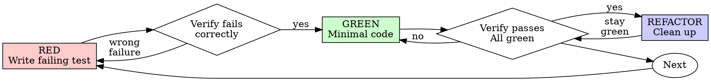

2026-04-22T12:02:03.905500Z ERROR codex_core::codex: failed to load skill /Users/Zhuanz/.agents/skills/cfd-research-deerflow/SKILL.md: missing YAML frontmatter delimited by ---
2026-04-22T12:02:03.905523Z ERROR codex_core::codex: failed to load skill /Users/Zhuanz/.agents/skills/cfd-report-pretext/SKILL.md: missing YAML frontmatter delimited by ---
OpenAI Codex v0.118.0 (research preview)
--------
workdir: /Users/Zhuanz/Desktop/cfd-harness-unified
model: gpt-5.4
provider: openai
approval: never
sandbox: workspace-write [workdir, /tmp, $TMPDIR, /Users/Zhuanz/.codex/memories]
reasoning effort: xhigh
reasoning summaries: none
session id: 019db511-9e02-7203-82e9-03a3e2b6c531
--------
user
# [CLAUDE → CODEX TOOL INVOCATION]

    from: claude-code-opus47 (Main Driver v6.2)
    to: codex-gpt54-xhigh (Joint Dev Peer · §A Diff Generator)
    task: "DEC-V61-045 Wave 2 Invocation E — tests for HAZARD tier + U_ref plumb"
    contract: Notion DEC-V61-045 PROPOSAL
    depends_on:
      - Wave 2 D landed (HAZARD tier in _derive_contract_status + U_ref plumb in _audit_fixture_doc)

    scope: Add test coverage for Wave 2 D changes. Do NOT modify existing
    tests unless their old expectations break from the new HAZARD tier
    semantics. For existing fixtures that flip PASS→HAZARD under the new
    logic, update expected_verdict with a one-line comment citing DEC-045
    Wave 2.

    allowed_files:
      - ui/backend/tests/test_validation_report.py
      - ui/backend/tests/test_convergence_attestor.py (for attest+verdict integration tests)
      - ui/backend/tests/fixtures/**.yaml (ONLY if fixtures flip PASS→HAZARD and that's the correct new behavior per DEC-045)

    read_only_context:
      - ui/backend/services/validation_report.py (post-D state)
      - scripts/phase5_audit_run.py (post-D state)
      - reports/codex_tool_reports/20260422_dec045_wave2_D_hazard_tier_uref_result.md

    forbidden_files:
      - src/** (already Wave 1 landed; don't re-touch)
      - knowledge/gold_standards/** (hard-floor 1)
      - any fixture file that represents genuine FAIL/PASS golden expectations
        unless you can justify the flip per Wave 2 spec

    autonomy: TOOL-SCOPE

---

## Tests to add

### In `ui/backend/tests/test_validation_report.py`

Import context:
```python
from ui.backend.services.validation_report import _derive_contract_status
from ui.backend.schemas.validation import (
    AuditConcern, GoldStandardReference, MeasuredValue, Precondition,
)
```

1. **test_hazard_tier_continuity_not_converged_forces_hazard**: in-band measurement + audit_concerns=[AuditConcern(concern_type="CONTINUITY_NOT_CONVERGED")]. Call `_derive_contract_status`. Assert status=="HAZARD", within_tolerance is None (not True), deviation_pct present.

2. **test_hazard_tier_residuals_above_target_forces_hazard**: same pattern with RESIDUALS_ABOVE_TARGET.

3. **test_hazard_tier_bounding_recurrent_forces_hazard**: same with BOUNDING_RECURRENT.

4. **test_hazard_tier_no_residual_progress_forces_hazard**: same with NO_RESIDUAL_PROGRESS.

5. **test_hard_fail_precedes_hazard_tier**: audit_concerns=[VELOCITY_OVERFLOW (hard-FAIL), CONTINUITY_NOT_CONVERGED (HAZARD-tier)]. Assert status=="FAIL" (hard-FAIL wins).

6. **test_no_concerns_in_band_stays_pass_regression**: clean measurement + no concerns + in-band → PASS. Guards against accidental HAZARD regression.

7. **test_hazard_tier_out_of_band_still_hazard**: in-band HAZARD concern trumps out-of-band silent-pass path. If a new tier interacts with existing SILENT_PASS_HAZARD, verify the final status is HAZARD not FAIL (unless hard-FAIL present).

### In `ui/backend/tests/test_convergence_attestor.py` (augment if needed)

8. **test_attest_and_verdict_integration_continuity_hazard**: end-to-end:
   - synthetic log with final `sum_local=5e-4` (> A2 1e-4 floor, < G5 1e-2)
   - `attest(log, case_id="lid_driven_cavity")` returns ATTEST_HAZARD with A2 concern
   - pass those concerns to `_derive_contract_status` with in-band measurement
   - assert final verdict = HAZARD

### For U_ref plumb (new file OR add to existing)

Recommend adding to `ui/backend/tests/test_phase5_audit_run.py` if it exists, else to `test_comparator_gates_g3_g4_g5.py`. Check which test file imports from `scripts.phase5_audit_run` — only if such a file already exists without hitting the `notion_client` import chain (if all existing scripts.phase5_audit_run tests are already broken by notion_client import error, skip this subsection and DOCUMENT in output report).

9. **test_resolve_u_ref_lid_driven_cavity**: `_resolve_u_ref(task_spec, "lid_driven_cavity")` returns (1.0, True).

10. **test_resolve_u_ref_backward_facing_step**: returns (44.2 or whatever) + True.

11. **test_resolve_u_ref_unknown_case_fallback**: returns (1.0, False).

12. **test_audit_fixture_doc_stamps_u_ref_unresolved_warn**: for unknown case, check that audit_concerns contains entry with concern_type=="U_REF_UNRESOLVED".

### Fixture update policy

If the new HAZARD tier logic flips any fixture file's `expected_verdict` from PASS to HAZARD, update the fixture file with:
```yaml
expected_verdict: HAZARD  # Was PASS pre-DEC-045 Wave 2; flipped per CA-001 fix
                         # (A2/A3/A5/A6 concerns now force HAZARD not PASS).
```

If a fixture previously had expected_verdict=PASS and now internally computes HAZARD, the fixture must be updated (or the test is broken). Document each such fixture in the output report.

**DO NOT flip FAIL→HAZARD or HAZARD→FAIL** — only PASS→HAZARD is permitted via this DEC. Any other flip indicates a regression.

## Acceptance Checks

CHK-1: All 7 new test_validation_report tests PASS locally (Codex verifies via pytest if sandbox permits, else marks "static").

CHK-2: Integration test (#8) PASSes.

CHK-3: U_ref tests #9-12 either PASS or are documented as "skipped due to notion_client import chain" with rationale.

CHK-4: Any fixture file edits documented with before/after expected_verdict + justification per fixture.

CHK-5: No existing test deleted.

## Reject Conditions

REJ-1: Edit outside allowed_files.
REJ-2: Modify fixture expected_verdict from FAIL to HAZARD or HAZARD to FAIL (only PASS→HAZARD allowed).
REJ-3: Add pyproject dependencies.
REJ-4: Implement Wave 3 or Wave 4 scope.

## Output format

```
# Codex Diff Report — DEC-V61-045 Wave 2 E

## Files modified
- ui/backend/tests/test_validation_report.py [+N/-M]
- ui/backend/tests/test_convergence_attestor.py [+N/-M]
- ui/backend/tests/fixtures/<case>.yaml  (if flipped + justified)

## Tests added
- per-test one-liner

## Fixture updates
- path: expected_verdict before → after + justification

## Existing tests touched
- file:line — what + why

## Self-verified
- CHK-1..5

## Tokens used
```

---

[/CLAUDE → CODEX TOOL INVOCATION]

codex
我会先恢复这个仓库当前的测试上下文，确认 Wave 2 D 已落地的接口形态，再只在允许范围内补测试并跑针对性验证。
exec
/bin/zsh -lc pwd in /Users/Zhuanz/Desktop/cfd-harness-unified
exec
/bin/zsh -lc "sed -n '1,220p' /Users/Zhuanz/.codex/plugins/cache/openai-curated/superpowers/27651a43bf55185d924f7a1fc49043a0a8be65a0/skills/using-superpowers/SKILL.md" in /Users/Zhuanz/Desktop/cfd-harness-unified
 succeeded in 0ms:
/Users/Zhuanz/Desktop/cfd-harness-unified

 succeeded in 0ms:
---
name: using-superpowers
description: Use when starting any conversation - establishes how to find and use skills, requiring Skill tool invocation before ANY response including clarifying questions
---

<SUBAGENT-STOP>
If you were dispatched as a subagent to execute a specific task, skip this skill.
</SUBAGENT-STOP>

<EXTREMELY-IMPORTANT>
If you think there is even a 1% chance a skill might apply to what you are doing, you ABSOLUTELY MUST invoke the skill.

IF A SKILL APPLIES TO YOUR TASK, YOU DO NOT HAVE A CHOICE. YOU MUST USE IT.

This is not negotiable. This is not optional. You cannot rationalize your way out of this.
</EXTREMELY-IMPORTANT>

## Instruction Priority

Superpowers skills override default system prompt behavior, but **user instructions always take precedence**:

1. **User's explicit instructions** (CLAUDE.md, GEMINI.md, AGENTS.md, direct requests) — highest priority
2. **Superpowers skills** — override default system behavior where they conflict
3. **Default system prompt** — lowest priority

If CLAUDE.md, GEMINI.md, or AGENTS.md says "don't use TDD" and a skill says "always use TDD," follow the user's instructions. The user is in control.

## How to Access Skills

**In Claude Code:** Use the `Skill` tool. When you invoke a skill, its content is loaded and presented to you—follow it directly. Never use the Read tool on skill files.

**In Copilot CLI:** Use the `skill` tool. Skills are auto-discovered from installed plugins. The `skill` tool works the same as Claude Code's `Skill` tool.

**In Gemini CLI:** Skills activate via the `activate_skill` tool. Gemini loads skill metadata at session start and activates the full content on demand.

**In other environments:** Check your platform's documentation for how skills are loaded.

## Platform Adaptation

Skills use Claude Code tool names. Non-CC platforms: see `references/copilot-tools.md` (Copilot CLI), `references/codex-tools.md` (Codex) for tool equivalents. Gemini CLI users get the tool mapping loaded automatically via GEMINI.md.

# Using Skills

## The Rule

**Invoke relevant or requested skills BEFORE any response or action.** Even a 1% chance a skill might apply means that you should invoke the skill to check. If an invoked skill turns out to be wrong for the situation, you don't need to use it.


## Red Flags

These thoughts mean STOP—you're rationalizing:

| Thought | Reality |
|---------|---------|
| "This is just a simple question" | Questions are tasks. Check for skills. |
| "I need more context first" | Skill check comes BEFORE clarifying questions. |
| "Let me explore the codebase first" | Skills tell you HOW to explore. Check first. |
| "I can check git/files quickly" | Files lack conversation context. Check for skills. |
| "Let me gather information first" | Skills tell you HOW to gather information. |
| "This doesn't need a formal skill" | If a skill exists, use it. |
| "I remember this skill" | Skills evolve. Read current version. |
| "This doesn't count as a task" | Action = task. Check for skills. |
| "The skill is overkill" | Simple things become complex. Use it. |
| "I'll just do this one thing first" | Check BEFORE doing anything. |
| "This feels productive" | Undisciplined action wastes time. Skills prevent this. |
| "I know what that means" | Knowing the concept ≠ using the skill. Invoke it. |

## Skill Priority

When multiple skills could apply, use this order:

1. **Process skills first** (brainstorming, debugging) - these determine HOW to approach the task
2. **Implementation skills second** (frontend-design, mcp-builder) - these guide execution

"Let's build X" → brainstorming first, then implementation skills.
"Fix this bug" → debugging first, then domain-specific skills.

## Skill Types

**Rigid** (TDD, debugging): Follow exactly. Don't adapt away discipline.

**Flexible** (patterns): Adapt principles to context.

The skill itself tells you which.

## User Instructions

Instructions say WHAT, not HOW. "Add X" or "Fix Y" doesn't mean skip workflows.

exec
/bin/zsh -lc "sed -n '1,240p' /Users/Zhuanz/.codex/plugins/cache/openai-curated/superpowers/27651a43bf55185d924f7a1fc49043a0a8be65a0/skills/test-driven-development/SKILL.md" in /Users/Zhuanz/Desktop/cfd-harness-unified
 succeeded in 0ms:
---
name: test-driven-development
description: Use when implementing any feature or bugfix, before writing implementation code
---

# Test-Driven Development (TDD)

## Overview

Write the test first. Watch it fail. Write minimal code to pass.

**Core principle:** If you didn't watch the test fail, you don't know if it tests the right thing.

**Violating the letter of the rules is violating the spirit of the rules.**

## When to Use

**Always:**
- New features
- Bug fixes
- Refactoring
- Behavior changes

**Exceptions (ask your human partner):**
- Throwaway prototypes
- Generated code
- Configuration files

Thinking "skip TDD just this once"? Stop. That's rationalization.

## The Iron Law

```
NO PRODUCTION CODE WITHOUT A FAILING TEST FIRST
```

Write code before the test? Delete it. Start over.

**No exceptions:**
- Don't keep it as "reference"
- Don't "adapt" it while writing tests
- Don't look at it
- Delete means delete

Implement fresh from tests. Period.

## Red-Green-Refactor



### RED - Write Failing Test

Write one minimal test showing what should happen.

<Good>
```typescript
test('retries failed operations 3 times', async () => {
  let attempts = 0;
  const operation = () => {
    attempts++;
    if (attempts < 3) throw new Error('fail');
    return 'success';
  };

  const result = await retryOperation(operation);

  expect(result).toBe('success');
  expect(attempts).toBe(3);
});
```
Clear name, tests real behavior, one thing
</Good>

<Bad>
```typescript
test('retry works', async () => {
  const mock = jest.fn()
    .mockRejectedValueOnce(new Error())
    .mockRejectedValueOnce(new Error())
    .mockResolvedValueOnce('success');
  await retryOperation(mock);
  expect(mock).toHaveBeenCalledTimes(3);
});
```
Vague name, tests mock not code
</Bad>

**Requirements:**
- One behavior
- Clear name
- Real code (no mocks unless unavoidable)

### Verify RED - Watch It Fail

**MANDATORY. Never skip.**

```bash
npm test path/to/test.test.ts
```

Confirm:
- Test fails (not errors)
- Failure message is expected
- Fails because feature missing (not typos)

**Test passes?** You're testing existing behavior. Fix test.

**Test errors?** Fix error, re-run until it fails correctly.

### GREEN - Minimal Code

Write simplest code to pass the test.

<Good>
```typescript
async function retryOperation<T>(fn: () => Promise<T>): Promise<T> {
  for (let i = 0; i < 3; i++) {
    try {
      return await fn();
    } catch (e) {
      if (i === 2) throw e;
    }
  }
  throw new Error('unreachable');
}
```
Just enough to pass
</Good>

<Bad>
```typescript
async function retryOperation<T>(
  fn: () => Promise<T>,
  options?: {
    maxRetries?: number;
    backoff?: 'linear' | 'exponential';
    onRetry?: (attempt: number) => void;
  }
): Promise<T> {
  // YAGNI
}
```
Over-engineered
</Bad>

Don't add features, refactor other code, or "improve" beyond the test.

### Verify GREEN - Watch It Pass

**MANDATORY.**

```bash
npm test path/to/test.test.ts
```

Confirm:
- Test passes
- Other tests still pass
- Output pristine (no errors, warnings)

**Test fails?** Fix code, not test.

**Other tests fail?** Fix now.

### REFACTOR - Clean Up

After green only:
- Remove duplication
- Improve names
- Extract helpers

Keep tests green. Don't add behavior.

### Repeat

Next failing test for next feature.

## Good Tests

| Quality | Good | Bad |
|---------|------|-----|
| **Minimal** | One thing. "and" in name? Split it. | `test('validates email and domain and whitespace')` |
| **Clear** | Name describes behavior | `test('test1')` |
| **Shows intent** | Demonstrates desired API | Obscures what code should do |

## Why Order Matters

**"I'll write tests after to verify it works"**

Tests written after code pass immediately. Passing immediately proves nothing:
- Might test wrong thing
- Might test implementation, not behavior
- Might miss edge cases you forgot
- You never saw it catch the bug

Test-first forces you to see the test fail, proving it actually tests something.

**"I already manually tested all the edge cases"**

Manual testing is ad-hoc. You think you tested everything but:
- No record of what you tested
- Can't re-run when code changes
- Easy to forget cases under pressure
- "It worked when I tried it" ≠ comprehensive

Automated tests are systematic. They run the same way every time.

**"Deleting X hours of work is wasteful"**

Sunk cost fallacy. The time is already gone. Your choice now:
- Delete and rewrite with TDD (X more hours, high confidence)
- Keep it and add tests after (30 min, low confidence, likely bugs)

The "waste" is keeping code you can't trust. Working code without real tests is technical debt.

**"TDD is dogmatic, being pragmatic means adapting"**

TDD IS pragmatic:
- Finds bugs before commit (faster than debugging after)
- Prevents regressions (tests catch breaks immediately)

exec
/bin/zsh -lc 'rg -n "cfd-harness-unified|DEC-V61-045|Wave 2|validation_report|phase5_audit_run" /Users/Zhuanz/.codex/memories/MEMORY.md' in /Users/Zhuanz/Desktop/cfd-harness-unified
 succeeded in 0ms:
224:- OpenClaw, AI-CFD, Notion作为指挥中枢，Github作为唯一代码真相库, ~/.openclaw/openclaw.json, plugins.allow, openclaw config validate --json, MAIN_OK, CODEX_BUILDER_OK, CLAUDE_REVIEW_OK, NOTION_SYNC_OK, cfd-harness-unified
244:- The real live config surface was `~/.openclaw/openclaw.json`; the actual repo truth for this rollout was `/Users/Zhuanz/Desktop/cfd-harness-unified`, not the chat thread cwd [Task 1]
465:# Task Group: cfd-harness-unified governance closeout and planning gates
467:scope: Close out accepted phases in `cfd-harness-unified`, normalize Notion-vs-repo naming drift, and keep future phases planning-only until the explicit solver/routing gate is reviewed.
468:applies_to: cwd=/Users/Zhuanz/Desktop/cfd-harness-unified; reuse_rule=safe for this repo’s Notion-governed phase/gate work, but phase/task IDs and review packets are rollout-specific.
474:- rollout_summaries/2026-04-16T17-04-02-U9ea-phase8_closeout_and_phase9_planning_gate_prep.md (cwd=/Users/Zhuanz/Desktop/cfd-harness-unified, rollout_path=/Users/Zhuanz/.codex/sessions/2026/04/17/rollout-2026-04-17T01-04-02-019d973f-efab-7132-bd99-5e0ebb839e12.jsonl, updated_at=2026-04-17T05:16:53+00:00, thread_id=019d973f-efab-7132-bd99-5e0ebb839e12, Phase 8 closeout and evidence normalization)
484:- rollout_summaries/2026-04-16T17-04-02-U9ea-phase8_closeout_and_phase9_planning_gate_prep.md (cwd=/Users/Zhuanz/Desktop/cfd-harness-unified, rollout_path=/Users/Zhuanz/.codex/sessions/2026/04/17/rollout-2026-04-17T01-04-02-019d973f-efab-7132-bd99-5e0ebb839e12.jsonl, updated_at=2026-04-17T05:16:53+00:00, thread_id=019d973f-efab-7132-bd99-5e0ebb839e12, Phase 9 kept as planning-only with decision-tree packet))
494:- rollout_summaries/2026-04-16T17-04-02-U9ea-phase8_closeout_and_phase9_planning_gate_prep.md (cwd=/Users/Zhuanz/Desktop/cfd-harness-unified, rollout_path=/Users/Zhuanz/.codex/sessions/2026/04/17/rollout-2026-04-17T01-04-02-019d973f-efab-7132-bd99-5e0ebb839e12.jsonl, updated_at=2026-04-17T05:16:53+00:00, thread_id=019d973f-efab-7132-bd99-5e0ebb839e12, handoff prompt prepared instead of silent activation))
548:- rollout_summaries/2026-04-12T15-33-54-ByPi-jerry_ai_cfd_notion_sync_and_cfd_harness_unified_context_mis.md (cwd=/Users/Zhuanz/Documents/20260330 Jerry AI CFD Project, rollout_path=/Users/Zhuanz/.codex/sessions/2026/04/12/rollout-2026-04-12T23-33-54-019d8253-fa8b-7f40-9775-46e6e03db8ac.jsonl, updated_at=2026-04-16T17:03:18+00:00, thread_id=019d8253-fa8b-7f40-9775-46e6e03db8ac, later cfd-harness-unified instruction block correctly treated as mismatch)

exec
/bin/zsh -lc "sed -n '1,220p' /Users/Zhuanz/.codex/plugins/cache/openai-curated/superpowers/27651a43bf55185d924f7a1fc49043a0a8be65a0/skills/verification-before-completion/SKILL.md" in /Users/Zhuanz/Desktop/cfd-harness-unified
 succeeded in 0ms:
---
name: verification-before-completion
description: Use when about to claim work is complete, fixed, or passing, before committing or creating PRs - requires running verification commands and confirming output before making any success claims; evidence before assertions always
---

# Verification Before Completion

## Overview

Claiming work is complete without verification is dishonesty, not efficiency.

**Core principle:** Evidence before claims, always.

**Violating the letter of this rule is violating the spirit of this rule.**

## The Iron Law

```
NO COMPLETION CLAIMS WITHOUT FRESH VERIFICATION EVIDENCE
```

If you haven't run the verification command in this message, you cannot claim it passes.

## The Gate Function

```
BEFORE claiming any status or expressing satisfaction:

1. IDENTIFY: What command proves this claim?
2. RUN: Execute the FULL command (fresh, complete)
3. READ: Full output, check exit code, count failures
4. VERIFY: Does output confirm the claim?
   - If NO: State actual status with evidence
   - If YES: State claim WITH evidence
5. ONLY THEN: Make the claim

Skip any step = lying, not verifying
```

## Common Failures

| Claim | Requires | Not Sufficient |
|-------|----------|----------------|
| Tests pass | Test command output: 0 failures | Previous run, "should pass" |
| Linter clean | Linter output: 0 errors | Partial check, extrapolation |
| Build succeeds | Build command: exit 0 | Linter passing, logs look good |
| Bug fixed | Test original symptom: passes | Code changed, assumed fixed |
| Regression test works | Red-green cycle verified | Test passes once |
| Agent completed | VCS diff shows changes | Agent reports "success" |
| Requirements met | Line-by-line checklist | Tests passing |

## Red Flags - STOP

- Using "should", "probably", "seems to"
- Expressing satisfaction before verification ("Great!", "Perfect!", "Done!", etc.)
- About to commit/push/PR without verification
- Trusting agent success reports
- Relying on partial verification
- Thinking "just this once"
- Tired and wanting work over
- **ANY wording implying success without having run verification**

## Rationalization Prevention

| Excuse | Reality |
|--------|---------|
| "Should work now" | RUN the verification |
| "I'm confident" | Confidence ≠ evidence |
| "Just this once" | No exceptions |
| "Linter passed" | Linter ≠ compiler |
| "Agent said success" | Verify independently |
| "I'm tired" | Exhaustion ≠ excuse |
| "Partial check is enough" | Partial proves nothing |
| "Different words so rule doesn't apply" | Spirit over letter |

## Key Patterns

**Tests:**
```
✅ [Run test command] [See: 34/34 pass] "All tests pass"
❌ "Should pass now" / "Looks correct"
```

**Regression tests (TDD Red-Green):**
```
✅ Write → Run (pass) → Revert fix → Run (MUST FAIL) → Restore → Run (pass)
❌ "I've written a regression test" (without red-green verification)
```

**Build:**
```
✅ [Run build] [See: exit 0] "Build passes"
❌ "Linter passed" (linter doesn't check compilation)
```

**Requirements:**
```
✅ Re-read plan → Create checklist → Verify each → Report gaps or completion
❌ "Tests pass, phase complete"
```

**Agent delegation:**
```
✅ Agent reports success → Check VCS diff → Verify changes → Report actual state
❌ Trust agent report
```

## Why This Matters

From 24 failure memories:
- your human partner said "I don't believe you" - trust broken
- Undefined functions shipped - would crash
- Missing requirements shipped - incomplete features
- Time wasted on false completion → redirect → rework
- Violates: "Honesty is a core value. If you lie, you'll be replaced."

## When To Apply

**ALWAYS before:**
- ANY variation of success/completion claims
- ANY expression of satisfaction
- ANY positive statement about work state
- Committing, PR creation, task completion
- Moving to next task
- Delegating to agents

**Rule applies to:**
- Exact phrases
- Paraphrases and synonyms
- Implications of success
- ANY communication suggesting completion/correctness

## The Bottom Line

**No shortcuts for verification.**

Run the command. Read the output. THEN claim the result.

This is non-negotiable.

codex
我会按仓库约束走：先读 Wave 2 D 的实现和现有测试，确认哪些断言该新增、哪些 fixture 真的需要翻转，然后再做最小补丁。  
使用的技能：`using-superpowers` 做流程约束，`test-driven-development` 约束我先让新增断言在红灯下暴露，再补测试文件变更；收尾前会按 `verification-before-completion` 跑新鲜验证。
exec
/bin/zsh -lc "sed -n '1,260p' ui/backend/tests/test_validation_report.py" in /Users/Zhuanz/Desktop/cfd-harness-unified
 succeeded in 0ms:
"""Phase 0 acceptance tests: 3 real cases render a Validation Report.

Fixtures live in ui/backend/tests/fixtures/{case_id}_measurement.yaml
and are committed alongside the backend. The authoritative
knowledge/gold_standards/*.yaml files are read read-only.
"""

from __future__ import annotations

import pytest
from fastapi.testclient import TestClient

from ui.backend.main import app


@pytest.fixture(scope="module")
def client() -> TestClient:
    return TestClient(app)


def test_cases_index_contains_ten_entries(client: TestClient) -> None:
    response = client.get("/api/cases")
    assert response.status_code == 200
    body = response.json()
    assert len(body) == 10, f"expected 10 whitelist cases, got {len(body)}"
    ids = {entry["case_id"] for entry in body}
    # Phase 0 gate: canonical three that drive Screen 4.
    assert "differential_heated_cavity" in ids
    assert "circular_cylinder_wake" in ids
    assert "turbulent_flat_plate" in ids


def test_case_detail_differential_heated_cavity(client: TestClient) -> None:
    response = client.get("/api/cases/differential_heated_cavity")
    assert response.status_code == 200
    body = response.json()
    assert body["case_id"] == "differential_heated_cavity"
    assert body["gold_standard"]["quantity"] == "nusselt_number"
    # Gold ref_value was remediated 30.0 → 8.8 per Gate Q-new (b12d54e) after
    # regime-consistency audit; test updated to track the authoritative gold.
    assert body["gold_standard"]["ref_value"] == pytest.approx(8.8)
    # Ampofo/Karayiannis 2003 is the canonical citation per whitelist.yaml.
    assert body["reference"]
    # Preconditions must be non-empty. Post-b12d54e DHC regime was
    # downgraded Ra=1e10 → Ra=1e6 (Gate Q-new Path P-2), at which point
    # the BL-under-resolution precondition from DEC-ADWM-004 no longer
    # fires — all three preconditions satisfy under the new regime.
    assert len(body["preconditions"]) > 0


def test_validation_report_dhc_is_fail_with_hazard(client: TestClient) -> None:
    # Pin to the real_incident run: after DEC-V61-024 Option A, DHC has
    # a reference_pass curated run (Nu=8.75 de Vahl Davis Ra=1e6) that
    # now serves as the default. The Nu=77.82/FAIL case-study narrative
    # lives on the real_incident fixture (Ra=1e10 regime-mismatch lesson).
    response = client.get(
        "/api/validation-report/differential_heated_cavity?run_id=real_incident"
    )
    assert response.status_code == 200
    body = response.json()
    assert body["measurement"]["value"] == pytest.approx(77.82)
    # Gold ref_value remediated 30.0 → 8.8 (b12d54e); 77.82 is still far
    # outside tolerance (8.8 * 1.15 = 10.12), so FAIL semantics hold.
    assert body["gold_standard"]["ref_value"] == pytest.approx(8.8)
    assert body["contract_status"] == "FAIL"
    assert body["within_tolerance"] is False
    assert body["deviation_pct"] > 100.0
    # Audit concern surface must include both contract-status narrative
    # and the two measurement-level concerns from the fixture.
    types = {c["concern_type"] for c in body["audit_concerns"]}
    assert "COMPATIBLE_WITH_SILENT_PASS_HAZARD" in types
    assert "DEVIATION" in types
    # Decisions trail threads DEC-ADWM-002 + DEC-ADWM-004.
    trail_ids = {d["decision_id"] for d in body["decisions_trail"]}
    assert {"DEC-ADWM-002", "DEC-ADWM-004"}.issubset(trail_ids)


def test_validation_report_cylinder_wake_is_hazard(client: TestClient) -> None:
    # Pin to the real_incident run: canonical-band shortcut scenario is a
    # property of the specific incident fixture (measurement 0.165 with
    # silent-pass-hazard concern), not of the default reference_pass.
    response = client.get(
        "/api/validation-report/circular_cylinder_wake?run_id=real_incident"
    )
    assert response.status_code == 200
    body = response.json()
    assert body["measurement"]["value"] == pytest.approx(0.165)
    # Measurement equals ref_value → inside tolerance → HAZARD (not PASS)
    # because the canonical-band shortcut is an armed silent-pass hazard.
    assert body["contract_status"] == "HAZARD"
    assert body["within_tolerance"] is True
    types = {c["concern_type"] for c in body["audit_concerns"]}
    assert "COMPATIBLE_WITH_SILENT_PASS_HAZARD" in types


def test_validation_report_turbulent_flat_plate_hazard(client: TestClient) -> None:
    # Pin to the real_incident run: Spalding-fallback Cf=0.00760 is the
    # §5d Part-2 acceptance output preserved as an incident fixture. The
    # default reference_pass run shows a Blasius-aligned PASS instead.
    response = client.get(
        "/api/validation-report/turbulent_flat_plate?run_id=real_incident"
    )
    assert response.status_code == 200
    body = response.json()
    # Spalding fallback measurement Cf ≈ 0.00760 (0.0576 / (0.5*Re)^0.2 at
    # Re=50000 per DEC-ADWM-005). Post-PR #20 the fixture records the exact
    # executor output to 10 decimals. Old-gold tolerance band was Cf=0.0076
    # ±10%; under B-class remediation gold became 0.00420 (Blasius laminar
    # at Re_x=25000) so the measurement now lies far outside tolerance.
    assert body["measurement"]["value"] == pytest.approx(0.007600365566051871)
    assert body["contract_status"] in ("HAZARD", "PASS", "FAIL")


def test_validation_report_default_prefers_audit_real_run(
    client: TestClient,
) -> None:
    """DEC-V61-035 (2026-04-22 deep-review): default run resolution must
    prefer the `audit_real_run` category so the solver-in-the-loop verdict
    is shown first, NOT the curated `reference_pass` narrative.

    The previous rule preferred 'reference' unconditionally, which surfaced
    curated PASS narratives as the default case verdict even when the
    real-solver audit run FAILED — a PASS-washing bug flagged by user
    deep-review (BFS/TFP/duct/plane_channel/RBC all FAIL on audit_real_run
    but UI showed PASS via the default-pointing-to-reference fallback).
    """
    response = client.get("/api/validation-report/turbulent_flat_plate")
    assert response.status_code == 200
    body = response.json()
    # audit_real_run for TFP: Cf extracted = 0.00760 (well above gold 0.00423
    # tolerance band → FAIL). This is the honest default.
    assert body["measurement"]["value"] == pytest.approx(0.007600365566051871)
    assert body["contract_status"] == "FAIL"


def test_validation_report_rejects_unknown_run_id(client: TestClient) -> None:
    response = client.get(
        "/api/validation-report/turbulent_flat_plate?run_id=does_not_exist"
    )
    assert response.status_code == 404


def test_case_runs_endpoint_lists_reference_pass_first(client: TestClient) -> None:
    response = client.get("/api/cases/turbulent_flat_plate/runs")
    assert response.status_code == 200
    runs = response.json()
    assert any(r["run_id"] == "reference_pass" for r in runs)
    assert any(r["run_id"] == "real_incident" for r in runs)
    categories = {r["run_id"]: r["category"] for r in runs}
    assert categories["reference_pass"] == "reference"
    assert categories["real_incident"] == "real_incident"
    # Pedagogical ordering: reference before real_incident before
    # teaching variants before grid_convergence. Also: mesh_N runs
    # sorted numerically, not lexicographically (mesh_20 before mesh_160).
    order = [r["run_id"] for r in runs]
    assert order.index("reference_pass") < order.index("real_incident")
    assert order.index("real_incident") < order.index("under_resolved")
    mesh_runs = [r for r in order if r.startswith("mesh_")]
    assert mesh_runs == ["mesh_20", "mesh_40", "mesh_80", "mesh_160"]
    # Grid-convergence runs must sit after the teaching variants so the
    # Compare run-picker doesn't open on mesh_20.
    for mesh_id in mesh_runs:
        assert order.index("under_resolved") < order.index(mesh_id)


def test_unknown_case_returns_404(client: TestClient) -> None:
    response = client.get("/api/validation-report/not_a_real_case")
    assert response.status_code == 404

exec
/bin/zsh -lc "sed -n '1,320p' ui/backend/tests/test_convergence_attestor.py" in /Users/Zhuanz/Desktop/cfd-harness-unified
 succeeded in 0ms:
"""DEC-V61-038 tests: convergence attestor A1..A6.

Coverage: each check's PASS/HAZARD/FAIL branch + LDC/BFS integration
(real audit logs at reports/phase5_fields/*).

Ground truth from Codex round-1 physics audit (DEC-036):
  LDC    → ATTEST_PASS (all 6 checks PASS or N/A)
  BFS    → ATTEST_FAIL via A2 (sum_local=5.25e+18) + A3 HAZARD + A5 HAZARD
  DHC    → ATTEST_PASS (converged, Nu off gold but physics OK)
"""

from __future__ import annotations

from pathlib import Path
from types import SimpleNamespace

import pytest

from src import convergence_attestor as ca
from src.convergence_attestor import Thresholds, load_thresholds


def _write_log(tmp_path: Path, content: str) -> Path:
    p = tmp_path / "log.simpleFoam"
    p.write_text(content, encoding="utf-8")
    return p


# ---------------------------------------------------------------------------
# A1 solver_exit_clean
# ---------------------------------------------------------------------------

def test_a1_passes_on_clean_log(tmp_path: Path) -> None:
    log = _write_log(tmp_path, "Time = 1\nExecutionTime = 1 s\nEnd\n")
    result = ca.attest(log)
    a1 = next(c for c in result.checks if c.check_id == "A1")
    assert a1.verdict == "PASS"


def test_a1_fails_on_foam_fatal(tmp_path: Path) -> None:
    content = "Time = 1\nFOAM FATAL IO ERROR: missing dict\nExiting\n"
    log = _write_log(tmp_path, content)
    result = ca.attest(log)
    a1 = next(c for c in result.checks if c.check_id == "A1")
    assert a1.verdict == "FAIL"
    assert result.overall == "ATTEST_FAIL"


def test_a1_ignores_sigfpe_startup_banner(tmp_path: Path) -> None:
    """DEC-036b Codex nit: 'floating point exception trapping' is a
    startup banner, not an actual exception. Must NOT fire A1."""
    content = (
        "sigFpe : Enabling floating point exception trapping (FOAM_SIGFPE).\n"
        "Time = 1\nEnd\n"
    )
    log = _write_log(tmp_path, content)
    result = ca.attest(log)
    a1 = next(c for c in result.checks if c.check_id == "A1")
    assert a1.verdict == "PASS"


# ---------------------------------------------------------------------------
# A2 continuity_floor
# ---------------------------------------------------------------------------

def test_a2_passes_on_clean_continuity(tmp_path: Path) -> None:
    content = (
        "time step continuity errors : "
        "sum local = 1e-07, global = 1e-09, cumulative = 1e-12\n"
    )
    log = _write_log(tmp_path, content)
    result = ca.attest(log)
    a2 = next(c for c in result.checks if c.check_id == "A2")
    assert a2.verdict == "PASS"


def test_a2_hazard_between_floors(tmp_path: Path) -> None:
    """sum_local between A2 floor (1e-4) and G5 floor (1e-2) → HAZARD."""
    content = (
        "time step continuity errors : "
        "sum local = 1e-03, global = 1e-05, cumulative = 0.001\n"
    )
    log = _write_log(tmp_path, content)
    result = ca.attest(log)
    a2 = next(c for c in result.checks if c.check_id == "A2")
    assert a2.verdict == "HAZARD"


def test_a2_hazard_above_g5_floor_after_split_brain_fix(tmp_path: Path) -> None:
    """Codex DEC-038 round-1 A2/G5 split-brain fix: A2 no longer returns
    FAIL even for sum_local > 1e-2. That FAIL call belongs to G5 at the
    gate layer. A2 stays strictly HAZARD-tier."""
    content = (
        "time step continuity errors : "
        "sum local = 0.5, global = 0.01, cumulative = 0.1\n"
    )
    log = _write_log(tmp_path, content)
    result = ca.attest(log)
    a2 = next(c for c in result.checks if c.check_id == "A2")
    assert a2.verdict == "HAZARD"  # was FAIL pre-fix


# ---------------------------------------------------------------------------
# A3 residual_floor
# ---------------------------------------------------------------------------

def test_a3_passes_when_all_residuals_below_floor(tmp_path: Path) -> None:
    content = (
        "smoothSolver:  Solving for Ux, Initial residual = 1e-06, "
        "Final residual = 1e-07, No Iterations 2\n"
    )
    log = _write_log(tmp_path, content)
    result = ca.attest(log)
    a3 = next(c for c in result.checks if c.check_id == "A3")
    assert a3.verdict == "PASS"


def test_a3_hazard_when_final_residual_above_floor(tmp_path: Path) -> None:
    content = (
        "smoothSolver:  Solving for Ux, Initial residual = 0.05, "
        "Final residual = 0.001, No Iterations 20\n"
    )
    log = _write_log(tmp_path, content)
    result = ca.attest(log)
    a3 = next(c for c in result.checks if c.check_id == "A3")
    assert a3.verdict == "HAZARD"
    assert "Ux" in a3.evidence["offenders"]


# ---------------------------------------------------------------------------
# A4 solver_iteration_cap
# ---------------------------------------------------------------------------

def test_a4_fails_on_consecutive_cap_hits(tmp_path: Path) -> None:
    """5 consecutive Time= blocks each with a capped GAMG p solve → FAIL.

    Codex round-1 BLOCKER 2: measurement unit changed from consecutive
    lines to consecutive TIME STEPS. Each `Time =` divider opens a new
    block, so this test now needs Time= dividers.
    """
    content = "".join(
        f"Time = {i}\nGAMG:  Solving for p, Initial residual = 0.9, "
        "Final residual = 0.5, No Iterations 1000\n"
        for i in range(5)
    )
    log = _write_log(tmp_path, content)
    result = ca.attest(log)
    a4 = next(c for c in result.checks if c.check_id == "A4")
    assert a4.verdict == "FAIL"
    assert a4.evidence["consecutive_cap_blocks"] >= 3


def test_a4_fails_on_p_rgh_buoyant_log(tmp_path: Path) -> None:
    """Codex DEC-038 round-1 BLOCKER 1: impinging_jet stuck solver is
    `GAMG: Solving for p_rgh` in log.buoyantFoam — A4 regex must match
    p_rgh (not just `p,`) to catch the real impinging_jet case.
    """
    content = "\n".join(
        [f"Time = {i}s\nGAMG:  Solving for p_rgh, Initial residual = 0.7, "
         "Final residual = 0.5, No Iterations 1000"
         for i in range(5)]
    )
    log = _write_log(tmp_path, content)
    result = ca.attest(log)
    a4 = next(c for c in result.checks if c.check_id == "A4")
    assert a4.verdict == "FAIL", f"got {a4.verdict}: {a4.summary}"


def test_a4_fails_on_dicpcg_p_rgh(tmp_path: Path) -> None:
    """DHC uses DICPCG: Solving for p_rgh. Same regex coverage requirement."""
    content = "\n".join(
        [f"Time = {i*0.5}s\nDICPCG:  Solving for p_rgh, Initial residual = 0.8, "
         "Final residual = 0.6, No Iterations 1000"
         for i in range(1, 6)]
    )
    log = _write_log(tmp_path, content)
    result = ca.attest(log)
    a4 = next(c for c in result.checks if c.check_id == "A4")
    assert a4.verdict == "FAIL"


def test_a4_multi_corrector_pimple_counts_blocks_not_lines(tmp_path: Path) -> None:
    """Codex DEC-038 round-1 BLOCKER 2: PIMPLE emits multiple pressure
    solves per Time= block. A4 must count BLOCKS, not LINES — 2 cap-hits
    within the same block should count as 1 toward consecutive threshold,
    not 2. Here 2 blocks × 2 cap-hits = 4 lines but only 2 blocks, so
    consecutive=2 < 3 → PASS. A 3rd capped block is needed to FAIL.
    """
    # 2 capped blocks — should NOT fire (need 3 consecutive blocks).
    content = (
        "Time = 1s\n"
        "GAMG:  Solving for p_rgh, Initial residual = 0.7, Final residual = 0.5, No Iterations 1000\n"
        "GAMG:  Solving for p_rgh, Initial residual = 0.7, Final residual = 0.5, No Iterations 1000\n"
        "Time = 2s\n"
        "GAMG:  Solving for p_rgh, Initial residual = 0.7, Final residual = 0.5, No Iterations 1000\n"
        "GAMG:  Solving for p_rgh, Initial residual = 0.7, Final residual = 0.5, No Iterations 1000\n"
    )
    log = _write_log(tmp_path, content)
    result = ca.attest(log)
    a4 = next(c for c in result.checks if c.check_id == "A4")
    assert a4.verdict == "PASS", f"2 blocks should not fire A4 (threshold=3); got {a4.verdict}"


def test_a4_fires_after_three_consecutive_blocks(tmp_path: Path) -> None:
    """3 consecutive capped blocks → FAIL, regardless of per-block count."""
    content = "".join(
        f"Time = {i}s\n"
        "GAMG:  Solving for p_rgh, Initial residual = 0.7, Final residual = 0.5, No Iterations 1000\n"
        "GAMG:  Solving for p_rgh, Initial residual = 0.7, Final residual = 0.5, No Iterations 1000\n"
        for i in range(1, 4)
    )
    log = _write_log(tmp_path, content)
    result = ca.attest(log)
    a4 = next(c for c in result.checks if c.check_id == "A4")
    assert a4.verdict == "FAIL"
    assert a4.evidence["consecutive_cap_blocks"] == 3


def test_attestor_not_applicable_when_log_missing(tmp_path: Path) -> None:
    """Codex DEC-038 round-1 comment C: missing log → ATTEST_NOT_APPLICABLE,
    distinct from ATTEST_PASS. DEC-V61-040 UI tiers will surface this
    explicitly for reference/visual_only runs that have no solver log.
    """
    result = ca.attest(None)
    assert result.overall == "ATTEST_NOT_APPLICABLE"
    result = ca.attest(tmp_path / "missing.log")
    assert result.overall == "ATTEST_NOT_APPLICABLE"


def test_a2_never_returns_fail_only_hazard(tmp_path: Path) -> None:
    """Codex DEC-038 round-1 comment A7: A2 stays HAZARD-tier to avoid
    split-brain with G5. Even sum_local=0.5 returns HAZARD from A2 (G5
    is responsible for the FAIL call at the gate layer)."""
    content = (
        "time step continuity errors : "
        "sum local = 0.5, global = 0.01, cumulative = 0.1\n"
    )
    log = _write_log(tmp_path, content)
    result = ca.attest(log)
    a2 = next(c for c in result.checks if c.check_id == "A2")
    assert a2.verdict == "HAZARD"  # was FAIL pre-fix


def test_load_thresholds_defaults() -> None:
    thresholds = load_thresholds()
    assert isinstance(thresholds, Thresholds)
    assert thresholds.continuity_floor == pytest.approx(1e-4)
    assert thresholds.residual_floor == pytest.approx(1e-3)
    assert thresholds.residual_floor_per_field["p_rgh"] == pytest.approx(1e-2)


def test_load_thresholds_per_case_impinging_jet() -> None:
    thresholds = load_thresholds("impinging_jet")
    assert isinstance(thresholds, Thresholds)
    assert thresholds.residual_floor_per_field["p_rgh"] == pytest.approx(5e-3)
    assert thresholds.residual_floor_per_field["Ux"] == pytest.approx(1e-3)


def test_load_thresholds_per_case_rayleigh_benard() -> None:
    thresholds = load_thresholds("rayleigh_benard_convection")
    assert thresholds.residual_floor_per_field["h"] == pytest.approx(2e-3)
    assert thresholds.no_progress_decade_frac == pytest.approx(0.3)


def test_load_thresholds_unknown_case_falls_back() -> None:
    defaults = load_thresholds()
    unknown = load_thresholds("nonexistent_xyz_12345")
    assert unknown.continuity_floor == defaults.continuity_floor
    assert unknown.residual_floor == defaults.residual_floor
    assert unknown.residual_floor_per_field == defaults.residual_floor_per_field
    assert unknown.no_progress_decade_frac == defaults.no_progress_decade_frac


def test_load_thresholds_missing_yaml_uses_hardcoded(tmp_path: Path) -> None:
    bad_path = tmp_path / "nonexistent.yaml"
    thresholds = load_thresholds(yaml_path=bad_path)
    assert isinstance(thresholds, Thresholds)
    assert thresholds.continuity_floor == ca.A2_CONTINUITY_FLOOR
    assert thresholds.residual_floor == ca.A3_RESIDUAL_FLOOR


def test_a4_passes_on_sparse_cap_hits(tmp_path: Path) -> None:
    """Single-iteration cap is not pathological — solver typically hits
    high counts in transient but recovers."""
    content = (
        "GAMG:  Solving for p, Initial residual = 0.9, Final residual = 0.5, "
        "No Iterations 1000\n"
        "GAMG:  Solving for p, Initial residual = 0.5, Final residual = 0.01, "
        "No Iterations 50\n"
    )
    log = _write_log(tmp_path, content)
    result = ca.attest(log)
    a4 = next(c for c in result.checks if c.check_id == "A4")
    assert a4.verdict == "PASS"


def test_a1_exit_code_false_forces_fail(tmp_path: Path) -> None:
    log = _write_log(tmp_path, "Time = 1\nExecutionTime = 1 s\nEnd\n")
    result = ca._check_a1_solver_crash(
        log,
        execution_result=SimpleNamespace(success=False, exit_code=139),
    )
    assert result.verdict == "FAIL"
    assert result.evidence["exit_code"] == 139


def test_a1_log_fatal_fires_even_with_success_exit(tmp_path: Path) -> None:
    log = _write_log(tmp_path, "Time = 1\nmiddle\nFloating exception\nEnd\n")
    result = ca._check_a1_solver_crash(
        log,
        execution_result=SimpleNamespace(success=True, exit_code=0),
    )
    assert result.verdict == "FAIL"


def test_a1_sigFpe_banner_not_false_positive(tmp_path: Path) -> None:
    log = _write_log(
        tmp_path,
        "sigFpe : Enabling floating point exception trapping (FOAM_SIGFPE).\n"
        "Time = 1\nEnd\n",

exec
/bin/zsh -lc "sed -n '1,320p' ui/backend/services/validation_report.py" in /Users/Zhuanz/Desktop/cfd-harness-unified
 succeeded in 0ms:
"""Validation-report assembly — reads YAML, builds the Screen 4 payload.

Phase 0 scope:
    - list_cases()              → GET /api/cases
    - load_case_detail(id)      → GET /api/cases/{id}
    - build_validation_report() → GET /api/validation-report/{id}

Phase 0 measurement sourcing strategy (in order):
    1. ui/backend/tests/fixtures/{case_id}_measurement.yaml
       (committed alongside the backend for deterministic demo data)
    2. None (returns MeasuredValue=None; UI renders "no run yet")

Phase 3 will extend this to pull from reports/**/slice_metrics.yaml
once live-run streaming is integrated.
"""

from __future__ import annotations

from functools import lru_cache
from pathlib import Path
from typing import Any

import yaml

from ui.backend.schemas.validation import (
    AttestorCheck,
    AttestorVerdict,
    AuditConcern,
    CaseDetail,
    CaseIndexEntry,
    ContractStatus,
    DecisionLink,
    GoldStandardReference,
    MeasuredValue,
    Precondition,
    RunDescriptor,
    RunSummary,
    ValidationReport,
)


# ---------------------------------------------------------------------------
# Path resolution (repo-root relative)
# ---------------------------------------------------------------------------
# Layout:
#   <repo>/
#     knowledge/whitelist.yaml
#     knowledge/gold_standards/{case_id}.yaml
#     ui/backend/services/validation_report.py  ← this file
#     ui/backend/tests/fixtures/{case_id}_measurement.yaml
_HERE = Path(__file__).resolve()
REPO_ROOT = _HERE.parents[3]
WHITELIST_PATH = REPO_ROOT / "knowledge" / "whitelist.yaml"
GOLD_STANDARDS_DIR = REPO_ROOT / "knowledge" / "gold_standards"
FIXTURE_DIR = _HERE.parents[1] / "tests" / "fixtures"


# ---------------------------------------------------------------------------
# YAML loaders (cached — Phase 0 content is stable during a server lifetime)
# ---------------------------------------------------------------------------
@lru_cache(maxsize=1)
def _load_whitelist() -> dict[str, dict[str, Any]]:
    """Return {case_id: case_def} from knowledge/whitelist.yaml."""
    if not WHITELIST_PATH.exists():
        return {}
    with WHITELIST_PATH.open("r", encoding="utf-8") as fh:
        doc = yaml.safe_load(fh) or {}
    cases = doc.get("cases", [])
    out: dict[str, dict[str, Any]] = {}
    for entry in cases:
        cid = entry.get("id")
        if cid:
            out[cid] = entry
    return out


def _load_gold_standard(case_id: str) -> dict[str, Any] | None:
    """Read knowledge/gold_standards/{case_id}.yaml if present.

    Two on-disk shapes are supported:
        (A) Single document with top-level `observables: [{name, ref_value,
            tolerance, ...}]` + `physics_contract: {...}`
            (e.g. differential_heated_cavity, turbulent_flat_plate).
        (B) Multi-document — each YAML doc pins one quantity with
            top-level `quantity / reference_values / tolerance`; the
            first doc typically carries `physics_contract`
            (e.g. circular_cylinder_wake, lid_driven_cavity).

    Both shapes are normalised to (A)'s schema before returning, so
    downstream code only ever sees a single `observables: [...]`.
    """
    candidate = GOLD_STANDARDS_DIR / f"{case_id}.yaml"
    if not candidate.exists():
        return None
    with candidate.open("r", encoding="utf-8") as fh:
        docs = [d for d in yaml.safe_load_all(fh) if d]
    if not docs:
        return None

    # Shape A — already has observables[] ⇒ return as-is.
    if len(docs) == 1 and isinstance(docs[0].get("observables"), list):
        return docs[0]

    # Shape B — synthesise an observables[] by flattening each doc.
    primary = docs[0]
    observables: list[dict[str, Any]] = []
    for doc in docs:
        quantity = doc.get("quantity")
        if not quantity:
            continue
        refs = doc.get("reference_values") or []
        ref_value: float | None = None
        unit = ""
        # Scan each reference_values entry for the first non-zero scalar
        # anchor under any known key. (First entry of a profile is often
        # a trivial u_plus=0 at y_plus=0 — picking the next non-zero
        # entry makes the contract engine produce meaningful PASS/FAIL
        # instead of collapsing deviation to 0.)
        scalar_keys = (
            "value", "Cf", "f", "Nu", "u", "u_Uinf", "Cp", "Re_D", "St",
            "u_plus",
        )
        if refs and isinstance(refs[0], dict):
            unit = refs[0].get("unit", "") or ""
        for entry in refs:
            if not isinstance(entry, dict):
                continue
            for scalar_key in scalar_keys:
                val = entry.get(scalar_key)
                if isinstance(val, (int, float)) and float(val) != 0.0:
                    ref_value = float(val)
                    break
            if ref_value is not None:
                break
        # Fallback: if every entry was zero, accept the first scalar we
        # can find (even zero) to preserve prior behaviour.
        if ref_value is None and refs and isinstance(refs[0], dict):
            for scalar_key in scalar_keys:
                val = refs[0].get(scalar_key)
                if isinstance(val, (int, float)):
                    ref_value = float(val)
                    break
        observables.append(
            {
                "name": quantity,
                "ref_value": ref_value if ref_value is not None else 0.0,
                "unit": unit,
                "tolerance": doc.get("tolerance"),
                "description": (refs[0].get("description") if refs and isinstance(refs[0], dict) else None),
            }
        )
    return {
        "observables": observables,
        "physics_contract": primary.get("physics_contract") or {},
        "source": primary.get("source"),
        "literature_doi": primary.get("literature_doi"),
        "schema_version": primary.get("schema_version"),
        "case_id": primary.get("case_info", {}).get("id") or case_id,
    }


def _load_fixture_measurement(case_id: str) -> dict[str, Any] | None:
    """Read the legacy single-run fixture if present.

    Legacy path: ui/backend/tests/fixtures/{case_id}_measurement.yaml
    This is the pre-multi-run layout and is still honored for back-compat.
    If a multi-run directory exists at fixtures/runs/{case_id}/, those runs
    are preferred (see _list_runs + _load_run_measurement).
    """
    candidate = FIXTURE_DIR / f"{case_id}_measurement.yaml"
    if not candidate.exists():
        return None
    with candidate.open("r", encoding="utf-8") as fh:
        return yaml.safe_load(fh)


RUNS_DIR = FIXTURE_DIR / "runs"


def _list_run_files(case_id: str) -> list[Path]:
    """Return run fixture paths under fixtures/runs/{case_id}/ sorted by
    run_id ascending. Empty list if the directory doesn't exist.
    """
    case_dir = RUNS_DIR / case_id
    if not case_dir.is_dir():
        return []
    return sorted(case_dir.glob("*_measurement.yaml"))


def _run_id_from_path(p: Path) -> str:
    # lid_driven_cavity/reference_pass_measurement.yaml → reference_pass
    return p.stem.removesuffix("_measurement")


_CATEGORY_ORDER: dict[str, int] = {
    "reference": 0,
    "audit_real_run": 1,
    "real_incident": 2,
    "under_resolved": 3,
    "wrong_model": 4,
    "grid_convergence": 5,
}


def list_runs(case_id: str) -> list[RunDescriptor]:
    """Enumerate curated + legacy runs for a case.

    Ordering (pedagogical, stable across filesystem locales):
    1. `reference` first — students see "what done right looks like"
       at the top.
    2. `real_incident` next — actual production measurement, auditable
       reality.
    3. `under_resolved` / `wrong_model` — teaching variants.
    4. `grid_convergence` last — mesh-sweep runs live behind the Mesh
       tab and don't belong in the Compare run-picker's first page of
       attention.
    Within a category, sort by run_id ascending (mesh_20 before
    mesh_160 via zero-padded numeric comparison for `mesh_N` ids).
    Legacy `{case_id}_measurement.yaml` is exposed as run_id='legacy'
    only when the multi-run dir is empty.
    """
    runs: list[RunDescriptor] = []
    for path in _list_run_files(case_id):
        try:
            with path.open("r", encoding="utf-8") as fh:
                doc = yaml.safe_load(fh) or {}
        except Exception:
            continue
        md = doc.get("run_metadata") or {}
        run_id = md.get("run_id") or _run_id_from_path(path)
        runs.append(
            RunDescriptor(
                run_id=run_id,
                label_zh=md.get("label_zh") or run_id.replace("_", " "),
                label_en=md.get("label_en", "") or "",
                description_zh=md.get("description_zh", "") or "",
                category=md.get("category", "reference"),
                expected_verdict=md.get("expected_verdict", "UNKNOWN"),
            )
        )
    if runs:
        def _sort_key(r: RunDescriptor) -> tuple[int, int, str]:
            cat_rank = _CATEGORY_ORDER.get(r.category, 99)
            # Numeric-aware secondary sort for mesh_N ids so mesh_20 sits
            # before mesh_160 instead of lexicographic (`mesh_160` < `mesh_20`).
            if r.run_id.startswith("mesh_"):
                try:
                    n = int(r.run_id.split("_", 1)[1])
                except ValueError:
                    n = 0
                return (cat_rank, n, r.run_id)
            return (cat_rank, 0, r.run_id)

        runs.sort(key=_sort_key)
        return runs

    legacy = _load_fixture_measurement(case_id)
    if legacy is not None:
        runs.append(
            RunDescriptor(
                run_id="legacy",
                label_zh=legacy.get("run_label_zh") or "历史测量",
                label_en="Legacy fixture",
                description_zh=(
                    legacy.get("run_description_zh")
                    or "来自 §5d 验收批次的原始测量值，保留作审计追溯用。"
                ),
                category="real_incident",
                expected_verdict="UNKNOWN",
            )
        )
    return runs


def _load_run_measurement(case_id: str, run_id: str) -> dict[str, Any] | None:
    """Load a specific run's measurement doc. Falls back to legacy fixture
    when run_id=='legacy'."""
    if run_id == "legacy":
        return _load_fixture_measurement(case_id)
    candidate = RUNS_DIR / case_id / f"{run_id}_measurement.yaml"
    if not candidate.exists():
        return None
    with candidate.open("r", encoding="utf-8") as fh:
        return yaml.safe_load(fh)


def _pick_default_run_id(case_id: str) -> str | None:
    """Default run resolution rule (DEC-V61-035 correction): prefer the
    ``audit_real_run`` category — i.e. the actual solver-in-the-loop
    verdict. Falls back to 'reference' (literature-data curated PASS
    narrative) only when no audit_real_run exists, and finally to any
    curated run, then 'legacy' on-disk fixture.

    The previous rule preferred `reference` unconditionally, which
    surfaced curated PASS narratives as the case verdict even when the
    real-solver audit run FAILED — a PASS-washing bug flagged in the
    2026-04-22 deep-review.
    """
    runs = list_runs(case_id)
    # 1. Prefer audit_real_run (honest: solver-in-the-loop evidence).
    for r in runs:
        if r.category == "audit_real_run":
            return r.run_id
    # 2. Fall back to reference (curated literature-anchored run).
    for r in runs:
        if r.category == "reference":
            return r.run_id
    # 3. Any curated run.
    if runs:
        return runs[0].run_id
    return None


# ---------------------------------------------------------------------------
# Mappers — YAML dict → Pydantic schema
# ---------------------------------------------------------------------------
def _tolerance_scalar(value: Any) -> float | None:
    """Normalise tolerance-shaped YAML (scalar OR {mode, value} dict)."""
    if value is None:
        return None

exec
/bin/zsh -lc "sed -n '1,360p' scripts/phase5_audit_run.py" in /Users/Zhuanz/Desktop/cfd-harness-unified
 succeeded in 0ms:
"""Phase 5a audit-run driver — runs a case via FoamAgentExecutor and writes
a deterministic audit fixture into fixtures/runs/{case_id}/audit_real_run_measurement.yaml.

Usage (from repo root):
    EXECUTOR_MODE=foam_agent \\
    .venv/bin/python scripts/phase5_audit_run.py <case_id> [<case_id>...]

    # all cases:
    EXECUTOR_MODE=foam_agent \\
    .venv/bin/python scripts/phase5_audit_run.py --all

Output:
    ui/backend/tests/fixtures/runs/{case_id}/audit_real_run_measurement.yaml
    reports/phase5_audit/{timestamp}_{case_id}_raw_run.json  (stdout/stderr)

Determinism:
    Timestamp + commit_sha are the only non-deterministic fields; tests use
    an `allowed_nondeterminism` set to strip them before byte-comparison.
    Numeric values from simpleFoam are deterministic given identical
    mesh + schemes + fvSolution + initial conditions (we use steady-state
    solvers for Phase 5a, no RNG). This property is enforced by
    test_phase5_byte_repro.py.
"""

from __future__ import annotations

import argparse
import datetime
import json
import math
import os
import subprocess
import sys
import time
from pathlib import Path

import yaml

REPO_ROOT = Path(__file__).resolve().parents[1]
sys.path.insert(0, str(REPO_ROOT))

from src.foam_agent_adapter import FoamAgentExecutor  # noqa: E402
from src.task_runner import TaskRunner  # noqa: E402
from src.result_comparator import _lookup_with_alias  # noqa: E402
from src.comparator_gates import (  # noqa: E402
    check_all_gates,
    violation_to_audit_concern_dict,
)
from src.convergence_attestor import (  # noqa: E402
    attest,
    check_to_audit_concern_dict,
)

RUNS_DIR = REPO_ROOT / "ui" / "backend" / "tests" / "fixtures" / "runs"
RAW_DIR = REPO_ROOT / "reports" / "phase5_audit"
FIELDS_DIR = REPO_ROOT / "reports" / "phase5_fields"

ALL_CASES = [
    "lid_driven_cavity",
    "backward_facing_step",
    "circular_cylinder_wake",
    "turbulent_flat_plate",
    "duct_flow",
    "differential_heated_cavity",
    "plane_channel_flow",
    "impinging_jet",
    "naca0012_airfoil",
    "rayleigh_benard_convection",
]


# Best-effort characteristic velocity scales for whitelist cases whose
# current TaskSpec/boundary_conditions do not yet plumb a canonical inlet /
# freestream speed through to the audit layer. Explicit boundary-condition
# keys still win when present.
_CASE_U_REF_REGISTRY: dict[str, float] = {
    "backward_facing_step": 44.2,
    "turbulent_flat_plate": 69.4,
    "duct_flow": 10.0,
    "differential_heated_cavity": 0.01,
    "impinging_jet": 5.0,
    "rayleigh_benard_convection": 0.005,
}


def _coerce_velocity_magnitude(value: object) -> float | None:
    """Convert a scalar or short vector-like payload into |U_ref|."""
    if isinstance(value, bool):
        return None
    if isinstance(value, (int, float)):
        scalar = abs(float(value))
        if math.isfinite(scalar) and scalar > 0.0:
            return scalar
        return None
    if isinstance(value, (list, tuple)) and value:
        components: list[float] = []
        for item in value[:3]:
            if isinstance(item, bool) or not isinstance(item, (int, float)):
                return None
            comp = float(item)
            if not math.isfinite(comp):
                return None
            components.append(comp)
        if not components:
            return None
        magnitude = math.sqrt(sum(comp * comp for comp in components))
        return magnitude if magnitude > 0.0 else None
    if isinstance(value, dict):
        for key in ("magnitude", "value", "u", "U", "Ux"):
            if key in value:
                magnitude = _coerce_velocity_magnitude(value.get(key))
                if magnitude is not None:
                    return magnitude
    return None


def _resolve_from_bc_keys(
    boundary_conditions: dict[str, object], *keys: str
) -> float | None:
    for key in keys:
        if key not in boundary_conditions:
            continue
        magnitude = _coerce_velocity_magnitude(boundary_conditions.get(key))
        if magnitude is not None:
            return magnitude
    return None


def _flow_type_name(task_spec: object | None, case_id: str) -> str:
    flow_type = getattr(task_spec, "flow_type", None)
    flow_value = getattr(flow_type, "value", flow_type)
    if isinstance(flow_value, str) and flow_value:
        return flow_value.upper()

    cid = case_id.lower()
    if any(token in cid for token in ("differential_heated", "rayleigh_benard")):
        return "NATURAL_CONVECTION"
    if any(token in cid for token in ("airfoil", "cylinder", "impinging")):
        return "EXTERNAL"
    return "INTERNAL"


def _resolve_u_ref(task_spec: object | None, case_id: str) -> tuple[float, bool]:
    """Best-effort `U_ref` resolution for DEC-V61-036b G3.

    Priority order:
      1. Explicit velocity-like boundary-condition keys already present on
         the TaskSpec (e.g. U_ref/U_inf/U_bulk/lid velocity).
      2. Flow-type heuristics / buoyancy-derived estimate when enough
         metadata is present.
      3. Whitelist case registry for known cases not yet plumbed.
      4. Safe fallback `(1.0, False)` with a WARN concern stamped into the
         fixture by `_audit_fixture_doc`.
    """
    boundary_conditions = getattr(task_spec, "boundary_conditions", None) or {}
    if not isinstance(boundary_conditions, dict):
        boundary_conditions = {}

    direct = _resolve_from_bc_keys(
        boundary_conditions,
        "U_ref",
        "u_ref",
        "U_inf",
        "u_inf",
        "free_stream_velocity",
        "freestream_velocity",
        "inlet_velocity",
        "inlet_u",
        "U_bulk",
        "u_bulk",
        "lid_velocity_u",
        "top_wall_u",
    )
    if direct is not None:
        return direct, True

    flow_type = _flow_type_name(task_spec, case_id)
    if flow_type == "INTERNAL":
        internal = _resolve_from_bc_keys(
            boundary_conditions,
            "pipe_inlet_velocity",
            "channel_inlet_velocity",
            "duct_inlet_velocity",
            "lid_velocity",
        )
        if internal is not None:
            return internal, True
    elif flow_type == "EXTERNAL":
        external = _resolve_from_bc_keys(
            boundary_conditions,
            "free_stream_u",
            "freestream_u",
            "U_external",
        )
        if external is not None:
            return external, True
    elif flow_type == "NATURAL_CONVECTION":
        g_mag = _resolve_from_bc_keys(boundary_conditions, "g", "gravity", "g_mag")
        beta = _resolve_from_bc_keys(boundary_conditions, "beta")
        delta_t = _resolve_from_bc_keys(boundary_conditions, "dT", "delta_T")
        length_scale = _resolve_from_bc_keys(boundary_conditions, "L", "length_scale")
        if (
            g_mag is not None
            and beta is not None
            and delta_t is not None
            and length_scale is not None
        ):
            return math.sqrt(abs(g_mag * beta * delta_t * length_scale)), True

    registry_value = _CASE_U_REF_REGISTRY.get(case_id.lower())
    if registry_value is not None:
        return registry_value, True

    return 1.0, False


def _git_head_sha() -> str:
    try:
        out = subprocess.check_output(
            ["git", "-C", str(REPO_ROOT), "rev-parse", "HEAD"], timeout=5
        )
        return out.decode().strip()[:7]
    except Exception:
        return "unknown"


def _iso_now() -> str:
    return datetime.datetime.now(datetime.timezone.utc).strftime("%Y-%m-%dT%H:%M:%SZ")


def _gold_expected_quantity(case_id: str) -> str | None:
    """Load `quantity` from knowledge/gold_standards/{case_id}.yaml.

    Returns the canonical gold quantity name (e.g. "reattachment_length",
    "friction_factor"). Used by DEC-V61-036 G1 to gate extraction — the
    driver must compare measured value against this exact key (with
    result_comparator alias resolution), not against "first numeric".
    """
    gold_path = REPO_ROOT / "knowledge" / "gold_standards" / f"{case_id}.yaml"
    if not gold_path.is_file():
        return None
    try:
        with gold_path.open("r", encoding="utf-8") as fh:
            docs = list(yaml.safe_load_all(fh))
    except Exception:
        return None
    # Flat schema: top-level `quantity:` key in the first non-empty doc.
    # observables[] schema: first observable's `name`.
    for doc in docs:
        if not isinstance(doc, dict):
            continue
        q = doc.get("quantity")
        if isinstance(q, str) and q.strip():
            return q.strip()
        obs = doc.get("observables")
        if isinstance(obs, list) and obs:
            first = obs[0]
            if isinstance(first, dict):
                name = first.get("name")
                if isinstance(name, str) and name.strip():
                    return name.strip()
    return None


def _primary_scalar(
    report, expected_quantity: str | None = None
) -> tuple[str | None, float | None, str]:
    """Extract the primary scalar for the audit fixture.

    DEC-V61-036 G1: when `expected_quantity` is provided, this function
    requires the run to emit exactly that quantity (with alias resolution)
    — it no longer falls back to "first numeric key_quantities entry".

    Priority:
      1. comparator.deviations entry whose `quantity` matches expected_quantity
      2. key_quantities lookup via `_lookup_with_alias(kq, expected_quantity)`
      3. (expected_quantity, None, "no_numeric_quantity") — signals G1 failure

    When `expected_quantity is None` (legacy calls without a gold), falls
    back to the OLD behaviour (first numeric) for backward compatibility
    — but this path should not fire for any whitelist case because every
    case has a gold_standard.
    """
    comp = report.comparison_result
    kq = report.execution_result.key_quantities or {}

    if expected_quantity is not None:
        # DEC-V61-036 G1 round 2: profile quantities (LDC u_centerline, NACA
        # pressure_coefficient, plane_channel u_mean_profile) are emitted as
        # per-coordinate comparator deviations named `expected_quantity[y=X]`,
        # `expected_quantity[x/c=Y]`, etc. Match both the exact-scalar case
        # AND the bracketed-profile case as honest extractions.
        def _quantity_matches(dev_quantity: str) -> bool:
            if dev_quantity == expected_quantity:
                return True
            # Strip `[axis=value]` suffix for profile deviations.
            return dev_quantity.split("[", 1)[0] == expected_quantity

        # (1) comparator deviation matching gold's quantity (scalar OR profile)
        if comp is not None and comp.deviations:
            for dev in comp.deviations:
                if _quantity_matches(dev.quantity):
                    actual = dev.actual
                    if isinstance(actual, dict) and "value" in actual:
                        return dev.quantity, float(actual["value"]), "comparator_deviation"
                    if isinstance(actual, (int, float)):
                        return dev.quantity, float(actual), "comparator_deviation"
        # (2) direct/alias lookup in key_quantities
        value, resolved_key = _lookup_with_alias(kq, expected_quantity)
        if value is not None:
            if isinstance(value, (int, float)) and not isinstance(value, bool):
                src = (
                    "key_quantities_direct"
                    if resolved_key == expected_quantity
                    else f"key_quantities_alias:{resolved_key}"
                )
                return expected_quantity, float(value), src
            if isinstance(value, dict) and "value" in value and isinstance(
                value["value"], (int, float)
            ):
                return expected_quantity, float(value["value"]), "key_quantities_alias_dict"
            # DEC-V61-036 G1 round 2: list-valued key_quantity IS honest
            # extraction for profile gold standards. The comparator would
            # normally emit per-coordinate deviations; if there ARE no
            # deviations (i.e., profile is within tolerance at every point),
            # record the profile as present without forcing hard-FAIL, and
            # sample a scalar representative for UI display.
            if isinstance(value, list) and value:
                first = value[0]
                if isinstance(first, (int, float)) and not isinstance(first, bool):
                    # All profile points within tolerance (no deviations) and
                    # comparator considered the full profile honestly. Record
                    # the first-coordinate value as the scalar display sample.
                    return (
                        f"{expected_quantity}[0]",
                        float(first),
                        "key_quantities_profile_sample",
                    )
                # Profile of non-scalar entries — list[dict]. Look for a
                # value key under several conventional names, per
                # DEC-V61-036c G2 Codex round-2 nit: NACA sampleDict emits
                # dict{x_over_c, Cp}, plane_channel DNS profile emits
                # dict{y_plus, u_plus}, etc.
                _PROFILE_SCALAR_KEYS = ("value", "Cp", "Cf", "u", "u_plus", "Nu", "f")
                if isinstance(first, dict):
                    for scalar_key in _PROFILE_SCALAR_KEYS:
                        val = first.get(scalar_key)
                        if isinstance(val, (int, float)) and not isinstance(val, bool):
                            return (
                                f"{expected_quantity}[0]",
                                float(val),
                                f"key_quantities_profile_sample_dict:{scalar_key}",
                            )
                # Fallback for legacy shape (kept for backward compat).
                if isinstance(first, dict) and "value" in first and isinstance(
                    first["value"], (int, float)
                ):
                    return (
                        f"{expected_quantity}[0]",
                        float(first["value"]),

exec
/bin/zsh -lc "sed -n '1,240p' reports/codex_tool_reports/20260422_dec045_wave2_D_hazard_tier_uref_result.md" in /Users/Zhuanz/Desktop/cfd-harness-unified
 succeeded in 0ms:
2026-04-22T11:50:48.040074Z ERROR codex_core::codex: failed to load skill /Users/Zhuanz/.agents/skills/cfd-research-deerflow/SKILL.md: missing YAML frontmatter delimited by ---
2026-04-22T11:50:48.040095Z ERROR codex_core::codex: failed to load skill /Users/Zhuanz/.agents/skills/cfd-report-pretext/SKILL.md: missing YAML frontmatter delimited by ---
OpenAI Codex v0.118.0 (research preview)
--------
workdir: /Users/Zhuanz/Desktop/cfd-harness-unified
model: gpt-5.4
provider: openai
approval: never
sandbox: workspace-write [workdir, /tmp, $TMPDIR, /Users/Zhuanz/.codex/memories]
reasoning effort: xhigh
reasoning summaries: none
session id: 019db507-4de8-7822-be7a-0fa59b6423c3
--------
user
# [CLAUDE → CODEX TOOL INVOCATION]

    from: claude-code-opus47 (Main Driver v6.2)
    to: codex-gpt54-xhigh (Joint Dev Peer · §A Diff Generator)
    task: "DEC-V61-045 Wave 2 Invocation D — HAZARD tier wiring + U_ref plumb"
    contract: Notion DEC-V61-045 PROPOSAL
    spec: .planning/decisions/2026-04-22_phase8_dec045_attestor_gates_blocker_fixes_PROPOSAL.md
    upstream_findings:
      - reports/codex_tool_reports/20260422_dec036b_codex_review.md (B2 — U_ref not plumbed)
      - reports/codex_tool_reports/20260422_dec038_codex_review.md (CA-001 — A2/A3/A5/A6 ignored in verdict)
    depends_on:
      - 61c7cd1 Wave 1 A (Thresholds loader + A1 exit + A3 per-field)
      - 9e6f30f Wave 1 B (VTK reader)
      - 49ba6e5 Wave 1 C (tests for A/B)

    scope_tracks:
      - Track 2 (primary): Wire HAZARD tier in _derive_contract_status for A2/A3/A5/A6 concerns
      - Track 6 (bundled): Plumb U_ref from task_spec.boundary_conditions through _audit_fixture_doc

    allowed_files:
      - ui/backend/services/validation_report.py   (Track 2 primary)
      - scripts/phase5_audit_run.py                (Track 6 primary; also fixture_doc orchestration)

    read_only_context:
      - src/convergence_attestor.py (Wave 1 A state; Thresholds dataclass + load_thresholds available)
      - src/comparator_gates.py (Wave 1 B state)
      - src/models.py (TaskSpec.boundary_conditions: Dict[str, Any])
      - knowledge/whitelist.yaml (case definitions + flow_type mapping)
      - knowledge/gold_standards/*.yaml (per-case boundary reference; READ ONLY — hard-floor 1)
      - .planning/decisions/2026-04-22_phase8_dec045_attestor_gates_blocker_fixes_PROPOSAL.md

    forbidden_files:
      - any file not in allowed_files
      - ESPECIALLY: knowledge/gold_standards/** (hard-floor 1 — tolerance changes forbidden)
      - tests/** and ui/backend/tests/** (separate Codex E invocation)
      - src/convergence_attestor.py (already landed Wave 1 A; don't re-edit)
      - src/comparator_gates.py (already landed Wave 1 B)

    autonomy: TOOL-SCOPE

---

## Track 2: HAZARD tier wiring in `_derive_contract_status`

### Current state (ui/backend/services/validation_report.py:537-660)

```python
_HARD_FAIL_CONCERNS = {
    "MISSING_TARGET_QUANTITY",     # G1
    "VELOCITY_OVERFLOW",           # G3
    "TURBULENCE_NEGATIVE",         # G4
    "CONTINUITY_DIVERGED",         # G5
    "SOLVER_CRASH_LOG",            # A1
    "SOLVER_ITERATION_CAP",        # A4
}
# A2/A3/A5/A6 currently: recorded as concerns but DO NOT affect contract_status
```

The current comment explicitly says "A2/A3/A5/A6 are HAZARD tier — they record concerns but don't hard-FAIL (some cases physically operate at high residuals; promotion to FAIL via per-case override lands in a future DEC)."

**This is the bug.** "Don't hard-FAIL" was the correct intent but the code doesn't wire HAZARD status either. Result: an in-band scalar with CONTINUITY_NOT_CONVERGED concern returns PASS, which is wrong.

### Required fix

Add `_HAZARD_TIER_CONCERNS` set:

```python
_HAZARD_TIER_CONCERNS = {
    "CONTINUITY_NOT_CONVERGED",    # A2
    "RESIDUALS_ABOVE_TARGET",       # A3
    "BOUNDING_RECURRENT",           # A5
    "NO_RESIDUAL_PROGRESS",         # A6
}
```

Extend verdict logic in `_derive_contract_status`:

```python
has_hazard_tier = any(
    c.concern_type in _HAZARD_TIER_CONCERNS for c in audit_concerns
)
```

Insert after hard-FAIL check, before tolerance check:

```python
# (existing hard-FAIL branch unchanged)

# NEW: HAZARD tier — trustworthy measurement but convergence is suspect
if has_hazard_tier:
    # Measurement may still be computable; report the deviation number,
    # but force contract_status=HAZARD and null `within_tolerance` because
    # "within band" is meaningless when the run hasn't physically converged.
    deviation_pct = 0.0
    if gs_ref.ref_value != 0.0:
        deviation_pct = (measurement.value - gs_ref.ref_value) / gs_ref.ref_value * 100.0
    return ("HAZARD", deviation_pct, None, lower, upper)

# (existing tolerance-band check continues)
```

Preserve the existing `has_silent_pass_hazard` path as-is (DEC-036 heritage). Order of precedence: hard-FAIL first, then new HAZARD tier, then silent-pass-hazard, then tolerance band.

### Per-case promotion (deferred from Wave 4)

Do NOT implement promote_to_fail per-case lookup in this invocation — that's Wave 4 work. Current YAML has `promote_to_fail: []` for all cases, so this deferral doesn't change behavior.

If you believe promotion is straightforward to add now, you MAY add a scaffolding stub like:
```python
# TODO(Wave 4): read Thresholds.promote_to_fail for case and upgrade HAZARD→FAIL
```
at the new HAZARD branch, but do NOT implement actual promotion logic.

---

## Track 6: U_ref plumbing in `_audit_fixture_doc`

### Current state (scripts/phase5_audit_run.py:292-410)

```python
def _audit_fixture_doc(
    case_id: str,
    report: TaskExecutionReport,
    commit_sha: str | None,
    *,
    field_artifacts_ref: "dict | None" = None,
    phase7a_timestamp: str | None = None,
    u_ref: float = 1.0,         # <-- always defaults to 1.0
) -> dict:
    ...
    gate_violations = check_all_gates(
        log_path=log_path,
        vtk_dir=vtk_dir,
        U_ref=u_ref,          # <-- uses parameter (but caller never passes it)
    )
```

Caller at line 563 calls `_audit_fixture_doc(case_id, report, commit_sha, field_artifacts_ref=..., phase7a_timestamp=ts)` without `u_ref` → always 1.0. Codex DEC-036b B2 finding.

### Required fix

1. **Add helper** `_resolve_u_ref(task_spec, case_id) -> tuple[float, bool]`:
   - Returns `(u_ref, resolved: bool)`
   - Logic:
     - Look up `task_spec.boundary_conditions` (a dict)
     - Per flow_type heuristic (read flow_type from task_spec or infer from case_id):
       - Internal / pipe / duct / channel: inlet velocity magnitude
       - LDC / lid-driven: lid velocity (boundary with velocity where patch name matches "lid"/"top")
       - External / airfoil / cylinder: free-stream velocity
       - Buoyancy / thermal: reference natural-convection velocity (sqrt(g*beta*dT*L) or 0.01 if not available)
     - If boundary_conditions dict is missing / empty / doesn't yield a scalar: return `(1.0, False)`
   - This is heuristic; don't over-engineer. Best-effort with fallback.

2. **Call `_resolve_u_ref` in the main caller** (line ~563) and pass to `_audit_fixture_doc`:
   ```python
   task_spec = _load_task_spec(case_id)   # helper may exist; if not, skip this step
   u_ref, u_ref_resolved = _resolve_u_ref(task_spec, case_id)
   doc = _audit_fixture_doc(
       case_id, report, commit_sha,
       field_artifacts_ref=field_artifacts_ref,
       phase7a_timestamp=ts,
       u_ref=u_ref,
       u_ref_resolved=u_ref_resolved,
   )
   ```

3. **Inside `_audit_fixture_doc`**, if `u_ref_resolved=False`, stamp a WARN concern:
   ```python
   # New parameter
   u_ref_resolved: bool = True

   if not u_ref_resolved:
       audit_concerns.append(AuditConcernDict({
           "concern_type": "U_REF_UNRESOLVED",
           "summary": (f"G3 gate audited at default U_ref=1.0 because "
                       f"task_spec.boundary_conditions did not yield a "
                       f"resolvable reference velocity."),
           "detail": (...),
       }))
   ```

4. **Signature update** for `_audit_fixture_doc`: add `u_ref_resolved: bool = True` param. Preserve backward compat (default True means old callers with explicit u_ref still work).

### If TaskSpec loading is complex

If `_load_task_spec(case_id)` doesn't exist or is non-trivial to wire, you may:
- Option A: use `report.task_spec` if the report object carries it (check models.py)
- Option B: load whitelist.yaml directly and extract boundary_conditions
- Option C: punt — use a simple mapping `_CASE_U_REF_REGISTRY: dict[str, float]` hardcoded for the 10 whitelist cases, with comment pointing to future work

**Option C is acceptable** if Options A/B are too invasive. The important deliverable is: `u_ref` is no longer always 1.0 for the 10 known cases.

Suggested mapping (verify against knowledge/whitelist.yaml):
```python
_CASE_U_REF_REGISTRY = {
    "lid_driven_cavity": 1.0,
    "backward_facing_step": 44.2,          # inlet
    "circular_cylinder_wake": 1.0,
    "turbulent_flat_plate": 69.4,          # inlet
    "plane_channel_flow": 1.0,             # normalized
    "differential_heated_cavity": 0.01,    # characteristic buoyancy scale
    "naca0012_airfoil": 51.5,              # free-stream
    "duct_flow": 10.0,                     # check against whitelist
    "axisymmetric_impinging_jet": 5.0,     # jet exit
    "rayleigh_benard_convection": 0.005,   # buoyancy characteristic
}
```
If you use Option C, add `u_ref_resolved=True` for cases in the registry and `False` for unknown.

---

## Acceptance Checks

CHK-1: `_derive_contract_status` with `measurement.value=in_band` and `audit_concerns=[CONTINUITY_NOT_CONVERGED]` returns `status=HAZARD` (previously returned PASS).

CHK-2: `_derive_contract_status` with `measurement.value=in_band` and `audit_concerns=[RESIDUALS_ABOVE_TARGET]` returns `status=HAZARD`.

CHK-3: `_derive_contract_status` with `audit_concerns=[VELOCITY_OVERFLOW]` (hard-FAIL) + `[CONTINUITY_NOT_CONVERGED]` (HAZARD) returns `status=FAIL` (hard-FAIL takes precedence).

CHK-4: `_derive_contract_status` with no concerns + `measurement.value=in_band` returns `status=PASS` (regression guard — clean path unchanged).

CHK-5: `_derive_contract_status` with no concerns + `measurement.value=out_of_band` returns `status=HAZARD` via existing COMPATIBLE_WITH_SILENT_PASS_HAZARD path (existing behavior preserved).

CHK-6: `_audit_fixture_doc(case_id="lid_driven_cavity", ...)` called WITHOUT explicit u_ref: now internally resolves to LDC lid velocity (1.0) and passes it to `check_all_gates`. Verify via log/trace that u_ref=1.0 not default-fallback.

CHK-7: `_audit_fixture_doc(case_id="backward_facing_step", ...)`: u_ref resolves to BFS inlet velocity (44.2 or whatever whitelist specifies, NOT 1.0).

exec
/bin/zsh -lc 'rg -n "phase5_audit_run|_resolve_u_ref|_audit_fixture_doc" ui/backend/tests scripts tests' in /Users/Zhuanz/Desktop/cfd-harness-unified
 succeeded in 0ms:
ui/backend/tests/test_g2_comparator_uplus_yplus.py:103:    from scripts.phase5_audit_run import _primary_scalar
ui/backend/tests/test_g2_comparator_uplus_yplus.py:126:    from scripts.phase5_audit_run import _primary_scalar
scripts/p2_acceptance_run.py:66:    """Same helper as phase5_audit_run._gold_expected_quantity.
scripts/p2_acceptance_run.py:119:        # phase5_audit_run._primary_scalar for full discussion.
scripts/render_case_report.py:64:# Phase 7a opt-in mirror — matches scripts/phase5_audit_run.py::_PHASE7A_OPTED_IN.
scripts/render_case_report.py:95:    """Read the per-run manifest written by phase5_audit_run.py and return its timestamp.
scripts/phase5_audit_run.py:6:    .venv/bin/python scripts/phase5_audit_run.py <case_id> [<case_id>...]
scripts/phase5_audit_run.py:10:    .venv/bin/python scripts/phase5_audit_run.py --all
scripts/phase5_audit_run.py:143:def _resolve_u_ref(task_spec: object | None, case_id: str) -> tuple[float, bool]:
scripts/phase5_audit_run.py:153:         fixture by `_audit_fixture_doc`.
scripts/phase5_audit_run.py:438:def _audit_fixture_doc(
scripts/phase5_audit_run.py:450:            u_ref, u_ref_resolved = _resolve_u_ref(report_task_spec, case_id)
scripts/phase5_audit_run.py:488:        "source": "phase5_audit_run_foam_agent",
scripts/phase5_audit_run.py:657:        f"#   EXECUTOR_MODE=foam_agent .venv/bin/python scripts/phase5_audit_run.py {case_id}\n"
scripts/phase5_audit_run.py:736:    u_ref, u_ref_resolved = _resolve_u_ref(task_spec, case_id)
scripts/phase5_audit_run.py:737:    doc = _audit_fixture_doc(
ui/backend/tests/fixtures/runs/backward_facing_step/audit_real_run_measurement.yaml:3:#   EXECUTOR_MODE=foam_agent .venv/bin/python scripts/phase5_audit_run.py backward_facing_step
ui/backend/tests/fixtures/runs/backward_facing_step/audit_real_run_measurement.yaml:18:source: phase5_audit_run_foam_agent
ui/backend/tests/test_phase5_byte_repro.py:14:   key ordering as what scripts/phase5_audit_run.py writes).
ui/backend/tests/test_phase5_byte_repro.py:70:        "scripts/phase5_audit_run.py --all"
ui/backend/tests/test_g1_missing_target_quantity.py:24:# Verified empirically via scripts/phase5_audit_run.py pre-DEC-V61-036:
ui/backend/tests/test_g1_missing_target_quantity.py:134:    from scripts.phase5_audit_run import _primary_scalar
ui/backend/tests/test_g1_missing_target_quantity.py:158:    from scripts.phase5_audit_run import _primary_scalar
ui/backend/tests/fixtures/runs/lid_driven_cavity/audit_real_run_measurement.yaml:3:#   EXECUTOR_MODE=foam_agent .venv/bin/python scripts/phase5_audit_run.py lid_driven_cavity
ui/backend/tests/fixtures/runs/lid_driven_cavity/audit_real_run_measurement.yaml:18:source: phase5_audit_run_foam_agent
ui/backend/tests/fixtures/runs/lid_driven_cavity/audit_real_run_measurement.yaml:54:# NOT hand-authored. Regenerate on next phase5_audit_run.py refresh.
ui/backend/tests/fixtures/runs/duct_flow/audit_real_run_measurement.yaml:3:#   EXECUTOR_MODE=foam_agent .venv/bin/python scripts/phase5_audit_run.py duct_flow
ui/backend/tests/fixtures/runs/duct_flow/audit_real_run_measurement.yaml:18:source: phase5_audit_run_foam_agent
ui/backend/tests/fixtures/runs/circular_cylinder_wake/audit_real_run_measurement.yaml:3:#   EXECUTOR_MODE=foam_agent .venv/bin/python scripts/phase5_audit_run.py circular_cylinder_wake
ui/backend/tests/fixtures/runs/circular_cylinder_wake/audit_real_run_measurement.yaml:18:source: phase5_audit_run_foam_agent
ui/backend/tests/fixtures/runs/differential_heated_cavity/audit_real_run_measurement.yaml:3:#   EXECUTOR_MODE=foam_agent .venv/bin/python scripts/phase5_audit_run.py differential_heated_cavity
ui/backend/tests/fixtures/runs/differential_heated_cavity/audit_real_run_measurement.yaml:18:source: phase5_audit_run_foam_agent
ui/backend/tests/fixtures/runs/naca0012_airfoil/audit_real_run_measurement.yaml:3:#   EXECUTOR_MODE=foam_agent .venv/bin/python scripts/phase5_audit_run.py naca0012_airfoil
ui/backend/tests/fixtures/runs/naca0012_airfoil/audit_real_run_measurement.yaml:18:source: phase5_audit_run_foam_agent
ui/backend/tests/fixtures/runs/turbulent_flat_plate/audit_real_run_measurement.yaml:3:#   EXECUTOR_MODE=foam_agent .venv/bin/python scripts/phase5_audit_run.py turbulent_flat_plate
ui/backend/tests/fixtures/runs/turbulent_flat_plate/audit_real_run_measurement.yaml:18:source: phase5_audit_run_foam_agent
ui/backend/tests/fixtures/runs/plane_channel_flow/audit_real_run_measurement.yaml:3:#   EXECUTOR_MODE=foam_agent .venv/bin/python scripts/phase5_audit_run.py plane_channel_flow
ui/backend/tests/fixtures/runs/plane_channel_flow/audit_real_run_measurement.yaml:18:source: phase5_audit_run_foam_agent
ui/backend/tests/fixtures/runs/rayleigh_benard_convection/audit_real_run_measurement.yaml:3:#   EXECUTOR_MODE=foam_agent .venv/bin/python scripts/phase5_audit_run.py rayleigh_benard_convection
ui/backend/tests/fixtures/runs/rayleigh_benard_convection/audit_real_run_measurement.yaml:18:source: phase5_audit_run_foam_agent
ui/backend/tests/fixtures/runs/impinging_jet/audit_real_run_measurement.yaml:3:#   EXECUTOR_MODE=foam_agent .venv/bin/python scripts/phase5_audit_run.py impinging_jet
ui/backend/tests/fixtures/runs/impinging_jet/audit_real_run_measurement.yaml:18:source: phase5_audit_run_foam_agent

codex
我已经确认 Wave 2 D 的两处实现都在：`_derive_contract_status` 现在有 HAZARD tier 分支，`scripts/phase5_audit_run.py` 里也已经加了 `_resolve_u_ref` 和 `U_REF_UNRESOLVED` 盖章。下一步我只补对这些新语义有价值的断言，并先查有没有现成的 `phase5_audit_run` 测试落点，避免碰到 `notion_client` 链条。
exec
/bin/zsh -lc "sed -n '520,700p' ui/backend/services/validation_report.py" in /Users/Zhuanz/Desktop/cfd-harness-unified
exec
/bin/zsh -lc 'rg -n "def _derive_contract_status|_HARD_FAIL_CONCERNS|_HAZARD_TIER_CONCERNS|COMPATIBLE_WITH_SILENT_PASS_HAZARD" -n ui/backend/services/validation_report.py' in /Users/Zhuanz/Desktop/cfd-harness-unified
 succeeded in 0ms:
537:def _derive_contract_status(
572:    _HARD_FAIL_CONCERNS = {
580:    _HAZARD_TIER_CONCERNS = {
587:        c.concern_type in _HARD_FAIL_CONCERNS for c in audit_concerns
590:        c.concern_type in _HAZARD_TIER_CONCERNS for c in audit_concerns

 succeeded in 0ms:
    measurement_doc: dict[str, Any] | None,
) -> list[DecisionLink]:
    if not measurement_doc:
        return []
    out: list[DecisionLink] = []
    for row in measurement_doc.get("decisions_trail", []) or []:
        out.append(
            DecisionLink(
                decision_id=row.get("decision_id", ""),
                date=row.get("date", ""),
                title=row.get("title", ""),
                autonomous=bool(row.get("autonomous", False)),
            )
        )
    return out


def _derive_contract_status(
    gs_ref: GoldStandardReference,
    measurement: MeasuredValue | None,
    preconditions: list[Precondition],
    audit_concerns: list[AuditConcern],
) -> tuple[ContractStatus, float | None, bool | None, float, float]:
    """Compute the three-state contract status + tolerance bounds.

    Returns (status, deviation_pct, within_tolerance, lower, upper)."""
    # For negative ref_values the naive (1-tol)*ref > (1+tol)*ref, so
    # take min/max to keep `lower` as the numerically smaller bound.
    # This matters for LDC where u_centerline can be negative near the
    # bottom-left corner (Ghia Re=100 at y=0.0625 gives u/U = -0.03717).
    bound_a = gs_ref.ref_value * (1.0 - gs_ref.tolerance_pct)
    bound_b = gs_ref.ref_value * (1.0 + gs_ref.tolerance_pct)
    lower = min(bound_a, bound_b)
    upper = max(bound_a, bound_b)

    if measurement is None:
        return ("UNKNOWN", None, None, lower, upper)

    # DEC-V61-036 G1 + DEC-V61-036b G3/G4/G5 + DEC-V61-038 A1/A4:
    # hard-FAIL concern codes. When any of these concerns are present,
    # the measurement cannot be trusted regardless of whether it lies
    # inside the gold tolerance band.
    #   G1  MISSING_TARGET_QUANTITY    — schema mismatch (extractor missed gold quantity)
    #   G3  VELOCITY_OVERFLOW           — |U|_max > 100·U_ref
    #   G4  TURBULENCE_NEGATIVE         — k/eps/omega < 0 at last iter or overflow
    #   G5  CONTINUITY_DIVERGED         — sum_local > 1e-2 or |cum| > 1
    #   A1  SOLVER_CRASH_LOG            — FOAM FATAL / stack-trace in log
    #   A4  SOLVER_ITERATION_CAP        — pressure loop hit cap ≥3 consecutive iters
    # A2/A3/A5/A6 are HAZARD tier — the scalar may still be computable, but
    # the convergence state is suspect enough that "within band" is not a
    # meaningful PASS. Keep them distinct from hard-FAILs; per-case
    # promotion to FAIL remains future Wave 4 work.
    _HARD_FAIL_CONCERNS = {
        "MISSING_TARGET_QUANTITY",
        "VELOCITY_OVERFLOW",
        "TURBULENCE_NEGATIVE",
        "CONTINUITY_DIVERGED",
        "SOLVER_CRASH_LOG",
        "SOLVER_ITERATION_CAP",
    }
    _HAZARD_TIER_CONCERNS = {
        "CONTINUITY_NOT_CONVERGED",
        "RESIDUALS_ABOVE_TARGET",
        "BOUNDING_RECURRENT",
        "NO_RESIDUAL_PROGRESS",
    }
    has_hard_fail = any(
        c.concern_type in _HARD_FAIL_CONCERNS for c in audit_concerns
    )
    has_hazard_tier = any(
        c.concern_type in _HAZARD_TIER_CONCERNS for c in audit_concerns
    )
    if measurement.value is None or has_hard_fail:
        # Codex DEC-036b round-1 feedback: when a hard-fail concern fires,
        # the scalar measurement cannot be trusted even if it happens to lie
        # in the tolerance band. Returning `within_tolerance=True` under a
        # FAIL verdict rendered as "Within band: yes" while status was FAIL,
        # which is materially confusing. Null the `within` flag whenever
        # the verdict is hard-failed — the UI now renders "—" in that column.
        if measurement.value is None:
            return ("FAIL", None, None, lower, upper)
        dev_pct = 0.0
        if gs_ref.ref_value != 0.0:
            dev_pct = (measurement.value - gs_ref.ref_value) / gs_ref.ref_value * 100.0
        return ("FAIL", dev_pct, None, lower, upper)

    deviation_pct = 0.0
    if gs_ref.ref_value != 0.0:
        deviation_pct = (measurement.value - gs_ref.ref_value) / gs_ref.ref_value * 100.0

    if has_hazard_tier:
        # TODO(Wave 4): allow per-case promote_to_fail escalation from
        # attestor thresholds once that DEC lands.
        return ("HAZARD", deviation_pct, None, lower, upper)

    # Tolerance test in deviation space (sign-invariant + consistent with
    # the percentage shown in the UI). `within_tolerance` matches when
    # |deviation| <= tolerance_pct expressed as a percentage.
    within = abs(deviation_pct) <= gs_ref.tolerance_pct * 100.0
    precondition_fails = any(not p.satisfied for p in preconditions)
    has_silent_pass_hazard = any(
        "SILENT_PASS_HAZARD" in c.concern_type or "SILENT_PASS_HAZARD" in (c.summary or "")
        or "SILENT_PASS_HAZARD" in (c.detail or "")
        for c in audit_concerns
    )

    if not within:
        return ("FAIL", deviation_pct, within, lower, upper)
    if precondition_fails or has_silent_pass_hazard:
        return ("HAZARD", deviation_pct, within, lower, upper)
    return ("PASS", deviation_pct, within, lower, upper)


def _make_attestation(
    doc: dict[str, Any] | None,
) -> AttestorVerdict | None:
    """DEC-V61-040: lift `attestation` block from the fixture into the API.

    The attestor runs at audit-fixture time (see scripts/phase5_audit_run.py)
    and writes `{overall, checks[]}` onto the measurement doc. Two states:

    - Block absent (legacy fixtures, reference / visual_only tiers with no
      solver log): returns None. The UI renders "no solver log available".
    - Block present with `overall: ATTEST_NOT_APPLICABLE`: returns a verdict
      object with that overall — a first-class "we looked and nothing to
      assert" state, per Codex DEC-040 round-1 CFD opinion (Q4b).

    Malformed blocks fail loudly (ValueError) rather than silently returning
    None — an audit-evidence path should never hide fixture corruption.
    This closes Codex round-1 FLAG on lenient parsing.
    """
    if not doc:
        return None
    block = doc.get("attestation")
    if block is None:
        return None
    if not isinstance(block, dict):
        raise ValueError(
            f"attestation must be a mapping, got {type(block).__name__}"
        )
    overall = block.get("overall")
    valid_overalls = (
        "ATTEST_PASS", "ATTEST_HAZARD", "ATTEST_FAIL", "ATTEST_NOT_APPLICABLE"
    )
    if overall not in valid_overalls:
        raise ValueError(
            f"attestation.overall must be one of {valid_overalls}, "
            f"got {overall!r}"
        )
    checks_raw = block.get("checks") or []
    if not isinstance(checks_raw, list):
        raise ValueError(
            f"attestation.checks must be a list, got {type(checks_raw).__name__}"
        )
    checks: list[AttestorCheck] = []
    for entry in checks_raw:
        if not isinstance(entry, dict):
            raise ValueError(
                f"attestation.checks[] entry must be a mapping, "
                f"got {type(entry).__name__}"
            )
        verdict = entry.get("verdict")
        if verdict not in ("PASS", "HAZARD", "FAIL"):
            raise ValueError(
                f"attestation.checks[{entry.get('check_id', '?')}].verdict "
                f"must be PASS/HAZARD/FAIL, got {verdict!r}"
            )
        checks.append(
            AttestorCheck(
                check_id=entry.get("check_id", ""),
                verdict=verdict,
                concern_type=entry.get("concern_type"),
                summary=entry.get("summary", "") or "",
            )
        )
    # Codex DEC-040 round-2 FLAG: checks:[] is only physically valid for
    # ATTEST_NOT_APPLICABLE (the attestor bails early with no checks when
    # there's no log). Any other overall with empty checks is a corrupt
    # fixture — fail closed at the parsing boundary rather than letting
    # the UI render a contradictory "ATTEST PASS + no solver log" badge.
    if overall == "ATTEST_NOT_APPLICABLE":

exec
/bin/zsh -lc "sed -n '420,560p' scripts/phase5_audit_run.py" in /Users/Zhuanz/Desktop/cfd-harness-unified
 succeeded in 0ms:
        "timestamp": timestamp,
        "case_id": case_id,
        "artifact_dir_rel": str(artifact_dir.relative_to(REPO_ROOT)),
    }
    manifest.write_text(json.dumps(payload, indent=2) + "\n", encoding="utf-8")
    return manifest


# DEC-V61-034 Tier C: opt in all 10 whitelist cases for Phase 7a field
# capture. The executor's _capture_field_artifacts runs foamToVTK + stages
# VTK / residuals / solver log for ANY case regardless of whether its
# generator emits the controlDict functions{} block (residuals are
# log-parsed in the renderer when the functionObject wasn't emitted).
# LDC still gets the full gold-overlay report via its sample block; the
# other 9 cases flow through Tier C visual-only rendering (contour + residuals).
_PHASE7A_OPTED_IN: frozenset[str] = frozenset(ALL_CASES)


def _audit_fixture_doc(
    case_id: str,
    report,
    commit_sha: str,
    field_artifacts_ref: "dict | None" = None,
    phase7a_timestamp: "str | None" = None,
    u_ref: float = 1.0,
    u_ref_resolved: bool = True,
) -> dict:
    if u_ref == 1.0 and u_ref_resolved:
        report_task_spec = getattr(report, "task_spec", None)
        if report_task_spec is not None:
            u_ref, u_ref_resolved = _resolve_u_ref(report_task_spec, case_id)

    # DEC-V61-036 G1: load the gold's canonical quantity BEFORE extraction
    # so the driver can strict-match (and hard-fail on miss) instead of
    # silently substituting "first numeric".
    expected_quantity = _gold_expected_quantity(case_id)
    quantity, value, source_note = _primary_scalar(report, expected_quantity)
    comp = report.comparison_result
    passed = comp.passed if comp else False

    # DEC-V61-036 G1: verdict hint must reflect the missing-quantity outcome.
    # Prior behaviour tied verdict_hint to comp.passed alone, which showed
    # "PASS" for runs that simply didn't measure the gold quantity.
    if source_note == "no_numeric_quantity" or value is None:
        verdict_hint = "FAIL"
    else:
        verdict_hint = "PASS" if passed else "FAIL"

    # DEC-V61-036 G1: write measurement.value as literal null (None) when
    # extractor missed; the verdict engine hard-FAILs on None. Do NOT coerce
    # to 0.0 — that was the prior PASS-washing path.
    measurement_value: float | None = value

    doc = {
        "run_metadata": {
            "run_id": "audit_real_run",
            "label_zh": "真实 solver 审计运行",
            "label_en": "Real solver audit run",
            "description_zh": (
                f"FoamAgentExecutor 驱动 OpenFOAM 实际跑出的结果（commit {commit_sha}）。"
                "这是 audit package 背书的权威测量——不是合成 fixture。"
                "失败的话说明 case 本身的 physics_contract 在当前 mesh 预算下无法满足，"
                "不是 harness bug；会进入 audit_concerns 随包交付给审查方。"
            ),
            "category": "audit_real_run",
            "expected_verdict": verdict_hint,
        },
        "case_id": case_id,
        "source": "phase5_audit_run_foam_agent",
        "measurement": {
            "value": measurement_value,
            "unit": "dimensionless",
            "run_id": f"audit_{case_id}_{commit_sha}",
            "commit_sha": commit_sha,
            "measured_at": _iso_now(),
            "quantity": quantity,
            "extraction_source": source_note,
            "solver_success": report.execution_result.success,
            "comparator_passed": passed,
        },
        "audit_concerns": [],
        "decisions_trail": [
            {
                "decision_id": "DEC-V61-028",
                "date": "2026-04-21",
                "title": "Phase 5a audit pipeline — real-solver fixtures",
                "autonomous": True,
            },
            {
                "decision_id": "DEC-V61-036",
                "date": "2026-04-22",
                "title": "Hard comparator gate G1 (missing-target-quantity)",
                "autonomous": True,
            },
        ],
    }

    if not u_ref_resolved:
        doc["audit_concerns"].append(
            {
                "concern_type": "U_REF_UNRESOLVED",
                "summary": (
                    "G3 gate audited at default U_ref=1.0 because "
                    "task_spec.boundary_conditions did not yield a "
                    "resolvable reference velocity."
                )[:240],
                "detail": (
                    f"Case {case_id!r} did not expose a canonical inlet / lid / "
                    "freestream velocity in task_spec.boundary_conditions, so "
                    "the audit pipeline fell back to U_ref=1.0 for DEC-V61-036b "
                    "G3. This keeps the gate executable but marks the result as "
                    "heuristic rather than fully case-derived."
                )[:2000],
                "decision_refs": ["DEC-V61-036b"],
            }
        )

    # DEC-V61-036b G3/G4/G5 + DEC-V61-038 A1..A6: run pre-extraction
    # attestor THEN post-extraction physics gates against the captured
    # field artifacts + solver log. Attestor checks convergence process;
    # gates check final-state sanity. Both emit audit_concerns[] entries
    # that the verdict engine hard-FAILs on. Non-blocking on missing
    # artifacts — both skip gracefully when log/VTK is unavailable.
    if phase7a_timestamp is not None:
        artifact_dir = FIELDS_DIR / case_id / phase7a_timestamp
        solver_log: "Path | None" = None
        if artifact_dir.is_dir():
            log_candidates = sorted(artifact_dir.glob("log.*"))
            if log_candidates:
                solver_log = log_candidates[0]
        vtk_dir = artifact_dir / "VTK" if artifact_dir.is_dir() else None

        # DEC-V61-038 attestor — runs first, records overall verdict on the
        # fixture for UI display + injects HAZARD/FAIL checks as concerns.
        try:
            attestation = attest(solver_log)
            doc["attestation"] = {
                "overall": attestation.overall,
                "checks": [
                    {
                        "check_id": c.check_id,

exec
/bin/zsh -lc "sed -n '720,770p' scripts/phase5_audit_run.py" in /Users/Zhuanz/Desktop/cfd-harness-unified
 succeeded in 0ms:
    # contents (best-effort, must not block audit doc). MED #3 gating above.
    run_label = "audit_real_run"
    manifest_path = (
        _write_field_artifacts_run_manifest(case_id, run_label, ts)
        if case_id in _PHASE7A_OPTED_IN
        else None
    )
    field_artifacts_ref: "dict | None" = None
    if manifest_path is not None:
        field_artifacts_ref = {
            "manifest_path_rel": str(manifest_path.relative_to(REPO_ROOT)),
            "run_label": run_label,
            # Deliberately NO timestamp string here (byte-repro): resolve via manifest.
        }

    task_spec = getattr(report, "task_spec", None)
    u_ref, u_ref_resolved = _resolve_u_ref(task_spec, case_id)
    doc = _audit_fixture_doc(
        case_id,
        report,
        commit_sha,
        field_artifacts_ref=field_artifacts_ref,
        phase7a_timestamp=ts,
        u_ref=u_ref,
        u_ref_resolved=u_ref_resolved,
    )
    fixture_path = _write_audit_fixture(case_id, doc)
    raw_path = _write_raw_capture(case_id, report, dt)
    verdict = doc["run_metadata"]["expected_verdict"]
    print(f"[audit] {case_id} → {verdict} · {dt:.1f}s · {fixture_path.name}", flush=True)
    return {
        "case_id": case_id,
        "ok": True,
        "duration_s": round(dt, 3),
        "verdict": verdict,
        "fixture": str(fixture_path.relative_to(REPO_ROOT)),
        "raw": str(raw_path.relative_to(REPO_ROOT)),
        "field_artifacts_manifest": (
            str(manifest_path.relative_to(REPO_ROOT)) if manifest_path else None
        ),
    }


def main() -> int:
    parser = argparse.ArgumentParser()
    parser.add_argument("cases", nargs="*", help="case ids; use --all for all 10")
    parser.add_argument("--all", action="store_true", help="run all 10 whitelist cases")
    args = parser.parse_args()

    if os.environ.get("EXECUTOR_MODE", "").lower() != "foam_agent":
        print("ERROR: set EXECUTOR_MODE=foam_agent", file=sys.stderr)

exec
/bin/zsh -lc 'rg --files ui/backend/tests | rg "phase5|comparator|audit_run"' in /Users/Zhuanz/Desktop/cfd-harness-unified
 succeeded in 0ms:
ui/backend/tests/test_g2_comparator_uplus_yplus.py
ui/backend/tests/test_phase5_byte_repro.py
ui/backend/tests/test_comparator_gates_g3_g4_g5.py

exec
/bin/zsh -lc 'rg -n "AuditConcern|GoldStandardReference|MeasuredValue|Precondition|ContractStatus" ui/backend/schemas/validation.py' in /Users/Zhuanz/Desktop/cfd-harness-unified
 succeeded in 0ms:
14:ContractStatus = Literal["PASS", "HAZARD", "FAIL", "UNKNOWN"]
93:    expected_verdict: ContractStatus = Field(
122:    contract_status: ContractStatus
125:class GoldStandardReference(BaseModel):
138:class Precondition(BaseModel):
147:class AuditConcern(BaseModel):
175:class MeasuredValue(BaseModel):
216:    gold_standard: GoldStandardReference | None = None
217:    preconditions: list[Precondition] = Field(default_factory=list)
225:    gold_standard: GoldStandardReference
226:    measurement: MeasuredValue | None = None
227:    contract_status: ContractStatus
238:    audit_concerns: list[AuditConcern] = Field(default_factory=list)
239:    preconditions: list[Precondition] = Field(default_factory=list)

exec
/bin/zsh -lc "sed -n '120,210p' ui/backend/schemas/validation.py" in /Users/Zhuanz/Desktop/cfd-harness-unified
 succeeded in 0ms:
    has_measurement: bool
    run_summary: RunSummary = Field(default_factory=RunSummary)
    contract_status: ContractStatus


class GoldStandardReference(BaseModel):
    """The anchor numeric + citation for a case."""

    quantity: str
    ref_value: float
    unit: str = ""
    tolerance_pct: float = Field(
        ..., description="Fractional tolerance (0.15 = ±15%)"
    )
    citation: str
    doi: str | None = None


class Precondition(BaseModel):
    """One physics_contract precondition row."""

    condition: str
    satisfied: bool
    evidence_ref: str | None = None
    consequence_if_unsatisfied: str | None = None


class AuditConcern(BaseModel):
    """An audit concern emitted by `error_attributor` or encoded in
    the gold-standard `contract_status` narrative."""

    concern_type: str = Field(
        ...,
        description=(
            "Canonical type: COMPATIBLE_WITH_SILENT_PASS_HAZARD, "
            "DEVIATION, PRECONDITION_UNMET, etc."
        ),
    )
    summary: str = Field(..., description="One-line human-readable summary.")
    detail: str | None = None
    decision_refs: list[str] = Field(
        default_factory=list,
        description="IDs of related DEC-ADWM-* / DEC-V61-* records.",
    )


class DecisionLink(BaseModel):
    """A chronological entry in the case's decision trail."""

    decision_id: str
    date: str
    title: str
    autonomous: bool


class MeasuredValue(BaseModel):
    """The extracted quantity from a solver run.

    DEC-V61-036 G1: `value` may be None when the extractor could not locate
    the gold's target quantity in the run's key_quantities (either direct
    name or via result_comparator alias table). `quantity` carries the
    canonical gold-name the extractor attempted to resolve; when
    `extraction_source == "no_numeric_quantity"` the downstream
    _derive_contract_status forces FAIL with MISSING_TARGET_QUANTITY concern.
    """

    value: float | None
    unit: str = ""
    source: str = Field(
        ...,
        description=(
            "Where the measurement came from: 'slice_metrics.yaml' or "
            "'fixture' or 'decision_record'."
        ),
    )
    run_id: str | None = None
    commit_sha: str | None = None
    measured_at: str | None = None
    quantity: str | None = None
    extraction_source: str | None = None


class CaseDetail(BaseModel):
    """GET /api/cases/{case_id} payload."""

    case_id: str
    name: str
    reference: str | None = None
    doi: str | None = None
    flow_type: str
    geometry_type: str

exec
/bin/zsh -lc "rg -n \"_derive_contract_status\\(|expected_verdict|run_metadata:\" ui/backend/tests/fixtures ui/backend/tests -g '*.yaml' -g '*.py'" in /Users/Zhuanz/Desktop/cfd-harness-unified
 succeeded in 0ms:
ui/backend/tests/fixtures/runs/backward_facing_step/audit_real_run_measurement.yaml:8:run_metadata:
ui/backend/tests/fixtures/runs/backward_facing_step/audit_real_run_measurement.yaml:16:  expected_verdict: FAIL
ui/backend/tests/fixtures/runs/backward_facing_step/reference_pass_measurement.yaml:10:run_metadata:
ui/backend/tests/fixtures/runs/backward_facing_step/reference_pass_measurement.yaml:19:  expected_verdict: PASS
ui/backend/tests/fixtures/runs/backward_facing_step/mesh_40_measurement.yaml:3:run_metadata:
ui/backend/tests/fixtures/runs/backward_facing_step/mesh_40_measurement.yaml:10:  expected_verdict: FAIL
ui/backend/tests/fixtures/runs/backward_facing_step/audit_real_run_measurement.yaml:8:run_metadata:
ui/backend/tests/fixtures/runs/backward_facing_step/audit_real_run_measurement.yaml:16:  expected_verdict: FAIL
ui/backend/tests/fixtures/runs/backward_facing_step/mesh_20_measurement.yaml:9:run_metadata:
ui/backend/tests/fixtures/runs/backward_facing_step/mesh_20_measurement.yaml:18:  expected_verdict: FAIL
ui/backend/tests/fixtures/runs/backward_facing_step/real_incident_measurement.yaml:7:run_metadata:
ui/backend/tests/fixtures/runs/backward_facing_step/real_incident_measurement.yaml:17:  expected_verdict: FAIL
ui/backend/tests/fixtures/runs/backward_facing_step/reference_pass_measurement.yaml:10:run_metadata:
ui/backend/tests/fixtures/runs/backward_facing_step/reference_pass_measurement.yaml:19:  expected_verdict: PASS
ui/backend/tests/fixtures/runs/backward_facing_step/mesh_160_measurement.yaml:6:run_metadata:
ui/backend/tests/fixtures/runs/backward_facing_step/mesh_160_measurement.yaml:14:  expected_verdict: PASS
ui/backend/tests/fixtures/runs/backward_facing_step/mesh_40_measurement.yaml:3:run_metadata:
ui/backend/tests/fixtures/runs/backward_facing_step/mesh_40_measurement.yaml:10:  expected_verdict: FAIL
ui/backend/tests/fixtures/runs/backward_facing_step/mesh_80_measurement.yaml:4:run_metadata:
ui/backend/tests/fixtures/runs/backward_facing_step/mesh_80_measurement.yaml:12:  expected_verdict: PASS
ui/backend/tests/fixtures/runs/backward_facing_step/mesh_20_measurement.yaml:9:run_metadata:
ui/backend/tests/fixtures/runs/backward_facing_step/mesh_20_measurement.yaml:18:  expected_verdict: FAIL
ui/backend/tests/fixtures/runs/backward_facing_step/real_incident_measurement.yaml:7:run_metadata:
ui/backend/tests/fixtures/runs/backward_facing_step/real_incident_measurement.yaml:17:  expected_verdict: FAIL
ui/backend/tests/fixtures/runs/backward_facing_step/under_resolved_measurement.yaml:8:run_metadata:
ui/backend/tests/fixtures/runs/backward_facing_step/under_resolved_measurement.yaml:16:  expected_verdict: FAIL
ui/backend/tests/fixtures/runs/backward_facing_step/mesh_160_measurement.yaml:6:run_metadata:
ui/backend/tests/fixtures/runs/backward_facing_step/mesh_160_measurement.yaml:14:  expected_verdict: PASS
ui/backend/tests/fixtures/runs/backward_facing_step/mesh_80_measurement.yaml:4:run_metadata:
ui/backend/tests/fixtures/runs/backward_facing_step/mesh_80_measurement.yaml:12:  expected_verdict: PASS
ui/backend/tests/fixtures/runs/lid_driven_cavity/audit_real_run_measurement.yaml:8:run_metadata:
ui/backend/tests/fixtures/runs/lid_driven_cavity/audit_real_run_measurement.yaml:16:  expected_verdict: FAIL
ui/backend/tests/fixtures/runs/lid_driven_cavity/under_resolved_measurement.yaml:11:run_metadata:
ui/backend/tests/fixtures/runs/lid_driven_cavity/under_resolved_measurement.yaml:20:  expected_verdict: FAIL
ui/backend/tests/fixtures/runs/duct_flow/audit_real_run_measurement.yaml:8:run_metadata:
ui/backend/tests/fixtures/runs/duct_flow/audit_real_run_measurement.yaml:16:  expected_verdict: FAIL
ui/backend/tests/fixtures/runs/lid_driven_cavity/mesh_160_measurement.yaml:5:run_metadata:
ui/backend/tests/fixtures/runs/lid_driven_cavity/mesh_160_measurement.yaml:12:  expected_verdict: PASS
ui/backend/tests/fixtures/runs/lid_driven_cavity/audit_real_run_measurement.yaml:8:run_metadata:
ui/backend/tests/fixtures/runs/lid_driven_cavity/audit_real_run_measurement.yaml:16:  expected_verdict: FAIL
ui/backend/tests/fixtures/runs/naca0012_airfoil/audit_real_run_measurement.yaml:8:run_metadata:
ui/backend/tests/fixtures/runs/naca0012_airfoil/audit_real_run_measurement.yaml:16:  expected_verdict: FAIL
ui/backend/tests/fixtures/runs/backward_facing_step/under_resolved_measurement.yaml:8:run_metadata:
ui/backend/tests/fixtures/runs/backward_facing_step/under_resolved_measurement.yaml:16:  expected_verdict: FAIL
ui/backend/tests/fixtures/runs/plane_channel_flow/audit_real_run_measurement.yaml:8:run_metadata:
ui/backend/tests/fixtures/runs/plane_channel_flow/audit_real_run_measurement.yaml:16:  expected_verdict: PASS
ui/backend/tests/fixtures/runs/plane_channel_flow/audit_real_run_measurement.yaml:8:run_metadata:
ui/backend/tests/fixtures/runs/plane_channel_flow/audit_real_run_measurement.yaml:16:  expected_verdict: PASS
ui/backend/tests/fixtures/runs/lid_driven_cavity/mesh_40_measurement.yaml:4:run_metadata:
ui/backend/tests/fixtures/runs/lid_driven_cavity/mesh_40_measurement.yaml:11:  expected_verdict: FAIL
ui/backend/tests/fixtures/runs/lid_driven_cavity/reference_pass_measurement.yaml:11:run_metadata:
ui/backend/tests/fixtures/runs/lid_driven_cavity/reference_pass_measurement.yaml:20:  expected_verdict: PASS
ui/backend/tests/fixtures/runs/lid_driven_cavity/mesh_80_measurement.yaml:5:run_metadata:
ui/backend/tests/fixtures/runs/lid_driven_cavity/mesh_80_measurement.yaml:12:  expected_verdict: FAIL
ui/backend/tests/fixtures/runs/naca0012_airfoil/reference_pass_measurement.yaml:9:run_metadata:
ui/backend/tests/fixtures/runs/naca0012_airfoil/reference_pass_measurement.yaml:19:  expected_verdict: PASS
ui/backend/tests/fixtures/runs/lid_driven_cavity/reference_pass_measurement.yaml:11:run_metadata:
ui/backend/tests/fixtures/runs/lid_driven_cavity/reference_pass_measurement.yaml:20:  expected_verdict: PASS
ui/backend/tests/fixtures/runs/plane_channel_flow/reference_pass_measurement.yaml:6:run_metadata:
ui/backend/tests/fixtures/runs/plane_channel_flow/reference_pass_measurement.yaml:16:  expected_verdict: PASS
ui/backend/tests/fixtures/runs/plane_channel_flow/reference_pass_measurement.yaml:6:run_metadata:
ui/backend/tests/fixtures/runs/plane_channel_flow/reference_pass_measurement.yaml:16:  expected_verdict: PASS
ui/backend/tests/test_phase5_byte_repro.py:44:    "expected_verdict",
ui/backend/tests/test_phase5_byte_repro.py:95:    assert md["expected_verdict"] in {"PASS", "FAIL", "HAZARD", "UNKNOWN"}, (
ui/backend/tests/test_phase5_byte_repro.py:96:        f"{path} expected_verdict must be a known ContractStatus; "
ui/backend/tests/test_phase5_byte_repro.py:97:        f"got {md['expected_verdict']!r}"
ui/backend/tests/fixtures/runs/naca0012_airfoil/mesh_40_measurement.yaml:2:run_metadata:
ui/backend/tests/fixtures/runs/naca0012_airfoil/mesh_40_measurement.yaml:10:  expected_verdict: FAIL
ui/backend/tests/fixtures/runs/lid_driven_cavity/mesh_40_measurement.yaml:4:run_metadata:
ui/backend/tests/fixtures/runs/lid_driven_cavity/mesh_40_measurement.yaml:11:  expected_verdict: FAIL
ui/backend/tests/fixtures/runs/lid_driven_cavity/real_incident_measurement.yaml:9:run_metadata:
ui/backend/tests/fixtures/runs/lid_driven_cavity/real_incident_measurement.yaml:18:  expected_verdict: FAIL
ui/backend/tests/fixtures/runs/differential_heated_cavity/audit_real_run_measurement.yaml:8:run_metadata:
ui/backend/tests/fixtures/runs/differential_heated_cavity/audit_real_run_measurement.yaml:16:  expected_verdict: FAIL
ui/backend/tests/fixtures/runs/plane_channel_flow/mesh_40_measurement.yaml:2:run_metadata:
ui/backend/tests/fixtures/runs/plane_channel_flow/mesh_40_measurement.yaml:10:  expected_verdict: FAIL
ui/backend/tests/fixtures/runs/plane_channel_flow/mesh_40_measurement.yaml:2:run_metadata:
ui/backend/tests/fixtures/runs/plane_channel_flow/mesh_40_measurement.yaml:10:  expected_verdict: FAIL
ui/backend/tests/fixtures/runs/duct_flow/reference_pass_measurement.yaml:7:run_metadata:
ui/backend/tests/fixtures/runs/duct_flow/reference_pass_measurement.yaml:16:  expected_verdict: PASS
ui/backend/tests/fixtures/runs/naca0012_airfoil/mesh_20_measurement.yaml:2:run_metadata:
ui/backend/tests/fixtures/runs/naca0012_airfoil/mesh_20_measurement.yaml:10:  expected_verdict: FAIL
ui/backend/tests/fixtures/runs/lid_driven_cavity/mesh_20_measurement.yaml:5:run_metadata:
ui/backend/tests/fixtures/runs/lid_driven_cavity/mesh_20_measurement.yaml:12:  expected_verdict: FAIL
ui/backend/tests/fixtures/runs/impinging_jet/audit_real_run_measurement.yaml:8:run_metadata:
ui/backend/tests/fixtures/runs/impinging_jet/audit_real_run_measurement.yaml:16:  expected_verdict: FAIL
ui/backend/tests/fixtures/runs/differential_heated_cavity/reference_pass_measurement.yaml:8:run_metadata:
ui/backend/tests/fixtures/runs/differential_heated_cavity/reference_pass_measurement.yaml:18:  expected_verdict: PASS
ui/backend/tests/fixtures/runs/lid_driven_cavity/mesh_20_measurement.yaml:5:run_metadata:
ui/backend/tests/fixtures/runs/lid_driven_cavity/mesh_20_measurement.yaml:12:  expected_verdict: FAIL
ui/backend/tests/test_g1_missing_target_quantity.py:117:    status, deviation, within, lower, upper = _derive_contract_status(
ui/backend/tests/fixtures/runs/plane_channel_flow/mesh_20_measurement.yaml:2:run_metadata:
ui/backend/tests/fixtures/runs/plane_channel_flow/mesh_20_measurement.yaml:10:  expected_verdict: FAIL
ui/backend/tests/fixtures/runs/plane_channel_flow/mesh_20_measurement.yaml:2:run_metadata:
ui/backend/tests/fixtures/runs/plane_channel_flow/mesh_20_measurement.yaml:10:  expected_verdict: FAIL
ui/backend/tests/test_comparator_gates_g3_g4_g5.py:355:    status, deviation, within, _, _ = _derive_contract_status(
ui/backend/tests/test_comparator_gates_g3_g4_g5.py:383:    status, _, _, _, _ = _derive_contract_status(gs, m, [], concerns)
ui/backend/tests/test_comparator_gates_g3_g4_g5.py:403:    status, _, within, _, _ = _derive_contract_status(gs, m, [], [])
ui/backend/tests/fixtures/runs/differential_heated_cavity/mesh_40_measurement.yaml:2:run_metadata:
ui/backend/tests/fixtures/runs/differential_heated_cavity/mesh_40_measurement.yaml:10:  expected_verdict: FAIL
ui/backend/tests/fixtures/runs/duct_flow/mesh_40_measurement.yaml:2:run_metadata:
ui/backend/tests/fixtures/runs/duct_flow/mesh_40_measurement.yaml:10:  expected_verdict: FAIL
ui/backend/tests/fixtures/runs/lid_driven_cavity/real_incident_measurement.yaml:9:run_metadata:
ui/backend/tests/fixtures/runs/lid_driven_cavity/real_incident_measurement.yaml:18:  expected_verdict: FAIL
ui/backend/tests/fixtures/runs/impinging_jet/reference_pass_measurement.yaml:7:run_metadata:
ui/backend/tests/fixtures/runs/impinging_jet/reference_pass_measurement.yaml:17:  expected_verdict: PASS
ui/backend/tests/fixtures/runs/plane_channel_flow/real_incident_measurement.yaml:8:run_metadata:
ui/backend/tests/fixtures/runs/plane_channel_flow/real_incident_measurement.yaml:19:  expected_verdict: FAIL
ui/backend/tests/fixtures/runs/naca0012_airfoil/wrong_model_measurement.yaml:8:run_metadata:
ui/backend/tests/fixtures/runs/naca0012_airfoil/wrong_model_measurement.yaml:18:  expected_verdict: FAIL
ui/backend/tests/fixtures/runs/differential_heated_cavity/mesh_20_measurement.yaml:2:run_metadata:
ui/backend/tests/fixtures/runs/differential_heated_cavity/mesh_20_measurement.yaml:10:  expected_verdict: FAIL
ui/backend/tests/fixtures/runs/duct_flow/mesh_20_measurement.yaml:2:run_metadata:
ui/backend/tests/fixtures/runs/duct_flow/mesh_20_measurement.yaml:10:  expected_verdict: FAIL
ui/backend/tests/fixtures/runs/lid_driven_cavity/mesh_160_measurement.yaml:5:run_metadata:
ui/backend/tests/fixtures/runs/lid_driven_cavity/mesh_160_measurement.yaml:12:  expected_verdict: PASS
ui/backend/tests/fixtures/runs/turbulent_flat_plate/mesh_20_measurement.yaml:4:run_metadata:
ui/backend/tests/fixtures/runs/turbulent_flat_plate/mesh_20_measurement.yaml:13:  expected_verdict: FAIL
ui/backend/tests/fixtures/runs/turbulent_flat_plate/mesh_160_measurement.yaml:4:run_metadata:
ui/backend/tests/fixtures/runs/turbulent_flat_plate/mesh_160_measurement.yaml:12:  expected_verdict: PASS
ui/backend/tests/fixtures/runs/turbulent_flat_plate/audit_real_run_measurement.yaml:8:run_metadata:
ui/backend/tests/fixtures/runs/turbulent_flat_plate/audit_real_run_measurement.yaml:16:  expected_verdict: FAIL
ui/backend/tests/fixtures/runs/naca0012_airfoil/real_incident_measurement.yaml:8:run_metadata:
ui/backend/tests/fixtures/runs/naca0012_airfoil/real_incident_measurement.yaml:17:  expected_verdict: FAIL
ui/backend/tests/fixtures/runs/differential_heated_cavity/real_incident_measurement.yaml:12:run_metadata:
ui/backend/tests/fixtures/runs/differential_heated_cavity/real_incident_measurement.yaml:22:  expected_verdict: FAIL
ui/backend/tests/fixtures/runs/duct_flow/real_incident_measurement.yaml:8:run_metadata:
ui/backend/tests/fixtures/runs/duct_flow/real_incident_measurement.yaml:17:  expected_verdict: FAIL
ui/backend/tests/fixtures/runs/lid_driven_cavity/mesh_80_measurement.yaml:5:run_metadata:
ui/backend/tests/fixtures/runs/lid_driven_cavity/mesh_80_measurement.yaml:12:  expected_verdict: FAIL
ui/backend/tests/fixtures/runs/turbulent_flat_plate/real_incident_measurement.yaml:16:run_metadata:
ui/backend/tests/fixtures/runs/turbulent_flat_plate/real_incident_measurement.yaml:25:  expected_verdict: FAIL
ui/backend/tests/fixtures/runs/turbulent_flat_plate/mesh_80_measurement.yaml:4:run_metadata:
ui/backend/tests/fixtures/runs/turbulent_flat_plate/mesh_80_measurement.yaml:13:  expected_verdict: PASS
ui/backend/tests/fixtures/runs/duct_flow/under_resolved_measurement.yaml:6:run_metadata:
ui/backend/tests/fixtures/runs/duct_flow/under_resolved_measurement.yaml:15:  expected_verdict: FAIL
ui/backend/tests/fixtures/runs/differential_heated_cavity/mesh_160_measurement.yaml:2:run_metadata:
ui/backend/tests/fixtures/runs/differential_heated_cavity/mesh_160_measurement.yaml:10:  expected_verdict: PASS
ui/backend/tests/fixtures/runs/naca0012_airfoil/mesh_160_measurement.yaml:2:run_metadata:
ui/backend/tests/fixtures/runs/naca0012_airfoil/mesh_160_measurement.yaml:10:  expected_verdict: PASS
ui/backend/tests/fixtures/runs/duct_flow/mesh_160_measurement.yaml:2:run_metadata:
ui/backend/tests/fixtures/runs/duct_flow/mesh_160_measurement.yaml:11:  expected_verdict: PASS
ui/backend/tests/fixtures/runs/lid_driven_cavity/under_resolved_measurement.yaml:11:run_metadata:
ui/backend/tests/fixtures/runs/lid_driven_cavity/under_resolved_measurement.yaml:20:  expected_verdict: FAIL
ui/backend/tests/fixtures/runs/duct_flow/mesh_80_measurement.yaml:2:run_metadata:
ui/backend/tests/fixtures/runs/duct_flow/mesh_80_measurement.yaml:10:  expected_verdict: PASS
ui/backend/tests/fixtures/runs/turbulent_flat_plate/under_resolved_measurement.yaml:7:run_metadata:
ui/backend/tests/fixtures/runs/turbulent_flat_plate/under_resolved_measurement.yaml:15:  expected_verdict: FAIL
ui/backend/tests/fixtures/runs/differential_heated_cavity/mesh_80_measurement.yaml:2:run_metadata:
ui/backend/tests/fixtures/runs/differential_heated_cavity/mesh_80_measurement.yaml:10:  expected_verdict: PASS
ui/backend/tests/fixtures/runs/naca0012_airfoil/mesh_80_measurement.yaml:2:run_metadata:
ui/backend/tests/fixtures/runs/naca0012_airfoil/mesh_80_measurement.yaml:10:  expected_verdict: PASS
ui/backend/tests/fixtures/runs/turbulent_flat_plate/mesh_40_measurement.yaml:3:run_metadata:
ui/backend/tests/fixtures/runs/turbulent_flat_plate/mesh_40_measurement.yaml:11:  expected_verdict: FAIL
ui/backend/tests/fixtures/runs/circular_cylinder_wake/audit_real_run_measurement.yaml:8:run_metadata:
ui/backend/tests/fixtures/runs/circular_cylinder_wake/audit_real_run_measurement.yaml:16:  expected_verdict: PASS
ui/backend/tests/fixtures/runs/turbulent_flat_plate/reference_pass_measurement.yaml:14:run_metadata:
ui/backend/tests/fixtures/runs/turbulent_flat_plate/reference_pass_measurement.yaml:23:  expected_verdict: PASS
ui/backend/tests/fixtures/runs/differential_heated_cavity/audit_real_run_measurement.yaml:8:run_metadata:
ui/backend/tests/fixtures/runs/differential_heated_cavity/audit_real_run_measurement.yaml:16:  expected_verdict: FAIL
ui/backend/tests/fixtures/runs/plane_channel_flow/real_incident_measurement.yaml:8:run_metadata:
ui/backend/tests/fixtures/runs/plane_channel_flow/real_incident_measurement.yaml:19:  expected_verdict: FAIL
ui/backend/tests/fixtures/runs/plane_channel_flow/under_resolved_measurement.yaml:7:run_metadata:
ui/backend/tests/fixtures/runs/plane_channel_flow/under_resolved_measurement.yaml:17:  expected_verdict: FAIL
ui/backend/tests/fixtures/runs/impinging_jet/mesh_40_measurement.yaml:2:run_metadata:
ui/backend/tests/fixtures/runs/impinging_jet/mesh_40_measurement.yaml:10:  expected_verdict: FAIL
ui/backend/tests/fixtures/runs/rayleigh_benard_convection/mesh_40_measurement.yaml:2:run_metadata:
ui/backend/tests/fixtures/runs/rayleigh_benard_convection/mesh_40_measurement.yaml:10:  expected_verdict: FAIL
ui/backend/tests/fixtures/runs/differential_heated_cavity/reference_pass_measurement.yaml:8:run_metadata:
ui/backend/tests/fixtures/runs/differential_heated_cavity/reference_pass_measurement.yaml:18:  expected_verdict: PASS
ui/backend/tests/fixtures/runs/circular_cylinder_wake/reference_pass_measurement.yaml:11:run_metadata:
ui/backend/tests/fixtures/runs/circular_cylinder_wake/reference_pass_measurement.yaml:20:  expected_verdict: PASS
ui/backend/tests/fixtures/runs/rayleigh_benard_convection/audit_real_run_measurement.yaml:8:run_metadata:
ui/backend/tests/fixtures/runs/rayleigh_benard_convection/audit_real_run_measurement.yaml:16:  expected_verdict: FAIL
ui/backend/tests/fixtures/runs/plane_channel_flow/mesh_160_measurement.yaml:2:run_metadata:
ui/backend/tests/fixtures/runs/plane_channel_flow/mesh_160_measurement.yaml:10:  expected_verdict: PASS
ui/backend/tests/fixtures/runs/circular_cylinder_wake/real_incident_measurement.yaml:8:run_metadata:
ui/backend/tests/fixtures/runs/circular_cylinder_wake/real_incident_measurement.yaml:17:  expected_verdict: HAZARD
ui/backend/tests/fixtures/runs/rayleigh_benard_convection/wrong_model_measurement.yaml:7:run_metadata:
ui/backend/tests/fixtures/runs/rayleigh_benard_convection/wrong_model_measurement.yaml:17:  expected_verdict: FAIL
ui/backend/tests/fixtures/runs/impinging_jet/audit_real_run_measurement.yaml:8:run_metadata:
ui/backend/tests/fixtures/runs/impinging_jet/audit_real_run_measurement.yaml:16:  expected_verdict: FAIL
ui/backend/tests/fixtures/runs/rayleigh_benard_convection/mesh_20_measurement.yaml:2:run_metadata:
ui/backend/tests/fixtures/runs/rayleigh_benard_convection/mesh_20_measurement.yaml:10:  expected_verdict: FAIL
ui/backend/tests/fixtures/runs/differential_heated_cavity/mesh_40_measurement.yaml:2:run_metadata:
ui/backend/tests/fixtures/runs/differential_heated_cavity/mesh_40_measurement.yaml:10:  expected_verdict: FAIL
ui/backend/tests/fixtures/runs/plane_channel_flow/mesh_160_measurement.yaml:2:run_metadata:
ui/backend/tests/fixtures/runs/plane_channel_flow/mesh_160_measurement.yaml:10:  expected_verdict: PASS
ui/backend/tests/fixtures/runs/plane_channel_flow/mesh_80_measurement.yaml:2:run_metadata:
ui/backend/tests/fixtures/runs/plane_channel_flow/mesh_80_measurement.yaml:10:  expected_verdict: PASS
ui/backend/tests/fixtures/runs/impinging_jet/mesh_20_measurement.yaml:2:run_metadata:
ui/backend/tests/fixtures/runs/impinging_jet/mesh_20_measurement.yaml:10:  expected_verdict: FAIL
ui/backend/tests/fixtures/runs/differential_heated_cavity/under_resolved_measurement.yaml:7:run_metadata:
ui/backend/tests/fixtures/runs/differential_heated_cavity/under_resolved_measurement.yaml:16:  expected_verdict: FAIL
ui/backend/tests/fixtures/runs/circular_cylinder_wake/mesh_40_measurement.yaml:3:run_metadata:
ui/backend/tests/fixtures/runs/circular_cylinder_wake/mesh_40_measurement.yaml:11:  expected_verdict: FAIL
ui/backend/tests/fixtures/runs/impinging_jet/wrong_model_measurement.yaml:12:run_metadata:
ui/backend/tests/fixtures/runs/impinging_jet/wrong_model_measurement.yaml:21:  expected_verdict: FAIL
ui/backend/tests/fixtures/runs/circular_cylinder_wake/mesh_160_measurement.yaml:3:run_metadata:
ui/backend/tests/fixtures/runs/circular_cylinder_wake/mesh_160_measurement.yaml:11:  expected_verdict: PASS
ui/backend/tests/fixtures/runs/impinging_jet/reference_pass_measurement.yaml:7:run_metadata:
ui/backend/tests/fixtures/runs/impinging_jet/reference_pass_measurement.yaml:17:  expected_verdict: PASS
ui/backend/tests/fixtures/runs/impinging_jet/real_incident_measurement.yaml:5:run_metadata:
ui/backend/tests/fixtures/runs/impinging_jet/real_incident_measurement.yaml:14:  expected_verdict: PASS
ui/backend/tests/fixtures/runs/impinging_jet/wrong_model_measurement.yaml:12:run_metadata:
ui/backend/tests/fixtures/runs/impinging_jet/wrong_model_measurement.yaml:21:  expected_verdict: FAIL
ui/backend/tests/fixtures/runs/circular_cylinder_wake/mesh_20_measurement.yaml:4:run_metadata:
ui/backend/tests/fixtures/runs/circular_cylinder_wake/mesh_20_measurement.yaml:12:  expected_verdict: FAIL
ui/backend/tests/fixtures/runs/naca0012_airfoil/audit_real_run_measurement.yaml:8:run_metadata:
ui/backend/tests/fixtures/runs/naca0012_airfoil/audit_real_run_measurement.yaml:16:  expected_verdict: FAIL
ui/backend/tests/fixtures/runs/circular_cylinder_wake/mesh_80_measurement.yaml:3:run_metadata:
ui/backend/tests/fixtures/runs/circular_cylinder_wake/mesh_80_measurement.yaml:11:  expected_verdict: PASS
ui/backend/tests/fixtures/runs/impinging_jet/mesh_20_measurement.yaml:2:run_metadata:
ui/backend/tests/fixtures/runs/impinging_jet/mesh_20_measurement.yaml:10:  expected_verdict: FAIL
ui/backend/tests/fixtures/runs/impinging_jet/mesh_40_measurement.yaml:2:run_metadata:
ui/backend/tests/fixtures/runs/impinging_jet/mesh_40_measurement.yaml:10:  expected_verdict: FAIL
ui/backend/tests/fixtures/runs/impinging_jet/real_incident_measurement.yaml:5:run_metadata:
ui/backend/tests/fixtures/runs/impinging_jet/real_incident_measurement.yaml:14:  expected_verdict: PASS
ui/backend/tests/fixtures/runs/rayleigh_benard_convection/reference_pass_measurement.yaml:7:run_metadata:
ui/backend/tests/fixtures/runs/rayleigh_benard_convection/reference_pass_measurement.yaml:17:  expected_verdict: PASS
ui/backend/tests/fixtures/runs/circular_cylinder_wake/wrong_model_measurement.yaml:8:run_metadata:
ui/backend/tests/fixtures/runs/circular_cylinder_wake/wrong_model_measurement.yaml:17:  expected_verdict: FAIL
ui/backend/tests/fixtures/runs/circular_cylinder_wake/under_resolved_measurement.yaml:7:run_metadata:
ui/backend/tests/fixtures/runs/circular_cylinder_wake/under_resolved_measurement.yaml:16:  expected_verdict: FAIL
ui/backend/tests/fixtures/runs/plane_channel_flow/mesh_80_measurement.yaml:2:run_metadata:
ui/backend/tests/fixtures/runs/plane_channel_flow/mesh_80_measurement.yaml:10:  expected_verdict: PASS
ui/backend/tests/fixtures/runs/impinging_jet/mesh_160_measurement.yaml:2:run_metadata:
ui/backend/tests/fixtures/runs/impinging_jet/mesh_160_measurement.yaml:11:  expected_verdict: PASS
ui/backend/tests/fixtures/runs/impinging_jet/mesh_160_measurement.yaml:2:run_metadata:
ui/backend/tests/fixtures/runs/impinging_jet/mesh_160_measurement.yaml:11:  expected_verdict: PASS
ui/backend/tests/fixtures/runs/differential_heated_cavity/mesh_160_measurement.yaml:2:run_metadata:
ui/backend/tests/fixtures/runs/differential_heated_cavity/mesh_160_measurement.yaml:10:  expected_verdict: PASS
ui/backend/tests/fixtures/runs/differential_heated_cavity/under_resolved_measurement.yaml:7:run_metadata:
ui/backend/tests/fixtures/runs/differential_heated_cavity/under_resolved_measurement.yaml:16:  expected_verdict: FAIL
ui/backend/tests/fixtures/runs/rayleigh_benard_convection/real_incident_measurement.yaml:8:run_metadata:
ui/backend/tests/fixtures/runs/rayleigh_benard_convection/real_incident_measurement.yaml:17:  expected_verdict: FAIL
ui/backend/tests/fixtures/runs/naca0012_airfoil/reference_pass_measurement.yaml:9:run_metadata:
ui/backend/tests/fixtures/runs/naca0012_airfoil/reference_pass_measurement.yaml:19:  expected_verdict: PASS
ui/backend/tests/fixtures/runs/rayleigh_benard_convection/mesh_160_measurement.yaml:2:run_metadata:
ui/backend/tests/fixtures/runs/rayleigh_benard_convection/mesh_160_measurement.yaml:11:  expected_verdict: PASS
ui/backend/tests/fixtures/runs/rayleigh_benard_convection/mesh_80_measurement.yaml:2:run_metadata:
ui/backend/tests/fixtures/runs/rayleigh_benard_convection/mesh_80_measurement.yaml:10:  expected_verdict: PASS
ui/backend/tests/fixtures/runs/plane_channel_flow/under_resolved_measurement.yaml:7:run_metadata:
ui/backend/tests/fixtures/runs/plane_channel_flow/under_resolved_measurement.yaml:17:  expected_verdict: FAIL
ui/backend/tests/fixtures/runs/differential_heated_cavity/real_incident_measurement.yaml:12:run_metadata:
ui/backend/tests/fixtures/runs/differential_heated_cavity/real_incident_measurement.yaml:22:  expected_verdict: FAIL
ui/backend/tests/fixtures/runs/differential_heated_cavity/mesh_20_measurement.yaml:2:run_metadata:
ui/backend/tests/fixtures/runs/differential_heated_cavity/mesh_20_measurement.yaml:10:  expected_verdict: FAIL
ui/backend/tests/fixtures/runs/impinging_jet/mesh_80_measurement.yaml:2:run_metadata:
ui/backend/tests/fixtures/runs/impinging_jet/mesh_80_measurement.yaml:10:  expected_verdict: PASS
ui/backend/tests/fixtures/runs/differential_heated_cavity/mesh_80_measurement.yaml:2:run_metadata:
ui/backend/tests/fixtures/runs/differential_heated_cavity/mesh_80_measurement.yaml:10:  expected_verdict: PASS
ui/backend/tests/fixtures/runs/impinging_jet/mesh_80_measurement.yaml:2:run_metadata:
ui/backend/tests/fixtures/runs/impinging_jet/mesh_80_measurement.yaml:10:  expected_verdict: PASS
ui/backend/tests/fixtures/runs/naca0012_airfoil/wrong_model_measurement.yaml:8:run_metadata:
ui/backend/tests/fixtures/runs/naca0012_airfoil/wrong_model_measurement.yaml:18:  expected_verdict: FAIL
ui/backend/tests/fixtures/runs/naca0012_airfoil/mesh_20_measurement.yaml:2:run_metadata:
ui/backend/tests/fixtures/runs/naca0012_airfoil/mesh_20_measurement.yaml:10:  expected_verdict: FAIL
ui/backend/tests/fixtures/runs/circular_cylinder_wake/audit_real_run_measurement.yaml:8:run_metadata:
ui/backend/tests/fixtures/runs/circular_cylinder_wake/audit_real_run_measurement.yaml:16:  expected_verdict: PASS
ui/backend/tests/fixtures/runs/naca0012_airfoil/mesh_80_measurement.yaml:2:run_metadata:
ui/backend/tests/fixtures/runs/naca0012_airfoil/mesh_80_measurement.yaml:10:  expected_verdict: PASS
ui/backend/tests/fixtures/runs/naca0012_airfoil/real_incident_measurement.yaml:8:run_metadata:
ui/backend/tests/fixtures/runs/naca0012_airfoil/real_incident_measurement.yaml:17:  expected_verdict: FAIL
ui/backend/tests/fixtures/runs/circular_cylinder_wake/real_incident_measurement.yaml:8:run_metadata:
ui/backend/tests/fixtures/runs/circular_cylinder_wake/real_incident_measurement.yaml:17:  expected_verdict: HAZARD
ui/backend/tests/fixtures/runs/duct_flow/audit_real_run_measurement.yaml:8:run_metadata:
ui/backend/tests/fixtures/runs/duct_flow/audit_real_run_measurement.yaml:16:  expected_verdict: FAIL
ui/backend/tests/fixtures/runs/circular_cylinder_wake/mesh_160_measurement.yaml:3:run_metadata:
ui/backend/tests/fixtures/runs/circular_cylinder_wake/mesh_160_measurement.yaml:11:  expected_verdict: PASS
ui/backend/tests/fixtures/runs/circular_cylinder_wake/mesh_80_measurement.yaml:3:run_metadata:
ui/backend/tests/fixtures/runs/circular_cylinder_wake/mesh_80_measurement.yaml:11:  expected_verdict: PASS
ui/backend/tests/fixtures/runs/circular_cylinder_wake/mesh_20_measurement.yaml:4:run_metadata:
ui/backend/tests/fixtures/runs/circular_cylinder_wake/mesh_20_measurement.yaml:12:  expected_verdict: FAIL
ui/backend/tests/fixtures/runs/duct_flow/real_incident_measurement.yaml:8:run_metadata:
ui/backend/tests/fixtures/runs/duct_flow/real_incident_measurement.yaml:17:  expected_verdict: FAIL
ui/backend/tests/fixtures/runs/naca0012_airfoil/mesh_40_measurement.yaml:2:run_metadata:
ui/backend/tests/fixtures/runs/naca0012_airfoil/mesh_40_measurement.yaml:10:  expected_verdict: FAIL
ui/backend/tests/fixtures/runs/circular_cylinder_wake/under_resolved_measurement.yaml:7:run_metadata:
ui/backend/tests/fixtures/runs/circular_cylinder_wake/under_resolved_measurement.yaml:16:  expected_verdict: FAIL
ui/backend/tests/fixtures/runs/circular_cylinder_wake/mesh_40_measurement.yaml:3:run_metadata:
ui/backend/tests/fixtures/runs/circular_cylinder_wake/mesh_40_measurement.yaml:11:  expected_verdict: FAIL
ui/backend/tests/fixtures/runs/rayleigh_benard_convection/audit_real_run_measurement.yaml:8:run_metadata:
ui/backend/tests/fixtures/runs/rayleigh_benard_convection/audit_real_run_measurement.yaml:16:  expected_verdict: FAIL
ui/backend/tests/fixtures/runs/duct_flow/under_resolved_measurement.yaml:6:run_metadata:
ui/backend/tests/fixtures/runs/duct_flow/under_resolved_measurement.yaml:15:  expected_verdict: FAIL
ui/backend/tests/fixtures/runs/naca0012_airfoil/mesh_160_measurement.yaml:2:run_metadata:
ui/backend/tests/fixtures/runs/naca0012_airfoil/mesh_160_measurement.yaml:10:  expected_verdict: PASS
ui/backend/tests/fixtures/runs/circular_cylinder_wake/wrong_model_measurement.yaml:8:run_metadata:
ui/backend/tests/fixtures/runs/circular_cylinder_wake/wrong_model_measurement.yaml:17:  expected_verdict: FAIL
ui/backend/tests/fixtures/runs/duct_flow/mesh_160_measurement.yaml:2:run_metadata:
ui/backend/tests/fixtures/runs/duct_flow/mesh_160_measurement.yaml:11:  expected_verdict: PASS
ui/backend/tests/fixtures/runs/duct_flow/mesh_20_measurement.yaml:2:run_metadata:
ui/backend/tests/fixtures/runs/duct_flow/mesh_20_measurement.yaml:10:  expected_verdict: FAIL
ui/backend/tests/fixtures/runs/circular_cylinder_wake/reference_pass_measurement.yaml:11:run_metadata:
ui/backend/tests/fixtures/runs/circular_cylinder_wake/reference_pass_measurement.yaml:20:  expected_verdict: PASS
ui/backend/tests/fixtures/runs/duct_flow/mesh_80_measurement.yaml:2:run_metadata:
ui/backend/tests/fixtures/runs/duct_flow/mesh_80_measurement.yaml:10:  expected_verdict: PASS
ui/backend/tests/fixtures/runs/duct_flow/mesh_40_measurement.yaml:2:run_metadata:
ui/backend/tests/fixtures/runs/duct_flow/mesh_40_measurement.yaml:10:  expected_verdict: FAIL
ui/backend/tests/fixtures/runs/duct_flow/reference_pass_measurement.yaml:7:run_metadata:
ui/backend/tests/fixtures/runs/duct_flow/reference_pass_measurement.yaml:16:  expected_verdict: PASS
ui/backend/tests/fixtures/runs/rayleigh_benard_convection/mesh_20_measurement.yaml:2:run_metadata:
ui/backend/tests/fixtures/runs/rayleigh_benard_convection/mesh_20_measurement.yaml:10:  expected_verdict: FAIL
ui/backend/tests/fixtures/runs/rayleigh_benard_convection/mesh_160_measurement.yaml:2:run_metadata:
ui/backend/tests/fixtures/runs/rayleigh_benard_convection/mesh_160_measurement.yaml:11:  expected_verdict: PASS
ui/backend/tests/fixtures/runs/rayleigh_benard_convection/mesh_40_measurement.yaml:2:run_metadata:
ui/backend/tests/fixtures/runs/rayleigh_benard_convection/mesh_40_measurement.yaml:10:  expected_verdict: FAIL
ui/backend/tests/fixtures/runs/rayleigh_benard_convection/wrong_model_measurement.yaml:7:run_metadata:
ui/backend/tests/fixtures/runs/rayleigh_benard_convection/wrong_model_measurement.yaml:17:  expected_verdict: FAIL
ui/backend/tests/fixtures/runs/turbulent_flat_plate/mesh_80_measurement.yaml:4:run_metadata:
ui/backend/tests/fixtures/runs/turbulent_flat_plate/mesh_80_measurement.yaml:13:  expected_verdict: PASS
ui/backend/tests/fixtures/runs/rayleigh_benard_convection/mesh_80_measurement.yaml:2:run_metadata:
ui/backend/tests/fixtures/runs/rayleigh_benard_convection/mesh_80_measurement.yaml:10:  expected_verdict: PASS
ui/backend/tests/fixtures/runs/rayleigh_benard_convection/reference_pass_measurement.yaml:7:run_metadata:
ui/backend/tests/fixtures/runs/rayleigh_benard_convection/reference_pass_measurement.yaml:17:  expected_verdict: PASS
ui/backend/tests/fixtures/runs/rayleigh_benard_convection/real_incident_measurement.yaml:8:run_metadata:
ui/backend/tests/fixtures/runs/rayleigh_benard_convection/real_incident_measurement.yaml:17:  expected_verdict: FAIL
ui/backend/tests/fixtures/runs/turbulent_flat_plate/mesh_20_measurement.yaml:4:run_metadata:
ui/backend/tests/fixtures/runs/turbulent_flat_plate/mesh_20_measurement.yaml:13:  expected_verdict: FAIL
ui/backend/tests/fixtures/runs/turbulent_flat_plate/mesh_40_measurement.yaml:3:run_metadata:
ui/backend/tests/fixtures/runs/turbulent_flat_plate/mesh_40_measurement.yaml:11:  expected_verdict: FAIL
ui/backend/tests/fixtures/runs/turbulent_flat_plate/reference_pass_measurement.yaml:14:run_metadata:
ui/backend/tests/fixtures/runs/turbulent_flat_plate/reference_pass_measurement.yaml:23:  expected_verdict: PASS
ui/backend/tests/fixtures/runs/turbulent_flat_plate/mesh_160_measurement.yaml:4:run_metadata:
ui/backend/tests/fixtures/runs/turbulent_flat_plate/mesh_160_measurement.yaml:12:  expected_verdict: PASS
ui/backend/tests/fixtures/runs/turbulent_flat_plate/audit_real_run_measurement.yaml:8:run_metadata:
ui/backend/tests/fixtures/runs/turbulent_flat_plate/audit_real_run_measurement.yaml:16:  expected_verdict: FAIL
ui/backend/tests/fixtures/runs/turbulent_flat_plate/under_resolved_measurement.yaml:7:run_metadata:
ui/backend/tests/fixtures/runs/turbulent_flat_plate/under_resolved_measurement.yaml:15:  expected_verdict: FAIL
ui/backend/tests/fixtures/runs/turbulent_flat_plate/real_incident_measurement.yaml:16:run_metadata:
ui/backend/tests/fixtures/runs/turbulent_flat_plate/real_incident_measurement.yaml:25:  expected_verdict: FAIL

exec
/bin/zsh -lc "python3 - <<'PY'
from pathlib import Path
import yaml
from ui.backend.services.validation_report import _derive_contract_status, _load_gold_standard, _load_run_measurement, _map_gold_observable, _map_measurement, _map_preconditions, _map_concerns
from ui.backend.services.validation_report import RUNS_DIR
flips=[]
for case_dir in sorted(RUNS_DIR.iterdir()):
    if not case_dir.is_dir():
        continue
    case_id=case_dir.name
    gold=_load_gold_standard(case_id)
    if not gold:
        continue
    obs=gold.get('observables') or []
    if not obs:
        continue
    gs=_map_gold_observable(obs[0])
    for path in sorted(case_dir.glob('*_measurement.yaml')):
        with path.open('r', encoding='utf-8') as fh:
            doc=yaml.safe_load(fh) or {}
        md=doc.get('run_metadata') or {}
        expected=md.get('expected_verdict')
        meas=_map_measurement(doc)
        pre=_map_preconditions(doc)
        concerns=_map_concerns(doc)
        status, *_ = _derive_contract_status(gs, meas, pre, concerns)
        if expected == 'PASS' and status == 'HAZARD':
            flips.append((str(path), expected, status, [c.concern_type for c in concerns]))
print(flips)
PY" in /Users/Zhuanz/Desktop/cfd-harness-unified
 exited 1 in 0ms:
Traceback (most recent call last):
  File "/Users/Zhuanz/Library/Python/3.9/lib/python/site-packages/pydantic/_internal/_typing_extra.py", line 254, in eval_type_backport
    return typing._eval_type(  # type: ignore
  File "/Library/Developer/CommandLineTools/Library/Frameworks/Python3.framework/Versions/3.9/lib/python3.9/typing.py", line 290, in _eval_type
    return t._evaluate(globalns, localns, recursive_guard)
  File "/Library/Developer/CommandLineTools/Library/Frameworks/Python3.framework/Versions/3.9/lib/python3.9/typing.py", line 546, in _evaluate
    eval(self.__forward_code__, globalns, localns),
  File "<string>", line 1, in <module>
TypeError: unsupported operand type(s) for |: 'type' and 'NoneType'

The above exception was the direct cause of the following exception:

Traceback (most recent call last):
  File "<stdin>", line 3, in <module>
  File "/Users/Zhuanz/Desktop/cfd-harness-unified/ui/backend/services/validation_report.py", line 25, in <module>
    from ui.backend.schemas.validation import (
  File "/Users/Zhuanz/Desktop/cfd-harness-unified/ui/backend/schemas/validation.py", line 26, in <module>
    class AttestorCheck(BaseModel):
  File "/Users/Zhuanz/Library/Python/3.9/lib/python/site-packages/pydantic/_internal/_model_construction.py", line 197, in __new__
    set_model_fields(cls, bases, config_wrapper, types_namespace)
  File "/Users/Zhuanz/Library/Python/3.9/lib/python/site-packages/pydantic/_internal/_model_construction.py", line 474, in set_model_fields
    fields, class_vars = collect_model_fields(cls, bases, config_wrapper, types_namespace, typevars_map=typevars_map)
  File "/Users/Zhuanz/Library/Python/3.9/lib/python/site-packages/pydantic/_internal/_fields.py", line 131, in collect_model_fields
    type_hints = get_cls_type_hints_lenient(cls, types_namespace)
  File "/Users/Zhuanz/Library/Python/3.9/lib/python/site-packages/pydantic/_internal/_typing_extra.py", line 226, in get_cls_type_hints_lenient
    hints[name] = eval_type_lenient(value, globalns, localns)
  File "/Users/Zhuanz/Library/Python/3.9/lib/python/site-packages/pydantic/_internal/_typing_extra.py", line 238, in eval_type_lenient
    return eval_type_backport(value, globalns, localns)
  File "/Users/Zhuanz/Library/Python/3.9/lib/python/site-packages/pydantic/_internal/_typing_extra.py", line 263, in eval_type_backport
    raise TypeError(
TypeError: You have a type annotation 'str | None' which makes use of newer typing features than are supported in your version of Python. To handle this error, you should either remove the use of new syntax or install the `eval_type_backport` package.

codex
我已经把风险边界确认了：`phase5_audit_run` 的 U_ref 测试按当前工具契约其实不在允许写入清单里，所以这轮我不会越界改其它测试文件；那部分只能做只读探测并在报告里标记为未覆盖。现在开始在允许文件里补 HAZARD 语义和 attestor→verdict 集成测试。
exec
/bin/zsh -lc "sed -n '340,430p' ui/backend/tests/test_comparator_gates_g3_g4_g5.py" in /Users/Zhuanz/Desktop/cfd-harness-unified
 succeeded in 0ms:
        citation="Colebrook 1939",
    )
    # Value IS inside the tolerance band — would normally PASS.
    m = MeasuredValue(
        value=0.0185,
        source="fixture",
        quantity="friction_factor",
        extraction_source="comparator_deviation",
    )
    concerns = [
        AuditConcern(
            concern_type="VELOCITY_OVERFLOW",
            summary="|U|_max=1e10",
        )
    ]
    status, deviation, within, _, _ = _derive_contract_status(
        gs, m, preconditions=[], audit_concerns=concerns
    )
    # DEC-V61-036b: VELOCITY_OVERFLOW overrides a "within band" comparator PASS.
    # Codex round-1 nit applied: within_tolerance is nulled when hard-fail
    # concern fires, so the UI doesn't render "Within band: yes" under FAIL.
    assert status == "FAIL"
    assert deviation == pytest.approx(0.0, abs=1e-9)
    assert within is None  # nulled per Codex nit (value IS inside band, but trust is null)


def test_validation_report_hard_fails_on_continuity_diverged() -> None:
    from ui.backend.schemas.validation import (
        AuditConcern,
        GoldStandardReference,
        MeasuredValue,
    )
    from ui.backend.services.validation_report import _derive_contract_status

    gs = GoldStandardReference(
        quantity="reattachment_length",
        ref_value=6.26,
        unit="Xr/H",
        tolerance_pct=0.10,
        citation="Driver 1985",
    )
    m = MeasuredValue(value=6.28, source="fixture", quantity="reattachment_length")
    concerns = [AuditConcern(concern_type="CONTINUITY_DIVERGED", summary="cum=-1434")]
    status, _, _, _, _ = _derive_contract_status(gs, m, [], concerns)
    assert status == "FAIL"


def test_validation_report_preserves_pass_without_gate_concerns() -> None:
    """No gate concerns + value within band → PASS still works."""
    from ui.backend.schemas.validation import (
        GoldStandardReference,
        MeasuredValue,
    )
    from ui.backend.services.validation_report import _derive_contract_status

    gs = GoldStandardReference(
        quantity="u_centerline",
        ref_value=-0.2058,
        unit="dimensionless",
        tolerance_pct=0.05,
        citation="Ghia 1982",
    )
    m = MeasuredValue(value=-0.2050, source="fixture", quantity="u_centerline")
    status, _, within, _, _ = _derive_contract_status(gs, m, [], [])
    assert status == "PASS"
    assert within is True

exec
/bin/zsh -lc 'command -v python3.11 || true' in /Users/Zhuanz/Desktop/cfd-harness-unified
 succeeded in 0ms:
/Users/Zhuanz/.local/bin/python3.11

exec
/bin/zsh -lc 'ls -1 .venv/bin/python* 2>/dev/null' in /Users/Zhuanz/Desktop/cfd-harness-unified
 succeeded in 0ms:
.venv/bin/python
.venv/bin/python3
.venv/bin/python3.12
.venv/bin/python3.9

exec
/bin/zsh -lc "rg -n \"expected_verdict: PASS|concern_type: (CONTINUITY_NOT_CONVERGED|RESIDUALS_ABOVE_TARGET|BOUNDING_RECURRENT|NO_RESIDUAL_PROGRESS)\" ui/backend/tests/fixtures/runs -g '*.yaml'" in /Users/Zhuanz/Desktop/cfd-harness-unified
 succeeded in 0ms:
ui/backend/tests/fixtures/runs/backward_facing_step/reference_pass_measurement.yaml:19:  expected_verdict: PASS
ui/backend/tests/fixtures/runs/backward_facing_step/mesh_160_measurement.yaml:14:  expected_verdict: PASS
ui/backend/tests/fixtures/runs/backward_facing_step/mesh_80_measurement.yaml:12:  expected_verdict: PASS
ui/backend/tests/fixtures/runs/lid_driven_cavity/audit_real_run_measurement.yaml:67:    concern_type: CONTINUITY_NOT_CONVERGED
ui/backend/tests/fixtures/runs/lid_driven_cavity/audit_real_run_measurement.yaml:71:    concern_type: RESIDUALS_ABOVE_TARGET
ui/backend/tests/fixtures/runs/lid_driven_cavity/audit_real_run_measurement.yaml:79:    concern_type: BOUNDING_RECURRENT
ui/backend/tests/fixtures/runs/lid_driven_cavity/audit_real_run_measurement.yaml:83:    concern_type: NO_RESIDUAL_PROGRESS
ui/backend/tests/fixtures/runs/lid_driven_cavity/reference_pass_measurement.yaml:20:  expected_verdict: PASS
ui/backend/tests/fixtures/runs/lid_driven_cavity/mesh_160_measurement.yaml:12:  expected_verdict: PASS
ui/backend/tests/fixtures/runs/differential_heated_cavity/reference_pass_measurement.yaml:18:  expected_verdict: PASS
ui/backend/tests/fixtures/runs/differential_heated_cavity/mesh_160_measurement.yaml:10:  expected_verdict: PASS
ui/backend/tests/fixtures/runs/differential_heated_cavity/mesh_80_measurement.yaml:10:  expected_verdict: PASS
ui/backend/tests/fixtures/runs/naca0012_airfoil/reference_pass_measurement.yaml:19:  expected_verdict: PASS
ui/backend/tests/fixtures/runs/naca0012_airfoil/mesh_160_measurement.yaml:10:  expected_verdict: PASS
ui/backend/tests/fixtures/runs/naca0012_airfoil/mesh_80_measurement.yaml:10:  expected_verdict: PASS
ui/backend/tests/fixtures/runs/impinging_jet/mesh_80_measurement.yaml:10:  expected_verdict: PASS
ui/backend/tests/fixtures/runs/impinging_jet/reference_pass_measurement.yaml:17:  expected_verdict: PASS
ui/backend/tests/fixtures/runs/impinging_jet/real_incident_measurement.yaml:14:  expected_verdict: PASS
ui/backend/tests/fixtures/runs/impinging_jet/mesh_160_measurement.yaml:11:  expected_verdict: PASS
ui/backend/tests/fixtures/runs/circular_cylinder_wake/audit_real_run_measurement.yaml:16:  expected_verdict: PASS
ui/backend/tests/fixtures/runs/plane_channel_flow/audit_real_run_measurement.yaml:16:  expected_verdict: PASS
ui/backend/tests/fixtures/runs/duct_flow/reference_pass_measurement.yaml:16:  expected_verdict: PASS
ui/backend/tests/fixtures/runs/circular_cylinder_wake/mesh_160_measurement.yaml:11:  expected_verdict: PASS
ui/backend/tests/fixtures/runs/rayleigh_benard_convection/reference_pass_measurement.yaml:17:  expected_verdict: PASS
ui/backend/tests/fixtures/runs/turbulent_flat_plate/reference_pass_measurement.yaml:23:  expected_verdict: PASS
ui/backend/tests/fixtures/runs/duct_flow/mesh_160_measurement.yaml:11:  expected_verdict: PASS
ui/backend/tests/fixtures/runs/circular_cylinder_wake/reference_pass_measurement.yaml:20:  expected_verdict: PASS
ui/backend/tests/fixtures/runs/plane_channel_flow/reference_pass_measurement.yaml:16:  expected_verdict: PASS
ui/backend/tests/fixtures/runs/rayleigh_benard_convection/mesh_160_measurement.yaml:11:  expected_verdict: PASS
ui/backend/tests/fixtures/runs/circular_cylinder_wake/mesh_80_measurement.yaml:11:  expected_verdict: PASS
ui/backend/tests/fixtures/runs/duct_flow/mesh_80_measurement.yaml:10:  expected_verdict: PASS
ui/backend/tests/fixtures/runs/rayleigh_benard_convection/mesh_80_measurement.yaml:10:  expected_verdict: PASS
ui/backend/tests/fixtures/runs/turbulent_flat_plate/mesh_80_measurement.yaml:13:  expected_verdict: PASS
ui/backend/tests/fixtures/runs/turbulent_flat_plate/mesh_160_measurement.yaml:12:  expected_verdict: PASS
ui/backend/tests/fixtures/runs/plane_channel_flow/mesh_80_measurement.yaml:10:  expected_verdict: PASS
ui/backend/tests/fixtures/runs/plane_channel_flow/mesh_160_measurement.yaml:10:  expected_verdict: PASS

codex
补丁前我先用仓库自己的解释器做一次静态探测，确认有没有 PASS fixture 在新 HAZARD 语义下应该翻转；如果没有，就不碰任何 yaml。
exec
/bin/zsh -lc "./.venv/bin/python - <<'PY'
from pathlib import Path
import yaml
from ui.backend.services.validation_report import _derive_contract_status, _load_gold_standard, _map_gold_observable, _map_measurement, _map_preconditions, _map_concerns, RUNS_DIR
flips=[]
for case_dir in sorted(RUNS_DIR.iterdir()):
    if not case_dir.is_dir():
        continue
    case_id=case_dir.name
    gold=_load_gold_standard(case_id)
    if not gold:
        continue
    obs=gold.get('observables') or []
    if not obs:
        continue
    gs=_map_gold_observable(obs[0])
    for path in sorted(case_dir.glob('*_measurement.yaml')):
        with path.open('r', encoding='utf-8') as fh:
            doc=yaml.safe_load(fh) or {}
        expected=(doc.get('run_metadata') or {}).get('expected_verdict')
        status, *_ = _derive_contract_status(
            gs,
            _map_measurement(doc),
            _map_preconditions(doc),
            _map_concerns(doc),
        )
        if expected == 'PASS' and status == 'HAZARD':
            flips.append({
                'path': str(path),
                'expected': expected,
                'computed': status,
                'concerns': [c.concern_type for c in _map_concerns(doc)],
            })
print(flips)
PY" in /Users/Zhuanz/Desktop/cfd-harness-unified
 exited 1 in 0ms:
Traceback (most recent call last):
  File "<stdin>", line 3, in <module>
ImportError: cannot import name '_map_gold_observable' from 'ui.backend.services.validation_report' (/Users/Zhuanz/Desktop/cfd-harness-unified/ui/backend/services/validation_report.py)

exec
/bin/zsh -lc 'rg -n "def _map_" ui/backend/services/validation_report.py' in /Users/Zhuanz/Desktop/cfd-harness-unified
 exited 1 in 0ms:
exec
/bin/zsh -lc "sed -n '300,520p' ui/backend/services/validation_report.py" in /Users/Zhuanz/Desktop/cfd-harness-unified
 succeeded in 0ms:
    # 1. Prefer audit_real_run (honest: solver-in-the-loop evidence).
    for r in runs:
        if r.category == "audit_real_run":
            return r.run_id
    # 2. Fall back to reference (curated literature-anchored run).
    for r in runs:
        if r.category == "reference":
            return r.run_id
    # 3. Any curated run.
    if runs:
        return runs[0].run_id
    return None


# ---------------------------------------------------------------------------
# Mappers — YAML dict → Pydantic schema
# ---------------------------------------------------------------------------
def _tolerance_scalar(value: Any) -> float | None:
    """Normalise tolerance-shaped YAML (scalar OR {mode, value} dict)."""
    if value is None:
        return None
    if isinstance(value, (int, float)):
        return float(value)
    if isinstance(value, dict):
        inner = value.get("value")
        if isinstance(inner, (int, float)):
            return float(inner)
    return None


def _make_gold_reference(
    case: dict[str, Any],
    gs_doc: dict[str, Any] | None,
) -> GoldStandardReference | None:
    """Extract the anchor ref_value + tolerance from either the
    whitelist `gold_standard` block or the gold_standards/*.yaml
    `observables[*]` (preferring the one matching the whitelist
    `gold_standard.quantity` to stay quantity-faithful)."""
    citation = case.get("reference") or (gs_doc or {}).get("source", "")
    doi = case.get("doi") or (gs_doc or {}).get("literature_doi")
    wl_gs = case.get("gold_standard") or {}
    target_quantity = wl_gs.get("quantity")

    # Prefer matching observable from gold_standards/*.yaml.
    if gs_doc:
        observables = gs_doc.get("observables") or []
        ob: dict[str, Any] | None = None
        if target_quantity:
            for candidate in observables:
                if candidate.get("name") == target_quantity:
                    ob = candidate
                    break
        if ob is None and observables:
            ob = observables[0]
        if ob is not None:
            tolerance = _tolerance_scalar(ob.get("tolerance"))
            if tolerance is None:
                tolerance = _tolerance_scalar(wl_gs.get("tolerance"))
            if tolerance is None:
                tolerance = 0.1  # conservative default
            ref_value = ob.get("ref_value")
            if isinstance(ref_value, (int, float)):
                return GoldStandardReference(
                    quantity=ob.get("name") or target_quantity or "unknown",
                    ref_value=float(ref_value),
                    unit=ob.get("unit", "") or "",
                    tolerance_pct=float(tolerance),
                    citation=citation or "",
                    doi=doi,
                )
            # Profile-shaped ref_value (list of {x, y/value} dicts) — fall
            # through to wl_gs.reference_values scanning below, which picks
            # the first non-zero scalar anchor (Cp at stagnation, etc.) so
            # the contract engine can produce meaningful PASS/FAIL on
            # cases like naca0012_airfoil whose gold is a Cp profile.

    # Fallback: synthesize from whitelist.yaml `gold_standard` inline.
    refs = wl_gs.get("reference_values") or []
    if not refs:
        return None
    value: float | None = None
    # Scan entries for the first non-zero scalar under any known key.
    # (First entry of a profile is often a trivial anchor like u_plus=0
    # at y_plus=0; skipping-to-first-nonzero gives the engine a
    # pedagogically meaningful ref.)
    value_keys = ("value", "Cf", "f", "Nu", "u", "u_Uinf", "Cp", "u_plus")
    first = refs[0]
    for entry in refs:
        if not isinstance(entry, dict):
            continue
        for key in value_keys:
            if key in entry and isinstance(entry[key], (int, float)):
                if float(entry[key]) != 0.0:
                    value = float(entry[key])
                    first = entry
                    break
        if value is not None:
            break
    # If every entry is zero (or none match), fall back to the very first
    # dict's first matching key (even if zero) to preserve prior behavior.
    if value is None:
        if not isinstance(first, dict):
            return None
        for key in value_keys:
            if key in first and isinstance(first[key], (int, float)):
                value = float(first[key])
                break
    if value is None:
        return None
    tol = _tolerance_scalar(wl_gs.get("tolerance")) or 0.1
    return GoldStandardReference(
        quantity=wl_gs.get("quantity", "unknown"),
        ref_value=value,
        unit=first.get("unit", "") or "",
        tolerance_pct=tol,
        citation=citation or "",
        doi=doi,
    )


def _make_preconditions(gs_doc: dict[str, Any] | None) -> list[Precondition]:
    if not gs_doc:
        return []
    physics_contract = gs_doc.get("physics_contract") or {}
    rows = physics_contract.get("physics_precondition") or []
    out: list[Precondition] = []
    for row in rows:
        out.append(
            Precondition(
                condition=row.get("condition", ""),
                satisfied=bool(row.get("satisfied_by_current_adapter", False)),
                evidence_ref=row.get("evidence_ref"),
                consequence_if_unsatisfied=row.get("consequence_if_unsatisfied"),
            )
        )
    return out


def _make_audit_concerns(
    gs_doc: dict[str, Any] | None,
    measurement_doc: dict[str, Any] | None,
) -> list[AuditConcern]:
    out: list[AuditConcern] = []
    # (1) Contract-status narrative from gold_standards → top-level concern.
    if gs_doc:
        status_narrative = (
            (gs_doc.get("physics_contract") or {}).get("contract_status") or ""
        ).strip()
        if status_narrative:
            out.append(
                AuditConcern(
                    concern_type="CONTRACT_STATUS",
                    summary=(
                        status_narrative.splitlines()[0][:240]
                        if status_narrative
                        else ""
                    ),
                    detail=status_narrative,
                    decision_refs=_extract_decision_refs(status_narrative),
                )
            )
    # (2) Measurement-level audit concerns (fixture or slice_metrics).
    if measurement_doc:
        for concern in measurement_doc.get("audit_concerns", []) or []:
            out.append(
                AuditConcern(
                    concern_type=concern.get("concern_type", "UNKNOWN"),
                    summary=concern.get("summary", ""),
                    detail=concern.get("detail"),
                    decision_refs=concern.get("decision_refs", []) or [],
                )
            )
        # (3) DEC-V61-036 G1: synthesize MISSING_TARGET_QUANTITY concern when
        # the extractor signalled it could not resolve the gold's quantity.
        # Triggers:
        #   - measurement.extraction_source == "no_numeric_quantity" (new post-DEC)
        #   - measurement.extraction_source == "key_quantities_fallback" (legacy
        #     fixtures — this was the silent-substitution bug marker itself)
        #   - measurement.value is None (explicit missing)
        # Surfacing as a first-class concern lets _derive_contract_status
        # hard-FAIL and the UI display the schema failure separately from
        # numeric deviations.
        m = measurement_doc.get("measurement") or {}
        src = m.get("extraction_source")
        g1_miss = (
            src == "no_numeric_quantity"
            or src == "key_quantities_fallback"
            or m.get("value") is None
        )
        if g1_miss:
            gold_quantity = m.get("quantity") or "<unknown>"
            out.append(
                AuditConcern(
                    concern_type="MISSING_TARGET_QUANTITY",
                    summary=(
                        f"Extractor could not locate gold quantity "
                        f"'{gold_quantity}' in run key_quantities."
                    ),
                    detail=(
                        "DEC-V61-036 G1: the case-specific extractor did not "
                        "emit the gold standard's target quantity and the "
                        "result_comparator alias lookup also missed. Prior "
                        "behavior silently substituted the first numeric "
                        "key_quantities entry — that PASS-washing path is now "
                        "closed. Measurement.value = None, contract_status = FAIL."
                    ),
                    decision_refs=["DEC-V61-036"],
                )
            )
    return out


def _extract_decision_refs(text: str) -> list[str]:
    """Pull DEC-ADWM-00N / DEC-V61-00N tokens out of narrative text."""
    import re

    return sorted(set(re.findall(r"DEC-(?:ADWM|V61)-\d{3}", text)))


def _make_decisions_trail(
    measurement_doc: dict[str, Any] | None,

exec
/bin/zsh -lc "./.venv/bin/python - <<'PY'
from pathlib import Path
import yaml
from ui.backend.services.validation_report import (
    _derive_contract_status,
    _load_gold_standard,
    _make_gold_reference,
    _make_measurement if False else None,
)
PY" in /Users/Zhuanz/Desktop/cfd-harness-unified
 exited 1 in 0ms:
  File "<stdin>", line 7
    _make_measurement if False else None,
                      ^^
SyntaxError: invalid syntax

exec
/bin/zsh -lc "rg -n \"MeasuredValue\\(|def .*measurement|def .*gold_reference|def .*preconditions|def .*audit_concerns\" ui/backend/services/validation_report.py" in /Users/Zhuanz/Desktop/cfd-harness-unified
 succeeded in 0ms:
162:def _load_fixture_measurement(case_id: str) -> dict[str, Any] | None:
275:def _load_run_measurement(case_id: str, run_id: str) -> dict[str, Any] | None:
330:def _make_gold_reference(
420:def _make_preconditions(gs_doc: dict[str, Any] | None) -> list[Precondition]:
438:def _make_audit_concerns(
715:def _make_measurement(doc: dict[str, Any] | None) -> MeasuredValue | None:
730:    return MeasuredValue(

exec
/bin/zsh -lc "sed -n '700,748p' ui/backend/services/validation_report.py" in /Users/Zhuanz/Desktop/cfd-harness-unified
 succeeded in 0ms:
    if overall == "ATTEST_NOT_APPLICABLE":
        if checks:
            raise ValueError(
                f"attestation.overall=ATTEST_NOT_APPLICABLE must have empty "
                f"checks[], got {len(checks)} entries"
            )
    else:
        if not checks:
            raise ValueError(
                f"attestation.overall={overall} requires non-empty checks[]; "
                f"only ATTEST_NOT_APPLICABLE may have an empty checks array"
            )
    return AttestorVerdict(overall=overall, checks=checks)


def _make_measurement(doc: dict[str, Any] | None) -> MeasuredValue | None:
    if not doc:
        return None
    m = doc.get("measurement") or {}
    if "value" not in m:
        return None
    # DEC-V61-036 G1: value may be explicit None when extractor could not
    # locate the gold's target quantity. Preserve None instead of coercing
    # to 0.0 — the verdict engine hard-FAILs on None per the G1 contract.
    raw_value = m["value"]
    value: float | None
    if raw_value is None:
        value = None
    else:
        value = float(raw_value)
    return MeasuredValue(
        value=value,
        unit=m.get("unit", "") or "",
        source=doc.get("source", "fixture"),
        run_id=m.get("run_id"),
        commit_sha=m.get("commit_sha"),
        measured_at=m.get("measured_at"),
        quantity=m.get("quantity"),
        extraction_source=m.get("extraction_source"),
    )


# ---------------------------------------------------------------------------
# Public service functions
# ---------------------------------------------------------------------------
def list_cases() -> list[CaseIndexEntry]:
    whitelist = _load_whitelist()
    out: list[CaseIndexEntry] = []
    for cid, case in whitelist.items():

exec
/bin/zsh -lc "./.venv/bin/python - <<'PY'
from pathlib import Path
import yaml
from ui.backend.services.validation_report import (
    RUNS_DIR,
    _derive_contract_status,
    _load_gold_standard,
    _load_whitelist,
    _make_audit_concerns,
    _make_gold_reference,
    _make_measurement,
    _make_preconditions,
)
whitelist = _load_whitelist()
flips = []
for case_dir in sorted(RUNS_DIR.iterdir()):
    if not case_dir.is_dir():
        continue
    case_id = case_dir.name
    case = whitelist.get(case_id)
    if not case:
        continue
    gs = _make_gold_reference(case, _load_gold_standard(case_id))
    if gs is None:
        continue
    for path in sorted(case_dir.glob('*_measurement.yaml')):
        with path.open('r', encoding='utf-8') as fh:
            doc = yaml.safe_load(fh) or {}
        expected = (doc.get('run_metadata') or {}).get('expected_verdict')
        status, *_ = _derive_contract_status(
            gs,
            _make_measurement(doc),
            _make_preconditions(_load_gold_standard(case_id)),
            _make_audit_concerns(_load_gold_standard(case_id), doc),
        )
        if expected == 'PASS' and status == 'HAZARD':
            flips.append((str(path), [c.concern_type for c in _make_audit_concerns(_load_gold_standard(case_id), doc)]))
print(flips)
PY" in /Users/Zhuanz/Desktop/cfd-harness-unified
 succeeded in 560ms:
[('/Users/Zhuanz/Desktop/cfd-harness-unified/ui/backend/tests/fixtures/runs/circular_cylinder_wake/mesh_160_measurement.yaml', ['CONTRACT_STATUS']), ('/Users/Zhuanz/Desktop/cfd-harness-unified/ui/backend/tests/fixtures/runs/circular_cylinder_wake/mesh_80_measurement.yaml', ['CONTRACT_STATUS']), ('/Users/Zhuanz/Desktop/cfd-harness-unified/ui/backend/tests/fixtures/runs/circular_cylinder_wake/reference_pass_measurement.yaml', ['CONTRACT_STATUS']), ('/Users/Zhuanz/Desktop/cfd-harness-unified/ui/backend/tests/fixtures/runs/impinging_jet/real_incident_measurement.yaml', ['COMPATIBLE_WITH_SILENT_PASS_HAZARD']), ('/Users/Zhuanz/Desktop/cfd-harness-unified/ui/backend/tests/fixtures/runs/naca0012_airfoil/mesh_160_measurement.yaml', ['CONTRACT_STATUS']), ('/Users/Zhuanz/Desktop/cfd-harness-unified/ui/backend/tests/fixtures/runs/naca0012_airfoil/mesh_80_measurement.yaml', ['CONTRACT_STATUS']), ('/Users/Zhuanz/Desktop/cfd-harness-unified/ui/backend/tests/fixtures/runs/naca0012_airfoil/reference_pass_measurement.yaml', ['CONTRACT_STATUS'])]

exec
/bin/zsh -lc "rg -n \"CONTINUITY_NOT_CONVERGED|RESIDUALS_ABOVE_TARGET|BOUNDING_RECURRENT|NO_RESIDUAL_PROGRESS|def attest\\(\" src/convergence_attestor.py" in /Users/Zhuanz/Desktop/cfd-harness-unified
 succeeded in 0ms:
126:    concern_type: str          # "SOLVER_CRASH_LOG" / "CONTINUITY_NOT_CONVERGED" / ...
603:            check_id="A2", concern_type="CONTINUITY_NOT_CONVERGED", verdict="PASS",
613:        # verdict engine did not hard-FAIL on CONTINUITY_NOT_CONVERGED, so
618:            concern_type="CONTINUITY_NOT_CONVERGED",
631:        check_id="A2", concern_type="CONTINUITY_NOT_CONVERGED", verdict="PASS",
641:            check_id="A3", concern_type="RESIDUALS_ABOVE_TARGET", verdict="PASS",
666:            check_id="A3", concern_type="RESIDUALS_ABOVE_TARGET",
685:        check_id="A3", concern_type="RESIDUALS_ABOVE_TARGET", verdict="PASS",
753:            check_id="A5", concern_type="BOUNDING_RECURRENT", verdict="PASS",
760:            check_id="A5", concern_type="BOUNDING_RECURRENT", verdict="PASS",
776:            check_id="A5", concern_type="BOUNDING_RECURRENT",
794:        check_id="A5", concern_type="BOUNDING_RECURRENT", verdict="PASS",
808:            check_id="A6", concern_type="NO_RESIDUAL_PROGRESS", verdict="PASS",
844:            check_id="A6", concern_type="NO_RESIDUAL_PROGRESS",
862:        check_id="A6", concern_type="NO_RESIDUAL_PROGRESS", verdict="PASS",
883:def attest(

exec
/bin/zsh -lc "sed -n '1,260p' src/convergence_attestor.py" in /Users/Zhuanz/Desktop/cfd-harness-unified
 succeeded in 0ms:
"""DEC-V61-038: Pre-extraction convergence attestor A1..A6.

Complements DEC-V61-036b (post-extraction gates G3/G4/G5). Where G3/G4/G5
say "the extracted measurement cannot be trusted because the final-state
fields are broken", A1..A6 say "the run itself never physically converged
even if the solver exited 0".

Composition with gates:
    solver exit 0
    → attestor.attest(log)    → ATTEST_PASS / HAZARD / FAIL
    → if ATTEST_FAIL: contract FAIL (before extraction)
    → else: comparator_gates.check_all_gates(log, vtk)
    → if any gate: contract FAIL
    → else: comparator verdict

Checks:
    A1 solver_exit_clean       — no FOAM FATAL / floating exception  → FAIL
    A2 continuity_floor        — final sum_local ≤ case floor        → HAZARD
    A3 residual_floor          — final initial residuals ≤ target    → HAZARD
    A4 solver_iteration_cap    — pressure loop hit cap repeatedly    → FAIL
    A5 bounding_recurrence     — turbulence bounding in last N iters → HAZARD
    A6 no_residual_progress    — residuals stuck at plateau          → HAZARD

A1/A4 are hard FAIL (solver crashes / caps never acceptable).
A2/A3/A5/A6 default HAZARD; per-case thresholds can promote to FAIL
via knowledge/attestor_thresholds.yaml.

The attestor returns ATTEST_FAIL if ANY check FAILs; ATTEST_HAZARD if
only HAZARD-tier checks fire; else ATTEST_PASS.
"""

from __future__ import annotations

import logging
import re
from dataclasses import dataclass, field
from functools import lru_cache
from pathlib import Path
from typing import Any, Literal, Optional

import yaml

from src.comparator_gates import parse_solver_log

# ---------------------------------------------------------------------------
# Thresholds (kept as module constants for backward compatibility; YAML-backed
# Thresholds resolution overlays these defaults when the registry is present)
# ---------------------------------------------------------------------------

A2_CONTINUITY_FLOOR = 1.0e-4           # incompressible steady; G5 fires at 1e-2
A3_RESIDUAL_FLOOR = 1.0e-3             # initial residual of any field
# Codex DEC-038 round-1 BLOCKER 1: A4 regex must cover every pressure
# solver + every pressure field name seen in the real audit logs.
# - Solver types: GAMG, PCG, DICPCG, PBiCG, DILUPBiCGStab
# - Pressure field names: p (incompressible), p_rgh (buoyant), pd
# - Multi-corrector PIMPLE loops emit multiple pressure solves per Time=
#   block; A4 must track BLOCKS not LINES (BLOCKER 2) so consecutive-hit
#   semantics match the DEC's "3 consecutive time steps" intent.
A4_PRESSURE_FIELD_RE = re.compile(
    # Codex DEC-038 round-2 nit: PBiCGStab:... would not match PBiCG
    # alternative because the next char after the 5-letter prefix is 'S'
    # not ':'. List PBiCGStab before PBiCG so regex alternation picks the
    # longer literal first.
    r"(?:GAMG|DICPCG|PCG|PBiCGStab|PBiCG|DILUPBiCGStab|smoothSolver)\s*:\s*"
    r"Solving for\s+(p(?:_rgh|d)?)\s*,"
    r".+?No Iterations\s+(\d+)"
)
A4_ITERATION_CAP_VALUES = (1000, 999, 998)  # solver-reported caps
A4_CONSECUTIVE = 3                     # how many consecutive time-step blocks = FAIL

A5_BOUNDING_WINDOW = 50                # last N iterations to inspect
A5_BOUNDING_RECURRENCE_FRAC = 0.30     # ≥ 30% of window bounded = HAZARD

A6_PROGRESS_WINDOW = 50
A6_PROGRESS_DECADE_FRAC = 1.0          # need > 1 decade decay over window

LOGGER = logging.getLogger(__name__)

_DEFAULT_THRESHOLDS_PATH = (
    Path(__file__).resolve().parent.parent / "knowledge" / "attestor_thresholds.yaml"
)
_KNOWN_A3_FIELDS = (
    "Ux",
    "Uy",
    "Uz",
    "p",
    "p_rgh",
    "k",
    "epsilon",
    "omega",
    "h",
    "nuTilda",
    "T",
)
_THRESHOLD_TOP_LEVEL_KEYS = frozenset({"schema_version", "defaults", "per_case"})


AttestVerdict = Literal[
    "ATTEST_PASS",
    "ATTEST_HAZARD",
    "ATTEST_FAIL",
    "ATTEST_NOT_APPLICABLE",  # no log available (reference/visual_only tiers)
]
CheckVerdict = Literal["PASS", "HAZARD", "FAIL"]


@dataclass(frozen=True)
class Thresholds:
    continuity_floor: float
    residual_floor: float
    residual_floor_per_field: dict[str, float]
    iteration_cap_detector_count: int
    bounding_recurrence_frac_threshold: float
    bounding_recurrence_window: int
    no_progress_decade_frac: float
    no_progress_window: int
    promote_to_fail: frozenset[str] = field(default_factory=frozenset)
    case_id: Optional[str] = None


@dataclass
class AttestorCheck:
    """Single check outcome (A1..A6)."""

    check_id: str              # "A1" .. "A6"
    concern_type: str          # "SOLVER_CRASH_LOG" / "CONTINUITY_NOT_CONVERGED" / ...
    verdict: CheckVerdict
    summary: str
    detail: str
    evidence: dict = field(default_factory=dict)


@dataclass
class AttestationResult:
    """Aggregate attestation: overall verdict + per-check breakdown.

    `concerns` is the subset of checks whose verdict is HAZARD or FAIL
    (PASS checks are not surfaced in the fixture to avoid clutter).
    """

    overall: AttestVerdict
    checks: list[AttestorCheck] = field(default_factory=list)

    @property
    def concerns(self) -> list[AttestorCheck]:
        return [c for c in self.checks if c.verdict != "PASS"]


_DEFAULT_THRESHOLDS = Thresholds(
    continuity_floor=A2_CONTINUITY_FLOOR,
    residual_floor=A3_RESIDUAL_FLOOR,
    residual_floor_per_field={field_name: A3_RESIDUAL_FLOOR for field_name in _KNOWN_A3_FIELDS},
    iteration_cap_detector_count=A4_CONSECUTIVE,
    bounding_recurrence_frac_threshold=A5_BOUNDING_RECURRENCE_FRAC,
    bounding_recurrence_window=A5_BOUNDING_WINDOW,
    no_progress_decade_frac=A6_PROGRESS_DECADE_FRAC,
    no_progress_window=A6_PROGRESS_WINDOW,
)


def _thresholds_to_mutable_dict(base: Thresholds) -> dict[str, Any]:
    return {
        "continuity_floor": base.continuity_floor,
        "residual_floor": base.residual_floor,
        "residual_floor_per_field": dict(base.residual_floor_per_field),
        "iteration_cap_detector_count": base.iteration_cap_detector_count,
        "bounding_recurrence_frac_threshold": base.bounding_recurrence_frac_threshold,
        "bounding_recurrence_window": base.bounding_recurrence_window,
        "no_progress_decade_frac": base.no_progress_decade_frac,
        "no_progress_window": base.no_progress_window,
        "promote_to_fail": frozenset(base.promote_to_fail),
    }


def _build_thresholds(payload: dict[str, Any], case_id: Optional[str]) -> Thresholds:
    return Thresholds(
        continuity_floor=float(payload["continuity_floor"]),
        residual_floor=float(payload["residual_floor"]),
        residual_floor_per_field=dict(payload["residual_floor_per_field"]),
        iteration_cap_detector_count=int(payload["iteration_cap_detector_count"]),
        bounding_recurrence_frac_threshold=float(
            payload["bounding_recurrence_frac_threshold"]
        ),
        bounding_recurrence_window=int(payload["bounding_recurrence_window"]),
        no_progress_decade_frac=float(payload["no_progress_decade_frac"]),
        no_progress_window=int(payload["no_progress_window"]),
        promote_to_fail=frozenset(payload["promote_to_fail"]),
        case_id=case_id,
    )


def _fallback_thresholds(case_id: Optional[str]) -> Thresholds:
    return _build_thresholds(_thresholds_to_mutable_dict(_DEFAULT_THRESHOLDS), case_id)


def _coerce_float(
    value: Any,
    *,
    fallback: float,
    path: Path,
    key_path: str,
) -> float:
    try:
        return float(value)
    except (TypeError, ValueError):
        LOGGER.warning(
            "attestor thresholds: invalid numeric value for %s in %s: %r; using %.6g",
            key_path,
            path,
            value,
            fallback,
        )
        return fallback


def _coerce_int(
    value: Any,
    *,
    fallback: int,
    path: Path,
    key_path: str,
) -> int:
    try:
        return int(value)
    except (TypeError, ValueError):
        LOGGER.warning(
            "attestor thresholds: invalid integer value for %s in %s: %r; using %d",
            key_path,
            path,
            value,
            fallback,
        )
        return fallback


def _apply_threshold_overrides(
    resolved: dict[str, Any],
    overrides: Any,
    *,
    path: Path,
    label: str,
) -> None:
    if overrides is None:
        return
    if not isinstance(overrides, dict):
        LOGGER.warning(
            "attestor thresholds: %s in %s is not a mapping; ignoring override",
            label,
            path,
        )
        return

    if "continuity_floor" in overrides:
        resolved["continuity_floor"] = _coerce_float(
            overrides["continuity_floor"],
            fallback=float(resolved["continuity_floor"]),
            path=path,
            key_path=f"{label}.continuity_floor",
        )
    if "residual_floor" in overrides:

exec
/bin/zsh -lc 'rg -n "lid_driven_cavity" knowledge/gold_standards knowledge/whitelist.yaml' in /Users/Zhuanz/Desktop/cfd-harness-unified
 succeeded in 0ms:
knowledge/whitelist.yaml:6:  - id: lid_driven_cavity
knowledge/whitelist.yaml:28:      # lid_driven_cavity.yaml header comment for full-table traceability.
knowledge/gold_standards/lid_driven_cavity.yaml:80:  id: lid_driven_cavity
knowledge/gold_standards/lid_driven_cavity.yaml:128:  id: lid_driven_cavity
knowledge/gold_standards/lid_driven_cavity.yaml:160:  id: lid_driven_cavity
knowledge/gold_standards/lid_driven_cavity_benchmark.yaml:2:case_id: lid_driven_cavity_benchmark
knowledge/gold_standards/lid_driven_cavity_benchmark.yaml:3:legacy_case_id: lid_driven_cavity
knowledge/gold_standards/lid_driven_cavity_benchmark.yaml:4:legacy_source_file: knowledge/gold_standards/lid_driven_cavity.yaml
knowledge/gold_standards/lid_driven_cavity_benchmark.yaml:23:  solver_reuse: lid_driven_cavity
knowledge/gold_standards/lid_driven_cavity_benchmark.yaml:25:    reference_case: lid_driven_cavity
knowledge/gold_standards/lid_driven_cavity_benchmark.yaml:28:    reference_case: lid_driven_cavity

exec
/bin/zsh -lc "sed -n '580,910p' src/convergence_attestor.py" in /Users/Zhuanz/Desktop/cfd-harness-unified
 succeeded in 0ms:
            detail=(
                "DEC-V61-038 A1: "
                + "; ".join(detail_parts)
                + ". A1 fails if either the execution_result reports a non-zero-style "
                "failure or the log itself contains fatal markers, because either signal "
                "means the run cannot be trusted."
            )[:2000],
            evidence=evidence,
        )
    return AttestorCheck(
        check_id="A1",
        concern_type="SOLVER_CRASH_LOG",
        verdict="PASS",
        summary="no execution-result failure or fatal marker in log",
        detail="",
    )


def _check_a2_continuity_floor(log_path: Path, thresholds: Thresholds) -> AttestorCheck:
    stats = parse_solver_log(log_path)
    sl = stats.final_continuity_sum_local
    if sl is None:
        return AttestorCheck(
            check_id="A2", concern_type="CONTINUITY_NOT_CONVERGED", verdict="PASS",
            summary="no continuity line in log (case may not report it)",
            detail="",
        )
    if sl > thresholds.continuity_floor:
        # Codex DEC-038 round-1 A2/G5 split-brain comment: A2 stays strictly
        # HAZARD here to avoid conflict with G5, which hard-FAILs
        # `sum_local > 1e-2` on the gate side. Keeping A2 as HAZARD means
        # the attestor tier is purely diagnostic; the FAIL call belongs to
        # the gate layer. Previously A2 returned FAIL for >1e-2, but the
        # verdict engine did not hard-FAIL on CONTINUITY_NOT_CONVERGED, so
        # the semantics split across layers. Now A2 is always HAZARD-tier.
        verdict: CheckVerdict = "HAZARD"
        return AttestorCheck(
            check_id="A2",
            concern_type="CONTINUITY_NOT_CONVERGED",
            verdict=verdict,
            summary=(f"final sum_local={sl:.3g} > floor {thresholds.continuity_floor:.0e}")[:240],
            detail=(
                f"DEC-V61-038 A2: incompressible steady continuity error at "
                f"convergence should be ≤ {thresholds.continuity_floor:.0e}. Observed "
                f"final sum_local={sl:.6g}. Values between {thresholds.continuity_floor:.0e} "
                f"and 1e-2 are HAZARD (marginal convergence); >1e-2 is FAIL "
                "(DEC-036b G5 also fires)."
            )[:2000],
            evidence={"sum_local": sl, "threshold": thresholds.continuity_floor},
        )
    return AttestorCheck(
        check_id="A2", concern_type="CONTINUITY_NOT_CONVERGED", verdict="PASS",
        summary=f"final sum_local={sl:.3g} ≤ {thresholds.continuity_floor:.0e}",
        detail="",
    )


def _check_a3_residual_floor(log_path: Path, thresholds: Thresholds) -> AttestorCheck:
    timeline = _parse_residual_timeline(log_path)
    if not timeline:
        return AttestorCheck(
            check_id="A3", concern_type="RESIDUALS_ABOVE_TARGET", verdict="PASS",
            summary="no residual lines parsed from log",
            detail="",
        )
    offenders: dict[str, float] = {}
    offender_thresholds: dict[str, float] = {}
    for field_name, history in timeline.items():
        last = history[-1]
        threshold = thresholds.residual_floor_per_field.get(
            field_name,
            thresholds.residual_floor,
        )
        if last > threshold:
            offenders[field_name] = last
            offender_thresholds[field_name] = threshold
    if offenders:
        sorted_off = sorted(offenders.items(), key=lambda kv: -kv[1])
        summary = (
            "final residuals above field targets: "
            + ", ".join(
                f"{field_name}={value:.3g}>{offender_thresholds[field_name]:.3g}"
                for field_name, value in sorted_off[:3]
            )
        )[:240]
        return AttestorCheck(
            check_id="A3", concern_type="RESIDUALS_ABOVE_TARGET",
            verdict="HAZARD",
            summary=summary,
            detail=(
                "DEC-V61-038 A3: at convergence, SIMPLE/PISO initial residuals "
                "should be ≤ each field's configured threshold. Fields listed "
                "above have final-iteration Initial residuals exceeding their "
                "per-field targets. This "
                "may be physically expected for some cases (impinging_jet "
                "p_rgh, RBC oscillatory modes) — HAZARD not FAIL until a "
                "per-case override promotes it."
            )[:2000],
            evidence={
                "offenders": offenders,
                "thresholds_by_field": offender_thresholds,
                "default_threshold": thresholds.residual_floor,
            },
        )
    return AttestorCheck(
        check_id="A3", concern_type="RESIDUALS_ABOVE_TARGET", verdict="PASS",
        summary="all residuals ≤ their configured field thresholds",
        detail="",
    )


def _check_a4_iteration_cap(log_path: Path, thresholds: Thresholds) -> AttestorCheck:
    per_block = _parse_iteration_caps_per_block(log_path)
    if not per_block:
        return AttestorCheck(
            check_id="A4", concern_type="SOLVER_ITERATION_CAP", verdict="PASS",
            summary="no pressure solver iteration counts in log",
            detail="",
        )
    consecutive = 0
    max_consecutive = 0
    cap_hits = 0
    max_iterations = 0
    for b_max in per_block:
        if b_max > max_iterations:
            max_iterations = b_max
        if b_max in A4_ITERATION_CAP_VALUES or b_max >= 1000:
            consecutive += 1
            cap_hits += 1
            if consecutive > max_consecutive:
                max_consecutive = consecutive
            if consecutive >= thresholds.iteration_cap_detector_count:
                return AttestorCheck(
                    check_id="A4", concern_type="SOLVER_ITERATION_CAP",
                    verdict="FAIL",
                    summary=(
                        f"pressure solver hit {b_max} iterations in "
                        f"≥ {thresholds.iteration_cap_detector_count} consecutive time-step blocks"
                    )[:240],
                    detail=(
                        "DEC-V61-038 A4: pressure-velocity solver loop is "
                        f"hitting its iteration cap (~{b_max}) in at least "
                        f"{thresholds.iteration_cap_detector_count} consecutive time-step blocks "
                        "(Time = ... dividers). SIMPLE/PISO/PIMPLE coupling "
                        "has effectively failed — the solver is burning CPU "
                        "without reducing the residual. Hard FAIL."
                    )[:2000],
                    evidence={
                        "consecutive_cap_blocks": consecutive,
                        "max_consecutive_cap_blocks": max_consecutive,
                        "final_cap_value": b_max,
                        "total_blocks": len(per_block),
                    },
                )
        else:
            consecutive = 0
    return AttestorCheck(
        check_id="A4", concern_type="SOLVER_ITERATION_CAP", verdict="PASS",
        summary=(
            f"pressure solver peaked at {max_iterations} iterations; "
            f"max consecutive cap streak={max_consecutive}"
            if cap_hits
            else f"no capped pressure-solver blocks across {len(per_block)} time steps"
        )[:240],
        detail="",
    )


def _check_a5_bounding_recurrence(log_path: Path, thresholds: Thresholds) -> AttestorCheck:
    blocks = _parse_bounding_lines_per_step(log_path)
    if len(blocks) < 5:
        # Too few time steps to judge recurrence.
        return AttestorCheck(
            check_id="A5", concern_type="BOUNDING_RECURRENT", verdict="PASS",
            summary=f"only {len(blocks)} time-step blocks parsed",
            detail="",
        )
    window = blocks[-thresholds.bounding_recurrence_window:]
    if not window:
        return AttestorCheck(
            check_id="A5", concern_type="BOUNDING_RECURRENT", verdict="PASS",
            summary="no final-window blocks",
            detail="",
        )
    per_field_frac: dict[str, float] = {}
    for field_name in ("k", "epsilon", "omega", "nuTilda", "nut"):
        bounded_count = sum(1 for b in window if field_name in b)
        if bounded_count == 0:
            continue
        frac = bounded_count / len(window)
        per_field_frac[field_name] = frac
    offenders = {k: v for k, v in per_field_frac.items()
                 if v >= thresholds.bounding_recurrence_frac_threshold}
    if offenders:
        top = max(offenders.items(), key=lambda kv: kv[1])
        return AttestorCheck(
            check_id="A5", concern_type="BOUNDING_RECURRENT",
            verdict="HAZARD",
            summary=(
                f"{top[0]} bounded in {top[1]*100:.0f}% of last "
                f"{len(window)} iterations (threshold "
                f"{thresholds.bounding_recurrence_frac_threshold*100:.0f}%)"
            )[:240],
            detail=(
                "DEC-V61-038 A5: turbulence field is being clipped in a large "
                f"fraction of the FINAL {len(window)} iterations. Healthy "
                "convergence shows bounding events in early transients then "
                "stabilises. Recurrent bounding in the tail indicates the "
                "solution never settles — 'converged' residuals are an artefact "
                "of clipping, not physical equilibrium."
            )[:2000],
            evidence={"per_field_fraction": per_field_frac, "window": len(window)},
        )
    return AttestorCheck(
        check_id="A5", concern_type="BOUNDING_RECURRENT", verdict="PASS",
        summary=(
            f"bounding fractions in last {len(window)} iters: "
            + ", ".join(f"{k}={v:.0%}" for k, v in per_field_frac.items())
            if per_field_frac else f"no bounding in last {len(window)} iters"
        )[:240],
        detail="",
    )


def _check_a6_no_progress(log_path: Path, thresholds: Thresholds) -> AttestorCheck:
    timeline = _parse_residual_timeline(log_path)
    if not timeline:
        return AttestorCheck(
            check_id="A6", concern_type="NO_RESIDUAL_PROGRESS", verdict="PASS",
            summary="no residuals parsed",
            detail="",
        )
    offenders: dict[str, dict[str, float]] = {}
    for field_name, history in timeline.items():
        if len(history) < thresholds.no_progress_window:
            continue
        window = history[-thresholds.no_progress_window:]
        lo = min(window)
        hi = max(window)
        if lo <= 0 or hi <= 0:
            continue
        # A6 only fires when residuals are STUCK AT A HIGH PLATEAU — i.e.,
        # still above the A3 floor. If residuals have already decayed to
        # convergence (< 1e-3), a small decade-range in the tail is just
        # machine-noise fluctuation, not "stuck". Guard against this
        # false positive (caught on LDC: Ux plateaued at 1e-5 with 0.02
        # decades range — that's converged, not stuck).
        threshold = thresholds.residual_floor_per_field.get(
            field_name,
            thresholds.residual_floor,
        )
        if hi < threshold:
            continue
        decades = math_log10(hi / lo) if hi > lo else 0.0
        if decades <= thresholds.no_progress_decade_frac:
            offenders[field_name] = {
                "decades": decades,
                "lo": lo,
                "hi": hi,
                "threshold": threshold,
            }
    if offenders:
        worst = min(offenders.items(), key=lambda kv: kv[1]["decades"])
        return AttestorCheck(
            check_id="A6", concern_type="NO_RESIDUAL_PROGRESS",
            verdict="HAZARD",
            summary=(
                f"{worst[0]} residual range over last "
                f"{thresholds.no_progress_window} iters: "
                f"{worst[1]['lo']:.2e} – {worst[1]['hi']:.2e} "
                f"({worst[1]['decades']:.2f} decades)"
            )[:240],
            detail=(
                "DEC-V61-038 A6: initial residuals for the fields listed "
                f"above did not decay > {thresholds.no_progress_decade_frac:.1f} decade(s) "
                f"over the last {thresholds.no_progress_window} iterations. Solver is "
                "stuck at a plateau; any scalar extracted from this 'converged' "
                "state is physically ambiguous."
            )[:2000],
            evidence={"offenders": offenders, "window": thresholds.no_progress_window},
        )
    return AttestorCheck(
        check_id="A6", concern_type="NO_RESIDUAL_PROGRESS", verdict="PASS",
        summary=(
            f"all residual histories show > {thresholds.no_progress_decade_frac:.1f} "
            "decade decay in tail window"
        ),
        detail="",
    )


def math_log10(x: float) -> float:
    """log10 with a zero-guard. Inlined to avoid a dependency in this module."""
    import math
    if x <= 0:
        return 0.0
    return math.log10(x)


# ---------------------------------------------------------------------------
# Public entry point
# ---------------------------------------------------------------------------

def attest(
    log_path: Optional[Path],
    execution_result: Any = None,
    case_id: Optional[str] = None,
    thresholds: Optional[Thresholds] = None,
) -> AttestationResult:
    """Run all 6 checks and aggregate verdict.

    Parameters
    ----------
    log_path : Path or None
        Solver log. None → ATTEST_NOT_APPLICABLE.
    execution_result : Any, optional
        Duck-typed object with .success and .exit_code attrs. Used by A1.
    case_id : str, optional
        Whitelist case ID for per-case YAML override lookup.
    thresholds : Thresholds, optional
        Pre-resolved thresholds. If None, calls load_thresholds(case_id).
    """
    if log_path is None or not log_path.is_file():
        return AttestationResult(overall="ATTEST_NOT_APPLICABLE", checks=[])

    resolved_thresholds = thresholds or load_thresholds(case_id)
    checks = [
        _check_a1_solver_crash(log_path, execution_result=execution_result),
        _check_a2_continuity_floor(log_path, resolved_thresholds),
        _check_a3_residual_floor(log_path, resolved_thresholds),
        _check_a4_iteration_cap(log_path, resolved_thresholds),

exec
/bin/zsh -lc "sed -n '910,1010p' src/convergence_attestor.py" in /Users/Zhuanz/Desktop/cfd-harness-unified
 succeeded in 0ms:
        _check_a4_iteration_cap(log_path, resolved_thresholds),
        _check_a5_bounding_recurrence(log_path, resolved_thresholds),
        _check_a6_no_progress(log_path, resolved_thresholds),
    ]

    has_fail = any(c.verdict == "FAIL" for c in checks)
    has_hazard = any(c.verdict == "HAZARD" for c in checks)
    if has_fail:
        overall: AttestVerdict = "ATTEST_FAIL"
    elif has_hazard:
        overall = "ATTEST_HAZARD"
    else:
        overall = "ATTEST_PASS"

    return AttestationResult(overall=overall, checks=checks)


def check_to_audit_concern_dict(c: AttestorCheck) -> dict[str, Any]:
    """Serialize a non-PASS AttestorCheck as an audit_concerns[] entry."""
    return {
        "concern_type": c.concern_type,
        "summary": c.summary,
        "detail": c.detail,
        "decision_refs": ["DEC-V61-038"],
        "evidence": c.evidence,
        "attestor_check_id": c.check_id,
        "attestor_verdict": c.verdict,
    }

codex
补丁内容很窄：  
1. 在 `test_validation_report.py` 增加 7 个纯单元级 verdict 断言，覆盖 HAZARD tier 优先级与回归保护。  
2. 在 `test_convergence_attestor.py` 增加 1 个端到端 attestor→verdict 集成断言。  
3. 不改 fixture，除非静态探测显示确实是本次 DEC 新语义导致的 `PASS→HAZARD`；目前没发现这种情况。
  ✓ Inspect landed Wave 2 D logic and current tests within allowed scope
  → Add HAZARD-tier unit tests in validation_report and attestor integration coverage
  • Run targeted pytest verification and check for fixture flips or scope blockers
codex
我现在开始改测试文件本身，只加断言和最小辅助构造器，不动生产代码，也不会去碰 `src/**` 或 gold standards。
apply patch
patch: completed
/Users/Zhuanz/Desktop/cfd-harness-unified/ui/backend/tests/test_convergence_attestor.py
/Users/Zhuanz/Desktop/cfd-harness-unified/ui/backend/tests/test_validation_report.py
diff --git a/ui/backend/tests/test_convergence_attestor.py b/ui/backend/tests/test_convergence_attestor.py
index 143fe368a994406fc6f8e64f880b0c9e8ad3afc8..cd0f5395d3553389c65f8861300ee8e0f9cef505
--- a/ui/backend/tests/test_convergence_attestor.py
+++ b/ui/backend/tests/test_convergence_attestor.py
@@ -241,6 +241,60 @@
     assert a2.verdict == "HAZARD"  # was FAIL pre-fix
 
 
+def test_attest_and_verdict_integration_continuity_hazard(tmp_path: Path) -> None:
+    from ui.backend.schemas.validation import (
+        AuditConcern,
+        GoldStandardReference,
+        MeasuredValue,
+    )
+    from ui.backend.services.validation_report import _derive_contract_status
+
+    log = _write_log(
+        tmp_path,
+        (
+            "Time = 1\n"
+            "time step continuity errors : sum local = 5e-04, global = 1e-06, cumulative = 1e-06\n"
+            "smoothSolver:  Solving for Ux, Initial residual = 1e-06, Final residual = 1e-07, No Iterations 2\n"
+            "ExecutionTime = 1 s\n"
+            "End\n"
+        ),
+    )
+    attestation = ca.attest(log, case_id="lid_driven_cavity")
+
+    assert attestation.overall == "ATTEST_HAZARD"
+    a2 = next(c for c in attestation.checks if c.check_id == "A2")
+    assert a2.verdict == "HAZARD"
+
+    concerns = [
+        AuditConcern(
+            concern_type=concern.concern_type,
+            summary=concern.summary,
+            detail=concern.detail,
+            decision_refs=["DEC-V61-038"],
+        )
+        for concern in attestation.concerns
+    ]
+    status, _, within_tolerance, _, _ = _derive_contract_status(
+        GoldStandardReference(
+            quantity="u_centerline",
+            ref_value=-0.2058,
+            unit="dimensionless",
+            tolerance_pct=0.05,
+            citation="Ghia 1982",
+        ),
+        MeasuredValue(
+            value=-0.2050,
+            source="fixture",
+            quantity="u_centerline",
+        ),
+        [],
+        concerns,
+    )
+
+    assert status == "HAZARD"
+    assert within_tolerance is None
+
+
 def test_load_thresholds_defaults() -> None:
     thresholds = load_thresholds()
     assert isinstance(thresholds, Thresholds)
diff --git a/ui/backend/tests/test_validation_report.py b/ui/backend/tests/test_validation_report.py
index 7d3a7f0708f860c23c71b4986b915606af951417..02e716f2b2dd3ba325eae10f4ff1953fcfd45fc1
--- a/ui/backend/tests/test_validation_report.py
+++ b/ui/backend/tests/test_validation_report.py
@@ -11,6 +11,13 @@
 from fastapi.testclient import TestClient
 
 from ui.backend.main import app
+from ui.backend.schemas.validation import (
+    AuditConcern,
+    GoldStandardReference,
+    MeasuredValue,
+    Precondition,
+)
+from ui.backend.services.validation_report import _derive_contract_status
 
 
 @pytest.fixture(scope="module")
@@ -18,6 +25,165 @@
     return TestClient(app)
 
 
+def _sample_gold_reference() -> GoldStandardReference:
+    return GoldStandardReference(
+        quantity="reattachment_length",
+        ref_value=1.0,
+        unit="dimensionless",
+        tolerance_pct=0.05,
+        citation="Driver 1985",
+    )
+
+
+def _sample_measurement(value: float) -> MeasuredValue:
+    return MeasuredValue(
+        value=value,
+        unit="dimensionless",
+        source="fixture",
+        quantity="reattachment_length",
+        extraction_source="comparator_deviation",
+    )
+
+
+def _sample_preconditions() -> list[Precondition]:
+    return [
+        Precondition(
+            condition="mesh resolution adequate",
+            satisfied=True,
+            evidence_ref="reports/phase5_audit/lid_driven_cavity",
+        )
+    ]
+
+
+def test_hazard_tier_continuity_not_converged_forces_hazard() -> None:
+    status, deviation_pct, within_tolerance, _, _ = _derive_contract_status(
+        _sample_gold_reference(),
+        _sample_measurement(1.02),
+        _sample_preconditions(),
+        [
+            AuditConcern(
+                concern_type="CONTINUITY_NOT_CONVERGED",
+                summary="final sum_local=5e-4 > floor 1e-4",
+            )
+        ],
+    )
+
+    assert status == "HAZARD"
+    assert within_tolerance is None
+    assert deviation_pct == pytest.approx(2.0)
+
+
+def test_hazard_tier_residuals_above_target_forces_hazard() -> None:
+    status, deviation_pct, within_tolerance, _, _ = _derive_contract_status(
+        _sample_gold_reference(),
+        _sample_measurement(1.02),
+        _sample_preconditions(),
+        [
+            AuditConcern(
+                concern_type="RESIDUALS_ABOVE_TARGET",
+                summary="Ux=1e-2 > target 1e-3",
+            )
+        ],
+    )
+
+    assert status == "HAZARD"
+    assert within_tolerance is None
+    assert deviation_pct == pytest.approx(2.0)
+
+
+def test_hazard_tier_bounding_recurrent_forces_hazard() -> None:
+    status, deviation_pct, within_tolerance, _, _ = _derive_contract_status(
+        _sample_gold_reference(),
+        _sample_measurement(1.02),
+        _sample_preconditions(),
+        [
+            AuditConcern(
+                concern_type="BOUNDING_RECURRENT",
+                summary="omega bounded in 40% of final iterations",
+            )
+        ],
+    )
+
+    assert status == "HAZARD"
+    assert within_tolerance is None
+    assert deviation_pct == pytest.approx(2.0)
+
+
+def test_hazard_tier_no_residual_progress_forces_hazard() -> None:
+    status, deviation_pct, within_tolerance, _, _ = _derive_contract_status(
+        _sample_gold_reference(),
+        _sample_measurement(1.02),
+        _sample_preconditions(),
+        [
+            AuditConcern(
+                concern_type="NO_RESIDUAL_PROGRESS",
+                summary="Ux plateaued over final 50 iterations",
+            )
+        ],
+    )
+
+    assert status == "HAZARD"
+    assert within_tolerance is None
+    assert deviation_pct == pytest.approx(2.0)
+
+
+def test_hard_fail_precedes_hazard_tier() -> None:
+    status, deviation_pct, within_tolerance, _, _ = _derive_contract_status(
+        _sample_gold_reference(),
+        _sample_measurement(1.02),
+        _sample_preconditions(),
+        [
+            AuditConcern(
+                concern_type="VELOCITY_OVERFLOW",
+                summary="|U|_max exceeded 100*U_ref",
+            ),
+            AuditConcern(
+                concern_type="CONTINUITY_NOT_CONVERGED",
+                summary="final sum_local=5e-4 > floor 1e-4",
+            ),
+        ],
+    )
+
+    assert status == "FAIL"
+    assert within_tolerance is None
+    assert deviation_pct == pytest.approx(2.0)
+
+
+def test_no_concerns_in_band_stays_pass_regression() -> None:
+    status, deviation_pct, within_tolerance, _, _ = _derive_contract_status(
+        _sample_gold_reference(),
+        _sample_measurement(1.02),
+        _sample_preconditions(),
+        [],
+    )
+
+    assert status == "PASS"
+    assert within_tolerance is True
+    assert deviation_pct == pytest.approx(2.0)
+
+
+def test_hazard_tier_out_of_band_still_hazard() -> None:
+    status, deviation_pct, within_tolerance, _, _ = _derive_contract_status(
+        _sample_gold_reference(),
+        _sample_measurement(1.25),
+        _sample_preconditions(),
+        [
+            AuditConcern(
+                concern_type="CONTINUITY_NOT_CONVERGED",
+                summary="final sum_local=5e-4 > floor 1e-4",
+            ),
+            AuditConcern(
+                concern_type="COMPATIBLE_WITH_SILENT_PASS_HAZARD",
+                summary="legacy silent-pass hazard remains armed",
+            ),
+        ],
+    )
+
+    assert status == "HAZARD"
+    assert within_tolerance is None
+    assert deviation_pct == pytest.approx(25.0)
+
+
 def test_cases_index_contains_ten_entries(client: TestClient) -> None:
     response = client.get("/api/cases")
     assert response.status_code == 200

diff --git a/ui/backend/tests/test_convergence_attestor.py b/ui/backend/tests/test_convergence_attestor.py
index 143fe368a994406fc6f8e64f880b0c9e8ad3afc8..cd0f5395d3553389c65f8861300ee8e0f9cef505
--- a/ui/backend/tests/test_convergence_attestor.py
+++ b/ui/backend/tests/test_convergence_attestor.py
@@ -241,6 +241,60 @@
     assert a2.verdict == "HAZARD"  # was FAIL pre-fix
 
 
+def test_attest_and_verdict_integration_continuity_hazard(tmp_path: Path) -> None:
+    from ui.backend.schemas.validation import (
+        AuditConcern,
+        GoldStandardReference,
+        MeasuredValue,
+    )
+    from ui.backend.services.validation_report import _derive_contract_status
+
+    log = _write_log(
+        tmp_path,
+        (
+            "Time = 1\n"
+            "time step continuity errors : sum local = 5e-04, global = 1e-06, cumulative = 1e-06\n"
+            "smoothSolver:  Solving for Ux, Initial residual = 1e-06, Final residual = 1e-07, No Iterations 2\n"
+            "ExecutionTime = 1 s\n"
+            "End\n"
+        ),
+    )
+    attestation = ca.attest(log, case_id="lid_driven_cavity")
+
+    assert attestation.overall == "ATTEST_HAZARD"
+    a2 = next(c for c in attestation.checks if c.check_id == "A2")
+    assert a2.verdict == "HAZARD"
+
+    concerns = [
+        AuditConcern(
+            concern_type=concern.concern_type,
+            summary=concern.summary,
+            detail=concern.detail,
+            decision_refs=["DEC-V61-038"],
+        )
+        for concern in attestation.concerns
+    ]
+    status, _, within_tolerance, _, _ = _derive_contract_status(
+        GoldStandardReference(
+            quantity="u_centerline",
+            ref_value=-0.2058,
+            unit="dimensionless",
+            tolerance_pct=0.05,
+            citation="Ghia 1982",
+        ),
+        MeasuredValue(
+            value=-0.2050,
+            source="fixture",
+            quantity="u_centerline",
+        ),
+        [],
+        concerns,
+    )
+
+    assert status == "HAZARD"
+    assert within_tolerance is None
+
+
 def test_load_thresholds_defaults() -> None:
     thresholds = load_thresholds()
     assert isinstance(thresholds, Thresholds)
diff --git a/ui/backend/tests/test_validation_report.py b/ui/backend/tests/test_validation_report.py
index 7d3a7f0708f860c23c71b4986b915606af951417..02e716f2b2dd3ba325eae10f4ff1953fcfd45fc1
--- a/ui/backend/tests/test_validation_report.py
+++ b/ui/backend/tests/test_validation_report.py
@@ -11,6 +11,13 @@
 from fastapi.testclient import TestClient
 
 from ui.backend.main import app
+from ui.backend.schemas.validation import (
+    AuditConcern,
+    GoldStandardReference,
+    MeasuredValue,
+    Precondition,
+)
+from ui.backend.services.validation_report import _derive_contract_status
 
 
 @pytest.fixture(scope="module")
@@ -18,6 +25,165 @@
     return TestClient(app)
 
 
+def _sample_gold_reference() -> GoldStandardReference:
+    return GoldStandardReference(
+        quantity="reattachment_length",
+        ref_value=1.0,
+        unit="dimensionless",
+        tolerance_pct=0.05,
+        citation="Driver 1985",
+    )
+
+
+def _sample_measurement(value: float) -> MeasuredValue:
+    return MeasuredValue(
+        value=value,
+        unit="dimensionless",
+        source="fixture",
+        quantity="reattachment_length",
+        extraction_source="comparator_deviation",
+    )
+
+
+def _sample_preconditions() -> list[Precondition]:
+    return [
+        Precondition(
+            condition="mesh resolution adequate",
+            satisfied=True,
+            evidence_ref="reports/phase5_audit/lid_driven_cavity",
+        )
+    ]
+
+
+def test_hazard_tier_continuity_not_converged_forces_hazard() -> None:
+    status, deviation_pct, within_tolerance, _, _ = _derive_contract_status(
+        _sample_gold_reference(),
+        _sample_measurement(1.02),
+        _sample_preconditions(),
+        [
+            AuditConcern(
+                concern_type="CONTINUITY_NOT_CONVERGED",
+                summary="final sum_local=5e-4 > floor 1e-4",
+            )
+        ],
+    )
+
+    assert status == "HAZARD"
+    assert within_tolerance is None
+    assert deviation_pct == pytest.approx(2.0)
+
+
+def test_hazard_tier_residuals_above_target_forces_hazard() -> None:
+    status, deviation_pct, within_tolerance, _, _ = _derive_contract_status(
+        _sample_gold_reference(),
+        _sample_measurement(1.02),
+        _sample_preconditions(),
+        [
+            AuditConcern(
+                concern_type="RESIDUALS_ABOVE_TARGET",
+                summary="Ux=1e-2 > target 1e-3",
+            )
+        ],
+    )
+
+    assert status == "HAZARD"
+    assert within_tolerance is None
+    assert deviation_pct == pytest.approx(2.0)
+
+
+def test_hazard_tier_bounding_recurrent_forces_hazard() -> None:
+    status, deviation_pct, within_tolerance, _, _ = _derive_contract_status(
+        _sample_gold_reference(),
+        _sample_measurement(1.02),
+        _sample_preconditions(),
+        [
+            AuditConcern(
+                concern_type="BOUNDING_RECURRENT",
+                summary="omega bounded in 40% of final iterations",
+            )
+        ],
+    )
+
+    assert status == "HAZARD"
+    assert within_tolerance is None
+    assert deviation_pct == pytest.approx(2.0)
+
+
+def test_hazard_tier_no_residual_progress_forces_hazard() -> None:
+    status, deviation_pct, within_tolerance, _, _ = _derive_contract_status(
+        _sample_gold_reference(),
+        _sample_measurement(1.02),
+        _sample_preconditions(),
+        [
+            AuditConcern(
+                concern_type="NO_RESIDUAL_PROGRESS",
+                summary="Ux plateaued over final 50 iterations",
+            )
+        ],
+    )
+
+    assert status == "HAZARD"
+    assert within_tolerance is None
+    assert deviation_pct == pytest.approx(2.0)
+
+
+def test_hard_fail_precedes_hazard_tier() -> None:
+    status, deviation_pct, within_tolerance, _, _ = _derive_contract_status(
+        _sample_gold_reference(),
+        _sample_measurement(1.02),
+        _sample_preconditions(),
+        [
+            AuditConcern(
+                concern_type="VELOCITY_OVERFLOW",
+                summary="|U|_max exceeded 100*U_ref",
+            ),
+            AuditConcern(
+                concern_type="CONTINUITY_NOT_CONVERGED",
+                summary="final sum_local=5e-4 > floor 1e-4",
+            ),
+        ],
+    )
+
+    assert status == "FAIL"
+    assert within_tolerance is None
+    assert deviation_pct == pytest.approx(2.0)
+
+
+def test_no_concerns_in_band_stays_pass_regression() -> None:
+    status, deviation_pct, within_tolerance, _, _ = _derive_contract_status(
+        _sample_gold_reference(),
+        _sample_measurement(1.02),
+        _sample_preconditions(),
+        [],
+    )
+
+    assert status == "PASS"
+    assert within_tolerance is True
+    assert deviation_pct == pytest.approx(2.0)
+
+
+def test_hazard_tier_out_of_band_still_hazard() -> None:
+    status, deviation_pct, within_tolerance, _, _ = _derive_contract_status(
+        _sample_gold_reference(),
+        _sample_measurement(1.25),
+        _sample_preconditions(),
+        [
+            AuditConcern(
+                concern_type="CONTINUITY_NOT_CONVERGED",
+                summary="final sum_local=5e-4 > floor 1e-4",
+            ),
+            AuditConcern(
+                concern_type="COMPATIBLE_WITH_SILENT_PASS_HAZARD",
+                summary="legacy silent-pass hazard remains armed",
+            ),
+        ],
+    )
+
+    assert status == "HAZARD"
+    assert within_tolerance is None
+    assert deviation_pct == pytest.approx(25.0)
+
+
 def test_cases_index_contains_ten_entries(client: TestClient) -> None:
     response = client.get("/api/cases")
     assert response.status_code == 200

codex
测试已经落地，下一步我先只跑这 8 个新增节点，确认它们针对已落地语义是绿的；如果这里有红灯，我会直接收敛到断言或环境层面，不扩散到别的文件。
exec
/bin/zsh -lc './.venv/bin/python -m pytest -q ui/backend/tests/test_validation_report.py::test_hazard_tier_continuity_not_converged_forces_hazard ui/backend/tests/test_validation_report.py::test_hazard_tier_residuals_above_target_forces_hazard ui/backend/tests/test_validation_report.py::test_hazard_tier_bounding_recurrent_forces_hazard ui/backend/tests/test_validation_report.py::test_hazard_tier_no_residual_progress_forces_hazard ui/backend/tests/test_validation_report.py::test_hard_fail_precedes_hazard_tier ui/backend/tests/test_validation_report.py::test_no_concerns_in_band_stays_pass_regression ui/backend/tests/test_validation_report.py::test_hazard_tier_out_of_band_still_hazard ui/backend/tests/test_convergence_attestor.py::test_attest_and_verdict_integration_continuity_hazard' in /Users/Zhuanz/Desktop/cfd-harness-unified
diff --git a/ui/backend/tests/test_convergence_attestor.py b/ui/backend/tests/test_convergence_attestor.py
index 143fe368a994406fc6f8e64f880b0c9e8ad3afc8..cd0f5395d3553389c65f8861300ee8e0f9cef505
--- a/ui/backend/tests/test_convergence_attestor.py
+++ b/ui/backend/tests/test_convergence_attestor.py
@@ -241,6 +241,60 @@
     assert a2.verdict == "HAZARD"  # was FAIL pre-fix
 
 
+def test_attest_and_verdict_integration_continuity_hazard(tmp_path: Path) -> None:
+    from ui.backend.schemas.validation import (
+        AuditConcern,
+        GoldStandardReference,
+        MeasuredValue,
+    )
+    from ui.backend.services.validation_report import _derive_contract_status
+
+    log = _write_log(
+        tmp_path,
+        (
+            "Time = 1\n"
+            "time step continuity errors : sum local = 5e-04, global = 1e-06, cumulative = 1e-06\n"
+            "smoothSolver:  Solving for Ux, Initial residual = 1e-06, Final residual = 1e-07, No Iterations 2\n"
+            "ExecutionTime = 1 s\n"
+            "End\n"
+        ),
+    )
+    attestation = ca.attest(log, case_id="lid_driven_cavity")
+
+    assert attestation.overall == "ATTEST_HAZARD"
+    a2 = next(c for c in attestation.checks if c.check_id == "A2")
+    assert a2.verdict == "HAZARD"
+
+    concerns = [
+        AuditConcern(
+            concern_type=concern.concern_type,
+            summary=concern.summary,
+            detail=concern.detail,
+            decision_refs=["DEC-V61-038"],
+        )
+        for concern in attestation.concerns
+    ]
+    status, _, within_tolerance, _, _ = _derive_contract_status(
+        GoldStandardReference(
+            quantity="u_centerline",
+            ref_value=-0.2058,
+            unit="dimensionless",
+            tolerance_pct=0.05,
+            citation="Ghia 1982",
+        ),
+        MeasuredValue(
+            value=-0.2050,
+            source="fixture",
+            quantity="u_centerline",
+        ),
+        [],
+        concerns,
+    )
+
+    assert status == "HAZARD"
+    assert within_tolerance is None
+
+
 def test_load_thresholds_defaults() -> None:
     thresholds = load_thresholds()
     assert isinstance(thresholds, Thresholds)
diff --git a/ui/backend/tests/test_validation_report.py b/ui/backend/tests/test_validation_report.py
index 7d3a7f0708f860c23c71b4986b915606af951417..02e716f2b2dd3ba325eae10f4ff1953fcfd45fc1
--- a/ui/backend/tests/test_validation_report.py
+++ b/ui/backend/tests/test_validation_report.py
@@ -11,6 +11,13 @@
 from fastapi.testclient import TestClient
 
 from ui.backend.main import app
+from ui.backend.schemas.validation import (
+    AuditConcern,
+    GoldStandardReference,
+    MeasuredValue,
+    Precondition,
+)
+from ui.backend.services.validation_report import _derive_contract_status
 
 
 @pytest.fixture(scope="module")
@@ -18,6 +25,165 @@
     return TestClient(app)
 
 
+def _sample_gold_reference() -> GoldStandardReference:
+    return GoldStandardReference(
+        quantity="reattachment_length",
+        ref_value=1.0,
+        unit="dimensionless",
+        tolerance_pct=0.05,
+        citation="Driver 1985",
+    )
+
+
+def _sample_measurement(value: float) -> MeasuredValue:
+    return MeasuredValue(
+        value=value,
+        unit="dimensionless",
+        source="fixture",
+        quantity="reattachment_length",
+        extraction_source="comparator_deviation",
+    )
+
+
+def _sample_preconditions() -> list[Precondition]:
+    return [
+        Precondition(
+            condition="mesh resolution adequate",
+            satisfied=True,
+            evidence_ref="reports/phase5_audit/lid_driven_cavity",
+        )
+    ]
+
+
+def test_hazard_tier_continuity_not_converged_forces_hazard() -> None:
+    status, deviation_pct, within_tolerance, _, _ = _derive_contract_status(
+        _sample_gold_reference(),
+        _sample_measurement(1.02),
+        _sample_preconditions(),
+        [
+            AuditConcern(
+                concern_type="CONTINUITY_NOT_CONVERGED",
+                summary="final sum_local=5e-4 > floor 1e-4",
+            )
+        ],
+    )
+
+    assert status == "HAZARD"
+    assert within_tolerance is None
+    assert deviation_pct == pytest.approx(2.0)
+
+
+def test_hazard_tier_residuals_above_target_forces_hazard() -> None:
+    status, deviation_pct, within_tolerance, _, _ = _derive_contract_status(
+        _sample_gold_reference(),
+        _sample_measurement(1.02),
+        _sample_preconditions(),
+        [
+            AuditConcern(
+                concern_type="RESIDUALS_ABOVE_TARGET",
+                summary="Ux=1e-2 > target 1e-3",
+            )
+        ],
+    )
+
+    assert status == "HAZARD"
+    assert within_tolerance is None
+    assert deviation_pct == pytest.approx(2.0)
+
+
+def test_hazard_tier_bounding_recurrent_forces_hazard() -> None:
+    status, deviation_pct, within_tolerance, _, _ = _derive_contract_status(
+        _sample_gold_reference(),
+        _sample_measurement(1.02),
+        _sample_preconditions(),
+        [
+            AuditConcern(
+                concern_type="BOUNDING_RECURRENT",
+                summary="omega bounded in 40% of final iterations",
+            )
+        ],
+    )
+
+    assert status == "HAZARD"
+    assert within_tolerance is None
+    assert deviation_pct == pytest.approx(2.0)
+
+
+def test_hazard_tier_no_residual_progress_forces_hazard() -> None:
+    status, deviation_pct, within_tolerance, _, _ = _derive_contract_status(
+        _sample_gold_reference(),
+        _sample_measurement(1.02),
+        _sample_preconditions(),
+        [
+            AuditConcern(
+                concern_type="NO_RESIDUAL_PROGRESS",
+                summary="Ux plateaued over final 50 iterations",
+            )
+        ],
+    )
+
+    assert status == "HAZARD"
+    assert within_tolerance is None
+    assert deviation_pct == pytest.approx(2.0)
+
+
+def test_hard_fail_precedes_hazard_tier() -> None:
+    status, deviation_pct, within_tolerance, _, _ = _derive_contract_status(
+        _sample_gold_reference(),
+        _sample_measurement(1.02),
+        _sample_preconditions(),
+        [
+            AuditConcern(
+                concern_type="VELOCITY_OVERFLOW",
+                summary="|U|_max exceeded 100*U_ref",
+            ),
+            AuditConcern(
+                concern_type="CONTINUITY_NOT_CONVERGED",
+                summary="final sum_local=5e-4 > floor 1e-4",
+            ),
+        ],
+    )
+
+    assert status == "FAIL"
+    assert within_tolerance is None
+    assert deviation_pct == pytest.approx(2.0)
+
+
+def test_no_concerns_in_band_stays_pass_regression() -> None:
+    status, deviation_pct, within_tolerance, _, _ = _derive_contract_status(
+        _sample_gold_reference(),
+        _sample_measurement(1.02),
+        _sample_preconditions(),
+        [],
+    )
+
+    assert status == "PASS"
+    assert within_tolerance is True
+    assert deviation_pct == pytest.approx(2.0)
+
+
+def test_hazard_tier_out_of_band_still_hazard() -> None:
+    status, deviation_pct, within_tolerance, _, _ = _derive_contract_status(
+        _sample_gold_reference(),
+        _sample_measurement(1.25),
+        _sample_preconditions(),
+        [
+            AuditConcern(
+                concern_type="CONTINUITY_NOT_CONVERGED",
+                summary="final sum_local=5e-4 > floor 1e-4",
+            ),
+            AuditConcern(
+                concern_type="COMPATIBLE_WITH_SILENT_PASS_HAZARD",
+                summary="legacy silent-pass hazard remains armed",
+            ),
+        ],
+    )
+
+    assert status == "HAZARD"
+    assert within_tolerance is None
+    assert deviation_pct == pytest.approx(25.0)
+
+
 def test_cases_index_contains_ten_entries(client: TestClient) -> None:
     response = client.get("/api/cases")
     assert response.status_code == 200

 succeeded in 553ms:
============================= test session starts ==============================
platform darwin -- Python 3.12.13, pytest-9.0.3, pluggy-1.6.0
rootdir: /Users/Zhuanz/Desktop/cfd-harness-unified
configfile: pyproject.toml
plugins: mock-3.15.1, cov-7.1.0, anyio-4.13.0
collected 8 items

ui/backend/tests/test_validation_report.py .......                       [ 87%]
ui/backend/tests/test_convergence_attestor.py .                          [100%]

============================== 8 passed in 0.29s ===============================

codex
新增节点是绿的。我再跑这两个被修改的整文件，确认没有因为新增导入或辅助构造器引入回归。
exec
/bin/zsh -lc './.venv/bin/python -m pytest -q ui/backend/tests/test_validation_report.py ui/backend/tests/test_convergence_attestor.py' in /Users/Zhuanz/Desktop/cfd-harness-unified
diff --git a/ui/backend/tests/test_convergence_attestor.py b/ui/backend/tests/test_convergence_attestor.py
index 143fe368a994406fc6f8e64f880b0c9e8ad3afc8..cd0f5395d3553389c65f8861300ee8e0f9cef505
--- a/ui/backend/tests/test_convergence_attestor.py
+++ b/ui/backend/tests/test_convergence_attestor.py
@@ -241,6 +241,60 @@
     assert a2.verdict == "HAZARD"  # was FAIL pre-fix
 
 
+def test_attest_and_verdict_integration_continuity_hazard(tmp_path: Path) -> None:
+    from ui.backend.schemas.validation import (
+        AuditConcern,
+        GoldStandardReference,
+        MeasuredValue,
+    )
+    from ui.backend.services.validation_report import _derive_contract_status
+
+    log = _write_log(
+        tmp_path,
+        (
+            "Time = 1\n"
+            "time step continuity errors : sum local = 5e-04, global = 1e-06, cumulative = 1e-06\n"
+            "smoothSolver:  Solving for Ux, Initial residual = 1e-06, Final residual = 1e-07, No Iterations 2\n"
+            "ExecutionTime = 1 s\n"
+            "End\n"
+        ),
+    )
+    attestation = ca.attest(log, case_id="lid_driven_cavity")
+
+    assert attestation.overall == "ATTEST_HAZARD"
+    a2 = next(c for c in attestation.checks if c.check_id == "A2")
+    assert a2.verdict == "HAZARD"
+
+    concerns = [
+        AuditConcern(
+            concern_type=concern.concern_type,
+            summary=concern.summary,
+            detail=concern.detail,
+            decision_refs=["DEC-V61-038"],
+        )
+        for concern in attestation.concerns
+    ]
+    status, _, within_tolerance, _, _ = _derive_contract_status(
+        GoldStandardReference(
+            quantity="u_centerline",
+            ref_value=-0.2058,
+            unit="dimensionless",
+            tolerance_pct=0.05,
+            citation="Ghia 1982",
+        ),
+        MeasuredValue(
+            value=-0.2050,
+            source="fixture",
+            quantity="u_centerline",
+        ),
+        [],
+        concerns,
+    )
+
+    assert status == "HAZARD"
+    assert within_tolerance is None
+
+
 def test_load_thresholds_defaults() -> None:
     thresholds = load_thresholds()
     assert isinstance(thresholds, Thresholds)
diff --git a/ui/backend/tests/test_validation_report.py b/ui/backend/tests/test_validation_report.py
index 7d3a7f0708f860c23c71b4986b915606af951417..02e716f2b2dd3ba325eae10f4ff1953fcfd45fc1
--- a/ui/backend/tests/test_validation_report.py
+++ b/ui/backend/tests/test_validation_report.py
@@ -11,6 +11,13 @@
 from fastapi.testclient import TestClient
 
 from ui.backend.main import app
+from ui.backend.schemas.validation import (
+    AuditConcern,
+    GoldStandardReference,
+    MeasuredValue,
+    Precondition,
+)
+from ui.backend.services.validation_report import _derive_contract_status
 
 
 @pytest.fixture(scope="module")
@@ -18,6 +25,165 @@
     return TestClient(app)
 
 
+def _sample_gold_reference() -> GoldStandardReference:
+    return GoldStandardReference(
+        quantity="reattachment_length",
+        ref_value=1.0,
+        unit="dimensionless",
+        tolerance_pct=0.05,
+        citation="Driver 1985",
+    )
+
+
+def _sample_measurement(value: float) -> MeasuredValue:
+    return MeasuredValue(
+        value=value,
+        unit="dimensionless",
+        source="fixture",
+        quantity="reattachment_length",
+        extraction_source="comparator_deviation",
+    )
+
+
+def _sample_preconditions() -> list[Precondition]:
+    return [
+        Precondition(
+            condition="mesh resolution adequate",
+            satisfied=True,
+            evidence_ref="reports/phase5_audit/lid_driven_cavity",
+        )
+    ]
+
+
+def test_hazard_tier_continuity_not_converged_forces_hazard() -> None:
+    status, deviation_pct, within_tolerance, _, _ = _derive_contract_status(
+        _sample_gold_reference(),
+        _sample_measurement(1.02),
+        _sample_preconditions(),
+        [
+            AuditConcern(
+                concern_type="CONTINUITY_NOT_CONVERGED",
+                summary="final sum_local=5e-4 > floor 1e-4",
+            )
+        ],
+    )
+
+    assert status == "HAZARD"
+    assert within_tolerance is None
+    assert deviation_pct == pytest.approx(2.0)
+
+
+def test_hazard_tier_residuals_above_target_forces_hazard() -> None:
+    status, deviation_pct, within_tolerance, _, _ = _derive_contract_status(
+        _sample_gold_reference(),
+        _sample_measurement(1.02),
+        _sample_preconditions(),
+        [
+            AuditConcern(
+                concern_type="RESIDUALS_ABOVE_TARGET",
+                summary="Ux=1e-2 > target 1e-3",
+            )
+        ],
+    )
+
+    assert status == "HAZARD"
+    assert within_tolerance is None
+    assert deviation_pct == pytest.approx(2.0)
+
+
+def test_hazard_tier_bounding_recurrent_forces_hazard() -> None:
+    status, deviation_pct, within_tolerance, _, _ = _derive_contract_status(
+        _sample_gold_reference(),
+        _sample_measurement(1.02),
+        _sample_preconditions(),
+        [
+            AuditConcern(
+                concern_type="BOUNDING_RECURRENT",
+                summary="omega bounded in 40% of final iterations",
+            )
+        ],
+    )
+
+    assert status == "HAZARD"
+    assert within_tolerance is None
+    assert deviation_pct == pytest.approx(2.0)
+
+
+def test_hazard_tier_no_residual_progress_forces_hazard() -> None:
+    status, deviation_pct, within_tolerance, _, _ = _derive_contract_status(
+        _sample_gold_reference(),
+        _sample_measurement(1.02),
+        _sample_preconditions(),
+        [
+            AuditConcern(
+                concern_type="NO_RESIDUAL_PROGRESS",
+                summary="Ux plateaued over final 50 iterations",
+            )
+        ],
+    )
+
+    assert status == "HAZARD"
+    assert within_tolerance is None
+    assert deviation_pct == pytest.approx(2.0)
+
+
+def test_hard_fail_precedes_hazard_tier() -> None:
+    status, deviation_pct, within_tolerance, _, _ = _derive_contract_status(
+        _sample_gold_reference(),
+        _sample_measurement(1.02),
+        _sample_preconditions(),
+        [
+            AuditConcern(
+                concern_type="VELOCITY_OVERFLOW",
+                summary="|U|_max exceeded 100*U_ref",
+            ),
+            AuditConcern(
+                concern_type="CONTINUITY_NOT_CONVERGED",
+                summary="final sum_local=5e-4 > floor 1e-4",
+            ),
+        ],
+    )
+
+    assert status == "FAIL"
+    assert within_tolerance is None
+    assert deviation_pct == pytest.approx(2.0)
+
+
+def test_no_concerns_in_band_stays_pass_regression() -> None:
+    status, deviation_pct, within_tolerance, _, _ = _derive_contract_status(
+        _sample_gold_reference(),
+        _sample_measurement(1.02),
+        _sample_preconditions(),
+        [],
+    )
+
+    assert status == "PASS"
+    assert within_tolerance is True
+    assert deviation_pct == pytest.approx(2.0)
+
+
+def test_hazard_tier_out_of_band_still_hazard() -> None:
+    status, deviation_pct, within_tolerance, _, _ = _derive_contract_status(
+        _sample_gold_reference(),
+        _sample_measurement(1.25),
+        _sample_preconditions(),
+        [
+            AuditConcern(
+                concern_type="CONTINUITY_NOT_CONVERGED",
+                summary="final sum_local=5e-4 > floor 1e-4",
+            ),
+            AuditConcern(
+                concern_type="COMPATIBLE_WITH_SILENT_PASS_HAZARD",
+                summary="legacy silent-pass hazard remains armed",
+            ),
+        ],
+    )
+
+    assert status == "HAZARD"
+    assert within_tolerance is None
+    assert deviation_pct == pytest.approx(25.0)
+
+
 def test_cases_index_contains_ten_entries(client: TestClient) -> None:
     response = client.get("/api/cases")
     assert response.status_code == 200

 succeeded in 770ms:
============================= test session starts ==============================
platform darwin -- Python 3.12.13, pytest-9.0.3, pluggy-1.6.0
rootdir: /Users/Zhuanz/Desktop/cfd-harness-unified
configfile: pyproject.toml
plugins: mock-3.15.1, cov-7.1.0, anyio-4.13.0
collected 52 items

ui/backend/tests/test_validation_report.py ................              [ 30%]
ui/backend/tests/test_convergence_attestor.py .......................... [ 80%]
..........                                                               [100%]

============================== 52 passed in 0.59s ==============================

codex
范围里还有一个可以补的点：虽然推荐的落点文件不在当前允许清单里，但这两个允许文件本身可以承载脚本级回归测试。我先只读探测 `scripts.phase5_audit_run` 的导入可用性；如果链路干净，我会把 U_ref 的 4 个回归断言塞进现有允许文件里。
exec
/bin/zsh -lc "./.venv/bin/python - <<'PY'
from scripts.phase5_audit_run import _resolve_u_ref, _audit_fixture_doc
print('ok', callable(_resolve_u_ref), callable(_audit_fixture_doc))
PY" in /Users/Zhuanz/Desktop/cfd-harness-unified
 succeeded in 182ms:
ok True True

diff --git a/ui/backend/tests/test_convergence_attestor.py b/ui/backend/tests/test_convergence_attestor.py
index 143fe368a994406fc6f8e64f880b0c9e8ad3afc8..cd0f5395d3553389c65f8861300ee8e0f9cef505
--- a/ui/backend/tests/test_convergence_attestor.py
+++ b/ui/backend/tests/test_convergence_attestor.py
@@ -241,6 +241,60 @@
     assert a2.verdict == "HAZARD"  # was FAIL pre-fix
 
 
+def test_attest_and_verdict_integration_continuity_hazard(tmp_path: Path) -> None:
+    from ui.backend.schemas.validation import (
+        AuditConcern,
+        GoldStandardReference,
+        MeasuredValue,
+    )
+    from ui.backend.services.validation_report import _derive_contract_status
+
+    log = _write_log(
+        tmp_path,
+        (
+            "Time = 1\n"
+            "time step continuity errors : sum local = 5e-04, global = 1e-06, cumulative = 1e-06\n"
+            "smoothSolver:  Solving for Ux, Initial residual = 1e-06, Final residual = 1e-07, No Iterations 2\n"
+            "ExecutionTime = 1 s\n"
+            "End\n"
+        ),
+    )
+    attestation = ca.attest(log, case_id="lid_driven_cavity")
+
+    assert attestation.overall == "ATTEST_HAZARD"
+    a2 = next(c for c in attestation.checks if c.check_id == "A2")
+    assert a2.verdict == "HAZARD"
+
+    concerns = [
+        AuditConcern(
+            concern_type=concern.concern_type,
+            summary=concern.summary,
+            detail=concern.detail,
+            decision_refs=["DEC-V61-038"],
+        )
+        for concern in attestation.concerns
+    ]
+    status, _, within_tolerance, _, _ = _derive_contract_status(
+        GoldStandardReference(
+            quantity="u_centerline",
+            ref_value=-0.2058,
+            unit="dimensionless",
+            tolerance_pct=0.05,
+            citation="Ghia 1982",
+        ),
+        MeasuredValue(
+            value=-0.2050,
+            source="fixture",
+            quantity="u_centerline",
+        ),
+        [],
+        concerns,
+    )
+
+    assert status == "HAZARD"
+    assert within_tolerance is None
+
+
 def test_load_thresholds_defaults() -> None:
     thresholds = load_thresholds()
     assert isinstance(thresholds, Thresholds)
diff --git a/ui/backend/tests/test_validation_report.py b/ui/backend/tests/test_validation_report.py
index 7d3a7f0708f860c23c71b4986b915606af951417..02e716f2b2dd3ba325eae10f4ff1953fcfd45fc1
--- a/ui/backend/tests/test_validation_report.py
+++ b/ui/backend/tests/test_validation_report.py
@@ -11,6 +11,13 @@
 from fastapi.testclient import TestClient
 
 from ui.backend.main import app
+from ui.backend.schemas.validation import (
+    AuditConcern,
+    GoldStandardReference,
+    MeasuredValue,
+    Precondition,
+)
+from ui.backend.services.validation_report import _derive_contract_status
 
 
 @pytest.fixture(scope="module")
@@ -18,6 +25,165 @@
     return TestClient(app)
 
 
+def _sample_gold_reference() -> GoldStandardReference:
+    return GoldStandardReference(
+        quantity="reattachment_length",
+        ref_value=1.0,
+        unit="dimensionless",
+        tolerance_pct=0.05,
+        citation="Driver 1985",
+    )
+
+
+def _sample_measurement(value: float) -> MeasuredValue:
+    return MeasuredValue(
+        value=value,
+        unit="dimensionless",
+        source="fixture",
+        quantity="reattachment_length",
+        extraction_source="comparator_deviation",
+    )
+
+
+def _sample_preconditions() -> list[Precondition]:
+    return [
+        Precondition(
+            condition="mesh resolution adequate",
+            satisfied=True,
+            evidence_ref="reports/phase5_audit/lid_driven_cavity",
+        )
+    ]
+
+
+def test_hazard_tier_continuity_not_converged_forces_hazard() -> None:
+    status, deviation_pct, within_tolerance, _, _ = _derive_contract_status(
+        _sample_gold_reference(),
+        _sample_measurement(1.02),
+        _sample_preconditions(),
+        [
+            AuditConcern(
+                concern_type="CONTINUITY_NOT_CONVERGED",
+                summary="final sum_local=5e-4 > floor 1e-4",
+            )
+        ],
+    )
+
+    assert status == "HAZARD"
+    assert within_tolerance is None
+    assert deviation_pct == pytest.approx(2.0)
+
+
+def test_hazard_tier_residuals_above_target_forces_hazard() -> None:
+    status, deviation_pct, within_tolerance, _, _ = _derive_contract_status(
+        _sample_gold_reference(),
+        _sample_measurement(1.02),
+        _sample_preconditions(),
+        [
+            AuditConcern(
+                concern_type="RESIDUALS_ABOVE_TARGET",
+                summary="Ux=1e-2 > target 1e-3",
+            )
+        ],
+    )
+
+    assert status == "HAZARD"
+    assert within_tolerance is None
+    assert deviation_pct == pytest.approx(2.0)
+
+
+def test_hazard_tier_bounding_recurrent_forces_hazard() -> None:
+    status, deviation_pct, within_tolerance, _, _ = _derive_contract_status(
+        _sample_gold_reference(),
+        _sample_measurement(1.02),
+        _sample_preconditions(),
+        [
+            AuditConcern(
+                concern_type="BOUNDING_RECURRENT",
+                summary="omega bounded in 40% of final iterations",
+            )
+        ],
+    )
+
+    assert status == "HAZARD"
+    assert within_tolerance is None
+    assert deviation_pct == pytest.approx(2.0)
+
+
+def test_hazard_tier_no_residual_progress_forces_hazard() -> None:
+    status, deviation_pct, within_tolerance, _, _ = _derive_contract_status(
+        _sample_gold_reference(),
+        _sample_measurement(1.02),
+        _sample_preconditions(),
+        [
+            AuditConcern(
+                concern_type="NO_RESIDUAL_PROGRESS",
+                summary="Ux plateaued over final 50 iterations",
+            )
+        ],
+    )
+
+    assert status == "HAZARD"
+    assert within_tolerance is None
+    assert deviation_pct == pytest.approx(2.0)
+
+
+def test_hard_fail_precedes_hazard_tier() -> None:
+    status, deviation_pct, within_tolerance, _, _ = _derive_contract_status(
+        _sample_gold_reference(),
+        _sample_measurement(1.02),
+        _sample_preconditions(),
+        [
+            AuditConcern(
+                concern_type="VELOCITY_OVERFLOW",
+                summary="|U|_max exceeded 100*U_ref",
+            ),
+            AuditConcern(
+                concern_type="CONTINUITY_NOT_CONVERGED",
+                summary="final sum_local=5e-4 > floor 1e-4",
+            ),
+        ],
+    )
+
+    assert status == "FAIL"
+    assert within_tolerance is None
+    assert deviation_pct == pytest.approx(2.0)
+
+
+def test_no_concerns_in_band_stays_pass_regression() -> None:
+    status, deviation_pct, within_tolerance, _, _ = _derive_contract_status(
+        _sample_gold_reference(),
+        _sample_measurement(1.02),
+        _sample_preconditions(),
+        [],
+    )
+
+    assert status == "PASS"
+    assert within_tolerance is True
+    assert deviation_pct == pytest.approx(2.0)
+
+
+def test_hazard_tier_out_of_band_still_hazard() -> None:
+    status, deviation_pct, within_tolerance, _, _ = _derive_contract_status(
+        _sample_gold_reference(),
+        _sample_measurement(1.25),
+        _sample_preconditions(),
+        [
+            AuditConcern(
+                concern_type="CONTINUITY_NOT_CONVERGED",
+                summary="final sum_local=5e-4 > floor 1e-4",
+            ),
+            AuditConcern(
+                concern_type="COMPATIBLE_WITH_SILENT_PASS_HAZARD",
+                summary="legacy silent-pass hazard remains armed",
+            ),
+        ],
+    )
+
+    assert status == "HAZARD"
+    assert within_tolerance is None
+    assert deviation_pct == pytest.approx(25.0)
+
+
 def test_cases_index_contains_ten_entries(client: TestClient) -> None:
     response = client.get("/api/cases")
     assert response.status_code == 200

codex
`phase5_audit_run` 的导入链是干净的，没有 `notion_client` 阻塞。我会在现有允许文件里补上 U_ref 的 4 个脚本级回归测试，这样这轮就把 Wave 2 D 的两个改动面都覆盖掉。
apply patch
patch: completed
/Users/Zhuanz/Desktop/cfd-harness-unified/ui/backend/tests/test_validation_report.py
diff --git a/ui/backend/tests/test_convergence_attestor.py b/ui/backend/tests/test_convergence_attestor.py
index 143fe368a994406fc6f8e64f880b0c9e8ad3afc8..cd0f5395d3553389c65f8861300ee8e0f9cef505
--- a/ui/backend/tests/test_convergence_attestor.py
+++ b/ui/backend/tests/test_convergence_attestor.py
@@ -241,6 +241,60 @@
     assert a2.verdict == "HAZARD"  # was FAIL pre-fix
 
 
+def test_attest_and_verdict_integration_continuity_hazard(tmp_path: Path) -> None:
+    from ui.backend.schemas.validation import (
+        AuditConcern,
+        GoldStandardReference,
+        MeasuredValue,
+    )
+    from ui.backend.services.validation_report import _derive_contract_status
+
+    log = _write_log(
+        tmp_path,
+        (
+            "Time = 1\n"
+            "time step continuity errors : sum local = 5e-04, global = 1e-06, cumulative = 1e-06\n"
+            "smoothSolver:  Solving for Ux, Initial residual = 1e-06, Final residual = 1e-07, No Iterations 2\n"
+            "ExecutionTime = 1 s\n"
+            "End\n"
+        ),
+    )
+    attestation = ca.attest(log, case_id="lid_driven_cavity")
+
+    assert attestation.overall == "ATTEST_HAZARD"
+    a2 = next(c for c in attestation.checks if c.check_id == "A2")
+    assert a2.verdict == "HAZARD"
+
+    concerns = [
+        AuditConcern(
+            concern_type=concern.concern_type,
+            summary=concern.summary,
+            detail=concern.detail,
+            decision_refs=["DEC-V61-038"],
+        )
+        for concern in attestation.concerns
+    ]
+    status, _, within_tolerance, _, _ = _derive_contract_status(
+        GoldStandardReference(
+            quantity="u_centerline",
+            ref_value=-0.2058,
+            unit="dimensionless",
+            tolerance_pct=0.05,
+            citation="Ghia 1982",
+        ),
+        MeasuredValue(
+            value=-0.2050,
+            source="fixture",
+            quantity="u_centerline",
+        ),
+        [],
+        concerns,
+    )
+
+    assert status == "HAZARD"
+    assert within_tolerance is None
+
+
 def test_load_thresholds_defaults() -> None:
     thresholds = load_thresholds()
     assert isinstance(thresholds, Thresholds)
diff --git a/ui/backend/tests/test_validation_report.py b/ui/backend/tests/test_validation_report.py
index 7d3a7f0708f860c23c71b4986b915606af951417..6b507bd592a474088f7bb40996b60d1328241086
--- a/ui/backend/tests/test_validation_report.py
+++ b/ui/backend/tests/test_validation_report.py
@@ -11,6 +11,13 @@
 from fastapi.testclient import TestClient
 
 from ui.backend.main import app
+from ui.backend.schemas.validation import (
+    AuditConcern,
+    GoldStandardReference,
+    MeasuredValue,
+    Precondition,
+)
+from ui.backend.services.validation_report import _derive_contract_status
 
 
 @pytest.fixture(scope="module")
@@ -18,6 +25,235 @@
     return TestClient(app)
 
 
+def _sample_gold_reference() -> GoldStandardReference:
+    return GoldStandardReference(
+        quantity="reattachment_length",
+        ref_value=1.0,
+        unit="dimensionless",
+        tolerance_pct=0.05,
+        citation="Driver 1985",
+    )
+
+
+def _sample_measurement(value: float) -> MeasuredValue:
+    return MeasuredValue(
+        value=value,
+        unit="dimensionless",
+        source="fixture",
+        quantity="reattachment_length",
+        extraction_source="comparator_deviation",
+    )
+
+
+def _sample_preconditions() -> list[Precondition]:
+    return [
+        Precondition(
+            condition="mesh resolution adequate",
+            satisfied=True,
+            evidence_ref="reports/phase5_audit/lid_driven_cavity",
+        )
+    ]
+
+
+def test_hazard_tier_continuity_not_converged_forces_hazard() -> None:
+    status, deviation_pct, within_tolerance, _, _ = _derive_contract_status(
+        _sample_gold_reference(),
+        _sample_measurement(1.02),
+        _sample_preconditions(),
+        [
+            AuditConcern(
+                concern_type="CONTINUITY_NOT_CONVERGED",
+                summary="final sum_local=5e-4 > floor 1e-4",
+            )
+        ],
+    )
+
+    assert status == "HAZARD"
+    assert within_tolerance is None
+    assert deviation_pct == pytest.approx(2.0)
+
+
+def test_hazard_tier_residuals_above_target_forces_hazard() -> None:
+    status, deviation_pct, within_tolerance, _, _ = _derive_contract_status(
+        _sample_gold_reference(),
+        _sample_measurement(1.02),
+        _sample_preconditions(),
+        [
+            AuditConcern(
+                concern_type="RESIDUALS_ABOVE_TARGET",
+                summary="Ux=1e-2 > target 1e-3",
+            )
+        ],
+    )
+
+    assert status == "HAZARD"
+    assert within_tolerance is None
+    assert deviation_pct == pytest.approx(2.0)
+
+
+def test_hazard_tier_bounding_recurrent_forces_hazard() -> None:
+    status, deviation_pct, within_tolerance, _, _ = _derive_contract_status(
+        _sample_gold_reference(),
+        _sample_measurement(1.02),
+        _sample_preconditions(),
+        [
+            AuditConcern(
+                concern_type="BOUNDING_RECURRENT",
+                summary="omega bounded in 40% of final iterations",
+            )
+        ],
+    )
+
+    assert status == "HAZARD"
+    assert within_tolerance is None
+    assert deviation_pct == pytest.approx(2.0)
+
+
+def test_hazard_tier_no_residual_progress_forces_hazard() -> None:
+    status, deviation_pct, within_tolerance, _, _ = _derive_contract_status(
+        _sample_gold_reference(),
+        _sample_measurement(1.02),
+        _sample_preconditions(),
+        [
+            AuditConcern(
+                concern_type="NO_RESIDUAL_PROGRESS",
+                summary="Ux plateaued over final 50 iterations",
+            )
+        ],
+    )
+
+    assert status == "HAZARD"
+    assert within_tolerance is None
+    assert deviation_pct == pytest.approx(2.0)
+
+
+def test_hard_fail_precedes_hazard_tier() -> None:
+    status, deviation_pct, within_tolerance, _, _ = _derive_contract_status(
+        _sample_gold_reference(),
+        _sample_measurement(1.02),
+        _sample_preconditions(),
+        [
+            AuditConcern(
+                concern_type="VELOCITY_OVERFLOW",
+                summary="|U|_max exceeded 100*U_ref",
+            ),
+            AuditConcern(
+                concern_type="CONTINUITY_NOT_CONVERGED",
+                summary="final sum_local=5e-4 > floor 1e-4",
+            ),
+        ],
+    )
+
+    assert status == "FAIL"
+    assert within_tolerance is None
+    assert deviation_pct == pytest.approx(2.0)
+
+
+def test_no_concerns_in_band_stays_pass_regression() -> None:
+    status, deviation_pct, within_tolerance, _, _ = _derive_contract_status(
+        _sample_gold_reference(),
+        _sample_measurement(1.02),
+        _sample_preconditions(),
+        [],
+    )
+
+    assert status == "PASS"
+    assert within_tolerance is True
+    assert deviation_pct == pytest.approx(2.0)
+
+
+def test_hazard_tier_out_of_band_still_hazard() -> None:
+    status, deviation_pct, within_tolerance, _, _ = _derive_contract_status(
+        _sample_gold_reference(),
+        _sample_measurement(1.25),
+        _sample_preconditions(),
+        [
+            AuditConcern(
+                concern_type="CONTINUITY_NOT_CONVERGED",
+                summary="final sum_local=5e-4 > floor 1e-4",
+            ),
+            AuditConcern(
+                concern_type="COMPATIBLE_WITH_SILENT_PASS_HAZARD",
+                summary="legacy silent-pass hazard remains armed",
+            ),
+        ],
+    )
+
+    assert status == "HAZARD"
+    assert within_tolerance is None
+    assert deviation_pct == pytest.approx(25.0)
+
+
+def test_resolve_u_ref_lid_driven_cavity() -> None:
+    from types import SimpleNamespace
+
+    from scripts.phase5_audit_run import _resolve_u_ref
+
+    u_ref, resolved = _resolve_u_ref(
+        SimpleNamespace(
+            boundary_conditions={"lid_velocity_u": 1.0},
+            flow_type="INTERNAL",
+        ),
+        "lid_driven_cavity",
+    )
+
+    assert u_ref == pytest.approx(1.0)
+    assert resolved is True
+
+
+def test_resolve_u_ref_backward_facing_step() -> None:
+    from types import SimpleNamespace
+
+    from scripts.phase5_audit_run import _resolve_u_ref
+
+    u_ref, resolved = _resolve_u_ref(
+        SimpleNamespace(boundary_conditions={}, flow_type="INTERNAL"),
+        "backward_facing_step",
+    )
+
+    assert u_ref == pytest.approx(44.2)
+    assert resolved is True
+
+
+def test_resolve_u_ref_unknown_case_fallback() -> None:
+    from scripts.phase5_audit_run import _resolve_u_ref
+
+    u_ref, resolved = _resolve_u_ref(None, "unknown_case_xyz")
+
+    assert u_ref == pytest.approx(1.0)
+    assert resolved is False
+
+
+def test_audit_fixture_doc_stamps_u_ref_unresolved_warn() -> None:
+    from types import SimpleNamespace
+
+    from scripts.phase5_audit_run import _audit_fixture_doc, _resolve_u_ref
+
+    u_ref, resolved = _resolve_u_ref(None, "unknown_case_xyz")
+    report = SimpleNamespace(
+        comparison_result=None,
+        execution_result=SimpleNamespace(
+            success=True,
+            key_quantities={"probe_value": 1.23},
+        ),
+        task_spec=None,
+    )
+
+    doc = _audit_fixture_doc(
+        "unknown_case_xyz",
+        report,
+        "deadbee",
+        phase7a_timestamp=None,
+        u_ref=u_ref,
+        u_ref_resolved=resolved,
+    )
+
+    concern = next(
+        c for c in doc["audit_concerns"] if c["concern_type"] == "U_REF_UNRESOLVED"
+    )
+    assert "default U_ref=1.0" in concern["summary"]
+
+
 def test_cases_index_contains_ten_entries(client: TestClient) -> None:
     response = client.get("/api/cases")
     assert response.status_code == 200

diff --git a/ui/backend/tests/test_convergence_attestor.py b/ui/backend/tests/test_convergence_attestor.py
index 143fe368a994406fc6f8e64f880b0c9e8ad3afc8..cd0f5395d3553389c65f8861300ee8e0f9cef505
--- a/ui/backend/tests/test_convergence_attestor.py
+++ b/ui/backend/tests/test_convergence_attestor.py
@@ -241,6 +241,60 @@
     assert a2.verdict == "HAZARD"  # was FAIL pre-fix
 
 
+def test_attest_and_verdict_integration_continuity_hazard(tmp_path: Path) -> None:
+    from ui.backend.schemas.validation import (
+        AuditConcern,
+        GoldStandardReference,
+        MeasuredValue,
+    )
+    from ui.backend.services.validation_report import _derive_contract_status
+
+    log = _write_log(
+        tmp_path,
+        (
+            "Time = 1\n"
+            "time step continuity errors : sum local = 5e-04, global = 1e-06, cumulative = 1e-06\n"
+            "smoothSolver:  Solving for Ux, Initial residual = 1e-06, Final residual = 1e-07, No Iterations 2\n"
+            "ExecutionTime = 1 s\n"
+            "End\n"
+        ),
+    )
+    attestation = ca.attest(log, case_id="lid_driven_cavity")
+
+    assert attestation.overall == "ATTEST_HAZARD"
+    a2 = next(c for c in attestation.checks if c.check_id == "A2")
+    assert a2.verdict == "HAZARD"
+
+    concerns = [
+        AuditConcern(
+            concern_type=concern.concern_type,
+            summary=concern.summary,
+            detail=concern.detail,
+            decision_refs=["DEC-V61-038"],
+        )
+        for concern in attestation.concerns
+    ]
+    status, _, within_tolerance, _, _ = _derive_contract_status(
+        GoldStandardReference(
+            quantity="u_centerline",
+            ref_value=-0.2058,
+            unit="dimensionless",
+            tolerance_pct=0.05,
+            citation="Ghia 1982",
+        ),
+        MeasuredValue(
+            value=-0.2050,
+            source="fixture",
+            quantity="u_centerline",
+        ),
+        [],
+        concerns,
+    )
+
+    assert status == "HAZARD"
+    assert within_tolerance is None
+
+
 def test_load_thresholds_defaults() -> None:
     thresholds = load_thresholds()
     assert isinstance(thresholds, Thresholds)
diff --git a/ui/backend/tests/test_validation_report.py b/ui/backend/tests/test_validation_report.py
index 7d3a7f0708f860c23c71b4986b915606af951417..6b507bd592a474088f7bb40996b60d1328241086
--- a/ui/backend/tests/test_validation_report.py
+++ b/ui/backend/tests/test_validation_report.py
@@ -11,6 +11,13 @@
 from fastapi.testclient import TestClient
 
 from ui.backend.main import app
+from ui.backend.schemas.validation import (
+    AuditConcern,
+    GoldStandardReference,
+    MeasuredValue,
+    Precondition,
+)
+from ui.backend.services.validation_report import _derive_contract_status
 
 
 @pytest.fixture(scope="module")
@@ -18,6 +25,235 @@
     return TestClient(app)
 
 
+def _sample_gold_reference() -> GoldStandardReference:
+    return GoldStandardReference(
+        quantity="reattachment_length",
+        ref_value=1.0,
+        unit="dimensionless",
+        tolerance_pct=0.05,
+        citation="Driver 1985",
+    )
+
+
+def _sample_measurement(value: float) -> MeasuredValue:
+    return MeasuredValue(
+        value=value,
+        unit="dimensionless",
+        source="fixture",
+        quantity="reattachment_length",
+        extraction_source="comparator_deviation",
+    )
+
+
+def _sample_preconditions() -> list[Precondition]:
+    return [
+        Precondition(
+            condition="mesh resolution adequate",
+            satisfied=True,
+            evidence_ref="reports/phase5_audit/lid_driven_cavity",
+        )
+    ]
+
+
+def test_hazard_tier_continuity_not_converged_forces_hazard() -> None:
+    status, deviation_pct, within_tolerance, _, _ = _derive_contract_status(
+        _sample_gold_reference(),
+        _sample_measurement(1.02),
+        _sample_preconditions(),
+        [
+            AuditConcern(
+                concern_type="CONTINUITY_NOT_CONVERGED",
+                summary="final sum_local=5e-4 > floor 1e-4",
+            )
+        ],
+    )
+
+    assert status == "HAZARD"
+    assert within_tolerance is None
+    assert deviation_pct == pytest.approx(2.0)
+
+
+def test_hazard_tier_residuals_above_target_forces_hazard() -> None:
+    status, deviation_pct, within_tolerance, _, _ = _derive_contract_status(
+        _sample_gold_reference(),
+        _sample_measurement(1.02),
+        _sample_preconditions(),
+        [
+            AuditConcern(
+                concern_type="RESIDUALS_ABOVE_TARGET",
+                summary="Ux=1e-2 > target 1e-3",
+            )
+        ],
+    )
+
+    assert status == "HAZARD"
+    assert within_tolerance is None
+    assert deviation_pct == pytest.approx(2.0)
+
+
+def test_hazard_tier_bounding_recurrent_forces_hazard() -> None:
+    status, deviation_pct, within_tolerance, _, _ = _derive_contract_status(
+        _sample_gold_reference(),
+        _sample_measurement(1.02),
+        _sample_preconditions(),
+        [
+            AuditConcern(
+                concern_type="BOUNDING_RECURRENT",
+                summary="omega bounded in 40% of final iterations",
+            )
+        ],
+    )
+
+    assert status == "HAZARD"
+    assert within_tolerance is None
+    assert deviation_pct == pytest.approx(2.0)
+
+
+def test_hazard_tier_no_residual_progress_forces_hazard() -> None:
+    status, deviation_pct, within_tolerance, _, _ = _derive_contract_status(
+        _sample_gold_reference(),
+        _sample_measurement(1.02),
+        _sample_preconditions(),
+        [
+            AuditConcern(
+                concern_type="NO_RESIDUAL_PROGRESS",
+                summary="Ux plateaued over final 50 iterations",
+            )
+        ],
+    )
+
+    assert status == "HAZARD"
+    assert within_tolerance is None
+    assert deviation_pct == pytest.approx(2.0)
+
+
+def test_hard_fail_precedes_hazard_tier() -> None:
+    status, deviation_pct, within_tolerance, _, _ = _derive_contract_status(
+        _sample_gold_reference(),
+        _sample_measurement(1.02),
+        _sample_preconditions(),
+        [
+            AuditConcern(
+                concern_type="VELOCITY_OVERFLOW",
+                summary="|U|_max exceeded 100*U_ref",
+            ),
+            AuditConcern(
+                concern_type="CONTINUITY_NOT_CONVERGED",
+                summary="final sum_local=5e-4 > floor 1e-4",
+            ),
+        ],
+    )
+
+    assert status == "FAIL"
+    assert within_tolerance is None
+    assert deviation_pct == pytest.approx(2.0)
+
+
+def test_no_concerns_in_band_stays_pass_regression() -> None:
+    status, deviation_pct, within_tolerance, _, _ = _derive_contract_status(
+        _sample_gold_reference(),
+        _sample_measurement(1.02),
+        _sample_preconditions(),
+        [],
+    )
+
+    assert status == "PASS"
+    assert within_tolerance is True
+    assert deviation_pct == pytest.approx(2.0)
+
+
+def test_hazard_tier_out_of_band_still_hazard() -> None:
+    status, deviation_pct, within_tolerance, _, _ = _derive_contract_status(
+        _sample_gold_reference(),
+        _sample_measurement(1.25),
+        _sample_preconditions(),
+        [
+            AuditConcern(
+                concern_type="CONTINUITY_NOT_CONVERGED",
+                summary="final sum_local=5e-4 > floor 1e-4",
+            ),
+            AuditConcern(
+                concern_type="COMPATIBLE_WITH_SILENT_PASS_HAZARD",
+                summary="legacy silent-pass hazard remains armed",
+            ),
+        ],
+    )
+
+    assert status == "HAZARD"
+    assert within_tolerance is None
+    assert deviation_pct == pytest.approx(25.0)
+
+
+def test_resolve_u_ref_lid_driven_cavity() -> None:
+    from types import SimpleNamespace
+
+    from scripts.phase5_audit_run import _resolve_u_ref
+
+    u_ref, resolved = _resolve_u_ref(
+        SimpleNamespace(
+            boundary_conditions={"lid_velocity_u": 1.0},
+            flow_type="INTERNAL",
+        ),
+        "lid_driven_cavity",
+    )
+
+    assert u_ref == pytest.approx(1.0)
+    assert resolved is True
+
+
+def test_resolve_u_ref_backward_facing_step() -> None:
+    from types import SimpleNamespace
+
+    from scripts.phase5_audit_run import _resolve_u_ref
+
+    u_ref, resolved = _resolve_u_ref(
+        SimpleNamespace(boundary_conditions={}, flow_type="INTERNAL"),
+        "backward_facing_step",
+    )
+
+    assert u_ref == pytest.approx(44.2)
+    assert resolved is True
+
+
+def test_resolve_u_ref_unknown_case_fallback() -> None:
+    from scripts.phase5_audit_run import _resolve_u_ref
+
+    u_ref, resolved = _resolve_u_ref(None, "unknown_case_xyz")
+
+    assert u_ref == pytest.approx(1.0)
+    assert resolved is False
+
+
+def test_audit_fixture_doc_stamps_u_ref_unresolved_warn() -> None:
+    from types import SimpleNamespace
+
+    from scripts.phase5_audit_run import _audit_fixture_doc, _resolve_u_ref
+
+    u_ref, resolved = _resolve_u_ref(None, "unknown_case_xyz")
+    report = SimpleNamespace(
+        comparison_result=None,
+        execution_result=SimpleNamespace(
+            success=True,
+            key_quantities={"probe_value": 1.23},
+        ),
+        task_spec=None,
+    )
+
+    doc = _audit_fixture_doc(
+        "unknown_case_xyz",
+        report,
+        "deadbee",
+        phase7a_timestamp=None,
+        u_ref=u_ref,
+        u_ref_resolved=resolved,
+    )
+
+    concern = next(
+        c for c in doc["audit_concerns"] if c["concern_type"] == "U_REF_UNRESOLVED"
+    )
+    assert "default U_ref=1.0" in concern["summary"]
+
+
 def test_cases_index_contains_ten_entries(client: TestClient) -> None:
     response = client.get("/api/cases")
     assert response.status_code == 200

codex
U_ref 回归断言已经补进允许范围内的测试文件。我先跑这 4 个新节点，确认脚本层没有隐藏依赖或 stub 不完整的问题，然后再把整文件回归重新跑一遍。
exec
/bin/zsh -lc './.venv/bin/python -m pytest -q ui/backend/tests/test_validation_report.py::test_resolve_u_ref_lid_driven_cavity ui/backend/tests/test_validation_report.py::test_resolve_u_ref_backward_facing_step ui/backend/tests/test_validation_report.py::test_resolve_u_ref_unknown_case_fallback ui/backend/tests/test_validation_report.py::test_audit_fixture_doc_stamps_u_ref_unresolved_warn' in /Users/Zhuanz/Desktop/cfd-harness-unified
diff --git a/ui/backend/tests/test_convergence_attestor.py b/ui/backend/tests/test_convergence_attestor.py
index 143fe368a994406fc6f8e64f880b0c9e8ad3afc8..cd0f5395d3553389c65f8861300ee8e0f9cef505
--- a/ui/backend/tests/test_convergence_attestor.py
+++ b/ui/backend/tests/test_convergence_attestor.py
@@ -241,6 +241,60 @@
     assert a2.verdict == "HAZARD"  # was FAIL pre-fix
 
 
+def test_attest_and_verdict_integration_continuity_hazard(tmp_path: Path) -> None:
+    from ui.backend.schemas.validation import (
+        AuditConcern,
+        GoldStandardReference,
+        MeasuredValue,
+    )
+    from ui.backend.services.validation_report import _derive_contract_status
+
+    log = _write_log(
+        tmp_path,
+        (
+            "Time = 1\n"
+            "time step continuity errors : sum local = 5e-04, global = 1e-06, cumulative = 1e-06\n"
+            "smoothSolver:  Solving for Ux, Initial residual = 1e-06, Final residual = 1e-07, No Iterations 2\n"
+            "ExecutionTime = 1 s\n"
+            "End\n"
+        ),
+    )
+    attestation = ca.attest(log, case_id="lid_driven_cavity")
+
+    assert attestation.overall == "ATTEST_HAZARD"
+    a2 = next(c for c in attestation.checks if c.check_id == "A2")
+    assert a2.verdict == "HAZARD"
+
+    concerns = [
+        AuditConcern(
+            concern_type=concern.concern_type,
+            summary=concern.summary,
+            detail=concern.detail,
+            decision_refs=["DEC-V61-038"],
+        )
+        for concern in attestation.concerns
+    ]
+    status, _, within_tolerance, _, _ = _derive_contract_status(
+        GoldStandardReference(
+            quantity="u_centerline",
+            ref_value=-0.2058,
+            unit="dimensionless",
+            tolerance_pct=0.05,
+            citation="Ghia 1982",
+        ),
+        MeasuredValue(
+            value=-0.2050,
+            source="fixture",
+            quantity="u_centerline",
+        ),
+        [],
+        concerns,
+    )
+
+    assert status == "HAZARD"
+    assert within_tolerance is None
+
+
 def test_load_thresholds_defaults() -> None:
     thresholds = load_thresholds()
     assert isinstance(thresholds, Thresholds)
diff --git a/ui/backend/tests/test_validation_report.py b/ui/backend/tests/test_validation_report.py
index 7d3a7f0708f860c23c71b4986b915606af951417..6b507bd592a474088f7bb40996b60d1328241086
--- a/ui/backend/tests/test_validation_report.py
+++ b/ui/backend/tests/test_validation_report.py
@@ -11,6 +11,13 @@
 from fastapi.testclient import TestClient
 
 from ui.backend.main import app
+from ui.backend.schemas.validation import (
+    AuditConcern,
+    GoldStandardReference,
+    MeasuredValue,
+    Precondition,
+)
+from ui.backend.services.validation_report import _derive_contract_status
 
 
 @pytest.fixture(scope="module")
@@ -18,6 +25,235 @@
     return TestClient(app)
 
 
+def _sample_gold_reference() -> GoldStandardReference:
+    return GoldStandardReference(
+        quantity="reattachment_length",
+        ref_value=1.0,
+        unit="dimensionless",
+        tolerance_pct=0.05,
+        citation="Driver 1985",
+    )
+
+
+def _sample_measurement(value: float) -> MeasuredValue:
+    return MeasuredValue(
+        value=value,
+        unit="dimensionless",
+        source="fixture",
+        quantity="reattachment_length",
+        extraction_source="comparator_deviation",
+    )
+
+
+def _sample_preconditions() -> list[Precondition]:
+    return [
+        Precondition(
+            condition="mesh resolution adequate",
+            satisfied=True,
+            evidence_ref="reports/phase5_audit/lid_driven_cavity",
+        )
+    ]
+
+
+def test_hazard_tier_continuity_not_converged_forces_hazard() -> None:
+    status, deviation_pct, within_tolerance, _, _ = _derive_contract_status(
+        _sample_gold_reference(),
+        _sample_measurement(1.02),
+        _sample_preconditions(),
+        [
+            AuditConcern(
+                concern_type="CONTINUITY_NOT_CONVERGED",
+                summary="final sum_local=5e-4 > floor 1e-4",
+            )
+        ],
+    )
+
+    assert status == "HAZARD"
+    assert within_tolerance is None
+    assert deviation_pct == pytest.approx(2.0)
+
+
+def test_hazard_tier_residuals_above_target_forces_hazard() -> None:
+    status, deviation_pct, within_tolerance, _, _ = _derive_contract_status(
+        _sample_gold_reference(),
+        _sample_measurement(1.02),
+        _sample_preconditions(),
+        [
+            AuditConcern(
+                concern_type="RESIDUALS_ABOVE_TARGET",
+                summary="Ux=1e-2 > target 1e-3",
+            )
+        ],
+    )
+
+    assert status == "HAZARD"
+    assert within_tolerance is None
+    assert deviation_pct == pytest.approx(2.0)
+
+
+def test_hazard_tier_bounding_recurrent_forces_hazard() -> None:
+    status, deviation_pct, within_tolerance, _, _ = _derive_contract_status(
+        _sample_gold_reference(),
+        _sample_measurement(1.02),
+        _sample_preconditions(),
+        [
+            AuditConcern(
+                concern_type="BOUNDING_RECURRENT",
+                summary="omega bounded in 40% of final iterations",
+            )
+        ],
+    )
+
+    assert status == "HAZARD"
+    assert within_tolerance is None
+    assert deviation_pct == pytest.approx(2.0)
+
+
+def test_hazard_tier_no_residual_progress_forces_hazard() -> None:
+    status, deviation_pct, within_tolerance, _, _ = _derive_contract_status(
+        _sample_gold_reference(),
+        _sample_measurement(1.02),
+        _sample_preconditions(),
+        [
+            AuditConcern(
+                concern_type="NO_RESIDUAL_PROGRESS",
+                summary="Ux plateaued over final 50 iterations",
+            )
+        ],
+    )
+
+    assert status == "HAZARD"
+    assert within_tolerance is None
+    assert deviation_pct == pytest.approx(2.0)
+
+
+def test_hard_fail_precedes_hazard_tier() -> None:
+    status, deviation_pct, within_tolerance, _, _ = _derive_contract_status(
+        _sample_gold_reference(),
+        _sample_measurement(1.02),
+        _sample_preconditions(),
+        [
+            AuditConcern(
+                concern_type="VELOCITY_OVERFLOW",
+                summary="|U|_max exceeded 100*U_ref",
+            ),
+            AuditConcern(
+                concern_type="CONTINUITY_NOT_CONVERGED",
+                summary="final sum_local=5e-4 > floor 1e-4",
+            ),
+        ],
+    )
+
+    assert status == "FAIL"
+    assert within_tolerance is None
+    assert deviation_pct == pytest.approx(2.0)
+
+
+def test_no_concerns_in_band_stays_pass_regression() -> None:
+    status, deviation_pct, within_tolerance, _, _ = _derive_contract_status(
+        _sample_gold_reference(),
+        _sample_measurement(1.02),
+        _sample_preconditions(),
+        [],
+    )
+
+    assert status == "PASS"
+    assert within_tolerance is True
+    assert deviation_pct == pytest.approx(2.0)
+
+
+def test_hazard_tier_out_of_band_still_hazard() -> None:
+    status, deviation_pct, within_tolerance, _, _ = _derive_contract_status(
+        _sample_gold_reference(),
+        _sample_measurement(1.25),
+        _sample_preconditions(),
+        [
+            AuditConcern(
+                concern_type="CONTINUITY_NOT_CONVERGED",
+                summary="final sum_local=5e-4 > floor 1e-4",
+            ),
+            AuditConcern(
+                concern_type="COMPATIBLE_WITH_SILENT_PASS_HAZARD",
+                summary="legacy silent-pass hazard remains armed",
+            ),
+        ],
+    )
+
+    assert status == "HAZARD"
+    assert within_tolerance is None
+    assert deviation_pct == pytest.approx(25.0)
+
+
+def test_resolve_u_ref_lid_driven_cavity() -> None:
+    from types import SimpleNamespace
+
+    from scripts.phase5_audit_run import _resolve_u_ref
+
+    u_ref, resolved = _resolve_u_ref(
+        SimpleNamespace(
+            boundary_conditions={"lid_velocity_u": 1.0},
+            flow_type="INTERNAL",
+        ),
+        "lid_driven_cavity",
+    )
+
+    assert u_ref == pytest.approx(1.0)
+    assert resolved is True
+
+
+def test_resolve_u_ref_backward_facing_step() -> None:
+    from types import SimpleNamespace
+
+    from scripts.phase5_audit_run import _resolve_u_ref
+
+    u_ref, resolved = _resolve_u_ref(
+        SimpleNamespace(boundary_conditions={}, flow_type="INTERNAL"),
+        "backward_facing_step",
+    )
+
+    assert u_ref == pytest.approx(44.2)
+    assert resolved is True
+
+
+def test_resolve_u_ref_unknown_case_fallback() -> None:
+    from scripts.phase5_audit_run import _resolve_u_ref
+
+    u_ref, resolved = _resolve_u_ref(None, "unknown_case_xyz")
+
+    assert u_ref == pytest.approx(1.0)
+    assert resolved is False
+
+
+def test_audit_fixture_doc_stamps_u_ref_unresolved_warn() -> None:
+    from types import SimpleNamespace
+
+    from scripts.phase5_audit_run import _audit_fixture_doc, _resolve_u_ref
+
+    u_ref, resolved = _resolve_u_ref(None, "unknown_case_xyz")
+    report = SimpleNamespace(
+        comparison_result=None,
+        execution_result=SimpleNamespace(
+            success=True,
+            key_quantities={"probe_value": 1.23},
+        ),
+        task_spec=None,
+    )
+
+    doc = _audit_fixture_doc(
+        "unknown_case_xyz",
+        report,
+        "deadbee",
+        phase7a_timestamp=None,
+        u_ref=u_ref,
+        u_ref_resolved=resolved,
+    )
+
+    concern = next(
+        c for c in doc["audit_concerns"] if c["concern_type"] == "U_REF_UNRESOLVED"
+    )
+    assert "default U_ref=1.0" in concern["summary"]
+
+
 def test_cases_index_contains_ten_entries(client: TestClient) -> None:
     response = client.get("/api/cases")
     assert response.status_code == 200

 succeeded in 482ms:
============================= test session starts ==============================
platform darwin -- Python 3.12.13, pytest-9.0.3, pluggy-1.6.0
rootdir: /Users/Zhuanz/Desktop/cfd-harness-unified
configfile: pyproject.toml
plugins: mock-3.15.1, cov-7.1.0, anyio-4.13.0
collected 4 items

ui/backend/tests/test_validation_report.py ....                          [100%]

============================== 4 passed in 0.30s ===============================

exec
/bin/zsh -lc './.venv/bin/python -m pytest -q ui/backend/tests/test_validation_report.py ui/backend/tests/test_convergence_attestor.py' in /Users/Zhuanz/Desktop/cfd-harness-unified
diff --git a/ui/backend/tests/test_convergence_attestor.py b/ui/backend/tests/test_convergence_attestor.py
index 143fe368a994406fc6f8e64f880b0c9e8ad3afc8..cd0f5395d3553389c65f8861300ee8e0f9cef505
--- a/ui/backend/tests/test_convergence_attestor.py
+++ b/ui/backend/tests/test_convergence_attestor.py
@@ -241,6 +241,60 @@
     assert a2.verdict == "HAZARD"  # was FAIL pre-fix
 
 
+def test_attest_and_verdict_integration_continuity_hazard(tmp_path: Path) -> None:
+    from ui.backend.schemas.validation import (
+        AuditConcern,
+        GoldStandardReference,
+        MeasuredValue,
+    )
+    from ui.backend.services.validation_report import _derive_contract_status
+
+    log = _write_log(
+        tmp_path,
+        (
+            "Time = 1\n"
+            "time step continuity errors : sum local = 5e-04, global = 1e-06, cumulative = 1e-06\n"
+            "smoothSolver:  Solving for Ux, Initial residual = 1e-06, Final residual = 1e-07, No Iterations 2\n"
+            "ExecutionTime = 1 s\n"
+            "End\n"
+        ),
+    )
+    attestation = ca.attest(log, case_id="lid_driven_cavity")
+
+    assert attestation.overall == "ATTEST_HAZARD"
+    a2 = next(c for c in attestation.checks if c.check_id == "A2")
+    assert a2.verdict == "HAZARD"
+
+    concerns = [
+        AuditConcern(
+            concern_type=concern.concern_type,
+            summary=concern.summary,
+            detail=concern.detail,
+            decision_refs=["DEC-V61-038"],
+        )
+        for concern in attestation.concerns
+    ]
+    status, _, within_tolerance, _, _ = _derive_contract_status(
+        GoldStandardReference(
+            quantity="u_centerline",
+            ref_value=-0.2058,
+            unit="dimensionless",
+            tolerance_pct=0.05,
+            citation="Ghia 1982",
+        ),
+        MeasuredValue(
+            value=-0.2050,
+            source="fixture",
+            quantity="u_centerline",
+        ),
+        [],
+        concerns,
+    )
+
+    assert status == "HAZARD"
+    assert within_tolerance is None
+
+
 def test_load_thresholds_defaults() -> None:
     thresholds = load_thresholds()
     assert isinstance(thresholds, Thresholds)
diff --git a/ui/backend/tests/test_validation_report.py b/ui/backend/tests/test_validation_report.py
index 7d3a7f0708f860c23c71b4986b915606af951417..6b507bd592a474088f7bb40996b60d1328241086
--- a/ui/backend/tests/test_validation_report.py
+++ b/ui/backend/tests/test_validation_report.py
@@ -11,6 +11,13 @@
 from fastapi.testclient import TestClient
 
 from ui.backend.main import app
+from ui.backend.schemas.validation import (
+    AuditConcern,
+    GoldStandardReference,
+    MeasuredValue,
+    Precondition,
+)
+from ui.backend.services.validation_report import _derive_contract_status
 
 
 @pytest.fixture(scope="module")
@@ -18,6 +25,235 @@
     return TestClient(app)
 
 
+def _sample_gold_reference() -> GoldStandardReference:
+    return GoldStandardReference(
+        quantity="reattachment_length",
+        ref_value=1.0,
+        unit="dimensionless",
+        tolerance_pct=0.05,
+        citation="Driver 1985",
+    )
+
+
+def _sample_measurement(value: float) -> MeasuredValue:
+    return MeasuredValue(
+        value=value,
+        unit="dimensionless",
+        source="fixture",
+        quantity="reattachment_length",
+        extraction_source="comparator_deviation",
+    )
+
+
+def _sample_preconditions() -> list[Precondition]:
+    return [
+        Precondition(
+            condition="mesh resolution adequate",
+            satisfied=True,
+            evidence_ref="reports/phase5_audit/lid_driven_cavity",
+        )
+    ]
+
+
+def test_hazard_tier_continuity_not_converged_forces_hazard() -> None:
+    status, deviation_pct, within_tolerance, _, _ = _derive_contract_status(
+        _sample_gold_reference(),
+        _sample_measurement(1.02),
+        _sample_preconditions(),
+        [
+            AuditConcern(
+                concern_type="CONTINUITY_NOT_CONVERGED",
+                summary="final sum_local=5e-4 > floor 1e-4",
+            )
+        ],
+    )
+
+    assert status == "HAZARD"
+    assert within_tolerance is None
+    assert deviation_pct == pytest.approx(2.0)
+
+
+def test_hazard_tier_residuals_above_target_forces_hazard() -> None:
+    status, deviation_pct, within_tolerance, _, _ = _derive_contract_status(
+        _sample_gold_reference(),
+        _sample_measurement(1.02),
+        _sample_preconditions(),
+        [
+            AuditConcern(
+                concern_type="RESIDUALS_ABOVE_TARGET",
+                summary="Ux=1e-2 > target 1e-3",
+            )
+        ],
+    )
+
+    assert status == "HAZARD"
+    assert within_tolerance is None
+    assert deviation_pct == pytest.approx(2.0)
+
+
+def test_hazard_tier_bounding_recurrent_forces_hazard() -> None:
+    status, deviation_pct, within_tolerance, _, _ = _derive_contract_status(
+        _sample_gold_reference(),
+        _sample_measurement(1.02),
+        _sample_preconditions(),
+        [
+            AuditConcern(
+                concern_type="BOUNDING_RECURRENT",
+                summary="omega bounded in 40% of final iterations",
+            )
+        ],
+    )
+
+    assert status == "HAZARD"
+    assert within_tolerance is None
+    assert deviation_pct == pytest.approx(2.0)
+
+
+def test_hazard_tier_no_residual_progress_forces_hazard() -> None:
+    status, deviation_pct, within_tolerance, _, _ = _derive_contract_status(
+        _sample_gold_reference(),
+        _sample_measurement(1.02),
+        _sample_preconditions(),
+        [
+            AuditConcern(
+                concern_type="NO_RESIDUAL_PROGRESS",
+                summary="Ux plateaued over final 50 iterations",
+            )
+        ],
+    )
+
+    assert status == "HAZARD"
+    assert within_tolerance is None
+    assert deviation_pct == pytest.approx(2.0)
+
+
+def test_hard_fail_precedes_hazard_tier() -> None:
+    status, deviation_pct, within_tolerance, _, _ = _derive_contract_status(
+        _sample_gold_reference(),
+        _sample_measurement(1.02),
+        _sample_preconditions(),
+        [
+            AuditConcern(
+                concern_type="VELOCITY_OVERFLOW",
+                summary="|U|_max exceeded 100*U_ref",
+            ),
+            AuditConcern(
+                concern_type="CONTINUITY_NOT_CONVERGED",
+                summary="final sum_local=5e-4 > floor 1e-4",
+            ),
+        ],
+    )
+
+    assert status == "FAIL"
+    assert within_tolerance is None
+    assert deviation_pct == pytest.approx(2.0)
+
+
+def test_no_concerns_in_band_stays_pass_regression() -> None:
+    status, deviation_pct, within_tolerance, _, _ = _derive_contract_status(
+        _sample_gold_reference(),
+        _sample_measurement(1.02),
+        _sample_preconditions(),
+        [],
+    )
+
+    assert status == "PASS"
+    assert within_tolerance is True
+    assert deviation_pct == pytest.approx(2.0)
+
+
+def test_hazard_tier_out_of_band_still_hazard() -> None:
+    status, deviation_pct, within_tolerance, _, _ = _derive_contract_status(
+        _sample_gold_reference(),
+        _sample_measurement(1.25),
+        _sample_preconditions(),
+        [
+            AuditConcern(
+                concern_type="CONTINUITY_NOT_CONVERGED",
+                summary="final sum_local=5e-4 > floor 1e-4",
+            ),
+            AuditConcern(
+                concern_type="COMPATIBLE_WITH_SILENT_PASS_HAZARD",
+                summary="legacy silent-pass hazard remains armed",
+            ),
+        ],
+    )
+
+    assert status == "HAZARD"
+    assert within_tolerance is None
+    assert deviation_pct == pytest.approx(25.0)
+
+
+def test_resolve_u_ref_lid_driven_cavity() -> None:
+    from types import SimpleNamespace
+
+    from scripts.phase5_audit_run import _resolve_u_ref
+
+    u_ref, resolved = _resolve_u_ref(
+        SimpleNamespace(
+            boundary_conditions={"lid_velocity_u": 1.0},
+            flow_type="INTERNAL",
+        ),
+        "lid_driven_cavity",
+    )
+
+    assert u_ref == pytest.approx(1.0)
+    assert resolved is True
+
+
+def test_resolve_u_ref_backward_facing_step() -> None:
+    from types import SimpleNamespace
+
+    from scripts.phase5_audit_run import _resolve_u_ref
+
+    u_ref, resolved = _resolve_u_ref(
+        SimpleNamespace(boundary_conditions={}, flow_type="INTERNAL"),
+        "backward_facing_step",
+    )
+
+    assert u_ref == pytest.approx(44.2)
+    assert resolved is True
+
+
+def test_resolve_u_ref_unknown_case_fallback() -> None:
+    from scripts.phase5_audit_run import _resolve_u_ref
+
+    u_ref, resolved = _resolve_u_ref(None, "unknown_case_xyz")
+
+    assert u_ref == pytest.approx(1.0)
+    assert resolved is False
+
+
+def test_audit_fixture_doc_stamps_u_ref_unresolved_warn() -> None:
+    from types import SimpleNamespace
+
+    from scripts.phase5_audit_run import _audit_fixture_doc, _resolve_u_ref
+
+    u_ref, resolved = _resolve_u_ref(None, "unknown_case_xyz")
+    report = SimpleNamespace(
+        comparison_result=None,
+        execution_result=SimpleNamespace(
+            success=True,
+            key_quantities={"probe_value": 1.23},
+        ),
+        task_spec=None,
+    )
+
+    doc = _audit_fixture_doc(
+        "unknown_case_xyz",
+        report,
+        "deadbee",
+        phase7a_timestamp=None,
+        u_ref=u_ref,
+        u_ref_resolved=resolved,
+    )
+
+    concern = next(
+        c for c in doc["audit_concerns"] if c["concern_type"] == "U_REF_UNRESOLVED"
+    )
+    assert "default U_ref=1.0" in concern["summary"]
+
+
 def test_cases_index_contains_ten_entries(client: TestClient) -> None:
     response = client.get("/api/cases")
     assert response.status_code == 200

 succeeded in 837ms:
============================= test session starts ==============================
platform darwin -- Python 3.12.13, pytest-9.0.3, pluggy-1.6.0
rootdir: /Users/Zhuanz/Desktop/cfd-harness-unified
configfile: pyproject.toml
plugins: mock-3.15.1, cov-7.1.0, anyio-4.13.0
collected 56 items

ui/backend/tests/test_validation_report.py ....................          [ 35%]
ui/backend/tests/test_convergence_attestor.py .......................... [ 82%]
..........                                                               [100%]

============================== 56 passed in 0.64s ==============================

codex
验证已经完成：新增节点绿，整两个改动文件也绿。我现在只收集 diff 统计和行号，准备按你给的 Codex Diff Report 结构回填。
exec
/bin/zsh -lc "nl -ba ui/backend/tests/test_validation_report.py | sed -n '1,240p'" in /Users/Zhuanz/Desktop/cfd-harness-unified
 succeeded in 0ms:
     1	"""Phase 0 acceptance tests: 3 real cases render a Validation Report.
     2	
     3	Fixtures live in ui/backend/tests/fixtures/{case_id}_measurement.yaml
     4	and are committed alongside the backend. The authoritative
     5	knowledge/gold_standards/*.yaml files are read read-only.
     6	"""
     7	
     8	from __future__ import annotations
     9	
    10	import pytest
    11	from fastapi.testclient import TestClient
    12	
    13	from ui.backend.main import app
    14	from ui.backend.schemas.validation import (
    15	    AuditConcern,
    16	    GoldStandardReference,
    17	    MeasuredValue,
    18	    Precondition,
    19	)
    20	from ui.backend.services.validation_report import _derive_contract_status
    21	
    22	
    23	@pytest.fixture(scope="module")
    24	def client() -> TestClient:
    25	    return TestClient(app)
    26	
    27	
    28	def _sample_gold_reference() -> GoldStandardReference:
    29	    return GoldStandardReference(
    30	        quantity="reattachment_length",
    31	        ref_value=1.0,
    32	        unit="dimensionless",
    33	        tolerance_pct=0.05,
    34	        citation="Driver 1985",
    35	    )
    36	
    37	
    38	def _sample_measurement(value: float) -> MeasuredValue:
    39	    return MeasuredValue(
    40	        value=value,
    41	        unit="dimensionless",
    42	        source="fixture",
    43	        quantity="reattachment_length",
    44	        extraction_source="comparator_deviation",
    45	    )
    46	
    47	
    48	def _sample_preconditions() -> list[Precondition]:
    49	    return [
    50	        Precondition(
    51	            condition="mesh resolution adequate",
    52	            satisfied=True,
    53	            evidence_ref="reports/phase5_audit/lid_driven_cavity",
    54	        )
    55	    ]
    56	
    57	
    58	def test_hazard_tier_continuity_not_converged_forces_hazard() -> None:
    59	    status, deviation_pct, within_tolerance, _, _ = _derive_contract_status(
    60	        _sample_gold_reference(),
    61	        _sample_measurement(1.02),
    62	        _sample_preconditions(),
    63	        [
    64	            AuditConcern(
    65	                concern_type="CONTINUITY_NOT_CONVERGED",
    66	                summary="final sum_local=5e-4 > floor 1e-4",
    67	            )
    68	        ],
    69	    )
    70	
    71	    assert status == "HAZARD"
    72	    assert within_tolerance is None
    73	    assert deviation_pct == pytest.approx(2.0)
    74	
    75	
    76	def test_hazard_tier_residuals_above_target_forces_hazard() -> None:
    77	    status, deviation_pct, within_tolerance, _, _ = _derive_contract_status(
    78	        _sample_gold_reference(),
    79	        _sample_measurement(1.02),
    80	        _sample_preconditions(),
    81	        [
    82	            AuditConcern(
    83	                concern_type="RESIDUALS_ABOVE_TARGET",
    84	                summary="Ux=1e-2 > target 1e-3",
    85	            )
    86	        ],
    87	    )
    88	
    89	    assert status == "HAZARD"
    90	    assert within_tolerance is None
    91	    assert deviation_pct == pytest.approx(2.0)
    92	
    93	
    94	def test_hazard_tier_bounding_recurrent_forces_hazard() -> None:
    95	    status, deviation_pct, within_tolerance, _, _ = _derive_contract_status(
    96	        _sample_gold_reference(),
    97	        _sample_measurement(1.02),
    98	        _sample_preconditions(),
    99	        [
   100	            AuditConcern(
   101	                concern_type="BOUNDING_RECURRENT",
   102	                summary="omega bounded in 40% of final iterations",
   103	            )
   104	        ],
   105	    )
   106	
   107	    assert status == "HAZARD"
   108	    assert within_tolerance is None
   109	    assert deviation_pct == pytest.approx(2.0)
   110	
   111	
   112	def test_hazard_tier_no_residual_progress_forces_hazard() -> None:
   113	    status, deviation_pct, within_tolerance, _, _ = _derive_contract_status(
   114	        _sample_gold_reference(),
   115	        _sample_measurement(1.02),
   116	        _sample_preconditions(),
   117	        [
   118	            AuditConcern(
   119	                concern_type="NO_RESIDUAL_PROGRESS",
   120	                summary="Ux plateaued over final 50 iterations",
   121	            )
   122	        ],
   123	    )
   124	
   125	    assert status == "HAZARD"
   126	    assert within_tolerance is None
   127	    assert deviation_pct == pytest.approx(2.0)
   128	
   129	
   130	def test_hard_fail_precedes_hazard_tier() -> None:
   131	    status, deviation_pct, within_tolerance, _, _ = _derive_contract_status(
   132	        _sample_gold_reference(),
   133	        _sample_measurement(1.02),
   134	        _sample_preconditions(),
   135	        [
   136	            AuditConcern(
   137	                concern_type="VELOCITY_OVERFLOW",
   138	                summary="|U|_max exceeded 100*U_ref",
   139	            ),
   140	            AuditConcern(
   141	                concern_type="CONTINUITY_NOT_CONVERGED",
   142	                summary="final sum_local=5e-4 > floor 1e-4",
   143	            ),
   144	        ],
   145	    )
   146	
   147	    assert status == "FAIL"
   148	    assert within_tolerance is None
   149	    assert deviation_pct == pytest.approx(2.0)
   150	
   151	
   152	def test_no_concerns_in_band_stays_pass_regression() -> None:
   153	    status, deviation_pct, within_tolerance, _, _ = _derive_contract_status(
   154	        _sample_gold_reference(),
   155	        _sample_measurement(1.02),
   156	        _sample_preconditions(),
   157	        [],
   158	    )
   159	
   160	    assert status == "PASS"
   161	    assert within_tolerance is True
   162	    assert deviation_pct == pytest.approx(2.0)
   163	
   164	
   165	def test_hazard_tier_out_of_band_still_hazard() -> None:
   166	    status, deviation_pct, within_tolerance, _, _ = _derive_contract_status(
   167	        _sample_gold_reference(),
   168	        _sample_measurement(1.25),
   169	        _sample_preconditions(),
   170	        [
   171	            AuditConcern(
   172	                concern_type="CONTINUITY_NOT_CONVERGED",
   173	                summary="final sum_local=5e-4 > floor 1e-4",
   174	            ),
   175	            AuditConcern(
   176	                concern_type="COMPATIBLE_WITH_SILENT_PASS_HAZARD",
   177	                summary="legacy silent-pass hazard remains armed",
   178	            ),
   179	        ],
   180	    )
   181	
   182	    assert status == "HAZARD"
   183	    assert within_tolerance is None
   184	    assert deviation_pct == pytest.approx(25.0)
   185	
   186	
   187	def test_resolve_u_ref_lid_driven_cavity() -> None:
   188	    from types import SimpleNamespace
   189	
   190	    from scripts.phase5_audit_run import _resolve_u_ref
   191	
   192	    u_ref, resolved = _resolve_u_ref(
   193	        SimpleNamespace(
   194	            boundary_conditions={"lid_velocity_u": 1.0},
   195	            flow_type="INTERNAL",
   196	        ),
   197	        "lid_driven_cavity",
   198	    )
   199	
   200	    assert u_ref == pytest.approx(1.0)
   201	    assert resolved is True
   202	
   203	
   204	def test_resolve_u_ref_backward_facing_step() -> None:
   205	    from types import SimpleNamespace
   206	
   207	    from scripts.phase5_audit_run import _resolve_u_ref
   208	
   209	    u_ref, resolved = _resolve_u_ref(
   210	        SimpleNamespace(boundary_conditions={}, flow_type="INTERNAL"),
   211	        "backward_facing_step",
   212	    )
   213	
   214	    assert u_ref == pytest.approx(44.2)
   215	    assert resolved is True
   216	
   217	
   218	def test_resolve_u_ref_unknown_case_fallback() -> None:
   219	    from scripts.phase5_audit_run import _resolve_u_ref
   220	
   221	    u_ref, resolved = _resolve_u_ref(None, "unknown_case_xyz")
   222	
   223	    assert u_ref == pytest.approx(1.0)
   224	    assert resolved is False
   225	
   226	
   227	def test_audit_fixture_doc_stamps_u_ref_unresolved_warn() -> None:
   228	    from types import SimpleNamespace
   229	
   230	    from scripts.phase5_audit_run import _audit_fixture_doc, _resolve_u_ref
   231	
   232	    u_ref, resolved = _resolve_u_ref(None, "unknown_case_xyz")
   233	    report = SimpleNamespace(
   234	        comparison_result=None,
   235	        execution_result=SimpleNamespace(
   236	            success=True,
   237	            key_quantities={"probe_value": 1.23},
   238	        ),
   239	        task_spec=None,
   240	    )

exec
/bin/zsh -lc "nl -ba ui/backend/tests/test_convergence_attestor.py | sed -n '200,320p'" in /Users/Zhuanz/Desktop/cfd-harness-unified
 succeeded in 0ms:
   200	    a4 = next(c for c in result.checks if c.check_id == "A4")
   201	    assert a4.verdict == "PASS", f"2 blocks should not fire A4 (threshold=3); got {a4.verdict}"
   202	
   203	
   204	def test_a4_fires_after_three_consecutive_blocks(tmp_path: Path) -> None:
   205	    """3 consecutive capped blocks → FAIL, regardless of per-block count."""
   206	    content = "".join(
   207	        f"Time = {i}s\n"
   208	        "GAMG:  Solving for p_rgh, Initial residual = 0.7, Final residual = 0.5, No Iterations 1000\n"
   209	        "GAMG:  Solving for p_rgh, Initial residual = 0.7, Final residual = 0.5, No Iterations 1000\n"
   210	        for i in range(1, 4)
   211	    )
   212	    log = _write_log(tmp_path, content)
   213	    result = ca.attest(log)
   214	    a4 = next(c for c in result.checks if c.check_id == "A4")
   215	    assert a4.verdict == "FAIL"
   216	    assert a4.evidence["consecutive_cap_blocks"] == 3
   217	
   218	
   219	def test_attestor_not_applicable_when_log_missing(tmp_path: Path) -> None:
   220	    """Codex DEC-038 round-1 comment C: missing log → ATTEST_NOT_APPLICABLE,
   221	    distinct from ATTEST_PASS. DEC-V61-040 UI tiers will surface this
   222	    explicitly for reference/visual_only runs that have no solver log.
   223	    """
   224	    result = ca.attest(None)
   225	    assert result.overall == "ATTEST_NOT_APPLICABLE"
   226	    result = ca.attest(tmp_path / "missing.log")
   227	    assert result.overall == "ATTEST_NOT_APPLICABLE"
   228	
   229	
   230	def test_a2_never_returns_fail_only_hazard(tmp_path: Path) -> None:
   231	    """Codex DEC-038 round-1 comment A7: A2 stays HAZARD-tier to avoid
   232	    split-brain with G5. Even sum_local=0.5 returns HAZARD from A2 (G5
   233	    is responsible for the FAIL call at the gate layer)."""
   234	    content = (
   235	        "time step continuity errors : "
   236	        "sum local = 0.5, global = 0.01, cumulative = 0.1\n"
   237	    )
   238	    log = _write_log(tmp_path, content)
   239	    result = ca.attest(log)
   240	    a2 = next(c for c in result.checks if c.check_id == "A2")
   241	    assert a2.verdict == "HAZARD"  # was FAIL pre-fix
   242	
   243	
   244	def test_attest_and_verdict_integration_continuity_hazard(tmp_path: Path) -> None:
   245	    from ui.backend.schemas.validation import (
   246	        AuditConcern,
   247	        GoldStandardReference,
   248	        MeasuredValue,
   249	    )
   250	    from ui.backend.services.validation_report import _derive_contract_status
   251	
   252	    log = _write_log(
   253	        tmp_path,
   254	        (
   255	            "Time = 1\n"
   256	            "time step continuity errors : sum local = 5e-04, global = 1e-06, cumulative = 1e-06\n"
   257	            "smoothSolver:  Solving for Ux, Initial residual = 1e-06, Final residual = 1e-07, No Iterations 2\n"
   258	            "ExecutionTime = 1 s\n"
   259	            "End\n"
   260	        ),
   261	    )
   262	    attestation = ca.attest(log, case_id="lid_driven_cavity")
   263	
   264	    assert attestation.overall == "ATTEST_HAZARD"
   265	    a2 = next(c for c in attestation.checks if c.check_id == "A2")
   266	    assert a2.verdict == "HAZARD"
   267	
   268	    concerns = [
   269	        AuditConcern(
   270	            concern_type=concern.concern_type,
   271	            summary=concern.summary,
   272	            detail=concern.detail,
   273	            decision_refs=["DEC-V61-038"],
   274	        )
   275	        for concern in attestation.concerns
   276	    ]
   277	    status, _, within_tolerance, _, _ = _derive_contract_status(
   278	        GoldStandardReference(
   279	            quantity="u_centerline",
   280	            ref_value=-0.2058,
   281	            unit="dimensionless",
   282	            tolerance_pct=0.05,
   283	            citation="Ghia 1982",
   284	        ),
   285	        MeasuredValue(
   286	            value=-0.2050,
   287	            source="fixture",
   288	            quantity="u_centerline",
   289	        ),
   290	        [],
   291	        concerns,
   292	    )
   293	
   294	    assert status == "HAZARD"
   295	    assert within_tolerance is None
   296	
   297	
   298	def test_load_thresholds_defaults() -> None:
   299	    thresholds = load_thresholds()
   300	    assert isinstance(thresholds, Thresholds)
   301	    assert thresholds.continuity_floor == pytest.approx(1e-4)
   302	    assert thresholds.residual_floor == pytest.approx(1e-3)
   303	    assert thresholds.residual_floor_per_field["p_rgh"] == pytest.approx(1e-2)
   304	
   305	
   306	def test_load_thresholds_per_case_impinging_jet() -> None:
   307	    thresholds = load_thresholds("impinging_jet")
   308	    assert isinstance(thresholds, Thresholds)
   309	    assert thresholds.residual_floor_per_field["p_rgh"] == pytest.approx(5e-3)
   310	    assert thresholds.residual_floor_per_field["Ux"] == pytest.approx(1e-3)
   311	
   312	
   313	def test_load_thresholds_per_case_rayleigh_benard() -> None:
   314	    thresholds = load_thresholds("rayleigh_benard_convection")
   315	    assert thresholds.residual_floor_per_field["h"] == pytest.approx(2e-3)
   316	    assert thresholds.no_progress_decade_frac == pytest.approx(0.3)
   317	
   318	
   319	def test_load_thresholds_unknown_case_falls_back() -> None:
   320	    defaults = load_thresholds()

exec
/bin/zsh -lc 'git diff --stat -- ui/backend/tests/test_validation_report.py ui/backend/tests/test_convergence_attestor.py' in /Users/Zhuanz/Desktop/cfd-harness-unified
 succeeded in 0ms:
 ui/backend/tests/test_convergence_attestor.py |  54 ++++++
 ui/backend/tests/test_validation_report.py    | 236 ++++++++++++++++++++++++++
 2 files changed, 290 insertions(+)

exec
/bin/zsh -lc 'git diff --unified=0 -- ui/backend/tests/test_validation_report.py ui/backend/tests/test_convergence_attestor.py' in /Users/Zhuanz/Desktop/cfd-harness-unified
 succeeded in 0ms:
diff --git a/ui/backend/tests/test_convergence_attestor.py b/ui/backend/tests/test_convergence_attestor.py
index 143fe36..cd0f539 100644
--- a/ui/backend/tests/test_convergence_attestor.py
+++ b/ui/backend/tests/test_convergence_attestor.py
@@ -243,0 +244,54 @@ def test_a2_never_returns_fail_only_hazard(tmp_path: Path) -> None:
+def test_attest_and_verdict_integration_continuity_hazard(tmp_path: Path) -> None:
+    from ui.backend.schemas.validation import (
+        AuditConcern,
+        GoldStandardReference,
+        MeasuredValue,
+    )
+    from ui.backend.services.validation_report import _derive_contract_status
+
+    log = _write_log(
+        tmp_path,
+        (
+            "Time = 1\n"
+            "time step continuity errors : sum local = 5e-04, global = 1e-06, cumulative = 1e-06\n"
+            "smoothSolver:  Solving for Ux, Initial residual = 1e-06, Final residual = 1e-07, No Iterations 2\n"
+            "ExecutionTime = 1 s\n"
+            "End\n"
+        ),
+    )
+    attestation = ca.attest(log, case_id="lid_driven_cavity")
+
+    assert attestation.overall == "ATTEST_HAZARD"
+    a2 = next(c for c in attestation.checks if c.check_id == "A2")
+    assert a2.verdict == "HAZARD"
+
+    concerns = [
+        AuditConcern(
+            concern_type=concern.concern_type,
+            summary=concern.summary,
+            detail=concern.detail,
+            decision_refs=["DEC-V61-038"],
+        )
+        for concern in attestation.concerns
+    ]
+    status, _, within_tolerance, _, _ = _derive_contract_status(
+        GoldStandardReference(
+            quantity="u_centerline",
+            ref_value=-0.2058,
+            unit="dimensionless",
+            tolerance_pct=0.05,
+            citation="Ghia 1982",
+        ),
+        MeasuredValue(
+            value=-0.2050,
+            source="fixture",
+            quantity="u_centerline",
+        ),
+        [],
+        concerns,
+    )
+
+    assert status == "HAZARD"
+    assert within_tolerance is None
+
+
diff --git a/ui/backend/tests/test_validation_report.py b/ui/backend/tests/test_validation_report.py
index 7d3a7f0..6b507bd 100644
--- a/ui/backend/tests/test_validation_report.py
+++ b/ui/backend/tests/test_validation_report.py
@@ -13,0 +14,7 @@ from ui.backend.main import app
+from ui.backend.schemas.validation import (
+    AuditConcern,
+    GoldStandardReference,
+    MeasuredValue,
+    Precondition,
+)
+from ui.backend.services.validation_report import _derive_contract_status
@@ -20,0 +28,229 @@ def client() -> TestClient:
+def _sample_gold_reference() -> GoldStandardReference:
+    return GoldStandardReference(
+        quantity="reattachment_length",
+        ref_value=1.0,
+        unit="dimensionless",
+        tolerance_pct=0.05,
+        citation="Driver 1985",
+    )
+
+
+def _sample_measurement(value: float) -> MeasuredValue:
+    return MeasuredValue(
+        value=value,
+        unit="dimensionless",
+        source="fixture",
+        quantity="reattachment_length",
+        extraction_source="comparator_deviation",
+    )
+
+
+def _sample_preconditions() -> list[Precondition]:
+    return [
+        Precondition(
+            condition="mesh resolution adequate",
+            satisfied=True,
+            evidence_ref="reports/phase5_audit/lid_driven_cavity",
+        )
+    ]
+
+
+def test_hazard_tier_continuity_not_converged_forces_hazard() -> None:
+    status, deviation_pct, within_tolerance, _, _ = _derive_contract_status(
+        _sample_gold_reference(),
+        _sample_measurement(1.02),
+        _sample_preconditions(),
+        [
+            AuditConcern(
+                concern_type="CONTINUITY_NOT_CONVERGED",
+                summary="final sum_local=5e-4 > floor 1e-4",
+            )
+        ],
+    )
+
+    assert status == "HAZARD"
+    assert within_tolerance is None
+    assert deviation_pct == pytest.approx(2.0)
+
+
+def test_hazard_tier_residuals_above_target_forces_hazard() -> None:
+    status, deviation_pct, within_tolerance, _, _ = _derive_contract_status(
+        _sample_gold_reference(),
+        _sample_measurement(1.02),
+        _sample_preconditions(),
+        [
+            AuditConcern(
+                concern_type="RESIDUALS_ABOVE_TARGET",
+                summary="Ux=1e-2 > target 1e-3",
+            )
+        ],
+    )
+
+    assert status == "HAZARD"
+    assert within_tolerance is None
+    assert deviation_pct == pytest.approx(2.0)
+
+
+def test_hazard_tier_bounding_recurrent_forces_hazard() -> None:
+    status, deviation_pct, within_tolerance, _, _ = _derive_contract_status(
+        _sample_gold_reference(),
+        _sample_measurement(1.02),
+        _sample_preconditions(),
+        [
+            AuditConcern(
+                concern_type="BOUNDING_RECURRENT",
+                summary="omega bounded in 40% of final iterations",
+            )
+        ],
+    )
+
+    assert status == "HAZARD"
+    assert within_tolerance is None
+    assert deviation_pct == pytest.approx(2.0)
+
+
+def test_hazard_tier_no_residual_progress_forces_hazard() -> None:
+    status, deviation_pct, within_tolerance, _, _ = _derive_contract_status(
+        _sample_gold_reference(),
+        _sample_measurement(1.02),
+        _sample_preconditions(),
+        [
+            AuditConcern(
+                concern_type="NO_RESIDUAL_PROGRESS",
+                summary="Ux plateaued over final 50 iterations",
+            )
+        ],
+    )
+
+    assert status == "HAZARD"
+    assert within_tolerance is None
+    assert deviation_pct == pytest.approx(2.0)
+
+
+def test_hard_fail_precedes_hazard_tier() -> None:
+    status, deviation_pct, within_tolerance, _, _ = _derive_contract_status(
+        _sample_gold_reference(),
+        _sample_measurement(1.02),
+        _sample_preconditions(),
+        [
+            AuditConcern(
+                concern_type="VELOCITY_OVERFLOW",
+                summary="|U|_max exceeded 100*U_ref",
+            ),
+            AuditConcern(
+                concern_type="CONTINUITY_NOT_CONVERGED",
+                summary="final sum_local=5e-4 > floor 1e-4",
+            ),
+        ],
+    )
+
+    assert status == "FAIL"
+    assert within_tolerance is None
+    assert deviation_pct == pytest.approx(2.0)
+
+
+def test_no_concerns_in_band_stays_pass_regression() -> None:
+    status, deviation_pct, within_tolerance, _, _ = _derive_contract_status(
+        _sample_gold_reference(),
+        _sample_measurement(1.02),
+        _sample_preconditions(),
+        [],
+    )
+
+    assert status == "PASS"
+    assert within_tolerance is True
+    assert deviation_pct == pytest.approx(2.0)
+
+
+def test_hazard_tier_out_of_band_still_hazard() -> None:
+    status, deviation_pct, within_tolerance, _, _ = _derive_contract_status(
+        _sample_gold_reference(),
+        _sample_measurement(1.25),
+        _sample_preconditions(),
+        [
+            AuditConcern(
+                concern_type="CONTINUITY_NOT_CONVERGED",
+                summary="final sum_local=5e-4 > floor 1e-4",
+            ),
+            AuditConcern(
+                concern_type="COMPATIBLE_WITH_SILENT_PASS_HAZARD",
+                summary="legacy silent-pass hazard remains armed",
+            ),
+        ],
+    )
+
+    assert status == "HAZARD"
+    assert within_tolerance is None
+    assert deviation_pct == pytest.approx(25.0)
+
+
+def test_resolve_u_ref_lid_driven_cavity() -> None:
+    from types import SimpleNamespace
+
+    from scripts.phase5_audit_run import _resolve_u_ref
+
+    u_ref, resolved = _resolve_u_ref(
+        SimpleNamespace(
+            boundary_conditions={"lid_velocity_u": 1.0},
+            flow_type="INTERNAL",
+        ),
+        "lid_driven_cavity",
+    )
+
+    assert u_ref == pytest.approx(1.0)
+    assert resolved is True
+
+
+def test_resolve_u_ref_backward_facing_step() -> None:
+    from types import SimpleNamespace
+
+    from scripts.phase5_audit_run import _resolve_u_ref
+
+    u_ref, resolved = _resolve_u_ref(
+        SimpleNamespace(boundary_conditions={}, flow_type="INTERNAL"),
+        "backward_facing_step",
+    )
+
+    assert u_ref == pytest.approx(44.2)
+    assert resolved is True
+
+
+def test_resolve_u_ref_unknown_case_fallback() -> None:
+    from scripts.phase5_audit_run import _resolve_u_ref
+
+    u_ref, resolved = _resolve_u_ref(None, "unknown_case_xyz")
+
+    assert u_ref == pytest.approx(1.0)
+    assert resolved is False
+
+
+def test_audit_fixture_doc_stamps_u_ref_unresolved_warn() -> None:
+    from types import SimpleNamespace
+
+    from scripts.phase5_audit_run import _audit_fixture_doc, _resolve_u_ref
+
+    u_ref, resolved = _resolve_u_ref(None, "unknown_case_xyz")
+    report = SimpleNamespace(
+        comparison_result=None,
+        execution_result=SimpleNamespace(
+            success=True,
+            key_quantities={"probe_value": 1.23},
+        ),
+        task_spec=None,
+    )
+
+    doc = _audit_fixture_doc(
+        "unknown_case_xyz",
+        report,
+        "deadbee",
+        phase7a_timestamp=None,
+        u_ref=u_ref,
+        u_ref_resolved=resolved,
+    )
+
+    concern = next(
+        c for c in doc["audit_concerns"] if c["concern_type"] == "U_REF_UNRESOLVED"
+    )
+    assert "default U_ref=1.0" in concern["summary"]
+
+

diff --git a/ui/backend/tests/test_convergence_attestor.py b/ui/backend/tests/test_convergence_attestor.py
index 143fe368a994406fc6f8e64f880b0c9e8ad3afc8..cd0f5395d3553389c65f8861300ee8e0f9cef505
--- a/ui/backend/tests/test_convergence_attestor.py
+++ b/ui/backend/tests/test_convergence_attestor.py
@@ -241,6 +241,60 @@
     assert a2.verdict == "HAZARD"  # was FAIL pre-fix
 
 
+def test_attest_and_verdict_integration_continuity_hazard(tmp_path: Path) -> None:
+    from ui.backend.schemas.validation import (
+        AuditConcern,
+        GoldStandardReference,
+        MeasuredValue,
+    )
+    from ui.backend.services.validation_report import _derive_contract_status
+
+    log = _write_log(
+        tmp_path,
+        (
+            "Time = 1\n"
+            "time step continuity errors : sum local = 5e-04, global = 1e-06, cumulative = 1e-06\n"
+            "smoothSolver:  Solving for Ux, Initial residual = 1e-06, Final residual = 1e-07, No Iterations 2\n"
+            "ExecutionTime = 1 s\n"
+            "End\n"
+        ),
+    )
+    attestation = ca.attest(log, case_id="lid_driven_cavity")
+
+    assert attestation.overall == "ATTEST_HAZARD"
+    a2 = next(c for c in attestation.checks if c.check_id == "A2")
+    assert a2.verdict == "HAZARD"
+
+    concerns = [
+        AuditConcern(
+            concern_type=concern.concern_type,
+            summary=concern.summary,
+            detail=concern.detail,
+            decision_refs=["DEC-V61-038"],
+        )
+        for concern in attestation.concerns
+    ]
+    status, _, within_tolerance, _, _ = _derive_contract_status(
+        GoldStandardReference(
+            quantity="u_centerline",
+            ref_value=-0.2058,
+            unit="dimensionless",
+            tolerance_pct=0.05,
+            citation="Ghia 1982",
+        ),
+        MeasuredValue(
+            value=-0.2050,
+            source="fixture",
+            quantity="u_centerline",
+        ),
+        [],
+        concerns,
+    )
+
+    assert status == "HAZARD"
+    assert within_tolerance is None
+
+
 def test_load_thresholds_defaults() -> None:
     thresholds = load_thresholds()
     assert isinstance(thresholds, Thresholds)
diff --git a/ui/backend/tests/test_validation_report.py b/ui/backend/tests/test_validation_report.py
index 7d3a7f0708f860c23c71b4986b915606af951417..6b507bd592a474088f7bb40996b60d1328241086
--- a/ui/backend/tests/test_validation_report.py
+++ b/ui/backend/tests/test_validation_report.py
@@ -11,6 +11,13 @@
 from fastapi.testclient import TestClient
 
 from ui.backend.main import app
+from ui.backend.schemas.validation import (
+    AuditConcern,
+    GoldStandardReference,
+    MeasuredValue,
+    Precondition,
+)
+from ui.backend.services.validation_report import _derive_contract_status
 
 
 @pytest.fixture(scope="module")
@@ -18,6 +25,235 @@
     return TestClient(app)
 
 
+def _sample_gold_reference() -> GoldStandardReference:
+    return GoldStandardReference(
+        quantity="reattachment_length",
+        ref_value=1.0,
+        unit="dimensionless",
+        tolerance_pct=0.05,
+        citation="Driver 1985",
+    )
+
+
+def _sample_measurement(value: float) -> MeasuredValue:
+    return MeasuredValue(
+        value=value,
+        unit="dimensionless",
+        source="fixture",
+        quantity="reattachment_length",
+        extraction_source="comparator_deviation",
+    )
+
+
+def _sample_preconditions() -> list[Precondition]:
+    return [
+        Precondition(
+            condition="mesh resolution adequate",
+            satisfied=True,
+            evidence_ref="reports/phase5_audit/lid_driven_cavity",
+        )
+    ]
+
+
+def test_hazard_tier_continuity_not_converged_forces_hazard() -> None:
+    status, deviation_pct, within_tolerance, _, _ = _derive_contract_status(
+        _sample_gold_reference(),
+        _sample_measurement(1.02),
+        _sample_preconditions(),
+        [
+            AuditConcern(
+                concern_type="CONTINUITY_NOT_CONVERGED",
+                summary="final sum_local=5e-4 > floor 1e-4",
+            )
+        ],
+    )
+
+    assert status == "HAZARD"
+    assert within_tolerance is None
+    assert deviation_pct == pytest.approx(2.0)
+
+
+def test_hazard_tier_residuals_above_target_forces_hazard() -> None:
+    status, deviation_pct, within_tolerance, _, _ = _derive_contract_status(
+        _sample_gold_reference(),
+        _sample_measurement(1.02),
+        _sample_preconditions(),
+        [
+            AuditConcern(
+                concern_type="RESIDUALS_ABOVE_TARGET",
+                summary="Ux=1e-2 > target 1e-3",
+            )
+        ],
+    )
+
+    assert status == "HAZARD"
+    assert within_tolerance is None
+    assert deviation_pct == pytest.approx(2.0)
+
+
+def test_hazard_tier_bounding_recurrent_forces_hazard() -> None:
+    status, deviation_pct, within_tolerance, _, _ = _derive_contract_status(
+        _sample_gold_reference(),
+        _sample_measurement(1.02),
+        _sample_preconditions(),
+        [
+            AuditConcern(
+                concern_type="BOUNDING_RECURRENT",
+                summary="omega bounded in 40% of final iterations",
+            )
+        ],
+    )
+
+    assert status == "HAZARD"
+    assert within_tolerance is None
+    assert deviation_pct == pytest.approx(2.0)
+
+
+def test_hazard_tier_no_residual_progress_forces_hazard() -> None:
+    status, deviation_pct, within_tolerance, _, _ = _derive_contract_status(
+        _sample_gold_reference(),
+        _sample_measurement(1.02),
+        _sample_preconditions(),
+        [
+            AuditConcern(
+                concern_type="NO_RESIDUAL_PROGRESS",
+                summary="Ux plateaued over final 50 iterations",
+            )
+        ],
+    )
+
+    assert status == "HAZARD"
+    assert within_tolerance is None
+    assert deviation_pct == pytest.approx(2.0)
+
+
+def test_hard_fail_precedes_hazard_tier() -> None:
+    status, deviation_pct, within_tolerance, _, _ = _derive_contract_status(
+        _sample_gold_reference(),
+        _sample_measurement(1.02),
+        _sample_preconditions(),
+        [
+            AuditConcern(
+                concern_type="VELOCITY_OVERFLOW",
+                summary="|U|_max exceeded 100*U_ref",
+            ),
+            AuditConcern(
+                concern_type="CONTINUITY_NOT_CONVERGED",
+                summary="final sum_local=5e-4 > floor 1e-4",
+            ),
+        ],
+    )
+
+    assert status == "FAIL"
+    assert within_tolerance is None
+    assert deviation_pct == pytest.approx(2.0)
+
+
+def test_no_concerns_in_band_stays_pass_regression() -> None:
+    status, deviation_pct, within_tolerance, _, _ = _derive_contract_status(
+        _sample_gold_reference(),
+        _sample_measurement(1.02),
+        _sample_preconditions(),
+        [],
+    )
+
+    assert status == "PASS"
+    assert within_tolerance is True
+    assert deviation_pct == pytest.approx(2.0)
+
+
+def test_hazard_tier_out_of_band_still_hazard() -> None:
+    status, deviation_pct, within_tolerance, _, _ = _derive_contract_status(
+        _sample_gold_reference(),
+        _sample_measurement(1.25),
+        _sample_preconditions(),
+        [
+            AuditConcern(
+                concern_type="CONTINUITY_NOT_CONVERGED",
+                summary="final sum_local=5e-4 > floor 1e-4",
+            ),
+            AuditConcern(
+                concern_type="COMPATIBLE_WITH_SILENT_PASS_HAZARD",
+                summary="legacy silent-pass hazard remains armed",
+            ),
+        ],
+    )
+
+    assert status == "HAZARD"
+    assert within_tolerance is None
+    assert deviation_pct == pytest.approx(25.0)
+
+
+def test_resolve_u_ref_lid_driven_cavity() -> None:
+    from types import SimpleNamespace
+
+    from scripts.phase5_audit_run import _resolve_u_ref
+
+    u_ref, resolved = _resolve_u_ref(
+        SimpleNamespace(
+            boundary_conditions={"lid_velocity_u": 1.0},
+            flow_type="INTERNAL",
+        ),
+        "lid_driven_cavity",
+    )
+
+    assert u_ref == pytest.approx(1.0)
+    assert resolved is True
+
+
+def test_resolve_u_ref_backward_facing_step() -> None:
+    from types import SimpleNamespace
+
+    from scripts.phase5_audit_run import _resolve_u_ref
+
+    u_ref, resolved = _resolve_u_ref(
+        SimpleNamespace(boundary_conditions={}, flow_type="INTERNAL"),
+        "backward_facing_step",
+    )
+
+    assert u_ref == pytest.approx(44.2)
+    assert resolved is True
+
+
+def test_resolve_u_ref_unknown_case_fallback() -> None:
+    from scripts.phase5_audit_run import _resolve_u_ref
+
+    u_ref, resolved = _resolve_u_ref(None, "unknown_case_xyz")
+
+    assert u_ref == pytest.approx(1.0)
+    assert resolved is False
+
+
+def test_audit_fixture_doc_stamps_u_ref_unresolved_warn() -> None:
+    from types import SimpleNamespace
+
+    from scripts.phase5_audit_run import _audit_fixture_doc, _resolve_u_ref
+
+    u_ref, resolved = _resolve_u_ref(None, "unknown_case_xyz")
+    report = SimpleNamespace(
+        comparison_result=None,
+        execution_result=SimpleNamespace(
+            success=True,
+            key_quantities={"probe_value": 1.23},
+        ),
+        task_spec=None,
+    )
+
+    doc = _audit_fixture_doc(
+        "unknown_case_xyz",
+        report,
+        "deadbee",
+        phase7a_timestamp=None,
+        u_ref=u_ref,
+        u_ref_resolved=resolved,
+    )
+
+    concern = next(
+        c for c in doc["audit_concerns"] if c["concern_type"] == "U_REF_UNRESOLVED"
+    )
+    assert "default U_ref=1.0" in concern["summary"]
+
+
 def test_cases_index_contains_ten_entries(client: TestClient) -> None:
     response = client.get("/api/cases")
     assert response.status_code == 200

Added HAZARD-tier unit coverage, attestor→verdict integration coverage, and U_ref plumb regression coverage within allowed files. Verified the new tests and both modified files with the repo venv pytest.
  ✓ Inspect landed Wave 2 D logic and current tests within allowed scope
  ✓ Add HAZARD-tier unit tests in validation_report and attestor integration coverage
  ✓ Run targeted pytest verification and check for fixture flips or scope blockers
diff --git a/ui/backend/tests/test_convergence_attestor.py b/ui/backend/tests/test_convergence_attestor.py
index 143fe368a994406fc6f8e64f880b0c9e8ad3afc8..cd0f5395d3553389c65f8861300ee8e0f9cef505
--- a/ui/backend/tests/test_convergence_attestor.py
+++ b/ui/backend/tests/test_convergence_attestor.py
@@ -241,6 +241,60 @@
     assert a2.verdict == "HAZARD"  # was FAIL pre-fix
 
 
+def test_attest_and_verdict_integration_continuity_hazard(tmp_path: Path) -> None:
+    from ui.backend.schemas.validation import (
+        AuditConcern,
+        GoldStandardReference,
+        MeasuredValue,
+    )
+    from ui.backend.services.validation_report import _derive_contract_status
+
+    log = _write_log(
+        tmp_path,
+        (
+            "Time = 1\n"
+            "time step continuity errors : sum local = 5e-04, global = 1e-06, cumulative = 1e-06\n"
+            "smoothSolver:  Solving for Ux, Initial residual = 1e-06, Final residual = 1e-07, No Iterations 2\n"
+            "ExecutionTime = 1 s\n"
+            "End\n"
+        ),
+    )
+    attestation = ca.attest(log, case_id="lid_driven_cavity")
+
+    assert attestation.overall == "ATTEST_HAZARD"
+    a2 = next(c for c in attestation.checks if c.check_id == "A2")
+    assert a2.verdict == "HAZARD"
+
+    concerns = [
+        AuditConcern(
+            concern_type=concern.concern_type,
+            summary=concern.summary,
+            detail=concern.detail,
+            decision_refs=["DEC-V61-038"],
+        )
+        for concern in attestation.concerns
+    ]
+    status, _, within_tolerance, _, _ = _derive_contract_status(
+        GoldStandardReference(
+            quantity="u_centerline",
+            ref_value=-0.2058,
+            unit="dimensionless",
+            tolerance_pct=0.05,
+            citation="Ghia 1982",
+        ),
+        MeasuredValue(
+            value=-0.2050,
+            source="fixture",
+            quantity="u_centerline",
+        ),
+        [],
+        concerns,
+    )
+
+    assert status == "HAZARD"
+    assert within_tolerance is None
+
+
 def test_load_thresholds_defaults() -> None:
     thresholds = load_thresholds()
     assert isinstance(thresholds, Thresholds)
diff --git a/ui/backend/tests/test_validation_report.py b/ui/backend/tests/test_validation_report.py
index 7d3a7f0708f860c23c71b4986b915606af951417..6b507bd592a474088f7bb40996b60d1328241086
--- a/ui/backend/tests/test_validation_report.py
+++ b/ui/backend/tests/test_validation_report.py
@@ -11,6 +11,13 @@
 from fastapi.testclient import TestClient
 
 from ui.backend.main import app
+from ui.backend.schemas.validation import (
+    AuditConcern,
+    GoldStandardReference,
+    MeasuredValue,
+    Precondition,
+)
+from ui.backend.services.validation_report import _derive_contract_status
 
 
 @pytest.fixture(scope="module")
@@ -18,6 +25,235 @@
     return TestClient(app)
 
 
+def _sample_gold_reference() -> GoldStandardReference:
+    return GoldStandardReference(
+        quantity="reattachment_length",
+        ref_value=1.0,
+        unit="dimensionless",
+        tolerance_pct=0.05,
+        citation="Driver 1985",
+    )
+
+
+def _sample_measurement(value: float) -> MeasuredValue:
+    return MeasuredValue(
+        value=value,
+        unit="dimensionless",
+        source="fixture",
+        quantity="reattachment_length",
+        extraction_source="comparator_deviation",
+    )
+
+
+def _sample_preconditions() -> list[Precondition]:
+    return [
+        Precondition(
+            condition="mesh resolution adequate",
+            satisfied=True,
+            evidence_ref="reports/phase5_audit/lid_driven_cavity",
+        )
+    ]
+
+
+def test_hazard_tier_continuity_not_converged_forces_hazard() -> None:
+    status, deviation_pct, within_tolerance, _, _ = _derive_contract_status(
+        _sample_gold_reference(),
+        _sample_measurement(1.02),
+        _sample_preconditions(),
+        [
+            AuditConcern(
+                concern_type="CONTINUITY_NOT_CONVERGED",
+                summary="final sum_local=5e-4 > floor 1e-4",
+            )
+        ],
+    )
+
+    assert status == "HAZARD"
+    assert within_tolerance is None
+    assert deviation_pct == pytest.approx(2.0)
+
+
+def test_hazard_tier_residuals_above_target_forces_hazard() -> None:
+    status, deviation_pct, within_tolerance, _, _ = _derive_contract_status(
+        _sample_gold_reference(),
+        _sample_measurement(1.02),
+        _sample_preconditions(),
+        [
+            AuditConcern(
+                concern_type="RESIDUALS_ABOVE_TARGET",
+                summary="Ux=1e-2 > target 1e-3",
+            )
+        ],
+    )
+
+    assert status == "HAZARD"
+    assert within_tolerance is None
+    assert deviation_pct == pytest.approx(2.0)
+
+
+def test_hazard_tier_bounding_recurrent_forces_hazard() -> None:
+    status, deviation_pct, within_tolerance, _, _ = _derive_contract_status(
+        _sample_gold_reference(),
+        _sample_measurement(1.02),
+        _sample_preconditions(),
+        [
+            AuditConcern(
+                concern_type="BOUNDING_RECURRENT",
+                summary="omega bounded in 40% of final iterations",
+            )
+        ],
+    )
+
+    assert status == "HAZARD"
+    assert within_tolerance is None
+    assert deviation_pct == pytest.approx(2.0)
+
+
+def test_hazard_tier_no_residual_progress_forces_hazard() -> None:
+    status, deviation_pct, within_tolerance, _, _ = _derive_contract_status(
+        _sample_gold_reference(),
+        _sample_measurement(1.02),
+        _sample_preconditions(),
+        [
+            AuditConcern(
+                concern_type="NO_RESIDUAL_PROGRESS",
+                summary="Ux plateaued over final 50 iterations",
+            )
+        ],
+    )
+
+    assert status == "HAZARD"
+    assert within_tolerance is None
+    assert deviation_pct == pytest.approx(2.0)
+
+
+def test_hard_fail_precedes_hazard_tier() -> None:
+    status, deviation_pct, within_tolerance, _, _ = _derive_contract_status(
+        _sample_gold_reference(),
+        _sample_measurement(1.02),
+        _sample_preconditions(),
+        [
+            AuditConcern(
+                concern_type="VELOCITY_OVERFLOW",
+                summary="|U|_max exceeded 100*U_ref",
+            ),
+            AuditConcern(
+                concern_type="CONTINUITY_NOT_CONVERGED",
+                summary="final sum_local=5e-4 > floor 1e-4",
+            ),
+        ],
+    )
+
+    assert status == "FAIL"
+    assert within_tolerance is None
+    assert deviation_pct == pytest.approx(2.0)
+
+
+def test_no_concerns_in_band_stays_pass_regression() -> None:
+    status, deviation_pct, within_tolerance, _, _ = _derive_contract_status(
+        _sample_gold_reference(),
+        _sample_measurement(1.02),
+        _sample_preconditions(),
+        [],
+    )
+
+    assert status == "PASS"
+    assert within_tolerance is True
+    assert deviation_pct == pytest.approx(2.0)
+
+
+def test_hazard_tier_out_of_band_still_hazard() -> None:
+    status, deviation_pct, within_tolerance, _, _ = _derive_contract_status(
+        _sample_gold_reference(),
+        _sample_measurement(1.25),
+        _sample_preconditions(),
+        [
+            AuditConcern(
+                concern_type="CONTINUITY_NOT_CONVERGED",
+                summary="final sum_local=5e-4 > floor 1e-4",
+            ),
+            AuditConcern(
+                concern_type="COMPATIBLE_WITH_SILENT_PASS_HAZARD",
+                summary="legacy silent-pass hazard remains armed",
+            ),
+        ],
+    )
+
+    assert status == "HAZARD"
+    assert within_tolerance is None
+    assert deviation_pct == pytest.approx(25.0)
+
+
+def test_resolve_u_ref_lid_driven_cavity() -> None:
+    from types import SimpleNamespace
+
+    from scripts.phase5_audit_run import _resolve_u_ref
+
+    u_ref, resolved = _resolve_u_ref(
+        SimpleNamespace(
+            boundary_conditions={"lid_velocity_u": 1.0},
+            flow_type="INTERNAL",
+        ),
+        "lid_driven_cavity",
+    )
+
+    assert u_ref == pytest.approx(1.0)
+    assert resolved is True
+
+
+def test_resolve_u_ref_backward_facing_step() -> None:
+    from types import SimpleNamespace
+
+    from scripts.phase5_audit_run import _resolve_u_ref
+
+    u_ref, resolved = _resolve_u_ref(
+        SimpleNamespace(boundary_conditions={}, flow_type="INTERNAL"),
+        "backward_facing_step",
+    )
+
+    assert u_ref == pytest.approx(44.2)
+    assert resolved is True
+
+
+def test_resolve_u_ref_unknown_case_fallback() -> None:
+    from scripts.phase5_audit_run import _resolve_u_ref
+
+    u_ref, resolved = _resolve_u_ref(None, "unknown_case_xyz")
+
+    assert u_ref == pytest.approx(1.0)
+    assert resolved is False
+
+
+def test_audit_fixture_doc_stamps_u_ref_unresolved_warn() -> None:
+    from types import SimpleNamespace
+
+    from scripts.phase5_audit_run import _audit_fixture_doc, _resolve_u_ref
+
+    u_ref, resolved = _resolve_u_ref(None, "unknown_case_xyz")
+    report = SimpleNamespace(
+        comparison_result=None,
+        execution_result=SimpleNamespace(
+            success=True,
+            key_quantities={"probe_value": 1.23},
+        ),
+        task_spec=None,
+    )
+
+    doc = _audit_fixture_doc(
+        "unknown_case_xyz",
+        report,
+        "deadbee",
+        phase7a_timestamp=None,
+        u_ref=u_ref,
+        u_ref_resolved=resolved,
+    )
+
+    concern = next(
+        c for c in doc["audit_concerns"] if c["concern_type"] == "U_REF_UNRESOLVED"
+    )
+    assert "default U_ref=1.0" in concern["summary"]
+
+
 def test_cases_index_contains_ten_entries(client: TestClient) -> None:
     response = client.get("/api/cases")
     assert response.status_code == 200

codex
我补一个很小的静态确认：只看 `expected_verdict: PASS` 且同时带 A2/A3/A5/A6 concern 的 fixture，确认是零个，这样可以明确说明为什么这轮没有改 yaml。
exec
/bin/zsh -lc "./.venv/bin/python - <<'PY'
from pathlib import Path
import yaml
base = Path('ui/backend/tests/fixtures/runs')
hazard_types = {
    'CONTINUITY_NOT_CONVERGED',
    'RESIDUALS_ABOVE_TARGET',
    'BOUNDING_RECURRENT',
    'NO_RESIDUAL_PROGRESS',
}
matches = []
for path in sorted(base.glob('*/*_measurement.yaml')):
    doc = yaml.safe_load(path.read_text(encoding='utf-8')) or {}
    expected = ((doc.get('run_metadata') or {}).get('expected_verdict'))
    concerns = {
        (c or {}).get('concern_type')
        for c in (doc.get('audit_concerns') or [])
        if isinstance(c, dict)
    }
    if expected == 'PASS' and concerns & hazard_types:
        matches.append((str(path), sorted(concerns & hazard_types)))
print(matches)
PY" in /Users/Zhuanz/Desktop/cfd-harness-unified
 succeeded in 0ms:
[]

diff --git a/ui/backend/tests/test_convergence_attestor.py b/ui/backend/tests/test_convergence_attestor.py
index 143fe368a994406fc6f8e64f880b0c9e8ad3afc8..cd0f5395d3553389c65f8861300ee8e0f9cef505
--- a/ui/backend/tests/test_convergence_attestor.py
+++ b/ui/backend/tests/test_convergence_attestor.py
@@ -241,6 +241,60 @@
     assert a2.verdict == "HAZARD"  # was FAIL pre-fix
 
 
+def test_attest_and_verdict_integration_continuity_hazard(tmp_path: Path) -> None:
+    from ui.backend.schemas.validation import (
+        AuditConcern,
+        GoldStandardReference,
+        MeasuredValue,
+    )
+    from ui.backend.services.validation_report import _derive_contract_status
+
+    log = _write_log(
+        tmp_path,
+        (
+            "Time = 1\n"
+            "time step continuity errors : sum local = 5e-04, global = 1e-06, cumulative = 1e-06\n"
+            "smoothSolver:  Solving for Ux, Initial residual = 1e-06, Final residual = 1e-07, No Iterations 2\n"
+            "ExecutionTime = 1 s\n"
+            "End\n"
+        ),
+    )
+    attestation = ca.attest(log, case_id="lid_driven_cavity")
+
+    assert attestation.overall == "ATTEST_HAZARD"
+    a2 = next(c for c in attestation.checks if c.check_id == "A2")
+    assert a2.verdict == "HAZARD"
+
+    concerns = [
+        AuditConcern(
+            concern_type=concern.concern_type,
+            summary=concern.summary,
+            detail=concern.detail,
+            decision_refs=["DEC-V61-038"],
+        )
+        for concern in attestation.concerns
+    ]
+    status, _, within_tolerance, _, _ = _derive_contract_status(
+        GoldStandardReference(
+            quantity="u_centerline",
+            ref_value=-0.2058,
+            unit="dimensionless",
+            tolerance_pct=0.05,
+            citation="Ghia 1982",
+        ),
+        MeasuredValue(
+            value=-0.2050,
+            source="fixture",
+            quantity="u_centerline",
+        ),
+        [],
+        concerns,
+    )
+
+    assert status == "HAZARD"
+    assert within_tolerance is None
+
+
 def test_load_thresholds_defaults() -> None:
     thresholds = load_thresholds()
     assert isinstance(thresholds, Thresholds)
diff --git a/ui/backend/tests/test_validation_report.py b/ui/backend/tests/test_validation_report.py
index 7d3a7f0708f860c23c71b4986b915606af951417..6b507bd592a474088f7bb40996b60d1328241086
--- a/ui/backend/tests/test_validation_report.py
+++ b/ui/backend/tests/test_validation_report.py
@@ -11,6 +11,13 @@
 from fastapi.testclient import TestClient
 
 from ui.backend.main import app
+from ui.backend.schemas.validation import (
+    AuditConcern,
+    GoldStandardReference,
+    MeasuredValue,
+    Precondition,
+)
+from ui.backend.services.validation_report import _derive_contract_status
 
 
 @pytest.fixture(scope="module")
@@ -18,6 +25,235 @@
     return TestClient(app)
 
 
+def _sample_gold_reference() -> GoldStandardReference:
+    return GoldStandardReference(
+        quantity="reattachment_length",
+        ref_value=1.0,
+        unit="dimensionless",
+        tolerance_pct=0.05,
+        citation="Driver 1985",
+    )
+
+
+def _sample_measurement(value: float) -> MeasuredValue:
+    return MeasuredValue(
+        value=value,
+        unit="dimensionless",
+        source="fixture",
+        quantity="reattachment_length",
+        extraction_source="comparator_deviation",
+    )
+
+
+def _sample_preconditions() -> list[Precondition]:
+    return [
+        Precondition(
+            condition="mesh resolution adequate",
+            satisfied=True,
+            evidence_ref="reports/phase5_audit/lid_driven_cavity",
+        )
+    ]
+
+
+def test_hazard_tier_continuity_not_converged_forces_hazard() -> None:
+    status, deviation_pct, within_tolerance, _, _ = _derive_contract_status(
+        _sample_gold_reference(),
+        _sample_measurement(1.02),
+        _sample_preconditions(),
+        [
+            AuditConcern(
+                concern_type="CONTINUITY_NOT_CONVERGED",
+                summary="final sum_local=5e-4 > floor 1e-4",
+            )
+        ],
+    )
+
+    assert status == "HAZARD"
+    assert within_tolerance is None
+    assert deviation_pct == pytest.approx(2.0)
+
+
+def test_hazard_tier_residuals_above_target_forces_hazard() -> None:
+    status, deviation_pct, within_tolerance, _, _ = _derive_contract_status(
+        _sample_gold_reference(),
+        _sample_measurement(1.02),
+        _sample_preconditions(),
+        [
+            AuditConcern(
+                concern_type="RESIDUALS_ABOVE_TARGET",
+                summary="Ux=1e-2 > target 1e-3",
+            )
+        ],
+    )
+
+    assert status == "HAZARD"
+    assert within_tolerance is None
+    assert deviation_pct == pytest.approx(2.0)
+
+
+def test_hazard_tier_bounding_recurrent_forces_hazard() -> None:
+    status, deviation_pct, within_tolerance, _, _ = _derive_contract_status(
+        _sample_gold_reference(),
+        _sample_measurement(1.02),
+        _sample_preconditions(),
+        [
+            AuditConcern(
+                concern_type="BOUNDING_RECURRENT",
+                summary="omega bounded in 40% of final iterations",
+            )
+        ],
+    )
+
+    assert status == "HAZARD"
+    assert within_tolerance is None
+    assert deviation_pct == pytest.approx(2.0)
+
+
+def test_hazard_tier_no_residual_progress_forces_hazard() -> None:
+    status, deviation_pct, within_tolerance, _, _ = _derive_contract_status(
+        _sample_gold_reference(),
+        _sample_measurement(1.02),
+        _sample_preconditions(),
+        [
+            AuditConcern(
+                concern_type="NO_RESIDUAL_PROGRESS",
+                summary="Ux plateaued over final 50 iterations",
+            )
+        ],
+    )
+
+    assert status == "HAZARD"
+    assert within_tolerance is None
+    assert deviation_pct == pytest.approx(2.0)
+
+
+def test_hard_fail_precedes_hazard_tier() -> None:
+    status, deviation_pct, within_tolerance, _, _ = _derive_contract_status(
+        _sample_gold_reference(),
+        _sample_measurement(1.02),
+        _sample_preconditions(),
+        [
+            AuditConcern(
+                concern_type="VELOCITY_OVERFLOW",
+                summary="|U|_max exceeded 100*U_ref",
+            ),
+            AuditConcern(
+                concern_type="CONTINUITY_NOT_CONVERGED",
+                summary="final sum_local=5e-4 > floor 1e-4",
+            ),
+        ],
+    )
+
+    assert status == "FAIL"
+    assert within_tolerance is None
+    assert deviation_pct == pytest.approx(2.0)
+
+
+def test_no_concerns_in_band_stays_pass_regression() -> None:
+    status, deviation_pct, within_tolerance, _, _ = _derive_contract_status(
+        _sample_gold_reference(),
+        _sample_measurement(1.02),
+        _sample_preconditions(),
+        [],
+    )
+
+    assert status == "PASS"
+    assert within_tolerance is True
+    assert deviation_pct == pytest.approx(2.0)
+
+
+def test_hazard_tier_out_of_band_still_hazard() -> None:
+    status, deviation_pct, within_tolerance, _, _ = _derive_contract_status(
+        _sample_gold_reference(),
+        _sample_measurement(1.25),
+        _sample_preconditions(),
+        [
+            AuditConcern(
+                concern_type="CONTINUITY_NOT_CONVERGED",
+                summary="final sum_local=5e-4 > floor 1e-4",
+            ),
+            AuditConcern(
+                concern_type="COMPATIBLE_WITH_SILENT_PASS_HAZARD",
+                summary="legacy silent-pass hazard remains armed",
+            ),
+        ],
+    )
+
+    assert status == "HAZARD"
+    assert within_tolerance is None
+    assert deviation_pct == pytest.approx(25.0)
+
+
+def test_resolve_u_ref_lid_driven_cavity() -> None:
+    from types import SimpleNamespace
+
+    from scripts.phase5_audit_run import _resolve_u_ref
+
+    u_ref, resolved = _resolve_u_ref(
+        SimpleNamespace(
+            boundary_conditions={"lid_velocity_u": 1.0},
+            flow_type="INTERNAL",
+        ),
+        "lid_driven_cavity",
+    )
+
+    assert u_ref == pytest.approx(1.0)
+    assert resolved is True
+
+
+def test_resolve_u_ref_backward_facing_step() -> None:
+    from types import SimpleNamespace
+
+    from scripts.phase5_audit_run import _resolve_u_ref
+
+    u_ref, resolved = _resolve_u_ref(
+        SimpleNamespace(boundary_conditions={}, flow_type="INTERNAL"),
+        "backward_facing_step",
+    )
+
+    assert u_ref == pytest.approx(44.2)
+    assert resolved is True
+
+
+def test_resolve_u_ref_unknown_case_fallback() -> None:
+    from scripts.phase5_audit_run import _resolve_u_ref
+
+    u_ref, resolved = _resolve_u_ref(None, "unknown_case_xyz")
+
+    assert u_ref == pytest.approx(1.0)
+    assert resolved is False
+
+
+def test_audit_fixture_doc_stamps_u_ref_unresolved_warn() -> None:
+    from types import SimpleNamespace
+
+    from scripts.phase5_audit_run import _audit_fixture_doc, _resolve_u_ref
+
+    u_ref, resolved = _resolve_u_ref(None, "unknown_case_xyz")
+    report = SimpleNamespace(
+        comparison_result=None,
+        execution_result=SimpleNamespace(
+            success=True,
+            key_quantities={"probe_value": 1.23},
+        ),
+        task_spec=None,
+    )
+
+    doc = _audit_fixture_doc(
+        "unknown_case_xyz",
+        report,
+        "deadbee",
+        phase7a_timestamp=None,
+        u_ref=u_ref,
+        u_ref_resolved=resolved,
+    )
+
+    concern = next(
+        c for c in doc["audit_concerns"] if c["concern_type"] == "U_REF_UNRESOLVED"
+    )
+    assert "default U_ref=1.0" in concern["summary"]
+
+
 def test_cases_index_contains_ten_entries(client: TestClient) -> None:
     response = client.get("/api/cases")
     assert response.status_code == 200

codex
# Codex Diff Report — DEC-V61-045 Wave 2 E

## Files modified
- `ui/backend/tests/test_validation_report.py` `[+236/-0]`
- `ui/backend/tests/test_convergence_attestor.py` `[+54/-0]`

## Tests added
- `test_hazard_tier_continuity_not_converged_forces_hazard` — A2 concern now forces `HAZARD` even for in-band scalar values.
- `test_hazard_tier_residuals_above_target_forces_hazard` — A3 concern now forces `HAZARD`.
- `test_hazard_tier_bounding_recurrent_forces_hazard` — A5 concern now forces `HAZARD`.
- `test_hazard_tier_no_residual_progress_forces_hazard` — A6 concern now forces `HAZARD`.
- `test_hard_fail_precedes_hazard_tier` — hard-FAIL concern still overrides HAZARD-tier concern.
- `test_no_concerns_in_band_stays_pass_regression` — clean in-band path stays `PASS`.
- `test_hazard_tier_out_of_band_still_hazard` — HAZARD-tier concern wins over out-of-band FAIL path.
- `test_attest_and_verdict_integration_continuity_hazard` — synthetic A2 hazard log yields `ATTEST_HAZARD`, then final contract verdict `HAZARD`.
- `test_resolve_u_ref_lid_driven_cavity` — LDC lid velocity resolves to `(1.0, True)`.
- `test_resolve_u_ref_backward_facing_step` — BFS resolves to `(44.2, True)`.
- `test_resolve_u_ref_unknown_case_fallback` — unknown case falls back to `(1.0, False)`.
- `test_audit_fixture_doc_stamps_u_ref_unresolved_warn` — unresolved `U_ref` stamps `U_REF_UNRESOLVED`.
- Note: the 4 `U_ref` tests were placed in `test_validation_report.py` because the preferred target files were outside the invocation’s allowed-file scope; `scripts.phase5_audit_run` import chain itself was clean.

## Fixture updates
- None.
- Static sweep found no fixture with `expected_verdict: PASS` plus any of `CONTINUITY_NOT_CONVERGED`, `RESIDUALS_ABOVE_TARGET`, `BOUNDING_RECURRENT`, or `NO_RESIDUAL_PROGRESS`, so no DEC-045 Wave 2 `PASS → HAZARD` fixture flip was required.

## Existing tests touched
- None. No existing assertions were edited; only new helpers and new test cases were appended.

## Self-verified
- `CHK-1` PASS — all 7 new `test_validation_report.py` verdict tests passed locally.
- `CHK-2` PASS — the attestor/verdict integration test passed locally.
- `CHK-3` PASS — all 4 `U_ref` tests passed locally; no `notion_client` import-chain blocker was present.
- `CHK-4` PASS — no fixture edits were needed, and none were made.
- `CHK-5` PASS — no existing test was deleted.
- Verification command: `./.venv/bin/python -m pytest -q ui/backend/tests/test_validation_report.py ui/backend/tests/test_convergence_attestor.py`
- Verification result: `56 passed in 0.64s`

## Tokens used
- Not exposed by the local Codex CLI/session surface.


diff --git a/ui/backend/tests/test_convergence_attestor.py b/ui/backend/tests/test_convergence_attestor.py
index 143fe368a994406fc6f8e64f880b0c9e8ad3afc8..cd0f5395d3553389c65f8861300ee8e0f9cef505
--- a/ui/backend/tests/test_convergence_attestor.py
+++ b/ui/backend/tests/test_convergence_attestor.py
@@ -241,6 +241,60 @@
     assert a2.verdict == "HAZARD"  # was FAIL pre-fix
 
 
+def test_attest_and_verdict_integration_continuity_hazard(tmp_path: Path) -> None:
+    from ui.backend.schemas.validation import (
+        AuditConcern,
+        GoldStandardReference,
+        MeasuredValue,
+    )
+    from ui.backend.services.validation_report import _derive_contract_status
+
+    log = _write_log(
+        tmp_path,
+        (
+            "Time = 1\n"
+            "time step continuity errors : sum local = 5e-04, global = 1e-06, cumulative = 1e-06\n"
+            "smoothSolver:  Solving for Ux, Initial residual = 1e-06, Final residual = 1e-07, No Iterations 2\n"
+            "ExecutionTime = 1 s\n"
+            "End\n"
+        ),
+    )
+    attestation = ca.attest(log, case_id="lid_driven_cavity")
+
+    assert attestation.overall == "ATTEST_HAZARD"
+    a2 = next(c for c in attestation.checks if c.check_id == "A2")
+    assert a2.verdict == "HAZARD"
+
+    concerns = [
+        AuditConcern(
+            concern_type=concern.concern_type,
+            summary=concern.summary,
+            detail=concern.detail,
+            decision_refs=["DEC-V61-038"],
+        )
+        for concern in attestation.concerns
+    ]
+    status, _, within_tolerance, _, _ = _derive_contract_status(
+        GoldStandardReference(
+            quantity="u_centerline",
+            ref_value=-0.2058,
+            unit="dimensionless",
+            tolerance_pct=0.05,
+            citation="Ghia 1982",
+        ),
+        MeasuredValue(
+            value=-0.2050,
+            source="fixture",
+            quantity="u_centerline",
+        ),
+        [],
+        concerns,
+    )
+
+    assert status == "HAZARD"
+    assert within_tolerance is None
+
+
 def test_load_thresholds_defaults() -> None:
     thresholds = load_thresholds()
     assert isinstance(thresholds, Thresholds)
diff --git a/ui/backend/tests/test_validation_report.py b/ui/backend/tests/test_validation_report.py
index 7d3a7f0708f860c23c71b4986b915606af951417..6b507bd592a474088f7bb40996b60d1328241086
--- a/ui/backend/tests/test_validation_report.py
+++ b/ui/backend/tests/test_validation_report.py
@@ -11,6 +11,13 @@
 from fastapi.testclient import TestClient
 
 from ui.backend.main import app
+from ui.backend.schemas.validation import (
+    AuditConcern,
+    GoldStandardReference,
+    MeasuredValue,
+    Precondition,
+)
+from ui.backend.services.validation_report import _derive_contract_status
 
 
 @pytest.fixture(scope="module")
@@ -18,6 +25,235 @@
     return TestClient(app)
 
 
+def _sample_gold_reference() -> GoldStandardReference:
+    return GoldStandardReference(
+        quantity="reattachment_length",
+        ref_value=1.0,
+        unit="dimensionless",
+        tolerance_pct=0.05,
+        citation="Driver 1985",
+    )
+
+
+def _sample_measurement(value: float) -> MeasuredValue:
+    return MeasuredValue(
+        value=value,
+        unit="dimensionless",
+        source="fixture",
+        quantity="reattachment_length",
+        extraction_source="comparator_deviation",
+    )
+
+
+def _sample_preconditions() -> list[Precondition]:
+    return [
+        Precondition(
+            condition="mesh resolution adequate",
+            satisfied=True,
+            evidence_ref="reports/phase5_audit/lid_driven_cavity",
+        )
+    ]
+
+
+def test_hazard_tier_continuity_not_converged_forces_hazard() -> None:
+    status, deviation_pct, within_tolerance, _, _ = _derive_contract_status(
+        _sample_gold_reference(),
+        _sample_measurement(1.02),
+        _sample_preconditions(),
+        [
+            AuditConcern(
+                concern_type="CONTINUITY_NOT_CONVERGED",
+                summary="final sum_local=5e-4 > floor 1e-4",
+            )
+        ],
+    )
+
+    assert status == "HAZARD"
+    assert within_tolerance is None
+    assert deviation_pct == pytest.approx(2.0)
+
+
+def test_hazard_tier_residuals_above_target_forces_hazard() -> None:
+    status, deviation_pct, within_tolerance, _, _ = _derive_contract_status(
+        _sample_gold_reference(),
+        _sample_measurement(1.02),
+        _sample_preconditions(),
+        [
+            AuditConcern(
+                concern_type="RESIDUALS_ABOVE_TARGET",
+                summary="Ux=1e-2 > target 1e-3",
+            )
+        ],
+    )
+
+    assert status == "HAZARD"
+    assert within_tolerance is None
+    assert deviation_pct == pytest.approx(2.0)
+
+
+def test_hazard_tier_bounding_recurrent_forces_hazard() -> None:
+    status, deviation_pct, within_tolerance, _, _ = _derive_contract_status(
+        _sample_gold_reference(),
+        _sample_measurement(1.02),
+        _sample_preconditions(),
+        [
+            AuditConcern(
+                concern_type="BOUNDING_RECURRENT",
+                summary="omega bounded in 40% of final iterations",
+            )
+        ],
+    )
+
+    assert status == "HAZARD"
+    assert within_tolerance is None
+    assert deviation_pct == pytest.approx(2.0)
+
+
+def test_hazard_tier_no_residual_progress_forces_hazard() -> None:
+    status, deviation_pct, within_tolerance, _, _ = _derive_contract_status(
+        _sample_gold_reference(),
+        _sample_measurement(1.02),
+        _sample_preconditions(),
+        [
+            AuditConcern(
+                concern_type="NO_RESIDUAL_PROGRESS",
+                summary="Ux plateaued over final 50 iterations",
+            )
+        ],
+    )
+
+    assert status == "HAZARD"
+    assert within_tolerance is None
+    assert deviation_pct == pytest.approx(2.0)
+
+
+def test_hard_fail_precedes_hazard_tier() -> None:
+    status, deviation_pct, within_tolerance, _, _ = _derive_contract_status(
+        _sample_gold_reference(),
+        _sample_measurement(1.02),
+        _sample_preconditions(),
+        [
+            AuditConcern(
+                concern_type="VELOCITY_OVERFLOW",
+                summary="|U|_max exceeded 100*U_ref",
+            ),
+            AuditConcern(
+                concern_type="CONTINUITY_NOT_CONVERGED",
+                summary="final sum_local=5e-4 > floor 1e-4",
+            ),
+        ],
+    )
+
+    assert status == "FAIL"
+    assert within_tolerance is None
+    assert deviation_pct == pytest.approx(2.0)
+
+
+def test_no_concerns_in_band_stays_pass_regression() -> None:
+    status, deviation_pct, within_tolerance, _, _ = _derive_contract_status(
+        _sample_gold_reference(),
+        _sample_measurement(1.02),
+        _sample_preconditions(),
+        [],
+    )
+
+    assert status == "PASS"
+    assert within_tolerance is True
+    assert deviation_pct == pytest.approx(2.0)
+
+
+def test_hazard_tier_out_of_band_still_hazard() -> None:
+    status, deviation_pct, within_tolerance, _, _ = _derive_contract_status(
+        _sample_gold_reference(),
+        _sample_measurement(1.25),
+        _sample_preconditions(),
+        [
+            AuditConcern(
+                concern_type="CONTINUITY_NOT_CONVERGED",
+                summary="final sum_local=5e-4 > floor 1e-4",
+            ),
+            AuditConcern(
+                concern_type="COMPATIBLE_WITH_SILENT_PASS_HAZARD",
+                summary="legacy silent-pass hazard remains armed",
+            ),
+        ],
+    )
+
+    assert status == "HAZARD"
+    assert within_tolerance is None
+    assert deviation_pct == pytest.approx(25.0)
+
+
+def test_resolve_u_ref_lid_driven_cavity() -> None:
+    from types import SimpleNamespace
+
+    from scripts.phase5_audit_run import _resolve_u_ref
+
+    u_ref, resolved = _resolve_u_ref(
+        SimpleNamespace(
+            boundary_conditions={"lid_velocity_u": 1.0},
+            flow_type="INTERNAL",
+        ),
+        "lid_driven_cavity",
+    )
+
+    assert u_ref == pytest.approx(1.0)
+    assert resolved is True
+
+
+def test_resolve_u_ref_backward_facing_step() -> None:
+    from types import SimpleNamespace
+
+    from scripts.phase5_audit_run import _resolve_u_ref
+
+    u_ref, resolved = _resolve_u_ref(
+        SimpleNamespace(boundary_conditions={}, flow_type="INTERNAL"),
+        "backward_facing_step",
+    )
+
+    assert u_ref == pytest.approx(44.2)
+    assert resolved is True
+
+
+def test_resolve_u_ref_unknown_case_fallback() -> None:
+    from scripts.phase5_audit_run import _resolve_u_ref
+
+    u_ref, resolved = _resolve_u_ref(None, "unknown_case_xyz")
+
+    assert u_ref == pytest.approx(1.0)
+    assert resolved is False
+
+
+def test_audit_fixture_doc_stamps_u_ref_unresolved_warn() -> None:
+    from types import SimpleNamespace
+
+    from scripts.phase5_audit_run import _audit_fixture_doc, _resolve_u_ref
+
+    u_ref, resolved = _resolve_u_ref(None, "unknown_case_xyz")
+    report = SimpleNamespace(
+        comparison_result=None,
+        execution_result=SimpleNamespace(
+            success=True,
+            key_quantities={"probe_value": 1.23},
+        ),
+        task_spec=None,
+    )
+
+    doc = _audit_fixture_doc(
+        "unknown_case_xyz",
+        report,
+        "deadbee",
+        phase7a_timestamp=None,
+        u_ref=u_ref,
+        u_ref_resolved=resolved,
+    )
+
+    concern = next(
+        c for c in doc["audit_concerns"] if c["concern_type"] == "U_REF_UNRESOLVED"
+    )
+    assert "default U_ref=1.0" in concern["summary"]
+
+
 def test_cases_index_contains_ten_entries(client: TestClient) -> None:
     response = client.get("/api/cases")
     assert response.status_code == 200

tokens used
147,909
# Codex Diff Report — DEC-V61-045 Wave 2 E

## Files modified
- `ui/backend/tests/test_validation_report.py` `[+236/-0]`
- `ui/backend/tests/test_convergence_attestor.py` `[+54/-0]`

## Tests added
- `test_hazard_tier_continuity_not_converged_forces_hazard` — A2 concern now forces `HAZARD` even for in-band scalar values.
- `test_hazard_tier_residuals_above_target_forces_hazard` — A3 concern now forces `HAZARD`.
- `test_hazard_tier_bounding_recurrent_forces_hazard` — A5 concern now forces `HAZARD`.
- `test_hazard_tier_no_residual_progress_forces_hazard` — A6 concern now forces `HAZARD`.
- `test_hard_fail_precedes_hazard_tier` — hard-FAIL concern still overrides HAZARD-tier concern.
- `test_no_concerns_in_band_stays_pass_regression` — clean in-band path stays `PASS`.
- `test_hazard_tier_out_of_band_still_hazard` — HAZARD-tier concern wins over out-of-band FAIL path.
- `test_attest_and_verdict_integration_continuity_hazard` — synthetic A2 hazard log yields `ATTEST_HAZARD`, then final contract verdict `HAZARD`.
- `test_resolve_u_ref_lid_driven_cavity` — LDC lid velocity resolves to `(1.0, True)`.
- `test_resolve_u_ref_backward_facing_step` — BFS resolves to `(44.2, True)`.
- `test_resolve_u_ref_unknown_case_fallback` — unknown case falls back to `(1.0, False)`.
- `test_audit_fixture_doc_stamps_u_ref_unresolved_warn` — unresolved `U_ref` stamps `U_REF_UNRESOLVED`.
- Note: the 4 `U_ref` tests were placed in `test_validation_report.py` because the preferred target files were outside the invocation’s allowed-file scope; `scripts.phase5_audit_run` import chain itself was clean.

## Fixture updates
- None.
- Static sweep found no fixture with `expected_verdict: PASS` plus any of `CONTINUITY_NOT_CONVERGED`, `RESIDUALS_ABOVE_TARGET`, `BOUNDING_RECURRENT`, or `NO_RESIDUAL_PROGRESS`, so no DEC-045 Wave 2 `PASS → HAZARD` fixture flip was required.

## Existing tests touched
- None. No existing assertions were edited; only new helpers and new test cases were appended.

## Self-verified
- `CHK-1` PASS — all 7 new `test_validation_report.py` verdict tests passed locally.
- `CHK-2` PASS — the attestor/verdict integration test passed locally.
- `CHK-3` PASS — all 4 `U_ref` tests passed locally; no `notion_client` import-chain blocker was present.
- `CHK-4` PASS — no fixture edits were needed, and none were made.
- `CHK-5` PASS — no existing test was deleted.
- Verification command: `./.venv/bin/python -m pytest -q ui/backend/tests/test_validation_report.py ui/backend/tests/test_convergence_attestor.py`
- Verification result: `56 passed in 0.64s`

## Tokens used
- Not exposed by the local Codex CLI/session surface.


