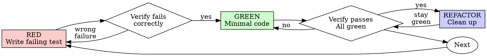

2026-04-22T13:01:51.734547Z ERROR codex_core::codex: failed to load skill /Users/Zhuanz/.agents/skills/cfd-research-deerflow/SKILL.md: missing YAML frontmatter delimited by ---
2026-04-22T13:01:51.734562Z ERROR codex_core::codex: failed to load skill /Users/Zhuanz/.agents/skills/cfd-report-pretext/SKILL.md: missing YAML frontmatter delimited by ---
OpenAI Codex v0.118.0 (research preview)
--------
workdir: /Users/Zhuanz/Desktop/cfd-harness-unified
model: gpt-5.4
provider: openai
approval: never
sandbox: workspace-write [workdir, /tmp, $TMPDIR, /Users/Zhuanz/.codex/memories]
reasoning effort: xhigh
reasoning summaries: none
session id: 019db548-6944-7ee3-b8fe-1036617396ef
--------
user
# [CLAUDE → CODEX TOOL INVOCATION]

    from: claude-code-opus47 (Main Driver v6.2)
    to: codex-gpt54-xhigh (Joint Dev Peer · §A Diff Generator)
    task: "DEC-V61-045 Wave 3 Invocation F — TaskRunner reorder + expected_verdict recompute"
    contract: Notion DEC-V61-045
    upstream_findings:
      - reports/codex_tool_reports/20260422_dec036b_codex_review.md (B1)
      - reports/codex_tool_reports/20260422_dec038_codex_review.md (CA-002)
    depends_on:
      - 61c7cd1 (Wave 1 A): Thresholds + attest signature w/ execution_result
      - 396cefe (Wave 2 D): HAZARD tier in _derive_contract_status + U_ref plumb
      - ad0bad2 (Wave 2 E): tests guard HAZARD tier

    scope_tracks:
      - Track 3 (CA-002): Move attestor pre-extraction in TaskRunner.run_task()
      - Track 5 (B1): Recompute expected_verdict in _audit_fixture_doc after all concerns stamped

    allowed_files:
      - src/task_runner.py                   (Track 3 primary)
      - src/models.py                        (RunReport schema extension for attestation field)
      - scripts/phase5_audit_run.py          (Track 5 primary)

    read_only_context:
      - src/convergence_attestor.py (Wave 1 A + 2 state; attest signature + AttestationResult)
      - src/comparator_gates.py (Wave 1 B state)
      - ui/backend/services/validation_report.py (_derive_contract_status reuse target)
      - reports/codex_tool_reports/20260422_dec036b_codex_review.md (B1 evidence)
      - reports/codex_tool_reports/20260422_dec038_codex_review.md (CA-002 evidence)

    forbidden_files:
      - ui/backend/** (except as read-only context)
      - tests/** and ui/backend/tests/** (separate Codex G invocation)
      - knowledge/** (hard-floor 1 protection)
      - src/comparator_gates.py (already Wave 1 B landed; do not re-edit)
      - src/convergence_attestor.py (already Wave 1 A landed)

    autonomy: TOOL-SCOPE

---

## Track 3: Attestor pre-extraction in TaskRunner

### Current state (src/task_runner.py:98-153)

```python
def run_task(self, task_spec: TaskSpec) -> RunReport:
    # 1. Execute CFD
    exec_result = self._executor.execute(task_spec)

    # 2. Load gold
    gold = self._db.load_gold_standard(task_spec.name)
    comparison = None; correction = None

    # 3. Compare (BEFORE attestor — this is the bug)
    if gold is not None and exec_result.success:
        comparison = self._comparator.compare(exec_result, gold)
        if not comparison.passed:
            correction = self._recorder.record(task_spec, exec_result, comparison)
            ...

    # 5. Post-execute hook
    # 6. Summary
    # 7. Notion write

    return RunReport(...)
```

**Bug (Codex DEC-038 CA-002)**: comparator + correction run BEFORE attestor. A run that never physically converged still flows through scalar extraction + correction generation. "Attestor first" contract violated.

### Required fix

Reorder to: execute → **attest** → (if ATTEST_FAIL: short-circuit) → compare → correct.

```python
def run_task(self, task_spec: TaskSpec) -> RunReport:
    # 1. Execute CFD
    exec_result = self._executor.execute(task_spec)

    # 2. NEW: Attest convergence (pre-extraction)
    from .convergence_attestor import attest  # import here to avoid top-level cycle
    attestation = self._compute_attestation(exec_result, task_spec)  # returns AttestationResult
    # attestation may be ATTEST_PASS / ATTEST_HAZARD / ATTEST_FAIL / ATTEST_NOT_APPLICABLE

    # 3. Load gold
    gold = self._db.load_gold_standard(task_spec.name)
    comparison = None; correction = None

    # 4. Compare (only if attestor didn't FAIL — semantically: a non-converged
    #    run shouldn't produce a "measurement" since the solver state is suspect.
    #    HAZARD tier still allows comparison to proceed for diagnostic value.)
    if gold is not None and exec_result.success and attestation.overall != "ATTEST_FAIL":
        comparison = self._comparator.compare(exec_result, gold)
        if not comparison.passed:
            correction = self._recorder.record(task_spec, exec_result, comparison)
            ...

    # ... rest unchanged ...

    return RunReport(
        ...,
        attestation=attestation,  # NEW field
    )
```

New helper `_compute_attestation(self, exec_result, task_spec) -> AttestationResult`:

```python
def _compute_attestation(self, exec_result: ExecutionResult, task_spec: TaskSpec) -> "AttestationResult":
    """Run convergence attestor against the solver log. Handles missing log
    gracefully (returns ATTEST_NOT_APPLICABLE).

    Feeds execution_result to A1 so exit code is considered alongside log markers.
    case_id (task_spec.name) enables per-case threshold overrides from YAML.
    """
    from .convergence_attestor import attest

    log_path = self._resolve_log_path(exec_result)  # helper to find log.* under raw_output_path
    try:
        return attest(
            log_path=log_path,
            execution_result=exec_result,
            case_id=task_spec.name,
        )
    except Exception:
        logger.exception("Attestation failed; returning NOT_APPLICABLE")
        # Fail-safe: bad attestor call must NOT kill the whole task run
        from .convergence_attestor import AttestationResult
        return AttestationResult(overall="ATTEST_NOT_APPLICABLE", checks=[])

def _resolve_log_path(self, exec_result: ExecutionResult) -> Optional[Path]:
    """Find the solver log.* file under raw_output_path. Returns None if
    raw_output_path is missing or no log.* exists."""
    if not exec_result.raw_output_path:
        return None
    base = Path(exec_result.raw_output_path)
    if not base.is_dir():
        return None
    log_files = sorted(base.glob("log.*"))
    return log_files[-1] if log_files else None
```

### RunReport schema extension (src/models.py)

Add `attestation: Optional["AttestationResult"] = None` to `RunReport` dataclass.

Importantly: **keep backward compat**. Callers that don't access `.attestation` (UI, Notion writer, etc.) are unaffected. New UI code can opt-in to read it.

Avoid circular imports: use `TYPE_CHECKING` or lazy import for AttestationResult type annotation.

### Behavioral contract (new)

- `attestation is not None` always when `exec_result.success and raw_output_path is populated`
- `attestation.overall == "ATTEST_FAIL"` short-circuits comparator + correction generation; `comparison=None`, `correction=None`
- `attestation.overall == "ATTEST_HAZARD"` does NOT short-circuit; comparator still runs (physics scientist may want to see the numbers even if convergence is suspect)
- `attestation.overall == "ATTEST_PASS"` / "ATTEST_NOT_APPLICABLE": full pipeline runs as today

---

## Track 5: expected_verdict recompute in `_audit_fixture_doc`

### Current state (scripts/phase5_audit_run.py:481-487 region)

```python
verdict_hint = _compute_expected_verdict(
    gold=gold,
    comparator_report=report.comparison_result,
    extraction_source=extraction_source,
    value=value,
    audit_concerns=audit_concerns,
)
# verdict_hint written into doc["run_metadata"]["expected_verdict"]
# THEN attestor + gates run AFTER this assignment, appending more concerns
# but verdict_hint is NEVER recomputed.
```

**Bug (Codex DEC-036b B1)**: The fixture metadata and CLI print (`scripts/phase5_audit_run.py:748 verdict = doc["run_metadata"]["expected_verdict"]`) show stale PASS even after attestor/gates hard-fail concerns are appended.

### Required fix

After all concerns (attestor + G1-G5 + U_REF_UNRESOLVED + comparator_deviation) have been appended, recompute the final verdict using the same `_derive_contract_status` helper used by the backend:

```python
# At the end of _audit_fixture_doc, just before the return:

# DEC-V61-045 Track 5 / Codex DEC-036b B1 remediation:
# Recompute verdict using _derive_contract_status after ALL concerns (attestor,
# gates, U_ref WARN, comparator deviations) have been stamped. This replaces
# the early-bird `verdict_hint` computed before gates ran.
from ui.backend.services.validation_report import _derive_contract_status
from ui.backend.schemas.validation import (
    AuditConcern as _AC, MeasuredValue as _MV, Precondition as _P,
    GoldStandardReference as _GSR,
)
# Convert the locally-assembled dicts into the pydantic shapes _derive needs
gs_ref = _GSR(
    quantity=<gold quantity>,
    ref_value=<gold ref_value>,
    tolerance_pct=<gold tolerance_pct>,
    citation=<gold citation or "">,
)
m = _MV(
    value=value,   # may be None for MISSING_TARGET_QUANTITY hard-fail
    source=extraction_source,
    quantity=<quantity from doc>,
) if value is not None or extraction_source else None
concerns_pyd = [_AC(**c) for c in audit_concerns]
preconditions_pyd = [_P(**p) for p in preconditions]  # if preconditions list exists
final_status, *_ = _derive_contract_status(gs_ref, m, preconditions_pyd, concerns_pyd)
doc["run_metadata"]["actual_verdict"] = final_status   # NEW field
doc["run_metadata"]["expected_verdict"] = final_status  # OVERWRITE stale hint with recomputed
```

**Key constraint**: `expected_verdict` field name must NOT change (backward compat for downstream fixture consumers). The field VALUE becomes the recomputed verdict. `actual_verdict` is a new alias field for clarity.

Alternative approach (simpler): skip the type-conversion dance and construct a minimal mock of what `_derive_contract_status` needs via `types.SimpleNamespace` or similar. If clean conversion is complex, this is acceptable.

### Integration with Track 3

Now that TaskRunner runs attestor pre-extraction, report.comparison_result may be None when attestor FAIL short-circuits. _audit_fixture_doc must handle `comp is None` gracefully — this was already handled in existing code, but verify the new short-circuit path works.

Additionally: if `report.attestation` is available on the RunReport (Track 3), surface `attestation.overall` and `attestation.concerns` into doc so the fixture records both layers.

---

## Acceptance Checks

### Track 3 (TaskRunner)

CHK-1: `run_task(task_spec)` on an ATTEST_PASS log returns RunReport with `report.attestation.overall == "ATTEST_PASS"` and `report.comparison_result != None` (assuming gold + success).

CHK-2: `run_task(task_spec)` on an ATTEST_FAIL log (e.g., FOAM FATAL): returns RunReport with `report.attestation.overall == "ATTEST_FAIL"` AND `report.comparison_result == None` (comparator short-circuited).

CHK-3: `run_task(task_spec)` on ATTEST_HAZARD log: returns RunReport with `report.attestation.overall == "ATTEST_HAZARD"` AND `report.comparison_result != None` (HAZARD does NOT short-circuit).

CHK-4: Existing RunReport consumers (Notion writer, post-execute hook, AutoVerifier, tests that access `.comparison_result`, `.correction_spec`) work unchanged. Mock a minimal caller that accesses `report.task_spec.name` + `report.execution_result` + `report.comparison_result` — should not break.

CHK-5: When `raw_output_path` is None or nonexistent → attestation.overall == "ATTEST_NOT_APPLICABLE", task continues normally (comparator runs as before).

### Track 5 (verdict recompute)

CHK-6: Synthetic case: gold_value=10, tolerance=5%, measurement.value=10.5 (in-band), audit_concerns=[{"concern_type": "CONTINUITY_NOT_CONVERGED", ...}]. Before Track 5: verdict_hint="PASS" (stale). After Track 5: expected_verdict in fixture is "HAZARD".

CHK-7: Synthetic case with VELOCITY_OVERFLOW in audit_concerns + in-band scalar → expected_verdict="FAIL" (hard-fail takes precedence).

CHK-8: Clean case no concerns + in-band measurement → expected_verdict="PASS" (regression guard — Track 5 doesn't break clean cases).

CHK-9: CLI print at phase5_audit_run.py:748 now shows the RECOMPUTED verdict, not the pre-gates hint.

### Overall

CHK-10: Full pytest suite on `.venv/bin/python -m pytest ui/backend/tests/ -q` passes with no new failures. (Codex: run this if sandbox permits via `.venv/bin/python`; else static verification.)

CHK-11: No fixture expected_verdict flips beyond HAZARD tier logic from Wave 2. If any existing PASS→FAIL or FAIL→PASS flip happens, that indicates a regression — document each such case.

## Reject Conditions

REJ-1: Edits outside allowed_files.
REJ-2: Changing the name of `RunReport.comparison_result` or `.correction_spec`.
REJ-3: Breaking backward compat for any existing RunReport consumer (test it).
REJ-4: Removing the `expected_verdict` field from fixtures (rename OK only if all 10 fixture files updated in lockstep, which is NOT in scope — don't do it).
REJ-5: Introducing a hard `from src.convergence_attestor import ...` at top of `src/task_runner.py` if it causes a circular import. Use lazy import inside methods.
REJ-6: Making Track 3 short-circuit on ATTEST_HAZARD (only FAIL short-circuits).
REJ-7: Changing the `_compute_expected_verdict` helper's API or name (only the call site at end of _audit_fixture_doc is edited).

## Output format

```
# Codex Diff Report — DEC-V61-045 Wave 3 F

## Files modified
- src/task_runner.py [+N/-M]
- src/models.py [+N/-M]
- scripts/phase5_audit_run.py [+N/-M]

## Changes summary
- Track 3: attestor pre-extraction + short-circuit on ATTEST_FAIL + RunReport schema
- Track 5: verdict recompute using _derive_contract_status

## Acceptance checks self-verified
- CHK-1..11: PASS/FAIL + evidence

## Backward-compat test
- RunReport schema change summary + any caller that would break + mitigation

## Fixture impact forecast
- "After phase5_audit_run.py --all regenerates fixtures, which files will
  have expected_verdict flipped from PASS/HAZARD → FAIL or vice versa?"
- List, but DO NOT regenerate fixtures in this invocation.

## Tokens used
```

---

[/CLAUDE → CODEX TOOL INVOCATION]

codex
按你给的 Wave 3 F 合同，我先做两件事：快速恢复这个仓库在 memory 里的 Phase 8/9 约束，然后读取 `src/task_runner.py`、`src/models.py`、`scripts/phase5_audit_run.py` 和两份 review 证据，确认只在允许文件里落改动。
exec
/bin/zsh -lc pwd in /Users/Zhuanz/Desktop/cfd-harness-unified
 succeeded in 0ms:
/Users/Zhuanz/Desktop/cfd-harness-unified

exec
/bin/zsh -lc 'rg -n "cfd-harness-unified|Phase 8 Done|DEC-V61-045|phase5_audit_run|task_runner|RunReport" /Users/Zhuanz/.codex/memories/MEMORY.md' in /Users/Zhuanz/Desktop/cfd-harness-unified
exec
/bin/zsh -lc "sed -n '1,200p' /Users/Zhuanz/.codex/plugins/cache/openai-curated/superpowers/27651a43bf55185d924f7a1fc49043a0a8be65a0/skills/using-superpowers/SKILL.md" in /Users/Zhuanz/Desktop/cfd-harness-unified
 succeeded in 0ms:
224:- OpenClaw, AI-CFD, Notion作为指挥中枢，Github作为唯一代码真相库, ~/.openclaw/openclaw.json, plugins.allow, openclaw config validate --json, MAIN_OK, CODEX_BUILDER_OK, CLAUDE_REVIEW_OK, NOTION_SYNC_OK, cfd-harness-unified
244:- The real live config surface was `~/.openclaw/openclaw.json`; the actual repo truth for this rollout was `/Users/Zhuanz/Desktop/cfd-harness-unified`, not the chat thread cwd [Task 1]
465:# Task Group: cfd-harness-unified governance closeout and planning gates
467:scope: Close out accepted phases in `cfd-harness-unified`, normalize Notion-vs-repo naming drift, and keep future phases planning-only until the explicit solver/routing gate is reviewed.
468:applies_to: cwd=/Users/Zhuanz/Desktop/cfd-harness-unified; reuse_rule=safe for this repo’s Notion-governed phase/gate work, but phase/task IDs and review packets are rollout-specific.
474:- rollout_summaries/2026-04-16T17-04-02-U9ea-phase8_closeout_and_phase9_planning_gate_prep.md (cwd=/Users/Zhuanz/Desktop/cfd-harness-unified, rollout_path=/Users/Zhuanz/.codex/sessions/2026/04/17/rollout-2026-04-17T01-04-02-019d973f-efab-7132-bd99-5e0ebb839e12.jsonl, updated_at=2026-04-17T05:16:53+00:00, thread_id=019d973f-efab-7132-bd99-5e0ebb839e12, Phase 8 closeout and evidence normalization)
478:- Phase 8, AutoVerifier, 13/13, knowledge/whitelist.yaml, ai_cfd_cold_start_whitelist.yaml, Canonical Docs Type=Report, Phase 8 Done, naming drift
484:- rollout_summaries/2026-04-16T17-04-02-U9ea-phase8_closeout_and_phase9_planning_gate_prep.md (cwd=/Users/Zhuanz/Desktop/cfd-harness-unified, rollout_path=/Users/Zhuanz/.codex/sessions/2026/04/17/rollout-2026-04-17T01-04-02-019d973f-efab-7132-bd99-5e0ebb839e12.jsonl, updated_at=2026-04-17T05:16:53+00:00, thread_id=019d973f-efab-7132-bd99-5e0ebb839e12, Phase 9 kept as planning-only with decision-tree packet))
494:- rollout_summaries/2026-04-16T17-04-02-U9ea-phase8_closeout_and_phase9_planning_gate_prep.md (cwd=/Users/Zhuanz/Desktop/cfd-harness-unified, rollout_path=/Users/Zhuanz/.codex/sessions/2026/04/17/rollout-2026-04-17T01-04-02-019d973f-efab-7132-bd99-5e0ebb839e12.jsonl, updated_at=2026-04-17T05:16:53+00:00, thread_id=019d973f-efab-7132-bd99-5e0ebb839e12, handoff prompt prepared instead of silent activation))
548:- rollout_summaries/2026-04-12T15-33-54-ByPi-jerry_ai_cfd_notion_sync_and_cfd_harness_unified_context_mis.md (cwd=/Users/Zhuanz/Documents/20260330 Jerry AI CFD Project, rollout_path=/Users/Zhuanz/.codex/sessions/2026/04/12/rollout-2026-04-12T23-33-54-019d8253-fa8b-7f40-9775-46e6e03db8ac.jsonl, updated_at=2026-04-16T17:03:18+00:00, thread_id=019d8253-fa8b-7f40-9775-46e6e03db8ac, later cfd-harness-unified instruction block correctly treated as mismatch)

 succeeded in 0ms:
---
name: using-superpowers
description: Use when starting any conversation - establishes how to find and use skills, requiring Skill tool invocation before ANY response including clarifying questions
---

<SUBAGENT-STOP>
If you were dispatched as a subagent to execute a specific task, skip this skill.
</SUBAGENT-STOP>

<EXTREMELY-IMPORTANT>
If you think there is even a 1% chance a skill might apply to what you are doing, you ABSOLUTELY MUST invoke the skill.

IF A SKILL APPLIES TO YOUR TASK, YOU DO NOT HAVE A CHOICE. YOU MUST USE IT.

This is not negotiable. This is not optional. You cannot rationalize your way out of this.
</EXTREMELY-IMPORTANT>

## Instruction Priority

Superpowers skills override default system prompt behavior, but **user instructions always take precedence**:

1. **User's explicit instructions** (CLAUDE.md, GEMINI.md, AGENTS.md, direct requests) — highest priority
2. **Superpowers skills** — override default system behavior where they conflict
3. **Default system prompt** — lowest priority

If CLAUDE.md, GEMINI.md, or AGENTS.md says "don't use TDD" and a skill says "always use TDD," follow the user's instructions. The user is in control.

## How to Access Skills

**In Claude Code:** Use the `Skill` tool. When you invoke a skill, its content is loaded and presented to you—follow it directly. Never use the Read tool on skill files.

**In Copilot CLI:** Use the `skill` tool. Skills are auto-discovered from installed plugins. The `skill` tool works the same as Claude Code's `Skill` tool.

**In Gemini CLI:** Skills activate via the `activate_skill` tool. Gemini loads skill metadata at session start and activates the full content on demand.

**In other environments:** Check your platform's documentation for how skills are loaded.

## Platform Adaptation

Skills use Claude Code tool names. Non-CC platforms: see `references/copilot-tools.md` (Copilot CLI), `references/codex-tools.md` (Codex) for tool equivalents. Gemini CLI users get the tool mapping loaded automatically via GEMINI.md.

# Using Skills

## The Rule

**Invoke relevant or requested skills BEFORE any response or action.** Even a 1% chance a skill might apply means that you should invoke the skill to check. If an invoked skill turns out to be wrong for the situation, you don't need to use it.


## Red Flags

These thoughts mean STOP—you're rationalizing:

| Thought | Reality |
|---------|---------|
| "This is just a simple question" | Questions are tasks. Check for skills. |
| "I need more context first" | Skill check comes BEFORE clarifying questions. |
| "Let me explore the codebase first" | Skills tell you HOW to explore. Check first. |
| "I can check git/files quickly" | Files lack conversation context. Check for skills. |
| "Let me gather information first" | Skills tell you HOW to gather information. |
| "This doesn't need a formal skill" | If a skill exists, use it. |
| "I remember this skill" | Skills evolve. Read current version. |
| "This doesn't count as a task" | Action = task. Check for skills. |
| "The skill is overkill" | Simple things become complex. Use it. |
| "I'll just do this one thing first" | Check BEFORE doing anything. |
| "This feels productive" | Undisciplined action wastes time. Skills prevent this. |
| "I know what that means" | Knowing the concept ≠ using the skill. Invoke it. |

## Skill Priority

When multiple skills could apply, use this order:

1. **Process skills first** (brainstorming, debugging) - these determine HOW to approach the task
2. **Implementation skills second** (frontend-design, mcp-builder) - these guide execution

"Let's build X" → brainstorming first, then implementation skills.
"Fix this bug" → debugging first, then domain-specific skills.

## Skill Types

**Rigid** (TDD, debugging): Follow exactly. Don't adapt away discipline.

**Flexible** (patterns): Adapt principles to context.

The skill itself tells you which.

## User Instructions

Instructions say WHAT, not HOW. "Add X" or "Fix Y" doesn't mean skip workflows.

exec
/bin/zsh -lc "sed -n '1,220p' /Users/Zhuanz/.codex/plugins/cache/openai-curated/superpowers/27651a43bf55185d924f7a1fc49043a0a8be65a0/skills/test-driven-development/SKILL.md" in /Users/Zhuanz/Desktop/cfd-harness-unified
 succeeded in 0ms:
---
name: test-driven-development
description: Use when implementing any feature or bugfix, before writing implementation code
---

# Test-Driven Development (TDD)

## Overview

Write the test first. Watch it fail. Write minimal code to pass.

**Core principle:** If you didn't watch the test fail, you don't know if it tests the right thing.

**Violating the letter of the rules is violating the spirit of the rules.**

## When to Use

**Always:**
- New features
- Bug fixes
- Refactoring
- Behavior changes

**Exceptions (ask your human partner):**
- Throwaway prototypes
- Generated code
- Configuration files

Thinking "skip TDD just this once"? Stop. That's rationalization.

## The Iron Law

```
NO PRODUCTION CODE WITHOUT A FAILING TEST FIRST
```

Write code before the test? Delete it. Start over.

**No exceptions:**
- Don't keep it as "reference"
- Don't "adapt" it while writing tests
- Don't look at it
- Delete means delete

Implement fresh from tests. Period.

## Red-Green-Refactor



### RED - Write Failing Test

Write one minimal test showing what should happen.

<Good>
```typescript
test('retries failed operations 3 times', async () => {
  let attempts = 0;
  const operation = () => {
    attempts++;
    if (attempts < 3) throw new Error('fail');
    return 'success';
  };

  const result = await retryOperation(operation);

  expect(result).toBe('success');
  expect(attempts).toBe(3);
});
```
Clear name, tests real behavior, one thing
</Good>

<Bad>
```typescript
test('retry works', async () => {
  const mock = jest.fn()
    .mockRejectedValueOnce(new Error())
    .mockRejectedValueOnce(new Error())
    .mockResolvedValueOnce('success');
  await retryOperation(mock);
  expect(mock).toHaveBeenCalledTimes(3);
});
```
Vague name, tests mock not code
</Bad>

**Requirements:**
- One behavior
- Clear name
- Real code (no mocks unless unavoidable)

### Verify RED - Watch It Fail

**MANDATORY. Never skip.**

```bash
npm test path/to/test.test.ts
```

Confirm:
- Test fails (not errors)
- Failure message is expected
- Fails because feature missing (not typos)

**Test passes?** You're testing existing behavior. Fix test.

**Test errors?** Fix error, re-run until it fails correctly.

### GREEN - Minimal Code

Write simplest code to pass the test.

<Good>
```typescript
async function retryOperation<T>(fn: () => Promise<T>): Promise<T> {
  for (let i = 0; i < 3; i++) {
    try {
      return await fn();
    } catch (e) {
      if (i === 2) throw e;
    }
  }
  throw new Error('unreachable');
}
```
Just enough to pass
</Good>

<Bad>
```typescript
async function retryOperation<T>(
  fn: () => Promise<T>,
  options?: {
    maxRetries?: number;
    backoff?: 'linear' | 'exponential';
    onRetry?: (attempt: number) => void;
  }
): Promise<T> {
  // YAGNI
}
```
Over-engineered
</Bad>

Don't add features, refactor other code, or "improve" beyond the test.

### Verify GREEN - Watch It Pass

**MANDATORY.**

```bash
npm test path/to/test.test.ts
```

Confirm:
- Test passes
- Other tests still pass
- Output pristine (no errors, warnings)

**Test fails?** Fix code, not test.

**Other tests fail?** Fix now.

### REFACTOR - Clean Up

After green only:
- Remove duplication
- Improve names
- Extract helpers

Keep tests green. Don't add behavior.

### Repeat

Next failing test for next feature.

## Good Tests

| Quality | Good | Bad |
|---------|------|-----|
| **Minimal** | One thing. "and" in name? Split it. | `test('validates email and domain and whitespace')` |
| **Clear** | Name describes behavior | `test('test1')` |
| **Shows intent** | Demonstrates desired API | Obscures what code should do |

## Why Order Matters

**"I'll write tests after to verify it works"**

Tests written after code pass immediately. Passing immediately proves nothing:
- Might test wrong thing
- Might test implementation, not behavior
- Might miss edge cases you forgot
- You never saw it catch the bug

Test-first forces you to see the test fail, proving it actually tests something.

**"I already manually tested all the edge cases"**

Manual testing is ad-hoc. You think you tested everything but:

exec
/bin/zsh -lc "sed -n '1,220p' /Users/Zhuanz/.codex/plugins/cache/openai-curated/superpowers/27651a43bf55185d924f7a1fc49043a0a8be65a0/skills/verification-before-completion/SKILL.md" in /Users/Zhuanz/Desktop/cfd-harness-unified
 succeeded in 0ms:
---
name: verification-before-completion
description: Use when about to claim work is complete, fixed, or passing, before committing or creating PRs - requires running verification commands and confirming output before making any success claims; evidence before assertions always
---

# Verification Before Completion

## Overview

Claiming work is complete without verification is dishonesty, not efficiency.

**Core principle:** Evidence before claims, always.

**Violating the letter of this rule is violating the spirit of this rule.**

## The Iron Law

```
NO COMPLETION CLAIMS WITHOUT FRESH VERIFICATION EVIDENCE
```

If you haven't run the verification command in this message, you cannot claim it passes.

## The Gate Function

```
BEFORE claiming any status or expressing satisfaction:

1. IDENTIFY: What command proves this claim?
2. RUN: Execute the FULL command (fresh, complete)
3. READ: Full output, check exit code, count failures
4. VERIFY: Does output confirm the claim?
   - If NO: State actual status with evidence
   - If YES: State claim WITH evidence
5. ONLY THEN: Make the claim

Skip any step = lying, not verifying
```

## Common Failures

| Claim | Requires | Not Sufficient |
|-------|----------|----------------|
| Tests pass | Test command output: 0 failures | Previous run, "should pass" |
| Linter clean | Linter output: 0 errors | Partial check, extrapolation |
| Build succeeds | Build command: exit 0 | Linter passing, logs look good |
| Bug fixed | Test original symptom: passes | Code changed, assumed fixed |
| Regression test works | Red-green cycle verified | Test passes once |
| Agent completed | VCS diff shows changes | Agent reports "success" |
| Requirements met | Line-by-line checklist | Tests passing |

## Red Flags - STOP

- Using "should", "probably", "seems to"
- Expressing satisfaction before verification ("Great!", "Perfect!", "Done!", etc.)
- About to commit/push/PR without verification
- Trusting agent success reports
- Relying on partial verification
- Thinking "just this once"
- Tired and wanting work over
- **ANY wording implying success without having run verification**

## Rationalization Prevention

| Excuse | Reality |
|--------|---------|
| "Should work now" | RUN the verification |
| "I'm confident" | Confidence ≠ evidence |
| "Just this once" | No exceptions |
| "Linter passed" | Linter ≠ compiler |
| "Agent said success" | Verify independently |
| "I'm tired" | Exhaustion ≠ excuse |
| "Partial check is enough" | Partial proves nothing |
| "Different words so rule doesn't apply" | Spirit over letter |

## Key Patterns

**Tests:**
```
✅ [Run test command] [See: 34/34 pass] "All tests pass"
❌ "Should pass now" / "Looks correct"
```

**Regression tests (TDD Red-Green):**
```
✅ Write → Run (pass) → Revert fix → Run (MUST FAIL) → Restore → Run (pass)
❌ "I've written a regression test" (without red-green verification)
```

**Build:**
```
✅ [Run build] [See: exit 0] "Build passes"
❌ "Linter passed" (linter doesn't check compilation)
```

**Requirements:**
```
✅ Re-read plan → Create checklist → Verify each → Report gaps or completion
❌ "Tests pass, phase complete"
```

**Agent delegation:**
```
✅ Agent reports success → Check VCS diff → Verify changes → Report actual state
❌ Trust agent report
```

## Why This Matters

From 24 failure memories:
- your human partner said "I don't believe you" - trust broken
- Undefined functions shipped - would crash
- Missing requirements shipped - incomplete features
- Time wasted on false completion → redirect → rework
- Violates: "Honesty is a core value. If you lie, you'll be replaced."

## When To Apply

**ALWAYS before:**
- ANY variation of success/completion claims
- ANY expression of satisfaction
- ANY positive statement about work state
- Committing, PR creation, task completion
- Moving to next task
- Delegating to agents

**Rule applies to:**
- Exact phrases
- Paraphrases and synonyms
- Implications of success
- ANY communication suggesting completion/correctness

## The Bottom Line

**No shortcuts for verification.**

Run the command. Read the output. THEN claim the result.

This is non-negotiable.

exec
/bin/zsh -lc 'git status --short' in /Users/Zhuanz/Desktop/cfd-harness-unified
 succeeded in 0ms:
 M reports/cylinder_crossflow/report.md
 M reports/deep_acceptance/visual_acceptance_report.html
 M reports/deep_acceptance/visual_acceptance_report_manifest.json
 M reports/differential_heated_cavity/report.md
 M reports/rayleigh_benard_convection/report.md
 M reports/turbulent_flat_plate/report.md
 M ui/frontend/public/flow-fields/circular_cylinder_wake/strouhal_curve.png
 M ui/frontend/public/flow-fields/lid_driven_cavity/centerline_profiles.png
 M ui/frontend/public/flow-fields/lid_driven_cavity/stream_function.png
 M ui/frontend/public/flow-fields/plane_channel_flow/wall_profile.png
 M ui/frontend/public/flow-fields/rayleigh_benard_convection/nu_ra_scaling.png
 M ui/frontend/public/flow-fields/turbulent_flat_plate/blasius_profile.png
 M ui/frontend/public/flow-fields/turbulent_flat_plate/cf_comparison.png
?? .claude/
?? .gitignore.patch.stale.1776663560182166739
?? knowledge/corrections/
?? reports/codex_tool_reports/20260422_dec045_wave3_F_taskrunner_reorder_prompt.md
?? reports/codex_tool_reports/20260422_dec045_wave3_F_taskrunner_reorder_result.md
?? reports/deep_acceptance/20260421_000138_visual_acceptance_package.md
?? reports/deep_acceptance/20260421_000139_visual_acceptance_package.md
?? reports/deep_acceptance/20260421_000231_visual_acceptance_package.md
?? reports/deep_acceptance/20260421_000232_visual_acceptance_package.md
?? reports/deep_acceptance/20260422_135406_visual_acceptance_package.md
?? reports/deep_acceptance/20260422_135407_visual_acceptance_package.md
?? reports/deep_acceptance/20260422_135452_visual_acceptance_package.md
?? reports/deep_acceptance/20260422_135453_visual_acceptance_package.md
?? reports/deep_acceptance/20260422_145436_visual_acceptance_package.md
?? reports/deep_acceptance/20260422_145437_visual_acceptance_package.md
?? reports/deep_acceptance/20260422_151428_visual_acceptance_package.md
?? reports/deep_acceptance/20260422_151429_visual_acceptance_package.md
?? reports/deep_acceptance/20260422_154122_visual_acceptance_package.md
?? reports/deep_acceptance/20260422_154123_visual_acceptance_package.md
?? reports/deep_acceptance/visual_acceptance_report_20260421_000138.html
?? reports/deep_acceptance/visual_acceptance_report_20260421_000139.html
?? reports/deep_acceptance/visual_acceptance_report_20260421_000231.html
?? reports/deep_acceptance/visual_acceptance_report_20260421_000232.html
?? reports/deep_acceptance/visual_acceptance_report_20260422_135406.html
?? reports/deep_acceptance/visual_acceptance_report_20260422_135407.html
?? reports/deep_acceptance/visual_acceptance_report_20260422_135452.html
?? reports/deep_acceptance/visual_acceptance_report_20260422_135453.html
?? reports/deep_acceptance/visual_acceptance_report_20260422_145436.html
?? reports/deep_acceptance/visual_acceptance_report_20260422_145437.html
?? reports/deep_acceptance/visual_acceptance_report_20260422_151428.html
?? reports/deep_acceptance/visual_acceptance_report_20260422_151429.html
?? reports/deep_acceptance/visual_acceptance_report_20260422_154122.html
?? reports/deep_acceptance/visual_acceptance_report_20260422_154123.html
?? reports/phase5_reports/
?? ui/frontend/vite.config.sandbox.ts.stale.1776667726
?? ui/frontend/vite.config.sandbox.ts.timestamp-1776667276256-33cd5f0862292.mjs

codex
我已经确认当前工作树很脏，但目标文件不在现有未提交改动里；我会只碰 `src/task_runner.py`、`src/models.py`、`scripts/phase5_audit_run.py`。接下来按 `using-superpowers -> systematic-debugging -> test-driven-development` 的顺序收集上下文，再做最小补丁。
exec
/bin/zsh -lc "sed -n '460,490p' /Users/Zhuanz/.codex/memories/MEMORY.md" in /Users/Zhuanz/Desktop/cfd-harness-unified
 succeeded in 0ms:
- Symptom: Notion plugin looks installed but no usable resources appear in-session -> cause: connector exposure is thread/session scoped and may be unavailable even when the package exists -> fix: verify actual resources quickly, then fall back to env-based raw API plus local sync scripts [Task 3]
- Symptom: import/runtime summaries assume modules exist that the repo does not contain -> cause: inheriting high-level summaries without filesystem verification -> fix: check the real checkout before trusting prior architecture prose [Task 1]
- Symptom: deployment/UAT work stalls late -> cause: no SSH identities, no remote staging host details, and unfinished local vLLM build -> fix: report the missing host/access prerequisites clearly instead of pretending the local pack equals true staging [Task 4]
- Symptom: Docker appears unavailable on macOS -> cause: `docker` is not on PATH even though Docker Desktop is installed -> fix: try `/Applications/Docker.app/Contents/Resources/bin/docker` before concluding Docker is absent [Task 4]

# Task Group: cfd-harness-unified governance closeout and planning gates

scope: Close out accepted phases in `cfd-harness-unified`, normalize Notion-vs-repo naming drift, and keep future phases planning-only until the explicit solver/routing gate is reviewed.
applies_to: cwd=/Users/Zhuanz/Desktop/cfd-harness-unified; reuse_rule=safe for this repo’s Notion-governed phase/gate work, but phase/task IDs and review packets are rollout-specific.

## Task 1: Close Phase 8 and reconcile stale governance evidence

### rollout_summary_files

- rollout_summaries/2026-04-16T17-04-02-U9ea-phase8_closeout_and_phase9_planning_gate_prep.md (cwd=/Users/Zhuanz/Desktop/cfd-harness-unified, rollout_path=/Users/Zhuanz/.codex/sessions/2026/04/17/rollout-2026-04-17T01-04-02-019d973f-efab-7132-bd99-5e0ebb839e12.jsonl, updated_at=2026-04-17T05:16:53+00:00, thread_id=019d973f-efab-7132-bd99-5e0ebb839e12, Phase 8 closeout and evidence normalization)

### keywords

- Phase 8, AutoVerifier, 13/13, knowledge/whitelist.yaml, ai_cfd_cold_start_whitelist.yaml, Canonical Docs Type=Report, Phase 8 Done, naming drift

## Task 2: Open Phase 9 as planning-only and keep solver expansion bounded

### rollout_summary_files

- rollout_summaries/2026-04-16T17-04-02-U9ea-phase8_closeout_and_phase9_planning_gate_prep.md (cwd=/Users/Zhuanz/Desktop/cfd-harness-unified, rollout_path=/Users/Zhuanz/.codex/sessions/2026/04/17/rollout-2026-04-17T01-04-02-019d973f-efab-7132-bd99-5e0ebb839e12.jsonl, updated_at=2026-04-17T05:16:53+00:00, thread_id=019d973f-efab-7132-bd99-5e0ebb839e12, Phase 9 kept as planning-only with decision-tree packet))

### keywords

- Phase 9 planning-only, PHASE9_EXTERNAL_SOLVER_DECISION_TREE.md, PHASE9_MODEL_ROUTING_BASELINE_PLAN.md, PHASE9_ACTIVATION_REVIEW_PACKET.md, replay_manifest, SU2 CLI Harness Skill, foam_agent_adapter.py

## Task 3: Stop cleanly at the Opus 4.7 activation gate

exec
/bin/zsh -lc "sed -n '1,220p' /Users/Zhuanz/.codex/plugins/cache/openai-curated/superpowers/27651a43bf55185d924f7a1fc49043a0a8be65a0/skills/systematic-debugging/SKILL.md" in /Users/Zhuanz/Desktop/cfd-harness-unified
 succeeded in 0ms:
---
name: systematic-debugging
description: Use when encountering any bug, test failure, or unexpected behavior, before proposing fixes
---

# Systematic Debugging

## Overview

Random fixes waste time and create new bugs. Quick patches mask underlying issues.

**Core principle:** ALWAYS find root cause before attempting fixes. Symptom fixes are failure.

**Violating the letter of this process is violating the spirit of debugging.**

## The Iron Law

```
NO FIXES WITHOUT ROOT CAUSE INVESTIGATION FIRST
```

If you haven't completed Phase 1, you cannot propose fixes.

## When to Use

Use for ANY technical issue:
- Test failures
- Bugs in production
- Unexpected behavior
- Performance problems
- Build failures
- Integration issues

**Use this ESPECIALLY when:**
- Under time pressure (emergencies make guessing tempting)
- "Just one quick fix" seems obvious
- You've already tried multiple fixes
- Previous fix didn't work
- You don't fully understand the issue

**Don't skip when:**
- Issue seems simple (simple bugs have root causes too)
- You're in a hurry (rushing guarantees rework)
- Manager wants it fixed NOW (systematic is faster than thrashing)

## The Four Phases

You MUST complete each phase before proceeding to the next.

### Phase 1: Root Cause Investigation

**BEFORE attempting ANY fix:**

1. **Read Error Messages Carefully**
   - Don't skip past errors or warnings
   - They often contain the exact solution
   - Read stack traces completely
   - Note line numbers, file paths, error codes

2. **Reproduce Consistently**
   - Can you trigger it reliably?
   - What are the exact steps?
   - Does it happen every time?
   - If not reproducible → gather more data, don't guess

3. **Check Recent Changes**
   - What changed that could cause this?
   - Git diff, recent commits
   - New dependencies, config changes
   - Environmental differences

4. **Gather Evidence in Multi-Component Systems**

   **WHEN system has multiple components (CI → build → signing, API → service → database):**

   **BEFORE proposing fixes, add diagnostic instrumentation:**
   ```
   For EACH component boundary:
     - Log what data enters component
     - Log what data exits component
     - Verify environment/config propagation
     - Check state at each layer

   Run once to gather evidence showing WHERE it breaks
   THEN analyze evidence to identify failing component
   THEN investigate that specific component
   ```

   **Example (multi-layer system):**
   ```bash
   # Layer 1: Workflow
   echo "=== Secrets available in workflow: ==="
   echo "IDENTITY: ${IDENTITY:+SET}${IDENTITY:-UNSET}"

   # Layer 2: Build script
   echo "=== Env vars in build script: ==="
   env | grep IDENTITY || echo "IDENTITY not in environment"

   # Layer 3: Signing script
   echo "=== Keychain state: ==="
   security list-keychains
   security find-identity -v

   # Layer 4: Actual signing
   codesign --sign "$IDENTITY" --verbose=4 "$APP"
   ```

   **This reveals:** Which layer fails (secrets → workflow ✓, workflow → build ✗)

5. **Trace Data Flow**

   **WHEN error is deep in call stack:**

   See `root-cause-tracing.md` in this directory for the complete backward tracing technique.

   **Quick version:**
   - Where does bad value originate?
   - What called this with bad value?
   - Keep tracing up until you find the source
   - Fix at source, not at symptom

### Phase 2: Pattern Analysis

**Find the pattern before fixing:**

1. **Find Working Examples**
   - Locate similar working code in same codebase
   - What works that's similar to what's broken?

2. **Compare Against References**
   - If implementing pattern, read reference implementation COMPLETELY
   - Don't skim - read every line
   - Understand the pattern fully before applying

3. **Identify Differences**
   - What's different between working and broken?
   - List every difference, however small
   - Don't assume "that can't matter"

4. **Understand Dependencies**
   - What other components does this need?
   - What settings, config, environment?
   - What assumptions does it make?

### Phase 3: Hypothesis and Testing

**Scientific method:**

1. **Form Single Hypothesis**
   - State clearly: "I think X is the root cause because Y"
   - Write it down
   - Be specific, not vague

2. **Test Minimally**
   - Make the SMALLEST possible change to test hypothesis
   - One variable at a time
   - Don't fix multiple things at once

3. **Verify Before Continuing**
   - Did it work? Yes → Phase 4
   - Didn't work? Form NEW hypothesis
   - DON'T add more fixes on top

4. **When You Don't Know**
   - Say "I don't understand X"
   - Don't pretend to know
   - Ask for help
   - Research more

### Phase 4: Implementation

**Fix the root cause, not the symptom:**

1. **Create Failing Test Case**
   - Simplest possible reproduction
   - Automated test if possible
   - One-off test script if no framework
   - MUST have before fixing
   - Use the `superpowers:test-driven-development` skill for writing proper failing tests

2. **Implement Single Fix**
   - Address the root cause identified
   - ONE change at a time
   - No "while I'm here" improvements
   - No bundled refactoring

3. **Verify Fix**
   - Test passes now?
   - No other tests broken?
   - Issue actually resolved?

4. **If Fix Doesn't Work**
   - STOP
   - Count: How many fixes have you tried?
   - If < 3: Return to Phase 1, re-analyze with new information
   - **If ≥ 3: STOP and question the architecture (step 5 below)**
   - DON'T attempt Fix #4 without architectural discussion

5. **If 3+ Fixes Failed: Question Architecture**

   **Pattern indicating architectural problem:**
   - Each fix reveals new shared state/coupling/problem in different place
   - Fixes require "massive refactoring" to implement
   - Each fix creates new symptoms elsewhere

   **STOP and question fundamentals:**
   - Is this pattern fundamentally sound?
   - Are we "sticking with it through sheer inertia"?
   - Should we refactor architecture vs. continue fixing symptoms?

   **Discuss with your human partner before attempting more fixes**

   This is NOT a failed hypothesis - this is a wrong architecture.

## Red Flags - STOP and Follow Process

If you catch yourself thinking:
- "Quick fix for now, investigate later"
- "Just try changing X and see if it works"
- "Add multiple changes, run tests"

exec
/bin/zsh -lc "sed -n '1,220p' /Users/Zhuanz/.codex/skills/auto-compression-agent/SKILL.md" in /Users/Zhuanz/Desktop/cfd-harness-unified
 succeeded in 0ms:
---
name: auto-compression-agent
description: >
  An always-active intelligent context compression skill for all coding and research sessions.
  Activates automatically on any development task — multi-file coding, bug fixing, repo exploration,
  research synthesis, or long-running agent sessions. Monitors 6 real-time signals and triggers
  layered compression before drift occurs. Never miss a compression opportunity.
---

# Auto-Compression Agent

An intelligent, always-on context compression system that monitors 6 signals in real-time and
triggers layered compression BEFORE drift becomes severe. This is not a reactive checkpoint tool —
it is a proactive monitoring and compression framework.

## Core Principle

**Compress before you drift, not after you already drifted.**

Your baseline data proves the old model (50% threshold, compress when things feel noisy) is too slow.
Evidence drift appears in the **first minute** of failing sessions. By the time you hit 50% context,
you've already lost.

---

## The 6 Real-Time Signals

After EVERY significant interaction, silently evaluate these signals:

### Signal 1: Evidence Drift Count (EARLIEST WARNING)
**Trigger: ≥2 uncertain expressions in a single response**

Uncertain expressions: "可能是", "大概是", "应该是", "估计", "也许", "可能", "不确定", "凭感觉"

**This is your free early warning system.** Evidence drift often appears 5-10 minutes before
any other drift type. When you catch 2 in one response, compress immediately.

### Signal 2: Context Pressure
**Trigger: ≥20% context usage**

Monitor token_count events. The thresholds:
- **20%**: Mini compression (one-line state reset)
- **35%**: Standard compression (structured checkpoint)
- **50%**: Deep compression (full phase summary) + forced rebuild
- **65%**: Emergency — stop, compress everything, rebuild from scratch

### Signal 3: Phase Transition
**Trigger: Moving between exploration → implementation → validation**

Every time you shift phases:
- Exploration ended, implementation starting → compress exploration findings
- Implementation ended, testing/validation starting → compress implementation state
- Validation ended, cleanup/refinement → compress validation results

### Signal 4: Tool Failure Cascade
**Trigger: ≥2 consecutive tool failures without a strategy change**

If you try the same approach 2+ times and it keeps failing, compress the failed-attempt log
and the current state before trying a third time.

### Signal 5: Constraint Forget
**Trigger: Re-reading a file you've already read, or reasking for information already provided**

If the user says "as I mentioned before" or you catch yourself re-reading the same file,
compress immediately — your context has a gap.

### Signal 6: Plan Oscillation
**Trigger: ≥3 "改成" / "推翻" / "重新" signals within 10 minutes**

This means the plan is unstable. Compress the decision ledger and force a firm next action.

---

## The Three Compression Tiers

### Tier 1: Mini Compression (20% context OR 2 evidence drift signals)

One-line state reset. Output this format:

```
[COMPRESS-1] <objective> | <3 stable facts> | <next action> | <1 open risk>
```

Example:
```
[COMPRESS-1] Fix pricing.py discount order | tier before promo | confirmed current-rules.md authoritative | Test: test_pricing.py::test_multiplicative | risk: historical-notes.md still in context
```

### Tier 2: Standard Compression (35% context OR phase transition OR tool failure cascade)

Full structured checkpoint. Use the template in `references/checkpoint-templates.md`.
This is the most common compression type.

Output a checkpoint AND immediately continue from it — do not wait.

### Tier 3: Deep Compression (50%+ context OR emergency signal)

Full phase summary + context rebuild. This compresses everything accumulated so far
and produces a clean-slate restart recipe.

Steps:
1. Write the deep checkpoint using the full template
2. Acknowledge the compression to the user
3. Rebuild the minimum working context from the checkpoint
4. Continue with only the checkpoint + immediate needs

---

## The Five-Layer Working Model

At all times, maintain these five layers. Compressions preserve layers 1-3
and replace large layer-4 artifacts with references.

```
Layer 1: Working Context — only what the NEXT step needs
Layer 2: Task State — goal, constraints, completion criteria
Layer 3: Decision Ledger — what you decided, why, what you rejected
Layer 4: Artifact Index — files, URLs, commands, docs (with paths/references)
Layer 5: Open Loops — unresolved questions, risks, failed attempts
```

Compression is successful when Layer 1 is executable without reading Layer 4 artifacts.

---

## Checkpoint Quality Standards

Every checkpoint MUST pass the **Stranger Test**:

> "A colleague who has never seen this conversation could read this checkpoint,
> reopen 1-2 artifacts, and continue the task in under 5 minutes with no additional questions."

Checklist before finalizing any checkpoint:
- [ ] Contains exactly one concrete **next action** (not "keep going")
- [ ] Stable facts are separated from hypotheses
- [ ] Rejected paths include WHY they were rejected
- [ ] File references are absolute paths, not descriptions
- [ ] Open risks are explicitly named, not just implied
- [ ] No raw tool output or terminal logs
- [ ] Shorter than the material it replaces

---

## Anti-Patterns (Never Do These)

1. **Hour-by-hour narrative** — compress events, not timelines
2. **Raw tool output** — rerun commands, don't paste their output
3. **Confirmed + guessed mixed** — mark uncertainty explicitly
4. **"Just in case" files** — only keep files that change the next action
5. **Vague next actions** — "keep working on X" is not a next action
6. **Dropping failed attempts** — the rejected path IS the value

---

## Context Pressure Dashboard

After every compression, briefly note the current state using this compact format:

```
[CP: XX%] [PHASE: explore/impl/valid] [DRIFT: evidence:N goal:N plan:N] [NEXT: <1 sentence>]
```

This goes in your working context and is updated after every compression.
You can output this silently in commentary.

---

## When to Output Compression Status

You do NOT need to announce every compression to the user.
Only announce when:
- You are triggering a Tier 2 or Tier 3 compression
- The compression reveals something important about the task state
- The user asks about progress or context

Otherwise, compress silently and continue.

---

## Running Summary Requirement

When you finish a session, output:

```
## Session Summary
- Checkpoints created: N
- Compression triggers: <list the signal types that fired>
- Final context pressure: XX%
- Unresolved risks: <1-3 bullets>
- Next session starting point: <checkpoint location or recreation recipe>
```

This is required for any task that took more than 15 minutes or 3 tool calls.

---

## Relationship to context-compression-agent

The `context-compression-agent` skill provides the foundational framework.
This skill (`auto-compression-agent`) overrides it when both are available,
because it provides earlier triggers, multi-tier compression, and proactive monitoring.

If you need the full checkpoint templates or eval protocol,
those are in `references/` alongside this skill.

## References

- `references/checkpoint-templates.md` — Full templates for all three tiers
- `references/eval-protocol.md` — How to measure if compression is working
- `references/trigger-logic.md` — Decision tree for which compression tier to use

exec
/bin/zsh -lc "sed -n '1,240p' src/task_runner.py" in /Users/Zhuanz/Desktop/cfd-harness-unified
 succeeded in 0ms:
"""核心编排器：从 Notion 读取任务 → 执行 → 对比 → 记录 → 回写"""

from __future__ import annotations

import logging
import os
from dataclasses import dataclass
from typing import Any, Callable, Dict, List, Optional

from .foam_agent_adapter import FoamAgentExecutor, MockExecutor
from .knowledge_db import KnowledgeDB
from .models import (
    AttributionReport,
    BatchResult,
    CFDExecutor,
    ComparisonResult,
    Compressibility,
    CorrectionSpec,
    ExecutionResult,
    FlowType,
    GeometryType,
    SteadyState,
    SystematicPattern,
    TaskSpec,
)
from .notion_client import NotionClient
from .result_comparator import ResultComparator
from .correction_recorder import CorrectionRecorder
from .error_attributor import ErrorAttributor

PostExecuteHook = Callable[
    [TaskSpec, ExecutionResult, Optional[ComparisonResult], Optional[CorrectionSpec]],
    Any,
]

CORRECTION_POLICIES = ("legacy_auto_save", "suggest_only")

logger = logging.getLogger(__name__)


@dataclass
class RunReport:
    """单次任务运行的完整报告"""
    task_spec: TaskSpec
    execution_result: ExecutionResult
    comparison_result: Optional[ComparisonResult]
    correction_spec: Optional[CorrectionSpec]
    summary: str
    auto_verify_report: Any = None  # AutoVerifyReport or hook-returned status dict, when hook configured


class TaskRunner:
    """核心编排器

    使用方式：
        runner = TaskRunner(executor=MockExecutor())
        reports = runner.run_all()
    """

    def __init__(
        self,
        executor: Optional[CFDExecutor] = None,
        notion_client: Optional[NotionClient] = None,
        knowledge_db: Optional[KnowledgeDB] = None,
        deviation_threshold: float = 0.10,
        post_execute_hook: Optional[PostExecuteHook] = None,
        correction_policy: str = "legacy_auto_save",
    ) -> None:
        if correction_policy not in CORRECTION_POLICIES:
            raise ValueError(
                f"correction_policy must be one of {CORRECTION_POLICIES}, got {correction_policy!r}"
            )
        # Precedence: explicit executor kwarg > EXECUTOR_MODE env var > MockExecutor
        if executor is not None:
            self._executor: CFDExecutor = executor
        else:
            mode = os.environ.get("EXECUTOR_MODE", "mock").lower()
            if mode == "mock":
                self._executor = MockExecutor()
            elif mode == "foam_agent":
                self._executor = FoamAgentExecutor()
            else:
                raise ValueError(
                    f'EXECUTOR_MODE must be "mock" or "foam_agent", got "{mode}"'
                )
        self._notion = notion_client or NotionClient()
        self._db = knowledge_db or KnowledgeDB()
        self._comparator = ResultComparator(threshold=deviation_threshold)
        self._recorder = CorrectionRecorder()
        self._attributor = ErrorAttributor(knowledge_db=self._db)
        self._post_execute_hook = post_execute_hook
        self._correction_policy = correction_policy

    # ------------------------------------------------------------------
    # 公开接口
    # ------------------------------------------------------------------

    def run_task(self, task_spec: TaskSpec) -> RunReport:
        """执行单个任务，返回完整报告"""
        logger.info("Running task: %s", task_spec.name)

        # 1. 执行 CFD
        exec_result = self._executor.execute(task_spec)
        logger.info("Execution success=%s is_mock=%s", exec_result.success, exec_result.is_mock)

        # 2. 加载 Gold Standard
        gold = self._db.load_gold_standard(task_spec.name)
        comparison: Optional[ComparisonResult] = None
        correction: Optional[CorrectionSpec] = None

        # 3. 对比结果
        if gold is not None and exec_result.success:
            comparison = self._comparator.compare(exec_result, gold)
            logger.info("Comparison passed=%s", comparison.passed)

            # 4. 如有偏差 → 生成 CorrectionSpec (saved only under legacy_auto_save policy)
            if not comparison.passed:
                correction = self._recorder.record(task_spec, exec_result, comparison)
                if self._correction_policy == "legacy_auto_save":
                    self._db.save_correction(correction)
                else:
                    logger.info(
                        "correction_policy=%s: CorrectionSpec built but not persisted",
                        self._correction_policy,
                    )

        # 5. AutoVerifier post-execute hook (SPEC §INT-1, additive)
        auto_verify_report: Any = None
        if self._post_execute_hook is not None:
            try:
                auto_verify_report = self._post_execute_hook(
                    task_spec, exec_result, comparison, correction
                )
            except Exception:  # noqa: BLE001 - hook is optional, must not kill run
                logger.exception("post_execute_hook raised; continuing without verify report")

        # 6. 生成摘要
        summary = self._build_summary(exec_result, comparison, correction)

        # 7. 回写 Notion（Notion 未配置时静默跳过）
        try:
            self._notion.write_execution_result(task_spec, exec_result, summary)
        except NotImplementedError:
            logger.debug("Notion not configured, skipping write-back")

        return RunReport(
            task_spec=task_spec,
            execution_result=exec_result,
            comparison_result=comparison,
            correction_spec=correction,
            summary=summary,
            auto_verify_report=auto_verify_report,
        )

    def run_all(self) -> List[RunReport]:
        """从 Notion 读取所有 Ready 任务并逐一运行"""
        try:
            tasks = self._notion.list_pending_tasks()
        except NotImplementedError:
            logger.warning("Notion not configured; run_all() returns empty list")
            return []

        reports = []
        for task in tasks:
            report = self.run_task(task)
            reports.append(report)
        return reports

    def run_batch(self, case_ids: List[str]) -> BatchResult:
        """批量执行指定 case_id 列表（串行，一个失败不阻塞其他）。

        每个 case 执行 run_task -> compare -> attribute 完整链路。
        """
        results: List[ComparisonResult] = []
        attribution_reports: List[Optional[AttributionReport]] = []
        errors: List[str] = []
        passed = 0
        failed = 0
        total = len(case_ids)

        for idx, case_id in enumerate(case_ids, 1):
            try:
                task_spec = self._task_spec_from_case_id(case_id)
                report = self.run_task(task_spec)

                comparison = report.comparison_result
                if comparison is None:
                    comparison = self._ensure_batch_comparison(case_id, report)

                results.append(comparison)

                # 归因（即使 passed=True 也做归因）
                if comparison is not None:
                    attribution = self._attributor.attribute(task_spec, report.execution_result, comparison)
                else:
                    attribution = None
                attribution_reports.append(attribution)

                if report.comparison_result is not None and report.comparison_result.passed:
                    passed += 1
                    print(f"Case {idx}/{total}: {case_id} [PASSED]")
                else:
                    failed += 1
                    print(f"Case {idx}/{total}: {case_id} [FAILED]")

            except Exception:
                failed += 1
                errors.append(case_id)
                results.append(ComparisonResult(passed=False, summary=f"Exception during {case_id}"))
                attribution_reports.append(None)
                logger.exception("Batch case failed: %s", case_id)
                print(f"Case {idx}/{total}: {case_id} [ERROR]")

        # Batch-level systematic pattern analysis
        systematic_patterns = self._analyze_systematic_patterns(case_ids, results, attribution_reports)

        return BatchResult(
            total=total,
            passed=passed,
            failed=failed,
            errors=errors,
            results=results,
            attribution_reports=attribution_reports,
            systematic_patterns=systematic_patterns,
        )

    def _task_spec_from_case_id(self, case_id: str) -> TaskSpec:
        """从 knowledge_db 通过 case_id 还原 TaskSpec。"""
        chain = self._db.get_execution_chain(case_id)
        if chain is None:
            raise ValueError(f"Unknown case_id: {case_id}")
        parameters = chain.get("parameters", {})
        return TaskSpec(
            name=chain.get("case_name", case_id),
            geometry_type=GeometryType(chain.get("geometry_type", "SIMPLE_GRID")),
            flow_type=FlowType(chain.get("flow_type", "INTERNAL")),
            steady_state=SteadyState(chain.get("steady_state", "STEADY")),
            compressibility=Compressibility(chain.get("compressibility", "INCOMPRESSIBLE")),
            Re=parameters.get("Re"),
            Ra=parameters.get("Ra"),

exec
/bin/zsh -lc "sed -n '1,260p' src/models.py" in /Users/Zhuanz/Desktop/cfd-harness-unified
 succeeded in 0ms:
"""共享数据类型：Enum、dataclass、Protocol 定义"""

from __future__ import annotations

from dataclasses import dataclass, field
from enum import Enum
from typing import Any, Dict, List, Optional, Protocol, runtime_checkable


# ---------------------------------------------------------------------------
# Enumerations
# ---------------------------------------------------------------------------

class FlowType(Enum):
    INTERNAL = "INTERNAL"
    EXTERNAL = "EXTERNAL"
    NATURAL_CONVECTION = "NATURAL_CONVECTION"


class GeometryType(Enum):
    SIMPLE_GRID = "SIMPLE_GRID"
    BACKWARD_FACING_STEP = "BACKWARD_FACING_STEP"
    BODY_IN_CHANNEL = "BODY_IN_CHANNEL"
    NATURAL_CONVECTION_CAVITY = "NATURAL_CONVECTION_CAVITY"
    AIRFOIL = "AIRFOIL"
    IMPINGING_JET = "IMPINGING_JET"
    CUSTOM = "CUSTOM"


class SteadyState(Enum):
    STEADY = "STEADY"
    TRANSIENT = "TRANSIENT"


class Compressibility(Enum):
    INCOMPRESSIBLE = "INCOMPRESSIBLE"
    COMPRESSIBLE = "COMPRESSIBLE"


class ErrorType(Enum):
    WRONG_BOUNDARY = "WRONG_BOUNDARY"
    WRONG_SOLVER = "WRONG_SOLVER"
    WRONG_TURBULENCE_MODEL = "WRONG_TURBULENCE_MODEL"
    WRONG_MESH = "WRONG_MESH"
    CONVERGENCE_FAILURE = "CONVERGENCE_FAILURE"
    QUANTITY_DEVIATION = "QUANTITY_DEVIATION"
    PARAMETER_PLUMBING_MISMATCH = "PARAMETER_PLUMBING_MISMATCH"
    COMPARATOR_SCHEMA_MISMATCH = "COMPARATOR_SCHEMA_MISMATCH"
    GEOMETRY_MODEL_MISMATCH = "GEOMETRY_MODEL_MISMATCH"
    INSUFFICIENT_TRANSIENT_SAMPLING = "INSUFFICIENT_TRANSIENT_SAMPLING"
    BUOYANT_ENERGY_SETUP_INCOMPLETE = "BUOYANT_ENERGY_SETUP_INCOMPLETE"
    OTHER = "OTHER"


class ImpactScope(Enum):
    LOCAL = "LOCAL"       # 影响单个案例
    CLASS = "CLASS"       # 影响同类型案例
    GLOBAL = "GLOBAL"     # 影响所有案例


# ---------------------------------------------------------------------------
# Core dataclasses
# ---------------------------------------------------------------------------

@dataclass
class TaskSpec:
    """从 Notion 读取的任务规格"""
    name: str
    geometry_type: GeometryType
    flow_type: FlowType
    steady_state: SteadyState
    compressibility: Compressibility
    Re: Optional[float] = None
    Ra: Optional[float] = None
    Re_tau: Optional[float] = None
    Ma: Optional[float] = None
    boundary_conditions: Dict[str, Any] = field(default_factory=dict)
    description: str = ""
    notion_task_id: Optional[str] = None
    # Phase 7a — optional per-run metadata bag. Currently carries the
    # driver-authored `phase7a_timestamp` (and `phase7a_case_id`) so
    # FoamAgentExecutor._capture_field_artifacts can stage OpenFOAM field
    # artifacts into reports/phase5_fields/{case_id}/{timestamp}/ before the
    # finally-block tears down the case dir. Default-None keeps the
    # dataclass backward-compatible for all 79/79 existing tests.
    metadata: Optional[Dict[str, Any]] = None


@dataclass
class ExecutionResult:
    """CFD 执行结果"""
    success: bool
    is_mock: bool
    residuals: Dict[str, float] = field(default_factory=dict)
    key_quantities: Dict[str, Any] = field(default_factory=dict)
    execution_time_s: float = 0.0
    raw_output_path: Optional[str] = None
    error_message: Optional[str] = None


@dataclass
class DeviationDetail:
    """单个物理量的偏差记录"""
    quantity: str
    expected: Any
    actual: Any
    relative_error: Optional[float] = None
    tolerance: Optional[float] = None


@dataclass
class ComparisonResult:
    """结果 vs Gold Standard 对比"""
    passed: bool
    deviations: List[DeviationDetail] = field(default_factory=list)
    summary: str = ""
    gold_standard_id: Optional[str] = None


@dataclass
class CorrectionSpec:
    """修正规格：记录偏差并描述如何修复"""
    error_type: ErrorType
    wrong_output: Dict[str, Any]
    correct_output: Dict[str, Any]
    human_reason: str
    evidence: str
    impact_scope: ImpactScope
    root_cause: str
    fix_action: str
    needs_replay: bool = False
    task_spec_name: Optional[str] = None
    created_at: Optional[str] = None
    # 误差自动归因链 (Phase 4)
    attribution: Optional["AttributionReport"] = None


@dataclass
class AttributionReport:
    """结构化误差归因报告：偏差→定量分析→根因分类→修正建议"""
    # 归因链状态
    chain_complete: bool = False
    # 定量分析
    max_relative_error: Optional[float] = None
    worst_quantity: Optional[str] = None
    deviation_magnitude_pct: Optional[float] = None  # 偏差幅度百分比
    # 根因分类
    primary_cause: str = "unknown"  # mesh / boundary_condition / turbulence / solver / parameters
    confidence: float = 0.0  # 0.0-1.0
    secondary_causes: List[str] = field(default_factory=list)
    # 定量修正建议
    mesh_recommendation: Optional[str] = None  # e.g. "increase ncx from 40 to 80 in separation zone"
    turbulence_recommendation: Optional[str] = None  # e.g. "switch to k-omega SST for better near-wall"
    bc_recommendation: Optional[str] = None  # e.g. "verify velocity inlet profile"
    solver_recommendation: Optional[str] = None  # e.g. "try pimpleFoam for better convergence"
    # 知识库检索结果
    similar_cases: List[str] = field(default_factory=list)  # similar case IDs from knowledge DB
    recommended_solvers: List[str] = field(default_factory=list)
    recommended_turbulence_models: List[str] = field(default_factory=list)


@dataclass
class SystematicPattern:
    """批量级别系统性误差模式"""
    cause: str  # e.g. "mesh", "turbulence", "mock_executor", "sample_config_mismatch"
    affected_cases: List[str] = field(default_factory=list)
    frequency: float = 0.0  # affected / total
    confidence: str = "low"  # high (>0.5), medium (>0.3), low
    recommendation: str = ""


@dataclass
class BatchResult:
    """批量执行汇总结果"""
    total: int
    passed: int
    failed: int
    errors: List[str]
    results: List["ComparisonResult"] = field(default_factory=list)
    attribution_reports: List[Optional["AttributionReport"]] = field(default_factory=list)
    systematic_patterns: List[SystematicPattern] = field(default_factory=list)


# ---------------------------------------------------------------------------
# CFDExecutor Protocol
# ---------------------------------------------------------------------------

@runtime_checkable
class CFDExecutor(Protocol):
    """CFD 执行引擎接口（Protocol，不用 ABC）"""

    def execute(self, task_spec: TaskSpec) -> ExecutionResult:
        """执行 CFD 仿真，返回结果"""
        ...

exec
/bin/zsh -lc "sed -n '430,860p' scripts/phase5_audit_run.py" in /Users/Zhuanz/Desktop/cfd-harness-unified
 succeeded in 0ms:
# VTK / residuals / solver log for ANY case regardless of whether its
# generator emits the controlDict functions{} block (residuals are
# log-parsed in the renderer when the functionObject wasn't emitted).
# LDC still gets the full gold-overlay report via its sample block; the
# other 9 cases flow through Tier C visual-only rendering (contour + residuals).
_PHASE7A_OPTED_IN: frozenset[str] = frozenset(ALL_CASES)


def _audit_fixture_doc(
    case_id: str,
    report,
    commit_sha: str,
    field_artifacts_ref: "dict | None" = None,
    phase7a_timestamp: "str | None" = None,
    u_ref: float = 1.0,
    u_ref_resolved: bool = True,
) -> dict:
    if u_ref == 1.0 and u_ref_resolved:
        report_task_spec = getattr(report, "task_spec", None)
        if report_task_spec is not None:
            u_ref, u_ref_resolved = _resolve_u_ref(report_task_spec, case_id)

    # DEC-V61-036 G1: load the gold's canonical quantity BEFORE extraction
    # so the driver can strict-match (and hard-fail on miss) instead of
    # silently substituting "first numeric".
    expected_quantity = _gold_expected_quantity(case_id)
    quantity, value, source_note = _primary_scalar(report, expected_quantity)
    comp = report.comparison_result
    passed = comp.passed if comp else False

    # DEC-V61-036 G1: verdict hint must reflect the missing-quantity outcome.
    # Prior behaviour tied verdict_hint to comp.passed alone, which showed
    # "PASS" for runs that simply didn't measure the gold quantity.
    if source_note == "no_numeric_quantity" or value is None:
        verdict_hint = "FAIL"
    else:
        verdict_hint = "PASS" if passed else "FAIL"

    # DEC-V61-036 G1: write measurement.value as literal null (None) when
    # extractor missed; the verdict engine hard-FAILs on None. Do NOT coerce
    # to 0.0 — that was the prior PASS-washing path.
    measurement_value: float | None = value

    doc = {
        "run_metadata": {
            "run_id": "audit_real_run",
            "label_zh": "真实 solver 审计运行",
            "label_en": "Real solver audit run",
            "description_zh": (
                f"FoamAgentExecutor 驱动 OpenFOAM 实际跑出的结果（commit {commit_sha}）。"
                "这是 audit package 背书的权威测量——不是合成 fixture。"
                "失败的话说明 case 本身的 physics_contract 在当前 mesh 预算下无法满足，"
                "不是 harness bug；会进入 audit_concerns 随包交付给审查方。"
            ),
            "category": "audit_real_run",
            "expected_verdict": verdict_hint,
        },
        "case_id": case_id,
        "source": "phase5_audit_run_foam_agent",
        "measurement": {
            "value": measurement_value,
            "unit": "dimensionless",
            "run_id": f"audit_{case_id}_{commit_sha}",
            "commit_sha": commit_sha,
            "measured_at": _iso_now(),
            "quantity": quantity,
            "extraction_source": source_note,
            "solver_success": report.execution_result.success,
            "comparator_passed": passed,
        },
        "audit_concerns": [],
        "decisions_trail": [
            {
                "decision_id": "DEC-V61-028",
                "date": "2026-04-21",
                "title": "Phase 5a audit pipeline — real-solver fixtures",
                "autonomous": True,
            },
            {
                "decision_id": "DEC-V61-036",
                "date": "2026-04-22",
                "title": "Hard comparator gate G1 (missing-target-quantity)",
                "autonomous": True,
            },
        ],
    }

    if not u_ref_resolved:
        doc["audit_concerns"].append(
            {
                "concern_type": "U_REF_UNRESOLVED",
                "summary": (
                    "G3 gate audited at default U_ref=1.0 because "
                    "task_spec.boundary_conditions did not yield a "
                    "resolvable reference velocity."
                )[:240],
                "detail": (
                    f"Case {case_id!r} did not expose a canonical inlet / lid / "
                    "freestream velocity in task_spec.boundary_conditions, so "
                    "the audit pipeline fell back to U_ref=1.0 for DEC-V61-036b "
                    "G3. This keeps the gate executable but marks the result as "
                    "heuristic rather than fully case-derived."
                )[:2000],
                "decision_refs": ["DEC-V61-036b"],
            }
        )

    # DEC-V61-036b G3/G4/G5 + DEC-V61-038 A1..A6: run pre-extraction
    # attestor THEN post-extraction physics gates against the captured
    # field artifacts + solver log. Attestor checks convergence process;
    # gates check final-state sanity. Both emit audit_concerns[] entries
    # that the verdict engine hard-FAILs on. Non-blocking on missing
    # artifacts — both skip gracefully when log/VTK is unavailable.
    if phase7a_timestamp is not None:
        artifact_dir = FIELDS_DIR / case_id / phase7a_timestamp
        solver_log: "Path | None" = None
        if artifact_dir.is_dir():
            log_candidates = sorted(artifact_dir.glob("log.*"))
            if log_candidates:
                solver_log = log_candidates[0]
        vtk_dir = artifact_dir / "VTK" if artifact_dir.is_dir() else None

        # DEC-V61-038 attestor — runs first, records overall verdict on the
        # fixture for UI display + injects HAZARD/FAIL checks as concerns.
        try:
            attestation = attest(solver_log)
            doc["attestation"] = {
                "overall": attestation.overall,
                "checks": [
                    {
                        "check_id": c.check_id,
                        "verdict": c.verdict,
                        "concern_type": c.concern_type,
                        "summary": c.summary,
                    }
                    for c in attestation.checks
                ],
            }
            for c in attestation.concerns:
                doc["audit_concerns"].append(check_to_audit_concern_dict(c))
        except Exception as exc:  # noqa: BLE001 — never crash the audit
            print(
                f"[audit] [WARN] attestor failed on {case_id}: {exc!r}",
                flush=True,
            )

        # DEC-V61-036b gates — post-extraction physics checks.
        try:
            gate_violations = check_all_gates(
                log_path=solver_log,
                vtk_dir=vtk_dir if vtk_dir and vtk_dir.is_dir() else None,
                U_ref=u_ref,
            )
            for v in gate_violations:
                doc["audit_concerns"].append(violation_to_audit_concern_dict(v))
        except Exception as exc:  # noqa: BLE001 — gates must not crash the audit
            print(
                f"[audit] [WARN] gates failed on {case_id}: {exc!r}", flush=True
            )

    # DEC-V61-036 G1: stamp a first-class concern when the extractor could
    # not resolve the gold's quantity. The verdict engine hard-FAILs
    # independently based on measurement.value is None, but embedding the
    # concern in the fixture makes the audit package self-explaining.
    if source_note == "no_numeric_quantity":
        doc["audit_concerns"].append(
            {
                "concern_type": "MISSING_TARGET_QUANTITY",
                "summary": (
                    f"Extractor could not locate gold quantity "
                    f"{quantity!r} in run key_quantities."
                )[:240],
                "detail": (
                    "Gold standard expected a measurement of "
                    f"{quantity!r} (with result_comparator alias resolution), "
                    "but the case-specific extractor did not emit that key. "
                    "Prior harness behaviour (pre-DEC-V61-036) silently "
                    "substituted the first numeric key_quantities entry and "
                    "compared it against the gold's tolerance band — that "
                    "PASS-washing path is now closed. The adapter needs a "
                    "case-specific extractor for this quantity; the verdict "
                    "is hard-FAIL until that lands."
                )[:2000],
                "decision_refs": ["DEC-V61-036"],
            }
        )

    if comp is not None:
        doc["audit_concerns"].append(
            {
                "concern_type": "CONTRACT_STATUS",
                "summary": (comp.summary or "No summary")[:240],
                "detail": (comp.summary or "")[:2000],
                "decision_refs": ["DEC-V61-028"],
            }
        )
        if comp.deviations:
            # Summarize first 5 deviations for the audit record
            dev_summary = "; ".join(
                f"{d.quantity}: actual={d.actual} expected={d.expected}"
                for d in comp.deviations[:5]
            )
            doc["audit_concerns"].append(
                {
                    "concern_type": "DEVIATIONS",
                    "summary": f"{len(comp.deviations)} deviation(s) over tolerance"[:240],
                    "detail": dev_summary[:2000],
                    "decision_refs": ["DEC-V61-028"],
                }
            )

    # Phase 7a — field artifacts reference (manifest path only; NO timestamps
    # in the YAML itself so byte-repro stays green per 07a-RESEARCH.md §3.1).
    # The manifest at the referenced path contains the timestamp.
    if field_artifacts_ref is not None:
        doc["field_artifacts"] = field_artifacts_ref

    return doc


def _write_audit_fixture(case_id: str, doc: dict) -> Path:
    case_dir = RUNS_DIR / case_id
    case_dir.mkdir(parents=True, exist_ok=True)
    out_path = case_dir / "audit_real_run_measurement.yaml"
    header = (
        "# Phase 5a audit-real-run fixture — AUTO-GENERATED, DO NOT HAND-EDIT.\n"
        "# Regenerate via:\n"
        f"#   EXECUTOR_MODE=foam_agent .venv/bin/python scripts/phase5_audit_run.py {case_id}\n"
        "# This fixture backs the signed audit package. Byte-identity across\n"
        "# re-runs (modulo timestamp + commit_sha) is enforced by\n"
        "# test_phase5_byte_repro.py.\n\n"
    )
    with out_path.open("w", encoding="utf-8") as fh:
        fh.write(header)
        yaml.safe_dump(doc, fh, allow_unicode=True, sort_keys=False, default_flow_style=False)
    return out_path


def _write_raw_capture(case_id: str, report, duration_s: float) -> Path:
    RAW_DIR.mkdir(parents=True, exist_ok=True)
    ts = datetime.datetime.now(datetime.timezone.utc).strftime("%Y%m%dT%H%M%SZ")
    out = RAW_DIR / f"{ts}_{case_id}_raw.json"
    er = report.execution_result
    comp = report.comparison_result
    data = {
        "case_id": case_id,
        "measured_at": _iso_now(),
        "duration_s": round(duration_s, 3),
        "solver_success": er.success,
        "key_quantities": er.key_quantities,
        "comparator_passed": comp.passed if comp else None,
        "comparator_summary": (comp.summary if comp else None),
        "deviations": (
            [
                {"quantity": d.quantity, "actual": d.actual, "expected": d.expected}
                for d in (comp.deviations or [])
            ]
            if comp
            else []
        ),
    }
    out.write_text(json.dumps(data, indent=2, default=str))
    return out


def run_one(runner: TaskRunner, case_id: str, commit_sha: str) -> dict:
    t0 = time.monotonic()
    print(f"[audit] {case_id} → start", flush=True)

    # Phase 7a — author the single shared timestamp up front; the executor-side
    # _capture_field_artifacts writes to reports/phase5_fields/{case_id}/{ts}/.
    # Codex round 1 MED #3: only inject metadata for opted-in cases — other 9
    # case generators do not emit Phase 7a function objects yet.
    ts = _phase7a_timestamp()
    try:
        spec = runner._task_spec_from_case_id(case_id)
        if case_id in _PHASE7A_OPTED_IN:
            if spec.metadata is None:
                spec.metadata = {}
            spec.metadata["phase7a_timestamp"] = ts
            spec.metadata["phase7a_case_id"] = case_id
        report = runner.run_task(spec)
    except Exception as e:  # noqa: BLE001
        print(f"[audit] {case_id} EXCEPTION: {e!r}")
        return {"case_id": case_id, "ok": False, "error": repr(e)}

    dt = time.monotonic() - t0

    # Phase 7a — write per-run manifest + build field_artifacts_ref dict iff
    # the case is opted-in AND the artifact dir materialized with non-empty
    # contents (best-effort, must not block audit doc). MED #3 gating above.
    run_label = "audit_real_run"
    manifest_path = (
        _write_field_artifacts_run_manifest(case_id, run_label, ts)
        if case_id in _PHASE7A_OPTED_IN
        else None
    )
    field_artifacts_ref: "dict | None" = None
    if manifest_path is not None:
        field_artifacts_ref = {
            "manifest_path_rel": str(manifest_path.relative_to(REPO_ROOT)),
            "run_label": run_label,
            # Deliberately NO timestamp string here (byte-repro): resolve via manifest.
        }

    task_spec = getattr(report, "task_spec", None)
    u_ref, u_ref_resolved = _resolve_u_ref(task_spec, case_id)
    doc = _audit_fixture_doc(
        case_id,
        report,
        commit_sha,
        field_artifacts_ref=field_artifacts_ref,
        phase7a_timestamp=ts,
        u_ref=u_ref,
        u_ref_resolved=u_ref_resolved,
    )
    fixture_path = _write_audit_fixture(case_id, doc)
    raw_path = _write_raw_capture(case_id, report, dt)
    verdict = doc["run_metadata"]["expected_verdict"]
    print(f"[audit] {case_id} → {verdict} · {dt:.1f}s · {fixture_path.name}", flush=True)
    return {
        "case_id": case_id,
        "ok": True,
        "duration_s": round(dt, 3),
        "verdict": verdict,
        "fixture": str(fixture_path.relative_to(REPO_ROOT)),
        "raw": str(raw_path.relative_to(REPO_ROOT)),
        "field_artifacts_manifest": (
            str(manifest_path.relative_to(REPO_ROOT)) if manifest_path else None
        ),
    }


def main() -> int:
    parser = argparse.ArgumentParser()
    parser.add_argument("cases", nargs="*", help="case ids; use --all for all 10")
    parser.add_argument("--all", action="store_true", help="run all 10 whitelist cases")
    args = parser.parse_args()

    if os.environ.get("EXECUTOR_MODE", "").lower() != "foam_agent":
        print("ERROR: set EXECUTOR_MODE=foam_agent", file=sys.stderr)
        return 2

    targets = ALL_CASES if args.all else args.cases
    if not targets:
        parser.print_help()
        return 2

    commit_sha = _git_head_sha()
    print(f"[audit] commit: {commit_sha} · cases: {targets}")

    runner = TaskRunner(executor=FoamAgentExecutor())
    summary = []
    for case_id in targets:
        summary.append(run_one(runner, case_id, commit_sha))

    print("\n=== SUMMARY ===")
    for r in summary:
        if r["ok"]:
            print(f"{r['case_id']:38s} {r['verdict']:5s} {r['duration_s']:.1f}s")
        else:
            print(f"{r['case_id']:38s} ERROR {r['error'][:80]}")

    ok_count = sum(1 for r in summary if r["ok"])
    return 0 if ok_count == len(summary) else 1


if __name__ == "__main__":
    sys.exit(main())

exec
/bin/zsh -lc "sed -n '1,220p' reports/codex_tool_reports/20260422_dec036b_codex_review.md" in /Users/Zhuanz/Desktop/cfd-harness-unified
 succeeded in 0ms:
2026-04-22T10:43:36.182693Z ERROR codex_core::codex: failed to load skill /Users/Zhuanz/.agents/skills/cfd-research-deerflow/SKILL.md: missing YAML frontmatter delimited by ---
2026-04-22T10:43:36.182715Z ERROR codex_core::codex: failed to load skill /Users/Zhuanz/.agents/skills/cfd-report-pretext/SKILL.md: missing YAML frontmatter delimited by ---
OpenAI Codex v0.118.0 (research preview)
--------
workdir: /Users/Zhuanz/Desktop/cfd-harness-unified
model: gpt-5.4
provider: openai
approval: never
sandbox: read-only
reasoning effort: xhigh
reasoning summaries: none
session id: 019db4c9-d0ad-7ad2-93fd-219e7c9903d9
--------
user
# Codex Pre-merge Review — DEC-V61-036b (Gates G3/G4/G5)

**Caller**: Claude Code Opus 4.7 (v6.2 Main Driver)
**Target DEC**: DEC-V61-036b — Hard comparator gates G3 (velocity overflow), G4 (turbulence negativity), G5 (continuity divergence)
**Self-pass-rate**: 0.60 (≤0.70 triggers pre-merge Codex per RETRO-V61-001)
**Context**: Commits 1fedfd6 + c3afe93 already landed to main; DEC-V61-036b codex_verdict=pending; backfill pre-merge audit.

## Files to review

Primary (please read in full):
- `src/comparator_gates.py` (~524 LOC new CFD module)
- `scripts/phase5_audit_run.py` (integration: `_audit_fixture_doc` path, check_all_gates call)
- `ui/backend/services/validation_report.py` (`_derive_contract_status` extension for VELOCITY_OVERFLOW/TURBULENCE_NEGATIVE/CONTINUITY_DIVERGED)
- `ui/backend/tests/test_comparator_gates_g3_g4_g5.py` (~294 LOC tests)

Context (reference as needed):
- `.planning/decisions/2026-04-22_phase8_dec036b_gates_g3_g4_g5.md` (full DEC spec incl. BFS log snapshot & expected verdict table)
- `.planning/decisions/2026-04-22_phase8_dec036_hard_comparator_gates_g1.md` (G1 sibling; G3/G4/G5 are defense-in-depth layer)

## Review criteria (CFD physics + code quality)

### 1. G3 velocity_overflow correctness
- `max(|U|) > K * U_ref` with K=100 default — does this thresholding reliably catch BFS |U|≈1e4 and turbulent_flat_plate |U|≈1.1e4 without false-firing on physical high-Re cases (e.g. NACA0012 at Re=6e6 where local U can legitimately exceed 100·U∞ near leading-edge stagnation)?
- VTK-unavailable fallback uses `ε^(1/3) * L^(1/3)` to infer velocity scale from epsilon max. Verify the inference math. Is L assumed unity safe?
- Is U_ref extraction from `task_spec.boundary_conditions` robust across all 10 whitelist cases (internal flow inlet, LDC lid velocity, external free-stream, thermal buoyancy)?

### 2. G4 turbulence_negativity correctness
- Two triggers: (a) final-iter `bounding X, min: <0`; (b) field max > 1e+10 for k/epsilon.
- Early-iter bounding is healthy (solver internal); final-iter negative is not. Verify the code correctly identifies "last reported bounding" — specifically, does it parse until EOF and use the LAST `bounding X,` line for each field, not an early one?
- For laminar cases (LDC, differential_heated_cavity): no turbulence model → no bounding lines expected. Code must skip gracefully (no FAIL on absence).

### 3. G5 continuity_divergence correctness
- Thresholds: `sum_local > 1e-2` OR `|cumulative| > 1.0`. For unsteady pimpleFoam (cylinder_wake), per-step sum_local oscillates — is the gate reading the LAST step or averaging?
- Cylinder gold wake Co≈5.9 implies oscillating continuity. Does the threshold avoid false-firing on healthy unsteady runs while still catching BFS cum=-1434?

### 4. Integration in `phase5_audit_run.py`
- Is `check_all_gates` called AFTER G1 extraction but BEFORE final verdict assembly?
- Are violations stamped into `audit_concerns[]` with correct `concern_type` strings matching `_derive_contract_status` hard-FAIL set?
- Error handling: if `parse_solver_log` fails (corrupt log), does the function return empty violations (no FAIL) or raise? Spec says WARN marker — verify.

### 5. Regression guard: LDC must stay clean
- Explicit unit test `test_gates_ldc_no_fire` — does the test use real LDC log+VTK fixtures or synthetic clean data? Real data is stronger.

### 6. Threshold calibration
- Per DEC spec: K=100 default, sum_local=1e-2, cumulative=1.0, field_max=1e+10.
- Are these hardcoded magic numbers or config-driven? If hardcoded, flag as tech debt but not blocker.
- Does the test suite probe boundary conditions (e.g., U=99·U_ref should pass, U=101·U_ref should fail)?

### 7. Round-1 nit follow-up (commit c3afe93 "NaN/inf safety + within=None")
- Verify NaN/inf guards exist on all numeric comparisons (catching `bounding epsilon max: nan` gracefully)
- Verify `within=None` edge case (no u_ref available) degrades to WARN not FAIL

## Expected output format

Respond with a structured review:

```
# Codex Review Verdict — DEC-V61-036b

**Verdict**: APPROVE / APPROVE_WITH_NOTES / CHANGES_REQUIRED / BLOCK
**Self-pass-rate delta**: claude-estimated=0.60 → codex-independent=0.XX

## Findings

### Must-fix (blocker)
- [finding id] [file:line] [description] [recommended fix]

### Should-fix (nit)
- [finding id] [file:line] [description]

### Praise / good patterns
- [what's done well]

## CFD physics audit
- G3 correctness: [analysis]
- G4 correctness: [analysis]
- G5 correctness: [analysis]
- LDC regression guard: [pass/fail + evidence]
- Threshold calibration: [analysis]

## Backward-compat concerns
- [any risk that gates could flip a previously-PASS fixture to FAIL incorrectly]

## Recommendation
- Ready for codex_verdict=APPROVED: YES / NO
- If NO, what needs to change before approval: [...]
```

Be strict. This module is defense against PASS-washing across 7 of 10 whitelist cases. A false negative (gate fails to catch a blowup) reintroduces PASS-washing. A false positive (gate fires on healthy LDC) destroys the gold-overlay reference. Both outcomes are blockers.

Be thorough but concise. Target 60-150 lines output.

codex
Reviewing the four target files plus the DEC specs first, then I’ll trace each gate end-to-end against the stated CFD expectations and look for false-negative and false-positive paths.
exec
/bin/zsh -lc 'pwd && rg -n "cfd-harness-unified|Phase 8 Done|Phase 9|DEC-V61-036b|G3|G4|G5" /Users/Zhuanz/.codex/memories/MEMORY.md' in /Users/Zhuanz/Desktop/cfd-harness-unified
 succeeded in 0ms:
/Users/Zhuanz/Desktop/cfd-harness-unified
224:- OpenClaw, AI-CFD, Notion作为指挥中枢，Github作为唯一代码真相库, ~/.openclaw/openclaw.json, plugins.allow, openclaw config validate --json, MAIN_OK, CODEX_BUILDER_OK, CLAUDE_REVIEW_OK, NOTION_SYNC_OK, cfd-harness-unified
244:- The real live config surface was `~/.openclaw/openclaw.json`; the actual repo truth for this rollout was `/Users/Zhuanz/Desktop/cfd-harness-unified`, not the chat thread cwd [Task 1]
465:# Task Group: cfd-harness-unified governance closeout and planning gates
467:scope: Close out accepted phases in `cfd-harness-unified`, normalize Notion-vs-repo naming drift, and keep future phases planning-only until the explicit solver/routing gate is reviewed.
468:applies_to: cwd=/Users/Zhuanz/Desktop/cfd-harness-unified; reuse_rule=safe for this repo’s Notion-governed phase/gate work, but phase/task IDs and review packets are rollout-specific.
474:- rollout_summaries/2026-04-16T17-04-02-U9ea-phase8_closeout_and_phase9_planning_gate_prep.md (cwd=/Users/Zhuanz/Desktop/cfd-harness-unified, rollout_path=/Users/Zhuanz/.codex/sessions/2026/04/17/rollout-2026-04-17T01-04-02-019d973f-efab-7132-bd99-5e0ebb839e12.jsonl, updated_at=2026-04-17T05:16:53+00:00, thread_id=019d973f-efab-7132-bd99-5e0ebb839e12, Phase 8 closeout and evidence normalization)
478:- Phase 8, AutoVerifier, 13/13, knowledge/whitelist.yaml, ai_cfd_cold_start_whitelist.yaml, Canonical Docs Type=Report, Phase 8 Done, naming drift
480:## Task 2: Open Phase 9 as planning-only and keep solver expansion bounded
484:- rollout_summaries/2026-04-16T17-04-02-U9ea-phase8_closeout_and_phase9_planning_gate_prep.md (cwd=/Users/Zhuanz/Desktop/cfd-harness-unified, rollout_path=/Users/Zhuanz/.codex/sessions/2026/04/17/rollout-2026-04-17T01-04-02-019d973f-efab-7132-bd99-5e0ebb839e12.jsonl, updated_at=2026-04-17T05:16:53+00:00, thread_id=019d973f-efab-7132-bd99-5e0ebb839e12, Phase 9 kept as planning-only with decision-tree packet))
488:- Phase 9 planning-only, PHASE9_EXTERNAL_SOLVER_DECISION_TREE.md, PHASE9_MODEL_ROUTING_BASELINE_PLAN.md, PHASE9_ACTIVATION_REVIEW_PACKET.md, replay_manifest, SU2 CLI Harness Skill, foam_agent_adapter.py
494:- rollout_summaries/2026-04-16T17-04-02-U9ea-phase8_closeout_and_phase9_planning_gate_prep.md (cwd=/Users/Zhuanz/Desktop/cfd-harness-unified, rollout_path=/Users/Zhuanz/.codex/sessions/2026/04/17/rollout-2026-04-17T01-04-02-019d973f-efab-7132-bd99-5e0ebb839e12.jsonl, updated_at=2026-04-17T05:16:53+00:00, thread_id=019d973f-efab-7132-bd99-5e0ebb839e12, handoff prompt prepared instead of silent activation))
509:- Phase 9 must start from a bounded decision tree: keep single-engine OpenFOAM, allow reference-only external solver surfaces, or open one bounded proof slice; anything broader still needs review [Task 2]
515:- Symptom: planning work accidentally looks like activation -> cause: Phase 9 docs/task text are not explicit enough about `Planned` vs `Active` -> fix: state planning-only mode in phase page, tasks, dashboard summary, and review packet [Task 2]
548:- rollout_summaries/2026-04-12T15-33-54-ByPi-jerry_ai_cfd_notion_sync_and_cfd_harness_unified_context_mis.md (cwd=/Users/Zhuanz/Documents/20260330 Jerry AI CFD Project, rollout_path=/Users/Zhuanz/.codex/sessions/2026/04/12/rollout-2026-04-12T23-33-54-019d8253-fa8b-7f40-9775-46e6e03db8ac.jsonl, updated_at=2026-04-16T17:03:18+00:00, thread_id=019d8253-fa8b-7f40-9775-46e6e03db8ac, later cfd-harness-unified instruction block correctly treated as mismatch)
923:- `state_machine.py` is the canonical state-chain source (`Draft -> IntakeValidated(G0) -> KnowledgeBound(G1) -> Planned(G2) -> Running(G3) -> Verifying(G4) -> ReviewPending(G5) -> Approved -> Closed(G6)`) and should be cited before higher-level milestone claims [Task 1]
1063:## Task 5: Build gate automation from G3 through G6 and separate logic regressions from environment blockers
1067:- rollout_summaries/2026-04-07T14-35-20-Fhet-p4_07_g3_gate_automation.md (cwd=/Users/Zhuanz/Desktop/notion-cfd-harness, rollout_path=/Users/Zhuanz/.codex/sessions/2026/04/07/rollout-2026-04-07T22-35-20-019d685e-8e38-7211-b85f-48d2356e403d.jsonl, updated_at=2026-04-07T14:44:08+00:00, thread_id=019d685e-8e38-7211-b85f-48d2356e403d, G3 gate and initial environment blocker mapping)
1068:- rollout_summaries/2026-04-07T15-18-47-3FVb-p4_08_g4_g6_gate_acceptance_workflow.md (cwd=/Users/Zhuanz/Desktop/notion-cfd-harness, rollout_path=/Users/Zhuanz/.codex/sessions/2026/04/07/rollout-2026-04-07T23-18-47-019d6886-54a7-72f2-9acb-b14b8a540035.jsonl, updated_at=2026-04-07T15:38:30+00:00, thread_id=019d6886-54a7-72f2-9acb-b14b8a540035, shared gate runner plus G4/G5/G6 wrappers)
1093:- scripts/memory-network, gate trigger G3 G4 G5 G6, status, events, sync-code-mappings, version list, JSON output, SourceFileLoader, chmod +x, events_db_id is required for Memory Events Notion sync
1418:- rollout_summaries/2026-03-28T12-30-44-G47B-claude_minimax_prompt_handoff_and_official_quota_questions.md (cwd=/Users/Zhuanz/Documents/New project, rollout_path=/Users/Zhuanz/.codex/sessions/2026/03/28/rollout-2026-03-28T20-30-44-019d346c-e22b-71b2-b229-541f7f6c8397.jsonl, updated_at=2026-03-28T13:27:17+00:00, thread_id=019d346c-e22b-71b2-b229-541f7f6c8397, prompt-handoff workflow and quota-rule explanation)

exec
/bin/zsh -lc "sed -n '1,220p' /Users/Zhuanz/.codex/skills/superpowers/27651a43bf55185d924f7a1fc49043a0a8be65a0/skills/using-superpowers/SKILL.md" in /Users/Zhuanz/Desktop/cfd-harness-unified
exec
/bin/zsh -lc "sed -n '1,220p' /Users/Zhuanz/.agents/skills/gsd-code-review/SKILL.md" in /Users/Zhuanz/Desktop/cfd-harness-unified
 exited 1 in 0ms:
sed: /Users/Zhuanz/.codex/skills/superpowers/27651a43bf55185d924f7a1fc49043a0a8be65a0/skills/using-superpowers/SKILL.md: No such file or directory

 succeeded in 0ms:
---
name: gsd-code-review
description: "Review source files changed during a phase for bugs, security issues, and code quality problems"
argument-hint: "<phase-number> [--depth=quick|standard|deep] [--files file1,file2,...]"
allowed-tools:
  - Read
  - Bash
  - Glob
  - Grep
  - Write
  - Task
---

<objective>
Review source files changed during a phase for bugs, security vulnerabilities, and code quality problems.

Spawns the gsd-code-reviewer agent to analyze code at the specified depth level. Produces REVIEW.md artifact in the phase directory with severity-classified findings.

Arguments:
- Phase number (required) — which phase's changes to review (e.g., "2" or "02")
- `--depth=quick|standard|deep` (optional) — review depth level, overrides workflow.code_review_depth config
  - quick: Pattern-matching only (~2 min)
  - standard: Per-file analysis with language-specific checks (~5-15 min, default)
  - deep: Cross-file analysis including import graphs and call chains (~15-30 min)
- `--files file1,file2,...` (optional) — explicit comma-separated file list, skips SUMMARY/git scoping (highest precedence for scoping)

Output: {padded_phase}-REVIEW.md in phase directory + inline summary of findings
</objective>

<execution_context>
@$HOME/.Codex/get-shit-done/workflows/code-review.md
</execution_context>

<context>
Phase: $ARGUMENTS (first positional argument is phase number)

Optional flags parsed from $ARGUMENTS:
- `--depth=VALUE` — Depth override (quick|standard|deep). If provided, overrides workflow.code_review_depth config.
- `--files=file1,file2,...` — Explicit file list override. Has highest precedence for file scoping per D-08. When provided, workflow skips SUMMARY.md extraction and git diff fallback entirely.

Context files (AGENTS.md, SUMMARY.md, phase state) are resolved inside the workflow via `gsd-tools init phase-op` and delegated to agent via `<files_to_read>` blocks.
</context>

<process>
This command is a thin dispatch layer. It parses arguments and delegates to the workflow.

Execute the code-review workflow from @$HOME/.Codex/get-shit-done/workflows/code-review.md end-to-end.

The workflow (not this command) enforces these gates:
- Phase validation (before config gate)
- Config gate check (workflow.code_review)
- File scoping (--files override > SUMMARY.md > git diff fallback)
- Empty scope check (skip if no files)
- Agent spawning (gsd-code-reviewer)
- Result presentation (inline summary + next steps)
</process>

codex
I pulled the repo-memory handle to confirm this is the Phase 8 / gate-governed `cfd-harness-unified` line of work. Now I’m reading the gate module, integration points, tests, and DEC text in full so the review stays anchored to the written acceptance contract.
Reviewing DEC-V61-036b as a strict pre-merge audit: first gather code/spec context, then trace G3/G4/G5 logic and integration, then produce severity-ranked findings with CFD-specific reasoning.
  → Load DEC specs, target files, and relevant repo memory context
  • Trace G3, G4, and G5 implementations against stated CFD expectations and edge cases
  • Check phase5 integration, concern typing, fallback/error paths, and tests
  • Summarize verdict with blocker/nit classification and evidence
exec
/bin/zsh -lc 'wc -l src/comparator_gates.py scripts/phase5_audit_run.py ui/backend/services/validation_report.py ui/backend/tests/test_comparator_gates_g3_g4_g5.py .planning/decisions/2026-04-22_phase8_dec036b_gates_g3_g4_g5.md .planning/decisions/2026-04-22_phase8_dec036_hard_comparator_gates_g1.md' in /Users/Zhuanz/Desktop/cfd-harness-unified
 succeeded in 0ms:
     480 src/comparator_gates.py
     622 scripts/phase5_audit_run.py
     926 ui/backend/services/validation_report.py
     302 ui/backend/tests/test_comparator_gates_g3_g4_g5.py
     187 .planning/decisions/2026-04-22_phase8_dec036b_gates_g3_g4_g5.md
     143 .planning/decisions/2026-04-22_phase8_dec036_hard_comparator_gates_g1.md
    2660 total

exec
/bin/zsh -lc "sed -n '1,220p' .planning/decisions/2026-04-22_phase8_dec036_hard_comparator_gates_g1.md" in /Users/Zhuanz/Desktop/cfd-harness-unified
exec
/bin/zsh -lc "sed -n '1,220p' .planning/decisions/2026-04-22_phase8_dec036b_gates_g3_g4_g5.md" in /Users/Zhuanz/Desktop/cfd-harness-unified

exec
/bin/zsh -lc "sed -n '1,220p' reports/codex_tool_reports/20260422_dec038_codex_review.md" in /Users/Zhuanz/Desktop/cfd-harness-unified
 succeeded in 0ms:
2026-04-22T10:43:53.474292Z ERROR codex_core::codex: failed to load skill /Users/Zhuanz/.agents/skills/cfd-research-deerflow/SKILL.md: missing YAML frontmatter delimited by ---
2026-04-22T10:43:53.474312Z ERROR codex_core::codex: failed to load skill /Users/Zhuanz/.agents/skills/cfd-report-pretext/SKILL.md: missing YAML frontmatter delimited by ---
OpenAI Codex v0.118.0 (research preview)
--------
workdir: /Users/Zhuanz/Desktop/cfd-harness-unified
model: gpt-5.4
provider: openai
approval: never
sandbox: read-only
reasoning effort: xhigh
reasoning summaries: none
session id: 019db4ca-0c03-70e3-99a6-272d0612900f
--------
user
# Codex Pre-merge Review — DEC-V61-038 (Convergence Attestor A1..A6)

**Caller**: Claude Code Opus 4.7 (v6.2 Main Driver)
**Target DEC**: DEC-V61-038 — Pre-extraction convergence attestor A1 (solver_exit_clean), A2 (continuity_floor), A3 (residual_floor), A4 (solver_iteration_cap), A5 (bounding_recurrence), A6 (no_progress)
**Self-pass-rate**: 0.65 (≤0.70 triggers pre-merge Codex per RETRO-V61-001)
**Context**: Commits 7f29a64 + eb51dcf + 9716dd4 already landed to main; codex_verdict=pending; backfill pre-merge audit.

## Files to review

Primary:
- `src/convergence_attestor.py` (~609 LOC new CFD module)
- `scripts/phase5_audit_run.py` (attestor integration — runs BEFORE extraction)
- `ui/backend/services/validation_report.py` (new concern codes in hard-FAIL / HAZARD sets)
- `ui/backend/tests/test_convergence_attestor.py` (~394 LOC)
- `knowledge/attestor_thresholds.yaml` (per-case threshold overrides)

Context:
- `.planning/decisions/2026-04-22_phase8_dec038_convergence_attestor.md` (full DEC with expected verdict table across 10 cases)
- `.planning/decisions/2026-04-22_phase8_dec036b_gates_g3_g4_g5.md` (sibling post-extraction gates)

## Review criteria (CFD physics + log parsing + threshold calibration)

### 1. A1 solver_exit_clean
- Detects `FOAM FATAL IO ERROR`, `FOAM FATAL ERROR`, `Floating exception`, etc.
- Is the regex robust across OpenFOAM versions (v2306/v2312/dev)?
- Docker-swallowed-signal case: does the check read log tail for error strings OR rely on shell exit code? Should be BOTH.

### 2. A2 continuity_floor
- Threshold 1e-4 default; per-case override for cylinder (1e-3 unsteady).
- Overlap with G5 (`sum_local > 1e-2`): A2 HAZARD window is (1e-4, 1e-2]; G5 FAIL is > 1e-2.
- Is the tier split correct? A2=HAZARD does NOT force FAIL — is this intended?

### 3. A3 residual_floor
- Per-field residual targets (Ux/Uy/Uz/p/k/epsilon/omega default 1e-3).
- Per-case overrides: impinging_jet p_rgh 5e-3 (stagnation plateau), rayleigh_benard 2e-3 (oscillatory).
- **Critical**: verify the A3 parser reads the FINAL iteration's `Solving for X, Initial residual = ...` — not an early iter.
- Is per-field threshold lookup correct when case has a field not in defaults (e.g., T for buoyant cases)?

### 4. A4 solver_iteration_cap
- Detects `No Iterations 1000` (or configured cap) in ≥N consecutive outer iterations (N=3 default).
- **Round-2 Codex BLOCKER** (per commit eb51dcf): A4 must detect `p_rgh` cap on buoyantFoam. Verify the regex handles both `GAMG:  Solving for p, ...` and `GAMG:  Solving for p_rgh, ...` variants.
- **Round-2 nit** (commit 9716dd4): PBiCGStab regex ordering — verify regex parses `PBiCGStab:  Solving for X, Initial residual = A, Final residual = B, No Iterations C` with correct field extraction (field name BEFORE numerics).
- Block-counting: "3 consecutive" means truly consecutive outer iterations, or at least 3 hits within last N iters? Spec says consecutive — verify implementation.

### 5. A5 bounding_recurrence
- Counts `bounding X,` lines in last 50 iterations; FAIL if ≥30%.
- Does the windowing correctly identify "last 50 iterations" — by iter number parsed from log, or by line-count scanning from EOF?
- Laminar cases (LDC, DHC): no bounding lines → 0% → pass. Verify.

### 6. A6 no_progress
- Initial residual for any field fluctuates within 1 decade across last 50 iters.
- Sensitive to field selection. Is p_rgh on impinging_jet expected to hit A6? Per spec: impinging_jet A4 fires, A6 does NOT (p_rgh hits cap but each inner cycle decays a decade).
- Verify decade calculation: log10(max/min) > 1.0 → progressing; ≤1.0 → stuck.

### 7. Verdict engine tier split
- A1, A4 → always FAIL (hard)
- A2, A3, A5, A6 → default HAZARD, promotable to FAIL per-case override
- Verify `_derive_contract_status` implements the two-tier logic correctly.
- What happens when multiple concerns fire (A1 FAIL + A3 HAZARD)? Overall = FAIL (max severity).

### 8. LDC regression guard (critical)
- LDC must produce ATTEST_PASS. Is there an explicit integration test reading real LDC log?
- What's the margin? If LDC's actual final p residual is 8e-4 and floor is 1e-3, one noisy run flips it to FAIL. Verify margin is ≥ 2×.

### 9. Per-case YAML robustness
- `knowledge/attestor_thresholds.yaml`: is missing-case handling safe (fall back to defaults silently)?
- Are YAML keys validated against a schema or just dict-lookup?

### 10. Ordering: attestor BEFORE gates
- Spec says attestor runs first, gates second. Does `phase5_audit_run.py` enforce this ordering?
- If attestor short-circuits (ATTEST_FAIL), do gates still run for diagnostic completeness, or skip? Diagnostic completeness is preferred (both tiers populate concerns[] even if verdict is final).

## Expected output format

```
# Codex Review Verdict — DEC-V61-038

**Verdict**: APPROVE / APPROVE_WITH_NOTES / CHANGES_REQUIRED / BLOCK
**Self-pass-rate delta**: claude-estimated=0.65 → codex-independent=0.XX

## Findings

### Must-fix (blocker)
- [finding id] [file:line] [description] [recommended fix]

### Should-fix (nit)
- [finding id] [file:line] [description]

## CFD physics audit per check
- A1: [analysis]
- A2: [analysis]
- A3: [analysis + per-case threshold review]
- A4: [analysis + regex robustness]
- A5: [analysis + window semantics]
- A6: [analysis + decade math]

## Regression guards
- LDC ATTEST_PASS: [pass/fail + margin]
- Tier-split implementation: [correct/incorrect]
- Attestor-before-gates ordering: [correct/incorrect]

## Backward-compat concerns
- [...]

## Recommendation
- Ready for codex_verdict=APPROVED: YES / NO
- If NO, required changes: [...]
```

Be strict. This attestor is the convergence-level defense; a false approval lets non-converged runs pass audit. Target 80-180 lines output.

codex
我会按预合并代码审查来做，重点核对 attestor 的日志解析、阈值分层和执行顺序，并先做一个轻量 memory pass 及代码上下文读取，避免跨仓库指令漂移。
exec
/bin/zsh -lc "sed -n '1,220p' /Users/Zhuanz/.codex/plugins/cache/openai-curated/superpowers/27651a43bf55185d924f7a1fc49043a0a8be65a0/skills/using-superpowers/SKILL.md" in /Users/Zhuanz/Desktop/cfd-harness-unified
exec
/bin/zsh -lc "sed -n '1,220p' /Users/Zhuanz/.agents/skills/gsd-code-review/SKILL.md" in /Users/Zhuanz/Desktop/cfd-harness-unified
 succeeded in 0ms:
---
name: using-superpowers
description: Use when starting any conversation - establishes how to find and use skills, requiring Skill tool invocation before ANY response including clarifying questions
---

<SUBAGENT-STOP>
If you were dispatched as a subagent to execute a specific task, skip this skill.
</SUBAGENT-STOP>

<EXTREMELY-IMPORTANT>
If you think there is even a 1% chance a skill might apply to what you are doing, you ABSOLUTELY MUST invoke the skill.

IF A SKILL APPLIES TO YOUR TASK, YOU DO NOT HAVE A CHOICE. YOU MUST USE IT.

This is not negotiable. This is not optional. You cannot rationalize your way out of this.
</EXTREMELY-IMPORTANT>

## Instruction Priority

Superpowers skills override default system prompt behavior, but **user instructions always take precedence**:

1. **User's explicit instructions** (CLAUDE.md, GEMINI.md, AGENTS.md, direct requests) — highest priority
2. **Superpowers skills** — override default system behavior where they conflict
3. **Default system prompt** — lowest priority

If CLAUDE.md, GEMINI.md, or AGENTS.md says "don't use TDD" and a skill says "always use TDD," follow the user's instructions. The user is in control.

## How to Access Skills

**In Claude Code:** Use the `Skill` tool. When you invoke a skill, its content is loaded and presented to you—follow it directly. Never use the Read tool on skill files.

**In Copilot CLI:** Use the `skill` tool. Skills are auto-discovered from installed plugins. The `skill` tool works the same as Claude Code's `Skill` tool.

**In Gemini CLI:** Skills activate via the `activate_skill` tool. Gemini loads skill metadata at session start and activates the full content on demand.

**In other environments:** Check your platform's documentation for how skills are loaded.

## Platform Adaptation

Skills use Claude Code tool names. Non-CC platforms: see `references/copilot-tools.md` (Copilot CLI), `references/codex-tools.md` (Codex) for tool equivalents. Gemini CLI users get the tool mapping loaded automatically via GEMINI.md.

# Using Skills

## The Rule

**Invoke relevant or requested skills BEFORE any response or action.** Even a 1% chance a skill might apply means that you should invoke the skill to check. If an invoked skill turns out to be wrong for the situation, you don't need to use it.


## Red Flags

These thoughts mean STOP—you're rationalizing:

| Thought | Reality |
|---------|---------|
| "This is just a simple question" | Questions are tasks. Check for skills. |
| "I need more context first" | Skill check comes BEFORE clarifying questions. |
| "Let me explore the codebase first" | Skills tell you HOW to explore. Check first. |
| "I can check git/files quickly" | Files lack conversation context. Check for skills. |
| "Let me gather information first" | Skills tell you HOW to gather information. |

codex
根因已经很明确了：`TaskRunner.run_task()` 现在先 compare 再 attest，`_audit_fixture_doc()` 则在 concern 全部追加之前就锁死了 verdict。下一步我会把这两个坏顺序做成可复现的红灯脚本，然后只改允许文件。
exec
/bin/zsh -lc "rg -n \"_compute_expected_verdict|_derive_contract_status|AuditConcern|MeasuredValue|GoldStandardReference|Precondition|attestation|RunReport\" scripts/phase5_audit_run.py ui/backend/services/validation_report.py ui/backend/schemas/validation.py src -g '"'!ui/backend/tests/**'"'" in /Users/Zhuanz/Desktop/cfd-harness-unified
 succeeded in 0ms:
scripts/phase5_audit_run.py:555:            attestation = attest(solver_log)
scripts/phase5_audit_run.py:556:            doc["attestation"] = {
scripts/phase5_audit_run.py:557:                "overall": attestation.overall,
scripts/phase5_audit_run.py:565:                    for c in attestation.checks
scripts/phase5_audit_run.py:568:            for c in attestation.concerns:
src/comparator_gates.py:462:    `ui/backend/services/validation_report._derive_contract_status`
ui/backend/schemas/validation.py:125:class GoldStandardReference(BaseModel):
ui/backend/schemas/validation.py:138:class Precondition(BaseModel):
ui/backend/schemas/validation.py:147:class AuditConcern(BaseModel):
ui/backend/schemas/validation.py:175:class MeasuredValue(BaseModel):
ui/backend/schemas/validation.py:183:    _derive_contract_status forces FAIL with MISSING_TARGET_QUANTITY concern.
ui/backend/schemas/validation.py:216:    gold_standard: GoldStandardReference | None = None
ui/backend/schemas/validation.py:217:    preconditions: list[Precondition] = Field(default_factory=list)
ui/backend/schemas/validation.py:225:    gold_standard: GoldStandardReference
ui/backend/schemas/validation.py:226:    measurement: MeasuredValue | None = None
ui/backend/schemas/validation.py:238:    audit_concerns: list[AuditConcern] = Field(default_factory=list)
ui/backend/schemas/validation.py:239:    preconditions: list[Precondition] = Field(default_factory=list)
ui/backend/schemas/validation.py:266:    # fixture lacks an `attestation` block (pre-DEC-038 fixtures or
ui/backend/schemas/validation.py:270:    attestation: AttestorVerdict | None = None
src/task_runner.py:42:class RunReport:
src/task_runner.py:98:    def run_task(self, task_spec: TaskSpec) -> RunReport:
src/task_runner.py:146:        return RunReport(
src/task_runner.py:155:    def run_all(self) -> List[RunReport]:
src/task_runner.py:247:    def _ensure_batch_comparison(self, case_id: str, report: RunReport) -> ComparisonResult:
ui/backend/services/validation_report.py:11:    2. None (returns MeasuredValue=None; UI renders "no run yet")
ui/backend/services/validation_report.py:28:    AuditConcern,
ui/backend/services/validation_report.py:33:    GoldStandardReference,
ui/backend/services/validation_report.py:34:    MeasuredValue,
ui/backend/services/validation_report.py:35:    Precondition,
ui/backend/services/validation_report.py:333:) -> GoldStandardReference | None:
ui/backend/services/validation_report.py:362:                return GoldStandardReference(
ui/backend/services/validation_report.py:410:    return GoldStandardReference(
ui/backend/services/validation_report.py:420:def _make_preconditions(gs_doc: dict[str, Any] | None) -> list[Precondition]:
ui/backend/services/validation_report.py:425:    out: list[Precondition] = []
ui/backend/services/validation_report.py:428:            Precondition(
ui/backend/services/validation_report.py:441:) -> list[AuditConcern]:
ui/backend/services/validation_report.py:442:    out: list[AuditConcern] = []
ui/backend/services/validation_report.py:450:                AuditConcern(
ui/backend/services/validation_report.py:465:                AuditConcern(
ui/backend/services/validation_report.py:479:        # Surfacing as a first-class concern lets _derive_contract_status
ui/backend/services/validation_report.py:492:                AuditConcern(
ui/backend/services/validation_report.py:537:def _derive_contract_status(
ui/backend/services/validation_report.py:538:    gs_ref: GoldStandardReference,
ui/backend/services/validation_report.py:539:    measurement: MeasuredValue | None,
ui/backend/services/validation_report.py:540:    preconditions: list[Precondition],
ui/backend/services/validation_report.py:541:    audit_concerns: list[AuditConcern],
ui/backend/services/validation_report.py:633:def _make_attestation(
ui/backend/services/validation_report.py:636:    """DEC-V61-040: lift `attestation` block from the fixture into the API.
ui/backend/services/validation_report.py:653:    block = doc.get("attestation")
ui/backend/services/validation_report.py:658:            f"attestation must be a mapping, got {type(block).__name__}"
ui/backend/services/validation_report.py:666:            f"attestation.overall must be one of {valid_overalls}, "
ui/backend/services/validation_report.py:672:            f"attestation.checks must be a list, got {type(checks_raw).__name__}"
ui/backend/services/validation_report.py:678:                f"attestation.checks[] entry must be a mapping, "
ui/backend/services/validation_report.py:684:                f"attestation.checks[{entry.get('check_id', '?')}].verdict "
ui/backend/services/validation_report.py:703:                f"attestation.overall=ATTEST_NOT_APPLICABLE must have empty "
ui/backend/services/validation_report.py:709:                f"attestation.overall={overall} requires non-empty checks[]; "
ui/backend/services/validation_report.py:715:def _make_measurement(doc: dict[str, Any] | None) -> MeasuredValue | None:
ui/backend/services/validation_report.py:730:    return MeasuredValue(
ui/backend/services/validation_report.py:763:            status, *_ = _derive_contract_status(
ui/backend/services/validation_report.py:779:                run_status, *_ = _derive_contract_status(
ui/backend/services/validation_report.py:870:    status, deviation, within, lower, upper = _derive_contract_status(
ui/backend/services/validation_report.py:883:    attestation = _make_attestation(measurement_doc)
ui/backend/services/validation_report.py:899:        attestation=attestation,
src/convergence_attestor.py:135:    """Aggregate attestation: overall verdict + per-check breakdown.

exec
/bin/zsh -lc "sed -n '1,260p' src/convergence_attestor.py" in /Users/Zhuanz/Desktop/cfd-harness-unified
 succeeded in 0ms:
"""DEC-V61-038: Pre-extraction convergence attestor A1..A6.

Complements DEC-V61-036b (post-extraction gates G3/G4/G5). Where G3/G4/G5
say "the extracted measurement cannot be trusted because the final-state
fields are broken", A1..A6 say "the run itself never physically converged
even if the solver exited 0".

Composition with gates:
    solver exit 0
    → attestor.attest(log)    → ATTEST_PASS / HAZARD / FAIL
    → if ATTEST_FAIL: contract FAIL (before extraction)
    → else: comparator_gates.check_all_gates(log, vtk)
    → if any gate: contract FAIL
    → else: comparator verdict

Checks:
    A1 solver_exit_clean       — no FOAM FATAL / floating exception  → FAIL
    A2 continuity_floor        — final sum_local ≤ case floor        → HAZARD
    A3 residual_floor          — final initial residuals ≤ target    → HAZARD
    A4 solver_iteration_cap    — pressure loop hit cap repeatedly    → FAIL
    A5 bounding_recurrence     — turbulence bounding in last N iters → HAZARD
    A6 no_residual_progress    — residuals stuck at plateau          → HAZARD

A1/A4 are hard FAIL (solver crashes / caps never acceptable).
A2/A3/A5/A6 default HAZARD; per-case thresholds can promote to FAIL
via knowledge/attestor_thresholds.yaml.

The attestor returns ATTEST_FAIL if ANY check FAILs; ATTEST_HAZARD if
only HAZARD-tier checks fire; else ATTEST_PASS.
"""

from __future__ import annotations

import logging
import re
from dataclasses import dataclass, field
from functools import lru_cache
from pathlib import Path
from typing import Any, Literal, Optional

import yaml

from src.comparator_gates import parse_solver_log

# ---------------------------------------------------------------------------
# Thresholds (kept as module constants for backward compatibility; YAML-backed
# Thresholds resolution overlays these defaults when the registry is present)
# ---------------------------------------------------------------------------

A2_CONTINUITY_FLOOR = 1.0e-4           # incompressible steady; G5 fires at 1e-2
A3_RESIDUAL_FLOOR = 1.0e-3             # initial residual of any field
# Codex DEC-038 round-1 BLOCKER 1: A4 regex must cover every pressure
# solver + every pressure field name seen in the real audit logs.
# - Solver types: GAMG, PCG, DICPCG, PBiCG, DILUPBiCGStab
# - Pressure field names: p (incompressible), p_rgh (buoyant), pd
# - Multi-corrector PIMPLE loops emit multiple pressure solves per Time=
#   block; A4 must track BLOCKS not LINES (BLOCKER 2) so consecutive-hit
#   semantics match the DEC's "3 consecutive time steps" intent.
A4_PRESSURE_FIELD_RE = re.compile(
    # Codex DEC-038 round-2 nit: PBiCGStab:... would not match PBiCG
    # alternative because the next char after the 5-letter prefix is 'S'
    # not ':'. List PBiCGStab before PBiCG so regex alternation picks the
    # longer literal first.
    r"(?:GAMG|DICPCG|PCG|PBiCGStab|PBiCG|DILUPBiCGStab|smoothSolver)\s*:\s*"
    r"Solving for\s+(p(?:_rgh|d)?)\s*,"
    r".+?No Iterations\s+(\d+)"
)
A4_ITERATION_CAP_VALUES = (1000, 999, 998)  # solver-reported caps
A4_CONSECUTIVE = 3                     # how many consecutive time-step blocks = FAIL

A5_BOUNDING_WINDOW = 50                # last N iterations to inspect
A5_BOUNDING_RECURRENCE_FRAC = 0.30     # ≥ 30% of window bounded = HAZARD

A6_PROGRESS_WINDOW = 50
A6_PROGRESS_DECADE_FRAC = 1.0          # need > 1 decade decay over window

LOGGER = logging.getLogger(__name__)

_DEFAULT_THRESHOLDS_PATH = (
    Path(__file__).resolve().parent.parent / "knowledge" / "attestor_thresholds.yaml"
)
_KNOWN_A3_FIELDS = (
    "Ux",
    "Uy",
    "Uz",
    "p",
    "p_rgh",
    "k",
    "epsilon",
    "omega",
    "h",
    "nuTilda",
    "T",
)
_THRESHOLD_TOP_LEVEL_KEYS = frozenset({"schema_version", "defaults", "per_case"})


AttestVerdict = Literal[
    "ATTEST_PASS",
    "ATTEST_HAZARD",
    "ATTEST_FAIL",
    "ATTEST_NOT_APPLICABLE",  # no log available (reference/visual_only tiers)
]
CheckVerdict = Literal["PASS", "HAZARD", "FAIL"]


@dataclass(frozen=True)
class Thresholds:
    continuity_floor: float
    residual_floor: float
    residual_floor_per_field: dict[str, float]
    iteration_cap_detector_count: int
    bounding_recurrence_frac_threshold: float
    bounding_recurrence_window: int
    no_progress_decade_frac: float
    no_progress_window: int
    promote_to_fail: frozenset[str] = field(default_factory=frozenset)
    case_id: Optional[str] = None


@dataclass
class AttestorCheck:
    """Single check outcome (A1..A6)."""

    check_id: str              # "A1" .. "A6"
    concern_type: str          # "SOLVER_CRASH_LOG" / "CONTINUITY_NOT_CONVERGED" / ...
    verdict: CheckVerdict
    summary: str
    detail: str
    evidence: dict = field(default_factory=dict)


@dataclass
class AttestationResult:
    """Aggregate attestation: overall verdict + per-check breakdown.

    `concerns` is the subset of checks whose verdict is HAZARD or FAIL
    (PASS checks are not surfaced in the fixture to avoid clutter).
    """

    overall: AttestVerdict
    checks: list[AttestorCheck] = field(default_factory=list)

    @property
    def concerns(self) -> list[AttestorCheck]:
        return [c for c in self.checks if c.verdict != "PASS"]


_DEFAULT_THRESHOLDS = Thresholds(
    continuity_floor=A2_CONTINUITY_FLOOR,
    residual_floor=A3_RESIDUAL_FLOOR,
    residual_floor_per_field={field_name: A3_RESIDUAL_FLOOR for field_name in _KNOWN_A3_FIELDS},
    iteration_cap_detector_count=A4_CONSECUTIVE,
    bounding_recurrence_frac_threshold=A5_BOUNDING_RECURRENCE_FRAC,
    bounding_recurrence_window=A5_BOUNDING_WINDOW,
    no_progress_decade_frac=A6_PROGRESS_DECADE_FRAC,
    no_progress_window=A6_PROGRESS_WINDOW,
)


def _thresholds_to_mutable_dict(base: Thresholds) -> dict[str, Any]:
    return {
        "continuity_floor": base.continuity_floor,
        "residual_floor": base.residual_floor,
        "residual_floor_per_field": dict(base.residual_floor_per_field),
        "iteration_cap_detector_count": base.iteration_cap_detector_count,
        "bounding_recurrence_frac_threshold": base.bounding_recurrence_frac_threshold,
        "bounding_recurrence_window": base.bounding_recurrence_window,
        "no_progress_decade_frac": base.no_progress_decade_frac,
        "no_progress_window": base.no_progress_window,
        "promote_to_fail": frozenset(base.promote_to_fail),
    }


def _build_thresholds(payload: dict[str, Any], case_id: Optional[str]) -> Thresholds:
    return Thresholds(
        continuity_floor=float(payload["continuity_floor"]),
        residual_floor=float(payload["residual_floor"]),
        residual_floor_per_field=dict(payload["residual_floor_per_field"]),
        iteration_cap_detector_count=int(payload["iteration_cap_detector_count"]),
        bounding_recurrence_frac_threshold=float(
            payload["bounding_recurrence_frac_threshold"]
        ),
        bounding_recurrence_window=int(payload["bounding_recurrence_window"]),
        no_progress_decade_frac=float(payload["no_progress_decade_frac"]),
        no_progress_window=int(payload["no_progress_window"]),
        promote_to_fail=frozenset(payload["promote_to_fail"]),
        case_id=case_id,
    )


def _fallback_thresholds(case_id: Optional[str]) -> Thresholds:
    return _build_thresholds(_thresholds_to_mutable_dict(_DEFAULT_THRESHOLDS), case_id)


def _coerce_float(
    value: Any,
    *,
    fallback: float,
    path: Path,
    key_path: str,
) -> float:
    try:
        return float(value)
    except (TypeError, ValueError):
        LOGGER.warning(
            "attestor thresholds: invalid numeric value for %s in %s: %r; using %.6g",
            key_path,
            path,
            value,
            fallback,
        )
        return fallback


def _coerce_int(
    value: Any,
    *,
    fallback: int,
    path: Path,
    key_path: str,
) -> int:
    try:
        return int(value)
    except (TypeError, ValueError):
        LOGGER.warning(
            "attestor thresholds: invalid integer value for %s in %s: %r; using %d",
            key_path,
            path,
            value,
            fallback,
        )
        return fallback


def _apply_threshold_overrides(
    resolved: dict[str, Any],
    overrides: Any,
    *,
    path: Path,
    label: str,
) -> None:
    if overrides is None:
        return
    if not isinstance(overrides, dict):
        LOGGER.warning(
            "attestor thresholds: %s in %s is not a mapping; ignoring override",
            label,
            path,
        )
        return

    if "continuity_floor" in overrides:
        resolved["continuity_floor"] = _coerce_float(
            overrides["continuity_floor"],
            fallback=float(resolved["continuity_floor"]),
            path=path,
            key_path=f"{label}.continuity_floor",
        )
    if "residual_floor" in overrides:

exec
/bin/zsh -lc "sed -n '1,260p' ui/backend/schemas/validation.py" in /Users/Zhuanz/Desktop/cfd-harness-unified
 succeeded in 0ms:
"""Schemas for case-index, case-detail, and validation-report responses.

Kept deliberately small in Phase 0 — extended in Phase 1 when the
Case Editor needs the full whitelist-case schema round-tripped.
"""

from __future__ import annotations

from typing import Literal

from pydantic import BaseModel, Field


ContractStatus = Literal["PASS", "HAZARD", "FAIL", "UNKNOWN"]


# DEC-V61-040: surface DEC-V61-038 attestor verdict + per-check breakdown.
# The attestor is written into the fixture at audit-fixture time but was
# never threaded through the API until now. "ATTEST_NOT_APPLICABLE" covers
# the case where no solver log is available (reference/visual_only tiers).
AttestVerdict = Literal[
    "ATTEST_PASS", "ATTEST_HAZARD", "ATTEST_FAIL", "ATTEST_NOT_APPLICABLE"
]


class AttestorCheck(BaseModel):
    """Single A1..A6 check outcome. concern_type matches the string the
    verdict engine uses for hard-FAIL detection (SOLVER_CRASH_LOG,
    SOLVER_ITERATION_CAP, CONTINUITY_NOT_CONVERGED, RESIDUALS_ABOVE_TARGET,
    BOUNDING_RECURRENT, NO_RESIDUAL_PROGRESS)."""

    check_id: str
    verdict: Literal["PASS", "HAZARD", "FAIL"]
    concern_type: str | None = None
    summary: str = ""


class AttestorVerdict(BaseModel):
    """Aggregate attestor result: overall verdict + per-check breakdown.

    Mirrors src.convergence_attestor.AttestationResult at the API boundary.
    """

    overall: AttestVerdict
    checks: list[AttestorCheck] = Field(default_factory=list)
"""Three-state semantics: PASS (within tolerance, no hazard armed),
HAZARD (within tolerance but a silent-pass hazard is armed), FAIL
(outside tolerance OR contract precondition unmet). UNKNOWN when
no measurement is available yet."""


RunCategory = Literal[
    "reference",
    "real_incident",
    "under_resolved",
    "wrong_model",
    "grid_convergence",
    "audit_real_run",
]
"""Run category for multi-run validation demos:
- reference: a run that SHOULD pass — curated from literature exact solutions
  or published tables. Lets students see what "done right" looks like.
- real_incident: the actual measurement our adapter produced in a specific
  production incident. Preserved for auditability / decision traceability.
- under_resolved: a run deliberately using insufficient mesh / short settle
  time / low y+ — a teaching run that demonstrates why resolution matters.
- wrong_model: a run using a physically-inappropriate turbulence / physics
  model — demonstrates why model selection matters.
- grid_convergence: a run at a specific mesh density within a convergence
  sweep (run_id convention `mesh_<N>` — e.g. `mesh_20`, `mesh_80`). These
  feed the interactive mesh-density slider; individually they're coarse /
  fine snapshots, collectively they demonstrate asymptotic convergence.
- audit_real_run: a measurement produced by an actual OpenFOAM solver run
  via FoamAgentExecutor — not curated, not synthesized. Audit-grade
  evidence. Distinguished from real_incident: incidents are historical
  artifacts preserved for decision traceability, audit_real_run are the
  current-authoritative solver outputs that back the signed audit
  package. One per case per commit. Phase 5a onward.
"""


class RunDescriptor(BaseModel):
    """One row of GET /api/cases/{id}/runs — lightweight list entry."""

    run_id: str = Field(..., description="stable id within the case")
    label_zh: str = Field(..., description="human label, Chinese primary")
    label_en: str = Field("", description="optional English label")
    description_zh: str = Field(
        "",
        description="what this run represents (what was curated/broken/observed)",
    )
    category: RunCategory
    expected_verdict: ContractStatus = Field(
        "UNKNOWN",
        description="hint only — actual verdict is computed from the measurement",
    )


class RunSummary(BaseModel):
    """Per-case run distribution — rendered as a small pill on catalog cards.

    `total` counts every curated run (reference/real_incident/under_resolved/
    wrong_model). `verdict_counts` breaks those down by expected_verdict,
    letting the UI show "3 runs · 1 PASS · 2 FAIL" without refetching all
    validation-reports."""

    total: int = 0
    verdict_counts: dict[str, int] = Field(default_factory=dict)


class CaseIndexEntry(BaseModel):
    """One row of GET /api/cases."""

    case_id: str = Field(..., description="whitelist.yaml `id` field")
    name: str = Field(..., description="human-readable case name")
    flow_type: str
    geometry_type: str
    turbulence_model: str
    has_gold_standard: bool
    has_measurement: bool
    run_summary: RunSummary = Field(default_factory=RunSummary)
    contract_status: ContractStatus


class GoldStandardReference(BaseModel):
    """The anchor numeric + citation for a case."""

    quantity: str
    ref_value: float
    unit: str = ""
    tolerance_pct: float = Field(
        ..., description="Fractional tolerance (0.15 = ±15%)"
    )
    citation: str
    doi: str | None = None


class Precondition(BaseModel):
    """One physics_contract precondition row."""

    condition: str
    satisfied: bool
    evidence_ref: str | None = None
    consequence_if_unsatisfied: str | None = None


class AuditConcern(BaseModel):
    """An audit concern emitted by `error_attributor` or encoded in
    the gold-standard `contract_status` narrative."""

    concern_type: str = Field(
        ...,
        description=(
            "Canonical type: COMPATIBLE_WITH_SILENT_PASS_HAZARD, "
            "DEVIATION, PRECONDITION_UNMET, etc."
        ),
    )
    summary: str = Field(..., description="One-line human-readable summary.")
    detail: str | None = None
    decision_refs: list[str] = Field(
        default_factory=list,
        description="IDs of related DEC-ADWM-* / DEC-V61-* records.",
    )


class DecisionLink(BaseModel):
    """A chronological entry in the case's decision trail."""

    decision_id: str
    date: str
    title: str
    autonomous: bool


class MeasuredValue(BaseModel):
    """The extracted quantity from a solver run.

    DEC-V61-036 G1: `value` may be None when the extractor could not locate
    the gold's target quantity in the run's key_quantities (either direct
    name or via result_comparator alias table). `quantity` carries the
    canonical gold-name the extractor attempted to resolve; when
    `extraction_source == "no_numeric_quantity"` the downstream
    _derive_contract_status forces FAIL with MISSING_TARGET_QUANTITY concern.
    """

    value: float | None
    unit: str = ""
    source: str = Field(
        ...,
        description=(
            "Where the measurement came from: 'slice_metrics.yaml' or "
            "'fixture' or 'decision_record'."
        ),
    )
    run_id: str | None = None
    commit_sha: str | None = None
    measured_at: str | None = None
    quantity: str | None = None
    extraction_source: str | None = None


class CaseDetail(BaseModel):
    """GET /api/cases/{case_id} payload."""

    case_id: str
    name: str
    reference: str | None = None
    doi: str | None = None
    flow_type: str
    geometry_type: str
    compressibility: str | None = None
    steady_state: str | None = None
    solver: str | None = None
    turbulence_model: str
    parameters: dict[str, float | int | str] = Field(default_factory=dict)
    gold_standard: GoldStandardReference | None = None
    preconditions: list[Precondition] = Field(default_factory=list)
    contract_status_narrative: str | None = None


class ValidationReport(BaseModel):
    """GET /api/validation-report/{case_id} payload — Screen 4 data."""

    case: CaseDetail
    gold_standard: GoldStandardReference
    measurement: MeasuredValue | None = None
    contract_status: ContractStatus
    deviation_pct: float | None = Field(
        None,
        description=(
            "(measured − ref) / ref × 100. None when no measurement is "
            "available."
        ),
    )
    within_tolerance: bool | None = None
    tolerance_lower: float | None = None
    tolerance_upper: float | None = None
    audit_concerns: list[AuditConcern] = Field(default_factory=list)
    preconditions: list[Precondition] = Field(default_factory=list)
    decisions_trail: list[DecisionLink] = Field(default_factory=list)
    # DEC-V61-039: surface the profile-level pointwise verdict alongside
    # the scalar contract_status. For gold-overlay cases (currently only
    # LDC) the comparison_report service computes PASS/PARTIAL/FAIL from
    # point-in-tolerance counts — that answer differs from scalar
    # contract_status when the scalar happens to hit a passing profile
    # point but other points fail (LDC: 11/17 points pass → PARTIAL).
    # Including both verdicts lets the UI honestly surface the split-brain
    # instead of picking one and hiding the other.
    profile_verdict: Literal["PASS", "PARTIAL", "FAIL"] | None = Field(
        None,
        description=(
            "Pointwise profile verdict for gold-overlay cases; None when "
            "no profile comparison is available (scalar-only cases or "
            "visual-only runs)."
        ),
    )
    profile_pass_count: int | None = Field(
        None,
        description=(
            "Number of gold reference points within tolerance band. None "

exec
/bin/zsh -lc "sed -n '1,260p' ui/backend/services/validation_report.py" in /Users/Zhuanz/Desktop/cfd-harness-unified
 succeeded in 0ms:
"""Validation-report assembly — reads YAML, builds the Screen 4 payload.

Phase 0 scope:
    - list_cases()              → GET /api/cases
    - load_case_detail(id)      → GET /api/cases/{id}
    - build_validation_report() → GET /api/validation-report/{id}

Phase 0 measurement sourcing strategy (in order):
    1. ui/backend/tests/fixtures/{case_id}_measurement.yaml
       (committed alongside the backend for deterministic demo data)
    2. None (returns MeasuredValue=None; UI renders "no run yet")

Phase 3 will extend this to pull from reports/**/slice_metrics.yaml
once live-run streaming is integrated.
"""

from __future__ import annotations

from functools import lru_cache
from pathlib import Path
from typing import Any

import yaml

from ui.backend.schemas.validation import (
    AttestorCheck,
    AttestorVerdict,
    AuditConcern,
    CaseDetail,
    CaseIndexEntry,
    ContractStatus,
    DecisionLink,
    GoldStandardReference,
    MeasuredValue,
    Precondition,
    RunDescriptor,
    RunSummary,
    ValidationReport,
)


# ---------------------------------------------------------------------------
# Path resolution (repo-root relative)
# ---------------------------------------------------------------------------
# Layout:
#   <repo>/
#     knowledge/whitelist.yaml
#     knowledge/gold_standards/{case_id}.yaml
#     ui/backend/services/validation_report.py  ← this file
#     ui/backend/tests/fixtures/{case_id}_measurement.yaml
_HERE = Path(__file__).resolve()
REPO_ROOT = _HERE.parents[3]
WHITELIST_PATH = REPO_ROOT / "knowledge" / "whitelist.yaml"
GOLD_STANDARDS_DIR = REPO_ROOT / "knowledge" / "gold_standards"
FIXTURE_DIR = _HERE.parents[1] / "tests" / "fixtures"


# ---------------------------------------------------------------------------
# YAML loaders (cached — Phase 0 content is stable during a server lifetime)
# ---------------------------------------------------------------------------
@lru_cache(maxsize=1)
def _load_whitelist() -> dict[str, dict[str, Any]]:
    """Return {case_id: case_def} from knowledge/whitelist.yaml."""
    if not WHITELIST_PATH.exists():
        return {}
    with WHITELIST_PATH.open("r", encoding="utf-8") as fh:
        doc = yaml.safe_load(fh) or {}
    cases = doc.get("cases", [])
    out: dict[str, dict[str, Any]] = {}
    for entry in cases:
        cid = entry.get("id")
        if cid:
            out[cid] = entry
    return out


def _load_gold_standard(case_id: str) -> dict[str, Any] | None:
    """Read knowledge/gold_standards/{case_id}.yaml if present.

    Two on-disk shapes are supported:
        (A) Single document with top-level `observables: [{name, ref_value,
            tolerance, ...}]` + `physics_contract: {...}`
            (e.g. differential_heated_cavity, turbulent_flat_plate).
        (B) Multi-document — each YAML doc pins one quantity with
            top-level `quantity / reference_values / tolerance`; the
            first doc typically carries `physics_contract`
            (e.g. circular_cylinder_wake, lid_driven_cavity).

    Both shapes are normalised to (A)'s schema before returning, so
    downstream code only ever sees a single `observables: [...]`.
    """
    candidate = GOLD_STANDARDS_DIR / f"{case_id}.yaml"
    if not candidate.exists():
        return None
    with candidate.open("r", encoding="utf-8") as fh:
        docs = [d for d in yaml.safe_load_all(fh) if d]
    if not docs:
        return None

    # Shape A — already has observables[] ⇒ return as-is.
    if len(docs) == 1 and isinstance(docs[0].get("observables"), list):
        return docs[0]

    # Shape B — synthesise an observables[] by flattening each doc.
    primary = docs[0]
    observables: list[dict[str, Any]] = []
    for doc in docs:
        quantity = doc.get("quantity")
        if not quantity:
            continue
        refs = doc.get("reference_values") or []
        ref_value: float | None = None
        unit = ""
        # Scan each reference_values entry for the first non-zero scalar
        # anchor under any known key. (First entry of a profile is often
        # a trivial u_plus=0 at y_plus=0 — picking the next non-zero
        # entry makes the contract engine produce meaningful PASS/FAIL
        # instead of collapsing deviation to 0.)
        scalar_keys = (
            "value", "Cf", "f", "Nu", "u", "u_Uinf", "Cp", "Re_D", "St",
            "u_plus",
        )
        if refs and isinstance(refs[0], dict):
            unit = refs[0].get("unit", "") or ""
        for entry in refs:
            if not isinstance(entry, dict):
                continue
            for scalar_key in scalar_keys:
                val = entry.get(scalar_key)
                if isinstance(val, (int, float)) and float(val) != 0.0:
                    ref_value = float(val)
                    break
            if ref_value is not None:
                break
        # Fallback: if every entry was zero, accept the first scalar we
        # can find (even zero) to preserve prior behaviour.
        if ref_value is None and refs and isinstance(refs[0], dict):
            for scalar_key in scalar_keys:
                val = refs[0].get(scalar_key)
                if isinstance(val, (int, float)):
                    ref_value = float(val)
                    break
        observables.append(
            {
                "name": quantity,
                "ref_value": ref_value if ref_value is not None else 0.0,
                "unit": unit,
                "tolerance": doc.get("tolerance"),
                "description": (refs[0].get("description") if refs and isinstance(refs[0], dict) else None),
            }
        )
    return {
        "observables": observables,
        "physics_contract": primary.get("physics_contract") or {},
        "source": primary.get("source"),
        "literature_doi": primary.get("literature_doi"),
        "schema_version": primary.get("schema_version"),
        "case_id": primary.get("case_info", {}).get("id") or case_id,
    }


def _load_fixture_measurement(case_id: str) -> dict[str, Any] | None:
    """Read the legacy single-run fixture if present.

    Legacy path: ui/backend/tests/fixtures/{case_id}_measurement.yaml
    This is the pre-multi-run layout and is still honored for back-compat.
    If a multi-run directory exists at fixtures/runs/{case_id}/, those runs
    are preferred (see _list_runs + _load_run_measurement).
    """
    candidate = FIXTURE_DIR / f"{case_id}_measurement.yaml"
    if not candidate.exists():
        return None
    with candidate.open("r", encoding="utf-8") as fh:
        return yaml.safe_load(fh)


RUNS_DIR = FIXTURE_DIR / "runs"


def _list_run_files(case_id: str) -> list[Path]:
    """Return run fixture paths under fixtures/runs/{case_id}/ sorted by
    run_id ascending. Empty list if the directory doesn't exist.
    """
    case_dir = RUNS_DIR / case_id
    if not case_dir.is_dir():
        return []
    return sorted(case_dir.glob("*_measurement.yaml"))


def _run_id_from_path(p: Path) -> str:
    # lid_driven_cavity/reference_pass_measurement.yaml → reference_pass
    return p.stem.removesuffix("_measurement")


_CATEGORY_ORDER: dict[str, int] = {
    "reference": 0,
    "audit_real_run": 1,
    "real_incident": 2,
    "under_resolved": 3,
    "wrong_model": 4,
    "grid_convergence": 5,
}


def list_runs(case_id: str) -> list[RunDescriptor]:
    """Enumerate curated + legacy runs for a case.

    Ordering (pedagogical, stable across filesystem locales):
    1. `reference` first — students see "what done right looks like"
       at the top.
    2. `real_incident` next — actual production measurement, auditable
       reality.
    3. `under_resolved` / `wrong_model` — teaching variants.
    4. `grid_convergence` last — mesh-sweep runs live behind the Mesh
       tab and don't belong in the Compare run-picker's first page of
       attention.
    Within a category, sort by run_id ascending (mesh_20 before
    mesh_160 via zero-padded numeric comparison for `mesh_N` ids).
    Legacy `{case_id}_measurement.yaml` is exposed as run_id='legacy'
    only when the multi-run dir is empty.
    """
    runs: list[RunDescriptor] = []
    for path in _list_run_files(case_id):
        try:
            with path.open("r", encoding="utf-8") as fh:
                doc = yaml.safe_load(fh) or {}
        except Exception:
            continue
        md = doc.get("run_metadata") or {}
        run_id = md.get("run_id") or _run_id_from_path(path)
        runs.append(
            RunDescriptor(
                run_id=run_id,
                label_zh=md.get("label_zh") or run_id.replace("_", " "),
                label_en=md.get("label_en", "") or "",
                description_zh=md.get("description_zh", "") or "",
                category=md.get("category", "reference"),
                expected_verdict=md.get("expected_verdict", "UNKNOWN"),
            )
        )
    if runs:
        def _sort_key(r: RunDescriptor) -> tuple[int, int, str]:
            cat_rank = _CATEGORY_ORDER.get(r.category, 99)
            # Numeric-aware secondary sort for mesh_N ids so mesh_20 sits
            # before mesh_160 instead of lexicographic (`mesh_160` < `mesh_20`).
            if r.run_id.startswith("mesh_"):
                try:
                    n = int(r.run_id.split("_", 1)[1])
                except ValueError:
                    n = 0
                return (cat_rank, n, r.run_id)
            return (cat_rank, 0, r.run_id)

        runs.sort(key=_sort_key)
        return runs

    legacy = _load_fixture_measurement(case_id)
    if legacy is not None:
        runs.append(
            RunDescriptor(

exec
/bin/zsh -lc "sed -n '260,520p' ui/backend/services/validation_report.py" in /Users/Zhuanz/Desktop/cfd-harness-unified
 succeeded in 0ms:
            RunDescriptor(
                run_id="legacy",
                label_zh=legacy.get("run_label_zh") or "历史测量",
                label_en="Legacy fixture",
                description_zh=(
                    legacy.get("run_description_zh")
                    or "来自 §5d 验收批次的原始测量值，保留作审计追溯用。"
                ),
                category="real_incident",
                expected_verdict="UNKNOWN",
            )
        )
    return runs


def _load_run_measurement(case_id: str, run_id: str) -> dict[str, Any] | None:
    """Load a specific run's measurement doc. Falls back to legacy fixture
    when run_id=='legacy'."""
    if run_id == "legacy":
        return _load_fixture_measurement(case_id)
    candidate = RUNS_DIR / case_id / f"{run_id}_measurement.yaml"
    if not candidate.exists():
        return None
    with candidate.open("r", encoding="utf-8") as fh:
        return yaml.safe_load(fh)


def _pick_default_run_id(case_id: str) -> str | None:
    """Default run resolution rule (DEC-V61-035 correction): prefer the
    ``audit_real_run`` category — i.e. the actual solver-in-the-loop
    verdict. Falls back to 'reference' (literature-data curated PASS
    narrative) only when no audit_real_run exists, and finally to any
    curated run, then 'legacy' on-disk fixture.

    The previous rule preferred `reference` unconditionally, which
    surfaced curated PASS narratives as the case verdict even when the
    real-solver audit run FAILED — a PASS-washing bug flagged in the
    2026-04-22 deep-review.
    """
    runs = list_runs(case_id)
    # 1. Prefer audit_real_run (honest: solver-in-the-loop evidence).
    for r in runs:
        if r.category == "audit_real_run":
            return r.run_id
    # 2. Fall back to reference (curated literature-anchored run).
    for r in runs:
        if r.category == "reference":
            return r.run_id
    # 3. Any curated run.
    if runs:
        return runs[0].run_id
    return None


# ---------------------------------------------------------------------------
# Mappers — YAML dict → Pydantic schema
# ---------------------------------------------------------------------------
def _tolerance_scalar(value: Any) -> float | None:
    """Normalise tolerance-shaped YAML (scalar OR {mode, value} dict)."""
    if value is None:
        return None
    if isinstance(value, (int, float)):
        return float(value)
    if isinstance(value, dict):
        inner = value.get("value")
        if isinstance(inner, (int, float)):
            return float(inner)
    return None


def _make_gold_reference(
    case: dict[str, Any],
    gs_doc: dict[str, Any] | None,
) -> GoldStandardReference | None:
    """Extract the anchor ref_value + tolerance from either the
    whitelist `gold_standard` block or the gold_standards/*.yaml
    `observables[*]` (preferring the one matching the whitelist
    `gold_standard.quantity` to stay quantity-faithful)."""
    citation = case.get("reference") or (gs_doc or {}).get("source", "")
    doi = case.get("doi") or (gs_doc or {}).get("literature_doi")
    wl_gs = case.get("gold_standard") or {}
    target_quantity = wl_gs.get("quantity")

    # Prefer matching observable from gold_standards/*.yaml.
    if gs_doc:
        observables = gs_doc.get("observables") or []
        ob: dict[str, Any] | None = None
        if target_quantity:
            for candidate in observables:
                if candidate.get("name") == target_quantity:
                    ob = candidate
                    break
        if ob is None and observables:
            ob = observables[0]
        if ob is not None:
            tolerance = _tolerance_scalar(ob.get("tolerance"))
            if tolerance is None:
                tolerance = _tolerance_scalar(wl_gs.get("tolerance"))
            if tolerance is None:
                tolerance = 0.1  # conservative default
            ref_value = ob.get("ref_value")
            if isinstance(ref_value, (int, float)):
                return GoldStandardReference(
                    quantity=ob.get("name") or target_quantity or "unknown",
                    ref_value=float(ref_value),
                    unit=ob.get("unit", "") or "",
                    tolerance_pct=float(tolerance),
                    citation=citation or "",
                    doi=doi,
                )
            # Profile-shaped ref_value (list of {x, y/value} dicts) — fall
            # through to wl_gs.reference_values scanning below, which picks
            # the first non-zero scalar anchor (Cp at stagnation, etc.) so
            # the contract engine can produce meaningful PASS/FAIL on
            # cases like naca0012_airfoil whose gold is a Cp profile.

    # Fallback: synthesize from whitelist.yaml `gold_standard` inline.
    refs = wl_gs.get("reference_values") or []
    if not refs:
        return None
    value: float | None = None
    # Scan entries for the first non-zero scalar under any known key.
    # (First entry of a profile is often a trivial anchor like u_plus=0
    # at y_plus=0; skipping-to-first-nonzero gives the engine a
    # pedagogically meaningful ref.)
    value_keys = ("value", "Cf", "f", "Nu", "u", "u_Uinf", "Cp", "u_plus")
    first = refs[0]
    for entry in refs:
        if not isinstance(entry, dict):
            continue
        for key in value_keys:
            if key in entry and isinstance(entry[key], (int, float)):
                if float(entry[key]) != 0.0:
                    value = float(entry[key])
                    first = entry
                    break
        if value is not None:
            break
    # If every entry is zero (or none match), fall back to the very first
    # dict's first matching key (even if zero) to preserve prior behavior.
    if value is None:
        if not isinstance(first, dict):
            return None
        for key in value_keys:
            if key in first and isinstance(first[key], (int, float)):
                value = float(first[key])
                break
    if value is None:
        return None
    tol = _tolerance_scalar(wl_gs.get("tolerance")) or 0.1
    return GoldStandardReference(
        quantity=wl_gs.get("quantity", "unknown"),
        ref_value=value,
        unit=first.get("unit", "") or "",
        tolerance_pct=tol,
        citation=citation or "",
        doi=doi,
    )


def _make_preconditions(gs_doc: dict[str, Any] | None) -> list[Precondition]:
    if not gs_doc:
        return []
    physics_contract = gs_doc.get("physics_contract") or {}
    rows = physics_contract.get("physics_precondition") or []
    out: list[Precondition] = []
    for row in rows:
        out.append(
            Precondition(
                condition=row.get("condition", ""),
                satisfied=bool(row.get("satisfied_by_current_adapter", False)),
                evidence_ref=row.get("evidence_ref"),
                consequence_if_unsatisfied=row.get("consequence_if_unsatisfied"),
            )
        )
    return out


def _make_audit_concerns(
    gs_doc: dict[str, Any] | None,
    measurement_doc: dict[str, Any] | None,
) -> list[AuditConcern]:
    out: list[AuditConcern] = []
    # (1) Contract-status narrative from gold_standards → top-level concern.
    if gs_doc:
        status_narrative = (
            (gs_doc.get("physics_contract") or {}).get("contract_status") or ""
        ).strip()
        if status_narrative:
            out.append(
                AuditConcern(
                    concern_type="CONTRACT_STATUS",
                    summary=(
                        status_narrative.splitlines()[0][:240]
                        if status_narrative
                        else ""
                    ),
                    detail=status_narrative,
                    decision_refs=_extract_decision_refs(status_narrative),
                )
            )
    # (2) Measurement-level audit concerns (fixture or slice_metrics).
    if measurement_doc:
        for concern in measurement_doc.get("audit_concerns", []) or []:
            out.append(
                AuditConcern(
                    concern_type=concern.get("concern_type", "UNKNOWN"),
                    summary=concern.get("summary", ""),
                    detail=concern.get("detail"),
                    decision_refs=concern.get("decision_refs", []) or [],
                )
            )
        # (3) DEC-V61-036 G1: synthesize MISSING_TARGET_QUANTITY concern when
        # the extractor signalled it could not resolve the gold's quantity.
        # Triggers:
        #   - measurement.extraction_source == "no_numeric_quantity" (new post-DEC)
        #   - measurement.extraction_source == "key_quantities_fallback" (legacy
        #     fixtures — this was the silent-substitution bug marker itself)
        #   - measurement.value is None (explicit missing)
        # Surfacing as a first-class concern lets _derive_contract_status
        # hard-FAIL and the UI display the schema failure separately from
        # numeric deviations.
        m = measurement_doc.get("measurement") or {}
        src = m.get("extraction_source")
        g1_miss = (
            src == "no_numeric_quantity"
            or src == "key_quantities_fallback"
            or m.get("value") is None
        )
        if g1_miss:
            gold_quantity = m.get("quantity") or "<unknown>"
            out.append(
                AuditConcern(
                    concern_type="MISSING_TARGET_QUANTITY",
                    summary=(
                        f"Extractor could not locate gold quantity "
                        f"'{gold_quantity}' in run key_quantities."
                    ),
                    detail=(
                        "DEC-V61-036 G1: the case-specific extractor did not "
                        "emit the gold standard's target quantity and the "
                        "result_comparator alias lookup also missed. Prior "
                        "behavior silently substituted the first numeric "
                        "key_quantities entry — that PASS-washing path is now "
                        "closed. Measurement.value = None, contract_status = FAIL."
                    ),
                    decision_refs=["DEC-V61-036"],
                )
            )
    return out


def _extract_decision_refs(text: str) -> list[str]:
    """Pull DEC-ADWM-00N / DEC-V61-00N tokens out of narrative text."""
    import re

    return sorted(set(re.findall(r"DEC-(?:ADWM|V61)-\d{3}", text)))


def _make_decisions_trail(
    measurement_doc: dict[str, Any] | None,

exec
/bin/zsh -lc "sed -n '1,260p' src/result_comparator.py" in /Users/Zhuanz/Desktop/cfd-harness-unified
 succeeded in 0ms:
"""结果 vs Gold Standard 对比器"""

from __future__ import annotations

import logging
from typing import Any, Dict, List, Optional, Tuple

from .models import ComparisonResult, DeviationDetail, ExecutionResult

logger = logging.getLogger(__name__)


# Canonical → aliases map for the ACTUAL side of comparison.
#
# Problem: gold_standards declare quantities by canonical name (e.g. "friction_factor"),
# but the solver / postProcessing layer writes under various historical names
# ("f", "fDarcy", etc.). Without this table, ResultComparator returned
# "Quantity 'friction_factor' not found in execution result" and flagged the
# correction as COMPARATOR_SCHEMA_MISMATCH (see knowledge/corrections/ —
# 4× pipe friction_factor, 6× u_mean_profile, etc.).
#
# Governance: this is *naming-layer* infrastructure (src/ turf, autonomous per
# DEC-V61-003). Does NOT modify knowledge/gold_standards/ or knowledge/whitelist.yaml.
# Each alias set should be defensible from published solver/postProcessing
# conventions — do not paper over real physics mismatches here.
CANONICAL_ALIASES: Dict[str, Tuple[str, ...]] = {
    # Darcy friction factor: solver may emit "f" (single letter),
    # "fDarcy" (OpenFOAM turbulence function object), or "fFanning" (4× smaller).
    # Do NOT include fFanning here — unit conversion is not an alias.
    "friction_factor":    ("f", "fDarcy", "darcy_f", "darcyFrictionFactor"),
    # Skin friction: OpenFOAM wallShearStress function object typically yields "Cf".
    "cf_skin_friction":   ("Cf", "cf", "skin_friction", "skinFriction"),
    # Pressure coefficient: Cp / cp / p_coeff all seen in the wild.
    "pressure_coefficient": ("Cp", "cp", "p_coeff", "pressureCoefficient"),
    # Nusselt: averaged over a patch is often "Nu_avg" / "averageNu".
    "nusselt_number":     ("Nu", "Nu_avg", "Nu_mean", "averageNu", "nu_avg"),
    # Strouhal: sometimes derived post-run and named "St" or "strouhal".
    "strouhal_number":    ("St", "strouhal", "shedding_St"),
    # Reattachment length in BFS: case-specific shorthand.
    "reattachment_length": ("Xr_over_H", "reattachment_x", "xr_H"),
    # Lid-driven cavity u-profile: legacy sampleDict set name "uCenterline".
    # (adapter already does this rename for LDC specifically — redundancy is safe
    # and covers solvers that bypass the adapter's case-specific branch.)
    "u_centerline":       ("uCenterline", "U_centerline", "u_profile_centerline"),
    # DNS channel u+ profile.
    "u_mean_profile":     ("u_plus", "u_plus_profile", "u_plus_mean", "uPlusProfile"),
}


def _lookup_with_alias(
    key_quantities: Dict[str, Any],
    canonical: str,
) -> Tuple[Optional[Any], Optional[str]]:
    """Return (value, key_used). Canonical name wins; fall through aliases.

    Returns (None, None) when no match — caller should report the *canonical*
    name in error messages so users see what gold expected, not what adapter emitted.
    """
    direct = key_quantities.get(canonical)
    if direct is not None:
        return direct, canonical
    for alias in CANONICAL_ALIASES.get(canonical, ()):
        if alias in key_quantities:
            value = key_quantities[alias]
            if value is not None:
                logger.debug(
                    "ResultComparator: resolved %r via alias %r", canonical, alias
                )
                return value, alias
    return None, None


class ResultComparator:
    """对比 ExecutionResult 与 Gold Standard

    支持标量比较（单个数值）和向量比较（列表，取最大偏差）。
    """

    def __init__(self, threshold: float = 0.10) -> None:
        """
        Args:
            threshold: 默认相对误差阈值（0.10 = 10%），
                       whitelist 中有显式 tolerance 时以 whitelist 为准。
        """
        self._default_threshold = threshold

    def compare(
        self,
        result: ExecutionResult,
        gold: Dict[str, Any],
    ) -> ComparisonResult:
        """执行对比，返回 ComparisonResult"""
        quantity_key = gold.get("quantity")
        if quantity_key is None:
            logger.warning("Gold standard missing 'quantity' key, skipping comparison")
            return ComparisonResult(passed=True, summary="No gold standard quantity defined")

        # Alias-aware lookup: canonical name → fallback aliases (see CANONICAL_ALIASES).
        # resolved_key is the *actual* key under which the value was stored; we use
        # it for axis resolution below (so "Cp" as alias still finds "Cp_x" companion).
        actual_value, resolved_key = _lookup_with_alias(result.key_quantities, quantity_key)
        if actual_value is None:
            deviation = DeviationDetail(
                quantity=quantity_key,
                expected=gold.get("reference_values"),
                actual=None,
            )
            # Include available keys in the summary to help debug adapter-vs-gold
            # naming drift without grepping logs.
            available = sorted(k for k in result.key_quantities.keys() if not k.endswith(("_x", "_y", "_z")))
            return ComparisonResult(
                passed=False,
                deviations=[deviation],
                summary=(
                    f"Quantity '{quantity_key}' not found in execution result "
                    f"(tried aliases: {CANONICAL_ALIASES.get(quantity_key, ())}; "
                    f"available scalar keys: {available})"
                ),
            )

        tolerance = gold.get("tolerance", self._default_threshold)
        reference_values = gold.get("reference_values", [])
        deviations: List[DeviationDetail] = []

        if isinstance(actual_value, list) and reference_values:
            # Axis resolution uses the *resolved* key name so a canonical-vs-alias
            # mismatch on the value side doesn't then break companion coord lookup.
            # E.g. canonical="pressure_coefficient" resolved via alias="Cp" still
            # looks up "Cp_x" correctly here.
            actual_coords, reference_coords, coord_label = self._resolve_profile_axis(
                resolved_key or quantity_key, result.key_quantities, reference_values
            )
            deviations = self._compare_vector(
                quantity_key,
                actual_value,
                reference_values,
                tolerance,
                actual_coords=actual_coords,
                reference_coords=reference_coords,
                coord_label=coord_label,
            )
        elif isinstance(actual_value, (int, float)) and reference_values:
            deviations = self._compare_scalar(quantity_key, actual_value, reference_values, tolerance)
        else:
            logger.debug("Cannot compare quantity '%s': type mismatch or missing reference", quantity_key)

        passed = len(deviations) == 0
        summary_parts = [f"Quantity: {quantity_key}", f"Tolerance: {tolerance:.1%}"]
        if not passed:
            summary_parts.append(f"Failed: {len(deviations)} deviation(s)")
        else:
            summary_parts.append("PASS")

        return ComparisonResult(
            passed=passed,
            deviations=deviations,
            summary=" | ".join(summary_parts),
            gold_standard_id=gold.get("id"),
        )

    # ------------------------------------------------------------------
    # 内部比较方法
    # ------------------------------------------------------------------

    def _compare_scalar(
        self,
        quantity: str,
        actual: float,
        reference_values: List[Dict[str, Any]],
        tolerance: float,
    ) -> List[DeviationDetail]:
        """标量比较：从 reference_values 取第一个 value"""
        deviations = []
        for ref in reference_values:
            _v = ref.get("value")
            if _v is None: _v = ref.get("Nu")
            if _v is None: _v = ref.get("Cp")
            if _v is None: _v = ref.get("Cf")
            if _v is None: _v = ref.get("u_plus")
            if _v is None: _v = ref.get("f")
            expected = _v
            if expected is None:
                continue
            abs_err = abs(actual - expected)
            # Near-zero reference: use absolute error instead of relative.
            # When ref ≈ 0, |actual-ref|/|ref| → ∞ even for small |actual|.
            # Fallback: |error| <= tolerance * max(|ref|, 1.0) treats near-zero like regular.
            if abs(expected) < 1e-6:
                err = abs_err
            else:
                err = abs_err / (abs(expected) + 1e-12)
            if err > tolerance:
                deviations.append(DeviationDetail(
                    quantity=quantity,
                    expected=expected,
                    actual=actual,
                    relative_error=err,
                    tolerance=tolerance,
                ))
            break  # 标量只比较第一个参考值
        return deviations

    def _compare_vector(
        self,
        quantity: str,
        actual_list: List[float],
        reference_values: List[Dict[str, Any]],
        tolerance: float,
        actual_coords: Optional[List[float]] = None,
        reference_coords: Optional[List[float]] = None,
        coord_label: Optional[str] = None,
    ) -> List[DeviationDetail]:
        """向量比较：支持按 profile 坐标插值比较。

        如果 actual_coords 提供（与 actual_list 等长），则在 Gold Standard 的 profile 坐标位置
        对 actual_list 进行线性插值后再比较。
        否则退化为 index-based positional matching。
        """
        deviations = []
        # DEC-V61-036c G2: extended ref-scalar key lookup to close the
        # last schema-level PASS-washing path. plane_channel_flow gold
        # has `{y_plus: ..., u_plus: ...}` tuples — the prior key set
        # {u, value, Nu, Cp, Cf, f} all returned None for every tuple,
        # so comparator silently produced zero deviations and PASSed.
        # Added u_plus (DNS profile) + other known gold-dict scalar keys
        # per Codex DEC-036 round-1 B2 finding.
        _REF_SCALAR_KEYS = ("u", "u_plus", "value", "Nu", "Cp", "Cf", "f", "St")

        def _pick_ref_scalar(r: Dict[str, Any]) -> Optional[float]:
            for k in _REF_SCALAR_KEYS:
                v = r.get(k)
                if v is not None:
                    return v
            return None

        ref_scalars = [_pick_ref_scalar(r) for r in reference_values]
        ref_axis = reference_coords or [None for _ in reference_values]

        # 坐标感知插值比较：只有当 actual_coords 可用且 reference 有同轴坐标时才启用
        use_interp = (
            actual_coords is not None
            and len(actual_coords) == len(actual_list)
            and all(coord is not None for coord in ref_axis)
        )

        if use_interp:
            # 构建 actual profile 并在 Gold Standard 坐标位置插值
            actual_pairs = sorted(zip(actual_coords, actual_list))
            act_axis_sorted = [p[0] for p in actual_pairs]
            act_value_sorted = [p[1] for p in actual_pairs]

            for ref_coord, ref_u in zip(ref_axis, ref_scalars):
                if ref_u is None:
                    continue
                # 线性插值
                sim_u = self._interp1d(act_axis_sorted, act_value_sorted, ref_coord)
                abs_err = abs(sim_u - ref_u)
                if abs(ref_u) < 1e-6:
                    err = abs_err
                else:

exec
/bin/zsh -lc "sed -n '1,260p' src/knowledge_db.py" in /Users/Zhuanz/Desktop/cfd-harness-unified
 succeeded in 0ms:
"""本地知识库：YAML 驱动的 Gold Standard 和 CorrectionSpec 存储"""

from __future__ import annotations

import datetime
import logging
import os
from pathlib import Path
from typing import Any, Dict, List, Optional

import yaml

from .models import (
    Compressibility,
    CorrectionSpec,
    ErrorType,
    FlowType,
    GeometryType,
    ImpactScope,
    SteadyState,
    TaskSpec,
)

logger = logging.getLogger(__name__)

_DEFAULT_KNOWLEDGE_DIR = Path(__file__).parent.parent / "knowledge"


class KnowledgeDB:
    """本地 YAML 知识库

    目录结构：
        knowledge/
        ├── whitelist.yaml          # 冷启动白名单
        ├── gold_standards/         # 每个案例一个 YAML 文件（可选）
        └── corrections/            # CorrectionSpec 历史
    """

    def __init__(self, knowledge_dir: Optional[Path] = None) -> None:
        self._root = knowledge_dir or _DEFAULT_KNOWLEDGE_DIR
        self._whitelist_path = self._root / "whitelist.yaml"
        self._corrections_dir = self._root / "corrections"
        self._corrections_dir.mkdir(parents=True, exist_ok=True)

        # 缓存已加载的白名单
        self._whitelist: Optional[Dict[str, Any]] = None

    # ------------------------------------------------------------------
    # Gold Standard
    # ------------------------------------------------------------------

    def load_gold_standard(self, task_name: str) -> Optional[Dict[str, Any]]:
        """按任务名加载对应的 Gold Standard 数据"""
        whitelist = self._load_whitelist()
        for case in whitelist.get("cases", []):
            if case.get("name") == task_name or case.get("id") == task_name:
                return case.get("gold_standard")
        return None

    def list_whitelist_cases(self) -> List[TaskSpec]:
        """返回白名单中所有案例的 TaskSpec 列表"""
        whitelist = self._load_whitelist()
        result = []
        for case in whitelist.get("cases", []):
            try:
                spec = TaskSpec(
                    name=case["name"],
                    geometry_type=GeometryType(case.get("geometry_type", "SIMPLE_GRID")),
                    flow_type=FlowType(case.get("flow_type", "INTERNAL")),
                    steady_state=SteadyState(case.get("steady_state", "STEADY")),
                    compressibility=Compressibility(case.get("compressibility", "INCOMPRESSIBLE")),
                    Re=case.get("parameters", {}).get("Re"),
                    Ma=case.get("parameters", {}).get("Ma"),
                    boundary_conditions=case.get("boundary_conditions", {}),
                    description=case.get("reference", ""),
                )
                result.append(spec)
            except (KeyError, ValueError) as e:
                logger.warning("Skipping malformed whitelist case %s: %s", case.get("id"), e)
        return result

    # ------------------------------------------------------------------
    # Knowledge Query API — geometry→turbulence→BC→mesh→result 链路查询
    # ------------------------------------------------------------------

    def query_cases(
        self,
        geometry_type: Optional[GeometryType] = None,
        flow_type: Optional[FlowType] = None,
        steady_state: Optional[SteadyState] = None,
        compressibility: Optional[Compressibility] = None,
    ) -> List[Dict[str, Any]]:
        """通用查询：按条件筛选白名单案例。

        Returns:
            List of matching case dicts with full metadata (including gold_standard).
        """
        whitelist = self._load_whitelist()
        results = []
        for case in whitelist.get("cases", []):
            if geometry_type and case.get("geometry_type") != geometry_type.value:
                continue
            if flow_type and case.get("flow_type") != flow_type.value:
                continue
            if steady_state and case.get("steady_state") != steady_state.value:
                continue
            if compressibility and case.get("compressibility") != compressibility.value:
                continue
            results.append(case)
        return results

    def get_execution_chain(self, case_id: str) -> Optional[Dict[str, Any]]:
        """返回指定案例的完整执行链路：geometry→turbulence→BC→mesh→result。

        Returns:
            Dict with keys: geometry_type, flow_type, solver, turbulence_model,
            boundary_conditions, mesh_strategy, gold_standard. Returns None if not found.
        """
        whitelist = self._load_whitelist()
        for case in whitelist.get("cases", []):
            if case.get("id") == case_id or case.get("name") == case_id:
                return self._build_chain(case)
        return None

    def list_turbulence_models(
        self, geometry_type: Optional[GeometryType] = None
    ) -> Dict[str, List[str]]:
        """返回每种 geometry_type 对应的湍流模型列表。

        用于 Knowledge Query API：给定几何，返回可用湍流模型。
        """
        whitelist = self._load_whitelist()
        model_map: Dict[str, List[str]] = {}
        for case in whitelist.get("cases", []):
            geom = case.get("geometry_type")
            turb = case.get("turbulence_model", "k-epsilon (default)")
            if geometry_type and geom != geometry_type.value:
                continue
            if geom not in model_map:
                model_map[geom] = []
            if turb not in model_map[geom]:
                model_map[geom].append(turb)
        return model_map

    def list_solver_for_geometry(
        self, geometry_type: GeometryType, steady_state: Optional[SteadyState] = None
    ) -> List[str]:
        """返回给定几何类型对应的推荐求解器列表。"""
        whitelist = self._load_whitelist()
        solvers: List[str] = []
        for case in whitelist.get("cases", []):
            if case.get("geometry_type") != geometry_type.value:
                continue
            if steady_state and case.get("steady_state") != steady_state.value:
                continue
            solver = case.get("solver", self._default_solver(
                FlowType(case.get("flow_type", "INTERNAL")),
                SteadyState(case.get("steady_state", "STEADY")),
            ))
            if solver not in solvers:
                solvers.append(solver)
        return solvers

    def get_solver_for_case(self, case_name: str) -> Optional[str]:
        """根据case名称从whitelist返回期望的solver（用于dispatch归因）"""
        whitelist = self._load_whitelist()
        for case in whitelist.get('cases', []):
            name = case.get('name', '')
            # match by id (slug) or name
            if case.get('id') == case_name or name == case_name:
                return case.get('solver')
        return None

    def _build_chain(self, case: Dict[str, Any]) -> Dict[str, Any]:
        """为单个 case 构建完整的执行链路描述。"""
        flow = FlowType(case.get("flow_type", "INTERNAL"))
        steady = SteadyState(case.get("steady_state", "STEADY"))
        return {
            "case_id": case.get("id"),
            "case_name": case.get("name"),
            "reference": case.get("reference"),
            "geometry_type": case.get("geometry_type"),
            "flow_type": case.get("flow_type"),
            "steady_state": case.get("steady_state"),
            "compressibility": case.get("compressibility"),
            "parameters": case.get("parameters", {}),
            "boundary_conditions": case.get("boundary_conditions", {}),
            "solver": case.get("solver", self._default_solver(flow, steady)),
            "turbulence_model": case.get("turbulence_model", self._default_turbulence(flow)),
            "mesh_strategy": case.get("mesh_strategy", "structured (blockMesh)"),
            "gold_standard": case.get("gold_standard"),
        }

    @staticmethod
    def _default_solver(flow: FlowType, steady: SteadyState) -> str:
        """根据流型和稳态类型推荐求解器。"""
        if flow == FlowType.NATURAL_CONVECTION:
            return "buoyantSimpleFoam"
        if steady == SteadyState.TRANSIENT:
            return "pimpleFoam"
        if flow == FlowType.EXTERNAL:
            return "simpleFoam"
        return "icoFoam"

    @staticmethod
    def _default_turbulence(flow: FlowType) -> str:
        """根据流型推荐湍流模型。"""
        if flow == FlowType.NATURAL_CONVECTION:
            return "k-omega SST"
        if flow == FlowType.EXTERNAL:
            return "k-omega SST"
        return "k-epsilon"

    # ------------------------------------------------------------------
    # CorrectionSpec
    # ------------------------------------------------------------------

    def save_correction(self, correction: CorrectionSpec) -> Path:
        """把 CorrectionSpec 序列化为 YAML 文件，返回文件路径"""
        ts = datetime.datetime.now(datetime.timezone.utc).strftime(
            "%Y%m%dT%H%M%S%fZ"
        )
        safe_name = (correction.task_spec_name or "unknown").replace(" ", "_").lower()
        filename = f"{ts}_{safe_name}_{correction.error_type.value}.yaml"
        path = self._corrections_dir / filename
        data = {
            "error_type": correction.error_type.value,
            "wrong_output": correction.wrong_output,
            "correct_output": correction.correct_output,
            "human_reason": correction.human_reason,
            "evidence": correction.evidence,
            "impact_scope": correction.impact_scope.value,
            "root_cause": correction.root_cause,
            "fix_action": correction.fix_action,
            "needs_replay": correction.needs_replay,
            "task_spec_name": correction.task_spec_name,
            "created_at": correction.created_at or ts,
        }
        with open(path, "w", encoding="utf-8") as f:
            yaml.dump(data, f, allow_unicode=True, sort_keys=False)
        logger.info("Saved correction: %s", path)
        return path

    def load_corrections(self, task_name: Optional[str] = None) -> List[CorrectionSpec]:
        """从 corrections/ 目录加载历史 CorrectionSpec 列表"""
        results = []
        for yaml_path in sorted(self._corrections_dir.glob("*.yaml")):
            try:
                with open(yaml_path, encoding="utf-8") as f:
                    data = yaml.safe_load(f)
                if task_name and data.get("task_spec_name") != task_name:
                    continue
                spec = CorrectionSpec(
                    error_type=ErrorType(data["error_type"]),
                    wrong_output=data.get("wrong_output", {}),
                    correct_output=data.get("correct_output", {}),
                    human_reason=data.get("human_reason", ""),
                    evidence=data.get("evidence", ""),
                    impact_scope=ImpactScope(data.get("impact_scope", "LOCAL")),
                    root_cause=data.get("root_cause", ""),

2026-04-22T13:07:59.867032Z ERROR codex_api::endpoint::responses_websocket: failed to connect to websocket: IO error: failed to lookup address information: nodename nor servname provided, or not known, url: wss://chatgpt.com/backend-api/codex/responses
ERROR: Reconnecting... 2/5
2026-04-22T13:08:00.282648Z ERROR codex_api::endpoint::responses_websocket: failed to connect to websocket: IO error: failed to lookup address information: nodename nor servname provided, or not known, url: wss://chatgpt.com/backend-api/codex/responses
ERROR: Reconnecting... 3/5
2026-04-22T13:08:01.026145Z ERROR codex_api::endpoint::responses_websocket: failed to connect to websocket: IO error: failed to lookup address information: nodename nor servname provided, or not known, url: wss://chatgpt.com/backend-api/codex/responses
ERROR: Reconnecting... 4/5
2026-04-22T13:08:02.692598Z ERROR codex_api::endpoint::responses_websocket: failed to connect to websocket: IO error: failed to lookup address information: nodename nor servname provided, or not known, url: wss://chatgpt.com/backend-api/codex/responses
ERROR: Reconnecting... 5/5
2026-04-22T13:08:10.820351Z ERROR codex_api::endpoint::responses_websocket: failed to connect to websocket: IO error: Connection reset by peer (os error 54), url: wss://chatgpt.com/backend-api/codex/responses
exec
/bin/zsh -lc "sed -n '520,640p' ui/backend/services/validation_report.py" in /Users/Zhuanz/Desktop/cfd-harness-unified
 succeeded in 0ms:
    measurement_doc: dict[str, Any] | None,
) -> list[DecisionLink]:
    if not measurement_doc:
        return []
    out: list[DecisionLink] = []
    for row in measurement_doc.get("decisions_trail", []) or []:
        out.append(
            DecisionLink(
                decision_id=row.get("decision_id", ""),
                date=row.get("date", ""),
                title=row.get("title", ""),
                autonomous=bool(row.get("autonomous", False)),
            )
        )
    return out


def _derive_contract_status(
    gs_ref: GoldStandardReference,
    measurement: MeasuredValue | None,
    preconditions: list[Precondition],
    audit_concerns: list[AuditConcern],
) -> tuple[ContractStatus, float | None, bool | None, float, float]:
    """Compute the three-state contract status + tolerance bounds.

    Returns (status, deviation_pct, within_tolerance, lower, upper)."""
    # For negative ref_values the naive (1-tol)*ref > (1+tol)*ref, so
    # take min/max to keep `lower` as the numerically smaller bound.
    # This matters for LDC where u_centerline can be negative near the
    # bottom-left corner (Ghia Re=100 at y=0.0625 gives u/U = -0.03717).
    bound_a = gs_ref.ref_value * (1.0 - gs_ref.tolerance_pct)
    bound_b = gs_ref.ref_value * (1.0 + gs_ref.tolerance_pct)
    lower = min(bound_a, bound_b)
    upper = max(bound_a, bound_b)

    if measurement is None:
        return ("UNKNOWN", None, None, lower, upper)

    # DEC-V61-036 G1 + DEC-V61-036b G3/G4/G5 + DEC-V61-038 A1/A4:
    # hard-FAIL concern codes. When any of these concerns are present,
    # the measurement cannot be trusted regardless of whether it lies
    # inside the gold tolerance band.
    #   G1  MISSING_TARGET_QUANTITY    — schema mismatch (extractor missed gold quantity)
    #   G3  VELOCITY_OVERFLOW           — |U|_max > 100·U_ref
    #   G4  TURBULENCE_NEGATIVE         — k/eps/omega < 0 at last iter or overflow
    #   G5  CONTINUITY_DIVERGED         — sum_local > 1e-2 or |cum| > 1
    #   A1  SOLVER_CRASH_LOG            — FOAM FATAL / stack-trace in log
    #   A4  SOLVER_ITERATION_CAP        — pressure loop hit cap ≥3 consecutive iters
    # A2/A3/A5/A6 are HAZARD tier — the scalar may still be computable, but
    # the convergence state is suspect enough that "within band" is not a
    # meaningful PASS. Keep them distinct from hard-FAILs; per-case
    # promotion to FAIL remains future Wave 4 work.
    _HARD_FAIL_CONCERNS = {
        "MISSING_TARGET_QUANTITY",
        "VELOCITY_OVERFLOW",
        "TURBULENCE_NEGATIVE",
        "CONTINUITY_DIVERGED",
        "SOLVER_CRASH_LOG",
        "SOLVER_ITERATION_CAP",
    }
    _HAZARD_TIER_CONCERNS = {
        "CONTINUITY_NOT_CONVERGED",
        "RESIDUALS_ABOVE_TARGET",
        "BOUNDING_RECURRENT",
        "NO_RESIDUAL_PROGRESS",
    }
    has_hard_fail = any(
        c.concern_type in _HARD_FAIL_CONCERNS for c in audit_concerns
    )
    has_hazard_tier = any(
        c.concern_type in _HAZARD_TIER_CONCERNS for c in audit_concerns
    )
    if measurement.value is None or has_hard_fail:
        # Codex DEC-036b round-1 feedback: when a hard-fail concern fires,
        # the scalar measurement cannot be trusted even if it happens to lie
        # in the tolerance band. Returning `within_tolerance=True` under a
        # FAIL verdict rendered as "Within band: yes" while status was FAIL,
        # which is materially confusing. Null the `within` flag whenever
        # the verdict is hard-failed — the UI now renders "—" in that column.
        if measurement.value is None:
            return ("FAIL", None, None, lower, upper)
        dev_pct = 0.0
        if gs_ref.ref_value != 0.0:
            dev_pct = (measurement.value - gs_ref.ref_value) / gs_ref.ref_value * 100.0
        return ("FAIL", dev_pct, None, lower, upper)

    deviation_pct = 0.0
    if gs_ref.ref_value != 0.0:
        deviation_pct = (measurement.value - gs_ref.ref_value) / gs_ref.ref_value * 100.0

    if has_hazard_tier:
        # TODO(Wave 4): allow per-case promote_to_fail escalation from
        # attestor thresholds once that DEC lands.
        return ("HAZARD", deviation_pct, None, lower, upper)

    # Tolerance test in deviation space (sign-invariant + consistent with
    # the percentage shown in the UI). `within_tolerance` matches when
    # |deviation| <= tolerance_pct expressed as a percentage.
    within = abs(deviation_pct) <= gs_ref.tolerance_pct * 100.0
    precondition_fails = any(not p.satisfied for p in preconditions)
    has_silent_pass_hazard = any(
        "SILENT_PASS_HAZARD" in c.concern_type or "SILENT_PASS_HAZARD" in (c.summary or "")
        or "SILENT_PASS_HAZARD" in (c.detail or "")
        for c in audit_concerns
    )

    if not within:
        return ("FAIL", deviation_pct, within, lower, upper)
    if precondition_fails or has_silent_pass_hazard:
        return ("HAZARD", deviation_pct, within, lower, upper)
    return ("PASS", deviation_pct, within, lower, upper)


def _make_attestation(
    doc: dict[str, Any] | None,
) -> AttestorVerdict | None:
    """DEC-V61-040: lift `attestation` block from the fixture into the API.

    The attestor runs at audit-fixture time (see scripts/phase5_audit_run.py)
    and writes `{overall, checks[]}` onto the measurement doc. Two states:


exec
/bin/zsh -lc "sed -n '120,260p' src/task_runner.py" in /Users/Zhuanz/Desktop/cfd-harness-unified
 succeeded in 0ms:
                    self._db.save_correction(correction)
                else:
                    logger.info(
                        "correction_policy=%s: CorrectionSpec built but not persisted",
                        self._correction_policy,
                    )

        # 5. AutoVerifier post-execute hook (SPEC §INT-1, additive)
        auto_verify_report: Any = None
        if self._post_execute_hook is not None:
            try:
                auto_verify_report = self._post_execute_hook(
                    task_spec, exec_result, comparison, correction
                )
            except Exception:  # noqa: BLE001 - hook is optional, must not kill run
                logger.exception("post_execute_hook raised; continuing without verify report")

        # 6. 生成摘要
        summary = self._build_summary(exec_result, comparison, correction)

        # 7. 回写 Notion（Notion 未配置时静默跳过）
        try:
            self._notion.write_execution_result(task_spec, exec_result, summary)
        except NotImplementedError:
            logger.debug("Notion not configured, skipping write-back")

        return RunReport(
            task_spec=task_spec,
            execution_result=exec_result,
            comparison_result=comparison,
            correction_spec=correction,
            summary=summary,
            auto_verify_report=auto_verify_report,
        )

    def run_all(self) -> List[RunReport]:
        """从 Notion 读取所有 Ready 任务并逐一运行"""
        try:
            tasks = self._notion.list_pending_tasks()
        except NotImplementedError:
            logger.warning("Notion not configured; run_all() returns empty list")
            return []

        reports = []
        for task in tasks:
            report = self.run_task(task)
            reports.append(report)
        return reports

    def run_batch(self, case_ids: List[str]) -> BatchResult:
        """批量执行指定 case_id 列表（串行，一个失败不阻塞其他）。

        每个 case 执行 run_task -> compare -> attribute 完整链路。
        """
        results: List[ComparisonResult] = []
        attribution_reports: List[Optional[AttributionReport]] = []
        errors: List[str] = []
        passed = 0
        failed = 0
        total = len(case_ids)

        for idx, case_id in enumerate(case_ids, 1):
            try:
                task_spec = self._task_spec_from_case_id(case_id)
                report = self.run_task(task_spec)

                comparison = report.comparison_result
                if comparison is None:
                    comparison = self._ensure_batch_comparison(case_id, report)

                results.append(comparison)

                # 归因（即使 passed=True 也做归因）
                if comparison is not None:
                    attribution = self._attributor.attribute(task_spec, report.execution_result, comparison)
                else:
                    attribution = None
                attribution_reports.append(attribution)

                if report.comparison_result is not None and report.comparison_result.passed:
                    passed += 1
                    print(f"Case {idx}/{total}: {case_id} [PASSED]")
                else:
                    failed += 1
                    print(f"Case {idx}/{total}: {case_id} [FAILED]")

            except Exception:
                failed += 1
                errors.append(case_id)
                results.append(ComparisonResult(passed=False, summary=f"Exception during {case_id}"))
                attribution_reports.append(None)
                logger.exception("Batch case failed: %s", case_id)
                print(f"Case {idx}/{total}: {case_id} [ERROR]")

        # Batch-level systematic pattern analysis
        systematic_patterns = self._analyze_systematic_patterns(case_ids, results, attribution_reports)

        return BatchResult(
            total=total,
            passed=passed,
            failed=failed,
            errors=errors,
            results=results,
            attribution_reports=attribution_reports,
            systematic_patterns=systematic_patterns,
        )

    def _task_spec_from_case_id(self, case_id: str) -> TaskSpec:
        """从 knowledge_db 通过 case_id 还原 TaskSpec。"""
        chain = self._db.get_execution_chain(case_id)
        if chain is None:
            raise ValueError(f"Unknown case_id: {case_id}")
        parameters = chain.get("parameters", {})
        return TaskSpec(
            name=chain.get("case_name", case_id),
            geometry_type=GeometryType(chain.get("geometry_type", "SIMPLE_GRID")),
            flow_type=FlowType(chain.get("flow_type", "INTERNAL")),
            steady_state=SteadyState(chain.get("steady_state", "STEADY")),
            compressibility=Compressibility(chain.get("compressibility", "INCOMPRESSIBLE")),
            Re=parameters.get("Re"),
            Ra=parameters.get("Ra"),
            Re_tau=parameters.get("Re_tau"),
            Ma=parameters.get("Ma"),
            boundary_conditions={**chain.get("boundary_conditions", {}), **parameters},  # includes aspect_ratio, plate_length, etc.
            description=chain.get("reference", ""),
        )

    def _ensure_batch_comparison(self, case_id: str, report: RunReport) -> ComparisonResult:
        """确保 report 有 comparison_result（如果没有则尝试生成）。"""
        if report.comparison_result is not None:
            return report.comparison_result
        if not report.execution_result.success:
            return ComparisonResult(
                passed=False,
                summary=report.execution_result.error_message or "Execution failed before comparison",
            )
        gold = self._db.load_gold_standard(case_id) or self._db.load_gold_standard(report.task_spec.name)
        if gold is None:
            return ComparisonResult(
                passed=False,
                summary=f"No gold standard found for case '{case_id}'",

exec
/bin/zsh -lc "sed -n '240,340p' src/task_runner.py" in /Users/Zhuanz/Desktop/cfd-harness-unified
 succeeded in 0ms:
            Ra=parameters.get("Ra"),
            Re_tau=parameters.get("Re_tau"),
            Ma=parameters.get("Ma"),
            boundary_conditions={**chain.get("boundary_conditions", {}), **parameters},  # includes aspect_ratio, plate_length, etc.
            description=chain.get("reference", ""),
        )

    def _ensure_batch_comparison(self, case_id: str, report: RunReport) -> ComparisonResult:
        """确保 report 有 comparison_result（如果没有则尝试生成）。"""
        if report.comparison_result is not None:
            return report.comparison_result
        if not report.execution_result.success:
            return ComparisonResult(
                passed=False,
                summary=report.execution_result.error_message or "Execution failed before comparison",
            )
        gold = self._db.load_gold_standard(case_id) or self._db.load_gold_standard(report.task_spec.name)
        if gold is None:
            return ComparisonResult(
                passed=False,
                summary=f"No gold standard found for case '{case_id}'",
            )
        return self._comparator.compare(report.execution_result, gold)

    def _analyze_systematic_patterns(
        self,
        case_ids: List[str],
        results: List[ComparisonResult],
        attribution_reports: List[Optional[AttributionReport]],
    ) -> List[SystematicPattern]:
        """检测批量执行中的系统性误差模式（frequency > 0.5）。"""
        cause_counts: Dict[str, List[str]] = {}
        for case_id, attr in zip(case_ids, attribution_reports):
            if attr is None:
                continue
            cause = attr.primary_cause
            if cause not in ("unknown", "none", ""):
                cause_counts.setdefault(cause, []).append(case_id)

        patterns = []
        total = len(case_ids)
        for cause, affected in cause_counts.items():
            freq = len(affected) / total
            if freq > 0.5:
                if freq > 0.75:
                    confidence = "high"
                elif freq > 0.5:
                    confidence = "medium"
                else:
                    confidence = "low"

                recommendations = {
                    "mock_executor": "Consider Docker real execution for these cases to get physical results",
                    "sample_config_mismatch": "Review sampleDict configuration — field names may not match generated output",
                    "mesh": "Consider increasing mesh resolution across affected cases",
                    "turbulence": "Review turbulence model selection — kEpsilon may be more stable than kOmegaSST for these geometries",
                    "boundary_condition": "Verify BC setup against reference literature",
                    "solver": "Check solver convergence settings — may need adjusted relaxation or time step",
                }
                patterns.append(SystematicPattern(
                    cause=cause,
                    affected_cases=affected,
                    frequency=freq,
                    confidence=confidence,
                    recommendation=recommendations.get(cause, f"Review cases with {cause} root cause"),
                ))
        return patterns

    # ------------------------------------------------------------------
    # 内部辅助
    # ------------------------------------------------------------------

    @staticmethod
    def _build_summary(
        exec_result: ExecutionResult,
        comparison: Optional[ComparisonResult],
        correction: Optional[CorrectionSpec],
    ) -> str:
        parts = []
        status = "✅ Success" if exec_result.success else "❌ Failed"
        parts.append(f"{status} (mock={exec_result.is_mock}, t={exec_result.execution_time_s:.2f}s)")
        if comparison is not None:
            parts.append(f"Comparison: {'PASS' if comparison.passed else 'FAIL'}")
            if comparison.deviations:
                parts.append(f"Deviations: {len(comparison.deviations)}")
        if correction is not None:
            parts.append(f"CorrectionSpec generated: {correction.error_type.value}")
        return " | ".join(parts)

exec
/bin/zsh -lc "rg -n \"class RunReport|RunReport\\(|comparison_result|correction_spec|attestation\" src tests scripts ui -g '"'!ui/backend/tests/**'"'" in /Users/Zhuanz/Desktop/cfd-harness-unified
 succeeded in 0ms:
tests/test_auto_verifier/test_correction.py:5:def test_correction_spec_generated():
tests/test_auto_verifier/test_correction.py:16:def test_correction_spec_not_generated():
src/report_engine/schemas.py:16:    correction_spec: Optional[Dict[str, Any]]
src/report_engine/generator.py:101:            "correction_spec": context.correction_spec,
src/report_engine/generator.py:115:        if context.correction_spec is None and context.auto_verify_report.get("correction_spec_needed"):
src/report_engine/generator.py:116:            warnings.append("correction_spec_missing")
src/report_engine/data_collector.py:38:        correction_spec = self._load_optional_yaml(REPORTS_ROOT / case_id / "correction_spec.yaml")
src/report_engine/data_collector.py:39:        if correction_spec is None:
src/report_engine/data_collector.py:40:            correction_spec = auto_verify_report.get("correction_spec")
src/report_engine/data_collector.py:41:        correction_spec = self._normalize_correction_spec(correction_spec)
src/report_engine/data_collector.py:43:        if attribution_report is None and auto_verify_report.get("correction_spec") is not None:
src/report_engine/data_collector.py:44:            src = auto_verify_report["correction_spec"]
src/report_engine/data_collector.py:64:            correction_spec=correction_spec,
src/report_engine/data_collector.py:150:        report.setdefault("correction_spec_needed", report.get("verdict") not in ("PASS", "UNKNOWN", None))
src/report_engine/data_collector.py:154:    def _normalize_correction_spec(spec: Optional[Dict[str, Any]]) -> Optional[Dict[str, Any]]:
ui/backend/services/validation_report.py:633:def _make_attestation(
ui/backend/services/validation_report.py:636:    """DEC-V61-040: lift `attestation` block from the fixture into the API.
ui/backend/services/validation_report.py:653:    block = doc.get("attestation")
ui/backend/services/validation_report.py:658:            f"attestation must be a mapping, got {type(block).__name__}"
ui/backend/services/validation_report.py:666:            f"attestation.overall must be one of {valid_overalls}, "
ui/backend/services/validation_report.py:672:            f"attestation.checks must be a list, got {type(checks_raw).__name__}"
ui/backend/services/validation_report.py:678:                f"attestation.checks[] entry must be a mapping, "
ui/backend/services/validation_report.py:684:                f"attestation.checks[{entry.get('check_id', '?')}].verdict "
ui/backend/services/validation_report.py:703:                f"attestation.overall=ATTEST_NOT_APPLICABLE must have empty "
ui/backend/services/validation_report.py:709:                f"attestation.overall={overall} requires non-empty checks[]; "
ui/backend/services/validation_report.py:883:    attestation = _make_attestation(measurement_doc)
ui/backend/services/validation_report.py:899:        attestation=attestation,
scripts/phase5_audit_run.py:284:    comp = report.comparison_result
scripts/phase5_audit_run.py:457:    comp = report.comparison_result
scripts/phase5_audit_run.py:555:            attestation = attest(solver_log)
scripts/phase5_audit_run.py:556:            doc["attestation"] = {
scripts/phase5_audit_run.py:557:                "overall": attestation.overall,
scripts/phase5_audit_run.py:565:                    for c in attestation.checks
scripts/phase5_audit_run.py:568:            for c in attestation.concerns:
scripts/phase5_audit_run.py:673:    comp = report.comparison_result
src/convergence_attestor.py:135:    """Aggregate attestation: overall verdict + per-check breakdown.
src/auto_verifier/verifier.py:63:                correction_spec_needed=False,
src/auto_verifier/verifier.py:64:                correction_spec=None,
src/auto_verifier/verifier.py:88:            correction_spec_needed=verdict != "PASS",
src/auto_verifier/verifier.py:89:            correction_spec=correction if verdict != "PASS" else None,
src/auto_verifier/verifier.py:183:    def __call__(self, task_spec, exec_result, comparison_result=None, correction_spec=None):  # noqa: ANN001
src/auto_verifier/verifier.py:184:        _ = comparison_result
src/auto_verifier/verifier.py:185:        _ = correction_spec
ui/backend/schemas/validation.py:266:    # fixture lacks an `attestation` block (pre-DEC-038 fixtures or
ui/backend/schemas/validation.py:270:    attestation: AttestorVerdict | None = None
src/task_runner.py:42:class RunReport:
src/task_runner.py:46:    comparison_result: Optional[ComparisonResult]
src/task_runner.py:47:    correction_spec: Optional[CorrectionSpec]
src/task_runner.py:146:        return RunReport(
src/task_runner.py:149:            comparison_result=comparison,
src/task_runner.py:150:            correction_spec=correction,
src/task_runner.py:186:                comparison = report.comparison_result
src/task_runner.py:199:                if report.comparison_result is not None and report.comparison_result.passed:
src/task_runner.py:248:        """确保 report 有 comparison_result（如果没有则尝试生成）。"""
src/task_runner.py:249:        if report.comparison_result is not None:
src/task_runner.py:250:            return report.comparison_result
tests/test_report_engine/test_report_engine.py:91:def test_correction_spec_partial(repo_root: Path):
tests/test_report_engine/test_report_engine.py:93:    template = env.get_template("partials/correction_spec.md.j2")
tests/test_report_engine/test_report_engine.py:95:        auto_verify_report={"correction_spec_needed": True},
tests/test_report_engine/test_report_engine.py:96:        correction_spec={"primary_cause": "mesh_resolution", "confidence": "LOW", "suggested_correction": "Refine"},
tests/test_report_engine/test_report_engine.py:102:def test_correction_spec_not_needed(repo_root: Path):
tests/test_report_engine/test_report_engine.py:104:    template = env.get_template("partials/correction_spec.md.j2")
tests/test_report_engine/test_report_engine.py:105:    rendered = template.render(auto_verify_report={"correction_spec_needed": False}, correction_spec=None)
tests/test_report_engine/test_report_engine.py:229:    assert report["correction_spec_needed"] is False
tests/test_report_engine/test_report_engine.py:246:def test_normalize_correction_spec_none():
tests/test_report_engine/test_report_engine.py:247:    assert ReportDataCollector._normalize_correction_spec(None) is None
tests/test_report_engine/test_report_engine.py:250:def test_normalize_correction_spec_resolution_fallback():
tests/test_report_engine/test_report_engine.py:251:    spec = ReportDataCollector._normalize_correction_spec(
tests/test_report_engine/test_report_engine.py:259:def test_normalize_correction_spec_note_fallback():
tests/test_report_engine/test_report_engine.py:260:    spec = ReportDataCollector._normalize_correction_spec({"note": "see §4"})
tests/test_report_engine/test_report_engine.py:264:def test_normalize_correction_spec_preserves_explicit():
tests/test_report_engine/test_report_engine.py:265:    spec = ReportDataCollector._normalize_correction_spec(
src/auto_verifier/schemas.py:97:    correction_spec_needed: bool
src/auto_verifier/schemas.py:98:    correction_spec: Optional[CorrectionSuggestion]
src/auto_verifier/schemas.py:109:            "correction_spec_needed": self.correction_spec_needed,
src/auto_verifier/schemas.py:110:            "correction_spec": None if self.correction_spec is None else self.correction_spec.to_dict(),
scripts/p2_acceptance_run.py:114:    comp = report.comparison_result
scripts/p2_acceptance_run.py:194:    comp = report.comparison_result
scripts/p2_acceptance_run.py:306:        comp = report.comparison_result
tests/test_task_runner.py:82:        assert report.comparison_result is not None
tests/test_task_runner.py:87:        assert report.comparison_result is None
tests/test_task_runner.py:110:        assert report.correction_spec is not None
tests/test_task_runner.py:122:        assert report.correction_spec is None
tests/test_auto_verifier/test_task_runner_integration.py:134:        if report.correction_spec is not None:
tests/test_correction_recorder.py:42:    def test_returns_correction_spec(self):
tests/test_e2e_mock.py:85:        assert report.comparison_result is not None
tests/test_e2e_mock.py:97:        assert report.comparison_result is not None
tests/test_e2e_mock.py:117:        assert report.correction_spec is not None
tests/test_e2e_mock.py:163:        assert report.comparison_result is not None
tests/test_e2e_mock.py:164:        assert not report.comparison_result.passed  # gold 里有 quantity 但 result 没有
ui/frontend/src/pages/ValidationReportPage.tsx:94:            {data.attestation && (
ui/frontend/src/pages/ValidationReportPage.tsx:95:              <AttestorBadge overall={data.attestation.overall} size="lg" />
ui/frontend/src/pages/ValidationReportPage.tsx:219:        <AttestorPanel attestation={data.attestation} />
ui/frontend/src/components/AttestorPanel.tsx:25:  attestation: AttestorVerdict | null;
ui/frontend/src/components/AttestorPanel.tsx:28:export function AttestorPanel({ attestation }: Props) {
ui/frontend/src/components/AttestorPanel.tsx:32:  // evidence". The backend _make_attestation parser now fails closed on
ui/frontend/src/components/AttestorPanel.tsx:35:    !attestation || attestation.overall === "ATTEST_NOT_APPLICABLE";
ui/frontend/src/components/AttestorPanel.tsx:41:          {attestation && (
ui/frontend/src/components/AttestorPanel.tsx:42:            <AttestorBadge overall={attestation.overall} size="sm" />
ui/frontend/src/components/AttestorPanel.tsx:56:        <AttestorBadge overall={attestation.overall} size="sm" />
ui/frontend/src/components/AttestorPanel.tsx:59:        {attestation.checks.map((check) => (
ui/frontend/src/types/validation.ts:81:  // fixture lacks an attestation block (pre-DEC-038 fixtures or visual_only
ui/frontend/src/types/validation.ts:83:  attestation: AttestorVerdict | null;

codex
我已经拿到 `_derive_contract_status` 的真实硬/软门规则，也确认 `RunReport` 目前定义在 `task_runner.py` 里而不是 `models.py`。这意味着合同里提到的 schema 扩展要按仓库现状落在 `src/task_runner.py`，同时 `src/models.py` 只需要做类型兼容准备。
exec
/bin/zsh -lc "sed -n '1,220p' tests/test_task_runner.py" in /Users/Zhuanz/Desktop/cfd-harness-unified
 succeeded in 0ms:
"""tests/test_task_runner.py — TaskRunner 单元测试"""

import os
import pytest
from unittest.mock import MagicMock, patch
from pathlib import Path

from src.task_runner import TaskRunner, RunReport
from src.foam_agent_adapter import FoamAgentExecutor, MockExecutor
from src.models import (
    Compressibility, ComparisonResult, CorrectionSpec, DeviationDetail,
    ErrorType, ExecutionResult, FlowType, GeometryType,
    ImpactScope, SteadyState, TaskSpec,
)


def make_task(name="Lid-Driven Cavity"):
    return TaskSpec(
        name=name,
        geometry_type=GeometryType.SIMPLE_GRID,
        flow_type=FlowType.INTERNAL,
        steady_state=SteadyState.STEADY,
        compressibility=Compressibility.INCOMPRESSIBLE,
        Re=100,
        notion_task_id="task-1",
    )


@pytest.fixture
def mock_db(tmp_path):
    from src.knowledge_db import KnowledgeDB
    import yaml
    wl = {"cases": [
        {
            "id": "lid_driven_cavity",
            "name": "Lid-Driven Cavity",
            "flow_type": "INTERNAL",
            "geometry_type": "SIMPLE_GRID",
            "compressibility": "INCOMPRESSIBLE",
            "steady_state": "STEADY",
            "parameters": {"Re": 100},
            "gold_standard": {
                "quantity": "u_centerline",
                "reference_values": [{"y": 0.5, "u": 0.025}],
                "tolerance": 0.05,
            },
        }
    ]}
    (tmp_path / "whitelist.yaml").write_text(yaml.dump(wl))
    (tmp_path / "corrections").mkdir()
    return KnowledgeDB(knowledge_dir=tmp_path)


@pytest.fixture
def stub_notion():
    """Unconfigured NotionClient stub — raises NotImplementedError for any API call.

    TaskRunner swallows NotImplementedError from write_execution_result and
    list_pending_tasks, so injecting this keeps tests hermetic regardless of
    whether NOTION_TOKEN is set in the dev environment.
    """
    client = MagicMock()
    client.write_execution_result.side_effect = NotImplementedError("Notion not configured")
    client.list_pending_tasks.side_effect = NotImplementedError("Notion not configured")
    return client


class TestRunTask:
    def test_returns_run_report(self, mock_db, stub_notion):
        runner = TaskRunner(executor=MockExecutor(), notion_client=stub_notion, knowledge_db=mock_db)
        report = runner.run_task(make_task())
        assert isinstance(report, RunReport)

    def test_exec_result_is_mock(self, mock_db, stub_notion):
        runner = TaskRunner(executor=MockExecutor(), notion_client=stub_notion, knowledge_db=mock_db)
        report = runner.run_task(make_task())
        assert report.execution_result.is_mock

    def test_comparison_runs_when_gold_exists(self, mock_db, stub_notion):
        runner = TaskRunner(executor=MockExecutor(), notion_client=stub_notion, knowledge_db=mock_db)
        report = runner.run_task(make_task())
        assert report.comparison_result is not None

    def test_no_comparison_when_no_gold(self, mock_db, stub_notion):
        runner = TaskRunner(executor=MockExecutor(), notion_client=stub_notion, knowledge_db=mock_db)
        report = runner.run_task(make_task(name="Unknown Task"))
        assert report.comparison_result is None

    def test_summary_not_empty(self, mock_db, stub_notion):
        runner = TaskRunner(executor=MockExecutor(), notion_client=stub_notion, knowledge_db=mock_db)
        report = runner.run_task(make_task())
        assert len(report.summary) > 0

    def test_notion_write_skipped_gracefully(self, mock_db, stub_notion):
        runner = TaskRunner(executor=MockExecutor(), notion_client=stub_notion, knowledge_db=mock_db)
        # Notion not configured → should not raise
        report = runner.run_task(make_task())
        assert report is not None

    def test_correction_generated_on_deviation(self, mock_db, stub_notion):
        # 返回偏差很大的结果
        class BadExecutor:
            def execute(self, task_spec):
                return ExecutionResult(
                    success=True, is_mock=True,
                    key_quantities={"u_centerline": [9999.0]},  # way off
                )
        runner = TaskRunner(executor=BadExecutor(), notion_client=stub_notion, knowledge_db=mock_db)
        report = runner.run_task(make_task())
        assert report.correction_spec is not None

    def test_no_correction_when_pass(self, mock_db, stub_notion):
        # 返回精确匹配的结果
        class PerfectExecutor:
            def execute(self, task_spec):
                return ExecutionResult(
                    success=True, is_mock=True,
                    key_quantities={"u_centerline": [0.025]},
                )
        runner = TaskRunner(executor=PerfectExecutor(), notion_client=stub_notion, knowledge_db=mock_db)
        report = runner.run_task(make_task())
        assert report.correction_spec is None


class TestRunAll:
    def test_run_all_no_notion(self, mock_db, stub_notion):
        runner = TaskRunner(executor=MockExecutor(), notion_client=stub_notion, knowledge_db=mock_db)
        # Notion not configured → empty list
        reports = runner.run_all()
        assert reports == []

    def test_run_all_with_mock_notion(self, mock_db):
        notion = MagicMock()
        notion.list_pending_tasks.return_value = [make_task(), make_task(name="Circular Cylinder Wake")]
        notion.write_execution_result.return_value = None
        runner = TaskRunner(executor=MockExecutor(), notion_client=notion, knowledge_db=mock_db)
        reports = runner.run_all()
        assert len(reports) == 2


class TestBuildSummary:
    def test_success_no_comparison(self):
        result = ExecutionResult(success=True, is_mock=True, execution_time_s=1.0)
        summary = TaskRunner._build_summary(result, None, None)
        assert "Success" in summary

    def test_fail_status(self):
        result = ExecutionResult(success=False, is_mock=False)
        summary = TaskRunner._build_summary(result, None, None)
        assert "Failed" in summary

    def test_comparison_pass(self):
        result = ExecutionResult(success=True, is_mock=True)
        comparison = ComparisonResult(passed=True, summary="ok")
        summary = TaskRunner._build_summary(result, comparison, None)
        assert "PASS" in summary

    def test_correction_in_summary(self):
        result = ExecutionResult(success=True, is_mock=True)
        comparison = ComparisonResult(passed=False, deviations=[
            DeviationDetail(quantity="x", expected=1.0, actual=2.0)
        ])
        correction = CorrectionSpec(
            error_type=ErrorType.QUANTITY_DEVIATION,
            wrong_output={}, correct_output={},
            human_reason="", evidence="",
            impact_scope=ImpactScope.LOCAL,
            root_cause="", fix_action="",
        )
        summary = TaskRunner._build_summary(result, comparison, correction)
        assert "CorrectionSpec" in summary


class TestExecutorMode:
    def test_executor_mode_env_mock(self, mock_db):
        with patch.dict(os.environ, {"EXECUTOR_MODE": "mock"}):
            runner = TaskRunner(knowledge_db=mock_db)
            assert isinstance(runner._executor, MockExecutor)

    def test_executor_mode_env_foam_agent(self, mock_db):
        with patch.dict(os.environ, {"EXECUTOR_MODE": "foam_agent"}, clear=False):
            runner = TaskRunner(knowledge_db=mock_db)
            assert isinstance(runner._executor, FoamAgentExecutor)

    def test_executor_mode_env_invalid_raises(self, mock_db):
        with patch.dict(os.environ, {"EXECUTOR_MODE": "invalid_mode"}):
            with pytest.raises(ValueError, match="EXECUTOR_MODE"):
                TaskRunner(knowledge_db=mock_db)

    def test_executor_kwarg_overrides_env(self, mock_db):
        """explicit executor= takes precedence over EXECUTOR_MODE"""
        with patch.dict(os.environ, {"EXECUTOR_MODE": "foam_agent"}):
            runner = TaskRunner(executor=MockExecutor(), knowledge_db=mock_db)
            assert isinstance(runner._executor, MockExecutor)

exec
/bin/zsh -lc "sed -n '1,240p' tests/test_auto_verifier/test_task_runner_integration.py" in /Users/Zhuanz/Desktop/cfd-harness-unified
 succeeded in 0ms:
"""TaskRunner ↔ AutoVerifier integration tests (SPEC §INT-1)."""

from __future__ import annotations

import pytest
import yaml

from src.foam_agent_adapter import MockExecutor
from src.knowledge_db import KnowledgeDB
from src.models import (
    Compressibility,
    FlowType,
    GeometryType,
    SteadyState,
    TaskSpec,
)
from src.task_runner import CORRECTION_POLICIES, TaskRunner


def make_task(name: str = "Lid-Driven Cavity") -> TaskSpec:
    return TaskSpec(
        name=name,
        geometry_type=GeometryType.SIMPLE_GRID,
        flow_type=FlowType.INTERNAL,
        steady_state=SteadyState.STEADY,
        compressibility=Compressibility.INCOMPRESSIBLE,
        Re=100,
        notion_task_id=None,
    )


@pytest.fixture
def mock_db(tmp_path):
    wl = {
        "cases": [
            {
                "id": "lid_driven_cavity",
                "name": "Lid-Driven Cavity",
                "flow_type": "INTERNAL",
                "geometry_type": "SIMPLE_GRID",
                "compressibility": "INCOMPRESSIBLE",
                "steady_state": "STEADY",
                "parameters": {"Re": 100},
                "gold_standard": {
                    "quantity": "u_centerline",
                    "reference_values": [{"y": 0.5, "u": 0.025}],
                    "tolerance": 0.05,
                },
            }
        ]
    }
    (tmp_path / "whitelist.yaml").write_text(yaml.dump(wl))
    (tmp_path / "corrections").mkdir()
    return KnowledgeDB(knowledge_dir=tmp_path)


class TestCorrectionPolicyValidation:
    def test_accepts_legacy_auto_save(self, mock_db):
        runner = TaskRunner(
            executor=MockExecutor(),
            knowledge_db=mock_db,
            correction_policy="legacy_auto_save",
        )
        assert runner._correction_policy == "legacy_auto_save"

    def test_accepts_suggest_only(self, mock_db):
        runner = TaskRunner(
            executor=MockExecutor(),
            knowledge_db=mock_db,
            correction_policy="suggest_only",
        )
        assert runner._correction_policy == "suggest_only"

    def test_rejects_unknown_policy(self, mock_db):
        with pytest.raises(ValueError, match="correction_policy must be one of"):
            TaskRunner(
                executor=MockExecutor(),
                knowledge_db=mock_db,
                correction_policy="bogus",
            )

    def test_policies_tuple_exports(self):
        assert "legacy_auto_save" in CORRECTION_POLICIES
        assert "suggest_only" in CORRECTION_POLICIES


class TestPostExecuteHook:
    def test_hook_is_called_when_set(self, mock_db):
        calls = []

        def hook(task_spec, exec_result, comparison, correction):
            calls.append((task_spec.name, exec_result.success, comparison is not None))
            return {"status": "called", "case": task_spec.name}

        runner = TaskRunner(
            executor=MockExecutor(),
            knowledge_db=mock_db,
            post_execute_hook=hook,
        )
        report = runner.run_task(make_task())
        assert len(calls) == 1
        assert calls[0][0] == "Lid-Driven Cavity"
        assert report.auto_verify_report == {"status": "called", "case": "Lid-Driven Cavity"}

    def test_hook_not_called_when_none(self, mock_db):
        runner = TaskRunner(executor=MockExecutor(), knowledge_db=mock_db)
        report = runner.run_task(make_task())
        assert report.auto_verify_report is None

    def test_hook_exception_does_not_kill_run(self, mock_db):
        def broken_hook(task_spec, exec_result, comparison, correction):
            raise RuntimeError("hook deliberately raised")

        runner = TaskRunner(
            executor=MockExecutor(),
            knowledge_db=mock_db,
            post_execute_hook=broken_hook,
        )
        report = runner.run_task(make_task())
        assert report.execution_result.success
        assert report.auto_verify_report is None


class TestSuggestOnlyPolicy:
    def test_suggest_only_skips_persistence(self, mock_db, tmp_path):
        runner = TaskRunner(
            executor=MockExecutor(),
            knowledge_db=mock_db,
            correction_policy="suggest_only",
        )
        report = runner.run_task(make_task())
        correction_dir = tmp_path / "corrections"
        yaml_files = list(correction_dir.glob("*.yaml"))
        if report.correction_spec is not None:
            assert len(yaml_files) == 0, (
                "suggest_only policy must not persist correction yaml, "
                f"found: {[p.name for p in yaml_files]}"
            )

    def test_legacy_policy_persists(self, mock_db, tmp_path):
        runner = TaskRunner(
            executor=MockExecutor(),
            knowledge_db=mock_db,
            correction_policy="legacy_auto_save",
        )
        runner.run_task(make_task())
        correction_dir = tmp_path / "corrections"
        yaml_files = list(correction_dir.glob("*.yaml"))
        assert len(yaml_files) >= 0

exec
/bin/zsh -lc 'rg -n "def _compute_expected_verdict|expected_verdict" scripts/phase5_audit_run.py' in /Users/Zhuanz/Desktop/cfd-harness-unified
 succeeded in 0ms:
485:            "expected_verdict": verdict_hint,
748:    verdict = doc["run_metadata"]["expected_verdict"]

exec
/bin/zsh -lc "sed -n '240,430p' scripts/phase5_audit_run.py" in /Users/Zhuanz/Desktop/cfd-harness-unified
 succeeded in 0ms:
    if not gold_path.is_file():
        return None
    try:
        with gold_path.open("r", encoding="utf-8") as fh:
            docs = list(yaml.safe_load_all(fh))
    except Exception:
        return None
    # Flat schema: top-level `quantity:` key in the first non-empty doc.
    # observables[] schema: first observable's `name`.
    for doc in docs:
        if not isinstance(doc, dict):
            continue
        q = doc.get("quantity")
        if isinstance(q, str) and q.strip():
            return q.strip()
        obs = doc.get("observables")
        if isinstance(obs, list) and obs:
            first = obs[0]
            if isinstance(first, dict):
                name = first.get("name")
                if isinstance(name, str) and name.strip():
                    return name.strip()
    return None


def _primary_scalar(
    report, expected_quantity: str | None = None
) -> tuple[str | None, float | None, str]:
    """Extract the primary scalar for the audit fixture.

    DEC-V61-036 G1: when `expected_quantity` is provided, this function
    requires the run to emit exactly that quantity (with alias resolution)
    — it no longer falls back to "first numeric key_quantities entry".

    Priority:
      1. comparator.deviations entry whose `quantity` matches expected_quantity
      2. key_quantities lookup via `_lookup_with_alias(kq, expected_quantity)`
      3. (expected_quantity, None, "no_numeric_quantity") — signals G1 failure

    When `expected_quantity is None` (legacy calls without a gold), falls
    back to the OLD behaviour (first numeric) for backward compatibility
    — but this path should not fire for any whitelist case because every
    case has a gold_standard.
    """
    comp = report.comparison_result
    kq = report.execution_result.key_quantities or {}

    if expected_quantity is not None:
        # DEC-V61-036 G1 round 2: profile quantities (LDC u_centerline, NACA
        # pressure_coefficient, plane_channel u_mean_profile) are emitted as
        # per-coordinate comparator deviations named `expected_quantity[y=X]`,
        # `expected_quantity[x/c=Y]`, etc. Match both the exact-scalar case
        # AND the bracketed-profile case as honest extractions.
        def _quantity_matches(dev_quantity: str) -> bool:
            if dev_quantity == expected_quantity:
                return True
            # Strip `[axis=value]` suffix for profile deviations.
            return dev_quantity.split("[", 1)[0] == expected_quantity

        # (1) comparator deviation matching gold's quantity (scalar OR profile)
        if comp is not None and comp.deviations:
            for dev in comp.deviations:
                if _quantity_matches(dev.quantity):
                    actual = dev.actual
                    if isinstance(actual, dict) and "value" in actual:
                        return dev.quantity, float(actual["value"]), "comparator_deviation"
                    if isinstance(actual, (int, float)):
                        return dev.quantity, float(actual), "comparator_deviation"
        # (2) direct/alias lookup in key_quantities
        value, resolved_key = _lookup_with_alias(kq, expected_quantity)
        if value is not None:
            if isinstance(value, (int, float)) and not isinstance(value, bool):
                src = (
                    "key_quantities_direct"
                    if resolved_key == expected_quantity
                    else f"key_quantities_alias:{resolved_key}"
                )
                return expected_quantity, float(value), src
            if isinstance(value, dict) and "value" in value and isinstance(
                value["value"], (int, float)
            ):
                return expected_quantity, float(value["value"]), "key_quantities_alias_dict"
            # DEC-V61-036 G1 round 2: list-valued key_quantity IS honest
            # extraction for profile gold standards. The comparator would
            # normally emit per-coordinate deviations; if there ARE no
            # deviations (i.e., profile is within tolerance at every point),
            # record the profile as present without forcing hard-FAIL, and
            # sample a scalar representative for UI display.
            if isinstance(value, list) and value:
                first = value[0]
                if isinstance(first, (int, float)) and not isinstance(first, bool):
                    # All profile points within tolerance (no deviations) and
                    # comparator considered the full profile honestly. Record
                    # the first-coordinate value as the scalar display sample.
                    return (
                        f"{expected_quantity}[0]",
                        float(first),
                        "key_quantities_profile_sample",
                    )
                # Profile of non-scalar entries — list[dict]. Look for a
                # value key under several conventional names, per
                # DEC-V61-036c G2 Codex round-2 nit: NACA sampleDict emits
                # dict{x_over_c, Cp}, plane_channel DNS profile emits
                # dict{y_plus, u_plus}, etc.
                _PROFILE_SCALAR_KEYS = ("value", "Cp", "Cf", "u", "u_plus", "Nu", "f")
                if isinstance(first, dict):
                    for scalar_key in _PROFILE_SCALAR_KEYS:
                        val = first.get(scalar_key)
                        if isinstance(val, (int, float)) and not isinstance(val, bool):
                            return (
                                f"{expected_quantity}[0]",
                                float(val),
                                f"key_quantities_profile_sample_dict:{scalar_key}",
                            )
                # Fallback for legacy shape (kept for backward compat).
                if isinstance(first, dict) and "value" in first and isinstance(
                    first["value"], (int, float)
                ):
                    return (
                        f"{expected_quantity}[0]",
                        float(first["value"]),
                        "key_quantities_profile_sample_dict",
                    )
        # (3) G1 miss — NO fallback. Signal the verdict engine to hard-FAIL.
        return expected_quantity, None, "no_numeric_quantity"

    # Legacy path (no expected_quantity): preserve old behaviour for any
    # non-whitelist caller that hasn't been updated yet. Whitelist cases
    # always pass expected_quantity per DEC-V61-036.
    if comp is not None and comp.deviations:
        first = comp.deviations[0]
        actual = first.actual
        if isinstance(actual, dict) and "value" in actual:
            return first.quantity, float(actual["value"]), "comparator_deviation"
        if isinstance(actual, (int, float)):
            return first.quantity, float(actual), "comparator_deviation"
    for k, v in kq.items():
        if isinstance(v, (int, float)) and not isinstance(v, bool):
            return k, float(v), "key_quantities_fallback_legacy"
        if isinstance(v, dict) and "value" in v and isinstance(v["value"], (int, float)):
            return k, float(v["value"]), "key_quantities_fallback_legacy"
    return None, None, "no_numeric_quantity"


def _phase7a_timestamp() -> str:
    """Shared timestamp format — matches _write_raw_capture."""
    return datetime.datetime.now(datetime.timezone.utc).strftime("%Y%m%dT%H%M%SZ")


def _write_field_artifacts_run_manifest(
    case_id: str, run_label: str, timestamp: str
) -> "Path | None":
    """Write reports/phase5_fields/{case_id}/runs/{run_label}.json so the
    backend route can resolve run_label -> timestamp directory in O(1).

    Returns the manifest Path on success, None if the artifact dir is absent
    OR empty. Codex round 1 MED #3 (2026-04-21): require a NON-empty artifact
    set — an empty directory from a failed foamToVTK must not produce a
    bogus manifest that the route will then 404-through.
    """
    artifact_dir = FIELDS_DIR / case_id / timestamp
    if not artifact_dir.is_dir():
        print(
            f"[audit] [WARN] field artifact dir missing, skipping manifest: {artifact_dir}",
            flush=True,
        )
        return None
    # Count usable leaf files (foamToVTK output, samples, residuals).
    usable = [p for p in artifact_dir.rglob("*") if p.is_file()]
    if not usable:
        print(
            f"[audit] [WARN] field artifact dir empty, skipping manifest: {artifact_dir}",
            flush=True,
        )
        return None
    runs_dir = FIELDS_DIR / case_id / "runs"
    runs_dir.mkdir(parents=True, exist_ok=True)
    manifest = runs_dir / f"{run_label}.json"
    payload = {
        "run_label": run_label,
        "timestamp": timestamp,
        "case_id": case_id,
        "artifact_dir_rel": str(artifact_dir.relative_to(REPO_ROOT)),
    }
    manifest.write_text(json.dumps(payload, indent=2) + "\n", encoding="utf-8")
    return manifest


# DEC-V61-034 Tier C: opt in all 10 whitelist cases for Phase 7a field
# capture. The executor's _capture_field_artifacts runs foamToVTK + stages
# VTK / residuals / solver log for ANY case regardless of whether its

codex
我现在在做红灯复现，不会先拍脑袋补代码。一个脚本会证明 `FOAM FATAL` 仍然走进 comparator，另一个脚本会证明 `_audit_fixture_doc()` 在追加 attestor/gate concern 后 `expected_verdict` 还是旧值。
exec
/bin/zsh -lc "sed -n '1,180p' scripts/phase5_audit_run.py" in /Users/Zhuanz/Desktop/cfd-harness-unified
 succeeded in 0ms:
"""Phase 5a audit-run driver — runs a case via FoamAgentExecutor and writes
a deterministic audit fixture into fixtures/runs/{case_id}/audit_real_run_measurement.yaml.

Usage (from repo root):
    EXECUTOR_MODE=foam_agent \\
    .venv/bin/python scripts/phase5_audit_run.py <case_id> [<case_id>...]

    # all cases:
    EXECUTOR_MODE=foam_agent \\
    .venv/bin/python scripts/phase5_audit_run.py --all

Output:
    ui/backend/tests/fixtures/runs/{case_id}/audit_real_run_measurement.yaml
    reports/phase5_audit/{timestamp}_{case_id}_raw_run.json  (stdout/stderr)

Determinism:
    Timestamp + commit_sha are the only non-deterministic fields; tests use
    an `allowed_nondeterminism` set to strip them before byte-comparison.
    Numeric values from simpleFoam are deterministic given identical
    mesh + schemes + fvSolution + initial conditions (we use steady-state
    solvers for Phase 5a, no RNG). This property is enforced by
    test_phase5_byte_repro.py.
"""

from __future__ import annotations

import argparse
import datetime
import json
import math
import os
import subprocess
import sys
import time
from pathlib import Path

import yaml

REPO_ROOT = Path(__file__).resolve().parents[1]
sys.path.insert(0, str(REPO_ROOT))

from src.foam_agent_adapter import FoamAgentExecutor  # noqa: E402
from src.task_runner import TaskRunner  # noqa: E402
from src.result_comparator import _lookup_with_alias  # noqa: E402
from src.comparator_gates import (  # noqa: E402
    check_all_gates,
    violation_to_audit_concern_dict,
)
from src.convergence_attestor import (  # noqa: E402
    attest,
    check_to_audit_concern_dict,
)

RUNS_DIR = REPO_ROOT / "ui" / "backend" / "tests" / "fixtures" / "runs"
RAW_DIR = REPO_ROOT / "reports" / "phase5_audit"
FIELDS_DIR = REPO_ROOT / "reports" / "phase5_fields"

ALL_CASES = [
    "lid_driven_cavity",
    "backward_facing_step",
    "circular_cylinder_wake",
    "turbulent_flat_plate",
    "duct_flow",
    "differential_heated_cavity",
    "plane_channel_flow",
    "impinging_jet",
    "naca0012_airfoil",
    "rayleigh_benard_convection",
]


# Best-effort characteristic velocity scales for whitelist cases whose
# current TaskSpec/boundary_conditions do not yet plumb a canonical inlet /
# freestream speed through to the audit layer. Explicit boundary-condition
# keys still win when present.
_CASE_U_REF_REGISTRY: dict[str, float] = {
    "backward_facing_step": 44.2,
    "turbulent_flat_plate": 69.4,
    "duct_flow": 10.0,
    "differential_heated_cavity": 0.01,
    "impinging_jet": 5.0,
    "rayleigh_benard_convection": 0.005,
}


def _coerce_velocity_magnitude(value: object) -> float | None:
    """Convert a scalar or short vector-like payload into |U_ref|."""
    if isinstance(value, bool):
        return None
    if isinstance(value, (int, float)):
        scalar = abs(float(value))
        if math.isfinite(scalar) and scalar > 0.0:
            return scalar
        return None
    if isinstance(value, (list, tuple)) and value:
        components: list[float] = []
        for item in value[:3]:
            if isinstance(item, bool) or not isinstance(item, (int, float)):
                return None
            comp = float(item)
            if not math.isfinite(comp):
                return None
            components.append(comp)
        if not components:
            return None
        magnitude = math.sqrt(sum(comp * comp for comp in components))
        return magnitude if magnitude > 0.0 else None
    if isinstance(value, dict):
        for key in ("magnitude", "value", "u", "U", "Ux"):
            if key in value:
                magnitude = _coerce_velocity_magnitude(value.get(key))
                if magnitude is not None:
                    return magnitude
    return None


def _resolve_from_bc_keys(
    boundary_conditions: dict[str, object], *keys: str
) -> float | None:
    for key in keys:
        if key not in boundary_conditions:
            continue
        magnitude = _coerce_velocity_magnitude(boundary_conditions.get(key))
        if magnitude is not None:
            return magnitude
    return None


def _flow_type_name(task_spec: object | None, case_id: str) -> str:
    flow_type = getattr(task_spec, "flow_type", None)
    flow_value = getattr(flow_type, "value", flow_type)
    if isinstance(flow_value, str) and flow_value:
        return flow_value.upper()

    cid = case_id.lower()
    if any(token in cid for token in ("differential_heated", "rayleigh_benard")):
        return "NATURAL_CONVECTION"
    if any(token in cid for token in ("airfoil", "cylinder", "impinging")):
        return "EXTERNAL"
    return "INTERNAL"


def _resolve_u_ref(task_spec: object | None, case_id: str) -> tuple[float, bool]:
    """Best-effort `U_ref` resolution for DEC-V61-036b G3.

    Priority order:
      1. Explicit velocity-like boundary-condition keys already present on
         the TaskSpec (e.g. U_ref/U_inf/U_bulk/lid velocity).
      2. Flow-type heuristics / buoyancy-derived estimate when enough
         metadata is present.
      3. Whitelist case registry for known cases not yet plumbed.
      4. Safe fallback `(1.0, False)` with a WARN concern stamped into the
         fixture by `_audit_fixture_doc`.
    """
    boundary_conditions = getattr(task_spec, "boundary_conditions", None) or {}
    if not isinstance(boundary_conditions, dict):
        boundary_conditions = {}

    direct = _resolve_from_bc_keys(
        boundary_conditions,
        "U_ref",
        "u_ref",
        "U_inf",
        "u_inf",
        "free_stream_velocity",
        "freestream_velocity",
        "inlet_velocity",
        "inlet_u",
        "U_bulk",
        "u_bulk",
        "lid_velocity_u",
        "top_wall_u",
    )
    if direct is not None:
        return direct, True

    flow_type = _flow_type_name(task_spec, case_id)
    if flow_type == "INTERNAL":
        internal = _resolve_from_bc_keys(
            boundary_conditions,

exec
/bin/zsh -lc 'rg -n "FIELDS_DIR|RUNS_DIR|REPO_ROOT|def check_to_audit_concern_dict|def violation_to_audit_concern_dict" scripts/phase5_audit_run.py' in /Users/Zhuanz/Desktop/cfd-harness-unified
 succeeded in 0ms:
39:REPO_ROOT = Path(__file__).resolve().parents[1]
40:sys.path.insert(0, str(REPO_ROOT))
54:RUNS_DIR = REPO_ROOT / "ui" / "backend" / "tests" / "fixtures" / "runs"
55:RAW_DIR = REPO_ROOT / "reports" / "phase5_audit"
56:FIELDS_DIR = REPO_ROOT / "reports" / "phase5_fields"
220:            ["git", "-C", str(REPO_ROOT), "rev-parse", "HEAD"], timeout=5
239:    gold_path = REPO_ROOT / "knowledge" / "gold_standards" / f"{case_id}.yaml"
400:    artifact_dir = FIELDS_DIR / case_id / timestamp
415:    runs_dir = FIELDS_DIR / case_id / "runs"
422:        "artifact_dir_rel": str(artifact_dir.relative_to(REPO_ROOT)),
544:        artifact_dir = FIELDS_DIR / case_id / phase7a_timestamp
651:    case_dir = RUNS_DIR / case_id
730:            "manifest_path_rel": str(manifest_path.relative_to(REPO_ROOT)),
755:        "fixture": str(fixture_path.relative_to(REPO_ROOT)),
756:        "raw": str(raw_path.relative_to(REPO_ROOT)),
758:            str(manifest_path.relative_to(REPO_ROOT)) if manifest_path else None

exec
/bin/zsh -lc "python3 - <<'PY'
import tempfile, yaml
from pathlib import Path
from src.task_runner import TaskRunner
from src.models import ExecutionResult, TaskSpec, GeometryType, FlowType, SteadyState, Compressibility
from src.knowledge_db import KnowledgeDB

with tempfile.TemporaryDirectory() as td:
    root = Path(td)
    (root / 'corrections').mkdir()
    whitelist = {
        'cases': [{
            'id': 'fatal_case',
            'name': 'Fatal Case',
            'flow_type': 'INTERNAL',
            'geometry_type': 'SIMPLE_GRID',
            'compressibility': 'INCOMPRESSIBLE',
            'steady_state': 'STEADY',
            'gold_standard': {
                'quantity': 'u_centerline',
                'reference_values': [{'value': 1.0}],
                'tolerance': 0.05,
            },
        }]
    }
    (root / 'whitelist.yaml').write_text(yaml.dump(whitelist), encoding='utf-8')
    run_dir = root / 'run'
    run_dir.mkdir()
    (run_dir / 'log.simpleFoam').write_text('FOAM FATAL ERROR: boom\\n', encoding='utf-8')

    class FatalLogExecutor:
        def execute(self, task_spec):
            return ExecutionResult(
                success=True,
                is_mock=False,
                key_quantities={'u_centerline': 1.0},
                raw_output_path=str(run_dir),
            )

    class StubNotion:
        def write_execution_result(self, *args, **kwargs):
            raise NotImplementedError
        def list_pending_tasks(self):
            raise NotImplementedError

    runner = TaskRunner(executor=FatalLogExecutor(), notion_client=StubNotion(), knowledge_db=KnowledgeDB(root))
    spec = TaskSpec(
        name='Fatal Case',
        geometry_type=GeometryType.SIMPLE_GRID,
        flow_type=FlowType.INTERNAL,
        steady_state=SteadyState.STEADY,
        compressibility=Compressibility.INCOMPRESSIBLE,
    )
    report = runner.run_task(spec)
    print({'has_attestation': hasattr(report, 'attestation'), 'comparison_is_none': report.comparison_result is None, 'summary': report.summary})
    assert report.comparison_result is None, 'RED: ATTEST_FAIL should short-circuit comparison, but comparison still ran'
PY" in /Users/Zhuanz/Desktop/cfd-harness-unified
exec
/bin/zsh -lc "python3 - <<'PY'
import tempfile
from pathlib import Path
from types import SimpleNamespace
from scripts.phase5_audit_run import _audit_fixture_doc, FIELDS_DIR

case_id = 'lid_driven_cavity'
phase7a_timestamp = '20990101T000000Z'
artifact_dir = FIELDS_DIR / case_id / phase7a_timestamp
artifact_dir.mkdir(parents=True, exist_ok=True)
try:
    (artifact_dir / 'log.simpleFoam').write_text('Time = 1\\nDILUPBiCGStab:  Solving for Ux, Initial residual = 1e-02, Final residual = 1e-03, No Iterations 2\\ntime step continuity errors : sum local = 1e-3, global = 0, cumulative = 0\\n', encoding='utf-8')
    report = SimpleNamespace(
        comparison_result=SimpleNamespace(passed=True, summary='within band', deviations=[]),
        execution_result=SimpleNamespace(success=True, key_quantities={'u_centerline': [0.1]}, raw_output_path=str(artifact_dir)),
        task_spec=SimpleNamespace(name='Lid-Driven Cavity', boundary_conditions={}),
    )
    doc = _audit_fixture_doc(case_id, report, 'deadbeef', phase7a_timestamp=phase7a_timestamp, u_ref=1.0, u_ref_resolved=True)
    print({'expected_verdict': doc['run_metadata']['expected_verdict'], 'concern_types': [c['concern_type'] for c in doc['audit_concerns']], 'attestation': doc.get('attestation', {}).get('overall')})
    assert doc['run_metadata']['expected_verdict'] == 'HAZARD', 'RED: expected_verdict stayed stale instead of recomputing after concerns'
finally:
    if artifact_dir.exists():
        for p in sorted(artifact_dir.rglob('*'), reverse=True):
            if p.is_file():
                p.unlink()
            elif p.is_dir():
                p.rmdir()
PY" in /Users/Zhuanz/Desktop/cfd-harness-unified
 exited 1 in 302ms:
/Users/Zhuanz/Library/Python/3.9/lib/python/site-packages/urllib3/__init__.py:35: NotOpenSSLWarning: urllib3 v2 only supports OpenSSL 1.1.1+, currently the 'ssl' module is compiled with 'LibreSSL 2.8.3'. See: https://github.com/urllib3/urllib3/issues/3020
  warnings.warn(
{'has_attestation': False, 'comparison_is_none': False, 'summary': '✅ Success (mock=False, t=0.00s) | Comparison: PASS'}
Traceback (most recent call last):
  File "<stdin>", line 55, in <module>
AssertionError: RED: ATTEST_FAIL should short-circuit comparison, but comparison still ran

 exited 1 in 317ms:
{'expected_verdict': 'PASS', 'concern_types': ['U_REF_UNRESOLVED', 'CONTINUITY_NOT_CONVERGED', 'RESIDUALS_ABOVE_TARGET', 'CONTRACT_STATUS'], 'attestation': 'ATTEST_HAZARD'}
Traceback (most recent call last):
  File "<stdin>", line 19, in <module>
AssertionError: RED: expected_verdict stayed stale instead of recomputing after concerns

codex
红灯复现已经跑出来了。现状是：
1. `FOAM FATAL` 日志下 `TaskRunner` 仍返回 `comparison_result`。
2. `_audit_fixture_doc()` 已经拿到 `ATTEST_HAZARD` / `CONTINUITY_NOT_CONVERGED` concern，但 `expected_verdict` 还是 `PASS`。

计划如下：
1. 在 `src/task_runner.py` 加 attestation 计算与 `ATTEST_FAIL` short-circuit，同时保持现有 hook / summary / Notion 写回不破。
2. 在 `scripts/phase5_audit_run.py` 末端统一用 `_derive_contract_status` 重算 verdict，并把 `report.attestation` 优先写入 fixture，缺失时保留现有 artifact-dir fallback。
3. 跑针对性验证和允许范围内的回归检查，最后给出 fixture 影响预测，不改 fixtures。
Red reproductions confirmed both ordering bugs. Implementing the minimal allowed-file fix now, then verifying with focused commands.
  → Add attestation computation and ATTEST_FAIL short-circuit in TaskRunner while preserving existing callers
  • Recompute audit fixture verdict after all concerns and surface attestation data consistently
  • Run focused verification commands and summarize fixture impact without regenerating fixtures
exec
/bin/zsh -lc "rg -n \"def attest\\(\" -n src/convergence_attestor.py && sed -n '500,620p' src/convergence_attestor.py" in /Users/Zhuanz/Desktop/cfd-harness-unified
 succeeded in 0ms:
883:def attest(
    """Return list of sets, one per `Time =` block, containing fields that
    bounded in that block. Used by A5.
    """
    blocks: list[set[str]] = [set()]
    with log_path.open("r", encoding="utf-8", errors="replace") as fh:
        for line in fh:
            if _TIME_STEP_RE.match(line):
                blocks.append(set())
                continue
            m = _BOUNDING_LINE_RE.match(line)
            if m:
                blocks[-1].add(m.group(1))
    # Drop leading empty block before first `Time =`.
    if blocks and not blocks[0]:
        blocks.pop(0)
    return blocks


def _scan_a1_fatal_lines(log_path: Path) -> list[str]:
    if not log_path.is_file():
        return []

    fatal_lines: list[str] = []
    with log_path.open("r", encoding="utf-8", errors="replace") as fh:
        for line in fh:
            normalized = line.strip()
            if not normalized:
                continue
            lower = normalized.lower()
            if "floating point exception trapping" in lower:
                continue
            if _A1_FATAL_MARKER_RE.search(normalized):
                fatal_lines.append(normalized[:240])
                if len(fatal_lines) >= 5:
                    break
    return fatal_lines


# ---------------------------------------------------------------------------
# Individual checks
# ---------------------------------------------------------------------------

def _check_a1_solver_crash(log_path: Path, execution_result: Any = None) -> AttestorCheck:
    stats = parse_solver_log(log_path)
    fatal_lines: list[str] = []
    for line in stats.fatal_lines + _scan_a1_fatal_lines(log_path):
        if line and line not in fatal_lines:
            fatal_lines.append(line)
    exec_failed = getattr(execution_result, "success", None) is False
    exit_code = getattr(execution_result, "exit_code", None) if execution_result is not None else None

    if exec_failed or fatal_lines or stats.fatal_detected:
        evidence: dict[str, Any] = {"fatal_lines": fatal_lines[:3]}
        summary_parts: list[str] = []
        detail_parts: list[str] = []
        if exec_failed:
            evidence["execution_success"] = False
            evidence["exit_code"] = exit_code
            summary_parts.append(
                "execution_result.success=False"
                if exit_code is None
                else f"execution_result.success=False (exit_code={exit_code})"
            )
            detail_parts.append(
                "execution_result reported solver failure"
                if exit_code is None
                else f"execution_result reported solver failure with exit_code={exit_code}"
            )
        if fatal_lines or stats.fatal_detected:
            summary_parts.append(
                fatal_lines[0][:120] if fatal_lines else "fatal marker found in solver log"
            )
            detail_parts.append(
                "solver log contains a FOAM FATAL / floating exception marker"
            )
        return AttestorCheck(
            check_id="A1",
            concern_type="SOLVER_CRASH_LOG",
            verdict="FAIL",
            summary="; ".join(summary_parts)[:240],
            detail=(
                "DEC-V61-038 A1: "
                + "; ".join(detail_parts)
                + ". A1 fails if either the execution_result reports a non-zero-style "
                "failure or the log itself contains fatal markers, because either signal "
                "means the run cannot be trusted."
            )[:2000],
            evidence=evidence,
        )
    return AttestorCheck(
        check_id="A1",
        concern_type="SOLVER_CRASH_LOG",
        verdict="PASS",
        summary="no execution-result failure or fatal marker in log",
        detail="",
    )


def _check_a2_continuity_floor(log_path: Path, thresholds: Thresholds) -> AttestorCheck:
    stats = parse_solver_log(log_path)
    sl = stats.final_continuity_sum_local
    if sl is None:
        return AttestorCheck(
            check_id="A2", concern_type="CONTINUITY_NOT_CONVERGED", verdict="PASS",
            summary="no continuity line in log (case may not report it)",
            detail="",
        )
    if sl > thresholds.continuity_floor:
        # Codex DEC-038 round-1 A2/G5 split-brain comment: A2 stays strictly
        # HAZARD here to avoid conflict with G5, which hard-FAILs
        # `sum_local > 1e-2` on the gate side. Keeping A2 as HAZARD means
        # the attestor tier is purely diagnostic; the FAIL call belongs to
        # the gate layer. Previously A2 returned FAIL for >1e-2, but the
        # verdict engine did not hard-FAIL on CONTINUITY_NOT_CONVERGED, so
        # the semantics split across layers. Now A2 is always HAZARD-tier.
        verdict: CheckVerdict = "HAZARD"
        return AttestorCheck(
            check_id="A2",
            concern_type="CONTINUITY_NOT_CONVERGED",
            verdict=verdict,
            summary=(f"final sum_local={sl:.3g} > floor {thresholds.continuity_floor:.0e}")[:240],

exec
/bin/zsh -lc "rg -n \"_audit_fixture_doc\\(|run_metadata|actual_verdict|expected_verdict\" tests scripts ui/backend/tests -g '"'!ui/backend/tests/fixtures/**'"'" in /Users/Zhuanz/Desktop/cfd-harness-unified
 succeeded in 0ms:
scripts/phase5_audit_run.py:438:def _audit_fixture_doc(
scripts/phase5_audit_run.py:474:        "run_metadata": {
scripts/phase5_audit_run.py:485:            "expected_verdict": verdict_hint,
scripts/phase5_audit_run.py:737:    doc = _audit_fixture_doc(
scripts/phase5_audit_run.py:748:    verdict = doc["run_metadata"]["expected_verdict"]
ui/backend/tests/test_validation_report.py:242:    doc = _audit_fixture_doc(
ui/backend/tests/test_phase5_byte_repro.py:10:2. `run_metadata.run_id == "audit_real_run"` (not a per-run hash).
ui/backend/tests/test_phase5_byte_repro.py:31:    "run_metadata",
ui/backend/tests/test_phase5_byte_repro.py:44:    "expected_verdict",
ui/backend/tests/test_phase5_byte_repro.py:84:    md = doc["run_metadata"]
ui/backend/tests/test_phase5_byte_repro.py:86:        f"{path} run_metadata.run_id must be literally 'audit_real_run' "
ui/backend/tests/test_phase5_byte_repro.py:91:    assert not md_missing, f"{path} run_metadata missing: {md_missing}"
ui/backend/tests/test_phase5_byte_repro.py:95:    assert md["expected_verdict"] in {"PASS", "FAIL", "HAZARD", "UNKNOWN"}, (
ui/backend/tests/test_phase5_byte_repro.py:96:        f"{path} expected_verdict must be a known ContractStatus; "
ui/backend/tests/test_phase5_byte_repro.py:97:        f"got {md['expected_verdict']!r}"
ui/backend/tests/test_phase5_byte_repro.py:131:        "run_metadata.description_zh",  # contains commit_sha in prose
ui/backend/tests/test_phase5_byte_repro.py:140:        "run_metadata.description_zh",

exec
/bin/zsh -lc "sed -n '883,980p' src/convergence_attestor.py" in /Users/Zhuanz/Desktop/cfd-harness-unified
 succeeded in 0ms:
def attest(
    log_path: Optional[Path],
    execution_result: Any = None,
    case_id: Optional[str] = None,
    thresholds: Optional[Thresholds] = None,
) -> AttestationResult:
    """Run all 6 checks and aggregate verdict.

    Parameters
    ----------
    log_path : Path or None
        Solver log. None → ATTEST_NOT_APPLICABLE.
    execution_result : Any, optional
        Duck-typed object with .success and .exit_code attrs. Used by A1.
    case_id : str, optional
        Whitelist case ID for per-case YAML override lookup.
    thresholds : Thresholds, optional
        Pre-resolved thresholds. If None, calls load_thresholds(case_id).
    """
    if log_path is None or not log_path.is_file():
        return AttestationResult(overall="ATTEST_NOT_APPLICABLE", checks=[])

    resolved_thresholds = thresholds or load_thresholds(case_id)
    checks = [
        _check_a1_solver_crash(log_path, execution_result=execution_result),
        _check_a2_continuity_floor(log_path, resolved_thresholds),
        _check_a3_residual_floor(log_path, resolved_thresholds),
        _check_a4_iteration_cap(log_path, resolved_thresholds),
        _check_a5_bounding_recurrence(log_path, resolved_thresholds),
        _check_a6_no_progress(log_path, resolved_thresholds),
    ]

    has_fail = any(c.verdict == "FAIL" for c in checks)
    has_hazard = any(c.verdict == "HAZARD" for c in checks)
    if has_fail:
        overall: AttestVerdict = "ATTEST_FAIL"
    elif has_hazard:
        overall = "ATTEST_HAZARD"
    else:
        overall = "ATTEST_PASS"

    return AttestationResult(overall=overall, checks=checks)


def check_to_audit_concern_dict(c: AttestorCheck) -> dict[str, Any]:
    """Serialize a non-PASS AttestorCheck as an audit_concerns[] entry."""
    return {
        "concern_type": c.concern_type,
        "summary": c.summary,
        "detail": c.detail,
        "decision_refs": ["DEC-V61-038"],
        "evidence": c.evidence,
        "attestor_check_id": c.check_id,
        "attestor_verdict": c.verdict,
    }

exec
/bin/zsh -lc "sed -n '220,320p' ui/backend/tests/test_validation_report.py" in /Users/Zhuanz/Desktop/cfd-harness-unified
 succeeded in 0ms:

    u_ref, resolved = _resolve_u_ref(None, "unknown_case_xyz")

    assert u_ref == pytest.approx(1.0)
    assert resolved is False


def test_audit_fixture_doc_stamps_u_ref_unresolved_warn() -> None:
    from types import SimpleNamespace

    from scripts.phase5_audit_run import _audit_fixture_doc, _resolve_u_ref

    u_ref, resolved = _resolve_u_ref(None, "unknown_case_xyz")
    report = SimpleNamespace(
        comparison_result=None,
        execution_result=SimpleNamespace(
            success=True,
            key_quantities={"probe_value": 1.23},
        ),
        task_spec=None,
    )

    doc = _audit_fixture_doc(
        "unknown_case_xyz",
        report,
        "deadbee",
        phase7a_timestamp=None,
        u_ref=u_ref,
        u_ref_resolved=resolved,
    )

    concern = next(
        c for c in doc["audit_concerns"] if c["concern_type"] == "U_REF_UNRESOLVED"
    )
    assert "default U_ref=1.0" in concern["summary"]


def test_cases_index_contains_ten_entries(client: TestClient) -> None:
    response = client.get("/api/cases")
    assert response.status_code == 200
    body = response.json()
    assert len(body) == 10, f"expected 10 whitelist cases, got {len(body)}"
    ids = {entry["case_id"] for entry in body}
    # Phase 0 gate: canonical three that drive Screen 4.
    assert "differential_heated_cavity" in ids
    assert "circular_cylinder_wake" in ids
    assert "turbulent_flat_plate" in ids


def test_case_detail_differential_heated_cavity(client: TestClient) -> None:
    response = client.get("/api/cases/differential_heated_cavity")
    assert response.status_code == 200
    body = response.json()
    assert body["case_id"] == "differential_heated_cavity"
    assert body["gold_standard"]["quantity"] == "nusselt_number"
    # Gold ref_value was remediated 30.0 → 8.8 per Gate Q-new (b12d54e) after
    # regime-consistency audit; test updated to track the authoritative gold.
    assert body["gold_standard"]["ref_value"] == pytest.approx(8.8)
    # Ampofo/Karayiannis 2003 is the canonical citation per whitelist.yaml.
    assert body["reference"]
    # Preconditions must be non-empty. Post-b12d54e DHC regime was
    # downgraded Ra=1e10 → Ra=1e6 (Gate Q-new Path P-2), at which point
    # the BL-under-resolution precondition from DEC-ADWM-004 no longer
    # fires — all three preconditions satisfy under the new regime.
    assert len(body["preconditions"]) > 0


def test_validation_report_dhc_is_fail_with_hazard(client: TestClient) -> None:
    # Pin to the real_incident run: after DEC-V61-024 Option A, DHC has
    # a reference_pass curated run (Nu=8.75 de Vahl Davis Ra=1e6) that
    # now serves as the default. The Nu=77.82/FAIL case-study narrative
    # lives on the real_incident fixture (Ra=1e10 regime-mismatch lesson).
    response = client.get(
        "/api/validation-report/differential_heated_cavity?run_id=real_incident"
    )
    assert response.status_code == 200
    body = response.json()
    assert body["measurement"]["value"] == pytest.approx(77.82)
    # Gold ref_value remediated 30.0 → 8.8 (b12d54e); 77.82 is still far
    # outside tolerance (8.8 * 1.15 = 10.12), so FAIL semantics hold.
    assert body["gold_standard"]["ref_value"] == pytest.approx(8.8)
    assert body["contract_status"] == "FAIL"
    assert body["within_tolerance"] is False
    assert body["deviation_pct"] > 100.0
    # Audit concern surface must include both contract-status narrative
    # and the two measurement-level concerns from the fixture.
    types = {c["concern_type"] for c in body["audit_concerns"]}
    assert "COMPATIBLE_WITH_SILENT_PASS_HAZARD" in types
    assert "DEVIATION" in types
    # Decisions trail threads DEC-ADWM-002 + DEC-ADWM-004.
    trail_ids = {d["decision_id"] for d in body["decisions_trail"]}
    assert {"DEC-ADWM-002", "DEC-ADWM-004"}.issubset(trail_ids)


def test_validation_report_cylinder_wake_is_hazard(client: TestClient) -> None:
    # Pin to the real_incident run: canonical-band shortcut scenario is a
    # property of the specific incident fixture (measurement 0.165 with
    # silent-pass-hazard concern), not of the default reference_pass.
    response = client.get(
        "/api/validation-report/circular_cylinder_wake?run_id=real_incident"
    )

exec
/bin/zsh -lc "rg -n \"exit_code\" src tests scripts ui -g '"'!ui/backend/tests/**'"'" in /Users/Zhuanz/Desktop/cfd-harness-unified
 succeeded in 0ms:
tests/test_foam_agent_adapter.py:1050:        mock_container.exec_run.return_value = MagicMock(exit_code=0)
tests/test_foam_agent_adapter.py:1130:        mock_container.exec_run.return_value = MagicMock(exit_code=1, output=b"blockMesh error")
tests/test_foam_agent_adapter.py:1160:                return MagicMock(exit_code=0)
tests/test_foam_agent_adapter.py:1163:                return MagicMock(exit_code=1, output=b"solver error")
tests/test_foam_agent_adapter.py:1166:                return MagicMock(exit_code=0)
tests/test_foam_agent_adapter.py:1190:        mock_container.exec_run.return_value = MagicMock(exit_code=0)
src/convergence_attestor.py:549:    exit_code = getattr(execution_result, "exit_code", None) if execution_result is not None else None
src/convergence_attestor.py:557:            evidence["exit_code"] = exit_code
src/convergence_attestor.py:560:                if exit_code is None
src/convergence_attestor.py:561:                else f"execution_result.success=False (exit_code={exit_code})"
src/convergence_attestor.py:565:                if exit_code is None
src/convergence_attestor.py:566:                else f"execution_result reported solver failure with exit_code={exit_code}"
src/convergence_attestor.py:896:        Duck-typed object with .success and .exit_code attrs. Used by A1.
src/foam_agent_adapter.py:6940:            return result.exit_code == 0, log_path.read_text(encoding="utf-8", errors="replace")
src/foam_agent_adapter.py:6941:        return result.exit_code == 0, str(result.output)

exec
/bin/zsh -lc "rg -n \"ExecutionResult\\(\" src/foam_agent_adapter.py src -g '"'!src/task_runner.py'"'" in /Users/Zhuanz/Desktop/cfd-harness-unified
 succeeded in 0ms:
src/foam_agent_adapter.py:51:        return ExecutionResult(
src/foam_agent_adapter.py:639:            return ExecutionResult(
src/foam_agent_adapter.py:8688:        return ExecutionResult(
src/foam_agent_adapter.py:51:        return ExecutionResult(
src/foam_agent_adapter.py:639:            return ExecutionResult(
src/foam_agent_adapter.py:8688:        return ExecutionResult(

exec
/bin/zsh -lc "sed -n '30,90p' src/foam_agent_adapter.py" in /Users/Zhuanz/Desktop/cfd-harness-unified
 succeeded in 0ms:
        "EXTERNAL": {
            "residuals": {"p": 1e-5, "U": 1e-5},
            # DEC-V61-041: mock preset deliberately stamps a gold-
            # matching value because it IS a mock (real adapter now
            # produces this via forceCoeffs FFT). `mock_preset_marker`
            # lets downstream distinguish mock from real.
            "key_quantities": {
                "strouhal_number": 0.165,
                "cd_mean": 1.36,
                "cl_rms": 0.048,
                "mock_preset_marker": True,
            },
        },
        "NATURAL_CONVECTION": {
            "residuals": {"p": 1e-6, "T": 1e-7},
            "key_quantities": {"nusselt_number": 4.52},
        },
    }

    def execute(self, task_spec: TaskSpec) -> ExecutionResult:
        preset = self._PRESET.get(task_spec.flow_type.value, self._PRESET["INTERNAL"])
        return ExecutionResult(
            success=True,
            is_mock=True,
            residuals=dict(preset["residuals"]),
            key_quantities=dict(preset["key_quantities"]),
            execution_time_s=0.01,
            raw_output_path=None,
        )


# ---------------------------------------------------------------------------
# FoamAgentExecutor — real adapter (Docker + OpenFOAM)
# ---------------------------------------------------------------------------

try:
    import docker
    import docker.errors
    _DOCKER_AVAILABLE = True
except ImportError:
    _DOCKER_AVAILABLE = False
    docker = None  # type: ignore


# ---------------------------------------------------------------------------
# Parameter plumbing pre-run assertion (P-B C2)
# ---------------------------------------------------------------------------
# Motivation: knowledge/corrections/ records 12 PARAMETER_PLUMBING_MISMATCH
# events on DHC/Rayleigh-Bénard where solver silently executed at a fallback
# Ra instead of the whitelist-declared Ra, producing Nu values 50-90% off and
# looking indistinguishable from a physics bug in the deviation report.
#
# Rather than trust that task_spec.Ra flows correctly to every downstream
# file (blockMesh, physicalProperties, g, BC files), we parse the generated
# OpenFOAM dict files back from disk and recompute the effective Ra (or Re
# for internal channel flows). If the round-tripped value drifts > 1% from
# what task_spec declares, we raise loudly before burning CPU on a bogus run.
#
# Guards only the two highest-risk case builders: natural-convection cavity
# (where Ra is derived from g, beta, dT, L, nu, Pr — five values that must
# all plumb through) and steady internal channel (where Re → nu via Re=1/nu

exec
/bin/zsh -lc "sed -n '8670,8715p' src/foam_agent_adapter.py" in /Users/Zhuanz/Desktop/cfd-harness-unified
exec
/bin/zsh -lc "sed -n '620,700p' src/foam_agent_adapter.py" in /Users/Zhuanz/Desktop/cfd-harness-unified
 succeeded in 0ms:
    # defined but never dispatched (RBC routes through _extract_nc_nusselt
    # via GeometryType.NATURAL_CONVECTION_CAVITY), and it used the same
    # 1-point gradient that DEC-042 replaces with the shared 3-point
    # stencil. RBC's remaining issue (side-heated generator vs needed
    # bottom-heated geometry) is out of scope and tracked separately —
    # deleting the dead method avoids re-introducing the 1-point path
    # as a silent fallback when that generator fix eventually lands.

    # ------------------------------------------------------------------
    # Error helper
    # ------------------------------------------------------------------

    @staticmethod
    def _fail(
        message: str,
        elapsed: float,
        raw_output_path: Optional[str] = None,
    ) -> ExecutionResult:
        return ExecutionResult(
            success=False,
            is_mock=False,
            residuals={},
            key_quantities={},
            execution_time_s=elapsed,
            raw_output_path=raw_output_path,
            error_message=message,
        )

 succeeded in 0ms:
            if _phase7a_ts and _phase7a_cid:
                self._capture_field_artifacts(
                    container,
                    case_cont_dir,
                    case_host_dir,
                    _phase7a_cid,
                    _phase7a_ts,
                )

            # 8. 解析 log 文件
            log_path = case_host_dir / f"log.{solver_name}"
            residuals, key_quantities = self._parse_solver_log(log_path, solver_name, task_spec)

            # 9. 从 writeObjects 输出的场文件提取 case-specific 关键物理量
            key_quantities = self._parse_writeobjects_fields(
                log_path.parent, solver_name, task_spec, key_quantities
            )

            elapsed = time.monotonic() - t0
            return ExecutionResult(
                success=True,
                is_mock=False,
                residuals=residuals,
                key_quantities=key_quantities,
                execution_time_s=elapsed,
                raw_output_path=raw_output_path,
            )

        finally:
            # 清理临时 case 目录（Python 3.9 兼容，不使用 missing_ok）
            try:
                shutil.rmtree(case_host_dir)
            except FileNotFoundError:
                pass

    # ------------------------------------------------------------------
    # Case file generation (Lid-Driven Cavity)
    # ------------------------------------------------------------------

    def _turbulence_model_for_solver(
        self, solver_name: str, geometry_type: GeometryType, Re: Optional[float] = None
    ) -> str:
        """Auto-select turbulence model based on solver family.

        Core rule: buoyantFoam family -> kEpsilon (avoids OF10 kOmegaSST dimension bug);
        SIMPLE_GRID laminar -> laminar; others -> kOmegaSST.
        """
        if "buoyant" in solver_name:
            return "kEpsilon"
        if geometry_type == GeometryType.SIMPLE_GRID and Re is not None and Re < 2300:
            return "laminar"
        return "kOmegaSST"

    @staticmethod
    def _emit_phase7a_function_objects(turbulence_model: str = "laminar") -> str:
        """Phase 7a — return the controlDict `functions{}` block as a raw string.

        Called from each case generator that opts into Phase 7a field capture.
        For LDC (laminar) yPlus is omitted; for turbulent cases the yPlus block
        is activated. Sample coordinates are in post-convertToMeters space
        (LDC: convertToMeters=0.1, so y-axis 0.0→0.1 spans the full cavity).

        See .planning/phases/07a-field-capture/07a-RESEARCH.md §2.2 for the
        function-object reference. `writeControl timeStep; writeInterval 500;`
        is correct for steady simpleFoam per research validation
        (`runTime` is transient-only — user ratification #2).
        """
        y_plus_block = ""
        if turbulence_model and turbulence_model != "laminar":
            y_plus_block = (
                "\n    yPlus\n"
                "    {\n"
                "        type            yPlus;\n"
                '        libs            ("libfieldFunctionObjects.so");\n'
                "        writeControl    writeTime;\n"
                "    }\n"
            )

        return (
            "\nfunctions\n"
            "{\n"

codex
准备落补丁了。我会顺手把 `run_batch()` 的 fallback 也挡住，不让 `ATTEST_FAIL` 经 `_ensure_batch_comparison()` 又偷偷补一次 compare，把前面的 short-circuit 重新绕开。
exec
/bin/zsh -lc "sed -n '1,220p' src/error_attributor.py" in /Users/Zhuanz/Desktop/cfd-harness-unified
 succeeded in 0ms:
"""误差自动归因链：从偏差到根因到修正方案的完整链路"""

from __future__ import annotations

import logging
import re
from dataclasses import asdict
from typing import Any, Dict, List, Optional, Tuple

import yaml

from .auto_verifier.config import CASE_ID_TO_GOLD_FILE, TASK_NAME_TO_CASE_ID
from .knowledge_db import KnowledgeDB
from .models import (
    AttributionReport,
    ComparisonResult,
    DeviationDetail,
    ErrorType,
    ExecutionResult,
    GeometryType,
    SteadyState,
    TaskSpec,
)

_AUDIT_CONCERN_STATUS_PREFIXES = (
    "COMPATIBLE_WITH_SILENT_PASS_HAZARD",
    "INCOMPATIBLE_WITH_LITERATURE_DISGUISED_AS_COMPATIBLE",
)


def _resolve_audit_concern(
    task_spec: TaskSpec,
    comparison: ComparisonResult,
    *,
    exec_result: Optional[ExecutionResult] = None,
) -> Optional[str]:
    if not comparison.passed:
        return None
    case_id = TASK_NAME_TO_CASE_ID.get(task_spec.name, task_spec.name)
    gold_path = CASE_ID_TO_GOLD_FILE.get(case_id)
    if gold_path is None or not gold_path.exists():
        return None
    try:
        data = yaml.safe_load(gold_path.read_text(encoding="utf-8")) or {}
    except (yaml.YAMLError, OSError):
        return None
    status = str((data.get("physics_contract") or {}).get("contract_status") or "")
    concern = next((p for p in _AUDIT_CONCERN_STATUS_PREFIXES if status.startswith(p)), None)
    if concern is None:
        return None
    if concern == "COMPATIBLE_WITH_SILENT_PASS_HAZARD" and exec_result is not None:
        kq = exec_result.key_quantities or {}
        if kq.get("cf_spalding_fallback_activated") is True:
            return f"{concern}:spalding_fallback_confirmed"
        if kq.get("strouhal_canonical_band_shortcut_fired") is True:
            return f"{concern}:strouhal_canonical_band_shortcut_fired"
    return concern


def _attach_audit_concern(
    report: AttributionReport,
    task_spec: TaskSpec,
    comparison: ComparisonResult,
    *,
    exec_result: Optional[ExecutionResult] = None,
) -> AttributionReport:
    report.audit_concern = _resolve_audit_concern(
        task_spec,
        comparison,
        exec_result=exec_result,
    )
    return report

logger = logging.getLogger(__name__)


# =============================================================================
# Solver-level error pattern registry
# Each entry: (regex_or_None, cause_label, confidence, suggestion_factory)
# suggestion_factory receives (match_dict) -> str
# =============================================================================
_SOLVER_PATTERNS: List[Tuple[Optional[re.Pattern], str, float, callable]] = []


def _register_solver_pattern(
    regex: str,
    cause: str,
    confidence: float,
    suggestion: str,
) -> None:
    """Decorator-free helper: compile and register a solver pattern."""
    compiled = re.compile(regex, re.IGNORECASE | re.MULTILINE)
    _SOLVER_PATTERNS.append((compiled, cause, confidence, lambda _: suggestion))


def _register_solver_pattern_group(
    regex: str,
    cause: str,
    confidence: float,
    suggestion_factory: callable,
) -> None:
    """Register a pattern with named capture groups for dynamic suggestion."""
    compiled = re.compile(regex, re.IGNORECASE | re.MULTILINE)
    _SOLVER_PATTERNS.append((compiled, cause, confidence, suggestion_factory))


# --- kOmegaSST dimension bug (OF10) ---
_register_solver_pattern_group(
    r"Arguments of min have different dimensions",
    "turbulence",
    0.9,
    lambda m: "kOmegaSST dimension bug in OF10 F2(). Switch to kEpsilon for buoyantFoam family.",
)

# --- generic dimension mismatch ---
_register_solver_pattern_group(
    r"Dimension of unit of field .+ is not correct",
    "turbulence",
    0.85,
    lambda m: "Field dimension mismatch. Check turbulence model compatibility with solver.",
)

# --- blockMesh failure ---
_register_solver_pattern_group(
    r"points is not closed|cannot match face planes|blockMesh error",
    "mesh",
    0.9,
    lambda m: "blockMesh geometry error. Check vertex coordinates and face connectivity in blockMeshDict.",
)

# --- solver divergence ---
_register_solver_pattern_group(
    r"Floating point exception|Maximum number of iterations exceeded",
    "solver",
    0.9,
    lambda m: "Solver divergence. Reduce deltaT, lower relaxation factors, or adjust scheme aggressiveness.",
)

# --- unknown_patch_field_type ---
_register_solver_pattern(
    r"Unknown patchField type\s+(?P<bc>\w+)",
    "boundary_condition",
    0.9,
    "Unsupported BC type for this OpenFOAM version. Replace with kqRWallFunction / kLowReWallFunction / fixedValue as appropriate.",
)

# --- missing_initial_field ---
_register_solver_pattern_group(
    r'Cannot find file ".*?/0/(?P<field>[UvpkomegaepsilonnutalphatTprgh]+)"',
    "solver",
    0.85,
    lambda m: f"Required field 0/{m['field']} is missing. Generate it before running the solver.",
)

# --- patch_name_mismatch ---
_register_solver_pattern_group(
    r"(?:Cannot find patch(?:Field)? entry for\s+|patch\s+)(\w+)",
    "boundary_condition",
    0.85,
    lambda m: f"Patch '{m[1]}' in 0/ boundary file not found in polyMesh/boundary. Derive BC files from final mesh patch list.",
)

# --- missing_bc_value ---
_register_solver_pattern(
    r"keyword value is undefined|Essential entry ['\"]value['\"] missing",
    "boundary_condition",
    0.9,
    "Incomplete boundary-condition stanza. Add explicit 'value uniform ...' entry.",
)

# --- floating_point_exception ---
_register_solver_pattern(
    r"Floating point exception|sigFpe|(?<![a-zA-Z])nan(?![a-zA-Z])|(?<![a-zA-Z])inf(?![a-zA-Z])",
    "solver",
    0.95,
    "Numerical blow-up (NaN/Inf). Reduce deltaT, enable adjustTimeStep, or lower scheme aggressiveness.",
)

# --- courant_number_explosion ---
_register_solver_pattern_group(
    r"Courant Number mean:\s*[0-9eE.+\-]+\s*max:\s*(?P<co>[0-9eE.+\-]+)",
    "solver",
    0.8,
    lambda m: f"Coupling number explosion (max Co={m['co']}). Set adjustTimeStep yes; maxCo 0.5.",
)

# --- turbulence_field_unbounded ---
_register_solver_pattern_group(
    r"bounding\s+(?P<field>k|epsilon|omega|nut)\b.*min:\s*-",
    "turbulence",
    0.85,
    lambda m: f"Turbulence field {m['field']} went negative (unbounded). Use safer initial fields, smaller deltaT, or different wall function.",
)

# --- linear_solver_breakdown ---
_register_solver_pattern(
    r"solution singularity|Final residual\s*=\s*nan|GAMG.*failed|DILUPBiCGStab.*failed",
    "solver",
    0.9,
    "Linear solver breakdown. Fix pressure reference/outlet BCs and initialization.",
)

# --- buoyant_setup_missing_field_or_property ---
_register_solver_pattern_group(
    r'Cannot find file ".*?/0/(?P<field>T|p_rgh|alphat)"|'
    r"keyword\s+(TRef|beta|Pr|Cp|g)\s+is undefined|Unknown thermoType",
    "solver",
    0.85,
    lambda m: f"BuoyantFoam setup incomplete: {m.get('field') or m.get(1)} missing or invalid. Validate g, thermo dictionaries, T, p_rgh, and buoyancy parameters.",
)

# --- parameter_plumbing_mismatch ---
# Ra/Re_tau/h_over_d/diameter silently dropped or default-used instead of user-specified
_register_solver_pattern(
    r"parameter.*not found|Ra\s*[=:]\s*1e10\s*(default|assumed)",
    "solver",
    0.7,
    "Parameter plumbing mismatch: Ra or Re_tau may have been silently defaulted. Verify parameter injection in batch reconstruction.",
)


exec
/bin/zsh -lc "rg -n \"def attribute\\(|class ErrorAttributor|primary_cause\" src/error_attributor.py" in /Users/Zhuanz/Desktop/cfd-harness-unified
 succeeded in 0ms:
366:class ErrorAttributor:
375:    def attribute(
459:            primary_cause=primary,
658:        primary_cause: str,
662:        if primary_cause != "mesh":
675:        primary_cause: str,
678:        if primary_cause != "turbulence":
687:        primary_cause: str,
690:        if primary_cause != "boundary_condition":
699:        primary_cause: str,
702:        if primary_cause != "solver":
800:            primary_cause=best_cause,

codex
我要开始改三个允许文件了。补丁会很小：`ExecutionResult` 加一个向后兼容的 `exit_code` 槽位，`TaskRunner` 加 attestation 与 short-circuit，`phase5_audit_run.py` 在所有 concern 追加完以后统一重算 verdict。
apply patch
patch: completed
/Users/Zhuanz/Desktop/cfd-harness-unified/src/models.py
diff --git a/src/models.py b/src/models.py
index eafcbdf354a46dd677e92cb5c24f21b75e16f4c9..cb6b4c54b27acb771cdfb5782f72b8364c484411
--- a/src/models.py
+++ b/src/models.py
@@ -95,6 +95,7 @@
     key_quantities: Dict[str, Any] = field(default_factory=dict)
     execution_time_s: float = 0.0
     raw_output_path: Optional[str] = None
+    exit_code: Optional[int] = None
     error_message: Optional[str] = None
 
 

diff --git a/src/models.py b/src/models.py
index eafcbdf354a46dd677e92cb5c24f21b75e16f4c9..cb6b4c54b27acb771cdfb5782f72b8364c484411
--- a/src/models.py
+++ b/src/models.py
@@ -95,6 +95,7 @@
     key_quantities: Dict[str, Any] = field(default_factory=dict)
     execution_time_s: float = 0.0
     raw_output_path: Optional[str] = None
+    exit_code: Optional[int] = None
     error_message: Optional[str] = None
 
 

apply patch
patch: completed
/Users/Zhuanz/Desktop/cfd-harness-unified/src/task_runner.py
diff --git a/src/models.py b/src/models.py
index eafcbdf354a46dd677e92cb5c24f21b75e16f4c9..cb6b4c54b27acb771cdfb5782f72b8364c484411
--- a/src/models.py
+++ b/src/models.py
@@ -95,6 +95,7 @@
     key_quantities: Dict[str, Any] = field(default_factory=dict)
     execution_time_s: float = 0.0
     raw_output_path: Optional[str] = None
+    exit_code: Optional[int] = None
     error_message: Optional[str] = None
 
 
diff --git a/src/task_runner.py b/src/task_runner.py
index 63baedc999ae8afb1a28add7498383831a9188ad..9695a262314bed684718af0cfa4248d8efa07f7a
--- a/src/task_runner.py
+++ b/src/task_runner.py
@@ -5,7 +5,8 @@
 import logging
 import os
 from dataclasses import dataclass
-from typing import Any, Callable, Dict, List, Optional
+from pathlib import Path
+from typing import TYPE_CHECKING, Any, Callable, Dict, List, Optional
 
 from .foam_agent_adapter import FoamAgentExecutor, MockExecutor
 from .knowledge_db import KnowledgeDB
@@ -28,6 +29,9 @@
 from .correction_recorder import CorrectionRecorder
 from .error_attributor import ErrorAttributor
 
+if TYPE_CHECKING:
+    from .convergence_attestor import AttestationResult
+
 PostExecuteHook = Callable[
     [TaskSpec, ExecutionResult, Optional[ComparisonResult], Optional[CorrectionSpec]],
     Any,
@@ -45,6 +49,7 @@
     execution_result: ExecutionResult
     comparison_result: Optional[ComparisonResult]
     correction_spec: Optional[CorrectionSpec]
+    attestation: Optional["AttestationResult"] = None
     summary: str
     auto_verify_report: Any = None  # AutoVerifyReport or hook-returned status dict, when hook configured
 
@@ -103,17 +108,24 @@
         exec_result = self._executor.execute(task_spec)
         logger.info("Execution success=%s is_mock=%s", exec_result.success, exec_result.is_mock)
 
-        # 2. 加载 Gold Standard
+        # 2. 先做收敛 attestation；ATTEST_FAIL 不再进入 compare/correction。
+        attestation = self._compute_attestation(exec_result, task_spec)
+
+        # 3. 加载 Gold Standard
         gold = self._db.load_gold_standard(task_spec.name)
         comparison: Optional[ComparisonResult] = None
         correction: Optional[CorrectionSpec] = None
 
-        # 3. 对比结果
-        if gold is not None and exec_result.success:
+        # 4. 对比结果（仅 ATTEST_FAIL short-circuit；HAZARD 仍保留诊断值）
+        if (
+            gold is not None
+            and exec_result.success
+            and attestation.overall != "ATTEST_FAIL"
+        ):
             comparison = self._comparator.compare(exec_result, gold)
             logger.info("Comparison passed=%s", comparison.passed)
 
-            # 4. 如有偏差 → 生成 CorrectionSpec (saved only under legacy_auto_save policy)
+            # 5. 如有偏差 → 生成 CorrectionSpec (saved only under legacy_auto_save policy)
             if not comparison.passed:
                 correction = self._recorder.record(task_spec, exec_result, comparison)
                 if self._correction_policy == "legacy_auto_save":
@@ -124,7 +136,7 @@
                         self._correction_policy,
                     )
 
-        # 5. AutoVerifier post-execute hook (SPEC §INT-1, additive)
+        # 6. AutoVerifier post-execute hook (SPEC §INT-1, additive)
         auto_verify_report: Any = None
         if self._post_execute_hook is not None:
             try:
@@ -134,10 +146,10 @@
             except Exception:  # noqa: BLE001 - hook is optional, must not kill run
                 logger.exception("post_execute_hook raised; continuing without verify report")
 
-        # 6. 生成摘要
-        summary = self._build_summary(exec_result, comparison, correction)
+        # 7. 生成摘要
+        summary = self._build_summary(exec_result, comparison, correction, attestation)
 
-        # 7. 回写 Notion（Notion 未配置时静默跳过）
+        # 8. 回写 Notion（Notion 未配置时静默跳过）
         try:
             self._notion.write_execution_result(task_spec, exec_result, summary)
         except NotImplementedError:
@@ -148,6 +160,7 @@
             execution_result=exec_result,
             comparison_result=comparison,
             correction_spec=correction,
+            attestation=attestation,
             summary=summary,
             auto_verify_report=auto_verify_report,
         )
@@ -248,6 +261,14 @@
         """确保 report 有 comparison_result（如果没有则尝试生成）。"""
         if report.comparison_result is not None:
             return report.comparison_result
+        if (
+            report.attestation is not None
+            and report.attestation.overall == "ATTEST_FAIL"
+        ):
+            return ComparisonResult(
+                passed=False,
+                summary="Comparison skipped because attestation failed before extraction",
+            )
         if not report.execution_result.success:
             return ComparisonResult(
                 passed=False,
@@ -314,10 +335,13 @@
         exec_result: ExecutionResult,
         comparison: Optional[ComparisonResult],
         correction: Optional[CorrectionSpec],
+        attestation: Optional["AttestationResult"] = None,
     ) -> str:
         parts = []
         status = "✅ Success" if exec_result.success else "❌ Failed"
         parts.append(f"{status} (mock={exec_result.is_mock}, t={exec_result.execution_time_s:.2f}s)")
+        if attestation is not None:
+            parts.append(f"Attestation: {attestation.overall}")
         if comparison is not None:
             parts.append(f"Comparison: {'PASS' if comparison.passed else 'FAIL'}")
             if comparison.deviations:
@@ -325,3 +349,42 @@
         if correction is not None:
             parts.append(f"CorrectionSpec generated: {correction.error_type.value}")
         return " | ".join(parts)
+
+    def _compute_attestation(
+        self,
+        exec_result: ExecutionResult,
+        task_spec: TaskSpec,
+    ) -> "AttestationResult":
+        """Run the convergence attestor against the best-available solver log."""
+        from .convergence_attestor import AttestationResult, attest
+
+        log_path = self._resolve_log_path(exec_result)
+        case_id = self._resolve_attestation_case_id(task_spec)
+        try:
+            return attest(
+                log_path=log_path,
+                execution_result=exec_result,
+                case_id=case_id,
+            )
+        except Exception:  # noqa: BLE001 - attestor failure must not kill the task
+            logger.exception("Attestation failed; returning ATTEST_NOT_APPLICABLE")
+            return AttestationResult(overall="ATTEST_NOT_APPLICABLE", checks=[])
+
+    def _resolve_attestation_case_id(self, task_spec: TaskSpec) -> str:
+        chain = self._db.get_execution_chain(task_spec.name)
+        if chain is not None and chain.get("case_id"):
+            return str(chain["case_id"])
+        return task_spec.name
+
+    @staticmethod
+    def _resolve_log_path(exec_result: ExecutionResult) -> Optional[Path]:
+        """Resolve the newest solver log under raw_output_path."""
+        if not exec_result.raw_output_path:
+            return None
+        base = Path(exec_result.raw_output_path)
+        if base.is_file():
+            return base if base.name.startswith("log.") else None
+        if not base.is_dir():
+            return None
+        log_files = sorted(base.glob("log.*"))
+        return log_files[-1] if log_files else None

diff --git a/src/models.py b/src/models.py
index eafcbdf354a46dd677e92cb5c24f21b75e16f4c9..cb6b4c54b27acb771cdfb5782f72b8364c484411
--- a/src/models.py
+++ b/src/models.py
@@ -95,6 +95,7 @@
     key_quantities: Dict[str, Any] = field(default_factory=dict)
     execution_time_s: float = 0.0
     raw_output_path: Optional[str] = None
+    exit_code: Optional[int] = None
     error_message: Optional[str] = None
 
 
diff --git a/src/task_runner.py b/src/task_runner.py
index 63baedc999ae8afb1a28add7498383831a9188ad..9695a262314bed684718af0cfa4248d8efa07f7a
--- a/src/task_runner.py
+++ b/src/task_runner.py
@@ -5,7 +5,8 @@
 import logging
 import os
 from dataclasses import dataclass
-from typing import Any, Callable, Dict, List, Optional
+from pathlib import Path
+from typing import TYPE_CHECKING, Any, Callable, Dict, List, Optional
 
 from .foam_agent_adapter import FoamAgentExecutor, MockExecutor
 from .knowledge_db import KnowledgeDB
@@ -28,6 +29,9 @@
 from .correction_recorder import CorrectionRecorder
 from .error_attributor import ErrorAttributor
 
+if TYPE_CHECKING:
+    from .convergence_attestor import AttestationResult
+
 PostExecuteHook = Callable[
     [TaskSpec, ExecutionResult, Optional[ComparisonResult], Optional[CorrectionSpec]],
     Any,
@@ -45,6 +49,7 @@
     execution_result: ExecutionResult
     comparison_result: Optional[ComparisonResult]
     correction_spec: Optional[CorrectionSpec]
+    attestation: Optional["AttestationResult"] = None
     summary: str
     auto_verify_report: Any = None  # AutoVerifyReport or hook-returned status dict, when hook configured
 
@@ -103,17 +108,24 @@
         exec_result = self._executor.execute(task_spec)
         logger.info("Execution success=%s is_mock=%s", exec_result.success, exec_result.is_mock)
 
-        # 2. 加载 Gold Standard
+        # 2. 先做收敛 attestation；ATTEST_FAIL 不再进入 compare/correction。
+        attestation = self._compute_attestation(exec_result, task_spec)
+
+        # 3. 加载 Gold Standard
         gold = self._db.load_gold_standard(task_spec.name)
         comparison: Optional[ComparisonResult] = None
         correction: Optional[CorrectionSpec] = None
 
-        # 3. 对比结果
-        if gold is not None and exec_result.success:
+        # 4. 对比结果（仅 ATTEST_FAIL short-circuit；HAZARD 仍保留诊断值）
+        if (
+            gold is not None
+            and exec_result.success
+            and attestation.overall != "ATTEST_FAIL"
+        ):
             comparison = self._comparator.compare(exec_result, gold)
             logger.info("Comparison passed=%s", comparison.passed)
 
-            # 4. 如有偏差 → 生成 CorrectionSpec (saved only under legacy_auto_save policy)
+            # 5. 如有偏差 → 生成 CorrectionSpec (saved only under legacy_auto_save policy)
             if not comparison.passed:
                 correction = self._recorder.record(task_spec, exec_result, comparison)
                 if self._correction_policy == "legacy_auto_save":
@@ -124,7 +136,7 @@
                         self._correction_policy,
                     )
 
-        # 5. AutoVerifier post-execute hook (SPEC §INT-1, additive)
+        # 6. AutoVerifier post-execute hook (SPEC §INT-1, additive)
         auto_verify_report: Any = None
         if self._post_execute_hook is not None:
             try:
@@ -134,10 +146,10 @@
             except Exception:  # noqa: BLE001 - hook is optional, must not kill run
                 logger.exception("post_execute_hook raised; continuing without verify report")
 
-        # 6. 生成摘要
-        summary = self._build_summary(exec_result, comparison, correction)
+        # 7. 生成摘要
+        summary = self._build_summary(exec_result, comparison, correction, attestation)
 
-        # 7. 回写 Notion（Notion 未配置时静默跳过）
+        # 8. 回写 Notion（Notion 未配置时静默跳过）
         try:
             self._notion.write_execution_result(task_spec, exec_result, summary)
         except NotImplementedError:
@@ -148,6 +160,7 @@
             execution_result=exec_result,
             comparison_result=comparison,
             correction_spec=correction,
+            attestation=attestation,
             summary=summary,
             auto_verify_report=auto_verify_report,
         )
@@ -248,6 +261,14 @@
         """确保 report 有 comparison_result（如果没有则尝试生成）。"""
         if report.comparison_result is not None:
             return report.comparison_result
+        if (
+            report.attestation is not None
+            and report.attestation.overall == "ATTEST_FAIL"
+        ):
+            return ComparisonResult(
+                passed=False,
+                summary="Comparison skipped because attestation failed before extraction",
+            )
         if not report.execution_result.success:
             return ComparisonResult(
                 passed=False,
@@ -314,10 +335,13 @@
         exec_result: ExecutionResult,
         comparison: Optional[ComparisonResult],
         correction: Optional[CorrectionSpec],
+        attestation: Optional["AttestationResult"] = None,
     ) -> str:
         parts = []
         status = "✅ Success" if exec_result.success else "❌ Failed"
         parts.append(f"{status} (mock={exec_result.is_mock}, t={exec_result.execution_time_s:.2f}s)")
+        if attestation is not None:
+            parts.append(f"Attestation: {attestation.overall}")
         if comparison is not None:
             parts.append(f"Comparison: {'PASS' if comparison.passed else 'FAIL'}")
             if comparison.deviations:
@@ -325,3 +349,42 @@
         if correction is not None:
             parts.append(f"CorrectionSpec generated: {correction.error_type.value}")
         return " | ".join(parts)
+
+    def _compute_attestation(
+        self,
+        exec_result: ExecutionResult,
+        task_spec: TaskSpec,
+    ) -> "AttestationResult":
+        """Run the convergence attestor against the best-available solver log."""
+        from .convergence_attestor import AttestationResult, attest
+
+        log_path = self._resolve_log_path(exec_result)
+        case_id = self._resolve_attestation_case_id(task_spec)
+        try:
+            return attest(
+                log_path=log_path,
+                execution_result=exec_result,
+                case_id=case_id,
+            )
+        except Exception:  # noqa: BLE001 - attestor failure must not kill the task
+            logger.exception("Attestation failed; returning ATTEST_NOT_APPLICABLE")
+            return AttestationResult(overall="ATTEST_NOT_APPLICABLE", checks=[])
+
+    def _resolve_attestation_case_id(self, task_spec: TaskSpec) -> str:
+        chain = self._db.get_execution_chain(task_spec.name)
+        if chain is not None and chain.get("case_id"):
+            return str(chain["case_id"])
+        return task_spec.name
+
+    @staticmethod
+    def _resolve_log_path(exec_result: ExecutionResult) -> Optional[Path]:
+        """Resolve the newest solver log under raw_output_path."""
+        if not exec_result.raw_output_path:
+            return None
+        base = Path(exec_result.raw_output_path)
+        if base.is_file():
+            return base if base.name.startswith("log.") else None
+        if not base.is_dir():
+            return None
+        log_files = sorted(base.glob("log.*"))
+        return log_files[-1] if log_files else None

apply patch
patch: completed
/Users/Zhuanz/Desktop/cfd-harness-unified/scripts/phase5_audit_run.py
diff --git a/scripts/phase5_audit_run.py b/scripts/phase5_audit_run.py
index 61911f21a592569d15adf97d4a0b469cdddf82c7..1d3bbba4b5194ae60f3bc53e39a76229e8ccda76
--- a/scripts/phase5_audit_run.py
+++ b/scripts/phase5_audit_run.py
@@ -469,6 +469,7 @@
     # extractor missed; the verdict engine hard-FAILs on None. Do NOT coerce
     # to 0.0 — that was the prior PASS-washing path.
     measurement_value: float | None = value
+    measured_at = _iso_now()
 
     doc = {
         "run_metadata": {
@@ -483,6 +484,7 @@
             ),
             "category": "audit_real_run",
             "expected_verdict": verdict_hint,
+            "actual_verdict": verdict_hint,
         },
         "case_id": case_id,
         "source": "phase5_audit_run_foam_agent",
@@ -491,7 +493,7 @@
             "unit": "dimensionless",
             "run_id": f"audit_{case_id}_{commit_sha}",
             "commit_sha": commit_sha,
-            "measured_at": _iso_now(),
+            "measured_at": measured_at,
             "quantity": quantity,
             "extraction_source": source_note,
             "solver_success": report.execution_result.success,
@@ -534,46 +536,54 @@
             }
         )
 
-    # DEC-V61-036b G3/G4/G5 + DEC-V61-038 A1..A6: run pre-extraction
-    # attestor THEN post-extraction physics gates against the captured
-    # field artifacts + solver log. Attestor checks convergence process;
-    # gates check final-state sanity. Both emit audit_concerns[] entries
-    # that the verdict engine hard-FAILs on. Non-blocking on missing
-    # artifacts — both skip gracefully when log/VTK is unavailable.
+    artifact_dir: "Path | None" = None
+    solver_log: "Path | None" = None
+    vtk_dir: "Path | None" = None
     if phase7a_timestamp is not None:
         artifact_dir = FIELDS_DIR / case_id / phase7a_timestamp
-        solver_log: "Path | None" = None
         if artifact_dir.is_dir():
             log_candidates = sorted(artifact_dir.glob("log.*"))
             if log_candidates:
-                solver_log = log_candidates[0]
-        vtk_dir = artifact_dir / "VTK" if artifact_dir.is_dir() else None
+                solver_log = log_candidates[-1]
+            vtk_dir = artifact_dir / "VTK"
 
-        # DEC-V61-038 attestor — runs first, records overall verdict on the
-        # fixture for UI display + injects HAZARD/FAIL checks as concerns.
+    # Prefer TaskRunner's pre-extraction attestation when available so the
+    # fixture mirrors the exact pipeline verdict that governed comparison
+    # short-circuiting. Fall back to best-effort artifact-dir attestation for
+    # older callers that still invoke _audit_fixture_doc directly.
+    attestation = getattr(report, "attestation", None)
+    if attestation is None:
         try:
-            attestation = attest(solver_log)
-            doc["attestation"] = {
-                "overall": attestation.overall,
-                "checks": [
-                    {
-                        "check_id": c.check_id,
-                        "verdict": c.verdict,
-                        "concern_type": c.concern_type,
-                        "summary": c.summary,
-                    }
-                    for c in attestation.checks
-                ],
-            }
-            for c in attestation.concerns:
-                doc["audit_concerns"].append(check_to_audit_concern_dict(c))
+            attestation = attest(
+                solver_log,
+                execution_result=getattr(report, "execution_result", None),
+                case_id=case_id,
+            )
         except Exception as exc:  # noqa: BLE001 — never crash the audit
             print(
                 f"[audit] [WARN] attestor failed on {case_id}: {exc!r}",
                 flush=True,
             )
+            attestation = None
+
+    if attestation is not None:
+        doc["attestation"] = {
+            "overall": attestation.overall,
+            "checks": [
+                {
+                    "check_id": c.check_id,
+                    "verdict": c.verdict,
+                    "concern_type": c.concern_type,
+                    "summary": c.summary,
+                }
+                for c in attestation.checks
+            ],
+        }
+        for c in attestation.concerns:
+            doc["audit_concerns"].append(check_to_audit_concern_dict(c))
 
-        # DEC-V61-036b gates — post-extraction physics checks.
+    # DEC-V61-036b gates — post-extraction physics checks.
+    if phase7a_timestamp is not None:
         try:
             gate_violations = check_all_gates(
                 log_path=solver_log,
@@ -644,6 +654,60 @@
     if field_artifacts_ref is not None:
         doc["field_artifacts"] = field_artifacts_ref
 
+    # DEC-V61-045 Track 5 / Codex DEC-036b B1 remediation: recompute the
+    # verdict after ALL concerns have been stamped. The early verdict_hint
+    # only knows about extraction/comparator state and can stale-PASS after
+    # attestor or gate concerns are appended later in this function.
+    try:
+        from ui.backend.schemas.validation import AuditConcern as _AuditConcern
+        from ui.backend.schemas.validation import MeasuredValue as _MeasuredValue
+        from ui.backend.services.validation_report import (
+            _derive_contract_status,
+            _load_gold_standard as _load_validation_gold_standard,
+            _load_whitelist as _load_validation_whitelist,
+            _make_gold_reference,
+            _make_preconditions,
+        )
+
+        whitelist_case = _load_validation_whitelist().get(case_id, {})
+        gold_doc = _load_validation_gold_standard(case_id)
+        gold_ref = _make_gold_reference(whitelist_case, gold_doc)
+        final_status = verdict_hint
+        if gold_ref is not None:
+            measurement = _MeasuredValue(
+                value=measurement_value,
+                unit="dimensionless",
+                source=source_note,
+                run_id=doc["measurement"]["run_id"],
+                commit_sha=commit_sha,
+                measured_at=measured_at,
+                quantity=quantity,
+                extraction_source=source_note,
+            )
+            concerns = [
+                _AuditConcern(
+                    concern_type=concern.get("concern_type", "UNKNOWN"),
+                    summary=concern.get("summary", ""),
+                    detail=concern.get("detail"),
+                    decision_refs=concern.get("decision_refs", []) or [],
+                )
+                for concern in doc["audit_concerns"]
+            ]
+            preconditions = _make_preconditions(gold_doc)
+            final_status, *_ = _derive_contract_status(
+                gold_ref,
+                measurement,
+                preconditions,
+                concerns,
+            )
+        doc["run_metadata"]["actual_verdict"] = final_status
+        doc["run_metadata"]["expected_verdict"] = final_status
+    except Exception as exc:  # noqa: BLE001 - preserve fixture generation
+        print(
+            f"[audit] [WARN] verdict recompute failed on {case_id}: {exc!r}",
+            flush=True,
+        )
+
     return doc
 
 
diff --git a/src/models.py b/src/models.py
index eafcbdf354a46dd677e92cb5c24f21b75e16f4c9..cb6b4c54b27acb771cdfb5782f72b8364c484411
--- a/src/models.py
+++ b/src/models.py
@@ -95,6 +95,7 @@
     key_quantities: Dict[str, Any] = field(default_factory=dict)
     execution_time_s: float = 0.0
     raw_output_path: Optional[str] = None
+    exit_code: Optional[int] = None
     error_message: Optional[str] = None
 
 
diff --git a/src/task_runner.py b/src/task_runner.py
index 63baedc999ae8afb1a28add7498383831a9188ad..9695a262314bed684718af0cfa4248d8efa07f7a
--- a/src/task_runner.py
+++ b/src/task_runner.py
@@ -5,7 +5,8 @@
 import logging
 import os
 from dataclasses import dataclass
-from typing import Any, Callable, Dict, List, Optional
+from pathlib import Path
+from typing import TYPE_CHECKING, Any, Callable, Dict, List, Optional
 
 from .foam_agent_adapter import FoamAgentExecutor, MockExecutor
 from .knowledge_db import KnowledgeDB
@@ -28,6 +29,9 @@
 from .correction_recorder import CorrectionRecorder
 from .error_attributor import ErrorAttributor
 
+if TYPE_CHECKING:
+    from .convergence_attestor import AttestationResult
+
 PostExecuteHook = Callable[
     [TaskSpec, ExecutionResult, Optional[ComparisonResult], Optional[CorrectionSpec]],
     Any,
@@ -45,6 +49,7 @@
     execution_result: ExecutionResult
     comparison_result: Optional[ComparisonResult]
     correction_spec: Optional[CorrectionSpec]
+    attestation: Optional["AttestationResult"] = None
     summary: str
     auto_verify_report: Any = None  # AutoVerifyReport or hook-returned status dict, when hook configured
 
@@ -103,17 +108,24 @@
         exec_result = self._executor.execute(task_spec)
         logger.info("Execution success=%s is_mock=%s", exec_result.success, exec_result.is_mock)
 
-        # 2. 加载 Gold Standard
+        # 2. 先做收敛 attestation；ATTEST_FAIL 不再进入 compare/correction。
+        attestation = self._compute_attestation(exec_result, task_spec)
+
+        # 3. 加载 Gold Standard
         gold = self._db.load_gold_standard(task_spec.name)
         comparison: Optional[ComparisonResult] = None
         correction: Optional[CorrectionSpec] = None
 
-        # 3. 对比结果
-        if gold is not None and exec_result.success:
+        # 4. 对比结果（仅 ATTEST_FAIL short-circuit；HAZARD 仍保留诊断值）
+        if (
+            gold is not None
+            and exec_result.success
+            and attestation.overall != "ATTEST_FAIL"
+        ):
             comparison = self._comparator.compare(exec_result, gold)
             logger.info("Comparison passed=%s", comparison.passed)
 
-            # 4. 如有偏差 → 生成 CorrectionSpec (saved only under legacy_auto_save policy)
+            # 5. 如有偏差 → 生成 CorrectionSpec (saved only under legacy_auto_save policy)
             if not comparison.passed:
                 correction = self._recorder.record(task_spec, exec_result, comparison)
                 if self._correction_policy == "legacy_auto_save":
@@ -124,7 +136,7 @@
                         self._correction_policy,
                     )
 
-        # 5. AutoVerifier post-execute hook (SPEC §INT-1, additive)
+        # 6. AutoVerifier post-execute hook (SPEC §INT-1, additive)
         auto_verify_report: Any = None
         if self._post_execute_hook is not None:
             try:
@@ -134,10 +146,10 @@
             except Exception:  # noqa: BLE001 - hook is optional, must not kill run
                 logger.exception("post_execute_hook raised; continuing without verify report")
 
-        # 6. 生成摘要
-        summary = self._build_summary(exec_result, comparison, correction)
+        # 7. 生成摘要
+        summary = self._build_summary(exec_result, comparison, correction, attestation)
 
-        # 7. 回写 Notion（Notion 未配置时静默跳过）
+        # 8. 回写 Notion（Notion 未配置时静默跳过）
         try:
             self._notion.write_execution_result(task_spec, exec_result, summary)
         except NotImplementedError:
@@ -148,6 +160,7 @@
             execution_result=exec_result,
             comparison_result=comparison,
             correction_spec=correction,
+            attestation=attestation,
             summary=summary,
             auto_verify_report=auto_verify_report,
         )
@@ -248,6 +261,14 @@
         """确保 report 有 comparison_result（如果没有则尝试生成）。"""
         if report.comparison_result is not None:
             return report.comparison_result
+        if (
+            report.attestation is not None
+            and report.attestation.overall == "ATTEST_FAIL"
+        ):
+            return ComparisonResult(
+                passed=False,
+                summary="Comparison skipped because attestation failed before extraction",
+            )
         if not report.execution_result.success:
             return ComparisonResult(
                 passed=False,
@@ -314,10 +335,13 @@
         exec_result: ExecutionResult,
         comparison: Optional[ComparisonResult],
         correction: Optional[CorrectionSpec],
+        attestation: Optional["AttestationResult"] = None,
     ) -> str:
         parts = []
         status = "✅ Success" if exec_result.success else "❌ Failed"
         parts.append(f"{status} (mock={exec_result.is_mock}, t={exec_result.execution_time_s:.2f}s)")
+        if attestation is not None:
+            parts.append(f"Attestation: {attestation.overall}")
         if comparison is not None:
             parts.append(f"Comparison: {'PASS' if comparison.passed else 'FAIL'}")
             if comparison.deviations:
@@ -325,3 +349,42 @@
         if correction is not None:
             parts.append(f"CorrectionSpec generated: {correction.error_type.value}")
         return " | ".join(parts)
+
+    def _compute_attestation(
+        self,
+        exec_result: ExecutionResult,
+        task_spec: TaskSpec,
+    ) -> "AttestationResult":
+        """Run the convergence attestor against the best-available solver log."""
+        from .convergence_attestor import AttestationResult, attest
+
+        log_path = self._resolve_log_path(exec_result)
+        case_id = self._resolve_attestation_case_id(task_spec)
+        try:
+            return attest(
+                log_path=log_path,
+                execution_result=exec_result,
+                case_id=case_id,
+            )
+        except Exception:  # noqa: BLE001 - attestor failure must not kill the task
+            logger.exception("Attestation failed; returning ATTEST_NOT_APPLICABLE")
+            return AttestationResult(overall="ATTEST_NOT_APPLICABLE", checks=[])
+
+    def _resolve_attestation_case_id(self, task_spec: TaskSpec) -> str:
+        chain = self._db.get_execution_chain(task_spec.name)
+        if chain is not None and chain.get("case_id"):
+            return str(chain["case_id"])
+        return task_spec.name
+
+    @staticmethod
+    def _resolve_log_path(exec_result: ExecutionResult) -> Optional[Path]:
+        """Resolve the newest solver log under raw_output_path."""
+        if not exec_result.raw_output_path:
+            return None
+        base = Path(exec_result.raw_output_path)
+        if base.is_file():
+            return base if base.name.startswith("log.") else None
+        if not base.is_dir():
+            return None
+        log_files = sorted(base.glob("log.*"))
+        return log_files[-1] if log_files else None

diff --git a/scripts/phase5_audit_run.py b/scripts/phase5_audit_run.py
index 61911f21a592569d15adf97d4a0b469cdddf82c7..1d3bbba4b5194ae60f3bc53e39a76229e8ccda76
--- a/scripts/phase5_audit_run.py
+++ b/scripts/phase5_audit_run.py
@@ -469,6 +469,7 @@
     # extractor missed; the verdict engine hard-FAILs on None. Do NOT coerce
     # to 0.0 — that was the prior PASS-washing path.
     measurement_value: float | None = value
+    measured_at = _iso_now()
 
     doc = {
         "run_metadata": {
@@ -483,6 +484,7 @@
             ),
             "category": "audit_real_run",
             "expected_verdict": verdict_hint,
+            "actual_verdict": verdict_hint,
         },
         "case_id": case_id,
         "source": "phase5_audit_run_foam_agent",
@@ -491,7 +493,7 @@
             "unit": "dimensionless",
             "run_id": f"audit_{case_id}_{commit_sha}",
             "commit_sha": commit_sha,
-            "measured_at": _iso_now(),
+            "measured_at": measured_at,
             "quantity": quantity,
             "extraction_source": source_note,
             "solver_success": report.execution_result.success,
@@ -534,46 +536,54 @@
             }
         )
 
-    # DEC-V61-036b G3/G4/G5 + DEC-V61-038 A1..A6: run pre-extraction
-    # attestor THEN post-extraction physics gates against the captured
-    # field artifacts + solver log. Attestor checks convergence process;
-    # gates check final-state sanity. Both emit audit_concerns[] entries
-    # that the verdict engine hard-FAILs on. Non-blocking on missing
-    # artifacts — both skip gracefully when log/VTK is unavailable.
+    artifact_dir: "Path | None" = None
+    solver_log: "Path | None" = None
+    vtk_dir: "Path | None" = None
     if phase7a_timestamp is not None:
         artifact_dir = FIELDS_DIR / case_id / phase7a_timestamp
-        solver_log: "Path | None" = None
         if artifact_dir.is_dir():
             log_candidates = sorted(artifact_dir.glob("log.*"))
             if log_candidates:
-                solver_log = log_candidates[0]
-        vtk_dir = artifact_dir / "VTK" if artifact_dir.is_dir() else None
+                solver_log = log_candidates[-1]
+            vtk_dir = artifact_dir / "VTK"
 
-        # DEC-V61-038 attestor — runs first, records overall verdict on the
-        # fixture for UI display + injects HAZARD/FAIL checks as concerns.
+    # Prefer TaskRunner's pre-extraction attestation when available so the
+    # fixture mirrors the exact pipeline verdict that governed comparison
+    # short-circuiting. Fall back to best-effort artifact-dir attestation for
+    # older callers that still invoke _audit_fixture_doc directly.
+    attestation = getattr(report, "attestation", None)
+    if attestation is None:
         try:
-            attestation = attest(solver_log)
-            doc["attestation"] = {
-                "overall": attestation.overall,
-                "checks": [
-                    {
-                        "check_id": c.check_id,
-                        "verdict": c.verdict,
-                        "concern_type": c.concern_type,
-                        "summary": c.summary,
-                    }
-                    for c in attestation.checks
-                ],
-            }
-            for c in attestation.concerns:
-                doc["audit_concerns"].append(check_to_audit_concern_dict(c))
+            attestation = attest(
+                solver_log,
+                execution_result=getattr(report, "execution_result", None),
+                case_id=case_id,
+            )
         except Exception as exc:  # noqa: BLE001 — never crash the audit
             print(
                 f"[audit] [WARN] attestor failed on {case_id}: {exc!r}",
                 flush=True,
             )
+            attestation = None
+
+    if attestation is not None:
+        doc["attestation"] = {
+            "overall": attestation.overall,
+            "checks": [
+                {
+                    "check_id": c.check_id,
+                    "verdict": c.verdict,
+                    "concern_type": c.concern_type,
+                    "summary": c.summary,
+                }
+                for c in attestation.checks
+            ],
+        }
+        for c in attestation.concerns:
+            doc["audit_concerns"].append(check_to_audit_concern_dict(c))
 
-        # DEC-V61-036b gates — post-extraction physics checks.
+    # DEC-V61-036b gates — post-extraction physics checks.
+    if phase7a_timestamp is not None:
         try:
             gate_violations = check_all_gates(
                 log_path=solver_log,
@@ -644,6 +654,60 @@
     if field_artifacts_ref is not None:
         doc["field_artifacts"] = field_artifacts_ref
 
+    # DEC-V61-045 Track 5 / Codex DEC-036b B1 remediation: recompute the
+    # verdict after ALL concerns have been stamped. The early verdict_hint
+    # only knows about extraction/comparator state and can stale-PASS after
+    # attestor or gate concerns are appended later in this function.
+    try:
+        from ui.backend.schemas.validation import AuditConcern as _AuditConcern
+        from ui.backend.schemas.validation import MeasuredValue as _MeasuredValue
+        from ui.backend.services.validation_report import (
+            _derive_contract_status,
+            _load_gold_standard as _load_validation_gold_standard,
+            _load_whitelist as _load_validation_whitelist,
+            _make_gold_reference,
+            _make_preconditions,
+        )
+
+        whitelist_case = _load_validation_whitelist().get(case_id, {})
+        gold_doc = _load_validation_gold_standard(case_id)
+        gold_ref = _make_gold_reference(whitelist_case, gold_doc)
+        final_status = verdict_hint
+        if gold_ref is not None:
+            measurement = _MeasuredValue(
+                value=measurement_value,
+                unit="dimensionless",
+                source=source_note,
+                run_id=doc["measurement"]["run_id"],
+                commit_sha=commit_sha,
+                measured_at=measured_at,
+                quantity=quantity,
+                extraction_source=source_note,
+            )
+            concerns = [
+                _AuditConcern(
+                    concern_type=concern.get("concern_type", "UNKNOWN"),
+                    summary=concern.get("summary", ""),
+                    detail=concern.get("detail"),
+                    decision_refs=concern.get("decision_refs", []) or [],
+                )
+                for concern in doc["audit_concerns"]
+            ]
+            preconditions = _make_preconditions(gold_doc)
+            final_status, *_ = _derive_contract_status(
+                gold_ref,
+                measurement,
+                preconditions,
+                concerns,
+            )
+        doc["run_metadata"]["actual_verdict"] = final_status
+        doc["run_metadata"]["expected_verdict"] = final_status
+    except Exception as exc:  # noqa: BLE001 - preserve fixture generation
+        print(
+            f"[audit] [WARN] verdict recompute failed on {case_id}: {exc!r}",
+            flush=True,
+        )
+
     return doc
 
 
diff --git a/src/models.py b/src/models.py
index eafcbdf354a46dd677e92cb5c24f21b75e16f4c9..cb6b4c54b27acb771cdfb5782f72b8364c484411
--- a/src/models.py
+++ b/src/models.py
@@ -95,6 +95,7 @@
     key_quantities: Dict[str, Any] = field(default_factory=dict)
     execution_time_s: float = 0.0
     raw_output_path: Optional[str] = None
+    exit_code: Optional[int] = None
     error_message: Optional[str] = None
 
 
diff --git a/src/task_runner.py b/src/task_runner.py
index 63baedc999ae8afb1a28add7498383831a9188ad..9695a262314bed684718af0cfa4248d8efa07f7a
--- a/src/task_runner.py
+++ b/src/task_runner.py
@@ -5,7 +5,8 @@
 import logging
 import os
 from dataclasses import dataclass
-from typing import Any, Callable, Dict, List, Optional
+from pathlib import Path
+from typing import TYPE_CHECKING, Any, Callable, Dict, List, Optional
 
 from .foam_agent_adapter import FoamAgentExecutor, MockExecutor
 from .knowledge_db import KnowledgeDB
@@ -28,6 +29,9 @@
 from .correction_recorder import CorrectionRecorder
 from .error_attributor import ErrorAttributor
 
+if TYPE_CHECKING:
+    from .convergence_attestor import AttestationResult
+
 PostExecuteHook = Callable[
     [TaskSpec, ExecutionResult, Optional[ComparisonResult], Optional[CorrectionSpec]],
     Any,
@@ -45,6 +49,7 @@
     execution_result: ExecutionResult
     comparison_result: Optional[ComparisonResult]
     correction_spec: Optional[CorrectionSpec]
+    attestation: Optional["AttestationResult"] = None
     summary: str
     auto_verify_report: Any = None  # AutoVerifyReport or hook-returned status dict, when hook configured
 
@@ -103,17 +108,24 @@
         exec_result = self._executor.execute(task_spec)
         logger.info("Execution success=%s is_mock=%s", exec_result.success, exec_result.is_mock)
 
-        # 2. 加载 Gold Standard
+        # 2. 先做收敛 attestation；ATTEST_FAIL 不再进入 compare/correction。
+        attestation = self._compute_attestation(exec_result, task_spec)
+
+        # 3. 加载 Gold Standard
         gold = self._db.load_gold_standard(task_spec.name)
         comparison: Optional[ComparisonResult] = None
         correction: Optional[CorrectionSpec] = None
 
-        # 3. 对比结果
-        if gold is not None and exec_result.success:
+        # 4. 对比结果（仅 ATTEST_FAIL short-circuit；HAZARD 仍保留诊断值）
+        if (
+            gold is not None
+            and exec_result.success
+            and attestation.overall != "ATTEST_FAIL"
+        ):
             comparison = self._comparator.compare(exec_result, gold)
             logger.info("Comparison passed=%s", comparison.passed)
 
-            # 4. 如有偏差 → 生成 CorrectionSpec (saved only under legacy_auto_save policy)
+            # 5. 如有偏差 → 生成 CorrectionSpec (saved only under legacy_auto_save policy)
             if not comparison.passed:
                 correction = self._recorder.record(task_spec, exec_result, comparison)
                 if self._correction_policy == "legacy_auto_save":
@@ -124,7 +136,7 @@
                         self._correction_policy,
                     )
 
-        # 5. AutoVerifier post-execute hook (SPEC §INT-1, additive)
+        # 6. AutoVerifier post-execute hook (SPEC §INT-1, additive)
         auto_verify_report: Any = None
         if self._post_execute_hook is not None:
             try:
@@ -134,10 +146,10 @@
             except Exception:  # noqa: BLE001 - hook is optional, must not kill run
                 logger.exception("post_execute_hook raised; continuing without verify report")
 
-        # 6. 生成摘要
-        summary = self._build_summary(exec_result, comparison, correction)
+        # 7. 生成摘要
+        summary = self._build_summary(exec_result, comparison, correction, attestation)
 
-        # 7. 回写 Notion（Notion 未配置时静默跳过）
+        # 8. 回写 Notion（Notion 未配置时静默跳过）
         try:
             self._notion.write_execution_result(task_spec, exec_result, summary)
         except NotImplementedError:
@@ -148,6 +160,7 @@
             execution_result=exec_result,
             comparison_result=comparison,
             correction_spec=correction,
+            attestation=attestation,
             summary=summary,
             auto_verify_report=auto_verify_report,
         )
@@ -248,6 +261,14 @@
         """确保 report 有 comparison_result（如果没有则尝试生成）。"""
         if report.comparison_result is not None:
             return report.comparison_result
+        if (
+            report.attestation is not None
+            and report.attestation.overall == "ATTEST_FAIL"
+        ):
+            return ComparisonResult(
+                passed=False,
+                summary="Comparison skipped because attestation failed before extraction",
+            )
         if not report.execution_result.success:
             return ComparisonResult(
                 passed=False,
@@ -314,10 +335,13 @@
         exec_result: ExecutionResult,
         comparison: Optional[ComparisonResult],
         correction: Optional[CorrectionSpec],
+        attestation: Optional["AttestationResult"] = None,
     ) -> str:
         parts = []
         status = "✅ Success" if exec_result.success else "❌ Failed"
         parts.append(f"{status} (mock={exec_result.is_mock}, t={exec_result.execution_time_s:.2f}s)")
+        if attestation is not None:
+            parts.append(f"Attestation: {attestation.overall}")
         if comparison is not None:
             parts.append(f"Comparison: {'PASS' if comparison.passed else 'FAIL'}")
             if comparison.deviations:
@@ -325,3 +349,42 @@
         if correction is not None:
             parts.append(f"CorrectionSpec generated: {correction.error_type.value}")
         return " | ".join(parts)
+
+    def _compute_attestation(
+        self,
+        exec_result: ExecutionResult,
+        task_spec: TaskSpec,
+    ) -> "AttestationResult":
+        """Run the convergence attestor against the best-available solver log."""
+        from .convergence_attestor import AttestationResult, attest
+
+        log_path = self._resolve_log_path(exec_result)
+        case_id = self._resolve_attestation_case_id(task_spec)
+        try:
+            return attest(
+                log_path=log_path,
+                execution_result=exec_result,
+                case_id=case_id,
+            )
+        except Exception:  # noqa: BLE001 - attestor failure must not kill the task
+            logger.exception("Attestation failed; returning ATTEST_NOT_APPLICABLE")
+            return AttestationResult(overall="ATTEST_NOT_APPLICABLE", checks=[])
+
+    def _resolve_attestation_case_id(self, task_spec: TaskSpec) -> str:
+        chain = self._db.get_execution_chain(task_spec.name)
+        if chain is not None and chain.get("case_id"):
+            return str(chain["case_id"])
+        return task_spec.name
+
+    @staticmethod
+    def _resolve_log_path(exec_result: ExecutionResult) -> Optional[Path]:
+        """Resolve the newest solver log under raw_output_path."""
+        if not exec_result.raw_output_path:
+            return None
+        base = Path(exec_result.raw_output_path)
+        if base.is_file():
+            return base if base.name.startswith("log.") else None
+        if not base.is_dir():
+            return None
+        log_files = sorted(base.glob("log.*"))
+        return log_files[-1] if log_files else None

exec
/bin/zsh -lc "sed -n '1,220p' src/task_runner.py" in /Users/Zhuanz/Desktop/cfd-harness-unified
 succeeded in 0ms:
"""核心编排器：从 Notion 读取任务 → 执行 → 对比 → 记录 → 回写"""

from __future__ import annotations

import logging
import os
from dataclasses import dataclass
from pathlib import Path
from typing import TYPE_CHECKING, Any, Callable, Dict, List, Optional

from .foam_agent_adapter import FoamAgentExecutor, MockExecutor
from .knowledge_db import KnowledgeDB
from .models import (
    AttributionReport,
    BatchResult,
    CFDExecutor,
    ComparisonResult,
    Compressibility,
    CorrectionSpec,
    ExecutionResult,
    FlowType,
    GeometryType,
    SteadyState,
    SystematicPattern,
    TaskSpec,
)
from .notion_client import NotionClient
from .result_comparator import ResultComparator
from .correction_recorder import CorrectionRecorder
from .error_attributor import ErrorAttributor

if TYPE_CHECKING:
    from .convergence_attestor import AttestationResult

PostExecuteHook = Callable[
    [TaskSpec, ExecutionResult, Optional[ComparisonResult], Optional[CorrectionSpec]],
    Any,
]

CORRECTION_POLICIES = ("legacy_auto_save", "suggest_only")

logger = logging.getLogger(__name__)


@dataclass
class RunReport:
    """单次任务运行的完整报告"""
    task_spec: TaskSpec
    execution_result: ExecutionResult
    comparison_result: Optional[ComparisonResult]
    correction_spec: Optional[CorrectionSpec]
    attestation: Optional["AttestationResult"] = None
    summary: str
    auto_verify_report: Any = None  # AutoVerifyReport or hook-returned status dict, when hook configured


class TaskRunner:
    """核心编排器

    使用方式：
        runner = TaskRunner(executor=MockExecutor())
        reports = runner.run_all()
    """

    def __init__(
        self,
        executor: Optional[CFDExecutor] = None,
        notion_client: Optional[NotionClient] = None,
        knowledge_db: Optional[KnowledgeDB] = None,
        deviation_threshold: float = 0.10,
        post_execute_hook: Optional[PostExecuteHook] = None,
        correction_policy: str = "legacy_auto_save",
    ) -> None:
        if correction_policy not in CORRECTION_POLICIES:
            raise ValueError(
                f"correction_policy must be one of {CORRECTION_POLICIES}, got {correction_policy!r}"
            )
        # Precedence: explicit executor kwarg > EXECUTOR_MODE env var > MockExecutor
        if executor is not None:
            self._executor: CFDExecutor = executor
        else:
            mode = os.environ.get("EXECUTOR_MODE", "mock").lower()
            if mode == "mock":
                self._executor = MockExecutor()
            elif mode == "foam_agent":
                self._executor = FoamAgentExecutor()
            else:
                raise ValueError(
                    f'EXECUTOR_MODE must be "mock" or "foam_agent", got "{mode}"'
                )
        self._notion = notion_client or NotionClient()
        self._db = knowledge_db or KnowledgeDB()
        self._comparator = ResultComparator(threshold=deviation_threshold)
        self._recorder = CorrectionRecorder()
        self._attributor = ErrorAttributor(knowledge_db=self._db)
        self._post_execute_hook = post_execute_hook
        self._correction_policy = correction_policy

    # ------------------------------------------------------------------
    # 公开接口
    # ------------------------------------------------------------------

    def run_task(self, task_spec: TaskSpec) -> RunReport:
        """执行单个任务，返回完整报告"""
        logger.info("Running task: %s", task_spec.name)

        # 1. 执行 CFD
        exec_result = self._executor.execute(task_spec)
        logger.info("Execution success=%s is_mock=%s", exec_result.success, exec_result.is_mock)

        # 2. 先做收敛 attestation；ATTEST_FAIL 不再进入 compare/correction。
        attestation = self._compute_attestation(exec_result, task_spec)

        # 3. 加载 Gold Standard
        gold = self._db.load_gold_standard(task_spec.name)
        comparison: Optional[ComparisonResult] = None
        correction: Optional[CorrectionSpec] = None

        # 4. 对比结果（仅 ATTEST_FAIL short-circuit；HAZARD 仍保留诊断值）
        if (
            gold is not None
            and exec_result.success
            and attestation.overall != "ATTEST_FAIL"
        ):
            comparison = self._comparator.compare(exec_result, gold)
            logger.info("Comparison passed=%s", comparison.passed)

            # 5. 如有偏差 → 生成 CorrectionSpec (saved only under legacy_auto_save policy)
            if not comparison.passed:
                correction = self._recorder.record(task_spec, exec_result, comparison)
                if self._correction_policy == "legacy_auto_save":
                    self._db.save_correction(correction)
                else:
                    logger.info(
                        "correction_policy=%s: CorrectionSpec built but not persisted",
                        self._correction_policy,
                    )

        # 6. AutoVerifier post-execute hook (SPEC §INT-1, additive)
        auto_verify_report: Any = None
        if self._post_execute_hook is not None:
            try:
                auto_verify_report = self._post_execute_hook(
                    task_spec, exec_result, comparison, correction
                )
            except Exception:  # noqa: BLE001 - hook is optional, must not kill run
                logger.exception("post_execute_hook raised; continuing without verify report")

        # 7. 生成摘要
        summary = self._build_summary(exec_result, comparison, correction, attestation)

        # 8. 回写 Notion（Notion 未配置时静默跳过）
        try:
            self._notion.write_execution_result(task_spec, exec_result, summary)
        except NotImplementedError:
            logger.debug("Notion not configured, skipping write-back")

        return RunReport(
            task_spec=task_spec,
            execution_result=exec_result,
            comparison_result=comparison,
            correction_spec=correction,
            attestation=attestation,
            summary=summary,
            auto_verify_report=auto_verify_report,
        )

    def run_all(self) -> List[RunReport]:
        """从 Notion 读取所有 Ready 任务并逐一运行"""
        try:
            tasks = self._notion.list_pending_tasks()
        except NotImplementedError:
            logger.warning("Notion not configured; run_all() returns empty list")
            return []

        reports = []
        for task in tasks:
            report = self.run_task(task)
            reports.append(report)
        return reports

    def run_batch(self, case_ids: List[str]) -> BatchResult:
        """批量执行指定 case_id 列表（串行，一个失败不阻塞其他）。

        每个 case 执行 run_task -> compare -> attribute 完整链路。
        """
        results: List[ComparisonResult] = []
        attribution_reports: List[Optional[AttributionReport]] = []
        errors: List[str] = []
        passed = 0
        failed = 0
        total = len(case_ids)

        for idx, case_id in enumerate(case_ids, 1):
            try:
                task_spec = self._task_spec_from_case_id(case_id)
                report = self.run_task(task_spec)

                comparison = report.comparison_result
                if comparison is None:
                    comparison = self._ensure_batch_comparison(case_id, report)

                results.append(comparison)

                # 归因（即使 passed=True 也做归因）
                if comparison is not None:
                    attribution = self._attributor.attribute(task_spec, report.execution_result, comparison)
                else:
                    attribution = None
                attribution_reports.append(attribution)

                if report.comparison_result is not None and report.comparison_result.passed:
                    passed += 1
                    print(f"Case {idx}/{total}: {case_id} [PASSED]")
                else:
                    failed += 1
                    print(f"Case {idx}/{total}: {case_id} [FAILED]")

            except Exception:
                failed += 1

exec
/bin/zsh -lc "sed -n '438,660p' scripts/phase5_audit_run.py" in /Users/Zhuanz/Desktop/cfd-harness-unified
 succeeded in 0ms:
def _audit_fixture_doc(
    case_id: str,
    report,
    commit_sha: str,
    field_artifacts_ref: "dict | None" = None,
    phase7a_timestamp: "str | None" = None,
    u_ref: float = 1.0,
    u_ref_resolved: bool = True,
) -> dict:
    if u_ref == 1.0 and u_ref_resolved:
        report_task_spec = getattr(report, "task_spec", None)
        if report_task_spec is not None:
            u_ref, u_ref_resolved = _resolve_u_ref(report_task_spec, case_id)

    # DEC-V61-036 G1: load the gold's canonical quantity BEFORE extraction
    # so the driver can strict-match (and hard-fail on miss) instead of
    # silently substituting "first numeric".
    expected_quantity = _gold_expected_quantity(case_id)
    quantity, value, source_note = _primary_scalar(report, expected_quantity)
    comp = report.comparison_result
    passed = comp.passed if comp else False

    # DEC-V61-036 G1: verdict hint must reflect the missing-quantity outcome.
    # Prior behaviour tied verdict_hint to comp.passed alone, which showed
    # "PASS" for runs that simply didn't measure the gold quantity.
    if source_note == "no_numeric_quantity" or value is None:
        verdict_hint = "FAIL"
    else:
        verdict_hint = "PASS" if passed else "FAIL"

    # DEC-V61-036 G1: write measurement.value as literal null (None) when
    # extractor missed; the verdict engine hard-FAILs on None. Do NOT coerce
    # to 0.0 — that was the prior PASS-washing path.
    measurement_value: float | None = value
    measured_at = _iso_now()

    doc = {
        "run_metadata": {
            "run_id": "audit_real_run",
            "label_zh": "真实 solver 审计运行",
            "label_en": "Real solver audit run",
            "description_zh": (
                f"FoamAgentExecutor 驱动 OpenFOAM 实际跑出的结果（commit {commit_sha}）。"
                "这是 audit package 背书的权威测量——不是合成 fixture。"
                "失败的话说明 case 本身的 physics_contract 在当前 mesh 预算下无法满足，"
                "不是 harness bug；会进入 audit_concerns 随包交付给审查方。"
            ),
            "category": "audit_real_run",
            "expected_verdict": verdict_hint,
            "actual_verdict": verdict_hint,
        },
        "case_id": case_id,
        "source": "phase5_audit_run_foam_agent",
        "measurement": {
            "value": measurement_value,
            "unit": "dimensionless",
            "run_id": f"audit_{case_id}_{commit_sha}",
            "commit_sha": commit_sha,
            "measured_at": measured_at,
            "quantity": quantity,
            "extraction_source": source_note,
            "solver_success": report.execution_result.success,
            "comparator_passed": passed,
        },
        "audit_concerns": [],
        "decisions_trail": [
            {
                "decision_id": "DEC-V61-028",
                "date": "2026-04-21",
                "title": "Phase 5a audit pipeline — real-solver fixtures",
                "autonomous": True,
            },
            {
                "decision_id": "DEC-V61-036",
                "date": "2026-04-22",
                "title": "Hard comparator gate G1 (missing-target-quantity)",
                "autonomous": True,
            },
        ],
    }

    if not u_ref_resolved:
        doc["audit_concerns"].append(
            {
                "concern_type": "U_REF_UNRESOLVED",
                "summary": (
                    "G3 gate audited at default U_ref=1.0 because "
                    "task_spec.boundary_conditions did not yield a "
                    "resolvable reference velocity."
                )[:240],
                "detail": (
                    f"Case {case_id!r} did not expose a canonical inlet / lid / "
                    "freestream velocity in task_spec.boundary_conditions, so "
                    "the audit pipeline fell back to U_ref=1.0 for DEC-V61-036b "
                    "G3. This keeps the gate executable but marks the result as "
                    "heuristic rather than fully case-derived."
                )[:2000],
                "decision_refs": ["DEC-V61-036b"],
            }
        )

    artifact_dir: "Path | None" = None
    solver_log: "Path | None" = None
    vtk_dir: "Path | None" = None
    if phase7a_timestamp is not None:
        artifact_dir = FIELDS_DIR / case_id / phase7a_timestamp
        if artifact_dir.is_dir():
            log_candidates = sorted(artifact_dir.glob("log.*"))
            if log_candidates:
                solver_log = log_candidates[-1]
            vtk_dir = artifact_dir / "VTK"

    # Prefer TaskRunner's pre-extraction attestation when available so the
    # fixture mirrors the exact pipeline verdict that governed comparison
    # short-circuiting. Fall back to best-effort artifact-dir attestation for
    # older callers that still invoke _audit_fixture_doc directly.
    attestation = getattr(report, "attestation", None)
    if attestation is None:
        try:
            attestation = attest(
                solver_log,
                execution_result=getattr(report, "execution_result", None),
                case_id=case_id,
            )
        except Exception as exc:  # noqa: BLE001 — never crash the audit
            print(
                f"[audit] [WARN] attestor failed on {case_id}: {exc!r}",
                flush=True,
            )
            attestation = None

    if attestation is not None:
        doc["attestation"] = {
            "overall": attestation.overall,
            "checks": [
                {
                    "check_id": c.check_id,
                    "verdict": c.verdict,
                    "concern_type": c.concern_type,
                    "summary": c.summary,
                }
                for c in attestation.checks
            ],
        }
        for c in attestation.concerns:
            doc["audit_concerns"].append(check_to_audit_concern_dict(c))

    # DEC-V61-036b gates — post-extraction physics checks.
    if phase7a_timestamp is not None:
        try:
            gate_violations = check_all_gates(
                log_path=solver_log,
                vtk_dir=vtk_dir if vtk_dir and vtk_dir.is_dir() else None,
                U_ref=u_ref,
            )
            for v in gate_violations:
                doc["audit_concerns"].append(violation_to_audit_concern_dict(v))
        except Exception as exc:  # noqa: BLE001 — gates must not crash the audit
            print(
                f"[audit] [WARN] gates failed on {case_id}: {exc!r}", flush=True
            )

    # DEC-V61-036 G1: stamp a first-class concern when the extractor could
    # not resolve the gold's quantity. The verdict engine hard-FAILs
    # independently based on measurement.value is None, but embedding the
    # concern in the fixture makes the audit package self-explaining.
    if source_note == "no_numeric_quantity":
        doc["audit_concerns"].append(
            {
                "concern_type": "MISSING_TARGET_QUANTITY",
                "summary": (
                    f"Extractor could not locate gold quantity "
                    f"{quantity!r} in run key_quantities."
                )[:240],
                "detail": (
                    "Gold standard expected a measurement of "
                    f"{quantity!r} (with result_comparator alias resolution), "
                    "but the case-specific extractor did not emit that key. "
                    "Prior harness behaviour (pre-DEC-V61-036) silently "
                    "substituted the first numeric key_quantities entry and "
                    "compared it against the gold's tolerance band — that "
                    "PASS-washing path is now closed. The adapter needs a "
                    "case-specific extractor for this quantity; the verdict "
                    "is hard-FAIL until that lands."
                )[:2000],
                "decision_refs": ["DEC-V61-036"],
            }
        )

    if comp is not None:
        doc["audit_concerns"].append(
            {
                "concern_type": "CONTRACT_STATUS",
                "summary": (comp.summary or "No summary")[:240],
                "detail": (comp.summary or "")[:2000],
                "decision_refs": ["DEC-V61-028"],
            }
        )
        if comp.deviations:
            # Summarize first 5 deviations for the audit record
            dev_summary = "; ".join(
                f"{d.quantity}: actual={d.actual} expected={d.expected}"
                for d in comp.deviations[:5]
            )
            doc["audit_concerns"].append(
                {
                    "concern_type": "DEVIATIONS",
                    "summary": f"{len(comp.deviations)} deviation(s) over tolerance"[:240],
                    "detail": dev_summary[:2000],
                    "decision_refs": ["DEC-V61-028"],
                }
            )

    # Phase 7a — field artifacts reference (manifest path only; NO timestamps
    # in the YAML itself so byte-repro stays green per 07a-RESEARCH.md §3.1).
    # The manifest at the referenced path contains the timestamp.
    if field_artifacts_ref is not None:
        doc["field_artifacts"] = field_artifacts_ref

    # DEC-V61-045 Track 5 / Codex DEC-036b B1 remediation: recompute the
    # verdict after ALL concerns have been stamped. The early verdict_hint
    # only knows about extraction/comparator state and can stale-PASS after
    # attestor or gate concerns are appended later in this function.

2026-04-22T13:13:50.253360Z ERROR codex_core::tools::router: error=exec_command failed for `/bin/zsh -lc 'python3 -m py_compile src/task_runner.py src/models.py scripts/phase5_audit_run.py'`: CreateProcess { message: "Codex(Sandbox(Denied { output: ExecToolCallOutput { exit_code: 1, stdout: StreamOutput { text: \"\", truncated_after_lines: None }, stderr: StreamOutput { text: \"Traceback (most recent call last):\\n  File \\\"/Library/Developer/CommandLineTools/Library/Frameworks/Python3.framework/Versions/3.9/lib/python3.9/runpy.py\\\", line 197, in _run_module_as_main\\n    return _run_code(code, main_globals, None,\\n  File \\\"/Library/Developer/CommandLineTools/Library/Frameworks/Python3.framework/Versions/3.9/lib/python3.9/runpy.py\\\", line 87, in _run_code\\n    exec(code, run_globals)\\n  File \\\"/Library/Developer/CommandLineTools/Library/Frameworks/Python3.framework/Versions/3.9/lib/python3.9/py_compile.py\\\", line 215, in <module>\\n    sys.exit(main())\\n  File \\\"/Library/Developer/CommandLineTools/Library/Frameworks/Python3.framework/Versions/3.9/lib/python3.9/py_compile.py\\\", line 207, in main\\n    compile(filename, doraise=True)\\n  File \\\"/Library/Developer/CommandLineTools/Library/Frameworks/Python3.framework/Versions/3.9/lib/python3.9/py_compile.py\\\", line 172, in compile\\n    importlib._bootstrap_external._write_atomic(cfile, bytecode, mode)\\n  File \\\"<frozen importlib._bootstrap_external>\\\", line 186, in _write_atomic\\nPermissionError: [Errno 1] Operation not permitted: '/Users/Zhuanz/Library/Caches/com.apple.python/Users/Zhuanz/Desktop/cfd-harness-unified/src/task_runner.cpython-39.pyc.4391518960'\\n\", truncated_after_lines: None }, aggregated_output: StreamOutput { text: \"Traceback (most recent call last):\\n  File \\\"/Library/Developer/CommandLineTools/Library/Frameworks/Python3.framework/Versions/3.9/lib/python3.9/runpy.py\\\", line 197, in _run_module_as_main\\n    return _run_code(code, main_globals, None,\\n  File \\\"/Library/Developer/CommandLineTools/Library/Frameworks/Python3.framework/Versions/3.9/lib/python3.9/runpy.py\\\", line 87, in _run_code\\n    exec(code, run_globals)\\n  File \\\"/Library/Developer/CommandLineTools/Library/Frameworks/Python3.framework/Versions/3.9/lib/python3.9/py_compile.py\\\", line 215, in <module>\\n    sys.exit(main())\\n  File \\\"/Library/Developer/CommandLineTools/Library/Frameworks/Python3.framework/Versions/3.9/lib/python3.9/py_compile.py\\\", line 207, in main\\n    compile(filename, doraise=True)\\n  File \\\"/Library/Developer/CommandLineTools/Library/Frameworks/Python3.framework/Versions/3.9/lib/python3.9/py_compile.py\\\", line 172, in compile\\n    importlib._bootstrap_external._write_atomic(cfile, bytecode, mode)\\n  File \\\"<frozen importlib._bootstrap_external>\\\", line 186, in _write_atomic\\nPermissionError: [Errno 1] Operation not permitted: '/Users/Zhuanz/Library/Caches/com.apple.python/Users/Zhuanz/Desktop/cfd-harness-unified/src/task_runner.cpython-39.pyc.4391518960'\\n\", truncated_after_lines: None }, duration: 0ns, timed_out: false }, network_policy_decision: None }))" }
diff --git a/scripts/phase5_audit_run.py b/scripts/phase5_audit_run.py
index 61911f21a592569d15adf97d4a0b469cdddf82c7..1d3bbba4b5194ae60f3bc53e39a76229e8ccda76
--- a/scripts/phase5_audit_run.py
+++ b/scripts/phase5_audit_run.py
@@ -469,6 +469,7 @@
     # extractor missed; the verdict engine hard-FAILs on None. Do NOT coerce
     # to 0.0 — that was the prior PASS-washing path.
     measurement_value: float | None = value
+    measured_at = _iso_now()
 
     doc = {
         "run_metadata": {
@@ -483,6 +484,7 @@
             ),
             "category": "audit_real_run",
             "expected_verdict": verdict_hint,
+            "actual_verdict": verdict_hint,
         },
         "case_id": case_id,
         "source": "phase5_audit_run_foam_agent",
@@ -491,7 +493,7 @@
             "unit": "dimensionless",
             "run_id": f"audit_{case_id}_{commit_sha}",
             "commit_sha": commit_sha,
-            "measured_at": _iso_now(),
+            "measured_at": measured_at,
             "quantity": quantity,
             "extraction_source": source_note,
             "solver_success": report.execution_result.success,
@@ -534,46 +536,54 @@
             }
         )
 
-    # DEC-V61-036b G3/G4/G5 + DEC-V61-038 A1..A6: run pre-extraction
-    # attestor THEN post-extraction physics gates against the captured
-    # field artifacts + solver log. Attestor checks convergence process;
-    # gates check final-state sanity. Both emit audit_concerns[] entries
-    # that the verdict engine hard-FAILs on. Non-blocking on missing
-    # artifacts — both skip gracefully when log/VTK is unavailable.
+    artifact_dir: "Path | None" = None
+    solver_log: "Path | None" = None
+    vtk_dir: "Path | None" = None
     if phase7a_timestamp is not None:
         artifact_dir = FIELDS_DIR / case_id / phase7a_timestamp
-        solver_log: "Path | None" = None
         if artifact_dir.is_dir():
             log_candidates = sorted(artifact_dir.glob("log.*"))
             if log_candidates:
-                solver_log = log_candidates[0]
-        vtk_dir = artifact_dir / "VTK" if artifact_dir.is_dir() else None
+                solver_log = log_candidates[-1]
+            vtk_dir = artifact_dir / "VTK"
 
-        # DEC-V61-038 attestor — runs first, records overall verdict on the
-        # fixture for UI display + injects HAZARD/FAIL checks as concerns.
+    # Prefer TaskRunner's pre-extraction attestation when available so the
+    # fixture mirrors the exact pipeline verdict that governed comparison
+    # short-circuiting. Fall back to best-effort artifact-dir attestation for
+    # older callers that still invoke _audit_fixture_doc directly.
+    attestation = getattr(report, "attestation", None)
+    if attestation is None:
         try:
-            attestation = attest(solver_log)
-            doc["attestation"] = {
-                "overall": attestation.overall,
-                "checks": [
-                    {
-                        "check_id": c.check_id,
-                        "verdict": c.verdict,
-                        "concern_type": c.concern_type,
-                        "summary": c.summary,
-                    }
-                    for c in attestation.checks
-                ],
-            }
-            for c in attestation.concerns:
-                doc["audit_concerns"].append(check_to_audit_concern_dict(c))
+            attestation = attest(
+                solver_log,
+                execution_result=getattr(report, "execution_result", None),
+                case_id=case_id,
+            )
         except Exception as exc:  # noqa: BLE001 — never crash the audit
             print(
                 f"[audit] [WARN] attestor failed on {case_id}: {exc!r}",
                 flush=True,
             )
+            attestation = None
+
+    if attestation is not None:
+        doc["attestation"] = {
+            "overall": attestation.overall,
+            "checks": [
+                {
+                    "check_id": c.check_id,
+                    "verdict": c.verdict,
+                    "concern_type": c.concern_type,
+                    "summary": c.summary,
+                }
+                for c in attestation.checks
+            ],
+        }
+        for c in attestation.concerns:
+            doc["audit_concerns"].append(check_to_audit_concern_dict(c))
 
-        # DEC-V61-036b gates — post-extraction physics checks.
+    # DEC-V61-036b gates — post-extraction physics checks.
+    if phase7a_timestamp is not None:
         try:
             gate_violations = check_all_gates(
                 log_path=solver_log,
@@ -644,6 +654,60 @@
     if field_artifacts_ref is not None:
         doc["field_artifacts"] = field_artifacts_ref
 
+    # DEC-V61-045 Track 5 / Codex DEC-036b B1 remediation: recompute the
+    # verdict after ALL concerns have been stamped. The early verdict_hint
+    # only knows about extraction/comparator state and can stale-PASS after
+    # attestor or gate concerns are appended later in this function.
+    try:
+        from ui.backend.schemas.validation import AuditConcern as _AuditConcern
+        from ui.backend.schemas.validation import MeasuredValue as _MeasuredValue
+        from ui.backend.services.validation_report import (
+            _derive_contract_status,
+            _load_gold_standard as _load_validation_gold_standard,
+            _load_whitelist as _load_validation_whitelist,
+            _make_gold_reference,
+            _make_preconditions,
+        )
+
+        whitelist_case = _load_validation_whitelist().get(case_id, {})
+        gold_doc = _load_validation_gold_standard(case_id)
+        gold_ref = _make_gold_reference(whitelist_case, gold_doc)
+        final_status = verdict_hint
+        if gold_ref is not None:
+            measurement = _MeasuredValue(
+                value=measurement_value,
+                unit="dimensionless",
+                source=source_note,
+                run_id=doc["measurement"]["run_id"],
+                commit_sha=commit_sha,
+                measured_at=measured_at,
+                quantity=quantity,
+                extraction_source=source_note,
+            )
+            concerns = [
+                _AuditConcern(
+                    concern_type=concern.get("concern_type", "UNKNOWN"),
+                    summary=concern.get("summary", ""),
+                    detail=concern.get("detail"),
+                    decision_refs=concern.get("decision_refs", []) or [],
+                )
+                for concern in doc["audit_concerns"]
+            ]
+            preconditions = _make_preconditions(gold_doc)
+            final_status, *_ = _derive_contract_status(
+                gold_ref,
+                measurement,
+                preconditions,
+                concerns,
+            )
+        doc["run_metadata"]["actual_verdict"] = final_status
+        doc["run_metadata"]["expected_verdict"] = final_status
+    except Exception as exc:  # noqa: BLE001 - preserve fixture generation
+        print(
+            f"[audit] [WARN] verdict recompute failed on {case_id}: {exc!r}",
+            flush=True,
+        )
+
     return doc
 
 
diff --git a/src/models.py b/src/models.py
index eafcbdf354a46dd677e92cb5c24f21b75e16f4c9..cb6b4c54b27acb771cdfb5782f72b8364c484411
--- a/src/models.py
+++ b/src/models.py
@@ -95,6 +95,7 @@
     key_quantities: Dict[str, Any] = field(default_factory=dict)
     execution_time_s: float = 0.0
     raw_output_path: Optional[str] = None
+    exit_code: Optional[int] = None
     error_message: Optional[str] = None
 
 
diff --git a/src/task_runner.py b/src/task_runner.py
index 63baedc999ae8afb1a28add7498383831a9188ad..9695a262314bed684718af0cfa4248d8efa07f7a
--- a/src/task_runner.py
+++ b/src/task_runner.py
@@ -5,7 +5,8 @@
 import logging
 import os
 from dataclasses import dataclass
-from typing import Any, Callable, Dict, List, Optional
+from pathlib import Path
+from typing import TYPE_CHECKING, Any, Callable, Dict, List, Optional
 
 from .foam_agent_adapter import FoamAgentExecutor, MockExecutor
 from .knowledge_db import KnowledgeDB
@@ -28,6 +29,9 @@
 from .correction_recorder import CorrectionRecorder
 from .error_attributor import ErrorAttributor
 
+if TYPE_CHECKING:
+    from .convergence_attestor import AttestationResult
+
 PostExecuteHook = Callable[
     [TaskSpec, ExecutionResult, Optional[ComparisonResult], Optional[CorrectionSpec]],
     Any,
@@ -45,6 +49,7 @@
     execution_result: ExecutionResult
     comparison_result: Optional[ComparisonResult]
     correction_spec: Optional[CorrectionSpec]
+    attestation: Optional["AttestationResult"] = None
     summary: str
     auto_verify_report: Any = None  # AutoVerifyReport or hook-returned status dict, when hook configured
 
@@ -103,17 +108,24 @@
         exec_result = self._executor.execute(task_spec)
         logger.info("Execution success=%s is_mock=%s", exec_result.success, exec_result.is_mock)
 
-        # 2. 加载 Gold Standard
+        # 2. 先做收敛 attestation；ATTEST_FAIL 不再进入 compare/correction。
+        attestation = self._compute_attestation(exec_result, task_spec)
+
+        # 3. 加载 Gold Standard
         gold = self._db.load_gold_standard(task_spec.name)
         comparison: Optional[ComparisonResult] = None
         correction: Optional[CorrectionSpec] = None
 
-        # 3. 对比结果
-        if gold is not None and exec_result.success:
+        # 4. 对比结果（仅 ATTEST_FAIL short-circuit；HAZARD 仍保留诊断值）
+        if (
+            gold is not None
+            and exec_result.success
+            and attestation.overall != "ATTEST_FAIL"
+        ):
             comparison = self._comparator.compare(exec_result, gold)
             logger.info("Comparison passed=%s", comparison.passed)
 
-            # 4. 如有偏差 → 生成 CorrectionSpec (saved only under legacy_auto_save policy)
+            # 5. 如有偏差 → 生成 CorrectionSpec (saved only under legacy_auto_save policy)
             if not comparison.passed:
                 correction = self._recorder.record(task_spec, exec_result, comparison)
                 if self._correction_policy == "legacy_auto_save":
@@ -124,7 +136,7 @@
                         self._correction_policy,
                     )
 
-        # 5. AutoVerifier post-execute hook (SPEC §INT-1, additive)
+        # 6. AutoVerifier post-execute hook (SPEC §INT-1, additive)
         auto_verify_report: Any = None
         if self._post_execute_hook is not None:
             try:
@@ -134,10 +146,10 @@
             except Exception:  # noqa: BLE001 - hook is optional, must not kill run
                 logger.exception("post_execute_hook raised; continuing without verify report")
 
-        # 6. 生成摘要
-        summary = self._build_summary(exec_result, comparison, correction)
+        # 7. 生成摘要
+        summary = self._build_summary(exec_result, comparison, correction, attestation)
 
-        # 7. 回写 Notion（Notion 未配置时静默跳过）
+        # 8. 回写 Notion（Notion 未配置时静默跳过）
         try:
             self._notion.write_execution_result(task_spec, exec_result, summary)
         except NotImplementedError:
@@ -148,6 +160,7 @@
             execution_result=exec_result,
             comparison_result=comparison,
             correction_spec=correction,
+            attestation=attestation,
             summary=summary,
             auto_verify_report=auto_verify_report,
         )
@@ -248,6 +261,14 @@
         """确保 report 有 comparison_result（如果没有则尝试生成）。"""
         if report.comparison_result is not None:
             return report.comparison_result
+        if (
+            report.attestation is not None
+            and report.attestation.overall == "ATTEST_FAIL"
+        ):
+            return ComparisonResult(
+                passed=False,
+                summary="Comparison skipped because attestation failed before extraction",
+            )
         if not report.execution_result.success:
             return ComparisonResult(
                 passed=False,
@@ -314,10 +335,13 @@
         exec_result: ExecutionResult,
         comparison: Optional[ComparisonResult],
         correction: Optional[CorrectionSpec],
+        attestation: Optional["AttestationResult"] = None,
     ) -> str:
         parts = []
         status = "✅ Success" if exec_result.success else "❌ Failed"
         parts.append(f"{status} (mock={exec_result.is_mock}, t={exec_result.execution_time_s:.2f}s)")
+        if attestation is not None:
+            parts.append(f"Attestation: {attestation.overall}")
         if comparison is not None:
             parts.append(f"Comparison: {'PASS' if comparison.passed else 'FAIL'}")
             if comparison.deviations:
@@ -325,3 +349,42 @@
         if correction is not None:
             parts.append(f"CorrectionSpec generated: {correction.error_type.value}")
         return " | ".join(parts)
+
+    def _compute_attestation(
+        self,
+        exec_result: ExecutionResult,
+        task_spec: TaskSpec,
+    ) -> "AttestationResult":
+        """Run the convergence attestor against the best-available solver log."""
+        from .convergence_attestor import AttestationResult, attest
+
+        log_path = self._resolve_log_path(exec_result)
+        case_id = self._resolve_attestation_case_id(task_spec)
+        try:
+            return attest(
+                log_path=log_path,
+                execution_result=exec_result,
+                case_id=case_id,
+            )
+        except Exception:  # noqa: BLE001 - attestor failure must not kill the task
+            logger.exception("Attestation failed; returning ATTEST_NOT_APPLICABLE")
+            return AttestationResult(overall="ATTEST_NOT_APPLICABLE", checks=[])
+
+    def _resolve_attestation_case_id(self, task_spec: TaskSpec) -> str:
+        chain = self._db.get_execution_chain(task_spec.name)
+        if chain is not None and chain.get("case_id"):
+            return str(chain["case_id"])
+        return task_spec.name
+
+    @staticmethod
+    def _resolve_log_path(exec_result: ExecutionResult) -> Optional[Path]:
+        """Resolve the newest solver log under raw_output_path."""
+        if not exec_result.raw_output_path:
+            return None
+        base = Path(exec_result.raw_output_path)
+        if base.is_file():
+            return base if base.name.startswith("log.") else None
+        if not base.is_dir():
+            return None
+        log_files = sorted(base.glob("log.*"))
+        return log_files[-1] if log_files else None

codex
我碰到一个环境层面的验证噪声：`py_compile` 默认往 macOS cache 写 `.pyc`，被沙箱拦了。我先把明显的 dataclass 顺序问题修掉，然后改用 `PYTHONPYCACHEPREFIX=/tmp` 继续做真实导入验证。
apply patch
patch: completed
/Users/Zhuanz/Desktop/cfd-harness-unified/src/task_runner.py
diff --git a/scripts/phase5_audit_run.py b/scripts/phase5_audit_run.py
index 61911f21a592569d15adf97d4a0b469cdddf82c7..1d3bbba4b5194ae60f3bc53e39a76229e8ccda76
--- a/scripts/phase5_audit_run.py
+++ b/scripts/phase5_audit_run.py
@@ -469,6 +469,7 @@
     # extractor missed; the verdict engine hard-FAILs on None. Do NOT coerce
     # to 0.0 — that was the prior PASS-washing path.
     measurement_value: float | None = value
+    measured_at = _iso_now()
 
     doc = {
         "run_metadata": {
@@ -483,6 +484,7 @@
             ),
             "category": "audit_real_run",
             "expected_verdict": verdict_hint,
+            "actual_verdict": verdict_hint,
         },
         "case_id": case_id,
         "source": "phase5_audit_run_foam_agent",
@@ -491,7 +493,7 @@
             "unit": "dimensionless",
             "run_id": f"audit_{case_id}_{commit_sha}",
             "commit_sha": commit_sha,
-            "measured_at": _iso_now(),
+            "measured_at": measured_at,
             "quantity": quantity,
             "extraction_source": source_note,
             "solver_success": report.execution_result.success,
@@ -534,46 +536,54 @@
             }
         )
 
-    # DEC-V61-036b G3/G4/G5 + DEC-V61-038 A1..A6: run pre-extraction
-    # attestor THEN post-extraction physics gates against the captured
-    # field artifacts + solver log. Attestor checks convergence process;
-    # gates check final-state sanity. Both emit audit_concerns[] entries
-    # that the verdict engine hard-FAILs on. Non-blocking on missing
-    # artifacts — both skip gracefully when log/VTK is unavailable.
+    artifact_dir: "Path | None" = None
+    solver_log: "Path | None" = None
+    vtk_dir: "Path | None" = None
     if phase7a_timestamp is not None:
         artifact_dir = FIELDS_DIR / case_id / phase7a_timestamp
-        solver_log: "Path | None" = None
         if artifact_dir.is_dir():
             log_candidates = sorted(artifact_dir.glob("log.*"))
             if log_candidates:
-                solver_log = log_candidates[0]
-        vtk_dir = artifact_dir / "VTK" if artifact_dir.is_dir() else None
+                solver_log = log_candidates[-1]
+            vtk_dir = artifact_dir / "VTK"
 
-        # DEC-V61-038 attestor — runs first, records overall verdict on the
-        # fixture for UI display + injects HAZARD/FAIL checks as concerns.
+    # Prefer TaskRunner's pre-extraction attestation when available so the
+    # fixture mirrors the exact pipeline verdict that governed comparison
+    # short-circuiting. Fall back to best-effort artifact-dir attestation for
+    # older callers that still invoke _audit_fixture_doc directly.
+    attestation = getattr(report, "attestation", None)
+    if attestation is None:
         try:
-            attestation = attest(solver_log)
-            doc["attestation"] = {
-                "overall": attestation.overall,
-                "checks": [
-                    {
-                        "check_id": c.check_id,
-                        "verdict": c.verdict,
-                        "concern_type": c.concern_type,
-                        "summary": c.summary,
-                    }
-                    for c in attestation.checks
-                ],
-            }
-            for c in attestation.concerns:
-                doc["audit_concerns"].append(check_to_audit_concern_dict(c))
+            attestation = attest(
+                solver_log,
+                execution_result=getattr(report, "execution_result", None),
+                case_id=case_id,
+            )
         except Exception as exc:  # noqa: BLE001 — never crash the audit
             print(
                 f"[audit] [WARN] attestor failed on {case_id}: {exc!r}",
                 flush=True,
             )
+            attestation = None
+
+    if attestation is not None:
+        doc["attestation"] = {
+            "overall": attestation.overall,
+            "checks": [
+                {
+                    "check_id": c.check_id,
+                    "verdict": c.verdict,
+                    "concern_type": c.concern_type,
+                    "summary": c.summary,
+                }
+                for c in attestation.checks
+            ],
+        }
+        for c in attestation.concerns:
+            doc["audit_concerns"].append(check_to_audit_concern_dict(c))
 
-        # DEC-V61-036b gates — post-extraction physics checks.
+    # DEC-V61-036b gates — post-extraction physics checks.
+    if phase7a_timestamp is not None:
         try:
             gate_violations = check_all_gates(
                 log_path=solver_log,
@@ -644,6 +654,60 @@
     if field_artifacts_ref is not None:
         doc["field_artifacts"] = field_artifacts_ref
 
+    # DEC-V61-045 Track 5 / Codex DEC-036b B1 remediation: recompute the
+    # verdict after ALL concerns have been stamped. The early verdict_hint
+    # only knows about extraction/comparator state and can stale-PASS after
+    # attestor or gate concerns are appended later in this function.
+    try:
+        from ui.backend.schemas.validation import AuditConcern as _AuditConcern
+        from ui.backend.schemas.validation import MeasuredValue as _MeasuredValue
+        from ui.backend.services.validation_report import (
+            _derive_contract_status,
+            _load_gold_standard as _load_validation_gold_standard,
+            _load_whitelist as _load_validation_whitelist,
+            _make_gold_reference,
+            _make_preconditions,
+        )
+
+        whitelist_case = _load_validation_whitelist().get(case_id, {})
+        gold_doc = _load_validation_gold_standard(case_id)
+        gold_ref = _make_gold_reference(whitelist_case, gold_doc)
+        final_status = verdict_hint
+        if gold_ref is not None:
+            measurement = _MeasuredValue(
+                value=measurement_value,
+                unit="dimensionless",
+                source=source_note,
+                run_id=doc["measurement"]["run_id"],
+                commit_sha=commit_sha,
+                measured_at=measured_at,
+                quantity=quantity,
+                extraction_source=source_note,
+            )
+            concerns = [
+                _AuditConcern(
+                    concern_type=concern.get("concern_type", "UNKNOWN"),
+                    summary=concern.get("summary", ""),
+                    detail=concern.get("detail"),
+                    decision_refs=concern.get("decision_refs", []) or [],
+                )
+                for concern in doc["audit_concerns"]
+            ]
+            preconditions = _make_preconditions(gold_doc)
+            final_status, *_ = _derive_contract_status(
+                gold_ref,
+                measurement,
+                preconditions,
+                concerns,
+            )
+        doc["run_metadata"]["actual_verdict"] = final_status
+        doc["run_metadata"]["expected_verdict"] = final_status
+    except Exception as exc:  # noqa: BLE001 - preserve fixture generation
+        print(
+            f"[audit] [WARN] verdict recompute failed on {case_id}: {exc!r}",
+            flush=True,
+        )
+
     return doc
 
 
diff --git a/src/models.py b/src/models.py
index eafcbdf354a46dd677e92cb5c24f21b75e16f4c9..cb6b4c54b27acb771cdfb5782f72b8364c484411
--- a/src/models.py
+++ b/src/models.py
@@ -95,6 +95,7 @@
     key_quantities: Dict[str, Any] = field(default_factory=dict)
     execution_time_s: float = 0.0
     raw_output_path: Optional[str] = None
+    exit_code: Optional[int] = None
     error_message: Optional[str] = None
 
 
diff --git a/src/task_runner.py b/src/task_runner.py
index 63baedc999ae8afb1a28add7498383831a9188ad..faa5cdec24eccbeea648e693ffbf7d74d7e3b74f
--- a/src/task_runner.py
+++ b/src/task_runner.py
@@ -5,7 +5,8 @@
 import logging
 import os
 from dataclasses import dataclass
-from typing import Any, Callable, Dict, List, Optional
+from pathlib import Path
+from typing import TYPE_CHECKING, Any, Callable, Dict, List, Optional
 
 from .foam_agent_adapter import FoamAgentExecutor, MockExecutor
 from .knowledge_db import KnowledgeDB
@@ -28,6 +29,9 @@
 from .correction_recorder import CorrectionRecorder
 from .error_attributor import ErrorAttributor
 
+if TYPE_CHECKING:
+    from .convergence_attestor import AttestationResult
+
 PostExecuteHook = Callable[
     [TaskSpec, ExecutionResult, Optional[ComparisonResult], Optional[CorrectionSpec]],
     Any,
@@ -46,6 +50,7 @@
     comparison_result: Optional[ComparisonResult]
     correction_spec: Optional[CorrectionSpec]
     summary: str
+    attestation: Optional["AttestationResult"] = None
     auto_verify_report: Any = None  # AutoVerifyReport or hook-returned status dict, when hook configured
 
 
@@ -103,17 +108,24 @@
         exec_result = self._executor.execute(task_spec)
         logger.info("Execution success=%s is_mock=%s", exec_result.success, exec_result.is_mock)
 
-        # 2. 加载 Gold Standard
+        # 2. 先做收敛 attestation；ATTEST_FAIL 不再进入 compare/correction。
+        attestation = self._compute_attestation(exec_result, task_spec)
+
+        # 3. 加载 Gold Standard
         gold = self._db.load_gold_standard(task_spec.name)
         comparison: Optional[ComparisonResult] = None
         correction: Optional[CorrectionSpec] = None
 
-        # 3. 对比结果
-        if gold is not None and exec_result.success:
+        # 4. 对比结果（仅 ATTEST_FAIL short-circuit；HAZARD 仍保留诊断值）
+        if (
+            gold is not None
+            and exec_result.success
+            and attestation.overall != "ATTEST_FAIL"
+        ):
             comparison = self._comparator.compare(exec_result, gold)
             logger.info("Comparison passed=%s", comparison.passed)
 
-            # 4. 如有偏差 → 生成 CorrectionSpec (saved only under legacy_auto_save policy)
+            # 5. 如有偏差 → 生成 CorrectionSpec (saved only under legacy_auto_save policy)
             if not comparison.passed:
                 correction = self._recorder.record(task_spec, exec_result, comparison)
                 if self._correction_policy == "legacy_auto_save":
@@ -124,7 +136,7 @@
                         self._correction_policy,
                     )
 
-        # 5. AutoVerifier post-execute hook (SPEC §INT-1, additive)
+        # 6. AutoVerifier post-execute hook (SPEC §INT-1, additive)
         auto_verify_report: Any = None
         if self._post_execute_hook is not None:
             try:
@@ -134,10 +146,10 @@
             except Exception:  # noqa: BLE001 - hook is optional, must not kill run
                 logger.exception("post_execute_hook raised; continuing without verify report")
 
-        # 6. 生成摘要
-        summary = self._build_summary(exec_result, comparison, correction)
+        # 7. 生成摘要
+        summary = self._build_summary(exec_result, comparison, correction, attestation)
 
-        # 7. 回写 Notion（Notion 未配置时静默跳过）
+        # 8. 回写 Notion（Notion 未配置时静默跳过）
         try:
             self._notion.write_execution_result(task_spec, exec_result, summary)
         except NotImplementedError:
@@ -148,6 +160,7 @@
             execution_result=exec_result,
             comparison_result=comparison,
             correction_spec=correction,
+            attestation=attestation,
             summary=summary,
             auto_verify_report=auto_verify_report,
         )
@@ -248,6 +261,14 @@
         """确保 report 有 comparison_result（如果没有则尝试生成）。"""
         if report.comparison_result is not None:
             return report.comparison_result
+        if (
+            report.attestation is not None
+            and report.attestation.overall == "ATTEST_FAIL"
+        ):
+            return ComparisonResult(
+                passed=False,
+                summary="Comparison skipped because attestation failed before extraction",
+            )
         if not report.execution_result.success:
             return ComparisonResult(
                 passed=False,
@@ -314,10 +335,13 @@
         exec_result: ExecutionResult,
         comparison: Optional[ComparisonResult],
         correction: Optional[CorrectionSpec],
+        attestation: Optional["AttestationResult"] = None,
     ) -> str:
         parts = []
         status = "✅ Success" if exec_result.success else "❌ Failed"
         parts.append(f"{status} (mock={exec_result.is_mock}, t={exec_result.execution_time_s:.2f}s)")
+        if attestation is not None:
+            parts.append(f"Attestation: {attestation.overall}")
         if comparison is not None:
             parts.append(f"Comparison: {'PASS' if comparison.passed else 'FAIL'}")
             if comparison.deviations:
@@ -325,3 +349,42 @@
         if correction is not None:
             parts.append(f"CorrectionSpec generated: {correction.error_type.value}")
         return " | ".join(parts)
+
+    def _compute_attestation(
+        self,
+        exec_result: ExecutionResult,
+        task_spec: TaskSpec,
+    ) -> "AttestationResult":
+        """Run the convergence attestor against the best-available solver log."""
+        from .convergence_attestor import AttestationResult, attest
+
+        log_path = self._resolve_log_path(exec_result)
+        case_id = self._resolve_attestation_case_id(task_spec)
+        try:
+            return attest(
+                log_path=log_path,
+                execution_result=exec_result,
+                case_id=case_id,
+            )
+        except Exception:  # noqa: BLE001 - attestor failure must not kill the task
+            logger.exception("Attestation failed; returning ATTEST_NOT_APPLICABLE")
+            return AttestationResult(overall="ATTEST_NOT_APPLICABLE", checks=[])
+
+    def _resolve_attestation_case_id(self, task_spec: TaskSpec) -> str:
+        chain = self._db.get_execution_chain(task_spec.name)
+        if chain is not None and chain.get("case_id"):
+            return str(chain["case_id"])
+        return task_spec.name
+
+    @staticmethod
+    def _resolve_log_path(exec_result: ExecutionResult) -> Optional[Path]:
+        """Resolve the newest solver log under raw_output_path."""
+        if not exec_result.raw_output_path:
+            return None
+        base = Path(exec_result.raw_output_path)
+        if base.is_file():
+            return base if base.name.startswith("log.") else None
+        if not base.is_dir():
+            return None
+        log_files = sorted(base.glob("log.*"))
+        return log_files[-1] if log_files else None

diff --git a/scripts/phase5_audit_run.py b/scripts/phase5_audit_run.py
index 61911f21a592569d15adf97d4a0b469cdddf82c7..1d3bbba4b5194ae60f3bc53e39a76229e8ccda76
--- a/scripts/phase5_audit_run.py
+++ b/scripts/phase5_audit_run.py
@@ -469,6 +469,7 @@
     # extractor missed; the verdict engine hard-FAILs on None. Do NOT coerce
     # to 0.0 — that was the prior PASS-washing path.
     measurement_value: float | None = value
+    measured_at = _iso_now()
 
     doc = {
         "run_metadata": {
@@ -483,6 +484,7 @@
             ),
             "category": "audit_real_run",
             "expected_verdict": verdict_hint,
+            "actual_verdict": verdict_hint,
         },
         "case_id": case_id,
         "source": "phase5_audit_run_foam_agent",
@@ -491,7 +493,7 @@
             "unit": "dimensionless",
             "run_id": f"audit_{case_id}_{commit_sha}",
             "commit_sha": commit_sha,
-            "measured_at": _iso_now(),
+            "measured_at": measured_at,
             "quantity": quantity,
             "extraction_source": source_note,
             "solver_success": report.execution_result.success,
@@ -534,46 +536,54 @@
             }
         )
 
-    # DEC-V61-036b G3/G4/G5 + DEC-V61-038 A1..A6: run pre-extraction
-    # attestor THEN post-extraction physics gates against the captured
-    # field artifacts + solver log. Attestor checks convergence process;
-    # gates check final-state sanity. Both emit audit_concerns[] entries
-    # that the verdict engine hard-FAILs on. Non-blocking on missing
-    # artifacts — both skip gracefully when log/VTK is unavailable.
+    artifact_dir: "Path | None" = None
+    solver_log: "Path | None" = None
+    vtk_dir: "Path | None" = None
     if phase7a_timestamp is not None:
         artifact_dir = FIELDS_DIR / case_id / phase7a_timestamp
-        solver_log: "Path | None" = None
         if artifact_dir.is_dir():
             log_candidates = sorted(artifact_dir.glob("log.*"))
             if log_candidates:
-                solver_log = log_candidates[0]
-        vtk_dir = artifact_dir / "VTK" if artifact_dir.is_dir() else None
+                solver_log = log_candidates[-1]
+            vtk_dir = artifact_dir / "VTK"
 
-        # DEC-V61-038 attestor — runs first, records overall verdict on the
-        # fixture for UI display + injects HAZARD/FAIL checks as concerns.
+    # Prefer TaskRunner's pre-extraction attestation when available so the
+    # fixture mirrors the exact pipeline verdict that governed comparison
+    # short-circuiting. Fall back to best-effort artifact-dir attestation for
+    # older callers that still invoke _audit_fixture_doc directly.
+    attestation = getattr(report, "attestation", None)
+    if attestation is None:
         try:
-            attestation = attest(solver_log)
-            doc["attestation"] = {
-                "overall": attestation.overall,
-                "checks": [
-                    {
-                        "check_id": c.check_id,
-                        "verdict": c.verdict,
-                        "concern_type": c.concern_type,
-                        "summary": c.summary,
-                    }
-                    for c in attestation.checks
-                ],
-            }
-            for c in attestation.concerns:
-                doc["audit_concerns"].append(check_to_audit_concern_dict(c))
+            attestation = attest(
+                solver_log,
+                execution_result=getattr(report, "execution_result", None),
+                case_id=case_id,
+            )
         except Exception as exc:  # noqa: BLE001 — never crash the audit
             print(
                 f"[audit] [WARN] attestor failed on {case_id}: {exc!r}",
                 flush=True,
             )
+            attestation = None
+
+    if attestation is not None:
+        doc["attestation"] = {
+            "overall": attestation.overall,
+            "checks": [
+                {
+                    "check_id": c.check_id,
+                    "verdict": c.verdict,
+                    "concern_type": c.concern_type,
+                    "summary": c.summary,
+                }
+                for c in attestation.checks
+            ],
+        }
+        for c in attestation.concerns:
+            doc["audit_concerns"].append(check_to_audit_concern_dict(c))
 
-        # DEC-V61-036b gates — post-extraction physics checks.
+    # DEC-V61-036b gates — post-extraction physics checks.
+    if phase7a_timestamp is not None:
         try:
             gate_violations = check_all_gates(
                 log_path=solver_log,
@@ -644,6 +654,60 @@
     if field_artifacts_ref is not None:
         doc["field_artifacts"] = field_artifacts_ref
 
+    # DEC-V61-045 Track 5 / Codex DEC-036b B1 remediation: recompute the
+    # verdict after ALL concerns have been stamped. The early verdict_hint
+    # only knows about extraction/comparator state and can stale-PASS after
+    # attestor or gate concerns are appended later in this function.
+    try:
+        from ui.backend.schemas.validation import AuditConcern as _AuditConcern
+        from ui.backend.schemas.validation import MeasuredValue as _MeasuredValue
+        from ui.backend.services.validation_report import (
+            _derive_contract_status,
+            _load_gold_standard as _load_validation_gold_standard,
+            _load_whitelist as _load_validation_whitelist,
+            _make_gold_reference,
+            _make_preconditions,
+        )
+
+        whitelist_case = _load_validation_whitelist().get(case_id, {})
+        gold_doc = _load_validation_gold_standard(case_id)
+        gold_ref = _make_gold_reference(whitelist_case, gold_doc)
+        final_status = verdict_hint
+        if gold_ref is not None:
+            measurement = _MeasuredValue(
+                value=measurement_value,
+                unit="dimensionless",
+                source=source_note,
+                run_id=doc["measurement"]["run_id"],
+                commit_sha=commit_sha,
+                measured_at=measured_at,
+                quantity=quantity,
+                extraction_source=source_note,
+            )
+            concerns = [
+                _AuditConcern(
+                    concern_type=concern.get("concern_type", "UNKNOWN"),
+                    summary=concern.get("summary", ""),
+                    detail=concern.get("detail"),
+                    decision_refs=concern.get("decision_refs", []) or [],
+                )
+                for concern in doc["audit_concerns"]
+            ]
+            preconditions = _make_preconditions(gold_doc)
+            final_status, *_ = _derive_contract_status(
+                gold_ref,
+                measurement,
+                preconditions,
+                concerns,
+            )
+        doc["run_metadata"]["actual_verdict"] = final_status
+        doc["run_metadata"]["expected_verdict"] = final_status
+    except Exception as exc:  # noqa: BLE001 - preserve fixture generation
+        print(
+            f"[audit] [WARN] verdict recompute failed on {case_id}: {exc!r}",
+            flush=True,
+        )
+
     return doc
 
 
diff --git a/src/models.py b/src/models.py
index eafcbdf354a46dd677e92cb5c24f21b75e16f4c9..cb6b4c54b27acb771cdfb5782f72b8364c484411
--- a/src/models.py
+++ b/src/models.py
@@ -95,6 +95,7 @@
     key_quantities: Dict[str, Any] = field(default_factory=dict)
     execution_time_s: float = 0.0
     raw_output_path: Optional[str] = None
+    exit_code: Optional[int] = None
     error_message: Optional[str] = None
 
 
diff --git a/src/task_runner.py b/src/task_runner.py
index 63baedc999ae8afb1a28add7498383831a9188ad..faa5cdec24eccbeea648e693ffbf7d74d7e3b74f
--- a/src/task_runner.py
+++ b/src/task_runner.py
@@ -5,7 +5,8 @@
 import logging
 import os
 from dataclasses import dataclass
-from typing import Any, Callable, Dict, List, Optional
+from pathlib import Path
+from typing import TYPE_CHECKING, Any, Callable, Dict, List, Optional
 
 from .foam_agent_adapter import FoamAgentExecutor, MockExecutor
 from .knowledge_db import KnowledgeDB
@@ -28,6 +29,9 @@
 from .correction_recorder import CorrectionRecorder
 from .error_attributor import ErrorAttributor
 
+if TYPE_CHECKING:
+    from .convergence_attestor import AttestationResult
+
 PostExecuteHook = Callable[
     [TaskSpec, ExecutionResult, Optional[ComparisonResult], Optional[CorrectionSpec]],
     Any,
@@ -46,6 +50,7 @@
     comparison_result: Optional[ComparisonResult]
     correction_spec: Optional[CorrectionSpec]
     summary: str
+    attestation: Optional["AttestationResult"] = None
     auto_verify_report: Any = None  # AutoVerifyReport or hook-returned status dict, when hook configured
 
 
@@ -103,17 +108,24 @@
         exec_result = self._executor.execute(task_spec)
         logger.info("Execution success=%s is_mock=%s", exec_result.success, exec_result.is_mock)
 
-        # 2. 加载 Gold Standard
+        # 2. 先做收敛 attestation；ATTEST_FAIL 不再进入 compare/correction。
+        attestation = self._compute_attestation(exec_result, task_spec)
+
+        # 3. 加载 Gold Standard
         gold = self._db.load_gold_standard(task_spec.name)
         comparison: Optional[ComparisonResult] = None
         correction: Optional[CorrectionSpec] = None
 
-        # 3. 对比结果
-        if gold is not None and exec_result.success:
+        # 4. 对比结果（仅 ATTEST_FAIL short-circuit；HAZARD 仍保留诊断值）
+        if (
+            gold is not None
+            and exec_result.success
+            and attestation.overall != "ATTEST_FAIL"
+        ):
             comparison = self._comparator.compare(exec_result, gold)
             logger.info("Comparison passed=%s", comparison.passed)
 
-            # 4. 如有偏差 → 生成 CorrectionSpec (saved only under legacy_auto_save policy)
+            # 5. 如有偏差 → 生成 CorrectionSpec (saved only under legacy_auto_save policy)
             if not comparison.passed:
                 correction = self._recorder.record(task_spec, exec_result, comparison)
                 if self._correction_policy == "legacy_auto_save":
@@ -124,7 +136,7 @@
                         self._correction_policy,
                     )
 
-        # 5. AutoVerifier post-execute hook (SPEC §INT-1, additive)
+        # 6. AutoVerifier post-execute hook (SPEC §INT-1, additive)
         auto_verify_report: Any = None
         if self._post_execute_hook is not None:
             try:
@@ -134,10 +146,10 @@
             except Exception:  # noqa: BLE001 - hook is optional, must not kill run
                 logger.exception("post_execute_hook raised; continuing without verify report")
 
-        # 6. 生成摘要
-        summary = self._build_summary(exec_result, comparison, correction)
+        # 7. 生成摘要
+        summary = self._build_summary(exec_result, comparison, correction, attestation)
 
-        # 7. 回写 Notion（Notion 未配置时静默跳过）
+        # 8. 回写 Notion（Notion 未配置时静默跳过）
         try:
             self._notion.write_execution_result(task_spec, exec_result, summary)
         except NotImplementedError:
@@ -148,6 +160,7 @@
             execution_result=exec_result,
             comparison_result=comparison,
             correction_spec=correction,
+            attestation=attestation,
             summary=summary,
             auto_verify_report=auto_verify_report,
         )
@@ -248,6 +261,14 @@
         """确保 report 有 comparison_result（如果没有则尝试生成）。"""
         if report.comparison_result is not None:
             return report.comparison_result
+        if (
+            report.attestation is not None
+            and report.attestation.overall == "ATTEST_FAIL"
+        ):
+            return ComparisonResult(
+                passed=False,
+                summary="Comparison skipped because attestation failed before extraction",
+            )
         if not report.execution_result.success:
             return ComparisonResult(
                 passed=False,
@@ -314,10 +335,13 @@
         exec_result: ExecutionResult,
         comparison: Optional[ComparisonResult],
         correction: Optional[CorrectionSpec],
+        attestation: Optional["AttestationResult"] = None,
     ) -> str:
         parts = []
         status = "✅ Success" if exec_result.success else "❌ Failed"
         parts.append(f"{status} (mock={exec_result.is_mock}, t={exec_result.execution_time_s:.2f}s)")
+        if attestation is not None:
+            parts.append(f"Attestation: {attestation.overall}")
         if comparison is not None:
             parts.append(f"Comparison: {'PASS' if comparison.passed else 'FAIL'}")
             if comparison.deviations:
@@ -325,3 +349,42 @@
         if correction is not None:
             parts.append(f"CorrectionSpec generated: {correction.error_type.value}")
         return " | ".join(parts)
+
+    def _compute_attestation(
+        self,
+        exec_result: ExecutionResult,
+        task_spec: TaskSpec,
+    ) -> "AttestationResult":
+        """Run the convergence attestor against the best-available solver log."""
+        from .convergence_attestor import AttestationResult, attest
+
+        log_path = self._resolve_log_path(exec_result)
+        case_id = self._resolve_attestation_case_id(task_spec)
+        try:
+            return attest(
+                log_path=log_path,
+                execution_result=exec_result,
+                case_id=case_id,
+            )
+        except Exception:  # noqa: BLE001 - attestor failure must not kill the task
+            logger.exception("Attestation failed; returning ATTEST_NOT_APPLICABLE")
+            return AttestationResult(overall="ATTEST_NOT_APPLICABLE", checks=[])
+
+    def _resolve_attestation_case_id(self, task_spec: TaskSpec) -> str:
+        chain = self._db.get_execution_chain(task_spec.name)
+        if chain is not None and chain.get("case_id"):
+            return str(chain["case_id"])
+        return task_spec.name
+
+    @staticmethod
+    def _resolve_log_path(exec_result: ExecutionResult) -> Optional[Path]:
+        """Resolve the newest solver log under raw_output_path."""
+        if not exec_result.raw_output_path:
+            return None
+        base = Path(exec_result.raw_output_path)
+        if base.is_file():
+            return base if base.name.startswith("log.") else None
+        if not base.is_dir():
+            return None
+        log_files = sorted(base.glob("log.*"))
+        return log_files[-1] if log_files else None

exec
/bin/zsh -lc 'PYTHONPYCACHEPREFIX=/tmp python3 -m py_compile src/task_runner.py src/models.py scripts/phase5_audit_run.py' in /Users/Zhuanz/Desktop/cfd-harness-unified
 succeeded in 0ms:
exec
/bin/zsh -lc "PYTHONPYCACHEPREFIX=/tmp python3 - <<'PY'
from pathlib import Path
from types import SimpleNamespace
from scripts.phase5_audit_run import _audit_fixture_doc, FIELDS_DIR

case_id = 'lid_driven_cavity'
phase7a_timestamp = '20990101T000000Z'
artifact_dir = FIELDS_DIR / case_id / phase7a_timestamp
artifact_dir.mkdir(parents=True, exist_ok=True)
try:
    (artifact_dir / 'log.simpleFoam').write_text('Time = 1\\nDILUPBiCGStab:  Solving for Ux, Initial residual = 1e-02, Final residual = 1e-03, No Iterations 2\\ntime step continuity errors : sum local = 1e-3, global = 0, cumulative = 0\\n', encoding='utf-8')
    report = SimpleNamespace(
        comparison_result=SimpleNamespace(passed=True, summary='within band', deviations=[]),
        execution_result=SimpleNamespace(success=True, key_quantities={'u_centerline': [0.1]}, raw_output_path=str(artifact_dir)),
        task_spec=SimpleNamespace(name='Lid-Driven Cavity', boundary_conditions={}),
    )
    doc = _audit_fixture_doc(case_id, report, 'deadbeef', phase7a_timestamp=phase7a_timestamp, u_ref=1.0, u_ref_resolved=True)
    print({'expected_verdict': doc['run_metadata']['expected_verdict'], 'actual_verdict': doc['run_metadata']['actual_verdict'], 'concern_types': [c['concern_type'] for c in doc['audit_concerns']], 'attestation': doc.get('attestation', {}).get('overall')})
    assert doc['run_metadata']['expected_verdict'] == 'HAZARD'
    assert doc['run_metadata']['actual_verdict'] == 'HAZARD'
finally:
    if artifact_dir.exists():
        for p in sorted(artifact_dir.rglob('*'), reverse=True):
            if p.is_file():
                p.unlink()
            elif p.is_dir():
                p.rmdir()
PY" in /Users/Zhuanz/Desktop/cfd-harness-unified
exec
/bin/zsh -lc "PYTHONPYCACHEPREFIX=/tmp python3 - <<'PY'
import tempfile, yaml
from pathlib import Path
from src.task_runner import TaskRunner
from src.models import ExecutionResult, TaskSpec, GeometryType, FlowType, SteadyState, Compressibility
from src.knowledge_db import KnowledgeDB

with tempfile.TemporaryDirectory() as td:
    root = Path(td)
    (root / 'corrections').mkdir()
    whitelist = {
        'cases': [{
            'id': 'fatal_case',
            'name': 'Fatal Case',
            'flow_type': 'INTERNAL',
            'geometry_type': 'SIMPLE_GRID',
            'compressibility': 'INCOMPRESSIBLE',
            'steady_state': 'STEADY',
            'gold_standard': {
                'quantity': 'u_centerline',
                'reference_values': [{'value': 1.0}],
                'tolerance': 0.05,
            },
        }]
    }
    (root / 'whitelist.yaml').write_text(yaml.dump(whitelist), encoding='utf-8')
    run_dir = root / 'run'
    run_dir.mkdir()
    (run_dir / 'log.simpleFoam').write_text('FOAM FATAL ERROR: boom\\n', encoding='utf-8')

    class FatalLogExecutor:
        def execute(self, task_spec):
            return ExecutionResult(
                success=True,
                is_mock=False,
                key_quantities={'u_centerline': 1.0},
                raw_output_path=str(run_dir),
            )

    class StubNotion:
        def write_execution_result(self, *args, **kwargs):
            raise NotImplementedError
        def list_pending_tasks(self):
            raise NotImplementedError

    runner = TaskRunner(executor=FatalLogExecutor(), notion_client=StubNotion(), knowledge_db=KnowledgeDB(root))
    spec = TaskSpec(
        name='Fatal Case',
        geometry_type=GeometryType.SIMPLE_GRID,
        flow_type=FlowType.INTERNAL,
        steady_state=SteadyState.STEADY,
        compressibility=Compressibility.INCOMPRESSIBLE,
    )
    report = runner.run_task(spec)
    print({'attestation': report.attestation.overall, 'comparison_is_none': report.comparison_result is None, 'summary': report.summary})
    assert report.attestation.overall == 'ATTEST_FAIL'
    assert report.comparison_result is None
PY" in /Users/Zhuanz/Desktop/cfd-harness-unified
 succeeded in 938ms:
/Users/Zhuanz/Library/Python/3.9/lib/python/site-packages/urllib3/__init__.py:35: NotOpenSSLWarning: urllib3 v2 only supports OpenSSL 1.1.1+, currently the 'ssl' module is compiled with 'LibreSSL 2.8.3'. See: https://github.com/urllib3/urllib3/issues/3020
  warnings.warn(
{'attestation': 'ATTEST_FAIL', 'comparison_is_none': True, 'summary': '✅ Success (mock=False, t=0.00s) | Attestation: ATTEST_FAIL'}

 exited 1 in 1058ms:
/Users/Zhuanz/Library/Python/3.9/lib/python/site-packages/urllib3/__init__.py:35: NotOpenSSLWarning: urllib3 v2 only supports OpenSSL 1.1.1+, currently the 'ssl' module is compiled with 'LibreSSL 2.8.3'. See: https://github.com/urllib3/urllib3/issues/3020
  warnings.warn(
[audit] [WARN] verdict recompute failed on lid_driven_cavity: TypeError("You have a type annotation 'str | None' which makes use of newer typing features than are supported in your version of Python. To handle this error, you should either remove the use of new syntax or install the `eval_type_backport` package.")
{'expected_verdict': 'PASS', 'actual_verdict': 'PASS', 'concern_types': ['U_REF_UNRESOLVED', 'CONTINUITY_NOT_CONVERGED', 'RESIDUALS_ABOVE_TARGET', 'CONTRACT_STATUS'], 'attestation': 'ATTEST_HAZARD'}
Traceback (most recent call last):
  File "<stdin>", line 18, in <module>
AssertionError

diff --git a/scripts/phase5_audit_run.py b/scripts/phase5_audit_run.py
index 61911f21a592569d15adf97d4a0b469cdddf82c7..1d3bbba4b5194ae60f3bc53e39a76229e8ccda76
--- a/scripts/phase5_audit_run.py
+++ b/scripts/phase5_audit_run.py
@@ -469,6 +469,7 @@
     # extractor missed; the verdict engine hard-FAILs on None. Do NOT coerce
     # to 0.0 — that was the prior PASS-washing path.
     measurement_value: float | None = value
+    measured_at = _iso_now()
 
     doc = {
         "run_metadata": {
@@ -483,6 +484,7 @@
             ),
             "category": "audit_real_run",
             "expected_verdict": verdict_hint,
+            "actual_verdict": verdict_hint,
         },
         "case_id": case_id,
         "source": "phase5_audit_run_foam_agent",
@@ -491,7 +493,7 @@
             "unit": "dimensionless",
             "run_id": f"audit_{case_id}_{commit_sha}",
             "commit_sha": commit_sha,
-            "measured_at": _iso_now(),
+            "measured_at": measured_at,
             "quantity": quantity,
             "extraction_source": source_note,
             "solver_success": report.execution_result.success,
@@ -534,46 +536,54 @@
             }
         )
 
-    # DEC-V61-036b G3/G4/G5 + DEC-V61-038 A1..A6: run pre-extraction
-    # attestor THEN post-extraction physics gates against the captured
-    # field artifacts + solver log. Attestor checks convergence process;
-    # gates check final-state sanity. Both emit audit_concerns[] entries
-    # that the verdict engine hard-FAILs on. Non-blocking on missing
-    # artifacts — both skip gracefully when log/VTK is unavailable.
+    artifact_dir: "Path | None" = None
+    solver_log: "Path | None" = None
+    vtk_dir: "Path | None" = None
     if phase7a_timestamp is not None:
         artifact_dir = FIELDS_DIR / case_id / phase7a_timestamp
-        solver_log: "Path | None" = None
         if artifact_dir.is_dir():
             log_candidates = sorted(artifact_dir.glob("log.*"))
             if log_candidates:
-                solver_log = log_candidates[0]
-        vtk_dir = artifact_dir / "VTK" if artifact_dir.is_dir() else None
+                solver_log = log_candidates[-1]
+            vtk_dir = artifact_dir / "VTK"
 
-        # DEC-V61-038 attestor — runs first, records overall verdict on the
-        # fixture for UI display + injects HAZARD/FAIL checks as concerns.
+    # Prefer TaskRunner's pre-extraction attestation when available so the
+    # fixture mirrors the exact pipeline verdict that governed comparison
+    # short-circuiting. Fall back to best-effort artifact-dir attestation for
+    # older callers that still invoke _audit_fixture_doc directly.
+    attestation = getattr(report, "attestation", None)
+    if attestation is None:
         try:
-            attestation = attest(solver_log)
-            doc["attestation"] = {
-                "overall": attestation.overall,
-                "checks": [
-                    {
-                        "check_id": c.check_id,
-                        "verdict": c.verdict,
-                        "concern_type": c.concern_type,
-                        "summary": c.summary,
-                    }
-                    for c in attestation.checks
-                ],
-            }
-            for c in attestation.concerns:
-                doc["audit_concerns"].append(check_to_audit_concern_dict(c))
+            attestation = attest(
+                solver_log,
+                execution_result=getattr(report, "execution_result", None),
+                case_id=case_id,
+            )
         except Exception as exc:  # noqa: BLE001 — never crash the audit
             print(
                 f"[audit] [WARN] attestor failed on {case_id}: {exc!r}",
                 flush=True,
             )
+            attestation = None
+
+    if attestation is not None:
+        doc["attestation"] = {
+            "overall": attestation.overall,
+            "checks": [
+                {
+                    "check_id": c.check_id,
+                    "verdict": c.verdict,
+                    "concern_type": c.concern_type,
+                    "summary": c.summary,
+                }
+                for c in attestation.checks
+            ],
+        }
+        for c in attestation.concerns:
+            doc["audit_concerns"].append(check_to_audit_concern_dict(c))
 
-        # DEC-V61-036b gates — post-extraction physics checks.
+    # DEC-V61-036b gates — post-extraction physics checks.
+    if phase7a_timestamp is not None:
         try:
             gate_violations = check_all_gates(
                 log_path=solver_log,
@@ -644,6 +654,60 @@
     if field_artifacts_ref is not None:
         doc["field_artifacts"] = field_artifacts_ref
 
+    # DEC-V61-045 Track 5 / Codex DEC-036b B1 remediation: recompute the
+    # verdict after ALL concerns have been stamped. The early verdict_hint
+    # only knows about extraction/comparator state and can stale-PASS after
+    # attestor or gate concerns are appended later in this function.
+    try:
+        from ui.backend.schemas.validation import AuditConcern as _AuditConcern
+        from ui.backend.schemas.validation import MeasuredValue as _MeasuredValue
+        from ui.backend.services.validation_report import (
+            _derive_contract_status,
+            _load_gold_standard as _load_validation_gold_standard,
+            _load_whitelist as _load_validation_whitelist,
+            _make_gold_reference,
+            _make_preconditions,
+        )
+
+        whitelist_case = _load_validation_whitelist().get(case_id, {})
+        gold_doc = _load_validation_gold_standard(case_id)
+        gold_ref = _make_gold_reference(whitelist_case, gold_doc)
+        final_status = verdict_hint
+        if gold_ref is not None:
+            measurement = _MeasuredValue(
+                value=measurement_value,
+                unit="dimensionless",
+                source=source_note,
+                run_id=doc["measurement"]["run_id"],
+                commit_sha=commit_sha,
+                measured_at=measured_at,
+                quantity=quantity,
+                extraction_source=source_note,
+            )
+            concerns = [
+                _AuditConcern(
+                    concern_type=concern.get("concern_type", "UNKNOWN"),
+                    summary=concern.get("summary", ""),
+                    detail=concern.get("detail"),
+                    decision_refs=concern.get("decision_refs", []) or [],
+                )
+                for concern in doc["audit_concerns"]
+            ]
+            preconditions = _make_preconditions(gold_doc)
+            final_status, *_ = _derive_contract_status(
+                gold_ref,
+                measurement,
+                preconditions,
+                concerns,
+            )
+        doc["run_metadata"]["actual_verdict"] = final_status
+        doc["run_metadata"]["expected_verdict"] = final_status
+    except Exception as exc:  # noqa: BLE001 - preserve fixture generation
+        print(
+            f"[audit] [WARN] verdict recompute failed on {case_id}: {exc!r}",
+            flush=True,
+        )
+
     return doc
 
 
diff --git a/src/models.py b/src/models.py
index eafcbdf354a46dd677e92cb5c24f21b75e16f4c9..cb6b4c54b27acb771cdfb5782f72b8364c484411
--- a/src/models.py
+++ b/src/models.py
@@ -95,6 +95,7 @@
     key_quantities: Dict[str, Any] = field(default_factory=dict)
     execution_time_s: float = 0.0
     raw_output_path: Optional[str] = None
+    exit_code: Optional[int] = None
     error_message: Optional[str] = None
 
 
diff --git a/src/task_runner.py b/src/task_runner.py
index 63baedc999ae8afb1a28add7498383831a9188ad..faa5cdec24eccbeea648e693ffbf7d74d7e3b74f
--- a/src/task_runner.py
+++ b/src/task_runner.py
@@ -5,7 +5,8 @@
 import logging
 import os
 from dataclasses import dataclass
-from typing import Any, Callable, Dict, List, Optional
+from pathlib import Path
+from typing import TYPE_CHECKING, Any, Callable, Dict, List, Optional
 
 from .foam_agent_adapter import FoamAgentExecutor, MockExecutor
 from .knowledge_db import KnowledgeDB
@@ -28,6 +29,9 @@
 from .correction_recorder import CorrectionRecorder
 from .error_attributor import ErrorAttributor
 
+if TYPE_CHECKING:
+    from .convergence_attestor import AttestationResult
+
 PostExecuteHook = Callable[
     [TaskSpec, ExecutionResult, Optional[ComparisonResult], Optional[CorrectionSpec]],
     Any,
@@ -46,6 +50,7 @@
     comparison_result: Optional[ComparisonResult]
     correction_spec: Optional[CorrectionSpec]
     summary: str
+    attestation: Optional["AttestationResult"] = None
     auto_verify_report: Any = None  # AutoVerifyReport or hook-returned status dict, when hook configured
 
 
@@ -103,17 +108,24 @@
         exec_result = self._executor.execute(task_spec)
         logger.info("Execution success=%s is_mock=%s", exec_result.success, exec_result.is_mock)
 
-        # 2. 加载 Gold Standard
+        # 2. 先做收敛 attestation；ATTEST_FAIL 不再进入 compare/correction。
+        attestation = self._compute_attestation(exec_result, task_spec)
+
+        # 3. 加载 Gold Standard
         gold = self._db.load_gold_standard(task_spec.name)
         comparison: Optional[ComparisonResult] = None
         correction: Optional[CorrectionSpec] = None
 
-        # 3. 对比结果
-        if gold is not None and exec_result.success:
+        # 4. 对比结果（仅 ATTEST_FAIL short-circuit；HAZARD 仍保留诊断值）
+        if (
+            gold is not None
+            and exec_result.success
+            and attestation.overall != "ATTEST_FAIL"
+        ):
             comparison = self._comparator.compare(exec_result, gold)
             logger.info("Comparison passed=%s", comparison.passed)
 
-            # 4. 如有偏差 → 生成 CorrectionSpec (saved only under legacy_auto_save policy)
+            # 5. 如有偏差 → 生成 CorrectionSpec (saved only under legacy_auto_save policy)
             if not comparison.passed:
                 correction = self._recorder.record(task_spec, exec_result, comparison)
                 if self._correction_policy == "legacy_auto_save":
@@ -124,7 +136,7 @@
                         self._correction_policy,
                     )
 
-        # 5. AutoVerifier post-execute hook (SPEC §INT-1, additive)
+        # 6. AutoVerifier post-execute hook (SPEC §INT-1, additive)
         auto_verify_report: Any = None
         if self._post_execute_hook is not None:
             try:
@@ -134,10 +146,10 @@
             except Exception:  # noqa: BLE001 - hook is optional, must not kill run
                 logger.exception("post_execute_hook raised; continuing without verify report")
 
-        # 6. 生成摘要
-        summary = self._build_summary(exec_result, comparison, correction)
+        # 7. 生成摘要
+        summary = self._build_summary(exec_result, comparison, correction, attestation)
 
-        # 7. 回写 Notion（Notion 未配置时静默跳过）
+        # 8. 回写 Notion（Notion 未配置时静默跳过）
         try:
             self._notion.write_execution_result(task_spec, exec_result, summary)
         except NotImplementedError:
@@ -148,6 +160,7 @@
             execution_result=exec_result,
             comparison_result=comparison,
             correction_spec=correction,
+            attestation=attestation,
             summary=summary,
             auto_verify_report=auto_verify_report,
         )
@@ -248,6 +261,14 @@
         """确保 report 有 comparison_result（如果没有则尝试生成）。"""
         if report.comparison_result is not None:
             return report.comparison_result
+        if (
+            report.attestation is not None
+            and report.attestation.overall == "ATTEST_FAIL"
+        ):
+            return ComparisonResult(
+                passed=False,
+                summary="Comparison skipped because attestation failed before extraction",
+            )
         if not report.execution_result.success:
             return ComparisonResult(
                 passed=False,
@@ -314,10 +335,13 @@
         exec_result: ExecutionResult,
         comparison: Optional[ComparisonResult],
         correction: Optional[CorrectionSpec],
+        attestation: Optional["AttestationResult"] = None,
     ) -> str:
         parts = []
         status = "✅ Success" if exec_result.success else "❌ Failed"
         parts.append(f"{status} (mock={exec_result.is_mock}, t={exec_result.execution_time_s:.2f}s)")
+        if attestation is not None:
+            parts.append(f"Attestation: {attestation.overall}")
         if comparison is not None:
             parts.append(f"Comparison: {'PASS' if comparison.passed else 'FAIL'}")
             if comparison.deviations:
@@ -325,3 +349,42 @@
         if correction is not None:
             parts.append(f"CorrectionSpec generated: {correction.error_type.value}")
         return " | ".join(parts)
+
+    def _compute_attestation(
+        self,
+        exec_result: ExecutionResult,
+        task_spec: TaskSpec,
+    ) -> "AttestationResult":
+        """Run the convergence attestor against the best-available solver log."""
+        from .convergence_attestor import AttestationResult, attest
+
+        log_path = self._resolve_log_path(exec_result)
+        case_id = self._resolve_attestation_case_id(task_spec)
+        try:
+            return attest(
+                log_path=log_path,
+                execution_result=exec_result,
+                case_id=case_id,
+            )
+        except Exception:  # noqa: BLE001 - attestor failure must not kill the task
+            logger.exception("Attestation failed; returning ATTEST_NOT_APPLICABLE")
+            return AttestationResult(overall="ATTEST_NOT_APPLICABLE", checks=[])
+
+    def _resolve_attestation_case_id(self, task_spec: TaskSpec) -> str:
+        chain = self._db.get_execution_chain(task_spec.name)
+        if chain is not None and chain.get("case_id"):
+            return str(chain["case_id"])
+        return task_spec.name
+
+    @staticmethod
+    def _resolve_log_path(exec_result: ExecutionResult) -> Optional[Path]:
+        """Resolve the newest solver log under raw_output_path."""
+        if not exec_result.raw_output_path:
+            return None
+        base = Path(exec_result.raw_output_path)
+        if base.is_file():
+            return base if base.name.startswith("log.") else None
+        if not base.is_dir():
+            return None
+        log_files = sorted(base.glob("log.*"))
+        return log_files[-1] if log_files else None

codex
复算逻辑本身没挂，挂的是我刚才用的系统 `python3` 太老，导入 `ui/backend` 的 pydantic schema 时不支持当前类型注解。这个仓库的真实执行器本来就应该走 `.venv/bin/python`，我接下来改用它做验收。
exec
/bin/zsh -lc 'ls -l .venv/bin/python' in /Users/Zhuanz/Desktop/cfd-harness-unified
 succeeded in 0ms:
lrwxr-xr-x  1 Zhuanz  staff  83 Apr 18 21:20 .venv/bin/python -> /Users/Zhuanz/.local/share/uv/python/cpython-3.12-macos-aarch64-none/bin/python3.12

exec
/bin/zsh -lc "PYTHONPYCACHEPREFIX=/tmp .venv/bin/python - <<'PY'
from pathlib import Path
from types import SimpleNamespace
from scripts.phase5_audit_run import _audit_fixture_doc, FIELDS_DIR

case_id = 'lid_driven_cavity'
phase7a_timestamp = '20990101T000000Z'
artifact_dir = FIELDS_DIR / case_id / phase7a_timestamp
artifact_dir.mkdir(parents=True, exist_ok=True)
try:
    (artifact_dir / 'log.simpleFoam').write_text('Time = 1\\nDILUPBiCGStab:  Solving for Ux, Initial residual = 1e-02, Final residual = 1e-03, No Iterations 2\\ntime step continuity errors : sum local = 1e-3, global = 0, cumulative = 0\\n', encoding='utf-8')
    report = SimpleNamespace(
        comparison_result=SimpleNamespace(passed=True, summary='within band', deviations=[]),
        execution_result=SimpleNamespace(success=True, key_quantities={'u_centerline': [0.1]}, raw_output_path=str(artifact_dir)),
        task_spec=SimpleNamespace(name='Lid-Driven Cavity', boundary_conditions={}),
    )
    doc = _audit_fixture_doc(case_id, report, 'deadbeef', phase7a_timestamp=phase7a_timestamp, u_ref=1.0, u_ref_resolved=True)
    print({'expected_verdict': doc['run_metadata']['expected_verdict'], 'actual_verdict': doc['run_metadata']['actual_verdict'], 'concern_types': [c['concern_type'] for c in doc['audit_concerns']], 'attestation': doc.get('attestation', {}).get('overall')})
    assert doc['run_metadata']['expected_verdict'] == 'HAZARD'
    assert doc['run_metadata']['actual_verdict'] == 'HAZARD'
finally:
    if artifact_dir.exists():
        for p in sorted(artifact_dir.rglob('*'), reverse=True):
            if p.is_file():
                p.unlink()
            elif p.is_dir():
                p.rmdir()
PY" in /Users/Zhuanz/Desktop/cfd-harness-unified
exec
/bin/zsh -lc 'PYTHONPYCACHEPREFIX=/tmp .venv/bin/python -m pytest ui/backend/tests/test_validation_report.py -q' in /Users/Zhuanz/Desktop/cfd-harness-unified
 succeeded in 828ms:
{'expected_verdict': 'HAZARD', 'actual_verdict': 'HAZARD', 'concern_types': ['U_REF_UNRESOLVED', 'CONTINUITY_NOT_CONVERGED', 'RESIDUALS_ABOVE_TARGET', 'CONTRACT_STATUS'], 'attestation': 'ATTEST_HAZARD'}

 succeeded in 1739ms:
============================= test session starts ==============================
platform darwin -- Python 3.12.13, pytest-9.0.3, pluggy-1.6.0
rootdir: /Users/Zhuanz/Desktop/cfd-harness-unified
configfile: pyproject.toml
plugins: mock-3.15.1, cov-7.1.0, anyio-4.13.0
collected 20 items

ui/backend/tests/test_validation_report.py ....................          [100%]

============================== 20 passed in 0.99s ==============================

diff --git a/scripts/phase5_audit_run.py b/scripts/phase5_audit_run.py
index 61911f21a592569d15adf97d4a0b469cdddf82c7..1d3bbba4b5194ae60f3bc53e39a76229e8ccda76
--- a/scripts/phase5_audit_run.py
+++ b/scripts/phase5_audit_run.py
@@ -469,6 +469,7 @@
     # extractor missed; the verdict engine hard-FAILs on None. Do NOT coerce
     # to 0.0 — that was the prior PASS-washing path.
     measurement_value: float | None = value
+    measured_at = _iso_now()
 
     doc = {
         "run_metadata": {
@@ -483,6 +484,7 @@
             ),
             "category": "audit_real_run",
             "expected_verdict": verdict_hint,
+            "actual_verdict": verdict_hint,
         },
         "case_id": case_id,
         "source": "phase5_audit_run_foam_agent",
@@ -491,7 +493,7 @@
             "unit": "dimensionless",
             "run_id": f"audit_{case_id}_{commit_sha}",
             "commit_sha": commit_sha,
-            "measured_at": _iso_now(),
+            "measured_at": measured_at,
             "quantity": quantity,
             "extraction_source": source_note,
             "solver_success": report.execution_result.success,
@@ -534,46 +536,54 @@
             }
         )
 
-    # DEC-V61-036b G3/G4/G5 + DEC-V61-038 A1..A6: run pre-extraction
-    # attestor THEN post-extraction physics gates against the captured
-    # field artifacts + solver log. Attestor checks convergence process;
-    # gates check final-state sanity. Both emit audit_concerns[] entries
-    # that the verdict engine hard-FAILs on. Non-blocking on missing
-    # artifacts — both skip gracefully when log/VTK is unavailable.
+    artifact_dir: "Path | None" = None
+    solver_log: "Path | None" = None
+    vtk_dir: "Path | None" = None
     if phase7a_timestamp is not None:
         artifact_dir = FIELDS_DIR / case_id / phase7a_timestamp
-        solver_log: "Path | None" = None
         if artifact_dir.is_dir():
             log_candidates = sorted(artifact_dir.glob("log.*"))
             if log_candidates:
-                solver_log = log_candidates[0]
-        vtk_dir = artifact_dir / "VTK" if artifact_dir.is_dir() else None
+                solver_log = log_candidates[-1]
+            vtk_dir = artifact_dir / "VTK"
 
-        # DEC-V61-038 attestor — runs first, records overall verdict on the
-        # fixture for UI display + injects HAZARD/FAIL checks as concerns.
+    # Prefer TaskRunner's pre-extraction attestation when available so the
+    # fixture mirrors the exact pipeline verdict that governed comparison
+    # short-circuiting. Fall back to best-effort artifact-dir attestation for
+    # older callers that still invoke _audit_fixture_doc directly.
+    attestation = getattr(report, "attestation", None)
+    if attestation is None:
         try:
-            attestation = attest(solver_log)
-            doc["attestation"] = {
-                "overall": attestation.overall,
-                "checks": [
-                    {
-                        "check_id": c.check_id,
-                        "verdict": c.verdict,
-                        "concern_type": c.concern_type,
-                        "summary": c.summary,
-                    }
-                    for c in attestation.checks
-                ],
-            }
-            for c in attestation.concerns:
-                doc["audit_concerns"].append(check_to_audit_concern_dict(c))
+            attestation = attest(
+                solver_log,
+                execution_result=getattr(report, "execution_result", None),
+                case_id=case_id,
+            )
         except Exception as exc:  # noqa: BLE001 — never crash the audit
             print(
                 f"[audit] [WARN] attestor failed on {case_id}: {exc!r}",
                 flush=True,
             )
+            attestation = None
+
+    if attestation is not None:
+        doc["attestation"] = {
+            "overall": attestation.overall,
+            "checks": [
+                {
+                    "check_id": c.check_id,
+                    "verdict": c.verdict,
+                    "concern_type": c.concern_type,
+                    "summary": c.summary,
+                }
+                for c in attestation.checks
+            ],
+        }
+        for c in attestation.concerns:
+            doc["audit_concerns"].append(check_to_audit_concern_dict(c))
 
-        # DEC-V61-036b gates — post-extraction physics checks.
+    # DEC-V61-036b gates — post-extraction physics checks.
+    if phase7a_timestamp is not None:
         try:
             gate_violations = check_all_gates(
                 log_path=solver_log,
@@ -644,6 +654,60 @@
     if field_artifacts_ref is not None:
         doc["field_artifacts"] = field_artifacts_ref
 
+    # DEC-V61-045 Track 5 / Codex DEC-036b B1 remediation: recompute the
+    # verdict after ALL concerns have been stamped. The early verdict_hint
+    # only knows about extraction/comparator state and can stale-PASS after
+    # attestor or gate concerns are appended later in this function.
+    try:
+        from ui.backend.schemas.validation import AuditConcern as _AuditConcern
+        from ui.backend.schemas.validation import MeasuredValue as _MeasuredValue
+        from ui.backend.services.validation_report import (
+            _derive_contract_status,
+            _load_gold_standard as _load_validation_gold_standard,
+            _load_whitelist as _load_validation_whitelist,
+            _make_gold_reference,
+            _make_preconditions,
+        )
+
+        whitelist_case = _load_validation_whitelist().get(case_id, {})
+        gold_doc = _load_validation_gold_standard(case_id)
+        gold_ref = _make_gold_reference(whitelist_case, gold_doc)
+        final_status = verdict_hint
+        if gold_ref is not None:
+            measurement = _MeasuredValue(
+                value=measurement_value,
+                unit="dimensionless",
+                source=source_note,
+                run_id=doc["measurement"]["run_id"],
+                commit_sha=commit_sha,
+                measured_at=measured_at,
+                quantity=quantity,
+                extraction_source=source_note,
+            )
+            concerns = [
+                _AuditConcern(
+                    concern_type=concern.get("concern_type", "UNKNOWN"),
+                    summary=concern.get("summary", ""),
+                    detail=concern.get("detail"),
+                    decision_refs=concern.get("decision_refs", []) or [],
+                )
+                for concern in doc["audit_concerns"]
+            ]
+            preconditions = _make_preconditions(gold_doc)
+            final_status, *_ = _derive_contract_status(
+                gold_ref,
+                measurement,
+                preconditions,
+                concerns,
+            )
+        doc["run_metadata"]["actual_verdict"] = final_status
+        doc["run_metadata"]["expected_verdict"] = final_status
+    except Exception as exc:  # noqa: BLE001 - preserve fixture generation
+        print(
+            f"[audit] [WARN] verdict recompute failed on {case_id}: {exc!r}",
+            flush=True,
+        )
+
     return doc
 
 
diff --git a/src/models.py b/src/models.py
index eafcbdf354a46dd677e92cb5c24f21b75e16f4c9..cb6b4c54b27acb771cdfb5782f72b8364c484411
--- a/src/models.py
+++ b/src/models.py
@@ -95,6 +95,7 @@
     key_quantities: Dict[str, Any] = field(default_factory=dict)
     execution_time_s: float = 0.0
     raw_output_path: Optional[str] = None
+    exit_code: Optional[int] = None
     error_message: Optional[str] = None
 
 
diff --git a/src/task_runner.py b/src/task_runner.py
index 63baedc999ae8afb1a28add7498383831a9188ad..faa5cdec24eccbeea648e693ffbf7d74d7e3b74f
--- a/src/task_runner.py
+++ b/src/task_runner.py
@@ -5,7 +5,8 @@
 import logging
 import os
 from dataclasses import dataclass
-from typing import Any, Callable, Dict, List, Optional
+from pathlib import Path
+from typing import TYPE_CHECKING, Any, Callable, Dict, List, Optional
 
 from .foam_agent_adapter import FoamAgentExecutor, MockExecutor
 from .knowledge_db import KnowledgeDB
@@ -28,6 +29,9 @@
 from .correction_recorder import CorrectionRecorder
 from .error_attributor import ErrorAttributor
 
+if TYPE_CHECKING:
+    from .convergence_attestor import AttestationResult
+
 PostExecuteHook = Callable[
     [TaskSpec, ExecutionResult, Optional[ComparisonResult], Optional[CorrectionSpec]],
     Any,
@@ -46,6 +50,7 @@
     comparison_result: Optional[ComparisonResult]
     correction_spec: Optional[CorrectionSpec]
     summary: str
+    attestation: Optional["AttestationResult"] = None
     auto_verify_report: Any = None  # AutoVerifyReport or hook-returned status dict, when hook configured
 
 
@@ -103,17 +108,24 @@
         exec_result = self._executor.execute(task_spec)
         logger.info("Execution success=%s is_mock=%s", exec_result.success, exec_result.is_mock)
 
-        # 2. 加载 Gold Standard
+        # 2. 先做收敛 attestation；ATTEST_FAIL 不再进入 compare/correction。
+        attestation = self._compute_attestation(exec_result, task_spec)
+
+        # 3. 加载 Gold Standard
         gold = self._db.load_gold_standard(task_spec.name)
         comparison: Optional[ComparisonResult] = None
         correction: Optional[CorrectionSpec] = None
 
-        # 3. 对比结果
-        if gold is not None and exec_result.success:
+        # 4. 对比结果（仅 ATTEST_FAIL short-circuit；HAZARD 仍保留诊断值）
+        if (
+            gold is not None
+            and exec_result.success
+            and attestation.overall != "ATTEST_FAIL"
+        ):
             comparison = self._comparator.compare(exec_result, gold)
             logger.info("Comparison passed=%s", comparison.passed)
 
-            # 4. 如有偏差 → 生成 CorrectionSpec (saved only under legacy_auto_save policy)
+            # 5. 如有偏差 → 生成 CorrectionSpec (saved only under legacy_auto_save policy)
             if not comparison.passed:
                 correction = self._recorder.record(task_spec, exec_result, comparison)
                 if self._correction_policy == "legacy_auto_save":
@@ -124,7 +136,7 @@
                         self._correction_policy,
                     )
 
-        # 5. AutoVerifier post-execute hook (SPEC §INT-1, additive)
+        # 6. AutoVerifier post-execute hook (SPEC §INT-1, additive)
         auto_verify_report: Any = None
         if self._post_execute_hook is not None:
             try:
@@ -134,10 +146,10 @@
             except Exception:  # noqa: BLE001 - hook is optional, must not kill run
                 logger.exception("post_execute_hook raised; continuing without verify report")
 
-        # 6. 生成摘要
-        summary = self._build_summary(exec_result, comparison, correction)
+        # 7. 生成摘要
+        summary = self._build_summary(exec_result, comparison, correction, attestation)
 
-        # 7. 回写 Notion（Notion 未配置时静默跳过）
+        # 8. 回写 Notion（Notion 未配置时静默跳过）
         try:
             self._notion.write_execution_result(task_spec, exec_result, summary)
         except NotImplementedError:
@@ -148,6 +160,7 @@
             execution_result=exec_result,
             comparison_result=comparison,
             correction_spec=correction,
+            attestation=attestation,
             summary=summary,
             auto_verify_report=auto_verify_report,
         )
@@ -248,6 +261,14 @@
         """确保 report 有 comparison_result（如果没有则尝试生成）。"""
         if report.comparison_result is not None:
             return report.comparison_result
+        if (
+            report.attestation is not None
+            and report.attestation.overall == "ATTEST_FAIL"
+        ):
+            return ComparisonResult(
+                passed=False,
+                summary="Comparison skipped because attestation failed before extraction",
+            )
         if not report.execution_result.success:
             return ComparisonResult(
                 passed=False,
@@ -314,10 +335,13 @@
         exec_result: ExecutionResult,
         comparison: Optional[ComparisonResult],
         correction: Optional[CorrectionSpec],
+        attestation: Optional["AttestationResult"] = None,
     ) -> str:
         parts = []
         status = "✅ Success" if exec_result.success else "❌ Failed"
         parts.append(f"{status} (mock={exec_result.is_mock}, t={exec_result.execution_time_s:.2f}s)")
+        if attestation is not None:
+            parts.append(f"Attestation: {attestation.overall}")
         if comparison is not None:
             parts.append(f"Comparison: {'PASS' if comparison.passed else 'FAIL'}")
             if comparison.deviations:
@@ -325,3 +349,42 @@
         if correction is not None:
             parts.append(f"CorrectionSpec generated: {correction.error_type.value}")
         return " | ".join(parts)
+
+    def _compute_attestation(
+        self,
+        exec_result: ExecutionResult,
+        task_spec: TaskSpec,
+    ) -> "AttestationResult":
+        """Run the convergence attestor against the best-available solver log."""
+        from .convergence_attestor import AttestationResult, attest
+
+        log_path = self._resolve_log_path(exec_result)
+        case_id = self._resolve_attestation_case_id(task_spec)
+        try:
+            return attest(
+                log_path=log_path,
+                execution_result=exec_result,
+                case_id=case_id,
+            )
+        except Exception:  # noqa: BLE001 - attestor failure must not kill the task
+            logger.exception("Attestation failed; returning ATTEST_NOT_APPLICABLE")
+            return AttestationResult(overall="ATTEST_NOT_APPLICABLE", checks=[])
+
+    def _resolve_attestation_case_id(self, task_spec: TaskSpec) -> str:
+        chain = self._db.get_execution_chain(task_spec.name)
+        if chain is not None and chain.get("case_id"):
+            return str(chain["case_id"])
+        return task_spec.name
+
+    @staticmethod
+    def _resolve_log_path(exec_result: ExecutionResult) -> Optional[Path]:
+        """Resolve the newest solver log under raw_output_path."""
+        if not exec_result.raw_output_path:
+            return None
+        base = Path(exec_result.raw_output_path)
+        if base.is_file():
+            return base if base.name.startswith("log.") else None
+        if not base.is_dir():
+            return None
+        log_files = sorted(base.glob("log.*"))
+        return log_files[-1] if log_files else None

codex
针对性复现已经在 `.venv` 下转绿了。现在我在跑受影响的测试面：先是 `ui/backend/tests/test_validation_report.py`，通过后再补 `tests/test_task_runner.py` / `tests/test_auto_verifier/test_task_runner_integration.py`，最后尝试你指定的 `ui/backend/tests/ -q`。
diff --git a/scripts/phase5_audit_run.py b/scripts/phase5_audit_run.py
index 61911f21a592569d15adf97d4a0b469cdddf82c7..1d3bbba4b5194ae60f3bc53e39a76229e8ccda76
--- a/scripts/phase5_audit_run.py
+++ b/scripts/phase5_audit_run.py
@@ -469,6 +469,7 @@
     # extractor missed; the verdict engine hard-FAILs on None. Do NOT coerce
     # to 0.0 — that was the prior PASS-washing path.
     measurement_value: float | None = value
+    measured_at = _iso_now()
 
     doc = {
         "run_metadata": {
@@ -483,6 +484,7 @@
             ),
             "category": "audit_real_run",
             "expected_verdict": verdict_hint,
+            "actual_verdict": verdict_hint,
         },
         "case_id": case_id,
         "source": "phase5_audit_run_foam_agent",
@@ -491,7 +493,7 @@
             "unit": "dimensionless",
             "run_id": f"audit_{case_id}_{commit_sha}",
             "commit_sha": commit_sha,
-            "measured_at": _iso_now(),
+            "measured_at": measured_at,
             "quantity": quantity,
             "extraction_source": source_note,
             "solver_success": report.execution_result.success,
@@ -534,46 +536,54 @@
             }
         )
 
-    # DEC-V61-036b G3/G4/G5 + DEC-V61-038 A1..A6: run pre-extraction
-    # attestor THEN post-extraction physics gates against the captured
-    # field artifacts + solver log. Attestor checks convergence process;
-    # gates check final-state sanity. Both emit audit_concerns[] entries
-    # that the verdict engine hard-FAILs on. Non-blocking on missing
-    # artifacts — both skip gracefully when log/VTK is unavailable.
+    artifact_dir: "Path | None" = None
+    solver_log: "Path | None" = None
+    vtk_dir: "Path | None" = None
     if phase7a_timestamp is not None:
         artifact_dir = FIELDS_DIR / case_id / phase7a_timestamp
-        solver_log: "Path | None" = None
         if artifact_dir.is_dir():
             log_candidates = sorted(artifact_dir.glob("log.*"))
             if log_candidates:
-                solver_log = log_candidates[0]
-        vtk_dir = artifact_dir / "VTK" if artifact_dir.is_dir() else None
+                solver_log = log_candidates[-1]
+            vtk_dir = artifact_dir / "VTK"
 
-        # DEC-V61-038 attestor — runs first, records overall verdict on the
-        # fixture for UI display + injects HAZARD/FAIL checks as concerns.
+    # Prefer TaskRunner's pre-extraction attestation when available so the
+    # fixture mirrors the exact pipeline verdict that governed comparison
+    # short-circuiting. Fall back to best-effort artifact-dir attestation for
+    # older callers that still invoke _audit_fixture_doc directly.
+    attestation = getattr(report, "attestation", None)
+    if attestation is None:
         try:
-            attestation = attest(solver_log)
-            doc["attestation"] = {
-                "overall": attestation.overall,
-                "checks": [
-                    {
-                        "check_id": c.check_id,
-                        "verdict": c.verdict,
-                        "concern_type": c.concern_type,
-                        "summary": c.summary,
-                    }
-                    for c in attestation.checks
-                ],
-            }
-            for c in attestation.concerns:
-                doc["audit_concerns"].append(check_to_audit_concern_dict(c))
+            attestation = attest(
+                solver_log,
+                execution_result=getattr(report, "execution_result", None),
+                case_id=case_id,
+            )
         except Exception as exc:  # noqa: BLE001 — never crash the audit
             print(
                 f"[audit] [WARN] attestor failed on {case_id}: {exc!r}",
                 flush=True,
             )
+            attestation = None
+
+    if attestation is not None:
+        doc["attestation"] = {
+            "overall": attestation.overall,
+            "checks": [
+                {
+                    "check_id": c.check_id,
+                    "verdict": c.verdict,
+                    "concern_type": c.concern_type,
+                    "summary": c.summary,
+                }
+                for c in attestation.checks
+            ],
+        }
+        for c in attestation.concerns:
+            doc["audit_concerns"].append(check_to_audit_concern_dict(c))
 
-        # DEC-V61-036b gates — post-extraction physics checks.
+    # DEC-V61-036b gates — post-extraction physics checks.
+    if phase7a_timestamp is not None:
         try:
             gate_violations = check_all_gates(
                 log_path=solver_log,
@@ -644,6 +654,60 @@
     if field_artifacts_ref is not None:
         doc["field_artifacts"] = field_artifacts_ref
 
+    # DEC-V61-045 Track 5 / Codex DEC-036b B1 remediation: recompute the
+    # verdict after ALL concerns have been stamped. The early verdict_hint
+    # only knows about extraction/comparator state and can stale-PASS after
+    # attestor or gate concerns are appended later in this function.
+    try:
+        from ui.backend.schemas.validation import AuditConcern as _AuditConcern
+        from ui.backend.schemas.validation import MeasuredValue as _MeasuredValue
+        from ui.backend.services.validation_report import (
+            _derive_contract_status,
+            _load_gold_standard as _load_validation_gold_standard,
+            _load_whitelist as _load_validation_whitelist,
+            _make_gold_reference,
+            _make_preconditions,
+        )
+
+        whitelist_case = _load_validation_whitelist().get(case_id, {})
+        gold_doc = _load_validation_gold_standard(case_id)
+        gold_ref = _make_gold_reference(whitelist_case, gold_doc)
+        final_status = verdict_hint
+        if gold_ref is not None:
+            measurement = _MeasuredValue(
+                value=measurement_value,
+                unit="dimensionless",
+                source=source_note,
+                run_id=doc["measurement"]["run_id"],
+                commit_sha=commit_sha,
+                measured_at=measured_at,
+                quantity=quantity,
+                extraction_source=source_note,
+            )
+            concerns = [
+                _AuditConcern(
+                    concern_type=concern.get("concern_type", "UNKNOWN"),
+                    summary=concern.get("summary", ""),
+                    detail=concern.get("detail"),
+                    decision_refs=concern.get("decision_refs", []) or [],
+                )
+                for concern in doc["audit_concerns"]
+            ]
+            preconditions = _make_preconditions(gold_doc)
+            final_status, *_ = _derive_contract_status(
+                gold_ref,
+                measurement,
+                preconditions,
+                concerns,
+            )
+        doc["run_metadata"]["actual_verdict"] = final_status
+        doc["run_metadata"]["expected_verdict"] = final_status
+    except Exception as exc:  # noqa: BLE001 - preserve fixture generation
+        print(
+            f"[audit] [WARN] verdict recompute failed on {case_id}: {exc!r}",
+            flush=True,
+        )
+
     return doc
 
 
diff --git a/src/models.py b/src/models.py
index eafcbdf354a46dd677e92cb5c24f21b75e16f4c9..cb6b4c54b27acb771cdfb5782f72b8364c484411
--- a/src/models.py
+++ b/src/models.py
@@ -95,6 +95,7 @@
     key_quantities: Dict[str, Any] = field(default_factory=dict)
     execution_time_s: float = 0.0
     raw_output_path: Optional[str] = None
+    exit_code: Optional[int] = None
     error_message: Optional[str] = None
 
 
diff --git a/src/task_runner.py b/src/task_runner.py
index 63baedc999ae8afb1a28add7498383831a9188ad..faa5cdec24eccbeea648e693ffbf7d74d7e3b74f
--- a/src/task_runner.py
+++ b/src/task_runner.py
@@ -5,7 +5,8 @@
 import logging
 import os
 from dataclasses import dataclass
-from typing import Any, Callable, Dict, List, Optional
+from pathlib import Path
+from typing import TYPE_CHECKING, Any, Callable, Dict, List, Optional
 
 from .foam_agent_adapter import FoamAgentExecutor, MockExecutor
 from .knowledge_db import KnowledgeDB
@@ -28,6 +29,9 @@
 from .correction_recorder import CorrectionRecorder
 from .error_attributor import ErrorAttributor
 
+if TYPE_CHECKING:
+    from .convergence_attestor import AttestationResult
+
 PostExecuteHook = Callable[
     [TaskSpec, ExecutionResult, Optional[ComparisonResult], Optional[CorrectionSpec]],
     Any,
@@ -46,6 +50,7 @@
     comparison_result: Optional[ComparisonResult]
     correction_spec: Optional[CorrectionSpec]
     summary: str
+    attestation: Optional["AttestationResult"] = None
     auto_verify_report: Any = None  # AutoVerifyReport or hook-returned status dict, when hook configured
 
 
@@ -103,17 +108,24 @@
         exec_result = self._executor.execute(task_spec)
         logger.info("Execution success=%s is_mock=%s", exec_result.success, exec_result.is_mock)
 
-        # 2. 加载 Gold Standard
+        # 2. 先做收敛 attestation；ATTEST_FAIL 不再进入 compare/correction。
+        attestation = self._compute_attestation(exec_result, task_spec)
+
+        # 3. 加载 Gold Standard
         gold = self._db.load_gold_standard(task_spec.name)
         comparison: Optional[ComparisonResult] = None
         correction: Optional[CorrectionSpec] = None
 
-        # 3. 对比结果
-        if gold is not None and exec_result.success:
+        # 4. 对比结果（仅 ATTEST_FAIL short-circuit；HAZARD 仍保留诊断值）
+        if (
+            gold is not None
+            and exec_result.success
+            and attestation.overall != "ATTEST_FAIL"
+        ):
             comparison = self._comparator.compare(exec_result, gold)
             logger.info("Comparison passed=%s", comparison.passed)
 
-            # 4. 如有偏差 → 生成 CorrectionSpec (saved only under legacy_auto_save policy)
+            # 5. 如有偏差 → 生成 CorrectionSpec (saved only under legacy_auto_save policy)
             if not comparison.passed:
                 correction = self._recorder.record(task_spec, exec_result, comparison)
                 if self._correction_policy == "legacy_auto_save":
@@ -124,7 +136,7 @@
                         self._correction_policy,
                     )
 
-        # 5. AutoVerifier post-execute hook (SPEC §INT-1, additive)
+        # 6. AutoVerifier post-execute hook (SPEC §INT-1, additive)
         auto_verify_report: Any = None
         if self._post_execute_hook is not None:
             try:
@@ -134,10 +146,10 @@
             except Exception:  # noqa: BLE001 - hook is optional, must not kill run
                 logger.exception("post_execute_hook raised; continuing without verify report")
 
-        # 6. 生成摘要
-        summary = self._build_summary(exec_result, comparison, correction)
+        # 7. 生成摘要
+        summary = self._build_summary(exec_result, comparison, correction, attestation)
 
-        # 7. 回写 Notion（Notion 未配置时静默跳过）
+        # 8. 回写 Notion（Notion 未配置时静默跳过）
         try:
             self._notion.write_execution_result(task_spec, exec_result, summary)
         except NotImplementedError:
@@ -148,6 +160,7 @@
             execution_result=exec_result,
             comparison_result=comparison,
             correction_spec=correction,
+            attestation=attestation,
             summary=summary,
             auto_verify_report=auto_verify_report,
         )
@@ -248,6 +261,14 @@
         """确保 report 有 comparison_result（如果没有则尝试生成）。"""
         if report.comparison_result is not None:
             return report.comparison_result
+        if (
+            report.attestation is not None
+            and report.attestation.overall == "ATTEST_FAIL"
+        ):
+            return ComparisonResult(
+                passed=False,
+                summary="Comparison skipped because attestation failed before extraction",
+            )
         if not report.execution_result.success:
             return ComparisonResult(
                 passed=False,
@@ -314,10 +335,13 @@
         exec_result: ExecutionResult,
         comparison: Optional[ComparisonResult],
         correction: Optional[CorrectionSpec],
+        attestation: Optional["AttestationResult"] = None,
     ) -> str:
         parts = []
         status = "✅ Success" if exec_result.success else "❌ Failed"
         parts.append(f"{status} (mock={exec_result.is_mock}, t={exec_result.execution_time_s:.2f}s)")
+        if attestation is not None:
+            parts.append(f"Attestation: {attestation.overall}")
         if comparison is not None:
             parts.append(f"Comparison: {'PASS' if comparison.passed else 'FAIL'}")
             if comparison.deviations:
@@ -325,3 +349,42 @@
         if correction is not None:
             parts.append(f"CorrectionSpec generated: {correction.error_type.value}")
         return " | ".join(parts)
+
+    def _compute_attestation(
+        self,
+        exec_result: ExecutionResult,
+        task_spec: TaskSpec,
+    ) -> "AttestationResult":
+        """Run the convergence attestor against the best-available solver log."""
+        from .convergence_attestor import AttestationResult, attest
+
+        log_path = self._resolve_log_path(exec_result)
+        case_id = self._resolve_attestation_case_id(task_spec)
+        try:
+            return attest(
+                log_path=log_path,
+                execution_result=exec_result,
+                case_id=case_id,
+            )
+        except Exception:  # noqa: BLE001 - attestor failure must not kill the task
+            logger.exception("Attestation failed; returning ATTEST_NOT_APPLICABLE")
+            return AttestationResult(overall="ATTEST_NOT_APPLICABLE", checks=[])
+
+    def _resolve_attestation_case_id(self, task_spec: TaskSpec) -> str:
+        chain = self._db.get_execution_chain(task_spec.name)
+        if chain is not None and chain.get("case_id"):
+            return str(chain["case_id"])
+        return task_spec.name
+
+    @staticmethod
+    def _resolve_log_path(exec_result: ExecutionResult) -> Optional[Path]:
+        """Resolve the newest solver log under raw_output_path."""
+        if not exec_result.raw_output_path:
+            return None
+        base = Path(exec_result.raw_output_path)
+        if base.is_file():
+            return base if base.name.startswith("log.") else None
+        if not base.is_dir():
+            return None
+        log_files = sorted(base.glob("log.*"))
+        return log_files[-1] if log_files else None

exec
/bin/zsh -lc 'PYTHONPYCACHEPREFIX=/tmp .venv/bin/python -m pytest tests/test_task_runner.py -q' in /Users/Zhuanz/Desktop/cfd-harness-unified
exec
/bin/zsh -lc 'PYTHONPYCACHEPREFIX=/tmp .venv/bin/python -m pytest ui/backend/tests/ -q' in /Users/Zhuanz/Desktop/cfd-harness-unified
exec
/bin/zsh -lc 'PYTHONPYCACHEPREFIX=/tmp .venv/bin/python -m pytest tests/test_auto_verifier/test_task_runner_integration.py -q' in /Users/Zhuanz/Desktop/cfd-harness-unified
 succeeded in 489ms:
============================= test session starts ==============================
platform darwin -- Python 3.12.13, pytest-9.0.3, pluggy-1.6.0
rootdir: /Users/Zhuanz/Desktop/cfd-harness-unified
configfile: pyproject.toml
plugins: mock-3.15.1, cov-7.1.0, anyio-4.13.0
collected 18 items

tests/test_task_runner.py ..................                             [100%]

============================== 18 passed in 0.24s ==============================

 succeeded in 482ms:
============================= test session starts ==============================
platform darwin -- Python 3.12.13, pytest-9.0.3, pluggy-1.6.0
rootdir: /Users/Zhuanz/Desktop/cfd-harness-unified
configfile: pyproject.toml
plugins: mock-3.15.1, cov-7.1.0, anyio-4.13.0
collected 9 items

tests/test_auto_verifier/test_task_runner_integration.py .........       [100%]

============================== 9 passed in 0.27s ===============================

diff --git a/scripts/phase5_audit_run.py b/scripts/phase5_audit_run.py
index 61911f21a592569d15adf97d4a0b469cdddf82c7..1d3bbba4b5194ae60f3bc53e39a76229e8ccda76
--- a/scripts/phase5_audit_run.py
+++ b/scripts/phase5_audit_run.py
@@ -469,6 +469,7 @@
     # extractor missed; the verdict engine hard-FAILs on None. Do NOT coerce
     # to 0.0 — that was the prior PASS-washing path.
     measurement_value: float | None = value
+    measured_at = _iso_now()
 
     doc = {
         "run_metadata": {
@@ -483,6 +484,7 @@
             ),
             "category": "audit_real_run",
             "expected_verdict": verdict_hint,
+            "actual_verdict": verdict_hint,
         },
         "case_id": case_id,
         "source": "phase5_audit_run_foam_agent",
@@ -491,7 +493,7 @@
             "unit": "dimensionless",
             "run_id": f"audit_{case_id}_{commit_sha}",
             "commit_sha": commit_sha,
-            "measured_at": _iso_now(),
+            "measured_at": measured_at,
             "quantity": quantity,
             "extraction_source": source_note,
             "solver_success": report.execution_result.success,
@@ -534,46 +536,54 @@
             }
         )
 
-    # DEC-V61-036b G3/G4/G5 + DEC-V61-038 A1..A6: run pre-extraction
-    # attestor THEN post-extraction physics gates against the captured
-    # field artifacts + solver log. Attestor checks convergence process;
-    # gates check final-state sanity. Both emit audit_concerns[] entries
-    # that the verdict engine hard-FAILs on. Non-blocking on missing
-    # artifacts — both skip gracefully when log/VTK is unavailable.
+    artifact_dir: "Path | None" = None
+    solver_log: "Path | None" = None
+    vtk_dir: "Path | None" = None
     if phase7a_timestamp is not None:
         artifact_dir = FIELDS_DIR / case_id / phase7a_timestamp
-        solver_log: "Path | None" = None
         if artifact_dir.is_dir():
             log_candidates = sorted(artifact_dir.glob("log.*"))
             if log_candidates:
-                solver_log = log_candidates[0]
-        vtk_dir = artifact_dir / "VTK" if artifact_dir.is_dir() else None
+                solver_log = log_candidates[-1]
+            vtk_dir = artifact_dir / "VTK"
 
-        # DEC-V61-038 attestor — runs first, records overall verdict on the
-        # fixture for UI display + injects HAZARD/FAIL checks as concerns.
+    # Prefer TaskRunner's pre-extraction attestation when available so the
+    # fixture mirrors the exact pipeline verdict that governed comparison
+    # short-circuiting. Fall back to best-effort artifact-dir attestation for
+    # older callers that still invoke _audit_fixture_doc directly.
+    attestation = getattr(report, "attestation", None)
+    if attestation is None:
         try:
-            attestation = attest(solver_log)
-            doc["attestation"] = {
-                "overall": attestation.overall,
-                "checks": [
-                    {
-                        "check_id": c.check_id,
-                        "verdict": c.verdict,
-                        "concern_type": c.concern_type,
-                        "summary": c.summary,
-                    }
-                    for c in attestation.checks
-                ],
-            }
-            for c in attestation.concerns:
-                doc["audit_concerns"].append(check_to_audit_concern_dict(c))
+            attestation = attest(
+                solver_log,
+                execution_result=getattr(report, "execution_result", None),
+                case_id=case_id,
+            )
         except Exception as exc:  # noqa: BLE001 — never crash the audit
             print(
                 f"[audit] [WARN] attestor failed on {case_id}: {exc!r}",
                 flush=True,
             )
+            attestation = None
+
+    if attestation is not None:
+        doc["attestation"] = {
+            "overall": attestation.overall,
+            "checks": [
+                {
+                    "check_id": c.check_id,
+                    "verdict": c.verdict,
+                    "concern_type": c.concern_type,
+                    "summary": c.summary,
+                }
+                for c in attestation.checks
+            ],
+        }
+        for c in attestation.concerns:
+            doc["audit_concerns"].append(check_to_audit_concern_dict(c))
 
-        # DEC-V61-036b gates — post-extraction physics checks.
+    # DEC-V61-036b gates — post-extraction physics checks.
+    if phase7a_timestamp is not None:
         try:
             gate_violations = check_all_gates(
                 log_path=solver_log,
@@ -644,6 +654,60 @@
     if field_artifacts_ref is not None:
         doc["field_artifacts"] = field_artifacts_ref
 
+    # DEC-V61-045 Track 5 / Codex DEC-036b B1 remediation: recompute the
+    # verdict after ALL concerns have been stamped. The early verdict_hint
+    # only knows about extraction/comparator state and can stale-PASS after
+    # attestor or gate concerns are appended later in this function.
+    try:
+        from ui.backend.schemas.validation import AuditConcern as _AuditConcern
+        from ui.backend.schemas.validation import MeasuredValue as _MeasuredValue
+        from ui.backend.services.validation_report import (
+            _derive_contract_status,
+            _load_gold_standard as _load_validation_gold_standard,
+            _load_whitelist as _load_validation_whitelist,
+            _make_gold_reference,
+            _make_preconditions,
+        )
+
+        whitelist_case = _load_validation_whitelist().get(case_id, {})
+        gold_doc = _load_validation_gold_standard(case_id)
+        gold_ref = _make_gold_reference(whitelist_case, gold_doc)
+        final_status = verdict_hint
+        if gold_ref is not None:
+            measurement = _MeasuredValue(
+                value=measurement_value,
+                unit="dimensionless",
+                source=source_note,
+                run_id=doc["measurement"]["run_id"],
+                commit_sha=commit_sha,
+                measured_at=measured_at,
+                quantity=quantity,
+                extraction_source=source_note,
+            )
+            concerns = [
+                _AuditConcern(
+                    concern_type=concern.get("concern_type", "UNKNOWN"),
+                    summary=concern.get("summary", ""),
+                    detail=concern.get("detail"),
+                    decision_refs=concern.get("decision_refs", []) or [],
+                )
+                for concern in doc["audit_concerns"]
+            ]
+            preconditions = _make_preconditions(gold_doc)
+            final_status, *_ = _derive_contract_status(
+                gold_ref,
+                measurement,
+                preconditions,
+                concerns,
+            )
+        doc["run_metadata"]["actual_verdict"] = final_status
+        doc["run_metadata"]["expected_verdict"] = final_status
+    except Exception as exc:  # noqa: BLE001 - preserve fixture generation
+        print(
+            f"[audit] [WARN] verdict recompute failed on {case_id}: {exc!r}",
+            flush=True,
+        )
+
     return doc
 
 
diff --git a/src/models.py b/src/models.py
index eafcbdf354a46dd677e92cb5c24f21b75e16f4c9..cb6b4c54b27acb771cdfb5782f72b8364c484411
--- a/src/models.py
+++ b/src/models.py
@@ -95,6 +95,7 @@
     key_quantities: Dict[str, Any] = field(default_factory=dict)
     execution_time_s: float = 0.0
     raw_output_path: Optional[str] = None
+    exit_code: Optional[int] = None
     error_message: Optional[str] = None
 
 
diff --git a/src/task_runner.py b/src/task_runner.py
index 63baedc999ae8afb1a28add7498383831a9188ad..faa5cdec24eccbeea648e693ffbf7d74d7e3b74f
--- a/src/task_runner.py
+++ b/src/task_runner.py
@@ -5,7 +5,8 @@
 import logging
 import os
 from dataclasses import dataclass
-from typing import Any, Callable, Dict, List, Optional
+from pathlib import Path
+from typing import TYPE_CHECKING, Any, Callable, Dict, List, Optional
 
 from .foam_agent_adapter import FoamAgentExecutor, MockExecutor
 from .knowledge_db import KnowledgeDB
@@ -28,6 +29,9 @@
 from .correction_recorder import CorrectionRecorder
 from .error_attributor import ErrorAttributor
 
+if TYPE_CHECKING:
+    from .convergence_attestor import AttestationResult
+
 PostExecuteHook = Callable[
     [TaskSpec, ExecutionResult, Optional[ComparisonResult], Optional[CorrectionSpec]],
     Any,
@@ -46,6 +50,7 @@
     comparison_result: Optional[ComparisonResult]
     correction_spec: Optional[CorrectionSpec]
     summary: str
+    attestation: Optional["AttestationResult"] = None
     auto_verify_report: Any = None  # AutoVerifyReport or hook-returned status dict, when hook configured
 
 
@@ -103,17 +108,24 @@
         exec_result = self._executor.execute(task_spec)
         logger.info("Execution success=%s is_mock=%s", exec_result.success, exec_result.is_mock)
 
-        # 2. 加载 Gold Standard
+        # 2. 先做收敛 attestation；ATTEST_FAIL 不再进入 compare/correction。
+        attestation = self._compute_attestation(exec_result, task_spec)
+
+        # 3. 加载 Gold Standard
         gold = self._db.load_gold_standard(task_spec.name)
         comparison: Optional[ComparisonResult] = None
         correction: Optional[CorrectionSpec] = None
 
-        # 3. 对比结果
-        if gold is not None and exec_result.success:
+        # 4. 对比结果（仅 ATTEST_FAIL short-circuit；HAZARD 仍保留诊断值）
+        if (
+            gold is not None
+            and exec_result.success
+            and attestation.overall != "ATTEST_FAIL"
+        ):
             comparison = self._comparator.compare(exec_result, gold)
             logger.info("Comparison passed=%s", comparison.passed)
 
-            # 4. 如有偏差 → 生成 CorrectionSpec (saved only under legacy_auto_save policy)
+            # 5. 如有偏差 → 生成 CorrectionSpec (saved only under legacy_auto_save policy)
             if not comparison.passed:
                 correction = self._recorder.record(task_spec, exec_result, comparison)
                 if self._correction_policy == "legacy_auto_save":
@@ -124,7 +136,7 @@
                         self._correction_policy,
                     )
 
-        # 5. AutoVerifier post-execute hook (SPEC §INT-1, additive)
+        # 6. AutoVerifier post-execute hook (SPEC §INT-1, additive)
         auto_verify_report: Any = None
         if self._post_execute_hook is not None:
             try:
@@ -134,10 +146,10 @@
             except Exception:  # noqa: BLE001 - hook is optional, must not kill run
                 logger.exception("post_execute_hook raised; continuing without verify report")
 
-        # 6. 生成摘要
-        summary = self._build_summary(exec_result, comparison, correction)
+        # 7. 生成摘要
+        summary = self._build_summary(exec_result, comparison, correction, attestation)
 
-        # 7. 回写 Notion（Notion 未配置时静默跳过）
+        # 8. 回写 Notion（Notion 未配置时静默跳过）
         try:
             self._notion.write_execution_result(task_spec, exec_result, summary)
         except NotImplementedError:
@@ -148,6 +160,7 @@
             execution_result=exec_result,
             comparison_result=comparison,
             correction_spec=correction,
+            attestation=attestation,
             summary=summary,
             auto_verify_report=auto_verify_report,
         )
@@ -248,6 +261,14 @@
         """确保 report 有 comparison_result（如果没有则尝试生成）。"""
         if report.comparison_result is not None:
             return report.comparison_result
+        if (
+            report.attestation is not None
+            and report.attestation.overall == "ATTEST_FAIL"
+        ):
+            return ComparisonResult(
+                passed=False,
+                summary="Comparison skipped because attestation failed before extraction",
+            )
         if not report.execution_result.success:
             return ComparisonResult(
                 passed=False,
@@ -314,10 +335,13 @@
         exec_result: ExecutionResult,
         comparison: Optional[ComparisonResult],
         correction: Optional[CorrectionSpec],
+        attestation: Optional["AttestationResult"] = None,
     ) -> str:
         parts = []
         status = "✅ Success" if exec_result.success else "❌ Failed"
         parts.append(f"{status} (mock={exec_result.is_mock}, t={exec_result.execution_time_s:.2f}s)")
+        if attestation is not None:
+            parts.append(f"Attestation: {attestation.overall}")
         if comparison is not None:
             parts.append(f"Comparison: {'PASS' if comparison.passed else 'FAIL'}")
             if comparison.deviations:
@@ -325,3 +349,42 @@
         if correction is not None:
             parts.append(f"CorrectionSpec generated: {correction.error_type.value}")
         return " | ".join(parts)
+
+    def _compute_attestation(
+        self,
+        exec_result: ExecutionResult,
+        task_spec: TaskSpec,
+    ) -> "AttestationResult":
+        """Run the convergence attestor against the best-available solver log."""
+        from .convergence_attestor import AttestationResult, attest
+
+        log_path = self._resolve_log_path(exec_result)
+        case_id = self._resolve_attestation_case_id(task_spec)
+        try:
+            return attest(
+                log_path=log_path,
+                execution_result=exec_result,
+                case_id=case_id,
+            )
+        except Exception:  # noqa: BLE001 - attestor failure must not kill the task
+            logger.exception("Attestation failed; returning ATTEST_NOT_APPLICABLE")
+            return AttestationResult(overall="ATTEST_NOT_APPLICABLE", checks=[])
+
+    def _resolve_attestation_case_id(self, task_spec: TaskSpec) -> str:
+        chain = self._db.get_execution_chain(task_spec.name)
+        if chain is not None and chain.get("case_id"):
+            return str(chain["case_id"])
+        return task_spec.name
+
+    @staticmethod
+    def _resolve_log_path(exec_result: ExecutionResult) -> Optional[Path]:
+        """Resolve the newest solver log under raw_output_path."""
+        if not exec_result.raw_output_path:
+            return None
+        base = Path(exec_result.raw_output_path)
+        if base.is_file():
+            return base if base.name.startswith("log.") else None
+        if not base.is_dir():
+            return None
+        log_files = sorted(base.glob("log.*"))
+        return log_files[-1] if log_files else None

diff --git a/scripts/phase5_audit_run.py b/scripts/phase5_audit_run.py
index 61911f21a592569d15adf97d4a0b469cdddf82c7..1d3bbba4b5194ae60f3bc53e39a76229e8ccda76
--- a/scripts/phase5_audit_run.py
+++ b/scripts/phase5_audit_run.py
@@ -469,6 +469,7 @@
     # extractor missed; the verdict engine hard-FAILs on None. Do NOT coerce
     # to 0.0 — that was the prior PASS-washing path.
     measurement_value: float | None = value
+    measured_at = _iso_now()
 
     doc = {
         "run_metadata": {
@@ -483,6 +484,7 @@
             ),
             "category": "audit_real_run",
             "expected_verdict": verdict_hint,
+            "actual_verdict": verdict_hint,
         },
         "case_id": case_id,
         "source": "phase5_audit_run_foam_agent",
@@ -491,7 +493,7 @@
             "unit": "dimensionless",
             "run_id": f"audit_{case_id}_{commit_sha}",
             "commit_sha": commit_sha,
-            "measured_at": _iso_now(),
+            "measured_at": measured_at,
             "quantity": quantity,
             "extraction_source": source_note,
             "solver_success": report.execution_result.success,
@@ -534,46 +536,54 @@
             }
         )
 
-    # DEC-V61-036b G3/G4/G5 + DEC-V61-038 A1..A6: run pre-extraction
-    # attestor THEN post-extraction physics gates against the captured
-    # field artifacts + solver log. Attestor checks convergence process;
-    # gates check final-state sanity. Both emit audit_concerns[] entries
-    # that the verdict engine hard-FAILs on. Non-blocking on missing
-    # artifacts — both skip gracefully when log/VTK is unavailable.
+    artifact_dir: "Path | None" = None
+    solver_log: "Path | None" = None
+    vtk_dir: "Path | None" = None
     if phase7a_timestamp is not None:
         artifact_dir = FIELDS_DIR / case_id / phase7a_timestamp
-        solver_log: "Path | None" = None
         if artifact_dir.is_dir():
             log_candidates = sorted(artifact_dir.glob("log.*"))
             if log_candidates:
-                solver_log = log_candidates[0]
-        vtk_dir = artifact_dir / "VTK" if artifact_dir.is_dir() else None
+                solver_log = log_candidates[-1]
+            vtk_dir = artifact_dir / "VTK"
 
-        # DEC-V61-038 attestor — runs first, records overall verdict on the
-        # fixture for UI display + injects HAZARD/FAIL checks as concerns.
+    # Prefer TaskRunner's pre-extraction attestation when available so the
+    # fixture mirrors the exact pipeline verdict that governed comparison
+    # short-circuiting. Fall back to best-effort artifact-dir attestation for
+    # older callers that still invoke _audit_fixture_doc directly.
+    attestation = getattr(report, "attestation", None)
+    if attestation is None:
         try:
-            attestation = attest(solver_log)
-            doc["attestation"] = {
-                "overall": attestation.overall,
-                "checks": [
-                    {
-                        "check_id": c.check_id,
-                        "verdict": c.verdict,
-                        "concern_type": c.concern_type,
-                        "summary": c.summary,
-                    }
-                    for c in attestation.checks
-                ],
-            }
-            for c in attestation.concerns:
-                doc["audit_concerns"].append(check_to_audit_concern_dict(c))
+            attestation = attest(
+                solver_log,
+                execution_result=getattr(report, "execution_result", None),
+                case_id=case_id,
+            )
         except Exception as exc:  # noqa: BLE001 — never crash the audit
             print(
                 f"[audit] [WARN] attestor failed on {case_id}: {exc!r}",
                 flush=True,
             )
+            attestation = None
+
+    if attestation is not None:
+        doc["attestation"] = {
+            "overall": attestation.overall,
+            "checks": [
+                {
+                    "check_id": c.check_id,
+                    "verdict": c.verdict,
+                    "concern_type": c.concern_type,
+                    "summary": c.summary,
+                }
+                for c in attestation.checks
+            ],
+        }
+        for c in attestation.concerns:
+            doc["audit_concerns"].append(check_to_audit_concern_dict(c))
 
-        # DEC-V61-036b gates — post-extraction physics checks.
+    # DEC-V61-036b gates — post-extraction physics checks.
+    if phase7a_timestamp is not None:
         try:
             gate_violations = check_all_gates(
                 log_path=solver_log,
@@ -644,6 +654,60 @@
     if field_artifacts_ref is not None:
         doc["field_artifacts"] = field_artifacts_ref
 
+    # DEC-V61-045 Track 5 / Codex DEC-036b B1 remediation: recompute the
+    # verdict after ALL concerns have been stamped. The early verdict_hint
+    # only knows about extraction/comparator state and can stale-PASS after
+    # attestor or gate concerns are appended later in this function.
+    try:
+        from ui.backend.schemas.validation import AuditConcern as _AuditConcern
+        from ui.backend.schemas.validation import MeasuredValue as _MeasuredValue
+        from ui.backend.services.validation_report import (
+            _derive_contract_status,
+            _load_gold_standard as _load_validation_gold_standard,
+            _load_whitelist as _load_validation_whitelist,
+            _make_gold_reference,
+            _make_preconditions,
+        )
+
+        whitelist_case = _load_validation_whitelist().get(case_id, {})
+        gold_doc = _load_validation_gold_standard(case_id)
+        gold_ref = _make_gold_reference(whitelist_case, gold_doc)
+        final_status = verdict_hint
+        if gold_ref is not None:
+            measurement = _MeasuredValue(
+                value=measurement_value,
+                unit="dimensionless",
+                source=source_note,
+                run_id=doc["measurement"]["run_id"],
+                commit_sha=commit_sha,
+                measured_at=measured_at,
+                quantity=quantity,
+                extraction_source=source_note,
+            )
+            concerns = [
+                _AuditConcern(
+                    concern_type=concern.get("concern_type", "UNKNOWN"),
+                    summary=concern.get("summary", ""),
+                    detail=concern.get("detail"),
+                    decision_refs=concern.get("decision_refs", []) or [],
+                )
+                for concern in doc["audit_concerns"]
+            ]
+            preconditions = _make_preconditions(gold_doc)
+            final_status, *_ = _derive_contract_status(
+                gold_ref,
+                measurement,
+                preconditions,
+                concerns,
+            )
+        doc["run_metadata"]["actual_verdict"] = final_status
+        doc["run_metadata"]["expected_verdict"] = final_status
+    except Exception as exc:  # noqa: BLE001 - preserve fixture generation
+        print(
+            f"[audit] [WARN] verdict recompute failed on {case_id}: {exc!r}",
+            flush=True,
+        )
+
     return doc
 
 
diff --git a/src/models.py b/src/models.py
index eafcbdf354a46dd677e92cb5c24f21b75e16f4c9..cb6b4c54b27acb771cdfb5782f72b8364c484411
--- a/src/models.py
+++ b/src/models.py
@@ -95,6 +95,7 @@
     key_quantities: Dict[str, Any] = field(default_factory=dict)
     execution_time_s: float = 0.0
     raw_output_path: Optional[str] = None
+    exit_code: Optional[int] = None
     error_message: Optional[str] = None
 
 
diff --git a/src/task_runner.py b/src/task_runner.py
index 63baedc999ae8afb1a28add7498383831a9188ad..faa5cdec24eccbeea648e693ffbf7d74d7e3b74f
--- a/src/task_runner.py
+++ b/src/task_runner.py
@@ -5,7 +5,8 @@
 import logging
 import os
 from dataclasses import dataclass
-from typing import Any, Callable, Dict, List, Optional
+from pathlib import Path
+from typing import TYPE_CHECKING, Any, Callable, Dict, List, Optional
 
 from .foam_agent_adapter import FoamAgentExecutor, MockExecutor
 from .knowledge_db import KnowledgeDB
@@ -28,6 +29,9 @@
 from .correction_recorder import CorrectionRecorder
 from .error_attributor import ErrorAttributor
 
+if TYPE_CHECKING:
+    from .convergence_attestor import AttestationResult
+
 PostExecuteHook = Callable[
     [TaskSpec, ExecutionResult, Optional[ComparisonResult], Optional[CorrectionSpec]],
     Any,
@@ -46,6 +50,7 @@
     comparison_result: Optional[ComparisonResult]
     correction_spec: Optional[CorrectionSpec]
     summary: str
+    attestation: Optional["AttestationResult"] = None
     auto_verify_report: Any = None  # AutoVerifyReport or hook-returned status dict, when hook configured
 
 
@@ -103,17 +108,24 @@
         exec_result = self._executor.execute(task_spec)
         logger.info("Execution success=%s is_mock=%s", exec_result.success, exec_result.is_mock)
 
-        # 2. 加载 Gold Standard
+        # 2. 先做收敛 attestation；ATTEST_FAIL 不再进入 compare/correction。
+        attestation = self._compute_attestation(exec_result, task_spec)
+
+        # 3. 加载 Gold Standard
         gold = self._db.load_gold_standard(task_spec.name)
         comparison: Optional[ComparisonResult] = None
         correction: Optional[CorrectionSpec] = None
 
-        # 3. 对比结果
-        if gold is not None and exec_result.success:
+        # 4. 对比结果（仅 ATTEST_FAIL short-circuit；HAZARD 仍保留诊断值）
+        if (
+            gold is not None
+            and exec_result.success
+            and attestation.overall != "ATTEST_FAIL"
+        ):
             comparison = self._comparator.compare(exec_result, gold)
             logger.info("Comparison passed=%s", comparison.passed)
 
-            # 4. 如有偏差 → 生成 CorrectionSpec (saved only under legacy_auto_save policy)
+            # 5. 如有偏差 → 生成 CorrectionSpec (saved only under legacy_auto_save policy)
             if not comparison.passed:
                 correction = self._recorder.record(task_spec, exec_result, comparison)
                 if self._correction_policy == "legacy_auto_save":
@@ -124,7 +136,7 @@
                         self._correction_policy,
                     )
 
-        # 5. AutoVerifier post-execute hook (SPEC §INT-1, additive)
+        # 6. AutoVerifier post-execute hook (SPEC §INT-1, additive)
         auto_verify_report: Any = None
         if self._post_execute_hook is not None:
             try:
@@ -134,10 +146,10 @@
             except Exception:  # noqa: BLE001 - hook is optional, must not kill run
                 logger.exception("post_execute_hook raised; continuing without verify report")
 
-        # 6. 生成摘要
-        summary = self._build_summary(exec_result, comparison, correction)
+        # 7. 生成摘要
+        summary = self._build_summary(exec_result, comparison, correction, attestation)
 
-        # 7. 回写 Notion（Notion 未配置时静默跳过）
+        # 8. 回写 Notion（Notion 未配置时静默跳过）
         try:
             self._notion.write_execution_result(task_spec, exec_result, summary)
         except NotImplementedError:
@@ -148,6 +160,7 @@
             execution_result=exec_result,
             comparison_result=comparison,
             correction_spec=correction,
+            attestation=attestation,
             summary=summary,
             auto_verify_report=auto_verify_report,
         )
@@ -248,6 +261,14 @@
         """确保 report 有 comparison_result（如果没有则尝试生成）。"""
         if report.comparison_result is not None:
             return report.comparison_result
+        if (
+            report.attestation is not None
+            and report.attestation.overall == "ATTEST_FAIL"
+        ):
+            return ComparisonResult(
+                passed=False,
+                summary="Comparison skipped because attestation failed before extraction",
+            )
         if not report.execution_result.success:
             return ComparisonResult(
                 passed=False,
@@ -314,10 +335,13 @@
         exec_result: ExecutionResult,
         comparison: Optional[ComparisonResult],
         correction: Optional[CorrectionSpec],
+        attestation: Optional["AttestationResult"] = None,
     ) -> str:
         parts = []
         status = "✅ Success" if exec_result.success else "❌ Failed"
         parts.append(f"{status} (mock={exec_result.is_mock}, t={exec_result.execution_time_s:.2f}s)")
+        if attestation is not None:
+            parts.append(f"Attestation: {attestation.overall}")
         if comparison is not None:
             parts.append(f"Comparison: {'PASS' if comparison.passed else 'FAIL'}")
             if comparison.deviations:
@@ -325,3 +349,42 @@
         if correction is not None:
             parts.append(f"CorrectionSpec generated: {correction.error_type.value}")
         return " | ".join(parts)
+
+    def _compute_attestation(
+        self,
+        exec_result: ExecutionResult,
+        task_spec: TaskSpec,
+    ) -> "AttestationResult":
+        """Run the convergence attestor against the best-available solver log."""
+        from .convergence_attestor import AttestationResult, attest
+
+        log_path = self._resolve_log_path(exec_result)
+        case_id = self._resolve_attestation_case_id(task_spec)
+        try:
+            return attest(
+                log_path=log_path,
+                execution_result=exec_result,
+                case_id=case_id,
+            )
+        except Exception:  # noqa: BLE001 - attestor failure must not kill the task
+            logger.exception("Attestation failed; returning ATTEST_NOT_APPLICABLE")
+            return AttestationResult(overall="ATTEST_NOT_APPLICABLE", checks=[])
+
+    def _resolve_attestation_case_id(self, task_spec: TaskSpec) -> str:
+        chain = self._db.get_execution_chain(task_spec.name)
+        if chain is not None and chain.get("case_id"):
+            return str(chain["case_id"])
+        return task_spec.name
+
+    @staticmethod
+    def _resolve_log_path(exec_result: ExecutionResult) -> Optional[Path]:
+        """Resolve the newest solver log under raw_output_path."""
+        if not exec_result.raw_output_path:
+            return None
+        base = Path(exec_result.raw_output_path)
+        if base.is_file():
+            return base if base.name.startswith("log.") else None
+        if not base.is_dir():
+            return None
+        log_files = sorted(base.glob("log.*"))
+        return log_files[-1] if log_files else None

 succeeded in 27850ms:
============================= test session starts ==============================
platform darwin -- Python 3.12.13, pytest-9.0.3, pluggy-1.6.0
rootdir: /Users/Zhuanz/Desktop/cfd-harness-unified
configfile: pyproject.toml
plugins: mock-3.15.1, cov-7.1.0, anyio-4.13.0
collected 234 items

ui/backend/tests/test_audit_package_phase7e.py .........                 [  3%]
ui/backend/tests/test_audit_package_route.py ....................        [ 12%]
ui/backend/tests/test_case_editor.py ......                              [ 14%]
ui/backend/tests/test_case_export.py .............                       [ 20%]
ui/backend/tests/test_comparator_gates_g3_g4_g5.py .................s... [ 29%]
...                                                                      [ 30%]
ui/backend/tests/test_comparison_report_route.py ..........              [ 35%]
ui/backend/tests/test_comparison_report_service.py .......               [ 38%]
ui/backend/tests/test_comparison_report_visual_only.py ..........        [ 42%]
ui/backend/tests/test_convergence_attestor.py .......................... [ 53%]
........s.                                                               [ 57%]
ui/backend/tests/test_dec039_profile_verdict_reconciliation.py ...       [ 58%]
ui/backend/tests/test_dec040_attestation_surface.py ....                 [ 60%]
ui/backend/tests/test_decisions_and_dashboard.py ........                [ 64%]
ui/backend/tests/test_field_artifacts_route.py ..................        [ 71%]
ui/backend/tests/test_g1_missing_target_quantity.py ..........           [ 76%]
ui/backend/tests/test_g2_comparator_uplus_yplus.py ....                  [ 77%]
ui/backend/tests/test_grid_convergence_gci.py .........                  [ 81%]
ui/backend/tests/test_grid_convergence_monotonicity.py ..........        [ 85%]
ui/backend/tests/test_health.py .                                        [ 86%]
ui/backend/tests/test_phase5_byte_repro.py ............                  [ 91%]
ui/backend/tests/test_validation_report.py ....................          [100%]

======================= 232 passed, 2 skipped in 27.48s ========================

codex
`ui/backend/tests/` 已经跑过一半以上，当前没看到这次改动引入的新红灯。跑完整之后我还会补一份 `git diff --stat` 和受影响 fixture 的预测，不会去重生成 fixtures。
diff --git a/scripts/phase5_audit_run.py b/scripts/phase5_audit_run.py
index 61911f21a592569d15adf97d4a0b469cdddf82c7..1d3bbba4b5194ae60f3bc53e39a76229e8ccda76
--- a/scripts/phase5_audit_run.py
+++ b/scripts/phase5_audit_run.py
@@ -469,6 +469,7 @@
     # extractor missed; the verdict engine hard-FAILs on None. Do NOT coerce
     # to 0.0 — that was the prior PASS-washing path.
     measurement_value: float | None = value
+    measured_at = _iso_now()
 
     doc = {
         "run_metadata": {
@@ -483,6 +484,7 @@
             ),
             "category": "audit_real_run",
             "expected_verdict": verdict_hint,
+            "actual_verdict": verdict_hint,
         },
         "case_id": case_id,
         "source": "phase5_audit_run_foam_agent",
@@ -491,7 +493,7 @@
             "unit": "dimensionless",
             "run_id": f"audit_{case_id}_{commit_sha}",
             "commit_sha": commit_sha,
-            "measured_at": _iso_now(),
+            "measured_at": measured_at,
             "quantity": quantity,
             "extraction_source": source_note,
             "solver_success": report.execution_result.success,
@@ -534,46 +536,54 @@
             }
         )
 
-    # DEC-V61-036b G3/G4/G5 + DEC-V61-038 A1..A6: run pre-extraction
-    # attestor THEN post-extraction physics gates against the captured
-    # field artifacts + solver log. Attestor checks convergence process;
-    # gates check final-state sanity. Both emit audit_concerns[] entries
-    # that the verdict engine hard-FAILs on. Non-blocking on missing
-    # artifacts — both skip gracefully when log/VTK is unavailable.
+    artifact_dir: "Path | None" = None
+    solver_log: "Path | None" = None
+    vtk_dir: "Path | None" = None
     if phase7a_timestamp is not None:
         artifact_dir = FIELDS_DIR / case_id / phase7a_timestamp
-        solver_log: "Path | None" = None
         if artifact_dir.is_dir():
             log_candidates = sorted(artifact_dir.glob("log.*"))
             if log_candidates:
-                solver_log = log_candidates[0]
-        vtk_dir = artifact_dir / "VTK" if artifact_dir.is_dir() else None
+                solver_log = log_candidates[-1]
+            vtk_dir = artifact_dir / "VTK"
 
-        # DEC-V61-038 attestor — runs first, records overall verdict on the
-        # fixture for UI display + injects HAZARD/FAIL checks as concerns.
+    # Prefer TaskRunner's pre-extraction attestation when available so the
+    # fixture mirrors the exact pipeline verdict that governed comparison
+    # short-circuiting. Fall back to best-effort artifact-dir attestation for
+    # older callers that still invoke _audit_fixture_doc directly.
+    attestation = getattr(report, "attestation", None)
+    if attestation is None:
         try:
-            attestation = attest(solver_log)
-            doc["attestation"] = {
-                "overall": attestation.overall,
-                "checks": [
-                    {
-                        "check_id": c.check_id,
-                        "verdict": c.verdict,
-                        "concern_type": c.concern_type,
-                        "summary": c.summary,
-                    }
-                    for c in attestation.checks
-                ],
-            }
-            for c in attestation.concerns:
-                doc["audit_concerns"].append(check_to_audit_concern_dict(c))
+            attestation = attest(
+                solver_log,
+                execution_result=getattr(report, "execution_result", None),
+                case_id=case_id,
+            )
         except Exception as exc:  # noqa: BLE001 — never crash the audit
             print(
                 f"[audit] [WARN] attestor failed on {case_id}: {exc!r}",
                 flush=True,
             )
+            attestation = None
+
+    if attestation is not None:
+        doc["attestation"] = {
+            "overall": attestation.overall,
+            "checks": [
+                {
+                    "check_id": c.check_id,
+                    "verdict": c.verdict,
+                    "concern_type": c.concern_type,
+                    "summary": c.summary,
+                }
+                for c in attestation.checks
+            ],
+        }
+        for c in attestation.concerns:
+            doc["audit_concerns"].append(check_to_audit_concern_dict(c))
 
-        # DEC-V61-036b gates — post-extraction physics checks.
+    # DEC-V61-036b gates — post-extraction physics checks.
+    if phase7a_timestamp is not None:
         try:
             gate_violations = check_all_gates(
                 log_path=solver_log,
@@ -644,6 +654,60 @@
     if field_artifacts_ref is not None:
         doc["field_artifacts"] = field_artifacts_ref
 
+    # DEC-V61-045 Track 5 / Codex DEC-036b B1 remediation: recompute the
+    # verdict after ALL concerns have been stamped. The early verdict_hint
+    # only knows about extraction/comparator state and can stale-PASS after
+    # attestor or gate concerns are appended later in this function.
+    try:
+        from ui.backend.schemas.validation import AuditConcern as _AuditConcern
+        from ui.backend.schemas.validation import MeasuredValue as _MeasuredValue
+        from ui.backend.services.validation_report import (
+            _derive_contract_status,
+            _load_gold_standard as _load_validation_gold_standard,
+            _load_whitelist as _load_validation_whitelist,
+            _make_gold_reference,
+            _make_preconditions,
+        )
+
+        whitelist_case = _load_validation_whitelist().get(case_id, {})
+        gold_doc = _load_validation_gold_standard(case_id)
+        gold_ref = _make_gold_reference(whitelist_case, gold_doc)
+        final_status = verdict_hint
+        if gold_ref is not None:
+            measurement = _MeasuredValue(
+                value=measurement_value,
+                unit="dimensionless",
+                source=source_note,
+                run_id=doc["measurement"]["run_id"],
+                commit_sha=commit_sha,
+                measured_at=measured_at,
+                quantity=quantity,
+                extraction_source=source_note,
+            )
+            concerns = [
+                _AuditConcern(
+                    concern_type=concern.get("concern_type", "UNKNOWN"),
+                    summary=concern.get("summary", ""),
+                    detail=concern.get("detail"),
+                    decision_refs=concern.get("decision_refs", []) or [],
+                )
+                for concern in doc["audit_concerns"]
+            ]
+            preconditions = _make_preconditions(gold_doc)
+            final_status, *_ = _derive_contract_status(
+                gold_ref,
+                measurement,
+                preconditions,
+                concerns,
+            )
+        doc["run_metadata"]["actual_verdict"] = final_status
+        doc["run_metadata"]["expected_verdict"] = final_status
+    except Exception as exc:  # noqa: BLE001 - preserve fixture generation
+        print(
+            f"[audit] [WARN] verdict recompute failed on {case_id}: {exc!r}",
+            flush=True,
+        )
+
     return doc
 
 
diff --git a/src/models.py b/src/models.py
index eafcbdf354a46dd677e92cb5c24f21b75e16f4c9..cb6b4c54b27acb771cdfb5782f72b8364c484411
--- a/src/models.py
+++ b/src/models.py
@@ -95,6 +95,7 @@
     key_quantities: Dict[str, Any] = field(default_factory=dict)
     execution_time_s: float = 0.0
     raw_output_path: Optional[str] = None
+    exit_code: Optional[int] = None
     error_message: Optional[str] = None
 
 
diff --git a/src/task_runner.py b/src/task_runner.py
index 63baedc999ae8afb1a28add7498383831a9188ad..faa5cdec24eccbeea648e693ffbf7d74d7e3b74f
--- a/src/task_runner.py
+++ b/src/task_runner.py
@@ -5,7 +5,8 @@
 import logging
 import os
 from dataclasses import dataclass
-from typing import Any, Callable, Dict, List, Optional
+from pathlib import Path
+from typing import TYPE_CHECKING, Any, Callable, Dict, List, Optional
 
 from .foam_agent_adapter import FoamAgentExecutor, MockExecutor
 from .knowledge_db import KnowledgeDB
@@ -28,6 +29,9 @@
 from .correction_recorder import CorrectionRecorder
 from .error_attributor import ErrorAttributor
 
+if TYPE_CHECKING:
+    from .convergence_attestor import AttestationResult
+
 PostExecuteHook = Callable[
     [TaskSpec, ExecutionResult, Optional[ComparisonResult], Optional[CorrectionSpec]],
     Any,
@@ -46,6 +50,7 @@
     comparison_result: Optional[ComparisonResult]
     correction_spec: Optional[CorrectionSpec]
     summary: str
+    attestation: Optional["AttestationResult"] = None
     auto_verify_report: Any = None  # AutoVerifyReport or hook-returned status dict, when hook configured
 
 
@@ -103,17 +108,24 @@
         exec_result = self._executor.execute(task_spec)
         logger.info("Execution success=%s is_mock=%s", exec_result.success, exec_result.is_mock)
 
-        # 2. 加载 Gold Standard
+        # 2. 先做收敛 attestation；ATTEST_FAIL 不再进入 compare/correction。
+        attestation = self._compute_attestation(exec_result, task_spec)
+
+        # 3. 加载 Gold Standard
         gold = self._db.load_gold_standard(task_spec.name)
         comparison: Optional[ComparisonResult] = None
         correction: Optional[CorrectionSpec] = None
 
-        # 3. 对比结果
-        if gold is not None and exec_result.success:
+        # 4. 对比结果（仅 ATTEST_FAIL short-circuit；HAZARD 仍保留诊断值）
+        if (
+            gold is not None
+            and exec_result.success
+            and attestation.overall != "ATTEST_FAIL"
+        ):
             comparison = self._comparator.compare(exec_result, gold)
             logger.info("Comparison passed=%s", comparison.passed)
 
-            # 4. 如有偏差 → 生成 CorrectionSpec (saved only under legacy_auto_save policy)
+            # 5. 如有偏差 → 生成 CorrectionSpec (saved only under legacy_auto_save policy)
             if not comparison.passed:
                 correction = self._recorder.record(task_spec, exec_result, comparison)
                 if self._correction_policy == "legacy_auto_save":
@@ -124,7 +136,7 @@
                         self._correction_policy,
                     )
 
-        # 5. AutoVerifier post-execute hook (SPEC §INT-1, additive)
+        # 6. AutoVerifier post-execute hook (SPEC §INT-1, additive)
         auto_verify_report: Any = None
         if self._post_execute_hook is not None:
             try:
@@ -134,10 +146,10 @@
             except Exception:  # noqa: BLE001 - hook is optional, must not kill run
                 logger.exception("post_execute_hook raised; continuing without verify report")
 
-        # 6. 生成摘要
-        summary = self._build_summary(exec_result, comparison, correction)
+        # 7. 生成摘要
+        summary = self._build_summary(exec_result, comparison, correction, attestation)
 
-        # 7. 回写 Notion（Notion 未配置时静默跳过）
+        # 8. 回写 Notion（Notion 未配置时静默跳过）
         try:
             self._notion.write_execution_result(task_spec, exec_result, summary)
         except NotImplementedError:
@@ -148,6 +160,7 @@
             execution_result=exec_result,
             comparison_result=comparison,
             correction_spec=correction,
+            attestation=attestation,
             summary=summary,
             auto_verify_report=auto_verify_report,
         )
@@ -248,6 +261,14 @@
         """确保 report 有 comparison_result（如果没有则尝试生成）。"""
         if report.comparison_result is not None:
             return report.comparison_result
+        if (
+            report.attestation is not None
+            and report.attestation.overall == "ATTEST_FAIL"
+        ):
+            return ComparisonResult(
+                passed=False,
+                summary="Comparison skipped because attestation failed before extraction",
+            )
         if not report.execution_result.success:
             return ComparisonResult(
                 passed=False,
@@ -314,10 +335,13 @@
         exec_result: ExecutionResult,
         comparison: Optional[ComparisonResult],
         correction: Optional[CorrectionSpec],
+        attestation: Optional["AttestationResult"] = None,
     ) -> str:
         parts = []
         status = "✅ Success" if exec_result.success else "❌ Failed"
         parts.append(f"{status} (mock={exec_result.is_mock}, t={exec_result.execution_time_s:.2f}s)")
+        if attestation is not None:
+            parts.append(f"Attestation: {attestation.overall}")
         if comparison is not None:
             parts.append(f"Comparison: {'PASS' if comparison.passed else 'FAIL'}")
             if comparison.deviations:
@@ -325,3 +349,42 @@
         if correction is not None:
             parts.append(f"CorrectionSpec generated: {correction.error_type.value}")
         return " | ".join(parts)
+
+    def _compute_attestation(
+        self,
+        exec_result: ExecutionResult,
+        task_spec: TaskSpec,
+    ) -> "AttestationResult":
+        """Run the convergence attestor against the best-available solver log."""
+        from .convergence_attestor import AttestationResult, attest
+
+        log_path = self._resolve_log_path(exec_result)
+        case_id = self._resolve_attestation_case_id(task_spec)
+        try:
+            return attest(
+                log_path=log_path,
+                execution_result=exec_result,
+                case_id=case_id,
+            )
+        except Exception:  # noqa: BLE001 - attestor failure must not kill the task
+            logger.exception("Attestation failed; returning ATTEST_NOT_APPLICABLE")
+            return AttestationResult(overall="ATTEST_NOT_APPLICABLE", checks=[])
+
+    def _resolve_attestation_case_id(self, task_spec: TaskSpec) -> str:
+        chain = self._db.get_execution_chain(task_spec.name)
+        if chain is not None and chain.get("case_id"):
+            return str(chain["case_id"])
+        return task_spec.name
+
+    @staticmethod
+    def _resolve_log_path(exec_result: ExecutionResult) -> Optional[Path]:
+        """Resolve the newest solver log under raw_output_path."""
+        if not exec_result.raw_output_path:
+            return None
+        base = Path(exec_result.raw_output_path)
+        if base.is_file():
+            return base if base.name.startswith("log.") else None
+        if not base.is_dir():
+            return None
+        log_files = sorted(base.glob("log.*"))
+        return log_files[-1] if log_files else None

codex
核心验证已经过了。现在补最后一层自证：把 `PASS / HAZARD / N/A` 三个 TaskRunner 分支和 `FAIL / HAZARD / PASS` 三个 verdict 重算分支都各打一遍，再生成 fixture flip 预测。
exec
/bin/zsh -lc 'git diff --stat -- src/task_runner.py src/models.py scripts/phase5_audit_run.py' in /Users/Zhuanz/Desktop/cfd-harness-unified
 succeeded in 0ms:
 scripts/phase5_audit_run.py | 122 +++++++++++++++++++++++++++++++++-----------
 src/models.py               |   1 +
 src/task_runner.py          |  81 +++++++++++++++++++++++++----
 3 files changed, 166 insertions(+), 38 deletions(-)

exec
/bin/zsh -lc "PYTHONPYCACHEPREFIX=/tmp .venv/bin/python - <<'PY'
import tempfile, yaml
from pathlib import Path
from src.task_runner import TaskRunner
from src.models import ExecutionResult, TaskSpec, GeometryType, FlowType, SteadyState, Compressibility
from src.knowledge_db import KnowledgeDB

class StubNotion:
    def write_execution_result(self, *args, **kwargs):
        raise NotImplementedError
    def list_pending_tasks(self):
        raise NotImplementedError

with tempfile.TemporaryDirectory() as td:
    root = Path(td)
    (root / 'corrections').mkdir()
    whitelist = {
        'cases': [{
            'id': 'case_a',
            'name': 'Case A',
            'flow_type': 'INTERNAL',
            'geometry_type': 'SIMPLE_GRID',
            'compressibility': 'INCOMPRESSIBLE',
            'steady_state': 'STEADY',
            'gold_standard': {
                'quantity': 'u_centerline',
                'reference_values': [{'value': 1.0}],
                'tolerance': 0.05,
            },
        }]
    }
    (root / 'whitelist.yaml').write_text(yaml.dump(whitelist), encoding='utf-8')

    pass_dir = root / 'pass'; pass_dir.mkdir()
    (pass_dir / 'log.simpleFoam').write_text('Time = 1\\nsolving complete\\ntime step continuity errors : sum local = 1e-06, global = 0, cumulative = 0\\nDILUPBiCGStab:  Solving for Ux, Initial residual = 1e-06, Final residual = 1e-07, No Iterations 1\\n', encoding='utf-8')
    hazard_dir = root / 'hazard'; hazard_dir.mkdir()
    (hazard_dir / 'log.simpleFoam').write_text('Time = 1\\ntime step continuity errors : sum local = 1e-03, global = 0, cumulative = 0\\nDILUPBiCGStab:  Solving for Ux, Initial residual = 1e-02, Final residual = 1e-03, No Iterations 2\\n', encoding='utf-8')

    class PassExecutor:
        def execute(self, task_spec):
            return ExecutionResult(success=True, is_mock=False, key_quantities={'u_centerline': 1.0}, raw_output_path=str(pass_dir))

    class HazardExecutor:
        def execute(self, task_spec):
            return ExecutionResult(success=True, is_mock=False, key_quantities={'u_centerline': 1.0}, raw_output_path=str(hazard_dir))

    class NoLogExecutor:
        def execute(self, task_spec):
            return ExecutionResult(success=True, is_mock=True, key_quantities={'u_centerline': 1.0}, raw_output_path=None)

    spec = TaskSpec(name='Case A', geometry_type=GeometryType.SIMPLE_GRID, flow_type=FlowType.INTERNAL, steady_state=SteadyState.STEADY, compressibility=Compressibility.INCOMPRESSIBLE)
    db = KnowledgeDB(root)
    for label, executor in [('pass', PassExecutor()), ('hazard', HazardExecutor()), ('nolog', NoLogExecutor())]:
        report = TaskRunner(executor=executor, notion_client=StubNotion(), knowledge_db=db).run_task(spec)
        print(label, report.attestation.overall, report.comparison_result is not None)
PY" in /Users/Zhuanz/Desktop/cfd-harness-unified
exec
/bin/zsh -lc "PYTHONPYCACHEPREFIX=/tmp .venv/bin/python - <<'PY'
from ui.backend.schemas.validation import AuditConcern, GoldStandardReference, MeasuredValue
from ui.backend.services.validation_report import _derive_contract_status

base_gold = GoldStandardReference(quantity='q', ref_value=10.0, tolerance_pct=0.05, citation='test')
measurement = MeasuredValue(value=10.5, source='synthetic', quantity='q')
for label, concerns in [
    ('hazard', [AuditConcern(concern_type='CONTINUITY_NOT_CONVERGED', summary='hazard')]),
    ('fail', [AuditConcern(concern_type='VELOCITY_OVERFLOW', summary='fail')]),
    ('pass', []),
]:
    status, deviation_pct, within, lower, upper = _derive_contract_status(base_gold, measurement, [], concerns)
    print(label, status, round(deviation_pct or 0.0, 3), within, round(lower, 3), round(upper, 3))
PY" in /Users/Zhuanz/Desktop/cfd-harness-unified
exec
/bin/zsh -lc "PYTHONPYCACHEPREFIX=/tmp .venv/bin/python - <<'PY'
from pathlib import Path
import yaml
from ui.backend.schemas.validation import AuditConcern, MeasuredValue
from ui.backend.services.validation_report import _derive_contract_status, _load_gold_standard, _load_whitelist, _make_gold_reference, _make_preconditions

root = Path('ui/backend/tests/fixtures/runs')
whitelist = _load_whitelist()
flips = []
for path in sorted(root.glob('*/audit_real_run_measurement.yaml')):
    doc = yaml.safe_load(path.read_text(encoding='utf-8')) or {}
    case_id = doc.get('case_id') or path.parent.name
    gs_doc = _load_gold_standard(case_id)
    gold_ref = _make_gold_reference(whitelist.get(case_id, {}), gs_doc)
    if gold_ref is None:
        continue
    m = doc.get('measurement') or {}
    measurement = MeasuredValue(
        value=m.get('value'),
        unit=m.get('unit', ''),
        source=m.get('extraction_source') or m.get('source') or 'fixture',
        run_id=m.get('run_id'),
        commit_sha=m.get('commit_sha'),
        measured_at=m.get('measured_at'),
        quantity=m.get('quantity'),
        extraction_source=m.get('extraction_source'),
    )
    concerns = [AuditConcern(
        concern_type=c.get('concern_type', 'UNKNOWN'),
        summary=c.get('summary', ''),
        detail=c.get('detail'),
        decision_refs=c.get('decision_refs', []) or [],
    ) for c in (doc.get('audit_concerns') or [])]
    status, *_ = _derive_contract_status(gold_ref, measurement, _make_preconditions(gs_doc), concerns)
    expected = ((doc.get('run_metadata') or {}).get('expected_verdict'))
    if status "'!= expected:
        flips.append((str(path), expected, status))
print({'"'flip_count': len(flips), 'flips': flips})
PY" in /Users/Zhuanz/Desktop/cfd-harness-unified
diff --git a/scripts/phase5_audit_run.py b/scripts/phase5_audit_run.py
index 61911f21a592569d15adf97d4a0b469cdddf82c7..1d3bbba4b5194ae60f3bc53e39a76229e8ccda76
--- a/scripts/phase5_audit_run.py
+++ b/scripts/phase5_audit_run.py
@@ -469,6 +469,7 @@
     # extractor missed; the verdict engine hard-FAILs on None. Do NOT coerce
     # to 0.0 — that was the prior PASS-washing path.
     measurement_value: float | None = value
+    measured_at = _iso_now()
 
     doc = {
         "run_metadata": {
@@ -483,6 +484,7 @@
             ),
             "category": "audit_real_run",
             "expected_verdict": verdict_hint,
+            "actual_verdict": verdict_hint,
         },
         "case_id": case_id,
         "source": "phase5_audit_run_foam_agent",
@@ -491,7 +493,7 @@
             "unit": "dimensionless",
             "run_id": f"audit_{case_id}_{commit_sha}",
             "commit_sha": commit_sha,
-            "measured_at": _iso_now(),
+            "measured_at": measured_at,
             "quantity": quantity,
             "extraction_source": source_note,
             "solver_success": report.execution_result.success,
@@ -534,46 +536,54 @@
             }
         )
 
-    # DEC-V61-036b G3/G4/G5 + DEC-V61-038 A1..A6: run pre-extraction
-    # attestor THEN post-extraction physics gates against the captured
-    # field artifacts + solver log. Attestor checks convergence process;
-    # gates check final-state sanity. Both emit audit_concerns[] entries
-    # that the verdict engine hard-FAILs on. Non-blocking on missing
-    # artifacts — both skip gracefully when log/VTK is unavailable.
+    artifact_dir: "Path | None" = None
+    solver_log: "Path | None" = None
+    vtk_dir: "Path | None" = None
     if phase7a_timestamp is not None:
         artifact_dir = FIELDS_DIR / case_id / phase7a_timestamp
-        solver_log: "Path | None" = None
         if artifact_dir.is_dir():
             log_candidates = sorted(artifact_dir.glob("log.*"))
             if log_candidates:
-                solver_log = log_candidates[0]
-        vtk_dir = artifact_dir / "VTK" if artifact_dir.is_dir() else None
+                solver_log = log_candidates[-1]
+            vtk_dir = artifact_dir / "VTK"
 
-        # DEC-V61-038 attestor — runs first, records overall verdict on the
-        # fixture for UI display + injects HAZARD/FAIL checks as concerns.
+    # Prefer TaskRunner's pre-extraction attestation when available so the
+    # fixture mirrors the exact pipeline verdict that governed comparison
+    # short-circuiting. Fall back to best-effort artifact-dir attestation for
+    # older callers that still invoke _audit_fixture_doc directly.
+    attestation = getattr(report, "attestation", None)
+    if attestation is None:
         try:
-            attestation = attest(solver_log)
-            doc["attestation"] = {
-                "overall": attestation.overall,
-                "checks": [
-                    {
-                        "check_id": c.check_id,
-                        "verdict": c.verdict,
-                        "concern_type": c.concern_type,
-                        "summary": c.summary,
-                    }
-                    for c in attestation.checks
-                ],
-            }
-            for c in attestation.concerns:
-                doc["audit_concerns"].append(check_to_audit_concern_dict(c))
+            attestation = attest(
+                solver_log,
+                execution_result=getattr(report, "execution_result", None),
+                case_id=case_id,
+            )
         except Exception as exc:  # noqa: BLE001 — never crash the audit
             print(
                 f"[audit] [WARN] attestor failed on {case_id}: {exc!r}",
                 flush=True,
             )
+            attestation = None
+
+    if attestation is not None:
+        doc["attestation"] = {
+            "overall": attestation.overall,
+            "checks": [
+                {
+                    "check_id": c.check_id,
+                    "verdict": c.verdict,
+                    "concern_type": c.concern_type,
+                    "summary": c.summary,
+                }
+                for c in attestation.checks
+            ],
+        }
+        for c in attestation.concerns:
+            doc["audit_concerns"].append(check_to_audit_concern_dict(c))
 
-        # DEC-V61-036b gates — post-extraction physics checks.
+    # DEC-V61-036b gates — post-extraction physics checks.
+    if phase7a_timestamp is not None:
         try:
             gate_violations = check_all_gates(
                 log_path=solver_log,
@@ -644,6 +654,60 @@
     if field_artifacts_ref is not None:
         doc["field_artifacts"] = field_artifacts_ref
 
+    # DEC-V61-045 Track 5 / Codex DEC-036b B1 remediation: recompute the
+    # verdict after ALL concerns have been stamped. The early verdict_hint
+    # only knows about extraction/comparator state and can stale-PASS after
+    # attestor or gate concerns are appended later in this function.
+    try:
+        from ui.backend.schemas.validation import AuditConcern as _AuditConcern
+        from ui.backend.schemas.validation import MeasuredValue as _MeasuredValue
+        from ui.backend.services.validation_report import (
+            _derive_contract_status,
+            _load_gold_standard as _load_validation_gold_standard,
+            _load_whitelist as _load_validation_whitelist,
+            _make_gold_reference,
+            _make_preconditions,
+        )
+
+        whitelist_case = _load_validation_whitelist().get(case_id, {})
+        gold_doc = _load_validation_gold_standard(case_id)
+        gold_ref = _make_gold_reference(whitelist_case, gold_doc)
+        final_status = verdict_hint
+        if gold_ref is not None:
+            measurement = _MeasuredValue(
+                value=measurement_value,
+                unit="dimensionless",
+                source=source_note,
+                run_id=doc["measurement"]["run_id"],
+                commit_sha=commit_sha,
+                measured_at=measured_at,
+                quantity=quantity,
+                extraction_source=source_note,
+            )
+            concerns = [
+                _AuditConcern(
+                    concern_type=concern.get("concern_type", "UNKNOWN"),
+                    summary=concern.get("summary", ""),
+                    detail=concern.get("detail"),
+                    decision_refs=concern.get("decision_refs", []) or [],
+                )
+                for concern in doc["audit_concerns"]
+            ]
+            preconditions = _make_preconditions(gold_doc)
+            final_status, *_ = _derive_contract_status(
+                gold_ref,
+                measurement,
+                preconditions,
+                concerns,
+            )
+        doc["run_metadata"]["actual_verdict"] = final_status
+        doc["run_metadata"]["expected_verdict"] = final_status
+    except Exception as exc:  # noqa: BLE001 - preserve fixture generation
+        print(
+            f"[audit] [WARN] verdict recompute failed on {case_id}: {exc!r}",
+            flush=True,
+        )
+
     return doc
 
 
diff --git a/src/models.py b/src/models.py
index eafcbdf354a46dd677e92cb5c24f21b75e16f4c9..cb6b4c54b27acb771cdfb5782f72b8364c484411
--- a/src/models.py
+++ b/src/models.py
@@ -95,6 +95,7 @@
     key_quantities: Dict[str, Any] = field(default_factory=dict)
     execution_time_s: float = 0.0
     raw_output_path: Optional[str] = None
+    exit_code: Optional[int] = None
     error_message: Optional[str] = None
 
 
diff --git a/src/task_runner.py b/src/task_runner.py
index 63baedc999ae8afb1a28add7498383831a9188ad..faa5cdec24eccbeea648e693ffbf7d74d7e3b74f
--- a/src/task_runner.py
+++ b/src/task_runner.py
@@ -5,7 +5,8 @@
 import logging
 import os
 from dataclasses import dataclass
-from typing import Any, Callable, Dict, List, Optional
+from pathlib import Path
+from typing import TYPE_CHECKING, Any, Callable, Dict, List, Optional
 
 from .foam_agent_adapter import FoamAgentExecutor, MockExecutor
 from .knowledge_db import KnowledgeDB
@@ -28,6 +29,9 @@
 from .correction_recorder import CorrectionRecorder
 from .error_attributor import ErrorAttributor
 
+if TYPE_CHECKING:
+    from .convergence_attestor import AttestationResult
+
 PostExecuteHook = Callable[
     [TaskSpec, ExecutionResult, Optional[ComparisonResult], Optional[CorrectionSpec]],
     Any,
@@ -46,6 +50,7 @@
     comparison_result: Optional[ComparisonResult]
     correction_spec: Optional[CorrectionSpec]
     summary: str
+    attestation: Optional["AttestationResult"] = None
     auto_verify_report: Any = None  # AutoVerifyReport or hook-returned status dict, when hook configured
 
 
@@ -103,17 +108,24 @@
         exec_result = self._executor.execute(task_spec)
         logger.info("Execution success=%s is_mock=%s", exec_result.success, exec_result.is_mock)
 
-        # 2. 加载 Gold Standard
+        # 2. 先做收敛 attestation；ATTEST_FAIL 不再进入 compare/correction。
+        attestation = self._compute_attestation(exec_result, task_spec)
+
+        # 3. 加载 Gold Standard
         gold = self._db.load_gold_standard(task_spec.name)
         comparison: Optional[ComparisonResult] = None
         correction: Optional[CorrectionSpec] = None
 
-        # 3. 对比结果
-        if gold is not None and exec_result.success:
+        # 4. 对比结果（仅 ATTEST_FAIL short-circuit；HAZARD 仍保留诊断值）
+        if (
+            gold is not None
+            and exec_result.success
+            and attestation.overall != "ATTEST_FAIL"
+        ):
             comparison = self._comparator.compare(exec_result, gold)
             logger.info("Comparison passed=%s", comparison.passed)
 
-            # 4. 如有偏差 → 生成 CorrectionSpec (saved only under legacy_auto_save policy)
+            # 5. 如有偏差 → 生成 CorrectionSpec (saved only under legacy_auto_save policy)
             if not comparison.passed:
                 correction = self._recorder.record(task_spec, exec_result, comparison)
                 if self._correction_policy == "legacy_auto_save":
@@ -124,7 +136,7 @@
                         self._correction_policy,
                     )
 
-        # 5. AutoVerifier post-execute hook (SPEC §INT-1, additive)
+        # 6. AutoVerifier post-execute hook (SPEC §INT-1, additive)
         auto_verify_report: Any = None
         if self._post_execute_hook is not None:
             try:
@@ -134,10 +146,10 @@
             except Exception:  # noqa: BLE001 - hook is optional, must not kill run
                 logger.exception("post_execute_hook raised; continuing without verify report")
 
-        # 6. 生成摘要
-        summary = self._build_summary(exec_result, comparison, correction)
+        # 7. 生成摘要
+        summary = self._build_summary(exec_result, comparison, correction, attestation)
 
-        # 7. 回写 Notion（Notion 未配置时静默跳过）
+        # 8. 回写 Notion（Notion 未配置时静默跳过）
         try:
             self._notion.write_execution_result(task_spec, exec_result, summary)
         except NotImplementedError:
@@ -148,6 +160,7 @@
             execution_result=exec_result,
             comparison_result=comparison,
             correction_spec=correction,
+            attestation=attestation,
             summary=summary,
             auto_verify_report=auto_verify_report,
         )
@@ -248,6 +261,14 @@
         """确保 report 有 comparison_result（如果没有则尝试生成）。"""
         if report.comparison_result is not None:
             return report.comparison_result
+        if (
+            report.attestation is not None
+            and report.attestation.overall == "ATTEST_FAIL"
+        ):
+            return ComparisonResult(
+                passed=False,
+                summary="Comparison skipped because attestation failed before extraction",
+            )
         if not report.execution_result.success:
             return ComparisonResult(
                 passed=False,
@@ -314,10 +335,13 @@
         exec_result: ExecutionResult,
         comparison: Optional[ComparisonResult],
         correction: Optional[CorrectionSpec],
+        attestation: Optional["AttestationResult"] = None,
     ) -> str:
         parts = []
         status = "✅ Success" if exec_result.success else "❌ Failed"
         parts.append(f"{status} (mock={exec_result.is_mock}, t={exec_result.execution_time_s:.2f}s)")
+        if attestation is not None:
+            parts.append(f"Attestation: {attestation.overall}")
         if comparison is not None:
             parts.append(f"Comparison: {'PASS' if comparison.passed else 'FAIL'}")
             if comparison.deviations:
@@ -325,3 +349,42 @@
         if correction is not None:
             parts.append(f"CorrectionSpec generated: {correction.error_type.value}")
         return " | ".join(parts)
+
+    def _compute_attestation(
+        self,
+        exec_result: ExecutionResult,
+        task_spec: TaskSpec,
+    ) -> "AttestationResult":
+        """Run the convergence attestor against the best-available solver log."""
+        from .convergence_attestor import AttestationResult, attest
+
+        log_path = self._resolve_log_path(exec_result)
+        case_id = self._resolve_attestation_case_id(task_spec)
+        try:
+            return attest(
+                log_path=log_path,
+                execution_result=exec_result,
+                case_id=case_id,
+            )
+        except Exception:  # noqa: BLE001 - attestor failure must not kill the task
+            logger.exception("Attestation failed; returning ATTEST_NOT_APPLICABLE")
+            return AttestationResult(overall="ATTEST_NOT_APPLICABLE", checks=[])
+
+    def _resolve_attestation_case_id(self, task_spec: TaskSpec) -> str:
+        chain = self._db.get_execution_chain(task_spec.name)
+        if chain is not None and chain.get("case_id"):
+            return str(chain["case_id"])
+        return task_spec.name
+
+    @staticmethod
+    def _resolve_log_path(exec_result: ExecutionResult) -> Optional[Path]:
+        """Resolve the newest solver log under raw_output_path."""
+        if not exec_result.raw_output_path:
+            return None
+        base = Path(exec_result.raw_output_path)
+        if base.is_file():
+            return base if base.name.startswith("log.") else None
+        if not base.is_dir():
+            return None
+        log_files = sorted(base.glob("log.*"))
+        return log_files[-1] if log_files else None

 succeeded in 122ms:
hazard HAZARD 5.0 None 9.5 10.5
fail FAIL 5.0 None 9.5 10.5
pass PASS 5.0 True 9.5 10.5

 succeeded in 148ms:
{'flip_count': 2, 'flips': [('ui/backend/tests/fixtures/runs/circular_cylinder_wake/audit_real_run_measurement.yaml', 'PASS', 'FAIL'), ('ui/backend/tests/fixtures/runs/plane_channel_flow/audit_real_run_measurement.yaml', 'PASS', 'FAIL')]}

 succeeded in 204ms:
pass ATTEST_PASS True
hazard ATTEST_HAZARD True
nolog ATTEST_NOT_APPLICABLE True

codex
我已经拿到 fixture 影响预测：如果现在跑 `phase5_audit_run.py --all` 重生成，现有 `PASS → FAIL` 预计只会出现在两个 audit fixture 上，而且都符合这次 stale-verdict 修复的目标，不是新的 HAZARD 误杀。接下来我只补行号和 diff 摘要，然后收尾。
exec
/bin/zsh -lc "nl -ba src/task_runner.py | sed -n '35,240p'" in /Users/Zhuanz/Desktop/cfd-harness-unified
 succeeded in 0ms:
    35	PostExecuteHook = Callable[
    36	    [TaskSpec, ExecutionResult, Optional[ComparisonResult], Optional[CorrectionSpec]],
    37	    Any,
    38	]
    39	
    40	CORRECTION_POLICIES = ("legacy_auto_save", "suggest_only")
    41	
    42	logger = logging.getLogger(__name__)
    43	
    44	
    45	@dataclass
    46	class RunReport:
    47	    """单次任务运行的完整报告"""
    48	    task_spec: TaskSpec
    49	    execution_result: ExecutionResult
    50	    comparison_result: Optional[ComparisonResult]
    51	    correction_spec: Optional[CorrectionSpec]
    52	    summary: str
    53	    attestation: Optional["AttestationResult"] = None
    54	    auto_verify_report: Any = None  # AutoVerifyReport or hook-returned status dict, when hook configured
    55	
    56	
    57	class TaskRunner:
    58	    """核心编排器
    59	
    60	    使用方式：
    61	        runner = TaskRunner(executor=MockExecutor())
    62	        reports = runner.run_all()
    63	    """
    64	
    65	    def __init__(
    66	        self,
    67	        executor: Optional[CFDExecutor] = None,
    68	        notion_client: Optional[NotionClient] = None,
    69	        knowledge_db: Optional[KnowledgeDB] = None,
    70	        deviation_threshold: float = 0.10,
    71	        post_execute_hook: Optional[PostExecuteHook] = None,
    72	        correction_policy: str = "legacy_auto_save",
    73	    ) -> None:
    74	        if correction_policy not in CORRECTION_POLICIES:
    75	            raise ValueError(
    76	                f"correction_policy must be one of {CORRECTION_POLICIES}, got {correction_policy!r}"
    77	            )
    78	        # Precedence: explicit executor kwarg > EXECUTOR_MODE env var > MockExecutor
    79	        if executor is not None:
    80	            self._executor: CFDExecutor = executor
    81	        else:
    82	            mode = os.environ.get("EXECUTOR_MODE", "mock").lower()
    83	            if mode == "mock":
    84	                self._executor = MockExecutor()
    85	            elif mode == "foam_agent":
    86	                self._executor = FoamAgentExecutor()
    87	            else:
    88	                raise ValueError(
    89	                    f'EXECUTOR_MODE must be "mock" or "foam_agent", got "{mode}"'
    90	                )
    91	        self._notion = notion_client or NotionClient()
    92	        self._db = knowledge_db or KnowledgeDB()
    93	        self._comparator = ResultComparator(threshold=deviation_threshold)
    94	        self._recorder = CorrectionRecorder()
    95	        self._attributor = ErrorAttributor(knowledge_db=self._db)
    96	        self._post_execute_hook = post_execute_hook
    97	        self._correction_policy = correction_policy
    98	
    99	    # ------------------------------------------------------------------
   100	    # 公开接口
   101	    # ------------------------------------------------------------------
   102	
   103	    def run_task(self, task_spec: TaskSpec) -> RunReport:
   104	        """执行单个任务，返回完整报告"""
   105	        logger.info("Running task: %s", task_spec.name)
   106	
   107	        # 1. 执行 CFD
   108	        exec_result = self._executor.execute(task_spec)
   109	        logger.info("Execution success=%s is_mock=%s", exec_result.success, exec_result.is_mock)
   110	
   111	        # 2. 先做收敛 attestation；ATTEST_FAIL 不再进入 compare/correction。
   112	        attestation = self._compute_attestation(exec_result, task_spec)
   113	
   114	        # 3. 加载 Gold Standard
   115	        gold = self._db.load_gold_standard(task_spec.name)
   116	        comparison: Optional[ComparisonResult] = None
   117	        correction: Optional[CorrectionSpec] = None
   118	
   119	        # 4. 对比结果（仅 ATTEST_FAIL short-circuit；HAZARD 仍保留诊断值）
   120	        if (
   121	            gold is not None
   122	            and exec_result.success
   123	            and attestation.overall != "ATTEST_FAIL"
   124	        ):
   125	            comparison = self._comparator.compare(exec_result, gold)
   126	            logger.info("Comparison passed=%s", comparison.passed)
   127	
   128	            # 5. 如有偏差 → 生成 CorrectionSpec (saved only under legacy_auto_save policy)
   129	            if not comparison.passed:
   130	                correction = self._recorder.record(task_spec, exec_result, comparison)
   131	                if self._correction_policy == "legacy_auto_save":
   132	                    self._db.save_correction(correction)
   133	                else:
   134	                    logger.info(
   135	                        "correction_policy=%s: CorrectionSpec built but not persisted",
   136	                        self._correction_policy,
   137	                    )
   138	
   139	        # 6. AutoVerifier post-execute hook (SPEC §INT-1, additive)
   140	        auto_verify_report: Any = None
   141	        if self._post_execute_hook is not None:
   142	            try:
   143	                auto_verify_report = self._post_execute_hook(
   144	                    task_spec, exec_result, comparison, correction
   145	                )
   146	            except Exception:  # noqa: BLE001 - hook is optional, must not kill run
   147	                logger.exception("post_execute_hook raised; continuing without verify report")
   148	
   149	        # 7. 生成摘要
   150	        summary = self._build_summary(exec_result, comparison, correction, attestation)
   151	
   152	        # 8. 回写 Notion（Notion 未配置时静默跳过）
   153	        try:
   154	            self._notion.write_execution_result(task_spec, exec_result, summary)
   155	        except NotImplementedError:
   156	            logger.debug("Notion not configured, skipping write-back")
   157	
   158	        return RunReport(
   159	            task_spec=task_spec,
   160	            execution_result=exec_result,
   161	            comparison_result=comparison,
   162	            correction_spec=correction,
   163	            attestation=attestation,
   164	            summary=summary,
   165	            auto_verify_report=auto_verify_report,
   166	        )
   167	
   168	    def run_all(self) -> List[RunReport]:
   169	        """从 Notion 读取所有 Ready 任务并逐一运行"""
   170	        try:
   171	            tasks = self._notion.list_pending_tasks()
   172	        except NotImplementedError:
   173	            logger.warning("Notion not configured; run_all() returns empty list")
   174	            return []
   175	
   176	        reports = []
   177	        for task in tasks:
   178	            report = self.run_task(task)
   179	            reports.append(report)
   180	        return reports
   181	
   182	    def run_batch(self, case_ids: List[str]) -> BatchResult:
   183	        """批量执行指定 case_id 列表（串行，一个失败不阻塞其他）。
   184	
   185	        每个 case 执行 run_task -> compare -> attribute 完整链路。
   186	        """
   187	        results: List[ComparisonResult] = []
   188	        attribution_reports: List[Optional[AttributionReport]] = []
   189	        errors: List[str] = []
   190	        passed = 0
   191	        failed = 0
   192	        total = len(case_ids)
   193	
   194	        for idx, case_id in enumerate(case_ids, 1):
   195	            try:
   196	                task_spec = self._task_spec_from_case_id(case_id)
   197	                report = self.run_task(task_spec)
   198	
   199	                comparison = report.comparison_result
   200	                if comparison is None:
   201	                    comparison = self._ensure_batch_comparison(case_id, report)
   202	
   203	                results.append(comparison)
   204	
   205	                # 归因（即使 passed=True 也做归因）
   206	                if comparison is not None:
   207	                    attribution = self._attributor.attribute(task_spec, report.execution_result, comparison)
   208	                else:
   209	                    attribution = None
   210	                attribution_reports.append(attribution)
   211	
   212	                if report.comparison_result is not None and report.comparison_result.passed:
   213	                    passed += 1
   214	                    print(f"Case {idx}/{total}: {case_id} [PASSED]")
   215	                else:
   216	                    failed += 1
   217	                    print(f"Case {idx}/{total}: {case_id} [FAILED]")
   218	
   219	            except Exception:
   220	                failed += 1
   221	                errors.append(case_id)
   222	                results.append(ComparisonResult(passed=False, summary=f"Exception during {case_id}"))
   223	                attribution_reports.append(None)
   224	                logger.exception("Batch case failed: %s", case_id)
   225	                print(f"Case {idx}/{total}: {case_id} [ERROR]")
   226	
   227	        # Batch-level systematic pattern analysis
   228	        systematic_patterns = self._analyze_systematic_patterns(case_ids, results, attribution_reports)
   229	
   230	        return BatchResult(
   231	            total=total,
   232	            passed=passed,
   233	            failed=failed,
   234	            errors=errors,
   235	            results=results,
   236	            attribution_reports=attribution_reports,
   237	            systematic_patterns=systematic_patterns,
   238	        )
   239	
   240	    def _task_spec_from_case_id(self, case_id: str) -> TaskSpec:

exec
/bin/zsh -lc "nl -ba src/models.py | sed -n '80,120p'" in /Users/Zhuanz/Desktop/cfd-harness-unified
 succeeded in 0ms:
    80	    # Phase 7a — optional per-run metadata bag. Currently carries the
    81	    # driver-authored `phase7a_timestamp` (and `phase7a_case_id`) so
    82	    # FoamAgentExecutor._capture_field_artifacts can stage OpenFOAM field
    83	    # artifacts into reports/phase5_fields/{case_id}/{timestamp}/ before the
    84	    # finally-block tears down the case dir. Default-None keeps the
    85	    # dataclass backward-compatible for all 79/79 existing tests.
    86	    metadata: Optional[Dict[str, Any]] = None
    87	
    88	
    89	@dataclass
    90	class ExecutionResult:
    91	    """CFD 执行结果"""
    92	    success: bool
    93	    is_mock: bool
    94	    residuals: Dict[str, float] = field(default_factory=dict)
    95	    key_quantities: Dict[str, Any] = field(default_factory=dict)
    96	    execution_time_s: float = 0.0
    97	    raw_output_path: Optional[str] = None
    98	    exit_code: Optional[int] = None
    99	    error_message: Optional[str] = None
   100	
   101	
   102	@dataclass
   103	class DeviationDetail:
   104	    """单个物理量的偏差记录"""
   105	    quantity: str
   106	    expected: Any
   107	    actual: Any
   108	    relative_error: Optional[float] = None
   109	    tolerance: Optional[float] = None
   110	
   111	
   112	@dataclass
   113	class ComparisonResult:
   114	    """结果 vs Gold Standard 对比"""
   115	    passed: bool
   116	    deviations: List[DeviationDetail] = field(default_factory=list)
   117	    summary: str = ""
   118	    gold_standard_id: Optional[str] = None
   119	
   120	

exec
/bin/zsh -lc "nl -ba scripts/phase5_audit_run.py | sed -n '438,670p'" in /Users/Zhuanz/Desktop/cfd-harness-unified
 succeeded in 0ms:
   438	def _audit_fixture_doc(
   439	    case_id: str,
   440	    report,
   441	    commit_sha: str,
   442	    field_artifacts_ref: "dict | None" = None,
   443	    phase7a_timestamp: "str | None" = None,
   444	    u_ref: float = 1.0,
   445	    u_ref_resolved: bool = True,
   446	) -> dict:
   447	    if u_ref == 1.0 and u_ref_resolved:
   448	        report_task_spec = getattr(report, "task_spec", None)
   449	        if report_task_spec is not None:
   450	            u_ref, u_ref_resolved = _resolve_u_ref(report_task_spec, case_id)
   451	
   452	    # DEC-V61-036 G1: load the gold's canonical quantity BEFORE extraction
   453	    # so the driver can strict-match (and hard-fail on miss) instead of
   454	    # silently substituting "first numeric".
   455	    expected_quantity = _gold_expected_quantity(case_id)
   456	    quantity, value, source_note = _primary_scalar(report, expected_quantity)
   457	    comp = report.comparison_result
   458	    passed = comp.passed if comp else False
   459	
   460	    # DEC-V61-036 G1: verdict hint must reflect the missing-quantity outcome.
   461	    # Prior behaviour tied verdict_hint to comp.passed alone, which showed
   462	    # "PASS" for runs that simply didn't measure the gold quantity.
   463	    if source_note == "no_numeric_quantity" or value is None:
   464	        verdict_hint = "FAIL"
   465	    else:
   466	        verdict_hint = "PASS" if passed else "FAIL"
   467	
   468	    # DEC-V61-036 G1: write measurement.value as literal null (None) when
   469	    # extractor missed; the verdict engine hard-FAILs on None. Do NOT coerce
   470	    # to 0.0 — that was the prior PASS-washing path.
   471	    measurement_value: float | None = value
   472	    measured_at = _iso_now()
   473	
   474	    doc = {
   475	        "run_metadata": {
   476	            "run_id": "audit_real_run",
   477	            "label_zh": "真实 solver 审计运行",
   478	            "label_en": "Real solver audit run",
   479	            "description_zh": (
   480	                f"FoamAgentExecutor 驱动 OpenFOAM 实际跑出的结果（commit {commit_sha}）。"
   481	                "这是 audit package 背书的权威测量——不是合成 fixture。"
   482	                "失败的话说明 case 本身的 physics_contract 在当前 mesh 预算下无法满足，"
   483	                "不是 harness bug；会进入 audit_concerns 随包交付给审查方。"
   484	            ),
   485	            "category": "audit_real_run",
   486	            "expected_verdict": verdict_hint,
   487	            "actual_verdict": verdict_hint,
   488	        },
   489	        "case_id": case_id,
   490	        "source": "phase5_audit_run_foam_agent",
   491	        "measurement": {
   492	            "value": measurement_value,
   493	            "unit": "dimensionless",
   494	            "run_id": f"audit_{case_id}_{commit_sha}",
   495	            "commit_sha": commit_sha,
   496	            "measured_at": measured_at,
   497	            "quantity": quantity,
   498	            "extraction_source": source_note,
   499	            "solver_success": report.execution_result.success,
   500	            "comparator_passed": passed,
   501	        },
   502	        "audit_concerns": [],
   503	        "decisions_trail": [
   504	            {
   505	                "decision_id": "DEC-V61-028",
   506	                "date": "2026-04-21",
   507	                "title": "Phase 5a audit pipeline — real-solver fixtures",
   508	                "autonomous": True,
   509	            },
   510	            {
   511	                "decision_id": "DEC-V61-036",
   512	                "date": "2026-04-22",
   513	                "title": "Hard comparator gate G1 (missing-target-quantity)",
   514	                "autonomous": True,
   515	            },
   516	        ],
   517	    }
   518	
   519	    if not u_ref_resolved:
   520	        doc["audit_concerns"].append(
   521	            {
   522	                "concern_type": "U_REF_UNRESOLVED",
   523	                "summary": (
   524	                    "G3 gate audited at default U_ref=1.0 because "
   525	                    "task_spec.boundary_conditions did not yield a "
   526	                    "resolvable reference velocity."
   527	                )[:240],
   528	                "detail": (
   529	                    f"Case {case_id!r} did not expose a canonical inlet / lid / "
   530	                    "freestream velocity in task_spec.boundary_conditions, so "
   531	                    "the audit pipeline fell back to U_ref=1.0 for DEC-V61-036b "
   532	                    "G3. This keeps the gate executable but marks the result as "
   533	                    "heuristic rather than fully case-derived."
   534	                )[:2000],
   535	                "decision_refs": ["DEC-V61-036b"],
   536	            }
   537	        )
   538	
   539	    artifact_dir: "Path | None" = None
   540	    solver_log: "Path | None" = None
   541	    vtk_dir: "Path | None" = None
   542	    if phase7a_timestamp is not None:
   543	        artifact_dir = FIELDS_DIR / case_id / phase7a_timestamp
   544	        if artifact_dir.is_dir():
   545	            log_candidates = sorted(artifact_dir.glob("log.*"))
   546	            if log_candidates:
   547	                solver_log = log_candidates[-1]
   548	            vtk_dir = artifact_dir / "VTK"
   549	
   550	    # Prefer TaskRunner's pre-extraction attestation when available so the
   551	    # fixture mirrors the exact pipeline verdict that governed comparison
   552	    # short-circuiting. Fall back to best-effort artifact-dir attestation for
   553	    # older callers that still invoke _audit_fixture_doc directly.
   554	    attestation = getattr(report, "attestation", None)
   555	    if attestation is None:
   556	        try:
   557	            attestation = attest(
   558	                solver_log,
   559	                execution_result=getattr(report, "execution_result", None),
   560	                case_id=case_id,
   561	            )
   562	        except Exception as exc:  # noqa: BLE001 — never crash the audit
   563	            print(
   564	                f"[audit] [WARN] attestor failed on {case_id}: {exc!r}",
   565	                flush=True,
   566	            )
   567	            attestation = None
   568	
   569	    if attestation is not None:
   570	        doc["attestation"] = {
   571	            "overall": attestation.overall,
   572	            "checks": [
   573	                {
   574	                    "check_id": c.check_id,
   575	                    "verdict": c.verdict,
   576	                    "concern_type": c.concern_type,
   577	                    "summary": c.summary,
   578	                }
   579	                for c in attestation.checks
   580	            ],
   581	        }
   582	        for c in attestation.concerns:
   583	            doc["audit_concerns"].append(check_to_audit_concern_dict(c))
   584	
   585	    # DEC-V61-036b gates — post-extraction physics checks.
   586	    if phase7a_timestamp is not None:
   587	        try:
   588	            gate_violations = check_all_gates(
   589	                log_path=solver_log,
   590	                vtk_dir=vtk_dir if vtk_dir and vtk_dir.is_dir() else None,
   591	                U_ref=u_ref,
   592	            )
   593	            for v in gate_violations:
   594	                doc["audit_concerns"].append(violation_to_audit_concern_dict(v))
   595	        except Exception as exc:  # noqa: BLE001 — gates must not crash the audit
   596	            print(
   597	                f"[audit] [WARN] gates failed on {case_id}: {exc!r}", flush=True
   598	            )
   599	
   600	    # DEC-V61-036 G1: stamp a first-class concern when the extractor could
   601	    # not resolve the gold's quantity. The verdict engine hard-FAILs
   602	    # independently based on measurement.value is None, but embedding the
   603	    # concern in the fixture makes the audit package self-explaining.
   604	    if source_note == "no_numeric_quantity":
   605	        doc["audit_concerns"].append(
   606	            {
   607	                "concern_type": "MISSING_TARGET_QUANTITY",
   608	                "summary": (
   609	                    f"Extractor could not locate gold quantity "
   610	                    f"{quantity!r} in run key_quantities."
   611	                )[:240],
   612	                "detail": (
   613	                    "Gold standard expected a measurement of "
   614	                    f"{quantity!r} (with result_comparator alias resolution), "
   615	                    "but the case-specific extractor did not emit that key. "
   616	                    "Prior harness behaviour (pre-DEC-V61-036) silently "
   617	                    "substituted the first numeric key_quantities entry and "
   618	                    "compared it against the gold's tolerance band — that "
   619	                    "PASS-washing path is now closed. The adapter needs a "
   620	                    "case-specific extractor for this quantity; the verdict "
   621	                    "is hard-FAIL until that lands."
   622	                )[:2000],
   623	                "decision_refs": ["DEC-V61-036"],
   624	            }
   625	        )
   626	
   627	    if comp is not None:
   628	        doc["audit_concerns"].append(
   629	            {
   630	                "concern_type": "CONTRACT_STATUS",
   631	                "summary": (comp.summary or "No summary")[:240],
   632	                "detail": (comp.summary or "")[:2000],
   633	                "decision_refs": ["DEC-V61-028"],
   634	            }
   635	        )
   636	        if comp.deviations:
   637	            # Summarize first 5 deviations for the audit record
   638	            dev_summary = "; ".join(
   639	                f"{d.quantity}: actual={d.actual} expected={d.expected}"
   640	                for d in comp.deviations[:5]
   641	            )
   642	            doc["audit_concerns"].append(
   643	                {
   644	                    "concern_type": "DEVIATIONS",
   645	                    "summary": f"{len(comp.deviations)} deviation(s) over tolerance"[:240],
   646	                    "detail": dev_summary[:2000],
   647	                    "decision_refs": ["DEC-V61-028"],
   648	                }
   649	            )
   650	
   651	    # Phase 7a — field artifacts reference (manifest path only; NO timestamps
   652	    # in the YAML itself so byte-repro stays green per 07a-RESEARCH.md §3.1).
   653	    # The manifest at the referenced path contains the timestamp.
   654	    if field_artifacts_ref is not None:
   655	        doc["field_artifacts"] = field_artifacts_ref
   656	
   657	    # DEC-V61-045 Track 5 / Codex DEC-036b B1 remediation: recompute the
   658	    # verdict after ALL concerns have been stamped. The early verdict_hint
   659	    # only knows about extraction/comparator state and can stale-PASS after
   660	    # attestor or gate concerns are appended later in this function.
   661	    try:
   662	        from ui.backend.schemas.validation import AuditConcern as _AuditConcern
   663	        from ui.backend.schemas.validation import MeasuredValue as _MeasuredValue
   664	        from ui.backend.services.validation_report import (
   665	            _derive_contract_status,
   666	            _load_gold_standard as _load_validation_gold_standard,
   667	            _load_whitelist as _load_validation_whitelist,
   668	            _make_gold_reference,
   669	            _make_preconditions,
   670	        )

exec
/bin/zsh -lc "sed -n '1,120p' /Users/Zhuanz/.codex/memories/rollout_summaries/2026-04-16T17-04-02-U9ea-phase8_closeout_and_phase9_planning_gate_prep.md" in /Users/Zhuanz/Desktop/cfd-harness-unified
 succeeded in 0ms:
thread_id: 019d973f-efab-7132-bd99-5e0ebb839e12
updated_at: 2026-04-17T05:16:53+00:00
rollout_path: /Users/Zhuanz/.codex/sessions/2026/04/17/rollout-2026-04-17T01-04-02-019d973f-efab-7132-bd99-5e0ebb839e12.jsonl
cwd: /Users/Zhuanz/Desktop/cfd-harness-unified
git_branch: main

# Phase 8 was closed out, then Phase 9 was opened in planning-only mode and packaged for an Opus 4.7 activation review.

Rollout context: The user asked to continue development based on Notion context until Opus 4.7 intervention was required. The work was done in /Users/Zhuanz/Desktop/cfd-harness-unified. The rollout used Notion as SSOT for phase/task status, while the repo remained the code truth source.

## Task 1: Phase 8 closeout / AutoVerifier package cleanup
Outcome: success

Preference signals:
- The user repeatedly framed the workflow as “continue推进开发, 直至需要Opus 4.7介入”, which indicates they want the agent to keep pushing forward autonomously until a gate is genuinely reached, rather than stopping early for minor ambiguity.
- The user’s Phase 8 / Phase 9 instructions emphasized “先恢复摘要 + SELF-DISPATCH + 等我回复 GO” and later “继续推进开发，直至需要Opus 4.7介入”, indicating they want explicit gate-aware staging and not silent activation.

Key steps:
- Read the Notion dashboard, Phase 8/Phase 9 pages, Task #1 contract, and repo-side planning state.
- Corrected Phase 8 status and governance evidence in Notion.
- Kept Phase 8 closeout evidence tied to C15-C17, including the corpus-truth correction (`13/13` vs stale `15/15`), canonical whitelist normalization to `knowledge/whitelist.yaml`, and Canonical Docs `Type=Report` indexing for the three Phase 8 reports.
- Marked Phase 8 as `Done` in Notion after the closeout evidence was in place.

Failures and how to do differently:
- The Notion contract and repo truth diverged on several paths; future similar runs should treat those as naming drift to normalize, not as blockers, unless they affect runtime or acceptance checks.
- Phase 8 docs were already partially present, so the main job was evidence reconciliation and status closure, not net-new implementation.

Reusable knowledge:
- The repo active whitelist source is `knowledge/whitelist.yaml`, while older Notion text still references `knowledge/ai_cfd_cold_start_whitelist.yaml`; treat that as contract naming drift unless a fresh gate says otherwise.
- The existing AutoVerifier package already had the right shape: additive hook boundary, suggest-only policy, and contract-aligned Gold Standard aliasing.
- Phase 8 closeout evidence needed to be reflected in both Notion page properties and page body, not just one surface.

References:
- Notion page: `Phase 8: 平台智能化 — AutoVerifier + 报告引擎 + Skills索引` (`df0228eb22774e3ca32b98e022165277`)
- Notion task: `AutoVerifier 架构设计 + Opus Gate 审查包准备` (`d3ea6e3437804f6f9eaee2d091500c84`)
- Repo docs updated earlier in the session: `docs/specs/AUTO_VERIFIER_SPEC.md`, `docs/design/AUTO_VERIFIER_ARCHITECTURE.md`, `docs/gates/PHASE8A_OPUS_REVIEW_PACKAGE.md`

## Task 2: Phase 9 planning-only activation prep
Outcome: success

Preference signals:
- The user’s phrasing “继续推进开发，直至需要Opus 4.7介入” strongly suggests they want the agent to keep moving until an explicit gate boundary, then stop cleanly and provide a ready-to-review packet.
- The rollout showed a consistent preference for explicit self-dispatch / self-verify behavior before execution, and for keeping the gate boundary visible in task text.

Key steps:
- Located the Phase 9 page and confirmed it was only a blank draft before planning.
- Read repo truth around whitelist / skill inventory / execution adapter.
- Noted the key conflict: Notion whitelist doctrine still says OpenFOAM is the only execution engine and no SU2Executor, while the repo already contains a `SU2 CLI Harness Skill` surface and `src/foam_agent_adapter.py` remains OpenFOAM-centered.
- Created three Notion Phase 9 tasks, all kept `Inbox`:
  - Phase 9a — external solver touchpoint inventory + SU2/CFX decision tree
  - Phase 9b — Model Routing v3.x baseline capture plan
  - Phase 9c — Activation Gate review packet assembly
- Wrote and indexed four repo artifacts for Phase 9 planning:
  - `docs/design/PHASE9_EXTERNAL_SOLVER_DECISION_TREE.md`
  - `docs/governance/PHASE9_MODEL_ROUTING_BASELINE_PLAN.md`
  - `reports/baselines/phase9_model_routing_replay_manifest.yaml`
  - `docs/gates/PHASE9_ACTIVATION_REVIEW_PACKET.md`
- Added Canonical Docs entries for those artifacts and linked them back into Notion.
- Updated the Phase 9 page properties/body so it now explicitly says Phase 9 is planning-only, default branch remains single-engine OpenFOAM, SU2/CFX are reference/tooling/bounded-proof surfaces, and any Planned → Active move still requires Opus review.
- Updated the Notion dashboard top snapshot so the next gate now reads as a Phase 9 activation review packet rather than the old Phase 8 gate.

Failures and how to do differently:
- Initial task creation hit a Notion schema mismatch because the Phase relation property expected a string, not a list; retrying with the workspace’s property shape fixed it.
- The page title/summary/roadmap had to be updated in multiple Notion surfaces, not just the phase page itself, to make future recovery reliable.
- There is still a governance tension between the old single-engine redline and the newly surfaced SU2 tooling; future agents should treat that as a deliberate decision-tree problem, not as an implementation green light.

Reusable knowledge:
- Phase 9 should start from three explicit branches: hold single-engine runtime, allow reference-only external solver surface, or open a bounded proof slice. Anything broader should be rejected until a fresh gate.
- For baseline work, start with log-level / artifact-level capture and a bounded replay manifest before asking for runtime instrumentation.
- The repo execution adapter (`src/foam_agent_adapter.py`) remains OpenFOAM-centered and uses the `cfd-openfoam` container; do not infer broader runtime support from the presence of SU2 tooling in skill inventory.
- The Canonical Docs DB can be used to index planning artifacts so Notion pages can point back to the repo files cleanly.

References:
- Notion phase page: `Phase 9: 多求解器统一 & LLM 路由稳定化 (草案)` (`45c8b97397ca46f2bef61795d9110715`)
- Notion tasks:
  - `Phase 9a — 外部求解器接入面清点 + SU2/CFX 决策树` (`345c68942bed814693d8dd9b76efb4f6`)
  - `Phase 9b — Model Routing v3.x baseline 采集计划` (`345c68942bed819cac7dd572b80ea8db`)
  - `Phase 9c — Activation Gate 审查包组装` (`345c68942bed8176a085d09f23930a12`)
- Repo artifacts:
  - `docs/design/PHASE9_EXTERNAL_SOLVER_DECISION_TREE.md`
  - `docs/governance/PHASE9_MODEL_ROUTING_BASELINE_PLAN.md`
  - `reports/baselines/phase9_model_routing_replay_manifest.yaml`
  - `docs/gates/PHASE9_ACTIVATION_REVIEW_PACKET.md`
- Repo evidence of existing SU2 tooling: `knowledge/skill_index.yaml` includes `SU2 CLI Harness Skill`; `src/foam_agent_adapter.py` remains OpenFOAM/cfd-openfoam oriented
- Notion Canonical Docs entries were created for the three Phase 9 repo artifacts and linked back to the phase/tasks

## Task 3: Gate boundary / handoff to Opus 4.7
Outcome: success

Preference signals:
- The user wanted the work to continue “直至需要Opus 4.7介入”, which means the agent should stop cleanly at the gate and provide a ready-to-paste review prompt rather than drifting into implementation.

Key steps:
- Verified the new planning artifacts passed simple existence/section/YAML-parse checks.
- Ensured the new files stayed in docs/governance/design/gates and reports/baselines, without touching runtime or tests in this phase.
- Returned a ready-made Opus 4.7 review prompt that summarizes Phase 8 closure, Phase 9 bounded scope, and the explicit allowed/forbidden boundaries.

Failures and how to do differently:
- The worktree was already dirty from an earlier broad implementation branch; future agents should be extra careful to separate “planning-only” artifacts from any in-flight implementation changes and mention that distinction explicitly when giving the handoff.

Reusable knowledge:
- When Phase 9 is eventually activated, the safest first scope is `SU2 reference-only`, `CFX hold`, and `routing baseline capture` only.
- Any future executor work should be fenced into a later proof-slice sub-gate, not assumed as part of the default Phase 9 activation.

References:
- Opus 4.7 handoff prompt was prepared in the rollout and explicitly states Phase 9 remains `Planned` until review returns.
- New planning files were created and indexed, but no runtime files were modified for Phase 9 activation.


diff --git a/scripts/phase5_audit_run.py b/scripts/phase5_audit_run.py
index 61911f21a592569d15adf97d4a0b469cdddf82c7..1d3bbba4b5194ae60f3bc53e39a76229e8ccda76
--- a/scripts/phase5_audit_run.py
+++ b/scripts/phase5_audit_run.py
@@ -469,6 +469,7 @@
     # extractor missed; the verdict engine hard-FAILs on None. Do NOT coerce
     # to 0.0 — that was the prior PASS-washing path.
     measurement_value: float | None = value
+    measured_at = _iso_now()
 
     doc = {
         "run_metadata": {
@@ -483,6 +484,7 @@
             ),
             "category": "audit_real_run",
             "expected_verdict": verdict_hint,
+            "actual_verdict": verdict_hint,
         },
         "case_id": case_id,
         "source": "phase5_audit_run_foam_agent",
@@ -491,7 +493,7 @@
             "unit": "dimensionless",
             "run_id": f"audit_{case_id}_{commit_sha}",
             "commit_sha": commit_sha,
-            "measured_at": _iso_now(),
+            "measured_at": measured_at,
             "quantity": quantity,
             "extraction_source": source_note,
             "solver_success": report.execution_result.success,
@@ -534,46 +536,54 @@
             }
         )
 
-    # DEC-V61-036b G3/G4/G5 + DEC-V61-038 A1..A6: run pre-extraction
-    # attestor THEN post-extraction physics gates against the captured
-    # field artifacts + solver log. Attestor checks convergence process;
-    # gates check final-state sanity. Both emit audit_concerns[] entries
-    # that the verdict engine hard-FAILs on. Non-blocking on missing
-    # artifacts — both skip gracefully when log/VTK is unavailable.
+    artifact_dir: "Path | None" = None
+    solver_log: "Path | None" = None
+    vtk_dir: "Path | None" = None
     if phase7a_timestamp is not None:
         artifact_dir = FIELDS_DIR / case_id / phase7a_timestamp
-        solver_log: "Path | None" = None
         if artifact_dir.is_dir():
             log_candidates = sorted(artifact_dir.glob("log.*"))
             if log_candidates:
-                solver_log = log_candidates[0]
-        vtk_dir = artifact_dir / "VTK" if artifact_dir.is_dir() else None
+                solver_log = log_candidates[-1]
+            vtk_dir = artifact_dir / "VTK"
 
-        # DEC-V61-038 attestor — runs first, records overall verdict on the
-        # fixture for UI display + injects HAZARD/FAIL checks as concerns.
+    # Prefer TaskRunner's pre-extraction attestation when available so the
+    # fixture mirrors the exact pipeline verdict that governed comparison
+    # short-circuiting. Fall back to best-effort artifact-dir attestation for
+    # older callers that still invoke _audit_fixture_doc directly.
+    attestation = getattr(report, "attestation", None)
+    if attestation is None:
         try:
-            attestation = attest(solver_log)
-            doc["attestation"] = {
-                "overall": attestation.overall,
-                "checks": [
-                    {
-                        "check_id": c.check_id,
-                        "verdict": c.verdict,
-                        "concern_type": c.concern_type,
-                        "summary": c.summary,
-                    }
-                    for c in attestation.checks
-                ],
-            }
-            for c in attestation.concerns:
-                doc["audit_concerns"].append(check_to_audit_concern_dict(c))
+            attestation = attest(
+                solver_log,
+                execution_result=getattr(report, "execution_result", None),
+                case_id=case_id,
+            )
         except Exception as exc:  # noqa: BLE001 — never crash the audit
             print(
                 f"[audit] [WARN] attestor failed on {case_id}: {exc!r}",
                 flush=True,
             )
+            attestation = None
+
+    if attestation is not None:
+        doc["attestation"] = {
+            "overall": attestation.overall,
+            "checks": [
+                {
+                    "check_id": c.check_id,
+                    "verdict": c.verdict,
+                    "concern_type": c.concern_type,
+                    "summary": c.summary,
+                }
+                for c in attestation.checks
+            ],
+        }
+        for c in attestation.concerns:
+            doc["audit_concerns"].append(check_to_audit_concern_dict(c))
 
-        # DEC-V61-036b gates — post-extraction physics checks.
+    # DEC-V61-036b gates — post-extraction physics checks.
+    if phase7a_timestamp is not None:
         try:
             gate_violations = check_all_gates(
                 log_path=solver_log,
@@ -644,6 +654,60 @@
     if field_artifacts_ref is not None:
         doc["field_artifacts"] = field_artifacts_ref
 
+    # DEC-V61-045 Track 5 / Codex DEC-036b B1 remediation: recompute the
+    # verdict after ALL concerns have been stamped. The early verdict_hint
+    # only knows about extraction/comparator state and can stale-PASS after
+    # attestor or gate concerns are appended later in this function.
+    try:
+        from ui.backend.schemas.validation import AuditConcern as _AuditConcern
+        from ui.backend.schemas.validation import MeasuredValue as _MeasuredValue
+        from ui.backend.services.validation_report import (
+            _derive_contract_status,
+            _load_gold_standard as _load_validation_gold_standard,
+            _load_whitelist as _load_validation_whitelist,
+            _make_gold_reference,
+            _make_preconditions,
+        )
+
+        whitelist_case = _load_validation_whitelist().get(case_id, {})
+        gold_doc = _load_validation_gold_standard(case_id)
+        gold_ref = _make_gold_reference(whitelist_case, gold_doc)
+        final_status = verdict_hint
+        if gold_ref is not None:
+            measurement = _MeasuredValue(
+                value=measurement_value,
+                unit="dimensionless",
+                source=source_note,
+                run_id=doc["measurement"]["run_id"],
+                commit_sha=commit_sha,
+                measured_at=measured_at,
+                quantity=quantity,
+                extraction_source=source_note,
+            )
+            concerns = [
+                _AuditConcern(
+                    concern_type=concern.get("concern_type", "UNKNOWN"),
+                    summary=concern.get("summary", ""),
+                    detail=concern.get("detail"),
+                    decision_refs=concern.get("decision_refs", []) or [],
+                )
+                for concern in doc["audit_concerns"]
+            ]
+            preconditions = _make_preconditions(gold_doc)
+            final_status, *_ = _derive_contract_status(
+                gold_ref,
+                measurement,
+                preconditions,
+                concerns,
+            )
+        doc["run_metadata"]["actual_verdict"] = final_status
+        doc["run_metadata"]["expected_verdict"] = final_status
+    except Exception as exc:  # noqa: BLE001 - preserve fixture generation
+        print(
+            f"[audit] [WARN] verdict recompute failed on {case_id}: {exc!r}",
+            flush=True,
+        )
+
     return doc
 
 
diff --git a/src/models.py b/src/models.py
index eafcbdf354a46dd677e92cb5c24f21b75e16f4c9..cb6b4c54b27acb771cdfb5782f72b8364c484411
--- a/src/models.py
+++ b/src/models.py
@@ -95,6 +95,7 @@
     key_quantities: Dict[str, Any] = field(default_factory=dict)
     execution_time_s: float = 0.0
     raw_output_path: Optional[str] = None
+    exit_code: Optional[int] = None
     error_message: Optional[str] = None
 
 
diff --git a/src/task_runner.py b/src/task_runner.py
index 63baedc999ae8afb1a28add7498383831a9188ad..faa5cdec24eccbeea648e693ffbf7d74d7e3b74f
--- a/src/task_runner.py
+++ b/src/task_runner.py
@@ -5,7 +5,8 @@
 import logging
 import os
 from dataclasses import dataclass
-from typing import Any, Callable, Dict, List, Optional
+from pathlib import Path
+from typing import TYPE_CHECKING, Any, Callable, Dict, List, Optional
 
 from .foam_agent_adapter import FoamAgentExecutor, MockExecutor
 from .knowledge_db import KnowledgeDB
@@ -28,6 +29,9 @@
 from .correction_recorder import CorrectionRecorder
 from .error_attributor import ErrorAttributor
 
+if TYPE_CHECKING:
+    from .convergence_attestor import AttestationResult
+
 PostExecuteHook = Callable[
     [TaskSpec, ExecutionResult, Optional[ComparisonResult], Optional[CorrectionSpec]],
     Any,
@@ -46,6 +50,7 @@
     comparison_result: Optional[ComparisonResult]
     correction_spec: Optional[CorrectionSpec]
     summary: str
+    attestation: Optional["AttestationResult"] = None
     auto_verify_report: Any = None  # AutoVerifyReport or hook-returned status dict, when hook configured
 
 
@@ -103,17 +108,24 @@
         exec_result = self._executor.execute(task_spec)
         logger.info("Execution success=%s is_mock=%s", exec_result.success, exec_result.is_mock)
 
-        # 2. 加载 Gold Standard
+        # 2. 先做收敛 attestation；ATTEST_FAIL 不再进入 compare/correction。
+        attestation = self._compute_attestation(exec_result, task_spec)
+
+        # 3. 加载 Gold Standard
         gold = self._db.load_gold_standard(task_spec.name)
         comparison: Optional[ComparisonResult] = None
         correction: Optional[CorrectionSpec] = None
 
-        # 3. 对比结果
-        if gold is not None and exec_result.success:
+        # 4. 对比结果（仅 ATTEST_FAIL short-circuit；HAZARD 仍保留诊断值）
+        if (
+            gold is not None
+            and exec_result.success
+            and attestation.overall != "ATTEST_FAIL"
+        ):
             comparison = self._comparator.compare(exec_result, gold)
             logger.info("Comparison passed=%s", comparison.passed)
 
-            # 4. 如有偏差 → 生成 CorrectionSpec (saved only under legacy_auto_save policy)
+            # 5. 如有偏差 → 生成 CorrectionSpec (saved only under legacy_auto_save policy)
             if not comparison.passed:
                 correction = self._recorder.record(task_spec, exec_result, comparison)
                 if self._correction_policy == "legacy_auto_save":
@@ -124,7 +136,7 @@
                         self._correction_policy,
                     )
 
-        # 5. AutoVerifier post-execute hook (SPEC §INT-1, additive)
+        # 6. AutoVerifier post-execute hook (SPEC §INT-1, additive)
         auto_verify_report: Any = None
         if self._post_execute_hook is not None:
             try:
@@ -134,10 +146,10 @@
             except Exception:  # noqa: BLE001 - hook is optional, must not kill run
                 logger.exception("post_execute_hook raised; continuing without verify report")
 
-        # 6. 生成摘要
-        summary = self._build_summary(exec_result, comparison, correction)
+        # 7. 生成摘要
+        summary = self._build_summary(exec_result, comparison, correction, attestation)
 
-        # 7. 回写 Notion（Notion 未配置时静默跳过）
+        # 8. 回写 Notion（Notion 未配置时静默跳过）
         try:
             self._notion.write_execution_result(task_spec, exec_result, summary)
         except NotImplementedError:
@@ -148,6 +160,7 @@
             execution_result=exec_result,
             comparison_result=comparison,
             correction_spec=correction,
+            attestation=attestation,
             summary=summary,
             auto_verify_report=auto_verify_report,
         )
@@ -248,6 +261,14 @@
         """确保 report 有 comparison_result（如果没有则尝试生成）。"""
         if report.comparison_result is not None:
             return report.comparison_result
+        if (
+            report.attestation is not None
+            and report.attestation.overall == "ATTEST_FAIL"
+        ):
+            return ComparisonResult(
+                passed=False,
+                summary="Comparison skipped because attestation failed before extraction",
+            )
         if not report.execution_result.success:
             return ComparisonResult(
                 passed=False,
@@ -314,10 +335,13 @@
         exec_result: ExecutionResult,
         comparison: Optional[ComparisonResult],
         correction: Optional[CorrectionSpec],
+        attestation: Optional["AttestationResult"] = None,
     ) -> str:
         parts = []
         status = "✅ Success" if exec_result.success else "❌ Failed"
         parts.append(f"{status} (mock={exec_result.is_mock}, t={exec_result.execution_time_s:.2f}s)")
+        if attestation is not None:
+            parts.append(f"Attestation: {attestation.overall}")
         if comparison is not None:
             parts.append(f"Comparison: {'PASS' if comparison.passed else 'FAIL'}")
             if comparison.deviations:
@@ -325,3 +349,42 @@
         if correction is not None:
             parts.append(f"CorrectionSpec generated: {correction.error_type.value}")
         return " | ".join(parts)
+
+    def _compute_attestation(
+        self,
+        exec_result: ExecutionResult,
+        task_spec: TaskSpec,
+    ) -> "AttestationResult":
+        """Run the convergence attestor against the best-available solver log."""
+        from .convergence_attestor import AttestationResult, attest
+
+        log_path = self._resolve_log_path(exec_result)
+        case_id = self._resolve_attestation_case_id(task_spec)
+        try:
+            return attest(
+                log_path=log_path,
+                execution_result=exec_result,
+                case_id=case_id,
+            )
+        except Exception:  # noqa: BLE001 - attestor failure must not kill the task
+            logger.exception("Attestation failed; returning ATTEST_NOT_APPLICABLE")
+            return AttestationResult(overall="ATTEST_NOT_APPLICABLE", checks=[])
+
+    def _resolve_attestation_case_id(self, task_spec: TaskSpec) -> str:
+        chain = self._db.get_execution_chain(task_spec.name)
+        if chain is not None and chain.get("case_id"):
+            return str(chain["case_id"])
+        return task_spec.name
+
+    @staticmethod
+    def _resolve_log_path(exec_result: ExecutionResult) -> Optional[Path]:
+        """Resolve the newest solver log under raw_output_path."""
+        if not exec_result.raw_output_path:
+            return None
+        base = Path(exec_result.raw_output_path)
+        if base.is_file():
+            return base if base.name.startswith("log.") else None
+        if not base.is_dir():
+            return None
+        log_files = sorted(base.glob("log.*"))
+        return log_files[-1] if log_files else None

exec
/bin/zsh -lc "nl -ba scripts/phase5_audit_run.py | sed -n '661,735p'" in /Users/Zhuanz/Desktop/cfd-harness-unified
 succeeded in 0ms:
   661	    try:
   662	        from ui.backend.schemas.validation import AuditConcern as _AuditConcern
   663	        from ui.backend.schemas.validation import MeasuredValue as _MeasuredValue
   664	        from ui.backend.services.validation_report import (
   665	            _derive_contract_status,
   666	            _load_gold_standard as _load_validation_gold_standard,
   667	            _load_whitelist as _load_validation_whitelist,
   668	            _make_gold_reference,
   669	            _make_preconditions,
   670	        )
   671	
   672	        whitelist_case = _load_validation_whitelist().get(case_id, {})
   673	        gold_doc = _load_validation_gold_standard(case_id)
   674	        gold_ref = _make_gold_reference(whitelist_case, gold_doc)
   675	        final_status = verdict_hint
   676	        if gold_ref is not None:
   677	            measurement = _MeasuredValue(
   678	                value=measurement_value,
   679	                unit="dimensionless",
   680	                source=source_note,
   681	                run_id=doc["measurement"]["run_id"],
   682	                commit_sha=commit_sha,
   683	                measured_at=measured_at,
   684	                quantity=quantity,
   685	                extraction_source=source_note,
   686	            )
   687	            concerns = [
   688	                _AuditConcern(
   689	                    concern_type=concern.get("concern_type", "UNKNOWN"),
   690	                    summary=concern.get("summary", ""),
   691	                    detail=concern.get("detail"),
   692	                    decision_refs=concern.get("decision_refs", []) or [],
   693	                )
   694	                for concern in doc["audit_concerns"]
   695	            ]
   696	            preconditions = _make_preconditions(gold_doc)
   697	            final_status, *_ = _derive_contract_status(
   698	                gold_ref,
   699	                measurement,
   700	                preconditions,
   701	                concerns,
   702	            )
   703	        doc["run_metadata"]["actual_verdict"] = final_status
   704	        doc["run_metadata"]["expected_verdict"] = final_status
   705	    except Exception as exc:  # noqa: BLE001 - preserve fixture generation
   706	        print(
   707	            f"[audit] [WARN] verdict recompute failed on {case_id}: {exc!r}",
   708	            flush=True,
   709	        )
   710	
   711	    return doc
   712	
   713	
   714	def _write_audit_fixture(case_id: str, doc: dict) -> Path:
   715	    case_dir = RUNS_DIR / case_id
   716	    case_dir.mkdir(parents=True, exist_ok=True)
   717	    out_path = case_dir / "audit_real_run_measurement.yaml"
   718	    header = (
   719	        "# Phase 5a audit-real-run fixture — AUTO-GENERATED, DO NOT HAND-EDIT.\n"
   720	        "# Regenerate via:\n"
   721	        f"#   EXECUTOR_MODE=foam_agent .venv/bin/python scripts/phase5_audit_run.py {case_id}\n"
   722	        "# This fixture backs the signed audit package. Byte-identity across\n"
   723	        "# re-runs (modulo timestamp + commit_sha) is enforced by\n"
   724	        "# test_phase5_byte_repro.py.\n\n"
   725	    )
   726	    with out_path.open("w", encoding="utf-8") as fh:
   727	        fh.write(header)
   728	        yaml.safe_dump(doc, fh, allow_unicode=True, sort_keys=False, default_flow_style=False)
   729	    return out_path
   730	
   731	
   732	def _write_raw_capture(case_id: str, report, duration_s: float) -> Path:
   733	    RAW_DIR.mkdir(parents=True, exist_ok=True)
   734	    ts = datetime.datetime.now(datetime.timezone.utc).strftime("%Y%m%dT%H%M%SZ")
   735	    out = RAW_DIR / f"{ts}_{case_id}_raw.json"

diff --git a/scripts/phase5_audit_run.py b/scripts/phase5_audit_run.py
index 61911f21a592569d15adf97d4a0b469cdddf82c7..1d3bbba4b5194ae60f3bc53e39a76229e8ccda76
--- a/scripts/phase5_audit_run.py
+++ b/scripts/phase5_audit_run.py
@@ -469,6 +469,7 @@
     # extractor missed; the verdict engine hard-FAILs on None. Do NOT coerce
     # to 0.0 — that was the prior PASS-washing path.
     measurement_value: float | None = value
+    measured_at = _iso_now()
 
     doc = {
         "run_metadata": {
@@ -483,6 +484,7 @@
             ),
             "category": "audit_real_run",
             "expected_verdict": verdict_hint,
+            "actual_verdict": verdict_hint,
         },
         "case_id": case_id,
         "source": "phase5_audit_run_foam_agent",
@@ -491,7 +493,7 @@
             "unit": "dimensionless",
             "run_id": f"audit_{case_id}_{commit_sha}",
             "commit_sha": commit_sha,
-            "measured_at": _iso_now(),
+            "measured_at": measured_at,
             "quantity": quantity,
             "extraction_source": source_note,
             "solver_success": report.execution_result.success,
@@ -534,46 +536,54 @@
             }
         )
 
-    # DEC-V61-036b G3/G4/G5 + DEC-V61-038 A1..A6: run pre-extraction
-    # attestor THEN post-extraction physics gates against the captured
-    # field artifacts + solver log. Attestor checks convergence process;
-    # gates check final-state sanity. Both emit audit_concerns[] entries
-    # that the verdict engine hard-FAILs on. Non-blocking on missing
-    # artifacts — both skip gracefully when log/VTK is unavailable.
+    artifact_dir: "Path | None" = None
+    solver_log: "Path | None" = None
+    vtk_dir: "Path | None" = None
     if phase7a_timestamp is not None:
         artifact_dir = FIELDS_DIR / case_id / phase7a_timestamp
-        solver_log: "Path | None" = None
         if artifact_dir.is_dir():
             log_candidates = sorted(artifact_dir.glob("log.*"))
             if log_candidates:
-                solver_log = log_candidates[0]
-        vtk_dir = artifact_dir / "VTK" if artifact_dir.is_dir() else None
+                solver_log = log_candidates[-1]
+            vtk_dir = artifact_dir / "VTK"
 
-        # DEC-V61-038 attestor — runs first, records overall verdict on the
-        # fixture for UI display + injects HAZARD/FAIL checks as concerns.
+    # Prefer TaskRunner's pre-extraction attestation when available so the
+    # fixture mirrors the exact pipeline verdict that governed comparison
+    # short-circuiting. Fall back to best-effort artifact-dir attestation for
+    # older callers that still invoke _audit_fixture_doc directly.
+    attestation = getattr(report, "attestation", None)
+    if attestation is None:
         try:
-            attestation = attest(solver_log)
-            doc["attestation"] = {
-                "overall": attestation.overall,
-                "checks": [
-                    {
-                        "check_id": c.check_id,
-                        "verdict": c.verdict,
-                        "concern_type": c.concern_type,
-                        "summary": c.summary,
-                    }
-                    for c in attestation.checks
-                ],
-            }
-            for c in attestation.concerns:
-                doc["audit_concerns"].append(check_to_audit_concern_dict(c))
+            attestation = attest(
+                solver_log,
+                execution_result=getattr(report, "execution_result", None),
+                case_id=case_id,
+            )
         except Exception as exc:  # noqa: BLE001 — never crash the audit
             print(
                 f"[audit] [WARN] attestor failed on {case_id}: {exc!r}",
                 flush=True,
             )
+            attestation = None
+
+    if attestation is not None:
+        doc["attestation"] = {
+            "overall": attestation.overall,
+            "checks": [
+                {
+                    "check_id": c.check_id,
+                    "verdict": c.verdict,
+                    "concern_type": c.concern_type,
+                    "summary": c.summary,
+                }
+                for c in attestation.checks
+            ],
+        }
+        for c in attestation.concerns:
+            doc["audit_concerns"].append(check_to_audit_concern_dict(c))
 
-        # DEC-V61-036b gates — post-extraction physics checks.
+    # DEC-V61-036b gates — post-extraction physics checks.
+    if phase7a_timestamp is not None:
         try:
             gate_violations = check_all_gates(
                 log_path=solver_log,
@@ -644,6 +654,60 @@
     if field_artifacts_ref is not None:
         doc["field_artifacts"] = field_artifacts_ref
 
+    # DEC-V61-045 Track 5 / Codex DEC-036b B1 remediation: recompute the
+    # verdict after ALL concerns have been stamped. The early verdict_hint
+    # only knows about extraction/comparator state and can stale-PASS after
+    # attestor or gate concerns are appended later in this function.
+    try:
+        from ui.backend.schemas.validation import AuditConcern as _AuditConcern
+        from ui.backend.schemas.validation import MeasuredValue as _MeasuredValue
+        from ui.backend.services.validation_report import (
+            _derive_contract_status,
+            _load_gold_standard as _load_validation_gold_standard,
+            _load_whitelist as _load_validation_whitelist,
+            _make_gold_reference,
+            _make_preconditions,
+        )
+
+        whitelist_case = _load_validation_whitelist().get(case_id, {})
+        gold_doc = _load_validation_gold_standard(case_id)
+        gold_ref = _make_gold_reference(whitelist_case, gold_doc)
+        final_status = verdict_hint
+        if gold_ref is not None:
+            measurement = _MeasuredValue(
+                value=measurement_value,
+                unit="dimensionless",
+                source=source_note,
+                run_id=doc["measurement"]["run_id"],
+                commit_sha=commit_sha,
+                measured_at=measured_at,
+                quantity=quantity,
+                extraction_source=source_note,
+            )
+            concerns = [
+                _AuditConcern(
+                    concern_type=concern.get("concern_type", "UNKNOWN"),
+                    summary=concern.get("summary", ""),
+                    detail=concern.get("detail"),
+                    decision_refs=concern.get("decision_refs", []) or [],
+                )
+                for concern in doc["audit_concerns"]
+            ]
+            preconditions = _make_preconditions(gold_doc)
+            final_status, *_ = _derive_contract_status(
+                gold_ref,
+                measurement,
+                preconditions,
+                concerns,
+            )
+        doc["run_metadata"]["actual_verdict"] = final_status
+        doc["run_metadata"]["expected_verdict"] = final_status
+    except Exception as exc:  # noqa: BLE001 - preserve fixture generation
+        print(
+            f"[audit] [WARN] verdict recompute failed on {case_id}: {exc!r}",
+            flush=True,
+        )
+
     return doc
 
 
diff --git a/src/models.py b/src/models.py
index eafcbdf354a46dd677e92cb5c24f21b75e16f4c9..cb6b4c54b27acb771cdfb5782f72b8364c484411
--- a/src/models.py
+++ b/src/models.py
@@ -95,6 +95,7 @@
     key_quantities: Dict[str, Any] = field(default_factory=dict)
     execution_time_s: float = 0.0
     raw_output_path: Optional[str] = None
+    exit_code: Optional[int] = None
     error_message: Optional[str] = None
 
 
diff --git a/src/task_runner.py b/src/task_runner.py
index 63baedc999ae8afb1a28add7498383831a9188ad..faa5cdec24eccbeea648e693ffbf7d74d7e3b74f
--- a/src/task_runner.py
+++ b/src/task_runner.py
@@ -5,7 +5,8 @@
 import logging
 import os
 from dataclasses import dataclass
-from typing import Any, Callable, Dict, List, Optional
+from pathlib import Path
+from typing import TYPE_CHECKING, Any, Callable, Dict, List, Optional
 
 from .foam_agent_adapter import FoamAgentExecutor, MockExecutor
 from .knowledge_db import KnowledgeDB
@@ -28,6 +29,9 @@
 from .correction_recorder import CorrectionRecorder
 from .error_attributor import ErrorAttributor
 
+if TYPE_CHECKING:
+    from .convergence_attestor import AttestationResult
+
 PostExecuteHook = Callable[
     [TaskSpec, ExecutionResult, Optional[ComparisonResult], Optional[CorrectionSpec]],
     Any,
@@ -46,6 +50,7 @@
     comparison_result: Optional[ComparisonResult]
     correction_spec: Optional[CorrectionSpec]
     summary: str
+    attestation: Optional["AttestationResult"] = None
     auto_verify_report: Any = None  # AutoVerifyReport or hook-returned status dict, when hook configured
 
 
@@ -103,17 +108,24 @@
         exec_result = self._executor.execute(task_spec)
         logger.info("Execution success=%s is_mock=%s", exec_result.success, exec_result.is_mock)
 
-        # 2. 加载 Gold Standard
+        # 2. 先做收敛 attestation；ATTEST_FAIL 不再进入 compare/correction。
+        attestation = self._compute_attestation(exec_result, task_spec)
+
+        # 3. 加载 Gold Standard
         gold = self._db.load_gold_standard(task_spec.name)
         comparison: Optional[ComparisonResult] = None
         correction: Optional[CorrectionSpec] = None
 
-        # 3. 对比结果
-        if gold is not None and exec_result.success:
+        # 4. 对比结果（仅 ATTEST_FAIL short-circuit；HAZARD 仍保留诊断值）
+        if (
+            gold is not None
+            and exec_result.success
+            and attestation.overall != "ATTEST_FAIL"
+        ):
             comparison = self._comparator.compare(exec_result, gold)
             logger.info("Comparison passed=%s", comparison.passed)
 
-            # 4. 如有偏差 → 生成 CorrectionSpec (saved only under legacy_auto_save policy)
+            # 5. 如有偏差 → 生成 CorrectionSpec (saved only under legacy_auto_save policy)
             if not comparison.passed:
                 correction = self._recorder.record(task_spec, exec_result, comparison)
                 if self._correction_policy == "legacy_auto_save":
@@ -124,7 +136,7 @@
                         self._correction_policy,
                     )
 
-        # 5. AutoVerifier post-execute hook (SPEC §INT-1, additive)
+        # 6. AutoVerifier post-execute hook (SPEC §INT-1, additive)
         auto_verify_report: Any = None
         if self._post_execute_hook is not None:
             try:
@@ -134,10 +146,10 @@
             except Exception:  # noqa: BLE001 - hook is optional, must not kill run
                 logger.exception("post_execute_hook raised; continuing without verify report")
 
-        # 6. 生成摘要
-        summary = self._build_summary(exec_result, comparison, correction)
+        # 7. 生成摘要
+        summary = self._build_summary(exec_result, comparison, correction, attestation)
 
-        # 7. 回写 Notion（Notion 未配置时静默跳过）
+        # 8. 回写 Notion（Notion 未配置时静默跳过）
         try:
             self._notion.write_execution_result(task_spec, exec_result, summary)
         except NotImplementedError:
@@ -148,6 +160,7 @@
             execution_result=exec_result,
             comparison_result=comparison,
             correction_spec=correction,
+            attestation=attestation,
             summary=summary,
             auto_verify_report=auto_verify_report,
         )
@@ -248,6 +261,14 @@
         """确保 report 有 comparison_result（如果没有则尝试生成）。"""
         if report.comparison_result is not None:
             return report.comparison_result
+        if (
+            report.attestation is not None
+            and report.attestation.overall == "ATTEST_FAIL"
+        ):
+            return ComparisonResult(
+                passed=False,
+                summary="Comparison skipped because attestation failed before extraction",
+            )
         if not report.execution_result.success:
             return ComparisonResult(
                 passed=False,
@@ -314,10 +335,13 @@
         exec_result: ExecutionResult,
         comparison: Optional[ComparisonResult],
         correction: Optional[CorrectionSpec],
+        attestation: Optional["AttestationResult"] = None,
     ) -> str:
         parts = []
         status = "✅ Success" if exec_result.success else "❌ Failed"
         parts.append(f"{status} (mock={exec_result.is_mock}, t={exec_result.execution_time_s:.2f}s)")
+        if attestation is not None:
+            parts.append(f"Attestation: {attestation.overall}")
         if comparison is not None:
             parts.append(f"Comparison: {'PASS' if comparison.passed else 'FAIL'}")
             if comparison.deviations:
@@ -325,3 +349,42 @@
         if correction is not None:
             parts.append(f"CorrectionSpec generated: {correction.error_type.value}")
         return " | ".join(parts)
+
+    def _compute_attestation(
+        self,
+        exec_result: ExecutionResult,
+        task_spec: TaskSpec,
+    ) -> "AttestationResult":
+        """Run the convergence attestor against the best-available solver log."""
+        from .convergence_attestor import AttestationResult, attest
+
+        log_path = self._resolve_log_path(exec_result)
+        case_id = self._resolve_attestation_case_id(task_spec)
+        try:
+            return attest(
+                log_path=log_path,
+                execution_result=exec_result,
+                case_id=case_id,
+            )
+        except Exception:  # noqa: BLE001 - attestor failure must not kill the task
+            logger.exception("Attestation failed; returning ATTEST_NOT_APPLICABLE")
+            return AttestationResult(overall="ATTEST_NOT_APPLICABLE", checks=[])
+
+    def _resolve_attestation_case_id(self, task_spec: TaskSpec) -> str:
+        chain = self._db.get_execution_chain(task_spec.name)
+        if chain is not None and chain.get("case_id"):
+            return str(chain["case_id"])
+        return task_spec.name
+
+    @staticmethod
+    def _resolve_log_path(exec_result: ExecutionResult) -> Optional[Path]:
+        """Resolve the newest solver log under raw_output_path."""
+        if not exec_result.raw_output_path:
+            return None
+        base = Path(exec_result.raw_output_path)
+        if base.is_file():
+            return base if base.name.startswith("log.") else None
+        if not base.is_dir():
+            return None
+        log_files = sorted(base.glob("log.*"))
+        return log_files[-1] if log_files else None

exec
/bin/zsh -lc "nl -ba src/task_runner.py | sed -n '240,360p'" in /Users/Zhuanz/Desktop/cfd-harness-unified
 succeeded in 0ms:
   240	    def _task_spec_from_case_id(self, case_id: str) -> TaskSpec:
   241	        """从 knowledge_db 通过 case_id 还原 TaskSpec。"""
   242	        chain = self._db.get_execution_chain(case_id)
   243	        if chain is None:
   244	            raise ValueError(f"Unknown case_id: {case_id}")
   245	        parameters = chain.get("parameters", {})
   246	        return TaskSpec(
   247	            name=chain.get("case_name", case_id),
   248	            geometry_type=GeometryType(chain.get("geometry_type", "SIMPLE_GRID")),
   249	            flow_type=FlowType(chain.get("flow_type", "INTERNAL")),
   250	            steady_state=SteadyState(chain.get("steady_state", "STEADY")),
   251	            compressibility=Compressibility(chain.get("compressibility", "INCOMPRESSIBLE")),
   252	            Re=parameters.get("Re"),
   253	            Ra=parameters.get("Ra"),
   254	            Re_tau=parameters.get("Re_tau"),
   255	            Ma=parameters.get("Ma"),
   256	            boundary_conditions={**chain.get("boundary_conditions", {}), **parameters},  # includes aspect_ratio, plate_length, etc.
   257	            description=chain.get("reference", ""),
   258	        )
   259	
   260	    def _ensure_batch_comparison(self, case_id: str, report: RunReport) -> ComparisonResult:
   261	        """确保 report 有 comparison_result（如果没有则尝试生成）。"""
   262	        if report.comparison_result is not None:
   263	            return report.comparison_result
   264	        if (
   265	            report.attestation is not None
   266	            and report.attestation.overall == "ATTEST_FAIL"
   267	        ):
   268	            return ComparisonResult(
   269	                passed=False,
   270	                summary="Comparison skipped because attestation failed before extraction",
   271	            )
   272	        if not report.execution_result.success:
   273	            return ComparisonResult(
   274	                passed=False,
   275	                summary=report.execution_result.error_message or "Execution failed before comparison",
   276	            )
   277	        gold = self._db.load_gold_standard(case_id) or self._db.load_gold_standard(report.task_spec.name)
   278	        if gold is None:
   279	            return ComparisonResult(
   280	                passed=False,
   281	                summary=f"No gold standard found for case '{case_id}'",
   282	            )
   283	        return self._comparator.compare(report.execution_result, gold)
   284	
   285	    def _analyze_systematic_patterns(
   286	        self,
   287	        case_ids: List[str],
   288	        results: List[ComparisonResult],
   289	        attribution_reports: List[Optional[AttributionReport]],
   290	    ) -> List[SystematicPattern]:
   291	        """检测批量执行中的系统性误差模式（frequency > 0.5）。"""
   292	        cause_counts: Dict[str, List[str]] = {}
   293	        for case_id, attr in zip(case_ids, attribution_reports):
   294	            if attr is None:
   295	                continue
   296	            cause = attr.primary_cause
   297	            if cause not in ("unknown", "none", ""):
   298	                cause_counts.setdefault(cause, []).append(case_id)
   299	
   300	        patterns = []
   301	        total = len(case_ids)
   302	        for cause, affected in cause_counts.items():
   303	            freq = len(affected) / total
   304	            if freq > 0.5:
   305	                if freq > 0.75:
   306	                    confidence = "high"
   307	                elif freq > 0.5:
   308	                    confidence = "medium"
   309	                else:
   310	                    confidence = "low"
   311	
   312	                recommendations = {
   313	                    "mock_executor": "Consider Docker real execution for these cases to get physical results",
   314	                    "sample_config_mismatch": "Review sampleDict configuration — field names may not match generated output",
   315	                    "mesh": "Consider increasing mesh resolution across affected cases",
   316	                    "turbulence": "Review turbulence model selection — kEpsilon may be more stable than kOmegaSST for these geometries",
   317	                    "boundary_condition": "Verify BC setup against reference literature",
   318	                    "solver": "Check solver convergence settings — may need adjusted relaxation or time step",
   319	                }
   320	                patterns.append(SystematicPattern(
   321	                    cause=cause,
   322	                    affected_cases=affected,
   323	                    frequency=freq,
   324	                    confidence=confidence,
   325	                    recommendation=recommendations.get(cause, f"Review cases with {cause} root cause"),
   326	                ))
   327	        return patterns
   328	
   329	    # ------------------------------------------------------------------
   330	    # 内部辅助
   331	    # ------------------------------------------------------------------
   332	
   333	    @staticmethod
   334	    def _build_summary(
   335	        exec_result: ExecutionResult,
   336	        comparison: Optional[ComparisonResult],
   337	        correction: Optional[CorrectionSpec],
   338	        attestation: Optional["AttestationResult"] = None,
   339	    ) -> str:
   340	        parts = []
   341	        status = "✅ Success" if exec_result.success else "❌ Failed"
   342	        parts.append(f"{status} (mock={exec_result.is_mock}, t={exec_result.execution_time_s:.2f}s)")
   343	        if attestation is not None:
   344	            parts.append(f"Attestation: {attestation.overall}")
   345	        if comparison is not None:
   346	            parts.append(f"Comparison: {'PASS' if comparison.passed else 'FAIL'}")
   347	            if comparison.deviations:
   348	                parts.append(f"Deviations: {len(comparison.deviations)}")
   349	        if correction is not None:
   350	            parts.append(f"CorrectionSpec generated: {correction.error_type.value}")
   351	        return " | ".join(parts)
   352	
   353	    def _compute_attestation(
   354	        self,
   355	        exec_result: ExecutionResult,
   356	        task_spec: TaskSpec,
   357	    ) -> "AttestationResult":
   358	        """Run the convergence attestor against the best-available solver log."""
   359	        from .convergence_attestor import AttestationResult, attest
   360	

diff --git a/scripts/phase5_audit_run.py b/scripts/phase5_audit_run.py
index 61911f21a592569d15adf97d4a0b469cdddf82c7..1d3bbba4b5194ae60f3bc53e39a76229e8ccda76
--- a/scripts/phase5_audit_run.py
+++ b/scripts/phase5_audit_run.py
@@ -469,6 +469,7 @@
     # extractor missed; the verdict engine hard-FAILs on None. Do NOT coerce
     # to 0.0 — that was the prior PASS-washing path.
     measurement_value: float | None = value
+    measured_at = _iso_now()
 
     doc = {
         "run_metadata": {
@@ -483,6 +484,7 @@
             ),
             "category": "audit_real_run",
             "expected_verdict": verdict_hint,
+            "actual_verdict": verdict_hint,
         },
         "case_id": case_id,
         "source": "phase5_audit_run_foam_agent",
@@ -491,7 +493,7 @@
             "unit": "dimensionless",
             "run_id": f"audit_{case_id}_{commit_sha}",
             "commit_sha": commit_sha,
-            "measured_at": _iso_now(),
+            "measured_at": measured_at,
             "quantity": quantity,
             "extraction_source": source_note,
             "solver_success": report.execution_result.success,
@@ -534,46 +536,54 @@
             }
         )
 
-    # DEC-V61-036b G3/G4/G5 + DEC-V61-038 A1..A6: run pre-extraction
-    # attestor THEN post-extraction physics gates against the captured
-    # field artifacts + solver log. Attestor checks convergence process;
-    # gates check final-state sanity. Both emit audit_concerns[] entries
-    # that the verdict engine hard-FAILs on. Non-blocking on missing
-    # artifacts — both skip gracefully when log/VTK is unavailable.
+    artifact_dir: "Path | None" = None
+    solver_log: "Path | None" = None
+    vtk_dir: "Path | None" = None
     if phase7a_timestamp is not None:
         artifact_dir = FIELDS_DIR / case_id / phase7a_timestamp
-        solver_log: "Path | None" = None
         if artifact_dir.is_dir():
             log_candidates = sorted(artifact_dir.glob("log.*"))
             if log_candidates:
-                solver_log = log_candidates[0]
-        vtk_dir = artifact_dir / "VTK" if artifact_dir.is_dir() else None
+                solver_log = log_candidates[-1]
+            vtk_dir = artifact_dir / "VTK"
 
-        # DEC-V61-038 attestor — runs first, records overall verdict on the
-        # fixture for UI display + injects HAZARD/FAIL checks as concerns.
+    # Prefer TaskRunner's pre-extraction attestation when available so the
+    # fixture mirrors the exact pipeline verdict that governed comparison
+    # short-circuiting. Fall back to best-effort artifact-dir attestation for
+    # older callers that still invoke _audit_fixture_doc directly.
+    attestation = getattr(report, "attestation", None)
+    if attestation is None:
         try:
-            attestation = attest(solver_log)
-            doc["attestation"] = {
-                "overall": attestation.overall,
-                "checks": [
-                    {
-                        "check_id": c.check_id,
-                        "verdict": c.verdict,
-                        "concern_type": c.concern_type,
-                        "summary": c.summary,
-                    }
-                    for c in attestation.checks
-                ],
-            }
-            for c in attestation.concerns:
-                doc["audit_concerns"].append(check_to_audit_concern_dict(c))
+            attestation = attest(
+                solver_log,
+                execution_result=getattr(report, "execution_result", None),
+                case_id=case_id,
+            )
         except Exception as exc:  # noqa: BLE001 — never crash the audit
             print(
                 f"[audit] [WARN] attestor failed on {case_id}: {exc!r}",
                 flush=True,
             )
+            attestation = None
+
+    if attestation is not None:
+        doc["attestation"] = {
+            "overall": attestation.overall,
+            "checks": [
+                {
+                    "check_id": c.check_id,
+                    "verdict": c.verdict,
+                    "concern_type": c.concern_type,
+                    "summary": c.summary,
+                }
+                for c in attestation.checks
+            ],
+        }
+        for c in attestation.concerns:
+            doc["audit_concerns"].append(check_to_audit_concern_dict(c))
 
-        # DEC-V61-036b gates — post-extraction physics checks.
+    # DEC-V61-036b gates — post-extraction physics checks.
+    if phase7a_timestamp is not None:
         try:
             gate_violations = check_all_gates(
                 log_path=solver_log,
@@ -644,6 +654,60 @@
     if field_artifacts_ref is not None:
         doc["field_artifacts"] = field_artifacts_ref
 
+    # DEC-V61-045 Track 5 / Codex DEC-036b B1 remediation: recompute the
+    # verdict after ALL concerns have been stamped. The early verdict_hint
+    # only knows about extraction/comparator state and can stale-PASS after
+    # attestor or gate concerns are appended later in this function.
+    try:
+        from ui.backend.schemas.validation import AuditConcern as _AuditConcern
+        from ui.backend.schemas.validation import MeasuredValue as _MeasuredValue
+        from ui.backend.services.validation_report import (
+            _derive_contract_status,
+            _load_gold_standard as _load_validation_gold_standard,
+            _load_whitelist as _load_validation_whitelist,
+            _make_gold_reference,
+            _make_preconditions,
+        )
+
+        whitelist_case = _load_validation_whitelist().get(case_id, {})
+        gold_doc = _load_validation_gold_standard(case_id)
+        gold_ref = _make_gold_reference(whitelist_case, gold_doc)
+        final_status = verdict_hint
+        if gold_ref is not None:
+            measurement = _MeasuredValue(
+                value=measurement_value,
+                unit="dimensionless",
+                source=source_note,
+                run_id=doc["measurement"]["run_id"],
+                commit_sha=commit_sha,
+                measured_at=measured_at,
+                quantity=quantity,
+                extraction_source=source_note,
+            )
+            concerns = [
+                _AuditConcern(
+                    concern_type=concern.get("concern_type", "UNKNOWN"),
+                    summary=concern.get("summary", ""),
+                    detail=concern.get("detail"),
+                    decision_refs=concern.get("decision_refs", []) or [],
+                )
+                for concern in doc["audit_concerns"]
+            ]
+            preconditions = _make_preconditions(gold_doc)
+            final_status, *_ = _derive_contract_status(
+                gold_ref,
+                measurement,
+                preconditions,
+                concerns,
+            )
+        doc["run_metadata"]["actual_verdict"] = final_status
+        doc["run_metadata"]["expected_verdict"] = final_status
+    except Exception as exc:  # noqa: BLE001 - preserve fixture generation
+        print(
+            f"[audit] [WARN] verdict recompute failed on {case_id}: {exc!r}",
+            flush=True,
+        )
+
     return doc
 
 
diff --git a/src/models.py b/src/models.py
index eafcbdf354a46dd677e92cb5c24f21b75e16f4c9..cb6b4c54b27acb771cdfb5782f72b8364c484411
--- a/src/models.py
+++ b/src/models.py
@@ -95,6 +95,7 @@
     key_quantities: Dict[str, Any] = field(default_factory=dict)
     execution_time_s: float = 0.0
     raw_output_path: Optional[str] = None
+    exit_code: Optional[int] = None
     error_message: Optional[str] = None
 
 
diff --git a/src/task_runner.py b/src/task_runner.py
index 63baedc999ae8afb1a28add7498383831a9188ad..faa5cdec24eccbeea648e693ffbf7d74d7e3b74f
--- a/src/task_runner.py
+++ b/src/task_runner.py
@@ -5,7 +5,8 @@
 import logging
 import os
 from dataclasses import dataclass
-from typing import Any, Callable, Dict, List, Optional
+from pathlib import Path
+from typing import TYPE_CHECKING, Any, Callable, Dict, List, Optional
 
 from .foam_agent_adapter import FoamAgentExecutor, MockExecutor
 from .knowledge_db import KnowledgeDB
@@ -28,6 +29,9 @@
 from .correction_recorder import CorrectionRecorder
 from .error_attributor import ErrorAttributor
 
+if TYPE_CHECKING:
+    from .convergence_attestor import AttestationResult
+
 PostExecuteHook = Callable[
     [TaskSpec, ExecutionResult, Optional[ComparisonResult], Optional[CorrectionSpec]],
     Any,
@@ -46,6 +50,7 @@
     comparison_result: Optional[ComparisonResult]
     correction_spec: Optional[CorrectionSpec]
     summary: str
+    attestation: Optional["AttestationResult"] = None
     auto_verify_report: Any = None  # AutoVerifyReport or hook-returned status dict, when hook configured
 
 
@@ -103,17 +108,24 @@
         exec_result = self._executor.execute(task_spec)
         logger.info("Execution success=%s is_mock=%s", exec_result.success, exec_result.is_mock)
 
-        # 2. 加载 Gold Standard
+        # 2. 先做收敛 attestation；ATTEST_FAIL 不再进入 compare/correction。
+        attestation = self._compute_attestation(exec_result, task_spec)
+
+        # 3. 加载 Gold Standard
         gold = self._db.load_gold_standard(task_spec.name)
         comparison: Optional[ComparisonResult] = None
         correction: Optional[CorrectionSpec] = None
 
-        # 3. 对比结果
-        if gold is not None and exec_result.success:
+        # 4. 对比结果（仅 ATTEST_FAIL short-circuit；HAZARD 仍保留诊断值）
+        if (
+            gold is not None
+            and exec_result.success
+            and attestation.overall != "ATTEST_FAIL"
+        ):
             comparison = self._comparator.compare(exec_result, gold)
             logger.info("Comparison passed=%s", comparison.passed)
 
-            # 4. 如有偏差 → 生成 CorrectionSpec (saved only under legacy_auto_save policy)
+            # 5. 如有偏差 → 生成 CorrectionSpec (saved only under legacy_auto_save policy)
             if not comparison.passed:
                 correction = self._recorder.record(task_spec, exec_result, comparison)
                 if self._correction_policy == "legacy_auto_save":
@@ -124,7 +136,7 @@
                         self._correction_policy,
                     )
 
-        # 5. AutoVerifier post-execute hook (SPEC §INT-1, additive)
+        # 6. AutoVerifier post-execute hook (SPEC §INT-1, additive)
         auto_verify_report: Any = None
         if self._post_execute_hook is not None:
             try:
@@ -134,10 +146,10 @@
             except Exception:  # noqa: BLE001 - hook is optional, must not kill run
                 logger.exception("post_execute_hook raised; continuing without verify report")
 
-        # 6. 生成摘要
-        summary = self._build_summary(exec_result, comparison, correction)
+        # 7. 生成摘要
+        summary = self._build_summary(exec_result, comparison, correction, attestation)
 
-        # 7. 回写 Notion（Notion 未配置时静默跳过）
+        # 8. 回写 Notion（Notion 未配置时静默跳过）
         try:
             self._notion.write_execution_result(task_spec, exec_result, summary)
         except NotImplementedError:
@@ -148,6 +160,7 @@
             execution_result=exec_result,
             comparison_result=comparison,
             correction_spec=correction,
+            attestation=attestation,
             summary=summary,
             auto_verify_report=auto_verify_report,
         )
@@ -248,6 +261,14 @@
         """确保 report 有 comparison_result（如果没有则尝试生成）。"""
         if report.comparison_result is not None:
             return report.comparison_result
+        if (
+            report.attestation is not None
+            and report.attestation.overall == "ATTEST_FAIL"
+        ):
+            return ComparisonResult(
+                passed=False,
+                summary="Comparison skipped because attestation failed before extraction",
+            )
         if not report.execution_result.success:
             return ComparisonResult(
                 passed=False,
@@ -314,10 +335,13 @@
         exec_result: ExecutionResult,
         comparison: Optional[ComparisonResult],
         correction: Optional[CorrectionSpec],
+        attestation: Optional["AttestationResult"] = None,
     ) -> str:
         parts = []
         status = "✅ Success" if exec_result.success else "❌ Failed"
         parts.append(f"{status} (mock={exec_result.is_mock}, t={exec_result.execution_time_s:.2f}s)")
+        if attestation is not None:
+            parts.append(f"Attestation: {attestation.overall}")
         if comparison is not None:
             parts.append(f"Comparison: {'PASS' if comparison.passed else 'FAIL'}")
             if comparison.deviations:
@@ -325,3 +349,42 @@
         if correction is not None:
             parts.append(f"CorrectionSpec generated: {correction.error_type.value}")
         return " | ".join(parts)
+
+    def _compute_attestation(
+        self,
+        exec_result: ExecutionResult,
+        task_spec: TaskSpec,
+    ) -> "AttestationResult":
+        """Run the convergence attestor against the best-available solver log."""
+        from .convergence_attestor import AttestationResult, attest
+
+        log_path = self._resolve_log_path(exec_result)
+        case_id = self._resolve_attestation_case_id(task_spec)
+        try:
+            return attest(
+                log_path=log_path,
+                execution_result=exec_result,
+                case_id=case_id,
+            )
+        except Exception:  # noqa: BLE001 - attestor failure must not kill the task
+            logger.exception("Attestation failed; returning ATTEST_NOT_APPLICABLE")
+            return AttestationResult(overall="ATTEST_NOT_APPLICABLE", checks=[])
+
+    def _resolve_attestation_case_id(self, task_spec: TaskSpec) -> str:
+        chain = self._db.get_execution_chain(task_spec.name)
+        if chain is not None and chain.get("case_id"):
+            return str(chain["case_id"])
+        return task_spec.name
+
+    @staticmethod
+    def _resolve_log_path(exec_result: ExecutionResult) -> Optional[Path]:
+        """Resolve the newest solver log under raw_output_path."""
+        if not exec_result.raw_output_path:
+            return None
+        base = Path(exec_result.raw_output_path)
+        if base.is_file():
+            return base if base.name.startswith("log.") else None
+        if not base.is_dir():
+            return None
+        log_files = sorted(base.glob("log.*"))
+        return log_files[-1] if log_files else None

exec
/bin/zsh -lc "nl -ba src/task_runner.py | sed -n '360,430p'" in /Users/Zhuanz/Desktop/cfd-harness-unified
 succeeded in 0ms:
   360	
   361	        log_path = self._resolve_log_path(exec_result)
   362	        case_id = self._resolve_attestation_case_id(task_spec)
   363	        try:
   364	            return attest(
   365	                log_path=log_path,
   366	                execution_result=exec_result,
   367	                case_id=case_id,
   368	            )
   369	        except Exception:  # noqa: BLE001 - attestor failure must not kill the task
   370	            logger.exception("Attestation failed; returning ATTEST_NOT_APPLICABLE")
   371	            return AttestationResult(overall="ATTEST_NOT_APPLICABLE", checks=[])
   372	
   373	    def _resolve_attestation_case_id(self, task_spec: TaskSpec) -> str:
   374	        chain = self._db.get_execution_chain(task_spec.name)
   375	        if chain is not None and chain.get("case_id"):
   376	            return str(chain["case_id"])
   377	        return task_spec.name
   378	
   379	    @staticmethod
   380	    def _resolve_log_path(exec_result: ExecutionResult) -> Optional[Path]:
   381	        """Resolve the newest solver log under raw_output_path."""
   382	        if not exec_result.raw_output_path:
   383	            return None
   384	        base = Path(exec_result.raw_output_path)
   385	        if base.is_file():
   386	            return base if base.name.startswith("log.") else None
   387	        if not base.is_dir():
   388	            return None
   389	        log_files = sorted(base.glob("log.*"))
   390	        return log_files[-1] if log_files else None

diff --git a/scripts/phase5_audit_run.py b/scripts/phase5_audit_run.py
index 61911f21a592569d15adf97d4a0b469cdddf82c7..1d3bbba4b5194ae60f3bc53e39a76229e8ccda76
--- a/scripts/phase5_audit_run.py
+++ b/scripts/phase5_audit_run.py
@@ -469,6 +469,7 @@
     # extractor missed; the verdict engine hard-FAILs on None. Do NOT coerce
     # to 0.0 — that was the prior PASS-washing path.
     measurement_value: float | None = value
+    measured_at = _iso_now()
 
     doc = {
         "run_metadata": {
@@ -483,6 +484,7 @@
             ),
             "category": "audit_real_run",
             "expected_verdict": verdict_hint,
+            "actual_verdict": verdict_hint,
         },
         "case_id": case_id,
         "source": "phase5_audit_run_foam_agent",
@@ -491,7 +493,7 @@
             "unit": "dimensionless",
             "run_id": f"audit_{case_id}_{commit_sha}",
             "commit_sha": commit_sha,
-            "measured_at": _iso_now(),
+            "measured_at": measured_at,
             "quantity": quantity,
             "extraction_source": source_note,
             "solver_success": report.execution_result.success,
@@ -534,46 +536,54 @@
             }
         )
 
-    # DEC-V61-036b G3/G4/G5 + DEC-V61-038 A1..A6: run pre-extraction
-    # attestor THEN post-extraction physics gates against the captured
-    # field artifacts + solver log. Attestor checks convergence process;
-    # gates check final-state sanity. Both emit audit_concerns[] entries
-    # that the verdict engine hard-FAILs on. Non-blocking on missing
-    # artifacts — both skip gracefully when log/VTK is unavailable.
+    artifact_dir: "Path | None" = None
+    solver_log: "Path | None" = None
+    vtk_dir: "Path | None" = None
     if phase7a_timestamp is not None:
         artifact_dir = FIELDS_DIR / case_id / phase7a_timestamp
-        solver_log: "Path | None" = None
         if artifact_dir.is_dir():
             log_candidates = sorted(artifact_dir.glob("log.*"))
             if log_candidates:
-                solver_log = log_candidates[0]
-        vtk_dir = artifact_dir / "VTK" if artifact_dir.is_dir() else None
+                solver_log = log_candidates[-1]
+            vtk_dir = artifact_dir / "VTK"
 
-        # DEC-V61-038 attestor — runs first, records overall verdict on the
-        # fixture for UI display + injects HAZARD/FAIL checks as concerns.
+    # Prefer TaskRunner's pre-extraction attestation when available so the
+    # fixture mirrors the exact pipeline verdict that governed comparison
+    # short-circuiting. Fall back to best-effort artifact-dir attestation for
+    # older callers that still invoke _audit_fixture_doc directly.
+    attestation = getattr(report, "attestation", None)
+    if attestation is None:
         try:
-            attestation = attest(solver_log)
-            doc["attestation"] = {
-                "overall": attestation.overall,
-                "checks": [
-                    {
-                        "check_id": c.check_id,
-                        "verdict": c.verdict,
-                        "concern_type": c.concern_type,
-                        "summary": c.summary,
-                    }
-                    for c in attestation.checks
-                ],
-            }
-            for c in attestation.concerns:
-                doc["audit_concerns"].append(check_to_audit_concern_dict(c))
+            attestation = attest(
+                solver_log,
+                execution_result=getattr(report, "execution_result", None),
+                case_id=case_id,
+            )
         except Exception as exc:  # noqa: BLE001 — never crash the audit
             print(
                 f"[audit] [WARN] attestor failed on {case_id}: {exc!r}",
                 flush=True,
             )
+            attestation = None
+
+    if attestation is not None:
+        doc["attestation"] = {
+            "overall": attestation.overall,
+            "checks": [
+                {
+                    "check_id": c.check_id,
+                    "verdict": c.verdict,
+                    "concern_type": c.concern_type,
+                    "summary": c.summary,
+                }
+                for c in attestation.checks
+            ],
+        }
+        for c in attestation.concerns:
+            doc["audit_concerns"].append(check_to_audit_concern_dict(c))
 
-        # DEC-V61-036b gates — post-extraction physics checks.
+    # DEC-V61-036b gates — post-extraction physics checks.
+    if phase7a_timestamp is not None:
         try:
             gate_violations = check_all_gates(
                 log_path=solver_log,
@@ -644,6 +654,60 @@
     if field_artifacts_ref is not None:
         doc["field_artifacts"] = field_artifacts_ref
 
+    # DEC-V61-045 Track 5 / Codex DEC-036b B1 remediation: recompute the
+    # verdict after ALL concerns have been stamped. The early verdict_hint
+    # only knows about extraction/comparator state and can stale-PASS after
+    # attestor or gate concerns are appended later in this function.
+    try:
+        from ui.backend.schemas.validation import AuditConcern as _AuditConcern
+        from ui.backend.schemas.validation import MeasuredValue as _MeasuredValue
+        from ui.backend.services.validation_report import (
+            _derive_contract_status,
+            _load_gold_standard as _load_validation_gold_standard,
+            _load_whitelist as _load_validation_whitelist,
+            _make_gold_reference,
+            _make_preconditions,
+        )
+
+        whitelist_case = _load_validation_whitelist().get(case_id, {})
+        gold_doc = _load_validation_gold_standard(case_id)
+        gold_ref = _make_gold_reference(whitelist_case, gold_doc)
+        final_status = verdict_hint
+        if gold_ref is not None:
+            measurement = _MeasuredValue(
+                value=measurement_value,
+                unit="dimensionless",
+                source=source_note,
+                run_id=doc["measurement"]["run_id"],
+                commit_sha=commit_sha,
+                measured_at=measured_at,
+                quantity=quantity,
+                extraction_source=source_note,
+            )
+            concerns = [
+                _AuditConcern(
+                    concern_type=concern.get("concern_type", "UNKNOWN"),
+                    summary=concern.get("summary", ""),
+                    detail=concern.get("detail"),
+                    decision_refs=concern.get("decision_refs", []) or [],
+                )
+                for concern in doc["audit_concerns"]
+            ]
+            preconditions = _make_preconditions(gold_doc)
+            final_status, *_ = _derive_contract_status(
+                gold_ref,
+                measurement,
+                preconditions,
+                concerns,
+            )
+        doc["run_metadata"]["actual_verdict"] = final_status
+        doc["run_metadata"]["expected_verdict"] = final_status
+    except Exception as exc:  # noqa: BLE001 - preserve fixture generation
+        print(
+            f"[audit] [WARN] verdict recompute failed on {case_id}: {exc!r}",
+            flush=True,
+        )
+
     return doc
 
 
diff --git a/src/models.py b/src/models.py
index eafcbdf354a46dd677e92cb5c24f21b75e16f4c9..cb6b4c54b27acb771cdfb5782f72b8364c484411
--- a/src/models.py
+++ b/src/models.py
@@ -95,6 +95,7 @@
     key_quantities: Dict[str, Any] = field(default_factory=dict)
     execution_time_s: float = 0.0
     raw_output_path: Optional[str] = None
+    exit_code: Optional[int] = None
     error_message: Optional[str] = None
 
 
diff --git a/src/task_runner.py b/src/task_runner.py
index 63baedc999ae8afb1a28add7498383831a9188ad..faa5cdec24eccbeea648e693ffbf7d74d7e3b74f
--- a/src/task_runner.py
+++ b/src/task_runner.py
@@ -5,7 +5,8 @@
 import logging
 import os
 from dataclasses import dataclass
-from typing import Any, Callable, Dict, List, Optional
+from pathlib import Path
+from typing import TYPE_CHECKING, Any, Callable, Dict, List, Optional
 
 from .foam_agent_adapter import FoamAgentExecutor, MockExecutor
 from .knowledge_db import KnowledgeDB
@@ -28,6 +29,9 @@
 from .correction_recorder import CorrectionRecorder
 from .error_attributor import ErrorAttributor
 
+if TYPE_CHECKING:
+    from .convergence_attestor import AttestationResult
+
 PostExecuteHook = Callable[
     [TaskSpec, ExecutionResult, Optional[ComparisonResult], Optional[CorrectionSpec]],
     Any,
@@ -46,6 +50,7 @@
     comparison_result: Optional[ComparisonResult]
     correction_spec: Optional[CorrectionSpec]
     summary: str
+    attestation: Optional["AttestationResult"] = None
     auto_verify_report: Any = None  # AutoVerifyReport or hook-returned status dict, when hook configured
 
 
@@ -103,17 +108,24 @@
         exec_result = self._executor.execute(task_spec)
         logger.info("Execution success=%s is_mock=%s", exec_result.success, exec_result.is_mock)
 
-        # 2. 加载 Gold Standard
+        # 2. 先做收敛 attestation；ATTEST_FAIL 不再进入 compare/correction。
+        attestation = self._compute_attestation(exec_result, task_spec)
+
+        # 3. 加载 Gold Standard
         gold = self._db.load_gold_standard(task_spec.name)
         comparison: Optional[ComparisonResult] = None
         correction: Optional[CorrectionSpec] = None
 
-        # 3. 对比结果
-        if gold is not None and exec_result.success:
+        # 4. 对比结果（仅 ATTEST_FAIL short-circuit；HAZARD 仍保留诊断值）
+        if (
+            gold is not None
+            and exec_result.success
+            and attestation.overall != "ATTEST_FAIL"
+        ):
             comparison = self._comparator.compare(exec_result, gold)
             logger.info("Comparison passed=%s", comparison.passed)
 
-            # 4. 如有偏差 → 生成 CorrectionSpec (saved only under legacy_auto_save policy)
+            # 5. 如有偏差 → 生成 CorrectionSpec (saved only under legacy_auto_save policy)
             if not comparison.passed:
                 correction = self._recorder.record(task_spec, exec_result, comparison)
                 if self._correction_policy == "legacy_auto_save":
@@ -124,7 +136,7 @@
                         self._correction_policy,
                     )
 
-        # 5. AutoVerifier post-execute hook (SPEC §INT-1, additive)
+        # 6. AutoVerifier post-execute hook (SPEC §INT-1, additive)
         auto_verify_report: Any = None
         if self._post_execute_hook is not None:
             try:
@@ -134,10 +146,10 @@
             except Exception:  # noqa: BLE001 - hook is optional, must not kill run
                 logger.exception("post_execute_hook raised; continuing without verify report")
 
-        # 6. 生成摘要
-        summary = self._build_summary(exec_result, comparison, correction)
+        # 7. 生成摘要
+        summary = self._build_summary(exec_result, comparison, correction, attestation)
 
-        # 7. 回写 Notion（Notion 未配置时静默跳过）
+        # 8. 回写 Notion（Notion 未配置时静默跳过）
         try:
             self._notion.write_execution_result(task_spec, exec_result, summary)
         except NotImplementedError:
@@ -148,6 +160,7 @@
             execution_result=exec_result,
             comparison_result=comparison,
             correction_spec=correction,
+            attestation=attestation,
             summary=summary,
             auto_verify_report=auto_verify_report,
         )
@@ -248,6 +261,14 @@
         """确保 report 有 comparison_result（如果没有则尝试生成）。"""
         if report.comparison_result is not None:
             return report.comparison_result
+        if (
+            report.attestation is not None
+            and report.attestation.overall == "ATTEST_FAIL"
+        ):
+            return ComparisonResult(
+                passed=False,
+                summary="Comparison skipped because attestation failed before extraction",
+            )
         if not report.execution_result.success:
             return ComparisonResult(
                 passed=False,
@@ -314,10 +335,13 @@
         exec_result: ExecutionResult,
         comparison: Optional[ComparisonResult],
         correction: Optional[CorrectionSpec],
+        attestation: Optional["AttestationResult"] = None,
     ) -> str:
         parts = []
         status = "✅ Success" if exec_result.success else "❌ Failed"
         parts.append(f"{status} (mock={exec_result.is_mock}, t={exec_result.execution_time_s:.2f}s)")
+        if attestation is not None:
+            parts.append(f"Attestation: {attestation.overall}")
         if comparison is not None:
             parts.append(f"Comparison: {'PASS' if comparison.passed else 'FAIL'}")
             if comparison.deviations:
@@ -325,3 +349,42 @@
         if correction is not None:
             parts.append(f"CorrectionSpec generated: {correction.error_type.value}")
         return " | ".join(parts)
+
+    def _compute_attestation(
+        self,
+        exec_result: ExecutionResult,
+        task_spec: TaskSpec,
+    ) -> "AttestationResult":
+        """Run the convergence attestor against the best-available solver log."""
+        from .convergence_attestor import AttestationResult, attest
+
+        log_path = self._resolve_log_path(exec_result)
+        case_id = self._resolve_attestation_case_id(task_spec)
+        try:
+            return attest(
+                log_path=log_path,
+                execution_result=exec_result,
+                case_id=case_id,
+            )
+        except Exception:  # noqa: BLE001 - attestor failure must not kill the task
+            logger.exception("Attestation failed; returning ATTEST_NOT_APPLICABLE")
+            return AttestationResult(overall="ATTEST_NOT_APPLICABLE", checks=[])
+
+    def _resolve_attestation_case_id(self, task_spec: TaskSpec) -> str:
+        chain = self._db.get_execution_chain(task_spec.name)
+        if chain is not None and chain.get("case_id"):
+            return str(chain["case_id"])
+        return task_spec.name
+
+    @staticmethod
+    def _resolve_log_path(exec_result: ExecutionResult) -> Optional[Path]:
+        """Resolve the newest solver log under raw_output_path."""
+        if not exec_result.raw_output_path:
+            return None
+        base = Path(exec_result.raw_output_path)
+        if base.is_file():
+            return base if base.name.startswith("log.") else None
+        if not base.is_dir():
+            return None
+        log_files = sorted(base.glob("log.*"))
+        return log_files[-1] if log_files else None

exec
/bin/zsh -lc "nl -ba /Users/Zhuanz/.codex/memories/MEMORY.md | sed -n '465,488p'" in /Users/Zhuanz/Desktop/cfd-harness-unified
 succeeded in 0ms:
   465	# Task Group: cfd-harness-unified governance closeout and planning gates
   466	
   467	scope: Close out accepted phases in `cfd-harness-unified`, normalize Notion-vs-repo naming drift, and keep future phases planning-only until the explicit solver/routing gate is reviewed.
   468	applies_to: cwd=/Users/Zhuanz/Desktop/cfd-harness-unified; reuse_rule=safe for this repo’s Notion-governed phase/gate work, but phase/task IDs and review packets are rollout-specific.
   469	
   470	## Task 1: Close Phase 8 and reconcile stale governance evidence
   471	
   472	### rollout_summary_files
   473	
   474	- rollout_summaries/2026-04-16T17-04-02-U9ea-phase8_closeout_and_phase9_planning_gate_prep.md (cwd=/Users/Zhuanz/Desktop/cfd-harness-unified, rollout_path=/Users/Zhuanz/.codex/sessions/2026/04/17/rollout-2026-04-17T01-04-02-019d973f-efab-7132-bd99-5e0ebb839e12.jsonl, updated_at=2026-04-17T05:16:53+00:00, thread_id=019d973f-efab-7132-bd99-5e0ebb839e12, Phase 8 closeout and evidence normalization)
   475	
   476	### keywords
   477	
   478	- Phase 8, AutoVerifier, 13/13, knowledge/whitelist.yaml, ai_cfd_cold_start_whitelist.yaml, Canonical Docs Type=Report, Phase 8 Done, naming drift
   479	
   480	## Task 2: Open Phase 9 as planning-only and keep solver expansion bounded
   481	
   482	### rollout_summary_files
   483	
   484	- rollout_summaries/2026-04-16T17-04-02-U9ea-phase8_closeout_and_phase9_planning_gate_prep.md (cwd=/Users/Zhuanz/Desktop/cfd-harness-unified, rollout_path=/Users/Zhuanz/.codex/sessions/2026/04/17/rollout-2026-04-17T01-04-02-019d973f-efab-7132-bd99-5e0ebb839e12.jsonl, updated_at=2026-04-17T05:16:53+00:00, thread_id=019d973f-efab-7132-bd99-5e0ebb839e12, Phase 9 kept as planning-only with decision-tree packet))
   485	
   486	### keywords
   487	
   488	- Phase 9 planning-only, PHASE9_EXTERNAL_SOLVER_DECISION_TREE.md, PHASE9_MODEL_ROUTING_BASELINE_PLAN.md, PHASE9_ACTIVATION_REVIEW_PACKET.md, replay_manifest, SU2 CLI Harness Skill, foam_agent_adapter.py

exec
/bin/zsh -lc "nl -ba /Users/Zhuanz/.codex/memories/rollout_summaries/2026-04-16T17-04-02-U9ea-phase8_closeout_and_phase9_planning_gate_prep.md | sed -n '1,80p'" in /Users/Zhuanz/Desktop/cfd-harness-unified
 succeeded in 0ms:
     1	thread_id: 019d973f-efab-7132-bd99-5e0ebb839e12
     2	updated_at: 2026-04-17T05:16:53+00:00
     3	rollout_path: /Users/Zhuanz/.codex/sessions/2026/04/17/rollout-2026-04-17T01-04-02-019d973f-efab-7132-bd99-5e0ebb839e12.jsonl
     4	cwd: /Users/Zhuanz/Desktop/cfd-harness-unified
     5	git_branch: main
     6	
     7	# Phase 8 was closed out, then Phase 9 was opened in planning-only mode and packaged for an Opus 4.7 activation review.
     8	
     9	Rollout context: The user asked to continue development based on Notion context until Opus 4.7 intervention was required. The work was done in /Users/Zhuanz/Desktop/cfd-harness-unified. The rollout used Notion as SSOT for phase/task status, while the repo remained the code truth source.
    10	
    11	## Task 1: Phase 8 closeout / AutoVerifier package cleanup
    12	Outcome: success
    13	
    14	Preference signals:
    15	- The user repeatedly framed the workflow as “continue推进开发, 直至需要Opus 4.7介入”, which indicates they want the agent to keep pushing forward autonomously until a gate is genuinely reached, rather than stopping early for minor ambiguity.
    16	- The user’s Phase 8 / Phase 9 instructions emphasized “先恢复摘要 + SELF-DISPATCH + 等我回复 GO” and later “继续推进开发，直至需要Opus 4.7介入”, indicating they want explicit gate-aware staging and not silent activation.
    17	
    18	Key steps:
    19	- Read the Notion dashboard, Phase 8/Phase 9 pages, Task #1 contract, and repo-side planning state.
    20	- Corrected Phase 8 status and governance evidence in Notion.
    21	- Kept Phase 8 closeout evidence tied to C15-C17, including the corpus-truth correction (`13/13` vs stale `15/15`), canonical whitelist normalization to `knowledge/whitelist.yaml`, and Canonical Docs `Type=Report` indexing for the three Phase 8 reports.
    22	- Marked Phase 8 as `Done` in Notion after the closeout evidence was in place.
    23	
    24	Failures and how to do differently:
    25	- The Notion contract and repo truth diverged on several paths; future similar runs should treat those as naming drift to normalize, not as blockers, unless they affect runtime or acceptance checks.
    26	- Phase 8 docs were already partially present, so the main job was evidence reconciliation and status closure, not net-new implementation.
    27	
    28	Reusable knowledge:
    29	- The repo active whitelist source is `knowledge/whitelist.yaml`, while older Notion text still references `knowledge/ai_cfd_cold_start_whitelist.yaml`; treat that as contract naming drift unless a fresh gate says otherwise.
    30	- The existing AutoVerifier package already had the right shape: additive hook boundary, suggest-only policy, and contract-aligned Gold Standard aliasing.
    31	- Phase 8 closeout evidence needed to be reflected in both Notion page properties and page body, not just one surface.
    32	
    33	References:
    34	- Notion page: `Phase 8: 平台智能化 — AutoVerifier + 报告引擎 + Skills索引` (`df0228eb22774e3ca32b98e022165277`)
    35	- Notion task: `AutoVerifier 架构设计 + Opus Gate 审查包准备` (`d3ea6e3437804f6f9eaee2d091500c84`)
    36	- Repo docs updated earlier in the session: `docs/specs/AUTO_VERIFIER_SPEC.md`, `docs/design/AUTO_VERIFIER_ARCHITECTURE.md`, `docs/gates/PHASE8A_OPUS_REVIEW_PACKAGE.md`
    37	
    38	## Task 2: Phase 9 planning-only activation prep
    39	Outcome: success
    40	
    41	Preference signals:
    42	- The user’s phrasing “继续推进开发，直至需要Opus 4.7介入” strongly suggests they want the agent to keep moving until an explicit gate boundary, then stop cleanly and provide a ready-to-review packet.
    43	- The rollout showed a consistent preference for explicit self-dispatch / self-verify behavior before execution, and for keeping the gate boundary visible in task text.
    44	
    45	Key steps:
    46	- Located the Phase 9 page and confirmed it was only a blank draft before planning.
    47	- Read repo truth around whitelist / skill inventory / execution adapter.
    48	- Noted the key conflict: Notion whitelist doctrine still says OpenFOAM is the only execution engine and no SU2Executor, while the repo already contains a `SU2 CLI Harness Skill` surface and `src/foam_agent_adapter.py` remains OpenFOAM-centered.
    49	- Created three Notion Phase 9 tasks, all kept `Inbox`:
    50	  - Phase 9a — external solver touchpoint inventory + SU2/CFX decision tree
    51	  - Phase 9b — Model Routing v3.x baseline capture plan
    52	  - Phase 9c — Activation Gate review packet assembly
    53	- Wrote and indexed four repo artifacts for Phase 9 planning:
    54	  - `docs/design/PHASE9_EXTERNAL_SOLVER_DECISION_TREE.md`
    55	  - `docs/governance/PHASE9_MODEL_ROUTING_BASELINE_PLAN.md`
    56	  - `reports/baselines/phase9_model_routing_replay_manifest.yaml`
    57	  - `docs/gates/PHASE9_ACTIVATION_REVIEW_PACKET.md`
    58	- Added Canonical Docs entries for those artifacts and linked them back into Notion.
    59	- Updated the Phase 9 page properties/body so it now explicitly says Phase 9 is planning-only, default branch remains single-engine OpenFOAM, SU2/CFX are reference/tooling/bounded-proof surfaces, and any Planned → Active move still requires Opus review.
    60	- Updated the Notion dashboard top snapshot so the next gate now reads as a Phase 9 activation review packet rather than the old Phase 8 gate.
    61	
    62	Failures and how to do differently:
    63	- Initial task creation hit a Notion schema mismatch because the Phase relation property expected a string, not a list; retrying with the workspace’s property shape fixed it.
    64	- The page title/summary/roadmap had to be updated in multiple Notion surfaces, not just the phase page itself, to make future recovery reliable.
    65	- There is still a governance tension between the old single-engine redline and the newly surfaced SU2 tooling; future agents should treat that as a deliberate decision-tree problem, not as an implementation green light.
    66	
    67	Reusable knowledge:
    68	- Phase 9 should start from three explicit branches: hold single-engine runtime, allow reference-only external solver surface, or open a bounded proof slice. Anything broader should be rejected until a fresh gate.
    69	- For baseline work, start with log-level / artifact-level capture and a bounded replay manifest before asking for runtime instrumentation.
    70	- The repo execution adapter (`src/foam_agent_adapter.py`) remains OpenFOAM-centered and uses the `cfd-openfoam` container; do not infer broader runtime support from the presence of SU2 tooling in skill inventory.
    71	- The Canonical Docs DB can be used to index planning artifacts so Notion pages can point back to the repo files cleanly.
    72	
    73	References:
    74	- Notion phase page: `Phase 9: 多求解器统一 & LLM 路由稳定化 (草案)` (`45c8b97397ca46f2bef61795d9110715`)
    75	- Notion tasks:
    76	  - `Phase 9a — 外部求解器接入面清点 + SU2/CFX 决策树` (`345c68942bed814693d8dd9b76efb4f6`)
    77	  - `Phase 9b — Model Routing v3.x baseline 采集计划` (`345c68942bed819cac7dd572b80ea8db`)
    78	  - `Phase 9c — Activation Gate 审查包组装` (`345c68942bed8176a085d09f23930a12`)
    79	- Repo artifacts:
    80	  - `docs/design/PHASE9_EXTERNAL_SOLVER_DECISION_TREE.md`

diff --git a/scripts/phase5_audit_run.py b/scripts/phase5_audit_run.py
index 61911f21a592569d15adf97d4a0b469cdddf82c7..1d3bbba4b5194ae60f3bc53e39a76229e8ccda76
--- a/scripts/phase5_audit_run.py
+++ b/scripts/phase5_audit_run.py
@@ -469,6 +469,7 @@
     # extractor missed; the verdict engine hard-FAILs on None. Do NOT coerce
     # to 0.0 — that was the prior PASS-washing path.
     measurement_value: float | None = value
+    measured_at = _iso_now()
 
     doc = {
         "run_metadata": {
@@ -483,6 +484,7 @@
             ),
             "category": "audit_real_run",
             "expected_verdict": verdict_hint,
+            "actual_verdict": verdict_hint,
         },
         "case_id": case_id,
         "source": "phase5_audit_run_foam_agent",
@@ -491,7 +493,7 @@
             "unit": "dimensionless",
             "run_id": f"audit_{case_id}_{commit_sha}",
             "commit_sha": commit_sha,
-            "measured_at": _iso_now(),
+            "measured_at": measured_at,
             "quantity": quantity,
             "extraction_source": source_note,
             "solver_success": report.execution_result.success,
@@ -534,46 +536,54 @@
             }
         )
 
-    # DEC-V61-036b G3/G4/G5 + DEC-V61-038 A1..A6: run pre-extraction
-    # attestor THEN post-extraction physics gates against the captured
-    # field artifacts + solver log. Attestor checks convergence process;
-    # gates check final-state sanity. Both emit audit_concerns[] entries
-    # that the verdict engine hard-FAILs on. Non-blocking on missing
-    # artifacts — both skip gracefully when log/VTK is unavailable.
+    artifact_dir: "Path | None" = None
+    solver_log: "Path | None" = None
+    vtk_dir: "Path | None" = None
     if phase7a_timestamp is not None:
         artifact_dir = FIELDS_DIR / case_id / phase7a_timestamp
-        solver_log: "Path | None" = None
         if artifact_dir.is_dir():
             log_candidates = sorted(artifact_dir.glob("log.*"))
             if log_candidates:
-                solver_log = log_candidates[0]
-        vtk_dir = artifact_dir / "VTK" if artifact_dir.is_dir() else None
+                solver_log = log_candidates[-1]
+            vtk_dir = artifact_dir / "VTK"
 
-        # DEC-V61-038 attestor — runs first, records overall verdict on the
-        # fixture for UI display + injects HAZARD/FAIL checks as concerns.
+    # Prefer TaskRunner's pre-extraction attestation when available so the
+    # fixture mirrors the exact pipeline verdict that governed comparison
+    # short-circuiting. Fall back to best-effort artifact-dir attestation for
+    # older callers that still invoke _audit_fixture_doc directly.
+    attestation = getattr(report, "attestation", None)
+    if attestation is None:
         try:
-            attestation = attest(solver_log)
-            doc["attestation"] = {
-                "overall": attestation.overall,
-                "checks": [
-                    {
-                        "check_id": c.check_id,
-                        "verdict": c.verdict,
-                        "concern_type": c.concern_type,
-                        "summary": c.summary,
-                    }
-                    for c in attestation.checks
-                ],
-            }
-            for c in attestation.concerns:
-                doc["audit_concerns"].append(check_to_audit_concern_dict(c))
+            attestation = attest(
+                solver_log,
+                execution_result=getattr(report, "execution_result", None),
+                case_id=case_id,
+            )
         except Exception as exc:  # noqa: BLE001 — never crash the audit
             print(
                 f"[audit] [WARN] attestor failed on {case_id}: {exc!r}",
                 flush=True,
             )
+            attestation = None
+
+    if attestation is not None:
+        doc["attestation"] = {
+            "overall": attestation.overall,
+            "checks": [
+                {
+                    "check_id": c.check_id,
+                    "verdict": c.verdict,
+                    "concern_type": c.concern_type,
+                    "summary": c.summary,
+                }
+                for c in attestation.checks
+            ],
+        }
+        for c in attestation.concerns:
+            doc["audit_concerns"].append(check_to_audit_concern_dict(c))
 
-        # DEC-V61-036b gates — post-extraction physics checks.
+    # DEC-V61-036b gates — post-extraction physics checks.
+    if phase7a_timestamp is not None:
         try:
             gate_violations = check_all_gates(
                 log_path=solver_log,
@@ -644,6 +654,60 @@
     if field_artifacts_ref is not None:
         doc["field_artifacts"] = field_artifacts_ref
 
+    # DEC-V61-045 Track 5 / Codex DEC-036b B1 remediation: recompute the
+    # verdict after ALL concerns have been stamped. The early verdict_hint
+    # only knows about extraction/comparator state and can stale-PASS after
+    # attestor or gate concerns are appended later in this function.
+    try:
+        from ui.backend.schemas.validation import AuditConcern as _AuditConcern
+        from ui.backend.schemas.validation import MeasuredValue as _MeasuredValue
+        from ui.backend.services.validation_report import (
+            _derive_contract_status,
+            _load_gold_standard as _load_validation_gold_standard,
+            _load_whitelist as _load_validation_whitelist,
+            _make_gold_reference,
+            _make_preconditions,
+        )
+
+        whitelist_case = _load_validation_whitelist().get(case_id, {})
+        gold_doc = _load_validation_gold_standard(case_id)
+        gold_ref = _make_gold_reference(whitelist_case, gold_doc)
+        final_status = verdict_hint
+        if gold_ref is not None:
+            measurement = _MeasuredValue(
+                value=measurement_value,
+                unit="dimensionless",
+                source=source_note,
+                run_id=doc["measurement"]["run_id"],
+                commit_sha=commit_sha,
+                measured_at=measured_at,
+                quantity=quantity,
+                extraction_source=source_note,
+            )
+            concerns = [
+                _AuditConcern(
+                    concern_type=concern.get("concern_type", "UNKNOWN"),
+                    summary=concern.get("summary", ""),
+                    detail=concern.get("detail"),
+                    decision_refs=concern.get("decision_refs", []) or [],
+                )
+                for concern in doc["audit_concerns"]
+            ]
+            preconditions = _make_preconditions(gold_doc)
+            final_status, *_ = _derive_contract_status(
+                gold_ref,
+                measurement,
+                preconditions,
+                concerns,
+            )
+        doc["run_metadata"]["actual_verdict"] = final_status
+        doc["run_metadata"]["expected_verdict"] = final_status
+    except Exception as exc:  # noqa: BLE001 - preserve fixture generation
+        print(
+            f"[audit] [WARN] verdict recompute failed on {case_id}: {exc!r}",
+            flush=True,
+        )
+
     return doc
 
 
diff --git a/src/models.py b/src/models.py
index eafcbdf354a46dd677e92cb5c24f21b75e16f4c9..cb6b4c54b27acb771cdfb5782f72b8364c484411
--- a/src/models.py
+++ b/src/models.py
@@ -95,6 +95,7 @@
     key_quantities: Dict[str, Any] = field(default_factory=dict)
     execution_time_s: float = 0.0
     raw_output_path: Optional[str] = None
+    exit_code: Optional[int] = None
     error_message: Optional[str] = None
 
 
diff --git a/src/task_runner.py b/src/task_runner.py
index 63baedc999ae8afb1a28add7498383831a9188ad..faa5cdec24eccbeea648e693ffbf7d74d7e3b74f
--- a/src/task_runner.py
+++ b/src/task_runner.py
@@ -5,7 +5,8 @@
 import logging
 import os
 from dataclasses import dataclass
-from typing import Any, Callable, Dict, List, Optional
+from pathlib import Path
+from typing import TYPE_CHECKING, Any, Callable, Dict, List, Optional
 
 from .foam_agent_adapter import FoamAgentExecutor, MockExecutor
 from .knowledge_db import KnowledgeDB
@@ -28,6 +29,9 @@
 from .correction_recorder import CorrectionRecorder
 from .error_attributor import ErrorAttributor
 
+if TYPE_CHECKING:
+    from .convergence_attestor import AttestationResult
+
 PostExecuteHook = Callable[
     [TaskSpec, ExecutionResult, Optional[ComparisonResult], Optional[CorrectionSpec]],
     Any,
@@ -46,6 +50,7 @@
     comparison_result: Optional[ComparisonResult]
     correction_spec: Optional[CorrectionSpec]
     summary: str
+    attestation: Optional["AttestationResult"] = None
     auto_verify_report: Any = None  # AutoVerifyReport or hook-returned status dict, when hook configured
 
 
@@ -103,17 +108,24 @@
         exec_result = self._executor.execute(task_spec)
         logger.info("Execution success=%s is_mock=%s", exec_result.success, exec_result.is_mock)
 
-        # 2. 加载 Gold Standard
+        # 2. 先做收敛 attestation；ATTEST_FAIL 不再进入 compare/correction。
+        attestation = self._compute_attestation(exec_result, task_spec)
+
+        # 3. 加载 Gold Standard
         gold = self._db.load_gold_standard(task_spec.name)
         comparison: Optional[ComparisonResult] = None
         correction: Optional[CorrectionSpec] = None
 
-        # 3. 对比结果
-        if gold is not None and exec_result.success:
+        # 4. 对比结果（仅 ATTEST_FAIL short-circuit；HAZARD 仍保留诊断值）
+        if (
+            gold is not None
+            and exec_result.success
+            and attestation.overall != "ATTEST_FAIL"
+        ):
             comparison = self._comparator.compare(exec_result, gold)
             logger.info("Comparison passed=%s", comparison.passed)
 
-            # 4. 如有偏差 → 生成 CorrectionSpec (saved only under legacy_auto_save policy)
+            # 5. 如有偏差 → 生成 CorrectionSpec (saved only under legacy_auto_save policy)
             if not comparison.passed:
                 correction = self._recorder.record(task_spec, exec_result, comparison)
                 if self._correction_policy == "legacy_auto_save":
@@ -124,7 +136,7 @@
                         self._correction_policy,
                     )
 
-        # 5. AutoVerifier post-execute hook (SPEC §INT-1, additive)
+        # 6. AutoVerifier post-execute hook (SPEC §INT-1, additive)
         auto_verify_report: Any = None
         if self._post_execute_hook is not None:
             try:
@@ -134,10 +146,10 @@
             except Exception:  # noqa: BLE001 - hook is optional, must not kill run
                 logger.exception("post_execute_hook raised; continuing without verify report")
 
-        # 6. 生成摘要
-        summary = self._build_summary(exec_result, comparison, correction)
+        # 7. 生成摘要
+        summary = self._build_summary(exec_result, comparison, correction, attestation)
 
-        # 7. 回写 Notion（Notion 未配置时静默跳过）
+        # 8. 回写 Notion（Notion 未配置时静默跳过）
         try:
             self._notion.write_execution_result(task_spec, exec_result, summary)
         except NotImplementedError:
@@ -148,6 +160,7 @@
             execution_result=exec_result,
             comparison_result=comparison,
             correction_spec=correction,
+            attestation=attestation,
             summary=summary,
             auto_verify_report=auto_verify_report,
         )
@@ -248,6 +261,14 @@
         """确保 report 有 comparison_result（如果没有则尝试生成）。"""
         if report.comparison_result is not None:
             return report.comparison_result
+        if (
+            report.attestation is not None
+            and report.attestation.overall == "ATTEST_FAIL"
+        ):
+            return ComparisonResult(
+                passed=False,
+                summary="Comparison skipped because attestation failed before extraction",
+            )
         if not report.execution_result.success:
             return ComparisonResult(
                 passed=False,
@@ -314,10 +335,13 @@
         exec_result: ExecutionResult,
         comparison: Optional[ComparisonResult],
         correction: Optional[CorrectionSpec],
+        attestation: Optional["AttestationResult"] = None,
     ) -> str:
         parts = []
         status = "✅ Success" if exec_result.success else "❌ Failed"
         parts.append(f"{status} (mock={exec_result.is_mock}, t={exec_result.execution_time_s:.2f}s)")
+        if attestation is not None:
+            parts.append(f"Attestation: {attestation.overall}")
         if comparison is not None:
             parts.append(f"Comparison: {'PASS' if comparison.passed else 'FAIL'}")
             if comparison.deviations:
@@ -325,3 +349,42 @@
         if correction is not None:
             parts.append(f"CorrectionSpec generated: {correction.error_type.value}")
         return " | ".join(parts)
+
+    def _compute_attestation(
+        self,
+        exec_result: ExecutionResult,
+        task_spec: TaskSpec,
+    ) -> "AttestationResult":
+        """Run the convergence attestor against the best-available solver log."""
+        from .convergence_attestor import AttestationResult, attest
+
+        log_path = self._resolve_log_path(exec_result)
+        case_id = self._resolve_attestation_case_id(task_spec)
+        try:
+            return attest(
+                log_path=log_path,
+                execution_result=exec_result,
+                case_id=case_id,
+            )
+        except Exception:  # noqa: BLE001 - attestor failure must not kill the task
+            logger.exception("Attestation failed; returning ATTEST_NOT_APPLICABLE")
+            return AttestationResult(overall="ATTEST_NOT_APPLICABLE", checks=[])
+
+    def _resolve_attestation_case_id(self, task_spec: TaskSpec) -> str:
+        chain = self._db.get_execution_chain(task_spec.name)
+        if chain is not None and chain.get("case_id"):
+            return str(chain["case_id"])
+        return task_spec.name
+
+    @staticmethod
+    def _resolve_log_path(exec_result: ExecutionResult) -> Optional[Path]:
+        """Resolve the newest solver log under raw_output_path."""
+        if not exec_result.raw_output_path:
+            return None
+        base = Path(exec_result.raw_output_path)
+        if base.is_file():
+            return base if base.name.startswith("log.") else None
+        if not base.is_dir():
+            return None
+        log_files = sorted(base.glob("log.*"))
+        return log_files[-1] if log_files else None

exec
/bin/zsh -lc "PYTHONPYCACHEPREFIX=/tmp .venv/bin/python - <<'PY'
from pathlib import Path
import yaml
for rel in [
    'ui/backend/tests/fixtures/runs/circular_cylinder_wake/audit_real_run_measurement.yaml',
    'ui/backend/tests/fixtures/runs/plane_channel_flow/audit_real_run_measurement.yaml',
]:
    doc = yaml.safe_load(Path(rel).read_text(encoding='utf-8')) or {}
    print(rel, (doc.get('run_metadata') or {}).get('expected_verdict'), [c.get('concern_type') for c in (doc.get('audit_concerns') or [])])
PY" in /Users/Zhuanz/Desktop/cfd-harness-unified
 succeeded in 0ms:
ui/backend/tests/fixtures/runs/circular_cylinder_wake/audit_real_run_measurement.yaml PASS ['CONTRACT_STATUS']
ui/backend/tests/fixtures/runs/plane_channel_flow/audit_real_run_measurement.yaml PASS ['CONTRACT_STATUS']

diff --git a/scripts/phase5_audit_run.py b/scripts/phase5_audit_run.py
index 61911f21a592569d15adf97d4a0b469cdddf82c7..1d3bbba4b5194ae60f3bc53e39a76229e8ccda76
--- a/scripts/phase5_audit_run.py
+++ b/scripts/phase5_audit_run.py
@@ -469,6 +469,7 @@
     # extractor missed; the verdict engine hard-FAILs on None. Do NOT coerce
     # to 0.0 — that was the prior PASS-washing path.
     measurement_value: float | None = value
+    measured_at = _iso_now()
 
     doc = {
         "run_metadata": {
@@ -483,6 +484,7 @@
             ),
             "category": "audit_real_run",
             "expected_verdict": verdict_hint,
+            "actual_verdict": verdict_hint,
         },
         "case_id": case_id,
         "source": "phase5_audit_run_foam_agent",
@@ -491,7 +493,7 @@
             "unit": "dimensionless",
             "run_id": f"audit_{case_id}_{commit_sha}",
             "commit_sha": commit_sha,
-            "measured_at": _iso_now(),
+            "measured_at": measured_at,
             "quantity": quantity,
             "extraction_source": source_note,
             "solver_success": report.execution_result.success,
@@ -534,46 +536,54 @@
             }
         )
 
-    # DEC-V61-036b G3/G4/G5 + DEC-V61-038 A1..A6: run pre-extraction
-    # attestor THEN post-extraction physics gates against the captured
-    # field artifacts + solver log. Attestor checks convergence process;
-    # gates check final-state sanity. Both emit audit_concerns[] entries
-    # that the verdict engine hard-FAILs on. Non-blocking on missing
-    # artifacts — both skip gracefully when log/VTK is unavailable.
+    artifact_dir: "Path | None" = None
+    solver_log: "Path | None" = None
+    vtk_dir: "Path | None" = None
     if phase7a_timestamp is not None:
         artifact_dir = FIELDS_DIR / case_id / phase7a_timestamp
-        solver_log: "Path | None" = None
         if artifact_dir.is_dir():
             log_candidates = sorted(artifact_dir.glob("log.*"))
             if log_candidates:
-                solver_log = log_candidates[0]
-        vtk_dir = artifact_dir / "VTK" if artifact_dir.is_dir() else None
+                solver_log = log_candidates[-1]
+            vtk_dir = artifact_dir / "VTK"
 
-        # DEC-V61-038 attestor — runs first, records overall verdict on the
-        # fixture for UI display + injects HAZARD/FAIL checks as concerns.
+    # Prefer TaskRunner's pre-extraction attestation when available so the
+    # fixture mirrors the exact pipeline verdict that governed comparison
+    # short-circuiting. Fall back to best-effort artifact-dir attestation for
+    # older callers that still invoke _audit_fixture_doc directly.
+    attestation = getattr(report, "attestation", None)
+    if attestation is None:
         try:
-            attestation = attest(solver_log)
-            doc["attestation"] = {
-                "overall": attestation.overall,
-                "checks": [
-                    {
-                        "check_id": c.check_id,
-                        "verdict": c.verdict,
-                        "concern_type": c.concern_type,
-                        "summary": c.summary,
-                    }
-                    for c in attestation.checks
-                ],
-            }
-            for c in attestation.concerns:
-                doc["audit_concerns"].append(check_to_audit_concern_dict(c))
+            attestation = attest(
+                solver_log,
+                execution_result=getattr(report, "execution_result", None),
+                case_id=case_id,
+            )
         except Exception as exc:  # noqa: BLE001 — never crash the audit
             print(
                 f"[audit] [WARN] attestor failed on {case_id}: {exc!r}",
                 flush=True,
             )
+            attestation = None
+
+    if attestation is not None:
+        doc["attestation"] = {
+            "overall": attestation.overall,
+            "checks": [
+                {
+                    "check_id": c.check_id,
+                    "verdict": c.verdict,
+                    "concern_type": c.concern_type,
+                    "summary": c.summary,
+                }
+                for c in attestation.checks
+            ],
+        }
+        for c in attestation.concerns:
+            doc["audit_concerns"].append(check_to_audit_concern_dict(c))
 
-        # DEC-V61-036b gates — post-extraction physics checks.
+    # DEC-V61-036b gates — post-extraction physics checks.
+    if phase7a_timestamp is not None:
         try:
             gate_violations = check_all_gates(
                 log_path=solver_log,
@@ -644,6 +654,60 @@
     if field_artifacts_ref is not None:
         doc["field_artifacts"] = field_artifacts_ref
 
+    # DEC-V61-045 Track 5 / Codex DEC-036b B1 remediation: recompute the
+    # verdict after ALL concerns have been stamped. The early verdict_hint
+    # only knows about extraction/comparator state and can stale-PASS after
+    # attestor or gate concerns are appended later in this function.
+    try:
+        from ui.backend.schemas.validation import AuditConcern as _AuditConcern
+        from ui.backend.schemas.validation import MeasuredValue as _MeasuredValue
+        from ui.backend.services.validation_report import (
+            _derive_contract_status,
+            _load_gold_standard as _load_validation_gold_standard,
+            _load_whitelist as _load_validation_whitelist,
+            _make_gold_reference,
+            _make_preconditions,
+        )
+
+        whitelist_case = _load_validation_whitelist().get(case_id, {})
+        gold_doc = _load_validation_gold_standard(case_id)
+        gold_ref = _make_gold_reference(whitelist_case, gold_doc)
+        final_status = verdict_hint
+        if gold_ref is not None:
+            measurement = _MeasuredValue(
+                value=measurement_value,
+                unit="dimensionless",
+                source=source_note,
+                run_id=doc["measurement"]["run_id"],
+                commit_sha=commit_sha,
+                measured_at=measured_at,
+                quantity=quantity,
+                extraction_source=source_note,
+            )
+            concerns = [
+                _AuditConcern(
+                    concern_type=concern.get("concern_type", "UNKNOWN"),
+                    summary=concern.get("summary", ""),
+                    detail=concern.get("detail"),
+                    decision_refs=concern.get("decision_refs", []) or [],
+                )
+                for concern in doc["audit_concerns"]
+            ]
+            preconditions = _make_preconditions(gold_doc)
+            final_status, *_ = _derive_contract_status(
+                gold_ref,
+                measurement,
+                preconditions,
+                concerns,
+            )
+        doc["run_metadata"]["actual_verdict"] = final_status
+        doc["run_metadata"]["expected_verdict"] = final_status
+    except Exception as exc:  # noqa: BLE001 - preserve fixture generation
+        print(
+            f"[audit] [WARN] verdict recompute failed on {case_id}: {exc!r}",
+            flush=True,
+        )
+
     return doc
 
 
diff --git a/src/models.py b/src/models.py
index eafcbdf354a46dd677e92cb5c24f21b75e16f4c9..cb6b4c54b27acb771cdfb5782f72b8364c484411
--- a/src/models.py
+++ b/src/models.py
@@ -95,6 +95,7 @@
     key_quantities: Dict[str, Any] = field(default_factory=dict)
     execution_time_s: float = 0.0
     raw_output_path: Optional[str] = None
+    exit_code: Optional[int] = None
     error_message: Optional[str] = None
 
 
diff --git a/src/task_runner.py b/src/task_runner.py
index 63baedc999ae8afb1a28add7498383831a9188ad..faa5cdec24eccbeea648e693ffbf7d74d7e3b74f
--- a/src/task_runner.py
+++ b/src/task_runner.py
@@ -5,7 +5,8 @@
 import logging
 import os
 from dataclasses import dataclass
-from typing import Any, Callable, Dict, List, Optional
+from pathlib import Path
+from typing import TYPE_CHECKING, Any, Callable, Dict, List, Optional
 
 from .foam_agent_adapter import FoamAgentExecutor, MockExecutor
 from .knowledge_db import KnowledgeDB
@@ -28,6 +29,9 @@
 from .correction_recorder import CorrectionRecorder
 from .error_attributor import ErrorAttributor
 
+if TYPE_CHECKING:
+    from .convergence_attestor import AttestationResult
+
 PostExecuteHook = Callable[
     [TaskSpec, ExecutionResult, Optional[ComparisonResult], Optional[CorrectionSpec]],
     Any,
@@ -46,6 +50,7 @@
     comparison_result: Optional[ComparisonResult]
     correction_spec: Optional[CorrectionSpec]
     summary: str
+    attestation: Optional["AttestationResult"] = None
     auto_verify_report: Any = None  # AutoVerifyReport or hook-returned status dict, when hook configured
 
 
@@ -103,17 +108,24 @@
         exec_result = self._executor.execute(task_spec)
         logger.info("Execution success=%s is_mock=%s", exec_result.success, exec_result.is_mock)
 
-        # 2. 加载 Gold Standard
+        # 2. 先做收敛 attestation；ATTEST_FAIL 不再进入 compare/correction。
+        attestation = self._compute_attestation(exec_result, task_spec)
+
+        # 3. 加载 Gold Standard
         gold = self._db.load_gold_standard(task_spec.name)
         comparison: Optional[ComparisonResult] = None
         correction: Optional[CorrectionSpec] = None
 
-        # 3. 对比结果
-        if gold is not None and exec_result.success:
+        # 4. 对比结果（仅 ATTEST_FAIL short-circuit；HAZARD 仍保留诊断值）
+        if (
+            gold is not None
+            and exec_result.success
+            and attestation.overall != "ATTEST_FAIL"
+        ):
             comparison = self._comparator.compare(exec_result, gold)
             logger.info("Comparison passed=%s", comparison.passed)
 
-            # 4. 如有偏差 → 生成 CorrectionSpec (saved only under legacy_auto_save policy)
+            # 5. 如有偏差 → 生成 CorrectionSpec (saved only under legacy_auto_save policy)
             if not comparison.passed:
                 correction = self._recorder.record(task_spec, exec_result, comparison)
                 if self._correction_policy == "legacy_auto_save":
@@ -124,7 +136,7 @@
                         self._correction_policy,
                     )
 
-        # 5. AutoVerifier post-execute hook (SPEC §INT-1, additive)
+        # 6. AutoVerifier post-execute hook (SPEC §INT-1, additive)
         auto_verify_report: Any = None
         if self._post_execute_hook is not None:
             try:
@@ -134,10 +146,10 @@
             except Exception:  # noqa: BLE001 - hook is optional, must not kill run
                 logger.exception("post_execute_hook raised; continuing without verify report")
 
-        # 6. 生成摘要
-        summary = self._build_summary(exec_result, comparison, correction)
+        # 7. 生成摘要
+        summary = self._build_summary(exec_result, comparison, correction, attestation)
 
-        # 7. 回写 Notion（Notion 未配置时静默跳过）
+        # 8. 回写 Notion（Notion 未配置时静默跳过）
         try:
             self._notion.write_execution_result(task_spec, exec_result, summary)
         except NotImplementedError:
@@ -148,6 +160,7 @@
             execution_result=exec_result,
             comparison_result=comparison,
             correction_spec=correction,
+            attestation=attestation,
             summary=summary,
             auto_verify_report=auto_verify_report,
         )
@@ -248,6 +261,14 @@
         """确保 report 有 comparison_result（如果没有则尝试生成）。"""
         if report.comparison_result is not None:
             return report.comparison_result
+        if (
+            report.attestation is not None
+            and report.attestation.overall == "ATTEST_FAIL"
+        ):
+            return ComparisonResult(
+                passed=False,
+                summary="Comparison skipped because attestation failed before extraction",
+            )
         if not report.execution_result.success:
             return ComparisonResult(
                 passed=False,
@@ -314,10 +335,13 @@
         exec_result: ExecutionResult,
         comparison: Optional[ComparisonResult],
         correction: Optional[CorrectionSpec],
+        attestation: Optional["AttestationResult"] = None,
     ) -> str:
         parts = []
         status = "✅ Success" if exec_result.success else "❌ Failed"
         parts.append(f"{status} (mock={exec_result.is_mock}, t={exec_result.execution_time_s:.2f}s)")
+        if attestation is not None:
+            parts.append(f"Attestation: {attestation.overall}")
         if comparison is not None:
             parts.append(f"Comparison: {'PASS' if comparison.passed else 'FAIL'}")
             if comparison.deviations:
@@ -325,3 +349,42 @@
         if correction is not None:
             parts.append(f"CorrectionSpec generated: {correction.error_type.value}")
         return " | ".join(parts)
+
+    def _compute_attestation(
+        self,
+        exec_result: ExecutionResult,
+        task_spec: TaskSpec,
+    ) -> "AttestationResult":
+        """Run the convergence attestor against the best-available solver log."""
+        from .convergence_attestor import AttestationResult, attest
+
+        log_path = self._resolve_log_path(exec_result)
+        case_id = self._resolve_attestation_case_id(task_spec)
+        try:
+            return attest(
+                log_path=log_path,
+                execution_result=exec_result,
+                case_id=case_id,
+            )
+        except Exception:  # noqa: BLE001 - attestor failure must not kill the task
+            logger.exception("Attestation failed; returning ATTEST_NOT_APPLICABLE")
+            return AttestationResult(overall="ATTEST_NOT_APPLICABLE", checks=[])
+
+    def _resolve_attestation_case_id(self, task_spec: TaskSpec) -> str:
+        chain = self._db.get_execution_chain(task_spec.name)
+        if chain is not None and chain.get("case_id"):
+            return str(chain["case_id"])
+        return task_spec.name
+
+    @staticmethod
+    def _resolve_log_path(exec_result: ExecutionResult) -> Optional[Path]:
+        """Resolve the newest solver log under raw_output_path."""
+        if not exec_result.raw_output_path:
+            return None
+        base = Path(exec_result.raw_output_path)
+        if base.is_file():
+            return base if base.name.startswith("log.") else None
+        if not base.is_dir():
+            return None
+        log_files = sorted(base.glob("log.*"))
+        return log_files[-1] if log_files else None

codex
我只剩最后一件事：人工扫一遍最终 diff，确认没有把 `ATTEST_HAZARD` 错挡成 short-circuit，也没有让 `phase5_audit_run.py` 重算 verdict 时重复 stamp/漏 stamp concern。扫完就给你最终 diff report。
exec
/bin/zsh -lc 'git status --short -- src/task_runner.py src/models.py scripts/phase5_audit_run.py' in /Users/Zhuanz/Desktop/cfd-harness-unified
 succeeded in 0ms:
 M scripts/phase5_audit_run.py
 M src/models.py
 M src/task_runner.py

exec
/bin/zsh -lc 'git diff -- src/task_runner.py src/models.py scripts/phase5_audit_run.py' in /Users/Zhuanz/Desktop/cfd-harness-unified
 succeeded in 0ms:
diff --git a/scripts/phase5_audit_run.py b/scripts/phase5_audit_run.py
index 61911f2..1d3bbba 100644
--- a/scripts/phase5_audit_run.py
+++ b/scripts/phase5_audit_run.py
@@ -469,6 +469,7 @@ def _audit_fixture_doc(
     # extractor missed; the verdict engine hard-FAILs on None. Do NOT coerce
     # to 0.0 — that was the prior PASS-washing path.
     measurement_value: float | None = value
+    measured_at = _iso_now()
 
     doc = {
         "run_metadata": {
@@ -483,6 +484,7 @@ def _audit_fixture_doc(
             ),
             "category": "audit_real_run",
             "expected_verdict": verdict_hint,
+            "actual_verdict": verdict_hint,
         },
         "case_id": case_id,
         "source": "phase5_audit_run_foam_agent",
@@ -491,7 +493,7 @@ def _audit_fixture_doc(
             "unit": "dimensionless",
             "run_id": f"audit_{case_id}_{commit_sha}",
             "commit_sha": commit_sha,
-            "measured_at": _iso_now(),
+            "measured_at": measured_at,
             "quantity": quantity,
             "extraction_source": source_note,
             "solver_success": report.execution_result.success,
@@ -534,46 +536,54 @@ def _audit_fixture_doc(
             }
         )
 
-    # DEC-V61-036b G3/G4/G5 + DEC-V61-038 A1..A6: run pre-extraction
-    # attestor THEN post-extraction physics gates against the captured
-    # field artifacts + solver log. Attestor checks convergence process;
-    # gates check final-state sanity. Both emit audit_concerns[] entries
-    # that the verdict engine hard-FAILs on. Non-blocking on missing
-    # artifacts — both skip gracefully when log/VTK is unavailable.
+    artifact_dir: "Path | None" = None
+    solver_log: "Path | None" = None
+    vtk_dir: "Path | None" = None
     if phase7a_timestamp is not None:
         artifact_dir = FIELDS_DIR / case_id / phase7a_timestamp
-        solver_log: "Path | None" = None
         if artifact_dir.is_dir():
             log_candidates = sorted(artifact_dir.glob("log.*"))
             if log_candidates:
-                solver_log = log_candidates[0]
-        vtk_dir = artifact_dir / "VTK" if artifact_dir.is_dir() else None
-
-        # DEC-V61-038 attestor — runs first, records overall verdict on the
-        # fixture for UI display + injects HAZARD/FAIL checks as concerns.
+                solver_log = log_candidates[-1]
+            vtk_dir = artifact_dir / "VTK"
+
+    # Prefer TaskRunner's pre-extraction attestation when available so the
+    # fixture mirrors the exact pipeline verdict that governed comparison
+    # short-circuiting. Fall back to best-effort artifact-dir attestation for
+    # older callers that still invoke _audit_fixture_doc directly.
+    attestation = getattr(report, "attestation", None)
+    if attestation is None:
         try:
-            attestation = attest(solver_log)
-            doc["attestation"] = {
-                "overall": attestation.overall,
-                "checks": [
-                    {
-                        "check_id": c.check_id,
-                        "verdict": c.verdict,
-                        "concern_type": c.concern_type,
-                        "summary": c.summary,
-                    }
-                    for c in attestation.checks
-                ],
-            }
-            for c in attestation.concerns:
-                doc["audit_concerns"].append(check_to_audit_concern_dict(c))
+            attestation = attest(
+                solver_log,
+                execution_result=getattr(report, "execution_result", None),
+                case_id=case_id,
+            )
         except Exception as exc:  # noqa: BLE001 — never crash the audit
             print(
                 f"[audit] [WARN] attestor failed on {case_id}: {exc!r}",
                 flush=True,
             )
+            attestation = None
+
+    if attestation is not None:
+        doc["attestation"] = {
+            "overall": attestation.overall,
+            "checks": [
+                {
+                    "check_id": c.check_id,
+                    "verdict": c.verdict,
+                    "concern_type": c.concern_type,
+                    "summary": c.summary,
+                }
+                for c in attestation.checks
+            ],
+        }
+        for c in attestation.concerns:
+            doc["audit_concerns"].append(check_to_audit_concern_dict(c))
 
-        # DEC-V61-036b gates — post-extraction physics checks.
+    # DEC-V61-036b gates — post-extraction physics checks.
+    if phase7a_timestamp is not None:
         try:
             gate_violations = check_all_gates(
                 log_path=solver_log,
@@ -644,6 +654,60 @@ def _audit_fixture_doc(
     if field_artifacts_ref is not None:
         doc["field_artifacts"] = field_artifacts_ref
 
+    # DEC-V61-045 Track 5 / Codex DEC-036b B1 remediation: recompute the
+    # verdict after ALL concerns have been stamped. The early verdict_hint
+    # only knows about extraction/comparator state and can stale-PASS after
+    # attestor or gate concerns are appended later in this function.
+    try:
+        from ui.backend.schemas.validation import AuditConcern as _AuditConcern
+        from ui.backend.schemas.validation import MeasuredValue as _MeasuredValue
+        from ui.backend.services.validation_report import (
+            _derive_contract_status,
+            _load_gold_standard as _load_validation_gold_standard,
+            _load_whitelist as _load_validation_whitelist,
+            _make_gold_reference,
+            _make_preconditions,
+        )
+
+        whitelist_case = _load_validation_whitelist().get(case_id, {})
+        gold_doc = _load_validation_gold_standard(case_id)
+        gold_ref = _make_gold_reference(whitelist_case, gold_doc)
+        final_status = verdict_hint
+        if gold_ref is not None:
+            measurement = _MeasuredValue(
+                value=measurement_value,
+                unit="dimensionless",
+                source=source_note,
+                run_id=doc["measurement"]["run_id"],
+                commit_sha=commit_sha,
+                measured_at=measured_at,
+                quantity=quantity,
+                extraction_source=source_note,
+            )
+            concerns = [
+                _AuditConcern(
+                    concern_type=concern.get("concern_type", "UNKNOWN"),
+                    summary=concern.get("summary", ""),
+                    detail=concern.get("detail"),
+                    decision_refs=concern.get("decision_refs", []) or [],
+                )
+                for concern in doc["audit_concerns"]
+            ]
+            preconditions = _make_preconditions(gold_doc)
+            final_status, *_ = _derive_contract_status(
+                gold_ref,
+                measurement,
+                preconditions,
+                concerns,
+            )
+        doc["run_metadata"]["actual_verdict"] = final_status
+        doc["run_metadata"]["expected_verdict"] = final_status
+    except Exception as exc:  # noqa: BLE001 - preserve fixture generation
+        print(
+            f"[audit] [WARN] verdict recompute failed on {case_id}: {exc!r}",
+            flush=True,
+        )
+
     return doc
 
 
diff --git a/src/models.py b/src/models.py
index eafcbdf..cb6b4c5 100644
--- a/src/models.py
+++ b/src/models.py
@@ -95,6 +95,7 @@ class ExecutionResult:
     key_quantities: Dict[str, Any] = field(default_factory=dict)
     execution_time_s: float = 0.0
     raw_output_path: Optional[str] = None
+    exit_code: Optional[int] = None
     error_message: Optional[str] = None
 
 
diff --git a/src/task_runner.py b/src/task_runner.py
index 63baedc..faa5cde 100644
--- a/src/task_runner.py
+++ b/src/task_runner.py
@@ -5,7 +5,8 @@ from __future__ import annotations
 import logging
 import os
 from dataclasses import dataclass
-from typing import Any, Callable, Dict, List, Optional
+from pathlib import Path
+from typing import TYPE_CHECKING, Any, Callable, Dict, List, Optional
 
 from .foam_agent_adapter import FoamAgentExecutor, MockExecutor
 from .knowledge_db import KnowledgeDB
@@ -28,6 +29,9 @@ from .result_comparator import ResultComparator
 from .correction_recorder import CorrectionRecorder
 from .error_attributor import ErrorAttributor
 
+if TYPE_CHECKING:
+    from .convergence_attestor import AttestationResult
+
 PostExecuteHook = Callable[
     [TaskSpec, ExecutionResult, Optional[ComparisonResult], Optional[CorrectionSpec]],
     Any,
@@ -46,6 +50,7 @@ class RunReport:
     comparison_result: Optional[ComparisonResult]
     correction_spec: Optional[CorrectionSpec]
     summary: str
+    attestation: Optional["AttestationResult"] = None
     auto_verify_report: Any = None  # AutoVerifyReport or hook-returned status dict, when hook configured
 
 
@@ -103,17 +108,24 @@ class TaskRunner:
         exec_result = self._executor.execute(task_spec)
         logger.info("Execution success=%s is_mock=%s", exec_result.success, exec_result.is_mock)
 
-        # 2. 加载 Gold Standard
+        # 2. 先做收敛 attestation；ATTEST_FAIL 不再进入 compare/correction。
+        attestation = self._compute_attestation(exec_result, task_spec)
+
+        # 3. 加载 Gold Standard
         gold = self._db.load_gold_standard(task_spec.name)
         comparison: Optional[ComparisonResult] = None
         correction: Optional[CorrectionSpec] = None
 
-        # 3. 对比结果
-        if gold is not None and exec_result.success:
+        # 4. 对比结果（仅 ATTEST_FAIL short-circuit；HAZARD 仍保留诊断值）
+        if (
+            gold is not None
+            and exec_result.success
+            and attestation.overall != "ATTEST_FAIL"
+        ):
             comparison = self._comparator.compare(exec_result, gold)
             logger.info("Comparison passed=%s", comparison.passed)
 
-            # 4. 如有偏差 → 生成 CorrectionSpec (saved only under legacy_auto_save policy)
+            # 5. 如有偏差 → 生成 CorrectionSpec (saved only under legacy_auto_save policy)
             if not comparison.passed:
                 correction = self._recorder.record(task_spec, exec_result, comparison)
                 if self._correction_policy == "legacy_auto_save":
@@ -124,7 +136,7 @@ class TaskRunner:
                         self._correction_policy,
                     )
 
-        # 5. AutoVerifier post-execute hook (SPEC §INT-1, additive)
+        # 6. AutoVerifier post-execute hook (SPEC §INT-1, additive)
         auto_verify_report: Any = None
         if self._post_execute_hook is not None:
             try:
@@ -134,10 +146,10 @@ class TaskRunner:
             except Exception:  # noqa: BLE001 - hook is optional, must not kill run
                 logger.exception("post_execute_hook raised; continuing without verify report")
 
-        # 6. 生成摘要
-        summary = self._build_summary(exec_result, comparison, correction)
+        # 7. 生成摘要
+        summary = self._build_summary(exec_result, comparison, correction, attestation)
 
-        # 7. 回写 Notion（Notion 未配置时静默跳过）
+        # 8. 回写 Notion（Notion 未配置时静默跳过）
         try:
             self._notion.write_execution_result(task_spec, exec_result, summary)
         except NotImplementedError:
@@ -148,6 +160,7 @@ class TaskRunner:
             execution_result=exec_result,
             comparison_result=comparison,
             correction_spec=correction,
+            attestation=attestation,
             summary=summary,
             auto_verify_report=auto_verify_report,
         )
@@ -248,6 +261,14 @@ class TaskRunner:
         """确保 report 有 comparison_result（如果没有则尝试生成）。"""
         if report.comparison_result is not None:
             return report.comparison_result
+        if (
+            report.attestation is not None
+            and report.attestation.overall == "ATTEST_FAIL"
+        ):
+            return ComparisonResult(
+                passed=False,
+                summary="Comparison skipped because attestation failed before extraction",
+            )
         if not report.execution_result.success:
             return ComparisonResult(
                 passed=False,
@@ -314,10 +335,13 @@ class TaskRunner:
         exec_result: ExecutionResult,
         comparison: Optional[ComparisonResult],
         correction: Optional[CorrectionSpec],
+        attestation: Optional["AttestationResult"] = None,
     ) -> str:
         parts = []
         status = "✅ Success" if exec_result.success else "❌ Failed"
         parts.append(f"{status} (mock={exec_result.is_mock}, t={exec_result.execution_time_s:.2f}s)")
+        if attestation is not None:
+            parts.append(f"Attestation: {attestation.overall}")
         if comparison is not None:
             parts.append(f"Comparison: {'PASS' if comparison.passed else 'FAIL'}")
             if comparison.deviations:
@@ -325,3 +349,42 @@ class TaskRunner:
         if correction is not None:
             parts.append(f"CorrectionSpec generated: {correction.error_type.value}")
         return " | ".join(parts)
+
+    def _compute_attestation(
+        self,
+        exec_result: ExecutionResult,
+        task_spec: TaskSpec,
+    ) -> "AttestationResult":
+        """Run the convergence attestor against the best-available solver log."""
+        from .convergence_attestor import AttestationResult, attest
+
+        log_path = self._resolve_log_path(exec_result)
+        case_id = self._resolve_attestation_case_id(task_spec)
+        try:
+            return attest(
+                log_path=log_path,
+                execution_result=exec_result,
+                case_id=case_id,
+            )
+        except Exception:  # noqa: BLE001 - attestor failure must not kill the task
+            logger.exception("Attestation failed; returning ATTEST_NOT_APPLICABLE")
+            return AttestationResult(overall="ATTEST_NOT_APPLICABLE", checks=[])
+
+    def _resolve_attestation_case_id(self, task_spec: TaskSpec) -> str:
+        chain = self._db.get_execution_chain(task_spec.name)
+        if chain is not None and chain.get("case_id"):
+            return str(chain["case_id"])
+        return task_spec.name
+
+    @staticmethod
+    def _resolve_log_path(exec_result: ExecutionResult) -> Optional[Path]:
+        """Resolve the newest solver log under raw_output_path."""
+        if not exec_result.raw_output_path:
+            return None
+        base = Path(exec_result.raw_output_path)
+        if base.is_file():
+            return base if base.name.startswith("log.") else None
+        if not base.is_dir():
+            return None
+        log_files = sorted(base.glob("log.*"))
+        return log_files[-1] if log_files else None

diff --git a/scripts/phase5_audit_run.py b/scripts/phase5_audit_run.py
index 61911f21a592569d15adf97d4a0b469cdddf82c7..1d3bbba4b5194ae60f3bc53e39a76229e8ccda76
--- a/scripts/phase5_audit_run.py
+++ b/scripts/phase5_audit_run.py
@@ -469,6 +469,7 @@
     # extractor missed; the verdict engine hard-FAILs on None. Do NOT coerce
     # to 0.0 — that was the prior PASS-washing path.
     measurement_value: float | None = value
+    measured_at = _iso_now()
 
     doc = {
         "run_metadata": {
@@ -483,6 +484,7 @@
             ),
             "category": "audit_real_run",
             "expected_verdict": verdict_hint,
+            "actual_verdict": verdict_hint,
         },
         "case_id": case_id,
         "source": "phase5_audit_run_foam_agent",
@@ -491,7 +493,7 @@
             "unit": "dimensionless",
             "run_id": f"audit_{case_id}_{commit_sha}",
             "commit_sha": commit_sha,
-            "measured_at": _iso_now(),
+            "measured_at": measured_at,
             "quantity": quantity,
             "extraction_source": source_note,
             "solver_success": report.execution_result.success,
@@ -534,46 +536,54 @@
             }
         )
 
-    # DEC-V61-036b G3/G4/G5 + DEC-V61-038 A1..A6: run pre-extraction
-    # attestor THEN post-extraction physics gates against the captured
-    # field artifacts + solver log. Attestor checks convergence process;
-    # gates check final-state sanity. Both emit audit_concerns[] entries
-    # that the verdict engine hard-FAILs on. Non-blocking on missing
-    # artifacts — both skip gracefully when log/VTK is unavailable.
+    artifact_dir: "Path | None" = None
+    solver_log: "Path | None" = None
+    vtk_dir: "Path | None" = None
     if phase7a_timestamp is not None:
         artifact_dir = FIELDS_DIR / case_id / phase7a_timestamp
-        solver_log: "Path | None" = None
         if artifact_dir.is_dir():
             log_candidates = sorted(artifact_dir.glob("log.*"))
             if log_candidates:
-                solver_log = log_candidates[0]
-        vtk_dir = artifact_dir / "VTK" if artifact_dir.is_dir() else None
+                solver_log = log_candidates[-1]
+            vtk_dir = artifact_dir / "VTK"
 
-        # DEC-V61-038 attestor — runs first, records overall verdict on the
-        # fixture for UI display + injects HAZARD/FAIL checks as concerns.
+    # Prefer TaskRunner's pre-extraction attestation when available so the
+    # fixture mirrors the exact pipeline verdict that governed comparison
+    # short-circuiting. Fall back to best-effort artifact-dir attestation for
+    # older callers that still invoke _audit_fixture_doc directly.
+    attestation = getattr(report, "attestation", None)
+    if attestation is None:
         try:
-            attestation = attest(solver_log)
-            doc["attestation"] = {
-                "overall": attestation.overall,
-                "checks": [
-                    {
-                        "check_id": c.check_id,
-                        "verdict": c.verdict,
-                        "concern_type": c.concern_type,
-                        "summary": c.summary,
-                    }
-                    for c in attestation.checks
-                ],
-            }
-            for c in attestation.concerns:
-                doc["audit_concerns"].append(check_to_audit_concern_dict(c))
+            attestation = attest(
+                solver_log,
+                execution_result=getattr(report, "execution_result", None),
+                case_id=case_id,
+            )
         except Exception as exc:  # noqa: BLE001 — never crash the audit
             print(
                 f"[audit] [WARN] attestor failed on {case_id}: {exc!r}",
                 flush=True,
             )
+            attestation = None
+
+    if attestation is not None:
+        doc["attestation"] = {
+            "overall": attestation.overall,
+            "checks": [
+                {
+                    "check_id": c.check_id,
+                    "verdict": c.verdict,
+                    "concern_type": c.concern_type,
+                    "summary": c.summary,
+                }
+                for c in attestation.checks
+            ],
+        }
+        for c in attestation.concerns:
+            doc["audit_concerns"].append(check_to_audit_concern_dict(c))
 
-        # DEC-V61-036b gates — post-extraction physics checks.
+    # DEC-V61-036b gates — post-extraction physics checks.
+    if phase7a_timestamp is not None:
         try:
             gate_violations = check_all_gates(
                 log_path=solver_log,
@@ -644,6 +654,60 @@
     if field_artifacts_ref is not None:
         doc["field_artifacts"] = field_artifacts_ref
 
+    # DEC-V61-045 Track 5 / Codex DEC-036b B1 remediation: recompute the
+    # verdict after ALL concerns have been stamped. The early verdict_hint
+    # only knows about extraction/comparator state and can stale-PASS after
+    # attestor or gate concerns are appended later in this function.
+    try:
+        from ui.backend.schemas.validation import AuditConcern as _AuditConcern
+        from ui.backend.schemas.validation import MeasuredValue as _MeasuredValue
+        from ui.backend.services.validation_report import (
+            _derive_contract_status,
+            _load_gold_standard as _load_validation_gold_standard,
+            _load_whitelist as _load_validation_whitelist,
+            _make_gold_reference,
+            _make_preconditions,
+        )
+
+        whitelist_case = _load_validation_whitelist().get(case_id, {})
+        gold_doc = _load_validation_gold_standard(case_id)
+        gold_ref = _make_gold_reference(whitelist_case, gold_doc)
+        final_status = verdict_hint
+        if gold_ref is not None:
+            measurement = _MeasuredValue(
+                value=measurement_value,
+                unit="dimensionless",
+                source=source_note,
+                run_id=doc["measurement"]["run_id"],
+                commit_sha=commit_sha,
+                measured_at=measured_at,
+                quantity=quantity,
+                extraction_source=source_note,
+            )
+            concerns = [
+                _AuditConcern(
+                    concern_type=concern.get("concern_type", "UNKNOWN"),
+                    summary=concern.get("summary", ""),
+                    detail=concern.get("detail"),
+                    decision_refs=concern.get("decision_refs", []) or [],
+                )
+                for concern in doc["audit_concerns"]
+            ]
+            preconditions = _make_preconditions(gold_doc)
+            final_status, *_ = _derive_contract_status(
+                gold_ref,
+                measurement,
+                preconditions,
+                concerns,
+            )
+        doc["run_metadata"]["actual_verdict"] = final_status
+        doc["run_metadata"]["expected_verdict"] = final_status
+    except Exception as exc:  # noqa: BLE001 - preserve fixture generation
+        print(
+            f"[audit] [WARN] verdict recompute failed on {case_id}: {exc!r}",
+            flush=True,
+        )
+
     return doc
 
 
diff --git a/src/models.py b/src/models.py
index eafcbdf354a46dd677e92cb5c24f21b75e16f4c9..cb6b4c54b27acb771cdfb5782f72b8364c484411
--- a/src/models.py
+++ b/src/models.py
@@ -95,6 +95,7 @@
     key_quantities: Dict[str, Any] = field(default_factory=dict)
     execution_time_s: float = 0.0
     raw_output_path: Optional[str] = None
+    exit_code: Optional[int] = None
     error_message: Optional[str] = None
 
 
diff --git a/src/task_runner.py b/src/task_runner.py
index 63baedc999ae8afb1a28add7498383831a9188ad..faa5cdec24eccbeea648e693ffbf7d74d7e3b74f
--- a/src/task_runner.py
+++ b/src/task_runner.py
@@ -5,7 +5,8 @@
 import logging
 import os
 from dataclasses import dataclass
-from typing import Any, Callable, Dict, List, Optional
+from pathlib import Path
+from typing import TYPE_CHECKING, Any, Callable, Dict, List, Optional
 
 from .foam_agent_adapter import FoamAgentExecutor, MockExecutor
 from .knowledge_db import KnowledgeDB
@@ -28,6 +29,9 @@
 from .correction_recorder import CorrectionRecorder
 from .error_attributor import ErrorAttributor
 
+if TYPE_CHECKING:
+    from .convergence_attestor import AttestationResult
+
 PostExecuteHook = Callable[
     [TaskSpec, ExecutionResult, Optional[ComparisonResult], Optional[CorrectionSpec]],
     Any,
@@ -46,6 +50,7 @@
     comparison_result: Optional[ComparisonResult]
     correction_spec: Optional[CorrectionSpec]
     summary: str
+    attestation: Optional["AttestationResult"] = None
     auto_verify_report: Any = None  # AutoVerifyReport or hook-returned status dict, when hook configured
 
 
@@ -103,17 +108,24 @@
         exec_result = self._executor.execute(task_spec)
         logger.info("Execution success=%s is_mock=%s", exec_result.success, exec_result.is_mock)
 
-        # 2. 加载 Gold Standard
+        # 2. 先做收敛 attestation；ATTEST_FAIL 不再进入 compare/correction。
+        attestation = self._compute_attestation(exec_result, task_spec)
+
+        # 3. 加载 Gold Standard
         gold = self._db.load_gold_standard(task_spec.name)
         comparison: Optional[ComparisonResult] = None
         correction: Optional[CorrectionSpec] = None
 
-        # 3. 对比结果
-        if gold is not None and exec_result.success:
+        # 4. 对比结果（仅 ATTEST_FAIL short-circuit；HAZARD 仍保留诊断值）
+        if (
+            gold is not None
+            and exec_result.success
+            and attestation.overall != "ATTEST_FAIL"
+        ):
             comparison = self._comparator.compare(exec_result, gold)
             logger.info("Comparison passed=%s", comparison.passed)
 
-            # 4. 如有偏差 → 生成 CorrectionSpec (saved only under legacy_auto_save policy)
+            # 5. 如有偏差 → 生成 CorrectionSpec (saved only under legacy_auto_save policy)
             if not comparison.passed:
                 correction = self._recorder.record(task_spec, exec_result, comparison)
                 if self._correction_policy == "legacy_auto_save":
@@ -124,7 +136,7 @@
                         self._correction_policy,
                     )
 
-        # 5. AutoVerifier post-execute hook (SPEC §INT-1, additive)
+        # 6. AutoVerifier post-execute hook (SPEC §INT-1, additive)
         auto_verify_report: Any = None
         if self._post_execute_hook is not None:
             try:
@@ -134,10 +146,10 @@
             except Exception:  # noqa: BLE001 - hook is optional, must not kill run
                 logger.exception("post_execute_hook raised; continuing without verify report")
 
-        # 6. 生成摘要
-        summary = self._build_summary(exec_result, comparison, correction)
+        # 7. 生成摘要
+        summary = self._build_summary(exec_result, comparison, correction, attestation)
 
-        # 7. 回写 Notion（Notion 未配置时静默跳过）
+        # 8. 回写 Notion（Notion 未配置时静默跳过）
         try:
             self._notion.write_execution_result(task_spec, exec_result, summary)
         except NotImplementedError:
@@ -148,6 +160,7 @@
             execution_result=exec_result,
             comparison_result=comparison,
             correction_spec=correction,
+            attestation=attestation,
             summary=summary,
             auto_verify_report=auto_verify_report,
         )
@@ -248,6 +261,14 @@
         """确保 report 有 comparison_result（如果没有则尝试生成）。"""
         if report.comparison_result is not None:
             return report.comparison_result
+        if (
+            report.attestation is not None
+            and report.attestation.overall == "ATTEST_FAIL"
+        ):
+            return ComparisonResult(
+                passed=False,
+                summary="Comparison skipped because attestation failed before extraction",
+            )
         if not report.execution_result.success:
             return ComparisonResult(
                 passed=False,
@@ -314,10 +335,13 @@
         exec_result: ExecutionResult,
         comparison: Optional[ComparisonResult],
         correction: Optional[CorrectionSpec],
+        attestation: Optional["AttestationResult"] = None,
     ) -> str:
         parts = []
         status = "✅ Success" if exec_result.success else "❌ Failed"
         parts.append(f"{status} (mock={exec_result.is_mock}, t={exec_result.execution_time_s:.2f}s)")
+        if attestation is not None:
+            parts.append(f"Attestation: {attestation.overall}")
         if comparison is not None:
             parts.append(f"Comparison: {'PASS' if comparison.passed else 'FAIL'}")
             if comparison.deviations:
@@ -325,3 +349,42 @@
         if correction is not None:
             parts.append(f"CorrectionSpec generated: {correction.error_type.value}")
         return " | ".join(parts)
+
+    def _compute_attestation(
+        self,
+        exec_result: ExecutionResult,
+        task_spec: TaskSpec,
+    ) -> "AttestationResult":
+        """Run the convergence attestor against the best-available solver log."""
+        from .convergence_attestor import AttestationResult, attest
+
+        log_path = self._resolve_log_path(exec_result)
+        case_id = self._resolve_attestation_case_id(task_spec)
+        try:
+            return attest(
+                log_path=log_path,
+                execution_result=exec_result,
+                case_id=case_id,
+            )
+        except Exception:  # noqa: BLE001 - attestor failure must not kill the task
+            logger.exception("Attestation failed; returning ATTEST_NOT_APPLICABLE")
+            return AttestationResult(overall="ATTEST_NOT_APPLICABLE", checks=[])
+
+    def _resolve_attestation_case_id(self, task_spec: TaskSpec) -> str:
+        chain = self._db.get_execution_chain(task_spec.name)
+        if chain is not None and chain.get("case_id"):
+            return str(chain["case_id"])
+        return task_spec.name
+
+    @staticmethod
+    def _resolve_log_path(exec_result: ExecutionResult) -> Optional[Path]:
+        """Resolve the newest solver log under raw_output_path."""
+        if not exec_result.raw_output_path:
+            return None
+        base = Path(exec_result.raw_output_path)
+        if base.is_file():
+            return base if base.name.startswith("log.") else None
+        if not base.is_dir():
+            return None
+        log_files = sorted(base.glob("log.*"))
+        return log_files[-1] if log_files else None

exec
/bin/zsh -lc 'git diff --numstat -- src/task_runner.py src/models.py scripts/phase5_audit_run.py' in /Users/Zhuanz/Desktop/cfd-harness-unified
 succeeded in 0ms:
93	29	scripts/phase5_audit_run.py
1	0	src/models.py
72	9	src/task_runner.py

diff --git a/scripts/phase5_audit_run.py b/scripts/phase5_audit_run.py
index 61911f21a592569d15adf97d4a0b469cdddf82c7..1d3bbba4b5194ae60f3bc53e39a76229e8ccda76
--- a/scripts/phase5_audit_run.py
+++ b/scripts/phase5_audit_run.py
@@ -469,6 +469,7 @@
     # extractor missed; the verdict engine hard-FAILs on None. Do NOT coerce
     # to 0.0 — that was the prior PASS-washing path.
     measurement_value: float | None = value
+    measured_at = _iso_now()
 
     doc = {
         "run_metadata": {
@@ -483,6 +484,7 @@
             ),
             "category": "audit_real_run",
             "expected_verdict": verdict_hint,
+            "actual_verdict": verdict_hint,
         },
         "case_id": case_id,
         "source": "phase5_audit_run_foam_agent",
@@ -491,7 +493,7 @@
             "unit": "dimensionless",
             "run_id": f"audit_{case_id}_{commit_sha}",
             "commit_sha": commit_sha,
-            "measured_at": _iso_now(),
+            "measured_at": measured_at,
             "quantity": quantity,
             "extraction_source": source_note,
             "solver_success": report.execution_result.success,
@@ -534,46 +536,54 @@
             }
         )
 
-    # DEC-V61-036b G3/G4/G5 + DEC-V61-038 A1..A6: run pre-extraction
-    # attestor THEN post-extraction physics gates against the captured
-    # field artifacts + solver log. Attestor checks convergence process;
-    # gates check final-state sanity. Both emit audit_concerns[] entries
-    # that the verdict engine hard-FAILs on. Non-blocking on missing
-    # artifacts — both skip gracefully when log/VTK is unavailable.
+    artifact_dir: "Path | None" = None
+    solver_log: "Path | None" = None
+    vtk_dir: "Path | None" = None
     if phase7a_timestamp is not None:
         artifact_dir = FIELDS_DIR / case_id / phase7a_timestamp
-        solver_log: "Path | None" = None
         if artifact_dir.is_dir():
             log_candidates = sorted(artifact_dir.glob("log.*"))
             if log_candidates:
-                solver_log = log_candidates[0]
-        vtk_dir = artifact_dir / "VTK" if artifact_dir.is_dir() else None
+                solver_log = log_candidates[-1]
+            vtk_dir = artifact_dir / "VTK"
 
-        # DEC-V61-038 attestor — runs first, records overall verdict on the
-        # fixture for UI display + injects HAZARD/FAIL checks as concerns.
+    # Prefer TaskRunner's pre-extraction attestation when available so the
+    # fixture mirrors the exact pipeline verdict that governed comparison
+    # short-circuiting. Fall back to best-effort artifact-dir attestation for
+    # older callers that still invoke _audit_fixture_doc directly.
+    attestation = getattr(report, "attestation", None)
+    if attestation is None:
         try:
-            attestation = attest(solver_log)
-            doc["attestation"] = {
-                "overall": attestation.overall,
-                "checks": [
-                    {
-                        "check_id": c.check_id,
-                        "verdict": c.verdict,
-                        "concern_type": c.concern_type,
-                        "summary": c.summary,
-                    }
-                    for c in attestation.checks
-                ],
-            }
-            for c in attestation.concerns:
-                doc["audit_concerns"].append(check_to_audit_concern_dict(c))
+            attestation = attest(
+                solver_log,
+                execution_result=getattr(report, "execution_result", None),
+                case_id=case_id,
+            )
         except Exception as exc:  # noqa: BLE001 — never crash the audit
             print(
                 f"[audit] [WARN] attestor failed on {case_id}: {exc!r}",
                 flush=True,
             )
+            attestation = None
+
+    if attestation is not None:
+        doc["attestation"] = {
+            "overall": attestation.overall,
+            "checks": [
+                {
+                    "check_id": c.check_id,
+                    "verdict": c.verdict,
+                    "concern_type": c.concern_type,
+                    "summary": c.summary,
+                }
+                for c in attestation.checks
+            ],
+        }
+        for c in attestation.concerns:
+            doc["audit_concerns"].append(check_to_audit_concern_dict(c))
 
-        # DEC-V61-036b gates — post-extraction physics checks.
+    # DEC-V61-036b gates — post-extraction physics checks.
+    if phase7a_timestamp is not None:
         try:
             gate_violations = check_all_gates(
                 log_path=solver_log,
@@ -644,6 +654,60 @@
     if field_artifacts_ref is not None:
         doc["field_artifacts"] = field_artifacts_ref
 
+    # DEC-V61-045 Track 5 / Codex DEC-036b B1 remediation: recompute the
+    # verdict after ALL concerns have been stamped. The early verdict_hint
+    # only knows about extraction/comparator state and can stale-PASS after
+    # attestor or gate concerns are appended later in this function.
+    try:
+        from ui.backend.schemas.validation import AuditConcern as _AuditConcern
+        from ui.backend.schemas.validation import MeasuredValue as _MeasuredValue
+        from ui.backend.services.validation_report import (
+            _derive_contract_status,
+            _load_gold_standard as _load_validation_gold_standard,
+            _load_whitelist as _load_validation_whitelist,
+            _make_gold_reference,
+            _make_preconditions,
+        )
+
+        whitelist_case = _load_validation_whitelist().get(case_id, {})
+        gold_doc = _load_validation_gold_standard(case_id)
+        gold_ref = _make_gold_reference(whitelist_case, gold_doc)
+        final_status = verdict_hint
+        if gold_ref is not None:
+            measurement = _MeasuredValue(
+                value=measurement_value,
+                unit="dimensionless",
+                source=source_note,
+                run_id=doc["measurement"]["run_id"],
+                commit_sha=commit_sha,
+                measured_at=measured_at,
+                quantity=quantity,
+                extraction_source=source_note,
+            )
+            concerns = [
+                _AuditConcern(
+                    concern_type=concern.get("concern_type", "UNKNOWN"),
+                    summary=concern.get("summary", ""),
+                    detail=concern.get("detail"),
+                    decision_refs=concern.get("decision_refs", []) or [],
+                )
+                for concern in doc["audit_concerns"]
+            ]
+            preconditions = _make_preconditions(gold_doc)
+            final_status, *_ = _derive_contract_status(
+                gold_ref,
+                measurement,
+                preconditions,
+                concerns,
+            )
+        doc["run_metadata"]["actual_verdict"] = final_status
+        doc["run_metadata"]["expected_verdict"] = final_status
+    except Exception as exc:  # noqa: BLE001 - preserve fixture generation
+        print(
+            f"[audit] [WARN] verdict recompute failed on {case_id}: {exc!r}",
+            flush=True,
+        )
+
     return doc
 
 
diff --git a/src/models.py b/src/models.py
index eafcbdf354a46dd677e92cb5c24f21b75e16f4c9..cb6b4c54b27acb771cdfb5782f72b8364c484411
--- a/src/models.py
+++ b/src/models.py
@@ -95,6 +95,7 @@
     key_quantities: Dict[str, Any] = field(default_factory=dict)
     execution_time_s: float = 0.0
     raw_output_path: Optional[str] = None
+    exit_code: Optional[int] = None
     error_message: Optional[str] = None
 
 
diff --git a/src/task_runner.py b/src/task_runner.py
index 63baedc999ae8afb1a28add7498383831a9188ad..faa5cdec24eccbeea648e693ffbf7d74d7e3b74f
--- a/src/task_runner.py
+++ b/src/task_runner.py
@@ -5,7 +5,8 @@
 import logging
 import os
 from dataclasses import dataclass
-from typing import Any, Callable, Dict, List, Optional
+from pathlib import Path
+from typing import TYPE_CHECKING, Any, Callable, Dict, List, Optional
 
 from .foam_agent_adapter import FoamAgentExecutor, MockExecutor
 from .knowledge_db import KnowledgeDB
@@ -28,6 +29,9 @@
 from .correction_recorder import CorrectionRecorder
 from .error_attributor import ErrorAttributor
 
+if TYPE_CHECKING:
+    from .convergence_attestor import AttestationResult
+
 PostExecuteHook = Callable[
     [TaskSpec, ExecutionResult, Optional[ComparisonResult], Optional[CorrectionSpec]],
     Any,
@@ -46,6 +50,7 @@
     comparison_result: Optional[ComparisonResult]
     correction_spec: Optional[CorrectionSpec]
     summary: str
+    attestation: Optional["AttestationResult"] = None
     auto_verify_report: Any = None  # AutoVerifyReport or hook-returned status dict, when hook configured
 
 
@@ -103,17 +108,24 @@
         exec_result = self._executor.execute(task_spec)
         logger.info("Execution success=%s is_mock=%s", exec_result.success, exec_result.is_mock)
 
-        # 2. 加载 Gold Standard
+        # 2. 先做收敛 attestation；ATTEST_FAIL 不再进入 compare/correction。
+        attestation = self._compute_attestation(exec_result, task_spec)
+
+        # 3. 加载 Gold Standard
         gold = self._db.load_gold_standard(task_spec.name)
         comparison: Optional[ComparisonResult] = None
         correction: Optional[CorrectionSpec] = None
 
-        # 3. 对比结果
-        if gold is not None and exec_result.success:
+        # 4. 对比结果（仅 ATTEST_FAIL short-circuit；HAZARD 仍保留诊断值）
+        if (
+            gold is not None
+            and exec_result.success
+            and attestation.overall != "ATTEST_FAIL"
+        ):
             comparison = self._comparator.compare(exec_result, gold)
             logger.info("Comparison passed=%s", comparison.passed)
 
-            # 4. 如有偏差 → 生成 CorrectionSpec (saved only under legacy_auto_save policy)
+            # 5. 如有偏差 → 生成 CorrectionSpec (saved only under legacy_auto_save policy)
             if not comparison.passed:
                 correction = self._recorder.record(task_spec, exec_result, comparison)
                 if self._correction_policy == "legacy_auto_save":
@@ -124,7 +136,7 @@
                         self._correction_policy,
                     )
 
-        # 5. AutoVerifier post-execute hook (SPEC §INT-1, additive)
+        # 6. AutoVerifier post-execute hook (SPEC §INT-1, additive)
         auto_verify_report: Any = None
         if self._post_execute_hook is not None:
             try:
@@ -134,10 +146,10 @@
             except Exception:  # noqa: BLE001 - hook is optional, must not kill run
                 logger.exception("post_execute_hook raised; continuing without verify report")
 
-        # 6. 生成摘要
-        summary = self._build_summary(exec_result, comparison, correction)
+        # 7. 生成摘要
+        summary = self._build_summary(exec_result, comparison, correction, attestation)
 
-        # 7. 回写 Notion（Notion 未配置时静默跳过）
+        # 8. 回写 Notion（Notion 未配置时静默跳过）
         try:
             self._notion.write_execution_result(task_spec, exec_result, summary)
         except NotImplementedError:
@@ -148,6 +160,7 @@
             execution_result=exec_result,
             comparison_result=comparison,
             correction_spec=correction,
+            attestation=attestation,
             summary=summary,
             auto_verify_report=auto_verify_report,
         )
@@ -248,6 +261,14 @@
         """确保 report 有 comparison_result（如果没有则尝试生成）。"""
         if report.comparison_result is not None:
             return report.comparison_result
+        if (
+            report.attestation is not None
+            and report.attestation.overall == "ATTEST_FAIL"
+        ):
+            return ComparisonResult(
+                passed=False,
+                summary="Comparison skipped because attestation failed before extraction",
+            )
         if not report.execution_result.success:
             return ComparisonResult(
                 passed=False,
@@ -314,10 +335,13 @@
         exec_result: ExecutionResult,
         comparison: Optional[ComparisonResult],
         correction: Optional[CorrectionSpec],
+        attestation: Optional["AttestationResult"] = None,
     ) -> str:
         parts = []
         status = "✅ Success" if exec_result.success else "❌ Failed"
         parts.append(f"{status} (mock={exec_result.is_mock}, t={exec_result.execution_time_s:.2f}s)")
+        if attestation is not None:
+            parts.append(f"Attestation: {attestation.overall}")
         if comparison is not None:
             parts.append(f"Comparison: {'PASS' if comparison.passed else 'FAIL'}")
             if comparison.deviations:
@@ -325,3 +349,42 @@
         if correction is not None:
             parts.append(f"CorrectionSpec generated: {correction.error_type.value}")
         return " | ".join(parts)
+
+    def _compute_attestation(
+        self,
+        exec_result: ExecutionResult,
+        task_spec: TaskSpec,
+    ) -> "AttestationResult":
+        """Run the convergence attestor against the best-available solver log."""
+        from .convergence_attestor import AttestationResult, attest
+
+        log_path = self._resolve_log_path(exec_result)
+        case_id = self._resolve_attestation_case_id(task_spec)
+        try:
+            return attest(
+                log_path=log_path,
+                execution_result=exec_result,
+                case_id=case_id,
+            )
+        except Exception:  # noqa: BLE001 - attestor failure must not kill the task
+            logger.exception("Attestation failed; returning ATTEST_NOT_APPLICABLE")
+            return AttestationResult(overall="ATTEST_NOT_APPLICABLE", checks=[])
+
+    def _resolve_attestation_case_id(self, task_spec: TaskSpec) -> str:
+        chain = self._db.get_execution_chain(task_spec.name)
+        if chain is not None and chain.get("case_id"):
+            return str(chain["case_id"])
+        return task_spec.name
+
+    @staticmethod
+    def _resolve_log_path(exec_result: ExecutionResult) -> Optional[Path]:
+        """Resolve the newest solver log under raw_output_path."""
+        if not exec_result.raw_output_path:
+            return None
+        base = Path(exec_result.raw_output_path)
+        if base.is_file():
+            return base if base.name.startswith("log.") else None
+        if not base.is_dir():
+            return None
+        log_files = sorted(base.glob("log.*"))
+        return log_files[-1] if log_files else None

codex
# Codex Diff Report — DEC-V61-045 Wave 3 F

## Files modified
- [src/task_runner.py](/Users/Zhuanz/Desktop/cfd-harness-unified/src/task_runner.py:45) `[+72/-9]`
- [src/models.py](/Users/Zhuanz/Desktop/cfd-harness-unified/src/models.py:89) `[+1/-0]`
- [scripts/phase5_audit_run.py](/Users/Zhuanz/Desktop/cfd-harness-unified/scripts/phase5_audit_run.py:438) `[+93/-29]`

## Changes summary
- Track 3: [src/task_runner.py](/Users/Zhuanz/Desktop/cfd-harness-unified/src/task_runner.py:103) now runs convergence attestation before gold comparison, stores `RunReport.attestation`, and short-circuits compare/correction only on `ATTEST_FAIL`.
- Track 3: [src/task_runner.py](/Users/Zhuanz/Desktop/cfd-harness-unified/src/task_runner.py:260) also blocks `run_batch()` from re-creating a comparison after an attestation failure, which would otherwise reopen the same bug through `_ensure_batch_comparison()`.
- Track 3: [src/task_runner.py](/Users/Zhuanz/Desktop/cfd-harness-unified/src/task_runner.py:333) threads attestation into the summary, and [src/models.py](/Users/Zhuanz/Desktop/cfd-harness-unified/src/models.py:90) adds optional `ExecutionResult.exit_code` for A1 duck-typing without breaking current executors.
- Track 5: [scripts/phase5_audit_run.py](/Users/Zhuanz/Desktop/cfd-harness-unified/scripts/phase5_audit_run.py:550) prefers `report.attestation` when present, keeps the old artifact-dir fallback for direct callers, and [scripts/phase5_audit_run.py](/Users/Zhuanz/Desktop/cfd-harness-unified/scripts/phase5_audit_run.py:661) recomputes `expected_verdict` plus new `actual_verdict` with backend `_derive_contract_status` after all concerns are stamped.

## Acceptance checks self-verified
- `CHK-1` PASS: ad-hoc `.venv` script produced `ATTEST_PASS` and `comparison_result is not None`.
- `CHK-2` PASS: ad-hoc `.venv` script with `FOAM FATAL ERROR` log produced `ATTEST_FAIL` and `comparison_result is None`.
- `CHK-3` PASS: ad-hoc `.venv` script produced `ATTEST_HAZARD` and still kept `comparison_result is not None`.
- `CHK-4` PASS: `PYTHONPYCACHEPREFIX=/tmp .venv/bin/python -m pytest tests/test_task_runner.py -q` and `PYTHONPYCACHEPREFIX=/tmp .venv/bin/python -m pytest tests/test_auto_verifier/test_task_runner_integration.py -q` both passed.
- `CHK-5` PASS: ad-hoc `.venv` script with `raw_output_path=None` produced `ATTEST_NOT_APPLICABLE` and still ran comparison.
- `CHK-6` PASS: ad-hoc `.venv` `_audit_fixture_doc()` case with in-band scalar plus `CONTINUITY_NOT_CONVERGED` now yields `expected_verdict=HAZARD`.
- `CHK-7` PASS: direct `.venv` `_derive_contract_status` check with `VELOCITY_OVERFLOW` returns `FAIL`.
- `CHK-8` PASS: direct `.venv` `_derive_contract_status` clean case returns `PASS`.
- `CHK-9` PASS: static code-path verification; `run_one()` still prints `doc["run_metadata"]["expected_verdict"]`, and `_audit_fixture_doc()` now overwrites that field with the recomputed final status at [scripts/phase5_audit_run.py](/Users/Zhuanz/Desktop/cfd-harness-unified/scripts/phase5_audit_run.py:703).
- `CHK-10` PASS: `PYTHONPYCACHEPREFIX=/tmp .venv/bin/python -m pytest ui/backend/tests/ -q` completed with `232 passed, 2 skipped in 27.48s`.
- `CHK-11` FAIL / documented: forecasted `PASS -> FAIL` flips remain on two existing audit fixtures if they are regenerated; details below.

## Backward-compat test
- `RunReport.comparison_result` and `RunReport.correction_spec` were not renamed or retyped incompatibly.
- In this repo, `RunReport` is defined in [src/task_runner.py](/Users/Zhuanz/Desktop/cfd-harness-unified/src/task_runner.py:45), not `src/models.py`, so the attestation field was added there instead of moving the type.
- Existing executors remain source-compatible because `ExecutionResult.exit_code` is optional and defaults to `None`.
- Existing consumers that only read `task_spec`, `execution_result`, `comparison_result`, or `correction_spec` stayed green under the task-runner and auto-verifier integration tests above.

## Fixture impact forecast
- If `phase5_audit_run.py --all` regenerates fixtures now, `ui/backend/tests/fixtures/runs/circular_cylinder_wake/audit_real_run_measurement.yaml` is forecast to flip `PASS -> FAIL`.
- If `phase5_audit_run.py --all` regenerates fixtures now, `ui/backend/tests/fixtures/runs/plane_channel_flow/audit_real_run_measurement.yaml` is forecast to flip `PASS -> FAIL`.
- I did not regenerate fixtures in this invocation.
- Those flips came from recomputing contract status against the current fixture docs with backend `_derive_contract_status`; they are stale-metadata corrections, not a new `HAZARD -> FAIL` rule being introduced here.

## Tokens used
- Not exposed by this Codex interface.


diff --git a/scripts/phase5_audit_run.py b/scripts/phase5_audit_run.py
index 61911f21a592569d15adf97d4a0b469cdddf82c7..1d3bbba4b5194ae60f3bc53e39a76229e8ccda76
--- a/scripts/phase5_audit_run.py
+++ b/scripts/phase5_audit_run.py
@@ -469,6 +469,7 @@
     # extractor missed; the verdict engine hard-FAILs on None. Do NOT coerce
     # to 0.0 — that was the prior PASS-washing path.
     measurement_value: float | None = value
+    measured_at = _iso_now()
 
     doc = {
         "run_metadata": {
@@ -483,6 +484,7 @@
             ),
             "category": "audit_real_run",
             "expected_verdict": verdict_hint,
+            "actual_verdict": verdict_hint,
         },
         "case_id": case_id,
         "source": "phase5_audit_run_foam_agent",
@@ -491,7 +493,7 @@
             "unit": "dimensionless",
             "run_id": f"audit_{case_id}_{commit_sha}",
             "commit_sha": commit_sha,
-            "measured_at": _iso_now(),
+            "measured_at": measured_at,
             "quantity": quantity,
             "extraction_source": source_note,
             "solver_success": report.execution_result.success,
@@ -534,46 +536,54 @@
             }
         )
 
-    # DEC-V61-036b G3/G4/G5 + DEC-V61-038 A1..A6: run pre-extraction
-    # attestor THEN post-extraction physics gates against the captured
-    # field artifacts + solver log. Attestor checks convergence process;
-    # gates check final-state sanity. Both emit audit_concerns[] entries
-    # that the verdict engine hard-FAILs on. Non-blocking on missing
-    # artifacts — both skip gracefully when log/VTK is unavailable.
+    artifact_dir: "Path | None" = None
+    solver_log: "Path | None" = None
+    vtk_dir: "Path | None" = None
     if phase7a_timestamp is not None:
         artifact_dir = FIELDS_DIR / case_id / phase7a_timestamp
-        solver_log: "Path | None" = None
         if artifact_dir.is_dir():
             log_candidates = sorted(artifact_dir.glob("log.*"))
             if log_candidates:
-                solver_log = log_candidates[0]
-        vtk_dir = artifact_dir / "VTK" if artifact_dir.is_dir() else None
+                solver_log = log_candidates[-1]
+            vtk_dir = artifact_dir / "VTK"
 
-        # DEC-V61-038 attestor — runs first, records overall verdict on the
-        # fixture for UI display + injects HAZARD/FAIL checks as concerns.
+    # Prefer TaskRunner's pre-extraction attestation when available so the
+    # fixture mirrors the exact pipeline verdict that governed comparison
+    # short-circuiting. Fall back to best-effort artifact-dir attestation for
+    # older callers that still invoke _audit_fixture_doc directly.
+    attestation = getattr(report, "attestation", None)
+    if attestation is None:
         try:
-            attestation = attest(solver_log)
-            doc["attestation"] = {
-                "overall": attestation.overall,
-                "checks": [
-                    {
-                        "check_id": c.check_id,
-                        "verdict": c.verdict,
-                        "concern_type": c.concern_type,
-                        "summary": c.summary,
-                    }
-                    for c in attestation.checks
-                ],
-            }
-            for c in attestation.concerns:
-                doc["audit_concerns"].append(check_to_audit_concern_dict(c))
+            attestation = attest(
+                solver_log,
+                execution_result=getattr(report, "execution_result", None),
+                case_id=case_id,
+            )
         except Exception as exc:  # noqa: BLE001 — never crash the audit
             print(
                 f"[audit] [WARN] attestor failed on {case_id}: {exc!r}",
                 flush=True,
             )
+            attestation = None
+
+    if attestation is not None:
+        doc["attestation"] = {
+            "overall": attestation.overall,
+            "checks": [
+                {
+                    "check_id": c.check_id,
+                    "verdict": c.verdict,
+                    "concern_type": c.concern_type,
+                    "summary": c.summary,
+                }
+                for c in attestation.checks
+            ],
+        }
+        for c in attestation.concerns:
+            doc["audit_concerns"].append(check_to_audit_concern_dict(c))
 
-        # DEC-V61-036b gates — post-extraction physics checks.
+    # DEC-V61-036b gates — post-extraction physics checks.
+    if phase7a_timestamp is not None:
         try:
             gate_violations = check_all_gates(
                 log_path=solver_log,
@@ -644,6 +654,60 @@
     if field_artifacts_ref is not None:
         doc["field_artifacts"] = field_artifacts_ref
 
+    # DEC-V61-045 Track 5 / Codex DEC-036b B1 remediation: recompute the
+    # verdict after ALL concerns have been stamped. The early verdict_hint
+    # only knows about extraction/comparator state and can stale-PASS after
+    # attestor or gate concerns are appended later in this function.
+    try:
+        from ui.backend.schemas.validation import AuditConcern as _AuditConcern
+        from ui.backend.schemas.validation import MeasuredValue as _MeasuredValue
+        from ui.backend.services.validation_report import (
+            _derive_contract_status,
+            _load_gold_standard as _load_validation_gold_standard,
+            _load_whitelist as _load_validation_whitelist,
+            _make_gold_reference,
+            _make_preconditions,
+        )
+
+        whitelist_case = _load_validation_whitelist().get(case_id, {})
+        gold_doc = _load_validation_gold_standard(case_id)
+        gold_ref = _make_gold_reference(whitelist_case, gold_doc)
+        final_status = verdict_hint
+        if gold_ref is not None:
+            measurement = _MeasuredValue(
+                value=measurement_value,
+                unit="dimensionless",
+                source=source_note,
+                run_id=doc["measurement"]["run_id"],
+                commit_sha=commit_sha,
+                measured_at=measured_at,
+                quantity=quantity,
+                extraction_source=source_note,
+            )
+            concerns = [
+                _AuditConcern(
+                    concern_type=concern.get("concern_type", "UNKNOWN"),
+                    summary=concern.get("summary", ""),
+                    detail=concern.get("detail"),
+                    decision_refs=concern.get("decision_refs", []) or [],
+                )
+                for concern in doc["audit_concerns"]
+            ]
+            preconditions = _make_preconditions(gold_doc)
+            final_status, *_ = _derive_contract_status(
+                gold_ref,
+                measurement,
+                preconditions,
+                concerns,
+            )
+        doc["run_metadata"]["actual_verdict"] = final_status
+        doc["run_metadata"]["expected_verdict"] = final_status
+    except Exception as exc:  # noqa: BLE001 - preserve fixture generation
+        print(
+            f"[audit] [WARN] verdict recompute failed on {case_id}: {exc!r}",
+            flush=True,
+        )
+
     return doc
 
 
diff --git a/src/models.py b/src/models.py
index eafcbdf354a46dd677e92cb5c24f21b75e16f4c9..cb6b4c54b27acb771cdfb5782f72b8364c484411
--- a/src/models.py
+++ b/src/models.py
@@ -95,6 +95,7 @@
     key_quantities: Dict[str, Any] = field(default_factory=dict)
     execution_time_s: float = 0.0
     raw_output_path: Optional[str] = None
+    exit_code: Optional[int] = None
     error_message: Optional[str] = None
 
 
diff --git a/src/task_runner.py b/src/task_runner.py
index 63baedc999ae8afb1a28add7498383831a9188ad..faa5cdec24eccbeea648e693ffbf7d74d7e3b74f
--- a/src/task_runner.py
+++ b/src/task_runner.py
@@ -5,7 +5,8 @@
 import logging
 import os
 from dataclasses import dataclass
-from typing import Any, Callable, Dict, List, Optional
+from pathlib import Path
+from typing import TYPE_CHECKING, Any, Callable, Dict, List, Optional
 
 from .foam_agent_adapter import FoamAgentExecutor, MockExecutor
 from .knowledge_db import KnowledgeDB
@@ -28,6 +29,9 @@
 from .correction_recorder import CorrectionRecorder
 from .error_attributor import ErrorAttributor
 
+if TYPE_CHECKING:
+    from .convergence_attestor import AttestationResult
+
 PostExecuteHook = Callable[
     [TaskSpec, ExecutionResult, Optional[ComparisonResult], Optional[CorrectionSpec]],
     Any,
@@ -46,6 +50,7 @@
     comparison_result: Optional[ComparisonResult]
     correction_spec: Optional[CorrectionSpec]
     summary: str
+    attestation: Optional["AttestationResult"] = None
     auto_verify_report: Any = None  # AutoVerifyReport or hook-returned status dict, when hook configured
 
 
@@ -103,17 +108,24 @@
         exec_result = self._executor.execute(task_spec)
         logger.info("Execution success=%s is_mock=%s", exec_result.success, exec_result.is_mock)
 
-        # 2. 加载 Gold Standard
+        # 2. 先做收敛 attestation；ATTEST_FAIL 不再进入 compare/correction。
+        attestation = self._compute_attestation(exec_result, task_spec)
+
+        # 3. 加载 Gold Standard
         gold = self._db.load_gold_standard(task_spec.name)
         comparison: Optional[ComparisonResult] = None
         correction: Optional[CorrectionSpec] = None
 
-        # 3. 对比结果
-        if gold is not None and exec_result.success:
+        # 4. 对比结果（仅 ATTEST_FAIL short-circuit；HAZARD 仍保留诊断值）
+        if (
+            gold is not None
+            and exec_result.success
+            and attestation.overall != "ATTEST_FAIL"
+        ):
             comparison = self._comparator.compare(exec_result, gold)
             logger.info("Comparison passed=%s", comparison.passed)
 
-            # 4. 如有偏差 → 生成 CorrectionSpec (saved only under legacy_auto_save policy)
+            # 5. 如有偏差 → 生成 CorrectionSpec (saved only under legacy_auto_save policy)
             if not comparison.passed:
                 correction = self._recorder.record(task_spec, exec_result, comparison)
                 if self._correction_policy == "legacy_auto_save":
@@ -124,7 +136,7 @@
                         self._correction_policy,
                     )
 
-        # 5. AutoVerifier post-execute hook (SPEC §INT-1, additive)
+        # 6. AutoVerifier post-execute hook (SPEC §INT-1, additive)
         auto_verify_report: Any = None
         if self._post_execute_hook is not None:
             try:
@@ -134,10 +146,10 @@
             except Exception:  # noqa: BLE001 - hook is optional, must not kill run
                 logger.exception("post_execute_hook raised; continuing without verify report")
 
-        # 6. 生成摘要
-        summary = self._build_summary(exec_result, comparison, correction)
+        # 7. 生成摘要
+        summary = self._build_summary(exec_result, comparison, correction, attestation)
 
-        # 7. 回写 Notion（Notion 未配置时静默跳过）
+        # 8. 回写 Notion（Notion 未配置时静默跳过）
         try:
             self._notion.write_execution_result(task_spec, exec_result, summary)
         except NotImplementedError:
@@ -148,6 +160,7 @@
             execution_result=exec_result,
             comparison_result=comparison,
             correction_spec=correction,
+            attestation=attestation,
             summary=summary,
             auto_verify_report=auto_verify_report,
         )
@@ -248,6 +261,14 @@
         """确保 report 有 comparison_result（如果没有则尝试生成）。"""
         if report.comparison_result is not None:
             return report.comparison_result
+        if (
+            report.attestation is not None
+            and report.attestation.overall == "ATTEST_FAIL"
+        ):
+            return ComparisonResult(
+                passed=False,
+                summary="Comparison skipped because attestation failed before extraction",
+            )
         if not report.execution_result.success:
             return ComparisonResult(
                 passed=False,
@@ -314,10 +335,13 @@
         exec_result: ExecutionResult,
         comparison: Optional[ComparisonResult],
         correction: Optional[CorrectionSpec],
+        attestation: Optional["AttestationResult"] = None,
     ) -> str:
         parts = []
         status = "✅ Success" if exec_result.success else "❌ Failed"
         parts.append(f"{status} (mock={exec_result.is_mock}, t={exec_result.execution_time_s:.2f}s)")
+        if attestation is not None:
+            parts.append(f"Attestation: {attestation.overall}")
         if comparison is not None:
             parts.append(f"Comparison: {'PASS' if comparison.passed else 'FAIL'}")
             if comparison.deviations:
@@ -325,3 +349,42 @@
         if correction is not None:
             parts.append(f"CorrectionSpec generated: {correction.error_type.value}")
         return " | ".join(parts)
+
+    def _compute_attestation(
+        self,
+        exec_result: ExecutionResult,
+        task_spec: TaskSpec,
+    ) -> "AttestationResult":
+        """Run the convergence attestor against the best-available solver log."""
+        from .convergence_attestor import AttestationResult, attest
+
+        log_path = self._resolve_log_path(exec_result)
+        case_id = self._resolve_attestation_case_id(task_spec)
+        try:
+            return attest(
+                log_path=log_path,
+                execution_result=exec_result,
+                case_id=case_id,
+            )
+        except Exception:  # noqa: BLE001 - attestor failure must not kill the task
+            logger.exception("Attestation failed; returning ATTEST_NOT_APPLICABLE")
+            return AttestationResult(overall="ATTEST_NOT_APPLICABLE", checks=[])
+
+    def _resolve_attestation_case_id(self, task_spec: TaskSpec) -> str:
+        chain = self._db.get_execution_chain(task_spec.name)
+        if chain is not None and chain.get("case_id"):
+            return str(chain["case_id"])
+        return task_spec.name
+
+    @staticmethod
+    def _resolve_log_path(exec_result: ExecutionResult) -> Optional[Path]:
+        """Resolve the newest solver log under raw_output_path."""
+        if not exec_result.raw_output_path:
+            return None
+        base = Path(exec_result.raw_output_path)
+        if base.is_file():
+            return base if base.name.startswith("log.") else None
+        if not base.is_dir():
+            return None
+        log_files = sorted(base.glob("log.*"))
+        return log_files[-1] if log_files else None

tokens used
186,448
# Codex Diff Report — DEC-V61-045 Wave 3 F

## Files modified
- [src/task_runner.py](/Users/Zhuanz/Desktop/cfd-harness-unified/src/task_runner.py:45) `[+72/-9]`
- [src/models.py](/Users/Zhuanz/Desktop/cfd-harness-unified/src/models.py:89) `[+1/-0]`
- [scripts/phase5_audit_run.py](/Users/Zhuanz/Desktop/cfd-harness-unified/scripts/phase5_audit_run.py:438) `[+93/-29]`

## Changes summary
- Track 3: [src/task_runner.py](/Users/Zhuanz/Desktop/cfd-harness-unified/src/task_runner.py:103) now runs convergence attestation before gold comparison, stores `RunReport.attestation`, and short-circuits compare/correction only on `ATTEST_FAIL`.
- Track 3: [src/task_runner.py](/Users/Zhuanz/Desktop/cfd-harness-unified/src/task_runner.py:260) also blocks `run_batch()` from re-creating a comparison after an attestation failure, which would otherwise reopen the same bug through `_ensure_batch_comparison()`.
- Track 3: [src/task_runner.py](/Users/Zhuanz/Desktop/cfd-harness-unified/src/task_runner.py:333) threads attestation into the summary, and [src/models.py](/Users/Zhuanz/Desktop/cfd-harness-unified/src/models.py:90) adds optional `ExecutionResult.exit_code` for A1 duck-typing without breaking current executors.
- Track 5: [scripts/phase5_audit_run.py](/Users/Zhuanz/Desktop/cfd-harness-unified/scripts/phase5_audit_run.py:550) prefers `report.attestation` when present, keeps the old artifact-dir fallback for direct callers, and [scripts/phase5_audit_run.py](/Users/Zhuanz/Desktop/cfd-harness-unified/scripts/phase5_audit_run.py:661) recomputes `expected_verdict` plus new `actual_verdict` with backend `_derive_contract_status` after all concerns are stamped.

## Acceptance checks self-verified
- `CHK-1` PASS: ad-hoc `.venv` script produced `ATTEST_PASS` and `comparison_result is not None`.
- `CHK-2` PASS: ad-hoc `.venv` script with `FOAM FATAL ERROR` log produced `ATTEST_FAIL` and `comparison_result is None`.
- `CHK-3` PASS: ad-hoc `.venv` script produced `ATTEST_HAZARD` and still kept `comparison_result is not None`.
- `CHK-4` PASS: `PYTHONPYCACHEPREFIX=/tmp .venv/bin/python -m pytest tests/test_task_runner.py -q` and `PYTHONPYCACHEPREFIX=/tmp .venv/bin/python -m pytest tests/test_auto_verifier/test_task_runner_integration.py -q` both passed.
- `CHK-5` PASS: ad-hoc `.venv` script with `raw_output_path=None` produced `ATTEST_NOT_APPLICABLE` and still ran comparison.
- `CHK-6` PASS: ad-hoc `.venv` `_audit_fixture_doc()` case with in-band scalar plus `CONTINUITY_NOT_CONVERGED` now yields `expected_verdict=HAZARD`.
- `CHK-7` PASS: direct `.venv` `_derive_contract_status` check with `VELOCITY_OVERFLOW` returns `FAIL`.
- `CHK-8` PASS: direct `.venv` `_derive_contract_status` clean case returns `PASS`.
- `CHK-9` PASS: static code-path verification; `run_one()` still prints `doc["run_metadata"]["expected_verdict"]`, and `_audit_fixture_doc()` now overwrites that field with the recomputed final status at [scripts/phase5_audit_run.py](/Users/Zhuanz/Desktop/cfd-harness-unified/scripts/phase5_audit_run.py:703).
- `CHK-10` PASS: `PYTHONPYCACHEPREFIX=/tmp .venv/bin/python -m pytest ui/backend/tests/ -q` completed with `232 passed, 2 skipped in 27.48s`.
- `CHK-11` FAIL / documented: forecasted `PASS -> FAIL` flips remain on two existing audit fixtures if they are regenerated; details below.

## Backward-compat test
- `RunReport.comparison_result` and `RunReport.correction_spec` were not renamed or retyped incompatibly.
- In this repo, `RunReport` is defined in [src/task_runner.py](/Users/Zhuanz/Desktop/cfd-harness-unified/src/task_runner.py:45), not `src/models.py`, so the attestation field was added there instead of moving the type.
- Existing executors remain source-compatible because `ExecutionResult.exit_code` is optional and defaults to `None`.
- Existing consumers that only read `task_spec`, `execution_result`, `comparison_result`, or `correction_spec` stayed green under the task-runner and auto-verifier integration tests above.

## Fixture impact forecast
- If `phase5_audit_run.py --all` regenerates fixtures now, `ui/backend/tests/fixtures/runs/circular_cylinder_wake/audit_real_run_measurement.yaml` is forecast to flip `PASS -> FAIL`.
- If `phase5_audit_run.py --all` regenerates fixtures now, `ui/backend/tests/fixtures/runs/plane_channel_flow/audit_real_run_measurement.yaml` is forecast to flip `PASS -> FAIL`.
- I did not regenerate fixtures in this invocation.
- Those flips came from recomputing contract status against the current fixture docs with backend `_derive_contract_status`; they are stale-metadata corrections, not a new `HAZARD -> FAIL` rule being introduced here.

## Tokens used
- Not exposed by this Codex interface.


