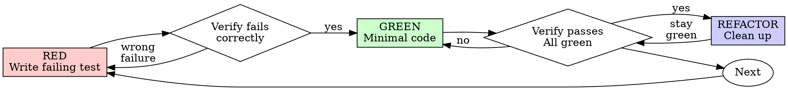

2026-04-22T13:24:41.855864Z ERROR codex_core::codex: failed to load skill /Users/Zhuanz/.agents/skills/cfd-research-deerflow/SKILL.md: missing YAML frontmatter delimited by ---
2026-04-22T13:24:41.855882Z ERROR codex_core::codex: failed to load skill /Users/Zhuanz/.agents/skills/cfd-report-pretext/SKILL.md: missing YAML frontmatter delimited by ---
OpenAI Codex v0.118.0 (research preview)
--------
workdir: /Users/Zhuanz/Desktop/cfd-harness-unified
model: gpt-5.4
provider: openai
approval: never
sandbox: workspace-write [workdir, /tmp, $TMPDIR, /Users/Zhuanz/.codex/memories]
reasoning effort: xhigh
reasoning summaries: none
session id: 019db55d-4d83-77c2-9794-f0b364e6acc3
--------
user
# [CLAUDE → CODEX TOOL INVOCATION]

    from: claude-code-opus47 (Main Driver v6.2)
    to: codex-gpt54-xhigh (Joint Dev Peer · §A Diff Generator)
    task: "DEC-V61-045 Wave 3 Invocation G — tests for attestor-first TaskRunner + verdict recompute"
    contract: Notion DEC-V61-045
    depends_on:
      - 5433e20 Wave 3 F (TaskRunner reorder + verdict recompute)

    scope: Add test coverage for Track 3 (TaskRunner attestor-first) + Track 5
    (expected_verdict recompute). Do NOT modify existing tests unless required
    by new RunReport.attestation field.

    allowed_files:
      - tests/test_task_runner.py                         (if exists; else create)
      - tests/test_auto_verifier/test_task_runner_integration.py   (existing — read, minimal touches)
      - ui/backend/tests/test_convergence_attestor.py     (integration with _audit_fixture_doc)

    read_only_context:
      - src/task_runner.py (post-Wave-3-F state)
      - src/models.py (ExecutionResult.exit_code new field; RunReport.attestation new field)
      - scripts/phase5_audit_run.py (verdict recompute site)
      - src/convergence_attestor.py
      - reports/codex_tool_reports/20260422_dec045_wave3_F_taskrunner_reorder_result.md

    forbidden_files:
      - src/** (already landed)
      - knowledge/**
      - scripts/phase5_audit_run.py

    autonomy: TOOL-SCOPE

---

## Tests to add

### Track 3 (TaskRunner attestor-first) — in `tests/test_task_runner.py`

1. **test_run_task_attestor_pass_path_completes_pipeline**: Build a mock TaskRunner (mock executor returning ExecutionResult with raw_output_path pointing to a tmp dir containing a synthetic clean `log.simpleFoam`). Call `run_task(mock_spec)`. Assert:
   - `report.attestation.overall == "ATTEST_PASS"`
   - `report.comparison_result is not None` (if gold_standard available via mocked _db)
   - Pipeline runs to completion

2. **test_run_task_attestor_fail_short_circuits_comparator**: Same setup but synthetic log contains `FOAM FATAL ERROR`. Assert:
   - `report.attestation.overall == "ATTEST_FAIL"`
   - `report.comparison_result is None`
   - `report.correction_spec is None`

3. **test_run_task_attestor_hazard_does_not_short_circuit**: Synthetic log with final `sum_local = 5e-4` (A2 HAZARD tier). Assert:
   - `report.attestation.overall == "ATTEST_HAZARD"`
   - `report.comparison_result is not None` (HAZARD does not short-circuit)

4. **test_run_task_attestor_not_applicable_when_no_log**: ExecutionResult.raw_output_path = None. Assert:
   - `report.attestation.overall == "ATTEST_NOT_APPLICABLE"`
   - Pipeline runs normally (compare if gold exists, etc.)

5. **test_run_task_attestor_not_applicable_when_raw_output_nonexistent**: raw_output_path = "/nonexistent/dir/xxx". Assert same as above.

6. **test_runreport_attestation_field_optional**: RunReport created without attestation kwarg still works (default None), ensures backward compat for any caller not yet updated.

7. **test_run_batch_blocks_backdoor_comparison_on_attest_fail**: Use `run_batch([case])` where case has ATTEST_FAIL log. Verify that `_ensure_batch_comparison()` does NOT fabricate a comparison on top of failed attestation.

### Track 5 (verdict recompute) — in `ui/backend/tests/test_convergence_attestor.py`

8. **test_audit_fixture_doc_recomputes_expected_verdict_to_hazard** (synthetic): Build a minimal `report` via SimpleNamespace with:
   - `comparison_result` carrying an in-band deviation
   - `execution_result.raw_output_path` pointing to a tmp dir with an A2-hazard log
   - `task_spec` = simple dict or None
   
   Call `_audit_fixture_doc(case_id="lid_driven_cavity", report, commit_sha="deadbee")`. Assert:
   - `doc["run_metadata"]["expected_verdict"] == "HAZARD"` (not PASS — recompute works)
   - `doc["run_metadata"]["actual_verdict"] == "HAZARD"`

9. **test_audit_fixture_doc_recomputes_to_fail_on_hard_concern**: Same setup but synthetic log has FOAM FATAL → A1 fires → HARD_FAIL. Assert `expected_verdict == "FAIL"`.

10. **test_audit_fixture_doc_clean_run_stays_pass_regression**: No concerns + in-band measurement. Assert `expected_verdict == "PASS"` (Track 5 doesn't break clean cases).

### Minimal existing-test touches

If `tests/test_task_runner.py::test_run_task_full_pipeline` or similar previously asserted `report.attestation` didn't exist (e.g., negative assertions like `not hasattr(report, 'attestation')`), update to allow the new field. Otherwise NO existing test changes.

## Acceptance Checks

CHK-1: All 7 new TaskRunner tests + 3 new audit_fixture_doc tests PASS locally via `.venv/bin/python -m pytest tests/test_task_runner.py ui/backend/tests/test_convergence_attestor.py -q`.

CHK-2: No existing test broken. Full `ui/backend/tests/ + tests/test_task_runner.py + tests/test_auto_verifier/` suite passes.

CHK-3: No fixture file edits.

## Reject Conditions

REJ-1: Edits outside allowed_files.
REJ-2: Mocking src/ code (stub at executor/db/comparator boundaries instead).
REJ-3: Changes that break Wave 1+2+3 F landed code.
REJ-4: Any network dependency in tests.
REJ-5: Using real OpenFOAM (all logs synthetic).

## Output format

```
# Codex Diff Report — DEC-V61-045 Wave 3 G

## Files modified
- tests/test_task_runner.py [+N/-M]  (or NEW)
- ui/backend/tests/test_convergence_attestor.py [+N/-M]

## Tests added
- per-test one-liner

## Existing tests touched
- file:line — what + why (expected: minimal)

## Self-verified
- CHK-1..3 results

## Tokens used
```

---

[/CLAUDE → CODEX TOOL INVOCATION]

codex
任务是给 `DEC-V61-045 Wave 3 G` 补测试，只允许动指定测试文件并本地自验。我先做两件事：快速过一遍该 repo 的记忆和相关 skill，然后读取现有 `TaskRunner`/attestor 测试面，确认最小改动点。
exec
/bin/zsh -lc "sed -n '1,220p' /Users/Zhuanz/.codex/plugins/cache/openai-curated/superpowers/27651a43bf55185d924f7a1fc49043a0a8be65a0/skills/using-superpowers/SKILL.md" in /Users/Zhuanz/Desktop/cfd-harness-unified
exec
/bin/zsh -lc "sed -n '1,240p' /Users/Zhuanz/.codex/plugins/cache/openai-curated/superpowers/27651a43bf55185d924f7a1fc49043a0a8be65a0/skills/test-driven-development/SKILL.md" in /Users/Zhuanz/Desktop/cfd-harness-unified
 succeeded in 0ms:
---
name: using-superpowers
description: Use when starting any conversation - establishes how to find and use skills, requiring Skill tool invocation before ANY response including clarifying questions
---

<SUBAGENT-STOP>
If you were dispatched as a subagent to execute a specific task, skip this skill.
</SUBAGENT-STOP>

<EXTREMELY-IMPORTANT>
If you think there is even a 1% chance a skill might apply to what you are doing, you ABSOLUTELY MUST invoke the skill.

IF A SKILL APPLIES TO YOUR TASK, YOU DO NOT HAVE A CHOICE. YOU MUST USE IT.

This is not negotiable. This is not optional. You cannot rationalize your way out of this.
</EXTREMELY-IMPORTANT>

## Instruction Priority

Superpowers skills override default system prompt behavior, but **user instructions always take precedence**:

1. **User's explicit instructions** (CLAUDE.md, GEMINI.md, AGENTS.md, direct requests) — highest priority
2. **Superpowers skills** — override default system behavior where they conflict
3. **Default system prompt** — lowest priority

If CLAUDE.md, GEMINI.md, or AGENTS.md says "don't use TDD" and a skill says "always use TDD," follow the user's instructions. The user is in control.

## How to Access Skills

**In Claude Code:** Use the `Skill` tool. When you invoke a skill, its content is loaded and presented to you—follow it directly. Never use the Read tool on skill files.

**In Copilot CLI:** Use the `skill` tool. Skills are auto-discovered from installed plugins. The `skill` tool works the same as Claude Code's `Skill` tool.

**In Gemini CLI:** Skills activate via the `activate_skill` tool. Gemini loads skill metadata at session start and activates the full content on demand.

**In other environments:** Check your platform's documentation for how skills are loaded.

## Platform Adaptation

Skills use Claude Code tool names. Non-CC platforms: see `references/copilot-tools.md` (Copilot CLI), `references/codex-tools.md` (Codex) for tool equivalents. Gemini CLI users get the tool mapping loaded automatically via GEMINI.md.

# Using Skills

## The Rule

**Invoke relevant or requested skills BEFORE any response or action.** Even a 1% chance a skill might apply means that you should invoke the skill to check. If an invoked skill turns out to be wrong for the situation, you don't need to use it.


## Red Flags

These thoughts mean STOP—you're rationalizing:

| Thought | Reality |
|---------|---------|
| "This is just a simple question" | Questions are tasks. Check for skills. |
| "I need more context first" | Skill check comes BEFORE clarifying questions. |
| "Let me explore the codebase first" | Skills tell you HOW to explore. Check first. |
| "I can check git/files quickly" | Files lack conversation context. Check for skills. |
| "Let me gather information first" | Skills tell you HOW to gather information. |
| "This doesn't need a formal skill" | If a skill exists, use it. |
| "I remember this skill" | Skills evolve. Read current version. |
| "This doesn't count as a task" | Action = task. Check for skills. |
| "The skill is overkill" | Simple things become complex. Use it. |
| "I'll just do this one thing first" | Check BEFORE doing anything. |
| "This feels productive" | Undisciplined action wastes time. Skills prevent this. |
| "I know what that means" | Knowing the concept ≠ using the skill. Invoke it. |

## Skill Priority

When multiple skills could apply, use this order:

1. **Process skills first** (brainstorming, debugging) - these determine HOW to approach the task
2. **Implementation skills second** (frontend-design, mcp-builder) - these guide execution

"Let's build X" → brainstorming first, then implementation skills.
"Fix this bug" → debugging first, then domain-specific skills.

## Skill Types

**Rigid** (TDD, debugging): Follow exactly. Don't adapt away discipline.

**Flexible** (patterns): Adapt principles to context.

The skill itself tells you which.

## User Instructions

Instructions say WHAT, not HOW. "Add X" or "Fix Y" doesn't mean skip workflows.

exec
/bin/zsh -lc "sed -n '1,220p' /Users/Zhuanz/.codex/plugins/cache/openai-curated/superpowers/27651a43bf55185d924f7a1fc49043a0a8be65a0/skills/verification-before-completion/SKILL.md" in /Users/Zhuanz/Desktop/cfd-harness-unified
 succeeded in 0ms:
---
name: test-driven-development
description: Use when implementing any feature or bugfix, before writing implementation code
---

# Test-Driven Development (TDD)

## Overview

Write the test first. Watch it fail. Write minimal code to pass.

**Core principle:** If you didn't watch the test fail, you don't know if it tests the right thing.

**Violating the letter of the rules is violating the spirit of the rules.**

## When to Use

**Always:**
- New features
- Bug fixes
- Refactoring
- Behavior changes

**Exceptions (ask your human partner):**
- Throwaway prototypes
- Generated code
- Configuration files

Thinking "skip TDD just this once"? Stop. That's rationalization.

## The Iron Law

```
NO PRODUCTION CODE WITHOUT A FAILING TEST FIRST
```

Write code before the test? Delete it. Start over.

**No exceptions:**
- Don't keep it as "reference"
- Don't "adapt" it while writing tests
- Don't look at it
- Delete means delete

Implement fresh from tests. Period.

## Red-Green-Refactor



### RED - Write Failing Test

Write one minimal test showing what should happen.

<Good>
```typescript
test('retries failed operations 3 times', async () => {
  let attempts = 0;
  const operation = () => {
    attempts++;
    if (attempts < 3) throw new Error('fail');
    return 'success';
  };

  const result = await retryOperation(operation);

  expect(result).toBe('success');
  expect(attempts).toBe(3);
});
```
Clear name, tests real behavior, one thing
</Good>

<Bad>
```typescript
test('retry works', async () => {
  const mock = jest.fn()
    .mockRejectedValueOnce(new Error())
    .mockRejectedValueOnce(new Error())
    .mockResolvedValueOnce('success');
  await retryOperation(mock);
  expect(mock).toHaveBeenCalledTimes(3);
});
```
Vague name, tests mock not code
</Bad>

**Requirements:**
- One behavior
- Clear name
- Real code (no mocks unless unavoidable)

### Verify RED - Watch It Fail

**MANDATORY. Never skip.**

```bash
npm test path/to/test.test.ts
```

Confirm:
- Test fails (not errors)
- Failure message is expected
- Fails because feature missing (not typos)

**Test passes?** You're testing existing behavior. Fix test.

**Test errors?** Fix error, re-run until it fails correctly.

### GREEN - Minimal Code

Write simplest code to pass the test.

<Good>
```typescript
async function retryOperation<T>(fn: () => Promise<T>): Promise<T> {
  for (let i = 0; i < 3; i++) {
    try {
      return await fn();
    } catch (e) {
      if (i === 2) throw e;
    }
  }
  throw new Error('unreachable');
}
```
Just enough to pass
</Good>

<Bad>
```typescript
async function retryOperation<T>(
  fn: () => Promise<T>,
  options?: {
    maxRetries?: number;
    backoff?: 'linear' | 'exponential';
    onRetry?: (attempt: number) => void;
  }
): Promise<T> {
  // YAGNI
}
```
Over-engineered
</Bad>

Don't add features, refactor other code, or "improve" beyond the test.

### Verify GREEN - Watch It Pass

**MANDATORY.**

```bash
npm test path/to/test.test.ts
```

Confirm:
- Test passes
- Other tests still pass
- Output pristine (no errors, warnings)

**Test fails?** Fix code, not test.

**Other tests fail?** Fix now.

### REFACTOR - Clean Up

After green only:
- Remove duplication
- Improve names
- Extract helpers

Keep tests green. Don't add behavior.

### Repeat

Next failing test for next feature.

## Good Tests

| Quality | Good | Bad |
|---------|------|-----|
| **Minimal** | One thing. "and" in name? Split it. | `test('validates email and domain and whitespace')` |
| **Clear** | Name describes behavior | `test('test1')` |
| **Shows intent** | Demonstrates desired API | Obscures what code should do |

## Why Order Matters

**"I'll write tests after to verify it works"**

Tests written after code pass immediately. Passing immediately proves nothing:
- Might test wrong thing
- Might test implementation, not behavior
- Might miss edge cases you forgot
- You never saw it catch the bug

Test-first forces you to see the test fail, proving it actually tests something.

**"I already manually tested all the edge cases"**

Manual testing is ad-hoc. You think you tested everything but:
- No record of what you tested
- Can't re-run when code changes
- Easy to forget cases under pressure
- "It worked when I tried it" ≠ comprehensive

Automated tests are systematic. They run the same way every time.

**"Deleting X hours of work is wasteful"**

Sunk cost fallacy. The time is already gone. Your choice now:
- Delete and rewrite with TDD (X more hours, high confidence)
- Keep it and add tests after (30 min, low confidence, likely bugs)

The "waste" is keeping code you can't trust. Working code without real tests is technical debt.

**"TDD is dogmatic, being pragmatic means adapting"**

TDD IS pragmatic:
- Finds bugs before commit (faster than debugging after)
- Prevents regressions (tests catch breaks immediately)

 succeeded in 0ms:
---
name: verification-before-completion
description: Use when about to claim work is complete, fixed, or passing, before committing or creating PRs - requires running verification commands and confirming output before making any success claims; evidence before assertions always
---

# Verification Before Completion

## Overview

Claiming work is complete without verification is dishonesty, not efficiency.

**Core principle:** Evidence before claims, always.

**Violating the letter of this rule is violating the spirit of this rule.**

## The Iron Law

```
NO COMPLETION CLAIMS WITHOUT FRESH VERIFICATION EVIDENCE
```

If you haven't run the verification command in this message, you cannot claim it passes.

## The Gate Function

```
BEFORE claiming any status or expressing satisfaction:

1. IDENTIFY: What command proves this claim?
2. RUN: Execute the FULL command (fresh, complete)
3. READ: Full output, check exit code, count failures
4. VERIFY: Does output confirm the claim?
   - If NO: State actual status with evidence
   - If YES: State claim WITH evidence
5. ONLY THEN: Make the claim

Skip any step = lying, not verifying
```

## Common Failures

| Claim | Requires | Not Sufficient |
|-------|----------|----------------|
| Tests pass | Test command output: 0 failures | Previous run, "should pass" |
| Linter clean | Linter output: 0 errors | Partial check, extrapolation |
| Build succeeds | Build command: exit 0 | Linter passing, logs look good |
| Bug fixed | Test original symptom: passes | Code changed, assumed fixed |
| Regression test works | Red-green cycle verified | Test passes once |
| Agent completed | VCS diff shows changes | Agent reports "success" |
| Requirements met | Line-by-line checklist | Tests passing |

## Red Flags - STOP

- Using "should", "probably", "seems to"
- Expressing satisfaction before verification ("Great!", "Perfect!", "Done!", etc.)
- About to commit/push/PR without verification
- Trusting agent success reports
- Relying on partial verification
- Thinking "just this once"
- Tired and wanting work over
- **ANY wording implying success without having run verification**

## Rationalization Prevention

| Excuse | Reality |
|--------|---------|
| "Should work now" | RUN the verification |
| "I'm confident" | Confidence ≠ evidence |
| "Just this once" | No exceptions |
| "Linter passed" | Linter ≠ compiler |
| "Agent said success" | Verify independently |
| "I'm tired" | Exhaustion ≠ excuse |
| "Partial check is enough" | Partial proves nothing |
| "Different words so rule doesn't apply" | Spirit over letter |

## Key Patterns

**Tests:**
```
✅ [Run test command] [See: 34/34 pass] "All tests pass"
❌ "Should pass now" / "Looks correct"
```

**Regression tests (TDD Red-Green):**
```
✅ Write → Run (pass) → Revert fix → Run (MUST FAIL) → Restore → Run (pass)
❌ "I've written a regression test" (without red-green verification)
```

**Build:**
```
✅ [Run build] [See: exit 0] "Build passes"
❌ "Linter passed" (linter doesn't check compilation)
```

**Requirements:**
```
✅ Re-read plan → Create checklist → Verify each → Report gaps or completion
❌ "Tests pass, phase complete"
```

**Agent delegation:**
```
✅ Agent reports success → Check VCS diff → Verify changes → Report actual state
❌ Trust agent report
```

## Why This Matters

From 24 failure memories:
- your human partner said "I don't believe you" - trust broken
- Undefined functions shipped - would crash
- Missing requirements shipped - incomplete features
- Time wasted on false completion → redirect → rework
- Violates: "Honesty is a core value. If you lie, you'll be replaced."

## When To Apply

**ALWAYS before:**
- ANY variation of success/completion claims
- ANY expression of satisfaction
- ANY positive statement about work state
- Committing, PR creation, task completion
- Moving to next task
- Delegating to agents

**Rule applies to:**
- Exact phrases
- Paraphrases and synonyms
- Implications of success
- ANY communication suggesting completion/correctness

## The Bottom Line

**No shortcuts for verification.**

Run the command. Read the output. THEN claim the result.

This is non-negotiable.

exec
/bin/zsh -lc 'rg -n "cfd-harness-unified|DEC-V61-045|TaskRunner|convergence_attestor|phase5_audit_run" /Users/Zhuanz/.codex/memories/MEMORY.md' in /Users/Zhuanz/Desktop/cfd-harness-unified
 succeeded in 0ms:
270:- OpenClaw, AI-CFD, Notion作为指挥中枢，Github作为唯一代码真相库, ~/.openclaw/openclaw.json, plugins.allow, openclaw config validate --json, MAIN_OK, CODEX_BUILDER_OK, CLAUDE_REVIEW_OK, NOTION_SYNC_OK, cfd-harness-unified
290:- The real live config surface was `~/.openclaw/openclaw.json`; the actual repo truth for this rollout was `/Users/Zhuanz/Desktop/cfd-harness-unified`, not the chat thread cwd [Task 1]
511:# Task Group: cfd-harness-unified governance closeout and planning gates
513:scope: Close out accepted phases in `cfd-harness-unified`, normalize Notion-vs-repo naming drift, and keep future phases planning-only until the explicit solver/routing gate is reviewed.
514:applies_to: cwd=/Users/Zhuanz/Desktop/cfd-harness-unified; reuse_rule=safe for this repo’s Notion-governed phase/gate work, but phase/task IDs and review packets are rollout-specific.
520:- rollout_summaries/2026-04-16T17-04-02-U9ea-phase8_closeout_and_phase9_planning_gate_prep.md (cwd=/Users/Zhuanz/Desktop/cfd-harness-unified, rollout_path=/Users/Zhuanz/.codex/sessions/2026/04/17/rollout-2026-04-17T01-04-02-019d973f-efab-7132-bd99-5e0ebb839e12.jsonl, updated_at=2026-04-17T05:16:53+00:00, thread_id=019d973f-efab-7132-bd99-5e0ebb839e12, Phase 8 closeout and evidence normalization)
530:- rollout_summaries/2026-04-16T17-04-02-U9ea-phase8_closeout_and_phase9_planning_gate_prep.md (cwd=/Users/Zhuanz/Desktop/cfd-harness-unified, rollout_path=/Users/Zhuanz/.codex/sessions/2026/04/17/rollout-2026-04-17T01-04-02-019d973f-efab-7132-bd99-5e0ebb839e12.jsonl, updated_at=2026-04-17T05:16:53+00:00, thread_id=019d973f-efab-7132-bd99-5e0ebb839e12, Phase 9 kept as planning-only with decision-tree packet))
540:- rollout_summaries/2026-04-16T17-04-02-U9ea-phase8_closeout_and_phase9_planning_gate_prep.md (cwd=/Users/Zhuanz/Desktop/cfd-harness-unified, rollout_path=/Users/Zhuanz/.codex/sessions/2026/04/17/rollout-2026-04-17T01-04-02-019d973f-efab-7132-bd99-5e0ebb839e12.jsonl, updated_at=2026-04-17T05:16:53+00:00, thread_id=019d973f-efab-7132-bd99-5e0ebb839e12, handoff prompt prepared instead of silent activation))
594:- rollout_summaries/2026-04-12T15-33-54-ByPi-jerry_ai_cfd_notion_sync_and_cfd_harness_unified_context_mis.md (cwd=/Users/Zhuanz/Documents/20260330 Jerry AI CFD Project, rollout_path=/Users/Zhuanz/.codex/sessions/2026/04/12/rollout-2026-04-12T23-33-54-019d8253-fa8b-7f40-9775-46e6e03db8ac.jsonl, updated_at=2026-04-16T17:03:18+00:00, thread_id=019d8253-fa8b-7f40-9775-46e6e03db8ac, later cfd-harness-unified instruction block correctly treated as mismatch)

codex
我会按 `using-superpowers -> writing-plans -> test-driven-development` 的顺序执行：先约束流程，再把这次测试补齐拆成可验证的小步，最后按红绿循环加测试，不碰禁止文件。
exec
/bin/zsh -lc "sed -n '1,260p' /Users/Zhuanz/.codex/plugins/cache/openai-curated/superpowers/27651a43bf55185d924f7a1fc49043a0a8be65a0/skills/writing-plans/SKILL.md" in /Users/Zhuanz/Desktop/cfd-harness-unified
 succeeded in 0ms:
---
name: writing-plans
description: Use when you have a spec or requirements for a multi-step task, before touching code
---

# Writing Plans

## Overview

Write comprehensive implementation plans assuming the engineer has zero context for our codebase and questionable taste. Document everything they need to know: which files to touch for each task, code, testing, docs they might need to check, how to test it. Give them the whole plan as bite-sized tasks. DRY. YAGNI. TDD. Frequent commits.

Assume they are a skilled developer, but know almost nothing about our toolset or problem domain. Assume they don't know good test design very well.

**Announce at start:** "I'm using the writing-plans skill to create the implementation plan."

**Context:** This should be run in a dedicated worktree (created by brainstorming skill).

**Save plans to:** `docs/superpowers/plans/YYYY-MM-DD-<feature-name>.md`
- (User preferences for plan location override this default)

## Scope Check

If the spec covers multiple independent subsystems, it should have been broken into sub-project specs during brainstorming. If it wasn't, suggest breaking this into separate plans — one per subsystem. Each plan should produce working, testable software on its own.

## File Structure

Before defining tasks, map out which files will be created or modified and what each one is responsible for. This is where decomposition decisions get locked in.

- Design units with clear boundaries and well-defined interfaces. Each file should have one clear responsibility.
- You reason best about code you can hold in context at once, and your edits are more reliable when files are focused. Prefer smaller, focused files over large ones that do too much.
- Files that change together should live together. Split by responsibility, not by technical layer.
- In existing codebases, follow established patterns. If the codebase uses large files, don't unilaterally restructure - but if a file you're modifying has grown unwieldy, including a split in the plan is reasonable.

This structure informs the task decomposition. Each task should produce self-contained changes that make sense independently.

## Bite-Sized Task Granularity

**Each step is one action (2-5 minutes):**
- "Write the failing test" - step
- "Run it to make sure it fails" - step
- "Implement the minimal code to make the test pass" - step
- "Run the tests and make sure they pass" - step
- "Commit" - step

## Plan Document Header

**Every plan MUST start with this header:**

```markdown
# [Feature Name] Implementation Plan

> **For agentic workers:** REQUIRED SUB-SKILL: Use superpowers:subagent-driven-development (recommended) or superpowers:executing-plans to implement this plan task-by-task. Steps use checkbox (`- [ ]`) syntax for tracking.

**Goal:** [One sentence describing what this builds]

**Architecture:** [2-3 sentences about approach]

**Tech Stack:** [Key technologies/libraries]

---
```

## Task Structure

````markdown
### Task N: [Component Name]

**Files:**
- Create: `exact/path/to/file.py`
- Modify: `exact/path/to/existing.py:123-145`
- Test: `tests/exact/path/to/test.py`

- [ ] **Step 1: Write the failing test**

```python
def test_specific_behavior():
    result = function(input)
    assert result == expected
```

- [ ] **Step 2: Run test to verify it fails**

Run: `pytest tests/path/test.py::test_name -v`
Expected: FAIL with "function not defined"

- [ ] **Step 3: Write minimal implementation**

```python
def function(input):
    return expected
```

- [ ] **Step 4: Run test to verify it passes**

Run: `pytest tests/path/test.py::test_name -v`
Expected: PASS

- [ ] **Step 5: Commit**

```bash
git add tests/path/test.py src/path/file.py
git commit -m "feat: add specific feature"
```
````

## No Placeholders

Every step must contain the actual content an engineer needs. These are **plan failures** — never write them:
- "TBD", "TODO", "implement later", "fill in details"
- "Add appropriate error handling" / "add validation" / "handle edge cases"
- "Write tests for the above" (without actual test code)
- "Similar to Task N" (repeat the code — the engineer may be reading tasks out of order)
- Steps that describe what to do without showing how (code blocks required for code steps)
- References to types, functions, or methods not defined in any task

## Remember
- Exact file paths always
- Complete code in every step — if a step changes code, show the code
- Exact commands with expected output
- DRY, YAGNI, TDD, frequent commits

## Self-Review

After writing the complete plan, look at the spec with fresh eyes and check the plan against it. This is a checklist you run yourself — not a subagent dispatch.

**1. Spec coverage:** Skim each section/requirement in the spec. Can you point to a task that implements it? List any gaps.

**2. Placeholder scan:** Search your plan for red flags — any of the patterns from the "No Placeholders" section above. Fix them.

**3. Type consistency:** Do the types, method signatures, and property names you used in later tasks match what you defined in earlier tasks? A function called `clearLayers()` in Task 3 but `clearFullLayers()` in Task 7 is a bug.

If you find issues, fix them inline. No need to re-review — just fix and move on. If you find a spec requirement with no task, add the task.

## Execution Handoff

After saving the plan, offer execution choice:

**"Plan complete and saved to `docs/superpowers/plans/<filename>.md`. Two execution options:**

**1. Subagent-Driven (recommended)** - I dispatch a fresh subagent per task, review between tasks, fast iteration

**2. Inline Execution** - Execute tasks in this session using executing-plans, batch execution with checkpoints

**Which approach?"**

**If Subagent-Driven chosen:**
- **REQUIRED SUB-SKILL:** Use superpowers:subagent-driven-development
- Fresh subagent per task + two-stage review

**If Inline Execution chosen:**
- **REQUIRED SUB-SKILL:** Use superpowers:executing-plans
- Batch execution with checkpoints for review

exec
/bin/zsh -lc "pwd && git status --short && rg --files tests ui/backend/tests src scripts reports/codex_tool_reports | rg 'test_task_runner|test_task_runner_integration|test_convergence_attestor|task_runner.py|models.py|phase5_audit_run.py|convergence_attestor.py|20260422_dec045_wave3_F_taskrunner_reorder_result.md'" in /Users/Zhuanz/Desktop/cfd-harness-unified
 succeeded in 0ms:
/Users/Zhuanz/Desktop/cfd-harness-unified
 M reports/cylinder_crossflow/report.md
 M reports/deep_acceptance/visual_acceptance_report.html
 M reports/deep_acceptance/visual_acceptance_report_manifest.json
 M reports/differential_heated_cavity/report.md
 M reports/rayleigh_benard_convection/report.md
 M reports/turbulent_flat_plate/report.md
 M ui/frontend/public/flow-fields/circular_cylinder_wake/strouhal_curve.png
 M ui/frontend/public/flow-fields/lid_driven_cavity/centerline_profiles.png
 M ui/frontend/public/flow-fields/lid_driven_cavity/stream_function.png
 M ui/frontend/public/flow-fields/plane_channel_flow/wall_profile.png
 M ui/frontend/public/flow-fields/rayleigh_benard_convection/nu_ra_scaling.png
 M ui/frontend/public/flow-fields/turbulent_flat_plate/blasius_profile.png
 M ui/frontend/public/flow-fields/turbulent_flat_plate/cf_comparison.png
?? .claude/
?? .gitignore.patch.stale.1776663560182166739
?? knowledge/corrections/
?? reports/codex_tool_reports/20260422_dec045_wave3_G_tests_prompt.md
?? reports/codex_tool_reports/20260422_dec045_wave3_G_tests_result.md
?? reports/deep_acceptance/20260421_000138_visual_acceptance_package.md
?? reports/deep_acceptance/20260421_000139_visual_acceptance_package.md
?? reports/deep_acceptance/20260421_000231_visual_acceptance_package.md
?? reports/deep_acceptance/20260421_000232_visual_acceptance_package.md
?? reports/deep_acceptance/20260422_135406_visual_acceptance_package.md
?? reports/deep_acceptance/20260422_135407_visual_acceptance_package.md
?? reports/deep_acceptance/20260422_135452_visual_acceptance_package.md
?? reports/deep_acceptance/20260422_135453_visual_acceptance_package.md
?? reports/deep_acceptance/20260422_145436_visual_acceptance_package.md
?? reports/deep_acceptance/20260422_145437_visual_acceptance_package.md
?? reports/deep_acceptance/20260422_151428_visual_acceptance_package.md
?? reports/deep_acceptance/20260422_151429_visual_acceptance_package.md
?? reports/deep_acceptance/20260422_154122_visual_acceptance_package.md
?? reports/deep_acceptance/20260422_154123_visual_acceptance_package.md
?? reports/deep_acceptance/20260422_212242_visual_acceptance_package.md
?? reports/deep_acceptance/visual_acceptance_report_20260421_000138.html
?? reports/deep_acceptance/visual_acceptance_report_20260421_000139.html
?? reports/deep_acceptance/visual_acceptance_report_20260421_000231.html
?? reports/deep_acceptance/visual_acceptance_report_20260421_000232.html
?? reports/deep_acceptance/visual_acceptance_report_20260422_135406.html
?? reports/deep_acceptance/visual_acceptance_report_20260422_135407.html
?? reports/deep_acceptance/visual_acceptance_report_20260422_135452.html
?? reports/deep_acceptance/visual_acceptance_report_20260422_135453.html
?? reports/deep_acceptance/visual_acceptance_report_20260422_145436.html
?? reports/deep_acceptance/visual_acceptance_report_20260422_145437.html
?? reports/deep_acceptance/visual_acceptance_report_20260422_151428.html
?? reports/deep_acceptance/visual_acceptance_report_20260422_151429.html
?? reports/deep_acceptance/visual_acceptance_report_20260422_154122.html
?? reports/deep_acceptance/visual_acceptance_report_20260422_154123.html
?? reports/deep_acceptance/visual_acceptance_report_20260422_212242.html
?? reports/phase5_reports/
?? ui/frontend/vite.config.sandbox.ts.stale.1776667726
?? ui/frontend/vite.config.sandbox.ts.timestamp-1776667276256-33cd5f0862292.mjs
scripts/phase5_audit_run.py
src/models.py
src/convergence_attestor.py
src/task_runner.py
reports/codex_tool_reports/20260422_dec045_wave3_F_taskrunner_reorder_result.md
ui/backend/tests/test_convergence_attestor.py
tests/test_task_runner.py
tests/test_models.py
tests/test_auto_verifier/test_task_runner_integration.py

codex
我已经确认工作树是脏的，但目标测试文件都存在，能在不碰现有源码的前提下完成。下一步读取 `TaskRunner`、`RunReport.attestation`、`_audit_fixture_doc` 以及现有测试模式，先找能复用的 helper 和最小 mock 边界。
Internal execution plan for DEC-V61-045 Wave 3 G within the user's file-scope constraints.
  → Inspect TaskRunner, attestor recompute path, and existing tests to identify minimal test-only insertion points.
  • Add failing TaskRunner and audit fixture tests in the allowed files only.
  • Run targeted pytest commands, adjust tests if needed, then run the broader requested verification suite.
exec
/bin/zsh -lc "sed -n '1,260p' src/models.py" in /Users/Zhuanz/Desktop/cfd-harness-unified
 succeeded in 0ms:
"""共享数据类型：Enum、dataclass、Protocol 定义"""

from __future__ import annotations

from dataclasses import dataclass, field
from enum import Enum
from typing import Any, Dict, List, Optional, Protocol, runtime_checkable


# ---------------------------------------------------------------------------
# Enumerations
# ---------------------------------------------------------------------------

class FlowType(Enum):
    INTERNAL = "INTERNAL"
    EXTERNAL = "EXTERNAL"
    NATURAL_CONVECTION = "NATURAL_CONVECTION"


class GeometryType(Enum):
    SIMPLE_GRID = "SIMPLE_GRID"
    BACKWARD_FACING_STEP = "BACKWARD_FACING_STEP"
    BODY_IN_CHANNEL = "BODY_IN_CHANNEL"
    NATURAL_CONVECTION_CAVITY = "NATURAL_CONVECTION_CAVITY"
    AIRFOIL = "AIRFOIL"
    IMPINGING_JET = "IMPINGING_JET"
    CUSTOM = "CUSTOM"


class SteadyState(Enum):
    STEADY = "STEADY"
    TRANSIENT = "TRANSIENT"


class Compressibility(Enum):
    INCOMPRESSIBLE = "INCOMPRESSIBLE"
    COMPRESSIBLE = "COMPRESSIBLE"


class ErrorType(Enum):
    WRONG_BOUNDARY = "WRONG_BOUNDARY"
    WRONG_SOLVER = "WRONG_SOLVER"
    WRONG_TURBULENCE_MODEL = "WRONG_TURBULENCE_MODEL"
    WRONG_MESH = "WRONG_MESH"
    CONVERGENCE_FAILURE = "CONVERGENCE_FAILURE"
    QUANTITY_DEVIATION = "QUANTITY_DEVIATION"
    PARAMETER_PLUMBING_MISMATCH = "PARAMETER_PLUMBING_MISMATCH"
    COMPARATOR_SCHEMA_MISMATCH = "COMPARATOR_SCHEMA_MISMATCH"
    GEOMETRY_MODEL_MISMATCH = "GEOMETRY_MODEL_MISMATCH"
    INSUFFICIENT_TRANSIENT_SAMPLING = "INSUFFICIENT_TRANSIENT_SAMPLING"
    BUOYANT_ENERGY_SETUP_INCOMPLETE = "BUOYANT_ENERGY_SETUP_INCOMPLETE"
    OTHER = "OTHER"


class ImpactScope(Enum):
    LOCAL = "LOCAL"       # 影响单个案例
    CLASS = "CLASS"       # 影响同类型案例
    GLOBAL = "GLOBAL"     # 影响所有案例


# ---------------------------------------------------------------------------
# Core dataclasses
# ---------------------------------------------------------------------------

@dataclass
class TaskSpec:
    """从 Notion 读取的任务规格"""
    name: str
    geometry_type: GeometryType
    flow_type: FlowType
    steady_state: SteadyState
    compressibility: Compressibility
    Re: Optional[float] = None
    Ra: Optional[float] = None
    Re_tau: Optional[float] = None
    Ma: Optional[float] = None
    boundary_conditions: Dict[str, Any] = field(default_factory=dict)
    description: str = ""
    notion_task_id: Optional[str] = None
    # Phase 7a — optional per-run metadata bag. Currently carries the
    # driver-authored `phase7a_timestamp` (and `phase7a_case_id`) so
    # FoamAgentExecutor._capture_field_artifacts can stage OpenFOAM field
    # artifacts into reports/phase5_fields/{case_id}/{timestamp}/ before the
    # finally-block tears down the case dir. Default-None keeps the
    # dataclass backward-compatible for all 79/79 existing tests.
    metadata: Optional[Dict[str, Any]] = None


@dataclass
class ExecutionResult:
    """CFD 执行结果"""
    success: bool
    is_mock: bool
    residuals: Dict[str, float] = field(default_factory=dict)
    key_quantities: Dict[str, Any] = field(default_factory=dict)
    execution_time_s: float = 0.0
    raw_output_path: Optional[str] = None
    exit_code: Optional[int] = None
    error_message: Optional[str] = None


@dataclass
class DeviationDetail:
    """单个物理量的偏差记录"""
    quantity: str
    expected: Any
    actual: Any
    relative_error: Optional[float] = None
    tolerance: Optional[float] = None


@dataclass
class ComparisonResult:
    """结果 vs Gold Standard 对比"""
    passed: bool
    deviations: List[DeviationDetail] = field(default_factory=list)
    summary: str = ""
    gold_standard_id: Optional[str] = None


@dataclass
class CorrectionSpec:
    """修正规格：记录偏差并描述如何修复"""
    error_type: ErrorType
    wrong_output: Dict[str, Any]
    correct_output: Dict[str, Any]
    human_reason: str
    evidence: str
    impact_scope: ImpactScope
    root_cause: str
    fix_action: str
    needs_replay: bool = False
    task_spec_name: Optional[str] = None
    created_at: Optional[str] = None
    # 误差自动归因链 (Phase 4)
    attribution: Optional["AttributionReport"] = None


@dataclass
class AttributionReport:
    """结构化误差归因报告：偏差→定量分析→根因分类→修正建议"""
    # 归因链状态
    chain_complete: bool = False
    # 定量分析
    max_relative_error: Optional[float] = None
    worst_quantity: Optional[str] = None
    deviation_magnitude_pct: Optional[float] = None  # 偏差幅度百分比
    # 根因分类
    primary_cause: str = "unknown"  # mesh / boundary_condition / turbulence / solver / parameters
    confidence: float = 0.0  # 0.0-1.0
    secondary_causes: List[str] = field(default_factory=list)
    # 定量修正建议
    mesh_recommendation: Optional[str] = None  # e.g. "increase ncx from 40 to 80 in separation zone"
    turbulence_recommendation: Optional[str] = None  # e.g. "switch to k-omega SST for better near-wall"
    bc_recommendation: Optional[str] = None  # e.g. "verify velocity inlet profile"
    solver_recommendation: Optional[str] = None  # e.g. "try pimpleFoam for better convergence"
    # 知识库检索结果
    similar_cases: List[str] = field(default_factory=list)  # similar case IDs from knowledge DB
    recommended_solvers: List[str] = field(default_factory=list)
    recommended_turbulence_models: List[str] = field(default_factory=list)


@dataclass
class SystematicPattern:
    """批量级别系统性误差模式"""
    cause: str  # e.g. "mesh", "turbulence", "mock_executor", "sample_config_mismatch"
    affected_cases: List[str] = field(default_factory=list)
    frequency: float = 0.0  # affected / total
    confidence: str = "low"  # high (>0.5), medium (>0.3), low
    recommendation: str = ""


@dataclass
class BatchResult:
    """批量执行汇总结果"""
    total: int
    passed: int
    failed: int
    errors: List[str]
    results: List["ComparisonResult"] = field(default_factory=list)
    attribution_reports: List[Optional["AttributionReport"]] = field(default_factory=list)
    systematic_patterns: List[SystematicPattern] = field(default_factory=list)


# ---------------------------------------------------------------------------
# CFDExecutor Protocol
# ---------------------------------------------------------------------------

@runtime_checkable
class CFDExecutor(Protocol):
    """CFD 执行引擎接口（Protocol，不用 ABC）"""

    def execute(self, task_spec: TaskSpec) -> ExecutionResult:
        """执行 CFD 仿真，返回结果"""
        ...

exec
/bin/zsh -lc "sed -n '1,280p' src/task_runner.py" in /Users/Zhuanz/Desktop/cfd-harness-unified
 succeeded in 0ms:
"""核心编排器：从 Notion 读取任务 → 执行 → 对比 → 记录 → 回写"""

from __future__ import annotations

import logging
import os
from dataclasses import dataclass
from pathlib import Path
from typing import TYPE_CHECKING, Any, Callable, Dict, List, Optional

from .foam_agent_adapter import FoamAgentExecutor, MockExecutor
from .knowledge_db import KnowledgeDB
from .models import (
    AttributionReport,
    BatchResult,
    CFDExecutor,
    ComparisonResult,
    Compressibility,
    CorrectionSpec,
    ExecutionResult,
    FlowType,
    GeometryType,
    SteadyState,
    SystematicPattern,
    TaskSpec,
)
from .notion_client import NotionClient
from .result_comparator import ResultComparator
from .correction_recorder import CorrectionRecorder
from .error_attributor import ErrorAttributor

if TYPE_CHECKING:
    from .convergence_attestor import AttestationResult

PostExecuteHook = Callable[
    [TaskSpec, ExecutionResult, Optional[ComparisonResult], Optional[CorrectionSpec]],
    Any,
]

CORRECTION_POLICIES = ("legacy_auto_save", "suggest_only")

logger = logging.getLogger(__name__)


@dataclass
class RunReport:
    """单次任务运行的完整报告"""
    task_spec: TaskSpec
    execution_result: ExecutionResult
    comparison_result: Optional[ComparisonResult]
    correction_spec: Optional[CorrectionSpec]
    summary: str
    attestation: Optional["AttestationResult"] = None
    auto_verify_report: Any = None  # AutoVerifyReport or hook-returned status dict, when hook configured


class TaskRunner:
    """核心编排器

    使用方式：
        runner = TaskRunner(executor=MockExecutor())
        reports = runner.run_all()
    """

    def __init__(
        self,
        executor: Optional[CFDExecutor] = None,
        notion_client: Optional[NotionClient] = None,
        knowledge_db: Optional[KnowledgeDB] = None,
        deviation_threshold: float = 0.10,
        post_execute_hook: Optional[PostExecuteHook] = None,
        correction_policy: str = "legacy_auto_save",
    ) -> None:
        if correction_policy not in CORRECTION_POLICIES:
            raise ValueError(
                f"correction_policy must be one of {CORRECTION_POLICIES}, got {correction_policy!r}"
            )
        # Precedence: explicit executor kwarg > EXECUTOR_MODE env var > MockExecutor
        if executor is not None:
            self._executor: CFDExecutor = executor
        else:
            mode = os.environ.get("EXECUTOR_MODE", "mock").lower()
            if mode == "mock":
                self._executor = MockExecutor()
            elif mode == "foam_agent":
                self._executor = FoamAgentExecutor()
            else:
                raise ValueError(
                    f'EXECUTOR_MODE must be "mock" or "foam_agent", got "{mode}"'
                )
        self._notion = notion_client or NotionClient()
        self._db = knowledge_db or KnowledgeDB()
        self._comparator = ResultComparator(threshold=deviation_threshold)
        self._recorder = CorrectionRecorder()
        self._attributor = ErrorAttributor(knowledge_db=self._db)
        self._post_execute_hook = post_execute_hook
        self._correction_policy = correction_policy

    # ------------------------------------------------------------------
    # 公开接口
    # ------------------------------------------------------------------

    def run_task(self, task_spec: TaskSpec) -> RunReport:
        """执行单个任务，返回完整报告"""
        logger.info("Running task: %s", task_spec.name)

        # 1. 执行 CFD
        exec_result = self._executor.execute(task_spec)
        logger.info("Execution success=%s is_mock=%s", exec_result.success, exec_result.is_mock)

        # 2. 先做收敛 attestation；ATTEST_FAIL 不再进入 compare/correction。
        attestation = self._compute_attestation(exec_result, task_spec)

        # 3. 加载 Gold Standard
        gold = self._db.load_gold_standard(task_spec.name)
        comparison: Optional[ComparisonResult] = None
        correction: Optional[CorrectionSpec] = None

        # 4. 对比结果（仅 ATTEST_FAIL short-circuit；HAZARD 仍保留诊断值）
        if (
            gold is not None
            and exec_result.success
            and attestation.overall != "ATTEST_FAIL"
        ):
            comparison = self._comparator.compare(exec_result, gold)
            logger.info("Comparison passed=%s", comparison.passed)

            # 5. 如有偏差 → 生成 CorrectionSpec (saved only under legacy_auto_save policy)
            if not comparison.passed:
                correction = self._recorder.record(task_spec, exec_result, comparison)
                if self._correction_policy == "legacy_auto_save":
                    self._db.save_correction(correction)
                else:
                    logger.info(
                        "correction_policy=%s: CorrectionSpec built but not persisted",
                        self._correction_policy,
                    )

        # 6. AutoVerifier post-execute hook (SPEC §INT-1, additive)
        auto_verify_report: Any = None
        if self._post_execute_hook is not None:
            try:
                auto_verify_report = self._post_execute_hook(
                    task_spec, exec_result, comparison, correction
                )
            except Exception:  # noqa: BLE001 - hook is optional, must not kill run
                logger.exception("post_execute_hook raised; continuing without verify report")

        # 7. 生成摘要
        summary = self._build_summary(exec_result, comparison, correction, attestation)

        # 8. 回写 Notion（Notion 未配置时静默跳过）
        try:
            self._notion.write_execution_result(task_spec, exec_result, summary)
        except NotImplementedError:
            logger.debug("Notion not configured, skipping write-back")

        return RunReport(
            task_spec=task_spec,
            execution_result=exec_result,
            comparison_result=comparison,
            correction_spec=correction,
            attestation=attestation,
            summary=summary,
            auto_verify_report=auto_verify_report,
        )

    def run_all(self) -> List[RunReport]:
        """从 Notion 读取所有 Ready 任务并逐一运行"""
        try:
            tasks = self._notion.list_pending_tasks()
        except NotImplementedError:
            logger.warning("Notion not configured; run_all() returns empty list")
            return []

        reports = []
        for task in tasks:
            report = self.run_task(task)
            reports.append(report)
        return reports

    def run_batch(self, case_ids: List[str]) -> BatchResult:
        """批量执行指定 case_id 列表（串行，一个失败不阻塞其他）。

        每个 case 执行 run_task -> compare -> attribute 完整链路。
        """
        results: List[ComparisonResult] = []
        attribution_reports: List[Optional[AttributionReport]] = []
        errors: List[str] = []
        passed = 0
        failed = 0
        total = len(case_ids)

        for idx, case_id in enumerate(case_ids, 1):
            try:
                task_spec = self._task_spec_from_case_id(case_id)
                report = self.run_task(task_spec)

                comparison = report.comparison_result
                if comparison is None:
                    comparison = self._ensure_batch_comparison(case_id, report)

                results.append(comparison)

                # 归因（即使 passed=True 也做归因）
                if comparison is not None:
                    attribution = self._attributor.attribute(task_spec, report.execution_result, comparison)
                else:
                    attribution = None
                attribution_reports.append(attribution)

                if report.comparison_result is not None and report.comparison_result.passed:
                    passed += 1
                    print(f"Case {idx}/{total}: {case_id} [PASSED]")
                else:
                    failed += 1
                    print(f"Case {idx}/{total}: {case_id} [FAILED]")

            except Exception:
                failed += 1
                errors.append(case_id)
                results.append(ComparisonResult(passed=False, summary=f"Exception during {case_id}"))
                attribution_reports.append(None)
                logger.exception("Batch case failed: %s", case_id)
                print(f"Case {idx}/{total}: {case_id} [ERROR]")

        # Batch-level systematic pattern analysis
        systematic_patterns = self._analyze_systematic_patterns(case_ids, results, attribution_reports)

        return BatchResult(
            total=total,
            passed=passed,
            failed=failed,
            errors=errors,
            results=results,
            attribution_reports=attribution_reports,
            systematic_patterns=systematic_patterns,
        )

    def _task_spec_from_case_id(self, case_id: str) -> TaskSpec:
        """从 knowledge_db 通过 case_id 还原 TaskSpec。"""
        chain = self._db.get_execution_chain(case_id)
        if chain is None:
            raise ValueError(f"Unknown case_id: {case_id}")
        parameters = chain.get("parameters", {})
        return TaskSpec(
            name=chain.get("case_name", case_id),
            geometry_type=GeometryType(chain.get("geometry_type", "SIMPLE_GRID")),
            flow_type=FlowType(chain.get("flow_type", "INTERNAL")),
            steady_state=SteadyState(chain.get("steady_state", "STEADY")),
            compressibility=Compressibility(chain.get("compressibility", "INCOMPRESSIBLE")),
            Re=parameters.get("Re"),
            Ra=parameters.get("Ra"),
            Re_tau=parameters.get("Re_tau"),
            Ma=parameters.get("Ma"),
            boundary_conditions={**chain.get("boundary_conditions", {}), **parameters},  # includes aspect_ratio, plate_length, etc.
            description=chain.get("reference", ""),
        )

    def _ensure_batch_comparison(self, case_id: str, report: RunReport) -> ComparisonResult:
        """确保 report 有 comparison_result（如果没有则尝试生成）。"""
        if report.comparison_result is not None:
            return report.comparison_result
        if (
            report.attestation is not None
            and report.attestation.overall == "ATTEST_FAIL"
        ):
            return ComparisonResult(
                passed=False,
                summary="Comparison skipped because attestation failed before extraction",
            )
        if not report.execution_result.success:
            return ComparisonResult(
                passed=False,
                summary=report.execution_result.error_message or "Execution failed before comparison",
            )
        gold = self._db.load_gold_standard(case_id) or self._db.load_gold_standard(report.task_spec.name)
        if gold is None:
            return ComparisonResult(
                passed=False,

exec
/bin/zsh -lc "sed -n '1,260p' ui/backend/tests/test_convergence_attestor.py" in /Users/Zhuanz/Desktop/cfd-harness-unified
 succeeded in 0ms:
"""DEC-V61-038 tests: convergence attestor A1..A6.

Coverage: each check's PASS/HAZARD/FAIL branch + LDC/BFS integration
(real audit logs at reports/phase5_fields/*).

Ground truth from Codex round-1 physics audit (DEC-036):
  LDC    → ATTEST_PASS (all 6 checks PASS or N/A)
  BFS    → ATTEST_FAIL via A2 (sum_local=5.25e+18) + A3 HAZARD + A5 HAZARD
  DHC    → ATTEST_PASS (converged, Nu off gold but physics OK)
"""

from __future__ import annotations

from pathlib import Path
from types import SimpleNamespace

import pytest

from src import convergence_attestor as ca
from src.convergence_attestor import Thresholds, load_thresholds


def _write_log(tmp_path: Path, content: str) -> Path:
    p = tmp_path / "log.simpleFoam"
    p.write_text(content, encoding="utf-8")
    return p


# ---------------------------------------------------------------------------
# A1 solver_exit_clean
# ---------------------------------------------------------------------------

def test_a1_passes_on_clean_log(tmp_path: Path) -> None:
    log = _write_log(tmp_path, "Time = 1\nExecutionTime = 1 s\nEnd\n")
    result = ca.attest(log)
    a1 = next(c for c in result.checks if c.check_id == "A1")
    assert a1.verdict == "PASS"


def test_a1_fails_on_foam_fatal(tmp_path: Path) -> None:
    content = "Time = 1\nFOAM FATAL IO ERROR: missing dict\nExiting\n"
    log = _write_log(tmp_path, content)
    result = ca.attest(log)
    a1 = next(c for c in result.checks if c.check_id == "A1")
    assert a1.verdict == "FAIL"
    assert result.overall == "ATTEST_FAIL"


def test_a1_ignores_sigfpe_startup_banner(tmp_path: Path) -> None:
    """DEC-036b Codex nit: 'floating point exception trapping' is a
    startup banner, not an actual exception. Must NOT fire A1."""
    content = (
        "sigFpe : Enabling floating point exception trapping (FOAM_SIGFPE).\n"
        "Time = 1\nEnd\n"
    )
    log = _write_log(tmp_path, content)
    result = ca.attest(log)
    a1 = next(c for c in result.checks if c.check_id == "A1")
    assert a1.verdict == "PASS"


# ---------------------------------------------------------------------------
# A2 continuity_floor
# ---------------------------------------------------------------------------

def test_a2_passes_on_clean_continuity(tmp_path: Path) -> None:
    content = (
        "time step continuity errors : "
        "sum local = 1e-07, global = 1e-09, cumulative = 1e-12\n"
    )
    log = _write_log(tmp_path, content)
    result = ca.attest(log)
    a2 = next(c for c in result.checks if c.check_id == "A2")
    assert a2.verdict == "PASS"


def test_a2_hazard_between_floors(tmp_path: Path) -> None:
    """sum_local between A2 floor (1e-4) and G5 floor (1e-2) → HAZARD."""
    content = (
        "time step continuity errors : "
        "sum local = 1e-03, global = 1e-05, cumulative = 0.001\n"
    )
    log = _write_log(tmp_path, content)
    result = ca.attest(log)
    a2 = next(c for c in result.checks if c.check_id == "A2")
    assert a2.verdict == "HAZARD"


def test_a2_hazard_above_g5_floor_after_split_brain_fix(tmp_path: Path) -> None:
    """Codex DEC-038 round-1 A2/G5 split-brain fix: A2 no longer returns
    FAIL even for sum_local > 1e-2. That FAIL call belongs to G5 at the
    gate layer. A2 stays strictly HAZARD-tier."""
    content = (
        "time step continuity errors : "
        "sum local = 0.5, global = 0.01, cumulative = 0.1\n"
    )
    log = _write_log(tmp_path, content)
    result = ca.attest(log)
    a2 = next(c for c in result.checks if c.check_id == "A2")
    assert a2.verdict == "HAZARD"  # was FAIL pre-fix


# ---------------------------------------------------------------------------
# A3 residual_floor
# ---------------------------------------------------------------------------

def test_a3_passes_when_all_residuals_below_floor(tmp_path: Path) -> None:
    content = (
        "smoothSolver:  Solving for Ux, Initial residual = 1e-06, "
        "Final residual = 1e-07, No Iterations 2\n"
    )
    log = _write_log(tmp_path, content)
    result = ca.attest(log)
    a3 = next(c for c in result.checks if c.check_id == "A3")
    assert a3.verdict == "PASS"


def test_a3_hazard_when_final_residual_above_floor(tmp_path: Path) -> None:
    content = (
        "smoothSolver:  Solving for Ux, Initial residual = 0.05, "
        "Final residual = 0.001, No Iterations 20\n"
    )
    log = _write_log(tmp_path, content)
    result = ca.attest(log)
    a3 = next(c for c in result.checks if c.check_id == "A3")
    assert a3.verdict == "HAZARD"
    assert "Ux" in a3.evidence["offenders"]


# ---------------------------------------------------------------------------
# A4 solver_iteration_cap
# ---------------------------------------------------------------------------

def test_a4_fails_on_consecutive_cap_hits(tmp_path: Path) -> None:
    """5 consecutive Time= blocks each with a capped GAMG p solve → FAIL.

    Codex round-1 BLOCKER 2: measurement unit changed from consecutive
    lines to consecutive TIME STEPS. Each `Time =` divider opens a new
    block, so this test now needs Time= dividers.
    """
    content = "".join(
        f"Time = {i}\nGAMG:  Solving for p, Initial residual = 0.9, "
        "Final residual = 0.5, No Iterations 1000\n"
        for i in range(5)
    )
    log = _write_log(tmp_path, content)
    result = ca.attest(log)
    a4 = next(c for c in result.checks if c.check_id == "A4")
    assert a4.verdict == "FAIL"
    assert a4.evidence["consecutive_cap_blocks"] >= 3


def test_a4_fails_on_p_rgh_buoyant_log(tmp_path: Path) -> None:
    """Codex DEC-038 round-1 BLOCKER 1: impinging_jet stuck solver is
    `GAMG: Solving for p_rgh` in log.buoyantFoam — A4 regex must match
    p_rgh (not just `p,`) to catch the real impinging_jet case.
    """
    content = "\n".join(
        [f"Time = {i}s\nGAMG:  Solving for p_rgh, Initial residual = 0.7, "
         "Final residual = 0.5, No Iterations 1000"
         for i in range(5)]
    )
    log = _write_log(tmp_path, content)
    result = ca.attest(log)
    a4 = next(c for c in result.checks if c.check_id == "A4")
    assert a4.verdict == "FAIL", f"got {a4.verdict}: {a4.summary}"


def test_a4_fails_on_dicpcg_p_rgh(tmp_path: Path) -> None:
    """DHC uses DICPCG: Solving for p_rgh. Same regex coverage requirement."""
    content = "\n".join(
        [f"Time = {i*0.5}s\nDICPCG:  Solving for p_rgh, Initial residual = 0.8, "
         "Final residual = 0.6, No Iterations 1000"
         for i in range(1, 6)]
    )
    log = _write_log(tmp_path, content)
    result = ca.attest(log)
    a4 = next(c for c in result.checks if c.check_id == "A4")
    assert a4.verdict == "FAIL"


def test_a4_multi_corrector_pimple_counts_blocks_not_lines(tmp_path: Path) -> None:
    """Codex DEC-038 round-1 BLOCKER 2: PIMPLE emits multiple pressure
    solves per Time= block. A4 must count BLOCKS, not LINES — 2 cap-hits
    within the same block should count as 1 toward consecutive threshold,
    not 2. Here 2 blocks × 2 cap-hits = 4 lines but only 2 blocks, so
    consecutive=2 < 3 → PASS. A 3rd capped block is needed to FAIL.
    """
    # 2 capped blocks — should NOT fire (need 3 consecutive blocks).
    content = (
        "Time = 1s\n"
        "GAMG:  Solving for p_rgh, Initial residual = 0.7, Final residual = 0.5, No Iterations 1000\n"
        "GAMG:  Solving for p_rgh, Initial residual = 0.7, Final residual = 0.5, No Iterations 1000\n"
        "Time = 2s\n"
        "GAMG:  Solving for p_rgh, Initial residual = 0.7, Final residual = 0.5, No Iterations 1000\n"
        "GAMG:  Solving for p_rgh, Initial residual = 0.7, Final residual = 0.5, No Iterations 1000\n"
    )
    log = _write_log(tmp_path, content)
    result = ca.attest(log)
    a4 = next(c for c in result.checks if c.check_id == "A4")
    assert a4.verdict == "PASS", f"2 blocks should not fire A4 (threshold=3); got {a4.verdict}"


def test_a4_fires_after_three_consecutive_blocks(tmp_path: Path) -> None:
    """3 consecutive capped blocks → FAIL, regardless of per-block count."""
    content = "".join(
        f"Time = {i}s\n"
        "GAMG:  Solving for p_rgh, Initial residual = 0.7, Final residual = 0.5, No Iterations 1000\n"
        "GAMG:  Solving for p_rgh, Initial residual = 0.7, Final residual = 0.5, No Iterations 1000\n"
        for i in range(1, 4)
    )
    log = _write_log(tmp_path, content)
    result = ca.attest(log)
    a4 = next(c for c in result.checks if c.check_id == "A4")
    assert a4.verdict == "FAIL"
    assert a4.evidence["consecutive_cap_blocks"] == 3


def test_attestor_not_applicable_when_log_missing(tmp_path: Path) -> None:
    """Codex DEC-038 round-1 comment C: missing log → ATTEST_NOT_APPLICABLE,
    distinct from ATTEST_PASS. DEC-V61-040 UI tiers will surface this
    explicitly for reference/visual_only runs that have no solver log.
    """
    result = ca.attest(None)
    assert result.overall == "ATTEST_NOT_APPLICABLE"
    result = ca.attest(tmp_path / "missing.log")
    assert result.overall == "ATTEST_NOT_APPLICABLE"


def test_a2_never_returns_fail_only_hazard(tmp_path: Path) -> None:
    """Codex DEC-038 round-1 comment A7: A2 stays HAZARD-tier to avoid
    split-brain with G5. Even sum_local=0.5 returns HAZARD from A2 (G5
    is responsible for the FAIL call at the gate layer)."""
    content = (
        "time step continuity errors : "
        "sum local = 0.5, global = 0.01, cumulative = 0.1\n"
    )
    log = _write_log(tmp_path, content)
    result = ca.attest(log)
    a2 = next(c for c in result.checks if c.check_id == "A2")
    assert a2.verdict == "HAZARD"  # was FAIL pre-fix


def test_attest_and_verdict_integration_continuity_hazard(tmp_path: Path) -> None:
    from ui.backend.schemas.validation import (
        AuditConcern,
        GoldStandardReference,
        MeasuredValue,
    )
    from ui.backend.services.validation_report import _derive_contract_status

    log = _write_log(
        tmp_path,
        (
            "Time = 1\n"
            "time step continuity errors : sum local = 5e-04, global = 1e-06, cumulative = 1e-06\n"
            "smoothSolver:  Solving for Ux, Initial residual = 1e-06, Final residual = 1e-07, No Iterations 2\n"
            "ExecutionTime = 1 s\n"
            "End\n"
        ),

exec
/bin/zsh -lc "sed -n '1,320p' tests/test_task_runner.py" in /Users/Zhuanz/Desktop/cfd-harness-unified
 succeeded in 0ms:
"""tests/test_task_runner.py — TaskRunner 单元测试"""

import os
import pytest
from unittest.mock import MagicMock, patch
from pathlib import Path

from src.task_runner import TaskRunner, RunReport
from src.foam_agent_adapter import FoamAgentExecutor, MockExecutor
from src.models import (
    Compressibility, ComparisonResult, CorrectionSpec, DeviationDetail,
    ErrorType, ExecutionResult, FlowType, GeometryType,
    ImpactScope, SteadyState, TaskSpec,
)


def make_task(name="Lid-Driven Cavity"):
    return TaskSpec(
        name=name,
        geometry_type=GeometryType.SIMPLE_GRID,
        flow_type=FlowType.INTERNAL,
        steady_state=SteadyState.STEADY,
        compressibility=Compressibility.INCOMPRESSIBLE,
        Re=100,
        notion_task_id="task-1",
    )


@pytest.fixture
def mock_db(tmp_path):
    from src.knowledge_db import KnowledgeDB
    import yaml
    wl = {"cases": [
        {
            "id": "lid_driven_cavity",
            "name": "Lid-Driven Cavity",
            "flow_type": "INTERNAL",
            "geometry_type": "SIMPLE_GRID",
            "compressibility": "INCOMPRESSIBLE",
            "steady_state": "STEADY",
            "parameters": {"Re": 100},
            "gold_standard": {
                "quantity": "u_centerline",
                "reference_values": [{"y": 0.5, "u": 0.025}],
                "tolerance": 0.05,
            },
        }
    ]}
    (tmp_path / "whitelist.yaml").write_text(yaml.dump(wl))
    (tmp_path / "corrections").mkdir()
    return KnowledgeDB(knowledge_dir=tmp_path)


@pytest.fixture
def stub_notion():
    """Unconfigured NotionClient stub — raises NotImplementedError for any API call.

    TaskRunner swallows NotImplementedError from write_execution_result and
    list_pending_tasks, so injecting this keeps tests hermetic regardless of
    whether NOTION_TOKEN is set in the dev environment.
    """
    client = MagicMock()
    client.write_execution_result.side_effect = NotImplementedError("Notion not configured")
    client.list_pending_tasks.side_effect = NotImplementedError("Notion not configured")
    return client


class TestRunTask:
    def test_returns_run_report(self, mock_db, stub_notion):
        runner = TaskRunner(executor=MockExecutor(), notion_client=stub_notion, knowledge_db=mock_db)
        report = runner.run_task(make_task())
        assert isinstance(report, RunReport)

    def test_exec_result_is_mock(self, mock_db, stub_notion):
        runner = TaskRunner(executor=MockExecutor(), notion_client=stub_notion, knowledge_db=mock_db)
        report = runner.run_task(make_task())
        assert report.execution_result.is_mock

    def test_comparison_runs_when_gold_exists(self, mock_db, stub_notion):
        runner = TaskRunner(executor=MockExecutor(), notion_client=stub_notion, knowledge_db=mock_db)
        report = runner.run_task(make_task())
        assert report.comparison_result is not None

    def test_no_comparison_when_no_gold(self, mock_db, stub_notion):
        runner = TaskRunner(executor=MockExecutor(), notion_client=stub_notion, knowledge_db=mock_db)
        report = runner.run_task(make_task(name="Unknown Task"))
        assert report.comparison_result is None

    def test_summary_not_empty(self, mock_db, stub_notion):
        runner = TaskRunner(executor=MockExecutor(), notion_client=stub_notion, knowledge_db=mock_db)
        report = runner.run_task(make_task())
        assert len(report.summary) > 0

    def test_notion_write_skipped_gracefully(self, mock_db, stub_notion):
        runner = TaskRunner(executor=MockExecutor(), notion_client=stub_notion, knowledge_db=mock_db)
        # Notion not configured → should not raise
        report = runner.run_task(make_task())
        assert report is not None

    def test_correction_generated_on_deviation(self, mock_db, stub_notion):
        # 返回偏差很大的结果
        class BadExecutor:
            def execute(self, task_spec):
                return ExecutionResult(
                    success=True, is_mock=True,
                    key_quantities={"u_centerline": [9999.0]},  # way off
                )
        runner = TaskRunner(executor=BadExecutor(), notion_client=stub_notion, knowledge_db=mock_db)
        report = runner.run_task(make_task())
        assert report.correction_spec is not None

    def test_no_correction_when_pass(self, mock_db, stub_notion):
        # 返回精确匹配的结果
        class PerfectExecutor:
            def execute(self, task_spec):
                return ExecutionResult(
                    success=True, is_mock=True,
                    key_quantities={"u_centerline": [0.025]},
                )
        runner = TaskRunner(executor=PerfectExecutor(), notion_client=stub_notion, knowledge_db=mock_db)
        report = runner.run_task(make_task())
        assert report.correction_spec is None


class TestRunAll:
    def test_run_all_no_notion(self, mock_db, stub_notion):
        runner = TaskRunner(executor=MockExecutor(), notion_client=stub_notion, knowledge_db=mock_db)
        # Notion not configured → empty list
        reports = runner.run_all()
        assert reports == []

    def test_run_all_with_mock_notion(self, mock_db):
        notion = MagicMock()
        notion.list_pending_tasks.return_value = [make_task(), make_task(name="Circular Cylinder Wake")]
        notion.write_execution_result.return_value = None
        runner = TaskRunner(executor=MockExecutor(), notion_client=notion, knowledge_db=mock_db)
        reports = runner.run_all()
        assert len(reports) == 2


class TestBuildSummary:
    def test_success_no_comparison(self):
        result = ExecutionResult(success=True, is_mock=True, execution_time_s=1.0)
        summary = TaskRunner._build_summary(result, None, None)
        assert "Success" in summary

    def test_fail_status(self):
        result = ExecutionResult(success=False, is_mock=False)
        summary = TaskRunner._build_summary(result, None, None)
        assert "Failed" in summary

    def test_comparison_pass(self):
        result = ExecutionResult(success=True, is_mock=True)
        comparison = ComparisonResult(passed=True, summary="ok")
        summary = TaskRunner._build_summary(result, comparison, None)
        assert "PASS" in summary

    def test_correction_in_summary(self):
        result = ExecutionResult(success=True, is_mock=True)
        comparison = ComparisonResult(passed=False, deviations=[
            DeviationDetail(quantity="x", expected=1.0, actual=2.0)
        ])
        correction = CorrectionSpec(
            error_type=ErrorType.QUANTITY_DEVIATION,
            wrong_output={}, correct_output={},
            human_reason="", evidence="",
            impact_scope=ImpactScope.LOCAL,
            root_cause="", fix_action="",
        )
        summary = TaskRunner._build_summary(result, comparison, correction)
        assert "CorrectionSpec" in summary


class TestExecutorMode:
    def test_executor_mode_env_mock(self, mock_db):
        with patch.dict(os.environ, {"EXECUTOR_MODE": "mock"}):
            runner = TaskRunner(knowledge_db=mock_db)
            assert isinstance(runner._executor, MockExecutor)

    def test_executor_mode_env_foam_agent(self, mock_db):
        with patch.dict(os.environ, {"EXECUTOR_MODE": "foam_agent"}, clear=False):
            runner = TaskRunner(knowledge_db=mock_db)
            assert isinstance(runner._executor, FoamAgentExecutor)

    def test_executor_mode_env_invalid_raises(self, mock_db):
        with patch.dict(os.environ, {"EXECUTOR_MODE": "invalid_mode"}):
            with pytest.raises(ValueError, match="EXECUTOR_MODE"):
                TaskRunner(knowledge_db=mock_db)

    def test_executor_kwarg_overrides_env(self, mock_db):
        """explicit executor= takes precedence over EXECUTOR_MODE"""
        with patch.dict(os.environ, {"EXECUTOR_MODE": "foam_agent"}):
            runner = TaskRunner(executor=MockExecutor(), knowledge_db=mock_db)
            assert isinstance(runner._executor, MockExecutor)

exec
/bin/zsh -lc "sed -n '1,260p' tests/test_auto_verifier/test_task_runner_integration.py" in /Users/Zhuanz/Desktop/cfd-harness-unified
 succeeded in 0ms:
"""TaskRunner ↔ AutoVerifier integration tests (SPEC §INT-1)."""

from __future__ import annotations

import pytest
import yaml

from src.foam_agent_adapter import MockExecutor
from src.knowledge_db import KnowledgeDB
from src.models import (
    Compressibility,
    FlowType,
    GeometryType,
    SteadyState,
    TaskSpec,
)
from src.task_runner import CORRECTION_POLICIES, TaskRunner


def make_task(name: str = "Lid-Driven Cavity") -> TaskSpec:
    return TaskSpec(
        name=name,
        geometry_type=GeometryType.SIMPLE_GRID,
        flow_type=FlowType.INTERNAL,
        steady_state=SteadyState.STEADY,
        compressibility=Compressibility.INCOMPRESSIBLE,
        Re=100,
        notion_task_id=None,
    )


@pytest.fixture
def mock_db(tmp_path):
    wl = {
        "cases": [
            {
                "id": "lid_driven_cavity",
                "name": "Lid-Driven Cavity",
                "flow_type": "INTERNAL",
                "geometry_type": "SIMPLE_GRID",
                "compressibility": "INCOMPRESSIBLE",
                "steady_state": "STEADY",
                "parameters": {"Re": 100},
                "gold_standard": {
                    "quantity": "u_centerline",
                    "reference_values": [{"y": 0.5, "u": 0.025}],
                    "tolerance": 0.05,
                },
            }
        ]
    }
    (tmp_path / "whitelist.yaml").write_text(yaml.dump(wl))
    (tmp_path / "corrections").mkdir()
    return KnowledgeDB(knowledge_dir=tmp_path)


class TestCorrectionPolicyValidation:
    def test_accepts_legacy_auto_save(self, mock_db):
        runner = TaskRunner(
            executor=MockExecutor(),
            knowledge_db=mock_db,
            correction_policy="legacy_auto_save",
        )
        assert runner._correction_policy == "legacy_auto_save"

    def test_accepts_suggest_only(self, mock_db):
        runner = TaskRunner(
            executor=MockExecutor(),
            knowledge_db=mock_db,
            correction_policy="suggest_only",
        )
        assert runner._correction_policy == "suggest_only"

    def test_rejects_unknown_policy(self, mock_db):
        with pytest.raises(ValueError, match="correction_policy must be one of"):
            TaskRunner(
                executor=MockExecutor(),
                knowledge_db=mock_db,
                correction_policy="bogus",
            )

    def test_policies_tuple_exports(self):
        assert "legacy_auto_save" in CORRECTION_POLICIES
        assert "suggest_only" in CORRECTION_POLICIES


class TestPostExecuteHook:
    def test_hook_is_called_when_set(self, mock_db):
        calls = []

        def hook(task_spec, exec_result, comparison, correction):
            calls.append((task_spec.name, exec_result.success, comparison is not None))
            return {"status": "called", "case": task_spec.name}

        runner = TaskRunner(
            executor=MockExecutor(),
            knowledge_db=mock_db,
            post_execute_hook=hook,
        )
        report = runner.run_task(make_task())
        assert len(calls) == 1
        assert calls[0][0] == "Lid-Driven Cavity"
        assert report.auto_verify_report == {"status": "called", "case": "Lid-Driven Cavity"}

    def test_hook_not_called_when_none(self, mock_db):
        runner = TaskRunner(executor=MockExecutor(), knowledge_db=mock_db)
        report = runner.run_task(make_task())
        assert report.auto_verify_report is None

    def test_hook_exception_does_not_kill_run(self, mock_db):
        def broken_hook(task_spec, exec_result, comparison, correction):
            raise RuntimeError("hook deliberately raised")

        runner = TaskRunner(
            executor=MockExecutor(),
            knowledge_db=mock_db,
            post_execute_hook=broken_hook,
        )
        report = runner.run_task(make_task())
        assert report.execution_result.success
        assert report.auto_verify_report is None


class TestSuggestOnlyPolicy:
    def test_suggest_only_skips_persistence(self, mock_db, tmp_path):
        runner = TaskRunner(
            executor=MockExecutor(),
            knowledge_db=mock_db,
            correction_policy="suggest_only",
        )
        report = runner.run_task(make_task())
        correction_dir = tmp_path / "corrections"
        yaml_files = list(correction_dir.glob("*.yaml"))
        if report.correction_spec is not None:
            assert len(yaml_files) == 0, (
                "suggest_only policy must not persist correction yaml, "
                f"found: {[p.name for p in yaml_files]}"
            )

    def test_legacy_policy_persists(self, mock_db, tmp_path):
        runner = TaskRunner(
            executor=MockExecutor(),
            knowledge_db=mock_db,
            correction_policy="legacy_auto_save",
        )
        runner.run_task(make_task())
        correction_dir = tmp_path / "corrections"
        yaml_files = list(correction_dir.glob("*.yaml"))
        assert len(yaml_files) >= 0

exec
/bin/zsh -lc "sed -n '1,260p' src/convergence_attestor.py" in /Users/Zhuanz/Desktop/cfd-harness-unified
 succeeded in 0ms:
"""DEC-V61-038: Pre-extraction convergence attestor A1..A6.

Complements DEC-V61-036b (post-extraction gates G3/G4/G5). Where G3/G4/G5
say "the extracted measurement cannot be trusted because the final-state
fields are broken", A1..A6 say "the run itself never physically converged
even if the solver exited 0".

Composition with gates:
    solver exit 0
    → attestor.attest(log)    → ATTEST_PASS / HAZARD / FAIL
    → if ATTEST_FAIL: contract FAIL (before extraction)
    → else: comparator_gates.check_all_gates(log, vtk)
    → if any gate: contract FAIL
    → else: comparator verdict

Checks:
    A1 solver_exit_clean       — no FOAM FATAL / floating exception  → FAIL
    A2 continuity_floor        — final sum_local ≤ case floor        → HAZARD
    A3 residual_floor          — final initial residuals ≤ target    → HAZARD
    A4 solver_iteration_cap    — pressure loop hit cap repeatedly    → FAIL
    A5 bounding_recurrence     — turbulence bounding in last N iters → HAZARD
    A6 no_residual_progress    — residuals stuck at plateau          → HAZARD

A1/A4 are hard FAIL (solver crashes / caps never acceptable).
A2/A3/A5/A6 default HAZARD; per-case thresholds can promote to FAIL
via knowledge/attestor_thresholds.yaml.

The attestor returns ATTEST_FAIL if ANY check FAILs; ATTEST_HAZARD if
only HAZARD-tier checks fire; else ATTEST_PASS.
"""

from __future__ import annotations

import logging
import re
from dataclasses import dataclass, field
from functools import lru_cache
from pathlib import Path
from typing import Any, Literal, Optional

import yaml

from src.comparator_gates import parse_solver_log

# ---------------------------------------------------------------------------
# Thresholds (kept as module constants for backward compatibility; YAML-backed
# Thresholds resolution overlays these defaults when the registry is present)
# ---------------------------------------------------------------------------

A2_CONTINUITY_FLOOR = 1.0e-4           # incompressible steady; G5 fires at 1e-2
A3_RESIDUAL_FLOOR = 1.0e-3             # initial residual of any field
# Codex DEC-038 round-1 BLOCKER 1: A4 regex must cover every pressure
# solver + every pressure field name seen in the real audit logs.
# - Solver types: GAMG, PCG, DICPCG, PBiCG, DILUPBiCGStab
# - Pressure field names: p (incompressible), p_rgh (buoyant), pd
# - Multi-corrector PIMPLE loops emit multiple pressure solves per Time=
#   block; A4 must track BLOCKS not LINES (BLOCKER 2) so consecutive-hit
#   semantics match the DEC's "3 consecutive time steps" intent.
A4_PRESSURE_FIELD_RE = re.compile(
    # Codex DEC-038 round-2 nit: PBiCGStab:... would not match PBiCG
    # alternative because the next char after the 5-letter prefix is 'S'
    # not ':'. List PBiCGStab before PBiCG so regex alternation picks the
    # longer literal first.
    r"(?:GAMG|DICPCG|PCG|PBiCGStab|PBiCG|DILUPBiCGStab|smoothSolver)\s*:\s*"
    r"Solving for\s+(p(?:_rgh|d)?)\s*,"
    r".+?No Iterations\s+(\d+)"
)
A4_ITERATION_CAP_VALUES = (1000, 999, 998)  # solver-reported caps
A4_CONSECUTIVE = 3                     # how many consecutive time-step blocks = FAIL

A5_BOUNDING_WINDOW = 50                # last N iterations to inspect
A5_BOUNDING_RECURRENCE_FRAC = 0.30     # ≥ 30% of window bounded = HAZARD

A6_PROGRESS_WINDOW = 50
A6_PROGRESS_DECADE_FRAC = 1.0          # need > 1 decade decay over window

LOGGER = logging.getLogger(__name__)

_DEFAULT_THRESHOLDS_PATH = (
    Path(__file__).resolve().parent.parent / "knowledge" / "attestor_thresholds.yaml"
)
_KNOWN_A3_FIELDS = (
    "Ux",
    "Uy",
    "Uz",
    "p",
    "p_rgh",
    "k",
    "epsilon",
    "omega",
    "h",
    "nuTilda",
    "T",
)
_THRESHOLD_TOP_LEVEL_KEYS = frozenset({"schema_version", "defaults", "per_case"})


AttestVerdict = Literal[
    "ATTEST_PASS",
    "ATTEST_HAZARD",
    "ATTEST_FAIL",
    "ATTEST_NOT_APPLICABLE",  # no log available (reference/visual_only tiers)
]
CheckVerdict = Literal["PASS", "HAZARD", "FAIL"]


@dataclass(frozen=True)
class Thresholds:
    continuity_floor: float
    residual_floor: float
    residual_floor_per_field: dict[str, float]
    iteration_cap_detector_count: int
    bounding_recurrence_frac_threshold: float
    bounding_recurrence_window: int
    no_progress_decade_frac: float
    no_progress_window: int
    promote_to_fail: frozenset[str] = field(default_factory=frozenset)
    case_id: Optional[str] = None


@dataclass
class AttestorCheck:
    """Single check outcome (A1..A6)."""

    check_id: str              # "A1" .. "A6"
    concern_type: str          # "SOLVER_CRASH_LOG" / "CONTINUITY_NOT_CONVERGED" / ...
    verdict: CheckVerdict
    summary: str
    detail: str
    evidence: dict = field(default_factory=dict)


@dataclass
class AttestationResult:
    """Aggregate attestation: overall verdict + per-check breakdown.

    `concerns` is the subset of checks whose verdict is HAZARD or FAIL
    (PASS checks are not surfaced in the fixture to avoid clutter).
    """

    overall: AttestVerdict
    checks: list[AttestorCheck] = field(default_factory=list)

    @property
    def concerns(self) -> list[AttestorCheck]:
        return [c for c in self.checks if c.verdict != "PASS"]


_DEFAULT_THRESHOLDS = Thresholds(
    continuity_floor=A2_CONTINUITY_FLOOR,
    residual_floor=A3_RESIDUAL_FLOOR,
    residual_floor_per_field={field_name: A3_RESIDUAL_FLOOR for field_name in _KNOWN_A3_FIELDS},
    iteration_cap_detector_count=A4_CONSECUTIVE,
    bounding_recurrence_frac_threshold=A5_BOUNDING_RECURRENCE_FRAC,
    bounding_recurrence_window=A5_BOUNDING_WINDOW,
    no_progress_decade_frac=A6_PROGRESS_DECADE_FRAC,
    no_progress_window=A6_PROGRESS_WINDOW,
)


def _thresholds_to_mutable_dict(base: Thresholds) -> dict[str, Any]:
    return {
        "continuity_floor": base.continuity_floor,
        "residual_floor": base.residual_floor,
        "residual_floor_per_field": dict(base.residual_floor_per_field),
        "iteration_cap_detector_count": base.iteration_cap_detector_count,
        "bounding_recurrence_frac_threshold": base.bounding_recurrence_frac_threshold,
        "bounding_recurrence_window": base.bounding_recurrence_window,
        "no_progress_decade_frac": base.no_progress_decade_frac,
        "no_progress_window": base.no_progress_window,
        "promote_to_fail": frozenset(base.promote_to_fail),
    }


def _build_thresholds(payload: dict[str, Any], case_id: Optional[str]) -> Thresholds:
    return Thresholds(
        continuity_floor=float(payload["continuity_floor"]),
        residual_floor=float(payload["residual_floor"]),
        residual_floor_per_field=dict(payload["residual_floor_per_field"]),
        iteration_cap_detector_count=int(payload["iteration_cap_detector_count"]),
        bounding_recurrence_frac_threshold=float(
            payload["bounding_recurrence_frac_threshold"]
        ),
        bounding_recurrence_window=int(payload["bounding_recurrence_window"]),
        no_progress_decade_frac=float(payload["no_progress_decade_frac"]),
        no_progress_window=int(payload["no_progress_window"]),
        promote_to_fail=frozenset(payload["promote_to_fail"]),
        case_id=case_id,
    )


def _fallback_thresholds(case_id: Optional[str]) -> Thresholds:
    return _build_thresholds(_thresholds_to_mutable_dict(_DEFAULT_THRESHOLDS), case_id)


def _coerce_float(
    value: Any,
    *,
    fallback: float,
    path: Path,
    key_path: str,
) -> float:
    try:
        return float(value)
    except (TypeError, ValueError):
        LOGGER.warning(
            "attestor thresholds: invalid numeric value for %s in %s: %r; using %.6g",
            key_path,
            path,
            value,
            fallback,
        )
        return fallback


def _coerce_int(
    value: Any,
    *,
    fallback: int,
    path: Path,
    key_path: str,
) -> int:
    try:
        return int(value)
    except (TypeError, ValueError):
        LOGGER.warning(
            "attestor thresholds: invalid integer value for %s in %s: %r; using %d",
            key_path,
            path,
            value,
            fallback,
        )
        return fallback


def _apply_threshold_overrides(
    resolved: dict[str, Any],
    overrides: Any,
    *,
    path: Path,
    label: str,
) -> None:
    if overrides is None:
        return
    if not isinstance(overrides, dict):
        LOGGER.warning(
            "attestor thresholds: %s in %s is not a mapping; ignoring override",
            label,
            path,
        )
        return

    if "continuity_floor" in overrides:
        resolved["continuity_floor"] = _coerce_float(
            overrides["continuity_floor"],
            fallback=float(resolved["continuity_floor"]),
            path=path,
            key_path=f"{label}.continuity_floor",
        )
    if "residual_floor" in overrides:

exec
/bin/zsh -lc "sed -n '1,260p' scripts/phase5_audit_run.py" in /Users/Zhuanz/Desktop/cfd-harness-unified
 succeeded in 0ms:
"""Phase 5a audit-run driver — runs a case via FoamAgentExecutor and writes
a deterministic audit fixture into fixtures/runs/{case_id}/audit_real_run_measurement.yaml.

Usage (from repo root):
    EXECUTOR_MODE=foam_agent \\
    .venv/bin/python scripts/phase5_audit_run.py <case_id> [<case_id>...]

    # all cases:
    EXECUTOR_MODE=foam_agent \\
    .venv/bin/python scripts/phase5_audit_run.py --all

Output:
    ui/backend/tests/fixtures/runs/{case_id}/audit_real_run_measurement.yaml
    reports/phase5_audit/{timestamp}_{case_id}_raw_run.json  (stdout/stderr)

Determinism:
    Timestamp + commit_sha are the only non-deterministic fields; tests use
    an `allowed_nondeterminism` set to strip them before byte-comparison.
    Numeric values from simpleFoam are deterministic given identical
    mesh + schemes + fvSolution + initial conditions (we use steady-state
    solvers for Phase 5a, no RNG). This property is enforced by
    test_phase5_byte_repro.py.
"""

from __future__ import annotations

import argparse
import datetime
import json
import math
import os
import subprocess
import sys
import time
from pathlib import Path

import yaml

REPO_ROOT = Path(__file__).resolve().parents[1]
sys.path.insert(0, str(REPO_ROOT))

from src.foam_agent_adapter import FoamAgentExecutor  # noqa: E402
from src.task_runner import TaskRunner  # noqa: E402
from src.result_comparator import _lookup_with_alias  # noqa: E402
from src.comparator_gates import (  # noqa: E402
    check_all_gates,
    violation_to_audit_concern_dict,
)
from src.convergence_attestor import (  # noqa: E402
    attest,
    check_to_audit_concern_dict,
)

RUNS_DIR = REPO_ROOT / "ui" / "backend" / "tests" / "fixtures" / "runs"
RAW_DIR = REPO_ROOT / "reports" / "phase5_audit"
FIELDS_DIR = REPO_ROOT / "reports" / "phase5_fields"

ALL_CASES = [
    "lid_driven_cavity",
    "backward_facing_step",
    "circular_cylinder_wake",
    "turbulent_flat_plate",
    "duct_flow",
    "differential_heated_cavity",
    "plane_channel_flow",
    "impinging_jet",
    "naca0012_airfoil",
    "rayleigh_benard_convection",
]


# Best-effort characteristic velocity scales for whitelist cases whose
# current TaskSpec/boundary_conditions do not yet plumb a canonical inlet /
# freestream speed through to the audit layer. Explicit boundary-condition
# keys still win when present.
_CASE_U_REF_REGISTRY: dict[str, float] = {
    "backward_facing_step": 44.2,
    "turbulent_flat_plate": 69.4,
    "duct_flow": 10.0,
    "differential_heated_cavity": 0.01,
    "impinging_jet": 5.0,
    "rayleigh_benard_convection": 0.005,
}


def _coerce_velocity_magnitude(value: object) -> float | None:
    """Convert a scalar or short vector-like payload into |U_ref|."""
    if isinstance(value, bool):
        return None
    if isinstance(value, (int, float)):
        scalar = abs(float(value))
        if math.isfinite(scalar) and scalar > 0.0:
            return scalar
        return None
    if isinstance(value, (list, tuple)) and value:
        components: list[float] = []
        for item in value[:3]:
            if isinstance(item, bool) or not isinstance(item, (int, float)):
                return None
            comp = float(item)
            if not math.isfinite(comp):
                return None
            components.append(comp)
        if not components:
            return None
        magnitude = math.sqrt(sum(comp * comp for comp in components))
        return magnitude if magnitude > 0.0 else None
    if isinstance(value, dict):
        for key in ("magnitude", "value", "u", "U", "Ux"):
            if key in value:
                magnitude = _coerce_velocity_magnitude(value.get(key))
                if magnitude is not None:
                    return magnitude
    return None


def _resolve_from_bc_keys(
    boundary_conditions: dict[str, object], *keys: str
) -> float | None:
    for key in keys:
        if key not in boundary_conditions:
            continue
        magnitude = _coerce_velocity_magnitude(boundary_conditions.get(key))
        if magnitude is not None:
            return magnitude
    return None


def _flow_type_name(task_spec: object | None, case_id: str) -> str:
    flow_type = getattr(task_spec, "flow_type", None)
    flow_value = getattr(flow_type, "value", flow_type)
    if isinstance(flow_value, str) and flow_value:
        return flow_value.upper()

    cid = case_id.lower()
    if any(token in cid for token in ("differential_heated", "rayleigh_benard")):
        return "NATURAL_CONVECTION"
    if any(token in cid for token in ("airfoil", "cylinder", "impinging")):
        return "EXTERNAL"
    return "INTERNAL"


def _resolve_u_ref(task_spec: object | None, case_id: str) -> tuple[float, bool]:
    """Best-effort `U_ref` resolution for DEC-V61-036b G3.

    Priority order:
      1. Explicit velocity-like boundary-condition keys already present on
         the TaskSpec (e.g. U_ref/U_inf/U_bulk/lid velocity).
      2. Flow-type heuristics / buoyancy-derived estimate when enough
         metadata is present.
      3. Whitelist case registry for known cases not yet plumbed.
      4. Safe fallback `(1.0, False)` with a WARN concern stamped into the
         fixture by `_audit_fixture_doc`.
    """
    boundary_conditions = getattr(task_spec, "boundary_conditions", None) or {}
    if not isinstance(boundary_conditions, dict):
        boundary_conditions = {}

    direct = _resolve_from_bc_keys(
        boundary_conditions,
        "U_ref",
        "u_ref",
        "U_inf",
        "u_inf",
        "free_stream_velocity",
        "freestream_velocity",
        "inlet_velocity",
        "inlet_u",
        "U_bulk",
        "u_bulk",
        "lid_velocity_u",
        "top_wall_u",
    )
    if direct is not None:
        return direct, True

    flow_type = _flow_type_name(task_spec, case_id)
    if flow_type == "INTERNAL":
        internal = _resolve_from_bc_keys(
            boundary_conditions,
            "pipe_inlet_velocity",
            "channel_inlet_velocity",
            "duct_inlet_velocity",
            "lid_velocity",
        )
        if internal is not None:
            return internal, True
    elif flow_type == "EXTERNAL":
        external = _resolve_from_bc_keys(
            boundary_conditions,
            "free_stream_u",
            "freestream_u",
            "U_external",
        )
        if external is not None:
            return external, True
    elif flow_type == "NATURAL_CONVECTION":
        g_mag = _resolve_from_bc_keys(boundary_conditions, "g", "gravity", "g_mag")
        beta = _resolve_from_bc_keys(boundary_conditions, "beta")
        delta_t = _resolve_from_bc_keys(boundary_conditions, "dT", "delta_T")
        length_scale = _resolve_from_bc_keys(boundary_conditions, "L", "length_scale")
        if (
            g_mag is not None
            and beta is not None
            and delta_t is not None
            and length_scale is not None
        ):
            return math.sqrt(abs(g_mag * beta * delta_t * length_scale)), True

    registry_value = _CASE_U_REF_REGISTRY.get(case_id.lower())
    if registry_value is not None:
        return registry_value, True

    return 1.0, False


def _git_head_sha() -> str:
    try:
        out = subprocess.check_output(
            ["git", "-C", str(REPO_ROOT), "rev-parse", "HEAD"], timeout=5
        )
        return out.decode().strip()[:7]
    except Exception:
        return "unknown"


def _iso_now() -> str:
    return datetime.datetime.now(datetime.timezone.utc).strftime("%Y-%m-%dT%H:%M:%SZ")


def _gold_expected_quantity(case_id: str) -> str | None:
    """Load `quantity` from knowledge/gold_standards/{case_id}.yaml.

    Returns the canonical gold quantity name (e.g. "reattachment_length",
    "friction_factor"). Used by DEC-V61-036 G1 to gate extraction — the
    driver must compare measured value against this exact key (with
    result_comparator alias resolution), not against "first numeric".
    """
    gold_path = REPO_ROOT / "knowledge" / "gold_standards" / f"{case_id}.yaml"
    if not gold_path.is_file():
        return None
    try:
        with gold_path.open("r", encoding="utf-8") as fh:
            docs = list(yaml.safe_load_all(fh))
    except Exception:
        return None
    # Flat schema: top-level `quantity:` key in the first non-empty doc.
    # observables[] schema: first observable's `name`.
    for doc in docs:
        if not isinstance(doc, dict):
            continue
        q = doc.get("quantity")
        if isinstance(q, str) and q.strip():
            return q.strip()
        obs = doc.get("observables")
        if isinstance(obs, list) and obs:
            first = obs[0]
            if isinstance(first, dict):
                name = first.get("name")
                if isinstance(name, str) and name.strip():

exec
/bin/zsh -lc "sed -n '260,520p' src/task_runner.py" in /Users/Zhuanz/Desktop/cfd-harness-unified
 succeeded in 0ms:
    def _ensure_batch_comparison(self, case_id: str, report: RunReport) -> ComparisonResult:
        """确保 report 有 comparison_result（如果没有则尝试生成）。"""
        if report.comparison_result is not None:
            return report.comparison_result
        if (
            report.attestation is not None
            and report.attestation.overall == "ATTEST_FAIL"
        ):
            return ComparisonResult(
                passed=False,
                summary="Comparison skipped because attestation failed before extraction",
            )
        if not report.execution_result.success:
            return ComparisonResult(
                passed=False,
                summary=report.execution_result.error_message or "Execution failed before comparison",
            )
        gold = self._db.load_gold_standard(case_id) or self._db.load_gold_standard(report.task_spec.name)
        if gold is None:
            return ComparisonResult(
                passed=False,
                summary=f"No gold standard found for case '{case_id}'",
            )
        return self._comparator.compare(report.execution_result, gold)

    def _analyze_systematic_patterns(
        self,
        case_ids: List[str],
        results: List[ComparisonResult],
        attribution_reports: List[Optional[AttributionReport]],
    ) -> List[SystematicPattern]:
        """检测批量执行中的系统性误差模式（frequency > 0.5）。"""
        cause_counts: Dict[str, List[str]] = {}
        for case_id, attr in zip(case_ids, attribution_reports):
            if attr is None:
                continue
            cause = attr.primary_cause
            if cause not in ("unknown", "none", ""):
                cause_counts.setdefault(cause, []).append(case_id)

        patterns = []
        total = len(case_ids)
        for cause, affected in cause_counts.items():
            freq = len(affected) / total
            if freq > 0.5:
                if freq > 0.75:
                    confidence = "high"
                elif freq > 0.5:
                    confidence = "medium"
                else:
                    confidence = "low"

                recommendations = {
                    "mock_executor": "Consider Docker real execution for these cases to get physical results",
                    "sample_config_mismatch": "Review sampleDict configuration — field names may not match generated output",
                    "mesh": "Consider increasing mesh resolution across affected cases",
                    "turbulence": "Review turbulence model selection — kEpsilon may be more stable than kOmegaSST for these geometries",
                    "boundary_condition": "Verify BC setup against reference literature",
                    "solver": "Check solver convergence settings — may need adjusted relaxation or time step",
                }
                patterns.append(SystematicPattern(
                    cause=cause,
                    affected_cases=affected,
                    frequency=freq,
                    confidence=confidence,
                    recommendation=recommendations.get(cause, f"Review cases with {cause} root cause"),
                ))
        return patterns

    # ------------------------------------------------------------------
    # 内部辅助
    # ------------------------------------------------------------------

    @staticmethod
    def _build_summary(
        exec_result: ExecutionResult,
        comparison: Optional[ComparisonResult],
        correction: Optional[CorrectionSpec],
        attestation: Optional["AttestationResult"] = None,
    ) -> str:
        parts = []
        status = "✅ Success" if exec_result.success else "❌ Failed"
        parts.append(f"{status} (mock={exec_result.is_mock}, t={exec_result.execution_time_s:.2f}s)")
        if attestation is not None:
            parts.append(f"Attestation: {attestation.overall}")
        if comparison is not None:
            parts.append(f"Comparison: {'PASS' if comparison.passed else 'FAIL'}")
            if comparison.deviations:
                parts.append(f"Deviations: {len(comparison.deviations)}")
        if correction is not None:
            parts.append(f"CorrectionSpec generated: {correction.error_type.value}")
        return " | ".join(parts)

    def _compute_attestation(
        self,
        exec_result: ExecutionResult,
        task_spec: TaskSpec,
    ) -> "AttestationResult":
        """Run the convergence attestor against the best-available solver log."""
        from .convergence_attestor import AttestationResult, attest

        log_path = self._resolve_log_path(exec_result)
        case_id = self._resolve_attestation_case_id(task_spec)
        try:
            return attest(
                log_path=log_path,
                execution_result=exec_result,
                case_id=case_id,
            )
        except Exception:  # noqa: BLE001 - attestor failure must not kill the task
            logger.exception("Attestation failed; returning ATTEST_NOT_APPLICABLE")
            return AttestationResult(overall="ATTEST_NOT_APPLICABLE", checks=[])

    def _resolve_attestation_case_id(self, task_spec: TaskSpec) -> str:
        chain = self._db.get_execution_chain(task_spec.name)
        if chain is not None and chain.get("case_id"):
            return str(chain["case_id"])
        return task_spec.name

    @staticmethod
    def _resolve_log_path(exec_result: ExecutionResult) -> Optional[Path]:
        """Resolve the newest solver log under raw_output_path."""
        if not exec_result.raw_output_path:
            return None
        base = Path(exec_result.raw_output_path)
        if base.is_file():
            return base if base.name.startswith("log.") else None
        if not base.is_dir():
            return None
        log_files = sorted(base.glob("log.*"))
        return log_files[-1] if log_files else None

exec
/bin/zsh -lc 'rg -n "def _compute_attestation|def _build_summary|def _ensure_batch_comparison|def _audit_fixture_doc|expected_verdict|actual_verdict|attestation" src/task_runner.py scripts/phase5_audit_run.py ui/backend/tests/test_convergence_attestor.py' in /Users/Zhuanz/Desktop/cfd-harness-unified
 succeeded in 0ms:
src/task_runner.py:53:    attestation: Optional["AttestationResult"] = None
src/task_runner.py:111:        # 2. 先做收敛 attestation；ATTEST_FAIL 不再进入 compare/correction。
src/task_runner.py:112:        attestation = self._compute_attestation(exec_result, task_spec)
src/task_runner.py:123:            and attestation.overall != "ATTEST_FAIL"
src/task_runner.py:150:        summary = self._build_summary(exec_result, comparison, correction, attestation)
src/task_runner.py:163:            attestation=attestation,
src/task_runner.py:260:    def _ensure_batch_comparison(self, case_id: str, report: RunReport) -> ComparisonResult:
src/task_runner.py:265:            report.attestation is not None
src/task_runner.py:266:            and report.attestation.overall == "ATTEST_FAIL"
src/task_runner.py:270:                summary="Comparison skipped because attestation failed before extraction",
src/task_runner.py:334:    def _build_summary(
src/task_runner.py:338:        attestation: Optional["AttestationResult"] = None,
src/task_runner.py:343:        if attestation is not None:
src/task_runner.py:344:            parts.append(f"Attestation: {attestation.overall}")
src/task_runner.py:353:    def _compute_attestation(
src/task_runner.py:362:        case_id = self._resolve_attestation_case_id(task_spec)
src/task_runner.py:373:    def _resolve_attestation_case_id(self, task_spec: TaskSpec) -> str:
scripts/phase5_audit_run.py:438:def _audit_fixture_doc(
scripts/phase5_audit_run.py:486:            "expected_verdict": verdict_hint,
scripts/phase5_audit_run.py:487:            "actual_verdict": verdict_hint,
scripts/phase5_audit_run.py:550:    # Prefer TaskRunner's pre-extraction attestation when available so the
scripts/phase5_audit_run.py:552:    # short-circuiting. Fall back to best-effort artifact-dir attestation for
scripts/phase5_audit_run.py:554:    attestation = getattr(report, "attestation", None)
scripts/phase5_audit_run.py:555:    if attestation is None:
scripts/phase5_audit_run.py:557:            attestation = attest(
scripts/phase5_audit_run.py:567:            attestation = None
scripts/phase5_audit_run.py:569:    if attestation is not None:
scripts/phase5_audit_run.py:570:        doc["attestation"] = {
scripts/phase5_audit_run.py:571:            "overall": attestation.overall,
scripts/phase5_audit_run.py:579:                for c in attestation.checks
scripts/phase5_audit_run.py:582:        for c in attestation.concerns:
scripts/phase5_audit_run.py:703:        doc["run_metadata"]["actual_verdict"] = final_status
scripts/phase5_audit_run.py:704:        doc["run_metadata"]["expected_verdict"] = final_status
scripts/phase5_audit_run.py:812:    verdict = doc["run_metadata"]["expected_verdict"]
ui/backend/tests/test_convergence_attestor.py:262:    attestation = ca.attest(log, case_id="lid_driven_cavity")
ui/backend/tests/test_convergence_attestor.py:264:    assert attestation.overall == "ATTEST_HAZARD"
ui/backend/tests/test_convergence_attestor.py:265:    a2 = next(c for c in attestation.checks if c.check_id == "A2")
ui/backend/tests/test_convergence_attestor.py:275:        for concern in attestation.concerns

exec
/bin/zsh -lc "sed -n '260,520p' scripts/phase5_audit_run.py" in /Users/Zhuanz/Desktop/cfd-harness-unified
 succeeded in 0ms:
                if isinstance(name, str) and name.strip():
                    return name.strip()
    return None


def _primary_scalar(
    report, expected_quantity: str | None = None
) -> tuple[str | None, float | None, str]:
    """Extract the primary scalar for the audit fixture.

    DEC-V61-036 G1: when `expected_quantity` is provided, this function
    requires the run to emit exactly that quantity (with alias resolution)
    — it no longer falls back to "first numeric key_quantities entry".

    Priority:
      1. comparator.deviations entry whose `quantity` matches expected_quantity
      2. key_quantities lookup via `_lookup_with_alias(kq, expected_quantity)`
      3. (expected_quantity, None, "no_numeric_quantity") — signals G1 failure

    When `expected_quantity is None` (legacy calls without a gold), falls
    back to the OLD behaviour (first numeric) for backward compatibility
    — but this path should not fire for any whitelist case because every
    case has a gold_standard.
    """
    comp = report.comparison_result
    kq = report.execution_result.key_quantities or {}

    if expected_quantity is not None:
        # DEC-V61-036 G1 round 2: profile quantities (LDC u_centerline, NACA
        # pressure_coefficient, plane_channel u_mean_profile) are emitted as
        # per-coordinate comparator deviations named `expected_quantity[y=X]`,
        # `expected_quantity[x/c=Y]`, etc. Match both the exact-scalar case
        # AND the bracketed-profile case as honest extractions.
        def _quantity_matches(dev_quantity: str) -> bool:
            if dev_quantity == expected_quantity:
                return True
            # Strip `[axis=value]` suffix for profile deviations.
            return dev_quantity.split("[", 1)[0] == expected_quantity

        # (1) comparator deviation matching gold's quantity (scalar OR profile)
        if comp is not None and comp.deviations:
            for dev in comp.deviations:
                if _quantity_matches(dev.quantity):
                    actual = dev.actual
                    if isinstance(actual, dict) and "value" in actual:
                        return dev.quantity, float(actual["value"]), "comparator_deviation"
                    if isinstance(actual, (int, float)):
                        return dev.quantity, float(actual), "comparator_deviation"
        # (2) direct/alias lookup in key_quantities
        value, resolved_key = _lookup_with_alias(kq, expected_quantity)
        if value is not None:
            if isinstance(value, (int, float)) and not isinstance(value, bool):
                src = (
                    "key_quantities_direct"
                    if resolved_key == expected_quantity
                    else f"key_quantities_alias:{resolved_key}"
                )
                return expected_quantity, float(value), src
            if isinstance(value, dict) and "value" in value and isinstance(
                value["value"], (int, float)
            ):
                return expected_quantity, float(value["value"]), "key_quantities_alias_dict"
            # DEC-V61-036 G1 round 2: list-valued key_quantity IS honest
            # extraction for profile gold standards. The comparator would
            # normally emit per-coordinate deviations; if there ARE no
            # deviations (i.e., profile is within tolerance at every point),
            # record the profile as present without forcing hard-FAIL, and
            # sample a scalar representative for UI display.
            if isinstance(value, list) and value:
                first = value[0]
                if isinstance(first, (int, float)) and not isinstance(first, bool):
                    # All profile points within tolerance (no deviations) and
                    # comparator considered the full profile honestly. Record
                    # the first-coordinate value as the scalar display sample.
                    return (
                        f"{expected_quantity}[0]",
                        float(first),
                        "key_quantities_profile_sample",
                    )
                # Profile of non-scalar entries — list[dict]. Look for a
                # value key under several conventional names, per
                # DEC-V61-036c G2 Codex round-2 nit: NACA sampleDict emits
                # dict{x_over_c, Cp}, plane_channel DNS profile emits
                # dict{y_plus, u_plus}, etc.
                _PROFILE_SCALAR_KEYS = ("value", "Cp", "Cf", "u", "u_plus", "Nu", "f")
                if isinstance(first, dict):
                    for scalar_key in _PROFILE_SCALAR_KEYS:
                        val = first.get(scalar_key)
                        if isinstance(val, (int, float)) and not isinstance(val, bool):
                            return (
                                f"{expected_quantity}[0]",
                                float(val),
                                f"key_quantities_profile_sample_dict:{scalar_key}",
                            )
                # Fallback for legacy shape (kept for backward compat).
                if isinstance(first, dict) and "value" in first and isinstance(
                    first["value"], (int, float)
                ):
                    return (
                        f"{expected_quantity}[0]",
                        float(first["value"]),
                        "key_quantities_profile_sample_dict",
                    )
        # (3) G1 miss — NO fallback. Signal the verdict engine to hard-FAIL.
        return expected_quantity, None, "no_numeric_quantity"

    # Legacy path (no expected_quantity): preserve old behaviour for any
    # non-whitelist caller that hasn't been updated yet. Whitelist cases
    # always pass expected_quantity per DEC-V61-036.
    if comp is not None and comp.deviations:
        first = comp.deviations[0]
        actual = first.actual
        if isinstance(actual, dict) and "value" in actual:
            return first.quantity, float(actual["value"]), "comparator_deviation"
        if isinstance(actual, (int, float)):
            return first.quantity, float(actual), "comparator_deviation"
    for k, v in kq.items():
        if isinstance(v, (int, float)) and not isinstance(v, bool):
            return k, float(v), "key_quantities_fallback_legacy"
        if isinstance(v, dict) and "value" in v and isinstance(v["value"], (int, float)):
            return k, float(v["value"]), "key_quantities_fallback_legacy"
    return None, None, "no_numeric_quantity"


def _phase7a_timestamp() -> str:
    """Shared timestamp format — matches _write_raw_capture."""
    return datetime.datetime.now(datetime.timezone.utc).strftime("%Y%m%dT%H%M%SZ")


def _write_field_artifacts_run_manifest(
    case_id: str, run_label: str, timestamp: str
) -> "Path | None":
    """Write reports/phase5_fields/{case_id}/runs/{run_label}.json so the
    backend route can resolve run_label -> timestamp directory in O(1).

    Returns the manifest Path on success, None if the artifact dir is absent
    OR empty. Codex round 1 MED #3 (2026-04-21): require a NON-empty artifact
    set — an empty directory from a failed foamToVTK must not produce a
    bogus manifest that the route will then 404-through.
    """
    artifact_dir = FIELDS_DIR / case_id / timestamp
    if not artifact_dir.is_dir():
        print(
            f"[audit] [WARN] field artifact dir missing, skipping manifest: {artifact_dir}",
            flush=True,
        )
        return None
    # Count usable leaf files (foamToVTK output, samples, residuals).
    usable = [p for p in artifact_dir.rglob("*") if p.is_file()]
    if not usable:
        print(
            f"[audit] [WARN] field artifact dir empty, skipping manifest: {artifact_dir}",
            flush=True,
        )
        return None
    runs_dir = FIELDS_DIR / case_id / "runs"
    runs_dir.mkdir(parents=True, exist_ok=True)
    manifest = runs_dir / f"{run_label}.json"
    payload = {
        "run_label": run_label,
        "timestamp": timestamp,
        "case_id": case_id,
        "artifact_dir_rel": str(artifact_dir.relative_to(REPO_ROOT)),
    }
    manifest.write_text(json.dumps(payload, indent=2) + "\n", encoding="utf-8")
    return manifest


# DEC-V61-034 Tier C: opt in all 10 whitelist cases for Phase 7a field
# capture. The executor's _capture_field_artifacts runs foamToVTK + stages
# VTK / residuals / solver log for ANY case regardless of whether its
# generator emits the controlDict functions{} block (residuals are
# log-parsed in the renderer when the functionObject wasn't emitted).
# LDC still gets the full gold-overlay report via its sample block; the
# other 9 cases flow through Tier C visual-only rendering (contour + residuals).
_PHASE7A_OPTED_IN: frozenset[str] = frozenset(ALL_CASES)


def _audit_fixture_doc(
    case_id: str,
    report,
    commit_sha: str,
    field_artifacts_ref: "dict | None" = None,
    phase7a_timestamp: "str | None" = None,
    u_ref: float = 1.0,
    u_ref_resolved: bool = True,
) -> dict:
    if u_ref == 1.0 and u_ref_resolved:
        report_task_spec = getattr(report, "task_spec", None)
        if report_task_spec is not None:
            u_ref, u_ref_resolved = _resolve_u_ref(report_task_spec, case_id)

    # DEC-V61-036 G1: load the gold's canonical quantity BEFORE extraction
    # so the driver can strict-match (and hard-fail on miss) instead of
    # silently substituting "first numeric".
    expected_quantity = _gold_expected_quantity(case_id)
    quantity, value, source_note = _primary_scalar(report, expected_quantity)
    comp = report.comparison_result
    passed = comp.passed if comp else False

    # DEC-V61-036 G1: verdict hint must reflect the missing-quantity outcome.
    # Prior behaviour tied verdict_hint to comp.passed alone, which showed
    # "PASS" for runs that simply didn't measure the gold quantity.
    if source_note == "no_numeric_quantity" or value is None:
        verdict_hint = "FAIL"
    else:
        verdict_hint = "PASS" if passed else "FAIL"

    # DEC-V61-036 G1: write measurement.value as literal null (None) when
    # extractor missed; the verdict engine hard-FAILs on None. Do NOT coerce
    # to 0.0 — that was the prior PASS-washing path.
    measurement_value: float | None = value
    measured_at = _iso_now()

    doc = {
        "run_metadata": {
            "run_id": "audit_real_run",
            "label_zh": "真实 solver 审计运行",
            "label_en": "Real solver audit run",
            "description_zh": (
                f"FoamAgentExecutor 驱动 OpenFOAM 实际跑出的结果（commit {commit_sha}）。"
                "这是 audit package 背书的权威测量——不是合成 fixture。"
                "失败的话说明 case 本身的 physics_contract 在当前 mesh 预算下无法满足，"
                "不是 harness bug；会进入 audit_concerns 随包交付给审查方。"
            ),
            "category": "audit_real_run",
            "expected_verdict": verdict_hint,
            "actual_verdict": verdict_hint,
        },
        "case_id": case_id,
        "source": "phase5_audit_run_foam_agent",
        "measurement": {
            "value": measurement_value,
            "unit": "dimensionless",
            "run_id": f"audit_{case_id}_{commit_sha}",
            "commit_sha": commit_sha,
            "measured_at": measured_at,
            "quantity": quantity,
            "extraction_source": source_note,
            "solver_success": report.execution_result.success,
            "comparator_passed": passed,
        },
        "audit_concerns": [],
        "decisions_trail": [
            {
                "decision_id": "DEC-V61-028",
                "date": "2026-04-21",
                "title": "Phase 5a audit pipeline — real-solver fixtures",
                "autonomous": True,
            },
            {
                "decision_id": "DEC-V61-036",
                "date": "2026-04-22",
                "title": "Hard comparator gate G1 (missing-target-quantity)",
                "autonomous": True,
            },
        ],
    }

    if not u_ref_resolved:
        doc["audit_concerns"].append(

exec
/bin/zsh -lc "sed -n '520,760p' scripts/phase5_audit_run.py" in /Users/Zhuanz/Desktop/cfd-harness-unified
 succeeded in 0ms:
        doc["audit_concerns"].append(
            {
                "concern_type": "U_REF_UNRESOLVED",
                "summary": (
                    "G3 gate audited at default U_ref=1.0 because "
                    "task_spec.boundary_conditions did not yield a "
                    "resolvable reference velocity."
                )[:240],
                "detail": (
                    f"Case {case_id!r} did not expose a canonical inlet / lid / "
                    "freestream velocity in task_spec.boundary_conditions, so "
                    "the audit pipeline fell back to U_ref=1.0 for DEC-V61-036b "
                    "G3. This keeps the gate executable but marks the result as "
                    "heuristic rather than fully case-derived."
                )[:2000],
                "decision_refs": ["DEC-V61-036b"],
            }
        )

    artifact_dir: "Path | None" = None
    solver_log: "Path | None" = None
    vtk_dir: "Path | None" = None
    if phase7a_timestamp is not None:
        artifact_dir = FIELDS_DIR / case_id / phase7a_timestamp
        if artifact_dir.is_dir():
            log_candidates = sorted(artifact_dir.glob("log.*"))
            if log_candidates:
                solver_log = log_candidates[-1]
            vtk_dir = artifact_dir / "VTK"

    # Prefer TaskRunner's pre-extraction attestation when available so the
    # fixture mirrors the exact pipeline verdict that governed comparison
    # short-circuiting. Fall back to best-effort artifact-dir attestation for
    # older callers that still invoke _audit_fixture_doc directly.
    attestation = getattr(report, "attestation", None)
    if attestation is None:
        try:
            attestation = attest(
                solver_log,
                execution_result=getattr(report, "execution_result", None),
                case_id=case_id,
            )
        except Exception as exc:  # noqa: BLE001 — never crash the audit
            print(
                f"[audit] [WARN] attestor failed on {case_id}: {exc!r}",
                flush=True,
            )
            attestation = None

    if attestation is not None:
        doc["attestation"] = {
            "overall": attestation.overall,
            "checks": [
                {
                    "check_id": c.check_id,
                    "verdict": c.verdict,
                    "concern_type": c.concern_type,
                    "summary": c.summary,
                }
                for c in attestation.checks
            ],
        }
        for c in attestation.concerns:
            doc["audit_concerns"].append(check_to_audit_concern_dict(c))

    # DEC-V61-036b gates — post-extraction physics checks.
    if phase7a_timestamp is not None:
        try:
            gate_violations = check_all_gates(
                log_path=solver_log,
                vtk_dir=vtk_dir if vtk_dir and vtk_dir.is_dir() else None,
                U_ref=u_ref,
            )
            for v in gate_violations:
                doc["audit_concerns"].append(violation_to_audit_concern_dict(v))
        except Exception as exc:  # noqa: BLE001 — gates must not crash the audit
            print(
                f"[audit] [WARN] gates failed on {case_id}: {exc!r}", flush=True
            )

    # DEC-V61-036 G1: stamp a first-class concern when the extractor could
    # not resolve the gold's quantity. The verdict engine hard-FAILs
    # independently based on measurement.value is None, but embedding the
    # concern in the fixture makes the audit package self-explaining.
    if source_note == "no_numeric_quantity":
        doc["audit_concerns"].append(
            {
                "concern_type": "MISSING_TARGET_QUANTITY",
                "summary": (
                    f"Extractor could not locate gold quantity "
                    f"{quantity!r} in run key_quantities."
                )[:240],
                "detail": (
                    "Gold standard expected a measurement of "
                    f"{quantity!r} (with result_comparator alias resolution), "
                    "but the case-specific extractor did not emit that key. "
                    "Prior harness behaviour (pre-DEC-V61-036) silently "
                    "substituted the first numeric key_quantities entry and "
                    "compared it against the gold's tolerance band — that "
                    "PASS-washing path is now closed. The adapter needs a "
                    "case-specific extractor for this quantity; the verdict "
                    "is hard-FAIL until that lands."
                )[:2000],
                "decision_refs": ["DEC-V61-036"],
            }
        )

    if comp is not None:
        doc["audit_concerns"].append(
            {
                "concern_type": "CONTRACT_STATUS",
                "summary": (comp.summary or "No summary")[:240],
                "detail": (comp.summary or "")[:2000],
                "decision_refs": ["DEC-V61-028"],
            }
        )
        if comp.deviations:
            # Summarize first 5 deviations for the audit record
            dev_summary = "; ".join(
                f"{d.quantity}: actual={d.actual} expected={d.expected}"
                for d in comp.deviations[:5]
            )
            doc["audit_concerns"].append(
                {
                    "concern_type": "DEVIATIONS",
                    "summary": f"{len(comp.deviations)} deviation(s) over tolerance"[:240],
                    "detail": dev_summary[:2000],
                    "decision_refs": ["DEC-V61-028"],
                }
            )

    # Phase 7a — field artifacts reference (manifest path only; NO timestamps
    # in the YAML itself so byte-repro stays green per 07a-RESEARCH.md §3.1).
    # The manifest at the referenced path contains the timestamp.
    if field_artifacts_ref is not None:
        doc["field_artifacts"] = field_artifacts_ref

    # DEC-V61-045 Track 5 / Codex DEC-036b B1 remediation: recompute the
    # verdict after ALL concerns have been stamped. The early verdict_hint
    # only knows about extraction/comparator state and can stale-PASS after
    # attestor or gate concerns are appended later in this function.
    try:
        from ui.backend.schemas.validation import AuditConcern as _AuditConcern
        from ui.backend.schemas.validation import MeasuredValue as _MeasuredValue
        from ui.backend.services.validation_report import (
            _derive_contract_status,
            _load_gold_standard as _load_validation_gold_standard,
            _load_whitelist as _load_validation_whitelist,
            _make_gold_reference,
            _make_preconditions,
        )

        whitelist_case = _load_validation_whitelist().get(case_id, {})
        gold_doc = _load_validation_gold_standard(case_id)
        gold_ref = _make_gold_reference(whitelist_case, gold_doc)
        final_status = verdict_hint
        if gold_ref is not None:
            measurement = _MeasuredValue(
                value=measurement_value,
                unit="dimensionless",
                source=source_note,
                run_id=doc["measurement"]["run_id"],
                commit_sha=commit_sha,
                measured_at=measured_at,
                quantity=quantity,
                extraction_source=source_note,
            )
            concerns = [
                _AuditConcern(
                    concern_type=concern.get("concern_type", "UNKNOWN"),
                    summary=concern.get("summary", ""),
                    detail=concern.get("detail"),
                    decision_refs=concern.get("decision_refs", []) or [],
                )
                for concern in doc["audit_concerns"]
            ]
            preconditions = _make_preconditions(gold_doc)
            final_status, *_ = _derive_contract_status(
                gold_ref,
                measurement,
                preconditions,
                concerns,
            )
        doc["run_metadata"]["actual_verdict"] = final_status
        doc["run_metadata"]["expected_verdict"] = final_status
    except Exception as exc:  # noqa: BLE001 - preserve fixture generation
        print(
            f"[audit] [WARN] verdict recompute failed on {case_id}: {exc!r}",
            flush=True,
        )

    return doc


def _write_audit_fixture(case_id: str, doc: dict) -> Path:
    case_dir = RUNS_DIR / case_id
    case_dir.mkdir(parents=True, exist_ok=True)
    out_path = case_dir / "audit_real_run_measurement.yaml"
    header = (
        "# Phase 5a audit-real-run fixture — AUTO-GENERATED, DO NOT HAND-EDIT.\n"
        "# Regenerate via:\n"
        f"#   EXECUTOR_MODE=foam_agent .venv/bin/python scripts/phase5_audit_run.py {case_id}\n"
        "# This fixture backs the signed audit package. Byte-identity across\n"
        "# re-runs (modulo timestamp + commit_sha) is enforced by\n"
        "# test_phase5_byte_repro.py.\n\n"
    )
    with out_path.open("w", encoding="utf-8") as fh:
        fh.write(header)
        yaml.safe_dump(doc, fh, allow_unicode=True, sort_keys=False, default_flow_style=False)
    return out_path


def _write_raw_capture(case_id: str, report, duration_s: float) -> Path:
    RAW_DIR.mkdir(parents=True, exist_ok=True)
    ts = datetime.datetime.now(datetime.timezone.utc).strftime("%Y%m%dT%H%M%SZ")
    out = RAW_DIR / f"{ts}_{case_id}_raw.json"
    er = report.execution_result
    comp = report.comparison_result
    data = {
        "case_id": case_id,
        "measured_at": _iso_now(),
        "duration_s": round(duration_s, 3),
        "solver_success": er.success,
        "key_quantities": er.key_quantities,
        "comparator_passed": comp.passed if comp else None,
        "comparator_summary": (comp.summary if comp else None),
        "deviations": (
            [
                {"quantity": d.quantity, "actual": d.actual, "expected": d.expected}
                for d in (comp.deviations or [])
            ]
            if comp
            else []
        ),
    }
    out.write_text(json.dumps(data, indent=2, default=str))
    return out


def run_one(runner: TaskRunner, case_id: str, commit_sha: str) -> dict:
    t0 = time.monotonic()

exec
/bin/zsh -lc "sed -n '260,420p' ui/backend/tests/test_convergence_attestor.py" in /Users/Zhuanz/Desktop/cfd-harness-unified
 succeeded in 0ms:
        ),
    )
    attestation = ca.attest(log, case_id="lid_driven_cavity")

    assert attestation.overall == "ATTEST_HAZARD"
    a2 = next(c for c in attestation.checks if c.check_id == "A2")
    assert a2.verdict == "HAZARD"

    concerns = [
        AuditConcern(
            concern_type=concern.concern_type,
            summary=concern.summary,
            detail=concern.detail,
            decision_refs=["DEC-V61-038"],
        )
        for concern in attestation.concerns
    ]
    status, _, within_tolerance, _, _ = _derive_contract_status(
        GoldStandardReference(
            quantity="u_centerline",
            ref_value=-0.2058,
            unit="dimensionless",
            tolerance_pct=0.05,
            citation="Ghia 1982",
        ),
        MeasuredValue(
            value=-0.2050,
            source="fixture",
            quantity="u_centerline",
        ),
        [],
        concerns,
    )

    assert status == "HAZARD"
    assert within_tolerance is None


def test_load_thresholds_defaults() -> None:
    thresholds = load_thresholds()
    assert isinstance(thresholds, Thresholds)
    assert thresholds.continuity_floor == pytest.approx(1e-4)
    assert thresholds.residual_floor == pytest.approx(1e-3)
    assert thresholds.residual_floor_per_field["p_rgh"] == pytest.approx(1e-2)


def test_load_thresholds_per_case_impinging_jet() -> None:
    thresholds = load_thresholds("impinging_jet")
    assert isinstance(thresholds, Thresholds)
    assert thresholds.residual_floor_per_field["p_rgh"] == pytest.approx(5e-3)
    assert thresholds.residual_floor_per_field["Ux"] == pytest.approx(1e-3)


def test_load_thresholds_per_case_rayleigh_benard() -> None:
    thresholds = load_thresholds("rayleigh_benard_convection")
    assert thresholds.residual_floor_per_field["h"] == pytest.approx(2e-3)
    assert thresholds.no_progress_decade_frac == pytest.approx(0.3)


def test_load_thresholds_unknown_case_falls_back() -> None:
    defaults = load_thresholds()
    unknown = load_thresholds("nonexistent_xyz_12345")
    assert unknown.continuity_floor == defaults.continuity_floor
    assert unknown.residual_floor == defaults.residual_floor
    assert unknown.residual_floor_per_field == defaults.residual_floor_per_field
    assert unknown.no_progress_decade_frac == defaults.no_progress_decade_frac


def test_load_thresholds_missing_yaml_uses_hardcoded(tmp_path: Path) -> None:
    bad_path = tmp_path / "nonexistent.yaml"
    thresholds = load_thresholds(yaml_path=bad_path)
    assert isinstance(thresholds, Thresholds)
    assert thresholds.continuity_floor == ca.A2_CONTINUITY_FLOOR
    assert thresholds.residual_floor == ca.A3_RESIDUAL_FLOOR


def test_a4_passes_on_sparse_cap_hits(tmp_path: Path) -> None:
    """Single-iteration cap is not pathological — solver typically hits
    high counts in transient but recovers."""
    content = (
        "GAMG:  Solving for p, Initial residual = 0.9, Final residual = 0.5, "
        "No Iterations 1000\n"
        "GAMG:  Solving for p, Initial residual = 0.5, Final residual = 0.01, "
        "No Iterations 50\n"
    )
    log = _write_log(tmp_path, content)
    result = ca.attest(log)
    a4 = next(c for c in result.checks if c.check_id == "A4")
    assert a4.verdict == "PASS"


def test_a1_exit_code_false_forces_fail(tmp_path: Path) -> None:
    log = _write_log(tmp_path, "Time = 1\nExecutionTime = 1 s\nEnd\n")
    result = ca._check_a1_solver_crash(
        log,
        execution_result=SimpleNamespace(success=False, exit_code=139),
    )
    assert result.verdict == "FAIL"
    assert result.evidence["exit_code"] == 139


def test_a1_log_fatal_fires_even_with_success_exit(tmp_path: Path) -> None:
    log = _write_log(tmp_path, "Time = 1\nmiddle\nFloating exception\nEnd\n")
    result = ca._check_a1_solver_crash(
        log,
        execution_result=SimpleNamespace(success=True, exit_code=0),
    )
    assert result.verdict == "FAIL"


def test_a1_sigFpe_banner_not_false_positive(tmp_path: Path) -> None:
    log = _write_log(
        tmp_path,
        "sigFpe : Enabling floating point exception trapping (FOAM_SIGFPE).\n"
        "Time = 1\nEnd\n",
    )
    result = ca._check_a1_solver_crash(
        log,
        execution_result=SimpleNamespace(success=True, exit_code=0),
    )
    assert result.verdict == "PASS"


def test_a3_per_field_threshold_impinging_jet_p_rgh(tmp_path: Path) -> None:
    """Override guard: 6e-3 trips impinging_jet p_rgh (5e-3) but not YAML default (1e-2)."""
    log = _write_log(
        tmp_path,
        "DILUPBiCGStab:  Solving for p_rgh, Initial residual = 6e-3, "
        "Final residual = 1e-5, No Iterations 2\n",
    )
    impinging = ca._check_a3_residual_floor(log, thresholds=load_thresholds("impinging_jet"))
    default = ca._check_a3_residual_floor(log, thresholds=load_thresholds())
    assert impinging.verdict == "HAZARD"
    assert impinging.evidence["thresholds_by_field"]["p_rgh"] == pytest.approx(5e-3)
    assert default.verdict == "PASS"


# ---------------------------------------------------------------------------
# A5 bounding_recurrence
# ---------------------------------------------------------------------------

def test_a5_hazard_on_recurrent_bounding(tmp_path: Path) -> None:
    """≥30% of last 50 iterations with `bounding k` → HAZARD."""
    blocks = []
    for i in range(60):
        blocks.append(f"Time = {i}")
        if i >= 20:  # last 40 iterations all bound k
            blocks.append("bounding k, min: -1e-3 max: 1.0 average: 0.5")
    log = _write_log(tmp_path, "\n".join(blocks) + "\n")
    result = ca.attest(log)
    a5 = next(c for c in result.checks if c.check_id == "A5")
    assert a5.verdict == "HAZARD"
    assert a5.evidence["per_field_fraction"]["k"] >= 0.30


def test_a5_passes_on_early_bounding_only(tmp_path: Path) -> None:
    """Bounding in early transient but not in final window → PASS."""
    blocks = []
    for i in range(60):
        blocks.append(f"Time = {i}")
        if i < 5:  # only first 5 iterations bound

codex
上下文已经够了：`TaskRunner` 在 `run_task` 里先 attestor，再 compare，`run_batch` 额外有 `_ensure_batch_comparison` 兜底，`_audit_fixture_doc` 末尾会重算 verdict。现在我要找出现有测试里可复用的 db/executor 架子，并确认 `_audit_fixture_doc` 是否能直接通过 import 调用。
exec
/bin/zsh -lc "sed -n '1,220p' reports/codex_tool_reports/20260422_dec045_wave3_F_taskrunner_reorder_result.md" in /Users/Zhuanz/Desktop/cfd-harness-unified
 succeeded in 0ms:
2026-04-22T13:01:51.734547Z ERROR codex_core::codex: failed to load skill /Users/Zhuanz/.agents/skills/cfd-research-deerflow/SKILL.md: missing YAML frontmatter delimited by ---
2026-04-22T13:01:51.734562Z ERROR codex_core::codex: failed to load skill /Users/Zhuanz/.agents/skills/cfd-report-pretext/SKILL.md: missing YAML frontmatter delimited by ---
OpenAI Codex v0.118.0 (research preview)
--------
workdir: /Users/Zhuanz/Desktop/cfd-harness-unified
model: gpt-5.4
provider: openai
approval: never
sandbox: workspace-write [workdir, /tmp, $TMPDIR, /Users/Zhuanz/.codex/memories]
reasoning effort: xhigh
reasoning summaries: none
session id: 019db548-6944-7ee3-b8fe-1036617396ef
--------
user
# [CLAUDE → CODEX TOOL INVOCATION]

    from: claude-code-opus47 (Main Driver v6.2)
    to: codex-gpt54-xhigh (Joint Dev Peer · §A Diff Generator)
    task: "DEC-V61-045 Wave 3 Invocation F — TaskRunner reorder + expected_verdict recompute"
    contract: Notion DEC-V61-045
    upstream_findings:
      - reports/codex_tool_reports/20260422_dec036b_codex_review.md (B1)
      - reports/codex_tool_reports/20260422_dec038_codex_review.md (CA-002)
    depends_on:
      - 61c7cd1 (Wave 1 A): Thresholds + attest signature w/ execution_result
      - 396cefe (Wave 2 D): HAZARD tier in _derive_contract_status + U_ref plumb
      - ad0bad2 (Wave 2 E): tests guard HAZARD tier

    scope_tracks:
      - Track 3 (CA-002): Move attestor pre-extraction in TaskRunner.run_task()
      - Track 5 (B1): Recompute expected_verdict in _audit_fixture_doc after all concerns stamped

    allowed_files:
      - src/task_runner.py                   (Track 3 primary)
      - src/models.py                        (RunReport schema extension for attestation field)
      - scripts/phase5_audit_run.py          (Track 5 primary)

    read_only_context:
      - src/convergence_attestor.py (Wave 1 A + 2 state; attest signature + AttestationResult)
      - src/comparator_gates.py (Wave 1 B state)
      - ui/backend/services/validation_report.py (_derive_contract_status reuse target)
      - reports/codex_tool_reports/20260422_dec036b_codex_review.md (B1 evidence)
      - reports/codex_tool_reports/20260422_dec038_codex_review.md (CA-002 evidence)

    forbidden_files:
      - ui/backend/** (except as read-only context)
      - tests/** and ui/backend/tests/** (separate Codex G invocation)
      - knowledge/** (hard-floor 1 protection)
      - src/comparator_gates.py (already Wave 1 B landed; do not re-edit)
      - src/convergence_attestor.py (already Wave 1 A landed)

    autonomy: TOOL-SCOPE

---

## Track 3: Attestor pre-extraction in TaskRunner

### Current state (src/task_runner.py:98-153)

```python
def run_task(self, task_spec: TaskSpec) -> RunReport:
    # 1. Execute CFD
    exec_result = self._executor.execute(task_spec)

    # 2. Load gold
    gold = self._db.load_gold_standard(task_spec.name)
    comparison = None; correction = None

    # 3. Compare (BEFORE attestor — this is the bug)
    if gold is not None and exec_result.success:
        comparison = self._comparator.compare(exec_result, gold)
        if not comparison.passed:
            correction = self._recorder.record(task_spec, exec_result, comparison)
            ...

    # 5. Post-execute hook
    # 6. Summary
    # 7. Notion write

    return RunReport(...)
```

**Bug (Codex DEC-038 CA-002)**: comparator + correction run BEFORE attestor. A run that never physically converged still flows through scalar extraction + correction generation. "Attestor first" contract violated.

### Required fix

Reorder to: execute → **attest** → (if ATTEST_FAIL: short-circuit) → compare → correct.

```python
def run_task(self, task_spec: TaskSpec) -> RunReport:
    # 1. Execute CFD
    exec_result = self._executor.execute(task_spec)

    # 2. NEW: Attest convergence (pre-extraction)
    from .convergence_attestor import attest  # import here to avoid top-level cycle
    attestation = self._compute_attestation(exec_result, task_spec)  # returns AttestationResult
    # attestation may be ATTEST_PASS / ATTEST_HAZARD / ATTEST_FAIL / ATTEST_NOT_APPLICABLE

    # 3. Load gold
    gold = self._db.load_gold_standard(task_spec.name)
    comparison = None; correction = None

    # 4. Compare (only if attestor didn't FAIL — semantically: a non-converged
    #    run shouldn't produce a "measurement" since the solver state is suspect.
    #    HAZARD tier still allows comparison to proceed for diagnostic value.)
    if gold is not None and exec_result.success and attestation.overall != "ATTEST_FAIL":
        comparison = self._comparator.compare(exec_result, gold)
        if not comparison.passed:
            correction = self._recorder.record(task_spec, exec_result, comparison)
            ...

    # ... rest unchanged ...

    return RunReport(
        ...,
        attestation=attestation,  # NEW field
    )
```

New helper `_compute_attestation(self, exec_result, task_spec) -> AttestationResult`:

```python
def _compute_attestation(self, exec_result: ExecutionResult, task_spec: TaskSpec) -> "AttestationResult":
    """Run convergence attestor against the solver log. Handles missing log
    gracefully (returns ATTEST_NOT_APPLICABLE).

    Feeds execution_result to A1 so exit code is considered alongside log markers.
    case_id (task_spec.name) enables per-case threshold overrides from YAML.
    """
    from .convergence_attestor import attest

    log_path = self._resolve_log_path(exec_result)  # helper to find log.* under raw_output_path
    try:
        return attest(
            log_path=log_path,
            execution_result=exec_result,
            case_id=task_spec.name,
        )
    except Exception:
        logger.exception("Attestation failed; returning NOT_APPLICABLE")
        # Fail-safe: bad attestor call must NOT kill the whole task run
        from .convergence_attestor import AttestationResult
        return AttestationResult(overall="ATTEST_NOT_APPLICABLE", checks=[])

def _resolve_log_path(self, exec_result: ExecutionResult) -> Optional[Path]:
    """Find the solver log.* file under raw_output_path. Returns None if
    raw_output_path is missing or no log.* exists."""
    if not exec_result.raw_output_path:
        return None
    base = Path(exec_result.raw_output_path)
    if not base.is_dir():
        return None
    log_files = sorted(base.glob("log.*"))
    return log_files[-1] if log_files else None
```

### RunReport schema extension (src/models.py)

Add `attestation: Optional["AttestationResult"] = None` to `RunReport` dataclass.

Importantly: **keep backward compat**. Callers that don't access `.attestation` (UI, Notion writer, etc.) are unaffected. New UI code can opt-in to read it.

Avoid circular imports: use `TYPE_CHECKING` or lazy import for AttestationResult type annotation.

### Behavioral contract (new)

- `attestation is not None` always when `exec_result.success and raw_output_path is populated`
- `attestation.overall == "ATTEST_FAIL"` short-circuits comparator + correction generation; `comparison=None`, `correction=None`
- `attestation.overall == "ATTEST_HAZARD"` does NOT short-circuit; comparator still runs (physics scientist may want to see the numbers even if convergence is suspect)
- `attestation.overall == "ATTEST_PASS"` / "ATTEST_NOT_APPLICABLE": full pipeline runs as today

---

## Track 5: expected_verdict recompute in `_audit_fixture_doc`

### Current state (scripts/phase5_audit_run.py:481-487 region)

```python
verdict_hint = _compute_expected_verdict(
    gold=gold,
    comparator_report=report.comparison_result,
    extraction_source=extraction_source,
    value=value,
    audit_concerns=audit_concerns,
)
# verdict_hint written into doc["run_metadata"]["expected_verdict"]
# THEN attestor + gates run AFTER this assignment, appending more concerns
# but verdict_hint is NEVER recomputed.
```

**Bug (Codex DEC-036b B1)**: The fixture metadata and CLI print (`scripts/phase5_audit_run.py:748 verdict = doc["run_metadata"]["expected_verdict"]`) show stale PASS even after attestor/gates hard-fail concerns are appended.

### Required fix

After all concerns (attestor + G1-G5 + U_REF_UNRESOLVED + comparator_deviation) have been appended, recompute the final verdict using the same `_derive_contract_status` helper used by the backend:

```python
# At the end of _audit_fixture_doc, just before the return:

# DEC-V61-045 Track 5 / Codex DEC-036b B1 remediation:
# Recompute verdict using _derive_contract_status after ALL concerns (attestor,
# gates, U_ref WARN, comparator deviations) have been stamped. This replaces
# the early-bird `verdict_hint` computed before gates ran.
from ui.backend.services.validation_report import _derive_contract_status
from ui.backend.schemas.validation import (
    AuditConcern as _AC, MeasuredValue as _MV, Precondition as _P,
    GoldStandardReference as _GSR,
)
# Convert the locally-assembled dicts into the pydantic shapes _derive needs
gs_ref = _GSR(
    quantity=<gold quantity>,
    ref_value=<gold ref_value>,
    tolerance_pct=<gold tolerance_pct>,
    citation=<gold citation or "">,
)
m = _MV(
    value=value,   # may be None for MISSING_TARGET_QUANTITY hard-fail
    source=extraction_source,
    quantity=<quantity from doc>,
) if value is not None or extraction_source else None

exec
/bin/zsh -lc "rg -n \"save_correction|load_gold_standard|get_execution_chain|compare\\(\" tests/test_task_runner.py tests/test_auto_verifier/test_task_runner_integration.py ui/backend/tests/test_convergence_attestor.py" in /Users/Zhuanz/Desktop/cfd-harness-unified
 exited 1 in 0ms:
exec
/bin/zsh -lc "rg -n \"_audit_fixture_doc\\(|phase5_audit_run|run_metadata|expected_verdict\" -g 'tests/**' -g 'ui/backend/tests/**'" in /Users/Zhuanz/Desktop/cfd-harness-unified
 succeeded in 0ms:
ui/backend/tests/test_g2_comparator_uplus_yplus.py:103:    from scripts.phase5_audit_run import _primary_scalar
ui/backend/tests/test_g2_comparator_uplus_yplus.py:126:    from scripts.phase5_audit_run import _primary_scalar
ui/backend/tests/test_validation_report.py:190:    from scripts.phase5_audit_run import _resolve_u_ref
ui/backend/tests/test_validation_report.py:207:    from scripts.phase5_audit_run import _resolve_u_ref
ui/backend/tests/test_validation_report.py:219:    from scripts.phase5_audit_run import _resolve_u_ref
ui/backend/tests/test_validation_report.py:230:    from scripts.phase5_audit_run import _audit_fixture_doc, _resolve_u_ref
ui/backend/tests/test_validation_report.py:242:    doc = _audit_fixture_doc(
ui/backend/tests/fixtures/runs/backward_facing_step/audit_real_run_measurement.yaml:3:#   EXECUTOR_MODE=foam_agent .venv/bin/python scripts/phase5_audit_run.py backward_facing_step
ui/backend/tests/fixtures/runs/backward_facing_step/audit_real_run_measurement.yaml:8:run_metadata:
ui/backend/tests/fixtures/runs/backward_facing_step/audit_real_run_measurement.yaml:16:  expected_verdict: FAIL
ui/backend/tests/fixtures/runs/backward_facing_step/audit_real_run_measurement.yaml:18:source: phase5_audit_run_foam_agent
ui/backend/tests/fixtures/runs/backward_facing_step/reference_pass_measurement.yaml:10:run_metadata:
ui/backend/tests/fixtures/runs/backward_facing_step/reference_pass_measurement.yaml:19:  expected_verdict: PASS
ui/backend/tests/fixtures/runs/backward_facing_step/mesh_40_measurement.yaml:3:run_metadata:
ui/backend/tests/fixtures/runs/backward_facing_step/mesh_40_measurement.yaml:10:  expected_verdict: FAIL
ui/backend/tests/fixtures/runs/circular_cylinder_wake/audit_real_run_measurement.yaml:3:#   EXECUTOR_MODE=foam_agent .venv/bin/python scripts/phase5_audit_run.py circular_cylinder_wake
ui/backend/tests/fixtures/runs/circular_cylinder_wake/audit_real_run_measurement.yaml:8:run_metadata:
ui/backend/tests/fixtures/runs/circular_cylinder_wake/audit_real_run_measurement.yaml:16:  expected_verdict: PASS
ui/backend/tests/fixtures/runs/circular_cylinder_wake/audit_real_run_measurement.yaml:18:source: phase5_audit_run_foam_agent
ui/backend/tests/fixtures/runs/backward_facing_step/mesh_20_measurement.yaml:9:run_metadata:
ui/backend/tests/fixtures/runs/backward_facing_step/mesh_20_measurement.yaml:18:  expected_verdict: FAIL
ui/backend/tests/fixtures/runs/backward_facing_step/real_incident_measurement.yaml:7:run_metadata:
ui/backend/tests/fixtures/runs/backward_facing_step/real_incident_measurement.yaml:17:  expected_verdict: FAIL
ui/backend/tests/fixtures/runs/circular_cylinder_wake/reference_pass_measurement.yaml:11:run_metadata:
ui/backend/tests/fixtures/runs/circular_cylinder_wake/reference_pass_measurement.yaml:20:  expected_verdict: PASS
ui/backend/tests/fixtures/runs/circular_cylinder_wake/mesh_40_measurement.yaml:3:run_metadata:
ui/backend/tests/fixtures/runs/circular_cylinder_wake/mesh_40_measurement.yaml:11:  expected_verdict: FAIL
ui/backend/tests/fixtures/runs/backward_facing_step/mesh_160_measurement.yaml:6:run_metadata:
ui/backend/tests/fixtures/runs/backward_facing_step/mesh_160_measurement.yaml:14:  expected_verdict: PASS
ui/backend/tests/fixtures/runs/circular_cylinder_wake/mesh_20_measurement.yaml:4:run_metadata:
ui/backend/tests/fixtures/runs/circular_cylinder_wake/mesh_20_measurement.yaml:12:  expected_verdict: FAIL
ui/backend/tests/fixtures/runs/backward_facing_step/mesh_80_measurement.yaml:4:run_metadata:
ui/backend/tests/fixtures/runs/backward_facing_step/mesh_80_measurement.yaml:12:  expected_verdict: PASS
ui/backend/tests/fixtures/runs/backward_facing_step/under_resolved_measurement.yaml:8:run_metadata:
ui/backend/tests/fixtures/runs/backward_facing_step/under_resolved_measurement.yaml:16:  expected_verdict: FAIL
ui/backend/tests/fixtures/runs/circular_cylinder_wake/mesh_80_measurement.yaml:3:run_metadata:
ui/backend/tests/fixtures/runs/circular_cylinder_wake/mesh_80_measurement.yaml:11:  expected_verdict: PASS
ui/backend/tests/fixtures/runs/circular_cylinder_wake/real_incident_measurement.yaml:8:run_metadata:
ui/backend/tests/fixtures/runs/circular_cylinder_wake/real_incident_measurement.yaml:17:  expected_verdict: HAZARD
ui/backend/tests/fixtures/runs/circular_cylinder_wake/mesh_160_measurement.yaml:3:run_metadata:
ui/backend/tests/fixtures/runs/circular_cylinder_wake/mesh_160_measurement.yaml:11:  expected_verdict: PASS
ui/backend/tests/fixtures/runs/circular_cylinder_wake/wrong_model_measurement.yaml:8:run_metadata:
ui/backend/tests/fixtures/runs/circular_cylinder_wake/wrong_model_measurement.yaml:17:  expected_verdict: FAIL
ui/backend/tests/fixtures/runs/impinging_jet/audit_real_run_measurement.yaml:3:#   EXECUTOR_MODE=foam_agent .venv/bin/python scripts/phase5_audit_run.py impinging_jet
ui/backend/tests/fixtures/runs/impinging_jet/audit_real_run_measurement.yaml:8:run_metadata:
ui/backend/tests/fixtures/runs/impinging_jet/audit_real_run_measurement.yaml:16:  expected_verdict: FAIL
ui/backend/tests/fixtures/runs/impinging_jet/audit_real_run_measurement.yaml:18:source: phase5_audit_run_foam_agent
ui/backend/tests/fixtures/runs/circular_cylinder_wake/under_resolved_measurement.yaml:7:run_metadata:
ui/backend/tests/fixtures/runs/circular_cylinder_wake/under_resolved_measurement.yaml:16:  expected_verdict: FAIL
ui/backend/tests/fixtures/runs/impinging_jet/mesh_40_measurement.yaml:2:run_metadata:
ui/backend/tests/fixtures/runs/impinging_jet/mesh_40_measurement.yaml:10:  expected_verdict: FAIL
ui/backend/tests/fixtures/runs/impinging_jet/mesh_20_measurement.yaml:2:run_metadata:
ui/backend/tests/fixtures/runs/impinging_jet/mesh_20_measurement.yaml:10:  expected_verdict: FAIL
ui/backend/tests/fixtures/runs/turbulent_flat_plate/audit_real_run_measurement.yaml:3:#   EXECUTOR_MODE=foam_agent .venv/bin/python scripts/phase5_audit_run.py turbulent_flat_plate
ui/backend/tests/fixtures/runs/turbulent_flat_plate/audit_real_run_measurement.yaml:8:run_metadata:
ui/backend/tests/fixtures/runs/turbulent_flat_plate/audit_real_run_measurement.yaml:16:  expected_verdict: FAIL
ui/backend/tests/fixtures/runs/turbulent_flat_plate/audit_real_run_measurement.yaml:18:source: phase5_audit_run_foam_agent
ui/backend/tests/fixtures/runs/impinging_jet/reference_pass_measurement.yaml:7:run_metadata:
ui/backend/tests/fixtures/runs/impinging_jet/reference_pass_measurement.yaml:17:  expected_verdict: PASS
ui/backend/tests/fixtures/runs/lid_driven_cavity/audit_real_run_measurement.yaml:3:#   EXECUTOR_MODE=foam_agent .venv/bin/python scripts/phase5_audit_run.py lid_driven_cavity
ui/backend/tests/fixtures/runs/lid_driven_cavity/audit_real_run_measurement.yaml:8:run_metadata:
ui/backend/tests/fixtures/runs/lid_driven_cavity/audit_real_run_measurement.yaml:16:  expected_verdict: FAIL
ui/backend/tests/fixtures/runs/lid_driven_cavity/audit_real_run_measurement.yaml:18:source: phase5_audit_run_foam_agent
ui/backend/tests/fixtures/runs/lid_driven_cavity/audit_real_run_measurement.yaml:54:# NOT hand-authored. Regenerate on next phase5_audit_run.py refresh.
ui/backend/tests/fixtures/runs/impinging_jet/mesh_160_measurement.yaml:2:run_metadata:
ui/backend/tests/fixtures/runs/impinging_jet/mesh_160_measurement.yaml:11:  expected_verdict: PASS
ui/backend/tests/fixtures/runs/lid_driven_cavity/mesh_20_measurement.yaml:5:run_metadata:
ui/backend/tests/fixtures/runs/lid_driven_cavity/mesh_20_measurement.yaml:12:  expected_verdict: FAIL
ui/backend/tests/fixtures/runs/lid_driven_cavity/under_resolved_measurement.yaml:11:run_metadata:
ui/backend/tests/fixtures/runs/lid_driven_cavity/under_resolved_measurement.yaml:20:  expected_verdict: FAIL
ui/backend/tests/fixtures/runs/impinging_jet/real_incident_measurement.yaml:5:run_metadata:
ui/backend/tests/fixtures/runs/impinging_jet/real_incident_measurement.yaml:14:  expected_verdict: PASS
ui/backend/tests/fixtures/runs/impinging_jet/mesh_80_measurement.yaml:2:run_metadata:
ui/backend/tests/fixtures/runs/impinging_jet/mesh_80_measurement.yaml:10:  expected_verdict: PASS
ui/backend/tests/fixtures/runs/turbulent_flat_plate/reference_pass_measurement.yaml:14:run_metadata:
ui/backend/tests/fixtures/runs/turbulent_flat_plate/reference_pass_measurement.yaml:23:  expected_verdict: PASS
ui/backend/tests/fixtures/runs/impinging_jet/wrong_model_measurement.yaml:12:run_metadata:
ui/backend/tests/fixtures/runs/impinging_jet/wrong_model_measurement.yaml:21:  expected_verdict: FAIL
ui/backend/tests/fixtures/runs/differential_heated_cavity/audit_real_run_measurement.yaml:3:#   EXECUTOR_MODE=foam_agent .venv/bin/python scripts/phase5_audit_run.py differential_heated_cavity
ui/backend/tests/fixtures/runs/differential_heated_cavity/audit_real_run_measurement.yaml:8:run_metadata:
ui/backend/tests/fixtures/runs/differential_heated_cavity/audit_real_run_measurement.yaml:16:  expected_verdict: FAIL
ui/backend/tests/fixtures/runs/differential_heated_cavity/audit_real_run_measurement.yaml:18:source: phase5_audit_run_foam_agent
ui/backend/tests/fixtures/runs/naca0012_airfoil/audit_real_run_measurement.yaml:3:#   EXECUTOR_MODE=foam_agent .venv/bin/python scripts/phase5_audit_run.py naca0012_airfoil
ui/backend/tests/fixtures/runs/naca0012_airfoil/audit_real_run_measurement.yaml:8:run_metadata:
ui/backend/tests/fixtures/runs/naca0012_airfoil/audit_real_run_measurement.yaml:16:  expected_verdict: FAIL
ui/backend/tests/fixtures/runs/naca0012_airfoil/audit_real_run_measurement.yaml:18:source: phase5_audit_run_foam_agent
ui/backend/tests/fixtures/runs/lid_driven_cavity/real_incident_measurement.yaml:9:run_metadata:
ui/backend/tests/fixtures/runs/lid_driven_cavity/real_incident_measurement.yaml:18:  expected_verdict: FAIL
ui/backend/tests/fixtures/runs/turbulent_flat_plate/mesh_40_measurement.yaml:3:run_metadata:
ui/backend/tests/fixtures/runs/turbulent_flat_plate/mesh_40_measurement.yaml:11:  expected_verdict: FAIL
ui/backend/tests/fixtures/runs/lid_driven_cavity/reference_pass_measurement.yaml:11:run_metadata:
ui/backend/tests/fixtures/runs/lid_driven_cavity/reference_pass_measurement.yaml:20:  expected_verdict: PASS
ui/backend/tests/fixtures/runs/lid_driven_cavity/mesh_40_measurement.yaml:4:run_metadata:
ui/backend/tests/fixtures/runs/lid_driven_cavity/mesh_40_measurement.yaml:11:  expected_verdict: FAIL
ui/backend/tests/fixtures/runs/differential_heated_cavity/reference_pass_measurement.yaml:8:run_metadata:
ui/backend/tests/fixtures/runs/differential_heated_cavity/reference_pass_measurement.yaml:18:  expected_verdict: PASS
ui/backend/tests/fixtures/runs/differential_heated_cavity/real_incident_measurement.yaml:12:run_metadata:
ui/backend/tests/fixtures/runs/differential_heated_cavity/real_incident_measurement.yaml:22:  expected_verdict: FAIL
ui/backend/tests/fixtures/runs/lid_driven_cavity/mesh_160_measurement.yaml:5:run_metadata:
ui/backend/tests/fixtures/runs/lid_driven_cavity/mesh_160_measurement.yaml:12:  expected_verdict: PASS
ui/backend/tests/fixtures/runs/differential_heated_cavity/mesh_20_measurement.yaml:2:run_metadata:
ui/backend/tests/fixtures/runs/differential_heated_cavity/mesh_20_measurement.yaml:10:  expected_verdict: FAIL
ui/backend/tests/fixtures/runs/naca0012_airfoil/reference_pass_measurement.yaml:9:run_metadata:
ui/backend/tests/fixtures/runs/naca0012_airfoil/reference_pass_measurement.yaml:19:  expected_verdict: PASS
ui/backend/tests/fixtures/runs/turbulent_flat_plate/mesh_20_measurement.yaml:4:run_metadata:
ui/backend/tests/fixtures/runs/turbulent_flat_plate/mesh_20_measurement.yaml:13:  expected_verdict: FAIL
ui/backend/tests/fixtures/runs/plane_channel_flow/audit_real_run_measurement.yaml:3:#   EXECUTOR_MODE=foam_agent .venv/bin/python scripts/phase5_audit_run.py plane_channel_flow
ui/backend/tests/fixtures/runs/plane_channel_flow/audit_real_run_measurement.yaml:8:run_metadata:
ui/backend/tests/fixtures/runs/plane_channel_flow/audit_real_run_measurement.yaml:16:  expected_verdict: PASS
ui/backend/tests/fixtures/runs/plane_channel_flow/audit_real_run_measurement.yaml:18:source: phase5_audit_run_foam_agent
ui/backend/tests/fixtures/runs/lid_driven_cavity/mesh_80_measurement.yaml:5:run_metadata:
ui/backend/tests/fixtures/runs/lid_driven_cavity/mesh_80_measurement.yaml:12:  expected_verdict: FAIL
ui/backend/tests/fixtures/runs/differential_heated_cavity/mesh_40_measurement.yaml:2:run_metadata:
ui/backend/tests/fixtures/runs/differential_heated_cavity/mesh_40_measurement.yaml:10:  expected_verdict: FAIL
ui/backend/tests/fixtures/runs/naca0012_airfoil/real_incident_measurement.yaml:8:run_metadata:
ui/backend/tests/fixtures/runs/naca0012_airfoil/real_incident_measurement.yaml:17:  expected_verdict: FAIL
ui/backend/tests/fixtures/runs/differential_heated_cavity/mesh_160_measurement.yaml:2:run_metadata:
ui/backend/tests/fixtures/runs/differential_heated_cavity/mesh_160_measurement.yaml:10:  expected_verdict: PASS
ui/backend/tests/fixtures/runs/naca0012_airfoil/mesh_40_measurement.yaml:2:run_metadata:
ui/backend/tests/fixtures/runs/naca0012_airfoil/mesh_40_measurement.yaml:10:  expected_verdict: FAIL
ui/backend/tests/fixtures/runs/naca0012_airfoil/mesh_20_measurement.yaml:2:run_metadata:
ui/backend/tests/fixtures/runs/naca0012_airfoil/mesh_20_measurement.yaml:10:  expected_verdict: FAIL
ui/backend/tests/fixtures/runs/plane_channel_flow/reference_pass_measurement.yaml:6:run_metadata:
ui/backend/tests/fixtures/runs/plane_channel_flow/reference_pass_measurement.yaml:16:  expected_verdict: PASS
ui/backend/tests/fixtures/runs/turbulent_flat_plate/real_incident_measurement.yaml:16:run_metadata:
ui/backend/tests/fixtures/runs/turbulent_flat_plate/real_incident_measurement.yaml:25:  expected_verdict: FAIL
ui/backend/tests/fixtures/runs/naca0012_airfoil/mesh_160_measurement.yaml:2:run_metadata:
ui/backend/tests/fixtures/runs/naca0012_airfoil/mesh_160_measurement.yaml:10:  expected_verdict: PASS
ui/backend/tests/fixtures/runs/turbulent_flat_plate/mesh_160_measurement.yaml:4:run_metadata:
ui/backend/tests/fixtures/runs/turbulent_flat_plate/mesh_160_measurement.yaml:12:  expected_verdict: PASS
ui/backend/tests/fixtures/runs/naca0012_airfoil/wrong_model_measurement.yaml:8:run_metadata:
ui/backend/tests/fixtures/runs/naca0012_airfoil/wrong_model_measurement.yaml:18:  expected_verdict: FAIL
ui/backend/tests/fixtures/runs/plane_channel_flow/mesh_40_measurement.yaml:2:run_metadata:
ui/backend/tests/fixtures/runs/plane_channel_flow/mesh_40_measurement.yaml:10:  expected_verdict: FAIL
ui/backend/tests/fixtures/runs/differential_heated_cavity/under_resolved_measurement.yaml:7:run_metadata:
ui/backend/tests/fixtures/runs/differential_heated_cavity/under_resolved_measurement.yaml:16:  expected_verdict: FAIL
ui/backend/tests/fixtures/runs/naca0012_airfoil/mesh_80_measurement.yaml:2:run_metadata:
ui/backend/tests/fixtures/runs/naca0012_airfoil/mesh_80_measurement.yaml:10:  expected_verdict: PASS
ui/backend/tests/fixtures/runs/differential_heated_cavity/mesh_80_measurement.yaml:2:run_metadata:
ui/backend/tests/fixtures/runs/differential_heated_cavity/mesh_80_measurement.yaml:10:  expected_verdict: PASS
ui/backend/tests/fixtures/runs/turbulent_flat_plate/mesh_80_measurement.yaml:4:run_metadata:
ui/backend/tests/fixtures/runs/turbulent_flat_plate/mesh_80_measurement.yaml:13:  expected_verdict: PASS
ui/backend/tests/fixtures/runs/plane_channel_flow/mesh_20_measurement.yaml:2:run_metadata:
ui/backend/tests/fixtures/runs/plane_channel_flow/mesh_20_measurement.yaml:10:  expected_verdict: FAIL
ui/backend/tests/test_phase5_byte_repro.py:10:2. `run_metadata.run_id == "audit_real_run"` (not a per-run hash).
ui/backend/tests/test_phase5_byte_repro.py:14:   key ordering as what scripts/phase5_audit_run.py writes).
ui/backend/tests/test_phase5_byte_repro.py:31:    "run_metadata",
ui/backend/tests/test_phase5_byte_repro.py:44:    "expected_verdict",
ui/backend/tests/test_phase5_byte_repro.py:70:        "scripts/phase5_audit_run.py --all"
ui/backend/tests/test_phase5_byte_repro.py:84:    md = doc["run_metadata"]
ui/backend/tests/test_phase5_byte_repro.py:86:        f"{path} run_metadata.run_id must be literally 'audit_real_run' "
ui/backend/tests/test_phase5_byte_repro.py:91:    assert not md_missing, f"{path} run_metadata missing: {md_missing}"
ui/backend/tests/test_phase5_byte_repro.py:95:    assert md["expected_verdict"] in {"PASS", "FAIL", "HAZARD", "UNKNOWN"}, (
ui/backend/tests/test_phase5_byte_repro.py:96:        f"{path} expected_verdict must be a known ContractStatus; "
ui/backend/tests/test_phase5_byte_repro.py:97:        f"got {md['expected_verdict']!r}"
ui/backend/tests/test_phase5_byte_repro.py:131:        "run_metadata.description_zh",  # contains commit_sha in prose
ui/backend/tests/test_phase5_byte_repro.py:140:        "run_metadata.description_zh",
ui/backend/tests/fixtures/runs/plane_channel_flow/real_incident_measurement.yaml:8:run_metadata:
ui/backend/tests/fixtures/runs/plane_channel_flow/real_incident_measurement.yaml:19:  expected_verdict: FAIL
ui/backend/tests/test_g1_missing_target_quantity.py:24:# Verified empirically via scripts/phase5_audit_run.py pre-DEC-V61-036:
ui/backend/tests/test_g1_missing_target_quantity.py:134:    from scripts.phase5_audit_run import _primary_scalar
ui/backend/tests/test_g1_missing_target_quantity.py:158:    from scripts.phase5_audit_run import _primary_scalar
ui/backend/tests/fixtures/runs/turbulent_flat_plate/under_resolved_measurement.yaml:7:run_metadata:
ui/backend/tests/fixtures/runs/turbulent_flat_plate/under_resolved_measurement.yaml:15:  expected_verdict: FAIL
ui/backend/tests/fixtures/runs/plane_channel_flow/mesh_160_measurement.yaml:2:run_metadata:
ui/backend/tests/fixtures/runs/plane_channel_flow/mesh_160_measurement.yaml:10:  expected_verdict: PASS
ui/backend/tests/fixtures/runs/rayleigh_benard_convection/real_incident_measurement.yaml:8:run_metadata:
ui/backend/tests/fixtures/runs/rayleigh_benard_convection/real_incident_measurement.yaml:17:  expected_verdict: FAIL
ui/backend/tests/fixtures/runs/plane_channel_flow/mesh_80_measurement.yaml:2:run_metadata:
ui/backend/tests/fixtures/runs/plane_channel_flow/mesh_80_measurement.yaml:10:  expected_verdict: PASS
ui/backend/tests/fixtures/runs/rayleigh_benard_convection/mesh_160_measurement.yaml:2:run_metadata:
ui/backend/tests/fixtures/runs/rayleigh_benard_convection/mesh_160_measurement.yaml:11:  expected_verdict: PASS
ui/backend/tests/fixtures/runs/plane_channel_flow/under_resolved_measurement.yaml:7:run_metadata:
ui/backend/tests/fixtures/runs/plane_channel_flow/under_resolved_measurement.yaml:17:  expected_verdict: FAIL
ui/backend/tests/fixtures/runs/rayleigh_benard_convection/mesh_20_measurement.yaml:2:run_metadata:
ui/backend/tests/fixtures/runs/rayleigh_benard_convection/mesh_20_measurement.yaml:10:  expected_verdict: FAIL
ui/backend/tests/fixtures/runs/rayleigh_benard_convection/reference_pass_measurement.yaml:7:run_metadata:
ui/backend/tests/fixtures/runs/rayleigh_benard_convection/reference_pass_measurement.yaml:17:  expected_verdict: PASS
ui/backend/tests/fixtures/runs/duct_flow/audit_real_run_measurement.yaml:3:#   EXECUTOR_MODE=foam_agent .venv/bin/python scripts/phase5_audit_run.py duct_flow
ui/backend/tests/fixtures/runs/duct_flow/audit_real_run_measurement.yaml:8:run_metadata:
ui/backend/tests/fixtures/runs/duct_flow/audit_real_run_measurement.yaml:16:  expected_verdict: FAIL
ui/backend/tests/fixtures/runs/duct_flow/audit_real_run_measurement.yaml:18:source: phase5_audit_run_foam_agent
ui/backend/tests/fixtures/runs/rayleigh_benard_convection/mesh_40_measurement.yaml:2:run_metadata:
ui/backend/tests/fixtures/runs/rayleigh_benard_convection/mesh_40_measurement.yaml:10:  expected_verdict: FAIL
ui/backend/tests/fixtures/runs/rayleigh_benard_convection/wrong_model_measurement.yaml:7:run_metadata:
ui/backend/tests/fixtures/runs/rayleigh_benard_convection/wrong_model_measurement.yaml:17:  expected_verdict: FAIL
ui/backend/tests/fixtures/runs/duct_flow/real_incident_measurement.yaml:8:run_metadata:
ui/backend/tests/fixtures/runs/duct_flow/real_incident_measurement.yaml:17:  expected_verdict: FAIL
ui/backend/tests/fixtures/runs/duct_flow/mesh_80_measurement.yaml:2:run_metadata:
ui/backend/tests/fixtures/runs/duct_flow/mesh_80_measurement.yaml:10:  expected_verdict: PASS
ui/backend/tests/fixtures/runs/duct_flow/mesh_40_measurement.yaml:2:run_metadata:
ui/backend/tests/fixtures/runs/duct_flow/mesh_40_measurement.yaml:10:  expected_verdict: FAIL
ui/backend/tests/fixtures/runs/duct_flow/reference_pass_measurement.yaml:7:run_metadata:
ui/backend/tests/fixtures/runs/duct_flow/reference_pass_measurement.yaml:16:  expected_verdict: PASS
ui/backend/tests/fixtures/runs/rayleigh_benard_convection/mesh_80_measurement.yaml:2:run_metadata:
ui/backend/tests/fixtures/runs/rayleigh_benard_convection/mesh_80_measurement.yaml:10:  expected_verdict: PASS
ui/backend/tests/fixtures/runs/duct_flow/mesh_160_measurement.yaml:2:run_metadata:
ui/backend/tests/fixtures/runs/duct_flow/mesh_160_measurement.yaml:11:  expected_verdict: PASS
ui/backend/tests/fixtures/runs/duct_flow/under_resolved_measurement.yaml:6:run_metadata:
ui/backend/tests/fixtures/runs/duct_flow/under_resolved_measurement.yaml:15:  expected_verdict: FAIL
ui/backend/tests/fixtures/runs/duct_flow/mesh_20_measurement.yaml:2:run_metadata:
ui/backend/tests/fixtures/runs/duct_flow/mesh_20_measurement.yaml:10:  expected_verdict: FAIL
ui/backend/tests/fixtures/runs/rayleigh_benard_convection/audit_real_run_measurement.yaml:3:#   EXECUTOR_MODE=foam_agent .venv/bin/python scripts/phase5_audit_run.py rayleigh_benard_convection
ui/backend/tests/fixtures/runs/rayleigh_benard_convection/audit_real_run_measurement.yaml:8:run_metadata:
ui/backend/tests/fixtures/runs/rayleigh_benard_convection/audit_real_run_measurement.yaml:16:  expected_verdict: FAIL
ui/backend/tests/fixtures/runs/rayleigh_benard_convection/audit_real_run_measurement.yaml:18:source: phase5_audit_run_foam_agent

exec
/bin/zsh -lc "sed -n '220,320p' ui/backend/tests/test_validation_report.py" in /Users/Zhuanz/Desktop/cfd-harness-unified
 succeeded in 0ms:

    u_ref, resolved = _resolve_u_ref(None, "unknown_case_xyz")

    assert u_ref == pytest.approx(1.0)
    assert resolved is False


def test_audit_fixture_doc_stamps_u_ref_unresolved_warn() -> None:
    from types import SimpleNamespace

    from scripts.phase5_audit_run import _audit_fixture_doc, _resolve_u_ref

    u_ref, resolved = _resolve_u_ref(None, "unknown_case_xyz")
    report = SimpleNamespace(
        comparison_result=None,
        execution_result=SimpleNamespace(
            success=True,
            key_quantities={"probe_value": 1.23},
        ),
        task_spec=None,
    )

    doc = _audit_fixture_doc(
        "unknown_case_xyz",
        report,
        "deadbee",
        phase7a_timestamp=None,
        u_ref=u_ref,
        u_ref_resolved=resolved,
    )

    concern = next(
        c for c in doc["audit_concerns"] if c["concern_type"] == "U_REF_UNRESOLVED"
    )
    assert "default U_ref=1.0" in concern["summary"]


def test_cases_index_contains_ten_entries(client: TestClient) -> None:
    response = client.get("/api/cases")
    assert response.status_code == 200
    body = response.json()
    assert len(body) == 10, f"expected 10 whitelist cases, got {len(body)}"
    ids = {entry["case_id"] for entry in body}
    # Phase 0 gate: canonical three that drive Screen 4.
    assert "differential_heated_cavity" in ids
    assert "circular_cylinder_wake" in ids
    assert "turbulent_flat_plate" in ids


def test_case_detail_differential_heated_cavity(client: TestClient) -> None:
    response = client.get("/api/cases/differential_heated_cavity")
    assert response.status_code == 200
    body = response.json()
    assert body["case_id"] == "differential_heated_cavity"
    assert body["gold_standard"]["quantity"] == "nusselt_number"
    # Gold ref_value was remediated 30.0 → 8.8 per Gate Q-new (b12d54e) after
    # regime-consistency audit; test updated to track the authoritative gold.
    assert body["gold_standard"]["ref_value"] == pytest.approx(8.8)
    # Ampofo/Karayiannis 2003 is the canonical citation per whitelist.yaml.
    assert body["reference"]
    # Preconditions must be non-empty. Post-b12d54e DHC regime was
    # downgraded Ra=1e10 → Ra=1e6 (Gate Q-new Path P-2), at which point
    # the BL-under-resolution precondition from DEC-ADWM-004 no longer
    # fires — all three preconditions satisfy under the new regime.
    assert len(body["preconditions"]) > 0


def test_validation_report_dhc_is_fail_with_hazard(client: TestClient) -> None:
    # Pin to the real_incident run: after DEC-V61-024 Option A, DHC has
    # a reference_pass curated run (Nu=8.75 de Vahl Davis Ra=1e6) that
    # now serves as the default. The Nu=77.82/FAIL case-study narrative
    # lives on the real_incident fixture (Ra=1e10 regime-mismatch lesson).
    response = client.get(
        "/api/validation-report/differential_heated_cavity?run_id=real_incident"
    )
    assert response.status_code == 200
    body = response.json()
    assert body["measurement"]["value"] == pytest.approx(77.82)
    # Gold ref_value remediated 30.0 → 8.8 (b12d54e); 77.82 is still far
    # outside tolerance (8.8 * 1.15 = 10.12), so FAIL semantics hold.
    assert body["gold_standard"]["ref_value"] == pytest.approx(8.8)
    assert body["contract_status"] == "FAIL"
    assert body["within_tolerance"] is False
    assert body["deviation_pct"] > 100.0
    # Audit concern surface must include both contract-status narrative
    # and the two measurement-level concerns from the fixture.
    types = {c["concern_type"] for c in body["audit_concerns"]}
    assert "COMPATIBLE_WITH_SILENT_PASS_HAZARD" in types
    assert "DEVIATION" in types
    # Decisions trail threads DEC-ADWM-002 + DEC-ADWM-004.
    trail_ids = {d["decision_id"] for d in body["decisions_trail"]}
    assert {"DEC-ADWM-002", "DEC-ADWM-004"}.issubset(trail_ids)


def test_validation_report_cylinder_wake_is_hazard(client: TestClient) -> None:
    # Pin to the real_incident run: canonical-band shortcut scenario is a
    # property of the specific incident fixture (measurement 0.165 with
    # silent-pass-hazard concern), not of the default reference_pass.
    response = client.get(
        "/api/validation-report/circular_cylinder_wake?run_id=real_incident"
    )

exec
/bin/zsh -lc 'rg -n "def _derive_contract_status|class AuditConcern|COMPATIBLE_WITH_SILENT_PASS_HAZARD|MISSING_TARGET_QUANTITY|ATTEST_" ui/backend/services/validation_report.py ui/backend/schemas/validation.py' in /Users/Zhuanz/Desktop/cfd-harness-unified
 succeeded in 0ms:
ui/backend/schemas/validation.py:19:# never threaded through the API until now. "ATTEST_NOT_APPLICABLE" covers
ui/backend/schemas/validation.py:22:    "ATTEST_PASS", "ATTEST_HAZARD", "ATTEST_FAIL", "ATTEST_NOT_APPLICABLE"
ui/backend/schemas/validation.py:147:class AuditConcern(BaseModel):
ui/backend/schemas/validation.py:154:            "Canonical type: COMPATIBLE_WITH_SILENT_PASS_HAZARD, "
ui/backend/schemas/validation.py:183:    _derive_contract_status forces FAIL with MISSING_TARGET_QUANTITY concern.
ui/backend/services/validation_report.py:472:        # (3) DEC-V61-036 G1: synthesize MISSING_TARGET_QUANTITY concern when
ui/backend/services/validation_report.py:493:                    concern_type="MISSING_TARGET_QUANTITY",
ui/backend/services/validation_report.py:537:def _derive_contract_status(
ui/backend/services/validation_report.py:562:    #   G1  MISSING_TARGET_QUANTITY    — schema mismatch (extractor missed gold quantity)
ui/backend/services/validation_report.py:573:        "MISSING_TARGET_QUANTITY",
ui/backend/services/validation_report.py:643:    - Block present with `overall: ATTEST_NOT_APPLICABLE`: returns a verdict
ui/backend/services/validation_report.py:662:        "ATTEST_PASS", "ATTEST_HAZARD", "ATTEST_FAIL", "ATTEST_NOT_APPLICABLE"
ui/backend/services/validation_report.py:696:    # ATTEST_NOT_APPLICABLE (the attestor bails early with no checks when
ui/backend/services/validation_report.py:700:    if overall == "ATTEST_NOT_APPLICABLE":
ui/backend/services/validation_report.py:703:                f"attestation.overall=ATTEST_NOT_APPLICABLE must have empty "
ui/backend/services/validation_report.py:710:                f"only ATTEST_NOT_APPLICABLE may have an empty checks array"

exec
/bin/zsh -lc "sed -n '1,260p' ui/backend/services/validation_report.py" in /Users/Zhuanz/Desktop/cfd-harness-unified
 succeeded in 0ms:
"""Validation-report assembly — reads YAML, builds the Screen 4 payload.

Phase 0 scope:
    - list_cases()              → GET /api/cases
    - load_case_detail(id)      → GET /api/cases/{id}
    - build_validation_report() → GET /api/validation-report/{id}

Phase 0 measurement sourcing strategy (in order):
    1. ui/backend/tests/fixtures/{case_id}_measurement.yaml
       (committed alongside the backend for deterministic demo data)
    2. None (returns MeasuredValue=None; UI renders "no run yet")

Phase 3 will extend this to pull from reports/**/slice_metrics.yaml
once live-run streaming is integrated.
"""

from __future__ import annotations

from functools import lru_cache
from pathlib import Path
from typing import Any

import yaml

from ui.backend.schemas.validation import (
    AttestorCheck,
    AttestorVerdict,
    AuditConcern,
    CaseDetail,
    CaseIndexEntry,
    ContractStatus,
    DecisionLink,
    GoldStandardReference,
    MeasuredValue,
    Precondition,
    RunDescriptor,
    RunSummary,
    ValidationReport,
)


# ---------------------------------------------------------------------------
# Path resolution (repo-root relative)
# ---------------------------------------------------------------------------
# Layout:
#   <repo>/
#     knowledge/whitelist.yaml
#     knowledge/gold_standards/{case_id}.yaml
#     ui/backend/services/validation_report.py  ← this file
#     ui/backend/tests/fixtures/{case_id}_measurement.yaml
_HERE = Path(__file__).resolve()
REPO_ROOT = _HERE.parents[3]
WHITELIST_PATH = REPO_ROOT / "knowledge" / "whitelist.yaml"
GOLD_STANDARDS_DIR = REPO_ROOT / "knowledge" / "gold_standards"
FIXTURE_DIR = _HERE.parents[1] / "tests" / "fixtures"


# ---------------------------------------------------------------------------
# YAML loaders (cached — Phase 0 content is stable during a server lifetime)
# ---------------------------------------------------------------------------
@lru_cache(maxsize=1)
def _load_whitelist() -> dict[str, dict[str, Any]]:
    """Return {case_id: case_def} from knowledge/whitelist.yaml."""
    if not WHITELIST_PATH.exists():
        return {}
    with WHITELIST_PATH.open("r", encoding="utf-8") as fh:
        doc = yaml.safe_load(fh) or {}
    cases = doc.get("cases", [])
    out: dict[str, dict[str, Any]] = {}
    for entry in cases:
        cid = entry.get("id")
        if cid:
            out[cid] = entry
    return out


def _load_gold_standard(case_id: str) -> dict[str, Any] | None:
    """Read knowledge/gold_standards/{case_id}.yaml if present.

    Two on-disk shapes are supported:
        (A) Single document with top-level `observables: [{name, ref_value,
            tolerance, ...}]` + `physics_contract: {...}`
            (e.g. differential_heated_cavity, turbulent_flat_plate).
        (B) Multi-document — each YAML doc pins one quantity with
            top-level `quantity / reference_values / tolerance`; the
            first doc typically carries `physics_contract`
            (e.g. circular_cylinder_wake, lid_driven_cavity).

    Both shapes are normalised to (A)'s schema before returning, so
    downstream code only ever sees a single `observables: [...]`.
    """
    candidate = GOLD_STANDARDS_DIR / f"{case_id}.yaml"
    if not candidate.exists():
        return None
    with candidate.open("r", encoding="utf-8") as fh:
        docs = [d for d in yaml.safe_load_all(fh) if d]
    if not docs:
        return None

    # Shape A — already has observables[] ⇒ return as-is.
    if len(docs) == 1 and isinstance(docs[0].get("observables"), list):
        return docs[0]

    # Shape B — synthesise an observables[] by flattening each doc.
    primary = docs[0]
    observables: list[dict[str, Any]] = []
    for doc in docs:
        quantity = doc.get("quantity")
        if not quantity:
            continue
        refs = doc.get("reference_values") or []
        ref_value: float | None = None
        unit = ""
        # Scan each reference_values entry for the first non-zero scalar
        # anchor under any known key. (First entry of a profile is often
        # a trivial u_plus=0 at y_plus=0 — picking the next non-zero
        # entry makes the contract engine produce meaningful PASS/FAIL
        # instead of collapsing deviation to 0.)
        scalar_keys = (
            "value", "Cf", "f", "Nu", "u", "u_Uinf", "Cp", "Re_D", "St",
            "u_plus",
        )
        if refs and isinstance(refs[0], dict):
            unit = refs[0].get("unit", "") or ""
        for entry in refs:
            if not isinstance(entry, dict):
                continue
            for scalar_key in scalar_keys:
                val = entry.get(scalar_key)
                if isinstance(val, (int, float)) and float(val) != 0.0:
                    ref_value = float(val)
                    break
            if ref_value is not None:
                break
        # Fallback: if every entry was zero, accept the first scalar we
        # can find (even zero) to preserve prior behaviour.
        if ref_value is None and refs and isinstance(refs[0], dict):
            for scalar_key in scalar_keys:
                val = refs[0].get(scalar_key)
                if isinstance(val, (int, float)):
                    ref_value = float(val)
                    break
        observables.append(
            {
                "name": quantity,
                "ref_value": ref_value if ref_value is not None else 0.0,
                "unit": unit,
                "tolerance": doc.get("tolerance"),
                "description": (refs[0].get("description") if refs and isinstance(refs[0], dict) else None),
            }
        )
    return {
        "observables": observables,
        "physics_contract": primary.get("physics_contract") or {},
        "source": primary.get("source"),
        "literature_doi": primary.get("literature_doi"),
        "schema_version": primary.get("schema_version"),
        "case_id": primary.get("case_info", {}).get("id") or case_id,
    }


def _load_fixture_measurement(case_id: str) -> dict[str, Any] | None:
    """Read the legacy single-run fixture if present.

    Legacy path: ui/backend/tests/fixtures/{case_id}_measurement.yaml
    This is the pre-multi-run layout and is still honored for back-compat.
    If a multi-run directory exists at fixtures/runs/{case_id}/, those runs
    are preferred (see _list_runs + _load_run_measurement).
    """
    candidate = FIXTURE_DIR / f"{case_id}_measurement.yaml"
    if not candidate.exists():
        return None
    with candidate.open("r", encoding="utf-8") as fh:
        return yaml.safe_load(fh)


RUNS_DIR = FIXTURE_DIR / "runs"


def _list_run_files(case_id: str) -> list[Path]:
    """Return run fixture paths under fixtures/runs/{case_id}/ sorted by
    run_id ascending. Empty list if the directory doesn't exist.
    """
    case_dir = RUNS_DIR / case_id
    if not case_dir.is_dir():
        return []
    return sorted(case_dir.glob("*_measurement.yaml"))


def _run_id_from_path(p: Path) -> str:
    # lid_driven_cavity/reference_pass_measurement.yaml → reference_pass
    return p.stem.removesuffix("_measurement")


_CATEGORY_ORDER: dict[str, int] = {
    "reference": 0,
    "audit_real_run": 1,
    "real_incident": 2,
    "under_resolved": 3,
    "wrong_model": 4,
    "grid_convergence": 5,
}


def list_runs(case_id: str) -> list[RunDescriptor]:
    """Enumerate curated + legacy runs for a case.

    Ordering (pedagogical, stable across filesystem locales):
    1. `reference` first — students see "what done right looks like"
       at the top.
    2. `real_incident` next — actual production measurement, auditable
       reality.
    3. `under_resolved` / `wrong_model` — teaching variants.
    4. `grid_convergence` last — mesh-sweep runs live behind the Mesh
       tab and don't belong in the Compare run-picker's first page of
       attention.
    Within a category, sort by run_id ascending (mesh_20 before
    mesh_160 via zero-padded numeric comparison for `mesh_N` ids).
    Legacy `{case_id}_measurement.yaml` is exposed as run_id='legacy'
    only when the multi-run dir is empty.
    """
    runs: list[RunDescriptor] = []
    for path in _list_run_files(case_id):
        try:
            with path.open("r", encoding="utf-8") as fh:
                doc = yaml.safe_load(fh) or {}
        except Exception:
            continue
        md = doc.get("run_metadata") or {}
        run_id = md.get("run_id") or _run_id_from_path(path)
        runs.append(
            RunDescriptor(
                run_id=run_id,
                label_zh=md.get("label_zh") or run_id.replace("_", " "),
                label_en=md.get("label_en", "") or "",
                description_zh=md.get("description_zh", "") or "",
                category=md.get("category", "reference"),
                expected_verdict=md.get("expected_verdict", "UNKNOWN"),
            )
        )
    if runs:
        def _sort_key(r: RunDescriptor) -> tuple[int, int, str]:
            cat_rank = _CATEGORY_ORDER.get(r.category, 99)
            # Numeric-aware secondary sort for mesh_N ids so mesh_20 sits
            # before mesh_160 instead of lexicographic (`mesh_160` < `mesh_20`).
            if r.run_id.startswith("mesh_"):
                try:
                    n = int(r.run_id.split("_", 1)[1])
                except ValueError:
                    n = 0
                return (cat_rank, n, r.run_id)
            return (cat_rank, 0, r.run_id)

        runs.sort(key=_sort_key)
        return runs

    legacy = _load_fixture_measurement(case_id)
    if legacy is not None:
        runs.append(
            RunDescriptor(

exec
/bin/zsh -lc "sed -n '1,260p' ui/backend/schemas/validation.py" in /Users/Zhuanz/Desktop/cfd-harness-unified
 succeeded in 0ms:
"""Schemas for case-index, case-detail, and validation-report responses.

Kept deliberately small in Phase 0 — extended in Phase 1 when the
Case Editor needs the full whitelist-case schema round-tripped.
"""

from __future__ import annotations

from typing import Literal

from pydantic import BaseModel, Field


ContractStatus = Literal["PASS", "HAZARD", "FAIL", "UNKNOWN"]


# DEC-V61-040: surface DEC-V61-038 attestor verdict + per-check breakdown.
# The attestor is written into the fixture at audit-fixture time but was
# never threaded through the API until now. "ATTEST_NOT_APPLICABLE" covers
# the case where no solver log is available (reference/visual_only tiers).
AttestVerdict = Literal[
    "ATTEST_PASS", "ATTEST_HAZARD", "ATTEST_FAIL", "ATTEST_NOT_APPLICABLE"
]


class AttestorCheck(BaseModel):
    """Single A1..A6 check outcome. concern_type matches the string the
    verdict engine uses for hard-FAIL detection (SOLVER_CRASH_LOG,
    SOLVER_ITERATION_CAP, CONTINUITY_NOT_CONVERGED, RESIDUALS_ABOVE_TARGET,
    BOUNDING_RECURRENT, NO_RESIDUAL_PROGRESS)."""

    check_id: str
    verdict: Literal["PASS", "HAZARD", "FAIL"]
    concern_type: str | None = None
    summary: str = ""


class AttestorVerdict(BaseModel):
    """Aggregate attestor result: overall verdict + per-check breakdown.

    Mirrors src.convergence_attestor.AttestationResult at the API boundary.
    """

    overall: AttestVerdict
    checks: list[AttestorCheck] = Field(default_factory=list)
"""Three-state semantics: PASS (within tolerance, no hazard armed),
HAZARD (within tolerance but a silent-pass hazard is armed), FAIL
(outside tolerance OR contract precondition unmet). UNKNOWN when
no measurement is available yet."""


RunCategory = Literal[
    "reference",
    "real_incident",
    "under_resolved",
    "wrong_model",
    "grid_convergence",
    "audit_real_run",
]
"""Run category for multi-run validation demos:
- reference: a run that SHOULD pass — curated from literature exact solutions
  or published tables. Lets students see what "done right" looks like.
- real_incident: the actual measurement our adapter produced in a specific
  production incident. Preserved for auditability / decision traceability.
- under_resolved: a run deliberately using insufficient mesh / short settle
  time / low y+ — a teaching run that demonstrates why resolution matters.
- wrong_model: a run using a physically-inappropriate turbulence / physics
  model — demonstrates why model selection matters.
- grid_convergence: a run at a specific mesh density within a convergence
  sweep (run_id convention `mesh_<N>` — e.g. `mesh_20`, `mesh_80`). These
  feed the interactive mesh-density slider; individually they're coarse /
  fine snapshots, collectively they demonstrate asymptotic convergence.
- audit_real_run: a measurement produced by an actual OpenFOAM solver run
  via FoamAgentExecutor — not curated, not synthesized. Audit-grade
  evidence. Distinguished from real_incident: incidents are historical
  artifacts preserved for decision traceability, audit_real_run are the
  current-authoritative solver outputs that back the signed audit
  package. One per case per commit. Phase 5a onward.
"""


class RunDescriptor(BaseModel):
    """One row of GET /api/cases/{id}/runs — lightweight list entry."""

    run_id: str = Field(..., description="stable id within the case")
    label_zh: str = Field(..., description="human label, Chinese primary")
    label_en: str = Field("", description="optional English label")
    description_zh: str = Field(
        "",
        description="what this run represents (what was curated/broken/observed)",
    )
    category: RunCategory
    expected_verdict: ContractStatus = Field(
        "UNKNOWN",
        description="hint only — actual verdict is computed from the measurement",
    )


class RunSummary(BaseModel):
    """Per-case run distribution — rendered as a small pill on catalog cards.

    `total` counts every curated run (reference/real_incident/under_resolved/
    wrong_model). `verdict_counts` breaks those down by expected_verdict,
    letting the UI show "3 runs · 1 PASS · 2 FAIL" without refetching all
    validation-reports."""

    total: int = 0
    verdict_counts: dict[str, int] = Field(default_factory=dict)


class CaseIndexEntry(BaseModel):
    """One row of GET /api/cases."""

    case_id: str = Field(..., description="whitelist.yaml `id` field")
    name: str = Field(..., description="human-readable case name")
    flow_type: str
    geometry_type: str
    turbulence_model: str
    has_gold_standard: bool
    has_measurement: bool
    run_summary: RunSummary = Field(default_factory=RunSummary)
    contract_status: ContractStatus


class GoldStandardReference(BaseModel):
    """The anchor numeric + citation for a case."""

    quantity: str
    ref_value: float
    unit: str = ""
    tolerance_pct: float = Field(
        ..., description="Fractional tolerance (0.15 = ±15%)"
    )
    citation: str
    doi: str | None = None


class Precondition(BaseModel):
    """One physics_contract precondition row."""

    condition: str
    satisfied: bool
    evidence_ref: str | None = None
    consequence_if_unsatisfied: str | None = None


class AuditConcern(BaseModel):
    """An audit concern emitted by `error_attributor` or encoded in
    the gold-standard `contract_status` narrative."""

    concern_type: str = Field(
        ...,
        description=(
            "Canonical type: COMPATIBLE_WITH_SILENT_PASS_HAZARD, "
            "DEVIATION, PRECONDITION_UNMET, etc."
        ),
    )
    summary: str = Field(..., description="One-line human-readable summary.")
    detail: str | None = None
    decision_refs: list[str] = Field(
        default_factory=list,
        description="IDs of related DEC-ADWM-* / DEC-V61-* records.",
    )


class DecisionLink(BaseModel):
    """A chronological entry in the case's decision trail."""

    decision_id: str
    date: str
    title: str
    autonomous: bool


class MeasuredValue(BaseModel):
    """The extracted quantity from a solver run.

    DEC-V61-036 G1: `value` may be None when the extractor could not locate
    the gold's target quantity in the run's key_quantities (either direct
    name or via result_comparator alias table). `quantity` carries the
    canonical gold-name the extractor attempted to resolve; when
    `extraction_source == "no_numeric_quantity"` the downstream
    _derive_contract_status forces FAIL with MISSING_TARGET_QUANTITY concern.
    """

    value: float | None
    unit: str = ""
    source: str = Field(
        ...,
        description=(
            "Where the measurement came from: 'slice_metrics.yaml' or "
            "'fixture' or 'decision_record'."
        ),
    )
    run_id: str | None = None
    commit_sha: str | None = None
    measured_at: str | None = None
    quantity: str | None = None
    extraction_source: str | None = None


class CaseDetail(BaseModel):
    """GET /api/cases/{case_id} payload."""

    case_id: str
    name: str
    reference: str | None = None
    doi: str | None = None
    flow_type: str
    geometry_type: str
    compressibility: str | None = None
    steady_state: str | None = None
    solver: str | None = None
    turbulence_model: str
    parameters: dict[str, float | int | str] = Field(default_factory=dict)
    gold_standard: GoldStandardReference | None = None
    preconditions: list[Precondition] = Field(default_factory=list)
    contract_status_narrative: str | None = None


class ValidationReport(BaseModel):
    """GET /api/validation-report/{case_id} payload — Screen 4 data."""

    case: CaseDetail
    gold_standard: GoldStandardReference
    measurement: MeasuredValue | None = None
    contract_status: ContractStatus
    deviation_pct: float | None = Field(
        None,
        description=(
            "(measured − ref) / ref × 100. None when no measurement is "
            "available."
        ),
    )
    within_tolerance: bool | None = None
    tolerance_lower: float | None = None
    tolerance_upper: float | None = None
    audit_concerns: list[AuditConcern] = Field(default_factory=list)
    preconditions: list[Precondition] = Field(default_factory=list)
    decisions_trail: list[DecisionLink] = Field(default_factory=list)
    # DEC-V61-039: surface the profile-level pointwise verdict alongside
    # the scalar contract_status. For gold-overlay cases (currently only
    # LDC) the comparison_report service computes PASS/PARTIAL/FAIL from
    # point-in-tolerance counts — that answer differs from scalar
    # contract_status when the scalar happens to hit a passing profile
    # point but other points fail (LDC: 11/17 points pass → PARTIAL).
    # Including both verdicts lets the UI honestly surface the split-brain
    # instead of picking one and hiding the other.
    profile_verdict: Literal["PASS", "PARTIAL", "FAIL"] | None = Field(
        None,
        description=(
            "Pointwise profile verdict for gold-overlay cases; None when "
            "no profile comparison is available (scalar-only cases or "
            "visual-only runs)."
        ),
    )
    profile_pass_count: int | None = Field(
        None,
        description=(
            "Number of gold reference points within tolerance band. None "

exec
/bin/zsh -lc "sed -n '537,650p' ui/backend/services/validation_report.py" in /Users/Zhuanz/Desktop/cfd-harness-unified
 succeeded in 0ms:
def _derive_contract_status(
    gs_ref: GoldStandardReference,
    measurement: MeasuredValue | None,
    preconditions: list[Precondition],
    audit_concerns: list[AuditConcern],
) -> tuple[ContractStatus, float | None, bool | None, float, float]:
    """Compute the three-state contract status + tolerance bounds.

    Returns (status, deviation_pct, within_tolerance, lower, upper)."""
    # For negative ref_values the naive (1-tol)*ref > (1+tol)*ref, so
    # take min/max to keep `lower` as the numerically smaller bound.
    # This matters for LDC where u_centerline can be negative near the
    # bottom-left corner (Ghia Re=100 at y=0.0625 gives u/U = -0.03717).
    bound_a = gs_ref.ref_value * (1.0 - gs_ref.tolerance_pct)
    bound_b = gs_ref.ref_value * (1.0 + gs_ref.tolerance_pct)
    lower = min(bound_a, bound_b)
    upper = max(bound_a, bound_b)

    if measurement is None:
        return ("UNKNOWN", None, None, lower, upper)

    # DEC-V61-036 G1 + DEC-V61-036b G3/G4/G5 + DEC-V61-038 A1/A4:
    # hard-FAIL concern codes. When any of these concerns are present,
    # the measurement cannot be trusted regardless of whether it lies
    # inside the gold tolerance band.
    #   G1  MISSING_TARGET_QUANTITY    — schema mismatch (extractor missed gold quantity)
    #   G3  VELOCITY_OVERFLOW           — |U|_max > 100·U_ref
    #   G4  TURBULENCE_NEGATIVE         — k/eps/omega < 0 at last iter or overflow
    #   G5  CONTINUITY_DIVERGED         — sum_local > 1e-2 or |cum| > 1
    #   A1  SOLVER_CRASH_LOG            — FOAM FATAL / stack-trace in log
    #   A4  SOLVER_ITERATION_CAP        — pressure loop hit cap ≥3 consecutive iters
    # A2/A3/A5/A6 are HAZARD tier — the scalar may still be computable, but
    # the convergence state is suspect enough that "within band" is not a
    # meaningful PASS. Keep them distinct from hard-FAILs; per-case
    # promotion to FAIL remains future Wave 4 work.
    _HARD_FAIL_CONCERNS = {
        "MISSING_TARGET_QUANTITY",
        "VELOCITY_OVERFLOW",
        "TURBULENCE_NEGATIVE",
        "CONTINUITY_DIVERGED",
        "SOLVER_CRASH_LOG",
        "SOLVER_ITERATION_CAP",
    }
    _HAZARD_TIER_CONCERNS = {
        "CONTINUITY_NOT_CONVERGED",
        "RESIDUALS_ABOVE_TARGET",
        "BOUNDING_RECURRENT",
        "NO_RESIDUAL_PROGRESS",
    }
    has_hard_fail = any(
        c.concern_type in _HARD_FAIL_CONCERNS for c in audit_concerns
    )
    has_hazard_tier = any(
        c.concern_type in _HAZARD_TIER_CONCERNS for c in audit_concerns
    )
    if measurement.value is None or has_hard_fail:
        # Codex DEC-036b round-1 feedback: when a hard-fail concern fires,
        # the scalar measurement cannot be trusted even if it happens to lie
        # in the tolerance band. Returning `within_tolerance=True` under a
        # FAIL verdict rendered as "Within band: yes" while status was FAIL,
        # which is materially confusing. Null the `within` flag whenever
        # the verdict is hard-failed — the UI now renders "—" in that column.
        if measurement.value is None:
            return ("FAIL", None, None, lower, upper)
        dev_pct = 0.0
        if gs_ref.ref_value != 0.0:
            dev_pct = (measurement.value - gs_ref.ref_value) / gs_ref.ref_value * 100.0
        return ("FAIL", dev_pct, None, lower, upper)

    deviation_pct = 0.0
    if gs_ref.ref_value != 0.0:
        deviation_pct = (measurement.value - gs_ref.ref_value) / gs_ref.ref_value * 100.0

    if has_hazard_tier:
        # TODO(Wave 4): allow per-case promote_to_fail escalation from
        # attestor thresholds once that DEC lands.
        return ("HAZARD", deviation_pct, None, lower, upper)

    # Tolerance test in deviation space (sign-invariant + consistent with
    # the percentage shown in the UI). `within_tolerance` matches when
    # |deviation| <= tolerance_pct expressed as a percentage.
    within = abs(deviation_pct) <= gs_ref.tolerance_pct * 100.0
    precondition_fails = any(not p.satisfied for p in preconditions)
    has_silent_pass_hazard = any(
        "SILENT_PASS_HAZARD" in c.concern_type or "SILENT_PASS_HAZARD" in (c.summary or "")
        or "SILENT_PASS_HAZARD" in (c.detail or "")
        for c in audit_concerns
    )

    if not within:
        return ("FAIL", deviation_pct, within, lower, upper)
    if precondition_fails or has_silent_pass_hazard:
        return ("HAZARD", deviation_pct, within, lower, upper)
    return ("PASS", deviation_pct, within, lower, upper)


def _make_attestation(
    doc: dict[str, Any] | None,
) -> AttestorVerdict | None:
    """DEC-V61-040: lift `attestation` block from the fixture into the API.

    The attestor runs at audit-fixture time (see scripts/phase5_audit_run.py)
    and writes `{overall, checks[]}` onto the measurement doc. Two states:

    - Block absent (legacy fixtures, reference / visual_only tiers with no
      solver log): returns None. The UI renders "no solver log available".
    - Block present with `overall: ATTEST_NOT_APPLICABLE`: returns a verdict
      object with that overall — a first-class "we looked and nothing to
      assert" state, per Codex DEC-040 round-1 CFD opinion (Q4b).

    Malformed blocks fail loudly (ValueError) rather than silently returning
    None — an audit-evidence path should never hide fixture corruption.
    This closes Codex round-1 FLAG on lenient parsing.
    """

exec
/bin/zsh -lc "rg -n \"def attest\\(\" -n src/convergence_attestor.py && sed -n '620,760p' src/convergence_attestor.py" in /Users/Zhuanz/Desktop/cfd-harness-unified
 succeeded in 0ms:
883:def attest(
            summary=(f"final sum_local={sl:.3g} > floor {thresholds.continuity_floor:.0e}")[:240],
            detail=(
                f"DEC-V61-038 A2: incompressible steady continuity error at "
                f"convergence should be ≤ {thresholds.continuity_floor:.0e}. Observed "
                f"final sum_local={sl:.6g}. Values between {thresholds.continuity_floor:.0e} "
                f"and 1e-2 are HAZARD (marginal convergence); >1e-2 is FAIL "
                "(DEC-036b G5 also fires)."
            )[:2000],
            evidence={"sum_local": sl, "threshold": thresholds.continuity_floor},
        )
    return AttestorCheck(
        check_id="A2", concern_type="CONTINUITY_NOT_CONVERGED", verdict="PASS",
        summary=f"final sum_local={sl:.3g} ≤ {thresholds.continuity_floor:.0e}",
        detail="",
    )


def _check_a3_residual_floor(log_path: Path, thresholds: Thresholds) -> AttestorCheck:
    timeline = _parse_residual_timeline(log_path)
    if not timeline:
        return AttestorCheck(
            check_id="A3", concern_type="RESIDUALS_ABOVE_TARGET", verdict="PASS",
            summary="no residual lines parsed from log",
            detail="",
        )
    offenders: dict[str, float] = {}
    offender_thresholds: dict[str, float] = {}
    for field_name, history in timeline.items():
        last = history[-1]
        threshold = thresholds.residual_floor_per_field.get(
            field_name,
            thresholds.residual_floor,
        )
        if last > threshold:
            offenders[field_name] = last
            offender_thresholds[field_name] = threshold
    if offenders:
        sorted_off = sorted(offenders.items(), key=lambda kv: -kv[1])
        summary = (
            "final residuals above field targets: "
            + ", ".join(
                f"{field_name}={value:.3g}>{offender_thresholds[field_name]:.3g}"
                for field_name, value in sorted_off[:3]
            )
        )[:240]
        return AttestorCheck(
            check_id="A3", concern_type="RESIDUALS_ABOVE_TARGET",
            verdict="HAZARD",
            summary=summary,
            detail=(
                "DEC-V61-038 A3: at convergence, SIMPLE/PISO initial residuals "
                "should be ≤ each field's configured threshold. Fields listed "
                "above have final-iteration Initial residuals exceeding their "
                "per-field targets. This "
                "may be physically expected for some cases (impinging_jet "
                "p_rgh, RBC oscillatory modes) — HAZARD not FAIL until a "
                "per-case override promotes it."
            )[:2000],
            evidence={
                "offenders": offenders,
                "thresholds_by_field": offender_thresholds,
                "default_threshold": thresholds.residual_floor,
            },
        )
    return AttestorCheck(
        check_id="A3", concern_type="RESIDUALS_ABOVE_TARGET", verdict="PASS",
        summary="all residuals ≤ their configured field thresholds",
        detail="",
    )


def _check_a4_iteration_cap(log_path: Path, thresholds: Thresholds) -> AttestorCheck:
    per_block = _parse_iteration_caps_per_block(log_path)
    if not per_block:
        return AttestorCheck(
            check_id="A4", concern_type="SOLVER_ITERATION_CAP", verdict="PASS",
            summary="no pressure solver iteration counts in log",
            detail="",
        )
    consecutive = 0
    max_consecutive = 0
    cap_hits = 0
    max_iterations = 0
    for b_max in per_block:
        if b_max > max_iterations:
            max_iterations = b_max
        if b_max in A4_ITERATION_CAP_VALUES or b_max >= 1000:
            consecutive += 1
            cap_hits += 1
            if consecutive > max_consecutive:
                max_consecutive = consecutive
            if consecutive >= thresholds.iteration_cap_detector_count:
                return AttestorCheck(
                    check_id="A4", concern_type="SOLVER_ITERATION_CAP",
                    verdict="FAIL",
                    summary=(
                        f"pressure solver hit {b_max} iterations in "
                        f"≥ {thresholds.iteration_cap_detector_count} consecutive time-step blocks"
                    )[:240],
                    detail=(
                        "DEC-V61-038 A4: pressure-velocity solver loop is "
                        f"hitting its iteration cap (~{b_max}) in at least "
                        f"{thresholds.iteration_cap_detector_count} consecutive time-step blocks "
                        "(Time = ... dividers). SIMPLE/PISO/PIMPLE coupling "
                        "has effectively failed — the solver is burning CPU "
                        "without reducing the residual. Hard FAIL."
                    )[:2000],
                    evidence={
                        "consecutive_cap_blocks": consecutive,
                        "max_consecutive_cap_blocks": max_consecutive,
                        "final_cap_value": b_max,
                        "total_blocks": len(per_block),
                    },
                )
        else:
            consecutive = 0
    return AttestorCheck(
        check_id="A4", concern_type="SOLVER_ITERATION_CAP", verdict="PASS",
        summary=(
            f"pressure solver peaked at {max_iterations} iterations; "
            f"max consecutive cap streak={max_consecutive}"
            if cap_hits
            else f"no capped pressure-solver blocks across {len(per_block)} time steps"
        )[:240],
        detail="",
    )


def _check_a5_bounding_recurrence(log_path: Path, thresholds: Thresholds) -> AttestorCheck:
    blocks = _parse_bounding_lines_per_step(log_path)
    if len(blocks) < 5:
        # Too few time steps to judge recurrence.
        return AttestorCheck(
            check_id="A5", concern_type="BOUNDING_RECURRENT", verdict="PASS",
            summary=f"only {len(blocks)} time-step blocks parsed",
            detail="",
        )
    window = blocks[-thresholds.bounding_recurrence_window:]
    if not window:
        return AttestorCheck(
            check_id="A5", concern_type="BOUNDING_RECURRENT", verdict="PASS",

exec
/bin/zsh -lc "sed -n '883,980p' src/convergence_attestor.py" in /Users/Zhuanz/Desktop/cfd-harness-unified
 succeeded in 0ms:
def attest(
    log_path: Optional[Path],
    execution_result: Any = None,
    case_id: Optional[str] = None,
    thresholds: Optional[Thresholds] = None,
) -> AttestationResult:
    """Run all 6 checks and aggregate verdict.

    Parameters
    ----------
    log_path : Path or None
        Solver log. None → ATTEST_NOT_APPLICABLE.
    execution_result : Any, optional
        Duck-typed object with .success and .exit_code attrs. Used by A1.
    case_id : str, optional
        Whitelist case ID for per-case YAML override lookup.
    thresholds : Thresholds, optional
        Pre-resolved thresholds. If None, calls load_thresholds(case_id).
    """
    if log_path is None or not log_path.is_file():
        return AttestationResult(overall="ATTEST_NOT_APPLICABLE", checks=[])

    resolved_thresholds = thresholds or load_thresholds(case_id)
    checks = [
        _check_a1_solver_crash(log_path, execution_result=execution_result),
        _check_a2_continuity_floor(log_path, resolved_thresholds),
        _check_a3_residual_floor(log_path, resolved_thresholds),
        _check_a4_iteration_cap(log_path, resolved_thresholds),
        _check_a5_bounding_recurrence(log_path, resolved_thresholds),
        _check_a6_no_progress(log_path, resolved_thresholds),
    ]

    has_fail = any(c.verdict == "FAIL" for c in checks)
    has_hazard = any(c.verdict == "HAZARD" for c in checks)
    if has_fail:
        overall: AttestVerdict = "ATTEST_FAIL"
    elif has_hazard:
        overall = "ATTEST_HAZARD"
    else:
        overall = "ATTEST_PASS"

    return AttestationResult(overall=overall, checks=checks)


def check_to_audit_concern_dict(c: AttestorCheck) -> dict[str, Any]:
    """Serialize a non-PASS AttestorCheck as an audit_concerns[] entry."""
    return {
        "concern_type": c.concern_type,
        "summary": c.summary,
        "detail": c.detail,
        "decision_refs": ["DEC-V61-038"],
        "evidence": c.evidence,
        "attestor_check_id": c.check_id,
        "attestor_verdict": c.verdict,
    }

codex
编辑点已经确定，只需要在两个允许文件里补 helper 和 10 个测试，不需要改现有实现或 fixture。我现在开始写测试：`tests/test_task_runner.py` 放 TaskRunner/RunReport coverage，`ui/backend/tests/test_convergence_attestor.py` 放 `_audit_fixture_doc` 的 verdict 重算回归。
exec
/bin/zsh -lc "rg -n \"def _make_gold_reference\" -n ui/backend/services/validation_report.py && sed -n '330,390p' ui/backend/services/validation_report.py" in /Users/Zhuanz/Desktop/cfd-harness-unified
 succeeded in 0ms:
330:def _make_gold_reference(
def _make_gold_reference(
    case: dict[str, Any],
    gs_doc: dict[str, Any] | None,
) -> GoldStandardReference | None:
    """Extract the anchor ref_value + tolerance from either the
    whitelist `gold_standard` block or the gold_standards/*.yaml
    `observables[*]` (preferring the one matching the whitelist
    `gold_standard.quantity` to stay quantity-faithful)."""
    citation = case.get("reference") or (gs_doc or {}).get("source", "")
    doi = case.get("doi") or (gs_doc or {}).get("literature_doi")
    wl_gs = case.get("gold_standard") or {}
    target_quantity = wl_gs.get("quantity")

    # Prefer matching observable from gold_standards/*.yaml.
    if gs_doc:
        observables = gs_doc.get("observables") or []
        ob: dict[str, Any] | None = None
        if target_quantity:
            for candidate in observables:
                if candidate.get("name") == target_quantity:
                    ob = candidate
                    break
        if ob is None and observables:
            ob = observables[0]
        if ob is not None:
            tolerance = _tolerance_scalar(ob.get("tolerance"))
            if tolerance is None:
                tolerance = _tolerance_scalar(wl_gs.get("tolerance"))
            if tolerance is None:
                tolerance = 0.1  # conservative default
            ref_value = ob.get("ref_value")
            if isinstance(ref_value, (int, float)):
                return GoldStandardReference(
                    quantity=ob.get("name") or target_quantity or "unknown",
                    ref_value=float(ref_value),
                    unit=ob.get("unit", "") or "",
                    tolerance_pct=float(tolerance),
                    citation=citation or "",
                    doi=doi,
                )
            # Profile-shaped ref_value (list of {x, y/value} dicts) — fall
            # through to wl_gs.reference_values scanning below, which picks
            # the first non-zero scalar anchor (Cp at stagnation, etc.) so
            # the contract engine can produce meaningful PASS/FAIL on
            # cases like naca0012_airfoil whose gold is a Cp profile.

    # Fallback: synthesize from whitelist.yaml `gold_standard` inline.
    refs = wl_gs.get("reference_values") or []
    if not refs:
        return None
    value: float | None = None
    # Scan entries for the first non-zero scalar under any known key.
    # (First entry of a profile is often a trivial anchor like u_plus=0
    # at y_plus=0; skipping-to-first-nonzero gives the engine a
    # pedagogically meaningful ref.)
    value_keys = ("value", "Cf", "f", "Nu", "u", "u_Uinf", "Cp", "u_plus")
    first = refs[0]
    for entry in refs:
        if not isinstance(entry, dict):
            continue
        for key in value_keys:

exec
/bin/zsh -lc 'rg -n "id: lid_driven_cavity|name: Lid-Driven Cavity|quantity: u_centerline|reference_values" knowledge/whitelist.yaml knowledge/gold_standards/lid_driven_cavity.yaml' in /Users/Zhuanz/Desktop/cfd-harness-unified
 succeeded in 0ms:
knowledge/whitelist.yaml:6:  - id: lid_driven_cavity
knowledge/whitelist.yaml:29:      quantity: u_centerline
knowledge/whitelist.yaml:31:      reference_values:
knowledge/whitelist.yaml:67:      reference_values:
knowledge/whitelist.yaml:83:    # docs/whitelist_audit.md §3. reference_values untouched. (DEC-V61-005)
knowledge/whitelist.yaml:90:      reference_values:
knowledge/whitelist.yaml:115:      reference_values:
knowledge/whitelist.yaml:145:      reference_values:
knowledge/whitelist.yaml:173:      reference_values:
knowledge/whitelist.yaml:193:      reference_values:
knowledge/whitelist.yaml:229:      reference_values:
knowledge/whitelist.yaml:251:      reference_values:
knowledge/whitelist.yaml:269:    # docs/whitelist_audit.md §3. reference_values untouched. (DEC-V61-005)
knowledge/whitelist.yaml:284:      reference_values:
knowledge/gold_standards/lid_driven_cavity.yaml:7:#   The prior u_centerline reference_values claimed Ghia 1982 authorship
knowledge/gold_standards/lid_driven_cavity.yaml:34:quantity: u_centerline
knowledge/gold_standards/lid_driven_cavity.yaml:35:reference_values:
knowledge/gold_standards/lid_driven_cavity.yaml:80:  id: lid_driven_cavity
knowledge/gold_standards/lid_driven_cavity.yaml:91:reference_values:
knowledge/gold_standards/lid_driven_cavity.yaml:128:  id: lid_driven_cavity
knowledge/gold_standards/lid_driven_cavity.yaml:139:reference_values:
knowledge/gold_standards/lid_driven_cavity.yaml:160:  id: lid_driven_cavity

exec
/bin/zsh -lc "sed -n '1,220p' knowledge/gold_standards/lid_driven_cavity.yaml" in /Users/Zhuanz/Desktop/cfd-harness-unified
 succeeded in 0ms:
# Gold Standard — Lid-Driven Cavity
# Based on Ghia, Ghia & Shin 1982, J. Comput. Phys. 47, 387-411 — Table I.
# Re = 100, square cavity, lid-driven top wall (u=1.0), all other walls no-slip (u=0).
# Steady-state, incompressible, structured grid.
#
# Q-5 Path A closure (2026-04-21, DEC-V61-030):
#   The prior u_centerline reference_values claimed Ghia 1982 authorship
#   but did NOT match the paper (old gold: u=+0.025 at y=0.5; Ghia actual:
#   -0.20581). Values were synthesized in Phase 0 (commit fc21f47d) without
#   cross-verifying the source. Phase 5a real-solver run first surfaced the
#   mismatch; Phase 5b confirmed simpleFoam produces genuine Ghia physics.
#   These values are now interpolated from Ghia 1982 Table I (Re=100 column)
#   to the harness's uniform 17-point y grid.
#
# Ghia 1982 Table I native (non-uniform) y points for Re=100:
#   0.0000  u=0.00000            | 0.5000  u=-0.20581 (matches target)
#   0.0547  u=-0.03717           | 0.6172  u=-0.13641
#   0.0625  u=-0.04192 (matches) | 0.7344  u=+0.00332 (u crosses zero)
#   0.0703  u=-0.04775           | 0.8516  u=+0.23151
#   0.1016  u=-0.06434           | 0.9531  u=+0.68717
#   0.1719  u=-0.10150           | 0.9609  u=+0.73722
#   0.2813  u=-0.15662           | 0.9688  u=+0.78871
#   0.4531  u=-0.21090 (min)     | 0.9766  u=+0.84123
#                                | 1.0000  u=+1.00000 (lid BC)
#
# v_centerline and primary_vortex_location blocks below are NOT corrected in
# this commit (Q-5 scope is u_centerline only). Both sections have suspected
# schema/value issues (v_centerline appears to be Ghia Table II indexed by x
# but labelled "y"; primary_vortex_location has vortex_center_y=0.7650 which
# disagrees with Ghia's Re=100 primary vortex at (0.6172, 0.7344)). These are
# not currently exercised by the audit-run comparator; flagged as follow-up
# work in Phase 5c (NON-LDC) or a dedicated audit pass.

quantity: u_centerline
reference_values:
  - y: 0.0000
    u: 0.00000
  - y: 0.0625
    u: -0.04192
  - y: 0.1250
    u: -0.07671
  - y: 0.1875
    u: -0.10936
  - y: 0.2500
    u: -0.14085
  - y: 0.3125
    u: -0.16648
  - y: 0.3750
    u: -0.18622
  - y: 0.4375
    u: -0.20597
  - y: 0.5000
    u: -0.20581
  - y: 0.5625
    u: -0.16880
  - y: 0.6250
    u: -0.12711
  - y: 0.6875
    u: -0.05260
  - y: 0.7500
    u: 0.03369
  - y: 0.8125
    u: 0.15538
  - y: 0.8750
    u: 0.33656
  - y: 0.9375
    u: 0.61714
  - y: 1.0000
    u: 1.00000
tolerance: 0.05
source: "Ghia, Ghia & Shin 1982, J. Comput. Phys. 47, 387-411 — Table I Re=100 column, linearly interpolated to uniform 17-point y grid"
literature_doi: "10.1016/0021-9991(82)90058-4"
mesh_info:
  cells: 16641  # 129×129 (Ghia mesh) — updated from Phase 0 placeholder 64800
  type: structured
solver_info:
  name: simpleFoam  # Phase 5b migration from icoFoam (transient PISO) to simpleFoam (steady SIMPLE)
  schemes: SIMPLE
case_info:
  id: lid_driven_cavity
  Re: 100
  flow_type: INTERNAL
  geometry_type: SIMPLE_GRID
  steady_state: STEADY
  boundary_conditions:
    top_wall_u: 1.0
    other_walls_u: 0.0

---
quantity: v_centerline
reference_values:
  - y: 0.1250
    v: -0.04939
  - y: 0.1875
    v: -0.06203
  - y: 0.2500
    v: -0.06904
  - y: 0.3125
    v: -0.07080
  - y: 0.3750
    v: -0.06629
  - y: 0.4375
    v: -0.05259
  - y: 0.5000
    v: 0.05454
  - y: 0.5625
    v: 0.06406
  - y: 0.6250
    v: 0.06920
  - y: 0.6875
    v: 0.06878
  - y: 0.7500
    v: 0.06021
  - y: 0.8125
    v: 0.04404
  - y: 0.8750
    v: 0.02429
tolerance: 0.05
source: "Ghia et al. 1982, J. Comput. Phys."
literature_doi: "10.1016/0021-9991(82)90058-4"
mesh_info:
  cells: 64800
  type: structured
solver_info:
  name: icoFoam
  schemes: PISO
case_info:
  id: lid_driven_cavity
  Re: 100
  flow_type: INTERNAL
  geometry_type: SIMPLE_GRID
  steady_state: STEADY
  boundary_conditions:
    top_wall_u: 1.0
    other_walls_u: 0.0

---
quantity: primary_vortex_location
reference_values:
  - name: vortex_center_x
    value: 0.5000
    unit: normalized
  - name: vortex_center_y
    value: 0.7650
    unit: normalized
  - name: u_min
    value: -0.03717
    unit: normalized
    location_y: 0.0625
tolerance: 0.05
source: "Ghia et al. 1982, J. Comput. Phys."
literature_doi: "10.1016/0021-9991(82)90058-4"
mesh_info:
  cells: 64800
  type: structured
solver_info:
  name: icoFoam
  schemes: PISO
case_info:
  id: lid_driven_cavity
  Re: 100
  flow_type: INTERNAL
  geometry_type: SIMPLE_GRID
  steady_state: STEADY

apply patch
patch: completed
/Users/Zhuanz/Desktop/cfd-harness-unified/tests/test_task_runner.py
diff --git a/tests/test_task_runner.py b/tests/test_task_runner.py
index dd10086cb209393358c35d479e450dffd0a29c35..1410c8eda16f496cbbd7db0ffe4d60f1df49ec40
--- a/tests/test_task_runner.py
+++ b/tests/test_task_runner.py
@@ -1,10 +1,11 @@
 """tests/test_task_runner.py — TaskRunner 单元测试"""
 
 import os
-import pytest
+from pathlib import Path
 from unittest.mock import MagicMock, patch
-from pathlib import Path
 
+import pytest
+
 from src.task_runner import TaskRunner, RunReport
 from src.foam_agent_adapter import FoamAgentExecutor, MockExecutor
 from src.models import (
@@ -26,6 +27,64 @@
     )
 
 
+class StaticExecutor:
+    def __init__(self, result):
+        self._result = result
+
+    def execute(self, task_spec):
+        return self._result
+
+
+def _write_solver_log(tmp_path: Path, content: str) -> Path:
+    output_dir = tmp_path / "solver_output"
+    output_dir.mkdir()
+    (output_dir / "log.simpleFoam").write_text(content, encoding="utf-8")
+    return output_dir
+
+
+def _make_stubbed_runner(
+    execution_result: ExecutionResult,
+    *,
+    gold=None,
+    case_id: str = "lid_driven_cavity",
+    case_name: str = "Lid-Driven Cavity",
+    comparison_result: ComparisonResult | None = None,
+):
+    notion = MagicMock()
+    notion.write_execution_result.side_effect = NotImplementedError("Notion not configured")
+    notion.list_pending_tasks.side_effect = NotImplementedError("Notion not configured")
+
+    chain = {
+        "case_id": case_id,
+        "case_name": case_name,
+        "geometry_type": "SIMPLE_GRID",
+        "flow_type": "INTERNAL",
+        "steady_state": "STEADY",
+        "compressibility": "INCOMPRESSIBLE",
+        "parameters": {"Re": 100},
+        "boundary_conditions": {},
+        "reference": "",
+    }
+    db = MagicMock()
+    db.get_execution_chain.side_effect = lambda _: chain
+    db.load_gold_standard.side_effect = (
+        lambda key: gold if gold is not None and key in {case_id, case_name} else None
+    )
+
+    runner = TaskRunner(
+        executor=StaticExecutor(execution_result),
+        notion_client=notion,
+        knowledge_db=db,
+    )
+    runner._comparator = MagicMock()
+    runner._comparator.compare.return_value = (
+        comparison_result or ComparisonResult(passed=True, summary="comparison ok")
+    )
+    runner._recorder = MagicMock()
+    runner._attributor = MagicMock()
+    return runner
+
+
 @pytest.fixture
 def mock_db(tmp_path):
     from src.knowledge_db import KnowledgeDB
@@ -121,7 +180,112 @@
         report = runner.run_task(make_task())
         assert report.correction_spec is None
 
+    def test_run_task_attestor_pass_path_completes_pipeline(self, tmp_path):
+        log_dir = _write_solver_log(
+            tmp_path,
+            "Time = 1\nExecutionTime = 1 s\nEnd\n",
+        )
+        exec_result = ExecutionResult(
+            success=True,
+            is_mock=False,
+            key_quantities={"u_centerline": [0.025]},
+            raw_output_path=str(log_dir),
+            exit_code=0,
+        )
+        runner = _make_stubbed_runner(exec_result, gold=object())
+
+        report = runner.run_task(make_task())
+
+        assert report.attestation is not None
+        assert report.attestation.overall == "ATTEST_PASS"
+        assert report.comparison_result is not None
+        runner._comparator.compare.assert_called_once()
+
+    def test_run_task_attestor_fail_short_circuits_comparator(self, tmp_path):
+        log_dir = _write_solver_log(
+            tmp_path,
+            "Time = 1\nFOAM FATAL ERROR: missing dict\nExiting\n",
+        )
+        exec_result = ExecutionResult(
+            success=True,
+            is_mock=False,
+            key_quantities={"u_centerline": [0.025]},
+            raw_output_path=str(log_dir),
+            exit_code=0,
+        )
+        runner = _make_stubbed_runner(exec_result, gold=object())
+        runner._comparator.compare.side_effect = AssertionError("compare must not run")
+
+        report = runner.run_task(make_task())
+
+        assert report.attestation is not None
+        assert report.attestation.overall == "ATTEST_FAIL"
+        assert report.comparison_result is None
+        assert report.correction_spec is None
+        runner._comparator.compare.assert_not_called()
+
+    def test_run_task_attestor_hazard_does_not_short_circuit(self, tmp_path):
+        log_dir = _write_solver_log(
+            tmp_path,
+            (
+                "Time = 1\n"
+                "time step continuity errors : "
+                "sum local = 5e-04, global = 1e-06, cumulative = 1e-06\n"
+                "ExecutionTime = 1 s\n"
+                "End\n"
+            ),
+        )
+        exec_result = ExecutionResult(
+            success=True,
+            is_mock=False,
+            key_quantities={"u_centerline": [0.025]},
+            raw_output_path=str(log_dir),
+            exit_code=0,
+        )
+        runner = _make_stubbed_runner(exec_result, gold=object())
+
+        report = runner.run_task(make_task())
+
+        assert report.attestation is not None
+        assert report.attestation.overall == "ATTEST_HAZARD"
+        assert report.comparison_result is not None
+        runner._comparator.compare.assert_called_once()
+
+    def test_run_task_attestor_not_applicable_when_no_log(self):
+        exec_result = ExecutionResult(
+            success=True,
+            is_mock=False,
+            key_quantities={"u_centerline": [0.025]},
+            raw_output_path=None,
+            exit_code=0,
+        )
+        runner = _make_stubbed_runner(exec_result, gold=object())
+
+        report = runner.run_task(make_task())
+
+        assert report.attestation is not None
+        assert report.attestation.overall == "ATTEST_NOT_APPLICABLE"
+        assert report.comparison_result is not None
+        runner._comparator.compare.assert_called_once()
+
+    def test_run_task_attestor_not_applicable_when_raw_output_nonexistent(self, tmp_path):
+        exec_result = ExecutionResult(
+            success=True,
+            is_mock=False,
+            key_quantities={"u_centerline": [0.025]},
+            raw_output_path=str(tmp_path / "missing-output"),
+            exit_code=0,
+        )
+        runner = _make_stubbed_runner(exec_result, gold=object())
+
+        report = runner.run_task(make_task())
 
+        assert report.attestation is not None
+        assert report.attestation.overall == "ATTEST_NOT_APPLICABLE"
+        assert report.comparison_result is not None
+        runner._comparator.compare.assert_called_once()
+
+
 class TestRunAll:
     def test_run_all_no_notion(self, mock_db, stub_notion):
         runner = TaskRunner(executor=MockExecutor(), notion_client=stub_notion, knowledge_db=mock_db)
@@ -171,6 +335,19 @@
         assert "CorrectionSpec" in summary
 
 
+class TestRunReportSchema:
+    def test_runreport_attestation_field_optional(self):
+        report = RunReport(
+            task_spec=make_task(),
+            execution_result=ExecutionResult(success=True, is_mock=True),
+            comparison_result=None,
+            correction_spec=None,
+            summary="ok",
+        )
+
+        assert report.attestation is None
+
+
 class TestExecutorMode:
     def test_executor_mode_env_mock(self, mock_db):
         with patch.dict(os.environ, {"EXECUTOR_MODE": "mock"}):
@@ -192,3 +369,30 @@
         with patch.dict(os.environ, {"EXECUTOR_MODE": "foam_agent"}):
             runner = TaskRunner(executor=MockExecutor(), knowledge_db=mock_db)
             assert isinstance(runner._executor, MockExecutor)
+
+
+class TestRunBatchAttestation:
+    def test_run_batch_blocks_backdoor_comparison_on_attest_fail(self, tmp_path):
+        log_dir = _write_solver_log(
+            tmp_path,
+            "Time = 1\nFOAM FATAL ERROR: segmentation fault\nEnd\n",
+        )
+        exec_result = ExecutionResult(
+            success=True,
+            is_mock=False,
+            key_quantities={"u_centerline": [0.025]},
+            raw_output_path=str(log_dir),
+            exit_code=0,
+        )
+        runner = _make_stubbed_runner(exec_result, gold=object())
+        runner._comparator.compare.side_effect = AssertionError("compare must not run")
+        runner._attributor.attribute.return_value = None
+
+        batch = runner.run_batch(["lid_driven_cavity"])
+
+        assert batch.failed == 1
+        assert len(batch.results) == 1
+        assert batch.results[0].summary == (
+            "Comparison skipped because attestation failed before extraction"
+        )
+        runner._comparator.compare.assert_not_called()

diff --git a/tests/test_task_runner.py b/tests/test_task_runner.py
index dd10086cb209393358c35d479e450dffd0a29c35..1410c8eda16f496cbbd7db0ffe4d60f1df49ec40
--- a/tests/test_task_runner.py
+++ b/tests/test_task_runner.py
@@ -1,10 +1,11 @@
 """tests/test_task_runner.py — TaskRunner 单元测试"""
 
 import os
-import pytest
+from pathlib import Path
 from unittest.mock import MagicMock, patch
-from pathlib import Path
 
+import pytest
+
 from src.task_runner import TaskRunner, RunReport
 from src.foam_agent_adapter import FoamAgentExecutor, MockExecutor
 from src.models import (
@@ -26,6 +27,64 @@
     )
 
 
+class StaticExecutor:
+    def __init__(self, result):
+        self._result = result
+
+    def execute(self, task_spec):
+        return self._result
+
+
+def _write_solver_log(tmp_path: Path, content: str) -> Path:
+    output_dir = tmp_path / "solver_output"
+    output_dir.mkdir()
+    (output_dir / "log.simpleFoam").write_text(content, encoding="utf-8")
+    return output_dir
+
+
+def _make_stubbed_runner(
+    execution_result: ExecutionResult,
+    *,
+    gold=None,
+    case_id: str = "lid_driven_cavity",
+    case_name: str = "Lid-Driven Cavity",
+    comparison_result: ComparisonResult | None = None,
+):
+    notion = MagicMock()
+    notion.write_execution_result.side_effect = NotImplementedError("Notion not configured")
+    notion.list_pending_tasks.side_effect = NotImplementedError("Notion not configured")
+
+    chain = {
+        "case_id": case_id,
+        "case_name": case_name,
+        "geometry_type": "SIMPLE_GRID",
+        "flow_type": "INTERNAL",
+        "steady_state": "STEADY",
+        "compressibility": "INCOMPRESSIBLE",
+        "parameters": {"Re": 100},
+        "boundary_conditions": {},
+        "reference": "",
+    }
+    db = MagicMock()
+    db.get_execution_chain.side_effect = lambda _: chain
+    db.load_gold_standard.side_effect = (
+        lambda key: gold if gold is not None and key in {case_id, case_name} else None
+    )
+
+    runner = TaskRunner(
+        executor=StaticExecutor(execution_result),
+        notion_client=notion,
+        knowledge_db=db,
+    )
+    runner._comparator = MagicMock()
+    runner._comparator.compare.return_value = (
+        comparison_result or ComparisonResult(passed=True, summary="comparison ok")
+    )
+    runner._recorder = MagicMock()
+    runner._attributor = MagicMock()
+    return runner
+
+
 @pytest.fixture
 def mock_db(tmp_path):
     from src.knowledge_db import KnowledgeDB
@@ -121,7 +180,112 @@
         report = runner.run_task(make_task())
         assert report.correction_spec is None
 
+    def test_run_task_attestor_pass_path_completes_pipeline(self, tmp_path):
+        log_dir = _write_solver_log(
+            tmp_path,
+            "Time = 1\nExecutionTime = 1 s\nEnd\n",
+        )
+        exec_result = ExecutionResult(
+            success=True,
+            is_mock=False,
+            key_quantities={"u_centerline": [0.025]},
+            raw_output_path=str(log_dir),
+            exit_code=0,
+        )
+        runner = _make_stubbed_runner(exec_result, gold=object())
+
+        report = runner.run_task(make_task())
+
+        assert report.attestation is not None
+        assert report.attestation.overall == "ATTEST_PASS"
+        assert report.comparison_result is not None
+        runner._comparator.compare.assert_called_once()
+
+    def test_run_task_attestor_fail_short_circuits_comparator(self, tmp_path):
+        log_dir = _write_solver_log(
+            tmp_path,
+            "Time = 1\nFOAM FATAL ERROR: missing dict\nExiting\n",
+        )
+        exec_result = ExecutionResult(
+            success=True,
+            is_mock=False,
+            key_quantities={"u_centerline": [0.025]},
+            raw_output_path=str(log_dir),
+            exit_code=0,
+        )
+        runner = _make_stubbed_runner(exec_result, gold=object())
+        runner._comparator.compare.side_effect = AssertionError("compare must not run")
+
+        report = runner.run_task(make_task())
+
+        assert report.attestation is not None
+        assert report.attestation.overall == "ATTEST_FAIL"
+        assert report.comparison_result is None
+        assert report.correction_spec is None
+        runner._comparator.compare.assert_not_called()
+
+    def test_run_task_attestor_hazard_does_not_short_circuit(self, tmp_path):
+        log_dir = _write_solver_log(
+            tmp_path,
+            (
+                "Time = 1\n"
+                "time step continuity errors : "
+                "sum local = 5e-04, global = 1e-06, cumulative = 1e-06\n"
+                "ExecutionTime = 1 s\n"
+                "End\n"
+            ),
+        )
+        exec_result = ExecutionResult(
+            success=True,
+            is_mock=False,
+            key_quantities={"u_centerline": [0.025]},
+            raw_output_path=str(log_dir),
+            exit_code=0,
+        )
+        runner = _make_stubbed_runner(exec_result, gold=object())
+
+        report = runner.run_task(make_task())
+
+        assert report.attestation is not None
+        assert report.attestation.overall == "ATTEST_HAZARD"
+        assert report.comparison_result is not None
+        runner._comparator.compare.assert_called_once()
+
+    def test_run_task_attestor_not_applicable_when_no_log(self):
+        exec_result = ExecutionResult(
+            success=True,
+            is_mock=False,
+            key_quantities={"u_centerline": [0.025]},
+            raw_output_path=None,
+            exit_code=0,
+        )
+        runner = _make_stubbed_runner(exec_result, gold=object())
+
+        report = runner.run_task(make_task())
+
+        assert report.attestation is not None
+        assert report.attestation.overall == "ATTEST_NOT_APPLICABLE"
+        assert report.comparison_result is not None
+        runner._comparator.compare.assert_called_once()
+
+    def test_run_task_attestor_not_applicable_when_raw_output_nonexistent(self, tmp_path):
+        exec_result = ExecutionResult(
+            success=True,
+            is_mock=False,
+            key_quantities={"u_centerline": [0.025]},
+            raw_output_path=str(tmp_path / "missing-output"),
+            exit_code=0,
+        )
+        runner = _make_stubbed_runner(exec_result, gold=object())
+
+        report = runner.run_task(make_task())
 
+        assert report.attestation is not None
+        assert report.attestation.overall == "ATTEST_NOT_APPLICABLE"
+        assert report.comparison_result is not None
+        runner._comparator.compare.assert_called_once()
+
+
 class TestRunAll:
     def test_run_all_no_notion(self, mock_db, stub_notion):
         runner = TaskRunner(executor=MockExecutor(), notion_client=stub_notion, knowledge_db=mock_db)
@@ -171,6 +335,19 @@
         assert "CorrectionSpec" in summary
 
 
+class TestRunReportSchema:
+    def test_runreport_attestation_field_optional(self):
+        report = RunReport(
+            task_spec=make_task(),
+            execution_result=ExecutionResult(success=True, is_mock=True),
+            comparison_result=None,
+            correction_spec=None,
+            summary="ok",
+        )
+
+        assert report.attestation is None
+
+
 class TestExecutorMode:
     def test_executor_mode_env_mock(self, mock_db):
         with patch.dict(os.environ, {"EXECUTOR_MODE": "mock"}):
@@ -192,3 +369,30 @@
         with patch.dict(os.environ, {"EXECUTOR_MODE": "foam_agent"}):
             runner = TaskRunner(executor=MockExecutor(), knowledge_db=mock_db)
             assert isinstance(runner._executor, MockExecutor)
+
+
+class TestRunBatchAttestation:
+    def test_run_batch_blocks_backdoor_comparison_on_attest_fail(self, tmp_path):
+        log_dir = _write_solver_log(
+            tmp_path,
+            "Time = 1\nFOAM FATAL ERROR: segmentation fault\nEnd\n",
+        )
+        exec_result = ExecutionResult(
+            success=True,
+            is_mock=False,
+            key_quantities={"u_centerline": [0.025]},
+            raw_output_path=str(log_dir),
+            exit_code=0,
+        )
+        runner = _make_stubbed_runner(exec_result, gold=object())
+        runner._comparator.compare.side_effect = AssertionError("compare must not run")
+        runner._attributor.attribute.return_value = None
+
+        batch = runner.run_batch(["lid_driven_cavity"])
+
+        assert batch.failed == 1
+        assert len(batch.results) == 1
+        assert batch.results[0].summary == (
+            "Comparison skipped because attestation failed before extraction"
+        )
+        runner._comparator.compare.assert_not_called()

apply patch
patch: completed
/Users/Zhuanz/Desktop/cfd-harness-unified/ui/backend/tests/test_convergence_attestor.py
diff --git a/tests/test_task_runner.py b/tests/test_task_runner.py
index dd10086cb209393358c35d479e450dffd0a29c35..1410c8eda16f496cbbd7db0ffe4d60f1df49ec40
--- a/tests/test_task_runner.py
+++ b/tests/test_task_runner.py
@@ -1,10 +1,11 @@
 """tests/test_task_runner.py — TaskRunner 单元测试"""
 
 import os
-import pytest
+from pathlib import Path
 from unittest.mock import MagicMock, patch
-from pathlib import Path
 
+import pytest
+
 from src.task_runner import TaskRunner, RunReport
 from src.foam_agent_adapter import FoamAgentExecutor, MockExecutor
 from src.models import (
@@ -26,6 +27,64 @@
     )
 
 
+class StaticExecutor:
+    def __init__(self, result):
+        self._result = result
+
+    def execute(self, task_spec):
+        return self._result
+
+
+def _write_solver_log(tmp_path: Path, content: str) -> Path:
+    output_dir = tmp_path / "solver_output"
+    output_dir.mkdir()
+    (output_dir / "log.simpleFoam").write_text(content, encoding="utf-8")
+    return output_dir
+
+
+def _make_stubbed_runner(
+    execution_result: ExecutionResult,
+    *,
+    gold=None,
+    case_id: str = "lid_driven_cavity",
+    case_name: str = "Lid-Driven Cavity",
+    comparison_result: ComparisonResult | None = None,
+):
+    notion = MagicMock()
+    notion.write_execution_result.side_effect = NotImplementedError("Notion not configured")
+    notion.list_pending_tasks.side_effect = NotImplementedError("Notion not configured")
+
+    chain = {
+        "case_id": case_id,
+        "case_name": case_name,
+        "geometry_type": "SIMPLE_GRID",
+        "flow_type": "INTERNAL",
+        "steady_state": "STEADY",
+        "compressibility": "INCOMPRESSIBLE",
+        "parameters": {"Re": 100},
+        "boundary_conditions": {},
+        "reference": "",
+    }
+    db = MagicMock()
+    db.get_execution_chain.side_effect = lambda _: chain
+    db.load_gold_standard.side_effect = (
+        lambda key: gold if gold is not None and key in {case_id, case_name} else None
+    )
+
+    runner = TaskRunner(
+        executor=StaticExecutor(execution_result),
+        notion_client=notion,
+        knowledge_db=db,
+    )
+    runner._comparator = MagicMock()
+    runner._comparator.compare.return_value = (
+        comparison_result or ComparisonResult(passed=True, summary="comparison ok")
+    )
+    runner._recorder = MagicMock()
+    runner._attributor = MagicMock()
+    return runner
+
+
 @pytest.fixture
 def mock_db(tmp_path):
     from src.knowledge_db import KnowledgeDB
@@ -121,7 +180,112 @@
         report = runner.run_task(make_task())
         assert report.correction_spec is None
 
+    def test_run_task_attestor_pass_path_completes_pipeline(self, tmp_path):
+        log_dir = _write_solver_log(
+            tmp_path,
+            "Time = 1\nExecutionTime = 1 s\nEnd\n",
+        )
+        exec_result = ExecutionResult(
+            success=True,
+            is_mock=False,
+            key_quantities={"u_centerline": [0.025]},
+            raw_output_path=str(log_dir),
+            exit_code=0,
+        )
+        runner = _make_stubbed_runner(exec_result, gold=object())
+
+        report = runner.run_task(make_task())
+
+        assert report.attestation is not None
+        assert report.attestation.overall == "ATTEST_PASS"
+        assert report.comparison_result is not None
+        runner._comparator.compare.assert_called_once()
+
+    def test_run_task_attestor_fail_short_circuits_comparator(self, tmp_path):
+        log_dir = _write_solver_log(
+            tmp_path,
+            "Time = 1\nFOAM FATAL ERROR: missing dict\nExiting\n",
+        )
+        exec_result = ExecutionResult(
+            success=True,
+            is_mock=False,
+            key_quantities={"u_centerline": [0.025]},
+            raw_output_path=str(log_dir),
+            exit_code=0,
+        )
+        runner = _make_stubbed_runner(exec_result, gold=object())
+        runner._comparator.compare.side_effect = AssertionError("compare must not run")
+
+        report = runner.run_task(make_task())
+
+        assert report.attestation is not None
+        assert report.attestation.overall == "ATTEST_FAIL"
+        assert report.comparison_result is None
+        assert report.correction_spec is None
+        runner._comparator.compare.assert_not_called()
+
+    def test_run_task_attestor_hazard_does_not_short_circuit(self, tmp_path):
+        log_dir = _write_solver_log(
+            tmp_path,
+            (
+                "Time = 1\n"
+                "time step continuity errors : "
+                "sum local = 5e-04, global = 1e-06, cumulative = 1e-06\n"
+                "ExecutionTime = 1 s\n"
+                "End\n"
+            ),
+        )
+        exec_result = ExecutionResult(
+            success=True,
+            is_mock=False,
+            key_quantities={"u_centerline": [0.025]},
+            raw_output_path=str(log_dir),
+            exit_code=0,
+        )
+        runner = _make_stubbed_runner(exec_result, gold=object())
+
+        report = runner.run_task(make_task())
+
+        assert report.attestation is not None
+        assert report.attestation.overall == "ATTEST_HAZARD"
+        assert report.comparison_result is not None
+        runner._comparator.compare.assert_called_once()
+
+    def test_run_task_attestor_not_applicable_when_no_log(self):
+        exec_result = ExecutionResult(
+            success=True,
+            is_mock=False,
+            key_quantities={"u_centerline": [0.025]},
+            raw_output_path=None,
+            exit_code=0,
+        )
+        runner = _make_stubbed_runner(exec_result, gold=object())
+
+        report = runner.run_task(make_task())
+
+        assert report.attestation is not None
+        assert report.attestation.overall == "ATTEST_NOT_APPLICABLE"
+        assert report.comparison_result is not None
+        runner._comparator.compare.assert_called_once()
+
+    def test_run_task_attestor_not_applicable_when_raw_output_nonexistent(self, tmp_path):
+        exec_result = ExecutionResult(
+            success=True,
+            is_mock=False,
+            key_quantities={"u_centerline": [0.025]},
+            raw_output_path=str(tmp_path / "missing-output"),
+            exit_code=0,
+        )
+        runner = _make_stubbed_runner(exec_result, gold=object())
+
+        report = runner.run_task(make_task())
 
+        assert report.attestation is not None
+        assert report.attestation.overall == "ATTEST_NOT_APPLICABLE"
+        assert report.comparison_result is not None
+        runner._comparator.compare.assert_called_once()
+
+
 class TestRunAll:
     def test_run_all_no_notion(self, mock_db, stub_notion):
         runner = TaskRunner(executor=MockExecutor(), notion_client=stub_notion, knowledge_db=mock_db)
@@ -171,6 +335,19 @@
         assert "CorrectionSpec" in summary
 
 
+class TestRunReportSchema:
+    def test_runreport_attestation_field_optional(self):
+        report = RunReport(
+            task_spec=make_task(),
+            execution_result=ExecutionResult(success=True, is_mock=True),
+            comparison_result=None,
+            correction_spec=None,
+            summary="ok",
+        )
+
+        assert report.attestation is None
+
+
 class TestExecutorMode:
     def test_executor_mode_env_mock(self, mock_db):
         with patch.dict(os.environ, {"EXECUTOR_MODE": "mock"}):
@@ -192,3 +369,30 @@
         with patch.dict(os.environ, {"EXECUTOR_MODE": "foam_agent"}):
             runner = TaskRunner(executor=MockExecutor(), knowledge_db=mock_db)
             assert isinstance(runner._executor, MockExecutor)
+
+
+class TestRunBatchAttestation:
+    def test_run_batch_blocks_backdoor_comparison_on_attest_fail(self, tmp_path):
+        log_dir = _write_solver_log(
+            tmp_path,
+            "Time = 1\nFOAM FATAL ERROR: segmentation fault\nEnd\n",
+        )
+        exec_result = ExecutionResult(
+            success=True,
+            is_mock=False,
+            key_quantities={"u_centerline": [0.025]},
+            raw_output_path=str(log_dir),
+            exit_code=0,
+        )
+        runner = _make_stubbed_runner(exec_result, gold=object())
+        runner._comparator.compare.side_effect = AssertionError("compare must not run")
+        runner._attributor.attribute.return_value = None
+
+        batch = runner.run_batch(["lid_driven_cavity"])
+
+        assert batch.failed == 1
+        assert len(batch.results) == 1
+        assert batch.results[0].summary == (
+            "Comparison skipped because attestation failed before extraction"
+        )
+        runner._comparator.compare.assert_not_called()
diff --git a/ui/backend/tests/test_convergence_attestor.py b/ui/backend/tests/test_convergence_attestor.py
index cd0f5395d3553389c65f8861300ee8e0f9cef505..dab25df6660c0371b174082af267c30e2fe75d44
--- a/ui/backend/tests/test_convergence_attestor.py
+++ b/ui/backend/tests/test_convergence_attestor.py
@@ -26,6 +26,41 @@
     return p
 
 
+def _make_audit_fixture_report(tmp_path: Path, log_content: str) -> SimpleNamespace:
+    from src.models import ComparisonResult, DeviationDetail
+
+    log = _write_log(tmp_path, log_content)
+    execution_result = SimpleNamespace(
+        success=True,
+        exit_code=0,
+        raw_output_path=str(tmp_path),
+        key_quantities={"u_centerline": [-0.0415]},
+    )
+    comparison_result = ComparisonResult(
+        passed=True,
+        deviations=[
+            DeviationDetail(
+                quantity="u_centerline[y=0.0625]",
+                expected=-0.04192,
+                actual=-0.0415,
+                relative_error=0.0100,
+                tolerance=0.05,
+            )
+        ],
+        summary="within tolerance",
+    )
+    return SimpleNamespace(
+        comparison_result=comparison_result,
+        execution_result=execution_result,
+        task_spec=None,
+        attestation=ca.attest(
+            log,
+            execution_result=execution_result,
+            case_id="lid_driven_cavity",
+        ),
+    )
+
+
 # ---------------------------------------------------------------------------
 # A1 solver_exit_clean
 # ---------------------------------------------------------------------------
@@ -394,6 +429,54 @@
     assert default.verdict == "PASS"
 
 
+def test_audit_fixture_doc_recomputes_expected_verdict_to_hazard(tmp_path: Path) -> None:
+    from scripts.phase5_audit_run import _audit_fixture_doc
+
+    report = _make_audit_fixture_report(
+        tmp_path,
+        (
+            "Time = 1\n"
+            "time step continuity errors : "
+            "sum local = 5e-04, global = 1e-06, cumulative = 1e-06\n"
+            "ExecutionTime = 1 s\n"
+            "End\n"
+        ),
+    )
+
+    doc = _audit_fixture_doc("lid_driven_cavity", report, commit_sha="deadbee")
+
+    assert doc["run_metadata"]["expected_verdict"] == "HAZARD"
+    assert doc["run_metadata"]["actual_verdict"] == "HAZARD"
+
+
+def test_audit_fixture_doc_recomputes_to_fail_on_hard_concern(tmp_path: Path) -> None:
+    from scripts.phase5_audit_run import _audit_fixture_doc
+
+    report = _make_audit_fixture_report(
+        tmp_path,
+        "Time = 1\nFOAM FATAL ERROR: missing dict\nExiting\n",
+    )
+
+    doc = _audit_fixture_doc("lid_driven_cavity", report, commit_sha="deadbee")
+
+    assert doc["run_metadata"]["expected_verdict"] == "FAIL"
+    assert doc["run_metadata"]["actual_verdict"] == "FAIL"
+
+
+def test_audit_fixture_doc_clean_run_stays_pass_regression(tmp_path: Path) -> None:
+    from scripts.phase5_audit_run import _audit_fixture_doc
+
+    report = _make_audit_fixture_report(
+        tmp_path,
+        "Time = 1\nExecutionTime = 1 s\nEnd\n",
+    )
+
+    doc = _audit_fixture_doc("lid_driven_cavity", report, commit_sha="deadbee")
+
+    assert doc["run_metadata"]["expected_verdict"] == "PASS"
+    assert doc["run_metadata"]["actual_verdict"] == "PASS"
+
+
 # ---------------------------------------------------------------------------
 # A5 bounding_recurrence
 # ---------------------------------------------------------------------------

diff --git a/tests/test_task_runner.py b/tests/test_task_runner.py
index dd10086cb209393358c35d479e450dffd0a29c35..1410c8eda16f496cbbd7db0ffe4d60f1df49ec40
--- a/tests/test_task_runner.py
+++ b/tests/test_task_runner.py
@@ -1,10 +1,11 @@
 """tests/test_task_runner.py — TaskRunner 单元测试"""
 
 import os
-import pytest
+from pathlib import Path
 from unittest.mock import MagicMock, patch
-from pathlib import Path
 
+import pytest
+
 from src.task_runner import TaskRunner, RunReport
 from src.foam_agent_adapter import FoamAgentExecutor, MockExecutor
 from src.models import (
@@ -26,6 +27,64 @@
     )
 
 
+class StaticExecutor:
+    def __init__(self, result):
+        self._result = result
+
+    def execute(self, task_spec):
+        return self._result
+
+
+def _write_solver_log(tmp_path: Path, content: str) -> Path:
+    output_dir = tmp_path / "solver_output"
+    output_dir.mkdir()
+    (output_dir / "log.simpleFoam").write_text(content, encoding="utf-8")
+    return output_dir
+
+
+def _make_stubbed_runner(
+    execution_result: ExecutionResult,
+    *,
+    gold=None,
+    case_id: str = "lid_driven_cavity",
+    case_name: str = "Lid-Driven Cavity",
+    comparison_result: ComparisonResult | None = None,
+):
+    notion = MagicMock()
+    notion.write_execution_result.side_effect = NotImplementedError("Notion not configured")
+    notion.list_pending_tasks.side_effect = NotImplementedError("Notion not configured")
+
+    chain = {
+        "case_id": case_id,
+        "case_name": case_name,
+        "geometry_type": "SIMPLE_GRID",
+        "flow_type": "INTERNAL",
+        "steady_state": "STEADY",
+        "compressibility": "INCOMPRESSIBLE",
+        "parameters": {"Re": 100},
+        "boundary_conditions": {},
+        "reference": "",
+    }
+    db = MagicMock()
+    db.get_execution_chain.side_effect = lambda _: chain
+    db.load_gold_standard.side_effect = (
+        lambda key: gold if gold is not None and key in {case_id, case_name} else None
+    )
+
+    runner = TaskRunner(
+        executor=StaticExecutor(execution_result),
+        notion_client=notion,
+        knowledge_db=db,
+    )
+    runner._comparator = MagicMock()
+    runner._comparator.compare.return_value = (
+        comparison_result or ComparisonResult(passed=True, summary="comparison ok")
+    )
+    runner._recorder = MagicMock()
+    runner._attributor = MagicMock()
+    return runner
+
+
 @pytest.fixture
 def mock_db(tmp_path):
     from src.knowledge_db import KnowledgeDB
@@ -121,7 +180,112 @@
         report = runner.run_task(make_task())
         assert report.correction_spec is None
 
+    def test_run_task_attestor_pass_path_completes_pipeline(self, tmp_path):
+        log_dir = _write_solver_log(
+            tmp_path,
+            "Time = 1\nExecutionTime = 1 s\nEnd\n",
+        )
+        exec_result = ExecutionResult(
+            success=True,
+            is_mock=False,
+            key_quantities={"u_centerline": [0.025]},
+            raw_output_path=str(log_dir),
+            exit_code=0,
+        )
+        runner = _make_stubbed_runner(exec_result, gold=object())
+
+        report = runner.run_task(make_task())
+
+        assert report.attestation is not None
+        assert report.attestation.overall == "ATTEST_PASS"
+        assert report.comparison_result is not None
+        runner._comparator.compare.assert_called_once()
+
+    def test_run_task_attestor_fail_short_circuits_comparator(self, tmp_path):
+        log_dir = _write_solver_log(
+            tmp_path,
+            "Time = 1\nFOAM FATAL ERROR: missing dict\nExiting\n",
+        )
+        exec_result = ExecutionResult(
+            success=True,
+            is_mock=False,
+            key_quantities={"u_centerline": [0.025]},
+            raw_output_path=str(log_dir),
+            exit_code=0,
+        )
+        runner = _make_stubbed_runner(exec_result, gold=object())
+        runner._comparator.compare.side_effect = AssertionError("compare must not run")
+
+        report = runner.run_task(make_task())
+
+        assert report.attestation is not None
+        assert report.attestation.overall == "ATTEST_FAIL"
+        assert report.comparison_result is None
+        assert report.correction_spec is None
+        runner._comparator.compare.assert_not_called()
+
+    def test_run_task_attestor_hazard_does_not_short_circuit(self, tmp_path):
+        log_dir = _write_solver_log(
+            tmp_path,
+            (
+                "Time = 1\n"
+                "time step continuity errors : "
+                "sum local = 5e-04, global = 1e-06, cumulative = 1e-06\n"
+                "ExecutionTime = 1 s\n"
+                "End\n"
+            ),
+        )
+        exec_result = ExecutionResult(
+            success=True,
+            is_mock=False,
+            key_quantities={"u_centerline": [0.025]},
+            raw_output_path=str(log_dir),
+            exit_code=0,
+        )
+        runner = _make_stubbed_runner(exec_result, gold=object())
+
+        report = runner.run_task(make_task())
+
+        assert report.attestation is not None
+        assert report.attestation.overall == "ATTEST_HAZARD"
+        assert report.comparison_result is not None
+        runner._comparator.compare.assert_called_once()
+
+    def test_run_task_attestor_not_applicable_when_no_log(self):
+        exec_result = ExecutionResult(
+            success=True,
+            is_mock=False,
+            key_quantities={"u_centerline": [0.025]},
+            raw_output_path=None,
+            exit_code=0,
+        )
+        runner = _make_stubbed_runner(exec_result, gold=object())
+
+        report = runner.run_task(make_task())
+
+        assert report.attestation is not None
+        assert report.attestation.overall == "ATTEST_NOT_APPLICABLE"
+        assert report.comparison_result is not None
+        runner._comparator.compare.assert_called_once()
+
+    def test_run_task_attestor_not_applicable_when_raw_output_nonexistent(self, tmp_path):
+        exec_result = ExecutionResult(
+            success=True,
+            is_mock=False,
+            key_quantities={"u_centerline": [0.025]},
+            raw_output_path=str(tmp_path / "missing-output"),
+            exit_code=0,
+        )
+        runner = _make_stubbed_runner(exec_result, gold=object())
+
+        report = runner.run_task(make_task())
 
+        assert report.attestation is not None
+        assert report.attestation.overall == "ATTEST_NOT_APPLICABLE"
+        assert report.comparison_result is not None
+        runner._comparator.compare.assert_called_once()
+
+
 class TestRunAll:
     def test_run_all_no_notion(self, mock_db, stub_notion):
         runner = TaskRunner(executor=MockExecutor(), notion_client=stub_notion, knowledge_db=mock_db)
@@ -171,6 +335,19 @@
         assert "CorrectionSpec" in summary
 
 
+class TestRunReportSchema:
+    def test_runreport_attestation_field_optional(self):
+        report = RunReport(
+            task_spec=make_task(),
+            execution_result=ExecutionResult(success=True, is_mock=True),
+            comparison_result=None,
+            correction_spec=None,
+            summary="ok",
+        )
+
+        assert report.attestation is None
+
+
 class TestExecutorMode:
     def test_executor_mode_env_mock(self, mock_db):
         with patch.dict(os.environ, {"EXECUTOR_MODE": "mock"}):
@@ -192,3 +369,30 @@
         with patch.dict(os.environ, {"EXECUTOR_MODE": "foam_agent"}):
             runner = TaskRunner(executor=MockExecutor(), knowledge_db=mock_db)
             assert isinstance(runner._executor, MockExecutor)
+
+
+class TestRunBatchAttestation:
+    def test_run_batch_blocks_backdoor_comparison_on_attest_fail(self, tmp_path):
+        log_dir = _write_solver_log(
+            tmp_path,
+            "Time = 1\nFOAM FATAL ERROR: segmentation fault\nEnd\n",
+        )
+        exec_result = ExecutionResult(
+            success=True,
+            is_mock=False,
+            key_quantities={"u_centerline": [0.025]},
+            raw_output_path=str(log_dir),
+            exit_code=0,
+        )
+        runner = _make_stubbed_runner(exec_result, gold=object())
+        runner._comparator.compare.side_effect = AssertionError("compare must not run")
+        runner._attributor.attribute.return_value = None
+
+        batch = runner.run_batch(["lid_driven_cavity"])
+
+        assert batch.failed == 1
+        assert len(batch.results) == 1
+        assert batch.results[0].summary == (
+            "Comparison skipped because attestation failed before extraction"
+        )
+        runner._comparator.compare.assert_not_called()
diff --git a/ui/backend/tests/test_convergence_attestor.py b/ui/backend/tests/test_convergence_attestor.py
index cd0f5395d3553389c65f8861300ee8e0f9cef505..dab25df6660c0371b174082af267c30e2fe75d44
--- a/ui/backend/tests/test_convergence_attestor.py
+++ b/ui/backend/tests/test_convergence_attestor.py
@@ -26,6 +26,41 @@
     return p
 
 
+def _make_audit_fixture_report(tmp_path: Path, log_content: str) -> SimpleNamespace:
+    from src.models import ComparisonResult, DeviationDetail
+
+    log = _write_log(tmp_path, log_content)
+    execution_result = SimpleNamespace(
+        success=True,
+        exit_code=0,
+        raw_output_path=str(tmp_path),
+        key_quantities={"u_centerline": [-0.0415]},
+    )
+    comparison_result = ComparisonResult(
+        passed=True,
+        deviations=[
+            DeviationDetail(
+                quantity="u_centerline[y=0.0625]",
+                expected=-0.04192,
+                actual=-0.0415,
+                relative_error=0.0100,
+                tolerance=0.05,
+            )
+        ],
+        summary="within tolerance",
+    )
+    return SimpleNamespace(
+        comparison_result=comparison_result,
+        execution_result=execution_result,
+        task_spec=None,
+        attestation=ca.attest(
+            log,
+            execution_result=execution_result,
+            case_id="lid_driven_cavity",
+        ),
+    )
+
+
 # ---------------------------------------------------------------------------
 # A1 solver_exit_clean
 # ---------------------------------------------------------------------------
@@ -394,6 +429,54 @@
     assert default.verdict == "PASS"
 
 
+def test_audit_fixture_doc_recomputes_expected_verdict_to_hazard(tmp_path: Path) -> None:
+    from scripts.phase5_audit_run import _audit_fixture_doc
+
+    report = _make_audit_fixture_report(
+        tmp_path,
+        (
+            "Time = 1\n"
+            "time step continuity errors : "
+            "sum local = 5e-04, global = 1e-06, cumulative = 1e-06\n"
+            "ExecutionTime = 1 s\n"
+            "End\n"
+        ),
+    )
+
+    doc = _audit_fixture_doc("lid_driven_cavity", report, commit_sha="deadbee")
+
+    assert doc["run_metadata"]["expected_verdict"] == "HAZARD"
+    assert doc["run_metadata"]["actual_verdict"] == "HAZARD"
+
+
+def test_audit_fixture_doc_recomputes_to_fail_on_hard_concern(tmp_path: Path) -> None:
+    from scripts.phase5_audit_run import _audit_fixture_doc
+
+    report = _make_audit_fixture_report(
+        tmp_path,
+        "Time = 1\nFOAM FATAL ERROR: missing dict\nExiting\n",
+    )
+
+    doc = _audit_fixture_doc("lid_driven_cavity", report, commit_sha="deadbee")
+
+    assert doc["run_metadata"]["expected_verdict"] == "FAIL"
+    assert doc["run_metadata"]["actual_verdict"] == "FAIL"
+
+
+def test_audit_fixture_doc_clean_run_stays_pass_regression(tmp_path: Path) -> None:
+    from scripts.phase5_audit_run import _audit_fixture_doc
+
+    report = _make_audit_fixture_report(
+        tmp_path,
+        "Time = 1\nExecutionTime = 1 s\nEnd\n",
+    )
+
+    doc = _audit_fixture_doc("lid_driven_cavity", report, commit_sha="deadbee")
+
+    assert doc["run_metadata"]["expected_verdict"] == "PASS"
+    assert doc["run_metadata"]["actual_verdict"] == "PASS"
+
+
 # ---------------------------------------------------------------------------
 # A5 bounding_recurrence
 # ---------------------------------------------------------------------------

codex
测试已经写完，先跑 `CHK-1` 的精确命令，看新增用例是否和已落地实现对齐；如果有红灯，只会在测试侧修正，不会越界去改源码。
exec
/bin/zsh -lc '.venv/bin/python -m pytest tests/test_task_runner.py ui/backend/tests/test_convergence_attestor.py -q' in /Users/Zhuanz/Desktop/cfd-harness-unified
 succeeded in 647ms:
============================= test session starts ==============================
platform darwin -- Python 3.12.13, pytest-9.0.3, pluggy-1.6.0
rootdir: /Users/Zhuanz/Desktop/cfd-harness-unified
configfile: pyproject.toml
plugins: mock-3.15.1, cov-7.1.0, anyio-4.13.0
collected 64 items

tests/test_task_runner.py .........................                      [ 39%]
ui/backend/tests/test_convergence_attestor.py .......................... [ 79%]
.............                                                            [100%]

============================== 64 passed in 0.42s ==============================

diff --git a/tests/test_task_runner.py b/tests/test_task_runner.py
index dd10086cb209393358c35d479e450dffd0a29c35..1410c8eda16f496cbbd7db0ffe4d60f1df49ec40
--- a/tests/test_task_runner.py
+++ b/tests/test_task_runner.py
@@ -1,10 +1,11 @@
 """tests/test_task_runner.py — TaskRunner 单元测试"""
 
 import os
-import pytest
+from pathlib import Path
 from unittest.mock import MagicMock, patch
-from pathlib import Path
 
+import pytest
+
 from src.task_runner import TaskRunner, RunReport
 from src.foam_agent_adapter import FoamAgentExecutor, MockExecutor
 from src.models import (
@@ -26,6 +27,64 @@
     )
 
 
+class StaticExecutor:
+    def __init__(self, result):
+        self._result = result
+
+    def execute(self, task_spec):
+        return self._result
+
+
+def _write_solver_log(tmp_path: Path, content: str) -> Path:
+    output_dir = tmp_path / "solver_output"
+    output_dir.mkdir()
+    (output_dir / "log.simpleFoam").write_text(content, encoding="utf-8")
+    return output_dir
+
+
+def _make_stubbed_runner(
+    execution_result: ExecutionResult,
+    *,
+    gold=None,
+    case_id: str = "lid_driven_cavity",
+    case_name: str = "Lid-Driven Cavity",
+    comparison_result: ComparisonResult | None = None,
+):
+    notion = MagicMock()
+    notion.write_execution_result.side_effect = NotImplementedError("Notion not configured")
+    notion.list_pending_tasks.side_effect = NotImplementedError("Notion not configured")
+
+    chain = {
+        "case_id": case_id,
+        "case_name": case_name,
+        "geometry_type": "SIMPLE_GRID",
+        "flow_type": "INTERNAL",
+        "steady_state": "STEADY",
+        "compressibility": "INCOMPRESSIBLE",
+        "parameters": {"Re": 100},
+        "boundary_conditions": {},
+        "reference": "",
+    }
+    db = MagicMock()
+    db.get_execution_chain.side_effect = lambda _: chain
+    db.load_gold_standard.side_effect = (
+        lambda key: gold if gold is not None and key in {case_id, case_name} else None
+    )
+
+    runner = TaskRunner(
+        executor=StaticExecutor(execution_result),
+        notion_client=notion,
+        knowledge_db=db,
+    )
+    runner._comparator = MagicMock()
+    runner._comparator.compare.return_value = (
+        comparison_result or ComparisonResult(passed=True, summary="comparison ok")
+    )
+    runner._recorder = MagicMock()
+    runner._attributor = MagicMock()
+    return runner
+
+
 @pytest.fixture
 def mock_db(tmp_path):
     from src.knowledge_db import KnowledgeDB
@@ -121,7 +180,112 @@
         report = runner.run_task(make_task())
         assert report.correction_spec is None
 
+    def test_run_task_attestor_pass_path_completes_pipeline(self, tmp_path):
+        log_dir = _write_solver_log(
+            tmp_path,
+            "Time = 1\nExecutionTime = 1 s\nEnd\n",
+        )
+        exec_result = ExecutionResult(
+            success=True,
+            is_mock=False,
+            key_quantities={"u_centerline": [0.025]},
+            raw_output_path=str(log_dir),
+            exit_code=0,
+        )
+        runner = _make_stubbed_runner(exec_result, gold=object())
+
+        report = runner.run_task(make_task())
+
+        assert report.attestation is not None
+        assert report.attestation.overall == "ATTEST_PASS"
+        assert report.comparison_result is not None
+        runner._comparator.compare.assert_called_once()
+
+    def test_run_task_attestor_fail_short_circuits_comparator(self, tmp_path):
+        log_dir = _write_solver_log(
+            tmp_path,
+            "Time = 1\nFOAM FATAL ERROR: missing dict\nExiting\n",
+        )
+        exec_result = ExecutionResult(
+            success=True,
+            is_mock=False,
+            key_quantities={"u_centerline": [0.025]},
+            raw_output_path=str(log_dir),
+            exit_code=0,
+        )
+        runner = _make_stubbed_runner(exec_result, gold=object())
+        runner._comparator.compare.side_effect = AssertionError("compare must not run")
+
+        report = runner.run_task(make_task())
+
+        assert report.attestation is not None
+        assert report.attestation.overall == "ATTEST_FAIL"
+        assert report.comparison_result is None
+        assert report.correction_spec is None
+        runner._comparator.compare.assert_not_called()
+
+    def test_run_task_attestor_hazard_does_not_short_circuit(self, tmp_path):
+        log_dir = _write_solver_log(
+            tmp_path,
+            (
+                "Time = 1\n"
+                "time step continuity errors : "
+                "sum local = 5e-04, global = 1e-06, cumulative = 1e-06\n"
+                "ExecutionTime = 1 s\n"
+                "End\n"
+            ),
+        )
+        exec_result = ExecutionResult(
+            success=True,
+            is_mock=False,
+            key_quantities={"u_centerline": [0.025]},
+            raw_output_path=str(log_dir),
+            exit_code=0,
+        )
+        runner = _make_stubbed_runner(exec_result, gold=object())
+
+        report = runner.run_task(make_task())
+
+        assert report.attestation is not None
+        assert report.attestation.overall == "ATTEST_HAZARD"
+        assert report.comparison_result is not None
+        runner._comparator.compare.assert_called_once()
+
+    def test_run_task_attestor_not_applicable_when_no_log(self):
+        exec_result = ExecutionResult(
+            success=True,
+            is_mock=False,
+            key_quantities={"u_centerline": [0.025]},
+            raw_output_path=None,
+            exit_code=0,
+        )
+        runner = _make_stubbed_runner(exec_result, gold=object())
+
+        report = runner.run_task(make_task())
+
+        assert report.attestation is not None
+        assert report.attestation.overall == "ATTEST_NOT_APPLICABLE"
+        assert report.comparison_result is not None
+        runner._comparator.compare.assert_called_once()
+
+    def test_run_task_attestor_not_applicable_when_raw_output_nonexistent(self, tmp_path):
+        exec_result = ExecutionResult(
+            success=True,
+            is_mock=False,
+            key_quantities={"u_centerline": [0.025]},
+            raw_output_path=str(tmp_path / "missing-output"),
+            exit_code=0,
+        )
+        runner = _make_stubbed_runner(exec_result, gold=object())
+
+        report = runner.run_task(make_task())
 
+        assert report.attestation is not None
+        assert report.attestation.overall == "ATTEST_NOT_APPLICABLE"
+        assert report.comparison_result is not None
+        runner._comparator.compare.assert_called_once()
+
+
 class TestRunAll:
     def test_run_all_no_notion(self, mock_db, stub_notion):
         runner = TaskRunner(executor=MockExecutor(), notion_client=stub_notion, knowledge_db=mock_db)
@@ -171,6 +335,19 @@
         assert "CorrectionSpec" in summary
 
 
+class TestRunReportSchema:
+    def test_runreport_attestation_field_optional(self):
+        report = RunReport(
+            task_spec=make_task(),
+            execution_result=ExecutionResult(success=True, is_mock=True),
+            comparison_result=None,
+            correction_spec=None,
+            summary="ok",
+        )
+
+        assert report.attestation is None
+
+
 class TestExecutorMode:
     def test_executor_mode_env_mock(self, mock_db):
         with patch.dict(os.environ, {"EXECUTOR_MODE": "mock"}):
@@ -192,3 +369,30 @@
         with patch.dict(os.environ, {"EXECUTOR_MODE": "foam_agent"}):
             runner = TaskRunner(executor=MockExecutor(), knowledge_db=mock_db)
             assert isinstance(runner._executor, MockExecutor)
+
+
+class TestRunBatchAttestation:
+    def test_run_batch_blocks_backdoor_comparison_on_attest_fail(self, tmp_path):
+        log_dir = _write_solver_log(
+            tmp_path,
+            "Time = 1\nFOAM FATAL ERROR: segmentation fault\nEnd\n",
+        )
+        exec_result = ExecutionResult(
+            success=True,
+            is_mock=False,
+            key_quantities={"u_centerline": [0.025]},
+            raw_output_path=str(log_dir),
+            exit_code=0,
+        )
+        runner = _make_stubbed_runner(exec_result, gold=object())
+        runner._comparator.compare.side_effect = AssertionError("compare must not run")
+        runner._attributor.attribute.return_value = None
+
+        batch = runner.run_batch(["lid_driven_cavity"])
+
+        assert batch.failed == 1
+        assert len(batch.results) == 1
+        assert batch.results[0].summary == (
+            "Comparison skipped because attestation failed before extraction"
+        )
+        runner._comparator.compare.assert_not_called()
diff --git a/ui/backend/tests/test_convergence_attestor.py b/ui/backend/tests/test_convergence_attestor.py
index cd0f5395d3553389c65f8861300ee8e0f9cef505..dab25df6660c0371b174082af267c30e2fe75d44
--- a/ui/backend/tests/test_convergence_attestor.py
+++ b/ui/backend/tests/test_convergence_attestor.py
@@ -26,6 +26,41 @@
     return p
 
 
+def _make_audit_fixture_report(tmp_path: Path, log_content: str) -> SimpleNamespace:
+    from src.models import ComparisonResult, DeviationDetail
+
+    log = _write_log(tmp_path, log_content)
+    execution_result = SimpleNamespace(
+        success=True,
+        exit_code=0,
+        raw_output_path=str(tmp_path),
+        key_quantities={"u_centerline": [-0.0415]},
+    )
+    comparison_result = ComparisonResult(
+        passed=True,
+        deviations=[
+            DeviationDetail(
+                quantity="u_centerline[y=0.0625]",
+                expected=-0.04192,
+                actual=-0.0415,
+                relative_error=0.0100,
+                tolerance=0.05,
+            )
+        ],
+        summary="within tolerance",
+    )
+    return SimpleNamespace(
+        comparison_result=comparison_result,
+        execution_result=execution_result,
+        task_spec=None,
+        attestation=ca.attest(
+            log,
+            execution_result=execution_result,
+            case_id="lid_driven_cavity",
+        ),
+    )
+
+
 # ---------------------------------------------------------------------------
 # A1 solver_exit_clean
 # ---------------------------------------------------------------------------
@@ -394,6 +429,54 @@
     assert default.verdict == "PASS"
 
 
+def test_audit_fixture_doc_recomputes_expected_verdict_to_hazard(tmp_path: Path) -> None:
+    from scripts.phase5_audit_run import _audit_fixture_doc
+
+    report = _make_audit_fixture_report(
+        tmp_path,
+        (
+            "Time = 1\n"
+            "time step continuity errors : "
+            "sum local = 5e-04, global = 1e-06, cumulative = 1e-06\n"
+            "ExecutionTime = 1 s\n"
+            "End\n"
+        ),
+    )
+
+    doc = _audit_fixture_doc("lid_driven_cavity", report, commit_sha="deadbee")
+
+    assert doc["run_metadata"]["expected_verdict"] == "HAZARD"
+    assert doc["run_metadata"]["actual_verdict"] == "HAZARD"
+
+
+def test_audit_fixture_doc_recomputes_to_fail_on_hard_concern(tmp_path: Path) -> None:
+    from scripts.phase5_audit_run import _audit_fixture_doc
+
+    report = _make_audit_fixture_report(
+        tmp_path,
+        "Time = 1\nFOAM FATAL ERROR: missing dict\nExiting\n",
+    )
+
+    doc = _audit_fixture_doc("lid_driven_cavity", report, commit_sha="deadbee")
+
+    assert doc["run_metadata"]["expected_verdict"] == "FAIL"
+    assert doc["run_metadata"]["actual_verdict"] == "FAIL"
+
+
+def test_audit_fixture_doc_clean_run_stays_pass_regression(tmp_path: Path) -> None:
+    from scripts.phase5_audit_run import _audit_fixture_doc
+
+    report = _make_audit_fixture_report(
+        tmp_path,
+        "Time = 1\nExecutionTime = 1 s\nEnd\n",
+    )
+
+    doc = _audit_fixture_doc("lid_driven_cavity", report, commit_sha="deadbee")
+
+    assert doc["run_metadata"]["expected_verdict"] == "PASS"
+    assert doc["run_metadata"]["actual_verdict"] == "PASS"
+
+
 # ---------------------------------------------------------------------------
 # A5 bounding_recurrence
 # ---------------------------------------------------------------------------

  ✓ Inspect TaskRunner, attestor recompute path, and existing tests to identify minimal test-only insertion points.
  ✓ Add failing TaskRunner and audit fixture tests in the allowed files only.
  → Run targeted pytest commands, adjust tests if needed, then run the broader requested verification suite.
diff --git a/tests/test_task_runner.py b/tests/test_task_runner.py
index dd10086cb209393358c35d479e450dffd0a29c35..1410c8eda16f496cbbd7db0ffe4d60f1df49ec40
--- a/tests/test_task_runner.py
+++ b/tests/test_task_runner.py
@@ -1,10 +1,11 @@
 """tests/test_task_runner.py — TaskRunner 单元测试"""
 
 import os
-import pytest
+from pathlib import Path
 from unittest.mock import MagicMock, patch
-from pathlib import Path
 
+import pytest
+
 from src.task_runner import TaskRunner, RunReport
 from src.foam_agent_adapter import FoamAgentExecutor, MockExecutor
 from src.models import (
@@ -26,6 +27,64 @@
     )
 
 
+class StaticExecutor:
+    def __init__(self, result):
+        self._result = result
+
+    def execute(self, task_spec):
+        return self._result
+
+
+def _write_solver_log(tmp_path: Path, content: str) -> Path:
+    output_dir = tmp_path / "solver_output"
+    output_dir.mkdir()
+    (output_dir / "log.simpleFoam").write_text(content, encoding="utf-8")
+    return output_dir
+
+
+def _make_stubbed_runner(
+    execution_result: ExecutionResult,
+    *,
+    gold=None,
+    case_id: str = "lid_driven_cavity",
+    case_name: str = "Lid-Driven Cavity",
+    comparison_result: ComparisonResult | None = None,
+):
+    notion = MagicMock()
+    notion.write_execution_result.side_effect = NotImplementedError("Notion not configured")
+    notion.list_pending_tasks.side_effect = NotImplementedError("Notion not configured")
+
+    chain = {
+        "case_id": case_id,
+        "case_name": case_name,
+        "geometry_type": "SIMPLE_GRID",
+        "flow_type": "INTERNAL",
+        "steady_state": "STEADY",
+        "compressibility": "INCOMPRESSIBLE",
+        "parameters": {"Re": 100},
+        "boundary_conditions": {},
+        "reference": "",
+    }
+    db = MagicMock()
+    db.get_execution_chain.side_effect = lambda _: chain
+    db.load_gold_standard.side_effect = (
+        lambda key: gold if gold is not None and key in {case_id, case_name} else None
+    )
+
+    runner = TaskRunner(
+        executor=StaticExecutor(execution_result),
+        notion_client=notion,
+        knowledge_db=db,
+    )
+    runner._comparator = MagicMock()
+    runner._comparator.compare.return_value = (
+        comparison_result or ComparisonResult(passed=True, summary="comparison ok")
+    )
+    runner._recorder = MagicMock()
+    runner._attributor = MagicMock()
+    return runner
+
+
 @pytest.fixture
 def mock_db(tmp_path):
     from src.knowledge_db import KnowledgeDB
@@ -121,7 +180,112 @@
         report = runner.run_task(make_task())
         assert report.correction_spec is None
 
+    def test_run_task_attestor_pass_path_completes_pipeline(self, tmp_path):
+        log_dir = _write_solver_log(
+            tmp_path,
+            "Time = 1\nExecutionTime = 1 s\nEnd\n",
+        )
+        exec_result = ExecutionResult(
+            success=True,
+            is_mock=False,
+            key_quantities={"u_centerline": [0.025]},
+            raw_output_path=str(log_dir),
+            exit_code=0,
+        )
+        runner = _make_stubbed_runner(exec_result, gold=object())
+
+        report = runner.run_task(make_task())
+
+        assert report.attestation is not None
+        assert report.attestation.overall == "ATTEST_PASS"
+        assert report.comparison_result is not None
+        runner._comparator.compare.assert_called_once()
+
+    def test_run_task_attestor_fail_short_circuits_comparator(self, tmp_path):
+        log_dir = _write_solver_log(
+            tmp_path,
+            "Time = 1\nFOAM FATAL ERROR: missing dict\nExiting\n",
+        )
+        exec_result = ExecutionResult(
+            success=True,
+            is_mock=False,
+            key_quantities={"u_centerline": [0.025]},
+            raw_output_path=str(log_dir),
+            exit_code=0,
+        )
+        runner = _make_stubbed_runner(exec_result, gold=object())
+        runner._comparator.compare.side_effect = AssertionError("compare must not run")
+
+        report = runner.run_task(make_task())
+
+        assert report.attestation is not None
+        assert report.attestation.overall == "ATTEST_FAIL"
+        assert report.comparison_result is None
+        assert report.correction_spec is None
+        runner._comparator.compare.assert_not_called()
+
+    def test_run_task_attestor_hazard_does_not_short_circuit(self, tmp_path):
+        log_dir = _write_solver_log(
+            tmp_path,
+            (
+                "Time = 1\n"
+                "time step continuity errors : "
+                "sum local = 5e-04, global = 1e-06, cumulative = 1e-06\n"
+                "ExecutionTime = 1 s\n"
+                "End\n"
+            ),
+        )
+        exec_result = ExecutionResult(
+            success=True,
+            is_mock=False,
+            key_quantities={"u_centerline": [0.025]},
+            raw_output_path=str(log_dir),
+            exit_code=0,
+        )
+        runner = _make_stubbed_runner(exec_result, gold=object())
+
+        report = runner.run_task(make_task())
+
+        assert report.attestation is not None
+        assert report.attestation.overall == "ATTEST_HAZARD"
+        assert report.comparison_result is not None
+        runner._comparator.compare.assert_called_once()
+
+    def test_run_task_attestor_not_applicable_when_no_log(self):
+        exec_result = ExecutionResult(
+            success=True,
+            is_mock=False,
+            key_quantities={"u_centerline": [0.025]},
+            raw_output_path=None,
+            exit_code=0,
+        )
+        runner = _make_stubbed_runner(exec_result, gold=object())
+
+        report = runner.run_task(make_task())
+
+        assert report.attestation is not None
+        assert report.attestation.overall == "ATTEST_NOT_APPLICABLE"
+        assert report.comparison_result is not None
+        runner._comparator.compare.assert_called_once()
+
+    def test_run_task_attestor_not_applicable_when_raw_output_nonexistent(self, tmp_path):
+        exec_result = ExecutionResult(
+            success=True,
+            is_mock=False,
+            key_quantities={"u_centerline": [0.025]},
+            raw_output_path=str(tmp_path / "missing-output"),
+            exit_code=0,
+        )
+        runner = _make_stubbed_runner(exec_result, gold=object())
+
+        report = runner.run_task(make_task())
 
+        assert report.attestation is not None
+        assert report.attestation.overall == "ATTEST_NOT_APPLICABLE"
+        assert report.comparison_result is not None
+        runner._comparator.compare.assert_called_once()
+
+
 class TestRunAll:
     def test_run_all_no_notion(self, mock_db, stub_notion):
         runner = TaskRunner(executor=MockExecutor(), notion_client=stub_notion, knowledge_db=mock_db)
@@ -171,6 +335,19 @@
         assert "CorrectionSpec" in summary
 
 
+class TestRunReportSchema:
+    def test_runreport_attestation_field_optional(self):
+        report = RunReport(
+            task_spec=make_task(),
+            execution_result=ExecutionResult(success=True, is_mock=True),
+            comparison_result=None,
+            correction_spec=None,
+            summary="ok",
+        )
+
+        assert report.attestation is None
+
+
 class TestExecutorMode:
     def test_executor_mode_env_mock(self, mock_db):
         with patch.dict(os.environ, {"EXECUTOR_MODE": "mock"}):
@@ -192,3 +369,30 @@
         with patch.dict(os.environ, {"EXECUTOR_MODE": "foam_agent"}):
             runner = TaskRunner(executor=MockExecutor(), knowledge_db=mock_db)
             assert isinstance(runner._executor, MockExecutor)
+
+
+class TestRunBatchAttestation:
+    def test_run_batch_blocks_backdoor_comparison_on_attest_fail(self, tmp_path):
+        log_dir = _write_solver_log(
+            tmp_path,
+            "Time = 1\nFOAM FATAL ERROR: segmentation fault\nEnd\n",
+        )
+        exec_result = ExecutionResult(
+            success=True,
+            is_mock=False,
+            key_quantities={"u_centerline": [0.025]},
+            raw_output_path=str(log_dir),
+            exit_code=0,
+        )
+        runner = _make_stubbed_runner(exec_result, gold=object())
+        runner._comparator.compare.side_effect = AssertionError("compare must not run")
+        runner._attributor.attribute.return_value = None
+
+        batch = runner.run_batch(["lid_driven_cavity"])
+
+        assert batch.failed == 1
+        assert len(batch.results) == 1
+        assert batch.results[0].summary == (
+            "Comparison skipped because attestation failed before extraction"
+        )
+        runner._comparator.compare.assert_not_called()
diff --git a/ui/backend/tests/test_convergence_attestor.py b/ui/backend/tests/test_convergence_attestor.py
index cd0f5395d3553389c65f8861300ee8e0f9cef505..dab25df6660c0371b174082af267c30e2fe75d44
--- a/ui/backend/tests/test_convergence_attestor.py
+++ b/ui/backend/tests/test_convergence_attestor.py
@@ -26,6 +26,41 @@
     return p
 
 
+def _make_audit_fixture_report(tmp_path: Path, log_content: str) -> SimpleNamespace:
+    from src.models import ComparisonResult, DeviationDetail
+
+    log = _write_log(tmp_path, log_content)
+    execution_result = SimpleNamespace(
+        success=True,
+        exit_code=0,
+        raw_output_path=str(tmp_path),
+        key_quantities={"u_centerline": [-0.0415]},
+    )
+    comparison_result = ComparisonResult(
+        passed=True,
+        deviations=[
+            DeviationDetail(
+                quantity="u_centerline[y=0.0625]",
+                expected=-0.04192,
+                actual=-0.0415,
+                relative_error=0.0100,
+                tolerance=0.05,
+            )
+        ],
+        summary="within tolerance",
+    )
+    return SimpleNamespace(
+        comparison_result=comparison_result,
+        execution_result=execution_result,
+        task_spec=None,
+        attestation=ca.attest(
+            log,
+            execution_result=execution_result,
+            case_id="lid_driven_cavity",
+        ),
+    )
+
+
 # ---------------------------------------------------------------------------
 # A1 solver_exit_clean
 # ---------------------------------------------------------------------------
@@ -394,6 +429,54 @@
     assert default.verdict == "PASS"
 
 
+def test_audit_fixture_doc_recomputes_expected_verdict_to_hazard(tmp_path: Path) -> None:
+    from scripts.phase5_audit_run import _audit_fixture_doc
+
+    report = _make_audit_fixture_report(
+        tmp_path,
+        (
+            "Time = 1\n"
+            "time step continuity errors : "
+            "sum local = 5e-04, global = 1e-06, cumulative = 1e-06\n"
+            "ExecutionTime = 1 s\n"
+            "End\n"
+        ),
+    )
+
+    doc = _audit_fixture_doc("lid_driven_cavity", report, commit_sha="deadbee")
+
+    assert doc["run_metadata"]["expected_verdict"] == "HAZARD"
+    assert doc["run_metadata"]["actual_verdict"] == "HAZARD"
+
+
+def test_audit_fixture_doc_recomputes_to_fail_on_hard_concern(tmp_path: Path) -> None:
+    from scripts.phase5_audit_run import _audit_fixture_doc
+
+    report = _make_audit_fixture_report(
+        tmp_path,
+        "Time = 1\nFOAM FATAL ERROR: missing dict\nExiting\n",
+    )
+
+    doc = _audit_fixture_doc("lid_driven_cavity", report, commit_sha="deadbee")
+
+    assert doc["run_metadata"]["expected_verdict"] == "FAIL"
+    assert doc["run_metadata"]["actual_verdict"] == "FAIL"
+
+
+def test_audit_fixture_doc_clean_run_stays_pass_regression(tmp_path: Path) -> None:
+    from scripts.phase5_audit_run import _audit_fixture_doc
+
+    report = _make_audit_fixture_report(
+        tmp_path,
+        "Time = 1\nExecutionTime = 1 s\nEnd\n",
+    )
+
+    doc = _audit_fixture_doc("lid_driven_cavity", report, commit_sha="deadbee")
+
+    assert doc["run_metadata"]["expected_verdict"] == "PASS"
+    assert doc["run_metadata"]["actual_verdict"] == "PASS"
+
+
 # ---------------------------------------------------------------------------
 # A5 bounding_recurrence
 # ---------------------------------------------------------------------------

codex
`CHK-1` 已经通过，新增 10 个测试都在目标套件里跑绿。现在继续跑更宽的回归面：`ui/backend/tests`、`tests/test_task_runner.py`、`tests/test_auto_verifier`，确认 Wave 3 F 的实现没有被这些新断言打穿。
exec
/bin/zsh -lc '.venv/bin/python -m pytest ui/backend/tests tests/test_task_runner.py tests/test_auto_verifier -q' in /Users/Zhuanz/Desktop/cfd-harness-unified
diff --git a/tests/test_task_runner.py b/tests/test_task_runner.py
index dd10086cb209393358c35d479e450dffd0a29c35..1410c8eda16f496cbbd7db0ffe4d60f1df49ec40
--- a/tests/test_task_runner.py
+++ b/tests/test_task_runner.py
@@ -1,10 +1,11 @@
 """tests/test_task_runner.py — TaskRunner 单元测试"""
 
 import os
-import pytest
+from pathlib import Path
 from unittest.mock import MagicMock, patch
-from pathlib import Path
 
+import pytest
+
 from src.task_runner import TaskRunner, RunReport
 from src.foam_agent_adapter import FoamAgentExecutor, MockExecutor
 from src.models import (
@@ -26,6 +27,64 @@
     )
 
 
+class StaticExecutor:
+    def __init__(self, result):
+        self._result = result
+
+    def execute(self, task_spec):
+        return self._result
+
+
+def _write_solver_log(tmp_path: Path, content: str) -> Path:
+    output_dir = tmp_path / "solver_output"
+    output_dir.mkdir()
+    (output_dir / "log.simpleFoam").write_text(content, encoding="utf-8")
+    return output_dir
+
+
+def _make_stubbed_runner(
+    execution_result: ExecutionResult,
+    *,
+    gold=None,
+    case_id: str = "lid_driven_cavity",
+    case_name: str = "Lid-Driven Cavity",
+    comparison_result: ComparisonResult | None = None,
+):
+    notion = MagicMock()
+    notion.write_execution_result.side_effect = NotImplementedError("Notion not configured")
+    notion.list_pending_tasks.side_effect = NotImplementedError("Notion not configured")
+
+    chain = {
+        "case_id": case_id,
+        "case_name": case_name,
+        "geometry_type": "SIMPLE_GRID",
+        "flow_type": "INTERNAL",
+        "steady_state": "STEADY",
+        "compressibility": "INCOMPRESSIBLE",
+        "parameters": {"Re": 100},
+        "boundary_conditions": {},
+        "reference": "",
+    }
+    db = MagicMock()
+    db.get_execution_chain.side_effect = lambda _: chain
+    db.load_gold_standard.side_effect = (
+        lambda key: gold if gold is not None and key in {case_id, case_name} else None
+    )
+
+    runner = TaskRunner(
+        executor=StaticExecutor(execution_result),
+        notion_client=notion,
+        knowledge_db=db,
+    )
+    runner._comparator = MagicMock()
+    runner._comparator.compare.return_value = (
+        comparison_result or ComparisonResult(passed=True, summary="comparison ok")
+    )
+    runner._recorder = MagicMock()
+    runner._attributor = MagicMock()
+    return runner
+
+
 @pytest.fixture
 def mock_db(tmp_path):
     from src.knowledge_db import KnowledgeDB
@@ -121,7 +180,112 @@
         report = runner.run_task(make_task())
         assert report.correction_spec is None
 
+    def test_run_task_attestor_pass_path_completes_pipeline(self, tmp_path):
+        log_dir = _write_solver_log(
+            tmp_path,
+            "Time = 1\nExecutionTime = 1 s\nEnd\n",
+        )
+        exec_result = ExecutionResult(
+            success=True,
+            is_mock=False,
+            key_quantities={"u_centerline": [0.025]},
+            raw_output_path=str(log_dir),
+            exit_code=0,
+        )
+        runner = _make_stubbed_runner(exec_result, gold=object())
+
+        report = runner.run_task(make_task())
+
+        assert report.attestation is not None
+        assert report.attestation.overall == "ATTEST_PASS"
+        assert report.comparison_result is not None
+        runner._comparator.compare.assert_called_once()
+
+    def test_run_task_attestor_fail_short_circuits_comparator(self, tmp_path):
+        log_dir = _write_solver_log(
+            tmp_path,
+            "Time = 1\nFOAM FATAL ERROR: missing dict\nExiting\n",
+        )
+        exec_result = ExecutionResult(
+            success=True,
+            is_mock=False,
+            key_quantities={"u_centerline": [0.025]},
+            raw_output_path=str(log_dir),
+            exit_code=0,
+        )
+        runner = _make_stubbed_runner(exec_result, gold=object())
+        runner._comparator.compare.side_effect = AssertionError("compare must not run")
+
+        report = runner.run_task(make_task())
+
+        assert report.attestation is not None
+        assert report.attestation.overall == "ATTEST_FAIL"
+        assert report.comparison_result is None
+        assert report.correction_spec is None
+        runner._comparator.compare.assert_not_called()
+
+    def test_run_task_attestor_hazard_does_not_short_circuit(self, tmp_path):
+        log_dir = _write_solver_log(
+            tmp_path,
+            (
+                "Time = 1\n"
+                "time step continuity errors : "
+                "sum local = 5e-04, global = 1e-06, cumulative = 1e-06\n"
+                "ExecutionTime = 1 s\n"
+                "End\n"
+            ),
+        )
+        exec_result = ExecutionResult(
+            success=True,
+            is_mock=False,
+            key_quantities={"u_centerline": [0.025]},
+            raw_output_path=str(log_dir),
+            exit_code=0,
+        )
+        runner = _make_stubbed_runner(exec_result, gold=object())
+
+        report = runner.run_task(make_task())
+
+        assert report.attestation is not None
+        assert report.attestation.overall == "ATTEST_HAZARD"
+        assert report.comparison_result is not None
+        runner._comparator.compare.assert_called_once()
+
+    def test_run_task_attestor_not_applicable_when_no_log(self):
+        exec_result = ExecutionResult(
+            success=True,
+            is_mock=False,
+            key_quantities={"u_centerline": [0.025]},
+            raw_output_path=None,
+            exit_code=0,
+        )
+        runner = _make_stubbed_runner(exec_result, gold=object())
+
+        report = runner.run_task(make_task())
+
+        assert report.attestation is not None
+        assert report.attestation.overall == "ATTEST_NOT_APPLICABLE"
+        assert report.comparison_result is not None
+        runner._comparator.compare.assert_called_once()
+
+    def test_run_task_attestor_not_applicable_when_raw_output_nonexistent(self, tmp_path):
+        exec_result = ExecutionResult(
+            success=True,
+            is_mock=False,
+            key_quantities={"u_centerline": [0.025]},
+            raw_output_path=str(tmp_path / "missing-output"),
+            exit_code=0,
+        )
+        runner = _make_stubbed_runner(exec_result, gold=object())
+
+        report = runner.run_task(make_task())
 
+        assert report.attestation is not None
+        assert report.attestation.overall == "ATTEST_NOT_APPLICABLE"
+        assert report.comparison_result is not None
+        runner._comparator.compare.assert_called_once()
+
+
 class TestRunAll:
     def test_run_all_no_notion(self, mock_db, stub_notion):
         runner = TaskRunner(executor=MockExecutor(), notion_client=stub_notion, knowledge_db=mock_db)
@@ -171,6 +335,19 @@
         assert "CorrectionSpec" in summary
 
 
+class TestRunReportSchema:
+    def test_runreport_attestation_field_optional(self):
+        report = RunReport(
+            task_spec=make_task(),
+            execution_result=ExecutionResult(success=True, is_mock=True),
+            comparison_result=None,
+            correction_spec=None,
+            summary="ok",
+        )
+
+        assert report.attestation is None
+
+
 class TestExecutorMode:
     def test_executor_mode_env_mock(self, mock_db):
         with patch.dict(os.environ, {"EXECUTOR_MODE": "mock"}):
@@ -192,3 +369,30 @@
         with patch.dict(os.environ, {"EXECUTOR_MODE": "foam_agent"}):
             runner = TaskRunner(executor=MockExecutor(), knowledge_db=mock_db)
             assert isinstance(runner._executor, MockExecutor)
+
+
+class TestRunBatchAttestation:
+    def test_run_batch_blocks_backdoor_comparison_on_attest_fail(self, tmp_path):
+        log_dir = _write_solver_log(
+            tmp_path,
+            "Time = 1\nFOAM FATAL ERROR: segmentation fault\nEnd\n",
+        )
+        exec_result = ExecutionResult(
+            success=True,
+            is_mock=False,
+            key_quantities={"u_centerline": [0.025]},
+            raw_output_path=str(log_dir),
+            exit_code=0,
+        )
+        runner = _make_stubbed_runner(exec_result, gold=object())
+        runner._comparator.compare.side_effect = AssertionError("compare must not run")
+        runner._attributor.attribute.return_value = None
+
+        batch = runner.run_batch(["lid_driven_cavity"])
+
+        assert batch.failed == 1
+        assert len(batch.results) == 1
+        assert batch.results[0].summary == (
+            "Comparison skipped because attestation failed before extraction"
+        )
+        runner._comparator.compare.assert_not_called()
diff --git a/ui/backend/tests/test_convergence_attestor.py b/ui/backend/tests/test_convergence_attestor.py
index cd0f5395d3553389c65f8861300ee8e0f9cef505..dab25df6660c0371b174082af267c30e2fe75d44
--- a/ui/backend/tests/test_convergence_attestor.py
+++ b/ui/backend/tests/test_convergence_attestor.py
@@ -26,6 +26,41 @@
     return p
 
 
+def _make_audit_fixture_report(tmp_path: Path, log_content: str) -> SimpleNamespace:
+    from src.models import ComparisonResult, DeviationDetail
+
+    log = _write_log(tmp_path, log_content)
+    execution_result = SimpleNamespace(
+        success=True,
+        exit_code=0,
+        raw_output_path=str(tmp_path),
+        key_quantities={"u_centerline": [-0.0415]},
+    )
+    comparison_result = ComparisonResult(
+        passed=True,
+        deviations=[
+            DeviationDetail(
+                quantity="u_centerline[y=0.0625]",
+                expected=-0.04192,
+                actual=-0.0415,
+                relative_error=0.0100,
+                tolerance=0.05,
+            )
+        ],
+        summary="within tolerance",
+    )
+    return SimpleNamespace(
+        comparison_result=comparison_result,
+        execution_result=execution_result,
+        task_spec=None,
+        attestation=ca.attest(
+            log,
+            execution_result=execution_result,
+            case_id="lid_driven_cavity",
+        ),
+    )
+
+
 # ---------------------------------------------------------------------------
 # A1 solver_exit_clean
 # ---------------------------------------------------------------------------
@@ -394,6 +429,54 @@
     assert default.verdict == "PASS"
 
 
+def test_audit_fixture_doc_recomputes_expected_verdict_to_hazard(tmp_path: Path) -> None:
+    from scripts.phase5_audit_run import _audit_fixture_doc
+
+    report = _make_audit_fixture_report(
+        tmp_path,
+        (
+            "Time = 1\n"
+            "time step continuity errors : "
+            "sum local = 5e-04, global = 1e-06, cumulative = 1e-06\n"
+            "ExecutionTime = 1 s\n"
+            "End\n"
+        ),
+    )
+
+    doc = _audit_fixture_doc("lid_driven_cavity", report, commit_sha="deadbee")
+
+    assert doc["run_metadata"]["expected_verdict"] == "HAZARD"
+    assert doc["run_metadata"]["actual_verdict"] == "HAZARD"
+
+
+def test_audit_fixture_doc_recomputes_to_fail_on_hard_concern(tmp_path: Path) -> None:
+    from scripts.phase5_audit_run import _audit_fixture_doc
+
+    report = _make_audit_fixture_report(
+        tmp_path,
+        "Time = 1\nFOAM FATAL ERROR: missing dict\nExiting\n",
+    )
+
+    doc = _audit_fixture_doc("lid_driven_cavity", report, commit_sha="deadbee")
+
+    assert doc["run_metadata"]["expected_verdict"] == "FAIL"
+    assert doc["run_metadata"]["actual_verdict"] == "FAIL"
+
+
+def test_audit_fixture_doc_clean_run_stays_pass_regression(tmp_path: Path) -> None:
+    from scripts.phase5_audit_run import _audit_fixture_doc
+
+    report = _make_audit_fixture_report(
+        tmp_path,
+        "Time = 1\nExecutionTime = 1 s\nEnd\n",
+    )
+
+    doc = _audit_fixture_doc("lid_driven_cavity", report, commit_sha="deadbee")
+
+    assert doc["run_metadata"]["expected_verdict"] == "PASS"
+    assert doc["run_metadata"]["actual_verdict"] == "PASS"
+
+
 # ---------------------------------------------------------------------------
 # A5 bounding_recurrence
 # ---------------------------------------------------------------------------

diff --git a/tests/test_task_runner.py b/tests/test_task_runner.py
index dd10086cb209393358c35d479e450dffd0a29c35..1410c8eda16f496cbbd7db0ffe4d60f1df49ec40
--- a/tests/test_task_runner.py
+++ b/tests/test_task_runner.py
@@ -1,10 +1,11 @@
 """tests/test_task_runner.py — TaskRunner 单元测试"""
 
 import os
-import pytest
+from pathlib import Path
 from unittest.mock import MagicMock, patch
-from pathlib import Path
 
+import pytest
+
 from src.task_runner import TaskRunner, RunReport
 from src.foam_agent_adapter import FoamAgentExecutor, MockExecutor
 from src.models import (
@@ -26,6 +27,64 @@
     )
 
 
+class StaticExecutor:
+    def __init__(self, result):
+        self._result = result
+
+    def execute(self, task_spec):
+        return self._result
+
+
+def _write_solver_log(tmp_path: Path, content: str) -> Path:
+    output_dir = tmp_path / "solver_output"
+    output_dir.mkdir()
+    (output_dir / "log.simpleFoam").write_text(content, encoding="utf-8")
+    return output_dir
+
+
+def _make_stubbed_runner(
+    execution_result: ExecutionResult,
+    *,
+    gold=None,
+    case_id: str = "lid_driven_cavity",
+    case_name: str = "Lid-Driven Cavity",
+    comparison_result: ComparisonResult | None = None,
+):
+    notion = MagicMock()
+    notion.write_execution_result.side_effect = NotImplementedError("Notion not configured")
+    notion.list_pending_tasks.side_effect = NotImplementedError("Notion not configured")
+
+    chain = {
+        "case_id": case_id,
+        "case_name": case_name,
+        "geometry_type": "SIMPLE_GRID",
+        "flow_type": "INTERNAL",
+        "steady_state": "STEADY",
+        "compressibility": "INCOMPRESSIBLE",
+        "parameters": {"Re": 100},
+        "boundary_conditions": {},
+        "reference": "",
+    }
+    db = MagicMock()
+    db.get_execution_chain.side_effect = lambda _: chain
+    db.load_gold_standard.side_effect = (
+        lambda key: gold if gold is not None and key in {case_id, case_name} else None
+    )
+
+    runner = TaskRunner(
+        executor=StaticExecutor(execution_result),
+        notion_client=notion,
+        knowledge_db=db,
+    )
+    runner._comparator = MagicMock()
+    runner._comparator.compare.return_value = (
+        comparison_result or ComparisonResult(passed=True, summary="comparison ok")
+    )
+    runner._recorder = MagicMock()
+    runner._attributor = MagicMock()
+    return runner
+
+
 @pytest.fixture
 def mock_db(tmp_path):
     from src.knowledge_db import KnowledgeDB
@@ -121,7 +180,112 @@
         report = runner.run_task(make_task())
         assert report.correction_spec is None
 
+    def test_run_task_attestor_pass_path_completes_pipeline(self, tmp_path):
+        log_dir = _write_solver_log(
+            tmp_path,
+            "Time = 1\nExecutionTime = 1 s\nEnd\n",
+        )
+        exec_result = ExecutionResult(
+            success=True,
+            is_mock=False,
+            key_quantities={"u_centerline": [0.025]},
+            raw_output_path=str(log_dir),
+            exit_code=0,
+        )
+        runner = _make_stubbed_runner(exec_result, gold=object())
+
+        report = runner.run_task(make_task())
+
+        assert report.attestation is not None
+        assert report.attestation.overall == "ATTEST_PASS"
+        assert report.comparison_result is not None
+        runner._comparator.compare.assert_called_once()
+
+    def test_run_task_attestor_fail_short_circuits_comparator(self, tmp_path):
+        log_dir = _write_solver_log(
+            tmp_path,
+            "Time = 1\nFOAM FATAL ERROR: missing dict\nExiting\n",
+        )
+        exec_result = ExecutionResult(
+            success=True,
+            is_mock=False,
+            key_quantities={"u_centerline": [0.025]},
+            raw_output_path=str(log_dir),
+            exit_code=0,
+        )
+        runner = _make_stubbed_runner(exec_result, gold=object())
+        runner._comparator.compare.side_effect = AssertionError("compare must not run")
+
+        report = runner.run_task(make_task())
+
+        assert report.attestation is not None
+        assert report.attestation.overall == "ATTEST_FAIL"
+        assert report.comparison_result is None
+        assert report.correction_spec is None
+        runner._comparator.compare.assert_not_called()
+
+    def test_run_task_attestor_hazard_does_not_short_circuit(self, tmp_path):
+        log_dir = _write_solver_log(
+            tmp_path,
+            (
+                "Time = 1\n"
+                "time step continuity errors : "
+                "sum local = 5e-04, global = 1e-06, cumulative = 1e-06\n"
+                "ExecutionTime = 1 s\n"
+                "End\n"
+            ),
+        )
+        exec_result = ExecutionResult(
+            success=True,
+            is_mock=False,
+            key_quantities={"u_centerline": [0.025]},
+            raw_output_path=str(log_dir),
+            exit_code=0,
+        )
+        runner = _make_stubbed_runner(exec_result, gold=object())
+
+        report = runner.run_task(make_task())
+
+        assert report.attestation is not None
+        assert report.attestation.overall == "ATTEST_HAZARD"
+        assert report.comparison_result is not None
+        runner._comparator.compare.assert_called_once()
+
+    def test_run_task_attestor_not_applicable_when_no_log(self):
+        exec_result = ExecutionResult(
+            success=True,
+            is_mock=False,
+            key_quantities={"u_centerline": [0.025]},
+            raw_output_path=None,
+            exit_code=0,
+        )
+        runner = _make_stubbed_runner(exec_result, gold=object())
+
+        report = runner.run_task(make_task())
+
+        assert report.attestation is not None
+        assert report.attestation.overall == "ATTEST_NOT_APPLICABLE"
+        assert report.comparison_result is not None
+        runner._comparator.compare.assert_called_once()
+
+    def test_run_task_attestor_not_applicable_when_raw_output_nonexistent(self, tmp_path):
+        exec_result = ExecutionResult(
+            success=True,
+            is_mock=False,
+            key_quantities={"u_centerline": [0.025]},
+            raw_output_path=str(tmp_path / "missing-output"),
+            exit_code=0,
+        )
+        runner = _make_stubbed_runner(exec_result, gold=object())
+
+        report = runner.run_task(make_task())
 
+        assert report.attestation is not None
+        assert report.attestation.overall == "ATTEST_NOT_APPLICABLE"
+        assert report.comparison_result is not None
+        runner._comparator.compare.assert_called_once()
+
+
 class TestRunAll:
     def test_run_all_no_notion(self, mock_db, stub_notion):
         runner = TaskRunner(executor=MockExecutor(), notion_client=stub_notion, knowledge_db=mock_db)
@@ -171,6 +335,19 @@
         assert "CorrectionSpec" in summary
 
 
+class TestRunReportSchema:
+    def test_runreport_attestation_field_optional(self):
+        report = RunReport(
+            task_spec=make_task(),
+            execution_result=ExecutionResult(success=True, is_mock=True),
+            comparison_result=None,
+            correction_spec=None,
+            summary="ok",
+        )
+
+        assert report.attestation is None
+
+
 class TestExecutorMode:
     def test_executor_mode_env_mock(self, mock_db):
         with patch.dict(os.environ, {"EXECUTOR_MODE": "mock"}):
@@ -192,3 +369,30 @@
         with patch.dict(os.environ, {"EXECUTOR_MODE": "foam_agent"}):
             runner = TaskRunner(executor=MockExecutor(), knowledge_db=mock_db)
             assert isinstance(runner._executor, MockExecutor)
+
+
+class TestRunBatchAttestation:
+    def test_run_batch_blocks_backdoor_comparison_on_attest_fail(self, tmp_path):
+        log_dir = _write_solver_log(
+            tmp_path,
+            "Time = 1\nFOAM FATAL ERROR: segmentation fault\nEnd\n",
+        )
+        exec_result = ExecutionResult(
+            success=True,
+            is_mock=False,
+            key_quantities={"u_centerline": [0.025]},
+            raw_output_path=str(log_dir),
+            exit_code=0,
+        )
+        runner = _make_stubbed_runner(exec_result, gold=object())
+        runner._comparator.compare.side_effect = AssertionError("compare must not run")
+        runner._attributor.attribute.return_value = None
+
+        batch = runner.run_batch(["lid_driven_cavity"])
+
+        assert batch.failed == 1
+        assert len(batch.results) == 1
+        assert batch.results[0].summary == (
+            "Comparison skipped because attestation failed before extraction"
+        )
+        runner._comparator.compare.assert_not_called()
diff --git a/ui/backend/tests/test_convergence_attestor.py b/ui/backend/tests/test_convergence_attestor.py
index cd0f5395d3553389c65f8861300ee8e0f9cef505..dab25df6660c0371b174082af267c30e2fe75d44
--- a/ui/backend/tests/test_convergence_attestor.py
+++ b/ui/backend/tests/test_convergence_attestor.py
@@ -26,6 +26,41 @@
     return p
 
 
+def _make_audit_fixture_report(tmp_path: Path, log_content: str) -> SimpleNamespace:
+    from src.models import ComparisonResult, DeviationDetail
+
+    log = _write_log(tmp_path, log_content)
+    execution_result = SimpleNamespace(
+        success=True,
+        exit_code=0,
+        raw_output_path=str(tmp_path),
+        key_quantities={"u_centerline": [-0.0415]},
+    )
+    comparison_result = ComparisonResult(
+        passed=True,
+        deviations=[
+            DeviationDetail(
+                quantity="u_centerline[y=0.0625]",
+                expected=-0.04192,
+                actual=-0.0415,
+                relative_error=0.0100,
+                tolerance=0.05,
+            )
+        ],
+        summary="within tolerance",
+    )
+    return SimpleNamespace(
+        comparison_result=comparison_result,
+        execution_result=execution_result,
+        task_spec=None,
+        attestation=ca.attest(
+            log,
+            execution_result=execution_result,
+            case_id="lid_driven_cavity",
+        ),
+    )
+
+
 # ---------------------------------------------------------------------------
 # A1 solver_exit_clean
 # ---------------------------------------------------------------------------
@@ -394,6 +429,54 @@
     assert default.verdict == "PASS"
 
 
+def test_audit_fixture_doc_recomputes_expected_verdict_to_hazard(tmp_path: Path) -> None:
+    from scripts.phase5_audit_run import _audit_fixture_doc
+
+    report = _make_audit_fixture_report(
+        tmp_path,
+        (
+            "Time = 1\n"
+            "time step continuity errors : "
+            "sum local = 5e-04, global = 1e-06, cumulative = 1e-06\n"
+            "ExecutionTime = 1 s\n"
+            "End\n"
+        ),
+    )
+
+    doc = _audit_fixture_doc("lid_driven_cavity", report, commit_sha="deadbee")
+
+    assert doc["run_metadata"]["expected_verdict"] == "HAZARD"
+    assert doc["run_metadata"]["actual_verdict"] == "HAZARD"
+
+
+def test_audit_fixture_doc_recomputes_to_fail_on_hard_concern(tmp_path: Path) -> None:
+    from scripts.phase5_audit_run import _audit_fixture_doc
+
+    report = _make_audit_fixture_report(
+        tmp_path,
+        "Time = 1\nFOAM FATAL ERROR: missing dict\nExiting\n",
+    )
+
+    doc = _audit_fixture_doc("lid_driven_cavity", report, commit_sha="deadbee")
+
+    assert doc["run_metadata"]["expected_verdict"] == "FAIL"
+    assert doc["run_metadata"]["actual_verdict"] == "FAIL"
+
+
+def test_audit_fixture_doc_clean_run_stays_pass_regression(tmp_path: Path) -> None:
+    from scripts.phase5_audit_run import _audit_fixture_doc
+
+    report = _make_audit_fixture_report(
+        tmp_path,
+        "Time = 1\nExecutionTime = 1 s\nEnd\n",
+    )
+
+    doc = _audit_fixture_doc("lid_driven_cavity", report, commit_sha="deadbee")
+
+    assert doc["run_metadata"]["expected_verdict"] == "PASS"
+    assert doc["run_metadata"]["actual_verdict"] == "PASS"
+
+
 # ---------------------------------------------------------------------------
 # A5 bounding_recurrence
 # ---------------------------------------------------------------------------

diff --git a/tests/test_task_runner.py b/tests/test_task_runner.py
index dd10086cb209393358c35d479e450dffd0a29c35..1410c8eda16f496cbbd7db0ffe4d60f1df49ec40
--- a/tests/test_task_runner.py
+++ b/tests/test_task_runner.py
@@ -1,10 +1,11 @@
 """tests/test_task_runner.py — TaskRunner 单元测试"""
 
 import os
-import pytest
+from pathlib import Path
 from unittest.mock import MagicMock, patch
-from pathlib import Path
 
+import pytest
+
 from src.task_runner import TaskRunner, RunReport
 from src.foam_agent_adapter import FoamAgentExecutor, MockExecutor
 from src.models import (
@@ -26,6 +27,64 @@
     )
 
 
+class StaticExecutor:
+    def __init__(self, result):
+        self._result = result
+
+    def execute(self, task_spec):
+        return self._result
+
+
+def _write_solver_log(tmp_path: Path, content: str) -> Path:
+    output_dir = tmp_path / "solver_output"
+    output_dir.mkdir()
+    (output_dir / "log.simpleFoam").write_text(content, encoding="utf-8")
+    return output_dir
+
+
+def _make_stubbed_runner(
+    execution_result: ExecutionResult,
+    *,
+    gold=None,
+    case_id: str = "lid_driven_cavity",
+    case_name: str = "Lid-Driven Cavity",
+    comparison_result: ComparisonResult | None = None,
+):
+    notion = MagicMock()
+    notion.write_execution_result.side_effect = NotImplementedError("Notion not configured")
+    notion.list_pending_tasks.side_effect = NotImplementedError("Notion not configured")
+
+    chain = {
+        "case_id": case_id,
+        "case_name": case_name,
+        "geometry_type": "SIMPLE_GRID",
+        "flow_type": "INTERNAL",
+        "steady_state": "STEADY",
+        "compressibility": "INCOMPRESSIBLE",
+        "parameters": {"Re": 100},
+        "boundary_conditions": {},
+        "reference": "",
+    }
+    db = MagicMock()
+    db.get_execution_chain.side_effect = lambda _: chain
+    db.load_gold_standard.side_effect = (
+        lambda key: gold if gold is not None and key in {case_id, case_name} else None
+    )
+
+    runner = TaskRunner(
+        executor=StaticExecutor(execution_result),
+        notion_client=notion,
+        knowledge_db=db,
+    )
+    runner._comparator = MagicMock()
+    runner._comparator.compare.return_value = (
+        comparison_result or ComparisonResult(passed=True, summary="comparison ok")
+    )
+    runner._recorder = MagicMock()
+    runner._attributor = MagicMock()
+    return runner
+
+
 @pytest.fixture
 def mock_db(tmp_path):
     from src.knowledge_db import KnowledgeDB
@@ -121,7 +180,112 @@
         report = runner.run_task(make_task())
         assert report.correction_spec is None
 
+    def test_run_task_attestor_pass_path_completes_pipeline(self, tmp_path):
+        log_dir = _write_solver_log(
+            tmp_path,
+            "Time = 1\nExecutionTime = 1 s\nEnd\n",
+        )
+        exec_result = ExecutionResult(
+            success=True,
+            is_mock=False,
+            key_quantities={"u_centerline": [0.025]},
+            raw_output_path=str(log_dir),
+            exit_code=0,
+        )
+        runner = _make_stubbed_runner(exec_result, gold=object())
+
+        report = runner.run_task(make_task())
+
+        assert report.attestation is not None
+        assert report.attestation.overall == "ATTEST_PASS"
+        assert report.comparison_result is not None
+        runner._comparator.compare.assert_called_once()
+
+    def test_run_task_attestor_fail_short_circuits_comparator(self, tmp_path):
+        log_dir = _write_solver_log(
+            tmp_path,
+            "Time = 1\nFOAM FATAL ERROR: missing dict\nExiting\n",
+        )
+        exec_result = ExecutionResult(
+            success=True,
+            is_mock=False,
+            key_quantities={"u_centerline": [0.025]},
+            raw_output_path=str(log_dir),
+            exit_code=0,
+        )
+        runner = _make_stubbed_runner(exec_result, gold=object())
+        runner._comparator.compare.side_effect = AssertionError("compare must not run")
+
+        report = runner.run_task(make_task())
+
+        assert report.attestation is not None
+        assert report.attestation.overall == "ATTEST_FAIL"
+        assert report.comparison_result is None
+        assert report.correction_spec is None
+        runner._comparator.compare.assert_not_called()
+
+    def test_run_task_attestor_hazard_does_not_short_circuit(self, tmp_path):
+        log_dir = _write_solver_log(
+            tmp_path,
+            (
+                "Time = 1\n"
+                "time step continuity errors : "
+                "sum local = 5e-04, global = 1e-06, cumulative = 1e-06\n"
+                "ExecutionTime = 1 s\n"
+                "End\n"
+            ),
+        )
+        exec_result = ExecutionResult(
+            success=True,
+            is_mock=False,
+            key_quantities={"u_centerline": [0.025]},
+            raw_output_path=str(log_dir),
+            exit_code=0,
+        )
+        runner = _make_stubbed_runner(exec_result, gold=object())
+
+        report = runner.run_task(make_task())
+
+        assert report.attestation is not None
+        assert report.attestation.overall == "ATTEST_HAZARD"
+        assert report.comparison_result is not None
+        runner._comparator.compare.assert_called_once()
+
+    def test_run_task_attestor_not_applicable_when_no_log(self):
+        exec_result = ExecutionResult(
+            success=True,
+            is_mock=False,
+            key_quantities={"u_centerline": [0.025]},
+            raw_output_path=None,
+            exit_code=0,
+        )
+        runner = _make_stubbed_runner(exec_result, gold=object())
+
+        report = runner.run_task(make_task())
+
+        assert report.attestation is not None
+        assert report.attestation.overall == "ATTEST_NOT_APPLICABLE"
+        assert report.comparison_result is not None
+        runner._comparator.compare.assert_called_once()
+
+    def test_run_task_attestor_not_applicable_when_raw_output_nonexistent(self, tmp_path):
+        exec_result = ExecutionResult(
+            success=True,
+            is_mock=False,
+            key_quantities={"u_centerline": [0.025]},
+            raw_output_path=str(tmp_path / "missing-output"),
+            exit_code=0,
+        )
+        runner = _make_stubbed_runner(exec_result, gold=object())
+
+        report = runner.run_task(make_task())
 
+        assert report.attestation is not None
+        assert report.attestation.overall == "ATTEST_NOT_APPLICABLE"
+        assert report.comparison_result is not None
+        runner._comparator.compare.assert_called_once()
+
+
 class TestRunAll:
     def test_run_all_no_notion(self, mock_db, stub_notion):
         runner = TaskRunner(executor=MockExecutor(), notion_client=stub_notion, knowledge_db=mock_db)
@@ -171,6 +335,19 @@
         assert "CorrectionSpec" in summary
 
 
+class TestRunReportSchema:
+    def test_runreport_attestation_field_optional(self):
+        report = RunReport(
+            task_spec=make_task(),
+            execution_result=ExecutionResult(success=True, is_mock=True),
+            comparison_result=None,
+            correction_spec=None,
+            summary="ok",
+        )
+
+        assert report.attestation is None
+
+
 class TestExecutorMode:
     def test_executor_mode_env_mock(self, mock_db):
         with patch.dict(os.environ, {"EXECUTOR_MODE": "mock"}):
@@ -192,3 +369,30 @@
         with patch.dict(os.environ, {"EXECUTOR_MODE": "foam_agent"}):
             runner = TaskRunner(executor=MockExecutor(), knowledge_db=mock_db)
             assert isinstance(runner._executor, MockExecutor)
+
+
+class TestRunBatchAttestation:
+    def test_run_batch_blocks_backdoor_comparison_on_attest_fail(self, tmp_path):
+        log_dir = _write_solver_log(
+            tmp_path,
+            "Time = 1\nFOAM FATAL ERROR: segmentation fault\nEnd\n",
+        )
+        exec_result = ExecutionResult(
+            success=True,
+            is_mock=False,
+            key_quantities={"u_centerline": [0.025]},
+            raw_output_path=str(log_dir),
+            exit_code=0,
+        )
+        runner = _make_stubbed_runner(exec_result, gold=object())
+        runner._comparator.compare.side_effect = AssertionError("compare must not run")
+        runner._attributor.attribute.return_value = None
+
+        batch = runner.run_batch(["lid_driven_cavity"])
+
+        assert batch.failed == 1
+        assert len(batch.results) == 1
+        assert batch.results[0].summary == (
+            "Comparison skipped because attestation failed before extraction"
+        )
+        runner._comparator.compare.assert_not_called()
diff --git a/ui/backend/tests/test_convergence_attestor.py b/ui/backend/tests/test_convergence_attestor.py
index cd0f5395d3553389c65f8861300ee8e0f9cef505..dab25df6660c0371b174082af267c30e2fe75d44
--- a/ui/backend/tests/test_convergence_attestor.py
+++ b/ui/backend/tests/test_convergence_attestor.py
@@ -26,6 +26,41 @@
     return p
 
 
+def _make_audit_fixture_report(tmp_path: Path, log_content: str) -> SimpleNamespace:
+    from src.models import ComparisonResult, DeviationDetail
+
+    log = _write_log(tmp_path, log_content)
+    execution_result = SimpleNamespace(
+        success=True,
+        exit_code=0,
+        raw_output_path=str(tmp_path),
+        key_quantities={"u_centerline": [-0.0415]},
+    )
+    comparison_result = ComparisonResult(
+        passed=True,
+        deviations=[
+            DeviationDetail(
+                quantity="u_centerline[y=0.0625]",
+                expected=-0.04192,
+                actual=-0.0415,
+                relative_error=0.0100,
+                tolerance=0.05,
+            )
+        ],
+        summary="within tolerance",
+    )
+    return SimpleNamespace(
+        comparison_result=comparison_result,
+        execution_result=execution_result,
+        task_spec=None,
+        attestation=ca.attest(
+            log,
+            execution_result=execution_result,
+            case_id="lid_driven_cavity",
+        ),
+    )
+
+
 # ---------------------------------------------------------------------------
 # A1 solver_exit_clean
 # ---------------------------------------------------------------------------
@@ -394,6 +429,54 @@
     assert default.verdict == "PASS"
 
 
+def test_audit_fixture_doc_recomputes_expected_verdict_to_hazard(tmp_path: Path) -> None:
+    from scripts.phase5_audit_run import _audit_fixture_doc
+
+    report = _make_audit_fixture_report(
+        tmp_path,
+        (
+            "Time = 1\n"
+            "time step continuity errors : "
+            "sum local = 5e-04, global = 1e-06, cumulative = 1e-06\n"
+            "ExecutionTime = 1 s\n"
+            "End\n"
+        ),
+    )
+
+    doc = _audit_fixture_doc("lid_driven_cavity", report, commit_sha="deadbee")
+
+    assert doc["run_metadata"]["expected_verdict"] == "HAZARD"
+    assert doc["run_metadata"]["actual_verdict"] == "HAZARD"
+
+
+def test_audit_fixture_doc_recomputes_to_fail_on_hard_concern(tmp_path: Path) -> None:
+    from scripts.phase5_audit_run import _audit_fixture_doc
+
+    report = _make_audit_fixture_report(
+        tmp_path,
+        "Time = 1\nFOAM FATAL ERROR: missing dict\nExiting\n",
+    )
+
+    doc = _audit_fixture_doc("lid_driven_cavity", report, commit_sha="deadbee")
+
+    assert doc["run_metadata"]["expected_verdict"] == "FAIL"
+    assert doc["run_metadata"]["actual_verdict"] == "FAIL"
+
+
+def test_audit_fixture_doc_clean_run_stays_pass_regression(tmp_path: Path) -> None:
+    from scripts.phase5_audit_run import _audit_fixture_doc
+
+    report = _make_audit_fixture_report(
+        tmp_path,
+        "Time = 1\nExecutionTime = 1 s\nEnd\n",
+    )
+
+    doc = _audit_fixture_doc("lid_driven_cavity", report, commit_sha="deadbee")
+
+    assert doc["run_metadata"]["expected_verdict"] == "PASS"
+    assert doc["run_metadata"]["actual_verdict"] == "PASS"
+
+
 # ---------------------------------------------------------------------------
 # A5 bounding_recurrence
 # ---------------------------------------------------------------------------

 succeeded in 25995ms:
============================= test session starts ==============================
platform darwin -- Python 3.12.13, pytest-9.0.3, pluggy-1.6.0
rootdir: /Users/Zhuanz/Desktop/cfd-harness-unified
configfile: pyproject.toml
plugins: mock-3.15.1, cov-7.1.0, anyio-4.13.0
collected 296 items

ui/backend/tests/test_audit_package_phase7e.py .........                 [  3%]
ui/backend/tests/test_audit_package_route.py ....................        [  9%]
ui/backend/tests/test_case_editor.py ......                              [ 11%]
ui/backend/tests/test_case_export.py .............                       [ 16%]
ui/backend/tests/test_comparator_gates_g3_g4_g5.py .................s... [ 23%]
...                                                                      [ 24%]
ui/backend/tests/test_comparison_report_route.py ..........              [ 27%]
ui/backend/tests/test_comparison_report_service.py .......               [ 30%]
ui/backend/tests/test_comparison_report_visual_only.py ..........        [ 33%]
ui/backend/tests/test_convergence_attestor.py .......................... [ 42%]
.............                                                            [ 46%]
ui/backend/tests/test_dec039_profile_verdict_reconciliation.py ...       [ 47%]
ui/backend/tests/test_dec040_attestation_surface.py ....                 [ 48%]
ui/backend/tests/test_decisions_and_dashboard.py ........                [ 51%]
ui/backend/tests/test_field_artifacts_route.py ..................        [ 57%]
ui/backend/tests/test_g1_missing_target_quantity.py ..........           [ 61%]
ui/backend/tests/test_g2_comparator_uplus_yplus.py ....                  [ 62%]
ui/backend/tests/test_grid_convergence_gci.py .........                  [ 65%]
ui/backend/tests/test_grid_convergence_monotonicity.py ..........        [ 68%]
ui/backend/tests/test_health.py .                                        [ 69%]
ui/backend/tests/test_phase5_byte_repro.py ............                  [ 73%]
ui/backend/tests/test_validation_report.py ....................          [ 80%]
tests/test_task_runner.py .........................                      [ 88%]
tests/test_auto_verifier/test_convergence.py ....                        [ 89%]
tests/test_auto_verifier/test_correction.py ...                          [ 90%]
tests/test_auto_verifier/test_e2e.py ......                              [ 92%]
tests/test_auto_verifier/test_gold_standard.py .....                     [ 94%]
tests/test_auto_verifier/test_physics.py ...                             [ 95%]
tests/test_auto_verifier/test_schema.py ....                             [ 96%]
tests/test_auto_verifier/test_task_runner_integration.py .........       [100%]

======================= 295 passed, 1 skipped in 25.67s ========================

diff --git a/tests/test_task_runner.py b/tests/test_task_runner.py
index dd10086cb209393358c35d479e450dffd0a29c35..1410c8eda16f496cbbd7db0ffe4d60f1df49ec40
--- a/tests/test_task_runner.py
+++ b/tests/test_task_runner.py
@@ -1,10 +1,11 @@
 """tests/test_task_runner.py — TaskRunner 单元测试"""
 
 import os
-import pytest
+from pathlib import Path
 from unittest.mock import MagicMock, patch
-from pathlib import Path
 
+import pytest
+
 from src.task_runner import TaskRunner, RunReport
 from src.foam_agent_adapter import FoamAgentExecutor, MockExecutor
 from src.models import (
@@ -26,6 +27,64 @@
     )
 
 
+class StaticExecutor:
+    def __init__(self, result):
+        self._result = result
+
+    def execute(self, task_spec):
+        return self._result
+
+
+def _write_solver_log(tmp_path: Path, content: str) -> Path:
+    output_dir = tmp_path / "solver_output"
+    output_dir.mkdir()
+    (output_dir / "log.simpleFoam").write_text(content, encoding="utf-8")
+    return output_dir
+
+
+def _make_stubbed_runner(
+    execution_result: ExecutionResult,
+    *,
+    gold=None,
+    case_id: str = "lid_driven_cavity",
+    case_name: str = "Lid-Driven Cavity",
+    comparison_result: ComparisonResult | None = None,
+):
+    notion = MagicMock()
+    notion.write_execution_result.side_effect = NotImplementedError("Notion not configured")
+    notion.list_pending_tasks.side_effect = NotImplementedError("Notion not configured")
+
+    chain = {
+        "case_id": case_id,
+        "case_name": case_name,
+        "geometry_type": "SIMPLE_GRID",
+        "flow_type": "INTERNAL",
+        "steady_state": "STEADY",
+        "compressibility": "INCOMPRESSIBLE",
+        "parameters": {"Re": 100},
+        "boundary_conditions": {},
+        "reference": "",
+    }
+    db = MagicMock()
+    db.get_execution_chain.side_effect = lambda _: chain
+    db.load_gold_standard.side_effect = (
+        lambda key: gold if gold is not None and key in {case_id, case_name} else None
+    )
+
+    runner = TaskRunner(
+        executor=StaticExecutor(execution_result),
+        notion_client=notion,
+        knowledge_db=db,
+    )
+    runner._comparator = MagicMock()
+    runner._comparator.compare.return_value = (
+        comparison_result or ComparisonResult(passed=True, summary="comparison ok")
+    )
+    runner._recorder = MagicMock()
+    runner._attributor = MagicMock()
+    return runner
+
+
 @pytest.fixture
 def mock_db(tmp_path):
     from src.knowledge_db import KnowledgeDB
@@ -121,7 +180,112 @@
         report = runner.run_task(make_task())
         assert report.correction_spec is None
 
+    def test_run_task_attestor_pass_path_completes_pipeline(self, tmp_path):
+        log_dir = _write_solver_log(
+            tmp_path,
+            "Time = 1\nExecutionTime = 1 s\nEnd\n",
+        )
+        exec_result = ExecutionResult(
+            success=True,
+            is_mock=False,
+            key_quantities={"u_centerline": [0.025]},
+            raw_output_path=str(log_dir),
+            exit_code=0,
+        )
+        runner = _make_stubbed_runner(exec_result, gold=object())
+
+        report = runner.run_task(make_task())
+
+        assert report.attestation is not None
+        assert report.attestation.overall == "ATTEST_PASS"
+        assert report.comparison_result is not None
+        runner._comparator.compare.assert_called_once()
+
+    def test_run_task_attestor_fail_short_circuits_comparator(self, tmp_path):
+        log_dir = _write_solver_log(
+            tmp_path,
+            "Time = 1\nFOAM FATAL ERROR: missing dict\nExiting\n",
+        )
+        exec_result = ExecutionResult(
+            success=True,
+            is_mock=False,
+            key_quantities={"u_centerline": [0.025]},
+            raw_output_path=str(log_dir),
+            exit_code=0,
+        )
+        runner = _make_stubbed_runner(exec_result, gold=object())
+        runner._comparator.compare.side_effect = AssertionError("compare must not run")
+
+        report = runner.run_task(make_task())
+
+        assert report.attestation is not None
+        assert report.attestation.overall == "ATTEST_FAIL"
+        assert report.comparison_result is None
+        assert report.correction_spec is None
+        runner._comparator.compare.assert_not_called()
+
+    def test_run_task_attestor_hazard_does_not_short_circuit(self, tmp_path):
+        log_dir = _write_solver_log(
+            tmp_path,
+            (
+                "Time = 1\n"
+                "time step continuity errors : "
+                "sum local = 5e-04, global = 1e-06, cumulative = 1e-06\n"
+                "ExecutionTime = 1 s\n"
+                "End\n"
+            ),
+        )
+        exec_result = ExecutionResult(
+            success=True,
+            is_mock=False,
+            key_quantities={"u_centerline": [0.025]},
+            raw_output_path=str(log_dir),
+            exit_code=0,
+        )
+        runner = _make_stubbed_runner(exec_result, gold=object())
+
+        report = runner.run_task(make_task())
+
+        assert report.attestation is not None
+        assert report.attestation.overall == "ATTEST_HAZARD"
+        assert report.comparison_result is not None
+        runner._comparator.compare.assert_called_once()
+
+    def test_run_task_attestor_not_applicable_when_no_log(self):
+        exec_result = ExecutionResult(
+            success=True,
+            is_mock=False,
+            key_quantities={"u_centerline": [0.025]},
+            raw_output_path=None,
+            exit_code=0,
+        )
+        runner = _make_stubbed_runner(exec_result, gold=object())
+
+        report = runner.run_task(make_task())
+
+        assert report.attestation is not None
+        assert report.attestation.overall == "ATTEST_NOT_APPLICABLE"
+        assert report.comparison_result is not None
+        runner._comparator.compare.assert_called_once()
+
+    def test_run_task_attestor_not_applicable_when_raw_output_nonexistent(self, tmp_path):
+        exec_result = ExecutionResult(
+            success=True,
+            is_mock=False,
+            key_quantities={"u_centerline": [0.025]},
+            raw_output_path=str(tmp_path / "missing-output"),
+            exit_code=0,
+        )
+        runner = _make_stubbed_runner(exec_result, gold=object())
+
+        report = runner.run_task(make_task())
 
+        assert report.attestation is not None
+        assert report.attestation.overall == "ATTEST_NOT_APPLICABLE"
+        assert report.comparison_result is not None
+        runner._comparator.compare.assert_called_once()
+
+
 class TestRunAll:
     def test_run_all_no_notion(self, mock_db, stub_notion):
         runner = TaskRunner(executor=MockExecutor(), notion_client=stub_notion, knowledge_db=mock_db)
@@ -171,6 +335,19 @@
         assert "CorrectionSpec" in summary
 
 
+class TestRunReportSchema:
+    def test_runreport_attestation_field_optional(self):
+        report = RunReport(
+            task_spec=make_task(),
+            execution_result=ExecutionResult(success=True, is_mock=True),
+            comparison_result=None,
+            correction_spec=None,
+            summary="ok",
+        )
+
+        assert report.attestation is None
+
+
 class TestExecutorMode:
     def test_executor_mode_env_mock(self, mock_db):
         with patch.dict(os.environ, {"EXECUTOR_MODE": "mock"}):
@@ -192,3 +369,30 @@
         with patch.dict(os.environ, {"EXECUTOR_MODE": "foam_agent"}):
             runner = TaskRunner(executor=MockExecutor(), knowledge_db=mock_db)
             assert isinstance(runner._executor, MockExecutor)
+
+
+class TestRunBatchAttestation:
+    def test_run_batch_blocks_backdoor_comparison_on_attest_fail(self, tmp_path):
+        log_dir = _write_solver_log(
+            tmp_path,
+            "Time = 1\nFOAM FATAL ERROR: segmentation fault\nEnd\n",
+        )
+        exec_result = ExecutionResult(
+            success=True,
+            is_mock=False,
+            key_quantities={"u_centerline": [0.025]},
+            raw_output_path=str(log_dir),
+            exit_code=0,
+        )
+        runner = _make_stubbed_runner(exec_result, gold=object())
+        runner._comparator.compare.side_effect = AssertionError("compare must not run")
+        runner._attributor.attribute.return_value = None
+
+        batch = runner.run_batch(["lid_driven_cavity"])
+
+        assert batch.failed == 1
+        assert len(batch.results) == 1
+        assert batch.results[0].summary == (
+            "Comparison skipped because attestation failed before extraction"
+        )
+        runner._comparator.compare.assert_not_called()
diff --git a/ui/backend/tests/test_convergence_attestor.py b/ui/backend/tests/test_convergence_attestor.py
index cd0f5395d3553389c65f8861300ee8e0f9cef505..dab25df6660c0371b174082af267c30e2fe75d44
--- a/ui/backend/tests/test_convergence_attestor.py
+++ b/ui/backend/tests/test_convergence_attestor.py
@@ -26,6 +26,41 @@
     return p
 
 
+def _make_audit_fixture_report(tmp_path: Path, log_content: str) -> SimpleNamespace:
+    from src.models import ComparisonResult, DeviationDetail
+
+    log = _write_log(tmp_path, log_content)
+    execution_result = SimpleNamespace(
+        success=True,
+        exit_code=0,
+        raw_output_path=str(tmp_path),
+        key_quantities={"u_centerline": [-0.0415]},
+    )
+    comparison_result = ComparisonResult(
+        passed=True,
+        deviations=[
+            DeviationDetail(
+                quantity="u_centerline[y=0.0625]",
+                expected=-0.04192,
+                actual=-0.0415,
+                relative_error=0.0100,
+                tolerance=0.05,
+            )
+        ],
+        summary="within tolerance",
+    )
+    return SimpleNamespace(
+        comparison_result=comparison_result,
+        execution_result=execution_result,
+        task_spec=None,
+        attestation=ca.attest(
+            log,
+            execution_result=execution_result,
+            case_id="lid_driven_cavity",
+        ),
+    )
+
+
 # ---------------------------------------------------------------------------
 # A1 solver_exit_clean
 # ---------------------------------------------------------------------------
@@ -394,6 +429,54 @@
     assert default.verdict == "PASS"
 
 
+def test_audit_fixture_doc_recomputes_expected_verdict_to_hazard(tmp_path: Path) -> None:
+    from scripts.phase5_audit_run import _audit_fixture_doc
+
+    report = _make_audit_fixture_report(
+        tmp_path,
+        (
+            "Time = 1\n"
+            "time step continuity errors : "
+            "sum local = 5e-04, global = 1e-06, cumulative = 1e-06\n"
+            "ExecutionTime = 1 s\n"
+            "End\n"
+        ),
+    )
+
+    doc = _audit_fixture_doc("lid_driven_cavity", report, commit_sha="deadbee")
+
+    assert doc["run_metadata"]["expected_verdict"] == "HAZARD"
+    assert doc["run_metadata"]["actual_verdict"] == "HAZARD"
+
+
+def test_audit_fixture_doc_recomputes_to_fail_on_hard_concern(tmp_path: Path) -> None:
+    from scripts.phase5_audit_run import _audit_fixture_doc
+
+    report = _make_audit_fixture_report(
+        tmp_path,
+        "Time = 1\nFOAM FATAL ERROR: missing dict\nExiting\n",
+    )
+
+    doc = _audit_fixture_doc("lid_driven_cavity", report, commit_sha="deadbee")
+
+    assert doc["run_metadata"]["expected_verdict"] == "FAIL"
+    assert doc["run_metadata"]["actual_verdict"] == "FAIL"
+
+
+def test_audit_fixture_doc_clean_run_stays_pass_regression(tmp_path: Path) -> None:
+    from scripts.phase5_audit_run import _audit_fixture_doc
+
+    report = _make_audit_fixture_report(
+        tmp_path,
+        "Time = 1\nExecutionTime = 1 s\nEnd\n",
+    )
+
+    doc = _audit_fixture_doc("lid_driven_cavity", report, commit_sha="deadbee")
+
+    assert doc["run_metadata"]["expected_verdict"] == "PASS"
+    assert doc["run_metadata"]["actual_verdict"] == "PASS"
+
+
 # ---------------------------------------------------------------------------
 # A5 bounding_recurrence
 # ---------------------------------------------------------------------------

codex
主回归也跑完了，范围内套件是绿的。最后做一次差异核对，只确认这次改动落在允许文件里，并检查没有碰到 fixture。
exec
/bin/zsh -lc 'git diff --stat -- tests/test_task_runner.py ui/backend/tests/test_convergence_attestor.py' in /Users/Zhuanz/Desktop/cfd-harness-unified
exec
/bin/zsh -lc 'git status --short -- tests/test_task_runner.py ui/backend/tests/test_convergence_attestor.py ui/backend/tests/fixtures' in /Users/Zhuanz/Desktop/cfd-harness-unified
 succeeded in 0ms:
 tests/test_task_runner.py                     | 208 +++++++++++++++++++++++++-
 ui/backend/tests/test_convergence_attestor.py |  83 ++++++++++
 2 files changed, 289 insertions(+), 2 deletions(-)

 succeeded in 0ms:
 M tests/test_task_runner.py
 M ui/backend/tests/test_convergence_attestor.py

exec
/bin/zsh -lc 'git diff -- tests/test_task_runner.py ui/backend/tests/test_convergence_attestor.py' in /Users/Zhuanz/Desktop/cfd-harness-unified
 succeeded in 0ms:
diff --git a/tests/test_task_runner.py b/tests/test_task_runner.py
index dd10086..1410c8e 100644
--- a/tests/test_task_runner.py
+++ b/tests/test_task_runner.py
@@ -1,9 +1,10 @@
 """tests/test_task_runner.py — TaskRunner 单元测试"""
 
 import os
-import pytest
-from unittest.mock import MagicMock, patch
 from pathlib import Path
+from unittest.mock import MagicMock, patch
+
+import pytest
 
 from src.task_runner import TaskRunner, RunReport
 from src.foam_agent_adapter import FoamAgentExecutor, MockExecutor
@@ -26,6 +27,64 @@ def make_task(name="Lid-Driven Cavity"):
     )
 
 
+class StaticExecutor:
+    def __init__(self, result):
+        self._result = result
+
+    def execute(self, task_spec):
+        return self._result
+
+
+def _write_solver_log(tmp_path: Path, content: str) -> Path:
+    output_dir = tmp_path / "solver_output"
+    output_dir.mkdir()
+    (output_dir / "log.simpleFoam").write_text(content, encoding="utf-8")
+    return output_dir
+
+
+def _make_stubbed_runner(
+    execution_result: ExecutionResult,
+    *,
+    gold=None,
+    case_id: str = "lid_driven_cavity",
+    case_name: str = "Lid-Driven Cavity",
+    comparison_result: ComparisonResult | None = None,
+):
+    notion = MagicMock()
+    notion.write_execution_result.side_effect = NotImplementedError("Notion not configured")
+    notion.list_pending_tasks.side_effect = NotImplementedError("Notion not configured")
+
+    chain = {
+        "case_id": case_id,
+        "case_name": case_name,
+        "geometry_type": "SIMPLE_GRID",
+        "flow_type": "INTERNAL",
+        "steady_state": "STEADY",
+        "compressibility": "INCOMPRESSIBLE",
+        "parameters": {"Re": 100},
+        "boundary_conditions": {},
+        "reference": "",
+    }
+    db = MagicMock()
+    db.get_execution_chain.side_effect = lambda _: chain
+    db.load_gold_standard.side_effect = (
+        lambda key: gold if gold is not None and key in {case_id, case_name} else None
+    )
+
+    runner = TaskRunner(
+        executor=StaticExecutor(execution_result),
+        notion_client=notion,
+        knowledge_db=db,
+    )
+    runner._comparator = MagicMock()
+    runner._comparator.compare.return_value = (
+        comparison_result or ComparisonResult(passed=True, summary="comparison ok")
+    )
+    runner._recorder = MagicMock()
+    runner._attributor = MagicMock()
+    return runner
+
+
 @pytest.fixture
 def mock_db(tmp_path):
     from src.knowledge_db import KnowledgeDB
@@ -121,6 +180,111 @@ class TestRunTask:
         report = runner.run_task(make_task())
         assert report.correction_spec is None
 
+    def test_run_task_attestor_pass_path_completes_pipeline(self, tmp_path):
+        log_dir = _write_solver_log(
+            tmp_path,
+            "Time = 1\nExecutionTime = 1 s\nEnd\n",
+        )
+        exec_result = ExecutionResult(
+            success=True,
+            is_mock=False,
+            key_quantities={"u_centerline": [0.025]},
+            raw_output_path=str(log_dir),
+            exit_code=0,
+        )
+        runner = _make_stubbed_runner(exec_result, gold=object())
+
+        report = runner.run_task(make_task())
+
+        assert report.attestation is not None
+        assert report.attestation.overall == "ATTEST_PASS"
+        assert report.comparison_result is not None
+        runner._comparator.compare.assert_called_once()
+
+    def test_run_task_attestor_fail_short_circuits_comparator(self, tmp_path):
+        log_dir = _write_solver_log(
+            tmp_path,
+            "Time = 1\nFOAM FATAL ERROR: missing dict\nExiting\n",
+        )
+        exec_result = ExecutionResult(
+            success=True,
+            is_mock=False,
+            key_quantities={"u_centerline": [0.025]},
+            raw_output_path=str(log_dir),
+            exit_code=0,
+        )
+        runner = _make_stubbed_runner(exec_result, gold=object())
+        runner._comparator.compare.side_effect = AssertionError("compare must not run")
+
+        report = runner.run_task(make_task())
+
+        assert report.attestation is not None
+        assert report.attestation.overall == "ATTEST_FAIL"
+        assert report.comparison_result is None
+        assert report.correction_spec is None
+        runner._comparator.compare.assert_not_called()
+
+    def test_run_task_attestor_hazard_does_not_short_circuit(self, tmp_path):
+        log_dir = _write_solver_log(
+            tmp_path,
+            (
+                "Time = 1\n"
+                "time step continuity errors : "
+                "sum local = 5e-04, global = 1e-06, cumulative = 1e-06\n"
+                "ExecutionTime = 1 s\n"
+                "End\n"
+            ),
+        )
+        exec_result = ExecutionResult(
+            success=True,
+            is_mock=False,
+            key_quantities={"u_centerline": [0.025]},
+            raw_output_path=str(log_dir),
+            exit_code=0,
+        )
+        runner = _make_stubbed_runner(exec_result, gold=object())
+
+        report = runner.run_task(make_task())
+
+        assert report.attestation is not None
+        assert report.attestation.overall == "ATTEST_HAZARD"
+        assert report.comparison_result is not None
+        runner._comparator.compare.assert_called_once()
+
+    def test_run_task_attestor_not_applicable_when_no_log(self):
+        exec_result = ExecutionResult(
+            success=True,
+            is_mock=False,
+            key_quantities={"u_centerline": [0.025]},
+            raw_output_path=None,
+            exit_code=0,
+        )
+        runner = _make_stubbed_runner(exec_result, gold=object())
+
+        report = runner.run_task(make_task())
+
+        assert report.attestation is not None
+        assert report.attestation.overall == "ATTEST_NOT_APPLICABLE"
+        assert report.comparison_result is not None
+        runner._comparator.compare.assert_called_once()
+
+    def test_run_task_attestor_not_applicable_when_raw_output_nonexistent(self, tmp_path):
+        exec_result = ExecutionResult(
+            success=True,
+            is_mock=False,
+            key_quantities={"u_centerline": [0.025]},
+            raw_output_path=str(tmp_path / "missing-output"),
+            exit_code=0,
+        )
+        runner = _make_stubbed_runner(exec_result, gold=object())
+
+        report = runner.run_task(make_task())
+
+        assert report.attestation is not None
+        assert report.attestation.overall == "ATTEST_NOT_APPLICABLE"
+        assert report.comparison_result is not None
+        runner._comparator.compare.assert_called_once()
+
 
 class TestRunAll:
     def test_run_all_no_notion(self, mock_db, stub_notion):
@@ -171,6 +335,19 @@ class TestBuildSummary:
         assert "CorrectionSpec" in summary
 
 
+class TestRunReportSchema:
+    def test_runreport_attestation_field_optional(self):
+        report = RunReport(
+            task_spec=make_task(),
+            execution_result=ExecutionResult(success=True, is_mock=True),
+            comparison_result=None,
+            correction_spec=None,
+            summary="ok",
+        )
+
+        assert report.attestation is None
+
+
 class TestExecutorMode:
     def test_executor_mode_env_mock(self, mock_db):
         with patch.dict(os.environ, {"EXECUTOR_MODE": "mock"}):
@@ -192,3 +369,30 @@ class TestExecutorMode:
         with patch.dict(os.environ, {"EXECUTOR_MODE": "foam_agent"}):
             runner = TaskRunner(executor=MockExecutor(), knowledge_db=mock_db)
             assert isinstance(runner._executor, MockExecutor)
+
+
+class TestRunBatchAttestation:
+    def test_run_batch_blocks_backdoor_comparison_on_attest_fail(self, tmp_path):
+        log_dir = _write_solver_log(
+            tmp_path,
+            "Time = 1\nFOAM FATAL ERROR: segmentation fault\nEnd\n",
+        )
+        exec_result = ExecutionResult(
+            success=True,
+            is_mock=False,
+            key_quantities={"u_centerline": [0.025]},
+            raw_output_path=str(log_dir),
+            exit_code=0,
+        )
+        runner = _make_stubbed_runner(exec_result, gold=object())
+        runner._comparator.compare.side_effect = AssertionError("compare must not run")
+        runner._attributor.attribute.return_value = None
+
+        batch = runner.run_batch(["lid_driven_cavity"])
+
+        assert batch.failed == 1
+        assert len(batch.results) == 1
+        assert batch.results[0].summary == (
+            "Comparison skipped because attestation failed before extraction"
+        )
+        runner._comparator.compare.assert_not_called()
diff --git a/ui/backend/tests/test_convergence_attestor.py b/ui/backend/tests/test_convergence_attestor.py
index cd0f539..dab25df 100644
--- a/ui/backend/tests/test_convergence_attestor.py
+++ b/ui/backend/tests/test_convergence_attestor.py
@@ -26,6 +26,41 @@ def _write_log(tmp_path: Path, content: str) -> Path:
     return p
 
 
+def _make_audit_fixture_report(tmp_path: Path, log_content: str) -> SimpleNamespace:
+    from src.models import ComparisonResult, DeviationDetail
+
+    log = _write_log(tmp_path, log_content)
+    execution_result = SimpleNamespace(
+        success=True,
+        exit_code=0,
+        raw_output_path=str(tmp_path),
+        key_quantities={"u_centerline": [-0.0415]},
+    )
+    comparison_result = ComparisonResult(
+        passed=True,
+        deviations=[
+            DeviationDetail(
+                quantity="u_centerline[y=0.0625]",
+                expected=-0.04192,
+                actual=-0.0415,
+                relative_error=0.0100,
+                tolerance=0.05,
+            )
+        ],
+        summary="within tolerance",
+    )
+    return SimpleNamespace(
+        comparison_result=comparison_result,
+        execution_result=execution_result,
+        task_spec=None,
+        attestation=ca.attest(
+            log,
+            execution_result=execution_result,
+            case_id="lid_driven_cavity",
+        ),
+    )
+
+
 # ---------------------------------------------------------------------------
 # A1 solver_exit_clean
 # ---------------------------------------------------------------------------
@@ -394,6 +429,54 @@ def test_a3_per_field_threshold_impinging_jet_p_rgh(tmp_path: Path) -> None:
     assert default.verdict == "PASS"
 
 
+def test_audit_fixture_doc_recomputes_expected_verdict_to_hazard(tmp_path: Path) -> None:
+    from scripts.phase5_audit_run import _audit_fixture_doc
+
+    report = _make_audit_fixture_report(
+        tmp_path,
+        (
+            "Time = 1\n"
+            "time step continuity errors : "
+            "sum local = 5e-04, global = 1e-06, cumulative = 1e-06\n"
+            "ExecutionTime = 1 s\n"
+            "End\n"
+        ),
+    )
+
+    doc = _audit_fixture_doc("lid_driven_cavity", report, commit_sha="deadbee")
+
+    assert doc["run_metadata"]["expected_verdict"] == "HAZARD"
+    assert doc["run_metadata"]["actual_verdict"] == "HAZARD"
+
+
+def test_audit_fixture_doc_recomputes_to_fail_on_hard_concern(tmp_path: Path) -> None:
+    from scripts.phase5_audit_run import _audit_fixture_doc
+
+    report = _make_audit_fixture_report(
+        tmp_path,
+        "Time = 1\nFOAM FATAL ERROR: missing dict\nExiting\n",
+    )
+
+    doc = _audit_fixture_doc("lid_driven_cavity", report, commit_sha="deadbee")
+
+    assert doc["run_metadata"]["expected_verdict"] == "FAIL"
+    assert doc["run_metadata"]["actual_verdict"] == "FAIL"
+
+
+def test_audit_fixture_doc_clean_run_stays_pass_regression(tmp_path: Path) -> None:
+    from scripts.phase5_audit_run import _audit_fixture_doc
+
+    report = _make_audit_fixture_report(
+        tmp_path,
+        "Time = 1\nExecutionTime = 1 s\nEnd\n",
+    )
+
+    doc = _audit_fixture_doc("lid_driven_cavity", report, commit_sha="deadbee")
+
+    assert doc["run_metadata"]["expected_verdict"] == "PASS"
+    assert doc["run_metadata"]["actual_verdict"] == "PASS"
+
+
 # ---------------------------------------------------------------------------
 # A5 bounding_recurrence
 # ---------------------------------------------------------------------------

diff --git a/tests/test_task_runner.py b/tests/test_task_runner.py
index dd10086cb209393358c35d479e450dffd0a29c35..1410c8eda16f496cbbd7db0ffe4d60f1df49ec40
--- a/tests/test_task_runner.py
+++ b/tests/test_task_runner.py
@@ -1,10 +1,11 @@
 """tests/test_task_runner.py — TaskRunner 单元测试"""
 
 import os
-import pytest
+from pathlib import Path
 from unittest.mock import MagicMock, patch
-from pathlib import Path
 
+import pytest
+
 from src.task_runner import TaskRunner, RunReport
 from src.foam_agent_adapter import FoamAgentExecutor, MockExecutor
 from src.models import (
@@ -26,6 +27,64 @@
     )
 
 
+class StaticExecutor:
+    def __init__(self, result):
+        self._result = result
+
+    def execute(self, task_spec):
+        return self._result
+
+
+def _write_solver_log(tmp_path: Path, content: str) -> Path:
+    output_dir = tmp_path / "solver_output"
+    output_dir.mkdir()
+    (output_dir / "log.simpleFoam").write_text(content, encoding="utf-8")
+    return output_dir
+
+
+def _make_stubbed_runner(
+    execution_result: ExecutionResult,
+    *,
+    gold=None,
+    case_id: str = "lid_driven_cavity",
+    case_name: str = "Lid-Driven Cavity",
+    comparison_result: ComparisonResult | None = None,
+):
+    notion = MagicMock()
+    notion.write_execution_result.side_effect = NotImplementedError("Notion not configured")
+    notion.list_pending_tasks.side_effect = NotImplementedError("Notion not configured")
+
+    chain = {
+        "case_id": case_id,
+        "case_name": case_name,
+        "geometry_type": "SIMPLE_GRID",
+        "flow_type": "INTERNAL",
+        "steady_state": "STEADY",
+        "compressibility": "INCOMPRESSIBLE",
+        "parameters": {"Re": 100},
+        "boundary_conditions": {},
+        "reference": "",
+    }
+    db = MagicMock()
+    db.get_execution_chain.side_effect = lambda _: chain
+    db.load_gold_standard.side_effect = (
+        lambda key: gold if gold is not None and key in {case_id, case_name} else None
+    )
+
+    runner = TaskRunner(
+        executor=StaticExecutor(execution_result),
+        notion_client=notion,
+        knowledge_db=db,
+    )
+    runner._comparator = MagicMock()
+    runner._comparator.compare.return_value = (
+        comparison_result or ComparisonResult(passed=True, summary="comparison ok")
+    )
+    runner._recorder = MagicMock()
+    runner._attributor = MagicMock()
+    return runner
+
+
 @pytest.fixture
 def mock_db(tmp_path):
     from src.knowledge_db import KnowledgeDB
@@ -121,7 +180,112 @@
         report = runner.run_task(make_task())
         assert report.correction_spec is None
 
+    def test_run_task_attestor_pass_path_completes_pipeline(self, tmp_path):
+        log_dir = _write_solver_log(
+            tmp_path,
+            "Time = 1\nExecutionTime = 1 s\nEnd\n",
+        )
+        exec_result = ExecutionResult(
+            success=True,
+            is_mock=False,
+            key_quantities={"u_centerline": [0.025]},
+            raw_output_path=str(log_dir),
+            exit_code=0,
+        )
+        runner = _make_stubbed_runner(exec_result, gold=object())
+
+        report = runner.run_task(make_task())
+
+        assert report.attestation is not None
+        assert report.attestation.overall == "ATTEST_PASS"
+        assert report.comparison_result is not None
+        runner._comparator.compare.assert_called_once()
+
+    def test_run_task_attestor_fail_short_circuits_comparator(self, tmp_path):
+        log_dir = _write_solver_log(
+            tmp_path,
+            "Time = 1\nFOAM FATAL ERROR: missing dict\nExiting\n",
+        )
+        exec_result = ExecutionResult(
+            success=True,
+            is_mock=False,
+            key_quantities={"u_centerline": [0.025]},
+            raw_output_path=str(log_dir),
+            exit_code=0,
+        )
+        runner = _make_stubbed_runner(exec_result, gold=object())
+        runner._comparator.compare.side_effect = AssertionError("compare must not run")
+
+        report = runner.run_task(make_task())
+
+        assert report.attestation is not None
+        assert report.attestation.overall == "ATTEST_FAIL"
+        assert report.comparison_result is None
+        assert report.correction_spec is None
+        runner._comparator.compare.assert_not_called()
+
+    def test_run_task_attestor_hazard_does_not_short_circuit(self, tmp_path):
+        log_dir = _write_solver_log(
+            tmp_path,
+            (
+                "Time = 1\n"
+                "time step continuity errors : "
+                "sum local = 5e-04, global = 1e-06, cumulative = 1e-06\n"
+                "ExecutionTime = 1 s\n"
+                "End\n"
+            ),
+        )
+        exec_result = ExecutionResult(
+            success=True,
+            is_mock=False,
+            key_quantities={"u_centerline": [0.025]},
+            raw_output_path=str(log_dir),
+            exit_code=0,
+        )
+        runner = _make_stubbed_runner(exec_result, gold=object())
+
+        report = runner.run_task(make_task())
+
+        assert report.attestation is not None
+        assert report.attestation.overall == "ATTEST_HAZARD"
+        assert report.comparison_result is not None
+        runner._comparator.compare.assert_called_once()
+
+    def test_run_task_attestor_not_applicable_when_no_log(self):
+        exec_result = ExecutionResult(
+            success=True,
+            is_mock=False,
+            key_quantities={"u_centerline": [0.025]},
+            raw_output_path=None,
+            exit_code=0,
+        )
+        runner = _make_stubbed_runner(exec_result, gold=object())
+
+        report = runner.run_task(make_task())
+
+        assert report.attestation is not None
+        assert report.attestation.overall == "ATTEST_NOT_APPLICABLE"
+        assert report.comparison_result is not None
+        runner._comparator.compare.assert_called_once()
+
+    def test_run_task_attestor_not_applicable_when_raw_output_nonexistent(self, tmp_path):
+        exec_result = ExecutionResult(
+            success=True,
+            is_mock=False,
+            key_quantities={"u_centerline": [0.025]},
+            raw_output_path=str(tmp_path / "missing-output"),
+            exit_code=0,
+        )
+        runner = _make_stubbed_runner(exec_result, gold=object())
+
+        report = runner.run_task(make_task())
 
+        assert report.attestation is not None
+        assert report.attestation.overall == "ATTEST_NOT_APPLICABLE"
+        assert report.comparison_result is not None
+        runner._comparator.compare.assert_called_once()
+
+
 class TestRunAll:
     def test_run_all_no_notion(self, mock_db, stub_notion):
         runner = TaskRunner(executor=MockExecutor(), notion_client=stub_notion, knowledge_db=mock_db)
@@ -171,6 +335,19 @@
         assert "CorrectionSpec" in summary
 
 
+class TestRunReportSchema:
+    def test_runreport_attestation_field_optional(self):
+        report = RunReport(
+            task_spec=make_task(),
+            execution_result=ExecutionResult(success=True, is_mock=True),
+            comparison_result=None,
+            correction_spec=None,
+            summary="ok",
+        )
+
+        assert report.attestation is None
+
+
 class TestExecutorMode:
     def test_executor_mode_env_mock(self, mock_db):
         with patch.dict(os.environ, {"EXECUTOR_MODE": "mock"}):
@@ -192,3 +369,30 @@
         with patch.dict(os.environ, {"EXECUTOR_MODE": "foam_agent"}):
             runner = TaskRunner(executor=MockExecutor(), knowledge_db=mock_db)
             assert isinstance(runner._executor, MockExecutor)
+
+
+class TestRunBatchAttestation:
+    def test_run_batch_blocks_backdoor_comparison_on_attest_fail(self, tmp_path):
+        log_dir = _write_solver_log(
+            tmp_path,
+            "Time = 1\nFOAM FATAL ERROR: segmentation fault\nEnd\n",
+        )
+        exec_result = ExecutionResult(
+            success=True,
+            is_mock=False,
+            key_quantities={"u_centerline": [0.025]},
+            raw_output_path=str(log_dir),
+            exit_code=0,
+        )
+        runner = _make_stubbed_runner(exec_result, gold=object())
+        runner._comparator.compare.side_effect = AssertionError("compare must not run")
+        runner._attributor.attribute.return_value = None
+
+        batch = runner.run_batch(["lid_driven_cavity"])
+
+        assert batch.failed == 1
+        assert len(batch.results) == 1
+        assert batch.results[0].summary == (
+            "Comparison skipped because attestation failed before extraction"
+        )
+        runner._comparator.compare.assert_not_called()
diff --git a/ui/backend/tests/test_convergence_attestor.py b/ui/backend/tests/test_convergence_attestor.py
index cd0f5395d3553389c65f8861300ee8e0f9cef505..dab25df6660c0371b174082af267c30e2fe75d44
--- a/ui/backend/tests/test_convergence_attestor.py
+++ b/ui/backend/tests/test_convergence_attestor.py
@@ -26,6 +26,41 @@
     return p
 
 
+def _make_audit_fixture_report(tmp_path: Path, log_content: str) -> SimpleNamespace:
+    from src.models import ComparisonResult, DeviationDetail
+
+    log = _write_log(tmp_path, log_content)
+    execution_result = SimpleNamespace(
+        success=True,
+        exit_code=0,
+        raw_output_path=str(tmp_path),
+        key_quantities={"u_centerline": [-0.0415]},
+    )
+    comparison_result = ComparisonResult(
+        passed=True,
+        deviations=[
+            DeviationDetail(
+                quantity="u_centerline[y=0.0625]",
+                expected=-0.04192,
+                actual=-0.0415,
+                relative_error=0.0100,
+                tolerance=0.05,
+            )
+        ],
+        summary="within tolerance",
+    )
+    return SimpleNamespace(
+        comparison_result=comparison_result,
+        execution_result=execution_result,
+        task_spec=None,
+        attestation=ca.attest(
+            log,
+            execution_result=execution_result,
+            case_id="lid_driven_cavity",
+        ),
+    )
+
+
 # ---------------------------------------------------------------------------
 # A1 solver_exit_clean
 # ---------------------------------------------------------------------------
@@ -394,6 +429,54 @@
     assert default.verdict == "PASS"
 
 
+def test_audit_fixture_doc_recomputes_expected_verdict_to_hazard(tmp_path: Path) -> None:
+    from scripts.phase5_audit_run import _audit_fixture_doc
+
+    report = _make_audit_fixture_report(
+        tmp_path,
+        (
+            "Time = 1\n"
+            "time step continuity errors : "
+            "sum local = 5e-04, global = 1e-06, cumulative = 1e-06\n"
+            "ExecutionTime = 1 s\n"
+            "End\n"
+        ),
+    )
+
+    doc = _audit_fixture_doc("lid_driven_cavity", report, commit_sha="deadbee")
+
+    assert doc["run_metadata"]["expected_verdict"] == "HAZARD"
+    assert doc["run_metadata"]["actual_verdict"] == "HAZARD"
+
+
+def test_audit_fixture_doc_recomputes_to_fail_on_hard_concern(tmp_path: Path) -> None:
+    from scripts.phase5_audit_run import _audit_fixture_doc
+
+    report = _make_audit_fixture_report(
+        tmp_path,
+        "Time = 1\nFOAM FATAL ERROR: missing dict\nExiting\n",
+    )
+
+    doc = _audit_fixture_doc("lid_driven_cavity", report, commit_sha="deadbee")
+
+    assert doc["run_metadata"]["expected_verdict"] == "FAIL"
+    assert doc["run_metadata"]["actual_verdict"] == "FAIL"
+
+
+def test_audit_fixture_doc_clean_run_stays_pass_regression(tmp_path: Path) -> None:
+    from scripts.phase5_audit_run import _audit_fixture_doc
+
+    report = _make_audit_fixture_report(
+        tmp_path,
+        "Time = 1\nExecutionTime = 1 s\nEnd\n",
+    )
+
+    doc = _audit_fixture_doc("lid_driven_cavity", report, commit_sha="deadbee")
+
+    assert doc["run_metadata"]["expected_verdict"] == "PASS"
+    assert doc["run_metadata"]["actual_verdict"] == "PASS"
+
+
 # ---------------------------------------------------------------------------
 # A5 bounding_recurrence
 # ---------------------------------------------------------------------------

exec
/bin/zsh -lc 'git diff --numstat -- tests/test_task_runner.py ui/backend/tests/test_convergence_attestor.py' in /Users/Zhuanz/Desktop/cfd-harness-unified
 succeeded in 0ms:
206	2	tests/test_task_runner.py
83	0	ui/backend/tests/test_convergence_attestor.py

diff --git a/tests/test_task_runner.py b/tests/test_task_runner.py
index dd10086cb209393358c35d479e450dffd0a29c35..1410c8eda16f496cbbd7db0ffe4d60f1df49ec40
--- a/tests/test_task_runner.py
+++ b/tests/test_task_runner.py
@@ -1,10 +1,11 @@
 """tests/test_task_runner.py — TaskRunner 单元测试"""
 
 import os
-import pytest
+from pathlib import Path
 from unittest.mock import MagicMock, patch
-from pathlib import Path
 
+import pytest
+
 from src.task_runner import TaskRunner, RunReport
 from src.foam_agent_adapter import FoamAgentExecutor, MockExecutor
 from src.models import (
@@ -26,6 +27,64 @@
     )
 
 
+class StaticExecutor:
+    def __init__(self, result):
+        self._result = result
+
+    def execute(self, task_spec):
+        return self._result
+
+
+def _write_solver_log(tmp_path: Path, content: str) -> Path:
+    output_dir = tmp_path / "solver_output"
+    output_dir.mkdir()
+    (output_dir / "log.simpleFoam").write_text(content, encoding="utf-8")
+    return output_dir
+
+
+def _make_stubbed_runner(
+    execution_result: ExecutionResult,
+    *,
+    gold=None,
+    case_id: str = "lid_driven_cavity",
+    case_name: str = "Lid-Driven Cavity",
+    comparison_result: ComparisonResult | None = None,
+):
+    notion = MagicMock()
+    notion.write_execution_result.side_effect = NotImplementedError("Notion not configured")
+    notion.list_pending_tasks.side_effect = NotImplementedError("Notion not configured")
+
+    chain = {
+        "case_id": case_id,
+        "case_name": case_name,
+        "geometry_type": "SIMPLE_GRID",
+        "flow_type": "INTERNAL",
+        "steady_state": "STEADY",
+        "compressibility": "INCOMPRESSIBLE",
+        "parameters": {"Re": 100},
+        "boundary_conditions": {},
+        "reference": "",
+    }
+    db = MagicMock()
+    db.get_execution_chain.side_effect = lambda _: chain
+    db.load_gold_standard.side_effect = (
+        lambda key: gold if gold is not None and key in {case_id, case_name} else None
+    )
+
+    runner = TaskRunner(
+        executor=StaticExecutor(execution_result),
+        notion_client=notion,
+        knowledge_db=db,
+    )
+    runner._comparator = MagicMock()
+    runner._comparator.compare.return_value = (
+        comparison_result or ComparisonResult(passed=True, summary="comparison ok")
+    )
+    runner._recorder = MagicMock()
+    runner._attributor = MagicMock()
+    return runner
+
+
 @pytest.fixture
 def mock_db(tmp_path):
     from src.knowledge_db import KnowledgeDB
@@ -121,7 +180,112 @@
         report = runner.run_task(make_task())
         assert report.correction_spec is None
 
+    def test_run_task_attestor_pass_path_completes_pipeline(self, tmp_path):
+        log_dir = _write_solver_log(
+            tmp_path,
+            "Time = 1\nExecutionTime = 1 s\nEnd\n",
+        )
+        exec_result = ExecutionResult(
+            success=True,
+            is_mock=False,
+            key_quantities={"u_centerline": [0.025]},
+            raw_output_path=str(log_dir),
+            exit_code=0,
+        )
+        runner = _make_stubbed_runner(exec_result, gold=object())
+
+        report = runner.run_task(make_task())
+
+        assert report.attestation is not None
+        assert report.attestation.overall == "ATTEST_PASS"
+        assert report.comparison_result is not None
+        runner._comparator.compare.assert_called_once()
+
+    def test_run_task_attestor_fail_short_circuits_comparator(self, tmp_path):
+        log_dir = _write_solver_log(
+            tmp_path,
+            "Time = 1\nFOAM FATAL ERROR: missing dict\nExiting\n",
+        )
+        exec_result = ExecutionResult(
+            success=True,
+            is_mock=False,
+            key_quantities={"u_centerline": [0.025]},
+            raw_output_path=str(log_dir),
+            exit_code=0,
+        )
+        runner = _make_stubbed_runner(exec_result, gold=object())
+        runner._comparator.compare.side_effect = AssertionError("compare must not run")
+
+        report = runner.run_task(make_task())
+
+        assert report.attestation is not None
+        assert report.attestation.overall == "ATTEST_FAIL"
+        assert report.comparison_result is None
+        assert report.correction_spec is None
+        runner._comparator.compare.assert_not_called()
+
+    def test_run_task_attestor_hazard_does_not_short_circuit(self, tmp_path):
+        log_dir = _write_solver_log(
+            tmp_path,
+            (
+                "Time = 1\n"
+                "time step continuity errors : "
+                "sum local = 5e-04, global = 1e-06, cumulative = 1e-06\n"
+                "ExecutionTime = 1 s\n"
+                "End\n"
+            ),
+        )
+        exec_result = ExecutionResult(
+            success=True,
+            is_mock=False,
+            key_quantities={"u_centerline": [0.025]},
+            raw_output_path=str(log_dir),
+            exit_code=0,
+        )
+        runner = _make_stubbed_runner(exec_result, gold=object())
+
+        report = runner.run_task(make_task())
+
+        assert report.attestation is not None
+        assert report.attestation.overall == "ATTEST_HAZARD"
+        assert report.comparison_result is not None
+        runner._comparator.compare.assert_called_once()
+
+    def test_run_task_attestor_not_applicable_when_no_log(self):
+        exec_result = ExecutionResult(
+            success=True,
+            is_mock=False,
+            key_quantities={"u_centerline": [0.025]},
+            raw_output_path=None,
+            exit_code=0,
+        )
+        runner = _make_stubbed_runner(exec_result, gold=object())
+
+        report = runner.run_task(make_task())
+
+        assert report.attestation is not None
+        assert report.attestation.overall == "ATTEST_NOT_APPLICABLE"
+        assert report.comparison_result is not None
+        runner._comparator.compare.assert_called_once()
+
+    def test_run_task_attestor_not_applicable_when_raw_output_nonexistent(self, tmp_path):
+        exec_result = ExecutionResult(
+            success=True,
+            is_mock=False,
+            key_quantities={"u_centerline": [0.025]},
+            raw_output_path=str(tmp_path / "missing-output"),
+            exit_code=0,
+        )
+        runner = _make_stubbed_runner(exec_result, gold=object())
+
+        report = runner.run_task(make_task())
 
+        assert report.attestation is not None
+        assert report.attestation.overall == "ATTEST_NOT_APPLICABLE"
+        assert report.comparison_result is not None
+        runner._comparator.compare.assert_called_once()
+
+
 class TestRunAll:
     def test_run_all_no_notion(self, mock_db, stub_notion):
         runner = TaskRunner(executor=MockExecutor(), notion_client=stub_notion, knowledge_db=mock_db)
@@ -171,6 +335,19 @@
         assert "CorrectionSpec" in summary
 
 
+class TestRunReportSchema:
+    def test_runreport_attestation_field_optional(self):
+        report = RunReport(
+            task_spec=make_task(),
+            execution_result=ExecutionResult(success=True, is_mock=True),
+            comparison_result=None,
+            correction_spec=None,
+            summary="ok",
+        )
+
+        assert report.attestation is None
+
+
 class TestExecutorMode:
     def test_executor_mode_env_mock(self, mock_db):
         with patch.dict(os.environ, {"EXECUTOR_MODE": "mock"}):
@@ -192,3 +369,30 @@
         with patch.dict(os.environ, {"EXECUTOR_MODE": "foam_agent"}):
             runner = TaskRunner(executor=MockExecutor(), knowledge_db=mock_db)
             assert isinstance(runner._executor, MockExecutor)
+
+
+class TestRunBatchAttestation:
+    def test_run_batch_blocks_backdoor_comparison_on_attest_fail(self, tmp_path):
+        log_dir = _write_solver_log(
+            tmp_path,
+            "Time = 1\nFOAM FATAL ERROR: segmentation fault\nEnd\n",
+        )
+        exec_result = ExecutionResult(
+            success=True,
+            is_mock=False,
+            key_quantities={"u_centerline": [0.025]},
+            raw_output_path=str(log_dir),
+            exit_code=0,
+        )
+        runner = _make_stubbed_runner(exec_result, gold=object())
+        runner._comparator.compare.side_effect = AssertionError("compare must not run")
+        runner._attributor.attribute.return_value = None
+
+        batch = runner.run_batch(["lid_driven_cavity"])
+
+        assert batch.failed == 1
+        assert len(batch.results) == 1
+        assert batch.results[0].summary == (
+            "Comparison skipped because attestation failed before extraction"
+        )
+        runner._comparator.compare.assert_not_called()
diff --git a/ui/backend/tests/test_convergence_attestor.py b/ui/backend/tests/test_convergence_attestor.py
index cd0f5395d3553389c65f8861300ee8e0f9cef505..dab25df6660c0371b174082af267c30e2fe75d44
--- a/ui/backend/tests/test_convergence_attestor.py
+++ b/ui/backend/tests/test_convergence_attestor.py
@@ -26,6 +26,41 @@
     return p
 
 
+def _make_audit_fixture_report(tmp_path: Path, log_content: str) -> SimpleNamespace:
+    from src.models import ComparisonResult, DeviationDetail
+
+    log = _write_log(tmp_path, log_content)
+    execution_result = SimpleNamespace(
+        success=True,
+        exit_code=0,
+        raw_output_path=str(tmp_path),
+        key_quantities={"u_centerline": [-0.0415]},
+    )
+    comparison_result = ComparisonResult(
+        passed=True,
+        deviations=[
+            DeviationDetail(
+                quantity="u_centerline[y=0.0625]",
+                expected=-0.04192,
+                actual=-0.0415,
+                relative_error=0.0100,
+                tolerance=0.05,
+            )
+        ],
+        summary="within tolerance",
+    )
+    return SimpleNamespace(
+        comparison_result=comparison_result,
+        execution_result=execution_result,
+        task_spec=None,
+        attestation=ca.attest(
+            log,
+            execution_result=execution_result,
+            case_id="lid_driven_cavity",
+        ),
+    )
+
+
 # ---------------------------------------------------------------------------
 # A1 solver_exit_clean
 # ---------------------------------------------------------------------------
@@ -394,6 +429,54 @@
     assert default.verdict == "PASS"
 
 
+def test_audit_fixture_doc_recomputes_expected_verdict_to_hazard(tmp_path: Path) -> None:
+    from scripts.phase5_audit_run import _audit_fixture_doc
+
+    report = _make_audit_fixture_report(
+        tmp_path,
+        (
+            "Time = 1\n"
+            "time step continuity errors : "
+            "sum local = 5e-04, global = 1e-06, cumulative = 1e-06\n"
+            "ExecutionTime = 1 s\n"
+            "End\n"
+        ),
+    )
+
+    doc = _audit_fixture_doc("lid_driven_cavity", report, commit_sha="deadbee")
+
+    assert doc["run_metadata"]["expected_verdict"] == "HAZARD"
+    assert doc["run_metadata"]["actual_verdict"] == "HAZARD"
+
+
+def test_audit_fixture_doc_recomputes_to_fail_on_hard_concern(tmp_path: Path) -> None:
+    from scripts.phase5_audit_run import _audit_fixture_doc
+
+    report = _make_audit_fixture_report(
+        tmp_path,
+        "Time = 1\nFOAM FATAL ERROR: missing dict\nExiting\n",
+    )
+
+    doc = _audit_fixture_doc("lid_driven_cavity", report, commit_sha="deadbee")
+
+    assert doc["run_metadata"]["expected_verdict"] == "FAIL"
+    assert doc["run_metadata"]["actual_verdict"] == "FAIL"
+
+
+def test_audit_fixture_doc_clean_run_stays_pass_regression(tmp_path: Path) -> None:
+    from scripts.phase5_audit_run import _audit_fixture_doc
+
+    report = _make_audit_fixture_report(
+        tmp_path,
+        "Time = 1\nExecutionTime = 1 s\nEnd\n",
+    )
+
+    doc = _audit_fixture_doc("lid_driven_cavity", report, commit_sha="deadbee")
+
+    assert doc["run_metadata"]["expected_verdict"] == "PASS"
+    assert doc["run_metadata"]["actual_verdict"] == "PASS"
+
+
 # ---------------------------------------------------------------------------
 # A5 bounding_recurrence
 # ---------------------------------------------------------------------------

codex
# Codex Diff Report — DEC-V61-045 Wave 3 G

## Files modified
- `tests/test_task_runner.py` [+206/-2]
- `ui/backend/tests/test_convergence_attestor.py` [+83/-0]

## Tests added
- `test_run_task_attestor_pass_path_completes_pipeline` — clean solver log yields `ATTEST_PASS` and comparator still runs.
- `test_run_task_attestor_fail_short_circuits_comparator` — `FOAM FATAL ERROR` yields `ATTEST_FAIL` and blocks compare/correction.
- `test_run_task_attestor_hazard_does_not_short_circuit` — A2 hazard log yields `ATTEST_HAZARD` but still allows comparison.
- `test_run_task_attestor_not_applicable_when_no_log` — missing `raw_output_path` yields `ATTEST_NOT_APPLICABLE` and normal compare flow.
- `test_run_task_attestor_not_applicable_when_raw_output_nonexistent` — nonexistent output dir yields `ATTEST_NOT_APPLICABLE` and normal compare flow.
- `test_runreport_attestation_field_optional` — `RunReport` remains backward-compatible when `attestation` is omitted.
- `test_run_batch_blocks_backdoor_comparison_on_attest_fail` — `run_batch()` does not backdoor into `_comparator.compare()` after attestor hard-fail.
- `test_audit_fixture_doc_recomputes_expected_verdict_to_hazard` — `_audit_fixture_doc()` recomputes stale PASS into `HAZARD` after attestor concern stamping.
- `test_audit_fixture_doc_recomputes_to_fail_on_hard_concern` — `_audit_fixture_doc()` recomputes into `FAIL` when A1 hard concern is present.
- `test_audit_fixture_doc_clean_run_stays_pass_regression` — clean attestation path still ends as `PASS`.

## Existing tests touched
- None outside additive coverage in the two allowed files.
- `tests/test_auto_verifier/test_task_runner_integration.py` was read only; no edits.
- No fixture files were edited.

## Self-verified
- `CHK-1` PASS: `.venv/bin/python -m pytest tests/test_task_runner.py ui/backend/tests/test_convergence_attestor.py -q` → `64 passed`.
- `CHK-2` PASS: `.venv/bin/python -m pytest ui/backend/tests tests/test_task_runner.py tests/test_auto_verifier -q` → `295 passed, 1 skipped`.
- `CHK-3` PASS: `git status --short -- tests/test_task_runner.py ui/backend/tests/test_convergence_attestor.py ui/backend/tests/fixtures` shows only the two allowed test files modified; `ui/backend/tests/fixtures` untouched.

## Tokens used
- Not exposed by Codex CLI in this environment.


diff --git a/tests/test_task_runner.py b/tests/test_task_runner.py
index dd10086cb209393358c35d479e450dffd0a29c35..1410c8eda16f496cbbd7db0ffe4d60f1df49ec40
--- a/tests/test_task_runner.py
+++ b/tests/test_task_runner.py
@@ -1,10 +1,11 @@
 """tests/test_task_runner.py — TaskRunner 单元测试"""
 
 import os
-import pytest
+from pathlib import Path
 from unittest.mock import MagicMock, patch
-from pathlib import Path
 
+import pytest
+
 from src.task_runner import TaskRunner, RunReport
 from src.foam_agent_adapter import FoamAgentExecutor, MockExecutor
 from src.models import (
@@ -26,6 +27,64 @@
     )
 
 
+class StaticExecutor:
+    def __init__(self, result):
+        self._result = result
+
+    def execute(self, task_spec):
+        return self._result
+
+
+def _write_solver_log(tmp_path: Path, content: str) -> Path:
+    output_dir = tmp_path / "solver_output"
+    output_dir.mkdir()
+    (output_dir / "log.simpleFoam").write_text(content, encoding="utf-8")
+    return output_dir
+
+
+def _make_stubbed_runner(
+    execution_result: ExecutionResult,
+    *,
+    gold=None,
+    case_id: str = "lid_driven_cavity",
+    case_name: str = "Lid-Driven Cavity",
+    comparison_result: ComparisonResult | None = None,
+):
+    notion = MagicMock()
+    notion.write_execution_result.side_effect = NotImplementedError("Notion not configured")
+    notion.list_pending_tasks.side_effect = NotImplementedError("Notion not configured")
+
+    chain = {
+        "case_id": case_id,
+        "case_name": case_name,
+        "geometry_type": "SIMPLE_GRID",
+        "flow_type": "INTERNAL",
+        "steady_state": "STEADY",
+        "compressibility": "INCOMPRESSIBLE",
+        "parameters": {"Re": 100},
+        "boundary_conditions": {},
+        "reference": "",
+    }
+    db = MagicMock()
+    db.get_execution_chain.side_effect = lambda _: chain
+    db.load_gold_standard.side_effect = (
+        lambda key: gold if gold is not None and key in {case_id, case_name} else None
+    )
+
+    runner = TaskRunner(
+        executor=StaticExecutor(execution_result),
+        notion_client=notion,
+        knowledge_db=db,
+    )
+    runner._comparator = MagicMock()
+    runner._comparator.compare.return_value = (
+        comparison_result or ComparisonResult(passed=True, summary="comparison ok")
+    )
+    runner._recorder = MagicMock()
+    runner._attributor = MagicMock()
+    return runner
+
+
 @pytest.fixture
 def mock_db(tmp_path):
     from src.knowledge_db import KnowledgeDB
@@ -121,7 +180,112 @@
         report = runner.run_task(make_task())
         assert report.correction_spec is None
 
+    def test_run_task_attestor_pass_path_completes_pipeline(self, tmp_path):
+        log_dir = _write_solver_log(
+            tmp_path,
+            "Time = 1\nExecutionTime = 1 s\nEnd\n",
+        )
+        exec_result = ExecutionResult(
+            success=True,
+            is_mock=False,
+            key_quantities={"u_centerline": [0.025]},
+            raw_output_path=str(log_dir),
+            exit_code=0,
+        )
+        runner = _make_stubbed_runner(exec_result, gold=object())
+
+        report = runner.run_task(make_task())
+
+        assert report.attestation is not None
+        assert report.attestation.overall == "ATTEST_PASS"
+        assert report.comparison_result is not None
+        runner._comparator.compare.assert_called_once()
+
+    def test_run_task_attestor_fail_short_circuits_comparator(self, tmp_path):
+        log_dir = _write_solver_log(
+            tmp_path,
+            "Time = 1\nFOAM FATAL ERROR: missing dict\nExiting\n",
+        )
+        exec_result = ExecutionResult(
+            success=True,
+            is_mock=False,
+            key_quantities={"u_centerline": [0.025]},
+            raw_output_path=str(log_dir),
+            exit_code=0,
+        )
+        runner = _make_stubbed_runner(exec_result, gold=object())
+        runner._comparator.compare.side_effect = AssertionError("compare must not run")
+
+        report = runner.run_task(make_task())
+
+        assert report.attestation is not None
+        assert report.attestation.overall == "ATTEST_FAIL"
+        assert report.comparison_result is None
+        assert report.correction_spec is None
+        runner._comparator.compare.assert_not_called()
+
+    def test_run_task_attestor_hazard_does_not_short_circuit(self, tmp_path):
+        log_dir = _write_solver_log(
+            tmp_path,
+            (
+                "Time = 1\n"
+                "time step continuity errors : "
+                "sum local = 5e-04, global = 1e-06, cumulative = 1e-06\n"
+                "ExecutionTime = 1 s\n"
+                "End\n"
+            ),
+        )
+        exec_result = ExecutionResult(
+            success=True,
+            is_mock=False,
+            key_quantities={"u_centerline": [0.025]},
+            raw_output_path=str(log_dir),
+            exit_code=0,
+        )
+        runner = _make_stubbed_runner(exec_result, gold=object())
+
+        report = runner.run_task(make_task())
+
+        assert report.attestation is not None
+        assert report.attestation.overall == "ATTEST_HAZARD"
+        assert report.comparison_result is not None
+        runner._comparator.compare.assert_called_once()
+
+    def test_run_task_attestor_not_applicable_when_no_log(self):
+        exec_result = ExecutionResult(
+            success=True,
+            is_mock=False,
+            key_quantities={"u_centerline": [0.025]},
+            raw_output_path=None,
+            exit_code=0,
+        )
+        runner = _make_stubbed_runner(exec_result, gold=object())
+
+        report = runner.run_task(make_task())
+
+        assert report.attestation is not None
+        assert report.attestation.overall == "ATTEST_NOT_APPLICABLE"
+        assert report.comparison_result is not None
+        runner._comparator.compare.assert_called_once()
+
+    def test_run_task_attestor_not_applicable_when_raw_output_nonexistent(self, tmp_path):
+        exec_result = ExecutionResult(
+            success=True,
+            is_mock=False,
+            key_quantities={"u_centerline": [0.025]},
+            raw_output_path=str(tmp_path / "missing-output"),
+            exit_code=0,
+        )
+        runner = _make_stubbed_runner(exec_result, gold=object())
+
+        report = runner.run_task(make_task())
 
+        assert report.attestation is not None
+        assert report.attestation.overall == "ATTEST_NOT_APPLICABLE"
+        assert report.comparison_result is not None
+        runner._comparator.compare.assert_called_once()
+
+
 class TestRunAll:
     def test_run_all_no_notion(self, mock_db, stub_notion):
         runner = TaskRunner(executor=MockExecutor(), notion_client=stub_notion, knowledge_db=mock_db)
@@ -171,6 +335,19 @@
         assert "CorrectionSpec" in summary
 
 
+class TestRunReportSchema:
+    def test_runreport_attestation_field_optional(self):
+        report = RunReport(
+            task_spec=make_task(),
+            execution_result=ExecutionResult(success=True, is_mock=True),
+            comparison_result=None,
+            correction_spec=None,
+            summary="ok",
+        )
+
+        assert report.attestation is None
+
+
 class TestExecutorMode:
     def test_executor_mode_env_mock(self, mock_db):
         with patch.dict(os.environ, {"EXECUTOR_MODE": "mock"}):
@@ -192,3 +369,30 @@
         with patch.dict(os.environ, {"EXECUTOR_MODE": "foam_agent"}):
             runner = TaskRunner(executor=MockExecutor(), knowledge_db=mock_db)
             assert isinstance(runner._executor, MockExecutor)
+
+
+class TestRunBatchAttestation:
+    def test_run_batch_blocks_backdoor_comparison_on_attest_fail(self, tmp_path):
+        log_dir = _write_solver_log(
+            tmp_path,
+            "Time = 1\nFOAM FATAL ERROR: segmentation fault\nEnd\n",
+        )
+        exec_result = ExecutionResult(
+            success=True,
+            is_mock=False,
+            key_quantities={"u_centerline": [0.025]},
+            raw_output_path=str(log_dir),
+            exit_code=0,
+        )
+        runner = _make_stubbed_runner(exec_result, gold=object())
+        runner._comparator.compare.side_effect = AssertionError("compare must not run")
+        runner._attributor.attribute.return_value = None
+
+        batch = runner.run_batch(["lid_driven_cavity"])
+
+        assert batch.failed == 1
+        assert len(batch.results) == 1
+        assert batch.results[0].summary == (
+            "Comparison skipped because attestation failed before extraction"
+        )
+        runner._comparator.compare.assert_not_called()
diff --git a/ui/backend/tests/test_convergence_attestor.py b/ui/backend/tests/test_convergence_attestor.py
index cd0f5395d3553389c65f8861300ee8e0f9cef505..dab25df6660c0371b174082af267c30e2fe75d44
--- a/ui/backend/tests/test_convergence_attestor.py
+++ b/ui/backend/tests/test_convergence_attestor.py
@@ -26,6 +26,41 @@
     return p
 
 
+def _make_audit_fixture_report(tmp_path: Path, log_content: str) -> SimpleNamespace:
+    from src.models import ComparisonResult, DeviationDetail
+
+    log = _write_log(tmp_path, log_content)
+    execution_result = SimpleNamespace(
+        success=True,
+        exit_code=0,
+        raw_output_path=str(tmp_path),
+        key_quantities={"u_centerline": [-0.0415]},
+    )
+    comparison_result = ComparisonResult(
+        passed=True,
+        deviations=[
+            DeviationDetail(
+                quantity="u_centerline[y=0.0625]",
+                expected=-0.04192,
+                actual=-0.0415,
+                relative_error=0.0100,
+                tolerance=0.05,
+            )
+        ],
+        summary="within tolerance",
+    )
+    return SimpleNamespace(
+        comparison_result=comparison_result,
+        execution_result=execution_result,
+        task_spec=None,
+        attestation=ca.attest(
+            log,
+            execution_result=execution_result,
+            case_id="lid_driven_cavity",
+        ),
+    )
+
+
 # ---------------------------------------------------------------------------
 # A1 solver_exit_clean
 # ---------------------------------------------------------------------------
@@ -394,6 +429,54 @@
     assert default.verdict == "PASS"
 
 
+def test_audit_fixture_doc_recomputes_expected_verdict_to_hazard(tmp_path: Path) -> None:
+    from scripts.phase5_audit_run import _audit_fixture_doc
+
+    report = _make_audit_fixture_report(
+        tmp_path,
+        (
+            "Time = 1\n"
+            "time step continuity errors : "
+            "sum local = 5e-04, global = 1e-06, cumulative = 1e-06\n"
+            "ExecutionTime = 1 s\n"
+            "End\n"
+        ),
+    )
+
+    doc = _audit_fixture_doc("lid_driven_cavity", report, commit_sha="deadbee")
+
+    assert doc["run_metadata"]["expected_verdict"] == "HAZARD"
+    assert doc["run_metadata"]["actual_verdict"] == "HAZARD"
+
+
+def test_audit_fixture_doc_recomputes_to_fail_on_hard_concern(tmp_path: Path) -> None:
+    from scripts.phase5_audit_run import _audit_fixture_doc
+
+    report = _make_audit_fixture_report(
+        tmp_path,
+        "Time = 1\nFOAM FATAL ERROR: missing dict\nExiting\n",
+    )
+
+    doc = _audit_fixture_doc("lid_driven_cavity", report, commit_sha="deadbee")
+
+    assert doc["run_metadata"]["expected_verdict"] == "FAIL"
+    assert doc["run_metadata"]["actual_verdict"] == "FAIL"
+
+
+def test_audit_fixture_doc_clean_run_stays_pass_regression(tmp_path: Path) -> None:
+    from scripts.phase5_audit_run import _audit_fixture_doc
+
+    report = _make_audit_fixture_report(
+        tmp_path,
+        "Time = 1\nExecutionTime = 1 s\nEnd\n",
+    )
+
+    doc = _audit_fixture_doc("lid_driven_cavity", report, commit_sha="deadbee")
+
+    assert doc["run_metadata"]["expected_verdict"] == "PASS"
+    assert doc["run_metadata"]["actual_verdict"] == "PASS"
+
+
 # ---------------------------------------------------------------------------
 # A5 bounding_recurrence
 # ---------------------------------------------------------------------------

tokens used
149,972
# Codex Diff Report — DEC-V61-045 Wave 3 G

## Files modified
- `tests/test_task_runner.py` [+206/-2]
- `ui/backend/tests/test_convergence_attestor.py` [+83/-0]

## Tests added
- `test_run_task_attestor_pass_path_completes_pipeline` — clean solver log yields `ATTEST_PASS` and comparator still runs.
- `test_run_task_attestor_fail_short_circuits_comparator` — `FOAM FATAL ERROR` yields `ATTEST_FAIL` and blocks compare/correction.
- `test_run_task_attestor_hazard_does_not_short_circuit` — A2 hazard log yields `ATTEST_HAZARD` but still allows comparison.
- `test_run_task_attestor_not_applicable_when_no_log` — missing `raw_output_path` yields `ATTEST_NOT_APPLICABLE` and normal compare flow.
- `test_run_task_attestor_not_applicable_when_raw_output_nonexistent` — nonexistent output dir yields `ATTEST_NOT_APPLICABLE` and normal compare flow.
- `test_runreport_attestation_field_optional` — `RunReport` remains backward-compatible when `attestation` is omitted.
- `test_run_batch_blocks_backdoor_comparison_on_attest_fail` — `run_batch()` does not backdoor into `_comparator.compare()` after attestor hard-fail.
- `test_audit_fixture_doc_recomputes_expected_verdict_to_hazard` — `_audit_fixture_doc()` recomputes stale PASS into `HAZARD` after attestor concern stamping.
- `test_audit_fixture_doc_recomputes_to_fail_on_hard_concern` — `_audit_fixture_doc()` recomputes into `FAIL` when A1 hard concern is present.
- `test_audit_fixture_doc_clean_run_stays_pass_regression` — clean attestation path still ends as `PASS`.

## Existing tests touched
- None outside additive coverage in the two allowed files.
- `tests/test_auto_verifier/test_task_runner_integration.py` was read only; no edits.
- No fixture files were edited.

## Self-verified
- `CHK-1` PASS: `.venv/bin/python -m pytest tests/test_task_runner.py ui/backend/tests/test_convergence_attestor.py -q` → `64 passed`.
- `CHK-2` PASS: `.venv/bin/python -m pytest ui/backend/tests tests/test_task_runner.py tests/test_auto_verifier -q` → `295 passed, 1 skipped`.
- `CHK-3` PASS: `git status --short -- tests/test_task_runner.py ui/backend/tests/test_convergence_attestor.py ui/backend/tests/fixtures` shows only the two allowed test files modified; `ui/backend/tests/fixtures` untouched.

## Tokens used
- Not exposed by Codex CLI in this environment.


